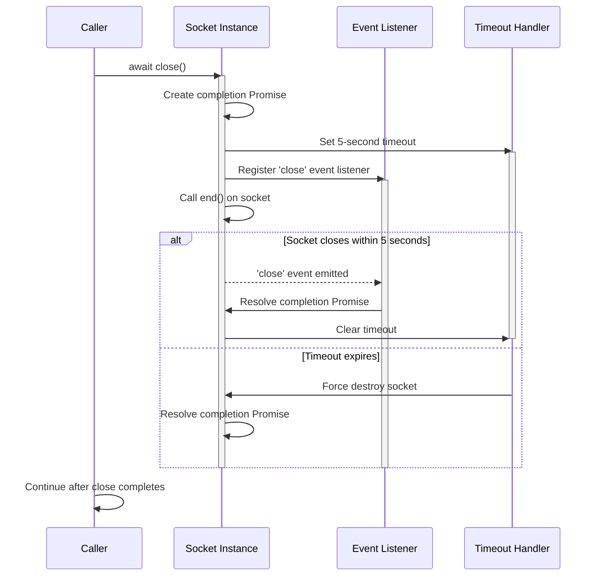

# Destroy picofuzz socket after a timeout

## Pull Request by @tomusdrw

## Summary
- Adds a `picofuzz_repeat` input parameter to the reusable picofuzz workflow (default: 10, preserving existing behavior)
- Sets `picofuzz_repeat: 1` for the jampy workflow to speed up debugging
- Test harness reads `PICOFUZZ_REPEAT` env var to override the default repeat count

## Test plan
- [ ] Verify jampy picofuzz job runs with repeat=1
- [ ] Verify other clients still use the default repeat=10

🤖 Generated with [Claude Code](https://claude.com/claude-code)

<!-- This is an auto-generated comment: release notes by coderabbit.ai -->
## Summary by CodeRabbit

* **Bug Fixes**
  * Improved socket closing behavior to ensure graceful shutdown before exit.
  * Added automatic timeout protection to force-close unresponsive connections after 5 seconds, preventing resource leaks.
<!-- end of auto-generated comment: release notes by coderabbit.ai -->


## Comment by @coderabbitai[bot]

<!-- This is an auto-generated comment: summarize by coderabbit.ai -->
<!-- walkthrough_start -->

<details>
<summary>📝 Walkthrough</summary>

## Walkthrough

The socket closing mechanism is converted from synchronous to asynchronous. The `close()` method now returns a Promise, implements a 5-second timeout for graceful shutdown, waits for the socket 'close' event, and force-destroys the socket if closure takes too long.

## Changes

|Cohort / File(s)|Summary|
|---|---|
|**Socket Closure Async Refactoring** <br> `picofuzz/index.ts`, `picofuzz/socket.ts`|Converts `close()` from synchronous void method to async `Promise<void>`. Adds timeout-based force-destroy mechanism, event listener for socket close completion, and updates caller to await the closure operation.|

## Sequence Diagram



## Estimated code review effort

🎯 3 (Moderate) | ⏱️ ~20 minutes

## Poem

> 🐰 The socket once closed with a snap and a crack,
> Now waits for a promise to bring closure back!
> Five seconds to part on the gentlest of terms,
> Then force takes the stage when the timeout returns. 🔌✨

</details>

<!-- walkthrough_end -->


<!-- pre_merge_checks_walkthrough_start -->

<details>
<summary>🚥 Pre-merge checks | ✅ 2 | ❌ 1</summary>

### ❌ Failed checks (1 warning)

|     Check name     | Status     | Explanation                                                                          | Resolution                                                                         |
| :----------------: | :--------- | :----------------------------------------------------------------------------------- | :--------------------------------------------------------------------------------- |
| Docstring Coverage | ⚠️ Warning | Docstring coverage is 0.00% which is insufficient. The required threshold is 80.00%. | Write docstrings for the functions missing them to satisfy the coverage threshold. |

<details>
<summary>✅ Passed checks (2 passed)</summary>

|     Check name    | Status   | Explanation                                                                                                                                           |
| :---------------: | :------- | :---------------------------------------------------------------------------------------------------------------------------------------------------- |
| Description Check | ✅ Passed | Check skipped - CodeRabbit’s high-level summary is enabled.                                                                                           |
|    Title check    | ✅ Passed | The title accurately describes the main change: making socket closure asynchronous with a timeout-based force-destroy mechanism for resource cleanup. |

</details>

<sub>✏️ Tip: You can configure your own custom pre-merge checks in the settings.</sub>

</details>

<!-- pre_merge_checks_walkthrough_end -->

<!-- finishing_touch_checkbox_start -->

<details>
<summary>✨ Finishing Touches</summary>

- [ ] <!-- {"checkboxId": "7962f53c-55bc-4827-bfbf-6a18da830691"} --> 📝 Generate docstrings (stacked PR)
- [ ] <!-- {"checkboxId": "3e1879ae-f29b-4d0d-8e06-d12b7ba33d98"} --> 📝 Generate docstrings (commit on current branch)
<details>
<summary>🧪 Generate unit tests (beta)</summary>

- [ ] <!-- {"checkboxId": "f47ac10b-58cc-4372-a567-0e02b2c3d479", "radioGroupId": "utg-output-choice-group-unknown_comment_id"} -->   Create PR with unit tests
- [ ] <!-- {"checkboxId": "07f1e7d6-8a8e-4e23-9900-8731c2c87f58", "radioGroupId": "utg-output-choice-group-unknown_comment_id"} -->   Post copyable unit tests in a comment
- [ ] <!-- {"checkboxId": "6ba7b810-9dad-11d1-80b4-00c04fd430c8", "radioGroupId": "utg-output-choice-group-unknown_comment_id"} -->   Commit unit tests in branch `debug/jampy-picofuzz-repeat-1`

</details>

</details>

<!-- finishing_touch_checkbox_end -->

<!-- pr_review_plan_action_start -->

<details>
<summary>📝 Coding Plan</summary>

- [ ] <!-- {"checkboxId": "6ad8a4e1-0b3a-4ea2-9b5b-d82c1f47d1f2"} --> Generate coding plan for human review comments

</details>

<!-- pr_review_plan_action_end -->

<!-- tips_start -->

---


<sub>Comment `@coderabbitai help` to get the list of available commands and usage tips.</sub>

<!-- tips_end -->

<!-- internal state start -->


<!-- DwQgtGAEAqAWCWBnSTIEMB26CuAXA9mAOYCmGJATmriQCaQDG+Ats2bgFyQAOFk+AIwBWJBrngA3EsgEBPRvlqU0AgfFwA6NPEgQAfACgjoCEYDEZyAAUASpETZWaCrKPR1AGxJclA7ES4KOmwGEkghNGZueW54JgAzbAAvJMgg7hJqSAJIAEZIAApbSDNcgAYASkhIAwBVREouAmZsRFoKAHdIQBQCSABlfGwKUJ8SPyIAegio2TBYhOSksHTM3DB8wCTCGGdSTkhmbSwavtxqVq58DKxegGEg6jouACYyp4A2MDKAZnW36HKOGUyoCAJwALWqdRsABkuLBcLhuIgOBMJkR1LBsAINExmBMAGIebDxeKyaEqRBTSJgGiIcQYSbcbAeDwTcpGAAi0gYFHg3HE+AwHAMUAAgrRaMg0Dw4vhEikAPorLLwDBM3A8ZyREg0Pg5XCwMJBVoqLwyhYpSAdfAUADW8Q8+A6ABpIEp4mhmfSiNl8Hkyr6eEEGhQpJASAAPJDeyACEiwNASeA2jQi/o65DzOWLJUkDLULj5VXZQ3hSLRK02+2Oro5RAZOiQbDcN1jfzohlpbAYRCpqC1bi0B7IA1hWkahMUciIEd++70KwASRuAHl8bUwWCFTYAKJWHei6DhjBJiiCtgYDUSZzwU1hRB+0dpPOrBTdjUMTCxsL4KQUXkSmQfYwNIGrcB4X7qCQzDIgY1RQAAapQ8CkmWMzmtmlpCIIXY9laGLPvmuAALy5Km8GQEhvKofgo58AwHjwOwyB0vALJNg0JZhO6noeBqyokeUqYGAA4mQyg0PQHQETcEHYEokA3IoYQFBgtGNsWtgVMJFiKSwF64CxjgHC4RhQM0rTtF0gghlI9AGlkWbyqkDQYJK6CQPii4AHL8FgT4Pgwto6rGeBoRWtD4NIkBqfx0jcIKUkEV53mug+GHOVa2iGSgbkkPEqpQR48jxDa9j4EFIUMfgDhBMBFltJ0+Hsdw1AMLAGWLIGSh0me8gBRVwUamg8S6h54hsIMw1SpWdrOIMbnoItDhEKQdKNk+cYJkmZUHPI5AaSeoHwEQ1DJlgxbTNEwFDratroEFakdF4tCkPZpa+O2qpEK6DkYMF9ksJZTWlXqpbWnNZ7drQrqYPQlzifQkEztgP5YFdsg6ZYSmsOo+zSIgaBrfYxnOK4aais+f4fvpePQ1FUpYJkFCMZQjAJgyY4JnFtAhBtpYY51loCYGZEU5ApUsk6YDNgouMauIuAvZAABENgkBD92BUNjCOog30q7ltBxMO7OYMTdaDSFiCYrgkUdFgW2JsmfAFKqNCXlwaC0EIrQTk65WVTlzhhNVDS0GiVChIkLLyD1uB9XQ2lmWAhgGCYUBkPD8Q4AQxDiVQklywZXC8PwwiiOIUgyPITBKFQqjqFoOj6On4BQHAqCoF+np56Q5CF42uIl2kaBdA4TguLGtfKQ3aiaNouip0YbemAYTmLBMqpKBGGiGcKKuHwYumiou+cDw89ATyZ8hymbnOIGZkDq+BaChCxVuaGHJAFFU0kGugDo2VA5DRxHrH+FRXQHFtN9LiusaqwIRoXc66BECyAwO1M8alWhLXoGQWqsCnzfzluBHU0U4ygzCJGdQ31hLmEsKKPiElzqzjgUoBiWoBR4TvpGBKFAi5lSZAIRiDBjyKyYo/NMBRvJ+naubaKOReE2kkhMIRIixHqHkPrIgGAzjBlbDQMQdANAVHoZAAAspgFCoFPJsTCKKXRxUkiUCMNCVU0U5Gc1oFwAA1LkCY6wjA7lYgcIudcjQkCTBrcMJJlFcHMXQeAjgDCHxVinMARgN4pAmNrHUe9YKpOPgws+/cJKNmvmTfgOdPFrSfouLAWSkg5M/vk1039f73zeoGNAaCMHwIaL/LgVgzzMCQCQYAEh8DwFoHoXBMUA5j2yjNXEpCuFBhYGMksWRgz4A8NXK0hp/KllyRqGOxV+nSGAuKdy0oACsYAGhMEWhNEgU1Ayg1CGAeOfU4EnJQDnJ8QRmDqWPPQSK0VYrZEoKM3RNBXT4KGLAnZQxQjPi8D0kgwEADqSyJZlQGkHSAAByb+RLwxSEvN+Shz4Hx7O+rDRaDFmYjlLC8t5goSYMHfogGOFzgIvwgu/OBvBInJhwfAVgiSHigo6Z+di/8OrSmGRshoYABAYqvrbe2WAGgAEdUYYJILDJhvJOxPITrsiWNZum9MwYKQYLEtVOgwFjSAjDdRnUFKwp87CILIK9VU8MEY+ECL4GouIGjxDSCfgkg0ih7AnVhUMMIzYhySS4PU3WPTkAAAMBhBxzblSAObGnNKDvknNUCdSwHjTm9pFRC01MbPEEZxb61cEmdMwtOQc09PQaI9t1gRljImVMmZObXWWIwNYuktizQOLQE4lxBg3HTk6Y8SAPinhfACU8FJR8RTL1XpnRad9e6EFKYPegw92CBDHiTSe8g5AKHrioeezcl6GAzsXdQCppmIFzFEjodAFR0mcBqVux63QAHZaAAA5aBvDg3BzItzQgCAACyYfiF8WgGHcjxGgxhr40G3ggheOR2gZR8pfFuQIT9UGSNvHiLckgcGvhlFoPEEgTw0BlBBNBuDDBiMjTg2UNATwsPqpBPxgQcG0AgkyAx79nG4NvCeCCXI0HoNfD4wwXIIIMNiZBGgEaiGnh4eg2UaDogSAkaE+q0RkHv3D1/f+wDTFgO0AVFnZT7cgwkAVGwCgpAFTtVELaADYH+EMYMAAbzgqrJAtgABCjpKq0BxgZKwNVJIqy4B6DwDRnSJZVkgFcf4AJKAwPliWi7iulcigwXq30lJ/iJiQepupHEnAeLVhL1Rqgq3HJSUtw9BT5P64lwbqsCCnA8PibsYgWG1dyCVmbQ3EgYK4YgLFGIOQVRawyRAtWyjTcgAAX0Sxd9bqtwk2DfeoLFZ4aDDPcErEgtXCsNaGxBOkNxDRBXVg4PiJ2uAAG1zsDY2yrcLQVvLalqyrLkiAeR8jWQDiLKtbszZVmB3ArRasJ1RjjwbKteEQVhedJHmOgr2BgdwDI9AoBKSUA9xuuBACYBMgBARBYBgC8FIDwD6b4oGQGQO8tANDY/O0N4FSgkdAKnAbUnQ2bQnVVIu2ntoEdsCRz1NH/JqfnZu1D2Xd3Ac68R1wZHh2E6wLa8oUgMuNuq3x4Tgr9WjXm/J8Gynnqas24O81+3ZrfxO7CKgMoGggQAFIDlxA6l3HsxICoMCYpeDQMBSxBH1fAII71gw1o8PQVAYmY9lFj9L1XqsdlEi4Uj57UE3R29NUQZAoM4FbeWwG0ZM5CGGmYIGQm4geX9VLEwdrpASxF92VLl3MP5efZt0r6dDIF+4/Vx2LXlvdfL9Vk1o77e0kzdNzN6HuO4dW71zb97Zor8b7J+7sH2QKAk59xTzAAekdwDHJ4MIb8DAQwDw5yBuvIcYLKYQBwxYTaXA0CsCfyYcyaqC/asAWCDq+EAC0obKeAaqGqeKwwJAXyoEPybAniSAQ+neyKhBusmQGAzY1ePuS+iuzga+RAj+Q2QQTyBURAyaX2XuNeKsW+muHg2ue+SOisXgJ+g2V21QAAurdirH9rgLYCjobg3jbmUAILkPpm8G8LkAIGUPEAwCCCRrkBZl8F8AIERhhppm8LckYfEAILQAwPBl8E8HBrxgYR6CNLcrkIhhhmgJ4UCBhtpiQNBiCLQAvkoT0ioTYHfvvuTmgF8GRgwDhhJiCKYfppYWJmJgwH4bkG8OEdZh4UCLcvYfprcopm8GgDZrQIZpkRpqRikWUAZmxkYdETbIMCXmloNLYPwUVt7kNsbLQDYN2GobyEboKNrgMT9gftMmMRgAkTMU0G/kMfMaMeMRVCcG3ogCsa/qjAYFdlBiKkFpQKFlfgBr5q3N+uegqK1K0IFvjk8acDFpBnFjEXSFYJ6OHKKLgOrEBnQFluoEpO+PlmUMcbcXgPgPcT8S8Q8D5otPoEAA== -->

<!-- internal state end -->


## Comment by @tomusdrw

@dakk AFAICT, picofuzz sends `FIN` on the socket, but jampy does not respond with `FIN`. That causes picofuzz to wait indefinitely for proper socket closure, but it never happens.

I'll patch it on our side to destroy the socket after some timeout, but might be something to look into in jampy as well.


## Comment by @dakk

> @dakk AFAICT, picofuzz sends `FIN` on the socket, but jampy does not respond with `FIN`. That causes picofuzz to wait indefinitely for proper socket closure, but it never happens.
> 
> I'll patch it on our side to destroy the socket after some timeout, but might be something to look into in jampy as well.

ok thank you for the debugging and for the workaround; I've also opened the issue on jampy


## Comment by @coderabbitai[bot]

_⚠️ Potential issue_ | _🟡 Minor_

<details>
<summary>🧩 Analysis chain</summary>

🌐 Web query:

`For Node.js net.Socket, if socket.destroyed is already true, will calling socket.end() emit a new 'close' event?`

💡 Result:

No. Once a `net.Socket` is destroyed (`socket.destroyed === true`), the `'close'` event is not emitted again—`'close'` is the terminal event indicating the stream and its underlying resource are closed and “no more events will be emitted.” Calling `socket.end()` after destruction will not trigger another `'close'` (and for writable streams, `end()` after `destroy()` results in an `ERR_STREAM_DESTROYED` error). [1], [2]

**Sources:**  
[1] Node.js Stream docs — `'close'` event semantics and “no more events will be emitted”  
[2] Node.js Stream docs — after `destroy()`, subsequent `write()`/`end()` calls result in `ERR_STREAM_DESTROYED`

---

🏁 Script executed:

```shell
# Find and inspect the picofuzz/socket.ts file
find . -name "socket.ts" -path "*/picofuzz/*" | head -5
```

Repository: FluffyLabs/jam-testing

Length of output: 86

---

🏁 Script executed:

```shell
# List picofuzz directory structure
ls -la picofuzz/ 2>/dev/null || echo "Directory not found at root"
fd --type f "socket" --path "*/picofuzz/*"
```

Repository: FluffyLabs/jam-testing

Length of output: 1034

---

🏁 Script executed:

```shell
# Search for socket.ts file anywhere in the repo
find . -type f -name "socket.ts" | head -10
```

Repository: FluffyLabs/jam-testing

Length of output: 86

---

🏁 Script executed:

```shell
cat -n ./picofuzz/socket.ts
```

Repository: FluffyLabs/jam-testing

Length of output: 3872

---


</details>

**Add a fast path for already-destroyed sockets to avoid a forced 5s wait.**

If `close()` is called when the socket is already destroyed (e.g., due to a reconnect, error, or double-close), calling `socket.end()` will fail and the 'close' event will never emit, forcing a 5-second timeout before resolution. A check for `socket.destroyed` at the start returns immediately in this case.

<details>
<summary>🔧 Suggested fix</summary>

```diff
   async close() {
     const socket = this.socket;
+    if (socket.destroyed) {
+      return;
+    }
     socket.end();
     await new Promise<void>((resolve) => {
       const timeout = setTimeout(() => {
         socket.destroy();
         resolve();
       }, 5000);
       socket.once("close", () => {
         clearTimeout(timeout);
         resolve();
       });
     });
   }
```
</details>

<!-- suggestion_start -->

<details>
<summary>📝 Committable suggestion</summary>

> ‼️ **IMPORTANT**
> Carefully review the code before committing. Ensure that it accurately replaces the highlighted code, contains no missing lines, and has no issues with indentation. Thoroughly test & benchmark the code to ensure it meets the requirements.

```suggestion
  async close() {
    const socket = this.socket;
    if (socket.destroyed) {
      return;
    }
    socket.end();
    await new Promise<void>((resolve) => {
      const timeout = setTimeout(() => {
        socket.destroy();
        resolve();
      }, 5000);
      socket.once("close", () => {
        clearTimeout(timeout);
        resolve();
      });
    });
  }
```

</details>

<!-- suggestion_end -->

<details>
<summary>🤖 Prompt for AI Agents</summary>

```
Verify each finding against the current code and only fix it if needed.

In `@picofuzz/socket.ts` around lines 97 - 109, In the async close() method, add a
fast-path check for an already destroyed socket by inspecting
this.socket.destroyed (or socket.destroyed after assigning const socket =
this.socket) and return immediately if true; otherwise proceed with the current
logic but avoid calling socket.end() when destroyed so you won't hang waiting
for the 'close' event and forced 5s timeout.
```

</details>

<!-- fingerprinting:phantom:poseidon:hawk -->

<!-- This is an auto-generated comment by CodeRabbit -->
