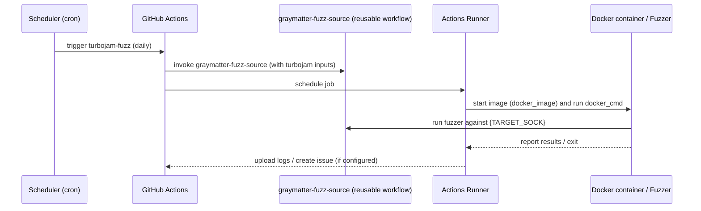

# Add graymatter fuzz source for turbojam (1M blocks)

## Pull Request by @tomusdrw

## Summary
- Add proper long-running graymatter fuzz source job for turbojam: 10 runs x 100k blocks = **1M total blocks**
- Add daily schedule (18:00 UTC) matching other implementations
- Keep existing demo fuzz job unchanged

## Notes
- Requires a self-hosted runner with the `turbojam` label for the `graymatter-source` job
- Timeout set to 60 minutes

## Test plan
- [ ] Verify the `graymatter-source` job runs successfully via `workflow_dispatch`
- [ ] Confirm the `demo` job still works as before

🤖 Generated with [Claude Code](https://claude.com/claude-code)

<!-- This is an auto-generated comment: release notes by coderabbit.ai -->
## Summary by CodeRabbit

* **Chores**
  * CI workflows now run on a daily schedule (18:00 UTC) and explicitly grant read access to repository contents and write access to issues.
  * Reusable job invocations were standardized to pass target-specific runtime parameters (target name, container image, command, memory/env, readiness hints, and mention) across multiple workflows.
<!-- end of auto-generated comment: release notes by coderabbit.ai -->

## Comment by @coderabbitai[bot]

<!-- This is an auto-generated comment: summarize by coderabbit.ai -->
<!-- This is an auto-generated comment: failure by coderabbit.ai -->

> [!CAUTION]
> ## Review failed
> 
> The pull request is closed.

<!-- end of auto-generated comment: failure by coderabbit.ai -->

ℹ️ Recent review info

⚙️ Run configuration

**Configuration used**: Path: .coderabbit.yaml

**Review profile**: CHILL

**Plan**: Pro

**Run ID**: `80603631-6a03-4a52-bee8-39e8c27fde20`

📥 Commits

Reviewing files that changed from the base of the PR and between 76bd205332959fe2dc517287290fc4013b5aecf3 and 69d2226226497cce85799517a3a6711eef40814b.

📒 Files selected for processing (1)

* `.github/workflows/turbojam-fuzz.yml`

---

<!-- walkthrough_start -->

📝 Walkthrough

## Walkthrough

Added top-level workflow permissions and standardized reusable-workflow inputs across many fuzzing workflows; turbojam also gains a daily cron trigger and a new `graymatter-source` job invoking the `graymatter-fuzz-source` reusable workflow with Turbojam-specific parameters. (50 words)

## Changes

|Cohort / File(s)|Summary|
|---|---|
|**Turbojam (schedule + new job)**   ` .github/workflows/turbojam-fuzz.yml`|Added daily cron trigger and a new `graymatter-source` job that invokes `graymatter-fuzz-source` with Turbojam-specific inputs (`target_name`, `docker_image`, `docker_cmd`, `timeout_minutes`, `num_blocks`, `num_runs`, `mention`).|
|**Workflows adding permissions + `with` inputs**   ` .github/workflows/boka-fuzz.yml`, ` .github/workflows/graymatter-fuzz.yml`, ` .github/workflows/jamforge-fuzz.yml`, ` .github/workflows/jampy-fuzz.yml`, ` .github/workflows/jampy-recompiler-fuzz.yml`, ` .github/workflows/jamzilla-fuzz.yml`, ` .github/workflows/jotl-fuzz.yml`, ` .github/workflows/new-jamneration-fuzz.yml`, ` .github/workflows/pyjamaz-fuzz.yml`, ` .github/workflows/turbojam-fuzz.yml`|Added top-level `permissions: contents: read` and `issues: write`; extended demo/reusable-workflow invocations with `with` inputs such as `target_name`, `docker_image`, `docker_cmd`, and optional `docker_memory`, `docker_env`, `readiness_pattern`, or `mention`.|
|**Workflows adding only permissions**   ` .github/workflows/jam4s-fuzz.yml`, ` .github/workflows/jamzilla-int-fuzz.yml`, ` .github/workflows/javajam-fuzz.yml`, ` .github/workflows/pbnjam-fuzz.yml`, ` .github/workflows/typeberry-fuzz.yml`|Added top-level `permissions: contents: read` and `issues: write` without changing job inputs or control flow.|

## Sequence Diagram(s)

## Estimated code review effort

🎯 3 (Moderate) | ⏱️ ~20 minutes

## Possibly related PRs

- FluffyLabs/jam-testing#16 — Modifies `jampy-recompiler-fuzz.yml` with the same reusable-workflow invocation and matching inputs (target_name jampy-recompiler, docker_image, docker_cmd, mention).  
- FluffyLabs/jam-testing#9 — Introduced the `graymatter-fuzz-source` reusable workflow that the turbojam change now invokes on a schedule.  
- FluffyLabs/jam-testing#6 — Updated `jampy`-target workflow invocations with identical `target_name`, `docker_image`, and `docker_cmd` inputs, similar to changes here.

## Poem

> 🐰 I hopped through YAML lines with glee,  
> > Scheduled runs and targets set free,  
> > Inputs snug in each little fence,  
> > Fuzzers dance — precise and dense,  
> > Cheers from a rabbit, small and nifty! 🥕

<!-- walkthrough_end -->

<!-- pre_merge_checks_walkthrough_start -->

🚥 Pre-merge checks | ✅ 3

✅ Passed checks (3 passed)

|     Check name     | Status   | Explanation                                                                                                                                                 |
| :----------------: | :------- | :---------------------------------------------------------------------------------------------------------------------------------------------------------- |
|  Description Check | ✅ Passed | Check skipped - CodeRabbit’s high-level summary is enabled.                                                                                                 |
|     Title check    | ✅ Passed | The title accurately describes the primary change—adding a graymatter fuzz source for turbojam with 1M blocks—which is the main focus of the PR objectives. |
| Docstring Coverage | ✅ Passed | No functions found in the changed files to evaluate docstring coverage. Skipping docstring coverage check.                                                  |

✏️ Tip: You can configure your own custom pre-merge checks in the settings.

<!-- pre_merge_checks_walkthrough_end -->

<!-- finishing_touch_checkbox_start -->

✨ Finishing Touches

🧪 Generate unit tests (beta)

- [ ] <!-- {"checkboxId": "f47ac10b-58cc-4372-a567-0e02b2c3d479", "radioGroupId": "utg-output-choice-group-unknown_comment_id"} -->   Create PR with unit tests
- [ ] <!-- {"checkboxId": "6ba7b810-9dad-11d1-80b4-00c04fd430c8", "radioGroupId": "utg-output-choice-group-unknown_comment_id"} -->   Commit unit tests in branch `turbojam-fuzz-1m`

<!-- finishing_touch_checkbox_end -->

<!-- pr_review_plan_action_start -->

📝 Coding Plan

- [ ] <!-- {"checkboxId": "6ad8a4e1-0b3a-4ea2-9b5b-d82c1f47d1f2"} --> Generate coding plan for human review comments

<!-- pr_review_plan_action_end -->

<!-- tips_start -->

---

Comment `@coderabbitai help` to get the list of available commands and usage tips.

<!-- tips_end -->

<!-- internal state start -->

<!-- DwQgtGAEAqAWCWBnSTIEMB26CuAXA9mAOYCmGJATmriQCaQDG+Ats2bgFyQAOFk+AIwBWJBrngA3EsgEBPRvlqU0AgfFwA6NPEgQAfACgjoCEYDEZyAAUASpETZWaCrKPR1AGxJcAgrXpEVLLM1DR8AGbYAF5R9vjYFAwkkOH4fLgJAvhCaMyQABQAjACykAIe+AwA1ogAlJCQBgByjgKUXIUA7A0GAKo2ADJcsLi43IgcAPSTROqw2AIaTMyTAGIe2OHhsgMqiJM5zGA0iOIYRJPc2B4ek109vYjtkATM2Ii0FADuPQDK8YlkgIqBgGLAuBkKFlDmBIjEwIU8oAkwhgzlIuDKILBXBC8CwjV+uGo7y4+G4ZB6AGEKCRqHR0JxIAAmAAMTIAbGAWQBmBGdaBMwocbkADg4XQAWkZfo4Qi5+OFGLBMKQJgYoH5aMg0JAKucwBRsBgMHiiJBAmhgqFKClorFEACkpAhIIUmkXplsrkOizIIaMMgAOuQQoslkAGjDvvKlRqkAAvCHI2Hk76CESPGUKtVEBp1ZBNdrILRtB55IgwXRrslUulYMkXQIGSGxWHIL1oJSCiFcGDTfxcPW+PBmNwvGwMETxPgA7U81AANIkEjjF71yAkAAeSDOZqUzHwtpiztdRrBKro88gABFRB5nNJ0C8RyR4hja2vkgADC1W0aUMAHQSJIvxPJt8lsYtpAYCh4G4acMC4dlfWYPE8GkOd8xsEgAEdsHgGkiyeDxwjAWB8FOel/XIPgvjmT9IC/SFoVyUD7zaTMP0Hb9fx7MJAMdEhQMbPNmnwE5IEmGBpAxMdMA4fMADVKHgbYGJ/II+IAoDAWE11/WQBwGCSRBEEiG55AkeAdS/L40iqcIKi+AB9WgkG4agwS/K9KRncICLybjGP3fA9KbU54BuSA7IoOM0BkEhaxIUSLEgXzWHUSA2FMtBVXsWVnFcfN0tQxkACIAElQRpeLkmYr08jhWJxDYN8XkPJluVgMqCl8sAfDwciaVoMAACFZC4Sl72wJRIAAeSuZAABYNHZOcYAQZBsG4EsJKCxtn1avB2uZblIHIhJEHDaKEDBYtVPCShkHCCgWAYyClArWD4PgGcAHJkGQsBUIwdDDtfPBRP0YxwCgMh6HwRU0DwQhSBoul6GWCdGV4fhhFEcQpBkeQmCUKhVHULQdGhkwoDgVBUEwHACGIMhlBoTGWGxrgqB+BwnHlOQFDJlQ1E0bRdDAQwYdMAwNFmQcFkmGKHKc/Z6phJqNGCDwFLK/WDFSnwKtZ9GOfygX5ERpUL0QIwNX8IjK1oat6FwWCiFIPh8hgmd6iNMn+CwAg/SNYtS3kagWw4NsO0pK9C2i+zHPwH5yQoVDTN+gMuCYSd2GQGr6EwegkAcR8vlgmgryq93FGwEyn3IH4Dt460KAE4C6uVDEaXeR8grb/8O6azvAST2KU5+OjBx4ZxchIMIJheNFF+cjAF49KEGuu2hY0oZyR1y5IKCZKgELQDx1FkSYNdyWE7Q4e8TlwXf94oZyGGYegmoAtBuB0AAb2gD4GwABxAAotAZyvw5qUgXAAX2ui1CGuBnIg3QsgQoooIyQFBswZyMYcwhijCmPBjhnIGRIddEuWV2DZ3sPASgVR8ASCvL0HadJkBBRCmBE6eIGAbFmkFRAm887+SIAkagDCPJUDYEvAoRIKDonXgvN+1QD5H1IOoqoB8v60BoRgeg2Ns71BnggLA6hkDmKzLGFKlhzCWB8B4MI0iZzcMPDwu888ELIGtlubgaRzbuiuOUeADANyTnUEwu2+YmgzhII4yAxRMCqRkpAVYkVkg+A3mWKIlAjADDxI+c85w6BcAANRdEmFyIwECIo9npKTE+JArIkB+IlWsjJih0HgI4Aw+syr21lvLOYSsVZT32FkKoaAH4xG1swXWAyDZGxNmjdm9J+ZyitoqUpqp7YFn8PSHU6dM6IGzjIbMVRmxBQINwXUrSSCZkQOSBgqlZD9jzjQScy8i7oCMSgUy2BpBcEruoZK+YIGbg8kY+kXiDx8LxBISobisBCzQP4fsNjZELyXhCVeaCN5sAKNMtAtQdGaJCKQAoaAGCXzQJMUlT8uG4HJcWd+n9v4FD+k1FeyjF6SwdBo3AYAPKz2AaAyB0DYHwIQX9NltCTEzgKJuDwDBMJGENk4lx7MLknS8YInxer/HQqCfSEJCwr4RPoeIaQBzNT0lCVayAABNHwxQBjtW4GALwUhMxKENefbOXBTllz1TYr5Bcea0mLgCsuwLl5gpoCgLAozFYCGVsnNWjL8AzLmVEBZHh8wcN2o6y14S+EBvvEGmcXA8R8KJfSEKNCjn0BsSEbgADzhqgaFAJRKjG1cFJQYXt7KNEfy0d4SAf1aX0pzTM5lL8/ojt0GO3RH99FcB5XaPl6JBX7xFWK2AkAJXgKgTAuBiDl2jqVYhSAqqGCFOKcgPZ5TIAVKWjUlkdSGkY2Fi0tpHSthBK4D0ty/TBnDLAEYNN8wM0TOzUPfiWsdZ6xWU4tZbNz6bIKvKa2r7YkOy1E+UNWd3G2OqPq9cCHU7XQtFE84Ch84/OjRi/5pcgUguilXCFUAoXfOI/Cw8B0Q4CKEckHU5ih1XPyp2ss/Z+1r0bRSidVKSAqc5QY9jdConKpxfIp6okknONcb4qjyQq1GvIyawJFBgl8CdRWm1MSDlWEoGcvVRDrkYqUG7Q8/kvBcG8grODmbJ6Ic0u3fNhbQL5Gbl6n1jzMxflI+c9xoEbFfkjSxv0MbQK0K/PGrjSahKYSgAAKVdF5jcm4BNvvrV+RsuYQpfhbW5C+yXzGgTxFcXA2pW0KVHUxAlqi2BcCQ5QL8K6oBfj3uOw+amt1EFgDBDQv0Di5GBNoAMMxIvDxmMwDg4i0ghFBCQfNAFn4yT+lNobc312aa3aPZghRjgEsFUSWQYAyQUggFfSiWBT1SovbKm703GK3q4C9TAbyKz4FyvhCgNIptauSakx6pwMlZILLk2Q+SKBPvIC+5UZTaCVM/bUgw9SWp/uablwDG5gN2dA70iDBt1QjJC+MrNqd9iHCWogaLqHllDNWabDZ9AtmFQVDbMphHDnEZOe5sN5Hqsh32rkAXQvFmQDAeoAAEgsAsYhw086+HRkEu4mPfL66x2NHHy6Jp4xoDaDMiLuwbpCS+6BMUIRueuO5iW/XXV4KIXpjH9qCEMgTbO11zFtUvmEfsW4dz9gOkofyJpfEu/iQOIcup8CzAie6L5r0PCwicrLvKD4U11xdkkWgRm4mHgCWa2glxy3WqibgeQlma0BmipQZIB43L+XpHFw8jmIk+CsBVK6tfKDhFpdIa67pIigjM18IfVe6AaqKUTnfZP30U+/VT395s6c0gZ50kDyTWfMBF1BmDXP4Nm757kWspBtdLMg2L9Z2HJdcMdkd95cHVi4EtfUnkeBlcyMB9qt6Mrdstbdcs2NaEisndwUa5g51xeFGxro8Q68G5jlop6IngTdlUHA5MPlzhBtV1FNCUF4uBDhP9ElR17tKVj4lsVsKA1t8BLgEA9RrIaQNsjgWDF1rtwd2CN1v4t0IAhVdFD1qBj0gdz0ZUr1JCOU2ADwXAt0loWQABOdkZga9VdSHHgAQmcIQxJAwAAbSJCICvnIAAF1GhUcTNdVyN1ccDvF+8/FFRW87NzUHNO9IlxBbV5doAyQg8oCaMvguAfMy0wkIlUs9U+9UVaCoAUj3EuAV1R0kDfkY1cjV10DQUeMDlKsmw0iEIuBtpS128+96Qes8Bnp3QhMwIAYSDZ4vMMjOjwQii+0RtB1nQP80hSB+i10ODSAuDVt1tuALCTQHwRDYRRjvArtTgTC2COVN1p05CD1RUlCT0QEz1pVL05VxipD0ESBtCJpp09DDDjDxizC5jIpLCHxCcSkSdSAj8P0v0f0acL9FAAMmEgMukWdwMH9IMOdoM5YX8wtVZecRDuAvsUNFk0NRcMNxcACLZtkZcCN7VW0SMYC0s4CZMo5bkyQHk/VIkVBHCzR8iUD7dAVHduNwV0BjJpBcxIVat4Y4V1w+5RFyhkhYiU1kU6U/cA4bQ2iDobEfNokZxvcbEmjkD6DRsp1DgkSNNJ1pieD1sSwqgqhESvt6CY4NBOgNAmQ/oNNti/pdjhVYRscVCTjQdDFjF6Fa1w59Sm8jYdVfDzMoJA1UU/CatbN7MeAQjnM7Vm9/Tq1AyZcAjQyp9QjokK5t8R9VImFG8kkUkTQMcMRMkvAcdL48cCkDB98PiLxviT8/ij4ATZor9gTGdQS79wTH8oTn8xlX9wsET1SvsaRlgAEvAR47RC00S3DMMzYcNLZcTPjIyoBa5Xp69HwlcM4VcSTYwU0GI9dcBDcmwfByCB9hSED+w/laUTIPFrcC5tMSs2Szz+FONOSiMixcDXQkUUU/drYgoU8IpGMQox4nRhSZTfds5vd9NF4np8V+UGDiV8geyDRRAWABzKA2ULjJ0ChlsZi+C9SDTYLjSWRTTzTkKtiuV8gIB+44L+ysk+BbSFD7SCzHSQdEEFUAVb0CgsKNVjMfTYyvCLMfDYybM29+BgikikzwiDl8yp1YNucuyvh39Rxez4LRxKLv9wcwCwzhLA9ID/VeLqjoCVzYDLlYxwdihFB0zEjnV09tLg1IAJS+AmsNBm0fdfNeiKNrkxMZpTRaDR0VShjYK+yELKLziOUtTzRuDeDJgsLDS3tIKTSzSmRAr5ttjSKnhyL/LBz907SAtkh6K1CEFHi3S70sL3jicKzydfiz9/imlAT6cGyb9mdmy+kIT2cIBoTJLOz4SZKRCohIp7xv9Ry/8sM/0pc8NdkZzQCCTlyPNVdSSMRyT7lNKToECLycsTy417zSjMDXdkAAkS5rEzddLJq4CSBZAZx6AM9kYXEHyCxsAiBsZeSeKEUDp61DguqbhZkUTMwQ4PJTIsprhxAxwhS5gQ154DMKBkB8hvK1EJjVNj4rTv4NMyAJBrpb02UyAaT+xtDkgXlRB0yIl/QUEmMJEpE/cuJ1wRJNVm9yAirD9SrKdqcazKq6zWkaqmdul79Wzmr2z004TJlOrurZkCDerH9+qJzACpz8NRr8SnKJrVyDLKMQ5Wrubs1nq+awABb3rzRLdPkZwbcCjUDVrHd1rq5IBc9xJ88Kgi8QCABuBiYUjPPEOUrADAVOYMq1TwXvHwgeesJ4famW0SMs4q0nGm0/OmxpTmRm6/FmsEhq9mznDsxW7stACQNATWYc4XX/DE//QaoA6c22IwROaW/Slyv0rcnc43TfM3C3TARA7Wy8lah3BNFkmgOPOYBPH05Pbcb8s0CyzPB2vxYcDAXrTkzVb00zPVbi6MqzAffiwIhGIS51CM+XXPAjE6eMugDvYSqoi5exNHHM9JcSwsvJEs4AJoOaJoCBaWf26m4/MqkO2nKq+s9pRs2/AYVOGOlq2E2IvncScvd6vqjOga82Ia4AvE/MfOn2wu+AzWxjfIu3bTEoxuiTGa6jPazSq8KFGFQTbwh610UTUEcTJ8KTIurGt5bYBTQYyGlCtTWGrTC4rQtIWQa6IuZ9RAZyMVMIDAF0nTBCa6MgWCPsCPUm10cReASRfvOBge5o6yp4egIWIKGkR6GkM7NtM3L07VUezwzxbwgMszaehM8M7vFzfMCfEA2oLM9HPe7HHJIs/HKm19Ssm+8/BmoEx+2q1mlsyEjmmEuOz+yYZuMAQ4M2bOQW9OgscciXbE6XcW3O0Bx2QkvS4k2W65cekuo3Pc8u6SjWqurW5jZAuupkhNQ23jSAdBnahiZ8psGU3orgMgv3Sgscags0CGtgTUqhqGzTeGjARG7TFipUoeji9Rgfceze6zfw01GewStS+egx2cgoJ28gUx0s59K+n42mxxsO5xkE2/MDaOjx2Ormnx7gAQDAFO+ZNO9DUJzErOsWka6Jx8uJg6xJ4ug3VJ/c3a6SyuhjOkmun5BkuB+8hBl3OAZIL8q3cp3LXEAMa6M8Gc0uNFEgZUKyd0eKeAWaF6N6IKeLLIgMHPQ8UvfATiSvZekOJrCZ92ERr2PptwziszIZyykZ4MgSi1YSheg5fIXPVe9vRM4ZgfNMsfRvBZ1KbMtJTHfeqxw+gnRZg/OxoO6s0O/9aqlxyO+qtnIZNsrx/Zt/S4WQQ4NAKIYJ8542S5wB7OqJuXSW4grFx5skgPCk+a62BWg57V3IXV7/TJz5pavrX5tA/56808jkrAhifkmkoUva18sU2PMpq44TV0J2tOeKJ4frdrYCzMXpyAKySTQG3dJTChoK1pi4/RThli2lg8P8kN6S1RgsalsezRni7R41UZkMoIyZpzaZxelvMZvRjeulg81Mkyvl7eoV3MrHAssV4siVy+6V6+1Ziq9ZhVzZuq7ZlVp/dV0LHxnvckNoJHZE1O1EoW/+kWiJ4akAyWosDSpLcBhJou8e4U1GsJaB753JmNP5g2gF42w8U2m0Il6NgQPu+wGgcYa2y1+wJgckayzhDma6J2jEc2itKeCt9w302lut+ljliZxMllqM1DplqZsI925DnlvtjMv2pZydlZ4OtZ+Vh++dtxnZpqqWGWOGAFa2ZGFmTOgE1gdgHmNAPmbOoWZpcmMWKmSWQwWmBQDKNBFFlhqjugZyU4ZwDEaGAwUTwoQoBgfQ8ILoEUQoFQJaToEUJkfQ7kToAAVi6E6HU/0JZHCAYBZFDBIGQgYE6DDG5GM+E6U9hkgE6HZAEFoFZGM+5G5AM+M/U5ICZFoAYFM86CZBFCi8s+s70OwQEGM7QFEHCDOkU9E6xnUEPi1EoSZvaRk/hjc9E5Y/wFYeRieFk6nBICq/k7c4MEATKnvFOCsAq7oB8FwGwkAzoBKnUF8iNFwDKhjlyvc4gGZjK48n7lq5oGciK/0CAA= -->

<!-- internal state end -->
