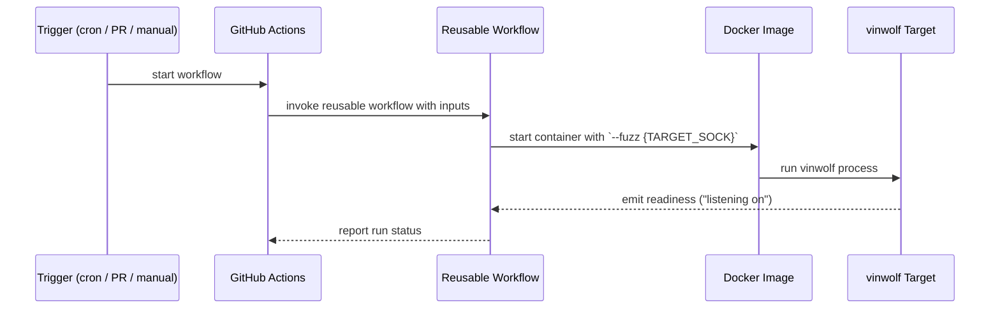

# Add vinwolf client workflows

## Pull Request by @bloppan


<!-- This is an auto-generated comment: release notes by coderabbit.ai -->
## Summary by CodeRabbit

* **Chores**
  * Added scheduled and on-demand CI workflows to run performance and fuzz testing for the vinwolf target, plus a reusable demo job for on-demand fuzz runs.
* **Documentation**
  * Updated README status table to list vinwolf under Performance and Fuzz testing.
<!-- end of auto-generated comment: release notes by coderabbit.ai -->


## Comment by @coderabbitai[bot]

<!-- This is an auto-generated comment: summarize by coderabbit.ai -->
<!-- This is an auto-generated comment: review paused by coderabbit.ai -->

> [!NOTE]
> ## Reviews paused
> 
> It looks like this branch is under active development. To avoid overwhelming you with review comments due to an influx of new commits, CodeRabbit has automatically paused this review. You can configure this behavior by changing the `reviews.auto_review.auto_pause_after_reviewed_commits` setting.
> 
> Use the following commands to manage reviews:
> - `@coderabbitai resume` to resume automatic reviews.
> - `@coderabbitai review` to trigger a single review.
> 
> Use the checkboxes below for quick actions:
> - [ ] <!-- {"checkboxId": "7f6cc2e2-2e4e-497a-8c31-c9e4573e93d1"} --> ▶️ Resume reviews
> - [ ] <!-- {"checkboxId": "e9bb8d72-00e8-4f67-9cb2-caf3b22574fe"} --> 🔍 Trigger review

<!-- end of auto-generated comment: review paused by coderabbit.ai -->
<!-- walkthrough_start -->

<details>
<summary>📝 Walkthrough</summary>

## Walkthrough

Adds two new GitHub Actions workflows for the vinwolf target (fuzz and scheduled performance runs) that reuse existing reusable workflows and update README to add a vinwolf row in the Status table. Workflows pass docker image and `--fuzz {TARGET_SOCK}` as the container command and set minimal permissions.

## Changes

|Cohort / File(s)|Summary|
|---|---|
|**Workflows** <br> ` .github/workflows/vinwolf-fuzz.yml`, ` .github/workflows/vinwolf-performance.yml`|Two new CI workflows: `vinwolf-fuzz.yml` (triggers: `workflow_dispatch`, `pull_request` limited to the file; sets `permissions: contents=read, issues=write`) and `vinwolf-performance.yml` (triggers: `cron` and `workflow_dispatch`). Both reuse existing reusable workflows and pass inputs: `target_name=vinwolf`, `docker_image=ghcr.io/bloppan/vinwolf:latest`, `docker_cmd='--fuzz {TARGET_SOCK}'` (no `./vinwolf`), plus readiness pattern and mention where applicable.|
|**Documentation** <br> `README.md`|Inserted a `vinwolf` row in the Status table (Performance and Fuzz columns).|

## Sequence Diagram(s)



## Estimated code review effort

🎯 2 (Simple) | ⏱️ ~10 minutes

## Poem

> 🐰 I hopped into CI with a twirl,  
> Vinwolf wakes, the fuzzer swirls,  
> Cron hums softly, PRs give cheer,  
> Containers purr, tests appear,  
> I twiddle whiskers — progress near!

</details>

<!-- walkthrough_end -->

<!-- pre_merge_checks_walkthrough_start -->

<details>
<summary>🚥 Pre-merge checks | ✅ 3</summary>

<details>
<summary>✅ Passed checks (3 passed)</summary>

|     Check name     | Status   | Explanation                                                                                                                                                                                                 |
| :----------------: | :------- | :---------------------------------------------------------------------------------------------------------------------------------------------------------------------------------------------------------- |
|  Description Check | ✅ Passed | Check skipped - CodeRabbit’s high-level summary is enabled.                                                                                                                                                 |
|     Title check    | ✅ Passed | The title 'Add vinwolf client workflows' directly and clearly describes the main changes, which are two new GitHub Actions workflow files for vinwolf and an update to the README documenting the addition. |
| Docstring Coverage | ✅ Passed | No functions found in the changed files to evaluate docstring coverage. Skipping docstring coverage check.                                                                                                  |

</details>

<sub>✏️ Tip: You can configure your own custom pre-merge checks in the settings.</sub>

</details>

<!-- pre_merge_checks_walkthrough_end -->

<!-- finishing_touch_checkbox_start -->

<details>
<summary>✨ Finishing Touches</summary>

<details>
<summary>🧪 Generate unit tests (beta)</summary>

- [ ] <!-- {"checkboxId": "f47ac10b-58cc-4372-a567-0e02b2c3d479", "radioGroupId": "utg-output-choice-group-unknown_comment_id"} -->   Create PR with unit tests

</details>

</details>

<!-- finishing_touch_checkbox_end -->

<!-- pr_review_plan_action_start -->

<details>
<summary>📝 Coding Plan</summary>

- [ ] <!-- {"checkboxId": "6ad8a4e1-0b3a-4ea2-9b5b-d82c1f47d1f2"} --> Generate coding plan for human review comments

</details>

<!-- pr_review_plan_action_end -->

<!-- tips_start -->

---

Thanks for using [CodeRabbit](https://coderabbit.ai?utm_source=oss&utm_medium=github&utm_campaign=FluffyLabs/jam-testing&utm_content=20)! It's free for OSS, and your support helps us grow. If you like it, consider giving us a shout-out.

<details>
<summary>❤️ Share</summary>

- [X](https://twitter.com/intent/tweet?text=I%20just%20used%20%40coderabbitai%20for%20my%20code%20review%2C%20and%20it%27s%20fantastic%21%20It%27s%20free%20for%20OSS%20and%20offers%20a%20free%20trial%20for%20the%20proprietary%20code.%20Check%20it%20out%3A&url=https%3A//coderabbit.ai)
- [Mastodon](https://mastodon.social/share?text=I%20just%20used%20%40coderabbitai%20for%20my%20code%20review%2C%20and%20it%27s%20fantastic%21%20It%27s%20free%20for%20OSS%20and%20offers%20a%20free%20trial%20for%20the%20proprietary%20code.%20Check%20it%20out%3A%20https%3A%2F%2Fcoderabbit.ai)
- [Reddit](https://www.reddit.com/submit?title=Great%20tool%20for%20code%20review%20-%20CodeRabbit&text=I%20just%20used%20CodeRabbit%20for%20my%20code%20review%2C%20and%20it%27s%20fantastic%21%20It%27s%20free%20for%20OSS%20and%20offers%20a%20free%20trial%20for%20proprietary%20code.%20Check%20it%20out%3A%20https%3A//coderabbit.ai)
- [LinkedIn](https://www.linkedin.com/sharing/share-offsite/?url=https%3A%2F%2Fcoderabbit.ai&mini=true&title=Great%20tool%20for%20code%20review%20-%20CodeRabbit&summary=I%20just%20used%20CodeRabbit%20for%20my%20code%20review%2C%20and%20it%27s%20fantastic%21%20It%27s%20free%20for%20OSS%20and%20offers%20a%20free%20trial%20for%20proprietary%20code)

</details>

<sub>Comment `@coderabbitai help` to get the list of available commands and usage tips.</sub>

<!-- tips_end -->

<!-- internal state start -->


<!-- DwQgtGAEAqAWCWBnSTIEMB26CuAXA9mAOYCmGJATmriQCaQDG+Ats2bgFyQAOFk+AIwBWJBrngA3EsgEBPRvlqU0AgfFwA6NPEgQAfACgjoCEYDEZyAAUASpETZWaCrKPR1AGxJcAgrXoS8BgA7vgeAGaMHvDskKEUANbhHvjByJAGAHKOApRcAEwADJAZAKo2ADJcsLi43IgcAPSNROqw2AIaTMyNAGIe2OHhshUqiI1CaMxgNIjiGESN3NgeHo1FJQaliHmQAinc3JibAMr42BQMJHtUGAywXGj+YIEhYZEZ0M6kuDeY91xmNosBkTrhqNgGvxuGRNgBhCgkah0dCcSBFfIANjAhQAzGAAIwAdmg+VxHCxHFx+QAWm4EMhlqtIIiAI7YaS/J60ZDxJIpNIskgeZH0AiQXCwa6vUIRKIxDCaSCZfDofzqeD4DBoDyQJSIBgUeDccRSCUkAAev2CaEZFHwgSU9CCEql1jsAkU8lysi1YrdbHBtGoaHQGHoAlu90g2rYGiMpW4wZo9EEIjEkmk9kcQJcHCMUHcuC8vn8kBl73lsT5yVS6QMUGyzFyFAKxQyUHKVUgNTqDWarUlHS6LD6AyGIzGEymM05QUWTLWGw7kG2u32+EOxxXZwuVz+dweatoLyCso+DZg3xIv0j/yPQJdO/BuEhXE3sJXNhIgRIwUoUIABQYFq1zRHMdAAJSbFAoy5B4QEgeQkDgSm0ErgiSIpqibZYji+LEqS5KUtSdIGBYkBwiwbCKsgDhOC4BYSiwkK0BQwRCtw+AUNhobhNo0QLJAADi6gABIdJAPgZlqyBCIIYb0IJCQopK1z8fAglECy2AYNUtT1E0LRtMO3RjoMwxweMkzTLM8yLGgMkYOMFC6eMZL5PkBJkoUBIEgArBMgiNJiRL+Z5RL5ESuKFESAD8vAALxFAANNmRCkHM87oJAzBIEwGDhPARAXNQmpYMEbSURUACS6AUCVNG4IgGgwXsBxHFgiKIFx4aqbA1CuiQ8jLIgUr0Hx8AWlwamQAARBojQVhEc08IiRUWigWC0PgDAqRQAD6DDMPQNoyCQ2VHIgOwTcgxzfI4sTirN7AuFxQS4GlDBoJC2UvRQ9p8HNpQYAkIHBFgD1NZAADki3LeEMNzQA3EN8iIswDr9dcvAkBtrUrgQzCsex6CICp/qDbNd6Hns1zYEmorMUNKHInMuXAnT32Qtcs01gKkBFV45rMNwIo0DGqRCuy8DdZAlpi/ADDqMxKlYAaH48JQeXXeVLXmJYVGsCrbDXWgmXZgxriXhtXA87lQTwECuowhQOuIHrilREiWAM+WZ6VvzdaQIAKARbbQStsyz3R5VytBCJCzVxNx/JS0LWbivbeUYE7OqQIBCvRMruDQQQata27SAe7JXuu+E3HMMgDBeJgfv4JECPJ4ktYcQVRUlVQ4havGDZgIYBgmFAZCppEP0EMQZDKNhMfsFwvD8MIoimlmcgKEoVCqOoWg6PoE/gIWDIoHdkN4IQpDkIPKIr4qXBUBx9G5t68hMPvKhqJo2hdBjyMGfUwBgNCDnaAIRoQc0hLQDhEMA4RsAAC8UEaFkMwDw+Y5q4PIpYHwNUF4PyZh/Zw8h26MAGgsaQRg/A8hyuQDiolcASQEFJJyvIU491RJACBJloGwPGAjJBqD0GYN1LGFEc1ehiK4AjBakAaq/FwEaDKAF+AVW4QKA6EcerUGjJgVMWBFzSw5HMO6Qwt5/TdIgKY6lNIkFagAETxkELMrt3ae3rnwAqNBaL50RE8aCRir4OCzIBYIRoaCQVajVRU9paDYCuHdSA8l2FzSUJjVakpBqIh5sgF6FokD2T4Y0fhQ5BHaLrI0LJhBEDnEuE4iRXdU4cVCVdHYyAgjLGajNa8uADpSPkQg8IaUdp7UoAdXOpAuBEFgIaDQmpGgbi3BgeBbwIgcHFpycZu19pHROlwGGEBkFoMgAAb2gD4GwwkACi0ADonAAPJwgANIAF8YZpSCRHcg10DpHFqJQPSsNUJkGylqb5XsmrlS4KszqrU4DXAmQc46AQdQcivpABmyZVKqntqcsRlzrm3IeU815nz84gTKZ3XGG1YkGwyPgqSHgaCD09s9N0Shm7ODKjXShCtuLYW4jwDoRd5aKg1LQy8KpyBMoALKYHgOETkkBeiOKktqDwsgUGUCMJkZ5mQ7nGEaECHOqq5gHXTuPCo7im7UNILQLgABqLyjQcQGFwXNAsYCKlQJgdUuBIi64N3+M0rBOC8EUUIcQpeKIyEuH4JEe4mBMoGr/CJcSklpJD2cq0nh6deH+o6IG7uAphGjLAKGt24aMFYL1G4nOQlQwGnGisFEoTzXYB1DqmYajSAH2FjW81VxGhnJQeadmPj/abPCEigdAEuCGi1JAYomJIAACot07tCbA3RSAgX3CRW6WBQoCllJLVU8tNT8l2P2CQatSt25iPrbqSqkotq9KhOCBqN4hn2JGXOvZkzDozO8JAeZizlkIswBs882y2afT1PsqZ6KuBEvOVcm59zHkvPeR8keMa2VL05aqWaPKRQcoFZEIVPEUSiuWPsJWkrxDiBlY2VUdGUxLHFSxyjfK83IExhHIqdAR52v+VQtNdBXUEgACwesKF6vBo8wBGBsHcnwziFV3I0EclTPqY1EPvvG+giaKEpsdRxqS/hO0xkzfaDiM7Zo0CmLO88W0WZgghIUlQwtAJWEoD40d1xQmyPOUwAYzBnKQTSkEQ0SIPZCVmqhZN5opjID0WLNAshxMgJZT4Ej1H81cpRaIKj/L82CotFxejqY+BMYlewaViAmJypIIq5VlrfgauFj4bVur9UGEk1mVNNDnWQBdQSJTRg7lZSBMvRQ1xES/g4njHxaIFV0HgI4Iwo2HUycm9N2b3rfXj0npKmeOB56mcfvQZ+aI36W0/nsb+y2D7/2PkAwwl2Y7qGmTyA6q2Yj/loAdOYzhfin1AVABg8PvpoAAJwAA5aD+UKCQAQBISA47oJiNA/l5OOXCv5IkmJiQo78sj/yhOfuw72AT/IAhCis98piXEKPMQCFVYUBgAhHK4hICQfIdmBC0HkwIJHAucdI4JPTy7BIkfhH8tzzEDBcR+XJ0z/I4RMf5EJ/J8IBIOfyZR0LtABJwi4jQESFQCvz6MFoGjgkKOGAKaePD4n8nceFAp/5JHaASDyYYJiYMmJRBEnCAIK4yv6cM/+4M+AQOQd/joAdaeDuIBrRIAdNgf6jpSj2ogCHv7ofAIMBcgwJQ5pIFsAAIRSJM2gRsmpWHwBBWgc0uD8QQiQFK1f5pIGeVIAGyelAYG74LHUOwB814mXMI0CwqKj/NiQeJ7LtU+ZoFPi5Hy5/zR/iQGwf91AAHV7Q0CsBQIsXgp+99n4PuaY1zgeFoI3/Zth78z/70/iOtAbBdJnFdowQl8iBEA4Qi8Egp9VEOQD9Mlk9ACMBb8SBIDRBoCZpXJf959ECgDpBDRjQ800C9pv8+94DlI6AaprpzFQCp9cFyDbRcBiCEhvwHA2VEAp8ABtQfEoKvEofgw/KAzIexOg1xA0I0E0cqSiKAuaA/AQ5/F8SEGArAuQ/guaQuTAKrOg5g+wBIY0GEegKAKiJQE/Q+XAQATAJkAEB5kwAvApBdQLNsUyB/NxNZCeC1CRMSA6CbQKBm0iA3CBCa9uJioggdRmDhC2A6D9QCDJCtQfUBD993C+DAi5p7h0CIivCuA5oUCqF0CAiUjIdXwODMC4D3Ca8NDtQ806DkUJRPBrgYZ6EPNKxm4FRrQg1EAYY9RZYt4dUvZm4kQKBejoijRchCkAxOZxtMo0pggEBDFEQJRQgHNmFs12Fc1PYz105kAZ1O5QljhcVkRmZZpNNtNdMUMGBHopUUs3RuQNRh58j5DPDvDnA/D7i1DEQ+5ioLhMjp8yCyj5pgjWhtVwiRCsi2M793DEiBDkj5C0i9oMjRDdpF9soV9lBSBXia9CilCSjsCUiKitCsiVRBZdJOFBZzhwwvNZpJiURNjmYfxMUDiF9VFsomBV9SBWoTg9DDhspGSwCFBWTrhYSEgNB0T5puowg8Byo6CL91AUVESmSFgtjRVZpkE7ghMHZdYriSBmBmY7FxBEBhho4sYqBSBXRupYAwhaBhTVCa9HisifCXjrT/i1FQiPBgTIisieT5wOCITB8ABdBguYWwFAug/yE3NATEJHfIeTXEIkFHAQfIaXAkeMlQJHI3FHNANAeTeTJHUQWgaKcITyFXeTdXZHcIFHEgIkDXYXAnK3fIPGeTIoIYH1D5YwR3XGPPSgUgQvdAkvTPU+S7OefAQFH6HYUvZEMcniePC5OaEUQMkcugHwXAb8NbOgVvdQKiXSXAbvfyFshnQc4cnmMcmgDPck/QIAA -->

<!-- internal state end -->


## Comment by @tomusdrw

@bloppan can you take a look at this failure: https://github.com/FluffyLabs/jam-testing/actions/runs/23221230115/job/67522727307?pr=20 I think there is some misconfiguration with CLI args.


## Comment by @bloppan

Hey @tomusdrw , pushed a fix — the ./vinwolf prefix in docker_cmd was being passed as an argument to the entrypoint, causing Error: Unknown argument './vinwolf', so I removed it.


## Comment by @tomusdrw

Can you also please update to latest main? The workflow file template now needs token scope explicit permissions defined.


## Comment by @tomusdrw

@bloppan can you look at the minifuzz issue? Failure here indicates some conformance mismatch (unless it's spurious, which I doubt).


## Comment by @bloppan

@tomusdrw I found a bug on my impl, now I pass all minifuzz tests. I've updated the docker image.


## Comment by @coderabbitai[bot]

_⚠️ Potential issue_ | _🟠 Major_

<details>
<summary>🧩 Analysis chain</summary>

🏁 Script executed:

```shell
#!/bin/bash
set -euo pipefail

REPO_PATH="bloppan/vinwolf"
TAG="latest"

TOKEN="$(curl -fsSL "https://ghcr.io/token?service=ghcr.io&scope=repository:${REPO_PATH}:pull" \
  | python -c 'import sys,json; print(json.load(sys.stdin).get("token",""))')"

if [ -z "$TOKEN" ]; then
  echo "FAIL: could not obtain anonymous pull token for ${REPO_PATH}"
  exit 1
fi

STATUS="$(curl -sS -o /dev/null -w "%{http_code}" \
  -H "Authorization: Bearer ${TOKEN}" \
  -H "Accept: application/vnd.oci.image.manifest.v1+json, application/vnd.docker.distribution.manifest.v2+json" \
  "https://ghcr.io/v2/${REPO_PATH}/manifests/${TAG}")"

echo "Manifest HTTP status: ${STATUS}"
test "${STATUS}" = "200" && echo "PASS: image appears publicly pullable" || { echo "FAIL: image may be private or missing"; exit 1; }
```

Repository: FluffyLabs/jam-testing

Length of output: 836

---

🏁 Script executed:

```shell
# Check if the workflow files exist and examine their structure
fd -t f 'vinwolf' .github/workflows/

# Get the content of the performance workflow
head -30 .github/workflows/vinwolf-performance.yml

# Check if vinwolf-fuzz.yml exists and uses the same image
grep -n "docker_image" .github/workflows/vinwolf-fuzz.yml 2>/dev/null || echo "File not found or no docker_image line"
```

Repository: FluffyLabs/jam-testing

Length of output: 616

---


</details>

**The Docker image `ghcr.io/bloppan/vinwolf:latest` is not publicly accessible.**

The image requires authentication for pulling. Anonymous pull attempts to the GHCR registry returned `401 Unauthorized`, confirming the image under the `bloppan` user namespace is private. This workflow and `.github/workflows/vinwolf-fuzz.yml` (which uses the same image on Line 14) will fail at runtime with an authorization error.

Per coding guidelines: "The Docker image must be publicly accessible ... If the image is under a private org or user namespace, flag it as a potential issue — the workflow will fail with 'unauthorized' at runtime if the image cannot be pulled without credentials."

<details>
<summary>🤖 Prompt for AI Agents</summary>

```
Verify each finding against the current code and only fix it if needed.

In @.github/workflows/vinwolf-performance.yml at line 16, The workflow is
referencing a private Docker image via the docker_image key value
'ghcr.io/bloppan/vinwolf:latest' which will produce 401 Unauthorized at runtime;
either replace that value in vinwolf-performance.yml (and the same reference in
vinwolf-fuzz.yml) with a publicly accessible image tag, or add steps to
authenticate to GHCR (e.g., use actions/checkout + docker/login-action with a
PAT or GITHUB_TOKEN) before pulling so the runner can pull the private image;
update the docker_image reference or add authentication steps consistently
across both workflows.
```

</details>

<!-- fingerprinting:phantom:poseidon:hawk -->

<!-- This is an auto-generated reply by CodeRabbit -->

✅ Confirmed as addressed by @bloppan

<!-- This is an auto-generated comment by CodeRabbit -->


## Comment by @bloppan

The docker image has been changed to public.


## Comment by @coderabbitai[bot]

<details>
<summary>🧩 Analysis chain</summary>

Let me verify that the image is now publicly accessible.

---

🏁 Script executed:
```
#!/bin/bash
set -euo pipefail

REPO_PATH="bloppan/vinwolf"
TAG="latest"

TOKEN="$(curl -fsSL "https://ghcr.io/token?service=ghcr.io&scope=repository:${REPO_PATH}:pull" \
  | python -c 'import sys,json; print(json.load(sys.stdin).get("token",""))')"

if [ -z "$TOKEN" ]; then
  echo "FAIL: could not obtain anonymous pull token for ${REPO_PATH}"
  exit 1
fi

STATUS="$(curl -sS -o /dev/null -w "%{http_code}" \
  -H "Authorization: Bearer ${TOKEN}" \
  -H "Accept: application/vnd.oci.image.manifest.v1+json, application/vnd.docker.distribution.manifest.v2+json" \
  "https://ghcr.io/v2/${REPO_PATH}/manifests/${TAG}")"

echo "Manifest HTTP status: ${STATUS}"
test "${STATUS}" = "200" && echo "PASS: image appears publicly pullable" || { echo "FAIL: image may be private or missing (HTTP ${STATUS})"; exit 1; }
```

Length of output: 63

---


</details>

`@bloppan`, confirmed! The image `ghcr.io/bloppan/vinwolf:latest` now returns **HTTP 200** on an anonymous pull attempt — it is publicly accessible. The concern is resolved. ✅

<!-- <review_comment_addressed> -->

---

<!-- This is an auto-generated comment: tweet message by coderabbit.ai -->

If you found this review helpful, would you consider giving us a shout-out on [X](https://twitter.com/intent/tweet?related=CodeRabbitAI&text=GHCR%20image%20ghcr.io%2Fbloppan%2Fvinwolf%3Alatest%20caused%20401%20Unauthorized%20in%20workflows.%20Fix%3A%20make%20the%20image%20public%20or%20add%20GHCR%20auth%20(docker%2Flogin-action%20%2B%20PAT%2FGITHUB_TOKEN).%20Try%20%40coderabbitai%20%F0%9F%9A%80%F0%9F%94%8D&url=https%3A%2F%2Fgithub.com%2FFluffyLabs%2Fjam-testing%2Fpull%2F20%23discussion_r2950059521)?

Thank you for using CodeRabbit!

<!-- end of auto-generated comment: tweet message by coderabbit.ai -->


<!-- This is an auto-generated reply by CodeRabbit -->


## Comment by @coderabbitai[bot]

_⚠️ Potential issue_ | _🟠 Major_

**Add explicit `permissions` to match the updated workflow template requirement.**

This workflow currently relies on default token scopes. Based on the current PR context, the branch needs the latest template pattern with explicit token permissions; without that, runs can fail or have unclear privilege boundaries.  


<details>
<summary>Suggested diff (scope values should match your latest <code>main</code> template)</summary>

```diff
 name: "Fuzz: vinwolf"
 
+permissions:
+  contents: read
+  pull-requests: write
+
 on:
   workflow_dispatch:
```
</details>

<details>
<summary>🤖 Prompt for AI Agents</summary>

```
Verify each finding against the current code and only fix it if needed.

In @.github/workflows/vinwolf-fuzz.yml around lines 3 - 17, Add an explicit
top-level permissions block to the workflow to replace relying on default token
scopes: update the .github/workflows/vinwolf-fuzz.yml file (the workflow that
defines the "demo" job which uses ./.github/workflows/demo-source.yml) and add a
top-level permissions mapping matching your latest main template (include the
exact permission keys/scopes required by the demo-source template, e.g.,
repository contents, pull-requests, workflows, or any other scopes your main
template specifies) so the workflow runs with the explicit token privileges
expected by the template.
```

</details>

<!-- fingerprinting:phantom:poseidon:hawk -->

<!-- This is an auto-generated reply by CodeRabbit -->

✅ Addressed in commit cd8d18c


## Comment by @bloppan

Done


## Comment by @coderabbitai[bot]

`@bloppan`, thanks for the update! The explicit `permissions` block has been added in commit cd8d18c. The workflow now runs with clearly scoped token privileges, which keeps it aligned with the latest `main` template. 

<!-- <review_comment_addressed> -->

---

<!-- This is an auto-generated comment: tweet message by coderabbit.ai -->

If you found this review helpful, would you consider giving us a shout-out on [X](https://twitter.com/intent/tweet?related=CodeRabbitAI&text=Added%20explicit%20top-level%20permissions%20(contents%3A%20read%2C%20pull-requests%3A%20write)%20to%20match%20the%20workflow%20template%20%E2%80%94%20prevents%20failed%20runs%20and%20narrows%20token%20scope.%20Try%20%40coderabbitai%20%F0%9F%9A%80%F0%9F%94%92&url=https%3A%2F%2Fgithub.com%2FFluffyLabs%2Fjam-testing%2Fpull%2F20%23discussion_r2952339499)?

Thank you for using CodeRabbit!

<!-- end of auto-generated comment: tweet message by coderabbit.ai -->


<!-- This is an auto-generated reply by CodeRabbit -->


## Comment by @tomusdrw

Can you bring this back so that we can test while it's still a PR?


## Comment by @bloppan

yeah, done!
