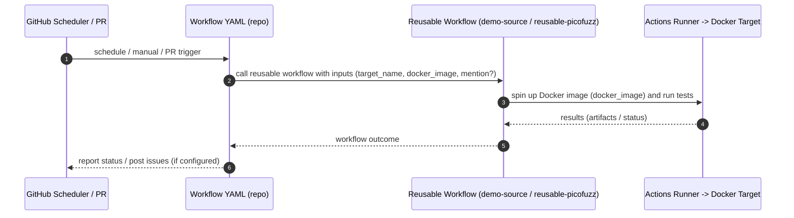

# Add new fuzz targets

## Pull Request by @tomusdrw

## Summary

Adds seven new JAM implementations from
[`davxy/jam-conformance:scripts/targets.json`](https://github.com/davxy/jam-conformance/blob/main/scripts/targets.json)
that ship pure Docker-image targets at gp_version 0.7.2:

| Team | Image | Mention | Source PR |
|---|---|---|---|
| jamduna | `ghcr.io/jam-duna/duna-target:latest` | `mkchungs` | [jam-conformance#198](https://github.com/davxy/jam-conformance/pull/198) |
| jamzig | `docker.io/jamzig/jam-conformance-target:latest` | `boymaas` | [jam-conformance#4](https://github.com/davxy/jam-conformance/issues/4) |
| tessera | `ghcr.io/chainscore/tessera:latest` | `prasad-kumkar` | [jam-conformance#63](https://github.com/davxy/jam-conformance/issues/63) |
| tsjam | `ghcr.io/vekexasia/tsjam-target:0.7.2` | `vekexasia` | [jam-conformance#139](https://github.com/davxy/jam-conformance/pull/139) |
| jambda | `ghcr.io/archelabs/jambda-fuzz-target:latest` | `libingjiang47` | [jam-conformance#200](https://github.com/davxy/jam-conformance/pull/200) |
| jamixir | `ghcr.io/jamixir/jamixir:0.7.2` | `danicuki` | [jam-conformance#201](https://github.com/davxy/jam-conformance/pull/201) |
| spacejam | `clearloop/spacejam:latest` | `clearloop` | [jam-conformance#202](https://github.com/davxy/jam-conformance/pull/202) |

Each team gets a `*-performance.yml`, a `*-fuzz.yml`, a
`teams/<team>/.gitkeep`, and a row in the README badge table — same
minimal pattern already used for graymatter etc. (image-only, no
`docker_cmd`, relies on the standard `JAM_FUZZ_*` env vars).
Maintainer mentions sourced from the original PRs/issues on
`davxy/jam-conformance`.

Also drops the stale **\"Dashboard deploy workflow trigger\"** step from
`agents.md` — `deploy-dashboard.yml` no longer uses
`workflow_run.workflows` and discovers teams dynamically from
`teams/*/`.

## Test plan

- [ ] Verify each Docker image is publicly pullable: `docker pull --platform=linux/amd64 <image>` for all seven
- [ ] Trigger each `*-performance.yml` via `workflow_dispatch` and confirm minifuzz + picofuzz run end-to-end
- [ ] Trigger each `*-fuzz.yml` via `workflow_dispatch` and confirm the demo graymatter source job completes
- [ ] Confirm the seven teams appear on the dashboard after the next `deploy-dashboard.yml` cron (or manual dispatch)

🤖 Generated with [Claude Code](https://claude.com/claude-code)

<!-- This is an auto-generated comment: release notes by coderabbit.ai -->

## Summary by CodeRabbit

## Release Notes

* **New Features**
  * Added fuzzing and performance testing workflows for seven new targets: jamduna, jamzig, tessera, tsjam, jambda, jamixir, and spacejam.
  * Updated status page with testing badges for newly supported targets.

* **Documentation**
  * Updated onboarding guidelines with standardized workflow naming conventions.
  * Refined new team PR requirements and review checklist procedures.

<!-- end of auto-generated comment: release notes by coderabbit.ai -->


## Comment by @coderabbitai[bot]

<!-- This is an auto-generated comment: summarize by coderabbit.ai -->
<!-- walkthrough_start -->

<details>
<summary>📝 Walkthrough</summary>

## Walkthrough

Adds multiple GitHub Actions workflows (fuzz and performance) for several targets and updates README and agents.md to add status entries and enforce a workflow naming convention; workflows delegate to existing reusable workflows with target-specific inputs.

## Changes

**Workflows and Documentation**

|Layer / File(s)|Summary|
|---|---|
|**Workflow templates / triggers** <br> `.github/workflows/*-fuzz.yml`, `.github/workflows/*-performance.yml`|Many new workflow files added (fuzz and performance variants) each declaring name, triggers (cron, workflow_dispatch, pull_request path filters) and repository permissions where applicable.|
|**Reusable invocation / inputs** <br> `.github/workflows/*-fuzz.yml` (calls `./.github/workflows/demo-source.yml`), `.github/workflows/*-performance.yml` (calls `./.github/workflows/reusable-picofuzz.yml`)|Each fuzz workflow reuses `demo-source.yml` and supplies `target_name`, `docker_image`, and `mention`. Each performance workflow reuses `reusable-picofuzz.yml` and supplies `target_name` and `docker_image`.|
|**Targets added** <br> `README.md`|Inserted Status table rows for new targets (jamduna, jamzig, tessera, tsjam) with badges and links.|
|**Onboarding / naming rules** <br> `agents.md`|Reduced required items for new-team PRs (5 → 4), added "Workflow naming convention" section, updated checklist to validate workflow naming, and adjusted deploy-dashboard discovery note to teams/*/.|

## Sequence Diagram(s)



## Estimated code review effort

🎯 3 (Moderate) | ⏱️ ~20 minutes

## Possibly related PRs

- [FluffyLabs/jam-testing#35](https://github.com/FluffyLabs/jam-testing/pull/35): Related to changes in `demo-source.yml` caller behavior (docker_cmd input adjustments) that affect newly added fuzz workflow calls.
- [FluffyLabs/jam-testing#37](https://github.com/FluffyLabs/jam-testing/pull/37): Related to changes in `reusable-picofuzz.yml` inputs (docker_cmd optionality) used by the new performance workflows.
- [FluffyLabs/jam-testing#9](https://github.com/FluffyLabs/jam-testing/pull/9): Related documentation changes to agents.md and onboarding/checklist guidance.

## Poem

> 🐰 New workflows hop in line,  
> Crons and PRs keep perfect time,  
> Reusable calls spin up the run,  
> Badges gleam beneath the sun,  
> A rabbit cheers: the tests are done!

</details>

<!-- walkthrough_end -->

<!-- pre_merge_checks_walkthrough_start -->

<details>
<summary>🚥 Pre-merge checks | ✅ 5</summary>

<details>
<summary>✅ Passed checks (5 passed)</summary>

|         Check name         | Status   | Explanation                                                                                                                                                                                                                        |
| :------------------------: | :------- | :--------------------------------------------------------------------------------------------------------------------------------------------------------------------------------------------------------------------------------- |
|      Description Check     | ✅ Passed | Check skipped - CodeRabbit’s high-level summary is enabled.                                                                                                                                                                        |
|         Title check        | ✅ Passed | The title 'Add new fuzz targets' directly aligns with the PR objective of adding seven new JAM implementation targets (jamduna, jamzig, tessera, tsjam, jambda, jamixir, and spacejam) along with their associated workflow files. |
|     Docstring Coverage     | ✅ Passed | No functions found in the changed files to evaluate docstring coverage. Skipping docstring coverage check.                                                                                                                         |
|     Linked Issues check    | ✅ Passed | Check skipped because no linked issues were found for this pull request.                                                                                                                                                           |
| Out of Scope Changes check | ✅ Passed | Check skipped because no linked issues were found for this pull request.                                                                                                                                                           |

</details>

<sub>✏️ Tip: You can configure your own custom pre-merge checks in the settings.</sub>

</details>

<!-- pre_merge_checks_walkthrough_end -->

<!-- finishing_touch_checkbox_start -->

<details>
<summary>✨ Finishing Touches</summary>

<details>
<summary>🧪 Generate unit tests (beta)</summary>

- [ ] <!-- {"checkboxId": "f47ac10b-58cc-4372-a567-0e02b2c3d479", "radioGroupId": "utg-output-choice-group-unknown_comment_id"} -->   Create PR with unit tests
- [ ] <!-- {"checkboxId": "6ba7b810-9dad-11d1-80b4-00c04fd430c8", "radioGroupId": "utg-output-choice-group-unknown_comment_id"} -->   Commit unit tests in branch `td-check-jam-conformance-targets`

</details>

</details>

<!-- finishing_touch_checkbox_end -->

<!-- tips_start -->

---


<sub>Comment `@coderabbitai help` to get the list of available commands and usage tips.</sub>

<!-- tips_end -->

<!-- internal state start -->


<!-- DwQgtGAEAqAWCWBnSTIEMB26CuAXA9mAOYCmGJATmriQCaQDG+Ats2bgFyQAOFk+AIwBWJBrngA3EsgEBPRvlqU0AgfFwA6NPEgQAfACgjoCEYDEZyAAUASpETZWaCrKPR1AGxJcAgrXpCaMy02BhoADSQgcwAXvBEkTSIiMqRmPS4iNGQuM6kmZAAFLaQZgDMABwAlJCQBgCqKRRcBMzYiLQUAO6QgCgEkADK+NgUDN45tGAMsKIA1mDRU/gYAGb4FMyYY2C5FPnIgEmEMHkknJCb8Fj9A7m47Vz43GR9kADCFCTUdFwATAAMPwAbGA/gBWEGA6A/ACMHD+AHYOAAWP4ALVqDRsABkuLBcLhuIgOAB6YlEdSwbACDRMZjEgBiHmwKxWsixKkQxMWSXEGCIxO42A8HmJlSMABFpAwKPBuOJlhwDFA/LRkCkpFgAFI+ACyKGY3C8bAwt3gy2QuFg1B4FHwEngSh4IxIkHF+AYs0oYHgm1IOROBUKRG4AH0pBREGasH8NPCND8aohhqM6JAVrbmJBaGgJAAPWRcoJLVbrTYYMYcRDS2WZYm7fYaIRJjCK2pQaIhMIvIiwaUaM2F5hgTtoYkjnYBjgeL6IXBFY3ylvnWbTUJERA1fpMEsbLYukpmaEATgqBjbUSCcSIL1o7s9FH7+EHV8HxbWu/LJAne1OU5nc8KBcoy4AR8FkTY0A3F4kAcF0zCRM9dByaQmjQbtewfAdpm0DAq3WEg6xQ5Q/x5ed2GAm1ILQSZZkcWZnE3FBkmwODATKRCoEybJ+h7PsBykT1c0g+BRy4ot61/GM4x+MiTQogSSCEyM0EYg9oTKI8OIvZgBGzdC+KfZxphIacBE5aJdLQMAVmwGIYm/fISOkACgIVSAPHgNQ+SEES+SReFVLsMx/j+LTongXN4D4HiMMfQcIqi+LIuaKT41kxcuGzDB4AYbBZngQLSn+aEtMQbg0DGbjGC8ZwPHwR5iTKiqSGiJzZ3SiiGBqig6seQrgoBJVIHpdZIE+aZkKCHIZmsOxqNVLg0IAKjAJ4KHfMsxg0cCPDSSAVpsuztuYXbJuYTlgBoII9GJDRyVwT0SG4NIMHoNCbAAUR8cUdQ+yABGo0gJwELxIFtLoNGOH8CmcF0fTQIHlg8eRCgwfAszvSgQwYYIanSMGTPkZZ7FyV7nHobUdRDel6lRVEQyWsaMHtW0MAXSAJGcESQekSGdRw3JLkoc5yPNdAPnsZMxnodMWGml11niS40A8LMc3zV9tw2vdZs5GCWMQDQhpsEhmDtaR5ZJlWXQAInFSDYFA8msyeur5C6dZZhWOqelwGUiFICgbZJp60wzdBSBNQ3gn+0Q0HaF0lENMDhwdp2KFoY7VbR9zlkDyAE+QD2KC9n2QwoUINGL0v8C6ZB8doJAmHDC1PnOrNZDCZgcpV5Gw7lq7zuJJbbrcZyeGnLBCmMj0PPay5ZqqRUoAANUoeBWTGirYFdTG+Hhv1UEFEGcr7wVhRULxMr3p1hV0Vbp1wDaAF4PIwbBc2JIJaEBJFIGAA+JBDBQGgP7fO40d4rTWtrT8Wd0CvQUKsKKmZu7ZUOjESAABqHgOV8DoLBqEJmkwCBgDILQIaoD4jgO3vtaytkYhwPxlrZBlslBm0gEQKg4FqA0D4EmEYYwoiCAUAaLwSQhqvGWCsFhloXTqmeIPeu3AnjOH4FgWRatECO3wM7NAKxeGW3ILmOcSc3apy0enTOO1GCs34HwMs2AVZZiQOVXA0xzCWEkawdQItkgIwtg4JwLg3AzUuF1bASh6C0m7nONgfi/S3lygueu/hLjXgstmSI4VkovXoE1SqU0JKZAANwoDnGjJI8sUjTQ+C6RR9gujqGMjLcOABxdQAAJKkYAPg1WqV5LmFsCC7w9MLQB9cEGyI+O+F0CdLaICCC6VB8NVaALAEjeQrjeFYEgpbfAUyzqGzeIQeOlp8KTDkCLXI2ZchMRtNIdgRsDAWEgPUbgNzUyCBEGISQATHCbGCc8ywJRAkAtcAYdwuAr6QBVNpEcWTLzxESERKgiQshBARTpTJ2kEoUFyfYcqBTMxFOQHUAAco4AQlAuCVAxPUbEuJ8SEhJGSCkVIaQsAZEyFkbIOSvh5GkgUQoRS0rqI0alOQWDtE6D0OoQwBEugEFQcssAWiTBnvMRYWtSx7gcqcQ4UN8j/WVdMLgFwsBytuPcfgTwLUGHeJ8Ggb0zj/CBCCcEfxIQwjhIiFEqIJRShlHKYCQ0VRqhIBqSA5AeiU31IaU27BqBRgtFaOcvA7QOhdIKCWbpRkUG9L6OpAZkBBlDC3KMkBUoJklgqlpctsx5gLFqqROrPyVmrHKTkJLGzNlbEhDsoQ0IxQMq+EcY5B16s4I/cegFRZLmYCuSkfINxhURdefoiT7xxWiC+ZtO5NpfiKW1Fyc6QJgQgiu88SRUL6Uwk+bClw8IfEIskYi072qzrkm5XgVEaJ0QYlpMSmZh13uJApJSIk6zoqHEeqtHU3LgeEipVdWKh0cNigOIyMxTLmSCJZOhdlJ3Hvg0uDyXkiA+UwEQfyVQUO4tvduoIuKkpRThLGNKn6Mpq2yrlfKtHzz5JalNLc3VercEaoSoTzBiOcc6qJ+q3BaNQBGnwCBZ1LYlHmkSdAtDoGtq2jtPaB16FZ2RUEC6g8bp3XUI9Z68C3qQE+t9X6/1AZFp5mDWukNoDFvFnDQt6yMB91RujTdWMca0Dxgg3pRMsCznSM7Sm1Nab00ZmQFmyx2acxlJfXmQ1+aXEFuQexc764S1yJ6LAstiUzUVuSMIqsG0az3TAwRtg9bMQtoUQ8J5IjwT62xPr6kjx9ZCqNv40JxsJiNlAE2ZspAprkbkUGds046Izi7ZO7tPbe1rjkMBlBg6zlDtViO7Bo70CpQweO1TTEp2zBY9bViTpRvRnVPkwtC6QGrrtro5dK4/Z9hM+gjc8It0Of3YlbdOQjyedAcehpMBFA1XPOcYSmSRJQFgWwS8hprxlJvNTub7z6n8Xc4+HkuqbOFblooYW+Dn1VhARHT9Syv0uB/L+wRf7/0AXoKoM2YAHdUzQqBlBWskEYQg5hGxziXA3vQrBOCmD4IrlgMhOxCBkMF5QgOws1PGaOtYphUiZEzTYejThaBuH4mFvwlMQiBAiPjUkQXkikGy40fI9R0P0DKM+HwYmGiHvaN0fo4WGijEmNdvdtb5M4HSmJqNBxTjQeuOmE8/QxhwBQDIfwFYOASGR2UE6kRC4uC8H4MIUQ4gFv/XkEwJQVBVDqC0DoLPJgQEIGQKgJHpzCDF6oKX6J7AuBUB6KC5w8hLmN+UC3zQ2h76GGz6YAw1nLRUmJID2uuHggTvQVnRUNtj9AphQASWIGQEvqZJ8uHz4wK0H3EBGB8FGkgPR2m4C6U7nwPyxbb56AHTCAIwYWsStBkBIGeHmjoEhjP2j2kXIHrm+x2x9ijUWXoBtnpHoS4CALQGDkaUtHsGaSFBIEiAAJDDT2oGmHxUZ3LhIAAEcDY5w/YqFKAS0ik0lLZcCQC4FXFYABdIA4D0Bkh4hcIeBKBu4RCxZ3xEEaAo4igPhqIot6B9YusugZQaABChDCtbQQgxgkChBhEbYLdg5LRrQPgvsNEAD0A5wNBbp7pKQBAt8UCd8xxTZCB7cDMXt8ZypX0e8MBBRMgWgAwQwu45FThJU4VB1Ih6cQxAF7AIjhleJQNFgx1xwj131cB8VXI4tEj0YF1Vxl0nkPEYUPBeEk0xZhlg9RBpwh9k179FJuB1hS9RoKccomZxBxBpAjAwAjASj+Y0Fx56R4BQYfAGtZAYhKAjAsQhZkBsIPtaAuBMEYRiQQQjAPpZx4Zh9FAXQPh7R38xoWRmiuAdQ6B4BHADBj8bYejV919HDnCS5ftd9xw9MPwvCPAj8T8XkfAL9B8vg8l/kp9795jSBn8DAw0dNo1IBP9v8YU/8xDrCwiMCrBxd9NxhcDg4F47jN8ADniJ1XiD0s5vMZprDUAqwZgQgvAMh0Y1c1YRj5BrRPU4Q/hIgHBlFmjkAU9GsXEqDYB8UWC9cIw1Fb5VYPhGDnIi4Zh1EZo+DzheSLZuCCS9wiTBC5wLCUgJkxpIpNi+RkDHjUDCh1TctVpcED8doagCCd5LhAiLQQiwiEjmD0ZcD7MMY804jC0HTIjkjGMhw0iJ0Mj/xijT8fAyiS96iqjzcajnAKixC8EtSmiKAWiGcqRKcOj1B4BuihoyVlgSA+iXkBiN4hiRiXQxiVYJipiDAZjECH8qNvgsFoRARVjQoDANjxBNhtjHQ9iMyegSAjjEyTiziLiribjei18HCcSXC65nx4geCdpPjrjvjfir8h8b9AS784yQTMyz8TRdDsB9DISDiYSqQ4TFwi5JztIrxZyXskTIBMDsCLz4hTDU0HTkBsBuB9tWChTChyS6ASColWYyDJyKCeS3E+SRS6DxT2pLSeBqAd5pFQyKBlCXYECLY0JIw+RQYLdHdiSXRDCnd1TUL1dtTeRrxrDTsLcwBPDJdjcEFfCNSscbSigilQjFkYi953T/FIgciBc+jgyEKYyLR0ZqiupozTyGjcwEykynQT4GA0yuiwSoBsz4zmi6AhUZKXYRK6ixZNyVDpTUB4LJdEI8zLACyVgizRjxjJiKBpjZiayFiliVi1iWzNj2zUxZ8CZ9iey+yzhTjG4hyT8lRbjxynDcTpyiBVpUS3jqKTp5zgylzit/j7A1yiYC9NywTX8oSjyf94Szz9S9sDKHzwqlTYFrEuhdloDM5VTkLbK0JET0DbyUT1o0ScC118CKQdNsx6SbFiYfzKTSC9Sa4/tKDQKaDhUIKmCPzBTkAPIYlUwIz9LizYC5wtMdM8LppzCSAvskdFIkASKCZ2hacyLWjIqD1kIdSEgkrlFkZOCNEik0C2AXTg8b54jhkE4gzvj+KxKIzE4oytLYyC9GiVL6BWiUz2jyJ5KejjLIBTLzKSzLKKyqyLYdKliGymz1iXLEr3KuyDjez3wfLBzmBLiAqIBRzsSQrJyu0UUrIzSYqiaFzLAfjL8ErS9b8Uq7LQSX9/AkDMrOljzf8xLrDr1lArzVZCgyaHjBrKbX0qARaagby7y7IWgqabYlqiCKSSDNT+9XKZZFdaTp5WYqhIgyBctOTMBHFuSmpQKXTbAdhhdUw1dkB4LeE5qhLu80xFrBh9UCYmjIwCA781pJDIwxZp5lg5CChFDaBIhVCi4NCSABDJQUKDDhEzDo8vAiAZxIi0IjSPNrCxbgqJani3CzZKKpZoqPALT2rrS8BHbRpmL7TCghaqBDbXT7wOK/QgwMN70rRH0mBn1G60Bj1m78Y0IciC4mgigf0Fk/0F0GJ3qGbPrwzXafrNKBLxLJLPlkz1LwaMyFLIBszyAoaYb2phiLKyyrKbLqzkasFHLmzWyti3KdiPLuzDi8aBy/LCbhzArSb87Qr+6IqmqorD86a4qmbr8ASgk2a0qjBty/ZFA9zUK38P9ebsqBbzy/7ir3j1q5xeqNbxCZRFB2iMGXQNVgcmYTa5T34nFRobaBTA57bQgjkhClBE6dNSI1qU79r6KNFFJtknFrDrQ7DxbQrs6vATSVcTNDNLrDRZBOCq6CgZC67FlhCzqb0G52L4jdlvSsJu7cJe6CJ+7j057Sjyivql6NLajV64zAbEyN7pLUzt7MzFL0Y0rIjrGnU1LUylAV7Tzij8zMBCzj7iyYV4brKDBgAyUAB5MlD6ZfRGuYx/UgRY+sxspyu+7WhQTsiNZ+3G446Ggm4Br+owIRimqDRYGmj44Bxc0Blc8BsFYEhJzMlUVMNCHmr/PmnKga37GwyAYpvKqcoDEW+61MBWmIFoaDFWqq2htg4UtC4gqk7qjAQCvp4Cy26gl0xnAmSCmGFkGvG6maAynCzp1Arazhw688woCiqirOGoYZWk9BTghR6Db7dqr3J4BgDeDMjIAMFusZD04ekWL9DAIxkMkxxe1hX6yxgGiSoGuxOxsGuSCGrM9GNx1Sto2S8G+QLxixsSs2RuaRGAw+/xsywJ0+5Gc+ys2yq+5Y6ENG5ytszGx+7Gry1+vJ9+gpkmopn+kpgZohoB4cqpv4lm5K+p2ssEmB3c/clpw85Bk8+o/h2wrlvprtaDf+iXOBeWxqiXMZ6ICZoQnBrwJAzqvuWkxkwEZk1kt8yS02yhi29PMC/GKZoU4mDZsUpgmuvgFx+a3Kwaw56w5hmq+wNJUGdh58gizUna8605nO88nwyCeiuR7TRRh6lIR0nIJ5tRt0+IlNr0zusDEgQSJDUp8SScKtYFheyosxrF0S+oqx6Fmx4Gze+xhFnenovenMwlwYkluGs+hGylhppJzBVG1JjGjs3YrJnG7yt+84j+4m1fJzH6D6DQYIWKgV5cxK1mkVp/aB3CSgUvNYEYRBzzOuLHb6wYK1W0jzUIJvS2G4agdoBI+EtIVJXU3AzFK8ZFaWiIR6p56C2RKKAmMqXZqQPBiXF0/BAGWgUEyGJS/ZGYD10O9gdm1MGycsRcXuWQJ5D60Fit8F7xmtqF9ehtuF9F5tzMpStK3xkyol2G4Jnt0JuJpDgd+ENGz+jlgwfxKOJdxYyphm+KsBpKiBzdjmgwXNRwRDt8j5ZAaZKgB6jRZYSxTg/GawogbAB0HWGQ+aTgqExRQ511qKVMd+HSYWOM9QU2d1g8roHYNuWab7XZD4PQ5D8OaRYD4Zfdh8GFQ9lIeEnITwYZgAdXPK7k4O3A1EXHwN2UfV3boBiNOG0DfmvA0T0/s7was6mjqoeq2UoB2QQQMrCPxQ+ER3ed1I0Q2mFlW0e2dju22z6cmsDmDhU7U9gRgBmhR12rTFGiZa0/f1S8zHa1s9fPeUStuYYNU4lk5g8huQrTjPS84KHzg/Wp2U2zMRD0sTgVxY+eu0XEOc9FkGsmLKUVtUblzH6/QFoCEHaFL2GSUCrBlCpSW9jwq4zkYWQFB2bnXmK991O0UWHmJDBlgoj0fzHsU8gCtAzln3oFRzLew7ENParb+uQFrcI9hbRbkpbaReUvrY8faLh9XvW/xczg7YCbnBPu7bJd7cvv7aWLKFWJhHRvpdHafonZZd8unfZaCrZXJqVcHHw3KZXd4+qfXeFY3IafSv8GacPaytlf/3PIKoEcVclu5+zBFshgToDf1eQ8V3S+GawMVu0ksjasIMT0WYofNucVWftYQRKD4L24Qtq7YMhgGC9oDpgnqJDpNHOzH0+EjqYlgm03UNM60J3LgclZdnYRDY2q2qIt2s4Nzt6YV8udLuufWbjYtgTeCOhhYuTbyL1+xViKzez60cMlGGwz5QyWpvoSI0yPxRHrnQ5hVhYnvzIzSUoz8jjF4qw7DJw+Euxfw4x6kpR4cd3v3tzP6Oo67do7J/o77drIHZvrp/vqiUZfHeZdyZZ/8uuMKbHI54LqB0V6sl5bnJ4/PwF6FcE+F9Fc5sxylaQbaZQblZjYVe39CrL9VbRPVfqptk1eapz7wNVvV8Nbi7yATWc4Jkn8D+CvJoArwI2mEB5jetfsKzO1uszGqutx4jraaj6FM7UkkOglaaAtS8D4olAadDOopFEB4AK0wyLOptQWTRsauedJ/iUxEZfhuAppCRidArqEE0+/oDPvaWzbDIy+LpPPh6V4GW5c2WGEyKXzwxK90ElfQMu33nrQ8cB3fatmLER4wsQaW9UjrvUJ7EtieQTUspPwvpI1KeyTWlmkwZaZNPKL9Vfvk1Y7s8N8nPBXtkiigi0+ex/QVquTP6pURel/bmtK1v5S8ESMvIJk4PzTlNqq2UXUrM3VrzN8EWvDAjr1GY4pkoEzOAC6FJIWg7al2BkgszVq/l8BRzWuAgN5L4oSgEac7FwPyB7NcKTGZKIMz4J/8vagHd5tIlkrO8pCYhBuL2TV5BtcKydUNlQKGSRli6VFAoV0AtZXUZGupBNu1z4BJsXQhQEIc3UEFk4O6I6EISxhSjsYEw1fAFouDpz+NeMBUKHp3xh6VsIWYlVQfW2R6g0SOnRNHk42wGuM627jFHjjx8baCaO+g8slPwp4z8HKNLYdvTwfoWDsmk7Vlqz1sHf16BXPEIa/0AaH9+W/PdwbUyBLn8t2BgcVsHwQatNYS/Ne/jVw1YnU9wLVbuMkO6Zx9C6sIg/idD/5zMEGRrIAYQlNbMkIBUAshrAJN6p4QKazYesKB3zgUUB7UNAe7QQou1cBjtIJvUOa5pDzy/rasmhHD5qkBhi2KNqI2YHiM7Iow5Pn4QqGnBM+LoXZCEIEHqM/myAQvhsI2FsZpIxw+HpESUG2jLh/fG4aj0cZttiOsLFFiDnOH1EdKlHaGmP10Gktvhhg+Jn8JMGAiF+GTMdpYJyb9lwR6/Ecpy2hEK9BMZTVgRU0RFuC12p/OpmiOE4Qlr+0JGVniOl41cCqN5VMUWDCEcM5RCDdXjrTsgx9zy0FNCEbzt54pORqscgsNR5EII0ItBQUcwWFxEFHgYoz1q7VQBkUPaerL2hHRdL+8aAeDQOvURkLbgw6pDaOgQK6HyjQ+TpPodaEIEkB06lSCgVH0jax95ehdBPgqiT7QVphCjO0qxR+YUA26/VfGDkRtGr1Ye3olQQRzUGNt4Wdw10R8PH5fDyWDHKlnPzpaRisay/KwXGLX4zsN+bHCkbv0rFDhqRGYr4kiOzEeDcxXgi/hiKD4OdfBN/XER0ziENUiRbaAlM1B1bkjLxaEyTIsEwm+tZR24oZMLhLT1iFmSzQakUJGrW07AspJ2pQCQoKj9xSoywjNEYFiM8EmvScpEDoo3VHxD1XZOhONGZtTR1UAPGJgkx0SgghjOQcYxOGKDIyeHX8X31sYD9NBrbYfiBMDGk9gxFLX4fZXDG30R2wI6MaCOZ42DZ2y+TvEQnvz94T+D9VgKPj+4T5hWM+HYs3jUAL528YAQwIFLgCoBe8OyPAAPlwmL9wpJoTKLF2LKL9HQIMO8AJzqbKpQS9eKMXFNbyL4s8BgAANoABvG2BVJIBn5aANsDgK1NrIhgVgoIMoCsDQA/AkQaAeEICAqCAgbY4QG2HwS6kq1GJrhbguU2mk2x4siZRGl1Mmw2wyEm0jgDCBmms15pmIkiRZyLH+CSxgQssUEzXGPIqqtYlUVr0SBcSig6vPifAJ7FgUBxI3ceAoxmgLIHqBVPgs3SS6pg2hQdXCDsKwqKiCYZlD4J+CQKMCtR+MNkoaB3oEpRAG3BingBgoydTg0zBut8zy7PjScpAbInOgFw2wAAvuEBaltSOp80tqdjFBCAgSAPwCoJNMBDQgkQJAVaXNO6moSlp38fEtRPeKrT1puAPadtN2lCwtpgIQ6clXmlkoDiU40GBVRV4cSkCkvS6XANQI3kAAOp/1FnolhZYQQ2Vg3bEI9FubYt6aMIEm9j6AVvWCow1TpHiM6t1ceOw3RiUCDqNAwas80IJNCPmqYORrjMWS8JzOcwzSa3UAQaBqZtMnqR9gZndSmZ8Ia7AwEBAngGAZQMoLQB+B8zYK80wWVOR3QzkVph03YJLNlkcBpZr0PaT8AVkQN5pTTBzFCWsIzBqIwsFsUM3oDWFDZCQkkVeENlxyaZdM2ssnMTmkAQww0+ED/CRAMAKgfwBgKNILmWgi5i0kuWuhFrizK5e0soDNJlnkAtpLJNaYrO6mq9yAGQWrLkW86/suJi0HIbbO7HciLeDmb6VsxFEGI/pZJN5ljIACauoLEDBUtAjyE59MzqSnN6nwgKgZQAGKCFBB/Ayg8INOavNgDrzkxlIreeXLWm7zq50IWubQCllIhG5YKZuWLzfkSEXeYsEqR6A4TKo9qc4iqPoRwG3T5CSnWOugAYDMLIi0dUBWPKTkQLJ5JAEMEeEqCQEjwR4WgAwB+CggjwqC9BfYJ35CzYgZc9MTvOcBVyj5Nc0EAfLrnVyDpp8pud1PdzSIVOyXNCNDMkmcMEGZFcONeJTBS56AdFVPgERxnlQ8ZEc9PvkH1FsUtJnFF0h+Pjn8LSAE8pmT8CPBsyVgsCgGICBGnyKBZG83fJeUwnqKNpeC3RYQrwXyzDFpC7qS3LOnayKJ55UuUVWNkJ5Q6OEYHjeQALPTPyJaG2XSK4pm0uR5vEocJNgqfyxJOwmGZcAkD4BPQiMqgWcxq7QUg5LQ7GZkD4VCLQlvUhsgIAXlHhqIZQUEDIviULSMFu/P+tgollSyMl9c7aUdLyXkKClxYopTVxrGazLZr0xpXbM+lKTkBP0qCu1REkjFeEzdcGcmihnuFHcnDRTmeL2rWFRlv8/HhMsNhBLplgipmREozkCBAQaAP4Hoi5lrLi5UtVCHCMJI7RUlmi3mTXL2X6KSFU+MhZjisKBclGbwitH9JdBtzJyUy8BYzNmU/BpFDAWgNCFoCeoNIyKxJS+jRUpKK5GiveXiq0XZLDldsDiVfIVjqJhx3c9Xi6SN5G14sJ8LRIp0yntl2iDtWlePMhW9SkQJ4JELAoqA/AygMipEJyo2WuF0GZSzFXyrSVaL4QgqnFdCBPkir8lmnNDqrDQFR1ywGOJscs0+kul+xDyj+aJMDzSkZR100GPUPBV0rIFH2EMKyomnQKVg0IcaKCFNWKLf6VNdFcqStU4L+VeCghVLOFVnzRVKFcVWdTnAwyw28CLUrwy7ExtaKKfC0B7FBVeK9R9pDNjHMLQaqBF9K2NeEsiXLKGA6kWgPCDTX3Ff6KrbZbgq0UFr9FBy4tSdPgZlryIEsaleGuIYIcTQMXBAlUK1HEzHWY0ULtxJuVckzedrSICUGgovKEKIMkbvpycWUL2hiAL5WHysW9L+lCDJGYCvapjLPmuorIiTMATkzAW3akJVqtjVlBoQ12eBUaoqArBxpY6iclzx5aWqToWK3ZTtL0Uzqi1Rim2PkqhIFVWFc4SlaMJi6Cx4ulsJ6ZbJ2FIy2GwiO8a4smVRrNVvaqebQCPDwgygJAP4EeGhA/AfgbMtZRx0mXBB0N+i/eZhsyVaLDVBKlwPNNeD9tLYoM+gIZypSB4C8pnduBp0QY9cbOp2ZznUnRhudQN7U8DVPJICVAfgUS+ZfCH8h/AhNkcETZ1OtXYqupgIO1ZJr2nwgnVC6ndlcMLGGyAuBIpjLqRC5zpzZXnRcJEAK7TgiuCXWrB4HoCGz7Yj3L0Vti1GOtzZDXLKIIk6Hkbd1ym+6pwUy4UBsuD6/NIPBFHG02AJmmZbGvhDQg0ADZJeWUAYBHgEVDm87FxzE0zqeN9qraXxtk2yB5pJsQrm5RmCzw2ummzZqN04ISd3ZoWGPLtxW5PY4E3cqEtNqS67qtekRdshNA0QlasAhsr/lFS4CXQ24egYecxp7Uxqp5OciqENNZmLyR1nWzjqJpc1EKKg/WmuUiC+05LCV3Ut5B8jLU7cbeQyWnOwDvwyEqu5iUPE92sTDdvYNeM3m93XIF56kX3aHD9z+4HIzCi3UHlIp2IQ9dqtWszcIpWCwrftiytAKNLGCIaHBmC1DNvI+3pLPNc6obUSvF5rr/ZhGzdfAXlyRDzp5E1BiMvapRC8hc1YXE0ptZnrihNna9bwmi13rkuHy80DsPQpEBMK3ynpczA/WDKE4vc+tQCSurozQ57i8Ofb2u1gbWNwio8AwFBBoAygaAB3fgqRACB6dSizeUzt5W5qbVDq77Q2Q53dTlZXQPuBVS1G873eJoE9hK2B6FKRd/s7uQyNyF9VpdpvfGCUA9X+rVRYa/2ddjvhArMZ4y0OeNwNik6bdFBMECQD1WDSBAR4HmR7uf41DnBU6vNTOu+0GLnVxywsfHvxH+zYRYQ6VXSIbEYIalWOcJI3FC22JHW70suH6oz12Ag8M0AfemOAWvyOq2u4ROqT+Wwcu5ikgOVaUY2RzVJ/VZYWTICVzpy9t24RQwCpRLyBAfwN3SsBhCN6SmVI1DR4B63+62d2GoPTbBD1C72mCerpurPumXLxdfVGYXSWNYMNoB5DZ+a0pdLo4IkCDd+RNQPXBqxRloPAVmlgqHM1qJzL9Ubpgo6jf1slaYYTO4FKMO1WMQBJTNHkQqK9ESmEK6mgWMr7NM0/mesvTUlN0JzO33a5txU/6cVne3zbA1Ok97TlwB1ApHrDrbqBd14WqqSrYBJaRmXAdCebNGU3KED56gUY8uI2vK2CSkx9RDOfXZ7LFTuDhpH1318Bv1gc4Fe0TN3Rk2AEcq/UIpDCghPgNO9SJUHwX5zODhchJWaqnJ8GfdOy1nYfIdU4bcl/+g4rL3IX5SWGaEXvaWP9kGyjZADA9OoeYlBBNDYulPSQXbFp6WluhnwoGvQPDi8ITwLASSvXVr7VayB67qtSsVVrtqxFH1YNSUm2h7Qk+68PeNron7o5tBj0rc0IQHbjZ5aoHsV3+kOGQ5Xaq3aZor3Zy0AvZQEGsY5mghnNs0wIzbHna/RutLOrRUiGyWRGupOqv/duSaB7tkwh7cGOZ1faFUP2qEfkk80KxmNb2dwC9qDAXh7HF2wQT1RPqqH/sIOlU/GPgjfizAwVVMgALor5c8CCOMiFORFl4IpSgcjV5P+h1RaFG7NqTIAbyxSVA8UtvEvjCY54y86gOIqqDoKeU6AIYCWSSdJMQBIAGkXSCiBICZzwl/G3jfCDGloB2tSIWgCsAqAkAKgbKwECzIEBJrmoKwWSh3jJP/A2Z7m3siiAqDwKM5/GkgGnJZl6q/gBqodU7sBBJqBABqrkwycCnRIKTDoRANSe7K0m88cppk7wGEVsAfw2MCbZCbpOVyGTTUxCDbCQC2AAAQlic9C0AvEC4KwPgGOwQK0wKsFIOEF9NIAIm4YGUGLwwBdSYzHgOM76cSSzgZQfISROGH8QwMsuKsD4zisgBNSaZvp2fDYEJPqA/OtoGgFYAoCQovA6ZoaZmdIK+mtEwwRLUGbvC2B2zsZrs7UGMIOgbAoQXNDcDzPrgFNcwdM37BYjxnRzjcWgBOYwCtmSAc5j0AuYrgjnbyq59c5KBu41gow252YEOc7PLnbyEJugGfk6yIBpz6Z4/NeZtjThZw55k2A4DKKIB0zDUxCLUB9O1BgLt5DVGSkWTPnjzHaPYeeemkAXgLuaz47uaXPwXRzjRSeDGWfPnn7A+Uf3PQCgCSIlAtZ+fIAEwCZAAgB7BgAvAUgVWBu1QDG0eYmcOCyBdHO4tyzNsMqqVrSTMWWLNsOrMrA8DnnwLbAZ89d2gtRhriIFqsyBaAu8WwLEFrgDbE3MP55z15kC4hfaDIX9z6l9C5gEwuKXUhPnKFC6AADksKAjYrhJQmXnEHwMQGHo8hEAESLzGaCUC+RAcFYBeTTrqW9yHtY0PoeNAuBjL/qS0DxkpU8dSBptogmKSyJilxT4p0JeMd7KRWcskB/2cbd0CJFLyqzeYPF9S2xefOcWIhRAXKwhdsum4zF5Zjs1mZYu3l+LDWISwpdvKdE2z8F6S8BdkvqX5LIlxS7mlzOcECzygUgCVdHPxYkLLQPc2pYQu6WwgYXRS0pRQ4dN92CCBeBoh0pVacBEaevl8FdJ9XQt5sKgKQAd64XmBupHMywT2uFm/QGqOOZNdHMfAkwTIWa7eQbOmcdr519cFAZK6hAOmy46Y6bEiILJxAiATeKtf2tk5LQ912APgES03XULt5fK4pcKvcXbrtV/2AJYavdWDz7oXa+uEkvAW2rgFuGzbC6vsWqyIZwQg+ZUs7mUbGl38+NZQs1WdpElDC09ZtjYXEAx11MFdhuxUq3slwcm9HW+yUAXQS1mWLXTdout9DsNxmwjdvJI2+Qw11G0rHqvunhL7F287QHvO+8fAfhRAAuDxu1ACbFZomyTefMRMcZcZAYEwCeBvAReVNi8zTdGuaX6b2lqa8zb0us32bnNy7HHDmQ5wNbPvA2ELYlii3PrEt4VDNucjS3eLstji84CKuK2+LaNlW3MDVvPnhguACJisCtujiFNorHWxqT1vsADbkAKmYhGhOvn3zuAWwFBaDSs2BADZcaT8Goiep2DoIHVSOqRACnftDZWgDXoqCSKKdLIPOQiAYBLzQQ3m+EP8Ca0rB55/gUENnJ+ACAkFeBSu5BGrs2BNzz56EFSjhWqm85U9mnUOt0gZy1j4plYO1vhB16oNkpgaeEv3sU6NIXMgUz8DTloA1jsCv4ENNVMrA1j1xMu4yagBOmQwLpqeSQxDD2mkpgDwvPgBDDlQE4npr4Ig8TLem3z69qwDzdoA+BcAJsGk6GZYAxJJEoQXAF1L+AAPAp/eOBzzcQc0AIHCCfQEAA -->

<!-- internal state end -->


## Comment by @coderabbitai[bot]

_⚠️ Potential issue_ | _🟠 Major_ | _⚡ Quick win_

**Required `docker_cmd` input is missing here as well.**

Line 14-16 should include `docker_cmd` and the command should reference `{TARGET_SOCK}`.

<details>
<summary>Proposed patch</summary>

```diff
 jobs:
   test:
     uses: ./.github/workflows/reusable-picofuzz.yml
     with:
       target_name: jamduna
       docker_image: 'ghcr.io/jam-duna/duna-target:latest'
+      docker_cmd: '<target-start-command> {TARGET_SOCK}'
```
</details>

As per coding guidelines: `.github/workflows/*-performance.yml` requires `docker_cmd` with `{TARGET_SOCK}`.

<!-- suggestion_start -->

<details>
<summary>📝 Committable suggestion</summary>

> ‼️ **IMPORTANT**
> Carefully review the code before committing. Ensure that it accurately replaces the highlighted code, contains no missing lines, and has no issues with indentation. Thoroughly test & benchmark the code to ensure it meets the requirements.

```suggestion
    with:
      target_name: jamduna
      docker_image: 'ghcr.io/jam-duna/duna-target:latest'
      docker_cmd: '<target-start-command> {TARGET_SOCK}'
```

</details>

<!-- suggestion_end -->

<details>
<summary>🤖 Prompt for AI Agents</summary>

```
Verify each finding against current code. Fix only still-valid issues, skip the
rest with a brief reason, keep changes minimal, and validate.

In @.github/workflows/jamduna-performance.yml around lines 14 - 16, The workflow
is missing the required docker_cmd input; update the job configuration that sets
target_name and docker_image to also include docker_cmd and set it to a command
that references the socket placeholder {TARGET_SOCK} (e.g., a docker run or curl
command targeting {TARGET_SOCK}); modify the block where target_name: jamduna
and docker_image: 'ghcr.io/jam-duna/duna-target:latest' are defined to add the
docker_cmd entry that uses {TARGET_SOCK}.
```

</details>

<!-- fingerprinting:phantom:poseidon:hawk -->

<!-- 4e71b3a2 -->

<!-- This is an auto-generated comment by CodeRabbit -->


## Comment by @coderabbitai[bot]

_⚠️ Potential issue_ | _🟠 Major_ | _⚡ Quick win_

**Add required `docker_cmd` input to this performance workflow.**

Line 14-16 omits `docker_cmd`. This workflow should pass it explicitly, and it should include `{TARGET_SOCK}`.

<details>
<summary>Proposed patch</summary>

```diff
 jobs:
   test:
     uses: ./.github/workflows/reusable-picofuzz.yml
     with:
       target_name: jamzig
       docker_image: 'docker.io/jamzig/jam-conformance-target:latest'
+      docker_cmd: '<target-start-command> {TARGET_SOCK}'
```
</details>

As per coding guidelines: `.github/workflows/*-performance.yml` must provide `docker_cmd`, and `docker_cmd` must contain `{TARGET_SOCK}`.

<!-- suggestion_start -->

<details>
<summary>📝 Committable suggestion</summary>

> ‼️ **IMPORTANT**
> Carefully review the code before committing. Ensure that it accurately replaces the highlighted code, contains no missing lines, and has no issues with indentation. Thoroughly test & benchmark the code to ensure it meets the requirements.

```suggestion
    with:
      target_name: jamzig
      docker_image: 'docker.io/jamzig/jam-conformance-target:latest'
      docker_cmd: '<target-start-command> {TARGET_SOCK}'
```

</details>

<!-- suggestion_end -->

<details>
<summary>🤖 Prompt for AI Agents</summary>

```
Verify each finding against current code. Fix only still-valid issues, skip the
rest with a brief reason, keep changes minimal, and validate.

In @.github/workflows/jamzig-performance.yml around lines 14 - 16, The workflow
is missing the required docker_cmd input; update the inputs block (near
target_name and docker_image) to add a docker_cmd entry that explicitly includes
the {TARGET_SOCK} placeholder (for example use a command that mounts or passes
the socket to the container and references {TARGET_SOCK}); ensure the key name
is exactly docker_cmd and the value string includes "{TARGET_SOCK}" so the
performance workflow complies with the .github/workflows/*-performance.yml
guideline.
```

</details>

<!-- fingerprinting:phantom:poseidon:hawk -->

<!-- 4e71b3a2 -->

<!-- This is an auto-generated comment by CodeRabbit -->


## Comment by @coderabbitai[bot]

_⚠️ Potential issue_ | _🟠 Major_ | _⚡ Quick win_

**Missing required `docker_cmd` input in performance workflow.**

Line 14-16 passes only `target_name` and `docker_image`; please add `docker_cmd` including `{TARGET_SOCK}`.

<details>
<summary>Proposed patch</summary>

```diff
 jobs:
   test:
     uses: ./.github/workflows/reusable-picofuzz.yml
     with:
       target_name: tessera
       docker_image: 'ghcr.io/chainscore/tessera:latest'
+      docker_cmd: '<target-start-command> {TARGET_SOCK}'
```
</details>

As per coding guidelines: `.github/workflows/*-performance.yml` requires `docker_cmd`, and it must include `{TARGET_SOCK}`.

<!-- suggestion_start -->

<details>
<summary>📝 Committable suggestion</summary>

> ‼️ **IMPORTANT**
> Carefully review the code before committing. Ensure that it accurately replaces the highlighted code, contains no missing lines, and has no issues with indentation. Thoroughly test & benchmark the code to ensure it meets the requirements.

```suggestion
    with:
      target_name: tessera
      docker_image: 'ghcr.io/chainscore/tessera:latest'
      docker_cmd: '<target-start-command> {TARGET_SOCK}'
```

</details>

<!-- suggestion_end -->

<details>
<summary>🤖 Prompt for AI Agents</summary>

```
Verify each finding against current code. Fix only still-valid issues, skip the
rest with a brief reason, keep changes minimal, and validate.

In @.github/workflows/tessera-performance.yml around lines 14 - 16, The workflow
step currently sets only the inputs target_name and docker_image; you must add
the required docker_cmd input and ensure it includes the {TARGET_SOCK}
placeholder. Update the step that defines inputs (references: target_name and
docker_image) to include docker_cmd with a command string that uses
{TARGET_SOCK} (for example a shell command that binds or references the socket),
ensuring the workflow conforms to .github/workflows/*-performance.yml guidelines
and that {TARGET_SOCK} is present in the docker_cmd value.
```

</details>

<!-- fingerprinting:phantom:poseidon:hawk -->

<!-- 4e71b3a2 -->

<!-- This is an auto-generated comment by CodeRabbit -->


## Comment by @coderabbitai[bot]

_⚠️ Potential issue_ | _🟠 Major_ | _⚡ Quick win_

**Please include `docker_cmd` in this performance workflow call.**

Line 14-16 omits a required input. Add `docker_cmd` with the `{TARGET_SOCK}` placeholder to match the reusable workflow contract.

<details>
<summary>Proposed patch</summary>

```diff
 jobs:
   test:
     uses: ./.github/workflows/reusable-picofuzz.yml
     with:
       target_name: tsjam
       docker_image: 'ghcr.io/vekexasia/tsjam-target:0.7.2'
+      docker_cmd: '<target-start-command> {TARGET_SOCK}'
```
</details>

As per coding guidelines: performance workflows must provide `docker_cmd`, and it must contain `{TARGET_SOCK}`.

<!-- suggestion_start -->

<details>
<summary>📝 Committable suggestion</summary>

> ‼️ **IMPORTANT**
> Carefully review the code before committing. Ensure that it accurately replaces the highlighted code, contains no missing lines, and has no issues with indentation. Thoroughly test & benchmark the code to ensure it meets the requirements.

```suggestion
    with:
      target_name: tsjam
      docker_image: 'ghcr.io/vekexasia/tsjam-target:0.7.2'
      docker_cmd: '<target-start-command> {TARGET_SOCK}'
```

</details>

<!-- suggestion_end -->

<details>
<summary>🤖 Prompt for AI Agents</summary>

```
Verify each finding against current code. Fix only still-valid issues, skip the
rest with a brief reason, keep changes minimal, and validate.

In @.github/workflows/tsjam-performance.yml around lines 14 - 16, Add the
missing required input "docker_cmd" to the reusable workflow call alongside the
existing "target_name" and "docker_image" inputs; set its value to a command
string that includes the "{TARGET_SOCK}" placeholder (e.g., a docker run or
dockerd command that references {TARGET_SOCK}) so the call conforms to the
reusable workflow contract expecting docker_cmd containing {TARGET_SOCK}.
```

</details>

<!-- fingerprinting:phantom:poseidon:hawk -->

<!-- 4e71b3a2 -->

<!-- This is an auto-generated comment by CodeRabbit -->


## Comment by @coderabbitai[bot]

_⚠️ Potential issue_ | _🔴 Critical_

<details>
<summary>🧩 Analysis chain</summary>

🏁 Script executed:

```shell
#!/bin/bash
set -euo pipefail

repo="archelabs/jambda-fuzz-target"
tag="latest"

token="$(curl -fsSL "https://ghcr.io/token?scope=repository:${repo}:pull&service=ghcr.io" \
  | sed -n 's/.*"token":"\([^"]*\)".*/\1/p')"

if [[ -z "${token}" ]]; then
  echo "Failed to obtain anonymous GHCR token"
  exit 1
fi

status="$(curl -s -o /dev/null -w "%{http_code}" \
  -H "Authorization: Bearer ${token}" \
  -H "Accept: application/vnd.oci.image.manifest.v1+json" \
  "https://ghcr.io/v2/${repo}/manifests/${tag}")"

echo "Manifest HTTP status: ${status}"
echo "Expected: 200 => public & pullable; 401/403 => likely not publicly pullable in CI"
```

Repository: FluffyLabs/jam-testing

Length of output: 174

---


</details>

**Docker image `ghcr.io/archelabs/jambda-fuzz-target:latest` is not publicly accessible (returned HTTP 404).**

The image cannot be pulled and the workflow will fail at runtime. Either the image reference is incorrect, the image hasn't been pushed to the public registry yet, or the repository namespace configuration needs to be fixed.

<details>
<summary>🤖 Prompt for AI Agents</summary>

```
Verify each finding against current code. Fix only still-valid issues, skip the
rest with a brief reason, keep changes minimal, and validate.

In @.github/workflows/jambda-performance.yml at line 16, The workflow's
docker_image setting uses an inaccessible image value
'ghcr.io/archelabs/jambda-fuzz-target:latest' which causes pulls to 404; update
the docker_image key to point to a valid, publicly accessible image (or correct
repository namespace/tag), or push the referenced image to the GHCR registry and
make it public (or configure registry authentication) so the action can pull it;
verify the tag exists and replace the value accordingly in the workflow where
docker_image is defined.
```

</details>

<!-- fingerprinting:phantom:poseidon:hawk -->

<!-- d98c2f50 -->

<!-- This is an auto-generated comment by CodeRabbit -->


## Comment by @coderabbitai[bot]

_⚠️ Potential issue_ | _🟠 Major_ | _⚡ Quick win_

**Add explicit `docker_cmd` with `{TARGET_SOCK}` in this workflow call.**

`docker_cmd` is omitted, so this file does not satisfy the per-team performance workflow contract for required inputs and socket placeholder usage.

 

As per coding guidelines, “Required inputs are provided: `target_name`, `docker_image`, `docker_cmd`” and “The `docker_cmd` contains the `{TARGET_SOCK}` placeholder.”

<details>
<summary>🤖 Prompt for AI Agents</summary>

```
Verify each finding against current code. Fix only still-valid issues, skip the
rest with a brief reason, keep changes minimal, and validate.

In @.github/workflows/spacejam-performance.yml around lines 14 - 16, Add the
missing required input by adding a docker_cmd entry to the workflow call
alongside target_name and docker_image; ensure the docker_cmd value includes the
socket placeholder {TARGET_SOCK} (e.g., a command that mounts or references the
socket) so the inputs satisfy the per-team performance workflow contract and the
docker_cmd contains the {TARGET_SOCK} placeholder.
```

</details>

<!-- fingerprinting:phantom:poseidon:hawk -->

<!-- 4e71b3a2 -->

<!-- This is an auto-generated comment by CodeRabbit -->
