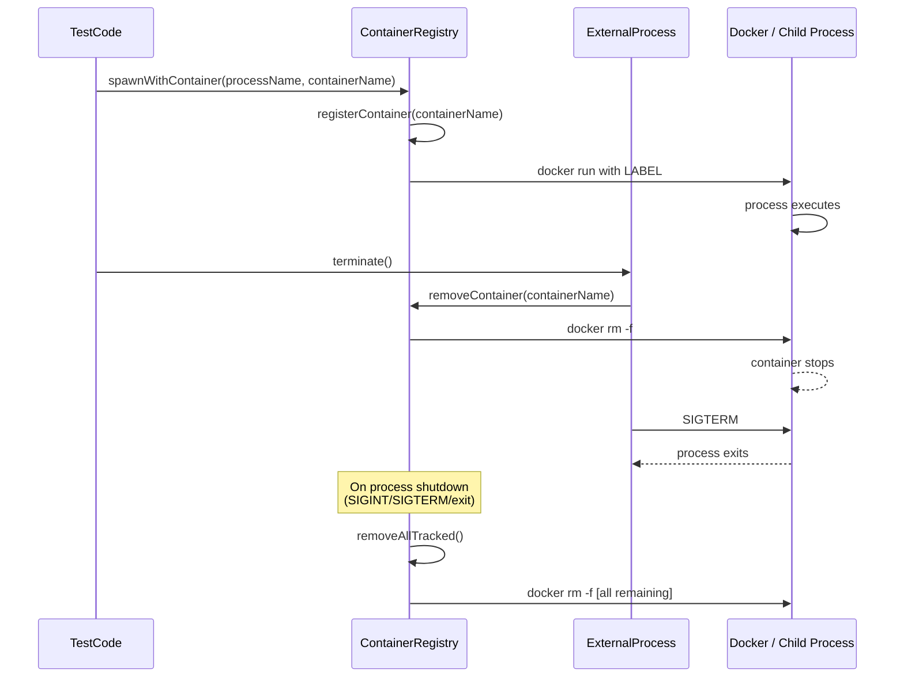

# Force-remove containers after test runs to stop leaks

## Pull Request by @tomusdrw

## Summary

After a failed/timed-out job, target containers were surviving on the
runner (some 6–8 hours old, see attached screenshot in the issue). Root
cause: `terminate()` relies on signal propagation through the local
`docker run` CLI client. When that client is SIGKILLed (timeout, OOM,
cancelled job), dockerd keeps the container running and `--rm` never
fires.

This PR stops trusting signal propagation and removes containers
directly via dockerd:

- Tag every `docker run` (target, source, picofuzz, minifuzz, and the
  short-lived alpine helpers) with a unique `--name jam-test-<role>-<pid>-<rand>`
  and `--label jam-testing=1`.
- In `ExternalProcess.terminate()`, call `docker rm -f <name>` first,
  then wind down the local CLI with a shorter grace.
- New `tests/container-registry.ts` tracks active container names and
  installs `exit`/`SIGINT`/`SIGTERM`/`uncaughtException` handlers that
  sync force-remove every tracked container before the process exits.

If something ever escapes anyway, ops can wipe survivors in one
command thanks to the label:

```sh
docker rm -f $(docker ps -aq --filter label=jam-testing=1)
```

## Notes

- No boot-time sweep was added (intentionally — would interfere with
  any concurrent run on the same host). The label-based manual command
  above covers the residual case.
- Pre-existing biome formatting errors in `tests/minifuzz/common.ts`
  are unrelated and untouched.

## Test plan

- [ ] `npm run build` (typecheck) passes
- [ ] Run any team's picofuzz test, let it complete, confirm no
      `jam-testing` labeled containers remain
- [ ] Cancel a running test (Ctrl-C / `kill <pid>`), confirm all
      labeled containers are removed
- [ ] SIGKILL the test runner mid-run; expected: containers leak (no
      handler runs), but `docker ps --filter label=jam-testing=1`
      identifies them for manual cleanup

🤖 Generated with [Claude Code](https://claude.com/claude-code)

<!-- This is an auto-generated comment: release notes by coderabbit.ai -->

## Summary by CodeRabbit

* **Tests**
  * Implemented centralized Docker container tracking to ensure reliable cleanup of test containers during and after test execution.
  * Enhanced external process spawning with integrated container lifecycle management and automatic resource cleanup on process termination.

<!-- review_stack_entry_start -->

[](https://app.coderabbit.ai/change-stack/FluffyLabs/jam-testing/pull/76)

<!-- review_stack_entry_end -->

<!-- end of auto-generated comment: release notes by coderabbit.ai -->


## Comment by @coderabbitai[bot]

<!-- This is an auto-generated comment: summarize by coderabbit.ai -->
<!-- walkthrough_start -->

<details>
<summary>📝 Walkthrough</summary>

## Walkthrough

This PR introduces a Docker container lifecycle-management system for tests: a new registry module tracks spawned containers via unique labels, external processes are wired to register and unregister containers at spawn and termination, and all short-lived test utility Docker calls are refactored to use centralized helpers that guarantee cleanup.

## Changes

**Docker Container Tracking Infrastructure**

| Layer / File(s) | Summary |
|---|---|
| **Container registry foundation** <br> `tests/container-registry.ts` | New module that maintains an in-memory registry of started containers, generates unique labeled names, provides best-effort individual container removal, and installs one-time process shutdown handlers (`exit`, `SIGINT`, `SIGTERM`, `uncaughtException`) to force-remove all tracked containers before exiting with proper signal codes. |
| **ExternalProcess container integration** <br> `tests/external-process.ts` | Adds `spawnWithContainer(processName, containerName, command, ...args)` static method; when a container name is provided, registers it and stores it on the instance, unregisters on process spawn failure or exit, and updates `terminate()` to force-remove the associated container before sending `SIGTERM`. Shutdown grace period reduced from 15s to 5s. |
| **Common test utilities refactored for container tracking** <br> `tests/common.ts` | Introduces `dockerRunHelper(role, args, options)` to centralize short-lived `docker run --rm` calls with automatic container registration/unregistration. Refactors all internal Docker utility calls (`waitForSocket`, `clearDataDir`, `chmodSocket`, shared-volume init) to use `dockerRunHelper`, and updates process-launching functions (`startTarget`, `minifuzz`, `fuzzSource`, `picofuzz`) to use `spawnWithContainer` with generated container names. |

## Sequence Diagram(s)



## Estimated code review effort

🎯 4 (Complex) | ⏱️ ~45 minutes

## Possibly related PRs

- [FluffyLabs/jam-testing#33](https://github.com/FluffyLabs/jam-testing/pull/33): Modifies `clearDataDir` and shared-volume initialization in `tests/common.ts`; this PR refactors those same functions to use the new container-tracking infrastructure.

## Poem

> 🐇 *Behold! A docker dance so fine,*  
> *Each container tagged and logged in line,*  
> *From spawn to death, we track them all,*  
> *And when it's time to cleanup's call—*  
> *No strays remain, not one, not small!* 🏷️

</details>

<!-- walkthrough_end -->
<!-- pre_merge_checks_walkthrough_start -->

<details>
<summary>🚥 Pre-merge checks | ✅ 4 | ❌ 1</summary>

### ❌ Failed checks (1 warning)

|     Check name     | Status     | Explanation                                                                           | Resolution                                                                         |
| :----------------: | :--------- | :------------------------------------------------------------------------------------ | :--------------------------------------------------------------------------------- |
| Docstring Coverage | ⚠️ Warning | Docstring coverage is 25.00% which is insufficient. The required threshold is 80.00%. | Write docstrings for the functions missing them to satisfy the coverage threshold. |

<details>
<summary>✅ Passed checks (4 passed)</summary>

|         Check name         | Status   | Explanation                                                                                                                                                                              |
| :------------------------: | :------- | :--------------------------------------------------------------------------------------------------------------------------------------------------------------------------------------- |
|      Description Check     | ✅ Passed | Check skipped - CodeRabbit’s high-level summary is enabled.                                                                                                                              |
|         Title check        | ✅ Passed | The title accurately reflects the main objective of the PR: force-removing containers after test runs to prevent leaks. It is concise, clear, and directly addresses the primary change. |
|     Linked Issues check    | ✅ Passed | Check skipped because no linked issues were found for this pull request.                                                                                                                 |
| Out of Scope Changes check | ✅ Passed | Check skipped because no linked issues were found for this pull request.                                                                                                                 |

</details>

<sub>✏️ Tip: You can configure your own custom pre-merge checks in the settings.</sub>

</details>

<!-- pre_merge_checks_walkthrough_end -->
<!-- finishing_touch_checkbox_start -->

<details>
<summary>✨ Finishing Touches</summary>

<details>
<summary>📝 Generate docstrings</summary>

- [ ] <!-- {"checkboxId": "7962f53c-55bc-4827-bfbf-6a18da830691"} --> Create stacked PR
- [ ] <!-- {"checkboxId": "3e1879ae-f29b-4d0d-8e06-d12b7ba33d98"} --> Commit on current branch

</details>
<details>
<summary>🧪 Generate unit tests (beta)</summary>

- [ ] <!-- {"checkboxId": "f47ac10b-58cc-4372-a567-0e02b2c3d479", "radioGroupId": "utg-output-choice-group-unknown_comment_id"} -->   Create PR with unit tests
- [ ] <!-- {"checkboxId": "6ba7b810-9dad-11d1-80b4-00c04fd430c8", "radioGroupId": "utg-output-choice-group-unknown_comment_id"} -->   Commit unit tests in branch `td-cleanup-containers-after-job`

</details>

</details>

<!-- finishing_touch_checkbox_end -->
<!-- This is an auto-generated comment: all tool run failures by coderabbit.ai -->

> [!WARNING]
> There were issues while running some tools. Please review the errors and either fix the tool's configuration or disable the tool if it's a critical failure.
> 
> <details>
> <summary>🔧 ESLint</summary>
> 
> > If the error stems from missing dependencies, add them to the package.json file. For unrecoverable errors (e.g., due to private dependencies), disable the tool in the CodeRabbit configuration.
> 
> ESLint skipped: no ESLint configuration detected in root package.json. To enable, add `eslint` to devDependencies.
> 
> 
> 
> </details>

<!-- end of auto-generated comment: all tool run failures by coderabbit.ai -->
<!-- tips_start -->

---


<sub>Comment `@coderabbitai help` to get the list of available commands and usage tips.</sub>

<!-- tips_end -->
<!-- internal state start -->


<!-- DwQgtGAEAqAWCWBnSTIEMB26CuAXA9mAOYCmGJATmriQCaQDG+Ats2bgFyQAOFk+AIwBWJBrngA3EsgEBPRvlqU0AgfFwA6NPEgQAfACgjoCEYDEZyAAUASpETZWaCrKPR1AGxJcAYvgoMJGAUJMz4UgoYuNrkFMhoAGY0fDSIuJAU2BjIBPYE3JBeaADWiG4IyLbotLQhiIjSkdHwsYUkJciCDRRS9InJkAnaXvT+kOJstGD4eOPS6UJdkHIZoeEtRKse8JiB/FiI8EQYaB48FPjcaETU8PhYuLAX2ESw47AkhfgMp5AABrRvsVKBksn9IABhAAyAEkNJDYJhSMhmGglBwjFAAIL1I5YNCQLLwACO2E+JzY6Aw9A8KhIZ1yJCkLn+gIYwL4mQw4JaEm+t3ukAAFH8IBTPkI0MwwKlcGBgBcvHp5dx4LRlQrMOrwVr/hBaQJ6ZBJdLZRsALwARj+AEpBmNohRSLgADT2GYBEhu1VMBLYABe/rdzBa8D9gbdusQsH8cu2vXQHlV5EgHyTlEQGgMUAAsoow/I/gBRAAeyROHisF0C9Q0yRDJxoQpt4NyPw8ZwBQJBFGYugSkGA4r04MNCX8n1OHnwAHcNu9PtP25DYeN8JA59TIICZ1g5490PYYxQBkQqHtuJQ7rQs9iav9ZYgAPRMKIxSjBEhEJC4Fx1xCtuuv5oOy6BiJInyvs0rTivEW4tGkU6QCQJbqJAT6QAAyjCADiMIAHLQOhWG4dARY2DmxFZD8LywLgpaBNw4iCoi1JeHE7zUPYsgYAwTz3DMiAePI46ep+YQREhwHsnQTTvhxY4Tuc3zSMgKHqLe1gXBIaqTpAqIYNgvwMEUhkFEwThbqJ/CXlQBBxFwXYyZyfZgAOAAkQpshyPDIGAaDErobnwB4AwGvS5omjK8wWpaLZZgY+H4KkGJQElyz4MlMrwJSiAziQJAFDOaDxDUsm5GgfJqigUSUAkV4YJs+5vK+DDYBQIRRKC2SaVWQTqWk86iaiuDiI1yEdf4yAtA+8zPg2YYBv6L4sGEGD/jqISEhgIS0jQfRbtRrGkDebjzDwtIYKlMCyJefGiMUT4CNgIX0CKGDcH2XLLC9Hi0Lamk2FkVL0D8vFGo+a6RAk8C9oUdIjHJLQZugW0hBJdAANwkThADSMJQlC/ADo8nxcq0qAoXd+1Q4NHaJtOM5tB025IEwzIqF4kA6QSpPw4aZzWQZRlnCZ7RmQl+jGOAUBkKMA5oHghCkLE1CyRZbBRFwvD8MIojiFIMjyEwShUKoGnaEFhgmFAcCoKgmA4AQxBkMoNMa+wXBUEzDhOCyKwm8o5uaJbUvS6YBiPitrD3P+GIAESJwYFiQFiMIu6rNO+6iLL4AOfFItIRh/FHGux7gAGQBgs6MOwVDbP6jTRrGYDxrJTk+d9EC9jyGB8j8zHZMsJAIFuBLkEzHeUEDGAABL0rZ4IzlQ3C2Zx6TSaUSOxMgPP/CE35pJQEL3NBlB/E+fxZAfP7H6f8k6mPq/bE30TUs4oP38jfDhR4yAilCLEAAhIsUIAD6WIbA4UwgDSAMJaoUArJAAAIt2PgeAQrqHkNgRA1xPjFWQNgbgtA1b0EQOuchMl0i8EEPOEUxV1B+AoJhbsuBbRuhIdEDc8BkybBFGLZwyDqBoGQbDdhIN3RUJ4JQEMuJBQNFGnQv4fEwi0BYVQ20DNurvGeK8VkaCZ7z3TBQJe6g3iKiCIgO6YZ4AMCrlKaQ8JMKIhCFMPkHhHCfFDOIU48B/QCj3CVRM5D7D7nuvQXIODPh81wZSNMtkEpMK+I1D85MhpLQ2E+R0zplI1gaIgN0fxEInmgM4Z0fxCkLXDP6Cp/xqksPaoEWpuo/g+jzktcE1cmZRP+KWcspwqwqVrFYtAu4ADqZiT5vm/qYg8BIVZu3blBeS+EHHNK3FceoC57AOP+IAkB4DIHQPBCEmJVxdzqy/hTHI55gSf2yLfKIwlhQhG4LSBg85eB3D4MWMslAKyDLyRoEZu5TEUCGg6GMDR9HOW6uCdsf8bTwisNgAQ2w7FU1jLJP0vFB72DxNQdqjRdSvhhpsFoyQhg1hqu8VAMMuboxiNtAuKTTpGGTpYLEoU3Z3CHrkPmSgTLOACZ0AcmKTyyTGNwVF6LkJRHUPAIu2ZIDpXFftJ80q0W2MGNRPFYwKV1RAp8Q4xxCV1A3JQSCx1ZIzRLnNaOa0NoJShMjZALKTpcAANQAFZvVPjAJaAAHEYIsg0RqXKUKsHSJAmYkASKJTgkAcx0HgI4Awid46YgjqXK5qSvw/j/BXBOScU5pwzosshjgc7yDzowa1ZQDBYhqPEOYaRpgYGecs7+qxD6/mweIbYuB5CPC4pvZAxSaaoNhV2neEjRKBHEuERopM+y0Hap86sqkjx4B3OtGAHx9KKGwFzVEFKYhwRqmANgYQWR/GKF0jAUyz5xBOSQV0kAFl2UaESUkkFc18FgtzHY/wf1klWWwZs4IhQ4PnFQakLBliyFSBdHBPA1Q2kjBs7SulkB/BvkfCgT75KQcvtffNBGiPf0g1DAyeDtmb1kgo+EeG1hSEo7Eajho21xoTdxXi/Fq44OeejJdF6Wi0EkGqEW28QTNRhZ3VyCQoN5SnLOeclALhxCRf8BC0QOzOJ3bOOeWp2KIGo/h5InRyDZUpAIsyqYTMo2sn8dSbDCnYTwoRWpfwPNkQous+gV9eKK1ePREsjFB61LIA4cF40GP3OffELaiAeJ8QuIJoS8gRMJkUltVzdC5OvikPK+4vwTVINcwoJQyBrIeYItAJ8vnyKURJYoT4fxrT2nQcF2i6QUIRd5YgbTcBjWwEM7uBzbEUbOC8dkPTiNFYEBGrYqc8gZwfAeAe1Rx6vHTWYNwLFbLzCcu5XZQbUMBWiFpGd+4orkIlgOxK0YfBNWyvYAqpVaUY33ce+7W7b9E1/AhAAeUImnfC5EwH7NAVwNIsWiC91mmkZ8M6829sLQBZV+Fvtquxbq3ljlQMkHAyQIUFjYe/g2DaCn8PEd2uRytaZsRPzo9kBtLHOOHuHZ1bign+9yPJHY5QIU4oadU64FVf6NL6cV0Z8+lnBa2cVz+Bz2NXOns8/AvcQnO0Bd3yZ8L0XeR4fU+5vgNUdOc0G4oAruHSvMdfbV79vHvPtf84xkLigIuHFi8aqbyXlv7Wo5txZjHKvHc/e5zirXV0dNzanAZ3Au7Z6ObiM2CX5upe2qt/L0P9uVcGBdeQN11raBesDQAFn9QABhDWG0hVWyZMkVbG+NsYuCzyOLAdNSdszZvtShfpHgwA0KBUWnvmbS3p0/Q37Ozga353rcXKOg//mnBH5u2syuq41wcKvWM47zkYHU38xBvxR+qUaHJx2JVKE7D+9b+xlILOWvoNZPaIJ53q1MkQ5jfS1+Vib6Zggrcjbj0hfhqw5DrjjzfZFJH4TKPCe5CgX71Ak5ujB5oEKCWS0BugaB4FlJDbghYhWAwjYzrZkCHjB5P67bKQ6RKA4EoDpCoAv6uLoDpAgHjA5SThbhpATijCbazaITgwJQja9Kn4ApAHwr/aZBiBjBdJgQRYXqXCDy/DKL/ok6Pz0DRZErIB56MA/4FArBka9oNSbAjrpBUGCgCDJRvAoHjqOjpBDAhRErChwGjLkA3j3BCjxwab+Dxwth2i6h2H3ZoQiggF0AaBeE+GoS4D+GwKiHeQgjA7A6UQSbXDVyDQMDIDxIgj8IfDshTocjA4sCaIEKrDDTUA0zNQzAWHHTzjqBupKSGiIg6T+AJSJ67pZIyItABLDwtHfIbhBJEKcJ0COT1g9FNgtg75MwhC4DtRDztAUDPJhjbK6a7A0GnAhBojDrdGNgbDBjOBbx8xrHgzoDIDFAhSIwGolYVjCSYb0ArEEhUHighHI6MFdYLrZaNBoR7wsYe7/pCgYEOJTG5afByzzhpASYYBPjVa/j4CyAQlJ53DG7tDMBwRkLgnjQ+akTNZ/DwiiHRjjZYBnhGqcFsB8BQQtBkhQEfpqyHjjgdizhgBEL/Aeb4yEw8gkwHrBGAjSAYCACYBH1jETShMF6BInzCSReFeIoJEEIekGUa4tgIEG/hcH2JaN6jSRqQlMdqnKdiKhdgeoKtdvqbWrjs9jwDKtqu9uIJ9qnGVFoerlnNEOIHYmwI8IoI5P/mfoAUMsAfAZMgCXYSTr7kQOgeoT7sbvOAAD7bRKAwweFhnYEhm4H4FOiIAhkADaAAuqbl6RIb6YHgzqvt6Rvr6ezlAAAKrEIN5ml5C3CulvoxgPH7ZeCazOl86/JD6AqqTApH7IFAHBmRmNSJkGRl5DmhmQB4FaBpmZk5lcB5kDKSHTFgFeA3DIa5CdkAHdnDL+mIGBkDkOJuhZBxnIwMEaxagpnTlECEHCjlZmqfBHSFy0A2hGBF6NDuqjGQCeoV6Br+rql14TAN6BxRot7IRt4ngd5d4T5ZqGAGA2xyryxOzKyuxfqfysCewZCjL2BVrz6IaN5mxqAhw6BSzwV2zTQXqLbIWZyXLoVaxgHNCIzAVopAjYV+xZaFxGz4UqCEVaDEVgCwUZkADe8ccGpAMItA8cHAIlhcYC1e8aFeFetADAFe3qAATAAGyBrxwujxxXCPCSXxw5oxzrQVzaXxwTpvmSUADMOlcsllHANl5lOFLgBlTa9BVIKA+2sYxMMmIeAuLIGCg6iq/8QOoO0A4OkO0OUI3mLBnu3mROGhhSxht8hG/6miuQe+v2vl4wtyGwGgZlgcQCS4xQJ8LZrmsgBljM8cAAvi6MJaJSQOJQZQ1WAgIFZepcpbQN6gIGgN6mgKpWZXpbAAZUZY6qZTpRZcjJJd6gAOy2XUj2XeqBoTXOUVVSXwJwlrrKl7LAKgIQJQIwJnHbJCEkIUCBaJF8D6gIybRECeJRDICmwQQqkIahVg4ESRW7XRX5U6WFXFWlVvLlWVWzg1V1XSUpJNVSUtUACcqlCQqlFeAggasNIEFeg11Aw1Ulo15ciAZlk15Akllolo6l81tA9lloVl1eK1bFrl9p8m08WQRitkZO+AXgkYaZboyhg2Ux5hH6KFkBh48W20JIZI2V4oboLB0076XIuGF12i3czAsybwv8qMt1bZBSEit1wqtU36uu6OvRvx8Zq2eJBVbWRVQI/1XgMRa18ckwqazAIN9VhcENYNpAYCUNAgUNCQ3qFelotAqlUNgaVlaN+lmNQeq02NuNDhZNFejldlU1HAloMdVN1aBlVZIxESB60YM2biLNniNUCqvi/ieKGVDhhIhwWJF1hiC8wuAAOvHN4nXZeVMbpu0IhQivOFPCYqzCEGIMJN9fHL9ebSwADVbQZbbY4A7S7Y1RJZDTJbQAIIEDNWgGiAkDDZaMHRjYZWHcZf+JHc4LgGTVDZaCTYfd6snfPgZTYIVO8uVIabDPrHTV7hmVOTmScqwqWYaIwEhLagwrgEwuosCGwtwgeJ3VXcYkKHXTQoaI3ZOXgS2G6OtiFJ8LwNIJQDpHFlwTUU+JCcic0ZVN8v3YPeyBbYDVJePfbbVY7eDTPVPWAopd6lDdXhpbQAkLQFDepRvSNdvWNTjRNVHfHapYTSfQI+TefS5VJVfW8kahnZ8BJj3ekIUSCJwmgGAAIvDl/fTLamo0ItEKIl3XJqAwzdXV7nXWo8ozA1OfFCbUoGbcQ8PZbVgmPSmhPZQ1Pc7S1dXoGgwOpW1SQN6gwO7TNZw6HQzmXCZbw+Zfw/jRwKpapctT4QtQI1ZapWI9bZIzfTI93Q/YoxSbAKoho2cFo3k4oAA2+orY/WA0zaY8U7QBY3A7UsCIVPODErsuefBLVF1LqChKIBgoKJzbdoQ6bX9fY6Qzbc4xQ6DQ1e4zJTNYjRpZaAwII96lZSQME1vaE+HeE3vSePZfDcTQk6TQI96vs3PuI/HBCKXv8BOqUk6GU7klurSEdENKqWIV2UAb2e4YBK81ue8yAQgbAHFW6BShcFtfOPMnzTTGodbhoRIi0CIOBFiVFftccjVPygelQd9LyPyIPIMzY8M2VaPVJQgK8JPVMzQy1VZYpWiCpQwAwGpd6ms1jVs3w/vbs4Gvs3HdE/7WfU5dTVJRc0+f8FUh0vc1so8/xs8y9QuT6UCiAV85ud6duX6e4f84C2XWC7zdRYFkCWwJoTwLfh3Ui0cjAriyQLYyVSM4S2MxJi45M07eS3PYHYGl7VZYjQIMs4y9wxHSyzs/Hck3NQc/ZVZVZQG6c9bQK6ynUktA0p6OCMEeK3xJK32Aq/mbK0fvK9K0qx8+MgGdbrUjBuNOC1q/8DqyQHq5suXZsH8EawdcbT9UM0PQS442Q+M6S/a81TJVDbQCs1Zcpd6gkBXow56xszveNZE6y36+pSk4G36zNcfbyynfy5c60rYu0oGHG0AfDE8+NAkC8ym4uWWXK1DPuzKz2X87m8+vm5W4eDPpC6W+Wwa4i59ciya9Y2a/iyPc29a3bW29Qx2ykm7UjYpSQB1TNaIAyzpUNVwxs9brbn2rvT6wffHfO5y6swnZTQuxfetVECC0qY0Ntl4K3EyEaDlL9sgG8qho7C0FemsLevekZp7pXAomXeVEBLcnWRrs8Q4jVmMB/hSQYaa+ayQ1a1Va42S/+67QHcs+0JaAIHJcpcO7LsHnBxjts0h9E0IzOxp6G6tTTbQGpI6e3CDm9RDjYFDp9Xq0FsLcTg4szV4FMYg3xD9K9C2kTqLbsgW5sHBoCH2HIMhrqHzG1B1OwKK+R2qIJx+w40OkDTOL+2JQ6wBzUDNQO6pSQFZYkLE4pyjv+ip/bmp2TfE6h5JapTy2G3pwZ87vQHoTkRxBVPeLqF8e52wDVnu/R7uIx3WwPQ23Y029F1JaJ3a3+7PYl1ZbQBXiQD7VZYHYO1l3LvJLlwh+O769ExTcI9ExXhh2V1JW5RV9zn8UukgeKNzYiOwalgJoJMJlkDLWghkIpuU7zJg7MFGMVIyTODVsMDocKFxnKDxt5XZkQkim+0J5a1++Q3F9PRJyQGArQIGpaKpQIPDQszD2gLN8p3not3jWhypWt2h7NakwZTCGVWraiwAe7kulyh4NALcnQNRhlWd+lhdyJP4J8axpOPTEF51LgM8oLcHtNFgM9B4MUOgUUOo3zHoTDHEOkM96ppuJsL4XEBF425+319+7a1Q/F5D9D+pcl5pQIEMPJajzl+j2O5j9NVDTj5JUjfj+tUT+wLtxrn8GsfpmNknkZinlNmng52YoePcEEKKR+kZGdQg7DPOP9wUIKC5jEbUqxLQNsFiXVl5pfE1v5sA28FTOimhK0u865lIdVvcdUFCZsI7EFjRKFgxIVJFpNrHyCDzdONecL+LIQtwG6KTFgK5sgIVm1v8NaIrz18r9bcS8NWJ+28N67Ss4GlDXO+pTUAkAwOvZB+jdB0p0b/5Xl4h/ZZXhbxwJv5h2c1iErMtgisbFOLhk7x4B0W76nmZlMYKAR4uPgGiO6PoeLCyXOOow7OBJJOOplPiDkFtkelzHtheUnsvfC1r12toDd1eEPUflDwrysMuqPjavLQGrze1ZuxZCsKWTHwRNTeDlLfqpUcpbd44blS5LBz0IGoSSeKUdAenyBEcpAhTYARXFhY4cj021GApPEza/NdyALNKpHg1zEEYQwoOTP0yQRQtn0GhQItOEaiHBI0BIRUttUJKu8JskpZBtKXuRylsYJ7LNke3kLPB1y/EWiFcy4FxVU+JbcMrq3sBvpj2x5ONKeU65EMwB/fJxjawmZQDpmAHWGt2yYaV4oa/jVGgvxDrrNZc6A9fHYQx5RM0OlLLfiG2t7xwxkG2UwdCzWQoByO2GdyhuXPZ7k82LfdFl3wlrvFfisVAEqWymKtY5sMhRgXzE0FLkTiewOTJUPvZ5A+CXWeGAMDD6gDhOX7SAW4wS6u0AmQaBIAsxDY9VVm/gzeivnEIhD3mJvcIZJQrwBsiuHAY5jEP/zUhb67WDgQWVlK/glS9kKGCBAiweVhBqhBobqDRDuUw+qYTKFvFOQndtkVBVAMlQIyyRrCB4cglgGCIgF1Mk0DiLqDeHbJgi7fdoSDxV5g9h+Q3Whn7WrwMBaAhNNAApUWZoCJhw+UIdMInbRNA0hXRJtE3YYxCr6M4fwHcm2TKJ8ixQHJsUQVr/BumDATCKll7j9xeikSaFASGYDHoB0yMGyIPE6B6wxAG4BAFzBQbdB0GZhTOrsnpTJB5wdfbVNZA5DkAzgyRHMJ+A/w0h8AmwOPo4iB6RdRmXQ8TjALARWUEg6ldSqw29Rw8F6QTUYUv2fDBDkRUw7ATMITrw0t+idCvLiOvrSM5gvYCYryi+Dfg7EuQIUHFBQDHAlIrydoO7BP54VZi8xdTM4GeR/DNirdHYp6L2LDlhQqlO0DnGKCrF48pxIJNcRUIdh5AFxDsHQHz5CgrKdoL/IugiB8xb83we/CQOfRAYCQ+3NjDwKFB/CBR7AO0KCUaGrxMksJC4AiXGg4NoCPBTElW2T45g/g2MU4CEmGIN4Yk7UZ4NSAhIu9d0WBYng1xID+BTYdAJ8F8XoBfIxggAHAIEx2xD0Q2FISABcAir5x8iAQI8AU4J/bVUsy4cWWFuFrSUVy0qFTcRhSUAMUI0nwZiqBDDaYUUknFQOARQth8VrYMsTceoDARqhEAYCEINGnyi0AwEE6K2O+MgDss0AJAVQNXjnajcxuBE1SmgErww8B2/jBgLP3Uq9tq81eQ0IaFUpdUcJcFeCRrEQnITUJzeGNHQDARywcJ8FFBmAnJK9CSRKE7CWHEEoGBIAkAeuogFsDms6ApVNslYHwBHwZ6gwOcV6HkmKSkAwOZkOCjKgYBJKukv+PpIUnxw2QcODYCfA5hiUEEFYTCM6TQ6QA5JCkmyTnnm7G8caXALyd5J8nJRTgPgfHLdgsnE0DJwU+ONHk5H/Mp09kqQRZNUoxTIAtVdKYEOy6jsApnk9KSFL0zhTXc2QCyZaEpoFTFJ8UwbIlO+DJTryqU9KdVQMmZSbJgcGwNxXUBjILgNAKsO4C54eShgVkl0AZPMoxhj0tAc1rYAslDSGgI0myRJloAzwp0bk+HIgAuYPQLJ2w6yYpMWkzx+pXgDaeyC2mZAdptktUMtOkAMBwUTEXlEdOKAzS9J80xSXHzuQwh6g1JVaRZMTjPT44tINIPdKvoOBQoeUjMulKCmxT7o7IEnN9OQRXSbpeKe6dpUqnjs5ieU7ac9Ninp9MAASb6fdPsAXFV4skKACfCUAdTg4/JbIl3loFGgwJlME4GigiLIzgpNk1RB5PjjFREEGwZmSzPjj+AjgPRDwPdJhlcBbJ8MnhIPEzTBTWp3kiGd5IHokiRZikg6Vak2mYz5ZiENGSdLJDqybJ2MvYvcG+miFxAA0hQu1DVjCY40XgMQH/0+CnosAggeFgbE+C1o+YtgLgFWOyyh9/08QJIDX3OjS0oYKDYrOkCKClB4QMIJgo0V4hIAxSajfPnI31jPIzhdQfJP8PBTVo60hcb6ijLZnfTOZx+RqDzNik917gZKIlI9OGkoz+Z34CsMLIcTfSTZXgKWd5JlkKS5ZbUxWQ3NFlJTKc40RycoFIDFyNZzpHBJXLmkoz9ZuMnuXVL7mbB2Yg8mgiVw0BMSAApLyNsRvB7Y2QbAPGlsSKoog+JA9CEFJD30M6dQGMH9GSF4Tq8K86vKvJzkszFJdQXOpLNFndT1AsjWeWtOaF8xqpt2fSEgGvYrpaYtwRAAkGHQ5CnJ0SJ4NIEvk3hh5rMtrPnOcCFyiAiCxSTXMFn1y2A30uyXPJxpNT1ZHcxSVDOKBKz44ReQke9IcDvkSRGC1GWPK4AYzJ5D2S6NPMUn4zEAhMy8PQENA0RoU1cQoC0EJFALqSFqLaOOGPK/yKgFpemCfOpKaAGFec0WQXO5m6zMF4KWuacBwXszXpdAGhdSRxD5JEAbZFuQpLbn5Sn5Csh6BQuByzBa0mEJgJeARAcU60aslGZrKYU5UdZrCqRgbPMmiyuFPC54aIEViCL1w+ih4h9KvyWp7Q0i6yI8FQDSp5FJAX9GkEfm8yVFiktRUXI0V8ytF2CrubgtFk1FgcCQJxZcBIARtkQxi1SGYqakGSsyv0/6bgFsBwzEA10iWbym+kzVkuM1Dqt6iUo1BXWS9SvExJmr4Dl6iNdSkgPao9Up2FeErt2zQBTc4afjavMvQWYkAoa0IuERP3VIMAtKLSkqG0psAqzvpaAHxpMuIkwjkB6lRShXgYlKBKWPtNqrDyWX1QFmevL2onVXo+1ZOvqeGu0HG79VlKiddoLDwSCZpmpnEiAOcCh4SSoeZClCcJJIrwTKKYCK4FEiwnuTcV+9DicJVaVWBwldALELgCvroS1Jq0dQCfCyCxEOA1eWFfBUxXYqGg+KmgEJK3D6AgAA= -->

<!-- internal state end -->
