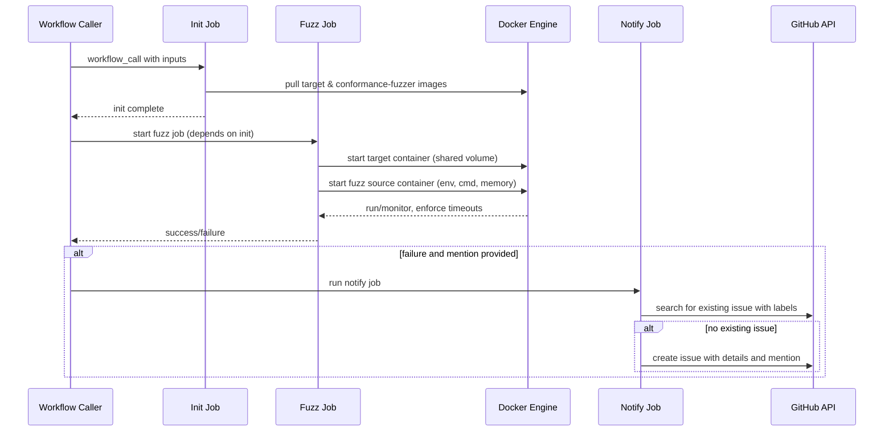

# Add graymatter fuzz source workflow

## Pull Request by @tomusdrw

## Summary
- Adds a reusable `graymatter-fuzz-source.yml` workflow that runs the graymatter `fuzz-m1-source` against any target implementation
- Adds `typeberry-fuzz.yml` as the first caller workflow
- Adds TypeScript test infrastructure (`tests/fuzz-source/`, `fuzzSource()` in `tests/common.ts`) following the existing picofuzz/minifuzz pattern
- On failure, the workflow creates a deduplicated GitHub issue @-mentioning a configured user
- Documents the new workflow type and review checklist in `agents.md`

## Test plan
- [ ] Trigger `Fuzz: typeberry` workflow manually from Actions tab
- [ ] Verify graymatter fuzzer source starts and communicates with typeberry over the shared socket
- [ ] Verify failure notification creates an issue with correct labels and @-mention

🤖 Generated with [Claude Code](https://claude.com/claude-code)

<!-- This is an auto-generated comment: release notes by coderabbit.ai -->
## Summary by CodeRabbit

* **Tests**
  * Added a fuzz-source test harness, helpers, and an entry test to run end-to-end fuzz-source scenarios with per-test lifecycle, shared-volume management, and target/source orchestration.

* **CI/CD**
  * Added a reusable, parameterized fuzz-source workflow and a TypeBerry-specific workflow to run fuzz tests, support concurrency by target, and optionally create failure notifications when configured.

* **Documentation**
  * Expanded agent docs with fuzz workflow guidance, examples, and a checklist for reviewing fuzz workflow PRs.
<!-- end of auto-generated comment: release notes by coderabbit.ai -->


## Comment by @coderabbitai[bot]

<!-- This is an auto-generated comment: summarize by coderabbit.ai -->
<!-- This is an auto-generated comment: review paused by coderabbit.ai -->

> [!NOTE]
> ## Reviews paused
> 
> It looks like this branch is under active development. To avoid overwhelming you with review comments due to an influx of new commits, CodeRabbit has automatically paused this review. You can configure this behavior by changing the `reviews.auto_review.auto_pause_after_reviewed_commits` setting.
> 
> Use the following commands to manage reviews:
> - `@coderabbitai resume` to resume automatic reviews.
> - `@coderabbitai review` to trigger a single review.
> 
> Use the checkboxes below for quick actions:
> - [ ] <!-- {"checkboxId": "7f6cc2e2-2e4e-497a-8c31-c9e4573e93d1"} --> ▶️ Resume reviews
> - [ ] <!-- {"checkboxId": "e9bb8d72-00e8-4f67-9cb2-caf3b22574fe"} --> 🔍 Trigger review

<!-- end of auto-generated comment: review paused by coderabbit.ai -->
<!-- walkthrough_start -->

<details>
<summary>📝 Walkthrough</summary>

## Walkthrough

Adds a reusable GitHub Actions fuzz-source workflow, a TypeBerry caller, Docker-based test helpers and end-to-end fuzz-source tests, and documentation updates describing workflow usage and a review checklist.

## Changes

|Cohort / File(s)|Summary|
|---|---|
|**Workflows** <br> ` .github/workflows/graymatter-fuzz-source.yml`, ` .github/workflows/typeberry-fuzz.yml`|Introduce a reusable "graymatter-fuzz-source" workflow (inputs, concurrency, jobs: init, fuzz, notify) and a workflow that calls it for TypeBerry with target-specific parameters (docker image, cmd, env, memory, readiness, mention). Notify job conditionally deduplicates/creates an issue on failures when a mention is provided.|
|**Test helpers & tests** <br> `tests/common.ts`, `tests/fuzz-source/common.ts`, `tests/fuzz-source/fuzz.test.ts`|Add `SourceConfig` and `getSourceConfig()`, `chmodSocket()`, and `fuzzSource()` to run source containers; add `runFuzzSourceTest()` harness that manages per-test shared volumes and lifecycle; add `fuzz.test.ts` entry invoking the harness.|
|**Documentation** <br> `agents.md`|Document the fuzz-source workflow, example workflow template, optional inputs (readiness, timeout, memory, mention), deduplicated issue creation behavior, a checklist for reviewing fuzz workflow PRs, and update the key files table to reference new workflows and tests.|

## Sequence Diagram



## Estimated code review effort

🎯 3 (Moderate) | ⏱️ ~20 minutes

## Poem

> 🐰 I nudged the Docker, set the tests to glide,  
> I paired the source and target side by side.  
> If chaos blooms, an issue gets a mention,  
> Volumes shared, I hop through each contention.  
> Hop, fuzz, report — a rabbit's CI invention!

</details>

<!-- walkthrough_end -->

<!-- pre_merge_checks_walkthrough_start -->

<details>
<summary>🚥 Pre-merge checks | ✅ 2 | ❌ 1</summary>

### ❌ Failed checks (1 warning)

|     Check name     | Status     | Explanation                                                                          | Resolution                                                                         |
| :----------------: | :--------- | :----------------------------------------------------------------------------------- | :--------------------------------------------------------------------------------- |
| Docstring Coverage | ⚠️ Warning | Docstring coverage is 0.00% which is insufficient. The required threshold is 80.00%. | Write docstrings for the functions missing them to satisfy the coverage threshold. |

<details>
<summary>✅ Passed checks (2 passed)</summary>

|     Check name    | Status   | Explanation                                                                                                                                                         |
| :---------------: | :------- | :------------------------------------------------------------------------------------------------------------------------------------------------------------------ |
| Description Check | ✅ Passed | Check skipped - CodeRabbit’s high-level summary is enabled.                                                                                                         |
|    Title check    | ✅ Passed | The title accurately describes the main change: adding a new GitHub Actions workflow for graymatter fuzz source testing, which is the primary objective of this PR. |

</details>

<sub>✏️ Tip: You can configure your own custom pre-merge checks in the settings.</sub>

</details>

<!-- pre_merge_checks_walkthrough_end -->

<!-- finishing_touch_checkbox_start -->

<details>
<summary>✨ Finishing Touches</summary>

<details>
<summary>🧪 Generate unit tests (beta)</summary>

- [ ] <!-- {"checkboxId": "f47ac10b-58cc-4372-a567-0e02b2c3d479", "radioGroupId": "utg-output-choice-group-unknown_comment_id"} -->   Create PR with unit tests
- [ ] <!-- {"checkboxId": "07f1e7d6-8a8e-4e23-9900-8731c2c87f58", "radioGroupId": "utg-output-choice-group-unknown_comment_id"} -->   Post copyable unit tests in a comment
- [ ] <!-- {"checkboxId": "6ba7b810-9dad-11d1-80b4-00c04fd430c8", "radioGroupId": "utg-output-choice-group-unknown_comment_id"} -->   Commit unit tests in branch `graymatter-fuzz-source`

</details>

</details>

<!-- finishing_touch_checkbox_end -->

<!-- pr_review_plan_action_start -->

<details>
<summary>📝 Coding Plan</summary>

- [ ] <!-- {"checkboxId": "6ad8a4e1-0b3a-4ea2-9b5b-d82c1f47d1f2"} --> Generate coding plan for human review comments

</details>

<!-- pr_review_plan_action_end -->

<!-- tips_start -->

---


<sub>Comment `@coderabbitai help` to get the list of available commands and usage tips.</sub>

<!-- tips_end -->

<!-- internal state start -->


<!-- DwQgtGAEAqAWCWBnSTIEMB26CuAXA9mAOYCmGJATmriQCaQDG+Ats2bgFyQAOFk+AIwBWJBrngA3EsgEBPRvlqU0AgfFwA6NPEgQAfACgjoCEYDEZyAAUASpETZWaCrKPR1AGxJcAgrXpEVLLM1DR8AGbYAF5R9vjYFAwkkADu+BQA1uEe+CmQABS2kGYAnACUkJAGAKqIlFwEzNiItBR5VQDK8YnJAlQYDLBcgWjBoZRgkTFgiN1JkIBJhDDOpLiQfZiDXCHwWJ241M1c+NxkkIAoBIwUJNR0kABMAAz3AGxgjwDMYACMAKzQ3wA7BxHgAWDig0EALUqNRsABkuLBcLhuIgOAB6DFEdSwbACDRMZgYgBiHmw4XCsnhKkQGKEaGYYBoiHEGCIGO42A8HgxJSMUD8tGQaEg12aKi8kAA4uoABL4yA+MTwfAYZBpTLZXKQEZjFETKZRGZzEgaYIeSC4WDUMXYdVW2DJPUhA18AAGRrAzG+JoSSXd6CI2nVawOFFWKGY3C8bAwB3EasQGlhgv8yHduFkpwElBck2iUXNzA8gbQyGtyXC8AorMYaB5lFS6SyORSKaqaeFMGzJA6DAo8G4Yeka124SorIo2DECWS9qUHpZuDpXtm/pIGLLGHooqdHlOHqNXQ3+TKgd2kEzo7pROYao0K/dABpIOF8DzcrsiI7kiQAB5IGyP7cPATBGhizC7PARo8OMFAYB2BhQAA8lg4TaOS1yvpWzZam2Vw3Cy6CQEotDYDGYG3PQsq4AqAgoIgDjJJg9AAALeuwqoOqKTAYNWRBzvQzSUEhUAACL4AwjjsBWTqQOQeSaq2OpZqc6A7iR1wSPAJB5IMogZB4QEoFg7poKQ8bJswtDukhBjQKOPAeJgBQGQwGQCPg/7SKZ1g2GU2yYNgDYePIuCDkQpB8AARCShYNL2uYUC4MUANyQFIg5UrqQSumEb6Fk2649PY4Yrhp9B3vaVHESkuJWklebyPgWW/vYNrXPQsweSQuAZVlMHyBh8BYckGD4OI1YMNQ3GEbcIpYEgzGpA1TApaIawubmHiLexnHxtxGjmJYADCLBQWsbBMRZvkOE4LgCpAtTJOGqwAPoYIyLHINOGDkHw20kJa74RIWkBCIIyappA52sOopkMOSSjIOdYA+HgsDpHQYAAEKyFwp0udgSiQChXLIKCGgvAU3wALIKPGAG4BUwATdcMayGxmDWhQJxgYSLB6MdyFgIYBgmFAZD0Pg4Q4AQxBkMoNBVRd7BcLw/DCJtki+XICiLioaiaNouhixL4BQHAqCoK5aB4IQlnK3cd7q2KaB5PdIQuOs8hMIbqjqFoOj6EYFumAYGg4ta+IYsp2opHSLrwQW0wlUkxYeBwBgxbnBgWEqACSisA9R9iON7LVy4MmCkIgRhCiKCl6TK8qKsqiYOvHBG2lHuKx93uRJ3lKdrqamcKd99AxdKI9upA8UxJAJ49DFjq2jbGASPgGR3DpoqDyk70zTyq3WiRdRrLLplchVKMDvAajslaKx9ZVkBkDpfMYHGazcM430wjQ3EiQas5BkB8WkhtAY8hAjxFAs/fWb035fTYO/XmJBkiQwEOiUy6hXxGlfKxBSk0hoiygNBTgjAnQeWQPENY/sSCvkvsgCikAAByigzRCGQPkCQ9xQQVHqufDA3BmD1gMq+XYrJQrICUKcHcZAGC6UQEQzSXIeQyEmrAdqyC1iSV6nweAIRSAFGEToviAkEiSmSDGagoNmAVGIbhWeox8pNksekEIAwSCpyiE2Yxt1jpQCNFweR0s6FLQwOoDKHMiIQJoRkeh79OFKA0Dw+wfUKJSNDLI0iJAFFKAGCotR9A/pN1gunV6TlmjfitIgf8Z8dGfxrGqX+mVnDwBscgUGL8Ixv2IVUxmViqCd2TMhEhU0CZ2h4uEAqlD36wTVGFFActKzXEYiREaY136igmhgMAJBoxZkgL/biGV3IZB6ekDSH9AKsjqScM4y1sDJHMfYU4yjpqQCBrtUp81iJ7JbrReijEVoOPGPQAgkyhrtUQJ8mCulhJ1D4O8v6+SDijT2rqbA8BaCbFevgUyUgHnBhoCLAA0iQeQuYbQ6XSNnQUDAkjDmQMzMgiBdZ9NWDMBF3zdi314agphpEpK7yMSYkVd5WKvk/q+Ng94XCvjsbgBxr5rhoFoLsaQyB/5ugwDhYxJB6Hyq4mqMowTrAALYGEeA/ieng2XCKYM0i1iinhaIRFdw9FRluhiaVml3m8TVBCnxfjirjwmedHc6huINjBa8gFc1oUNkoFfdC4Ntlzg1E6LAoozlqk2bwVqeK6CWpek3TxFBvFJHDRK26b4bkuLngVWCh8RYFx8B4MIs0kxWiJbhJQSMAFjP4HLAC3B0gq34HwLkAhjIMA/odcQ0gnqcPICdSAdNMAwSciSUayQfBfTCv4igRh2EoXYQAUU3R0Cuzh5AUXxTQF+RAjDwm1Qk2udAuAAGo/iPAxO8HOedRZgCMH3GOAg44tgTnSNSJBkr5iNJnbOucYr50sD4YuTtRl3C9g+sd1Dv31wMIXeMfNyJJCbopVudF24qj7YfdAaxIN4mg4feDTUUqyD8RPa0tpxR1Dkn+e5wFcpuNHoWP0pV20wHksxiaeRdhIxJtIRleEVJHy1fC6ggwrSRWihMimOiIrwCik2a4U4wLTuhbhZObo/EyfmBsAYsAJnYIk/qMIznki7G3hkOp9mW2Gmk0Mw+Ez3n/yoDaygrDuDPruL0hDSHpl6M+t9V8tAxWUHeoE0gWWcsUGPjZQrhj3pyrFDcLV4DEDvT1WEA1orysKvSLIf5BaMBGCpfILVlJKBKN8hOFgPBBw3KypytUGmhR3EPu9HTer9NmYs3wYhJn1j9H09WbtlAJkzfoNllrRy2tcAAORPFBAADmYKdiZAApQQk80HXB2A6BzPmqmvlqc/YLknHNjw3JphOe3T7aKbNFwBcWquvfQMZIg5B6DvNwrwEg9LmjDPM9Yzum6u09tHXZ+SQ6XKjO4nQ8d/5J0UGnTcudC6l3iBXaRqAdM+pY13P4H9BR9kkDKBMln1pFD2HM19XAc5IBPuolwfI3PedQAAGqdJsVV4VtApcy83du6J4Q90HqVMe2Qp732fuI+yTn/7LtAceEYK9DzXQuy4VVnSLdQGgyoSzrVjgjfgJN6QVXkBzeW6975Gupu/cB+A+hgUEdbpWQ0DZNDedO04aVnh7q96fbXxD3XIwBiZLxl7VgZZ0zNXdiBXkSppogcETqIxvNmlrguWnZc1RpyzXqn+Qcedf4KMqP7e1GPK44/0G22aSA5GIqKBnL5MvhUl7MYAoyGMyR8hsYHrBtsdJgA0EZHoPjFonGaUEniglja+DvabBXjcOTVM1Z/CcTu8aBV4GxWRCiC6y4vOSAOIiR0lTphIrRjFKdIksZHWL0tpLpPVM/G2uvjqLYIgGvMQhLsRLhD1m+AehWErtCipsjFWNJg3mXJxugjeEQhqMDJaOWAAS3E6hiADj0BiKRDWJtG1lVtrtcD4imJwgbMkDkDiIujcrSmgPSnwFntICLDjjtiTn2gTskETiOqTkRhOlOncDTviHTlxIzk9BrjutrnWPulKEeg2AbrtgYB+t7qIWHqCCUEBvcNbrbmXIwo7pAR/JSFOlwPCLkCBhhmBkYDQXeA+CuAnhhkniXM7Gng9FXD7quntv/rRkoVTncLsGEBhPMCvEkNGgJE0ugcDMKFwMKlIpKq+AwKVq3oqu1uLiipao3M3HkPEdOpEAMJ3LqH1GkSQBkeZmeFwK0e0T+AJmsBqt2B0ChNUDYKdFeu9Owj4HTFeq+EMSMWMe9IXHTD4NKDMcvMMaMeMadHTOJG+HzOIi0t/L/K+BIA2MfsRCjnUD4v8tcKLghItFrCIGIIjMjHUq1j7PkEoBhNyGsDFL8N8PcMwDFAfsik2J8aAvbN2pALnBajEd2HERTsocPvaLXtQveLQF0L1LgHwh+DJOwt9FwNZuyBUCmrQEIM0H/JQFBExAoYWrhIgJ1PhjlpoHCcgAiZTvUSiU0ceKaPkAAN4dTOB0By64lsCGpsAmoY4/gAC+XAApDJQptAIp5IbAAA/ISWZuyBlOIBKXgHkY4MlBciGuZl0aaD0ZANKSSTaAwkmBFDOHfEVjMugBGHnhVMNuIrhN0caT+PkDgSTI8sOHGpaCJKtppO8bIGUPKvEFZHCoyfQNvCqSKgBKIHgL5LhPlm8g1LhJYpjl1AoE4DuP8mgNwJRNPlaEaskvvFaFSbsLcD4HMqJBIXjgoTIfksOlIQ6NfHUSobOmoWBPTrGtEVAOPpQCkSxBzn7u6HUaZMkWgKkWad6ReFgH4RdAEfXFAPFI0XNJyvDocBsiXpzlOYiVToVFuYWqsF6fxB0YFMvAuVeUQEudWayLeKuYhCuBMpuaiTuSLmLgeX7gYJUEeRyegIgLIAMKeaiTyaeHyQBZUIKV1MqTJJAAALzLxyg+A2BXriTvRy4oTwjVDTHPiwWVA6nGp4BEVwVSkUUWlynEXwXCmikkDqllSDhal0WkX0L6nMCGl0U5lECmkbg9FpSwWWmPkrmsBrkflclzR/lcBAVToQVNGDDomYm7zYkJl4kEksXfjnh+TiX3hvmkYFya67p6G66GEnomGYaQBXr/g0DxhEbIHRFmHB42ih5/q/DWER6gYQDgYGA0F0FJD+qvmPjoheHWXYahGp7lwRFEaiGkbVEz7LiQD7iHiKVzR/SLxRCtGOSsjS5aVElEAVCXgBVhamjBUSWGUphwB4FnlYB8RTj2kVJlWA7SzMiEDSxPlrCdS1brx/zaC1hbLgzhYNSih6JfacrPyiiHjMhOQKl5kaVsApiFxrAiTICrDQCvy4DmnEIXl3mZHQpKBhBQTkBSlY6k7/IpBUBoi6JOSXiij3yDi5jrA5AeRZFjUVl4Apgfra4MCyBIzJDeK3TtI2zRixjsCc65igwkBXpzkWIaqAo8ATDJXzV7yMUZRoANkUCw1LY1ki7T4YDyB/TRI/ZbXvxDLFrUbCbk0EA3X0lxmZSMXVXyTJUzR1BlTOAVS4Q+qU06pEIlnGRpnySo3xmMXMLlQiaz6xAU18xU2vgpDaBuk3K8ReCuQAQIzulwqmj/K8FNwODMo6qt43SmKFpEhL6dzM21WolKHU3up2mzh5ltUKydUo0zSuEeCI64jJINi2rPzq0PI/ZOQNaUDqgdqWBNnKwtkDqE6iDE4F5k53Ick9k8B9mLoaEqJPSflNGyVXjTkNGomZWFg5Wjj5VsAamsVFWPkj5XilVpzlX+GGXujaFa464GH66G6mHG4WEeUW7eXeG+W+E3i0EtX0EobLihVBERXJ6lzToEYZ7VxuXZ4GCJU1FdXoFSi13GhVLD0xCPijihV9VRgcm/T2hZXF1gH7FaTAyzRSD5kGXpLIDoncgsSaT+Y7y+SF0xDn1rBI7yQrCunQlGgxTM2bwT5UZlmX6lTJXJnSRNHsA+yTpJFNLe3+B1Il6xpqjxrJW8H9m5iyBqj0Bv2BY/bC0M3JXE2NlhydqSHx196Dqx3yF9pdnHnU69nzr9np1DkcJqgkDN2mVrD6GHrt0mEuVfruX+4fCB4GA246kOEO4QHO6uFU5cDu7wCe6R6iziySxLoyxyz2wKy4ZyOsBuxUCezp40p+xcJUCBwmwhzmzaN3jqB5bCjvQKMpB0DvQyInmhzhxQAMC/C/AvCAjfACCXYkAfAvCXb+PhAlBXYzQkAlCPCAj+NJC0CXYfCAj3C0AZMlAvD3ByyhzaPhAc6Qi0AvA3AfAkAvCPC0CvBlO0ACCghpMMDfCgj3AkDfBoDfDPAMC0AlCAgfCLqFOWyQCPCUiDNjMkCPC9NBNZOPCXbhCXaqCiCggkCXaggfDfDfBVOdOtPZPa5myGDaMkCAirPfAtOVPbOVOgjhCtMkC/C0BXbhC/CbPzP/ElCXYvAMAlBTPa7JA+MOMXRON4p1ZuMeOdXDMQCjYkDvRsD9LHyJJ1ZeNrA+MwWVAxRIC2C4yvW7y0Bwy/xWD4Csh0AxRcAYS7RMKwUYuIAoRZSDgc4YCktvgNh1DUUxSHaFXnRZS3QjkIQNgdAJgkBMtotwUxT6VrnCt0XosEAHAeBZ2k5MuAjUWUUxT51jIADquIBihVCBXAVulF0pyr0Jm9vmFV99K4krlF0rk0DY8rSYTL3wRr6LarpOmr1o2rmpRAurozdF0pIlbLjCNgRs6g6rfMNAVgFA7guAXgTL5LrLVLDJ8QHt2LYqtgsbLLlL6LWqtANg9oBiArFdiAwBhkTLdpmb0J2bubGAUbXgxbHkpb045b7LeKVbICiAD8gZaodbGQ6bFLbLxkGAuLhcTEryiABbTLuc/b5Y21iSNg0gPx3rAA2nRSKyq5cviWwBO22x200d2zFE69CTIqLt62WwezFBOi5CLtxBO92/YIFiWXcFAOdEoEGzY4AJgEyACARAsAYAXgUgloc98gqAZANitAGg+7Ur0J6JQrXAMUCtCE34EHVr0J6Q5mtZHg3bG7MHFb0gO717vrRrq7or6730E7NbX+iSSHVrMUR7zQDbryZ7F7mABeZHLNngLEzKWOwMvWuHT1QtgNIYURXA6DU1q9IKDGo6zGvS5+YMS8Qyy4348tCA+mqAyOg4lcjxOst9181oqAtg4HZ70HE78HJNRAVHKr1wfFc4vb8byHMUqHOIx6mHpHsHDOMbBHK7kHMUJHm7sHHrFdsMrUygpA5nortH3rcb5bKrTHV7aoW7UkhVCg3LpiqAjwGgjwjwAApKkMpzopvA4JSGBLpPGJbVVgAI64p5kYKJse2bKXZpcZeZcGdedWa4mdwTuhvqCyEJeevXJ8C4Qut9rUmTW9FOgelEqICzSIA5TZlBdUCmLVdYwe3Nd2dGewcmeIdnsOfofOe+cVs9eFsYYGuwUAC6U7rItg27g4nbjLsHAgTwaAJQ93rwDAoIc5WziTazvwyTjwazgIvwAg/3tA5zoI8zjwfwJeGztzJQ3wJQHw9w93AgAPoIgItAgI4QoI3zVHMULkF3Ng5HE7AgSTbT9wvwNTLT/gkIfw1T4QgIUTHw4QDAWTmNJztAzKJQ+TV2vwWTHwfT5TAJSQLzV2HzLwoI3PYIGGfrvj0LsLlApACLhkdWEL9jIz+j+A9W9sdQnjgr2vnNhzRgfJOP07VgmvdAPguAc7Tu7jeLQL210ZuApLvwUv2javGvIkuvNAFWmk+gQAA=== -->

<!-- internal state end -->


## Comment by @coderabbitai[bot]

_⚠️ Potential issue_ | _🟠 Major_

<details>
<summary>🧩 Analysis chain</summary>

🏁 Script executed:

```shell
#!/bin/bash
set -euo pipefail

rg -n -C2 'docker_platform|TARGET_PLATFORM|SOURCE_PLATFORM|--platform' \
  .github/workflows/graymatter-fuzz-source.yml \
  tests/common.ts
```

Repository: FluffyLabs/jam-testing

Length of output: 1130

---

🏁 Script executed:

```shell
find . -name "tests/common.ts" -o -name "common.ts" | head -20
```

Repository: FluffyLabs/jam-testing

Length of output: 167

---

🏁 Script executed:

```shell
rg -n "docker run|startTarget|fuzzSource" --type ts --type js
```

Repository: FluffyLabs/jam-testing

Length of output: 1122

---

🏁 Script executed:

```shell
grep -n "init:\|fuzz:" .github/workflows/graymatter-fuzz-source.yml | head -20
```

Repository: FluffyLabs/jam-testing

Length of output: 87

---

🏁 Script executed:

```shell
cat -n tests/common.ts | head -150
```

Repository: FluffyLabs/jam-testing

Length of output: 4795

---

🏁 Script executed:

```shell
sed -n '139,220p' tests/common.ts
```

Repository: FluffyLabs/jam-testing

Length of output: 1768

---

🏁 Script executed:

```shell
grep -A 5 "type TargetConfig\|type SourceConfig\|interface TargetConfig\|interface SourceConfig" tests/common.ts
```

Repository: FluffyLabs/jam-testing

Length of output: 305

---

🏁 Script executed:

```shell
sed -n '54,120p' .github/workflows/graymatter-fuzz-source.yml
```

Repository: FluffyLabs/jam-testing

Length of output: 2084

---

🏁 Script executed:

```shell
sed -n '210,240p' tests/common.ts
```

Repository: FluffyLabs/jam-testing

Length of output: 693

---


</details>

**Propagate platform selection to the containers you actually test.**

`docker_platform` only affects the pull in `init`, but both the target and graymatter source are started later via `docker run` in `tests/common.ts` without `--platform`. Because `init` and `fuzz` are separate jobs and can land on different self-hosted runners, the workflow can still execute the runner's native arch instead of the requested one.

<details>
<summary>🧭 Suggested wiring</summary>

```diff
       TARGET_READINESS_PATTERN: ${{ inputs.readiness_pattern }}
       TARGET_MEMORY: ${{ inputs.docker_memory }}
+      TARGET_PLATFORM: ${{ inputs.docker_platform }}
       SOURCE_NAME: graymatter
       SOURCE_IMAGE: 'ghcr.io/jambrains/graymatter/gm:conformance-fuzzer-latest'
       SOURCE_CMD: 'fuzz-m1-source --num-blocks 100 --target {TARGET_SOCK}'
+      SOURCE_PLATFORM: 'linux/amd64'
       SOURCE_USER: '1000:1000'
```

Then add `platform` fields to `TargetConfig` and `SourceConfig` interfaces, populate them from `TARGET_PLATFORM` and `SOURCE_PLATFORM` env vars, and add `--platform <value>` before `config.image` in `startTarget()` and `fuzzSource()`.
</details>

<details>
<summary>🤖 Prompt for AI Agents</summary>

```
Verify each finding against the current code and only fix it if needed.

In @.github/workflows/graymatter-fuzz-source.yml around lines 28 - 32, The
workflow currently only uses docker_platform for init pulls so container runs
can use the host arch; propagate the selected platform by adding platform fields
to the TargetConfig and SourceConfig interfaces, read them from TARGET_PLATFORM
and SOURCE_PLATFORM environment vars, and then pass the platform into the docker
run commands in tests/common.ts by inserting --platform <value> immediately
before config.image in startTarget() and fuzzSource(); ensure the env vars are
set from the workflow inputs and default to the existing docker_platform value
when missing.
```

</details>

<!-- fingerprinting:phantom:medusa:grasshopper -->

<!-- This is an auto-generated comment by CodeRabbit -->


## Comment by @coderabbitai[bot]

_⚠️ Potential issue_ | _🟠 Major_

**Give each fuzz run its own shared volume name.**

`createSharedVolume()` in `tests/common.ts` ignores failed `docker volume rm`, and `waitForSocket()` only checks whether `/shared/jam_target.sock` exists. Reusing the same name here lets a stale socket from a previous failed run short-circuit readiness for the next run.  

<details>
<summary>♻️ Suggested fix</summary>

```diff
+import { randomUUID } from "node:crypto";
 import { afterEach, beforeEach, describe, it } from "node:test";
 import { createSharedVolume, fuzzSource, getSourceConfig, getTargetConfig, startTarget } from "../common.js";
 import type { ExternalProcess } from "../external-process.js";
@@
-      sharedVolume = createSharedVolume(`-${targetConfig.name}-fuzz-${name}`);
+      sharedVolume = createSharedVolume(`-${targetConfig.name}-fuzz-${name}-${randomUUID()}`);
```
</details>

```shell
#!/bin/bash
set -euo pipefail

echo "Shared-volume lifecycle in tests/common.ts:"
sed -n '82,136p' tests/common.ts

echo
echo "Current fuzz-source volume naming:"
sed -n '1,32p' tests/fuzz-source/common.ts
```

Expected result: the current code reuses the same fixed volume suffix on every run, cleanup swallows failed volume removal, and readiness is based on socket existence only.


Also applies to: 19-21

<details>
<summary>🤖 Prompt for AI Agents</summary>

```
Verify each finding against the current code and only fix it if needed.

In `@tests/fuzz-source/common.ts` around lines 1 - 2, The test reuses a fixed
shared-volume name which allows stale sockets to bypass readiness; update
createSharedVolume to generate a unique per-run name (e.g., include
timestamp/PID or crypto.randomUUID) and have tests/fuzz-source/common.ts call it
so each fuzz run gets its own volume; also stop silently swallowing docker
volume rm errors in createSharedVolume (propagate or log the failure) and harden
waitForSocket to verify the socket is actually connectable (reference
createSharedVolume, waitForSocket, and the /shared/jam_target.sock path) rather
than only testing file existence.
```

</details>

<!-- fingerprinting:phantom:medusa:grasshopper -->

<!-- This is an auto-generated comment by CodeRabbit -->
