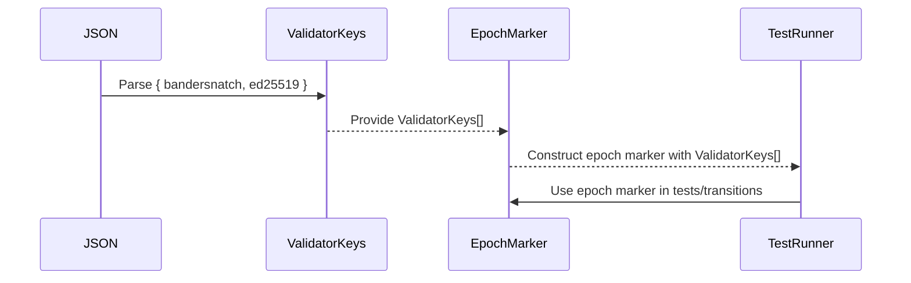

# ed25519 markers, reports, statistics, safrole, disputes to GP 0.6.4 + update w3f test vectors

## Pull Request by @DrEverr

resolves: #304 #326 #327 #328 #329
partialy: #303 

<!-- This is an auto-generated comment: release notes by coderabbit.ai -->
## Summary by CodeRabbit

- **New Features**
  - Added support for tracking and reporting core and service statistics, including detailed workload and gas usage metrics.
  - Validator keys now support both Bandersnatch and Ed25519 key types for improved flexibility.
  - Extended input types for reports to include known work packages.

- **Enhancements**
  - Increased the maximum number of work items per package from 4 to 16.
  - Improved statistics handling with unified structures for validators, cores, and services.
  - Added new error codes for dispute validation.

- **Bug Fixes**
  - Improved validation of keys in dispute resolution to ensure only valid keys are accepted.

- **Refactor**
  - Replaced and consolidated legacy activity/statistics structures with more detailed and unified models.
  - Updated JSON parsing and test logic to support new statistics and key structures.

- **Chores**
  - Updated and expanded test data and cases to reflect new structures and features.

- **Documentation**
  - Enhanced comments and documentation to clarify new statistics and validator key structures.
<!-- end of auto-generated comment: release notes by coderabbit.ai -->


## Comment by @tomusdrw

@DrEverr can you bump the reference to JAM test vectors to prove the tests are green?


## Comment by @DrEverr

4 tests still fails, I'll look into that, but those are our test. Which we need to update as well to be in align with GP 0.6.4


## Comment by @DrEverr

Fixed most of the W3F test vectors. The remaining ones require more targeted attention and shouldn’t be lumped into this PR to avoid making it too bulky. I’ll address them in separate, focused Issues.


## Comment by @DrEverr

@tomusdrw @mateuszsikora I welcome you to review `Statistics` related changes:
`packages/jam/transition/statistics.ts`
`packages/jam/state/statistics.ts`
`bin/test-runner/w3f/statistics.ts`
`packages/jam/state/state.ts`
`packages/jam/transition/statistics.test.ts`
`packages/jam/block/gp-constants.ts`

PS Feel free to review all, but those are most important IMO


## Comment by @coderabbitai[bot]

<!-- This is an auto-generated comment: summarize by coderabbit.ai -->
<!-- walkthrough_start -->

<details>
<summary>📝 Walkthrough</summary>

## Walkthrough

This set of changes introduces support for Ed25519 keys in epoch markers, as required by Graypaper 0.6.4. The codebase now uses a new `ValidatorKeys` class to represent both Bandersnatch and Ed25519 keys for validators, replacing the previous approach that only handled Bandersnatch keys. All relevant data structures, codecs, JSON parsers, and test cases have been updated to use `ValidatorKeys`. Legacy parsing logic for single-key formats has been removed, and test data and deserialization routines now consistently expect both key types per validator.

## Changes

| File(s) / Path(s)                                                                 | Change Summary                                                                                                                                                                                                                                                                                                                                                                                                                                                                                     |
|-----------------------------------------------------------------------------------|--------------------------------------------------------------------------------------------------------------------------------------------------------------------------------------------------------------------------------------------------------------------------------------------------------------------------------------------------------------------------------------------------------------------------------------------------------------------------------------------------|
| packages/jam/block/header.ts<br>packages/jam/block-json/header.ts<br>bin/test-runner/w3f/safrole.ts<br>packages/jam/safrole/safrole.test.ts<br>packages/jam/safrole/safrole.ts | Introduced `ValidatorKeys` class to encapsulate both Bandersnatch and Ed25519 keys per validator. Updated `EpochMarker` and all related codec, JSON, and test code to use `ValidatorKeys` instead of only Bandersnatch keys. Removed legacy single-key support. Updated test data and parsing logic accordingly.                                                                                                   |
| bin/test-runner/w3f/common-types.ts<br>bin/test-runner/w3f/assurances.ts<br>bin/test-runner/w3f/host-calls-accumulate.ts<br>bin/test-runner/w3f/disputes.ts | Updated JSON deserialization for validator data to use new `validatorDataFromJson` and `ValidatorKeys`, replacing previous single-key logic. Adjusted imports and usages throughout.                                                                                                                                                                                                                                                                        |
| packages/jam/block-json/header.ts<br>bin/test-runner/w3f/safrole.ts               | Removed legacy support for single-key validator parsing in epoch markers. Now expects both Bandersnatch and Ed25519 keys for each validator. Updated JSON schema and parsing logic.                                                                                                                                                                                                                                                                        |
| bin/test-runner/w3f/safrole.ts                                                    | Updated `EpochMark` and related classes to parse arrays of `ValidatorKeys` instead of only Bandersnatch keys. Adjusted test runner logic and test input handling.                                                                                                                                                                                                                                                   |
| packages/jam/safrole/safrole.ts<br>packages/jam/safrole/safrole.test.ts           | Refactored internal type aliases and test data to use `ValidatorKeys`. Updated test constants and header construction. Adjusted code to use both key types throughout.                                                                                                                                                                                                                                              |

## Sequence Diagram(s)



## Assessment against linked issues

| Objective (Issue #)                                 | Addressed | Explanation |
|-----------------------------------------------------|-----------|-------------|
| Add Ed25519 keys to epoch marker (Ed25519 in Epoch Marker) (#304) | ✅        |             |

## Poem

> In the epoch’s gentle dawn,  
> Ed25519 hops along—  
> No longer just Bandersnatch in sight,  
> Now two keys make it right!  
> With every marker crisp and new,  
> The bunny cheers: “We’re GP 0.6.4 true!”  
> 🐇🔑🔑

</details>

<!-- walkthrough_end -->
<!-- internal state start -->


<!-- DwQgtGAEAqAWCWBnSTIEMB26CuAXA9mAOYCmGJATmriQCaQDG+Ats2bgFyQAOFk+AIwBWJBrngA3EsgEBPRvlqU0AgfFwA6NPEgQAfACgjoCEYDEZyAAUASpETZWaCrKNwSPbABsvkCiQBHbGlcSHFcLzpIACI6ACYAVgSARgBOSGZnAGtKRAAaPxJufApcfPtcaiRxBnLENAAzCnxIgtokbjxpMPxIAHErSAAGDQA2DQAWSABqSGxuWmoPAHcAZgawkMgpMRLEaMg5OcRKSAARCgBRKQoKAoxHAUoo1bSCtFpaf0QT5GZvcTcSIoH7BZCYejzRY0ZDLdQILC4WAeXj4ERiDSQADK3FE8Aa8AYaB8sgK6kKiBaUmQSAc3TMqyGEwKDLioxZqziAHYOXEABzvDD0VmpQX0bjOcTErzyD5faS/EF0yAMoarTHuRiwTCkGkYBhebBKOYLJbIfxeJb0AiQeJJNIZbK5Ar+YqlOqVcSIGp1RrNVroIWQdqITow95eeBEDDwDBEMLIhRKARoE6QOFI/qDG6IeD4LAjcYTTEAQU+6jzGGlpITHlsJuh3SRHgA6qsAGKbb3bUQECjIG3+BqRMS1tMMbVx6QacyWADCLDYGDK9kcmRcbkTIYY2B+lf4iMTnR8hSCW1jEip3RON2JCmXFHgAjwe0gDXwO9zcYPXdCOz7DZmoG9BMMa/gSPAJDLDwj4lBW06QAAqicfAEP8iBfNB/hnt6A7aqEFzXJQfDPsw3C1oUDTPPqHg2s2kAAFIlgAsr+Pa7P2PS2hgDj+Am1AUTCK4Sj8q4MAwCoNN4MqYoRNx8N8xRCnhAnvtgqEhOCfHevAJ4NNokbfhC6AMFkGD4MskS0LqFHkFENpQkstbwHwFmIppXHElGWAZrAWbDGMkwzgYWLYAIJxnsuMoFHJxGFG6K7ahB34EgAHlEzD4N2+AbPRbadkJ7F9jIeCQOZML8aElJsIUmSxrG8aFfpunqd02HYC5HiZXx76flE1A0MulYar0aCXvA9CZFkDUUTutzsNYdgEL0loUKQwFzBgcIkF4tA1rFtw8JaPGeZ83x4dIHj+HVMbfrSYIoFgJwSlQNBtHQhJWkqYLBQdfDEpSj0QRVaG7phG2ZDQu4AF65lkJRoFx4GQdB9ETjqbU7V9dGJgABlinrVISiC42+2D6uI+ZebgNYIEQsCRvT4jfqGeIEgwb66d074KSQEFQVwuMSqZaC6gA9EIaDMGLuBUDxFb5mL3pVDptQaGUuMFELaAi+LkvS8rNBK4TquIOrJNa2oGAyyEYAUOT5AUGLawNMbKs+ubmuQNruvSBLUtu0bhskJ7WvC1kot+/rMty7mlPW4bRNq0JocbT7Ed6wHAheB+WRi0Q3BgEwPGVMuZsa5iLYIMCf3cUw6mR+afMozN9HsJ1i0FM28gkGR2q5tDtH4RRiem3bWM0CBk42c4Q9dVloTwGRJSl5om7POgfHmWTpTInwTCsOwyAlPwwi9pWTdMBQSj0LGFHbruub5sF+jGOAUBkPQOU4AQxBkMok8FCH2XFwXgp90TiGpIceQoFlCqHUFoHQr8TBQDgKgVAmAf6EFII7L6B8lycD8GgaCDgnAuGgUmOBahNDaF0GAQwb9TAGA0EQeEYVnYlCyMOCyiAbbejtg7SgGhZDMC8BwAw0RJEGAsJAEsABJP+uDAGkPXPIb+6MpyIHXumTh3CSE0HIkiASE5RBZGPqVNuqUaAUCrL4V0WV1AlHkLjdshoGgNFkAAGRULw/WQl/x7FJv3Q4JAyCAUAQ5NMiN2juOoqEPo5J8HkiHNRCSGojzI3wLuIBzByT9z8rjZIXIuR8mSBMBoExkh8loEMFMElaAMDVGgPkowGgCDKY0Lk7SGCjCJAwdYcRSbLFTPFS09T0zwnQGVKCOS8mpgKQIVYCQGijFWKkLkcQBBchUA0BgyRWl8jaZUnpjQEipFGKMPkCRKmLAEHEBguNMQADlej4GbPvaeTZej0WWLonO0Ec6sIYAUb0RRygn2Lu0eOsIN6ZCUMFWcsivDWKqPmAc3ytyiFWqik638SCpQSlEE+nRs6Em4uESCWiDAvPIBIqRBgIBgCMFbPhuABEYEdv7ZgtByZoEDiQTx+APhCLKOIyR0RpGWHkYogBUQVHODURsDRuptHKvnjEylFEcjyF3PZXo3oSgeCULA+go8fTBmoIjO+9EXpSl8MHcBvZMRWEybuaK99RCKCiBIYkwQ3zNGYN7FC8AvKDw0Ga4mGgFzGqGSM1MuZox6ooqiXEpRnERtqFYSgAA1Ly0ISik3zCPT0HhBAQKDY82RDRrGzU+V3BAyBjVevoD6w0HgMF7kTbfEuJAPhcRtc0VNNMg0mx9JWl5/B3mQEBWSk+Tb2jfieElPMfAMHIueLQYKMiSzrtehfftmKDTOBxcfDY+LCVfz4CSyMHN27iGkEYGlIc6USoZUwllQl2WcpdmLHWO5/iWhoObMVUjt0KJwbK01a4FX8CVZ8qlmol4JVg97JoLAGKUgwKTNDgbcYAAEaa4ieLcWQYts65zAEITDsbwSfH6jnOMuZjS41+RQLINgigr3bAGjD+ZK2alxvg/M3H0PUZQMvUo6YRnXXwFIegxlXRjKiEcdo/hRy7kjih3GOHeNYbfMS5wX54y4zkDCTkpNnBUFkOCIMBIdq0D1BkAE8AgQoiU4gLgd9cYcY+LIDjV9aByJoMwDQShcRCjIAwSlXtcbQBCATJYGh2CDtkDFuL3oEtAb/Y4bwVovbGVxgAeTwGGDQ+Asj8cTHgXS6hnFKCKJcIIxJsMBu9gR2QRHiKkeq14EmG1Ea40BaQCgLWWBTJzkSXwmUeXAmWBvOU/UaQSbKOkjwgnFzCZ42JpDK8pNN0ynJ/1Y3HliyExgMAhHpD5aDLjer3BGvYGa2nIblAhnzbo920FHxMRyMPGt+2GASziRy4Bkg6XcDYfJmISs9aUSusQDKHJ7A6BgCyaEO7tomuRmHSY0yITcBzbCbjFOxRvQAH1g4WaDPRbLAGnIOuGU3IEOtlOynvFCysxJPO5TxhKJEpNvSPjusgcy53e7cBpoKW0twT6ApBLaXJuBAGxnaESZmjVEyFXQdGQ1tAADck695whOLD4MoTyKBEe9jmByI8eoFTTzNgm6YANserLRQ2AJLgnvO73wejDhywnJVdnCtbGI8QNNbgF0KhOQPi9JARaUwnC/n9mCl0aIocRnz2ACLJVIpRdCg9RqsXHsL3iglK8iVXrCje8l8EqVQAnWq9FtoK+lCr54Ult6hrDuNdisvfAE1VlwK1GFfE4XPvFUYRlzLYysq/ZQZ26xf2gkD9OUVL68/Sog69OV0HyHqPg6q+D4T23LZs/QBiWJCtPJ4IZmaM6OYWmxr0VtE1qBzstRtF6C18mQEnLQIZEQJiDiGzJ9CSKbjtpJt/Npltnxkdrhu1p1iRmRhNlkJRttrRjfGKBRFAaEDAWdiJswLpqNrhhoKdhtudpdn1qgIpizvQL5N7G/vmhQGcJakQSQZiAuPNKGPmAukQO6vRFfjfmbsGqGjivpqhLzrPMuNhpBLtI9BRLjLGGGBwWJlJBTPuIgBmCYsgDht7IQXARgBoKZtIJyAABQACUpMNosBomz8phiAFh1hpY5Y8c1Ypugm6kFAZOzBH+/Ych9mihsW8WJaGgOmYmzeCBxwM062rAm29hxhfhfYbBlQNhvQuMyRJQqRaAahfGq2aY02+In0hejQVEo4sAFkjE1+t+KhpU9uhmUQsYNozRlAti8U3w7AJ6khyaMhoQf+xkWRfA0IiMz46OvQ5U6Au6FEsmygJ4xcvub4/y/AfAxEJ8ABQBue26u63ROMxeR6e6aKKG56lel6neted6lK0+kATeJ+ex9g3k1Ao+KxZuBx3R5eF6Lx16ZKlx3Qc24+wqM4U+b6TKBgH6tsAO36y+aAeAlRj40MJ6wGm+YGMqu+UGZCiqWoGMCGiYeBWmhhiRNGtUsx8mQYdB4yjBmCeJMBER8B+h9E+Gl2xGLgqBFGVG8B4ckcXBJQikfBDU7q0oxwjc+JlBeRxhjhzhb2fE5JUQjBdhxBmGJhsgZmcQVhpM1qeM4O3BJAJYsJcEg8I2ac4OmWJApMR6PwCEaCyAaq6AsSYg0ewht+SgYhkYCJ8c06+AQKPRDJMJSIZO+SgRChXmWphqupSI+pr2G0PpsJZOxQLQfWBWvpsAZOZ4YIFmtwaA1mwRxpJalWV0Ww38aMXqtU2gJ0UOnytABQvAl0FAyUGuHggunuI+fExkS6Y0K6KGaMloFpF+ZMmhaKWxUqOxhe9xfepe+6HxpxXxNePxPeVx1K+Yk+9KM+YJc+n6kJi+P6sCDAFB8RxhG+U+KJO+X08qB+cG2Jx+GMGQigxRTYiYzgRAjgC0IkyeXEuMZwnqSgFAoWn5JAhWZ8YgpBUyVA0EuMiEzRfIJYGZqWkA5huMkWzauMlhnk3sAAQsqdIKhTnAIOqSXJgBJIwP4F9PScPJZpmbBbjOhTCFhYICYdhUQeYQhTfNYZYekmut5NHvOjNHUaEJdhMpmJYriGIFEJRRhYgDRThZIZDEQlOkYlgFnpaHfKYZvFZqthSPgTzh4BodDkWo/mSPqIaPwXXDeUZEGPGpQO6bjmYi6L3KWcgOWRjJukYIijugXvuqOSXocbimem3oAsSjOd3hSg+gyjcb0FEfcUPk8XxIWYmCce3vQNpe6bjADtGqIODsANAHoOYduVwKlQwBlXoF3CEFwNAAUASJEFwILg1NYcEeCfwhuU7FuV6juWdp7ECcue+muRCYIo1cvmdhdh1uvh5siVKuBv/GiauBiShs3tojEhsDJlAgBoCMCJ+GhNUSIc6ZQCGq6RIeaYqMZIlfus/hEr0KxlkK3qINVkWt8ACOUGdRSLdQUPdZyetKzLUDZQSOQAQj7vimUCCiQEQN9c0G8h6eVvMCgMFuUMZPdfYu6AUfmQdlEL8XqAaEaCJeDi2JwpcOlAwBxg4MimliEHjQCITd6FYDrBnCQKAQ8lrCGcuL9aTbgFiADQQjYPgG8oKmDdwEFr3NdvQCEd6JjWxhxglPlgxvGJSQYaKUYaTFWGwKGCzsHqiBBDfFMjvmSiZmJeZnfv2KcMZANkMTkaTC9ChMFL9kdIrTFZdMSYdntdIKbrAmVFUXgb2bqt7tWWAPikTN+CxpwiLVxjLX2TpVgPoYyYNcyaRuRqZBgfATaCbSsJwvFCvI2p1GIDJC7mtobZaqTI6TrShPLjKfQEcIjMrEKMSIua3p8cXKXaEJkXmv4TkWKUMpMpbpIMSAtIdVTNbsFMzbeL4G8nvOtbfvHZxDzGEINcgA4EHiMgLbgCWD6rpCoDVjTCWJ2hgAQozULVkOTb7L9u+IzTRaZCaYzczbWYSCQHvfgHzd7ODi6iQEvJHDzcwOmQ2UhpGHZkXfIOSTNJNr1kXjbSJQSQqQ4VraqTVYwapr2IwNKC3vKbpkqSqWqcFGWBzl3e6tVB4OTLqrfOflGRPYUKDtaBigjSSYwN2YqIxSwhoFrNqb9koKlDFqfRBBJH0KmDFqhaEh4gABLzIxYcafUkALj01WIxZb1P2IALjkwQ5axhlwnwAGk8OICwCiNY043E0E1axb3Y2iDqO4AADSKuKjwt0gJNWs7Y8A6UtAWI8jOp0FMWXDJYWIXDZOWIciAAWpcDFohPskhZvCQ4diRWfshsHAQmbNorMVQCeCQHaYvN7tXS0O/u6cZLmGRO/SUfuN/LnZtY+OIe6Y/hQgtT/buGtRNneG/b3F0aUWSTtLIDNEWko7PJWeJp8dk9tTY/2DZTylFt+I7TykCOk0WsZHHpEKlLVoOfngAu5cQ68f3hOT5Z8f5V3nXveg3pABxojSBOQ4LBjaozoyYwTSFes6Q3tds0TfsxDoc73Mc1szfSEDvZTdTbjJcxs2Q/Gqc96EIzQCI889c287cxlizewGzRzezVkPME/U81AEc7bTc7PVvf7aUJC2s1c4dnLdIMLCQILEAyQSFdjVXWiqvOgB9oLFnZUE3bBbnSPT0bjLmpGCwUbZYZviCbPtbOuT1Uvq7CGGGENSBhKkeeNSefvpiTNQYIhstjHsFkfOmLCjeR/UjEUEplLXuWKRoKS2gM3ZmIjN1A2UJcURzHXXSw3ewYHXiaHeQf1dQVTkQ0S/Jt7C9oaaa61o8ua5QZWubQyTmUsGaeQ6bpS/filCfLjBHNwBKFa3a1LAIIsIGQ5ntqfta7qkwfXSkca4SY9F9l/BsHEZlBgCq2q266nsleTGcB0F0IgODpDv2RgO8B6UQKwizCWt9Yzja0mmjmGCPFtaGiJTdQTZ2VuCWyDLHKHq4ag2HjWEWUKKHnePiqjU/FgFbd7CmLQBTo8c2dIGAIMmxESGmIE9Ls0P9BaaUPuE2wtXQAUFNK3LFTLvuyhO6VDnye4X7ifIKYVNnmE85dsW5UcR5W8WXvM1OYsxcXOcFY3mFSfv8V1MKv/ZFau8fMMZ5e8X+/FdOUs8je1a+iuXVWyg1Ry2LJUfwr/YgGALTrlkBgeaBqNaiYK1NYfheaK7ieKyEx3U+0PaIR2zte6Z3VgMdUmjS0m9kdnbG2qglU69i2JrYWq+SxqWthaxPaTNNt4CHJANwbyRO3GIIXjOTYe8SMfa8z8AAOST2Ez6u0l6YpoWXyBNuOQnXHCZ18esEpvAN6axjpsinKtGGqt2dG09Em0XtrZyLG2DrmdPUIBB4YLyXQVaa0uJP8dpHPKvJTr5MQr5iLH+5NtFEf3jOuWTNfvTNjleWnqV3/vV4odAdUpPpofT6dWsvdUcqbnL7VkP26hImHkUfHnKJCvTVH50dBO7aMfLjUsmdEkLbCdjYMlIEkAR2snR3smmcU2Rw4EDrNxZII7yB4GAPS2pv6GIylNTYe6zbSYot0Dck8FKT8HqceBZM1ltNun7j5Nj0MkBmcz2aOaz132NfSAQtGkhBcPVBOKfd22wgjJCdcQJtwOKkSlgO4UucEEbeOcINmGQ9xeG6nCcd3gnyNliANy+BRHgeOjwrOVb7DlTMeo/tzOFdIcAezlBVleLkVfMurnVf1Xss/pqbsBgANp9iyDNfkeyJjVKJ77UfnmaLaLUmZuid0lOsut7kDW4h9bHuHekn0CF0UJ4GxGDfRFh3IEslR3oEzeVrKfot8lqdjuJiXcunyMSH3d4y/ZhjevxoGfezIjCo+EBlhx9EU4lpk7A3SNpzEeg5e/s0Q5Pe7SA/WkVnRG7ixHi/imgNqlvkmfw9OGI8u6oDpear0SUjqQEXzsQ+sc5Pse3eelkq+Ro5THWK+f8B932qyxNmtQvFtkQQnzzu4w294DhGB1sDhlOWE+fsnTfuzNHGTkU/FeAfU+Pq09MsYddVM+1e9Wuyw0rZkd8utcCvteC9YnC/dcb82TNHNBdMNl8xzHTKoz4PGS/Wfyt7e3xiLkt5kCTgEV+v9gzTJMlodHp6ExFpW/5kJQDhbBNBSxQROEIBXVuzA8K4FxWMBLevc0foYB968uc9BCCTSxhUazGPFsnWBa4BFGyjNOFALm6kAsBNhCeqWGP66dkAs9ZmoDSBaB9OaYLbmsFnVJYFZSkyEukZ1Qwd8SAXfLiPHRY7NEMiuA3erAKvpptS4XuGyszm6b1k08jfbJKLymQpNF6qEQasFAEyt8g+e1eAVYk/hICDKaNKZOQFApmQ3IsZPAVdmD70BzCmCMipiVxj8DKaBAywk9UmRXwVORlR/kZg2jFwcw+4e4q0RsR3hvMnGd0KoOwwlBIYyg35CQIB600Qg2pTLEnATI3ZjSlAZhlTVHTExSY5hRguQFBT80khZ9CSP5hKC0AkK7wPiLvw9zjI46jRDaK6E6L9clAlQLmCBENQbQUIKQiVvEOiKOl4afjZtvJhFwzI7MIfKWt8A97ux0hacNoefUQBjCvQY6RQh61CJetSBjgzMFZyiBuDn+QYZziILhz4Ah0lKZQZqSWE0A7eokdYTSBXCbDvwkSWzoa2TZktA6BWBPhDzj6QM06q3HtH2nnbVlpB1pSgnnVOApJ/ANEM2BnRWJfktMSZWMuzV6xhtkqogdgGTh159YfOwuIlkIGKbKZSoqPEkJjg6itp2AalfQR0NNgqVMyWkdtDoNVpScJWHgTwbkG8EZEEWZQY+vWiyT0xawsoLeCDWwYLDEwDIp/rpSL4MAzaBbAHCyLLYhAK2wdatkNhmh9dYmfQriK2wsSJgqqcYW8kr3Oa9tv+ydMIIO3jjvAJo3FLAMmGwC1s6mGkbKCVlKgQRcwagbukYEKxV8HaJ+c/tTk1x/8qAbAM6g7xGLXklAvgG0A4BDa7Y5Qk7avuMNqAbRDBywLAC9VohUBTIDUMkGRGaBSAWOaI+MASCDG1YcCcoPwFIyXgeB5R34QslsG7YrYCeH7bLn31y7wdf25PPyiPyp715riKDKIOoPIGAtlwGAmgeC3oH8U/IicYzuwM4H+Bmyt0YzLYJgFwCvMmHBfHPzFgL9y4JMGcFAGxqDRVa3Y4IbVWn5Ydmey+VcZ7GHEkCzOaab2HGIwDGDfYHmSALOPwHzIAA2gAF0w26w/murwKwEBJRe4zvpUQcwbjZEH2Ugf81wCxC0htQDViONYFg94CxkB4GwEfAcwhhMbBcQeKXE4cTxFcEKp2M2bxpwJTDc+oUOvgwSOhY41NohKfIoSzBL3RcdhxZ6BDF+64vCaBO7F5CUhcQ02ORNHFsDCS9wGiRrQmjX0ERAWEqvFmSEkTPUZE/cYz0PGz9sJzEtcY8lxaaCIsBE0SOQNzJyT58jE48cpNPFZCZkF4lZiMOkCzD4hEkj5oam4k+g3x8IqYV7ksmmxrJTNKSRJDsnEwHJBQT8fxMc7G1/WRAAsaBObDbt5CMbe4ntWAnMRZWkEBKlDiSoSjlJ5bXSWy0UlMSf+p4m0IWO26ek628YRUfwFtFK4K+Go1hHK1XEGjMAccfcFWLp5T95JWEn9PUDQyRBuey/XnpRzX6qJOutHTUHNVPzR4TMmE/Sa7Fan+gQ4GsTmMCCODf1vwGmGyDDzc6ps5S6vJvlOm1b2AQBZKa4fGB6z140xytH+mimqCRZPhLHVprk2GiQAgsNrJbD/2paoUSwTyM4JcBsBYgnkJYaAHOGcZ6NLgAATTJyoUAZ0AS4FiBiyXAzgiQFIKkDJz/SgZIMsGRDK1hRcWCejEgNZmvoMl1e8nYEKHXG6TcdeMdLDGpUoqID+ww+CcC6nZoNBCBuIZprtloIK8Fu6oldnX2zHBEagOQXAJcAwBSAc4uIWWlUTdrewtAiAQrBKDPBx8dhvaDNlMneGhAt2mgWRCQINbRcKAGMrGVmMaKro9Q7uffta24Flpew/w5cKWRmgCAB6hwCmYgCpl+Qz+tAGGQ6G1Tghj4Usv1MpSsFvsBM0AQkDzIlmazMZfWdQRcIhrIA9pIPNMPBJj6IMaqss74WL1h7wNXhLhcEbjF0w6d1BMpcECeCzYJEApQpGyGtMDqBsJOgdMet7JQyOENoQxC1JUDJmk5cAZOHKFRAiwBEzBTtaCPHTdmBhyR1gy4E7PtCpAtZUPGgInLQq2z7Zo8smZcGKAThmI2QM4WH2xLhzE29wwJJ3KqG60+5VgyLnZy1k0Evh8s8me3LtnUAJwM8owO62OHeg9xe1Twsln2EwU0JedBUToWRB6EROyc8HrHxqq2EXhf8vMt7ABxYg/QLQMHNKKDpJNPgyAMsdf00rVT5Y7pKsRtHKH784m97TnL4F7QUBEck49SD5GYFYA1ifAOXPiCULZ4BcssbiiLnzCe0yIkuW0DE0kA1N7AkebgK3C2D4pLqHHE+OGXHCphLSiYb4BpUEhbBzKh7I4tdFLKbQhOwUF0XMS8BujV5vUbJNdWib1Rvwkc6gv1nLDfh4FHgrBV3XYUuZOFd0VPIVAaqZcieOXEngP28rNiO83xQKu2LYmq0SRbgygCSwPnByuAYpYAGjP8KHy9AuFMqAAIVoEVcYE0iBU3RilxS5UrArxf2HESQBdAN9f2RwMDmHz2+qbPybcP8kpygFwguWa52zYqtU5qktJVAAzmYYTSuSwufkt6Cg9AFcc+EeXNTYJyT50fKpektxhzyPwsAReWxgaUkE42XA6oerJYIJkyBQSvsIfIcklKJ5p8r8ufNwCXzMZDkmcNUvAmqDRlYmJpYCO9hPzuAMFEuYkUT6Skll3Sn+SAzaXxKNUUQTjiAvJhgK2pkC70OYSEifN2AXAN5ZNPBxVlqAsASqjQrjCWEuANM3JCcGADjRaAoS1Jekvwk1sCpuopBbVI0X4014Oy5FZCkjG2hnA+CjgYQrPGkKUV3FTNlQvlyi4GFEuLnpPyq56Sjx40qCWuN5Zb4+ekGSar1Jo6b9NQjtIcDrGKiXSru10wZkGAdSywapjuCQnd3R6srfwpoiiPlDYjWLbpoQHOcmnhwZKMAsgPcQVnbDSR755DaQHp0KViY+JAExQLCEmReCv2w8K6a6SpE5TNoWo72HuMuzvB9F8YTBOLmHS4wxoBkFQJEElHpkrMwYdSCdP5mMjn46c8HEDkgS1ZSJxQsCczLRaK94o6kUnItnAlzKSgXk6CfcCqKOr5Gpo2wnmooAFqj50PTNgmskBJqZJxQ55DMgB7gTIJ0Yi2ERI8mpCO1okzidMKrUv03ce/T3EmlqHv8FALZCVd2tJE+gCgvaIPBAw4EGQNhNRPPtd1lUijHQIbGaLnTQkt5tyYAJPFEFoAsBZFJs+0vpRQFRq7VJ0Mek5I8BEARkraH6Nol+F5hsk2k5YRj1XYF0FW9BChFqxaHZDAEX6uYcTCznkM64aAKPCR2f7QUCudcjNOUCvgNlWVOBB9bOsjTgiCAhcSIALKIk6TzI0EBYnZQTCoBolrKwtABVwDVsEcbyHAnNBBF/g7OYIzUJao4GATvYBAKtTp1QCHLBRvFV3CSJ/V19eBuBemn4N8D4xWVOnGVbRsejXrvwmQHdSzG7X6zRo3sRedwFJjapWc9gGdXIjOC9kIxPTFochqOG0QtgramTR2vBx+zdV8IqteDkNU+BhZ0EBNvRHJhuqW+GAW3uPQZlf8XIj0Ntq/K6VaYHNeqvzXgELR8AXERq6LRDjUpWKeq0C/dIWwwDOaQgkW+EaAtZUubpIQ6tPkmjlz0RCoIxfSjXRDQ0BvYg6s8eOxuCAIPaDqcwi+QVFCVOY/YXAA4PQAHtF4MYO1HSPxHUwTeYSKVcgv3CR8bhiYKSCeB4qOpRw5hcLd/Geil4GyOcBTUmRPgq58UOBX6kLlzAcwXoAA6xIgB60HVYw1YXrTe2TQLwwADqS3CNoUWuja0q87zR4hC2lQNiqY1vNuKw0xiHU46k4ObPdItFqR9IlockxnXIaQpmI7sIVB4U7hQdzStMPRBJEBjRN3wKMoaP3BWrTU7M74DYt74t56IeXBDk4rOIuLlm85KAHOCg2xZYwUW23rlXD58SY5QFEuuUwW2hAVN5ixqJptxgzcysNG8iYjHG2IBHchQKcVsPdWJb6ZVIpTcZkDWL1s4JAUNcBLp2ET4tPgYIX8oAHb8PAM9SLXuPvVwTBuGu+nfGuhzAw/Mja0mCCIAEZroOdfYHrYXBwVq6tjBNnerwIU2JYiHuqjdcq0x1qbdya1SVAFxWW6YhtkwPV7rN2B1fd0472O2vA3QTgJkerXf2s8mx7Jk3uhPcSr90+1iJ2e3tenvYlR6AW+Q6QJ7tz3x7U2pGrRcZhElpw1MRQ6NmEwj3l7M9Jw+ITpzj1VBKJhchvUnqrnfwhiBQVDRhuh2sqLd3ejLLmRZ2OUKJ5q2Or0GQGGU1syGjIYWUGqEaO1x9HrdEo22iSmNvhVjfr1Z2sC8d3G/ALxp0nO6+Ithcwm9S4CXZCyjOucNqFjDU1IAAAHwC0kBv4s2rwJ/tLLU0QUJaNySaWQoABePQNiFk25lZ9WkrLd6By2L6pw/NHitGwAMa9jdcut8sEOQNkDUDuAVzV4FxgYHSAWBgg6/L4qh1yDHqjIkQZCqGrK2ZAvLXZuy2M7ctry/LSEHIOUGlO4fHKeJCKChB3t8U2Xf5ovWhB7uOO/MF6tVrwLYdWIkCDAzfI8bEDywqoaJDeqdbvQDUxlelKhKuwaFU04ai1y6ltcBePKoXiqi342kT23uIzMCH22YBAD2SbOJgHOqGQPATwAnKElTw5x9hweZzhZWQDaowAL6lENoE4jiaytj4Q3Z6MN19bvBw8OPLPGjznpewRKEqf/nmT1bNcSRh3t7wKNKMkeuIl4o/jvAN8Oya6axEdxrFDlid/9MnU2LiotjzibYlZuP1pTAkVyHo2drwhcw7lUQBAJgF4FOwkAwAyQJZGADOrjwEoYAEMDQrGLDQU4S/Dld1NsMwZeVDhzUIVEdqWdTQ1naujX1HC4xmIhWOcHozJwthCsNgO4zYHBmIRPE0AeEdcduP3HHjzxy4FYEeMfGYi02tbDhjyrUKB9GQTjdaqD3fxFZ94H9XsGJEzIrjNxu4w8aeNk4XjWIN40CfX1o0bMNrfFYNiFQprX5O+hmTYL9qaLyAgqD4ORIaErrJoHAlCZPU9wOyyBT6xAMhDoAxY1uVjXsRrC1idG6AFA0JjFn23OdCQkjWQjgXgpWIDthIaxoPGAWonvjGJv4wCZsBAniNimjfVgXxX7rvYW2+EpQAIFawTTFveOMVlwC28tYJwSgX2OoGgt5goky0zd3zCsNuTyeMWr4Hqh2obGDBZgSG0HQ5MatSgfSACBeIGlX8vqYRT13dDSsWytAOHYAj/RFD+S8gMHSgLWyyxZAq9YvSQC9MxY8zBZ7tXImKFyn4WNJgVKSexm9AT23GlwKvUQijAJgYbDPkUDW24GXa1LQs8WbTiFmKzwC84/bGDq6jCiucbnXQugheRowNqzMIeuPX0AS1HphMQNDaLmhgVpwOSo6AeBlM8KQ0HFB9RHDq4pkW04ZhwOSOmoLjq7bUdWWB0f852iCmGsxJqE6iRiROusSTsPQOKCuIpynQFWp3AdQq5ANSlEVnjTol46gJNEceLLGRT1TtHnbK1lC6qKdyHUfrVhmbjkByDK0EomN4SoaxYSE4jCMYiypQOp2xmw+iTsMG6cS9Iz5MOoqHdBzjmAFjW2iZx1Czz9ETIKM3+CBpScDo4EDEb0InxyYQ+JovTWGwFcB43QZIAUDiA4EpgjhQWMxBLAAANMnIhD5AZChgqUdxIfrUuaXvGowXS/pfcQNBztN2Iy1pe1rmE9LFlhoGTkcusUM644AlmxcpHKjy6jGCaHPEv46Qbhu+iM/6f3Rj0wKOlrWCZdEmIRzMSPAeqcD0ppa0UBQfhcFZpOh4vLxWs4ie2761j8ubRxsWTwAsYWejNOkCarRKusX+uVxjS1pZ0tniYj3sBy3TOCIEWKC/gYi48FyBiwdtFFjWO4qRq+UuxHlmqzZeiuNW4zzV8y+4jCXpxG4HVkgF1eYCkXer5Fz2INfoBVXRrtdca9rUYJNXcYLV9xM5YstzX2rRFkiz1b6sbWBjTCC64ajFg9ZeE9UrY/y3540W9j9h4KiWBIHq1UJiU/cAiKxXQBb9YKogMAEKxZACglwK9qEtjbDcuIgmqZAEKxWQ3obkAWG3u3ht8VxNLAoXPGCB2VMbpd0xPS4fBsx5D234OUtEEKx6MuA0QEIT4Asj6aGS5WUmE1YoX0RUFqAKel7gl3eAKKSAKGzYXtgkBXLhWd5MbhIBkgNVBek6PjYVGVAqbEtSZLjGiBY2SgDNpm/8lZt4xGTukPrOVKjLIgC2pCjm1NdW0TVi6x/Pw2xT0KA2i0x050lMi+Yj47wp5TEgyV0bUaIEgATAJDOiWZoxMwKv98cLjikq5T1cW9HWDjt+SsSxAXnNQbBMAm+jZhtw3zC3wLgLozTuY24bEKioATfOsmDCLj156yuPOa3WOq+Fku1yim669MMuHOWSKksM89t8q/XY2eTouzVRVBfYUV6S/7ryNZfWMLQWwGULynQhpXOpjpWBA9w++hTmZYIi4wFUKU8i+bAFHnbA4zyATIcwLfDSg6k51MepECfUMB5A8ms7RMqf6mV+5+8jeUHO1myG7qIXPyPieNBWzMwJmNe+suwEFY7QsM3TcHLUrvrluOiNjM4CyTbD+ZVIZ/t7ArVed1B+tRgMU2OycYJ7bGeBw5zGVUsjE/RCEFZGnQA0dY8gVwzMe1SF2GosHac7G1ys/Zj51bEkVMuCXBzyWVLJtugtHVNNlgL94MKnQiDyAVNEctdU/bPFf2z59s+Ef/bSDt63yFaw+WPPwrdAptxmOR0A7BPNV9ePJQ3qpwEKjbvYumce0Msnvy7Y2hyocKee9hZoKAFawJb4uszw3ltmbKxzY9XviP17Ws0JfbYN0PFUmt5V2jGDszR5OZY+uzpAFdmKE0HfkdcDkE4hzSUWD+Ih2fdXBhjJMjtBC3w/DzzAEoFfdHVbjADkOZ7X50Ow2NJ6D9EOXRqncjWuLQBd9tS/MIY+GUxPSYn4rgK/KYfFQzS89p1s47s7ABXHqy6eZjJxsZEen992x/fZCWqS7rNdu8XXeJkzcOEbGJYyvEovvWuVntvqXyvo7BMG2C0JtggI0lcQ37a2fs2wzTilnEApzke61jG5Mkus9dwKb7DUrT2TEmQalmdRZHkt9n6k1WsXW9V6DBhEU40zGS5Nk5sGXsbh4SFfvIB46I3QNIjCuv/QgwyRKIMo6bP5nLn3a4s+BYJZjm8mW6we1SeMai1hBijwTl07GyKzEcv9CvqOabL8KUdsDjjZwKJfsZmJDS8E2eM51qdS0NGzeI+QIRePZDepgk1MV8AgPskRpxgg7qdxhPg5SNgASAaEUm2PA+gxHIjYDV6l4SOKL0zybJNAuTgchp1tCNBfguyZVYhMhF1QDLAqAIbSSy6pcQWNRTNjKClZmafuDiczZxAGI0hoymg+TwHmP4fvrfgXyR3dObpmrMku+KJxxsNa2Oe2QUTJr1MGC59OdyKTJzrF2wyKe7ESnf544sNcAslcx+ak/FoedrofPmJknLAPNczjSx5njdxYwvyMkjJsrRz8HQC+gh7qgXmrv0qa9TdDNw+6gP4DBr53JXEQKOtbJG5WfqOY0XLkhT86iDHbO+pwYV2/diLumdXqYPV+HpgC76vIM9CN9SZJdeZ2r0cet4rEbfsvpp3z7cUwM1bnjAul4nt8mT7d0A/lmb1idM6MCnus4aBEmYs/QKvXW7nU9ux9e5VfXu7jhk/Bw4IqhjkMlctWdWYEZ0mU1M9/kRdzXWrmJCqIfm8QM8VrqqWvtYxsh9JOSdGB1rZG12+e4UVX3lZ72C7QlMKmpTDAMnPXFlPHKmP8sFj7JcY8/9fGeN72Eh9jC1n6TpLjPGi5HehnqttEXfYKOGMUULnVz+ERc9iuDJXLAmCt1itYe6yNBt7uN+26RCoBGHQ4YT2Thziie0JwXKF/LlDfWsGS1ZrFWaVxf0vvy6cv3ksDJxcmcDnM1AMDy24+PXMZUbq6hE01yfJtHrxTx+80cncjeujzwoe+MaOeez9lU42OuiYWO0dKJkz+QDM91nO5xkMrbvpgLueaAnns5754pe4ZEX6RWrVF5+y4NILHwVM9oJzMJuT+svDaJx3sqvkv+7l6NUKJ4hboWj35wq6U4jsFvSr0d8q8iqI9suSPHwclskrHf3hGtsRBL3N+E8oeavrL/hpt7rPATEIqX/mpp4BCLeCPOn7Mxvo7eJ2BGuXiz0C+MgvkIa/9Hb+cyc8lw8XJQB5W6oZLrefbuBnKZ8BRvZeSAd32gFwCE+0m8vr8gd1eQDXA46cpXrz7gdDrVe3ySnowzM8pq+Jf3ucfOIXGqssT2Vaziahs/2PBV2wWSPgCSMJ9NxCGXEZQLxBmMmp65JdQU2PkN0J2bBZOTxmbgEbR4k8ZKWS8cSoBM+i4zaHgJBC9yKEPwNAFcCMkuQTADc3PqwALiyW2RgvKGKen5E4WIjHMbPx07xV6CjBlfLYMnH0DNLEgdwoOaPAQEqD2obGmeAzYb4oRLUXMMoWImb9V84CefXsKsUqsqRMh+AwlFbG5Yh1luvLMH+jPmCIBMYPAXtQK4VJsbjx6ftP4caX3S61NTKPcUZon5razp94yXf0EsQsjZuRyub8O/+Ym9R3gLqzIRjXT6GCxOjCJ0IGb8uCQAYDkARX3rmLuzOz3aBfH+L4j8bXadO1xvxx+QznGHxZOQYJ35N+9/sfczgfwXCH810VJIVev4S2G5N/fKLf6f30A7/T/BgAAKmn+XAe/bV2u/37x8r/afVd9Dvdav+4/TITd53qs5X5geyf31qlL9Zp/07VH2suw4PgzFtayRYMGvjROQTFN6ihOrshPrJcFsoujWy/TrkD2yG0IPLOy6QOE6MEzYMFqKQ58JmLKUslr2T7CaAGeAAGbGq7jqCxzpgrGofPqFaf86PGxxWmlYGLBYeSTGZQt+n3nwDYBEQkRSnqGAIjhGmRNkNAgmcrtZizy88kY5sYkZOoIxuL+KMiK0i3H8IPEPLpADIBlMuvZiBPAKcB1y2AYmCMOAASHI+sCYNkjKoFfO06bydBrvqh0ozhrJ9O39hsqyAwzpY45ovToYGeOSnFo68EOjudyUIqEmXLn6wRA07GO5Lkvr+eqaNEahO6gWspB45DtuQoUEQXXK8cEzsHJOexqGpSnq/6MTZFo+CFKy48TXmobysw4FAy4OFEJE6Og0gdT5VEw+sgB1y4Tq1qGgkTMhSvQg9Lub5giONEGoBrsmX7E8pOkVZlO6FjX5VOm1mBLJBGsvI6X+ffs/55wTvF+RGS8IIiqj+H3i57ew5hCmBuOP9lwCdB7jpjLzqQ8rDJcA6AcPJay1hAYA7KcQhzDxBpks4jgmZwekoXBUJiy4zuogEiyxSjyppJkCwQZUEL+C1tf4v+swS3aUGdwbToiGRXpmxDEqIo+7DoNga4FjO2wT/YeO23rYEsE4zuMHByoSsCFIQR3svrxBFgR3KvyodNuTIh/hNlTNUifOYTPSr0u9KfS30r9LwygMsDKgy4MqxSpgksqQHBA9gRsGOBWVJYT/yGRESGwhGsuYSGBUaM1SnBX7gYA/udbgP6foOvO/7WGHdp9Zd2IrPyqMWcoJgrAIoQH4bewYsGLBhAaADkAh0rWC7B+B9dhoAzcv4BZhWymYpYhX8zYnz4wkyKHSKCu4IiVbG2TVjIrOcciuHzTs4hj0RassYNtqSa7RERQZkU4N9QraLAB4DIgqUFiTJip2sOK0i5UiCg7Sv9GziIAmQCeAOm31OQDOAFELkifAwIPOzG2zMkUIboLxMryS0COFGCwA/Drw6xIzGgZqRQaSOCIRMgpGh7GQkQHGCZg87CVYxhFDt+CehWANXRnSy4PFZTojtLLhbqEFmULABhsj0F2KfQWN5V+CzK2JTeIFrcSryEVATqlocHGN75unxMjQG49EOVTh+zMA9A2gzftEjRMjoVVAU2hPkUYNk+un5ZDQdmEi7WgSgnhbfuT/tKF4+n6Je4JQ8oaB7rOHXOT70W6FhGa3hA4fGDY4R/Ce4/h9dvPgARKzte4tuCSp/ToAdrjo62gNYaEAxm0CBVBwUQwMREkRxEb4wCQbcEGDzs/YeVJqUoimirG2Q4fZT6gFZF442kHopFJbgX+BKCyA5nhhFqQJEGJRVkbyO3BXaxIOXyiBUAc0L00/XNtorgvgtWRPmC4fWL2KlfgeFFc3RuuGrMm4ZoijeebkPwVOQFkeEHgiOPRBNW87JBFRmboRTZpc6EZj7fhUwb+Ev+ixomJARnKqT6gR3/toh8U+7mQI+uvcBIyQOQfE2x+erWIjDeaRaN/CwRkTFvYcW3sMkB/6kAHECJRqwIlHtmKFFtLHk2PLi6lkqLvLBdokAHyBHq5IK0TDYuBhFbAKvFkvCOAYrizb0AiLihj3UMFswCh8imkRQ9erWFMA2g+yCea5GGEVZy0uY/rVaaWTyIhDMQqFO9Jk4hWO2A/GmJnIhgyzEBDLREXUb0D7IalGSry09QOtC0inrhi7+RLUX64yi7pHIHWc5jiUH6BMyFk6nAVsuTBNMZgSlBhRnMJYwGaYijkbCULaNvYoUcsOtBWUUJj8CaYKuOkyiBVUfxa1Rc2B9FtoalLkgxgmYUF4rWK7hsBNRkNCWRehDlJgboAoQMkA4umoRz7jKg4NEypI/ljT45RzRO6owGPjCq4EMfMGxbBgH4E+Qg6t3LGBZAykT+b7E+keU7OKRkaVzVOe7pGAjILToJ6cI4jIdEG6cLvFGJRyUf/qpR/+ulG2E2lj8G1uiES5EmCI/p4FlucbKpZ1Wo0eNGTR00bNF3G80ZcCLRnTmEFOsssRkQUx8EY5FKxnCGACuRA1hKFShNsUs5NumxsB5UWioeB7KhXXL/4zITUFzDekeMFO6IsY7iNry4Ufs7h3SvZuQD82MGHjLdAa7kZBpGRaAdIrMRVN2D/8voonRdejGs1Qp+X0MiBeAqaBQFWa3YA4AwW4SrK7RAwcbgAHANQXIL8kpcUrLKupQTcB+OxlEZTfwA2JD4ieKarIbJa1ms572kKNj3FbeYngRRou+ESJbpgtrriAYRhcamhjuO9rtFlmVegOY/iXrqp5IUP2EJphIUAXhCoAwrmi4MkfMrAjfkUAf+QQIcnNCZBmAlEHHUm83puicu25APHdgkiiuClBlESz6qiPOuvZ3k8fgSh9R/+PijCoUWLDHG26tnpakR0CUMCM2bEfmAEgFAC1HB4X8SZQwRBLsxyWRToa96PxCjhniogGCrNBaOo4ObyDwCVKEIsxekWpEGRnMUW5uKIHHRYM+1fmuG1+x4X2zuIJkbKCwK13v7GzYkyNvAlW7RhfD2RkoQhE68AHss6lAbkTsZKhwrF1wCYNccvKxsHES15XeCLiZJQhziBu7xwurqm7putXmvFZuKfDC6aJCNqFLTM8QSFYDa+4PepMBa5qwG92zAYoYiuqtHGg60J2qcBJhdeswCcu+kBxACON8SFKuJ3uHwHtB8gFTpsA8Mauip4dLhxA4uywRxChB6MQvZAWcdI+A+ob0NxA8wEgj7j+gBDjsJsW1WukbNAFon5A4yAaJy546yJt3KmJwgR/GJgXJgiZPkK5pGpGQWrk4nyU2wvrIA0E1COGgoUULKAMAzQKJBdk9vP8LGocAQkl9gOBH4mc8jwYBJDeIdjm6qRBVjQmFumFjHad6HijMihJAgeEmmJz7vqSbu3pm+7YgUXv/SxJAEJAJHuK8EolWxi/n8F5wyEVIm4SIIUvqXJTfJmyKJYEqHQuK23rwBt0pwpMEPJ0wRImuxrElACHesbsvrX68pJy7XJxLrcmpq1bk7HiJzyZoDTSohhJAS43+FrraJlYLomnJGPmpJ6ey+rjCcu1wVpjfJVASiliJA/uinZSa+u26HJ2rjolbuqbmhIiJqKfSm2xQHsT4f+IEevwqh7CRsBR+3uH/5a6o8Xl6lBYAbBo2+nMJmJCBRQFxYV8Z1HxEO8QqvWrDo+GjtA/gRZHxA8oBNpRDCeLoVaTIpOZnoQRSolnwCNJ2DEdJTk2YUfDzqnHodoKAUjK0I2Me2hN6OpZcPOo6wfkJSQ/AH4NJ7NCtAaQkSECFo4lrm+fqKLpyDniTSpqyACon6erXuomgUfEQFz7C5nJ2S1OUqfSbHcLgpmYO0zVHQHWJ4qtaB4wzwQ8gwpN8VSnUmSXpBaHKGxEPBGegLvZjDskYr4HawvEaSYECZgg7y5B/XJUDxgFXqbHHYFBm+SpY4FifiFiBtgQ6ZB9MU+bvmVECCLS+9xH0BWYEoIvGD2JImqmkmJkImrDonfKyaUJYdqskcx6yWVYgWGelpJ5pKaowQfJ74TiElpB1BUklpeOi9zcpePpe5YqbVCFRQpeCPTrxpPbI+lturXiSJLuV5nFp8REPg/F7e+af+nYhzLlxqvev6VWk1ef6H6HGQBSUeY1amXumnQ+EUgd5IZrApYkZW7pAilsuSXpd66CJJh8CwZxHvBlPxGjlykIRMSpEBKw4CpED3avaF4DqwIQNInUWXsXIn9SXot2CO0Y9P8oQKZyXeBtxoAsdH8x2IQUppphdrXz+A95lxYSEITvfZiBeoDWoNxqTIbrL2GwPCGxBQDqrLEx6sbFjgy0AGTjZoJYJ4hGa30o8b0hAMktFABBspw5WeQeJUTDCS9uGowEhgb7amyfqUHjD6lskgEOBDskGBHBsMrpmAiYsTRHg2JcVIIfqeoNqF7y38KZl+Q4TrSKFQAIf2Bmq5QdE46BrGp3Ly84gne5lJwmiibIytmfZmOZZwM5k2ArmUtGE+Bado5ncejtZlYg9WQ5lOZ0AC5lNZ0ACWDveDfvLxWJSaCpqV8pwD1l9ZjWc1mtZXsEMm9oZ5mMH0sAnDhlrpw8PG4f2fkNlloB+wS7LByYgmMgV8AKWJZpg38DGZRAsWcdniBFVp2k1gGDMAnO8nctPHmE+SN0BQ6AMMhR5Z1mkIq4xhyiSIiWucTjFJmnPqrRg6quE5AZ8VPtny5QWwJ+bgivZvkEpmhQTRnMYQWec5euxIX2DAKbYSeCJciCkJD7YZGhnwACBQGMQUQdQfK6QWupnUlVZfgFC6nA5Dhjq3mzxMZB8ifSYNB1h/2WXHEq3AKekV+56YMEsJwwUsEN+2/jfQ2Zdmf1nDZLmQjJLR+iSvGIAeOSUCoh6MuiEKxUcAHDsZS1vrk8ZxIPxmGGA1pLmEsD+pgxHe2zLLkNZA2UNnfSo2cCm/BeuVxkG5buUbl8ZbsSbHJJYUeFwBZmbJg5pEnAU2RM5B2eE7GQN2fQB3ZmAfK45S/ueRSXJ+mrzp1MNwDLm9ZcuQtmDZLWUrnkSe2WoFRZh2RgHxZxQMeBWgrGdbH65nGe8qCZnsV/6QeYrDs5LAOYc7Tg6synY7XOo3LFSaCUmoGIKcalL4LtEPkXzHt5KQdrLBITwGEgyuPHIY4VqfWDaABGNaGdGjgQ7gZqZAQ0E/gQKYgiqlGQq4OFAcCWmFJmRAOnNxygBkgbFEayrPh1neBXWabiJ6uBj8LpJTkLCmkAuANjkT5QRuMo2BAaEgAkAwADnaGBBQBoDAFegM4G4wUKr/n/55zMACz5rGkAUgFHgTfJrYr+V8EVY8yYoCm4KeeWKZs5AFYhz5NXu4ajg6wQM6aB4TsEihRlLhk6DJ/NuYHEFKAevaZpQ6FmZMpl4NNA+0IoVWnmEQxNYT6UMOWeYl0CANWjREIFDBBZpl4phkjJmmnjpHqQitJG3qLxFxT1sRQIslZcxTisnk6kduLncxIVDU4MyvkYUDpqgsNjmAASYTewsBffZHy3sE7FV5+uarHMQtaZbkaxVhU/k1aqYLID6gkAK/mGBXyiWL0ahCH7JsAWIBtoF2EBTCoAFHeV3CDU38EfkkAmthQCpUGgL9jOCvYDkSgFpMKYVCwLhakbuFHMF4Ud5PhfLQbaJVCWJBFbyCEU/5YRdAXmFw9pEW4g0RW7lxFCRUkXEJuAKkUOOw4fToxFOuTj4GwbudXmTS9/pVxY+LuQbAloYAMhJZAkQB0lrW9DCbkYp7sST5UctFsKlNxM0lpTyqz+ZQCTF99NGknRTOTeBH8cQfBjiIOhXjDvx6pOKy6mAMEykWp3sHdgPYT2GPRbSc6UjRY4WFlZQd6j2Q+yvEaCcAlFxuQOi6rxKQuvE3YKnhTG48/JsBKHGWwA6iXJ+4HBRCQB+sonqSuYALJf0zcMniLBFViNbg50TkrZOQUrpMgbpoSL4YcCNaC+HiAb4WEw7KItEpiTQzmIF7ag18Cz74RX2QuYOyfxdulx2xyowqyABAtsrpKv2J5njIiMAvGzZQkLIwhCvMLiBfQ+KUWhslApZCnYh6+fIBMlDSBL5/408Wfz6gEvuRjhQXECDnb2vUdDi75c1HEj2AVYFHiVEoQHBT6wPKFWAr4vEIo68IwcBTiWlSjG8i8IyQGTjERxYHrysUmIbSUAalGh2rq5hpJLSMOW+mm65QtTlWpG03mX5C6m1AdMg5C5kgkL80D6kbYKqS6o0IEORptr69a3sFybbuwpi6nSmQUaJIg+BCIdGKlIEs14VptEJkry+CPiRwnwRwPdHX85AGEBNlDvAMRmUSuH6q1lAGREixU5+WUZ/4LqoaWQxmIW8FuqmGumbupsYO+BnixMcaB9lN5gjDrQB0tGmOEQ5diENcmQOtBslG0HqVQ0MKCeAjIIRrQL/4v3OQjJYmqMZLQQx5UMxBRnxdCVlxr/GUYPhexdawqZb0YAjjl8yFCViZd4U5BRGTVhKAuQy8XVkuMI2WDK+MuPGY7pe50aq4zIbJQUCg5G0M6RDJLmJAjF4uZW+VnF1ug2oBYR0fuAM58tqPkaydWo47ewIeiRVt6MUoGF8A8mvwVBgg6aEARiheLjwT4PRAcRjMzoi9powJ+DKTiK3YAGJn8gCe9EPUyKOyXXe58laUMaNrNeQGpy6k0L/ajmBnwloOBEhgZiqxe/H7g7QKLDmQpsMLnqFHRswmaRtftcRsG45o4UCx62CXC/gJpFYR/KOkvckjF/KOMVbFUxfYk3W3uZACAAKAQUQieiJQ6cwrmh5NsQ+HqxsW1LuHyPldEhtB+Sn5rHaVsDxNGBRUVubG5YsBLAelaptugFhrBaBPeKIuXcE2UlVwXlWT+A73BVVRJVVffSHl1ejYxcApVZ4WPYcsDQDSALVZVXXaDcKCLdVUSfHK0pleWMUTFvlTigzF+KHMWniwVffl8UFBbhj0VNMGHqyOdnIOoV5IKaMVLA3lWxjjV8cErB2JFhvykKhn/p5EN52zr1y7O/XLlZ0VxFTTBec+tKBK2aqeogBecO7JrwTc9zpTh957Ug+LwgO0aQmmklceiws4nhFGWwlJaT+WeYH8bJ6VetWiWjPi0QMhphl0QO+Lo+CNUjWsqqNbjBsJHgOQ5MRI8PrpwUJpHzJ5mGgFYDwA28eCLxBfIrYn58HSaLEa8S1bIA5EoobO62EcZZahs1LwdfmncRaWUEKmmqZ/zcltke8FMJUqpcZmwUZbRXRK4aKyphlqkj3wjeZ6RoWWVlTtoVKl0Kc34hlL1WEposkSpvqHV3RXXbBwO1dsXTFgNZ7BYluhQxZjpuGCaSI1yNYKEsE2NejVLAjtVjXvimIXlSM1odMzWs1nLhzWsqAdRo6YhW4vGHLeC1asGX2cBvYBy1oZc7X+E23s/qwG8BlLVUaX4aIkjVSwPyi15p1UKnyJF1ZJhFSg9shr5xESLvohRcNbjD+1AnEHUdqRtLzWxeXaTpyXYDvJSkSuK3MDUZl8tYnX45OaZSa11wefLzpqb5FGXYZMNQzKHKz1fEKN14IvGjBpeCIuB7OIyAc5Q5YVKtD4gWZsPBaVHai4lw4S3NkhDM3hAtBIaCqiMhzYF5f8JTqpqNPodqdEQTGrpHgIhA2AniOh5I4/XE2zXFeMZpr6COgTGrGELlLYoqRS4ezFi5VlRLm7uehSPnw1ywh5WKxwcLnUawoCAclO11jnZxcAQ9eqwGFjuh4IiGGRMhpuVDddnQbVnlYg0Wab1gKkeRBdaJnqoCnMiWDQqJWwqCqHEP1BBga9Wl6VZG0BxFaqh9WQLM1K1QVhYNy8n8R72zxWpUEOL/Hi6tQt9WIrIapAvGYrEUYJdrSaAjXbo0OZALg0KYdADWb9CcDmtU56d8U+E1QRpi+W0B1OX5Jy0DUHh4omKevEJKJHmSOqVCDZsqkTqEQahoaVZ4vmXsmhZRJUL0loI6JYWfEcJFl5j4Ewou0zqT/zOpYKq6myWFBFIxU5t0cCCyWOBLanJ4V6oZTP8IZvsJhmEOsai9kYXkcRj0JlhtCNJ1BCATQWq0AKRqyhZnVqyBcaOYnQMEuHXwPqYADqlRiL1S4knSUjHUA2M5QGk3zcjMu6BiwnRuUCSmXHqz7vALZYBgw42OtKqnAx6cTARgvgA+leBfNWZr5NRiv17DGyDDU3B1AnNnL/qlQhkh8Nt1Yeks1BzcYGiwRAP4BPqZ5kxoLQj3tqpn1HanAHaQ6Gv1i8OwdBB6Ya8jXpoYRmGkZopZ8QeFac1w9YpnQpNoM2ljgqFfojSN3wBk1GgCoivAzQ4TqXUzqquO4QuAmIFww7Qi8WRmIAOFRLivgY9D6g5Mqum01kARAJmAmW/1FXqeFqYFPr0tRmhDlMWhslxBweu2ExQNQDiaBB1MmlGmAki5TZjb+p5qfqZyCcEn6qyAcfNfo2gK2U5AxmYAKFadsn2LsLAtQ8cKqIVSmaNBiGOKS/wtC+GYlXpm18JmaYgiipEzKKr2rpFR+wFCzl3AKlY+pywuWIPhQSd4NNi6pjBBw0rmX+LoralfLSzBZOKzsHaqFyyaA3UJF6ZN7WVG/lBrT5TujuFOFNdXdUFVbepAAZFAer2pni9QDVCgZkGQmEv8kJh+nO5CDSWiBw8QqrGa6okNLnkpMehm2rNUyYGzmEIxPPRBqgTTTAoeXAKp4hNzrbVgdtPUUM2ioSEH22jNvbeyC/aipgwDKmmLEhCcg0TeO1+uI7Yk1Cgx+c1XTtilgy0nJ4PmcmGJZ2mGx8S8QfA265W1UHAz6ZuUpxQaVbbU2GNfkKBm4wrWhmJ+WtAPO2Dto7c7bOug8B20ztxqV9TsAT7Z21ftFTMuCEpm7Vc72p7oAu3Ni94rS1jtzHpO0fta7eM2Hav7X20legjEFFwdUzf+gkcRZuylEpH7qlYYA0ALHArpgUVIzodB4IR3zN/YEB3vu27TVT5tNQH4FFth7fyiltplae0VtTcKPXJM8bQ5XCNqbbA0vVXnHW2ImcWtlQn1ICNYB91Guem0vVhVKlnLckKlJ0UAmuf4RVqcnahr3iVjtqTAAdjabBydmZVwDaawAEOZNMl7R2p6AdHRKqkZJaQe09FLHRQ0kwmdU7Hi6oeI6V9VXuNNWUNJ1YKnLFhdVpTcluMPoLNtKusvQYuQ+BvSxsrbnK2MWlRLOaCxiKSHFbZ7aNaREUgCP57zoUQE27WA8OL4GO0SebayveJLsK4qYVBdAw+A3FCuCgZjBIDEq0VuKIUHC3QIQVpdNzoegS+CIiS5IO4uo7jrc/gLhSzF4In5KO04Ws6Qc5WOtzY7Q1Mf1ymSmqO9UL8wWWICItRlJYJuE2CvV3ZpLKR0lAdNhMPBNskxJ3WI4dqSq7DhGhiwKQmsyU4joF/NDXEcuGjly4qBAhLy7loD5Iuk+4CAfWRpg03Yo3rY/gHQz4ojBdmmoA56DejqA4eAfnHxxRtKqhCPXUDU3W4IvRHzszygTVox1BvOo6lRlAyQVuotAUD5IFXU9SzxFXaI4tg8IOabvm0urvmMOwXQE2hdq9OF3sAitflahtv5uG3gN6tcW4MJOPLCiQc24RlUwc6kcPwQNpXFDFxSauPuDoIwYXeD3EgXVBCU9S9Nbg093kBF3PK5TAQhaZeyaQ2KxLnftXowsYPdq4ADQHnU+dEHisVldwYhkSGe6dffWa9lYBZi7xlNmIoMkVvfATX68vBsx0O6bAw4tqz7Gb0No8dS9XqwChnphf1oEqDjRJ+YbWmNANaDTir4zpeiqh4QCK5gVQfNpJDSQXPMYmRCgpKG6EmwruFmiBfhe8Bauj0PQyztzHgWL+NwanqKJm5hFtzR9oIjJXdap2TrDnZ2qr/TB4YSXfgWkpqBtr594ZNElF93DWWUcwIyFbZOQz3aEzIMK3WgzdZOEgH2W+J4KLU/eNxWonzuUqvy4vdQbMRoYA0ArqBq+Rvn3JSt/csFAToCVh8hbhYVEX4tAJftBAnwZKt9rU2nPfjzvsw3moVhtouZoUC9bPaFSMJ3PcPjPEc6P0Hjeq4e/314rLRPjq9zHY73WwXLKWysB/bGuykK4vvChedwEdQ2+d/UhEIkiZKrAjlA5MrQB9A7VWxYlAm9gVir2tALqRQohA5jIQu72OvVKExbKGClsjRV6ikwZAI4A9CXFfug8NnZmIqCWT4MCBQDNWmSoUlt5JxAl8pUOJFbU34An73NXqFQ6P4ZlS/2q1gA6z30JmNkhLewdA9yyIAjA0oDG10cBAMwD9AzCAGDmg57RXsCAxYZEkyafVroDMyJEmkWXAJACYhOA3gPHoy4BQPyAnftECLsnnvgNuDPhNqiM2aSk4MkDZA44gP2h/l4MfAZODCTkD/g5jKM2TnQhH6D/A37ApDbKiNTedKA0b1+djCTa0qZyRFoQGI79ZkRbUHiHODeAAKdNIFYcmbIDtgt4X1iFtfzkt1agpiCgmJguWdA5eAh2OYSPkrgwBBotEKBUNhNJmki39D8rmPSRmslchSQWD5gtB3wiMHHhdAsjShjMEF+SwS6ZXjoa4WmPgEFlkgjaFtSHY7ZSwBWwRTPND9cTzac205WZNOyZN02llBUiyaN5pKML0WTLSg2Obm2eJ5HlxD55cmQMxYAhbY97mUYsQ70z9l3QmVdyJveKkaJgKV1C1puMHkVj58+a8gCAjQoeC82HAgPkQCmbFgLM0QfATJ3OKBJManmF8AwLKiIYoG2SY5vaHHd01Nef1+4yxF5g1D5Q0XHDD7SqUO1D9Q+5pS6hCpPSphu7K+BwUJAy4MdV7g7FqTypA6MOijf2YgrkORniDRqQUDsaY7DHecArw9iCr8Mi9/dmShn8V7AUZLtM0EOHehjlCoXANrMdhav9atVzEf99hZwL2V1uc4UwjPYI+BlDQw0O6NtsA/eIaDDAwP33AUEOIxcATyFBBejMIMmqIA4jBhWlDfw7oxcA2aJGOajGADaZhgNVBkUApGSR4BMjro2UDujhg11XnAHo+HUl9x/P6M3EQYx6Ohj4Y06MxV8cNGOQAsY86N/DiY3gDLNhgVwA4jHAjAVHZI8kM5DVowcGOmCtnXXbJDHo8YOlsG1iFQ2jXGnaPZVDo2mOVjHiHUO3U2Y5oNcAfY1oM+jRY5DQBjpYzmOIA5Y5DQRj9Y/GM1jdY1WOVgjY91rpFM405A1DC47JVLjpbCuP5j64/oLFjgY8sCrje4wFEHjp4/mDHjcYzijnjzYx3mtj8yLiMdjGAR449j3YquO6DAcEOM7jI4zCBjjUABOOKA4/pkWOjCI2iHWYrlZABtjuAOBPHBQzmErQTHo7BPSw8E5oOITQ1E8yOxSQwH0V2P/JNX9WAmUgPuRSxdkO0Nm7Mq6D20QJKLpKuGoQ4CyBwOXE1a8/XKxND5gdeJb9pgpSmUkJCryW32TVpL1/iBBsK62eL3tP01SoeNfFd8bEYxZipe/QSjA9oQPv3r9bkDJMj2QLrSI8U4I02z7daiIriTw44YPSJc17BZT7ouPPIrBtpo1QkWjSg1aNuK5XIkPWx+g6uKMTydAb1ZD3sVxMBCP/B6q76H+XvELut8RyUQZBydJMl2haDGWUmj4iQBYCWymn3sDRaIZMqZ82q/J1JMuplkbA14mA7nUiYuUafyLk6cDhUK0CKKTJKXP8ipWqxLqO39PqnxCzD/XBqSoAc1PINM9/kxpHKDmydiXigGUxv2WTDGdvQmCBU2jX3EJVnxRxTydHuIDjegwxPhTOEp+7V2DkZtUxw2k/tXhTKcM9ZRTHEzFNbOCZlqHVADDVoIppV3qrlKeOAnBlQ+Fni1330vMG9R4VP1Yo3PKUvcsDfJ4k1Ib4xXDeOwidJvXWkJdwUXvYt9thNd3oZwJj6pzsfLtFHG5f1YZ5ojx8DRqeEqGr90MMvvO0kKMvDEa3aQYPRF5eutDORakh/gJZ22seKt8Xno50DYn8K95GTOUANlP9OsK6dAJgWuOBr54atOaojBpQKOML7VT8XVRkJpSXWM2itSZdSJVTE/e0Sj9vyiPGfTvcfN1KyqXd6ghoMs7t5fTm6KjOMEEsxDEPQ4VsWWpuz+gfm2EkXtu3mECQCxQbQU8Z9HhW/JmKZHwvHqcRezZcIx4xNSpjYyiSCHeWVSMlaCgxPZnhHKUYAW3Z3IYIjTfZ43JIccK6S05kZmwOzwJamDmEyQGnLuA44NB5zho6pXQmT/7d9R8RrPv1hkzEhAM3bRbgxRCvmk/hq3DQPk60Yq1FlQFN0J007ZXuk9lSxFL61Ocr3ZBWAA5X6C3yTtNwTe08pKsoGgFdPTSFFVOLe4hXUin5d2wAbPLzUiajOJx8YCSJGmwNrdTkSvcE8BPVd6fCIxzW3WAN2dYU9PM1DQ/m7ZW4nnQsVUNN0yJl3T3E4qDhWkoqqzsjPylYhW4aMrVhSkWVfIHxuy3SOx3glKeZPxilk7hQVgKrYWW+qik3vI2TiWtzrt9r5PcRVJ2XXw2+B82iI5t9w+iJR+F8Ir0MdVoSOuJp9NpF/UhskYHlH4goQuq5DJWULnLBiAOYqC0ip4atgtkPIl/3TMBlYPxSEqxfkxPAsgHwREm02q2k1JYhcOg+CiWvEmdTFkPOq9T+Dj9qSVQlABXnMZOXfDI9TRo/1LJ5fuZXFWlo13PzkwU3ROhTU80xO3zK2UoBHmvWI/PHVyAy/ObOBxiBXQM7C9W7WL6maJH2LAVVq2Qti/boJgL+KpAuZTd4rAsBmZCQgsKTdKrfY7R2BmgsaTthCeJMj3i3YsULZqVQtxoNC1IbvaDC4MnDJLC+/N/Ee8GtgJLIUaLNcO8IKXziDRqZgBqICXFupPsycYN5fF2Cu6i0i3ZLxRsLMtgLXqLGUAqCaYepTZzkJg+PG0ajEhBVl0ld3WaWNhSWQTbNTfAGnzxjB6nSOX9Si3ux6jgBD9r8KWwPkw8VgJK3PK1IuYoOTTgUzHZmLR01nUnT+gxQ2sTT85kPOLYEd5EwlHUDVqEudWvHGmO2rQoEEUSgWlk2cwekm0PVN2Go2kVd3SJqjdVIpeBdDsRGC3qsqMgY29qNDDW261cpmZ261mI49Jo59ZSZABYmZmBlXeYUrC3kBSVeIDY4mqAWUz05jJYyTtrrpmTKeXriZ2K1moGKUsVAXVK11aC8zyO7yxmfo332Vakli8lMssfJAr5zcmpCrdKkgzpy1ZD/hvVItWhFi1YOlVpOQM9abBCdTguJ2cVQYF0trD/hBpVvNaGnvVV9ukAQ6etik9W3+Ag6lZa319LfI0WC26nd2kOCuLEv4w3anVrJYsgOp54wd+ssK6mvmZxEUaUZau6irMBGg0VqitTujY8GhrYQUNoI15Nw1YurAD+AMxurP9ckure0PNy4KUUKaQxMTPF9XHnyENxqgcK5prSsvAGN6QaMfoWmWrsTMBz47W6Zl9quqGqwU+/VYKuWNPR5NHE/i/IG/RhrTrVltwcL71ltWa0HwFYFmkOsWandf92HsCcaGuZs4a3ZwaAo645K916DffYaA065Zq/g1qbaDn5EFlZ171Ycmjkwa1nFSPo6X+B2FBg1+pbnfjHiBewCQ8jZBbJFHwo6DNEuUWcR+SOsIUux90KK/GVdyXLGB+o0Xa0PIC10FKxKUxVWVWmQWSvVU1VcG41UPEg8P02+DnVVDRmUNfaIKHApUFcVPqOwhRB+SA6zxKVzhTkA1tzJyx3NnLJixuGgcp/Sz3nL8gEIndr9/Q8NUjvCYpyagyy90SQWkYIriwWg8caDYZuDGEmXzg4wxMOdji+xM9SnE2/MCqN4RxDDSdTee3VM9ProqQzirF5pXZC62usRrd3ZIZELgepSleJiWOnIJTDMmL3ClSaLKkQBNWh8Oj0nM7magjeOuCNXFurfL73dRYXy60Vw/a4VrQi6SlmpjmxSy5YT0yjRWcduDbYSv5dWlzk/Lc1RdGgU4NVCuLdM0H1N7rgyr+v7o7Zal2wOTQNIAOyfK+tmqdgejLVgrjFenIQDuk1xphyLzZ01HAYGwB3SDPTT0Qoi0GwHL1VciI1XlA1ZB1uNwk7QUCkLbFuQsFimG0o7uCvgk7jSeW9uS2RAu6/xXDoAbpDo0LWfsZgqecVuCLX639cmXFT7RBxVNwK6ZFgV8NzZmRbpetOxWb1gTsHhBsI7mgCxkj4GwCkjkxLTUnwA2/TQIQ5jKOym4DqOsLXaHFG14joGbSGv6ZRGz6AK1Y02zHM9b/VNPTeoEutO1Oe4owSfd94kfpvIxRYEXVrwLj33EzMY3Zx1rpZYHMMAhwQP2NrLbSGrKSi0yyKLKE8xRPibJ7RClYhWtRN4bTvq0CnqbitMDvEwYZUQ00AHtQnXrrGsq7VykhDQgbu1mNR2qu1VO6dMTaisA507uHGKPWBbNWi/kcCc+VWrP6RRTAAlFwRdt5RbrKmrso7Gu2jtlFJE50XFbw1Tcs07lvXTugG6MTevxtMBBVuKE3YnVqh0EA3rv+Fmu0pUmmWO7WM475FgWuHahO/jtFrnrmdOVgS2olpcAqgj2M1u4Axbt+9uEuYvm7oexe62xBFtdPSbt064v3TzoUxxxaWjGoznMBjEKDwiwGcFEQt8gZtvMpp85XD/VZtjjRdAeU5VtoTlGTJPaMSOgWihZBSKXt4JBFErO3FwS98VlrXAN3FazY8dn16zLaOvN3pN3bO5mzTrhbPcwgbNbO8mWsJ7Ps+Ps/FR+zQphx747k7SHMD9NZbSNTJGTIgqfU/gt8mhVGEfKa8KJAI3tJJ1BhHzuCSc/DNjZt5gy5ozxaAW1wjKM2+kxoQKnuA32qc/wm4NiO100+0Z1DJOPMWsAsQM00B4ai47GO3IzkzSjDFgxz54zFg+puAP2IumOmlrBCzcpufM4dTauCKd1PAA4jfFoGS31mzUEKcB2brUcrxHAVI1tJA9hIIkh5xy5iHnB0YO+aOnL/PVDs0bvCyPA7hK4VRsbJD5SxtC9GqCsu9CvGzBb6e1iO0SLSKwLXtKEiOg3ucIMk03vyyz+0tO+wbey+CGk0UgyoMIKCNxDyyvpNgiexHFVwAiFGzkcNfkKgNQiIIdCIYCmHSSM3ITQMwsjA0HS7MrCSYr8AYCmHqQEyCcgrwOcgCADAAIBnIcQBNwJAKgG2aRHC6qMBDACQKsAkAcQCkf9ISQBsDII78JACpADAAkCjAyQPyBDAqQMkASQKYBkdoAE3ESBoA2RzEdDAaQAkC1IEwIsBFIQPgEduHi4OoBk4nh17zNwPh2TgX8+gEAA== -->

<!-- internal state end -->
<!-- finishing_touch_checkbox_start -->

<details>
<summary>✨ Finishing Touches</summary>

- [ ] <!-- {"checkboxId": "7962f53c-55bc-4827-bfbf-6a18da830691"} --> 📝 Generate Docstrings

</details>

<!-- finishing_touch_checkbox_end -->
<!-- tips_start -->

---


<details>
<summary>🪧 Tips</summary>

### Chat

There are 3 ways to chat with [CodeRabbit](https://coderabbit.ai?utm_source=oss&utm_medium=github&utm_campaign=FluffyLabs/typeberry&utm_content=319):

- Review comments: Directly reply to a review comment made by CodeRabbit. Example:
  - `I pushed a fix in commit <commit_id>, please review it.`
  - `Generate unit testing code for this file.`
  - `Open a follow-up GitHub issue for this discussion.`
- Files and specific lines of code (under the "Files changed" tab): Tag `@coderabbitai` in a new review comment at the desired location with your query. Examples:
  - `@coderabbitai generate unit testing code for this file.`
  -	`@coderabbitai modularize this function.`
- PR comments: Tag `@coderabbitai` in a new PR comment to ask questions about the PR branch. For the best results, please provide a very specific query, as very limited context is provided in this mode. Examples:
  - `@coderabbitai gather interesting stats about this repository and render them as a table. Additionally, render a pie chart showing the language distribution in the codebase.`
  - `@coderabbitai read src/utils.ts and generate unit testing code.`
  - `@coderabbitai read the files in the src/scheduler package and generate a class diagram using mermaid and a README in the markdown format.`
  - `@coderabbitai help me debug CodeRabbit configuration file.`

Note: Be mindful of the bot's finite context window. It's strongly recommended to break down tasks such as reading entire modules into smaller chunks. For a focused discussion, use review comments to chat about specific files and their changes, instead of using the PR comments.

### CodeRabbit Commands (Invoked using PR comments)

- `@coderabbitai pause` to pause the reviews on a PR.
- `@coderabbitai resume` to resume the paused reviews.
- `@coderabbitai review` to trigger an incremental review. This is useful when automatic reviews are disabled for the repository.
- `@coderabbitai full review` to do a full review from scratch and review all the files again.
- `@coderabbitai summary` to regenerate the summary of the PR.
- `@coderabbitai generate docstrings` to [generate docstrings](https://docs.coderabbit.ai/finishing-touches/docstrings) for this PR.
- `@coderabbitai resolve` resolve all the CodeRabbit review comments.
- `@coderabbitai configuration` to show the current CodeRabbit configuration for the repository.
- `@coderabbitai help` to get help.

### Other keywords and placeholders

- Add `@coderabbitai ignore` anywhere in the PR description to prevent this PR from being reviewed.
- Add `@coderabbitai summary` to generate the high-level summary at a specific location in the PR description.
- Add `@coderabbitai` anywhere in the PR title to generate the title automatically.

### CodeRabbit Configuration File (`.coderabbit.yaml`)

- You can programmatically configure CodeRabbit by adding a `.coderabbit.yaml` file to the root of your repository.
- Please see the [configuration documentation](https://docs.coderabbit.ai/guides/configure-coderabbit) for more information.
- If your editor has YAML language server enabled, you can add the path at the top of this file to enable auto-completion and validation: `# yaml-language-server: $schema=https://coderabbit.ai/integrations/schema.v2.json`

### Documentation and Community

- Visit our [Documentation](https://docs.coderabbit.ai) for detailed information on how to use CodeRabbit.
- Join our [Discord Community](http://discord.gg/coderabbit) to get help, request features, and share feedback.
- Follow us on [X/Twitter](https://twitter.com/coderabbitai) for updates and announcements.

</details>

<!-- tips_end -->


## Comment by @coderabbitai[bot]

> [!NOTE]
> Generated docstrings for this pull request at https://github.com/FluffyLabs/typeberry/pull/339


## Comment by @tomusdrw

```suggestion
    /** `kappa_b`: Bandersnatch validator keys for the NEXT epoch. */
    public readonly bandersnatch: BandersnatchKey,
    /** `kappa_e`: Ed25519 validator keys for the NEXT epoch. */
    public readonly ed25519: Ed25519Key,
```

Drop the `Key` suffix in fields, we don't have them in `ValidatorData` either.


## Comment by @tomusdrw

This should be the same stuff as in `codec/header`. Can you check if you can deduplicate that?


## Comment by @tomusdrw

Can you add a a GP link?


## Comment by @tomusdrw

Just use the ones from `block/header`. In #315 I got rid of the whole `EpochMark`, since it's a duplicate.


## Comment by @tomusdrw

any reason to keep this? Seems safe to remove?


## Comment by @tomusdrw

```suggestion
    bandersnatch: json.fromString((v) => Bytes.parseBytes(v, BANDERSNATCH_KEY_BYTES).asOpaque()),
```

no casting!


## Comment by @tomusdrw

```suggestion
    ed25519: json.fromString((v) => Bytes.parseBytes(v, ED25519_KEY_BYTES).asOpaque()),
```


## Comment by @tomusdrw

This type seems redundant, since it's structurally the same as `ValidatorKeys`


## Comment by @mateuszsikora

```suggestion
  (validator) => ValidatorKeys.fromCodec(validator)
```
or even
```suggestion
  ValidatorKeys.fromCodec
```

but I am not sure if it is readable


## Comment by @mateuszsikora

```suggestion
      nextValidators.map((validator) => ValidatorKeys.fromCodec(validator)),
```


## Comment by @tomusdrw

```suggestion
    public readonly gasUsed: U32,
    public readonly imports: U32,
    public readonly extrinsicCount: U32,
    public readonly extrinsicSize: U32,
    public readonly exports: U32,
```


## Comment by @tomusdrw

Can you please add GP documentation or remove completely if there is an intention to finish it in the future PRs?


## Comment by @tomusdrw

The whole code here seems like something that should be done within #303. I see that the tests are commented anyway, so do you mind removing it from here and adding while working on #303?


## Comment by @tomusdrw

Yes, it seems it was changed in the gray paper.


## Comment by @tomusdrw

```suggestion
/** Constrained by I=16 https://graypaper.fluffylabs.dev/#/68eaa1f/417a00417a00?v=0.6.4 */
export type WorkItemsCount = U8;
```


## Comment by @DrEverr

it should be updated w/ Issue #326 


## Comment by @DrEverr

How can I not parse the test without a fail? It's the only reason this is here. To not fail from invalid parser.
I'll target this code 1st thing I get my hands on #303 


## Comment by @tomusdrw

This seems incomplete. If `known_packages` were added to tests they should be passed to the `ReportsInput` as well. Otherwise we are just ignoring that field.
If ignoring is expected (because e.g. it's always empty), then we should throw an exception if that assumption is not satisfied.


## Comment by @tomusdrw

This needs addressing, but can be done in a separate PR. CC @mateuszsikora 


## Comment by @tomusdrw

```suggestion
    `WorkItemsCount: Expected '< ${MAX_NUMBER_OF_WORK_ITEMS}' got ${len}`,
```


## Comment by @tomusdrw

```suggestion
/** `I`: Maximal number of work items in the work package or results in work report. */
```

would also be good to add a GP link


## Comment by @tomusdrw

could it be `readonly`?


## Comment by @tomusdrw

I'd prefer to work on more descriptive variable names :)


## Comment by @tomusdrw

ditto


## Comment by @tomusdrw

I guess that's incomplete, right?


## Comment by @tomusdrw

Why remove all the GP links?


## Comment by @tomusdrw

can it overflow?


## Comment by @tomusdrw

how is it possible it can be `undefined`?


## Comment by @tomusdrw

How could it ever be `undefined`?


## Comment by @tomusdrw

why check these conditions?


## Comment by @tomusdrw

What's `[1]`?


## Comment by @tomusdrw

Since you computed the `x` in some other place, there is no way you can guarantee here that it's not going to be above `U16`. This should already be `U16` (and should also have a better name :))


## Comment by @mateuszsikora

are you sure we want to keep it? won't it case mess in test runner output?


## Comment by @tomusdrw

We should be able to disable it by default and only enable via env variable. I feel we are not using tracing enough yet (see #318) but hopefully we will learn it's useful :)


## Comment by @DrEverr

its possible bcs if guarantees is empty list, map will return undefined.


## Comment by @DrEverr

If service statistics is empty array its still enters this loop. and serviceId (aka. service[0]) is undefined.


## Comment by @DrEverr

serviceStatistics, I'll assign a name


## Comment by @DrEverr

they were taking up too much space, and one or two links to whole transition IMO is enough, than link to every line in transition


## Comment by @DrEverr

fixed


## Comment by @mateuszsikora

I will fix it


## Comment by @mateuszsikora

as a separate PR ofc 


## Comment by @mateuszsikora

actually you verify the same condition twice and your condition is incorrect:
1. I think the condition should be `newTicketsCount <= MAX_U32`. We have util functions to verify such conditions, for example `isU32` from numbers package.
2. I would create some util function to aggregate those 2 conditions. you can use `ensure` from `utils/debug.ts` or just use `ensure` directly here to check and narrow down the type at once 


## Comment by @mateuszsikora

```suggestion
      const coreIndex = workReport.coreIndex;
      const workReports = workReportByCore.get(coreIndex) ?? [];
      workReports.push(workReport);
      workReportByCore.set(coreIndex, workReports);
```


## Comment by @tomusdrw

```suggestion
  logger.log(`DisputesTest { ${resultToString(result)} }`);
```
from `@typeberry/utils`


## Comment by @tomusdrw

I think this is going to print `[Object object]` 3 times since none of that types have custom `toString` method. Here it's fine to use `JSON.stringify` if needed or `util.debug` from node.


## Comment by @tomusdrw

Since you've added constants, please replace the  hardcodes in `isU*` methods.


## Comment by @tomusdrw

Instead of saying what happens ("overflow") please rather explain why it cannot happen (e.g. "`importedSegments` are bounded by 2048, we can have at most 16 work results per block, and up to 600 blocks in epoch, so we cannot exceed 2**16" (actually this statement is not true, because that simple calculation leads to 19M items, which is much bigger than 65k we can have at most in U16)).

`check` should be infallible in normal operations.


## Comment by @tomusdrw

Again, rather than saying the obvious thing, explain the reasoning why it SHOULD NOT happen, which allows us to quicker verify the assumptions you had about the code.


## Comment by @tomusdrw

Redundant `undefined` checks.


## Comment by @tomusdrw

So it seems that rather than doing `C * A` loops you could just do it in one go:
```ts
const sumPerCore = [];
for (const assurance of availabilityAsurances) {
  for (const coreIndex of assurance.bitfield.indicesOfSetBits()) {
    sumPerCore[coreIndex] += 1;
  }
}
```


## Comment by @tomusdrw

`preimages` cannot be `undefined`.


## Comment by @tomusdrw

```suggestion
    const filtered = workReports.flatMap((wr) => wr.results).filter((r) => r.serviceId === s);
```
result cannot be `undefined`.


## Comment by @tomusdrw

Yeah, great catch! The off-one stuff is really going to kill us. I'd actually rather not have that constants to avoid such errors. Honestly, this `check` stuff does not bring any value. `tryAsU32` is there to inform us about the overflow if it happens. The check should either provide us some more details about the assumptions about the code, or if the overflow may actually happen it should be a regular `if-throw` construct (or rather `Result` return type).


## Comment by @tomusdrw

Well, they were pointing to different parts of the GP and while I agree we don't need to be so verbose with them, I think they could be just collapsed to one-liners:
```ts
/** https://.... */
```


## Comment by @tomusdrw

That's not the right place to check that. If we expect the credentials to be verified earlier, the error message should say that instead of just informing us about the error.


## Comment by @DrEverr

they aren't empty


## Comment by @Copilot

The term 'Bandernsatch' appears to be a typo; consider replacing it with 'Bandersnatch' to maintain consistency.
```suggestion
    /** `kappa_b`: Bandersnatch validator keys for the NEXT epoch. */
```


## Comment by @coderabbitai[bot]

_🛠️ Refactor suggestion_

**Consider using the actual authorization gas value.**

The `authorizationGasUsed` field is set to 0, but this should ideally reflect the actual gas used during authorization, which appears to be available in the `authGas` variable (line 48).

```diff
WorkReport.fromCodec({
  workPackageSpec,
  context: pack.context,
  coreIndex,
  authorizerHash,
  authorizationOutput: pack.authorization,
  segmentRootLookup: [],
  results: workResults,
-  authorizationGasUsed: tryAsServiceGas(0),
+  authorizationGasUsed: authGas,
}),
```


<!-- suggestion_start -->

<details>
<summary>📝 Committable suggestion</summary>

> ‼️ **IMPORTANT**
> Carefully review the code before committing. Ensure that it accurately replaces the highlighted code, contains no missing lines, and has no issues with indentation. Thoroughly test & benchmark the code to ensure it meets the requirements.

`````suggestion
      WorkReport.fromCodec({
        workPackageSpec,
        context: pack.context,
        coreIndex,
        authorizerHash,
        authorizationOutput: pack.authorization,
        segmentRootLookup: [],
        results: workResults,
        authorizationGasUsed: authGas,
      }),
`````

</details>

<!-- suggestion_end -->

<!-- This is an auto-generated comment by CodeRabbit -->


## Comment by @coderabbitai[bot]

_🛠️ Refactor suggestion_

**Consider using actual metrics instead of placeholder values.**

The current implementation uses fixed placeholder values for the `WorkRefineLoad` metrics. While this may be acceptable during initial integration, consider updating these to reflect actual workload metrics in the future.

```diff
WorkRefineLoad.fromCodec({
-  gasUsed: tryAsServiceGas(5),
+  gasUsed: tryAsServiceGas(item.refineGasLimit),
-  importedSegments: tryAsU32(0),
+  importedSegments: tryAsU32(/* actual imported segments */),
-  exportedSegments: tryAsU32(0),
+  exportedSegments: tryAsU32(/* actual exported segments */),
-  extrinsicSize: tryAsU32(0),
+  extrinsicSize: tryAsU32(/* actual extrinsic size */),
-  extrinsicCount: tryAsU32(0),
+  extrinsicCount: tryAsU32(/* actual extrinsic count */),
}),
```


<!-- suggestion_start -->

<details>
<summary>📝 Committable suggestion</summary>

> ‼️ **IMPORTANT**
> Carefully review the code before committing. Ensure that it accurately replaces the highlighted code, contains no missing lines, and has no issues with indentation. Thoroughly test & benchmark the code to ensure it meets the requirements.

`````suggestion
          WorkRefineLoad.fromCodec({
            gasUsed: tryAsServiceGas(item.refineGasLimit),
            importedSegments: tryAsU32(/* actual imported segments */),
            exportedSegments: tryAsU32(/* actual exported segments */),
            extrinsicSize: tryAsU32(/* actual extrinsic size */),
            extrinsicCount: tryAsU32(/* actual extrinsic count */),
          }),
`````

</details>

<!-- suggestion_end -->

<!-- This is an auto-generated comment by CodeRabbit -->


## Comment by @coderabbitai[bot]

_🛠️ Refactor suggestion_

**Cast raw `Bytes<32>` to the opaque key types to avoid unsound assignments**

`fromJson.bytes32()` returns a plain `Bytes<32>` whereas `ValidatorData` expects
`BandersnatchKey` and `Ed25519Key` (opaque wrappers).  
Relying on structural typing here silently circumvents the nominal‐type safety we
get from `.asOpaque<…>()`.  The effect is that an arbitrary 32‑byte blob (or even
the wrong key kind) can be passed around as a validator key without the
compiler noticing.

```diff
-import { fromJson, workReportFromJson } from "@typeberry/block-json";
+import { fromJson, workReportFromJson } from "@typeberry/block-json";
+import type { BandersnatchKey } from "@typeberry/block";   // add
+import type { Ed25519Key } from "@typeberry/block";        // add
…
-    ed25519: fromJson.bytes32(),
-    bandersnatch: fromJson.bytes32(),
+    ed25519: fromJson.bytes32().asOpaque<Ed25519Key>(),
+    bandersnatch: fromJson.bytes32().asOpaque<BandersnatchKey>(),
```

This keeps the parser in line with the stricter approach already used in
`safrole.ts` and prevents accidental key mix‑ups at compile time.  


<!-- suggestion_start -->

<details>
<summary>📝 Committable suggestion</summary>

> ‼️ **IMPORTANT**
> Carefully review the code before committing. Ensure that it accurately replaces the highlighted code, contains no missing lines, and has no issues with indentation. Thoroughly test & benchmark the code to ensure it meets the requirements.

`````suggestion
import { fromJson, workReportFromJson } from "@typeberry/block-json";
import type { BandersnatchKey } from "@typeberry/block";
import type { Ed25519Key } from "@typeberry/block";

export const validatorDataFromJson = json.object<ValidatorData>(
  {
    ed25519: fromJson.bytes32().asOpaque<Ed25519Key>(),
    bandersnatch: fromJson.bytes32().asOpaque<BandersnatchKey>(),
    bls: json.fromString((v) => Bytes.parseBytes(v, BLS_KEY_BYTES) as BlsKey),
    metadata: json.fromString((v) => Bytes.parseBytes(v, VALIDATOR_META_BYTES)),
  },
  ({ ed25519, bandersnatch, bls, metadata }) =>
    new ValidatorData(bandersnatch, ed25519, bls, metadata),
);
`````

</details>

<!-- suggestion_end -->

<!-- This is an auto-generated comment by CodeRabbit -->


## Comment by @coderabbitai[bot]

_⚠️ Potential issue_

**Signed ticket JSON definition is missing the `id` field**

`SignedTicket` inherits `id` from the underlying `Ticket`, so omitting it here
creates malformed objects and type‑unsafe casts later on.

```diff
 export const ticketEnvelope: FromJson<SignedTicket> = {
+  id: fromJson.bytes32(),
   attempt: "number",
   signature: json.fromString((v) => Bytes.parseBytes(v, BANDERSNATCH_PROOF_BYTES).asOpaque()),
 };
```


<!-- suggestion_start -->

<details>
<summary>📝 Committable suggestion</summary>

> ‼️ **IMPORTANT**
> Carefully review the code before committing. Ensure that it accurately replaces the highlighted code, contains no missing lines, and has no issues with indentation. Thoroughly test & benchmark the code to ensure it meets the requirements.

`````suggestion
  export const ticketEnvelope: FromJson<SignedTicket> = {
    id: fromJson.bytes32(),
    attempt: "number",
    signature: json.fromString((v) => Bytes.parseBytes(v, BANDERSNATCH_PROOF_BYTES).asOpaque()),
  };
`````

</details>

<!-- suggestion_end -->

<!-- This is an auto-generated comment by CodeRabbit -->


## Comment by @coderabbitai[bot]

_⚠️ Potential issue_

**Wrong type fed into `ServiceStatistics.fromCodec`**

`service.record` is already a fully‑constructed `ServiceStatistics` instance
returned by `TestServiceStatistics.fromJson`, yet you pass it back into
`ServiceStatistics.fromCodec`, which expects a *plain* codec record.

This will either:

* Cause a type error under strict compilation, or
* Re‑wrap the object and drop class methods / prototype chain.

Replace the mapping with:

```diff
-            ServiceStatistics.fromCodec(service.record),
+            service.record,
```


<!-- suggestion_start -->

<details>
<summary>📝 Committable suggestion</summary>

> ‼️ **IMPORTANT**
> Carefully review the code before committing. Ensure that it accurately replaces the highlighted code, contains no missing lines, and has no issues with indentation. Thoroughly test & benchmark the code to ensure it meets the requirements.

`````suggestion
        services: new Map(
          state.statistics.services.map((service) => [
            tryAsServiceId(service.id),
            service.record,
          ]),
        ),
`````

</details>

<!-- suggestion_end -->

<!-- This is an auto-generated comment by CodeRabbit -->


## Comment by @coderabbitai[bot]

_⚠️ Potential issue_

**Double `tryAsServiceGas` call – type already converted**

`json.fromNumber(tryAsServiceGas)` has already converted every numeric field to
`ServiceGas`, therefore `refinement_gas_used`, `accumulate_gas_used` and
`on_transfers_gas_used` are *already* `ServiceGas`.  
Wrapping them again with `tryAsServiceGas()` is redundant and will throw if
the underlying runtime adds stricter type checks.

```diff
-        refinementGasUsed: tryAsServiceGas(refinement_gas_used),
+        refinementGasUsed: refinement_gas_used,
…
-        accumulateGasUsed: tryAsServiceGas(accumulate_gas_used),
+        accumulateGasUsed: accumulate_gas_used,
…
-        onTransfersGasUsed: tryAsServiceGas(on_transfers_gas_used),
+        onTransfersGasUsed: on_transfers_gas_used,
```


<!-- suggestion_start -->

<details>
<summary>📝 Committable suggestion</summary>

> ‼️ **IMPORTANT**
> Carefully review the code before committing. Ensure that it accurately replaces the highlighted code, contains no missing lines, and has no issues with indentation. Thoroughly test & benchmark the code to ensure it meets the requirements.

`````suggestion
      return ServiceStatistics.fromCodec({
        providedCount: provided_count,
        providedSize: provided_size,
        refinementCount: refinement_count,
        refinementGasUsed: refinement_gas_used,
        imports,
        exports,
        extrinsicSize: extrinsic_size,
        extrinsicCount: extrinsic_count,
        accumulateCount: accumulate_count,
        accumulateGasUsed: accumulate_gas_used,
        onTransfersCount: on_transfers_count,
        onTransfersGasUsed: on_transfers_gas_used,
      });
`````

</details>

<!-- suggestion_end -->

<!-- This is an auto-generated comment by CodeRabbit -->


## Comment by @DrEverr

deleted mentioned code as unrelated to the scope of this PR


## Comment by @DrEverr

deleted mentioned code, will be provided in another pr related to activity statistics


## Comment by @DrEverr

as above


## Comment by @DrEverr

they are all referenced in one link to whole state transition function above `transition` implementation


## Comment by @DrEverr

will be targeted in other pr


## Comment by @DrEverr

problem was with incorrect instantiation of `services statistics` in our tests


## Comment by @DrEverr

will be targeted with another pr referencing activity statistics
