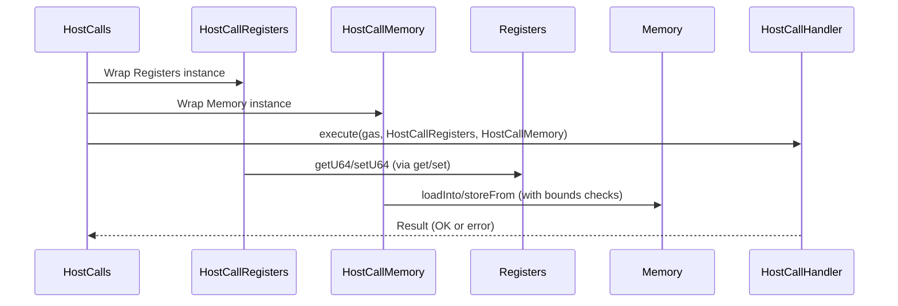

# dedicated interfaces for host call memory and registers (prevent mem wrapping)

## Pull Request by @skoszuta

Things done:
- Refactored `Memory` to return a Result<ok, err> where needed
- Renamed getU/I32() to getLowerU/I32()
- introduced HostCallMemory and HostCallRegisters which operate exclusively on u64 addresses and registers
- Refactored existing host calls to use u64 where possible
- Refactored existing host calls to Panic instead of throwing an OOB where the gp currently says so

Resolves #321


## Comment by @coderabbitai[bot]

<!-- This is an auto-generated comment: summarize by coderabbit.ai -->
<!-- This is an auto-generated comment: skip review by coderabbit.ai -->

> [!IMPORTANT]
> ## Review skipped
> 
> Auto incremental reviews are disabled on this repository.
> 
> Please check the settings in the CodeRabbit UI or the `.coderabbit.yaml` file in this repository. To trigger a single review, invoke the `@coderabbitai review` command.
> 
> You can disable this status message by setting the `reviews.review_status` to `false` in the CodeRabbit configuration file.

<!-- end of auto-generated comment: skip review by coderabbit.ai -->
<!-- walkthrough_start -->

<details>
<summary>📝 Walkthrough</summary>

## Walkthrough

This set of changes refactors the memory and register access patterns in the host call infrastructure and core interpreter. The `Registers.getU32` and `getI32` methods are renamed to `getLowerU32` and `getLowerI32` to clarify their behavior. New wrapper classes, `HostCallRegisters` and `HostCallMemory`, are introduced to provide a simplified and explicit API for host calls, ensuring 64-bit register and memory access without implicit wrapping or conversion. Host call handler signatures and implementations are updated to use these new abstractions. Tests and internal usages are updated accordingly, and error handling is unified around structured result types. The changes also include new tests for the introduced wrappers.

## Changes

| Files / Groups                                                                                 | Change Summary                                                                                                                                                                                                                                                                                                                                                                                                                                                                                                                                    |
|-----------------------------------------------------------------------------------------------|---------------------------------------------------------------------------------------------------------------------------------------------------------------------------------------------------------------------------------------------------------------------------------------------------------------------------------------------------------------------------------------------------------------------------------------------------------------------------------------------------------------------------------------------------|
| `.gitignore`                                                                                  | Updated ignore entries for VSCode workspace, added `.vscode` and `.DS_Store`.                                                                                                                                                                                                                                                                                                                                                                                                                                                                    |
| `packages/core/pvm-interpreter/registers.ts` and usages (ops, interpreter, tests, memory, etc.)| Renamed `getU32` → `getLowerU32` and `getI32` → `getLowerI32`; updated all usages across ops, interpreter, and tests.                                                                                                                                                                                                                                                                                                                                                                                     |
| `packages/core/pvm-interpreter/memory/*` (memory.ts, pages/*, tests, errors)                  | Changed memory API to use `Result<OK, PageFault>` instead of nullable returns; updated tests and error handling; added `OutOfBounds` error.                                                                                                                                                                                                                                                                                                                                                               |
| `packages/core/numbers/index.ts` and `index.test.ts`                                          | Added `tryBigIntAsNumber` utility and corresponding tests.                                                                                                                                                                                                                                                                                                                                                                                                                                                |
| `packages/jam/pvm-host-calls/host-call-registers.ts`, `.test.ts`                              | Introduced `HostCallRegisters` class and tests for 64-bit register access.                                                                                                                                                                                                                                                                                                                                                                                                                                |
| `packages/jam/pvm-host-calls/host-call-memory.ts`, `.test.ts`                                 | Introduced `HostCallMemory` class and tests for 64-bit memory access with bounds/error checks.                                                                                                                                                                                                                                                                                                                                                                                                           |
| `packages/jam/pvm-host-calls/host-call-handler.ts`                                            | Removed old `Registers`/`Memory` interfaces; updated `HostCallHandler` to use new wrappers.                                                                                                                                                                                                                                                                                                                                                                                                              |
| `packages/jam/pvm-host-calls/host-calls.ts`                                                   | Updated to wrap registers and memory with new host call wrappers; refined error/result handling.                                                                                                                                                                                                                                                                                                                                                                                                          |
| `packages/jam/pvm-host-calls/index.ts`                                                        | Exported `HostCallRegisters` and `HostCallMemory` instead of old types.                                                                                                                                                                                                                                                                                                                                                                                                                                   |
| `packages/jam/jam-host-calls/*` (all host call handlers and tests)                            | Refactored all host call handlers and their tests to use `HostCallRegisters`/`HostCallMemory`; updated error/result handling, register/memory access, and result codes; renamed some classes and updated imports/exports.                                                                                                                                                                                                                                                                                |
| `packages/jam/jam-host-calls/results.ts`                                                      | Updated `HostCallResult` constants to use `tryAsU64` for type safety.                                                                                                                                                                                                                                                                                                                                                                                                                                     |
| `packages/jam/jam-host-calls/utils.ts`                                                        | Updated utility functions to use new register wrappers and 64-bit access.                                                                                                                                                                                                                                                                                                                                                                                                                                 |
| `packages/jam/pvm-host-calls/host-calls-manager.ts`                                           | Updated to use new host call wrappers and result codes.                                                                                                                                                                                                                                                                                                                                                                                                            |

## Sequence Diagram(s)



## Assessment against linked issues

| Objective                                                                                               | Addressed | Explanation                                                                                  |
|---------------------------------------------------------------------------------------------------------|-----------|----------------------------------------------------------------------------------------------|
| Rename `Registers.getU32` to `getLowerU32` and `getI32` to `getLowerI32` (#321)                         | ✅        |                                                                                              |
| Introduce `HostCallRegisters` and `HostCallMemory` API for host calls with explicit 64-bit access (#321) | ✅        |                                                                                              |
| Ensure host calls use new wrappers and do not wrap memory access (#321)                                 | ✅        |                                                                                              |
| Update all usages, tests, and handlers to use new APIs and error/result conventions (#321)              | ✅        |                                                                                              |

## Suggested reviewers

- tomusdrw
- mateuszsikora

</details>

<!-- walkthrough_end -->
<!-- internal state start -->


<!-- DwQgtGAEAqAWCWBnSTIEMB26CuAXA9mAOYCmGJATmriQCaQDG+Ats2bgFyQAOFk+AIwBWJBrngA3EsgEBPRvlqU0AgfFwA6NPEgQAfACgjoCEYDEZyAAUASpETZWaCrKNxU3bABsvkCiQBHbGlcABpIcVwvOkgAIiVaeAZqGPgMGgoAMzQGaUhM/D5YfERcRjQfSDZmQvlMen8iJAzkAApeEil0qpJmSAB3Km5uNKIASlj0DHoHAWZ1Gno5SGxESnsAaxKALzw0dGRbSAxHAXWAZnOAdnC03ApFbFzkNakqXwZYTFJkbTZ6agoZi8fASUY9GouKYNEhNUrrL7TLzgtIRWAkHgPERiDQwdGQDYkeTYbi0FLINIMLzYJR+EjZMSFcG4fEAAwAsr1aqyUOlKAyMQQ6bhsBQsPtWTZpN5cMB8BtwpQKHoebhZNwMf10f50MMHrx4ClFRhEQxwUrCpBEbRkRgiLi4Bi2CzFMhWaRcABVc4AJlaYx59Ug7pIuAAkr7/TyvlJIGcyHSMGh/hF8MGPQAZfD9Sjev0B6Hp0NZnMUCP5nn+RAasSSEheWThKnOeCZWTM9HwPiZbAYWv4JPItUaIwAQVoiXEA4qDfCLIxRzuD1oTzyuH6afI/V5GQFiC4rIAEiVcABhGecyGyQPTYPH0rnnxSuEtVkO9FrHf8nJ5fAaqg0JAJAAB5UqsdYNvwWAAGwACxgGoZS9og8BEOQ9B3LC6ytKy2BwayYzoBOVZrL8t6NM0lCIOEWpJLAVr1twyAdF0ZTVLUAxDCMdooIgDjSLiACiwHNOCxSlOUPjIDGGLxlg/gMgQ/j0EKqwYrh+EROqeRapQGLcCUKECNE4QVKhGDgv06j0fOxwkNumFZD+iC4gAYqK84UJCJBzviZwxvAlr4JkVonpJXjSWgMgkAmaC0EIqyLKmPCYEkvLwnF/AhSyDxWTxmD8HgYDBQh+C9rQbQAPKVQAQoRFp8KiiC5EmFCBcguk6rZpDkO8PCigZn6tEQ3CERR8J8Awor+OkkFpIkyQ0C8Tz0fsTDTOogUYCOBjuC8oZZYwiI/ERtAkXkSD8ZAZi+gAjIWfzIEK8DAg8sa2Q8AiJeQfGFs2bVqod7FQkG40ZPw/7UFtHXWaitniWUySVOtNDAZoeIYj2lRKLg2gRYWiTNasKEDuUWBnPkZW3oCtlHJ6NgZlwsC4LgTEcAA9OzTQstgAgaEwzDs651KZG2GYqIg7NqhqZwUC47OeD47OXFcO36MY4BQGQ9DBTgBDEGQyhJQLbDpFwvD8MIojiFIMjyEwShUKo6haDo6smFAe28VMeuED1RsxCb7BcFQ24OE4ULLA7yjO5o2i6GAhga6YBgaNz5mFCQHAGLEucGBYkCjmGBu9SkMyOMwzjyLrnzfNIbhsmnm1oZnPKZPA0QDFFKykmXyU1IkbaFiBNC3hnylAekbV5P4Xh90KShSF4f6m2UZBgg8GCr2ROuQ+IPGILI8LMC5GMKKw7CU3wtkAGoAMqnooJBgLPffjxi7BQv03e13aMSZA8Po80khQx4uoewSk8j30frSN4JMMDIAKNfEI5o0ZkHgU9NM+xvKQH9n1WI0Cn4DEKBsasP5JhKGam1bgU5tpnzfBIZqT8eSJH8IyL+3c4oJGSrZd+kBkQSQqAOIgKFaS2RAqJHiDCmFKDAEtXAPJP6yFxOOScW0ZyNnQHZByLcdRKKvmiDE7IciVTvvYI+NA+jt07m+AAInfAA+nfSBPJv6/AnDEGm+JtaHVstYkg75pAYl/idEC3Agy2SYRqQ6796D+MwbyMCtITakw3BQUh4TciFlMWAasohWxpXiTtcwlhRxeAyFDAcCTbJKH+pUhBh0wmFCSpaTwxk0rsE2vXAwAA5AcJAc55wMBAMARhMkbDQD8dmTB/DsxOMwWWkt5ogQ0PI1Z+5BmxHzqU4ueC+7h0rlCGux1umOgiCEIEBkKBlFKCkVeXdkAkjJElZ6fZqRiPxFuSCXCYisnuLIGqqEwzpFHIgHppxKBt17P2LAACWCGKqI8aIKjtHnIkg4dQmNLR/JcICogwLcCgvBQsyFDzTp0HfKgDFgEUbaAaeuNM8jyikS4P0yAbxWzth4iyLxmNoW0IUHLa2kF1pvFwMgPFBL2UVGCDDFkqIABSaAJBoDvgwahuAADkLw0CZAxJhUgfAqB/2SvMxZtw3k0nBINTaUhwjkCIFDO1hYBBUzJFCFV1JpAAG4EX4E8uyygnKOy8vyPyraaJcpkSAnLS0VkWRaLyWaduDAeh8UmZqdEWBeEYE8GUSV3RUBlXFfAD5GJEC6v1XyQ1fg65zhQTxT1srIAJQkmcWQA4VL4kriJZgjhCzzAsn2voFa9VfkNb8Dq9ZfCcP4c4UgkA4IIXAchcyqRq2UECWi8VKxPylDamISASgSDcCAkEMygMoprGudDYesa+BsHTQuyuuBPijGKdswu5Sja3qFDU0Qc8AK3t1k065MRWm82RKmzp4hulQHcn2AVOKAVApBWCiFFBXGcI8QCMewJmn/0AcGDQ7NlnAR5KiVk4yM2SxmSQOZGGlnTBWWs8Vb5NlGBGWMnIEypl0YYySigTGlDAXWdnXOWyC5FxLgHcuEdq4hRCac/ESmdzLlXL8VFeAO7qHkD2RDEbkMFsJehwTqovhlGoJYmhCTRWUEs8GNQTR0g8ibYKLBkAlUqrVRq4MZrSUDjmtlNkTm7gUblQgbN+JR1VpoDW41C6lDt3QnGeQrJiWyw0OyUcAANJxo5XKCQcWGHp0BBIAHFBI2BvPQdLGGsslfy4V4rpWKtVbfDADcCgEG43SNRYM2W8t3wK0VkrZXKs2AcaORxNUwzlbGzVgbjXhvNbG21yb02HGzfm6V1kpkdRJbSDEIU/gOhrG6POT8rryqTsc6hML0qvWnzDMFqtea7vOYUd7YtojBQIB1WOhLPkEX6ZhZG7M0aGq8gWqAogCK0jvaLXgQ6QPcR9P4AGiRpRwSg9oRe6uk0Bz3HwL4TIy8HLIAHgUilRgSlfoqbQ6p+JamAfqcgEDwErktL4G0qDk9IjwDg4XHDQFOcEbieG0mRnUMmYy5QVoEguChfSGMLg/nMO8mDNRvjmcBOLNI8x0TbGOPDJTtr6Q0zdfcAkMwMAjkOgZANxkB3m7xXibzlJ3ZhsAIxAOVXQ6SnEAN2CScxFg9BdPXxI65ASMppzwFcvJoqakEIrvjVGwABpdK9wngCvjZFhFrJyBo2cSenkzpig61e8GAllAXca+bHxXEd8awFKRrOAYWbz55o7BiaPCgJIp9smnzP2eKC562r5YJRCMDZl3XkEMuASy5l9BRnrJBMq60X3mVUaZ/D3EF+9fEYN1hufQGUHNIn7Ct/bjEZYrJ52IClA4cpGh25CdwM+SiZZDcda9rqvVMQSPDEedRwS+cJPiY7RlNkWPbwFIO+AQdJR+UoKFAzAcGiBAT4SSOPckBFfvJgNtKKcDKLEA5ENCGIcJBdFCbYDEXWWyaIO0FkLdKsMoOg/ERPJIC1JJXvXBbuWYe4HIAVIMYtYqTIYgPg3GEUSKJEUYcIfwSuNIR5PsE5WgD9KTb9IDKpHhZnADZwNnRpMXMDHWHnSDDpdILpIPXpfpEcCTTjM3HjGjS3WZa3W3e3ffSgdmYGWQdmBqFyN3DjT3GTH3OTQ5BTI6OuSw0cVFKHRvN0SqPASqTIGqN1RARRNBDaKRQSe9LDdxbhfPLRdafdXPS0HlG5UMYAmNB4B9aQCtBdIUWIeI1gkKa7aYRAWINHNMf1bUcIv+BJLHfeOHWI38PgDg1NUsJ0OKAJWnT9MpBnX9aAjEFnPQxnAwrncDEw9paDcw2DSwqAU8OeX6H5WgA8RoxI5Im7NI0eRITI7IgYayAoqpHPdhewUMAYhFR9Wo9zYMBo5HXWFoiqWINfLXBwnXZwm3O3PkCgevTwrkeWXw9ZVkE3LjAwc3WjK3cEtw0MDwrwmEq8VZEIMTAInZII/ZCuf3Y5CI4PbdA4a9FYofNkZeOKAlfARbVkUoTOVyQBcvUMSvCkEggbWE68RgA4qdHUJ5eeNMNSQvZ/GUVUbSfIIjVkAAAWlhIFlnlm0wijXwyir1rW3Dc3Zz4CL28C8A6xb3yRTQ0VMkqBYkClWBpPs1vTCWtnBGNJ8DbktAcAYGeFFJDzrhUjTGdMPUlGlFf3lFaEqgzwDBUUqCvUdK0KDLeIlCsAzVcjQFlMqLjT0h6NIADNFxrDKBDJf00AalaBTNIDTJlGjLxFQFU1uWmGcESBoIqK9J9LvSqOFFFCwANM11snkQSSlNsiLIzMGDQGGEoDkPpGiFrHynsAQEyDKDhnxFHCsDDG1UzKKHqFtDhzHJBByHojhT6H3y7NdJOHdP4D4Ch0EGxB3VYWFXkBO1DBPNnOHPKTlOiTIGSCYjgLeNbJqIvPyDxlFACUgHR0DwGGzMrjEQWOpNGItTzX60tETJiGeX2HbU7TRFQFHOGHBF1irBlBcmmPULmK0L/R0LqRWI5zWOMP6k2P5wsKMD6XIC3XAsCzqFFmtmpLjJvS0KDBei5wiyXMFAuX8V9Vn3zPFwAt5zMMiHkCWM0IaXGLD2p1UKRPsIYF4wt34xcIhOd3cIoFxNqEMpcEJNsMCL2SSj9yOUUxOUsLOWPLFC0g1HZxCleGUF8Ar1dF7LZEvG5GFKvQgp1CUziSIzPLnmMkFG0jaDdN8AAB9rBUz0y3zCIhQJQZTylgBIzwhyySBKzykVQnLgclxHgzQeIwkoNwE/zfokL706RizT5zTk0QEfBNFbJPKKpgx2T/BOSWA9tgxGTaBmS+qgxWQOU2xn9KApBaAcrUjjg58HKsBXyvtrzrY+SdTDoYqeQaqOzFDetnhcRH4hVqxO1RgO8ZxOzHLblLF2BI9ARbSypEBIIFrfkwqPS+AqrkBZ9twFrgx0rNBwzIyAxTJbwXRPwFrzRardrMBng5rvqnzHKlqNBSyNAUbqzVFNppwWrFRarPhRBSFAqMRxSXlJTPxWQkAsiqieQQR/xAZSYhy/qtqrYgDs8N9dSwqjo8bT4zl+LmkIE7lL43Ee5nkoDEl3l1JIy25FSVTtJ1TvDNTUiWKicHhSdyd2zLRrRtz+F8Ak86QFCsBCjKJugvoygvr59pTQyvtsL/wDEqQN9/B3qngfSfDaqUI0IzI7QdpiKf1SKYL5L9CqLJKIM6KYMI9ONIBOQXQZhzJqBgKhay4DwurcrAFWguESIuBfKXBgURNwg5AlouBPQ7gAAOUcOWNAWQVXY4E0yAeKnKvKr7QAJMJOrIEermAU7iIaj07BSs6QIc7ZA87IAC70hi7S7y6uA/rMqM9srEqZQCrURYiBSrwgSqMQStL0TXDIToScSvCEThlw6eTFB7Bo6RQxTe5FgDwBrmTWh8Lyl86i6S6qBNFblrlVE0696rxu7gIK72aa7p63zIBG7WQL70h8Ar6Lbb6h776y7wgn7CV26+JO737DcK7x6sqEqKykrcBZ79aRSF6/LKNUSnD6MdLMTHct7BSd6oAI7K9D63bj7CbT66ADwxrZAJqKApqZrWgYGX6O637agP7wgGCiAWQ1cMMv6q6f70GMyAHmHWH2GaNOHcZn64H9xeHM7DcBGyAhHYARHBNkGLaJ6p7JH8qgT56ORBSl6CHtKMSN79LjLvDt7jdbDTdRkUSV60SwT169KsSDKcTKCLcvCwA/HTKPdiSLLfcyTrKczlMQCBB91BCehI63QgGCBWTE6W6gShyM7ZAcqeR56ZIomu0SAuwLrs0oqFT4V9hewI0t9v60HcqMHd8tElqDG6m66CrVTLlJLDzgxpaZYlQ5bxAtTKVkBTs54YbbJ7r7S7NzDUltQQD7BHaaisYIZvb5J4aUtNqHpAKO5Y7nqARgxa6Gns9obgd8jsFM58yKqyhr6L95TSjJ4vyX9cCPrIAcIJbCJLRsgdmdQcJDnZTCJUR9gUI7RO4fq3Mt12qaGkw6HPr5qpzOL5UY8TlbhXpQRmR5SYtL1bx/pdN0BrsL9u196dY8ABYBI6dZjVmmdFjdCFKXKJKjCpLTCtiBchcqGD7XboXY6ibGHgwJYBDD1kmQGqxwHcBh6H7TJlGuAcr+H+FNHhHK7dGRHKgJH6mpHeXYn+WyhBXQGVHB7RXIHNFU6eHpX1HZXGDtGFXZY9HiyWm/njHNdTGsmcnNdl6NLHCrHPG69bHfHHCAmgnjdKGiWoWY6T7hbjj1W4nD00nk6jX4G6mZXUKRWxWy6xHlXWmjmAG+WqAo3m6Y3JX43TXE2B676R7rWZRbXf7MGTGcGzGrxnX8G3HCGFZrGvHSHBSFZfXBTAmM0d6nHkTLG17dKvXvG7GO2pl/A4oVBohu3SB8TShgnJNQnvdST5MA9bKqSmVuK6SSiGT8AmTgHuTI6NqpRJ2IrnWlLgrym+hcaNKcdsVXrkob2Ng72+AgXFm+JlnEaAaozXMZVgcFJpyky5zWwyhun9h2afrUrCry5vT/ybnm8XoO5nAO9bIt2I16T1Jo3eqEnqHBbuW8zEymm/qkbbirbwRkzK3tS9qq11q2CMRQ4DnKPLYbyt0ebrkNqJbCwlrJb4VlTVTZb2Z5acjyU8yHBhhebLs/TejAlPwqdLSVizI0IEUmVEz9CznUUbmwAyOeJwkWZKBYVPT32d4NzCpX0WALp+SQzT3ohnWVyww1DSkND9CyLqWKLgMQpQNudaK+cQ7ukmKQKzlWKMBvkOLD0mVo4HSeKGk+L8NrlEAxLAzDCvPpLmXcW/aVilK5PBdVK+31LNL3GiGW3h222rwx2LcJ2yQIqZ2Al/CzKl3S5LKImwjA8qTAG93BqD2cPFB1zIP5TBbL2hRmnUG7Wq3cRgVaOQpwaXyRuqOTmj0ux7yoIfYRCSp/jfhYO+JbgTa4Xj7ovfqLaSPKbOJdyeDWQZvcRKosAPqtuSm3RiPv2CxdrWaNrXqEP5hAMUO2QsPmBD3K8ev1nCqyV8PkohvJ702Z7hqx5tu4bdvNNEaGpXEuJyPGOjGvsnvN9Jv1nTuZvjm+xFiFuxAGwWLbK1MSrp8EFDakJPw6P9viz3zMYpb+P+nBPBnZqU8ocNaUQSDZOiXCKZinOViXOj0aX/aPOkv1jvOZKGLd62Wo7aGuWGHw22v92CAdWZQk2DXoHFHwxDcpWM0ZXBH5X1cCwAHtWbmNeR6tfnAdeRM9fSADe5WLXjex79HhvK2sH/LforPKubOM0LHG2PWh2oTvX22/HJYKup3n5/XUiZeg2OWQ36Gw2E7c2WBWgHFY2VGTXs7IAHEi29Xk3y6eQAHvu0+M+7eSAZXc/qA0ALeH6y2Mq3fUePfTGT2feSB63FqB2PGg/N7Q/HCI+qvo/ETcuXGu/CvPXg+R2fWplBhMVI/qu53NBauQnC4vcGvwnV2KTeiN2Lk0OtCMO6qCKNrBXUmU+fuuuOrKMAB1AGDfM9v3gmgpq9jm29niFPTZoUZhkNAl+ji2s9bACoHdwO4PceOfQIcr0zVLM8hOKUN1rOxrIjMT0YzNcPiEmYvB+Kncdmk+zuIJogWTxOhjCGLLMdOKWA4BItHBAfVWOsXHdEpWB6vIkk4tDPKyQZrP8+OMtKAazz/wqYlaJOfIKrSDCjFfE+IfsrrTpQIoK0bAcIGxQRTIUCBMoQHkGDPwp4XmNAxXg53pyUttCrnVnJRTF7UVGWwdbYqHSsLMU1Ko/APoOxIbYk++M/W/vP2j7u5F2q/Eko10342VKSu0XdirxZJcdvuv3LyjT1ZA385+9/UgLkxwYqCw2yUcqkkHUBPUAeaVC2vT2f7gCmecsAZh3Fmrm5jQjzH8uQKM4AUvm1IHUFdQEjWB/AYIB6p9yCQX8EBu3F6iaS2pXd8hQYCjqj1m5495ubCKINXFhRAV/AHRfoJIN6HfNgc84eQD9Xh73oyylbAsNpzhx+IMGwNHWE0I279YxhJTWnjKA0AgDocICX8kZ2WZ/hVmwzKJqTxXAw01oVSSnsPE5xXND+5SK0FuWtRWZ9OBiSTjUMnLcAxmKIYEHcIg7rMIsECcfGIGAqyCHhK1IAp7Uc4kV6UvtEXjoPpbJcmW9FHYmHVl7Bs6GcdM+v1Xa6X1zexbCBpbz5rXIP65fB3uax0ZWsi+OIrwWrxvoEj9WRImBqSILbZ9DeTvURi7xtaN9VW9rOejWyCE0BI+HfYErANXrd9LBPjawRbln5CjB+PbANnvSPbx9MR+HZPhyWTrMjderInuqln7r58DWJvJuhqNT5ajbeOo4CL3X1Els6+XI8tjyLabVsAqgQ2wSEJID+8xRBXZthP176lcw+7MWUXf2nZD9TB3GT0U22IY2MR2f4SWIhGKhMQF2MxNfrJgWauComdlFTCT1GY/hwoCSP5P9g0CNAXIHoPMArj/Yf1Zh9xfMUgELGwhixxYbMCvj9BuYKxQJNyn1F9DLoygiEKyNTz3gRp2qglSzoClwCVQmIYQq9M3hvzNVPuVKXmNjhFACp8A3pUUHyXeK89gwTAXsLgDvihgRxiAVfOEEAas1RgAALUoD4B9xh44MAIR0x2hzxDwK8T6D6pslzIwkK4oXUh61YOW747WLdGgicCMQAgujjz0SYiDFCYg5MMDmNpiCyoFALJDT07GIRHswQb2KbWiFmhuhCKcnBcB9Bxh1AdLD6LCG/woT6O1AbojynFC4JvcaUJCeAn3zTxPUHRDHN0XApCgUYytXgdmGxodlOedoSQa+wnAY1BwWtHWs4FizqZcgqlWnF7VpaaDhebnLQgHQZZB0fOhgvztYVDGuNwxgfSUezBjHsw4xDwSQltHjF+ENkdXJwWExCLkk3B2/AwGUl8DLipoQqPHnSwq7gg6JSECnuQQwgbohMz/E/AFPAhSJEWtYkRGnFDCliUaGgAsPkzkh0gvhP4egPkWrEuQixkUpfI2IoDRTUanA2sqHgAKrUEUDEw/BUEOiIB5ylmGoNuOM49lAWlQZCcZPqQ1C0QgII4T7iW5eTSJhpYDguX6yUh3krpYyTYDghhhWAsxF8SNN9DjSfuR46aT6FmmTT5p/qDMPhBWlL5rxrIEaetK44LTAJrU+5hV0XTwRkJPZeQqIOhQqFFaU8HgWTjnz8DtaaUGns1KXH9itCF0oSvYCgm+opBbVINmpDzJ6pX09EbqT2W6ZBTIoSLf0uEDOyOAp2D5QMggljp/T2C2UyAL6Hwk7pxJ8+aSeSwF7zEEU6XdzoiIl4pcURRg/zsxPAqZdJi8klUcBTpaecyZyI3zmuKHIjibA/qepGONmrz0kKEUeyHMxsJDJ+25giUVGMdwGTaAsgJMPMAYBgAEowIMyYmPMrLsXBoRNdu4LOSQtWQSMJ4PHhIAKpHA3AbhnxAyZshbEss5MEkGNnAheZE436ILSy4i1SpnQP7L/xfCn4/2u6V0pmGyk74WaGPIsF6FXzMELkNPSFp9IaRXSYZECDuDOiEncp8QL0f4IaEAjdTV0vk0ifJLdlTU6QXsvgGfnyKgh+QqtPifaCIrQiNBQvYmUpN0GB0NiakllrsVAppg2JMFBmVWFWKNzJeqXHYo/ygoBdCWR7PWTKmbA0A7Zps5RpWF6B0pARkSKCRiOAoiytkzjMMflwjFFdJ+UspiOzAGoqzl+jg6TNZNTGayt+PwKkhzyeE8QBBX05XrQDlwa4RqA1O+GukfkYYqabUFVIBEHFkoBu7c9EBpRpG0BiO5NW4uj11IPy/qkAEAAAF44Fldd0luh+jGwTqeebuLQMAV40QFxHBqBoCQCjhVhddKjs9y3wDUwFiAIhT6RIUnCXZ0kOfANQ3LGccgbZbIEfxxk4xrYniW8BrToDQNXiPBXasCIFQ3M+aUhdAN6UKDXEiARPIwMCnQCVAH5WdAAFR+COqrQAJPaCPFANaAnoT8TotxHTBPQ/4l8bop3yGL92ei3acoumBhgDFICrOmGFMWWKOug1VfGMCnzd49gS46vPSEAI2wnQgpU6CRH/nXTIA43IUbqRClw40p4U+saHL9BrB1ooC4iRNFbFeKIuptNSG6DCkZT/ZpYUscks7Rf50lSDVxF3i4RCKL4iQFIFlEyBrB0Y/+ULjumKDbhbIAgIgiEv/KoAR42bJKN0yImFy4w9IC5lUuTn6oal6cjEOC0YqdEA0Hc7rMThVpz5LQAg2mUoDUEUs5Jtc+ESTOZk0VyZbMuZcxTbnpjB5dMoXl3OGIKTtB+y8XoctZnqTCKI/Dee6wsGSyPCBkl9LAEPkWSV+J89WRv3Pl2TL5HgqTidEPjHwoY7ecYYgJzHt48xeSusZlNLEFgRqyKiKR6HLBRhsB9EOJfkobGFLIw6K28ASpRUFLKAOKgsFWALIQR5ADU3wJnJ8kpYgwHLddHFnWAdS1OsMSzsYhZAOzPeXNf7OgBaW/AAYsAZ0M9PekNJBpVqfKEJNoTQNeYmrSfFUBlDwAvhewtVYkDBDwJJyetR2EsLsiOokoVSgVCnm6ncrWiW6AQUGA4l3TVa0clYMoX9K/TguD5EedQ0BnJQ85HsjGT6C7E9TApaSloN7AqAZAKUZymmZBUuVpgl0yE7lZRWvgwVS57wXwEURBE6hI5vPISLVQrkGJdVSACNKDDnnLI+AywGgg8ELBJpDQvgOgAumSCkRXmWijQOECLXwJUsuge6PkUHQvR+0Bqb2V6gBbMQqwk1GIPkVsjA8gpkitsoOK2UEyfaRMvZfXNJmPKDBLcsOmBRJ5XKj6jMnuSpKblS8B598/lbAEFXz0NlJAX1OdSy5kDeKOoRyCJKFCQt0BvQdgGzlXl2EzBOkj5a2y+V7yAmMYxfqrPq4pirKzXdduCq4qQEoua41kEBoTGsZZqmXRQCpV9XwqskiKkHoSsSV0ibeIESsQmm2kUqiVTY/Da2JOGqZBau5ZEIHCuHwhZodQdVIZEUW+BhBX/CZfcKaKF5EAiBDYNySvBsblxLUpNVtFtVPTU09q7gSsu3A09hBzq2OX/FoDurII/0o9j6sfIH53ZCKbqTOuLmYLFeLAksavhB6UqcpYcs+DIODURJCWQmkoZFxWLOrF5bABdTCKpa3Lli9yvQapOPWUzNJry7SZvN0mfKDK3yrtsBqPlJjnBwK2yemKpK6y+N6SC2epCyYXrwh3cF2XmVUy2Rv4DK65qzQqII5kcigojJDNxBWByhdpR6pohXRrBasmKhJaWPfylBWxGG7TbGH2DMr2Vfkzld2CIxDKSJgIVkC1oI3kYThgtbMVJLxU3iCxuG5fBZr9CjaMlneOiJiGlCVxjI8gPpYIQqI4S+AmMxCIROPyhqh1qEyBeHIkg5rI6XBIaVxvbwg8wp29JLQJsLDiJ81N8+YRZheI7oc0ma0RX/yur2lBuxHVyKOE9AZhoAjQ0XLkBoTQwDV88l1cFTc01y4RikhpMpKREbrpeVMs+KpikFFTmavCX4e+vSAtTFCpaf1WyX43qLBBqWwUuloCr55i0ylNsCiB3TXKAKmAauJjgeUKxkRdchBF+vXlBb3lEs/9WFr3mVSQOfyhwdFtPkQatZ9kwLlmMw3BIZweY3DYHJGq4bywriKsfNoDmmaddpGrKaWD111U6VS8BleKEqDdTpdC5FZnJPzz3y74VUxnU3ngG6gtVa4NMKMXKnRAFyAjSTeVLahEBmYxqlsCyClWpow9zMPqeKhzpdEDEQUuRIQBnUO7sZeGNOSkAQhEEZgVU4VRiATWVUqpTu/QoptdXKaIWSKTojKoMSZ70ANUvrEsrSDNpVIn4FzeT3rI7ocIg2JxIeDDCuRoADiQOdin713xB9w+0ffhDGA3TllXE7cEGGvkyEeIlewnYsFU2ery0cEhCdXjBl/tHk9WzXJnopC/ANCItQcviFiD7bJgKqNqJgB3Q08PQLQFHTsrR13LV1By/Qc3Jx2AKIiFy6CsuvR29TrlTMh5T/r80WdC8bukDh7t6n1g1gnUKYoFrH7eie+tjAyYnVl1EkrJQKmyZExa7QbwKU20gh8A12Pa5tpu3KbFP13EbGtmUhbTQdmFd5YC8eHgp0s/AZ8DEwCLoYWFTl0Bpluwvg4nXL2M4ThG+iotwYFh5pydWAP+WyUgRZ19FL4xOsoZcXGj/AyhraWoeMU2K1DUylIMoYcWKHM4s0wQ0YeMUaHTDWhwwzQG0PPjjVNhivnYYr56HYIB0gQehNuExCsJOS7CejMO0ES6dBckiWfkgUhGsYTKwNWdL/Y7QFFEzb+XUucPqLMl6CiNE+x4KiGxF/XFQiwMTowKEFiCh9oNwKMHckAlUV7QvG8aDpy0RnFRIqvURY0TOBavDkZtSqrDpBtVCEWvB8OYSGwXAWyFgMvbdNnDlC6hTURIUg8yjxZQ7oUAIVULiFDTY1URI63lSae7C8pOR2UZP9RjMxrYRn0aZjGDu+Cw4zJwhV5AcWQ8aTUKjC74gC1NPUQ2JtJhiLl9tVHGHjD56yTnOH+rzV/ogO+b+5RgqANuoANXr6Ze67uZjpZnY6T1lnZxJnHgMxkPKaG+TrehxlPrypL6oNm+tXg8qXQyOCNUGh4iQs5Z0gWGXoWdBUQBJGw1Ui8tFl5cxd4/DAyO3K3Ia5das9fgQcg3ayhBu/WDduyNQnieI9u9+YWCzkpZB1AUiGadoCkRCJSZtRfAtot0jVzNgcv+REa3zYrjdZKkzc+Ko2h4aNwwOjfQANqMasJOQB4L9BygxRqSTa5AYCGYaCo+DA1XCq5WnGpoD9T2V5gAAZgIosAMwGfCB+mfToZsMz6dujGq/ThdcM2GYBbANQjE0IvXVR419kLkcFUWvKq+0zLD9P2m4QWRiA3N+s0cpQsjqrnqD39wBz/RjobmHq+5FMjSSYNQPizmTektk/8uPnJjgiZ8uLUQZ1kbjt8Op2rNqefGP8ZoUEvMkqaN2jnVTZGssNeNpUulrdrHSEiJOAmvZQJvJcCfSmixQSaIVYtU6Zqm7ZmtapYANVjOO2E0WVMQEvQVuGVn5Z06uJw+Zot3HmxBYp7qSQ1E3BZAQ+2gNUGvBZnxxzg6QYoBmpy3Uf+m5/wXvFoL8k/zQRp/dXiClv6fjVZv4zWbXWQGgTrLINsBZ5aDm/QQUlkcb2pFTniVhF2U8RdEZOivepS18C6zQORiJd7Mds4iUDZHs8LSvEc6A0LlUXdGpFl85GCIvaiSLDrGtnRaogejgtf64rh4VYtaSCGQgZMOzCUu24EYYARFezFYWOAfy9GK9OZBA1RbOT4GprkrrBVnJwuRCA/qyFBQctowYUB7W0ciEd6MQW4QqsZzs6IIBtbICAQJx0rqXEVVNFelOItIzjNEIZQuShu7ikGUpVY+8GeBnASWhMiPE7i+SSuzUoaePJw1k2E5W0J1cVk8I+C8A5XcQSVn7VzAOjPGGkiAeNLjRCq8dGlO+dmARaOONLWQzVj0HQfog9k8rSwNLP8lBSeh8Il2uQYUV6w7oRjipDMLCByCyB4rRV5gYN3muJXEhW6cLl0pTy9gB+ncVCmSiy1RDOcnFZMjbmEiiBtMA4DQCmQsgMBZ5u3HOaMf0toQkawEM6zQFIXBzMjs5GdfBwxifhwKG+xM+DCDBeFHhq+ogJOUIGfXwbatTcmDe8rCVSg/WRThZAmV9B8iwPBGOFDxaRsFO5EQHXPPMIMA+e+M9zfJMF3gGfNR67C63NBO9EDrlN+szBjkorrFKsa2kEuVQCDxMgwusWeGNUsqXkwYAAKxrq0sri+0hsrS3xAMtGWwN3ZxXRfOibzdRYdIRSIUAqI2WpbaER2YgHXKsgQIr190Rfy7VE10W0SNjlnvoCQtsNr8YmoDaogDpglrCmomNwK1JTxm+IKUlvi12mbUpuGxbPIVLnq2BriALJh/VyYDg4E6HHdiATwDFA2o2wFqUEBICoSYG3Sz3f2aE2umeID202gtU0xiKejL/QkPQDBAShwFR3TUyFHA4mlI+KUBdJsbCCFhSYDULxVHIBEHMTrL1qaLQkuupQbrQc3Uo0qA7RBHUDAbbTjSISohytZ8Ee7NeDDTXR7c1wqytbp7dYe94q3/m7fyvEblrT4RIWvfGuIJPSgirjcWnezIW8dFzMjN7AwmxD7YEd+zCLWruCYRlSCfSPpe5RphkMoKQ6m4ZEwdZKobwGcJkpJ4Dx9O8AGgoD1WAZoeJ6tT7carEWnZmklkayCzqJNtR7tFzAQfdP6AoXBevxuSdCfXW/7URsfZUZCcT7x1eWh8PsKLgNtp9o8XAcrFFEfjbiJyBclRulfCBeEEGtQCupVpYBIASAwAcqPSCOz0Aa6nd161tAKqZsaH0GLu3gBIAMOooTDlh1TAyCTkREXAXe14C4cQhagOj5ez4Cyb8PAEQjkR8xmSwxBJHzAU693Zkc0W3Qtl8yFJccL83VLQtk8BpZFvaXxbKQSWxy17YMmf1m8jx4LeFtSRRbU0fxzQEMnRAm87J3A4Cq5M9nCDUGiyxcmpSahorZACc8/1iC6OVGgkfDKWEmD1EinXAGqAk+oiTAAOLpWcqpi+nyJA4ODUYyU4Milgjj1Tmoh1nGkCVH+wPVhdItOqaIptrpDp9lK6vBgen5smtbVcixw5RjC92a7o8Wtf21nq1+hB0HCT+BnwVC6YDlYYheBrauOCNM7NRPZdkoUpI8MY70eynZqI1XR0c7ysBTnAbqP1GHrSDlSIr3+R57eC8IIPZTwapSo0t9mhSXAg1zSJXZvGQvEAu4thkkAr60AtqRqNANuHVynxHJjm4DGs2GVFnBn7Rkmv6rcu3OHwK9jMmQH7S2bXL9kO26+06N/ycI5WzqwPY2osuopHita+mck01qWoLYEoNucgkSC4wyOFfTaHI4Cnb0ptLAe/ysBSOHHF1q60kFRd3g7nxHaqDVBYQE8sJgy7xIo4B2EDLQ09s5PfsNARVjgS8vW6U9JSTa1dsV4jRFTmc5Qyo4elnWmcRv9xqAWBWyG5fnqiPkE87cs9stQv/oQDB6rHSQ+BPRqd1iXBm0cu2LM3w34Jjm8gC5s83GTUycJ2pe8eaW/Hul+J87Zlt4HUn8t0FYrfnpkmwl/pFgZM66cg9ZnCtM+Obd9JERW0ttuVbSGlz4o0MT8xbI+S3vz2ZrY9zZ6vdSmjvZSW6PWwa8NvtV1yuzqCeDDpMp6HnDtoTfKdttkuEre9yK6yWefmNSrwLirhBfW0VDVgkEH1S1bHP2uZti+D0j4EbF9XYXKGHt7Lk/ndZI7+/Y+4i6yRhhbExneZEGlTQGlcQWTOkHFHBAyugF+NFPAVChxk5JkrzMmogApqFACIbL3WNXZ8C12/GgFGUJOV26ul5Xdjg1+JuVf93m796LdEPbdN+o8A594F5NYaucvRz+RWe2Pe415i2rM2313S63cLX97VL5gBC2CXX3uWoktKBc/DyX7Sawdoax4aW6RJ+0NPFyTNEXKG4XUfdGeKzQNVosuNA8bwGmFSnshBI7ISqDYAACaTiMMKeMEgHS0151bB5aFqRob8ot4T1KWlhxiDJqSLsMLQDT3iFKcY5bc/1hgnivNaQYXax01aOQUn4YoCBzwoBBkEUs6NozZ5bweEyw31Zim73ITebrd6+xAKpxYPB1vSUADRt246zfKXPHkTiKNE50sS2nX5kti0qOoac61R1D2WQo/ocOJGHkAZh4gFYeQktHnDh59w8FK8OXAZjwR2sEseHYUstj+x+dYwCyPOvtD/W93eUe9fVH/X9R2w4oAjejH5Lnd38/G9Xgjv274q4KWm/zBZvoj6xxI+sAKvlvzfGthV4YuNts3Xj0oD46if5vGvNT4J2vN5thPqvET3N747FsFun2BkO4IZY7Py78DaTnk8rr5MSQW3ar47/c93eFhSDFRO8oek9shRfnSZ6Z/sF6u48sk/Hla5FdaBuX0r/oasodVpUnUQWmibDYNy11wRWgNgCrGGDvhlYbA6KnUDFdve4aeffPgX1VmrJex6FoUOGvedzM4ynbkBXDJbcwAZo/JynEINAyqk44iM+wAn2UFvMuqet46dYC/vWBQccEeyXwHe6NsggwQ3CZYEOU2c4/Xn3LiSHauphSuPpZa/kuIOBycavtoaGdWkE2gaJQoXgDqlWqwTUwFy6wGH/gDuB0PFXWAYoNH4qLWbAMC6fvG5hWPfahj0H2H90HbydLgFqANIBIHlDEFcgGXpdVl/Qs5e6zeXv/acpV0AGAbf0i5BF2gcLoYuAz5ncjjk5codyGAbbQCapsoj5AYBjN6E/cdg+c3P3vN1D4ltJ+4fxblJyZbTF9mU5VA8RaTuoHZksFiUpAfDn39b50r0z6nyd9J/JCfLqQ+WP5Yh9SQgrYog6oUBZ8ZFZFrVNkBt6UfqK65MUq3gC7lSbXw8pJgCz4Jkqkg/weRqMZX+IPG75/OHWOjhdE6wMBKE4t0rJrnKV6vX6wiaFoQ61mkblAaty6Iu16K8B4FFBdeqfko7DQO3gN5Demjhw4u8kVjd4WO93uI7V0T3iR7SOA4K97Oip4MX7J+LmB9582i/t964Av3nV7/eATuv7pACJP/Rre3Xpt50BKjAwEaO7DkWIXeAnqwFSs5jnd5WOnAYt6kefAU47BgggXjQl+aPJ3yfe4gbV6SwMgXE5yBS/DHzNmYgYLA1eL/tIGr+ATpQhH0NXASSb+XZiuwgq8WtBpMo/iG8KWy0gP4H2WEkI5aGazlsS6ooWbIIS3oKeJDJruHEHq7qQvlszzP+y/hrpv+mlCFZNUsKkeIIBdrlvZPuN/tj7IBx3DhRpWDzu0K5AxqiDaC0FPpRj7ui9OHLDKNHm570AL+uCB/yTHn0BskLHu1ZXupRqGCTBrLvkQ9WXEHfj9WcLvJ4HSYilDa9kIQB1CJBCpjIbK+jqLtSY+l3swJjWj+mtRRKIRkoAdAi0L8grOI7uq5bOZyNO4G2gAbUJdkOcqgAyuY5PgIPQApihQ6ukEJoppwbavmQNOsSsR5LePduR7Q6hQsBSeKtaAGiUS4HjIpaI6wVZZlaDzmNxUCrbnFDtuniFIoUAMimpp748LHcbVCblsu7SaPWGcFboDnsjAyai+m9o8uOtM5q7mIrjBI5ou4DmIp4jkGkE8Q+RJDJnetQEC71Ue1nF4WQNBGr580DZISEJeeMvzyk2uyuG5EOWFg2Y02/+nTZCg3+oCbT+nms7ps2VaJhRPQIlB3AoGITm8pVeHgeD6FBf3j4FxOfgbQw1cCPsZZy2plgrYZikylzgH+28IS5JBp/jmKIA5nIDwY+oMNuIvQnoc0hH2RQA5bnUFckKEuAQLpFYzaOCLWopoAFLQJlMOEN0HcgR4kgGk+hEBEgkhNQLGC9gPqhj44QwdqHa/4c+vQh3BS9lj7MCVQUgI1BE7n/QZBf/NHDPYlnP/5vWF/F4ozqKvtDLKaLAt7Z+gjWJVCegI+rz7lYBYJz6m6rQOOGThDiNOFEaxQGK59G4CHZhCYaqjS4GOUIEwpiKrRrAE1u3TBsGwec1BgBgA7NLh4N2j7NB7kci1OXZoevAoh500J2rMaQAl3HuHyATCi3briR7Lnbt2Z3M95Qhfdu9aD2J9juSysi9qZyiEpUDdgKAtIKWqEePEBwHoQF3CsI+k/YcC5UoB0OO4PBsxpxwwu9BMO7yAkZIhHDyv/FdrV4GZp27ggLniiEeezyM57V84pqfTPCN6OVIlCCOhBJKauZHgEea5NhG4wmUbkLi02J0FqGT+jNom56h+hK0CmMtiDEGOhi2MEZ/ylepexNQFDnPoKWtgVaFL+kgSv4xOBbiQAscSTpZJb+roTv4ZOaPjcjYAmKFEEYgmNg9pnOmNLix2uZJvVZ9AsQAACKdkbgDlOaYLECCQN5KEB1OpIUBxNO/JC06mmbToqS+R6gEcbBR1sAdIY+G7viEzIRIWM6YarpPFGW0VYklFiAi2DVbqAb6G/xTWpEa2FfYS1gRGTuZ8EyiNKJIGGhoEnfKdjiS+zqOCHO5jGKHSeeZDc55h9Fk853OLzosFvODwOVCfO92CJIk+A0QC7BKPRkjZ42ivt6Y4yptGC4xKz7lC4KeMLgxyfm/knzzYu61s2qZW4gMkYFR1gRNzBguUSpEYA1foSDBgJkdbDPWLwQiEUSiIMGBBALsD2HuiKiL74Y6eLiRIEu2SqTQcu50RcFe2mIXqZfi3ePsHzyhZJVHh21IS3owu7HnCr1UGEQjaIwXSvcyoC3yH8H7M+mj7KkwK3GIRrc34bDSOaJ7uIgmBazIQKBAAAvjDARPAWn69211uxjhBWwa3onAXxE6Zd69gPy5tQJQFwAfUyzB9FlA+RF9Dxeb/DdjhAosTx7GoiAHqgpqUwGgEMuW4ukDhAsIdmryGl0MMFcg34RrF9CsFulDYAosDEKXw0eMaqaxRsbPiXh/RJfCUI+8PUgrmGQCJIOaT7OziLUjgQEiixHUbQDQA8sYrG2I1fKyRexGgD7HTANUF2RFWdALPJ60SOtdIk2qOgQGi8mFjqHHKBXjgx9+Fxlr79kB4FdGKBrIGdGVeFuF972B9XrE70YD0TiDIaLXuJG+6qcVP4uRWAJaDz0QkVepb6dpkQgD+kYb6Flwc/haElxdgV4EOBdoZXGmRzobLYhBvZtZHBIODFW65GJ4XFF+RiUTeQHSzwZt6vBKUFQBgB7lr3EDKipAgEjURztVENhzQVxzZhLgAdKkmc+P4bduBKESjvu7Eg/bscg2hND3W0dsLzY40LBGjXoYIL+62IGHsT7B2CLn/HIu0OhKCQx4UFugPG1eGfbI4A4ep5X4VwNW7DhLlsGAZS3HvhGnxq9qcFIx6+MHIkaEUo1Y+2VYnWHwxInkJrHSVVkDxEuRdgYhwetVKXbBgXhK3yUKqHs/J42d1ozGQhZHmBFLcVsZ8LfCXGqgKwRq3CkSg2ErsnKAgYLvsAox3Grj7rMMQGhFRq/ZgBE7cXZG6AQh1MRoCHgEatq5dCc0Pgm6kcwigDqeqIdIAk4+ciCC3elES0afabwgHHrAVsdsGPItCWC62QcCXeYkS60bUEnBjxGcGAJ0EXPb9IC0YUxG2edi6rze66GiAlA6us2rdwZwG/ZYhg/tmT+AhQI6gShItJ27qQ/yMZgPxZmLmFDR5jIUmnxu7k4bwxq2qCxcgYIKhEnAx+iGG3gciYg70gekG5ICRZNizbN+xAdTZh0hXr9DFel0cvEFxRcaIGg+ekRIFSBI8UZES2VcS4EteZARQ5Yi+FlQHreM7qoFqOg3hoEHezAZAD6OPDqoyj0ZQjN7COyiY95aJvASt6kWKycoG0BfXuoH7eh3pAD9R1Jt+HaBF4Nd56BxyXN5iOC3twE8JpgWJbOiIyQ2zuBAtvpGTJ5ccZHjxw/OaGi6loWCkTJhkQ14BOSCB6Dw+HJpPEay08byYYx+QKaEORwYK5DpJMwaFDxB51E5YKmUpG5apBMKMZxiKy7jkE9Mj/t4QFBBkUUEwCJQZACNUbeFaTm0OPkfFdRmVjDRlh2aBzErRc+BT734zyclbnxRSYvSW6S5vWCGsi0WEZK+xQgdDIRjEkonAscOCb4SmHKlhB8ArztFRyes+oEndSFYSsFcudUfya0k6QerQxhlQAS4XscAURgbBM6l6bNokyLDFDui9hUm4Jv2tgqv8uqadL0SwLj2Tephwbx7bgviYJ7zIAFEb4io94Vxp7MNAQKhA60VOcnMx0ITWFPBX0ZvFgsPsp8Fz4X5D8EtCeMZrhsoh0f+zZRwiVVoPU3ug8D7kh0FILupwLiULnG5yvU6HoQLGXrW+FzGA7xekoaSmYxlQI5ACgM2sDw4kA4Rqz9K6JnjaECFcu0lKh2XsJHEOJAVuoahEkXG65eTyrJSyRGXAaHeUqABEGmh/cXCmDx4yWXFex7MKimhgoGiW7b+oQbv4Rh7HCUI+hSlGkkUAGSXKFsRfodknPueSaZiyw/biSHWOwYdiEGIINqWqRWU7vmlG2nOhSm22UpCmEemu8bGn8pZKhfHXg4cmsZOS1eF8CVSxIpZg7GMpkmGjB6CdQaRgi4VOEVYq4Vogg219luGdqUHEb6UZWKqGALhPSA4gThtGTOG5MM4G9xIcFAFUJmsWjB8GwscmgIC4wnAVHDPxQHMZimoGGK/ZjKxpqP4bRiADvgUJHEFQn16UnuhrsS0HvQlYA8HnPBw4OEE+GYYHzPyRiKMLlh4fA0HsaqUeVRK3ZBsgEbDwd2TMct4sxKroEn9BUEQOGcJz5HDinJI1g8JHhriX6FX6tLjGkVJQnoEn/o1wX3CsgZCTVFvkiYSRL+ZrUhRnjBiSq1YzBF3EA4+AIDgAb8Ub0JFTRIqYb4aaI4XrIR/pdSkKBbg6wGiE3RnSFUjLpBDinHahU/unHsWbXoskdeD+PI5ppW3ncl7ew3jsl7JE3gclsBs3lmnLeXAacn8BXvESnfpJKSCljJCKdemjxt6cSlzJBcdckjZKjmoHjZTAVoFPJDwZFbxhsgG8kmOHyUck2JwAPNkCo8VEtlmBrIKtmsuG2Qv5Xpw8ZCkS2d6XMk6RoKZ4E2h3gdMkBOW4OinJOwQVinpOOKZ3G0gB/LEA9I9kJMBOR5Kbk6q2E8GgnUps6WkG8Ut4MDzpe9CAgGXquTtUFdqGGfUHthwynGGypWPkc6i+H0Oi5kxPRlugiJu5E2lYEusNWBDgbxCb71SCZgyj/mTUqu4p4/eEGCdKc8B0JNhyUl2pdUveH0CJpNuofQgsnsn85Ie5WJtjThrJDVCjgGYKOA9Ip4EVi65uafcaMQTiZLiLUeELBCgoKZHFzCcAdvnLDOsoWz6e+lmL9GtuJ/jc4gxuKvkTMZt6Ewl3xvbu+4wuhCX86oqJKp4akRvqas5pZX2PFly502lKkJ5nhlFAX4FyF8E0I+6kRJGuxPl9G4q5abSQUga8OegMxz2bwmsxgSRsH7ABMV6iFZ7lF4AlZdNihC/CnKPS5ZBUIPTnie6wcmnzCm4HS50mxqmVmlya9obQcek6p8h0uGOWOmQke4B1nJxCIt1nSR+XiCZbp9cSvmt+gMOTY3qlQHer6EGJquZYmMFKenIowOZtmg5bKbaEQ5cTlDlBBMWtyZmWitulj2Q2trrbwZkLEhkyeMWbvG05mucDbBKWYZdn1Bg0YznmM8ZhdGJGnQNVrUSvUGlB0mInmokw8WqQgJLRzaD4ni+j3EYnsuVGRWCK0tIOyLewW4fvEVMkAIplQc6uCpk6gTEU7FnwINlnZw4tmZJlF2MQEwm4CIiqCLyJhdjhAsJrNGwnZEkBWDFV2SCg5l40TmSZn3ormRxZARleUq58JMLllmyJsecTHwRrRBRFbokudTAPu38B0IRpB2ACEPkaAISCwoGIUmFD+BWmNYiK+vvCgi53Urs7ioYWWUQswuFP9FJm8+G6AYJnGfRmB5WhMHmmpW0TgXgxRCSx5RguIHWHyJnYegAi+N7ql6RCAadFSVRGgKeDTYh4ARDQJlud2DW51DqsFtSiMCwBqAKWHYUxG4CFKZ8kUHCb5UFdrsWFRq/Tj3FKUuIYlCuy4UYYifgdnOmK3aWZrrSgg6xiFClhx+pSF42W9vci6wTSX/wtui+Y36EBDcavnS8fWeywDZFAUoFHZ23idmbJDyZNljeryTNmfJj2aclcBchZcmApXvKjn9AVycNmF5qxRsmMBmgXWK3ZdQUmbXZ9xaY67F7AYYG/JhxctlugpxTCnA+mbpelbZf2TelJ2JlGZEAqsObFrw5qPrikRc1lr5GUAQpLPm+A3+b1GfgeOTjb2pQpkmGAFQmqMZ5BaQugb2Ba8WTkZaCApTmp5pSfUEmJ00ZJbZWXUR0GLBLYXKncgh7n0GhgFVqwQyqLwAs6EYthdpCW2G4siB3RuWU1YtWHVlFKaQQoHghpQuWaySsuf8vkS32+Ra1nbhWhD4kBFL4nJ7XiGKrigy4+SSBmd42ZOQB0AKiVwKIxO6CnhIlnHnvG8lYwalnYJGZCfHHBWzti578f0Z3k9W2ZI0XwgAIASGZR1zp3rT524NKWpo9vpCxUhn7rKpBF2UPyXUSenEJgSaYktiwMhODiEYKa/vvHFuqUEGpopy8+TmKPk2JbNFCau4XlrWlyvqsKJejmhOqxePUVCIVmobuRSrpKoWnHPKm6e36ZinfjqDIg8wLbaWWSEXhgCUCXDMXb5SbqumoatZRfk/ZgJWDlTJyKXE4glyiA/kK6boeW4eh90TO6bxoAd4x/5xrqu44lHEGlGeRcBUB77cmGbVjHxaYKhmhWoZdKn/OtWNhlXxbmTtyoFHpbmaYF84dgUXRhCU1rR5xqiQV7ajvK+Veoz/PsAUFHmFQWJJqmV8LqZ39ppmWaYHowXkxESXXl/8hdmcyPhKHrcTU09mDboXRhvjq512mMBgxF2BfkEoyFHmdwnaJ0ISgBV2khR2TOSq4keiigusZQms0BBZvZICabgRUc+X9l4V5Ze0iiqNWmkL7aCVMwRSZS2jaLmYkFbBYaAaZuRS3H+JLekKXqQSRT0iVQPSHZ4ooy8EjAH2j+sGCx+4WGcKrgeZKdhjq3QLH4HATTLbm/swFe2FqQ0CfYkBCNzKALAknEV4DOIKQPzDQelWkUyVwpAB5VSEscYjq8xcMJQAnwh0AIIwS/hlOpGaGegdB/yEZVRC3oZpqPDdCySfUVel8UE0V5kAGW5aakuLE3EmpKwTYq5JepcBmQoBYSDSZhtQTlYlJzpbu7whu4WMW0x8acnnb2NkCpjTQl8LGl08kxY2VN+a6aqG9ZrXgsXy8obFQ5DZ1AZcVjZ6xRNnnZU2ed47FD2RY6HFi2e8V0Aq3pNWrJPXjNU3F2yedm3lTxRdngFV4LNnCOq1a9nrVtAF8WDJCJcXGSwpcUCU7ZC5UD7fqA8Q9VDxM5f9kBOgYVczQ55kRCVP57oTvyD4+KdZZ3wJOL4ZxBo6ciU7ByGWiV0uNKbjZgitzM5T3+uQcymElw8cUE9sXKR6a8pNJTKlKUFPlgn1VoBUWUHl3cCTUFWJ1SyW7J4aWqmuWc+DImcJWqfQDrReqdea9ahqQ0H/gRVbICbR6HjC4WpsFTvjm5VEaNaKVO6CKk4uWhC6mLxvHPaXOlq9k6UCevVTakSQ9zNZooV6BViivszcUVBiJCEVDim0W7BUSppPYT/GSE9pCrmWVlFRck+Z/djC6159Lp2n/WLSvL70uxnNBk6gOzuJJShbSmWVBU0HvwqiuP/IKi4p3vjMD8x7UEK5d6fVVoIDVzZT1mtlu9HXF9EUkSOUHpt6Cm5RYnNq2Dc2k5fClX5EKTem/Vvhg+kWRU8VCXmWbIBDVXM7+W6Cf5QbCiUBlv/A967xbxrxL2J0zOIb0FcfIslAxC+LeV7uzJZfEJZ3aBcwhlp5eTXnlB7kBahgjEr0UIohGfRCp23BmRma54lMvB/wr7HpzAggaR+72YpieyiyVsFVWH/2YdZ0KLcg4cgIa5b8YBZnIRBVuXgwxaduDSVR5fsAGQqVXWqQQTmOb5Kxz9rLDUFIBGpmukWpfqb91mdu1y4UMqv9yECBUnjQyV+wAVDIe7CV/IdSgMHZmiFJFU3Z0VhQNIXUMESfbXZpChdGU/aw9ioWG1JMeIkRcyEcFmRJPyaaUS1DwlEVguX0pkHxSMUFgDA83THIkJFSHkrVq1/zPJKqe3VXFnzIpFZ3lZZVtq6nMe/FdMEKI8+pxKplXdXA5w2Ags6opVl8FFWfgGYWjWJVMzELrBui6vgFTFXWZnV7pcxSNVy8nLONXYiW1Tck0Ax2dcVbJjyQtWGOS1QI6PZF1Yw0PeN1ayD11UNaMlTlJdUikVx7MOXWYSCgXI5TVayVcW7es1Wdl3Fx1WTWPF2xdhlnVT2SBERol1VEnXV72UE2YS91WCnTl1+eDlzl9GFE0uwjjLCmKWn1eU2zlETQIQIIisf9Xglj+cj7P5a5fVF+RetYXj+xmAArGkoVpa3W45iNfjm0pf0FLVeWvHPiVP+4JESWBJciWsrZSYANEBLwB9iIoNU+Nc0b00Z8QKnypQqXkDip24JKlpYI9QzmXeTOdIBW6Sqb0EkSpAnkCwezeo3YWxWQcRmP8hRJDWRC3TGsALugEOTjswCAOHqi54CA4XlFaYDqmdwJvpkE4Qo4GZ6egpWMuEVYL4upUOI0ADYBG5d8IViTY2uY4i652VqZ6VQTiNACjgNgHxnpFZ8Fll4UDNd6ZD1FRKS7ceX+VWK5FQuRdF85CwFzxCgELTtC2W8ZO6XOp2ZBRkbBemnS3NoqUpAn8CseWIpCeA5DqkIopLvKVBsQYMDw9VlLvMjJm+BI6k4EQhL9H/yn/twomVLReBx0uSCP45Iet0D6ZYAAANSQAt0A4hhmGAOBEbUPoFgAqKKipACwQAAKy2t9rda1Ut8ilFE9+G1p8x4w9EahKSRPpHWC8EawjZHkxpabnknad1mfhb4LTcM0UAT0RvG/BJeSfV0xgAp5n/J20NRXO1/eeYm61HuVBk6xJJnrHtBfBOgLoaywM7nggykOVB6VbpR7Fe1b2o4l8AqFI3npqLeSdDdpDmPMBEAClMlCmtZ5laXjpOYqWqLp8DjNozIX/iiHcsCSDOpZx12bzV1ZESLakCtxNgqFJx5jcvmWNsJtG7p19Nrumwmo5QNW51RodST+I56fU2/ZX1TenptbTUuVI+ZbmEFPBgza00jNjqb4B8KRqVjmCEmcKiWUOLyGUwwZmuRLlRQpkK81tBesUulnw2rWSleAurec71t7ebfif1J0kGqctrtmZXQB2aB5jQtxeqGllAZ+F8L2klwuaX+tunjUknmIiQIL3MAsIUXHYXWGK2wZ9CM3XIFyIWgUAFboJc37lIMEJ1j114IIk5A1qPWn2khNXeW4M49YgVnwDsd87ppPnv/EPQrzdEUfwaMP0rap4DbqWvu+paSiReBFQOGdGihVqouFYCAmZAtILfRC8tKHd3DhGzEM4DH6qUsHYDeLlUCynU99RkCgewSohUH8b7esDsQSFe3YoVRrkzSIwIdXEjbUatgR4MNX9X3Zpp1TMMJFCNHMIUUNyPHIkxET8E4UURHUADCjwcYDxjySniZ3nRZqKOq1/08WcRE6ESWUlApZFUWnm4gnoHUkS8rbQ2SFokGVSHr217jUU0UnFjbRgWw4J+FFZzeQEY60qZSWbj55plfVxFfcLtb05UOPHzbkGWW/FZxiimKb5ETWa+yTNyNUfVGN+7d8b4OS+d5qXtoka3J9JboL+0ZtJTY9UvtO2SF2ZtbGFwCQABgJAC6ANjemDqOKBMvLB1CtWME8Wo3qwGQAcCnoCJNRxiD33F6VoRAQ9UPZOlGa+BBUAYdpMKMS4gH3V93zFtWPBmc6OWesmJNe1e41bF+yaY7g9kPd41vF+TQcU5NAKYNytAOfLtVuNOyYdUZN4nfD2U9+gSclXVtPV5m0IKoJj2fd33bXhigAery5b48GT7kI1Cvo80bQzwPah0uDBe1zyJ9OUGBuWaIZQiPtukWU2l1O2SSBjtkxO02dmnTV+0vpiOf01DknoNwCG9SgNDVY2drtjk/5KQQd3pBjPGwIElrKZMnElZ8cc1koovhSVpNr4HSXypDJbuTtVRwUVYlWZ8CIkwJeHbEbemywAR1vEdwGmD2dhYKrT2F1vC4ndFU1L6iQKGsVXSC5jNXma21U9qu7qlxVR4Y3S/XbB3Gc0uXNyZBoLg204dz/P83LEjkahCwA+8nCxJhQoGR1e1BXRsGhVnrmM3JB0aZH0UutXfGm7hEeUmaZSuKq+rkNc/a/p6mYRREr8kVsXaZEE2EfnnBgBvVQCbKheY9wsFibRPDF5j9vQC21kaT1iFtVFWQ0XRLtfXnBAlAl6Fb4QjVP2W0FOc2FU58Mcar9FqQJBnKV+/WNLAMDuWxgDdpcvKGndmXv1XTFW+VY2kO6+ecqSR8bogPXt+oTqBDyx6caGg15+W4GX51oY03fVcTgf1G9H7aW4rl37WyDW9tvYbaxEH+RuVG2jvaB045yQfo0nNt4G3laqrfYFkClxZZ0a6cLscmaQs+PXkYdGsOnDEgFd/mAXXNgqeQ0eJ0fusBydrJMfFRU7FXNRa0u9efjWYh9bs6ycGql8IYgWfXFwYaVhbnjx94CFoVJe5OHNwGk+fUYk3cttX6rAEn4ODJEYVWbHqruOEPi0ot5WKyQG5GYJVBX8RuSbl+DVLRnYcQTCtQnuZGieYlRdN5DNqoNlmRg000uFVl32ZOHhmh4eDwqQLUAhQO6obkhDQfTENhxY7WVg5Elb5vRShQbWSBRteoV5d7NjZmym1HvkKa9moMV0Jg5fhsDld9HvAk4RkWX3DLOLXQ6Wv4nHKrWf9GgBLQf+5pVGGd5TzRvb+UbUK30B5LANvD9twDlN2FITqv74tkUEiHDPcxWmUAv19tpvXpNTCkMZEIq9c/yAuvILdH+qZA7SBvh79m5UH+xqu4nRY+QtHB1lIbmd1HtF3S36ID0bgsljVEHcskXF8Tcz0bF81aT3TZLxctUGBNPcYEXJATbQOH9htt9nF1RA3r2359GI8NOh5xXE07V9Aadm3F2jqk06Bp3uz201U3q8WIjTDWcl09RxfyLOiaI5MQPdDTTiOVNgnDb3ojr1SLpPtuveE0Fu7YPWCqEYJSb3LlVkQjl9llvdfoWeguNH7o5AHTQlRZMvbzWJ+IpMPXSDM0feXidgYGNEg0+rpIixKh8RTVHI0XcmZUYrUXs51ivsUc7ogJzusAyuE7EtBNMlzX70mJCQjj5+9bKuUQlS4rYTQKtotdC7L9xCZA1vy73Mhy/+v/HUL8DHEFhSMlmuBKAPllPiBTYu5nW2SAsXubsYDasZX/LADV7tiglikpR5hVMrfWGVEs+5gmgLB4fQCBuguRcgbe6UGJHyv9GVfY1ZJlqF24j1dVVH3FJXHBqWVtUdUsoqNOw3HF8RodajJ+d6wCJ3yABaqWqGy9Y3aly1mVd8Ei0E/aM0jR2NqqqE59ALC2BjEiduQJ12df8ZoDp7WJEb5GdWeMkOGA2pxHpqbkraF1BA6E3YjwoxLaij0fpXWA1XTcDXQa5tt6E3UNpeB2IoxQmhl0mB4Ec4jUlQakk3ugfX2Pypsg5SN3+i5rWDW6Thh/172Y7t/3y5cE5/1rxvHf1mgjKCbmSzqIzmz4TtsHDQiT9t/rqPUTV3kc0KDKAjJ1PQ6gxv2/Y65S8HYReGSEZHDQFahI5Zo4Vxk8ZS4SuFk+4oI0aY0GmRfUgQCMZGUTt19cGTi+NGX4MFg7eNpn7hMDdnYzg8DXIIRZrOtlyDGTEzAUNpsrpaDgcA4FeFV0y9G0L+9sE/bBltaFPgAk4G+BhXoNmIJg09CAY3GNECOIJACuQ3zns34gFXTOqC0a0cGN8VQk7xl+D4QEkWA0LrcEUuQ4Y5FMiTFWOEAYT9zoRE/sitF2W8uM3bsPCu0Esjh9kUHbeC1Z+UHqB7sWBIeXHjQkcnWzFSAz93kBSfMsXTVJI0k1kjoPVSNk992VT1zZTI2tX5NATQqNijHI8+3EDN6R+Pijs1LE3bVKgQk33Jc1Sk1s9+yZk10j51f1N5NDI0NOKjKLiE1Yj4KW+MBOk0/yMg+L4wdMi20eMb2I+lA9KPQlFvQSmsgA3ro7Cc+1gO5n+bGVt2X+Z8aTVIT9FtSVX+H/kdQGQ3/mdSxkOY9jHMTF7sfrflqKtz7Th/PoL6zhJIZlCc1ZvmUXo1nefLWoJyQTDMegEvvNhS+QvuBEGmdcKKoBKMgMnrVpyAMH55FeBM51FpMeIa2E88gLKIldQvDOqWqJRZZi3gJvnn6H6bY+xxb4lzTRoi4/fSSBehiLPpP3q20CY2KhnWce3XjG6cYIDIz4/tOIpF01FBfjpvVQPm9/4++mATDRVlU+lyUABkhjCnniWY1mLqBn+hWSPs04+HTD9M0+NOe719MnvYs1/ZtXi/DNBcGUwNzu+0Ckpbxi7lb7ykOWQgETDNE5JZjcFPF275pXinzPAVb9UfUMslfQLWaZoY3hUKThZMZgCZ87P3VHsD2lLhFiuTHI1jBQlbBCtANwPhJEAA3kjOdUnGZXNOYNc2sERy1eJCzDjP1OpEJxMktXKVm/w6eOXdSszj0A9YI0ryF5UI4tPkjcPWtPfJHdciNp+m1WPNtTxPaz06jVEFk37Fc8y97vZXnXtMAlYTRrPNeRdXvOvjItmRhazUo8+kzxiItt3dwB/AZ6dwjKW+AkDhtkb6U1Q4SROjGvQJ06kog3E159Uw7cjxc2rSbZFzASKLJBFMa+s/AHKDRmoiY0omR5GIiszWAIP+HvQs3nTr/hynZDn6Xk4pg8AQc1kqF5XRNmjeozSMSdCqahP3NZyirEoDMFJ5xAiueCjKYBC+qmW4Bss4e1wDFjYrM9Ju9MJBehZkMeHKaB4HQuet3cF/Poy3TO0TPzPhDa4UAgJAXHCLllU14FOJGDelNeci5iPHz6C3V5nzioj0j5OnnAgIeRQi0lyQAAAN701V2QcmQAAAL4FO8zSynuzM5XIsAMdC+Yts92GTYt2LmNV72Iq6izYEg5J81E46LrgXU069+80EsYABQFdMuh1dSj611MJVZYfxrIMCgFA9vQkGDD8Nb/lI1mJV22zjpQTynNGKg7ZOU5jsxHNE1SPE0E+jiMa0FccLzlTVJjpS/RN01ZVvoVM1YcBqms1h+Pp1SI3HrOZfYCpVWIalScxgiBJIpUOYhyWmQvWQ2MzV80lzcefcGjDVURs6tdZ8G6VF2LFVEMq9ygnDUi0WAkOQLGlRqkM4VfmQfiHo+bUOCIyfmA0Ju1JPADaRIT5Kei0thZfGNQgI/RbYIopZQS7K+eMTnRFTQUxN2wUvLkGB5T441Xr8RbC73McLCswPPcLVMkfMfVY0xClpAUSxQNPp2KXdOpRwrVUg/NfcKWod1TbbWlw44tuIBGDLxAC0VZr6dQL3EY7WVAagGEJBnv8ujrolIgkKL2PvJi9OUmrzyVraoytf/B0zNdfqWnnFLP/Y0sM0Ps89F+zgczvEMpu5c8tkxh5c/zT1RS4c1+UL6hcyeDRC/gskLcgz0EL13EzTwVdINuvU7GoUy31XOBK8WGnclYV3S/4j2J55CEt4LbXvlHGbgCtAhdDL7RYkESEbBTwLgvHDhexhMHTGYlSraAcyPJFGe1eeZLXs2LwJAiqEUDQeW38qvfYlj9dCayCBiAhRXbkN9mXQnPDp7rAWBi3GhsPFZCKOBSDpmSTWr3AG+MwC2g/qlaWW16PZJrhA4nh0wbtCiYO7NVuk8mv3EYjaX4P2x3TVOdJg1S2Vr5jU4sXNTjjSsXjzyTZPOwji1fCO9TPPUiN/J1MQE0pL3ghosIrQo6fORL+ADE0tTkI0vMs9B1Vyv9YK0xz3TzG88usoj72WuujTW6xEsorIS38Xz+as2XHLw8oCSDRLmKZCVxLitrKMPTWYB+vcAaS5jkZLzva74nro9aQspW45AFLbRrOcqvmj1cJaOslQ2hWWtuFGRquqkApWBKFj4Y3KUSlCnkLxKrvS7qYkpAyzWO5m5zXJXDWVi9ENclQE23U0b5s2ZPKMFnF+XWriDP/Y/Ry4+6XK9mUEK2A9/q26llt7/A+w3hGDAkg0zb7KsKfsFRq9oZpNy534e1fA2TEFqzTlk4PLObXu1W8MoU2SuFK9SqPZLu4y6qtghQH0DF9wFUukQrDZYnXwDJ7Vd0nKZoc+vvVpTeEt1e76xsCfrqK5ZGXzCOVzYq2rA+raAbXm8BtCqjAxKtBsywCbbco8pA0k4bhE3Y31xKGeqtgT1VcJ1YZ+o0IVkKIUNPUhJSHsQsKd14DWFhgBWjUUx4FBoNycbfDLat9LopSWMKeLxlsXjOqNjNpsZuMySmIq0DC33qZ0GTsbCEosGC55yFQOpM/hKvWyqQIYhtK4lpRmbB6uTWFfqDHLzw8UwEuztSwC7O5HAcG39H/GmBcKh6BJsEUqG2/GBiR+upB8V8U8T58VqwbSEArDqtgGPSLIRmUTjtANWMdV5aEvJrASdh0KjFmk1BHXD3TLcOeb4II1Ff1/gC9AwO9gBVRgIjdrKLs6pXcArYmV4O8Nerka7kNUSF9uwmHjkHnCx0anbWg23E7sS9FVDBUJgLQeXxj3O2bJ4xhYID546QED1RE4NmHZrU2sXLzMI5YvdTp1Reu89m8wL2Ejs07QHzTpI/tVLTJ60dWrTCI4usMjfPUW0BNIWySB3r7m5LCeb3m0+tvVF6ZuuK7LFmxUSj102is11f6z36JL18GyCt8IG5UAprVXdTkyDmW9Bsajo0R84eJXzlNGFbINvNHImmc7mI4amIWXOsk5WvhvXuJSwbre7JKSnOC1j7PJnBqQvFzl/gD+oBCqkQmR9yGsYM7xtIseNC22BjgIkWNGkDW64gwTge8Rqsu0msCD+16AFtsSQZs6q4JFo21rQQe+UPq1+rH8yJtp7b/PewNCd4c3tLOZkwsyyb3gJsJhkGwBGQ/spElO53wVWDfBhgYQ3+7hDXHLz53wEOpS2d5t9d7kWQrfWgkT9spVxzKtYEh51V9sk0lXtZv1hcYxr9QI2QJei+0htfgc6UupVdbllaXGb0XAulyCw+TbPSdiHIEoKsJ5UPZUQHJWGrq9VdITuTqsZcakKJCQ6tQ/DpjYJGDrdU9vn+a7ZUfvZl7FAEr3TmJvjCqtnxAYQmjQqpwMS4zURFgs6I/g+ET+XC7qGz+8K25uBLdXhVznzn7TrNXzAWwpBBb5tHFCN1HE9m2Qs0W+xGxbZtr11cDFDnMOZBs4/3Cpb15bvHAFlJdbvar8E9yAlbrtpxWe7c4S6va6ZKlz4Ke6nEqt+2fYZTA6FSwZcy+GwyznVzMdkCaX0AQIdorgusSqVVGd5VRrgp47IjWEIV421wOTbVVqf2zbZk/NtHc2FdcieT84CtsW05wTlvQxGDjuRl7hZK9yQAzPrc2s+P/mka0gt8edujLV25pBKCXq8/2lCjoH9Yk85Y3UC8H2HdvpY7PEE8tDaF+4OGwOk0P3nGqZ+L4WKUqDoSYaEPBHRgSeqaApVYBi+gOvKhRASJGDzo6wztLFE68zuuN0Iyk0eNLgJN6HJC6zPNGBV6/PN87TjaNmHrQx+SPLT02eLsTHl658XvZpu7vMa7FB+Hza7quwKNhLux1rvWOPhElxfrj6b5vor8S/e1g1SS7wvNIZu7DVgbwE+iU7jDSP/nuFeS3jXXlBNZUHYTKeRc2QbW7ZUv1BxzSH1+UYfeORMl0G0dtA2jLhuI5ZUrWSr+7g3IXsonJKfMFUbSY93AaQCnv4W77NfeNbzL9YcrUjkAJzoc1dX2O2HTLSEV7lKbdNhvrHYnqyKCnoTcVrg2jJAO1GdRCE9oUzoOY22m61/WLRBYE3hgWTkFMuEh7OtCzKbGf0gSZi5DjQK8mWtHIK5dJgrk4x6rKcJU9zVOQMNJ8ctA12SKFRrOkMf6qCNm38NQrAI90lqhTm1ugBbUgnL7/rKB8ZyfTIUObatOcZMZwCNFhTmSEHw5egNU79Ji5vq75B1ot7Hpx55zUHN035sYr+/vrMt62C+kmpQw6fariDyQUAtqendUTmDMBVdbkqMFewOOGd98dYcuVrAq7PywVszbO+4QYSIktuKxmUw22ItEiXe17bE32ZVeIcBNW7tEzVVdRFs6gsOLYZxdvHlB6DPUSHRW6Wf2L6BpKL4Tvs/TtJbqo7it+lozvEbRzVOgROKAXE0vX4Z3nkQD3Ixq2dD/kZw2Grb1wiOsC3x1W2oyX1xY4GswSttdhodbrq8pOiT1HrCD3IRBYnOCAMmSlhyZKpQpmSnoxuL7urjTEA2n4Z9ZYfFnfbpJ2lUTHcxMTLpmmpPxrGk7XtMF4xa4dINJdrJWg7Hk8GApDinu+FyChdmtvF7wRyDyvcRgFfxd4WWa/FA2Cfq+zd7PpMsyecsR20seF7GYlOcZT56lMRAVfa0AxSYwJ+VZdYy5A1fhAiSfXxHolY+fcZUU9OExTCeRoCuQEOhmACXgRyKW0bGR/AfDtiaH2keYOCOWPmbhYINBGQkEDgjXBQjgUdw4RRw/VK+F+y4fmHSySpDanxzqc55nO0IA5N5Xipo35TXelwBMKQLK+eXwAO4KSmQ+9VROoDvNOoD/9DDF21T5LDawT61JnNHC/L4dVF6OXVthQY8hkJHyFw4AoXuUX7XDQmBlrv6RNsn7soZKHtHTZZ0frp3C0PNNTE1UzsHrLO0evDHs6543zr3Pdk389uTX43iOATQ8fXICu8ccKQR2Gcdc4e6/0cNXgxxPMqMyx4tWrH7V741vZ8Nt9JsAQqoWAPtZB493EDQ1+QAjXvYLOw67MS3Dm/rPTYbtI59x5zh7XhtqM07LnZxluSH7K5CcjRAR8HIs5MaS7tzRKG9s6cn3J7QBHO7Jy6Mb4boymPAnnoxUtQRpLggGF2fo79onautXZcb74eT7sJ70Y65msV3k4mN1jyY3RNHOxzYDPLtozqZDgz32jjHMaPpIWYZ7p9RAmEbPIEPUhyjTH6oIoIHofvnKdyyycg77nkGhomRMZjzDKghw5oabnrreebg/qIopLu8bRgGghYgOBgks5nCd0U7Fp3ZucLMKzafKz2vQEthnJx8NdhIl11Gd67x11SR6zkhIf7e5tCaQYIoRPqOd/TNNUH2SWGM2WeQCbs4OeYLpAFI3/jabfKQIBfZ+WcDnLJhkBO51SVGqRHx1CDMxjrBwAEX887pSbblDswIuN7vHGHPLL4h6+BRz7E0OTrnL2/Ie8V1BppAm6IRV6DCVeeyKtB7Lq77sSX/87c2KpHeLB6rCD4Zbaom6mdRczj4dVVnroImImVpQVIcwtjjap8FSvb/4UQ2L1h+MjyVwpUVWhX4jKUFIWot0a6Qj3kWCQC8Ll19DpDk214bYjw+nBegR4yO9Z0nmIU/cRFMiIZ8M97vgAXbxXjQ1MTdz9ZQreBnQ6ynUjrII/OeM7EI8SONXix51NJmWTQtdXVvVxdd/wA1xrcr3u13/BjX9V8/eTX069NcnrH9xtPdX6EN/eeAv99sehn6s1E4AP2t0A+1NwZ4KOa7AD/9hKQzVOs1OToWxcdV1R1900g1+RWddGkuD0yBIwBD0Bvw+wnCf5m3H0+gdfTZ5aYlug+G+KV5Z3D7kUUbb23burXXZ7bd8UO6CRskpfS+opYuTqRTenNGow674qQy7pBXcXq8vqHWUt3mQUwrIKsFyIQB13hDBHtFymIcie/2EIbON9Uv6oRXZjeNL0ffy1waS3PxsohIraJut755IZkd7xGPJvg9CCtxfBAB0u7VIHcVayebtcwpHrJ7e7bTN7BMRUKfQMCzjYV9AVqnwAm+Gq5b4BSUHOWNXOlY+RVJdwYLkXx7l9iqd8CINMyFpQnc3HJTjl+xOkFlABRfuoAk7DQjgbQZdBx27Xp8/EYI5V0nWVXQ1anW46HfnTYE6HtU6fH5qB0TmsPYvJgdDELZ4kxDlNOzePDzrbllpq3hA//dMNwLc0A0PFQHQ9EPPm7EtkPxBlkdRXrvus8HoFQHLthbDA03WznR7GglXlZQTuVYlNTy8vyAYhzbcypiEw9fj1MLkquFbtbNIcaDzuZcaVb7cm08Rojo3zX8I8AMKUXnsgGHaFnqc/JVuF4MAaTtqhhfDdYFQ5w+doqqrpi/c+1ZJGPCZomY48VrFzF8s6gUHuheU3PsPjueHi294c1562y2Cf2Vy8goL1wyiduKmEU8pcEJSR+XMer1QuBTcDyIEPDwwjlTzfFHTz7Or/kBKw2AGbMVc5ZRUmqJU/OQIB3IL/ajMjdtN5I446oPSpUx9pw2rIe9siub5lScaAalRpUVKCYL/FIuESgAmWgLnXcNmQUoSQ3eZ1FaTCOPkTZNvwk5p7AOK30K4CO07aInOcJ89l5QFP3c01OsdTLAV1NwjPU/NfQPi1zNNzHLjUT1NXSx6LvUjOq3w7Tzn94NPvZh4Mc/NUZz3/fIPlB6s/UPJz14BbPKu78Vq7WD4NerPVfjX7EP342b1Xz/6ymvaNTGmbSozYpujM4QqwdlvBy3Wr297RSHmLUPTKnd/EDgHlf1dSr25QuN9waRzs2/HgU+pB+1toyIj2jvZ9bm62k7/UgzvX2CcPgB0SDlmByg3KsFSNQT28TYaCq2gnCPRNVWLMtG4k7Zw6UiGy25mAEK9GoNlQfcTt9nUkJeTBPuzULV767y1Lsn1oyejiSRzjK7yZ6trkXcGlBcpmQVvtR/Zw44CIo2CiQYu3w0YHWAdEhtzahDPGT57sSDQzEDa0Ame7IKS3kt0AAWAH8e7wDrDKtN2bPkfpnlR8UtTPoa3B3mUdaT8nKe8KCMS6e0Kf2APJUeVil2+KWNaIGT78hb71DFLgj16VaYOGzHZybNdjKlfqNXNv0yI942NRS6qXugchMXM34FNkcr1or+fsSvGfCc3IAlm16lOHJV02TTjqsf+QamwbYjYdP9m8QfDVCGGDi1XDjeu9cndozye1ArQLPdHYLIvJ7tqDaPu/a8+dL6Dtq1fFU5aeiANU6CAkgnDpVIAAPxcA5i0FJZMmX3GBOT0QAVDWLRohB+7O/n5u+BfLgMF/7koX9qLhfn8Y7G0IB7/nRwQcX7jAJfS0Ml8CAqX4zh5f2X7Ka5fSuAV8uTNi9gWiiyzyW/hnw142+EgDDxtecjmlgA8zfToRimXHuz7+Pc0kGYmffpyZ5WVhI9QJ2P0Cp0MJJYmjl4VXd7q0LkpFnoeQUnY3/Y+89lLTbnmlXPiW8G8W7pNHdd3f8qcu71dToFPU0SoZT8/R9V/Lyph3b1lo5obc6oidzLqpLkhoZqT8Zxf7AUoWM57R4pDFOGQH1KUA/dNz4Lkbuanjqo9uQtzcfLAMLXYg2QOGSjelttiQViC2vGnZILWiMrgX44FUh+jKOoOMonm/eJkHUEtiU57lHHj+0Gk/agBcvB6yF+8N4PPELtazdvMbo1319l1mcJbroA5Vw2usCF/kAdwyJqGuHClwNerll2Gr6Zq++P1R42PxvtL9X5UjcxuYJkelC8d24yHxdsNpIlw4GPd68N+lp/3P+vjm2Q6vfqon0cgP4bwsdTXUb+k0c7WbxLsdXRbQNNbTN6zdE1+xb2XFLfMf7N8QDib5OsB/4D7D0tXoxxSMfP4x3G+dXpMJtP+NKWstezxAVMCtnp834iuLfqz2r8BB87Ds+kPG3/G2RB732p9J3Wn/dd3ZofU9fRFDux7bMYImTBXvXQmvNEQ2dzUTysvmWV6vYa+DN9cBfv1/SXCtcy1huxlSP9FT4bR4j7spUHmOI/9LLdfcS1j0J1TlKPhh9HsGgnlREecfwM9x9sastTuZ3UkM6Tc1E5N0J/B5Oe7Ms1ua+8b/wFoZTJ+KAAszcgjbh+l2ztlUVPkd8K9mytHvlDEezvKkcgn4ck0O/tUSAycToADZA6gIcSjr7VOTlKFb6jnEbIjIBkcLQBhbpZgNCNr4vfBL0+AMWhSWHLdL7j69r7tAcgRo2ZnNrW8jjis9TjrX9dblcd9dmuVDbvzQEzjBMkzpklsAUbMO3Pv4Q8m+4zMCwJJzpWdCwoqZPvjADVVmUwvbg7c0FpN8hztAUz3EAJ2Hr89x6koC/LNvJ68DOdItuQ4iJq3VXcv6Uv/uSEh8qxNxuJTowfu6JNzmVJtzokZtaNvEKIp81r7DhBo4Ae90PA3tbSmxco8n6ArgPRlsEKJ4NPNUd5Ju1txfEECBMj4AOcg8BDetewiEEQVPAU/BprOawhaiwVPznSgdDiQVkeGBUtEFQUU5kBkn5CD0F+u6suXlApBJkBc4gS4DkwAoB9vPzgXAFYFvYMDI6rGL55wgABOCoG4FRQ7c+LoGPlaBrIXeRKJzJ9jINJpgLGNyZeHWmjNDPfoIachgn8GvIuPOi42xSyY2kbIYN2NyABTUTI0tWBJ9DLxLHbWO5+AmGaY/LO553N6j5fBNBQ4NlRfDIggdQLvCw7KRBJFQ8CegNIoAUJTxH3KoA1fdX7h+E6LIgBOxa/V/Au/Mxpu/anYObbo733YN6P3Ikb+/F+6B/CxbRvOdaxvL5I5vKP7HFN0DGIUe5x/P7IAPdgHJ/fdagPFN6v3DP7s7FY7nrMP4ogov5oggbBfAjEb+LCb7x/Gv40gk6b/FHY6sA4a4agEgAbAZt7azW6Y3Hf9bWWKwAxQV7TXXF45Mbe97ydeQHj1YA7vOcaJTqAf4yvKRDD/DiCj/chaBKCf5PBPz4/XP67ZFAG64EYG7t/GVK+jHX47oJd52XbqAm/J95HsHfbwvTSDVHOYb/oL+L1IaBi76YHDStc1hzvA04v7OtJEfU7YbUID4jUf3a21KXAAzIx5RjQf4WoDk6QffwDQAEIB9UV65kxDG5H/LoLqfZD7gLdPZxjPG5RHEO48fO/4nuEm6SvVXx8TPIBv/am7kxKrpKrP/7LCTVa7uBT5H+dn7CAw75i0asGz1L75+UGQFcIZjaASTI7KbJA73LVk6FgMajaqYn7oAiV4C3HdBC3OajEAsW6R1cgGS3FpAy3R9BufJW4e/JWZwrVWaaLSb6a3Ha4cgrkEN/H9Z7PTb4pJGIoCAoq7UwBsE5VffzmqJowrAHM4DyS1IvuCC6fySqoOXNGovPKQ6XxSAEPFYPp39C5LoebpgZncAhuMcVZsHIN6YiVv7Ngsc6SgoUg/fRib6QWC6IbOeq6rEH7yoRaixzTvLHuXMbwoWtRmQYdII/CF7Cld/51bUzRQcCsF4/fOYFFTgLWg4oHvuFPCAeEc7VHFijnUKrZUGaxwaAWv6CgzkHpMcmIQEZtRzAvEgegLJi4qcPJeEfRL3kOE7rAdl45ZE4FaIXf606FI7b3AMa0nQ0JDkTi7+DPNTd1OGyd3UcZwsUFaXsECCSDByJQWWxrBvPigx/aWZLJagG/DWgG1TLp7DraxoQgn37jrP34C7CN7C7GdYkgxEGc7ckHxvL+6zHVP6wg9P7Z/R75i7MkETHCkE9Xd7IcQ17QbrJB4Mg0447g5kEvrDcFxQ9kFNvA67frIGqrlch5uAgUGx/EdIO9G65MbNyyvOLA5idA0ESg1MYygo0Y6dTA4IQtnKfXFpYl9VaIdLGEAdabpYnmJloSPMjZ7/MCRCzEG6wQvNYNpVS4KeOraaQedST/Ky7emJQQugiL6OgpVQZ9QCpHvRYYf1ZKA9vbOR9vCvaEQVMEjKcgT3pRC7IbRIappUYyag+f443FgqdBRagPlY1TKPFKASVIlbBKOcKsQ9iE1+IOK4wDQBtWLxQBuBUFMFVnKMZZAA7aDR6UvPiG1ATKSCQtGgCnMtqo7fYFIvH2RMfEGIYvEGLXbZtxbfEAHGzOgRNg9fZyA1MaTPN7Rpgf8YFnIRB2gdiai1SzRnIOkK+AYcYRBbu6ogZ7ZJXeHB5lLJD6ne2yCHdTaipUfrYYNcZ5kCfolQ+/aWQiA4dJDo7+nAN5p1S8YXtFcH9yW8aHpLAZ0yB8bpuSv73rUt7xQtKETxNb6N/LKF/jOM5AAg2b8Anb6CA/MwHfHKqqfQDJlVPtwPQCSbPqRQEuzZQE+3IkpQXcgRBhDHz5g3QH5BfQH6UQwEgQyOiR3beLR3MpgKrbpjfPLVbjnIQ6gTEQ7igqDaZvS+K4gZCEF4deIABCH5vxDCGYbVvA4QmIB4QlH6lgoiGjmEiEm/SsF93HsgrQooEmw99zbQnsDXIbogggaNqGPQLhMQr+zPQwkBDUbiGenZhLkMASGCkISEDQhjjAw8ers5eEHHbW/hoCMMGQQYqIgyI4HSQ/YCyQi/gavdNRave7a6vDSGO/IVy0wnjxshD+A40W4GHjSspLtLMEohU0GNKJcF+va07DVByEK8JyFhvFyFp/SN69wz0Eh/WkbeQ/P5YAQv4RQqkFncPKExQza4QpAB4GQJP7TTfEEwgsB6Xwma6eNOa7IgnyG5vZ+FWAV+F0gs6abgz+HKwmt6HHdW4wI1Z7V+UtDcgi+bXHA3bxBI3aF4G+DJ+XaYig+X53vLGHqfaUGGjMJJfQof6Bw7QFCkY5rJmIJ6NRWf5Rg8r4HOBf7ypBloQQ1/SNKf3KDLXfb6HL9w84bIbr1ZMrbiO2GS/Aipydd6EZwjE78VRFTI3cMHriITSJgulYusB8ru7Dtq0zfME4AosHUzM+qIwuGaCQOfaQ6FSa57ITYkTBQ6R5PGaz7efbGIychk4MEKKtOlwhTLcZ2cWsE4hc8FgApsFhwjT45/a2YdgivaKnJPBNgFMrk4Y1RlTFC66QruaJxSFa+vK05dHWFYBaUJaIIlKE7XFBFTTVb4kPfcFN/SlYATPgEdjQ2HgA8C43fA0rOwgkrSAkGgkhQdxFLUVZnxEpEqAokrAQ8O6SrI96A8XwG+lDKLLnSADRwyjBoQ1YxbnFHAU3VpFt9NLbKIvCE4QVH5wXZ8Tb/GSE5wsiHUMNjqUQnhEPgopGkoFPDhA7aG0aGCoQNbF6VhGkF+eA6Q7A7RHETPwHYbChr22HCBb/eSYTw9qjt3KTTKnLu46Qnu4qETooohDpS0NRzJ2JMGxSNC25DZWkio5N4DnA3sDWaL14X3KyGu/GJHu/Q+Gp1Gq5jrOq5nw5xqC7dqZuQt+4tAKB73wyP6UglP4DHQkFwg28qooiP6Pw2B7vZXBGloLEFfVAB6pIxKGubd+HV/U46x+NBE0HXkGYI0Dj4pcCFeIh75NLKUE9/KqFhJfMGXuQrYMcV3afXDUFz/Cr6sIvyj/XEtKujE5ocI226g3VKxQRIpZQ3Y0ECdSaEYFBVrmgn/51zHqG4cRZFh7O0EGIXDxCI00waOUREwXH0Fao+D7SIwOSyI0MEEvUO5/Q+R5Y3KCEtBcBZv2EpjvoL9C8fCJ6EfDQHfICsowgV/5n1d/603DVEnlLJ6V4AAFuI5T5mA0ZweImkBt/V54VQ9T7tgicCdggJEd3O5HaQuGgRI8p6anRu761cz4InMCQRIX2GmnNUYkuGfJGbV3rtZIEGQHQWGzPVcHWEPHS3LD2rd+LBH9lHU4iSV05mfeVY9/H04EHNzxEHZW5M2eZ5LPaBHJI+jB0ovcGZQ6gbZI+M51gkeZxortyFI8QHFIq2ECcMpG3XfqFflT27rol2GDnBpG9hSVbABegDNIjpihzM+LhzL8GRzNia2A2OHg/TO7+AwiHKHPAomIjio4TNLAaHeZEpeRZHUQiQFPxX84SnV9yR7TcCMYEBphoMuHrACuE1ED1GqJLczHA0sHYLckqfosu4N6VI4Z7ZAEnND2poA2R7s/f1E1qUMCxPEqKLOZISxlBH6RNV4j22NVY6gPLY/QGbRKlPhFC6S+w5TQJGZmFEKkxWvLYsGcAz3GkEPifAAzUcu560UsyRIg9rRIugG2Q2+72Q0CEnw2FHQg8+EBQy+FTzO+H4omB4bVd7J8Y0lFbXVZ5Ton+HjXAkELTQKG4o7N6gI1EEsjL3gaYxB7UokWwAPHTHwI06avrbEH+HDgHrfdWGBcGZb3yCpJoVJf5A9PUhAYqVBDgdyhSbbE6Y3F3xsgIZbsnd06ifKQGMYDrCCQZtIBpRKREdZHhrQyUz+SV5jGYEdSNwwsEuubACgtCAGraLAhwyTbSQQWgpujFo5ioCoj5AoFhoZFLEGpeLAnoIjp0FM5B0QtKA9kecAnwesC2wReHqnegD6Qk9CgcLvZbwsHD3yIIZX8BGI96dcgBYvqCjGP0yBmBxBzYhbGiwWgCF0aU6tAEU6rQcchudZKAUwfYDSwfABTI1kCzYgMzzY47GLYzIArYteLpTZgTxZWbrPbZiTULCW62/VMoH5KWETETZS1ogWEVXIWGe/T2D6uPQQJYwuxUnTTEfwpzEQDA35XOQMK0zc6jBGRTKtLcmLU1BNBDkcLHZFdvBNgY6A8EDph2vR14tSaPbNpECTd6Q+xjohzFfVeWjOYtWGzozpiKfHWE/pFM542B7wHgFdHGdDXAizBIBHiIZZQTS9F9cGCaDdTlblQpISC0YqjnCPwH4VDiiZne+a2JY8SL2crChgEBK+eXaYSo7cDnna76ro+XDi+RoBPyfi4IwvAo8WDXH03Qe46ae5Y/uDEB/uNHHfAHgiQsDnCqqLjSlaWwqw3b/BTuD0Cy43IB7IpqLefRZKsoz74EdSRRWmSnCGDTuA1rOYY4sMbo2ArtyO49TpgJbCJw3D87SZbIEYXCUBq42EC64xI7Z3cubq46iyMQyoBVbXhG5rNI7gY5Ppw7VPqnmGcZE5WDZbxagS5OHnGZzSCA8Qnghn4Qbi25ZkjgDJ77vhVMxoyHWiogV1AJoc763YnrHPInghx9IYxdVboBWvDTq7hcIE08P8wOFeSYj443G2IfeGxIqq4q3eDDZFHz74WFGLS4ncTh4vzw64jDCUiRTFbFHtab4o3F+eLgBO45FwlfdfEy4rfG0AHfGCYPfFIo4kFUjQ/Fn4k/Fcpa/FjfV1j0gv7Kk4xURefdNIwohxph44/E34tPF34y1j74yxbP46/Gn49/EwE4AlcBB9gAMIAmgJbfGgE2WD34x5Js9KAnAEuAkoE2gAV0F/GPeB9hvwhb4i2H/EHHezHJQv7KBielHRnDBEnXdtFyjdSCYfJ44LnTJaooQYoAgatEfHWVaPPb8L5LS0iFLBAK0I7Trw4hpbW3TT7JWBBy/Q0TxWPI/42PeeqNQ70z5glmqtQtmqWVYd7rQ0d7nIiYK8PDxSiE5qHczNQldLdmoKtWSHcPKR4zaQ/7KI+/CDjKZaS1WYa4yZMY5jLGZx3O0ojDMk5/0K9FirQz4to3sFs3R5ZivL461PfkhgvK3LNRSMFlfLUFdRFoThPex6CnVVLemMcHModI7/LTV5MoYcbNQPJwCxBAQ5o6vQfYldKdPb7GNouA6PjBA76TNcCnXWLDr3EZ6mE7Ia6wMImTQLUatPRwk+nEJB+nBtESwwM5E4qglfVGgnTon8auY5nAF1QLbsIdWwsE/KEPaIDrG2Tg7zCOLY8HRX7GQmFhMbW55t4UQ5som3YRwmhHkNAOFaAnKwyHKs5puBrGiAPuBrKXlbTLRwk4QK7GJCQiDqcPbqarVezxZeSFvEJd4aDdhEPnIvIvovO6L9DcTh5QSakqWrBXbX8ohrexFrQUPDl9Xm6dGFxF0bFXqkvEPAUvYPITAhbaYNCPDynf/Zk7LdCEgHI4l2H2REFOHEFw4MaM4ks6BJdrZr9VSYa6OIHmovEkMzPMyh7NOaqHLvBQBUQqSCTyC9ieZgmvM152eXSqFoU7ZxrNy4DtEtagOcUJn7WyDtFVtaj5d6AYsStBqgf/or7VGKdrOGw+ndBwNHLByzgp7Hk4efEQouJFL4y36ahHdLiw3UJCRVoAztBXqlQmkyDiW4kGhKdwTE+eiiPS55GA7367MDMq8xPrFUTFPBno+Ugr3H0L+w7H7UY8tDDIsljrgzdY+LEWyezIDpk4zJFDE/HjK2AF4VEfMHyUX5BA/eQZchPU7eWVADi4ttZyHXw58ALboeYu5zMrG0CkoE0mage4iRY9DLEI2E4/HMoK8pIcjR4ZAiHvWl5YsMJL3o2dzSY7uRMfD0bL9K/y84rYkYvaPpB3a/4/CAZyMrYE7soyCb1g1nGVJK8xlhSDKNnPMiMZQ3C13Qio5DbGQxFQbqXaVvHVE3U7loPASx0EtFo1Mp75EkFH8wwonufYdFQo+mqDdJV5U+XdG8cQUYhkqJxhkrciu4BWi70KUBXk4slBw46E69B8l1eJ8ksrV7qvkqADW9SIS1BAsnRADXCfkkgmCwX8mSwf8mFkwCmsgbODY9CI55Gd0B/dBsnYXDpijGO+CVwHwADeLgKtAHixB/FFEU9RJq1zQJp4UrwAEU+KhEUxoCP49+5kUpuYjgFCmCBGtwtk2nSc6UYyE9AzEQEhEGtXa7xkUtY7c7aY5bzEHg8UoXaYE9N5nrUhac9MP7rHJkbRkeWGwU4FpeBMAAOMQIIqwjJEzoogxRECkJZOPpoPTbGGklIypSScIClY9nSMzLAahAipBg4caGZOT1zHRIQwSgI5xKolKRDAE+oKE+VLbQjfA+uAkj0IXwRG2E9IhAXZYDgd/BAIY4b6gb1JujXwgYzChEbLFwC62QKmo46/ArvJNIePOVxMcWKkKCTm4N3b7QvCA+oJIAtboUaqFkxUmI/UVBqnEJIgpERRBUeW1EmPQvALAyFjCCdBCx0cBBIIb+CEhf6H3oBn5ygx2DfQ78K62JqlVjNjFEeLKk9UoFwUVKqnnEVoi1Uqoh3AhMAeSHiAlUiV7dlAiRTuJACYfSPi06YKlow4F6RLLsARU27jBgbICCyC17NDJOzGzbgzUdZABEFPrF0ACohGrBLybAwcCiZRfBHOV9S4DW2xOmMNIeZR3aTRcqTxUqRDmPesh1+DWrS1LgzgzNMBOmKHCcE/L7OTAqBFmY0AOAEi4QbW3bz0IbFYSPhQUzNtpQgFJTCSYzhQ4amjRU8TQFE+WYL47p4jrU4rUkbJwicIynqfeejQUrGpfVT2YaU+v58yInB0oZkAcxA/gFAHQrWoZESDiZCnfdZwwt0NugHnONj1fXOjSAWvgpsREgoU2xSq8aWm6sG0RQMen4tfWCABgYXpQAZDxbUiKji01+j1fdkT34iuiuoBGnOtbWkhyMGFjHOzEsg0poqU1mnkMAYmtvdwR6UulymMVMaV+W6RC4gjh9gMchPMX+RzRBjakwFynyDUGkgUUrbuTJ3x5AP+T99StBDwybaPSTKDS06IoP0X4A3IacQ3mCjqm+Ed59aen7kmSeBIIaC75fBCKE7G/qCIdbQ09J6mQOANJTuQKlf5fuF6iPIAwMeJ4yQusDiTCWnFmLHhueEzi2ZWBJ6ZMqDR+GHQxQCV5rcOREd4RWneCDCHK0ncAeYR3yU6JYAmxRWIgVT5oZ8a0iQ4t8wMJHaghQFnR/EFIgbUxAB606IC06QnatgBjLBKCiCkwFun5QBzBNALoD0/JuwiFFu70Ad85FddQCR8RLqSxKCJm0wr50IV0r9bRpKLQqO6/7GgrY4s1TKnMVDtQm8E6YQGDnfLULIyIKhMzVGpLk1HB46HBiACHdLxJOMrgwZqkkhNqHm3eUEwVEGnUcTUmggjz4Xk1RAenL3ie0qBHwpB2lqUhxgoae4h+IEnDk4AWl0UIWmW0vWSPEERSFAYL4xvU6ry0kWkl8MvgD0Vr5N0lWmEiW0T01bkRg8EbhcBaakpEFUBcMs3hgMBkQF8K3hKMTuka0+viygB0TEVeKiKMm7DKMhWmbU10TRABRjW8M2S6scRnG08AkUAU2nDfTABCMnWmtwq8D+gG2nKUxxbEDT2ZsmTSnpIlt60HXkyfBIfImhTuCC4jTCmbTPKeuayyXNWIgu2QNDLDVEm1krqHfiWZH+CYnyXNeBko06fC3GdTy2UvPDMM/v79UyhFVLcOkO4klJMoH4F1qBLxw8SG7RdARTYySwbeSNGZpYwEDX2H0xT4fWhhUw6knucUEL9H0w0qduxUxAsw4khvIBUypk9+KVFw8Tsnh0ptZHRHdCm/INhCgAtb7AWrHc1GtDtMjTydM7TamDe5h9UygADUopZ+9YdqR4VABVHJBnqgvAGKmcLEtHFCDzddZkANRLFBIMnQOrXrG/CfADyAPpCbKIQA62fAEdwSQKUYLdiskeRDl4MBZzDdRE7tdFC7k/oRk087pakxfHDVfzivMGpAjErhCaYfSl4DEskEmNiD13Dolgg6mzaRIMn207xkQpXxmYhZ2lBM+yRu09+o1sD0blFSSQi0T8j+03SwFghJDejME4WPO26TnJiyyWDXDm4Fig4McwbPEXGCEgOplnxNykQITOCl5TECSAFIAT/SOnz0yhARALrBC0nH4BggrL0ISsGSvGzDltOXrZ8FwYlrK/7RHZpk50rQl50m3HILK8wlM10jCErlk+JcZGJVUwbofDzDaPSUrykOklIwp4KWg6hgvvJplh+DTwtCXJ6aQfPyGIFR4w3c5lFpYXLFMw5mlMzlnh0+G4W/L2C2k5mizoE5E8wshElSVnKZjGojI05iqSVZaI6gPhT1jYNlEbdQZwsvuZkM88kjrShkxRZ0TCzbtY8M4ohGkHix/OEilrzRbCcMhWl4zYSzmiZ3hiMjwxcMrhG9skCAYE0iQ6MrgCpI22lJQ4MmkszSz2BdSka+Q1ARknSlXzDHwSLSc6K7SYBBgWIA8s12HeMSYC3vCpFn+AVbx5RZbX+CpIyAqrqrEtMLLuZ1HeIqAET1PvAm/SCZkqEMEDk6I5vU9O5LXDkDVtIgDa2MsEEfD8CLomVaNQHdBLQlO62AtO4vfDc4lrGuF5mHWqJE/iZzLBDF4aSubXE2YxX8Q8CjgGj5HGCKaVzJIpYcnDl8vBDKDMY+4RdOqiWJCgjc9W9ynJLsEaXE1oJ6a5ztGeUjzeAmlbMR6hd9LCQAQ7oCp6GRpBsNSYVskEFdJbUlHwtskjzYxb6YySmbFSxYOIG+G5/EBFooglFqY5+HsgP9l3rehkzlRdlJgZdl4glsnJvXikP4oKHXooTDhAOTmkg2SnGYpTmqYgpqqc9TmWY5SyacxpracjNCIUrxka3ewIrswYkU40tb13T2qmgnGTHSIMCB1aDIqpL446gBHEF4NGmXePmQikAQlhWCMEpMz/DrMG+B/sVIxGs2kDvEw3TkWLXGKHYiF4MrVJgtSjq5mI8722K1qFgW6C3QAro/bIYELkqDgGiEehoSGbYIk3RH8FcoyYVTNYZzUnY4KKXB+MWhRBtQvDp3Ux6y9YIkSvLIGcBRlJWAG+DsgNMaiEgPrpDE5h0sDYmd/DlFkLFCZqg5RBe6ExLKVJNIAGHDFyrH2ogEfDGWgSuAWQRWBLdfNlw4OtbaJKZabkpo594niCodUdJo9DABNrAf6plJ9jhAa7kXJcX4x0aQiO/HiIxyHrGuXCbqDtE5rCA+mEpkkAhzw9RoLwpmFvOEo6dGF3Tp+ADpd0t2z0RAiqDhGbTYQv4ETqLcY4wvFbh+Mqg40DElCc8FFVsg0lIs0WFhXSnkyRNuL3jPOpcVUWA16cPDSzRYYoHeSS1BWLkBUXEwfqHuzuczcHBLAJk8gmM43HOhbzo9mRsge8lzs7dZt3CAYt/GsoGZIsJj5VFl8GOhZb4V9m1YW8lWs4MDwUiClgslcDIoNiZRKOcBdYNywGLR/hHEA8CXNR+bksnHwZkscm9nbyzqQR2nypcXFboC3l9QrHzgU1lYaZXRxh2JwyHFUs5680lCHk8FbHkuWbwsinmQokdbvkqAbXzDXkxEt9k1IxUgh8yCm0MgEoqU4JYteWtkJ8zJnAnUYx28zlnjfKcpZ8w3AUMYXDcIdXn5823aF8hhnyDEvl0MmXkRLOXkUExODJwLWC3gTDx4AP2BI+IOBmwXzGK6OTKOwFQCIQV2AJwQwAewc+A9lBxCloRAAOIKrT2QOgAOIVOzqwAwBT86CACADoFXAQug78hgA+mZbGZASrkCAaCBXAHfkCAc4BSSQujnY6CA+mNACF0b1rQQH0CZAa4BoAR/kT8jvnT89QCz8iqAL8mApL82gAOIHxD6AIAA=== -->

<!-- internal state end -->
<!-- tips_start -->

---


<details>
<summary>🪧 Tips</summary>

### Chat

There are 3 ways to chat with [CodeRabbit](https://coderabbit.ai?utm_source=oss&utm_medium=github&utm_campaign=FluffyLabs/typeberry&utm_content=337):

- Review comments: Directly reply to a review comment made by CodeRabbit. Example:
  - `I pushed a fix in commit <commit_id>, please review it.`
  - `Generate unit testing code for this file.`
  - `Open a follow-up GitHub issue for this discussion.`
- Files and specific lines of code (under the "Files changed" tab): Tag `@coderabbitai` in a new review comment at the desired location with your query. Examples:
  - `@coderabbitai generate unit testing code for this file.`
  -	`@coderabbitai modularize this function.`
- PR comments: Tag `@coderabbitai` in a new PR comment to ask questions about the PR branch. For the best results, please provide a very specific query, as very limited context is provided in this mode. Examples:
  - `@coderabbitai gather interesting stats about this repository and render them as a table. Additionally, render a pie chart showing the language distribution in the codebase.`
  - `@coderabbitai read src/utils.ts and generate unit testing code.`
  - `@coderabbitai read the files in the src/scheduler package and generate a class diagram using mermaid and a README in the markdown format.`
  - `@coderabbitai help me debug CodeRabbit configuration file.`

Note: Be mindful of the bot's finite context window. It's strongly recommended to break down tasks such as reading entire modules into smaller chunks. For a focused discussion, use review comments to chat about specific files and their changes, instead of using the PR comments.

### CodeRabbit Commands (Invoked using PR comments)

- `@coderabbitai pause` to pause the reviews on a PR.
- `@coderabbitai resume` to resume the paused reviews.
- `@coderabbitai review` to trigger an incremental review. This is useful when automatic reviews are disabled for the repository.
- `@coderabbitai full review` to do a full review from scratch and review all the files again.
- `@coderabbitai summary` to regenerate the summary of the PR.
- `@coderabbitai generate docstrings` to [generate docstrings](https://docs.coderabbit.ai/finishing-touches/docstrings) for this PR.
- `@coderabbitai generate sequence diagram` to generate a sequence diagram of the changes in this PR.
- `@coderabbitai resolve` resolve all the CodeRabbit review comments.
- `@coderabbitai configuration` to show the current CodeRabbit configuration for the repository.
- `@coderabbitai help` to get help.

### Other keywords and placeholders

- Add `@coderabbitai ignore` anywhere in the PR description to prevent this PR from being reviewed.
- Add `@coderabbitai summary` to generate the high-level summary at a specific location in the PR description.
- Add `@coderabbitai` anywhere in the PR title to generate the title automatically.

### CodeRabbit Configuration File (`.coderabbit.yaml`)

- You can programmatically configure CodeRabbit by adding a `.coderabbit.yaml` file to the root of your repository.
- Please see the [configuration documentation](https://docs.coderabbit.ai/guides/configure-coderabbit) for more information.
- If your editor has YAML language server enabled, you can add the path at the top of this file to enable auto-completion and validation: `# yaml-language-server: $schema=https://coderabbit.ai/integrations/schema.v2.json`

### Documentation and Community

- Visit our [Documentation](https://docs.coderabbit.ai) for detailed information on how to use CodeRabbit.
- Join our [Discord Community](http://discord.gg/coderabbit) to get help, request features, and share feedback.
- Follow us on [X/Twitter](https://twitter.com/coderabbitai) for updates and announcements.

</details>

<!-- tips_end -->


## Comment by @github-actions[bot]


<details>
<summary>View all</summary>

| File | Benchmark | Ops |  |
|------|-----------|-----|--|
| [bytes/compare.ts[0]](../blob/9582898fdd843bdd399ac88b643519d9b1b03c8f/benchmarks/bytes/compare.ts) | Comparing Uint32 bytes | 14962.44 ±0.29% | fastest ✅ |
| [bytes/compare.ts[1]](../blob/9582898fdd843bdd399ac88b643519d9b1b03c8f/benchmarks/bytes/compare.ts) | Comparing raw bytes | 8798.85 ±0.22% | 41.19% slower |
| [bytes/hex-from.ts[0]](../blob/9582898fdd843bdd399ac88b643519d9b1b03c8f/benchmarks/bytes/hex-from.ts) | parse hex using `Number` with NaN checking | 136883.82 ±0.09% | 86.03% slower |
| [bytes/hex-from.ts[1]](../blob/9582898fdd843bdd399ac88b643519d9b1b03c8f/benchmarks/bytes/hex-from.ts) | parse hex from char codes | 980132.02 ±0.32% | fastest ✅ |
| [bytes/hex-from.ts[2]](../blob/9582898fdd843bdd399ac88b643519d9b1b03c8f/benchmarks/bytes/hex-from.ts) | parse hex from string nibbles | 557861.21 ±0.32% | 43.08% slower |
| [bytes/hex-to.ts[0]](../blob/9582898fdd843bdd399ac88b643519d9b1b03c8f/benchmarks/bytes/hex-to.ts) | number toString + padding | 321154.35 ±0.08% | 10.8% slower |
| [bytes/hex-to.ts[1]](../blob/9582898fdd843bdd399ac88b643519d9b1b03c8f/benchmarks/bytes/hex-to.ts) | manual | 360043.71 ±0.07% | fastest ✅ |
| [codec/bigint.compare.ts[0]](../blob/9582898fdd843bdd399ac88b643519d9b1b03c8f/benchmarks/codec/bigint.compare.ts) | compare custom | 178555268.18 ±2.59% | 30.63% slower |
| [codec/bigint.compare.ts[1]](../blob/9582898fdd843bdd399ac88b643519d9b1b03c8f/benchmarks/codec/bigint.compare.ts) | compare bigint | 257407349.25 ±5.91% | fastest ✅ |
| [codec/bigint.decode.ts[0]](../blob/9582898fdd843bdd399ac88b643519d9b1b03c8f/benchmarks/codec/bigint.decode.ts) | decode custom | 246780744.91 ±5% | fastest ✅ |
| [codec/bigint.decode.ts[1]](../blob/9582898fdd843bdd399ac88b643519d9b1b03c8f/benchmarks/codec/bigint.decode.ts) | decode bigint | 104847166.3 ±3.02% | 57.51% slower |
| [codec/decoding.ts[0]](../blob/9582898fdd843bdd399ac88b643519d9b1b03c8f/benchmarks/codec/decoding.ts) | manual decode | 24073747.33 ±0.59% | 86.31% slower |
| [codec/decoding.ts[1]](../blob/9582898fdd843bdd399ac88b643519d9b1b03c8f/benchmarks/codec/decoding.ts) | int32array decode | 175876060.35 ±2.74% | fastest ✅ |
| [codec/decoding.ts[2]](../blob/9582898fdd843bdd399ac88b643519d9b1b03c8f/benchmarks/codec/decoding.ts) | dataview decode | 174788619.12 ±2.89% | 0.62% slower |
| [codec/encoding.ts[0]](../blob/9582898fdd843bdd399ac88b643519d9b1b03c8f/benchmarks/codec/encoding.ts) | manual encode | 3179462.35 ±0.17% | 17.65% slower |
| [codec/encoding.ts[1]](../blob/9582898fdd843bdd399ac88b643519d9b1b03c8f/benchmarks/codec/encoding.ts) | int32array encode | 3861050.8 ±0.09% | fastest ✅ |
| [codec/encoding.ts[2]](../blob/9582898fdd843bdd399ac88b643519d9b1b03c8f/benchmarks/codec/encoding.ts) | dataview encode | 3859022.67 ±0.11% | 0.05% slower |
| [codec/view_vs_collection.ts[0]](../blob/9582898fdd843bdd399ac88b643519d9b1b03c8f/benchmarks/codec/view_vs_collection.ts) | Get first element from Decoded | 30034.44 ±0.42% | 78.8% slower |
| [codec/view_vs_collection.ts[1]](../blob/9582898fdd843bdd399ac88b643519d9b1b03c8f/benchmarks/codec/view_vs_collection.ts) | Get first element from View | 141683.02 ±0.11% | fastest ✅ |
| [codec/view_vs_collection.ts[2]](../blob/9582898fdd843bdd399ac88b643519d9b1b03c8f/benchmarks/codec/view_vs_collection.ts) | Get 50th element from Decoded | 30250.66 ±0.06% | 78.65% slower |
| [codec/view_vs_collection.ts[3]](../blob/9582898fdd843bdd399ac88b643519d9b1b03c8f/benchmarks/codec/view_vs_collection.ts) | Get 50th element from View | 61156.22 ±0.59% | 56.84% slower |
| [codec/view_vs_collection.ts[4]](../blob/9582898fdd843bdd399ac88b643519d9b1b03c8f/benchmarks/codec/view_vs_collection.ts) | Get last element from Decoded | 30200.15 ±0.05% | 78.68% slower |
| [codec/view_vs_collection.ts[5]](../blob/9582898fdd843bdd399ac88b643519d9b1b03c8f/benchmarks/codec/view_vs_collection.ts) | Get last element from View | 39875.57 ±0.1% | 71.86% slower |
| [codec/view_vs_object.ts[0]](../blob/9582898fdd843bdd399ac88b643519d9b1b03c8f/benchmarks/codec/view_vs_object.ts) | Get the first field from Decoded | 456441.28 ±0.07% | 6.07% slower |
| [codec/view_vs_object.ts[1]](../blob/9582898fdd843bdd399ac88b643519d9b1b03c8f/benchmarks/codec/view_vs_object.ts) | Get the first field from View | 455829.95 ±0.05% | 6.19% slower |
| [codec/view_vs_object.ts[2]](../blob/9582898fdd843bdd399ac88b643519d9b1b03c8f/benchmarks/codec/view_vs_object.ts) | Get the first field as view from View | 453456 ±0.07% | 6.68% slower |
| [codec/view_vs_object.ts[3]](../blob/9582898fdd843bdd399ac88b643519d9b1b03c8f/benchmarks/codec/view_vs_object.ts) | Get two fields from Decoded | 456225.33 ±0.09% | 6.11% slower |
| [codec/view_vs_object.ts[4]](../blob/9582898fdd843bdd399ac88b643519d9b1b03c8f/benchmarks/codec/view_vs_object.ts) | Get two fields from View | 375901.05 ±0.07% | 22.64% slower |
| [codec/view_vs_object.ts[5]](../blob/9582898fdd843bdd399ac88b643519d9b1b03c8f/benchmarks/codec/view_vs_object.ts) | Get two fields from materialized from View | 485911.94 ±0.12% | fastest ✅ |
| [codec/view_vs_object.ts[6]](../blob/9582898fdd843bdd399ac88b643519d9b1b03c8f/benchmarks/codec/view_vs_object.ts) | Get two fields as views from View | 370253.11 ±0.11% | 23.8% slower |
| [codec/view_vs_object.ts[7]](../blob/9582898fdd843bdd399ac88b643519d9b1b03c8f/benchmarks/codec/view_vs_object.ts) | Get only third field from Decoded | 457671.16 ±0.07% | 5.81% slower |
| [codec/view_vs_object.ts[8]](../blob/9582898fdd843bdd399ac88b643519d9b1b03c8f/benchmarks/codec/view_vs_object.ts) | Get only third field from View | 458323.69 ±0.08% | 5.68% slower |
| [codec/view_vs_object.ts[9]](../blob/9582898fdd843bdd399ac88b643519d9b1b03c8f/benchmarks/codec/view_vs_object.ts) | Get only third field as view from View | 458042.12 ±0.09% | 5.74% slower |
| [collections/map-set.ts[0]](../blob/9582898fdd843bdd399ac88b643519d9b1b03c8f/benchmarks/collections/map-set.ts) | 2 gets + conditional set | 103186.83 ±0.12% | fastest ✅ |
| [collections/map-set.ts[1]](../blob/9582898fdd843bdd399ac88b643519d9b1b03c8f/benchmarks/collections/map-set.ts) | 1 get 1 set | 62660.73 ±0.04% | 39.27% slower |
| [collections/map_vs_sorted.ts[0]](../blob/9582898fdd843bdd399ac88b643519d9b1b03c8f/benchmarks/collections/map_vs_sorted.ts) | Map | 272377.65 ±0.04% | fastest ✅ |
| [collections/map_vs_sorted.ts[1]](../blob/9582898fdd843bdd399ac88b643519d9b1b03c8f/benchmarks/collections/map_vs_sorted.ts) | Map-array | 104542.56 ±0.02% | 61.62% slower |
| [collections/map_vs_sorted.ts[2]](../blob/9582898fdd843bdd399ac88b643519d9b1b03c8f/benchmarks/collections/map_vs_sorted.ts) | Array | 161147.4 ±0.21% | 40.84% slower |
| [collections/map_vs_sorted.ts[3]](../blob/9582898fdd843bdd399ac88b643519d9b1b03c8f/benchmarks/collections/map_vs_sorted.ts) | SortedArray | 200924.32 ±0.2% | 26.23% slower |
| [hash/blake2b.ts[0]](../blob/9582898fdd843bdd399ac88b643519d9b1b03c8f/benchmarks/hash/blake2b.ts) | hasher with simple allocator | 0.04643 ±0.01% | fastest ✅ |
| [hash/blake2b.ts[1]](../blob/9582898fdd843bdd399ac88b643519d9b1b03c8f/benchmarks/hash/blake2b.ts) | hasher with page allocator | 0.04642 ±0.02% | 0.02% slower |
| [hash/index.ts[0]](../blob/9582898fdd843bdd399ac88b643519d9b1b03c8f/benchmarks/hash/index.ts) | hash with numeric representation | 192.44 ±0.74% | 27.13% slower |
| [hash/index.ts[1]](../blob/9582898fdd843bdd399ac88b643519d9b1b03c8f/benchmarks/hash/index.ts) | hash with string representation | 121.62 ±0.24% | 53.95% slower |
| [hash/index.ts[2]](../blob/9582898fdd843bdd399ac88b643519d9b1b03c8f/benchmarks/hash/index.ts) | hash with symbol representation | 185.85 ±0.03% | 29.63% slower |
| [hash/index.ts[3]](../blob/9582898fdd843bdd399ac88b643519d9b1b03c8f/benchmarks/hash/index.ts) | hash with uint8 representation | 165.54 ±0.03% | 37.32% slower |
| [hash/index.ts[4]](../blob/9582898fdd843bdd399ac88b643519d9b1b03c8f/benchmarks/hash/index.ts) | hash with packed representation | 264.1 ±0.6% | fastest ✅ |
| [hash/index.ts[5]](../blob/9582898fdd843bdd399ac88b643519d9b1b03c8f/benchmarks/hash/index.ts) | hash with bigint representation | 194.86 ±0.58% | 26.22% slower |
| [hash/index.ts[6]](../blob/9582898fdd843bdd399ac88b643519d9b1b03c8f/benchmarks/hash/index.ts) | hash with uint32 representation | 206.13 ±0.04% | 21.95% slower |
| [logger/index.ts[0]](../blob/9582898fdd843bdd399ac88b643519d9b1b03c8f/benchmarks/logger/index.ts) | console.log with string concat | 3317073.76 ±65.47% | fastest ✅ |
| [logger/index.ts[1]](../blob/9582898fdd843bdd399ac88b643519d9b1b03c8f/benchmarks/logger/index.ts) | console.log with args | 635761.86 ±113.57% | 80.83% slower |
| [math/add_one_overflow.ts[0]](../blob/9582898fdd843bdd399ac88b643519d9b1b03c8f/benchmarks/math/add_one_overflow.ts) | add and take modulus | 178812558.25 ±40.79% | 28.45% slower |
| [math/add_one_overflow.ts[1]](../blob/9582898fdd843bdd399ac88b643519d9b1b03c8f/benchmarks/math/add_one_overflow.ts) | condition before calculation | 249902521.42 ±5.65% | fastest ✅ |
| [math/count-bits-u32.ts[0]](../blob/9582898fdd843bdd399ac88b643519d9b1b03c8f/benchmarks/math/count-bits-u32.ts) | standard method | 105830944.2 ±2.41% | 58.49% slower |
| [math/count-bits-u32.ts[1]](../blob/9582898fdd843bdd399ac88b643519d9b1b03c8f/benchmarks/math/count-bits-u32.ts) | magic | 254958368.58 ±6.48% | fastest ✅ |
| [math/count-bits-u64.ts[0]](../blob/9582898fdd843bdd399ac88b643519d9b1b03c8f/benchmarks/math/count-bits-u64.ts) | standard method | 3258032.24 ±0.3% | 63.78% slower |
| [math/count-bits-u64.ts[1]](../blob/9582898fdd843bdd399ac88b643519d9b1b03c8f/benchmarks/math/count-bits-u64.ts) | magic | 8995842.4 ±0.33% | fastest ✅ |
| [math/mul_overflow.ts[0]](../blob/9582898fdd843bdd399ac88b643519d9b1b03c8f/benchmarks/math/mul_overflow.ts) | multiply and bring back to u32 | 242550141.99 ±6.87% | 9.18% slower |
| [math/mul_overflow.ts[1]](../blob/9582898fdd843bdd399ac88b643519d9b1b03c8f/benchmarks/math/mul_overflow.ts) | multiply and take modulus | 267052494.39 ±5.42% | fastest ✅ |
| [math/switch.ts[0]](../blob/9582898fdd843bdd399ac88b643519d9b1b03c8f/benchmarks/math/switch.ts) | switch | 259392576.15 ±6.09% | fastest ✅ |
| [math/switch.ts[1]](../blob/9582898fdd843bdd399ac88b643519d9b1b03c8f/benchmarks/math/switch.ts) | if | 258943190.14 ±6.11% | 0.17% slower |
| [crypto/ed25519.ts[0]](../blob/9582898fdd843bdd399ac88b643519d9b1b03c8f/benchmarks/crypto/ed25519.ts) | native crypto | 8.45 ±0.1% | 49.55% slower |
| [crypto/ed25519.ts[1]](../blob/9582898fdd843bdd399ac88b643519d9b1b03c8f/benchmarks/crypto/ed25519.ts) | wasm lib | 10.03 ±2.36% | 40.12% slower |
| [crypto/ed25519.ts[2]](../blob/9582898fdd843bdd399ac88b643519d9b1b03c8f/benchmarks/crypto/ed25519.ts) | wasm lib batch | 16.75 ±20.89% | fastest ✅ |
</details>


### Benchmarks summary: 63/63 OK ✅

<!-- thollander/actions-comment-pull-request "benchmarks" -->


## Comment by @github-actions[bot]


<details>
<summary>View all</summary>

|  Name  |  Status  | |
|--------|----------|-|
| Trie test 0 | ✅ | | 
| Trie test 1 | ✅ | | 
| Trie test 2 | ✅ | | 
| Trie test 3 | ✅ | | 
| Trie test 4 | ✅ | | 
| Trie test 5 | ✅ | | 
| Trie test 6 | ✅ | | 
| Trie test 7 | ✅ | | 
| Trie test 8 | ✅ | | 
| Trie test 9 | ✅ | | 
| Trie test 10 | ✅ | | 
| Trie test 10 | ✅ | | 
| Trie test 10 | ✅ | | 
| jamtestvectors/statistics/tiny/stats_with_empty_extrinsic-1.json | ✅ | | 
| jamtestvectors/statistics/tiny/stats_with_epoch_change-1.json | ✅ | | 
| jamtestvectors/statistics/tiny/stats_with_some_extrinsic-1.json | ✅ | | 
| jamtestvectors/statistics/tiny/stats_with_some_extrinsic-1.json | ✅ | | 
| jamtestvectors/statistics/full/stats_with_empty_extrinsic-1.json | ✅ | | 
| jamtestvectors/statistics/full/stats_with_epoch_change-1.json | ✅ | | 
| jamtestvectors/statistics/full/stats_with_some_extrinsic-1.json | ✅ | | 
| jamtestvectors/statistics/full/stats_with_some_extrinsic-1.json | ✅ | | 
| should correctly shuffle input of length 0 | ✅ | | 
| should correctly shuffle input of length 8 | ✅ | | 
| should correctly shuffle input of length 16 | ✅ | | 
| should correctly shuffle input of length 20 | ✅ | | 
| should correctly shuffle input of length 50 | ✅ | | 
| should correctly shuffle input of length 100 | ✅ | | 
| should correctly shuffle input of length 200 | ✅ | | 
| should correctly shuffle input of length 341 | ✅ | | 
| should correctly shuffle input of length 341 | ✅ | | 
| should correctly shuffle input of length 341 | ✅ | | 
| jamtestvectors/safrole/tiny/enact-epoch-change-with-no-tickets-1.json | ✅ | | 
| jamtestvectors/safrole/tiny/enact-epoch-change-with-no-tickets-2.json | ✅ | | 
| jamtestvectors/safrole/tiny/enact-epoch-change-with-no-tickets-3.json | ✅ | | 
| jamtestvectors/safrole/tiny/enact-epoch-change-with-no-tickets-4.json | ✅ | | 
| jamtestvectors/safrole/tiny/enact-epoch-change-with-padding-1.json | ✅ | | 
| jamtestvectors/safrole/tiny/publish-tickets-no-mark-1.json | ✅ | | 
| jamtestvectors/safrole/tiny/publish-tickets-no-mark-2.json | ✅ | | 
| jamtestvectors/safrole/tiny/publish-tickets-no-mark-3.json | ✅ | | 
| jamtestvectors/safrole/tiny/publish-tickets-no-mark-4.json | ✅ | | 
| jamtestvectors/safrole/tiny/publish-tickets-no-mark-5.json | ✅ | | 
| jamtestvectors/safrole/tiny/publish-tickets-no-mark-6.json | ✅ | | 
| jamtestvectors/safrole/tiny/publish-tickets-no-mark-7.json | ✅ | | 
| jamtestvectors/safrole/tiny/publish-tickets-no-mark-8.json | ✅ | | 
| jamtestvectors/safrole/tiny/publish-tickets-no-mark-9.json | ✅ | | 
| jamtestvectors/safrole/tiny/publish-tickets-with-mark-1.json | ✅ | | 
| jamtestvectors/safrole/tiny/publish-tickets-with-mark-2.json | ✅ | | 
| jamtestvectors/safrole/tiny/publish-tickets-with-mark-3.json | ✅ | | 
| jamtestvectors/safrole/tiny/publish-tickets-with-mark-4.json | ✅ | | 
| jamtestvectors/safrole/tiny/publish-tickets-with-mark-5.json | ✅ | | 
| jamtestvectors/safrole/tiny/skip-epoch-tail-1.json | ✅ | | 
| jamtestvectors/safrole/tiny/skip-epochs-1.json | ✅ | | 
| jamtestvectors/safrole/full/enact-epoch-change-with-no-tickets-1.json | ✅ | | 
| jamtestvectors/safrole/full/enact-epoch-change-with-no-tickets-2.json | ✅ | | 
| jamtestvectors/safrole/full/enact-epoch-change-with-no-tickets-3.json | ✅ | | 
| jamtestvectors/safrole/full/enact-epoch-change-with-no-tickets-4.json | ✅ | | 
| jamtestvectors/safrole/full/enact-epoch-change-with-padding-1.json | ✅ | | 
| jamtestvectors/safrole/full/publish-tickets-no-mark-1.json | ✅ | | 
| jamtestvectors/safrole/full/publish-tickets-no-mark-2.json | ✅ | | 
| jamtestvectors/safrole/full/publish-tickets-no-mark-3.json | ✅ | | 
| jamtestvectors/safrole/full/publish-tickets-no-mark-4.json | ✅ | | 
| jamtestvectors/safrole/full/publish-tickets-no-mark-5.json | ✅ | | 
| jamtestvectors/safrole/full/publish-tickets-no-mark-6.json | ✅ | | 
| jamtestvectors/safrole/full/publish-tickets-no-mark-7.json | ✅ | | 
| jamtestvectors/safrole/full/publish-tickets-no-mark-8.json | ✅ | | 
| jamtestvectors/safrole/full/publish-tickets-no-mark-9.json | ✅ | | 
| jamtestvectors/safrole/full/publish-tickets-with-mark-1.json | ✅ | | 
| jamtestvectors/safrole/full/publish-tickets-with-mark-2.json | ✅ | | 
| jamtestvectors/safrole/full/publish-tickets-with-mark-3.json | ✅ | | 
| jamtestvectors/safrole/full/publish-tickets-with-mark-4.json | ✅ | | 
| jamtestvectors/safrole/full/publish-tickets-with-mark-5.json | ✅ | | 
| jamtestvectors/safrole/full/skip-epoch-tail-1.json | ✅ | | 
| jamtestvectors/safrole/full/skip-epochs-1.json | ✅ | | 
| jamtestvectors/safrole/full/skip-epochs-1.json | ✅ | | 
| jamtestvectors/reports/tiny/anchor_not_recent-1.json | ✅ | | 
| jamtestvectors/reports/tiny/bad_beefy_mmr-1.json | ✅ | | 
| jamtestvectors/reports/tiny/bad_code_hash-1.json | ✅ | | 
| jamtestvectors/reports/tiny/bad_core_index-1.json | ✅ | | 
| jamtestvectors/reports/tiny/bad_service_id-1.json | ✅ | | 
| jamtestvectors/reports/tiny/bad_signature-1.json | ✅ | | 
| jamtestvectors/reports/tiny/bad_state_root-1.json | ✅ | | 
| jamtestvectors/reports/tiny/bad_validator_index-1.json | ✅ | | 
| jamtestvectors/reports/tiny/big_work_report_output-1.json | ✅ | | 
| jamtestvectors/reports/tiny/core_engaged-1.json | ✅ | | 
| jamtestvectors/reports/tiny/dependency_missing-1.json | ✅ | | 
| jamtestvectors/reports/tiny/duplicate_package_in_recent_history-1.json | ✅ | | 
| jamtestvectors/reports/tiny/duplicated_package_in_report-1.json | ✅ | | 
| jamtestvectors/reports/tiny/future_report_slot-1.json | ✅ | | 
| jamtestvectors/reports/tiny/high_work_report_gas-1.json | ✅ | | 
| jamtestvectors/reports/tiny/many_dependencies-1.json | ✅ | | 
| jamtestvectors/reports/tiny/multiple_reports-1.json | ✅ | | 
| jamtestvectors/reports/tiny/no_enough_guarantees-1.json | ✅ | | 
| jamtestvectors/reports/tiny/not_authorized-1.json | ✅ | | 
| jamtestvectors/reports/tiny/not_authorized-2.json | ✅ | | 
| jamtestvectors/reports/tiny/not_sorted_guarantor-1.json | ✅ | | 
| jamtestvectors/reports/tiny/out_of_order_guarantees-1.json | ✅ | | 
| jamtestvectors/reports/tiny/report_before_last_rotation-1.json | ✅ | | 
| jamtestvectors/reports/tiny/report_curr_rotation-1.json | ✅ | | 
| jamtestvectors/reports/tiny/report_prev_rotation-1.json | ✅ | | 
| jamtestvectors/reports/tiny/reports_with_dependencies-1.json | ✅ | | 
| jamtestvectors/reports/tiny/reports_with_dependencies-2.json | ✅ | | 
| jamtestvectors/reports/tiny/reports_with_dependencies-3.json | ✅ | | 
| jamtestvectors/reports/tiny/reports_with_dependencies-4.json | ✅ | | 
| jamtestvectors/reports/tiny/reports_with_dependencies-5.json | ✅ | | 
| jamtestvectors/reports/tiny/reports_with_dependencies-6.json | ✅ | | 
| jamtestvectors/reports/tiny/segment_root_lookup_invalid-1.json | ✅ | | 
| jamtestvectors/reports/tiny/segment_root_lookup_invalid-2.json | ✅ | | 
| jamtestvectors/reports/tiny/service_item_gas_too_low-1.json | ✅ | | 
| jamtestvectors/reports/tiny/too_big_work_report_output-1.json | ✅ | | 
| jamtestvectors/reports/tiny/too_high_work_report_gas-1.json | ✅ | | 
| jamtestvectors/reports/tiny/too_many_dependencies-1.json | ✅ | | 
| jamtestvectors/reports/tiny/with_avail_assignments-1.json | ✅ | | 
| jamtestvectors/reports/tiny/wrong_assignment-1.json | ✅ | | 
| jamtestvectors/reports/tiny/wrong_assignment-1.json | ✅ | | 
| jamtestvectors/reports/full/anchor_not_recent-1.json | ✅ | | 
| jamtestvectors/reports/full/bad_beefy_mmr-1.json | ✅ | | 
| jamtestvectors/reports/full/bad_code_hash-1.json | ✅ | | 
| jamtestvectors/reports/full/bad_core_index-1.json | ✅ | | 
| jamtestvectors/reports/full/bad_service_id-1.json | ✅ | | 
| jamtestvectors/reports/full/bad_signature-1.json | ✅ | | 
| jamtestvectors/reports/full/bad_state_root-1.json | ✅ | | 
| jamtestvectors/reports/full/bad_validator_index-1.json | ✅ | | 
| jamtestvectors/reports/full/big_work_report_output-1.json | ✅ | | 
| jamtestvectors/reports/full/core_engaged-1.json | ✅ | | 
| jamtestvectors/reports/full/dependency_missing-1.json | ✅ | | 
| jamtestvectors/reports/full/duplicate_package_in_recent_history-1.json | ✅ | | 
| jamtestvectors/reports/full/duplicated_package_in_report-1.json | ✅ | | 
| jamtestvectors/reports/full/future_report_slot-1.json | ✅ | | 
| jamtestvectors/reports/full/high_work_report_gas-1.json | ✅ | | 
| jamtestvectors/reports/full/many_dependencies-1.json | ✅ | | 
| jamtestvectors/reports/full/multiple_reports-1.json | ✅ | | 
| jamtestvectors/reports/full/no_enough_guarantees-1.json | ✅ | | 
| jamtestvectors/reports/full/not_authorized-1.json | ✅ | | 
| jamtestvectors/reports/full/not_authorized-2.json | ✅ | | 
| jamtestvectors/reports/full/not_sorted_guarantor-1.json | ✅ | | 
| jamtestvectors/reports/full/out_of_order_guarantees-1.json | ✅ | | 
| jamtestvectors/reports/full/report_before_last_rotation-1.json | ✅ | | 
| jamtestvectors/reports/full/report_curr_rotation-1.json | ✅ | | 
| jamtestvectors/reports/full/report_prev_rotation-1.json | ✅ | | 
| jamtestvectors/reports/full/reports_with_dependencies-1.json | ✅ | | 
| jamtestvectors/reports/full/reports_with_dependencies-2.json | ✅ | | 
| jamtestvectors/reports/full/reports_with_dependencies-3.json | ✅ | | 
| jamtestvectors/reports/full/reports_with_dependencies-4.json | ✅ | | 
| jamtestvectors/reports/full/reports_with_dependencies-5.json | ✅ | | 
| jamtestvectors/reports/full/reports_with_dependencies-6.json | ✅ | | 
| jamtestvectors/reports/full/segment_root_lookup_invalid-1.json | ✅ | | 
| jamtestvectors/reports/full/segment_root_lookup_invalid-2.json | ✅ | | 
| jamtestvectors/reports/full/service_item_gas_too_low-1.json | ✅ | | 
| jamtestvectors/reports/full/too_big_work_report_output-1.json | ✅ | | 
| jamtestvectors/reports/full/too_high_work_report_gas-1.json | ✅ | | 
| jamtestvectors/reports/full/too_many_dependencies-1.json | ✅ | | 
| jamtestvectors/reports/full/with_avail_assignments-1.json | ✅ | | 
| jamtestvectors/reports/full/wrong_assignment-1.json | ✅ | | 
| jamtestvectors/reports/full/wrong_assignment-1.json | ✅ | | 
| jamtestvectors/pvm/schema.json | ✅ | | 
| jamtestvectors/erasure_coding/schema_ec.json | ✅ | | 
| jamtestvectors/erasure_coding/schema_page_proof.json | ✅ | | 
| jamtestvectors/erasure_coding/schema_segment_ec.json | ✅ | | 
| jamtestvectors/erasure_coding/schema_segment_root.json | ✅ | | 
| jamtestvectors/erasure_coding/schema_segment_root.json | ✅ | | 
| jamtestvectors/pvm/programs/gas_basic_consume_all.json | ✅ | | 
| jamtestvectors/pvm/programs/inst_add_32.json | ✅ | | 
| jamtestvectors/pvm/programs/inst_add_32_with_overflow.json | ✅ | | 
| jamtestvectors/pvm/programs/inst_add_32_with_truncation.json | ✅ | | 
| jamtestvectors/pvm/programs/inst_add_32_with_truncation_and_sign_extension.json | ✅ | | 
| jamtestvectors/pvm/programs/inst_add_64.json | ✅ | | 
| jamtestvectors/pvm/programs/inst_add_64_with_overflow.json | ✅ | | 
| jamtestvectors/pvm/programs/inst_add_imm_32.json | ✅ | | 
| jamtestvectors/pvm/programs/inst_add_imm_32_with_truncation.json | ✅ | | 
| jamtestvectors/pvm/programs/inst_add_imm_32_with_truncation_and_sign_extension.json | ✅ | | 
| jamtestvectors/pvm/programs/inst_add_imm_64.json | ✅ | | 
| jamtestvectors/pvm/programs/inst_and.json | ✅ | | 
| jamtestvectors/pvm/programs/inst_and_imm.json | ✅ | | 
| jamtestvectors/pvm/programs/inst_branch_eq_imm_nok.json | ✅ | | 
| jamtestvectors/pvm/programs/inst_branch_eq_imm_ok.json | ✅ | | 
| jamtestvectors/pvm/programs/inst_branch_eq_nok.json | ✅ | | 
| jamtestvectors/pvm/programs/inst_branch_eq_ok.json | ✅ | | 
| jamtestvectors/pvm/programs/inst_branch_greater_or_equal_signed_imm_nok.json | ✅ | | 
| jamtestvectors/pvm/programs/inst_branch_greater_or_equal_signed_imm_ok.json | ✅ | | 
| jamtestvectors/pvm/programs/inst_branch_greater_or_equal_signed_nok.json | ✅ | | 
| jamtestvectors/pvm/programs/inst_branch_greater_or_equal_signed_ok.json | ✅ | | 
| jamtestvectors/pvm/programs/inst_branch_greater_or_equal_unsigned_imm_nok.json | ✅ | | 
| jamtestvectors/pvm/programs/inst_branch_greater_or_equal_unsigned_imm_ok.json | ✅ | | 
| jamtestvectors/pvm/programs/inst_branch_greater_or_equal_unsigned_nok.json | ✅ | | 
| jamtestvectors/pvm/programs/inst_branch_greater_or_equal_unsigned_ok.json | ✅ | | 
| jamtestvectors/pvm/programs/inst_branch_greater_signed_imm_nok.json | ✅ | | 
| jamtestvectors/pvm/programs/inst_branch_greater_signed_imm_ok.json | ✅ | | 
| jamtestvectors/pvm/programs/inst_branch_greater_unsigned_imm_nok.json | ✅ | | 
| jamtestvectors/pvm/programs/inst_branch_greater_unsigned_imm_ok.json | ✅ | | 
| jamtestvectors/pvm/programs/inst_branch_less_or_equal_signed_imm_nok.json | ✅ | | 
| jamtestvectors/pvm/programs/inst_branch_less_or_equal_signed_imm_ok.json | ✅ | | 
| jamtestvectors/pvm/programs/inst_branch_less_or_equal_unsigned_imm_nok.json | ✅ | | 
| jamtestvectors/pvm/programs/inst_branch_less_or_equal_unsigned_imm_ok.json | ✅ | | 
| jamtestvectors/pvm/programs/inst_branch_less_signed_imm_nok.json | ✅ | | 
| jamtestvectors/pvm/programs/inst_branch_less_signed_imm_ok.json | ✅ | | 
| jamtestvectors/pvm/programs/inst_branch_less_signed_nok.json | ✅ | | 
| jamtestvectors/pvm/programs/inst_branch_less_signed_ok.json | ✅ | | 
| jamtestvectors/pvm/programs/inst_branch_less_unsigned_imm_nok.json | ✅ | | 
| jamtestvectors/pvm/programs/inst_branch_less_unsigned_imm_ok.json | ✅ | | 
| jamtestvectors/pvm/programs/inst_branch_less_unsigned_nok.json | ✅ | | 
| jamtestvectors/pvm/programs/inst_branch_less_unsigned_ok.json | ✅ | | 
| jamtestvectors/pvm/programs/inst_branch_not_eq_imm_nok.json | ✅ | | 
| jamtestvectors/pvm/programs/inst_branch_not_eq_imm_ok.json | ✅ | | 
| jamtestvectors/pvm/programs/inst_branch_not_eq_nok.json | ✅ | | 
| jamtestvectors/pvm/programs/inst_branch_not_eq_ok.json | ✅ | | 
| jamtestvectors/pvm/programs/inst_cmov_if_zero_imm_nok.json | ✅ | | 
| jamtestvectors/pvm/programs/inst_cmov_if_zero_imm_ok.json | ✅ | | 
| jamtestvectors/pvm/programs/inst_cmov_if_zero_nok.json | ✅ | | 
| jamtestvectors/pvm/programs/inst_cmov_if_zero_ok.json | ✅ | | 
| jamtestvectors/pvm/programs/inst_div_signed_32.json | ✅ | | 
| jamtestvectors/pvm/programs/inst_div_signed_32.json | ✅ | | 
| jamtestvectors/pvm/programs/inst_div_signed_32_by_zero.json | ✅ | | 
| jamtestvectors/pvm/programs/inst_div_signed_32_with_overflow.json | ✅ | | 
| jamtestvectors/pvm/programs/inst_div_signed_64.json | ✅ | | 
| jamtestvectors/pvm/programs/inst_div_signed_64_by_zero.json | ✅ | | 
| jamtestvectors/pvm/programs/inst_div_signed_64_with_overflow.json | ✅ | | 
| jamtestvectors/pvm/programs/inst_div_unsigned_32.json | ✅ | | 
| jamtestvectors/pvm/programs/inst_div_unsigned_32_by_zero.json | ✅ | | 
| jamtestvectors/pvm/programs/inst_div_unsigned_32_with_overflow.json | ✅ | | 
| jamtestvectors/pvm/programs/inst_div_unsigned_64.json | ✅ | | 
| jamtestvectors/pvm/programs/inst_div_unsigned_64_by_zero.json | ✅ | | 
| jamtestvectors/pvm/programs/inst_div_unsigned_64_with_overflow.json | ✅ | | 
| jamtestvectors/pvm/programs/inst_fallthrough.json | ✅ | | 
| jamtestvectors/pvm/programs/inst_jump.json | ✅ | | 
| jamtestvectors/pvm/programs/inst_jump_indirect_invalid_djump_to_zero_nok.json | ✅ | | 
| jamtestvectors/pvm/programs/inst_jump_indirect_misaligned_djump_with_offset_nok.json | ✅ | | 
| jamtestvectors/pvm/programs/inst_jump_indirect_misaligned_djump_without_offset_nok.json | ✅ | | 
| jamtestvectors/pvm/programs/inst_jump_indirect_with_offset_ok.json | ✅ | | 
| jamtestvectors/pvm/programs/inst_jump_indirect_without_offset_ok.json | ✅ | | 
| jamtestvectors/pvm/programs/inst_load_i16.json | ✅ | | 
| jamtestvectors/pvm/programs/inst_load_i32.json | ✅ | | 
| jamtestvectors/pvm/programs/inst_load_i8.json | ✅ | | 
| jamtestvectors/pvm/programs/inst_load_imm.json | ✅ | | 
| jamtestvectors/pvm/programs/inst_load_imm_64.json | ✅ | | 
| jamtestvectors/pvm/programs/inst_load_imm_and_jump.json | ✅ | | 
| jamtestvectors/pvm/programs/inst_load_imm_and_jump_indirect_different_regs_with_offset_ok.json | ✅ | | 
| jamtestvectors/pvm/programs/inst_load_imm_and_jump_indirect_different_regs_without_offset_ok.json | ✅ | | 
| jamtestvectors/pvm/programs/inst_load_imm_and_jump_indirect_invalid_djump_to_zero_different_regs_without_offset_nok.json | ✅ | | 
| jamtestvectors/pvm/programs/inst_load_imm_and_jump_indirect_invalid_djump_to_zero_same_regs_without_offset_nok.json | ✅ | | 
| jamtestvectors/pvm/programs/inst_load_imm_and_jump_indirect_misaligned_djump_different_regs_with_offset_nok.json | ✅ | | 
| jamtestvectors/pvm/programs/inst_load_imm_and_jump_indirect_misaligned_djump_different_regs_without_offset_nok.json | ✅ | | 
| jamtestvectors/pvm/programs/inst_load_imm_and_jump_indirect_misaligned_djump_same_regs_with_offset_nok.json | ✅ | | 
| jamtestvectors/pvm/programs/inst_load_imm_and_jump_indirect_misaligned_djump_same_regs_without_offset_nok.json | ✅ | | 
| jamtestvectors/pvm/programs/inst_load_imm_and_jump_indirect_same_regs_with_offset_ok.json | ✅ | | 
| jamtestvectors/pvm/programs/inst_load_imm_and_jump_indirect_same_regs_without_offset_ok.json | ✅ | | 
| jamtestvectors/pvm/programs/inst_load_indirect_i16_with_offset.json | ✅ | | 
| jamtestvectors/pvm/programs/inst_load_indirect_i16_without_offset.json | ✅ | | 
| jamtestvectors/pvm/programs/inst_load_indirect_i32_with_offset.json | ✅ | | 
| jamtestvectors/pvm/programs/inst_load_indirect_i32_without_offset.json | ✅ | | 
| jamtestvectors/pvm/programs/inst_load_indirect_i8_with_offset.json | ✅ | | 
| jamtestvectors/pvm/programs/inst_load_indirect_i8_without_offset.json | ✅ | | 
| jamtestvectors/pvm/programs/inst_load_indirect_u16_with_offset.json | ✅ | | 
| jamtestvectors/pvm/programs/inst_load_indirect_u16_without_offset.json | ✅ | | 
| jamtestvectors/pvm/programs/inst_load_indirect_u32_with_offset.json | ✅ | | 
| jamtestvectors/pvm/programs/inst_load_indirect_u32_without_offset.json | ✅ | | 
| jamtestvectors/pvm/programs/inst_load_indirect_u64_with_offset.json | ✅ | | 
| jamtestvectors/pvm/programs/inst_load_indirect_u64_without_offset.json | ✅ | | 
| jamtestvectors/pvm/programs/inst_load_indirect_u8_with_offset.json | ✅ | | 
| jamtestvectors/pvm/programs/inst_load_indirect_u8_without_offset.json | ✅ | | 
| jamtestvectors/pvm/programs/inst_load_u16.json | ✅ | | 
| jamtestvectors/pvm/programs/inst_load_u32.json | ✅ | | 
| jamtestvectors/pvm/programs/inst_load_u32.json | ✅ | | 
| jamtestvectors/pvm/programs/inst_load_u64.json | ✅ | | 
| jamtestvectors/pvm/programs/inst_load_u8.json | ✅ | | 
| jamtestvectors/pvm/programs/inst_load_u8_nok.json | ✅ | | 
| jamtestvectors/pvm/programs/inst_move_reg.json | ✅ | | 
| jamtestvectors/pvm/programs/inst_mul_32.json | ✅ | | 
| jamtestvectors/pvm/programs/inst_mul_64.json | ✅ | | 
| jamtestvectors/pvm/programs/inst_mul_imm_32.json | ✅ | | 
| jamtestvectors/pvm/programs/inst_mul_imm_64.json | ✅ | | 
| jamtestvectors/pvm/programs/inst_negate_and_add_imm_32.json | ✅ | | 
| jamtestvectors/pvm/programs/inst_negate_and_add_imm_64.json | ✅ | | 
| jamtestvectors/pvm/programs/inst_or.json | ✅ | | 
| jamtestvectors/pvm/programs/inst_or_imm.json | ✅ | | 
| jamtestvectors/pvm/programs/inst_rem_signed_32.json | ✅ | | 
| jamtestvectors/pvm/programs/inst_rem_signed_32_by_zero.json | ✅ | | 
| jamtestvectors/pvm/programs/inst_rem_signed_32_with_overflow.json | ✅ | | 
| jamtestvectors/pvm/programs/inst_rem_signed_64.json | ✅ | | 
| jamtestvectors/pvm/programs/inst_rem_signed_64_by_zero.json | ✅ | | 
| jamtestvectors/pvm/programs/inst_rem_signed_64_with_overflow.json | ✅ | | 
| jamtestvectors/pvm/programs/inst_rem_unsigned_32.json | ✅ | | 
| jamtestvectors/pvm/programs/inst_rem_unsigned_32_by_zero.json | ✅ | | 
| jamtestvectors/pvm/programs/inst_rem_unsigned_64.json | ✅ | | 
| jamtestvectors/pvm/programs/inst_rem_unsigned_64_by_zero.json | ✅ | | 
| jamtestvectors/pvm/programs/inst_ret_halt.json | ✅ | | 
| jamtestvectors/pvm/programs/inst_ret_invalid.json | ✅ | | 
| jamtestvectors/pvm/programs/inst_set_greater_than_signed_imm_0.json | ✅ | | 
| jamtestvectors/pvm/programs/inst_set_greater_than_signed_imm_1.json | ✅ | | 
| jamtestvectors/pvm/programs/inst_set_greater_than_unsigned_imm_0.json | ✅ | | 
| jamtestvectors/pvm/programs/inst_set_greater_than_unsigned_imm_1.json | ✅ | | 
| jamtestvectors/pvm/programs/inst_set_less_than_signed_0.json | ✅ | | 
| jamtestvectors/pvm/programs/inst_set_less_than_signed_1.json | ✅ | | 
| jamtestvectors/pvm/programs/inst_set_less_than_signed_imm_0.json | ✅ | | 
| jamtestvectors/pvm/programs/inst_set_less_than_signed_imm_1.json | ✅ | | 
| jamtestvectors/pvm/programs/inst_set_less_than_unsigned_0.json | ✅ | | 
| jamtestvectors/pvm/programs/inst_set_less_than_unsigned_1.json | ✅ | | 
| jamtestvectors/pvm/programs/inst_set_less_than_unsigned_imm_0.json | ✅ | | 
| jamtestvectors/pvm/programs/inst_set_less_than_unsigned_imm_1.json | ✅ | | 
| jamtestvectors/pvm/programs/inst_shift_arithmetic_right_32.json | ✅ | | 
| jamtestvectors/pvm/programs/inst_shift_arithmetic_right_32_with_overflow.json | ✅ | | 
| jamtestvectors/pvm/programs/inst_shift_arithmetic_right_64.json | ✅ | | 
| jamtestvectors/pvm/programs/inst_shift_arithmetic_right_64_with_overflow.json | ✅ | | 
| jamtestvectors/pvm/programs/inst_shift_arithmetic_right_imm_32.json | ✅ | | 
| jamtestvectors/pvm/programs/inst_shift_arithmetic_right_imm_64.json | ✅ | | 
| jamtestvectors/pvm/programs/inst_shift_arithmetic_right_imm_alt_32.json | ✅ | | 
| jamtestvectors/pvm/programs/inst_shift_arithmetic_right_imm_alt_64.json | ✅ | | 
| jamtestvectors/pvm/programs/inst_shift_logical_left_32.json | ✅ | | 
| jamtestvectors/pvm/programs/inst_shift_logical_left_32_with_overflow.json | ✅ | | 
| jamtestvectors/pvm/programs/inst_shift_logical_left_64.json | ✅ | | 
| jamtestvectors/pvm/programs/inst_shift_logical_left_64_with_overflow.json | ✅ | | 
| jamtestvectors/pvm/programs/inst_shift_logical_left_imm_32.json | ✅ | | 
| jamtestvectors/pvm/programs/inst_shift_logical_left_imm_64.json | ✅ | | 
| jamtestvectors/pvm/programs/inst_shift_logical_left_imm_64.json | ✅ | | 
| jamtestvectors/pvm/programs/inst_shift_logical_left_imm_alt_32.json | ✅ | | 
| jamtestvectors/pvm/programs/inst_shift_logical_left_imm_alt_64.json | ✅ | | 
| jamtestvectors/pvm/programs/inst_shift_logical_right_32.json | ✅ | | 
| jamtestvectors/pvm/programs/inst_shift_logical_right_32_with_overflow.json | ✅ | | 
| jamtestvectors/pvm/programs/inst_shift_logical_right_64.json | ✅ | | 
| jamtestvectors/pvm/programs/inst_shift_logical_right_64_with_overflow.json | ✅ | | 
| jamtestvectors/pvm/programs/inst_shift_logical_right_imm_32.json | ✅ | | 
| jamtestvectors/pvm/programs/inst_shift_logical_right_imm_64.json | ✅ | | 
| jamtestvectors/pvm/programs/inst_shift_logical_right_imm_alt_32.json | ✅ | | 
| jamtestvectors/pvm/programs/inst_shift_logical_right_imm_alt_64.json | ✅ | | 
| jamtestvectors/pvm/programs/inst_store_imm_indirect_u16_with_offset_nok.json | ✅ | | 
| jamtestvectors/pvm/programs/inst_store_imm_indirect_u16_with_offset_ok.json | ✅ | | 
| jamtestvectors/pvm/programs/inst_store_imm_indirect_u16_without_offset_ok.json | ✅ | | 
| jamtestvectors/pvm/programs/inst_store_imm_indirect_u32_with_offset_nok.json | ✅ | | 
| jamtestvectors/pvm/programs/inst_store_imm_indirect_u32_with_offset_ok.json | ✅ | | 
| jamtestvectors/pvm/programs/inst_store_imm_indirect_u32_without_offset_ok.json | ✅ | | 
| jamtestvectors/pvm/programs/inst_store_imm_indirect_u64_with_offset_nok.json | ✅ | | 
| jamtestvectors/pvm/programs/inst_store_imm_indirect_u64_with_offset_ok.json | ✅ | | 
| jamtestvectors/pvm/programs/inst_store_imm_indirect_u64_without_offset_ok.json | ✅ | | 
| jamtestvectors/pvm/programs/inst_store_imm_indirect_u8_with_offset_nok.json | ✅ | | 
| jamtestvectors/pvm/programs/inst_store_imm_indirect_u8_with_offset_ok.json | ✅ | | 
| jamtestvectors/pvm/programs/inst_store_imm_indirect_u8_without_offset_ok.json | ✅ | | 
| jamtestvectors/pvm/programs/inst_store_imm_u16.json | ✅ | | 
| jamtestvectors/pvm/programs/inst_store_imm_u32.json | ✅ | | 
| jamtestvectors/pvm/programs/inst_store_imm_u64.json | ✅ | | 
| jamtestvectors/pvm/programs/inst_store_imm_u8.json | ✅ | | 
| jamtestvectors/pvm/programs/inst_store_imm_u8_trap_inaccessible.json | ✅ | | 
| jamtestvectors/pvm/programs/inst_store_imm_u8_trap_read_only.json | ✅ | | 
| jamtestvectors/pvm/programs/inst_store_indirect_u16_with_offset_nok.json | ✅ | | 
| jamtestvectors/pvm/programs/inst_store_indirect_u16_with_offset_ok.json | ✅ | | 
| jamtestvectors/pvm/programs/inst_store_indirect_u16_without_offset_ok.json | ✅ | | 
| jamtestvectors/pvm/programs/inst_store_indirect_u32_with_offset_nok.json | ✅ | | 
| jamtestvectors/pvm/programs/inst_store_indirect_u32_with_offset_ok.json | ✅ | | 
| jamtestvectors/pvm/programs/inst_store_indirect_u32_without_offset_ok.json | ✅ | | 
| jamtestvectors/pvm/programs/inst_store_indirect_u64_with_offset_nok.json | ✅ | | 
| jamtestvectors/pvm/programs/inst_store_indirect_u64_with_offset_ok.json | ✅ | | 
| jamtestvectors/pvm/programs/inst_store_indirect_u64_without_offset_ok.json | ✅ | | 
| jamtestvectors/pvm/programs/inst_store_indirect_u8_with_offset_nok.json | ✅ | | 
| jamtestvectors/pvm/programs/inst_store_indirect_u8_with_offset_ok.json | ✅ | | 
| jamtestvectors/pvm/programs/inst_store_indirect_u8_without_offset_ok.json | ✅ | | 
| jamtestvectors/pvm/programs/inst_store_u16.json | ✅ | | 
| jamtestvectors/pvm/programs/inst_store_u32.json | ✅ | | 
| jamtestvectors/pvm/programs/inst_store_u64.json | ✅ | | 
| jamtestvectors/pvm/programs/inst_store_u8.json | ✅ | | 
| jamtestvectors/pvm/programs/inst_store_u8_trap_inaccessible.json | ✅ | | 
| jamtestvectors/pvm/programs/inst_store_u8_trap_read_only.json | ✅ | | 
| jamtestvectors/pvm/programs/inst_sub_32.json | ✅ | | 
| jamtestvectors/pvm/programs/inst_sub_32_with_overflow.json | ✅ | | 
| jamtestvectors/pvm/programs/inst_sub_64.json | ✅ | | 
| jamtestvectors/pvm/programs/inst_sub_64_with_overflow.json | ✅ | | 
| jamtestvectors/pvm/programs/inst_sub_64_with_overflow.json | ✅ | | 
| jamtestvectors/pvm/programs/inst_sub_imm_32.json | ✅ | | 
| jamtestvectors/pvm/programs/inst_sub_imm_64.json | ✅ | | 
| jamtestvectors/pvm/programs/inst_trap.json | ✅ | | 
| jamtestvectors/pvm/programs/inst_xor.json | ✅ | | 
| jamtestvectors/pvm/programs/inst_xor_imm.json | ✅ | | 
| jamtestvectors/pvm/programs/riscv_rv64ua_amoadd_d.json | ✅ | | 
| jamtestvectors/pvm/programs/riscv_rv64ua_amoadd_w.json | ✅ | | 
| jamtestvectors/pvm/programs/riscv_rv64ua_amoand_d.json | ✅ | | 
| jamtestvectors/pvm/programs/riscv_rv64ua_amoand_w.json | ✅ | | 
| jamtestvectors/pvm/programs/riscv_rv64ua_amomax_d.json | ✅ | | 
| jamtestvectors/pvm/programs/riscv_rv64ua_amomax_w.json | ✅ | | 
| jamtestvectors/pvm/programs/riscv_rv64ua_amomaxu_d.json | ✅ | | 
| jamtestvectors/pvm/programs/riscv_rv64ua_amomaxu_w.json | ✅ | | 
| jamtestvectors/pvm/programs/riscv_rv64ua_amomin_d.json | ✅ | | 
| jamtestvectors/pvm/programs/riscv_rv64ua_amomin_w.json | ✅ | | 
| jamtestvectors/pvm/programs/riscv_rv64ua_amominu_d.json | ✅ | | 
| jamtestvectors/pvm/programs/riscv_rv64ua_amominu_w.json | ✅ | | 
| jamtestvectors/pvm/programs/riscv_rv64ua_amoor_d.json | ✅ | | 
| jamtestvectors/pvm/programs/riscv_rv64ua_amoor_w.json | ✅ | | 
| jamtestvectors/pvm/programs/riscv_rv64ua_amoswap_d.json | ✅ | | 
| jamtestvectors/pvm/programs/riscv_rv64ua_amoswap_w.json | ✅ | | 
| jamtestvectors/pvm/programs/riscv_rv64ua_amoxor_d.json | ✅ | | 
| jamtestvectors/pvm/programs/riscv_rv64ua_amoxor_w.json | ✅ | | 
| jamtestvectors/pvm/programs/riscv_rv64uc_rvc.json | ✅ | | 
| jamtestvectors/pvm/programs/riscv_rv64ui_add.json | ✅ | | 
| jamtestvectors/pvm/programs/riscv_rv64ui_addi.json | ✅ | | 
| jamtestvectors/pvm/programs/riscv_rv64ui_addiw.json | ✅ | | 
| jamtestvectors/pvm/programs/riscv_rv64ui_addw.json | ✅ | | 
| jamtestvectors/pvm/programs/riscv_rv64ui_and.json | ✅ | | 
| jamtestvectors/pvm/programs/riscv_rv64ui_andi.json | ✅ | | 
| jamtestvectors/pvm/programs/riscv_rv64ui_beq.json | ✅ | | 
| jamtestvectors/pvm/programs/riscv_rv64ui_bge.json | ✅ | | 
| jamtestvectors/pvm/programs/riscv_rv64ui_bgeu.json | ✅ | | 
| jamtestvectors/pvm/programs/riscv_rv64ui_blt.json | ✅ | | 
| jamtestvectors/pvm/programs/riscv_rv64ui_bltu.json | ✅ | | 
| jamtestvectors/pvm/programs/riscv_rv64ui_bne.json | ✅ | | 
| jamtestvectors/pvm/programs/riscv_rv64ui_jal.json | ✅ | | 
| jamtestvectors/pvm/programs/riscv_rv64ui_jalr.json | ✅ | | 
| jamtestvectors/pvm/programs/riscv_rv64ui_lb.json | ✅ | | 
| jamtestvectors/pvm/programs/riscv_rv64ui_lbu.json | ✅ | | 
| jamtestvectors/pvm/programs/riscv_rv64ui_ld.json | ✅ | | 
| jamtestvectors/pvm/programs/riscv_rv64ui_lh.json | ✅ | | 
| jamtestvectors/pvm/programs/riscv_rv64ui_lhu.json | ✅ | | 
| jamtestvectors/pvm/programs/riscv_rv64ui_lui.json | ✅ | | 
| jamtestvectors/pvm/programs/riscv_rv64ui_lw.json | ✅ | | 
| jamtestvectors/pvm/programs/riscv_rv64ui_lwu.json | ✅ | | 
| jamtestvectors/pvm/programs/riscv_rv64ui_ma_data.json | ✅ | | 
| jamtestvectors/pvm/programs/riscv_rv64ui_or.json | ✅ | | 
| jamtestvectors/pvm/programs/riscv_rv64ui_ori.json | ✅ | | 
| jamtestvectors/pvm/programs/riscv_rv64ui_sb.json | ✅ | | 
| jamtestvectors/pvm/programs/riscv_rv64ui_sb.json | ✅ | | 
| jamtestvectors/pvm/programs/riscv_rv64ui_sd.json | ✅ | | 
| jamtestvectors/pvm/programs/riscv_rv64ui_sh.json | ✅ | | 
| jamtestvectors/pvm/programs/riscv_rv64ui_simple.json | ✅ | | 
| jamtestvectors/pvm/programs/riscv_rv64ui_sll.json | ✅ | | 
| jamtestvectors/pvm/programs/riscv_rv64ui_slli.json | ✅ | | 
| jamtestvectors/pvm/programs/riscv_rv64ui_slliw.json | ✅ | | 
| jamtestvectors/pvm/programs/riscv_rv64ui_sllw.json | ✅ | | 
| jamtestvectors/pvm/programs/riscv_rv64ui_slt.json | ✅ | | 
| jamtestvectors/pvm/programs/riscv_rv64ui_slti.json | ✅ | | 
| jamtestvectors/pvm/programs/riscv_rv64ui_sltiu.json | ✅ | | 
| jamtestvectors/pvm/programs/riscv_rv64ui_sltu.json | ✅ | | 
| jamtestvectors/pvm/programs/riscv_rv64ui_sra.json | ✅ | | 
| jamtestvectors/pvm/programs/riscv_rv64ui_srai.json | ✅ | | 
| jamtestvectors/pvm/programs/riscv_rv64ui_sraiw.json | ✅ | | 
| jamtestvectors/pvm/programs/riscv_rv64ui_sraw.json | ✅ | | 
| jamtestvectors/pvm/programs/riscv_rv64ui_srl.json | ✅ | | 
| jamtestvectors/pvm/programs/riscv_rv64ui_srli.json | ✅ | | 
| jamtestvectors/pvm/programs/riscv_rv64ui_srliw.json | ✅ | | 
| jamtestvectors/pvm/programs/riscv_rv64ui_srlw.json | ✅ | | 
| jamtestvectors/pvm/programs/riscv_rv64ui_sub.json | ✅ | | 
| jamtestvectors/pvm/programs/riscv_rv64ui_subw.json | ✅ | | 
| jamtestvectors/pvm/programs/riscv_rv64ui_sw.json | ✅ | | 
| jamtestvectors/pvm/programs/riscv_rv64ui_xor.json | ✅ | | 
| jamtestvectors/pvm/programs/riscv_rv64ui_xori.json | ✅ | | 
| jamtestvectors/pvm/programs/riscv_rv64um_div.json | ✅ | | 
| jamtestvectors/pvm/programs/riscv_rv64um_divu.json | ✅ | | 
| jamtestvectors/pvm/programs/riscv_rv64um_divuw.json | ✅ | | 
| jamtestvectors/pvm/programs/riscv_rv64um_divw.json | ✅ | | 
| jamtestvectors/pvm/programs/riscv_rv64um_mul.json | ✅ | | 
| jamtestvectors/pvm/programs/riscv_rv64um_mulh.json | ✅ | | 
| jamtestvectors/pvm/programs/riscv_rv64um_mulhsu.json | ✅ | | 
| jamtestvectors/pvm/programs/riscv_rv64um_mulhu.json | ✅ | | 
| jamtestvectors/pvm/programs/riscv_rv64um_mulw.json | ✅ | | 
| jamtestvectors/pvm/programs/riscv_rv64um_rem.json | ✅ | | 
| jamtestvectors/pvm/programs/riscv_rv64um_remu.json | ✅ | | 
| jamtestvectors/pvm/programs/riscv_rv64um_remuw.json | ✅ | | 
| jamtestvectors/pvm/programs/riscv_rv64um_remw.json | ✅ | | 
| jamtestvectors/pvm/programs/riscv_rv64uzbb_andn.json | ✅ | | 
| jamtestvectors/pvm/programs/riscv_rv64uzbb_clz.json | ✅ | | 
| jamtestvectors/pvm/programs/riscv_rv64uzbb_clzw.json | ✅ | | 
| jamtestvectors/pvm/programs/riscv_rv64uzbb_cpop.json | ✅ | | 
| jamtestvectors/pvm/programs/riscv_rv64uzbb_cpopw.json | ✅ | | 
| jamtestvectors/pvm/programs/riscv_rv64uzbb_ctz.json | ✅ | | 
| jamtestvectors/pvm/programs/riscv_rv64uzbb_ctzw.json | ✅ | | 
| jamtestvectors/pvm/programs/riscv_rv64uzbb_max.json | ✅ | | 
| jamtestvectors/pvm/programs/riscv_rv64uzbb_maxu.json | ✅ | | 
| jamtestvectors/pvm/programs/riscv_rv64uzbb_min.json | ✅ | | 
| jamtestvectors/pvm/programs/riscv_rv64uzbb_minu.json | ✅ | | 
| jamtestvectors/pvm/programs/riscv_rv64uzbb_orc_b.json | ✅ | | 
| jamtestvectors/pvm/programs/riscv_rv64uzbb_orn.json | ✅ | | 
| jamtestvectors/pvm/programs/riscv_rv64uzbb_orn.json | ✅ | | 
| jamtestvectors/pvm/programs/riscv_rv64uzbb_rev8.json | ✅ | | 
| jamtestvectors/pvm/programs/riscv_rv64uzbb_rol.json | ✅ | | 
| jamtestvectors/pvm/programs/riscv_rv64uzbb_rolw.json | ✅ | | 
| jamtestvectors/pvm/programs/riscv_rv64uzbb_ror.json | ✅ | | 
| jamtestvectors/pvm/programs/riscv_rv64uzbb_rori.json | ✅ | | 
| jamtestvectors/pvm/programs/riscv_rv64uzbb_roriw.json | ✅ | | 
| jamtestvectors/pvm/programs/riscv_rv64uzbb_rorw.json | ✅ | | 
| jamtestvectors/pvm/programs/riscv_rv64uzbb_sext_b.json | ✅ | | 
| jamtestvectors/pvm/programs/riscv_rv64uzbb_sext_h.json | ✅ | | 
| jamtestvectors/pvm/programs/riscv_rv64uzbb_xnor.json | ✅ | | 
| jamtestvectors/pvm/programs/riscv_rv64uzbb_zext_h.json | ✅ | | 
| jamtestvectors/pvm/programs/riscv_rv64uzbb_zext_h.json | ✅ | | 
| jamtestvectors/preimages/data/preimage_needed-1.json | ✅ | | 
| jamtestvectors/preimages/data/preimage_needed-2.json | ✅ | | 
| jamtestvectors/preimages/data/preimage_not_needed-1.json | ✅ | | 
| jamtestvectors/preimages/data/preimage_not_needed-2.json | ✅ | | 
| jamtestvectors/preimages/data/preimages_order_check-1.json | ✅ | | 
| jamtestvectors/preimages/data/preimages_order_check-2.json | ✅ | | 
| jamtestvectors/preimages/data/preimages_order_check-3.json | ✅ | | 
| jamtestvectors/preimages/data/preimages_order_check-4.json | ✅ | | 
| jamtestvectors/preimages/data/preimages_order_check-4.json | ✅ | | 
| jamtestvectors/host_function/Zero/hostZeroOK.json | ✅ | | 
| jamtestvectors/host_function/Zero/hostZeroOOB.json | ✅ | | 
| jamtestvectors/host_function/Zero/hostZeroWHO.json | ✅ | | 
| jamtestvectors/host_function/Yield/hostYieldOK.json | ✅ | | 
| jamtestvectors/host_function/Yield/hostYieldOOB.json | ✅ | | 
| jamtestvectors/host_function/Write/hostWriteFULL.json | ✅ | | 
| jamtestvectors/host_function/Write/hostWriteNONE.json | ✅ | | 
| jamtestvectors/host_function/Write/hostWriteOK.json | ✅ | | 
| jamtestvectors/host_function/Write/hostWriteOOB.json | ✅ | | 
| jamtestvectors/host_function/Void/hostVoidOK.json | ✅ | | 
| jamtestvectors/host_function/Void/hostVoidOOB.json | ✅ | | 
| jamtestvectors/host_function/Void/hostVoidWHO.json | ✅ | | 
| jamtestvectors/host_function/Upgrade/hostUpgradeOK.json | ✅ | | 
| jamtestvectors/host_function/Upgrade/hostUpgradeOOB.json | ✅ | | 
| jamtestvectors/host_function/Transfer/hostTransferCASH.json | ✅ | | 
| jamtestvectors/host_function/Transfer/hostTransferLOW.json | ✅ | | 
| jamtestvectors/host_function/Transfer/hostTransferOK.json | ✅ | | 
| jamtestvectors/host_function/Transfer/hostTransferOOB.json | ✅ | | 
| jamtestvectors/host_function/Transfer/hostTransferWHO.json | ✅ | | 
| jamtestvectors/host_function/Solicit/hostSolicitFULL.json | ✅ | | 
| jamtestvectors/host_function/Solicit/hostSolicitHUH.json | ✅ | | 
| jamtestvectors/host_function/Solicit/hostSolicitOK_2_timeslots.json | ✅ | | 
| jamtestvectors/host_function/Solicit/hostSolicitOK_no_timeslots.json | ✅ | | 
| jamtestvectors/host_function/Solicit/hostSolicitOOB.json | ✅ | | 
| jamtestvectors/host_function/Read/hostReadNONE.json | ✅ | | 
| jamtestvectors/host_function/Read/hostReadOK_d_omega7.json | ✅ | | 
| jamtestvectors/host_function/Read/hostReadOK_s.json | ✅ | | 
| jamtestvectors/host_function/Read/hostReadOOB.json | ✅ | | 
| jamtestvectors/host_function/Query/hostQueryNONE.json | ✅ | | 
| jamtestvectors/host_function/Query/hostQueryOK_0_timeslots.json | ✅ | | 
| jamtestvectors/host_function/Query/hostQueryOK_1_timeslots.json | ✅ | | 
| jamtestvectors/host_function/Query/hostQueryOK_2_timeslots.json | ✅ | | 
| jamtestvectors/host_function/Query/hostQueryOK_3_timeslots.json | ✅ | | 
| jamtestvectors/host_function/Query/hostQueryOOB.json | ✅ | | 
| jamtestvectors/host_function/Poke/hostPokeOK.json | ✅ | | 
| jamtestvectors/host_function/Poke/hostPokeOOB.json | ✅ | | 
| jamtestvectors/host_function/Poke/hostPokeWHO.json | ✅ | | 
| jamtestvectors/host_function/Peek/hostPeekOK.json | ✅ | | 
| jamtestvectors/host_function/Peek/hostPeekOOB.json | ✅ | | 
| jamtestvectors/host_function/Peek/hostPeekWHO.json | ✅ | | 
| jamtestvectors/host_function/New/hostNewCASH.json | ✅ | | 
| jamtestvectors/host_function/New/hostNewOK.json | ✅ | | 
| jamtestvectors/host_function/New/hostNewOOB.json | ✅ | | 
| jamtestvectors/host_function/Machine/hostMachineOK.json | ✅ | | 
| jamtestvectors/host_function/Machine/hostMachineOOB.json | ✅ | | 
| jamtestvectors/host_function/Lookup/hostLookupNONE.json | ✅ | | 
| jamtestvectors/host_function/Lookup/hostLookupOK_d_omega7.json | ✅ | | 
| jamtestvectors/host_function/Lookup/hostLookupOK_s.json | ✅ | | 
| jamtestvectors/host_function/Lookup/hostLookupOOB.json | ✅ | | 
| jamtestvectors/host_function/Invoke/hostInvokeFAULT.json | ✅ | | 
| jamtestvectors/host_function/Invoke/hostInvokeFAULT.json | ✅ | | 
| jamtestvectors/host_function/Invoke/hostInvokeHALT.json | ✅ | | 
| jamtestvectors/host_function/Invoke/hostInvokeHOST.json | ✅ | | 
| jamtestvectors/host_function/Invoke/hostInvokeOOB.json | ✅ | | 
| jamtestvectors/host_function/Invoke/hostInvokeOOG.json | ✅ | | 
| jamtestvectors/host_function/Invoke/hostInvokePANIC.json | ✅ | | 
| jamtestvectors/host_function/Invoke/hostInvokeWHO.json | ✅ | | 
| jamtestvectors/host_function/Info/hostInfoNONE.json | ✅ | | 
| jamtestvectors/host_function/Info/hostInfoOK.json | ✅ | | 
| jamtestvectors/host_function/Info/hostInfoOOB.json | ✅ | | 
| jamtestvectors/host_function/Import/hostImportNONE.json | ✅ | | 
| jamtestvectors/host_function/Import/hostImportOK.json | ✅ | | 
| jamtestvectors/host_function/Import/hostImportOK_gt_wg.json | ✅ | | 
| jamtestvectors/host_function/Import/hostImportOOB.json | ✅ | | 
| jamtestvectors/host_function/Historical_lookup/hostHistorical_lookupNONE.json | ✅ | | 
| jamtestvectors/host_function/Historical_lookup/hostHistorical_lookupOK_d_omega7.json | ✅ | | 
| jamtestvectors/host_function/Historical_lookup/hostHistorical_lookupOK_d_s.json | ✅ | | 
| jamtestvectors/host_function/Historical_lookup/hostHistorical_lookupOOB.json | ✅ | | 
| jamtestvectors/host_function/Forget/hostForgetHUH.json | ✅ | | 
| jamtestvectors/host_function/Forget/hostForgetOK_0_timeslots.json | ✅ | | 
| jamtestvectors/host_function/Forget/hostForgetOK_1_timeslots.json | ✅ | | 
| jamtestvectors/host_function/Forget/hostForgetOK_2_timeslots.json | ✅ | | 
| jamtestvectors/host_function/Forget/hostForgetOK_3_timeslots.json | ✅ | | 
| jamtestvectors/host_function/Forget/hostForgetOOB.json | ✅ | | 
| jamtestvectors/host_function/Expunge/hostExpungeOK.json | ✅ | | 
| jamtestvectors/host_function/Expunge/hostExpungeWHO.json | ✅ | | 
| jamtestvectors/host_function/Export/hostExportFULL.json | ✅ | | 
| jamtestvectors/host_function/Export/hostExportOK.json | ✅ | | 
| jamtestvectors/host_function/Export/hostExportOK_gt_wg.json | ✅ | | 
| jamtestvectors/host_function/Export/hostExportOOB.json | ✅ | | 
| jamtestvectors/host_function/Eject/hostEjectHUH.json | ✅ | | 
| jamtestvectors/host_function/Eject/hostEjectOK.json | ✅ | | 
| jamtestvectors/host_function/Eject/hostEjectOOB.json | ✅ | | 
| jamtestvectors/host_function/Eject/hostEjectWHO.json | ✅ | | 
| jamtestvectors/host_function/Eject/hostEjectWHO.json | ✅ | | 
| jamtestvectors/history/data/progress_blocks_history-1.json | ✅ | | 
| jamtestvectors/history/data/progress_blocks_history-2.json | ✅ | | 
| jamtestvectors/history/data/progress_blocks_history-3.json | ✅ | | 
| jamtestvectors/history/data/progress_blocks_history-4.json | ✅ | | 
| jamtestvectors/history/data/progress_blocks_history-4.json | ✅ | | 
| should encode data | ✅ | | 
| should decode data | ✅ | | 
| should decode data | ✅ | | 
| test was skipped because of incorrect data: chunk length: 4 (it should be 2) | ✅ | | 
| test was skipped because of incorrect data: chunk length: 4 (it should be 2) | ✅ | | 
| test was skipped because of incorrect data: chunk length: 6 (it should be 2) | ✅ | | 
| test was skipped because of incorrect data: chunk length: 6 (it should be 2) | ✅ | | 
| test was skipped because of incorrect data: chunk length: 12 (it should be 2) | ✅ | | 
| test was skipped because of incorrect data: chunk length: 12 (it should be 2) | ✅ | | 
| test was skipped because of incorrect data: chunk length: 12 (it should be 2) | ✅ | | 
| test was skipped because of incorrect data: chunk length: 12 (it should be 2) | ✅ | | 
| should encode data | ✅ | | 
| should decode data | ✅ | | 
| should decode data | ✅ | | 
| should encode data | ✅ | | 
| should decode data | ✅ | | 
| should decode data | ✅ | | 
| should decode data | ✅ | | 
| jamtestvectors/erasure_coding/vectors/page_proof_0.json | ✅ | | 
| jamtestvectors/erasure_coding/vectors/page_proof_16000.json | ✅ | | 
| jamtestvectors/erasure_coding/vectors/page_proof_32.json | ✅ | | 
| jamtestvectors/erasure_coding/vectors/page_proof_65536.json | ✅ | | 
| jamtestvectors/erasure_coding/vectors/page_proof_65536.json | ✅ | | 
| jamtestvectors/erasure_coding/vectors/segment_ec_0.json | ✅ | | 
| jamtestvectors/erasure_coding/vectors/segment_ec_1.json | ✅ | | 
| jamtestvectors/erasure_coding/vectors/segment_ec_15000.json | ✅ | | 
| jamtestvectors/erasure_coding/vectors/segment_ec_4096.json | ✅ | | 
| jamtestvectors/erasure_coding/vectors/segment_ec_4104.json | ✅ | | 
| jamtestvectors/erasure_coding/vectors/segment_ec_684.json | ✅ | | 
| jamtestvectors/erasure_coding/vectors/segment_ec_684.json | ✅ | | 
| jamtestvectors/erasure_coding/vectors/segment_root_100000.json | ✅ | | 
| jamtestvectors/erasure_coding/vectors/segment_root_200000.json | ✅ | | 
| jamtestvectors/erasure_coding/vectors/segment_root_21824.json | ✅ | | 
| jamtestvectors/erasure_coding/vectors/segment_root_21888.json | ✅ | | 
| jamtestvectors/erasure_coding/vectors/segment_root_21888.json | ✅ | | 
| jamtestvectors/disputes/tiny/progress_invalidates_avail_assignments-1.json | ✅ | | 
| jamtestvectors/disputes/tiny/progress_with_bad_signatures-1.json | ✅ | | 
| jamtestvectors/disputes/tiny/progress_with_bad_signatures-2.json | ✅ | | 
| jamtestvectors/disputes/tiny/progress_with_culprits-1.json | ✅ | | 
| jamtestvectors/disputes/tiny/progress_with_culprits-2.json | ✅ | | 
| jamtestvectors/disputes/tiny/progress_with_culprits-3.json | ✅ | | 
| jamtestvectors/disputes/tiny/progress_with_culprits-4.json | ✅ | | 
| jamtestvectors/disputes/tiny/progress_with_culprits-5.json | ✅ | | 
| jamtestvectors/disputes/tiny/progress_with_culprits-6.json | ✅ | | 
| jamtestvectors/disputes/tiny/progress_with_culprits-7.json | ✅ | | 
| jamtestvectors/disputes/tiny/progress_with_faults-1.json | ✅ | | 
| jamtestvectors/disputes/tiny/progress_with_faults-2.json | ✅ | | 
| jamtestvectors/disputes/tiny/progress_with_faults-3.json | ✅ | | 
| jamtestvectors/disputes/tiny/progress_with_faults-4.json | ✅ | | 
| jamtestvectors/disputes/tiny/progress_with_faults-5.json | ✅ | | 
| jamtestvectors/disputes/tiny/progress_with_faults-6.json | ✅ | | 
| jamtestvectors/disputes/tiny/progress_with_faults-7.json | ✅ | | 
| jamtestvectors/disputes/tiny/progress_with_invalid_keys-1.json | ✅ | | 
| jamtestvectors/disputes/tiny/progress_with_invalid_keys-2.json | ✅ | | 
| jamtestvectors/disputes/tiny/progress_with_no_verdicts-1.json | ✅ | | 
| jamtestvectors/disputes/tiny/progress_with_verdict_signatures_from_previous_set-1.json | ✅ | | 
| jamtestvectors/disputes/tiny/progress_with_verdict_signatures_from_previous_set-2.json | ✅ | | 
| jamtestvectors/disputes/tiny/progress_with_verdicts-1.json | ✅ | | 
| jamtestvectors/disputes/tiny/progress_with_verdicts-2.json | ✅ | | 
| jamtestvectors/disputes/tiny/progress_with_verdicts-3.json | ✅ | | 
| jamtestvectors/disputes/tiny/progress_with_verdicts-4.json | ✅ | | 
| jamtestvectors/disputes/tiny/progress_with_verdicts-5.json | ✅ | | 
| jamtestvectors/disputes/tiny/progress_with_verdicts-6.json | ✅ | | 
| jamtestvectors/disputes/full/progress_invalidates_avail_assignments-1.json | ✅ | | 
| jamtestvectors/disputes/full/progress_with_bad_signatures-1.json | ✅ | | 
| jamtestvectors/disputes/full/progress_with_bad_signatures-2.json | ✅ | | 
| jamtestvectors/disputes/full/progress_with_culprits-1.json | ✅ | | 
| jamtestvectors/disputes/full/progress_with_culprits-2.json | ✅ | | 
| jamtestvectors/disputes/full/progress_with_culprits-3.json | ✅ | | 
| jamtestvectors/disputes/full/progress_with_culprits-4.json | ✅ | | 
| jamtestvectors/disputes/full/progress_with_culprits-5.json | ✅ | | 
| jamtestvectors/disputes/full/progress_with_culprits-6.json | ✅ | | 
| jamtestvectors/disputes/full/progress_with_culprits-7.json | ✅ | | 
| jamtestvectors/disputes/full/progress_with_faults-1.json | ✅ | | 
| jamtestvectors/disputes/full/progress_with_faults-2.json | ✅ | | 
| jamtestvectors/disputes/full/progress_with_faults-3.json | ✅ | | 
| jamtestvectors/disputes/full/progress_with_faults-4.json | ✅ | | 
| jamtestvectors/disputes/full/progress_with_faults-5.json | ✅ | | 
| jamtestvectors/disputes/full/progress_with_faults-6.json | ✅ | | 
| jamtestvectors/disputes/full/progress_with_faults-7.json | ✅ | | 
| jamtestvectors/disputes/full/progress_with_invalid_keys-1.json | ✅ | | 
| jamtestvectors/disputes/full/progress_with_invalid_keys-2.json | ✅ | | 
| jamtestvectors/disputes/full/progress_with_no_verdicts-1.json | ✅ | | 
| jamtestvectors/disputes/full/progress_with_verdict_signatures_from_previous_set-1.json | ✅ | | 
| jamtestvectors/disputes/full/progress_with_verdict_signatures_from_previous_set-2.json | ✅ | | 
| jamtestvectors/disputes/full/progress_with_verdict_signatures_from_previous_set-2.json | ✅ | | 
| jamtestvectors/disputes/full/progress_with_verdicts-1.json | ✅ | | 
| jamtestvectors/disputes/full/progress_with_verdicts-2.json | ✅ | | 
| jamtestvectors/disputes/full/progress_with_verdicts-3.json | ✅ | | 
| jamtestvectors/disputes/full/progress_with_verdicts-4.json | ✅ | | 
| jamtestvectors/disputes/full/progress_with_verdicts-5.json | ✅ | | 
| jamtestvectors/disputes/full/progress_with_verdicts-6.json | ✅ | | 
| jamtestvectors/disputes/full/progress_with_verdicts-6.json | ✅ | | 
| jamtestvectors/codec/data/assurances_extrinsic.json | ✅ | | 
| jamtestvectors/codec/data/assurances_extrinsic.json | ✅ | | 
| jamtestvectors/codec/data/block.json | ✅ | | 
| jamtestvectors/codec/data/block.json | ✅ | | 
| jamtestvectors/codec/data/disputes_extrinsic.json | ✅ | | 
| jamtestvectors/codec/data/disputes_extrinsic.json | ✅ | | 
| jamtestvectors/codec/data/extrinsic.json | ✅ | | 
| jamtestvectors/codec/data/extrinsic.json | ✅ | | 
| jamtestvectors/codec/data/guarantees_extrinsic.json | ✅ | | 
| jamtestvectors/codec/data/guarantees_extrinsic.json | ✅ | | 
| jamtestvectors/codec/data/header_0.json | ✅ | | 
| jamtestvectors/codec/data/header_1.json | ✅ | | 
| jamtestvectors/codec/data/header_1.json | ✅ | | 
| jamtestvectors/codec/data/preimages_extrinsic.json | ✅ | | 
| jamtestvectors/codec/data/preimages_extrinsic.json | ✅ | | 
| jamtestvectors/codec/data/refine_context.json | ✅ | | 
| jamtestvectors/codec/data/refine_context.json | ✅ | | 
| jamtestvectors/codec/data/tickets_extrinsic.json | ✅ | | 
| jamtestvectors/codec/data/tickets_extrinsic.json | ✅ | | 
| jamtestvectors/codec/data/work_item.json | ✅ | | 
| jamtestvectors/codec/data/work_item.json | ✅ | | 
| jamtestvectors/codec/data/work_package.json | ✅ | | 
| jamtestvectors/codec/data/work_package.json | ✅ | | 
| jamtestvectors/codec/data/work_report.json | ✅ | | 
| jamtestvectors/codec/data/work_report.json | ✅ | | 
| jamtestvectors/codec/data/work_result_0.json | ✅ | | 
| jamtestvectors/codec/data/work_result_1.json | ✅ | | 
| jamtestvectors/codec/data/work_result_1.json | ✅ | | 
| jamtestvectors/authorizations/tiny/progress_authorizations-1.json | ✅ | | 
| jamtestvectors/authorizations/tiny/progress_authorizations-2.json | ✅ | | 
| jamtestvectors/authorizations/tiny/progress_authorizations-3.json | ✅ | | 
| jamtestvectors/authorizations/full/progress_authorizations-1.json | ✅ | | 
| jamtestvectors/authorizations/full/progress_authorizations-2.json | ✅ | | 
| jamtestvectors/authorizations/full/progress_authorizations-3.json | ✅ | | 
| jamtestvectors/authorizations/full/progress_authorizations-3.json | ✅ | | 
| jamtestvectors/assurances/tiny/assurance_for_not_engaged_core-1.json | ✅ | | 
| jamtestvectors/assurances/tiny/assurance_with_bad_attestation_parent-1.json | ✅ | | 
| jamtestvectors/assurances/tiny/assurances_for_stale_report-1.json | ✅ | | 
| jamtestvectors/assurances/tiny/assurances_with_bad_signature-1.json | ✅ | | 
| jamtestvectors/assurances/tiny/assurances_with_bad_validator_index-1.json | ✅ | | 
| jamtestvectors/assurances/tiny/assurers_not_sorted_or_unique-1.json | ✅ | | 
| jamtestvectors/assurances/tiny/assurers_not_sorted_or_unique-2.json | ✅ | | 
| jamtestvectors/assurances/tiny/no_assurances-1.json | ✅ | | 
| jamtestvectors/assurances/tiny/no_assurances_with_stale_report-1.json | ✅ | | 
| jamtestvectors/assurances/tiny/some_assurances-1.json | ✅ | | 
| jamtestvectors/assurances/tiny/some_assurances-1.json | ✅ | | 
| jamtestvectors/assurances/full/assurance_for_not_engaged_core-1.json | ✅ | | 
| jamtestvectors/assurances/full/assurance_with_bad_attestation_parent-1.json | ✅ | | 
| jamtestvectors/assurances/full/assurances_for_stale_report-1.json | ✅ | | 
| jamtestvectors/assurances/full/assurances_with_bad_signature-1.json | ✅ | | 
| jamtestvectors/assurances/full/assurances_with_bad_validator_index-1.json | ✅ | | 
| jamtestvectors/assurances/full/assurers_not_sorted_or_unique-1.json | ✅ | | 
| jamtestvectors/assurances/full/assurers_not_sorted_or_unique-2.json | ✅ | | 
| jamtestvectors/assurances/full/no_assurances-1.json | ✅ | | 
| jamtestvectors/assurances/full/no_assurances_with_stale_report-1.json | ✅ | | 
| jamtestvectors/assurances/full/some_assurances-1.json | ✅ | | 
| jamtestvectors/assurances/full/some_assurances-1.json | ✅ | | 
| jamtestvectors/accumulate/tiny/accumulate_ready_queued_reports-1.json | ✅ | | 
| jamtestvectors/accumulate/tiny/enqueue_and_unlock_chain-1.json | ✅ | | 
| jamtestvectors/accumulate/tiny/enqueue_and_unlock_chain-2.json | ✅ | | 
| jamtestvectors/accumulate/tiny/enqueue_and_unlock_chain-3.json | ✅ | | 
| jamtestvectors/accumulate/tiny/enqueue_and_unlock_chain-4.json | ✅ | | 
| jamtestvectors/accumulate/tiny/enqueue_and_unlock_chain_wraps-1.json | ✅ | | 
| jamtestvectors/accumulate/tiny/enqueue_and_unlock_chain_wraps-2.json | ✅ | | 
| jamtestvectors/accumulate/tiny/enqueue_and_unlock_chain_wraps-3.json | ✅ | | 
| jamtestvectors/accumulate/tiny/enqueue_and_unlock_chain_wraps-4.json | ✅ | | 
| jamtestvectors/accumulate/tiny/enqueue_and_unlock_chain_wraps-5.json | ✅ | | 
| jamtestvectors/accumulate/tiny/enqueue_and_unlock_simple-1.json | ✅ | | 
| jamtestvectors/accumulate/tiny/enqueue_and_unlock_simple-2.json | ✅ | | 
| jamtestvectors/accumulate/tiny/enqueue_and_unlock_with_sr_lookup-1.json | ✅ | | 
| jamtestvectors/accumulate/tiny/enqueue_and_unlock_with_sr_lookup-2.json | ✅ | | 
| jamtestvectors/accumulate/tiny/enqueue_self_referential-1.json | ✅ | | 
| jamtestvectors/accumulate/tiny/enqueue_self_referential-2.json | ✅ | | 
| jamtestvectors/accumulate/tiny/enqueue_self_referential-3.json | ✅ | | 
| jamtestvectors/accumulate/tiny/enqueue_self_referential-4.json | ✅ | | 
| jamtestvectors/accumulate/tiny/no_available_reports-1.json | ✅ | | 
| jamtestvectors/accumulate/tiny/process_one_immediate_report-1.json | ✅ | | 
| jamtestvectors/accumulate/tiny/queues_are_shifted-1.json | ✅ | | 
| jamtestvectors/accumulate/tiny/queues_are_shifted-2.json | ✅ | | 
| jamtestvectors/accumulate/tiny/ready_queue_editing-1.json | ✅ | | 
| jamtestvectors/accumulate/tiny/ready_queue_editing-2.json | ✅ | | 
| jamtestvectors/accumulate/tiny/ready_queue_editing-3.json | ✅ | | 
| jamtestvectors/accumulate/full/accumulate_ready_queued_reports-1.json | ✅ | | 
| jamtestvectors/accumulate/full/enqueue_and_unlock_chain-1.json | ✅ | | 
| jamtestvectors/accumulate/full/enqueue_and_unlock_chain-2.json | ✅ | | 
| jamtestvectors/accumulate/full/enqueue_and_unlock_chain-3.json | ✅ | | 
| jamtestvectors/accumulate/full/enqueue_and_unlock_chain-4.json | ✅ | | 
| jamtestvectors/accumulate/full/enqueue_and_unlock_chain_wraps-1.json | ✅ | | 
| jamtestvectors/accumulate/full/enqueue_and_unlock_chain_wraps-2.json | ✅ | | 
| jamtestvectors/accumulate/full/enqueue_and_unlock_chain_wraps-3.json | ✅ | | 
| jamtestvectors/accumulate/full/enqueue_and_unlock_chain_wraps-4.json | ✅ | | 
| jamtestvectors/accumulate/full/enqueue_and_unlock_chain_wraps-5.json | ✅ | | 
| jamtestvectors/accumulate/full/enqueue_and_unlock_simple-1.json | ✅ | | 
| jamtestvectors/accumulate/full/enqueue_and_unlock_simple-2.json | ✅ | | 
| jamtestvectors/accumulate/full/enqueue_and_unlock_with_sr_lookup-1.json | ✅ | | 
| jamtestvectors/accumulate/full/enqueue_and_unlock_with_sr_lookup-2.json | ✅ | | 
| jamtestvectors/accumulate/full/enqueue_self_referential-1.json | ✅ | | 
| jamtestvectors/accumulate/full/enqueue_self_referential-2.json | ✅ | | 
| jamtestvectors/accumulate/full/enqueue_self_referential-3.json | ✅ | | 
| jamtestvectors/accumulate/full/enqueue_self_referential-4.json | ✅ | | 
| jamtestvectors/accumulate/full/no_available_reports-1.json | ✅ | | 
| jamtestvectors/accumulate/full/process_one_immediate_report-1.json | ✅ | | 
| jamtestvectors/accumulate/full/queues_are_shifted-1.json | ✅ | | 
| jamtestvectors/accumulate/full/queues_are_shifted-2.json | ✅ | | 
| jamtestvectors/accumulate/full/ready_queue_editing-1.json | ✅ | | 
| jamtestvectors/accumulate/full/ready_queue_editing-2.json | ✅ | | 
| jamtestvectors/accumulate/full/ready_queue_editing-3.json | ✅ | | 
| jamtestvectors/accumulate/full/ready_queue_editing-3.json | ✅ | | 
</details>

### JAM test vectors 778/778 OK ✅
      
<!-- thollander/actions-comment-pull-request "jamtestvectors" -->


## Comment by @tomusdrw

```suggestion
      assert.deepStrictEqual(loadResult, Result.ok(OK));
```
When comparing `Result` we either need to introduce our own helper or do it like this.

When just comparing `isOk` in case of failure you will get `false != true` and no details about the error, so it takes a lot of extra effort when debugging the failures in the future.


## Comment by @tomusdrw

CC @mateuszsikora we should address that at some point :)


## Comment by @tomusdrw

I guess it still needs a proper update, right? If no then it would be good to update the GP link above.


## Comment by @tomusdrw

We typically use `ensure` in functions like that. I suspect that you are actually expecting that it might fail, but in such case we should not use exception but rather return a `Result<number, TooBig>` or sth.


## Comment by @tomusdrw

We shouldn't throw error during host call execution, so I think this rather needs to be handled explicitly. Since probably it's a temporary change and the host call still needs to be reworked, we can leave it as-is and follow up in a PR.


## Comment by @tomusdrw

I guess we must not wrap any more, right?


## Comment by @tomusdrw

```suggestion
    const onTransferGas = tryAsGas(regs.get(ON_TRANSFER_GAS_REG));
```


## Comment by @tomusdrw

I'm wondering what should `isWriteable(MEMORY_SIZE, 0)` return.
I guess `isWriteable(MEMORY_SIZE - 1, 1)` should be true (since we are trying to write the very last byte), so above should be allowed as well - and it is in the current implementation, so no changes needed, just thinking aloud :)


## Comment by @tomusdrw

```suggestion
  set(registerIndex: number, value: U64) {
```
I'd prefer to be more strict here. When you see `tryAsU64` in some host call you should be forced to think: "can it be greater than 2**64?" if you don't see that you will happily move on :)


## Comment by @skoszuta

ah, very good point


## Comment by @skoszuta

yes, all accumulate host calls still need to be fully reviewed and updated, even though i did upgrade them a little i didn't look at the logic too much.


## Comment by @skoszuta

im aware we use ensure but there is a problem in this case because ensure expects U to extend T whereas Number doesn't extend BigInt.

as for why im throwing here it's because ensure also throws and i wanted it to act similarly.

im using this helper to detect where a u64 is too large to be converted to a u32 and in case it is i suppose the pvm should panic. For example in https://github.com/FluffyLabs/typeberry/pull/337/files#diff-bbf75f11e22bc50f1a7404d68b1018c253abe4f5cd734ec2ce6b42f807dbe261R44

let me know your thoughts


## Comment by @skoszuta

hmm im not sure this is temporary. it looks like service ids are still 32-bit in the current gray paper. i suppose if for some reason the service id inside the register is more than 32-bit we should panic.


## Comment by @skoszuta

lol, didn't notice this. you're right


## Comment by @skoszuta

hmm if zero-length sequences are considered writable at all then i guess isWriteable(MEMORY_SIZE, 0) should be too. it doesn't exceed the memory size. <- my opinion


## Comment by @skoszuta

agreed, i did this for a reason (to avoid some conversion to u64 i guess) but forgot that bigint can be higher than u64. ill take a look at it again


## Comment by @skoszuta

fixed


## Comment by @skoszuta

fixed


## Comment by @skoszuta

fixed


## Comment by @coderabbitai[bot]


<!-- <agentComponentType>chat-answer</agentComponentType> -->

<!-- <rawResChunk><answer><details>
<summary>🧩 Analysis chain</summary>

🏁 Script executed:
```
#!/bin/bash
# Create an issue for enhancing memory.storeFrom to handle multiple pages
gh issue create --title "Enhance memory.storeFrom to handle data spanning more than two pages" \
--body "## Description

Currently, the \`memory.storeFrom\` function only supports writing data that spans at most two pages, as indicated by the TODO comment:

\`\`\`typescript
// TODO [ToDr] This should support writing to more than two pages.
\`\`\`

While \`memory.loadInto\` seems to already handle data spanning multiple pages by iterating through all pages in range, \`memory.storeFrom\` is limited to just two pages.

## Requirements

- Enhance \`memory.storeFrom\` to handle data spanning any number of pages, similar to how \`memory.loadInto\` handles it.
- Update tests to verify this functionality works correctly.

## References

- [PR comment](https://github.com/FluffyLabs/typeberry/pull/337#discussion_r2053683851)

Originally requested by @tomusdrw with @mateuszsikora CC'd." \
--assignee tomusdrw
```

Length of output: 946

---


</details>

@tomusdrw I've created a GitHub issue for enhancing `memory.storeFrom` to handle data that spans more than two pages. The issue has been assigned to you as requested.

✅ Issue created: https://github.com/FluffyLabs/typeberry/issues/342

The issue includes context about the current limitation (only handling two pages), requirements for the enhancement, and mentions both you and @mateuszsikora as referenced in the original comment.

---

<details>
<summary>🧬 Code Graph Analysis Results</summary>

### Relevant snippets for understanding `memory.storeFrom` and `memory.loadInto` handling of multi-page data spans:

---

#### File: `packages/core/pvm-interpreter/memory/memory.ts` (lines 38-92)

```ts
// TODO [ToDr] This should support writing to more than two pages.
storeFrom(address: MemoryIndex, bytes: Uint8Array): Result<OK, PageFault> {
  const pageNumber = getPageNumber(address);
  const page = this.memory.get(pageNumber);
  if (page === undefined) {
    return Result.error(new PageFault(address));
  }

  const firstPageIndex = tryAsPageIndex(address - page.start);
  const pageEnd = page.start + PAGE_SIZE;

  if (address + bytes.length <= pageEnd) {
    return page.storeFrom(firstPageIndex, bytes);
  }

  // bytes span two pages, so we need to split it and store separately.
  const toStoreOnSecondPage = address + bytes.length - pageEnd;
  const toStoreOnFirstPage = bytes.length - toStoreOnSecondPage;

  // secondPageNumber will be 0 if pageNumber is the last page
  const secondPageNumber = getNextPageNumber(pageNumber);
  const secondPage = this.memory.get(secondPageNumber);

  if (secondPage === undefined) {
    return Result.error(new PageFault(pageEnd));
  }

  const firstPageStoreResult = page.storeFrom(firstPageIndex, bytes.subarray(0, toStoreOnFirstPage));

  if (firstPageStoreResult.isError) {
    return firstPageStoreResult;
  }
  return secondPage.storeFrom(
    tryAsPageIndex(0),
    bytes.subarray(toStoreOnFirstPage, toStoreOnFirstPage + toStoreOnSecondPage),
  );
}

/**
 * Read content of the memory at `[address, address + result.length)` and
 * write the result into the `result` buffer.
 *
 * Returns `null` if the data was read successfully or `PageFault` otherwise.
 */
loadInto(result: Uint8Array, startAddress: MemoryIndex): Result<OK, PageFault> {
  if (result.length === 0) {
    return Result.ok(OK);
  }

  const pagesResult = this.getPages(startAddress, result.length);

  if (pagesResult.isError) {
    return Result.error(pagesResult.error);
  }

  const pages = pagesResult.ok;
  const noOfPages = pages.length;

  if (noOfPages === 0) {
    return Result.ok(OK);
  }

  let currentPosition: number = startAddress;
  let bytesLeft = result.length;

  for (const page of pages) {
    const pageStartIndex = tryAsPageIndex(currentPosition % PAGE_SIZE);
    const bytesToRead = Math.min(PAGE_SIZE - pageStartIndex, bytesLeft);
    const destinationStartIndex = currentPosition - startAddress;
    const destination = result.subarray(destinationStartIndex);

    page.loadInto(destination, pageStartIndex, bytesToRead);

    currentPosition += bytesToRead;
    bytesLeft -= bytesToRead;
  }

  return Result.ok(OK);
}
```

- `storeFrom` currently supports writing data spanning at most two pages. It splits the input bytes accordingly and writes to the first and second page separately.
- `loadInto` supports reading data spanning multiple pages by iterating over all pages covering the requested range and reading the corresponding slices into the result buffer.

---

#### File: `packages/core/pvm-interpreter/memory/memory.ts` (lines 94-124)

```ts
private getPages(startAddress: MemoryIndex, length: number): Result<MemoryPage[], PageFault> {
  if (length === 0) {
    return Result.ok([]);
  }

  const firstPageNumber = getPageNumber(startAddress);
  const wrappedEndAddress = (startAddress + length) % MEMORY_SIZE;
  const lastPageNumber = getPageNumber(
    tryAsMemoryIndex((wrappedEndAddress === 0 ? MEMORY_SIZE : wrappedEndAddress) - 1),
  ); // - 1 here is okay as length > 0
  const pageAfterLast = getNextPageNumber(lastPageNumber);
  const pages: MemoryPage[] = [];

  let currentPageNumber = firstPageNumber;

  while (currentPageNumber !== pageAfterLast) {
    const page = this.memory.get(currentPageNumber);

    if (page === undefined) {
      const faultAddress =
        currentPageNumber === firstPageNumber ? startAddress : getStartPageIndexFromPageNumber(currentPageNumber);
      const fault = new PageFault(faultAddress);
      return Result.error(fault);
    }

    pages.push(page);

    currentPageNumber = getNextPageNumber(currentPageNumber);
  }

  return Result.ok(pages);
}
```

- Helper method `getPages` returns all memory pages covering a given address range `[startAddress, startAddress + length)`.
- Returns a `PageFault` error if any page in the range is missing.

---

#### File: `packages/core/pvm-interpreter/memory/pages/writeable-page.ts` (lines 22-76)

```ts
export class WriteablePage extends MemoryPage {
  private buffer: ArrayBuffer;
  private view: Uint8Array;

  constructor(pageNumber: PageNumber, initialData?: Uint8Array) {
    super(pageNumber);
    const dataLength = initialData?.length ?? 0;
    const initialPageLength = Math.min(PAGE_SIZE, Math.max(dataLength, MIN_ALLOCATION_LENGTH));
    this.buffer = new ArrayBuffer(initialPageLength, { maxByteLength: PAGE_SIZE });
    this.view = new Uint8Array(this.buffer);
    if (initialData !== undefined) {
      this.view.set(initialData);
    }
  }

  loadInto(result: Uint8Array, startIndex: PageIndex, length: number): Result<OK, PageFault> {
    const endIndex = startIndex + length;
    if (endIndex > PAGE_SIZE) {
      return Result.error(new PageFault(this.start + PAGE_SIZE));
    }

    const bytes = this.view.subarray(startIndex, endIndex);
    // we zero the bytes, since the view might not yet be initialized at `endIndex`.
    result.fill(0, bytes.length, length);
    result.set(bytes);

    return Result.ok(OK);
  }

  storeFrom(startIndex: PageIndex, bytes: Uint8Array): Result<OK, PageFault> {
    if (this.buffer.byteLength < startIndex + bytes.length && this.buffer.byteLength < PAGE_SIZE) {
      const newLength = Math.min(PAGE_SIZE, Math.max(MIN_ALLOCATION_LENGTH, startIndex + bytes.length));
      this.buffer.resize(newLength);
    }

    this.view.set(bytes, startIndex);
    return Result.ok(OK);
  }

  setData(pageIndex: PageIndex, data: Uint8Array) {
    if (this.buffer.byteLength < pageIndex + data.length && this.buffer.byteLength < PAGE_SIZE) {
      const newLength = Math.min(PAGE_SIZE, Math.max(MIN_ALLOCATION_LENGTH, pageIndex + data.length));
      this.buffer.resize(newLength);
    }
    this.view.set(data, pageIndex);
  }

  isWriteable() {
    return true;
  }

  getPageDump() {
    return this.view;
  }
}
```

- `WriteablePage` implements `storeFrom` and `loadInto` for a single page.
- `storeFrom` writes bytes starting at a page index, resizing the internal buffer if needed (up to `PAGE_SIZE`).
- `loadInto` reads bytes from the page into a destination buffer, returning a `PageFault` if the requested range exceeds the page size.

---

#### File: `packages/core/pvm-interpreter/memory/memory-consts.ts` (lines 3-7)

```ts
export const MAX_MEMORY_INDEX = 0xffff_ffff;
export const MEMORY_SIZE = MAX_MEMORY_INDEX + 1;
export const PAGE_SIZE = 1 << PAGE_SIZE_SHIFT;
```

- Constants defining maximum memory index, total memory size, and page size used in memory calculations.

---

#### File: `packages/core/pvm-interpreter/memory/errors.ts` (lines 4-12)

```ts
export class PageFault {
  public address: MemoryIndex;
  constructor(
    address: number,
    public hasPage = true,
  ) {
    this.address = tryAsMemoryIndex(address % MEMORY_SIZE);
  }
}
```

- `PageFault` error class used to indicate invalid memory access at a specific address.

---

These snippets provide the full context of how `storeFrom` and `loadInto` currently handle multi-page data spans (with `storeFrom` limited to two pages), the page abstraction (`WriteablePage`), and relevant constants and error handling.

</details>

</answer></rawResChunk> -->

<!-- This is an auto-generated reply by CodeRabbit -->


## Comment by @tomusdrw

@coderabbitai create an issue to make sure that `memory.storeFrom` and `memory.loadInto` handles cases where the data spans multiple pages.


## Comment by @coderabbitai[bot]


<!-- <agentComponentType>chat-answer</agentComponentType> -->

<!-- <rawResChunk><answer><details>
<summary>🧩 Analysis chain</summary>

@tomusdrw I've created a GitHub issue to address the multi-page data handling in `memory.storeFrom`. The issue includes:

1. A description of the current limitation (only supporting two pages)
2. The requirement to enhance it to handle any number of pages, similar to how `loadInto` already does
3. A mention that tests should be updated to verify the functionality
4. References to the original discussion
5. CC to @mateuszsikora as requested in your previous comment

The issue has been assigned to you as requested.

---

🏁 Script executed:
```
#!/bin/bash
# Create an issue for enhancing memory.storeFrom to handle multiple pages
gh issue create --title "Enhance memory.storeFrom to handle data spanning more than two pages" \
--body "## Description

Currently, the \`memory.storeFrom\` function only supports writing data that spans at most two pages, as indicated by the TODO comment:

\`\`\`typescript
// TODO [ToDr] This should support writing to more than two pages.
\`\`\`

While \`memory.loadInto\` seems to already handle data spanning multiple pages by iterating through all pages in range, \`memory.storeFrom\` is limited to just two pages.

## Requirements

- Enhance \`memory.storeFrom\` to handle data spanning any number of pages, similar to how \`memory.loadInto\` handles it.
- Update tests to verify this functionality works correctly.

## References

- [PR comment](https://github.com/FluffyLabs/typeberry/pull/337#discussion_r2053683851)

Originally requested by @tomusdrw with @mateuszsikora CC'd." \
--assignee tomusdrw
```

Length of output: 946

---


</details>

@tomusdrw I've created a GitHub issue for the multi-page handling functionality:

Issue created: https://github.com/FluffyLabs/typeberry/issues/343

The issue covers:
- Enhancing `memory.storeFrom` to handle data spanning more than two pages
- Ensuring `memory.loadInto` continues to properly handle multi-page data
- Updating tests to verify this functionality
- References to the original PR comment

I've assigned the issue to you and included @mateuszsikora in the description as mentioned in your previous comment.

---

<details>
<summary>🧬 Code Graph Analysis Results</summary>

### Relevant snippets for `packages/core/pvm-interpreter/memory/memory.ts`

---

#### Snippet from `packages/core/pvm-interpreter/memory/memory.ts` (lines 40-92)

This snippet contains the full implementation of the `Memory` class methods `storeFrom` and `loadInto`, which are directly mentioned in the user comment. These methods handle storing bytes into memory pages and loading bytes from memory pages, respectively. The current implementation supports handling data spanning up to two pages but has a TODO comment indicating the need to support more than two pages.

- `storeFrom(address: MemoryIndex, bytes: Uint8Array): Result<OK, PageFault>`
  - Stores bytes starting at a given memory address.
  - Checks if the bytes fit within a single page; if not, splits the bytes between two pages.
  - Returns a `PageFault` error if any page is missing.
  - TODO comment: "This should support writing to more than two pages."

- `loadInto(result: Uint8Array, startAddress: MemoryIndex): Result<OK, PageFault>`
  - Loads bytes from memory starting at `startAddress` into the `result` buffer.
  - Uses `getPages` to retrieve all pages covering the requested range.
  - Iterates over pages and copies the relevant slice of bytes into the result buffer.
  - Returns `PageFault` if any page is missing.

---

#### Snippet from `packages/core/pvm-interpreter/memory/memory.ts` (lines 94-130)

- `getPages(startAddress: MemoryIndex, length: number): Result<MemoryPage[], PageFault>`
  - Helper method to retrieve all memory pages covering a range `[startAddress, startAddress + length)`.
  - Returns a list of pages or a `PageFault` error if any page is missing.
  - Handles wrapping around memory size.
  - Used by `loadInto` to support reading across multiple pages.

---

#### Snippet from `packages/core/pvm-interpreter/memory/pages/writeable-page.ts` (lines 22-76)

This snippet defines the `WriteablePage` class, which extends `MemoryPage` and provides the actual storage and methods for reading and writing bytes within a page.

- `storeFrom(startIndex: PageIndex, bytes: Uint8Array): Result<OK, PageFault>`
  - Stores bytes into the page starting at `startIndex`.
  - Resizes the internal buffer if needed but not beyond `PAGE_SIZE`.
  - Returns `OK` on success.

- `loadInto(result: Uint8Array, startIndex: PageIndex, length: number): Result<OK, PageFault>`
  - Loads bytes from the page into the `result` buffer.
  - Returns `PageFault` if the requested range exceeds the page size.

This class is relevant because `Memory.storeFrom` and `Memory.loadInto` delegate actual byte operations to `MemoryPage` instances, typically `WriteablePage`.

---

#### Snippet from `packages/core/pvm-interpreter/memory/errors.ts` (lines 4-12)

- `PageFault` class
  - Represents a page fault error with an associated memory address.
  - Used as the error type returned by `storeFrom` and `loadInto` when a page is missing or access is invalid.

---

#### Snippet from `packages/core/pvm-interpreter/memory/memory-consts.ts` (lines 3-7)

- Constants relevant to memory addressing and paging:
  - `MAX_MEMORY_INDEX = 0xffff_ffff`
  - `MEMORY_SIZE = MAX_MEMORY_INDEX + 1`
  - `PAGE_SIZE = 1 << PAGE_SIZE_SHIFT` (exact shift value not shown here)
  
These constants define the memory size and page size boundaries used in the `Memory` class.

---

### Summary of relevance

- The `Memory` class methods `storeFrom` and `loadInto` are the primary focus, as the user comment requests ensuring they handle data spanning multiple pages.
- The `getPages` helper method is relevant for multi-page handling in `loadInto`.
- The `WriteablePage` class methods `storeFrom` and `loadInto` show how individual pages handle byte operations.
- The `PageFault` error class is used for error handling in these methods.
- Memory constants define the limits and sizes used in paging calculations.

---

### Included relevant snippets

```typescript
// packages/core/pvm-interpreter/memory/memory.ts
// Lines 40-92: Memory.storeFrom and Memory.loadInto implementations

storeFrom(address: MemoryIndex, bytes: Uint8Array): Result<OK, PageFault> {
  const pageNumber = getPageNumber(address);
  const page = this.memory.get(pageNumber);
  if (page === undefined) {
    return Result.error(new PageFault(address));
  }

  const firstPageIndex = tryAsPageIndex(address - page.start);
  const pageEnd = page.start + PAGE_SIZE;

  if (address + bytes.length <= pageEnd) {
    return page.storeFrom(firstPageIndex, bytes);
  }

  // bytes span two pages, so we need to split it and store separately.
  const toStoreOnSecondPage = address + bytes.length - pageEnd;
  const toStoreOnFirstPage = bytes.length - toStoreOnSecondPage;

  // secondPageNumber will be 0 if pageNumber is the last page
  const secondPageNumber = getNextPageNumber(pageNumber);
  const secondPage = this.memory.get(secondPageNumber);

  if (secondPage === undefined) {
    return Result.error(new PageFault(pageEnd));
  }

  const firstPageStoreResult = page.storeFrom(firstPageIndex, bytes.subarray(0, toStoreOnFirstPage));

  if (firstPageStoreResult.isError) {
    return firstPageStoreResult;
  }
  return secondPage.storeFrom(
    tryAsPageIndex(0),
    bytes.subarray(toStoreOnFirstPage, toStoreOnFirstPage + toStoreOnSecondPage),
  );
}

/**
 * Read content of the memory at `[address, address + result.length)` and
 * write the result into the `result` buffer.
 *
 * Returns `null` if the data was read successfully or `PageFault` otherwise.
 */
loadInto(result: Uint8Array, startAddress: MemoryIndex): Result<OK, PageFault> {
  if (result.length === 0) {
    return Result.ok(OK);
  }

  const pagesResult = this.getPages(startAddress, result.length);

  if (pagesResult.isError) {
    return Result.error(pagesResult.error);
  }

  const pages = pagesResult.ok;
  const noOfPages = pages.length;

  if (noOfPages === 0) {
    return Result.ok(OK);
  }

  let currentPosition: number = startAddress;
  let bytesLeft = result.length;

  for (const page of pages) {
    const pageStartIndex = tryAsPageIndex(currentPosition % PAGE_SIZE);
    const bytesToRead = Math.min(PAGE_SIZE - pageStartIndex, bytesLeft);
    const destinationStartIndex = currentPosition - startAddress;
    const destination = result.subarray(destinationStartIndex);

    page.loadInto(destination, pageStartIndex, bytesToRead);

    currentPosition += bytesToRead;
    bytesLeft -= bytesToRead;
  }

  return Result.ok(OK);
}
```

```typescript
// packages/core/pvm-interpreter/memory/memory.ts
// Lines 94-130: Memory.getPages method

private getPages(startAddress: MemoryIndex, length: number): Result<MemoryPage[], PageFault> {
  if (length === 0) {
    return Result.ok([]);
  }

  const firstPageNumber = getPageNumber(startAddress);
  const wrappedEndAddress = (startAddress + length) % MEMORY_SIZE;
  const lastPageNumber = getPageNumber(
    tryAsMemoryIndex((wrappedEndAddress === 0 ? MEMORY_SIZE : wrappedEndAddress) - 1),
  ); // - 1 here is okay as length > 0
  const pageAfterLast = getNextPageNumber(lastPageNumber);
  const pages: MemoryPage[] = [];

  let currentPageNumber = firstPageNumber;

  while (currentPageNumber !== pageAfterLast) {
    const page = this.memory.get(currentPageNumber);

    if (page === undefined) {
      const faultAddress =
        currentPageNumber === firstPageNumber ? startAddress : getStartPageIndexFromPageNumber(currentPageNumber);
      const fault = new PageFault(faultAddress);
      return Result.error(fault);
    }

    pages.push(page);

    currentPageNumber = getNextPageNumber(currentPageNumber);
  }

  return Result.ok(pages);
}
```

```typescript
// packages/core/pvm-interpreter/memory/pages/writeable-page.ts
// Lines 22-76: WriteablePage class methods storeFrom and loadInto

export class WriteablePage extends MemoryPage {
  private buffer: ArrayBuffer;
  private view: Uint8Array;

  constructor(pageNumber: PageNumber, initialData?: Uint8Array) {
    super(pageNumber);
    const dataLength = initialData?.length ?? 0;
    const initialPageLength = Math.min(PAGE_SIZE, Math.max(dataLength, MIN_ALLOCATION_LENGTH));
    this.buffer = new ArrayBuffer(initialPageLength, { maxByteLength: PAGE_SIZE });
    this.view = new Uint8Array(this.buffer);
    if (initialData !== undefined) {
      this.view.set(initialData);
    }
  }

  loadInto(result: Uint8Array, startIndex: PageIndex, length: number): Result<OK, PageFault> {
    const endIndex = startIndex + length;
    if (endIndex > PAGE_SIZE) {
      return Result.error(new PageFault(this.start + PAGE_SIZE));
    }

    const bytes = this.view.subarray(startIndex, endIndex);
    // we zero the bytes, since the view might not yet be initialized at `endIndex`.
    result.fill(0, bytes.length, length);
    result.set(bytes);

    return Result.ok(OK);
  }

  storeFrom(startIndex: PageIndex, bytes: Uint8Array): Result<OK, PageFault> {
    if (this.buffer.byteLength < startIndex + bytes.length && this.buffer.byteLength < PAGE_SIZE) {
      const newLength = Math.min(PAGE_SIZE, Math.max(MIN_ALLOCATION_LENGTH, startIndex + bytes.length));
      this.buffer.resize(newLength);
    }

    this.view.set(bytes, startIndex);
    return Result.ok(OK);
  }

  // Other methods omitted for brevity
}
```

```typescript
// packages/core/pvm-interpreter/memory/errors.ts
// Lines 4-12: PageFault class

export class PageFault {
  public address: MemoryIndex;
  constructor(
    address: number,
    public hasPage = true,
  ) {
    this.address = tryAsMemoryIndex(address % MEMORY_SIZE);
  }
}
```

```typescript
// packages/core/pvm-interpreter/memory/memory-consts.ts
// Lines 3-7: Memory constants

export const MAX_MEMORY_INDEX = 0xffff_ffff;
export const MEMORY_SIZE = MAX_MEMORY_INDEX + 1;
export const PAGE_SIZE = 1 << PAGE_SIZE_SHIFT; // PAGE_SIZE_SHIFT not shown here
```

---

[End of relevant snippets]

</details>

</answer></rawResChunk> -->

<!-- This is an auto-generated reply by CodeRabbit -->


## Comment by @skoszuta

fixed


## Comment by @DrEverr

IMO PVM should be updated to handle 64-bit


## Comment by @skoszuta

service ids are still 32-bit by design so there's no avoiding some conversion from u64 to u32


## Comment by @coderabbitai[bot]

_⚠️ Potential issue_

**Guard against out-of-range `length` values to avoid uncaught exceptions**

`tryBigIntAsNumber` will throw if the register holds a value outside the JS safe-integer range; this exception will bubble out of the host-call path as an unhandled JS error instead of returning a deterministic `PvmExecution.Panic`.

```diff
-    const length = tryAsU32(tryBigIntAsNumber(regs.get(8)));
+    let length: number;
+    try {
+      length = tryAsU32(tryBigIntAsNumber(regs.get(8)));
+    } catch {
+      // Any value outside the allowed range → malformed host call → panic.
+      return PvmExecution.Panic;
+    }
```
This keeps the behaviour consistent with the rest of the method (explicit `Panic` on malformed inputs) and prevents a process-level crash.


<!-- suggestion_start -->

<details>
<summary>📝 Committable suggestion</summary>

> ‼️ **IMPORTANT**
> Carefully review the code before committing. Ensure that it accurately replaces the highlighted code, contains no missing lines, and has no issues with indentation. Thoroughly test & benchmark the code to ensure it meets the requirements.

`````suggestion
    const hashStart = regs.get(IN_OUT_REG);
    // `z`
    let length: number;
    try {
      length = tryAsU32(tryBigIntAsNumber(regs.get(8)));
    } catch {
      // Any value outside the allowed range → malformed host call → panic.
      return PvmExecution.Panic;
    }
`````

</details>

<!-- suggestion_end -->

<!-- This is an auto-generated comment by CodeRabbit -->


## Comment by @coderabbitai[bot]

_⚠️ Potential issue_

**Potential `U64` overflow when advancing `memIndex`**

`memIndex + BigInt(decoder.bytesRead())` may exceed `2**64-1`.  
`tryAsU64` will then throw, leading to an uncaught exception rather than the intended panic path.

```diff
-      memIndex = tryAsU64(memIndex + BigInt(decoder.bytesRead()));
+      const next = memIndex + BigInt(decoder.bytesRead());
+      if (next > 0xffff_ffff_ffff_ffffn) {
+        return PvmExecution.Panic;
+      }
+      memIndex = tryAsU64(next);
```

This keeps overflow handling explicit and aligned with the new “panic on OOB” policy.


<!-- suggestion_start -->

<details>
<summary>📝 Committable suggestion</summary>

> ‼️ **IMPORTANT**
> Carefully review the code before committing. Ensure that it accurately replaces the highlighted code, contains no missing lines, and has no issues with indentation. Thoroughly test & benchmark the code to ensure it meets the requirements.

`````suggestion
      const next = memIndex + BigInt(decoder.bytesRead());
      if (next > 0xffff_ffff_ffff_ffffn) {
        return PvmExecution.Panic;
      }
      memIndex = tryAsU64(next);
      previousServiceId = serviceId;
`````

</details>

<!-- suggestion_end -->

<!-- This is an auto-generated comment by CodeRabbit -->


## Comment by @coderabbitai[bot]

_⚠️ Potential issue_

**Wrap `length` conversion in a safe guard to prevent uncaught exceptions**

Same issue as in `Solicit`: `tryBigIntAsNumber` may throw for out-of-range values, escaping the host-call frame.

```diff
-    const length = tryAsU32(tryBigIntAsNumber(regs.get(8)));
+    let length: number;
+    try {
+      length = tryAsU32(tryBigIntAsNumber(regs.get(8)));
+    } catch {
+      return PvmExecution.Panic;
+    }
```

Ensures malformed inputs result in a clean `Panic` instead of a process-level throw.


<!-- suggestion_start -->

<details>
<summary>📝 Committable suggestion</summary>

> ‼️ **IMPORTANT**
> Carefully review the code before committing. Ensure that it accurately replaces the highlighted code, contains no missing lines, and has no issues with indentation. Thoroughly test & benchmark the code to ensure it meets the requirements.

`````suggestion
    const hashStart = regs.get(IN_OUT_REG);
    // `z`
-   const length = tryAsU32(tryBigIntAsNumber(regs.get(8)));
+   let length: number;
+   try {
+     length = tryAsU32(tryBigIntAsNumber(regs.get(8)));
+   } catch {
+     return PvmExecution.Panic;
+   }
`````

</details>

<!-- suggestion_end -->

<!-- This is an auto-generated comment by CodeRabbit -->


## Comment by @coderabbitai[bot]

_💡 Verification agent_

<details>
<summary>🧩 Analysis chain</summary>

**Updated legacyGetServiceId for type safety**

The function now accepts `HostCallRegisters` instead of raw `Registers` and uses `regs.get` combined with `tryBigIntAsNumber` to safely extract service IDs, which is consistent with the PR's goals.

The cast of `serviceId` to `ServiceId` is bypassing proper type validation. Consider using `tryAsServiceId(serviceId)` for better type safety:

---

🏁 Script executed:

```shell
#!/bin/bash
# Check if tryAsServiceId is used elsewhere for proper type validation
rg "legacyGetServiceId" --no-heading -A 2 -B 2
```

Length of output: 1394

---


</details>

**Validate ServiceId in legacyGetServiceId with tryAsServiceId**

The current implementation casts the extracted number to `ServiceId`, bypassing the validation provided by `tryAsServiceId`. Replace the cast with `tryAsServiceId(rawId)` to ensure only valid IDs are accepted.

• File: packages/jam/jam-host-calls/utils.ts (legacyGetServiceId, lines ~10–13)  
• Change the local cast to a proper call to `tryAsServiceId`

```diff
-export function legacyGetServiceId(regNumber: number, regs: HostCallRegisters, currentServiceId: ServiceId) {
-  const serviceId = tryBigIntAsNumber(regs.get(regNumber));
-  return serviceId === CURRENT_SERVICE_ID ? currentServiceId : (serviceId as ServiceId);
-}
+export function legacyGetServiceId(regNumber: number, regs: HostCallRegisters, currentServiceId: ServiceId) {
+  const rawId = tryBigIntAsNumber(regs.get(regNumber));
+  const serviceId = tryAsServiceId(rawId);
+  return serviceId === CURRENT_SERVICE_ID ? currentServiceId : serviceId;
+}
```


<!-- suggestion_start -->

<details>
<summary>📝 Committable suggestion</summary>

> ‼️ **IMPORTANT**
> Carefully review the code before committing. Ensure that it accurately replaces the highlighted code, contains no missing lines, and has no issues with indentation. Thoroughly test & benchmark the code to ensure it meets the requirements.

`````suggestion
export function legacyGetServiceId(regNumber: number, regs: HostCallRegisters, currentServiceId: ServiceId) {
  const rawId = tryBigIntAsNumber(regs.get(regNumber));
  const serviceId = tryAsServiceId(rawId);
  return serviceId === CURRENT_SERVICE_ID ? currentServiceId : serviceId;
}
`````

</details>

<!-- suggestion_end -->

<!-- This is an auto-generated comment by CodeRabbit -->


## Comment by @DrEverr

from my understanding if we write/read `0 bytes` to/from an address that's `OOB`, we should still return with `Result.OK`.
cc @tomusdrw


## Comment by @DrEverr

we should avoid using type casting `as`
```suggestion
  return serviceId === CURRENT_SERVICE_ID ? currentServiceId : tryAsServiceId(serviceId);
```


## Comment by @tomusdrw

I still don't understand the purpose of this function. Let me give you a bit of a context.

1. We avoid using exceptions for things that are expected to fail (`Decoder` is an exception here, but I now believe it's a mistake and we should rewrite it, see #306)
2. `tryAs*` functions are there to avoid `as` casting when the code earlier ensures that particular value can fit into the more restricted type. Generally these functions are never meant to throw, and even more we might consider removing them from production builds (i.e. replace with `as` in-line).

From the usage that you linked, it seems that it's definitely possible to trigger the exception in that code (load something bigger than `2**53` into the register), so we should not throw exception here, but rather handle that particular case separately.

In case of service id, we have a helper function here: https://github.com/FluffyLabs/typeberry/blob/cc5f519d7e89007975d1631d58a193576d9395e4/packages/jam/jam-host-calls/utils.ts#L14


## Comment by @tomusdrw

`panic !== throw`. The fact that the PVM panics is not equivalent to our code throwing an exception. In case the GP says the PVM should panic, we should rather return `PvmExecution.Panic` here. Take a look at `getService` helper function linked above.


## Comment by @tomusdrw

```suggestion
      // we allow the index to go beyond `MEMORY_SIZE` (i.e. 2**32) and have the next `loadInto` fail with page fault.
      memIndex = tryAsU64((memIndex + BigInt(decoder.bytesRead())));
```


## Comment by @tomusdrw

That's incorrect, we should rather treat `length` as `U64` and simply a preimage with such length will never exist (i.e. the `forgetPreimage` api should have `U64` parameter and internally return `Error` in case the conversion fails).

Basically the idea for this PR and the original issue is that we don't want each and every host call to bother with conversions from `U64` to `U32` and rather solve that on the API level. Since host calls are simply reading register values they should pass them forward and the interfaces they use should deal with conversions.


## Comment by @tomusdrw

ditto. No `U32 -> U64` conversion that can throw.


## Comment by @tomusdrw

see `getServiceId` helper.


## Comment by @tomusdrw

Memory interface should support 64-bit arguments instead the host calls needing to handle the conversion.


## Comment by @tomusdrw

again the interface (i.e. `RefineExternalities.machineVoidPages`) should take `U64` to avoid the need for conversion in the host call.


## Comment by @tomusdrw

Since this helper will be removed eventually the way we handle it here doesn't matter much now. Feel free to just do `Number(regs.get(regNumber))`


## Comment by @tomusdrw

`tryAsMemoryIndex(MEMORY_SIZE)` will throw exception. Can you please add a test for this?


## Comment by @tomusdrw

Here we need to handle `result.length === 0` & `startAddress === MEMORY_SIZE` as well. Now we will throw exception when trying to convert to `MemoryIndex`.


## Comment by @tomusdrw

ditto (see below)


## Comment by @skoszuta

the purpose was to have a safeguard against losing preceision when converting bigint to number. in theory it should never happen because wherever we use this helper we were previously expecting a u32. i do agree about removing it and properly handling the situation wherever it occurs, be it via checks or types. i like the idea of getting rid of it in another PR, the scope of this one is already pushing the limits.


## Comment by @skoszuta

fixed


## Comment by @skoszuta

fixed


## Comment by @skoszuta

fixed


## Comment by @skoszuta

fixed


## Comment by @skoszuta

done


## Comment by @skoszuta

hmmm now im wondering, is MEMORY_SIZE a valid address?


## Comment by @skoszuta

added the comment


## Comment by @skoszuta

to be entirely honest im not sure what should happen according to the GP in this case


## Comment by @DrEverr

Is this HC in line with GP 0.6.4? 


## Comment by @tomusdrw

fixed.


## Comment by @tomusdrw

fixed.


## Comment by @tomusdrw

Seems so, except for the `ServiceId` handling that can be done in #359 


## Comment by @DrEverr

```suggestion
    const keyLenClamped = keyLen >= 2n ** 32n ? 2 ** 32 : Number(keyLen);
```


## Comment by @DrEverr

The `tryAsU64` calls here are redundant, since `.get()` performs that conversion internally.


## Comment by @DrEverr

redundant: same as above


## Comment by @DrEverr

up


## Comment by @DrEverr

I’m wondering if this method should return `OK` when the length is 0 as well — or maybe we should remove it entirely.


## Comment by @tomusdrw

Great catch. The method was only used in `invoke`, but I rewrote it to avoid using this.


## Comment by @mateuszsikora

do we know that `resultData.length === initialData.length`? 


## Comment by @mateuszsikora

it would be nice to have `check` here


## Comment by @tomusdrw

Yes, it's a fixed size structure used in both places. Added `check` to confirm there is no page fault.
