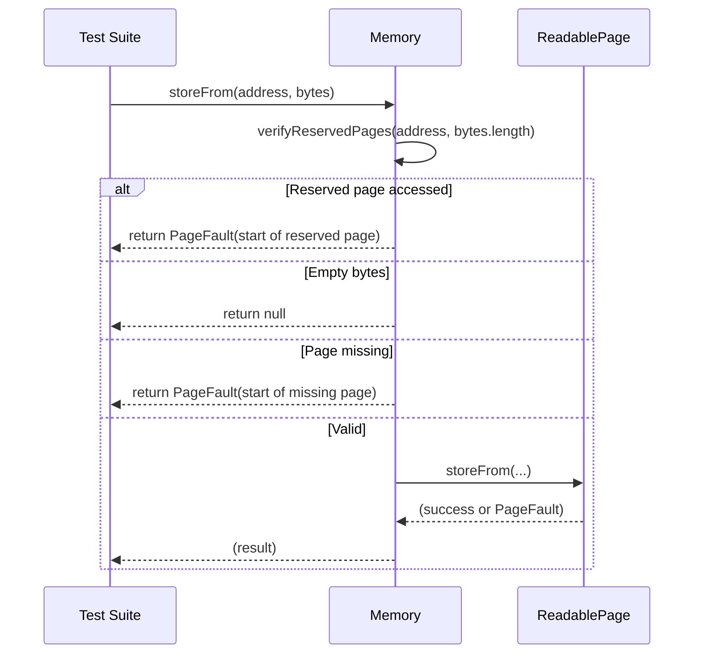

# PVM: panic when accessing reserved pages

## Pull Request by @mateuszsikora

The last part of changes that are needed to align PVM implementation to GP@0.6.4. 

### Main changes:
- changed the `PageFault` address to always be the starting address of the page.
- returned the `PageFault` when accessing pages from range [0; 16)


<!-- This is an auto-generated comment: release notes by coderabbit.ai -->
## Summary by CodeRabbit

- **Bug Fixes**
  - Improved detection and handling of memory access to reserved pages, ensuring faults are reported at correct page boundaries.
  - Enhanced error reporting for memory operations with more accurate fault addresses and finer distinction between fault types.

- **Tests**
  - Updated memory operation tests to use higher memory page indices.
  - Adjusted assertions to reflect refined fault handling and reserved page protections.
<!-- end of auto-generated comment: release notes by coderabbit.ai -->


## Comment by @coderabbitai[bot]

<!-- This is an auto-generated comment: summarize by coderabbit.ai -->
<!-- This is an auto-generated comment: skip review by coderabbit.ai -->

> [!IMPORTANT]
> ## Review skipped
> 
> Auto incremental reviews are disabled on this repository.
> 
> Please check the settings in the CodeRabbit UI or the `.coderabbit.yaml` file in this repository. To trigger a single review, invoke the `@coderabbitai review` command.
> 
> You can disable this status message by setting the `reviews.review_status` to `false` in the CodeRabbit configuration file.

<!-- end of auto-generated comment: skip review by coderabbit.ai -->
<!-- walkthrough_start -->

<details>
<summary>📝 Walkthrough</summary>

## Walkthrough

The changes update the memory management logic and associated tests in the PVM interpreter to enforce stricter handling of reserved memory pages (pages 0–15) and to improve the accuracy of page fault reporting. Test suites for memory, load, and store operations are revised to use higher memory addresses, ensuring that all operations and assertions occur above the reserved page region. The `Memory` and `ReadablePage` classes now report page faults at the start of the faulting page, and new validation logic prevents access to reserved pages. Error handling in load operations is refined to distinguish between different fault types.

## Changes

| File(s)                                                                                  | Change Summary |
|------------------------------------------------------------------------------------------|----------------|
| `packages/core/pvm-interpreter/memory/memory.ts`<br>`packages/core/pvm-interpreter/memory/pages/readable-page.ts`  | Updated memory access methods to prevent operations on reserved pages (0–15), unified page fault reporting to use page start indices, and added explicit checks for reserved page access. Modified `storeFrom` and `loadInto` to report faults at the start of the missing or reserved page. Added `verifyReservedPages` method. |
| `packages/core/pvm-interpreter/memory/memory.test.ts`<br>`packages/core/pvm-interpreter/ops/load-ops.test.ts`<br>`packages/core/pvm-interpreter/ops/store-ops.test.ts` | Shifted all test memory operations to start at page 16 or higher, updated assertions to expect faults at page start addresses, and adjusted boundary and zero-length operation expectations. Expanded writable memory regions in test setup. |
| `packages/core/pvm-interpreter/ops/load-ops.ts`                                         | Refined error handling in load operations to differentiate between faults with and without a valid memory page, adjusting status and exit parameters accordingly. |

## Sequence Diagram(s)



## Poem

> In memory’s warren, pages leap and bound,  
> Reserved ones guarded, faults now tightly wound.  
> Tests hop higher, past page fifteen’s gate,  
> Reporting faults where page starts await.  
> With stricter checks and error hues anew,  
> This bunny’s code is safer—hip hop hooray for you!  
> 🐇✨

</details>

<!-- walkthrough_end -->
<!-- internal state start -->


<!-- DwQgtGAEAqAWCWBnSTIEMB26CuAXA9mAOYCmGJATmriQCaQDG+Ats2bgFyQAOFk+AIwBWJBrngA3EsgEBPRvlqU0AgfFwA6NPEgQAfACgjoCEYDEZyAAUASpETZWaCrKNxU3bABsvkCiQBHbGlcABpIcVwvOkgAIisANQBZLm5MeAZIAHdYMnQGBmlEeAwiP2lKKXo00kRQ2Oy0ZAcBZnUaejkI3MhsREpIZmoSPoAvYoBrfCp0ZFtIDEcBAYBmFYAOfixcHuhZbhJlihdy7nxighcNGB6GWExayAAzErQveFGSbq+3+CIMNgYXD8J7fazJFDMbjRQG4ajwfBYLLqWCQKQUYqIyAABg0ADYNAAWEGQADiVg0bh6QxKg0U8BeDHhiOQJQYXmwSgiWXwkAmJHk2G4tGGiA4RigcC+AAMrGhSAAxNDeXDS9C0Wj+RCs5AYfBZdBeLJoWTNEjAghgxBwijiUrqzVFEk7L41L47aiMZX9egu57KryaAySnqIU00ZjlXDYCgYZBoSCy+UkJUqtWUCjTbK5LDUCPcO1lS1oApOt3IZE7Wl+rWVGJUUpffCg7ERXkARgJVIqjHujdZUMzUjBfdo73tzZ4yf9KrqU9tGW8zi88ieWdrFCqgxIzGm8nL4UtvBIUiBU4wGXjGHoZAc/gUUPemEK2RRYKFIo6ZKs9gODAZGTMhglLBmAhgGCYUBkPQk7KgQxBkMoX5MKw7CpHwggiGIkjSJAXRMEoVCqOoWg6PoEHgCGqCoJgODwaQ5BUMhLCwlwVAGg4TgnPhijKMRmjaLoYFGBRpgGGkDATMmiAAPRMP4MncBIzBgCUNAUMe6kyWwu4uNpO57hoNDWkZYoGLEFkGBYkAAIIAJIIYxwz0JxQwnJOdwPNI3YRCE9jYOoXxrnwfrSkkBkuGq7JNBWTS9MKzltvYCBPMCby+G6YD+F4iUlLQGS4U8maRtaziFugwKtlmiBDD4aJvMEyCWqVC72p6boLEsAydvwfAIEQuQUOEJBPE8ojiFIK6+daJRlDpe78AcTEInGFWQP1g1TqQIJPP0uCINcUqJqQuAAMo2rgcqkHZ14kAAHmqeDwO8uDyMarJApmtDYIUvq8ihng0FaF0oLdd0kgmHXBTOgazP0C4sqD1okGgMGgn0s1+GgBqo462rSIdITINDXj4KjmOYC5lyY5+CZ6gafQ/BqWr9Mgza7eaeHyMwKrwNCuGTrKNmkgAogA+qddkAFoi2qAAUepwgIU3Sj1ABU1jC+Lksy2qWaqwA7JAGtWFrEvS7LACUSX+E80RiN0qCIClmiQEYNn4wjq3Q0mioBqqSNwhghQVpQXwfollr3X+wJPP78YWqGIOTjWJDRBImDAh1TGbR62w9PdJZpczRSE9aTX3Fn/gSAifRTdH40xHHs7Znk1rTJjnyZmA0SlDs6DHCaTW8nqGBgPdSA0Ge5YLPqkANw7eow2EoPspymPQxuW7lmX+2gxI+BeDX9qk+TE58O3FA09QCaIGkGAXvauA8ltuFZGH6pCH0X6WozYLkAaDqeUCpXnoPJLUZxrwUxLvjA6bsDBHWMsCJk/RnhZlPvlc+9hqb2lpt0T0DBMywLBAIfA2BrzOHkMsZ+JA8h+hytadA15njwAxFnac71exeXoEVFg887ox0xg4Us2okoL3KgmX2KZ/Zqk9H6FqwIU49BeGw1+4RKyoj9OImI80TilSBrbe25Ul6eX7NcAA8uidKh5bh9keEwOMk92BTV3MOP0SDty6XkA4mgd0LS8g2gMDqixmBHDnLbEoQV/YOhZvwmOQFkAY3tB1BRoN8oh3CJTRgOUr5PCoSQe4NcszQy7oQXuRB+6X1wlk0h5CRQuDAIQ84xQJxLQSSBcwlgbKBiQitYeYIlDRWWojSc0dphfizJ4ZWGR55AnUPAbyBgAByiISCHVsV5eM953htB/ryDxBEfjMNoCPfAwJdz5TyUw+QYzbQxEmdgaZmR2DqHkIMnJ7TzKWVAmAIwEkpK1DktMEgillKqSBJQTSlB9JeJhYZfa4oLKxCsl0hyDEkIxFcpQkkpjag+XgFCcZ2DhiwhQIkhKezV4ci5NKE650ypXRIDdJQD1njFUTLo2QYAnpeEQNKdZMoqkKmKmqNgOxFCzwNP4aMsZkDSkWHVAAPtYZMqZAyyOYQStg+VhhTWlTGVa8rvBeDVAyMEJRAZcyBs4Kg8hUA7gLLIa4dlkHpXjAsEgBoxWwAldKdEDJZA2AqJuOgjK+V4RGsC65niFpZCvjQcI+rYwU0TIytVAczV+jjYFfg6IcrcArG+LeMQZ4AG1sQAG5OyW2uAAdRzOgV+ZLBhIBaWUb6V97RVJsVElUMSnRO05paeRIM8r3WdNSVtmNs7UFzn2MEHciCvF8LjFm1xToEues4SApMl2ZDQNwaECyKwNvkaIRE1RpyoDaNqWazqsDSgwTdAg0pwh+soAGoN8MqhhtNcgJkPgYjLGCl8fwZ85oRVkIm80BqU1SPTaa0ExbL2PGcD8ERPoBU8CvhnIG3rfUnV/c2i5AEYjFiNEPKMBrgZlTSeOpRXwb1tqbXFP0zdYarqKNB1xKa76iHgG8L0qDoZsdYYwt01wbIeq9eaH19B325MDcGn90k/0OjI7yJQNAHZ5gdXvYsGHyjfp0ZB1+yBy1VrxJbcIo5xxlDjQesAzgyHMKyTzQMfNog8HOPMxEgmUHSGgzKx+ZRJFppka+fuB7eD4F4AJoG7Hi541ZgK1BuLcLkIDcvftoj/BnFakWXkKTR1QJDkw+guM4nvH/Mg3Ikl+nHlPGlQzlpkMxpODPWkpD+5gcwaF5h2byqxd6SyEC1lunqQSUlP07znBTdGQI8Z9y+BTOq7MyIx6JSQHCuKlyfwMDUBjOHCldAuDSiFcVOWnHtRcHCl45l91whyGMlwAAqmpdYNlB6yEtmqQASYSJguywK7MCxTbcgw9u6T3ZAvcgO9oEn3vuWy4Aq3wyrwtplBtkmKiY7t7lNQ+/50kgUKSUipNSkLpXQs5XCq4+1pTBnB7t9TtAzv+ryV+ustAw1ywUTZUHt2Idg3COUnYKOuoUGR51JVKq/aY9pNFURYVIME8TETwF8kQVk/BepKFFBaeyAN6ZBnSKJRiXV9IEnWuwUU40lT/XNPywyV6yoaIYAJMIq+ci8baLEJMUxY4Ny8gPJ2MWUdc7lwUwiu3Mz6sPRpRBtRq7kgjKooMNisgEjLwNNUdjI2+DEWNFgkSzls0/jExVgOgognyNUYQxYXdGI0psT8puF8foDiKsUCII4dgSUC+Y/8DSQ1cdeUkFb+4f9of4qflwmx6J13+mGPGmCIu2BBOpMXxO1004c4DDzo2hxpUzylLG10npwzVrDp6LNy/bNQS3ImStx5a2XniEWSs8glJTc/L+SWAFlumuoK5OEKdu5o0KsWskGCYAkBRkIQpkiKlkPujkGKLkge2KIemyPkHiDgOaPsAAMmTLQOYgWmqJwlngsn9J/N/O1vIFvg2I8IzPQLSBnFfGQsgBgotCNtsETOun+ABABiuD2nhE0IxqZovoVOgkQdfHCNkB/M7AyF+LwpGKTDjKDrhHLGskQBoG+rgC4B7Hji4JDnLO2L9tbJaIEnwBIffhzMCF0KrHiMbJrKLObLrNcAAMLTAQIXqzRCFgicr2AwbcBY7SjHhpD+CEGowAAiN8Gq8mYRaGkRtAzKMRcIZBcUEclK6U+ATIQMg2yeZm5WLCB27wnwtB5QS6iMnolhTawCZWcsyhWM/YO68A/IiYpapsLhOsIs4QAArGrJ0drBbAALpqiWjSiloABM2IAxZs3R4QKwMxgxrhIsoxNabekI2q8WXwGcHI1SzC/gS6yMfAuxjUvQPoWOwC/gDsnBSCoc94bwiAvIqMX8yMnQdBGomMDhThyx3RYxvIw+cICuLITiwcb0b4foAC5ROUsgZCrsUoaWoe8Yo0K+6U00e8JQB8R8mMGCmM5CxQ/wMQWSBJ5AzBEKpAGIJIrBtczQHwGhr26w4Qr2nYTJKwkxTJeIhI4QdkjJkAdkLJfJbJ1s3WqI+U1xUQdBmqUC4pK4WGmuO6+Ae6RRMUlA4giMQ+2gWA5C6WtAFaWwU0foAR9BmyRR2UiUe0Qo84aAYqlA9x7eLsOeNRARhxfSHSKKtkF+U21+Xwt+82D+i2dyMEz+Ty628yH+qy3+3yEAvy4k/+xOQB2utueuMkkBMk0BsBnupuyB6K/uaBXEweoI6WiAPkGYWYtmmMceroOGwwMecmcqGCSyEucRiYGCG6hJtAjZoSlA6RyAESpJSUlyY0/gcyNZJer0BwMgohME+cVZFQwcTYoICYARQCM5CpdeWoKo1wVg1cNJfhmA8go8YAqOLZRBX6mOTITB5qcYehP0apWAG5sM+ifQSUywgR5eCe0gm5CoNkr2+B0AzZWid06gVpNpIU+yyi/s0CyW1wKyWQ4QZqj6p5n5gYGg9wiAqezaN5JAwhT5Oob5/eZ5KF35v5/5kWmiBcQF7CVAoF+F3ppeepZyg0yI/QOFcI0YeFe0BFyFmgxFf5YsNk7h7hIsp0p0ZBKIcJb55UgFwF4R1p4BFAcpiIehh8zwqhueq0WqdA2xU0aAqUAwe0UlSch2H0eEjFtZigB0Ik7pE23B/SM2ogHyd59+cSS2QZPAL+Myb+m2yyqyXuZuMZFuskCZNuoByZqZVSMBBacBJkmZSBqKKBuZ/k+ZOKSJ2BfkuBCW+s50wKJB4a5B9I2eVBf8CYTp4hoOO0nF0MaJnKWUaciUw2d+fB/GjI6UUGJCoh5RW+l5tIoReWaG2V/gqRaAzZvVJA4RJAA1TK14Q1aoTw2pTljQU+3CbKfCCYalW+JhvUHq26phSUtEW+7MnF9h6szhQxMskAAA1JAO2K3p4ccNIJAn1n4VmvGgUcubviae/PeJkU3Oyi8I3i5LVL4AwRoVoTocSgVmtLSuaPSraIysYYvr9v3nobIAYULiynLISNiAAJxWbSjmHPFNHbR3yYAhYrWRgjq0Yrksrb7Sal5JSrJNrLCwnMIejAhyzQ1nQXTw1gwg7JbWxXW/EWz41YYBEvAlEfBAQgXyV2mGhPGrxgYXGNE1TVW8z8zOVCxdHC2QCaEaDaFvpC26z969E/FzHC0E07rOAUmDBq3RDIAc3TGm1a1G3jGLFO1nVWySZ1R3H7yHzHxlCaU6rWpSlikr5VJcF372Cbo5JTQ/W+g9CB3bH02nG4RdC4xfEnWG2yzTY9CNY0mbFaU1lb4p1wIIlfBFm9AXjBTMBTQKGpT+GmYulYjdU8Hlx7XrR/CbTGmNhFHRxZIvXqBvWN0kCVG5gFDTBPVOqQArJcLNFfWMaozujgXl1Rq7ozJZgqlezOXuK8FWXjaekLV0W+kLULb5ZP7uUhleXhlf5+WgTgSQSzJox0SEA5mJQoSsRYwcToHcTeK8RERqACRkTCQP3v3qBizwC0CIBiw7mep0BiypLkSiRQACDtgGyTErAjTrBYO9FY14gGwkDtgMBPDrB4jYiEi0DrArACDYiTFPC0CTHrBxxPACDrAMCtjkQP29G9GTGTEGxUPY3thPACMFB4jtiTG0AGzti9ErDMNoArAMBYPYgMACC9HY3Y1oAGzYikNCSGAP0CCFBoCEgGxoDrCGPrDiNY0MCoMqN4OdiqPGMmN0DrAGxPAFBjSTE6NIOQDrDtgrASOaPY1PAbDkPiO0BBO9ECD4NrC0AMDTGTHAZiNoDY3cNoDsPCReOgO4DgOQPQMngLLvy0BizQQ6NAA= -->

<!-- internal state end -->
<!-- tips_start -->

---


<details>
<summary>🪧 Tips</summary>

### Chat

There are 3 ways to chat with [CodeRabbit](https://coderabbit.ai?utm_source=oss&utm_medium=github&utm_campaign=FluffyLabs/typeberry&utm_content=338):

- Review comments: Directly reply to a review comment made by CodeRabbit. Example:
  - `I pushed a fix in commit <commit_id>, please review it.`
  - `Generate unit testing code for this file.`
  - `Open a follow-up GitHub issue for this discussion.`
- Files and specific lines of code (under the "Files changed" tab): Tag `@coderabbitai` in a new review comment at the desired location with your query. Examples:
  - `@coderabbitai generate unit testing code for this file.`
  -	`@coderabbitai modularize this function.`
- PR comments: Tag `@coderabbitai` in a new PR comment to ask questions about the PR branch. For the best results, please provide a very specific query, as very limited context is provided in this mode. Examples:
  - `@coderabbitai gather interesting stats about this repository and render them as a table. Additionally, render a pie chart showing the language distribution in the codebase.`
  - `@coderabbitai read src/utils.ts and generate unit testing code.`
  - `@coderabbitai read the files in the src/scheduler package and generate a class diagram using mermaid and a README in the markdown format.`
  - `@coderabbitai help me debug CodeRabbit configuration file.`

Note: Be mindful of the bot's finite context window. It's strongly recommended to break down tasks such as reading entire modules into smaller chunks. For a focused discussion, use review comments to chat about specific files and their changes, instead of using the PR comments.

### CodeRabbit Commands (Invoked using PR comments)

- `@coderabbitai pause` to pause the reviews on a PR.
- `@coderabbitai resume` to resume the paused reviews.
- `@coderabbitai review` to trigger an incremental review. This is useful when automatic reviews are disabled for the repository.
- `@coderabbitai full review` to do a full review from scratch and review all the files again.
- `@coderabbitai summary` to regenerate the summary of the PR.
- `@coderabbitai generate docstrings` to [generate docstrings](https://docs.coderabbit.ai/finishing-touches/docstrings) for this PR.
- `@coderabbitai resolve` resolve all the CodeRabbit review comments.
- `@coderabbitai configuration` to show the current CodeRabbit configuration for the repository.
- `@coderabbitai help` to get help.

### Other keywords and placeholders

- Add `@coderabbitai ignore` anywhere in the PR description to prevent this PR from being reviewed.
- Add `@coderabbitai summary` to generate the high-level summary at a specific location in the PR description.
- Add `@coderabbitai` anywhere in the PR title to generate the title automatically.

### CodeRabbit Configuration File (`.coderabbit.yaml`)

- You can programmatically configure CodeRabbit by adding a `.coderabbit.yaml` file to the root of your repository.
- Please see the [configuration documentation](https://docs.coderabbit.ai/guides/configure-coderabbit) for more information.
- If your editor has YAML language server enabled, you can add the path at the top of this file to enable auto-completion and validation: `# yaml-language-server: $schema=https://coderabbit.ai/integrations/schema.v2.json`

### Documentation and Community

- Visit our [Documentation](https://docs.coderabbit.ai) for detailed information on how to use CodeRabbit.
- Join our [Discord Community](http://discord.gg/coderabbit) to get help, request features, and share feedback.
- Follow us on [X/Twitter](https://twitter.com/coderabbitai) for updates and announcements.

</details>

<!-- tips_end -->


## Comment by @github-actions[bot]


<details>
<summary>View all</summary>

|  Name  |  Status  | |
|--------|----------|-|
| Trie test 0 | ✅ | | 
| Trie test 1 | ✅ | | 
| Trie test 2 | ✅ | | 
| Trie test 3 | ✅ | | 
| Trie test 4 | ✅ | | 
| Trie test 5 | ✅ | | 
| Trie test 6 | ✅ | | 
| Trie test 7 | ✅ | | 
| Trie test 8 | ✅ | | 
| Trie test 9 | ✅ | | 
| Trie test 10 | ✅ | | 
| Trie test 10 | ✅ | | 
| Trie test 10 | ✅ | | 
| jamtestvectors/statistics/tiny/stats_with_empty_extrinsic-1.json | ✅ | | 
| jamtestvectors/statistics/tiny/stats_with_epoch_change-1.json | ✅ | | 
| jamtestvectors/statistics/tiny/stats_with_some_extrinsic-1.json | ✅ | | 
| jamtestvectors/statistics/tiny/stats_with_some_extrinsic-1.json | ✅ | | 
| jamtestvectors/statistics/full/stats_with_empty_extrinsic-1.json | ✅ | | 
| jamtestvectors/statistics/full/stats_with_epoch_change-1.json | ✅ | | 
| jamtestvectors/statistics/full/stats_with_some_extrinsic-1.json | ✅ | | 
| jamtestvectors/statistics/full/stats_with_some_extrinsic-1.json | ✅ | | 
| should correctly shuffle input of length 0 | ✅ | | 
| should correctly shuffle input of length 8 | ✅ | | 
| should correctly shuffle input of length 16 | ✅ | | 
| should correctly shuffle input of length 20 | ✅ | | 
| should correctly shuffle input of length 50 | ✅ | | 
| should correctly shuffle input of length 100 | ✅ | | 
| should correctly shuffle input of length 200 | ✅ | | 
| should correctly shuffle input of length 341 | ✅ | | 
| should correctly shuffle input of length 341 | ✅ | | 
| should correctly shuffle input of length 341 | ✅ | | 
| jamtestvectors/safrole/tiny/enact-epoch-change-with-no-tickets-1.json | ✅ | | 
| jamtestvectors/safrole/tiny/enact-epoch-change-with-no-tickets-2.json | ✅ | | 
| jamtestvectors/safrole/tiny/enact-epoch-change-with-no-tickets-3.json | ✅ | | 
| jamtestvectors/safrole/tiny/enact-epoch-change-with-no-tickets-4.json | ✅ | | 
| jamtestvectors/safrole/tiny/enact-epoch-change-with-padding-1.json | ✅ | | 
| jamtestvectors/safrole/tiny/publish-tickets-no-mark-1.json | ✅ | | 
| jamtestvectors/safrole/tiny/publish-tickets-no-mark-2.json | ✅ | | 
| jamtestvectors/safrole/tiny/publish-tickets-no-mark-3.json | ✅ | | 
| jamtestvectors/safrole/tiny/publish-tickets-no-mark-4.json | ✅ | | 
| jamtestvectors/safrole/tiny/publish-tickets-no-mark-5.json | ✅ | | 
| jamtestvectors/safrole/tiny/publish-tickets-no-mark-6.json | ✅ | | 
| jamtestvectors/safrole/tiny/publish-tickets-no-mark-7.json | ✅ | | 
| jamtestvectors/safrole/tiny/publish-tickets-no-mark-8.json | ✅ | | 
| jamtestvectors/safrole/tiny/publish-tickets-no-mark-9.json | ✅ | | 
| jamtestvectors/safrole/tiny/publish-tickets-with-mark-1.json | ✅ | | 
| jamtestvectors/safrole/tiny/publish-tickets-with-mark-2.json | ✅ | | 
| jamtestvectors/safrole/tiny/publish-tickets-with-mark-3.json | ✅ | | 
| jamtestvectors/safrole/tiny/publish-tickets-with-mark-4.json | ✅ | | 
| jamtestvectors/safrole/tiny/publish-tickets-with-mark-5.json | ✅ | | 
| jamtestvectors/safrole/tiny/skip-epoch-tail-1.json | ✅ | | 
| jamtestvectors/safrole/tiny/skip-epochs-1.json | ✅ | | 
| jamtestvectors/safrole/full/enact-epoch-change-with-no-tickets-1.json | ✅ | | 
| jamtestvectors/safrole/full/enact-epoch-change-with-no-tickets-2.json | ✅ | | 
| jamtestvectors/safrole/full/enact-epoch-change-with-no-tickets-3.json | ✅ | | 
| jamtestvectors/safrole/full/enact-epoch-change-with-no-tickets-4.json | ✅ | | 
| jamtestvectors/safrole/full/enact-epoch-change-with-padding-1.json | ✅ | | 
| jamtestvectors/safrole/full/publish-tickets-no-mark-1.json | ✅ | | 
| jamtestvectors/safrole/full/publish-tickets-no-mark-2.json | ✅ | | 
| jamtestvectors/safrole/full/publish-tickets-no-mark-3.json | ✅ | | 
| jamtestvectors/safrole/full/publish-tickets-no-mark-4.json | ✅ | | 
| jamtestvectors/safrole/full/publish-tickets-no-mark-5.json | ✅ | | 
| jamtestvectors/safrole/full/publish-tickets-no-mark-6.json | ✅ | | 
| jamtestvectors/safrole/full/publish-tickets-no-mark-7.json | ✅ | | 
| jamtestvectors/safrole/full/publish-tickets-no-mark-8.json | ✅ | | 
| jamtestvectors/safrole/full/publish-tickets-no-mark-9.json | ✅ | | 
| jamtestvectors/safrole/full/publish-tickets-with-mark-1.json | ✅ | | 
| jamtestvectors/safrole/full/publish-tickets-with-mark-2.json | ✅ | | 
| jamtestvectors/safrole/full/publish-tickets-with-mark-3.json | ✅ | | 
| jamtestvectors/safrole/full/publish-tickets-with-mark-4.json | ✅ | | 
| jamtestvectors/safrole/full/publish-tickets-with-mark-5.json | ✅ | | 
| jamtestvectors/safrole/full/skip-epoch-tail-1.json | ✅ | | 
| jamtestvectors/safrole/full/skip-epochs-1.json | ✅ | | 
| jamtestvectors/safrole/full/skip-epochs-1.json | ✅ | | 
| jamtestvectors/reports/tiny/anchor_not_recent-1.json | ✅ | | 
| jamtestvectors/reports/tiny/bad_beefy_mmr-1.json | ✅ | | 
| jamtestvectors/reports/tiny/bad_code_hash-1.json | ✅ | | 
| jamtestvectors/reports/tiny/bad_core_index-1.json | ✅ | | 
| jamtestvectors/reports/tiny/bad_service_id-1.json | ✅ | | 
| jamtestvectors/reports/tiny/bad_signature-1.json | ✅ | | 
| jamtestvectors/reports/tiny/bad_state_root-1.json | ✅ | | 
| jamtestvectors/reports/tiny/bad_validator_index-1.json | ✅ | | 
| jamtestvectors/reports/tiny/big_work_report_output-1.json | ✅ | | 
| jamtestvectors/reports/tiny/core_engaged-1.json | ✅ | | 
| jamtestvectors/reports/tiny/dependency_missing-1.json | ✅ | | 
| jamtestvectors/reports/tiny/duplicate_package_in_recent_history-1.json | ✅ | | 
| jamtestvectors/reports/tiny/duplicated_package_in_report-1.json | ✅ | | 
| jamtestvectors/reports/tiny/future_report_slot-1.json | ✅ | | 
| jamtestvectors/reports/tiny/high_work_report_gas-1.json | ✅ | | 
| jamtestvectors/reports/tiny/many_dependencies-1.json | ✅ | | 
| jamtestvectors/reports/tiny/multiple_reports-1.json | ✅ | | 
| jamtestvectors/reports/tiny/no_enough_guarantees-1.json | ✅ | | 
| jamtestvectors/reports/tiny/not_authorized-1.json | ✅ | | 
| jamtestvectors/reports/tiny/not_authorized-2.json | ✅ | | 
| jamtestvectors/reports/tiny/not_sorted_guarantor-1.json | ✅ | | 
| jamtestvectors/reports/tiny/out_of_order_guarantees-1.json | ✅ | | 
| jamtestvectors/reports/tiny/report_before_last_rotation-1.json | ✅ | | 
| jamtestvectors/reports/tiny/report_curr_rotation-1.json | ✅ | | 
| jamtestvectors/reports/tiny/report_prev_rotation-1.json | ✅ | | 
| jamtestvectors/reports/tiny/reports_with_dependencies-1.json | ✅ | | 
| jamtestvectors/reports/tiny/reports_with_dependencies-2.json | ✅ | | 
| jamtestvectors/reports/tiny/reports_with_dependencies-3.json | ✅ | | 
| jamtestvectors/reports/tiny/reports_with_dependencies-4.json | ✅ | | 
| jamtestvectors/reports/tiny/reports_with_dependencies-5.json | ✅ | | 
| jamtestvectors/reports/tiny/reports_with_dependencies-6.json | ✅ | | 
| jamtestvectors/reports/tiny/segment_root_lookup_invalid-1.json | ✅ | | 
| jamtestvectors/reports/tiny/segment_root_lookup_invalid-2.json | ✅ | | 
| jamtestvectors/reports/tiny/service_item_gas_too_low-1.json | ✅ | | 
| jamtestvectors/reports/tiny/too_big_work_report_output-1.json | ✅ | | 
| jamtestvectors/reports/tiny/too_high_work_report_gas-1.json | ✅ | | 
| jamtestvectors/reports/tiny/too_many_dependencies-1.json | ✅ | | 
| jamtestvectors/reports/tiny/with_avail_assignments-1.json | ✅ | | 
| jamtestvectors/reports/tiny/wrong_assignment-1.json | ✅ | | 
| jamtestvectors/reports/tiny/wrong_assignment-1.json | ✅ | | 
| jamtestvectors/reports/full/anchor_not_recent-1.json | ✅ | | 
| jamtestvectors/reports/full/bad_beefy_mmr-1.json | ✅ | | 
| jamtestvectors/reports/full/bad_code_hash-1.json | ✅ | | 
| jamtestvectors/reports/full/bad_core_index-1.json | ✅ | | 
| jamtestvectors/reports/full/bad_service_id-1.json | ✅ | | 
| jamtestvectors/reports/full/bad_signature-1.json | ✅ | | 
| jamtestvectors/reports/full/bad_state_root-1.json | ✅ | | 
| jamtestvectors/reports/full/bad_validator_index-1.json | ✅ | | 
| jamtestvectors/reports/full/big_work_report_output-1.json | ✅ | | 
| jamtestvectors/reports/full/core_engaged-1.json | ✅ | | 
| jamtestvectors/reports/full/dependency_missing-1.json | ✅ | | 
| jamtestvectors/reports/full/duplicate_package_in_recent_history-1.json | ✅ | | 
| jamtestvectors/reports/full/duplicated_package_in_report-1.json | ✅ | | 
| jamtestvectors/reports/full/future_report_slot-1.json | ✅ | | 
| jamtestvectors/reports/full/high_work_report_gas-1.json | ✅ | | 
| jamtestvectors/reports/full/many_dependencies-1.json | ✅ | | 
| jamtestvectors/reports/full/multiple_reports-1.json | ✅ | | 
| jamtestvectors/reports/full/no_enough_guarantees-1.json | ✅ | | 
| jamtestvectors/reports/full/not_authorized-1.json | ✅ | | 
| jamtestvectors/reports/full/not_authorized-2.json | ✅ | | 
| jamtestvectors/reports/full/not_sorted_guarantor-1.json | ✅ | | 
| jamtestvectors/reports/full/out_of_order_guarantees-1.json | ✅ | | 
| jamtestvectors/reports/full/report_before_last_rotation-1.json | ✅ | | 
| jamtestvectors/reports/full/report_curr_rotation-1.json | ✅ | | 
| jamtestvectors/reports/full/report_prev_rotation-1.json | ✅ | | 
| jamtestvectors/reports/full/reports_with_dependencies-1.json | ✅ | | 
| jamtestvectors/reports/full/reports_with_dependencies-2.json | ✅ | | 
| jamtestvectors/reports/full/reports_with_dependencies-3.json | ✅ | | 
| jamtestvectors/reports/full/reports_with_dependencies-4.json | ✅ | | 
| jamtestvectors/reports/full/reports_with_dependencies-5.json | ✅ | | 
| jamtestvectors/reports/full/reports_with_dependencies-6.json | ✅ | | 
| jamtestvectors/reports/full/segment_root_lookup_invalid-1.json | ✅ | | 
| jamtestvectors/reports/full/segment_root_lookup_invalid-2.json | ✅ | | 
| jamtestvectors/reports/full/service_item_gas_too_low-1.json | ✅ | | 
| jamtestvectors/reports/full/too_big_work_report_output-1.json | ✅ | | 
| jamtestvectors/reports/full/too_high_work_report_gas-1.json | ✅ | | 
| jamtestvectors/reports/full/too_many_dependencies-1.json | ✅ | | 
| jamtestvectors/reports/full/with_avail_assignments-1.json | ✅ | | 
| jamtestvectors/reports/full/wrong_assignment-1.json | ✅ | | 
| jamtestvectors/reports/full/wrong_assignment-1.json | ✅ | | 
| jamtestvectors/pvm/schema.json | ✅ | | 
| jamtestvectors/erasure_coding/schema_ec.json | ✅ | | 
| jamtestvectors/erasure_coding/schema_page_proof.json | ✅ | | 
| jamtestvectors/erasure_coding/schema_segment_ec.json | ✅ | | 
| jamtestvectors/erasure_coding/schema_segment_root.json | ✅ | | 
| jamtestvectors/erasure_coding/schema_segment_root.json | ✅ | | 
| jamtestvectors/pvm/programs/gas_basic_consume_all.json | ✅ | | 
| jamtestvectors/pvm/programs/inst_add_32.json | ✅ | | 
| jamtestvectors/pvm/programs/inst_add_32_with_overflow.json | ✅ | | 
| jamtestvectors/pvm/programs/inst_add_32_with_truncation.json | ✅ | | 
| jamtestvectors/pvm/programs/inst_add_32_with_truncation_and_sign_extension.json | ✅ | | 
| jamtestvectors/pvm/programs/inst_add_64.json | ✅ | | 
| jamtestvectors/pvm/programs/inst_add_64_with_overflow.json | ✅ | | 
| jamtestvectors/pvm/programs/inst_add_imm_32.json | ✅ | | 
| jamtestvectors/pvm/programs/inst_add_imm_32_with_truncation.json | ✅ | | 
| jamtestvectors/pvm/programs/inst_add_imm_32_with_truncation_and_sign_extension.json | ✅ | | 
| jamtestvectors/pvm/programs/inst_add_imm_64.json | ✅ | | 
| jamtestvectors/pvm/programs/inst_and.json | ✅ | | 
| jamtestvectors/pvm/programs/inst_and_imm.json | ✅ | | 
| jamtestvectors/pvm/programs/inst_branch_eq_imm_nok.json | ✅ | | 
| jamtestvectors/pvm/programs/inst_branch_eq_imm_ok.json | ✅ | | 
| jamtestvectors/pvm/programs/inst_branch_eq_nok.json | ✅ | | 
| jamtestvectors/pvm/programs/inst_branch_eq_ok.json | ✅ | | 
| jamtestvectors/pvm/programs/inst_branch_greater_or_equal_signed_imm_nok.json | ✅ | | 
| jamtestvectors/pvm/programs/inst_branch_greater_or_equal_signed_imm_ok.json | ✅ | | 
| jamtestvectors/pvm/programs/inst_branch_greater_or_equal_signed_nok.json | ✅ | | 
| jamtestvectors/pvm/programs/inst_branch_greater_or_equal_signed_ok.json | ✅ | | 
| jamtestvectors/pvm/programs/inst_branch_greater_or_equal_unsigned_imm_nok.json | ✅ | | 
| jamtestvectors/pvm/programs/inst_branch_greater_or_equal_unsigned_imm_ok.json | ✅ | | 
| jamtestvectors/pvm/programs/inst_branch_greater_or_equal_unsigned_nok.json | ✅ | | 
| jamtestvectors/pvm/programs/inst_branch_greater_or_equal_unsigned_ok.json | ✅ | | 
| jamtestvectors/pvm/programs/inst_branch_greater_signed_imm_nok.json | ✅ | | 
| jamtestvectors/pvm/programs/inst_branch_greater_signed_imm_ok.json | ✅ | | 
| jamtestvectors/pvm/programs/inst_branch_greater_unsigned_imm_nok.json | ✅ | | 
| jamtestvectors/pvm/programs/inst_branch_greater_unsigned_imm_ok.json | ✅ | | 
| jamtestvectors/pvm/programs/inst_branch_less_or_equal_signed_imm_nok.json | ✅ | | 
| jamtestvectors/pvm/programs/inst_branch_less_or_equal_signed_imm_ok.json | ✅ | | 
| jamtestvectors/pvm/programs/inst_branch_less_or_equal_unsigned_imm_nok.json | ✅ | | 
| jamtestvectors/pvm/programs/inst_branch_less_or_equal_unsigned_imm_ok.json | ✅ | | 
| jamtestvectors/pvm/programs/inst_branch_less_signed_imm_nok.json | ✅ | | 
| jamtestvectors/pvm/programs/inst_branch_less_signed_imm_ok.json | ✅ | | 
| jamtestvectors/pvm/programs/inst_branch_less_signed_nok.json | ✅ | | 
| jamtestvectors/pvm/programs/inst_branch_less_signed_ok.json | ✅ | | 
| jamtestvectors/pvm/programs/inst_branch_less_unsigned_imm_nok.json | ✅ | | 
| jamtestvectors/pvm/programs/inst_branch_less_unsigned_imm_ok.json | ✅ | | 
| jamtestvectors/pvm/programs/inst_branch_less_unsigned_nok.json | ✅ | | 
| jamtestvectors/pvm/programs/inst_branch_less_unsigned_ok.json | ✅ | | 
| jamtestvectors/pvm/programs/inst_branch_not_eq_imm_nok.json | ✅ | | 
| jamtestvectors/pvm/programs/inst_branch_not_eq_imm_ok.json | ✅ | | 
| jamtestvectors/pvm/programs/inst_branch_not_eq_nok.json | ✅ | | 
| jamtestvectors/pvm/programs/inst_branch_not_eq_ok.json | ✅ | | 
| jamtestvectors/pvm/programs/inst_cmov_if_zero_imm_nok.json | ✅ | | 
| jamtestvectors/pvm/programs/inst_cmov_if_zero_imm_ok.json | ✅ | | 
| jamtestvectors/pvm/programs/inst_cmov_if_zero_nok.json | ✅ | | 
| jamtestvectors/pvm/programs/inst_cmov_if_zero_ok.json | ✅ | | 
| jamtestvectors/pvm/programs/inst_div_signed_32.json | ✅ | | 
| jamtestvectors/pvm/programs/inst_div_signed_32.json | ✅ | | 
| jamtestvectors/pvm/programs/inst_div_signed_32_by_zero.json | ✅ | | 
| jamtestvectors/pvm/programs/inst_div_signed_32_with_overflow.json | ✅ | | 
| jamtestvectors/pvm/programs/inst_div_signed_64.json | ✅ | | 
| jamtestvectors/pvm/programs/inst_div_signed_64_by_zero.json | ✅ | | 
| jamtestvectors/pvm/programs/inst_div_signed_64_with_overflow.json | ✅ | | 
| jamtestvectors/pvm/programs/inst_div_unsigned_32.json | ✅ | | 
| jamtestvectors/pvm/programs/inst_div_unsigned_32_by_zero.json | ✅ | | 
| jamtestvectors/pvm/programs/inst_div_unsigned_32_with_overflow.json | ✅ | | 
| jamtestvectors/pvm/programs/inst_div_unsigned_64.json | ✅ | | 
| jamtestvectors/pvm/programs/inst_div_unsigned_64_by_zero.json | ✅ | | 
| jamtestvectors/pvm/programs/inst_div_unsigned_64_with_overflow.json | ✅ | | 
| jamtestvectors/pvm/programs/inst_fallthrough.json | ✅ | | 
| jamtestvectors/pvm/programs/inst_jump.json | ✅ | | 
| jamtestvectors/pvm/programs/inst_jump_indirect_invalid_djump_to_zero_nok.json | ✅ | | 
| jamtestvectors/pvm/programs/inst_jump_indirect_misaligned_djump_with_offset_nok.json | ✅ | | 
| jamtestvectors/pvm/programs/inst_jump_indirect_misaligned_djump_without_offset_nok.json | ✅ | | 
| jamtestvectors/pvm/programs/inst_jump_indirect_with_offset_ok.json | ✅ | | 
| jamtestvectors/pvm/programs/inst_jump_indirect_without_offset_ok.json | ✅ | | 
| jamtestvectors/pvm/programs/inst_load_i16.json | ✅ | | 
| jamtestvectors/pvm/programs/inst_load_i32.json | ✅ | | 
| jamtestvectors/pvm/programs/inst_load_i8.json | ✅ | | 
| jamtestvectors/pvm/programs/inst_load_imm.json | ✅ | | 
| jamtestvectors/pvm/programs/inst_load_imm_64.json | ✅ | | 
| jamtestvectors/pvm/programs/inst_load_imm_and_jump.json | ✅ | | 
| jamtestvectors/pvm/programs/inst_load_imm_and_jump_indirect_different_regs_with_offset_ok.json | ✅ | | 
| jamtestvectors/pvm/programs/inst_load_imm_and_jump_indirect_different_regs_without_offset_ok.json | ✅ | | 
| jamtestvectors/pvm/programs/inst_load_imm_and_jump_indirect_invalid_djump_to_zero_different_regs_without_offset_nok.json | ✅ | | 
| jamtestvectors/pvm/programs/inst_load_imm_and_jump_indirect_invalid_djump_to_zero_same_regs_without_offset_nok.json | ✅ | | 
| jamtestvectors/pvm/programs/inst_load_imm_and_jump_indirect_misaligned_djump_different_regs_with_offset_nok.json | ✅ | | 
| jamtestvectors/pvm/programs/inst_load_imm_and_jump_indirect_misaligned_djump_different_regs_without_offset_nok.json | ✅ | | 
| jamtestvectors/pvm/programs/inst_load_imm_and_jump_indirect_misaligned_djump_same_regs_with_offset_nok.json | ✅ | | 
| jamtestvectors/pvm/programs/inst_load_imm_and_jump_indirect_misaligned_djump_same_regs_without_offset_nok.json | ✅ | | 
| jamtestvectors/pvm/programs/inst_load_imm_and_jump_indirect_same_regs_with_offset_ok.json | ✅ | | 
| jamtestvectors/pvm/programs/inst_load_imm_and_jump_indirect_same_regs_without_offset_ok.json | ✅ | | 
| jamtestvectors/pvm/programs/inst_load_indirect_i16_with_offset.json | ✅ | | 
| jamtestvectors/pvm/programs/inst_load_indirect_i16_without_offset.json | ✅ | | 
| jamtestvectors/pvm/programs/inst_load_indirect_i32_with_offset.json | ✅ | | 
| jamtestvectors/pvm/programs/inst_load_indirect_i32_without_offset.json | ✅ | | 
| jamtestvectors/pvm/programs/inst_load_indirect_i8_with_offset.json | ✅ | | 
| jamtestvectors/pvm/programs/inst_load_indirect_i8_without_offset.json | ✅ | | 
| jamtestvectors/pvm/programs/inst_load_indirect_u16_with_offset.json | ✅ | | 
| jamtestvectors/pvm/programs/inst_load_indirect_u16_without_offset.json | ✅ | | 
| jamtestvectors/pvm/programs/inst_load_indirect_u32_with_offset.json | ✅ | | 
| jamtestvectors/pvm/programs/inst_load_indirect_u32_without_offset.json | ✅ | | 
| jamtestvectors/pvm/programs/inst_load_indirect_u64_with_offset.json | ✅ | | 
| jamtestvectors/pvm/programs/inst_load_indirect_u64_without_offset.json | ✅ | | 
| jamtestvectors/pvm/programs/inst_load_indirect_u8_with_offset.json | ✅ | | 
| jamtestvectors/pvm/programs/inst_load_indirect_u8_without_offset.json | ✅ | | 
| jamtestvectors/pvm/programs/inst_load_u16.json | ✅ | | 
| jamtestvectors/pvm/programs/inst_load_u32.json | ✅ | | 
| jamtestvectors/pvm/programs/inst_load_u32.json | ✅ | | 
| jamtestvectors/pvm/programs/inst_load_u64.json | ✅ | | 
| jamtestvectors/pvm/programs/inst_load_u8.json | ✅ | | 
| jamtestvectors/pvm/programs/inst_load_u8_nok.json | ✅ | | 
| jamtestvectors/pvm/programs/inst_move_reg.json | ✅ | | 
| jamtestvectors/pvm/programs/inst_mul_32.json | ✅ | | 
| jamtestvectors/pvm/programs/inst_mul_64.json | ✅ | | 
| jamtestvectors/pvm/programs/inst_mul_imm_32.json | ✅ | | 
| jamtestvectors/pvm/programs/inst_mul_imm_64.json | ✅ | | 
| jamtestvectors/pvm/programs/inst_negate_and_add_imm_32.json | ✅ | | 
| jamtestvectors/pvm/programs/inst_negate_and_add_imm_64.json | ✅ | | 
| jamtestvectors/pvm/programs/inst_or.json | ✅ | | 
| jamtestvectors/pvm/programs/inst_or_imm.json | ✅ | | 
| jamtestvectors/pvm/programs/inst_rem_signed_32.json | ✅ | | 
| jamtestvectors/pvm/programs/inst_rem_signed_32_by_zero.json | ✅ | | 
| jamtestvectors/pvm/programs/inst_rem_signed_32_with_overflow.json | ✅ | | 
| jamtestvectors/pvm/programs/inst_rem_signed_64.json | ✅ | | 
| jamtestvectors/pvm/programs/inst_rem_signed_64_by_zero.json | ✅ | | 
| jamtestvectors/pvm/programs/inst_rem_signed_64_with_overflow.json | ✅ | | 
| jamtestvectors/pvm/programs/inst_rem_unsigned_32.json | ✅ | | 
| jamtestvectors/pvm/programs/inst_rem_unsigned_32_by_zero.json | ✅ | | 
| jamtestvectors/pvm/programs/inst_rem_unsigned_64.json | ✅ | | 
| jamtestvectors/pvm/programs/inst_rem_unsigned_64_by_zero.json | ✅ | | 
| jamtestvectors/pvm/programs/inst_ret_halt.json | ✅ | | 
| jamtestvectors/pvm/programs/inst_ret_invalid.json | ✅ | | 
| jamtestvectors/pvm/programs/inst_set_greater_than_signed_imm_0.json | ✅ | | 
| jamtestvectors/pvm/programs/inst_set_greater_than_signed_imm_1.json | ✅ | | 
| jamtestvectors/pvm/programs/inst_set_greater_than_unsigned_imm_0.json | ✅ | | 
| jamtestvectors/pvm/programs/inst_set_greater_than_unsigned_imm_1.json | ✅ | | 
| jamtestvectors/pvm/programs/inst_set_less_than_signed_0.json | ✅ | | 
| jamtestvectors/pvm/programs/inst_set_less_than_signed_1.json | ✅ | | 
| jamtestvectors/pvm/programs/inst_set_less_than_signed_imm_0.json | ✅ | | 
| jamtestvectors/pvm/programs/inst_set_less_than_signed_imm_1.json | ✅ | | 
| jamtestvectors/pvm/programs/inst_set_less_than_unsigned_0.json | ✅ | | 
| jamtestvectors/pvm/programs/inst_set_less_than_unsigned_1.json | ✅ | | 
| jamtestvectors/pvm/programs/inst_set_less_than_unsigned_imm_0.json | ✅ | | 
| jamtestvectors/pvm/programs/inst_set_less_than_unsigned_imm_1.json | ✅ | | 
| jamtestvectors/pvm/programs/inst_shift_arithmetic_right_32.json | ✅ | | 
| jamtestvectors/pvm/programs/inst_shift_arithmetic_right_32_with_overflow.json | ✅ | | 
| jamtestvectors/pvm/programs/inst_shift_arithmetic_right_64.json | ✅ | | 
| jamtestvectors/pvm/programs/inst_shift_arithmetic_right_64_with_overflow.json | ✅ | | 
| jamtestvectors/pvm/programs/inst_shift_arithmetic_right_imm_32.json | ✅ | | 
| jamtestvectors/pvm/programs/inst_shift_arithmetic_right_imm_64.json | ✅ | | 
| jamtestvectors/pvm/programs/inst_shift_arithmetic_right_imm_alt_32.json | ✅ | | 
| jamtestvectors/pvm/programs/inst_shift_arithmetic_right_imm_alt_64.json | ✅ | | 
| jamtestvectors/pvm/programs/inst_shift_logical_left_32.json | ✅ | | 
| jamtestvectors/pvm/programs/inst_shift_logical_left_32_with_overflow.json | ✅ | | 
| jamtestvectors/pvm/programs/inst_shift_logical_left_64.json | ✅ | | 
| jamtestvectors/pvm/programs/inst_shift_logical_left_64_with_overflow.json | ✅ | | 
| jamtestvectors/pvm/programs/inst_shift_logical_left_imm_32.json | ✅ | | 
| jamtestvectors/pvm/programs/inst_shift_logical_left_imm_64.json | ✅ | | 
| jamtestvectors/pvm/programs/inst_shift_logical_left_imm_64.json | ✅ | | 
| jamtestvectors/pvm/programs/inst_shift_logical_left_imm_alt_32.json | ✅ | | 
| jamtestvectors/pvm/programs/inst_shift_logical_left_imm_alt_64.json | ✅ | | 
| jamtestvectors/pvm/programs/inst_shift_logical_right_32.json | ✅ | | 
| jamtestvectors/pvm/programs/inst_shift_logical_right_32_with_overflow.json | ✅ | | 
| jamtestvectors/pvm/programs/inst_shift_logical_right_64.json | ✅ | | 
| jamtestvectors/pvm/programs/inst_shift_logical_right_64_with_overflow.json | ✅ | | 
| jamtestvectors/pvm/programs/inst_shift_logical_right_imm_32.json | ✅ | | 
| jamtestvectors/pvm/programs/inst_shift_logical_right_imm_64.json | ✅ | | 
| jamtestvectors/pvm/programs/inst_shift_logical_right_imm_alt_32.json | ✅ | | 
| jamtestvectors/pvm/programs/inst_shift_logical_right_imm_alt_64.json | ✅ | | 
| jamtestvectors/pvm/programs/inst_store_imm_indirect_u16_with_offset_nok.json | ✅ | | 
| jamtestvectors/pvm/programs/inst_store_imm_indirect_u16_with_offset_ok.json | ✅ | | 
| jamtestvectors/pvm/programs/inst_store_imm_indirect_u16_without_offset_ok.json | ✅ | | 
| jamtestvectors/pvm/programs/inst_store_imm_indirect_u32_with_offset_nok.json | ✅ | | 
| jamtestvectors/pvm/programs/inst_store_imm_indirect_u32_with_offset_ok.json | ✅ | | 
| jamtestvectors/pvm/programs/inst_store_imm_indirect_u32_without_offset_ok.json | ✅ | | 
| jamtestvectors/pvm/programs/inst_store_imm_indirect_u64_with_offset_nok.json | ✅ | | 
| jamtestvectors/pvm/programs/inst_store_imm_indirect_u64_with_offset_ok.json | ✅ | | 
| jamtestvectors/pvm/programs/inst_store_imm_indirect_u64_without_offset_ok.json | ✅ | | 
| jamtestvectors/pvm/programs/inst_store_imm_indirect_u8_with_offset_nok.json | ✅ | | 
| jamtestvectors/pvm/programs/inst_store_imm_indirect_u8_with_offset_ok.json | ✅ | | 
| jamtestvectors/pvm/programs/inst_store_imm_indirect_u8_without_offset_ok.json | ✅ | | 
| jamtestvectors/pvm/programs/inst_store_imm_u16.json | ✅ | | 
| jamtestvectors/pvm/programs/inst_store_imm_u32.json | ✅ | | 
| jamtestvectors/pvm/programs/inst_store_imm_u64.json | ✅ | | 
| jamtestvectors/pvm/programs/inst_store_imm_u8.json | ✅ | | 
| jamtestvectors/pvm/programs/inst_store_imm_u8_trap_inaccessible.json | ✅ | | 
| jamtestvectors/pvm/programs/inst_store_imm_u8_trap_read_only.json | ✅ | | 
| jamtestvectors/pvm/programs/inst_store_indirect_u16_with_offset_nok.json | ✅ | | 
| jamtestvectors/pvm/programs/inst_store_indirect_u16_with_offset_ok.json | ✅ | | 
| jamtestvectors/pvm/programs/inst_store_indirect_u16_without_offset_ok.json | ✅ | | 
| jamtestvectors/pvm/programs/inst_store_indirect_u32_with_offset_nok.json | ✅ | | 
| jamtestvectors/pvm/programs/inst_store_indirect_u32_with_offset_ok.json | ✅ | | 
| jamtestvectors/pvm/programs/inst_store_indirect_u32_without_offset_ok.json | ✅ | | 
| jamtestvectors/pvm/programs/inst_store_indirect_u64_with_offset_nok.json | ✅ | | 
| jamtestvectors/pvm/programs/inst_store_indirect_u64_with_offset_ok.json | ✅ | | 
| jamtestvectors/pvm/programs/inst_store_indirect_u64_without_offset_ok.json | ✅ | | 
| jamtestvectors/pvm/programs/inst_store_indirect_u8_with_offset_nok.json | ✅ | | 
| jamtestvectors/pvm/programs/inst_store_indirect_u8_with_offset_ok.json | ✅ | | 
| jamtestvectors/pvm/programs/inst_store_indirect_u8_without_offset_ok.json | ✅ | | 
| jamtestvectors/pvm/programs/inst_store_u16.json | ✅ | | 
| jamtestvectors/pvm/programs/inst_store_u32.json | ✅ | | 
| jamtestvectors/pvm/programs/inst_store_u64.json | ✅ | | 
| jamtestvectors/pvm/programs/inst_store_u8.json | ✅ | | 
| jamtestvectors/pvm/programs/inst_store_u8_trap_inaccessible.json | ✅ | | 
| jamtestvectors/pvm/programs/inst_store_u8_trap_read_only.json | ✅ | | 
| jamtestvectors/pvm/programs/inst_sub_32.json | ✅ | | 
| jamtestvectors/pvm/programs/inst_sub_32_with_overflow.json | ✅ | | 
| jamtestvectors/pvm/programs/inst_sub_64.json | ✅ | | 
| jamtestvectors/pvm/programs/inst_sub_64_with_overflow.json | ✅ | | 
| jamtestvectors/pvm/programs/inst_sub_64_with_overflow.json | ✅ | | 
| jamtestvectors/pvm/programs/inst_sub_imm_32.json | ✅ | | 
| jamtestvectors/pvm/programs/inst_sub_imm_64.json | ✅ | | 
| jamtestvectors/pvm/programs/inst_trap.json | ✅ | | 
| jamtestvectors/pvm/programs/inst_xor.json | ✅ | | 
| jamtestvectors/pvm/programs/inst_xor_imm.json | ✅ | | 
| jamtestvectors/pvm/programs/riscv_rv64ua_amoadd_d.json | ✅ | | 
| jamtestvectors/pvm/programs/riscv_rv64ua_amoadd_w.json | ✅ | | 
| jamtestvectors/pvm/programs/riscv_rv64ua_amoand_d.json | ✅ | | 
| jamtestvectors/pvm/programs/riscv_rv64ua_amoand_w.json | ✅ | | 
| jamtestvectors/pvm/programs/riscv_rv64ua_amomax_d.json | ✅ | | 
| jamtestvectors/pvm/programs/riscv_rv64ua_amomax_w.json | ✅ | | 
| jamtestvectors/pvm/programs/riscv_rv64ua_amomaxu_d.json | ✅ | | 
| jamtestvectors/pvm/programs/riscv_rv64ua_amomaxu_w.json | ✅ | | 
| jamtestvectors/pvm/programs/riscv_rv64ua_amomin_d.json | ✅ | | 
| jamtestvectors/pvm/programs/riscv_rv64ua_amomin_w.json | ✅ | | 
| jamtestvectors/pvm/programs/riscv_rv64ua_amominu_d.json | ✅ | | 
| jamtestvectors/pvm/programs/riscv_rv64ua_amominu_w.json | ✅ | | 
| jamtestvectors/pvm/programs/riscv_rv64ua_amoor_d.json | ✅ | | 
| jamtestvectors/pvm/programs/riscv_rv64ua_amoor_w.json | ✅ | | 
| jamtestvectors/pvm/programs/riscv_rv64ua_amoswap_d.json | ✅ | | 
| jamtestvectors/pvm/programs/riscv_rv64ua_amoswap_w.json | ✅ | | 
| jamtestvectors/pvm/programs/riscv_rv64ua_amoxor_d.json | ✅ | | 
| jamtestvectors/pvm/programs/riscv_rv64ua_amoxor_w.json | ✅ | | 
| jamtestvectors/pvm/programs/riscv_rv64uc_rvc.json | ✅ | | 
| jamtestvectors/pvm/programs/riscv_rv64ui_add.json | ✅ | | 
| jamtestvectors/pvm/programs/riscv_rv64ui_addi.json | ✅ | | 
| jamtestvectors/pvm/programs/riscv_rv64ui_addiw.json | ✅ | | 
| jamtestvectors/pvm/programs/riscv_rv64ui_addw.json | ✅ | | 
| jamtestvectors/pvm/programs/riscv_rv64ui_and.json | ✅ | | 
| jamtestvectors/pvm/programs/riscv_rv64ui_andi.json | ✅ | | 
| jamtestvectors/pvm/programs/riscv_rv64ui_beq.json | ✅ | | 
| jamtestvectors/pvm/programs/riscv_rv64ui_bge.json | ✅ | | 
| jamtestvectors/pvm/programs/riscv_rv64ui_bgeu.json | ✅ | | 
| jamtestvectors/pvm/programs/riscv_rv64ui_blt.json | ✅ | | 
| jamtestvectors/pvm/programs/riscv_rv64ui_bltu.json | ✅ | | 
| jamtestvectors/pvm/programs/riscv_rv64ui_bne.json | ✅ | | 
| jamtestvectors/pvm/programs/riscv_rv64ui_jal.json | ✅ | | 
| jamtestvectors/pvm/programs/riscv_rv64ui_jalr.json | ✅ | | 
| jamtestvectors/pvm/programs/riscv_rv64ui_lb.json | ✅ | | 
| jamtestvectors/pvm/programs/riscv_rv64ui_lbu.json | ✅ | | 
| jamtestvectors/pvm/programs/riscv_rv64ui_ld.json | ✅ | | 
| jamtestvectors/pvm/programs/riscv_rv64ui_lh.json | ✅ | | 
| jamtestvectors/pvm/programs/riscv_rv64ui_lhu.json | ✅ | | 
| jamtestvectors/pvm/programs/riscv_rv64ui_lui.json | ✅ | | 
| jamtestvectors/pvm/programs/riscv_rv64ui_lw.json | ✅ | | 
| jamtestvectors/pvm/programs/riscv_rv64ui_lwu.json | ✅ | | 
| jamtestvectors/pvm/programs/riscv_rv64ui_ma_data.json | ✅ | | 
| jamtestvectors/pvm/programs/riscv_rv64ui_or.json | ✅ | | 
| jamtestvectors/pvm/programs/riscv_rv64ui_ori.json | ✅ | | 
| jamtestvectors/pvm/programs/riscv_rv64ui_sb.json | ✅ | | 
| jamtestvectors/pvm/programs/riscv_rv64ui_sb.json | ✅ | | 
| jamtestvectors/pvm/programs/riscv_rv64ui_sd.json | ✅ | | 
| jamtestvectors/pvm/programs/riscv_rv64ui_sh.json | ✅ | | 
| jamtestvectors/pvm/programs/riscv_rv64ui_simple.json | ✅ | | 
| jamtestvectors/pvm/programs/riscv_rv64ui_sll.json | ✅ | | 
| jamtestvectors/pvm/programs/riscv_rv64ui_slli.json | ✅ | | 
| jamtestvectors/pvm/programs/riscv_rv64ui_slliw.json | ✅ | | 
| jamtestvectors/pvm/programs/riscv_rv64ui_sllw.json | ✅ | | 
| jamtestvectors/pvm/programs/riscv_rv64ui_slt.json | ✅ | | 
| jamtestvectors/pvm/programs/riscv_rv64ui_slti.json | ✅ | | 
| jamtestvectors/pvm/programs/riscv_rv64ui_sltiu.json | ✅ | | 
| jamtestvectors/pvm/programs/riscv_rv64ui_sltu.json | ✅ | | 
| jamtestvectors/pvm/programs/riscv_rv64ui_sra.json | ✅ | | 
| jamtestvectors/pvm/programs/riscv_rv64ui_srai.json | ✅ | | 
| jamtestvectors/pvm/programs/riscv_rv64ui_sraiw.json | ✅ | | 
| jamtestvectors/pvm/programs/riscv_rv64ui_sraw.json | ✅ | | 
| jamtestvectors/pvm/programs/riscv_rv64ui_srl.json | ✅ | | 
| jamtestvectors/pvm/programs/riscv_rv64ui_srli.json | ✅ | | 
| jamtestvectors/pvm/programs/riscv_rv64ui_srliw.json | ✅ | | 
| jamtestvectors/pvm/programs/riscv_rv64ui_srlw.json | ✅ | | 
| jamtestvectors/pvm/programs/riscv_rv64ui_sub.json | ✅ | | 
| jamtestvectors/pvm/programs/riscv_rv64ui_subw.json | ✅ | | 
| jamtestvectors/pvm/programs/riscv_rv64ui_sw.json | ✅ | | 
| jamtestvectors/pvm/programs/riscv_rv64ui_xor.json | ✅ | | 
| jamtestvectors/pvm/programs/riscv_rv64ui_xori.json | ✅ | | 
| jamtestvectors/pvm/programs/riscv_rv64um_div.json | ✅ | | 
| jamtestvectors/pvm/programs/riscv_rv64um_divu.json | ✅ | | 
| jamtestvectors/pvm/programs/riscv_rv64um_divuw.json | ✅ | | 
| jamtestvectors/pvm/programs/riscv_rv64um_divw.json | ✅ | | 
| jamtestvectors/pvm/programs/riscv_rv64um_mul.json | ✅ | | 
| jamtestvectors/pvm/programs/riscv_rv64um_mulh.json | ✅ | | 
| jamtestvectors/pvm/programs/riscv_rv64um_mulhsu.json | ✅ | | 
| jamtestvectors/pvm/programs/riscv_rv64um_mulhu.json | ✅ | | 
| jamtestvectors/pvm/programs/riscv_rv64um_mulw.json | ✅ | | 
| jamtestvectors/pvm/programs/riscv_rv64um_rem.json | ✅ | | 
| jamtestvectors/pvm/programs/riscv_rv64um_remu.json | ✅ | | 
| jamtestvectors/pvm/programs/riscv_rv64um_remuw.json | ✅ | | 
| jamtestvectors/pvm/programs/riscv_rv64um_remw.json | ✅ | | 
| jamtestvectors/pvm/programs/riscv_rv64uzbb_andn.json | ✅ | | 
| jamtestvectors/pvm/programs/riscv_rv64uzbb_clz.json | ✅ | | 
| jamtestvectors/pvm/programs/riscv_rv64uzbb_clzw.json | ✅ | | 
| jamtestvectors/pvm/programs/riscv_rv64uzbb_cpop.json | ✅ | | 
| jamtestvectors/pvm/programs/riscv_rv64uzbb_cpopw.json | ✅ | | 
| jamtestvectors/pvm/programs/riscv_rv64uzbb_ctz.json | ✅ | | 
| jamtestvectors/pvm/programs/riscv_rv64uzbb_ctzw.json | ✅ | | 
| jamtestvectors/pvm/programs/riscv_rv64uzbb_max.json | ✅ | | 
| jamtestvectors/pvm/programs/riscv_rv64uzbb_maxu.json | ✅ | | 
| jamtestvectors/pvm/programs/riscv_rv64uzbb_min.json | ✅ | | 
| jamtestvectors/pvm/programs/riscv_rv64uzbb_minu.json | ✅ | | 
| jamtestvectors/pvm/programs/riscv_rv64uzbb_orc_b.json | ✅ | | 
| jamtestvectors/pvm/programs/riscv_rv64uzbb_orn.json | ✅ | | 
| jamtestvectors/pvm/programs/riscv_rv64uzbb_orn.json | ✅ | | 
| jamtestvectors/pvm/programs/riscv_rv64uzbb_rev8.json | ✅ | | 
| jamtestvectors/pvm/programs/riscv_rv64uzbb_rol.json | ✅ | | 
| jamtestvectors/pvm/programs/riscv_rv64uzbb_rolw.json | ✅ | | 
| jamtestvectors/pvm/programs/riscv_rv64uzbb_ror.json | ✅ | | 
| jamtestvectors/pvm/programs/riscv_rv64uzbb_rori.json | ✅ | | 
| jamtestvectors/pvm/programs/riscv_rv64uzbb_roriw.json | ✅ | | 
| jamtestvectors/pvm/programs/riscv_rv64uzbb_rorw.json | ✅ | | 
| jamtestvectors/pvm/programs/riscv_rv64uzbb_sext_b.json | ✅ | | 
| jamtestvectors/pvm/programs/riscv_rv64uzbb_sext_h.json | ✅ | | 
| jamtestvectors/pvm/programs/riscv_rv64uzbb_xnor.json | ✅ | | 
| jamtestvectors/pvm/programs/riscv_rv64uzbb_zext_h.json | ✅ | | 
| jamtestvectors/pvm/programs/riscv_rv64uzbb_zext_h.json | ✅ | | 
| jamtestvectors/preimages/data/preimage_needed-1.json | ✅ | | 
| jamtestvectors/preimages/data/preimage_needed-2.json | ✅ | | 
| jamtestvectors/preimages/data/preimage_not_needed-1.json | ✅ | | 
| jamtestvectors/preimages/data/preimage_not_needed-2.json | ✅ | | 
| jamtestvectors/preimages/data/preimages_order_check-1.json | ✅ | | 
| jamtestvectors/preimages/data/preimages_order_check-2.json | ✅ | | 
| jamtestvectors/preimages/data/preimages_order_check-3.json | ✅ | | 
| jamtestvectors/preimages/data/preimages_order_check-4.json | ✅ | | 
| jamtestvectors/preimages/data/preimages_order_check-4.json | ✅ | | 
| jamtestvectors/host_function/Zero/hostZeroOK.json | ✅ | | 
| jamtestvectors/host_function/Zero/hostZeroOOB.json | ✅ | | 
| jamtestvectors/host_function/Zero/hostZeroWHO.json | ✅ | | 
| jamtestvectors/host_function/Yield/hostYieldOK.json | ✅ | | 
| jamtestvectors/host_function/Yield/hostYieldOOB.json | ✅ | | 
| jamtestvectors/host_function/Write/hostWriteFULL.json | ✅ | | 
| jamtestvectors/host_function/Write/hostWriteNONE.json | ✅ | | 
| jamtestvectors/host_function/Write/hostWriteOK.json | ✅ | | 
| jamtestvectors/host_function/Write/hostWriteOOB.json | ✅ | | 
| jamtestvectors/host_function/Void/hostVoidOK.json | ✅ | | 
| jamtestvectors/host_function/Void/hostVoidOOB.json | ✅ | | 
| jamtestvectors/host_function/Void/hostVoidWHO.json | ✅ | | 
| jamtestvectors/host_function/Upgrade/hostUpgradeOK.json | ✅ | | 
| jamtestvectors/host_function/Upgrade/hostUpgradeOOB.json | ✅ | | 
| jamtestvectors/host_function/Transfer/hostTransferCASH.json | ✅ | | 
| jamtestvectors/host_function/Transfer/hostTransferLOW.json | ✅ | | 
| jamtestvectors/host_function/Transfer/hostTransferOK.json | ✅ | | 
| jamtestvectors/host_function/Transfer/hostTransferOOB.json | ✅ | | 
| jamtestvectors/host_function/Transfer/hostTransferWHO.json | ✅ | | 
| jamtestvectors/host_function/Solicit/hostSolicitFULL.json | ✅ | | 
| jamtestvectors/host_function/Solicit/hostSolicitHUH.json | ✅ | | 
| jamtestvectors/host_function/Solicit/hostSolicitOK_2_timeslots.json | ✅ | | 
| jamtestvectors/host_function/Solicit/hostSolicitOK_no_timeslots.json | ✅ | | 
| jamtestvectors/host_function/Solicit/hostSolicitOOB.json | ✅ | | 
| jamtestvectors/host_function/Read/hostReadNONE.json | ✅ | | 
| jamtestvectors/host_function/Read/hostReadOK_d_omega7.json | ✅ | | 
| jamtestvectors/host_function/Read/hostReadOK_s.json | ✅ | | 
| jamtestvectors/host_function/Read/hostReadOOB.json | ✅ | | 
| jamtestvectors/host_function/Query/hostQueryNONE.json | ✅ | | 
| jamtestvectors/host_function/Query/hostQueryOK_0_timeslots.json | ✅ | | 
| jamtestvectors/host_function/Query/hostQueryOK_1_timeslots.json | ✅ | | 
| jamtestvectors/host_function/Query/hostQueryOK_2_timeslots.json | ✅ | | 
| jamtestvectors/host_function/Query/hostQueryOK_3_timeslots.json | ✅ | | 
| jamtestvectors/host_function/Query/hostQueryOOB.json | ✅ | | 
| jamtestvectors/host_function/Poke/hostPokeOK.json | ✅ | | 
| jamtestvectors/host_function/Poke/hostPokeOOB.json | ✅ | | 
| jamtestvectors/host_function/Poke/hostPokeWHO.json | ✅ | | 
| jamtestvectors/host_function/Peek/hostPeekOK.json | ✅ | | 
| jamtestvectors/host_function/Peek/hostPeekOOB.json | ✅ | | 
| jamtestvectors/host_function/Peek/hostPeekWHO.json | ✅ | | 
| jamtestvectors/host_function/New/hostNewCASH.json | ✅ | | 
| jamtestvectors/host_function/New/hostNewOK.json | ✅ | | 
| jamtestvectors/host_function/New/hostNewOOB.json | ✅ | | 
| jamtestvectors/host_function/Machine/hostMachineOK.json | ✅ | | 
| jamtestvectors/host_function/Machine/hostMachineOOB.json | ✅ | | 
| jamtestvectors/host_function/Lookup/hostLookupNONE.json | ✅ | | 
| jamtestvectors/host_function/Lookup/hostLookupOK_d_omega7.json | ✅ | | 
| jamtestvectors/host_function/Lookup/hostLookupOK_s.json | ✅ | | 
| jamtestvectors/host_function/Lookup/hostLookupOOB.json | ✅ | | 
| jamtestvectors/host_function/Invoke/hostInvokeFAULT.json | ✅ | | 
| jamtestvectors/host_function/Invoke/hostInvokeFAULT.json | ✅ | | 
| jamtestvectors/host_function/Invoke/hostInvokeHALT.json | ✅ | | 
| jamtestvectors/host_function/Invoke/hostInvokeHOST.json | ✅ | | 
| jamtestvectors/host_function/Invoke/hostInvokeOOB.json | ✅ | | 
| jamtestvectors/host_function/Invoke/hostInvokeOOG.json | ✅ | | 
| jamtestvectors/host_function/Invoke/hostInvokePANIC.json | ✅ | | 
| jamtestvectors/host_function/Invoke/hostInvokeWHO.json | ✅ | | 
| jamtestvectors/host_function/Info/hostInfoNONE.json | ✅ | | 
| jamtestvectors/host_function/Info/hostInfoOK.json | ✅ | | 
| jamtestvectors/host_function/Info/hostInfoOOB.json | ✅ | | 
| jamtestvectors/host_function/Import/hostImportNONE.json | ✅ | | 
| jamtestvectors/host_function/Import/hostImportOK.json | ✅ | | 
| jamtestvectors/host_function/Import/hostImportOK_gt_wg.json | ✅ | | 
| jamtestvectors/host_function/Import/hostImportOOB.json | ✅ | | 
| jamtestvectors/host_function/Historical_lookup/hostHistorical_lookupNONE.json | ✅ | | 
| jamtestvectors/host_function/Historical_lookup/hostHistorical_lookupOK_d_omega7.json | ✅ | | 
| jamtestvectors/host_function/Historical_lookup/hostHistorical_lookupOK_d_s.json | ✅ | | 
| jamtestvectors/host_function/Historical_lookup/hostHistorical_lookupOOB.json | ✅ | | 
| jamtestvectors/host_function/Forget/hostForgetHUH.json | ✅ | | 
| jamtestvectors/host_function/Forget/hostForgetOK_0_timeslots.json | ✅ | | 
| jamtestvectors/host_function/Forget/hostForgetOK_1_timeslots.json | ✅ | | 
| jamtestvectors/host_function/Forget/hostForgetOK_2_timeslots.json | ✅ | | 
| jamtestvectors/host_function/Forget/hostForgetOK_3_timeslots.json | ✅ | | 
| jamtestvectors/host_function/Forget/hostForgetOOB.json | ✅ | | 
| jamtestvectors/host_function/Expunge/hostExpungeOK.json | ✅ | | 
| jamtestvectors/host_function/Expunge/hostExpungeWHO.json | ✅ | | 
| jamtestvectors/host_function/Export/hostExportFULL.json | ✅ | | 
| jamtestvectors/host_function/Export/hostExportOK.json | ✅ | | 
| jamtestvectors/host_function/Export/hostExportOK_gt_wg.json | ✅ | | 
| jamtestvectors/host_function/Export/hostExportOOB.json | ✅ | | 
| jamtestvectors/host_function/Eject/hostEjectHUH.json | ✅ | | 
| jamtestvectors/host_function/Eject/hostEjectOK.json | ✅ | | 
| jamtestvectors/host_function/Eject/hostEjectOOB.json | ✅ | | 
| jamtestvectors/host_function/Eject/hostEjectWHO.json | ✅ | | 
| jamtestvectors/host_function/Eject/hostEjectWHO.json | ✅ | | 
| jamtestvectors/history/data/progress_blocks_history-1.json | ✅ | | 
| jamtestvectors/history/data/progress_blocks_history-2.json | ✅ | | 
| jamtestvectors/history/data/progress_blocks_history-3.json | ✅ | | 
| jamtestvectors/history/data/progress_blocks_history-4.json | ✅ | | 
| jamtestvectors/history/data/progress_blocks_history-4.json | ✅ | | 
| should encode data | ✅ | | 
| should decode data | ✅ | | 
| should decode data | ✅ | | 
| test was skipped because of incorrect data: chunk length: 4 (it should be 2) | ✅ | | 
| test was skipped because of incorrect data: chunk length: 4 (it should be 2) | ✅ | | 
| test was skipped because of incorrect data: chunk length: 6 (it should be 2) | ✅ | | 
| test was skipped because of incorrect data: chunk length: 6 (it should be 2) | ✅ | | 
| test was skipped because of incorrect data: chunk length: 12 (it should be 2) | ✅ | | 
| test was skipped because of incorrect data: chunk length: 12 (it should be 2) | ✅ | | 
| test was skipped because of incorrect data: chunk length: 12 (it should be 2) | ✅ | | 
| test was skipped because of incorrect data: chunk length: 12 (it should be 2) | ✅ | | 
| should encode data | ✅ | | 
| should decode data | ✅ | | 
| should decode data | ✅ | | 
| should encode data | ✅ | | 
| should decode data | ✅ | | 
| should decode data | ✅ | | 
| should decode data | ✅ | | 
| jamtestvectors/erasure_coding/vectors/page_proof_0.json | ✅ | | 
| jamtestvectors/erasure_coding/vectors/page_proof_16000.json | ✅ | | 
| jamtestvectors/erasure_coding/vectors/page_proof_32.json | ✅ | | 
| jamtestvectors/erasure_coding/vectors/page_proof_65536.json | ✅ | | 
| jamtestvectors/erasure_coding/vectors/page_proof_65536.json | ✅ | | 
| jamtestvectors/erasure_coding/vectors/segment_ec_0.json | ✅ | | 
| jamtestvectors/erasure_coding/vectors/segment_ec_1.json | ✅ | | 
| jamtestvectors/erasure_coding/vectors/segment_ec_15000.json | ✅ | | 
| jamtestvectors/erasure_coding/vectors/segment_ec_4096.json | ✅ | | 
| jamtestvectors/erasure_coding/vectors/segment_ec_4104.json | ✅ | | 
| jamtestvectors/erasure_coding/vectors/segment_ec_684.json | ✅ | | 
| jamtestvectors/erasure_coding/vectors/segment_ec_684.json | ✅ | | 
| jamtestvectors/erasure_coding/vectors/segment_root_100000.json | ✅ | | 
| jamtestvectors/erasure_coding/vectors/segment_root_200000.json | ✅ | | 
| jamtestvectors/erasure_coding/vectors/segment_root_21824.json | ✅ | | 
| jamtestvectors/erasure_coding/vectors/segment_root_21888.json | ✅ | | 
| jamtestvectors/erasure_coding/vectors/segment_root_21888.json | ✅ | | 
| jamtestvectors/disputes/tiny/progress_invalidates_avail_assignments-1.json | ✅ | | 
| jamtestvectors/disputes/tiny/progress_with_bad_signatures-1.json | ✅ | | 
| jamtestvectors/disputes/tiny/progress_with_bad_signatures-2.json | ✅ | | 
| jamtestvectors/disputes/tiny/progress_with_culprits-1.json | ✅ | | 
| jamtestvectors/disputes/tiny/progress_with_culprits-2.json | ✅ | | 
| jamtestvectors/disputes/tiny/progress_with_culprits-3.json | ✅ | | 
| jamtestvectors/disputes/tiny/progress_with_culprits-4.json | ✅ | | 
| jamtestvectors/disputes/tiny/progress_with_culprits-5.json | ✅ | | 
| jamtestvectors/disputes/tiny/progress_with_culprits-6.json | ✅ | | 
| jamtestvectors/disputes/tiny/progress_with_culprits-7.json | ✅ | | 
| jamtestvectors/disputes/tiny/progress_with_faults-1.json | ✅ | | 
| jamtestvectors/disputes/tiny/progress_with_faults-2.json | ✅ | | 
| jamtestvectors/disputes/tiny/progress_with_faults-3.json | ✅ | | 
| jamtestvectors/disputes/tiny/progress_with_faults-4.json | ✅ | | 
| jamtestvectors/disputes/tiny/progress_with_faults-5.json | ✅ | | 
| jamtestvectors/disputes/tiny/progress_with_faults-6.json | ✅ | | 
| jamtestvectors/disputes/tiny/progress_with_faults-7.json | ✅ | | 
| jamtestvectors/disputes/tiny/progress_with_invalid_keys-1.json | ✅ | | 
| jamtestvectors/disputes/tiny/progress_with_invalid_keys-2.json | ✅ | | 
| jamtestvectors/disputes/tiny/progress_with_no_verdicts-1.json | ✅ | | 
| jamtestvectors/disputes/tiny/progress_with_verdict_signatures_from_previous_set-1.json | ✅ | | 
| jamtestvectors/disputes/tiny/progress_with_verdict_signatures_from_previous_set-2.json | ✅ | | 
| jamtestvectors/disputes/tiny/progress_with_verdicts-1.json | ✅ | | 
| jamtestvectors/disputes/tiny/progress_with_verdicts-2.json | ✅ | | 
| jamtestvectors/disputes/tiny/progress_with_verdicts-3.json | ✅ | | 
| jamtestvectors/disputes/tiny/progress_with_verdicts-4.json | ✅ | | 
| jamtestvectors/disputes/tiny/progress_with_verdicts-5.json | ✅ | | 
| jamtestvectors/disputes/tiny/progress_with_verdicts-6.json | ✅ | | 
| jamtestvectors/disputes/full/progress_invalidates_avail_assignments-1.json | ✅ | | 
| jamtestvectors/disputes/full/progress_with_bad_signatures-1.json | ✅ | | 
| jamtestvectors/disputes/full/progress_with_bad_signatures-2.json | ✅ | | 
| jamtestvectors/disputes/full/progress_with_culprits-1.json | ✅ | | 
| jamtestvectors/disputes/full/progress_with_culprits-2.json | ✅ | | 
| jamtestvectors/disputes/full/progress_with_culprits-3.json | ✅ | | 
| jamtestvectors/disputes/full/progress_with_culprits-4.json | ✅ | | 
| jamtestvectors/disputes/full/progress_with_culprits-5.json | ✅ | | 
| jamtestvectors/disputes/full/progress_with_culprits-6.json | ✅ | | 
| jamtestvectors/disputes/full/progress_with_culprits-7.json | ✅ | | 
| jamtestvectors/disputes/full/progress_with_faults-1.json | ✅ | | 
| jamtestvectors/disputes/full/progress_with_faults-2.json | ✅ | | 
| jamtestvectors/disputes/full/progress_with_faults-3.json | ✅ | | 
| jamtestvectors/disputes/full/progress_with_faults-4.json | ✅ | | 
| jamtestvectors/disputes/full/progress_with_faults-5.json | ✅ | | 
| jamtestvectors/disputes/full/progress_with_faults-6.json | ✅ | | 
| jamtestvectors/disputes/full/progress_with_faults-7.json | ✅ | | 
| jamtestvectors/disputes/full/progress_with_invalid_keys-1.json | ✅ | | 
| jamtestvectors/disputes/full/progress_with_invalid_keys-2.json | ✅ | | 
| jamtestvectors/disputes/full/progress_with_no_verdicts-1.json | ✅ | | 
| jamtestvectors/disputes/full/progress_with_verdict_signatures_from_previous_set-1.json | ✅ | | 
| jamtestvectors/disputes/full/progress_with_verdict_signatures_from_previous_set-2.json | ✅ | | 
| jamtestvectors/disputes/full/progress_with_verdict_signatures_from_previous_set-2.json | ✅ | | 
| jamtestvectors/disputes/full/progress_with_verdicts-1.json | ✅ | | 
| jamtestvectors/disputes/full/progress_with_verdicts-2.json | ✅ | | 
| jamtestvectors/disputes/full/progress_with_verdicts-3.json | ✅ | | 
| jamtestvectors/disputes/full/progress_with_verdicts-4.json | ✅ | | 
| jamtestvectors/disputes/full/progress_with_verdicts-5.json | ✅ | | 
| jamtestvectors/disputes/full/progress_with_verdicts-6.json | ✅ | | 
| jamtestvectors/disputes/full/progress_with_verdicts-6.json | ✅ | | 
| jamtestvectors/codec/data/assurances_extrinsic.json | ✅ | | 
| jamtestvectors/codec/data/assurances_extrinsic.json | ✅ | | 
| jamtestvectors/codec/data/block.json | ✅ | | 
| jamtestvectors/codec/data/block.json | ✅ | | 
| jamtestvectors/codec/data/disputes_extrinsic.json | ✅ | | 
| jamtestvectors/codec/data/disputes_extrinsic.json | ✅ | | 
| jamtestvectors/codec/data/extrinsic.json | ✅ | | 
| jamtestvectors/codec/data/extrinsic.json | ✅ | | 
| jamtestvectors/codec/data/guarantees_extrinsic.json | ✅ | | 
| jamtestvectors/codec/data/guarantees_extrinsic.json | ✅ | | 
| jamtestvectors/codec/data/header_0.json | ✅ | | 
| jamtestvectors/codec/data/header_1.json | ✅ | | 
| jamtestvectors/codec/data/header_1.json | ✅ | | 
| jamtestvectors/codec/data/preimages_extrinsic.json | ✅ | | 
| jamtestvectors/codec/data/preimages_extrinsic.json | ✅ | | 
| jamtestvectors/codec/data/refine_context.json | ✅ | | 
| jamtestvectors/codec/data/refine_context.json | ✅ | | 
| jamtestvectors/codec/data/tickets_extrinsic.json | ✅ | | 
| jamtestvectors/codec/data/tickets_extrinsic.json | ✅ | | 
| jamtestvectors/codec/data/work_item.json | ✅ | | 
| jamtestvectors/codec/data/work_item.json | ✅ | | 
| jamtestvectors/codec/data/work_package.json | ✅ | | 
| jamtestvectors/codec/data/work_package.json | ✅ | | 
| jamtestvectors/codec/data/work_report.json | ✅ | | 
| jamtestvectors/codec/data/work_report.json | ✅ | | 
| jamtestvectors/codec/data/work_result_0.json | ✅ | | 
| jamtestvectors/codec/data/work_result_1.json | ✅ | | 
| jamtestvectors/codec/data/work_result_1.json | ✅ | | 
| jamtestvectors/authorizations/tiny/progress_authorizations-1.json | ✅ | | 
| jamtestvectors/authorizations/tiny/progress_authorizations-2.json | ✅ | | 
| jamtestvectors/authorizations/tiny/progress_authorizations-3.json | ✅ | | 
| jamtestvectors/authorizations/full/progress_authorizations-1.json | ✅ | | 
| jamtestvectors/authorizations/full/progress_authorizations-2.json | ✅ | | 
| jamtestvectors/authorizations/full/progress_authorizations-3.json | ✅ | | 
| jamtestvectors/authorizations/full/progress_authorizations-3.json | ✅ | | 
| jamtestvectors/assurances/tiny/assurance_for_not_engaged_core-1.json | ✅ | | 
| jamtestvectors/assurances/tiny/assurance_with_bad_attestation_parent-1.json | ✅ | | 
| jamtestvectors/assurances/tiny/assurances_for_stale_report-1.json | ✅ | | 
| jamtestvectors/assurances/tiny/assurances_with_bad_signature-1.json | ✅ | | 
| jamtestvectors/assurances/tiny/assurances_with_bad_validator_index-1.json | ✅ | | 
| jamtestvectors/assurances/tiny/assurers_not_sorted_or_unique-1.json | ✅ | | 
| jamtestvectors/assurances/tiny/assurers_not_sorted_or_unique-2.json | ✅ | | 
| jamtestvectors/assurances/tiny/no_assurances-1.json | ✅ | | 
| jamtestvectors/assurances/tiny/no_assurances_with_stale_report-1.json | ✅ | | 
| jamtestvectors/assurances/tiny/some_assurances-1.json | ✅ | | 
| jamtestvectors/assurances/tiny/some_assurances-1.json | ✅ | | 
| jamtestvectors/assurances/full/assurance_for_not_engaged_core-1.json | ✅ | | 
| jamtestvectors/assurances/full/assurance_with_bad_attestation_parent-1.json | ✅ | | 
| jamtestvectors/assurances/full/assurances_for_stale_report-1.json | ✅ | | 
| jamtestvectors/assurances/full/assurances_with_bad_signature-1.json | ✅ | | 
| jamtestvectors/assurances/full/assurances_with_bad_validator_index-1.json | ✅ | | 
| jamtestvectors/assurances/full/assurers_not_sorted_or_unique-1.json | ✅ | | 
| jamtestvectors/assurances/full/assurers_not_sorted_or_unique-2.json | ✅ | | 
| jamtestvectors/assurances/full/no_assurances-1.json | ✅ | | 
| jamtestvectors/assurances/full/no_assurances_with_stale_report-1.json | ✅ | | 
| jamtestvectors/assurances/full/some_assurances-1.json | ✅ | | 
| jamtestvectors/assurances/full/some_assurances-1.json | ✅ | | 
| jamtestvectors/accumulate/tiny/accumulate_ready_queued_reports-1.json | ✅ | | 
| jamtestvectors/accumulate/tiny/enqueue_and_unlock_chain-1.json | ✅ | | 
| jamtestvectors/accumulate/tiny/enqueue_and_unlock_chain-2.json | ✅ | | 
| jamtestvectors/accumulate/tiny/enqueue_and_unlock_chain-3.json | ✅ | | 
| jamtestvectors/accumulate/tiny/enqueue_and_unlock_chain-4.json | ✅ | | 
| jamtestvectors/accumulate/tiny/enqueue_and_unlock_chain_wraps-1.json | ✅ | | 
| jamtestvectors/accumulate/tiny/enqueue_and_unlock_chain_wraps-2.json | ✅ | | 
| jamtestvectors/accumulate/tiny/enqueue_and_unlock_chain_wraps-3.json | ✅ | | 
| jamtestvectors/accumulate/tiny/enqueue_and_unlock_chain_wraps-4.json | ✅ | | 
| jamtestvectors/accumulate/tiny/enqueue_and_unlock_chain_wraps-5.json | ✅ | | 
| jamtestvectors/accumulate/tiny/enqueue_and_unlock_simple-1.json | ✅ | | 
| jamtestvectors/accumulate/tiny/enqueue_and_unlock_simple-2.json | ✅ | | 
| jamtestvectors/accumulate/tiny/enqueue_and_unlock_with_sr_lookup-1.json | ✅ | | 
| jamtestvectors/accumulate/tiny/enqueue_and_unlock_with_sr_lookup-2.json | ✅ | | 
| jamtestvectors/accumulate/tiny/enqueue_self_referential-1.json | ✅ | | 
| jamtestvectors/accumulate/tiny/enqueue_self_referential-2.json | ✅ | | 
| jamtestvectors/accumulate/tiny/enqueue_self_referential-3.json | ✅ | | 
| jamtestvectors/accumulate/tiny/enqueue_self_referential-4.json | ✅ | | 
| jamtestvectors/accumulate/tiny/no_available_reports-1.json | ✅ | | 
| jamtestvectors/accumulate/tiny/process_one_immediate_report-1.json | ✅ | | 
| jamtestvectors/accumulate/tiny/queues_are_shifted-1.json | ✅ | | 
| jamtestvectors/accumulate/tiny/queues_are_shifted-2.json | ✅ | | 
| jamtestvectors/accumulate/tiny/ready_queue_editing-1.json | ✅ | | 
| jamtestvectors/accumulate/tiny/ready_queue_editing-2.json | ✅ | | 
| jamtestvectors/accumulate/tiny/ready_queue_editing-3.json | ✅ | | 
| jamtestvectors/accumulate/full/accumulate_ready_queued_reports-1.json | ✅ | | 
| jamtestvectors/accumulate/full/enqueue_and_unlock_chain-1.json | ✅ | | 
| jamtestvectors/accumulate/full/enqueue_and_unlock_chain-2.json | ✅ | | 
| jamtestvectors/accumulate/full/enqueue_and_unlock_chain-3.json | ✅ | | 
| jamtestvectors/accumulate/full/enqueue_and_unlock_chain-4.json | ✅ | | 
| jamtestvectors/accumulate/full/enqueue_and_unlock_chain_wraps-1.json | ✅ | | 
| jamtestvectors/accumulate/full/enqueue_and_unlock_chain_wraps-2.json | ✅ | | 
| jamtestvectors/accumulate/full/enqueue_and_unlock_chain_wraps-3.json | ✅ | | 
| jamtestvectors/accumulate/full/enqueue_and_unlock_chain_wraps-4.json | ✅ | | 
| jamtestvectors/accumulate/full/enqueue_and_unlock_chain_wraps-5.json | ✅ | | 
| jamtestvectors/accumulate/full/enqueue_and_unlock_simple-1.json | ✅ | | 
| jamtestvectors/accumulate/full/enqueue_and_unlock_simple-2.json | ✅ | | 
| jamtestvectors/accumulate/full/enqueue_and_unlock_with_sr_lookup-1.json | ✅ | | 
| jamtestvectors/accumulate/full/enqueue_and_unlock_with_sr_lookup-2.json | ✅ | | 
| jamtestvectors/accumulate/full/enqueue_self_referential-1.json | ✅ | | 
| jamtestvectors/accumulate/full/enqueue_self_referential-2.json | ✅ | | 
| jamtestvectors/accumulate/full/enqueue_self_referential-3.json | ✅ | | 
| jamtestvectors/accumulate/full/enqueue_self_referential-4.json | ✅ | | 
| jamtestvectors/accumulate/full/no_available_reports-1.json | ✅ | | 
| jamtestvectors/accumulate/full/process_one_immediate_report-1.json | ✅ | | 
| jamtestvectors/accumulate/full/queues_are_shifted-1.json | ✅ | | 
| jamtestvectors/accumulate/full/queues_are_shifted-2.json | ✅ | | 
| jamtestvectors/accumulate/full/ready_queue_editing-1.json | ✅ | | 
| jamtestvectors/accumulate/full/ready_queue_editing-2.json | ✅ | | 
| jamtestvectors/accumulate/full/ready_queue_editing-3.json | ✅ | | 
| jamtestvectors/accumulate/full/ready_queue_editing-3.json | ✅ | | 
</details>

### JAM test vectors 778/778 OK ✅
      
<!-- thollander/actions-comment-pull-request "jamtestvectors" -->


## Comment by @github-actions[bot]


<details>
<summary>View all</summary>

| File | Benchmark | Ops |  |
|------|-----------|-----|--|
| [bytes/compare.ts[0]](../blob/2ceb7fc96fad45752cfc0c4b4e330a87c2a1debe/benchmarks/bytes/compare.ts) | Comparing Uint32 bytes | 14640.93 ±0.27% | fastest ✅ |
| [bytes/compare.ts[1]](../blob/2ceb7fc96fad45752cfc0c4b4e330a87c2a1debe/benchmarks/bytes/compare.ts) | Comparing raw bytes | 8892.72 ±0.23% | 39.26% slower |
| [bytes/hex-from.ts[0]](../blob/2ceb7fc96fad45752cfc0c4b4e330a87c2a1debe/benchmarks/bytes/hex-from.ts) | parse hex using `Number` with NaN checking | 136920.87 ±0.09% | 86.07% slower |
| [bytes/hex-from.ts[1]](../blob/2ceb7fc96fad45752cfc0c4b4e330a87c2a1debe/benchmarks/bytes/hex-from.ts) | parse hex from char codes | 982688.66 ±0.29% | fastest ✅ |
| [bytes/hex-from.ts[2]](../blob/2ceb7fc96fad45752cfc0c4b4e330a87c2a1debe/benchmarks/bytes/hex-from.ts) | parse hex from string nibbles | 556271.66 ±0.44% | 43.39% slower |
| [bytes/hex-to.ts[0]](../blob/2ceb7fc96fad45752cfc0c4b4e330a87c2a1debe/benchmarks/bytes/hex-to.ts) | number toString + padding | 320778.47 ±0.08% | 10.97% slower |
| [bytes/hex-to.ts[1]](../blob/2ceb7fc96fad45752cfc0c4b4e330a87c2a1debe/benchmarks/bytes/hex-to.ts) | manual | 360300.31 ±0.06% | fastest ✅ |
| [codec/bigint.compare.ts[0]](../blob/2ceb7fc96fad45752cfc0c4b4e330a87c2a1debe/benchmarks/codec/bigint.compare.ts) | compare custom | 181967838.89 ±2.74% | 29.62% slower |
| [codec/bigint.compare.ts[1]](../blob/2ceb7fc96fad45752cfc0c4b4e330a87c2a1debe/benchmarks/codec/bigint.compare.ts) | compare bigint | 258561859.14 ±7.2% | fastest ✅ |
| [codec/bigint.decode.ts[0]](../blob/2ceb7fc96fad45752cfc0c4b4e330a87c2a1debe/benchmarks/codec/bigint.decode.ts) | decode custom | 253488622.66 ±5.51% | fastest ✅ |
| [codec/bigint.decode.ts[1]](../blob/2ceb7fc96fad45752cfc0c4b4e330a87c2a1debe/benchmarks/codec/bigint.decode.ts) | decode bigint | 108390848.54 ±2.21% | 57.24% slower |
| [codec/decoding.ts[0]](../blob/2ceb7fc96fad45752cfc0c4b4e330a87c2a1debe/benchmarks/codec/decoding.ts) | manual decode | 24285313.94 ±0.65% | 86.7% slower |
| [codec/decoding.ts[1]](../blob/2ceb7fc96fad45752cfc0c4b4e330a87c2a1debe/benchmarks/codec/decoding.ts) | int32array decode | 182584547.71 ±2.57% | fastest ✅ |
| [codec/decoding.ts[2]](../blob/2ceb7fc96fad45752cfc0c4b4e330a87c2a1debe/benchmarks/codec/decoding.ts) | dataview decode | 179301328.59 ±2.7% | 1.8% slower |
| [codec/encoding.ts[0]](../blob/2ceb7fc96fad45752cfc0c4b4e330a87c2a1debe/benchmarks/codec/encoding.ts) | manual encode | 3144619.83 ±0.37% | 18.77% slower |
| [codec/encoding.ts[1]](../blob/2ceb7fc96fad45752cfc0c4b4e330a87c2a1debe/benchmarks/codec/encoding.ts) | int32array encode | 3871362.58 ±0.18% | fastest ✅ |
| [codec/encoding.ts[2]](../blob/2ceb7fc96fad45752cfc0c4b4e330a87c2a1debe/benchmarks/codec/encoding.ts) | dataview encode | 3866632.42 ±0.17% | 0.12% slower |
| [codec/view_vs_collection.ts[0]](../blob/2ceb7fc96fad45752cfc0c4b4e330a87c2a1debe/benchmarks/codec/view_vs_collection.ts) | Get first element from Decoded | 30495.38 ±0.39% | 78.31% slower |
| [codec/view_vs_collection.ts[1]](../blob/2ceb7fc96fad45752cfc0c4b4e330a87c2a1debe/benchmarks/codec/view_vs_collection.ts) | Get first element from View | 140602.26 ±0.21% | fastest ✅ |
| [codec/view_vs_collection.ts[2]](../blob/2ceb7fc96fad45752cfc0c4b4e330a87c2a1debe/benchmarks/codec/view_vs_collection.ts) | Get 50th element from Decoded | 30501.06 ±0.47% | 78.31% slower |
| [codec/view_vs_collection.ts[3]](../blob/2ceb7fc96fad45752cfc0c4b4e330a87c2a1debe/benchmarks/codec/view_vs_collection.ts) | Get 50th element from View | 61113.74 ±0.1% | 56.53% slower |
| [codec/view_vs_collection.ts[4]](../blob/2ceb7fc96fad45752cfc0c4b4e330a87c2a1debe/benchmarks/codec/view_vs_collection.ts) | Get last element from Decoded | 30549.4 ±0.06% | 78.27% slower |
| [codec/view_vs_collection.ts[5]](../blob/2ceb7fc96fad45752cfc0c4b4e330a87c2a1debe/benchmarks/codec/view_vs_collection.ts) | Get last element from View | 39735.86 ±0.09% | 71.74% slower |
| [codec/view_vs_object.ts[0]](../blob/2ceb7fc96fad45752cfc0c4b4e330a87c2a1debe/benchmarks/codec/view_vs_object.ts) | Get the first field from Decoded | 468005.54 ±0.07% | 3.57% slower |
| [codec/view_vs_object.ts[1]](../blob/2ceb7fc96fad45752cfc0c4b4e330a87c2a1debe/benchmarks/codec/view_vs_object.ts) | Get the first field from View | 452264.96 ±0.05% | 6.81% slower |
| [codec/view_vs_object.ts[2]](../blob/2ceb7fc96fad45752cfc0c4b4e330a87c2a1debe/benchmarks/codec/view_vs_object.ts) | Get the first field as view from View | 446130.39 ±0.07% | 8.07% slower |
| [codec/view_vs_object.ts[3]](../blob/2ceb7fc96fad45752cfc0c4b4e330a87c2a1debe/benchmarks/codec/view_vs_object.ts) | Get two fields from Decoded | 467646.38 ±0.09% | 3.64% slower |
| [codec/view_vs_object.ts[4]](../blob/2ceb7fc96fad45752cfc0c4b4e330a87c2a1debe/benchmarks/codec/view_vs_object.ts) | Get two fields from View | 371127.19 ±0.06% | 23.53% slower |
| [codec/view_vs_object.ts[5]](../blob/2ceb7fc96fad45752cfc0c4b4e330a87c2a1debe/benchmarks/codec/view_vs_object.ts) | Get two fields from materialized from View | 485307.36 ±0.14% | fastest ✅ |
| [codec/view_vs_object.ts[6]](../blob/2ceb7fc96fad45752cfc0c4b4e330a87c2a1debe/benchmarks/codec/view_vs_object.ts) | Get two fields as views from View | 367544.71 ±0.09% | 24.27% slower |
| [codec/view_vs_object.ts[7]](../blob/2ceb7fc96fad45752cfc0c4b4e330a87c2a1debe/benchmarks/codec/view_vs_object.ts) | Get only third field from Decoded | 469929.75 ±0.07% | 3.17% slower |
| [codec/view_vs_object.ts[8]](../blob/2ceb7fc96fad45752cfc0c4b4e330a87c2a1debe/benchmarks/codec/view_vs_object.ts) | Get only third field from View | 453443.13 ±0.07% | 6.57% slower |
| [codec/view_vs_object.ts[9]](../blob/2ceb7fc96fad45752cfc0c4b4e330a87c2a1debe/benchmarks/codec/view_vs_object.ts) | Get only third field as view from View | 452044.15 ±0.21% | 6.85% slower |
| [collections/map-set.ts[0]](../blob/2ceb7fc96fad45752cfc0c4b4e330a87c2a1debe/benchmarks/collections/map-set.ts) | 2 gets + conditional set | 103244.21 ±0.12% | fastest ✅ |
| [collections/map-set.ts[1]](../blob/2ceb7fc96fad45752cfc0c4b4e330a87c2a1debe/benchmarks/collections/map-set.ts) | 1 get 1 set | 62683.11 ±0.04% | 39.29% slower |
| [collections/map_vs_sorted.ts[0]](../blob/2ceb7fc96fad45752cfc0c4b4e330a87c2a1debe/benchmarks/collections/map_vs_sorted.ts) | Map | 283606.35 ±0.34% | fastest ✅ |
| [collections/map_vs_sorted.ts[1]](../blob/2ceb7fc96fad45752cfc0c4b4e330a87c2a1debe/benchmarks/collections/map_vs_sorted.ts) | Map-array | 104508.54 ±0.02% | 63.15% slower |
| [collections/map_vs_sorted.ts[2]](../blob/2ceb7fc96fad45752cfc0c4b4e330a87c2a1debe/benchmarks/collections/map_vs_sorted.ts) | Array | 162054.18 ±0.23% | 42.86% slower |
| [collections/map_vs_sorted.ts[3]](../blob/2ceb7fc96fad45752cfc0c4b4e330a87c2a1debe/benchmarks/collections/map_vs_sorted.ts) | SortedArray | 199821.22 ±0.19% | 29.54% slower |
| [hash/blake2b.ts[0]](../blob/2ceb7fc96fad45752cfc0c4b4e330a87c2a1debe/benchmarks/hash/blake2b.ts) | hasher with simple allocator | 0.0461 ±0.8% | 0.22% slower |
| [hash/blake2b.ts[1]](../blob/2ceb7fc96fad45752cfc0c4b4e330a87c2a1debe/benchmarks/hash/blake2b.ts) | hasher with page allocator | 0.0462 ±0.65% | fastest ✅ |
| [hash/index.ts[0]](../blob/2ceb7fc96fad45752cfc0c4b4e330a87c2a1debe/benchmarks/hash/index.ts) | hash with numeric representation | 191.5 ±0.78% | 28.22% slower |
| [hash/index.ts[1]](../blob/2ceb7fc96fad45752cfc0c4b4e330a87c2a1debe/benchmarks/hash/index.ts) | hash with string representation | 117.9 ±0.11% | 55.81% slower |
| [hash/index.ts[2]](../blob/2ceb7fc96fad45752cfc0c4b4e330a87c2a1debe/benchmarks/hash/index.ts) | hash with symbol representation | 184.47 ±0.03% | 30.85% slower |
| [hash/index.ts[3]](../blob/2ceb7fc96fad45752cfc0c4b4e330a87c2a1debe/benchmarks/hash/index.ts) | hash with uint8 representation | 164.84 ±0.03% | 38.21% slower |
| [hash/index.ts[4]](../blob/2ceb7fc96fad45752cfc0c4b4e330a87c2a1debe/benchmarks/hash/index.ts) | hash with packed representation | 266.78 ±0.03% | fastest ✅ |
| [hash/index.ts[5]](../blob/2ceb7fc96fad45752cfc0c4b4e330a87c2a1debe/benchmarks/hash/index.ts) | hash with bigint representation | 196.41 ±0.07% | 26.38% slower |
| [hash/index.ts[6]](../blob/2ceb7fc96fad45752cfc0c4b4e330a87c2a1debe/benchmarks/hash/index.ts) | hash with uint32 representation | 205.04 ±0.27% | 23.14% slower |
| [logger/index.ts[0]](../blob/2ceb7fc96fad45752cfc0c4b4e330a87c2a1debe/benchmarks/logger/index.ts) | console.log with string concat | 3328505.81 ±67.64% | fastest ✅ |
| [logger/index.ts[1]](../blob/2ceb7fc96fad45752cfc0c4b4e330a87c2a1debe/benchmarks/logger/index.ts) | console.log with args | 730142.94 ±107.58% | 78.06% slower |
| [math/add_one_overflow.ts[0]](../blob/2ceb7fc96fad45752cfc0c4b4e330a87c2a1debe/benchmarks/math/add_one_overflow.ts) | add and take modulus | 196100760.09 ±35.19% | 28.59% slower |
| [math/add_one_overflow.ts[1]](../blob/2ceb7fc96fad45752cfc0c4b4e330a87c2a1debe/benchmarks/math/add_one_overflow.ts) | condition before calculation | 274625563.56 ±5.04% | fastest ✅ |
| [math/count-bits-u32.ts[0]](../blob/2ceb7fc96fad45752cfc0c4b4e330a87c2a1debe/benchmarks/math/count-bits-u32.ts) | standard method | 80976020.22 ±1.69% | 69.55% slower |
| [math/count-bits-u32.ts[1]](../blob/2ceb7fc96fad45752cfc0c4b4e330a87c2a1debe/benchmarks/math/count-bits-u32.ts) | magic | 265948092.67 ±6.66% | fastest ✅ |
| [math/count-bits-u64.ts[0]](../blob/2ceb7fc96fad45752cfc0c4b4e330a87c2a1debe/benchmarks/math/count-bits-u64.ts) | standard method | 3917852.81 ±0.2% | 56.3% slower |
| [math/count-bits-u64.ts[1]](../blob/2ceb7fc96fad45752cfc0c4b4e330a87c2a1debe/benchmarks/math/count-bits-u64.ts) | magic | 8964532.66 ±0.3% | fastest ✅ |
| [math/mul_overflow.ts[0]](../blob/2ceb7fc96fad45752cfc0c4b4e330a87c2a1debe/benchmarks/math/mul_overflow.ts) | multiply and bring back to u32 | 289533760.06 ±4.19% | fastest ✅ |
| [math/mul_overflow.ts[1]](../blob/2ceb7fc96fad45752cfc0c4b4e330a87c2a1debe/benchmarks/math/mul_overflow.ts) | multiply and take modulus | 250706251.91 ±8.44% | 13.41% slower |
| [math/switch.ts[0]](../blob/2ceb7fc96fad45752cfc0c4b4e330a87c2a1debe/benchmarks/math/switch.ts) | switch | 277857077.69 ±4.8% | fastest ✅ |
| [math/switch.ts[1]](../blob/2ceb7fc96fad45752cfc0c4b4e330a87c2a1debe/benchmarks/math/switch.ts) | if | 261330639.41 ±6.69% | 5.95% slower |
| [crypto/ed25519.ts[0]](../blob/2ceb7fc96fad45752cfc0c4b4e330a87c2a1debe/benchmarks/crypto/ed25519.ts) | native crypto | 8.46 ±0.11% | 54.37% slower |
| [crypto/ed25519.ts[1]](../blob/2ceb7fc96fad45752cfc0c4b4e330a87c2a1debe/benchmarks/crypto/ed25519.ts) | wasm lib | 10 ±1.82% | 46.06% slower |
| [crypto/ed25519.ts[2]](../blob/2ceb7fc96fad45752cfc0c4b4e330a87c2a1debe/benchmarks/crypto/ed25519.ts) | wasm lib batch | 18.54 ±22.07% | fastest ✅ |
</details>


### Benchmarks summary: 63/63 OK ✅

<!-- thollander/actions-comment-pull-request "benchmarks" -->


## Comment by @coderabbitai[bot]

_💡 Verification agent_

<details>
<summary>🧩 Analysis chain</summary>

**Verify consistency in error handling return flow.**

Unlike `loadNumber()`, which returns immediately after setting fault status, this method continues execution after setting the fault status. This might be intentional, but the inconsistency is worth verifying.

---

🏁 Script executed:

```shell
#!/bin/bash
# Check if there are any test failures when executing loadSignedNumber after setting fault status
rg -A 10 -B 3 'loadSignedNumber' packages/core/pvm-interpreter/ops/load-ops.test.ts
```

Length of output: 83

---

🏁 Script executed:

```shell
#!/bin/bash
# Inspect the loadNumber implementation to confirm its fault handling and return flow
rg -n -A5 -B5 'loadNumber' packages/core/pvm-interpreter/ops/load-ops.ts

# Extract the snippet under review (around lines 50–56) for full context
sed -n '45,75p' packages/core/pvm-interpreter/ops/load-ops.ts
```

Length of output: 3930

---

🏁 Script executed:

```shell
#!/bin/bash
# Display full loadNumber function for accurate analysis
sed -n '1,120p' packages/core/pvm-interpreter/ops/load-ops.ts | awk '/private loadNumber/,/^\s*}\s*$/'
```

Length of output: 652

---

🏁 Script executed:

```shell
#!/bin/bash
# Print full loadNumber implementation to verify return flow consistency
rg -n -A200 'private loadNumber' packages/core/pvm-interpreter/ops/load-ops.ts
```

Length of output: 4525

---


</details>

**Add early return on fault in loadSignedNumber**  
In `loadNumber` (line 39) we bail out immediately after setting `instructionResult.status`, preventing any further register writes. In `loadSignedNumber` we fall through and still perform sign‑extension on the register bytes after a fault. This can lead to unintended register modifications when a fault occurs. To align the two methods, insert a `return;` after handling the fault in `loadSignedNumber`:

File: packages/core/pvm-interpreter/ops/load-ops.ts  
```diff
  private loadSignedNumber(address: number, registerIndex: number, numberLength: 1 | 2 | 4) {
    // load all bytes from register to correctly handle the sign.
    const registerBytes = this.regs.getBytesAsLittleEndian(registerIndex, REG_SIZE_BYTES);
    const loadResult = this.memory.loadInto(registerBytes.subarray(0, numberLength), tryAsMemoryIndex(address));

    if (loadResult !== null) {
      if (loadResult.hasPage) {
        this.instructionResult.status = Result.FAULT;
        this.instructionResult.exitParam = address;
      } else {
        this.instructionResult.status = Result.FAULT_ACCESS;
      }
+     return;
    }

    const msb = registerBytes[numberLength - 1] & 0x80;
    // …
  }
```


<!-- suggestion_start -->

<details>
<summary>📝 Committable suggestion</summary>

> ‼️ **IMPORTANT**
> Carefully review the code before committing. Ensure that it accurately replaces the highlighted code, contains no missing lines, and has no issues with indentation. Thoroughly test & benchmark the code to ensure it meets the requirements.

`````suggestion
private loadSignedNumber(address: number, registerIndex: number, numberLength: 1 | 2 | 4) {
  // load all bytes from register to correctly handle the sign.
  const registerBytes = this.regs.getBytesAsLittleEndian(registerIndex, REG_SIZE_BYTES);
  const loadResult = this.memory.loadInto(
    registerBytes.subarray(0, numberLength),
    tryAsMemoryIndex(address)
  );

  if (loadResult !== null) {
    if (loadResult.hasPage) {
      this.instructionResult.status = Result.FAULT;
      this.instructionResult.exitParam = address;
    } else {
      this.instructionResult.status = Result.FAULT_ACCESS;
    }
    return;
  }

  const msb = registerBytes[numberLength - 1] & 0x80;
  // …
}
`````

</details>

<!-- suggestion_end -->

<!-- This is an auto-generated comment by CodeRabbit -->


## Comment by @coderabbitai[bot]

_⚠️ Potential issue_

**Fix the import path error**

The import statement is causing build failures in the CI pipeline because it's referencing a path that doesn't exist or is inaccessible during the build process.


Replace this import with a relative path to the actual location of the `memory-utils` module:

```diff
-import { getStartPageIndex } from "../../../../dist/pvm/packages/pvm/interpreter/memory/memory-utils";
+import { getStartPageIndex } from "./memory-utils";
```

This should resolve the TypeScript error TS2307 observed in the CI pipeline.


<!-- suggestion_start -->

<details>
<summary>📝 Committable suggestion</summary>

> ‼️ **IMPORTANT**
> Carefully review the code before committing. Ensure that it accurately replaces the highlighted code, contains no missing lines, and has no issues with indentation. Thoroughly test & benchmark the code to ensure it meets the requirements.

`````suggestion
-import { getStartPageIndex } from "../../../../dist/pvm/packages/pvm/interpreter/memory/memory-utils";
+import { getStartPageIndex } from "./memory-utils";
`````

</details>

<!-- suggestion_end -->

<details>
<summary>🧰 Tools</summary>

<details>
<summary>🪛 GitHub Check: build (22.x)</summary>

[failure] 2-2: 
Cannot find module '../../../../dist/pvm/packages/pvm/interpreter/memory/memory-utils' or its corresponding type declarations.

</details>
<details>
<summary>🪛 GitHub Actions: Node.js CI</summary>

[error] 2-2: TypeScript error TS2307: Cannot find module '../../../../dist/pvm/packages/pvm/interpreter/memory/memory-utils' or its corresponding type declarations.

</details>

</details>

<!-- This is an auto-generated comment by CodeRabbit -->


## Comment by @coderabbitai[bot]

_🛠️ Refactor suggestion_

**New method to verify reserved pages access**

The implementation of `verifyReservedPages` handles various cases of memory access that might touch reserved pages [0; 16). This is a key addition to fulfill the PR objectives.

However, there's a potential issue with the wrap-around case handling at line 247-249.


When `startPageNumber > endPageNumber`, it unconditionally returns a `PageFault` with address 0. This assumes that any wrap-around access will touch reserved pages, but this may not always be the case.

Consider improving this condition to verify if the wrapped segment actually crosses the reserved range:

```diff
if (startPageNumber > endPageNumber) {
-  return new PageFault(0, false);
+  // Check if any page in the wrapped segment touches reserved pages
+  // Wrap-around case 1: [start...MAX] -> [0...16...end]
+  if (endPageNumber < END_RESERVED_PAGE) {
+    return new PageFault(0, false);
+  }
+  // Wrap-around case 2: [start...MAX] -> [0...end] where end >= END_RESERVED_PAGE
+  return null;
}
```

This would allow valid wrap-around accesses that don't touch reserved pages.


<!-- suggestion_start -->

<details>
<summary>📝 Committable suggestion</summary>

> ‼️ **IMPORTANT**
> Carefully review the code before committing. Ensure that it accurately replaces the highlighted code, contains no missing lines, and has no issues with indentation. Thoroughly test & benchmark the code to ensure it meets the requirements.

`````suggestion
  verifyReservedPages(startAddress: MemoryIndex, length: number): null | PageFault {
    const startPageNumber = getPageNumber(startAddress);
    const endAddress = tryAsMemoryIndex((startAddress + length - 1) % MEMORY_SIZE);
    const endPageNumber = getPageNumber(endAddress);

    const START_RESERVED_PAGE = 0;
    const END_RESERVED_PAGE = 16;

    /**
     * There are 4 possibilities:
     * [ 0 ... start ... 16 ... end ... ]
     * [ 0 ... start ... end ... 16 ... ]
     * [ 0 ... end ... 16 ... start ... ]
     * [ 0 ... 16 ... end ... start ... ]
     */

    if (startPageNumber >= START_RESERVED_PAGE && startPageNumber < END_RESERVED_PAGE) {
      const pageStartIndex = getStartPageIndex(startAddress);
      return new PageFault(pageStartIndex, false);
    }

    if (endPageNumber >= START_RESERVED_PAGE && endPageNumber < END_RESERVED_PAGE) {
      return new PageFault(0, false);
    }

    if (startPageNumber > endPageNumber) {
      // Check if any page in the wrapped segment touches reserved pages
      // Wrap-around case 1: [start...MAX] -> [0...16...end]
      if (endPageNumber < END_RESERVED_PAGE) {
        return new PageFault(0, false);
      }
      // Wrap-around case 2: [start...MAX] -> [0...end] where end >= END_RESERVED_PAGE
      return null;
    }

    return null;
  }
`````

</details>

<!-- suggestion_end -->

<!-- This is an auto-generated reply by CodeRabbit -->


## Comment by @coderabbitai[bot]

_⚠️ Potential issue_

**Fix import statement syntax errors and redundant import**

The import statement has several issues detected by the static analyzer:
1. Missing semicolons
2. Potential redeclaration of `getStartPageIndex` (it's already imported via `memory-utils` on line 7)
3. The import may be unused

While you've correctly changed to a relative import path (fixing the previous review comment), the syntax issues are causing CI pipeline failures.


```diff
-import { getStartPageIndex } from "../../../../dist/pvm/packages/pvm/interpreter/memory/memory-utils";
-import { getStartPageIndex } from "./memory-utils";
```

The import can be removed entirely since `getStartPageIndex` is already imported on line 7 through the destructured import from `./memory-utils`.


> Committable suggestion skipped: line range outside the PR's diff.

<details>
<summary>🧰 Tools</summary>

<details>
<summary>🪛 Biome (1.9.4)</summary>

[error] 2-2: Expected a semicolon or an implicit semicolon after a statement, but found none

An explicit or implicit semicolon is expected here...

...Which is required to end this statement


(parse)

---

[error] 3-3: Expected a semicolon or an implicit semicolon after a statement, but found none

An explicit or implicit semicolon is expected here...

...Which is required to end this statement


(parse)

---

[error] 3-3: Shouldn't redeclare 'getStartPageIndex'. Consider to delete it or rename it.

'getStartPageIndex' is defined here:


(lint/suspicious/noRedeclare)

---

[error] 2-2: This import is unused.

Unused imports might be the result of an incomplete refactoring.
Safe fix: Remove the unused import.


(lint/correctness/noUnusedImports)

</details>
<details>
<summary>🪛 GitHub Actions: Node.js CI</summary>

[error] 2-2: Expected a semicolon or an implicit semicolon after a statement, but found none.

---

[error] 3-3: Expected a semicolon or an implicit semicolon after a statement, but found none.

---

[error] 3-3: Shouldn't redeclare 'getStartPageIndex'. Consider deleting or renaming it. (no-redeclare)

---

[error] 2-2: This import is unused. Remove the unused import to fix. (no-unused-imports)

</details>

</details>

<!-- This is an auto-generated comment by CodeRabbit -->

✅ Addressed in commit 5e79790


## Comment by @tomusdrw

Could you move `16` to a constant? I guess `RESERVED_PAGES`?


## Comment by @tomusdrw

Wouldn't it be better to just add a check when doing `this.memory.get`? Inside the verification function you now need to handle 4 different cases, where in reality it should be simply attempting to read or write from some of those reserved pages.


## Comment by @tomusdrw

`return PageFault.fromPageNumber(pageNumber)`?

Seems the same logic is done multiple times and we never want a `PageFault` with any address that is not a page start. So you have a more generic type and you attempt at call site to limit it's usage (hence you have to do it at every call site).


## Comment by @tomusdrw

```suggestion
    const endAddressNoWrap = startAddress + length;

    for (let i = startAddress; i < endAddressNoWrap; i += PAGE_SIZE) {
       const pageNumber = getPageNumber(tryAsMemoryIndex(i % MEMORY_SIZE));
       if (pageNumber < NO_OF_RESERVED_PAGES) {
         return new PageFault(getStartPageIndex(pageNumber), false);
       }
    }

    return null;
```

I know this code may be doing much more work (iterating over all pages vs checking 5 conditions), but I feel it's simpler (and my gut feeling is that for happy case (access within single page) it might be even doing less).

Even better I'd rather see this not as "verification" before doing something else in the code, but rather bundling it together with accessing the page - that feels much more future-proof, since now you need to remember to call verification vs just getting an error when accessing a page.


## Comment by @mateuszsikora

done


## Comment by @mateuszsikora

done


## Comment by @mateuszsikora

I added two static methods: `fromPageNumber` and `fromMemoryIndex`


## Comment by @mateuszsikora

Yeah in this form your solution is simpler but the problem is that it doesn't work. It has off by one mistake that is not easy to fix.

I have a similar solution that works correctly but in my opinion my ugly IFs are safer.

```ts
    const endAddressNoWrap = startAddress + length;
    const startPage = getPageNumber(startAddress);
    const endPageNoWrap = Math.floor(endAddressNoWrap / PAGE_SIZE); // it cannot be bit shift because `endAddressNoWrap` can be bigger than 2 ** 32 - 1

    for (let currentPage: number = startPage; currentPage <= endPageNoWrap; currentPage += 1) {
      const pageNumber = tryAsPageNumber(currentPage % MAX_NUMBER_OF_PAGES);
      if (pageNumber < RESERVED_NUMBER_OF_PAGES) {
        return PageFault.fromPageNumber(pageNumber, true);
      }
    }

    return null;
```


## Comment by @mateuszsikora

what do you think?


## Comment by @mateuszsikora

it introduces a problem of partial modification when we modifying more than one page at once


## Comment by @mateuszsikora

it will be done in a separate PR


## Comment by @mateuszsikora

it will be changed in a separate PR (I will add `MemoryRange` class)
