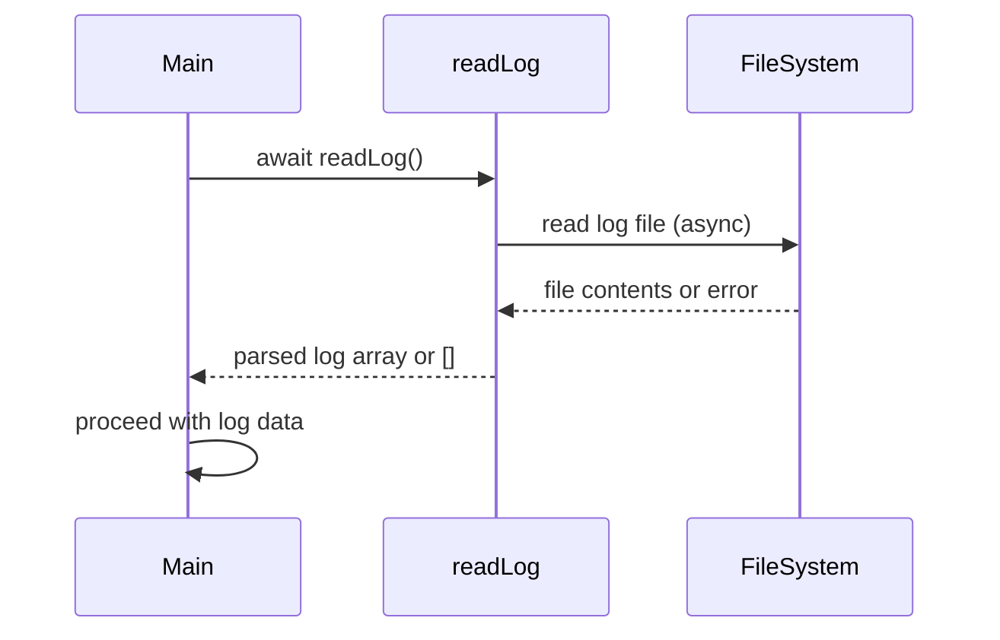

# Read logfile from the same location where writing.

## Pull Request by @tomusdrw

Related #341 
Related #340 

It seems that reading the log file was done using a different mechanism than writing. So I suspect since #118 changed the way the code is being run (via package) it also changed how the paths are being resolved.

Using the same method for reading and writing `fs.readFile/fs.writeFile` should fix the issue.


## Comment by @coderabbitai[bot]

<!-- This is an auto-generated comment: summarize by coderabbit.ai -->
<!-- This is an auto-generated comment: skip review by coderabbit.ai -->

> [!IMPORTANT]
> ## Review skipped
> 
> Auto incremental reviews are disabled on this repository.
> 
> Please check the settings in the CodeRabbit UI or the `.coderabbit.yaml` file in this repository. To trigger a single review, invoke the `@coderabbitai review` command.
> 
> You can disable this status message by setting the `reviews.review_status` to `false` in the CodeRabbit configuration file.

<!-- end of auto-generated comment: skip review by coderabbit.ai -->
<!-- walkthrough_start -->

<details>
<summary>📝 Walkthrough</summary>

## Walkthrough

The update refactors the log file reading logic in `tools/commit-hash/index.ts`. The previous synchronous method using `require` and `path.relative` is replaced with a new asynchronous function, `readLog()`, which reads and parses the log file as UTF-8 JSON. The main function now awaits this asynchronous log reading, and logging messages have been updated to reflect whether a valid previous log was found. The `readLog()` function is now exported, providing explicit error handling and returning an empty array if the log is invalid or unreadable.

## Changes

| File(s)                         | Change Summary                                                                                                     |
|----------------------------------|--------------------------------------------------------------------------------------------------------------------|
| tools/commit-hash/index.ts       | Removed `path` import and synchronous `require`-based log reading. Introduced exported async `readLog()` for safe, asynchronous log file reading and parsing. Updated logging and main function to use new approach. |

## Sequence Diagram(s)



</details>

<!-- walkthrough_end -->
<!-- internal state start -->


<!-- DwQgtGAEAqAWCWBnSTIEMB26CuAXA9mAOYCmGJATmriQCaQDG+Ats2bgFyQAOFk+AIwBWJBrngA3EsgEBPRvlqU0AgfFwA6NPEgQAfACgjoCEYDEZyAAUASpETZWaCrKNwSPbABsvkCiQBHbGlcSHFcLzpIACIbEjR6L3wiADN4SMgUihYw2A9ENDZIJIZqeHwsAHc8/0hKinV4DCJourRkBwFmdRp6OVyPbERKMJYh2gpK9GRbSAxHARGAZgAWAHYULFw8yAAxL2wUlNkAGRVEAHpcWW4SRYoXPxJufER1fBcNGB2GWExSdC0CbSYbITAoRAODz+LzUKIESCwfBTbYeJJETLpDyofwJBTMbjOeH4RHIlChVD1HpkL7uSBKRAMBrccQVOb4GjIbbUJ4JJoY1HFZKYjKVdo8fwScpDLzyWgVQZvZroenwI6UdiQNi/TBIZi5cFU8TK9RfADKTQYHjQEvKfB1zQ8AAozABGV0ADgAlOgvDR/PRBWL5IKmEoIZASAAPUR4KJOqU2wkMADWaFIXoANOTfYgSWh1WIokipmkMoTtmDav4814pLRaTtePgXsN6GkoxGEdgMGqQztcbR+egMPQjcO2NtFDJ5ENh4KCkU0Nxm2hfoAUAkQtwYavgpR8smzc+VAAMUogNIPdliTyP6GeL0aSNfIreUh9IAIObB+LcqKyMAvb5UAdAFUCaGhR2JJ5aykAZVUZfxCQwBh5CaHhqB/Gt8AOAC70jQDsFqQV0RFbFkEHTJsn1BdCjRfBSjw6oNRzSkGlwSDGw8bhvF8fwghCJ4Ug1FDpCeWFeghKFkDMVZXXw2SVgABg0Ix9GMcAoDIeh8BSHACGIMhlEkphWHYLheH4YRRHEKQZwUJQqFUU1tF0MBDBMKA4HAsEsDQPBCFIch/yiUy2AwTg/DQKYHCcR5+jDZRnM0Vz1I00wDAIHDLjC9QwD+RBYAuJolCjDRcEQDgDGiGqDAsSAAEEAElDOCuF6Fi5hnHkXTGD+R1EDcH5+oBfxmHwOz4PgAkPlCXrBRPCtYFvcbaG8a1RyebhYStLkm0laUwRXbI1x/XrB2HTB6GXW5R3nHZSLLRVhxPfjsHgfxbyuyBFswy8SAkyQSFvSp1B/G1yCmdpZBQ2BsgwfAhkyHsxHKLBXviWgTmSJ0vRPRtUBSFG8MHPb6IxJ7pkgABVaBdjAD0wmjXBs0JChQRzcUACkzQAeQAOWzb7/FwIjAPgtm23QB40DQvSJDQLx4FobMP3BEgCWuaWqB61FJiQEhs362gleVShsnZ+wsQi2VP3kEWxcurANZZeRnB1r4mq2HYTy6ppcbfYm0ezEjhSaRpFfgAAvMo2QRqGxXUZAMYSbGiADzZEBoPFeqz5xjQxUHthHSNNbdmW3c26gaE1+d8xXbTIETH63o+4GuKFIgiAnEF0zEyoWOwbhaHa0ZICGDwT3RUgKA0Jp3xBvI/IlEgpUR5BSMJxGq82qfkhnjRzY+ReyHZJvI/oXhV8OzvIyjJAKoJiiSBSNcCHtEaxNDjELuVLIckQDDX48N174ReJBcQitbZHwoGAZs5AW6BHep9ceBQAQIhtAUYSfBoawxAUjSmlFvo8wFhhdmHgi4/mjNtPc6hz5KxHgBVSdVLANT9MZNGXISSCiUAwWE/5OH8D0tQ2aUQPw8QEErBgBFwjwGkGpRqQIoiQzvi8CgklcHSKJihPCKcsY4y9FwKw1EDbADTgAUQii4AA2gAXT0LedCJ4speByiwbouB8rtCKiVaM5VEAnmqrVAwaVPIER0npfyBkgrGVCu48yUUYqOC6vFeQiUnJqBSjodSYTcq4AAPrK0QPkg6JAB60HyXndRblDAGDCQATgAKwADZGkkHdPUlYAAmBgtBXQCA9B6LpHo1y0A9LQLpaxGkTMaWgEgKwljNI9PUyZSx5KhM0viDxhTaDFNKeU/Jjd9BAA -->

<!-- internal state end -->
<!-- tips_start -->

---


<details>
<summary>🪧 Tips</summary>

### Chat

There are 3 ways to chat with [CodeRabbit](https://coderabbit.ai?utm_source=oss&utm_medium=github&utm_campaign=FluffyLabs/typeberry&utm_content=347):

- Review comments: Directly reply to a review comment made by CodeRabbit. Example:
  - `I pushed a fix in commit <commit_id>, please review it.`
  - `Generate unit testing code for this file.`
  - `Open a follow-up GitHub issue for this discussion.`
- Files and specific lines of code (under the "Files changed" tab): Tag `@coderabbitai` in a new review comment at the desired location with your query. Examples:
  - `@coderabbitai generate unit testing code for this file.`
  -	`@coderabbitai modularize this function.`
- PR comments: Tag `@coderabbitai` in a new PR comment to ask questions about the PR branch. For the best results, please provide a very specific query, as very limited context is provided in this mode. Examples:
  - `@coderabbitai gather interesting stats about this repository and render them as a table. Additionally, render a pie chart showing the language distribution in the codebase.`
  - `@coderabbitai read src/utils.ts and generate unit testing code.`
  - `@coderabbitai read the files in the src/scheduler package and generate a class diagram using mermaid and a README in the markdown format.`
  - `@coderabbitai help me debug CodeRabbit configuration file.`

Note: Be mindful of the bot's finite context window. It's strongly recommended to break down tasks such as reading entire modules into smaller chunks. For a focused discussion, use review comments to chat about specific files and their changes, instead of using the PR comments.

### CodeRabbit Commands (Invoked using PR comments)

- `@coderabbitai pause` to pause the reviews on a PR.
- `@coderabbitai resume` to resume the paused reviews.
- `@coderabbitai review` to trigger an incremental review. This is useful when automatic reviews are disabled for the repository.
- `@coderabbitai full review` to do a full review from scratch and review all the files again.
- `@coderabbitai summary` to regenerate the summary of the PR.
- `@coderabbitai generate docstrings` to [generate docstrings](https://docs.coderabbit.ai/finishing-touches/docstrings) for this PR.
- `@coderabbitai resolve` resolve all the CodeRabbit review comments.
- `@coderabbitai configuration` to show the current CodeRabbit configuration for the repository.
- `@coderabbitai help` to get help.

### Other keywords and placeholders

- Add `@coderabbitai ignore` anywhere in the PR description to prevent this PR from being reviewed.
- Add `@coderabbitai summary` to generate the high-level summary at a specific location in the PR description.
- Add `@coderabbitai` anywhere in the PR title to generate the title automatically.

### CodeRabbit Configuration File (`.coderabbit.yaml`)

- You can programmatically configure CodeRabbit by adding a `.coderabbit.yaml` file to the root of your repository.
- Please see the [configuration documentation](https://docs.coderabbit.ai/guides/configure-coderabbit) for more information.
- If your editor has YAML language server enabled, you can add the path at the top of this file to enable auto-completion and validation: `# yaml-language-server: $schema=https://coderabbit.ai/integrations/schema.v2.json`

### Documentation and Community

- Visit our [Documentation](https://docs.coderabbit.ai) for detailed information on how to use CodeRabbit.
- Join our [Discord Community](http://discord.gg/coderabbit) to get help, request features, and share feedback.
- Follow us on [X/Twitter](https://twitter.com/coderabbitai) for updates and announcements.

</details>

<!-- tips_end -->


## Comment by @github-actions[bot]


<details>
<summary>View all</summary>

| File | Benchmark | Ops |  |
|------|-----------|-----|--|
| [bytes/compare.ts[0]](../blob/9b2ac1577d90ed79cec796c141c1c921a1cbe409/benchmarks/bytes/compare.ts) | Comparing Uint32 bytes | 14161.92 ±0.26% | fastest ✅ |
| [bytes/compare.ts[1]](../blob/9b2ac1577d90ed79cec796c141c1c921a1cbe409/benchmarks/bytes/compare.ts) | Comparing raw bytes | 8196.71 ±0.32% | 42.12% slower |
| [bytes/hex-from.ts[0]](../blob/9b2ac1577d90ed79cec796c141c1c921a1cbe409/benchmarks/bytes/hex-from.ts) | parse hex using `Number` with NaN checking | 135763.66 ±0.1% | 86.15% slower |
| [bytes/hex-from.ts[1]](../blob/9b2ac1577d90ed79cec796c141c1c921a1cbe409/benchmarks/bytes/hex-from.ts) | parse hex from char codes | 980552.37 ±0.28% | fastest ✅ |
| [bytes/hex-from.ts[2]](../blob/9b2ac1577d90ed79cec796c141c1c921a1cbe409/benchmarks/bytes/hex-from.ts) | parse hex from string nibbles | 556029.56 ±0.39% | 43.29% slower |
| [bytes/hex-to.ts[0]](../blob/9b2ac1577d90ed79cec796c141c1c921a1cbe409/benchmarks/bytes/hex-to.ts) | number toString + padding | 320763.06 ±0.08% | 10.64% slower |
| [bytes/hex-to.ts[1]](../blob/9b2ac1577d90ed79cec796c141c1c921a1cbe409/benchmarks/bytes/hex-to.ts) | manual | 358959.51 ±0.05% | fastest ✅ |
| [codec/bigint.compare.ts[0]](../blob/9b2ac1577d90ed79cec796c141c1c921a1cbe409/benchmarks/codec/bigint.compare.ts) | compare custom | 179902085.58 ±2.66% | 31.73% slower |
| [codec/bigint.compare.ts[1]](../blob/9b2ac1577d90ed79cec796c141c1c921a1cbe409/benchmarks/codec/bigint.compare.ts) | compare bigint | 263523328.92 ±6.45% | fastest ✅ |
| [codec/bigint.decode.ts[0]](../blob/9b2ac1577d90ed79cec796c141c1c921a1cbe409/benchmarks/codec/bigint.decode.ts) | decode custom | 242368438.02 ±6.04% | fastest ✅ |
| [codec/bigint.decode.ts[1]](../blob/9b2ac1577d90ed79cec796c141c1c921a1cbe409/benchmarks/codec/bigint.decode.ts) | decode bigint | 109485693.26 ±2.11% | 54.83% slower |
| [codec/decoding.ts[0]](../blob/9b2ac1577d90ed79cec796c141c1c921a1cbe409/benchmarks/codec/decoding.ts) | manual decode | 24182185.17 ±0.78% | 86.62% slower |
| [codec/decoding.ts[1]](../blob/9b2ac1577d90ed79cec796c141c1c921a1cbe409/benchmarks/codec/decoding.ts) | int32array decode | 176758260.03 ±2.7% | 2.21% slower |
| [codec/decoding.ts[2]](../blob/9b2ac1577d90ed79cec796c141c1c921a1cbe409/benchmarks/codec/decoding.ts) | dataview decode | 180753124.54 ±2.17% | fastest ✅ |
| [codec/encoding.ts[0]](../blob/9b2ac1577d90ed79cec796c141c1c921a1cbe409/benchmarks/codec/encoding.ts) | manual encode | 3154486.95 ±0.33% | 18.22% slower |
| [codec/encoding.ts[1]](../blob/9b2ac1577d90ed79cec796c141c1c921a1cbe409/benchmarks/codec/encoding.ts) | int32array encode | 3857049.55 ±0.17% | fastest ✅ |
| [codec/encoding.ts[2]](../blob/9b2ac1577d90ed79cec796c141c1c921a1cbe409/benchmarks/codec/encoding.ts) | dataview encode | 3856220.71 ±0.16% | 0.02% slower |
| [codec/view_vs_collection.ts[0]](../blob/9b2ac1577d90ed79cec796c141c1c921a1cbe409/benchmarks/codec/view_vs_collection.ts) | Get first element from Decoded | 30532.85 ±0.41% | 78.32% slower |
| [codec/view_vs_collection.ts[1]](../blob/9b2ac1577d90ed79cec796c141c1c921a1cbe409/benchmarks/codec/view_vs_collection.ts) | Get first element from View | 140862.2 ±0.19% | fastest ✅ |
| [codec/view_vs_collection.ts[2]](../blob/9b2ac1577d90ed79cec796c141c1c921a1cbe409/benchmarks/codec/view_vs_collection.ts) | Get 50th element from Decoded | 30561.87 ±0.07% | 78.3% slower |
| [codec/view_vs_collection.ts[3]](../blob/9b2ac1577d90ed79cec796c141c1c921a1cbe409/benchmarks/codec/view_vs_collection.ts) | Get 50th element from View | 61012.64 ±0.57% | 56.69% slower |
| [codec/view_vs_collection.ts[4]](../blob/9b2ac1577d90ed79cec796c141c1c921a1cbe409/benchmarks/codec/view_vs_collection.ts) | Get last element from Decoded | 30547.15 ±0.06% | 78.31% slower |
| [codec/view_vs_collection.ts[5]](../blob/9b2ac1577d90ed79cec796c141c1c921a1cbe409/benchmarks/codec/view_vs_collection.ts) | Get last element from View | 39937.59 ±0.09% | 71.65% slower |
| [codec/view_vs_object.ts[0]](../blob/9b2ac1577d90ed79cec796c141c1c921a1cbe409/benchmarks/codec/view_vs_object.ts) | Get the first field from Decoded | 462618.01 ±0.07% | 3.92% slower |
| [codec/view_vs_object.ts[1]](../blob/9b2ac1577d90ed79cec796c141c1c921a1cbe409/benchmarks/codec/view_vs_object.ts) | Get the first field from View | 451876.72 ±0.05% | 6.15% slower |
| [codec/view_vs_object.ts[2]](../blob/9b2ac1577d90ed79cec796c141c1c921a1cbe409/benchmarks/codec/view_vs_object.ts) | Get the first field as view from View | 448315.09 ±0.09% | 6.89% slower |
| [codec/view_vs_object.ts[3]](../blob/9b2ac1577d90ed79cec796c141c1c921a1cbe409/benchmarks/codec/view_vs_object.ts) | Get two fields from Decoded | 461436.36 ±0.09% | 4.16% slower |
| [codec/view_vs_object.ts[4]](../blob/9b2ac1577d90ed79cec796c141c1c921a1cbe409/benchmarks/codec/view_vs_object.ts) | Get two fields from View | 373252.72 ±0.07% | 22.48% slower |
| [codec/view_vs_object.ts[5]](../blob/9b2ac1577d90ed79cec796c141c1c921a1cbe409/benchmarks/codec/view_vs_object.ts) | Get two fields from materialized from View | 481485.3 ±0.1% | fastest ✅ |
| [codec/view_vs_object.ts[6]](../blob/9b2ac1577d90ed79cec796c141c1c921a1cbe409/benchmarks/codec/view_vs_object.ts) | Get two fields as views from View | 367747.14 ±0.07% | 23.62% slower |
| [codec/view_vs_object.ts[7]](../blob/9b2ac1577d90ed79cec796c141c1c921a1cbe409/benchmarks/codec/view_vs_object.ts) | Get only third field from Decoded | 464479.81 ±0.07% | 3.53% slower |
| [codec/view_vs_object.ts[8]](../blob/9b2ac1577d90ed79cec796c141c1c921a1cbe409/benchmarks/codec/view_vs_object.ts) | Get only third field from View | 450176.46 ±0.09% | 6.5% slower |
| [codec/view_vs_object.ts[9]](../blob/9b2ac1577d90ed79cec796c141c1c921a1cbe409/benchmarks/codec/view_vs_object.ts) | Get only third field as view from View | 449714.4 ±0.08% | 6.6% slower |
| [collections/map-set.ts[0]](../blob/9b2ac1577d90ed79cec796c141c1c921a1cbe409/benchmarks/collections/map-set.ts) | 2 gets + conditional set | 103014.8 ±0.12% | fastest ✅ |
| [collections/map-set.ts[1]](../blob/9b2ac1577d90ed79cec796c141c1c921a1cbe409/benchmarks/collections/map-set.ts) | 1 get 1 set | 62652.58 ±0.04% | 39.18% slower |
| [collections/map_vs_sorted.ts[0]](../blob/9b2ac1577d90ed79cec796c141c1c921a1cbe409/benchmarks/collections/map_vs_sorted.ts) | Map | 295778.22 ±0.3% | fastest ✅ |
| [collections/map_vs_sorted.ts[1]](../blob/9b2ac1577d90ed79cec796c141c1c921a1cbe409/benchmarks/collections/map_vs_sorted.ts) | Map-array | 104567.41 ±0.02% | 64.65% slower |
| [collections/map_vs_sorted.ts[2]](../blob/9b2ac1577d90ed79cec796c141c1c921a1cbe409/benchmarks/collections/map_vs_sorted.ts) | Array | 161694.52 ±0.21% | 45.33% slower |
| [collections/map_vs_sorted.ts[3]](../blob/9b2ac1577d90ed79cec796c141c1c921a1cbe409/benchmarks/collections/map_vs_sorted.ts) | SortedArray | 201611.02 ±0.19% | 31.84% slower |
| [hash/blake2b.ts[0]](../blob/9b2ac1577d90ed79cec796c141c1c921a1cbe409/benchmarks/hash/blake2b.ts) | hasher with simple allocator | 0.04638 ±0.02% | fastest ✅ |
| [hash/blake2b.ts[1]](../blob/9b2ac1577d90ed79cec796c141c1c921a1cbe409/benchmarks/hash/blake2b.ts) | hasher with page allocator | 0.04637 ±0.01% | 0.02% slower |
| [hash/index.ts[0]](../blob/9b2ac1577d90ed79cec796c141c1c921a1cbe409/benchmarks/hash/index.ts) | hash with numeric representation | 192.79 ±0.7% | 27.58% slower |
| [hash/index.ts[1]](../blob/9b2ac1577d90ed79cec796c141c1c921a1cbe409/benchmarks/hash/index.ts) | hash with string representation | 119.8 ±0.11% | 55% slower |
| [hash/index.ts[2]](../blob/9b2ac1577d90ed79cec796c141c1c921a1cbe409/benchmarks/hash/index.ts) | hash with symbol representation | 185.5 ±0.03% | 30.32% slower |
| [hash/index.ts[3]](../blob/9b2ac1577d90ed79cec796c141c1c921a1cbe409/benchmarks/hash/index.ts) | hash with uint8 representation | 165.81 ±0.03% | 37.71% slower |
| [hash/index.ts[4]](../blob/9b2ac1577d90ed79cec796c141c1c921a1cbe409/benchmarks/hash/index.ts) | hash with packed representation | 266.2 ±0.05% | fastest ✅ |
| [hash/index.ts[5]](../blob/9b2ac1577d90ed79cec796c141c1c921a1cbe409/benchmarks/hash/index.ts) | hash with bigint representation | 195.95 ±0.05% | 26.39% slower |
| [hash/index.ts[6]](../blob/9b2ac1577d90ed79cec796c141c1c921a1cbe409/benchmarks/hash/index.ts) | hash with uint32 representation | 205.45 ±0.05% | 22.82% slower |
| [logger/index.ts[0]](../blob/9b2ac1577d90ed79cec796c141c1c921a1cbe409/benchmarks/logger/index.ts) | console.log with string concat | 3313327.53 ±62.29% | fastest ✅ |
| [logger/index.ts[1]](../blob/9b2ac1577d90ed79cec796c141c1c921a1cbe409/benchmarks/logger/index.ts) | console.log with args | 638068.64 ±113.32% | 80.74% slower |
| [math/add_one_overflow.ts[0]](../blob/9b2ac1577d90ed79cec796c141c1c921a1cbe409/benchmarks/math/add_one_overflow.ts) | add and take modulus | 241604933.18 ±6.5% | 9.07% slower |
| [math/add_one_overflow.ts[1]](../blob/9b2ac1577d90ed79cec796c141c1c921a1cbe409/benchmarks/math/add_one_overflow.ts) | condition before calculation | 265691036.51 ±5.34% | fastest ✅ |
| [math/count-bits-u32.ts[0]](../blob/9b2ac1577d90ed79cec796c141c1c921a1cbe409/benchmarks/math/count-bits-u32.ts) | standard method | 81503616.34 ±1.57% | 69% slower |
| [math/count-bits-u32.ts[1]](../blob/9b2ac1577d90ed79cec796c141c1c921a1cbe409/benchmarks/math/count-bits-u32.ts) | magic | 262928386.88 ±6.78% | fastest ✅ |
| [math/count-bits-u64.ts[0]](../blob/9b2ac1577d90ed79cec796c141c1c921a1cbe409/benchmarks/math/count-bits-u64.ts) | standard method | 4238546.03 ±0.19% | 52.95% slower |
| [math/count-bits-u64.ts[1]](../blob/9b2ac1577d90ed79cec796c141c1c921a1cbe409/benchmarks/math/count-bits-u64.ts) | magic | 9008283.61 ±0.4% | fastest ✅ |
| [math/mul_overflow.ts[0]](../blob/9b2ac1577d90ed79cec796c141c1c921a1cbe409/benchmarks/math/mul_overflow.ts) | multiply and bring back to u32 | 253911840.1 ±7.57% | 2.53% slower |
| [math/mul_overflow.ts[1]](../blob/9b2ac1577d90ed79cec796c141c1c921a1cbe409/benchmarks/math/mul_overflow.ts) | multiply and take modulus | 260490476.53 ±5.78% | fastest ✅ |
| [math/switch.ts[0]](../blob/9b2ac1577d90ed79cec796c141c1c921a1cbe409/benchmarks/math/switch.ts) | switch | 275339270.46 ±5.81% | fastest ✅ |
| [math/switch.ts[1]](../blob/9b2ac1577d90ed79cec796c141c1c921a1cbe409/benchmarks/math/switch.ts) | if | 261616262.26 ±7.22% | 4.98% slower |
| [crypto/ed25519.ts[0]](../blob/9b2ac1577d90ed79cec796c141c1c921a1cbe409/benchmarks/crypto/ed25519.ts) | native crypto | 8.44 ±0.13% | 52.45% slower |
| [crypto/ed25519.ts[1]](../blob/9b2ac1577d90ed79cec796c141c1c921a1cbe409/benchmarks/crypto/ed25519.ts) | wasm lib | 10.01 ±1.86% | 43.61% slower |
| [crypto/ed25519.ts[2]](../blob/9b2ac1577d90ed79cec796c141c1c921a1cbe409/benchmarks/crypto/ed25519.ts) | wasm lib batch | 17.75 ±21.95% | fastest ✅ |
</details>


### Benchmarks summary: 63/63 OK ✅

<!-- thollander/actions-comment-pull-request "benchmarks" -->


## Comment by @github-actions[bot]


<details>
<summary>View all</summary>

|  Name  |  Status  | |
|--------|----------|-|
| Trie test 0 | ✅ | | 
| Trie test 1 | ✅ | | 
| Trie test 2 | ✅ | | 
| Trie test 3 | ✅ | | 
| Trie test 4 | ✅ | | 
| Trie test 5 | ✅ | | 
| Trie test 6 | ✅ | | 
| Trie test 7 | ✅ | | 
| Trie test 8 | ✅ | | 
| Trie test 9 | ✅ | | 
| Trie test 10 | ✅ | | 
| Trie test 10 | ✅ | | 
| Trie test 10 | ✅ | | 
| jamtestvectors/statistics/tiny/stats_with_empty_extrinsic-1.json | ✅ | | 
| jamtestvectors/statistics/tiny/stats_with_epoch_change-1.json | ✅ | | 
| jamtestvectors/statistics/tiny/stats_with_some_extrinsic-1.json | ✅ | | 
| jamtestvectors/statistics/tiny/stats_with_some_extrinsic-1.json | ✅ | | 
| jamtestvectors/statistics/full/stats_with_empty_extrinsic-1.json | ✅ | | 
| jamtestvectors/statistics/full/stats_with_epoch_change-1.json | ✅ | | 
| jamtestvectors/statistics/full/stats_with_some_extrinsic-1.json | ✅ | | 
| jamtestvectors/statistics/full/stats_with_some_extrinsic-1.json | ✅ | | 
| should correctly shuffle input of length 0 | ✅ | | 
| should correctly shuffle input of length 8 | ✅ | | 
| should correctly shuffle input of length 16 | ✅ | | 
| should correctly shuffle input of length 20 | ✅ | | 
| should correctly shuffle input of length 50 | ✅ | | 
| should correctly shuffle input of length 100 | ✅ | | 
| should correctly shuffle input of length 200 | ✅ | | 
| should correctly shuffle input of length 341 | ✅ | | 
| should correctly shuffle input of length 341 | ✅ | | 
| should correctly shuffle input of length 341 | ✅ | | 
| jamtestvectors/safrole/tiny/enact-epoch-change-with-no-tickets-1.json | ✅ | | 
| jamtestvectors/safrole/tiny/enact-epoch-change-with-no-tickets-2.json | ✅ | | 
| jamtestvectors/safrole/tiny/enact-epoch-change-with-no-tickets-3.json | ✅ | | 
| jamtestvectors/safrole/tiny/enact-epoch-change-with-no-tickets-4.json | ✅ | | 
| jamtestvectors/safrole/tiny/enact-epoch-change-with-padding-1.json | ✅ | | 
| jamtestvectors/safrole/tiny/publish-tickets-no-mark-1.json | ✅ | | 
| jamtestvectors/safrole/tiny/publish-tickets-no-mark-2.json | ✅ | | 
| jamtestvectors/safrole/tiny/publish-tickets-no-mark-3.json | ✅ | | 
| jamtestvectors/safrole/tiny/publish-tickets-no-mark-4.json | ✅ | | 
| jamtestvectors/safrole/tiny/publish-tickets-no-mark-5.json | ✅ | | 
| jamtestvectors/safrole/tiny/publish-tickets-no-mark-6.json | ✅ | | 
| jamtestvectors/safrole/tiny/publish-tickets-no-mark-7.json | ✅ | | 
| jamtestvectors/safrole/tiny/publish-tickets-no-mark-8.json | ✅ | | 
| jamtestvectors/safrole/tiny/publish-tickets-no-mark-9.json | ✅ | | 
| jamtestvectors/safrole/tiny/publish-tickets-with-mark-1.json | ✅ | | 
| jamtestvectors/safrole/tiny/publish-tickets-with-mark-2.json | ✅ | | 
| jamtestvectors/safrole/tiny/publish-tickets-with-mark-3.json | ✅ | | 
| jamtestvectors/safrole/tiny/publish-tickets-with-mark-4.json | ✅ | | 
| jamtestvectors/safrole/tiny/publish-tickets-with-mark-5.json | ✅ | | 
| jamtestvectors/safrole/tiny/skip-epoch-tail-1.json | ✅ | | 
| jamtestvectors/safrole/tiny/skip-epochs-1.json | ✅ | | 
| jamtestvectors/safrole/full/enact-epoch-change-with-no-tickets-1.json | ✅ | | 
| jamtestvectors/safrole/full/enact-epoch-change-with-no-tickets-2.json | ✅ | | 
| jamtestvectors/safrole/full/enact-epoch-change-with-no-tickets-3.json | ✅ | | 
| jamtestvectors/safrole/full/enact-epoch-change-with-no-tickets-4.json | ✅ | | 
| jamtestvectors/safrole/full/enact-epoch-change-with-padding-1.json | ✅ | | 
| jamtestvectors/safrole/full/publish-tickets-no-mark-1.json | ✅ | | 
| jamtestvectors/safrole/full/publish-tickets-no-mark-2.json | ✅ | | 
| jamtestvectors/safrole/full/publish-tickets-no-mark-3.json | ✅ | | 
| jamtestvectors/safrole/full/publish-tickets-no-mark-4.json | ✅ | | 
| jamtestvectors/safrole/full/publish-tickets-no-mark-5.json | ✅ | | 
| jamtestvectors/safrole/full/publish-tickets-no-mark-6.json | ✅ | | 
| jamtestvectors/safrole/full/publish-tickets-no-mark-7.json | ✅ | | 
| jamtestvectors/safrole/full/publish-tickets-no-mark-8.json | ✅ | | 
| jamtestvectors/safrole/full/publish-tickets-no-mark-9.json | ✅ | | 
| jamtestvectors/safrole/full/publish-tickets-with-mark-1.json | ✅ | | 
| jamtestvectors/safrole/full/publish-tickets-with-mark-2.json | ✅ | | 
| jamtestvectors/safrole/full/publish-tickets-with-mark-3.json | ✅ | | 
| jamtestvectors/safrole/full/publish-tickets-with-mark-4.json | ✅ | | 
| jamtestvectors/safrole/full/publish-tickets-with-mark-5.json | ✅ | | 
| jamtestvectors/safrole/full/skip-epoch-tail-1.json | ✅ | | 
| jamtestvectors/safrole/full/skip-epochs-1.json | ✅ | | 
| jamtestvectors/safrole/full/skip-epochs-1.json | ✅ | | 
| jamtestvectors/reports/tiny/anchor_not_recent-1.json | ✅ | | 
| jamtestvectors/reports/tiny/bad_beefy_mmr-1.json | ✅ | | 
| jamtestvectors/reports/tiny/bad_code_hash-1.json | ✅ | | 
| jamtestvectors/reports/tiny/bad_core_index-1.json | ✅ | | 
| jamtestvectors/reports/tiny/bad_service_id-1.json | ✅ | | 
| jamtestvectors/reports/tiny/bad_signature-1.json | ✅ | | 
| jamtestvectors/reports/tiny/bad_state_root-1.json | ✅ | | 
| jamtestvectors/reports/tiny/bad_validator_index-1.json | ✅ | | 
| jamtestvectors/reports/tiny/big_work_report_output-1.json | ✅ | | 
| jamtestvectors/reports/tiny/core_engaged-1.json | ✅ | | 
| jamtestvectors/reports/tiny/dependency_missing-1.json | ✅ | | 
| jamtestvectors/reports/tiny/duplicate_package_in_recent_history-1.json | ✅ | | 
| jamtestvectors/reports/tiny/duplicated_package_in_report-1.json | ✅ | | 
| jamtestvectors/reports/tiny/future_report_slot-1.json | ✅ | | 
| jamtestvectors/reports/tiny/high_work_report_gas-1.json | ✅ | | 
| jamtestvectors/reports/tiny/many_dependencies-1.json | ✅ | | 
| jamtestvectors/reports/tiny/multiple_reports-1.json | ✅ | | 
| jamtestvectors/reports/tiny/no_enough_guarantees-1.json | ✅ | | 
| jamtestvectors/reports/tiny/not_authorized-1.json | ✅ | | 
| jamtestvectors/reports/tiny/not_authorized-2.json | ✅ | | 
| jamtestvectors/reports/tiny/not_sorted_guarantor-1.json | ✅ | | 
| jamtestvectors/reports/tiny/out_of_order_guarantees-1.json | ✅ | | 
| jamtestvectors/reports/tiny/report_before_last_rotation-1.json | ✅ | | 
| jamtestvectors/reports/tiny/report_curr_rotation-1.json | ✅ | | 
| jamtestvectors/reports/tiny/report_prev_rotation-1.json | ✅ | | 
| jamtestvectors/reports/tiny/reports_with_dependencies-1.json | ✅ | | 
| jamtestvectors/reports/tiny/reports_with_dependencies-2.json | ✅ | | 
| jamtestvectors/reports/tiny/reports_with_dependencies-3.json | ✅ | | 
| jamtestvectors/reports/tiny/reports_with_dependencies-4.json | ✅ | | 
| jamtestvectors/reports/tiny/reports_with_dependencies-5.json | ✅ | | 
| jamtestvectors/reports/tiny/reports_with_dependencies-6.json | ✅ | | 
| jamtestvectors/reports/tiny/segment_root_lookup_invalid-1.json | ✅ | | 
| jamtestvectors/reports/tiny/segment_root_lookup_invalid-2.json | ✅ | | 
| jamtestvectors/reports/tiny/service_item_gas_too_low-1.json | ✅ | | 
| jamtestvectors/reports/tiny/too_big_work_report_output-1.json | ✅ | | 
| jamtestvectors/reports/tiny/too_high_work_report_gas-1.json | ✅ | | 
| jamtestvectors/reports/tiny/too_many_dependencies-1.json | ✅ | | 
| jamtestvectors/reports/tiny/with_avail_assignments-1.json | ✅ | | 
| jamtestvectors/reports/tiny/wrong_assignment-1.json | ✅ | | 
| jamtestvectors/reports/tiny/wrong_assignment-1.json | ✅ | | 
| jamtestvectors/reports/full/anchor_not_recent-1.json | ✅ | | 
| jamtestvectors/reports/full/bad_beefy_mmr-1.json | ✅ | | 
| jamtestvectors/reports/full/bad_code_hash-1.json | ✅ | | 
| jamtestvectors/reports/full/bad_core_index-1.json | ✅ | | 
| jamtestvectors/reports/full/bad_service_id-1.json | ✅ | | 
| jamtestvectors/reports/full/bad_signature-1.json | ✅ | | 
| jamtestvectors/reports/full/bad_state_root-1.json | ✅ | | 
| jamtestvectors/reports/full/bad_validator_index-1.json | ✅ | | 
| jamtestvectors/reports/full/big_work_report_output-1.json | ✅ | | 
| jamtestvectors/reports/full/core_engaged-1.json | ✅ | | 
| jamtestvectors/reports/full/dependency_missing-1.json | ✅ | | 
| jamtestvectors/reports/full/duplicate_package_in_recent_history-1.json | ✅ | | 
| jamtestvectors/reports/full/duplicated_package_in_report-1.json | ✅ | | 
| jamtestvectors/reports/full/future_report_slot-1.json | ✅ | | 
| jamtestvectors/reports/full/high_work_report_gas-1.json | ✅ | | 
| jamtestvectors/reports/full/many_dependencies-1.json | ✅ | | 
| jamtestvectors/reports/full/multiple_reports-1.json | ✅ | | 
| jamtestvectors/reports/full/no_enough_guarantees-1.json | ✅ | | 
| jamtestvectors/reports/full/not_authorized-1.json | ✅ | | 
| jamtestvectors/reports/full/not_authorized-2.json | ✅ | | 
| jamtestvectors/reports/full/not_sorted_guarantor-1.json | ✅ | | 
| jamtestvectors/reports/full/out_of_order_guarantees-1.json | ✅ | | 
| jamtestvectors/reports/full/report_before_last_rotation-1.json | ✅ | | 
| jamtestvectors/reports/full/report_curr_rotation-1.json | ✅ | | 
| jamtestvectors/reports/full/report_prev_rotation-1.json | ✅ | | 
| jamtestvectors/reports/full/reports_with_dependencies-1.json | ✅ | | 
| jamtestvectors/reports/full/reports_with_dependencies-2.json | ✅ | | 
| jamtestvectors/reports/full/reports_with_dependencies-3.json | ✅ | | 
| jamtestvectors/reports/full/reports_with_dependencies-4.json | ✅ | | 
| jamtestvectors/reports/full/reports_with_dependencies-5.json | ✅ | | 
| jamtestvectors/reports/full/reports_with_dependencies-6.json | ✅ | | 
| jamtestvectors/reports/full/segment_root_lookup_invalid-1.json | ✅ | | 
| jamtestvectors/reports/full/segment_root_lookup_invalid-2.json | ✅ | | 
| jamtestvectors/reports/full/service_item_gas_too_low-1.json | ✅ | | 
| jamtestvectors/reports/full/too_big_work_report_output-1.json | ✅ | | 
| jamtestvectors/reports/full/too_high_work_report_gas-1.json | ✅ | | 
| jamtestvectors/reports/full/too_many_dependencies-1.json | ✅ | | 
| jamtestvectors/reports/full/with_avail_assignments-1.json | ✅ | | 
| jamtestvectors/reports/full/wrong_assignment-1.json | ✅ | | 
| jamtestvectors/reports/full/wrong_assignment-1.json | ✅ | | 
| jamtestvectors/pvm/schema.json | ✅ | | 
| jamtestvectors/erasure_coding/schema_ec.json | ✅ | | 
| jamtestvectors/erasure_coding/schema_page_proof.json | ✅ | | 
| jamtestvectors/erasure_coding/schema_segment_ec.json | ✅ | | 
| jamtestvectors/erasure_coding/schema_segment_root.json | ✅ | | 
| jamtestvectors/erasure_coding/schema_segment_root.json | ✅ | | 
| jamtestvectors/pvm/programs/gas_basic_consume_all.json | ✅ | | 
| jamtestvectors/pvm/programs/inst_add_32.json | ✅ | | 
| jamtestvectors/pvm/programs/inst_add_32_with_overflow.json | ✅ | | 
| jamtestvectors/pvm/programs/inst_add_32_with_truncation.json | ✅ | | 
| jamtestvectors/pvm/programs/inst_add_32_with_truncation_and_sign_extension.json | ✅ | | 
| jamtestvectors/pvm/programs/inst_add_64.json | ✅ | | 
| jamtestvectors/pvm/programs/inst_add_64_with_overflow.json | ✅ | | 
| jamtestvectors/pvm/programs/inst_add_imm_32.json | ✅ | | 
| jamtestvectors/pvm/programs/inst_add_imm_32_with_truncation.json | ✅ | | 
| jamtestvectors/pvm/programs/inst_add_imm_32_with_truncation_and_sign_extension.json | ✅ | | 
| jamtestvectors/pvm/programs/inst_add_imm_64.json | ✅ | | 
| jamtestvectors/pvm/programs/inst_and.json | ✅ | | 
| jamtestvectors/pvm/programs/inst_and_imm.json | ✅ | | 
| jamtestvectors/pvm/programs/inst_branch_eq_imm_nok.json | ✅ | | 
| jamtestvectors/pvm/programs/inst_branch_eq_imm_ok.json | ✅ | | 
| jamtestvectors/pvm/programs/inst_branch_eq_nok.json | ✅ | | 
| jamtestvectors/pvm/programs/inst_branch_eq_ok.json | ✅ | | 
| jamtestvectors/pvm/programs/inst_branch_greater_or_equal_signed_imm_nok.json | ✅ | | 
| jamtestvectors/pvm/programs/inst_branch_greater_or_equal_signed_imm_ok.json | ✅ | | 
| jamtestvectors/pvm/programs/inst_branch_greater_or_equal_signed_nok.json | ✅ | | 
| jamtestvectors/pvm/programs/inst_branch_greater_or_equal_signed_ok.json | ✅ | | 
| jamtestvectors/pvm/programs/inst_branch_greater_or_equal_unsigned_imm_nok.json | ✅ | | 
| jamtestvectors/pvm/programs/inst_branch_greater_or_equal_unsigned_imm_ok.json | ✅ | | 
| jamtestvectors/pvm/programs/inst_branch_greater_or_equal_unsigned_nok.json | ✅ | | 
| jamtestvectors/pvm/programs/inst_branch_greater_or_equal_unsigned_ok.json | ✅ | | 
| jamtestvectors/pvm/programs/inst_branch_greater_signed_imm_nok.json | ✅ | | 
| jamtestvectors/pvm/programs/inst_branch_greater_signed_imm_ok.json | ✅ | | 
| jamtestvectors/pvm/programs/inst_branch_greater_unsigned_imm_nok.json | ✅ | | 
| jamtestvectors/pvm/programs/inst_branch_greater_unsigned_imm_ok.json | ✅ | | 
| jamtestvectors/pvm/programs/inst_branch_less_or_equal_signed_imm_nok.json | ✅ | | 
| jamtestvectors/pvm/programs/inst_branch_less_or_equal_signed_imm_ok.json | ✅ | | 
| jamtestvectors/pvm/programs/inst_branch_less_or_equal_unsigned_imm_nok.json | ✅ | | 
| jamtestvectors/pvm/programs/inst_branch_less_or_equal_unsigned_imm_ok.json | ✅ | | 
| jamtestvectors/pvm/programs/inst_branch_less_signed_imm_nok.json | ✅ | | 
| jamtestvectors/pvm/programs/inst_branch_less_signed_imm_ok.json | ✅ | | 
| jamtestvectors/pvm/programs/inst_branch_less_signed_nok.json | ✅ | | 
| jamtestvectors/pvm/programs/inst_branch_less_signed_ok.json | ✅ | | 
| jamtestvectors/pvm/programs/inst_branch_less_unsigned_imm_nok.json | ✅ | | 
| jamtestvectors/pvm/programs/inst_branch_less_unsigned_imm_ok.json | ✅ | | 
| jamtestvectors/pvm/programs/inst_branch_less_unsigned_nok.json | ✅ | | 
| jamtestvectors/pvm/programs/inst_branch_less_unsigned_ok.json | ✅ | | 
| jamtestvectors/pvm/programs/inst_branch_not_eq_imm_nok.json | ✅ | | 
| jamtestvectors/pvm/programs/inst_branch_not_eq_imm_ok.json | ✅ | | 
| jamtestvectors/pvm/programs/inst_branch_not_eq_nok.json | ✅ | | 
| jamtestvectors/pvm/programs/inst_branch_not_eq_ok.json | ✅ | | 
| jamtestvectors/pvm/programs/inst_cmov_if_zero_imm_nok.json | ✅ | | 
| jamtestvectors/pvm/programs/inst_cmov_if_zero_imm_ok.json | ✅ | | 
| jamtestvectors/pvm/programs/inst_cmov_if_zero_nok.json | ✅ | | 
| jamtestvectors/pvm/programs/inst_cmov_if_zero_ok.json | ✅ | | 
| jamtestvectors/pvm/programs/inst_div_signed_32.json | ✅ | | 
| jamtestvectors/pvm/programs/inst_div_signed_32.json | ✅ | | 
| jamtestvectors/pvm/programs/inst_div_signed_32_by_zero.json | ✅ | | 
| jamtestvectors/pvm/programs/inst_div_signed_32_with_overflow.json | ✅ | | 
| jamtestvectors/pvm/programs/inst_div_signed_64.json | ✅ | | 
| jamtestvectors/pvm/programs/inst_div_signed_64_by_zero.json | ✅ | | 
| jamtestvectors/pvm/programs/inst_div_signed_64_with_overflow.json | ✅ | | 
| jamtestvectors/pvm/programs/inst_div_unsigned_32.json | ✅ | | 
| jamtestvectors/pvm/programs/inst_div_unsigned_32_by_zero.json | ✅ | | 
| jamtestvectors/pvm/programs/inst_div_unsigned_32_with_overflow.json | ✅ | | 
| jamtestvectors/pvm/programs/inst_div_unsigned_64.json | ✅ | | 
| jamtestvectors/pvm/programs/inst_div_unsigned_64_by_zero.json | ✅ | | 
| jamtestvectors/pvm/programs/inst_div_unsigned_64_with_overflow.json | ✅ | | 
| jamtestvectors/pvm/programs/inst_fallthrough.json | ✅ | | 
| jamtestvectors/pvm/programs/inst_jump.json | ✅ | | 
| jamtestvectors/pvm/programs/inst_jump_indirect_invalid_djump_to_zero_nok.json | ✅ | | 
| jamtestvectors/pvm/programs/inst_jump_indirect_misaligned_djump_with_offset_nok.json | ✅ | | 
| jamtestvectors/pvm/programs/inst_jump_indirect_misaligned_djump_without_offset_nok.json | ✅ | | 
| jamtestvectors/pvm/programs/inst_jump_indirect_with_offset_ok.json | ✅ | | 
| jamtestvectors/pvm/programs/inst_jump_indirect_without_offset_ok.json | ✅ | | 
| jamtestvectors/pvm/programs/inst_load_i16.json | ✅ | | 
| jamtestvectors/pvm/programs/inst_load_i32.json | ✅ | | 
| jamtestvectors/pvm/programs/inst_load_i8.json | ✅ | | 
| jamtestvectors/pvm/programs/inst_load_imm.json | ✅ | | 
| jamtestvectors/pvm/programs/inst_load_imm_64.json | ✅ | | 
| jamtestvectors/pvm/programs/inst_load_imm_and_jump.json | ✅ | | 
| jamtestvectors/pvm/programs/inst_load_imm_and_jump_indirect_different_regs_with_offset_ok.json | ✅ | | 
| jamtestvectors/pvm/programs/inst_load_imm_and_jump_indirect_different_regs_without_offset_ok.json | ✅ | | 
| jamtestvectors/pvm/programs/inst_load_imm_and_jump_indirect_invalid_djump_to_zero_different_regs_without_offset_nok.json | ✅ | | 
| jamtestvectors/pvm/programs/inst_load_imm_and_jump_indirect_invalid_djump_to_zero_same_regs_without_offset_nok.json | ✅ | | 
| jamtestvectors/pvm/programs/inst_load_imm_and_jump_indirect_misaligned_djump_different_regs_with_offset_nok.json | ✅ | | 
| jamtestvectors/pvm/programs/inst_load_imm_and_jump_indirect_misaligned_djump_different_regs_without_offset_nok.json | ✅ | | 
| jamtestvectors/pvm/programs/inst_load_imm_and_jump_indirect_misaligned_djump_same_regs_with_offset_nok.json | ✅ | | 
| jamtestvectors/pvm/programs/inst_load_imm_and_jump_indirect_misaligned_djump_same_regs_without_offset_nok.json | ✅ | | 
| jamtestvectors/pvm/programs/inst_load_imm_and_jump_indirect_same_regs_with_offset_ok.json | ✅ | | 
| jamtestvectors/pvm/programs/inst_load_imm_and_jump_indirect_same_regs_without_offset_ok.json | ✅ | | 
| jamtestvectors/pvm/programs/inst_load_indirect_i16_with_offset.json | ✅ | | 
| jamtestvectors/pvm/programs/inst_load_indirect_i16_without_offset.json | ✅ | | 
| jamtestvectors/pvm/programs/inst_load_indirect_i32_with_offset.json | ✅ | | 
| jamtestvectors/pvm/programs/inst_load_indirect_i32_without_offset.json | ✅ | | 
| jamtestvectors/pvm/programs/inst_load_indirect_i8_with_offset.json | ✅ | | 
| jamtestvectors/pvm/programs/inst_load_indirect_i8_without_offset.json | ✅ | | 
| jamtestvectors/pvm/programs/inst_load_indirect_u16_with_offset.json | ✅ | | 
| jamtestvectors/pvm/programs/inst_load_indirect_u16_without_offset.json | ✅ | | 
| jamtestvectors/pvm/programs/inst_load_indirect_u32_with_offset.json | ✅ | | 
| jamtestvectors/pvm/programs/inst_load_indirect_u32_without_offset.json | ✅ | | 
| jamtestvectors/pvm/programs/inst_load_indirect_u64_with_offset.json | ✅ | | 
| jamtestvectors/pvm/programs/inst_load_indirect_u64_without_offset.json | ✅ | | 
| jamtestvectors/pvm/programs/inst_load_indirect_u8_with_offset.json | ✅ | | 
| jamtestvectors/pvm/programs/inst_load_indirect_u8_without_offset.json | ✅ | | 
| jamtestvectors/pvm/programs/inst_load_u16.json | ✅ | | 
| jamtestvectors/pvm/programs/inst_load_u32.json | ✅ | | 
| jamtestvectors/pvm/programs/inst_load_u32.json | ✅ | | 
| jamtestvectors/pvm/programs/inst_load_u64.json | ✅ | | 
| jamtestvectors/pvm/programs/inst_load_u8.json | ✅ | | 
| jamtestvectors/pvm/programs/inst_load_u8_nok.json | ✅ | | 
| jamtestvectors/pvm/programs/inst_move_reg.json | ✅ | | 
| jamtestvectors/pvm/programs/inst_mul_32.json | ✅ | | 
| jamtestvectors/pvm/programs/inst_mul_64.json | ✅ | | 
| jamtestvectors/pvm/programs/inst_mul_imm_32.json | ✅ | | 
| jamtestvectors/pvm/programs/inst_mul_imm_64.json | ✅ | | 
| jamtestvectors/pvm/programs/inst_negate_and_add_imm_32.json | ✅ | | 
| jamtestvectors/pvm/programs/inst_negate_and_add_imm_64.json | ✅ | | 
| jamtestvectors/pvm/programs/inst_or.json | ✅ | | 
| jamtestvectors/pvm/programs/inst_or_imm.json | ✅ | | 
| jamtestvectors/pvm/programs/inst_rem_signed_32.json | ✅ | | 
| jamtestvectors/pvm/programs/inst_rem_signed_32_by_zero.json | ✅ | | 
| jamtestvectors/pvm/programs/inst_rem_signed_32_with_overflow.json | ✅ | | 
| jamtestvectors/pvm/programs/inst_rem_signed_64.json | ✅ | | 
| jamtestvectors/pvm/programs/inst_rem_signed_64_by_zero.json | ✅ | | 
| jamtestvectors/pvm/programs/inst_rem_signed_64_with_overflow.json | ✅ | | 
| jamtestvectors/pvm/programs/inst_rem_unsigned_32.json | ✅ | | 
| jamtestvectors/pvm/programs/inst_rem_unsigned_32_by_zero.json | ✅ | | 
| jamtestvectors/pvm/programs/inst_rem_unsigned_64.json | ✅ | | 
| jamtestvectors/pvm/programs/inst_rem_unsigned_64_by_zero.json | ✅ | | 
| jamtestvectors/pvm/programs/inst_ret_halt.json | ✅ | | 
| jamtestvectors/pvm/programs/inst_ret_invalid.json | ✅ | | 
| jamtestvectors/pvm/programs/inst_set_greater_than_signed_imm_0.json | ✅ | | 
| jamtestvectors/pvm/programs/inst_set_greater_than_signed_imm_1.json | ✅ | | 
| jamtestvectors/pvm/programs/inst_set_greater_than_unsigned_imm_0.json | ✅ | | 
| jamtestvectors/pvm/programs/inst_set_greater_than_unsigned_imm_1.json | ✅ | | 
| jamtestvectors/pvm/programs/inst_set_less_than_signed_0.json | ✅ | | 
| jamtestvectors/pvm/programs/inst_set_less_than_signed_1.json | ✅ | | 
| jamtestvectors/pvm/programs/inst_set_less_than_signed_imm_0.json | ✅ | | 
| jamtestvectors/pvm/programs/inst_set_less_than_signed_imm_1.json | ✅ | | 
| jamtestvectors/pvm/programs/inst_set_less_than_unsigned_0.json | ✅ | | 
| jamtestvectors/pvm/programs/inst_set_less_than_unsigned_1.json | ✅ | | 
| jamtestvectors/pvm/programs/inst_set_less_than_unsigned_imm_0.json | ✅ | | 
| jamtestvectors/pvm/programs/inst_set_less_than_unsigned_imm_1.json | ✅ | | 
| jamtestvectors/pvm/programs/inst_shift_arithmetic_right_32.json | ✅ | | 
| jamtestvectors/pvm/programs/inst_shift_arithmetic_right_32_with_overflow.json | ✅ | | 
| jamtestvectors/pvm/programs/inst_shift_arithmetic_right_64.json | ✅ | | 
| jamtestvectors/pvm/programs/inst_shift_arithmetic_right_64_with_overflow.json | ✅ | | 
| jamtestvectors/pvm/programs/inst_shift_arithmetic_right_imm_32.json | ✅ | | 
| jamtestvectors/pvm/programs/inst_shift_arithmetic_right_imm_64.json | ✅ | | 
| jamtestvectors/pvm/programs/inst_shift_arithmetic_right_imm_alt_32.json | ✅ | | 
| jamtestvectors/pvm/programs/inst_shift_arithmetic_right_imm_alt_64.json | ✅ | | 
| jamtestvectors/pvm/programs/inst_shift_logical_left_32.json | ✅ | | 
| jamtestvectors/pvm/programs/inst_shift_logical_left_32_with_overflow.json | ✅ | | 
| jamtestvectors/pvm/programs/inst_shift_logical_left_64.json | ✅ | | 
| jamtestvectors/pvm/programs/inst_shift_logical_left_64_with_overflow.json | ✅ | | 
| jamtestvectors/pvm/programs/inst_shift_logical_left_imm_32.json | ✅ | | 
| jamtestvectors/pvm/programs/inst_shift_logical_left_imm_64.json | ✅ | | 
| jamtestvectors/pvm/programs/inst_shift_logical_left_imm_64.json | ✅ | | 
| jamtestvectors/pvm/programs/inst_shift_logical_left_imm_alt_32.json | ✅ | | 
| jamtestvectors/pvm/programs/inst_shift_logical_left_imm_alt_64.json | ✅ | | 
| jamtestvectors/pvm/programs/inst_shift_logical_right_32.json | ✅ | | 
| jamtestvectors/pvm/programs/inst_shift_logical_right_32_with_overflow.json | ✅ | | 
| jamtestvectors/pvm/programs/inst_shift_logical_right_64.json | ✅ | | 
| jamtestvectors/pvm/programs/inst_shift_logical_right_64_with_overflow.json | ✅ | | 
| jamtestvectors/pvm/programs/inst_shift_logical_right_imm_32.json | ✅ | | 
| jamtestvectors/pvm/programs/inst_shift_logical_right_imm_64.json | ✅ | | 
| jamtestvectors/pvm/programs/inst_shift_logical_right_imm_alt_32.json | ✅ | | 
| jamtestvectors/pvm/programs/inst_shift_logical_right_imm_alt_64.json | ✅ | | 
| jamtestvectors/pvm/programs/inst_store_imm_indirect_u16_with_offset_nok.json | ✅ | | 
| jamtestvectors/pvm/programs/inst_store_imm_indirect_u16_with_offset_ok.json | ✅ | | 
| jamtestvectors/pvm/programs/inst_store_imm_indirect_u16_without_offset_ok.json | ✅ | | 
| jamtestvectors/pvm/programs/inst_store_imm_indirect_u32_with_offset_nok.json | ✅ | | 
| jamtestvectors/pvm/programs/inst_store_imm_indirect_u32_with_offset_ok.json | ✅ | | 
| jamtestvectors/pvm/programs/inst_store_imm_indirect_u32_without_offset_ok.json | ✅ | | 
| jamtestvectors/pvm/programs/inst_store_imm_indirect_u64_with_offset_nok.json | ✅ | | 
| jamtestvectors/pvm/programs/inst_store_imm_indirect_u64_with_offset_ok.json | ✅ | | 
| jamtestvectors/pvm/programs/inst_store_imm_indirect_u64_without_offset_ok.json | ✅ | | 
| jamtestvectors/pvm/programs/inst_store_imm_indirect_u8_with_offset_nok.json | ✅ | | 
| jamtestvectors/pvm/programs/inst_store_imm_indirect_u8_with_offset_ok.json | ✅ | | 
| jamtestvectors/pvm/programs/inst_store_imm_indirect_u8_without_offset_ok.json | ✅ | | 
| jamtestvectors/pvm/programs/inst_store_imm_u16.json | ✅ | | 
| jamtestvectors/pvm/programs/inst_store_imm_u32.json | ✅ | | 
| jamtestvectors/pvm/programs/inst_store_imm_u64.json | ✅ | | 
| jamtestvectors/pvm/programs/inst_store_imm_u8.json | ✅ | | 
| jamtestvectors/pvm/programs/inst_store_imm_u8_trap_inaccessible.json | ✅ | | 
| jamtestvectors/pvm/programs/inst_store_imm_u8_trap_read_only.json | ✅ | | 
| jamtestvectors/pvm/programs/inst_store_indirect_u16_with_offset_nok.json | ✅ | | 
| jamtestvectors/pvm/programs/inst_store_indirect_u16_with_offset_ok.json | ✅ | | 
| jamtestvectors/pvm/programs/inst_store_indirect_u16_without_offset_ok.json | ✅ | | 
| jamtestvectors/pvm/programs/inst_store_indirect_u32_with_offset_nok.json | ✅ | | 
| jamtestvectors/pvm/programs/inst_store_indirect_u32_with_offset_ok.json | ✅ | | 
| jamtestvectors/pvm/programs/inst_store_indirect_u32_without_offset_ok.json | ✅ | | 
| jamtestvectors/pvm/programs/inst_store_indirect_u64_with_offset_nok.json | ✅ | | 
| jamtestvectors/pvm/programs/inst_store_indirect_u64_with_offset_ok.json | ✅ | | 
| jamtestvectors/pvm/programs/inst_store_indirect_u64_without_offset_ok.json | ✅ | | 
| jamtestvectors/pvm/programs/inst_store_indirect_u8_with_offset_nok.json | ✅ | | 
| jamtestvectors/pvm/programs/inst_store_indirect_u8_with_offset_ok.json | ✅ | | 
| jamtestvectors/pvm/programs/inst_store_indirect_u8_without_offset_ok.json | ✅ | | 
| jamtestvectors/pvm/programs/inst_store_u16.json | ✅ | | 
| jamtestvectors/pvm/programs/inst_store_u32.json | ✅ | | 
| jamtestvectors/pvm/programs/inst_store_u64.json | ✅ | | 
| jamtestvectors/pvm/programs/inst_store_u8.json | ✅ | | 
| jamtestvectors/pvm/programs/inst_store_u8_trap_inaccessible.json | ✅ | | 
| jamtestvectors/pvm/programs/inst_store_u8_trap_read_only.json | ✅ | | 
| jamtestvectors/pvm/programs/inst_sub_32.json | ✅ | | 
| jamtestvectors/pvm/programs/inst_sub_32_with_overflow.json | ✅ | | 
| jamtestvectors/pvm/programs/inst_sub_64.json | ✅ | | 
| jamtestvectors/pvm/programs/inst_sub_64_with_overflow.json | ✅ | | 
| jamtestvectors/pvm/programs/inst_sub_64_with_overflow.json | ✅ | | 
| jamtestvectors/pvm/programs/inst_sub_imm_32.json | ✅ | | 
| jamtestvectors/pvm/programs/inst_sub_imm_64.json | ✅ | | 
| jamtestvectors/pvm/programs/inst_trap.json | ✅ | | 
| jamtestvectors/pvm/programs/inst_xor.json | ✅ | | 
| jamtestvectors/pvm/programs/inst_xor_imm.json | ✅ | | 
| jamtestvectors/pvm/programs/riscv_rv64ua_amoadd_d.json | ✅ | | 
| jamtestvectors/pvm/programs/riscv_rv64ua_amoadd_w.json | ✅ | | 
| jamtestvectors/pvm/programs/riscv_rv64ua_amoand_d.json | ✅ | | 
| jamtestvectors/pvm/programs/riscv_rv64ua_amoand_w.json | ✅ | | 
| jamtestvectors/pvm/programs/riscv_rv64ua_amomax_d.json | ✅ | | 
| jamtestvectors/pvm/programs/riscv_rv64ua_amomax_w.json | ✅ | | 
| jamtestvectors/pvm/programs/riscv_rv64ua_amomaxu_d.json | ✅ | | 
| jamtestvectors/pvm/programs/riscv_rv64ua_amomaxu_w.json | ✅ | | 
| jamtestvectors/pvm/programs/riscv_rv64ua_amomin_d.json | ✅ | | 
| jamtestvectors/pvm/programs/riscv_rv64ua_amomin_w.json | ✅ | | 
| jamtestvectors/pvm/programs/riscv_rv64ua_amominu_d.json | ✅ | | 
| jamtestvectors/pvm/programs/riscv_rv64ua_amominu_w.json | ✅ | | 
| jamtestvectors/pvm/programs/riscv_rv64ua_amoor_d.json | ✅ | | 
| jamtestvectors/pvm/programs/riscv_rv64ua_amoor_w.json | ✅ | | 
| jamtestvectors/pvm/programs/riscv_rv64ua_amoswap_d.json | ✅ | | 
| jamtestvectors/pvm/programs/riscv_rv64ua_amoswap_w.json | ✅ | | 
| jamtestvectors/pvm/programs/riscv_rv64ua_amoxor_d.json | ✅ | | 
| jamtestvectors/pvm/programs/riscv_rv64ua_amoxor_w.json | ✅ | | 
| jamtestvectors/pvm/programs/riscv_rv64uc_rvc.json | ✅ | | 
| jamtestvectors/pvm/programs/riscv_rv64ui_add.json | ✅ | | 
| jamtestvectors/pvm/programs/riscv_rv64ui_addi.json | ✅ | | 
| jamtestvectors/pvm/programs/riscv_rv64ui_addiw.json | ✅ | | 
| jamtestvectors/pvm/programs/riscv_rv64ui_addw.json | ✅ | | 
| jamtestvectors/pvm/programs/riscv_rv64ui_and.json | ✅ | | 
| jamtestvectors/pvm/programs/riscv_rv64ui_andi.json | ✅ | | 
| jamtestvectors/pvm/programs/riscv_rv64ui_beq.json | ✅ | | 
| jamtestvectors/pvm/programs/riscv_rv64ui_bge.json | ✅ | | 
| jamtestvectors/pvm/programs/riscv_rv64ui_bgeu.json | ✅ | | 
| jamtestvectors/pvm/programs/riscv_rv64ui_blt.json | ✅ | | 
| jamtestvectors/pvm/programs/riscv_rv64ui_bltu.json | ✅ | | 
| jamtestvectors/pvm/programs/riscv_rv64ui_bne.json | ✅ | | 
| jamtestvectors/pvm/programs/riscv_rv64ui_jal.json | ✅ | | 
| jamtestvectors/pvm/programs/riscv_rv64ui_jalr.json | ✅ | | 
| jamtestvectors/pvm/programs/riscv_rv64ui_lb.json | ✅ | | 
| jamtestvectors/pvm/programs/riscv_rv64ui_lbu.json | ✅ | | 
| jamtestvectors/pvm/programs/riscv_rv64ui_ld.json | ✅ | | 
| jamtestvectors/pvm/programs/riscv_rv64ui_lh.json | ✅ | | 
| jamtestvectors/pvm/programs/riscv_rv64ui_lhu.json | ✅ | | 
| jamtestvectors/pvm/programs/riscv_rv64ui_lui.json | ✅ | | 
| jamtestvectors/pvm/programs/riscv_rv64ui_lw.json | ✅ | | 
| jamtestvectors/pvm/programs/riscv_rv64ui_lwu.json | ✅ | | 
| jamtestvectors/pvm/programs/riscv_rv64ui_ma_data.json | ✅ | | 
| jamtestvectors/pvm/programs/riscv_rv64ui_or.json | ✅ | | 
| jamtestvectors/pvm/programs/riscv_rv64ui_ori.json | ✅ | | 
| jamtestvectors/pvm/programs/riscv_rv64ui_sb.json | ✅ | | 
| jamtestvectors/pvm/programs/riscv_rv64ui_sb.json | ✅ | | 
| jamtestvectors/pvm/programs/riscv_rv64ui_sd.json | ✅ | | 
| jamtestvectors/pvm/programs/riscv_rv64ui_sh.json | ✅ | | 
| jamtestvectors/pvm/programs/riscv_rv64ui_simple.json | ✅ | | 
| jamtestvectors/pvm/programs/riscv_rv64ui_sll.json | ✅ | | 
| jamtestvectors/pvm/programs/riscv_rv64ui_slli.json | ✅ | | 
| jamtestvectors/pvm/programs/riscv_rv64ui_slliw.json | ✅ | | 
| jamtestvectors/pvm/programs/riscv_rv64ui_sllw.json | ✅ | | 
| jamtestvectors/pvm/programs/riscv_rv64ui_slt.json | ✅ | | 
| jamtestvectors/pvm/programs/riscv_rv64ui_slti.json | ✅ | | 
| jamtestvectors/pvm/programs/riscv_rv64ui_sltiu.json | ✅ | | 
| jamtestvectors/pvm/programs/riscv_rv64ui_sltu.json | ✅ | | 
| jamtestvectors/pvm/programs/riscv_rv64ui_sra.json | ✅ | | 
| jamtestvectors/pvm/programs/riscv_rv64ui_srai.json | ✅ | | 
| jamtestvectors/pvm/programs/riscv_rv64ui_sraiw.json | ✅ | | 
| jamtestvectors/pvm/programs/riscv_rv64ui_sraw.json | ✅ | | 
| jamtestvectors/pvm/programs/riscv_rv64ui_srl.json | ✅ | | 
| jamtestvectors/pvm/programs/riscv_rv64ui_srli.json | ✅ | | 
| jamtestvectors/pvm/programs/riscv_rv64ui_srliw.json | ✅ | | 
| jamtestvectors/pvm/programs/riscv_rv64ui_srlw.json | ✅ | | 
| jamtestvectors/pvm/programs/riscv_rv64ui_sub.json | ✅ | | 
| jamtestvectors/pvm/programs/riscv_rv64ui_subw.json | ✅ | | 
| jamtestvectors/pvm/programs/riscv_rv64ui_sw.json | ✅ | | 
| jamtestvectors/pvm/programs/riscv_rv64ui_xor.json | ✅ | | 
| jamtestvectors/pvm/programs/riscv_rv64ui_xori.json | ✅ | | 
| jamtestvectors/pvm/programs/riscv_rv64um_div.json | ✅ | | 
| jamtestvectors/pvm/programs/riscv_rv64um_divu.json | ✅ | | 
| jamtestvectors/pvm/programs/riscv_rv64um_divuw.json | ✅ | | 
| jamtestvectors/pvm/programs/riscv_rv64um_divw.json | ✅ | | 
| jamtestvectors/pvm/programs/riscv_rv64um_mul.json | ✅ | | 
| jamtestvectors/pvm/programs/riscv_rv64um_mulh.json | ✅ | | 
| jamtestvectors/pvm/programs/riscv_rv64um_mulhsu.json | ✅ | | 
| jamtestvectors/pvm/programs/riscv_rv64um_mulhu.json | ✅ | | 
| jamtestvectors/pvm/programs/riscv_rv64um_mulw.json | ✅ | | 
| jamtestvectors/pvm/programs/riscv_rv64um_rem.json | ✅ | | 
| jamtestvectors/pvm/programs/riscv_rv64um_remu.json | ✅ | | 
| jamtestvectors/pvm/programs/riscv_rv64um_remuw.json | ✅ | | 
| jamtestvectors/pvm/programs/riscv_rv64um_remw.json | ✅ | | 
| jamtestvectors/pvm/programs/riscv_rv64uzbb_andn.json | ✅ | | 
| jamtestvectors/pvm/programs/riscv_rv64uzbb_clz.json | ✅ | | 
| jamtestvectors/pvm/programs/riscv_rv64uzbb_clzw.json | ✅ | | 
| jamtestvectors/pvm/programs/riscv_rv64uzbb_cpop.json | ✅ | | 
| jamtestvectors/pvm/programs/riscv_rv64uzbb_cpopw.json | ✅ | | 
| jamtestvectors/pvm/programs/riscv_rv64uzbb_ctz.json | ✅ | | 
| jamtestvectors/pvm/programs/riscv_rv64uzbb_ctzw.json | ✅ | | 
| jamtestvectors/pvm/programs/riscv_rv64uzbb_max.json | ✅ | | 
| jamtestvectors/pvm/programs/riscv_rv64uzbb_maxu.json | ✅ | | 
| jamtestvectors/pvm/programs/riscv_rv64uzbb_min.json | ✅ | | 
| jamtestvectors/pvm/programs/riscv_rv64uzbb_minu.json | ✅ | | 
| jamtestvectors/pvm/programs/riscv_rv64uzbb_orc_b.json | ✅ | | 
| jamtestvectors/pvm/programs/riscv_rv64uzbb_orn.json | ✅ | | 
| jamtestvectors/pvm/programs/riscv_rv64uzbb_orn.json | ✅ | | 
| jamtestvectors/pvm/programs/riscv_rv64uzbb_rev8.json | ✅ | | 
| jamtestvectors/pvm/programs/riscv_rv64uzbb_rol.json | ✅ | | 
| jamtestvectors/pvm/programs/riscv_rv64uzbb_rolw.json | ✅ | | 
| jamtestvectors/pvm/programs/riscv_rv64uzbb_ror.json | ✅ | | 
| jamtestvectors/pvm/programs/riscv_rv64uzbb_rori.json | ✅ | | 
| jamtestvectors/pvm/programs/riscv_rv64uzbb_roriw.json | ✅ | | 
| jamtestvectors/pvm/programs/riscv_rv64uzbb_rorw.json | ✅ | | 
| jamtestvectors/pvm/programs/riscv_rv64uzbb_sext_b.json | ✅ | | 
| jamtestvectors/pvm/programs/riscv_rv64uzbb_sext_h.json | ✅ | | 
| jamtestvectors/pvm/programs/riscv_rv64uzbb_xnor.json | ✅ | | 
| jamtestvectors/pvm/programs/riscv_rv64uzbb_zext_h.json | ✅ | | 
| jamtestvectors/pvm/programs/riscv_rv64uzbb_zext_h.json | ✅ | | 
| jamtestvectors/preimages/data/preimage_needed-1.json | ✅ | | 
| jamtestvectors/preimages/data/preimage_needed-2.json | ✅ | | 
| jamtestvectors/preimages/data/preimage_not_needed-1.json | ✅ | | 
| jamtestvectors/preimages/data/preimage_not_needed-2.json | ✅ | | 
| jamtestvectors/preimages/data/preimages_order_check-1.json | ✅ | | 
| jamtestvectors/preimages/data/preimages_order_check-2.json | ✅ | | 
| jamtestvectors/preimages/data/preimages_order_check-3.json | ✅ | | 
| jamtestvectors/preimages/data/preimages_order_check-4.json | ✅ | | 
| jamtestvectors/preimages/data/preimages_order_check-4.json | ✅ | | 
| jamtestvectors/host_function/Zero/hostZeroOK.json | ✅ | | 
| jamtestvectors/host_function/Zero/hostZeroOOB.json | ✅ | | 
| jamtestvectors/host_function/Zero/hostZeroWHO.json | ✅ | | 
| jamtestvectors/host_function/Yield/hostYieldOK.json | ✅ | | 
| jamtestvectors/host_function/Yield/hostYieldOOB.json | ✅ | | 
| jamtestvectors/host_function/Write/hostWriteFULL.json | ✅ | | 
| jamtestvectors/host_function/Write/hostWriteNONE.json | ✅ | | 
| jamtestvectors/host_function/Write/hostWriteOK.json | ✅ | | 
| jamtestvectors/host_function/Write/hostWriteOOB.json | ✅ | | 
| jamtestvectors/host_function/Void/hostVoidOK.json | ✅ | | 
| jamtestvectors/host_function/Void/hostVoidOOB.json | ✅ | | 
| jamtestvectors/host_function/Void/hostVoidWHO.json | ✅ | | 
| jamtestvectors/host_function/Upgrade/hostUpgradeOK.json | ✅ | | 
| jamtestvectors/host_function/Upgrade/hostUpgradeOOB.json | ✅ | | 
| jamtestvectors/host_function/Transfer/hostTransferCASH.json | ✅ | | 
| jamtestvectors/host_function/Transfer/hostTransferLOW.json | ✅ | | 
| jamtestvectors/host_function/Transfer/hostTransferOK.json | ✅ | | 
| jamtestvectors/host_function/Transfer/hostTransferOOB.json | ✅ | | 
| jamtestvectors/host_function/Transfer/hostTransferWHO.json | ✅ | | 
| jamtestvectors/host_function/Solicit/hostSolicitFULL.json | ✅ | | 
| jamtestvectors/host_function/Solicit/hostSolicitHUH.json | ✅ | | 
| jamtestvectors/host_function/Solicit/hostSolicitOK_2_timeslots.json | ✅ | | 
| jamtestvectors/host_function/Solicit/hostSolicitOK_no_timeslots.json | ✅ | | 
| jamtestvectors/host_function/Solicit/hostSolicitOOB.json | ✅ | | 
| jamtestvectors/host_function/Read/hostReadNONE.json | ✅ | | 
| jamtestvectors/host_function/Read/hostReadOK_d_omega7.json | ✅ | | 
| jamtestvectors/host_function/Read/hostReadOK_s.json | ✅ | | 
| jamtestvectors/host_function/Read/hostReadOOB.json | ✅ | | 
| jamtestvectors/host_function/Query/hostQueryNONE.json | ✅ | | 
| jamtestvectors/host_function/Query/hostQueryOK_0_timeslots.json | ✅ | | 
| jamtestvectors/host_function/Query/hostQueryOK_1_timeslots.json | ✅ | | 
| jamtestvectors/host_function/Query/hostQueryOK_2_timeslots.json | ✅ | | 
| jamtestvectors/host_function/Query/hostQueryOK_3_timeslots.json | ✅ | | 
| jamtestvectors/host_function/Query/hostQueryOOB.json | ✅ | | 
| jamtestvectors/host_function/Poke/hostPokeOK.json | ✅ | | 
| jamtestvectors/host_function/Poke/hostPokeOOB.json | ✅ | | 
| jamtestvectors/host_function/Poke/hostPokeWHO.json | ✅ | | 
| jamtestvectors/host_function/Peek/hostPeekOK.json | ✅ | | 
| jamtestvectors/host_function/Peek/hostPeekOOB.json | ✅ | | 
| jamtestvectors/host_function/Peek/hostPeekWHO.json | ✅ | | 
| jamtestvectors/host_function/New/hostNewCASH.json | ✅ | | 
| jamtestvectors/host_function/New/hostNewOK.json | ✅ | | 
| jamtestvectors/host_function/New/hostNewOOB.json | ✅ | | 
| jamtestvectors/host_function/Machine/hostMachineOK.json | ✅ | | 
| jamtestvectors/host_function/Machine/hostMachineOOB.json | ✅ | | 
| jamtestvectors/host_function/Lookup/hostLookupNONE.json | ✅ | | 
| jamtestvectors/host_function/Lookup/hostLookupOK_d_omega7.json | ✅ | | 
| jamtestvectors/host_function/Lookup/hostLookupOK_s.json | ✅ | | 
| jamtestvectors/host_function/Lookup/hostLookupOOB.json | ✅ | | 
| jamtestvectors/host_function/Invoke/hostInvokeFAULT.json | ✅ | | 
| jamtestvectors/host_function/Invoke/hostInvokeFAULT.json | ✅ | | 
| jamtestvectors/host_function/Invoke/hostInvokeHALT.json | ✅ | | 
| jamtestvectors/host_function/Invoke/hostInvokeHOST.json | ✅ | | 
| jamtestvectors/host_function/Invoke/hostInvokeOOB.json | ✅ | | 
| jamtestvectors/host_function/Invoke/hostInvokeOOG.json | ✅ | | 
| jamtestvectors/host_function/Invoke/hostInvokePANIC.json | ✅ | | 
| jamtestvectors/host_function/Invoke/hostInvokeWHO.json | ✅ | | 
| jamtestvectors/host_function/Info/hostInfoNONE.json | ✅ | | 
| jamtestvectors/host_function/Info/hostInfoOK.json | ✅ | | 
| jamtestvectors/host_function/Info/hostInfoOOB.json | ✅ | | 
| jamtestvectors/host_function/Import/hostImportNONE.json | ✅ | | 
| jamtestvectors/host_function/Import/hostImportOK.json | ✅ | | 
| jamtestvectors/host_function/Import/hostImportOK_gt_wg.json | ✅ | | 
| jamtestvectors/host_function/Import/hostImportOOB.json | ✅ | | 
| jamtestvectors/host_function/Historical_lookup/hostHistorical_lookupNONE.json | ✅ | | 
| jamtestvectors/host_function/Historical_lookup/hostHistorical_lookupOK_d_omega7.json | ✅ | | 
| jamtestvectors/host_function/Historical_lookup/hostHistorical_lookupOK_d_s.json | ✅ | | 
| jamtestvectors/host_function/Historical_lookup/hostHistorical_lookupOOB.json | ✅ | | 
| jamtestvectors/host_function/Forget/hostForgetHUH.json | ✅ | | 
| jamtestvectors/host_function/Forget/hostForgetOK_0_timeslots.json | ✅ | | 
| jamtestvectors/host_function/Forget/hostForgetOK_1_timeslots.json | ✅ | | 
| jamtestvectors/host_function/Forget/hostForgetOK_2_timeslots.json | ✅ | | 
| jamtestvectors/host_function/Forget/hostForgetOK_3_timeslots.json | ✅ | | 
| jamtestvectors/host_function/Forget/hostForgetOOB.json | ✅ | | 
| jamtestvectors/host_function/Expunge/hostExpungeOK.json | ✅ | | 
| jamtestvectors/host_function/Expunge/hostExpungeWHO.json | ✅ | | 
| jamtestvectors/host_function/Export/hostExportFULL.json | ✅ | | 
| jamtestvectors/host_function/Export/hostExportOK.json | ✅ | | 
| jamtestvectors/host_function/Export/hostExportOK_gt_wg.json | ✅ | | 
| jamtestvectors/host_function/Export/hostExportOOB.json | ✅ | | 
| jamtestvectors/host_function/Eject/hostEjectHUH.json | ✅ | | 
| jamtestvectors/host_function/Eject/hostEjectOK.json | ✅ | | 
| jamtestvectors/host_function/Eject/hostEjectOOB.json | ✅ | | 
| jamtestvectors/host_function/Eject/hostEjectWHO.json | ✅ | | 
| jamtestvectors/host_function/Eject/hostEjectWHO.json | ✅ | | 
| jamtestvectors/history/data/progress_blocks_history-1.json | ✅ | | 
| jamtestvectors/history/data/progress_blocks_history-2.json | ✅ | | 
| jamtestvectors/history/data/progress_blocks_history-3.json | ✅ | | 
| jamtestvectors/history/data/progress_blocks_history-4.json | ✅ | | 
| jamtestvectors/history/data/progress_blocks_history-4.json | ✅ | | 
| should encode data | ✅ | | 
| should decode data | ✅ | | 
| should decode data | ✅ | | 
| test was skipped because of incorrect data: chunk length: 4 (it should be 2) | ✅ | | 
| test was skipped because of incorrect data: chunk length: 4 (it should be 2) | ✅ | | 
| test was skipped because of incorrect data: chunk length: 6 (it should be 2) | ✅ | | 
| test was skipped because of incorrect data: chunk length: 6 (it should be 2) | ✅ | | 
| test was skipped because of incorrect data: chunk length: 12 (it should be 2) | ✅ | | 
| test was skipped because of incorrect data: chunk length: 12 (it should be 2) | ✅ | | 
| test was skipped because of incorrect data: chunk length: 12 (it should be 2) | ✅ | | 
| test was skipped because of incorrect data: chunk length: 12 (it should be 2) | ✅ | | 
| should encode data | ✅ | | 
| should decode data | ✅ | | 
| should decode data | ✅ | | 
| should encode data | ✅ | | 
| should decode data | ✅ | | 
| should decode data | ✅ | | 
| should decode data | ✅ | | 
| jamtestvectors/erasure_coding/vectors/page_proof_0.json | ✅ | | 
| jamtestvectors/erasure_coding/vectors/page_proof_16000.json | ✅ | | 
| jamtestvectors/erasure_coding/vectors/page_proof_32.json | ✅ | | 
| jamtestvectors/erasure_coding/vectors/page_proof_65536.json | ✅ | | 
| jamtestvectors/erasure_coding/vectors/page_proof_65536.json | ✅ | | 
| jamtestvectors/erasure_coding/vectors/segment_ec_0.json | ✅ | | 
| jamtestvectors/erasure_coding/vectors/segment_ec_1.json | ✅ | | 
| jamtestvectors/erasure_coding/vectors/segment_ec_15000.json | ✅ | | 
| jamtestvectors/erasure_coding/vectors/segment_ec_4096.json | ✅ | | 
| jamtestvectors/erasure_coding/vectors/segment_ec_4104.json | ✅ | | 
| jamtestvectors/erasure_coding/vectors/segment_ec_684.json | ✅ | | 
| jamtestvectors/erasure_coding/vectors/segment_ec_684.json | ✅ | | 
| jamtestvectors/erasure_coding/vectors/segment_root_100000.json | ✅ | | 
| jamtestvectors/erasure_coding/vectors/segment_root_200000.json | ✅ | | 
| jamtestvectors/erasure_coding/vectors/segment_root_21824.json | ✅ | | 
| jamtestvectors/erasure_coding/vectors/segment_root_21888.json | ✅ | | 
| jamtestvectors/erasure_coding/vectors/segment_root_21888.json | ✅ | | 
| jamtestvectors/disputes/tiny/progress_invalidates_avail_assignments-1.json | ✅ | | 
| jamtestvectors/disputes/tiny/progress_with_bad_signatures-1.json | ✅ | | 
| jamtestvectors/disputes/tiny/progress_with_bad_signatures-2.json | ✅ | | 
| jamtestvectors/disputes/tiny/progress_with_culprits-1.json | ✅ | | 
| jamtestvectors/disputes/tiny/progress_with_culprits-2.json | ✅ | | 
| jamtestvectors/disputes/tiny/progress_with_culprits-3.json | ✅ | | 
| jamtestvectors/disputes/tiny/progress_with_culprits-4.json | ✅ | | 
| jamtestvectors/disputes/tiny/progress_with_culprits-5.json | ✅ | | 
| jamtestvectors/disputes/tiny/progress_with_culprits-6.json | ✅ | | 
| jamtestvectors/disputes/tiny/progress_with_culprits-7.json | ✅ | | 
| jamtestvectors/disputes/tiny/progress_with_faults-1.json | ✅ | | 
| jamtestvectors/disputes/tiny/progress_with_faults-2.json | ✅ | | 
| jamtestvectors/disputes/tiny/progress_with_faults-3.json | ✅ | | 
| jamtestvectors/disputes/tiny/progress_with_faults-4.json | ✅ | | 
| jamtestvectors/disputes/tiny/progress_with_faults-5.json | ✅ | | 
| jamtestvectors/disputes/tiny/progress_with_faults-6.json | ✅ | | 
| jamtestvectors/disputes/tiny/progress_with_faults-7.json | ✅ | | 
| jamtestvectors/disputes/tiny/progress_with_invalid_keys-1.json | ✅ | | 
| jamtestvectors/disputes/tiny/progress_with_invalid_keys-2.json | ✅ | | 
| jamtestvectors/disputes/tiny/progress_with_no_verdicts-1.json | ✅ | | 
| jamtestvectors/disputes/tiny/progress_with_verdict_signatures_from_previous_set-1.json | ✅ | | 
| jamtestvectors/disputes/tiny/progress_with_verdict_signatures_from_previous_set-2.json | ✅ | | 
| jamtestvectors/disputes/tiny/progress_with_verdicts-1.json | ✅ | | 
| jamtestvectors/disputes/tiny/progress_with_verdicts-2.json | ✅ | | 
| jamtestvectors/disputes/tiny/progress_with_verdicts-3.json | ✅ | | 
| jamtestvectors/disputes/tiny/progress_with_verdicts-4.json | ✅ | | 
| jamtestvectors/disputes/tiny/progress_with_verdicts-5.json | ✅ | | 
| jamtestvectors/disputes/tiny/progress_with_verdicts-6.json | ✅ | | 
| jamtestvectors/disputes/full/progress_invalidates_avail_assignments-1.json | ✅ | | 
| jamtestvectors/disputes/full/progress_with_bad_signatures-1.json | ✅ | | 
| jamtestvectors/disputes/full/progress_with_bad_signatures-2.json | ✅ | | 
| jamtestvectors/disputes/full/progress_with_culprits-1.json | ✅ | | 
| jamtestvectors/disputes/full/progress_with_culprits-2.json | ✅ | | 
| jamtestvectors/disputes/full/progress_with_culprits-3.json | ✅ | | 
| jamtestvectors/disputes/full/progress_with_culprits-4.json | ✅ | | 
| jamtestvectors/disputes/full/progress_with_culprits-5.json | ✅ | | 
| jamtestvectors/disputes/full/progress_with_culprits-6.json | ✅ | | 
| jamtestvectors/disputes/full/progress_with_culprits-7.json | ✅ | | 
| jamtestvectors/disputes/full/progress_with_faults-1.json | ✅ | | 
| jamtestvectors/disputes/full/progress_with_faults-2.json | ✅ | | 
| jamtestvectors/disputes/full/progress_with_faults-3.json | ✅ | | 
| jamtestvectors/disputes/full/progress_with_faults-4.json | ✅ | | 
| jamtestvectors/disputes/full/progress_with_faults-5.json | ✅ | | 
| jamtestvectors/disputes/full/progress_with_faults-6.json | ✅ | | 
| jamtestvectors/disputes/full/progress_with_faults-7.json | ✅ | | 
| jamtestvectors/disputes/full/progress_with_invalid_keys-1.json | ✅ | | 
| jamtestvectors/disputes/full/progress_with_invalid_keys-2.json | ✅ | | 
| jamtestvectors/disputes/full/progress_with_no_verdicts-1.json | ✅ | | 
| jamtestvectors/disputes/full/progress_with_verdict_signatures_from_previous_set-1.json | ✅ | | 
| jamtestvectors/disputes/full/progress_with_verdict_signatures_from_previous_set-2.json | ✅ | | 
| jamtestvectors/disputes/full/progress_with_verdict_signatures_from_previous_set-2.json | ✅ | | 
| jamtestvectors/disputes/full/progress_with_verdicts-1.json | ✅ | | 
| jamtestvectors/disputes/full/progress_with_verdicts-2.json | ✅ | | 
| jamtestvectors/disputes/full/progress_with_verdicts-3.json | ✅ | | 
| jamtestvectors/disputes/full/progress_with_verdicts-4.json | ✅ | | 
| jamtestvectors/disputes/full/progress_with_verdicts-5.json | ✅ | | 
| jamtestvectors/disputes/full/progress_with_verdicts-6.json | ✅ | | 
| jamtestvectors/disputes/full/progress_with_verdicts-6.json | ✅ | | 
| jamtestvectors/codec/data/assurances_extrinsic.json | ✅ | | 
| jamtestvectors/codec/data/assurances_extrinsic.json | ✅ | | 
| jamtestvectors/codec/data/block.json | ✅ | | 
| jamtestvectors/codec/data/block.json | ✅ | | 
| jamtestvectors/codec/data/disputes_extrinsic.json | ✅ | | 
| jamtestvectors/codec/data/disputes_extrinsic.json | ✅ | | 
| jamtestvectors/codec/data/extrinsic.json | ✅ | | 
| jamtestvectors/codec/data/extrinsic.json | ✅ | | 
| jamtestvectors/codec/data/guarantees_extrinsic.json | ✅ | | 
| jamtestvectors/codec/data/guarantees_extrinsic.json | ✅ | | 
| jamtestvectors/codec/data/header_0.json | ✅ | | 
| jamtestvectors/codec/data/header_1.json | ✅ | | 
| jamtestvectors/codec/data/header_1.json | ✅ | | 
| jamtestvectors/codec/data/preimages_extrinsic.json | ✅ | | 
| jamtestvectors/codec/data/preimages_extrinsic.json | ✅ | | 
| jamtestvectors/codec/data/refine_context.json | ✅ | | 
| jamtestvectors/codec/data/refine_context.json | ✅ | | 
| jamtestvectors/codec/data/tickets_extrinsic.json | ✅ | | 
| jamtestvectors/codec/data/tickets_extrinsic.json | ✅ | | 
| jamtestvectors/codec/data/work_item.json | ✅ | | 
| jamtestvectors/codec/data/work_item.json | ✅ | | 
| jamtestvectors/codec/data/work_package.json | ✅ | | 
| jamtestvectors/codec/data/work_package.json | ✅ | | 
| jamtestvectors/codec/data/work_report.json | ✅ | | 
| jamtestvectors/codec/data/work_report.json | ✅ | | 
| jamtestvectors/codec/data/work_result_0.json | ✅ | | 
| jamtestvectors/codec/data/work_result_1.json | ✅ | | 
| jamtestvectors/codec/data/work_result_1.json | ✅ | | 
| jamtestvectors/authorizations/tiny/progress_authorizations-1.json | ✅ | | 
| jamtestvectors/authorizations/tiny/progress_authorizations-2.json | ✅ | | 
| jamtestvectors/authorizations/tiny/progress_authorizations-3.json | ✅ | | 
| jamtestvectors/authorizations/full/progress_authorizations-1.json | ✅ | | 
| jamtestvectors/authorizations/full/progress_authorizations-2.json | ✅ | | 
| jamtestvectors/authorizations/full/progress_authorizations-3.json | ✅ | | 
| jamtestvectors/authorizations/full/progress_authorizations-3.json | ✅ | | 
| jamtestvectors/assurances/tiny/assurance_for_not_engaged_core-1.json | ✅ | | 
| jamtestvectors/assurances/tiny/assurance_with_bad_attestation_parent-1.json | ✅ | | 
| jamtestvectors/assurances/tiny/assurances_for_stale_report-1.json | ✅ | | 
| jamtestvectors/assurances/tiny/assurances_with_bad_signature-1.json | ✅ | | 
| jamtestvectors/assurances/tiny/assurances_with_bad_validator_index-1.json | ✅ | | 
| jamtestvectors/assurances/tiny/assurers_not_sorted_or_unique-1.json | ✅ | | 
| jamtestvectors/assurances/tiny/assurers_not_sorted_or_unique-2.json | ✅ | | 
| jamtestvectors/assurances/tiny/no_assurances-1.json | ✅ | | 
| jamtestvectors/assurances/tiny/no_assurances_with_stale_report-1.json | ✅ | | 
| jamtestvectors/assurances/tiny/some_assurances-1.json | ✅ | | 
| jamtestvectors/assurances/tiny/some_assurances-1.json | ✅ | | 
| jamtestvectors/assurances/full/assurance_for_not_engaged_core-1.json | ✅ | | 
| jamtestvectors/assurances/full/assurance_with_bad_attestation_parent-1.json | ✅ | | 
| jamtestvectors/assurances/full/assurances_for_stale_report-1.json | ✅ | | 
| jamtestvectors/assurances/full/assurances_with_bad_signature-1.json | ✅ | | 
| jamtestvectors/assurances/full/assurances_with_bad_validator_index-1.json | ✅ | | 
| jamtestvectors/assurances/full/assurers_not_sorted_or_unique-1.json | ✅ | | 
| jamtestvectors/assurances/full/assurers_not_sorted_or_unique-2.json | ✅ | | 
| jamtestvectors/assurances/full/no_assurances-1.json | ✅ | | 
| jamtestvectors/assurances/full/no_assurances_with_stale_report-1.json | ✅ | | 
| jamtestvectors/assurances/full/some_assurances-1.json | ✅ | | 
| jamtestvectors/assurances/full/some_assurances-1.json | ✅ | | 
| jamtestvectors/accumulate/tiny/accumulate_ready_queued_reports-1.json | ✅ | | 
| jamtestvectors/accumulate/tiny/enqueue_and_unlock_chain-1.json | ✅ | | 
| jamtestvectors/accumulate/tiny/enqueue_and_unlock_chain-2.json | ✅ | | 
| jamtestvectors/accumulate/tiny/enqueue_and_unlock_chain-3.json | ✅ | | 
| jamtestvectors/accumulate/tiny/enqueue_and_unlock_chain-4.json | ✅ | | 
| jamtestvectors/accumulate/tiny/enqueue_and_unlock_chain_wraps-1.json | ✅ | | 
| jamtestvectors/accumulate/tiny/enqueue_and_unlock_chain_wraps-2.json | ✅ | | 
| jamtestvectors/accumulate/tiny/enqueue_and_unlock_chain_wraps-3.json | ✅ | | 
| jamtestvectors/accumulate/tiny/enqueue_and_unlock_chain_wraps-4.json | ✅ | | 
| jamtestvectors/accumulate/tiny/enqueue_and_unlock_chain_wraps-5.json | ✅ | | 
| jamtestvectors/accumulate/tiny/enqueue_and_unlock_simple-1.json | ✅ | | 
| jamtestvectors/accumulate/tiny/enqueue_and_unlock_simple-2.json | ✅ | | 
| jamtestvectors/accumulate/tiny/enqueue_and_unlock_with_sr_lookup-1.json | ✅ | | 
| jamtestvectors/accumulate/tiny/enqueue_and_unlock_with_sr_lookup-2.json | ✅ | | 
| jamtestvectors/accumulate/tiny/enqueue_self_referential-1.json | ✅ | | 
| jamtestvectors/accumulate/tiny/enqueue_self_referential-2.json | ✅ | | 
| jamtestvectors/accumulate/tiny/enqueue_self_referential-3.json | ✅ | | 
| jamtestvectors/accumulate/tiny/enqueue_self_referential-4.json | ✅ | | 
| jamtestvectors/accumulate/tiny/no_available_reports-1.json | ✅ | | 
| jamtestvectors/accumulate/tiny/process_one_immediate_report-1.json | ✅ | | 
| jamtestvectors/accumulate/tiny/queues_are_shifted-1.json | ✅ | | 
| jamtestvectors/accumulate/tiny/queues_are_shifted-2.json | ✅ | | 
| jamtestvectors/accumulate/tiny/ready_queue_editing-1.json | ✅ | | 
| jamtestvectors/accumulate/tiny/ready_queue_editing-2.json | ✅ | | 
| jamtestvectors/accumulate/tiny/ready_queue_editing-3.json | ✅ | | 
| jamtestvectors/accumulate/full/accumulate_ready_queued_reports-1.json | ✅ | | 
| jamtestvectors/accumulate/full/enqueue_and_unlock_chain-1.json | ✅ | | 
| jamtestvectors/accumulate/full/enqueue_and_unlock_chain-2.json | ✅ | | 
| jamtestvectors/accumulate/full/enqueue_and_unlock_chain-3.json | ✅ | | 
| jamtestvectors/accumulate/full/enqueue_and_unlock_chain-4.json | ✅ | | 
| jamtestvectors/accumulate/full/enqueue_and_unlock_chain_wraps-1.json | ✅ | | 
| jamtestvectors/accumulate/full/enqueue_and_unlock_chain_wraps-2.json | ✅ | | 
| jamtestvectors/accumulate/full/enqueue_and_unlock_chain_wraps-3.json | ✅ | | 
| jamtestvectors/accumulate/full/enqueue_and_unlock_chain_wraps-4.json | ✅ | | 
| jamtestvectors/accumulate/full/enqueue_and_unlock_chain_wraps-5.json | ✅ | | 
| jamtestvectors/accumulate/full/enqueue_and_unlock_simple-1.json | ✅ | | 
| jamtestvectors/accumulate/full/enqueue_and_unlock_simple-2.json | ✅ | | 
| jamtestvectors/accumulate/full/enqueue_and_unlock_with_sr_lookup-1.json | ✅ | | 
| jamtestvectors/accumulate/full/enqueue_and_unlock_with_sr_lookup-2.json | ✅ | | 
| jamtestvectors/accumulate/full/enqueue_self_referential-1.json | ✅ | | 
| jamtestvectors/accumulate/full/enqueue_self_referential-2.json | ✅ | | 
| jamtestvectors/accumulate/full/enqueue_self_referential-3.json | ✅ | | 
| jamtestvectors/accumulate/full/enqueue_self_referential-4.json | ✅ | | 
| jamtestvectors/accumulate/full/no_available_reports-1.json | ✅ | | 
| jamtestvectors/accumulate/full/process_one_immediate_report-1.json | ✅ | | 
| jamtestvectors/accumulate/full/queues_are_shifted-1.json | ✅ | | 
| jamtestvectors/accumulate/full/queues_are_shifted-2.json | ✅ | | 
| jamtestvectors/accumulate/full/ready_queue_editing-1.json | ✅ | | 
| jamtestvectors/accumulate/full/ready_queue_editing-2.json | ✅ | | 
| jamtestvectors/accumulate/full/ready_queue_editing-3.json | ✅ | | 
| jamtestvectors/accumulate/full/ready_queue_editing-3.json | ✅ | | 
</details>

### JAM test vectors 778/778 OK ✅
      
<!-- thollander/actions-comment-pull-request "jamtestvectors" -->


## Comment by @DrEverr

`warn` might be enough


## Comment by @tomusdrw

```suggestion
    logger.warn("Previous log not found or invalid. Starting a new one.");
```
