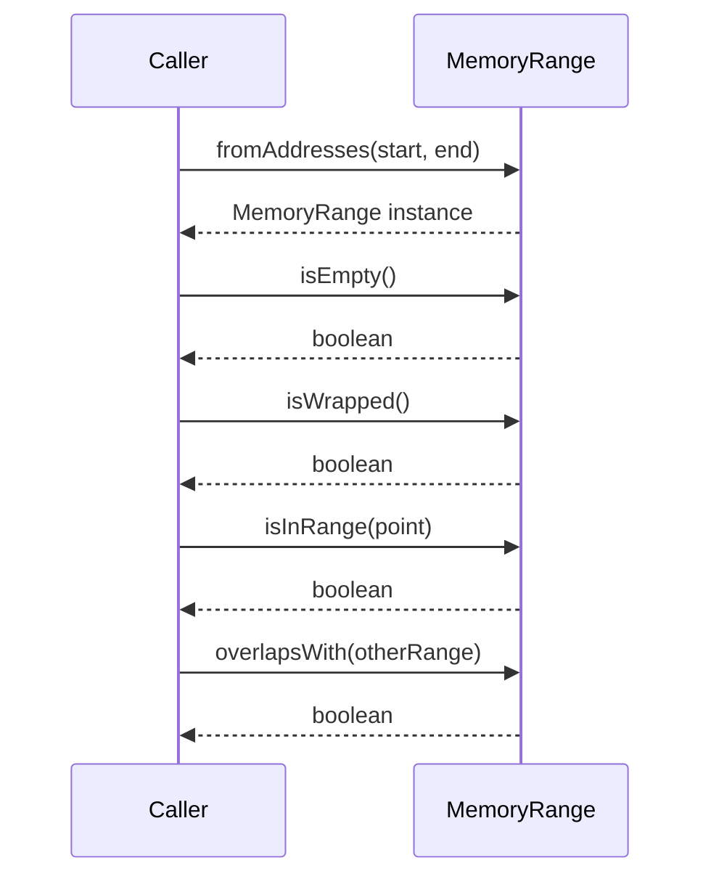

# MemoryRange class

## Pull Request by @mateuszsikora

I added `MemoryRange` class as followup to https://github.com/FluffyLabs/typeberry/pull/338

Additionally I added `PageRange` class but I am not sure if it was a good idea - in most cases I use `MemoryRange` to create `PageRange` so maybe it would be better to simply have `getPages` method / generator in `MemoryRange`? 🤔  
### Changes:
- [x] Added `MemoryRange` class
- [x] Added tests
- [x] Replaced all manual range calculations with a new class
- [x] changed tests not to use the first 16 memory pages

I encourage you to take a look at the test cases – if you find any malicious new ones, I'd love to add them.

It resolves https://github.com/FluffyLabs/typeberry/issues/342


## Comment by @coderabbitai[bot]

<!-- This is an auto-generated comment: summarize by coderabbit.ai -->
<!-- This is an auto-generated comment: skip review by coderabbit.ai -->

> [!IMPORTANT]
> ## Review skipped
> 
> Auto incremental reviews are disabled on this repository.
> 
> Please check the settings in the CodeRabbit UI or the `.coderabbit.yaml` file in this repository. To trigger a single review, invoke the `@coderabbitai review` command.
> 
> You can disable this status message by setting the `reviews.review_status` to `false` in the CodeRabbit configuration file.

<!-- end of auto-generated comment: skip review by coderabbit.ai -->
<!-- walkthrough_start -->

<details>
<summary>📝 Walkthrough</summary>

## Walkthrough

A new `MemoryRange` class has been implemented to encapsulate ranges of memory addresses, offering methods for range creation, emptiness checks, wrap-around detection, inclusion testing, and overlap determination. Accompanying this, a comprehensive test suite has been added to validate the correctness of the `MemoryRange` class, covering its construction, boundary behaviors, and all public methods under various scenarios, including edge and corner cases.

## Changes

| File(s)                                                                                       | Change Summary                                                                                          |
|----------------------------------------------------------------------------------------------|--------------------------------------------------------------------------------------------------------|
| packages/core/pvm-interpreter/memory/memory-range.ts                                         | Introduced the `MemoryRange` class with methods for range creation, checking emptiness, wrap-around, point inclusion, and overlap with other ranges. |
| packages/core/pvm-interpreter/memory/memory-range.test.ts                                    | Added a new test suite to verify the functionality of the `MemoryRange` class, testing all methods and edge cases. |

## Sequence Diagram(s)



</details>

<!-- walkthrough_end -->
<!-- internal state start -->


<!-- DwQgtGAEAqAWCWBnSTIEMB26CuAXA9mAOYCmGJATmriQCaQDG+Ats2bgFyQAOFk+AIwBWJBrngA3EsgEBPRvlqU0AgfFwA6NPEgQAfACgjoCEYDEZyAAUASpETZWaCrKNxU3bABsvkCiQBHbGlcABpIcVwvOkgAIgBtAHUASSsAXUgAWRJmfBcbTFJGLzRERFDYyAB3UvtsAWZ1Gno5CNgSSGxESkhmahIugC9EeABrPLR0ZEmAM3wffCqwbG4I/HQefwl4fC6eb19/IJDIAAozAGYLgA4AShQsXHbIADEvbBmZ2QAZFUQAelwsm4JAElBcfhI3HwIwILg0MGefXgWDQtFo6h2WBRbVQthQyCeHRRuAoimwYix/BmG3IVUgAANsrl8oUSAziqVEAiAIJefAYIgjJRtDoMEplFDMbjRNgYXDULHhIk4J55SCwWpopT0JgUfyIaEYDGCiIhQnrKQUeBfFC4ZAzbAYSkCtBedSyBFwDpVPKjAn2cQ+B6bfBEA3lKaiyEytAMHLsanoYN9DDYN1+NmMN0MbyKgXIKrqWDRumM5l5WQFQXszmSzXIDD4XCQWQkFtgsgKaXRZpe55oPCwdUo7Y0ZBbeAkKqUC2QEgADzQjXI0fHLYYpWk6GNdSIpEQLcw8m1mNdvnVdFIYE33TNh8JmpbjSIsA7HTB5Bm8AY8Dd/Y6TxgyOYJD2zLAwUgOYnXoagNVwXBuEQDh/n+Ihi3qDQmGYf43g+L5fgEAEgRBMF9Vkf4gK8f4LgAFmuDQjH0YxwCgMh6HwGlBwIYgyGUZpuzlThNn4YRRHEKQZHkJglCoVR1C0HRmJMKB3GQVBMFVQhSHIKgBOwoSuCoekHCcCFWhk5R5M0bRdDAQwWNMAxuDjUY0APf49RISiJGYMASUoXh20of42BZCiwsrMAqBrDR1zi5CDFiZKDAsSAeWSXjdP6ehTL6CFOMYTUa0QNwEEbad7xbBx1A6OY+BVJkckratSA5cUuUgK0bSndT7QUfwoKdF0MDdTFt38EoBIIXpmohbUIx3egXKKNNmDIzMSoRZIW3XR8xX8fMsEKprwta2sUUPTB4wdMlmEgARmxLYz0HRCNt0wZb3I6NayMjMgHGtU09X8MRA2cI9d3Yrq3VAgC6lqmH3Vofp9sZJAAFFpSBDk2DVegZoxQ8USIbAkBLHJuCBTaDzOKp2kGq6KBbQJ0y8ZB2PuGY7sgJsMDASnqYFaRto3doGFGNGGSQRIqG4EFaFx9thwJ9Z4CUeUbXkGLafpygOhVJmW1QNbKB/N0vHkcMSH6BriujdjwhRDFN3EU0qjlsBnF2Y14elxBkgwc6lfxgN1xiRcaAwEYpEtqD1Uep5qjlhWlt5gUwA9tB5ZiHXpHCJgMG/CgVyIAbQeN513hGAV+D4RdxS6KlCuhElIxRRuTTLx6YOcaSBQxcQC2qBnAPwNv5yCDNDYVZm6/nX3EQ6Bl8CtEokMSYsQ5VsOQhieqYetXZkEQeNRqP9Sq+wLv+DX7PuBJmn88ntmn+QU5E5LLOc9g3c+czlOdBbjhH/qvSg68H6mjzv9bG2s2SRk+vOWgRRbzbj1oNYWT8ADkHMoZT3ZjuJ6lAcHg2ZvDPanQ7ztC8CCPgjpnRD2jmsBQGArQthWj9Rwf006RQhM7H8z9EFckoCzBcIIxAxEevMG2x08DYW3AfG2DASx4x3jBHoGJPj63lCwweWJuRGHMJYPkNA9L6OYSqJQHUzHD0KouaEzMYjqk8AId0DAF6RF6kxSAAA5dYyj4HMPsXkASzj6huI8eNRAABuXE6lpi80quuKC8BoivRvhQg+KpFxIDdmXU6LU2TtQlNMXck0cqdCDFExiyVYhMSci5CW30AReR8n5AKFAgqmNCnNCKvTopsgShwJKKU0oZSyvxGIeU+5JgCSVIwPJEn0gKayGsxTOqoBJGSWgFIYgzX8EFboOjJh5yTLwk8b1pDdGQEob85AWgnlIZDeg0MVmyEDkoBcDJRahm2EoE+CpxDuJmHGOE8hVGKDnAwQ6NAHhXWdNuEgxYejcxYPOMRbj1CzXCg8T5251Sovuucng31eZcNnAXAUbDH4cLnM7Rc24OmjR8J6JedZL6d23BC2gULxb+htNGU5qBBbyFOEbF+bpcG0GASgGkWLUDf1TmK2eLZra2zaJpR2uLzZ5I2N/L2ZIYIysQYTYKJcUTEi4pAdCUgsCtx0e6NBxYcQqjzpS/U4k47FVoO6d2gD6DQN5OiM8zLLZO2qisBx/VlGiFGI/MBFB17VGLIQokfA3nBwevIbqXxH4CuPA9H2KMCp8A6TsPg9r+qFUwackFwYixPBdc8IhFBwhxiYE6XVijYFvzTvq72MF7Bn2cDsAxhixleFMUdOcljRAlBsUwuxYiQlOIreEn8kTxDSG8TydEMQOqSgzUU5NTxhmQF0JAAAwgWUkFI4SMmVRDLgFYXAfMXOEdiz7elvoXLcBkBhz1QAAMqAo3dyxkhLd20HeogR9zMv3hR/R+40CHKw/tuKh1ZbUAMXpA4qdx4GGSEqsN9Hx5KKCwaNlwEjpAyPrUoMh2g1HSPkYw1kXpwccNQGyKHf2WMqayFOGxqR0RMD/sA+x3jMt/VCa4CJmR4mL08Z3v7QO51TiVq4L9Sgwn8DSLE1xyTKmE3r0QJvJ4pwW2YarGyXT+mMD/tqfUhyKkF4cS4ngbSfE9L7pYIZTMJlHD5XkBZRQVk1A2SUvZAwrmDLqAAPrq0QPFyc046DxfFcxGLrF0AAHZaIAE5aK0QYBcAArBcAAbNcC4nxKsCBmNcAADAIa4AgWsqCa6VhgrWABM1xqu0CuHZFzOW4u4ESzylLJBthpdoPF6G+ggA= -->

<!-- internal state end -->
<!-- tips_start -->

---


<details>
<summary>🪧 Tips</summary>

### Chat

There are 3 ways to chat with [CodeRabbit](https://coderabbit.ai?utm_source=oss&utm_medium=github&utm_campaign=FluffyLabs/typeberry&utm_content=348):

- Review comments: Directly reply to a review comment made by CodeRabbit. Example:
  - `I pushed a fix in commit <commit_id>, please review it.`
  - `Generate unit testing code for this file.`
  - `Open a follow-up GitHub issue for this discussion.`
- Files and specific lines of code (under the "Files changed" tab): Tag `@coderabbitai` in a new review comment at the desired location with your query. Examples:
  - `@coderabbitai generate unit testing code for this file.`
  -	`@coderabbitai modularize this function.`
- PR comments: Tag `@coderabbitai` in a new PR comment to ask questions about the PR branch. For the best results, please provide a very specific query, as very limited context is provided in this mode. Examples:
  - `@coderabbitai gather interesting stats about this repository and render them as a table. Additionally, render a pie chart showing the language distribution in the codebase.`
  - `@coderabbitai read src/utils.ts and generate unit testing code.`
  - `@coderabbitai read the files in the src/scheduler package and generate a class diagram using mermaid and a README in the markdown format.`
  - `@coderabbitai help me debug CodeRabbit configuration file.`

Note: Be mindful of the bot's finite context window. It's strongly recommended to break down tasks such as reading entire modules into smaller chunks. For a focused discussion, use review comments to chat about specific files and their changes, instead of using the PR comments.

### CodeRabbit Commands (Invoked using PR comments)

- `@coderabbitai pause` to pause the reviews on a PR.
- `@coderabbitai resume` to resume the paused reviews.
- `@coderabbitai review` to trigger an incremental review. This is useful when automatic reviews are disabled for the repository.
- `@coderabbitai full review` to do a full review from scratch and review all the files again.
- `@coderabbitai summary` to regenerate the summary of the PR.
- `@coderabbitai generate docstrings` to [generate docstrings](https://docs.coderabbit.ai/finishing-touches/docstrings) for this PR.
- `@coderabbitai generate sequence diagram` to generate a sequence diagram of the changes in this PR.
- `@coderabbitai resolve` resolve all the CodeRabbit review comments.
- `@coderabbitai configuration` to show the current CodeRabbit configuration for the repository.
- `@coderabbitai help` to get help.

### Other keywords and placeholders

- Add `@coderabbitai ignore` anywhere in the PR description to prevent this PR from being reviewed.
- Add `@coderabbitai summary` to generate the high-level summary at a specific location in the PR description.
- Add `@coderabbitai` anywhere in the PR title to generate the title automatically.

### CodeRabbit Configuration File (`.coderabbit.yaml`)

- You can programmatically configure CodeRabbit by adding a `.coderabbit.yaml` file to the root of your repository.
- Please see the [configuration documentation](https://docs.coderabbit.ai/guides/configure-coderabbit) for more information.
- If your editor has YAML language server enabled, you can add the path at the top of this file to enable auto-completion and validation: `# yaml-language-server: $schema=https://coderabbit.ai/integrations/schema.v2.json`

### Documentation and Community

- Visit our [Documentation](https://docs.coderabbit.ai) for detailed information on how to use CodeRabbit.
- Join our [Discord Community](http://discord.gg/coderabbit) to get help, request features, and share feedback.
- Follow us on [X/Twitter](https://twitter.com/coderabbitai) for updates and announcements.

</details>

<!-- tips_end -->


## Comment by @github-actions[bot]


<details>
<summary>View all</summary>

|  Name  |  Status  | |
|--------|----------|-|
| Trie test 0 | ✅ | | 
| Trie test 1 | ✅ | | 
| Trie test 2 | ✅ | | 
| Trie test 3 | ✅ | | 
| Trie test 4 | ✅ | | 
| Trie test 5 | ✅ | | 
| Trie test 6 | ✅ | | 
| Trie test 7 | ✅ | | 
| Trie test 8 | ✅ | | 
| Trie test 9 | ✅ | | 
| Trie test 10 | ✅ | | 
| Trie test 10 | ✅ | | 
| Trie test 10 | ✅ | | 
| jamtestvectors/statistics/tiny/stats_with_empty_extrinsic-1.json | ✅ | | 
| jamtestvectors/statistics/tiny/stats_with_epoch_change-1.json | ✅ | | 
| jamtestvectors/statistics/tiny/stats_with_some_extrinsic-1.json | ✅ | | 
| jamtestvectors/statistics/tiny/stats_with_some_extrinsic-1.json | ✅ | | 
| jamtestvectors/statistics/full/stats_with_empty_extrinsic-1.json | ✅ | | 
| jamtestvectors/statistics/full/stats_with_epoch_change-1.json | ✅ | | 
| jamtestvectors/statistics/full/stats_with_some_extrinsic-1.json | ✅ | | 
| jamtestvectors/statistics/full/stats_with_some_extrinsic-1.json | ✅ | | 
| should correctly shuffle input of length 0 | ✅ | | 
| should correctly shuffle input of length 8 | ✅ | | 
| should correctly shuffle input of length 16 | ✅ | | 
| should correctly shuffle input of length 20 | ✅ | | 
| should correctly shuffle input of length 50 | ✅ | | 
| should correctly shuffle input of length 100 | ✅ | | 
| should correctly shuffle input of length 200 | ✅ | | 
| should correctly shuffle input of length 341 | ✅ | | 
| should correctly shuffle input of length 341 | ✅ | | 
| should correctly shuffle input of length 341 | ✅ | | 
| jamtestvectors/safrole/tiny/enact-epoch-change-with-no-tickets-1.json | ✅ | | 
| jamtestvectors/safrole/tiny/enact-epoch-change-with-no-tickets-2.json | ✅ | | 
| jamtestvectors/safrole/tiny/enact-epoch-change-with-no-tickets-3.json | ✅ | | 
| jamtestvectors/safrole/tiny/enact-epoch-change-with-no-tickets-4.json | ✅ | | 
| jamtestvectors/safrole/tiny/enact-epoch-change-with-padding-1.json | ✅ | | 
| jamtestvectors/safrole/tiny/publish-tickets-no-mark-1.json | ✅ | | 
| jamtestvectors/safrole/tiny/publish-tickets-no-mark-2.json | ✅ | | 
| jamtestvectors/safrole/tiny/publish-tickets-no-mark-3.json | ✅ | | 
| jamtestvectors/safrole/tiny/publish-tickets-no-mark-4.json | ✅ | | 
| jamtestvectors/safrole/tiny/publish-tickets-no-mark-5.json | ✅ | | 
| jamtestvectors/safrole/tiny/publish-tickets-no-mark-6.json | ✅ | | 
| jamtestvectors/safrole/tiny/publish-tickets-no-mark-7.json | ✅ | | 
| jamtestvectors/safrole/tiny/publish-tickets-no-mark-8.json | ✅ | | 
| jamtestvectors/safrole/tiny/publish-tickets-no-mark-9.json | ✅ | | 
| jamtestvectors/safrole/tiny/publish-tickets-with-mark-1.json | ✅ | | 
| jamtestvectors/safrole/tiny/publish-tickets-with-mark-2.json | ✅ | | 
| jamtestvectors/safrole/tiny/publish-tickets-with-mark-3.json | ✅ | | 
| jamtestvectors/safrole/tiny/publish-tickets-with-mark-4.json | ✅ | | 
| jamtestvectors/safrole/tiny/publish-tickets-with-mark-5.json | ✅ | | 
| jamtestvectors/safrole/tiny/skip-epoch-tail-1.json | ✅ | | 
| jamtestvectors/safrole/tiny/skip-epochs-1.json | ✅ | | 
| jamtestvectors/safrole/full/enact-epoch-change-with-no-tickets-1.json | ✅ | | 
| jamtestvectors/safrole/full/enact-epoch-change-with-no-tickets-2.json | ✅ | | 
| jamtestvectors/safrole/full/enact-epoch-change-with-no-tickets-3.json | ✅ | | 
| jamtestvectors/safrole/full/enact-epoch-change-with-no-tickets-4.json | ✅ | | 
| jamtestvectors/safrole/full/enact-epoch-change-with-padding-1.json | ✅ | | 
| jamtestvectors/safrole/full/publish-tickets-no-mark-1.json | ✅ | | 
| jamtestvectors/safrole/full/publish-tickets-no-mark-2.json | ✅ | | 
| jamtestvectors/safrole/full/publish-tickets-no-mark-3.json | ✅ | | 
| jamtestvectors/safrole/full/publish-tickets-no-mark-4.json | ✅ | | 
| jamtestvectors/safrole/full/publish-tickets-no-mark-5.json | ✅ | | 
| jamtestvectors/safrole/full/publish-tickets-no-mark-6.json | ✅ | | 
| jamtestvectors/safrole/full/publish-tickets-no-mark-7.json | ✅ | | 
| jamtestvectors/safrole/full/publish-tickets-no-mark-8.json | ✅ | | 
| jamtestvectors/safrole/full/publish-tickets-no-mark-9.json | ✅ | | 
| jamtestvectors/safrole/full/publish-tickets-with-mark-1.json | ✅ | | 
| jamtestvectors/safrole/full/publish-tickets-with-mark-2.json | ✅ | | 
| jamtestvectors/safrole/full/publish-tickets-with-mark-3.json | ✅ | | 
| jamtestvectors/safrole/full/publish-tickets-with-mark-4.json | ✅ | | 
| jamtestvectors/safrole/full/publish-tickets-with-mark-5.json | ✅ | | 
| jamtestvectors/safrole/full/skip-epoch-tail-1.json | ✅ | | 
| jamtestvectors/safrole/full/skip-epochs-1.json | ✅ | | 
| jamtestvectors/safrole/full/skip-epochs-1.json | ✅ | | 
| jamtestvectors/reports/tiny/anchor_not_recent-1.json | ✅ | | 
| jamtestvectors/reports/tiny/bad_beefy_mmr-1.json | ✅ | | 
| jamtestvectors/reports/tiny/bad_code_hash-1.json | ✅ | | 
| jamtestvectors/reports/tiny/bad_core_index-1.json | ✅ | | 
| jamtestvectors/reports/tiny/bad_service_id-1.json | ✅ | | 
| jamtestvectors/reports/tiny/bad_signature-1.json | ✅ | | 
| jamtestvectors/reports/tiny/bad_state_root-1.json | ✅ | | 
| jamtestvectors/reports/tiny/bad_validator_index-1.json | ✅ | | 
| jamtestvectors/reports/tiny/big_work_report_output-1.json | ✅ | | 
| jamtestvectors/reports/tiny/core_engaged-1.json | ✅ | | 
| jamtestvectors/reports/tiny/dependency_missing-1.json | ✅ | | 
| jamtestvectors/reports/tiny/duplicate_package_in_recent_history-1.json | ✅ | | 
| jamtestvectors/reports/tiny/duplicated_package_in_report-1.json | ✅ | | 
| jamtestvectors/reports/tiny/future_report_slot-1.json | ✅ | | 
| jamtestvectors/reports/tiny/high_work_report_gas-1.json | ✅ | | 
| jamtestvectors/reports/tiny/many_dependencies-1.json | ✅ | | 
| jamtestvectors/reports/tiny/multiple_reports-1.json | ✅ | | 
| jamtestvectors/reports/tiny/no_enough_guarantees-1.json | ✅ | | 
| jamtestvectors/reports/tiny/not_authorized-1.json | ✅ | | 
| jamtestvectors/reports/tiny/not_authorized-2.json | ✅ | | 
| jamtestvectors/reports/tiny/not_sorted_guarantor-1.json | ✅ | | 
| jamtestvectors/reports/tiny/out_of_order_guarantees-1.json | ✅ | | 
| jamtestvectors/reports/tiny/report_before_last_rotation-1.json | ✅ | | 
| jamtestvectors/reports/tiny/report_curr_rotation-1.json | ✅ | | 
| jamtestvectors/reports/tiny/report_prev_rotation-1.json | ✅ | | 
| jamtestvectors/reports/tiny/reports_with_dependencies-1.json | ✅ | | 
| jamtestvectors/reports/tiny/reports_with_dependencies-2.json | ✅ | | 
| jamtestvectors/reports/tiny/reports_with_dependencies-3.json | ✅ | | 
| jamtestvectors/reports/tiny/reports_with_dependencies-4.json | ✅ | | 
| jamtestvectors/reports/tiny/reports_with_dependencies-5.json | ✅ | | 
| jamtestvectors/reports/tiny/reports_with_dependencies-6.json | ✅ | | 
| jamtestvectors/reports/tiny/segment_root_lookup_invalid-1.json | ✅ | | 
| jamtestvectors/reports/tiny/segment_root_lookup_invalid-2.json | ✅ | | 
| jamtestvectors/reports/tiny/service_item_gas_too_low-1.json | ✅ | | 
| jamtestvectors/reports/tiny/too_big_work_report_output-1.json | ✅ | | 
| jamtestvectors/reports/tiny/too_high_work_report_gas-1.json | ✅ | | 
| jamtestvectors/reports/tiny/too_many_dependencies-1.json | ✅ | | 
| jamtestvectors/reports/tiny/with_avail_assignments-1.json | ✅ | | 
| jamtestvectors/reports/tiny/wrong_assignment-1.json | ✅ | | 
| jamtestvectors/reports/tiny/wrong_assignment-1.json | ✅ | | 
| jamtestvectors/reports/full/anchor_not_recent-1.json | ✅ | | 
| jamtestvectors/reports/full/bad_beefy_mmr-1.json | ✅ | | 
| jamtestvectors/reports/full/bad_code_hash-1.json | ✅ | | 
| jamtestvectors/reports/full/bad_core_index-1.json | ✅ | | 
| jamtestvectors/reports/full/bad_service_id-1.json | ✅ | | 
| jamtestvectors/reports/full/bad_signature-1.json | ✅ | | 
| jamtestvectors/reports/full/bad_state_root-1.json | ✅ | | 
| jamtestvectors/reports/full/bad_validator_index-1.json | ✅ | | 
| jamtestvectors/reports/full/big_work_report_output-1.json | ✅ | | 
| jamtestvectors/reports/full/core_engaged-1.json | ✅ | | 
| jamtestvectors/reports/full/dependency_missing-1.json | ✅ | | 
| jamtestvectors/reports/full/duplicate_package_in_recent_history-1.json | ✅ | | 
| jamtestvectors/reports/full/duplicated_package_in_report-1.json | ✅ | | 
| jamtestvectors/reports/full/future_report_slot-1.json | ✅ | | 
| jamtestvectors/reports/full/high_work_report_gas-1.json | ✅ | | 
| jamtestvectors/reports/full/many_dependencies-1.json | ✅ | | 
| jamtestvectors/reports/full/multiple_reports-1.json | ✅ | | 
| jamtestvectors/reports/full/no_enough_guarantees-1.json | ✅ | | 
| jamtestvectors/reports/full/not_authorized-1.json | ✅ | | 
| jamtestvectors/reports/full/not_authorized-2.json | ✅ | | 
| jamtestvectors/reports/full/not_sorted_guarantor-1.json | ✅ | | 
| jamtestvectors/reports/full/out_of_order_guarantees-1.json | ✅ | | 
| jamtestvectors/reports/full/report_before_last_rotation-1.json | ✅ | | 
| jamtestvectors/reports/full/report_curr_rotation-1.json | ✅ | | 
| jamtestvectors/reports/full/report_prev_rotation-1.json | ✅ | | 
| jamtestvectors/reports/full/reports_with_dependencies-1.json | ✅ | | 
| jamtestvectors/reports/full/reports_with_dependencies-2.json | ✅ | | 
| jamtestvectors/reports/full/reports_with_dependencies-3.json | ✅ | | 
| jamtestvectors/reports/full/reports_with_dependencies-4.json | ✅ | | 
| jamtestvectors/reports/full/reports_with_dependencies-5.json | ✅ | | 
| jamtestvectors/reports/full/reports_with_dependencies-6.json | ✅ | | 
| jamtestvectors/reports/full/segment_root_lookup_invalid-1.json | ✅ | | 
| jamtestvectors/reports/full/segment_root_lookup_invalid-2.json | ✅ | | 
| jamtestvectors/reports/full/service_item_gas_too_low-1.json | ✅ | | 
| jamtestvectors/reports/full/too_big_work_report_output-1.json | ✅ | | 
| jamtestvectors/reports/full/too_high_work_report_gas-1.json | ✅ | | 
| jamtestvectors/reports/full/too_many_dependencies-1.json | ✅ | | 
| jamtestvectors/reports/full/with_avail_assignments-1.json | ✅ | | 
| jamtestvectors/reports/full/wrong_assignment-1.json | ✅ | | 
| jamtestvectors/reports/full/wrong_assignment-1.json | ✅ | | 
| jamtestvectors/pvm/schema.json | ✅ | | 
| jamtestvectors/erasure_coding/schema_ec.json | ✅ | | 
| jamtestvectors/erasure_coding/schema_page_proof.json | ✅ | | 
| jamtestvectors/erasure_coding/schema_segment_ec.json | ✅ | | 
| jamtestvectors/erasure_coding/schema_segment_root.json | ✅ | | 
| jamtestvectors/erasure_coding/schema_segment_root.json | ✅ | | 
| jamtestvectors/pvm/programs/gas_basic_consume_all.json | ✅ | | 
| jamtestvectors/pvm/programs/inst_add_32.json | ✅ | | 
| jamtestvectors/pvm/programs/inst_add_32_with_overflow.json | ✅ | | 
| jamtestvectors/pvm/programs/inst_add_32_with_truncation.json | ✅ | | 
| jamtestvectors/pvm/programs/inst_add_32_with_truncation_and_sign_extension.json | ✅ | | 
| jamtestvectors/pvm/programs/inst_add_64.json | ✅ | | 
| jamtestvectors/pvm/programs/inst_add_64_with_overflow.json | ✅ | | 
| jamtestvectors/pvm/programs/inst_add_imm_32.json | ✅ | | 
| jamtestvectors/pvm/programs/inst_add_imm_32_with_truncation.json | ✅ | | 
| jamtestvectors/pvm/programs/inst_add_imm_32_with_truncation_and_sign_extension.json | ✅ | | 
| jamtestvectors/pvm/programs/inst_add_imm_64.json | ✅ | | 
| jamtestvectors/pvm/programs/inst_and.json | ✅ | | 
| jamtestvectors/pvm/programs/inst_and_imm.json | ✅ | | 
| jamtestvectors/pvm/programs/inst_branch_eq_imm_nok.json | ✅ | | 
| jamtestvectors/pvm/programs/inst_branch_eq_imm_ok.json | ✅ | | 
| jamtestvectors/pvm/programs/inst_branch_eq_nok.json | ✅ | | 
| jamtestvectors/pvm/programs/inst_branch_eq_ok.json | ✅ | | 
| jamtestvectors/pvm/programs/inst_branch_greater_or_equal_signed_imm_nok.json | ✅ | | 
| jamtestvectors/pvm/programs/inst_branch_greater_or_equal_signed_imm_ok.json | ✅ | | 
| jamtestvectors/pvm/programs/inst_branch_greater_or_equal_signed_nok.json | ✅ | | 
| jamtestvectors/pvm/programs/inst_branch_greater_or_equal_signed_ok.json | ✅ | | 
| jamtestvectors/pvm/programs/inst_branch_greater_or_equal_unsigned_imm_nok.json | ✅ | | 
| jamtestvectors/pvm/programs/inst_branch_greater_or_equal_unsigned_imm_ok.json | ✅ | | 
| jamtestvectors/pvm/programs/inst_branch_greater_or_equal_unsigned_nok.json | ✅ | | 
| jamtestvectors/pvm/programs/inst_branch_greater_or_equal_unsigned_ok.json | ✅ | | 
| jamtestvectors/pvm/programs/inst_branch_greater_signed_imm_nok.json | ✅ | | 
| jamtestvectors/pvm/programs/inst_branch_greater_signed_imm_ok.json | ✅ | | 
| jamtestvectors/pvm/programs/inst_branch_greater_unsigned_imm_nok.json | ✅ | | 
| jamtestvectors/pvm/programs/inst_branch_greater_unsigned_imm_ok.json | ✅ | | 
| jamtestvectors/pvm/programs/inst_branch_less_or_equal_signed_imm_nok.json | ✅ | | 
| jamtestvectors/pvm/programs/inst_branch_less_or_equal_signed_imm_ok.json | ✅ | | 
| jamtestvectors/pvm/programs/inst_branch_less_or_equal_unsigned_imm_nok.json | ✅ | | 
| jamtestvectors/pvm/programs/inst_branch_less_or_equal_unsigned_imm_ok.json | ✅ | | 
| jamtestvectors/pvm/programs/inst_branch_less_signed_imm_nok.json | ✅ | | 
| jamtestvectors/pvm/programs/inst_branch_less_signed_imm_ok.json | ✅ | | 
| jamtestvectors/pvm/programs/inst_branch_less_signed_nok.json | ✅ | | 
| jamtestvectors/pvm/programs/inst_branch_less_signed_ok.json | ✅ | | 
| jamtestvectors/pvm/programs/inst_branch_less_unsigned_imm_nok.json | ✅ | | 
| jamtestvectors/pvm/programs/inst_branch_less_unsigned_imm_ok.json | ✅ | | 
| jamtestvectors/pvm/programs/inst_branch_less_unsigned_nok.json | ✅ | | 
| jamtestvectors/pvm/programs/inst_branch_less_unsigned_ok.json | ✅ | | 
| jamtestvectors/pvm/programs/inst_branch_not_eq_imm_nok.json | ✅ | | 
| jamtestvectors/pvm/programs/inst_branch_not_eq_imm_ok.json | ✅ | | 
| jamtestvectors/pvm/programs/inst_branch_not_eq_nok.json | ✅ | | 
| jamtestvectors/pvm/programs/inst_branch_not_eq_ok.json | ✅ | | 
| jamtestvectors/pvm/programs/inst_cmov_if_zero_imm_nok.json | ✅ | | 
| jamtestvectors/pvm/programs/inst_cmov_if_zero_imm_ok.json | ✅ | | 
| jamtestvectors/pvm/programs/inst_cmov_if_zero_nok.json | ✅ | | 
| jamtestvectors/pvm/programs/inst_cmov_if_zero_ok.json | ✅ | | 
| jamtestvectors/pvm/programs/inst_div_signed_32.json | ✅ | | 
| jamtestvectors/pvm/programs/inst_div_signed_32.json | ✅ | | 
| jamtestvectors/pvm/programs/inst_div_signed_32_by_zero.json | ✅ | | 
| jamtestvectors/pvm/programs/inst_div_signed_32_with_overflow.json | ✅ | | 
| jamtestvectors/pvm/programs/inst_div_signed_64.json | ✅ | | 
| jamtestvectors/pvm/programs/inst_div_signed_64_by_zero.json | ✅ | | 
| jamtestvectors/pvm/programs/inst_div_signed_64_with_overflow.json | ✅ | | 
| jamtestvectors/pvm/programs/inst_div_unsigned_32.json | ✅ | | 
| jamtestvectors/pvm/programs/inst_div_unsigned_32_by_zero.json | ✅ | | 
| jamtestvectors/pvm/programs/inst_div_unsigned_32_with_overflow.json | ✅ | | 
| jamtestvectors/pvm/programs/inst_div_unsigned_64.json | ✅ | | 
| jamtestvectors/pvm/programs/inst_div_unsigned_64_by_zero.json | ✅ | | 
| jamtestvectors/pvm/programs/inst_div_unsigned_64_with_overflow.json | ✅ | | 
| jamtestvectors/pvm/programs/inst_fallthrough.json | ✅ | | 
| jamtestvectors/pvm/programs/inst_jump.json | ✅ | | 
| jamtestvectors/pvm/programs/inst_jump_indirect_invalid_djump_to_zero_nok.json | ✅ | | 
| jamtestvectors/pvm/programs/inst_jump_indirect_misaligned_djump_with_offset_nok.json | ✅ | | 
| jamtestvectors/pvm/programs/inst_jump_indirect_misaligned_djump_without_offset_nok.json | ✅ | | 
| jamtestvectors/pvm/programs/inst_jump_indirect_with_offset_ok.json | ✅ | | 
| jamtestvectors/pvm/programs/inst_jump_indirect_without_offset_ok.json | ✅ | | 
| jamtestvectors/pvm/programs/inst_load_i16.json | ✅ | | 
| jamtestvectors/pvm/programs/inst_load_i32.json | ✅ | | 
| jamtestvectors/pvm/programs/inst_load_i8.json | ✅ | | 
| jamtestvectors/pvm/programs/inst_load_imm.json | ✅ | | 
| jamtestvectors/pvm/programs/inst_load_imm_64.json | ✅ | | 
| jamtestvectors/pvm/programs/inst_load_imm_and_jump.json | ✅ | | 
| jamtestvectors/pvm/programs/inst_load_imm_and_jump_indirect_different_regs_with_offset_ok.json | ✅ | | 
| jamtestvectors/pvm/programs/inst_load_imm_and_jump_indirect_different_regs_without_offset_ok.json | ✅ | | 
| jamtestvectors/pvm/programs/inst_load_imm_and_jump_indirect_invalid_djump_to_zero_different_regs_without_offset_nok.json | ✅ | | 
| jamtestvectors/pvm/programs/inst_load_imm_and_jump_indirect_invalid_djump_to_zero_same_regs_without_offset_nok.json | ✅ | | 
| jamtestvectors/pvm/programs/inst_load_imm_and_jump_indirect_misaligned_djump_different_regs_with_offset_nok.json | ✅ | | 
| jamtestvectors/pvm/programs/inst_load_imm_and_jump_indirect_misaligned_djump_different_regs_without_offset_nok.json | ✅ | | 
| jamtestvectors/pvm/programs/inst_load_imm_and_jump_indirect_misaligned_djump_same_regs_with_offset_nok.json | ✅ | | 
| jamtestvectors/pvm/programs/inst_load_imm_and_jump_indirect_misaligned_djump_same_regs_without_offset_nok.json | ✅ | | 
| jamtestvectors/pvm/programs/inst_load_imm_and_jump_indirect_same_regs_with_offset_ok.json | ✅ | | 
| jamtestvectors/pvm/programs/inst_load_imm_and_jump_indirect_same_regs_without_offset_ok.json | ✅ | | 
| jamtestvectors/pvm/programs/inst_load_indirect_i16_with_offset.json | ✅ | | 
| jamtestvectors/pvm/programs/inst_load_indirect_i16_without_offset.json | ✅ | | 
| jamtestvectors/pvm/programs/inst_load_indirect_i32_with_offset.json | ✅ | | 
| jamtestvectors/pvm/programs/inst_load_indirect_i32_without_offset.json | ✅ | | 
| jamtestvectors/pvm/programs/inst_load_indirect_i8_with_offset.json | ✅ | | 
| jamtestvectors/pvm/programs/inst_load_indirect_i8_without_offset.json | ✅ | | 
| jamtestvectors/pvm/programs/inst_load_indirect_u16_with_offset.json | ✅ | | 
| jamtestvectors/pvm/programs/inst_load_indirect_u16_without_offset.json | ✅ | | 
| jamtestvectors/pvm/programs/inst_load_indirect_u32_with_offset.json | ✅ | | 
| jamtestvectors/pvm/programs/inst_load_indirect_u32_without_offset.json | ✅ | | 
| jamtestvectors/pvm/programs/inst_load_indirect_u64_with_offset.json | ✅ | | 
| jamtestvectors/pvm/programs/inst_load_indirect_u64_without_offset.json | ✅ | | 
| jamtestvectors/pvm/programs/inst_load_indirect_u8_with_offset.json | ✅ | | 
| jamtestvectors/pvm/programs/inst_load_indirect_u8_without_offset.json | ✅ | | 
| jamtestvectors/pvm/programs/inst_load_u16.json | ✅ | | 
| jamtestvectors/pvm/programs/inst_load_u32.json | ✅ | | 
| jamtestvectors/pvm/programs/inst_load_u32.json | ✅ | | 
| jamtestvectors/pvm/programs/inst_load_u64.json | ✅ | | 
| jamtestvectors/pvm/programs/inst_load_u8.json | ✅ | | 
| jamtestvectors/pvm/programs/inst_load_u8_nok.json | ✅ | | 
| jamtestvectors/pvm/programs/inst_move_reg.json | ✅ | | 
| jamtestvectors/pvm/programs/inst_mul_32.json | ✅ | | 
| jamtestvectors/pvm/programs/inst_mul_64.json | ✅ | | 
| jamtestvectors/pvm/programs/inst_mul_imm_32.json | ✅ | | 
| jamtestvectors/pvm/programs/inst_mul_imm_64.json | ✅ | | 
| jamtestvectors/pvm/programs/inst_negate_and_add_imm_32.json | ✅ | | 
| jamtestvectors/pvm/programs/inst_negate_and_add_imm_64.json | ✅ | | 
| jamtestvectors/pvm/programs/inst_or.json | ✅ | | 
| jamtestvectors/pvm/programs/inst_or_imm.json | ✅ | | 
| jamtestvectors/pvm/programs/inst_rem_signed_32.json | ✅ | | 
| jamtestvectors/pvm/programs/inst_rem_signed_32_by_zero.json | ✅ | | 
| jamtestvectors/pvm/programs/inst_rem_signed_32_with_overflow.json | ✅ | | 
| jamtestvectors/pvm/programs/inst_rem_signed_64.json | ✅ | | 
| jamtestvectors/pvm/programs/inst_rem_signed_64_by_zero.json | ✅ | | 
| jamtestvectors/pvm/programs/inst_rem_signed_64_with_overflow.json | ✅ | | 
| jamtestvectors/pvm/programs/inst_rem_unsigned_32.json | ✅ | | 
| jamtestvectors/pvm/programs/inst_rem_unsigned_32_by_zero.json | ✅ | | 
| jamtestvectors/pvm/programs/inst_rem_unsigned_64.json | ✅ | | 
| jamtestvectors/pvm/programs/inst_rem_unsigned_64_by_zero.json | ✅ | | 
| jamtestvectors/pvm/programs/inst_ret_halt.json | ✅ | | 
| jamtestvectors/pvm/programs/inst_ret_invalid.json | ✅ | | 
| jamtestvectors/pvm/programs/inst_set_greater_than_signed_imm_0.json | ✅ | | 
| jamtestvectors/pvm/programs/inst_set_greater_than_signed_imm_1.json | ✅ | | 
| jamtestvectors/pvm/programs/inst_set_greater_than_unsigned_imm_0.json | ✅ | | 
| jamtestvectors/pvm/programs/inst_set_greater_than_unsigned_imm_1.json | ✅ | | 
| jamtestvectors/pvm/programs/inst_set_less_than_signed_0.json | ✅ | | 
| jamtestvectors/pvm/programs/inst_set_less_than_signed_1.json | ✅ | | 
| jamtestvectors/pvm/programs/inst_set_less_than_signed_imm_0.json | ✅ | | 
| jamtestvectors/pvm/programs/inst_set_less_than_signed_imm_1.json | ✅ | | 
| jamtestvectors/pvm/programs/inst_set_less_than_unsigned_0.json | ✅ | | 
| jamtestvectors/pvm/programs/inst_set_less_than_unsigned_1.json | ✅ | | 
| jamtestvectors/pvm/programs/inst_set_less_than_unsigned_imm_0.json | ✅ | | 
| jamtestvectors/pvm/programs/inst_set_less_than_unsigned_imm_1.json | ✅ | | 
| jamtestvectors/pvm/programs/inst_shift_arithmetic_right_32.json | ✅ | | 
| jamtestvectors/pvm/programs/inst_shift_arithmetic_right_32_with_overflow.json | ✅ | | 
| jamtestvectors/pvm/programs/inst_shift_arithmetic_right_64.json | ✅ | | 
| jamtestvectors/pvm/programs/inst_shift_arithmetic_right_64_with_overflow.json | ✅ | | 
| jamtestvectors/pvm/programs/inst_shift_arithmetic_right_imm_32.json | ✅ | | 
| jamtestvectors/pvm/programs/inst_shift_arithmetic_right_imm_64.json | ✅ | | 
| jamtestvectors/pvm/programs/inst_shift_arithmetic_right_imm_alt_32.json | ✅ | | 
| jamtestvectors/pvm/programs/inst_shift_arithmetic_right_imm_alt_64.json | ✅ | | 
| jamtestvectors/pvm/programs/inst_shift_logical_left_32.json | ✅ | | 
| jamtestvectors/pvm/programs/inst_shift_logical_left_32_with_overflow.json | ✅ | | 
| jamtestvectors/pvm/programs/inst_shift_logical_left_64.json | ✅ | | 
| jamtestvectors/pvm/programs/inst_shift_logical_left_64_with_overflow.json | ✅ | | 
| jamtestvectors/pvm/programs/inst_shift_logical_left_imm_32.json | ✅ | | 
| jamtestvectors/pvm/programs/inst_shift_logical_left_imm_64.json | ✅ | | 
| jamtestvectors/pvm/programs/inst_shift_logical_left_imm_64.json | ✅ | | 
| jamtestvectors/pvm/programs/inst_shift_logical_left_imm_alt_32.json | ✅ | | 
| jamtestvectors/pvm/programs/inst_shift_logical_left_imm_alt_64.json | ✅ | | 
| jamtestvectors/pvm/programs/inst_shift_logical_right_32.json | ✅ | | 
| jamtestvectors/pvm/programs/inst_shift_logical_right_32_with_overflow.json | ✅ | | 
| jamtestvectors/pvm/programs/inst_shift_logical_right_64.json | ✅ | | 
| jamtestvectors/pvm/programs/inst_shift_logical_right_64_with_overflow.json | ✅ | | 
| jamtestvectors/pvm/programs/inst_shift_logical_right_imm_32.json | ✅ | | 
| jamtestvectors/pvm/programs/inst_shift_logical_right_imm_64.json | ✅ | | 
| jamtestvectors/pvm/programs/inst_shift_logical_right_imm_alt_32.json | ✅ | | 
| jamtestvectors/pvm/programs/inst_shift_logical_right_imm_alt_64.json | ✅ | | 
| jamtestvectors/pvm/programs/inst_store_imm_indirect_u16_with_offset_nok.json | ✅ | | 
| jamtestvectors/pvm/programs/inst_store_imm_indirect_u16_with_offset_ok.json | ✅ | | 
| jamtestvectors/pvm/programs/inst_store_imm_indirect_u16_without_offset_ok.json | ✅ | | 
| jamtestvectors/pvm/programs/inst_store_imm_indirect_u32_with_offset_nok.json | ✅ | | 
| jamtestvectors/pvm/programs/inst_store_imm_indirect_u32_with_offset_ok.json | ✅ | | 
| jamtestvectors/pvm/programs/inst_store_imm_indirect_u32_without_offset_ok.json | ✅ | | 
| jamtestvectors/pvm/programs/inst_store_imm_indirect_u64_with_offset_nok.json | ✅ | | 
| jamtestvectors/pvm/programs/inst_store_imm_indirect_u64_with_offset_ok.json | ✅ | | 
| jamtestvectors/pvm/programs/inst_store_imm_indirect_u64_without_offset_ok.json | ✅ | | 
| jamtestvectors/pvm/programs/inst_store_imm_indirect_u8_with_offset_nok.json | ✅ | | 
| jamtestvectors/pvm/programs/inst_store_imm_indirect_u8_with_offset_ok.json | ✅ | | 
| jamtestvectors/pvm/programs/inst_store_imm_indirect_u8_without_offset_ok.json | ✅ | | 
| jamtestvectors/pvm/programs/inst_store_imm_u16.json | ✅ | | 
| jamtestvectors/pvm/programs/inst_store_imm_u32.json | ✅ | | 
| jamtestvectors/pvm/programs/inst_store_imm_u64.json | ✅ | | 
| jamtestvectors/pvm/programs/inst_store_imm_u8.json | ✅ | | 
| jamtestvectors/pvm/programs/inst_store_imm_u8_trap_inaccessible.json | ✅ | | 
| jamtestvectors/pvm/programs/inst_store_imm_u8_trap_read_only.json | ✅ | | 
| jamtestvectors/pvm/programs/inst_store_indirect_u16_with_offset_nok.json | ✅ | | 
| jamtestvectors/pvm/programs/inst_store_indirect_u16_with_offset_ok.json | ✅ | | 
| jamtestvectors/pvm/programs/inst_store_indirect_u16_without_offset_ok.json | ✅ | | 
| jamtestvectors/pvm/programs/inst_store_indirect_u32_with_offset_nok.json | ✅ | | 
| jamtestvectors/pvm/programs/inst_store_indirect_u32_with_offset_ok.json | ✅ | | 
| jamtestvectors/pvm/programs/inst_store_indirect_u32_without_offset_ok.json | ✅ | | 
| jamtestvectors/pvm/programs/inst_store_indirect_u64_with_offset_nok.json | ✅ | | 
| jamtestvectors/pvm/programs/inst_store_indirect_u64_with_offset_ok.json | ✅ | | 
| jamtestvectors/pvm/programs/inst_store_indirect_u64_without_offset_ok.json | ✅ | | 
| jamtestvectors/pvm/programs/inst_store_indirect_u8_with_offset_nok.json | ✅ | | 
| jamtestvectors/pvm/programs/inst_store_indirect_u8_with_offset_ok.json | ✅ | | 
| jamtestvectors/pvm/programs/inst_store_indirect_u8_without_offset_ok.json | ✅ | | 
| jamtestvectors/pvm/programs/inst_store_u16.json | ✅ | | 
| jamtestvectors/pvm/programs/inst_store_u32.json | ✅ | | 
| jamtestvectors/pvm/programs/inst_store_u64.json | ✅ | | 
| jamtestvectors/pvm/programs/inst_store_u8.json | ✅ | | 
| jamtestvectors/pvm/programs/inst_store_u8_trap_inaccessible.json | ✅ | | 
| jamtestvectors/pvm/programs/inst_store_u8_trap_read_only.json | ✅ | | 
| jamtestvectors/pvm/programs/inst_sub_32.json | ✅ | | 
| jamtestvectors/pvm/programs/inst_sub_32_with_overflow.json | ✅ | | 
| jamtestvectors/pvm/programs/inst_sub_64.json | ✅ | | 
| jamtestvectors/pvm/programs/inst_sub_64_with_overflow.json | ✅ | | 
| jamtestvectors/pvm/programs/inst_sub_64_with_overflow.json | ✅ | | 
| jamtestvectors/pvm/programs/inst_sub_imm_32.json | ✅ | | 
| jamtestvectors/pvm/programs/inst_sub_imm_64.json | ✅ | | 
| jamtestvectors/pvm/programs/inst_trap.json | ✅ | | 
| jamtestvectors/pvm/programs/inst_xor.json | ✅ | | 
| jamtestvectors/pvm/programs/inst_xor_imm.json | ✅ | | 
| jamtestvectors/pvm/programs/riscv_rv64ua_amoadd_d.json | ✅ | | 
| jamtestvectors/pvm/programs/riscv_rv64ua_amoadd_w.json | ✅ | | 
| jamtestvectors/pvm/programs/riscv_rv64ua_amoand_d.json | ✅ | | 
| jamtestvectors/pvm/programs/riscv_rv64ua_amoand_w.json | ✅ | | 
| jamtestvectors/pvm/programs/riscv_rv64ua_amomax_d.json | ✅ | | 
| jamtestvectors/pvm/programs/riscv_rv64ua_amomax_w.json | ✅ | | 
| jamtestvectors/pvm/programs/riscv_rv64ua_amomaxu_d.json | ✅ | | 
| jamtestvectors/pvm/programs/riscv_rv64ua_amomaxu_w.json | ✅ | | 
| jamtestvectors/pvm/programs/riscv_rv64ua_amomin_d.json | ✅ | | 
| jamtestvectors/pvm/programs/riscv_rv64ua_amomin_w.json | ✅ | | 
| jamtestvectors/pvm/programs/riscv_rv64ua_amominu_d.json | ✅ | | 
| jamtestvectors/pvm/programs/riscv_rv64ua_amominu_w.json | ✅ | | 
| jamtestvectors/pvm/programs/riscv_rv64ua_amoor_d.json | ✅ | | 
| jamtestvectors/pvm/programs/riscv_rv64ua_amoor_w.json | ✅ | | 
| jamtestvectors/pvm/programs/riscv_rv64ua_amoswap_d.json | ✅ | | 
| jamtestvectors/pvm/programs/riscv_rv64ua_amoswap_w.json | ✅ | | 
| jamtestvectors/pvm/programs/riscv_rv64ua_amoxor_d.json | ✅ | | 
| jamtestvectors/pvm/programs/riscv_rv64ua_amoxor_w.json | ✅ | | 
| jamtestvectors/pvm/programs/riscv_rv64uc_rvc.json | ✅ | | 
| jamtestvectors/pvm/programs/riscv_rv64ui_add.json | ✅ | | 
| jamtestvectors/pvm/programs/riscv_rv64ui_addi.json | ✅ | | 
| jamtestvectors/pvm/programs/riscv_rv64ui_addiw.json | ✅ | | 
| jamtestvectors/pvm/programs/riscv_rv64ui_addw.json | ✅ | | 
| jamtestvectors/pvm/programs/riscv_rv64ui_and.json | ✅ | | 
| jamtestvectors/pvm/programs/riscv_rv64ui_andi.json | ✅ | | 
| jamtestvectors/pvm/programs/riscv_rv64ui_beq.json | ✅ | | 
| jamtestvectors/pvm/programs/riscv_rv64ui_bge.json | ✅ | | 
| jamtestvectors/pvm/programs/riscv_rv64ui_bgeu.json | ✅ | | 
| jamtestvectors/pvm/programs/riscv_rv64ui_blt.json | ✅ | | 
| jamtestvectors/pvm/programs/riscv_rv64ui_bltu.json | ✅ | | 
| jamtestvectors/pvm/programs/riscv_rv64ui_bne.json | ✅ | | 
| jamtestvectors/pvm/programs/riscv_rv64ui_jal.json | ✅ | | 
| jamtestvectors/pvm/programs/riscv_rv64ui_jalr.json | ✅ | | 
| jamtestvectors/pvm/programs/riscv_rv64ui_lb.json | ✅ | | 
| jamtestvectors/pvm/programs/riscv_rv64ui_lbu.json | ✅ | | 
| jamtestvectors/pvm/programs/riscv_rv64ui_ld.json | ✅ | | 
| jamtestvectors/pvm/programs/riscv_rv64ui_lh.json | ✅ | | 
| jamtestvectors/pvm/programs/riscv_rv64ui_lhu.json | ✅ | | 
| jamtestvectors/pvm/programs/riscv_rv64ui_lui.json | ✅ | | 
| jamtestvectors/pvm/programs/riscv_rv64ui_lw.json | ✅ | | 
| jamtestvectors/pvm/programs/riscv_rv64ui_lwu.json | ✅ | | 
| jamtestvectors/pvm/programs/riscv_rv64ui_ma_data.json | ✅ | | 
| jamtestvectors/pvm/programs/riscv_rv64ui_or.json | ✅ | | 
| jamtestvectors/pvm/programs/riscv_rv64ui_ori.json | ✅ | | 
| jamtestvectors/pvm/programs/riscv_rv64ui_sb.json | ✅ | | 
| jamtestvectors/pvm/programs/riscv_rv64ui_sb.json | ✅ | | 
| jamtestvectors/pvm/programs/riscv_rv64ui_sd.json | ✅ | | 
| jamtestvectors/pvm/programs/riscv_rv64ui_sh.json | ✅ | | 
| jamtestvectors/pvm/programs/riscv_rv64ui_simple.json | ✅ | | 
| jamtestvectors/pvm/programs/riscv_rv64ui_sll.json | ✅ | | 
| jamtestvectors/pvm/programs/riscv_rv64ui_slli.json | ✅ | | 
| jamtestvectors/pvm/programs/riscv_rv64ui_slliw.json | ✅ | | 
| jamtestvectors/pvm/programs/riscv_rv64ui_sllw.json | ✅ | | 
| jamtestvectors/pvm/programs/riscv_rv64ui_slt.json | ✅ | | 
| jamtestvectors/pvm/programs/riscv_rv64ui_slti.json | ✅ | | 
| jamtestvectors/pvm/programs/riscv_rv64ui_sltiu.json | ✅ | | 
| jamtestvectors/pvm/programs/riscv_rv64ui_sltu.json | ✅ | | 
| jamtestvectors/pvm/programs/riscv_rv64ui_sra.json | ✅ | | 
| jamtestvectors/pvm/programs/riscv_rv64ui_srai.json | ✅ | | 
| jamtestvectors/pvm/programs/riscv_rv64ui_sraiw.json | ✅ | | 
| jamtestvectors/pvm/programs/riscv_rv64ui_sraw.json | ✅ | | 
| jamtestvectors/pvm/programs/riscv_rv64ui_srl.json | ✅ | | 
| jamtestvectors/pvm/programs/riscv_rv64ui_srli.json | ✅ | | 
| jamtestvectors/pvm/programs/riscv_rv64ui_srliw.json | ✅ | | 
| jamtestvectors/pvm/programs/riscv_rv64ui_srlw.json | ✅ | | 
| jamtestvectors/pvm/programs/riscv_rv64ui_sub.json | ✅ | | 
| jamtestvectors/pvm/programs/riscv_rv64ui_subw.json | ✅ | | 
| jamtestvectors/pvm/programs/riscv_rv64ui_sw.json | ✅ | | 
| jamtestvectors/pvm/programs/riscv_rv64ui_xor.json | ✅ | | 
| jamtestvectors/pvm/programs/riscv_rv64ui_xori.json | ✅ | | 
| jamtestvectors/pvm/programs/riscv_rv64um_div.json | ✅ | | 
| jamtestvectors/pvm/programs/riscv_rv64um_divu.json | ✅ | | 
| jamtestvectors/pvm/programs/riscv_rv64um_divuw.json | ✅ | | 
| jamtestvectors/pvm/programs/riscv_rv64um_divw.json | ✅ | | 
| jamtestvectors/pvm/programs/riscv_rv64um_mul.json | ✅ | | 
| jamtestvectors/pvm/programs/riscv_rv64um_mulh.json | ✅ | | 
| jamtestvectors/pvm/programs/riscv_rv64um_mulhsu.json | ✅ | | 
| jamtestvectors/pvm/programs/riscv_rv64um_mulhu.json | ✅ | | 
| jamtestvectors/pvm/programs/riscv_rv64um_mulw.json | ✅ | | 
| jamtestvectors/pvm/programs/riscv_rv64um_rem.json | ✅ | | 
| jamtestvectors/pvm/programs/riscv_rv64um_remu.json | ✅ | | 
| jamtestvectors/pvm/programs/riscv_rv64um_remuw.json | ✅ | | 
| jamtestvectors/pvm/programs/riscv_rv64um_remw.json | ✅ | | 
| jamtestvectors/pvm/programs/riscv_rv64uzbb_andn.json | ✅ | | 
| jamtestvectors/pvm/programs/riscv_rv64uzbb_clz.json | ✅ | | 
| jamtestvectors/pvm/programs/riscv_rv64uzbb_clzw.json | ✅ | | 
| jamtestvectors/pvm/programs/riscv_rv64uzbb_cpop.json | ✅ | | 
| jamtestvectors/pvm/programs/riscv_rv64uzbb_cpopw.json | ✅ | | 
| jamtestvectors/pvm/programs/riscv_rv64uzbb_ctz.json | ✅ | | 
| jamtestvectors/pvm/programs/riscv_rv64uzbb_ctzw.json | ✅ | | 
| jamtestvectors/pvm/programs/riscv_rv64uzbb_max.json | ✅ | | 
| jamtestvectors/pvm/programs/riscv_rv64uzbb_maxu.json | ✅ | | 
| jamtestvectors/pvm/programs/riscv_rv64uzbb_min.json | ✅ | | 
| jamtestvectors/pvm/programs/riscv_rv64uzbb_minu.json | ✅ | | 
| jamtestvectors/pvm/programs/riscv_rv64uzbb_orc_b.json | ✅ | | 
| jamtestvectors/pvm/programs/riscv_rv64uzbb_orn.json | ✅ | | 
| jamtestvectors/pvm/programs/riscv_rv64uzbb_orn.json | ✅ | | 
| jamtestvectors/pvm/programs/riscv_rv64uzbb_rev8.json | ✅ | | 
| jamtestvectors/pvm/programs/riscv_rv64uzbb_rol.json | ✅ | | 
| jamtestvectors/pvm/programs/riscv_rv64uzbb_rolw.json | ✅ | | 
| jamtestvectors/pvm/programs/riscv_rv64uzbb_ror.json | ✅ | | 
| jamtestvectors/pvm/programs/riscv_rv64uzbb_rori.json | ✅ | | 
| jamtestvectors/pvm/programs/riscv_rv64uzbb_roriw.json | ✅ | | 
| jamtestvectors/pvm/programs/riscv_rv64uzbb_rorw.json | ✅ | | 
| jamtestvectors/pvm/programs/riscv_rv64uzbb_sext_b.json | ✅ | | 
| jamtestvectors/pvm/programs/riscv_rv64uzbb_sext_h.json | ✅ | | 
| jamtestvectors/pvm/programs/riscv_rv64uzbb_xnor.json | ✅ | | 
| jamtestvectors/pvm/programs/riscv_rv64uzbb_zext_h.json | ✅ | | 
| jamtestvectors/pvm/programs/riscv_rv64uzbb_zext_h.json | ✅ | | 
| jamtestvectors/preimages/data/preimage_needed-1.json | ✅ | | 
| jamtestvectors/preimages/data/preimage_needed-2.json | ✅ | | 
| jamtestvectors/preimages/data/preimage_not_needed-1.json | ✅ | | 
| jamtestvectors/preimages/data/preimage_not_needed-2.json | ✅ | | 
| jamtestvectors/preimages/data/preimages_order_check-1.json | ✅ | | 
| jamtestvectors/preimages/data/preimages_order_check-2.json | ✅ | | 
| jamtestvectors/preimages/data/preimages_order_check-3.json | ✅ | | 
| jamtestvectors/preimages/data/preimages_order_check-4.json | ✅ | | 
| jamtestvectors/preimages/data/preimages_order_check-4.json | ✅ | | 
| jamtestvectors/host_function/Zero/hostZeroOK.json | ✅ | | 
| jamtestvectors/host_function/Zero/hostZeroOOB.json | ✅ | | 
| jamtestvectors/host_function/Zero/hostZeroWHO.json | ✅ | | 
| jamtestvectors/host_function/Yield/hostYieldOK.json | ✅ | | 
| jamtestvectors/host_function/Yield/hostYieldOOB.json | ✅ | | 
| jamtestvectors/host_function/Write/hostWriteFULL.json | ✅ | | 
| jamtestvectors/host_function/Write/hostWriteNONE.json | ✅ | | 
| jamtestvectors/host_function/Write/hostWriteOK.json | ✅ | | 
| jamtestvectors/host_function/Write/hostWriteOOB.json | ✅ | | 
| jamtestvectors/host_function/Void/hostVoidOK.json | ✅ | | 
| jamtestvectors/host_function/Void/hostVoidOOB.json | ✅ | | 
| jamtestvectors/host_function/Void/hostVoidWHO.json | ✅ | | 
| jamtestvectors/host_function/Upgrade/hostUpgradeOK.json | ✅ | | 
| jamtestvectors/host_function/Upgrade/hostUpgradeOOB.json | ✅ | | 
| jamtestvectors/host_function/Transfer/hostTransferCASH.json | ✅ | | 
| jamtestvectors/host_function/Transfer/hostTransferLOW.json | ✅ | | 
| jamtestvectors/host_function/Transfer/hostTransferOK.json | ✅ | | 
| jamtestvectors/host_function/Transfer/hostTransferOOB.json | ✅ | | 
| jamtestvectors/host_function/Transfer/hostTransferWHO.json | ✅ | | 
| jamtestvectors/host_function/Solicit/hostSolicitFULL.json | ✅ | | 
| jamtestvectors/host_function/Solicit/hostSolicitHUH.json | ✅ | | 
| jamtestvectors/host_function/Solicit/hostSolicitOK_2_timeslots.json | ✅ | | 
| jamtestvectors/host_function/Solicit/hostSolicitOK_no_timeslots.json | ✅ | | 
| jamtestvectors/host_function/Solicit/hostSolicitOOB.json | ✅ | | 
| jamtestvectors/host_function/Read/hostReadNONE.json | ✅ | | 
| jamtestvectors/host_function/Read/hostReadOK_d_omega7.json | ✅ | | 
| jamtestvectors/host_function/Read/hostReadOK_s.json | ✅ | | 
| jamtestvectors/host_function/Read/hostReadOOB.json | ✅ | | 
| jamtestvectors/host_function/Query/hostQueryNONE.json | ✅ | | 
| jamtestvectors/host_function/Query/hostQueryOK_0_timeslots.json | ✅ | | 
| jamtestvectors/host_function/Query/hostQueryOK_1_timeslots.json | ✅ | | 
| jamtestvectors/host_function/Query/hostQueryOK_2_timeslots.json | ✅ | | 
| jamtestvectors/host_function/Query/hostQueryOK_3_timeslots.json | ✅ | | 
| jamtestvectors/host_function/Query/hostQueryOOB.json | ✅ | | 
| jamtestvectors/host_function/Poke/hostPokeOK.json | ✅ | | 
| jamtestvectors/host_function/Poke/hostPokeOOB.json | ✅ | | 
| jamtestvectors/host_function/Poke/hostPokeWHO.json | ✅ | | 
| jamtestvectors/host_function/Peek/hostPeekOK.json | ✅ | | 
| jamtestvectors/host_function/Peek/hostPeekOOB.json | ✅ | | 
| jamtestvectors/host_function/Peek/hostPeekWHO.json | ✅ | | 
| jamtestvectors/host_function/New/hostNewCASH.json | ✅ | | 
| jamtestvectors/host_function/New/hostNewOK.json | ✅ | | 
| jamtestvectors/host_function/New/hostNewOOB.json | ✅ | | 
| jamtestvectors/host_function/Machine/hostMachineOK.json | ✅ | | 
| jamtestvectors/host_function/Machine/hostMachineOOB.json | ✅ | | 
| jamtestvectors/host_function/Lookup/hostLookupNONE.json | ✅ | | 
| jamtestvectors/host_function/Lookup/hostLookupOK_d_omega7.json | ✅ | | 
| jamtestvectors/host_function/Lookup/hostLookupOK_s.json | ✅ | | 
| jamtestvectors/host_function/Lookup/hostLookupOOB.json | ✅ | | 
| jamtestvectors/host_function/Invoke/hostInvokeFAULT.json | ✅ | | 
| jamtestvectors/host_function/Invoke/hostInvokeFAULT.json | ✅ | | 
| jamtestvectors/host_function/Invoke/hostInvokeHALT.json | ✅ | | 
| jamtestvectors/host_function/Invoke/hostInvokeHOST.json | ✅ | | 
| jamtestvectors/host_function/Invoke/hostInvokeOOB.json | ✅ | | 
| jamtestvectors/host_function/Invoke/hostInvokeOOG.json | ✅ | | 
| jamtestvectors/host_function/Invoke/hostInvokePANIC.json | ✅ | | 
| jamtestvectors/host_function/Invoke/hostInvokeWHO.json | ✅ | | 
| jamtestvectors/host_function/Info/hostInfoNONE.json | ✅ | | 
| jamtestvectors/host_function/Info/hostInfoOK.json | ✅ | | 
| jamtestvectors/host_function/Info/hostInfoOOB.json | ✅ | | 
| jamtestvectors/host_function/Import/hostImportNONE.json | ✅ | | 
| jamtestvectors/host_function/Import/hostImportOK.json | ✅ | | 
| jamtestvectors/host_function/Import/hostImportOK_gt_wg.json | ✅ | | 
| jamtestvectors/host_function/Import/hostImportOOB.json | ✅ | | 
| jamtestvectors/host_function/Historical_lookup/hostHistorical_lookupNONE.json | ✅ | | 
| jamtestvectors/host_function/Historical_lookup/hostHistorical_lookupOK_d_omega7.json | ✅ | | 
| jamtestvectors/host_function/Historical_lookup/hostHistorical_lookupOK_d_s.json | ✅ | | 
| jamtestvectors/host_function/Historical_lookup/hostHistorical_lookupOOB.json | ✅ | | 
| jamtestvectors/host_function/Forget/hostForgetHUH.json | ✅ | | 
| jamtestvectors/host_function/Forget/hostForgetOK_0_timeslots.json | ✅ | | 
| jamtestvectors/host_function/Forget/hostForgetOK_1_timeslots.json | ✅ | | 
| jamtestvectors/host_function/Forget/hostForgetOK_2_timeslots.json | ✅ | | 
| jamtestvectors/host_function/Forget/hostForgetOK_3_timeslots.json | ✅ | | 
| jamtestvectors/host_function/Forget/hostForgetOOB.json | ✅ | | 
| jamtestvectors/host_function/Expunge/hostExpungeOK.json | ✅ | | 
| jamtestvectors/host_function/Expunge/hostExpungeWHO.json | ✅ | | 
| jamtestvectors/host_function/Export/hostExportFULL.json | ✅ | | 
| jamtestvectors/host_function/Export/hostExportOK.json | ✅ | | 
| jamtestvectors/host_function/Export/hostExportOK_gt_wg.json | ✅ | | 
| jamtestvectors/host_function/Export/hostExportOOB.json | ✅ | | 
| jamtestvectors/host_function/Eject/hostEjectHUH.json | ✅ | | 
| jamtestvectors/host_function/Eject/hostEjectOK.json | ✅ | | 
| jamtestvectors/host_function/Eject/hostEjectOOB.json | ✅ | | 
| jamtestvectors/host_function/Eject/hostEjectWHO.json | ✅ | | 
| jamtestvectors/host_function/Eject/hostEjectWHO.json | ✅ | | 
| jamtestvectors/history/data/progress_blocks_history-1.json | ✅ | | 
| jamtestvectors/history/data/progress_blocks_history-2.json | ✅ | | 
| jamtestvectors/history/data/progress_blocks_history-3.json | ✅ | | 
| jamtestvectors/history/data/progress_blocks_history-4.json | ✅ | | 
| jamtestvectors/history/data/progress_blocks_history-4.json | ✅ | | 
| should encode data | ✅ | | 
| should decode data | ✅ | | 
| should decode data | ✅ | | 
| test was skipped because of incorrect data: chunk length: 4 (it should be 2) | ✅ | | 
| test was skipped because of incorrect data: chunk length: 4 (it should be 2) | ✅ | | 
| test was skipped because of incorrect data: chunk length: 6 (it should be 2) | ✅ | | 
| test was skipped because of incorrect data: chunk length: 6 (it should be 2) | ✅ | | 
| test was skipped because of incorrect data: chunk length: 12 (it should be 2) | ✅ | | 
| test was skipped because of incorrect data: chunk length: 12 (it should be 2) | ✅ | | 
| test was skipped because of incorrect data: chunk length: 12 (it should be 2) | ✅ | | 
| test was skipped because of incorrect data: chunk length: 12 (it should be 2) | ✅ | | 
| should encode data | ✅ | | 
| should decode data | ✅ | | 
| should decode data | ✅ | | 
| should encode data | ✅ | | 
| should decode data | ✅ | | 
| should decode data | ✅ | | 
| should decode data | ✅ | | 
| jamtestvectors/erasure_coding/vectors/page_proof_0.json | ✅ | | 
| jamtestvectors/erasure_coding/vectors/page_proof_16000.json | ✅ | | 
| jamtestvectors/erasure_coding/vectors/page_proof_32.json | ✅ | | 
| jamtestvectors/erasure_coding/vectors/page_proof_65536.json | ✅ | | 
| jamtestvectors/erasure_coding/vectors/page_proof_65536.json | ✅ | | 
| jamtestvectors/erasure_coding/vectors/segment_ec_0.json | ✅ | | 
| jamtestvectors/erasure_coding/vectors/segment_ec_1.json | ✅ | | 
| jamtestvectors/erasure_coding/vectors/segment_ec_15000.json | ✅ | | 
| jamtestvectors/erasure_coding/vectors/segment_ec_4096.json | ✅ | | 
| jamtestvectors/erasure_coding/vectors/segment_ec_4104.json | ✅ | | 
| jamtestvectors/erasure_coding/vectors/segment_ec_684.json | ✅ | | 
| jamtestvectors/erasure_coding/vectors/segment_ec_684.json | ✅ | | 
| jamtestvectors/erasure_coding/vectors/segment_root_100000.json | ✅ | | 
| jamtestvectors/erasure_coding/vectors/segment_root_200000.json | ✅ | | 
| jamtestvectors/erasure_coding/vectors/segment_root_21824.json | ✅ | | 
| jamtestvectors/erasure_coding/vectors/segment_root_21888.json | ✅ | | 
| jamtestvectors/erasure_coding/vectors/segment_root_21888.json | ✅ | | 
| jamtestvectors/disputes/tiny/progress_invalidates_avail_assignments-1.json | ✅ | | 
| jamtestvectors/disputes/tiny/progress_with_bad_signatures-1.json | ✅ | | 
| jamtestvectors/disputes/tiny/progress_with_bad_signatures-2.json | ✅ | | 
| jamtestvectors/disputes/tiny/progress_with_culprits-1.json | ✅ | | 
| jamtestvectors/disputes/tiny/progress_with_culprits-2.json | ✅ | | 
| jamtestvectors/disputes/tiny/progress_with_culprits-3.json | ✅ | | 
| jamtestvectors/disputes/tiny/progress_with_culprits-4.json | ✅ | | 
| jamtestvectors/disputes/tiny/progress_with_culprits-5.json | ✅ | | 
| jamtestvectors/disputes/tiny/progress_with_culprits-6.json | ✅ | | 
| jamtestvectors/disputes/tiny/progress_with_culprits-7.json | ✅ | | 
| jamtestvectors/disputes/tiny/progress_with_faults-1.json | ✅ | | 
| jamtestvectors/disputes/tiny/progress_with_faults-2.json | ✅ | | 
| jamtestvectors/disputes/tiny/progress_with_faults-3.json | ✅ | | 
| jamtestvectors/disputes/tiny/progress_with_faults-4.json | ✅ | | 
| jamtestvectors/disputes/tiny/progress_with_faults-5.json | ✅ | | 
| jamtestvectors/disputes/tiny/progress_with_faults-6.json | ✅ | | 
| jamtestvectors/disputes/tiny/progress_with_faults-7.json | ✅ | | 
| jamtestvectors/disputes/tiny/progress_with_invalid_keys-1.json | ✅ | | 
| jamtestvectors/disputes/tiny/progress_with_invalid_keys-2.json | ✅ | | 
| jamtestvectors/disputes/tiny/progress_with_no_verdicts-1.json | ✅ | | 
| jamtestvectors/disputes/tiny/progress_with_verdict_signatures_from_previous_set-1.json | ✅ | | 
| jamtestvectors/disputes/tiny/progress_with_verdict_signatures_from_previous_set-2.json | ✅ | | 
| jamtestvectors/disputes/tiny/progress_with_verdicts-1.json | ✅ | | 
| jamtestvectors/disputes/tiny/progress_with_verdicts-2.json | ✅ | | 
| jamtestvectors/disputes/tiny/progress_with_verdicts-3.json | ✅ | | 
| jamtestvectors/disputes/tiny/progress_with_verdicts-4.json | ✅ | | 
| jamtestvectors/disputes/tiny/progress_with_verdicts-5.json | ✅ | | 
| jamtestvectors/disputes/tiny/progress_with_verdicts-6.json | ✅ | | 
| jamtestvectors/disputes/full/progress_invalidates_avail_assignments-1.json | ✅ | | 
| jamtestvectors/disputes/full/progress_with_bad_signatures-1.json | ✅ | | 
| jamtestvectors/disputes/full/progress_with_bad_signatures-2.json | ✅ | | 
| jamtestvectors/disputes/full/progress_with_culprits-1.json | ✅ | | 
| jamtestvectors/disputes/full/progress_with_culprits-2.json | ✅ | | 
| jamtestvectors/disputes/full/progress_with_culprits-3.json | ✅ | | 
| jamtestvectors/disputes/full/progress_with_culprits-4.json | ✅ | | 
| jamtestvectors/disputes/full/progress_with_culprits-5.json | ✅ | | 
| jamtestvectors/disputes/full/progress_with_culprits-6.json | ✅ | | 
| jamtestvectors/disputes/full/progress_with_culprits-7.json | ✅ | | 
| jamtestvectors/disputes/full/progress_with_faults-1.json | ✅ | | 
| jamtestvectors/disputes/full/progress_with_faults-2.json | ✅ | | 
| jamtestvectors/disputes/full/progress_with_faults-3.json | ✅ | | 
| jamtestvectors/disputes/full/progress_with_faults-4.json | ✅ | | 
| jamtestvectors/disputes/full/progress_with_faults-5.json | ✅ | | 
| jamtestvectors/disputes/full/progress_with_faults-6.json | ✅ | | 
| jamtestvectors/disputes/full/progress_with_faults-7.json | ✅ | | 
| jamtestvectors/disputes/full/progress_with_invalid_keys-1.json | ✅ | | 
| jamtestvectors/disputes/full/progress_with_invalid_keys-2.json | ✅ | | 
| jamtestvectors/disputes/full/progress_with_no_verdicts-1.json | ✅ | | 
| jamtestvectors/disputes/full/progress_with_verdict_signatures_from_previous_set-1.json | ✅ | | 
| jamtestvectors/disputes/full/progress_with_verdict_signatures_from_previous_set-2.json | ✅ | | 
| jamtestvectors/disputes/full/progress_with_verdict_signatures_from_previous_set-2.json | ✅ | | 
| jamtestvectors/disputes/full/progress_with_verdicts-1.json | ✅ | | 
| jamtestvectors/disputes/full/progress_with_verdicts-2.json | ✅ | | 
| jamtestvectors/disputes/full/progress_with_verdicts-3.json | ✅ | | 
| jamtestvectors/disputes/full/progress_with_verdicts-4.json | ✅ | | 
| jamtestvectors/disputes/full/progress_with_verdicts-5.json | ✅ | | 
| jamtestvectors/disputes/full/progress_with_verdicts-6.json | ✅ | | 
| jamtestvectors/disputes/full/progress_with_verdicts-6.json | ✅ | | 
| jamtestvectors/codec/data/assurances_extrinsic.json | ✅ | | 
| jamtestvectors/codec/data/assurances_extrinsic.json | ✅ | | 
| jamtestvectors/codec/data/block.json | ✅ | | 
| jamtestvectors/codec/data/block.json | ✅ | | 
| jamtestvectors/codec/data/disputes_extrinsic.json | ✅ | | 
| jamtestvectors/codec/data/disputes_extrinsic.json | ✅ | | 
| jamtestvectors/codec/data/extrinsic.json | ✅ | | 
| jamtestvectors/codec/data/extrinsic.json | ✅ | | 
| jamtestvectors/codec/data/guarantees_extrinsic.json | ✅ | | 
| jamtestvectors/codec/data/guarantees_extrinsic.json | ✅ | | 
| jamtestvectors/codec/data/header_0.json | ✅ | | 
| jamtestvectors/codec/data/header_1.json | ✅ | | 
| jamtestvectors/codec/data/header_1.json | ✅ | | 
| jamtestvectors/codec/data/preimages_extrinsic.json | ✅ | | 
| jamtestvectors/codec/data/preimages_extrinsic.json | ✅ | | 
| jamtestvectors/codec/data/refine_context.json | ✅ | | 
| jamtestvectors/codec/data/refine_context.json | ✅ | | 
| jamtestvectors/codec/data/tickets_extrinsic.json | ✅ | | 
| jamtestvectors/codec/data/tickets_extrinsic.json | ✅ | | 
| jamtestvectors/codec/data/work_item.json | ✅ | | 
| jamtestvectors/codec/data/work_item.json | ✅ | | 
| jamtestvectors/codec/data/work_package.json | ✅ | | 
| jamtestvectors/codec/data/work_package.json | ✅ | | 
| jamtestvectors/codec/data/work_report.json | ✅ | | 
| jamtestvectors/codec/data/work_report.json | ✅ | | 
| jamtestvectors/codec/data/work_result_0.json | ✅ | | 
| jamtestvectors/codec/data/work_result_1.json | ✅ | | 
| jamtestvectors/codec/data/work_result_1.json | ✅ | | 
| jamtestvectors/authorizations/tiny/progress_authorizations-1.json | ✅ | | 
| jamtestvectors/authorizations/tiny/progress_authorizations-2.json | ✅ | | 
| jamtestvectors/authorizations/tiny/progress_authorizations-3.json | ✅ | | 
| jamtestvectors/authorizations/full/progress_authorizations-1.json | ✅ | | 
| jamtestvectors/authorizations/full/progress_authorizations-2.json | ✅ | | 
| jamtestvectors/authorizations/full/progress_authorizations-3.json | ✅ | | 
| jamtestvectors/authorizations/full/progress_authorizations-3.json | ✅ | | 
| jamtestvectors/assurances/tiny/assurance_for_not_engaged_core-1.json | ✅ | | 
| jamtestvectors/assurances/tiny/assurance_with_bad_attestation_parent-1.json | ✅ | | 
| jamtestvectors/assurances/tiny/assurances_for_stale_report-1.json | ✅ | | 
| jamtestvectors/assurances/tiny/assurances_with_bad_signature-1.json | ✅ | | 
| jamtestvectors/assurances/tiny/assurances_with_bad_validator_index-1.json | ✅ | | 
| jamtestvectors/assurances/tiny/assurers_not_sorted_or_unique-1.json | ✅ | | 
| jamtestvectors/assurances/tiny/assurers_not_sorted_or_unique-2.json | ✅ | | 
| jamtestvectors/assurances/tiny/no_assurances-1.json | ✅ | | 
| jamtestvectors/assurances/tiny/no_assurances_with_stale_report-1.json | ✅ | | 
| jamtestvectors/assurances/tiny/some_assurances-1.json | ✅ | | 
| jamtestvectors/assurances/tiny/some_assurances-1.json | ✅ | | 
| jamtestvectors/assurances/full/assurance_for_not_engaged_core-1.json | ✅ | | 
| jamtestvectors/assurances/full/assurance_with_bad_attestation_parent-1.json | ✅ | | 
| jamtestvectors/assurances/full/assurances_for_stale_report-1.json | ✅ | | 
| jamtestvectors/assurances/full/assurances_with_bad_signature-1.json | ✅ | | 
| jamtestvectors/assurances/full/assurances_with_bad_validator_index-1.json | ✅ | | 
| jamtestvectors/assurances/full/assurers_not_sorted_or_unique-1.json | ✅ | | 
| jamtestvectors/assurances/full/assurers_not_sorted_or_unique-2.json | ✅ | | 
| jamtestvectors/assurances/full/no_assurances-1.json | ✅ | | 
| jamtestvectors/assurances/full/no_assurances_with_stale_report-1.json | ✅ | | 
| jamtestvectors/assurances/full/some_assurances-1.json | ✅ | | 
| jamtestvectors/assurances/full/some_assurances-1.json | ✅ | | 
| jamtestvectors/accumulate/tiny/accumulate_ready_queued_reports-1.json | ✅ | | 
| jamtestvectors/accumulate/tiny/enqueue_and_unlock_chain-1.json | ✅ | | 
| jamtestvectors/accumulate/tiny/enqueue_and_unlock_chain-2.json | ✅ | | 
| jamtestvectors/accumulate/tiny/enqueue_and_unlock_chain-3.json | ✅ | | 
| jamtestvectors/accumulate/tiny/enqueue_and_unlock_chain-4.json | ✅ | | 
| jamtestvectors/accumulate/tiny/enqueue_and_unlock_chain_wraps-1.json | ✅ | | 
| jamtestvectors/accumulate/tiny/enqueue_and_unlock_chain_wraps-2.json | ✅ | | 
| jamtestvectors/accumulate/tiny/enqueue_and_unlock_chain_wraps-3.json | ✅ | | 
| jamtestvectors/accumulate/tiny/enqueue_and_unlock_chain_wraps-4.json | ✅ | | 
| jamtestvectors/accumulate/tiny/enqueue_and_unlock_chain_wraps-5.json | ✅ | | 
| jamtestvectors/accumulate/tiny/enqueue_and_unlock_simple-1.json | ✅ | | 
| jamtestvectors/accumulate/tiny/enqueue_and_unlock_simple-2.json | ✅ | | 
| jamtestvectors/accumulate/tiny/enqueue_and_unlock_with_sr_lookup-1.json | ✅ | | 
| jamtestvectors/accumulate/tiny/enqueue_and_unlock_with_sr_lookup-2.json | ✅ | | 
| jamtestvectors/accumulate/tiny/enqueue_self_referential-1.json | ✅ | | 
| jamtestvectors/accumulate/tiny/enqueue_self_referential-2.json | ✅ | | 
| jamtestvectors/accumulate/tiny/enqueue_self_referential-3.json | ✅ | | 
| jamtestvectors/accumulate/tiny/enqueue_self_referential-4.json | ✅ | | 
| jamtestvectors/accumulate/tiny/no_available_reports-1.json | ✅ | | 
| jamtestvectors/accumulate/tiny/process_one_immediate_report-1.json | ✅ | | 
| jamtestvectors/accumulate/tiny/queues_are_shifted-1.json | ✅ | | 
| jamtestvectors/accumulate/tiny/queues_are_shifted-2.json | ✅ | | 
| jamtestvectors/accumulate/tiny/ready_queue_editing-1.json | ✅ | | 
| jamtestvectors/accumulate/tiny/ready_queue_editing-2.json | ✅ | | 
| jamtestvectors/accumulate/tiny/ready_queue_editing-3.json | ✅ | | 
| jamtestvectors/accumulate/full/accumulate_ready_queued_reports-1.json | ✅ | | 
| jamtestvectors/accumulate/full/enqueue_and_unlock_chain-1.json | ✅ | | 
| jamtestvectors/accumulate/full/enqueue_and_unlock_chain-2.json | ✅ | | 
| jamtestvectors/accumulate/full/enqueue_and_unlock_chain-3.json | ✅ | | 
| jamtestvectors/accumulate/full/enqueue_and_unlock_chain-4.json | ✅ | | 
| jamtestvectors/accumulate/full/enqueue_and_unlock_chain_wraps-1.json | ✅ | | 
| jamtestvectors/accumulate/full/enqueue_and_unlock_chain_wraps-2.json | ✅ | | 
| jamtestvectors/accumulate/full/enqueue_and_unlock_chain_wraps-3.json | ✅ | | 
| jamtestvectors/accumulate/full/enqueue_and_unlock_chain_wraps-4.json | ✅ | | 
| jamtestvectors/accumulate/full/enqueue_and_unlock_chain_wraps-5.json | ✅ | | 
| jamtestvectors/accumulate/full/enqueue_and_unlock_simple-1.json | ✅ | | 
| jamtestvectors/accumulate/full/enqueue_and_unlock_simple-2.json | ✅ | | 
| jamtestvectors/accumulate/full/enqueue_and_unlock_with_sr_lookup-1.json | ✅ | | 
| jamtestvectors/accumulate/full/enqueue_and_unlock_with_sr_lookup-2.json | ✅ | | 
| jamtestvectors/accumulate/full/enqueue_self_referential-1.json | ✅ | | 
| jamtestvectors/accumulate/full/enqueue_self_referential-2.json | ✅ | | 
| jamtestvectors/accumulate/full/enqueue_self_referential-3.json | ✅ | | 
| jamtestvectors/accumulate/full/enqueue_self_referential-4.json | ✅ | | 
| jamtestvectors/accumulate/full/no_available_reports-1.json | ✅ | | 
| jamtestvectors/accumulate/full/process_one_immediate_report-1.json | ✅ | | 
| jamtestvectors/accumulate/full/queues_are_shifted-1.json | ✅ | | 
| jamtestvectors/accumulate/full/queues_are_shifted-2.json | ✅ | | 
| jamtestvectors/accumulate/full/ready_queue_editing-1.json | ✅ | | 
| jamtestvectors/accumulate/full/ready_queue_editing-2.json | ✅ | | 
| jamtestvectors/accumulate/full/ready_queue_editing-3.json | ✅ | | 
| jamtestvectors/accumulate/full/ready_queue_editing-3.json | ✅ | | 
</details>

### JAM test vectors 778/778 OK ✅
      
<!-- thollander/actions-comment-pull-request "jamtestvectors" -->


## Comment by @github-actions[bot]


<details>
<summary>View all</summary>

| File | Benchmark | Ops |  |
|------|-----------|-----|--|
| [bytes/compare.ts[0]](../blob/944360800120bffed80cffe9de2c011e8ded5379/benchmarks/bytes/compare.ts) | Comparing Uint32 bytes | 12296.56 ±0.09% | fastest ✅ |
| [bytes/compare.ts[1]](../blob/944360800120bffed80cffe9de2c011e8ded5379/benchmarks/bytes/compare.ts) | Comparing raw bytes | 7078.34 ±0.26% | 42.44% slower |
| [bytes/hex-from.ts[0]](../blob/944360800120bffed80cffe9de2c011e8ded5379/benchmarks/bytes/hex-from.ts) | parse hex using `Number` with NaN checking | 136125.63 ±0.26% | 86.07% slower |
| [bytes/hex-from.ts[1]](../blob/944360800120bffed80cffe9de2c011e8ded5379/benchmarks/bytes/hex-from.ts) | parse hex from char codes | 976922.32 ±0.21% | fastest ✅ |
| [bytes/hex-from.ts[2]](../blob/944360800120bffed80cffe9de2c011e8ded5379/benchmarks/bytes/hex-from.ts) | parse hex from string nibbles | 557874.93 ±0.42% | 42.89% slower |
| [bytes/hex-to.ts[0]](../blob/944360800120bffed80cffe9de2c011e8ded5379/benchmarks/bytes/hex-to.ts) | number toString + padding | 320559.28 ±0.08% | 11.03% slower |
| [bytes/hex-to.ts[1]](../blob/944360800120bffed80cffe9de2c011e8ded5379/benchmarks/bytes/hex-to.ts) | manual | 360308.59 ±0.06% | fastest ✅ |
| [codec/bigint.compare.ts[0]](../blob/944360800120bffed80cffe9de2c011e8ded5379/benchmarks/codec/bigint.compare.ts) | compare custom | 187414577.04 ±1.68% | 27.34% slower |
| [codec/bigint.compare.ts[1]](../blob/944360800120bffed80cffe9de2c011e8ded5379/benchmarks/codec/bigint.compare.ts) | compare bigint | 257934109.14 ±6.57% | fastest ✅ |
| [codec/bigint.decode.ts[0]](../blob/944360800120bffed80cffe9de2c011e8ded5379/benchmarks/codec/bigint.decode.ts) | decode custom | 238389964.76 ±6.07% | fastest ✅ |
| [codec/bigint.decode.ts[1]](../blob/944360800120bffed80cffe9de2c011e8ded5379/benchmarks/codec/bigint.decode.ts) | decode bigint | 109010853.97 ±2.52% | 54.27% slower |
| [codec/decoding.ts[0]](../blob/944360800120bffed80cffe9de2c011e8ded5379/benchmarks/codec/decoding.ts) | manual decode | 24230664.43 ±0.54% | 86.87% slower |
| [codec/decoding.ts[1]](../blob/944360800120bffed80cffe9de2c011e8ded5379/benchmarks/codec/decoding.ts) | int32array decode | 184558084.45 ±1.51% | fastest ✅ |
| [codec/decoding.ts[2]](../blob/944360800120bffed80cffe9de2c011e8ded5379/benchmarks/codec/decoding.ts) | dataview decode | 175307562.79 ±3.27% | 5.01% slower |
| [codec/encoding.ts[0]](../blob/944360800120bffed80cffe9de2c011e8ded5379/benchmarks/codec/encoding.ts) | manual encode | 3148657.22 ±0.12% | 18.09% slower |
| [codec/encoding.ts[1]](../blob/944360800120bffed80cffe9de2c011e8ded5379/benchmarks/codec/encoding.ts) | int32array encode | 3844103.19 ±0.28% | fastest ✅ |
| [codec/encoding.ts[2]](../blob/944360800120bffed80cffe9de2c011e8ded5379/benchmarks/codec/encoding.ts) | dataview encode | 3834193.46 ±0.37% | 0.26% slower |
| [codec/view_vs_collection.ts[0]](../blob/944360800120bffed80cffe9de2c011e8ded5379/benchmarks/codec/view_vs_collection.ts) | Get first element from Decoded | 30257.08 ±0.06% | 78.06% slower |
| [codec/view_vs_collection.ts[1]](../blob/944360800120bffed80cffe9de2c011e8ded5379/benchmarks/codec/view_vs_collection.ts) | Get first element from View | 137925.89 ±0.12% | fastest ✅ |
| [codec/view_vs_collection.ts[2]](../blob/944360800120bffed80cffe9de2c011e8ded5379/benchmarks/codec/view_vs_collection.ts) | Get 50th element from Decoded | 30233.27 ±0.06% | 78.08% slower |
| [codec/view_vs_collection.ts[3]](../blob/944360800120bffed80cffe9de2c011e8ded5379/benchmarks/codec/view_vs_collection.ts) | Get 50th element from View | 60610.61 ±0.12% | 56.06% slower |
| [codec/view_vs_collection.ts[4]](../blob/944360800120bffed80cffe9de2c011e8ded5379/benchmarks/codec/view_vs_collection.ts) | Get last element from Decoded | 30150.44 ±0.07% | 78.14% slower |
| [codec/view_vs_collection.ts[5]](../blob/944360800120bffed80cffe9de2c011e8ded5379/benchmarks/codec/view_vs_collection.ts) | Get last element from View | 39630.8 ±0.57% | 71.27% slower |
| [codec/view_vs_object.ts[0]](../blob/944360800120bffed80cffe9de2c011e8ded5379/benchmarks/codec/view_vs_object.ts) | Get the first field from Decoded | 455805.37 ±0.07% | 5.65% slower |
| [codec/view_vs_object.ts[1]](../blob/944360800120bffed80cffe9de2c011e8ded5379/benchmarks/codec/view_vs_object.ts) | Get the first field from View | 454093.28 ±0.05% | 6% slower |
| [codec/view_vs_object.ts[2]](../blob/944360800120bffed80cffe9de2c011e8ded5379/benchmarks/codec/view_vs_object.ts) | Get the first field as view from View | 448610.87 ±0.65% | 7.14% slower |
| [codec/view_vs_object.ts[3]](../blob/944360800120bffed80cffe9de2c011e8ded5379/benchmarks/codec/view_vs_object.ts) | Get two fields from Decoded | 456054.88 ±0.08% | 5.6% slower |
| [codec/view_vs_object.ts[4]](../blob/944360800120bffed80cffe9de2c011e8ded5379/benchmarks/codec/view_vs_object.ts) | Get two fields from View | 369398.44 ±0.16% | 23.54% slower |
| [codec/view_vs_object.ts[5]](../blob/944360800120bffed80cffe9de2c011e8ded5379/benchmarks/codec/view_vs_object.ts) | Get two fields from materialized from View | 483094.98 ±0.64% | fastest ✅ |
| [codec/view_vs_object.ts[6]](../blob/944360800120bffed80cffe9de2c011e8ded5379/benchmarks/codec/view_vs_object.ts) | Get two fields as views from View | 371350.6 ±0.07% | 23.13% slower |
| [codec/view_vs_object.ts[7]](../blob/944360800120bffed80cffe9de2c011e8ded5379/benchmarks/codec/view_vs_object.ts) | Get only third field from Decoded | 456923.42 ±0.58% | 5.42% slower |
| [codec/view_vs_object.ts[8]](../blob/944360800120bffed80cffe9de2c011e8ded5379/benchmarks/codec/view_vs_object.ts) | Get only third field from View | 455370.96 ±0.1% | 5.74% slower |
| [codec/view_vs_object.ts[9]](../blob/944360800120bffed80cffe9de2c011e8ded5379/benchmarks/codec/view_vs_object.ts) | Get only third field as view from View | 456081.57 ±0.07% | 5.59% slower |
| [collections/map-set.ts[0]](../blob/944360800120bffed80cffe9de2c011e8ded5379/benchmarks/collections/map-set.ts) | 2 gets + conditional set | 102527.87 ±0.23% | fastest ✅ |
| [collections/map-set.ts[1]](../blob/944360800120bffed80cffe9de2c011e8ded5379/benchmarks/collections/map-set.ts) | 1 get 1 set | 62611.32 ±0.04% | 38.93% slower |
| [collections/map_vs_sorted.ts[0]](../blob/944360800120bffed80cffe9de2c011e8ded5379/benchmarks/collections/map_vs_sorted.ts) | Map | 316038.7 ±0.24% | fastest ✅ |
| [collections/map_vs_sorted.ts[1]](../blob/944360800120bffed80cffe9de2c011e8ded5379/benchmarks/collections/map_vs_sorted.ts) | Map-array | 104572.09 ±0.02% | 66.91% slower |
| [collections/map_vs_sorted.ts[2]](../blob/944360800120bffed80cffe9de2c011e8ded5379/benchmarks/collections/map_vs_sorted.ts) | Array | 161644.43 ±0.2% | 48.85% slower |
| [collections/map_vs_sorted.ts[3]](../blob/944360800120bffed80cffe9de2c011e8ded5379/benchmarks/collections/map_vs_sorted.ts) | SortedArray | 203087.03 ±0.18% | 35.74% slower |
| [hash/blake2b.ts[0]](../blob/944360800120bffed80cffe9de2c011e8ded5379/benchmarks/hash/blake2b.ts) | hasher with simple allocator | 0.0459 ±0.46% | 0.86% slower |
| [hash/blake2b.ts[1]](../blob/944360800120bffed80cffe9de2c011e8ded5379/benchmarks/hash/blake2b.ts) | hasher with page allocator | 0.0463 ±0.4% | fastest ✅ |
| [hash/index.ts[0]](../blob/944360800120bffed80cffe9de2c011e8ded5379/benchmarks/hash/index.ts) | hash with numeric representation | 190.9 ±0.49% | 26.64% slower |
| [hash/index.ts[1]](../blob/944360800120bffed80cffe9de2c011e8ded5379/benchmarks/hash/index.ts) | hash with string representation | 121.53 ±0.17% | 53.3% slower |
| [hash/index.ts[2]](../blob/944360800120bffed80cffe9de2c011e8ded5379/benchmarks/hash/index.ts) | hash with symbol representation | 185.64 ±0.04% | 28.67% slower |
| [hash/index.ts[3]](../blob/944360800120bffed80cffe9de2c011e8ded5379/benchmarks/hash/index.ts) | hash with uint8 representation | 165.63 ±0.03% | 36.35% slower |
| [hash/index.ts[4]](../blob/944360800120bffed80cffe9de2c011e8ded5379/benchmarks/hash/index.ts) | hash with packed representation | 260.24 ±0.96% | fastest ✅ |
| [hash/index.ts[5]](../blob/944360800120bffed80cffe9de2c011e8ded5379/benchmarks/hash/index.ts) | hash with bigint representation | 194.96 ±0.04% | 25.08% slower |
| [hash/index.ts[6]](../blob/944360800120bffed80cffe9de2c011e8ded5379/benchmarks/hash/index.ts) | hash with uint32 representation | 204.41 ±0.17% | 21.45% slower |
| [logger/index.ts[0]](../blob/944360800120bffed80cffe9de2c011e8ded5379/benchmarks/logger/index.ts) | console.log with string concat | 3289744.55 ±63.31% | fastest ✅ |
| [logger/index.ts[1]](../blob/944360800120bffed80cffe9de2c011e8ded5379/benchmarks/logger/index.ts) | console.log with args | 650053.05 ±113.05% | 80.24% slower |
| [math/add_one_overflow.ts[0]](../blob/944360800120bffed80cffe9de2c011e8ded5379/benchmarks/math/add_one_overflow.ts) | add and take modulus | 225657016.58 ±31.1% | 14.66% slower |
| [math/add_one_overflow.ts[1]](../blob/944360800120bffed80cffe9de2c011e8ded5379/benchmarks/math/add_one_overflow.ts) | condition before calculation | 264434120.94 ±6.07% | fastest ✅ |
| [math/count-bits-u32.ts[0]](../blob/944360800120bffed80cffe9de2c011e8ded5379/benchmarks/math/count-bits-u32.ts) | standard method | 78412391.16 ±1.7% | 70.87% slower |
| [math/count-bits-u32.ts[1]](../blob/944360800120bffed80cffe9de2c011e8ded5379/benchmarks/math/count-bits-u32.ts) | magic | 269168758.56 ±5.89% | fastest ✅ |
| [math/count-bits-u64.ts[0]](../blob/944360800120bffed80cffe9de2c011e8ded5379/benchmarks/math/count-bits-u64.ts) | standard method | 1047692.39 ±0.41% | 85.91% slower |
| [math/count-bits-u64.ts[1]](../blob/944360800120bffed80cffe9de2c011e8ded5379/benchmarks/math/count-bits-u64.ts) | magic | 7434617.45 ±0.37% | fastest ✅ |
| [math/mul_overflow.ts[0]](../blob/944360800120bffed80cffe9de2c011e8ded5379/benchmarks/math/mul_overflow.ts) | multiply and bring back to u32 | 275662428.39 ±5.84% | fastest ✅ |
| [math/mul_overflow.ts[1]](../blob/944360800120bffed80cffe9de2c011e8ded5379/benchmarks/math/mul_overflow.ts) | multiply and take modulus | 256896669.36 ±7.25% | 6.81% slower |
| [math/switch.ts[0]](../blob/944360800120bffed80cffe9de2c011e8ded5379/benchmarks/math/switch.ts) | switch | 277748510.11 ±4.92% | fastest ✅ |
| [math/switch.ts[1]](../blob/944360800120bffed80cffe9de2c011e8ded5379/benchmarks/math/switch.ts) | if | 270929113.91 ±4.92% | 2.46% slower |
| [crypto/ed25519.ts[0]](../blob/944360800120bffed80cffe9de2c011e8ded5379/benchmarks/crypto/ed25519.ts) | native crypto | 8.45 ±0.24% | 71.61% slower |
| [crypto/ed25519.ts[1]](../blob/944360800120bffed80cffe9de2c011e8ded5379/benchmarks/crypto/ed25519.ts) | wasm lib | 9.91 ±3.23% | 66.7% slower |
| [crypto/ed25519.ts[2]](../blob/944360800120bffed80cffe9de2c011e8ded5379/benchmarks/crypto/ed25519.ts) | wasm lib batch | 29.76 ±0.62% | fastest ✅ |
</details>


### Benchmarks summary: 63/63 OK ✅

<!-- thollander/actions-comment-pull-request "benchmarks" -->


## Comment by @tomusdrw

Since this is `MemoryIndex` my guess would be that it's actually a `[start, end]` range and not `[start, end)` is it? I.e. it's close-ended range vs half-open. I think there should be some extra docs to emphasize that.
I'd also consider naming the variables so that they reflect this. Something like `firstIndex`, `lastIndex` along with extra getters `startInclusive === firstIndex` and `endExclusive === lastIndex +1`


## Comment by @tomusdrw

This method feels a bit weird. It's not clear to me that we take beginning of the pages as boundaries. Is this method really necessary? Perhaps better create a `PageRange`? There could be a conversion from `MemoryRange` to `PageRange`, but not the other way around.


## Comment by @tomusdrw

```suggestion
      return point >= this.start || point <= this.end;
```
since the `end` seems inclusive...


## Comment by @tomusdrw

```suggestion
  /** Checks if given memory address is within the range */
  isInRange(address: MemoryIndex) {
```


## Comment by @tomusdrw

`-1` is prolly incorrect, since `end` is inclusive


## Comment by @mateuszsikora

Currently it is `[start, end)` so it is half-open and I'd like to keep it this way (at least the internal implementation). The external API of this class I am going to adjust to the needs. 


## Comment by @mateuszsikora

Actually the other way around makes more sense because always you can convert pages into address range but the conversion is not obvious if the `end` is in the middle of the page. 

Anyway you are right that it is weird as pages are ranges itselfs, I added it just to avoid doing `n * PAGE_SIZE`. it will be removed   


## Comment by @mateuszsikora

I would like to keep it exclusive


## Comment by @mateuszsikora

it is correct. `end` is exclusive 


## Comment by @tomusdrw

If it's half-open, `end` cannot be `MemoryIndex` (since `2**32` is valid end value).


## Comment by @tomusdrw

Well, I disagree. You can always convert `MemoryRange` into `PagesRange` that is touched by that memory indices. Conversion from `PagesRange` is doable, but I'd say it's less clear what exactly should be the result (I guess `start = start of starting page in range`, `end = end of the ending page in range`.


## Comment by @tomusdrw

If the range is half-open and `end` is exclusive this is not really the (only) case.

You can create a valid range that spans the entire memory (for instance starting at `5` and ending at `2**32 + 5`) and the range should not be empty.


## Comment by @tomusdrw

`start = 0, end = 2**32` might fail here (Because we would probably wrap `2**32` to a `0` to keep it as `MemoryIndex`), yet it's a valid range.


## Comment by @tomusdrw

I think you might need to handle underflows then, unless we know that `end` is always `[1...2**32]` if the range is not empty.


## Comment by @mateuszsikora

yup, but you can use `0` or `2**32 % MEMORY_SIZE` and it works


## Comment by @mateuszsikora

start = 0, end = 2**32 is the same what start = 0, end = 0 and it is a correct but empty range 


## Comment by @tomusdrw

It does not for case where `start=0` and `end=2**32`


## Comment by @tomusdrw

So it's wrong. `0...2**32` is not the same as `0...0`.


## Comment by @mateuszsikora

I am thinking of it in the same way what days and months - you can easily convert months to days but 43 days it is not easy to convert into months. Anyway I removed this function

>  (I guess start = start of starting page in range, end = end of the ending page in range.

I think it is only one possibility. 


## Comment by @mateuszsikora

yeah it can't handle full range. when I change it into closed range then it won't be able to handle empty range. I will try to use `start` and `length` instead of `start` and `end`. At this moment I can't see any problems 


## Comment by @tomusdrw

Hmm, fair enough. Although an open-ended range of pages `[0, 1)` should just contain indices of memory cells that are on page `0`. And since `MemoryRange` is half-open, for me it seems logical (for now) for the `PageRange` to be half-open too.


## Comment by @tomusdrw

I guess that could be just a regular field computed in the constructor and memoized, no?


## Comment by @tomusdrw

```suggestion
    check(length <= MEMORY_SIZE, `length cannot be bigger than `${MEMORY_SIZE}`);
```


## Comment by @tomusdrw

```suggestion
export const RESERVED_MEMORY_RANGE = MemoryRange.fromStartAndLength(tryAsMemoryIndex(0), NO_OF_RESERVED_PAGES * PAGE_SIZE);
```
this should be in `memory-consts` imho.


## Comment by @tomusdrw

```suggestion
      const pageNumber = tryAsPageNumber(RESERVED_NUMBER_OF_PAGES);
```
I guess every 16 could rather be using a constant?


## Comment by @tomusdrw

```suggestion
    private sbrkIndex = tryAsSbrkIndex(RESERVED_MEMORY_RANGE.end),
    private virtualSbrkIndex = tryAsSbrkIndex(RESERVED_MEMORY_RANGE.end),
```


## Comment by @tomusdrw

```suggestion
    this.sbrkIndex = tryAsSbrkIndex(RESERVED_MEMORY_RANGE.end);
    this.virtualSbrkIndex = tryAsSbrkIndex(RESERVED_MEMORY_RANGE.end);
```


## Comment by @tomusdrw

Does this need a special casing? I guess there should be no reserved pages in the memory anyway, right?


## Comment by @tomusdrw

Similar as in `MemoryRange`, we can just compute it once and store as field.


## Comment by @tomusdrw

Just a note: This feels inconsistent with `MemoryRange` since there is no way to create a range spanning all pages (other than from `MemoryRange`). From the usage it isn't fully clear that `end` that I'm passing here is exclusive, yet you can't create a `PageNumber` that represents `MAX_NUMBER_OF_PAGES`.


## Comment by @tomusdrw

Would be good to add some docs what pages are going to be included.


## Comment by @tomusdrw

```suggestion
    const pageWithLastIndex = getPageNumber(range.lastIndex ?? 0);
```
nit: by introducing `lastIndex` (the actual last memory index that's part of the range or `null` if it's an empty range) you could simplify the logic here, since you could always jump to the next page in that case.


## Comment by @tomusdrw

Wouldn't it be simpler to check that `range.length > MEMORY_SIZE - PAGE_SIZE` and then assume it's a full range of pages as well?


## Comment by @tomusdrw

I feel that's overly restrictive, you literally create that kind of range couple of lines above, by using the constructor directly. Allowing `MAX_NUMBER_OF_PAGES` here would also be consistent with `MemoryRange.fromStartAndLength`.


## Comment by @tomusdrw

Also: you shouldn't be using `check` for this. There is no way you can guarantee at this point that the function is used correctly (it just takes `number` in). This should just be a regular if + throw.
BTW: One could also pass a `0.5` here if we want to be super strict.


## Comment by @mateuszsikora

I have a condition at the beginning of this function to check if the range is not empty 


## Comment by @mateuszsikora

fixed


## Comment by @mateuszsikora

fixed 


## Comment by @mateuszsikora

moved


## Comment by @mateuszsikora

done


## Comment by @mateuszsikora

I will replace `number` with `U32` and remove the checks then


## Comment by @mateuszsikora

fixed:


## Comment by @mateuszsikora

fixed


## Comment by @mateuszsikora

we can pass initial memory to the interpreter (you don't have to use memory-builder to create it) and we don't validate it. So we have to keep the condition here or add validation. 


## Comment by @mateuszsikora

done


## Comment by @mateuszsikora

actually it cannot be in `memory-consts` because of a circular dependency problem - it uses `tryAsMemoryIndex` and `tryAsMemoryIndex` uses `memory-consts` I tried to do casting  here instead of using `tryAsMemoryIndex` but it doesn't help because `MemoryRange` uses `tryAsMemoryIndex` internally. for now I created a new file `reserved-range.ts` that exports this file. I don't a better idea 


## Comment by @mateuszsikora

I removed this function


## Comment by @mateuszsikora

done


## Comment by @mateuszsikora

unfortunately it doesn't work. we can construct a range that is shorter than `MEMORY_SIZE - PAGE_SIZE` and spans all pages, for example:
- start: `PAGE_SIZE - 1`
- end : `MEMORY_SIZE - PAGE_SIZE + 1`

in this case the length is equal to `MEMORY_SIZE - 2 * PAGE_SIZE + 2` what is lower than `MEMORY_SIZE - PAGE_SIZE`  


## Comment by @mateuszsikora

ah I cannot do that because of 2 ** 32 🤦 


## Comment by @mateuszsikora

yeah it should be `<= MAX_NUMBER_OF_PAGES`


## Comment by @mateuszsikora

fixed the condition and replaced checks with regular ifs like in case of `MemoryRange`


## Comment by @mateuszsikora

replaced with regular if + throw


## Comment by @mateuszsikora

@tomusdrw the problem here is fixed, I added a test to confirm that. Unfortunately we have one more place affected by this: `sbrk` in `memory.ts` - I added a comment there. I don't want to introduce more changes in this PR


## Comment by @tomusdrw

```suggestion
/**
  * A representation of open-ended range of consecutive indices in memory,
  * possibly empty or wrapping around.
  * 
  * `[start, start + length)`
  */
export class MemoryRange {
```


## Comment by @tomusdrw

```suggestion
  /**
   * Exclusive end index of the range.
   * 
   * NOTE: The index may be wrapped around and smaller than `start`!
   */
  public readonly end: MemoryIndex;
```


## Comment by @tomusdrw

```suggestion
  /**
   * Inclusive last index of the range (present unless the range is empty).
   * 
   * NOTE: the index may be wrapped around and smaller than `start`!
   */
  public readonly lastIndex: MemoryIndex | null = null;
```


## Comment by @tomusdrw

```suggestion
    if (this.lastIndex === null || other.lastIndex === null) {
      return false;
    }

    return (
      this.isInRange(other.start) ||
      this.isInRange(other.lastIndex) ||
      other.isInRange(this.start) ||
      other.isInRange(this.lastIndex)
    );
```
I know that `isEmpty` looks better, but I think simplifying the `isInRange` wins for me.


## Comment by @tomusdrw

I think it's good here, but do you think it could be just in `memory-range`?


## Comment by @tomusdrw

Since now you are allowing the `length === MAX_NUMBER_OF_PAGES` does the whole "full range" part really needs the special casing at all? Seems to me it should be handled by the more general calculation below.
 


## Comment by @tomusdrw

```suggestion
  /**
   * Creates range of pages that includes all indices in a given memory range.
   * 
   * Example: For memory range `[PAGE_SIZE, MEMORY_SIZE - PAGE_SIZE)`
   *                  we will get `[1, MAX_NUMBER_OF_PAGES - 1)` page range. 
   */
```


## Comment by @tomusdrw

```suggestion
  /**
   * Exclusive end of the page range.
   * 
   * NOTE: it may be smaller than `start` in case the range is wrapped.
   */
  public readonly end: PageNumber;
```


## Comment by @tomusdrw

```suggestion
/**
 * A half-open range of memory pages. Similarly to [`MemoryRange`], can be empty
 * or wrapped around the memory.
 */
export class PageRange {
```


## Comment by @tomusdrw

```suggestion
```


## Comment by @tomusdrw

```suggestion
 * it should be in `memory-consts` but it cannot be there because of circular dependency
```


## Comment by @tomusdrw

How do we know it's not `2**32`? Could I craft an SPI payload that would end up with this thing being set to the end of memory?


## Comment by @tomusdrw

do we know that `endHeapIndex >= startHeapIndex`?


## Comment by @mateuszsikora

unfortunately yes, for example:
- start: `5 * PAGE_SIZE + 5`
- length: `MEMORY_SIZE`
- expected page range: `[5; 5)`
- page range without special casing: `[5; 6)` 


## Comment by @mateuszsikora

it is impossible. GP defines the beginning of heap here: https://graypaper.fluffylabs.dev/#/cc517d7/2cc5002cc500?v=0.6.5

what means that in the worst case it is `2 * 2 ** 16 + 2 **24`


## Comment by @mateuszsikora

you cannot craft SPI program that `endHeapIndex < startHeapIndex`. I added `check` to ensure that


## Comment by @mateuszsikora

sure. moved
