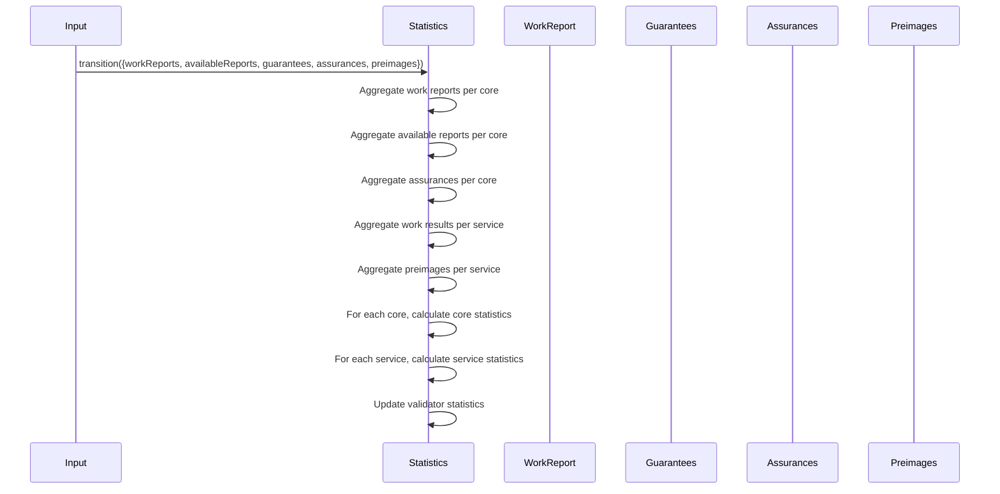

# Activity Statistics calculations

## Pull Request by @DrEverr

Resolves: #303

## TODO

- [x] Check every statistic its possibility to overflow


## Comment by @coderabbitai[bot]

<!-- This is an auto-generated comment: summarize by coderabbit.ai -->
<!-- This is an auto-generated comment: skip review by coderabbit.ai -->

> [!IMPORTANT]
> ## Review skipped
> 
> Auto incremental reviews are disabled on this repository.
> 
> Please check the settings in the CodeRabbit UI or the `.coderabbit.yaml` file in this repository. To trigger a single review, invoke the `@coderabbitai review` command.
> 
> You can disable this status message by setting the `reviews.review_status` to `false` in the CodeRabbit configuration file.

<!-- end of auto-generated comment: skip review by coderabbit.ai -->
<!-- walkthrough_start -->

<details>
<summary>📝 Walkthrough</summary>

## Walkthrough

This set of changes introduces a comprehensive framework for calculating and updating activity statistics in the system, particularly focusing on per-core and per-service statistics. The `Statistics` class is significantly extended with new methods for aggregating and computing detailed metrics such as refinement scores, data availability scores, and service statistics based on work reports, assurances, guarantees, and preimages. Supporting constants are added, and existing numeric literals are replaced with named constants for clarity. Test code is refactored for conciseness and accuracy, and unnecessary logging is removed from the test runner.

## Changes

| Files/Paths                                                                 | Change Summary |
|-----------------------------------------------------------------------------|---------------|
| `packages/jam/transition/statistics.ts`                                     | Major extension of the `Statistics` class: adds methods for aggregating and calculating core/service statistics, updates transition logic to use these calculations, and modifies how statistics are initialized and updated. |
| `packages/jam/block/gp-constants.ts`                                        | Adds new exported constants (`T`, `V`, `W_M`, `W_R`) for protocol limits and descriptions. |
| `packages/core/numbers/index.ts`                                            | Replaces hardcoded numeric literals in unsigned integer checks with named constants (`MAX_U8`, etc.). |
| `packages/jam/block/work-package.ts`                                        | Updates comment to reflect increased max work items (`I=16` instead of `I=4`). |
| `packages/jam/transition/statistics.test.ts`                                | Refactors test helpers for dynamic validator statistics, removes redundant assertion, and adds new state verification in epoch change tests. |
| `bin/test-runner/w3f/statistics.ts`                                         | Removes logger import and all related logging statements from test runner functions. |

## Sequence Diagram(s)



## Assessment against linked issues

| Objective (Issue #)                | Addressed | Explanation |
|------------------------------------|-----------|-------------|
| Implement activity statistics framework and calculations (#303) | ✅        |             |

</details>

<!-- walkthrough_end -->
<!-- internal state start -->


<!-- DwQgtGAEAqAWCWBnSTIEMB26CuAXA9mAOYCmGJATmriQCaQDG+Ats2bgFyQAOFk+AIwBWJBrngA3EsgEBPRvlqU0AgfFwA6NPEgQAfACgjoCEYDEZyAAUASpETZWaCrKNwSPbABsvkCiQBHbGlcSHFcLzpIACIAQTFJdXkAZVxqJHEGZAY0LwZvdPwMRGjIAHc0ZAcBZnUaejkw2A9sREpIABEKAFEpCj5Kzx8/QODEUIxHAXaAZgAWAE5+LFxmyAAxL2wAM23ZABkVRAB6XFluEmn++X9ufER1fBcNGDXbdFpaf0Q25CQHDxmGYABhmL3ckCUiAYFHg3HERRQGAYWyh6BgAHkOhiUDRmGF8JA+vA9k0PHcfvA1F4kvxtvw+tsvPgypBtk9ICQ0AxYIxcvkvNQouN0uN4AwXgA5QloT7qeBFXKQkhpeBeZAcnmYUjIZweRAXBgk+BReArNZQmFwhEYcFvOw5LDTEYSE1lKLUMmQACqNn2XFguFw3EQHGOxyI6lg2AEGiYzGOmx2e0OAhOZwuVxcx243i8x3mCw0Rn0xnAUDI9Hw9LQeEIpHIVHqClY7C4vH4wlE4ikMnkTCUVFU6i0OlLJigcFQqEwOAIxDIymb8bYGE4fjQrIcThckEaA+Uw802l0YEMZdMBjUGFOITAFGwGEbxzKM22xxF4jFWQ0uFDBmiQCDAsSBYgASQXRshXobdmGceRq0YWBtWkNw1ngZg7goUJENWDwAANmSIUgKHwtkKBYL18I0DRjhXIoyOYRRvA8CpkH8JipFoF4AGEnm+O4MFoM0iC8WQABovSIyMMCIew0jxdg/mKeAlCoh8MFSUVMkQaAQmgM1ZDIzB6HwjStK/HS9PGdY8zI7ZHwSIpEEksoEB5SBpKiPCkVzXBJN4EgwE/EhJJMnh7lwYKFNC8pKA8JRInqO0PG+HD6R8ojxSRMk2jZRybXYkg4LNZBHOQ2S6Eks0UWwYTZK9GEuRtOl0XwiyMnFRAyNKtJkVikL0B+ShCr3Eh2X8dAhPQbYaD4HzcCoFSbTC6aFqWh4WpyYZ1DaLxtmLIxgMsWIvDmwpigJL0lBRZwLo1ekSAADyw5sOVzAQaQYTk13lVCDGlchi0A6IS0vbhuQAazQHU6KeEhjkmZgrhOM0lCe39/xB47QIghsl2FRw4N3RCtUqxA0I8MmdRGbhBQYDxkIoWgD3oJHKGymlzvVSBWlNJ11DKJAPHwC4mwVS6JqJXJVPSBrHweIhyHoM0aBIh7pdhfBWnseAAC9pEgAAKb0AA5JO9ABGAA2C2ZgAJgt625gASnKKMFH6aRBPquSMDQNh6CYYo+r/Y2AFlYgADQAfTNyTI9jq3bcgRO44dhPo7j52XZeZJDWNbaxMknz8KQM38MksvEGTyvIGr70Hbr8KG+dsiMw8IhsGcegHORUaMBZXm8rwvLg5FNdlPGLkq3pYT/DESBmie2VRAwpUueUdUUs8/BI2+8Lg8W/BfCZIeOO0LBypQ2gAG5ljExrnNDsq2l7jk4MQSGRJyny1FwIWY9mgMEhrqSatx6ZREaHheAfB/aB05EESQuQlKHRAqdc6o0CDXVEIKcWzlWrPVelEd6MYvo/XCCaCmBgoDSiQihZA2CfKK39rgbA3xCEvSeG9PgH1yHsD+sgd0k04JKBeBiDAj9VaUH9r4DCdNirsAusqVUPNELPU6g1PuTlLpGwbqbOuDcbaGPLk3Ku5c25u2ER4Jiwltgmm4gBICNDwZQxhtIY4QgA7HE+vgEBEZuBgHHi/TGHAnGg3QXjRcTZCY7gQvSam/0IR2JrJ8ZA9ipCQHIKyYJmAw5MLWPhIggTcmT0xvZNUsUuQeSFqsdElpYTwkkFTFgq5QjhTQPYAu9jvrs1hN9CQuRggpTHs/PJYCSBhJofXaA+EuDhzQE9DCjgslTHaOop6i1SpdRyp0soTxIZgAhiA9xkk2ihGwZbe2ptixQHwgANTmTAfAaRfBIyuK1QZNJaDUCeC5ewKorqW3EsCe2YJpn4QAOox3Dk8hZSzmArPees+k8juG6mmkQ9FuzygHKOW40gZzAXYJmCCgA7PbW59doU2DhYs5Z+ICCvN1gbVquRfDa2DHgPczI0w4v2RQQ5txuHVSwH4mgf4iUXMJIscSlsACslKjB0I0WKBqpSw4ciyt9axkBbHGhIXwDi+AuL3x8rKYSo09SeH8I/G6eD0iZI1UIj2g8FBrgoqfZkrIOSUAonwCqtAaTqoqjqQ65gTpnSXBLRhhIfL2ruqNDZxCqy8LIdlAR4h/pQFiJ8KIWLsJRA1TMrgyLSLuzqV84I9crkGKmkHVp7AYgQjggipFay+AbK2SpLI/K8XHOhqQDQoMc15voAW5cYy1z13uaWjtZFam8irQRS2MdQUzGMtNFcTbogQiZUqMtnyZY/IIBQRAw7pm5qUOOrhhaG0hzydSmFc7kaUAXR7Zd9cZhropZuhtrZp27rWK2hlqzX2dtRZhbF4UJ3KXRAKw5A73EXtHdezkt7J0PunVCmONgX1XHfZWoZBFFgxwVfbP9LY2nNuA/SxFjKXlKgeKyxC7L+B4D8jywQcG9l4uFdhUV/AxAqnPaDbGLiwBGCQ7DLxCZfH+IQ/ik5Q6/xhOxpEyCBMYJE3gq1RJ1CW10fbeB1qCHcTFWQHosC+E3bspZPzKikKDlWAJSQMit0fhL0GNMMgvNuAnqiNsCi+I5hAutnaVAiSUBFSZN2BzPlt3ToaVSH+CXn5UFVssKi6gLNkV4KLEaElyjuV5IPLcMVkDRD4iHDLys9zyHwmBAAvMY0ovUZ6tSq+ly+UCGvNbmPhaIUpCQvOaHwbV/A+AHhGIKZsBTIvdcy2xPVigDUq3NKgFJ4acYYOjQQgpCVcGJpjZwlNk3PCfQzb9LN1DaGEn01dZh8AlbUHYYbDkCb8GXWTdww1F3+HXaoXFERq975FEfp0xLoRkvXjkmlmrl8cLmgIjl5g3UeAUTFmcX+hSnOCpc8ptzjBBSeeW9gfz0FgbOIgJJgw0mPGydOBteURQPwKU6j+Gg4xQnhJ21EqCzZYK6dJqGpJawuehGaF4MW9dirwlkB1b86Plv+G2NyU93lCT4xiVNdA/Q0DxM5JhbHDzj2/IoIrnSZFBAiDEMgWgsh4HinZfIAQlQSHI+lt883ChHyhCC5RfC4gMCyB4shM0+dRA9RDh1xCcFJgu88pouSDwnpG/l52W3f4XhgU99EEgdwPKJNKBL+w2ActhRGLQR8Pykvk6+kKIabRsISyQqIb+DVVienwp+Dn56QoaF70rjQgVXTa3R6MXIyB8L5C9muS3XUF2DGNVxF4V6WeyOLuibJTeRqt+WxaqB414ZekWpgTarei5XWJKSLvoQe/s+HwPofOk4zsP8GuaP8pE+T55jP9/7AC+WQ1Erw0gVMoufwmEFETqigLSyIws5AnmHSnwuuZo3+vgg0N+zuLUZoXoBefivIUWEu226CUaX2saOCt05Bp2v2qa/2V2lC/0gMJAvOEmUmrmJwjOZ+y0EsbO2kXUPO6mJ0/OWmZecSemEBlM9cQB6OHmcGD+/BnO6OyEMgJAvmLChceSj8z0NAQkmuSItUakSgqiRa/IBQLUHSxE/gRAyipMJ+4UzeroDM8kihMg7uVYWAZm/GkqTe7CmADM/yXcd0a4ah/y4UgU68NMOhsIPa56oBGOJAY+OsDwmEkQSI6B+sth9IXyssp6LhlkOyUsnSO++BNSy+BekCDQ8gnSHc9A4UORAW46xu1R+u/Y/gyirQP8QeLgsQiAVglA9yZup61EyqJArIvAyCNAeqKosAigQi8UHwaG2C8YfkLSk0L+Oyei20AoQofE/gMhNmoqhhP8quZowoTAHCWxZhs2JANg40ZxyQFxJAexbmtm00J6nSaAgyaoKgaotI0I8MlmM+1xQoHQsQjx8MLxhxFavI4w/SoQAg2sQk2QwCHeckMMl84w7qE82ekAyQGEPxFAW+jh4o+oj+OkeuLSmEeAUQronSwJeQ5hJAyQlAThzJ5Ji+rkJWSIc0m+/Y7KyAbAqwcxV02xTJIw9i5A1GAJ3wYUDA+QiKNx9gTx/yRQYA3BiA2w7QMp0gq09A+WroaGOp/yiALAIs9Ibk4ovI1qdM3IJAsxXgg4LqdS0AWIGI56RgsQVhJANhLUUuMuQpsxtA8xk0qsFE1eDM9A2CRAFE5OuKgqtM6KYU3xgon0qU+B2EYRPwfh/U/yXh0g3gPh4R/gkRhs+4J+HIJJzhqkAi9ilAcR7geUMMMZPp90GOzEzhcEIY52zgVAsgyAkMJAsgvWnsIsfAVZHgaMpJHpBgEI3R5+G+jEMxig5Qgw5OjRV03IDM8I9cXx2gqZkQdxr06O4U2CUIi02AYgb2o59aAKFAbJ+Rfe5ElECWAB06A+kAYEoQNUHESkXuuRlZHJvaUs8moCJc4og5PhERcEOokkQRS0NAupt5lQDgS0ARKUWA6g6A3pvphsHxPA7QTxt5MuE5t565Qo2QJ+GxvaDhrJpJj5Su6A8pTwvsj8jQZoEg+AaJXoO+Yps2regZcxO8pF1FZUFOUxzIosTez2l0C8IJguQFMg3KtA+Ahsg8oQiKMUXoTwz2ZoSoXZFCsIhsRsNIg5EOe42AckHIJq9Zz2gYucRgGIfQ7KJcawD2YZHZHgkOLAgUzQKkmSQWAcYxBybImo8lP84U5Fweckxh+5woilBFU29h00E5rkHsOhZADwmSDRyiyBY2ZAzh2C+WBATAvgzqkkEC3IqWawo+CoyR8ikQvClAYAOVeRolfmAWJBkamCJ2B2yoVBbZP2d652fCDBgiJYoEY6GOkxNiy5wZV07Uil7mJO/4kAug9cfFux8MMhRsCGR53CXAeOkM+12EkAAAPrzHoZKVVOgCmSoIeRmappAEdSdbgAANoAC6yZ+591JAvRqF/h0g+GlALsXALxBxBga1dym1NAdx11EJ/gLxu1Byr1h1KNj151l1Sg11tAoNkAAA3igFBpmcDRQPfNEdsgwHxH7qTeTZsjEQ8AwPiQbLTehseazTYTXG/FwGoDJLgPfAIDXpEMzZMmBh8gAL74SQ3rUMk7E0BgkI3PHwxGx7k/FpkvWPWhjPXo2vSfV41lpS1Q0bXyXMl0UMw7V7UFlnRa0a0OBnSfUBQlkwVA3WBO3uKIDdD02U140sn3mkkQ1G2y1Mlw0PFPG+1snI2Cp3F21PW22Fl61cCE2nFSnsDU1ris3J2KJrgADilQ3o3Ne4ula498aKJNYtlAdN3ajNad64ZaldDN4oItrNsGpNkAkt0t0NJt8QCpTJit4dpJRseNhNTANN5dZNkAnNPNRdoQ7dgdMNJAEi0AG0WpFuYdZtJAg9idvu6dY998k9hdfNbdhtMt89Vg0BNZtAfd69Rs0F7tXAZ9JApZHtXtPaQ929tdHa98zGoth6s9MtMM1hQoGtr0/RFASN8FeSoRXA2d3cCFoRntVd4oeNCy3AwALxue6MkkwD3Cegx9dyADrZNAsQd1aZr1fRlASNqtB5txmtaNUdj1CdqcaAqD6DehT0WDOt3Cn1uDHdu5LZuF/1OZARoDlD2ZaFLtgj4jz9iDDAeN6w8AT0dAItsQrRwAZaPDgdBDuFcd1toD/dDMRsEDIRLtMDwRiF0jDdsj8yzDwA+jJAYEtAHD9DMd3DeDfDgDNAD9T9ej19t9Oo99btOoCDljyDNjdjDjkkXjztFjlNPD0y4cq2dZ9AglMEMlr2k0iE85PBRQRsZofkXAuefkeNnFqk0e0hS1xOKFV0gaaRFqG+SoeT3K+WWODWVDv1ZDlG2CUVaxXlKV69DFFJW5LFIkYkh0UACTdiDi01gyUxKT9cpAuAO1iAzI64BkbAyQKzLsZTi1rhy1VT2C/gbCFAWAs43TMECVNu3YMJG1b5uAX+4gMsBs9AdJ9ci0sgvRoDgx3uwxt52CNUqIBEKplGPe696O7VuBPkhz7CdWlzYgVOoMLi54E4P0s8c49Y0S0EVGbYG4W4Omu45Zg4Kg/8o4p4hgyLK46gMcqkiAMc/groYxdAMcIop1pYBgyLtA8qMwMwCqaAMwAgXLaAZKtApsDApsAgVy1saA9sZKlsIrJA9swI40cwZK40lswr8qpLF4UAFLuAVLwZtLiRbojLlYpLQAA== -->

<!-- internal state end -->
<!-- tips_start -->

---


<details>
<summary>🪧 Tips</summary>

### Chat

There are 3 ways to chat with [CodeRabbit](https://coderabbit.ai?utm_source=oss&utm_medium=github&utm_campaign=FluffyLabs/typeberry&utm_content=349):

- Review comments: Directly reply to a review comment made by CodeRabbit. Example:
  - `I pushed a fix in commit <commit_id>, please review it.`
  - `Generate unit testing code for this file.`
  - `Open a follow-up GitHub issue for this discussion.`
- Files and specific lines of code (under the "Files changed" tab): Tag `@coderabbitai` in a new review comment at the desired location with your query. Examples:
  - `@coderabbitai generate unit testing code for this file.`
  -	`@coderabbitai modularize this function.`
- PR comments: Tag `@coderabbitai` in a new PR comment to ask questions about the PR branch. For the best results, please provide a very specific query, as very limited context is provided in this mode. Examples:
  - `@coderabbitai gather interesting stats about this repository and render them as a table. Additionally, render a pie chart showing the language distribution in the codebase.`
  - `@coderabbitai read src/utils.ts and generate unit testing code.`
  - `@coderabbitai read the files in the src/scheduler package and generate a class diagram using mermaid and a README in the markdown format.`
  - `@coderabbitai help me debug CodeRabbit configuration file.`

### Support

Need help? Create a ticket on our [support page](https://www.coderabbit.ai/contact-us/support) for assistance with any issues or questions.

Note: Be mindful of the bot's finite context window. It's strongly recommended to break down tasks such as reading entire modules into smaller chunks. For a focused discussion, use review comments to chat about specific files and their changes, instead of using the PR comments.

### CodeRabbit Commands (Invoked using PR comments)

- `@coderabbitai pause` to pause the reviews on a PR.
- `@coderabbitai resume` to resume the paused reviews.
- `@coderabbitai review` to trigger an incremental review. This is useful when automatic reviews are disabled for the repository.
- `@coderabbitai full review` to do a full review from scratch and review all the files again.
- `@coderabbitai summary` to regenerate the summary of the PR.
- `@coderabbitai generate docstrings` to [generate docstrings](https://docs.coderabbit.ai/finishing-touches/docstrings) for this PR.
- `@coderabbitai generate sequence diagram` to generate a sequence diagram of the changes in this PR.
- `@coderabbitai resolve` resolve all the CodeRabbit review comments.
- `@coderabbitai configuration` to show the current CodeRabbit configuration for the repository.
- `@coderabbitai help` to get help.

### Other keywords and placeholders

- Add `@coderabbitai ignore` anywhere in the PR description to prevent this PR from being reviewed.
- Add `@coderabbitai summary` to generate the high-level summary at a specific location in the PR description.
- Add `@coderabbitai` anywhere in the PR title to generate the title automatically.

### CodeRabbit Configuration File (`.coderabbit.yaml`)

- You can programmatically configure CodeRabbit by adding a `.coderabbit.yaml` file to the root of your repository.
- Please see the [configuration documentation](https://docs.coderabbit.ai/guides/configure-coderabbit) for more information.
- If your editor has YAML language server enabled, you can add the path at the top of this file to enable auto-completion and validation: `# yaml-language-server: $schema=https://coderabbit.ai/integrations/schema.v2.json`

### Documentation and Community

- Visit our [Documentation](https://docs.coderabbit.ai) for detailed information on how to use CodeRabbit.
- Join our [Discord Community](http://discord.gg/coderabbit) to get help, request features, and share feedback.
- Follow us on [X/Twitter](https://twitter.com/coderabbitai) for updates and announcements.

</details>

<!-- tips_end -->


## Comment by @coderabbitai[bot]

_⚠️ Potential issue_

**Service statistics are never written back to the `services` map**

The loop re-assigns the local `_serviceStatistics` variable, but this does **not** mutate the `Map` entry.  
As a result, `services` stays unchanged and downstream logic will keep seeing stale statistics.

```diff
-    for (let [serviceId, _serviceStatistics] of services.entries()) {
+    for (const [serviceId, _serviceStatistics] of services.entries()) {
       const serviceIndex = tryAsServiceId(serviceId);

-      _serviceStatistics = this.calculateServiceStatistics(
-        workResultsPerService.get(serviceIndex) ?? [],
-        preimagesPerService.get(serviceIndex) ?? [],
-      );
+      const updated = this.calculateServiceStatistics(
+        workResultsPerService.get(serviceIndex) ?? [],
+        preimagesPerService.get(serviceIndex) ?? [],
+      );
+      services.set(serviceId, updated);
     }
```
Without this fix, any consumer of `state.statistics.services` will observe incorrect data for the whole epoch.  
Please patch this before merging.  


<!-- suggestion_start -->

<details>
<summary>📝 Committable suggestion</summary>

> ‼️ **IMPORTANT**
> Carefully review the code before committing. Ensure that it accurately replaces the highlighted code, contains no missing lines, and has no issues with indentation. Thoroughly test & benchmark the code to ensure it meets the requirements.

`````suggestion
    for (const [serviceId, _serviceStatistics] of services.entries()) {
      const serviceIndex = tryAsServiceId(serviceId);

      const updated = this.calculateServiceStatistics(
        workResultsPerService.get(serviceIndex) ?? [],
        preimagesPerService.get(serviceIndex) ?? [],
      );
      services.set(serviceId, updated);
    }
`````

</details>

<!-- suggestion_end -->

<!-- This is an auto-generated comment by CodeRabbit -->


## Comment by @tomusdrw

Can you call the constants `MAX_VALUE_U*` and keep them private?


## Comment by @tomusdrw

Please remove. This is part of the chain spec.


## Comment by @tomusdrw

```suggestion
      /**
        * Core statistics are tracked only per-block basis, so we override previous values.
        * https://graypaper.fluffylabs.dev/#/cc517d7/190301190401?v=0.6.5
        */
      cores[coreIndex] = this.calculateCoreStatistics(
```


## Comment by @tomusdrw

This is incorrect. We can't assume that ALL services are already in statistics. There might be some new services coming in and others being removed, so we need to take the list of available services from the state.


## Comment by @tomusdrw

While it's not wrong to compute the `Map<ServiceId, PreimagesExtrinsic>` it's not really needed for anything. AFAICT we want to get two values:
1. Number (count) of preimages per service.
2. Total length of preimages per service.
Formula is here:
https://graypaper.fluffylabs.dev/#/cc517d7/19dd0319dd03?v=0.6.5

So instead of introducing these high-level functions I'd just go straight for the calculation of what's actually needed instead of creating unnecessary arrays and abstractions.
The closest we are going to be to the GP formulas the easier it will be to spot the bugs 🤞


## Comment by @tomusdrw

So according to https://graypaper.fluffylabs.dev/#/cc517d7/19ca0119cc01?v=0.6.5

you should have two inputs to the statistics that are calculated earlier: `W` and `R`.

We shouldn't be computing these things again, but rather use them from previous STF parts that already have that computation logic.

If these things are not available in JSON test vectors, then the calculation should be extracted out of where they original are and passed as input to the statistics STF.


## Comment by @tomusdrw

```suggestion
```
no undefined filtering!


## Comment by @tomusdrw

```suggestion
  private agregateWorkReportPerCore(guarantees: GuaranteesExtrinsic) {
    return new Map(guarantees.map(x => [x.report.coreIndex, x.report]));
  }
```
Seems that the whole function could be just simplified to this one map.


## Comment by @tomusdrw

Seems unfinished?


## Comment by @tomusdrw

```suggestion
    return {
      /** Number of work results is bounded by `MAX_RESULTS` */
      refinementCount: tryAsU32(workResults.length), // ToDr: why is it U32 if I=16? Could safely be just U8?
      /** Total gas used during refinement will never exceed `2**64` */
      refinementGasUsed: tryAsServiceGas(workResults.reduce((sum, r) => sum + r.load.gasUsed, 0n)),
      /** Each result can import/export up to `MAX_IMPORTS` segments so we are slightly below `2**16` */
      imports: tryAsU16(workResults.reduce((sum, r) => sum + r.load.importedSegments, 0)),
      exports: tryAsU16(workResults.reduce((sum, r) => sum + r.load.exportedSegments, 0)),
       /** Each result can have up to `T` extrinsics so we are below `2**16` */
      extrinsicCount: tryAsU16(workResults.reduce((sum, r) => sum + r.load.extrinsicCount, 0)),
      /** Each extrinsic can have at most `W_R`  bytes, so we are below `I * W_R` i.e. below `2**32` */
      extrinsicSize: tryAsU32(workResults.reduce((sum, r) => sum + r.load.extrinsicSize, 0)),
    };
```

By keeping the calculation and explanation close to each other you allow for easier verification of these assumptions. Tu further underline that `WorkResults[]` is smaller than `I` you could use `KnownSizeArray` for that.

Additionally:
1. Assumptions like `I * W_R < 2**32` can just be test cases to make sure that they are not broken if the constant changes in the future.
2. Instead of using GP-const names directly in the code it's better to name them properly and avoid putting them into `gp-constants` and rather keep them closer to where they belong (i.e. code part related to the chapter in which they are defined, etc).


## Comment by @tomusdrw

We should rather make sure that whatever the result is it fits into `2**32` because our assumption is that the upper bound of whatever the calculation yields fits into the `U32` type.

That should be a test case and not `check` here.


## Comment by @tomusdrw

I think that's incorrect. We can have up to `numbersOfCores` available work reports, no?


## Comment by @tomusdrw

Looks very similar to `calculateRefineScoreService` I think duplication here could be avoided.


## Comment by @tomusdrw

The input to this function should rather be `U16` instead of `number`. You are risking incorrect usage of the function by allowing a wider type to be passed that you inside the function restrict.
If you require that `U16` is passed here the caller knows that it has to fit `U16` so you don't need these extra assertions.


## Comment by @DrEverr

It iters over `workResults` multiple times. I'd prefer to stay with one loop that calculates all this parts.


## Comment by @tomusdrw

Why do you think it's an issue? I think the readability is much better with the simpler approach (less code = less bugs; easier to explain why it does not overflow) and this is most likely not a performance bottleneck in any regard.
It's also pretty much 1-1 mapping with GP which is a plus as well.

I'm actually curious now what the benchmarks would say :)
Your approach requires creating a temporary object (garbage collected) where you store the values that is later disregarded. Calculation requires then accessing the heap multiple times (writes) at every iteration, while the `reduce` stuff could easily be done on stack.


## Comment by @DrEverr

We need to wait for updated vector statistics, bcs currently they imply that when there is no `ServiceStatistics` in `pre_state`, no statistics are calculated.


## Comment by @DrEverr

Pre-aggregating is an optimization step. It might not be necessary in the current state, but it allows the code to run a little faster.


## Comment by @tomusdrw

```suggestion
const MAX_VALUE_U64 = 0xffff_ffff_ffff_ffffn;
```


## Comment by @tomusdrw

Ideally we shouldn't be materializing the extrinsics. `incomingReports` can be created from the `guarantees` view (i.e. just materialize the reports).


## Comment by @tomusdrw

Why do we need the entire `Extrinsic`? Could we extract some smaller stuff as input?


## Comment by @tomusdrw

```suggestion
      for (const coreIndex of assurance.bitfield.indicesOfSetBits() ?? []) {
```


## Comment by @tomusdrw

Are you sure you can have at most one work report per each core in both of these collections? Could you point to GP references which ensure that?


## Comment by @tomusdrw

I'm not sure it's enough to iterate over services that are touched via `incomingReports`. GP specifies potentially more services should be updated here: https://graypaper.fluffylabs.dev/#/cc517d7/195f04195f04?v=0.6.5


## Comment by @tomusdrw

> allows the code to run a little faster.

Citation needed. If your only argument is that it's faster this should be proven via benchmark.

Performance has many different flavours. Sometimes creating extra stuff that seems to introduce better performance makes things even worse.

Imagine this:
```
const services = [{serviceId: 1, serviceData: ...}];
```

Which code do you think will be faster for this very specific case (1-element array).
```ts
services.find(x => x.serviceId === 1);
```

or

```ts
const serviceLookup = new Map(services.map(x => x.serviceId, x.serviceData));
const service = serviceLookup.get(1);
```

https://jsperf.app/vibasi/1/preview


## Comment by @DrEverr

we still need  whole extrinsic in as input in statistics


## Comment by @DrEverr

we need
 - extrinsic.tickets.length
 - extrinsic.preimages
 - extrinsic.guarantees.credentials
 - extrinsic.assurances.validatorIndex & bitfield


 so its quite like almost whole extrinsic.


## Comment by @DrEverr

I've put them more in line with GP


## Comment by @DrEverr

added notes with gp links


## Comment by @DrEverr

fixed
