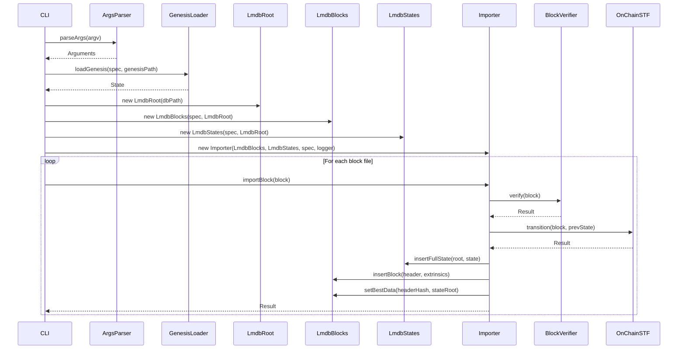

# Persistent DB and new CLI

## Pull Request by @tomusdrw

Resolves #311 
Follow up on #308

This PR introduces a bunch of things:
1. Introduce STF into block importer pipeline (related: #45)
2. Implement very simple (naive) `StatesDB` and LMDB backend for it.
3. Initialize the database with Genesis state
4. Load Genesis state from JSON (compatibility with JAM duna test vectors).
5. Re-work CLI arguments parsing and introduce two commands `run` and `import`.


What happens when you run the client:
1. We attempt to open the database for given chain (each genesis root hash has different DB (loaded from `--genesis-root` CLI)).
2. If the DB is empty (genesisHash=0, genesisHeader=0) attempt to initialize the db from given genesis state loaded from JSON (path via `--genesis=`).
3. After that we go into regular node operation.
4. When `import` command is run we read bin/json blocks from files and send them to importer worker.
5. Importer is reading the DB as well and attempting to import the blocks on top of what we have in the DB/memory currently.
6. When block is importer successfully we update the blocks db (storing the header) and states db (storing full state under posterior state root hash).


## Comment by @coderabbitai[bot]

<!-- This is an auto-generated comment: summarize by coderabbit.ai -->
<!-- This is an auto-generated comment: skip review by coderabbit.ai -->

> [!IMPORTANT]
> ## Review skipped
> 
> Auto incremental reviews are disabled on this repository.
> 
> Please check the settings in the CodeRabbit UI or the `.coderabbit.yaml` file in this repository. To trigger a single review, invoke the `@coderabbitai review` command.
> 
> You can disable this status message by setting the `reviews.review_status` to `false` in the CodeRabbit configuration file.

<!-- end of auto-generated comment: skip review by coderabbit.ai -->
<!-- walkthrough_start -->

<details>
<summary>📝 Walkthrough</summary>

## Walkthrough

This set of changes introduces a persistent block and state storage mechanism to the system, enabling the import and management of blocks and their associated states. The update adds LMDB-backed databases for both blocks and full state storage, refactors the block importer to perform block verification and state transitions, and updates the CLI to support importing blocks from files. The state serialization/deserialization logic is implemented, and the block generator and importer workers are modified to use the new persistent storage interfaces. Related test utilities and JSON parsing modules are added or updated to support the new workflow.

## Changes

| Files / Paths                                                                 | Change Summary |
|-------------------------------------------------------------------------------|---------------|
| `bin/jam/args.ts`, `bin/jam/args.test.ts`, `bin/jam/genesis.ts`, `bin/jam/index.ts`, `bin/jam/main.ts`, `bin/jam/package.json` | Added robust CLI argument parsing, new test suite, genesis state loader, refactored main entry to use parsed arguments, and extended main logic for database initialization and block import. Updated dependencies. |
| `packages/jam/database-lmdb/blocks.ts`, `packages/jam/database-lmdb/preimages.ts`, `packages/jam/database-lmdb/root.ts`, `packages/jam/database-lmdb/states.ts`, `packages/jam/database-lmdb/index.ts` | Introduced LMDB-backed storage for blocks, preimages, and full states, with root and sub-database abstractions. Updated exports. |
| `packages/jam/database/blocks.ts`, `packages/jam/database/states.ts`, `packages/jam/database/index.ts`, `packages/jam/database/package.json` | Added/updated in-memory and interface definitions for persistent state storage, updated exports, and dependencies. |
| `packages/jam/state-merkleization/dump.ts`, `packages/jam/state-merkleization/serialize.ts`, `packages/jam/state-merkleization/index.ts`, `packages/jam/state-merkleization/serialize.test.ts` | Implemented state serialization/deserialization codecs for full state dumps and raw blobs. Updated serialization logic and tests. |
| `packages/jam/state-json/*` (multiple new files) | Added comprehensive JSON parsing modules for state, statistics, disputes, accounts, and related structures, including tests and example dumps. |
| `packages/jam/state/test.utils.ts`, `packages/jam/state/index.ts` | Added test utilities for state construction and updated exports. |
| `workers/block-generator/generator.ts`, `workers/block-generator/index.ts`, `workers/block-generator/package.json` | Refactored block generator to use persistent state and block storage, updated constructor and logic, and dependencies. |
| `workers/importer/importer.ts`, `workers/importer/index.ts`, `workers/importer/package.json` | Refactored importer to perform block verification, state transition, and persistent storage of blocks and states. Updated main entry and dependencies. |
| `bin/test-runner/w3f/*`, `bin/test-runner/common.ts`, `bin/test-runner/package.json` | Updated test runner logic and test types to use new JSON parsing modules and removed redundant local type definitions. |
| `packages/jam/database/blocks.test.ts`, `packages/jam/database/states.test.ts` | Updated tests for new persistent storage interfaces. |
| `packages/jam/database/state.ts`, `packages/jam/database/state.test.ts`, `bin/test-runner/w3f/common-types.ts` | Removed legacy in-memory state database and redundant test types. |
| `packages/jam/transition/work-packages.ts` | Refactored work package executor to use new state database interface and retrieval logic. |
| `bin/jam/.gitignore`, `package.json` | Updated ignore patterns and workspace list. |

## Sequence Diagram(s)



## Assessment against linked issues

| Objective (Issue #)                                                                 | Addressed | Explanation |
|-------------------------------------------------------------------------------------|-----------|-------------|
| CLI to import a series of blocks from `.bin` files (#311)                           | ✅        |             |
| Persist blocks and state in the node (#311)                                         | ✅        |             |

## Suggested reviewers

- mateuszsikora

</details>

<!-- walkthrough_end -->
<!-- internal state start -->


<!-- DwQgtGAEAqAWCWBnSTIEMB26CuAXA9mAOYCmGJATmriQCaQDG+Ats2bgFyQAOFk+AIwBWJBrngA3EsgEBPRvlqU0AgfFwA6NPEgQAfACgjoCEYDEZyAAUASpETZWaCrKNxU3bABsvkCiQBHbGlcABpIcVwvOkgAIitKRCQaDFxIABEAIXQMenIAd0gAYQAZAElQ2PtsAWZ1Gno5SGxESgiWFtoKfPC0Wi7pVuQkBxJIMwBmAEYpnPoAM3wffHzkbG5+LFtxiYAGAA4NGFgx5m0sJlSKeAE8eHwMZHx5iIRkbfgMBi9sJVexz40IhUcQPfgvXAnSAAZVw1DG0Coj3U9ywADFsF9QVgABTQ6BogCUKFS+H+kAEXnwDAA1ihmNx8BQaHxuPBuCQvJ8SOFIQCGdE2KlqKjweh7PABWMAAaw+GILLSyD5dSwHKQEoAWSyFLQtLItF6uXJnxRaC5AC8RWDnuTaNQVGhWsrVeSAOJkaSoRBwmhHACC/RRD3NXlk4XUJNwFEU2AY0nJDDQ3BU8C5uHkBEgVL67s9SWQPvhkHmMeY4oAUtCAPIAORLaZ5kDIDmuGCICgZIrU6fkKshkAr/s1kFomLQERCkCkYiZiCObih23NiDJ/nyTJpyD5nbOuTAXPIUco8z1YxxpTKxOcREc7B4ziS7bmUZjY/j243kAKu8wtEQXDShQmJKn+kDSpKjLMtKRwAOonFgO7fPA97AY8EZpNQNAMrg25kvgHJYBO9pwgITpjIsfA7ogHIMPA8woY0VK0gwsDnOE+QnP4zZ6mqpDkAWfj4PgaRsYgapMBQ/g0Q8/7tOKtD0fMlD3iRjrOjmSj0BI8ATju0oQPxXqIGAMYiUql7oBQt5CpokBlBCUJqWRzqoCQOHhigaSmuI5rwBaCY7s55HNE+HY7h6Aner6YyaTEpYsJWNb1gx0T2LR9GMRSmZQgZxD5kgAC8oHWXeqQBvMLIkmalrWhgvJQsh968NSJB0Mg/ZqhgTJnL43V/ARyjYvOi4ypBTK4EqTBOMa/h9DInzOPITKDslFLMVuJZlg20TIGBrS5NuJzllmmD0lBVUbhQNKUEc7jDAyE1tHNclBQ6LljGBWHudwuHyeNzLrdSm1ggQGy2kh2BSfeRY0PYBD+PQnx2u9IVgWwzBMrIRwAKqMlgDgMB+iDzN4QO0udE0NWMlLA8gwWuWs3AkTEnXkrTFMnH0lBGvQ1ExfTqOM80zPwvQbM7qTPjw8WmJKFRUKMj6lD3HwsNjGZolOrAd1vNYdhkGxXyBYriTJGQ8Yvi0qa9mKb2kWjxqQTGUhHWMlmURSJC4FVLRtICyhiKiusUd4vhKHCaZ7caTB/KxmCkHt3FoBI2heCoaXUJAsA+9wAEAPT50Qqo1Bo0352iPzzPMsglCoiD5xmHICJQLj554Pj5xMACsUwaEY+jGOAUAGmKaB4IQRkgjE022VwvD8MIojiK72UKPLKhqJo2i6GAhgmFA90oNHOAEPl5DT/Qs/sFwVCFA4TguGvsfKKo6haDog9D6YBgaMX4hEG6v4DgBhYhgIMBYSA/oyjnyGjEB+Zwn62nju2aQo1wJ/xRIApkJAlSpTGPkJ0kBMaKQYjEJo/huDpzos+Hc8BsGIwfAOaUagMD5yEGgZg+cOZbjALQAQSoJZfh/PQoBMQUyQgAuBBmuCXwsM+Owzh+cZEwWOKgFBpAKQxm5o8ckiAmAcjFKInBCxGwyHkMYts4UoTsHgNxaUKjRx2OXljdAaQdya2zCQKQvgvpeFXOSBxQtZGKX8LOJ+nwkh/HkWwjhzBpQRkeDQXMtohAtG8gwz41ixg0VEJlBg4EeEmX4Xgxs/A+ChJcU/OWbQYmKPiUcWs+E+R8A0YFMkdCGFjAkSyXRK0fTATEFDAhKliHc37kYCBlh/ReBZHVPCdpRDpxBKiJ4LwSAAA8LoxBWp4Sk8ACm2PEGggwTTyD9zAbEAeP9WH1PzjeecNAfQaFwiAy5UyoEwKnmLaoj9lovDaYgRcqAfxPLSA4dQFEVo7ksjeMqaQUwUFaHwKQ1wyFuy9mxHSK0Ia5URa0f01lEB4MxEHMEYF/DpwaL+fch4ASpBPGebM+Bi4MCOGUNISgGICXFCcLwHI+DSnxbI0mWJRRZk+BIfAN0rI2Wao+LJLoBwTg+kwnWxwxhguQEwVFo4SCnm8JhUqtkHxIqyeEFsUNFVBX1ePWZNKkbIGlDYECSq1SbNotSrldq0gEWGiSb4vxFVGUEprcIMi1W80YGxZGuS6IMSTNidlaRU5chZsgfFirbSfEUjpMc5p+C/VWdUVi6AnUQHjp8MAcaEngUMgVYl4Q8r8LABI2AtawJ5RDUgUywlJrhEuAxCgdRaFsXcScZ0fri2STCVEZaqLrh/G9Ya6O9Aja0DSm29AtA0k+lsvODV1RIWTh9BiiCj1oIOrdcQw17I0r4NlfCxA4RUX0VkNasdfhOQiikGqpOYwZ3LzDDwfwDENl0GTegfxZJPiBqUMgZgt6qFjHIEQH9mqQhHSzk6ZF47umPjaJCGMqxmxSTnJsZo5AtnLxniwPc/5wiYjCSyjA/kdlFoeM+kkqb4D0CnWCVNwQuNgUxB6mj9BNnRgnHC/dIdSMxj4GwRAiA0CJysgBk4+oFgrUA2IASq7GDLPUNjQ9WrQpjCUCQDYgRsB+QzNG0Qm1PbCvoNJFdL4mlKA0EIPaynKDjuI8gT2rcdOyWDOhZsjwrXPhjLcH004/IkVFLaWFxr5VmufFSVlEzzDTNmUNYtWYbXfGcPMsUHqnp8dZDULkhzUgohOVAWsJBChgqPXDPoWkSSFIUXE+5RKXkhBecShQwpTTPkQ7Mu9GH4tJiGCWaFeKCOEqICN0VZKiLGksrPMCmbnwtyxarC54CDAQDAEYW5fWHnDbeeAyB0DYGX1+Yg/50aE4nP9N+FrMBZAcmhAwa4v1iGxjSnUq7A3cJKlQICN8cYYhZnXWlHbtLuSPpNXtjsnsJyWQIEsb8nCYixCbiQFuUlsZVA5Xq7lCYyCOCCytGk3V8gXBjQTDKCays4mlAAaSZxgIorPoS0WlNeGOdG/zIC50UcXuQRccVdMu+1gmEye0rWz0Q4Ru3IE8WJWAUaI1trkyQ7w3SXa8YTMRb2acYh8o2EplTmiBmKvgwDm4irraaLAvxx4Ey4AAZwSWUl2I7MWK+D8eDpqwr2DYow73hY4xqiIXlNX1bhdNogC2tttau0Nt7eZKNOeopre2qluVqQ1hR/0iOyUyQlRcgEFQFwkGHDcAup+MkyP/yATQkqHEivcCi/oOei6tbOKjOHxNUCQZg8+HkHqeMv0gtlLbQev34FhUrbW0H5LFBWIhGnhmhV7Zw1IAkaxRVH0+OIUajLw0L4eNJdHVnbqlGxNiBiDJ9g2v3LnAmQACU5AFUDzFU4wDXDxlGFWrA4wwDwX6TQGUmAwxxJFzV41s18Dj2vRCz4ER3NTkRw38yaU1BwU3yVCzEtW4hfyY1EBYzYyq2bA2Sk1NQJxZH/RA2kHvHgKqgxyNxBzGD9ieBTCCE1V+xV0WzGC1yEhEmzm1hfDIEog/HhmuDEASzTTqgozV3SlEBUKEyOCsGoFgFYOkiWCkFc2/RXk1TJAnBajzXIRCkN0PQq2ZHhxEKdRWyfVAmNFlBjzoCgOGiVBd2uBbj0WjDjFwGGT4zwE8F9UcnwyRVuiMGrFRVDGpmBzHDSgtmTAcCpQTFi3SWKHKDR3SyjzZgfzqnDVtVvWPxfE7ycWrhUnqzUM9h3GJ1Jyflxy8Byw+RmTmX9SKyciWVK39VtEcOpV2RqwOUi0iBQiBVOygX6BiFp3LB5z5wF3OCF1EEEVdAxlJydWgE+FkA8KHwxB8BglmMDC60uCLFSHAj/wAFESgrAlQndnwAi3dnxLIPdPpjQ49+4oBziFiMBHBwJpcZpaBNiBxtjEhwIXUYC5EygL1Jpfi5iuticoNdInVoRvDaBfDVl/DpBXdWEOxZ4wRLI49AItds8tcbA+1s81d1iGAO1PD+E9DIRTi/j5j6BFJ9FrgR0flMRxURC0Sk83D91YDWQCN6BS8n1wgW8LpFVnVXVO14SR8HURp2SusRj4pt8wQhVlsiUcRPgoiuBniiAABtAAXXCEpRZNgGNOjCyUJC4BFK/1ILJGFXyLKEKPLyRP+Iky2Uq2AI23XwI0xOcB8OgMQBxAeS4GrzqGeT0LiNoE3ytM5BtLtKsUdJhCxJxM41dMj391YBtAjOOyuVOxuV6yUS1xu1ATu2mS+U9CewQSWjFEBSME+x/GN1B0u0rIbWGyh2GCuFjHjD5k/RGL2glHbHvW1KwGlE0kimMlUSPnW2xAiDQBunHJ4Q0LjXyTUMEBEGUK5xrTtkFOlFWM+HpJFxfAnAfS3RNMgC5yz2vEPyoDYBYMgxegxQfSzh3GLikCwFvNkC+FgBjG6haGAyIRxgJDAH2EnAYPCGFQxUuBSEwmQCrDrCjT5AuAeFRT+khFQDQvrEBEsPAjlBoCVD3OXlCg/QgIIzRDLArFXFhOXNFGmlYVZldGvLDhljhjHAZHsD3zOEgG+WpSaGlCli8FIpIHSEcG4DopYAYoeBxDjUJEXKhGYrBH8DCIoF0Q8WkEqI7FlBinIqXjEB4LSP5Dby+2JmbLuHTGmK2kSmlH6hIA4HmDWxWgfRekVTAgSiWIAAEWjW4DiHxaRVNRC+ACLI9vLjR1ZpDchDwiBOj7t8sVlQC+iLMBjUq+l1l/SnC6C9latJiGsZimtvtNSFhpzwI5yG0lLaIuAzyMB6T4L9D0yHSuBJKp8utkYwceyi8+yazSyzsLsKyuEc1Nlqz3l7t6yL4fkmykEAUjZE50EX4v0qEzx6ZnFlC9w0CvSEUYxiZFU2YJwBlQjwjdqornxkwWpeJ2UkkSAUkXhEBat5SWpiYtBrIJBDixlW9FUbz9Dv8qVJALDwJrT9Da1IwmdKZmQDN+DxRdS4iSDAyVysx3SkJb8DxUdP9y8oxiLich9nTy9jL9y7Ij4kDUB8gqBW8YhkY9IXAwBE1S0eEuB6ILrMc04uNIxeBARxzbdiFBgwr7zpQ7iHjLyKVvZgKVgMUsC5NpQzhPgSUQCsBUBMLGBQx2KBwdwXNwIHkibKKQQuJXgzpjrIJM4pI0BXs/rJEjhbiyNsC/wErusq9zgppQxj4RYWY+Y3S2w8N5MVoiFjr7T9t9UA9NkURnw2YVqwA+5D1eBvF7gWgnFZ1vq2RnxbR8Fhhv9MYTCMKoQsaEUj8OwssJj4wrg/IAoByoiQNWplMskkq8sejCsOl+iSssq1l6Dtl8rxi6spjGtIAmk3tUEFlyrykeAu6ir7MlAW6yt8hRkzg/hkY8KNrq4SzrlzsDBuyuE5aMAJrazPlHtZrHAXsWzFqTk18t6kbRQkhAFqBhllQiE2lPb0AiYrNMJFDTrGFpQCbIdF5iaSRlYHr1RvcC0H0uRnlD1pQczHhSDBTCFkBJMDR4cYMw9fgxgPVnq0gyEvA5JPYJDYq21NcG1JCtZxJ9dglI0oMHhVtzdyRQ6fQL8Noob87JFqjWdNC2VD1z75gqRChIakwfBxyfwIJWNfJLQpLgkFagyW5KIck4RmRqLGGeZlQEBS1yCTYLMyHodhHdJRHxZXQfzCHYqWafoMxwgcUWkVRnRYadxaHxAXiHRdZNGap/I1DJVjCExNJortIVYa55HcGYp0A0NIkfa39qUddtYB05pbGOwJwJCeEXwuZ5YUAXhyA6A6Ao0Kaw7slnR0qNRtRMgwAyItNRxglfcoQ4mXp/YtGy61DYGv1TxwlEG4qN1Ppvww4M4ZQiloB8BlTJ8mDXy2gwIsw/ZxRYqzhz8jwpNkQVygn7q+MXgrCywkACFKaBUZSTa315GAY0gi6CkwJyDFUWogCtm2hxI8BaAVgiJKoBnpYil1N+KThzLaA5MmREnkEqQo94HkRQCvo8BYA5wEA7deCOp/ad10lGnvh8BnRPmkhQD7qKAuQBmrm+A4mtnOxkMk02zp9UQC0tmOpRlOt4oVoeEZSYpSGHZnQcDnxbLiqZbecLmGqLzIsgTJ7lkamiF/As74ptpF6domxKV31U7NsFGvGzUHgZafJtG2N0hxGL7yUnY/pbdalNJ/RcgBdHN5yCwHIrAzctJBFRkYchzGmMi85vBiwI1WgwiNgdnEk4Ng0DH/GPGqjSjsQo0JWC0UXHh/Ng4EikifAUjAVXxDX270HinyX6UnGrQVy2Y/HixX0OcXXzoXYaYGHUWkKYxfAuGVgo1Pmr4HgGJbwsrC1eiyRZSJp/hnRlIb7pI66oEUqyscmWXBji1hjcrRjqt9lu7iqB5IAMRFaJRr6tKNN3taBAIRiy1AKCl1KsAt6cR06AB+Vq9sC0lSyAQAJMJwIx2nQJ3ZXp3zgoyiUnS0ty8V3uqN784t6+zIBIBZjoATzIGRsc31aupvtMGu8r2DAr2oAWENpEAumenmQF3FCskLSlR13v26Y/2ETF2zTzTIAAAfVpk499z95EmIaULXNMoD58BDwEpD69lD308CKkvtdqmKakkSP/bWJUfD3QVDofGRTDk06j2Y5rQoYeqd7dLSQCLdr4Hd6qERqV4JWq0QeqwXWicNYJRjwOogAhovcj3ASj8SUj+EeTxTvXIShtKTqxeDxDrwTM7VlgJZ4AE0vQKHGcs9i97+690qwoRVvgDjglkd8CDj5V1VzTGkDVpALVnVugYThgUTtY8T9u8TVT7WZTmgULkhjTovLTxVHDsOE98zka893/SHAa1e4a2JJRFMUK0gbzRi27K5Ka/e6lOa17VsgwNfHLmkMK/LsEJQQiJQL4eypo3KAKkQ1o2QepJUVhZsrFGmNqLAD1P8J9+wbxZQPqb7arsKvaDkyjRJ2IBrhB5r6QWIQCdr5uIK/OJgHwZeXEptDbknLbmRA8ZgEpA7wKsnfOXXbPQ7zr/OdWMAHzB4W7y7tuR7tga6aIZx7ERkofO7rb2y4lAMLFkMWfFI+B7SgtabzRWW00OMyaO+2brrf2vVRri2PsV0VFGFmcgAPT7gACYNB9hVKxhFvvF0grNlu6JVuxugzamDX3w0nOP5TDuG5Yza83FpwzYdT8eNAifu5SfswDkWwKIUIsGke6mepvpH7YNwDxQpM0xFUdtGkO8T68XuI57gbuT2RcJehfmmRTHFNzgGxOR/wa3uiCs0qm6Mqp6hicqO6R6CqJijlpju3+6A2yDW2dl23CrXfpAABuTYRAvUGrvL57rAJb3IDHl8JQCQSn9Hr4eQRt1u5UWexQTKCDdLsste25MFUyTEC+bbujMV15dL4r4S+BQ+5s5BdX9BIVShMM6AEICRqNohEhTPx+w2TAS2fSMFJUQ5/zV7XSrS8gPjEyuybVuO/AMCzyaUfvyX42qUPjyELOSpMQYDVxm6IfNCHEFzZvn0ZqyEFS1XnocCBf1ATivt1fjBuxeLLLE+T4SiM4GfPm5TAWnNA5EUcO5RtUNCC+F8F+W4gtxrUIQZnirQf7kgtabWJCuwCjTcpQw8gPhv4hBqYg9+EpA/mEDVQn81EyPbXJiHEBsBmURAYuEHWkb0FRAdwUdDNjSBoQ3UM/NIBonkY1J4WArcKFOE2SUCVyOzEelgSaYJUJkyVButb0WR29m2DvAMmMQ7bj03eLHNXu9gWTURREVbBMC20d5SC/e9WY5Br1ODjIOGGfeNslgwDgU6iYgDFCbXcjsBdyMRc/i3z46RJqG+kWOoihICYDW+3rd5Dn0y6NwQgBfDAEXziRjgMAaAB7jFBKD4BuYFAHekVzrIlcq+fyY+goPQSot1YJqWpusA9r/RkG0SaMLIH9CIBoQlAHSPGDdBOg8E3LNrm9y648IB+ofMKimTWo0JskbBbFLP2Fbn8XA+Q0ocXkcoA8ru3ACQMwDAABwKAsdFkKomlzQwZIuQLJGGHlx4Vr8MoblNiQoDnFChFAYoSKmnIpE3WtUFcrihlDrDNh/oImDP1SBlAMAiwXWsoVqYd8yEj9YZvP06EFCihIvboWKUCTz5HAprGgJqE+DvC5EDwREJgBJiUA/hGAAEa+wHL/05mHQvIYgHeGq9+ALSYgRMVCyDkM23DAemphnqa9xkkyLonW2LaiDWW9vdupIN94u8tBsgs5CQBXpeD16CifPv/0oDtw6h4fAruX1iGV96AZXRIYPXQRR8muDAeQKA28iLDgyuXOkRH3Io2DpQfQtuMyML6UBahUoyXncKygUIrMkLcLPI3lFVDuEG0J7oxTxKJ8RRDlcsBOGyKsgdRyNSwkN2cAIs+ADwJsPqmUhBwfE8gRAIQh+rPh1ATwCgIkzZj6iOuW3OQE8lUTnFwsiA3oF9kKBCiMeF3UMVd0e4yjueorGcrsA0BZipgo+EFijypDtgokmqGxBsmSCs8DR6sU0dTxMz90RIBtT3iW1dyL5wgr5PoA6CN7IiDaCYlbjoLGReYCRQgq3jpRt56oxBoBNQRSNHrSD/eMxWkfSKGqMi2ESo/wayPyATB5g9yImN8OyLRCui01OBLyOr7zVsRp9KEKi1tDSgFKjVV4fGHKG9DKxMUY0Q8C3FMACBI2Wpo5zkwXiXg0oTAScLfHnDsI94pYhoGL6FkMAYAYnB+PZbuR8AJhF8JQmoTkILECJeUqQFwAMthcFojBA92wkzMAGMEcCZjEgnQTVEFwwJJgI6qGYcMKRSKvBhVjVMVy+iY6NeTELa1Th740pGb0l4P0cJLQeUv+M4lAT3IGgXyteLzJXjGKRwkXmJPoomiHGCGAwfZT+atZco8+M4d/TUhu0taYEIJpgF8heposHYeiewWuBMTUQMpfsOM0xzbQJwDAdJIlA0kECvI7kfMlRGIpTwJikVZFJsPclIj6xbQHgeiOjB45M2hQANriN0EDjJkQ41Pg20yplZJxeVJ3mPVnHu95Bg9eSEoIHbDIAxY40keIPJEpSNBVInun2K14Ljyyy43wSyIoD5x1xm4nDFDB77SA9xFfBsgfQSG18khlXc8QiTFB/iQg/oVOGmBtjGZ8hV9DALZBAnkhmIBaaULEDAnElSJLhWIEqE7IEJYJnLegGLUaEoTGG8pFOGnHGkZhJpoiWyHJWYASS5EzrJkNKzhBXSbpvlGhgwUoDBDfAi0hUV11TGMV1pIVMPnSOKBMhpI+MRSJOU8j6QqJMUOSfJRNHcUJig/ZkH2CIQZCfkQzZ0NKGOljSewE0muoAkunySXuf9ZJLCKGk+gRpJ03GWdPxnTT2AsM66fDM9gMTzJloPUdjK8AAB9HDBdJdJWQqAJmNfCzMlaRtksv4hyVJE5l3SkUSoDlucDWBAVh2A6B4LY2wDWoyQjw6WQ9LQBPSFJGqZ0AGzuE5QxgkVJAjwKxyjT041MufLTP3SO0oQbWdWFZPUA2ScJVo6kAWlRKnQZYuQZwIpACh+lekBaU2QRiiG5Za2wgkcSSKbYTiJBJUykZ220EZTTxFU7mNlObqFSJxasZQYOzbrD1Spic6YlVNz5Mjapyo+qY1PuQG9rgoszjO1O5GdTSux48rnXz6kWUy2qQ+8K1xlAYSsJGxPjrUz4kvStmiqSMC9MWnLSS+q0jkIgH+kSo0JfojBttAnl4TRA60gKSiJWorQeBtw5SVn1in11hxigjOTHOyrFS2204zQeVKMDzjs+i4vPmXNXEVyNxxEh4FBJcL1y96PI57DXwWq9S18tibiA+jqQrii+lclae/JnmXtamHLeCRBlwG8tRskcMfj9j+zNjOU+qCVt82NAhyMsHYaltoIWwopnA8dGQBtBTyUofk2kk6kMmkjmYkYiEEILXXsjeQESMQSbOIGQwRAXCVscQHZRVwVCZQ30pUNQUQCyBlYzAG1uHmV4uBfoLKSmso0gA3RMwLhcILrmkADpWG25QwZxmVmT1IsL8JFMrN24bZhMMVfxpQmkhWDhoEybnCQHkBTs7M9lOXigxHbdtPsHHLMK0GiDKEW4uAGemQAiBfgty7OL/v6i5y2NZAfchknInErRLLyl+CjFYX0JYdEqsxUycihFlqEWJP+enK0hYDIYNk3CmeSWkTxOoAAaolmoD3SHQ2eSmTjKV40yppM0ptLBE3B6EpRFwq4U2kyAbQOqTaGSfGAAmaSul+AbPFP0lBhUOU7kP7iRVvG4IkSRQdOH5g6iuhYYExMSkTNhKvk/mr0T9FrUioUUzBONRQpQ2Ax40SZrUrjM8BSCjYcKiqO+NlA6xm1xFI9E0gOSKwiEr4siggMCGTCKLlF+U9RWqWBlJJBk+w5JmAPH7E1VlA4JGcUv9wYBseqyKRUGmfC640WeATnHSMSrhBela5EgATwEDSFxIWadZF8EUCsxNwq1CaIgEJBIkcYk6F4BisUgbYSF7Sb6iSonTyQcM1IXSF6gdCTFrgbU2YpR3ipkqi22LDNuLzkhfQXlsKhAFgB8khFaFIqqANLiRU88sAtoQEp928lrQoRJy7RRMV1UqwCk0E4XjKmlA4wAAbAABYvqsoXqF4ERHoIH0vkj/OOWmix0EISQX9A3l4yaI/FASrAI8siptZtJ+0UKRDIRVMRgYGhc5ufSOV68SweoRpd/w7DCyLJDwF9FUoTZ6SkkBk/lWLJPRpBZx16AHL9l+UKKJiUa+EKZDMLwIf89WBgCNAPkRyj56c23pnLPn5yE5Mg3uiCXRYaw4JqaO2GpSWDcNFU7HacgZhKwrKcJICx+WApfkQLoJfZEBB+1o5iVKqvcsTqIHQGQhoOmZeJVuq/aXEU0eampY9K2VcAI+GgasBPwTLIpgAlS1QgjG1mmcz14EedcgH/GWzTp8I5pewHBJqh1lBSHZYoGc5bLpQ366UL+pgAhA2l10DpYDNGWgaEZEG8WlBs2VwyXucGhDZgN6XAxqJbMcDXzUhA4bxJJogjcsr/UhBBlJAdDdenI2Qah81G/DSh3g10bENPoCZWcFIDTL4kLG30BMTY3Qa8NMBWjThl424BhlBAoTRhtY3Yb2NMGu+dVJ8E+g/BK6zcVySiJtSy+k1BuTNSbndS/5AotuYw24qWDsaUU7dLumpRZhYFv6TEH7D5g8KucyGmkDYG1HMg1OotY0PpCyykAKAUOAaTAtHXwK18uCqPMzNPx4Aci1BQMQZg5mAay0wG2zffRPoLBtoDkn0IlE+B0oqcWC3RFzkwHpB4tTyHzZJH/COr/1VMxpUBt5mpBLyXiuEL7MDG0F3JD0R3uPO+mhD61aYrnHpoS2IBqtLzRALrOJmdpUt1s86QTPYBTaYC9K8BuVsq3SBxtyWqaDxoi07Siq/LHOhASSAD8YwAqezN1WhnwhBEqM0WI5o1nZN+pjvaUBVpoijbNttWhFSTNmbjqR1e2vLQQBOgiEZaBAF7fpoKFGUKNuyyXkkAFCd814zm+RsxjBWhES1z29bWNqS0faXpq4FKc4AFkGYCJnJTanOiorPh5+DGmGXnHgBC9gtiqTudcQcHRI0IoO0bW4Ml5KBogDQEOAbPV6KF7qzAIrfbGSV4KXwsVS4MirBA8CtRYYLNENzLF0NnwMWqEmLSzoPK6AcsAyXcq1UGZad7YC3kSMbrRzU+yUi+c70Lm90fNf2njeTNwAs6qtmOkbHpL+i4bGZxM5TcwFJxIkiCpCLKAhpt0dUQEKHVYqgnc2GJLxVOk7YNGRmLq1tr2+3TVpGxZg0dcejbQ7tOIoc8YmQ8jS7pukYyZQI2+PRNqW2OrZtjW+bXTNSDF6vtADf7YlGFRIp+4Ge27fAlE1YbKNQ+EHejuolZh1+JOx4WCkkoaAI9ZaaROjve0jZCdYoJHTQqiZeRi53g0BWuJfl/MtNyAkyF8MmzwhP5D2b+XyJ6kWa18KQmKCak9jSgtZDoKvYPOy1uyv0gNX9KixXlrq1peZI2gIFXA/A4YMPduYDC+mPjBtf01RHWM3mUqR6O89vnvKeaDjD58U0cSnySlxzTdaU6kSclvmeD75pcrTXVIakvzY6kyxONvoPGNlm5/IpapZqP3wg0hN2zIRKmyEyhch+QxjZCMEXgR+tNQgGfUNWrUJ5GsdVoU9VQlPb6DCIsoYuv60DChhIwsYSqKOCTDQZYWCGfMMVWBIwU8m8vJqGTC3ErgsgLpiocR5Tt/WoYBZE8PhHdCcQuwFdt3I4kOTN9vw/4cIc7RAikQoIigOCMhEyq26soeZToeY12akJZ4XRgODX3yQjDDB+ZSYbMOAHmkBtYKfkoxElgsRkU2eviPbWW8YDRu+A+fJ96XyypXbOQSnLT54i/gCU8cX0mzm5S6FJuzI2boHUjQ0DGmxfc/M3FhJ2AYAN4AjGxiGbd6O+xufEKPr77SDh+gafTr+h2a0Zd2zg0ynmm+A2sFqm3cRtpDUTO0mArzahqmWXCxl16cDvMZihV7O0V0GkCscE1rGONTFZgyGM24pinxaYr/dIZBnSAwZswyGVCBi2KoeBC9XKBcKiJ1aKdV2miQut3k+7GmwzPkK5DYX0AMljE0Rkimr2wjNa/gXg8Bjc3Mo+GmwNqX3UiNBSWUaImI6FMxErA8jdmyqVAY7WpHisPavOd707ozjkDc4l0fPqXGabcA2mpfY0d824QCDcQo8WZpTmCilIdTPUAjDPQPzMD5c7AyybbyXsH0WoxoYqg4XTYkTns3wcaoKTPHnwv6i3MaCnYKrGGbdK4vaE60BzVodYVms0D4XFURDf+mgM+JgJHB6SO5cHomEclLEqJJAIgLZHk7hDpU6wRTU2kwGTCSApFcsa2uzzOmNhIvd7bMv93zKAzdDIM78fmyDMTgdidLXyp+QqnC6mJ3ZtxGc3wKLhMI/1iAchqw1pQexg40xqOMwam014v09GfEBBnKz0k+ZRGd8ki8azByRABodyFV7PY4J1mT9xLWAZph4MjsLONKYyhLtZFOMwAHJUKa0JAjksEqoBRjgJh7ewXaH168lpvLBvHlLRJ4OZ3M22S6SbRNHUgnMopNnmcmE0m0kkaQJzPWUxnG0ciZsx+FvOib7zEw244OYeMpFUSmAbqKJtAKn7rziAF8yKDfOPn5lwFu87Wcd3cQh5zB7M3zEVOhLzVPCnJscyHzVnXz0Fx1YxoDPQWOzLgaBlAqMAUT9I1YSIngG1nbbaJgSShJVm4lYNpzhp+sPXrdpwXEoulPbZGddPsB3TwkGkF6ewgMzc9o49C+BBLPsiyziwY46cQMA4xASrQJGAiR10spSBHYIY4YUi134XFQ5xZJztR3BaVRciNzLMi6awgrESoT4hMkSITcvA/rXnTDqoRvorYrGGuMxeNNajVdMWdXb7OuKTHS1qePJAmjjPqnTC0p6geWDI1YkIwoJ9y0gQIX2VBmqipRsvisWhnqB9BcsZlgzPVEVZ6bOIysH12Rzj53a0+eSfUH9r0psxS3XAqvjW7nTPF1IHxc9PcBFN16f0Zhok2u7tlKmpEjVYQl+7fTOCVs7GbZgdXs9MlyHYoD6taW4z4EEM5sPDPtW/oE1mDVNcgNQB+rM8eqwxqjNYW2zGG8a63q6s3S2NXuiA3Nf91GVA9tHTPbNWOs574ZSM+zHnvaFK6oTXOUvb2HL2EzJN2eHhJJWL31mHgjG4SyaOBv85hr+11tWDZe5Nonz/p6G+2c0PF7iQk+20P5ZgF0aRVQe6/T+f8EiR0j8GnBJBaRuzSbdmF0C9BZA5BHKb4ge8yB0b20dg9pAUPV8T/NE2EbpNqmwdZj27XQz8YEa4gBptJ7cLom/C5ocZuzFvdcOv3eRdwBREqLN1qAHddK4PXJrz1zMPdplASXOl5Zv60QpBqsm6ADFhhTCMGkNW3TfaD0wJdatCWZLdJoU4yawOVyVMCUaIOyd33EG+jZ47/eCmP1f58jn0UFsrEaDyAEdVLBS5kcRga6Gdyl0pSPulCZARuSKYIbgFYh2KDiPS2QE8mI0CIBl8BdNv6fuoJVM7D52UIXaWDF2/I7YMu1RaPN6VTL+Acy1kgjOGXQtMtPYvqFwjVgKAZd6i8phfAdXeVdEVM7OYLq5XNVGY1EQUjs3erOdnIcO1pdup5nEwBZvE7i3msHIboPdvu/Ysd2eFazO9rs8vP62/S4b4xpoVALhOkL5T4cTBVo2wVgnx7Iupotve9ir5coR972JkEUDBV3rkvBC4hKszISw75/d+7gBPscXSxQc3wJtImSwRVQbxmUNeOom/qUi6HThGcG5mm2mLADq/cOxwmcXard98B93d/u0BgqaF2K/PwgfF6ZaaGJwLedwczmjTrFghyHqIdQggH/lv8RA8QC92y7sN2EtQ6e1d2d7Ajve+IuEfvmph9x+Q0oebuV3og1E8TXQ2liBG+H3dyR0I4IDQhlH1d0u/vZ654BvweJylPZVBiPaAyWjiR4I+Md+B9ChGI2OSB4cezfAv6iZKRdyjVgaQ8tz43GYwff3cInMxBDSCVD4OqDs1GvMsmAwvTiHCE3h8E4odUPRLND4J/Q5IsSiIGFFxHug8Uf6P3bJAfx3gA2kqav0W9BWXxORhS7THhZ+bDuCXPP22HE9t+9o68fZO0IhTou2zr0NzTVLEq5olOBMtpBdtJDrnO3Y0BZYXa0sDnd7DoCEhDtvtPgLrsxwrRLE4if6rxOv3jzJnWBSSZcSrsaB9n1l31nZcTC87szpDrlCVoMxpnb96MjpPw5fCAqGhXBiK+1fjt9aLTJAK07Msctcg3Lqz+HaOvka17yw7d0KLVyJMpH62sBxKWSL7VZHzdJVSAFtb9KO9Br/D+x+IsOsrX1ba1ztHo4MeFCa7RAfu+tZBUy37h4EVBxDt/VcA+JqJS8Yw+wdoBHVrLtAMw7iuhyFkwzMS7Q+7s7HPC4jj+zi/nCTXQZe3T0edYBND5fHJTvJ3RsZd43BSl44J8BbCcROX7yKeSPy/Sd0OYNjtjA87ZFOu3aInt7o5yd6PmbSD7Zb7JtJ6w1ThTT80U6vLZTf1NGoUpniOSzhjkRmsw0OH23Q7ex4liklfgSvHJ3lEUzBWpFnmAej8vVWi5C7uQn6QY98tIYYDYMNKmPdSrJJBfLL0Q1A7yi0yJevPsgvBIw5zDRV5C/SJulD+xeJe0PieVDkxbcQdPQlVGAyg+gU7oEswwh1uoYOlXKHEv3UxKW3OSAnOwby6HoOO1hc3FG4sGjZFIr/bxXtzBDBrBuQSr2qk2pxXxk3QVsJcWkSVWPTc7BY2D9uqBv7pO4EInPsX+nIOSQldQ3DC4N0iDSTZV8rBSdSlUnr5sxXtkGUc6jtW2fHPdYFwPVtpj1ZnJ1wyaZMNH3X/VWoyXOdemvXXrtpG5a5M09Hf53JyzaQheDZm9oGjx0zy5F1qmDMZwX0atkNvSzlZ/gGUvMqjSqZgQLp4sFBbbP3keDpC4DMELYD0BMBb63jNUooBC3wgQ1/wKJ9k1i2ebrasT/zc2Hg6ZPZi/j98fpvQXJKK23M6TIHe+GFCfISKxxQnJEA0oqLETA7jGCXi6XSnqi+abbc/TLjTM3ZBPf2gQn/I8jdj62tDZoAbjcjuQ8Z8eNjnVPsiBDfU4TBSSQbSN7WTI7kRWe1PbZqL3o8i+1LDbHV6UB57WwyqtdGYt52moytc0Vo21AtBevBUlr9IQt6icmpwmymuFeO82hR8yLA7m7SN1R+U6mkqC3a3yHRjyufpA5MA8gU8mO6IsawnHCsI2pRhLVKm2GB6eS4ic3uUKxjCT7a/gQMyam7mczrnRqAGfPgNL9smgX4HLk7snUXTpG5gL2IYBgqnaY70p8wHHEvAJUX7bVeeZnPmwpg7yF6s4xLAhPEKhGfefcuUsOwRFAN5OT4KuWsom0tZrDp8YZXHZ/jcXVquAdeWOwMd3y4wMpVFXO1RRsk1+4qvIvqj3bJZTJqus/HT2JruD26/S8brkOzN6/ZrfAjpehvfNn0OV4h1J7YvgZhULUqOA0d1V1+5Te3vP5NelP1Etr4O0XV+cuAxOCGI27Hc6dJfLwUd+B4YAkt4QXAccyQGJCFQ9AMIZryz7JDShxfxQMd8r5oCq+gvGvrX8z6u1c/v1ypQUNYtR2Jehf9LvG9rdpfSSkvcIF5IL7i+tqbP6Nl4IV48ecYVVGLaq7NfI/3kX8hYkLRkdoCZluf81kIIJ5IhMghbzHLjeJ8RtKf0/26hay2bJtU+v2efj8Gn8L+J+mfOvq7d23RfEC1Lqtfhn/WobD0eOk7WdVwAT9ARMQQt07/sRz9fsrvPv39iEFu+wakPRga4xH0K77iOTP8k8RVzXx7GaITKWr6HkCQT+mZZSdIc3rAedZvKcY6d/hmYSxAv9DcPrOfYwBzzRxNjF48kDFCL+cuqJo+Lv7b4IY05nBZxzKFiB7HEg+cY5hQH+nsALgBxC/8kvFx4z8fBnNJOg3kNhC7e/MubQbyDYrzo5M9/hMa3+ftOd5dibQIih/QBwogoEmSRuHKwuxIh+7G6CBpUZIGf7k1guikfplJqYXvDj5VGs4pOYFSZVoSDqaa9Cf7F8/gMXyT0yiPiSA4ApoNjPIHRjEJfyVrrP4ty/8tY6AwQxuqIXWTmpFrkgrmopbgQmQDnbSAedmFoXQXDkIoGi4YtIBduHBtEApwsusBhJ26gRPqgmIPCu5SqcwuqCAKe3hChwwvHoTjS4+ipTw68cilCb5wo4DJRVAYziYThuQDjAIqy5wB/hGeaUDAIhQN/OmJw6FsBnyXUxoJPQJBHYLaCPK+gRXh6iL8Gyi8U3AFNCUqSvulpesT+MEwUqKPEkHUEXWMriv+6dg8zkgTIPQiLQvgDm5pAGQQgFtAjiugQrOGZkV686+ATFJxScLmkaIu37gXJ4+pyLSbsB4/pJYNw15jwGiAfAZ4GCBIgdP5e2XJvP5OQvJoR40M9WPYi5BeJEsEeUpxtkFKgLgUv7xg4bq8ReB7Og/aeqcNB4HoKTIB8LmBudlSACI+OHx63u0lAyD/SR1GY6QSmyPyYSgAUNnCAgFtgACaVgGUBFA/oCUCcy0ILcQAAijjC3EtYEUC3EnMiUCohboNAB/45En9DxBulhxwU0IkMN6FAGQToFAwAgOUSxwaurmAUhvenE7MGyQYkyrgUMPGBRoiADSDsgKdESScYd4GHZPIlIVyE8ht0GiaYB+SgNB8AoGPUR6eevvsFB2UGCyCZGX4oejOaBaJyA14adibCoAVwQjBD2f0CPb8qAJC/A0hlKpyHchVrBmbhAxgTpCCs5yrlC0w7wXqEeUK0KnDmSlIL87RA7YAOAUhToR8r8m6PiSYnypAbH4/uV8jkabWs1sPQXqBkoBC5BXAA8ECBTIMABqBrwYICmci6icEfBdxkyjdUnAXMHZBiwY8EN6aXGP4GABYTgjtwgwsMIMoowppSsiaGI8gAQXImIFYe1rjh4bBftoNJJhuvE8FyI2YS9KxA/WtkH+B20o97AyvnjMIKO+kNkHyWU0nQAAiLoRQDABByO6hlBH+BUEvw9AJiALh9AE2HaECYAJKXUWXjjxew/ilu7SgAIp2i2qDqhxBEI63vApAGiAQoJdqQlPfTYU8PitAHhgElVA7yiRjFKEBb7lHIkB6Rki6MB1JtX7Rh37rGGpAgEHOHIggCIuFOgiYfwF9hFAMADdCmYePKVh3AWIa1hLIJIb1STYYh4nYi4rhEkAA2paZjMiqpREoI5AB0QrBHUu2ESBJBr7bSI+APJZ8KZTvz6Pu0oJqD80pAMHoMRklGobjMwXjtrgGcrvJBtI2cHiY7gLfhLSgUTqHsbuCcrCOQyMxYIQic0izM6Bhk6ANpEbeU/PCaeQAgPWKBIqkXxwJm+ei6KR6cZOeCcQa4V+jv6q8GPgSiaAIZEt6xYKgBzQe+HH6KhHkdoDUolwBLL+AqQAiZR40oAZz2RWgCcQVQVUEhAn0GDpZEccl/J5GmISKOKI9ic6FGgPAJglVCRg89vM70w+AGozrwn0IZGBI5zOQB2RSzOKwKgtkXEaqYP9HrQ/4kSHogE44QCALbe3sNlLAQFnhe4KR6UdZpu0vkQ8xG4rXnwq+AmlEO4YoIznbCOGuorQijiP4LFTv+yLOZEtQ9kdqgFKC9qUzqIJ9EqFQkaNF8BQwYUeaIHYJgUyDM0d1AAz/88pJZFgQhkb9TsSsVJMxJA0zP+SlYu3Oc4Q0eJoZEbmxZpuB5k3KEgBqgUjAHiBRmTMETFg70eFhos+lmKxARxVm+FwGIwQwEUBkYeKEJGBRsDQ5SadnlLY+U4hBHlSE0fz4OInEfVh3eFToW4p8nqjdbSgjMbhBbqLfqOCUxfCsADQArHJJT0EKQHJDQAklIgB6AOIFupXs6sOFwkAtYATiIAnMdzExQegKECixyoJuBcASlDFD1UZ0ewCSU8FBNCq+XysJGcgEYA1HkAqseb4UgwkMYEYAZsdFFGcUqLxgKxW6vpy6RJAMAACR7/EJFGwIkTFBiRtEbLEtY2sTACCxegIYBXsjMbBpXsbMC/gi+t9BqKJoqyHSYURVEb840R3IClziRmHoeKsRPtjMRr4xZkFFogqfhDriafEaJG8Q3IAPbAsSktJGnQ/QOKC3gfsjRJAmn6ERiS09gbbRJMrjjZhQqI0VmCVRnsJfxeAL0MbKMAmseFFz4HoppF+g1gDfbgBdgTuDiaG4N4C7SXgIQivKM0dpTigW0UsyG0tAtIBuMHUAhB6IoSl5FwwLcNNAW4E8Rah/kHcTEGxUn4oPGzM48eYRc8zRJKAWeNgsgKn8A7pKB8exoQ6GBYbcQpjdYhMIniq0rQPBRwmtiOHRBRsuuqDmgQ8U/TPx6sHJjSQ0ROSDiacsu1Gko2WiSxpg00d7BDue/lvEPaWcEYReAq8A8C98UILFRnxLABfHPxOkNJhDcf5NszmwF8EGFDBoEejHExmMUnLS2rXjnK302CYQ63ArCshi2QahE06AQhkQXEieMUH7H5APMTmx/qQcWrEq+2vvCBSxSmAomSUegE7GGcrQMAClx4kTomksgcQLDBx0Hn7rGJtEdB66kUorMFVhH3GXHkAacbRGXsgACgEnHOEFoQhAhpiOYO8a8AAJZ0HwIs0ulEISh2I0QPEIJ/JkDQJxMwVwGURQPPnAjOGcUQbrBrckfBLmgbEzwCM32LqZ+yXWnCAkCMQPySgwJ5NADMedADbQKYwANzg5o4QM1ih2mYQoGx0B0GkACQ1KHwIWqfwVySu4vJNcTSg3IbLhXkREMpgpm1KJ0kLE7cdKAnOUCJdY2Aa4ZUklJtADUn9hFgrZAfoXroyiWwl/BySrhpaPlp0KISbqrJ0L0QrAygwyWCQvg87hHj2SJHvPxNeViDiArs4mjEFkJq8DuBXJPKl+jtinoakrAOEsn6qL2RCi/zIAUyRJi20B6AAT8oHQbOrgQSAMsms2ayaFpyIZwLIAtwSKdUm20ZltJz3e3iY/QRwlFMUms2yznOqfhgMPp73kOloqgQpKJnSryQ7yimRxo5hGGByY1/mTojOuKRZb2CVcXDqvWstObSYpVSask4pTya3aG2fAs/xYQuBGQAZwaukClA0iEmuFtAfAneSWK57v+Y+4PbE0F2BE4D+D1MbRutbQkjdpoAkp2KQpj9kBKTJGRMMoD5pZEiPPpLGwWplgQdQKzNTQzkiyaxBYpoqZam9APXrPonJQJJR68hsYlcmxidKVgS5R0BAWgRw7NBwnEBIYWBGjBlVpBFnEc3MPSokf4iKkopdSQ0l90UKpmEap7SXv7mpO4axhggnsJGlQpPpBmkwR1ul6mwAPqbmn1JxoMokAp8XB7qKMTSQ0CZhGyVAkGUzabbQYaxXqEQrQ+vlclcAraXfhYEXAD2nM8ixGoZUeXAO9rGc0nCSzacnaaTh6JX1OJqPJLdu2AvJ0HGyR0cYYRxxAQpqdylZIwAL47hAKKcLHSQK6aak3pNIHem20eicenXoTTudB2+woHaL8CmqCKlkptaRqQwRwfprrOopqRhodkKmsrbn8OabbQvp4QNOm8xBoIWA3uW6d2mFpOIIulXUWSE+k1aa6VYgbpcXK0xdpFAArFKKOaFOn5pEKXOlQq5RJHD+IgHCaSZk9qYahIZaLkskIZtSdOmNJhaV+rlhiccklgoaSV1I2uuHmviyRnWIWATQgzlCCAqcAa8qfWQyOaAUunaCEx0A/dsSAQxmvJQB1+YEN6okKHzo+6WY4MBPzNgQQCHgOYFMJ1B8RZmbcRWZ1MVOy6EM8bPwpEimSMYqBToMMJcYjkaWhviEvMYGy8FKsiDKw1xC8xtAY4NpxGZ1wIxRfx5sQODKKSmawRoMByOoDAYOOiJTB0wAiQAHM+BI/Qhucmj4Bl20IPRYGhmcXAr2cK0GEhQwwKXqhWYlmWgTGYNmVuAJphulwlFS4EbwmyCVAXkaY+n7v0iCJ5RmQGUmEYdoLxJDiXcg8IVpmyJSidXBgBT+zEZnF76truxGRZzoi8A9iNPAORVRVPNHy9iTxOu7aqcouv7EyD6BYZnGR3FdwzZVxpJbbOw7DaYpu9ptYxXALXOOn9auqjsSOq/WhHytoocnqzcQ3oldTM8ASDEFXZ93H9n16pwXiYg5j4F7DkCEOVtxfZiQBEYSh/WWSAS6EWK84j01QYqGEmyRsBElWLAaGHdZv7jka0iUwRWEJJfWDwiNw/DmJmmaEmV2GniwOKvATg0ANWDpA1YLuAcEZkaY5xsbAoEn6Q30DhCm2btHlkoiuwOEBTAnYgTxuofEaK6aAbgf3JoxwcJAC92jQR9JzxN+KwD3gtTPtK7SZkb+j6QvGKbZB8kYCCh4me2j3rE6iBE0aFG6kj7DGMptkiKdBoBj0EeOfQQBF4xN+FKEqEX3qKCXR2KGHKE5KMQNmk5Kabj5VWqBmRE/wnAX1gduRAMXyXC9CIznYec/pkmKwp2kPw5hsAaeR5snbnNajp4SC+D6Q/gBcLqATxMdYLxWWoQ7jyRSOkACANpJJLMkYND56yG04f54pE8GCH7GS6Ws1riiRtpXmI8W/tQZkgkmFQDKEDiM3lg00JoNKN5s+ayTfihag0Tfe+kBqr5s1wuKLFiw+cIww5hQEWZt5+bkQjUQ1BMaB508+ZeKL5Lee0HdBrKCPRpsYUliL3xyoZAZh5GPvC7FG5Vjwnk5fCeqrB+4Kk54vk8znwAuBp4gwqXWm+UXn5hNOUohJ5KefmyU+NHDhFj0L0HlHyAN+S1SpKOfknpVG6BcYLJ8S+baQ4FVOQnlKIJ3F4BncAgIaJ0w6eR2GZ5UgTKAlA1BXMZbgFcYA62oDTA8J6R+/tKAsF/CPJw4WNQE3mgQ17lPmfR5traCMh8gMeHNCs5NQWGBpAExYRoiOI/434yOqXmQ08+C/Tjk/BdQVCFlyhe5e4AgMgrx4AgHwjBIG5rECT5Dgq2pVAYELEAJMiQFUCMJdPiIUCALyTM4oC+tM45nQg0KxgfOMheKyeszIGwU8RUOhw6kpKNCeA9QJoKEXfezhXwB7MDBG2BJABSNpJ2ZREBEFjAWoDqDvRsSWCByF5/G8AaAmsBoD8ILyI4aFFGAF4VyYYAQnQxuP0evilO9figI+GIDn4ZrwtNCCI1F7rBtCjm/AvJlk8LcPFg8IY4dqgu+8MJDGzQ3sMKq/o9kiwBsU2kOaDBAo2AWCz6toGZEa0ZTFOBJFXKgaEZokLCyCqwI0WEziQ83AMw5FSivYqqBtxPiCcy6QP6DQA/oELwNFhYFZiDEMjEyAC0toBgXswexbMxtAGKiwJ3FDxZkAlA1YEUDc4nMtzi3E4IddqZ0E4WviCMFrJkAhANnmo4IwFuKNiJocqSJRvBl7vsUYqdanDDnF6nI5Gg4GEuiU+gNnppTzFoVulDpgR0KgBOhJys0TBKBSi6Ll4KZKPyKoAUDGA242sAmAs0L+NpKoAiwHLBeO8diMbb+WQnBiHCZHH2j+aciGmEaBbwULx5F2QKiwRahuWvCokm9qfoCFAgIYWdo0IB4WqI4IqFh65tmvixzc/gGhidaGVkcm/FOVIHTpF5iNnBAldtBcXWRPAKSENEk3ISzG8VHl6WRCXKhypKwJxTVl9obaoMGJppVpHkYxf+b1mgqM+jigAo1usaVsFE+jOTkFXCJQXUFtBZm6Xs7FksQ4gdJHVSG+ivuGjEFUHkEYVlY7gFznkQXJrBcAxpfJwqU/Cfz7RxsFtlrccYirxxolIQAASRCanDiC64XAKOXywanPon2RwAHbG0AmYWBysxw5bSUOgE5WFyQA05ZQBqcOsRX7qJklJFywAc5bbH4A9sVYlZlrBT+ywaUAAJE9lw2UOwh65JD/Yjl3peOWZkO5RQAqlYHNSUYlG5ZmSmkX5XuUaJEXMqXaw5pJeWE+2ZTeVkFcBQWXBIp3Pwi/+0fBsj0FWcWtk5xpYtoGyBFho65LS7cP4B4GJABMWX2o3CEkgeQ4WBK4GAmqtzWB0Yi9nCIZVCB47edmo5yG288UCxxAYEprAOFxoARXqws8uG7Dch0FAJd0wGMPTlqE7gf7yl8vMCYoYDrlxXmglDLvnWM8urPoEVRSHxUaR7tD8gEVNFTNxLSr7uHlf5WPhUZjZ2Rv/mQAtxCxUB21xGWUbsIHgABUOEvpVEVtFZf6OV2gS5VUVhFXlm0Vs8nYn5lyiIhVUFyFWNRoVaXFAA2VOFXZWYQHJMB7eVrlTxV9oD7nmXwVIVWGxIVNBRFX9U0VbZUUGHBAlVeVZbD5XbQAlQLBpVkooDKn+FBaFVFluVWWFx5HARlWFlyFQZX4GTEcZorZ3tphXLUV5cyTuVM3IiV8m3BfJC6eFmMTpQumiLaBnQChZUXyc2sh9BmcVxJbB/BmMMnDiF/JmhwdlNJIcUkUFpceAUA9TEDJae32n8WEQ0VLkw6gEaDIUK5EoiXkIw/rDxqQ0TRkDR6Fu1eZBGFlsF9DP0C6sdQ1AlhWGw5hQ+Mf5DVicHPIS02AEQBqg78LWzhwZDFHqc4RWdngWsrWvspuZEAUjWjEEop4gRokNNjUDRrwKgAN8/lcNVXuQNepBAyucRhIRFUGspC1BCYNpI4R4NQYFX5NgmGhl5uUGjXGpAqM/zbg1RaYoUYpNcRUjYvhaN641faF54fQ4brJHbBQUFNXbZy0Nk5hV7wV/r7VEaAEUvGOVi27qIdGuUTRAaGLPoRoOhYPY5MtyTtUGFe1fXBSYG2O1nvuSadwnxy0eWmkAFmhfqG9l78ZdbGl/GuTWwFU2X1htVNBR1UGaI2A5XE27tUyB94dZakorsSeo9VR1bZRqBW1IkF2VQABnGdr9eSdarUaAi1cEjAAOMICD7AhKALI2h1BRoCZ2RaZ0XDka8CLUBV7VIdXIwfuj7Ws1uZdVUzcdyEHV+VotaRGDU8ea1X1VyFeUVdVbYT1UZJvUva6FAjrozxw445FyAw1F4fQg5wyoO6mtIA1SaXW1MYHLCBIqtf4QaMdYSdWQYm9kFqKFMlWBA3OPKHpCCkfkEnjmlAgKIWG2Z0FqUU1EaGzC9cT8MllgQyuAYopBMtJ9VKuMmsaxZE8oOKCeIz9RGhOplsAEUf4r9MarxQZSGIoSKaqBWoFK0kGeFypnobtLGg2xWqCKZX9asU04G4btILQwQk/BqQkGBbXjke6Q4D317wTEEBFBmOvG6I+qQThHiFha/VIOEoiphECeNWQxkAOkCBS2QvQNBik6HYO/XyAhIcwpP+W1UGQAumfK/7BCdftV5pQLgWw2U1H0ArKJMxtMD7XV2QLw1hs9tSBGO1XWVHkkxWMYRyZp19VyC31h1Ung51S1eRAF1RdSXXm0ZdZUWV1QVQPVZVqtSkl9ofZCBkLE9adBUp1o+aqBwZGqumWCoCdRQDR1sXO2BdlKHPeVQ6aXh4U4gLgceoN1tDaP7NV0wQHV1V3jUWWCV6Fatm4ek9d7XUFgsVoG/ps+mV4CwD9SMInVbtDPU11WYHuAC0sVC6We4sxfaTeIBaMUVP1eTAUyh8MQDIhyYCGtE1P0C+IaHkwNICEqHuccWCBS4g3oPjqgz9Z4iVeXOP/Vy4OEv5mw1GCtcDs5L9WQyqNcQIJVVAnsEcl06/jOQ3gMkSP5i3eLXvz6EhOJeJQjRlXv02QAAkV9x5ZtcpBKJK2QYLTqw3wdwAq5DJCs1HJZUc82NAi0GQ2CqyigdIeIHkU8qqCNgurBMW5JQw7ewDzUXHlO9JShCfJNiEQ0jR2kk0AeIUtRirKKvJYQlk6uHNTGilUhJKW5AnYiyGjyrQaHwnKE4IZQ/G7zZXjUJU7gC2GZB7vGhHuYrIegIaQDT8KENtIVUQstVRGBDP1IwjUUbmrzXgxmw4WRcHGVn+cMEmNyZeNmplhHM3UVNAsFU02as+ly1PI9TelV5NCFQU3IVRTd/SdQ4TYAVjpgqAb7RKVpCRzJ1ghX2gJNtHEk04adzcyDYt8IDiBJ1R5eBVRc4saBXq+XADbGGJi5V+qJN5TkVnBtNAKG2et4bRRzawmZDzHxcJxHBXWtmVVTXFlbWaJkj1XRixElNLOVEHOgsQOJAz8EvBawJuDJV7DxYxJdrCkVGosuYtM+HvURpA4ml/XeMc+KDwfSXnmM2u0SemuUKc75VRzXo2jcZ4WeghGsX6BY3EIQXuupaA611U7TZ67Nq5OuTbuhaGgBCEyLau3BAzqSPp50B6DIZ3GfnjrmfQfmHIxggGbsMnNCYUGlBMNMQN/Xjyf5T6DAVs7Ru1dFpLV+D4Ej7boiC5F+OZGcgprW3TNE6wO+0EJ2lAdJFZNJbbqc+s7nfxlq1TWxbucH+IExJI9QdcCkC7rOoFMIvSPeSpQ0QP4Zqg3cHSpLOrQJcASYWHQdGOYuHfLKv0P4Cu09I70uR14Jo3FMC7AdKiglTguAY7JqyZJW1G6IwiSHqGNxOWrmxyYYWMEx5kwUJleNxbUUjFNvVZJnniB9UyhJ2P7A/X/G/KWuDV1JYqcAqaTqFO1/t4kJuVKc25TO3iQp5fG3nlS5Ry6vlv7fZ2wAR6XZ1jl/7a6AwZ7ehZ1udqHXCA2dJBVZ3qcUZSrCFxKnBm1KlWbQ52xtzsQuXOdmYZ2g/twXWgBedQFR53hAmbQpwQVqlAdHvYqGaJU7gsQKMWtBG0FUAhRL9LJUoMiWWqA7g7bb6XysvmKuCj21KJF3XA/SBYrkt2sBMjXtn5jOHvGGAAJEbVsgDmUcF/aX+migY+Y87TFycERAjt0PAc3Fgr7IUghAVgMcV5dsop9rmtJAMeXg0VTF15ZgApWSBtBHDMm2WdHnSNVhRrDbIRbII3IVnbttSuEDaFAaZ4wLdEHTsVjAzXYniBaisMcVRdasL10iQcmBhJVQteZMX15y8ul3hdssgh2BFqQYQXkgf3UEbpddJYj2lpcHV7VNd3pQcW7YQPd10g9xYOUXw16OWxoE6dYaO3UKfeXQqYJWAFJ2s2MnajEIuOrb/l6tvdBcIsgjTXp10wohXBk1+bGoBDXdPndZ2Tl3nTOXZtiXQYkuxCbeHG0cQvbBlEcQXeF1ed8Pd+qEcwvXT5Bd2sqF1TlOXf6XKwxPXl0Sxx5Y51y9KXQr3qk7Csr3Id/5SF2AV4Xbl1xd+XeJCQV+PtboXCY3VjCTdcGf628ij5RAUi9qvR5369kvbuXS908bL3JdF5Wuw69uACh169Evc71G9uAKb3Rt5vTL3zl8vd+oB9/bATF9lw7C+WJ9b5WL2edn5Td3x99veuWO9XANl3l9LvTF3xdsAB70qdhbTIgoVSgJFUthRmqPXpJzOVnmoMBVdhBdy7EvhVgS6sKRVAOe0pu1HUcurFWFV1xHhW8E3FUnFCVDhK2zWFYElpUvgblWTWkAVQAz2UYD9OG5dtGKE222gZusBj+AYAMPSbSQWBUISlZSE0DeiLsoqq2STkkZ6msfAHW0xQVQI67eyVCC1K+Af/fKAADvBCz0R5yabq2WVqZTFUdycVRAWLqY7GVWJQFVfCCxAAfJJKoDyVev1YDnjR33BIXfeNRNVfdS1VEDYbHNmAyC2UtndVA/Z2FD9aPDWLC88WHxFnZTFGUiXZ/Wo4jq1c3SJTDtulvqnfYStUKoOKH2QaJA8SoFjngQWYjmKFdyPPDG3Cb/tH6qVpYllaZq+2cKL2UnUAwIVO8ElmiKYBgkLl9e6OYAFFymrcGGJlMAxz1wDKBsp05N1OZQPFtIdUIFmpvfZ0aEG4mYwNMFpamAkZUSwbN115nDkOH1tS8WNyYQ3TS20VdYZYky64VQFmB1tfzOENNtYtD02/oq4EQIh1s8vnne9cEi4AONrQKQRTgTgdTUOyU4K8a4QnIAR4SdVTjglIKnwGrLLRjALanqg0oHkPjdvtYnArV7WhyHRccCEEltQEZZySCq/oSSwB4VKaZnBIUaILl1u8xcR0E9SQYKqwC5UJYOcJxjfJ1k5nPTSbnIBbTVWd1xA8glltHg6IEVtY9YP2+Dj4aYhI4oQdyC7Sfg6UOP1StJBIYwriMopgA39RA1SgEiUmgsKxWigp2ch3vJCV8wwzcWvK+DT8BHhUePio3QRKlypSN5Q7Ni2p9wyIgvD+Q8nz71q1V8T3DBRRtiJIuGPDhfg7w9/Upgd/NejqK9AHg3Gg1QTMPeMWUHQjHdRDAcW4Br9UQhnd8UW0Czw9QPIy4jCbJGAgdjms3FOQZDOSXIDOTJpkrFkI1zXfk1CdiWSjQmAoDhDQRHi3jcubNDAb8mBcbJJmFI2COf2e3oiZO4yhDZjWZ59W1DWYTmS1kCjhurMO6YuAPphQDplYNmjZ4YXYOouHZs4h+DwCsFWd9Rw0Njf0CFkHwv4Ww66M0xnwJNn7DgdYcMwy5bV4NM5Pgwfr9EC9tcMWU1TZuEkgYAK8NPwsVCbUyNK5J7BtNdfsSMEND4GSMR0PyvIr/KExLrifdPTUM0qBXI7gC2QkGBfXhB+3Q/UIaMQRTSZE6oFWiZj8gEWNSjJtcaCUNkzYMBBG1EpA0W44KMhZMjwKjLRoOPGqGArAMQCqNjqtoAjblRVIZ6UbjZQOkCMYUeBOA6jyWfLBA0OWtA45I8yvZB7jg7tpRguIBspXh0roB1a64gxe6rHxDCjz3rUj9f0NKEYIx8PFjEaFziZ2b6sECFDuCCs0dWvI8Whlagtb9yLO1QK3hyZ+2E6BoiAqGVggJI+hhJqKToB61SEq4+aC8gsEyxSRMlkrlasAcNbnEdDWMNzgSAJSHNbTdgo9snHVTKB80ZMySP8k9N0tY7D3DLKgcjB4T8J7BcMWcAONrFnTadX9t5wMgq0YYWSkAXR3sCGrkgnE36VCTnKHxPYsSCFhTkTKaldQy6fogkXFoKuvBIrgRDkRN1ybgKZO6IHRW0nsACLSN0+9LgMCKPANRRXEHJf/JjrhBYonf7XAcMNjXQTgbUMTSho6iuDEgWYEEQ6TWUNUp1AyAsrW7gFE7rl1A/beU7fpzRMKqACVKE4hsqT8BpJOl/ngm5Du8OFCA/gGLaZipTiJjCOEqxKtWPPgnsFSN5AlKlxj7MqpuWN/K3AIooBwwIC1m4ByCT6y2WKRDeQ+c9w+nCyAKkEbkDINRU8PpjfY8S1kMZY1WoVjrU8XR0Y6gPugyk6wHKS0IFk303N6jDXMX4tBaOuOXjK1K/2Xju4w6Patmw6Y09ZFuuH7W6klAZ2ugEzfr78IXAFRMuANE/wgrs6MFd0xQ/oLgDptIkGb0RtJ5RLE6ctLSek1+1iRDoR0zraXlPTAgC9Ojd6I+9PUhRDIDMt9n08aB7pGEoxoq5SlPMplATnIxoEzmZIg6QganMAAq5IFWqWIAedlr55td3jNZ7aDTbp3ATBDWBOcxRSu2mOTKmBtiZhbMJT1wZRWTiDKKEsZnaZk1M3nagzYcNb3gQYkMLP2Kos/YqZkZkVXaYAMs0VnycXnXl3+acGgUDczNRV53QAGyOrMNjOILgAbIqvhsgW9Ria71qcX6lGFMzOnZbB/iFkxhoCzcGv5PyzsgIrOeQyuFwCkzsAOTOIgKEFTMWBtM5mSLl6s9mZezPsxHPOdt5Wi43ThPq9OyAyMya2bJZOqzOQj7MynP6zvM27PmdgsxhIxz0bWLNcAEs4SX0z6s3LMizpc0rNcAKs5bHqzGEprM5tts1Ry6zLWHnPYgXnbnOuzBGktN/T5swjP2TWhhZPWz2s9rD2zic1brJziM+N3dzqIOnMDp81q7PXo7s1xqeztc5JSZ2uapCP+zqoEHPCqoc+mECAH6dODxzcGtHPbzMUGXMXzZuXsMd1kY1QP2tfoycOrB4gVW2tyZTW1jAKr88IEwSyPI0xOCqnctWJ0VSCZiU4SFIW7ztkQSUNidUKBcngQKc5U1xmcmKJ3HoOlqoITMU4HNgliWcHGz2UO4C5ATEnQZ1MvAbE591eU23tc32MpmFOC7CbGCfDtD881jCoLk43O1vYsaCm4JscPtDSbxiMLcGIW8WLFSeIp0NqpLtNMCR3SpWAl9APtuFEKOTxAIAOQ1Q4FG/r3gUwwY1/DKtP5PjksdC2PCL/tsWBGhPyBLDcOUtYO1ooRC4osjRSYFgDKju06qMKA6ozlFjItQZswJFIzXQtr4bWLDQEKDivCmewnHc54VBjWcaO2wz7W2rIxWrZ1kXTsAyi4ZSR4GbObB1cMHyCDeSa1hTgD6JHET5l09IJydjwPSqPzicAcMvzAsBp3j1Fmj/M/QPxVlMxUS7tmP71n487OCx9TR8qw4LTSWzYl+2smzxqWigLDIEnAmA58gSZqIt9d4kOoX0ozSxlTU47eJS6AQ/k6m0io6zvpMnhKrf4wmL1KH8G/kgSuSUF4GEkssfCq43v40JFiH9DFTAxuIn2+OpCgvGt5mI/xoj43QcWsq/E/2P2KB0mMtSEwKoyndLULdZq+YJ7f6E2mAy/pF/Lpo9uGiNIzO+PlRBSIeQxQwLaC0Ba9w3M3CtCzbiADeiviLhyY8GKIgLdKuFxSCV16K8045GDQ7Sng8WPhO+AoiS/E348WNIWCqY4E5ZorQ9uQDVw6WTHyq4/mCbxCEbRB/JitdGIHZ9JLQER5BySCQjDtNUmECCJWAPXllUQVAEoBgAzwG5QWoDIGJBueJQcTV7QreNoilo3oEu7Ur6KWY6tBOSOkjnA7TMyjtgUEpQDMAYzTxoTN/gEEDOISbibxKmahFmC2jElRuGx8lQUot6jcw3tNwOuLYj1OoYMzfHcOXcZEmfLxDLDXgpDLWcLv50S1YMk5Ng87VmNVlYRzMzLS3U3vB/M4XMezCRUsv/TnAJn1Azxvi5TRt1s7n1caBy2HCSURa2jNu9wM9G1Sz+bTb11Wc86PPsL3wyvP7dCoDmthN36hE0h+46W61juvrXeXJtiy7WsxQ9ayWst9ZaxLGVrVvXn3JtNaz4B1rYbe3MJdza1XPFL0gHchxILRscX00BhihWLAbgxUsXDCY92GyB/A40xYLcIiEYC2JAEwbnjLBnoEbQShUDIBzj7jW0ilM5H/jHFRQAYYIz3SomAGGQRoIZhGVsR8Ii524tYYkALhnYaeEDhiCLKQzhrYYZeZvO4aMaXhmsY9DVyoqETVVHY+svCz69Bs4CR8LJGfireAiy5sMk+wCb8RENLCUovTdcQRqgqhazrAB6M+EYmrKMrKxG4Up2J8C/3ovwpU+8omvrD1g07WIGKZfYPkAe67VVcIh6yvqMma+mev4Al6/GP9G0gWgnBGZG5sKvr/lB+vAwI1Y5xLOP4j+oFB84aIjIRPQsZt2e1YeIZ1hREUXDCGAQTmYPVBQf8PwxgFgUG4bwkrgCjKAc3ADSQfzFgzJ26cMbC1oksG4aWGO4vCBIbB9kPiobjwOhtJbgOU+WkpL0sUXE2k9DZtIRtAACIYy8pNkEaA2APaplwFKX9MGkZsfACET8IowZOglG3rATVGKO8UwrnCz+AAtMQeFM4lfC2eHOshg8aY/kRCHjm5bghk1vA84ob24z2j+XlbP5eJjjHRSdImsMJlyazJvkBcm6i4e8SAbkvxL49Mnxs9oBP0FlDWWwNEmC7ooKP+4+ihfXwxIwh9KAx2QQFu/hwW6qChb0gOFu0AkW61ImOqk3VOYQKVF5CFgQfexLD0ma6tvt9EY0ojn+r4ppLNhdA/33eDjBVUv7+jrljKBbzYVanNNjTGoXuWmStmqbYnJGZJZK33huMXmzto2q8itC575/DLY9qjY2K3vCko0BGO5bFp1y7oiA+AyGcoqKHIJyQsAJvMmoV4HqXojiKQlvoLmU2pgljddCdBaoiYppoQqewom8Cqa4Y2wQ1cYpqr+PQSUaCu1ArRgJnZos3JX9BYLm6l+yoO+M/huxtBGKw71gQu6tRWK9WD1HPrkzZpIkgiwAJv3K1U3FsYTH4X8C64XUeaCtSrYvDxAkB4TSOi64q5ojUsvzYqPY0gPpy0vbIyvhvfVq22buMUXQ0xrASVu3EQ27LUccrs7jux2Ah1rkswBcYfC7Pokl2DYSWGqgPlFGs1bVpOMgqaXjFBCaxek6TuShtoYzYQZe9VuKokVGzCV7casSo17pICRQt7wEintN7VIC1b3lOsjBrZ782NPu22FGu2Jwg7lnbu17NtusB/4yQFjAN7q+R+DYT4qs+B0pyWXbsD7MhGBDehRAJCBIk4XjeLPr0oKr5Qg59B2P7K1u0lBGmG45V7QL42NExYAu4y+B0p4pdkJ06l40/z4ApjDGm+I8qmKDZD4w1QCaIkKKXtRoS++sAr7NzVAswz0zR4aP7Ke90UkCDpRmr5kIw3CBG8aGKxgWg2tS1YYHgqvHvPLakyGAf17y2A7F7/uy+AhpBzK3USgdQLE7Yw6CGbI5WsNBOAAOrFItD6h9eI3ha2/wzkgCU/tIFqOGMi6KCamFqFFjacqJG7bewc+GLguLp4cofbQpsjyQognyWSCJq5wIFaorCKgeiQMwDHFv6RahfuFT5+qGHCY8A4P3h+rjrhK3ZEn5FxRZqewqKBsgHIEVovS4akgwZj6I2NzO7FO2cVWYDu1qlRLhIiZXnTvankvbD7inNx+65u3gdkaNecm2SuWPWTqMahA9DtcIsOxTtY7im3chlHAGtbJgAPMgtrlQMYzP5fzE9Wjur9WMjUeNadRweaNHE+u0uGsvrntQGDEeGQsvWbpKzuGZ1W+5YgH4i+BD1KVsmXo9HjqQfviTUu+QDWUvKyUry7jSs4qgHZOnsRsA0IFSD9o4EF5o+aI+KofStMnPCNytOCjq7qySwH6vXm58m7QdHDWt9ZLHQNp/ssWocoEkhMJ8JV5CIXtFHraC3eKya94WtG4VAx10OccTQqNnIh+JDAr3j6pjgKTgraeMGCAY4A7s81noZx+Cd57WAt6qjawO5ADlTcI+wddjecJ3HaBZi6gAglkUQHP+aUaI9UZLcx50cfHGWssdYj16E13ClYVmWyDMb8QwJmUJuFBgBI9O+KC3saCgIGfaN9U6jXi8x4Bo/WIGnqg68hJK9KeoMQMqrgqt9MGJ0Wl6KjzSgeJyqREuQp60WGnBx/6bHHslpJvrbBSz/mprV026NgZq+WkBvHDShyeD5VehDCCkoh73tk6Cp+yd4ynJ5JKKnc2ksedUIu/YklHScbNlfWxmN0ecn/jTexWN6JG74PAYZ4schn1qf7Uxn1R+8cJn9RxXruDpxFDtPzMOw54viBeqHWI7ZwwwMo7drm0eS7DiOjqXsXrh0u479tCbJrQBO/4fqRqp654x7l4nbqp6CerNL6QZ9hDrXGdO7cHjkADi2cp6GOgnpV6MQeXu57G+6PvJ6YOuPoEb57U0BIEK/m3RgYdANWhsYJ7Yef27mqfKTGnE0CqWdotxLQAE83cL3AAAnJnZDefq6xb/HC2FDApZINURzCQYJE2hkQQF+JYPANIFnaAidRNHwyyzi53m6WtuXURhRqkynqq0QIA0GTLekbAf6RWtLlvHGGgBkETABPHmSqMcF5RQrt1+7fsx0EpH+f6RKtCmB+Yj9PzAigbesk0jnS5xNoMyZWXlQuNuLjan3UHWIHiz4sauBDsXO5wSf0VM+HqlelsKWvWE+14mJdp6btHTGEp1IPCgan4mPjt09BCK6CSlrIDnlyM0gOSSAX/1n0DZ4G4BgAQXEZkqsIMMshai8QIl/7SwHuAVK4TxzI3wDJZ66mK08aWCztE2l5y/qiyhJyzwuigOILEBugVgLEArNLdPI3oJ91Ej3lYDlxawinJnvHbrH/NJseMlq3t86ObNQkmLnGbcLdng2ciL9mMU/2XESopWYPUzpqcMCdFY5Z07EspHB21Vb5VmLuBmDJ1ZxxfJaS2lwBLawAIpcJ6qXXNy5n5Z6UeVnbCJ1d5VxQNboKXY+kpfsVI1yUtn+418oitnDra6BVGz1tMRFzgF/7ObgsJ35rawIHHBogXe1zCesmanMddcaFlxBdnX3mhddHXHvVxo2XMF1IgPnT56+eZ2x12WdLXFZ//pVnMlMc4bInCMhi0DrYXWfI7kgajs/gkVA+gnNDiIDeAhUoAtlmbc3KCXRno17GcR8+cAoOIKv+8w1os/gL6pKpvZ11qIAwQnnB/MaCYsVSgRSh03aX680hgqN3cVCLoLBEAeDjcvgIpkPrsQOaCtTaALEDhAsQO6ELTgt3EB+KAt0LecuYt8f5JAMt1bgy39wHCAy3NXK3iS3cQOnAe69oDLcUAfzDLdwg2ADLfn4Mt2yD63JwMrdC3ZYmLeOF5R0tLXssxLzf8obENpVxAItwgBVAX23+ezVzl8yqAhk9JMq+ATKdeiO3/NxAM+gwGGd2bh9AMLfOAotwW5/7q1AJcxA3UJBJndEZSCrldCt27S0tSJLEDS38dwTd53WDly40gDhS8pigdu/dSlos03IotTAKvvb3k5XSnbk31AKxDy3j58+dTAL5zLeUgs8is1tiakPBQ/AyAEXdMOFoC7ej32DjkNswOOV9BDcHkHECcu3MmXcCyud1Toe3SwHJDGMc+LAeewed4Bc93fQDLc3XsgNbf8VL1/LBCVDt1neX8REOXdp0M/BUhZWyhCcB030nBndK36t7ECq3KYGffR3mtwIDa3dzBed/FE/FqbUQ/Lc1M1qBSMlkz6t9EQjIwk9yXcu35uC2oFoA9/YwO3ut/gBVAt90pk8nwiFxRQdsmA7cG3uD8gDsjDt8bdu0/hRZmRxd4L+OGqrtGncrQOdw7em3BdyPepowFqFHsAE99w+cyyyrgAr3dXmKBJARSpXcOXbMJHe5sBAokBD3CdLEBAW/gXoxfgdu7aAyPzkY/eWwnxBRpKEynuKC0tpzRBZGVUAETjm3At3v1W3wDz7dBKnIL+jb3f51Xc6wDt7bc0Pd9wLLXo1AdEc/7twwldnQu47GJ1t8ylUCAnD0yAbsHZEFFt9DB4TG79MRisi0GPyB8JhxA2QyI+uHjXWo9gPPEKWiHYJ4YPvigbJbaCv3XnkE9oH3AKE5Z3K/tei1Th4QY8on0sH/0/Fh/a+NlIl/HqhMZgTSDdpQuQWI807aABAl6UZwJSDiDVEEwqp0FSGpc/DAR1DBKwNbkmC/Q/eZWq130D7qOtiVuIPdaP7IXwTmeTHoFtRJ2RXA+MIsN9LyaAa2x1kbDTV7YMJLEwecgIK7TzDdrQzNZv6qgeg1vJ8A5VO3C8JR29/nhjmN7Du5BF600drBV642egoWS2UgI3DIEC+AL1qTkwY3v12Nf/XsJL3pYw6bn4+LuOjRgvOB93bEDKqZrH4FePOC7NghQ4HRlaOsqQfMxCXvgPi88UgN/QtsD8dvZJCtO5Amz3OCVjW6klZnd819mlabOqQYmkHOc9n/jEjdcKL0u7LIm+CB7v+YwwOKKzHD2wWiiLsR5qmSJB4wOe9mMe306k35dBweUAN0KIwX9ZidZFjJuGFhg+0Izg8rjLaoC/x74UbjOMSjBxSaThubWKoyIUtxnphjjuAa820vFmDJTMofQJ91VTRe/tSDADV5c8Onsm2kdyCSSwrWpLMmYY/fYv8y8+UapjsGMZFx24UuVHy18i/KIgN8C+fzmnRVxlN6O4C+eu/Rz67yQfh2eecUNzOQr9LBL3xQhHa0PQfc7Mahcr7d2+c2Ozn3x/cw/46Z41TwrMlAj3WThezsHiAQOf4xHPTYDSmXU1cry//kFsQZhCEQmCmQl0lXXTB7zX3itCbP2oqWic1GrifiLnqh6FLcAnkPGf2YRZytMRAb8U9QiQECZICNgpKVzbG+7Pv6lWGPwqKDLvfLKICMb48e+/ZEcapm6chl4+UeDFzx2Owk14lHdMyUS2qOuK+KlLGIAOq59VsYokVAXtapHLWPvE+Kx5Biw03qpCzmr71o/0Pijm1DkA5sfALtVok3uuaG2dKVO/IAXIDKjSypT04hHv179o69AQZxe9LHBjxT5GA0lNpxYntbs6wJgxXpJPbmZSmMhliiGOWBJAOr1jhzvMe4yCPHgAvADgYgffJ9+0in2oRfvXGC3Eqgz4K6kdx2KAB/ovU9oaGwHgPsee0Ap5yCGM4FzLZ/+4Jiv6jow3Y+TuY7mH0ulgjHyydPpAkGCuAdIihz1AfFZLrqNEOzzpMfmf2uEi20v7PuyVfKP3tBZeekK7CbDHM8Cy86K29AIe/HaheCltM/yUw/fE0BylmqHrYM7gVEsyAfGjI6V+/xN4fw9EBJEamP4tAjjH3QbPCCQBQB+mjqoIYdftxIyCsQ4RfJAifk9jhQKAznwZOnCOU2+EorrL+rln0q/ZvYFqQIAfg3oU2FwpmHVHzONy7w47y48qfmB7qZwhNyQDE3CxdSN5qHqeEdPLSryO8Yf4r9MeA3tpxc/Sb7PY6fbb6R6BltXrp3xw7q664O8MgsH3GjNljVLRCZkfV7F5SUMlE300AfaVa15nK16W/EoWb39eWm2N41Xvzy2fWdQ3Om0V2oIOSbPUJvU9e0fBVsO2j+kEn6Lf3+urtP64vSeWQvVjcMbnDAP93HJjvnmXH7ICJng+dnidXXP0O9Nof5mADDTjJhvqStoFxelrvLRrvuEW8NgY6o1ZNgXjSylNbjfMeRByuRLjJGJcQMPMHdzXjXX6/9ADSpg7gGSV1JjoHOgD/UEkz8MNUD4LtYg/6WAgEPk5ZQ+APoMZxVc6oAFl03lH9XE583lqSK0IeGG/PfcS9c/jB84mK2HR/xfG/CDhQBFWIK7yb87+uHKR2Bm/ug6Y5Gy0VBI3fu9p38+IvWN4xT5w/P4L91H8GyL9abDZx9hNnop05QiQAv97CF//72LBtn5b3DiDHMh0K8tOFVxxW5QTSLgDgh3sABIJbDQAdeI8xOEfXx27LwrvSrxO9q+NEgS9tDe/9ACf5jNIdCB4k1f5j39yaRfwB9fHIh2tCVerFjEHfn/imSBQiYJxcckHkK9Cf3XF0Fv+eEmIDeXNUiZBe0eP5tGKBEXBTCR3jbkUfheEXBPHUXUXD/3jl0XQ+KImGgxXEQyTYjG8bZFQRhd/Nf59/BDa0AQf6dvBBSOuEcYB0HU6MIVeKVvEnZl0bs5GmGY6jiaUDQA3v4b/MWAIAtmLn0EhCcgf34bbF76RvV0bdsBAYpSWCJunVf5EAuv4NAb04QgE8j3qZNTAAQgHr/NgF0AQf5DXLqiw/f54rXfP41/YX6mfMgYZcJwZw/HN4cDWs6xjDPJY/Mv4/gDgaIKds4DHDv66BRzbn+L9YvoeHxyDDQDR0Umj3ZEcYcvBZDukH15H1Bj4i8T1jlpRJiagKwAlAMABE8XYBXkauQHSSuDYAauDyAOuBv6eor3ZdRCF5Ath3BbHBTyKsCpEUU5mLXQTIwQALyARkBghJtpJ6Un4BgB4boKZS5CLcaqYgKDCfSGF6lIXaCQrTzDSiLUzz8EyDOUJ4hrTCaBBAtUR0xemBaDC2CWOadhM3XQEFXYKj6IQaDz/GYKoqXSzEsGZpWmLqIWBPRQa4Mb4+KYaACbfNjYTKLhkfCq5vdVE7yPazSchJ8SfcGkDfcX5rCNXxApoIwHZiEwFUA+05ExV75RvKgJJLcP77+dWp7geiAQvTOD7JMxybjFaBG/cqQk5BZxZ/fdbZvFH65/Y8yMmVoxovfN6VtQt7fzcv6g4L4ES/I5LtGPo54/FpoY1NL657Kt4x7c2REsOt7mHOf7TTNfb0fLt6zLA9rn0Ij4pfVtztA9hBlXaHLC8BvBLQaRLtKSSyjKSaydoAGzbGI1z23C/6lmSkFrWNc49vMJ7MIG7hyIMcicyTWCm2SXA4NSACv/FdrAqNGyj7TlrLGCkHJ7ScYr5SujhqQUi6hbIFJ4a8TigvWxXCDYwcgjTJb9bkF7VC5RJ4ZUGAyO86eEBgG4QQ7rORT1BA0NlJGATYw0gQGzMglD6sgizLofPfxxMQxiig1QJ9KCHTJqOTCRUFoJ7da8RsFCca0GPQpJFTmQ3cI0DgQVgCopXx5jYfx5P/V7C0tc1aCgkjrfLZARocDkBrkB8yctdWBag/PBXkI2wd0EqCePS8R6g1Yyqgw5RgPIIHt/SjxuwCthxbb2R89LYzctOh4bXAy6EKaUBJFJk7hg5gChaJtBRlHboF4fU4NAIXgXpfMH4PZWhBfYdAepOsFqcCrSZTYKjwtMBzOPU47kglUFjKJiwMgySz+aQYrT1eOysbVODsbHhTbHfhTEfBzbtAr9YbmDFT/ecIBpmZk6TqY7JPHEAyuvBFTVoeAiIqGQZNvI0xtaECi5TC5Sbket7idG77zIfYEZvCN5bbY4GnpGMLtXN0662NDT62bqy7dLNLcAifjAAJUHLgmCHu7SADFgw4yLAGH7t1bP6w7EEE/ApvBRVcCEunUAGFId0HwgDgF7dRCHE0ZCGMUf0FmJBiHwgHCEIvN4HI/X5zY3AiGS/cEEJzQjg/maxrynRiiYQqSzrGRa5sQpF4fAl8RcQsEFTXPiGpnRUH0QiiETmMSFKbHP5SQn96pAUEFtGXuqyA4n4rXN2xF2Ev6qAmYjFvdo4GQo5xlvSEEFTNfjdve5yRfGQaWAh5xjGZZ7VqSsYwPBu6CnbRz0KWALdOKuxjcUL6vUUN5/DY+oHgjUwz/RKCtAX1jvrOzxng3oH0MYGBv0VVRcYa8GT2fNgtSUPzzfSXYSnbf5t/XVyCuY+xrWS7JK5IbwykdnBC5VSTyQd0ipeM3J4EZ3Ji5TczYMAw5rQMWiPVOGjFQlPZeOQHYBIHHZeqeqzYuKRyJ6T9AUAlAS0PX+hAMYS743adSqgAZixglshQPNyFhfLnDJ2V65p2DOz2KEDjEgdAL4PS8TtQoXa2rGTQoAzqzznSayrnM6Co0CdCLtV/gXnd8G1gMD4+XQMEjMXI7kxYlxFOUlxGOPi67tFkFnQDhY7Q/qEUueg4V2V6El2LJAUuT0FIA8pyRLMNaXJBxzVPeUF7uOYARgR6iQHLLzG7NIATbdr6UAPr7UgWACDfJ6KU0WV4bGXyEqOYGG12fexReQFTkSX8QUwt2g1IeGHUrfKEf2K1IGLAdww6MaSsCFGEYoDVxKZdlCQqaaF8AOGF3DAdz6fE+ChJGYRxxDVbkAPmFhfIBDsfCRx3MG777RKuKinSEAJ0Lw4gNHcAIgipBYAtmSJBejae7EyRrQdD7pGRTLQoZ5yA+BkawOfyEO0RTIyLbyGPuImGm4ESDUgJYBAQ7/KHA2gE3PNtZhhJgFkOAqGSaXq5bKTmIQOFiF6QnN7mQj2zEQixpBNQey2OMVwDQ4o5iAsOEGOaBQDrFDgBmApC0+R6wPAAOGSaIOHaOcVyJtWjg2HXwBbXMLyAqQDjLQy+6rQ2ABfXSCoInfhyAcJXJXXWjjpw41L7pElwkw8lz72PvAOgVXx/Q/eyaKRXxA/ekg5tDuFkufuxI/CSEcQ3P4U+P4HnDbTZniEFAvsMpASnHySDnNQimjKf7cCHWqIgvpbIgqnaJfL/gI1NEHaXLjCurYS6ewWjzOLJsAueZ3YU+YKGDkXJIhWQSEPAZPzCeNPwQ2Omzs+CMxZHTYSl+GIKUedyyGqdKhJmVy5irL8HnKBL6/hSgDYBHvbmfB5QxfNaAo5KEyA+Db6QSSbwWqH3ZOoHGBTAG1TZ4HGBEXCMxTbVRC3EBy4IaQ6GrWA2xvJd/Y57dfbZPc2GJmfJRThXSwKvIPz6KI2HhKaUBvwhGAfw4EhQ2bPwDKPazZ+IpYGAT7D8QtM64HP+Hi2NswEWYKgCwlBStJOI4jMS8bpeL9A1aEsboAwzw7ja8YPjDsB/BAczyOA2G5Q2pAI2IWyyIzJyWae/ZC2GzwIaZX6seIUIgPF4DMfVREVlUeKRDegBCPeCbPHdLzAfO+FI2IVTTEVaaITORgn7fL6m0fHSG2ICyi6CCwUNHzhRuAlwG2ViwWGBwKJQ0XxfQAXzWI5LzUIrOAsgzWg0XeiR0HV0Hmtdnx++HD7gw/nx9bZABDbfs7vRJQ58vRWiS4fTYdfbhFPBJtA9fSgBdfHTLkQK/ACLNL4YWQbxH7Zph5fDRzkQT0rCUcr4Goe1COPbxFI2G8FRfSI5+SVREXneg6AI+cFrwbRFtqGyxUAP1jkgB9AhAeVITLd7wMgIm4tgJVJ2QsXBT2M8JDTDoK7wliB/gwMyxpDsSRYMr60IQUiaHC95OwBlB/KKNh6MKEAsCXSaZqSj7TsSlT+IV2FmVZ0aKdV2qnpTI6MUFpFyJbPwiaFi5twqkGBaBL6lw3bKsQ1SGw7WeHA8dNIXEGa6MUL+FgWHI5IovdIootmzz/FsG7HXCHiQtSFsIHFEnpA1oEokGxCIwfxKaJ6HJNclEiXdFHdYTFFVHfSEYeSHABNNmxCkDEisolECtqWRHDvOI7ykAADeKAEJm+M1oAQfGYwgYnao4qN+8AAF8E4XhCBUUp5kzl7CfYWl4NURLZOzGtYfToYhpQH1dpPFMRJUZoYQ4RlVsUYKjcUYajmUQO9rPMl42YDyiz9CuBOZLw8WtE2gBHkI9aSCTZUahBZa0JQi4Ie5JlgaSjk2o75B/Hr1AftWUWyqMD0vFwA2fPeZtZG3MPUXCAdUbSinUfqihUZPC6UfnAFfuQ054Zj82IiZCgQTKAy0fYxLITjtm/tlDSPLq5LsnCibPMP9goWlcf3rV8kBJBCDMBaoUQe6t5oQtN3IeCMzvu+oCvBs9BVC9J3QrfYkcmTgzwYv8gFNORrMsrRcoOfob1IkjQ5K5NguMcocobbsmwQOA9Lg1CpELMkO7q+dTLitDW7u2hgLv4gIzBg9c0TLQ6AB9cu7o6oyINejagryD5YTRciENZ8BQQTw3/s8oIkR819FtkCWEBYFCEf5JwGL3dxch4AaLnd87yPQcV2tU8MbGQAb9mqAk7CUBoQLCV4SpzJMgOCFoAPcUvqHNh3EPgDelIgB3zgioZaI+j2XA1C3aKzC+Dmf9EMTe5kMSR1UMS8BKLphjylLCFdxs8VqwDYBOZJqBbiC8V8MYRjiMRyNxSCLp5KqeiUiKxYWTnlNtKKycuEVeoKAKUjuTrECz/uHtrJulZmhBtk4DqVh4ngCsHVmrJGEKS0NCpE0wUU6MFOqmlKAtZVSIe1o3Tpui59gbYLUTKAaIcvBX1KpjP1JGdICnyj3gdPCXxHWjPfEWifrvmiVgXq91gXVBc3tC8K0ZDcq0W2Qa0dIg83hCDG0ZVCfOJEdSdqKBN4evDt4Q/kscAjFNkDM0KFAfD6bmgCdnsrwCggehKcBKdsghuZJGrrCxxCkFpdrfZgDoKptdmAQ0VAZQt9twAd9mCDvTOBAesX1i2jFKimPBlNXlmclnwGwdhSgshynqCEwQSll0gduRsAWw1rEvMoA5oisSunspDhI2Y5rE0Bd/CeFyNAC07tsjRP0Nq8RSn9AoRHFCndn5JojhAdBnqLUbQvxZ0DoRCz3uYpmngCBu9kbgTeBB8LOn98QWgUEO0Ed8TvjdstCJV5b4oOdIWrsFFSj8Yp3rLVvNjqgoSMo0lFobtyANjQsEafAEILWY1CMp8RocaBdPqu97wEUhN3in4KkE8jd3n/xYygx5QvjjkD3qx99NGoiJtMe9TtL7NVMaqcc5Cip0AGz8B8g0cU1H4lb3imouaDpBDak2pn1mfDZkZM1+/p+9ggCu81Eb+9JcXACWPukiXlupNXsFzZvPmA4NkYv9btg/ZwsMLs9DiIIfKNtACIEe01ih1jWgGu1D9uNj1JoEiXnHzhgQjW5GpuFA3kS+CPkWqMk6OI1Lzu0k6oClc/bFUiSFOAErDrwodjgIpEoCiCT/IylqgZSk9YFvDL6AJRVth/kk1gcDzKi6NPYSRDPvmRDm9vCAEVoDjjyJajQWjbNmIXmisURFieXr80YsdwADUdCjbputjVQJtic2PKQijoijazHzRyMi2EuNIitGXN5sLmoOcskIsFe8YUda8ZCBEVkzYv2L5RO8Z1Y3kkgxQAcaEcJAC1VUZAYwsSXj61KsCosdiASBpFU35koDmjgCDfBkm9QcI1U35h8JRmJFifmmywQdoAgdyGPEeDg79NREvZEfOKBlkJ7hMYC5Js0MYJUcBxsyDjJcgCCodvVp09qdsWBHqqKAdmE9l5mjGI8gVLtNkFM1DbC8E2ajld8QRkFMtvoMEJLP0uimNZ47Ff1b+gYs/Bo5C/xPcVoAPCEXikRjgzPgTCCc8UMQjYBqwNWBoABGYB9BDp4Cddl3uDFAGTOVs+FNNsfFhUMd4fzCG6KnRdUOdiACXDBzBgmBPxCHYxjL3lysQScygcopHVMrhI9GdpdjlIV5mOXdLWLtB2Um9JkQPfp38UeATsSWoaboUpbBAeUJzH05dEdehNdoHjS2CEi+Qq6cuMICNf8X6Un8WOZSCfiByCQWDn/mzA40o2BKRvYp/xlKNSRlCYvpnCBNnnPZdovM5gMFcN0Fl+A/1pnRzgFwBqAmS91LLljRQDa9uVGpVNToYslgS+A4iUO15GKviNYFLVkiZC1qMO/hXMH2guoqY5+Qa9UQUqe52hL4tx/jkQRvIbRnhkVobmlRtDotsFXaIH51iiH5ssVuFmseuNYfFyU0cYLjW6ryB+HC+97zLlEURGgiLDvkhUkYTFpKvvimwHM4jah+hSEje1kQNbJ5IJDxR2rUTGtNEDVCec8HagH8rnkcC6AWH4bclCB/LAUtBpHQSQ2tmijCdORGZiQ5XaP5YmAQZhbCfCkh0R0gpwNpIgCYs1Zkh5AOweToKZL8xzzHVDfoP9ZCEQ3Y0wSccMdivBjMOGY2kUn5vMbUoilg7MSHK8T+0fNZSCf6AeMWUASgP6BMgPiSygNABwQpzJ/QNCBoQGUA3QLWBhMbWAaCT6ZSCTxjygE8VOcoJjWSa8VGSQ8VnCURjOZJQTqCRGYiMdySiCbcRXCfwc+sj+A03tUYAonNwCvBAZXgcvjqIqfj53hvijIQljLNCtQ2ttfZp+AnRhmLNUbiNrAZwa8tC8TQBd5qScw5m8EWksZ0bvpliVsSNE/goIxJKFKi5rGrDA0n+MSRtoAVwkoxRkF8lbing8Tcce19ulRi/St/V2nrASaZhqV5xpDjaAN3pBSAGw7virimDtIcjaPfdfxE6TNDLucPwPOMYoM6SENL5dHoUijjsbri8xv0hEif2dryPyZXEGSiywCPisnIEhVgZqEAoNRI+nHQhI5PwBdUGfkNXifFztseDVTnT15SKaRKWoeE64X4SFkOIT36FmhsnsGJpCbdICGnISvWDW5QMOMD5GD+AOMVh8aAM6S9oSVMUIDpICICL8eThdD3ScWNRySf1stB04del2T+lNqTeDNbikyXWMP8MQCydtGSAkSKVv8HqV9zi0AP+nwV0ybkJMyf+tZjiv45MB8Tg3Ocx1hCLJZEJDRPAIcj1ySQBNyfQjborCILWLPohCbtliIIwdSGiZgZkIHdi3F3FriLHiwQMrAqTpfCA8QnQxdIMTA7LfCFPDwc2YYgRPyTBS4KTCp2SrnRy7v74IhsbV0Kc2QUKXJgOOEw0WSknBCwWmScyRmTJCSPpOyeBSBCQnj/2BZ9g7A5p71rQYrNpPRs8KC1ESTcQKSX/h4QmUAAAFqikgvABzSni3AIgB5kCwk+0R0lCU38lzWJ3Q7RSegy0J0BQEU3GuCEQiWWBXYWIb/BSTbTDShK17FKWug9TbZHnORKKvhUlSVQPRDPk675xHRoh2SW8kYUn5I6g1MlHkqUbn7V0BpZOiCo+fRTGU1sTGDVlrDiK8iPk7LGTfIcwWgxPFSbagGB/U4lp4qOGYuW6ZmUwixuoODKtwzOGbYu7aqmbzb4UrACn6GcmdoWQmj40CpiaPI41k3PEgAxzGz4l6Tz4zHRdUodZAFZIofdMnQ3zeEDBkzwh+zc0mnzE9Is2QJqO8cRG31aMnNk5eTTgjikuAE0kkAM0kVzDMKSSH8kuAKWxL4/lEr45Unl4xQHg3ZQEMFYyGCiRoFJ8CjB5ItUTDhA0T4RCQwNhf/zpiM8KxAYwFTAafqzWaSrbZeyieTdgaSWFG6IKXAILopglXUsvF1QL9Z35DHLMDA7I7ZEei0Y/HIEBRI4xLcN7uw0CFnE2PLkDXJryApUmI09fHnYmF7b4kF4LwrCp7eP+aQ4goGS8R9hgOEeRk6I6n52US4+rbsHgQDQyGKCMy5BEfHzJcF4iLBBb/nWICgtDIBoRLwLIAHwK5BUiqqhI+CPDfG6Yva35tYeInC5XKBC03PEAtD1YSNDcIGYFkI4lcMmaBfA7J/ftrKSNFagE1FbgEyMA4nOGic0qaDIjG/Sa7WtQvKamCR8H1YEwwpivpIoKWErWm28SlQREBWwp/G9FlRBoJEdZoIYASugJmGUaoMIloUhfSKoPbHFTGUSwx08okWBJEQJ/UtT5Sf8LJwcTYJrXGlJ44CEE0iypp43bavhU7as9N2Ep4yFFPAt4y6hJSAKky6nk0tYFn4ymlM0uLFxjUv700qzS4VcdK9hLwKOqbMK1MGiDpgB7opgaPiP0AL5WacMmOqJ2mUhOGnVCCwLI08BimIyPayITtAI2DPYjYFqkvkiqTyBa0nISJQJMqBSmiACopDvLrYtYJjbeuJv7JYhkDC0lErfYKF4A4xSlZA+GGGnIekIwVMIWk46mBJc7FG07WFMLUBpItXXaElJoC5BeRgpIlkC8kKlaElHzLk0V56mOIlLDoBO667eNbsqarHiiBUoCMUkJa0kIH6KVAD/FJwLmrU/KXEqALNgJjrZFAFoW4s9o/VGOC/mKQhBEWbwEwXCkKEMcDA0DqyLQTYk96UAojoKRanxTBnCqP1av0zbFWMXKDUzBel/094KOQhHBdnRxzkhEjraSaLLTqMoKfdWVppKYulFU5PEQo2zHmNOtIZ4xzEP0t+kicaWmHBDCKc0h1GFtD7jXU6LFU0qzjS2C6zGorskaADekfYvMiPCHWnv01il5bC+kKhazifNZxlU0nemt1TxmYybxn9yXxllbfYLFo9WCrXRc5qk7OLoIPnycossDcXBoC8XNur6QAa4TaDgpRFLlhOSKalrOX85KwBir4PS9qC0IgCAXQoSwkkC61M8y7gXWQANMnsH8kcSANMkKaWEYplW/NKC7/QzGgFA8mQsKFC/nC85EIE5roosmJQ6T2pmOeMT74d+g6hJ4AWZOJ4DMlIpMrDLK87C7Er5S2E8CBnoX9TqJdEkrwnhQRi5MrbT4HJoDl7adQOXWGFFIjJl0ABpnn/W5kxk72BcXSrC8XDDRtg7WBDqQYhPBKzFJlIP4tXbqmsXKDTTMqRJ0+Y6y+UR5lZMnEDVMxQC1Mu66D/S66WkXUBPM4tY3nQ67iQC0gcQJplwsjCH7XB64YspFmeAVjDtM72BcAd66d3N87rQ80grsMDjkaCFmvM+VQ4geVEwslFkB7VlnKxSy7NM72DwUNpmwAWpmQATVFcAZlk1M0lm4s864XQRFlB8epmistFmNrC0hB8E+44s2VmSs0ejEsvlmis8lmfXKlkCsxLiXWE5kfaFSGt0yiKTXGQEMiUOE0AVUnd0lQHqkqTKHRCP77+MdgD0pBYT9B7gGOSmq4PbJzmsyiKk/XljhuFxRnhM4D7tKn5b9SkICVN1lqQCAaS7WbSRBKGqW/HljR/KV5bY7gziVP96DAG4BpQf0BQhS9zTnXjZGDH3RorIejqVadQhs0LB/AHgT6RAnKPfI4nFUk4kew8YJewkYiJVUqp4DcOG/OCNnYDXlFesy1mI/C6kBYwioPvEXE2fLmxJMvqoak3nTZJHcBVgdIDUgXnJx7CURC4wAnYHDMqBIbVgDsl0x3M8NF7YwQbFstZngoWQAe6T7wFIM4KC0c/ChOWkgIAHBxXmC9mfUK9nwATmSGUzpmLIQIbydE6KRNPpigFPUbOgMRQHswqjHsgxGyQN8JgIpVJF2LX6xEWNxIoQCAFjFURNoceCQgNQyKNaDngQaWSIAeDlhUXmkzaCeCwAyVqMadgnxTQOy8MIzBuWBSLjJDrpB5eSZbuRcHLMqqCWU+wD7ssyKFUFOmZ8PgAW0o6LacUwbWsJBT5WITYj0UY78HQql2nUul10/Rl8JEP62s18Lh/V7xHVUdrXwWzScNa+ySARdmR1TbIrsg5qPvDdli4jgrn1MkB/mVIjOWUwZSko5BeiR8o1GRwZdshGwjsrTo3rF36KhZKZIMBUpzKcjbIbDvTPCYhGuVVgxVdBHxwKE0ADSS8TXhTwgIRPcJGbOICiGGsLfU0ApubDfreOHbHPrPDaqg/Jxo0HXGgxf1Cn6KQGJbTDaOqVLZOGDLaKhByq5bALm2bIrbCGErZk6MrYVbO1RVbcz44gHEBWzSACa+SAAbIBrZPrQzbNbWtBuiaVwgpJgTUCJMyokceTFbPXzEIjvLrE/KkBeA5kutd9kJRHhTdybJhfgQ1SylTIS9corn9c0IxlCc8n8guvYH9TPYzKORCSUNqzkefMz6KS7JOhcXIFMs8ZLEGJlX0+OoFBAi6Rkusn6QIbHcQ3bn61eIrcnPdJIAHzQRJBoBeFTgrvkufCT4ydYY6D7m+cZA7tlZ7G9Yh7nYQBD4pWALLucLNyBIAXEwWTx5cYt2iUPCYLo5d3I9dNAG9BKuk+5X5kprOtkAsyREi8WLnrGBlyDrJdlSY8DlB4h+g3WLjSpcmwwQiFCKQAAEQrlR8mIbTDbqoxzmI/K9jPXDADczdLbs8pnnCGMDiZc/nkM8qRDEI2Yj8FUHnDYvfYT7UnkocLTytSNuFvciNafc5WYWxeK4I9HaTfqVuGvcgHlCYT7nA8zbwtWGXkuAITTq81WawkRzhxM5gmiZIHgWcjYJLwwoDAKO3lsEy9iHQ71QnIjQn6jZykRDdA6XZWMmGILIqBIOJBr0ynCU/b763Eicyx/etw1vYDCPVNDgVeJZl7kgD7XoOaBiiCYif4gZ51MZcmHYim71tNBK/gl1b+MRDEzjZqRIgS2At3Sm5SEAihyYF0G4Mjp7W4Nhr0fBOz+0bnGXvL/Ak44TzJfPvBegAdjM8KjCEnNxGDPXgzwTas6M45LSjEpTDHHZnEEQM97afFci44pd4y4xckaQ9d6Zua9CagTUB2ANMGbQPaQBkPYwH+M+EQWOdr7Pe7FsER7HMoGg6vY5YEfY/z4iNfMmqI5mpuhVTE97aSC+IhTxvvKXFggAnGywj+wK4n4QrQfmatAv/mGhC/LgklNStAGnG3FTJSO4/r6U4u943JVTmDshZEi8NtRr4B9ASnYClC1SL6gAhZAA4JO6J3H5CHne/7OgDIJRoEEaxJHSD2YBfEbmZxEYeP4az0kcaPKEp7+hR+rt8nj734NnGbPEwl/BGHyk9CxYX5RvmeE/B6Og6HwlDfxg00W0ldeZ/hgfbA6leREZGLOGCuMchJM1SoKfdJAhzowPEAtIXbhAaz6OfEr72AAMgWsGwkyERMmkNW3GufPOClffvJDOERaSCnaIMba4iaYh15F87hZgElcgRKaXyYrFbRCyZYZVZBDAgCinFcYZDkf8tAUKGX5IZ8gpB45IJaB7Z1Kq7CvAcGMSYmmJXgbAzIkoiV8j6PU5y9TTVaIKD1QArNiQa6V/hJvBgi30C5pPiFEH8kdxCYYVQ7ypF4j8M00AxmZVKHJSd4l0APF0CvNQ9EwxYHMWZ5DMhI7xlJ741skCHl0+tk9sSqhAeAwnp9Gdb3E2RCGsvtmu8qOBTXIdaa6CYV4E4UnkEvklUE6ACfpOYXsQlgn284iHLC64irCoUkEEnkm3EQ9gCyYACmkE0gkZKoi3C1JTmkaxlk0yiILC0FGms8iIZVOGLr4lPA+geYAO8pgYibe2ijybJzVgfnCs4CuJrg74VLzY1IRaQ1ImIPVy8FMtLLOUjrcdVilrUeIHtxLcm5xFFLTpERSnJCLQnNUWy4AeYC4inNCzKfSAopSywVpRCAwMWCQ/cuGiwgUkXDpcbzlJQxD4fFQI7QnjL9hLySyeZMykcwz4OXPgTfJMawrWe17txTtFYUlEW8U/PLQi4mTiaULwmpB1IvIbkWopTTH/srvJj7ZkUKYPEWrka458CZXDZsduIeE/xA5eK+ywmHUlOodjKzIY5wsiwIwx8/Kbz/dODIwBKnMIK5KOqfZyno78Q+c38RDpS1KL8ObgME+7hSDJETLbfsS+5RFQ4mAqyFAbeQ5WFuCyAADk8sIEXH7JHxcFBGC48zbYjCgFkaGIEh3dPjyAQMkUjJMDhMiwsXXJXYVcIOUVsIX4Ukiqa5SnT6ACQr9AnNMWgGLAsUsinEBlJE7I8AZ0VDcLEVgPYkDFikkVUi+8gdii2yqij84igmlGqQysXbcVnDVoGsXEQ/Pogs7fwDlbdiVinEBM0Uk4bQcpQoQM/jtgrcrhda2bWi3AA3pbnBvpBTCWJavqsxNcUbitgrbilrBqKDzoG9cvqHi59LVgU8Xa+bUVMgC8VN1a3RgihqjF4u5DTi6sX/Cj4X91QtrTi7IbU0u6k74ypY6bRwLi0y7K70szjLfc/G6VMYzOwLzlWjTE5hIJABdC9YpsJEURjNXnQPrXTwymEAVYyeRZuM+0hiARzJoEbwqTFRzDykJABDijTIsinlF/BN9oygAUYVFM0Yt2GiVOZbwqBJQhZQ48d4jqB1IEna7EGUZiXDpJtBIAXxzZ4fZxMeJbpdYBxBW4KODi5FIH2iZsAL3J14IKLjobxGjZOWRphU/duJ4LXOnKyV9BTY7g46crLKlJVjBCEPVL7PHTmMtO/BUEQHmUojbn1PB+J9AUPAoSzrqt1I4CyJItye/KWDHgb5HioEIApELCVYAE7lz49zimBLOqmpDQByS8Jw/JMzJNZazLPtS9wpI+aLJqSSUIpdsy20LgCngfxC4IWSUCOGkAS+fqKzKOarSoDSW9RJPRviyMTLdF7K6bG4nPCAEQebLBphWOfqugfTaucoMVhiT9a7o9IQqBPiIEC+EA6GJUDYC/9KMLEEIY7AQHZc+wy88xQ5gidLlei8BhNSroma6QaVXcKQZibbqGxWLxRR4n2jfpQmDEwf2m/DSulZSauk5MNrDRGTjmLbckL2KRMWHk6KVD2fX6iEkh78cwYW6MmzEu1OzHXSugL7bf5laCH55Y+aumN0pej/C4tEQSgKVWsh6k2stqU7eI0rS88HkzKJtAZ7AbGE8u8QDKIygF4QQz3csEFHHESD2bQJCTnH4yOuYImPAT7zzc7aDI44Xg8oFt6BuRmWnVbJxISqcxOodqbTwOmp34E6I2BJ9rxSn/ji0K4rF7JeGpMcWBSRTvgS+RqDucKqhoy/rHYQOdjJS/XlQqL7kAdGuocSjlFQaZASDYhWVtGITQqy97kG83zjlPU3myAc3m43OWqRaDFDjQrhYxgncLxmOMwc3HxDGpPhmwM1HBhJS4mg8+bFGpZA6jRVXlRaKEBVZF4k5WSL5Ri8KShjLhr7M9UVhYZiRTRCAFXVUJI2CMWVEeBBI3fFIhzY17El7GmHR8PdydiVsluSK3K7xdyUZimgGE0m57E03SFfCxaLr4gcENwN4UI7aCW003unJCH0WkbILnL0pzYERGBE/U27rL2eyDZOXYQ4ctSL1QcDYN+JPRQbYQwWGb1F08tnli8jLkrStDZrSheVEbEzokbe0V6+SbbLc3Dk4/OgIOyQUigYbkAmoF/nvqZQ6VURExTc8Qg+ZFEEj7QJCJ7BTSSg47rzvMuUlU/HlQooGUcqfGIqCYYWp46UmnbFul9YacV7Gf7IOJAEW+DVFg9c16L9PVVCxS8eR3TOhr9c7NayOeC5fmNexKc8bmEYQUgWGRpbA1bqjCQmypcCfsJ3rU7kwUh+rEi+UCiFFeyOCXKDYzeZSEKhyQIwXmX6GaWAKBdIamde0nBDbLbLydWC/TSSRrrCSgQ6YoqwmU4pRrSkJxMJIpCddIb7TVFqHTEAxwiysmIwG6KKEtorykZBJ0K59a4zBGzEzGLZ+5FDCw5T35lRDcYJAxdTIJYdnFzbRVx+VrmpFfkxuvP3YyEceTmc8hoQHKrZKADsGCtRzAEw1TBsdDS7FEzcYvjCtyo9GbFuLViBRS1TKB3ORV/AJOlAKb2B+RUxXzKCor2MbIaWWXlqg4gnrjkZRQ8w4KnO7I6aElVABxkMKBhg0JKuUx0WBS3VIjcqKKDCBhUTwVFKaMGfGmLX5EjqdhW8iSJW9LYlSsUi0UmRbyEbjFag3NFFJDFaBKzcWSm7SPKkPGcar6ocYHlsHsmvy2tkVy0YXjUsblUcrBWGIUFlGnVCFhUapVMK0bml5JZWCoKsTIDeBXwrRBUwUvtYASoBW1y1EANSTcCgKmqpV4xcVB9JnrkIUxysI6ap8EZcVLglDSSWTZVMgP+DewRjTfK1FKheDEjZrX5WQOadbYfFRVtjAQBUSyaWI8QVoBU1pX+rXpq+ActmjKmNTlixuAXKl8QgKhf6hYxwbf+JFAltErhMgIuCNyH5UIyjCqWc8CDzkEED9hBDSGdGlw0GSSBQQNjz+MKDkmoXRG75CRXelarEIUsUD9NZ4aXfVxAyIAdzvdKZp6FVpbvBDhZpDBkoYoIR5KKe3GxUYeScoJZ7yCnNTm/Az7DmKFJQw1tqiQfHrbyShmGMBDAjABEYygIR5flecnR6K3IWrGPzxgz0Iy0QfmDfKHpoS8FgFKBLTkgUFBvxewDHHNeCwYDlgrzDWGUMpIpMWPxLeqqQgyFFMgP4isk+AX2lU4H1B180HpveGZmYqAQbSC9Vb/7egANknWHNCf1FKC4bwoiVfitU2JVfkhMklMcnoyhc6Jfy7PKWimZpkZUnBryvUqaYz1VECAXGG2cZHPgLQUJ0Q1QY41FAvLdO4WoeAVjIa6CLAwAJz8owXbPYD7mgB1WSYfmnB0p1VBrSpwBuZfiUnIAgNY5oSD8mZpHALZHJEC5yvhbmXFgJKmRgWKiibL6CiE2tXjIyXQ5WV6w7gZtU5IH1WXENhJzoGZW/y+ulYxBZWl5N5iE+GlXCeOxIEqhuAzZYSgkqwDVRCb+i2c0ca9eZSXlM3ZVgsw8rIKsvJIMCNhmqqAIWqx8xTnKlGh4k6DCjMNh6fCWiaqslIdxcUrGqmuh66WYgZ1XPJCoNAqzMEhnqxaNq+YmSLW6b9VbK7qh/qolXAa0lUmaclUuo6PqZ1dfCrdOGDmq70pPixJhVzMUZ6+Bdn8a5DWCaiPq1Ki4AMaslUyasC7DqwlUAa+TXsaoaCcak9L59CiXbsR1UbQL7k/ir9Xya39WbgH/wqajjXEReTWXsMDWPCPWZvxEmWI8E8YISXZySayIQvIOzXHHC4Td9SAAAAakgAuYng1KaplA6sEMKUJyzVbGDrW52LrWi9BhVNAAagSADLgY60S4KiojQyAiD4s9O/SrtArVFsAw15EOBgtYAWBlVz18tmsOO1p0Ns+xVZu3ZWSarMUH5s6q0gbBX01smsM15muM1Smv/VRojY1wGsvYuzIpAdTiW2EG0accpScokmHq1J/CpyLGrM16mvqkaPxppBb1gl7EXIMo/VtK3EBEqKJDs58vH0K/CFQWnaC2aS9J4Gg9TVqMwWoVjuRlAW9FHl+I1JkYoDuqTqUMk8pBgqdMAw0ySkhAEaRfpO2o4W6iBdpeXNCBFRWIKuNw21G9S+qb2rdgX0UYu8kDW5d2szcX1Ej+8fJdpf2vYWZSNzijGrpV5PLaKkvDA1OhSBwCkRalMGojE51E5V1DCtBuHLElaCWIWDDAvVWAGn2GwC+m7sW1qD+WP6jyqLpAwurZf0oM5H8toCVapyQxnLLpf8vLUACvAYp2sfMKYGZwXmiMsq3jp1isk4cyDlGWxnLpM42va1qmtupffQhuPdMepeHmep5oghpnrKhpaYguy7Ei7lE2tpVqKT4GUTlTVB2OiY+/iVqgEA+pegNLx7dPnea3DiAgNPLcubNRpsWxuGDKAiyIPQkJACsOJRjWOJL6uE5NIgcGJNIMALGt5FVyqU1qeA8i29ApVLR2vWtfiuaS/R3yNCqC1guowAwuooANKoOQo8rkC1cTW19XWYujPxcSJACYs4BVR4sdDAwsAVtqZnXdiQMmMi3HhG5WWH4AuTmh0JtH68sQHT16UCj1MQDXSzEPLc/oCRYu6tQQoqrxMkAiTwsQFNIwABTi5yBcCegFg4HeqX8zOG716sD0A60mAC4+En1Reo0AM+qtSN6qncXUzZVReo6hCCmky/QEcFNAFKFOLDWMw6DdWo4kb1LHPNAJxUSCy0BRED0qfyuJnyAz6q51r6pE5QetkBLGr/8v/jYUIGvR+9A3ixyTMsRUlKMs9Ktgk8IsYQNBj8lvSwpghC2ZWXLwiAWKvJ1GZkX+GCshoc0pNpt4rpGRljnu4ED/FEIp7i6Br44eIAJAIoO5OwisagbiN1VI0TigpCtqalCoEQ9RUxqk0wiO9Nw+xnBR2k4rARI86v58cCoipALkQNdIH8m4qGIospjnFjWUChymGZot/EyisQXRQ7MAYYuW3wNVi0Q5TDVLSQGT4ElaTTgwyCD4Oi0wgtG2sWYhrQNIInhibhTIs4IudoMIAJAVLVvGJ4WRFycsUm5BtPAUcCD46wAIpcYGJgLMMhxFHj1ejZLKiZ0rMSELQxQq0Q2WVewShkusCmLKSVSMiAMeS5gxQMQziYqBqSBdYT2gAOiPhbKUu6/PkqJsfKVFhqAZ8rpLp0vhs9eWsP/xKIogO1+t+GucQq6bBRVKzqrA1TDQBKYxQYYGKmkqYhxQUMQ20kKhPpQKioc0qPXx6ASqjEr/GBcIhNW1FhqoS3YTkNVPRqgjBoiEQ5kaQZVHbiVyQHRuholFPCjs0aWNtyCulvAYMWUNIrSJ29hrRAwGR91snUE5ejIBlBjI1IpyXaGQBtLFGGjxyXCIINqKTNKJIsZRc3HWpTqEgNFABYl45GRFI4svEGhqY5LEs8IJYpZFwYj+NTxr1FVLgusfuj+N+QQwVntTgyhHF2VZ6MEqEsVOV8NirK8SibQ7dhB5JSQ7sg6xp8/TKqg+mMMmCEgb4CnPE6fQH+K6igoAqvnQNanCMsyMFPAUqGU5VhG7Fss2FKTJpgALJr5Nmmousr3IENn626wiJqANT+x15QfXDqrMS2Y9Wvhmm4uBgd4vyA1s0ZO2sGAAqfS/KqpssS36i6Y2tEHKBSAVNempvFW4p3FL4odSwAA1N4kC1NhvR1NO4soyMJvfS082pcYPmTaDRo2gKpQM1McKRN4ytH4uyIw6VDNNaC+R/YoKqT6AFVIIOPXZquWpLKcPTD6o2vLC/+qAN3bJm1/wLm1fdIW10HUVCK2rkp9nNh1xrSbQWzX7Bl6XFS7YHIkyIGO14YLsNLZO9lxJrf45nj7EYGofWISUxgQgB0A5erU+kSOMC/gH5hTXHEAmX1xg+MDlxD7wysSeXShpE0j+g2JCaf5LYsH2tSVXE2dA+DBfAYOuvK92rkQxpTh1WI1YIuBpI2/lPcFttNV+Mq2nN3rQB18OveMUpu2V+oV1lDKvpGXTOgJMmIJ1jqkEqf5KI8lDAPJQ7APNs33VVpEry8HBt70RhRu1NoF/E4OvYKnC3sIa+AkVwItVMoYFjVsUvkZ8VA4VSsCSAmxK2KDDE0ZqajTAwyAUNyasgEJOoShoatbVfwU7NDXLcQ2EEXwev20C+FtpAzJxh5Oqvmi3oHKNymClgWSvOlgwClgA7iYZpKEZKeFt2K7RoSh7hLUllHTd2+AAtyyTEQFkYFH1PYqASmmP8AxNFFAc0EYoKMMaYukowFTQVr8bQHtwvxVapjQq/J98QCQ36Xn62kvwA7ZrYIYGE/1QnJuNVlU/lqckKMo4k9q/uqst1KJ5Y+Hhl1JmsJVABoV1ngxgloL3Yiogw11a/i11G/nvQuuv60f/l1+JCrUJGgzRpwojb1/WkrF9uoBpuwKBpI1T205zGZwZeSYqszLNEOgztKXWF0y4APWiXkEt1FMrbpa+NRAiVsd1jqit1+IKB4lVuStTuvRMrSD22gZt6ZasHQUtloTxVbN91Qwq/1Aevk2kOzjyhgAMAB8EiwsIlg5k8HECMnOLWjyj5E5zMpUVADfg28E/ge8BGtw8FimuAE5kvGGAsN9hawdABAsgMC/go1t2AJAH2AL53mAZEF2AEwAAA7GgAJgAIB9gLQAbVHdaCeC+cXznsAiLlMAGABMA7VPsA7VPaA0AM9b5gN3BaAHapd4MNbRrQ2Mtrf+BuQXHQ9rbQBOZKPB9AEAA=== -->

<!-- internal state end -->
<!-- tips_start -->

---


<details>
<summary>🪧 Tips</summary>

### Chat

There are 3 ways to chat with [CodeRabbit](https://coderabbit.ai?utm_source=oss&utm_medium=github&utm_campaign=FluffyLabs/typeberry&utm_content=351):

- Review comments: Directly reply to a review comment made by CodeRabbit. Example:
  - `I pushed a fix in commit <commit_id>, please review it.`
  - `Generate unit testing code for this file.`
  - `Open a follow-up GitHub issue for this discussion.`
- Files and specific lines of code (under the "Files changed" tab): Tag `@coderabbitai` in a new review comment at the desired location with your query. Examples:
  - `@coderabbitai generate unit testing code for this file.`
  -	`@coderabbitai modularize this function.`
- PR comments: Tag `@coderabbitai` in a new PR comment to ask questions about the PR branch. For the best results, please provide a very specific query, as very limited context is provided in this mode. Examples:
  - `@coderabbitai gather interesting stats about this repository and render them as a table. Additionally, render a pie chart showing the language distribution in the codebase.`
  - `@coderabbitai read src/utils.ts and generate unit testing code.`
  - `@coderabbitai read the files in the src/scheduler package and generate a class diagram using mermaid and a README in the markdown format.`
  - `@coderabbitai help me debug CodeRabbit configuration file.`

### Support

Need help? Create a ticket on our [support page](https://www.coderabbit.ai/contact-us/support) for assistance with any issues or questions.

Note: Be mindful of the bot's finite context window. It's strongly recommended to break down tasks such as reading entire modules into smaller chunks. For a focused discussion, use review comments to chat about specific files and their changes, instead of using the PR comments.

### CodeRabbit Commands (Invoked using PR comments)

- `@coderabbitai pause` to pause the reviews on a PR.
- `@coderabbitai resume` to resume the paused reviews.
- `@coderabbitai review` to trigger an incremental review. This is useful when automatic reviews are disabled for the repository.
- `@coderabbitai full review` to do a full review from scratch and review all the files again.
- `@coderabbitai summary` to regenerate the summary of the PR.
- `@coderabbitai generate docstrings` to [generate docstrings](https://docs.coderabbit.ai/finishing-touches/docstrings) for this PR.
- `@coderabbitai generate sequence diagram` to generate a sequence diagram of the changes in this PR.
- `@coderabbitai resolve` resolve all the CodeRabbit review comments.
- `@coderabbitai configuration` to show the current CodeRabbit configuration for the repository.
- `@coderabbitai help` to get help.

### Other keywords and placeholders

- Add `@coderabbitai ignore` anywhere in the PR description to prevent this PR from being reviewed.
- Add `@coderabbitai summary` to generate the high-level summary at a specific location in the PR description.
- Add `@coderabbitai` anywhere in the PR title to generate the title automatically.

### Documentation and Community

- Visit our [Documentation](https://docs.coderabbit.ai) for detailed information on how to use CodeRabbit.
- Join our [Discord Community](http://discord.gg/coderabbit) to get help, request features, and share feedback.
- Follow us on [X/Twitter](https://twitter.com/coderabbitai) for updates and announcements.

</details>

<!-- tips_end -->


## Comment by @github-actions[bot]


<details>
<summary>View all</summary>

|  Name  |  Status  | |
|--------|----------|-|
| Trie test 0 | ✅ | | 
| Trie test 1 | ✅ | | 
| Trie test 2 | ✅ | | 
| Trie test 3 | ✅ | | 
| Trie test 4 | ✅ | | 
| Trie test 5 | ✅ | | 
| Trie test 6 | ✅ | | 
| Trie test 7 | ✅ | | 
| Trie test 8 | ✅ | | 
| Trie test 9 | ✅ | | 
| Trie test 10 | ✅ | | 
| Trie test 10 | ✅ | | 
| Trie test 10 | ✅ | | 
| jamtestvectors/statistics/tiny/stats_with_empty_extrinsic-1.json | ✅ | | 
| jamtestvectors/statistics/tiny/stats_with_epoch_change-1.json | ✅ | | 
| jamtestvectors/statistics/tiny/stats_with_some_extrinsic-1.json | ✅ | | 
| jamtestvectors/statistics/tiny/stats_with_some_extrinsic-1.json | ✅ | | 
| jamtestvectors/statistics/full/stats_with_empty_extrinsic-1.json | ✅ | | 
| jamtestvectors/statistics/full/stats_with_epoch_change-1.json | ✅ | | 
| jamtestvectors/statistics/full/stats_with_some_extrinsic-1.json | ✅ | | 
| jamtestvectors/statistics/full/stats_with_some_extrinsic-1.json | ✅ | | 
| should correctly shuffle input of length 0 | ✅ | | 
| should correctly shuffle input of length 8 | ✅ | | 
| should correctly shuffle input of length 16 | ✅ | | 
| should correctly shuffle input of length 20 | ✅ | | 
| should correctly shuffle input of length 50 | ✅ | | 
| should correctly shuffle input of length 100 | ✅ | | 
| should correctly shuffle input of length 200 | ✅ | | 
| should correctly shuffle input of length 341 | ✅ | | 
| should correctly shuffle input of length 341 | ✅ | | 
| should correctly shuffle input of length 341 | ✅ | | 
| jamtestvectors/safrole/tiny/enact-epoch-change-with-no-tickets-1.json | ✅ | | 
| jamtestvectors/safrole/tiny/enact-epoch-change-with-no-tickets-2.json | ✅ | | 
| jamtestvectors/safrole/tiny/enact-epoch-change-with-no-tickets-3.json | ✅ | | 
| jamtestvectors/safrole/tiny/enact-epoch-change-with-no-tickets-4.json | ✅ | | 
| jamtestvectors/safrole/tiny/enact-epoch-change-with-padding-1.json | ✅ | | 
| jamtestvectors/safrole/tiny/publish-tickets-no-mark-1.json | ✅ | | 
| jamtestvectors/safrole/tiny/publish-tickets-no-mark-2.json | ✅ | | 
| jamtestvectors/safrole/tiny/publish-tickets-no-mark-3.json | ✅ | | 
| jamtestvectors/safrole/tiny/publish-tickets-no-mark-4.json | ✅ | | 
| jamtestvectors/safrole/tiny/publish-tickets-no-mark-5.json | ✅ | | 
| jamtestvectors/safrole/tiny/publish-tickets-no-mark-6.json | ✅ | | 
| jamtestvectors/safrole/tiny/publish-tickets-no-mark-7.json | ✅ | | 
| jamtestvectors/safrole/tiny/publish-tickets-no-mark-8.json | ✅ | | 
| jamtestvectors/safrole/tiny/publish-tickets-no-mark-9.json | ✅ | | 
| jamtestvectors/safrole/tiny/publish-tickets-with-mark-1.json | ✅ | | 
| jamtestvectors/safrole/tiny/publish-tickets-with-mark-2.json | ✅ | | 
| jamtestvectors/safrole/tiny/publish-tickets-with-mark-3.json | ✅ | | 
| jamtestvectors/safrole/tiny/publish-tickets-with-mark-4.json | ✅ | | 
| jamtestvectors/safrole/tiny/publish-tickets-with-mark-5.json | ✅ | | 
| jamtestvectors/safrole/tiny/skip-epoch-tail-1.json | ✅ | | 
| jamtestvectors/safrole/tiny/skip-epochs-1.json | ✅ | | 
| jamtestvectors/safrole/full/enact-epoch-change-with-no-tickets-1.json | ✅ | | 
| jamtestvectors/safrole/full/enact-epoch-change-with-no-tickets-2.json | ✅ | | 
| jamtestvectors/safrole/full/enact-epoch-change-with-no-tickets-3.json | ✅ | | 
| jamtestvectors/safrole/full/enact-epoch-change-with-no-tickets-4.json | ✅ | | 
| jamtestvectors/safrole/full/enact-epoch-change-with-padding-1.json | ✅ | | 
| jamtestvectors/safrole/full/publish-tickets-no-mark-1.json | ✅ | | 
| jamtestvectors/safrole/full/publish-tickets-no-mark-2.json | ✅ | | 
| jamtestvectors/safrole/full/publish-tickets-no-mark-3.json | ✅ | | 
| jamtestvectors/safrole/full/publish-tickets-no-mark-4.json | ✅ | | 
| jamtestvectors/safrole/full/publish-tickets-no-mark-5.json | ✅ | | 
| jamtestvectors/safrole/full/publish-tickets-no-mark-6.json | ✅ | | 
| jamtestvectors/safrole/full/publish-tickets-no-mark-7.json | ✅ | | 
| jamtestvectors/safrole/full/publish-tickets-no-mark-8.json | ✅ | | 
| jamtestvectors/safrole/full/publish-tickets-no-mark-9.json | ✅ | | 
| jamtestvectors/safrole/full/publish-tickets-with-mark-1.json | ✅ | | 
| jamtestvectors/safrole/full/publish-tickets-with-mark-2.json | ✅ | | 
| jamtestvectors/safrole/full/publish-tickets-with-mark-3.json | ✅ | | 
| jamtestvectors/safrole/full/publish-tickets-with-mark-4.json | ✅ | | 
| jamtestvectors/safrole/full/publish-tickets-with-mark-5.json | ✅ | | 
| jamtestvectors/safrole/full/skip-epoch-tail-1.json | ✅ | | 
| jamtestvectors/safrole/full/skip-epochs-1.json | ✅ | | 
| jamtestvectors/safrole/full/skip-epochs-1.json | ✅ | | 
| jamtestvectors/reports/tiny/anchor_not_recent-1.json | ✅ | | 
| jamtestvectors/reports/tiny/bad_beefy_mmr-1.json | ✅ | | 
| jamtestvectors/reports/tiny/bad_code_hash-1.json | ✅ | | 
| jamtestvectors/reports/tiny/bad_core_index-1.json | ✅ | | 
| jamtestvectors/reports/tiny/bad_service_id-1.json | ✅ | | 
| jamtestvectors/reports/tiny/bad_signature-1.json | ✅ | | 
| jamtestvectors/reports/tiny/bad_state_root-1.json | ✅ | | 
| jamtestvectors/reports/tiny/bad_validator_index-1.json | ✅ | | 
| jamtestvectors/reports/tiny/big_work_report_output-1.json | ✅ | | 
| jamtestvectors/reports/tiny/core_engaged-1.json | ✅ | | 
| jamtestvectors/reports/tiny/dependency_missing-1.json | ✅ | | 
| jamtestvectors/reports/tiny/duplicate_package_in_recent_history-1.json | ✅ | | 
| jamtestvectors/reports/tiny/duplicated_package_in_report-1.json | ✅ | | 
| jamtestvectors/reports/tiny/future_report_slot-1.json | ✅ | | 
| jamtestvectors/reports/tiny/high_work_report_gas-1.json | ✅ | | 
| jamtestvectors/reports/tiny/many_dependencies-1.json | ✅ | | 
| jamtestvectors/reports/tiny/multiple_reports-1.json | ✅ | | 
| jamtestvectors/reports/tiny/no_enough_guarantees-1.json | ✅ | | 
| jamtestvectors/reports/tiny/not_authorized-1.json | ✅ | | 
| jamtestvectors/reports/tiny/not_authorized-2.json | ✅ | | 
| jamtestvectors/reports/tiny/not_sorted_guarantor-1.json | ✅ | | 
| jamtestvectors/reports/tiny/out_of_order_guarantees-1.json | ✅ | | 
| jamtestvectors/reports/tiny/report_before_last_rotation-1.json | ✅ | | 
| jamtestvectors/reports/tiny/report_curr_rotation-1.json | ✅ | | 
| jamtestvectors/reports/tiny/report_prev_rotation-1.json | ✅ | | 
| jamtestvectors/reports/tiny/reports_with_dependencies-1.json | ✅ | | 
| jamtestvectors/reports/tiny/reports_with_dependencies-2.json | ✅ | | 
| jamtestvectors/reports/tiny/reports_with_dependencies-3.json | ✅ | | 
| jamtestvectors/reports/tiny/reports_with_dependencies-4.json | ✅ | | 
| jamtestvectors/reports/tiny/reports_with_dependencies-5.json | ✅ | | 
| jamtestvectors/reports/tiny/reports_with_dependencies-6.json | ✅ | | 
| jamtestvectors/reports/tiny/segment_root_lookup_invalid-1.json | ✅ | | 
| jamtestvectors/reports/tiny/segment_root_lookup_invalid-2.json | ✅ | | 
| jamtestvectors/reports/tiny/service_item_gas_too_low-1.json | ✅ | | 
| jamtestvectors/reports/tiny/too_big_work_report_output-1.json | ✅ | | 
| jamtestvectors/reports/tiny/too_high_work_report_gas-1.json | ✅ | | 
| jamtestvectors/reports/tiny/too_many_dependencies-1.json | ✅ | | 
| jamtestvectors/reports/tiny/with_avail_assignments-1.json | ✅ | | 
| jamtestvectors/reports/tiny/wrong_assignment-1.json | ✅ | | 
| jamtestvectors/reports/tiny/wrong_assignment-1.json | ✅ | | 
| jamtestvectors/reports/full/anchor_not_recent-1.json | ✅ | | 
| jamtestvectors/reports/full/bad_beefy_mmr-1.json | ✅ | | 
| jamtestvectors/reports/full/bad_code_hash-1.json | ✅ | | 
| jamtestvectors/reports/full/bad_core_index-1.json | ✅ | | 
| jamtestvectors/reports/full/bad_service_id-1.json | ✅ | | 
| jamtestvectors/reports/full/bad_signature-1.json | ✅ | | 
| jamtestvectors/reports/full/bad_state_root-1.json | ✅ | | 
| jamtestvectors/reports/full/bad_validator_index-1.json | ✅ | | 
| jamtestvectors/reports/full/big_work_report_output-1.json | ✅ | | 
| jamtestvectors/reports/full/core_engaged-1.json | ✅ | | 
| jamtestvectors/reports/full/dependency_missing-1.json | ✅ | | 
| jamtestvectors/reports/full/duplicate_package_in_recent_history-1.json | ✅ | | 
| jamtestvectors/reports/full/duplicated_package_in_report-1.json | ✅ | | 
| jamtestvectors/reports/full/future_report_slot-1.json | ✅ | | 
| jamtestvectors/reports/full/high_work_report_gas-1.json | ✅ | | 
| jamtestvectors/reports/full/many_dependencies-1.json | ✅ | | 
| jamtestvectors/reports/full/multiple_reports-1.json | ✅ | | 
| jamtestvectors/reports/full/no_enough_guarantees-1.json | ✅ | | 
| jamtestvectors/reports/full/not_authorized-1.json | ✅ | | 
| jamtestvectors/reports/full/not_authorized-2.json | ✅ | | 
| jamtestvectors/reports/full/not_sorted_guarantor-1.json | ✅ | | 
| jamtestvectors/reports/full/out_of_order_guarantees-1.json | ✅ | | 
| jamtestvectors/reports/full/report_before_last_rotation-1.json | ✅ | | 
| jamtestvectors/reports/full/report_curr_rotation-1.json | ✅ | | 
| jamtestvectors/reports/full/report_prev_rotation-1.json | ✅ | | 
| jamtestvectors/reports/full/reports_with_dependencies-1.json | ✅ | | 
| jamtestvectors/reports/full/reports_with_dependencies-2.json | ✅ | | 
| jamtestvectors/reports/full/reports_with_dependencies-3.json | ✅ | | 
| jamtestvectors/reports/full/reports_with_dependencies-4.json | ✅ | | 
| jamtestvectors/reports/full/reports_with_dependencies-5.json | ✅ | | 
| jamtestvectors/reports/full/reports_with_dependencies-6.json | ✅ | | 
| jamtestvectors/reports/full/segment_root_lookup_invalid-1.json | ✅ | | 
| jamtestvectors/reports/full/segment_root_lookup_invalid-2.json | ✅ | | 
| jamtestvectors/reports/full/service_item_gas_too_low-1.json | ✅ | | 
| jamtestvectors/reports/full/too_big_work_report_output-1.json | ✅ | | 
| jamtestvectors/reports/full/too_high_work_report_gas-1.json | ✅ | | 
| jamtestvectors/reports/full/too_many_dependencies-1.json | ✅ | | 
| jamtestvectors/reports/full/with_avail_assignments-1.json | ✅ | | 
| jamtestvectors/reports/full/wrong_assignment-1.json | ✅ | | 
| jamtestvectors/reports/full/wrong_assignment-1.json | ✅ | | 
| jamtestvectors/pvm/schema.json | ✅ | | 
| jamtestvectors/erasure_coding/schema_ec.json | ✅ | | 
| jamtestvectors/erasure_coding/schema_page_proof.json | ✅ | | 
| jamtestvectors/erasure_coding/schema_segment_ec.json | ✅ | | 
| jamtestvectors/erasure_coding/schema_segment_root.json | ✅ | | 
| jamtestvectors/erasure_coding/schema_segment_root.json | ✅ | | 
| jamtestvectors/pvm/programs/gas_basic_consume_all.json | ✅ | | 
| jamtestvectors/pvm/programs/inst_add_32.json | ✅ | | 
| jamtestvectors/pvm/programs/inst_add_32_with_overflow.json | ✅ | | 
| jamtestvectors/pvm/programs/inst_add_32_with_truncation.json | ✅ | | 
| jamtestvectors/pvm/programs/inst_add_32_with_truncation_and_sign_extension.json | ✅ | | 
| jamtestvectors/pvm/programs/inst_add_64.json | ✅ | | 
| jamtestvectors/pvm/programs/inst_add_64_with_overflow.json | ✅ | | 
| jamtestvectors/pvm/programs/inst_add_imm_32.json | ✅ | | 
| jamtestvectors/pvm/programs/inst_add_imm_32_with_truncation.json | ✅ | | 
| jamtestvectors/pvm/programs/inst_add_imm_32_with_truncation_and_sign_extension.json | ✅ | | 
| jamtestvectors/pvm/programs/inst_add_imm_64.json | ✅ | | 
| jamtestvectors/pvm/programs/inst_and.json | ✅ | | 
| jamtestvectors/pvm/programs/inst_and_imm.json | ✅ | | 
| jamtestvectors/pvm/programs/inst_branch_eq_imm_nok.json | ✅ | | 
| jamtestvectors/pvm/programs/inst_branch_eq_imm_ok.json | ✅ | | 
| jamtestvectors/pvm/programs/inst_branch_eq_nok.json | ✅ | | 
| jamtestvectors/pvm/programs/inst_branch_eq_ok.json | ✅ | | 
| jamtestvectors/pvm/programs/inst_branch_greater_or_equal_signed_imm_nok.json | ✅ | | 
| jamtestvectors/pvm/programs/inst_branch_greater_or_equal_signed_imm_ok.json | ✅ | | 
| jamtestvectors/pvm/programs/inst_branch_greater_or_equal_signed_nok.json | ✅ | | 
| jamtestvectors/pvm/programs/inst_branch_greater_or_equal_signed_ok.json | ✅ | | 
| jamtestvectors/pvm/programs/inst_branch_greater_or_equal_unsigned_imm_nok.json | ✅ | | 
| jamtestvectors/pvm/programs/inst_branch_greater_or_equal_unsigned_imm_ok.json | ✅ | | 
| jamtestvectors/pvm/programs/inst_branch_greater_or_equal_unsigned_nok.json | ✅ | | 
| jamtestvectors/pvm/programs/inst_branch_greater_or_equal_unsigned_ok.json | ✅ | | 
| jamtestvectors/pvm/programs/inst_branch_greater_signed_imm_nok.json | ✅ | | 
| jamtestvectors/pvm/programs/inst_branch_greater_signed_imm_ok.json | ✅ | | 
| jamtestvectors/pvm/programs/inst_branch_greater_unsigned_imm_nok.json | ✅ | | 
| jamtestvectors/pvm/programs/inst_branch_greater_unsigned_imm_ok.json | ✅ | | 
| jamtestvectors/pvm/programs/inst_branch_less_or_equal_signed_imm_nok.json | ✅ | | 
| jamtestvectors/pvm/programs/inst_branch_less_or_equal_signed_imm_ok.json | ✅ | | 
| jamtestvectors/pvm/programs/inst_branch_less_or_equal_unsigned_imm_nok.json | ✅ | | 
| jamtestvectors/pvm/programs/inst_branch_less_or_equal_unsigned_imm_ok.json | ✅ | | 
| jamtestvectors/pvm/programs/inst_branch_less_signed_imm_nok.json | ✅ | | 
| jamtestvectors/pvm/programs/inst_branch_less_signed_imm_ok.json | ✅ | | 
| jamtestvectors/pvm/programs/inst_branch_less_signed_nok.json | ✅ | | 
| jamtestvectors/pvm/programs/inst_branch_less_signed_ok.json | ✅ | | 
| jamtestvectors/pvm/programs/inst_branch_less_unsigned_imm_nok.json | ✅ | | 
| jamtestvectors/pvm/programs/inst_branch_less_unsigned_imm_ok.json | ✅ | | 
| jamtestvectors/pvm/programs/inst_branch_less_unsigned_nok.json | ✅ | | 
| jamtestvectors/pvm/programs/inst_branch_less_unsigned_ok.json | ✅ | | 
| jamtestvectors/pvm/programs/inst_branch_not_eq_imm_nok.json | ✅ | | 
| jamtestvectors/pvm/programs/inst_branch_not_eq_imm_ok.json | ✅ | | 
| jamtestvectors/pvm/programs/inst_branch_not_eq_nok.json | ✅ | | 
| jamtestvectors/pvm/programs/inst_branch_not_eq_ok.json | ✅ | | 
| jamtestvectors/pvm/programs/inst_cmov_if_zero_imm_nok.json | ✅ | | 
| jamtestvectors/pvm/programs/inst_cmov_if_zero_imm_ok.json | ✅ | | 
| jamtestvectors/pvm/programs/inst_cmov_if_zero_nok.json | ✅ | | 
| jamtestvectors/pvm/programs/inst_cmov_if_zero_ok.json | ✅ | | 
| jamtestvectors/pvm/programs/inst_div_signed_32.json | ✅ | | 
| jamtestvectors/pvm/programs/inst_div_signed_32.json | ✅ | | 
| jamtestvectors/pvm/programs/inst_div_signed_32_by_zero.json | ✅ | | 
| jamtestvectors/pvm/programs/inst_div_signed_32_with_overflow.json | ✅ | | 
| jamtestvectors/pvm/programs/inst_div_signed_64.json | ✅ | | 
| jamtestvectors/pvm/programs/inst_div_signed_64_by_zero.json | ✅ | | 
| jamtestvectors/pvm/programs/inst_div_signed_64_with_overflow.json | ✅ | | 
| jamtestvectors/pvm/programs/inst_div_unsigned_32.json | ✅ | | 
| jamtestvectors/pvm/programs/inst_div_unsigned_32_by_zero.json | ✅ | | 
| jamtestvectors/pvm/programs/inst_div_unsigned_32_with_overflow.json | ✅ | | 
| jamtestvectors/pvm/programs/inst_div_unsigned_64.json | ✅ | | 
| jamtestvectors/pvm/programs/inst_div_unsigned_64_by_zero.json | ✅ | | 
| jamtestvectors/pvm/programs/inst_div_unsigned_64_with_overflow.json | ✅ | | 
| jamtestvectors/pvm/programs/inst_fallthrough.json | ✅ | | 
| jamtestvectors/pvm/programs/inst_jump.json | ✅ | | 
| jamtestvectors/pvm/programs/inst_jump_indirect_invalid_djump_to_zero_nok.json | ✅ | | 
| jamtestvectors/pvm/programs/inst_jump_indirect_misaligned_djump_with_offset_nok.json | ✅ | | 
| jamtestvectors/pvm/programs/inst_jump_indirect_misaligned_djump_without_offset_nok.json | ✅ | | 
| jamtestvectors/pvm/programs/inst_jump_indirect_with_offset_ok.json | ✅ | | 
| jamtestvectors/pvm/programs/inst_jump_indirect_without_offset_ok.json | ✅ | | 
| jamtestvectors/pvm/programs/inst_load_i16.json | ✅ | | 
| jamtestvectors/pvm/programs/inst_load_i32.json | ✅ | | 
| jamtestvectors/pvm/programs/inst_load_i8.json | ✅ | | 
| jamtestvectors/pvm/programs/inst_load_imm.json | ✅ | | 
| jamtestvectors/pvm/programs/inst_load_imm_64.json | ✅ | | 
| jamtestvectors/pvm/programs/inst_load_imm_and_jump.json | ✅ | | 
| jamtestvectors/pvm/programs/inst_load_imm_and_jump_indirect_different_regs_with_offset_ok.json | ✅ | | 
| jamtestvectors/pvm/programs/inst_load_imm_and_jump_indirect_different_regs_without_offset_ok.json | ✅ | | 
| jamtestvectors/pvm/programs/inst_load_imm_and_jump_indirect_invalid_djump_to_zero_different_regs_without_offset_nok.json | ✅ | | 
| jamtestvectors/pvm/programs/inst_load_imm_and_jump_indirect_invalid_djump_to_zero_same_regs_without_offset_nok.json | ✅ | | 
| jamtestvectors/pvm/programs/inst_load_imm_and_jump_indirect_misaligned_djump_different_regs_with_offset_nok.json | ✅ | | 
| jamtestvectors/pvm/programs/inst_load_imm_and_jump_indirect_misaligned_djump_different_regs_without_offset_nok.json | ✅ | | 
| jamtestvectors/pvm/programs/inst_load_imm_and_jump_indirect_misaligned_djump_same_regs_with_offset_nok.json | ✅ | | 
| jamtestvectors/pvm/programs/inst_load_imm_and_jump_indirect_misaligned_djump_same_regs_without_offset_nok.json | ✅ | | 
| jamtestvectors/pvm/programs/inst_load_imm_and_jump_indirect_same_regs_with_offset_ok.json | ✅ | | 
| jamtestvectors/pvm/programs/inst_load_imm_and_jump_indirect_same_regs_without_offset_ok.json | ✅ | | 
| jamtestvectors/pvm/programs/inst_load_indirect_i16_with_offset.json | ✅ | | 
| jamtestvectors/pvm/programs/inst_load_indirect_i16_without_offset.json | ✅ | | 
| jamtestvectors/pvm/programs/inst_load_indirect_i32_with_offset.json | ✅ | | 
| jamtestvectors/pvm/programs/inst_load_indirect_i32_without_offset.json | ✅ | | 
| jamtestvectors/pvm/programs/inst_load_indirect_i8_with_offset.json | ✅ | | 
| jamtestvectors/pvm/programs/inst_load_indirect_i8_without_offset.json | ✅ | | 
| jamtestvectors/pvm/programs/inst_load_indirect_u16_with_offset.json | ✅ | | 
| jamtestvectors/pvm/programs/inst_load_indirect_u16_without_offset.json | ✅ | | 
| jamtestvectors/pvm/programs/inst_load_indirect_u32_with_offset.json | ✅ | | 
| jamtestvectors/pvm/programs/inst_load_indirect_u32_without_offset.json | ✅ | | 
| jamtestvectors/pvm/programs/inst_load_indirect_u64_with_offset.json | ✅ | | 
| jamtestvectors/pvm/programs/inst_load_indirect_u64_without_offset.json | ✅ | | 
| jamtestvectors/pvm/programs/inst_load_indirect_u8_with_offset.json | ✅ | | 
| jamtestvectors/pvm/programs/inst_load_indirect_u8_without_offset.json | ✅ | | 
| jamtestvectors/pvm/programs/inst_load_u16.json | ✅ | | 
| jamtestvectors/pvm/programs/inst_load_u32.json | ✅ | | 
| jamtestvectors/pvm/programs/inst_load_u32.json | ✅ | | 
| jamtestvectors/pvm/programs/inst_load_u64.json | ✅ | | 
| jamtestvectors/pvm/programs/inst_load_u8.json | ✅ | | 
| jamtestvectors/pvm/programs/inst_load_u8_nok.json | ✅ | | 
| jamtestvectors/pvm/programs/inst_move_reg.json | ✅ | | 
| jamtestvectors/pvm/programs/inst_mul_32.json | ✅ | | 
| jamtestvectors/pvm/programs/inst_mul_64.json | ✅ | | 
| jamtestvectors/pvm/programs/inst_mul_imm_32.json | ✅ | | 
| jamtestvectors/pvm/programs/inst_mul_imm_64.json | ✅ | | 
| jamtestvectors/pvm/programs/inst_negate_and_add_imm_32.json | ✅ | | 
| jamtestvectors/pvm/programs/inst_negate_and_add_imm_64.json | ✅ | | 
| jamtestvectors/pvm/programs/inst_or.json | ✅ | | 
| jamtestvectors/pvm/programs/inst_or_imm.json | ✅ | | 
| jamtestvectors/pvm/programs/inst_rem_signed_32.json | ✅ | | 
| jamtestvectors/pvm/programs/inst_rem_signed_32_by_zero.json | ✅ | | 
| jamtestvectors/pvm/programs/inst_rem_signed_32_with_overflow.json | ✅ | | 
| jamtestvectors/pvm/programs/inst_rem_signed_64.json | ✅ | | 
| jamtestvectors/pvm/programs/inst_rem_signed_64_by_zero.json | ✅ | | 
| jamtestvectors/pvm/programs/inst_rem_signed_64_with_overflow.json | ✅ | | 
| jamtestvectors/pvm/programs/inst_rem_unsigned_32.json | ✅ | | 
| jamtestvectors/pvm/programs/inst_rem_unsigned_32_by_zero.json | ✅ | | 
| jamtestvectors/pvm/programs/inst_rem_unsigned_64.json | ✅ | | 
| jamtestvectors/pvm/programs/inst_rem_unsigned_64_by_zero.json | ✅ | | 
| jamtestvectors/pvm/programs/inst_ret_halt.json | ✅ | | 
| jamtestvectors/pvm/programs/inst_ret_invalid.json | ✅ | | 
| jamtestvectors/pvm/programs/inst_set_greater_than_signed_imm_0.json | ✅ | | 
| jamtestvectors/pvm/programs/inst_set_greater_than_signed_imm_1.json | ✅ | | 
| jamtestvectors/pvm/programs/inst_set_greater_than_unsigned_imm_0.json | ✅ | | 
| jamtestvectors/pvm/programs/inst_set_greater_than_unsigned_imm_1.json | ✅ | | 
| jamtestvectors/pvm/programs/inst_set_less_than_signed_0.json | ✅ | | 
| jamtestvectors/pvm/programs/inst_set_less_than_signed_1.json | ✅ | | 
| jamtestvectors/pvm/programs/inst_set_less_than_signed_imm_0.json | ✅ | | 
| jamtestvectors/pvm/programs/inst_set_less_than_signed_imm_1.json | ✅ | | 
| jamtestvectors/pvm/programs/inst_set_less_than_unsigned_0.json | ✅ | | 
| jamtestvectors/pvm/programs/inst_set_less_than_unsigned_1.json | ✅ | | 
| jamtestvectors/pvm/programs/inst_set_less_than_unsigned_imm_0.json | ✅ | | 
| jamtestvectors/pvm/programs/inst_set_less_than_unsigned_imm_1.json | ✅ | | 
| jamtestvectors/pvm/programs/inst_shift_arithmetic_right_32.json | ✅ | | 
| jamtestvectors/pvm/programs/inst_shift_arithmetic_right_32_with_overflow.json | ✅ | | 
| jamtestvectors/pvm/programs/inst_shift_arithmetic_right_64.json | ✅ | | 
| jamtestvectors/pvm/programs/inst_shift_arithmetic_right_64_with_overflow.json | ✅ | | 
| jamtestvectors/pvm/programs/inst_shift_arithmetic_right_imm_32.json | ✅ | | 
| jamtestvectors/pvm/programs/inst_shift_arithmetic_right_imm_64.json | ✅ | | 
| jamtestvectors/pvm/programs/inst_shift_arithmetic_right_imm_alt_32.json | ✅ | | 
| jamtestvectors/pvm/programs/inst_shift_arithmetic_right_imm_alt_64.json | ✅ | | 
| jamtestvectors/pvm/programs/inst_shift_logical_left_32.json | ✅ | | 
| jamtestvectors/pvm/programs/inst_shift_logical_left_32_with_overflow.json | ✅ | | 
| jamtestvectors/pvm/programs/inst_shift_logical_left_64.json | ✅ | | 
| jamtestvectors/pvm/programs/inst_shift_logical_left_64_with_overflow.json | ✅ | | 
| jamtestvectors/pvm/programs/inst_shift_logical_left_imm_32.json | ✅ | | 
| jamtestvectors/pvm/programs/inst_shift_logical_left_imm_64.json | ✅ | | 
| jamtestvectors/pvm/programs/inst_shift_logical_left_imm_64.json | ✅ | | 
| jamtestvectors/pvm/programs/inst_shift_logical_left_imm_alt_32.json | ✅ | | 
| jamtestvectors/pvm/programs/inst_shift_logical_left_imm_alt_64.json | ✅ | | 
| jamtestvectors/pvm/programs/inst_shift_logical_right_32.json | ✅ | | 
| jamtestvectors/pvm/programs/inst_shift_logical_right_32_with_overflow.json | ✅ | | 
| jamtestvectors/pvm/programs/inst_shift_logical_right_64.json | ✅ | | 
| jamtestvectors/pvm/programs/inst_shift_logical_right_64_with_overflow.json | ✅ | | 
| jamtestvectors/pvm/programs/inst_shift_logical_right_imm_32.json | ✅ | | 
| jamtestvectors/pvm/programs/inst_shift_logical_right_imm_64.json | ✅ | | 
| jamtestvectors/pvm/programs/inst_shift_logical_right_imm_alt_32.json | ✅ | | 
| jamtestvectors/pvm/programs/inst_shift_logical_right_imm_alt_64.json | ✅ | | 
| jamtestvectors/pvm/programs/inst_store_imm_indirect_u16_with_offset_nok.json | ✅ | | 
| jamtestvectors/pvm/programs/inst_store_imm_indirect_u16_with_offset_ok.json | ✅ | | 
| jamtestvectors/pvm/programs/inst_store_imm_indirect_u16_without_offset_ok.json | ✅ | | 
| jamtestvectors/pvm/programs/inst_store_imm_indirect_u32_with_offset_nok.json | ✅ | | 
| jamtestvectors/pvm/programs/inst_store_imm_indirect_u32_with_offset_ok.json | ✅ | | 
| jamtestvectors/pvm/programs/inst_store_imm_indirect_u32_without_offset_ok.json | ✅ | | 
| jamtestvectors/pvm/programs/inst_store_imm_indirect_u64_with_offset_nok.json | ✅ | | 
| jamtestvectors/pvm/programs/inst_store_imm_indirect_u64_with_offset_ok.json | ✅ | | 
| jamtestvectors/pvm/programs/inst_store_imm_indirect_u64_without_offset_ok.json | ✅ | | 
| jamtestvectors/pvm/programs/inst_store_imm_indirect_u8_with_offset_nok.json | ✅ | | 
| jamtestvectors/pvm/programs/inst_store_imm_indirect_u8_with_offset_ok.json | ✅ | | 
| jamtestvectors/pvm/programs/inst_store_imm_indirect_u8_without_offset_ok.json | ✅ | | 
| jamtestvectors/pvm/programs/inst_store_imm_u16.json | ✅ | | 
| jamtestvectors/pvm/programs/inst_store_imm_u32.json | ✅ | | 
| jamtestvectors/pvm/programs/inst_store_imm_u64.json | ✅ | | 
| jamtestvectors/pvm/programs/inst_store_imm_u8.json | ✅ | | 
| jamtestvectors/pvm/programs/inst_store_imm_u8_trap_inaccessible.json | ✅ | | 
| jamtestvectors/pvm/programs/inst_store_imm_u8_trap_read_only.json | ✅ | | 
| jamtestvectors/pvm/programs/inst_store_indirect_u16_with_offset_nok.json | ✅ | | 
| jamtestvectors/pvm/programs/inst_store_indirect_u16_with_offset_ok.json | ✅ | | 
| jamtestvectors/pvm/programs/inst_store_indirect_u16_without_offset_ok.json | ✅ | | 
| jamtestvectors/pvm/programs/inst_store_indirect_u32_with_offset_nok.json | ✅ | | 
| jamtestvectors/pvm/programs/inst_store_indirect_u32_with_offset_ok.json | ✅ | | 
| jamtestvectors/pvm/programs/inst_store_indirect_u32_without_offset_ok.json | ✅ | | 
| jamtestvectors/pvm/programs/inst_store_indirect_u64_with_offset_nok.json | ✅ | | 
| jamtestvectors/pvm/programs/inst_store_indirect_u64_with_offset_ok.json | ✅ | | 
| jamtestvectors/pvm/programs/inst_store_indirect_u64_without_offset_ok.json | ✅ | | 
| jamtestvectors/pvm/programs/inst_store_indirect_u8_with_offset_nok.json | ✅ | | 
| jamtestvectors/pvm/programs/inst_store_indirect_u8_with_offset_ok.json | ✅ | | 
| jamtestvectors/pvm/programs/inst_store_indirect_u8_without_offset_ok.json | ✅ | | 
| jamtestvectors/pvm/programs/inst_store_u16.json | ✅ | | 
| jamtestvectors/pvm/programs/inst_store_u32.json | ✅ | | 
| jamtestvectors/pvm/programs/inst_store_u64.json | ✅ | | 
| jamtestvectors/pvm/programs/inst_store_u8.json | ✅ | | 
| jamtestvectors/pvm/programs/inst_store_u8_trap_inaccessible.json | ✅ | | 
| jamtestvectors/pvm/programs/inst_store_u8_trap_read_only.json | ✅ | | 
| jamtestvectors/pvm/programs/inst_sub_32.json | ✅ | | 
| jamtestvectors/pvm/programs/inst_sub_32_with_overflow.json | ✅ | | 
| jamtestvectors/pvm/programs/inst_sub_64.json | ✅ | | 
| jamtestvectors/pvm/programs/inst_sub_64_with_overflow.json | ✅ | | 
| jamtestvectors/pvm/programs/inst_sub_64_with_overflow.json | ✅ | | 
| jamtestvectors/pvm/programs/inst_sub_imm_32.json | ✅ | | 
| jamtestvectors/pvm/programs/inst_sub_imm_64.json | ✅ | | 
| jamtestvectors/pvm/programs/inst_trap.json | ✅ | | 
| jamtestvectors/pvm/programs/inst_xor.json | ✅ | | 
| jamtestvectors/pvm/programs/inst_xor_imm.json | ✅ | | 
| jamtestvectors/pvm/programs/riscv_rv64ua_amoadd_d.json | ✅ | | 
| jamtestvectors/pvm/programs/riscv_rv64ua_amoadd_w.json | ✅ | | 
| jamtestvectors/pvm/programs/riscv_rv64ua_amoand_d.json | ✅ | | 
| jamtestvectors/pvm/programs/riscv_rv64ua_amoand_w.json | ✅ | | 
| jamtestvectors/pvm/programs/riscv_rv64ua_amomax_d.json | ✅ | | 
| jamtestvectors/pvm/programs/riscv_rv64ua_amomax_w.json | ✅ | | 
| jamtestvectors/pvm/programs/riscv_rv64ua_amomaxu_d.json | ✅ | | 
| jamtestvectors/pvm/programs/riscv_rv64ua_amomaxu_w.json | ✅ | | 
| jamtestvectors/pvm/programs/riscv_rv64ua_amomin_d.json | ✅ | | 
| jamtestvectors/pvm/programs/riscv_rv64ua_amomin_w.json | ✅ | | 
| jamtestvectors/pvm/programs/riscv_rv64ua_amominu_d.json | ✅ | | 
| jamtestvectors/pvm/programs/riscv_rv64ua_amominu_w.json | ✅ | | 
| jamtestvectors/pvm/programs/riscv_rv64ua_amoor_d.json | ✅ | | 
| jamtestvectors/pvm/programs/riscv_rv64ua_amoor_w.json | ✅ | | 
| jamtestvectors/pvm/programs/riscv_rv64ua_amoswap_d.json | ✅ | | 
| jamtestvectors/pvm/programs/riscv_rv64ua_amoswap_w.json | ✅ | | 
| jamtestvectors/pvm/programs/riscv_rv64ua_amoxor_d.json | ✅ | | 
| jamtestvectors/pvm/programs/riscv_rv64ua_amoxor_w.json | ✅ | | 
| jamtestvectors/pvm/programs/riscv_rv64uc_rvc.json | ✅ | | 
| jamtestvectors/pvm/programs/riscv_rv64ui_add.json | ✅ | | 
| jamtestvectors/pvm/programs/riscv_rv64ui_addi.json | ✅ | | 
| jamtestvectors/pvm/programs/riscv_rv64ui_addiw.json | ✅ | | 
| jamtestvectors/pvm/programs/riscv_rv64ui_addw.json | ✅ | | 
| jamtestvectors/pvm/programs/riscv_rv64ui_and.json | ✅ | | 
| jamtestvectors/pvm/programs/riscv_rv64ui_andi.json | ✅ | | 
| jamtestvectors/pvm/programs/riscv_rv64ui_beq.json | ✅ | | 
| jamtestvectors/pvm/programs/riscv_rv64ui_bge.json | ✅ | | 
| jamtestvectors/pvm/programs/riscv_rv64ui_bgeu.json | ✅ | | 
| jamtestvectors/pvm/programs/riscv_rv64ui_blt.json | ✅ | | 
| jamtestvectors/pvm/programs/riscv_rv64ui_bltu.json | ✅ | | 
| jamtestvectors/pvm/programs/riscv_rv64ui_bne.json | ✅ | | 
| jamtestvectors/pvm/programs/riscv_rv64ui_jal.json | ✅ | | 
| jamtestvectors/pvm/programs/riscv_rv64ui_jalr.json | ✅ | | 
| jamtestvectors/pvm/programs/riscv_rv64ui_lb.json | ✅ | | 
| jamtestvectors/pvm/programs/riscv_rv64ui_lbu.json | ✅ | | 
| jamtestvectors/pvm/programs/riscv_rv64ui_ld.json | ✅ | | 
| jamtestvectors/pvm/programs/riscv_rv64ui_lh.json | ✅ | | 
| jamtestvectors/pvm/programs/riscv_rv64ui_lhu.json | ✅ | | 
| jamtestvectors/pvm/programs/riscv_rv64ui_lui.json | ✅ | | 
| jamtestvectors/pvm/programs/riscv_rv64ui_lw.json | ✅ | | 
| jamtestvectors/pvm/programs/riscv_rv64ui_lwu.json | ✅ | | 
| jamtestvectors/pvm/programs/riscv_rv64ui_ma_data.json | ✅ | | 
| jamtestvectors/pvm/programs/riscv_rv64ui_or.json | ✅ | | 
| jamtestvectors/pvm/programs/riscv_rv64ui_ori.json | ✅ | | 
| jamtestvectors/pvm/programs/riscv_rv64ui_sb.json | ✅ | | 
| jamtestvectors/pvm/programs/riscv_rv64ui_sb.json | ✅ | | 
| jamtestvectors/pvm/programs/riscv_rv64ui_sd.json | ✅ | | 
| jamtestvectors/pvm/programs/riscv_rv64ui_sh.json | ✅ | | 
| jamtestvectors/pvm/programs/riscv_rv64ui_simple.json | ✅ | | 
| jamtestvectors/pvm/programs/riscv_rv64ui_sll.json | ✅ | | 
| jamtestvectors/pvm/programs/riscv_rv64ui_slli.json | ✅ | | 
| jamtestvectors/pvm/programs/riscv_rv64ui_slliw.json | ✅ | | 
| jamtestvectors/pvm/programs/riscv_rv64ui_sllw.json | ✅ | | 
| jamtestvectors/pvm/programs/riscv_rv64ui_slt.json | ✅ | | 
| jamtestvectors/pvm/programs/riscv_rv64ui_slti.json | ✅ | | 
| jamtestvectors/pvm/programs/riscv_rv64ui_sltiu.json | ✅ | | 
| jamtestvectors/pvm/programs/riscv_rv64ui_sltu.json | ✅ | | 
| jamtestvectors/pvm/programs/riscv_rv64ui_sra.json | ✅ | | 
| jamtestvectors/pvm/programs/riscv_rv64ui_srai.json | ✅ | | 
| jamtestvectors/pvm/programs/riscv_rv64ui_sraiw.json | ✅ | | 
| jamtestvectors/pvm/programs/riscv_rv64ui_sraw.json | ✅ | | 
| jamtestvectors/pvm/programs/riscv_rv64ui_srl.json | ✅ | | 
| jamtestvectors/pvm/programs/riscv_rv64ui_srli.json | ✅ | | 
| jamtestvectors/pvm/programs/riscv_rv64ui_srliw.json | ✅ | | 
| jamtestvectors/pvm/programs/riscv_rv64ui_srlw.json | ✅ | | 
| jamtestvectors/pvm/programs/riscv_rv64ui_sub.json | ✅ | | 
| jamtestvectors/pvm/programs/riscv_rv64ui_subw.json | ✅ | | 
| jamtestvectors/pvm/programs/riscv_rv64ui_sw.json | ✅ | | 
| jamtestvectors/pvm/programs/riscv_rv64ui_xor.json | ✅ | | 
| jamtestvectors/pvm/programs/riscv_rv64ui_xori.json | ✅ | | 
| jamtestvectors/pvm/programs/riscv_rv64um_div.json | ✅ | | 
| jamtestvectors/pvm/programs/riscv_rv64um_divu.json | ✅ | | 
| jamtestvectors/pvm/programs/riscv_rv64um_divuw.json | ✅ | | 
| jamtestvectors/pvm/programs/riscv_rv64um_divw.json | ✅ | | 
| jamtestvectors/pvm/programs/riscv_rv64um_mul.json | ✅ | | 
| jamtestvectors/pvm/programs/riscv_rv64um_mulh.json | ✅ | | 
| jamtestvectors/pvm/programs/riscv_rv64um_mulhsu.json | ✅ | | 
| jamtestvectors/pvm/programs/riscv_rv64um_mulhu.json | ✅ | | 
| jamtestvectors/pvm/programs/riscv_rv64um_mulw.json | ✅ | | 
| jamtestvectors/pvm/programs/riscv_rv64um_rem.json | ✅ | | 
| jamtestvectors/pvm/programs/riscv_rv64um_remu.json | ✅ | | 
| jamtestvectors/pvm/programs/riscv_rv64um_remuw.json | ✅ | | 
| jamtestvectors/pvm/programs/riscv_rv64um_remw.json | ✅ | | 
| jamtestvectors/pvm/programs/riscv_rv64uzbb_andn.json | ✅ | | 
| jamtestvectors/pvm/programs/riscv_rv64uzbb_clz.json | ✅ | | 
| jamtestvectors/pvm/programs/riscv_rv64uzbb_clzw.json | ✅ | | 
| jamtestvectors/pvm/programs/riscv_rv64uzbb_cpop.json | ✅ | | 
| jamtestvectors/pvm/programs/riscv_rv64uzbb_cpopw.json | ✅ | | 
| jamtestvectors/pvm/programs/riscv_rv64uzbb_ctz.json | ✅ | | 
| jamtestvectors/pvm/programs/riscv_rv64uzbb_ctzw.json | ✅ | | 
| jamtestvectors/pvm/programs/riscv_rv64uzbb_max.json | ✅ | | 
| jamtestvectors/pvm/programs/riscv_rv64uzbb_maxu.json | ✅ | | 
| jamtestvectors/pvm/programs/riscv_rv64uzbb_min.json | ✅ | | 
| jamtestvectors/pvm/programs/riscv_rv64uzbb_minu.json | ✅ | | 
| jamtestvectors/pvm/programs/riscv_rv64uzbb_orc_b.json | ✅ | | 
| jamtestvectors/pvm/programs/riscv_rv64uzbb_orn.json | ✅ | | 
| jamtestvectors/pvm/programs/riscv_rv64uzbb_orn.json | ✅ | | 
| jamtestvectors/pvm/programs/riscv_rv64uzbb_rev8.json | ✅ | | 
| jamtestvectors/pvm/programs/riscv_rv64uzbb_rol.json | ✅ | | 
| jamtestvectors/pvm/programs/riscv_rv64uzbb_rolw.json | ✅ | | 
| jamtestvectors/pvm/programs/riscv_rv64uzbb_ror.json | ✅ | | 
| jamtestvectors/pvm/programs/riscv_rv64uzbb_rori.json | ✅ | | 
| jamtestvectors/pvm/programs/riscv_rv64uzbb_roriw.json | ✅ | | 
| jamtestvectors/pvm/programs/riscv_rv64uzbb_rorw.json | ✅ | | 
| jamtestvectors/pvm/programs/riscv_rv64uzbb_sext_b.json | ✅ | | 
| jamtestvectors/pvm/programs/riscv_rv64uzbb_sext_h.json | ✅ | | 
| jamtestvectors/pvm/programs/riscv_rv64uzbb_xnor.json | ✅ | | 
| jamtestvectors/pvm/programs/riscv_rv64uzbb_zext_h.json | ✅ | | 
| jamtestvectors/pvm/programs/riscv_rv64uzbb_zext_h.json | ✅ | | 
| jamtestvectors/preimages/data/preimage_needed-1.json | ✅ | | 
| jamtestvectors/preimages/data/preimage_needed-2.json | ✅ | | 
| jamtestvectors/preimages/data/preimage_not_needed-1.json | ✅ | | 
| jamtestvectors/preimages/data/preimage_not_needed-2.json | ✅ | | 
| jamtestvectors/preimages/data/preimages_order_check-1.json | ✅ | | 
| jamtestvectors/preimages/data/preimages_order_check-2.json | ✅ | | 
| jamtestvectors/preimages/data/preimages_order_check-3.json | ✅ | | 
| jamtestvectors/preimages/data/preimages_order_check-4.json | ✅ | | 
| jamtestvectors/preimages/data/preimages_order_check-4.json | ✅ | | 
| jamtestvectors/host_function/Zero/hostZeroOK.json | ✅ | | 
| jamtestvectors/host_function/Zero/hostZeroOOB.json | ✅ | | 
| jamtestvectors/host_function/Zero/hostZeroWHO.json | ✅ | | 
| jamtestvectors/host_function/Yield/hostYieldOK.json | ✅ | | 
| jamtestvectors/host_function/Yield/hostYieldOOB.json | ✅ | | 
| jamtestvectors/host_function/Write/hostWriteFULL.json | ✅ | | 
| jamtestvectors/host_function/Write/hostWriteNONE.json | ✅ | | 
| jamtestvectors/host_function/Write/hostWriteOK.json | ✅ | | 
| jamtestvectors/host_function/Write/hostWriteOOB.json | ✅ | | 
| jamtestvectors/host_function/Void/hostVoidOK.json | ✅ | | 
| jamtestvectors/host_function/Void/hostVoidOOB.json | ✅ | | 
| jamtestvectors/host_function/Void/hostVoidWHO.json | ✅ | | 
| jamtestvectors/host_function/Upgrade/hostUpgradeOK.json | ✅ | | 
| jamtestvectors/host_function/Upgrade/hostUpgradeOOB.json | ✅ | | 
| jamtestvectors/host_function/Transfer/hostTransferCASH.json | ✅ | | 
| jamtestvectors/host_function/Transfer/hostTransferLOW.json | ✅ | | 
| jamtestvectors/host_function/Transfer/hostTransferOK.json | ✅ | | 
| jamtestvectors/host_function/Transfer/hostTransferOOB.json | ✅ | | 
| jamtestvectors/host_function/Transfer/hostTransferWHO.json | ✅ | | 
| jamtestvectors/host_function/Solicit/hostSolicitFULL.json | ✅ | | 
| jamtestvectors/host_function/Solicit/hostSolicitHUH.json | ✅ | | 
| jamtestvectors/host_function/Solicit/hostSolicitOK_2_timeslots.json | ✅ | | 
| jamtestvectors/host_function/Solicit/hostSolicitOK_no_timeslots.json | ✅ | | 
| jamtestvectors/host_function/Solicit/hostSolicitOOB.json | ✅ | | 
| jamtestvectors/host_function/Read/hostReadNONE.json | ✅ | | 
| jamtestvectors/host_function/Read/hostReadOK_d_omega7.json | ✅ | | 
| jamtestvectors/host_function/Read/hostReadOK_s.json | ✅ | | 
| jamtestvectors/host_function/Read/hostReadOOB.json | ✅ | | 
| jamtestvectors/host_function/Query/hostQueryNONE.json | ✅ | | 
| jamtestvectors/host_function/Query/hostQueryOK_0_timeslots.json | ✅ | | 
| jamtestvectors/host_function/Query/hostQueryOK_1_timeslots.json | ✅ | | 
| jamtestvectors/host_function/Query/hostQueryOK_2_timeslots.json | ✅ | | 
| jamtestvectors/host_function/Query/hostQueryOK_3_timeslots.json | ✅ | | 
| jamtestvectors/host_function/Query/hostQueryOOB.json | ✅ | | 
| jamtestvectors/host_function/Poke/hostPokeOK.json | ✅ | | 
| jamtestvectors/host_function/Poke/hostPokeOOB.json | ✅ | | 
| jamtestvectors/host_function/Poke/hostPokeWHO.json | ✅ | | 
| jamtestvectors/host_function/Peek/hostPeekOK.json | ✅ | | 
| jamtestvectors/host_function/Peek/hostPeekOOB.json | ✅ | | 
| jamtestvectors/host_function/Peek/hostPeekWHO.json | ✅ | | 
| jamtestvectors/host_function/New/hostNewCASH.json | ✅ | | 
| jamtestvectors/host_function/New/hostNewOK.json | ✅ | | 
| jamtestvectors/host_function/New/hostNewOOB.json | ✅ | | 
| jamtestvectors/host_function/Machine/hostMachineOK.json | ✅ | | 
| jamtestvectors/host_function/Machine/hostMachineOOB.json | ✅ | | 
| jamtestvectors/host_function/Lookup/hostLookupNONE.json | ✅ | | 
| jamtestvectors/host_function/Lookup/hostLookupOK_d_omega7.json | ✅ | | 
| jamtestvectors/host_function/Lookup/hostLookupOK_s.json | ✅ | | 
| jamtestvectors/host_function/Lookup/hostLookupOOB.json | ✅ | | 
| jamtestvectors/host_function/Invoke/hostInvokeFAULT.json | ✅ | | 
| jamtestvectors/host_function/Invoke/hostInvokeFAULT.json | ✅ | | 
| jamtestvectors/host_function/Invoke/hostInvokeHALT.json | ✅ | | 
| jamtestvectors/host_function/Invoke/hostInvokeHOST.json | ✅ | | 
| jamtestvectors/host_function/Invoke/hostInvokeOOB.json | ✅ | | 
| jamtestvectors/host_function/Invoke/hostInvokeOOG.json | ✅ | | 
| jamtestvectors/host_function/Invoke/hostInvokePANIC.json | ✅ | | 
| jamtestvectors/host_function/Invoke/hostInvokeWHO.json | ✅ | | 
| jamtestvectors/host_function/Info/hostInfoNONE.json | ✅ | | 
| jamtestvectors/host_function/Info/hostInfoOK.json | ✅ | | 
| jamtestvectors/host_function/Info/hostInfoOOB.json | ✅ | | 
| jamtestvectors/host_function/Import/hostImportNONE.json | ✅ | | 
| jamtestvectors/host_function/Import/hostImportOK.json | ✅ | | 
| jamtestvectors/host_function/Import/hostImportOK_gt_wg.json | ✅ | | 
| jamtestvectors/host_function/Import/hostImportOOB.json | ✅ | | 
| jamtestvectors/host_function/Historical_lookup/hostHistorical_lookupNONE.json | ✅ | | 
| jamtestvectors/host_function/Historical_lookup/hostHistorical_lookupOK_d_omega7.json | ✅ | | 
| jamtestvectors/host_function/Historical_lookup/hostHistorical_lookupOK_d_s.json | ✅ | | 
| jamtestvectors/host_function/Historical_lookup/hostHistorical_lookupOOB.json | ✅ | | 
| jamtestvectors/host_function/Forget/hostForgetHUH.json | ✅ | | 
| jamtestvectors/host_function/Forget/hostForgetOK_0_timeslots.json | ✅ | | 
| jamtestvectors/host_function/Forget/hostForgetOK_1_timeslots.json | ✅ | | 
| jamtestvectors/host_function/Forget/hostForgetOK_2_timeslots.json | ✅ | | 
| jamtestvectors/host_function/Forget/hostForgetOK_3_timeslots.json | ✅ | | 
| jamtestvectors/host_function/Forget/hostForgetOOB.json | ✅ | | 
| jamtestvectors/host_function/Expunge/hostExpungeOK.json | ✅ | | 
| jamtestvectors/host_function/Expunge/hostExpungeWHO.json | ✅ | | 
| jamtestvectors/host_function/Export/hostExportFULL.json | ✅ | | 
| jamtestvectors/host_function/Export/hostExportOK.json | ✅ | | 
| jamtestvectors/host_function/Export/hostExportOK_gt_wg.json | ✅ | | 
| jamtestvectors/host_function/Export/hostExportOOB.json | ✅ | | 
| jamtestvectors/host_function/Eject/hostEjectHUH.json | ✅ | | 
| jamtestvectors/host_function/Eject/hostEjectOK.json | ✅ | | 
| jamtestvectors/host_function/Eject/hostEjectOOB.json | ✅ | | 
| jamtestvectors/host_function/Eject/hostEjectWHO.json | ✅ | | 
| jamtestvectors/host_function/Eject/hostEjectWHO.json | ✅ | | 
| jamtestvectors/history/data/progress_blocks_history-1.json | ✅ | | 
| jamtestvectors/history/data/progress_blocks_history-2.json | ✅ | | 
| jamtestvectors/history/data/progress_blocks_history-3.json | ✅ | | 
| jamtestvectors/history/data/progress_blocks_history-4.json | ✅ | | 
| jamtestvectors/history/data/progress_blocks_history-4.json | ✅ | | 
| should encode data | ✅ | | 
| should decode data | ✅ | | 
| should decode data | ✅ | | 
| test was skipped because of incorrect data: chunk length: 4 (it should be 2) | ✅ | | 
| test was skipped because of incorrect data: chunk length: 4 (it should be 2) | ✅ | | 
| test was skipped because of incorrect data: chunk length: 6 (it should be 2) | ✅ | | 
| test was skipped because of incorrect data: chunk length: 6 (it should be 2) | ✅ | | 
| test was skipped because of incorrect data: chunk length: 12 (it should be 2) | ✅ | | 
| test was skipped because of incorrect data: chunk length: 12 (it should be 2) | ✅ | | 
| test was skipped because of incorrect data: chunk length: 12 (it should be 2) | ✅ | | 
| test was skipped because of incorrect data: chunk length: 12 (it should be 2) | ✅ | | 
| should encode data | ✅ | | 
| should decode data | ✅ | | 
| should decode data | ✅ | | 
| should encode data | ✅ | | 
| should decode data | ✅ | | 
| should decode data | ✅ | | 
| should decode data | ✅ | | 
| jamtestvectors/erasure_coding/vectors/page_proof_0.json | ✅ | | 
| jamtestvectors/erasure_coding/vectors/page_proof_16000.json | ✅ | | 
| jamtestvectors/erasure_coding/vectors/page_proof_32.json | ✅ | | 
| jamtestvectors/erasure_coding/vectors/page_proof_65536.json | ✅ | | 
| jamtestvectors/erasure_coding/vectors/page_proof_65536.json | ✅ | | 
| jamtestvectors/erasure_coding/vectors/segment_ec_0.json | ✅ | | 
| jamtestvectors/erasure_coding/vectors/segment_ec_1.json | ✅ | | 
| jamtestvectors/erasure_coding/vectors/segment_ec_15000.json | ✅ | | 
| jamtestvectors/erasure_coding/vectors/segment_ec_4096.json | ✅ | | 
| jamtestvectors/erasure_coding/vectors/segment_ec_4104.json | ✅ | | 
| jamtestvectors/erasure_coding/vectors/segment_ec_684.json | ✅ | | 
| jamtestvectors/erasure_coding/vectors/segment_ec_684.json | ✅ | | 
| jamtestvectors/erasure_coding/vectors/segment_root_100000.json | ✅ | | 
| jamtestvectors/erasure_coding/vectors/segment_root_200000.json | ✅ | | 
| jamtestvectors/erasure_coding/vectors/segment_root_21824.json | ✅ | | 
| jamtestvectors/erasure_coding/vectors/segment_root_21888.json | ✅ | | 
| jamtestvectors/erasure_coding/vectors/segment_root_21888.json | ✅ | | 
| jamtestvectors/disputes/tiny/progress_invalidates_avail_assignments-1.json | ✅ | | 
| jamtestvectors/disputes/tiny/progress_with_bad_signatures-1.json | ✅ | | 
| jamtestvectors/disputes/tiny/progress_with_bad_signatures-2.json | ✅ | | 
| jamtestvectors/disputes/tiny/progress_with_culprits-1.json | ✅ | | 
| jamtestvectors/disputes/tiny/progress_with_culprits-2.json | ✅ | | 
| jamtestvectors/disputes/tiny/progress_with_culprits-3.json | ✅ | | 
| jamtestvectors/disputes/tiny/progress_with_culprits-4.json | ✅ | | 
| jamtestvectors/disputes/tiny/progress_with_culprits-5.json | ✅ | | 
| jamtestvectors/disputes/tiny/progress_with_culprits-6.json | ✅ | | 
| jamtestvectors/disputes/tiny/progress_with_culprits-7.json | ✅ | | 
| jamtestvectors/disputes/tiny/progress_with_faults-1.json | ✅ | | 
| jamtestvectors/disputes/tiny/progress_with_faults-2.json | ✅ | | 
| jamtestvectors/disputes/tiny/progress_with_faults-3.json | ✅ | | 
| jamtestvectors/disputes/tiny/progress_with_faults-4.json | ✅ | | 
| jamtestvectors/disputes/tiny/progress_with_faults-5.json | ✅ | | 
| jamtestvectors/disputes/tiny/progress_with_faults-6.json | ✅ | | 
| jamtestvectors/disputes/tiny/progress_with_faults-7.json | ✅ | | 
| jamtestvectors/disputes/tiny/progress_with_invalid_keys-1.json | ✅ | | 
| jamtestvectors/disputes/tiny/progress_with_invalid_keys-2.json | ✅ | | 
| jamtestvectors/disputes/tiny/progress_with_no_verdicts-1.json | ✅ | | 
| jamtestvectors/disputes/tiny/progress_with_verdict_signatures_from_previous_set-1.json | ✅ | | 
| jamtestvectors/disputes/tiny/progress_with_verdict_signatures_from_previous_set-2.json | ✅ | | 
| jamtestvectors/disputes/tiny/progress_with_verdicts-1.json | ✅ | | 
| jamtestvectors/disputes/tiny/progress_with_verdicts-2.json | ✅ | | 
| jamtestvectors/disputes/tiny/progress_with_verdicts-3.json | ✅ | | 
| jamtestvectors/disputes/tiny/progress_with_verdicts-4.json | ✅ | | 
| jamtestvectors/disputes/tiny/progress_with_verdicts-5.json | ✅ | | 
| jamtestvectors/disputes/tiny/progress_with_verdicts-6.json | ✅ | | 
| jamtestvectors/disputes/full/progress_invalidates_avail_assignments-1.json | ✅ | | 
| jamtestvectors/disputes/full/progress_with_bad_signatures-1.json | ✅ | | 
| jamtestvectors/disputes/full/progress_with_bad_signatures-2.json | ✅ | | 
| jamtestvectors/disputes/full/progress_with_culprits-1.json | ✅ | | 
| jamtestvectors/disputes/full/progress_with_culprits-2.json | ✅ | | 
| jamtestvectors/disputes/full/progress_with_culprits-3.json | ✅ | | 
| jamtestvectors/disputes/full/progress_with_culprits-4.json | ✅ | | 
| jamtestvectors/disputes/full/progress_with_culprits-5.json | ✅ | | 
| jamtestvectors/disputes/full/progress_with_culprits-6.json | ✅ | | 
| jamtestvectors/disputes/full/progress_with_culprits-7.json | ✅ | | 
| jamtestvectors/disputes/full/progress_with_faults-1.json | ✅ | | 
| jamtestvectors/disputes/full/progress_with_faults-2.json | ✅ | | 
| jamtestvectors/disputes/full/progress_with_faults-3.json | ✅ | | 
| jamtestvectors/disputes/full/progress_with_faults-4.json | ✅ | | 
| jamtestvectors/disputes/full/progress_with_faults-5.json | ✅ | | 
| jamtestvectors/disputes/full/progress_with_faults-6.json | ✅ | | 
| jamtestvectors/disputes/full/progress_with_faults-7.json | ✅ | | 
| jamtestvectors/disputes/full/progress_with_invalid_keys-1.json | ✅ | | 
| jamtestvectors/disputes/full/progress_with_invalid_keys-2.json | ✅ | | 
| jamtestvectors/disputes/full/progress_with_no_verdicts-1.json | ✅ | | 
| jamtestvectors/disputes/full/progress_with_verdict_signatures_from_previous_set-1.json | ✅ | | 
| jamtestvectors/disputes/full/progress_with_verdict_signatures_from_previous_set-2.json | ✅ | | 
| jamtestvectors/disputes/full/progress_with_verdict_signatures_from_previous_set-2.json | ✅ | | 
| jamtestvectors/disputes/full/progress_with_verdicts-1.json | ✅ | | 
| jamtestvectors/disputes/full/progress_with_verdicts-2.json | ✅ | | 
| jamtestvectors/disputes/full/progress_with_verdicts-3.json | ✅ | | 
| jamtestvectors/disputes/full/progress_with_verdicts-4.json | ✅ | | 
| jamtestvectors/disputes/full/progress_with_verdicts-5.json | ✅ | | 
| jamtestvectors/disputes/full/progress_with_verdicts-6.json | ✅ | | 
| jamtestvectors/disputes/full/progress_with_verdicts-6.json | ✅ | | 
| jamtestvectors/codec/data/assurances_extrinsic.json | ✅ | | 
| jamtestvectors/codec/data/assurances_extrinsic.json | ✅ | | 
| jamtestvectors/codec/data/block.json | ✅ | | 
| jamtestvectors/codec/data/block.json | ✅ | | 
| jamtestvectors/codec/data/disputes_extrinsic.json | ✅ | | 
| jamtestvectors/codec/data/disputes_extrinsic.json | ✅ | | 
| jamtestvectors/codec/data/extrinsic.json | ✅ | | 
| jamtestvectors/codec/data/extrinsic.json | ✅ | | 
| jamtestvectors/codec/data/guarantees_extrinsic.json | ✅ | | 
| jamtestvectors/codec/data/guarantees_extrinsic.json | ✅ | | 
| jamtestvectors/codec/data/header_0.json | ✅ | | 
| jamtestvectors/codec/data/header_1.json | ✅ | | 
| jamtestvectors/codec/data/header_1.json | ✅ | | 
| jamtestvectors/codec/data/preimages_extrinsic.json | ✅ | | 
| jamtestvectors/codec/data/preimages_extrinsic.json | ✅ | | 
| jamtestvectors/codec/data/refine_context.json | ✅ | | 
| jamtestvectors/codec/data/refine_context.json | ✅ | | 
| jamtestvectors/codec/data/tickets_extrinsic.json | ✅ | | 
| jamtestvectors/codec/data/tickets_extrinsic.json | ✅ | | 
| jamtestvectors/codec/data/work_item.json | ✅ | | 
| jamtestvectors/codec/data/work_item.json | ✅ | | 
| jamtestvectors/codec/data/work_package.json | ✅ | | 
| jamtestvectors/codec/data/work_package.json | ✅ | | 
| jamtestvectors/codec/data/work_report.json | ✅ | | 
| jamtestvectors/codec/data/work_report.json | ✅ | | 
| jamtestvectors/codec/data/work_result_0.json | ✅ | | 
| jamtestvectors/codec/data/work_result_1.json | ✅ | | 
| jamtestvectors/codec/data/work_result_1.json | ✅ | | 
| jamtestvectors/authorizations/tiny/progress_authorizations-1.json | ✅ | | 
| jamtestvectors/authorizations/tiny/progress_authorizations-2.json | ✅ | | 
| jamtestvectors/authorizations/tiny/progress_authorizations-3.json | ✅ | | 
| jamtestvectors/authorizations/full/progress_authorizations-1.json | ✅ | | 
| jamtestvectors/authorizations/full/progress_authorizations-2.json | ✅ | | 
| jamtestvectors/authorizations/full/progress_authorizations-3.json | ✅ | | 
| jamtestvectors/authorizations/full/progress_authorizations-3.json | ✅ | | 
| jamtestvectors/assurances/tiny/assurance_for_not_engaged_core-1.json | ✅ | | 
| jamtestvectors/assurances/tiny/assurance_with_bad_attestation_parent-1.json | ✅ | | 
| jamtestvectors/assurances/tiny/assurances_for_stale_report-1.json | ✅ | | 
| jamtestvectors/assurances/tiny/assurances_with_bad_signature-1.json | ✅ | | 
| jamtestvectors/assurances/tiny/assurances_with_bad_validator_index-1.json | ✅ | | 
| jamtestvectors/assurances/tiny/assurers_not_sorted_or_unique-1.json | ✅ | | 
| jamtestvectors/assurances/tiny/assurers_not_sorted_or_unique-2.json | ✅ | | 
| jamtestvectors/assurances/tiny/no_assurances-1.json | ✅ | | 
| jamtestvectors/assurances/tiny/no_assurances_with_stale_report-1.json | ✅ | | 
| jamtestvectors/assurances/tiny/some_assurances-1.json | ✅ | | 
| jamtestvectors/assurances/tiny/some_assurances-1.json | ✅ | | 
| jamtestvectors/assurances/full/assurance_for_not_engaged_core-1.json | ✅ | | 
| jamtestvectors/assurances/full/assurance_with_bad_attestation_parent-1.json | ✅ | | 
| jamtestvectors/assurances/full/assurances_for_stale_report-1.json | ✅ | | 
| jamtestvectors/assurances/full/assurances_with_bad_signature-1.json | ✅ | | 
| jamtestvectors/assurances/full/assurances_with_bad_validator_index-1.json | ✅ | | 
| jamtestvectors/assurances/full/assurers_not_sorted_or_unique-1.json | ✅ | | 
| jamtestvectors/assurances/full/assurers_not_sorted_or_unique-2.json | ✅ | | 
| jamtestvectors/assurances/full/no_assurances-1.json | ✅ | | 
| jamtestvectors/assurances/full/no_assurances_with_stale_report-1.json | ✅ | | 
| jamtestvectors/assurances/full/some_assurances-1.json | ✅ | | 
| jamtestvectors/assurances/full/some_assurances-1.json | ✅ | | 
| jamtestvectors/accumulate/tiny/accumulate_ready_queued_reports-1.json | ✅ | | 
| jamtestvectors/accumulate/tiny/enqueue_and_unlock_chain-1.json | ✅ | | 
| jamtestvectors/accumulate/tiny/enqueue_and_unlock_chain-2.json | ✅ | | 
| jamtestvectors/accumulate/tiny/enqueue_and_unlock_chain-3.json | ✅ | | 
| jamtestvectors/accumulate/tiny/enqueue_and_unlock_chain-4.json | ✅ | | 
| jamtestvectors/accumulate/tiny/enqueue_and_unlock_chain_wraps-1.json | ✅ | | 
| jamtestvectors/accumulate/tiny/enqueue_and_unlock_chain_wraps-2.json | ✅ | | 
| jamtestvectors/accumulate/tiny/enqueue_and_unlock_chain_wraps-3.json | ✅ | | 
| jamtestvectors/accumulate/tiny/enqueue_and_unlock_chain_wraps-4.json | ✅ | | 
| jamtestvectors/accumulate/tiny/enqueue_and_unlock_chain_wraps-5.json | ✅ | | 
| jamtestvectors/accumulate/tiny/enqueue_and_unlock_simple-1.json | ✅ | | 
| jamtestvectors/accumulate/tiny/enqueue_and_unlock_simple-2.json | ✅ | | 
| jamtestvectors/accumulate/tiny/enqueue_and_unlock_with_sr_lookup-1.json | ✅ | | 
| jamtestvectors/accumulate/tiny/enqueue_and_unlock_with_sr_lookup-2.json | ✅ | | 
| jamtestvectors/accumulate/tiny/enqueue_self_referential-1.json | ✅ | | 
| jamtestvectors/accumulate/tiny/enqueue_self_referential-2.json | ✅ | | 
| jamtestvectors/accumulate/tiny/enqueue_self_referential-3.json | ✅ | | 
| jamtestvectors/accumulate/tiny/enqueue_self_referential-4.json | ✅ | | 
| jamtestvectors/accumulate/tiny/no_available_reports-1.json | ✅ | | 
| jamtestvectors/accumulate/tiny/process_one_immediate_report-1.json | ✅ | | 
| jamtestvectors/accumulate/tiny/queues_are_shifted-1.json | ✅ | | 
| jamtestvectors/accumulate/tiny/queues_are_shifted-2.json | ✅ | | 
| jamtestvectors/accumulate/tiny/ready_queue_editing-1.json | ✅ | | 
| jamtestvectors/accumulate/tiny/ready_queue_editing-2.json | ✅ | | 
| jamtestvectors/accumulate/tiny/ready_queue_editing-3.json | ✅ | | 
| jamtestvectors/accumulate/full/accumulate_ready_queued_reports-1.json | ✅ | | 
| jamtestvectors/accumulate/full/enqueue_and_unlock_chain-1.json | ✅ | | 
| jamtestvectors/accumulate/full/enqueue_and_unlock_chain-2.json | ✅ | | 
| jamtestvectors/accumulate/full/enqueue_and_unlock_chain-3.json | ✅ | | 
| jamtestvectors/accumulate/full/enqueue_and_unlock_chain-4.json | ✅ | | 
| jamtestvectors/accumulate/full/enqueue_and_unlock_chain_wraps-1.json | ✅ | | 
| jamtestvectors/accumulate/full/enqueue_and_unlock_chain_wraps-2.json | ✅ | | 
| jamtestvectors/accumulate/full/enqueue_and_unlock_chain_wraps-3.json | ✅ | | 
| jamtestvectors/accumulate/full/enqueue_and_unlock_chain_wraps-4.json | ✅ | | 
| jamtestvectors/accumulate/full/enqueue_and_unlock_chain_wraps-5.json | ✅ | | 
| jamtestvectors/accumulate/full/enqueue_and_unlock_simple-1.json | ✅ | | 
| jamtestvectors/accumulate/full/enqueue_and_unlock_simple-2.json | ✅ | | 
| jamtestvectors/accumulate/full/enqueue_and_unlock_with_sr_lookup-1.json | ✅ | | 
| jamtestvectors/accumulate/full/enqueue_and_unlock_with_sr_lookup-2.json | ✅ | | 
| jamtestvectors/accumulate/full/enqueue_self_referential-1.json | ✅ | | 
| jamtestvectors/accumulate/full/enqueue_self_referential-2.json | ✅ | | 
| jamtestvectors/accumulate/full/enqueue_self_referential-3.json | ✅ | | 
| jamtestvectors/accumulate/full/enqueue_self_referential-4.json | ✅ | | 
| jamtestvectors/accumulate/full/no_available_reports-1.json | ✅ | | 
| jamtestvectors/accumulate/full/process_one_immediate_report-1.json | ✅ | | 
| jamtestvectors/accumulate/full/queues_are_shifted-1.json | ✅ | | 
| jamtestvectors/accumulate/full/queues_are_shifted-2.json | ✅ | | 
| jamtestvectors/accumulate/full/ready_queue_editing-1.json | ✅ | | 
| jamtestvectors/accumulate/full/ready_queue_editing-2.json | ✅ | | 
| jamtestvectors/accumulate/full/ready_queue_editing-3.json | ✅ | | 
| jamtestvectors/accumulate/full/ready_queue_editing-3.json | ✅ | | 
</details>

### JAM test vectors 778/778 OK ✅
      
<!-- thollander/actions-comment-pull-request "jamtestvectors" -->


## Comment by @github-actions[bot]


<details>
<summary>View all</summary>

| File | Benchmark | Ops |  |
|------|-----------|-----|--|
| [bytes/compare.ts[0]](../blob/ff21ef111973120e4a0f47d8806763a6ba3832d1/benchmarks/bytes/compare.ts) | Comparing Uint32 bytes | 14480 ±0.17% | fastest ✅ |
| [bytes/compare.ts[1]](../blob/ff21ef111973120e4a0f47d8806763a6ba3832d1/benchmarks/bytes/compare.ts) | Comparing raw bytes | 8282.93 ±0.13% | 42.8% slower |
| [bytes/hex-from.ts[0]](../blob/ff21ef111973120e4a0f47d8806763a6ba3832d1/benchmarks/bytes/hex-from.ts) | parse hex using `Number` with NaN checking | 136391.53 ±0.11% | 86.07% slower |
| [bytes/hex-from.ts[1]](../blob/ff21ef111973120e4a0f47d8806763a6ba3832d1/benchmarks/bytes/hex-from.ts) | parse hex from char codes | 979401.66 ±0.31% | fastest ✅ |
| [bytes/hex-from.ts[2]](../blob/ff21ef111973120e4a0f47d8806763a6ba3832d1/benchmarks/bytes/hex-from.ts) | parse hex from string nibbles | 555303.8 ±0.41% | 43.3% slower |
| [bytes/hex-to.ts[0]](../blob/ff21ef111973120e4a0f47d8806763a6ba3832d1/benchmarks/bytes/hex-to.ts) | number toString + padding | 319716.69 ±0.13% | 11.17% slower |
| [bytes/hex-to.ts[1]](../blob/ff21ef111973120e4a0f47d8806763a6ba3832d1/benchmarks/bytes/hex-to.ts) | manual | 359903.95 ±0.1% | fastest ✅ |
| [codec/bigint.compare.ts[0]](../blob/ff21ef111973120e4a0f47d8806763a6ba3832d1/benchmarks/codec/bigint.compare.ts) | compare custom | 184937441.2 ±1.77% | 29.4% slower |
| [codec/bigint.compare.ts[1]](../blob/ff21ef111973120e4a0f47d8806763a6ba3832d1/benchmarks/codec/bigint.compare.ts) | compare bigint | 261961739.68 ±5.89% | fastest ✅ |
| [codec/bigint.decode.ts[0]](../blob/ff21ef111973120e4a0f47d8806763a6ba3832d1/benchmarks/codec/bigint.decode.ts) | decode custom | 238475598.7 ±5.7% | fastest ✅ |
| [codec/bigint.decode.ts[1]](../blob/ff21ef111973120e4a0f47d8806763a6ba3832d1/benchmarks/codec/bigint.decode.ts) | decode bigint | 109054416.54 ±2.43% | 54.27% slower |
| [codec/decoding.ts[0]](../blob/ff21ef111973120e4a0f47d8806763a6ba3832d1/benchmarks/codec/decoding.ts) | manual decode | 24051014.19 ±0.77% | 86.65% slower |
| [codec/decoding.ts[1]](../blob/ff21ef111973120e4a0f47d8806763a6ba3832d1/benchmarks/codec/decoding.ts) | int32array decode | 180125111.25 ±2.52% | fastest ✅ |
| [codec/decoding.ts[2]](../blob/ff21ef111973120e4a0f47d8806763a6ba3832d1/benchmarks/codec/decoding.ts) | dataview decode | 177422409.57 ±2.7% | 1.5% slower |
| [codec/encoding.ts[0]](../blob/ff21ef111973120e4a0f47d8806763a6ba3832d1/benchmarks/codec/encoding.ts) | manual encode | 3169622.08 ±0.41% | 17.99% slower |
| [codec/encoding.ts[1]](../blob/ff21ef111973120e4a0f47d8806763a6ba3832d1/benchmarks/codec/encoding.ts) | int32array encode | 3865076.13 ±0.18% | fastest ✅ |
| [codec/encoding.ts[2]](../blob/ff21ef111973120e4a0f47d8806763a6ba3832d1/benchmarks/codec/encoding.ts) | dataview encode | 3847607.03 ±0.21% | 0.45% slower |
| [codec/view_vs_collection.ts[0]](../blob/ff21ef111973120e4a0f47d8806763a6ba3832d1/benchmarks/codec/view_vs_collection.ts) | Get first element from Decoded | 30268.62 ±0.44% | 78.21% slower |
| [codec/view_vs_collection.ts[1]](../blob/ff21ef111973120e4a0f47d8806763a6ba3832d1/benchmarks/codec/view_vs_collection.ts) | Get first element from View | 138914.71 ±0.16% | fastest ✅ |
| [codec/view_vs_collection.ts[2]](../blob/ff21ef111973120e4a0f47d8806763a6ba3832d1/benchmarks/codec/view_vs_collection.ts) | Get 50th element from Decoded | 30423.2 ±0.09% | 78.1% slower |
| [codec/view_vs_collection.ts[3]](../blob/ff21ef111973120e4a0f47d8806763a6ba3832d1/benchmarks/codec/view_vs_collection.ts) | Get 50th element from View | 61464.67 ±0.56% | 55.75% slower |
| [codec/view_vs_collection.ts[4]](../blob/ff21ef111973120e4a0f47d8806763a6ba3832d1/benchmarks/codec/view_vs_collection.ts) | Get last element from Decoded | 30395.71 ±0.11% | 78.12% slower |
| [codec/view_vs_collection.ts[5]](../blob/ff21ef111973120e4a0f47d8806763a6ba3832d1/benchmarks/codec/view_vs_collection.ts) | Get last element from View | 40168.32 ±0.1% | 71.08% slower |
| [codec/view_vs_object.ts[0]](../blob/ff21ef111973120e4a0f47d8806763a6ba3832d1/benchmarks/codec/view_vs_object.ts) | Get the first field from Decoded | 463805.39 ±0.09% | 4.82% slower |
| [codec/view_vs_object.ts[1]](../blob/ff21ef111973120e4a0f47d8806763a6ba3832d1/benchmarks/codec/view_vs_object.ts) | Get the first field from View | 456953.01 ±0.09% | 6.22% slower |
| [codec/view_vs_object.ts[2]](../blob/ff21ef111973120e4a0f47d8806763a6ba3832d1/benchmarks/codec/view_vs_object.ts) | Get the first field as view from View | 453672.05 ±0.11% | 6.9% slower |
| [codec/view_vs_object.ts[3]](../blob/ff21ef111973120e4a0f47d8806763a6ba3832d1/benchmarks/codec/view_vs_object.ts) | Get two fields from Decoded | 463783.97 ±0.07% | 4.82% slower |
| [codec/view_vs_object.ts[4]](../blob/ff21ef111973120e4a0f47d8806763a6ba3832d1/benchmarks/codec/view_vs_object.ts) | Get two fields from View | 378691.47 ±0.07% | 22.28% slower |
| [codec/view_vs_object.ts[5]](../blob/ff21ef111973120e4a0f47d8806763a6ba3832d1/benchmarks/codec/view_vs_object.ts) | Get two fields from materialized from View | 487276.97 ±0.21% | fastest ✅ |
| [codec/view_vs_object.ts[6]](../blob/ff21ef111973120e4a0f47d8806763a6ba3832d1/benchmarks/codec/view_vs_object.ts) | Get two fields as views from View | 373401.72 ±0.13% | 23.37% slower |
| [codec/view_vs_object.ts[7]](../blob/ff21ef111973120e4a0f47d8806763a6ba3832d1/benchmarks/codec/view_vs_object.ts) | Get only third field from Decoded | 465091.07 ±0.09% | 4.55% slower |
| [codec/view_vs_object.ts[8]](../blob/ff21ef111973120e4a0f47d8806763a6ba3832d1/benchmarks/codec/view_vs_object.ts) | Get only third field from View | 458153.8 ±0.08% | 5.98% slower |
| [codec/view_vs_object.ts[9]](../blob/ff21ef111973120e4a0f47d8806763a6ba3832d1/benchmarks/codec/view_vs_object.ts) | Get only third field as view from View | 459326.32 ±0.09% | 5.74% slower |
| [collections/map-set.ts[0]](../blob/ff21ef111973120e4a0f47d8806763a6ba3832d1/benchmarks/collections/map-set.ts) | 2 gets + conditional set | 103047.35 ±0.15% | fastest ✅ |
| [collections/map-set.ts[1]](../blob/ff21ef111973120e4a0f47d8806763a6ba3832d1/benchmarks/collections/map-set.ts) | 1 get 1 set | 62636.64 ±0.06% | 39.22% slower |
| [collections/map_vs_sorted.ts[0]](../blob/ff21ef111973120e4a0f47d8806763a6ba3832d1/benchmarks/collections/map_vs_sorted.ts) | Map | 300695.64 ±0.33% | fastest ✅ |
| [collections/map_vs_sorted.ts[1]](../blob/ff21ef111973120e4a0f47d8806763a6ba3832d1/benchmarks/collections/map_vs_sorted.ts) | Map-array | 104422.02 ±0.05% | 65.27% slower |
| [collections/map_vs_sorted.ts[2]](../blob/ff21ef111973120e4a0f47d8806763a6ba3832d1/benchmarks/collections/map_vs_sorted.ts) | Array | 161245.63 ±0.28% | 46.38% slower |
| [collections/map_vs_sorted.ts[3]](../blob/ff21ef111973120e4a0f47d8806763a6ba3832d1/benchmarks/collections/map_vs_sorted.ts) | SortedArray | 202768.31 ±0.24% | 32.57% slower |
| [hash/blake2b.ts[0]](../blob/ff21ef111973120e4a0f47d8806763a6ba3832d1/benchmarks/hash/blake2b.ts) | hasher with simple allocator | 0.04608 ±0.61% | fastest ✅ |
| [hash/blake2b.ts[1]](../blob/ff21ef111973120e4a0f47d8806763a6ba3832d1/benchmarks/hash/blake2b.ts) | hasher with page allocator | 0.04606 ±0.76% | 0.04% slower |
| [hash/index.ts[0]](../blob/ff21ef111973120e4a0f47d8806763a6ba3832d1/benchmarks/hash/index.ts) | hash with numeric representation | 189.57 ±0.38% | 28.79% slower |
| [hash/index.ts[1]](../blob/ff21ef111973120e4a0f47d8806763a6ba3832d1/benchmarks/hash/index.ts) | hash with string representation | 111.56 ±0.05% | 58.1% slower |
| [hash/index.ts[2]](../blob/ff21ef111973120e4a0f47d8806763a6ba3832d1/benchmarks/hash/index.ts) | hash with symbol representation | 180.54 ±0.04% | 32.19% slower |
| [hash/index.ts[3]](../blob/ff21ef111973120e4a0f47d8806763a6ba3832d1/benchmarks/hash/index.ts) | hash with uint8 representation | 163.88 ±0.26% | 38.44% slower |
| [hash/index.ts[4]](../blob/ff21ef111973120e4a0f47d8806763a6ba3832d1/benchmarks/hash/index.ts) | hash with packed representation | 266.23 ±0.04% | fastest ✅ |
| [hash/index.ts[5]](../blob/ff21ef111973120e4a0f47d8806763a6ba3832d1/benchmarks/hash/index.ts) | hash with bigint representation | 196.29 ±0.04% | 26.27% slower |
| [hash/index.ts[6]](../blob/ff21ef111973120e4a0f47d8806763a6ba3832d1/benchmarks/hash/index.ts) | hash with uint32 representation | 199.05 ±0.29% | 25.23% slower |
| [logger/index.ts[0]](../blob/ff21ef111973120e4a0f47d8806763a6ba3832d1/benchmarks/logger/index.ts) | console.log with string concat | 3287502.85 ±65.16% | fastest ✅ |
| [logger/index.ts[1]](../blob/ff21ef111973120e4a0f47d8806763a6ba3832d1/benchmarks/logger/index.ts) | console.log with args | 688741.17 ±111.18% | 79.05% slower |
| [math/add_one_overflow.ts[0]](../blob/ff21ef111973120e4a0f47d8806763a6ba3832d1/benchmarks/math/add_one_overflow.ts) | add and take modulus | 157451384.49 ±42.44% | 39.54% slower |
| [math/add_one_overflow.ts[1]](../blob/ff21ef111973120e4a0f47d8806763a6ba3832d1/benchmarks/math/add_one_overflow.ts) | condition before calculation | 260412885.94 ±5.93% | fastest ✅ |
| [math/count-bits-u32.ts[0]](../blob/ff21ef111973120e4a0f47d8806763a6ba3832d1/benchmarks/math/count-bits-u32.ts) | standard method | 97341112.2 ±2.32% | 62.75% slower |
| [math/count-bits-u32.ts[1]](../blob/ff21ef111973120e4a0f47d8806763a6ba3832d1/benchmarks/math/count-bits-u32.ts) | magic | 261331590.55 ±5.93% | fastest ✅ |
| [math/count-bits-u64.ts[0]](../blob/ff21ef111973120e4a0f47d8806763a6ba3832d1/benchmarks/math/count-bits-u64.ts) | standard method | 4574106.94 ±0.32% | 49.25% slower |
| [math/count-bits-u64.ts[1]](../blob/ff21ef111973120e4a0f47d8806763a6ba3832d1/benchmarks/math/count-bits-u64.ts) | magic | 9013033.75 ±0.38% | fastest ✅ |
| [math/mul_overflow.ts[0]](../blob/ff21ef111973120e4a0f47d8806763a6ba3832d1/benchmarks/math/mul_overflow.ts) | multiply and bring back to u32 | 277441450.73 ±5.21% | fastest ✅ |
| [math/mul_overflow.ts[1]](../blob/ff21ef111973120e4a0f47d8806763a6ba3832d1/benchmarks/math/mul_overflow.ts) | multiply and take modulus | 260169827.15 ±6.51% | 6.23% slower |
| [math/switch.ts[0]](../blob/ff21ef111973120e4a0f47d8806763a6ba3832d1/benchmarks/math/switch.ts) | switch | 283321275.1 ±5.19% | fastest ✅ |
| [math/switch.ts[1]](../blob/ff21ef111973120e4a0f47d8806763a6ba3832d1/benchmarks/math/switch.ts) | if | 264026317.88 ±5.75% | 6.81% slower |
| [crypto/ed25519.ts[0]](../blob/ff21ef111973120e4a0f47d8806763a6ba3832d1/benchmarks/crypto/ed25519.ts) | native crypto | 8.47 ±0.12% | 52.25% slower |
| [crypto/ed25519.ts[1]](../blob/ff21ef111973120e4a0f47d8806763a6ba3832d1/benchmarks/crypto/ed25519.ts) | wasm lib | 10.04 ±1.76% | 43.4% slower |
| [crypto/ed25519.ts[2]](../blob/ff21ef111973120e4a0f47d8806763a6ba3832d1/benchmarks/crypto/ed25519.ts) | wasm lib batch | 17.74 ±24.58% | fastest ✅ |
</details>


### Benchmarks summary: 63/63 OK ✅

<!-- thollander/actions-comment-pull-request "benchmarks" -->


## Comment by @coderabbitai[bot]

_🛠️ Refactor suggestion_

**Add error handling for file operations and JSON parsing**

The `loadGenesis` function doesn't handle potential errors that could occur when:
1. The file doesn't exist or is inaccessible
2. The JSON is malformed
3. The data doesn't match the expected schema


Consider implementing proper error handling:

```diff
-export function loadGenesis(spec: ChainSpec, path: string): State {
-  const genesisData = fs.readFileSync(path, "utf8");
-  const genesisJson = JSON.parse(genesisData);
-  return parseFromJson(genesisJson, fullStateDumpFromJson(spec));
+export function loadGenesis(spec: ChainSpec, path: string): State {
+  try {
+    const genesisData = fs.readFileSync(path, "utf8");
+    const genesisJson = JSON.parse(genesisData);
+    return parseFromJson(genesisJson, fullStateDumpFromJson(spec));
+  } catch (error) {
+    if (error instanceof Error) {
+      throw new Error(`Failed to load genesis file: ${error.message}`);
+    }
+    throw new Error('Unknown error loading genesis file');
+  }
}
```


<!-- suggestion_start -->

<details>
<summary>📝 Committable suggestion</summary>

> ‼️ **IMPORTANT**
> Carefully review the code before committing. Ensure that it accurately replaces the highlighted code, contains no missing lines, and has no issues with indentation. Thoroughly test & benchmark the code to ensure it meets the requirements.

`````suggestion
export function loadGenesis(spec: ChainSpec, path: string): State {
  try {
    const genesisData = fs.readFileSync(path, "utf8");
    const genesisJson = JSON.parse(genesisData);
    return parseFromJson(genesisJson, fullStateDumpFromJson(spec));
  } catch (error) {
    if (error instanceof Error) {
      throw new Error(`Failed to load genesis file: ${error.message}`);
    }
    throw new Error('Unknown error loading genesis file');
  }
}
`````

</details>

<!-- suggestion_end -->

<!-- This is an auto-generated reply by CodeRabbit -->


## Comment by @coderabbitai[bot]

_🛠️ Refactor suggestion_

**Add error handling for state retrieval**

The `getFullState` method lacks error handling for potential decoding failures, which could lead to unhandled exceptions when the database contains corrupt or incompatible data.


```diff
   getFullState(root: StateRootHash): State | null {
     const encodedState = this.states.get(root.raw);
     if (encodedState === undefined) {
       return null;
     }
-
-    return Decoder.decodeObject(stateDumpCodec, encodedState, this.spec);
+    
+    try {
+      return Decoder.decodeObject(stateDumpCodec, encodedState, this.spec);
+    } catch (error) {
+      throw new Error(`Failed to decode state with root ${root}: ${error}`);
+    }
   }
```


<!-- suggestion_start -->

<details>
<summary>📝 Committable suggestion</summary>

> ‼️ **IMPORTANT**
> Carefully review the code before committing. Ensure that it accurately replaces the highlighted code, contains no missing lines, and has no issues with indentation. Thoroughly test & benchmark the code to ensure it meets the requirements.

`````suggestion
  getFullState(root: StateRootHash): State | null {
    const encodedState = this.states.get(root.raw);
    if (encodedState === undefined) {
      return null;
    }

    try {
      return Decoder.decodeObject(stateDumpCodec, encodedState, this.spec);
    } catch (error) {
      throw new Error(`Failed to decode state with root ${root}: ${error}`);
    }
  }
`````

</details>

<!-- suggestion_end -->

<!-- This is an auto-generated comment by CodeRabbit -->


## Comment by @coderabbitai[bot]

_🛠️ Refactor suggestion_

**Add error handling and transaction support for state insertion**

The `insertFullState` method is marked as async but doesn't contain any actual asynchronous operations. Additionally, it lacks error handling for encoding failures and doesn't use a transaction to ensure atomicity when writing to the database.


```diff
-  async insertFullState(root: StateRootHash, state: State): Promise<void> {
-    const encoded = Encoder.encodeObject(stateDumpCodec, state, this.spec);
-    this.states.put(root.raw, encoded.raw);
+  async insertFullState(root: StateRootHash, state: State): Promise<void> {
+    try {
+      const encoded = Encoder.encodeObject(stateDumpCodec, state, this.spec);
+      await this.states.transaction(() => {
+        this.states.put(root.raw, encoded.raw);
+      });
+    } catch (error) {
+      throw new Error(`Failed to insert state with root ${root}: ${error}`);
+    }
   }
```


<!-- suggestion_start -->

<details>
<summary>📝 Committable suggestion</summary>

> ‼️ **IMPORTANT**
> Carefully review the code before committing. Ensure that it accurately replaces the highlighted code, contains no missing lines, and has no issues with indentation. Thoroughly test & benchmark the code to ensure it meets the requirements.

`````suggestion
  async insertFullState(root: StateRootHash, state: State): Promise<void> {
    try {
      const encoded = Encoder.encodeObject(stateDumpCodec, state, this.spec);
      await this.states.transaction(() => {
        this.states.put(root.raw, encoded.raw);
      });
    } catch (error) {
      throw new Error(`Failed to insert state with root ${root}: ${error}`);
    }
  }
`````

</details>

<!-- suggestion_end -->

<!-- This is an auto-generated comment by CodeRabbit -->


## Comment by @coderabbitai[bot]

_🛠️ Refactor suggestion_

**Error handling for block decoding needs improvement**

The comment on line 58 notes that decoding might fail, but there's no direct handling of this potential failure before accessing the decoded block properties.


```diff
     worker.onBlock.on(async (b) => {
-      // NOTE [ToDr] this is incorrect, since it may fail to decode.
-      const timeSlot = b.header.view().timeSlotIndex.materialize();
-      logger.log(`🧊 Got block: #${timeSlot}`);
-      const maybeBestHeader = await importer.importBlock(b);
+      try {
+        const timeSlot = b.header.view().timeSlotIndex.materialize();
+        logger.log(`🧊 Got block: #${timeSlot}`);
+        const maybeBestHeader = await importer.importBlock(b);
+        if (maybeBestHeader.isOk) {
+          const bestHeader = maybeBestHeader.ok;
+          worker.announce(port, bestHeader);
+          logger.info(`🧊 Best block: #${bestHeader.data.timeSlotIndex.materialize()} (${bestHeader.hash})`);
+        } else {
+          logger.error(`❌ Rejected block #${timeSlot}: ${resultToString(maybeBestHeader)}`);
+        }
+      } catch (error) {
+        logger.error(`❌ Failed to decode or process block: ${error}`);
+      }
-      if (maybeBestHeader.isOk) {
-        const bestHeader = maybeBestHeader.ok;
-        worker.announce(port, bestHeader);
-        logger.info(`🧊 Best block: #${bestHeader.data.timeSlotIndex.materialize()} (${bestHeader.hash})`);
-      } else {
-        logger.error(`❌ Rejected block #${timeSlot}: ${resultToString(maybeBestHeader)}`);
-      }
     });
```


<!-- suggestion_start -->

<details>
<summary>📝 Committable suggestion</summary>

> ‼️ **IMPORTANT**
> Carefully review the code before committing. Ensure that it accurately replaces the highlighted code, contains no missing lines, and has no issues with indentation. Thoroughly test & benchmark the code to ensure it meets the requirements.

`````suggestion
    worker.onBlock.on(async (b) => {
      try {
        const timeSlot = b.header.view().timeSlotIndex.materialize();
        logger.log(`🧊 Got block: #${timeSlot}`);
        const maybeBestHeader = await importer.importBlock(b);
        if (maybeBestHeader.isOk) {
          const bestHeader = maybeBestHeader.ok;
          worker.announce(port, bestHeader);
          logger.info(`🧊 Best block: #${bestHeader.data.timeSlotIndex.materialize()} (${bestHeader.hash})`);
        } else {
          logger.error(`❌ Rejected block #${timeSlot}: ${resultToString(maybeBestHeader)}`);
        }
      } catch (error) {
        logger.error(`❌ Failed to decode or process block: ${error}`);
      }
    });
`````

</details>

<!-- suggestion_end -->

<!-- This is an auto-generated comment by CodeRabbit -->


## Comment by @coderabbitai[bot]

_🛠️ Refactor suggestion_

**Add validation for the timeout value**

The parser doesn't validate the `timeout` value before creating the `AvailabilityAssignment`. It's directly passed from the JSON to the constructor.


```diff
   ({ report, timeout }) => {
+    // Validate timeout is a non-negative number
+    if (typeof timeout !== 'number' || timeout < 0 || !Number.isInteger(timeout)) {
+      throw new Error(`Invalid timeout value: ${timeout}. Expected a non-negative integer.`);
+    }
     const workReportHash = blake2b.hashBytes(Encoder.encodeObject(WorkReport.Codec, report)).asOpaque();
     return new AvailabilityAssignment(new WithHash(workReportHash, report), timeout);
   },
```


<!-- suggestion_start -->

<details>
<summary>📝 Committable suggestion</summary>

> ‼️ **IMPORTANT**
> Carefully review the code before committing. Ensure that it accurately replaces the highlighted code, contains no missing lines, and has no issues with indentation. Thoroughly test & benchmark the code to ensure it meets the requirements.

`````suggestion
export const availabilityAssignmentFromJson = json.object<JsonAvailabilityAssignment, AvailabilityAssignment>(
  {
    report: workReportFromJson,
    timeout: "number",
  },
  ({ report, timeout }) => {
    // Validate timeout is a non-negative number
    if (typeof timeout !== 'number' || timeout < 0 || !Number.isInteger(timeout)) {
      throw new Error(`Invalid timeout value: ${timeout}. Expected a non-negative integer.`);
    }
    const workReportHash = blake2b.hashBytes(Encoder.encodeObject(WorkReport.Codec, report)).asOpaque();
    return new AvailabilityAssignment(new WithHash(workReportHash, report), timeout);
  },
);
`````

</details>

<!-- suggestion_end -->

<!-- This is an auto-generated comment by CodeRabbit -->


## Comment by @coderabbitai[bot]

_⚠️ Potential issue_

**Changed asyncronous execution flow**

The `doUntil` method's behavior has been modified to run work sequentially rather than concurrently. Previously, it likely awaited both operations concurrently, but now it waits for `workPromise` to complete before awaiting the state transition completion.

This change ensures that work completes (or voluntarily terminates) before proceeding with the state transition, which can be important for state consistency.

```shell
#!/bin/bash
# Search for other usages of doUntil to check for potential impact
rg -A 5 -B 5 "doUntil\(" --glob "*.ts"
```

<!-- This is an auto-generated reply by CodeRabbit -->


## Comment by @coderabbitai[bot]

_🛠️ Refactor suggestion_

_⚠️ Potential issue_

**`BytesBlob` type mismatch & missing root-hash validation.**

1. `Encoder.encodeObject()` usually returns `Bytes`, not `BytesBlob`; storing it in `HashDictionary<StateRootHash, BytesBlob>` will fail type-checking.  
   Wrap the result:

```diff
-const encoded = Encoder.encodeObject(stateDumpCodec, state, this.spec);
+const encoded = BytesBlob.blobFrom(
+  Encoder.encodeObject(stateDumpCodec, state, this.spec).raw,
+);
```

2. Before inserting, recompute the state’s real root and compare it with the supplied `root`. This prevents inconsistent DB entries:

```ts
const computedRoot = state.computeRoot(); // or appropriate util
if (!computedRoot.isEqualTo(root)) {
  throw new Error("Root hash does not match encoded state");
}
```
Failing to validate may later corrupt fork-choice or proof generation.

<!-- This is an auto-generated comment by CodeRabbit -->


## Comment by @coderabbitai[bot]

_⚠️ Potential issue_

**Incorrect type: pass the opaque root, not the materialised bytes.**

`header.priorStateRoot.materialize()` produces raw `Bytes`, but `StatesDb.getFullState` expects a `StateRootHash` (opaque).  
This will either fail type-checking or – worse – cause look-ups to miss, making every service execution fall through to `NoState`.

```diff
-const state = this.state.getFullState(header.priorStateRoot.materialize());
+const state = this.state.getFullState(header.priorStateRoot);
```

<!-- This is an auto-generated comment by CodeRabbit -->


## Comment by @coderabbitai[bot]

_💡 Verification agent_

<details>
<summary>🧩 Analysis chain</summary>

**Defensive sort / dedup before constructing `SortedSet`s**

`DisputesRecords.fromSortedArrays` assumes that each incoming array is _already_ sorted according to the domain-specific comparator and is free of duplicates.  
Nothing in the JSON parser enforces that invariant, so a malformed (or even just “human typed”) JSON file will silently create an internally inconsistent `SortedSet`, leading to subtle mis-order or duplicate bugs later.

Consider normalising the arrays proactively:

```diff
-    good: json.array(fromJson.bytes32<WorkReportHash>()),
+    good: json
+      .array(fromJson.bytes32<WorkReportHash>())
+      .map((arr) => [...new Set(arr)].sort(hashComparator)),
```

(Same for the other three arrays.)  
This keeps the parser robust and makes the public contract explicit.

---

🏁 Script executed:

```shell
#!/bin/bash
set -e
echo "1) Locate DisputesRecords and its fromSortedArrays method definition:"
rg "class DisputesRecords" -n .
rg "fromSortedArrays" -n .

echo "2) Inspect SortedSet behavior to confirm sorting/dup requirement:"
rg "class SortedSet" -n .
```

Length of output: 701

---

🏁 Script executed:

```shell
#!/bin/bash
set -e
echo "=== DisputesRecords.fromSortedArrays ==="
rg -n -A5 "static fromSortedArrays" packages/jam/state/disputes.ts

echo
echo "=== SortedSet implementation ==="
rg -n -A30 "export class SortedSet" packages/core/collections/sorted-set.ts
```

Length of output: 1503

---

🏁 Script executed:

```shell
#!/bin/bash
set -e
echo "=== DisputesRecords.fromSortedArrays implementation ==="
rg -n -A30 -B5 "static fromSortedArrays" packages/jam/state/disputes.ts
```

Length of output: 1095

---

🏁 Script executed:

```shell
#!/bin/bash
set -e
echo "=== Context in state-json/disputes.ts around fromSortedArrays ==="
rg -n -A30 -B10 "DisputesRecords.fromSortedArrays" packages/jam/state-json/disputes.ts
```

Length of output: 1274

---

🏁 Script executed:

```shell
#!/bin/bash
set -e
echo "=== Inspect SortedArray implementation ==="
rg -n -A30 "export class SortedArray" packages/core/collections/sorted-array.ts
```

Length of output: 1205

---


</details>

**Enforce sorted & unique invariants on Disputes JSON arrays**  
The JSON parser currently hands raw arrays into `DisputesRecords.fromSortedArrays`, which uses `SortedSet.fromSortedArray` (checks only sortedness, not duplicates). A malformed or human-edited JSON can silently introduce duplicates or throw at runtime if unsorted. We should normalize each array at parse time to both sort and dedupe by value.

Locations to update:  
- packages/jam/state-json/disputes.ts lines 8–12  

Suggested diff:

```diff
 import { DisputesRecords, hashComparator } from "@typeberry/state";
 
-export const disputesRecordsFromJson: FromJson<DisputesRecords> = json.object<JsonDisputesRecords, DisputesRecords>(
-  {
-    good: json.array(fromJson.bytes32<WorkReportHash>()),
-    bad:  json.array(fromJson.bytes32<WorkReportHash>()),
-    wonky: json.array(fromJson.bytes32<WorkReportHash>()),
-    offenders: json.array(fromJson.bytes32<Ed25519Key>()),
-  },
-  ({ good, bad, wonky, offenders }) =>
-    DisputesRecords.fromSortedArrays({
-      goodSet: good,
-      badSet: bad,
-      wonkySet: wonky,
-      punishSet: offenders,
-    }),
-);
+// Helper to sort & remove duplicates by comparator
+function normalize<V>(arr: V[], comparator: Comparator<V>): V[] {
+  const data = arr.slice().sort((a, b) => comparator(a, b).value);
+  return data.filter((v, i) =>
+    i === 0 || !comparator(data[i - 1], v).isEqual()
+  );
+}
+
+export const disputesRecordsFromJson: FromJson<DisputesRecords> = 
+  json.object<JsonDisputesRecords, DisputesRecords>(
+  {
+    good:      json.array(fromJson.bytes32<WorkReportHash>()),
+    bad:       json.array(fromJson.bytes32<WorkReportHash>()),
+    wonky:     json.array(fromJson.bytes32<WorkReportHash>()),
+    offenders: json.array(fromJson.bytes32<Ed25519Key>()),
+  },
+  ({ good, bad, wonky, offenders }) =>
+    DisputesRecords.fromSortedArrays({
+      goodSet:   normalize(good,   hashComparator),
+      badSet:    normalize(bad,    hashComparator),
+      wonkySet:  normalize(wonky,  hashComparator),
+      punishSet: normalize(offenders, hashComparator),
+    }),
+);
```

This guarantees each array is strictly increasing and free of duplicates before it ever reaches `SortedSet.fromSortedArray`.  


> Committable suggestion skipped: line range outside the PR's diff.

<!-- This is an auto-generated reply by CodeRabbit -->


## Comment by @coderabbitai[bot]

_🛠️ Refactor suggestion_

**Mixed sync/async API – align method semantics**

`insertBlock` / `setBestData` return `Promise`, whereas `getBestData` and the `get*` accessors are synchronous.  
This asymmetry forces callers to remember which operations are async even though all of them are purely in-memory in this implementation.

Either  
1. make the whole interface synchronous, or  
2. keep everything async for future back-ends (e.g. LMDB) and return `Promise<[HeaderHash, StateRootHash]>` here as well.

Doing the latter keeps the abstraction uniform across storage back-ends.

<!-- This is an auto-generated comment by CodeRabbit -->


## Comment by @coderabbitai[bot]

_⚠️ Potential issue_

**Zero hash as a sentinel can mask “uninitialised” state**

The default `0x00…00` hash is a perfectly valid hash value. Using it as a “no best block yet” sentinel can therefore introduce hard-to-trace bugs.

Prefer an explicit `null` / `undefined`:

```diff
-  private bestHeaderHash: HeaderHash = Bytes.zero(HASH_SIZE).asOpaque();
-  private bestPostStateRoot: StateRootHash = Bytes.zero(HASH_SIZE).asOpaque();
+  private bestHeaderHash: HeaderHash | null = null;
+  private bestPostStateRoot: StateRootHash | null = null;
```

and update `getBestData()` to return `null` or throw when uninitialised.  


<!-- suggestion_start -->

<details>
<summary>📝 Committable suggestion</summary>

> ‼️ **IMPORTANT**
> Carefully review the code before committing. Ensure that it accurately replaces the highlighted code, contains no missing lines, and has no issues with indentation. Thoroughly test & benchmark the code to ensure it meets the requirements.

`````suggestion
  private bestHeaderHash: HeaderHash | null = null;
  private bestPostStateRoot: StateRootHash | null = null;
`````

</details>

<!-- suggestion_end -->

<!-- This is an auto-generated reply by CodeRabbit -->


## Comment by @coderabbitai[bot]

_🛠️ Refactor suggestion_

**Missed `.asOpaque()` conversion propagates to every core field**

Same issue as above – `raw.push(new StateEntry(...))` stores plain `Bytes`.  
Fixing it once in the helper is not enough because the helper is skipped here; please wrap the result as well.

<!-- This is an auto-generated comment by CodeRabbit -->


## Comment by @coderabbitai[bot]

_⚠️ Potential issue_

**`StateEntry.value` type is declared as `BytesBlob` but receives raw `Bytes`**

`Encoder.encodeObject` returns a `Bytes` instance, not a `BytesBlob`.  
Because `BytesBlob` is an opaque nominal type, passing `Bytes` directly defeats the extra type-safety and may break code that relies on the branding (for example the LMDB layer).

```diff
-  value: BytesBlob,
+  value: BytesBlob, // must be .asOpaque() – see below
```

All call-sites should convert:

```diff
- new StateEntry(key, Encoder.encodeObject(Codec, codec.extract(state), spec))
+ new StateEntry(
+   key,
+   Encoder.encodeObject(Codec, codec.extract(state), spec).asOpaque()
+)
```

Apply the same to the pushes inside the services loop.


> Committable suggestion skipped: line range outside the PR's diff.

<!-- This is an auto-generated reply by CodeRabbit -->


## Comment by @coderabbitai[bot]

_⚠️ Potential issue_

**Shared `HashSet` instance across all epoch slots**

`recentlyAccumulated` uses `repeat(spec.epochLength, HashSet.new())`, which (with the current helper) reuses a single `HashSet` for every epoch block.  
This will make statistics appear everywhere once an entry is added, masking real bugs.

After updating `repeat`, change the call to:

```typescript
recentlyAccumulated: tryAsPerEpochBlock(repeat(spec.epochLength, () => HashSet.new()), spec),
```

<!-- This is an auto-generated comment by CodeRabbit -->


## Comment by @coderabbitai[bot]

_🛠️ Refactor suggestion_

**Inefficient & side-effect-prone `repeat()` helper**

`Array(len).join(",").split(",")...`  
1. Performs unnecessary string allocations.  
2. Returns the same object reference for every slot, which can cause shared-mutation bugs (e.g. all epoch buckets pointing to the same `HashSet`).

A safer, faster variant:

```diff
-const repeat = <T>(len: number, item: T) =>
-  Array(len)
-    .join(",")
-    .split(",")
-    .map((_) => item);
+const repeat = <T>(len: number, factory: () => T) =>
+  Array.from({ length: len }, factory);
```

Call-sites then pass `() => HashSet.new()` or `() => []` to ensure fresh instances.


<!-- suggestion_start -->

<details>
<summary>📝 Committable suggestion</summary>

> ‼️ **IMPORTANT**
> Carefully review the code before committing. Ensure that it accurately replaces the highlighted code, contains no missing lines, and has no issues with indentation. Thoroughly test & benchmark the code to ensure it meets the requirements.

`````suggestion
const b32 = (s: string) => Bytes.parseBytes(s, HASH_SIZE).asOpaque();
const repeat = <T>(len: number, factory: () => T) =>
  Array.from({ length: len }, factory);
`````

</details>

<!-- suggestion_end -->

<!-- This is an auto-generated comment by CodeRabbit -->


## Comment by @coderabbitai[bot]

_⚠️ Potential issue_

**State root never changes – block validity risk**

`stateRoot` is recomputed from `this.state`, but that in-memory state is never mutated after the constructor.  
As soon as an extrinsic is supposed to modify the state, generated blocks will contain an outdated root and be rejected by honest importers.

Either:

1. Mutate `this.state` via an STF after each block generation, or  
2. Obtain the latest state from the `StatesDb` before merkelisation.

Failing to do so breaks consensus.

<!-- This is an auto-generated comment by CodeRabbit -->


## Comment by @coderabbitai[bot]

_⚠️ Potential issue_

**Fractional epoch index – use `Math.floor`**

`newTimeSlot / this.chainSpec.epochLength` is a floating-point division.  
`tryAsEpoch` expects an integer; fractional values will either be truncated later or, worse, rejected.

```diff
-tryAsEpoch(newTimeSlot / this.chainSpec.epochLength),
+tryAsEpoch(Math.floor(newTimeSlot / this.chainSpec.epochLength)),
```


<!-- suggestion_start -->

<details>
<summary>📝 Committable suggestion</summary>

> ‼️ **IMPORTANT**
> Carefully review the code before committing. Ensure that it accurately replaces the highlighted code, contains no missing lines, and has no issues with indentation. Thoroughly test & benchmark the code to ensure it meets the requirements.

`````suggestion
            tryAsEpoch(Math.floor(newTimeSlot / this.chainSpec.epochLength)),
            asKnownSize([
`````

</details>

<!-- suggestion_end -->

<!-- This is an auto-generated comment by CodeRabbit -->


## Comment by @coderabbitai[bot]

_⚠️ Potential issue_

**Handle empty database scenario proactively**

`blocks.getBestData()` is assumed to be populated.  If the database has been freshly created or corrupted, `data` may be `undefined` or may contain zero‐hash placeholders.  The subsequent dereferences (`data[0]`, `data[1]`) and look-ups will then throw obscure errors later on.

Consider validating the tuple first and throwing a descriptive error early:

```diff
-const data = blocks.getBestData();
+const data = blocks.getBestData();
+if (!data || data.length !== 2) {
+  throw new Error("Blocks DB is empty – initialise it with a genesis state first.");
+}
```


<!-- suggestion_start -->

<details>
<summary>📝 Committable suggestion</summary>

> ‼️ **IMPORTANT**
> Carefully review the code before committing. Ensure that it accurately replaces the highlighted code, contains no missing lines, and has no issues with indentation. Thoroughly test & benchmark the code to ensure it meets the requirements.

`````suggestion
    const data = blocks.getBestData();
    if (!data || data.length !== 2) {
      throw new Error("Blocks DB is empty – initialise it with a genesis state first.");
    }
    this.lastHeaderHash = data[0];
    const lastHeader = blocks.getHeader(this.lastHeaderHash)?.materialize() ?? null;
    const lastState = state.getFullState(data[1]);
    if (lastHeader === null) {
      throw new Error(`Missing best header: ${data[0]}! Make sure DB is initialized.`);
    }
    if (lastState === null) {
      throw new Error(`Missing last state: ${data[1]}! Make sure DB is initialized.`);
    }
    this.lastHeader = lastHeader;
    this.state = lastState;
`````

</details>

<!-- suggestion_end -->

<!-- This is an auto-generated comment by CodeRabbit -->


## Comment by @coderabbitai[bot]

_💡 Verification agent_

<details>
<summary>🧩 Analysis chain</summary>

**Incorrect timeslot derivation causes chain divergence**

`newTimeSlot` is derived by simply incrementing the last slot.  The comment even states it is wrong.  
Down-stream components (importer / verifier) rely on wall-clock aligned slots, so the generator will eventually produce blocks the node refuses.

At minimum, derive the slot from `Date.now()` and the spec’s `slotDuration`, falling back to the increment logic only in test mode.

```diff
-// NOTE [ToDr] this is incorrect, should be based on time instead.
-const newTimeSlot = lastTimeSlot + 1;
+// Derive next slot from real time to stay in sync with the network
+const now = Date.now();
+const newTimeSlot = Math.floor(now / this.chainSpec.slotDuration);
+// Fallback: guarantee monotonicity in case the local clock drifts backwards
+if (newTimeSlot <= lastTimeSlot) {
+  newTimeSlot = lastTimeSlot + 1;
+}
```

---

🏁 Script executed:

```shell
#!/bin/bash
# Verify that `chainSpec.slotDuration` is available in the block generator context
rg "chainSpec" -n workers/block-generator/generator.ts || echo "No chainSpec import found in generator.ts"
rg "slotDuration" -n .
```

Length of output: 907

---


</details>

**Use real time to derive the next slot to prevent chain divergence**

The current logic at `workers/block-generator/generator.ts:59–61` simply increments the last slot, which will eventually desync with downstream importer/verifier expecting wall-clock aligned slots. Since `this.chainSpec.slotDuration` is available in this class, switch to a time-based calculation with a monotonicity fallback:

```diff
--- a/workers/block-generator/generator.ts
+++ b/workers/block-generator/generator.ts
@@ lines 59-61
-   // NOTE [ToDr] this is incorrect, should be based on time instead.
-  const newTimeSlot = lastTimeSlot + 1;
+  // Derive next slot from real time to stay in sync with the network
+  const now = Date.now();
+  let newTimeSlot = Math.floor(now / this.chainSpec.slotDuration);
+  // Fallback: ensure monotonicity if local clock drifts backward
+  if (newTimeSlot <= lastTimeSlot) {
+    newTimeSlot = lastTimeSlot + 1;
+  }
```

- No additional imports are required; `this.chainSpec.slotDuration` is already defined on the class.  
- This change preserves test-mode behavior (incremental fallback) while aligning production blocks to real time.  


<!-- suggestion_start -->

<details>
<summary>📝 Committable suggestion</summary>

> ‼️ **IMPORTANT**
> Carefully review the code before committing. Ensure that it accurately replaces the highlighted code, contains no missing lines, and has no issues with indentation. Thoroughly test & benchmark the code to ensure it meets the requirements.

`````suggestion
    // Derive next slot from real time to stay in sync with the network
    const now = Date.now();
    let newTimeSlot = Math.floor(now / this.chainSpec.slotDuration);
    // Fallback: ensure monotonicity if local clock drifts backward
    if (newTimeSlot <= lastTimeSlot) {
      newTimeSlot = lastTimeSlot + 1;
    }
`````

</details>

<!-- suggestion_end -->

<!-- This is an auto-generated comment by CodeRabbit -->


## Comment by @coderabbitai[bot]

_⚠️ Potential issue_

**`import` command accepts zero files – add validation**

Running `typeberry import` with no file arguments silently succeeds but imports nothing.  
Explicitly require at least one file to avoid user confusion.

```diff
-const files = args._.map((f) => withRelPath(relPath, f));
+if (args._.length === 0) {
+  throw new Error("No block files supplied – provide at least one <bin-or-json-blocks> argument.");
+}
+const files = args._.map((f) => withRelPath(relPath, f));
```


<!-- suggestion_start -->

<details>
<summary>📝 Committable suggestion</summary>

> ‼️ **IMPORTANT**
> Carefully review the code before committing. Ensure that it accurately replaces the highlighted code, contains no missing lines, and has no issues with indentation. Thoroughly test & benchmark the code to ensure it meets the requirements.

`````suggestion
      const data = parseSharedOptions(args, relPath);
      if (args._.length === 0) {
        throw new Error(
          "No block files supplied – provide at least one <bin-or-json-blocks> argument."
        );
      }
      const files = args._.map((f) => withRelPath(relPath, f));
      args._ = [];
      assertNoMoreArgs(args);
      return {
        command: Command.Import,
        args: {
          ...data,
          files,
        },
      };
    }
`````

</details>

<!-- suggestion_end -->

<!-- This is an auto-generated comment by CodeRabbit -->


## Comment by @coderabbitai[bot]

_⚠️ Potential issue_

**Boolean flags mistakenly accepted where string is required**

If the user passes `--genesis-root` or `--db-path` without a value, `minimist` sets the flag to boolean `true`.  `parseOption` then forwards that boolean to `parser` which expects a string, causing runtime errors like `val.slice is not a function`.

Guard against non-string inputs:

```diff
-const val = args[option];
+const val = args[option];
+if (typeof val !== "string") {
+  throw new Error(`Option '--${option}' requires an argument.`);
+}
```


<!-- suggestion_start -->

<details>
<summary>📝 Committable suggestion</summary>

> ‼️ **IMPORTANT**
> Carefully review the code before committing. Ensure that it accurately replaces the highlighted code, contains no missing lines, and has no issues with indentation. Thoroughly test & benchmark the code to ensure it meets the requirements.

`````suggestion
function parseOption<S extends string, T>(
  args: minimist.ParsedArgs,
  option: S,
  parser: (v: string) => T | null,
  defaultValue: T,
): Record<S, T> {
  if (args[option] === undefined) {
    return {
      [option]: defaultValue,
    } as Record<S, T>;
  }

  const val = args[option];
  if (typeof val !== "string") {
    throw new Error(`Option '--${option}' requires an argument.`);
  }
  delete args[option];
  try {
    const parsed = parser(val);
    return {
      [option]: parsed ?? defaultValue,
    } as Record<S, T>;
  } catch (e) {
    throw new Error(`Invalid value '${val}' for option '${option}': ${e}`);
  }
}
`````

</details>

<!-- suggestion_end -->

<!-- This is an auto-generated comment by CodeRabbit -->


## Comment by @coderabbitai[bot]

_🛠️ Refactor suggestion_

**Writes are not atomic – risk of partially persisted data**

`insertFullState`, `insertBlock`, and `setBestData` are awaited sequentially.  
A crash between the awaits leaves the DB in an unusable hybrid state.

If LMDB is used, take advantage of its implicit transaction support:

```ts
await this.blocks.transaction(async () => {
  await this.states.insertFullState(stateRoot, this.stf.state);
  await this.blocks.insertBlock(new WithHash(headerHash, block));
  await this.blocks.setBestData(headerHash, stateRoot);
});
```

<!-- This is an auto-generated comment by CodeRabbit -->


## Comment by @coderabbitai[bot]

_🛠️ Refactor suggestion_

**Validate required CLI parameters early**

`genesisRoot` is treated as non-nullable throughout the file but is passed straight from `args.args.genesisRoot`.  
A missing value will happily propagate until it is interpolated into a file-system path, yielding e.g. “…/undefined”, or worse – the `StateRootHash` type might be `undefined`, breaking LMDB key comparisons.

Add an explicit guard after argument parsing so the program fails fast with a clear message.

<!-- This is an auto-generated comment by CodeRabbit -->


## Comment by @coderabbitai[bot]

_⚠️ Potential issue_

**Path constructed with a `Bytes` object may not be file-system friendly**

`genesisRootHash` is a `Bytes` value, but template-string interpolation will call its default `toString()`, which often produces `"[object Object]"`.  
Use a deterministic hex/ base64 representation or `Bytes.toHex()` (whatever your wrapper provides) and `path.join` to stay platform-neutral:

```diff
-import { join } from "node:path";
-…
-const dbPath = `${databasePath}/${genesisRootHash}`;
+import { join } from "node:path";
+…
+const dbPath = join(databasePath, genesisRootHash.toHex());
```

<!-- This is an auto-generated comment by CodeRabbit -->


## Comment by @coderabbitai[bot]

_⚠️ Potential issue_

**Typo in exported type may break consumer code**

`ServiceStatiticsEntry` (double “ti”) is imported and used, but the canonical spelling in the transition crate is `ServiceStatisticsEntry`.  
A stray type definition will compile in isolation (as `unknown`) yet yield subtle runtime shape mismatches.

Verify the correct identifier in `@typeberry/state-json` and update all occurrences.

<!-- This is an auto-generated comment by CodeRabbit -->


## Comment by @tomusdrw

Error handling is done top-level.


## Comment by @coderabbitai[bot]

@tomusdrw I understand your approach. Thanks for clarifying that error handling for file operations and JSON parsing is being managed at a higher level in the call stack rather than within individual functions. This is a valid design pattern that keeps the lower-level functions focused on their primary responsibilities.

---

<details>
<summary>✏️ Learnings added</summary>

```
Learnt from: tomusdrw
PR: FluffyLabs/typeberry#351
File: bin/jam/genesis.ts:7-11
Timestamp: 2025-04-24T19:42:18.059Z
Learning: Error handling for file operations and JSON parsing in the typeberry project is done at a higher level in the call stack rather than within individual utility functions.
```

> Note: Learnings are effective only in the context of similar code segments. To apply general coding guidelines, please configure [review instructions](https://docs.coderabbit.ai/guides/review-instructions). You can manage existing learnings in the [app](https://app.coderabbit.ai/learnings).

</details>


<!-- <agentComponentType>chat-answer</agentComponentType> -->

<!-- <rawResChunk><answer>@tomusdrw I understand your approach. Thanks for clarifying that error handling for file operations and JSON parsing is being managed at a higher level in the call stack rather than within individual functions. This is a valid design pattern that keeps the lower-level functions focused on their primary responsibilities.

---

<details>
<summary>✏️ Learnings added</summary>

```
Learnt from: tomusdrw
PR: FluffyLabs/typeberry#351
File: bin/jam/genesis.ts:7-11
Timestamp: 2025-04-24T19:42:18.059Z
Learning: Error handling for file operations and JSON parsing in the typeberry project is done at a higher level in the call stack rather than within individual utility functions.
```

> Note: Learnings are effective only in the context of similar code segments. To apply general coding guidelines, please configure [review instructions](https://docs.coderabbit.ai/guides/review-instructions). You can manage existing learnings in the [app](https://app.coderabbit.ai/learnings).

</details>

</answer></rawResChunk> -->

<!-- This is an auto-generated reply by CodeRabbit -->


## Comment by @tomusdrw

nothing changed here. the code just does not use `Promise.all` but rather two separate `await` invocations.


## Comment by @coderabbitai[bot]

@tomusdrw Actually, there is a meaningful change here. The previous code used `Promise.all([work(...), done])` which executes both promises concurrently. The new code uses sequential awaits (`await workPromise; await done;`), which changes the execution order to be strictly sequential.

With `Promise.all`, both operations run in parallel and the method would continue once both completed, regardless of which finished first. With sequential awaits, the code now waits for the work to fully complete before it starts waiting for the state transition to complete.

This could impact behavior in cases where the state transition might finish before the work completes, or where there are timing dependencies between the two operations.


(⌐■_■)

---

<details>
<summary>✏️ Learnings added</summary>

```
Learnt from: tomusdrw
PR: FluffyLabs/typeberry#351
File: packages/core/state-machine/channel.ts:131-137
Timestamp: 2025-04-24T19:44:58.074Z
Learning: The `doUntil` method in `MessageChannelStateMachine` was changed from using `Promise.all` to execute work and state transition concurrently, to using sequential awaits which ensures work completes before waiting for the state transition.
```

> Note: Learnings are effective only in the context of similar code segments. To apply general coding guidelines, please configure [review instructions](https://docs.coderabbit.ai/guides/review-instructions). You can manage existing learnings in the [app](https://app.coderabbit.ai/learnings).

</details>


<!-- <agentComponentType>chat-answer</agentComponentType> -->

<!-- <rawResChunk><answer>@tomusdrw Actually, there is a meaningful change here. The previous code used `Promise.all([work(...), done])` which executes both promises concurrently. The new code uses sequential awaits (`await workPromise; await done;`), which changes the execution order to be strictly sequential.

With `Promise.all`, both operations run in parallel and the method would continue once both completed, regardless of which finished first. With sequential awaits, the code now waits for the work to fully complete before it starts waiting for the state transition to complete.

This could impact behavior in cases where the state transition might finish before the work completes, or where there are timing dependencies between the two operations.


(⌐■_■)

---

<details>
<summary>✏️ Learnings added</summary>

```
Learnt from: tomusdrw
PR: FluffyLabs/typeberry#351
File: packages/core/state-machine/channel.ts:131-137
Timestamp: 2025-04-24T19:44:58.074Z
Learning: The `doUntil` method in `MessageChannelStateMachine` was changed from using `Promise.all` to execute work and state transition concurrently, to using sequential awaits which ensures work completes before waiting for the state transition.
```

> Note: Learnings are effective only in the context of similar code segments. To apply general coding guidelines, please configure [review instructions](https://docs.coderabbit.ai/guides/review-instructions). You can manage existing learnings in the [app](https://app.coderabbit.ai/learnings).

</details>

</answer></rawResChunk> -->

<!-- This is an auto-generated reply by CodeRabbit -->


## Comment by @tomusdrw

Related: #346 


## Comment by @tomusdrw

Good luck with getting `0x00..00` hash :)


## Comment by @coderabbitai[bot]

@tomusdrw Fair point! You're absolutely right - the probability of getting a `0x00..00` hash from a cryptographic function is astronomically small (effectively impossible). I appreciate the correction.

From a type-safety perspective, explicit nullability can sometimes help catch uninitialized values at compile-time, but when working with cryptographic hashes, a zero hash sentinel is a perfectly reasonable approach that works well in practice.

---

<details>
<summary>✏️ Learnings added</summary>

```
Learnt from: tomusdrw
PR: FluffyLabs/typeberry#351
File: packages/jam/database/blocks.ts:30-32
Timestamp: 2025-04-24T19:46:22.559Z
Learning: In cryptographic contexts like blockchain implementations, using zero hashes (`0x00..00`) as sentinels/default values is a common and valid practice since the probability of naturally generating such a hash is astronomically small.
```

> Note: Learnings are effective only in the context of similar code segments. To apply general coding guidelines, please configure [review instructions](https://docs.coderabbit.ai/guides/review-instructions). You can manage existing learnings in the [app](https://app.coderabbit.ai/learnings).

</details>


<!-- <agentComponentType>chat-answer</agentComponentType> -->

<!-- <rawResChunk><answer>@tomusdrw Fair point! You're absolutely right - the probability of getting a `0x00..00` hash from a cryptographic function is astronomically small (effectively impossible). I appreciate the correction.

From a type-safety perspective, explicit nullability can sometimes help catch uninitialized values at compile-time, but when working with cryptographic hashes, a zero hash sentinel is a perfectly reasonable approach that works well in practice.

---

<details>
<summary>✏️ Learnings added</summary>

```
Learnt from: tomusdrw
PR: FluffyLabs/typeberry#351
File: packages/jam/database/blocks.ts:30-32
Timestamp: 2025-04-24T19:46:22.559Z
Learning: In cryptographic contexts like blockchain implementations, using zero hashes (`0x00..00`) as sentinels/default values is a common and valid practice since the probability of naturally generating such a hash is astronomically small.
```

> Note: Learnings are effective only in the context of similar code segments. To apply general coding guidelines, please configure [review instructions](https://docs.coderabbit.ai/guides/review-instructions). You can manage existing learnings in the [app](https://app.coderabbit.ai/learnings).

</details>

</answer></rawResChunk> -->

<!-- This is an auto-generated reply by CodeRabbit -->


## Comment by @coderabbitai[bot]

<details>
<summary>🧩 Analysis chain</summary>

🏁 Script executed:
```
#!/bin/bash
# Let's check what issue #346 is about
gh issue view 346 -R FluffyLabs/typeberry
```

Length of output: 4005

---


</details>

@tomusdrw I see - this specific case of ensuring sorted arrays and deduplication is part of the broader JSON parsing cleanup tracked in #346. The current approach lacks normalization before feeding data to `SortedSet`, but addressing it would be more effective as part of your larger JSON parsing standardization effort.

---

<details>
<summary>🧬 Code Graph Analysis Results</summary>

### Possibly relevant snippet from `packages/jam/state/disputes.ts` (lines 21-62):

```ts
export class DisputesRecords {
  static Codec = codec.Class(DisputesRecords, {
    goodSet: workReportsSortedSetCodec,
    badSet: workReportsSortedSetCodec,
    wonkySet: workReportsSortedSetCodec,
    punishSet: sortedSetCodec(),
  });

  static fromCodec({ goodSet, badSet, wonkySet, punishSet }: CodecRecord<DisputesRecords>) {
    return new DisputesRecords(goodSet, badSet, wonkySet, punishSet);
  }

  constructor(
    /** `goodSet`: all work-reports hashes which were judged to be correct */
    public goodSet: SortedSet<WorkReportHash>,
    /** `badSet`: all work-reports hashes which were judged to be incorrect */
    public badSet: SortedSet<WorkReportHash>,
    /** `wonkySet`: all work-reports hashes which appear to be impossible to judge */
    public wonkySet: SortedSet<WorkReportHash>,
    /** `punishSet`: set of Ed25519 keys representing validators which were found to have misjudged a work-report */
    public punishSet: SortedSet<Ed25519Key>,
  ) {}

  static fromSortedArrays({
    goodSet,
    badSet,
    wonkySet,
    punishSet,
  }: {
    goodSet: WorkReportHash[];
    badSet: WorkReportHash[];
    wonkySet: WorkReportHash[];
    punishSet: Ed25519Key[];
  }) {
    return new DisputesRecords(
      SortedSet.fromSortedArray(hashComparator, goodSet),
      SortedSet.fromSortedArray(hashComparator, badSet),
      SortedSet.fromSortedArray(hashComparator, wonkySet),
      SortedSet.fromSortedArray(hashComparator, punishSet),
    );
  }
}
```

**Summary:**

- Defines the `DisputesRecords` class which encapsulates four sets:
  - `goodSet`: SortedSet of `WorkReportHash` for correct work reports.
  - `badSet`: SortedSet of `WorkReportHash` for incorrect work reports.
  - `wonkySet`: SortedSet of `WorkReportHash` for ambiguous work reports.
  - `punishSet`: SortedSet of `Ed25519Key` for validators to be punished.
- Provides a constructor to initialize these sets.
- Provides a static method `fromSortedArrays` that takes arrays of these elements and converts them into sorted sets using `SortedSet.fromSortedArray` with a `hashComparator`.
- Also includes a codec for serialization/deserialization (not detailed here).

This snippet is directly relevant to understanding the `DisputesRecords.fromSortedArrays` method used in `disputesRecordsFromJson` in the provided file.

</details>


<!-- <agentComponentType>chat-answer</agentComponentType> -->

<!-- <rawResChunk><answer><details>
<summary>🧩 Analysis chain</summary>

🏁 Script executed:
```
#!/bin/bash
# Let's check what issue #346 is about
gh issue view 346 -R FluffyLabs/typeberry
```

Length of output: 4005

---


</details>

@tomusdrw I see - this specific case of ensuring sorted arrays and deduplication is part of the broader JSON parsing cleanup tracked in #346. The current approach lacks normalization before feeding data to `SortedSet`, but addressing it would be more effective as part of your larger JSON parsing standardization effort.

---

<details>
<summary>🧬 Code Graph Analysis Results</summary>

### Possibly relevant snippet from `packages/jam/state/disputes.ts` (lines 21-62):

```ts
export class DisputesRecords {
  static Codec = codec.Class(DisputesRecords, {
    goodSet: workReportsSortedSetCodec,
    badSet: workReportsSortedSetCodec,
    wonkySet: workReportsSortedSetCodec,
    punishSet: sortedSetCodec(),
  });

  static fromCodec({ goodSet, badSet, wonkySet, punishSet }: CodecRecord<DisputesRecords>) {
    return new DisputesRecords(goodSet, badSet, wonkySet, punishSet);
  }

  constructor(
    /** `goodSet`: all work-reports hashes which were judged to be correct */
    public goodSet: SortedSet<WorkReportHash>,
    /** `badSet`: all work-reports hashes which were judged to be incorrect */
    public badSet: SortedSet<WorkReportHash>,
    /** `wonkySet`: all work-reports hashes which appear to be impossible to judge */
    public wonkySet: SortedSet<WorkReportHash>,
    /** `punishSet`: set of Ed25519 keys representing validators which were found to have misjudged a work-report */
    public punishSet: SortedSet<Ed25519Key>,
  ) {}

  static fromSortedArrays({
    goodSet,
    badSet,
    wonkySet,
    punishSet,
  }: {
    goodSet: WorkReportHash[];
    badSet: WorkReportHash[];
    wonkySet: WorkReportHash[];
    punishSet: Ed25519Key[];
  }) {
    return new DisputesRecords(
      SortedSet.fromSortedArray(hashComparator, goodSet),
      SortedSet.fromSortedArray(hashComparator, badSet),
      SortedSet.fromSortedArray(hashComparator, wonkySet),
      SortedSet.fromSortedArray(hashComparator, punishSet),
    );
  }
}
```

**Summary:**

- Defines the `DisputesRecords` class which encapsulates four sets:
  - `goodSet`: SortedSet of `WorkReportHash` for correct work reports.
  - `badSet`: SortedSet of `WorkReportHash` for incorrect work reports.
  - `wonkySet`: SortedSet of `WorkReportHash` for ambiguous work reports.
  - `punishSet`: SortedSet of `Ed25519Key` for validators to be punished.
- Provides a constructor to initialize these sets.
- Provides a static method `fromSortedArrays` that takes arrays of these elements and converts them into sorted sets using `SortedSet.fromSortedArray` with a `hashComparator`.
- Also includes a codec for serialization/deserialization (not detailed here).

This snippet is directly relevant to understanding the `DisputesRecords.fromSortedArrays` method used in `disputesRecordsFromJson` in the provided file.

</details>

</answer></rawResChunk> -->

<!-- This is an auto-generated reply by CodeRabbit -->


## Comment by @tomusdrw

`Bytes` inherit from `BytesBlob`


## Comment by @coderabbitai[bot]

<details>
<summary>🧩 Analysis chain</summary>

🏁 Script executed:
```
#!/bin/bash
# Let's examine the relationship between Bytes and BytesBlob
echo "Looking for BytesBlob and Bytes definitions in the codebase..."
rg "class BytesBlob|class Bytes" --type ts

# Let's also check if one extends the other
echo -e "\nChecking inheritance relationship..."
rg "class Bytes.*extends BytesBlob|class BytesBlob.*extends" --type ts

# Let's look at the actual implementation of both classes to understand their relationship
echo -e "\nExamining the implementation of BytesBlob..."
rg -A 10 "export (type|class|interface) BytesBlob" --type ts

echo -e "\nExamining the implementation of Bytes..."
rg -A 10 "export (type|class|interface) Bytes\b" --type ts
```

Length of output: 2147

---


</details>

@tomusdrw You're absolutely right. Looking at the code in `packages/core/bytes/bytes.ts`, I can confirm that `Bytes` extends `BytesBlob`:

```typescript
export class Bytes<T extends number> extends BytesBlob {
```

This inheritance relationship means that any `Bytes` instance can be safely used where a `BytesBlob` is expected without any conversion. The original review comment suggesting using `.asOpaque()` was incorrect since the type-safety is already ensured through inheritance.

Thanks for the correction!

---

<details>
<summary>🧬 Code Graph Analysis Results</summary>

### Relevant snippets for understanding `packages/jam/state-merkleization/index.ts` and the user comment about `Bytes` inheriting from `BytesBlob`:

---

#### File: `packages/core/bytes/bytes.ts`  
Lines: 10-142  
This file defines the `BytesBlob` class, which is a fundamental class representing an immutable sequence of bytes. It provides methods for comparison, conversion to string, text decoding, chunking, and static factory methods for creating instances from strings, arrays, or hex-encoded data.  
Key points:  
- `BytesBlob` encapsulates a `Uint8Array` as `raw`.  
- It has methods like `toString()`, `asText()`, `isEqualTo()`, `compare()`.  
- Static methods include `blobFromString()`, `blobFrom()`, `blobFromParts()`, `blobFromNumbers()`, `parseBlobNoPrefix()`, and `parseBlob()`.  
- The constructor is `protected`, so subclasses can extend it.  
- This class is likely the base class for other byte-related classes such as `Bytes`.  

---

#### File: `packages/jam/state-merkleization/index.ts`  
Lines: Entire file (1-110 approx)  
- Imports `BytesBlob` from `@typeberry/bytes`.  
- The `StateEntry` class has a `value` property typed as `BytesBlob`.  
- The `serializeState` function encodes various parts of the `State` into `StateEntry` instances, where the `value` is encoded as a `BytesBlob`.  
- The `merkelizeState` function builds a trie from `SerializedState` entries, where keys are `StateKey` and values are `BytesBlob`.  

---

#### File: `packages/jam/state-merkleization/serialize.ts`  
Lines: 35-39  
```ts
export type StateCodec<T> = {
  key: StateKey;
  Codec: Descriptor<T>;
  extract: (s: State) => T;
};
```
- Defines the `StateCodec` type used in `serializeState` for encoding parts of the state.  
- `Codec` is a descriptor used for encoding/decoding, which eventually produces a `BytesBlob` when encoded.  

---

#### File: `packages/core/codec/encoder.ts`  
Lines: 73-480 (excerpt)  
- The `Encoder` class has a static method `encodeObject` which encodes an object using a given codec and returns a `BytesBlob`.  
- This is used in `serializeState` to encode state parts into `BytesBlob` values.  

---

#### File: `packages/jam/state-merkleization/keys.ts`  
Line 9  
```ts
export type StateKey = Opaque<OpaqueHash, "stateKey">;
```
- Defines `StateKey` type used as keys in the trie and in `StateEntry`.  

---

#### File: `packages/jam/block/common.ts`  
Line 43  
```ts
export type StateRootHash = Opaque<OpaqueHash, "StateRootHash">;
```
- Defines `StateRootHash` type returned by `merkelizeState`.  

---

### Summary of relevance to user comment "Bytes inherit from BytesBlob":

- The `BytesBlob` class is the base class for byte sequences, defined in `packages/core/bytes/bytes.ts`.  
- The `index.ts` file uses `BytesBlob` as the type for serialized state values (`StateEntry.value`).  
- The user comment suggests that `Bytes` inherits from `BytesBlob`, which is consistent with the design where `BytesBlob` is a base class for byte-related classes.  
- The `Encoder.encodeObject` returns a `BytesBlob`, which is used as the serialized value in `StateEntry`.  
- Understanding `BytesBlob` is essential to understand the type and behavior of serialized state values and their encoding.  

---

No other snippets directly define or mention `Bytes` inheriting from `BytesBlob`, but the `BytesBlob` class is the fundamental base class relevant to the comment.  

---

### Included relevant snippets:

- `packages/core/bytes/bytes.ts` lines 10-142 (full `BytesBlob` class)  
- `packages/jam/state-merkleization/index.ts` (full file as provided)  
- `packages/jam/state-merkleization/serialize.ts` lines 35-39 (`StateCodec` type)  
- `packages/core/codec/encoder.ts` lines 73-480 (summary of `Encoder.encodeObject` returning `BytesBlob`)  
- `packages/jam/state-merkleization/keys.ts` line 9 (`StateKey` type)  
- `packages/jam/block/common.ts` line 43 (`StateRootHash` type)  

---

If you need me to provide any of these snippets in full or more detailed summaries, please let me know.

</details>


---

<details>
<summary>✏️ Learnings added</summary>

```
Learnt from: tomusdrw
PR: FluffyLabs/typeberry#351
File: packages/jam/state-merkleization/index.ts:19-37
Timestamp: 2025-04-24T19:48:31.039Z
Learning: In the typeberry codebase, `Bytes` inherits from `BytesBlob`, so a `Bytes` instance can be directly used where a `BytesBlob` is expected without needing conversion.
```

> Note: Learnings are effective only in the context of similar code segments. To apply general coding guidelines, please configure [review instructions](https://docs.coderabbit.ai/guides/review-instructions). You can manage existing learnings in the [app](https://app.coderabbit.ai/learnings).

</details>


<!-- <agentComponentType>chat-answer</agentComponentType> -->

<!-- <rawResChunk><answer><details>
<summary>🧩 Analysis chain</summary>

🏁 Script executed:
```
#!/bin/bash
# Let's examine the relationship between Bytes and BytesBlob
echo "Looking for BytesBlob and Bytes definitions in the codebase..."
rg "class BytesBlob|class Bytes" --type ts

# Let's also check if one extends the other
echo -e "\nChecking inheritance relationship..."
rg "class Bytes.*extends BytesBlob|class BytesBlob.*extends" --type ts

# Let's look at the actual implementation of both classes to understand their relationship
echo -e "\nExamining the implementation of BytesBlob..."
rg -A 10 "export (type|class|interface) BytesBlob" --type ts

echo -e "\nExamining the implementation of Bytes..."
rg -A 10 "export (type|class|interface) Bytes\b" --type ts
```

Length of output: 2147

---


</details>

@tomusdrw You're absolutely right. Looking at the code in `packages/core/bytes/bytes.ts`, I can confirm that `Bytes` extends `BytesBlob`:

```typescript
export class Bytes<T extends number> extends BytesBlob {
```

This inheritance relationship means that any `Bytes` instance can be safely used where a `BytesBlob` is expected without any conversion. The original review comment suggesting using `.asOpaque()` was incorrect since the type-safety is already ensured through inheritance.

Thanks for the correction!

---

<details>
<summary>🧬 Code Graph Analysis Results</summary>

### Relevant snippets for understanding `packages/jam/state-merkleization/index.ts` and the user comment about `Bytes` inheriting from `BytesBlob`:

---

#### File: `packages/core/bytes/bytes.ts`  
Lines: 10-142  
This file defines the `BytesBlob` class, which is a fundamental class representing an immutable sequence of bytes. It provides methods for comparison, conversion to string, text decoding, chunking, and static factory methods for creating instances from strings, arrays, or hex-encoded data.  
Key points:  
- `BytesBlob` encapsulates a `Uint8Array` as `raw`.  
- It has methods like `toString()`, `asText()`, `isEqualTo()`, `compare()`.  
- Static methods include `blobFromString()`, `blobFrom()`, `blobFromParts()`, `blobFromNumbers()`, `parseBlobNoPrefix()`, and `parseBlob()`.  
- The constructor is `protected`, so subclasses can extend it.  
- This class is likely the base class for other byte-related classes such as `Bytes`.  

---

#### File: `packages/jam/state-merkleization/index.ts`  
Lines: Entire file (1-110 approx)  
- Imports `BytesBlob` from `@typeberry/bytes`.  
- The `StateEntry` class has a `value` property typed as `BytesBlob`.  
- The `serializeState` function encodes various parts of the `State` into `StateEntry` instances, where the `value` is encoded as a `BytesBlob`.  
- The `merkelizeState` function builds a trie from `SerializedState` entries, where keys are `StateKey` and values are `BytesBlob`.  

---

#### File: `packages/jam/state-merkleization/serialize.ts`  
Lines: 35-39  
```ts
export type StateCodec<T> = {
  key: StateKey;
  Codec: Descriptor<T>;
  extract: (s: State) => T;
};
```
- Defines the `StateCodec` type used in `serializeState` for encoding parts of the state.  
- `Codec` is a descriptor used for encoding/decoding, which eventually produces a `BytesBlob` when encoded.  

---

#### File: `packages/core/codec/encoder.ts`  
Lines: 73-480 (excerpt)  
- The `Encoder` class has a static method `encodeObject` which encodes an object using a given codec and returns a `BytesBlob`.  
- This is used in `serializeState` to encode state parts into `BytesBlob` values.  

---

#### File: `packages/jam/state-merkleization/keys.ts`  
Line 9  
```ts
export type StateKey = Opaque<OpaqueHash, "stateKey">;
```
- Defines `StateKey` type used as keys in the trie and in `StateEntry`.  

---

#### File: `packages/jam/block/common.ts`  
Line 43  
```ts
export type StateRootHash = Opaque<OpaqueHash, "StateRootHash">;
```
- Defines `StateRootHash` type returned by `merkelizeState`.  

---

### Summary of relevance to user comment "Bytes inherit from BytesBlob":

- The `BytesBlob` class is the base class for byte sequences, defined in `packages/core/bytes/bytes.ts`.  
- The `index.ts` file uses `BytesBlob` as the type for serialized state values (`StateEntry.value`).  
- The user comment suggests that `Bytes` inherits from `BytesBlob`, which is consistent with the design where `BytesBlob` is a base class for byte-related classes.  
- The `Encoder.encodeObject` returns a `BytesBlob`, which is used as the serialized value in `StateEntry`.  
- Understanding `BytesBlob` is essential to understand the type and behavior of serialized state values and their encoding.  

---

No other snippets directly define or mention `Bytes` inheriting from `BytesBlob`, but the `BytesBlob` class is the fundamental base class relevant to the comment.  

---

### Included relevant snippets:

- `packages/core/bytes/bytes.ts` lines 10-142 (full `BytesBlob` class)  
- `packages/jam/state-merkleization/index.ts` (full file as provided)  
- `packages/jam/state-merkleization/serialize.ts` lines 35-39 (`StateCodec` type)  
- `packages/core/codec/encoder.ts` lines 73-480 (summary of `Encoder.encodeObject` returning `BytesBlob`)  
- `packages/jam/state-merkleization/keys.ts` line 9 (`StateKey` type)  
- `packages/jam/block/common.ts` line 43 (`StateRootHash` type)  

---

If you need me to provide any of these snippets in full or more detailed summaries, please let me know.

</details>


---

<details>
<summary>✏️ Learnings added</summary>

```
Learnt from: tomusdrw
PR: FluffyLabs/typeberry#351
File: packages/jam/state-merkleization/index.ts:19-37
Timestamp: 2025-04-24T19:48:31.039Z
Learning: In the typeberry codebase, `Bytes` inherits from `BytesBlob`, so a `Bytes` instance can be directly used where a `BytesBlob` is expected without needing conversion.
```

> Note: Learnings are effective only in the context of similar code segments. To apply general coding guidelines, please configure [review instructions](https://docs.coderabbit.ai/guides/review-instructions). You can manage existing learnings in the [app](https://app.coderabbit.ai/learnings).

</details>

</answer></rawResChunk> -->

<!-- This is an auto-generated reply by CodeRabbit -->


## Comment by @tomusdrw

@coderabbitai Create an issue to support "chain config" JSON files.

The chain configuration should support following details:
1. Expected genesis root hash.
2. Path to genesis JSON or BIN file.
3. Expected chain spec (either a pre-defined one or passed explicitly with all parameters)
4. Name of the configuration.

We might have a bunch of pre-defined config files included in the repo already.


## Comment by @coderabbitai[bot]

<details>
<summary>🧩 Analysis chain</summary>

@tomusdrw I've created an issue to implement support for chain configuration via JSON files. The issue includes all your specified requirements:

1. Support for expected genesis root hash
2. Path to genesis JSON or BIN file
3. Support for expected chain spec (predefined or with explicit parameters)
4. Configuration naming

The issue also suggests including pre-defined config files in the repository as you mentioned. This will help streamline the configuration process and improve the user experience when working with different chains.

---

🏁 Script executed:
```
#!/bin/bash
# Create an issue for supporting chain config JSON files
gh issue create \
  --title "Support chain config JSON files" \
  --body "## Overview
Currently, the typeberry client accepts various command-line arguments for configuration, such as chain spec, genesis file path, and genesis root hash. As noted in the codebase, using JSON configuration files would be preferable to adding more CLI options.

## Requirements
The chain configuration JSON files should support:
1. Expected genesis root hash
2. Path to genesis JSON or BIN file
3. Expected chain spec (either a pre-defined one or passed explicitly with all parameters)
4. Name of the configuration

## Implementation Details
- Add support for loading configuration from JSON files
- Maintain backward compatibility with existing CLI arguments
- CLI arguments should take precedence over config file values
- Consider including a set of pre-defined config files in the repository for common use cases

## Benefits
- Improved user experience when working with different chains
- Easier to manage multiple configurations
- Cleaner command-line interface
- Better organization of configuration parameters

## Related Code
This is referenced in the comment in \`bin/jam/args.ts\`:
\`\`\`
// NOTE [ToDr] Instead of adding more options here we should probably
// consider just using JSON config files and only leave the stuff
// that is actually meant to be easily overriden from CLI.
\`\`\`" \
  --assignee tomusdrw
```

Length of output: 1441

---


</details>

@tomusdrw I've created a GitHub issue for supporting chain config JSON files as requested. The issue has been created and assigned to you:

https://github.com/FluffyLabs/typeberry/issues/352

The issue includes all the requirements you specified:
1. Expected genesis root hash
2. Path to genesis JSON or BIN file
3. Expected chain spec (either pre-defined or with explicit parameters)
4. Name of the configuration

I've also mentioned your suggestion to include pre-defined config files in the repository for common use cases.

---

<details>
<summary>🧬 Code Graph Analysis Results</summary>

### Relevant snippets from `bin/jam/args.ts` (lines 1-132)

The entire file `bin/jam/args.ts` is relevant as it defines the command-line argument parsing logic related to chain configuration, including:

- Enum `KnownChainSpec` with predefined chain specs (`Tiny`, `Full`).
- Default values for chain spec, genesis root hash, and database path.
- CLI help text describing options including `--chain-spec`, `--genesis-root`, `--genesis`.
- Types `SharedOptions` and `Arguments` describing the parsed options.
- Function `parseSharedOptions` which parses shared CLI options including `--chain-spec`, `--genesis-root`, `--genesis`, and `--db-path`.
- Function `parseArgs` which parses the full CLI input and dispatches commands (`run`, `import`).
- Helper functions `parseOption` and `assertNoMoreArgs` for option parsing and validation.

This file currently supports specifying chain spec by name, genesis root hash, and genesis JSON file path via CLI options, but does not yet support loading chain config from JSON files as described in the user comment.

---

### Relevant snippet from `packages/jam/block/common.ts` (line 43)

```ts
export type StateRootHash = Opaque<OpaqueHash, "StateRootHash">;
```

- Defines the opaque type `StateRootHash` used in `bin/jam/args.ts` for the genesis root hash type.

---

### Relevant snippet from `packages/core/bytes/bytes.ts` (lines 147-213)

This snippet defines the `Bytes` class used for fixed-length byte arrays, including parsing from hex strings:

- `Bytes.parseBytes` parses hex string with `0x` prefix into a `Bytes` instance.
- `Bytes.parseBytesNoPrefix` parses hex string without `0x` prefix.
- `asOpaque<R>()` converts `Bytes` into an opaque type, used for `StateRootHash`.

This is relevant because `bin/jam/args.ts` uses `Bytes.parseBytes` and `Bytes.parseBytesNoPrefix` to parse the genesis root hash from CLI arguments.

---

No other snippets appear directly relevant to the CLI argument parsing or chain configuration handling in `bin/jam/args.ts`.

</details>


<!-- <agentComponentType>chat-answer</agentComponentType> -->

<!-- <rawResChunk><answer><details>
<summary>🧩 Analysis chain</summary>

@tomusdrw I've created an issue to implement support for chain configuration via JSON files. The issue includes all your specified requirements:

1. Support for expected genesis root hash
2. Path to genesis JSON or BIN file
3. Support for expected chain spec (predefined or with explicit parameters)
4. Configuration naming

The issue also suggests including pre-defined config files in the repository as you mentioned. This will help streamline the configuration process and improve the user experience when working with different chains.

---

🏁 Script executed:
```
#!/bin/bash
# Create an issue for supporting chain config JSON files
gh issue create \
  --title "Support chain config JSON files" \
  --body "## Overview
Currently, the typeberry client accepts various command-line arguments for configuration, such as chain spec, genesis file path, and genesis root hash. As noted in the codebase, using JSON configuration files would be preferable to adding more CLI options.

## Requirements
The chain configuration JSON files should support:
1. Expected genesis root hash
2. Path to genesis JSON or BIN file
3. Expected chain spec (either a pre-defined one or passed explicitly with all parameters)
4. Name of the configuration

## Implementation Details
- Add support for loading configuration from JSON files
- Maintain backward compatibility with existing CLI arguments
- CLI arguments should take precedence over config file values
- Consider including a set of pre-defined config files in the repository for common use cases

## Benefits
- Improved user experience when working with different chains
- Easier to manage multiple configurations
- Cleaner command-line interface
- Better organization of configuration parameters

## Related Code
This is referenced in the comment in \`bin/jam/args.ts\`:
\`\`\`
// NOTE [ToDr] Instead of adding more options here we should probably
// consider just using JSON config files and only leave the stuff
// that is actually meant to be easily overriden from CLI.
\`\`\`" \
  --assignee tomusdrw
```

Length of output: 1441

---


</details>

@tomusdrw I've created a GitHub issue for supporting chain config JSON files as requested. The issue has been created and assigned to you:

https://github.com/FluffyLabs/typeberry/issues/352

The issue includes all the requirements you specified:
1. Expected genesis root hash
2. Path to genesis JSON or BIN file
3. Expected chain spec (either pre-defined or with explicit parameters)
4. Name of the configuration

I've also mentioned your suggestion to include pre-defined config files in the repository for common use cases.

---

<details>
<summary>🧬 Code Graph Analysis Results</summary>

### Relevant snippets from `bin/jam/args.ts` (lines 1-132)

The entire file `bin/jam/args.ts` is relevant as it defines the command-line argument parsing logic related to chain configuration, including:

- Enum `KnownChainSpec` with predefined chain specs (`Tiny`, `Full`).
- Default values for chain spec, genesis root hash, and database path.
- CLI help text describing options including `--chain-spec`, `--genesis-root`, `--genesis`.
- Types `SharedOptions` and `Arguments` describing the parsed options.
- Function `parseSharedOptions` which parses shared CLI options including `--chain-spec`, `--genesis-root`, `--genesis`, and `--db-path`.
- Function `parseArgs` which parses the full CLI input and dispatches commands (`run`, `import`).
- Helper functions `parseOption` and `assertNoMoreArgs` for option parsing and validation.

This file currently supports specifying chain spec by name, genesis root hash, and genesis JSON file path via CLI options, but does not yet support loading chain config from JSON files as described in the user comment.

---

### Relevant snippet from `packages/jam/block/common.ts` (line 43)

```ts
export type StateRootHash = Opaque<OpaqueHash, "StateRootHash">;
```

- Defines the opaque type `StateRootHash` used in `bin/jam/args.ts` for the genesis root hash type.

---

### Relevant snippet from `packages/core/bytes/bytes.ts` (lines 147-213)

This snippet defines the `Bytes` class used for fixed-length byte arrays, including parsing from hex strings:

- `Bytes.parseBytes` parses hex string with `0x` prefix into a `Bytes` instance.
- `Bytes.parseBytesNoPrefix` parses hex string without `0x` prefix.
- `asOpaque<R>()` converts `Bytes` into an opaque type, used for `StateRootHash`.

This is relevant because `bin/jam/args.ts` uses `Bytes.parseBytes` and `Bytes.parseBytesNoPrefix` to parse the genesis root hash from CLI arguments.

---

No other snippets appear directly relevant to the CLI argument parsing or chain configuration handling in `bin/jam/args.ts`.

</details>

</answer></rawResChunk> -->

<!-- This is an auto-generated reply by CodeRabbit -->


## Comment by @tomusdrw

@coderabbitai Create an issue based on this comment.


## Comment by @coderabbitai[bot]

<details>
<summary>🧩 Analysis chain</summary>

I'll create an issue based on the comment about the current state database implementation. Let me gather the necessary information first.


@tomusdrw I've created an issue based on the comment, capturing the details about the current state database implementation's limitations and the potential alternative approaches mentioned in the code comments. The issue has been assigned to you for further consideration.

---

🏁 Script executed:
```
#!/bin/bash
# Create a GitHub issue about the limitations of the current StateDB implementation
# and the need for a more efficient approach

gh issue create \
  --title "Improve StatesDB implementation for better efficiency and sustainability" \
  --body "## Background

The current implementation of StatesDB is temporary and simple but has acknowledged limitations:

- Stores entire states with full keys under the state root hash
- Cannot efficiently answer CE-129 queries without storing all trie nodes
- Cannot load \`SerializedState\` (since it doesn't have full keys)
- Stores a lot of duplicated data

## Problem

While the current implementation has advantages (fast retrieval due to full key data, easy access to state fields), it's noted in the code comments as 'might not be sustainable' long-term.

## Suggested Alternatives

The code comments suggest multiple alternatives:

1. Store only changes to the state instead of the full state
2. Store \`SerializedState\` and compute the merkle trie on-demand
   - If storage is based on merkle trie keys, CE-129 queries could be answered (nomt approach)
   - If storage is more naive, it would be difficult to know what exact state needs to be merkelized when a random trie node is requested
3. Store all trie nodes with pruning of old ones (archive node approach)

## Impact

Implementing a more efficient state storage mechanism would reduce storage requirements and potentially improve performance for certain operations.

## References

- Raised in PR: #351
- Comment URL: https://github.com/FluffyLabs/typeberry/pull/351#discussion_r2059166836
- File: \`packages/jam/database/states.ts\`

/cc @tomusdrw" \
  --assignee tomusdrw
```

Length of output: 1596

---


</details>

@tomusdrw I've created the GitHub issue based on your comment. The issue is now available at: https://github.com/FluffyLabs/typeberry/issues/353

The issue captures the limitations of the current StatesDB implementation as documented in the code comments, including the storage inefficiencies and possible alternative approaches. It has been assigned to you as requested.

---

<details>
<summary>🧬 Code Graph Analysis Results</summary>

### Relevant snippets for `packages/jam/database/states.ts`

---

#### From `packages/jam/block/common.ts` (line 43)
```ts
export type StateRootHash = Opaque<OpaqueHash, "StateRootHash">;
```
- Defines the type alias `StateRootHash` used as a key in the state database interface.

---

#### From `packages/jam/state-merkleization/dump.ts` (lines 83-128)
```ts
export const stateDumpCodec = codec.object<State>(
  {
    // alpha
    authPools: serialize.authPools.Codec,
    // phi
    authQueues: serialize.authQueues.Codec,
    // beta
    recentBlocks: serialize.recentBlocks.Codec,
    // gamma_k
    nextValidatorData: codecPerValidator(ValidatorData.Codec),
    // gamma_z
    epochRoot: codec.bytes(BANDERSNATCH_RING_ROOT_BYTES).asOpaque<BandersnatchRingRoot>(),
    // gamma_s
    sealingKeySeries: SafroleSealingKeysData.Codec,
    // gamma_a
    ticketsAccumulator: codec.sequenceVarLen(Ticket.Codec).convert(seeThrough, asKnownSize),
    // psi
    disputesRecords: serialize.disputesRecords.Codec,
    // eta
    entropy: serialize.entropy.Codec,
    // iota
    designatedValidatorData: serialize.designatedValidators.Codec,
    // kappa
    currentValidatorData: serialize.currentValidators.Codec,
    // lambda
    previousValidatorData: serialize.previousValidators.Codec,
    // rho
    availabilityAssignment: serialize.availabilityAssignment.Codec,
    // tau
    timeslot: serialize.timeslot.Codec,
    // chi
    privilegedServices: serialize.privilegedServices.Codec,
    // pi
    statistics: serialize.statistics.Codec,
    // theta
    accumulationQueue: serialize.accumulationQueue.Codec,
    // xi
    recentlyAccumulated: serialize.recentlyAccumulated.Codec,
    // delta
    services: codec.dictionary(codec.u32.asOpaque<ServiceId>(), ServiceWithCodec.Codec, {
      sortKeys: (a, b) => a - b,
    }),
  },
  "State",
  (state: State) => state,
);
```
- Defines the codec `stateDumpCodec` used for encoding and decoding the full `State` object.
- Used in `InMemoryStates` class for serialization/deserialization of states.

---

#### From `packages/core/collections/hash-dictionary.ts` (lines 5-83)
```ts
export class HashDictionary<K extends OpaqueHash, V> {
  private readonly map = new Map<string, [K, V]>();

  private constructor() {}

  /** Create a new, empty hash dictionary. */
  static new<K extends OpaqueHash, V>() {
    return new HashDictionary<K, V>();
  }

  /** Create a new hash dictionary from given entires array. */
  static fromEntries<K extends OpaqueHash, V>(entries: [K, V][]): HashDictionary<K, V> {
    const dict = new HashDictionary<K, V>();
    for (const [key, value] of entries) {
      dict.set(key, value);
    }
    return dict;
  }

  /** Return number of items in the dictionary. */
  get size(): number {
    return this.map.size;
  }

  /** Return true if the key is present in the dictionary. */
  has(key: K): boolean {
    return this.map.has(key.toString());
  }

  /** Get the value under given key or `null` if the value is not present. */
  get(key: K): V | undefined {
    return this.map.get(key.toString())?.[1];
  }

  /** Insert/overwrite the value at given key. */
  set(key: K, value: V) {
    this.map.set(key.toString(), [key, value]);
  }

  /**
   * Remove the key and any value from the dictionary.
   *
   * Returns `true` if element existed and was removed, `false` otherwise.
   */
  delete(key: K) {
    return this.map.delete(key.toString());
  }

  /** it allows to use HashDictionary in for-of loop */
  *[Symbol.iterator]() {
    for (const value of this.map.values()) {
      yield value;
    }
  }

  /** Iterator over keys of the dictionary. */
  *keys() {
    for (const value of this.map.values()) {
      yield value[0];
    }
  }

  /** Iterator over values of the dictionary. */
  *values() {
    for (const value of this.map.values()) {
      yield value[1];
    }
  }

  /** Returns an array of the map's values, sorted by their corresponding keys */
  toSortedArray(compare: Comparator<K>): V[] {
    const vals = Array.from(this.map.values());
    vals.sort((a, b) => compare(a[0], b[0]).value);
    return vals.map((x) => x[1]);
  }
}
```
- Implements `HashDictionary` class used as an in-memory key-value store keyed by opaque hashes.
- Used in `InMemoryStates` to store encoded states keyed by `StateRootHash`.

---

#### From `packages/core/codec/encoder.ts` (lines 73-480) - Summary
```ts
export class Encoder {
  /**
   * Static method `encodeObject` encodes a single object using a provided codec and optional context,
   * returning a `BytesBlob` containing the encoded data.
   *
   * The class supports encoding various primitive types (integers, booleans), sequences, optional values,
   * and composite objects with size hints.
   *
   * It manages an internal buffer and ensures sufficient space for encoding.
   *
   * The `attachContext` and `getContext` methods allow passing contextual information to custom encoders.
   *
   * The `viewResult` method returns the encoded bytes as a `BytesBlob`.
   */
}
```
- Provides the `Encoder.encodeObject` method used in `InMemoryStates.insertFullState` to encode the `State` object into bytes.

---

#### From `packages/core/codec/decoder.ts` (not provided but implied)
- The `Decoder.decodeObject` method is used in `InMemoryStates.getFullState` to decode bytes back into a `State` object using `stateDumpCodec` and `spec`.

---

#### From `packages/jam/state/state.ts` (lines 50-201) - Summary
```ts
export type State = {
  // Detailed structure of the blockchain state, including:
  // - availabilityAssignment
  // - designatedValidatorData
  // - nextValidatorData
  // - currentValidatorData
  // - previousValidatorData
  // - disputesRecords
  // - timeslot
  // - entropy
  // - authPools
  // - authQueues
  // - recentBlocks
  // - services
  // - statistics
  // - accumulationQueue
  // - recentlyAccumulated
  // - ticketsAccumulator
  // - sealingKeySeries
  // - epochRoot
  // - privilegedServices
};
```
- Defines the `State` type which represents the full blockchain state stored and retrieved by the `StatesDb` interface.

---

### Summary of relevance:
- `StateRootHash` type alias is the key type for the state database.
- `stateDumpCodec` is the codec used for encoding/decoding the full `State`.
- `HashDictionary` is the in-memory map implementation used to store encoded states.
- `Encoder.encodeObject` and `Decoder.decodeObject` are used for serialization/deserialization of states.
- `State` type defines the structure of the stored state.

These snippets provide the necessary context to understand the implementation and usage of the `StatesDb` interface and `InMemoryStates` class in `packages/jam/database/states.ts`.

</details>


<!-- <agentComponentType>chat-answer</agentComponentType> -->

<!-- <rawResChunk><answer><details>
<summary>🧩 Analysis chain</summary>

I'll create an issue based on the comment about the current state database implementation. Let me gather the necessary information first.


@tomusdrw I've created an issue based on the comment, capturing the details about the current state database implementation's limitations and the potential alternative approaches mentioned in the code comments. The issue has been assigned to you for further consideration.

---

🏁 Script executed:
```
#!/bin/bash
# Create a GitHub issue about the limitations of the current StateDB implementation
# and the need for a more efficient approach

gh issue create \
  --title "Improve StatesDB implementation for better efficiency and sustainability" \
  --body "## Background

The current implementation of StatesDB is temporary and simple but has acknowledged limitations:

- Stores entire states with full keys under the state root hash
- Cannot efficiently answer CE-129 queries without storing all trie nodes
- Cannot load \`SerializedState\` (since it doesn't have full keys)
- Stores a lot of duplicated data

## Problem

While the current implementation has advantages (fast retrieval due to full key data, easy access to state fields), it's noted in the code comments as 'might not be sustainable' long-term.

## Suggested Alternatives

The code comments suggest multiple alternatives:

1. Store only changes to the state instead of the full state
2. Store \`SerializedState\` and compute the merkle trie on-demand
   - If storage is based on merkle trie keys, CE-129 queries could be answered (nomt approach)
   - If storage is more naive, it would be difficult to know what exact state needs to be merkelized when a random trie node is requested
3. Store all trie nodes with pruning of old ones (archive node approach)

## Impact

Implementing a more efficient state storage mechanism would reduce storage requirements and potentially improve performance for certain operations.

## References

- Raised in PR: #351
- Comment URL: https://github.com/FluffyLabs/typeberry/pull/351#discussion_r2059166836
- File: \`packages/jam/database/states.ts\`

/cc @tomusdrw" \
  --assignee tomusdrw
```

Length of output: 1596

---


</details>

@tomusdrw I've created the GitHub issue based on your comment. The issue is now available at: https://github.com/FluffyLabs/typeberry/issues/353

The issue captures the limitations of the current StatesDB implementation as documented in the code comments, including the storage inefficiencies and possible alternative approaches. It has been assigned to you as requested.

---

<details>
<summary>🧬 Code Graph Analysis Results</summary>

### Relevant snippets for `packages/jam/database/states.ts`

---

#### From `packages/jam/block/common.ts` (line 43)
```ts
export type StateRootHash = Opaque<OpaqueHash, "StateRootHash">;
```
- Defines the type alias `StateRootHash` used as a key in the state database interface.

---

#### From `packages/jam/state-merkleization/dump.ts` (lines 83-128)
```ts
export const stateDumpCodec = codec.object<State>(
  {
    // alpha
    authPools: serialize.authPools.Codec,
    // phi
    authQueues: serialize.authQueues.Codec,
    // beta
    recentBlocks: serialize.recentBlocks.Codec,
    // gamma_k
    nextValidatorData: codecPerValidator(ValidatorData.Codec),
    // gamma_z
    epochRoot: codec.bytes(BANDERSNATCH_RING_ROOT_BYTES).asOpaque<BandersnatchRingRoot>(),
    // gamma_s
    sealingKeySeries: SafroleSealingKeysData.Codec,
    // gamma_a
    ticketsAccumulator: codec.sequenceVarLen(Ticket.Codec).convert(seeThrough, asKnownSize),
    // psi
    disputesRecords: serialize.disputesRecords.Codec,
    // eta
    entropy: serialize.entropy.Codec,
    // iota
    designatedValidatorData: serialize.designatedValidators.Codec,
    // kappa
    currentValidatorData: serialize.currentValidators.Codec,
    // lambda
    previousValidatorData: serialize.previousValidators.Codec,
    // rho
    availabilityAssignment: serialize.availabilityAssignment.Codec,
    // tau
    timeslot: serialize.timeslot.Codec,
    // chi
    privilegedServices: serialize.privilegedServices.Codec,
    // pi
    statistics: serialize.statistics.Codec,
    // theta
    accumulationQueue: serialize.accumulationQueue.Codec,
    // xi
    recentlyAccumulated: serialize.recentlyAccumulated.Codec,
    // delta
    services: codec.dictionary(codec.u32.asOpaque<ServiceId>(), ServiceWithCodec.Codec, {
      sortKeys: (a, b) => a - b,
    }),
  },
  "State",
  (state: State) => state,
);
```
- Defines the codec `stateDumpCodec` used for encoding and decoding the full `State` object.
- Used in `InMemoryStates` class for serialization/deserialization of states.

---

#### From `packages/core/collections/hash-dictionary.ts` (lines 5-83)
```ts
export class HashDictionary<K extends OpaqueHash, V> {
  private readonly map = new Map<string, [K, V]>();

  private constructor() {}

  /** Create a new, empty hash dictionary. */
  static new<K extends OpaqueHash, V>() {
    return new HashDictionary<K, V>();
  }

  /** Create a new hash dictionary from given entires array. */
  static fromEntries<K extends OpaqueHash, V>(entries: [K, V][]): HashDictionary<K, V> {
    const dict = new HashDictionary<K, V>();
    for (const [key, value] of entries) {
      dict.set(key, value);
    }
    return dict;
  }

  /** Return number of items in the dictionary. */
  get size(): number {
    return this.map.size;
  }

  /** Return true if the key is present in the dictionary. */
  has(key: K): boolean {
    return this.map.has(key.toString());
  }

  /** Get the value under given key or `null` if the value is not present. */
  get(key: K): V | undefined {
    return this.map.get(key.toString())?.[1];
  }

  /** Insert/overwrite the value at given key. */
  set(key: K, value: V) {
    this.map.set(key.toString(), [key, value]);
  }

  /**
   * Remove the key and any value from the dictionary.
   *
   * Returns `true` if element existed and was removed, `false` otherwise.
   */
  delete(key: K) {
    return this.map.delete(key.toString());
  }

  /** it allows to use HashDictionary in for-of loop */
  *[Symbol.iterator]() {
    for (const value of this.map.values()) {
      yield value;
    }
  }

  /** Iterator over keys of the dictionary. */
  *keys() {
    for (const value of this.map.values()) {
      yield value[0];
    }
  }

  /** Iterator over values of the dictionary. */
  *values() {
    for (const value of this.map.values()) {
      yield value[1];
    }
  }

  /** Returns an array of the map's values, sorted by their corresponding keys */
  toSortedArray(compare: Comparator<K>): V[] {
    const vals = Array.from(this.map.values());
    vals.sort((a, b) => compare(a[0], b[0]).value);
    return vals.map((x) => x[1]);
  }
}
```
- Implements `HashDictionary` class used as an in-memory key-value store keyed by opaque hashes.
- Used in `InMemoryStates` to store encoded states keyed by `StateRootHash`.

---

#### From `packages/core/codec/encoder.ts` (lines 73-480) - Summary
```ts
export class Encoder {
  /**
   * Static method `encodeObject` encodes a single object using a provided codec and optional context,
   * returning a `BytesBlob` containing the encoded data.
   *
   * The class supports encoding various primitive types (integers, booleans), sequences, optional values,
   * and composite objects with size hints.
   *
   * It manages an internal buffer and ensures sufficient space for encoding.
   *
   * The `attachContext` and `getContext` methods allow passing contextual information to custom encoders.
   *
   * The `viewResult` method returns the encoded bytes as a `BytesBlob`.
   */
}
```
- Provides the `Encoder.encodeObject` method used in `InMemoryStates.insertFullState` to encode the `State` object into bytes.

---

#### From `packages/core/codec/decoder.ts` (not provided but implied)
- The `Decoder.decodeObject` method is used in `InMemoryStates.getFullState` to decode bytes back into a `State` object using `stateDumpCodec` and `spec`.

---

#### From `packages/jam/state/state.ts` (lines 50-201) - Summary
```ts
export type State = {
  // Detailed structure of the blockchain state, including:
  // - availabilityAssignment
  // - designatedValidatorData
  // - nextValidatorData
  // - currentValidatorData
  // - previousValidatorData
  // - disputesRecords
  // - timeslot
  // - entropy
  // - authPools
  // - authQueues
  // - recentBlocks
  // - services
  // - statistics
  // - accumulationQueue
  // - recentlyAccumulated
  // - ticketsAccumulator
  // - sealingKeySeries
  // - epochRoot
  // - privilegedServices
};
```
- Defines the `State` type which represents the full blockchain state stored and retrieved by the `StatesDb` interface.

---

### Summary of relevance:
- `StateRootHash` type alias is the key type for the state database.
- `stateDumpCodec` is the codec used for encoding/decoding the full `State`.
- `HashDictionary` is the in-memory map implementation used to store encoded states.
- `Encoder.encodeObject` and `Decoder.decodeObject` are used for serialization/deserialization of states.
- `State` type defines the structure of the stored state.

These snippets provide the necessary context to understand the implementation and usage of the `StatesDb` interface and `InMemoryStates` class in `packages/jam/database/states.ts`.

</details>

</answer></rawResChunk> -->

<!-- This is an auto-generated reply by CodeRabbit -->


## Comment by @mateuszsikora

why don't you pass `opts.string` option to `minimist` to ensure that all args are strings?


## Comment by @mateuszsikora

is it a root hash of the empty state? 


## Comment by @mateuszsikora

shouldn't we have `bin` property in this `package.json` (or in root dir) ?

https://docs.npmjs.com/cli/v11/configuring-npm/package-json#bin


## Comment by @mateuszsikora

wouldn't be better to simply show help by default? I believe it is more appropriate to run something when a user explicitly wants to run it and knows what they are doing 


## Comment by @mateuszsikora

I don't think it is a good idea to show help in case of an error. it is cleaner to show just error and suggest using `help` command. Personally I don't like to get a wall of text in CLI and look for the only one sentence that tells me that I made a typo in the command 


## Comment by @mateuszsikora

wouldn't it be better to take advantage of duck typing and pass whole options object to `initializeDatabase`? `initializeDatabase` can get options object as the second param specifying only  `databasePath`, `genesisRoot` and `genesisPath`


## Comment by @mateuszsikora

wouldn't it make more sense to call `loadAndCheckGenesisIfProvided` directly before this condition? it looks you don't need it earlier and the function can return a correct value without it. I know that the aim is to verify if the genesis root is correct but I think it would be much cleaner to split loading and verification to separate functions to show why do you need to load it at the beginning 


## Comment by @mateuszsikora

does it make sense to keep `given`, `when` and `then` comments (or a subset of them)? is is not enough to leave empty lines between those blocks in tests?


## Comment by @mateuszsikora

```suggestion
    await work(this.currentState(), this, () => isDone.isDone);
    await done;
```


## Comment by @mateuszsikora

```suggestion
type EnumMapping = Record<string, string | number>;

class RichTaggedError<Kind extends string | number, Nested> implements TaggedError<Kind, Nested> {
```

sorry for that but `type` and `class` without empty line between looks awful :) it would be nice to have some biome/eslint rule to add empty line between different and multiline statements automatically 


## Comment by @mateuszsikora

can we kill this function before it lays eggs ? :) I don't like the usage of it, for example:

```
return Result.taggedError(StfErrorKind, StfErrorKind.Disputes, disputesResult.error, disputesResult.details);
```

don't you think it would be better to create an error class that simplifies the usage, for example:

```
class DisputesRichError extends RichTaggedError {
  private constructor(disputesError: ErrorResultOf<Disputes>) {
    super(StfErrorKind, StfErrorKind.Disputes, disputesError.error, disputesError.details);
  }

  static fromDisputesResult(disputesError: ErrorResultOf<Disputes>){
    return new DisputesRichError(disputesError);
  }
} 

```
and then the usage:

```
return Result.error(DisputesRichError.fromDisputesError(disputesResult));
```

or even `Disputes` can return it directly. OFC `ErrorResultOf` does not exist but it shouldn't be difficult to get an error type from `Result` using `infer` 


## Comment by @mateuszsikora

```suggestion
 *    2. If our storage is more naive we will not know what exact state needs
```


## Comment by @mateuszsikora

why `commonjs`?


## Comment by @mateuszsikora

shouldn't `transition` return a new state or state diff and here we can just skip applying it?


## Comment by @mateuszsikora

can't it be done in parallel?
```suggestion
    await Promise.all([writeState, writeBlocks]);
```


## Comment by @mateuszsikora

actually there is no performance difference in happy path. `Promise.all` returns an error slightly faster (it does not wait for the second promise)


## Comment by @tomusdrw

Running the client is the default option 90% of the time, we already have to write `npm start -w @typeberry/jam`, not sure what problem adding `run` solves.


## Comment by @tomusdrw

It's a root hash of jam duna's testnet genesis state (it's not fully empty).


## Comment by @tomusdrw

hmm, seems that it requires listing all options, so it would be another duplication (we already have help and parsing).


## Comment by @tomusdrw

I agree with the sentiment, especially if:
1. The help is long.
2. You know the interface well.

However I think we are not there, and after you make the mistake you will run `--help` anyway. 

If you insist though, I can remove that.


## Comment by @tomusdrw

From my experience with every blockchain client written, the CLI always gets out of hand and becomes a huge pile of mess. The more it's separated from the rest of the code the better.


## Comment by @tomusdrw

The thing is that I don't want to require `--genesis` CLI argument if the database is already initialized. Otherwise you need to be pointing to the genesis state file every time you start the client even if you don't use it for anything. That's also why I hardcoded the genesis state root for now.
Should be solved by chain config files as well.


## Comment by @tomusdrw

IMHO yes. `// given` is completely redundant, since it always start at the beginning of the function.

But `when` and `then` separate nicely where the code that is being tested starts and where the assertions start.

Also it forces you to split that stuff instead of interleaving them.


## Comment by @tomusdrw

That's default. It actually works the same if you omit this field. It's started to be added by default as well by latest version of npm when you `npm init` some package. 


## Comment by @tomusdrw

Yes, but we are not there yet. I think we should defer changing all the state transitions for now and rather focus on delivering full M1. This will need to be done anyway as part of #353 


## Comment by @tomusdrw

it's still done in parallel, the error case performance will only be different if `writeBlocks` fails before `writeState`, but there isn't really anything that we gain in such case.


## Comment by @tomusdrw

I'd really prefer to avoid introducing hierarchies of error types (and if you extend once it will be tempting to extend more times) and using classes for errors.

I agree that the usage is a bit clunky, some other ideas that I'd rather explore:
```ts
// that would be a new generic type in utils (extracted out of the current `Result` union for re-using separately)
type ErrorResult<T> = {
  isOk: false;
  isError: true;
  error: T;
  details: string;
};

// localized (in stf file) function to create disputes errors.
const diputesError = ({error, details }: ErrorResult<DisputesError>) => 
  Result.taggedError(StfErrorKind, StfErrorKind.Disputes, error, details);

// or more general function to create tagged errors:
const stfError = <T>(kind: StfErrorKind, { error, details}: ErrorResult<T>) =>
  Result.taggedError(StfErrorKind, kind, error, details);
``` 


This improves the ergonomics of usage without introducing new abstractions.

Is it the usage that bothers you with this function or something else?


## Comment by @mateuszsikora

we can keep it and will see if it is annoying 


## Comment by @mateuszsikora

I like your approach, you achieved the same in the simpler way 


## Comment by @mateuszsikora

it doesn't solve any problem. I just don't like when some CLI app tries to run something by default - let's imagine `rf` that has default behavior to remove everything from the current directory. `biome` can be another example (less extreme) - it is used 90% of the time to check files but it does't do anything by default (in opposite to `eslint`). It is not a big deal - we can keep it like it is.


## Comment by @mateuszsikora

should it be hardcoded? I mean genesis root in general - not the one from jam duna's testnet


## Comment by @tomusdrw

It should be in a "chain config" file (see #352) and the chain config files should be hardcoded (checked in to the repo, but an external JSON config file should also be possible to supply).

The default is here for convenience now since there is no other public chain we could import blocks from or use (i.e. the only existing genesis state).


## Comment by @tomusdrw

I had to add a bit of generic arguments to help typescript with this one, but I think it's better now. Thanks for the suggestion.


## Comment by @mateuszsikora

can we use the same pattern what in case of stf error?


## Comment by @tomusdrw

sure, done!


## Comment by @mateuszsikora

Thanks, it looks much better now. 

Do you think it is worth to keep `taggedError`? Because it doesn't change anything now - `RichTaggedError` needs the same params what `Result.taggedError`. I mean:

```
const stfError = <Kind extends StfErrorKind, Err extends StfError["error"]>(kind: Kind, nested: ErrorResult<Err>) => {
  return Result.error(new RichTaggedError(kind, nested.error, StfErrorKind), nested.details));
};
```

instead of 

```
const stfError = <Kind extends StfErrorKind, Err extends StfError["error"]>(kind: Kind, nested: ErrorResult<Err>) => {
  return Result.taggedError<OK, Kind, Err>(StfErrorKind, kind, nested);
};
```

I would love to keep `Result` simple - only two options `ok` and `error`. I am afraid of more kinds of errors in the future.


## Comment by @mateuszsikora

yeah I added a comment and then I realised how it works


## Comment by @tomusdrw

I'd prefer to avoid leaking `RichTaggedError`. It's a bit hacky way to give nicer debug info for developers and I think eventually it may go away.
