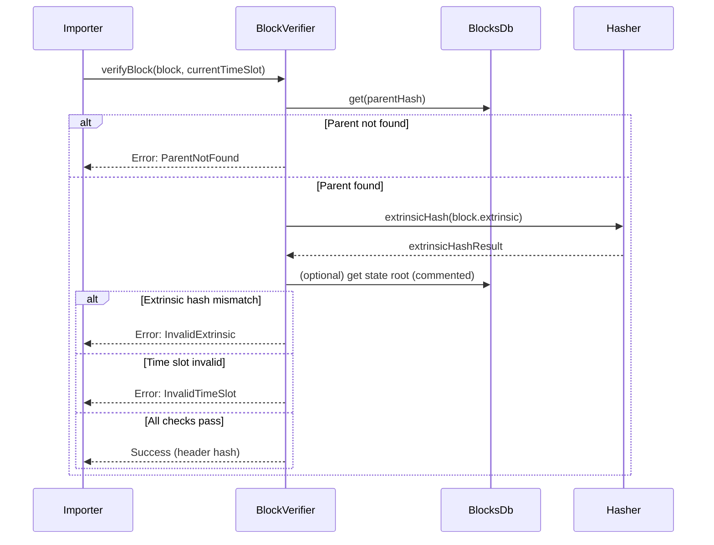

# Block Verification

## Pull Request by @DrEverr

Closes #316 


## Comment by @coderabbitai[bot]

<!-- This is an auto-generated comment: summarize by coderabbit.ai -->
<!-- This is an auto-generated comment: skip review by coderabbit.ai -->

> [!IMPORTANT]
> ## Review skipped
> 
> Auto incremental reviews are disabled on this repository.
> 
> Please check the settings in the CodeRabbit UI or the `.coderabbit.yaml` file in this repository. To trigger a single review, invoke the `@coderabbitai review` command.
> 
> You can disable this status message by setting the `reviews.review_status` to `false` in the CodeRabbit configuration file.

<!-- end of auto-generated comment: skip review by coderabbit.ai -->
<!-- walkthrough_start -->

<details>
<summary>📝 Walkthrough</summary>

## Summary by CodeRabbit

- **New Features**
	- Enhanced block verification with additional checks for parent existence, time slot validity, and extrinsic hash integrity.
	- Introduced a detailed Merkle-based extrinsic hash calculation for improved data integrity.

- **Bug Fixes**
	- Unified block database usage across verification and state transition processes for consistency.

- **Chores**
	- Updated ignore rules to exclude database files with the `.mdb` extension.
## Walkthrough

The changes implement and integrate a comprehensive block verification process throughout the codebase. The `BlockVerifier` class is enhanced to validate block ancestry, time slot, and extrinsic Merkle root according to protocol specifications. Related modules are updated to instantiate and use the revised verifier, ensuring consistent block database usage and passing the current time slot for validation. A new, detailed extrinsic hashing method is introduced.

## Changes

| File(s)                                                                                  | Change Summary                                                                                                                                                                                                                                                                                                                                                                                                                                                                                   |
|------------------------------------------------------------------------------------------|-------------------------------------------------------------------------------------------------------------------------------------------------------------------------------------------------------------------------------------------------------------------------------------------------------------------------------------------------------------------------------------------------------------------------------------------------------------------------------------------------|
| .gitignore                                                                               | Added rule to ignore `.mdb` database files under a new "Database" section.                                                                                                                                                                                                                                                                                                                                                                                                                      |
| bin/test-runner/jamduna/stateTransition.ts<br>bin/test-runner/jamduna/stateTransitionFuzzed.ts<br>workers/importer/importer.ts | Updated to use the new `BlockVerifier` constructor with a shared blocks database instance. Calls to `verifyBlock` now include the current time slot as an argument. Ensured consistent block database usage between components.                                                                                                                                            |
| packages/jam/transition/block-verification.ts                                            | Refactored and implemented the `BlockVerifier` class to validate parent existence, time slot correctness, and extrinsic Merkle root. Expanded `BlockVerifierError` enum for specific error cases. Updated method signatures and logic to align with protocol requirements.                                                                                                                                        |
| packages/jam/transition/hasher.ts                                                        | Added a new `extrinsicHash` method to `TransitionHasher` to compute a Merkle commitment for extrinsics, hashing and encoding each component as per protocol. The previous extrinsic hash method is retained but noted as incorrect for Merkle root purposes.                                                                                                              |

## Sequence Diagram(s)



## Assessment against linked issues

| Objective                                                                                                         | Addressed | Explanation                                                                                  |
|-------------------------------------------------------------------------------------------------------------------|-----------|----------------------------------------------------------------------------------------------|
| Implement BlockVerifier with checks for ancestry, time slot, extrinsic Merkle root, and (commented) state root (#316) | ✅        |                                                                                              |

## Poem

> In the warren where hashes leap and bound,  
> A verifier now checks each block all around.  
> With Merkle roots tall and ancestry deep,  
> Time slots in order, no secrets to keep.  
> The rabbits all cheer as the hashes align—  
> “Our blockchain is safe, and the carrots are fine!”  
> 🥕✨

</details>

<!-- walkthrough_end -->
<!-- internal state start -->


<!-- DwQgtGAEAqAWCWBnSTIEMB26CuAXA9mAOYCmGJATmriQCaQDG+Ats2bgFyQAOFk+AIwBWJBrngA3EsgEBPRvlqU0AgfFwA6NPEgQAfACgjoCEYDEZyAAUASpETZWaCrKNwSPbABsvkCiQBHbGlcSHFcLzpIACIAIS98BgBrSAA1SngAM3gGanh8DGjIAHc0ZAcBZnUaejkw2A9sREpIABEKAFEpCj5MelR4JQxxbKiyyAxHARaAZgA2AEYULFwGvxJufER1fBcNGDXbFGQveAwkqIJ6jyQHD0nmab4ZhbmAGhKEBlgUUO1mZBXBgJZqQbCbLBsChEM5EfYAOXw6FotHU+QwaF8SkQDAo8G44gK/D4Slw2i8yBU+Dw10YsEwpGQzDQSmWtO43l8/iCIXQ/h4FHwEkGdH27msdlyWGm6AYDGkzXo1EgsFwuG4iA4AHotTDVtgBBomMwtQAxLzYTKZWQAGRUiC1uFk3BITxcWo5Pi18wWGiM+mM4CgZHo+EyOAIxDIyhqClY7C4vH4wlE4ikMnkTCUVFU6i0OgDJigcAGlKwaDwhFI5CoseNbGGXCoxXsjmZLkgdSzylzmm0ujAhkDpgMGj18CIGF2JA4Bmi84MFkgAEEAJJRmvUKIOJwdsN0hnSNxrAAGY7Rk+nJ8g2UiJXG4NoW/oVzOwOwrLQExILYnU/5FDeB4mS7JAT5kgIZTAfAkTIMU6g/KsHhnswtACNeJAAB40Bg2wFGKCCUiiaJEqgRCCuCUTYBg2boN+Lb1uwKokCyLReCoJCRPQ0StNQKhQRoRSIvwSF8N8h6Akif7Tjw1A0BQuHEjeMEeLkNBELs8DSCUlAeMySh+kYi6WMuXjyXkBSSbSSjAs4FmKfuWGbBQsagRyAinAwkDsGiR4GIi5BzguBgQGARhqBgjohGAgEYDWWpCGgqHUWgWqIGSNDQFQuEkRgGi4JqQXRMZK7rtWMbbm2zjyPu4kYIyx43MwzmhPuJ7xIkSTpHiowUNepTIHVpAvkiMqZIKzCQCeAACToum6siOtl2yEpFHmdWA3RZDk9nXmc6UsaG4Zfv47Fph43DULA+zLlg+1khg8r8OGJ6rhgACyJDMLssgdckiB7cgU4Mf4z78I9Hh9OsTRRAI+CrDeoFIVNADyGAAML0mc17pVuYTLblN5UGwxS7CkUPI+1CTJN122UCeHz+Nw7EMLC7L+MK1LlBsdk0MsuPDPA9mIARyF/V1GS9deTC4bggFiKBwPrPKkjaZT63/a06H8w9T3jF+zQy0q0KOOwouMJivhXCeW3WuL15EsjttaXwStvha2J0YbBTG0QpvDB8J7pZkGi4zQ+XwGwiAJLgDOfDkPwDRM8MCiQnNNF48iXYgiqi6CQ3adRWTyMjGspOB/Ggk0aCkJ2JC4MUJBkLSYceHLmArei6A0ZAztqV3xoQuwZZKiiCjDFhuDYJiYSR2zZwgRQzKrWEo3Uykff2YZ5gmWZMbolZyM2extYH893mYS1URuQanneYL4h+QFJB+vOxUhSOEVRelMXUfFiXJQxGlDKJAsod1yqabAAAvKBooCqzjfiVNcG4Kr0B3O2Gq4YC6IEaigZquxWovXFrTKW95Br0nqpcKS+CXJExYFNWazpXSUHdO3HKq0tRl02pLHaq09qy0OufE6nE8hSFkqsG6d1ZaYCem1N6n1vouHFgDCYSUognjLogLW/VxhnDloobA8olQ92zoqTs8NEJIkpmjTG2gMDS0snLQxBBeg90psQnh9Nx7pXli4xmGwWZs2RrwNO+QmhgXgP4MQOtMDiHsufV6H0vo/WUfw7YrITw2KxvY7uL41jbHqpEMAzg/YNlCFTTqJCXZpIenE1a5tcg+FXlNW2v114OxWKeDxPVqkxIhmQsE3BwJUOWO+T89hRA+z5KU9ggdg6hxARHKOMczwHGkKpChjJIDfVRNaFU+AWxl17jw/upEJ5UDEHBBCtIzhgDYIo+QRyK6QVBFDd2H425rAYNgHoTFxDLJTmcY5PTTl5SMkgvep9LLNKPqIE+wtz5OQIdfPg7k74+Ufjg/yBQX5FX9COS6yQa7SASklJa4COFcM3vU+BeKlzIPKrWSqu5MEHkoVi8UFSaaeL6owdiOcBmTxDCM954yuVJC0drJQLoaJkAYPICmp5Wn222fXWAih7B/moD8jwSdHxgyuGgOUGw/hTW+b84Y0BI4kAAMorNksTeulBzbUq7gkGEXkk6R2Zl9dgIyXQUEXpNZg3hxA+rpKICVsomAUFRPVGFax/CZF0hDegABxKgzo0ABvsC6Vm2RQWal+MCumgJ6ShGCc4JiRysJIAKmyI+fEXkkH8VPBSbNMDeR6KBLIydcAAG5i3fEjWW5Upd14AHJATWvsDHZYShMLHHsHLHIER5DkRYvJeonbK3+GGFO3JYF8DaSnKELC8pLhfJ+XuitM7o7w1bT8jAHasAsJ7eGM4EhMSDEHeoXu37hllo8JPPEOUvL0kQD8OoUSWAcnEPGv9UNB7OHnhWqxawGisQoAekD+0cgqjKLAR97b42drfXwXtVREDL2HbQc2rc/D4BTl+044EB6KF1frFEsMaT+GZPtOMZTr54HNmwVYGr/BtsUsjQeeAoiYdohBn4RIHDGpzpkbwJaC1bzWVNbpdNOjdt5WQRwgrL59BFY9D2HhEB5u2l5cjChPaLwdUxU9iNqK0A+J+gDs82CzofcsFjgwL4rrAx8N5GBgtoJAYx+G28IXmVWofNYx9eZn0cpfZFoZUW33wxirSWKoAdAeHp9eVTKAdCM9efVsZ4II3IC2e5Twi0nisFW4YiJcCmmpD3AAvJAAADHHRJ0WrVsDtSnAbCwRtvWix0bCoHtheQGwAJlm1FgDNqQE2CY6EAbMxrwAAomaBPjSE9O5RYR3hPK0NsshrzNcoAASj9FAdG/LkDioq7ymWPjnGgW2JObV/IC70HGvQk8R2lOUC4GA9h6IAAShGXvXmttDlHFA4cE1WsjyDlAPiaK4MorWz2zwhUgJ9cT9AbaSzaZ1HGWq20bMPODiaLS6fiyO2XYn5WtLFGe1wKwE0kAkGADYaQobgCI8OpQPHRHID6d6lVwUFA9B6DR0iWnPV6fJG5+vXnlT+cfHNTe8btqY5w+tZN3AgvrAi+aOLyXZlpey4oPLj4SuXYq92Or8niCP5hQMISpIxKHQAPJQjgoWoYcUHyoVRB9KyrRiZWgqqe4sGbL8uKWrNxhiCloIY7SX5Guqup1NXDYH5f8NpCeeHncCjy68bZAVqxlSyZoJSSnlAkh3nrOoMpBHIOI1cVNBbYXlupH5w7FMYh/HMyNUEtYF2wlXeaqcdK+XFt4fA4Rsv6q8nKiEE0M9j0OPGPoDDvJwHBb8kr8tgiqBS9iYP94pxly6KknJPJvfdQziomFEL0tnkCUxfXoDlUUDZkHhxWGGQH3GRnv3w2FB/C4HEGSHrkQA+BCUjjDw+D9jsgnmkAixzh+RkSIMPVRFszkxFkgB6z4HwOyhoHIL/XUAqjgO6G8iNR+AYNiSbg+Bh2QHUGQC+mmG43oFJgoBSCZgIQ+AgM9mRh4MIJKGuQNjswLSc1EFGQ9iX11TJnWBaiHwV3+Rsxjgix7lxDoB8kxEwMPSYB8FTCA1BDkKiEUKYMEOGCRANkCGCH6XWgEHjm+CXSQiwCv32A6C4LjCHn3WQCUyCIaCwGNAiiiD0U8OXV8R1VDFn1wFkLPyUC80PWyAxB8BAJRyVCIDsWaV4AMSegQO3zA0MNEzVQk3rifS7xPAAHUEJ5dbpaBYhZBO8akyDx4yQzgdDlIijDCPhkZNIYQJjECvJkDigzDr975uxah+jpBzZvUCFKQ79sJhURotCPkwgmER4wRxBThMVvxLDwckZCIwJ65v9L9CM2Yqj5Qc4PhVMfhxgTxx8lscgp8fwRtzcbcRt2iyYJcWpq9lja9uwGBrwGgvAA1zYV8uYK86jltHsmj6A+M7EZAaQn94Yxh3CY0olQgXNPpJC7xBQU4OQKBNhmgaDhILE2J8APUlIZZ9FfBMgEgGIs9di9JWIEt6VIUEUrhYVbIoUHJwwkUXIUVPAPJ8sH5Ct/Ru9y8WQ8iuATx5j5cjt5jATiguA/id8DS7dOjVhuiaI+jO9gBjSq9CMPg7TJ9+cNc2QW8vt69com9eUgUTwQ8w9SUTQ2EG9IpY948Tw8VA8jAJCLgKAHRti5SKAtQEz5J48EEFwk8UFU9WwWVz5sFcE/t38XFz5KZVwaF5JpZPtk4WxTE1ZTxNFrxnkoI+k9Yu9vYe4Sl/Y0Na8vdm9HFfFdgTdNlUN3C0Rv0oF4kIdJoTxS9eyKAMd8cKAydmkZyfxFdyseUFyGgKBCd15EAyd9g3pa8UyVUX9FApi1gQMjUV54C1gy4D0TxjCbc3oF1rwWNggBlvopBwDnBTgWhphF5PlVJLYVzlV2lzZtdi5TzsSgtEh4k9UhkDUpIrNjjVhUBHzrd7V9YJkjZpkuyhyGQ2YpyOcdcucy5lzrYwLOp9dOopjML4YDzdN3VZiiBl0txB8k0U1WZ40MKJt7Uk4WRj8DolQ5Rdg40iBM5mkk1Ihok0LkB/AxKMh6oEQkQWS+B3V8NQJHMKFaBTh41sEdJ+R9JcUjIRSksz5xTUs4V0toVMsr4csFT0VlS/J3t+yAc+BaoqzXpyyvFfSYzKB4yfKkyUznUCoatEKagtS5zBjBZ4kwc6FpzZyNyelKAtzUcVykrKlNzY9dzOp9zycoAqdX8TwTz14aLkhDcaZ+c7dhcWBRcncHAXdzTYB5dXcsMPdIAZcsMDS9APgyyr5DNVc/c3SvL+rkUfSsATx/K4zkygrZqBrwzBlhlaAuAlYryP9eKLd4ZrwAKZJGk9LWLIK7Z2lD1ayvsnysKyxkRURVoZ5OzB9KLOdwLIyAwDAix74joIwqwU8wZGJGw/A0AWx0FqpOxMwOMcw1A+wCxBw3qgxBN1AAB9QYRABGjmfnOgBG3GWhV69614VbNAAATkGwJoABYBAABWAAdjQFdDmEWAJoAA4CaL0CbMhaBBsSaGbybBtaAybKbGaGBMhyaBwhx3r+9cAkbaAUa0afwMaQwRagA= -->

<!-- internal state end -->
<!-- tips_start -->

---


<details>
<summary>🪧 Tips</summary>

### Chat

There are 3 ways to chat with [CodeRabbit](https://coderabbit.ai?utm_source=oss&utm_medium=github&utm_campaign=FluffyLabs/typeberry&utm_content=361):

- Review comments: Directly reply to a review comment made by CodeRabbit. Example:
  - `I pushed a fix in commit <commit_id>, please review it.`
  - `Generate unit testing code for this file.`
  - `Open a follow-up GitHub issue for this discussion.`
- Files and specific lines of code (under the "Files changed" tab): Tag `@coderabbitai` in a new review comment at the desired location with your query. Examples:
  - `@coderabbitai generate unit testing code for this file.`
  -	`@coderabbitai modularize this function.`
- PR comments: Tag `@coderabbitai` in a new PR comment to ask questions about the PR branch. For the best results, please provide a very specific query, as very limited context is provided in this mode. Examples:
  - `@coderabbitai gather interesting stats about this repository and render them as a table. Additionally, render a pie chart showing the language distribution in the codebase.`
  - `@coderabbitai read src/utils.ts and generate unit testing code.`
  - `@coderabbitai read the files in the src/scheduler package and generate a class diagram using mermaid and a README in the markdown format.`
  - `@coderabbitai help me debug CodeRabbit configuration file.`

### Support

Need help? Create a ticket on our [support page](https://www.coderabbit.ai/contact-us/support) for assistance with any issues or questions.

Note: Be mindful of the bot's finite context window. It's strongly recommended to break down tasks such as reading entire modules into smaller chunks. For a focused discussion, use review comments to chat about specific files and their changes, instead of using the PR comments.

### CodeRabbit Commands (Invoked using PR comments)

- `@coderabbitai pause` to pause the reviews on a PR.
- `@coderabbitai resume` to resume the paused reviews.
- `@coderabbitai review` to trigger an incremental review. This is useful when automatic reviews are disabled for the repository.
- `@coderabbitai full review` to do a full review from scratch and review all the files again.
- `@coderabbitai summary` to regenerate the summary of the PR.
- `@coderabbitai generate sequence diagram` to generate a sequence diagram of the changes in this PR.
- `@coderabbitai resolve` resolve all the CodeRabbit review comments.
- `@coderabbitai configuration` to show the current CodeRabbit configuration for the repository.
- `@coderabbitai help` to get help.

### Other keywords and placeholders

- Add `@coderabbitai ignore` anywhere in the PR description to prevent this PR from being reviewed.
- Add `@coderabbitai summary` to generate the high-level summary at a specific location in the PR description.
- Add `@coderabbitai` anywhere in the PR title to generate the title automatically.

### Documentation and Community

- Visit our [Documentation](https://docs.coderabbit.ai) for detailed information on how to use CodeRabbit.
- Join our [Discord Community](http://discord.gg/coderabbit) to get help, request features, and share feedback.
- Follow us on [X/Twitter](https://twitter.com/coderabbitai) for updates and announcements.

</details>

<!-- tips_end -->


## Comment by @coderabbitai[bot]

_⚠️ Potential issue_

**Allocator is not passed to `blake2b.hashBytes` ➜ inconsistent memory allocation**

Everywhere else in this class (`header`, the final root at line 102) you pass `this.allocator` to `blake2b.hashBytes`, but here you omit it:

```ts
const reportHash = blake2b.hashBytes(guarantee.report.encoded()) // ← allocator missing
```

This allocates a fresh hash object instead of re-using the pool, defeating the purpose of the custom allocator and creating avoidable GC pressure.

```diff
- const reportHash = blake2b.hashBytes(guarantee.report.encoded()).asOpaque<WorkReportHash>();
+ const reportHash = blake2b
+   .hashBytes(guarantee.report.encoded(), this.allocator)
+   .asOpaque<WorkReportHash>();
```
Apply the same fix to the component hashes at lines 78-83.

<!-- This is an auto-generated comment by CodeRabbit -->


## Comment by @tomusdrw

```suggestion
    if (!extrinsicHash.isEqualTo(extrinsicMerkleCommitment.hash)) {
```


## Comment by @coderabbitai[bot]

_⚠️ Potential issue_

**`timeSlot` is encoded with a raw `u32`, not the required opaque `TimeSlot`**

`guaranteeCodec` expects an opaque `TimeSlot`, but `.materialize()` unwraps it into a primitive, breaking the type contract and (depending on runtime checks) may produce an invalid encoding.

```diff
-      const guaranteeEncoded = Encoder.encodeObject(guaranteeCodec, {
-        workReportHash: reportHash,
-        timeSlot: guarantee.slot.materialize(),
+      const guaranteeEncoded = Encoder.encodeObject(GUARANTEE_CODEC, {
+        workReportHash: reportHash,
+        timeSlot: guarantee.slot,          // preserve opaque wrapper
         credentials: guarantee.credentials.encoded(),
       });
```

Please keep the opaque wrapper to honour the codec definition.  


> Committable suggestion skipped: line range outside the PR's diff.

<!-- This is an auto-generated comment by CodeRabbit -->


## Comment by @coderabbitai[bot]

_🛠️ Refactor suggestion_

**Time-slot check should enforce strict consecutiveness**

The specification calls the index “consecutive”; currently we accept any value `> parentTimeslot`.  
Blocks that skip slots would pass, which violates consensus and could break fork-choice.

```diff
-    if (timeslot <= parentTimeslot || timeslot > currentTimeSlot) {
+    const expected = parentTimeslot + 1 as TimeSlot;
+    if (timeslot !== expected || timeslot > currentTimeSlot) {
       return Result.error(
         BlockVerifierError.InvalidTimeSlot,
-        `Invalid time slot index: ${timeslot}, expected > ${parentTimeslot} and <= ${currentTimeSlot}`,
+        `Invalid time slot index: ${timeslot}, expected ${expected} and <= ${currentTimeSlot}`,
       );
     }
```

Strict equality better matches the Graypaper wording and prevents slot-skipping attacks.  


> Committable suggestion skipped: line range outside the PR's diff.

<!-- This is an auto-generated comment by CodeRabbit -->


## Comment by @mateuszsikora

as you have only one class in this file, I would keep the same file name and class name


## Comment by @tomusdrw

There is no tests for any of the conditions. 


## Comment by @tomusdrw

Incorrect. should be `isEqualTo`.
