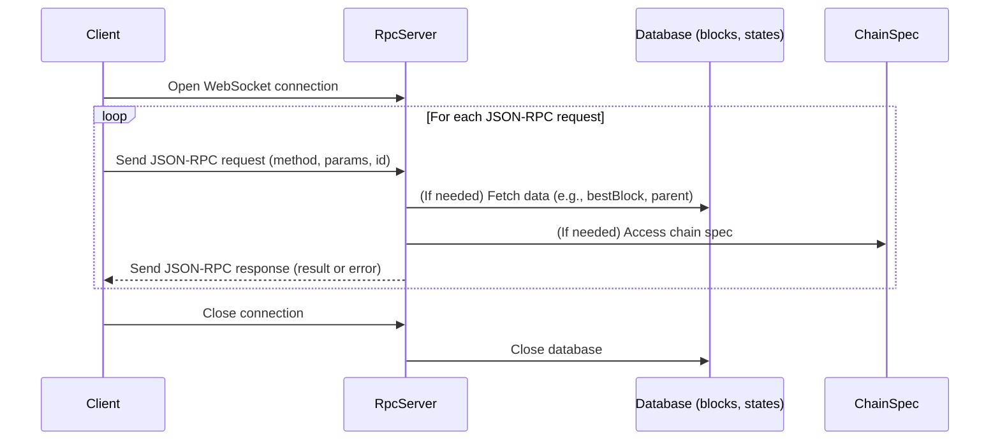

# JSON RPC Stub

## Pull Request by @skoszuta

Partly resolves #307


## Comment by @coderabbitai[bot]

<!-- This is an auto-generated comment: summarize by coderabbit.ai -->
<!-- This is an auto-generated comment: skip review by coderabbit.ai -->

> [!IMPORTANT]
> ## Review skipped
> 
> Auto incremental reviews are disabled on this repository.
> 
> Please check the settings in the CodeRabbit UI or the `.coderabbit.yaml` file in this repository. To trigger a single review, invoke the `@coderabbitai review` command.
> 
> You can disable this status message by setting the `reviews.review_status` to `false` in the CodeRabbit configuration file.

<!-- end of auto-generated comment: skip review by coderabbit.ai -->
<!-- walkthrough_start -->

<details>
<summary>📝 Walkthrough</summary>

## Summary by CodeRabbit

- **New Features**
  - Introduced a JSON-RPC server for blockchain data access, including commands to start the server and connect with a client.
  - Added initial RPC methods: best block retrieval, parent block lookup, and placeholders for finalized block, parameters, and subscription methods.
  - Provided a sample test client for interacting with the RPC server.
  - Added a sample blockchain state data file for testing and demonstration.

- **Documentation**
  - Updated README with instructions for running the JSON-RPC server.

- **Chores**
  - Added new workspace and package configuration for the RPC server module.
## Walkthrough

A new JSON-RPC server infrastructure is introduced within a dedicated `bin/rpc` workspace. This includes a TypeScript implementation of a WebSocket-based JSON-RPC 2.0 server, method registration, several stub and implemented RPC methods, type definitions, a test client, and supporting package configuration. Documentation and workspace setup are also updated, and a sample JSON data file is added.

## Changes

| File(s) / Path(s)                                      | Change Summary                                                                                                                                                                                                                                                                                                                                                                                                            |
|--------------------------------------------------------|--------------------------------------------------------------------------------------------------------------------------------------------------------------------------------------------------------------------------------------------------------------------------------------------------------------------------------------------------------------------------------------------------------------------------|
| `bin/rpc/index.ts`, `bin/rpc/package.json`             | New entrypoint script and package manifest for the `@typeberry/rpc` package, enabling server startup via CLI and defining scripts, dependencies, and binary mapping.                                                                                                                                                                                                                                                      |
| `bin/rpc/src/server.ts`                                | Adds `RpcServer` class implementing a WebSocket-based JSON-RPC 2.0 server, handling request parsing, method dispatch, error handling, and database context setup.                                                                                                                                                                                                                                                         |
| `bin/rpc/src/types.ts`                                 | Introduces type definitions for JSON-RPC requests/responses, database context, and RPC method signatures.                                                                                                                                                                                                                                                                                                                |
| `bin/rpc/src/methodLoader.ts`                          | Adds a loader function to register available RPC methods into a map for the server.                                                                                                                                                                                                                                                                                                                                      |
| `bin/rpc/src/methods/bestBlock.ts`                     | Implements the `bestBlock` RPC method to fetch the best block hash and slot from the database.                                                                                                                                                                                                                                                                                                                          |
| `bin/rpc/src/methods/finalizedBlock.ts`,<br>`bin/rpc/src/methods/parameters.ts`,<br>`bin/rpc/src/methods/subscribeBestBlock.ts`,<br>`bin/rpc/src/methods/subscribeFinalizedBlock.ts` | Adds stubbed RPC methods returning empty arrays or placeholders for finalized block, parameters, and subscription methods.                                                                                                                                                                                                                                                        |
| `bin/rpc/src/methods/parent.ts`                        | Implements the `parent` RPC method to fetch a block's parent hash and slot, with error handling for missing headers.                                                                                                                                                                                                                                                              |
| `bin/rpc/test/client.ts`                               | Adds a WebSocket-based test client for sending JSON-RPC requests and handling responses, demonstrating usage of implemented methods.                                                                                                                                                                                                                                               |
| `5_000.json`                                           | Adds a complex, nested JSON file representing a blockchain snapshot with cryptographic, block, and account data.                                                                                                                                                                                                                                                                  |
| `README.md`                                            | Adds documentation on running the JSON-RPC server with an example command and required arguments.                                                                                                                                                                                                                                                                                  |
| `package.json`                                         | Registers `bin/rpc` as a new workspace in the project.                                                                                                                                                                                                                                                                                                                            |

## Sequence Diagram(s)



## Poem

> 🐇  
> A warren of code, a server anew,  
> JSON-RPC hops in, with methods in queue.  
> WebSockets now chatter, requests leap and bound,  
> From hashes to parents, new answers are found.  
> With a stub and a slot, and a genesis root too—  
> The blockchain’s alive, and the rabbit says: "Woohoo!"  
>

</details>

<!-- walkthrough_end -->
<!-- internal state start -->


<!-- DwQgtGAEAqAWCWBnSTIEMB26CuAXA9mAOYCmGJATmriQCaQDG+Ats2bgFyQAOFk+AIwBWJBrngA3EsgEBPRvlqU0AgfFwA6NPEgQAfACgjoCEYDEZyAAUASpETZWaCrKNwSPbABsvkCiQBHbGlcSHFcLzpIACIAKQBlAHkAOUgbKwBhSHjcbAFoyAB3NGQHAWZ1Gno5MNgPbERKewBrfEQALzw0dAx6VHglDHEAM3goksgMRwEmgGYANnmNGDrrOzRaWn9ERuQkBw8p5hm+WYAGAHZl5Px0TfV4fAw0XyVEBgp4bnEn/j4lXDaLzIFT4PC1DwMWCYUjIZgbDzwLC4Vbcby+fxBELofw8Cj4CQDKIzWRPegojz+YaUMgMDwECF+aT4LxSPo7YLLdyeHxMrGIUIMTCQGaQQkkQrjUKwXC4biIDgAekVRHUsDyGiYzEVADEvNhhsNZAAZFSIRW4WTcEgnFyKtE+RULJZGfTGcBQMj0fDDHAEYhkZRVBSsdhcXj8YSicRSGTyJhKKiqdRaHRukxQOD9EFYNB4QikchUYNathDLhUQr2Rzwlwi+OKZTJzTaXRgQzu0wGACsAH0zgONEJEE8OAZohODBZIABBACSAaL1CiDicdZ9jGhGFhRhnkwlkASKUgtGo3VGkRQeyG+No2Dp9CYQ20GCRRHQIe4kQAHvuBSvcAoe9clxQo1UgZhvHEL9IRcb58CIKhuAQBgemqLx8AYZooRfMB/C8Zd6BISIy1wRAuVWAhuDASIpF8ZoSFka8GH1JQYheZC0GiAAaGIJGcZD4B4mIZkBYToiINAnHE+UhN46ISDE+THiUmJmjQbhuC4+SCOOU9xIoWB8HEwFsHEqE5JibhLOiClVOib9LMwehojQBgmGwIZEGiZZXXYrxOIKZy+IEhACiMrx6GcKgmP4X1orQWKL0iegwJRJlrUIlBBnEIVfDqb8EQYeB4V8AVPm3ciDCgaJRK4q8ehxGK4sjEQxGQfxeGkdg3xFDCsJwpFIDqBEKEQXiSDc2AinA7pohGxNe2hRBYGE7oAFlKGaS91rBZ8hpsGEPAACmiVgKGiABKGb0uiTLmm8yBjpHNhJnRS7eLmgVl17fF8FwNbekakhmG+eRok6/AKCqAovCQTRqpiSTpIUfaMGQD4rQIRCNJQyAGPkRoyKeiSpPhXtmium7psgrxoMvRB4CIZ4QI8d46jYZBjoEZzKEQFmoQm2gACZu27ABGABOXiBGBa7gpKEdiqythAVPQFeK/Bp0CIRCSEk4MCeQUmnF7dpxOR8nHuOtLpu6OGBRao2PrQ4HQctJGybQXsuI0RG7sZgohRoIgofgdppEgHrxEjpEGQk/BFHEnnaHEwonmaWRAZcn1qV6Pm1t5EGwaaxKqpqxT6tQe34ZagqipKl57EAt9y5iFTtLUjStOzmJdIEfScQ8BLYo3QQ2uJyaoVRwEkV6zH4JxwTUKN13VY2M97BK+ACL4ePLe9ym/ZqwzjIa4UR+psJ07eouSPYNvbLzApq7ethPlQ/j9TZxSwlueYzjHxiBZF+OZWrRivkcSg8BUKjGIrQLm0QLK9mYOZBAPs0HwF7BIKmRM/6QAjviV2wpi4e0vkg9BRAfL+2skHJ4s90YnkrjvKI5B/z0HKsBbA2wuDRC/ogXsDBuH+CGEFIGfCXgCIIgKIKFAYrIFtgoTyxMNyy0wg9XiuUGJkU1v4XsjdYS8SINgZwmAaDSE+kDRW3DMB0kQAAbmAVDaQsjmqKOtBQYYUN4QYDpBBRSH8QS8kIfgOgjiFZYFIeDRoFBCR2NcYlIBtk6hiVdg5ISQ9S6j19OLYWUd3byBHsgKesAkluQ8l5UBjVL6KKeMPdye1QjjwgU+BhvVhTRAGOJdW9VFHRBiXEkgBQARAi5gmDwy1YAyxeLYkgRiJhaSoKrPmMtZA0HGigGgzBEAuxro7Dcd1/AGJcVfSZkdgpqIEBs6IGF8DNGwNwFBldYZImaL1M5yAGRf2CBshWt9fD9IIFQUg1CDDch6egTSk0xr4M6tsdgH5+YaRWv9P4zdlxR2/NwKGTT4p9XUYNLAUMTzw0+AIPAUQUqkD4IgJiWzeJIhYtgWg884LYyQnjI2Mt+rNGGpNRMGzvo0D8InHRxCGnKPsJQQZ/i1Znj9kYKclgZx0yDI8RhDIKRMJYqYn4jCNwkCxTiqIxK0SyxgVHIYDxpB+RuJi7F0MTV8DNXDVC4zLXhDGCCXESgdX+G9HwZgih4BwNoI4rVOFtyQieIzAUpQWTEXkBuDYLLtwfnIFWI8qQIUXhIH7Cc0RXRdhsAAURnAAEXWiWjQzBaBjgLUq2cC5CxBhXDWZwSbfSRp3GC1YpaK1VprfQXNRQJgPPVlEBkjLWLD33FWRoYh1VhHUClGINhPKvjTVqrNaRMgaAKFmUo0Yl28AJESEEIYfFEUKqDS8XiaWAmhr1bdSRUjpCyAMpoDReoYG4MwK+6cKAPS0n4x9pBxBbtWAAAwAAKWmtLaWQioKDcAYFBngbl1KkFdlpHY7S+TYHgP6yAUGIAttjXhUV6HnDGNItcW4/06h8GGJ5RdTwm7Es4WIGxvhu2R0lLieEbFNWrFoJhRw7AFXmGVaq4s6rPm3C1b63e1B5MtUNQ64Mpq8iuo9daxARgbjkHzZOaqXY1AYGQ6hxUSIlDfg0GRetk5pzzkXK2jh7b1xdq3D2vcGaYBWhIPED4XxQjvE+N8EjFmrMMBs/nezZF0P9BvIoe8k7bjfWho1d9UrYmUGWHOUIizdiXucjRJEw8KC0YfpAb9aaoMVFfBUAU6HanfDU/ekjtABBgC0iiKDvEoPkaQJR/6A2SOafG8FKDhKwCIGtGh3RZ7U3viUMMPMdMxQvB+ZATrJSKIeCg5NnE1WhgNSfFIR15JbjdCOCcSx5JoPDcQKN3ASXkBdVGN+KIiioNnG/FBg79gQuRcaJEdqH5CX2AWyGmBqnfjNLEE9KDEHZAZGhEieIC30PEqgyxnw6OXxY9EFB66PNGjemRNB2b82ScnYk0MTRsB8RgTTSQuRxKQ2Mm+Yia8X8BgFdCBSLASJvpWuXGAqDNhUPxGlZQVr4EtXFaiIsqSik+ZA/C6F9AwIMuKWQA8xFTNnj5WcpEZjuP4hzgAOJzmSNAdDDIcZ0nx14eMGFGiMk/XwGY96PCGoeJBjwp67HkRWB4eEQ0WO+L1ZaoU8pvAS9qKgDCqpULBWSxIO5UQSpsBZcuN3UnG0qpoHJmN+ClOiBU3q5ABqjVXbRS6i10cvW2oPCOqD0WUOxds4ahziBqObAvVRGiJA6K7dY7HhrL5jqXVayhaa/RQz55oG7lAGAs8MTDZMW4GnjVEStTHb1HhlPODoCZwtZmwBGC79ZkDWG83DlHOOZzyrm2BmLG2tcnbNxHQMwYPzA8I7TDNAUgIcEcDAdDEdZaEUEgMgO4JQYdYlLVWDeDG0SgO0bvdDe/UAvNSAQrJhUYNhRkHA7DdeCFadZlH9NXXiS7RmJ4XiN4EHPVXiV1MgRoB7P0IyCgIHUg3nVGUYYxYjCYboDIFgINDABICCVLS8RRLVSPSJG8eQbFOOKVIXW4KDXvBLAfZYPcDIY0OcEUJEDtSYNXegKDLA8+XXCCbudLEjLQ/vQHcPYHCLYmBdWPSgt4UrXoZATrTLCDd8LVb3ZHfw0nXiICDATdQIkILmFHEIMI12CIqIyHOGBFdZUIY6OIgUDgFiMYIYUnIHJQa0fOXxL1dfJlNiAAdRtHiHUUUjwmIiyj4NiMKAH1dnUE+UCx2Vdgaznmaze122JRowZyK2cEZm3HoyYTonwD/QRSKK9FpDKLP2h1EFh3P0VWL1k3hw1UU1Eyr11TUzr00ydU8HNVQhbxtURmSAPD4JsNfGpEdhTToC4GAKwlwPAKeCgNxzg0C0Qxi3QzWznjTVuPILPF4i12+A2XmJKOKgsVdgsxMPYDrBUKGAvyLWvwMFv1i0QAoFi1ViMloGNHwFGn7yc0LRc3fyXGDFXFrB/z43/0AKrCDTvEvAa0UgJKJJJMSwajjlvDS0e2oHtRxQvXGKIDvUnyXSgwwg2E2hREUB0JWFQGjzY1zHchIEhI/Cg3Wg0hxyjCRwJmJEJhbkqldgFDDnq2lwYFlIJKS3RkBF8X43AhbQ/gwyWXVzGiB2VNj2xQdCT3kI0ivi6kBPIHoBy3xPlJQFBn3123xH/X4k+DBDhBkOkBeJmAFAACEeVxs8djC4YI5aBMz1FszVdlkxpiyz98jBsygtcZh0yQhCysIpsgYoNqyQsZgdRczw46AGzmgnCS0ppZUCSGp/BVR/xiNPJExEVjT3wCYbDcALI00OjTC2Agd4RuAGo3hjc7CIp6BwyEEr5MBlDTFSzEjFJuFkQujPprwWVg5DTGQGgPANwoNDzbTGRnSLU0CWopdUNrTFAnD3BcRX44YzsHBNJth6CsBSw0ibsfB8AqwUQlSfx4A1A4ZLRPSJTfgxNI4MBUV/AQJcwttv5TSE019IJAR1kSDFY6AwAho1z6wEDn06hPc9yPVPhpAi8XMtia8K89i/Vtja9fQ98G9tMzi9Mj8/IdQMLcxNhniSNpTaBfyEFjo9yFRIBtTuBgByo3xeJLTFLgBDzLFZA9A9BLouAs8BhXzO8kQYtFQcS8T2TFBOTExHCX9L8IAMSsTbLcTFQVLFQ0zcAezSTXLi9KT3Nqxv8Wp6Tdw51d0sgWLng88ot6ysyeSUs7wHxBcwg0AGJkAcLXS1dS8cx6A8Lzzh8HlLwnxY0AiWpug1EsJhoSg7YrF7AMJNBnCWK8K2LYxGR/L8V6rJkYyWBGQelycSAAByGQHlUoIFeoUUkjcDOsgUctM8WfJwgg4XXbRSKESOCNKGbYbFXoXqOq3lBaL9OaobRSAACX5UoFWqvi1U6rGDZAapWgK19C1VOr4FQBwtCC8QnIZSF2ZzgrAQwM50OuDkYoj32COuxE+vutWFp2KlGFQkmTesGP+s2SZHwrAUvjhW6mfFjw3AerQCrDhoGuCn9NL3gBeC7PJBKjZlavXzs0Gv/Q+pup4PaocvZDCEC2u3QDVMixIQKXypPMvmChKooAItyBghqpeqaqihav+g4pk1L34p4pP32LL31UEvry02dR02b0P1b0RhnBkuvWOMfBjXtNCE72SqLJak/O/KtK5uAAAG0ABdXiV2y6xq3ieIVq92vQSyzyuynyrm80fywKxLNEq/G/ay7vLy+yuUhBRUIgmm/MqOhUYKiktzT/DzCKjcKKgAmKsMrm5cqIHMk3Wmns9DGAmYeA3k1LB8dfRkKyyzBO0O3ytOvM7snlRw3bFhCiVAFi1AYM8YHG2lXxIGnC7WL0pdRRPKpENEUYt0wq087Gj8U9ZrSkZkVkZ9G7SJYWkeIHEqGCUibYxgYRdgNfVpF8C9L8NyEgHcpoKCs7WzOHaqlEQUrVNyXIJuVPC1MCXkUUJ4ynPxbu9QeQOe9jVC+QJfM+9gc/WcIreFRnRkFixmW9eQCWxhIWkuS+XPOgam1fWQZW2cLitTETDWvi7io46MkS3TC4//KAa4qsISksK2sxEjCBjOlKomwLEjXSl2j2r2wOwfRAlutumyzu8O1Ozs3h9RfuxRRmZmagbhQ7EoWQXxJ6Uy6wWMpAEgN2sRmO9yuO9u6zGR5O80Es908iRzbOt/XOrKGkkwwunzS4xkge1kmxwq/u5LQCJuqICcpoKRju7y3yta0Idhi9Sq62ibY82x+fGBRfTo60KKCerRqEfEGe5AUu5OyBW4Je8EHxvmYhQ+/BuRRKdAT5VYHBnm60VcsuoRORa+hsNGe+giOkZ+vgV+0Id+iGyDb+1YU+++AmpdVAYolbde0qt2Cp5qQhlfRNMhkvNVcvKh7VavQ4nWi2xvA284o2y4qAU2iR9hqIWJrh4A1evmHHd6gRp2vSkRyAD2oOyRkO8J2Rkpj07kxRC+SerJp4RMifGPJdHB9pcpshSp0h4K2OzE+Oix95qx+0CszQexhtHO505xzzOk9xhkkuzIQcxQcu8wxZdgd7dfAJ9KugXiQoBfLKnKo3bcS8YY0iLgWqnlPlUaOWzKi7SgYmLVIp6URq8lg+/gLSLEDlycgaz8hWWUUhBTLGrq+kVYJgFp+bMkI69luG4YWM4as8UatGtmzl761FP63oAG2oFnEGjnL68G1TIPCCaGtNVG/AwG+Aw1QCX+mp4PZFiVpoAa7Voah6gJJ6qIT6g11EH1ga6uYJSgNoJ6fpu198PKkloYF2dQLGmZhC5AEJUNoVl4J4d8H5xW0IHnFqEJZYRICkCgMCDgzG6gLZDUhkakec6aJXSN9mlm3VwEUa2rOattkRQV16/A96iNgd31r6uER1ogc1lES14Ga1pmj+yGh1vDYE5F5YDsk3N3c1nBr110hFcmnGyFlqO7Up/NtNOQ0d9gCa5dV6RARmrQ1GS7YMBkboWYYWMANQUITyFRkM8l/WfLDYzi1W7i9Z0/LWgSoU4S/W0SphvyY5qIU5y2u0i5lNgY/h60QRn84Rn2laT2p53DqZbIAOl5oaUJ+FpOgk6x9d7kvGxoK1NnXMP56ewF6BqnQUx6sfHaq9s7Y6uW00h9+LSAVUKQAivjsmxqkx8zOF7EhFqj2yvIGskgRagKvu1F1/JtJx6krFyKnF6K/zDvVsslZTu2rCPx68Cl/kwgoE98X5zJlj7WPJochKiuoz5CkzjMrMoeuEJpq+oYNfQEel5NhJte8Ws8yWkGo+49kQngTpp+lkZy5wkZkGdgC+4e5wLfapj8aARIctRIBlW1z+6EV1/mv+sqRT5gpdAB1CdZ2qbEY6goLjs7YlCg5AWQX+BkUUJQaYtJ5ZihtZ3Y6hzZ8vOh6D04xhg55h2cM2qDjhlDs7Fsir4zlTmuh2u5oR5Oox0R0jrAcj2Tyj+UhTq5Nsjz1TxR752aJj+z7J1jqSjNyW/DLegxpkEcPerdEVqJLJKTjymTxOsOxFtz9s+R3u87rOtFxxjF7Tgu7zP/fT9vFhEjQHkgTd9OkHsz75kQmb4MsF6p67gF2eu7xb474zlHnugslKtA9Jxqe5rmhXdKRe39YpkLs9oGUFxj/JEuaWyIdC4F34Zpgdm++hO+zeuL7py9BFBN6q9N1Adr9Q2AyMhBoYcYIGBZ4hxNe73B8FwpSFvrkDyhwbjZg4kb7Z+hmDibz1Q5yAVh2bs5zhs7NjxHpb9z0n6unlLgDbgkrbp5sRhAnPXbt5g7lOpHl3hR9Hto5R43NR3EZ8v5nRrgKwfRxoIxoO77sx6R7y73IK8HzTyHr/Wk3T2H4u/zJ22XPLCgdDHVHYVKyz5uqdW9FLs7boLNMAHLYWDQM4XLS7fgLv6ogQWorCRSTXOXPgB2GgfVAixGtY+gTTV2J8cgCHV9k8PVkoDwfqLKQU7oPraaWJoCMQKIAN/9WqlfjDdKP5Z7EVVFIkK1OBDmgguecQVHmp/wDwY0dactdMz9lf+gEa4/uOSgdbOxMjmNC1oBANgKjINmAHdYeyA+TglBkgF99yK0gUnL22XanpCQEjKHJP2RoX1xaoqJft2xX5D8y+kAeSrk3xYqVhWH4Oigf2BjfhS8JuEgcSWcpGAAAqgdUgC99++2iRgKkTOxz9j0DBL3MPxIHwx2CgxG1lqF6icxEAuBDZMri9aH9kAzfHLJiB+Rip+cE6PdsoPxZ0F1UnBFlPNmoDbU92qg7EOsxVb7V1WaaFiluFoDm4UAvoU1rQCBy2D7BmebPOkzx45M187iZnmNE+j4CVAx/VpO6xngvgNW6iIquinWScEI0GOLAFgKXZPAiBXfejvuR5j1VtBWQSwejEdLpQSAaoJoEGwcCbYhikSBdojjaolprWyAO8BVHfDFZtKhFAYNsV4jEoWKhqUQHgBBbSAoILdJvq+hb74tQafAHIZ7h+ZgUZinwDFCMIUBeFjoYAd9gAnFjiCCW9AH6ujTNa6AlhZwWYKsL/6S0m4IwnZAqm5DBE98JWboDNg9wkB0MLFJ3FQBdzohCY6oUIGJkKBU4PAnAuomFmEHBQWIbQJVpSDwE/9Pc/AlUgVgwD3p4Qeqf+ghGPx4g/+lOTvk0H8KmlXh7wjALr1WY7FhqmtNWqNz1rjdDaFvKbgh3NrRlK+yAEvsP2Dq/dQ6mfC7iiDHCQBdAkAMQnaV35AoSMx0TTFwFPYUBGCAgKwNQFgBcAtK24IxIGFjRgD/o4o6crxEJTE4GAXAQnJjgWxz4DArIqAAn0kAYoWKLZM8twG+ED9cAs+MyvgAspai2Ruo/iMKk0baMDRrgkgDYECBqDjopg7IoeAgKWlXR/IXALowT4sADGwAWID6NQyui1WuQoOtaJ1F7NcejosutcMBHmi9GwYpPuZVoAxiG0MLAPhaC6JZ8NOrmXPvnXz5uNC+njaAIFmCyuFpCLJDWkQWfRdEmQBEF9rcCyGXpPISQ3MEDFBHRoledAl6rAQbppV+SmVTwjtQEY00V+UQg4QAMjidYOxno0IGFyjGe4uMrMQVA8k0xHVGM1YNUlX2CizCxheQu2JMN4Bq8B68CUoPeDtjUin8GASwroMEFslk65ZJZDAPsK0Bsy2wKCE2XMIjCASzCYEEDigxhinglpOcN+PqbDxYKrRZuPUN4gCi2hfAKYLyB5y+FiUy45DNIAOqe4r+IwMYB6VnAkZlqBAxoByJoB0DbSpeecXHmRSJ4KKfYhoq2JNR6liYmRY6m0WmxCokB10GgcKFf7v9Ah+rZwjTzfHCcP8H5ARmPT3a/so+HgTrE53lKfQBa1VT5r8hEnBD6E7rTgt0EwEw5sBLBDXo90T471XuhId7lHEKF8AL4x7DcL+Lpi15UJ6IXQvcFhE+BZA4JZLjBJ1zU0SsnWKDIR3QzHRL4G4AUd0Wmz+0xsT0N9h+y/a1Z0YW5PoEr2pTywfUmtdYoqmA44j5WleGhlsxt4BpiR+zUkfBxm7Ss4YEwMCeGIYBQTIAAAXgQm9QAAPm/BOCQA2paErwHSPMb7d8x1oOxgPhNozc5xj9EjOBIwC+i3R8RK+HAkij3iICWBQbHuXGwzEPJ8TD8f+NFYbTNC0EsjnmLQJDSoMI0iRmNL8Q1SIJMue8KHkjF4Tbhc0sYAtJIwPjlpJGRyW9lgEWVXm9I7ykdJcpHNRpSvTxONMulTTUM1Q/EBQDukxoHpiieafuSgyvTUM2ZQCU9Fvo2cSM4ybMtINwJrT2sMDLrGeASLTZvpB036bFn+mJZTpQTV8L8Eqn+SJptUmGbkManeirpDAeIDdOkCIAWZnuNqZNMtKQyoYfMh6eTL6l/cqZw0wGWdOBl0SoMZEoIRRJ0nUTAy+IDxEfiixTUuA8A6AdRmbK8TVK8AnIBLl6np9KZBY6mTLKiDvkauU4qqdSI96KBgA0ATFGP33KeRmgOFD4Y8zsDusvQBuDAF7LgoYAPanU/5C8zo49Q2cQLFUlvFUasweRJZVStACFFcBFZo1SibpN/zqjRAqo+IcqOugNS9AaY7esABsA7cosFMgaexStnTcJGDM6qYRzZkCiPaZssJhbMGkAz65k6e2YzKgzRTQgTUlge+3bkUca5x06FqY1hYSz0iioXIpJnU7kkIeH+TFtD1/xRpcW/mKsdaBrHa50iPAvIr9WJQdiCQTQE0dwP8Z8kMqYky0hkF4EDEqR9EhPKxOQAXzf44I2PD4lwKkRwiM0x2GkKaGrj7pDVXoMBSICZUFCDCC9LjOwxYhgg+MRiHeWXH4Fy08rGEdPEZTBi00J4hRIrjqBEYFAqrA6lM2XFh5uQO/YCGDQeCP9GQ78wUE8Hn6x5goRMA3OuSa6hBR+H+TCXwCgwzEyAOMnmXjMGyATYBAIxoOhg4XkLoMxQdQDqChgcimF6qO4WXV3ab0zJtQDjrvW6pPBQMqwehajCUW/BUAIQFQA7DqDOCxJeUHqWsKlQ+EPwS4/+aECLZdjxWc4ctOCRmoxMXgXgDIbygZDOjGQJ4tFCMM4JqLN+Gir+qEG2AsgdFowkgBPBBANIKAK2QvPgV8TYL3wsC85LiGVxRRexSAPrNtT5o/1zx0w4VNYr8Uigv+/AT4S9xAXuKgcC8xvtYTQHnpNS4ih6fcMUyUBGsGKLVAYs/nqpQJChKAndyUASFyoSeBoLgXopDKrJ9sTCE3AMXe4Cum+Ris/1iprDYikdLMoNg0nbSnwLKDyWvkuaksXYqeVUEHkIUfTfkQMcRcuyGXJCgOKtXKerUN4Qd1MutE4k3lKn6ZypGA6RI7NQz3yj5dPGmOHRZFsiZsVtLkVDGOjcIvA8o+oZqO1ETZPgdon+NLXoWpjMxJ0tFTH0yajo5FCixhQIIwCpigxZczMTGIJUOi3UPi5SlzWRVNDk5AAfi4CezvZoc92oGLMnAAuVIcsOV1PRC0roVnS3FZaO/E0zrs1EWiMRATGwJCeChSlfyppUnScx08vgh8QwBkkQqWnPPq4xh6by3A0GLEq1ihjAZxpLKfwGIChjyBigIICqQbygyAYrVdiajMeyGgoFtVD4qAoPUVIYx3GbsgOYyFH4tQ3VhgvxM0TuK4Fqg8gJXPiAnj4IJxrdc1SSltVApCkGESqESExTwxeoSJMog4GnjVTosQgKSNmWizcAJAzAbaVI3SJ4QN08uSYoxiaDMlYcENAbi4VCxQl1SCxUonCWJRPhBCNiWPAJgjwIhsRnysDviNoYm8xuvysSsbSMx5op57YTsJ6CBjJp8wBqy2qGHLB+ASa4VfPjUHGRJgv2qYNsIYAzCXp1A+iBBL9DHxjBJQtAXsGiLdAGBb1ksM4KoAuAMBZgaAcWIBvFgCBhgACNAN2AAAsZwBgDzGFhAbZgtABgKBslhQbhYUGyWN2BICzBfQn629aWHvUDABE/gcUK+t7Behr1QAA=== -->

<!-- internal state end -->
<!-- tips_start -->

---


<details>
<summary>🪧 Tips</summary>

### Chat

There are 3 ways to chat with [CodeRabbit](https://coderabbit.ai?utm_source=oss&utm_medium=github&utm_campaign=FluffyLabs/typeberry&utm_content=366):

- Review comments: Directly reply to a review comment made by CodeRabbit. Example:
  - `I pushed a fix in commit <commit_id>, please review it.`
  - `Explain this complex logic.`
  - `Open a follow-up GitHub issue for this discussion.`
- Files and specific lines of code (under the "Files changed" tab): Tag `@coderabbitai` in a new review comment at the desired location with your query. Examples:
  - `@coderabbitai explain this code block.`
  -	`@coderabbitai modularize this function.`
- PR comments: Tag `@coderabbitai` in a new PR comment to ask questions about the PR branch. For the best results, please provide a very specific query, as very limited context is provided in this mode. Examples:
  - `@coderabbitai gather interesting stats about this repository and render them as a table. Additionally, render a pie chart showing the language distribution in the codebase.`
  - `@coderabbitai read src/utils.ts and explain its main purpose.`
  - `@coderabbitai read the files in the src/scheduler package and generate a class diagram using mermaid and a README in the markdown format.`
  - `@coderabbitai help me debug CodeRabbit configuration file.`

### Support

Need help? Create a ticket on our [support page](https://www.coderabbit.ai/contact-us/support) for assistance with any issues or questions.

Note: Be mindful of the bot's finite context window. It's strongly recommended to break down tasks such as reading entire modules into smaller chunks. For a focused discussion, use review comments to chat about specific files and their changes, instead of using the PR comments.

### CodeRabbit Commands (Invoked using PR comments)

- `@coderabbitai pause` to pause the reviews on a PR.
- `@coderabbitai resume` to resume the paused reviews.
- `@coderabbitai review` to trigger an incremental review. This is useful when automatic reviews are disabled for the repository.
- `@coderabbitai full review` to do a full review from scratch and review all the files again.
- `@coderabbitai summary` to regenerate the summary of the PR.
- `@coderabbitai generate sequence diagram` to generate a sequence diagram of the changes in this PR.
- `@coderabbitai resolve` resolve all the CodeRabbit review comments.
- `@coderabbitai configuration` to show the current CodeRabbit configuration for the repository.
- `@coderabbitai help` to get help.

### Other keywords and placeholders

- Add `@coderabbitai ignore` anywhere in the PR description to prevent this PR from being reviewed.
- Add `@coderabbitai summary` to generate the high-level summary at a specific location in the PR description.
- Add `@coderabbitai` anywhere in the PR title to generate the title automatically.

### Documentation and Community

- Visit our [Documentation](https://docs.coderabbit.ai) for detailed information on how to use CodeRabbit.
- Join our [Discord Community](http://discord.gg/coderabbit) to get help, request features, and share feedback.
- Follow us on [X/Twitter](https://twitter.com/coderabbitai) for updates and announcements.

</details>

<!-- tips_end -->


## Comment by @github-actions[bot]


<details>
<summary>View all</summary>

|  Name  |  Status  | |
|--------|----------|-|
| Trie test 0 | ✅ | | 
| Trie test 1 | ✅ | | 
| Trie test 2 | ✅ | | 
| Trie test 3 | ✅ | | 
| Trie test 4 | ✅ | | 
| Trie test 5 | ✅ | | 
| Trie test 6 | ✅ | | 
| Trie test 7 | ✅ | | 
| Trie test 8 | ✅ | | 
| Trie test 9 | ✅ | | 
| Trie test 10 | ✅ | | 
| Trie test 10 | ✅ | | 
| Trie test 10 | ✅ | | 
| jamtestvectors/statistics/tiny/stats_with_empty_extrinsic-1.json | ✅ | | 
| jamtestvectors/statistics/tiny/stats_with_epoch_change-1.json | ✅ | | 
| jamtestvectors/statistics/tiny/stats_with_some_extrinsic-1.json | ✅ | | 
| jamtestvectors/statistics/tiny/stats_with_some_extrinsic-1.json | ✅ | | 
| jamtestvectors/statistics/full/stats_with_empty_extrinsic-1.json | ✅ | | 
| jamtestvectors/statistics/full/stats_with_epoch_change-1.json | ✅ | | 
| jamtestvectors/statistics/full/stats_with_some_extrinsic-1.json | ✅ | | 
| jamtestvectors/statistics/full/stats_with_some_extrinsic-1.json | ✅ | | 
| should correctly shuffle input of length 0 | ✅ | | 
| should correctly shuffle input of length 8 | ✅ | | 
| should correctly shuffle input of length 16 | ✅ | | 
| should correctly shuffle input of length 20 | ✅ | | 
| should correctly shuffle input of length 50 | ✅ | | 
| should correctly shuffle input of length 100 | ✅ | | 
| should correctly shuffle input of length 200 | ✅ | | 
| should correctly shuffle input of length 341 | ✅ | | 
| should correctly shuffle input of length 341 | ✅ | | 
| should correctly shuffle input of length 341 | ✅ | | 
| jamtestvectors/safrole/tiny/enact-epoch-change-with-no-tickets-1.json | ✅ | | 
| jamtestvectors/safrole/tiny/enact-epoch-change-with-no-tickets-2.json | ✅ | | 
| jamtestvectors/safrole/tiny/enact-epoch-change-with-no-tickets-3.json | ✅ | | 
| jamtestvectors/safrole/tiny/enact-epoch-change-with-no-tickets-4.json | ✅ | | 
| jamtestvectors/safrole/tiny/enact-epoch-change-with-padding-1.json | ✅ | | 
| jamtestvectors/safrole/tiny/publish-tickets-no-mark-1.json | ✅ | | 
| jamtestvectors/safrole/tiny/publish-tickets-no-mark-2.json | ✅ | | 
| jamtestvectors/safrole/tiny/publish-tickets-no-mark-3.json | ✅ | | 
| jamtestvectors/safrole/tiny/publish-tickets-no-mark-4.json | ✅ | | 
| jamtestvectors/safrole/tiny/publish-tickets-no-mark-5.json | ✅ | | 
| jamtestvectors/safrole/tiny/publish-tickets-no-mark-6.json | ✅ | | 
| jamtestvectors/safrole/tiny/publish-tickets-no-mark-7.json | ✅ | | 
| jamtestvectors/safrole/tiny/publish-tickets-no-mark-8.json | ✅ | | 
| jamtestvectors/safrole/tiny/publish-tickets-no-mark-9.json | ✅ | | 
| jamtestvectors/safrole/tiny/publish-tickets-with-mark-1.json | ✅ | | 
| jamtestvectors/safrole/tiny/publish-tickets-with-mark-2.json | ✅ | | 
| jamtestvectors/safrole/tiny/publish-tickets-with-mark-3.json | ✅ | | 
| jamtestvectors/safrole/tiny/publish-tickets-with-mark-4.json | ✅ | | 
| jamtestvectors/safrole/tiny/publish-tickets-with-mark-5.json | ✅ | | 
| jamtestvectors/safrole/tiny/skip-epoch-tail-1.json | ✅ | | 
| jamtestvectors/safrole/tiny/skip-epochs-1.json | ✅ | | 
| jamtestvectors/safrole/full/enact-epoch-change-with-no-tickets-1.json | ✅ | | 
| jamtestvectors/safrole/full/enact-epoch-change-with-no-tickets-2.json | ✅ | | 
| jamtestvectors/safrole/full/enact-epoch-change-with-no-tickets-3.json | ✅ | | 
| jamtestvectors/safrole/full/enact-epoch-change-with-no-tickets-4.json | ✅ | | 
| jamtestvectors/safrole/full/enact-epoch-change-with-padding-1.json | ✅ | | 
| jamtestvectors/safrole/full/publish-tickets-no-mark-1.json | ✅ | | 
| jamtestvectors/safrole/full/publish-tickets-no-mark-2.json | ✅ | | 
| jamtestvectors/safrole/full/publish-tickets-no-mark-3.json | ✅ | | 
| jamtestvectors/safrole/full/publish-tickets-no-mark-4.json | ✅ | | 
| jamtestvectors/safrole/full/publish-tickets-no-mark-5.json | ✅ | | 
| jamtestvectors/safrole/full/publish-tickets-no-mark-6.json | ✅ | | 
| jamtestvectors/safrole/full/publish-tickets-no-mark-7.json | ✅ | | 
| jamtestvectors/safrole/full/publish-tickets-no-mark-8.json | ✅ | | 
| jamtestvectors/safrole/full/publish-tickets-no-mark-9.json | ✅ | | 
| jamtestvectors/safrole/full/publish-tickets-with-mark-1.json | ✅ | | 
| jamtestvectors/safrole/full/publish-tickets-with-mark-2.json | ✅ | | 
| jamtestvectors/safrole/full/publish-tickets-with-mark-3.json | ✅ | | 
| jamtestvectors/safrole/full/publish-tickets-with-mark-4.json | ✅ | | 
| jamtestvectors/safrole/full/publish-tickets-with-mark-5.json | ✅ | | 
| jamtestvectors/safrole/full/skip-epoch-tail-1.json | ✅ | | 
| jamtestvectors/safrole/full/skip-epochs-1.json | ✅ | | 
| jamtestvectors/safrole/full/skip-epochs-1.json | ✅ | | 
| jamtestvectors/reports/tiny/anchor_not_recent-1.json | ✅ | | 
| jamtestvectors/reports/tiny/bad_beefy_mmr-1.json | ✅ | | 
| jamtestvectors/reports/tiny/bad_code_hash-1.json | ✅ | | 
| jamtestvectors/reports/tiny/bad_core_index-1.json | ✅ | | 
| jamtestvectors/reports/tiny/bad_service_id-1.json | ✅ | | 
| jamtestvectors/reports/tiny/bad_signature-1.json | ✅ | | 
| jamtestvectors/reports/tiny/bad_state_root-1.json | ✅ | | 
| jamtestvectors/reports/tiny/bad_validator_index-1.json | ✅ | | 
| jamtestvectors/reports/tiny/big_work_report_output-1.json | ✅ | | 
| jamtestvectors/reports/tiny/core_engaged-1.json | ✅ | | 
| jamtestvectors/reports/tiny/dependency_missing-1.json | ✅ | | 
| jamtestvectors/reports/tiny/duplicate_package_in_recent_history-1.json | ✅ | | 
| jamtestvectors/reports/tiny/duplicated_package_in_report-1.json | ✅ | | 
| jamtestvectors/reports/tiny/future_report_slot-1.json | ✅ | | 
| jamtestvectors/reports/tiny/high_work_report_gas-1.json | ✅ | | 
| jamtestvectors/reports/tiny/many_dependencies-1.json | ✅ | | 
| jamtestvectors/reports/tiny/multiple_reports-1.json | ✅ | | 
| jamtestvectors/reports/tiny/no_enough_guarantees-1.json | ✅ | | 
| jamtestvectors/reports/tiny/not_authorized-1.json | ✅ | | 
| jamtestvectors/reports/tiny/not_authorized-2.json | ✅ | | 
| jamtestvectors/reports/tiny/not_sorted_guarantor-1.json | ✅ | | 
| jamtestvectors/reports/tiny/out_of_order_guarantees-1.json | ✅ | | 
| jamtestvectors/reports/tiny/report_before_last_rotation-1.json | ✅ | | 
| jamtestvectors/reports/tiny/report_curr_rotation-1.json | ✅ | | 
| jamtestvectors/reports/tiny/report_prev_rotation-1.json | ✅ | | 
| jamtestvectors/reports/tiny/reports_with_dependencies-1.json | ✅ | | 
| jamtestvectors/reports/tiny/reports_with_dependencies-2.json | ✅ | | 
| jamtestvectors/reports/tiny/reports_with_dependencies-3.json | ✅ | | 
| jamtestvectors/reports/tiny/reports_with_dependencies-4.json | ✅ | | 
| jamtestvectors/reports/tiny/reports_with_dependencies-5.json | ✅ | | 
| jamtestvectors/reports/tiny/reports_with_dependencies-6.json | ✅ | | 
| jamtestvectors/reports/tiny/segment_root_lookup_invalid-1.json | ✅ | | 
| jamtestvectors/reports/tiny/segment_root_lookup_invalid-2.json | ✅ | | 
| jamtestvectors/reports/tiny/service_item_gas_too_low-1.json | ✅ | | 
| jamtestvectors/reports/tiny/too_big_work_report_output-1.json | ✅ | | 
| jamtestvectors/reports/tiny/too_high_work_report_gas-1.json | ✅ | | 
| jamtestvectors/reports/tiny/too_many_dependencies-1.json | ✅ | | 
| jamtestvectors/reports/tiny/with_avail_assignments-1.json | ✅ | | 
| jamtestvectors/reports/tiny/wrong_assignment-1.json | ✅ | | 
| jamtestvectors/reports/tiny/wrong_assignment-1.json | ✅ | | 
| jamtestvectors/reports/full/anchor_not_recent-1.json | ✅ | | 
| jamtestvectors/reports/full/bad_beefy_mmr-1.json | ✅ | | 
| jamtestvectors/reports/full/bad_code_hash-1.json | ✅ | | 
| jamtestvectors/reports/full/bad_core_index-1.json | ✅ | | 
| jamtestvectors/reports/full/bad_service_id-1.json | ✅ | | 
| jamtestvectors/reports/full/bad_signature-1.json | ✅ | | 
| jamtestvectors/reports/full/bad_state_root-1.json | ✅ | | 
| jamtestvectors/reports/full/bad_validator_index-1.json | ✅ | | 
| jamtestvectors/reports/full/big_work_report_output-1.json | ✅ | | 
| jamtestvectors/reports/full/core_engaged-1.json | ✅ | | 
| jamtestvectors/reports/full/dependency_missing-1.json | ✅ | | 
| jamtestvectors/reports/full/duplicate_package_in_recent_history-1.json | ✅ | | 
| jamtestvectors/reports/full/duplicated_package_in_report-1.json | ✅ | | 
| jamtestvectors/reports/full/future_report_slot-1.json | ✅ | | 
| jamtestvectors/reports/full/high_work_report_gas-1.json | ✅ | | 
| jamtestvectors/reports/full/many_dependencies-1.json | ✅ | | 
| jamtestvectors/reports/full/multiple_reports-1.json | ✅ | | 
| jamtestvectors/reports/full/no_enough_guarantees-1.json | ✅ | | 
| jamtestvectors/reports/full/not_authorized-1.json | ✅ | | 
| jamtestvectors/reports/full/not_authorized-2.json | ✅ | | 
| jamtestvectors/reports/full/not_sorted_guarantor-1.json | ✅ | | 
| jamtestvectors/reports/full/out_of_order_guarantees-1.json | ✅ | | 
| jamtestvectors/reports/full/report_before_last_rotation-1.json | ✅ | | 
| jamtestvectors/reports/full/report_curr_rotation-1.json | ✅ | | 
| jamtestvectors/reports/full/report_prev_rotation-1.json | ✅ | | 
| jamtestvectors/reports/full/reports_with_dependencies-1.json | ✅ | | 
| jamtestvectors/reports/full/reports_with_dependencies-2.json | ✅ | | 
| jamtestvectors/reports/full/reports_with_dependencies-3.json | ✅ | | 
| jamtestvectors/reports/full/reports_with_dependencies-4.json | ✅ | | 
| jamtestvectors/reports/full/reports_with_dependencies-5.json | ✅ | | 
| jamtestvectors/reports/full/reports_with_dependencies-6.json | ✅ | | 
| jamtestvectors/reports/full/segment_root_lookup_invalid-1.json | ✅ | | 
| jamtestvectors/reports/full/segment_root_lookup_invalid-2.json | ✅ | | 
| jamtestvectors/reports/full/service_item_gas_too_low-1.json | ✅ | | 
| jamtestvectors/reports/full/too_big_work_report_output-1.json | ✅ | | 
| jamtestvectors/reports/full/too_high_work_report_gas-1.json | ✅ | | 
| jamtestvectors/reports/full/too_many_dependencies-1.json | ✅ | | 
| jamtestvectors/reports/full/with_avail_assignments-1.json | ✅ | | 
| jamtestvectors/reports/full/wrong_assignment-1.json | ✅ | | 
| jamtestvectors/reports/full/wrong_assignment-1.json | ✅ | | 
| jamtestvectors/pvm/schema.json | ✅ | | 
| jamtestvectors/erasure_coding/schema_ec.json | ✅ | | 
| jamtestvectors/erasure_coding/schema_page_proof.json | ✅ | | 
| jamtestvectors/erasure_coding/schema_segment_ec.json | ✅ | | 
| jamtestvectors/erasure_coding/schema_segment_root.json | ✅ | | 
| jamtestvectors/erasure_coding/schema_segment_root.json | ✅ | | 
| jamtestvectors/pvm/programs/gas_basic_consume_all.json | ✅ | | 
| jamtestvectors/pvm/programs/inst_add_32.json | ✅ | | 
| jamtestvectors/pvm/programs/inst_add_32_with_overflow.json | ✅ | | 
| jamtestvectors/pvm/programs/inst_add_32_with_truncation.json | ✅ | | 
| jamtestvectors/pvm/programs/inst_add_32_with_truncation_and_sign_extension.json | ✅ | | 
| jamtestvectors/pvm/programs/inst_add_64.json | ✅ | | 
| jamtestvectors/pvm/programs/inst_add_64_with_overflow.json | ✅ | | 
| jamtestvectors/pvm/programs/inst_add_imm_32.json | ✅ | | 
| jamtestvectors/pvm/programs/inst_add_imm_32_with_truncation.json | ✅ | | 
| jamtestvectors/pvm/programs/inst_add_imm_32_with_truncation_and_sign_extension.json | ✅ | | 
| jamtestvectors/pvm/programs/inst_add_imm_64.json | ✅ | | 
| jamtestvectors/pvm/programs/inst_and.json | ✅ | | 
| jamtestvectors/pvm/programs/inst_and_imm.json | ✅ | | 
| jamtestvectors/pvm/programs/inst_branch_eq_imm_nok.json | ✅ | | 
| jamtestvectors/pvm/programs/inst_branch_eq_imm_ok.json | ✅ | | 
| jamtestvectors/pvm/programs/inst_branch_eq_nok.json | ✅ | | 
| jamtestvectors/pvm/programs/inst_branch_eq_ok.json | ✅ | | 
| jamtestvectors/pvm/programs/inst_branch_greater_or_equal_signed_imm_nok.json | ✅ | | 
| jamtestvectors/pvm/programs/inst_branch_greater_or_equal_signed_imm_ok.json | ✅ | | 
| jamtestvectors/pvm/programs/inst_branch_greater_or_equal_signed_nok.json | ✅ | | 
| jamtestvectors/pvm/programs/inst_branch_greater_or_equal_signed_ok.json | ✅ | | 
| jamtestvectors/pvm/programs/inst_branch_greater_or_equal_unsigned_imm_nok.json | ✅ | | 
| jamtestvectors/pvm/programs/inst_branch_greater_or_equal_unsigned_imm_ok.json | ✅ | | 
| jamtestvectors/pvm/programs/inst_branch_greater_or_equal_unsigned_nok.json | ✅ | | 
| jamtestvectors/pvm/programs/inst_branch_greater_or_equal_unsigned_ok.json | ✅ | | 
| jamtestvectors/pvm/programs/inst_branch_greater_signed_imm_nok.json | ✅ | | 
| jamtestvectors/pvm/programs/inst_branch_greater_signed_imm_ok.json | ✅ | | 
| jamtestvectors/pvm/programs/inst_branch_greater_unsigned_imm_nok.json | ✅ | | 
| jamtestvectors/pvm/programs/inst_branch_greater_unsigned_imm_ok.json | ✅ | | 
| jamtestvectors/pvm/programs/inst_branch_less_or_equal_signed_imm_nok.json | ✅ | | 
| jamtestvectors/pvm/programs/inst_branch_less_or_equal_signed_imm_ok.json | ✅ | | 
| jamtestvectors/pvm/programs/inst_branch_less_or_equal_unsigned_imm_nok.json | ✅ | | 
| jamtestvectors/pvm/programs/inst_branch_less_or_equal_unsigned_imm_ok.json | ✅ | | 
| jamtestvectors/pvm/programs/inst_branch_less_signed_imm_nok.json | ✅ | | 
| jamtestvectors/pvm/programs/inst_branch_less_signed_imm_ok.json | ✅ | | 
| jamtestvectors/pvm/programs/inst_branch_less_signed_nok.json | ✅ | | 
| jamtestvectors/pvm/programs/inst_branch_less_signed_ok.json | ✅ | | 
| jamtestvectors/pvm/programs/inst_branch_less_unsigned_imm_nok.json | ✅ | | 
| jamtestvectors/pvm/programs/inst_branch_less_unsigned_imm_ok.json | ✅ | | 
| jamtestvectors/pvm/programs/inst_branch_less_unsigned_nok.json | ✅ | | 
| jamtestvectors/pvm/programs/inst_branch_less_unsigned_ok.json | ✅ | | 
| jamtestvectors/pvm/programs/inst_branch_not_eq_imm_nok.json | ✅ | | 
| jamtestvectors/pvm/programs/inst_branch_not_eq_imm_ok.json | ✅ | | 
| jamtestvectors/pvm/programs/inst_branch_not_eq_nok.json | ✅ | | 
| jamtestvectors/pvm/programs/inst_branch_not_eq_ok.json | ✅ | | 
| jamtestvectors/pvm/programs/inst_cmov_if_zero_imm_nok.json | ✅ | | 
| jamtestvectors/pvm/programs/inst_cmov_if_zero_imm_ok.json | ✅ | | 
| jamtestvectors/pvm/programs/inst_cmov_if_zero_nok.json | ✅ | | 
| jamtestvectors/pvm/programs/inst_cmov_if_zero_ok.json | ✅ | | 
| jamtestvectors/pvm/programs/inst_div_signed_32.json | ✅ | | 
| jamtestvectors/pvm/programs/inst_div_signed_32.json | ✅ | | 
| jamtestvectors/pvm/programs/inst_div_signed_32_by_zero.json | ✅ | | 
| jamtestvectors/pvm/programs/inst_div_signed_32_with_overflow.json | ✅ | | 
| jamtestvectors/pvm/programs/inst_div_signed_64.json | ✅ | | 
| jamtestvectors/pvm/programs/inst_div_signed_64_by_zero.json | ✅ | | 
| jamtestvectors/pvm/programs/inst_div_signed_64_with_overflow.json | ✅ | | 
| jamtestvectors/pvm/programs/inst_div_unsigned_32.json | ✅ | | 
| jamtestvectors/pvm/programs/inst_div_unsigned_32_by_zero.json | ✅ | | 
| jamtestvectors/pvm/programs/inst_div_unsigned_32_with_overflow.json | ✅ | | 
| jamtestvectors/pvm/programs/inst_div_unsigned_64.json | ✅ | | 
| jamtestvectors/pvm/programs/inst_div_unsigned_64_by_zero.json | ✅ | | 
| jamtestvectors/pvm/programs/inst_div_unsigned_64_with_overflow.json | ✅ | | 
| jamtestvectors/pvm/programs/inst_fallthrough.json | ✅ | | 
| jamtestvectors/pvm/programs/inst_jump.json | ✅ | | 
| jamtestvectors/pvm/programs/inst_jump_indirect_invalid_djump_to_zero_nok.json | ✅ | | 
| jamtestvectors/pvm/programs/inst_jump_indirect_misaligned_djump_with_offset_nok.json | ✅ | | 
| jamtestvectors/pvm/programs/inst_jump_indirect_misaligned_djump_without_offset_nok.json | ✅ | | 
| jamtestvectors/pvm/programs/inst_jump_indirect_with_offset_ok.json | ✅ | | 
| jamtestvectors/pvm/programs/inst_jump_indirect_without_offset_ok.json | ✅ | | 
| jamtestvectors/pvm/programs/inst_load_i16.json | ✅ | | 
| jamtestvectors/pvm/programs/inst_load_i32.json | ✅ | | 
| jamtestvectors/pvm/programs/inst_load_i8.json | ✅ | | 
| jamtestvectors/pvm/programs/inst_load_imm.json | ✅ | | 
| jamtestvectors/pvm/programs/inst_load_imm_64.json | ✅ | | 
| jamtestvectors/pvm/programs/inst_load_imm_and_jump.json | ✅ | | 
| jamtestvectors/pvm/programs/inst_load_imm_and_jump_indirect_different_regs_with_offset_ok.json | ✅ | | 
| jamtestvectors/pvm/programs/inst_load_imm_and_jump_indirect_different_regs_without_offset_ok.json | ✅ | | 
| jamtestvectors/pvm/programs/inst_load_imm_and_jump_indirect_invalid_djump_to_zero_different_regs_without_offset_nok.json | ✅ | | 
| jamtestvectors/pvm/programs/inst_load_imm_and_jump_indirect_invalid_djump_to_zero_same_regs_without_offset_nok.json | ✅ | | 
| jamtestvectors/pvm/programs/inst_load_imm_and_jump_indirect_misaligned_djump_different_regs_with_offset_nok.json | ✅ | | 
| jamtestvectors/pvm/programs/inst_load_imm_and_jump_indirect_misaligned_djump_different_regs_without_offset_nok.json | ✅ | | 
| jamtestvectors/pvm/programs/inst_load_imm_and_jump_indirect_misaligned_djump_same_regs_with_offset_nok.json | ✅ | | 
| jamtestvectors/pvm/programs/inst_load_imm_and_jump_indirect_misaligned_djump_same_regs_without_offset_nok.json | ✅ | | 
| jamtestvectors/pvm/programs/inst_load_imm_and_jump_indirect_same_regs_with_offset_ok.json | ✅ | | 
| jamtestvectors/pvm/programs/inst_load_imm_and_jump_indirect_same_regs_without_offset_ok.json | ✅ | | 
| jamtestvectors/pvm/programs/inst_load_indirect_i16_with_offset.json | ✅ | | 
| jamtestvectors/pvm/programs/inst_load_indirect_i16_without_offset.json | ✅ | | 
| jamtestvectors/pvm/programs/inst_load_indirect_i32_with_offset.json | ✅ | | 
| jamtestvectors/pvm/programs/inst_load_indirect_i32_without_offset.json | ✅ | | 
| jamtestvectors/pvm/programs/inst_load_indirect_i8_with_offset.json | ✅ | | 
| jamtestvectors/pvm/programs/inst_load_indirect_i8_without_offset.json | ✅ | | 
| jamtestvectors/pvm/programs/inst_load_indirect_u16_with_offset.json | ✅ | | 
| jamtestvectors/pvm/programs/inst_load_indirect_u16_without_offset.json | ✅ | | 
| jamtestvectors/pvm/programs/inst_load_indirect_u32_with_offset.json | ✅ | | 
| jamtestvectors/pvm/programs/inst_load_indirect_u32_without_offset.json | ✅ | | 
| jamtestvectors/pvm/programs/inst_load_indirect_u64_with_offset.json | ✅ | | 
| jamtestvectors/pvm/programs/inst_load_indirect_u64_without_offset.json | ✅ | | 
| jamtestvectors/pvm/programs/inst_load_indirect_u8_with_offset.json | ✅ | | 
| jamtestvectors/pvm/programs/inst_load_indirect_u8_without_offset.json | ✅ | | 
| jamtestvectors/pvm/programs/inst_load_u16.json | ✅ | | 
| jamtestvectors/pvm/programs/inst_load_u32.json | ✅ | | 
| jamtestvectors/pvm/programs/inst_load_u32.json | ✅ | | 
| jamtestvectors/pvm/programs/inst_load_u64.json | ✅ | | 
| jamtestvectors/pvm/programs/inst_load_u8.json | ✅ | | 
| jamtestvectors/pvm/programs/inst_load_u8_nok.json | ✅ | | 
| jamtestvectors/pvm/programs/inst_move_reg.json | ✅ | | 
| jamtestvectors/pvm/programs/inst_mul_32.json | ✅ | | 
| jamtestvectors/pvm/programs/inst_mul_64.json | ✅ | | 
| jamtestvectors/pvm/programs/inst_mul_imm_32.json | ✅ | | 
| jamtestvectors/pvm/programs/inst_mul_imm_64.json | ✅ | | 
| jamtestvectors/pvm/programs/inst_negate_and_add_imm_32.json | ✅ | | 
| jamtestvectors/pvm/programs/inst_negate_and_add_imm_64.json | ✅ | | 
| jamtestvectors/pvm/programs/inst_or.json | ✅ | | 
| jamtestvectors/pvm/programs/inst_or_imm.json | ✅ | | 
| jamtestvectors/pvm/programs/inst_rem_signed_32.json | ✅ | | 
| jamtestvectors/pvm/programs/inst_rem_signed_32_by_zero.json | ✅ | | 
| jamtestvectors/pvm/programs/inst_rem_signed_32_with_overflow.json | ✅ | | 
| jamtestvectors/pvm/programs/inst_rem_signed_64.json | ✅ | | 
| jamtestvectors/pvm/programs/inst_rem_signed_64_by_zero.json | ✅ | | 
| jamtestvectors/pvm/programs/inst_rem_signed_64_with_overflow.json | ✅ | | 
| jamtestvectors/pvm/programs/inst_rem_unsigned_32.json | ✅ | | 
| jamtestvectors/pvm/programs/inst_rem_unsigned_32_by_zero.json | ✅ | | 
| jamtestvectors/pvm/programs/inst_rem_unsigned_64.json | ✅ | | 
| jamtestvectors/pvm/programs/inst_rem_unsigned_64_by_zero.json | ✅ | | 
| jamtestvectors/pvm/programs/inst_ret_halt.json | ✅ | | 
| jamtestvectors/pvm/programs/inst_ret_invalid.json | ✅ | | 
| jamtestvectors/pvm/programs/inst_set_greater_than_signed_imm_0.json | ✅ | | 
| jamtestvectors/pvm/programs/inst_set_greater_than_signed_imm_1.json | ✅ | | 
| jamtestvectors/pvm/programs/inst_set_greater_than_unsigned_imm_0.json | ✅ | | 
| jamtestvectors/pvm/programs/inst_set_greater_than_unsigned_imm_1.json | ✅ | | 
| jamtestvectors/pvm/programs/inst_set_less_than_signed_0.json | ✅ | | 
| jamtestvectors/pvm/programs/inst_set_less_than_signed_1.json | ✅ | | 
| jamtestvectors/pvm/programs/inst_set_less_than_signed_imm_0.json | ✅ | | 
| jamtestvectors/pvm/programs/inst_set_less_than_signed_imm_1.json | ✅ | | 
| jamtestvectors/pvm/programs/inst_set_less_than_unsigned_0.json | ✅ | | 
| jamtestvectors/pvm/programs/inst_set_less_than_unsigned_1.json | ✅ | | 
| jamtestvectors/pvm/programs/inst_set_less_than_unsigned_imm_0.json | ✅ | | 
| jamtestvectors/pvm/programs/inst_set_less_than_unsigned_imm_1.json | ✅ | | 
| jamtestvectors/pvm/programs/inst_shift_arithmetic_right_32.json | ✅ | | 
| jamtestvectors/pvm/programs/inst_shift_arithmetic_right_32_with_overflow.json | ✅ | | 
| jamtestvectors/pvm/programs/inst_shift_arithmetic_right_64.json | ✅ | | 
| jamtestvectors/pvm/programs/inst_shift_arithmetic_right_64_with_overflow.json | ✅ | | 
| jamtestvectors/pvm/programs/inst_shift_arithmetic_right_imm_32.json | ✅ | | 
| jamtestvectors/pvm/programs/inst_shift_arithmetic_right_imm_64.json | ✅ | | 
| jamtestvectors/pvm/programs/inst_shift_arithmetic_right_imm_alt_32.json | ✅ | | 
| jamtestvectors/pvm/programs/inst_shift_arithmetic_right_imm_alt_64.json | ✅ | | 
| jamtestvectors/pvm/programs/inst_shift_logical_left_32.json | ✅ | | 
| jamtestvectors/pvm/programs/inst_shift_logical_left_32_with_overflow.json | ✅ | | 
| jamtestvectors/pvm/programs/inst_shift_logical_left_64.json | ✅ | | 
| jamtestvectors/pvm/programs/inst_shift_logical_left_64_with_overflow.json | ✅ | | 
| jamtestvectors/pvm/programs/inst_shift_logical_left_imm_32.json | ✅ | | 
| jamtestvectors/pvm/programs/inst_shift_logical_left_imm_64.json | ✅ | | 
| jamtestvectors/pvm/programs/inst_shift_logical_left_imm_64.json | ✅ | | 
| jamtestvectors/pvm/programs/inst_shift_logical_left_imm_alt_32.json | ✅ | | 
| jamtestvectors/pvm/programs/inst_shift_logical_left_imm_alt_64.json | ✅ | | 
| jamtestvectors/pvm/programs/inst_shift_logical_right_32.json | ✅ | | 
| jamtestvectors/pvm/programs/inst_shift_logical_right_32_with_overflow.json | ✅ | | 
| jamtestvectors/pvm/programs/inst_shift_logical_right_64.json | ✅ | | 
| jamtestvectors/pvm/programs/inst_shift_logical_right_64_with_overflow.json | ✅ | | 
| jamtestvectors/pvm/programs/inst_shift_logical_right_imm_32.json | ✅ | | 
| jamtestvectors/pvm/programs/inst_shift_logical_right_imm_64.json | ✅ | | 
| jamtestvectors/pvm/programs/inst_shift_logical_right_imm_alt_32.json | ✅ | | 
| jamtestvectors/pvm/programs/inst_shift_logical_right_imm_alt_64.json | ✅ | | 
| jamtestvectors/pvm/programs/inst_store_imm_indirect_u16_with_offset_nok.json | ✅ | | 
| jamtestvectors/pvm/programs/inst_store_imm_indirect_u16_with_offset_ok.json | ✅ | | 
| jamtestvectors/pvm/programs/inst_store_imm_indirect_u16_without_offset_ok.json | ✅ | | 
| jamtestvectors/pvm/programs/inst_store_imm_indirect_u32_with_offset_nok.json | ✅ | | 
| jamtestvectors/pvm/programs/inst_store_imm_indirect_u32_with_offset_ok.json | ✅ | | 
| jamtestvectors/pvm/programs/inst_store_imm_indirect_u32_without_offset_ok.json | ✅ | | 
| jamtestvectors/pvm/programs/inst_store_imm_indirect_u64_with_offset_nok.json | ✅ | | 
| jamtestvectors/pvm/programs/inst_store_imm_indirect_u64_with_offset_ok.json | ✅ | | 
| jamtestvectors/pvm/programs/inst_store_imm_indirect_u64_without_offset_ok.json | ✅ | | 
| jamtestvectors/pvm/programs/inst_store_imm_indirect_u8_with_offset_nok.json | ✅ | | 
| jamtestvectors/pvm/programs/inst_store_imm_indirect_u8_with_offset_ok.json | ✅ | | 
| jamtestvectors/pvm/programs/inst_store_imm_indirect_u8_without_offset_ok.json | ✅ | | 
| jamtestvectors/pvm/programs/inst_store_imm_u16.json | ✅ | | 
| jamtestvectors/pvm/programs/inst_store_imm_u32.json | ✅ | | 
| jamtestvectors/pvm/programs/inst_store_imm_u64.json | ✅ | | 
| jamtestvectors/pvm/programs/inst_store_imm_u8.json | ✅ | | 
| jamtestvectors/pvm/programs/inst_store_imm_u8_trap_inaccessible.json | ✅ | | 
| jamtestvectors/pvm/programs/inst_store_imm_u8_trap_read_only.json | ✅ | | 
| jamtestvectors/pvm/programs/inst_store_indirect_u16_with_offset_nok.json | ✅ | | 
| jamtestvectors/pvm/programs/inst_store_indirect_u16_with_offset_ok.json | ✅ | | 
| jamtestvectors/pvm/programs/inst_store_indirect_u16_without_offset_ok.json | ✅ | | 
| jamtestvectors/pvm/programs/inst_store_indirect_u32_with_offset_nok.json | ✅ | | 
| jamtestvectors/pvm/programs/inst_store_indirect_u32_with_offset_ok.json | ✅ | | 
| jamtestvectors/pvm/programs/inst_store_indirect_u32_without_offset_ok.json | ✅ | | 
| jamtestvectors/pvm/programs/inst_store_indirect_u64_with_offset_nok.json | ✅ | | 
| jamtestvectors/pvm/programs/inst_store_indirect_u64_with_offset_ok.json | ✅ | | 
| jamtestvectors/pvm/programs/inst_store_indirect_u64_without_offset_ok.json | ✅ | | 
| jamtestvectors/pvm/programs/inst_store_indirect_u8_with_offset_nok.json | ✅ | | 
| jamtestvectors/pvm/programs/inst_store_indirect_u8_with_offset_ok.json | ✅ | | 
| jamtestvectors/pvm/programs/inst_store_indirect_u8_without_offset_ok.json | ✅ | | 
| jamtestvectors/pvm/programs/inst_store_u16.json | ✅ | | 
| jamtestvectors/pvm/programs/inst_store_u32.json | ✅ | | 
| jamtestvectors/pvm/programs/inst_store_u64.json | ✅ | | 
| jamtestvectors/pvm/programs/inst_store_u8.json | ✅ | | 
| jamtestvectors/pvm/programs/inst_store_u8_trap_inaccessible.json | ✅ | | 
| jamtestvectors/pvm/programs/inst_store_u8_trap_read_only.json | ✅ | | 
| jamtestvectors/pvm/programs/inst_sub_32.json | ✅ | | 
| jamtestvectors/pvm/programs/inst_sub_32_with_overflow.json | ✅ | | 
| jamtestvectors/pvm/programs/inst_sub_64.json | ✅ | | 
| jamtestvectors/pvm/programs/inst_sub_64_with_overflow.json | ✅ | | 
| jamtestvectors/pvm/programs/inst_sub_64_with_overflow.json | ✅ | | 
| jamtestvectors/pvm/programs/inst_sub_imm_32.json | ✅ | | 
| jamtestvectors/pvm/programs/inst_sub_imm_64.json | ✅ | | 
| jamtestvectors/pvm/programs/inst_trap.json | ✅ | | 
| jamtestvectors/pvm/programs/inst_xor.json | ✅ | | 
| jamtestvectors/pvm/programs/inst_xor_imm.json | ✅ | | 
| jamtestvectors/pvm/programs/riscv_rv64ua_amoadd_d.json | ✅ | | 
| jamtestvectors/pvm/programs/riscv_rv64ua_amoadd_w.json | ✅ | | 
| jamtestvectors/pvm/programs/riscv_rv64ua_amoand_d.json | ✅ | | 
| jamtestvectors/pvm/programs/riscv_rv64ua_amoand_w.json | ✅ | | 
| jamtestvectors/pvm/programs/riscv_rv64ua_amomax_d.json | ✅ | | 
| jamtestvectors/pvm/programs/riscv_rv64ua_amomax_w.json | ✅ | | 
| jamtestvectors/pvm/programs/riscv_rv64ua_amomaxu_d.json | ✅ | | 
| jamtestvectors/pvm/programs/riscv_rv64ua_amomaxu_w.json | ✅ | | 
| jamtestvectors/pvm/programs/riscv_rv64ua_amomin_d.json | ✅ | | 
| jamtestvectors/pvm/programs/riscv_rv64ua_amomin_w.json | ✅ | | 
| jamtestvectors/pvm/programs/riscv_rv64ua_amominu_d.json | ✅ | | 
| jamtestvectors/pvm/programs/riscv_rv64ua_amominu_w.json | ✅ | | 
| jamtestvectors/pvm/programs/riscv_rv64ua_amoor_d.json | ✅ | | 
| jamtestvectors/pvm/programs/riscv_rv64ua_amoor_w.json | ✅ | | 
| jamtestvectors/pvm/programs/riscv_rv64ua_amoswap_d.json | ✅ | | 
| jamtestvectors/pvm/programs/riscv_rv64ua_amoswap_w.json | ✅ | | 
| jamtestvectors/pvm/programs/riscv_rv64ua_amoxor_d.json | ✅ | | 
| jamtestvectors/pvm/programs/riscv_rv64ua_amoxor_w.json | ✅ | | 
| jamtestvectors/pvm/programs/riscv_rv64uc_rvc.json | ✅ | | 
| jamtestvectors/pvm/programs/riscv_rv64ui_add.json | ✅ | | 
| jamtestvectors/pvm/programs/riscv_rv64ui_addi.json | ✅ | | 
| jamtestvectors/pvm/programs/riscv_rv64ui_addiw.json | ✅ | | 
| jamtestvectors/pvm/programs/riscv_rv64ui_addw.json | ✅ | | 
| jamtestvectors/pvm/programs/riscv_rv64ui_and.json | ✅ | | 
| jamtestvectors/pvm/programs/riscv_rv64ui_andi.json | ✅ | | 
| jamtestvectors/pvm/programs/riscv_rv64ui_beq.json | ✅ | | 
| jamtestvectors/pvm/programs/riscv_rv64ui_bge.json | ✅ | | 
| jamtestvectors/pvm/programs/riscv_rv64ui_bgeu.json | ✅ | | 
| jamtestvectors/pvm/programs/riscv_rv64ui_blt.json | ✅ | | 
| jamtestvectors/pvm/programs/riscv_rv64ui_bltu.json | ✅ | | 
| jamtestvectors/pvm/programs/riscv_rv64ui_bne.json | ✅ | | 
| jamtestvectors/pvm/programs/riscv_rv64ui_jal.json | ✅ | | 
| jamtestvectors/pvm/programs/riscv_rv64ui_jalr.json | ✅ | | 
| jamtestvectors/pvm/programs/riscv_rv64ui_lb.json | ✅ | | 
| jamtestvectors/pvm/programs/riscv_rv64ui_lbu.json | ✅ | | 
| jamtestvectors/pvm/programs/riscv_rv64ui_ld.json | ✅ | | 
| jamtestvectors/pvm/programs/riscv_rv64ui_lh.json | ✅ | | 
| jamtestvectors/pvm/programs/riscv_rv64ui_lhu.json | ✅ | | 
| jamtestvectors/pvm/programs/riscv_rv64ui_lui.json | ✅ | | 
| jamtestvectors/pvm/programs/riscv_rv64ui_lw.json | ✅ | | 
| jamtestvectors/pvm/programs/riscv_rv64ui_lwu.json | ✅ | | 
| jamtestvectors/pvm/programs/riscv_rv64ui_ma_data.json | ✅ | | 
| jamtestvectors/pvm/programs/riscv_rv64ui_or.json | ✅ | | 
| jamtestvectors/pvm/programs/riscv_rv64ui_ori.json | ✅ | | 
| jamtestvectors/pvm/programs/riscv_rv64ui_sb.json | ✅ | | 
| jamtestvectors/pvm/programs/riscv_rv64ui_sb.json | ✅ | | 
| jamtestvectors/pvm/programs/riscv_rv64ui_sd.json | ✅ | | 
| jamtestvectors/pvm/programs/riscv_rv64ui_sh.json | ✅ | | 
| jamtestvectors/pvm/programs/riscv_rv64ui_simple.json | ✅ | | 
| jamtestvectors/pvm/programs/riscv_rv64ui_sll.json | ✅ | | 
| jamtestvectors/pvm/programs/riscv_rv64ui_slli.json | ✅ | | 
| jamtestvectors/pvm/programs/riscv_rv64ui_slliw.json | ✅ | | 
| jamtestvectors/pvm/programs/riscv_rv64ui_sllw.json | ✅ | | 
| jamtestvectors/pvm/programs/riscv_rv64ui_slt.json | ✅ | | 
| jamtestvectors/pvm/programs/riscv_rv64ui_slti.json | ✅ | | 
| jamtestvectors/pvm/programs/riscv_rv64ui_sltiu.json | ✅ | | 
| jamtestvectors/pvm/programs/riscv_rv64ui_sltu.json | ✅ | | 
| jamtestvectors/pvm/programs/riscv_rv64ui_sra.json | ✅ | | 
| jamtestvectors/pvm/programs/riscv_rv64ui_srai.json | ✅ | | 
| jamtestvectors/pvm/programs/riscv_rv64ui_sraiw.json | ✅ | | 
| jamtestvectors/pvm/programs/riscv_rv64ui_sraw.json | ✅ | | 
| jamtestvectors/pvm/programs/riscv_rv64ui_srl.json | ✅ | | 
| jamtestvectors/pvm/programs/riscv_rv64ui_srli.json | ✅ | | 
| jamtestvectors/pvm/programs/riscv_rv64ui_srliw.json | ✅ | | 
| jamtestvectors/pvm/programs/riscv_rv64ui_srlw.json | ✅ | | 
| jamtestvectors/pvm/programs/riscv_rv64ui_sub.json | ✅ | | 
| jamtestvectors/pvm/programs/riscv_rv64ui_subw.json | ✅ | | 
| jamtestvectors/pvm/programs/riscv_rv64ui_sw.json | ✅ | | 
| jamtestvectors/pvm/programs/riscv_rv64ui_xor.json | ✅ | | 
| jamtestvectors/pvm/programs/riscv_rv64ui_xori.json | ✅ | | 
| jamtestvectors/pvm/programs/riscv_rv64um_div.json | ✅ | | 
| jamtestvectors/pvm/programs/riscv_rv64um_divu.json | ✅ | | 
| jamtestvectors/pvm/programs/riscv_rv64um_divuw.json | ✅ | | 
| jamtestvectors/pvm/programs/riscv_rv64um_divw.json | ✅ | | 
| jamtestvectors/pvm/programs/riscv_rv64um_mul.json | ✅ | | 
| jamtestvectors/pvm/programs/riscv_rv64um_mulh.json | ✅ | | 
| jamtestvectors/pvm/programs/riscv_rv64um_mulhsu.json | ✅ | | 
| jamtestvectors/pvm/programs/riscv_rv64um_mulhu.json | ✅ | | 
| jamtestvectors/pvm/programs/riscv_rv64um_mulw.json | ✅ | | 
| jamtestvectors/pvm/programs/riscv_rv64um_rem.json | ✅ | | 
| jamtestvectors/pvm/programs/riscv_rv64um_remu.json | ✅ | | 
| jamtestvectors/pvm/programs/riscv_rv64um_remuw.json | ✅ | | 
| jamtestvectors/pvm/programs/riscv_rv64um_remw.json | ✅ | | 
| jamtestvectors/pvm/programs/riscv_rv64uzbb_andn.json | ✅ | | 
| jamtestvectors/pvm/programs/riscv_rv64uzbb_clz.json | ✅ | | 
| jamtestvectors/pvm/programs/riscv_rv64uzbb_clzw.json | ✅ | | 
| jamtestvectors/pvm/programs/riscv_rv64uzbb_cpop.json | ✅ | | 
| jamtestvectors/pvm/programs/riscv_rv64uzbb_cpopw.json | ✅ | | 
| jamtestvectors/pvm/programs/riscv_rv64uzbb_ctz.json | ✅ | | 
| jamtestvectors/pvm/programs/riscv_rv64uzbb_ctzw.json | ✅ | | 
| jamtestvectors/pvm/programs/riscv_rv64uzbb_max.json | ✅ | | 
| jamtestvectors/pvm/programs/riscv_rv64uzbb_maxu.json | ✅ | | 
| jamtestvectors/pvm/programs/riscv_rv64uzbb_min.json | ✅ | | 
| jamtestvectors/pvm/programs/riscv_rv64uzbb_minu.json | ✅ | | 
| jamtestvectors/pvm/programs/riscv_rv64uzbb_orc_b.json | ✅ | | 
| jamtestvectors/pvm/programs/riscv_rv64uzbb_orn.json | ✅ | | 
| jamtestvectors/pvm/programs/riscv_rv64uzbb_orn.json | ✅ | | 
| jamtestvectors/pvm/programs/riscv_rv64uzbb_rev8.json | ✅ | | 
| jamtestvectors/pvm/programs/riscv_rv64uzbb_rol.json | ✅ | | 
| jamtestvectors/pvm/programs/riscv_rv64uzbb_rolw.json | ✅ | | 
| jamtestvectors/pvm/programs/riscv_rv64uzbb_ror.json | ✅ | | 
| jamtestvectors/pvm/programs/riscv_rv64uzbb_rori.json | ✅ | | 
| jamtestvectors/pvm/programs/riscv_rv64uzbb_roriw.json | ✅ | | 
| jamtestvectors/pvm/programs/riscv_rv64uzbb_rorw.json | ✅ | | 
| jamtestvectors/pvm/programs/riscv_rv64uzbb_sext_b.json | ✅ | | 
| jamtestvectors/pvm/programs/riscv_rv64uzbb_sext_h.json | ✅ | | 
| jamtestvectors/pvm/programs/riscv_rv64uzbb_xnor.json | ✅ | | 
| jamtestvectors/pvm/programs/riscv_rv64uzbb_zext_h.json | ✅ | | 
| jamtestvectors/pvm/programs/riscv_rv64uzbb_zext_h.json | ✅ | | 
| jamtestvectors/preimages/data/preimage_needed-1.json | ✅ | | 
| jamtestvectors/preimages/data/preimage_needed-2.json | ✅ | | 
| jamtestvectors/preimages/data/preimage_not_needed-1.json | ✅ | | 
| jamtestvectors/preimages/data/preimage_not_needed-2.json | ✅ | | 
| jamtestvectors/preimages/data/preimages_order_check-1.json | ✅ | | 
| jamtestvectors/preimages/data/preimages_order_check-2.json | ✅ | | 
| jamtestvectors/preimages/data/preimages_order_check-3.json | ✅ | | 
| jamtestvectors/preimages/data/preimages_order_check-4.json | ✅ | | 
| jamtestvectors/preimages/data/preimages_order_check-4.json | ✅ | | 
| jamtestvectors/host_function/Zero/hostZeroOK.json | ✅ | | 
| jamtestvectors/host_function/Zero/hostZeroOOB.json | ✅ | | 
| jamtestvectors/host_function/Zero/hostZeroWHO.json | ✅ | | 
| jamtestvectors/host_function/Yield/hostYieldOK.json | ✅ | | 
| jamtestvectors/host_function/Yield/hostYieldOOB.json | ✅ | | 
| jamtestvectors/host_function/Write/hostWriteFULL.json | ✅ | | 
| jamtestvectors/host_function/Write/hostWriteNONE.json | ✅ | | 
| jamtestvectors/host_function/Write/hostWriteOK.json | ✅ | | 
| jamtestvectors/host_function/Write/hostWriteOOB.json | ✅ | | 
| jamtestvectors/host_function/Void/hostVoidOK.json | ✅ | | 
| jamtestvectors/host_function/Void/hostVoidOOB.json | ✅ | | 
| jamtestvectors/host_function/Void/hostVoidWHO.json | ✅ | | 
| jamtestvectors/host_function/Upgrade/hostUpgradeOK.json | ✅ | | 
| jamtestvectors/host_function/Upgrade/hostUpgradeOOB.json | ✅ | | 
| jamtestvectors/host_function/Transfer/hostTransferCASH.json | ✅ | | 
| jamtestvectors/host_function/Transfer/hostTransferLOW.json | ✅ | | 
| jamtestvectors/host_function/Transfer/hostTransferOK.json | ✅ | | 
| jamtestvectors/host_function/Transfer/hostTransferOOB.json | ✅ | | 
| jamtestvectors/host_function/Transfer/hostTransferWHO.json | ✅ | | 
| jamtestvectors/host_function/Solicit/hostSolicitFULL.json | ✅ | | 
| jamtestvectors/host_function/Solicit/hostSolicitHUH.json | ✅ | | 
| jamtestvectors/host_function/Solicit/hostSolicitOK_2_timeslots.json | ✅ | | 
| jamtestvectors/host_function/Solicit/hostSolicitOK_no_timeslots.json | ✅ | | 
| jamtestvectors/host_function/Solicit/hostSolicitOOB.json | ✅ | | 
| jamtestvectors/host_function/Read/hostReadNONE.json | ✅ | | 
| jamtestvectors/host_function/Read/hostReadOK_d_omega7.json | ✅ | | 
| jamtestvectors/host_function/Read/hostReadOK_s.json | ✅ | | 
| jamtestvectors/host_function/Read/hostReadOOB.json | ✅ | | 
| jamtestvectors/host_function/Query/hostQueryNONE.json | ✅ | | 
| jamtestvectors/host_function/Query/hostQueryOK_0_timeslots.json | ✅ | | 
| jamtestvectors/host_function/Query/hostQueryOK_1_timeslots.json | ✅ | | 
| jamtestvectors/host_function/Query/hostQueryOK_2_timeslots.json | ✅ | | 
| jamtestvectors/host_function/Query/hostQueryOK_3_timeslots.json | ✅ | | 
| jamtestvectors/host_function/Query/hostQueryOOB.json | ✅ | | 
| jamtestvectors/host_function/Poke/hostPokeOK.json | ✅ | | 
| jamtestvectors/host_function/Poke/hostPokeOOB.json | ✅ | | 
| jamtestvectors/host_function/Poke/hostPokeWHO.json | ✅ | | 
| jamtestvectors/host_function/Peek/hostPeekOK.json | ✅ | | 
| jamtestvectors/host_function/Peek/hostPeekOOB.json | ✅ | | 
| jamtestvectors/host_function/Peek/hostPeekWHO.json | ✅ | | 
| jamtestvectors/host_function/New/hostNewCASH.json | ✅ | | 
| jamtestvectors/host_function/New/hostNewOK.json | ✅ | | 
| jamtestvectors/host_function/New/hostNewOOB.json | ✅ | | 
| jamtestvectors/host_function/Machine/hostMachineOK.json | ✅ | | 
| jamtestvectors/host_function/Machine/hostMachineOOB.json | ✅ | | 
| jamtestvectors/host_function/Lookup/hostLookupNONE.json | ✅ | | 
| jamtestvectors/host_function/Lookup/hostLookupOK_d_omega7.json | ✅ | | 
| jamtestvectors/host_function/Lookup/hostLookupOK_s.json | ✅ | | 
| jamtestvectors/host_function/Lookup/hostLookupOOB.json | ✅ | | 
| jamtestvectors/host_function/Invoke/hostInvokeFAULT.json | ✅ | | 
| jamtestvectors/host_function/Invoke/hostInvokeFAULT.json | ✅ | | 
| jamtestvectors/host_function/Invoke/hostInvokeHALT.json | ✅ | | 
| jamtestvectors/host_function/Invoke/hostInvokeHOST.json | ✅ | | 
| jamtestvectors/host_function/Invoke/hostInvokeOOB.json | ✅ | | 
| jamtestvectors/host_function/Invoke/hostInvokeOOG.json | ✅ | | 
| jamtestvectors/host_function/Invoke/hostInvokePANIC.json | ✅ | | 
| jamtestvectors/host_function/Invoke/hostInvokeWHO.json | ✅ | | 
| jamtestvectors/host_function/Info/hostInfoNONE.json | ✅ | | 
| jamtestvectors/host_function/Info/hostInfoOK.json | ✅ | | 
| jamtestvectors/host_function/Info/hostInfoOOB.json | ✅ | | 
| jamtestvectors/host_function/Import/hostImportNONE.json | ✅ | | 
| jamtestvectors/host_function/Import/hostImportOK.json | ✅ | | 
| jamtestvectors/host_function/Import/hostImportOK_gt_wg.json | ✅ | | 
| jamtestvectors/host_function/Import/hostImportOOB.json | ✅ | | 
| jamtestvectors/host_function/Historical_lookup/hostHistorical_lookupNONE.json | ✅ | | 
| jamtestvectors/host_function/Historical_lookup/hostHistorical_lookupOK_d_omega7.json | ✅ | | 
| jamtestvectors/host_function/Historical_lookup/hostHistorical_lookupOK_d_s.json | ✅ | | 
| jamtestvectors/host_function/Historical_lookup/hostHistorical_lookupOOB.json | ✅ | | 
| jamtestvectors/host_function/Forget/hostForgetHUH.json | ✅ | | 
| jamtestvectors/host_function/Forget/hostForgetOK_0_timeslots.json | ✅ | | 
| jamtestvectors/host_function/Forget/hostForgetOK_1_timeslots.json | ✅ | | 
| jamtestvectors/host_function/Forget/hostForgetOK_2_timeslots.json | ✅ | | 
| jamtestvectors/host_function/Forget/hostForgetOK_3_timeslots.json | ✅ | | 
| jamtestvectors/host_function/Forget/hostForgetOOB.json | ✅ | | 
| jamtestvectors/host_function/Expunge/hostExpungeOK.json | ✅ | | 
| jamtestvectors/host_function/Expunge/hostExpungeWHO.json | ✅ | | 
| jamtestvectors/host_function/Export/hostExportFULL.json | ✅ | | 
| jamtestvectors/host_function/Export/hostExportOK.json | ✅ | | 
| jamtestvectors/host_function/Export/hostExportOK_gt_wg.json | ✅ | | 
| jamtestvectors/host_function/Export/hostExportOOB.json | ✅ | | 
| jamtestvectors/host_function/Eject/hostEjectHUH.json | ✅ | | 
| jamtestvectors/host_function/Eject/hostEjectOK.json | ✅ | | 
| jamtestvectors/host_function/Eject/hostEjectOOB.json | ✅ | | 
| jamtestvectors/host_function/Eject/hostEjectWHO.json | ✅ | | 
| jamtestvectors/host_function/Eject/hostEjectWHO.json | ✅ | | 
| jamtestvectors/history/data/progress_blocks_history-1.json | ✅ | | 
| jamtestvectors/history/data/progress_blocks_history-2.json | ✅ | | 
| jamtestvectors/history/data/progress_blocks_history-3.json | ✅ | | 
| jamtestvectors/history/data/progress_blocks_history-4.json | ✅ | | 
| jamtestvectors/history/data/progress_blocks_history-4.json | ✅ | | 
| should encode data | ✅ | | 
| should decode data | ✅ | | 
| should decode data | ✅ | | 
| test was skipped because of incorrect data: chunk length: 4 (it should be 2) | ✅ | | 
| test was skipped because of incorrect data: chunk length: 4 (it should be 2) | ✅ | | 
| test was skipped because of incorrect data: chunk length: 6 (it should be 2) | ✅ | | 
| test was skipped because of incorrect data: chunk length: 6 (it should be 2) | ✅ | | 
| test was skipped because of incorrect data: chunk length: 12 (it should be 2) | ✅ | | 
| test was skipped because of incorrect data: chunk length: 12 (it should be 2) | ✅ | | 
| test was skipped because of incorrect data: chunk length: 12 (it should be 2) | ✅ | | 
| test was skipped because of incorrect data: chunk length: 12 (it should be 2) | ✅ | | 
| should encode data | ✅ | | 
| should decode data | ✅ | | 
| should decode data | ✅ | | 
| should encode data | ✅ | | 
| should decode data | ✅ | | 
| should decode data | ✅ | | 
| should decode data | ✅ | | 
| jamtestvectors/erasure_coding/vectors/page_proof_0.json | ✅ | | 
| jamtestvectors/erasure_coding/vectors/page_proof_16000.json | ✅ | | 
| jamtestvectors/erasure_coding/vectors/page_proof_32.json | ✅ | | 
| jamtestvectors/erasure_coding/vectors/page_proof_65536.json | ✅ | | 
| jamtestvectors/erasure_coding/vectors/page_proof_65536.json | ✅ | | 
| jamtestvectors/erasure_coding/vectors/segment_ec_0.json | ✅ | | 
| jamtestvectors/erasure_coding/vectors/segment_ec_1.json | ✅ | | 
| jamtestvectors/erasure_coding/vectors/segment_ec_15000.json | ✅ | | 
| jamtestvectors/erasure_coding/vectors/segment_ec_4096.json | ✅ | | 
| jamtestvectors/erasure_coding/vectors/segment_ec_4104.json | ✅ | | 
| jamtestvectors/erasure_coding/vectors/segment_ec_684.json | ✅ | | 
| jamtestvectors/erasure_coding/vectors/segment_ec_684.json | ✅ | | 
| jamtestvectors/erasure_coding/vectors/segment_root_100000.json | ✅ | | 
| jamtestvectors/erasure_coding/vectors/segment_root_200000.json | ✅ | | 
| jamtestvectors/erasure_coding/vectors/segment_root_21824.json | ✅ | | 
| jamtestvectors/erasure_coding/vectors/segment_root_21888.json | ✅ | | 
| jamtestvectors/erasure_coding/vectors/segment_root_21888.json | ✅ | | 
| jamtestvectors/disputes/tiny/progress_invalidates_avail_assignments-1.json | ✅ | | 
| jamtestvectors/disputes/tiny/progress_with_bad_signatures-1.json | ✅ | | 
| jamtestvectors/disputes/tiny/progress_with_bad_signatures-2.json | ✅ | | 
| jamtestvectors/disputes/tiny/progress_with_culprits-1.json | ✅ | | 
| jamtestvectors/disputes/tiny/progress_with_culprits-2.json | ✅ | | 
| jamtestvectors/disputes/tiny/progress_with_culprits-3.json | ✅ | | 
| jamtestvectors/disputes/tiny/progress_with_culprits-4.json | ✅ | | 
| jamtestvectors/disputes/tiny/progress_with_culprits-5.json | ✅ | | 
| jamtestvectors/disputes/tiny/progress_with_culprits-6.json | ✅ | | 
| jamtestvectors/disputes/tiny/progress_with_culprits-7.json | ✅ | | 
| jamtestvectors/disputes/tiny/progress_with_faults-1.json | ✅ | | 
| jamtestvectors/disputes/tiny/progress_with_faults-2.json | ✅ | | 
| jamtestvectors/disputes/tiny/progress_with_faults-3.json | ✅ | | 
| jamtestvectors/disputes/tiny/progress_with_faults-4.json | ✅ | | 
| jamtestvectors/disputes/tiny/progress_with_faults-5.json | ✅ | | 
| jamtestvectors/disputes/tiny/progress_with_faults-6.json | ✅ | | 
| jamtestvectors/disputes/tiny/progress_with_faults-7.json | ✅ | | 
| jamtestvectors/disputes/tiny/progress_with_invalid_keys-1.json | ✅ | | 
| jamtestvectors/disputes/tiny/progress_with_invalid_keys-2.json | ✅ | | 
| jamtestvectors/disputes/tiny/progress_with_no_verdicts-1.json | ✅ | | 
| jamtestvectors/disputes/tiny/progress_with_verdict_signatures_from_previous_set-1.json | ✅ | | 
| jamtestvectors/disputes/tiny/progress_with_verdict_signatures_from_previous_set-2.json | ✅ | | 
| jamtestvectors/disputes/tiny/progress_with_verdicts-1.json | ✅ | | 
| jamtestvectors/disputes/tiny/progress_with_verdicts-2.json | ✅ | | 
| jamtestvectors/disputes/tiny/progress_with_verdicts-3.json | ✅ | | 
| jamtestvectors/disputes/tiny/progress_with_verdicts-4.json | ✅ | | 
| jamtestvectors/disputes/tiny/progress_with_verdicts-5.json | ✅ | | 
| jamtestvectors/disputes/tiny/progress_with_verdicts-6.json | ✅ | | 
| jamtestvectors/disputes/full/progress_invalidates_avail_assignments-1.json | ✅ | | 
| jamtestvectors/disputes/full/progress_with_bad_signatures-1.json | ✅ | | 
| jamtestvectors/disputes/full/progress_with_bad_signatures-2.json | ✅ | | 
| jamtestvectors/disputes/full/progress_with_culprits-1.json | ✅ | | 
| jamtestvectors/disputes/full/progress_with_culprits-2.json | ✅ | | 
| jamtestvectors/disputes/full/progress_with_culprits-3.json | ✅ | | 
| jamtestvectors/disputes/full/progress_with_culprits-4.json | ✅ | | 
| jamtestvectors/disputes/full/progress_with_culprits-5.json | ✅ | | 
| jamtestvectors/disputes/full/progress_with_culprits-6.json | ✅ | | 
| jamtestvectors/disputes/full/progress_with_culprits-7.json | ✅ | | 
| jamtestvectors/disputes/full/progress_with_faults-1.json | ✅ | | 
| jamtestvectors/disputes/full/progress_with_faults-2.json | ✅ | | 
| jamtestvectors/disputes/full/progress_with_faults-3.json | ✅ | | 
| jamtestvectors/disputes/full/progress_with_faults-4.json | ✅ | | 
| jamtestvectors/disputes/full/progress_with_faults-5.json | ✅ | | 
| jamtestvectors/disputes/full/progress_with_faults-6.json | ✅ | | 
| jamtestvectors/disputes/full/progress_with_faults-7.json | ✅ | | 
| jamtestvectors/disputes/full/progress_with_invalid_keys-1.json | ✅ | | 
| jamtestvectors/disputes/full/progress_with_invalid_keys-2.json | ✅ | | 
| jamtestvectors/disputes/full/progress_with_no_verdicts-1.json | ✅ | | 
| jamtestvectors/disputes/full/progress_with_verdict_signatures_from_previous_set-1.json | ✅ | | 
| jamtestvectors/disputes/full/progress_with_verdict_signatures_from_previous_set-2.json | ✅ | | 
| jamtestvectors/disputes/full/progress_with_verdict_signatures_from_previous_set-2.json | ✅ | | 
| jamtestvectors/disputes/full/progress_with_verdicts-1.json | ✅ | | 
| jamtestvectors/disputes/full/progress_with_verdicts-2.json | ✅ | | 
| jamtestvectors/disputes/full/progress_with_verdicts-3.json | ✅ | | 
| jamtestvectors/disputes/full/progress_with_verdicts-4.json | ✅ | | 
| jamtestvectors/disputes/full/progress_with_verdicts-5.json | ✅ | | 
| jamtestvectors/disputes/full/progress_with_verdicts-6.json | ✅ | | 
| jamtestvectors/disputes/full/progress_with_verdicts-6.json | ✅ | | 
| jamtestvectors/codec/data/assurances_extrinsic.json | ✅ | | 
| jamtestvectors/codec/data/assurances_extrinsic.json | ✅ | | 
| jamtestvectors/codec/data/block.json | ✅ | | 
| jamtestvectors/codec/data/block.json | ✅ | | 
| jamtestvectors/codec/data/disputes_extrinsic.json | ✅ | | 
| jamtestvectors/codec/data/disputes_extrinsic.json | ✅ | | 
| jamtestvectors/codec/data/extrinsic.json | ✅ | | 
| jamtestvectors/codec/data/extrinsic.json | ✅ | | 
| jamtestvectors/codec/data/guarantees_extrinsic.json | ✅ | | 
| jamtestvectors/codec/data/guarantees_extrinsic.json | ✅ | | 
| jamtestvectors/codec/data/header_0.json | ✅ | | 
| jamtestvectors/codec/data/header_1.json | ✅ | | 
| jamtestvectors/codec/data/header_1.json | ✅ | | 
| jamtestvectors/codec/data/preimages_extrinsic.json | ✅ | | 
| jamtestvectors/codec/data/preimages_extrinsic.json | ✅ | | 
| jamtestvectors/codec/data/refine_context.json | ✅ | | 
| jamtestvectors/codec/data/refine_context.json | ✅ | | 
| jamtestvectors/codec/data/tickets_extrinsic.json | ✅ | | 
| jamtestvectors/codec/data/tickets_extrinsic.json | ✅ | | 
| jamtestvectors/codec/data/work_item.json | ✅ | | 
| jamtestvectors/codec/data/work_item.json | ✅ | | 
| jamtestvectors/codec/data/work_package.json | ✅ | | 
| jamtestvectors/codec/data/work_package.json | ✅ | | 
| jamtestvectors/codec/data/work_report.json | ✅ | | 
| jamtestvectors/codec/data/work_report.json | ✅ | | 
| jamtestvectors/codec/data/work_result_0.json | ✅ | | 
| jamtestvectors/codec/data/work_result_1.json | ✅ | | 
| jamtestvectors/codec/data/work_result_1.json | ✅ | | 
| jamtestvectors/authorizations/tiny/progress_authorizations-1.json | ✅ | | 
| jamtestvectors/authorizations/tiny/progress_authorizations-2.json | ✅ | | 
| jamtestvectors/authorizations/tiny/progress_authorizations-3.json | ✅ | | 
| jamtestvectors/authorizations/full/progress_authorizations-1.json | ✅ | | 
| jamtestvectors/authorizations/full/progress_authorizations-2.json | ✅ | | 
| jamtestvectors/authorizations/full/progress_authorizations-3.json | ✅ | | 
| jamtestvectors/authorizations/full/progress_authorizations-3.json | ✅ | | 
| jamtestvectors/assurances/tiny/assurance_for_not_engaged_core-1.json | ✅ | | 
| jamtestvectors/assurances/tiny/assurance_with_bad_attestation_parent-1.json | ✅ | | 
| jamtestvectors/assurances/tiny/assurances_for_stale_report-1.json | ✅ | | 
| jamtestvectors/assurances/tiny/assurances_with_bad_signature-1.json | ✅ | | 
| jamtestvectors/assurances/tiny/assurances_with_bad_validator_index-1.json | ✅ | | 
| jamtestvectors/assurances/tiny/assurers_not_sorted_or_unique-1.json | ✅ | | 
| jamtestvectors/assurances/tiny/assurers_not_sorted_or_unique-2.json | ✅ | | 
| jamtestvectors/assurances/tiny/no_assurances-1.json | ✅ | | 
| jamtestvectors/assurances/tiny/no_assurances_with_stale_report-1.json | ✅ | | 
| jamtestvectors/assurances/tiny/some_assurances-1.json | ✅ | | 
| jamtestvectors/assurances/tiny/some_assurances-1.json | ✅ | | 
| jamtestvectors/assurances/full/assurance_for_not_engaged_core-1.json | ✅ | | 
| jamtestvectors/assurances/full/assurance_with_bad_attestation_parent-1.json | ✅ | | 
| jamtestvectors/assurances/full/assurances_for_stale_report-1.json | ✅ | | 
| jamtestvectors/assurances/full/assurances_with_bad_signature-1.json | ✅ | | 
| jamtestvectors/assurances/full/assurances_with_bad_validator_index-1.json | ✅ | | 
| jamtestvectors/assurances/full/assurers_not_sorted_or_unique-1.json | ✅ | | 
| jamtestvectors/assurances/full/assurers_not_sorted_or_unique-2.json | ✅ | | 
| jamtestvectors/assurances/full/no_assurances-1.json | ✅ | | 
| jamtestvectors/assurances/full/no_assurances_with_stale_report-1.json | ✅ | | 
| jamtestvectors/assurances/full/some_assurances-1.json | ✅ | | 
| jamtestvectors/assurances/full/some_assurances-1.json | ✅ | | 
| jamtestvectors/accumulate/tiny/accumulate_ready_queued_reports-1.json | ✅ | | 
| jamtestvectors/accumulate/tiny/enqueue_and_unlock_chain-1.json | ✅ | | 
| jamtestvectors/accumulate/tiny/enqueue_and_unlock_chain-2.json | ✅ | | 
| jamtestvectors/accumulate/tiny/enqueue_and_unlock_chain-3.json | ✅ | | 
| jamtestvectors/accumulate/tiny/enqueue_and_unlock_chain-4.json | ✅ | | 
| jamtestvectors/accumulate/tiny/enqueue_and_unlock_chain_wraps-1.json | ✅ | | 
| jamtestvectors/accumulate/tiny/enqueue_and_unlock_chain_wraps-2.json | ✅ | | 
| jamtestvectors/accumulate/tiny/enqueue_and_unlock_chain_wraps-3.json | ✅ | | 
| jamtestvectors/accumulate/tiny/enqueue_and_unlock_chain_wraps-4.json | ✅ | | 
| jamtestvectors/accumulate/tiny/enqueue_and_unlock_chain_wraps-5.json | ✅ | | 
| jamtestvectors/accumulate/tiny/enqueue_and_unlock_simple-1.json | ✅ | | 
| jamtestvectors/accumulate/tiny/enqueue_and_unlock_simple-2.json | ✅ | | 
| jamtestvectors/accumulate/tiny/enqueue_and_unlock_with_sr_lookup-1.json | ✅ | | 
| jamtestvectors/accumulate/tiny/enqueue_and_unlock_with_sr_lookup-2.json | ✅ | | 
| jamtestvectors/accumulate/tiny/enqueue_self_referential-1.json | ✅ | | 
| jamtestvectors/accumulate/tiny/enqueue_self_referential-2.json | ✅ | | 
| jamtestvectors/accumulate/tiny/enqueue_self_referential-3.json | ✅ | | 
| jamtestvectors/accumulate/tiny/enqueue_self_referential-4.json | ✅ | | 
| jamtestvectors/accumulate/tiny/no_available_reports-1.json | ✅ | | 
| jamtestvectors/accumulate/tiny/process_one_immediate_report-1.json | ✅ | | 
| jamtestvectors/accumulate/tiny/queues_are_shifted-1.json | ✅ | | 
| jamtestvectors/accumulate/tiny/queues_are_shifted-2.json | ✅ | | 
| jamtestvectors/accumulate/tiny/ready_queue_editing-1.json | ✅ | | 
| jamtestvectors/accumulate/tiny/ready_queue_editing-2.json | ✅ | | 
| jamtestvectors/accumulate/tiny/ready_queue_editing-3.json | ✅ | | 
| jamtestvectors/accumulate/full/accumulate_ready_queued_reports-1.json | ✅ | | 
| jamtestvectors/accumulate/full/enqueue_and_unlock_chain-1.json | ✅ | | 
| jamtestvectors/accumulate/full/enqueue_and_unlock_chain-2.json | ✅ | | 
| jamtestvectors/accumulate/full/enqueue_and_unlock_chain-3.json | ✅ | | 
| jamtestvectors/accumulate/full/enqueue_and_unlock_chain-4.json | ✅ | | 
| jamtestvectors/accumulate/full/enqueue_and_unlock_chain_wraps-1.json | ✅ | | 
| jamtestvectors/accumulate/full/enqueue_and_unlock_chain_wraps-2.json | ✅ | | 
| jamtestvectors/accumulate/full/enqueue_and_unlock_chain_wraps-3.json | ✅ | | 
| jamtestvectors/accumulate/full/enqueue_and_unlock_chain_wraps-4.json | ✅ | | 
| jamtestvectors/accumulate/full/enqueue_and_unlock_chain_wraps-5.json | ✅ | | 
| jamtestvectors/accumulate/full/enqueue_and_unlock_simple-1.json | ✅ | | 
| jamtestvectors/accumulate/full/enqueue_and_unlock_simple-2.json | ✅ | | 
| jamtestvectors/accumulate/full/enqueue_and_unlock_with_sr_lookup-1.json | ✅ | | 
| jamtestvectors/accumulate/full/enqueue_and_unlock_with_sr_lookup-2.json | ✅ | | 
| jamtestvectors/accumulate/full/enqueue_self_referential-1.json | ✅ | | 
| jamtestvectors/accumulate/full/enqueue_self_referential-2.json | ✅ | | 
| jamtestvectors/accumulate/full/enqueue_self_referential-3.json | ✅ | | 
| jamtestvectors/accumulate/full/enqueue_self_referential-4.json | ✅ | | 
| jamtestvectors/accumulate/full/no_available_reports-1.json | ✅ | | 
| jamtestvectors/accumulate/full/process_one_immediate_report-1.json | ✅ | | 
| jamtestvectors/accumulate/full/queues_are_shifted-1.json | ✅ | | 
| jamtestvectors/accumulate/full/queues_are_shifted-2.json | ✅ | | 
| jamtestvectors/accumulate/full/ready_queue_editing-1.json | ✅ | | 
| jamtestvectors/accumulate/full/ready_queue_editing-2.json | ✅ | | 
| jamtestvectors/accumulate/full/ready_queue_editing-3.json | ✅ | | 
| jamtestvectors/accumulate/full/ready_queue_editing-3.json | ✅ | | 
</details>

### JAM test vectors 778/778 OK ✅
      
<!-- thollander/actions-comment-pull-request "jamtestvectors" -->


## Comment by @github-actions[bot]


<details>
<summary>View all</summary>

| File | Benchmark | Ops |  |
|------|-----------|-----|--|
| [bytes/compare.ts[0]](../blob/dd24bed29a931a7d674983ae83b88f72f34570ce/benchmarks/bytes/compare.ts) | Comparing Uint32 bytes | 13065.57 ±0.26% | fastest ✅ |
| [bytes/compare.ts[1]](../blob/dd24bed29a931a7d674983ae83b88f72f34570ce/benchmarks/bytes/compare.ts) | Comparing raw bytes | 8554.08 ±0.29% | 34.53% slower |
| [bytes/hex-from.ts[0]](../blob/dd24bed29a931a7d674983ae83b88f72f34570ce/benchmarks/bytes/hex-from.ts) | parse hex using `Number` with NaN checking | 136093.35 ±0.11% | 86.09% slower |
| [bytes/hex-from.ts[1]](../blob/dd24bed29a931a7d674983ae83b88f72f34570ce/benchmarks/bytes/hex-from.ts) | parse hex from char codes | 978230.93 ±0.38% | fastest ✅ |
| [bytes/hex-from.ts[2]](../blob/dd24bed29a931a7d674983ae83b88f72f34570ce/benchmarks/bytes/hex-from.ts) | parse hex from string nibbles | 554659.92 ±0.14% | 43.3% slower |
| [bytes/hex-to.ts[0]](../blob/dd24bed29a931a7d674983ae83b88f72f34570ce/benchmarks/bytes/hex-to.ts) | number toString + padding | 319015.05 ±0.08% | 11.05% slower |
| [bytes/hex-to.ts[1]](../blob/dd24bed29a931a7d674983ae83b88f72f34570ce/benchmarks/bytes/hex-to.ts) | manual | 358639.08 ±0.05% | fastest ✅ |
| [codec/bigint.compare.ts[0]](../blob/dd24bed29a931a7d674983ae83b88f72f34570ce/benchmarks/codec/bigint.compare.ts) | compare custom | 182049881.58 ±2.45% | 31.38% slower |
| [codec/bigint.compare.ts[1]](../blob/dd24bed29a931a7d674983ae83b88f72f34570ce/benchmarks/codec/bigint.compare.ts) | compare bigint | 265303863.91 ±5.78% | fastest ✅ |
| [codec/bigint.decode.ts[0]](../blob/dd24bed29a931a7d674983ae83b88f72f34570ce/benchmarks/codec/bigint.decode.ts) | decode custom | 249152201.02 ±4.29% | fastest ✅ |
| [codec/bigint.decode.ts[1]](../blob/dd24bed29a931a7d674983ae83b88f72f34570ce/benchmarks/codec/bigint.decode.ts) | decode bigint | 108518030.51 ±2.46% | 56.45% slower |
| [codec/decoding.ts[0]](../blob/dd24bed29a931a7d674983ae83b88f72f34570ce/benchmarks/codec/decoding.ts) | manual decode | 23717335.36 ±0.51% | 86.72% slower |
| [codec/decoding.ts[1]](../blob/dd24bed29a931a7d674983ae83b88f72f34570ce/benchmarks/codec/decoding.ts) | int32array decode | 173552263.78 ±3.6% | 2.82% slower |
| [codec/decoding.ts[2]](../blob/dd24bed29a931a7d674983ae83b88f72f34570ce/benchmarks/codec/decoding.ts) | dataview decode | 178580115.2 ±2.4% | fastest ✅ |
| [codec/encoding.ts[0]](../blob/dd24bed29a931a7d674983ae83b88f72f34570ce/benchmarks/codec/encoding.ts) | manual encode | 3129808.79 ±0.15% | 17.87% slower |
| [codec/encoding.ts[1]](../blob/dd24bed29a931a7d674983ae83b88f72f34570ce/benchmarks/codec/encoding.ts) | int32array encode | 3806311.16 ±0.4% | 0.12% slower |
| [codec/encoding.ts[2]](../blob/dd24bed29a931a7d674983ae83b88f72f34570ce/benchmarks/codec/encoding.ts) | dataview encode | 3811011.44 ±0.25% | fastest ✅ |
| [codec/view_vs_collection.ts[0]](../blob/dd24bed29a931a7d674983ae83b88f72f34570ce/benchmarks/codec/view_vs_collection.ts) | Get first element from Decoded | 30212.63 ±0.08% | 78.56% slower |
| [codec/view_vs_collection.ts[1]](../blob/dd24bed29a931a7d674983ae83b88f72f34570ce/benchmarks/codec/view_vs_collection.ts) | Get first element from View | 140906.56 ±0.44% | fastest ✅ |
| [codec/view_vs_collection.ts[2]](../blob/dd24bed29a931a7d674983ae83b88f72f34570ce/benchmarks/codec/view_vs_collection.ts) | Get 50th element from Decoded | 30306.43 ±0.07% | 78.49% slower |
| [codec/view_vs_collection.ts[3]](../blob/dd24bed29a931a7d674983ae83b88f72f34570ce/benchmarks/codec/view_vs_collection.ts) | Get 50th element from View | 60979.98 ±0.59% | 56.72% slower |
| [codec/view_vs_collection.ts[4]](../blob/dd24bed29a931a7d674983ae83b88f72f34570ce/benchmarks/codec/view_vs_collection.ts) | Get last element from Decoded | 30246.2 ±0.06% | 78.53% slower |
| [codec/view_vs_collection.ts[5]](../blob/dd24bed29a931a7d674983ae83b88f72f34570ce/benchmarks/codec/view_vs_collection.ts) | Get last element from View | 39728.91 ±0.08% | 71.8% slower |
| [codec/view_vs_object.ts[0]](../blob/dd24bed29a931a7d674983ae83b88f72f34570ce/benchmarks/codec/view_vs_object.ts) | Get the first field from Decoded | 463563.07 ±0.58% | 4.64% slower |
| [codec/view_vs_object.ts[1]](../blob/dd24bed29a931a7d674983ae83b88f72f34570ce/benchmarks/codec/view_vs_object.ts) | Get the first field from View | 455930.58 ±0.06% | 6.21% slower |
| [codec/view_vs_object.ts[2]](../blob/dd24bed29a931a7d674983ae83b88f72f34570ce/benchmarks/codec/view_vs_object.ts) | Get the first field as view from View | 451626.83 ±0.1% | 7.1% slower |
| [codec/view_vs_object.ts[3]](../blob/dd24bed29a931a7d674983ae83b88f72f34570ce/benchmarks/codec/view_vs_object.ts) | Get two fields from Decoded | 463555.76 ±0.49% | 4.64% slower |
| [codec/view_vs_object.ts[4]](../blob/dd24bed29a931a7d674983ae83b88f72f34570ce/benchmarks/codec/view_vs_object.ts) | Get two fields from View | 376553.16 ±0.07% | 22.54% slower |
| [codec/view_vs_object.ts[5]](../blob/dd24bed29a931a7d674983ae83b88f72f34570ce/benchmarks/codec/view_vs_object.ts) | Get two fields from materialized from View | 486127.66 ±0.07% | fastest ✅ |
| [codec/view_vs_object.ts[6]](../blob/dd24bed29a931a7d674983ae83b88f72f34570ce/benchmarks/codec/view_vs_object.ts) | Get two fields as views from View | 369238.36 ±0.66% | 24.04% slower |
| [codec/view_vs_object.ts[7]](../blob/dd24bed29a931a7d674983ae83b88f72f34570ce/benchmarks/codec/view_vs_object.ts) | Get only third field from Decoded | 467427.03 ±0.07% | 3.85% slower |
| [codec/view_vs_object.ts[8]](../blob/dd24bed29a931a7d674983ae83b88f72f34570ce/benchmarks/codec/view_vs_object.ts) | Get only third field from View | 459040.82 ±0.07% | 5.57% slower |
| [codec/view_vs_object.ts[9]](../blob/dd24bed29a931a7d674983ae83b88f72f34570ce/benchmarks/codec/view_vs_object.ts) | Get only third field as view from View | 456111.15 ±0.73% | 6.17% slower |
| [collections/map-set.ts[0]](../blob/dd24bed29a931a7d674983ae83b88f72f34570ce/benchmarks/collections/map-set.ts) | 2 gets + conditional set | 102854.16 ±0.13% | fastest ✅ |
| [collections/map-set.ts[1]](../blob/dd24bed29a931a7d674983ae83b88f72f34570ce/benchmarks/collections/map-set.ts) | 1 get 1 set | 62571.3 ±0.06% | 39.17% slower |
| [collections/map_vs_sorted.ts[0]](../blob/dd24bed29a931a7d674983ae83b88f72f34570ce/benchmarks/collections/map_vs_sorted.ts) | Map | 297850.31 ±0.29% | fastest ✅ |
| [collections/map_vs_sorted.ts[1]](../blob/dd24bed29a931a7d674983ae83b88f72f34570ce/benchmarks/collections/map_vs_sorted.ts) | Map-array | 104479.86 ±0.02% | 64.92% slower |
| [collections/map_vs_sorted.ts[2]](../blob/dd24bed29a931a7d674983ae83b88f72f34570ce/benchmarks/collections/map_vs_sorted.ts) | Array | 161643.06 ±0.17% | 45.73% slower |
| [collections/map_vs_sorted.ts[3]](../blob/dd24bed29a931a7d674983ae83b88f72f34570ce/benchmarks/collections/map_vs_sorted.ts) | SortedArray | 202785.82 ±0.19% | 31.92% slower |
| [hash/blake2b.ts[0]](../blob/dd24bed29a931a7d674983ae83b88f72f34570ce/benchmarks/hash/blake2b.ts) | hasher with simple allocator | 0.046 ±0.75% | 0.43% slower |
| [hash/blake2b.ts[1]](../blob/dd24bed29a931a7d674983ae83b88f72f34570ce/benchmarks/hash/blake2b.ts) | hasher with page allocator | 0.0462 ±1.63% | fastest ✅ |
| [hash/index.ts[0]](../blob/dd24bed29a931a7d674983ae83b88f72f34570ce/benchmarks/hash/index.ts) | hash with numeric representation | 194.1 ±0.03% | 27.22% slower |
| [hash/index.ts[1]](../blob/dd24bed29a931a7d674983ae83b88f72f34570ce/benchmarks/hash/index.ts) | hash with string representation | 120.24 ±0.18% | 54.91% slower |
| [hash/index.ts[2]](../blob/dd24bed29a931a7d674983ae83b88f72f34570ce/benchmarks/hash/index.ts) | hash with symbol representation | 185.45 ±0.04% | 30.46% slower |
| [hash/index.ts[3]](../blob/dd24bed29a931a7d674983ae83b88f72f34570ce/benchmarks/hash/index.ts) | hash with uint8 representation | 165.03 ±0.21% | 38.12% slower |
| [hash/index.ts[4]](../blob/dd24bed29a931a7d674983ae83b88f72f34570ce/benchmarks/hash/index.ts) | hash with packed representation | 266.69 ±0.16% | fastest ✅ |
| [hash/index.ts[5]](../blob/dd24bed29a931a7d674983ae83b88f72f34570ce/benchmarks/hash/index.ts) | hash with bigint representation | 194.46 ±0.03% | 27.08% slower |
| [hash/index.ts[6]](../blob/dd24bed29a931a7d674983ae83b88f72f34570ce/benchmarks/hash/index.ts) | hash with uint32 representation | 205.65 ±0.04% | 22.89% slower |
| [logger/index.ts[0]](../blob/dd24bed29a931a7d674983ae83b88f72f34570ce/benchmarks/logger/index.ts) | console.log with string concat | 3634063.02 ±61.53% | fastest ✅ |
| [logger/index.ts[1]](../blob/dd24bed29a931a7d674983ae83b88f72f34570ce/benchmarks/logger/index.ts) | console.log with args | 832175.31 ±98.73% | 77.1% slower |
| [math/add_one_overflow.ts[0]](../blob/dd24bed29a931a7d674983ae83b88f72f34570ce/benchmarks/math/add_one_overflow.ts) | add and take modulus | 182582636.02 ±41.26% | 32.31% slower |
| [math/add_one_overflow.ts[1]](../blob/dd24bed29a931a7d674983ae83b88f72f34570ce/benchmarks/math/add_one_overflow.ts) | condition before calculation | 269737241.76 ±5.97% | fastest ✅ |
| [math/count-bits-u32.ts[0]](../blob/dd24bed29a931a7d674983ae83b88f72f34570ce/benchmarks/math/count-bits-u32.ts) | standard method | 80796560.29 ±1.35% | 68.46% slower |
| [math/count-bits-u32.ts[1]](../blob/dd24bed29a931a7d674983ae83b88f72f34570ce/benchmarks/math/count-bits-u32.ts) | magic | 256172547.32 ±7.18% | fastest ✅ |
| [math/count-bits-u64.ts[0]](../blob/dd24bed29a931a7d674983ae83b88f72f34570ce/benchmarks/math/count-bits-u64.ts) | standard method | 1132436.95 ±0.36% | 86.47% slower |
| [math/count-bits-u64.ts[1]](../blob/dd24bed29a931a7d674983ae83b88f72f34570ce/benchmarks/math/count-bits-u64.ts) | magic | 8368570.29 ±0.3% | fastest ✅ |
| [math/mul_overflow.ts[0]](../blob/dd24bed29a931a7d674983ae83b88f72f34570ce/benchmarks/math/mul_overflow.ts) | multiply and bring back to u32 | 267848921.21 ±5.11% | fastest ✅ |
| [math/mul_overflow.ts[1]](../blob/dd24bed29a931a7d674983ae83b88f72f34570ce/benchmarks/math/mul_overflow.ts) | multiply and take modulus | 265551517.39 ±7.09% | 0.86% slower |
| [math/switch.ts[0]](../blob/dd24bed29a931a7d674983ae83b88f72f34570ce/benchmarks/math/switch.ts) | switch | 261933851.07 ±5.81% | 0.95% slower |
| [math/switch.ts[1]](../blob/dd24bed29a931a7d674983ae83b88f72f34570ce/benchmarks/math/switch.ts) | if | 264434901.99 ±6.04% | fastest ✅ |
| [crypto/ed25519.ts[0]](../blob/dd24bed29a931a7d674983ae83b88f72f34570ce/benchmarks/crypto/ed25519.ts) | native crypto | 8.47 ±0.1% | 49.37% slower |
| [crypto/ed25519.ts[1]](../blob/dd24bed29a931a7d674983ae83b88f72f34570ce/benchmarks/crypto/ed25519.ts) | wasm lib | 10.04 ±1.78% | 39.99% slower |
| [crypto/ed25519.ts[2]](../blob/dd24bed29a931a7d674983ae83b88f72f34570ce/benchmarks/crypto/ed25519.ts) | wasm lib batch | 16.73 ±19.77% | fastest ✅ |
</details>


### Benchmarks summary: 63/63 OK ✅

<!-- thollander/actions-comment-pull-request "benchmarks" -->


## Comment by @coderabbitai[bot]

_⚠️ Potential issue_

**Function signature doesn't match the RpcMethod type**

The function signature doesn't include the required parameters defined by the RpcMethod type. According to the type definition imported from "../types", the function should accept three parameters: params, db, and chainSpec.


```diff
-export const parameters: RpcMethod<[], []> = async () => {
+export const parameters: RpcMethod<[], []> = async (
+  params: [],
+  db: DatabaseContext,
+  chainSpec: ChainSpec,
+) => {
  // todo [seko] implement
  return [];
};
```

To implement this fix, you'll also need to import the DatabaseContext and ChainSpec types.


> Committable suggestion skipped: line range outside the PR's diff.

<!-- This is an auto-generated comment by CodeRabbit -->


## Comment by @coderabbitai[bot]

_⚠️ Potential issue_

**Function signature doesn't match the RpcMethod type and has redundant type annotation**

The function signature doesn't include the required parameters defined by the RpcMethod type. According to the imported type definition, the function should accept three parameters: params, db, and chainSpec.

Additionally, the explicit Promise<[]> return type is redundant since it's already defined by the RpcMethod<[], []> type.


```diff
-export const subscribeBestBlock: RpcMethod<[], []> = async (): Promise<[]> => {
+export const subscribeBestBlock: RpcMethod<[], []> = async (
+  params: [],
+  db: DatabaseContext,
+  chainSpec: ChainSpec,
+) => {
  // todo [seko] implement
  return [];
};
```

To implement this fix, you'll also need to import the DatabaseContext and ChainSpec types.


<!-- suggestion_start -->

<details>
<summary>📝 Committable suggestion</summary>

> ‼️ **IMPORTANT**
> Carefully review the code before committing. Ensure that it accurately replaces the highlighted code, contains no missing lines, and has no issues with indentation. Thoroughly test & benchmark the code to ensure it meets the requirements.

`````suggestion
export const subscribeBestBlock: RpcMethod<[], []> = async (
  params: [],
  db: DatabaseContext,
  chainSpec: ChainSpec,
) => {
  // todo [seko] implement
  return [];
};
`````

</details>

<!-- suggestion_end -->

<!-- This is an auto-generated comment by CodeRabbit -->


## Comment by @coderabbitai[bot]

_⚠️ Potential issue_

**Function signature doesn't match the RpcMethod type and has redundant type annotation**

The function signature doesn't include the required parameters defined by the RpcMethod type. According to the imported type definition, the function should accept three parameters: params, db, and chainSpec.

Additionally, the explicit Promise<[]> return type is redundant since it's already defined by the RpcMethod<[], []> type.


```diff
-export const finalizedBlock: RpcMethod<[], []> = async (): Promise<[]> => {
+export const finalizedBlock: RpcMethod<[], []> = async (
+  params: [],
+  db: DatabaseContext,
+  chainSpec: ChainSpec,
+) => {
  // todo [seko] implement when finality is implemented
  return [];
};
```

To implement this fix, you'll also need to import the DatabaseContext and ChainSpec types.


<!-- suggestion_start -->

<details>
<summary>📝 Committable suggestion</summary>

> ‼️ **IMPORTANT**
> Carefully review the code before committing. Ensure that it accurately replaces the highlighted code, contains no missing lines, and has no issues with indentation. Thoroughly test & benchmark the code to ensure it meets the requirements.

`````suggestion
export const finalizedBlock: RpcMethod<[], []> = async (
  params: [],
  db: DatabaseContext,
  chainSpec: ChainSpec,
) => {
  // todo [seko] implement when finality is implemented
  return [];
};
`````

</details>

<!-- suggestion_end -->

<!-- This is an auto-generated comment by CodeRabbit -->


## Comment by @coderabbitai[bot]

_⚠️ Potential issue_

**Avoid using direct `asOpaque()` conversion**

According to the project's coding guidelines, `as` conversions must not be used. Instead, consider using a `tryAsOpaque()` method which would follow the same pattern as `tryAsU32()` used in line 17.


```diff
- const hash: HeaderHash = Bytes.fromNumbers(headerHash, HASH_SIZE).asOpaque();
+ const hash: HeaderHash = Bytes.fromNumbers(headerHash, HASH_SIZE).tryAsOpaque();
```


<!-- suggestion_start -->

<details>
<summary>📝 Committable suggestion</summary>

> ‼️ **IMPORTANT**
> Carefully review the code before committing. Ensure that it accurately replaces the highlighted code, contains no missing lines, and has no issues with indentation. Thoroughly test & benchmark the code to ensure it meets the requirements.

`````suggestion
  const hash: HeaderHash = Bytes.fromNumbers(headerHash, HASH_SIZE).tryAsOpaque();
`````

</details>

<!-- suggestion_end -->

<!-- This is an auto-generated comment by CodeRabbit -->


## Comment by @coderabbitai[bot]

_🛠️ Refactor suggestion_

_⚠️ Potential issue_

**Remove `as` type-assertions and guard for non-numeric IDs**

`response.id` is defined as `string | number | null`.  
Casting it with `as number` violates the project guideline that forbids `as`-casts and will throw at runtime if the server ever replies with a non-numeric ID (e.g. a string).

```diff
-      const response: JsonRpcResponse = JSON.parse(data.toString());
-      const callback = this.messageQueue.get(response.id as number);
-
-      if (callback) {
-        callback(response);
-        this.messageQueue.delete(response.id as number);
-      }
+      const response: JsonRpcResponse = JSON.parse(data.toString());
+
+      // Process only numeric IDs that originate from this client
+      if (typeof response.id === "number") {
+        const callback = this.messageQueue.get(response.id);
+        if (callback) {
+          callback(response);
+          this.messageQueue.delete(response.id);
+        }
+      }
```
This eliminates the banned `as` cast, prevents key-mismatch bugs, and safely ignores stray messages.


<!-- suggestion_start -->

<details>
<summary>📝 Committable suggestion</summary>

> ‼️ **IMPORTANT**
> Carefully review the code before committing. Ensure that it accurately replaces the highlighted code, contains no missing lines, and has no issues with indentation. Thoroughly test & benchmark the code to ensure it meets the requirements.

`````suggestion
    this.ws.on("message", (data: Buffer) => {
      const response: JsonRpcResponse = JSON.parse(data.toString());

      // Process only numeric IDs that originate from this client
      if (typeof response.id === "number") {
        const callback = this.messageQueue.get(response.id);
        if (callback) {
          callback(response);
          this.messageQueue.delete(response.id);
        }
      }
    });
`````

</details>

<!-- suggestion_end -->

<!-- This is an auto-generated comment by CodeRabbit -->


## Comment by @coderabbitai[bot]

_🛠️ Refactor suggestion_

**Validate `params` type before invoking method**

`handler(params ?? [], …)` blindly forwards whatever the client sent.  
If the method expects an array but the client supplies an object (or vice-versa), the implementation may crash.

At minimum, check:

```ts
if (params !== undefined && !Array.isArray(params)) {
  return {
    jsonrpc: "2.0",
    error: { code: -32602, message: "Invalid params" },
    id: id ?? null,
  };
}
```

Alternatively, each `RpcMethod` could expose a runtime schema for validation (e.g. `zod`), but the quick guard above avoids trivial misuse.

<!-- This is an auto-generated comment by CodeRabbit -->


## Comment by @coderabbitai[bot]

_⚠️ Potential issue_

**Incorrect JSON-RPC error codes & always returning a response**

1. Parsing/validation problems should return code **-32700** (Parse error) or **-32600** (Invalid request), not **-32603** (Internal error).  
2. When the incoming request is a *notification* (`id` is `undefined`), the spec requires **no response at all**. Sending a response with `id: null` breaks compliance and wastes bandwidth.

Suggested outline:

```diff
-          const response = await this.handleRequest(request);
-          ws.send(JSON.stringify(response));
+          // Treat notifications (no id) differently
+          const response = await this.handleRequest(request);
+          if (request.id !== undefined) {
+            ws.send(JSON.stringify(response));
+          }
 ...
-            error: {
-              code: -32603,
-              message: error instanceof Error ? error.message : "Internal error",
-            },
+            error: {
+              code: error instanceof SyntaxError ? -32700 : -32600,
+              message: error instanceof Error ? error.message : "Invalid request",
+            },
```

Implementing this keeps the server standards-compliant and makes client behaviour predictable.


<!-- suggestion_start -->

<details>
<summary>📝 Committable suggestion</summary>

> ‼️ **IMPORTANT**
> Carefully review the code before committing. Ensure that it accurately replaces the highlighted code, contains no missing lines, and has no issues with indentation. Thoroughly test & benchmark the code to ensure it meets the requirements.

`````suggestion
          if (request.jsonrpc !== "2.0") {
            throw new Error("Invalid JSON-RPC version");
          }

          // Treat notifications (no id) differently
          const response = await this.handleRequest(request);
          if (request.id !== undefined) {
            ws.send(JSON.stringify(response));
          }
        } catch (error) {
          const errorResponse: JsonRpcResponse = {
            jsonrpc: "2.0",
            error: {
              code: error instanceof SyntaxError ? -32700 : -32600,
              message: error instanceof Error ? error.message : "Invalid request",
            },
            id: null,
          };
          ws.send(JSON.stringify(errorResponse));
`````

</details>

<!-- suggestion_end -->

<!-- This is an auto-generated comment by CodeRabbit -->


## Comment by @DrEverr

Should also handle case where `0x` is provided in `genesis-root`


## Comment by @DrEverr

Version should be moved to some global constans, as it's used in multiple places. Updating it later could be error-prone.


## Comment by @tomusdrw

Do we need that file?


## Comment by @tomusdrw


```suggestion

JSON-RPC does not require `typeberry` to be running, so we just need to point the binary to the correct database.

Note the DB needs to be already initialized.

```


## Comment by @tomusdrw

I don't think we handle that in the main binary either, so for now let's just keep it consistent.


## Comment by @tomusdrw

Can you pass `process.argv.slice(2)` as arguments to the `main` function? I prefer to handle all "global" stuff at the top-level of the file and `main` can then be just a regular input-output function with no references to global stuff (helps with readability imho).


## Comment by @tomusdrw

Is it specified that we need to handle that case this way? I think going beyond genesis block could simply be an error?


## Comment by @tomusdrw

Maybe `throw new Error('not implemented yet')` for now?


## Comment by @tomusdrw

ditto


## Comment by @tomusdrw

Awesome stuff. Could actually become a CLI tool to query RPC or even a Terminal UI or REPL.

In the early ethereum days there was an RPC repl and it was pretty cool (you could write inline JS to process the response right away and chain them, etc).

TUI is also interesting approach, recently jambrains done that for their node and I think it's super cool: https://youtu.be/gv4cWvPUSdk?si=oCAqt3hmX1NABZpD&t=91

If you would like to explore any of that things further, I'm fully supporting that.


## Comment by @skoszuta

lol, nope. thanks


## Comment by @skoszuta

yes, in fact ive already added that in another PR, so allow me to skip that fix here.


## Comment by @mateuszsikora

imho `switch` statement looks much better when it is extracted to a separate function. for example:

 ```ts
function parseChainSpec(rawChainSpec: string): ChainSpec {
  switch (rawChainSpec) {
    case "tiny":
      return tinyChainSpec;
    case "full":
      return fullChainSpec;
    default:
      throw new Error("chain-spec must be either 'tiny' or 'full'");
}
```

and then:
```ts
const chainSpec = parseChainSpec(argv["chain-spec"]);
```


## Comment by @mateuszsikora

can we stick to kebab-case convention in file names?


## Comment by @mateuszsikora

as this function modifies an arg, it would be nice to have `-Into` suffix to underline it

```suggestion
export function loadMethodsInto(methods: Map<string, RpcMethod<any, any>>): void {
```


## Comment by @mateuszsikora

I think it would be cleaner to create somewhere a type alias `type Whatever = any;` or `type Any = any;` (to underline that this usage of any is on purpose) and put `biome-ignore` there. Additionally we can add `coderabbit` rule to enforce adding the explanation comment 


## Comment by @skoszuta

im very happy to explore a tui or repl. ill think about it


## Comment by @skoszuta

good point


## Comment by @skoszuta

sure, that looks cleaner


## Comment by @skoszuta

hmm tbh i think it should return null. the spec does say return null if parent hash and slot are not known. that is a good remark in any case


## Comment by @skoszuta

i agree, but would rather not hold this pr up until we decide how exactly we want ot handle it.


## Comment by @skoszuta

done


## Comment by @skoszuta

removed


## Comment by @skoszuta

done


## Comment by @skoszuta

done


## Comment by @skoszuta

done


## Comment by @skoszuta

done


## Comment by @skoszuta

done


## Comment by @DrEverr

why not import version from `types`?
or you maybe want to have them separate to test different client versions


## Comment by @skoszuta

the rpc version hasnt changed since 2010 so im not expecting to test a lot of different versions. ideally id avoid importing anything from the server but since this is just a test client i guess it wont hurt, so fine ill import it.


## Comment by @skoszuta

done
