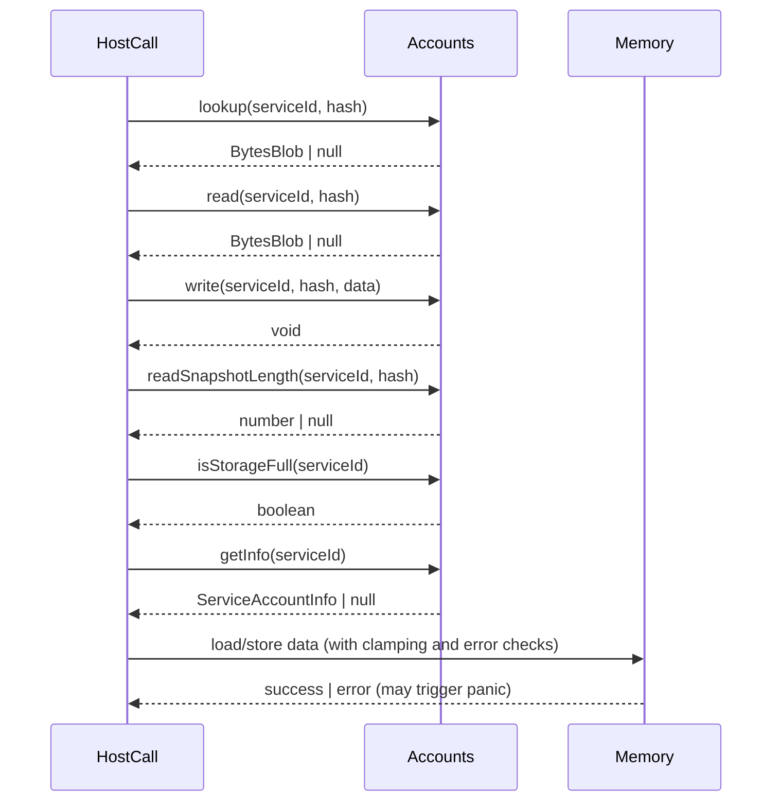

# Updated General HostCalls to GP >0.6.4

## Pull Request by @DrEverr

Resolves: #360
Related: #323 #246 
Fixing bugs, updating GPR references, if needed completly rewriting HC.
- [x] updated all `general` host calls (fetch hc not implemented)


## Comment by @coderabbitai[bot]

<!-- This is an auto-generated comment: summarize by coderabbit.ai -->
<!-- This is an auto-generated comment: skip review by coderabbit.ai -->

> [!IMPORTANT]
> ## Review skipped
> 
> Auto incremental reviews are disabled on this repository.
> 
> Please check the settings in the CodeRabbit UI or the `.coderabbit.yaml` file in this repository. To trigger a single review, invoke the `@coderabbitai review` command.
> 
> You can disable this status message by setting the `reviews.review_status` to `false` in the CodeRabbit configuration file.

<!-- end of auto-generated comment: skip review by coderabbit.ai -->
<!-- walkthrough_start -->

<details>
<summary>📝 Walkthrough</summary>

## Summary by CodeRabbit

- **Refactor**
  - Unified and centralized the account-related interface for improved consistency across modules.
  - Updated internal logic for host call handlers to enhance error handling and input validation.
  - Improved naming clarity and streamlined service ID handling for better maintainability.

- **Tests**
  - Refactored tests to use a shared account test implementation, ensuring consistency and simplifying test code.
  - Enhanced assertions in tests to better capture and verify error and success cases.

- **Documentation**
  - Updated comments and references to reflect the latest documentation and protocol specifications.
## Walkthrough

This update migrates general host call implementations and their tests to align with the latest Graypaper specification. It introduces a shared `Accounts` interface, refactors related host call classes (`Info`, `Read`, `Write`, `Lookup`) and their tests to use this interface, and improves error handling, value clamping, and documentation references throughout the codebase.

## Changes

| Files/Groups                                                                                   | Change Summary                                                                                                                                                                                                                                                                                                                                                                                                                                                                                                                      |
|-----------------------------------------------------------------------------------------------|-----------------------------------------------------------------------------------------------------------------------------------------------------------------------------------------------------------------------------------------------------------------------------------------------------------------------------------------------------------------------------------------------------------------------------------------------------------------------------------------------------------------------------------|
| `accounts.ts`, `accounts.test.ts`                                                             | Introduced a new `Accounts` interface defining async methods for account storage and metadata operations, and a `TestAccounts` class implementing this interface for use in tests. The test class simulates in-memory storage for preimages, main storage, and snapshots.                                                                                                                               |
| `lookup.ts`, `read.ts`, `write.ts`, `info.ts`                                                 | Removed local `Accounts` interface declarations and imported the shared version. Refactored host call logic for clarity, improved error handling (e.g., panicking on memory errors), and updated documentation comments and variable naming for consistency with the latest Graypaper version.                                                                                                                |
| `lookup.test.ts`, `read.test.ts`, `write.test.ts`, `info.test.ts`                             | Refactored to use the shared `TestAccounts` implementation. Adjusted property accesses to match the new structure. Improved assertions to check execution results explicitly, especially for error and panic cases. Cleaned up imports and removed redundant local test classes.                                                                                                                           |
| `accumulate/partial-state.test.ts`                                                            | Updated the `transfer` method to accept `ServiceId | null` for the destination, adding a guard clause to handle null destinations with a specific error result.                                                                                                                                                                                                                                                        |
| `accumulate/transfer.ts`                                                                      | Removed a panic-on-null-destination check, aligning with updated error handling semantics.                                                                                                                                                                                                                                                                                                                                                         |
| `gas.ts`                                                                                      | Updated documentation URL and simplified code by removing a temporary variable in gas value assignment. No logic changes.                                                                                                                                                                                                                                                                                                                          |
| `utils.ts`                                                                                    | Added a blank line before a return statement for code style consistency.                                                                                                                                                                                                                                                                                                                                                                            |

## Sequence Diagram(s)



## Poem

> 🐇  
> A hop to the future, with Graypaper in sight,  
> Host calls refactored, their contracts made right.  
> Accounts now unified, tests neat and precise,  
> Errors now panic, not handled by dice.  
> With clamped little numbers and docs up to date,  
> This rabbit’s code garden is looking first-rate!  
> 🌱

</details>

<!-- walkthrough_end -->
<!-- internal state start -->


<!-- DwQgtGAEAqAWCWBnSTIEMB26CuAXA9mAOYCmGJATmriQCaQDG+Ats2bgFyQAOFk+AIwBWJBrngA3EsgEBPRvlqU0AgfFwA6NPEgQAfACgjoCEYDEZyAAUASpETZWaCrKNwSPbABsvkCiQBHbGlcSHFcLzpIACIAVW5aaiiAcTJlXwAJfERcAGE0H2QCSGSrSD0ABg0ANg0AFgAaaPtsAWZ1Gno5SGxESkgAEQoAUSkKPjRkW0gMRwF+gGZqgA4G9Fpaf0Q+5D6xgpRt4ORMenhmXnwpNgxcZH8vJPpi3FgPVPIqTOy8gq9kAAUGVyAEoUFhXh5oLJuCR5uN5JcRGINDA3oxYJhSPdpPgvFJDg4PGYlhV0Bh6M4PA8nmF8ITjpASQAmBbk+hmZl1WpojzYBJJcESPFSZAAM3gAA94BgiJABNgiCcKT0BeJZSU0l9rNgKNxsh4bCQiEgaHwAaUbGD/GLKGQGNJUQBJMUzUTSRDOWRrSGQLI5fKFSCYgnzMgKC6RGheeT+ADuFA6ZFR7lViRo9lhDHgEoYf3kMoYXmwShOPkgAANSJ8ChXgz9GH9EGsCq98IrYGF0bbcAxO7AG3ny5jkBh8KEw1hztxIjdOin0dMyA4tl3qF33lqDv7fkGqRHuNR4AJIpA4+pO6VIGNEPB8BhkER/Ek+K9MJAqrU6guPNxvL5/CCEJGyweY/BICR4BIOMonXWBcFwbhEA4AB6FCTVeVoNCYZgUIAMWLMUxVkAAZFREBQ3AYThSgXBQv8fBQpZlg0Ix9GMcAoDIeh8FdNA8EIatlE6CM5y4Xh+GEURxFFeV5CYJQqFUdQtB0diTCgOBUFQd9+IIYgtxEnCxL8NA4xaJwXDkhRFJUNRNG0XQwEMDjTAMQ8GAAazQbEUKENBcP85gwAHHIwCHf4ULQBgmGwW5EA0GgckS5CDGidKDAsSAAEEnQMmsRIcSz5F4jEsWkIxsrdcyktCadZ3YI970YR5tkraAQmymL23iutSt9Csuti3rwTNMVoo8bTbgoRRsAdWhnVCXppErABZbxxFWtBuDrJgfGku8Hzpexzm8QUcnwKhSEgMVLp4fxzh86Q1mYbQsAuq6SBbFVEAwbbEAHUJ0zQNZPJIWQom6NAwn5U9SorABlShIIdJ1aDrU5KwAIUeMHmQEDJJlgCsfxayZkFemVcDek5IFe7h+FdPoKBRjxouGoGSGp+B/nZdB5XwPESHfMVHjlGVaHgPN1XF11fQ+p7Dhu/9Fvuq54FLdBEFkDA+xmsdejprmB1oIp6S8QXPP5e6SEe7E1mfSkVQTdQPGBh3hfoX7/sByBIllV5mwxURPJQJmCE+pWxX/b76H8XBEwgjxmdZ9BuriuqMFu0m2DbU3g1OU9ZnLFOpY8J0BhkWMud1DAZTlYuAOkDbkHONhJaSGNUQAdUTGXIGBlpuH1Cg7gHkgo0Os83ghdFB9QRvUSNNBJY1b2kN9/2iFeLsZrjZVIFou6cw3cCgJyKJ54ppBb1lUmi3JpXS3gIhyHoW7XxCevPD1A0g9vZgZ1+7sx6qEBW115ghjvHwc8O8ZRgDYMwS68k8SRDEIdBKRhzCWGyl4M0TUjovDnqIR4VBxD3mQKVEgkoR4iTun+E8UtD63HUFBRAbFIC5FaicDYdAuAVg6jkIaoDEB1nqiQOc39BrpxGlTSg40HTgkrB5byvkgp+QCiFH44UmxRRkXcRKIQUp1lgZ2BhXgmGXFhKPNhyiHqvWxBWNYFZwEkCcZWdeANxwDGoGgdxFYlDc3+P4pAeF/wYxVOYphucTbIArBbfAVsdrOMdv4l2NB/GOwRn9De44SJkG3sTZxSAEYRyemEnw7jMZVi5k6LO+ASZpQygYCAYAjAqKehRdRQUtFhQihREBGcEp3A4E06ImUcF5SEmQqIRVXpWVKn2cq7CDBVXIOZaEsIEYMETNwTOY0JqVmEUMsRrdpqzXmsdJQEpyCnxyBQOauBdRsxVNQrMIlIFoEgndD+acOZgBpCJUKoR+kLimgcxRhZiya0mDrPW952wU2NoocUx9bjKHQRqUxfzQH2DKddTGucV6+Jzsi/OVJRktMrAkpJAJS6o1oGsEcsAQQVi4EaBOUFZLQ14LbBxbNtj4GzLSbF0MTRSCwMyj2TyKB1w1NDCsWNZBJRxoIPqfAKyN0aVACsjs6XIzLmjJlRNWXss9rsA1ijXED18dZKV4EZVyrlAqpVKqLYCHVZWLVrEdXpJIPqlmhrGUFwBmsYGpqcp4MoCcfReLLqK26Ok7+g84qKX5ogLMOYoL0GZZAMGsgADcPByZSK1eBJBsl5b4o8OwFwPrKxZJyV43A+SA6wADazI1IaWVssgMvfOvot471KtDCQBRgg3RmswckOKM72Cbb7HISRpW12/tDWYzB4T8A1WWk+Ei9myHrRWEp1aKleA7UGiNHLa60wEILSI74JZSyPBqE+Vb43XVQNHHwawBCTCiM1aGrwtgDi8F0AomBFE4UPP4Z49JfQMF1P4W4s6UN/seLrEgR7SC4DqbdC9DKr1c0Tty2NMoP6vXIRgFdsq12ViRoGh0xzbh4YaZJZEoQ7qavCaxAwqY5EUAUXyHYYRqKtwuJdESYop3gUeCJDp9sWh9i1vRy1JA0b+NddIVVHrnE4zQHjAmRMqkqkRmp5juH6kk15KJdgOJbTIcUb6ZIVAYTbX6LQIVjhGpUZundQJ2hIj0EuAQPa9gJGYHEAwBKNmBNCaftIF+b9joOGHpJrWcLYD60RfwaxBDkDYsuO0HYHtRYHQ1FRbgz7fDAsbOWQ8CFKAPl49gyN+CqNm1PkoB+ZCMGM0PjQyTAG+BRIYMw8IbCOHZV4WcdFgnDnSI5qIs8F5T63R8Pgc8GoYkotGZAXQ1LLb8gI+p2gXAGOdvoAAHxmDHbtXB9OGcJgDEEXArBTqQCQYAWnEA6cgDdxuegKwGH2zqvV9LTvnbU2jf7t2f33cgI9kg+Nnssrex9vo33lXafdbDwHwPQeVj9SdtGUPGOneNQDB7uNkdGdDTa6mD3se/dxwD/8r3rAY6+8KDWQOQcHd1Z7bJPs8kFNeCTs7kALtBsp7AanBnaeo45+9lgn3gAbq3WznwfPCfHsQKUj9JAz0S7J5d5XXPgB3qFpgHXAucOsZN1L6H124deHN6rzH0umP6NY3j/8fP0rjJaW5BT0gNGBU0cCnRhQ9GIcAXJkg9FnDiAKGAJdNBDHJRGWMiZOUpmGVmY4eZJVXRLNlBVPj6JpzpfTxIuzfm+B7HSKJ2Eyp6BMAfNTeKk6WAxA0Enmxqfa/NBgv4Mq5f34ycqyQMA94YwoAk6PTrOE1DJer0vlbO83kWOzKECs0+Iljmph1tYy5dTfw77eC+KH19gKopEUm++qAPgc3WHbXskvUGeWeSYdNFBZqiGKHZhID2UrFLHVAIQxjiS91Oz90qXBAvhXn6yEF6D3xgI02dAfA1g8AGgTkwEQFfyNjzhbGqkgCIGwGcHb0eGWh/x4SUDgwX3bngE7mrkdX5grCNAcDwQ0CPgoBMVWwEWfwIMoGGHGEug0AGC/j+iowADlxw8Iep0Yw4wCpDIClZuNKlSYthOM5Z0R38/Z8ATQxt/BKYjo4oy9SBg0/wAZv5fQ8CX8PNbVMZ45V0Kt0ReU+hQh7DhC+AtgNoWtc9cF2s+siE3YSFnB8t+s3khseIRtWgd9xtWEK8oBVoyUTpX4v8x9+R0w+FKxvCHMARwCZQCFTcZd0AkEM4uBYhqhGgh4Zxs1khJguBGig5EF8AmckpgBoAbBsoZCEY8JhgbAAB9VaYYVaAAeSGKxgAE1oBhgEY9AOdOCNpgBxiABpNYaAIQhzUQmaCgIHSAQAJMI8jtjKBCjVCqNSiGU4CvAWwKjbgqiai1hUt6i6AWjmjJgXoJF2jEdmcuiei+iBjhjRiJipjZj5jFizUuDcBViNiYBTiRgxD9ixEsAH42oBFOoYpHAgE3ElEKxQ8ukApw9elcBo9Ip2ZsSE8B8U8vA09j8sNapjEc9g82l3JopVEw9ulI9tF+lY9KSkhKIESUpRlA9Aj88CpC9ip+sLCK9UwZTy0rgVpoYO9JYqMDg+wQ41wQV+I+hnhuxzDfNihDw64xs31iEchijfMIdIAK5aChQCgNZIAARG4QRUR3sII7xegYw1gzSwiLTpCp44xf9G4fQ9C0iXDZUogKwrAJBmBhhJRRA8BDoNArBMApZrMtJkANSvI+ZfRyYhVmD5M0zjCa5ZUzw7Rx4ow6A1gH1II3CPAFIcD6RLgHQohTF2xQht8pZ1B59MQKQLF5VXdx5/SCF0AvCEBkB9QqZ74WA5xwRJZpZbDMRQhjSpZPJv5AMpwMAx0LF6AiiAzmogyzkmBxhpJczlz+Zu4MhxjwIM0KFk4BxvAuhqRSy19O9PY7SChEB6QTDFSFpWsgjhIQj4NiEetIiqFBtR5htPBGExt2AkiVkoA5Dx9sRjp5ZP8ZUVoILaFoLRtEjxAVpR8PBXolBWJRSWT2l2TOlw9iSo9eSiBJhhSc8spcp8phJJTi9pS+zsQ3B0R5Tsikgih0RYgbASIlEENZz2Bjp11oJ+gbwp5+p0QbQ7RMN6Anw0A3NrFMDT4KxqFEyMkiCTZQzJo5smDBQx1EwVBTwKw1AiAWi6w3w79LpAC+L7wxgRIGLkAdyJ1UBfypBg1MYJLtzo0p4n9ZBspEBqi6gARPKNAcMAQQRWUn54B/AxB59DxthAD6RBclQNBPCAQAB2NYDQEq1lUmC2Iw/rTw/ufwE0C+PgAqzfTsX0Ty68cdF80w5Acw7i6s+UPAU+RspWRACxIgeCefABeoiUSGeQCec4S0pcnA/deNKyCy5gk8LDLBQIqNXrChNC0C0hcC10aIqC2ImChI+CgilZOQ8gZk1pSiryairk4KOi3RcjfATPTQbPUUli8U9ir2IvL0Li5ZXixanIFoV2BvHS1jOsWrCKO0gSkSYoW/PmGgjEoRfRZbaTXvaGPoGDQUWqVDMeJBWgbwEyxAniV0a5GUb+dQcEAcrDGzNG3ACzZbGUJdTDAAcjOTND+l8HpjtOQwCiiCxunQCV8QcuyoCx5mW2A3bFGo7NPlqhi1TF0oTMQwMv0P6X4Fng8ArGhoQK70UTHHMjzD2W/19AjOSz8LwVji1mZg63LLHxXnoOOjGBzHkEctPmtrqjiVTRIBuToDrF+QcBig9G/W3RiDHHIGaDzB2FJgJtjt/H8G+S9PkD+nbhiC8SfLPD7g8HGPGKxmUKP2YTls7DaKsj+CFSeBH1/0FozuKGiCzrA2LRNKLvHBLo7CNiQQro22lmrOaExnUBOEypsUPN/xlMn172zPXPrPAjqrNEhvfA7NnzFDADvVTRxGhOkpHv7k9ottfKiG9sPiCC/MrBjLjLVqTPvBTOLIzKr0Xx0LPtjPjP0sOhMV/2dqyrqPS1eAXmgjtsoCox/D6BQpWhtBlBwPRAJreWkkiOcEUJ0r0vVtxPfy5odVrjauLCVNeSRILn7O/k+W+QoACJYu2siNCPHjAoduwpiIjrwousmypWuoZrlJ6pOCIjPLnw9uAkGsxk8xmHbuJvdvJBmsgroTiNgvwvkG6wOo6zIuaTurZIerUSJJ6RepjzeqYu+smTYpmX+qlMWTYZBoX1oX6zM3Jw0xbxeT1N1siAYoYFkFSFwHQKUOjl1l8yPIVP8r5n8BnAmnoFFQHhSrPORvhhwxcbvt1pZpRIhTCKocDNru+O8ZFq7C/R5msfAj8cuShinAfv63liFp72nRxpAIiIzGJtJpnNYCktLB2WPAWv4DwD/E7N1n/w1Ao3XE8YRq/t8ceCc27CgmbviTrABAIGpl8A136FKiFRoDHg+joDBGxQrAaVKzQWARmACgvx6tJhErEplAGskpQy6bVC/pktH2vBCuvqMDqShqszJm2DQdVv0pQbJWMrq18GKHiWNGikca5giYFpAL6emsrHCed2s2yiwGFgoHn0tunnDArEGRYzuYXn/E/Jmyav5mMiku3zeiXPXF/tbl2DQFtHlFEB1MgZrVaZdqHU7FQAAC9KB3qbNy75A/VcsgLmoj6F5NsBt6jd959p7ha7peDEAi0T53xeD+AsSKAg5fR9DLa4lz6X71bkzUyTTImbYU6sz7xVTDoDhqqNzdCXz57+hihbZIQNUdxAwvBljuD86sZPUKwrW/hbXNB1i6w/1dTtbT42Wj7PHen/HrJ3xzCdXWF7x9WuZd7srnWfBXWNB3X0AxQF7fRJXp6wUsyeqvGVpfR9Rth6mLEqIqrI2pEY2bXm47WC6IlZtyawhEwiBSAZX+ZVyxtmoWWc6IbxoeZnleNxj9h4cEM2G0x8b0RrTbT44SMDh38fSLgZoCRJW+zaABy5RW3virI/Uq4W61yNysBO3ix/A1gethGoWYXXzSWoE7o4wZ4BHCbwRboo5FDbbumB4vM5xRysXu9B6H6Y0TzV4iAu5NrSHgjdqKGZGym+saGTq6H4imEGHki+0kmog4sFtonKHZGp4Un8SqKVGI9nqeTXr6ljF614gciqDH49bkWsBMPlHOTVHuS+l8Ps47g2V+cUi0innkG6xbwMjMKehdYerg0FR9kmsDgKrol/8prKRkBanEx5hKQ70pB5Gg9FGCSaK1G8OY8aV+QPqtGMofrdHaQ5lAbDHgbK9QbQgJRrLNPuBtOmO7ShGJPjoA3FFoYLYIppH/aIH6AmaUO0SCtVtH0H6ozBFmaMag6ZMEWMaPqNXeUtX2pMSlsxFIw69bgCE1hL2pZOxlpKQ1oNp4AtodoUsI4Mnx2uUk6+VOk81wZgWKwAQXG1gkcUcTV3F/WEOFpOFLoth9QKR65vT0ByxlLHNs3srEWDFgY8quYAQSqNAkqiLQGGCIulsNBeU7ZHR8qpukqgCRqsBsVfR1k4v0aEvRp5EJpURkKZSCsKySKmzFbgJROGAWwd6ME1g7oO8E48QboLY4wi05XxPn0Hb7kpYIgUFMMyz5Z2wKBFFFLdbgufPuFzyk78BrFC2svCvnKbYVvlb77aELunbaAUCL5KRuoKBf359ug/KpF1o8E8vtoq2dKUPp8TH0tMZnaGnQnXRvPQuinKwRvhkQhGksFAOOXCEQK4m0PdqIPxGzqYOWFLqOEjQK0ohXP1S4eOfDvxFJENRFsREYnjvFEMOrObPRF61psXa2f9uQvDuMP+8eeou8SDfGSmPFO2IQ8sOaOcOSSySKJ7fUptG899PCoAaFlS8jHTOgmiIs2hKPAlffAteTkjv5tFFQOdqsBB73ykDb9W5zOZMSm8bynZoH8bSwF6oADI+FBuu1TfArP3nrJyfBzYNU1Ishzp7vWXEwXSWP4Gy/gpECWtB9ENArONXBrja+ugzZAsymxDtEl+R+Cd5W+LGlDJZUqgfSZVqrKPB06VpfleIxRPC+YaW6tEM5M+t9w67hbwul1R5aebL3VW1CkJbKxt/PCr+aWg6XvSF1BD0bNBq/KVo4pyAHRtggNaMlzg0BbARQuJBMNtCqxYor2ltKREq0vpAM1W6ZGjE6hQBAxgmaVAsGnza4m8w2vNWzN3kPbEQtSjYf0nKE+YyE5glAU5PYGJZuwJ0xQdehSEV5i5YAbeUgXAI1DHtWWV7fEv4CdD8paBjcIavQNJZ5gaCY4Lusgk3ZjZzw5YIVIhmIaQBe26QW4gc3OS+BRYPLTGPO0LjfwTCb0MvlfhoBoZ+q+4e5MLGYD00nYpHRMBJxIY4IyGDtEDuEWT6UIjqYjXCtBzgoy9GGUAeXn+QMJDh4+8WWPiNCT6jkMOKnJ6h715Le9tUOUdFmb3CG2cGeVvWPNrzxIxDaOuHejhpyOzWdHeTDekOdz2rJwMK3+KHry1oa+dKwJEQoZ6iHqGUUUTvCikow5KEl3e6jSKI7EN4ildOOjaZAZ0D4l5QGKyVMATQs660+hDvZbJ43s7ZpHOCHGdDKHprm9Yej8KmnXF8yp8a2yNVXlkJSYStJQPNSdvn11o29aoGrFIZT02g094eVjbGDTka4Ax36OIBXsGlrLbt58A0E8ArnxhB0DSU8W/Gf17wVgAAAtPnhB0RmU4Lfrv7RUoADxKUDEIEJXXAxdPSw1eQMAUypecbeY3NbqVRMQVkJ6x0BbiIjyrVpxuuASbsSJ/BO0x8UgsoRQwJp3cHu9tJ7hHVe4zQtBn3b7noV+6Lldq+4CxO0ERo/lAW0UBpoPGtRWJAG8gFHvswGgw9OebNQ2hkyLDCw0B1sOKEqK/aPD6+FIRvnUO2H4DeMgvdweUNQ5gdxengnCqdXoZ+C4OgQ7xtHxtHJ8zGqow7nUP2aC4V4hvRISb0Q55N4Y3oo4eF2t6RdrheJWYUYmKHkVlOrvLobRXU69DPYOncZHp2GEB8DGwfEzvxjya145wOPNmHj1QI9MVheor1tPg4HO0Ti4VfXG32qTYAaidSAgKmSXx1gkyBbNhI/hQ5IdE+bg0ci10+Fc8CWN0dJnzFBHVsaAAYmAHGFKEUIu8Y8CsKtGygAANIYrEAWDMgr+64rcTuOZBTEnQyQIYk6BkLQASRY+KmDNBJqXJigD8C4H7GcDXQaia9Wmt5SG6QBdxH40IK9GlCAJmAmCAwDcwGj9pdo3CR5kgzwAvNiC/MPbqv3WoeJncXCAKLCCUKoBoMsEroPJDeBeQaaRrcEM0znqmh+ggQCgrzDlZoBAJjgSAO+PsiYNggYrJmPgB9JLQRMCGJDFJVHYDBnuFrc8CA1pod53KpfT7osGZDyhmh1Q2qmRNfD0gSm5OG0gMFJiXQX4xRGPhDksaoALSCggQNzGSyQQFUoLefvz1TDWp80eKZPOsE2Aeg9+bAtqpZXWqljwIG/d+G/2cAf9SYFk8GH7AclYTHgFwU5j+OZB/i6YNE06NOnmAd8egfQVEGsn/oVhYgVMZYNlHGAaVaBldPuu5NfAjs1MykngMWFL5PiMJcaSOJZJpa20EMgU0qbxKVjpJTBo0ekCpEgCpFu6BYZABbBXiIdbgIvFoH+nSk4ik2prPKUpNtJyAkoqIcYlgDbZdT6AvBN5vK1fKKtn6iA1VrfSCZL9586oj8iOlvLgDgsIA4xpZNzS+UyAQtebq4jWLgxae2EqTFPlcqbpPO4WMaQMD5g+T5AE0x0DZhG7gQkCcNZaKXzUkmgCBc/S7LT126JSrpN03jHKUUANkapQMoiLv0xgnhBAfkttJDUdjfwUmvoL8fFMIEgp3+U1dEaEC4FygeBcLHWkxMmijhUWOksQfMAkEgNfQaMgQBjMKQrZywYEBljND5httFxGADmiuWLKwywy7U9thmER5C8lYNoaKEVwYLUI8CYgAarADiihxopaPJNHfC/5qyMAocLCZMC8IKTbsm6foJ6FtDz4Sa13FNs4AsT9ASp9cKaTNNXastc6h8JEotPDLLSn6F9V+tfWQEMA6wi/aSF3EgB4QNJvXPGe1Q5lwILUmcU+B2RImyT6qPbPtuoIHbLITGs7BGehMNbET+qX4oOHFGEZ1SF2S7A9sTPkBISi4QtIOJjAmoWISBkrBVjXySbfw/+7oQAVZCKyfYc6UAp2QBWcHAUusw46hvaNob0IfB+FfwfBzHHujIhvmeGAOLmxCYi0w/GcVzxJiZCTk9aM7oOwoZcdpCVQoicdSMgq8IJEdZoe/kwSJiXe1HFMWp3yGRQexwyH3oML945iOKRnfMeXhWRVRb4f7DwP8P1l+wIGaLF2prLHy+gbkBwQXGwUbgFpOO9JOcsqPRA1JnGbfNxugmvqQB95Wc2bld2tHsiy+b3PkZtme58A9B+DDUNUOwVAMAOTgoDsL1HnxM7RNQyDlPMkawcrq94EgLdXvmdDVOdHUkryT9T9DmKQwgvPo04rGc/5xjKYVOIrDiK5h7w8CAogVnLCsmbMYIfmHHgB0vO4YuPnUNFS5MHRGwtUUl1fa+YMhVwvnvFIREOZ7Q3430AJlBkEjxafMCkUMjyoLpvEni+mC5LJHFBUaNvVxFfzCV+LcAPiamHWE64HQpAvXG0GswaZ7dDhcfe5I8m7Y2YE6E/T5uIpgkGVZu3TBgqbR47M8d6XtA+nHHLadkaEO+Hst6GDgET2mXGP2gYr6jvQ5oAAyhBqgQH+yMAN9dVt613bf5E6QcHaUgWmYYBtpD4d5AYONBySaZmPDwKMugVojIaxWQBVfNaZJdymrs0ibtWH7kxAGpAlNmtM5Y+yeUxZKyU8nuDUA3guU98PjxBT4SZ6coFOQvW9orKwgGyr8vSDdokC96I7atCdAZbloaYxgsiShmJYL1pZ7g50AaNm4rwXlX9KFCWF1r9KVW94K/kYt6hTT05bzMobdEQyUIU+iQPZLYQ2VAFSC6S2RFYp8xTxP2lwOsh8tqUANR6R0boGUvPyz1ClU8WFvjMYVtYhenWX0IvPA4TzOFEjc6s6MQp4K+FpMSWOHy4Z/5lVtiBOvDOnFft159IM+d4O4Uy93ObCo6LNwnptCkxD84RXkNEW6IVF78rMVIolIyKf54w4xhWF7iuwYag4P4Hg0Xb9AWuGi5ygwX8CXQ00ugjAH2UUTULF2a6FUIPBbIehv4d3N0snSxFRy+KbyyGtam/ReByAbUTxtYgowhizK0YHESqEtpRBKZJ8XNadwoWnxLJmML8XJCSjoAx8c0sEdOjbYSgZWuANLqti7K74yYFwfOTS06zQxfxjEgCZFO1WlrfwNy5qHNI9l7EfldU1ALylhAsCGC76cqb5KgUeBmU38bFA1wEDeTQVua/NRm01KoBrktEKIBnB5iJsF6IdHpeHTmn5zG1KoZtV9J+XNqsJblQBsFMVTM4dMnS7aa6GaH79uWGAXmUy1TBst4Vo5VAJCCwBFrLoGdHbuiGZSzJQVn6mxjTPlC447oi8cOZHKaU5s01OWfftUPmb0A/1OIJAs4WqUoiPASc/qp8soBrBegdGU/vQH0L+jaAwuXJC2jYEjNMRiKefAJqE3NpW0FYV0rFlXnIdOeg9MeO+zHizcf+k9adBOOmEzlO8kWVFHwGnVASQpYUuKEfJ6k0AG2yyx2iZTe73ihWfAffo7J1mpgY1S7ARuZFbnXLW6K7CWUurWVk05xFNcLAhDjWNNSSvENeooU3r+Ev+WqtTRwIG7OKxV6IFzBpUPDWJbNQ7CUQhNkp8B5KVzLaswtS2i9bRR0CXgatlUTYXRrXOnmqMU1DiTVW8nId0LTEUR7ViQ/BX/OtFHzMirG0+V4NI7olPVBlY+ETTJS3yFGzkVyFxBVAjoBI/vKIGpq4BUBzIhnKyNyvhlKR7IqkJyIYA0iiR1AQxDWIgCGJprZKtAIYhf1CDsQDAh25kMsAYC0AxQBVAqgIAKrLBXtDAAqgAFYAAnL9rFD/bqgAgWgNUGB0ABGf7WKAqACAKgxLAQMsGih1BIdHgO7YduMjHbTt52j0pdqGLcR9tQAA= -->

<!-- internal state end -->
<!-- tips_start -->

---


<details>
<summary>🪧 Tips</summary>

### Chat

There are 3 ways to chat with [CodeRabbit](https://coderabbit.ai?utm_source=oss&utm_medium=github&utm_campaign=FluffyLabs/typeberry&utm_content=368):

- Review comments: Directly reply to a review comment made by CodeRabbit. Example:
  - `I pushed a fix in commit <commit_id>, please review it.`
  - `Explain this complex logic.`
  - `Open a follow-up GitHub issue for this discussion.`
- Files and specific lines of code (under the "Files changed" tab): Tag `@coderabbitai` in a new review comment at the desired location with your query. Examples:
  - `@coderabbitai explain this code block.`
  -	`@coderabbitai modularize this function.`
- PR comments: Tag `@coderabbitai` in a new PR comment to ask questions about the PR branch. For the best results, please provide a very specific query, as very limited context is provided in this mode. Examples:
  - `@coderabbitai gather interesting stats about this repository and render them as a table. Additionally, render a pie chart showing the language distribution in the codebase.`
  - `@coderabbitai read src/utils.ts and explain its main purpose.`
  - `@coderabbitai read the files in the src/scheduler package and generate a class diagram using mermaid and a README in the markdown format.`
  - `@coderabbitai help me debug CodeRabbit configuration file.`

### Support

Need help? Create a ticket on our [support page](https://www.coderabbit.ai/contact-us/support) for assistance with any issues or questions.

Note: Be mindful of the bot's finite context window. It's strongly recommended to break down tasks such as reading entire modules into smaller chunks. For a focused discussion, use review comments to chat about specific files and their changes, instead of using the PR comments.

### CodeRabbit Commands (Invoked using PR comments)

- `@coderabbitai pause` to pause the reviews on a PR.
- `@coderabbitai resume` to resume the paused reviews.
- `@coderabbitai review` to trigger an incremental review. This is useful when automatic reviews are disabled for the repository.
- `@coderabbitai full review` to do a full review from scratch and review all the files again.
- `@coderabbitai summary` to regenerate the summary of the PR.
- `@coderabbitai generate sequence diagram` to generate a sequence diagram of the changes in this PR.
- `@coderabbitai resolve` resolve all the CodeRabbit review comments.
- `@coderabbitai configuration` to show the current CodeRabbit configuration for the repository.
- `@coderabbitai help` to get help.

### Other keywords and placeholders

- Add `@coderabbitai ignore` anywhere in the PR description to prevent this PR from being reviewed.
- Add `@coderabbitai summary` to generate the high-level summary at a specific location in the PR description.
- Add `@coderabbitai` anywhere in the PR title to generate the title automatically.

### Documentation and Community

- Visit our [Documentation](https://docs.coderabbit.ai) for detailed information on how to use CodeRabbit.
- Join our [Discord Community](http://discord.gg/coderabbit) to get help, request features, and share feedback.
- Follow us on [X/Twitter](https://twitter.com/coderabbitai) for updates and announcements.

</details>

<!-- tips_end -->


## Comment by @DrEverr

> looks good, however I've found some minor issues that need addressing.

thank you for good suggestions. I've applied them all.


## Comment by @tomusdrw

Can you please revert changing `static` utility function into an object method? We are not doing OOP and I don't want our data model to have any methods. Logic/calculations should be separated from data. `thresholdBalance` is not an intrinsic property of `ServiceAccountInfo`.


## Comment by @tomusdrw

Seems like this is done two times already. Can you please move it to `./utils`?


## Comment by @tomusdrw

```suggestion
    /** https://graypaper.fluffylabs.dev/#/9a08063/33af0133b201?v=0.6.6 */
    const maybeValue = valueLength === 0n ? null : BytesBlob.blobFrom(value);
```


## Comment by @tomusdrw

Not a big fan of the change to introduce a common interface for this.

Before the change, each host call had a very minimal interface that it actually needs.
That makes it much simpler to reason about the host call - you know which `Account` methods it will be using.

Note that having multiple "small" interfaces does not mean that we can't have one big implementation (i.e. implement `TestAccounts` that are shared between all host calls).


## Comment by @tomusdrw

That's unnecessary. Just use `serviceId` you have one line below. It's going to be `ServiceId | null` because you can't just disregard upper bits of the register.

Whenever you have `null` you can simply leave the bytes of `serviceIdStorageKey` as `0` (i.e. don't `writeServiceIdAsLeBytes`) because we don't care that much about the resulting storage key, we just need to attempt to read from memory to check if it's accessible.


## Comment by @tomusdrw

I think this is unnecessary to do before attempting to `storeFrom`. While it might be true now, we've already computed the `offset` and `blobLength`, so why not just move this after the check and remove the comment? That code would have less internal assumptions, hence it would be more future-proof.


## Comment by @tomusdrw

Again, let's just move that after attempting to `storeFrom` to make the code more future proof.


## Comment by @tomusdrw

The big interface thing is clearly visible here. To write a test for `Lookup` host call we needed one method: `Accounts.lookup` to be implemented, now we need a full set even though they will never be used.


## Comment by @tomusdrw

Of course in tests you are using the shared instance, but this is imho introducing unnecessary abstraction (i.e. the actual implementation is moved farther from usage). It's used exactly in this one single place, so there is even no code that could be shared.


## Comment by @tomusdrw

Same as below, I'd prefer to avoid the early-exit and rather attempt to write first. Saves you the trouble of attempting to explain why it's okay to exit early and there isn't really much extra code that you have to write, just:
```
const encodedInfo = accountInfo === null ? new BytesBlob.empty() : Encoder.encodeObject(...);
```


## Comment by @tomusdrw

This isn't the correct reference. The link you provided describes an account as it sits in the storage. The one in host calls may be using a partial state and here we have an access-methods vs just storing data.

In comments below I've also tried to explain why I don't think bundling all "decentralized" interfaces is a good idea.

So please consider bringing the previous smaller interfaces back, but I think you can keep the common "big" implementation for tests. 


## Comment by @tomusdrw

Since `.test.ts` filename extension is reserved for test files (I know we are not fully compliant with that, note `partial-state.test.ts`, but I'm working on fixing this), please consider renaming the file to `test-accounts.ts`.


## Comment by @mateuszsikora

```suggestion
    return new BytesBlob(new Uint8Array());
```


## Comment by @tomusdrw

```suggestion
/** Clamp a U64 to the maximum value of a 32-bit unsigned integer. */
export function clampU64toU32(value: U64): U32 {
  return value > MAX_U32_BIG_INT ? MAX_U32 : tryAsU32(value);
}
```

I think this method is a bit more specific to the actual usage we have.
