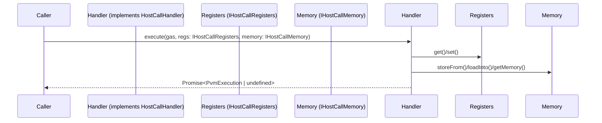

# Exports for debbuger

## Pull Request by @mateuszsikora

Currently it is difficult to upgrade pvm debugger to the newest PVM because of:
 - `Registers` class is exported from two packages (debugger adapter and host calls) and TS reports error when we try to assign `Registers` from one package to `Registers` from the second package
 - I have to pass my own implementation of registers and memory to host calls and currently it is difficult because host calls require `HostCallMemory` and `HostCallRegisters` classes. I replaced them with interfaces.
- `HostCallMemory` and `HostCallRegisters` classes use `U64` type so I have to export it as well to avoid casting


## Comment by @coderabbitai[bot]

<!-- This is an auto-generated comment: summarize by coderabbit.ai -->
<!-- This is an auto-generated comment: skip review by coderabbit.ai -->

> [!IMPORTANT]
> ## Review skipped
> 
> Auto incremental reviews are disabled on this repository.
> 
> Please check the settings in the CodeRabbit UI or the `.coderabbit.yaml` file in this repository. To trigger a single review, invoke the `@coderabbitai review` command.
> 
> You can disable this status message by setting the `reviews.review_status` to `false` in the CodeRabbit configuration file.

<!-- end of auto-generated comment: skip review by coderabbit.ai -->
<!-- walkthrough_start -->

<details>
<summary>📝 Walkthrough</summary>

## Summary by CodeRabbit

- **New Features**
  - Expanded the debugger adapter to re-export additional modules, increasing available functionality.
  - Added new interfaces for host call memory and registers, now included in public exports.

- **Refactor**
  - Updated method and function signatures throughout host call modules to use interface-based types for improved abstraction and consistency.
  - Adjusted package dependencies to reflect new module integrations.

- **Chores**
  - Removed an obsolete workflow related to publishing host call packages.
## Walkthrough

This update introduces interface-based abstractions for host call memory and registers, refactoring all relevant type annotations and method signatures to use these interfaces. It also updates public exports, adds new dependencies, and removes a GitHub Actions workflow. The changes are limited to type/interface refactoring and export adjustments, without altering core logic or control flow.

## Changes

| File(s)                                                                                           | Change Summary |
|---------------------------------------------------------------------------------------------------|---------------|
| `.github/workflows/publish-jam-host-calls.yml`                                                    | Deleted the GitHub Actions workflow for publishing the JAM host calls package. |
| `packages/core/pvm-debugger-adapter/index.ts`, `package.json`                                     | Added re-exports for `@typeberry/jam-host-calls` and `@typeberry/numbers`; added dependency on `@typeberry/jam-host-calls`. |
| `packages/jam/jam-host-calls/accumulate/assign.ts`, `bless.ts`, `checkpoint.ts`, `designate.ts`, `eject.ts`, `forget.ts`, `new.ts`, `query.ts`, `solicit.ts`, `transfer.ts`, `upgrade.ts`, `yield.ts`, `gas.ts`, `info.ts`, `lookup.ts`, `read.ts`, `refine/export.ts`, `refine/expunge.ts`, `refine/historical-lookup.ts`, `refine/invoke.ts`, `refine/machine.ts`, `refine/peek.ts`, `refine/poke.ts`, `refine/void.ts`, `refine/zero.ts`, `write.ts` | Updated method signatures to use `IHostCallRegisters` and/or `IHostCallMemory` interfaces instead of concrete types. |
| `packages/jam/jam-host-calls/index.ts`                                                           | Updated exports to include `IHostCallMemory`. |
| `packages/jam/jam-host-calls/utils.ts`                                                           | Updated function parameter types to use `IHostCallRegisters` instead of `HostCallRegisters`. |
| `packages/jam/pvm-host-calls/host-call-handler.ts`                                                | Changed `HostCallHandler` interface to use `IHostCallRegisters` and `IHostCallMemory` in method/property signatures. |
| `packages/jam/pvm-host-calls/host-call-memory.ts`                                                 | Introduced `IHostCallMemory` interface; updated `HostCallMemory` to implement this interface. |
| `packages/jam/pvm-host-calls/host-call-registers.ts`                                              | Introduced `IHostCallRegisters` interface; updated `HostCallRegisters` to implement this interface. |
| `packages/jam/pvm-host-calls/host-calls-manager.ts`                                               | Updated method signature in `Missing` class to use interface types. |
| `packages/jam/pvm-host-calls/index.ts`                                                            | Updated exports to include `IHostCallRegisters` and `IHostCallMemory` alongside their classes. |

## Sequence Diagram(s)



## Poem

> In the warren of code, interfaces grow,
> Memory and registers now abstractly flow.
> The garden is tidier, types crisp and clear,
> No workflow to publish, but rabbits still cheer.
> With exports expanded and signatures neat,
> This hop in the meadow is truly a treat! 🐇✨

</details>

<!-- walkthrough_end -->
<!-- internal state start -->


<!-- DwQgtGAEAqAWCWBnSTIEMB26CuAXA9mAOYCmGJATmriQCaQDG+Ats2bgFyQAOFk+AIwBWJBrngA3EsgEBPRvlqU0AgfFwA6NPEgQAfACgjoCEYDEZyAAUASpETZWaCrKNxU3bABsvkCiQBHbGlcABpIcVwvOkgAIgBRAA9ufApcZAAzVMglVWxSClj0DHoHAWZ1Gno5SGxESkhmahI6gC9EeABrVLR0ZFtIDEcBBoBmADYATnC0Wlp/RHrkJAdpPxIvZvoCWu4iKlp4DCII2BJrADUAWRySAXyCiPxT8/IAdxDLm6kKDvwMDQwM6NbRYBiwNA+MikZZKDDiDLwGJHBhebBKDhGKBwc4AAxsJCISBov1xjE2ixQyBIyVSVUgGQoLAib2ehwyGUo7B4aAYnTQMMgAApcg8GrM0NwScV6LB8IhcIxIV5EABKcIMNB1I4naCybgkADKDAo8ClkEoTN+kDeZyw1BozClOqefQ6RCw+MJxMoiDJjOZ/3O3F5/NIrtwwPwkcoGgM2OB5BiOxDlIYdQIzBQTuibHh1Hg/2Q+Ay6yJCt9MsaJGYqXkOzlCqVPmWyCYOfgmvpNRj6yC8H8ecVOzq517uIAEvLcABhZVXGt1smYeiT6dznwE8skv3ktCLaSAnHWOz+bibBhrGP1PcH5BvdSwFDwygZXlX54dDsZesIZC8fBL0WOMEzxKcFQ3LwF1rFxlxKSA1wg5Utx9UlbyWW4DXg/4XgQgBVcYABYyVwfUSHCW1OyfZgM3QFVnhGC1aTSZNnjQCR8HgehNQVF0VmCRA4wMY9wUwQVtCzHZ4CdJkpAUJ0CzULx1HkFcLX3c4S1qG9bTIXZ9lmF1eysa5bnuIhHhqBZ8C8CQjLIhQMAyZSxGQNSv3PeAfyM4EjhoAzxBwrT0wVZlpPPGt2ALIshP0YxwCgMh6C0rUCGIMhlHpdshy4Xh+GEURxCkGR5CYJQqFUdQtB0OKTATVBUEwHA0tIcgqCylgcr8NA3nsRwmhcSAajK5RKs0bRdDAQx4tMAwNCJSNsAEAB6VkKE6Zz8DeRBls8ARlMQWAwCENBmDARtcDATUWw0WRmC8TFYiegwLEgABBABJdK2q2PqnEG4KIWOaQ3GBdgB3OABxdQJyW96xELDB71SDavC2hl4GiBD5sfJbVpRzbtt2paDqOk6zouq7lUEu6vDJN591uaIqiPP8bQJtHeoZtt/kRIhsH8bZnlwU0LIaHCmiGSEciQENcHBKscM8Q6P1w3EmiOMkBCoDAFbQDlCpdRADQYLzOx5SNkH8TZ6R2XsACk3puC7mxVHk+QFc41PUGRsExoWbMEyAPsVJREXIeheg6Y4saEQRBlOmJcT20mrsUUQSIhRUdf4e0sDw+54WwC0MDspkMCHG1H0gAA5dONCEZAfj+LAACZW40RJWfOOOBHsGhuGWXW0SUbizj5F18DwXCz3ldQ63CepcHEY5dlr+vG6ryMlXBF01Iwbgs38bdBqYJz4H59rEfCI4FWVF0lCwuFTbWOzelxA+s1N3Fwnuf2fPOI7Z205Xb/lDJ7bSe8sCf3ZutY2755KS1oDMeC4dlTyBTkgBAq9ex/y8IqEMHtwwBkksCXEGhlqHAVMtcm51pxUxbGSQ4/gxB1gjImQ+ZZiSDQfNvVKdpxBdkRpAN+6B7CiH8MOfAnQyBCXMJYN6+DMqI2QHbYEShUTOGikjfgpYaQpBYslPgmCGAl0iEiRARg67kDjE9WIWJZqELDNIZaTB/C7QkGdUUYsKBgAlFKSgy0jhKC7ukR6z1XqfW+plGIDh/ryEBmJEGwlgS1loN4PETjPY7TcSQDxXi7hil8f4kkQSSg0g0OkemjNsDcFoL9HY/gwD6LpHRXwLS0iZCZJJVk6A5jqERtLLJMIuC4gAAKkQNCMCgLgaGnToQqBhKo4KrgmWRaZsyhjMGmX6VmqBRLAyYjQEoqjgQmPelYD6fUKBvkvLo3C3jHglIaMM84NQUQjz3j4JiBj0gMm6S8G8uBelpIyW5NGxwOhKFwrwEgdkp6IC8PIDp9JwbiEPOvfgMY+BpLNkIosroaTEhdCi4sfA0ZElMR8fwIIlByJegopRV8CVqPOBozYzKdFaRRTEbI5y0UWKxO9OYMQmmktGSiyAAAqf5zJYhrKmZaWQcyKb0OuiqWIZIjgIVeTk1IeTuCeLAI8ygfj6kBIoGUkJlS/TxmFaPdYzTmJhIQpKmVJC4gKruEq5aWydmaufDq8BMJXH6vycawpPizWSlKcEipVSDB2IcWAIwurQ3uMNQU8yBRo0Wt2sGkgDdED/HCfYyJX1WoxNKP1ZwCTSwHJhKDYMBai04URFjLIfBxxeo2cqzNEbs2mueRQMkrybQ1LqQ0ticwxHvEwklMgDBZCjJ7T62hlN1W7mbsI3EAAGDQ+6ACM5DMXRjOHwBtqtH4Lt1hYxeJozTpHCNkNguAJRvptFyWlhajDyPeky7RqjhbqNEBywD9yeVGJ4CTc2ArknWJ/Um+MjiC07XJiqhZl1N3LV5OmGiNs8n7ndACMJiaIkKIrRldqsSa0A3rUDRtKS2VeVLLU+pNBTnnHCq0u+jp2BuXgr2SZXsMAYGjOBztasaSiDwCQMkr65T0BDFQV9lZtXjjeosC+GAySaOApAQ0Js8XoJvtnEg553ycZ4P4eFdQkXZl+UncCs55yLlglWRCLnNzegrGhYT95q64g+s5yC0ElweeC+uZCPmdxkgWCbIqGxZDhH8M5Q2q9eiXtdH5V874wACA0tsMiQcZypHi/8Q4MdktScSDJmg8mSCRkUPYbT1ABZceQLixErF0AMEvOaXEx9dxaWEwhSLSFvPbl9CshCbAYKyDJCNhyQWQuufm1qpGNBZj3N7LC2zPNdaSLHMV7uNLnCvGeJeoDuEFOKAAORDxJBgaWFLzbZDPiLGyDJOb0siQBwKOjWW3E0Zy4sejnW8uMTB0xcHLF2oXE10orXcDtd2Oxugoz9yyF1kxOrJAhQAH0iD7i4JDfcpXsAvgoClwkiAuCrcm6hRA4Q5t1np1FnwYWXCqi4FYbpSASDAEp2HI4MQAA+1hPFJDq4jPQG30IIU08R+XydUMqowxu6mOG+uOG8M0HDWmPQ2rJIAJMIEJY5x9J9MNBCfE7p5AMniAKdU5p0Qe342vNeBQr55n1Z5tcA96FtzsgefWH5/UIX5Tw7i8l8waX1vZfy708gXESvtMq7Teh9daqte4d1wRg3xHjdkfschlNBhM+nQ1znls2u8N65oMtfa0hBKkaTeW6J1Hq3xPuVdptDmeNvr4/CTI2QhPFfWARoWkAXbqr92wtSx8mcz/Ym8kgelL30A9Z5oP62PMM69zF6broVsc6gsHmbp+JuH6m6SQEpWZnSBSCUHUSLwjjit7JhriOWsejazS9TMhAAIWiEWF0wpGQAhBkHXywDYynW0jHDOBvDnRyxuQQX82FCv09291iwiwPy5wW1VGfArG2xGzORs0LDqAiBOyBHOFuyUy0VU2tEX0awFiwFG0HFBFqF1gYzoBQXoDEyxXPUgFe1MXe3+E+18EJi3mwRu0a0UxX2gL0khBJDoF+0ZRJHAyB3ZS0QBzBx+TpEh2g32lg3hAGWSSgARwUOI3/3ODgKqEx0QGxxh1q2t3xyJxJwd3JynhdzLHtwPxwN9BZ2D3Z2vwINDz5xYAF0jxFwjkgAlysCl1cLwET0DWTwQhAJbwzzVyz3mU11rzz3w312b2AiqUgDN1xAtxcLx1t08Md2dxJFd3dwCKP1+GCP92DnwODwiPD0F2FxIGj3oASKSJl3+DlzSIgIyNAN3G1VVyIRcVyNVUWWw0KIbzyRKNb1tSQwgHL0r2YGr2WNzx1yKMb3BFEE6BSD8htVLQZXekox+npDiQGjrUYF4Lh2PG4zSH7maErkk3HwNHWFhXqDMNXln2VC4R93HTbF4K3wBR32i1v13B2CwMgkCLv0gAf3Kxfyq3fzIU/3q2rERwex5BU0awaFG0wDEyH2EUk0G1p2qWQHsJiG3xaMRJImeBRIRKZxPTriEIaFEP4AvQkKZCkM5ihMaEUDNjUN/VuMUU0L0PYTZVA10JUQgwhyg35TMPRTh0sPkOaxsJRxpSZNoEcOcNxzcKFDt1J28Mp0aL8NCOwNaLVF516JiIGNFyGNj3jxSLGKT0mNxBnHHguM4nhGyPmLQyr2z0OIKOOLWNcSDMuPhGN3KPNycMt2SJtytK8Kdx8LtKGwD1ZKZx6KiIj36MGPiK9IzNSO1XSIDITJDNwDDOcQjP2KjKwyOPrwLzOL5ETM0ATW2JQ3DPVzbKWR2lWILyUANMLTb3IzuM71+ieNrV7zeP70+MVF40ihHwZGyDBO+VZ0GhYMROoINHvC/U31lSzHhM5wv33zPzRKROAxIAHGfBJFuXOCYFtMoGUz+U5OvL3zUl/Jv25PvzKyfwq1f2qw/wzLk0JOsOR1R0ALxAABFpBkcYL0juY0d4DRxAUuMqc3zjy1g/iyEhtL99yFsSTE4dxAReSz1+T8BKVBTHJJDvt0YrtP0aUmg6UZS/t5TVTtDlTQc1THMNToczFzCdTIArD9T4KjTJ0HDUyzT8T3Csz6jczKAmiHTUSnT2i2dIAuj5tiyKhSyo8PSKzEi48qzfSJiiMEIUKpymzslhy8ia8VQ69899dJy0LkyKiqjzTZNaj7c1LPzqd7TOi7ydL58XACyz9wiXSSy+jTK4jhjLLRiMBxiaz/T7K0L5dexEBE4MZohbFnoy9U0cjIyXLoy3Lxz9cSARAxBriS9ZT7iq0/pnjlykl3jfInRB8fj+MOL3yiwbIuJfp3JwplJutqhSoWA1AMAXR8NxAIpCKB9OkXzPxX9zhlJyABN6B9gp5uAXRrZfo1yg5DNRBjMfBqsryvAJwVxogR1whAKCCf48CIq2T0AaUxNeo1zWJSBsU+hCLfdKIsZcQLLvSAdL8RZZBNMD8PpylEhlwACerDEAaJBIQBJu5XVoLv9FNiTlMqLySJ9qU7D5LmS4TCyfdL8DLwtWVnzUCCKPyqdvyU9A8uTKbXqwiL9TsvZPrLs3jFTYL7tHtKBntfABTxD4QRTWK3h1D/0+KWVHzgcwMFTuV1SmLNTzELCpK9Skc/9DSSb0cTTFL0yajVKbTfD8z9K3qmddLoqrbObDL4rjLErYiY8warL0rTdjbqiLSzacyQrNLwrr97zbbl0g7Pc4qw8Eq3TyyUrwbqywR/T4h6rGzA05jmznKlj2yYzOzaqU7i8BzdjyrWzKrs7qrYyC9O0/rGr28KN5zHjaMXi+8mNXikksKONcIKTRNxMFTiK8RlKcbmt8amCh41YAAxVIP68AojQEM602REdVSCs5RgskrtCfWk0ijzcixG98mEi8hCCm3AgC6m9zWmvgemhBRmkkZmsbQ+4/AC1mv8pcPZTrSU7rKzfRQqZMdesfJA5tUkncGQqeRUFQygABQW2gYk8WoUyWr7QmISXi5RBWh5QS8DVWkS9WsS2HIVaS3W57fW9ujHb2/ym3DwoK82vM2nLStmncUO6hp+7nJ26I92tKisssj08Y3ytMn2gKsh60/2i2qh8O7SxEuh4RtbOsIy5hkYhPHCCXdhiODKxO2y3ECeigKetOvYg4susciu/XKuxrAukqnYsqocxYzDUc9yk4vJd4Gu2cqJStLvNqpcxJYGLqrjZG9cofTcv5P4ifI622Z4Xc3wIGWgLak4CEOSEYPSY010HCi+y8MAWFREWrAQxOe3a656284Op0+mL9M8C8GIXhJ8J6m8h+u+9EzEsC7EogN/GrPHQevB2wwNccGuEgN4aeykTC88nYXDczAhFewBsg6QPC189AifW+LbZKUsXbCghFQGmi54Oi8lBit7GBli6Q9i4m79WWuUpBwHRWnQoS9Bww0SkwmHLUwVeHHW3/fB1HY000k2i0vh7MhojSsKip33ci+h8/R2qO52mOsyuOj2pRhXXENpjpzR4u7RyxmqxvWxsorhpS6CwK/ht50Ky2x+oCn3MRrFyOyIgFhRt2mRn0z2myykcF9pxykNcx/I8u3O+F9pox0vExivaFkclYvRxvIISgWQOxstOuxxhcxujqtx/vLLJkqzLuqkiTX+/u7GiByikelpshAARWCHc2T1nqMwXpMxhUGcJpPO3L4DpLdzIrKZpXPJZOtvZuPtipvLPpfNyzuSvq/OcB/KxfvMvzxa5toLO15tbrcYFvoJENWYYA1GFLgc5mfT4EtB3Lup1ExoWEVGGcVfGp8e0XWA1h0Up0312f+34sOdQZVvBwwb5Swcua1twdueaYeeIeUtRdefUoxaEc+bEZPpDyYYjxYdkawHkaSroFBdrPVd5epYWIqqztha5byR5ZcB8vrZRZeeCsEbdxipydEairDp9b+YJekdSt7bYYHdoCHf9JHfc1mK0Y5Y7I8u5Y1b5f7OMcHIztpdct0YZbyWLRciqhnIFbnKFYbp71ccYw+M8e+OHz+W2bPk/ZGvpDGu/CRCmvklmvmu8EWqxlGxOrWpaxjk2tFx2sgD2tqUOo2GOs8dOp1c7D1eutupKHupetKfW34NvptdwO2Z+qFj+uEMZn8wogQBBp7dJchpcBhrPzhpCTyaRowcZjRrRCIoBTyoKtBSKtoKxoacVYNNR0wtiZHCBV8nwvGaNcAq9Y5ojpvMmZIFIJmfILhUoJT0+apvtb3380WcDcFG2a4rHEVvoOJNQNFtDcYolo2Z+x4o0P2eu17CObQdLdOcwfOfEu1JwZuY07ksNseZ4dIb9vRcDrbc3Z+fxddIE4B0PdduPb9JUcNGGtNlTovfZdLqnffeWmg6q/ncqO4ZIZUrqIofecxZy++fEYYc7f+b3fjrke4JK5PfK8q/UDHZbJhc5Ya6a+/a2MfaLrMYnYsfm5vbyRFkwEQE5AoH5eavrpo0A/o06tXNA43KHFPMtaGuUkNqrA8gmoQ6Gmmu2SOBQ/wTNHQ4ckw78nWpw4I6ZFqWRDI8e/MxVJwTIjAH+Hs0w49Rk+CBWvSG1fOt1cuseoPxo7CcoHo+3aXCY6M9yYGuR9+vkPFFUWK148xjxEK8RiE+hsQFhvhok48ak6bnRoxWPGHtXsBpVbxDt1KwVEvwHogf0PHGgB1j29x4V22dietfXe5OydM6c8VoSeO0M89eJ/Kcc4J/WGNkNikCRUxtxFF5DeS/OEwtS1SCaGXmZPew5RUkXk8mXhdB58Ad5CZEpAWu+9w+2pc62a/Q84Ft85ezDaYo+ylukNTfoMEhC7lrC4Fsi5LYMJRvLbi+weuZ/wt8IaNtxEF+nCFEts+dD0dy9vz+8IVCL6Ea18RNL/3DK4pcl92/25m8zo2+veseWh26Rn2+L11Oz9koNq2AlUXcy+bey5Y6CNy/tpV8ka7ZdvdOSsrLSs4dU+efH4DrCtr5tpn/x8YaG5MpK/MpJYBwm6b6l9b6hbW5Lsnc26757+l4O4fZZafacpfaqrfa2+WlqQMjpR/aO7/sTu7VIDskhA6/IwOPjG7oNSRjDUHucHTyJNVe5IcPuq8H3ktQw5g9/u2HWpucEI4Gh6AJ1VHvPUo4Y8D6Z+bHnR0er78FshPHfra15rfVPGZPf6txyp42g+OtPU/vTw8xQ0RO1+MTjSB3qk9I4VsQkHrnPpkcTeZvJLkP3FLadngOFXsOrz55E93qOvB2uFnM6WcYUczKgtdWM52tNBp9GgseBDbu8GgnaW3ivBOCYVIQxaPpEIAzD28L0jvUiL/GnjKCqcfnAUmpEj5Rt0YqbU3gqxDacFtUubGEvm3loHMUGIOKLqn3pDp8XI8XK5gPzgp617mpNPPn5QbZLsuuLbVdrPxEa78+uHbKRkfyX7Et92pLc/injwh7ADgMFGrjfzm6d84yv/RoS1xyFj9OuAjShoUPoG0M9+ZQhfoC2X509rKmVFRvUL/5NDPQl7Orvf3aENDZg05Zbq/1W7Pt1udLL/l31kBIgvAtAQ7h3iAHd4QBZ3MVi3Qlak0pWDkSkj3VVJ911+X+RVhYOtCIUEIAATQOG0BOmXSZkAYO17wRMmDrDkoMPvrAiaBL1eLIbySwv10ABsVyHIUH4ZCaUsPVSPBFoD4A1gVJOiNKC8FPYw+lKCNrA1FJbQY2FoGZPG1o4uhimHw+gpjXN7iBvkVRWAOXART2ZlKAWbeApzYBKtV6+HSRGwSsz5U+RwmKIYnwEpxCU+kGWLskMz5pCZKqI4fgpVa7IsaieQvod11bZT82iM/EYYf0FwTC+2Y3SoaV3JYp5vhGwX4dfy2G38O+Odb/vsOtFdC2uuQzfiu2aK6ivmIRfrr83n6GjgAxo4rmaNqFfCfhbfD/joysZxlnRhw5lsmlMZ2jWhteO3McMFZUZhWp3VzmAO6oQCru3IJ4RwXMwLBwYoJEBHPiXyQlume9BXo6XerIlwRlTUCsbHAo4lO6dw7utSSChWc8Qm9N4fz2eEEkQ2QQsvrLwnQPc6xxQ9mo2Ps4udlmOY67KIRJFBdyRTFONnwFCbhMSeHnCUUJSlHK1VSJzNPlDgz6VtJK1bHPnW2CGm1ehWXD5t6PKGL9Y6K/XtmGNxBjjmhyYq9qmP3AtcG2Ho/oV6MV4+4nxYwqoSNzJZTCKWn4+YbVzv5a40xL/RMWyxaE/i3KcaUJHTiaonDMxAHc4YuP7ySoCx8Ifer2CU7nB5UwmXtOGh2FFBMKXWF7lJGHjogRMfSQ4ADmliyi0UV1KETMAhRu4uIiBYMHoMRTIo1agI9QcCI7Y8klm/1dikDmIkixsAYgVHNkAFLudVhe4rQkW2lFHjouJ44wvKPPFCokg+Y7xpXFiZfj3+2w19lanjQPl2JzHYwRRSBwHQU2Bk+kHNh2T71xk1En1P2h2HkImqpVVCd+MWFa4jgWQdMX+zwnACXGFw4DnmNaQYFJM5FKsFWMAYfCgsTkfAH8OJI3i3CjTEnla3Jq693MRg+sUr0dYqDXWFAG+gx3CwaCqplNECo/lbE1M6mUFNTubzkFacshroVLNEDEC4UnWaBO5KlLlYIRN6AFbevyOoqnp/q0DZilHzFKB9OKWk+Pns33G6TDxBKY8YkNPHGTNaF42QcqNz5pd2ujbZdkBJ+Yh19R5UwbruwqEvjjR74uGlkEjG2TP+ZSaKYiwXYajAJ2ogYb119E0CwJRLT0m9Mb4s1cpX0+0TsN+n4AExoUhYQhNrxoxpEtSGKQ4zilnCEphElumuT55PDCpLw8wQa3eHsEyEAAGXwBYzuAfwkqbWLKkgSj60kx6eyReB019OLrZtg1KbG7hmpu+Z+hiRbHP5KstTJenQTOl3M0RpYMmQSX6kPdGkAxYacOD/pjSCKk0k1jNOBHb15xS08PoF1WlsV+amk6FLfCEnIiFC2QDYPUF0gAFqZ5wdtD+l/SIMdpsQvaVyk8lGENaElRLiiLlkqiiGaop5rwyBkFD/C3o9to9IhlHsT+1Qs/jDIQh0yGZ8MlMW5UxmdBsZ/0sOelw67kMtRUctdi1KGF9dwZowyGYnMgnvi05OcxmbaJskIy7J2c3OesJQloyHRblfwLMBxktUnGi5OjITPAEpSf6XaPEiEJuZvDR644AkLMCZmQcWZAI+zsrxFmn0wRq84WRI1ghtSsSksrqakllnNMtIismCsrPgJDTCoo0lQRgW0HTNdBNneZs5z9Y80Lsi44NjrR87eCiRnYFcabLeAUiNxK+GkccG0kKkDxKpfab7LObHSA5WfdIcHIukAyN+d4ifg+LZnT9ShccquQnOBar8U5XoBeU3JpbfToxvco4XnO6GAy0FW/HrjHOGE4LAx1c/BW+MIXzybR1k0hS3J+kUKUZrLLuYjNSyi5loKKfucd3xnDzm6IkXgoQ1uEAl7h3YnRKTJkE/4Z5g43EGZLpBMypxNDCEauBkkn5BZ3rGSTTgN4IwjefLIEKgEYlXg9OYzCaRPlHBb4ppmUysGpHSnOB+Y13IBtPFAamgcER8oksLQoA+DjZ6zABYbOEIZBc2nE3wNkBGCRNCwVAXwOxXOwvkmQ6SS8EcK2kFtkGEXYtvpISF+yK2J0wOYgtrZZDLp7o2hZ6LumRVsFLksCcGP7bjdCFWitIBnPQk7RhF5AURc6ldHqjUFRc+8fQswV6iK5Bo56UaO4GjdIZ74jpdVzgloSIpteXpXkjEXITUZ8E7uT0sqH9LPAwMcRacOcZSKVyVw2RQU0swdiFFXYzNkEP7GUyNFqi22b2IQhmTKcpAHRazLLnH5Zx3ok9O4DciIi/kBI51nYXqAuKJ55wNxcwXUaOBuQqYSFZ/J/z3BQ42I5ALiP8U2yhaY0sJcSJWkBDAF64qkZuITZgKVOybHbEEoUJhCc2PBJJMgmfCoh0Q4DSRKaDhTSwUoIIXeOQGfAhIyJwIWFb7iOAcROg4DdWLyGwQkAPlwMYqThHHDrKyQNIQkcpG1JMcl4NgmeNIFQ5DRQwWHXsMKvAWFsvZUCn2cUtgWmEylCCpUUguvHULhlaLdBcX0fGjCWlpowYgsuSCfK5hQaFZejJ7n7L9EPqwZeHIy61Lbpfo+8s0tmUmj5l7S71XKpIXjseF5CoNYmtID8K3+3CzOXsujzLQ/wBAU0NdDABtzuAxyvGacqbrnKZFbdSVjcpEwysU+3Uoqa8MpmzyyEE4YkKkFIH1zak3yleQCrXk7zXJm8oddvIG7Qin8sI43tYtfrsgLEuEW+U4uRVPDhVVYTxfCp8XFNgGeIsBoEplnBK8Vv88NoSrJHEq7ZpKkBWE0TYqdep501AF9R+Rfsog9YMiPQGKZLreZJAJJsItSYiJfQRS3bO2o8Eay2euYKKEVzUiJL2IySrNlwQiGMrjV+SkDHpOgUWq5RVq+BYqKaYEN7VbonoSMudU6jxlPojolMoK6xqQxnqwhV2tCjFrIQfaxuVwpTW5rlo6ygtd2oY1eBS19MhuaGoLnXT8hgdQWbiwo3R13V8ai0QfS429q+N/a5NbN26Xsb9lhantSWrLVZrNhzctjRxtFXSI1hNxXCQ8XilnLzuFyutTcIbXFAm1jwqaWfOKnqLspcNMVehUmK6LGctrDmS5K5lqCleE6/0bBDMUJZJAcIudQiM5BIjyJx8ghuiIojVxBCjE/FDELBWhKT1/8olUAqvVbjaRj4ekTrSTafBU2I0eDbfG4J5tcl0Q8Lqhu9n6FZRSQrDQlxtW4bMhqXFBRHIjXAzo5pG2OU0rdVUbWloYwhS5oM1dLVlga/NfppkQCarpmo0ZTX1BkdFK5gYyTUe3emlxRtim9vkIv2VTa1huIEKQIp2U7b81TQXlYZpwkZiTNki6teZtrWHJ61/xRtQ8PQ0tryZ089tRoquBSrRcA6y8lvO81z8N53M8+t+oUAhUBZAO1cFCPhH6xItoKmlbapPkYA6mn6wQgpK85fyQl+Kv+WeulpZarQ168JshpS01azVdWtWg1oubWqcNNbPDVUva3hqiNdCkjb8omW+jxNALVbW0uk24hvt52sbQGrzUiKzt0qmbTUuZ11Ko1DSsGZzuG4e1qNHDQhfzulWC7dlKm07T9psRbKjt/q9XRxoNAkBOgFa67VWtFZJTd6lm9HPIue1KLR80K6afSS3o3knNzsocTBRHFvLQa6+ToH9vIGkaHOPmoxVDuclA7aB+vELZYvhG2KrMy6o1s4uNajT1FO6vxUyigTyBlxeOwmATupE3rV4dIt3QyMq2Sjdp5O4SjFyp0pCq2MW1rSP0Z2FynVLOwoYtr0py7u2A2j1Urt51WAfdauk7SIsN3G6qFBGmhZLsjWibGFfWlbR3qk3QSU8Peo3X3rskG6fdWmpMTpuU0G6DNJu1qkPNu2XDjwGBB5U7tmku7Pt2Ul5c1iCFWBNtGFM8svP+3jrAd680daHunHszodpiiPTOqsVArCGEWwqFZnvVIL0RVYLETiOjB7qHdofMWmGwy3nqc9ZK0BbYLy2F6Ctxez2QUrQ3mr6tR0xrakO1pBzKlbW/ObNsjmT8etD0qfdMqDEz61thCm/TIiX28L9lKQabcPqGUdax9XW0ue/qwWy6mFNB7nUNu72baWNSm8bcLr6VsH9th27Naxs337KOIXEHfYPJFagD3GOYwEoUxt02aXtWAY/Wa3mkNAL9U8n/EEIuCcQbR6RDzdi1wL/KA90et+out7Cf0xAyIMHaTJmlbruQKekBmnoPUQNv5qq/zrjv8EIGSVhOnLWAowM6TTVxzGBZhup3YbCDFS+nSQYdVcHG9Uukvv1qTnCJBtNG3nZYa4jMG01+a5Q5Qt3BIsw1Deptk3uAls7nS0+/I3MvoPFGrDZRyxhxsqNr6wpG+yQxrpEWtBKAyMgAcZt33qHEpuYy3Q9qs1Pa9DSi6lX2Kd0DjTDPUm5kEIABaoxv3ZJOqljrHD4WmPbhDcP0gVBXhk/T4dIl+GoD4DbztjvS1Z7o2kR3PcTsWnRLYlgyeJXwAVAUAVJhpaWGko2ncV3ZoXTA2ToSMYbK9Co1I0jvSN17SDEu7I5GtyMtHIJiuxRoQp2NMguj2GDjSMaZDi7CNKJng9Lrr55GMThRrvXPoQg4m8pW2qMd0f2WEmxjHc7ZXrsRkpEVQqhrMQROkXAh2KVyiaclJRqjZ9j7NT9X5vZoepeRdBRQBkgQiroZkfaI1EFL3nVMD50s4w2vSNapsYlusBUriGiDE4l0kMRrIaEoB2RLwH0G0QBT+qWmKA1pkgLaeEHy8flfBvzIcaaOArz0b8wYHzU6oh8f5sBgleEfx2vGkDeelA5GEQo3gDTCMIsAAG5c49mBY4oszZrrWiWshBI1CZTSkwTCfCE0qWwMU6y2eB5I01qgBj0vjOEK8QzuNOEheQsgc07gEdPOnbT1fIgDXGGCUAuAfqMkzl3TCP54Q7ZzsC6aNpjmbTtAVUOXxNPNnWzU5ic12Z7PbI+zgwXsyXPJO79hz/gUc1afHO2muAS5207ObtQ1nDTwiesyQYdMHnpzK5zc/2c3MUGmjGoAWHubbN3mJzx5r86eZ/NOnDznpIYD4HL63mAL954+KuemRPm1zW5ifbufYAnnJzv5mc/+Y7NAXvAdMOQ9ppzXKa3gpoGgLyfwkEyBTbPMeUaxUVmGFCrutWAAHUCLbm2ykvMZW+SQ9II1XiDpzN8yId7rFmmxZh3hamSABqLcCGlb6HxeJFE/frLP0AM1MbuhzepzkFoqcgGKgM/4fxGI7IGjx0M2EcjYRHL1UR8lUQAQbgm4jWB2reXsMn+yqzcJlrSl0ROZGmdpJrcy3rtpt7nxQLV8TUMIX0X1Avq9OgMaF2rQGLxJ0fc5ZE2uWt27l8CVDNjXvjfLBJcQ9trsn4W/LfRrRoFLsl0tzod1WMOMau2THsxpFj+cKeEnaQIEwUf4CaDJKqDDFlUz07uE/UxgeZDiwajxdWqNSKpkI1eTCIsVJYNFWPXKyOi4uFoDMFHReriQF6V9U6AEA0GkHkAJmiuA4rutsEnkbG1FTynWRCQ97wRN1Ic6fEoPsXgq+e985Y45Gqs0AFmxx5w3Yo17nALe12a9NhHtACA/jvIBUu1GEKRgmoZ8C6+BozZ6F4tTWVPSSHuM16FgTFAUiMFkAVZlqqWLkLrEPCxGIFpeqE7gaMn4GtacNf3Z7koEy8VBSV9DJlZ+nZWtxeVv0JiEgC6Ao6c10iAhAL7C9lqpUgEYaCaA+BHcFZIUF2fqV19IAAAXj0DZlZzJ+Vm8qA5sS4ubx8Xg3ot+BEEBbQtg7VTdp0KWc+zNy8paU60uWGFjSsPXLcFs0GWFXl5OSfg1vcG4LkV6WwNz1vMK8FRtxPNhfX05rib0Y7K+RSIumb99jGN6FgBUGdWKKmFPyJkpUk9ZXauESPu9cT3jhDFWrcLSoKOZ2L/Ah6xTBk3o0kAx63SejmjFmBw0CAL1e041merhALOCsJq8CFFH3Wh+go1gqEr56Mx02Q4Dw2HYgIm9o7kxC+YE2fWdh1AcPHMD41OCPr2mI13xSAwwClR+aUkP5DAdCNiEcUNzeu5BpUQk7qtJZiywdJKVniad9qDw61bf0jr6Y1cWPpTepu4hU76dlgEKFmDzAW8XAAiIRF/iyAOMN9vyAAA43oMyNAINwJAOB8EwAAAPIABpcIFYE9hj0tQ+CCsr/bwC/2MgQBHwrQEQBy4DASthCFndoA538A1fb+5wEgB4QX7b9qgNVjvhpA3ocwBYPblvuh4v7qHP+4A+sAgOwHioCXJA9wDQPYHwuBB4rePt/UCCQoUPM9TtT1CHutZQxVJF7uVw/bG2Vq8VQ2GO3WNztyxtlaNX5XYppuvfebuSTe2h70p1jnXdgZZKQ7lQsO8KQjukzV5Mdv/XHcEpXgQUOtDJn9S7OoRBBiQGC9MlDy33L8S8Bx75iccuP3miPEgDfaIih5Kjvp84ESl4irwJTuBDChOPgLz3SJsZzFYPZUG3GG0fESeyGentMUQ28Tu3SZaLNmXIT8Q9G9ZYIMkOHUvt4xTITF5H2oA+fRrF45JA+ONzsFtx0RE4d1PPHsK5pwOdCr+PAnhEYJ50YEcDThHQ60RxFHEdVP1e0jzudC3kfYYdhYASWJ7Gf7YTa6Kjwq/yZrWimvGfVLcpBzu4wcYgLBcslZEXB2RV49QfGpdcw6ny6rz+mW0iQnwsELMpsA9VmFLsV3Ae7HZapCHgAaQ+LnMkzg1dCcIQZweEGwDYHiA1xoABOQ0PEBsAXAPoM4eIATg+hIVA9jpLB1qjB7bMgSVpmIMpfwExB2Q+3dgLOqqYdStTk193cVJz7ZSrgKwHUIvNicd3DrrwZJ2DowLaP9Fu9ydcQSmZnW9stnHuxgxfm8l1pdBVYSitxraWsnJsolUvaT6FL0NJT0pSkcvFyDrxyJ+ozkYYUE4dbL+mNa0bjXtHaTfO5l8cHL66ubpZJifYa4EPUHKNprzE4O2V1WuiAB2wurI9m4LPIp8Nd2zdvUeaGlJ+z3xtkCid8v2L4Wdzjdenz2DngkqZq3wF6uJYRrQLgPSC73vwissl92Pd+uXsY3TEb0S5MPazb4BLnJwXsD2qJB+d0ipKSa/4BqAqqko9xhU9EGJLcTzxyryBWjcp0Vmq9klRZcgqjdoQKiOXKp9vgoSKPcmdqEd9eMMUTvHp4QKEb5JneuVlnF+OQ9NDqglwH5qUQgCcuyjsAuAVAXqGo+GjpwKoagcaDVCmgGA932UdQATi4iIACcFBdpnQAJxEPFQcUR9wlEgCjBaAAgAAKyTAIPnIEgM/YADsMHyYAwFA+ahd0z91uKB9oAchQPh6Z+9h6w+XhCIwH0YAIFLD/un3nUF92+4/c2cv3tAAnElEmh6AgAA== -->

<!-- internal state end -->
<!-- tips_start -->

---


<details>
<summary>🪧 Tips</summary>

### Chat

There are 3 ways to chat with [CodeRabbit](https://coderabbit.ai?utm_source=oss&utm_medium=github&utm_campaign=FluffyLabs/typeberry&utm_content=369):

- Review comments: Directly reply to a review comment made by CodeRabbit. Example:
  - `I pushed a fix in commit <commit_id>, please review it.`
  - `Generate unit testing code for this file.`
  - `Open a follow-up GitHub issue for this discussion.`
- Files and specific lines of code (under the "Files changed" tab): Tag `@coderabbitai` in a new review comment at the desired location with your query. Examples:
  - `@coderabbitai generate unit testing code for this file.`
  -	`@coderabbitai modularize this function.`
- PR comments: Tag `@coderabbitai` in a new PR comment to ask questions about the PR branch. For the best results, please provide a very specific query, as very limited context is provided in this mode. Examples:
  - `@coderabbitai gather interesting stats about this repository and render them as a table. Additionally, render a pie chart showing the language distribution in the codebase.`
  - `@coderabbitai read src/utils.ts and generate unit testing code.`
  - `@coderabbitai read the files in the src/scheduler package and generate a class diagram using mermaid and a README in the markdown format.`
  - `@coderabbitai help me debug CodeRabbit configuration file.`

### Support

Need help? Create a ticket on our [support page](https://www.coderabbit.ai/contact-us/support) for assistance with any issues or questions.

Note: Be mindful of the bot's finite context window. It's strongly recommended to break down tasks such as reading entire modules into smaller chunks. For a focused discussion, use review comments to chat about specific files and their changes, instead of using the PR comments.

### CodeRabbit Commands (Invoked using PR comments)

- `@coderabbitai pause` to pause the reviews on a PR.
- `@coderabbitai resume` to resume the paused reviews.
- `@coderabbitai review` to trigger an incremental review. This is useful when automatic reviews are disabled for the repository.
- `@coderabbitai full review` to do a full review from scratch and review all the files again.
- `@coderabbitai summary` to regenerate the summary of the PR.
- `@coderabbitai generate sequence diagram` to generate a sequence diagram of the changes in this PR.
- `@coderabbitai resolve` resolve all the CodeRabbit review comments.
- `@coderabbitai configuration` to show the current CodeRabbit configuration for the repository.
- `@coderabbitai help` to get help.

### Other keywords and placeholders

- Add `@coderabbitai ignore` anywhere in the PR description to prevent this PR from being reviewed.
- Add `@coderabbitai summary` to generate the high-level summary at a specific location in the PR description.
- Add `@coderabbitai` anywhere in the PR title to generate the title automatically.

### Documentation and Community

- Visit our [Documentation](https://docs.coderabbit.ai) for detailed information on how to use CodeRabbit.
- Join our [Discord Community](http://discord.gg/coderabbit) to get help, request features, and share feedback.
- Follow us on [X/Twitter](https://twitter.com/coderabbitai) for updates and announcements.

</details>

<!-- tips_end -->


## Comment by @github-actions[bot]


<details>
<summary>View all</summary>

|  Name  |  Status  | |
|--------|----------|-|
| Trie test 0 | ✅ | | 
| Trie test 1 | ✅ | | 
| Trie test 2 | ✅ | | 
| Trie test 3 | ✅ | | 
| Trie test 4 | ✅ | | 
| Trie test 5 | ✅ | | 
| Trie test 6 | ✅ | | 
| Trie test 7 | ✅ | | 
| Trie test 8 | ✅ | | 
| Trie test 9 | ✅ | | 
| Trie test 10 | ✅ | | 
| Trie test 10 | ✅ | | 
| Trie test 10 | ✅ | | 
| jamtestvectors/statistics/tiny/stats_with_empty_extrinsic-1.json | ✅ | | 
| jamtestvectors/statistics/tiny/stats_with_epoch_change-1.json | ✅ | | 
| jamtestvectors/statistics/tiny/stats_with_some_extrinsic-1.json | ✅ | | 
| jamtestvectors/statistics/tiny/stats_with_some_extrinsic-1.json | ✅ | | 
| jamtestvectors/statistics/full/stats_with_empty_extrinsic-1.json | ✅ | | 
| jamtestvectors/statistics/full/stats_with_epoch_change-1.json | ✅ | | 
| jamtestvectors/statistics/full/stats_with_some_extrinsic-1.json | ✅ | | 
| jamtestvectors/statistics/full/stats_with_some_extrinsic-1.json | ✅ | | 
| should correctly shuffle input of length 0 | ✅ | | 
| should correctly shuffle input of length 8 | ✅ | | 
| should correctly shuffle input of length 16 | ✅ | | 
| should correctly shuffle input of length 20 | ✅ | | 
| should correctly shuffle input of length 50 | ✅ | | 
| should correctly shuffle input of length 100 | ✅ | | 
| should correctly shuffle input of length 200 | ✅ | | 
| should correctly shuffle input of length 341 | ✅ | | 
| should correctly shuffle input of length 341 | ✅ | | 
| should correctly shuffle input of length 341 | ✅ | | 
| jamtestvectors/safrole/tiny/enact-epoch-change-with-no-tickets-1.json | ✅ | | 
| jamtestvectors/safrole/tiny/enact-epoch-change-with-no-tickets-2.json | ✅ | | 
| jamtestvectors/safrole/tiny/enact-epoch-change-with-no-tickets-3.json | ✅ | | 
| jamtestvectors/safrole/tiny/enact-epoch-change-with-no-tickets-4.json | ✅ | | 
| jamtestvectors/safrole/tiny/enact-epoch-change-with-padding-1.json | ✅ | | 
| jamtestvectors/safrole/tiny/publish-tickets-no-mark-1.json | ✅ | | 
| jamtestvectors/safrole/tiny/publish-tickets-no-mark-2.json | ✅ | | 
| jamtestvectors/safrole/tiny/publish-tickets-no-mark-3.json | ✅ | | 
| jamtestvectors/safrole/tiny/publish-tickets-no-mark-4.json | ✅ | | 
| jamtestvectors/safrole/tiny/publish-tickets-no-mark-5.json | ✅ | | 
| jamtestvectors/safrole/tiny/publish-tickets-no-mark-6.json | ✅ | | 
| jamtestvectors/safrole/tiny/publish-tickets-no-mark-7.json | ✅ | | 
| jamtestvectors/safrole/tiny/publish-tickets-no-mark-8.json | ✅ | | 
| jamtestvectors/safrole/tiny/publish-tickets-no-mark-9.json | ✅ | | 
| jamtestvectors/safrole/tiny/publish-tickets-with-mark-1.json | ✅ | | 
| jamtestvectors/safrole/tiny/publish-tickets-with-mark-2.json | ✅ | | 
| jamtestvectors/safrole/tiny/publish-tickets-with-mark-3.json | ✅ | | 
| jamtestvectors/safrole/tiny/publish-tickets-with-mark-4.json | ✅ | | 
| jamtestvectors/safrole/tiny/publish-tickets-with-mark-5.json | ✅ | | 
| jamtestvectors/safrole/tiny/skip-epoch-tail-1.json | ✅ | | 
| jamtestvectors/safrole/tiny/skip-epochs-1.json | ✅ | | 
| jamtestvectors/safrole/full/enact-epoch-change-with-no-tickets-1.json | ✅ | | 
| jamtestvectors/safrole/full/enact-epoch-change-with-no-tickets-2.json | ✅ | | 
| jamtestvectors/safrole/full/enact-epoch-change-with-no-tickets-3.json | ✅ | | 
| jamtestvectors/safrole/full/enact-epoch-change-with-no-tickets-4.json | ✅ | | 
| jamtestvectors/safrole/full/enact-epoch-change-with-padding-1.json | ✅ | | 
| jamtestvectors/safrole/full/publish-tickets-no-mark-1.json | ✅ | | 
| jamtestvectors/safrole/full/publish-tickets-no-mark-2.json | ✅ | | 
| jamtestvectors/safrole/full/publish-tickets-no-mark-3.json | ✅ | | 
| jamtestvectors/safrole/full/publish-tickets-no-mark-4.json | ✅ | | 
| jamtestvectors/safrole/full/publish-tickets-no-mark-5.json | ✅ | | 
| jamtestvectors/safrole/full/publish-tickets-no-mark-6.json | ✅ | | 
| jamtestvectors/safrole/full/publish-tickets-no-mark-7.json | ✅ | | 
| jamtestvectors/safrole/full/publish-tickets-no-mark-8.json | ✅ | | 
| jamtestvectors/safrole/full/publish-tickets-no-mark-9.json | ✅ | | 
| jamtestvectors/safrole/full/publish-tickets-with-mark-1.json | ✅ | | 
| jamtestvectors/safrole/full/publish-tickets-with-mark-2.json | ✅ | | 
| jamtestvectors/safrole/full/publish-tickets-with-mark-3.json | ✅ | | 
| jamtestvectors/safrole/full/publish-tickets-with-mark-4.json | ✅ | | 
| jamtestvectors/safrole/full/publish-tickets-with-mark-5.json | ✅ | | 
| jamtestvectors/safrole/full/skip-epoch-tail-1.json | ✅ | | 
| jamtestvectors/safrole/full/skip-epochs-1.json | ✅ | | 
| jamtestvectors/safrole/full/skip-epochs-1.json | ✅ | | 
| jamtestvectors/reports/tiny/anchor_not_recent-1.json | ✅ | | 
| jamtestvectors/reports/tiny/bad_beefy_mmr-1.json | ✅ | | 
| jamtestvectors/reports/tiny/bad_code_hash-1.json | ✅ | | 
| jamtestvectors/reports/tiny/bad_core_index-1.json | ✅ | | 
| jamtestvectors/reports/tiny/bad_service_id-1.json | ✅ | | 
| jamtestvectors/reports/tiny/bad_signature-1.json | ✅ | | 
| jamtestvectors/reports/tiny/bad_state_root-1.json | ✅ | | 
| jamtestvectors/reports/tiny/bad_validator_index-1.json | ✅ | | 
| jamtestvectors/reports/tiny/big_work_report_output-1.json | ✅ | | 
| jamtestvectors/reports/tiny/core_engaged-1.json | ✅ | | 
| jamtestvectors/reports/tiny/dependency_missing-1.json | ✅ | | 
| jamtestvectors/reports/tiny/duplicate_package_in_recent_history-1.json | ✅ | | 
| jamtestvectors/reports/tiny/duplicated_package_in_report-1.json | ✅ | | 
| jamtestvectors/reports/tiny/future_report_slot-1.json | ✅ | | 
| jamtestvectors/reports/tiny/high_work_report_gas-1.json | ✅ | | 
| jamtestvectors/reports/tiny/many_dependencies-1.json | ✅ | | 
| jamtestvectors/reports/tiny/multiple_reports-1.json | ✅ | | 
| jamtestvectors/reports/tiny/no_enough_guarantees-1.json | ✅ | | 
| jamtestvectors/reports/tiny/not_authorized-1.json | ✅ | | 
| jamtestvectors/reports/tiny/not_authorized-2.json | ✅ | | 
| jamtestvectors/reports/tiny/not_sorted_guarantor-1.json | ✅ | | 
| jamtestvectors/reports/tiny/out_of_order_guarantees-1.json | ✅ | | 
| jamtestvectors/reports/tiny/report_before_last_rotation-1.json | ✅ | | 
| jamtestvectors/reports/tiny/report_curr_rotation-1.json | ✅ | | 
| jamtestvectors/reports/tiny/report_prev_rotation-1.json | ✅ | | 
| jamtestvectors/reports/tiny/reports_with_dependencies-1.json | ✅ | | 
| jamtestvectors/reports/tiny/reports_with_dependencies-2.json | ✅ | | 
| jamtestvectors/reports/tiny/reports_with_dependencies-3.json | ✅ | | 
| jamtestvectors/reports/tiny/reports_with_dependencies-4.json | ✅ | | 
| jamtestvectors/reports/tiny/reports_with_dependencies-5.json | ✅ | | 
| jamtestvectors/reports/tiny/reports_with_dependencies-6.json | ✅ | | 
| jamtestvectors/reports/tiny/segment_root_lookup_invalid-1.json | ✅ | | 
| jamtestvectors/reports/tiny/segment_root_lookup_invalid-2.json | ✅ | | 
| jamtestvectors/reports/tiny/service_item_gas_too_low-1.json | ✅ | | 
| jamtestvectors/reports/tiny/too_big_work_report_output-1.json | ✅ | | 
| jamtestvectors/reports/tiny/too_high_work_report_gas-1.json | ✅ | | 
| jamtestvectors/reports/tiny/too_many_dependencies-1.json | ✅ | | 
| jamtestvectors/reports/tiny/with_avail_assignments-1.json | ✅ | | 
| jamtestvectors/reports/tiny/wrong_assignment-1.json | ✅ | | 
| jamtestvectors/reports/tiny/wrong_assignment-1.json | ✅ | | 
| jamtestvectors/reports/full/anchor_not_recent-1.json | ✅ | | 
| jamtestvectors/reports/full/bad_beefy_mmr-1.json | ✅ | | 
| jamtestvectors/reports/full/bad_code_hash-1.json | ✅ | | 
| jamtestvectors/reports/full/bad_core_index-1.json | ✅ | | 
| jamtestvectors/reports/full/bad_service_id-1.json | ✅ | | 
| jamtestvectors/reports/full/bad_signature-1.json | ✅ | | 
| jamtestvectors/reports/full/bad_state_root-1.json | ✅ | | 
| jamtestvectors/reports/full/bad_validator_index-1.json | ✅ | | 
| jamtestvectors/reports/full/big_work_report_output-1.json | ✅ | | 
| jamtestvectors/reports/full/core_engaged-1.json | ✅ | | 
| jamtestvectors/reports/full/dependency_missing-1.json | ✅ | | 
| jamtestvectors/reports/full/duplicate_package_in_recent_history-1.json | ✅ | | 
| jamtestvectors/reports/full/duplicated_package_in_report-1.json | ✅ | | 
| jamtestvectors/reports/full/future_report_slot-1.json | ✅ | | 
| jamtestvectors/reports/full/high_work_report_gas-1.json | ✅ | | 
| jamtestvectors/reports/full/many_dependencies-1.json | ✅ | | 
| jamtestvectors/reports/full/multiple_reports-1.json | ✅ | | 
| jamtestvectors/reports/full/no_enough_guarantees-1.json | ✅ | | 
| jamtestvectors/reports/full/not_authorized-1.json | ✅ | | 
| jamtestvectors/reports/full/not_authorized-2.json | ✅ | | 
| jamtestvectors/reports/full/not_sorted_guarantor-1.json | ✅ | | 
| jamtestvectors/reports/full/out_of_order_guarantees-1.json | ✅ | | 
| jamtestvectors/reports/full/report_before_last_rotation-1.json | ✅ | | 
| jamtestvectors/reports/full/report_curr_rotation-1.json | ✅ | | 
| jamtestvectors/reports/full/report_prev_rotation-1.json | ✅ | | 
| jamtestvectors/reports/full/reports_with_dependencies-1.json | ✅ | | 
| jamtestvectors/reports/full/reports_with_dependencies-2.json | ✅ | | 
| jamtestvectors/reports/full/reports_with_dependencies-3.json | ✅ | | 
| jamtestvectors/reports/full/reports_with_dependencies-4.json | ✅ | | 
| jamtestvectors/reports/full/reports_with_dependencies-5.json | ✅ | | 
| jamtestvectors/reports/full/reports_with_dependencies-6.json | ✅ | | 
| jamtestvectors/reports/full/segment_root_lookup_invalid-1.json | ✅ | | 
| jamtestvectors/reports/full/segment_root_lookup_invalid-2.json | ✅ | | 
| jamtestvectors/reports/full/service_item_gas_too_low-1.json | ✅ | | 
| jamtestvectors/reports/full/too_big_work_report_output-1.json | ✅ | | 
| jamtestvectors/reports/full/too_high_work_report_gas-1.json | ✅ | | 
| jamtestvectors/reports/full/too_many_dependencies-1.json | ✅ | | 
| jamtestvectors/reports/full/with_avail_assignments-1.json | ✅ | | 
| jamtestvectors/reports/full/wrong_assignment-1.json | ✅ | | 
| jamtestvectors/reports/full/wrong_assignment-1.json | ✅ | | 
| jamtestvectors/pvm/schema.json | ✅ | | 
| jamtestvectors/erasure_coding/schema_ec.json | ✅ | | 
| jamtestvectors/erasure_coding/schema_page_proof.json | ✅ | | 
| jamtestvectors/erasure_coding/schema_segment_ec.json | ✅ | | 
| jamtestvectors/erasure_coding/schema_segment_root.json | ✅ | | 
| jamtestvectors/erasure_coding/schema_segment_root.json | ✅ | | 
| jamtestvectors/pvm/programs/gas_basic_consume_all.json | ✅ | | 
| jamtestvectors/pvm/programs/inst_add_32.json | ✅ | | 
| jamtestvectors/pvm/programs/inst_add_32_with_overflow.json | ✅ | | 
| jamtestvectors/pvm/programs/inst_add_32_with_truncation.json | ✅ | | 
| jamtestvectors/pvm/programs/inst_add_32_with_truncation_and_sign_extension.json | ✅ | | 
| jamtestvectors/pvm/programs/inst_add_64.json | ✅ | | 
| jamtestvectors/pvm/programs/inst_add_64_with_overflow.json | ✅ | | 
| jamtestvectors/pvm/programs/inst_add_imm_32.json | ✅ | | 
| jamtestvectors/pvm/programs/inst_add_imm_32_with_truncation.json | ✅ | | 
| jamtestvectors/pvm/programs/inst_add_imm_32_with_truncation_and_sign_extension.json | ✅ | | 
| jamtestvectors/pvm/programs/inst_add_imm_64.json | ✅ | | 
| jamtestvectors/pvm/programs/inst_and.json | ✅ | | 
| jamtestvectors/pvm/programs/inst_and_imm.json | ✅ | | 
| jamtestvectors/pvm/programs/inst_branch_eq_imm_nok.json | ✅ | | 
| jamtestvectors/pvm/programs/inst_branch_eq_imm_ok.json | ✅ | | 
| jamtestvectors/pvm/programs/inst_branch_eq_nok.json | ✅ | | 
| jamtestvectors/pvm/programs/inst_branch_eq_ok.json | ✅ | | 
| jamtestvectors/pvm/programs/inst_branch_greater_or_equal_signed_imm_nok.json | ✅ | | 
| jamtestvectors/pvm/programs/inst_branch_greater_or_equal_signed_imm_ok.json | ✅ | | 
| jamtestvectors/pvm/programs/inst_branch_greater_or_equal_signed_nok.json | ✅ | | 
| jamtestvectors/pvm/programs/inst_branch_greater_or_equal_signed_ok.json | ✅ | | 
| jamtestvectors/pvm/programs/inst_branch_greater_or_equal_unsigned_imm_nok.json | ✅ | | 
| jamtestvectors/pvm/programs/inst_branch_greater_or_equal_unsigned_imm_ok.json | ✅ | | 
| jamtestvectors/pvm/programs/inst_branch_greater_or_equal_unsigned_nok.json | ✅ | | 
| jamtestvectors/pvm/programs/inst_branch_greater_or_equal_unsigned_ok.json | ✅ | | 
| jamtestvectors/pvm/programs/inst_branch_greater_signed_imm_nok.json | ✅ | | 
| jamtestvectors/pvm/programs/inst_branch_greater_signed_imm_ok.json | ✅ | | 
| jamtestvectors/pvm/programs/inst_branch_greater_unsigned_imm_nok.json | ✅ | | 
| jamtestvectors/pvm/programs/inst_branch_greater_unsigned_imm_ok.json | ✅ | | 
| jamtestvectors/pvm/programs/inst_branch_less_or_equal_signed_imm_nok.json | ✅ | | 
| jamtestvectors/pvm/programs/inst_branch_less_or_equal_signed_imm_ok.json | ✅ | | 
| jamtestvectors/pvm/programs/inst_branch_less_or_equal_unsigned_imm_nok.json | ✅ | | 
| jamtestvectors/pvm/programs/inst_branch_less_or_equal_unsigned_imm_ok.json | ✅ | | 
| jamtestvectors/pvm/programs/inst_branch_less_signed_imm_nok.json | ✅ | | 
| jamtestvectors/pvm/programs/inst_branch_less_signed_imm_ok.json | ✅ | | 
| jamtestvectors/pvm/programs/inst_branch_less_signed_nok.json | ✅ | | 
| jamtestvectors/pvm/programs/inst_branch_less_signed_ok.json | ✅ | | 
| jamtestvectors/pvm/programs/inst_branch_less_unsigned_imm_nok.json | ✅ | | 
| jamtestvectors/pvm/programs/inst_branch_less_unsigned_imm_ok.json | ✅ | | 
| jamtestvectors/pvm/programs/inst_branch_less_unsigned_nok.json | ✅ | | 
| jamtestvectors/pvm/programs/inst_branch_less_unsigned_ok.json | ✅ | | 
| jamtestvectors/pvm/programs/inst_branch_not_eq_imm_nok.json | ✅ | | 
| jamtestvectors/pvm/programs/inst_branch_not_eq_imm_ok.json | ✅ | | 
| jamtestvectors/pvm/programs/inst_branch_not_eq_nok.json | ✅ | | 
| jamtestvectors/pvm/programs/inst_branch_not_eq_ok.json | ✅ | | 
| jamtestvectors/pvm/programs/inst_cmov_if_zero_imm_nok.json | ✅ | | 
| jamtestvectors/pvm/programs/inst_cmov_if_zero_imm_ok.json | ✅ | | 
| jamtestvectors/pvm/programs/inst_cmov_if_zero_nok.json | ✅ | | 
| jamtestvectors/pvm/programs/inst_cmov_if_zero_ok.json | ✅ | | 
| jamtestvectors/pvm/programs/inst_div_signed_32.json | ✅ | | 
| jamtestvectors/pvm/programs/inst_div_signed_32.json | ✅ | | 
| jamtestvectors/pvm/programs/inst_div_signed_32_by_zero.json | ✅ | | 
| jamtestvectors/pvm/programs/inst_div_signed_32_with_overflow.json | ✅ | | 
| jamtestvectors/pvm/programs/inst_div_signed_64.json | ✅ | | 
| jamtestvectors/pvm/programs/inst_div_signed_64_by_zero.json | ✅ | | 
| jamtestvectors/pvm/programs/inst_div_signed_64_with_overflow.json | ✅ | | 
| jamtestvectors/pvm/programs/inst_div_unsigned_32.json | ✅ | | 
| jamtestvectors/pvm/programs/inst_div_unsigned_32_by_zero.json | ✅ | | 
| jamtestvectors/pvm/programs/inst_div_unsigned_32_with_overflow.json | ✅ | | 
| jamtestvectors/pvm/programs/inst_div_unsigned_64.json | ✅ | | 
| jamtestvectors/pvm/programs/inst_div_unsigned_64_by_zero.json | ✅ | | 
| jamtestvectors/pvm/programs/inst_div_unsigned_64_with_overflow.json | ✅ | | 
| jamtestvectors/pvm/programs/inst_fallthrough.json | ✅ | | 
| jamtestvectors/pvm/programs/inst_jump.json | ✅ | | 
| jamtestvectors/pvm/programs/inst_jump_indirect_invalid_djump_to_zero_nok.json | ✅ | | 
| jamtestvectors/pvm/programs/inst_jump_indirect_misaligned_djump_with_offset_nok.json | ✅ | | 
| jamtestvectors/pvm/programs/inst_jump_indirect_misaligned_djump_without_offset_nok.json | ✅ | | 
| jamtestvectors/pvm/programs/inst_jump_indirect_with_offset_ok.json | ✅ | | 
| jamtestvectors/pvm/programs/inst_jump_indirect_without_offset_ok.json | ✅ | | 
| jamtestvectors/pvm/programs/inst_load_i16.json | ✅ | | 
| jamtestvectors/pvm/programs/inst_load_i32.json | ✅ | | 
| jamtestvectors/pvm/programs/inst_load_i8.json | ✅ | | 
| jamtestvectors/pvm/programs/inst_load_imm.json | ✅ | | 
| jamtestvectors/pvm/programs/inst_load_imm_64.json | ✅ | | 
| jamtestvectors/pvm/programs/inst_load_imm_and_jump.json | ✅ | | 
| jamtestvectors/pvm/programs/inst_load_imm_and_jump_indirect_different_regs_with_offset_ok.json | ✅ | | 
| jamtestvectors/pvm/programs/inst_load_imm_and_jump_indirect_different_regs_without_offset_ok.json | ✅ | | 
| jamtestvectors/pvm/programs/inst_load_imm_and_jump_indirect_invalid_djump_to_zero_different_regs_without_offset_nok.json | ✅ | | 
| jamtestvectors/pvm/programs/inst_load_imm_and_jump_indirect_invalid_djump_to_zero_same_regs_without_offset_nok.json | ✅ | | 
| jamtestvectors/pvm/programs/inst_load_imm_and_jump_indirect_misaligned_djump_different_regs_with_offset_nok.json | ✅ | | 
| jamtestvectors/pvm/programs/inst_load_imm_and_jump_indirect_misaligned_djump_different_regs_without_offset_nok.json | ✅ | | 
| jamtestvectors/pvm/programs/inst_load_imm_and_jump_indirect_misaligned_djump_same_regs_with_offset_nok.json | ✅ | | 
| jamtestvectors/pvm/programs/inst_load_imm_and_jump_indirect_misaligned_djump_same_regs_without_offset_nok.json | ✅ | | 
| jamtestvectors/pvm/programs/inst_load_imm_and_jump_indirect_same_regs_with_offset_ok.json | ✅ | | 
| jamtestvectors/pvm/programs/inst_load_imm_and_jump_indirect_same_regs_without_offset_ok.json | ✅ | | 
| jamtestvectors/pvm/programs/inst_load_indirect_i16_with_offset.json | ✅ | | 
| jamtestvectors/pvm/programs/inst_load_indirect_i16_without_offset.json | ✅ | | 
| jamtestvectors/pvm/programs/inst_load_indirect_i32_with_offset.json | ✅ | | 
| jamtestvectors/pvm/programs/inst_load_indirect_i32_without_offset.json | ✅ | | 
| jamtestvectors/pvm/programs/inst_load_indirect_i8_with_offset.json | ✅ | | 
| jamtestvectors/pvm/programs/inst_load_indirect_i8_without_offset.json | ✅ | | 
| jamtestvectors/pvm/programs/inst_load_indirect_u16_with_offset.json | ✅ | | 
| jamtestvectors/pvm/programs/inst_load_indirect_u16_without_offset.json | ✅ | | 
| jamtestvectors/pvm/programs/inst_load_indirect_u32_with_offset.json | ✅ | | 
| jamtestvectors/pvm/programs/inst_load_indirect_u32_without_offset.json | ✅ | | 
| jamtestvectors/pvm/programs/inst_load_indirect_u64_with_offset.json | ✅ | | 
| jamtestvectors/pvm/programs/inst_load_indirect_u64_without_offset.json | ✅ | | 
| jamtestvectors/pvm/programs/inst_load_indirect_u8_with_offset.json | ✅ | | 
| jamtestvectors/pvm/programs/inst_load_indirect_u8_without_offset.json | ✅ | | 
| jamtestvectors/pvm/programs/inst_load_u16.json | ✅ | | 
| jamtestvectors/pvm/programs/inst_load_u32.json | ✅ | | 
| jamtestvectors/pvm/programs/inst_load_u32.json | ✅ | | 
| jamtestvectors/pvm/programs/inst_load_u64.json | ✅ | | 
| jamtestvectors/pvm/programs/inst_load_u8.json | ✅ | | 
| jamtestvectors/pvm/programs/inst_load_u8_nok.json | ✅ | | 
| jamtestvectors/pvm/programs/inst_move_reg.json | ✅ | | 
| jamtestvectors/pvm/programs/inst_mul_32.json | ✅ | | 
| jamtestvectors/pvm/programs/inst_mul_64.json | ✅ | | 
| jamtestvectors/pvm/programs/inst_mul_imm_32.json | ✅ | | 
| jamtestvectors/pvm/programs/inst_mul_imm_64.json | ✅ | | 
| jamtestvectors/pvm/programs/inst_negate_and_add_imm_32.json | ✅ | | 
| jamtestvectors/pvm/programs/inst_negate_and_add_imm_64.json | ✅ | | 
| jamtestvectors/pvm/programs/inst_or.json | ✅ | | 
| jamtestvectors/pvm/programs/inst_or_imm.json | ✅ | | 
| jamtestvectors/pvm/programs/inst_rem_signed_32.json | ✅ | | 
| jamtestvectors/pvm/programs/inst_rem_signed_32_by_zero.json | ✅ | | 
| jamtestvectors/pvm/programs/inst_rem_signed_32_with_overflow.json | ✅ | | 
| jamtestvectors/pvm/programs/inst_rem_signed_64.json | ✅ | | 
| jamtestvectors/pvm/programs/inst_rem_signed_64_by_zero.json | ✅ | | 
| jamtestvectors/pvm/programs/inst_rem_signed_64_with_overflow.json | ✅ | | 
| jamtestvectors/pvm/programs/inst_rem_unsigned_32.json | ✅ | | 
| jamtestvectors/pvm/programs/inst_rem_unsigned_32_by_zero.json | ✅ | | 
| jamtestvectors/pvm/programs/inst_rem_unsigned_64.json | ✅ | | 
| jamtestvectors/pvm/programs/inst_rem_unsigned_64_by_zero.json | ✅ | | 
| jamtestvectors/pvm/programs/inst_ret_halt.json | ✅ | | 
| jamtestvectors/pvm/programs/inst_ret_invalid.json | ✅ | | 
| jamtestvectors/pvm/programs/inst_set_greater_than_signed_imm_0.json | ✅ | | 
| jamtestvectors/pvm/programs/inst_set_greater_than_signed_imm_1.json | ✅ | | 
| jamtestvectors/pvm/programs/inst_set_greater_than_unsigned_imm_0.json | ✅ | | 
| jamtestvectors/pvm/programs/inst_set_greater_than_unsigned_imm_1.json | ✅ | | 
| jamtestvectors/pvm/programs/inst_set_less_than_signed_0.json | ✅ | | 
| jamtestvectors/pvm/programs/inst_set_less_than_signed_1.json | ✅ | | 
| jamtestvectors/pvm/programs/inst_set_less_than_signed_imm_0.json | ✅ | | 
| jamtestvectors/pvm/programs/inst_set_less_than_signed_imm_1.json | ✅ | | 
| jamtestvectors/pvm/programs/inst_set_less_than_unsigned_0.json | ✅ | | 
| jamtestvectors/pvm/programs/inst_set_less_than_unsigned_1.json | ✅ | | 
| jamtestvectors/pvm/programs/inst_set_less_than_unsigned_imm_0.json | ✅ | | 
| jamtestvectors/pvm/programs/inst_set_less_than_unsigned_imm_1.json | ✅ | | 
| jamtestvectors/pvm/programs/inst_shift_arithmetic_right_32.json | ✅ | | 
| jamtestvectors/pvm/programs/inst_shift_arithmetic_right_32_with_overflow.json | ✅ | | 
| jamtestvectors/pvm/programs/inst_shift_arithmetic_right_64.json | ✅ | | 
| jamtestvectors/pvm/programs/inst_shift_arithmetic_right_64_with_overflow.json | ✅ | | 
| jamtestvectors/pvm/programs/inst_shift_arithmetic_right_imm_32.json | ✅ | | 
| jamtestvectors/pvm/programs/inst_shift_arithmetic_right_imm_64.json | ✅ | | 
| jamtestvectors/pvm/programs/inst_shift_arithmetic_right_imm_alt_32.json | ✅ | | 
| jamtestvectors/pvm/programs/inst_shift_arithmetic_right_imm_alt_64.json | ✅ | | 
| jamtestvectors/pvm/programs/inst_shift_logical_left_32.json | ✅ | | 
| jamtestvectors/pvm/programs/inst_shift_logical_left_32_with_overflow.json | ✅ | | 
| jamtestvectors/pvm/programs/inst_shift_logical_left_64.json | ✅ | | 
| jamtestvectors/pvm/programs/inst_shift_logical_left_64_with_overflow.json | ✅ | | 
| jamtestvectors/pvm/programs/inst_shift_logical_left_imm_32.json | ✅ | | 
| jamtestvectors/pvm/programs/inst_shift_logical_left_imm_64.json | ✅ | | 
| jamtestvectors/pvm/programs/inst_shift_logical_left_imm_64.json | ✅ | | 
| jamtestvectors/pvm/programs/inst_shift_logical_left_imm_alt_32.json | ✅ | | 
| jamtestvectors/pvm/programs/inst_shift_logical_left_imm_alt_64.json | ✅ | | 
| jamtestvectors/pvm/programs/inst_shift_logical_right_32.json | ✅ | | 
| jamtestvectors/pvm/programs/inst_shift_logical_right_32_with_overflow.json | ✅ | | 
| jamtestvectors/pvm/programs/inst_shift_logical_right_64.json | ✅ | | 
| jamtestvectors/pvm/programs/inst_shift_logical_right_64_with_overflow.json | ✅ | | 
| jamtestvectors/pvm/programs/inst_shift_logical_right_imm_32.json | ✅ | | 
| jamtestvectors/pvm/programs/inst_shift_logical_right_imm_64.json | ✅ | | 
| jamtestvectors/pvm/programs/inst_shift_logical_right_imm_alt_32.json | ✅ | | 
| jamtestvectors/pvm/programs/inst_shift_logical_right_imm_alt_64.json | ✅ | | 
| jamtestvectors/pvm/programs/inst_store_imm_indirect_u16_with_offset_nok.json | ✅ | | 
| jamtestvectors/pvm/programs/inst_store_imm_indirect_u16_with_offset_ok.json | ✅ | | 
| jamtestvectors/pvm/programs/inst_store_imm_indirect_u16_without_offset_ok.json | ✅ | | 
| jamtestvectors/pvm/programs/inst_store_imm_indirect_u32_with_offset_nok.json | ✅ | | 
| jamtestvectors/pvm/programs/inst_store_imm_indirect_u32_with_offset_ok.json | ✅ | | 
| jamtestvectors/pvm/programs/inst_store_imm_indirect_u32_without_offset_ok.json | ✅ | | 
| jamtestvectors/pvm/programs/inst_store_imm_indirect_u64_with_offset_nok.json | ✅ | | 
| jamtestvectors/pvm/programs/inst_store_imm_indirect_u64_with_offset_ok.json | ✅ | | 
| jamtestvectors/pvm/programs/inst_store_imm_indirect_u64_without_offset_ok.json | ✅ | | 
| jamtestvectors/pvm/programs/inst_store_imm_indirect_u8_with_offset_nok.json | ✅ | | 
| jamtestvectors/pvm/programs/inst_store_imm_indirect_u8_with_offset_ok.json | ✅ | | 
| jamtestvectors/pvm/programs/inst_store_imm_indirect_u8_without_offset_ok.json | ✅ | | 
| jamtestvectors/pvm/programs/inst_store_imm_u16.json | ✅ | | 
| jamtestvectors/pvm/programs/inst_store_imm_u32.json | ✅ | | 
| jamtestvectors/pvm/programs/inst_store_imm_u64.json | ✅ | | 
| jamtestvectors/pvm/programs/inst_store_imm_u8.json | ✅ | | 
| jamtestvectors/pvm/programs/inst_store_imm_u8_trap_inaccessible.json | ✅ | | 
| jamtestvectors/pvm/programs/inst_store_imm_u8_trap_read_only.json | ✅ | | 
| jamtestvectors/pvm/programs/inst_store_indirect_u16_with_offset_nok.json | ✅ | | 
| jamtestvectors/pvm/programs/inst_store_indirect_u16_with_offset_ok.json | ✅ | | 
| jamtestvectors/pvm/programs/inst_store_indirect_u16_without_offset_ok.json | ✅ | | 
| jamtestvectors/pvm/programs/inst_store_indirect_u32_with_offset_nok.json | ✅ | | 
| jamtestvectors/pvm/programs/inst_store_indirect_u32_with_offset_ok.json | ✅ | | 
| jamtestvectors/pvm/programs/inst_store_indirect_u32_without_offset_ok.json | ✅ | | 
| jamtestvectors/pvm/programs/inst_store_indirect_u64_with_offset_nok.json | ✅ | | 
| jamtestvectors/pvm/programs/inst_store_indirect_u64_with_offset_ok.json | ✅ | | 
| jamtestvectors/pvm/programs/inst_store_indirect_u64_without_offset_ok.json | ✅ | | 
| jamtestvectors/pvm/programs/inst_store_indirect_u8_with_offset_nok.json | ✅ | | 
| jamtestvectors/pvm/programs/inst_store_indirect_u8_with_offset_ok.json | ✅ | | 
| jamtestvectors/pvm/programs/inst_store_indirect_u8_without_offset_ok.json | ✅ | | 
| jamtestvectors/pvm/programs/inst_store_u16.json | ✅ | | 
| jamtestvectors/pvm/programs/inst_store_u32.json | ✅ | | 
| jamtestvectors/pvm/programs/inst_store_u64.json | ✅ | | 
| jamtestvectors/pvm/programs/inst_store_u8.json | ✅ | | 
| jamtestvectors/pvm/programs/inst_store_u8_trap_inaccessible.json | ✅ | | 
| jamtestvectors/pvm/programs/inst_store_u8_trap_read_only.json | ✅ | | 
| jamtestvectors/pvm/programs/inst_sub_32.json | ✅ | | 
| jamtestvectors/pvm/programs/inst_sub_32_with_overflow.json | ✅ | | 
| jamtestvectors/pvm/programs/inst_sub_64.json | ✅ | | 
| jamtestvectors/pvm/programs/inst_sub_64_with_overflow.json | ✅ | | 
| jamtestvectors/pvm/programs/inst_sub_64_with_overflow.json | ✅ | | 
| jamtestvectors/pvm/programs/inst_sub_imm_32.json | ✅ | | 
| jamtestvectors/pvm/programs/inst_sub_imm_64.json | ✅ | | 
| jamtestvectors/pvm/programs/inst_trap.json | ✅ | | 
| jamtestvectors/pvm/programs/inst_xor.json | ✅ | | 
| jamtestvectors/pvm/programs/inst_xor_imm.json | ✅ | | 
| jamtestvectors/pvm/programs/riscv_rv64ua_amoadd_d.json | ✅ | | 
| jamtestvectors/pvm/programs/riscv_rv64ua_amoadd_w.json | ✅ | | 
| jamtestvectors/pvm/programs/riscv_rv64ua_amoand_d.json | ✅ | | 
| jamtestvectors/pvm/programs/riscv_rv64ua_amoand_w.json | ✅ | | 
| jamtestvectors/pvm/programs/riscv_rv64ua_amomax_d.json | ✅ | | 
| jamtestvectors/pvm/programs/riscv_rv64ua_amomax_w.json | ✅ | | 
| jamtestvectors/pvm/programs/riscv_rv64ua_amomaxu_d.json | ✅ | | 
| jamtestvectors/pvm/programs/riscv_rv64ua_amomaxu_w.json | ✅ | | 
| jamtestvectors/pvm/programs/riscv_rv64ua_amomin_d.json | ✅ | | 
| jamtestvectors/pvm/programs/riscv_rv64ua_amomin_w.json | ✅ | | 
| jamtestvectors/pvm/programs/riscv_rv64ua_amominu_d.json | ✅ | | 
| jamtestvectors/pvm/programs/riscv_rv64ua_amominu_w.json | ✅ | | 
| jamtestvectors/pvm/programs/riscv_rv64ua_amoor_d.json | ✅ | | 
| jamtestvectors/pvm/programs/riscv_rv64ua_amoor_w.json | ✅ | | 
| jamtestvectors/pvm/programs/riscv_rv64ua_amoswap_d.json | ✅ | | 
| jamtestvectors/pvm/programs/riscv_rv64ua_amoswap_w.json | ✅ | | 
| jamtestvectors/pvm/programs/riscv_rv64ua_amoxor_d.json | ✅ | | 
| jamtestvectors/pvm/programs/riscv_rv64ua_amoxor_w.json | ✅ | | 
| jamtestvectors/pvm/programs/riscv_rv64uc_rvc.json | ✅ | | 
| jamtestvectors/pvm/programs/riscv_rv64ui_add.json | ✅ | | 
| jamtestvectors/pvm/programs/riscv_rv64ui_addi.json | ✅ | | 
| jamtestvectors/pvm/programs/riscv_rv64ui_addiw.json | ✅ | | 
| jamtestvectors/pvm/programs/riscv_rv64ui_addw.json | ✅ | | 
| jamtestvectors/pvm/programs/riscv_rv64ui_and.json | ✅ | | 
| jamtestvectors/pvm/programs/riscv_rv64ui_andi.json | ✅ | | 
| jamtestvectors/pvm/programs/riscv_rv64ui_beq.json | ✅ | | 
| jamtestvectors/pvm/programs/riscv_rv64ui_bge.json | ✅ | | 
| jamtestvectors/pvm/programs/riscv_rv64ui_bgeu.json | ✅ | | 
| jamtestvectors/pvm/programs/riscv_rv64ui_blt.json | ✅ | | 
| jamtestvectors/pvm/programs/riscv_rv64ui_bltu.json | ✅ | | 
| jamtestvectors/pvm/programs/riscv_rv64ui_bne.json | ✅ | | 
| jamtestvectors/pvm/programs/riscv_rv64ui_jal.json | ✅ | | 
| jamtestvectors/pvm/programs/riscv_rv64ui_jalr.json | ✅ | | 
| jamtestvectors/pvm/programs/riscv_rv64ui_lb.json | ✅ | | 
| jamtestvectors/pvm/programs/riscv_rv64ui_lbu.json | ✅ | | 
| jamtestvectors/pvm/programs/riscv_rv64ui_ld.json | ✅ | | 
| jamtestvectors/pvm/programs/riscv_rv64ui_lh.json | ✅ | | 
| jamtestvectors/pvm/programs/riscv_rv64ui_lhu.json | ✅ | | 
| jamtestvectors/pvm/programs/riscv_rv64ui_lui.json | ✅ | | 
| jamtestvectors/pvm/programs/riscv_rv64ui_lw.json | ✅ | | 
| jamtestvectors/pvm/programs/riscv_rv64ui_lwu.json | ✅ | | 
| jamtestvectors/pvm/programs/riscv_rv64ui_ma_data.json | ✅ | | 
| jamtestvectors/pvm/programs/riscv_rv64ui_or.json | ✅ | | 
| jamtestvectors/pvm/programs/riscv_rv64ui_ori.json | ✅ | | 
| jamtestvectors/pvm/programs/riscv_rv64ui_sb.json | ✅ | | 
| jamtestvectors/pvm/programs/riscv_rv64ui_sb.json | ✅ | | 
| jamtestvectors/pvm/programs/riscv_rv64ui_sd.json | ✅ | | 
| jamtestvectors/pvm/programs/riscv_rv64ui_sh.json | ✅ | | 
| jamtestvectors/pvm/programs/riscv_rv64ui_simple.json | ✅ | | 
| jamtestvectors/pvm/programs/riscv_rv64ui_sll.json | ✅ | | 
| jamtestvectors/pvm/programs/riscv_rv64ui_slli.json | ✅ | | 
| jamtestvectors/pvm/programs/riscv_rv64ui_slliw.json | ✅ | | 
| jamtestvectors/pvm/programs/riscv_rv64ui_sllw.json | ✅ | | 
| jamtestvectors/pvm/programs/riscv_rv64ui_slt.json | ✅ | | 
| jamtestvectors/pvm/programs/riscv_rv64ui_slti.json | ✅ | | 
| jamtestvectors/pvm/programs/riscv_rv64ui_sltiu.json | ✅ | | 
| jamtestvectors/pvm/programs/riscv_rv64ui_sltu.json | ✅ | | 
| jamtestvectors/pvm/programs/riscv_rv64ui_sra.json | ✅ | | 
| jamtestvectors/pvm/programs/riscv_rv64ui_srai.json | ✅ | | 
| jamtestvectors/pvm/programs/riscv_rv64ui_sraiw.json | ✅ | | 
| jamtestvectors/pvm/programs/riscv_rv64ui_sraw.json | ✅ | | 
| jamtestvectors/pvm/programs/riscv_rv64ui_srl.json | ✅ | | 
| jamtestvectors/pvm/programs/riscv_rv64ui_srli.json | ✅ | | 
| jamtestvectors/pvm/programs/riscv_rv64ui_srliw.json | ✅ | | 
| jamtestvectors/pvm/programs/riscv_rv64ui_srlw.json | ✅ | | 
| jamtestvectors/pvm/programs/riscv_rv64ui_sub.json | ✅ | | 
| jamtestvectors/pvm/programs/riscv_rv64ui_subw.json | ✅ | | 
| jamtestvectors/pvm/programs/riscv_rv64ui_sw.json | ✅ | | 
| jamtestvectors/pvm/programs/riscv_rv64ui_xor.json | ✅ | | 
| jamtestvectors/pvm/programs/riscv_rv64ui_xori.json | ✅ | | 
| jamtestvectors/pvm/programs/riscv_rv64um_div.json | ✅ | | 
| jamtestvectors/pvm/programs/riscv_rv64um_divu.json | ✅ | | 
| jamtestvectors/pvm/programs/riscv_rv64um_divuw.json | ✅ | | 
| jamtestvectors/pvm/programs/riscv_rv64um_divw.json | ✅ | | 
| jamtestvectors/pvm/programs/riscv_rv64um_mul.json | ✅ | | 
| jamtestvectors/pvm/programs/riscv_rv64um_mulh.json | ✅ | | 
| jamtestvectors/pvm/programs/riscv_rv64um_mulhsu.json | ✅ | | 
| jamtestvectors/pvm/programs/riscv_rv64um_mulhu.json | ✅ | | 
| jamtestvectors/pvm/programs/riscv_rv64um_mulw.json | ✅ | | 
| jamtestvectors/pvm/programs/riscv_rv64um_rem.json | ✅ | | 
| jamtestvectors/pvm/programs/riscv_rv64um_remu.json | ✅ | | 
| jamtestvectors/pvm/programs/riscv_rv64um_remuw.json | ✅ | | 
| jamtestvectors/pvm/programs/riscv_rv64um_remw.json | ✅ | | 
| jamtestvectors/pvm/programs/riscv_rv64uzbb_andn.json | ✅ | | 
| jamtestvectors/pvm/programs/riscv_rv64uzbb_clz.json | ✅ | | 
| jamtestvectors/pvm/programs/riscv_rv64uzbb_clzw.json | ✅ | | 
| jamtestvectors/pvm/programs/riscv_rv64uzbb_cpop.json | ✅ | | 
| jamtestvectors/pvm/programs/riscv_rv64uzbb_cpopw.json | ✅ | | 
| jamtestvectors/pvm/programs/riscv_rv64uzbb_ctz.json | ✅ | | 
| jamtestvectors/pvm/programs/riscv_rv64uzbb_ctzw.json | ✅ | | 
| jamtestvectors/pvm/programs/riscv_rv64uzbb_max.json | ✅ | | 
| jamtestvectors/pvm/programs/riscv_rv64uzbb_maxu.json | ✅ | | 
| jamtestvectors/pvm/programs/riscv_rv64uzbb_min.json | ✅ | | 
| jamtestvectors/pvm/programs/riscv_rv64uzbb_minu.json | ✅ | | 
| jamtestvectors/pvm/programs/riscv_rv64uzbb_orc_b.json | ✅ | | 
| jamtestvectors/pvm/programs/riscv_rv64uzbb_orn.json | ✅ | | 
| jamtestvectors/pvm/programs/riscv_rv64uzbb_orn.json | ✅ | | 
| jamtestvectors/pvm/programs/riscv_rv64uzbb_rev8.json | ✅ | | 
| jamtestvectors/pvm/programs/riscv_rv64uzbb_rol.json | ✅ | | 
| jamtestvectors/pvm/programs/riscv_rv64uzbb_rolw.json | ✅ | | 
| jamtestvectors/pvm/programs/riscv_rv64uzbb_ror.json | ✅ | | 
| jamtestvectors/pvm/programs/riscv_rv64uzbb_rori.json | ✅ | | 
| jamtestvectors/pvm/programs/riscv_rv64uzbb_roriw.json | ✅ | | 
| jamtestvectors/pvm/programs/riscv_rv64uzbb_rorw.json | ✅ | | 
| jamtestvectors/pvm/programs/riscv_rv64uzbb_sext_b.json | ✅ | | 
| jamtestvectors/pvm/programs/riscv_rv64uzbb_sext_h.json | ✅ | | 
| jamtestvectors/pvm/programs/riscv_rv64uzbb_xnor.json | ✅ | | 
| jamtestvectors/pvm/programs/riscv_rv64uzbb_zext_h.json | ✅ | | 
| jamtestvectors/pvm/programs/riscv_rv64uzbb_zext_h.json | ✅ | | 
| jamtestvectors/preimages/data/preimage_needed-1.json | ✅ | | 
| jamtestvectors/preimages/data/preimage_needed-2.json | ✅ | | 
| jamtestvectors/preimages/data/preimage_not_needed-1.json | ✅ | | 
| jamtestvectors/preimages/data/preimage_not_needed-2.json | ✅ | | 
| jamtestvectors/preimages/data/preimages_order_check-1.json | ✅ | | 
| jamtestvectors/preimages/data/preimages_order_check-2.json | ✅ | | 
| jamtestvectors/preimages/data/preimages_order_check-3.json | ✅ | | 
| jamtestvectors/preimages/data/preimages_order_check-4.json | ✅ | | 
| jamtestvectors/preimages/data/preimages_order_check-4.json | ✅ | | 
| jamtestvectors/host_function/Zero/hostZeroOK.json | ✅ | | 
| jamtestvectors/host_function/Zero/hostZeroOOB.json | ✅ | | 
| jamtestvectors/host_function/Zero/hostZeroWHO.json | ✅ | | 
| jamtestvectors/host_function/Yield/hostYieldOK.json | ✅ | | 
| jamtestvectors/host_function/Yield/hostYieldOOB.json | ✅ | | 
| jamtestvectors/host_function/Write/hostWriteFULL.json | ✅ | | 
| jamtestvectors/host_function/Write/hostWriteNONE.json | ✅ | | 
| jamtestvectors/host_function/Write/hostWriteOK.json | ✅ | | 
| jamtestvectors/host_function/Write/hostWriteOOB.json | ✅ | | 
| jamtestvectors/host_function/Void/hostVoidOK.json | ✅ | | 
| jamtestvectors/host_function/Void/hostVoidOOB.json | ✅ | | 
| jamtestvectors/host_function/Void/hostVoidWHO.json | ✅ | | 
| jamtestvectors/host_function/Upgrade/hostUpgradeOK.json | ✅ | | 
| jamtestvectors/host_function/Upgrade/hostUpgradeOOB.json | ✅ | | 
| jamtestvectors/host_function/Transfer/hostTransferCASH.json | ✅ | | 
| jamtestvectors/host_function/Transfer/hostTransferLOW.json | ✅ | | 
| jamtestvectors/host_function/Transfer/hostTransferOK.json | ✅ | | 
| jamtestvectors/host_function/Transfer/hostTransferOOB.json | ✅ | | 
| jamtestvectors/host_function/Transfer/hostTransferWHO.json | ✅ | | 
| jamtestvectors/host_function/Solicit/hostSolicitFULL.json | ✅ | | 
| jamtestvectors/host_function/Solicit/hostSolicitHUH.json | ✅ | | 
| jamtestvectors/host_function/Solicit/hostSolicitOK_2_timeslots.json | ✅ | | 
| jamtestvectors/host_function/Solicit/hostSolicitOK_no_timeslots.json | ✅ | | 
| jamtestvectors/host_function/Solicit/hostSolicitOOB.json | ✅ | | 
| jamtestvectors/host_function/Read/hostReadNONE.json | ✅ | | 
| jamtestvectors/host_function/Read/hostReadOK_d_omega7.json | ✅ | | 
| jamtestvectors/host_function/Read/hostReadOK_s.json | ✅ | | 
| jamtestvectors/host_function/Read/hostReadOOB.json | ✅ | | 
| jamtestvectors/host_function/Query/hostQueryNONE.json | ✅ | | 
| jamtestvectors/host_function/Query/hostQueryOK_0_timeslots.json | ✅ | | 
| jamtestvectors/host_function/Query/hostQueryOK_1_timeslots.json | ✅ | | 
| jamtestvectors/host_function/Query/hostQueryOK_2_timeslots.json | ✅ | | 
| jamtestvectors/host_function/Query/hostQueryOK_3_timeslots.json | ✅ | | 
| jamtestvectors/host_function/Query/hostQueryOOB.json | ✅ | | 
| jamtestvectors/host_function/Poke/hostPokeOK.json | ✅ | | 
| jamtestvectors/host_function/Poke/hostPokeOOB.json | ✅ | | 
| jamtestvectors/host_function/Poke/hostPokeWHO.json | ✅ | | 
| jamtestvectors/host_function/Peek/hostPeekOK.json | ✅ | | 
| jamtestvectors/host_function/Peek/hostPeekOOB.json | ✅ | | 
| jamtestvectors/host_function/Peek/hostPeekWHO.json | ✅ | | 
| jamtestvectors/host_function/New/hostNewCASH.json | ✅ | | 
| jamtestvectors/host_function/New/hostNewOK.json | ✅ | | 
| jamtestvectors/host_function/New/hostNewOOB.json | ✅ | | 
| jamtestvectors/host_function/Machine/hostMachineOK.json | ✅ | | 
| jamtestvectors/host_function/Machine/hostMachineOOB.json | ✅ | | 
| jamtestvectors/host_function/Lookup/hostLookupNONE.json | ✅ | | 
| jamtestvectors/host_function/Lookup/hostLookupOK_d_omega7.json | ✅ | | 
| jamtestvectors/host_function/Lookup/hostLookupOK_s.json | ✅ | | 
| jamtestvectors/host_function/Lookup/hostLookupOOB.json | ✅ | | 
| jamtestvectors/host_function/Invoke/hostInvokeFAULT.json | ✅ | | 
| jamtestvectors/host_function/Invoke/hostInvokeFAULT.json | ✅ | | 
| jamtestvectors/host_function/Invoke/hostInvokeHALT.json | ✅ | | 
| jamtestvectors/host_function/Invoke/hostInvokeHOST.json | ✅ | | 
| jamtestvectors/host_function/Invoke/hostInvokeOOB.json | ✅ | | 
| jamtestvectors/host_function/Invoke/hostInvokeOOG.json | ✅ | | 
| jamtestvectors/host_function/Invoke/hostInvokePANIC.json | ✅ | | 
| jamtestvectors/host_function/Invoke/hostInvokeWHO.json | ✅ | | 
| jamtestvectors/host_function/Info/hostInfoNONE.json | ✅ | | 
| jamtestvectors/host_function/Info/hostInfoOK.json | ✅ | | 
| jamtestvectors/host_function/Info/hostInfoOOB.json | ✅ | | 
| jamtestvectors/host_function/Import/hostImportNONE.json | ✅ | | 
| jamtestvectors/host_function/Import/hostImportOK.json | ✅ | | 
| jamtestvectors/host_function/Import/hostImportOK_gt_wg.json | ✅ | | 
| jamtestvectors/host_function/Import/hostImportOOB.json | ✅ | | 
| jamtestvectors/host_function/Historical_lookup/hostHistorical_lookupNONE.json | ✅ | | 
| jamtestvectors/host_function/Historical_lookup/hostHistorical_lookupOK_d_omega7.json | ✅ | | 
| jamtestvectors/host_function/Historical_lookup/hostHistorical_lookupOK_d_s.json | ✅ | | 
| jamtestvectors/host_function/Historical_lookup/hostHistorical_lookupOOB.json | ✅ | | 
| jamtestvectors/host_function/Forget/hostForgetHUH.json | ✅ | | 
| jamtestvectors/host_function/Forget/hostForgetOK_0_timeslots.json | ✅ | | 
| jamtestvectors/host_function/Forget/hostForgetOK_1_timeslots.json | ✅ | | 
| jamtestvectors/host_function/Forget/hostForgetOK_2_timeslots.json | ✅ | | 
| jamtestvectors/host_function/Forget/hostForgetOK_3_timeslots.json | ✅ | | 
| jamtestvectors/host_function/Forget/hostForgetOOB.json | ✅ | | 
| jamtestvectors/host_function/Expunge/hostExpungeOK.json | ✅ | | 
| jamtestvectors/host_function/Expunge/hostExpungeWHO.json | ✅ | | 
| jamtestvectors/host_function/Export/hostExportFULL.json | ✅ | | 
| jamtestvectors/host_function/Export/hostExportOK.json | ✅ | | 
| jamtestvectors/host_function/Export/hostExportOK_gt_wg.json | ✅ | | 
| jamtestvectors/host_function/Export/hostExportOOB.json | ✅ | | 
| jamtestvectors/host_function/Eject/hostEjectHUH.json | ✅ | | 
| jamtestvectors/host_function/Eject/hostEjectOK.json | ✅ | | 
| jamtestvectors/host_function/Eject/hostEjectOOB.json | ✅ | | 
| jamtestvectors/host_function/Eject/hostEjectWHO.json | ✅ | | 
| jamtestvectors/host_function/Eject/hostEjectWHO.json | ✅ | | 
| jamtestvectors/history/data/progress_blocks_history-1.json | ✅ | | 
| jamtestvectors/history/data/progress_blocks_history-2.json | ✅ | | 
| jamtestvectors/history/data/progress_blocks_history-3.json | ✅ | | 
| jamtestvectors/history/data/progress_blocks_history-4.json | ✅ | | 
| jamtestvectors/history/data/progress_blocks_history-4.json | ✅ | | 
| should encode data | ✅ | | 
| should decode data | ✅ | | 
| should decode data | ✅ | | 
| test was skipped because of incorrect data: chunk length: 4 (it should be 2) | ✅ | | 
| test was skipped because of incorrect data: chunk length: 4 (it should be 2) | ✅ | | 
| test was skipped because of incorrect data: chunk length: 6 (it should be 2) | ✅ | | 
| test was skipped because of incorrect data: chunk length: 6 (it should be 2) | ✅ | | 
| test was skipped because of incorrect data: chunk length: 12 (it should be 2) | ✅ | | 
| test was skipped because of incorrect data: chunk length: 12 (it should be 2) | ✅ | | 
| test was skipped because of incorrect data: chunk length: 12 (it should be 2) | ✅ | | 
| test was skipped because of incorrect data: chunk length: 12 (it should be 2) | ✅ | | 
| should encode data | ✅ | | 
| should decode data | ✅ | | 
| should decode data | ✅ | | 
| should encode data | ✅ | | 
| should decode data | ✅ | | 
| should decode data | ✅ | | 
| should decode data | ✅ | | 
| jamtestvectors/erasure_coding/vectors/page_proof_0.json | ✅ | | 
| jamtestvectors/erasure_coding/vectors/page_proof_16000.json | ✅ | | 
| jamtestvectors/erasure_coding/vectors/page_proof_32.json | ✅ | | 
| jamtestvectors/erasure_coding/vectors/page_proof_65536.json | ✅ | | 
| jamtestvectors/erasure_coding/vectors/page_proof_65536.json | ✅ | | 
| jamtestvectors/erasure_coding/vectors/segment_ec_0.json | ✅ | | 
| jamtestvectors/erasure_coding/vectors/segment_ec_1.json | ✅ | | 
| jamtestvectors/erasure_coding/vectors/segment_ec_15000.json | ✅ | | 
| jamtestvectors/erasure_coding/vectors/segment_ec_4096.json | ✅ | | 
| jamtestvectors/erasure_coding/vectors/segment_ec_4104.json | ✅ | | 
| jamtestvectors/erasure_coding/vectors/segment_ec_684.json | ✅ | | 
| jamtestvectors/erasure_coding/vectors/segment_ec_684.json | ✅ | | 
| jamtestvectors/erasure_coding/vectors/segment_root_100000.json | ✅ | | 
| jamtestvectors/erasure_coding/vectors/segment_root_200000.json | ✅ | | 
| jamtestvectors/erasure_coding/vectors/segment_root_21824.json | ✅ | | 
| jamtestvectors/erasure_coding/vectors/segment_root_21888.json | ✅ | | 
| jamtestvectors/erasure_coding/vectors/segment_root_21888.json | ✅ | | 
| jamtestvectors/disputes/tiny/progress_invalidates_avail_assignments-1.json | ✅ | | 
| jamtestvectors/disputes/tiny/progress_with_bad_signatures-1.json | ✅ | | 
| jamtestvectors/disputes/tiny/progress_with_bad_signatures-2.json | ✅ | | 
| jamtestvectors/disputes/tiny/progress_with_culprits-1.json | ✅ | | 
| jamtestvectors/disputes/tiny/progress_with_culprits-2.json | ✅ | | 
| jamtestvectors/disputes/tiny/progress_with_culprits-3.json | ✅ | | 
| jamtestvectors/disputes/tiny/progress_with_culprits-4.json | ✅ | | 
| jamtestvectors/disputes/tiny/progress_with_culprits-5.json | ✅ | | 
| jamtestvectors/disputes/tiny/progress_with_culprits-6.json | ✅ | | 
| jamtestvectors/disputes/tiny/progress_with_culprits-7.json | ✅ | | 
| jamtestvectors/disputes/tiny/progress_with_faults-1.json | ✅ | | 
| jamtestvectors/disputes/tiny/progress_with_faults-2.json | ✅ | | 
| jamtestvectors/disputes/tiny/progress_with_faults-3.json | ✅ | | 
| jamtestvectors/disputes/tiny/progress_with_faults-4.json | ✅ | | 
| jamtestvectors/disputes/tiny/progress_with_faults-5.json | ✅ | | 
| jamtestvectors/disputes/tiny/progress_with_faults-6.json | ✅ | | 
| jamtestvectors/disputes/tiny/progress_with_faults-7.json | ✅ | | 
| jamtestvectors/disputes/tiny/progress_with_invalid_keys-1.json | ✅ | | 
| jamtestvectors/disputes/tiny/progress_with_invalid_keys-2.json | ✅ | | 
| jamtestvectors/disputes/tiny/progress_with_no_verdicts-1.json | ✅ | | 
| jamtestvectors/disputes/tiny/progress_with_verdict_signatures_from_previous_set-1.json | ✅ | | 
| jamtestvectors/disputes/tiny/progress_with_verdict_signatures_from_previous_set-2.json | ✅ | | 
| jamtestvectors/disputes/tiny/progress_with_verdicts-1.json | ✅ | | 
| jamtestvectors/disputes/tiny/progress_with_verdicts-2.json | ✅ | | 
| jamtestvectors/disputes/tiny/progress_with_verdicts-3.json | ✅ | | 
| jamtestvectors/disputes/tiny/progress_with_verdicts-4.json | ✅ | | 
| jamtestvectors/disputes/tiny/progress_with_verdicts-5.json | ✅ | | 
| jamtestvectors/disputes/tiny/progress_with_verdicts-6.json | ✅ | | 
| jamtestvectors/disputes/full/progress_invalidates_avail_assignments-1.json | ✅ | | 
| jamtestvectors/disputes/full/progress_with_bad_signatures-1.json | ✅ | | 
| jamtestvectors/disputes/full/progress_with_bad_signatures-2.json | ✅ | | 
| jamtestvectors/disputes/full/progress_with_culprits-1.json | ✅ | | 
| jamtestvectors/disputes/full/progress_with_culprits-2.json | ✅ | | 
| jamtestvectors/disputes/full/progress_with_culprits-3.json | ✅ | | 
| jamtestvectors/disputes/full/progress_with_culprits-4.json | ✅ | | 
| jamtestvectors/disputes/full/progress_with_culprits-5.json | ✅ | | 
| jamtestvectors/disputes/full/progress_with_culprits-6.json | ✅ | | 
| jamtestvectors/disputes/full/progress_with_culprits-7.json | ✅ | | 
| jamtestvectors/disputes/full/progress_with_faults-1.json | ✅ | | 
| jamtestvectors/disputes/full/progress_with_faults-2.json | ✅ | | 
| jamtestvectors/disputes/full/progress_with_faults-3.json | ✅ | | 
| jamtestvectors/disputes/full/progress_with_faults-4.json | ✅ | | 
| jamtestvectors/disputes/full/progress_with_faults-5.json | ✅ | | 
| jamtestvectors/disputes/full/progress_with_faults-6.json | ✅ | | 
| jamtestvectors/disputes/full/progress_with_faults-7.json | ✅ | | 
| jamtestvectors/disputes/full/progress_with_invalid_keys-1.json | ✅ | | 
| jamtestvectors/disputes/full/progress_with_invalid_keys-2.json | ✅ | | 
| jamtestvectors/disputes/full/progress_with_no_verdicts-1.json | ✅ | | 
| jamtestvectors/disputes/full/progress_with_verdict_signatures_from_previous_set-1.json | ✅ | | 
| jamtestvectors/disputes/full/progress_with_verdict_signatures_from_previous_set-2.json | ✅ | | 
| jamtestvectors/disputes/full/progress_with_verdict_signatures_from_previous_set-2.json | ✅ | | 
| jamtestvectors/disputes/full/progress_with_verdicts-1.json | ✅ | | 
| jamtestvectors/disputes/full/progress_with_verdicts-2.json | ✅ | | 
| jamtestvectors/disputes/full/progress_with_verdicts-3.json | ✅ | | 
| jamtestvectors/disputes/full/progress_with_verdicts-4.json | ✅ | | 
| jamtestvectors/disputes/full/progress_with_verdicts-5.json | ✅ | | 
| jamtestvectors/disputes/full/progress_with_verdicts-6.json | ✅ | | 
| jamtestvectors/disputes/full/progress_with_verdicts-6.json | ✅ | | 
| jamtestvectors/codec/data/assurances_extrinsic.json | ✅ | | 
| jamtestvectors/codec/data/assurances_extrinsic.json | ✅ | | 
| jamtestvectors/codec/data/block.json | ✅ | | 
| jamtestvectors/codec/data/block.json | ✅ | | 
| jamtestvectors/codec/data/disputes_extrinsic.json | ✅ | | 
| jamtestvectors/codec/data/disputes_extrinsic.json | ✅ | | 
| jamtestvectors/codec/data/extrinsic.json | ✅ | | 
| jamtestvectors/codec/data/extrinsic.json | ✅ | | 
| jamtestvectors/codec/data/guarantees_extrinsic.json | ✅ | | 
| jamtestvectors/codec/data/guarantees_extrinsic.json | ✅ | | 
| jamtestvectors/codec/data/header_0.json | ✅ | | 
| jamtestvectors/codec/data/header_1.json | ✅ | | 
| jamtestvectors/codec/data/header_1.json | ✅ | | 
| jamtestvectors/codec/data/preimages_extrinsic.json | ✅ | | 
| jamtestvectors/codec/data/preimages_extrinsic.json | ✅ | | 
| jamtestvectors/codec/data/refine_context.json | ✅ | | 
| jamtestvectors/codec/data/refine_context.json | ✅ | | 
| jamtestvectors/codec/data/tickets_extrinsic.json | ✅ | | 
| jamtestvectors/codec/data/tickets_extrinsic.json | ✅ | | 
| jamtestvectors/codec/data/work_item.json | ✅ | | 
| jamtestvectors/codec/data/work_item.json | ✅ | | 
| jamtestvectors/codec/data/work_package.json | ✅ | | 
| jamtestvectors/codec/data/work_package.json | ✅ | | 
| jamtestvectors/codec/data/work_report.json | ✅ | | 
| jamtestvectors/codec/data/work_report.json | ✅ | | 
| jamtestvectors/codec/data/work_result_0.json | ✅ | | 
| jamtestvectors/codec/data/work_result_1.json | ✅ | | 
| jamtestvectors/codec/data/work_result_1.json | ✅ | | 
| jamtestvectors/authorizations/tiny/progress_authorizations-1.json | ✅ | | 
| jamtestvectors/authorizations/tiny/progress_authorizations-2.json | ✅ | | 
| jamtestvectors/authorizations/tiny/progress_authorizations-3.json | ✅ | | 
| jamtestvectors/authorizations/full/progress_authorizations-1.json | ✅ | | 
| jamtestvectors/authorizations/full/progress_authorizations-2.json | ✅ | | 
| jamtestvectors/authorizations/full/progress_authorizations-3.json | ✅ | | 
| jamtestvectors/authorizations/full/progress_authorizations-3.json | ✅ | | 
| jamtestvectors/assurances/tiny/assurance_for_not_engaged_core-1.json | ✅ | | 
| jamtestvectors/assurances/tiny/assurance_with_bad_attestation_parent-1.json | ✅ | | 
| jamtestvectors/assurances/tiny/assurances_for_stale_report-1.json | ✅ | | 
| jamtestvectors/assurances/tiny/assurances_with_bad_signature-1.json | ✅ | | 
| jamtestvectors/assurances/tiny/assurances_with_bad_validator_index-1.json | ✅ | | 
| jamtestvectors/assurances/tiny/assurers_not_sorted_or_unique-1.json | ✅ | | 
| jamtestvectors/assurances/tiny/assurers_not_sorted_or_unique-2.json | ✅ | | 
| jamtestvectors/assurances/tiny/no_assurances-1.json | ✅ | | 
| jamtestvectors/assurances/tiny/no_assurances_with_stale_report-1.json | ✅ | | 
| jamtestvectors/assurances/tiny/some_assurances-1.json | ✅ | | 
| jamtestvectors/assurances/tiny/some_assurances-1.json | ✅ | | 
| jamtestvectors/assurances/full/assurance_for_not_engaged_core-1.json | ✅ | | 
| jamtestvectors/assurances/full/assurance_with_bad_attestation_parent-1.json | ✅ | | 
| jamtestvectors/assurances/full/assurances_for_stale_report-1.json | ✅ | | 
| jamtestvectors/assurances/full/assurances_with_bad_signature-1.json | ✅ | | 
| jamtestvectors/assurances/full/assurances_with_bad_validator_index-1.json | ✅ | | 
| jamtestvectors/assurances/full/assurers_not_sorted_or_unique-1.json | ✅ | | 
| jamtestvectors/assurances/full/assurers_not_sorted_or_unique-2.json | ✅ | | 
| jamtestvectors/assurances/full/no_assurances-1.json | ✅ | | 
| jamtestvectors/assurances/full/no_assurances_with_stale_report-1.json | ✅ | | 
| jamtestvectors/assurances/full/some_assurances-1.json | ✅ | | 
| jamtestvectors/assurances/full/some_assurances-1.json | ✅ | | 
| jamtestvectors/accumulate/tiny/accumulate_ready_queued_reports-1.json | ✅ | | 
| jamtestvectors/accumulate/tiny/enqueue_and_unlock_chain-1.json | ✅ | | 
| jamtestvectors/accumulate/tiny/enqueue_and_unlock_chain-2.json | ✅ | | 
| jamtestvectors/accumulate/tiny/enqueue_and_unlock_chain-3.json | ✅ | | 
| jamtestvectors/accumulate/tiny/enqueue_and_unlock_chain-4.json | ✅ | | 
| jamtestvectors/accumulate/tiny/enqueue_and_unlock_chain_wraps-1.json | ✅ | | 
| jamtestvectors/accumulate/tiny/enqueue_and_unlock_chain_wraps-2.json | ✅ | | 
| jamtestvectors/accumulate/tiny/enqueue_and_unlock_chain_wraps-3.json | ✅ | | 
| jamtestvectors/accumulate/tiny/enqueue_and_unlock_chain_wraps-4.json | ✅ | | 
| jamtestvectors/accumulate/tiny/enqueue_and_unlock_chain_wraps-5.json | ✅ | | 
| jamtestvectors/accumulate/tiny/enqueue_and_unlock_simple-1.json | ✅ | | 
| jamtestvectors/accumulate/tiny/enqueue_and_unlock_simple-2.json | ✅ | | 
| jamtestvectors/accumulate/tiny/enqueue_and_unlock_with_sr_lookup-1.json | ✅ | | 
| jamtestvectors/accumulate/tiny/enqueue_and_unlock_with_sr_lookup-2.json | ✅ | | 
| jamtestvectors/accumulate/tiny/enqueue_self_referential-1.json | ✅ | | 
| jamtestvectors/accumulate/tiny/enqueue_self_referential-2.json | ✅ | | 
| jamtestvectors/accumulate/tiny/enqueue_self_referential-3.json | ✅ | | 
| jamtestvectors/accumulate/tiny/enqueue_self_referential-4.json | ✅ | | 
| jamtestvectors/accumulate/tiny/no_available_reports-1.json | ✅ | | 
| jamtestvectors/accumulate/tiny/process_one_immediate_report-1.json | ✅ | | 
| jamtestvectors/accumulate/tiny/queues_are_shifted-1.json | ✅ | | 
| jamtestvectors/accumulate/tiny/queues_are_shifted-2.json | ✅ | | 
| jamtestvectors/accumulate/tiny/ready_queue_editing-1.json | ✅ | | 
| jamtestvectors/accumulate/tiny/ready_queue_editing-2.json | ✅ | | 
| jamtestvectors/accumulate/tiny/ready_queue_editing-3.json | ✅ | | 
| jamtestvectors/accumulate/full/accumulate_ready_queued_reports-1.json | ✅ | | 
| jamtestvectors/accumulate/full/enqueue_and_unlock_chain-1.json | ✅ | | 
| jamtestvectors/accumulate/full/enqueue_and_unlock_chain-2.json | ✅ | | 
| jamtestvectors/accumulate/full/enqueue_and_unlock_chain-3.json | ✅ | | 
| jamtestvectors/accumulate/full/enqueue_and_unlock_chain-4.json | ✅ | | 
| jamtestvectors/accumulate/full/enqueue_and_unlock_chain_wraps-1.json | ✅ | | 
| jamtestvectors/accumulate/full/enqueue_and_unlock_chain_wraps-2.json | ✅ | | 
| jamtestvectors/accumulate/full/enqueue_and_unlock_chain_wraps-3.json | ✅ | | 
| jamtestvectors/accumulate/full/enqueue_and_unlock_chain_wraps-4.json | ✅ | | 
| jamtestvectors/accumulate/full/enqueue_and_unlock_chain_wraps-5.json | ✅ | | 
| jamtestvectors/accumulate/full/enqueue_and_unlock_simple-1.json | ✅ | | 
| jamtestvectors/accumulate/full/enqueue_and_unlock_simple-2.json | ✅ | | 
| jamtestvectors/accumulate/full/enqueue_and_unlock_with_sr_lookup-1.json | ✅ | | 
| jamtestvectors/accumulate/full/enqueue_and_unlock_with_sr_lookup-2.json | ✅ | | 
| jamtestvectors/accumulate/full/enqueue_self_referential-1.json | ✅ | | 
| jamtestvectors/accumulate/full/enqueue_self_referential-2.json | ✅ | | 
| jamtestvectors/accumulate/full/enqueue_self_referential-3.json | ✅ | | 
| jamtestvectors/accumulate/full/enqueue_self_referential-4.json | ✅ | | 
| jamtestvectors/accumulate/full/no_available_reports-1.json | ✅ | | 
| jamtestvectors/accumulate/full/process_one_immediate_report-1.json | ✅ | | 
| jamtestvectors/accumulate/full/queues_are_shifted-1.json | ✅ | | 
| jamtestvectors/accumulate/full/queues_are_shifted-2.json | ✅ | | 
| jamtestvectors/accumulate/full/ready_queue_editing-1.json | ✅ | | 
| jamtestvectors/accumulate/full/ready_queue_editing-2.json | ✅ | | 
| jamtestvectors/accumulate/full/ready_queue_editing-3.json | ✅ | | 
| jamtestvectors/accumulate/full/ready_queue_editing-3.json | ✅ | | 
</details>

### JAM test vectors 778/778 OK ✅
      
<!-- thollander/actions-comment-pull-request "jamtestvectors" -->


## Comment by @github-actions[bot]


<details>
<summary>View all</summary>

| File | Benchmark | Ops |  |
|------|-----------|-----|--|
| [bytes/compare.ts[0]](../blob/7fd2e04a7f4f4d5407de3365518082a748d74790/benchmarks/bytes/compare.ts) | Comparing Uint32 bytes | 14354.7 ±0.62% | fastest ✅ |
| [bytes/compare.ts[1]](../blob/7fd2e04a7f4f4d5407de3365518082a748d74790/benchmarks/bytes/compare.ts) | Comparing raw bytes | 8380.31 ±0.26% | 41.62% slower |
| [bytes/hex-from.ts[0]](../blob/7fd2e04a7f4f4d5407de3365518082a748d74790/benchmarks/bytes/hex-from.ts) | parse hex using `Number` with NaN checking | 133230.19 ±0.3% | 86.21% slower |
| [bytes/hex-from.ts[1]](../blob/7fd2e04a7f4f4d5407de3365518082a748d74790/benchmarks/bytes/hex-from.ts) | parse hex from char codes | 966077.05 ±0.36% | fastest ✅ |
| [bytes/hex-from.ts[2]](../blob/7fd2e04a7f4f4d5407de3365518082a748d74790/benchmarks/bytes/hex-from.ts) | parse hex from string nibbles | 556368.13 ±0.25% | 42.41% slower |
| [bytes/hex-to.ts[0]](../blob/7fd2e04a7f4f4d5407de3365518082a748d74790/benchmarks/bytes/hex-to.ts) | number toString + padding | 319292.62 ±0.72% | 11.46% slower |
| [bytes/hex-to.ts[1]](../blob/7fd2e04a7f4f4d5407de3365518082a748d74790/benchmarks/bytes/hex-to.ts) | manual | 360607.88 ±0.08% | fastest ✅ |
| [codec/bigint.compare.ts[0]](../blob/7fd2e04a7f4f4d5407de3365518082a748d74790/benchmarks/codec/bigint.compare.ts) | compare custom | 181574982.13 ±2.18% | 28.04% slower |
| [codec/bigint.compare.ts[1]](../blob/7fd2e04a7f4f4d5407de3365518082a748d74790/benchmarks/codec/bigint.compare.ts) | compare bigint | 252334148.32 ±7.09% | fastest ✅ |
| [codec/bigint.decode.ts[0]](../blob/7fd2e04a7f4f4d5407de3365518082a748d74790/benchmarks/codec/bigint.decode.ts) | decode custom | 246992529.62 ±6.02% | fastest ✅ |
| [codec/bigint.decode.ts[1]](../blob/7fd2e04a7f4f4d5407de3365518082a748d74790/benchmarks/codec/bigint.decode.ts) | decode bigint | 108188420.51 ±2.27% | 56.2% slower |
| [codec/decoding.ts[0]](../blob/7fd2e04a7f4f4d5407de3365518082a748d74790/benchmarks/codec/decoding.ts) | manual decode | 23810117.65 ±0.75% | 86.69% slower |
| [codec/decoding.ts[1]](../blob/7fd2e04a7f4f4d5407de3365518082a748d74790/benchmarks/codec/decoding.ts) | int32array decode | 178930525.23 ±2.25% | fastest ✅ |
| [codec/decoding.ts[2]](../blob/7fd2e04a7f4f4d5407de3365518082a748d74790/benchmarks/codec/decoding.ts) | dataview decode | 177109926.57 ±2.79% | 1.02% slower |
| [codec/encoding.ts[0]](../blob/7fd2e04a7f4f4d5407de3365518082a748d74790/benchmarks/codec/encoding.ts) | manual encode | 3140065.11 ±0.35% | 18.19% slower |
| [codec/encoding.ts[1]](../blob/7fd2e04a7f4f4d5407de3365518082a748d74790/benchmarks/codec/encoding.ts) | int32array encode | 3838153.84 ±0.22% | fastest ✅ |
| [codec/encoding.ts[2]](../blob/7fd2e04a7f4f4d5407de3365518082a748d74790/benchmarks/codec/encoding.ts) | dataview encode | 3828182.73 ±0.24% | 0.26% slower |
| [codec/view_vs_collection.ts[0]](../blob/7fd2e04a7f4f4d5407de3365518082a748d74790/benchmarks/codec/view_vs_collection.ts) | Get first element from Decoded | 30420.62 ±0.47% | 78.44% slower |
| [codec/view_vs_collection.ts[1]](../blob/7fd2e04a7f4f4d5407de3365518082a748d74790/benchmarks/codec/view_vs_collection.ts) | Get first element from View | 141110.19 ±0.09% | fastest ✅ |
| [codec/view_vs_collection.ts[2]](../blob/7fd2e04a7f4f4d5407de3365518082a748d74790/benchmarks/codec/view_vs_collection.ts) | Get 50th element from Decoded | 30475.9 ±0.05% | 78.4% slower |
| [codec/view_vs_collection.ts[3]](../blob/7fd2e04a7f4f4d5407de3365518082a748d74790/benchmarks/codec/view_vs_collection.ts) | Get 50th element from View | 60688.45 ±0.52% | 56.99% slower |
| [codec/view_vs_collection.ts[4]](../blob/7fd2e04a7f4f4d5407de3365518082a748d74790/benchmarks/codec/view_vs_collection.ts) | Get last element from Decoded | 30438.29 ±0.07% | 78.43% slower |
| [codec/view_vs_collection.ts[5]](../blob/7fd2e04a7f4f4d5407de3365518082a748d74790/benchmarks/codec/view_vs_collection.ts) | Get last element from View | 39581.67 ±0.08% | 71.95% slower |
| [codec/view_vs_object.ts[0]](../blob/7fd2e04a7f4f4d5407de3365518082a748d74790/benchmarks/codec/view_vs_object.ts) | Get the first field from Decoded | 456500.72 ±0.57% | 6.01% slower |
| [codec/view_vs_object.ts[1]](../blob/7fd2e04a7f4f4d5407de3365518082a748d74790/benchmarks/codec/view_vs_object.ts) | Get the first field from View | 456506.67 ±0.05% | 6.01% slower |
| [codec/view_vs_object.ts[2]](../blob/7fd2e04a7f4f4d5407de3365518082a748d74790/benchmarks/codec/view_vs_object.ts) | Get the first field as view from View | 452883.84 ±0.08% | 6.75% slower |
| [codec/view_vs_object.ts[3]](../blob/7fd2e04a7f4f4d5407de3365518082a748d74790/benchmarks/codec/view_vs_object.ts) | Get two fields from Decoded | 455518.59 ±0.57% | 6.21% slower |
| [codec/view_vs_object.ts[4]](../blob/7fd2e04a7f4f4d5407de3365518082a748d74790/benchmarks/codec/view_vs_object.ts) | Get two fields from View | 376467.7 ±0.07% | 22.49% slower |
| [codec/view_vs_object.ts[5]](../blob/7fd2e04a7f4f4d5407de3365518082a748d74790/benchmarks/codec/view_vs_object.ts) | Get two fields from materialized from View | 485675.47 ±0.62% | fastest ✅ |
| [codec/view_vs_object.ts[6]](../blob/7fd2e04a7f4f4d5407de3365518082a748d74790/benchmarks/codec/view_vs_object.ts) | Get two fields as views from View | 372778.57 ±0.07% | 23.25% slower |
| [codec/view_vs_object.ts[7]](../blob/7fd2e04a7f4f4d5407de3365518082a748d74790/benchmarks/codec/view_vs_object.ts) | Get only third field from Decoded | 460260.25 ±0.06% | 5.23% slower |
| [codec/view_vs_object.ts[8]](../blob/7fd2e04a7f4f4d5407de3365518082a748d74790/benchmarks/codec/view_vs_object.ts) | Get only third field from View | 460662.42 ±0.61% | 5.15% slower |
| [codec/view_vs_object.ts[9]](../blob/7fd2e04a7f4f4d5407de3365518082a748d74790/benchmarks/codec/view_vs_object.ts) | Get only third field as view from View | 460950.82 ±0.08% | 5.09% slower |
| [collections/map-set.ts[0]](../blob/7fd2e04a7f4f4d5407de3365518082a748d74790/benchmarks/collections/map-set.ts) | 2 gets + conditional set | 102964.97 ±0.12% | fastest ✅ |
| [collections/map-set.ts[1]](../blob/7fd2e04a7f4f4d5407de3365518082a748d74790/benchmarks/collections/map-set.ts) | 1 get 1 set | 62558 ±0.09% | 39.24% slower |
| [collections/map_vs_sorted.ts[0]](../blob/7fd2e04a7f4f4d5407de3365518082a748d74790/benchmarks/collections/map_vs_sorted.ts) | Map | 297260.33 ±0.28% | fastest ✅ |
| [collections/map_vs_sorted.ts[1]](../blob/7fd2e04a7f4f4d5407de3365518082a748d74790/benchmarks/collections/map_vs_sorted.ts) | Map-array | 104617.49 ±0.06% | 64.81% slower |
| [collections/map_vs_sorted.ts[2]](../blob/7fd2e04a7f4f4d5407de3365518082a748d74790/benchmarks/collections/map_vs_sorted.ts) | Array | 161993.83 ±0.19% | 45.5% slower |
| [collections/map_vs_sorted.ts[3]](../blob/7fd2e04a7f4f4d5407de3365518082a748d74790/benchmarks/collections/map_vs_sorted.ts) | SortedArray | 199552.97 ±0.2% | 32.87% slower |
| [hash/blake2b.ts[0]](../blob/7fd2e04a7f4f4d5407de3365518082a748d74790/benchmarks/hash/blake2b.ts) | hasher with simple allocator | 0.046 ±0.59% | fastest ✅ |
| [hash/blake2b.ts[1]](../blob/7fd2e04a7f4f4d5407de3365518082a748d74790/benchmarks/hash/blake2b.ts) | hasher with page allocator | 0.0459 ±0.73% | 0.22% slower |
| [hash/index.ts[0]](../blob/7fd2e04a7f4f4d5407de3365518082a748d74790/benchmarks/hash/index.ts) | hash with numeric representation | 190.17 ±0.73% | 26.26% slower |
| [hash/index.ts[1]](../blob/7fd2e04a7f4f4d5407de3365518082a748d74790/benchmarks/hash/index.ts) | hash with string representation | 119.85 ±0.2% | 53.53% slower |
| [hash/index.ts[2]](../blob/7fd2e04a7f4f4d5407de3365518082a748d74790/benchmarks/hash/index.ts) | hash with symbol representation | 185.34 ±0.14% | 28.13% slower |
| [hash/index.ts[3]](../blob/7fd2e04a7f4f4d5407de3365518082a748d74790/benchmarks/hash/index.ts) | hash with uint8 representation | 165.4 ±0.11% | 35.86% slower |
| [hash/index.ts[4]](../blob/7fd2e04a7f4f4d5407de3365518082a748d74790/benchmarks/hash/index.ts) | hash with packed representation | 257.89 ±1.18% | fastest ✅ |
| [hash/index.ts[5]](../blob/7fd2e04a7f4f4d5407de3365518082a748d74790/benchmarks/hash/index.ts) | hash with bigint representation | 194.32 ±0.04% | 24.65% slower |
| [hash/index.ts[6]](../blob/7fd2e04a7f4f4d5407de3365518082a748d74790/benchmarks/hash/index.ts) | hash with uint32 representation | 204.34 ±0.03% | 20.76% slower |
| [logger/index.ts[0]](../blob/7fd2e04a7f4f4d5407de3365518082a748d74790/benchmarks/logger/index.ts) | console.log with string concat | 3749071.9 ±55.32% | fastest ✅ |
| [logger/index.ts[1]](../blob/7fd2e04a7f4f4d5407de3365518082a748d74790/benchmarks/logger/index.ts) | console.log with args | 802896.56 ±110.1% | 78.58% slower |
| [math/add_one_overflow.ts[0]](../blob/7fd2e04a7f4f4d5407de3365518082a748d74790/benchmarks/math/add_one_overflow.ts) | add and take modulus | 209087597.45 ±33.98% | 18.15% slower |
| [math/add_one_overflow.ts[1]](../blob/7fd2e04a7f4f4d5407de3365518082a748d74790/benchmarks/math/add_one_overflow.ts) | condition before calculation | 255465853.59 ±5.6% | fastest ✅ |
| [math/count-bits-u32.ts[0]](../blob/7fd2e04a7f4f4d5407de3365518082a748d74790/benchmarks/math/count-bits-u32.ts) | standard method | 74761171.48 ±1.36% | 70.64% slower |
| [math/count-bits-u32.ts[1]](../blob/7fd2e04a7f4f4d5407de3365518082a748d74790/benchmarks/math/count-bits-u32.ts) | magic | 254611000.68 ±5.56% | fastest ✅ |
| [math/count-bits-u64.ts[0]](../blob/7fd2e04a7f4f4d5407de3365518082a748d74790/benchmarks/math/count-bits-u64.ts) | standard method | 3698627.98 ±0.38% | 59.01% slower |
| [math/count-bits-u64.ts[1]](../blob/7fd2e04a7f4f4d5407de3365518082a748d74790/benchmarks/math/count-bits-u64.ts) | magic | 9023771.48 ±0.3% | fastest ✅ |
| [math/mul_overflow.ts[0]](../blob/7fd2e04a7f4f4d5407de3365518082a748d74790/benchmarks/math/mul_overflow.ts) | multiply and bring back to u32 | 269485962.19 ±4.96% | fastest ✅ |
| [math/mul_overflow.ts[1]](../blob/7fd2e04a7f4f4d5407de3365518082a748d74790/benchmarks/math/mul_overflow.ts) | multiply and take modulus | 264517509.49 ±5.88% | 1.84% slower |
| [math/switch.ts[0]](../blob/7fd2e04a7f4f4d5407de3365518082a748d74790/benchmarks/math/switch.ts) | switch | 274517384.67 ±4.53% | fastest ✅ |
| [math/switch.ts[1]](../blob/7fd2e04a7f4f4d5407de3365518082a748d74790/benchmarks/math/switch.ts) | if | 263267683.66 ±6.6% | 4.1% slower |
| [crypto/ed25519.ts[0]](../blob/7fd2e04a7f4f4d5407de3365518082a748d74790/benchmarks/crypto/ed25519.ts) | native crypto | 8.47 ±0.12% | 49.16% slower |
| [crypto/ed25519.ts[1]](../blob/7fd2e04a7f4f4d5407de3365518082a748d74790/benchmarks/crypto/ed25519.ts) | wasm lib | 9.94 ±2.41% | 40.34% slower |
| [crypto/ed25519.ts[2]](../blob/7fd2e04a7f4f4d5407de3365518082a748d74790/benchmarks/crypto/ed25519.ts) | wasm lib batch | 16.66 ±19.58% | fastest ✅ |
</details>


### Benchmarks summary: 63/63 OK ✅

<!-- thollander/actions-comment-pull-request "benchmarks" -->


## Comment by @coderabbitai[bot]

_⚠️ Potential issue_

**Missing interface export for consistency**

The export has been updated to include `IHostCallMemory`, but `IHostCallRegisters` is missing from this re-export statement, creating an inconsistency. Both interfaces should be exported to maintain a complete API surface.


```diff
- export { HostCallRegisters, HostCallMemory, IHostCallMemory } from "@typeberry/pvm-host-calls";
+ export { HostCallRegisters, IHostCallRegisters, HostCallMemory, IHostCallMemory } from "@typeberry/pvm-host-calls";
```


<!-- suggestion_start -->

<details>
<summary>📝 Committable suggestion</summary>

> ‼️ **IMPORTANT**
> Carefully review the code before committing. Ensure that it accurately replaces the highlighted code, contains no missing lines, and has no issues with indentation. Thoroughly test & benchmark the code to ensure it meets the requirements.

`````suggestion
export { HostCallRegisters, IHostCallRegisters, HostCallMemory, IHostCallMemory } from "@typeberry/pvm-host-calls";
`````

</details>

<!-- suggestion_end -->

<!-- This is an auto-generated reply by CodeRabbit -->


## Comment by @coderabbitai[bot]

_⚠️ Potential issue_

**Potential architectural violation: Core package importing JAM host calls.**  
Core packages must not import from `packages/jam/**` per coding guidelines. Re-exporting `@typeberry/jam-host-calls` here introduces a dependency on the JAM layer into the core debugger adapter. Consider whether these interfaces should instead be surfaced via a separate integration layer or moved to a shared package.

<!-- This is an auto-generated reply by CodeRabbit -->


## Comment by @DrEverr

should export `IHostCallRegisters` as well


## Comment by @coderabbitai[bot]

@DrEverr I'll implement the suggested change to add `IHostCallRegisters` to the export statement for consistency with `IHostCallMemory`. This ensures a complete API surface with both concrete classes and their interfaces.

```typescript
export { HostCallRegisters, IHostCallRegisters, HostCallMemory, IHostCallMemory } from "@typeberry/pvm-host-calls";
```

This change aligns with the PR objective of resolving type conflicts when using classes from different packages.

(⌐■_■)

<!-- This is an auto-generated reply by CodeRabbit -->


## Comment by @tomusdrw

@mateuszsikora Let's move `pvm-debugger-adapter` to JAM maybe? @coderabbitai please create an issue for that, we can address it in some spare time.


## Comment by @coderabbitai[bot]

<details>
<summary>🧩 Analysis chain</summary>

@tomusdrw I'll create an issue to track moving `pvm-debugger-adapter` to JAM to address the architectural violation.

---

🏁 Script executed:
```
#!/bin/bash
# Create a GitHub issue to track moving pvm-debugger-adapter to JAM

PR_URL="https://github.com/FluffyLabs/typeberry/pull/369"
COMMENT_URL="https://github.com/FluffyLabs/typeberry/pull/369#discussion_r2084181592"

gh issue create \
  --title "Refactor: Move pvm-debugger-adapter from core to JAM" \
  --body "## Background
The \`pvm-debugger-adapter\` package is currently located in the core packages but imports JAM-related packages. This violates our architectural guideline:

> Core packages must not import any JAM-related packages (i.e. packages defined under \`packages/jam/**\`)

## Proposed Solution
Move the \`pvm-debugger-adapter\` package from \`packages/core/\` to \`packages/jam/\` to properly reflect its dependencies.

## References
- Identified in: $PR_URL
- Discussion: $COMMENT_URL

This can be addressed in spare time and doesn't block current development." \
  --assignee "tomusdrw"
```

Length of output: 965

---


</details>

@tomusdrw I've created an issue to track moving `pvm-debugger-adapter` to JAM. You can find it here: https://github.com/FluffyLabs/typeberry/issues/372 

The issue outlines the architectural violation and proposes moving the package from `packages/core/` to `packages/jam/` to properly reflect its dependencies. I've assigned it to you as requested.

<!-- This is an auto-generated reply by CodeRabbit -->
