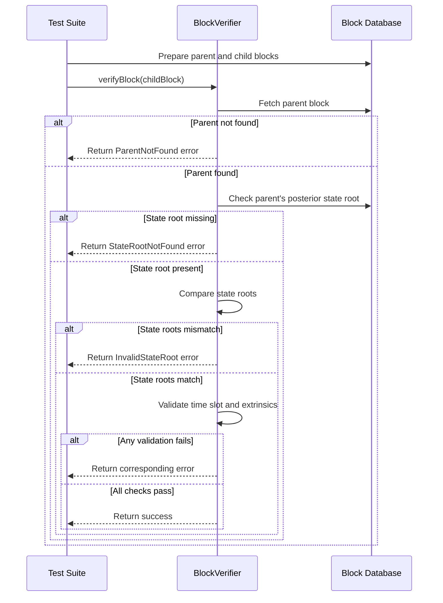

# [370] Block Verifier Tests

## Pull Request by @DrEverr

Added tests on top of previous PR #361 


## Comment by @coderabbitai[bot]

<!-- This is an auto-generated comment: summarize by coderabbit.ai -->
<!-- This is an auto-generated comment: skip review by coderabbit.ai -->

> [!IMPORTANT]
> ## Review skipped
> 
> Auto incremental reviews are disabled on this repository.
> 
> Please check the settings in the CodeRabbit UI or the `.coderabbit.yaml` file in this repository. To trigger a single review, invoke the `@coderabbitai review` command.
> 
> You can disable this status message by setting the `reviews.review_status` to `false` in the CodeRabbit configuration file.

<!-- end of auto-generated comment: skip review by coderabbit.ai -->
<!-- walkthrough_start -->

<details>
<summary>📝 Walkthrough</summary>

## Summary by CodeRabbit

- **New Features**
  - Introduced comprehensive tests covering multiple block verification scenarios to ensure robust validation and error handling.

- **Bug Fixes**
  - Improved error reporting by distinguishing between missing state roots and invalid state roots during block verification.

- **Chores**
  - Added a new package dependency to enhance database functionality.
## Walkthrough

A new test suite for the `BlockVerifier` class was added, thoroughly testing various block verification scenarios and error cases. The `BlockVerifierError` enum was updated to introduce a new `StateRootNotFound` error, and error handling logic in `verifyBlock` was refined. The package now declares a dependency on `@typeberry/database`.

## Changes

| File(s)                                                                 | Change Summary                                                                                                   |
|-------------------------------------------------------------------------|------------------------------------------------------------------------------------------------------------------|
| `packages/jam/transition/block-verifier.test.ts`                        | Added a comprehensive test suite for `BlockVerifier`, covering multiple verification scenarios and error cases.  |
| `packages/jam/transition/block-verifier.ts`                             | Updated `BlockVerifierError` enum, added `StateRootNotFound`, changed error codes, and refined error handling.   |
| `packages/jam/transition/package.json`                                  | Added `@typeberry/database` as a new dependency.                                                                |

## Sequence Diagram(s)



## Poem

> In the warren of code, new tests now appear,  
> BlockVerifier’s checks are crystal clear!  
> With roots and slots and hashes aligned,  
> Errors are caught, no bugs left behind.  
> The enum grows, the logic refines—  
> A hoppy leap forward, in neat rabbit lines!  
> 🐇✨

</details>

<!-- walkthrough_end -->
<!-- internal state start -->


<!-- DwQgtGAEAqAWCWBnSTIEMB26CuAXA9mAOYCmGJATmriQCaQDG+Ats2bgFyQAOFk+AIwBWJBrngA3EsgEBPRvlqU0AgfFwA6NPEgQAfACgjoCEYDEZyAAUASpETZWaCrKNxU3bABsvkCiQBHbGlcABpIcVwvOkgAIgBtAGYAdgAGAF1IACEvfAYAa0gANUp4ADN4ShgQxFDYyAB3NGQHAWZ1Gno5CNgSSGxEKoARCgBRKQo+Zus7DEcBKpSARg1IAElcSAFseC9aZGxufCxcXp5/CXh8AZ5vX38gkMgzRIA2Ja35NFpaeAwidA/dRXDBoXw0RC4RCrOB9JSIBgUeDccTHFAYX4MajSHrUHp9cgNCI1dD+dE0DExAiQMiwTAMPr4PhMZjcaJsDCbU59EgADyQ4n+xMhCgmaFI5IoimwDPof3xNOcXkqfFsqwAcvhIGVsBRuXwlLhtF5kCprlyzohuKJyvAGMKofw+Nz4HwEfhraS+rx8JclLQYWdbIxMFs+hdKg0YnjuZAAKo2AAyXFguFw3EQHAA9FmiOpYNgBBoWVmAGJebBlMqyRMqRBZ3Cya0LSayLOeHxZ5YaIz6YzgKBkej4Mo4AjEMjKToKVjsLi8fjCUTiKQyeRMJRUVTqLQ6PsmKDuZCoUNoPCEUjkKjTlkczh+NBEhxOFyfBSblRqTTaXRgQz90wDG4NACnFaQsyENBmAbKgMEQYFjizARcgKMAJltSgNAhTQoQ4AxYgIgwLEgABBNYJyvbF6GfZhnHkEdGDpf5pCMEjIEJGdeBIXo4MkPpsPsHYaG1JkFQAAxyPJ8hKJEKkoMTGC8Zpj2PTkpVoGU6FWDZ7BIR1DnQB0/gBMhLilDA736eChVDP4wDYZgmXkZCpMgWhqBUZo+kweg0AiWD4NRLA6UQXpmWOCoiF1GIGnzQzBXXOl5StG0KixIL0AxSAAGlRCxQoQoQf5VgACRILxrT4HUMDEEFTTJJQKnIehqSYDAJk2FyCmQalLhIBpanOEhgLJWMusKdyjQELzGjij0grBHhnCgvTKGQAAKXpviqQrwnENh7FyMJ7CNYSpXwTZCoASnCHzGH8bEthQ/JkFi04FAwSLdRUaIlv8TlIF2iJ4AOxAjvCXgrjdU7w3wC7AeaWBbqyvlcCRXj7SYSZl3IRBoTcM5sOQJgJkgZhvHENk+nQtLqBBewGVBJF8EzXtilKatjNxC1qY5lU/D03U4MMsSrGcdhNVwUtrgxBTKClPgGh4hURvYJ7XNQdo8a5sopWYBVJs8wYeygABhXoCi5048VDMS1nasF4FoaAQZIABlI65cmUTUH8XAhZicoFXGgByHrXcO+HUBIJV+etrB1GQVXOTDk3IFGODdS5237YkR3aFGXk0b+eCGC9hWUGQP2A7lUcxuesOaSL9HS4R0K3PwHEMHh2jcAYWAFT5a0xBiQq09NiLXXaGzIDEt2YZsOHcEl6XsFlmlvb4PIGF1Y867OZPOobpOWZoZnoce87NlQbvNkGTQDCgIp87poVrc2HOHeVWh5+xReLvLj7KugsKDNRQPvPoock7nxOpfJeHcu492oP3FW4sU4n0hKUUSkI4EXTTtAEI2dBIMAZHjHUvgaZ2jpmiYC70laUG8j4RiogXpLTxplFqZxxqVw+vBTcMQ87fx7AYUYIEB4CS4qrHqZxDbTUGBw9WBR0AkKZL8f4XhZDhD+BIfA+QcSxjEjTWQkkCgKTYKcRQyNfJ40oI6WMQ9lwxHlqJbBMpSHAIcF4TQMBLRCT6AMHEHo0CPAiE2UeiMcR3X2n0MGF1BpkA3NnLKShElCnGj1LU8FyZKTOjHZUkI7SKMKH1AaVjIDRDFKQaRfQJLPRkhhMYm85ZzH1mUUSzi+C937sZYR5hLAkS8VOOqEQtSxhSUpa8wyGJDyZNOUSnhkKFPYMCFij9IDqn6g6QS6hvI/DoFwMS8JETwAWOtWIJjCj1LkhQWI4QND3KugpeUYlgKgSqRBKCMFMCBRBEhZ6aE+aYWwlhRACk2pGj+FzbJlNfpiXUApASWJBjIDac6M4tSpJXJVGCpSeMewEViL2QCrz8hgXrJBaCaNvkIQwH8qSALZIqhBXhAlRF+nkUvFOGINE6L8FHP3TAVSCY8habPC5WLKCjCaY0aYqMhwxG6FaZUaYrYHwjNcZAdsv5O1/jQf+uBAF8D+NSXADQtS/AKTVTYHTMyz11SQfVK8Za0AUutDcfREhXQUVqwROqF5L1de6yAAAWK6qwJ7YytMcNRRANFaJOOioxFyzF6VgJYwem8Bb+1ATFZWsYjiYJgTgs68DNZIGsgCJoxMmKkHoLrFgs8xb/WXhdVe68TVnA4nPf1F0nVrxdRvBWqwSJAgWj4TRg8giO0bMwpRCxTUkDILPYtDqA3eoLWfKG9r9UKSrWTRQGE6160Mr8fwYh0SBGwNO9cLARpIDROtMSIAAC8z6xJeupAMVVfRzFpvoHCxAowp1eGgPgdajzAw8kzdXHN9B6EJpiTDPwS9kC0C1LfMmyCB7+FoiXWeud87brXdsTY3ciQBOqf0bgk0nGZqDcG3pbLSKDMmccDJBtRATOocLaZvIjh6hiPMwsyp7TLPEKsqAGdHBirqYCxpCsnlYBeSBUl7yKVfN4kFOlqFKFAtBTK5AjlfhyVoHhSAuhSJ7P/UR3trbnWQGfZARIYkDDmbNjWmIPrCM9oNdqY9QbEgjPfH0YN+FCKP2JSpslHzKUBRpe2KLpANBCEQMcFlhFiJkQoly6ijhaKvgYgK5iiBhVuWGvKmq8h8nXwQ7PElYFkupYwApCov1UXiQAAKNmbPLNsVLNMggUvViUe7Dg0a6F8IEM8OJKGtJSSrNI1LyHa2JLrYSWwuCzLIryu64p+QmPBNEKUGC2nSvTBiYkAB6qQNA3aWGJDUWoLphUYoK/R5ryvzZO4Et0xyUSvQYZhpQjHMsse4+xsZnHlpBWQLx/jcy+ALJE4tyIlQSsGE1OQfF4W+wGAPIt4co4zzjk5deGIt45wPifHl3l3R3Vbi/LuX8hh8e3nUAAfSdogdnEZ+p0HZzgvUzOAJQGDcGkgrxg1oDQAAJjKMkJYtBUgMGDfL14ABWNASxkji9oDL4NABOV4BuliJDQGUNAiRUgkGt8LvHA4ZztFwJz/YPOSAlP50OZnQA -->

<!-- internal state end -->
<!-- tips_start -->

---


<details>
<summary>🪧 Tips</summary>

### Chat

There are 3 ways to chat with [CodeRabbit](https://coderabbit.ai?utm_source=oss&utm_medium=github&utm_campaign=FluffyLabs/typeberry&utm_content=371):

- Review comments: Directly reply to a review comment made by CodeRabbit. Example:
  - `I pushed a fix in commit <commit_id>, please review it.`
  - `Explain this complex logic.`
  - `Open a follow-up GitHub issue for this discussion.`
- Files and specific lines of code (under the "Files changed" tab): Tag `@coderabbitai` in a new review comment at the desired location with your query. Examples:
  - `@coderabbitai explain this code block.`
  -	`@coderabbitai modularize this function.`
- PR comments: Tag `@coderabbitai` in a new PR comment to ask questions about the PR branch. For the best results, please provide a very specific query, as very limited context is provided in this mode. Examples:
  - `@coderabbitai gather interesting stats about this repository and render them as a table. Additionally, render a pie chart showing the language distribution in the codebase.`
  - `@coderabbitai read src/utils.ts and explain its main purpose.`
  - `@coderabbitai read the files in the src/scheduler package and generate a class diagram using mermaid and a README in the markdown format.`
  - `@coderabbitai help me debug CodeRabbit configuration file.`

### Support

Need help? Create a ticket on our [support page](https://www.coderabbit.ai/contact-us/support) for assistance with any issues or questions.

Note: Be mindful of the bot's finite context window. It's strongly recommended to break down tasks such as reading entire modules into smaller chunks. For a focused discussion, use review comments to chat about specific files and their changes, instead of using the PR comments.

### CodeRabbit Commands (Invoked using PR comments)

- `@coderabbitai pause` to pause the reviews on a PR.
- `@coderabbitai resume` to resume the paused reviews.
- `@coderabbitai review` to trigger an incremental review. This is useful when automatic reviews are disabled for the repository.
- `@coderabbitai full review` to do a full review from scratch and review all the files again.
- `@coderabbitai summary` to regenerate the summary of the PR.
- `@coderabbitai generate sequence diagram` to generate a sequence diagram of the changes in this PR.
- `@coderabbitai resolve` resolve all the CodeRabbit review comments.
- `@coderabbitai configuration` to show the current CodeRabbit configuration for the repository.
- `@coderabbitai help` to get help.

### Other keywords and placeholders

- Add `@coderabbitai ignore` anywhere in the PR description to prevent this PR from being reviewed.
- Add `@coderabbitai summary` to generate the high-level summary at a specific location in the PR description.
- Add `@coderabbitai` anywhere in the PR title to generate the title automatically.

### Documentation and Community

- Visit our [Documentation](https://docs.coderabbit.ai) for detailed information on how to use CodeRabbit.
- Join our [Discord Community](http://discord.gg/coderabbit) to get help, request features, and share feedback.
- Follow us on [X/Twitter](https://twitter.com/coderabbitai) for updates and announcements.

</details>

<!-- tips_end -->


## Comment by @tomusdrw

Could you please clean the commit history? :)

Would be best to just cherry-pick `5ca69d9` & `44e64aa` since that's the only new stuff afaict.


## Comment by @DrEverr

I tried cherry-picking and squashing it, but didn't help :c


## Comment by @tomusdrw

@DrEverr no squashing needed.
```
$ git checkout <workingbranch>
$ git reset main --hard # Go back to current main commit (disregard all added commits on working branch)
$ git cherry-pick 5ca69d9 44e64aa 2f399d7 3b2ade0 # only interesting commits
# fix any conficlits and
$ git cherry-pick --continue # commit any conflict fixes
$ git push --force # Replace current remote branch with the one you've built by cherry-picking
```


## Comment by @tomusdrw

```suggestion
    assert.deepStrictEqual(result, Result.error(BlockVerifierError.ParentNotFound, "<details>"));
```

That way it's easier to compare different error conditions, especially if you get `Result.ok` instead of `Result.error`.

By also testing `details` it makes it easier to understand what the test is about.
