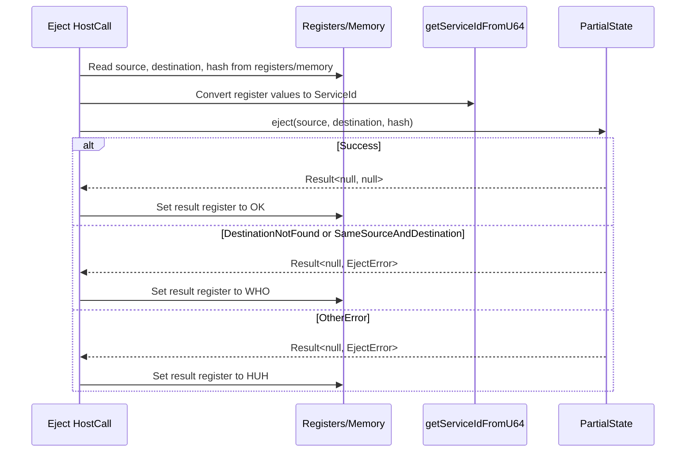

# Updated Accumulate HostCalls to GP >0.6.4

## Pull Request by @DrEverr

Partially: #246 
Changes:
 - biggest change on `eject` HC.
 - updated GPR references
 - updated HC indexes
 - updated test cases


## Comment by @coderabbitai[bot]

<!-- This is an auto-generated comment: summarize by coderabbit.ai -->
<!-- This is an auto-generated comment: skip review by coderabbit.ai -->

> [!IMPORTANT]
> ## Review skipped
> 
> Auto incremental reviews are disabled on this repository.
> 
> Please check the settings in the CodeRabbit UI or the `.coderabbit.yaml` file in this repository. To trigger a single review, invoke the `@coderabbitai review` command.
> 
> You can disable this status message by setting the `reviews.review_status` to `false` in the CodeRabbit configuration file.

<!-- end of auto-generated comment: skip review by coderabbit.ai -->
<!-- walkthrough_start -->

<details>
<summary>📝 Walkthrough</summary>

## Summary by CodeRabbit

- **New Features**
  - Introduced a function to compute the maximum of multiple 64-bit unsigned integers.

- **Refactor**
  - Unified and simplified service ID extraction from 64-bit values across host calls.
  - Replaced quit-and-burn/transfer logic with an eject-and-transfer model using preimage hashes.
  - Updated error handling for account ejection and related operations.
  - Changed code length handling from 32-bit to 64-bit values for new services.

- **Bug Fixes**
  - Improved validation and error reporting for account ejection scenarios.

- **Documentation**
  - Updated documentation links to latest specification versions.
  - Clarified and standardized comments for constants and host calls.

- **Tests**
  - Revised and expanded tests to cover new eject behavior and maximum value computation.
  - Updated tests to reflect changes in error handling and parameter types.
## Walkthrough

This update introduces a new `maxU64` function to the numbers core, refactors and extends tests for numeric utilities, and overhauls the "eject" functionality in the accumulate host calls. The eject operation replaces previous quit/burn logic, updating interfaces, error enums, and related tests. Numerous documentation URLs and comments are also updated for clarity and consistency.

## Changes

| File(s)                                                                                      | Change Summary |
|---------------------------------------------------------------------------------------------|---------------|
| `packages/core/numbers/index.ts`, `index.test.ts`                                           | Added `maxU64` function and tests; improved comments for `minU64` and expanded its tests. |
| `packages/jam/block/gp-constants.ts`                                                        | Updated comments to clarify symbolic constant names; no logic changes. |
| `packages/jam/jam-host-calls/accumulate/assign.ts`, `checkpoint.ts`, `designate.ts`, `forget.ts`, `query.ts`, `solicit.ts`, `upgrade.ts` | Updated documentation URLs to newer graypaper versions; some variable renames and removed redundant returns; incremented host call indices for `Forget` and `Solicit`. |
| `packages/jam/jam-host-calls/accumulate/bless.ts`, `bless.test.ts`                          | Refactored to use `getServiceIdFromU64`, batch memory reads, improved error handling, and updated tests to assert return values instead of register states. |
| `packages/jam/jam-host-calls/accumulate/eject.ts`, `eject.test.ts`                          | Replaced quit/burn logic with new eject/transfer model using a hash; updated error handling, memory access, and tests for new semantics. |
| `packages/jam/jam-host-calls/accumulate/new.ts`, `new.test.ts`                              | Removed `U32` usage in favor of `U64` for code length; updated imports and test signatures accordingly. |
| `packages/jam/jam-host-calls/accumulate/partial-state.ts`, `partial-state.test.ts`          | Replaced `QuitError` with `EjectError`, removed quit methods, added new async `eject` method, updated `newService` to use `U64`. |
| `packages/jam/jam-host-calls/accumulate/transfer.ts`                                        | Switched to `getServiceIdFromU64` for destination ID extraction; updated documentation URLs. |
| `packages/jam/jam-host-calls/utils.ts`                                                      | Refactored `getServiceId` to use new helper `getServiceIdFromU64`, which was added and exported. |

## Sequence Diagram(s)

### Eject Host Call (New Flow)



## Poem

> In the warren of code, new features abound,  
> Ejects now transfer, with hashes profound.  
> No more quit or burn, just hop and return,  
> With max and min numbers, the lessons we learn.  
> URLs are fresh, and enums anew—  
> A rabbit’s delight, in code that’s brand new!  
> 🐇✨

</details>

<!-- walkthrough_end -->
<!-- internal state start -->


<!-- DwQgtGAEAqAWCWBnSTIEMB26CuAXA9mAOYCmGJATmriQCaQDG+Ats2bgFyQAOFk+AIwBWJBrngA3EsgEBPRvlqU0AgfFwA6NPEgQAfACgjoCEYDEZyAAUASpETZWaCrKNwSPbABsvkCiQBHbGlcSHFcLzpIACIAVW5aaiiAQQYGR28kyAAJfERcAGE0H2QCSABxK0g9AAYNADYNABZoyAB3NGQHAWZ1Gno5MNgPbERKSAARCgBRKQo+Ts8fP0Dg/MgMRwFxgGYAdgAOFCxcYcgAMS9sADNr2QAZFUQAelxZbhJt+fl/bjz1fAuDQwM7YBJZeAYCT4LxSZAMWCYUjIfxeJL0MqnDypdLMTI0HJ5QrFLyIAA09g+DHg13gDBJ8lwzlI4gwREgc0Q8HwGGQRH8ST4p0wkDqjSa/GuFSswPckCUiAYFHg3HEPJW10oZAY0hQiAcHk2zC+kAATE16hTIbQ6dRIezhaFTqhbDxnOIGehaLR/PrdY69QbgQA5fBem1qjDFeUkJnwUn8PgkAAe3DRUcjyDaWp4FHwEngSnokKGHgVSpVkdlZ243l8/iCIUYIu2HPgJGz9GokFguFw3EQHGezyI6lg2AEGiYzGelxud0eAhebw+Xxcz1rPme+wOGiM+mM4CgZHo+ClaDwhFI5Co/QUrHYXF4/GEonEcMggyYSioqnUWh0A8TCgOBUFQEULwIYgyGUO9pzYDBOD8NA2nsRxmGceQv0UZQ/00bRdDAQxD1MAxuDQBgAGs0GRZ4mH8Z4jS+F5rRTDQaHydjBwMaJeIMCxIGSABJaCb3RNCnBcSVGERNlpDcM4ONCBx1A8a5AVLSAAAMmMoRAtLdKiaI8DpkBTGgMCLT95HgZg/goVkHTOLSMOTWJ6iaAzrmwDAxG5LBih5IguSUSAUyQRyUDswFcEQasPHC/J7W03oMHczywibUzIGYRQaXbDEw1GDxTn8MsIshMRtNwFxkkQdKDIkYo1kAFAIXMhWzii0il2u9SJuvQSyUrQZNOq8LSWswLs/Qc0pEVCdq0o8gz/FwbAKF5TTUrGjlmo8NBcrZUtmGBZINg7TL1hUgl1L4FyRoa9pFjQb06ApNoEARexbPjZwvHkJRaXIZBFrGgbetofqKSm4bRow8bdquXUYc6MZZqGbt7rc5aVjWja5o8VydqapH0EOpzpA8SFa1ikMw3wLEhSbLx8FHBhEzC+YNNkyHkuyhEkToPcjH4yxki8Ghb380owyxGMGDRKWeWQM8wtTGKog02sBC8OkwsQ9R20QfdIFDGTBazHMMNCzEziUBXnDtZWOa5IgM3W3VVZTey7y1iddfZ9hDd1Es5cQfB1p1BQlAAbn4DB/su0JvxM57Xq7IbcptWkhZ4viDAgMAjHIozaPokhGK2PTnlY5MuI4PPolFwSROvWCogcST5FVgW5ONgw5V70gVlyj80By7xxDAXXyHvBDlLeSJIFuzTFse7zfMjQb6F+NEdWQdR2jHdBvrZSJp8hDwACkAGUJnwdn4PYU7vUNnkGWh87UI3vz1Sxx6wKITzLQbAOpaDvU+rAe8NN/RnEVsiUIJNghkyCifdKiNkFaTQAZFGr9IzRnQUg3U5E/TTTdFQNgks4qQAAEIMygT/TMkBiqr38CAnUBlKGwEUGEMMqlbweHzOMOW1M8AYOkBSac5FlRHRIBRKBZQgYYjONtPEzAOZEzUSsRAVJ3wkH+sLAS4tJZO02rbMsohFamJVlKb2GtTx8G1gHfW4QjYm2SOnNWPsohMF5EyRCy8fK/wwFwf+HkAAUaAuDpQpBoOJRDByQHSgAbQALoAEpok4xLFpEu1Ey6AgrrpCgLFLJsVilpRu+5SJ5OMi8IQB1ng6wfpREc3AwC+PyJgWmsUG68SbkY1uMEBH0E7hhKSPdZLIgUh4IeuowSJAJHLJ+iFkCowfvAcSbRj5jDmNGTp/jYq8K8QHdQidKpXBtsMeAfBECyGNDCPWUY2DIHCVpK+4MACK4MADyWl0nHE0rQB+jh2CmOBDfKk+V6Q+FkBSZZLB57Lw0lpAAsskAAGgAfRsNMKwPybDQCxRMPF0xgwkuDAUIS0wb4rRIKPWBCVUynMQXtbSABeSABwcFDUhPkOR9AhCjFCP4TU/hfKMvsPcgQMJtIfPinPdgyAV5aWSLEaA2QCVCQAFrJGgEJH5wYsWfNiNMU1WKb46umDy+gaLMVYrVRqrF+Kfn3AtVanB/gcp5RzoVXMJBaTJiBdICsqppZH1OKWG5UqHnOIOd0kG3zt7aT+RSX0ujJD6NkPFL1zhDRhjmTLTSFE1r7OVoc8RKshTvAkfHRO5iYyKmVGGqQirVnIr4A7ZUbxk2dIitqbNItm7GNguGht9srFMK9urBymtHH+z1kHcQ8kDChnIHufp1Si5kQovk6QzwGkzkPWAbh+QOkkheBRXE+IK6o3gG7euVTBmiXbqM9CmFpKFpmebOSzDwQcSBSC+epikk2HuIC5ZaJ9RtqdGGce5Bsx8E5P5CNUDx7IfVI2KS0iDqxkoMCAA6mOUOzkUyiDwCQThsZuHgM0k1ZUKgl7PN1CvOW9scJ8D5f4qOMM2OiBwl2PA3DlQAC8QONmQXmlYzH6DXDzOorStADJlEU/xn8Nrl7ye0pBWAnzgjBGU2GLBQm9MkAM5AcJQSpl0HSVaOyeYCxHS7eobNgkYN6nDFEbYt1ZmdEilpcuQkynJkM9pYMVcKADW9miDqR0AzLL8x5xAaBNSflEBeMY2lAvBYMqgIg2BHaIRIFEMorZIjQeFFgALhTEAFAjohLSCrot0kPlpVa60MAxwMl0mgSLuxyxPNJOWXCeGoH8Ay2jAgxHOmQMC3UGAGboFuG+BQQDZXXBZqhLkEqtrUZ4W0COXgd6xg61FNMLWIiDpFkYiWo7nbjssY7KdtiZ2+3nTrRdBtl39ygGbQtxyw73vdr6DmE6nvhund4hxngPuBy+0bBVDtoOqv1EDjT6gQZkfSDQKjpweGu2B7qcb2gsBWcFrQDd+dC7F13XUg9jTj2ntwOekozwr0ZDRDQJp5W4pKUfZu59bcRkSXGd3KUX6B6KSbPSMYB8qs62kLzkIXEDKIZGP+krBa0Cqg9sm1GlAnRnHaxtcRQ2zidFkL5WAeYFujG0ljijuOaPx1XjQnnuW/GYB1MCKw/gCwR0QP9eFUv8gqwTvIFC2g7wJeWNsvHYj8iAmShj7Rk9e3DCoiV5yuKb6xHuES3F5Q6Wjn5XwFeDg0iK45tcbQVwvUp2oaGNoweSohDMsyi7ic71u00r6NPqstIO5x8c9DzhNkK71zNUIKeiHyhuW+AxkBIWiGhR/NClf9TeV8EPlD4Ep+a9xqdrSPlAaXyUxA+Mala+68VGQMfeQLMLYwGAAUiQJ82mCZhCkEdmdnjAICH8OfT/FwaGIaEBc7ekAkdgZUaQAFKTfXWdP1Y3KrKwCQZgaYZMcjKsKwTAOkRrSAOreYaQP4SyZKBAqdE4bPGlPPAvaYIvFYEvSWDtZea/evToXUNXEeIRCnQSPBfyNfcONgJORtUNJhTguZWTLTaIRAbhbwY7PGLAciDAOkVoDSaQ2Qo7Fg+MVoModQw7egJQlQ5g5zN4RHHkGqdbTbZNFmNmM3VvUPEeEnTSZLNgCkKbQ3BKLmPgHmGedkOYVfLeGQmkO8OTFgBg/tCgMAAQdgpAk7DaMAIhKImI9AKfaWQxMWW7JWMxWWO2R7LImxLxexDmJxT7VxFdP7azS2L1a2EqHIixLtaxaSOxRA4ohdOHMouXIYVAbOa4SnJuAuGpWnWiQ9enZgE9IkFnUkNnNIDnJIbnRXfnPiQXYZcSMZD9SZC2b9WyH2aSLSGqWQOqG+SgAsHUISJTJ6FEelbg5NXeCiKIOPKBLSFkI4igE4kgM484eTdeDSXxOYSKfwRg8YBJY5NGN4yAISCYahQeHCDYfAVCB2OyAmDYCLaSVSZgS4l6TTMItgXKKSMoceHYU0KIw+HyAnKISEGgUgPgbzQpdAHwB+O0OLM4KbZbMvDSdjG0NkYEILflTE1WV/ZKORL6NE44G0AsEBT0UI9RHEwEGyXkQsEqOBfAfAbgFvFxefT8FmKiJo3yATeUagceMbAVeOKOCkuDT8ecfDcEqUGbHKK4qSV/LQ0kNUxhFDZAtZN0ZQwOTA7HFDHrKmB8G0JIAxb9Dk8YQBQ2YoeAETTWHbKUzSLfXwFksVZNYqP1MMuk3wNEroVYIOBkBVXgEgf3O3GwvWfkymPsZKPjFOBYIaVEfAF6ZKGU7DcM3rC4rgqQHgiYMEAOLIUEukDwCEqtfgPAf/a4f/CgQA/sqOIc5sFhEUWyNgIMgkQw9mZA44Xk08KUMYSso6EUH/McqI+rWgS4hwCWaOEgU6a4Jgjksg5YbMtUsMzjZVSEKMmM+gB47SJ8jQIGJAWAcJdJRrIwGhANWkhZRkimXMSQS/UgUZY4gc8kTSFOWE+EjPSiA+c8DAMXLaTAYyCgaGITJPMTSMb/JDKMxZDSacwcyE9AL1TYHwbk7c/AK0ZSWMJEgEiIkfGIAjTVVoSgPMTtGEmGd0sKP6VzH5RmbZMYFiv9RZSVaRD0Xwf01DYNFOOC14hC5NIgRYDCbgZNHc9ikgQEoUODLAH5AAaVTwlmFjlFiDAw1C1B2wbX5DQHeG13GGynAuj3NIQyBL0n8mBAADUx9GNDRcNlUNJhtcKqSCK8dRNTFQD6ASZCxqBKL4L952gcwJCsT1FtsiBz5Ig+xhEwxyxm09ENhwrgQfk9kfA1T/suQ7JdY7g7TcSfgBVkpBhojcAER7Q7NeAhFOYBKewppfDrJD8NpkpVyw9jhkr6BFk0BErwxEYUqt4V56KlL0rqKZBQKvVlKvLLzzAMiTEmEHsGjntCiWi/ZYd1TvsTYKiLZjlmi3sYdnEl0AY8jGjOCajEcoMQY3dFd0cjkRtbUh9KNvo3ZqAPZLiMISwyc5IKcqkBjt1alhiGcDpxiz0YUpj2c8ROcK4ERRBKI/gKTFiBkxYhkxI7w1iJlxdKjv0eRE45lZKkgkS7LwMSNZlfrp4iz9F3NWNnICg0LiaGtGBfqFU2aeB8AKSqy6jIAXK3KPg+BgVcQwUt5+ZrNJCwiMME4q8tJex+xBxhx5byJFafyrhbhZA0QlwNAlAJBngzBngmhVADhrhaBTRtwABGD2gAVhqFNB2C9t9tNFC3Q38p5CiBhh6MctCERBkNA3Az1r7AHCHBHCoAVvww23nEtqeBtqLPtueAAE40AagDgah6gdhtx6gfa/adgq6g6AB+CQdlMUBofA9wXNOigtSogHM4ZC0shgSRcwvMXwDbOE0iwa7mEa+0YWQ6wSTIxo06ydCHF7KHVo66pdNxVdcOvordGnUufdEYxnCYrGy9GY3GuYhUIHJIUm4dCm19EXdY2mzYyXWZazZmgDNjIDVWlDCWjm0W1GPmrTfco7cYY29yvgGeSiLi3ypDMO8gegSBwjYjSgjwQfH0x3O0vHLc1eCYaQK+4fJHRCuWejcfJjXDZg6sjjDc7jKmeEDWnKr80LVTGsryH4xWFzF+CMfg2FUAk5C7bSZArrewJkXrdgdADw/WbBuWNBrAsG4GjzcbbgikDCSiKslRPbYsRqzvNqhQ7SE/ANM/D3TcumfgRmSAfujmXxCwkeqw/7KTb6odG7Y6sdWWsHfIpo17OdF60o4OfuNdA6zdJGvevdepNGsYpnSY0+69PG54EgEQMQdiZXXpJ9cml9YXam7CiXOUJSNCVSCh5yaYeJ3AAyJnZsWPRYUVEtQpWItMO4zSQs4s5AFhVWceaIBUVkUxVoKi8EiYPXGIGU1oOQAkZwNOlS1p8OSOEgLpzanpvp6IWO2AQZ2QYZ+YVy6SQNKILSbIZIG+bId1bVa1Mwz3dtYSoyzi60TSzg/arsNIAA+0RON5ElG+fVYMPVA1I1QvDTNFaYVFH5C1aAZIQlHFOgulWpsBMarSG+H5OygoaYYF+gmGLZnZvZ55wF2govdJBVYYLwRWwJTeFDXJX4PNGwIyxAZISyVFe02QVXHSn1AqEfSvVUTSBDchXDKhfS2MJCwEdNHkTk9kDi0vNZTOKlt0ZEfJjwBZ6h401WYbK4my6XdgqojwfwNobtCyY5UVSIKqOWFlsYDCA2BgAouJt8MggKW5nyUIXjKgXkMVGRdkDeE85hPKk+BZhVJSZABbVCfw5q+LM4Y1qqFUu7LAeifwMQROEhWXZwiOCgKObpiEyRdacVVijSmciYRayVhtHGm9cx1yygRa315V6QNPBvBQIgnRXlx6opsAHRFfWkQOLw1bLh52N5Qpt8aYLw/5ZCMxyrepv3bkO3IIdQF/fRcSfiwEOKIwI4mqp0m/HUKMZUB/Tgl6KyDSa545Am7UleXoVHI6SV5suFWE5/RKCyUIdp18kilAJQA16MCZmN/aMAkIc9/yCkHyNAJqX6CfQszqUgfN5U/gTQr9jCH90Sr6cgtR/abgfq3gTZAkUprGqy5OISoaf10IMdigN1tvWE8xoKcYDdqBleKbCao6B14cwd3c9kdw5FdIaalDvmY+GqTARAFMvV7pOkCdgwaq5QWqpC7uoI68zSHJ9Sajhh8eMjsAKaKI07LOXmz88eGUkfLAFD8TyyMABjm18YaT3wUYMg4amQl9/9O8+sfRIs7pVbLpVZCkHDShPSRasD+7MMDCbqhRM4FllD7D2wmGND4ayyXwme4deek61xj686p6rxko9o3xu6ruh6soUL6HcLm696s68NL6l6KmSg1AQTy/HeoJndfe0Jo9dGiJk+6Y6JuYlDm+5Yymjud9Gmn9aZF+7SVtsQAyQhgAckx3QeH3keykqbEGqZBO2KaojyGn2pQCOX7oLL7YDzO0iGAy3htCSjZGwD/K81jGzDIAtKI/tZP1eQ+k274yW5A2ymWUTbEaorgKGjU6Y/4uShI7GZatMvoG0uQB8OnpBFQAsd65IDBa8wj1Pnyt82WBUwUs2S8BvhEcvJQ9V2Pis7wxKS4DliZAoBZHsBmfjaQrO4CTjbTb6cA+Ml06gRZjS81ulKpYVRx4809bVgY7ECiG06OieNjBeLeI+K+OyT8WlalD2NqkQBZ4HLOLbprH8G/Ylc6CgSNMxPjP3fEZPhrepF9UlGuB3OTTxHWFbFVi5BjO0m2d2f2cOcgHbaGre6On5mVkeTktoC4HVAr33iIaNzOdLyS05ZU1yHyCKB8BJbPM0Asq0jjhpE0i89QBIDHHGC0lwaO8jFDFwHOGPIMhRRvlwxvmjZ1HJdoAj46cjAGjlgFaYNQBV9d6JA968C98ng0B4r+TjnoUoCkpIBkoMp16L5JFL+suyFiGyCF8Jg0aw5Zjkj4BEq0lQPQK64CuyGKGKZd1t6r0o4H/0aBjoFCwucgPzQoHhmgUKoCqSU2DGAMMdms5KWTW2JikuLxr9Re9V6uO895lN5zEUc7PSLnucfs9UqXudkhyKKutevhxXV+2i77h7o8AE5IaIOd/pdXexf8OiccSDAAy0jNcJ+MMFPDI2xxyNu+QAvGIWxhooN7AuGHLtTjy4hNRioxDGszhK5ZsYmt0FkJV1SZC5VitXTJnTUa5M19qSJZWqCkQggZf6WAwhoAzCLANACYDXFpA2gYdg/KJSfyFECEHhIJALdeoJi14JNsowPDTSHBxJCikUw4rbSLHxR6xhWuv1DzJVHGzsAog8ZD2hKDKA+0TG1fCBqzDLKCU1sNjOEvV2RjVE0uUAs4OfyYD5AKQOPRavIyG70pv66oYnLDStzk4/OTjINkWmrKv9NooA56glw3o/8kkGuAwnmEVo9otItcD3P/WRxaCWQXkLTDzwOKIA3exIHwEFiUDJhwkpgwCsciKF1RShxfCoSmGqHe1ahOSFGgfTCbEDImpXWYlzgoGxgVcuAwYvl0IFH1MaF6PoefS5wIZEmnEZJgLmoErEqadAz9AwMHjd07++0ZYKMAJ4IDoo6MGVs5FiCEllMNaQ/kcnWTUhxIvxOBni2CTVReepw4OgwyR5NhaQkQbkpzxehqlqsSge4GQCICnADIcPJgijGWCohxIwJBpv20DzyAI2EdEGC8M9T5p4SysftIhETg+EkR2kR6AkmrCAIFY2ABUO/XA7aRCy0iEgCS2Chp9KWrVLyEEkCL4Ndc+JRlgtBTiAi2QIIlIniJxi3hhgQoWSHiLOG+CfUsgQzmUwTC2xUArpdUH/XdbHII2WWHCFyOBGwAcEHpLSI9EszOsaE96ILKEF1gmIEwn5HSN1nnDwBkwcgwgjy1IJnwD27w9YHZ02iedUwb4HxKoOZBsCrhXqNdmUBYRaR9RRAQ0QZDeRNAsUNQAuvUAwCdsuMXPZEsaHGDGiuOryLSBGKjH1B/kCqI/g5GEZJAkU+fIbvlD+4dlko2os4cmnqH1QzhlgsxhYx+JD1LCjguxl6gpLAJQEuca7EdUiEAD5YMQo1p43i5tEbqm9KAOcCZF+kWRfolIaEkpHEtSWdIqluEhThj8ZCXAOrEoDXGwBB6AIoEacGiSEkKQL3LJE0DcLFAvcJAU8d/jDTKx66XAAAN72BVG3ATcSQG3H3jPwypSICKAAC+tQwAEmEFIolv4BpFksKWy41ceLw3E4Rtxu4kgGqIPFJIPIx4zoNeM/AXiJU6ElUpmE/FPjEAL4t8R+K4AyoYQciLAP+OyG5IhiXQwruE2PpTCyBcxOYXzgqSI08BnQgrkQOK6MSz6N6RiB2CoEtw0mtAruOsOfpyhcxC8AsWI2yhZwSxsRBlJpB8hpknhxQlEWdhigMMtIAAARXCfB+KsgSuEmJKSd8chs2L+uwK3grJQgnlFIRqwDSOUeMX8cYOUDTom1xgEtGGNrW+EhRFSqDUGk7h4THDUGwYDsLoNRh1UYSAYaRDv1Xicj9xGo8Ik71nzq1ycT4abqMCDx0Y2UZvKEAbgPzwYUSvGYYFgFmriRnokAQksSVCCkkgc5JIrFSSdblj9idUFEXHE9ZqkqAqEXPkCTZSoBVJNoUNpdlQw/5Vs2tDmOVKrCmx6Y9YmwezEbH2Dl4tjbuqlyUDhCex7jReuDjf4r0P+4AnxrdQLgzSnBUQs4GgKhqg5guy9C6vEJHGJCJ2gTDiTRK4kTCSBvEsrlzlB7FBq2kPeYZoEWFLFlh1XN9GJI2J9xv0OTbgVpGgAhAcQ/QsGnJLpYH5biUcOWLCIDyJxj25Ysjmn2gDWsbukWKsbjMsg0IOsQUx1qc1P75iCQsnL+CkUtwIgbcM3QfEUwpmEiPWF0eRleh+5HJ1qoVbSLew4RViz2GYfyN1nR40UUYhPdZlaI7jRk6+41ZQnuW0i+4WASAMGi020gt8J+snKrHAKN6AhzhHwYELaOIK8t7mjo3unoOp6090KUootKzLfAaZE8IOFPOuSIRporijmdkKoNFROT/QstGEPQDE5Qi7wwNIVsohD5K0DSnDN+IoOynSMEM/PYWcDQ64qi9x3IpKWCOEQXC0p8NbSRpJUwNRuShwo5Fc3sllALkJI1BgbI7ZVjdeKLD1O0AQBLw7+5YvTOoENlEzEWKI+KJljsa0AhU6wEREVgoA14eMvKMeYoLCBUAqIMtNCJBy0k6sLobnOUYoJcypkNcYQC4XsOHgrw+6iUjaY/17HbT3GcQsLvdO/4/ZIAJLCbJgxoyhISZtAfGYxzFThJRZpiLgCnPeK0YHAkHXWHQHKBoSKgnQZRlcS4A0Jlm0gYANABsDJBgwN8c4NMBsBYpUUPzP5jQgACa0AGlHoEyS3yi2EsYAOtQpCdzcA3cvQNkOhmwz8g8MmYZRmOl3zriwNJ+St1wBp8yZG0AClwGhCFhqFegmGXDL4l41KkUADxFZFYXaY7kvkMKEU3CRCyrxS+TamcUgAAAfZEtx0/mRhv5Ki+gBotIWE9IF0CxAMAEbn698FXANWduxIDAAdZJCusBSDrkCU9AVCwFDQuEWfTGFUAQWuTgfn45pxSinSB2B/nhIGwawfoD/LOK6KU2v8+CduJglbjxe8ExCbAEPGmhUJiSGJBhPTA6hTxBC+xVEtozRA+Ulo6kGIxI7RA3FQE4JW0FCXhKQgdAIpTEtZ60YoJ64ggrBOSUXlUl6Ek8chLPE5LLx+SrgIUr0UUgSlvIMpe2ACSVK3FJYDxXQpEVJBKkT00YQQMPpFcGJrOJiV9PdBg9fp19QGWTWEk0DVhYMp+hDMa5SSaZAQ9tEuyHnCoD81c0KEiz16WoDmBQsIrpP0lrgjJCzDTNsJFGvD4yPymtH8uMnMQBoq0EnMlAZryBtRy0JrEaH9SNNE4MmbSOQu7k0tLiGKlTM4qNmXDkAJDBNJlXrwa1EeZwYOdpGAWIBoAype4HCRxUdkI6dZH7nvFLGlRis9MrziStWRtRfcIfIDiQFiBRh32VtKGKrJF7Cr6V+AH5EdgGiItE+bAZPpMzT4Z8n2PIMyRSUoATzUG9C/EP5BwIOQweEPFZe2TXaDB25TJVBs/Nfnqce5Q0LSM/K4Wxj/FlMtlWC3A7qI6ZeVJeBbitzMy7c8jJ2S1wxhOg0AlET2LeJnlaRFFXzbReLLR6xKemkcl1uL2kha9UG5ij5dai9kKEdO/VGxdJHHh95zyn5P4KjgnywCim2KhVLUp/kUz05/whCYlNBF794eO8j4O2Wyqgqi5RmEufIPjlr4bJSrd+ijIDRasPCA8yolaF8iXJko/s8VBlWcruTwG8dNNc5jraNF1QcsbYIiH9x8AQp9uNme6tnlvzbuNqxwrFgo6YSo48ZceP1XFIdwU++0c1gEgbTpAiC2PTasfJHRbSguyXXabdMvnr1r5JsaYCivFS4YM49AeSb6lCRYr65NSglUTM/LZU+VRyHJAas5xGr9lxQM1d10UDeADqUASllgxZVW9tIdqgme/MTU8gWlAvP+WCHOxAKQFtK8BblGMUcRYF8CxBcgtQXoLfmWKbBbgpviWLCF3vBxdxyQ0uLshOq8eXU1VTLLIwxqxSoRsox7gyN3fbYVRudXsLOFHWHhRyClrnESwCmvVdpBw2mI1NpqyHkBW00Ubl2dAUJChwUWvrGNpxfRZoq8AUh6NISZRbEtUUGLHFRi2hCYrMXIsLFBC6xRrLsVELcA0m3zYb1rVeFXF8mseZZuU2fS8NJqgjfZq02QByNzuC6TOMt6hJk5m1MJbmX5S0BmlgW1pfEugmdKklenHpYlPSWZL0J0RXJUovSgFKEtwAIpRMtKW3AWsFS3blUoMg1LKtsS6rY2Fq31bhtF5BJS1vfHdKEpWcvpSAuyU9bhlAygbVJuW2TKHAY28pbMsm3zKsAFmpTdZtU34bweBW9iesrpybL6JkwnZSporhYZs0xy2+iJPOWi5xJVyuUPCqcEeYRQY3cdJZJEYoYbJ8dCDM5FMwuAIp+ocWvZSXXahyRuyyipD0gA/bKQtbW0GrUWC9qtME0rSA7W9rXBvaTQU0LQD2Dbh/aNQGuszr9oh16ZFOh2kXRLpl0K6+wHYCzv9p7BBdftRus3QaCt0c0+0TuqdL7F915pg9JaaPWbwcwvOJvIgH+oC4uMX+O02IXtLAHeMIuR0/xiMORovTxhWyj7djS+3PBw4LKIScJAB01cLlp079CoOWA4jO0gi5PiymZX+iwwmrFbPBguge6sywWSRFMju5aYPaOwY5KYPzbm59QGycSKwPm4/17Kdky3sIMQwcg4Gp0dzNlGc3FgsB6uqekdDGCPDj1SAjBsDQpALbIwfMYYN2zOBe77AGhOChI3x7Dx9upehtqgFVReBX8sgElg3oX5Ss+SUoZAqawnrocTp/2NabUWLRiACsvgBsXYOsbLTHB2wWQBW1HmVDx1yaOWMXpgwKoPBRIZNFYPc56xghpOUIfDS11P9siuu8+QbrulgaOiJsNWekIRVZD3FPux5NSAn5k7vlrUkoU33KHBZqhOwWoSpjAONCSQzQqoTUKomcTLd7296Z9q8V27AD/4NiWsvN1jC3tPQ0gbbuu5ipHdd9dJmsPBkNdJJZcuwswnEDGj5A687SM8T0XMrUZ9xY+Ez1wBFLPiLAQdWbPLb2j8qB7P+jXu67d9q99qwmajvt6Fsao7YEmIwf83JqwSEJN4WcFEQipHeTBEA+oixrliODQW2gOEiEhGpoW6LL2cFGDxIApwWPfg3otgNGZTDrSwQ8wHSjVbgoGgFkBYasPqp4W6SQChzO9TZwjYPYRwYd0z5+lJZHmcyHPJCJaYc++hvqUjG8Fx4eqxHIBmeoDDhL58Uc5KXn2Cy9onDGhgcrMysbmRjk4dcNXPmGmM0eQfxD0h5BqnMJ5SbsBqZSXGDxlUjxlOOfgiUGf0VaVkjPfcEuJiosdV6gQR5RzAB6XJsDMQcrDrGCjr9A9WfVf18Lj0rGw9LfahQeqL7H9p8wDQOI8ar1P+h0scfPu7oNpStnsJWtdOA1xc16EA3xmSsJhpczdwTV7d0J4lYGEZzwMEC5XWl/aqu99DJsDroNUrw8DwoY+DvAik5t50O0Y7DvVDw7OBq8eICCbBqENI9SIckZjrjKFD9aydI2mutNqZ0LaVtOKLbXzre09gBdAQLQA9ru1CSTQJoDUFj3mhOTHtJhqScNqp1XKHk9DlSbuA0nc6dtbncXVLrl1K63tUujsFroKmagOwcXTIPwISLh1Sg0tXQBPymdmsQBgRnEU6zdZIefWCRoNmr2BSz133CbKseTGK7NjGunY02IcEHH/+RxxxptIXqnG9dg4i4wdON2b1Tdz2wgxsr+PbKpieAeMLzm4hLDTlKwl3UDtoMro5QbBvg0Uq4MBoqmbCY5EoEiDaUlkSpWwtOlp6RRx4kLTgyJ0gBtG1AtUzo/A2OA9G+AbyBqACnxL0zsWuLDM+4aY2eHB1gqtFQe0zPVmhpC+JLiwErVZ4PAdZw+L1LIqkwzSf6XFjDE2y7AiS9Z8hFcLZUKEI62kLMygBtKghIO4wBSu2RjJ5g6Yqu0c2YbpQKEzIYlI873jSOLnkEqwYoEiU0SOBazTQdo3VK6Ml6Wz3+SShrPG4Oz2DzPPRQOZxgfQ6QUCRWrdHRKqUpz/wLeDDF8QKCy0+U5YxgAVQstezUFswzBYyjahtcZ5FmppAbG01Ca5IljRuc/Ap5TmBalWVWbvPaGPA65vgISUYtHINI61Z83LHovUkmLndZ/JefwBhGmaWcTIKJklTIUHiY08fpQHJHYyjo6+1bJvpV3HGANL+ndW/tA1vGjp44yceqGL2ubXscJlDH2a80kWFFeikZQ1qY3qKfNqBi3cQf+PRnmDcZsRRcFMtYB7j46vTU9SsvqgbLv8nw+FhMlcBikthxJEJAQOe9XziFL9UmyW0uHPNv8ly+tTctEHIz1ul4DGdJAq4LMfXAgHmbKDwdbzHh9np5HSTPbiIwESRiWsvDO76ANkrgN1IfpSRsIP4FQPWYAiERDATV+COoCxSFhEAWKPtiINoBYoukeYg8AYCat7ASA9QA4LQB2AHB6g1wAunTtoBrWXo/tfYAwCaAF0C63teoAID2D1BaABdEgB7QEAMAdgDAAQBKEWsjXEUY1ia1NaLLthOwWKQbPoCAA=== -->

<!-- internal state end -->
<!-- tips_start -->

---


<details>
<summary>🪧 Tips</summary>

### Chat

There are 3 ways to chat with [CodeRabbit](https://coderabbit.ai?utm_source=oss&utm_medium=github&utm_campaign=FluffyLabs/typeberry&utm_content=378):

- Review comments: Directly reply to a review comment made by CodeRabbit. Example:
  - `I pushed a fix in commit <commit_id>, please review it.`
  - `Explain this complex logic.`
  - `Open a follow-up GitHub issue for this discussion.`
- Files and specific lines of code (under the "Files changed" tab): Tag `@coderabbitai` in a new review comment at the desired location with your query. Examples:
  - `@coderabbitai explain this code block.`
  -	`@coderabbitai modularize this function.`
- PR comments: Tag `@coderabbitai` in a new PR comment to ask questions about the PR branch. For the best results, please provide a very specific query, as very limited context is provided in this mode. Examples:
  - `@coderabbitai gather interesting stats about this repository and render them as a table. Additionally, render a pie chart showing the language distribution in the codebase.`
  - `@coderabbitai read src/utils.ts and explain its main purpose.`
  - `@coderabbitai read the files in the src/scheduler package and generate a class diagram using mermaid and a README in the markdown format.`
  - `@coderabbitai help me debug CodeRabbit configuration file.`

### Support

Need help? Create a ticket on our [support page](https://www.coderabbit.ai/contact-us/support) for assistance with any issues or questions.

Note: Be mindful of the bot's finite context window. It's strongly recommended to break down tasks such as reading entire modules into smaller chunks. For a focused discussion, use review comments to chat about specific files and their changes, instead of using the PR comments.

### CodeRabbit Commands (Invoked using PR comments)

- `@coderabbitai pause` to pause the reviews on a PR.
- `@coderabbitai resume` to resume the paused reviews.
- `@coderabbitai review` to trigger an incremental review. This is useful when automatic reviews are disabled for the repository.
- `@coderabbitai full review` to do a full review from scratch and review all the files again.
- `@coderabbitai summary` to regenerate the summary of the PR.
- `@coderabbitai generate sequence diagram` to generate a sequence diagram of the changes in this PR.
- `@coderabbitai resolve` resolve all the CodeRabbit review comments.
- `@coderabbitai configuration` to show the current CodeRabbit configuration for the repository.
- `@coderabbitai help` to get help.

### Other keywords and placeholders

- Add `@coderabbitai ignore` anywhere in the PR description to prevent this PR from being reviewed.
- Add `@coderabbitai summary` to generate the high-level summary at a specific location in the PR description.
- Add `@coderabbitai` anywhere in the PR title to generate the title automatically.

### Documentation and Community

- Visit our [Documentation](https://docs.coderabbit.ai) for detailed information on how to use CodeRabbit.
- Join our [Discord Community](http://discord.gg/coderabbit) to get help, request features, and share feedback.
- Follow us on [X/Twitter](https://twitter.com/coderabbitai) for updates and announcements.

</details>

<!-- tips_end -->


## Comment by @github-actions[bot]


<details>
<summary>View all</summary>

| File | Benchmark | Ops |  |
|------|-----------|-----|--|
| [bytes/compare.ts[0]](../blob/4404956c616ebda76f9e80011f5dcb876b7efed1/benchmarks/bytes/compare.ts) | Comparing Uint32 bytes | 13979.38 ±0.2% | fastest ✅ |
| [bytes/compare.ts[1]](../blob/4404956c616ebda76f9e80011f5dcb876b7efed1/benchmarks/bytes/compare.ts) | Comparing raw bytes | 8903.9 ±0.1% | 36.31% slower |
| [bytes/hex-from.ts[0]](../blob/4404956c616ebda76f9e80011f5dcb876b7efed1/benchmarks/bytes/hex-from.ts) | parse hex using `Number` with NaN checking | 135898 ±0.11% | 86.04% slower |
| [bytes/hex-from.ts[1]](../blob/4404956c616ebda76f9e80011f5dcb876b7efed1/benchmarks/bytes/hex-from.ts) | parse hex from char codes | 973209.74 ±0.29% | fastest ✅ |
| [bytes/hex-from.ts[2]](../blob/4404956c616ebda76f9e80011f5dcb876b7efed1/benchmarks/bytes/hex-from.ts) | parse hex from string nibbles | 552592.6 ±0.27% | 43.22% slower |
| [bytes/hex-to.ts[0]](../blob/4404956c616ebda76f9e80011f5dcb876b7efed1/benchmarks/bytes/hex-to.ts) | number toString + padding | 317032.83 ±0.11% | 11.41% slower |
| [bytes/hex-to.ts[1]](../blob/4404956c616ebda76f9e80011f5dcb876b7efed1/benchmarks/bytes/hex-to.ts) | manual | 357881.54 ±0.07% | fastest ✅ |
| [codec/bigint.compare.ts[0]](../blob/4404956c616ebda76f9e80011f5dcb876b7efed1/benchmarks/codec/bigint.compare.ts) | compare custom | 181537785.87 ±2.66% | 30.85% slower |
| [codec/bigint.compare.ts[1]](../blob/4404956c616ebda76f9e80011f5dcb876b7efed1/benchmarks/codec/bigint.compare.ts) | compare bigint | 262535967.97 ±6.14% | fastest ✅ |
| [codec/bigint.decode.ts[0]](../blob/4404956c616ebda76f9e80011f5dcb876b7efed1/benchmarks/codec/bigint.decode.ts) | decode custom | 244580447.21 ±4.85% | fastest ✅ |
| [codec/bigint.decode.ts[1]](../blob/4404956c616ebda76f9e80011f5dcb876b7efed1/benchmarks/codec/bigint.decode.ts) | decode bigint | 109069497.16 ±2.49% | 55.41% slower |
| [codec/decoding.ts[0]](../blob/4404956c616ebda76f9e80011f5dcb876b7efed1/benchmarks/codec/decoding.ts) | manual decode | 23982257.39 ±0.46% | 86.83% slower |
| [codec/decoding.ts[1]](../blob/4404956c616ebda76f9e80011f5dcb876b7efed1/benchmarks/codec/decoding.ts) | int32array decode | 182099444.45 ±1.77% | fastest ✅ |
| [codec/decoding.ts[2]](../blob/4404956c616ebda76f9e80011f5dcb876b7efed1/benchmarks/codec/decoding.ts) | dataview decode | 173611964.92 ±2.5% | 4.66% slower |
| [codec/encoding.ts[0]](../blob/4404956c616ebda76f9e80011f5dcb876b7efed1/benchmarks/codec/encoding.ts) | manual encode | 3155169.99 ±0.17% | 17.87% slower |
| [codec/encoding.ts[1]](../blob/4404956c616ebda76f9e80011f5dcb876b7efed1/benchmarks/codec/encoding.ts) | int32array encode | 3841872.63 ±0.22% | fastest ✅ |
| [codec/encoding.ts[2]](../blob/4404956c616ebda76f9e80011f5dcb876b7efed1/benchmarks/codec/encoding.ts) | dataview encode | 3825377.9 ±0.41% | 0.43% slower |
| [codec/view_vs_collection.ts[0]](../blob/4404956c616ebda76f9e80011f5dcb876b7efed1/benchmarks/codec/view_vs_collection.ts) | Get first element from Decoded | 30241.08 ±0.07% | 78.03% slower |
| [codec/view_vs_collection.ts[1]](../blob/4404956c616ebda76f9e80011f5dcb876b7efed1/benchmarks/codec/view_vs_collection.ts) | Get first element from View | 137671.48 ±0.14% | fastest ✅ |
| [codec/view_vs_collection.ts[2]](../blob/4404956c616ebda76f9e80011f5dcb876b7efed1/benchmarks/codec/view_vs_collection.ts) | Get 50th element from Decoded | 30369.07 ±0.51% | 77.94% slower |
| [codec/view_vs_collection.ts[3]](../blob/4404956c616ebda76f9e80011f5dcb876b7efed1/benchmarks/codec/view_vs_collection.ts) | Get 50th element from View | 60182.05 ±0.13% | 56.29% slower |
| [codec/view_vs_collection.ts[4]](../blob/4404956c616ebda76f9e80011f5dcb876b7efed1/benchmarks/codec/view_vs_collection.ts) | Get last element from Decoded | 30366.31 ±0.08% | 77.94% slower |
| [codec/view_vs_collection.ts[5]](../blob/4404956c616ebda76f9e80011f5dcb876b7efed1/benchmarks/codec/view_vs_collection.ts) | Get last element from View | 39043.86 ±0.61% | 71.64% slower |
| [codec/view_vs_object.ts[0]](../blob/4404956c616ebda76f9e80011f5dcb876b7efed1/benchmarks/codec/view_vs_object.ts) | Get the first field from Decoded | 455691.26 ±0.1% | 5.56% slower |
| [codec/view_vs_object.ts[1]](../blob/4404956c616ebda76f9e80011f5dcb876b7efed1/benchmarks/codec/view_vs_object.ts) | Get the first field from View | 452334.89 ±0.08% | 6.26% slower |
| [codec/view_vs_object.ts[2]](../blob/4404956c616ebda76f9e80011f5dcb876b7efed1/benchmarks/codec/view_vs_object.ts) | Get the first field as view from View | 447368.95 ±0.66% | 7.29% slower |
| [codec/view_vs_object.ts[3]](../blob/4404956c616ebda76f9e80011f5dcb876b7efed1/benchmarks/codec/view_vs_object.ts) | Get two fields from Decoded | 456879.47 ±0.09% | 5.32% slower |
| [codec/view_vs_object.ts[4]](../blob/4404956c616ebda76f9e80011f5dcb876b7efed1/benchmarks/codec/view_vs_object.ts) | Get two fields from View | 372353.57 ±0.71% | 22.83% slower |
| [codec/view_vs_object.ts[5]](../blob/4404956c616ebda76f9e80011f5dcb876b7efed1/benchmarks/codec/view_vs_object.ts) | Get two fields from materialized from View | 482530.56 ±0.09% | fastest ✅ |
| [codec/view_vs_object.ts[6]](../blob/4404956c616ebda76f9e80011f5dcb876b7efed1/benchmarks/codec/view_vs_object.ts) | Get two fields as views from View | 369258.35 ±0.08% | 23.47% slower |
| [codec/view_vs_object.ts[7]](../blob/4404956c616ebda76f9e80011f5dcb876b7efed1/benchmarks/codec/view_vs_object.ts) | Get only third field from Decoded | 458401.77 ±0.6% | 5% slower |
| [codec/view_vs_object.ts[8]](../blob/4404956c616ebda76f9e80011f5dcb876b7efed1/benchmarks/codec/view_vs_object.ts) | Get only third field from View | 458848.7 ±0.07% | 4.91% slower |
| [codec/view_vs_object.ts[9]](../blob/4404956c616ebda76f9e80011f5dcb876b7efed1/benchmarks/codec/view_vs_object.ts) | Get only third field as view from View | 456187.88 ±0.09% | 5.46% slower |
| [collections/map-set.ts[0]](../blob/4404956c616ebda76f9e80011f5dcb876b7efed1/benchmarks/collections/map-set.ts) | 2 gets + conditional set | 102738.94 ±0.14% | fastest ✅ |
| [collections/map-set.ts[1]](../blob/4404956c616ebda76f9e80011f5dcb876b7efed1/benchmarks/collections/map-set.ts) | 1 get 1 set | 62542.58 ±0.04% | 39.12% slower |
| [collections/map_vs_sorted.ts[0]](../blob/4404956c616ebda76f9e80011f5dcb876b7efed1/benchmarks/collections/map_vs_sorted.ts) | Map | 267414.29 ±0.02% | fastest ✅ |
| [collections/map_vs_sorted.ts[1]](../blob/4404956c616ebda76f9e80011f5dcb876b7efed1/benchmarks/collections/map_vs_sorted.ts) | Map-array | 104381.78 ±0.12% | 60.97% slower |
| [collections/map_vs_sorted.ts[2]](../blob/4404956c616ebda76f9e80011f5dcb876b7efed1/benchmarks/collections/map_vs_sorted.ts) | Array | 161650.84 ±0.19% | 39.55% slower |
| [collections/map_vs_sorted.ts[3]](../blob/4404956c616ebda76f9e80011f5dcb876b7efed1/benchmarks/collections/map_vs_sorted.ts) | SortedArray | 199882.19 ±0.22% | 25.25% slower |
| [hash/blake2b.ts[0]](../blob/4404956c616ebda76f9e80011f5dcb876b7efed1/benchmarks/hash/blake2b.ts) | hasher with simple allocator | 0.045 ±1.99% | 2.17% slower |
| [hash/blake2b.ts[1]](../blob/4404956c616ebda76f9e80011f5dcb876b7efed1/benchmarks/hash/blake2b.ts) | hasher with page allocator | 0.046 ±0.06% | fastest ✅ |
| [hash/index.ts[0]](../blob/4404956c616ebda76f9e80011f5dcb876b7efed1/benchmarks/hash/index.ts) | hash with numeric representation | 192.76 ±0.14% | 27.79% slower |
| [hash/index.ts[1]](../blob/4404956c616ebda76f9e80011f5dcb876b7efed1/benchmarks/hash/index.ts) | hash with string representation | 116.85 ±0.29% | 56.23% slower |
| [hash/index.ts[2]](../blob/4404956c616ebda76f9e80011f5dcb876b7efed1/benchmarks/hash/index.ts) | hash with symbol representation | 184.57 ±0.05% | 30.86% slower |
| [hash/index.ts[3]](../blob/4404956c616ebda76f9e80011f5dcb876b7efed1/benchmarks/hash/index.ts) | hash with uint8 representation | 164.85 ±0.19% | 38.25% slower |
| [hash/index.ts[4]](../blob/4404956c616ebda76f9e80011f5dcb876b7efed1/benchmarks/hash/index.ts) | hash with packed representation | 266.96 ±0.03% | fastest ✅ |
| [hash/index.ts[5]](../blob/4404956c616ebda76f9e80011f5dcb876b7efed1/benchmarks/hash/index.ts) | hash with bigint representation | 194.26 ±0.23% | 27.23% slower |
| [hash/index.ts[6]](../blob/4404956c616ebda76f9e80011f5dcb876b7efed1/benchmarks/hash/index.ts) | hash with uint32 representation | 198.51 ±0.03% | 25.64% slower |
| [logger/index.ts[0]](../blob/4404956c616ebda76f9e80011f5dcb876b7efed1/benchmarks/logger/index.ts) | console.log with string concat | 3563415.57 ±54.99% | fastest ✅ |
| [logger/index.ts[1]](../blob/4404956c616ebda76f9e80011f5dcb876b7efed1/benchmarks/logger/index.ts) | console.log with args | 103495.47 ±85.81% | 97.1% slower |
| [math/add_one_overflow.ts[0]](../blob/4404956c616ebda76f9e80011f5dcb876b7efed1/benchmarks/math/add_one_overflow.ts) | add and take modulus | 14216049.45 ±148.89% | 94.43% slower |
| [math/add_one_overflow.ts[1]](../blob/4404956c616ebda76f9e80011f5dcb876b7efed1/benchmarks/math/add_one_overflow.ts) | condition before calculation | 255297047.95 ±5.61% | fastest ✅ |
| [math/count-bits-u32.ts[0]](../blob/4404956c616ebda76f9e80011f5dcb876b7efed1/benchmarks/math/count-bits-u32.ts) | standard method | 102480837.31 ±1.75% | 60.9% slower |
| [math/count-bits-u32.ts[1]](../blob/4404956c616ebda76f9e80011f5dcb876b7efed1/benchmarks/math/count-bits-u32.ts) | magic | 262070412.37 ±6.29% | fastest ✅ |
| [math/count-bits-u64.ts[0]](../blob/4404956c616ebda76f9e80011f5dcb876b7efed1/benchmarks/math/count-bits-u64.ts) | standard method | 3401288.96 ±4% | 62.23% slower |
| [math/count-bits-u64.ts[1]](../blob/4404956c616ebda76f9e80011f5dcb876b7efed1/benchmarks/math/count-bits-u64.ts) | magic | 9005511.53 ±0.45% | fastest ✅ |
| [math/mul_overflow.ts[0]](../blob/4404956c616ebda76f9e80011f5dcb876b7efed1/benchmarks/math/mul_overflow.ts) | multiply and bring back to u32 | 261193464.34 ±5.25% | 4.7% slower |
| [math/mul_overflow.ts[1]](../blob/4404956c616ebda76f9e80011f5dcb876b7efed1/benchmarks/math/mul_overflow.ts) | multiply and take modulus | 274063468.92 ±4.01% | fastest ✅ |
| [math/switch.ts[0]](../blob/4404956c616ebda76f9e80011f5dcb876b7efed1/benchmarks/math/switch.ts) | switch | 266603527.57 ±5.38% | fastest ✅ |
| [math/switch.ts[1]](../blob/4404956c616ebda76f9e80011f5dcb876b7efed1/benchmarks/math/switch.ts) | if | 253957232.42 ±6.48% | 4.74% slower |
| [crypto/ed25519.ts[0]](../blob/4404956c616ebda76f9e80011f5dcb876b7efed1/benchmarks/crypto/ed25519.ts) | native crypto | 8.45 ±0.23% | 42.94% slower |
| [crypto/ed25519.ts[1]](../blob/4404956c616ebda76f9e80011f5dcb876b7efed1/benchmarks/crypto/ed25519.ts) | wasm lib | 9.91 ±2.27% | 33.09% slower |
| [crypto/ed25519.ts[2]](../blob/4404956c616ebda76f9e80011f5dcb876b7efed1/benchmarks/crypto/ed25519.ts) | wasm lib batch | 14.81 ±18.27% | fastest ✅ |
</details>


### Benchmarks summary: 63/63 OK ✅

<!-- thollander/actions-comment-pull-request "benchmarks" -->


## Comment by @github-actions[bot]


<details>
<summary>View all</summary>

|  Name  |  Status  | |
|--------|----------|-|
| Trie test 0 | ✅ | | 
| Trie test 1 | ✅ | | 
| Trie test 2 | ✅ | | 
| Trie test 3 | ✅ | | 
| Trie test 4 | ✅ | | 
| Trie test 5 | ✅ | | 
| Trie test 6 | ✅ | | 
| Trie test 7 | ✅ | | 
| Trie test 8 | ✅ | | 
| Trie test 9 | ✅ | | 
| Trie test 10 | ✅ | | 
| Trie test 10 | ✅ | | 
| Trie test 10 | ✅ | | 
| jamtestvectors/statistics/tiny/stats_with_empty_extrinsic-1.json | ✅ | | 
| jamtestvectors/statistics/tiny/stats_with_epoch_change-1.json | ✅ | | 
| jamtestvectors/statistics/tiny/stats_with_some_extrinsic-1.json | ✅ | | 
| jamtestvectors/statistics/tiny/stats_with_some_extrinsic-1.json | ✅ | | 
| jamtestvectors/statistics/full/stats_with_empty_extrinsic-1.json | ✅ | | 
| jamtestvectors/statistics/full/stats_with_epoch_change-1.json | ✅ | | 
| jamtestvectors/statistics/full/stats_with_some_extrinsic-1.json | ✅ | | 
| jamtestvectors/statistics/full/stats_with_some_extrinsic-1.json | ✅ | | 
| should correctly shuffle input of length 0 | ✅ | | 
| should correctly shuffle input of length 8 | ✅ | | 
| should correctly shuffle input of length 16 | ✅ | | 
| should correctly shuffle input of length 20 | ✅ | | 
| should correctly shuffle input of length 50 | ✅ | | 
| should correctly shuffle input of length 100 | ✅ | | 
| should correctly shuffle input of length 200 | ✅ | | 
| should correctly shuffle input of length 341 | ✅ | | 
| should correctly shuffle input of length 341 | ✅ | | 
| should correctly shuffle input of length 341 | ✅ | | 
| jamtestvectors/safrole/tiny/enact-epoch-change-with-no-tickets-1.json | ✅ | | 
| jamtestvectors/safrole/tiny/enact-epoch-change-with-no-tickets-2.json | ✅ | | 
| jamtestvectors/safrole/tiny/enact-epoch-change-with-no-tickets-3.json | ✅ | | 
| jamtestvectors/safrole/tiny/enact-epoch-change-with-no-tickets-4.json | ✅ | | 
| jamtestvectors/safrole/tiny/enact-epoch-change-with-padding-1.json | ✅ | | 
| jamtestvectors/safrole/tiny/publish-tickets-no-mark-1.json | ✅ | | 
| jamtestvectors/safrole/tiny/publish-tickets-no-mark-2.json | ✅ | | 
| jamtestvectors/safrole/tiny/publish-tickets-no-mark-3.json | ✅ | | 
| jamtestvectors/safrole/tiny/publish-tickets-no-mark-4.json | ✅ | | 
| jamtestvectors/safrole/tiny/publish-tickets-no-mark-5.json | ✅ | | 
| jamtestvectors/safrole/tiny/publish-tickets-no-mark-6.json | ✅ | | 
| jamtestvectors/safrole/tiny/publish-tickets-no-mark-7.json | ✅ | | 
| jamtestvectors/safrole/tiny/publish-tickets-no-mark-8.json | ✅ | | 
| jamtestvectors/safrole/tiny/publish-tickets-no-mark-9.json | ✅ | | 
| jamtestvectors/safrole/tiny/publish-tickets-with-mark-1.json | ✅ | | 
| jamtestvectors/safrole/tiny/publish-tickets-with-mark-2.json | ✅ | | 
| jamtestvectors/safrole/tiny/publish-tickets-with-mark-3.json | ✅ | | 
| jamtestvectors/safrole/tiny/publish-tickets-with-mark-4.json | ✅ | | 
| jamtestvectors/safrole/tiny/publish-tickets-with-mark-5.json | ✅ | | 
| jamtestvectors/safrole/tiny/skip-epoch-tail-1.json | ✅ | | 
| jamtestvectors/safrole/tiny/skip-epochs-1.json | ✅ | | 
| jamtestvectors/safrole/full/enact-epoch-change-with-no-tickets-1.json | ✅ | | 
| jamtestvectors/safrole/full/enact-epoch-change-with-no-tickets-2.json | ✅ | | 
| jamtestvectors/safrole/full/enact-epoch-change-with-no-tickets-3.json | ✅ | | 
| jamtestvectors/safrole/full/enact-epoch-change-with-no-tickets-4.json | ✅ | | 
| jamtestvectors/safrole/full/enact-epoch-change-with-padding-1.json | ✅ | | 
| jamtestvectors/safrole/full/publish-tickets-no-mark-1.json | ✅ | | 
| jamtestvectors/safrole/full/publish-tickets-no-mark-2.json | ✅ | | 
| jamtestvectors/safrole/full/publish-tickets-no-mark-3.json | ✅ | | 
| jamtestvectors/safrole/full/publish-tickets-no-mark-4.json | ✅ | | 
| jamtestvectors/safrole/full/publish-tickets-no-mark-5.json | ✅ | | 
| jamtestvectors/safrole/full/publish-tickets-no-mark-6.json | ✅ | | 
| jamtestvectors/safrole/full/publish-tickets-no-mark-7.json | ✅ | | 
| jamtestvectors/safrole/full/publish-tickets-no-mark-8.json | ✅ | | 
| jamtestvectors/safrole/full/publish-tickets-no-mark-9.json | ✅ | | 
| jamtestvectors/safrole/full/publish-tickets-with-mark-1.json | ✅ | | 
| jamtestvectors/safrole/full/publish-tickets-with-mark-2.json | ✅ | | 
| jamtestvectors/safrole/full/publish-tickets-with-mark-3.json | ✅ | | 
| jamtestvectors/safrole/full/publish-tickets-with-mark-4.json | ✅ | | 
| jamtestvectors/safrole/full/publish-tickets-with-mark-5.json | ✅ | | 
| jamtestvectors/safrole/full/skip-epoch-tail-1.json | ✅ | | 
| jamtestvectors/safrole/full/skip-epochs-1.json | ✅ | | 
| jamtestvectors/safrole/full/skip-epochs-1.json | ✅ | | 
| jamtestvectors/reports/tiny/anchor_not_recent-1.json | ✅ | | 
| jamtestvectors/reports/tiny/bad_beefy_mmr-1.json | ✅ | | 
| jamtestvectors/reports/tiny/bad_code_hash-1.json | ✅ | | 
| jamtestvectors/reports/tiny/bad_core_index-1.json | ✅ | | 
| jamtestvectors/reports/tiny/bad_service_id-1.json | ✅ | | 
| jamtestvectors/reports/tiny/bad_signature-1.json | ✅ | | 
| jamtestvectors/reports/tiny/bad_state_root-1.json | ✅ | | 
| jamtestvectors/reports/tiny/bad_validator_index-1.json | ✅ | | 
| jamtestvectors/reports/tiny/big_work_report_output-1.json | ✅ | | 
| jamtestvectors/reports/tiny/core_engaged-1.json | ✅ | | 
| jamtestvectors/reports/tiny/dependency_missing-1.json | ✅ | | 
| jamtestvectors/reports/tiny/duplicate_package_in_recent_history-1.json | ✅ | | 
| jamtestvectors/reports/tiny/duplicated_package_in_report-1.json | ✅ | | 
| jamtestvectors/reports/tiny/future_report_slot-1.json | ✅ | | 
| jamtestvectors/reports/tiny/high_work_report_gas-1.json | ✅ | | 
| jamtestvectors/reports/tiny/many_dependencies-1.json | ✅ | | 
| jamtestvectors/reports/tiny/multiple_reports-1.json | ✅ | | 
| jamtestvectors/reports/tiny/no_enough_guarantees-1.json | ✅ | | 
| jamtestvectors/reports/tiny/not_authorized-1.json | ✅ | | 
| jamtestvectors/reports/tiny/not_authorized-2.json | ✅ | | 
| jamtestvectors/reports/tiny/not_sorted_guarantor-1.json | ✅ | | 
| jamtestvectors/reports/tiny/out_of_order_guarantees-1.json | ✅ | | 
| jamtestvectors/reports/tiny/report_before_last_rotation-1.json | ✅ | | 
| jamtestvectors/reports/tiny/report_curr_rotation-1.json | ✅ | | 
| jamtestvectors/reports/tiny/report_prev_rotation-1.json | ✅ | | 
| jamtestvectors/reports/tiny/reports_with_dependencies-1.json | ✅ | | 
| jamtestvectors/reports/tiny/reports_with_dependencies-2.json | ✅ | | 
| jamtestvectors/reports/tiny/reports_with_dependencies-3.json | ✅ | | 
| jamtestvectors/reports/tiny/reports_with_dependencies-4.json | ✅ | | 
| jamtestvectors/reports/tiny/reports_with_dependencies-5.json | ✅ | | 
| jamtestvectors/reports/tiny/reports_with_dependencies-6.json | ✅ | | 
| jamtestvectors/reports/tiny/segment_root_lookup_invalid-1.json | ✅ | | 
| jamtestvectors/reports/tiny/segment_root_lookup_invalid-2.json | ✅ | | 
| jamtestvectors/reports/tiny/service_item_gas_too_low-1.json | ✅ | | 
| jamtestvectors/reports/tiny/too_big_work_report_output-1.json | ✅ | | 
| jamtestvectors/reports/tiny/too_high_work_report_gas-1.json | ✅ | | 
| jamtestvectors/reports/tiny/too_many_dependencies-1.json | ✅ | | 
| jamtestvectors/reports/tiny/with_avail_assignments-1.json | ✅ | | 
| jamtestvectors/reports/tiny/wrong_assignment-1.json | ✅ | | 
| jamtestvectors/reports/tiny/wrong_assignment-1.json | ✅ | | 
| jamtestvectors/reports/full/anchor_not_recent-1.json | ✅ | | 
| jamtestvectors/reports/full/bad_beefy_mmr-1.json | ✅ | | 
| jamtestvectors/reports/full/bad_code_hash-1.json | ✅ | | 
| jamtestvectors/reports/full/bad_core_index-1.json | ✅ | | 
| jamtestvectors/reports/full/bad_service_id-1.json | ✅ | | 
| jamtestvectors/reports/full/bad_signature-1.json | ✅ | | 
| jamtestvectors/reports/full/bad_state_root-1.json | ✅ | | 
| jamtestvectors/reports/full/bad_validator_index-1.json | ✅ | | 
| jamtestvectors/reports/full/big_work_report_output-1.json | ✅ | | 
| jamtestvectors/reports/full/core_engaged-1.json | ✅ | | 
| jamtestvectors/reports/full/dependency_missing-1.json | ✅ | | 
| jamtestvectors/reports/full/duplicate_package_in_recent_history-1.json | ✅ | | 
| jamtestvectors/reports/full/duplicated_package_in_report-1.json | ✅ | | 
| jamtestvectors/reports/full/future_report_slot-1.json | ✅ | | 
| jamtestvectors/reports/full/high_work_report_gas-1.json | ✅ | | 
| jamtestvectors/reports/full/many_dependencies-1.json | ✅ | | 
| jamtestvectors/reports/full/multiple_reports-1.json | ✅ | | 
| jamtestvectors/reports/full/no_enough_guarantees-1.json | ✅ | | 
| jamtestvectors/reports/full/not_authorized-1.json | ✅ | | 
| jamtestvectors/reports/full/not_authorized-2.json | ✅ | | 
| jamtestvectors/reports/full/not_sorted_guarantor-1.json | ✅ | | 
| jamtestvectors/reports/full/out_of_order_guarantees-1.json | ✅ | | 
| jamtestvectors/reports/full/report_before_last_rotation-1.json | ✅ | | 
| jamtestvectors/reports/full/report_curr_rotation-1.json | ✅ | | 
| jamtestvectors/reports/full/report_prev_rotation-1.json | ✅ | | 
| jamtestvectors/reports/full/reports_with_dependencies-1.json | ✅ | | 
| jamtestvectors/reports/full/reports_with_dependencies-2.json | ✅ | | 
| jamtestvectors/reports/full/reports_with_dependencies-3.json | ✅ | | 
| jamtestvectors/reports/full/reports_with_dependencies-4.json | ✅ | | 
| jamtestvectors/reports/full/reports_with_dependencies-5.json | ✅ | | 
| jamtestvectors/reports/full/reports_with_dependencies-6.json | ✅ | | 
| jamtestvectors/reports/full/segment_root_lookup_invalid-1.json | ✅ | | 
| jamtestvectors/reports/full/segment_root_lookup_invalid-2.json | ✅ | | 
| jamtestvectors/reports/full/service_item_gas_too_low-1.json | ✅ | | 
| jamtestvectors/reports/full/too_big_work_report_output-1.json | ✅ | | 
| jamtestvectors/reports/full/too_high_work_report_gas-1.json | ✅ | | 
| jamtestvectors/reports/full/too_many_dependencies-1.json | ✅ | | 
| jamtestvectors/reports/full/with_avail_assignments-1.json | ✅ | | 
| jamtestvectors/reports/full/wrong_assignment-1.json | ✅ | | 
| jamtestvectors/reports/full/wrong_assignment-1.json | ✅ | | 
| jamtestvectors/pvm/schema.json | ✅ | | 
| jamtestvectors/erasure_coding/schema_ec.json | ✅ | | 
| jamtestvectors/erasure_coding/schema_page_proof.json | ✅ | | 
| jamtestvectors/erasure_coding/schema_segment_ec.json | ✅ | | 
| jamtestvectors/erasure_coding/schema_segment_root.json | ✅ | | 
| jamtestvectors/erasure_coding/schema_segment_root.json | ✅ | | 
| jamtestvectors/pvm/programs/gas_basic_consume_all.json | ✅ | | 
| jamtestvectors/pvm/programs/inst_add_32.json | ✅ | | 
| jamtestvectors/pvm/programs/inst_add_32_with_overflow.json | ✅ | | 
| jamtestvectors/pvm/programs/inst_add_32_with_truncation.json | ✅ | | 
| jamtestvectors/pvm/programs/inst_add_32_with_truncation_and_sign_extension.json | ✅ | | 
| jamtestvectors/pvm/programs/inst_add_64.json | ✅ | | 
| jamtestvectors/pvm/programs/inst_add_64_with_overflow.json | ✅ | | 
| jamtestvectors/pvm/programs/inst_add_imm_32.json | ✅ | | 
| jamtestvectors/pvm/programs/inst_add_imm_32_with_truncation.json | ✅ | | 
| jamtestvectors/pvm/programs/inst_add_imm_32_with_truncation_and_sign_extension.json | ✅ | | 
| jamtestvectors/pvm/programs/inst_add_imm_64.json | ✅ | | 
| jamtestvectors/pvm/programs/inst_and.json | ✅ | | 
| jamtestvectors/pvm/programs/inst_and_imm.json | ✅ | | 
| jamtestvectors/pvm/programs/inst_branch_eq_imm_nok.json | ✅ | | 
| jamtestvectors/pvm/programs/inst_branch_eq_imm_ok.json | ✅ | | 
| jamtestvectors/pvm/programs/inst_branch_eq_nok.json | ✅ | | 
| jamtestvectors/pvm/programs/inst_branch_eq_ok.json | ✅ | | 
| jamtestvectors/pvm/programs/inst_branch_greater_or_equal_signed_imm_nok.json | ✅ | | 
| jamtestvectors/pvm/programs/inst_branch_greater_or_equal_signed_imm_ok.json | ✅ | | 
| jamtestvectors/pvm/programs/inst_branch_greater_or_equal_signed_nok.json | ✅ | | 
| jamtestvectors/pvm/programs/inst_branch_greater_or_equal_signed_ok.json | ✅ | | 
| jamtestvectors/pvm/programs/inst_branch_greater_or_equal_unsigned_imm_nok.json | ✅ | | 
| jamtestvectors/pvm/programs/inst_branch_greater_or_equal_unsigned_imm_ok.json | ✅ | | 
| jamtestvectors/pvm/programs/inst_branch_greater_or_equal_unsigned_nok.json | ✅ | | 
| jamtestvectors/pvm/programs/inst_branch_greater_or_equal_unsigned_ok.json | ✅ | | 
| jamtestvectors/pvm/programs/inst_branch_greater_signed_imm_nok.json | ✅ | | 
| jamtestvectors/pvm/programs/inst_branch_greater_signed_imm_ok.json | ✅ | | 
| jamtestvectors/pvm/programs/inst_branch_greater_unsigned_imm_nok.json | ✅ | | 
| jamtestvectors/pvm/programs/inst_branch_greater_unsigned_imm_ok.json | ✅ | | 
| jamtestvectors/pvm/programs/inst_branch_less_or_equal_signed_imm_nok.json | ✅ | | 
| jamtestvectors/pvm/programs/inst_branch_less_or_equal_signed_imm_ok.json | ✅ | | 
| jamtestvectors/pvm/programs/inst_branch_less_or_equal_unsigned_imm_nok.json | ✅ | | 
| jamtestvectors/pvm/programs/inst_branch_less_or_equal_unsigned_imm_ok.json | ✅ | | 
| jamtestvectors/pvm/programs/inst_branch_less_signed_imm_nok.json | ✅ | | 
| jamtestvectors/pvm/programs/inst_branch_less_signed_imm_ok.json | ✅ | | 
| jamtestvectors/pvm/programs/inst_branch_less_signed_nok.json | ✅ | | 
| jamtestvectors/pvm/programs/inst_branch_less_signed_ok.json | ✅ | | 
| jamtestvectors/pvm/programs/inst_branch_less_unsigned_imm_nok.json | ✅ | | 
| jamtestvectors/pvm/programs/inst_branch_less_unsigned_imm_ok.json | ✅ | | 
| jamtestvectors/pvm/programs/inst_branch_less_unsigned_nok.json | ✅ | | 
| jamtestvectors/pvm/programs/inst_branch_less_unsigned_ok.json | ✅ | | 
| jamtestvectors/pvm/programs/inst_branch_not_eq_imm_nok.json | ✅ | | 
| jamtestvectors/pvm/programs/inst_branch_not_eq_imm_ok.json | ✅ | | 
| jamtestvectors/pvm/programs/inst_branch_not_eq_nok.json | ✅ | | 
| jamtestvectors/pvm/programs/inst_branch_not_eq_ok.json | ✅ | | 
| jamtestvectors/pvm/programs/inst_cmov_if_zero_imm_nok.json | ✅ | | 
| jamtestvectors/pvm/programs/inst_cmov_if_zero_imm_ok.json | ✅ | | 
| jamtestvectors/pvm/programs/inst_cmov_if_zero_nok.json | ✅ | | 
| jamtestvectors/pvm/programs/inst_cmov_if_zero_ok.json | ✅ | | 
| jamtestvectors/pvm/programs/inst_div_signed_32.json | ✅ | | 
| jamtestvectors/pvm/programs/inst_div_signed_32.json | ✅ | | 
| jamtestvectors/pvm/programs/inst_div_signed_32_by_zero.json | ✅ | | 
| jamtestvectors/pvm/programs/inst_div_signed_32_with_overflow.json | ✅ | | 
| jamtestvectors/pvm/programs/inst_div_signed_64.json | ✅ | | 
| jamtestvectors/pvm/programs/inst_div_signed_64_by_zero.json | ✅ | | 
| jamtestvectors/pvm/programs/inst_div_signed_64_with_overflow.json | ✅ | | 
| jamtestvectors/pvm/programs/inst_div_unsigned_32.json | ✅ | | 
| jamtestvectors/pvm/programs/inst_div_unsigned_32_by_zero.json | ✅ | | 
| jamtestvectors/pvm/programs/inst_div_unsigned_32_with_overflow.json | ✅ | | 
| jamtestvectors/pvm/programs/inst_div_unsigned_64.json | ✅ | | 
| jamtestvectors/pvm/programs/inst_div_unsigned_64_by_zero.json | ✅ | | 
| jamtestvectors/pvm/programs/inst_div_unsigned_64_with_overflow.json | ✅ | | 
| jamtestvectors/pvm/programs/inst_fallthrough.json | ✅ | | 
| jamtestvectors/pvm/programs/inst_jump.json | ✅ | | 
| jamtestvectors/pvm/programs/inst_jump_indirect_invalid_djump_to_zero_nok.json | ✅ | | 
| jamtestvectors/pvm/programs/inst_jump_indirect_misaligned_djump_with_offset_nok.json | ✅ | | 
| jamtestvectors/pvm/programs/inst_jump_indirect_misaligned_djump_without_offset_nok.json | ✅ | | 
| jamtestvectors/pvm/programs/inst_jump_indirect_with_offset_ok.json | ✅ | | 
| jamtestvectors/pvm/programs/inst_jump_indirect_without_offset_ok.json | ✅ | | 
| jamtestvectors/pvm/programs/inst_load_i16.json | ✅ | | 
| jamtestvectors/pvm/programs/inst_load_i32.json | ✅ | | 
| jamtestvectors/pvm/programs/inst_load_i8.json | ✅ | | 
| jamtestvectors/pvm/programs/inst_load_imm.json | ✅ | | 
| jamtestvectors/pvm/programs/inst_load_imm_64.json | ✅ | | 
| jamtestvectors/pvm/programs/inst_load_imm_and_jump.json | ✅ | | 
| jamtestvectors/pvm/programs/inst_load_imm_and_jump_indirect_different_regs_with_offset_ok.json | ✅ | | 
| jamtestvectors/pvm/programs/inst_load_imm_and_jump_indirect_different_regs_without_offset_ok.json | ✅ | | 
| jamtestvectors/pvm/programs/inst_load_imm_and_jump_indirect_invalid_djump_to_zero_different_regs_without_offset_nok.json | ✅ | | 
| jamtestvectors/pvm/programs/inst_load_imm_and_jump_indirect_invalid_djump_to_zero_same_regs_without_offset_nok.json | ✅ | | 
| jamtestvectors/pvm/programs/inst_load_imm_and_jump_indirect_misaligned_djump_different_regs_with_offset_nok.json | ✅ | | 
| jamtestvectors/pvm/programs/inst_load_imm_and_jump_indirect_misaligned_djump_different_regs_without_offset_nok.json | ✅ | | 
| jamtestvectors/pvm/programs/inst_load_imm_and_jump_indirect_misaligned_djump_same_regs_with_offset_nok.json | ✅ | | 
| jamtestvectors/pvm/programs/inst_load_imm_and_jump_indirect_misaligned_djump_same_regs_without_offset_nok.json | ✅ | | 
| jamtestvectors/pvm/programs/inst_load_imm_and_jump_indirect_same_regs_with_offset_ok.json | ✅ | | 
| jamtestvectors/pvm/programs/inst_load_imm_and_jump_indirect_same_regs_without_offset_ok.json | ✅ | | 
| jamtestvectors/pvm/programs/inst_load_indirect_i16_with_offset.json | ✅ | | 
| jamtestvectors/pvm/programs/inst_load_indirect_i16_without_offset.json | ✅ | | 
| jamtestvectors/pvm/programs/inst_load_indirect_i32_with_offset.json | ✅ | | 
| jamtestvectors/pvm/programs/inst_load_indirect_i32_without_offset.json | ✅ | | 
| jamtestvectors/pvm/programs/inst_load_indirect_i8_with_offset.json | ✅ | | 
| jamtestvectors/pvm/programs/inst_load_indirect_i8_without_offset.json | ✅ | | 
| jamtestvectors/pvm/programs/inst_load_indirect_u16_with_offset.json | ✅ | | 
| jamtestvectors/pvm/programs/inst_load_indirect_u16_without_offset.json | ✅ | | 
| jamtestvectors/pvm/programs/inst_load_indirect_u32_with_offset.json | ✅ | | 
| jamtestvectors/pvm/programs/inst_load_indirect_u32_without_offset.json | ✅ | | 
| jamtestvectors/pvm/programs/inst_load_indirect_u64_with_offset.json | ✅ | | 
| jamtestvectors/pvm/programs/inst_load_indirect_u64_without_offset.json | ✅ | | 
| jamtestvectors/pvm/programs/inst_load_indirect_u8_with_offset.json | ✅ | | 
| jamtestvectors/pvm/programs/inst_load_indirect_u8_without_offset.json | ✅ | | 
| jamtestvectors/pvm/programs/inst_load_u16.json | ✅ | | 
| jamtestvectors/pvm/programs/inst_load_u32.json | ✅ | | 
| jamtestvectors/pvm/programs/inst_load_u32.json | ✅ | | 
| jamtestvectors/pvm/programs/inst_load_u64.json | ✅ | | 
| jamtestvectors/pvm/programs/inst_load_u8.json | ✅ | | 
| jamtestvectors/pvm/programs/inst_load_u8_nok.json | ✅ | | 
| jamtestvectors/pvm/programs/inst_move_reg.json | ✅ | | 
| jamtestvectors/pvm/programs/inst_mul_32.json | ✅ | | 
| jamtestvectors/pvm/programs/inst_mul_64.json | ✅ | | 
| jamtestvectors/pvm/programs/inst_mul_imm_32.json | ✅ | | 
| jamtestvectors/pvm/programs/inst_mul_imm_64.json | ✅ | | 
| jamtestvectors/pvm/programs/inst_negate_and_add_imm_32.json | ✅ | | 
| jamtestvectors/pvm/programs/inst_negate_and_add_imm_64.json | ✅ | | 
| jamtestvectors/pvm/programs/inst_or.json | ✅ | | 
| jamtestvectors/pvm/programs/inst_or_imm.json | ✅ | | 
| jamtestvectors/pvm/programs/inst_rem_signed_32.json | ✅ | | 
| jamtestvectors/pvm/programs/inst_rem_signed_32_by_zero.json | ✅ | | 
| jamtestvectors/pvm/programs/inst_rem_signed_32_with_overflow.json | ✅ | | 
| jamtestvectors/pvm/programs/inst_rem_signed_64.json | ✅ | | 
| jamtestvectors/pvm/programs/inst_rem_signed_64_by_zero.json | ✅ | | 
| jamtestvectors/pvm/programs/inst_rem_signed_64_with_overflow.json | ✅ | | 
| jamtestvectors/pvm/programs/inst_rem_unsigned_32.json | ✅ | | 
| jamtestvectors/pvm/programs/inst_rem_unsigned_32_by_zero.json | ✅ | | 
| jamtestvectors/pvm/programs/inst_rem_unsigned_64.json | ✅ | | 
| jamtestvectors/pvm/programs/inst_rem_unsigned_64_by_zero.json | ✅ | | 
| jamtestvectors/pvm/programs/inst_ret_halt.json | ✅ | | 
| jamtestvectors/pvm/programs/inst_ret_invalid.json | ✅ | | 
| jamtestvectors/pvm/programs/inst_set_greater_than_signed_imm_0.json | ✅ | | 
| jamtestvectors/pvm/programs/inst_set_greater_than_signed_imm_1.json | ✅ | | 
| jamtestvectors/pvm/programs/inst_set_greater_than_unsigned_imm_0.json | ✅ | | 
| jamtestvectors/pvm/programs/inst_set_greater_than_unsigned_imm_1.json | ✅ | | 
| jamtestvectors/pvm/programs/inst_set_less_than_signed_0.json | ✅ | | 
| jamtestvectors/pvm/programs/inst_set_less_than_signed_1.json | ✅ | | 
| jamtestvectors/pvm/programs/inst_set_less_than_signed_imm_0.json | ✅ | | 
| jamtestvectors/pvm/programs/inst_set_less_than_signed_imm_1.json | ✅ | | 
| jamtestvectors/pvm/programs/inst_set_less_than_unsigned_0.json | ✅ | | 
| jamtestvectors/pvm/programs/inst_set_less_than_unsigned_1.json | ✅ | | 
| jamtestvectors/pvm/programs/inst_set_less_than_unsigned_imm_0.json | ✅ | | 
| jamtestvectors/pvm/programs/inst_set_less_than_unsigned_imm_1.json | ✅ | | 
| jamtestvectors/pvm/programs/inst_shift_arithmetic_right_32.json | ✅ | | 
| jamtestvectors/pvm/programs/inst_shift_arithmetic_right_32_with_overflow.json | ✅ | | 
| jamtestvectors/pvm/programs/inst_shift_arithmetic_right_64.json | ✅ | | 
| jamtestvectors/pvm/programs/inst_shift_arithmetic_right_64_with_overflow.json | ✅ | | 
| jamtestvectors/pvm/programs/inst_shift_arithmetic_right_imm_32.json | ✅ | | 
| jamtestvectors/pvm/programs/inst_shift_arithmetic_right_imm_64.json | ✅ | | 
| jamtestvectors/pvm/programs/inst_shift_arithmetic_right_imm_alt_32.json | ✅ | | 
| jamtestvectors/pvm/programs/inst_shift_arithmetic_right_imm_alt_64.json | ✅ | | 
| jamtestvectors/pvm/programs/inst_shift_logical_left_32.json | ✅ | | 
| jamtestvectors/pvm/programs/inst_shift_logical_left_32_with_overflow.json | ✅ | | 
| jamtestvectors/pvm/programs/inst_shift_logical_left_64.json | ✅ | | 
| jamtestvectors/pvm/programs/inst_shift_logical_left_64_with_overflow.json | ✅ | | 
| jamtestvectors/pvm/programs/inst_shift_logical_left_imm_32.json | ✅ | | 
| jamtestvectors/pvm/programs/inst_shift_logical_left_imm_64.json | ✅ | | 
| jamtestvectors/pvm/programs/inst_shift_logical_left_imm_64.json | ✅ | | 
| jamtestvectors/pvm/programs/inst_shift_logical_left_imm_alt_32.json | ✅ | | 
| jamtestvectors/pvm/programs/inst_shift_logical_left_imm_alt_64.json | ✅ | | 
| jamtestvectors/pvm/programs/inst_shift_logical_right_32.json | ✅ | | 
| jamtestvectors/pvm/programs/inst_shift_logical_right_32_with_overflow.json | ✅ | | 
| jamtestvectors/pvm/programs/inst_shift_logical_right_64.json | ✅ | | 
| jamtestvectors/pvm/programs/inst_shift_logical_right_64_with_overflow.json | ✅ | | 
| jamtestvectors/pvm/programs/inst_shift_logical_right_imm_32.json | ✅ | | 
| jamtestvectors/pvm/programs/inst_shift_logical_right_imm_64.json | ✅ | | 
| jamtestvectors/pvm/programs/inst_shift_logical_right_imm_alt_32.json | ✅ | | 
| jamtestvectors/pvm/programs/inst_shift_logical_right_imm_alt_64.json | ✅ | | 
| jamtestvectors/pvm/programs/inst_store_imm_indirect_u16_with_offset_nok.json | ✅ | | 
| jamtestvectors/pvm/programs/inst_store_imm_indirect_u16_with_offset_ok.json | ✅ | | 
| jamtestvectors/pvm/programs/inst_store_imm_indirect_u16_without_offset_ok.json | ✅ | | 
| jamtestvectors/pvm/programs/inst_store_imm_indirect_u32_with_offset_nok.json | ✅ | | 
| jamtestvectors/pvm/programs/inst_store_imm_indirect_u32_with_offset_ok.json | ✅ | | 
| jamtestvectors/pvm/programs/inst_store_imm_indirect_u32_without_offset_ok.json | ✅ | | 
| jamtestvectors/pvm/programs/inst_store_imm_indirect_u64_with_offset_nok.json | ✅ | | 
| jamtestvectors/pvm/programs/inst_store_imm_indirect_u64_with_offset_ok.json | ✅ | | 
| jamtestvectors/pvm/programs/inst_store_imm_indirect_u64_without_offset_ok.json | ✅ | | 
| jamtestvectors/pvm/programs/inst_store_imm_indirect_u8_with_offset_nok.json | ✅ | | 
| jamtestvectors/pvm/programs/inst_store_imm_indirect_u8_with_offset_ok.json | ✅ | | 
| jamtestvectors/pvm/programs/inst_store_imm_indirect_u8_without_offset_ok.json | ✅ | | 
| jamtestvectors/pvm/programs/inst_store_imm_u16.json | ✅ | | 
| jamtestvectors/pvm/programs/inst_store_imm_u32.json | ✅ | | 
| jamtestvectors/pvm/programs/inst_store_imm_u64.json | ✅ | | 
| jamtestvectors/pvm/programs/inst_store_imm_u8.json | ✅ | | 
| jamtestvectors/pvm/programs/inst_store_imm_u8_trap_inaccessible.json | ✅ | | 
| jamtestvectors/pvm/programs/inst_store_imm_u8_trap_read_only.json | ✅ | | 
| jamtestvectors/pvm/programs/inst_store_indirect_u16_with_offset_nok.json | ✅ | | 
| jamtestvectors/pvm/programs/inst_store_indirect_u16_with_offset_ok.json | ✅ | | 
| jamtestvectors/pvm/programs/inst_store_indirect_u16_without_offset_ok.json | ✅ | | 
| jamtestvectors/pvm/programs/inst_store_indirect_u32_with_offset_nok.json | ✅ | | 
| jamtestvectors/pvm/programs/inst_store_indirect_u32_with_offset_ok.json | ✅ | | 
| jamtestvectors/pvm/programs/inst_store_indirect_u32_without_offset_ok.json | ✅ | | 
| jamtestvectors/pvm/programs/inst_store_indirect_u64_with_offset_nok.json | ✅ | | 
| jamtestvectors/pvm/programs/inst_store_indirect_u64_with_offset_ok.json | ✅ | | 
| jamtestvectors/pvm/programs/inst_store_indirect_u64_without_offset_ok.json | ✅ | | 
| jamtestvectors/pvm/programs/inst_store_indirect_u8_with_offset_nok.json | ✅ | | 
| jamtestvectors/pvm/programs/inst_store_indirect_u8_with_offset_ok.json | ✅ | | 
| jamtestvectors/pvm/programs/inst_store_indirect_u8_without_offset_ok.json | ✅ | | 
| jamtestvectors/pvm/programs/inst_store_u16.json | ✅ | | 
| jamtestvectors/pvm/programs/inst_store_u32.json | ✅ | | 
| jamtestvectors/pvm/programs/inst_store_u64.json | ✅ | | 
| jamtestvectors/pvm/programs/inst_store_u8.json | ✅ | | 
| jamtestvectors/pvm/programs/inst_store_u8_trap_inaccessible.json | ✅ | | 
| jamtestvectors/pvm/programs/inst_store_u8_trap_read_only.json | ✅ | | 
| jamtestvectors/pvm/programs/inst_sub_32.json | ✅ | | 
| jamtestvectors/pvm/programs/inst_sub_32_with_overflow.json | ✅ | | 
| jamtestvectors/pvm/programs/inst_sub_64.json | ✅ | | 
| jamtestvectors/pvm/programs/inst_sub_64_with_overflow.json | ✅ | | 
| jamtestvectors/pvm/programs/inst_sub_64_with_overflow.json | ✅ | | 
| jamtestvectors/pvm/programs/inst_sub_imm_32.json | ✅ | | 
| jamtestvectors/pvm/programs/inst_sub_imm_64.json | ✅ | | 
| jamtestvectors/pvm/programs/inst_trap.json | ✅ | | 
| jamtestvectors/pvm/programs/inst_xor.json | ✅ | | 
| jamtestvectors/pvm/programs/inst_xor_imm.json | ✅ | | 
| jamtestvectors/pvm/programs/riscv_rv64ua_amoadd_d.json | ✅ | | 
| jamtestvectors/pvm/programs/riscv_rv64ua_amoadd_w.json | ✅ | | 
| jamtestvectors/pvm/programs/riscv_rv64ua_amoand_d.json | ✅ | | 
| jamtestvectors/pvm/programs/riscv_rv64ua_amoand_w.json | ✅ | | 
| jamtestvectors/pvm/programs/riscv_rv64ua_amomax_d.json | ✅ | | 
| jamtestvectors/pvm/programs/riscv_rv64ua_amomax_w.json | ✅ | | 
| jamtestvectors/pvm/programs/riscv_rv64ua_amomaxu_d.json | ✅ | | 
| jamtestvectors/pvm/programs/riscv_rv64ua_amomaxu_w.json | ✅ | | 
| jamtestvectors/pvm/programs/riscv_rv64ua_amomin_d.json | ✅ | | 
| jamtestvectors/pvm/programs/riscv_rv64ua_amomin_w.json | ✅ | | 
| jamtestvectors/pvm/programs/riscv_rv64ua_amominu_d.json | ✅ | | 
| jamtestvectors/pvm/programs/riscv_rv64ua_amominu_w.json | ✅ | | 
| jamtestvectors/pvm/programs/riscv_rv64ua_amoor_d.json | ✅ | | 
| jamtestvectors/pvm/programs/riscv_rv64ua_amoor_w.json | ✅ | | 
| jamtestvectors/pvm/programs/riscv_rv64ua_amoswap_d.json | ✅ | | 
| jamtestvectors/pvm/programs/riscv_rv64ua_amoswap_w.json | ✅ | | 
| jamtestvectors/pvm/programs/riscv_rv64ua_amoxor_d.json | ✅ | | 
| jamtestvectors/pvm/programs/riscv_rv64ua_amoxor_w.json | ✅ | | 
| jamtestvectors/pvm/programs/riscv_rv64uc_rvc.json | ✅ | | 
| jamtestvectors/pvm/programs/riscv_rv64ui_add.json | ✅ | | 
| jamtestvectors/pvm/programs/riscv_rv64ui_addi.json | ✅ | | 
| jamtestvectors/pvm/programs/riscv_rv64ui_addiw.json | ✅ | | 
| jamtestvectors/pvm/programs/riscv_rv64ui_addw.json | ✅ | | 
| jamtestvectors/pvm/programs/riscv_rv64ui_and.json | ✅ | | 
| jamtestvectors/pvm/programs/riscv_rv64ui_andi.json | ✅ | | 
| jamtestvectors/pvm/programs/riscv_rv64ui_beq.json | ✅ | | 
| jamtestvectors/pvm/programs/riscv_rv64ui_bge.json | ✅ | | 
| jamtestvectors/pvm/programs/riscv_rv64ui_bgeu.json | ✅ | | 
| jamtestvectors/pvm/programs/riscv_rv64ui_blt.json | ✅ | | 
| jamtestvectors/pvm/programs/riscv_rv64ui_bltu.json | ✅ | | 
| jamtestvectors/pvm/programs/riscv_rv64ui_bne.json | ✅ | | 
| jamtestvectors/pvm/programs/riscv_rv64ui_jal.json | ✅ | | 
| jamtestvectors/pvm/programs/riscv_rv64ui_jalr.json | ✅ | | 
| jamtestvectors/pvm/programs/riscv_rv64ui_lb.json | ✅ | | 
| jamtestvectors/pvm/programs/riscv_rv64ui_lbu.json | ✅ | | 
| jamtestvectors/pvm/programs/riscv_rv64ui_ld.json | ✅ | | 
| jamtestvectors/pvm/programs/riscv_rv64ui_lh.json | ✅ | | 
| jamtestvectors/pvm/programs/riscv_rv64ui_lhu.json | ✅ | | 
| jamtestvectors/pvm/programs/riscv_rv64ui_lui.json | ✅ | | 
| jamtestvectors/pvm/programs/riscv_rv64ui_lw.json | ✅ | | 
| jamtestvectors/pvm/programs/riscv_rv64ui_lwu.json | ✅ | | 
| jamtestvectors/pvm/programs/riscv_rv64ui_ma_data.json | ✅ | | 
| jamtestvectors/pvm/programs/riscv_rv64ui_or.json | ✅ | | 
| jamtestvectors/pvm/programs/riscv_rv64ui_ori.json | ✅ | | 
| jamtestvectors/pvm/programs/riscv_rv64ui_sb.json | ✅ | | 
| jamtestvectors/pvm/programs/riscv_rv64ui_sb.json | ✅ | | 
| jamtestvectors/pvm/programs/riscv_rv64ui_sd.json | ✅ | | 
| jamtestvectors/pvm/programs/riscv_rv64ui_sh.json | ✅ | | 
| jamtestvectors/pvm/programs/riscv_rv64ui_simple.json | ✅ | | 
| jamtestvectors/pvm/programs/riscv_rv64ui_sll.json | ✅ | | 
| jamtestvectors/pvm/programs/riscv_rv64ui_slli.json | ✅ | | 
| jamtestvectors/pvm/programs/riscv_rv64ui_slliw.json | ✅ | | 
| jamtestvectors/pvm/programs/riscv_rv64ui_sllw.json | ✅ | | 
| jamtestvectors/pvm/programs/riscv_rv64ui_slt.json | ✅ | | 
| jamtestvectors/pvm/programs/riscv_rv64ui_slti.json | ✅ | | 
| jamtestvectors/pvm/programs/riscv_rv64ui_sltiu.json | ✅ | | 
| jamtestvectors/pvm/programs/riscv_rv64ui_sltu.json | ✅ | | 
| jamtestvectors/pvm/programs/riscv_rv64ui_sra.json | ✅ | | 
| jamtestvectors/pvm/programs/riscv_rv64ui_srai.json | ✅ | | 
| jamtestvectors/pvm/programs/riscv_rv64ui_sraiw.json | ✅ | | 
| jamtestvectors/pvm/programs/riscv_rv64ui_sraw.json | ✅ | | 
| jamtestvectors/pvm/programs/riscv_rv64ui_srl.json | ✅ | | 
| jamtestvectors/pvm/programs/riscv_rv64ui_srli.json | ✅ | | 
| jamtestvectors/pvm/programs/riscv_rv64ui_srliw.json | ✅ | | 
| jamtestvectors/pvm/programs/riscv_rv64ui_srlw.json | ✅ | | 
| jamtestvectors/pvm/programs/riscv_rv64ui_sub.json | ✅ | | 
| jamtestvectors/pvm/programs/riscv_rv64ui_subw.json | ✅ | | 
| jamtestvectors/pvm/programs/riscv_rv64ui_sw.json | ✅ | | 
| jamtestvectors/pvm/programs/riscv_rv64ui_xor.json | ✅ | | 
| jamtestvectors/pvm/programs/riscv_rv64ui_xori.json | ✅ | | 
| jamtestvectors/pvm/programs/riscv_rv64um_div.json | ✅ | | 
| jamtestvectors/pvm/programs/riscv_rv64um_divu.json | ✅ | | 
| jamtestvectors/pvm/programs/riscv_rv64um_divuw.json | ✅ | | 
| jamtestvectors/pvm/programs/riscv_rv64um_divw.json | ✅ | | 
| jamtestvectors/pvm/programs/riscv_rv64um_mul.json | ✅ | | 
| jamtestvectors/pvm/programs/riscv_rv64um_mulh.json | ✅ | | 
| jamtestvectors/pvm/programs/riscv_rv64um_mulhsu.json | ✅ | | 
| jamtestvectors/pvm/programs/riscv_rv64um_mulhu.json | ✅ | | 
| jamtestvectors/pvm/programs/riscv_rv64um_mulw.json | ✅ | | 
| jamtestvectors/pvm/programs/riscv_rv64um_rem.json | ✅ | | 
| jamtestvectors/pvm/programs/riscv_rv64um_remu.json | ✅ | | 
| jamtestvectors/pvm/programs/riscv_rv64um_remuw.json | ✅ | | 
| jamtestvectors/pvm/programs/riscv_rv64um_remw.json | ✅ | | 
| jamtestvectors/pvm/programs/riscv_rv64uzbb_andn.json | ✅ | | 
| jamtestvectors/pvm/programs/riscv_rv64uzbb_clz.json | ✅ | | 
| jamtestvectors/pvm/programs/riscv_rv64uzbb_clzw.json | ✅ | | 
| jamtestvectors/pvm/programs/riscv_rv64uzbb_cpop.json | ✅ | | 
| jamtestvectors/pvm/programs/riscv_rv64uzbb_cpopw.json | ✅ | | 
| jamtestvectors/pvm/programs/riscv_rv64uzbb_ctz.json | ✅ | | 
| jamtestvectors/pvm/programs/riscv_rv64uzbb_ctzw.json | ✅ | | 
| jamtestvectors/pvm/programs/riscv_rv64uzbb_max.json | ✅ | | 
| jamtestvectors/pvm/programs/riscv_rv64uzbb_maxu.json | ✅ | | 
| jamtestvectors/pvm/programs/riscv_rv64uzbb_min.json | ✅ | | 
| jamtestvectors/pvm/programs/riscv_rv64uzbb_minu.json | ✅ | | 
| jamtestvectors/pvm/programs/riscv_rv64uzbb_orc_b.json | ✅ | | 
| jamtestvectors/pvm/programs/riscv_rv64uzbb_orn.json | ✅ | | 
| jamtestvectors/pvm/programs/riscv_rv64uzbb_orn.json | ✅ | | 
| jamtestvectors/pvm/programs/riscv_rv64uzbb_rev8.json | ✅ | | 
| jamtestvectors/pvm/programs/riscv_rv64uzbb_rol.json | ✅ | | 
| jamtestvectors/pvm/programs/riscv_rv64uzbb_rolw.json | ✅ | | 
| jamtestvectors/pvm/programs/riscv_rv64uzbb_ror.json | ✅ | | 
| jamtestvectors/pvm/programs/riscv_rv64uzbb_rori.json | ✅ | | 
| jamtestvectors/pvm/programs/riscv_rv64uzbb_roriw.json | ✅ | | 
| jamtestvectors/pvm/programs/riscv_rv64uzbb_rorw.json | ✅ | | 
| jamtestvectors/pvm/programs/riscv_rv64uzbb_sext_b.json | ✅ | | 
| jamtestvectors/pvm/programs/riscv_rv64uzbb_sext_h.json | ✅ | | 
| jamtestvectors/pvm/programs/riscv_rv64uzbb_xnor.json | ✅ | | 
| jamtestvectors/pvm/programs/riscv_rv64uzbb_zext_h.json | ✅ | | 
| jamtestvectors/pvm/programs/riscv_rv64uzbb_zext_h.json | ✅ | | 
| jamtestvectors/preimages/data/preimage_needed-1.json | ✅ | | 
| jamtestvectors/preimages/data/preimage_needed-2.json | ✅ | | 
| jamtestvectors/preimages/data/preimage_not_needed-1.json | ✅ | | 
| jamtestvectors/preimages/data/preimage_not_needed-2.json | ✅ | | 
| jamtestvectors/preimages/data/preimages_order_check-1.json | ✅ | | 
| jamtestvectors/preimages/data/preimages_order_check-2.json | ✅ | | 
| jamtestvectors/preimages/data/preimages_order_check-3.json | ✅ | | 
| jamtestvectors/preimages/data/preimages_order_check-4.json | ✅ | | 
| jamtestvectors/preimages/data/preimages_order_check-4.json | ✅ | | 
| jamtestvectors/host_function/Zero/hostZeroOK.json | ✅ | | 
| jamtestvectors/host_function/Zero/hostZeroOOB.json | ✅ | | 
| jamtestvectors/host_function/Zero/hostZeroWHO.json | ✅ | | 
| jamtestvectors/host_function/Yield/hostYieldOK.json | ✅ | | 
| jamtestvectors/host_function/Yield/hostYieldOOB.json | ✅ | | 
| jamtestvectors/host_function/Write/hostWriteFULL.json | ✅ | | 
| jamtestvectors/host_function/Write/hostWriteNONE.json | ✅ | | 
| jamtestvectors/host_function/Write/hostWriteOK.json | ✅ | | 
| jamtestvectors/host_function/Write/hostWriteOOB.json | ✅ | | 
| jamtestvectors/host_function/Void/hostVoidOK.json | ✅ | | 
| jamtestvectors/host_function/Void/hostVoidOOB.json | ✅ | | 
| jamtestvectors/host_function/Void/hostVoidWHO.json | ✅ | | 
| jamtestvectors/host_function/Upgrade/hostUpgradeOK.json | ✅ | | 
| jamtestvectors/host_function/Upgrade/hostUpgradeOOB.json | ✅ | | 
| jamtestvectors/host_function/Transfer/hostTransferCASH.json | ✅ | | 
| jamtestvectors/host_function/Transfer/hostTransferLOW.json | ✅ | | 
| jamtestvectors/host_function/Transfer/hostTransferOK.json | ✅ | | 
| jamtestvectors/host_function/Transfer/hostTransferOOB.json | ✅ | | 
| jamtestvectors/host_function/Transfer/hostTransferWHO.json | ✅ | | 
| jamtestvectors/host_function/Solicit/hostSolicitFULL.json | ✅ | | 
| jamtestvectors/host_function/Solicit/hostSolicitHUH.json | ✅ | | 
| jamtestvectors/host_function/Solicit/hostSolicitOK_2_timeslots.json | ✅ | | 
| jamtestvectors/host_function/Solicit/hostSolicitOK_no_timeslots.json | ✅ | | 
| jamtestvectors/host_function/Solicit/hostSolicitOOB.json | ✅ | | 
| jamtestvectors/host_function/Read/hostReadNONE.json | ✅ | | 
| jamtestvectors/host_function/Read/hostReadOK_d_omega7.json | ✅ | | 
| jamtestvectors/host_function/Read/hostReadOK_s.json | ✅ | | 
| jamtestvectors/host_function/Read/hostReadOOB.json | ✅ | | 
| jamtestvectors/host_function/Query/hostQueryNONE.json | ✅ | | 
| jamtestvectors/host_function/Query/hostQueryOK_0_timeslots.json | ✅ | | 
| jamtestvectors/host_function/Query/hostQueryOK_1_timeslots.json | ✅ | | 
| jamtestvectors/host_function/Query/hostQueryOK_2_timeslots.json | ✅ | | 
| jamtestvectors/host_function/Query/hostQueryOK_3_timeslots.json | ✅ | | 
| jamtestvectors/host_function/Query/hostQueryOOB.json | ✅ | | 
| jamtestvectors/host_function/Poke/hostPokeOK.json | ✅ | | 
| jamtestvectors/host_function/Poke/hostPokeOOB.json | ✅ | | 
| jamtestvectors/host_function/Poke/hostPokeWHO.json | ✅ | | 
| jamtestvectors/host_function/Peek/hostPeekOK.json | ✅ | | 
| jamtestvectors/host_function/Peek/hostPeekOOB.json | ✅ | | 
| jamtestvectors/host_function/Peek/hostPeekWHO.json | ✅ | | 
| jamtestvectors/host_function/New/hostNewCASH.json | ✅ | | 
| jamtestvectors/host_function/New/hostNewOK.json | ✅ | | 
| jamtestvectors/host_function/New/hostNewOOB.json | ✅ | | 
| jamtestvectors/host_function/Machine/hostMachineOK.json | ✅ | | 
| jamtestvectors/host_function/Machine/hostMachineOOB.json | ✅ | | 
| jamtestvectors/host_function/Lookup/hostLookupNONE.json | ✅ | | 
| jamtestvectors/host_function/Lookup/hostLookupOK_d_omega7.json | ✅ | | 
| jamtestvectors/host_function/Lookup/hostLookupOK_s.json | ✅ | | 
| jamtestvectors/host_function/Lookup/hostLookupOOB.json | ✅ | | 
| jamtestvectors/host_function/Invoke/hostInvokeFAULT.json | ✅ | | 
| jamtestvectors/host_function/Invoke/hostInvokeFAULT.json | ✅ | | 
| jamtestvectors/host_function/Invoke/hostInvokeHALT.json | ✅ | | 
| jamtestvectors/host_function/Invoke/hostInvokeHOST.json | ✅ | | 
| jamtestvectors/host_function/Invoke/hostInvokeOOB.json | ✅ | | 
| jamtestvectors/host_function/Invoke/hostInvokeOOG.json | ✅ | | 
| jamtestvectors/host_function/Invoke/hostInvokePANIC.json | ✅ | | 
| jamtestvectors/host_function/Invoke/hostInvokeWHO.json | ✅ | | 
| jamtestvectors/host_function/Info/hostInfoNONE.json | ✅ | | 
| jamtestvectors/host_function/Info/hostInfoOK.json | ✅ | | 
| jamtestvectors/host_function/Info/hostInfoOOB.json | ✅ | | 
| jamtestvectors/host_function/Import/hostImportNONE.json | ✅ | | 
| jamtestvectors/host_function/Import/hostImportOK.json | ✅ | | 
| jamtestvectors/host_function/Import/hostImportOK_gt_wg.json | ✅ | | 
| jamtestvectors/host_function/Import/hostImportOOB.json | ✅ | | 
| jamtestvectors/host_function/Historical_lookup/hostHistorical_lookupNONE.json | ✅ | | 
| jamtestvectors/host_function/Historical_lookup/hostHistorical_lookupOK_d_omega7.json | ✅ | | 
| jamtestvectors/host_function/Historical_lookup/hostHistorical_lookupOK_d_s.json | ✅ | | 
| jamtestvectors/host_function/Historical_lookup/hostHistorical_lookupOOB.json | ✅ | | 
| jamtestvectors/host_function/Forget/hostForgetHUH.json | ✅ | | 
| jamtestvectors/host_function/Forget/hostForgetOK_0_timeslots.json | ✅ | | 
| jamtestvectors/host_function/Forget/hostForgetOK_1_timeslots.json | ✅ | | 
| jamtestvectors/host_function/Forget/hostForgetOK_2_timeslots.json | ✅ | | 
| jamtestvectors/host_function/Forget/hostForgetOK_3_timeslots.json | ✅ | | 
| jamtestvectors/host_function/Forget/hostForgetOOB.json | ✅ | | 
| jamtestvectors/host_function/Expunge/hostExpungeOK.json | ✅ | | 
| jamtestvectors/host_function/Expunge/hostExpungeWHO.json | ✅ | | 
| jamtestvectors/host_function/Export/hostExportFULL.json | ✅ | | 
| jamtestvectors/host_function/Export/hostExportOK.json | ✅ | | 
| jamtestvectors/host_function/Export/hostExportOK_gt_wg.json | ✅ | | 
| jamtestvectors/host_function/Export/hostExportOOB.json | ✅ | | 
| jamtestvectors/host_function/Eject/hostEjectHUH.json | ✅ | | 
| jamtestvectors/host_function/Eject/hostEjectOK.json | ✅ | | 
| jamtestvectors/host_function/Eject/hostEjectOOB.json | ✅ | | 
| jamtestvectors/host_function/Eject/hostEjectWHO.json | ✅ | | 
| jamtestvectors/host_function/Eject/hostEjectWHO.json | ✅ | | 
| jamtestvectors/history/data/progress_blocks_history-1.json | ✅ | | 
| jamtestvectors/history/data/progress_blocks_history-2.json | ✅ | | 
| jamtestvectors/history/data/progress_blocks_history-3.json | ✅ | | 
| jamtestvectors/history/data/progress_blocks_history-4.json | ✅ | | 
| jamtestvectors/history/data/progress_blocks_history-4.json | ✅ | | 
| should encode data | ✅ | | 
| should decode data | ✅ | | 
| should decode data | ✅ | | 
| test was skipped because of incorrect data: chunk length: 4 (it should be 2) | ✅ | | 
| test was skipped because of incorrect data: chunk length: 4 (it should be 2) | ✅ | | 
| test was skipped because of incorrect data: chunk length: 6 (it should be 2) | ✅ | | 
| test was skipped because of incorrect data: chunk length: 6 (it should be 2) | ✅ | | 
| test was skipped because of incorrect data: chunk length: 12 (it should be 2) | ✅ | | 
| test was skipped because of incorrect data: chunk length: 12 (it should be 2) | ✅ | | 
| test was skipped because of incorrect data: chunk length: 12 (it should be 2) | ✅ | | 
| test was skipped because of incorrect data: chunk length: 12 (it should be 2) | ✅ | | 
| should encode data | ✅ | | 
| should decode data | ✅ | | 
| should decode data | ✅ | | 
| should encode data | ✅ | | 
| should decode data | ✅ | | 
| should decode data | ✅ | | 
| should decode data | ✅ | | 
| jamtestvectors/erasure_coding/vectors/page_proof_0.json | ✅ | | 
| jamtestvectors/erasure_coding/vectors/page_proof_16000.json | ✅ | | 
| jamtestvectors/erasure_coding/vectors/page_proof_32.json | ✅ | | 
| jamtestvectors/erasure_coding/vectors/page_proof_65536.json | ✅ | | 
| jamtestvectors/erasure_coding/vectors/page_proof_65536.json | ✅ | | 
| jamtestvectors/erasure_coding/vectors/segment_ec_0.json | ✅ | | 
| jamtestvectors/erasure_coding/vectors/segment_ec_1.json | ✅ | | 
| jamtestvectors/erasure_coding/vectors/segment_ec_15000.json | ✅ | | 
| jamtestvectors/erasure_coding/vectors/segment_ec_4096.json | ✅ | | 
| jamtestvectors/erasure_coding/vectors/segment_ec_4104.json | ✅ | | 
| jamtestvectors/erasure_coding/vectors/segment_ec_684.json | ✅ | | 
| jamtestvectors/erasure_coding/vectors/segment_ec_684.json | ✅ | | 
| jamtestvectors/erasure_coding/vectors/segment_root_100000.json | ✅ | | 
| jamtestvectors/erasure_coding/vectors/segment_root_200000.json | ✅ | | 
| jamtestvectors/erasure_coding/vectors/segment_root_21824.json | ✅ | | 
| jamtestvectors/erasure_coding/vectors/segment_root_21888.json | ✅ | | 
| jamtestvectors/erasure_coding/vectors/segment_root_21888.json | ✅ | | 
| jamtestvectors/disputes/tiny/progress_invalidates_avail_assignments-1.json | ✅ | | 
| jamtestvectors/disputes/tiny/progress_with_bad_signatures-1.json | ✅ | | 
| jamtestvectors/disputes/tiny/progress_with_bad_signatures-2.json | ✅ | | 
| jamtestvectors/disputes/tiny/progress_with_culprits-1.json | ✅ | | 
| jamtestvectors/disputes/tiny/progress_with_culprits-2.json | ✅ | | 
| jamtestvectors/disputes/tiny/progress_with_culprits-3.json | ✅ | | 
| jamtestvectors/disputes/tiny/progress_with_culprits-4.json | ✅ | | 
| jamtestvectors/disputes/tiny/progress_with_culprits-5.json | ✅ | | 
| jamtestvectors/disputes/tiny/progress_with_culprits-6.json | ✅ | | 
| jamtestvectors/disputes/tiny/progress_with_culprits-7.json | ✅ | | 
| jamtestvectors/disputes/tiny/progress_with_faults-1.json | ✅ | | 
| jamtestvectors/disputes/tiny/progress_with_faults-2.json | ✅ | | 
| jamtestvectors/disputes/tiny/progress_with_faults-3.json | ✅ | | 
| jamtestvectors/disputes/tiny/progress_with_faults-4.json | ✅ | | 
| jamtestvectors/disputes/tiny/progress_with_faults-5.json | ✅ | | 
| jamtestvectors/disputes/tiny/progress_with_faults-6.json | ✅ | | 
| jamtestvectors/disputes/tiny/progress_with_faults-7.json | ✅ | | 
| jamtestvectors/disputes/tiny/progress_with_invalid_keys-1.json | ✅ | | 
| jamtestvectors/disputes/tiny/progress_with_invalid_keys-2.json | ✅ | | 
| jamtestvectors/disputes/tiny/progress_with_no_verdicts-1.json | ✅ | | 
| jamtestvectors/disputes/tiny/progress_with_verdict_signatures_from_previous_set-1.json | ✅ | | 
| jamtestvectors/disputes/tiny/progress_with_verdict_signatures_from_previous_set-2.json | ✅ | | 
| jamtestvectors/disputes/tiny/progress_with_verdicts-1.json | ✅ | | 
| jamtestvectors/disputes/tiny/progress_with_verdicts-2.json | ✅ | | 
| jamtestvectors/disputes/tiny/progress_with_verdicts-3.json | ✅ | | 
| jamtestvectors/disputes/tiny/progress_with_verdicts-4.json | ✅ | | 
| jamtestvectors/disputes/tiny/progress_with_verdicts-5.json | ✅ | | 
| jamtestvectors/disputes/tiny/progress_with_verdicts-6.json | ✅ | | 
| jamtestvectors/disputes/full/progress_invalidates_avail_assignments-1.json | ✅ | | 
| jamtestvectors/disputes/full/progress_with_bad_signatures-1.json | ✅ | | 
| jamtestvectors/disputes/full/progress_with_bad_signatures-2.json | ✅ | | 
| jamtestvectors/disputes/full/progress_with_culprits-1.json | ✅ | | 
| jamtestvectors/disputes/full/progress_with_culprits-2.json | ✅ | | 
| jamtestvectors/disputes/full/progress_with_culprits-3.json | ✅ | | 
| jamtestvectors/disputes/full/progress_with_culprits-4.json | ✅ | | 
| jamtestvectors/disputes/full/progress_with_culprits-5.json | ✅ | | 
| jamtestvectors/disputes/full/progress_with_culprits-6.json | ✅ | | 
| jamtestvectors/disputes/full/progress_with_culprits-7.json | ✅ | | 
| jamtestvectors/disputes/full/progress_with_faults-1.json | ✅ | | 
| jamtestvectors/disputes/full/progress_with_faults-2.json | ✅ | | 
| jamtestvectors/disputes/full/progress_with_faults-3.json | ✅ | | 
| jamtestvectors/disputes/full/progress_with_faults-4.json | ✅ | | 
| jamtestvectors/disputes/full/progress_with_faults-5.json | ✅ | | 
| jamtestvectors/disputes/full/progress_with_faults-6.json | ✅ | | 
| jamtestvectors/disputes/full/progress_with_faults-7.json | ✅ | | 
| jamtestvectors/disputes/full/progress_with_invalid_keys-1.json | ✅ | | 
| jamtestvectors/disputes/full/progress_with_invalid_keys-2.json | ✅ | | 
| jamtestvectors/disputes/full/progress_with_no_verdicts-1.json | ✅ | | 
| jamtestvectors/disputes/full/progress_with_verdict_signatures_from_previous_set-1.json | ✅ | | 
| jamtestvectors/disputes/full/progress_with_verdict_signatures_from_previous_set-2.json | ✅ | | 
| jamtestvectors/disputes/full/progress_with_verdict_signatures_from_previous_set-2.json | ✅ | | 
| jamtestvectors/disputes/full/progress_with_verdicts-1.json | ✅ | | 
| jamtestvectors/disputes/full/progress_with_verdicts-2.json | ✅ | | 
| jamtestvectors/disputes/full/progress_with_verdicts-3.json | ✅ | | 
| jamtestvectors/disputes/full/progress_with_verdicts-4.json | ✅ | | 
| jamtestvectors/disputes/full/progress_with_verdicts-5.json | ✅ | | 
| jamtestvectors/disputes/full/progress_with_verdicts-6.json | ✅ | | 
| jamtestvectors/disputes/full/progress_with_verdicts-6.json | ✅ | | 
| jamtestvectors/codec/data/assurances_extrinsic.json | ✅ | | 
| jamtestvectors/codec/data/assurances_extrinsic.json | ✅ | | 
| jamtestvectors/codec/data/block.json | ✅ | | 
| jamtestvectors/codec/data/block.json | ✅ | | 
| jamtestvectors/codec/data/disputes_extrinsic.json | ✅ | | 
| jamtestvectors/codec/data/disputes_extrinsic.json | ✅ | | 
| jamtestvectors/codec/data/extrinsic.json | ✅ | | 
| jamtestvectors/codec/data/extrinsic.json | ✅ | | 
| jamtestvectors/codec/data/guarantees_extrinsic.json | ✅ | | 
| jamtestvectors/codec/data/guarantees_extrinsic.json | ✅ | | 
| jamtestvectors/codec/data/header_0.json | ✅ | | 
| jamtestvectors/codec/data/header_1.json | ✅ | | 
| jamtestvectors/codec/data/header_1.json | ✅ | | 
| jamtestvectors/codec/data/preimages_extrinsic.json | ✅ | | 
| jamtestvectors/codec/data/preimages_extrinsic.json | ✅ | | 
| jamtestvectors/codec/data/refine_context.json | ✅ | | 
| jamtestvectors/codec/data/refine_context.json | ✅ | | 
| jamtestvectors/codec/data/tickets_extrinsic.json | ✅ | | 
| jamtestvectors/codec/data/tickets_extrinsic.json | ✅ | | 
| jamtestvectors/codec/data/work_item.json | ✅ | | 
| jamtestvectors/codec/data/work_item.json | ✅ | | 
| jamtestvectors/codec/data/work_package.json | ✅ | | 
| jamtestvectors/codec/data/work_package.json | ✅ | | 
| jamtestvectors/codec/data/work_report.json | ✅ | | 
| jamtestvectors/codec/data/work_report.json | ✅ | | 
| jamtestvectors/codec/data/work_result_0.json | ✅ | | 
| jamtestvectors/codec/data/work_result_1.json | ✅ | | 
| jamtestvectors/codec/data/work_result_1.json | ✅ | | 
| jamtestvectors/authorizations/tiny/progress_authorizations-1.json | ✅ | | 
| jamtestvectors/authorizations/tiny/progress_authorizations-2.json | ✅ | | 
| jamtestvectors/authorizations/tiny/progress_authorizations-3.json | ✅ | | 
| jamtestvectors/authorizations/full/progress_authorizations-1.json | ✅ | | 
| jamtestvectors/authorizations/full/progress_authorizations-2.json | ✅ | | 
| jamtestvectors/authorizations/full/progress_authorizations-3.json | ✅ | | 
| jamtestvectors/authorizations/full/progress_authorizations-3.json | ✅ | | 
| jamtestvectors/assurances/tiny/assurance_for_not_engaged_core-1.json | ✅ | | 
| jamtestvectors/assurances/tiny/assurance_with_bad_attestation_parent-1.json | ✅ | | 
| jamtestvectors/assurances/tiny/assurances_for_stale_report-1.json | ✅ | | 
| jamtestvectors/assurances/tiny/assurances_with_bad_signature-1.json | ✅ | | 
| jamtestvectors/assurances/tiny/assurances_with_bad_validator_index-1.json | ✅ | | 
| jamtestvectors/assurances/tiny/assurers_not_sorted_or_unique-1.json | ✅ | | 
| jamtestvectors/assurances/tiny/assurers_not_sorted_or_unique-2.json | ✅ | | 
| jamtestvectors/assurances/tiny/no_assurances-1.json | ✅ | | 
| jamtestvectors/assurances/tiny/no_assurances_with_stale_report-1.json | ✅ | | 
| jamtestvectors/assurances/tiny/some_assurances-1.json | ✅ | | 
| jamtestvectors/assurances/tiny/some_assurances-1.json | ✅ | | 
| jamtestvectors/assurances/full/assurance_for_not_engaged_core-1.json | ✅ | | 
| jamtestvectors/assurances/full/assurance_with_bad_attestation_parent-1.json | ✅ | | 
| jamtestvectors/assurances/full/assurances_for_stale_report-1.json | ✅ | | 
| jamtestvectors/assurances/full/assurances_with_bad_signature-1.json | ✅ | | 
| jamtestvectors/assurances/full/assurances_with_bad_validator_index-1.json | ✅ | | 
| jamtestvectors/assurances/full/assurers_not_sorted_or_unique-1.json | ✅ | | 
| jamtestvectors/assurances/full/assurers_not_sorted_or_unique-2.json | ✅ | | 
| jamtestvectors/assurances/full/no_assurances-1.json | ✅ | | 
| jamtestvectors/assurances/full/no_assurances_with_stale_report-1.json | ✅ | | 
| jamtestvectors/assurances/full/some_assurances-1.json | ✅ | | 
| jamtestvectors/assurances/full/some_assurances-1.json | ✅ | | 
| jamtestvectors/accumulate/tiny/accumulate_ready_queued_reports-1.json | ✅ | | 
| jamtestvectors/accumulate/tiny/enqueue_and_unlock_chain-1.json | ✅ | | 
| jamtestvectors/accumulate/tiny/enqueue_and_unlock_chain-2.json | ✅ | | 
| jamtestvectors/accumulate/tiny/enqueue_and_unlock_chain-3.json | ✅ | | 
| jamtestvectors/accumulate/tiny/enqueue_and_unlock_chain-4.json | ✅ | | 
| jamtestvectors/accumulate/tiny/enqueue_and_unlock_chain_wraps-1.json | ✅ | | 
| jamtestvectors/accumulate/tiny/enqueue_and_unlock_chain_wraps-2.json | ✅ | | 
| jamtestvectors/accumulate/tiny/enqueue_and_unlock_chain_wraps-3.json | ✅ | | 
| jamtestvectors/accumulate/tiny/enqueue_and_unlock_chain_wraps-4.json | ✅ | | 
| jamtestvectors/accumulate/tiny/enqueue_and_unlock_chain_wraps-5.json | ✅ | | 
| jamtestvectors/accumulate/tiny/enqueue_and_unlock_simple-1.json | ✅ | | 
| jamtestvectors/accumulate/tiny/enqueue_and_unlock_simple-2.json | ✅ | | 
| jamtestvectors/accumulate/tiny/enqueue_and_unlock_with_sr_lookup-1.json | ✅ | | 
| jamtestvectors/accumulate/tiny/enqueue_and_unlock_with_sr_lookup-2.json | ✅ | | 
| jamtestvectors/accumulate/tiny/enqueue_self_referential-1.json | ✅ | | 
| jamtestvectors/accumulate/tiny/enqueue_self_referential-2.json | ✅ | | 
| jamtestvectors/accumulate/tiny/enqueue_self_referential-3.json | ✅ | | 
| jamtestvectors/accumulate/tiny/enqueue_self_referential-4.json | ✅ | | 
| jamtestvectors/accumulate/tiny/no_available_reports-1.json | ✅ | | 
| jamtestvectors/accumulate/tiny/process_one_immediate_report-1.json | ✅ | | 
| jamtestvectors/accumulate/tiny/queues_are_shifted-1.json | ✅ | | 
| jamtestvectors/accumulate/tiny/queues_are_shifted-2.json | ✅ | | 
| jamtestvectors/accumulate/tiny/ready_queue_editing-1.json | ✅ | | 
| jamtestvectors/accumulate/tiny/ready_queue_editing-2.json | ✅ | | 
| jamtestvectors/accumulate/tiny/ready_queue_editing-3.json | ✅ | | 
| jamtestvectors/accumulate/full/accumulate_ready_queued_reports-1.json | ✅ | | 
| jamtestvectors/accumulate/full/enqueue_and_unlock_chain-1.json | ✅ | | 
| jamtestvectors/accumulate/full/enqueue_and_unlock_chain-2.json | ✅ | | 
| jamtestvectors/accumulate/full/enqueue_and_unlock_chain-3.json | ✅ | | 
| jamtestvectors/accumulate/full/enqueue_and_unlock_chain-4.json | ✅ | | 
| jamtestvectors/accumulate/full/enqueue_and_unlock_chain_wraps-1.json | ✅ | | 
| jamtestvectors/accumulate/full/enqueue_and_unlock_chain_wraps-2.json | ✅ | | 
| jamtestvectors/accumulate/full/enqueue_and_unlock_chain_wraps-3.json | ✅ | | 
| jamtestvectors/accumulate/full/enqueue_and_unlock_chain_wraps-4.json | ✅ | | 
| jamtestvectors/accumulate/full/enqueue_and_unlock_chain_wraps-5.json | ✅ | | 
| jamtestvectors/accumulate/full/enqueue_and_unlock_simple-1.json | ✅ | | 
| jamtestvectors/accumulate/full/enqueue_and_unlock_simple-2.json | ✅ | | 
| jamtestvectors/accumulate/full/enqueue_and_unlock_with_sr_lookup-1.json | ✅ | | 
| jamtestvectors/accumulate/full/enqueue_and_unlock_with_sr_lookup-2.json | ✅ | | 
| jamtestvectors/accumulate/full/enqueue_self_referential-1.json | ✅ | | 
| jamtestvectors/accumulate/full/enqueue_self_referential-2.json | ✅ | | 
| jamtestvectors/accumulate/full/enqueue_self_referential-3.json | ✅ | | 
| jamtestvectors/accumulate/full/enqueue_self_referential-4.json | ✅ | | 
| jamtestvectors/accumulate/full/no_available_reports-1.json | ✅ | | 
| jamtestvectors/accumulate/full/process_one_immediate_report-1.json | ✅ | | 
| jamtestvectors/accumulate/full/queues_are_shifted-1.json | ✅ | | 
| jamtestvectors/accumulate/full/queues_are_shifted-2.json | ✅ | | 
| jamtestvectors/accumulate/full/ready_queue_editing-1.json | ✅ | | 
| jamtestvectors/accumulate/full/ready_queue_editing-2.json | ✅ | | 
| jamtestvectors/accumulate/full/ready_queue_editing-3.json | ✅ | | 
| jamtestvectors/accumulate/full/ready_queue_editing-3.json | ✅ | | 
</details>

### JAM test vectors 778/778 OK ✅
      
<!-- thollander/actions-comment-pull-request "jamtestvectors" -->


## Comment by @coderabbitai[bot]

@DrEverr I understand. Thank you for clarifying that the other instances of `GasTooLow` found by the bot are unrelated error types and don't need to be modified as part of this PR. The changes you've made to rename `QuitError` to `EjectError` and update its variants are specific to this context.

---

<details>
<summary>✏️ Learnings added</summary>

```
Learnt from: DrEverr
PR: FluffyLabs/typeberry#378
File: packages/jam/jam-host-calls/accumulate/partial-state.ts:87-96
Timestamp: 2025-05-15T07:10:02.913Z
Learning: The `TransferError` enum's `GasTooLow` variant is distinct from the former `QuitError.GasTooLow` (now replaced by new `EjectError` variants). References to `GasTooLow` in other error enums should not be modified when updating `QuitError` to `EjectError`.
```

> Note: Learnings are effective only in the context of similar code segments. To apply general coding guidelines, please configure [review instructions](https://docs.coderabbit.ai/guides/review-instructions). You can manage existing learnings in the [app](https://app.coderabbit.ai/learnings).

</details>


<!-- This is an auto-generated reply by CodeRabbit -->


## Comment by @tomusdrw

Here we assume that `new Uint8Array(<anynumber>)` will not fail. It seems that there is some (most likely sensible) limit for this constructor and it may throw. We should rather panic right away whenever we are above memory size.

Note this might be the case in some other places as well, so ideally we would swipe all of them at once. @coderabbitai please open an issue to address this separately.


## Comment by @tomusdrw

The decoding seems incorrect. There is nothing about panicking if the data is invalid. Actually the data cannot be invalid, since we know it has the exact length and we use fixed-size encoding. We may read some BS data from there, but it will never throw an exception and we should never panic.

I think the previous code was actually incorrectly assuming we are decoding a dictionary. Current version of GP states that:
1. We construct a set of pairs (`s -> g`)
2. The pairs are read from the memory one-by-one (i.e. we read 12 bytes and construct a pair)
3. Seems that the pairs may be duplicated and out of order (i.e. not a dictionary encoding).

I think that the `bless` code should not care how to handle two possible edge cases here:
1. Having two pairs that have the same first index, e.g. `(1 -> 10)` & `(1 -> 15)`
2. Having multiple identical pairs, e.g. `(1->10)` & `(1->10)`.

The second one seems unimportant and probably should be allowed. The first one is not clear how to handle, but let's leave this to the `partialState` implementation to worry about.


## Comment by @tomusdrw

`source` should not be an argument at all


## Comment by @tomusdrw

```suggestion
    // `d`: account to eject to (destination)
```


## Comment by @tomusdrw

`AlreadyRequested` means that `slots = []`, so that falls into `otherwise` in the GP, since we are only handling:


1. Preimage not yet requested
2. Preimage was available, but no longer is since block `y`


## Comment by @tomusdrw

Note also that the previous code was avoiding this issue by reading the entries one-by-one instead of allocating everything in one go. So I'm opting for the previous version - it's probably less efficient (back and forth reading memory), but is closer to the GP.


## Comment by @tomusdrw

I think it's now pretty confusing to have both `getServiceId` and `getServiceIdFromU64`.

The name should more strongly indicate the difference between the two, or we should merge them into single method with extra (readable) parameter.
```
export function getServiceIdOrCurrent(regValue: U64, currentServiceId: ServiceId);
export function getServiceId(regValue: U64);
```
or 
```
export function getServiceId(regValue: U64, options?: { fallbackCurrentServiceId: ServiceId });
```


## Comment by @tomusdrw

```suggestion
    const result = await this.partialState.eject(serviceId, preimageHash);
```


## Comment by @tomusdrw

Please rather be explicit and make sure to handle all errors explicitly:
```ts
if (result.error === EjectError.InvalidDestination) {
  regs.set(IN_OUT_REG, HostCallResult.HUH);
  return;
}
if (result.error === EjectError.PreimageNotFound) {
  regs.set(IN_OUT_REG, HostCallResult.WHO);
  return;
}

assertNever(e);


## Comment by @tomusdrw

We just need two different error kinds:
```
InvalidDestination,
PreimageNotFound,
```


The first one handles the case where we write `WHO`.
Second one when we write `HUH`.

The rest can be handled within partial state and we don't need a detailed result in the HC.


## Comment by @coderabbitai[bot]

<details>
<summary>🧩 Analysis chain</summary>

@tomusdrw I'll open an issue to address the potential `Uint8Array` constructor failures when allocating large arrays. You're right that there are sensible limits in JavaScript for array sizes, and exceeding these limits would cause runtime errors instead of controlled panics.


---

🏁 Script executed:
```
#!/bin/bash
# Create a GitHub issue for tracking the Uint8Array allocation problem
gh issue create \
  --title "Fix potential Uint8Array allocation failures" \
  --body "## Problem

When creating `Uint8Array` instances with dynamic sizes, we currently don't check for potential allocation failures. JavaScript has a limit on the maximum size of arrays (often implementation-dependent, typically around 2GB or governed by available memory), and attempting to exceed this limit will throw an error rather than returning a controlled panic.

## Examples

This issue was identified in PR #378 (https://github.com/FluffyLabs/typeberry/pull/378#discussion_r2091220965) where we're allocating:
\`\`\`typescript
const result = new Uint8Array(tryAsExactBytes(serviceIdAndGasCodec.sizeHint) * numberOfItemsClamped);
\`\`\`

## Proposed Solution

1. We should audit all instances where we create arrays with dynamic sizes
2. Either:
   - Add size validation before attempting to create large arrays
   - Read data in smaller chunks (as done in previous implementations)
   - Implement proper error handling for allocation failures

3. Consider adding a helper function for safe array allocation

## Priority

Medium - This is potentially a reliability issue that could lead to uncontrolled crashes under specific conditions.

This issue was identified by @tomusdrw during code review." \
  --assignee tomusdrw
```

Length of output: 1459

---


</details>

@tomusdrw I've created an issue to address the potential `Uint8Array` allocation failures: https://github.com/FluffyLabs/typeberry/issues/384

You're right that the previous approach of reading entries one-by-one was safer against allocation failures. I've documented the issue with examples and proposed solutions, including validating sizes before allocation or returning to the chunk-based reading approach.

---

<details>
<summary>🧬 Code Graph Analysis Results</summary>

### Relevant snippets for understanding `packages/jam/jam-host-calls/accumulate/bless.ts` and addressing the user comment:

---

#### File: `packages/jam/pvm-host-calls/host-call-handler.ts` (lines 19-35)
```ts
export interface HostCallHandler {
  /** Index of that host call (i.e. what PVM invokes via `ecalli`) */
  readonly index: HostCallIndex;

  /** The gas cost of invocation of that host call. */
  readonly gasCost: SmallGas | ((reg: IHostCallRegisters) => Gas);

  /** Currently executing service id. */
  currentServiceId: ServiceId;

  /**
   * Actually execute the host call.
   *
   * NOTE the call is ALLOWED and expected to modify registers and memory.
   */
  execute(gas: GasCounter, regs: IHostCallRegisters, memory: IHostCallMemory): Promise<undefined | PvmExecution>;
}
```
- Defines the interface implemented by `Bless`.
- `execute` method signature and expectations.

---

#### File: `packages/jam/pvm-host-calls/host-call-registers.ts` (lines 4-7)
```ts
export interface IHostCallRegisters {
  get(registerIndex: number): U64;
  set(registerIndex: number, value: U64): void;
}
```
- Interface for accessing host call registers used in `Bless`.

---

#### File: `packages/jam/pvm-host-calls/host-call-memory.ts` (lines 7-11)
```ts
export interface IHostCallMemory {
  storeFrom(address: U64, bytes: Uint8Array): Result<OK, PageFault | OutOfBounds>;
  loadInto(result: Uint8Array, startAddress: U64): Result<OK, PageFault | OutOfBounds>;
  getMemory(): Memory;
}
```
- Interface for memory operations used in `Bless`.
- `loadInto` is used to read memory into a `Uint8Array`.

---

#### File: `packages/jam/jam-host-calls/utils.ts` (lines 30-38 and 46-48)
```ts
export function getServiceIdFromU64(serviceId: U64): ServiceId | null {
  const { lower, upper } = u64IntoParts(serviceId);

  if (upper === 0) {
    return tryAsServiceId(lower);
  }

  return null;
}

export function clampU64ToU32(value: U64): U32 {
  return value > MAX_U32_BIG_INT ? MAX_U32 : tryAsU32(Number(value));
}
```
- `getServiceIdFromU64` converts a 64-bit integer to a `ServiceId` if valid.
- `clampU64ToU32` clamps a 64-bit integer to a 32-bit unsigned integer, used to limit `numberOfItems` in `Bless`.

---

#### File: `packages/core/codec/encoder.ts` (lines 14-17)
```ts
export function tryAsExactBytes(a: SizeHint): number {
  check(a.isExact, "The value is not exact size estimation!");
  return a.bytes;
}
```
- Used in `Bless` to get exact byte size for codec encoding.
- Relevant for calculating the size of the `Uint8Array` buffer.

---

#### File: `packages/core/codec/decoder.ts` (lines 13-380) — Summary
- Implements the `Decoder` class used in `Bless` to decode the byte array.
- Key methods:
  - `static fromBlob(source: Uint8Array)`: creates a decoder from a byte array.
  - `object<T>(decode: Decode<T>): T`: decodes an object using a codec.
  - `finish()`: ensures no extra bytes remain after decoding.
- Throws errors if decoding fails or data is invalid.

---

#### File: `packages/jam/jam-host-calls/accumulate/partial-state.ts` (lines 107-208) — Summary
- Defines the `AccumulationPartialState` interface.
- Includes method:
  - `updatePrivilegedServices(m: ServiceId, a: ServiceId, v: ServiceId, g: Map<ServiceId, Gas>): void`
- This method is called by `Bless` to update privileged services and their gas.

---

#### File: `packages/jam/jam-host-calls/results.ts` (lines 38-59)
```ts
export const HostCallResult = {
  /** The return value indicating an item does not exist. */
  NONE: tryAsU64(0xffff_ffff_ffff_ffffn), // 2**64 - 1
  /** Name unknown. */
  WHAT: tryAsU64(0xffff_ffff_ffff_fffen), // 2**64 - 2
  /** The inner PVM memory index provided for reading/writing is not accessible. */
  OOB: tryAsU64(0xffff_ffff_ffff_fffdn), // 2**64 - 3
  /** Index unknown. */
  WHO: tryAsU64(0xffff_ffff_ffff_fffcn), // 2**64 - 4
  /** Storage full. */
  FULL: tryAsU64(0xffff_ffff_ffff_fffbn), // 2**64 - 5
  /** Core index unknown. */
  CORE: tryAsU64(0xffff_ffff_ffff_fffan), // 2**64 - 6
  /** Insufficient funds. */
  CASH: tryAsU64(0xffff_ffff_ffff_fff9n), // 2**64 - 7
  /** Gas limit too low. */
  LOW: tryAsU64(0xffff_ffff_ffff_fff8n), // 2**64 - 8
  /** The item is already solicited or cannot be forgotten. */
  HUH: tryAsU64(0xffff_ffff_ffff_fff7n), // 2**64 - 9
  /** The return value indicating general success. */
  OK: tryAsU64(0n),
} as const;
```
- Constants for host call results used in `Bless` to set register return values.

---

### Summary of relevance:
- The `Bless` class uses `IHostCallRegisters` and `IHostCallMemory` interfaces to interact with registers and memory.
- It uses `clampU64ToU32` to limit the number of items read from memory.
- It allocates a `Uint8Array` buffer sized by `tryAsExactBytes(serviceIdAndGasCodec.sizeHint) * numberOfItemsClamped`.
- The user comment points out that this allocation assumes no failure, but large sizes could cause exceptions.
- The `Decoder` class is used to decode the buffer and will throw if data is invalid.
- The `AccumulationPartialState` interface method `updatePrivilegedServices` is called with the decoded data.
- `HostCallResult` constants are used to indicate success or failure.
- The `tryAsExactBytes` function is used to get the exact byte size for the codec, which affects the buffer size.

These snippets provide the necessary context to understand the memory allocation and decoding in `Bless` and the potential for failure when creating large `Uint8Array` buffers.

</details>


---

<details>
<summary>✏️ Learnings added</summary>

```
Learnt from: tomusdrw
PR: FluffyLabs/typeberry#378
File: packages/jam/jam-host-calls/accumulate/bless.ts:58-58
Timestamp: 2025-05-15T14:31:00.362Z
Learning: When creating Uint8Array instances with dynamic sizes, we should check for potential allocation failures. JavaScript has limits on array sizes, and exceeding these limits will throw errors rather than returning controlled panics. Consider reading data in smaller chunks or implementing proper validation before allocation.
```

---

```
Learnt from: tomusdrw
PR: FluffyLabs/typeberry#378
File: packages/jam/jam-host-calls/accumulate/bless.ts:58-58
Timestamp: 2025-05-15T14:31:00.362Z
Learning: When creating Uint8Array instances with dynamic sizes, we should check for potential allocation failures. JavaScript has limits on array sizes, and exceeding these limits will throw errors rather than returning controlled panics. Consider reading data in smaller chunks or implementing proper validation before allocation.
```

> Note: Learnings are effective only in the context of similar code segments. To apply general coding guidelines, please configure [review instructions](https://docs.coderabbit.ai/guides/review-instructions). You can manage existing learnings in the [app](https://app.coderabbit.ai/learnings).

</details>


<!-- This is an auto-generated reply by CodeRabbit -->


## Comment by @DrEverr


Because I moved some additional logic to `eject` I also emulate this situation with this error.


## Comment by @tomusdrw

Not sure I get your point. We have 3 different error conditions:
1. `Panic`
2. `HUH`
3. `WHO`

panic only happens if memory can't be read, so it's fully handled in the HC itself. The other two have conditions that depend on the state, so there is no way you can check them fully in the HC and that needs to be delegated.

There isn't much sense to differentiate:
- `ServiceIsTheSame` vs `ServiceDoesNotExist` vs `ServiceCodeHashIsNotEqualWhateverThatIs`  - all end with `WHO`
- `PreimageNotFound` vs `ServiceIdNot2` vs `PreimageExpunged` - all of them end with `HUH`

So we don't need all 6 errors, we can aggregate them into just two, hence I proposed:
- `InvalidDestination` -> `WHO`
- `PreimageMissing/PreimageNotFound` -> `HUH`

Having more detailed errors in the API just makes the HC code more complicated (more conditions to handle), but this information at that layer is simply redundant.
I agree that unfortunatelly it's not perfectly matching the Gray Paper, but because I don't want the HCs to touch the state directly we need to delegate that.


## Comment by @DrEverr

done


## Comment by @DrEverr

reverted and simplified


## Comment by @coderabbitai[bot]

> Seems like the humans are having a chat. I'll hop back into my burrow for now. If you need me again, just tag @coderabbitai in a new comment, and I'll come hopping out!

<!-- This is an auto-generated mute comment by CodeRabbit -->


## Comment by @DrEverr

it's accually `from`, not `to`.


## Comment by @DrEverr

I think I understood what you meant, and updated the code, you can check if we met consensus.


## Comment by @skoszuta

afaik a const assertion does nothing when you assign a literal number to a const. if you remove the assertion it will still be of type '32'.


## Comment by @DrEverr

"The `as const` suffix acts like `const` but for the type system, ensuring that all properties are assigned the literal type instead of a more general version like string or number." [reference 1](https://www.typescriptlang.org/docs/handbook/2/everyday-types.html#literal-inference) [reference 2](https://www.typescriptlang.org/docs/handbook/release-notes/typescript-3-4.html#const-assertions)

So it means that `HASH_SIZE` is not only a number. HASH_SIZE with this suffix is literally a `32 number` type.

Maybe that's too much, but why not. If we know it must represent `32` - now it even more represents this number than before.


## Comment by @tomusdrw

We can remove that :)


## Comment by @tomusdrw

```suggestion
    } else if (e === EjectError.InvalidPreimage) {
      regs.set(IN_OUT_REG, HostCallResult.HUH);
     } else {
       assertNever(e);
      }
```

Please be explicit with errors. In case we add another variant you will get a nice compilation error here that forces you to handle that instead of just falling back to `else`.


## Comment by @tomusdrw

> So it means that HASH_SIZE is not only a number. HASH_SIZE with this suffix is literally a 32 number type.

That's already the case without `as const`. You can check that by looking at `typeof HASH_SIZE` which will return `32` not `number`.


## Comment by @tomusdrw

looks good!


## Comment by @tomusdrw

Unaddressed, but I left another comment :)


## Comment by @DrEverr

done


## Comment by @DrEverr

removed


## Comment by @DrEverr

ok, removed
