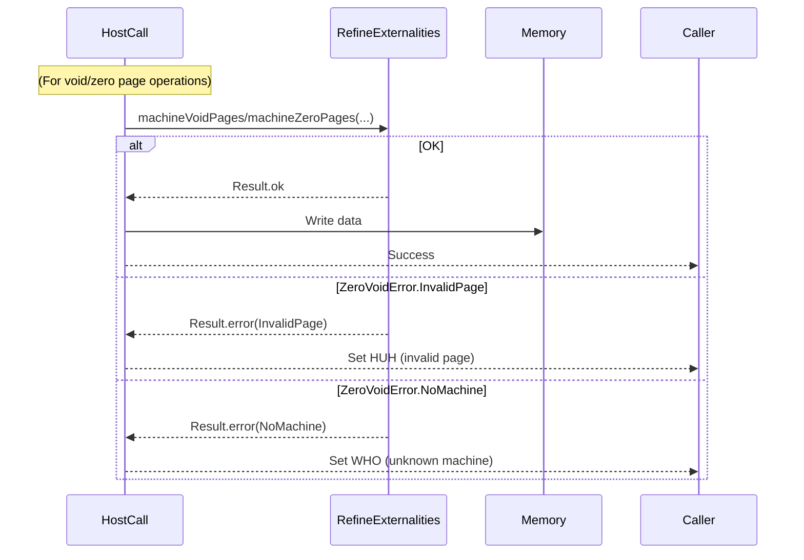
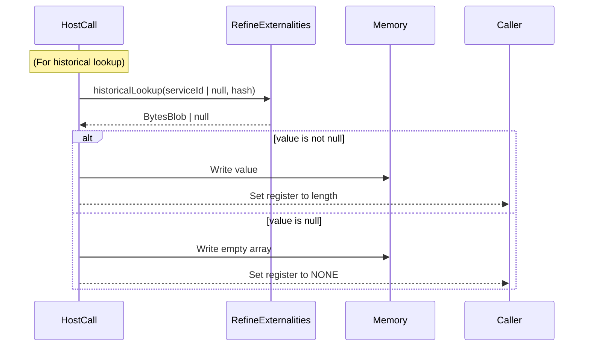

# Updated Refine HostCalls to GP >0.6.4

## Pull Request by @DrEverr

Partially: #246
Resolves: #323 
Changes:
 - updated GPR references
 - updated test cases
 - unified code structure between HC
 - fix serviceId return too early bug


## Comment by @coderabbitai[bot]

<!-- This is an auto-generated comment: summarize by coderabbit.ai -->
<!-- This is an auto-generated comment: skip review by coderabbit.ai -->

> [!IMPORTANT]
> ## Review skipped
> 
> Auto incremental reviews are disabled on this repository.
> 
> Please check the settings in the CodeRabbit UI or the `.coderabbit.yaml` file in this repository. To trigger a single review, invoke the `@coderabbitai review` command.
> 
> You can disable this status message by setting the `reviews.review_status` to `false` in the CodeRabbit configuration file.

<!-- end of auto-generated comment: skip review by coderabbit.ai -->
<!-- walkthrough_start -->

<details>
<summary>📝 Walkthrough</summary>

## Summary by CodeRabbit

- **Bug Fixes**
  - Improved error handling for void and zero page operations, consolidating error types into a unified enum for more consistent responses.
  - Refined historical lookup logic to ensure memory is always written, even when no value is found.
  - Updated logic in several host call methods to delegate bounds checking and error validation to underlying implementations.

- **Refactor**
  - Standardized error types for void and zero page operations, replacing multiple error symbols with a single enum.
  - Simplified and clarified control flow in several host call implementations for better maintainability.
  - Updated documentation comments and URLs to reference the latest specification versions.

- **Tests**
  - Updated test cases to use the new unified error enum and adjusted expectations accordingly for void and zero page operations.
## Walkthrough

This update refactors error handling and input validation for several JAM host call modules, especially for void and zero page management and historical lookups. It consolidates error types using a new `ZeroVoidError` enum, updates method signatures to accept nullable service IDs, and defers validation logic to externality methods. Documentation links and comments are also refreshed throughout.

## Changes

| Files/Groups                                                                                         | Change Summary |
|------------------------------------------------------------------------------------------------------|---------------|
| `packages/jam/block/work-item-segment.ts`                                                            | Updated comment for `SEGMENT_BYTES` to clarify its calculation. |
| `packages/jam/jam-host-calls/refine/export.ts`                                                       | Refactored segment length clamping to use `minU64`; updated comments and import. |
| `packages/jam/jam-host-calls/refine/expunge.ts`, `.../peek.ts`, `.../poke.ts`                        | Updated documentation URLs to newer spec versions. |
| `packages/jam/jam-host-calls/refine/historical-lookup.ts`                                            | Unified null handling for `serviceId` and lookup value; always writes to memory; updated comments and variable names. |
| `packages/jam/jam-host-calls/refine/invoke.ts`                                                       | Replaced switch-case with explicit if-else for status handling; added comments and blank line for clarity. |
| `packages/jam/jam-host-calls/refine/machine.ts`                                                      | Replaced manual clamping with `clampU64ToU32` utility; updated documentation link. |
| `packages/jam/jam-host-calls/refine/refine-externalities.ts`                                         | Introduced `ZeroVoidError` enum; updated method signatures to use it and accept nullable `serviceId`; removed old error symbols. |
| `packages/jam/jam-host-calls/refine/refine-externalities.test.ts`                                    | Updated test error types to `ZeroVoidError`; adjusted method signatures and imports; changed `historicalLookup` to accept nullable `serviceId`. |
| `packages/jam/jam-host-calls/refine/void.ts`                                                         | Removed manual page bounds check; delegated validation to `machineVoidPages`; refactored error handling to use `ZeroVoidError`. |
| `packages/jam/jam-host-calls/refine/void.test.ts`                                                    | Updated test error types to `ZeroVoidError`; adjusted test setup and assertions. |
| `packages/jam/jam-host-calls/refine/zero.ts`                                                         | Removed manual page bounds check; delegated validation to `machineZeroPages`; added exhaustive error handling with `ZeroVoidError`. |
| `packages/jam/jam-host-calls/refine/zero.test.ts`                                                    | Updated test error types to `ZeroVoidError`; adjusted test setup and assertions. |

## Sequence Diagram(s)





## Poem

> A bunny hops through code anew,  
> With errors now of just a few—  
> No more page bounds by hand are checked,  
> The enum’s here, all bugs are wrecked!  
> Service IDs can now be null,  
> And tests are crisp, precise, not dull.  
> 🐇✨

</details>

<!-- walkthrough_end -->
<!-- internal state start -->


<!-- DwQgtGAEAqAWCWBnSTIEMB26CuAXA9mAOYCmGJATmriQCaQDG+Ats2bgFyQAOFk+AIwBWJBrngA3EsgEBPRvlqU0AgfFwA6NPEgQAfACgjoCEYDEZyAAUASpETZWaCrKNwSPbABsvkCiQBHbGlcSHFcLzpIACIAVW5aaiibEgAzeHJIAAl8RFwAYTQfZAJIAHErSD0ABg0ANg0AFgAaaPtsAWZ1Gno5SGxESkgAEQoAUSkKPjRkW0gMRwEhgGYADmrm9Fpaf0RB5EHJopRmXnwpNgxcZEx6dIAPaT8SLyT6Upy8wuLIAAos/IAShQWFwsA80Fk3BISym8jOIjEGhgCFmdm4znERS88l2+C8UmQSAcHjMACZGnV0Bg7t4cc9EPjCSg9sFIGZlmTlhojABpEjyBiwTCkIkYBhebBKdD2eBEDDwdIMTChbAJJJhfBhcGQAAGJERuF12VyBWxmzViRoJS1FTsvzKZGUvis2Ao3FyHhSRCQNAowP8qUoZAY0k2t2eEiQ8HwGBtYRCjBmT1KRTlWAA7upYNqPOQM4xhRhRciAILbdQxjDY2SbMEeJjSvIUbBiN0eNAMCi5ZCfM0/YUyEhkfoK9JRUrwU7dqQKOO+kOyMuQATYIiQB6QDMzdBeRknbiRS49TUKKaiUL1nj+ZjUdvPXBurD4VK5+yUKOhgCS9AkRWCPIGO41h2NozDxmQRahm+/hePAKjwHBuDyBGt4ZLg2jVmoSHyC+JpfNiMi4mkGQZOu9bwHwU6HiQx7UFW1L0GQDgUGR2rUM8rwnta1zPKkkRiLmgz9Oq1rIsBQoik8zgeLQ+AMI47BRBGaB/ohKiRBu+B8P4UYkAWHFXmcUZKPQZTqFkHSQLENgADKAfoxjgFAZD0HhaB4IQpDkFQJ5MKw7BcLw/DCBekhPH0jbKKo6haDojkmFAcCoKgmA4AQxBOr5UT+ceXBUAWDhOC4K6Coo0VqJo2i6GAhhOaYBgYgwADWaCigA9EIaDMO1AhePJzXtRm2nNWA6i0WAgxEMeGjXBwBjRItBgWJApZfplPlvO0xW4a+knFtIbg6rl7CQEoiBdvAajFm+JD3B6FB+bGeQqnqADKYxlAAsmMABy0AAPoAEIAJrQGMb3GtuyCWltpR3Ye8AMOo9IZLQSMamCHHqMgf6Sh4qBGd2tCtqEeG6gA6gDYzGhGlMA5D4k6tpcoZMcJ1XLKpz0i9J7RGM93aSeU3HrKABeBNYHI1qtFuCCaVe+YKAFnMSs4irwCmqKlfY0LI6kshsdE9NjJAABUkBU5DXACw9wskNNp2IPAEsgqVYltL9Wr7aKW7BpAt7SqUV6do+7PlfwfDIdCZ0kQq4jPYB5iWKWXh+vRz2nleShq75VbIHhCNC1E2meH1SOQOwlaHQYXvkDyi3REYEBgEYTWtR1XU9V3YCwKaYDKsU7WBhkJDtUXj2zYg82N8tKfrd5yjC44t4lXhPs18B1FC/YGE0KL0MiVaE5ahkEpSh4updBgsR1I0tP9cWzvSrquAuKWiC3/fG7dswb66gAAWjjCSgLh2oLGYLCRAxp25tRIEzDwNlbJuyvGrPYysD47lhtxLUaB5j6SGJMZ2sZkQU2zBkf+tshbGjQYgAA5MgfUjwFI0GNGwMEig6w6n6j6BgWk+BKD9NfNiuoRbsFsmQIgYIoY7g3rQLgGQ8gkDQG5V8t4Fg1mVhiViN0rxAzlF+TmkRixgh/iwZ4PolF8FWOgIgmE8jvU+j9f6wMwYQ1pjSXMWAmAYEmOIYsmx1DzHwAWAYTwr4ZC/saUoiA0BBnpGrU4b5jFSJzKUXUH1vp/UBqDcGkMVxpG0g2GY/jyK4PmIsSgy4OahEPio0yp5c6KnkFjUIyo8hsVTJATkYBKqjmdvKKI6EHZDFQLEoMZ02TB21gIfA2AaRkQQZAP8rENINhYKLVIpcrwS27GADE2wojnX8RnLAYjOaHzkWYv+xtjlswTlgX4ByGlZlMbs3IgJdRtFKMbe4XA7nVgeX8Z5URXk5neYgT5bQwVzNCHEoMYg2KpHmYi2MaZkJLN2GTV8V52F93oDeexo45FJznqtNOS985Zx1DnV4edM6F0Fo9EufBuAdDgnwqu4ga5QC9oWKS8YrwDMBe2AuAjRB0tOQXV8E8TylzZeXTlVxq7IAzP7QO8CFpLQMC3NunYO7SE6t1I1zBe790HnuYeccx4I3maQKeM8lorTWhtJeUQiqr12vyg6iAjoeFjAkospAWTUiPpjLUV4kEoJpfJRSVxTkYNOlsqOOpdS2ztSQGhrw9hLKjR6dCnSI06kQHrDWyogWl3OumM6sbMHICuakX+yzKDEKwLUBojRTxEIYu2+omxAwCVKTKJWgZgzig8HBDAzUEH+HQLOjA3sg0piLes6UPCkabB8W/fEG5+oZk2KXUBpciy0EnUQUlzqKX0rjNS2SErnBSv4DKplcrWXsorlyzWvra6xk1bPHVDVYGd2NT3PueQB6EStekcg7VUQEFYoPMA/V8DNTVA6rVTdnULyyltD1zgvUb2/RJCOh9AyhyKe8LU8zmlvhPWep9b52keAzOCLAoiPxIxID+Y0qAFg+EYnLEcV44Ms0HpAZDqHuB6jxsEHjyA+NeGRFYXSMYBg4i4R4PFigHxPiiMoig9IwV6j7N8LwKQHBpw0L9AA8r9GmJw2DoySKjV87GKCfi47QGR8m6SbFXJebWQpRDNS3DuG85w6DIkMUolRGmFDSgXQWM4oY6DxmoPvbgAWPAiYQ8cCTapK5SCwIqPUgx3Oce4yGhTyIABi2zU0yczTpig5BegtO4fgFDao4tRWCeJ2MpAdIkEfC15A+nDOsek/+JrvG6RRbjDQWLKA2lFAUlxcJKTpHoGQO8lArnGtyYqT4cMnjBi8V1FaNA0TcFYFopl+QupYjoVWKWKYaBZA8dBMKFbgwllsGYNpeQGZWI0H4NCa9IbwfJscxY5wp7pCIE2MDysN0SDZiGCHNsxxLuR1DXd5Cc6qBLlWqkP0b5/uA63CDkggT9vTcOwpwJoQzslB1P4SxZP0kmexOZ7wmgbN2Y8QS4bT5EDIms/WCgWZBhM/fLxK87OFxRxXeJyRpi8JXka0zVAG85yMjgsfVneY6SFmCzcTxSggwUCN8Z00pneeWYF/Zs7Q75niF8HEznOoKclWRzQTYzE3RsR9/IVKXhtyyFVSDmgoItQkCK3tt8jWQ1dD2Is1aFYHk1k2IyNgyz1ZrPmN1J4arZ0NtLk0gnvwLshHuVWCRGBrt6gBachvqTdSAhO+8HUUaKGoI2adQ+2CT7DoIXwbtJCjDJ3JenB5gqaX3uvdKyuL6WVlw5ZXZV3Lv28sXQK29sp5R3l2Ax2Va+FUb8/dIJZtDjO+lE0UWynXJNC+W4wu6og8BNa0/QYVx+PCEoUIopLq0ANzaq6qNT6pwKIAmompmrgYWowEjwwYZASAobwJzQYZkouqLzZS/4rz4YMaEZ+phqg6EZvhRqjr+DjrRoNjZrIByQKR0RAo1Knh4L5iEItpVhRZwrbD1p0rNJsQ1LIDJrk7KIKg3R4QZBsqhCK5WLIBfi/QAzWaxCAw2CfQAwACMAmihyhqhAM6hZQAMZI22MQt4Qoo8IISg9wbQEY0QLeQKIeu8mIfw/Ug8gIbQuwes4gUgOIy4fUmAIWk6BMNwhy9AnuQwaUR6fAQWLU/AWATh/gKif2mEG4KKWevguuhMbOJAh4nYtEp07k9gryQozh+8hRbG5hCA5Ab0e88CuwfOGgvMAwUM2YMogwQQIY/qr4JWvMBRVwBcWAeCbhxwKy8EfUl8/gI2GAtRSQtMaegydwTaV8nY1RJAsxNAGgDRacuoSySsvWCMHKKMgo4ILUIhpcGSe8AwGgWQ1mb00Ar+lxd4YuNWpYsQtkDxG4lEeQOew2Q6chfoNwDATAFA6MxY9IEYUxT46e7gxWbSpxzURIOKxaVxRIgx3R70qJGgVgpYv0X4+QuomwTxj4YuWQpYHxhJuOxJ1x1m1mZQlJLOMoAJlAXezWcYUWr4C6mQGu4IwkPi6Mc+Ac1AQosuYI3YGY5ulcUwpcRmV48yCMF47qWJKIqAZGYgLMN0vA0gH4Ws/qrEPo1Yvg66fC/mDIb8pMoqjGsY26vg/EIS1y7RJRsAEGwkk4qQYALwwkeQsgmkRmEo+mQwgw2iCa68yYYu0+qcs+VK0yd6ucj6jKds5+76Sq4QX6zckAfK5BMZh+IqJ+lai+8Zz6iZbkb6iqm+qZ1+KIdBMwjChiaBzUTWEYOMAcw2+KeoH+LCTWgBWAwBUk9AFCf+I2HYniUYzs2E6gS4WBAGrckBLU0BsBoG5qkGyBY8VRo86Gs8WGrqeB20nqRBS6RGOo28j0ZR/RtSWCokI+Z8koQcqaiS3AX80A+AsQnIxoeAiEE5DpV4uxGg7U75e4bCig3g8CVZ1kdktBjA9BSG8eLwiaFyF5x8lGfEY60E7BY+za1uDEPJHgRAROGI4OpC5CX2l8HZX+bCrZ2m2FeoX0qxo8WaNZcWxp/CkF3U3AnSd55UbeW2yelyIBDpeC6i2A4cCyGRK+WpaesY7EK23A0I3eE6auOYHEZIAAepyGwUmPxtmceSeLqPeY+c+a+WkeKA8trsgP4HkaGDblqVGHMmKMEabnERGD4hPpmG0XguJY4BpPIC9DSHDi7FEP+Z+cisZQxKIfeWxHgnfL0kEvMsKkMlcCMsrjKD0n0rFemPFTQINsiHyvgJLv1rwrjlut2LaXut6r7KXppiopqlPpelGZnNmbSg+oKQmcXCWevh+lvmmTqhmXvj6n7LOhqgfoOZafmXGc1UWa1bjhfh1RWWKNqKgOjKkKkGAU3NOXqnOcBt3N1PAbgBBkPCue1NCCQNOpgZufPNubhgQWvHtAeSQQGicVJKQbqWBcgn3sdFBZEL4XBaEKId+VYMOM1PRego2uYi5XqL2t/Okr2nUK/lmTqIODmBiKYucnCsCdpGCUQH4VWbOjJH1lmSrr1saZutacVbuiEgHtKXwHRmRAetMBgLhHlcFaioaROReinFeo+g1QWeNWJZNfKsmeWSqkYHXH+uAYBlAZtXAWBrtYgVBqPIdegRuU6udbgZdTtPuQKndRgIGo9cPjbr3sRTWkwewAmqwb9amlYOgUDYjmVexQAWkChR4CDX/GDRDaeNDQJgDotYbLovDTMIjdQIpWjaCWRFje4DjfOr1b7NmYTfgLwsTVcKTXafurjtEZANTcWGzTPpSvVSro1Uvqfqvm1dNSmULT+vXFORAUBoal3FLUuftdanLeQB6fcH6CzdvrNCEErZhirThsvOrevLdUBDqDxAeEeCbRWq5ikNBiQALG3eil+t5k9UheZa8NBGncAmZS8HDFqGgfAOEZ4rthiCWJAG9KWkqNnrdJTWEFCE7RcWueQAAGr4D71WDQHDDUBXYCYrEWHkAABalA+Ab9ooH9GENCfFzteoXsNFv9s919AAPpAHWWmLQMA3A92BQI8dA7ReQGMJTcaF4WFL4S0lqLqAA92M/fvXgxg7sZAPkNpF4bGBjepjBCLi1jfdCMvt+Q/SQJQ6g9AY8Tw+Q0AwIy2RwrQKqv7MPivWw2xspiwEgCQMAA7rgMANZryJsMI3w9Q9pHoHoJ9jFqom+NZapmNtfZvWWJnlWJfd+TlhjF4E/l1twOReIwwjmf/qFvWnxamMCbkXCkdq8BMe9Bxt+F5n8BkiE55pAIgwph3qyUEolg5nQPBDQPSHiASMunqLE4nt+WVh5pVs4EQHGqEKgLqLE35lCDWXbdePHqY/lRXK0luHMl4N3uKXjtfSVgumdJ/Z41pPMqAaBdpZIzjbQEIAMDgiCOfC/Foy/bQDo5gwJuFrOLqMgwbmg/M7sRGRzYKVzWNVSi1cysXQLVfjvpAF9BRb/umB49I1wD/WsXw2g4gL8Dw4YtYVwDA2sT+JsMfesRhI9FwF/N83AvQ27gC3fICFwPI6nkoyo2oxoz1R86PPM9E0g74ig+s5TXo8aIAEmEeoPDDz0BzzODXGNId07zxLXzPAcCsx/z1kd8QLpAILVwYLjQEL1gv8ijyj0gfOcLmjgD2jmL+jbst+uo0AIQ09SLrdn2eo1dMBtdi5CBy5jdK5Ld89SEX6ndeQU8uo3V5z4j7jQ5y9tzQjgDjzRLsDrzZLZzFLtADLvzmILLdrTLnAdLrLkLHLgwXLFmqj6jmw2DsD8zWLkAuLdzo8wjZrLzpLfy1rFrtrVLpANLLrgL8bJAzrLLbLULnLsLvrkAMzVDgr0rIrYreQEruDUrbsuosrC5210te1lqB1Krd0arKqmrmg1wOrUAerbZw1s6Nzeodjg8jjkmvweTFW8ip9kTlLCNXAQMrwDZZIAgWQ/tGbHrSjQMsg1os7ggKLCmQrIbA7j+z+aoI7k747b0p7O7vm6d/tM7c7JAC7S7iAsAK7Cjnr67m7/UAgl7PgQrFCRb4r1qc90rlbEtNdIGNb9d9byr1qqrlA7dGrPE2rld4tG1YHW1pqtbstDbMHTbcHC91+p1ytq02Gm0/de5g9mtw9sktaE9DEZt9Wl88juF3UzrlA0St9vT0jjSAhBsUly2zw4l7ANwkAUVqV84ixIImVQw+ayquiKu5ArdIIzYpMVY/aDt1ByMvtHgZQeFaA4OusogZaCaSCSyJjtlPMuRTV6yKsvEFVeu+I+9W0EYCMtwUQYVAhGKJBadGd64ohobT9szjzgjxL4bojP+qqsifFfQq9nYnSw074wZoOadiAsgkC+IyA1e/raxGz39qzr9cCGzwIRmeCzs4JHgZAjgeoebcz+DfH15F8MguVOYuoWXdFuXaLazcCxoadTGYudDDD0gHoCy4JtYrD0xHDGJ9Ywk4XnHl5SFYSeo2b8L1XgbBji2RjeC1Gklhc19KXaXe4gEwEZnam3lGEvlj85Xu3qXsye4UD+AiLuDtXdMeX/DpAOXdnSzdAanFlUQfQ35K3tXFXzASyLX93xLOXe3N3zwaEN6ppvG9pjBxT7q1EEJyA/M19PDVWuVfTNIGgq1wEuoB7DjR7zjYj+KbjPbzGkXfZbBPg9pbm+TYTpQSwAThe1e575WoT37XgcTYltw1TnYoYmW8VMhNaMPgEOVjN6R1jmRB5uOlPAcigRngpdnGqgEtVOdN6uzkqPNZ+RzZZJz6Z5YDSQPVX/Lsz73bR/2UCd3D3HgAAvJANUI8S92g5AI75oZs1APEIhWT9pgrxQsMhQKkPkYt4B63Xh+q9ILqPNJALoHi8SwS6KOa581G+S7G3a4m46ym2m66y+9C16zyzmwDxg1iwYHH1AP5yQKF8n5G28zG583Gz81n66063Msy3n+66+zC9y2nLy7m+b/m6X/o91T71tD/ga/eIHwlcH6H7qKW7PRHy1vh9ArH/H4T/frlsT04ye5z55lwBz4z9z5sNO5ALO2gPO4u8u13wX++9IFu1+zE3SEK08ipuZw9qO6Ewf6ex3shzOVW/Kwg6KsG6M9dqHvVAKIdCOPdYjhdTI6EEKOPqEgqPQcDjRmK35PhsaGloaVfAQ+ObqeBi7QQ5SwkDXPFyDJWcpSGDCbjbRWYdd8ub3J7p4lB528NmSONyqOA1h6Zr6pvMhoPxq40MDwk1SBrqEbZL94O0fEHlqW0QkBi2RodOi8H05M0HkbjNOtsUvAcdeKNPQXujVDokN0AvjTLGH29b98S+ujNbsoiMZExamtldgZJWARlhNKiYXrnx2O6IB6QGIPYFEHn699NA0RX4K7wK6U1PkVJFRhoF8GtdHuGDIIYk3cE24QSjDYbuuB4EUMLelNDQP4NIDGgLiJgigFZjB6wNjQYxFUH12SheNHq8KC8CUBCCs4OIkwGjEsGFA2U+AklVAigxTYggZC5uegPMmaiJYEixLJBsMBtqB4dE5EcEPIESYKlBIEYOjB4EVj6R7OBuLaGnSB434SaO6ZOgJhrKUBBS3ZYlCAQPTa12sl3SgZvQEwUQ+AAwOBCgkTBnYCsqvJXuOFAJT5sC2zaMnnW5r7MJqhzKasc06o8pIANWaXpJQV59tK25lGSDIN+CqCuAS3P1nkOy4INUWeMOgeg10aZ8/mLrCBLCDb6gsKkkCSgEEJDaSCIRIQKEd4JhHeDjBvAwNuiIdZ4jsROfdvpiMqT+hgOAA8Dhh0g5IFG64A1tkh3/RV1QOcrDkTtTrbcjQBvIqAdgRI5up8CA9G6pR2IzShPuY2e6EcVCCzJ+mXjYLGxFsE6gfmfgR6iOwxFtCnKTI4EEsGTTFIfAIifFoFwEZKY3+J3WXP5BkITgdQrkU0SOUoAcD+y55VVERQZA6kD69AW8PcCnCVcDRcELoNcDU7TEIqMQLILECyCeFvBieWFAxk1E0hihgWBEljwLAKNcAPQTYEoEiB2Ih02IfPIsKBTpI7RKI6BEsm863B6MERGItiFtGJ97RooQ7GqXgx0AuAV4NOqlAWKtZ1KIxXwIUKCb6hYaCJZSHYkUShAkh+AAVhg1yF29Hi2QtIbQNe4zYFs5ghjJYJsoDBbe4PBgfQBoHIidxGzVYYnXWGlVUoozcZiPihLsMpwjmFJi8BQik5AyfxapsyT4CiFlEpRHrsmCWTQZjguoLYY9F+gwUFmFqENFx1KALcrw44igaXEnGaRpxUWU4ELC3rrYkKCuWiBFl6Dt8JGDlELBGHxBMRzGt9G4LOlLHDYvuZwmNMbXjRApJ0IWVAIhPKQcFx8XBSfDVXZp1Ute7wvZgyi+Gvp2qpdbfOmUzJy94YRdH4Qby3zyB86UqAANyMZ6CeoDAQJmbIT8mEn+VhJPxPy7DeyB0J4QKJQ4GphR6HUUVh0brvI+RUorcqrTgHXUyqm8EejcOwCoDzal8YRpgNNDYDZuvvUoAQNmE6gFuVFJgaeP4Eb11BbRf7tSMB40SY42lNzssREHNtt8tDM+oZwvo+BRu35Ykf4BkHGhFBVYZQdfWDLsIMcHHBtMsVhEIs4ppg08F4KMHF8UppfWhvQ3PAlomGOg8MA4IcRODGmLgtwVsPPEhCUMvwdRkEIuIhCwh8IpFoEKbxgjLOZUkIMaGiE1lDBjRXwZuPSEkAFpfADqQdMpq/BNx4Qk6U3gHQXg3wSsBKdCFMroAlqFQhMHkFxg+iDYbEeoapBjB8AWMQmfUVcNQAZi8Il4w0QdD+AEAtQpVbZJ1nEyFMTpAmYGYbUx5fhhgCEqdL0MbH3RFS9ALAfBNUFb0YeewmntXiTFZAKppcFoQbhTadC9QFMW4rTIuG4yQkfQ2Bp3hXB4Ar6lAv/PRn7wiUGI8PAsD4mdhKIrg9ISBslOSFD9tI3XCBEp3W4MZYpAbfBlnUjKa958sZHXp8N5rfD+ayk2aumUBEhVgRVzQ1qCMqmSVSp0g0kdCMgDNSbpNIlNi3yxEslGRuIz2ayODZ6hbZWAe2ZCKdnNTshegWkbS19k4iO+vsoIRQhA6odbJddYAVB1AFOTIB0CP/utRsnVtORqc8UfLQznTwsCrkvuu6iuoEYh6EkJdNDwizCdBKxwLMWRNiIhY9RHgA0VQBhmv8rBJ3foKV0SFFQokAmCWWd3OzqEPoNgR+mMGGAAxfosQL6EDDGA2BlCNWAGDiTKDuJv6X0UsAAA055C8peSvOsxryN57iC0YUjLztiboVfGvuINRaGNZcsEL9ILVgi4RDaqgtWSa27BBdTwgiSgNfA8AOBfG6CUuCH0QjthGx19HziGhc6ksQxQpaUIcSRjqAFEyJe2t6xDRRFKaLohEjbhLQFSP0aUjwNXmukrTyAmQs6UdO3FoMO8AmRkoRI5yRFg6zDeQNXhZnWZKFxmZMR3jLC3Z7gwocZuFHIlbg2ikEjwdBNgmHZ6kI+YYR2H4wgT9gc6bLM2MiygUiqd4+0okxfE3o3xyTZzF+LJwu4/xDsJXG7ErG9c1OAOKMDdBR4oKfq2IMAGKTmREBYA2Eu2HhJ3qsNrFv3UidqMcr0SXgjEuNhGCVhDNmKTYmkC2M8RQSgUuNGRU8MEnZ0C62vJqgbL15KTL8fw05nJP3zZlKey+DJcbKyWzVNJqCbSUuNfz6SLm7ZZhGRQfCpEhUxeEyaLVWqOQDAiUTfBt08iwCcoA+DvgVF3KEFIo5UKgDFCqjxRaoHS5yBgnUAAx96iAAGCpgIS0AAYL0E8u0s6WaFUgywAAJyaFqgqwXZQIAADs1QaoI0GWBrBUgtAVYJcrJC0BqgmhFQNUF2XVBTlqwZYNUBOXLABAmhXZTVDqidLcocyhZUstqYrKAYno/QEAA== -->

<!-- internal state end -->
<!-- tips_start -->

---


<details>
<summary>🪧 Tips</summary>

### Chat

There are 3 ways to chat with [CodeRabbit](https://coderabbit.ai?utm_source=oss&utm_medium=github&utm_campaign=FluffyLabs/typeberry&utm_content=380):

- Review comments: Directly reply to a review comment made by CodeRabbit. Example:
  - `I pushed a fix in commit <commit_id>, please review it.`
  - `Explain this complex logic.`
  - `Open a follow-up GitHub issue for this discussion.`
- Files and specific lines of code (under the "Files changed" tab): Tag `@coderabbitai` in a new review comment at the desired location with your query. Examples:
  - `@coderabbitai explain this code block.`
  -	`@coderabbitai modularize this function.`
- PR comments: Tag `@coderabbitai` in a new PR comment to ask questions about the PR branch. For the best results, please provide a very specific query, as very limited context is provided in this mode. Examples:
  - `@coderabbitai gather interesting stats about this repository and render them as a table. Additionally, render a pie chart showing the language distribution in the codebase.`
  - `@coderabbitai read src/utils.ts and explain its main purpose.`
  - `@coderabbitai read the files in the src/scheduler package and generate a class diagram using mermaid and a README in the markdown format.`
  - `@coderabbitai help me debug CodeRabbit configuration file.`

### Support

Need help? Create a ticket on our [support page](https://www.coderabbit.ai/contact-us/support) for assistance with any issues or questions.

Note: Be mindful of the bot's finite context window. It's strongly recommended to break down tasks such as reading entire modules into smaller chunks. For a focused discussion, use review comments to chat about specific files and their changes, instead of using the PR comments.

### CodeRabbit Commands (Invoked using PR comments)

- `@coderabbitai pause` to pause the reviews on a PR.
- `@coderabbitai resume` to resume the paused reviews.
- `@coderabbitai review` to trigger an incremental review. This is useful when automatic reviews are disabled for the repository.
- `@coderabbitai full review` to do a full review from scratch and review all the files again.
- `@coderabbitai summary` to regenerate the summary of the PR.
- `@coderabbitai generate sequence diagram` to generate a sequence diagram of the changes in this PR.
- `@coderabbitai resolve` resolve all the CodeRabbit review comments.
- `@coderabbitai configuration` to show the current CodeRabbit configuration for the repository.
- `@coderabbitai help` to get help.

### Other keywords and placeholders

- Add `@coderabbitai ignore` anywhere in the PR description to prevent this PR from being reviewed.
- Add `@coderabbitai summary` to generate the high-level summary at a specific location in the PR description.
- Add `@coderabbitai` anywhere in the PR title to generate the title automatically.

### Documentation and Community

- Visit our [Documentation](https://docs.coderabbit.ai) for detailed information on how to use CodeRabbit.
- Join our [Discord Community](http://discord.gg/coderabbit) to get help, request features, and share feedback.
- Follow us on [X/Twitter](https://twitter.com/coderabbitai) for updates and announcements.

</details>

<!-- tips_end -->


## Comment by @github-actions[bot]


<details>
<summary>View all</summary>

|  Name  |  Status  | |
|--------|----------|-|
| Trie test 0 | ✅ | | 
| Trie test 1 | ✅ | | 
| Trie test 2 | ✅ | | 
| Trie test 3 | ✅ | | 
| Trie test 4 | ✅ | | 
| Trie test 5 | ✅ | | 
| Trie test 6 | ✅ | | 
| Trie test 7 | ✅ | | 
| Trie test 8 | ✅ | | 
| Trie test 9 | ✅ | | 
| Trie test 10 | ✅ | | 
| Trie test 10 | ✅ | | 
| Trie test 10 | ✅ | | 
| jamtestvectors/statistics/tiny/stats_with_empty_extrinsic-1.json | ✅ | | 
| jamtestvectors/statistics/tiny/stats_with_epoch_change-1.json | ✅ | | 
| jamtestvectors/statistics/tiny/stats_with_some_extrinsic-1.json | ✅ | | 
| jamtestvectors/statistics/tiny/stats_with_some_extrinsic-1.json | ✅ | | 
| jamtestvectors/statistics/full/stats_with_empty_extrinsic-1.json | ✅ | | 
| jamtestvectors/statistics/full/stats_with_epoch_change-1.json | ✅ | | 
| jamtestvectors/statistics/full/stats_with_some_extrinsic-1.json | ✅ | | 
| jamtestvectors/statistics/full/stats_with_some_extrinsic-1.json | ✅ | | 
| should correctly shuffle input of length 0 | ✅ | | 
| should correctly shuffle input of length 8 | ✅ | | 
| should correctly shuffle input of length 16 | ✅ | | 
| should correctly shuffle input of length 20 | ✅ | | 
| should correctly shuffle input of length 50 | ✅ | | 
| should correctly shuffle input of length 100 | ✅ | | 
| should correctly shuffle input of length 200 | ✅ | | 
| should correctly shuffle input of length 341 | ✅ | | 
| should correctly shuffle input of length 341 | ✅ | | 
| should correctly shuffle input of length 341 | ✅ | | 
| jamtestvectors/safrole/tiny/enact-epoch-change-with-no-tickets-1.json | ✅ | | 
| jamtestvectors/safrole/tiny/enact-epoch-change-with-no-tickets-2.json | ✅ | | 
| jamtestvectors/safrole/tiny/enact-epoch-change-with-no-tickets-3.json | ✅ | | 
| jamtestvectors/safrole/tiny/enact-epoch-change-with-no-tickets-4.json | ✅ | | 
| jamtestvectors/safrole/tiny/enact-epoch-change-with-padding-1.json | ✅ | | 
| jamtestvectors/safrole/tiny/publish-tickets-no-mark-1.json | ✅ | | 
| jamtestvectors/safrole/tiny/publish-tickets-no-mark-2.json | ✅ | | 
| jamtestvectors/safrole/tiny/publish-tickets-no-mark-3.json | ✅ | | 
| jamtestvectors/safrole/tiny/publish-tickets-no-mark-4.json | ✅ | | 
| jamtestvectors/safrole/tiny/publish-tickets-no-mark-5.json | ✅ | | 
| jamtestvectors/safrole/tiny/publish-tickets-no-mark-6.json | ✅ | | 
| jamtestvectors/safrole/tiny/publish-tickets-no-mark-7.json | ✅ | | 
| jamtestvectors/safrole/tiny/publish-tickets-no-mark-8.json | ✅ | | 
| jamtestvectors/safrole/tiny/publish-tickets-no-mark-9.json | ✅ | | 
| jamtestvectors/safrole/tiny/publish-tickets-with-mark-1.json | ✅ | | 
| jamtestvectors/safrole/tiny/publish-tickets-with-mark-2.json | ✅ | | 
| jamtestvectors/safrole/tiny/publish-tickets-with-mark-3.json | ✅ | | 
| jamtestvectors/safrole/tiny/publish-tickets-with-mark-4.json | ✅ | | 
| jamtestvectors/safrole/tiny/publish-tickets-with-mark-5.json | ✅ | | 
| jamtestvectors/safrole/tiny/skip-epoch-tail-1.json | ✅ | | 
| jamtestvectors/safrole/tiny/skip-epochs-1.json | ✅ | | 
| jamtestvectors/safrole/full/enact-epoch-change-with-no-tickets-1.json | ✅ | | 
| jamtestvectors/safrole/full/enact-epoch-change-with-no-tickets-2.json | ✅ | | 
| jamtestvectors/safrole/full/enact-epoch-change-with-no-tickets-3.json | ✅ | | 
| jamtestvectors/safrole/full/enact-epoch-change-with-no-tickets-4.json | ✅ | | 
| jamtestvectors/safrole/full/enact-epoch-change-with-padding-1.json | ✅ | | 
| jamtestvectors/safrole/full/publish-tickets-no-mark-1.json | ✅ | | 
| jamtestvectors/safrole/full/publish-tickets-no-mark-2.json | ✅ | | 
| jamtestvectors/safrole/full/publish-tickets-no-mark-3.json | ✅ | | 
| jamtestvectors/safrole/full/publish-tickets-no-mark-4.json | ✅ | | 
| jamtestvectors/safrole/full/publish-tickets-no-mark-5.json | ✅ | | 
| jamtestvectors/safrole/full/publish-tickets-no-mark-6.json | ✅ | | 
| jamtestvectors/safrole/full/publish-tickets-no-mark-7.json | ✅ | | 
| jamtestvectors/safrole/full/publish-tickets-no-mark-8.json | ✅ | | 
| jamtestvectors/safrole/full/publish-tickets-no-mark-9.json | ✅ | | 
| jamtestvectors/safrole/full/publish-tickets-with-mark-1.json | ✅ | | 
| jamtestvectors/safrole/full/publish-tickets-with-mark-2.json | ✅ | | 
| jamtestvectors/safrole/full/publish-tickets-with-mark-3.json | ✅ | | 
| jamtestvectors/safrole/full/publish-tickets-with-mark-4.json | ✅ | | 
| jamtestvectors/safrole/full/publish-tickets-with-mark-5.json | ✅ | | 
| jamtestvectors/safrole/full/skip-epoch-tail-1.json | ✅ | | 
| jamtestvectors/safrole/full/skip-epochs-1.json | ✅ | | 
| jamtestvectors/safrole/full/skip-epochs-1.json | ✅ | | 
| jamtestvectors/reports/tiny/anchor_not_recent-1.json | ✅ | | 
| jamtestvectors/reports/tiny/bad_beefy_mmr-1.json | ✅ | | 
| jamtestvectors/reports/tiny/bad_code_hash-1.json | ✅ | | 
| jamtestvectors/reports/tiny/bad_core_index-1.json | ✅ | | 
| jamtestvectors/reports/tiny/bad_service_id-1.json | ✅ | | 
| jamtestvectors/reports/tiny/bad_signature-1.json | ✅ | | 
| jamtestvectors/reports/tiny/bad_state_root-1.json | ✅ | | 
| jamtestvectors/reports/tiny/bad_validator_index-1.json | ✅ | | 
| jamtestvectors/reports/tiny/big_work_report_output-1.json | ✅ | | 
| jamtestvectors/reports/tiny/core_engaged-1.json | ✅ | | 
| jamtestvectors/reports/tiny/dependency_missing-1.json | ✅ | | 
| jamtestvectors/reports/tiny/duplicate_package_in_recent_history-1.json | ✅ | | 
| jamtestvectors/reports/tiny/duplicated_package_in_report-1.json | ✅ | | 
| jamtestvectors/reports/tiny/future_report_slot-1.json | ✅ | | 
| jamtestvectors/reports/tiny/high_work_report_gas-1.json | ✅ | | 
| jamtestvectors/reports/tiny/many_dependencies-1.json | ✅ | | 
| jamtestvectors/reports/tiny/multiple_reports-1.json | ✅ | | 
| jamtestvectors/reports/tiny/no_enough_guarantees-1.json | ✅ | | 
| jamtestvectors/reports/tiny/not_authorized-1.json | ✅ | | 
| jamtestvectors/reports/tiny/not_authorized-2.json | ✅ | | 
| jamtestvectors/reports/tiny/not_sorted_guarantor-1.json | ✅ | | 
| jamtestvectors/reports/tiny/out_of_order_guarantees-1.json | ✅ | | 
| jamtestvectors/reports/tiny/report_before_last_rotation-1.json | ✅ | | 
| jamtestvectors/reports/tiny/report_curr_rotation-1.json | ✅ | | 
| jamtestvectors/reports/tiny/report_prev_rotation-1.json | ✅ | | 
| jamtestvectors/reports/tiny/reports_with_dependencies-1.json | ✅ | | 
| jamtestvectors/reports/tiny/reports_with_dependencies-2.json | ✅ | | 
| jamtestvectors/reports/tiny/reports_with_dependencies-3.json | ✅ | | 
| jamtestvectors/reports/tiny/reports_with_dependencies-4.json | ✅ | | 
| jamtestvectors/reports/tiny/reports_with_dependencies-5.json | ✅ | | 
| jamtestvectors/reports/tiny/reports_with_dependencies-6.json | ✅ | | 
| jamtestvectors/reports/tiny/segment_root_lookup_invalid-1.json | ✅ | | 
| jamtestvectors/reports/tiny/segment_root_lookup_invalid-2.json | ✅ | | 
| jamtestvectors/reports/tiny/service_item_gas_too_low-1.json | ✅ | | 
| jamtestvectors/reports/tiny/too_big_work_report_output-1.json | ✅ | | 
| jamtestvectors/reports/tiny/too_high_work_report_gas-1.json | ✅ | | 
| jamtestvectors/reports/tiny/too_many_dependencies-1.json | ✅ | | 
| jamtestvectors/reports/tiny/with_avail_assignments-1.json | ✅ | | 
| jamtestvectors/reports/tiny/wrong_assignment-1.json | ✅ | | 
| jamtestvectors/reports/tiny/wrong_assignment-1.json | ✅ | | 
| jamtestvectors/reports/full/anchor_not_recent-1.json | ✅ | | 
| jamtestvectors/reports/full/bad_beefy_mmr-1.json | ✅ | | 
| jamtestvectors/reports/full/bad_code_hash-1.json | ✅ | | 
| jamtestvectors/reports/full/bad_core_index-1.json | ✅ | | 
| jamtestvectors/reports/full/bad_service_id-1.json | ✅ | | 
| jamtestvectors/reports/full/bad_signature-1.json | ✅ | | 
| jamtestvectors/reports/full/bad_state_root-1.json | ✅ | | 
| jamtestvectors/reports/full/bad_validator_index-1.json | ✅ | | 
| jamtestvectors/reports/full/big_work_report_output-1.json | ✅ | | 
| jamtestvectors/reports/full/core_engaged-1.json | ✅ | | 
| jamtestvectors/reports/full/dependency_missing-1.json | ✅ | | 
| jamtestvectors/reports/full/duplicate_package_in_recent_history-1.json | ✅ | | 
| jamtestvectors/reports/full/duplicated_package_in_report-1.json | ✅ | | 
| jamtestvectors/reports/full/future_report_slot-1.json | ✅ | | 
| jamtestvectors/reports/full/high_work_report_gas-1.json | ✅ | | 
| jamtestvectors/reports/full/many_dependencies-1.json | ✅ | | 
| jamtestvectors/reports/full/multiple_reports-1.json | ✅ | | 
| jamtestvectors/reports/full/no_enough_guarantees-1.json | ✅ | | 
| jamtestvectors/reports/full/not_authorized-1.json | ✅ | | 
| jamtestvectors/reports/full/not_authorized-2.json | ✅ | | 
| jamtestvectors/reports/full/not_sorted_guarantor-1.json | ✅ | | 
| jamtestvectors/reports/full/out_of_order_guarantees-1.json | ✅ | | 
| jamtestvectors/reports/full/report_before_last_rotation-1.json | ✅ | | 
| jamtestvectors/reports/full/report_curr_rotation-1.json | ✅ | | 
| jamtestvectors/reports/full/report_prev_rotation-1.json | ✅ | | 
| jamtestvectors/reports/full/reports_with_dependencies-1.json | ✅ | | 
| jamtestvectors/reports/full/reports_with_dependencies-2.json | ✅ | | 
| jamtestvectors/reports/full/reports_with_dependencies-3.json | ✅ | | 
| jamtestvectors/reports/full/reports_with_dependencies-4.json | ✅ | | 
| jamtestvectors/reports/full/reports_with_dependencies-5.json | ✅ | | 
| jamtestvectors/reports/full/reports_with_dependencies-6.json | ✅ | | 
| jamtestvectors/reports/full/segment_root_lookup_invalid-1.json | ✅ | | 
| jamtestvectors/reports/full/segment_root_lookup_invalid-2.json | ✅ | | 
| jamtestvectors/reports/full/service_item_gas_too_low-1.json | ✅ | | 
| jamtestvectors/reports/full/too_big_work_report_output-1.json | ✅ | | 
| jamtestvectors/reports/full/too_high_work_report_gas-1.json | ✅ | | 
| jamtestvectors/reports/full/too_many_dependencies-1.json | ✅ | | 
| jamtestvectors/reports/full/with_avail_assignments-1.json | ✅ | | 
| jamtestvectors/reports/full/wrong_assignment-1.json | ✅ | | 
| jamtestvectors/reports/full/wrong_assignment-1.json | ✅ | | 
| jamtestvectors/pvm/schema.json | ✅ | | 
| jamtestvectors/erasure_coding/schema_ec.json | ✅ | | 
| jamtestvectors/erasure_coding/schema_page_proof.json | ✅ | | 
| jamtestvectors/erasure_coding/schema_segment_ec.json | ✅ | | 
| jamtestvectors/erasure_coding/schema_segment_root.json | ✅ | | 
| jamtestvectors/erasure_coding/schema_segment_root.json | ✅ | | 
| jamtestvectors/pvm/programs/gas_basic_consume_all.json | ✅ | | 
| jamtestvectors/pvm/programs/inst_add_32.json | ✅ | | 
| jamtestvectors/pvm/programs/inst_add_32_with_overflow.json | ✅ | | 
| jamtestvectors/pvm/programs/inst_add_32_with_truncation.json | ✅ | | 
| jamtestvectors/pvm/programs/inst_add_32_with_truncation_and_sign_extension.json | ✅ | | 
| jamtestvectors/pvm/programs/inst_add_64.json | ✅ | | 
| jamtestvectors/pvm/programs/inst_add_64_with_overflow.json | ✅ | | 
| jamtestvectors/pvm/programs/inst_add_imm_32.json | ✅ | | 
| jamtestvectors/pvm/programs/inst_add_imm_32_with_truncation.json | ✅ | | 
| jamtestvectors/pvm/programs/inst_add_imm_32_with_truncation_and_sign_extension.json | ✅ | | 
| jamtestvectors/pvm/programs/inst_add_imm_64.json | ✅ | | 
| jamtestvectors/pvm/programs/inst_and.json | ✅ | | 
| jamtestvectors/pvm/programs/inst_and_imm.json | ✅ | | 
| jamtestvectors/pvm/programs/inst_branch_eq_imm_nok.json | ✅ | | 
| jamtestvectors/pvm/programs/inst_branch_eq_imm_ok.json | ✅ | | 
| jamtestvectors/pvm/programs/inst_branch_eq_nok.json | ✅ | | 
| jamtestvectors/pvm/programs/inst_branch_eq_ok.json | ✅ | | 
| jamtestvectors/pvm/programs/inst_branch_greater_or_equal_signed_imm_nok.json | ✅ | | 
| jamtestvectors/pvm/programs/inst_branch_greater_or_equal_signed_imm_ok.json | ✅ | | 
| jamtestvectors/pvm/programs/inst_branch_greater_or_equal_signed_nok.json | ✅ | | 
| jamtestvectors/pvm/programs/inst_branch_greater_or_equal_signed_ok.json | ✅ | | 
| jamtestvectors/pvm/programs/inst_branch_greater_or_equal_unsigned_imm_nok.json | ✅ | | 
| jamtestvectors/pvm/programs/inst_branch_greater_or_equal_unsigned_imm_ok.json | ✅ | | 
| jamtestvectors/pvm/programs/inst_branch_greater_or_equal_unsigned_nok.json | ✅ | | 
| jamtestvectors/pvm/programs/inst_branch_greater_or_equal_unsigned_ok.json | ✅ | | 
| jamtestvectors/pvm/programs/inst_branch_greater_signed_imm_nok.json | ✅ | | 
| jamtestvectors/pvm/programs/inst_branch_greater_signed_imm_ok.json | ✅ | | 
| jamtestvectors/pvm/programs/inst_branch_greater_unsigned_imm_nok.json | ✅ | | 
| jamtestvectors/pvm/programs/inst_branch_greater_unsigned_imm_ok.json | ✅ | | 
| jamtestvectors/pvm/programs/inst_branch_less_or_equal_signed_imm_nok.json | ✅ | | 
| jamtestvectors/pvm/programs/inst_branch_less_or_equal_signed_imm_ok.json | ✅ | | 
| jamtestvectors/pvm/programs/inst_branch_less_or_equal_unsigned_imm_nok.json | ✅ | | 
| jamtestvectors/pvm/programs/inst_branch_less_or_equal_unsigned_imm_ok.json | ✅ | | 
| jamtestvectors/pvm/programs/inst_branch_less_signed_imm_nok.json | ✅ | | 
| jamtestvectors/pvm/programs/inst_branch_less_signed_imm_ok.json | ✅ | | 
| jamtestvectors/pvm/programs/inst_branch_less_signed_nok.json | ✅ | | 
| jamtestvectors/pvm/programs/inst_branch_less_signed_ok.json | ✅ | | 
| jamtestvectors/pvm/programs/inst_branch_less_unsigned_imm_nok.json | ✅ | | 
| jamtestvectors/pvm/programs/inst_branch_less_unsigned_imm_ok.json | ✅ | | 
| jamtestvectors/pvm/programs/inst_branch_less_unsigned_nok.json | ✅ | | 
| jamtestvectors/pvm/programs/inst_branch_less_unsigned_ok.json | ✅ | | 
| jamtestvectors/pvm/programs/inst_branch_not_eq_imm_nok.json | ✅ | | 
| jamtestvectors/pvm/programs/inst_branch_not_eq_imm_ok.json | ✅ | | 
| jamtestvectors/pvm/programs/inst_branch_not_eq_nok.json | ✅ | | 
| jamtestvectors/pvm/programs/inst_branch_not_eq_ok.json | ✅ | | 
| jamtestvectors/pvm/programs/inst_cmov_if_zero_imm_nok.json | ✅ | | 
| jamtestvectors/pvm/programs/inst_cmov_if_zero_imm_ok.json | ✅ | | 
| jamtestvectors/pvm/programs/inst_cmov_if_zero_nok.json | ✅ | | 
| jamtestvectors/pvm/programs/inst_cmov_if_zero_ok.json | ✅ | | 
| jamtestvectors/pvm/programs/inst_div_signed_32.json | ✅ | | 
| jamtestvectors/pvm/programs/inst_div_signed_32.json | ✅ | | 
| jamtestvectors/pvm/programs/inst_div_signed_32_by_zero.json | ✅ | | 
| jamtestvectors/pvm/programs/inst_div_signed_32_with_overflow.json | ✅ | | 
| jamtestvectors/pvm/programs/inst_div_signed_64.json | ✅ | | 
| jamtestvectors/pvm/programs/inst_div_signed_64_by_zero.json | ✅ | | 
| jamtestvectors/pvm/programs/inst_div_signed_64_with_overflow.json | ✅ | | 
| jamtestvectors/pvm/programs/inst_div_unsigned_32.json | ✅ | | 
| jamtestvectors/pvm/programs/inst_div_unsigned_32_by_zero.json | ✅ | | 
| jamtestvectors/pvm/programs/inst_div_unsigned_32_with_overflow.json | ✅ | | 
| jamtestvectors/pvm/programs/inst_div_unsigned_64.json | ✅ | | 
| jamtestvectors/pvm/programs/inst_div_unsigned_64_by_zero.json | ✅ | | 
| jamtestvectors/pvm/programs/inst_div_unsigned_64_with_overflow.json | ✅ | | 
| jamtestvectors/pvm/programs/inst_fallthrough.json | ✅ | | 
| jamtestvectors/pvm/programs/inst_jump.json | ✅ | | 
| jamtestvectors/pvm/programs/inst_jump_indirect_invalid_djump_to_zero_nok.json | ✅ | | 
| jamtestvectors/pvm/programs/inst_jump_indirect_misaligned_djump_with_offset_nok.json | ✅ | | 
| jamtestvectors/pvm/programs/inst_jump_indirect_misaligned_djump_without_offset_nok.json | ✅ | | 
| jamtestvectors/pvm/programs/inst_jump_indirect_with_offset_ok.json | ✅ | | 
| jamtestvectors/pvm/programs/inst_jump_indirect_without_offset_ok.json | ✅ | | 
| jamtestvectors/pvm/programs/inst_load_i16.json | ✅ | | 
| jamtestvectors/pvm/programs/inst_load_i32.json | ✅ | | 
| jamtestvectors/pvm/programs/inst_load_i8.json | ✅ | | 
| jamtestvectors/pvm/programs/inst_load_imm.json | ✅ | | 
| jamtestvectors/pvm/programs/inst_load_imm_64.json | ✅ | | 
| jamtestvectors/pvm/programs/inst_load_imm_and_jump.json | ✅ | | 
| jamtestvectors/pvm/programs/inst_load_imm_and_jump_indirect_different_regs_with_offset_ok.json | ✅ | | 
| jamtestvectors/pvm/programs/inst_load_imm_and_jump_indirect_different_regs_without_offset_ok.json | ✅ | | 
| jamtestvectors/pvm/programs/inst_load_imm_and_jump_indirect_invalid_djump_to_zero_different_regs_without_offset_nok.json | ✅ | | 
| jamtestvectors/pvm/programs/inst_load_imm_and_jump_indirect_invalid_djump_to_zero_same_regs_without_offset_nok.json | ✅ | | 
| jamtestvectors/pvm/programs/inst_load_imm_and_jump_indirect_misaligned_djump_different_regs_with_offset_nok.json | ✅ | | 
| jamtestvectors/pvm/programs/inst_load_imm_and_jump_indirect_misaligned_djump_different_regs_without_offset_nok.json | ✅ | | 
| jamtestvectors/pvm/programs/inst_load_imm_and_jump_indirect_misaligned_djump_same_regs_with_offset_nok.json | ✅ | | 
| jamtestvectors/pvm/programs/inst_load_imm_and_jump_indirect_misaligned_djump_same_regs_without_offset_nok.json | ✅ | | 
| jamtestvectors/pvm/programs/inst_load_imm_and_jump_indirect_same_regs_with_offset_ok.json | ✅ | | 
| jamtestvectors/pvm/programs/inst_load_imm_and_jump_indirect_same_regs_without_offset_ok.json | ✅ | | 
| jamtestvectors/pvm/programs/inst_load_indirect_i16_with_offset.json | ✅ | | 
| jamtestvectors/pvm/programs/inst_load_indirect_i16_without_offset.json | ✅ | | 
| jamtestvectors/pvm/programs/inst_load_indirect_i32_with_offset.json | ✅ | | 
| jamtestvectors/pvm/programs/inst_load_indirect_i32_without_offset.json | ✅ | | 
| jamtestvectors/pvm/programs/inst_load_indirect_i8_with_offset.json | ✅ | | 
| jamtestvectors/pvm/programs/inst_load_indirect_i8_without_offset.json | ✅ | | 
| jamtestvectors/pvm/programs/inst_load_indirect_u16_with_offset.json | ✅ | | 
| jamtestvectors/pvm/programs/inst_load_indirect_u16_without_offset.json | ✅ | | 
| jamtestvectors/pvm/programs/inst_load_indirect_u32_with_offset.json | ✅ | | 
| jamtestvectors/pvm/programs/inst_load_indirect_u32_without_offset.json | ✅ | | 
| jamtestvectors/pvm/programs/inst_load_indirect_u64_with_offset.json | ✅ | | 
| jamtestvectors/pvm/programs/inst_load_indirect_u64_without_offset.json | ✅ | | 
| jamtestvectors/pvm/programs/inst_load_indirect_u8_with_offset.json | ✅ | | 
| jamtestvectors/pvm/programs/inst_load_indirect_u8_without_offset.json | ✅ | | 
| jamtestvectors/pvm/programs/inst_load_u16.json | ✅ | | 
| jamtestvectors/pvm/programs/inst_load_u32.json | ✅ | | 
| jamtestvectors/pvm/programs/inst_load_u32.json | ✅ | | 
| jamtestvectors/pvm/programs/inst_load_u64.json | ✅ | | 
| jamtestvectors/pvm/programs/inst_load_u8.json | ✅ | | 
| jamtestvectors/pvm/programs/inst_load_u8_nok.json | ✅ | | 
| jamtestvectors/pvm/programs/inst_move_reg.json | ✅ | | 
| jamtestvectors/pvm/programs/inst_mul_32.json | ✅ | | 
| jamtestvectors/pvm/programs/inst_mul_64.json | ✅ | | 
| jamtestvectors/pvm/programs/inst_mul_imm_32.json | ✅ | | 
| jamtestvectors/pvm/programs/inst_mul_imm_64.json | ✅ | | 
| jamtestvectors/pvm/programs/inst_negate_and_add_imm_32.json | ✅ | | 
| jamtestvectors/pvm/programs/inst_negate_and_add_imm_64.json | ✅ | | 
| jamtestvectors/pvm/programs/inst_or.json | ✅ | | 
| jamtestvectors/pvm/programs/inst_or_imm.json | ✅ | | 
| jamtestvectors/pvm/programs/inst_rem_signed_32.json | ✅ | | 
| jamtestvectors/pvm/programs/inst_rem_signed_32_by_zero.json | ✅ | | 
| jamtestvectors/pvm/programs/inst_rem_signed_32_with_overflow.json | ✅ | | 
| jamtestvectors/pvm/programs/inst_rem_signed_64.json | ✅ | | 
| jamtestvectors/pvm/programs/inst_rem_signed_64_by_zero.json | ✅ | | 
| jamtestvectors/pvm/programs/inst_rem_signed_64_with_overflow.json | ✅ | | 
| jamtestvectors/pvm/programs/inst_rem_unsigned_32.json | ✅ | | 
| jamtestvectors/pvm/programs/inst_rem_unsigned_32_by_zero.json | ✅ | | 
| jamtestvectors/pvm/programs/inst_rem_unsigned_64.json | ✅ | | 
| jamtestvectors/pvm/programs/inst_rem_unsigned_64_by_zero.json | ✅ | | 
| jamtestvectors/pvm/programs/inst_ret_halt.json | ✅ | | 
| jamtestvectors/pvm/programs/inst_ret_invalid.json | ✅ | | 
| jamtestvectors/pvm/programs/inst_set_greater_than_signed_imm_0.json | ✅ | | 
| jamtestvectors/pvm/programs/inst_set_greater_than_signed_imm_1.json | ✅ | | 
| jamtestvectors/pvm/programs/inst_set_greater_than_unsigned_imm_0.json | ✅ | | 
| jamtestvectors/pvm/programs/inst_set_greater_than_unsigned_imm_1.json | ✅ | | 
| jamtestvectors/pvm/programs/inst_set_less_than_signed_0.json | ✅ | | 
| jamtestvectors/pvm/programs/inst_set_less_than_signed_1.json | ✅ | | 
| jamtestvectors/pvm/programs/inst_set_less_than_signed_imm_0.json | ✅ | | 
| jamtestvectors/pvm/programs/inst_set_less_than_signed_imm_1.json | ✅ | | 
| jamtestvectors/pvm/programs/inst_set_less_than_unsigned_0.json | ✅ | | 
| jamtestvectors/pvm/programs/inst_set_less_than_unsigned_1.json | ✅ | | 
| jamtestvectors/pvm/programs/inst_set_less_than_unsigned_imm_0.json | ✅ | | 
| jamtestvectors/pvm/programs/inst_set_less_than_unsigned_imm_1.json | ✅ | | 
| jamtestvectors/pvm/programs/inst_shift_arithmetic_right_32.json | ✅ | | 
| jamtestvectors/pvm/programs/inst_shift_arithmetic_right_32_with_overflow.json | ✅ | | 
| jamtestvectors/pvm/programs/inst_shift_arithmetic_right_64.json | ✅ | | 
| jamtestvectors/pvm/programs/inst_shift_arithmetic_right_64_with_overflow.json | ✅ | | 
| jamtestvectors/pvm/programs/inst_shift_arithmetic_right_imm_32.json | ✅ | | 
| jamtestvectors/pvm/programs/inst_shift_arithmetic_right_imm_64.json | ✅ | | 
| jamtestvectors/pvm/programs/inst_shift_arithmetic_right_imm_alt_32.json | ✅ | | 
| jamtestvectors/pvm/programs/inst_shift_arithmetic_right_imm_alt_64.json | ✅ | | 
| jamtestvectors/pvm/programs/inst_shift_logical_left_32.json | ✅ | | 
| jamtestvectors/pvm/programs/inst_shift_logical_left_32_with_overflow.json | ✅ | | 
| jamtestvectors/pvm/programs/inst_shift_logical_left_64.json | ✅ | | 
| jamtestvectors/pvm/programs/inst_shift_logical_left_64_with_overflow.json | ✅ | | 
| jamtestvectors/pvm/programs/inst_shift_logical_left_imm_32.json | ✅ | | 
| jamtestvectors/pvm/programs/inst_shift_logical_left_imm_64.json | ✅ | | 
| jamtestvectors/pvm/programs/inst_shift_logical_left_imm_64.json | ✅ | | 
| jamtestvectors/pvm/programs/inst_shift_logical_left_imm_alt_32.json | ✅ | | 
| jamtestvectors/pvm/programs/inst_shift_logical_left_imm_alt_64.json | ✅ | | 
| jamtestvectors/pvm/programs/inst_shift_logical_right_32.json | ✅ | | 
| jamtestvectors/pvm/programs/inst_shift_logical_right_32_with_overflow.json | ✅ | | 
| jamtestvectors/pvm/programs/inst_shift_logical_right_64.json | ✅ | | 
| jamtestvectors/pvm/programs/inst_shift_logical_right_64_with_overflow.json | ✅ | | 
| jamtestvectors/pvm/programs/inst_shift_logical_right_imm_32.json | ✅ | | 
| jamtestvectors/pvm/programs/inst_shift_logical_right_imm_64.json | ✅ | | 
| jamtestvectors/pvm/programs/inst_shift_logical_right_imm_alt_32.json | ✅ | | 
| jamtestvectors/pvm/programs/inst_shift_logical_right_imm_alt_64.json | ✅ | | 
| jamtestvectors/pvm/programs/inst_store_imm_indirect_u16_with_offset_nok.json | ✅ | | 
| jamtestvectors/pvm/programs/inst_store_imm_indirect_u16_with_offset_ok.json | ✅ | | 
| jamtestvectors/pvm/programs/inst_store_imm_indirect_u16_without_offset_ok.json | ✅ | | 
| jamtestvectors/pvm/programs/inst_store_imm_indirect_u32_with_offset_nok.json | ✅ | | 
| jamtestvectors/pvm/programs/inst_store_imm_indirect_u32_with_offset_ok.json | ✅ | | 
| jamtestvectors/pvm/programs/inst_store_imm_indirect_u32_without_offset_ok.json | ✅ | | 
| jamtestvectors/pvm/programs/inst_store_imm_indirect_u64_with_offset_nok.json | ✅ | | 
| jamtestvectors/pvm/programs/inst_store_imm_indirect_u64_with_offset_ok.json | ✅ | | 
| jamtestvectors/pvm/programs/inst_store_imm_indirect_u64_without_offset_ok.json | ✅ | | 
| jamtestvectors/pvm/programs/inst_store_imm_indirect_u8_with_offset_nok.json | ✅ | | 
| jamtestvectors/pvm/programs/inst_store_imm_indirect_u8_with_offset_ok.json | ✅ | | 
| jamtestvectors/pvm/programs/inst_store_imm_indirect_u8_without_offset_ok.json | ✅ | | 
| jamtestvectors/pvm/programs/inst_store_imm_u16.json | ✅ | | 
| jamtestvectors/pvm/programs/inst_store_imm_u32.json | ✅ | | 
| jamtestvectors/pvm/programs/inst_store_imm_u64.json | ✅ | | 
| jamtestvectors/pvm/programs/inst_store_imm_u8.json | ✅ | | 
| jamtestvectors/pvm/programs/inst_store_imm_u8_trap_inaccessible.json | ✅ | | 
| jamtestvectors/pvm/programs/inst_store_imm_u8_trap_read_only.json | ✅ | | 
| jamtestvectors/pvm/programs/inst_store_indirect_u16_with_offset_nok.json | ✅ | | 
| jamtestvectors/pvm/programs/inst_store_indirect_u16_with_offset_ok.json | ✅ | | 
| jamtestvectors/pvm/programs/inst_store_indirect_u16_without_offset_ok.json | ✅ | | 
| jamtestvectors/pvm/programs/inst_store_indirect_u32_with_offset_nok.json | ✅ | | 
| jamtestvectors/pvm/programs/inst_store_indirect_u32_with_offset_ok.json | ✅ | | 
| jamtestvectors/pvm/programs/inst_store_indirect_u32_without_offset_ok.json | ✅ | | 
| jamtestvectors/pvm/programs/inst_store_indirect_u64_with_offset_nok.json | ✅ | | 
| jamtestvectors/pvm/programs/inst_store_indirect_u64_with_offset_ok.json | ✅ | | 
| jamtestvectors/pvm/programs/inst_store_indirect_u64_without_offset_ok.json | ✅ | | 
| jamtestvectors/pvm/programs/inst_store_indirect_u8_with_offset_nok.json | ✅ | | 
| jamtestvectors/pvm/programs/inst_store_indirect_u8_with_offset_ok.json | ✅ | | 
| jamtestvectors/pvm/programs/inst_store_indirect_u8_without_offset_ok.json | ✅ | | 
| jamtestvectors/pvm/programs/inst_store_u16.json | ✅ | | 
| jamtestvectors/pvm/programs/inst_store_u32.json | ✅ | | 
| jamtestvectors/pvm/programs/inst_store_u64.json | ✅ | | 
| jamtestvectors/pvm/programs/inst_store_u8.json | ✅ | | 
| jamtestvectors/pvm/programs/inst_store_u8_trap_inaccessible.json | ✅ | | 
| jamtestvectors/pvm/programs/inst_store_u8_trap_read_only.json | ✅ | | 
| jamtestvectors/pvm/programs/inst_sub_32.json | ✅ | | 
| jamtestvectors/pvm/programs/inst_sub_32_with_overflow.json | ✅ | | 
| jamtestvectors/pvm/programs/inst_sub_64.json | ✅ | | 
| jamtestvectors/pvm/programs/inst_sub_64_with_overflow.json | ✅ | | 
| jamtestvectors/pvm/programs/inst_sub_64_with_overflow.json | ✅ | | 
| jamtestvectors/pvm/programs/inst_sub_imm_32.json | ✅ | | 
| jamtestvectors/pvm/programs/inst_sub_imm_64.json | ✅ | | 
| jamtestvectors/pvm/programs/inst_trap.json | ✅ | | 
| jamtestvectors/pvm/programs/inst_xor.json | ✅ | | 
| jamtestvectors/pvm/programs/inst_xor_imm.json | ✅ | | 
| jamtestvectors/pvm/programs/riscv_rv64ua_amoadd_d.json | ✅ | | 
| jamtestvectors/pvm/programs/riscv_rv64ua_amoadd_w.json | ✅ | | 
| jamtestvectors/pvm/programs/riscv_rv64ua_amoand_d.json | ✅ | | 
| jamtestvectors/pvm/programs/riscv_rv64ua_amoand_w.json | ✅ | | 
| jamtestvectors/pvm/programs/riscv_rv64ua_amomax_d.json | ✅ | | 
| jamtestvectors/pvm/programs/riscv_rv64ua_amomax_w.json | ✅ | | 
| jamtestvectors/pvm/programs/riscv_rv64ua_amomaxu_d.json | ✅ | | 
| jamtestvectors/pvm/programs/riscv_rv64ua_amomaxu_w.json | ✅ | | 
| jamtestvectors/pvm/programs/riscv_rv64ua_amomin_d.json | ✅ | | 
| jamtestvectors/pvm/programs/riscv_rv64ua_amomin_w.json | ✅ | | 
| jamtestvectors/pvm/programs/riscv_rv64ua_amominu_d.json | ✅ | | 
| jamtestvectors/pvm/programs/riscv_rv64ua_amominu_w.json | ✅ | | 
| jamtestvectors/pvm/programs/riscv_rv64ua_amoor_d.json | ✅ | | 
| jamtestvectors/pvm/programs/riscv_rv64ua_amoor_w.json | ✅ | | 
| jamtestvectors/pvm/programs/riscv_rv64ua_amoswap_d.json | ✅ | | 
| jamtestvectors/pvm/programs/riscv_rv64ua_amoswap_w.json | ✅ | | 
| jamtestvectors/pvm/programs/riscv_rv64ua_amoxor_d.json | ✅ | | 
| jamtestvectors/pvm/programs/riscv_rv64ua_amoxor_w.json | ✅ | | 
| jamtestvectors/pvm/programs/riscv_rv64uc_rvc.json | ✅ | | 
| jamtestvectors/pvm/programs/riscv_rv64ui_add.json | ✅ | | 
| jamtestvectors/pvm/programs/riscv_rv64ui_addi.json | ✅ | | 
| jamtestvectors/pvm/programs/riscv_rv64ui_addiw.json | ✅ | | 
| jamtestvectors/pvm/programs/riscv_rv64ui_addw.json | ✅ | | 
| jamtestvectors/pvm/programs/riscv_rv64ui_and.json | ✅ | | 
| jamtestvectors/pvm/programs/riscv_rv64ui_andi.json | ✅ | | 
| jamtestvectors/pvm/programs/riscv_rv64ui_beq.json | ✅ | | 
| jamtestvectors/pvm/programs/riscv_rv64ui_bge.json | ✅ | | 
| jamtestvectors/pvm/programs/riscv_rv64ui_bgeu.json | ✅ | | 
| jamtestvectors/pvm/programs/riscv_rv64ui_blt.json | ✅ | | 
| jamtestvectors/pvm/programs/riscv_rv64ui_bltu.json | ✅ | | 
| jamtestvectors/pvm/programs/riscv_rv64ui_bne.json | ✅ | | 
| jamtestvectors/pvm/programs/riscv_rv64ui_jal.json | ✅ | | 
| jamtestvectors/pvm/programs/riscv_rv64ui_jalr.json | ✅ | | 
| jamtestvectors/pvm/programs/riscv_rv64ui_lb.json | ✅ | | 
| jamtestvectors/pvm/programs/riscv_rv64ui_lbu.json | ✅ | | 
| jamtestvectors/pvm/programs/riscv_rv64ui_ld.json | ✅ | | 
| jamtestvectors/pvm/programs/riscv_rv64ui_lh.json | ✅ | | 
| jamtestvectors/pvm/programs/riscv_rv64ui_lhu.json | ✅ | | 
| jamtestvectors/pvm/programs/riscv_rv64ui_lui.json | ✅ | | 
| jamtestvectors/pvm/programs/riscv_rv64ui_lw.json | ✅ | | 
| jamtestvectors/pvm/programs/riscv_rv64ui_lwu.json | ✅ | | 
| jamtestvectors/pvm/programs/riscv_rv64ui_ma_data.json | ✅ | | 
| jamtestvectors/pvm/programs/riscv_rv64ui_or.json | ✅ | | 
| jamtestvectors/pvm/programs/riscv_rv64ui_ori.json | ✅ | | 
| jamtestvectors/pvm/programs/riscv_rv64ui_sb.json | ✅ | | 
| jamtestvectors/pvm/programs/riscv_rv64ui_sb.json | ✅ | | 
| jamtestvectors/pvm/programs/riscv_rv64ui_sd.json | ✅ | | 
| jamtestvectors/pvm/programs/riscv_rv64ui_sh.json | ✅ | | 
| jamtestvectors/pvm/programs/riscv_rv64ui_simple.json | ✅ | | 
| jamtestvectors/pvm/programs/riscv_rv64ui_sll.json | ✅ | | 
| jamtestvectors/pvm/programs/riscv_rv64ui_slli.json | ✅ | | 
| jamtestvectors/pvm/programs/riscv_rv64ui_slliw.json | ✅ | | 
| jamtestvectors/pvm/programs/riscv_rv64ui_sllw.json | ✅ | | 
| jamtestvectors/pvm/programs/riscv_rv64ui_slt.json | ✅ | | 
| jamtestvectors/pvm/programs/riscv_rv64ui_slti.json | ✅ | | 
| jamtestvectors/pvm/programs/riscv_rv64ui_sltiu.json | ✅ | | 
| jamtestvectors/pvm/programs/riscv_rv64ui_sltu.json | ✅ | | 
| jamtestvectors/pvm/programs/riscv_rv64ui_sra.json | ✅ | | 
| jamtestvectors/pvm/programs/riscv_rv64ui_srai.json | ✅ | | 
| jamtestvectors/pvm/programs/riscv_rv64ui_sraiw.json | ✅ | | 
| jamtestvectors/pvm/programs/riscv_rv64ui_sraw.json | ✅ | | 
| jamtestvectors/pvm/programs/riscv_rv64ui_srl.json | ✅ | | 
| jamtestvectors/pvm/programs/riscv_rv64ui_srli.json | ✅ | | 
| jamtestvectors/pvm/programs/riscv_rv64ui_srliw.json | ✅ | | 
| jamtestvectors/pvm/programs/riscv_rv64ui_srlw.json | ✅ | | 
| jamtestvectors/pvm/programs/riscv_rv64ui_sub.json | ✅ | | 
| jamtestvectors/pvm/programs/riscv_rv64ui_subw.json | ✅ | | 
| jamtestvectors/pvm/programs/riscv_rv64ui_sw.json | ✅ | | 
| jamtestvectors/pvm/programs/riscv_rv64ui_xor.json | ✅ | | 
| jamtestvectors/pvm/programs/riscv_rv64ui_xori.json | ✅ | | 
| jamtestvectors/pvm/programs/riscv_rv64um_div.json | ✅ | | 
| jamtestvectors/pvm/programs/riscv_rv64um_divu.json | ✅ | | 
| jamtestvectors/pvm/programs/riscv_rv64um_divuw.json | ✅ | | 
| jamtestvectors/pvm/programs/riscv_rv64um_divw.json | ✅ | | 
| jamtestvectors/pvm/programs/riscv_rv64um_mul.json | ✅ | | 
| jamtestvectors/pvm/programs/riscv_rv64um_mulh.json | ✅ | | 
| jamtestvectors/pvm/programs/riscv_rv64um_mulhsu.json | ✅ | | 
| jamtestvectors/pvm/programs/riscv_rv64um_mulhu.json | ✅ | | 
| jamtestvectors/pvm/programs/riscv_rv64um_mulw.json | ✅ | | 
| jamtestvectors/pvm/programs/riscv_rv64um_rem.json | ✅ | | 
| jamtestvectors/pvm/programs/riscv_rv64um_remu.json | ✅ | | 
| jamtestvectors/pvm/programs/riscv_rv64um_remuw.json | ✅ | | 
| jamtestvectors/pvm/programs/riscv_rv64um_remw.json | ✅ | | 
| jamtestvectors/pvm/programs/riscv_rv64uzbb_andn.json | ✅ | | 
| jamtestvectors/pvm/programs/riscv_rv64uzbb_clz.json | ✅ | | 
| jamtestvectors/pvm/programs/riscv_rv64uzbb_clzw.json | ✅ | | 
| jamtestvectors/pvm/programs/riscv_rv64uzbb_cpop.json | ✅ | | 
| jamtestvectors/pvm/programs/riscv_rv64uzbb_cpopw.json | ✅ | | 
| jamtestvectors/pvm/programs/riscv_rv64uzbb_ctz.json | ✅ | | 
| jamtestvectors/pvm/programs/riscv_rv64uzbb_ctzw.json | ✅ | | 
| jamtestvectors/pvm/programs/riscv_rv64uzbb_max.json | ✅ | | 
| jamtestvectors/pvm/programs/riscv_rv64uzbb_maxu.json | ✅ | | 
| jamtestvectors/pvm/programs/riscv_rv64uzbb_min.json | ✅ | | 
| jamtestvectors/pvm/programs/riscv_rv64uzbb_minu.json | ✅ | | 
| jamtestvectors/pvm/programs/riscv_rv64uzbb_orc_b.json | ✅ | | 
| jamtestvectors/pvm/programs/riscv_rv64uzbb_orn.json | ✅ | | 
| jamtestvectors/pvm/programs/riscv_rv64uzbb_orn.json | ✅ | | 
| jamtestvectors/pvm/programs/riscv_rv64uzbb_rev8.json | ✅ | | 
| jamtestvectors/pvm/programs/riscv_rv64uzbb_rol.json | ✅ | | 
| jamtestvectors/pvm/programs/riscv_rv64uzbb_rolw.json | ✅ | | 
| jamtestvectors/pvm/programs/riscv_rv64uzbb_ror.json | ✅ | | 
| jamtestvectors/pvm/programs/riscv_rv64uzbb_rori.json | ✅ | | 
| jamtestvectors/pvm/programs/riscv_rv64uzbb_roriw.json | ✅ | | 
| jamtestvectors/pvm/programs/riscv_rv64uzbb_rorw.json | ✅ | | 
| jamtestvectors/pvm/programs/riscv_rv64uzbb_sext_b.json | ✅ | | 
| jamtestvectors/pvm/programs/riscv_rv64uzbb_sext_h.json | ✅ | | 
| jamtestvectors/pvm/programs/riscv_rv64uzbb_xnor.json | ✅ | | 
| jamtestvectors/pvm/programs/riscv_rv64uzbb_zext_h.json | ✅ | | 
| jamtestvectors/pvm/programs/riscv_rv64uzbb_zext_h.json | ✅ | | 
| jamtestvectors/preimages/data/preimage_needed-1.json | ✅ | | 
| jamtestvectors/preimages/data/preimage_needed-2.json | ✅ | | 
| jamtestvectors/preimages/data/preimage_not_needed-1.json | ✅ | | 
| jamtestvectors/preimages/data/preimage_not_needed-2.json | ✅ | | 
| jamtestvectors/preimages/data/preimages_order_check-1.json | ✅ | | 
| jamtestvectors/preimages/data/preimages_order_check-2.json | ✅ | | 
| jamtestvectors/preimages/data/preimages_order_check-3.json | ✅ | | 
| jamtestvectors/preimages/data/preimages_order_check-4.json | ✅ | | 
| jamtestvectors/preimages/data/preimages_order_check-4.json | ✅ | | 
| jamtestvectors/host_function/Zero/hostZeroOK.json | ✅ | | 
| jamtestvectors/host_function/Zero/hostZeroOOB.json | ✅ | | 
| jamtestvectors/host_function/Zero/hostZeroWHO.json | ✅ | | 
| jamtestvectors/host_function/Yield/hostYieldOK.json | ✅ | | 
| jamtestvectors/host_function/Yield/hostYieldOOB.json | ✅ | | 
| jamtestvectors/host_function/Write/hostWriteFULL.json | ✅ | | 
| jamtestvectors/host_function/Write/hostWriteNONE.json | ✅ | | 
| jamtestvectors/host_function/Write/hostWriteOK.json | ✅ | | 
| jamtestvectors/host_function/Write/hostWriteOOB.json | ✅ | | 
| jamtestvectors/host_function/Void/hostVoidOK.json | ✅ | | 
| jamtestvectors/host_function/Void/hostVoidOOB.json | ✅ | | 
| jamtestvectors/host_function/Void/hostVoidWHO.json | ✅ | | 
| jamtestvectors/host_function/Upgrade/hostUpgradeOK.json | ✅ | | 
| jamtestvectors/host_function/Upgrade/hostUpgradeOOB.json | ✅ | | 
| jamtestvectors/host_function/Transfer/hostTransferCASH.json | ✅ | | 
| jamtestvectors/host_function/Transfer/hostTransferLOW.json | ✅ | | 
| jamtestvectors/host_function/Transfer/hostTransferOK.json | ✅ | | 
| jamtestvectors/host_function/Transfer/hostTransferOOB.json | ✅ | | 
| jamtestvectors/host_function/Transfer/hostTransferWHO.json | ✅ | | 
| jamtestvectors/host_function/Solicit/hostSolicitFULL.json | ✅ | | 
| jamtestvectors/host_function/Solicit/hostSolicitHUH.json | ✅ | | 
| jamtestvectors/host_function/Solicit/hostSolicitOK_2_timeslots.json | ✅ | | 
| jamtestvectors/host_function/Solicit/hostSolicitOK_no_timeslots.json | ✅ | | 
| jamtestvectors/host_function/Solicit/hostSolicitOOB.json | ✅ | | 
| jamtestvectors/host_function/Read/hostReadNONE.json | ✅ | | 
| jamtestvectors/host_function/Read/hostReadOK_d_omega7.json | ✅ | | 
| jamtestvectors/host_function/Read/hostReadOK_s.json | ✅ | | 
| jamtestvectors/host_function/Read/hostReadOOB.json | ✅ | | 
| jamtestvectors/host_function/Query/hostQueryNONE.json | ✅ | | 
| jamtestvectors/host_function/Query/hostQueryOK_0_timeslots.json | ✅ | | 
| jamtestvectors/host_function/Query/hostQueryOK_1_timeslots.json | ✅ | | 
| jamtestvectors/host_function/Query/hostQueryOK_2_timeslots.json | ✅ | | 
| jamtestvectors/host_function/Query/hostQueryOK_3_timeslots.json | ✅ | | 
| jamtestvectors/host_function/Query/hostQueryOOB.json | ✅ | | 
| jamtestvectors/host_function/Poke/hostPokeOK.json | ✅ | | 
| jamtestvectors/host_function/Poke/hostPokeOOB.json | ✅ | | 
| jamtestvectors/host_function/Poke/hostPokeWHO.json | ✅ | | 
| jamtestvectors/host_function/Peek/hostPeekOK.json | ✅ | | 
| jamtestvectors/host_function/Peek/hostPeekOOB.json | ✅ | | 
| jamtestvectors/host_function/Peek/hostPeekWHO.json | ✅ | | 
| jamtestvectors/host_function/New/hostNewCASH.json | ✅ | | 
| jamtestvectors/host_function/New/hostNewOK.json | ✅ | | 
| jamtestvectors/host_function/New/hostNewOOB.json | ✅ | | 
| jamtestvectors/host_function/Machine/hostMachineOK.json | ✅ | | 
| jamtestvectors/host_function/Machine/hostMachineOOB.json | ✅ | | 
| jamtestvectors/host_function/Lookup/hostLookupNONE.json | ✅ | | 
| jamtestvectors/host_function/Lookup/hostLookupOK_d_omega7.json | ✅ | | 
| jamtestvectors/host_function/Lookup/hostLookupOK_s.json | ✅ | | 
| jamtestvectors/host_function/Lookup/hostLookupOOB.json | ✅ | | 
| jamtestvectors/host_function/Invoke/hostInvokeFAULT.json | ✅ | | 
| jamtestvectors/host_function/Invoke/hostInvokeFAULT.json | ✅ | | 
| jamtestvectors/host_function/Invoke/hostInvokeHALT.json | ✅ | | 
| jamtestvectors/host_function/Invoke/hostInvokeHOST.json | ✅ | | 
| jamtestvectors/host_function/Invoke/hostInvokeOOB.json | ✅ | | 
| jamtestvectors/host_function/Invoke/hostInvokeOOG.json | ✅ | | 
| jamtestvectors/host_function/Invoke/hostInvokePANIC.json | ✅ | | 
| jamtestvectors/host_function/Invoke/hostInvokeWHO.json | ✅ | | 
| jamtestvectors/host_function/Info/hostInfoNONE.json | ✅ | | 
| jamtestvectors/host_function/Info/hostInfoOK.json | ✅ | | 
| jamtestvectors/host_function/Info/hostInfoOOB.json | ✅ | | 
| jamtestvectors/host_function/Import/hostImportNONE.json | ✅ | | 
| jamtestvectors/host_function/Import/hostImportOK.json | ✅ | | 
| jamtestvectors/host_function/Import/hostImportOK_gt_wg.json | ✅ | | 
| jamtestvectors/host_function/Import/hostImportOOB.json | ✅ | | 
| jamtestvectors/host_function/Historical_lookup/hostHistorical_lookupNONE.json | ✅ | | 
| jamtestvectors/host_function/Historical_lookup/hostHistorical_lookupOK_d_omega7.json | ✅ | | 
| jamtestvectors/host_function/Historical_lookup/hostHistorical_lookupOK_d_s.json | ✅ | | 
| jamtestvectors/host_function/Historical_lookup/hostHistorical_lookupOOB.json | ✅ | | 
| jamtestvectors/host_function/Forget/hostForgetHUH.json | ✅ | | 
| jamtestvectors/host_function/Forget/hostForgetOK_0_timeslots.json | ✅ | | 
| jamtestvectors/host_function/Forget/hostForgetOK_1_timeslots.json | ✅ | | 
| jamtestvectors/host_function/Forget/hostForgetOK_2_timeslots.json | ✅ | | 
| jamtestvectors/host_function/Forget/hostForgetOK_3_timeslots.json | ✅ | | 
| jamtestvectors/host_function/Forget/hostForgetOOB.json | ✅ | | 
| jamtestvectors/host_function/Expunge/hostExpungeOK.json | ✅ | | 
| jamtestvectors/host_function/Expunge/hostExpungeWHO.json | ✅ | | 
| jamtestvectors/host_function/Export/hostExportFULL.json | ✅ | | 
| jamtestvectors/host_function/Export/hostExportOK.json | ✅ | | 
| jamtestvectors/host_function/Export/hostExportOK_gt_wg.json | ✅ | | 
| jamtestvectors/host_function/Export/hostExportOOB.json | ✅ | | 
| jamtestvectors/host_function/Eject/hostEjectHUH.json | ✅ | | 
| jamtestvectors/host_function/Eject/hostEjectOK.json | ✅ | | 
| jamtestvectors/host_function/Eject/hostEjectOOB.json | ✅ | | 
| jamtestvectors/host_function/Eject/hostEjectWHO.json | ✅ | | 
| jamtestvectors/host_function/Eject/hostEjectWHO.json | ✅ | | 
| jamtestvectors/history/data/progress_blocks_history-1.json | ✅ | | 
| jamtestvectors/history/data/progress_blocks_history-2.json | ✅ | | 
| jamtestvectors/history/data/progress_blocks_history-3.json | ✅ | | 
| jamtestvectors/history/data/progress_blocks_history-4.json | ✅ | | 
| jamtestvectors/history/data/progress_blocks_history-4.json | ✅ | | 
| should encode data | ✅ | | 
| should decode data | ✅ | | 
| should decode data | ✅ | | 
| test was skipped because of incorrect data: chunk length: 4 (it should be 2) | ✅ | | 
| test was skipped because of incorrect data: chunk length: 4 (it should be 2) | ✅ | | 
| test was skipped because of incorrect data: chunk length: 6 (it should be 2) | ✅ | | 
| test was skipped because of incorrect data: chunk length: 6 (it should be 2) | ✅ | | 
| test was skipped because of incorrect data: chunk length: 12 (it should be 2) | ✅ | | 
| test was skipped because of incorrect data: chunk length: 12 (it should be 2) | ✅ | | 
| test was skipped because of incorrect data: chunk length: 12 (it should be 2) | ✅ | | 
| test was skipped because of incorrect data: chunk length: 12 (it should be 2) | ✅ | | 
| should encode data | ✅ | | 
| should decode data | ✅ | | 
| should decode data | ✅ | | 
| should encode data | ✅ | | 
| should decode data | ✅ | | 
| should decode data | ✅ | | 
| should decode data | ✅ | | 
| jamtestvectors/erasure_coding/vectors/page_proof_0.json | ✅ | | 
| jamtestvectors/erasure_coding/vectors/page_proof_16000.json | ✅ | | 
| jamtestvectors/erasure_coding/vectors/page_proof_32.json | ✅ | | 
| jamtestvectors/erasure_coding/vectors/page_proof_65536.json | ✅ | | 
| jamtestvectors/erasure_coding/vectors/page_proof_65536.json | ✅ | | 
| jamtestvectors/erasure_coding/vectors/segment_ec_0.json | ✅ | | 
| jamtestvectors/erasure_coding/vectors/segment_ec_1.json | ✅ | | 
| jamtestvectors/erasure_coding/vectors/segment_ec_15000.json | ✅ | | 
| jamtestvectors/erasure_coding/vectors/segment_ec_4096.json | ✅ | | 
| jamtestvectors/erasure_coding/vectors/segment_ec_4104.json | ✅ | | 
| jamtestvectors/erasure_coding/vectors/segment_ec_684.json | ✅ | | 
| jamtestvectors/erasure_coding/vectors/segment_ec_684.json | ✅ | | 
| jamtestvectors/erasure_coding/vectors/segment_root_100000.json | ✅ | | 
| jamtestvectors/erasure_coding/vectors/segment_root_200000.json | ✅ | | 
| jamtestvectors/erasure_coding/vectors/segment_root_21824.json | ✅ | | 
| jamtestvectors/erasure_coding/vectors/segment_root_21888.json | ✅ | | 
| jamtestvectors/erasure_coding/vectors/segment_root_21888.json | ✅ | | 
| jamtestvectors/disputes/tiny/progress_invalidates_avail_assignments-1.json | ✅ | | 
| jamtestvectors/disputes/tiny/progress_with_bad_signatures-1.json | ✅ | | 
| jamtestvectors/disputes/tiny/progress_with_bad_signatures-2.json | ✅ | | 
| jamtestvectors/disputes/tiny/progress_with_culprits-1.json | ✅ | | 
| jamtestvectors/disputes/tiny/progress_with_culprits-2.json | ✅ | | 
| jamtestvectors/disputes/tiny/progress_with_culprits-3.json | ✅ | | 
| jamtestvectors/disputes/tiny/progress_with_culprits-4.json | ✅ | | 
| jamtestvectors/disputes/tiny/progress_with_culprits-5.json | ✅ | | 
| jamtestvectors/disputes/tiny/progress_with_culprits-6.json | ✅ | | 
| jamtestvectors/disputes/tiny/progress_with_culprits-7.json | ✅ | | 
| jamtestvectors/disputes/tiny/progress_with_faults-1.json | ✅ | | 
| jamtestvectors/disputes/tiny/progress_with_faults-2.json | ✅ | | 
| jamtestvectors/disputes/tiny/progress_with_faults-3.json | ✅ | | 
| jamtestvectors/disputes/tiny/progress_with_faults-4.json | ✅ | | 
| jamtestvectors/disputes/tiny/progress_with_faults-5.json | ✅ | | 
| jamtestvectors/disputes/tiny/progress_with_faults-6.json | ✅ | | 
| jamtestvectors/disputes/tiny/progress_with_faults-7.json | ✅ | | 
| jamtestvectors/disputes/tiny/progress_with_invalid_keys-1.json | ✅ | | 
| jamtestvectors/disputes/tiny/progress_with_invalid_keys-2.json | ✅ | | 
| jamtestvectors/disputes/tiny/progress_with_no_verdicts-1.json | ✅ | | 
| jamtestvectors/disputes/tiny/progress_with_verdict_signatures_from_previous_set-1.json | ✅ | | 
| jamtestvectors/disputes/tiny/progress_with_verdict_signatures_from_previous_set-2.json | ✅ | | 
| jamtestvectors/disputes/tiny/progress_with_verdicts-1.json | ✅ | | 
| jamtestvectors/disputes/tiny/progress_with_verdicts-2.json | ✅ | | 
| jamtestvectors/disputes/tiny/progress_with_verdicts-3.json | ✅ | | 
| jamtestvectors/disputes/tiny/progress_with_verdicts-4.json | ✅ | | 
| jamtestvectors/disputes/tiny/progress_with_verdicts-5.json | ✅ | | 
| jamtestvectors/disputes/tiny/progress_with_verdicts-6.json | ✅ | | 
| jamtestvectors/disputes/full/progress_invalidates_avail_assignments-1.json | ✅ | | 
| jamtestvectors/disputes/full/progress_with_bad_signatures-1.json | ✅ | | 
| jamtestvectors/disputes/full/progress_with_bad_signatures-2.json | ✅ | | 
| jamtestvectors/disputes/full/progress_with_culprits-1.json | ✅ | | 
| jamtestvectors/disputes/full/progress_with_culprits-2.json | ✅ | | 
| jamtestvectors/disputes/full/progress_with_culprits-3.json | ✅ | | 
| jamtestvectors/disputes/full/progress_with_culprits-4.json | ✅ | | 
| jamtestvectors/disputes/full/progress_with_culprits-5.json | ✅ | | 
| jamtestvectors/disputes/full/progress_with_culprits-6.json | ✅ | | 
| jamtestvectors/disputes/full/progress_with_culprits-7.json | ✅ | | 
| jamtestvectors/disputes/full/progress_with_faults-1.json | ✅ | | 
| jamtestvectors/disputes/full/progress_with_faults-2.json | ✅ | | 
| jamtestvectors/disputes/full/progress_with_faults-3.json | ✅ | | 
| jamtestvectors/disputes/full/progress_with_faults-4.json | ✅ | | 
| jamtestvectors/disputes/full/progress_with_faults-5.json | ✅ | | 
| jamtestvectors/disputes/full/progress_with_faults-6.json | ✅ | | 
| jamtestvectors/disputes/full/progress_with_faults-7.json | ✅ | | 
| jamtestvectors/disputes/full/progress_with_invalid_keys-1.json | ✅ | | 
| jamtestvectors/disputes/full/progress_with_invalid_keys-2.json | ✅ | | 
| jamtestvectors/disputes/full/progress_with_no_verdicts-1.json | ✅ | | 
| jamtestvectors/disputes/full/progress_with_verdict_signatures_from_previous_set-1.json | ✅ | | 
| jamtestvectors/disputes/full/progress_with_verdict_signatures_from_previous_set-2.json | ✅ | | 
| jamtestvectors/disputes/full/progress_with_verdict_signatures_from_previous_set-2.json | ✅ | | 
| jamtestvectors/disputes/full/progress_with_verdicts-1.json | ✅ | | 
| jamtestvectors/disputes/full/progress_with_verdicts-2.json | ✅ | | 
| jamtestvectors/disputes/full/progress_with_verdicts-3.json | ✅ | | 
| jamtestvectors/disputes/full/progress_with_verdicts-4.json | ✅ | | 
| jamtestvectors/disputes/full/progress_with_verdicts-5.json | ✅ | | 
| jamtestvectors/disputes/full/progress_with_verdicts-6.json | ✅ | | 
| jamtestvectors/disputes/full/progress_with_verdicts-6.json | ✅ | | 
| jamtestvectors/codec/data/assurances_extrinsic.json | ✅ | | 
| jamtestvectors/codec/data/assurances_extrinsic.json | ✅ | | 
| jamtestvectors/codec/data/block.json | ✅ | | 
| jamtestvectors/codec/data/block.json | ✅ | | 
| jamtestvectors/codec/data/disputes_extrinsic.json | ✅ | | 
| jamtestvectors/codec/data/disputes_extrinsic.json | ✅ | | 
| jamtestvectors/codec/data/extrinsic.json | ✅ | | 
| jamtestvectors/codec/data/extrinsic.json | ✅ | | 
| jamtestvectors/codec/data/guarantees_extrinsic.json | ✅ | | 
| jamtestvectors/codec/data/guarantees_extrinsic.json | ✅ | | 
| jamtestvectors/codec/data/header_0.json | ✅ | | 
| jamtestvectors/codec/data/header_1.json | ✅ | | 
| jamtestvectors/codec/data/header_1.json | ✅ | | 
| jamtestvectors/codec/data/preimages_extrinsic.json | ✅ | | 
| jamtestvectors/codec/data/preimages_extrinsic.json | ✅ | | 
| jamtestvectors/codec/data/refine_context.json | ✅ | | 
| jamtestvectors/codec/data/refine_context.json | ✅ | | 
| jamtestvectors/codec/data/tickets_extrinsic.json | ✅ | | 
| jamtestvectors/codec/data/tickets_extrinsic.json | ✅ | | 
| jamtestvectors/codec/data/work_item.json | ✅ | | 
| jamtestvectors/codec/data/work_item.json | ✅ | | 
| jamtestvectors/codec/data/work_package.json | ✅ | | 
| jamtestvectors/codec/data/work_package.json | ✅ | | 
| jamtestvectors/codec/data/work_report.json | ✅ | | 
| jamtestvectors/codec/data/work_report.json | ✅ | | 
| jamtestvectors/codec/data/work_result_0.json | ✅ | | 
| jamtestvectors/codec/data/work_result_1.json | ✅ | | 
| jamtestvectors/codec/data/work_result_1.json | ✅ | | 
| jamtestvectors/authorizations/tiny/progress_authorizations-1.json | ✅ | | 
| jamtestvectors/authorizations/tiny/progress_authorizations-2.json | ✅ | | 
| jamtestvectors/authorizations/tiny/progress_authorizations-3.json | ✅ | | 
| jamtestvectors/authorizations/full/progress_authorizations-1.json | ✅ | | 
| jamtestvectors/authorizations/full/progress_authorizations-2.json | ✅ | | 
| jamtestvectors/authorizations/full/progress_authorizations-3.json | ✅ | | 
| jamtestvectors/authorizations/full/progress_authorizations-3.json | ✅ | | 
| jamtestvectors/assurances/tiny/assurance_for_not_engaged_core-1.json | ✅ | | 
| jamtestvectors/assurances/tiny/assurance_with_bad_attestation_parent-1.json | ✅ | | 
| jamtestvectors/assurances/tiny/assurances_for_stale_report-1.json | ✅ | | 
| jamtestvectors/assurances/tiny/assurances_with_bad_signature-1.json | ✅ | | 
| jamtestvectors/assurances/tiny/assurances_with_bad_validator_index-1.json | ✅ | | 
| jamtestvectors/assurances/tiny/assurers_not_sorted_or_unique-1.json | ✅ | | 
| jamtestvectors/assurances/tiny/assurers_not_sorted_or_unique-2.json | ✅ | | 
| jamtestvectors/assurances/tiny/no_assurances-1.json | ✅ | | 
| jamtestvectors/assurances/tiny/no_assurances_with_stale_report-1.json | ✅ | | 
| jamtestvectors/assurances/tiny/some_assurances-1.json | ✅ | | 
| jamtestvectors/assurances/tiny/some_assurances-1.json | ✅ | | 
| jamtestvectors/assurances/full/assurance_for_not_engaged_core-1.json | ✅ | | 
| jamtestvectors/assurances/full/assurance_with_bad_attestation_parent-1.json | ✅ | | 
| jamtestvectors/assurances/full/assurances_for_stale_report-1.json | ✅ | | 
| jamtestvectors/assurances/full/assurances_with_bad_signature-1.json | ✅ | | 
| jamtestvectors/assurances/full/assurances_with_bad_validator_index-1.json | ✅ | | 
| jamtestvectors/assurances/full/assurers_not_sorted_or_unique-1.json | ✅ | | 
| jamtestvectors/assurances/full/assurers_not_sorted_or_unique-2.json | ✅ | | 
| jamtestvectors/assurances/full/no_assurances-1.json | ✅ | | 
| jamtestvectors/assurances/full/no_assurances_with_stale_report-1.json | ✅ | | 
| jamtestvectors/assurances/full/some_assurances-1.json | ✅ | | 
| jamtestvectors/assurances/full/some_assurances-1.json | ✅ | | 
| jamtestvectors/accumulate/tiny/accumulate_ready_queued_reports-1.json | ✅ | | 
| jamtestvectors/accumulate/tiny/enqueue_and_unlock_chain-1.json | ✅ | | 
| jamtestvectors/accumulate/tiny/enqueue_and_unlock_chain-2.json | ✅ | | 
| jamtestvectors/accumulate/tiny/enqueue_and_unlock_chain-3.json | ✅ | | 
| jamtestvectors/accumulate/tiny/enqueue_and_unlock_chain-4.json | ✅ | | 
| jamtestvectors/accumulate/tiny/enqueue_and_unlock_chain_wraps-1.json | ✅ | | 
| jamtestvectors/accumulate/tiny/enqueue_and_unlock_chain_wraps-2.json | ✅ | | 
| jamtestvectors/accumulate/tiny/enqueue_and_unlock_chain_wraps-3.json | ✅ | | 
| jamtestvectors/accumulate/tiny/enqueue_and_unlock_chain_wraps-4.json | ✅ | | 
| jamtestvectors/accumulate/tiny/enqueue_and_unlock_chain_wraps-5.json | ✅ | | 
| jamtestvectors/accumulate/tiny/enqueue_and_unlock_simple-1.json | ✅ | | 
| jamtestvectors/accumulate/tiny/enqueue_and_unlock_simple-2.json | ✅ | | 
| jamtestvectors/accumulate/tiny/enqueue_and_unlock_with_sr_lookup-1.json | ✅ | | 
| jamtestvectors/accumulate/tiny/enqueue_and_unlock_with_sr_lookup-2.json | ✅ | | 
| jamtestvectors/accumulate/tiny/enqueue_self_referential-1.json | ✅ | | 
| jamtestvectors/accumulate/tiny/enqueue_self_referential-2.json | ✅ | | 
| jamtestvectors/accumulate/tiny/enqueue_self_referential-3.json | ✅ | | 
| jamtestvectors/accumulate/tiny/enqueue_self_referential-4.json | ✅ | | 
| jamtestvectors/accumulate/tiny/no_available_reports-1.json | ✅ | | 
| jamtestvectors/accumulate/tiny/process_one_immediate_report-1.json | ✅ | | 
| jamtestvectors/accumulate/tiny/queues_are_shifted-1.json | ✅ | | 
| jamtestvectors/accumulate/tiny/queues_are_shifted-2.json | ✅ | | 
| jamtestvectors/accumulate/tiny/ready_queue_editing-1.json | ✅ | | 
| jamtestvectors/accumulate/tiny/ready_queue_editing-2.json | ✅ | | 
| jamtestvectors/accumulate/tiny/ready_queue_editing-3.json | ✅ | | 
| jamtestvectors/accumulate/full/accumulate_ready_queued_reports-1.json | ✅ | | 
| jamtestvectors/accumulate/full/enqueue_and_unlock_chain-1.json | ✅ | | 
| jamtestvectors/accumulate/full/enqueue_and_unlock_chain-2.json | ✅ | | 
| jamtestvectors/accumulate/full/enqueue_and_unlock_chain-3.json | ✅ | | 
| jamtestvectors/accumulate/full/enqueue_and_unlock_chain-4.json | ✅ | | 
| jamtestvectors/accumulate/full/enqueue_and_unlock_chain_wraps-1.json | ✅ | | 
| jamtestvectors/accumulate/full/enqueue_and_unlock_chain_wraps-2.json | ✅ | | 
| jamtestvectors/accumulate/full/enqueue_and_unlock_chain_wraps-3.json | ✅ | | 
| jamtestvectors/accumulate/full/enqueue_and_unlock_chain_wraps-4.json | ✅ | | 
| jamtestvectors/accumulate/full/enqueue_and_unlock_chain_wraps-5.json | ✅ | | 
| jamtestvectors/accumulate/full/enqueue_and_unlock_simple-1.json | ✅ | | 
| jamtestvectors/accumulate/full/enqueue_and_unlock_simple-2.json | ✅ | | 
| jamtestvectors/accumulate/full/enqueue_and_unlock_with_sr_lookup-1.json | ✅ | | 
| jamtestvectors/accumulate/full/enqueue_and_unlock_with_sr_lookup-2.json | ✅ | | 
| jamtestvectors/accumulate/full/enqueue_self_referential-1.json | ✅ | | 
| jamtestvectors/accumulate/full/enqueue_self_referential-2.json | ✅ | | 
| jamtestvectors/accumulate/full/enqueue_self_referential-3.json | ✅ | | 
| jamtestvectors/accumulate/full/enqueue_self_referential-4.json | ✅ | | 
| jamtestvectors/accumulate/full/no_available_reports-1.json | ✅ | | 
| jamtestvectors/accumulate/full/process_one_immediate_report-1.json | ✅ | | 
| jamtestvectors/accumulate/full/queues_are_shifted-1.json | ✅ | | 
| jamtestvectors/accumulate/full/queues_are_shifted-2.json | ✅ | | 
| jamtestvectors/accumulate/full/ready_queue_editing-1.json | ✅ | | 
| jamtestvectors/accumulate/full/ready_queue_editing-2.json | ✅ | | 
| jamtestvectors/accumulate/full/ready_queue_editing-3.json | ✅ | | 
| jamtestvectors/accumulate/full/ready_queue_editing-3.json | ✅ | | 
</details>

### JAM test vectors 778/778 OK ✅
      
<!-- thollander/actions-comment-pull-request "jamtestvectors" -->


## Comment by @github-actions[bot]


<details>
<summary>View all</summary>

| File | Benchmark | Ops |  |
|------|-----------|-----|--|
| [bytes/compare.ts[0]](../blob/86537e2b515796f4aa04ee1652324830d7204aad/benchmarks/bytes/compare.ts) | Comparing Uint32 bytes | 22294.33 ±0.25% | fastest ✅ |
| [bytes/compare.ts[1]](../blob/86537e2b515796f4aa04ee1652324830d7204aad/benchmarks/bytes/compare.ts) | Comparing raw bytes | 13842.93 ±0.24% | 37.91% slower |
| [bytes/hex-from.ts[0]](../blob/86537e2b515796f4aa04ee1652324830d7204aad/benchmarks/bytes/hex-from.ts) | parse hex using `Number` with NaN checking | 146556.63 ±0.05% | 84.63% slower |
| [bytes/hex-from.ts[1]](../blob/86537e2b515796f4aa04ee1652324830d7204aad/benchmarks/bytes/hex-from.ts) | parse hex from char codes | 953448.35 ±0.18% | fastest ✅ |
| [bytes/hex-from.ts[2]](../blob/86537e2b515796f4aa04ee1652324830d7204aad/benchmarks/bytes/hex-from.ts) | parse hex from string nibbles | 572850.81 ±0.17% | 39.92% slower |
| [bytes/hex-to.ts[0]](../blob/86537e2b515796f4aa04ee1652324830d7204aad/benchmarks/bytes/hex-to.ts) | number toString + padding | 329218.17 ±0.89% | 11.56% slower |
| [bytes/hex-to.ts[1]](../blob/86537e2b515796f4aa04ee1652324830d7204aad/benchmarks/bytes/hex-to.ts) | manual | 372248.13 ±0.07% | fastest ✅ |
| [codec/bigint.compare.ts[0]](../blob/86537e2b515796f4aa04ee1652324830d7204aad/benchmarks/codec/bigint.compare.ts) | compare custom | 184445123.46 ±1.81% | 30.93% slower |
| [codec/bigint.compare.ts[1]](../blob/86537e2b515796f4aa04ee1652324830d7204aad/benchmarks/codec/bigint.compare.ts) | compare bigint | 267022426.12 ±5.82% | fastest ✅ |
| [codec/bigint.decode.ts[0]](../blob/86537e2b515796f4aa04ee1652324830d7204aad/benchmarks/codec/bigint.decode.ts) | decode custom | 257083332.74 ±5.2% | fastest ✅ |
| [codec/bigint.decode.ts[1]](../blob/86537e2b515796f4aa04ee1652324830d7204aad/benchmarks/codec/bigint.decode.ts) | decode bigint | 104923314.65 ±2.99% | 59.19% slower |
| [codec/decoding.ts[0]](../blob/86537e2b515796f4aa04ee1652324830d7204aad/benchmarks/codec/decoding.ts) | manual decode | 23418827.11 ±0.76% | 86.7% slower |
| [codec/decoding.ts[1]](../blob/86537e2b515796f4aa04ee1652324830d7204aad/benchmarks/codec/decoding.ts) | int32array decode | 175838421.25 ±2.62% | 0.16% slower |
| [codec/decoding.ts[2]](../blob/86537e2b515796f4aa04ee1652324830d7204aad/benchmarks/codec/decoding.ts) | dataview decode | 176126710.67 ±2.61% | fastest ✅ |
| [codec/encoding.ts[0]](../blob/86537e2b515796f4aa04ee1652324830d7204aad/benchmarks/codec/encoding.ts) | manual encode | 3085385.38 ±0.35% | 16.97% slower |
| [codec/encoding.ts[1]](../blob/86537e2b515796f4aa04ee1652324830d7204aad/benchmarks/codec/encoding.ts) | int32array encode | 3716080.99 ±0.12% | fastest ✅ |
| [codec/encoding.ts[2]](../blob/86537e2b515796f4aa04ee1652324830d7204aad/benchmarks/codec/encoding.ts) | dataview encode | 3705130.48 ±0.12% | 0.29% slower |
| [codec/view_vs_collection.ts[0]](../blob/86537e2b515796f4aa04ee1652324830d7204aad/benchmarks/codec/view_vs_collection.ts) | Get first element from Decoded | 30438.66 ±0.08% | 78.03% slower |
| [codec/view_vs_collection.ts[1]](../blob/86537e2b515796f4aa04ee1652324830d7204aad/benchmarks/codec/view_vs_collection.ts) | Get first element from View | 138567.17 ±0.42% | fastest ✅ |
| [codec/view_vs_collection.ts[2]](../blob/86537e2b515796f4aa04ee1652324830d7204aad/benchmarks/codec/view_vs_collection.ts) | Get 50th element from Decoded | 30327.68 ±0.07% | 78.11% slower |
| [codec/view_vs_collection.ts[3]](../blob/86537e2b515796f4aa04ee1652324830d7204aad/benchmarks/codec/view_vs_collection.ts) | Get 50th element from View | 60942.38 ±0.56% | 56.02% slower |
| [codec/view_vs_collection.ts[4]](../blob/86537e2b515796f4aa04ee1652324830d7204aad/benchmarks/codec/view_vs_collection.ts) | Get last element from Decoded | 30313.57 ±0.11% | 78.12% slower |
| [codec/view_vs_collection.ts[5]](../blob/86537e2b515796f4aa04ee1652324830d7204aad/benchmarks/codec/view_vs_collection.ts) | Get last element from View | 40318.34 ±0.07% | 70.9% slower |
| [codec/view_vs_object.ts[0]](../blob/86537e2b515796f4aa04ee1652324830d7204aad/benchmarks/codec/view_vs_object.ts) | Get the first field from Decoded | 454032.87 ±0.54% | 5.92% slower |
| [codec/view_vs_object.ts[1]](../blob/86537e2b515796f4aa04ee1652324830d7204aad/benchmarks/codec/view_vs_object.ts) | Get the first field from View | 450278.93 ±0.09% | 6.7% slower |
| [codec/view_vs_object.ts[2]](../blob/86537e2b515796f4aa04ee1652324830d7204aad/benchmarks/codec/view_vs_object.ts) | Get the first field as view from View | 446276.47 ±0.16% | 7.53% slower |
| [codec/view_vs_object.ts[3]](../blob/86537e2b515796f4aa04ee1652324830d7204aad/benchmarks/codec/view_vs_object.ts) | Get two fields from Decoded | 448979.57 ±0.41% | 6.97% slower |
| [codec/view_vs_object.ts[4]](../blob/86537e2b515796f4aa04ee1652324830d7204aad/benchmarks/codec/view_vs_object.ts) | Get two fields from View | 377095.4 ±0.07% | 21.86% slower |
| [codec/view_vs_object.ts[5]](../blob/86537e2b515796f4aa04ee1652324830d7204aad/benchmarks/codec/view_vs_object.ts) | Get two fields from materialized from View | 482609.95 ±0.1% | fastest ✅ |
| [codec/view_vs_object.ts[6]](../blob/86537e2b515796f4aa04ee1652324830d7204aad/benchmarks/codec/view_vs_object.ts) | Get two fields as views from View | 373731.62 ±0.57% | 22.56% slower |
| [codec/view_vs_object.ts[7]](../blob/86537e2b515796f4aa04ee1652324830d7204aad/benchmarks/codec/view_vs_object.ts) | Get only third field from Decoded | 453251.23 ±0.08% | 6.08% slower |
| [codec/view_vs_object.ts[8]](../blob/86537e2b515796f4aa04ee1652324830d7204aad/benchmarks/codec/view_vs_object.ts) | Get only third field from View | 452325.78 ±0.13% | 6.28% slower |
| [codec/view_vs_object.ts[9]](../blob/86537e2b515796f4aa04ee1652324830d7204aad/benchmarks/codec/view_vs_object.ts) | Get only third field as view from View | 449523.64 ±0.58% | 6.86% slower |
| [collections/map-set.ts[0]](../blob/86537e2b515796f4aa04ee1652324830d7204aad/benchmarks/collections/map-set.ts) | 2 gets + conditional set | 109949.8 ±0.26% | fastest ✅ |
| [collections/map-set.ts[1]](../blob/86537e2b515796f4aa04ee1652324830d7204aad/benchmarks/collections/map-set.ts) | 1 get 1 set | 62591.89 ±0.03% | 43.07% slower |
| [collections/map_vs_sorted.ts[0]](../blob/86537e2b515796f4aa04ee1652324830d7204aad/benchmarks/collections/map_vs_sorted.ts) | Map | 263397.34 ±0.03% | fastest ✅ |
| [collections/map_vs_sorted.ts[1]](../blob/86537e2b515796f4aa04ee1652324830d7204aad/benchmarks/collections/map_vs_sorted.ts) | Map-array | 104725.41 ±0.05% | 60.24% slower |
| [collections/map_vs_sorted.ts[2]](../blob/86537e2b515796f4aa04ee1652324830d7204aad/benchmarks/collections/map_vs_sorted.ts) | Array | 167342.53 ±0.3% | 36.47% slower |
| [collections/map_vs_sorted.ts[3]](../blob/86537e2b515796f4aa04ee1652324830d7204aad/benchmarks/collections/map_vs_sorted.ts) | SortedArray | 199782.56 ±0.14% | 24.15% slower |
| [hash/blake2b.ts[0]](../blob/86537e2b515796f4aa04ee1652324830d7204aad/benchmarks/hash/blake2b.ts) | hasher with simple allocator | 0.04637 ±0.15% | 0.02% slower |
| [hash/blake2b.ts[1]](../blob/86537e2b515796f4aa04ee1652324830d7204aad/benchmarks/hash/blake2b.ts) | hasher with page allocator | 0.04638 ±0.21% | fastest ✅ |
| [hash/index.ts[0]](../blob/86537e2b515796f4aa04ee1652324830d7204aad/benchmarks/hash/index.ts) | hash with numeric representation | 193.92 ±0.16% | 14.1% slower |
| [hash/index.ts[1]](../blob/86537e2b515796f4aa04ee1652324830d7204aad/benchmarks/hash/index.ts) | hash with string representation | 121.5 ±0.15% | 46.18% slower |
| [hash/index.ts[2]](../blob/86537e2b515796f4aa04ee1652324830d7204aad/benchmarks/hash/index.ts) | hash with symbol representation | 178.66 ±0.16% | 20.86% slower |
| [hash/index.ts[3]](../blob/86537e2b515796f4aa04ee1652324830d7204aad/benchmarks/hash/index.ts) | hash with uint8 representation | 159.35 ±0.04% | 29.41% slower |
| [hash/index.ts[4]](../blob/86537e2b515796f4aa04ee1652324830d7204aad/benchmarks/hash/index.ts) | hash with packed representation | 225.74 ±0.03% | fastest ✅ |
| [hash/index.ts[5]](../blob/86537e2b515796f4aa04ee1652324830d7204aad/benchmarks/hash/index.ts) | hash with bigint representation | 178.97 ±0.17% | 20.72% slower |
| [hash/index.ts[6]](../blob/86537e2b515796f4aa04ee1652324830d7204aad/benchmarks/hash/index.ts) | hash with uint32 representation | 199.15 ±0.05% | 11.78% slower |
| [logger/index.ts[0]](../blob/86537e2b515796f4aa04ee1652324830d7204aad/benchmarks/logger/index.ts) | console.log with string concat | 3314241.98 ±64.41% | fastest ✅ |
| [logger/index.ts[1]](../blob/86537e2b515796f4aa04ee1652324830d7204aad/benchmarks/logger/index.ts) | console.log with args | 650260.78 ±113.06% | 80.38% slower |
| [math/add_one_overflow.ts[0]](../blob/86537e2b515796f4aa04ee1652324830d7204aad/benchmarks/math/add_one_overflow.ts) | add and take modulus | 216558127.52 ±35.09% | 17.68% slower |
| [math/add_one_overflow.ts[1]](../blob/86537e2b515796f4aa04ee1652324830d7204aad/benchmarks/math/add_one_overflow.ts) | condition before calculation | 263060507.24 ±4.96% | fastest ✅ |
| [math/count-bits-u32.ts[0]](../blob/86537e2b515796f4aa04ee1652324830d7204aad/benchmarks/math/count-bits-u32.ts) | standard method | 101316710.56 ±1.66% | 58.72% slower |
| [math/count-bits-u32.ts[1]](../blob/86537e2b515796f4aa04ee1652324830d7204aad/benchmarks/math/count-bits-u32.ts) | magic | 245441279.35 ±7.44% | fastest ✅ |
| [math/count-bits-u64.ts[0]](../blob/86537e2b515796f4aa04ee1652324830d7204aad/benchmarks/math/count-bits-u64.ts) | standard method | 3958762.95 ±0.34% | 56.27% slower |
| [math/count-bits-u64.ts[1]](../blob/86537e2b515796f4aa04ee1652324830d7204aad/benchmarks/math/count-bits-u64.ts) | magic | 9053604.2 ±0.27% | fastest ✅ |
| [math/mul_overflow.ts[0]](../blob/86537e2b515796f4aa04ee1652324830d7204aad/benchmarks/math/mul_overflow.ts) | multiply and bring back to u32 | 263806697.67 ±5.21% | 1.66% slower |
| [math/mul_overflow.ts[1]](../blob/86537e2b515796f4aa04ee1652324830d7204aad/benchmarks/math/mul_overflow.ts) | multiply and take modulus | 268262773.56 ±4.83% | fastest ✅ |
| [math/switch.ts[0]](../blob/86537e2b515796f4aa04ee1652324830d7204aad/benchmarks/math/switch.ts) | switch | 273401453.48 ±4.25% | fastest ✅ |
| [math/switch.ts[1]](../blob/86537e2b515796f4aa04ee1652324830d7204aad/benchmarks/math/switch.ts) | if | 267112804.79 ±4.35% | 2.3% slower |
| [crypto/ed25519.ts[0]](../blob/86537e2b515796f4aa04ee1652324830d7204aad/benchmarks/crypto/ed25519.ts) | native crypto | 8.47 ±0.11% | 46.6% slower |
| [crypto/ed25519.ts[1]](../blob/86537e2b515796f4aa04ee1652324830d7204aad/benchmarks/crypto/ed25519.ts) | wasm lib | 10 ±1.97% | 36.95% slower |
| [crypto/ed25519.ts[2]](../blob/86537e2b515796f4aa04ee1652324830d7204aad/benchmarks/crypto/ed25519.ts) | wasm lib batch | 15.86 ±18.29% | fastest ✅ |
</details>


### Benchmarks summary: 63/63 OK ✅

<!-- thollander/actions-comment-pull-request "benchmarks" -->


## Comment by @tomusdrw

```suggestion
```

I guess that used to be `MachineId` that got moved?


## Comment by @tomusdrw

Can you double check the link?


## Comment by @tomusdrw

Can it happen for `Zero` as well?
```suggestion
  /** Attempting to void or zero non-accessible page. */
  InvalidPage = 1,
```
