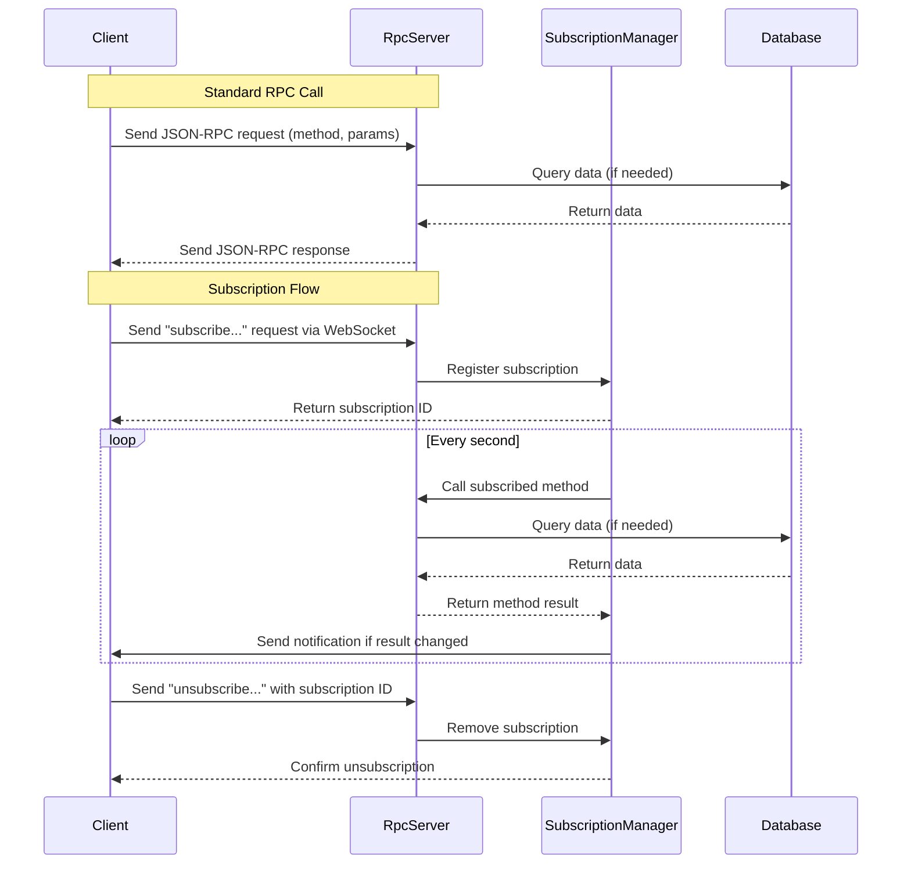

# RPC method implementations and subscriptions

## Pull Request by @skoszuta

Partly resolves #382


## Comment by @coderabbitai[bot]

<!-- This is an auto-generated comment: summarize by coderabbit.ai -->
<!-- This is an auto-generated comment: skip review by coderabbit.ai -->

> [!IMPORTANT]
> ## Review skipped
> 
> Auto incremental reviews are disabled on this repository.
> 
> Please check the settings in the CodeRabbit UI or the `.coderabbit.yaml` file in this repository. To trigger a single review, invoke the `@coderabbitai review` command.
> 
> You can disable this status message by setting the `reviews.review_status` to `false` in the CodeRabbit configuration file.

<!-- end of auto-generated comment: skip review by coderabbit.ai -->
<!-- walkthrough_start -->

<details>
<summary>📝 Walkthrough</summary>

## Summary by CodeRabbit

- **New Features**
  - Introduced multiple new RPC methods, including support for querying service data, service preimages, service requests, service values, state root, statistics, and listing services.
  - Added support for JSON-RPC subscriptions over WebSocket, enabling clients to subscribe and unsubscribe to updates.
  - Enhanced server to manage subscriptions and send notifications for subscribed methods.

- **Bug Fixes**
  - Improved error handling for unimplemented or missing RPC methods, now returning explicit error messages.

- **Tests**
  - Expanded test coverage to include new RPC methods and subscription notification handling.

- **Chores**
  - Updated dependencies to include new required packages.
## Walkthrough

This update introduces new RPC methods for service and state management, adds a subscription mechanism for JSON-RPC over WebSocket, and refines type definitions for improved RPC handling. Several placeholder methods are added, while previous subscription stubs are removed. The server now supports subscription lifecycle management, and the test client is enhanced to handle and log subscription notifications.

## Changes

| File(s)                                                                                  | Change Summary |
|------------------------------------------------------------------------------------------|---------------|
| `bin/rpc/package.json`                                                                   | Added dependencies: `@typeberry/block`, `@typeberry/codec`, `@typeberry/state` at `^0.0.1`. |
| `bin/rpc/src/method-loader.ts`                                                          | Refined parameter typing to `RpcMethodRepo`, registered new RPC methods, removed subscription method registrations, adjusted order. |
| `bin/rpc/src/methods/beefy-root.ts`, `bin/rpc/src/methods/submit-preimage.ts`, `bin/rpc/src/methods/submit-work-package.ts` | Added new placeholder RPC methods that throw "Method not implemented" errors. |
| `bin/rpc/src/methods/finalized-block.ts`, `bin/rpc/src/methods/parameters.ts`           | Updated placeholder methods to throw explicit "Method not implemented" errors instead of returning empty arrays. |
| `bin/rpc/src/methods/list-services.ts`, `bin/rpc/src/methods/service-data.ts`, `bin/rpc/src/methods/service-preimage.ts`, `bin/rpc/src/methods/service-request.ts`, `bin/rpc/src/methods/service-value.ts`, `bin/rpc/src/methods/state-root.ts`, `bin/rpc/src/methods/statistics.ts` | Introduced new RPC methods for querying services, state, statistics, and service data. |
| `bin/rpc/src/methods/parent.ts`                                                         | Minor variable renaming for clarity; no logic changes. |
| `bin/rpc/src/methods/subscribe-best-block.ts`, `bin/rpc/src/methods/subscribe-finalized-block.ts` | Deleted obsolete subscription stub methods. |
| `bin/rpc/src/server.ts`                                                                 | Added subscription management via `SubscriptionManager`, refactored request handling to support subscription lifecycle, updated method repo typing. |
| `bin/rpc/src/subscription-manager.ts`                                                   | Added new `SubscriptionManager` class to manage JSON-RPC subscriptions over WebSocket, including polling, notification, and cleanup logic. |
| `bin/rpc/src/types.ts`                                                                  | Extended type definitions for subscriptions, notifications, method repositories, and refined `RpcMethod` typing. |
| `bin/rpc/test/client.ts`                                                                | Enhanced test client to handle and log subscription notifications, expanded test coverage with new RPC calls, and added unsubscribe logic. |

## Sequence Diagram(s)



## Poem

> 🐇  
> In the warren of code, new methods abound,  
> Subscriptions now hop, polling data around.  
> With bytes and with hashes, the rabbits delight—  
> Service and state, all queried just right.  
> The server now listens, the client replies,  
> And with each new update, the code multiplies!  
> 🥕

</details>

<!-- walkthrough_end -->
<!-- internal state start -->


<!-- DwQgtGAEAqAWCWBnSTIEMB26CuAXA9mAOYCmGJATmriQCaQDG+Ats2bgFyQAOFk+AIwBWJBrngA3EsgEBPRvlqU0AgfFwA6NPEgQAfACgjoCEYDEZyAAUASpETZWaCrKNwSPbABsvkCiQBHbGlcSHFcLzpIACIbKwBhSDZcWEUUZm5Itgxcanh8DGRMegcBRAYKeG5xAsRoyAB3NGRS5nUaejkw2A9sREp7AGt8RAAvPDR0ZG5vX38gkMgMRwEBgGYADgBGFCwUjwAxL2wAMxPZABkVRAB6XFluElWKFz8SbhH1fBcNGB7rOxoWi0fyIfrIJAODzLZjPSCbABMvwAcvh0MD1PkMGhfEpypVqlj+HwlLl4F4igJ8Hhuh5EI8GPATvAGIxYJhSMhvulMiRsrkaoV0P4eBR8BJ4EpOiRZAV6Ps3idKGQGB4CLS3oh8F4pPRIcFfu5PD43gtEKEGJhIKtIBKSA0otRILBcLhuIgODcbkR1LBsAINExmDcjqdzlcyncHk9KC4bjMfDdNlsNEZ9MZwFAyPR8CccARiGRlB0FKx2FxePxhKJxFIZPImEoqKp1FodOmTFA4KhUFa0HhCKRyFQS0H+VwqA17I5mM55F1G8oW5ptLowIYM6YDGoMDcKNwGPG0AxBmhSBohFqMBwDNE7wYLJAAIIASULw+oUQcTleubZHOkNx/gAA24Y9T3PS8CmAyAlEeDAlAwRlpEgE5uQVYCAAF7keZ4433BgYLAk8zw8B0RWwbhaE/Tp5CBWh4AwIhUOpPhyCnODsxVeBpC4LCcJjF5ZBuAQvHwE9gIAGkgfjozw4TF0I6Tihk7C5NjYTzU/GCnSkChECJYCAD0AAYNDMrZgMNHp+kaZVdn6CgSxxAoiAMpRIBIAAPJBxCY2D3i4pCeOQBpfWpUJ/GYcVGOY7looY85YvQDB5G83zkvYSppBRNF8H2PgGHZJiUPVfEqlwRBpOSIFqDQaTuSYDBmSIbARyJciPFnJRUyMB9LCfLwaHa2owjRBUlAYLxnDyUa/28j4nKibkZlEllPJyTFAIMVFyFTO9ojTLcdz3A8bkQChD2SVJaDAMSgUoDRKpvA7+ufN8h2LL8Zznfg8yKgDECAjwTmwJDBRk+7aAAWRIFJFEQF8cnwGCmmQSjqJLdU+g8SZEqVfwcjCaMWL4dRphm5JKGkgGmOSk4xWYdBIE+ypWWA6G0G4YBzUqJjpJsA9Yfh2hgEwWRlNSvQ9Bg9VJmikV6VEJl1uAwWGGFm6bHeFHfgAZRIPScSWe1IDiRJroRuyRXgDJvmchD0SlMaNWAy3aEQGD/A+AyCBcaTGKm7AGP84DolWEhzhsfB8uiKSZOiLxfINigJVVOp47Dxy05IAAROq4+krPKBzqx/Ft0jC4T7OWRIbWzVwKvi9T2uADUcWCJvoi0mho9jzPu4FDKGAzovu/9NpcDLkgK9IKuVKzif1AAdW+QYrHAyurL+DxeEN/I+i8eRA+OZ3SnKwkCiSOGbuQReygqeBVgAIRCZ+xJPOOUvoe/ytWA5GI4ngKMOg79xKDC/p1N40VdSoUZhqd2bwfS81mhgayHhvhNj+tfEWSDfIjSwGjdAFI0RAiEH0LGpCGBjkUJ+DU7EcG31+AAeSNj4aSCpaakE8l5MCCFkAKn6KEP8aAJDaGmqJDw5tGFWxUv4Zk5ABH/BwslP8CpEHe0+H7eQYEqBUwoL1cwA0hrFixAI8a/xJrTQIVyPMC17bLT4KtJOrJ2BbSBgYKABwwZiCJAZIg2JcBtV6FRGifF7FOVQj4iGUNNYIyRgQAAFO7D0kBObc15rFAWQsb6KDFqlSWshpYAEouASHwJKGCgAkwhkhE0IoNwZElibkj2CT8DJJaak9WcTaDaw+KU20FTaAwUYjJE6BFzqXRuO7O6+AHoGMqsBW895PHHUYqdQ8F0rqdJEiQSOsgwBinyk9D0yzDqPlfO+L6JQfq/n+sVTkRgnwmynNIxB2I2A/wjlHGOuARkQhyGKWg2BVR6j2CBcZZ0tnTJ2d8g5RzNCLNQuSEg1lUCINQEoBRjoihYGaLIJCsAxQYGpMgBpvir5hRSEsNEjEZihF0WgfRuL6AkreEEigWAxHHBypAZePQsCMXKYMOgAdQi20+fAT8R9uhigaLimS6sACiLxvio19BqWMjVFAeGAmANYCIABsJlLLfwQdIRApEYg9JpeKjIWR2CivqIxBilo/LMRSE6dRLSUBFB4NNVUqQvBYJUgwNqhMIjyADYMBVtteT8lQYYt6g1hqoPMRqKxM1BS2J4YtEsK1/QuI2uEEKaZIDIlNnUqITUtJE2AnCvufzsECUVTkkWwAADaABdaS3aZZOyiKM+t6yJnQpSbs/ZhzfknKsmco6YAjCQs2VM8dCigEgNuqJcBJyXr3guR9IsI5vo/nkH+Lh20jTATXUnDdYCJJmwSDI+gRCEoqyiOqNlYkSp8H8ByvFWA+TVDoi8NA84aSMXNCQIELsUhypSq2hgKqxQUHVdSxcMl9VGpNTpR2bAwRWuiDakldr42OtoNEdBT77DwACdQYJjRmjUftW+2i0CYr+QVAtFx6h2VtT2CTTAxHUEyTLiwJAJBO1dplr8J8GJBQ4iPhw/4cb7b2AFHydgDH0ahMobsIOHkMLKtVShxg00wTENcu5NUIFuktNltGSje8JSkv9ceEgQasG/r49gq0gH7jCioPIIh3sA1RC6L53h3HQhar4LB/AU4XUsjyBx/4GLkDEcgLIOGPIHU5DoEmi5JibEwcsaIaxabsFVpzE4wt603HiG2lAVE/4SrpsETRwJ9G1H/CqzJa9wDQEf0GDBd2ABuFAkU+TaCFGrNtN1JO9qk9vI0XGWQ8a85y4mjwUpCYhsBUTbR+iSf7cFvk4ows0m9SLAA5AIkmmaCFqdA++/4lq2D7RWRABd24R1QpXTspO5owA13Tjuud+6rlHpuSe7B56PHPIYW8n1wFAe4BTjnT2vrdi4CBSC0VjQEBFTCGgEVfqDJMUiMKVq45mZbpPM6KDWD2SIFgL8F8FoCh6Uqt0VAzPYDY9IVgfAYEFgM/mc6Zo/O0IUFnKEORcNsp1g1EwF40gPgIWSj7XAwP1N+F+XAlgGa6oCGaCQW71ohvICYD4GsWI2d5gVFrnXdCEVY4y2hMGtAxWyviwqmLuxXXJY9alyEyUe4eARb8AAquT4PEeFc8VgeHvX+Vvf7CwEqXARVSr/FBiaZPDNDcTWN6b834erfakiBStBkAXwO9z7MJ7NA3f5RYp7tPRLffwf94lt1yV1Gh/8uH34ADsQ+AlhNnhOPjzc4VCK2QObBEl1rsgWc3ADdM0Eep6SDRCf8+9qCTTS+W6qlr7nKqZqNtCn2EzRjfYQNBaoNwR4YKrMpXyj0PgzhAvVWoEVfvPWvCNYUQSOuCV+W2qKfUyaRWFW6oE0ZWWaZilWvCDi1Wnga0rim0DWHiUAsmzsvWNauQdaqO6OK+MEaiJMs2GsLSnaAAEpLj2pAB2qQaqC+LQN2ktrsGMr9sutsiLLcKjsDsvqDkilSvzvioSsSi5mJD6KyOqKjvYMIR4C+OftaKbjmHiizJIGQBbuAmLkzpLh9odKst9kupMnwbfEeHonDJQIgGDq9BDqzDRNODDmeg8hev8Oem8JkG5korvKFh5gMHGrlkPFfN1rqoysyjBKATdDvnvqKPvKSjKlfo6ABhkP5t/qBjvhqpMAwsERpjkMJp6qEHFvKvBlQUhmqgHklu6uargqgBlvkfyPljvDyKpuHvyFjhjM4eqCfMHNZrqkZshjBFNM0EUF+m5JKAMTwhlKHLZiLPZo8GiqvooG+n4U+ubqsOyM5nwIXkzAZJEDkMkXDHxslL5ukfIKCN4CUWiKtoyJGtRrRknP5L5sZo0BquhnqgasaqaipHhpatwoRj6o0fagUR0BRlAYVqmtmiVh4A9hVvNCgUtGgc4nVlgaWp4uWmiHDrCY8Z1iKOEbmqgTJJETYfpCNi0uNutlNhBrUkiRzoUAypTGSV0nNnkt2ottJnOiYYujweYTCvwVYewPYXugNAeh+CWN+LOHci1o8gYEaGIpUCoJTh8iDOhP8MLmgKLj0OLnzlprKVEHsTJHzrLGiMBHzswiLsECMlgFSNSuTAFKMY9ipA6X0FaqMpxm8f8VarvjoQqDqVgg0a3h7o7B6ZYiXv0JRjIetKGgUDjtqKhGJFOFFNNpAD4u4V7npqfAAR4IQRQCChDISZqdqZLkpvHjjonsbISQGdTJqm8cVLQM8cxEyBqDWWTKvoPkQJLPKK9v6P0AsETLwOJBaqovXrvM4Jpm2RLizgVsYtCUgXAaVk6QiXYvSY4ugUWvVhibtCQNyV9rybuKOv9oKSDiQGAJjGgCKecmKZDs4VKb9G4YDE8i8g+hbMCUylEMBKefnLkP8tjrjqCnESyPzrkKTszEEryNgsBB2vQSztJCwSQGwV2jpACvSjwMycNCyrxpysgDPAVMzMBGAgIE+A/pnDufHNyMBMsD4Mtqlj6hIUVFIYfJcQnobDnrvCMNrsnq7mMeJFKiWGIRqD6FILaUNtOVLvAsXrkCbpGbXmOTwJxc7s3q7kGfUtSAhN7lfnfNRV4NvOzrSBnnDNnusXnr4MnirqCOriHB6hYqgAilSXmGDKIuIsqSQN7meKmVpTJDpdvBWl5LgO5a6H5umr+ornSEobBHVKTBqErIyMyF+BFSoRvjFepmXkoavlzPbjFRFReVjodrHppScThfBpkQ2HGdNmcdRhTrqj5Z5CESwgVGFP0N7iqDqusaeebseEwGDOKs1GiH0JVYpGao7mKBKM7ADKMrFSrH3gUDTJzpQLPj1khDqvQLlYxHLH4GgFOHIM3qVd2dhUKDxg0E/i/lwffoFpRogjjOjOIEnP5uSjCSpAJGSpJSBGpLhBpERJvJyNFQ2U2eJdINJDtYDRtI2FkmasnrzAWcEnYZCXOaYqNIuXCQgcVoiXmuuaiZgSWo1s+MCFEAQbUEQaEF+UoT+WgOQQ7pQfMfNjBaWZAAhUhb2kRSRYFl2pAAAD5YnkAc1LCzD9pDpmFjo7Knnnl1QzpGHzoHkbL8njoi17yzyorPTg43lOGSm3Knr3JPkGAI6mwxFpCqk/ynnTwK1/nrUAX4677AXE5gWTAQWU7db+DjnWGYVcCTB6kH7SBuIvG6H05tnKSKEn4eBTGbTxUUD7WTDy2zjcJ86XX0WIAEqMUFBJHyALDZR+oXkyVqhoihWJ7TFO7cX668WMjOGCUKjCU6F06DD6EDAx1yUaj5264qXpbBnqWZnUl/rpazAojeQBWT6Z7GUaimVN65nfCWVyj94WIcVA4F35QOVpnYhiLkiuWFUd280+Bs4lECroBBXpEhWsVSDZWB2RW5Bpmx712jVTElARXB3iCh1z3H45wt5qXt6T5eU6Uj6ALj7e5iT4Axppnr4jUzxR1wlRViFhnhWB3m6R2kQZXr4DUpa7zlzAPiVZWAMK1Y4hlt2Tar0KiTi6ECDH2TB354oP7jYf6UBNVuWv1FVCjv2tGIJ/UoQKaoTiL0aWjgjWgsV/rJQ6XSRkAOB8zMSWpKjoDUIWouyKIli5VQ1iAw2znPgwEwlI2OnlYwlo3EkFoYHFruJlp4H41rn0CEGYDE1G1IOkQU0QEIY9J0F00M2ZmwWwCMEdrM0P5s2c06X81YDDqHl/YWEIznRKFgDQPniLIS08k/Y+O8ECmWEi3zDBDmhXnJrinXIuHSka0Gnw4vl62sofmG1KH1zxNNo9iAqKB46ZmW1E6gVMNhCUT215ge5OIYW2Gu0+1V1Tl87+2nln7+3BMeAdNmoR1mPcKHFEApCx24IMWd4krMWQCp0hTMwZ2m4uw51sX12KUz1y5gh8Ul0apl3aFYDtOGF12O7rON366qVt4aXUOr10PMKNXibe7902SD2N7mWj1q7j0cYWJOiR7HMN75667oqdkr18ad3r216b06HUA0C73LP724wB2P1Glb6fhpWB2wOn05migxRnyJW5yoOvbX3N3P1XPt2gtr1eDd3+Xf0xx/2UTMy9NcEP21zm4o60uUS0G+TfCyAjZcyYsIMJHoP9PMhFb0zci+aAryCy7/4CtTXxX0CMsjNjN11srSsID+SMuoCYMgvFV0N16XNYMHUKqlUKCFGMRYuIBiTc5F38VRCl3sgMpDOor0M+rXUQH0DXDT7V5krch84g1dMqEX4qQwiUDrTcrxP7VNRc7IB4PA0BagYArqjFnBAQE+uFS1C+STnFBNnyMpoI3X6T0qOIFzSrno0om1ZY06OYl6P0AE2MnGMySnkFMhAWMtpUHWO01wX01KFsHSQOPSRR4GpON6xWscE80eM2ncGRMy3C2BNxMhDi17lrLTtC0nmBPhuK2nIOEq2Hp3nq2w7uGZOI6PrvK5ONtKHtw8qm0lPAqAUE5W1VN+p20YL16O3oXO3NPMz9OTABu5zh34OQDz77VeV4Wf605iQEMmvch0NGiILMj6QMnRsah0o0h6nrWC78BWl9OM412S6kyy6X7wvrEN0u767IvhnSWl4yCW78vB685HP6snPT1nOt4XPavXPkt0N+W908ZPPsVRIAt0I2s7PUpMdcUse4D30IAtCAsdlgjg1ku6td0QsGXb0wvVB70VmrPMun65Xkd0ipUtDpVJB8vwNx7YtjUJVH0qFzUYBc5RAShEMM5eCPC7HRJ25/MQOP1set06u0PKewc+r9DOAD06dm4yffBWomvS7d6SsE4jB9N4dqv8dDmWf0BAemv2clC2xL0UAyobVxv9nBBITOv6uqt/7qtCN+xWpZTHw+sv2Kf+fgt3Of6UN+frGxsQeEPNqpYVdfjVfcK1eNAnWDr/rxuyDjM3QS4ISRDjG+AnCsMijsMoRdBX48OzB8OFBtRh5oAiNdXiMfohBRDSM47Q2gi5uKMLmFvwlqOlsaM1ZaNbk401tEnImmu1omMXsdwkCttU1smiyduwDwU9uZkuOs1M0Qcs2gZuMUueNTvS2rsxPrvfeLuvThOC3HkxPqZTrHJK3bvvS3lq2uGa2tbPnHtvm4IG2NvqaNrXvxm3sW3xGPvMyx6U7ODU7lhft4ce39CbTe2V3V0GIuu4JRsLVKLFNoVofIzwbJu6q0E4cUAOOLEeBdBme06yDN6i/6REh4DkjqBBY5HIpeRRB6kGQgIb2qdzP8eLP9CbFiXmiRfcLqgrMH1idKUR6F1bPF0CW7P/Dl0HMK8oMqtogkfKXnP1dXNXZTdeVUWzDbwtcUMPMcfFW4NbWcM0CL6vYSdTAlUP6TdpC9jx2SFJ19DDXRjyhUKqjVDgW1Mj1msYCqLc16ny5/qeS+gDC221/vHUoFCJcs7EjeVx8XfzmI3Xco0rmvf5oPebnok41KoGPvdE3U+fi0/Np/fUHtqA9OMOMw8TsDpgrw9Hl+MeznTY+R6LJLumF8mI/+M9zDx2F4+ikE+q3HppMHta062vInvvmfLL/iDmgshMcxTenmUyAqVMSc1TVnrjAoAc8cgLTd2u8EPx89mIkwAXm2Xz6GN5qTkcXsgCl5ywhcWHQXuJXw5OgVIVvdYjbzVKxZ/gofD3q3mE4+9RODrVpllTZS0CU84qCPoaxj4+Usq7HdumFRMqvNdcFlD5hri+bdAfmZHV6iA0o6yVGO/zMyrJySDAtJ8HlUZDwKH58ot6CoIesnl7CL0JEkQFqstTxCuw7+AAkeDBHirBoeuBnOhGr0mBDUnqNAi+uNXZCTUGQ01VBGWSwBeVOMpg47lFTvzp9oBgWYblzFOqjJzqoGDAd0FL6pcpifqJoPIHVBPMzUrVDyJXQmpYALB4gEeN1wawV8WeXg5kKyDQGB9+mf1ZKPlWSi5UiAVAVUKZXnBcNTiocXgXDQUYj8C2Gacfrd0n4Y0K22jbAmWnn5ltF+DbL8kPEsGY4KC22dtjQS34Q9BAUPWQLvz5o6Q8aB/bxgj0x639ph+Qh/p7Ev5S0j+0TW/kvG1y9NEmjhXdkTzf6PlSe2tLJt/0p5nsvylw42sAzp7m0D+GEDHsf1uCtB1AQTJ1jOmRSRBliVGTFJHEYg4oSqRfROtMzJTudKUGqNlChyZIft9IZqNlOAQ3Yb0IQoJBNBDDDSq4jiqQzvGUStAVFjMqGECj1jeKfFMMPxHDD2S6gWoCMRGVjsSLIySRnUGuPvCli9R0V6ifqHwoGm1AhpHYGWLLPUlRFj5h++bNrEuVUZIF1Gb3TRjP2xo4Fy0laBfkYzrTAip4TrX7vMOprsknGnBeiKN0P6+NzhJ/Y0aCKAakRUen2ZdrsMBHnRLhYABoGvCCbfVN2u6a8s/zuGv8HyJPOUp/1fJUYqeHwgQJPFXgUB14gYn4aU1BRMsIU1/PYY6J9F+jkxAYkiCE0xwitnW3YVfD6hhHYoPWxrREVMxcwPUOo6I2lBgDQqklMKuI7OjQ1tAo8IWRI0jIUVJHhp2A+XKkQqlpHDFu+DIjwP7mZHfFsMw1OivhkBLciSMIRJ1NUSFHB4RRHIsUQywCJSiO+Mo1vHKKiSNICgOIJUcVmUY3d1Rd3TUdPzRI6iy0FaKcHWw+6NtLhSYlMUWJ+5r9zR/3BbEwWtFbCuCOws4bLTzH+jiIEETdrOjR77kImnoh0UCL7KPxVgYAVYEDkro3Cd2EpcMTKThzAwIRuqAEShO9EPxKgGErCdrhwmiFGMSgSIB0ChGliEizmGZr1j7B1imKKI88VgDjHnx0JJAV+OaDvTDZ3WOfGkRaOGRTiaUuwNsU0xxEt82hKAtIkBnG6UZGxV8JqGSHIAetXMko4NAMDHCaZe8QeSQeKm5xNF2AwmIhPBGsoQ1girQzlKkU8gXFxu6QSVNKgm47wRQRCNlPRExAXjfA0ZBgHw3rLZtwa2qEpvNyTIJFeevVDUFFHOyYCeonQvNteLH7Ll+hvWLUU+KrZQAxhxJQ0SYzQlUThJb8IbFwGklAS+0XsM7LAiNLgT7RkEyiU/DPI0TMJQ2GdCcKQkQThaZU9qWAH6wboup26R/iGMuQv9ocDwyMR4RBgopPxbUjCSNLoBjSTw4IohIxJsK0AWJi0pzAfEtZpQF+XEhOvWNL5aT+J7wwSeVNHzrpBs4CZXjWPKLST6RckzEe+w/IdjlJnKM4mpIyJ59Wil001rpMdAGT3Mh49NmWCJhmTaiR1RjKePVA2hrJeWD1o7AMj2pnJek7vO5JNYSo6AtrI+Ogj8mMYApcmLEMbFCnhTkM03RslFPTYxTEy8WeKaZPBTI0mJ1aHVFeNgJZS1RJbAYeW0e6z9dRRUt7iVKWl/wSAd0m9A9JPDVTAJHJYCf2mSmNT4EzUqJq1MlnDTP6A2TdN1Iv4ISPRZw7OI9AmlJNCeBE9JkRPlI2YDw6OSgCMTMyhRGMZAYqBmLKiUQ8004NqZfCwCzhsQpAToo5z5RPA9Y4COGDJhfLAQ9Yg032ZzADkOyHIRBU/KgAqBQYHYJQP2PCMGaSA6EbAWEI9FaLmls2dcQIIUwpKU9mZ+3DThqGXihzw5DJcgNXkkmfT9EZqBiAAKYjYAkAzzVYLgAdA6EbpFULEIchIDTQSwKSQjq1GsQxiUkBLXcVN2KYyQ9YUeZ+HrHiA2AXwz8JVAAH1oYSqaALQWYS5w95T4KwPHB4yWgfAd8IeXHMwCkQDEQ81YGyKNYxVY5EMK4kNAiHP5bRMQnyQoIXkF8AUMkKPMiBXlryN5W83efvMPnHyd5y8Wgi+GgBKoLgL4PWNAAvmhBuUkoT8BTGxFYUr5FICWY/DvkJyDEYMJ+T9xHzchyGfAFJN7m2lEBcFLsXIqbGAiEKek1ghURZLZCiA/6iCdKJBhK5mohUv9fjqIPpCfNmIjDPgIJXbG2F25EZOvjQH8qOZ/A7E5AAxH8BiAqMP9QYPSxdJ2dxIwmCDFMWNIlzm25oVGIxhCxuZWMKQGEZECYWChKM7CsSP0ArlTcSUU4HEFqEYAKYb578rEPHIfkaA8Q8ZHli7CmhQYsA9LW+dml+DQxGI3IGQj6H8jeluEOJKBN1DLEgQUkREMUK538wtoiE56egEaUmCsx1oa+FhVYxaR9JdYkAVhMoHYTK44yYoWKczKIQ90uIxQxht7IvgxImQogWQNEtNCFNNFsxMQDKiNIkoZcxsaRIQovyCUbRCrRST2KTiYwiQKkf3NUP8gxcKFg0m0PO3NCw0+oUJZUbiVvH8zcpj4ytiMMxLxAnZCGe2SZgFrZjNkJcU2Z7BvCQBdAuNZ2LwFznN4hyRS2QHxHiXBL75pACgFwBjk+zBQISmFUsj+VQBoYqxeVqKGBWALsutGDlCQD4iMNLFuARJCcs4CQAAAUleHVjErik1ScxTN1LkNxSVZckIFwCpUFAaVrK80DvlSR1yBAYck8HDAGQHZxMwADlRgC5UOAhoMsAwKioBVRBMaUwBOk+j4gcKWkHSEWFwEyT8xW5qSMGIMG8UYBu0PNT3LCL0kirGYYqiVVKuuKyr5V8QDMlirEQgrClC1VIdGD4j5LkqHMLmDzArK6qap4sQpNLFNJ1KRYDSpZIbKv4rspkkKgoGAH9mhKzZtw/CTNIjEZMyebC+FYMqhVkLHZYxLHGbXTHvo0QSa7hBSr1jMJkQYAaRPGqFDnY+A/KwVSKkbm25agFvWcOtWmxFBfEB9etcAvlh8t58YWeQPWrPwX4oMROBgXa0N7NqG5/td2PtWFzyZfA8i/SJRlGLmZXO+QQPOPgUrXziEZlIJaNDYqvB+gTUVjKIsGBYsJFVlZKNk34BszEWR4zARkAnIddpA1xWSQqDMyhAEpmoa4vPMA1fz8Ythb3Lzw9jMxK11a2tY+nHXEZvBEMZRlNB4hExg586oVXLkdjdEM+yuY8D0HoB/qQNmgYiVupaCez7YFG5aclC6Br5uAyUQOGJiHwnq/ZP/UqC2OGhj5YxH5dGGfUGZ0BzVUQNfBbxf7owG+2pbyA9EZCzhj1CKokIGwhpZz2qrGgKGSApAW9fFaIVHPw2iqYbW1pmBLp5BEqz5SEA4WXEln3WHLlp0xfwOPO+jyaCg0eLbo5r8ENT+O46l0tzktDZ4iNzQSbNKs0CtFyNFnJIQRXCVihIliCdUNEucBrMfAjGvLKnEvFPJyZwUxTGED9EKAbc3rYUMjWrEtMalzxG9Sxtc3jLFgk83oklu42ns8M/7S2jQAUJCIfMPgeLFEGs25qr4c84Lc8tKIKppEPePMFaANVGqBlJCiGGlnK2QZdpRgZpVQFaWcIdUOWMEuKMryxRMJ6hMbQSAm2iBioSAJmDFxg01rpEjakOQKoXW0z/q46pOEqAYCjLjBtqJDUSA7lgQs8QPQjlqDain5YtywbgNzKUa8zi2Da+8VPw3L5SHluBUCe+KX7RzV568zedvL3kHyj5J86GGfK4DpJ/VgjaSDqqID9p6NYeVTWSqfTpp1qlAGrexthqQ78CBowmpMNAXgL4dUCpHbApPkIKkFKCtBdADhVwwsdsUftDpIqovFWtDoegB1vG1EhatOUatlDoNHPLo5rGpFYnLEK/L/l8QQmvmTEDfA1VGugst8ESQmzYVZsO2V8ooB0q5V/ynpBCqOUkBEk8qLgPprhjVQWk2qgNV2T1UAB+LgCNvizGqu0AyHNRLoKBsEUVlul3TJHF3lTEkkoOFaxrYIDIqQ2oGJaHrRXh7gIEW/ALIESQDJyklSXqWROeq4TQxaa1JhmutlGh8Y/5EtesRUyRJCSjukogJkdj+BMECi+AtlKJB/hgINqg8CHpdhoQRdbS+tnWiO07zzYO81uEqhsB6wXw1avSnLmBB+oGELaIBIxm73UqDw2sQLTBCxRwjnpwEH3Q0D93js4+hHCUUwxNAHSXMjEZ4r0A4Zd7D9x+9xqfvta9gk4jGGLjWkzZIQfJ0YsnRQAW6n519nKu2axtRC30aiWIGCD0vEHMRgDkqzfdyqKZFAthOO0obIEqqgRKYmOZ9iDKF0oDl5cemSSpEmDwHbVQ0Wih4CqXsxXpljVALhtLWn1dUPehgFvuuI2lIM0GQkjfrhHz0iQMXB0uAQEiRzl9Amd/XfGkmRqi1N7Mpi3JqVGlcd6aBYe2mDUpQik8cFZZAGeL/rPZoIAyNpJYCdEuM+BjUDjCgrixt4eBIKWPgy39y0Qohx4DGzHk9E0QA6vLfvz4iB7ttUBsAfzj6JmDJgDepOZgFVDO63hbAZdb7ONjrrEA42BeF4eHnB7iDZON3cQilR2Ed4tkHEjAfZGWNd9DfAHdaDhjDRpwz+VTEdrg2JAEN+UJ7aND+I+pNEvsb4PM1EU6hkoQRpqE3ISXpTLuo/XoR3puUL88p9yjEtTvfRiH0jfEFg2wa/kABeeeoat90mrn9NFGXc7H/2AGCVMkFgwkd9ngHajGAaA/5WzDJQyDiBhuG9KwN6JUkzBIg9JGmNfqhoyFTElHh0zjHtsq+1JMofmzQAp82YcTYsaP2Ky7AORgE0auWOw96V3xvJL8dBMLHwTjBEE8cf4SUqN9rBx47gFlVjH5QEx5oHxEkM6xIA8xzHbjuyQb95sqh8WKGrWPvHcY4hzw6xremgqFq8zYCAAG9GgfK+uVhvGzuxXdgjcbJEUQBe74TSxtmgAF8lk2Jyxp8YZOua2CRJtTIIyjXuiY10tDPrgBuCobhSKavCSk3vKETD2xE2vf+vUydFulyJ52FVv0zTEzjDAXY4KH2NlDUEyvSjEEYyWJdGVsixjK+kxXqgO57qbuf3z7kDzchRBaiBQHoAVHpEY9QoEw3RmqbENzpmEguB6AngxW1AxBp7WEUiISS2BgpcLndX6xEzNR5M0gQnJaH8ARAUgKtXgDaLI0QFSnLWgjP0BYzHDa9dMQd7+BDGCmE3PTnlwwIg69SGQdfGXEeAFgBoVohqfsDjb9S/iBvs6YpG5pigdALgIAw0UyoTJqMsABFBiAxH6giCQhfqRVn44/i1xKoCqV1qvCpuSy62LjFAm7cSjekJkBge9okoMAYAHSmMkqmPSSN6CWyP4dzIBKXYg8Ffr8n5ExA8hgAiC93FJp1QYLp5S9sEAQtKEvhpEFC4HWJUwWSC6VCCypHHg2aEKaF0gBBanX85UlOZOsyRoyNWHV1GWvGM4ayxi6XNks/xSaHVDRBI97Uoi062dQZUPIWwEyIoUvVFATgJRp+eDQH1JlR1hms+pwiTiaZOj7amvEaG1Mwyrc7iwdGWAYjeSUAeYetD+ZPAzHkDFLKEXCYVDTmmARsbhCQcX2XaMzW2xI/xNLOQGO1PR7oSqORoDHgdAsgfkqqe66jmsOJdULcrB33L5A1yoUNkoehhN0wBgTsBtBzBDaBwFst9TTjwYGmWhCgJsCoDUArh2w64eK5mFLCTwd5koRADvPUU8RRdO8rSJEjisJW1gAAdi2BbATgCIAAKxtWmrAATh6sqAFuAAFkNQIgtgAgQawIFoAmQBAGwBgIakNQMBerJwQaycAYAmQFua4DcAlbHDqAyrHsSq/vHtB0Ad52YTa0AA= -->

<!-- internal state end -->
<!-- tips_start -->

---


<details>
<summary>🪧 Tips</summary>

### Chat

There are 3 ways to chat with [CodeRabbit](https://coderabbit.ai?utm_source=oss&utm_medium=github&utm_campaign=FluffyLabs/typeberry&utm_content=381):

- Review comments: Directly reply to a review comment made by CodeRabbit. Example:
  - `I pushed a fix in commit <commit_id>, please review it.`
  - `Explain this complex logic.`
  - `Open a follow-up GitHub issue for this discussion.`
- Files and specific lines of code (under the "Files changed" tab): Tag `@coderabbitai` in a new review comment at the desired location with your query. Examples:
  - `@coderabbitai explain this code block.`
  -	`@coderabbitai modularize this function.`
- PR comments: Tag `@coderabbitai` in a new PR comment to ask questions about the PR branch. For the best results, please provide a very specific query, as very limited context is provided in this mode. Examples:
  - `@coderabbitai gather interesting stats about this repository and render them as a table. Additionally, render a pie chart showing the language distribution in the codebase.`
  - `@coderabbitai read src/utils.ts and explain its main purpose.`
  - `@coderabbitai read the files in the src/scheduler package and generate a class diagram using mermaid and a README in the markdown format.`
  - `@coderabbitai help me debug CodeRabbit configuration file.`

### Support

Need help? Create a ticket on our [support page](https://www.coderabbit.ai/contact-us/support) for assistance with any issues or questions.

Note: Be mindful of the bot's finite context window. It's strongly recommended to break down tasks such as reading entire modules into smaller chunks. For a focused discussion, use review comments to chat about specific files and their changes, instead of using the PR comments.

### CodeRabbit Commands (Invoked using PR comments)

- `@coderabbitai pause` to pause the reviews on a PR.
- `@coderabbitai resume` to resume the paused reviews.
- `@coderabbitai review` to trigger an incremental review. This is useful when automatic reviews are disabled for the repository.
- `@coderabbitai full review` to do a full review from scratch and review all the files again.
- `@coderabbitai summary` to regenerate the summary of the PR.
- `@coderabbitai generate sequence diagram` to generate a sequence diagram of the changes in this PR.
- `@coderabbitai resolve` resolve all the CodeRabbit review comments.
- `@coderabbitai configuration` to show the current CodeRabbit configuration for the repository.
- `@coderabbitai help` to get help.

### Other keywords and placeholders

- Add `@coderabbitai ignore` anywhere in the PR description to prevent this PR from being reviewed.
- Add `@coderabbitai summary` to generate the high-level summary at a specific location in the PR description.
- Add `@coderabbitai` anywhere in the PR title to generate the title automatically.

### Documentation and Community

- Visit our [Documentation](https://docs.coderabbit.ai) for detailed information on how to use CodeRabbit.
- Join our [Discord Community](http://discord.gg/coderabbit) to get help, request features, and share feedback.
- Follow us on [X/Twitter](https://twitter.com/coderabbitai) for updates and announcements.

</details>

<!-- tips_end -->


## Comment by @github-actions[bot]


<details>
<summary>View all</summary>

|  Name  |  Status  | |
|--------|----------|-|
| jamdunavectors/chainspecs.json | ✅ | | 
| jamdunavectors/data/assurances/state_transitions_fuzzed/1_005_A1_BadSignature.json | ✅ | | 
| jamdunavectors/data/assurances/state_transitions_fuzzed/1_005_A2_BadValidatorIndex.json | ✅ | | 
| jamdunavectors/data/assurances/state_transitions_fuzzed/1_005_A3_BadCore.json | ✅ | | 
| jamdunavectors/data/assurances/state_transitions_fuzzed/1_005_A4_BadParentHash.json | ✅ | | 
| jamdunavectors/data/assurances/state_transitions_fuzzed/1_008_A1_BadSignature.json | ✅ | | 
| jamdunavectors/data/assurances/state_transitions_fuzzed/1_008_A2_BadValidatorIndex.json | ✅ | | 
| jamdunavectors/data/assurances/state_transitions_fuzzed/1_008_A3_BadCore.json | ✅ | | 
| jamdunavectors/data/assurances/state_transitions_fuzzed/1_008_A4_BadParentHash.json | ✅ | | 
| jamdunavectors/data/assurances/state_transitions_fuzzed/2_000_A1_BadSignature.json | ✅ | | 
| jamdunavectors/data/assurances/state_transitions_fuzzed/2_000_A2_BadValidatorIndex.json | ✅ | | 
| jamdunavectors/data/assurances/state_transitions_fuzzed/2_000_A3_BadCore.json | ✅ | | 
| jamdunavectors/data/assurances/state_transitions_fuzzed/2_000_A4_BadParentHash.json | ✅ | | 
| jamdunavectors/data/assurances/state_transitions_fuzzed/2_005_A1_BadSignature.json | ✅ | | 
| jamdunavectors/data/assurances/state_transitions_fuzzed/2_005_A2_BadValidatorIndex.json | ✅ | | 
| jamdunavectors/data/assurances/state_transitions_fuzzed/2_005_A3_BadCore.json | ✅ | | 
| jamdunavectors/data/assurances/state_transitions_fuzzed/2_005_A4_BadParentHash.json | ✅ | | 
| jamdunavectors/data/assurances/state_transitions_fuzzed/2_007_A1_BadSignature.json | ✅ | | 
| jamdunavectors/data/assurances/state_transitions_fuzzed/2_007_A2_BadValidatorIndex.json | ✅ | | 
| jamdunavectors/data/assurances/state_transitions_fuzzed/2_007_A3_BadCore.json | ✅ | | 
| jamdunavectors/data/assurances/state_transitions_fuzzed/2_007_A4_BadParentHash.json | ✅ | | 
| jamdunavectors/data/assurances/state_transitions_fuzzed/2_009_A1_BadSignature.json | ✅ | | 
| jamdunavectors/data/assurances/state_transitions_fuzzed/2_009_A2_BadValidatorIndex.json | ✅ | | 
| jamdunavectors/data/assurances/state_transitions_fuzzed/2_009_A3_BadCore.json | ✅ | | 
| jamdunavectors/data/assurances/state_transitions_fuzzed/2_009_A4_BadParentHash.json | ✅ | | 
| jamdunavectors/data/assurances/state_transitions_fuzzed/2_011_A1_BadSignature.json | ✅ | | 
| jamdunavectors/data/assurances/state_transitions_fuzzed/2_011_A2_BadValidatorIndex.json | ✅ | | 
| jamdunavectors/data/assurances/state_transitions_fuzzed/2_011_A3_BadCore.json | ✅ | | 
| jamdunavectors/data/assurances/state_transitions_fuzzed/2_011_A4_BadParentHash.json | ✅ | | 
| jamdunavectors/data/assurances/state_transitions_fuzzed/3_003_A1_BadSignature.json | ✅ | | 
| jamdunavectors/data/assurances/state_transitions_fuzzed/3_003_A2_BadValidatorIndex.json | ✅ | | 
| jamdunavectors/data/assurances/state_transitions_fuzzed/3_003_A3_BadCore.json | ✅ | | 
| jamdunavectors/data/assurances/state_transitions_fuzzed/3_003_A4_BadParentHash.json | ✅ | | 
| jamdunavectors/data/assurances/state_transitions_fuzzed/3_005_A1_BadSignature.json | ✅ | | 
| jamdunavectors/data/assurances/state_transitions_fuzzed/3_005_A2_BadValidatorIndex.json | ✅ | | 
| jamdunavectors/data/assurances/state_transitions_fuzzed/3_005_A3_BadCore.json | ✅ | | 
| jamdunavectors/data/assurances/state_transitions_fuzzed/3_005_A4_BadParentHash.json | ✅ | | 
| jamdunavectors/data/assurances/state_transitions_fuzzed/3_007_A1_BadSignature.json | ✅ | | 
| jamdunavectors/data/assurances/state_transitions_fuzzed/3_007_A2_BadValidatorIndex.json | ✅ | | 
| jamdunavectors/data/assurances/state_transitions_fuzzed/3_007_A3_BadCore.json | ✅ | | 
| jamdunavectors/data/assurances/state_transitions_fuzzed/3_007_A4_BadParentHash.json | ✅ | | 
| jamdunavectors/data/assurances/state_transitions_fuzzed/3_010_A1_BadSignature.json | ✅ | | 
| jamdunavectors/data/assurances/state_transitions_fuzzed/3_010_A2_BadValidatorIndex.json | ✅ | | 
| jamdunavectors/data/assurances/state_transitions_fuzzed/3_010_A3_BadCore.json | ✅ | | 
| jamdunavectors/data/assurances/state_transitions_fuzzed/3_010_A4_BadParentHash.json | ✅ | | 
| jamdunavectors/data/assurances/state_transitions_fuzzed/4_000_A1_BadSignature.json | ✅ | | 
| jamdunavectors/data/assurances/state_transitions_fuzzed/4_000_A2_BadValidatorIndex.json | ✅ | | 
| jamdunavectors/data/assurances/state_transitions_fuzzed/4_000_A3_BadCore.json | ✅ | | 
| jamdunavectors/data/assurances/state_transitions_fuzzed/4_000_A4_BadParentHash.json | ✅ | | 
| jamdunavectors/data/assurances/state_transitions_fuzzed/4_002_A1_BadSignature.json | ✅ | | 
| jamdunavectors/data/assurances/state_transitions_fuzzed/4_002_A1_BadSignature.json | ✅ | | 
| jamdunavectors/data/assurances/state_transitions_fuzzed/4_002_A2_BadValidatorIndex.json | ✅ | | 
| jamdunavectors/data/assurances/state_transitions_fuzzed/4_002_A3_BadCore.json | ✅ | | 
| jamdunavectors/data/assurances/state_transitions_fuzzed/4_002_A4_BadParentHash.json | ✅ | | 
| jamdunavectors/data/assurances/state_transitions_fuzzed/4_002_A4_BadParentHash.json | ✅ | | 
| jamdunavectors/data/safrole/state_transitions_fuzzed/1_001_T3_TicketsBadOrder.json | ✅ | | 
| jamdunavectors/data/safrole/state_transitions_fuzzed/1_001_T4_BadRingProof.json | ✅ | | 
| jamdunavectors/data/safrole/state_transitions_fuzzed/1_001_T5_EpochLotteryOver.json | ✅ | | 
| jamdunavectors/data/safrole/state_transitions_fuzzed/1_001_T6_TimeslotNotMonotonic.json | ✅ | | 
| jamdunavectors/data/safrole/state_transitions_fuzzed/1_002_T2_TicketAlreadyInState.json | ✅ | | 
| jamdunavectors/data/safrole/state_transitions_fuzzed/1_002_T3_TicketsBadOrder.json | ✅ | | 
| jamdunavectors/data/safrole/state_transitions_fuzzed/1_002_T4_BadRingProof.json | ✅ | | 
| jamdunavectors/data/safrole/state_transitions_fuzzed/1_002_T5_EpochLotteryOver.json | ✅ | | 
| jamdunavectors/data/safrole/state_transitions_fuzzed/1_002_T6_TimeslotNotMonotonic.json | ✅ | | 
| jamdunavectors/data/safrole/state_transitions_fuzzed/1_003_T2_TicketAlreadyInState.json | ✅ | | 
| jamdunavectors/data/safrole/state_transitions_fuzzed/1_003_T3_TicketsBadOrder.json | ✅ | | 
| jamdunavectors/data/safrole/state_transitions_fuzzed/1_003_T4_BadRingProof.json | ✅ | | 
| jamdunavectors/data/safrole/state_transitions_fuzzed/1_003_T5_EpochLotteryOver.json | ✅ | | 
| jamdunavectors/data/safrole/state_transitions_fuzzed/1_003_T6_TimeslotNotMonotonic.json | ✅ | | 
| jamdunavectors/data/safrole/state_transitions_fuzzed/1_004_T2_TicketAlreadyInState.json | ✅ | | 
| jamdunavectors/data/safrole/state_transitions_fuzzed/1_004_T3_TicketsBadOrder.json | ✅ | | 
| jamdunavectors/data/safrole/state_transitions_fuzzed/1_004_T4_BadRingProof.json | ✅ | | 
| jamdunavectors/data/safrole/state_transitions_fuzzed/1_004_T5_EpochLotteryOver.json | ✅ | | 
| jamdunavectors/data/safrole/state_transitions_fuzzed/1_004_T6_TimeslotNotMonotonic.json | ✅ | | 
| jamdunavectors/data/safrole/state_transitions_fuzzed/2_000_T3_TicketsBadOrder.json | ✅ | | 
| jamdunavectors/data/safrole/state_transitions_fuzzed/2_000_T4_BadRingProof.json | ✅ | | 
| jamdunavectors/data/safrole/state_transitions_fuzzed/2_000_T5_EpochLotteryOver.json | ✅ | | 
| jamdunavectors/data/safrole/state_transitions_fuzzed/2_001_T2_TicketAlreadyInState.json | ✅ | | 
| jamdunavectors/data/safrole/state_transitions_fuzzed/2_001_T3_TicketsBadOrder.json | ✅ | | 
| jamdunavectors/data/safrole/state_transitions_fuzzed/2_001_T4_BadRingProof.json | ✅ | | 
| jamdunavectors/data/safrole/state_transitions_fuzzed/2_001_T5_EpochLotteryOver.json | ✅ | | 
| jamdunavectors/data/safrole/state_transitions_fuzzed/2_001_T6_TimeslotNotMonotonic.json | ✅ | | 
| jamdunavectors/data/safrole/state_transitions_fuzzed/2_002_T2_TicketAlreadyInState.json | ✅ | | 
| jamdunavectors/data/safrole/state_transitions_fuzzed/2_002_T3_TicketsBadOrder.json | ✅ | | 
| jamdunavectors/data/safrole/state_transitions_fuzzed/2_002_T4_BadRingProof.json | ✅ | | 
| jamdunavectors/data/safrole/state_transitions_fuzzed/2_002_T5_EpochLotteryOver.json | ✅ | | 
| jamdunavectors/data/safrole/state_transitions_fuzzed/2_002_T6_TimeslotNotMonotonic.json | ✅ | | 
| jamdunavectors/data/safrole/state_transitions_fuzzed/2_003_T2_TicketAlreadyInState.json | ✅ | | 
| jamdunavectors/data/safrole/state_transitions_fuzzed/2_003_T3_TicketsBadOrder.json | ✅ | | 
| jamdunavectors/data/safrole/state_transitions_fuzzed/2_003_T4_BadRingProof.json | ✅ | | 
| jamdunavectors/data/safrole/state_transitions_fuzzed/2_003_T5_EpochLotteryOver.json | ✅ | | 
| jamdunavectors/data/safrole/state_transitions_fuzzed/2_003_T6_TimeslotNotMonotonic.json | ✅ | | 
| jamdunavectors/data/safrole/state_transitions_fuzzed/3_000_T3_TicketsBadOrder.json | ✅ | | 
| jamdunavectors/data/safrole/state_transitions_fuzzed/3_000_T4_BadRingProof.json | ✅ | | 
| jamdunavectors/data/safrole/state_transitions_fuzzed/3_000_T5_EpochLotteryOver.json | ✅ | | 
| jamdunavectors/data/safrole/state_transitions_fuzzed/3_001_T2_TicketAlreadyInState.json | ✅ | | 
| jamdunavectors/data/safrole/state_transitions_fuzzed/3_001_T3_TicketsBadOrder.json | ✅ | | 
| jamdunavectors/data/safrole/state_transitions_fuzzed/3_001_T4_BadRingProof.json | ✅ | | 
| jamdunavectors/data/safrole/state_transitions_fuzzed/3_001_T5_EpochLotteryOver.json | ✅ | | 
| jamdunavectors/data/safrole/state_transitions_fuzzed/3_001_T6_TimeslotNotMonotonic.json | ✅ | | 
| jamdunavectors/data/safrole/state_transitions_fuzzed/3_002_T2_TicketAlreadyInState.json | ✅ | | 
| jamdunavectors/data/safrole/state_transitions_fuzzed/3_002_T3_TicketsBadOrder.json | ✅ | | 
| jamdunavectors/data/safrole/state_transitions_fuzzed/3_002_T4_BadRingProof.json | ✅ | | 
| jamdunavectors/data/safrole/state_transitions_fuzzed/3_002_T5_EpochLotteryOver.json | ✅ | | 
| jamdunavectors/data/safrole/state_transitions_fuzzed/3_002_T6_TimeslotNotMonotonic.json | ✅ | | 
| jamdunavectors/data/safrole/state_transitions_fuzzed/3_002_T6_TimeslotNotMonotonic.json | ✅ | | 
| jamdunavectors/data/safrole/state_transitions_fuzzed/3_003_T2_TicketAlreadyInState.json | ✅ | | 
| jamdunavectors/data/safrole/state_transitions_fuzzed/3_003_T3_TicketsBadOrder.json | ✅ | | 
| jamdunavectors/data/safrole/state_transitions_fuzzed/3_003_T4_BadRingProof.json | ✅ | | 
| jamdunavectors/data/safrole/state_transitions_fuzzed/3_003_T5_EpochLotteryOver.json | ✅ | | 
| jamdunavectors/data/safrole/state_transitions_fuzzed/3_003_T6_TimeslotNotMonotonic.json | ✅ | | 
| jamdunavectors/data/safrole/state_transitions_fuzzed/4_000_T3_TicketsBadOrder.json | ✅ | | 
| jamdunavectors/data/safrole/state_transitions_fuzzed/4_000_T4_BadRingProof.json | ✅ | | 
| jamdunavectors/data/safrole/state_transitions_fuzzed/4_000_T5_EpochLotteryOver.json | ✅ | | 
| jamdunavectors/data/safrole/state_transitions_fuzzed/4_001_T2_TicketAlreadyInState.json | ✅ | | 
| jamdunavectors/data/safrole/state_transitions_fuzzed/4_001_T3_TicketsBadOrder.json | ✅ | | 
| jamdunavectors/data/safrole/state_transitions_fuzzed/4_001_T4_BadRingProof.json | ✅ | | 
| jamdunavectors/data/safrole/state_transitions_fuzzed/4_001_T5_EpochLotteryOver.json | ✅ | | 
| jamdunavectors/data/safrole/state_transitions_fuzzed/4_001_T6_TimeslotNotMonotonic.json | ✅ | | 
| jamdunavectors/data/safrole/state_transitions_fuzzed/4_002_T2_TicketAlreadyInState.json | ✅ | | 
| jamdunavectors/data/safrole/state_transitions_fuzzed/4_002_T3_TicketsBadOrder.json | ✅ | | 
| jamdunavectors/data/safrole/state_transitions_fuzzed/4_002_T4_BadRingProof.json | ✅ | | 
| jamdunavectors/data/safrole/state_transitions_fuzzed/4_002_T5_EpochLotteryOver.json | ✅ | | 
| jamdunavectors/data/safrole/state_transitions_fuzzed/4_002_T6_TimeslotNotMonotonic.json | ✅ | | 
| jamdunavectors/data/safrole/state_transitions_fuzzed/4_003_T2_TicketAlreadyInState.json | ✅ | | 
| jamdunavectors/data/safrole/state_transitions_fuzzed/4_003_T3_TicketsBadOrder.json | ✅ | | 
| jamdunavectors/data/safrole/state_transitions_fuzzed/4_003_T4_BadRingProof.json | ✅ | | 
| jamdunavectors/data/safrole/state_transitions_fuzzed/4_003_T5_EpochLotteryOver.json | ✅ | | 
| jamdunavectors/data/safrole/state_transitions_fuzzed/4_003_T6_TimeslotNotMonotonic.json | ✅ | | 
| jamdunavectors/data/safrole/state_transitions_fuzzed/5_000_T3_TicketsBadOrder.json | ✅ | | 
| jamdunavectors/data/safrole/state_transitions_fuzzed/5_000_T4_BadRingProof.json | ✅ | | 
| jamdunavectors/data/safrole/state_transitions_fuzzed/5_000_T5_EpochLotteryOver.json | ✅ | | 
| jamdunavectors/data/safrole/state_transitions_fuzzed/5_000_T5_EpochLotteryOver.json | ✅ | | 
| jamdunavectors/data/safrole/state_transitions/1_000.json | ✅ | | 
| jamdunavectors/data/safrole/state_transitions/1_001.json | ✅ | | 
| jamdunavectors/data/safrole/state_transitions/1_002.json | ✅ | | 
| jamdunavectors/data/safrole/state_transitions/1_003.json | ✅ | | 
| jamdunavectors/data/safrole/state_transitions/1_004.json | ✅ | | 
| jamdunavectors/data/safrole/state_transitions/1_005.json | ✅ | | 
| jamdunavectors/data/safrole/state_transitions/1_006.json | ✅ | | 
| jamdunavectors/data/safrole/state_transitions/1_007.json | ✅ | | 
| jamdunavectors/data/safrole/state_transitions/1_008.json | ✅ | | 
| jamdunavectors/data/safrole/state_transitions/1_009.json | ✅ | | 
| jamdunavectors/data/safrole/state_transitions/1_010.json | ✅ | | 
| jamdunavectors/data/safrole/state_transitions/1_011.json | ✅ | | 
| jamdunavectors/data/safrole/state_transitions/2_000.json | ✅ | | 
| jamdunavectors/data/safrole/state_transitions/2_001.json | ✅ | | 
| jamdunavectors/data/safrole/state_transitions/2_002.json | ✅ | | 
| jamdunavectors/data/safrole/state_transitions/2_003.json | ✅ | | 
| jamdunavectors/data/safrole/state_transitions/2_004.json | ✅ | | 
| jamdunavectors/data/safrole/state_transitions/2_005.json | ✅ | | 
| jamdunavectors/data/safrole/state_transitions/2_006.json | ✅ | | 
| jamdunavectors/data/safrole/state_transitions/2_007.json | ✅ | | 
| jamdunavectors/data/safrole/state_transitions/2_008.json | ✅ | | 
| jamdunavectors/data/safrole/state_transitions/2_009.json | ✅ | | 
| jamdunavectors/data/safrole/state_transitions/2_010.json | ✅ | | 
| jamdunavectors/data/safrole/state_transitions/2_011.json | ✅ | | 
| jamdunavectors/data/safrole/state_transitions/3_000.json | ✅ | | 
| jamdunavectors/data/safrole/state_transitions/3_001.json | ✅ | | 
| jamdunavectors/data/safrole/state_transitions/3_002.json | ✅ | | 
| jamdunavectors/data/safrole/state_transitions/3_003.json | ✅ | | 
| jamdunavectors/data/safrole/state_transitions/3_004.json | ✅ | | 
| jamdunavectors/data/safrole/state_transitions/3_005.json | ✅ | | 
| jamdunavectors/data/safrole/state_transitions/3_006.json | ✅ | | 
| jamdunavectors/data/safrole/state_transitions/3_007.json | ✅ | | 
| jamdunavectors/data/safrole/state_transitions/3_008.json | ✅ | | 
| jamdunavectors/data/safrole/state_transitions/3_009.json | ✅ | | 
| jamdunavectors/data/safrole/state_transitions/3_010.json | ✅ | | 
| jamdunavectors/data/safrole/state_transitions/3_011.json | ✅ | | 
| jamdunavectors/data/safrole/state_transitions/4_000.json | ✅ | | 
| jamdunavectors/data/safrole/state_transitions/4_001.json | ✅ | | 
| jamdunavectors/data/safrole/state_transitions/4_002.json | ✅ | | 
| jamdunavectors/data/safrole/state_transitions/4_003.json | ✅ | | 
| jamdunavectors/data/safrole/state_transitions/4_004.json | ✅ | | 
| jamdunavectors/data/safrole/state_transitions/4_005.json | ✅ | | 
| jamdunavectors/data/safrole/state_transitions/4_006.json | ✅ | | 
| jamdunavectors/data/safrole/state_transitions/4_007.json | ✅ | | 
| jamdunavectors/data/safrole/state_transitions/4_008.json | ✅ | | 
| jamdunavectors/data/safrole/state_transitions/4_009.json | ✅ | | 
| jamdunavectors/data/safrole/state_transitions/4_010.json | ✅ | | 
| jamdunavectors/data/safrole/state_transitions/4_011.json | ✅ | | 
| jamdunavectors/data/safrole/state_transitions/5_000.json | ✅ | | 
| jamdunavectors/data/orderedaccumulation/state_transitions/1_000.json | ✅ | | 
| jamdunavectors/data/orderedaccumulation/state_transitions/1_000.json | ✅ | | 
| jamdunavectors/data/orderedaccumulation/state_transitions/1_001.json | ✅ | | 
| jamdunavectors/data/orderedaccumulation/state_transitions/1_002.json | ✅ | | 
| jamdunavectors/data/orderedaccumulation/state_transitions/1_003.json | ✅ | | 
| jamdunavectors/data/orderedaccumulation/state_transitions/1_004.json | ✅ | | 
| jamdunavectors/data/orderedaccumulation/state_transitions/1_005.json | ✅ | | 
| jamdunavectors/data/orderedaccumulation/state_transitions/1_006.json | ✅ | | 
| jamdunavectors/data/orderedaccumulation/state_transitions/1_007.json | ✅ | | 
| jamdunavectors/data/orderedaccumulation/state_transitions/1_008.json | ✅ | | 
| jamdunavectors/data/orderedaccumulation/state_transitions/1_009.json | ✅ | | 
| jamdunavectors/data/orderedaccumulation/state_transitions/1_010.json | ✅ | | 
| jamdunavectors/data/orderedaccumulation/state_transitions/1_011.json | ✅ | | 
| jamdunavectors/data/orderedaccumulation/state_transitions/2_000.json | ✅ | | 
| jamdunavectors/data/orderedaccumulation/state_transitions/2_001.json | ✅ | | 
| jamdunavectors/data/orderedaccumulation/state_transitions/2_002.json | ✅ | | 
| jamdunavectors/data/orderedaccumulation/state_transitions/2_003.json | ✅ | | 
| jamdunavectors/data/orderedaccumulation/state_transitions/2_004.json | ✅ | | 
| jamdunavectors/data/orderedaccumulation/state_transitions/2_005.json | ✅ | | 
| jamdunavectors/data/orderedaccumulation/state_transitions/2_006.json | ✅ | | 
| jamdunavectors/data/orderedaccumulation/state_transitions/2_007.json | ✅ | | 
| jamdunavectors/data/orderedaccumulation/state_transitions/2_008.json | ✅ | | 
| jamdunavectors/data/orderedaccumulation/state_transitions/2_009.json | ✅ | | 
| jamdunavectors/data/orderedaccumulation/state_transitions/2_010.json | ✅ | | 
| jamdunavectors/data/orderedaccumulation/state_transitions/2_011.json | ✅ | | 
| jamdunavectors/data/orderedaccumulation/state_transitions/3_000.json | ✅ | | 
| jamdunavectors/data/orderedaccumulation/state_transitions/3_001.json | ✅ | | 
| jamdunavectors/data/orderedaccumulation/state_transitions/3_002.json | ✅ | | 
| jamdunavectors/data/orderedaccumulation/state_transitions/3_003.json | ✅ | | 
| jamdunavectors/data/orderedaccumulation/state_transitions/3_004.json | ✅ | | 
| jamdunavectors/data/orderedaccumulation/state_transitions/3_005.json | ✅ | | 
| jamdunavectors/data/orderedaccumulation/state_transitions/3_006.json | ✅ | | 
| jamdunavectors/data/orderedaccumulation/state_transitions/3_007.json | ✅ | | 
| jamdunavectors/data/orderedaccumulation/state_transitions/3_008.json | ✅ | | 
| jamdunavectors/data/orderedaccumulation/state_transitions/3_009.json | ✅ | | 
| jamdunavectors/data/fallback/state_transitions/1_000.json | ✅ | | 
| jamdunavectors/data/fallback/state_transitions/1_001.json | ✅ | | 
| jamdunavectors/data/fallback/state_transitions/1_002.json | ✅ | | 
| jamdunavectors/data/fallback/state_transitions/1_003.json | ✅ | | 
| jamdunavectors/data/fallback/state_transitions/1_004.json | ✅ | | 
| jamdunavectors/data/fallback/state_transitions/1_005.json | ✅ | | 
| jamdunavectors/data/fallback/state_transitions/1_006.json | ✅ | | 
| jamdunavectors/data/fallback/state_transitions/1_007.json | ✅ | | 
| jamdunavectors/data/fallback/state_transitions/1_008.json | ✅ | | 
| jamdunavectors/data/fallback/state_transitions/1_009.json | ✅ | | 
| jamdunavectors/data/fallback/state_transitions/1_010.json | ✅ | | 
| jamdunavectors/data/fallback/state_transitions/1_011.json | ✅ | | 
| jamdunavectors/data/fallback/state_transitions/2_000.json | ✅ | | 
| jamdunavectors/data/fallback/state_transitions/2_001.json | ✅ | | 
| jamdunavectors/data/fallback/state_transitions/2_002.json | ✅ | | 
| jamdunavectors/data/fallback/state_transitions/2_003.json | ✅ | | 
| jamdunavectors/data/fallback/state_transitions/2_004.json | ✅ | | 
| jamdunavectors/data/fallback/state_transitions/2_004.json | ✅ | | 
| jamdunavectors/data/fallback/state_transitions/2_005.json | ✅ | | 
| jamdunavectors/data/fallback/state_transitions/2_006.json | ✅ | | 
| jamdunavectors/data/fallback/state_transitions/2_007.json | ✅ | | 
| jamdunavectors/data/fallback/state_transitions/2_008.json | ✅ | | 
| jamdunavectors/data/fallback/state_transitions/2_009.json | ✅ | | 
| jamdunavectors/data/fallback/state_transitions/2_010.json | ✅ | | 
| jamdunavectors/data/fallback/state_transitions/2_011.json | ✅ | | 
| jamdunavectors/data/fallback/state_transitions/3_000.json | ✅ | | 
| jamdunavectors/data/fallback/state_transitions/3_001.json | ✅ | | 
| jamdunavectors/data/fallback/state_transitions/3_002.json | ✅ | | 
| jamdunavectors/data/fallback/state_transitions/3_003.json | ✅ | | 
| jamdunavectors/data/fallback/state_transitions/3_004.json | ✅ | | 
| jamdunavectors/data/fallback/state_transitions/3_005.json | ✅ | | 
| jamdunavectors/data/fallback/state_transitions/3_006.json | ✅ | | 
| jamdunavectors/data/fallback/state_transitions/3_007.json | ✅ | | 
| jamdunavectors/data/fallback/state_transitions/3_008.json | ✅ | | 
| jamdunavectors/data/fallback/state_transitions/3_009.json | ✅ | | 
| jamdunavectors/data/fallback/state_transitions/3_010.json | ✅ | | 
| jamdunavectors/data/fallback/state_transitions/3_011.json | ✅ | | 
| jamdunavectors/data/fallback/state_transitions/4_000.json | ✅ | | 
| jamdunavectors/data/fallback/state_transitions/4_001.json | ✅ | | 
| jamdunavectors/data/fallback/state_transitions/4_002.json | ✅ | | 
| jamdunavectors/data/fallback/state_transitions/4_003.json | ✅ | | 
| jamdunavectors/data/fallback/state_transitions/4_004.json | ✅ | | 
| jamdunavectors/data/fallback/state_transitions/4_005.json | ✅ | | 
| jamdunavectors/data/fallback/state_transitions/4_006.json | ✅ | | 
| jamdunavectors/data/fallback/state_transitions/4_007.json | ✅ | | 
| jamdunavectors/data/fallback/state_transitions/4_008.json | ✅ | | 
| jamdunavectors/data/fallback/state_transitions/4_009.json | ✅ | | 
| jamdunavectors/data/fallback/state_transitions/4_010.json | ✅ | | 
| jamdunavectors/data/fallback/state_transitions/4_011.json | ✅ | | 
| jamdunavectors/data/fallback/state_transitions/5_000.json | ✅ | | 
| jamdunavectors/data/disputes/state_transitions/1_005.json | ✅ | | 
| jamdunavectors/data/disputes/state_transitions/1_008.json | ✅ | | 
| jamdunavectors/data/disputes/state_transitions/2_000.json | ✅ | | 
| jamdunavectors/data/disputes/state_transitions/2_005.json | ✅ | | 
| jamdunavectors/data/disputes/state_transitions/2_007.json | ✅ | | 
| jamdunavectors/data/disputes/state_transitions/2_009.json | ✅ | | 
| jamdunavectors/data/disputes/state_transitions/2_011.json | ✅ | | 
| jamdunavectors/data/disputes/state_transitions/3_003.json | ✅ | | 
| jamdunavectors/data/disputes/state_transitions/3_005.json | ✅ | | 
| jamdunavectors/data/disputes/state_transitions/3_007.json | ✅ | | 
| jamdunavectors/data/disputes/state_transitions/3_010.json | ✅ | | 
| jamdunavectors/data/disputes/state_transitions/4_000.json | ✅ | | 
| jamdunavectors/data/disputes/state_transitions/4_002.json | ✅ | | 
| jamdunavectors/data/assurances/state_transitions/1_000.json | ✅ | | 
| jamdunavectors/data/assurances/state_transitions/1_001.json | ✅ | | 
| jamdunavectors/data/assurances/state_transitions/1_002.json | ✅ | | 
| jamdunavectors/data/assurances/state_transitions/1_003.json | ✅ | | 
| jamdunavectors/data/assurances/state_transitions/1_004.json | ✅ | | 
| jamdunavectors/data/assurances/state_transitions/1_004.json | ✅ | | 
| jamdunavectors/data/assurances/state_transitions/1_005.json | ✅ | | 
| jamdunavectors/data/assurances/state_transitions/1_006.json | ✅ | | 
| jamdunavectors/data/assurances/state_transitions/1_007.json | ✅ | | 
| jamdunavectors/data/assurances/state_transitions/1_008.json | ✅ | | 
| jamdunavectors/data/assurances/state_transitions/1_009.json | ✅ | | 
| jamdunavectors/data/assurances/state_transitions/1_010.json | ✅ | | 
| jamdunavectors/data/assurances/state_transitions/1_011.json | ✅ | | 
| jamdunavectors/data/assurances/state_transitions/2_000.json | ✅ | | 
| jamdunavectors/data/assurances/state_transitions/2_001.json | ✅ | | 
| jamdunavectors/data/assurances/state_transitions/2_002.json | ✅ | | 
| jamdunavectors/data/assurances/state_transitions/2_003.json | ✅ | | 
| jamdunavectors/data/assurances/state_transitions/2_004.json | ✅ | | 
| jamdunavectors/data/assurances/state_transitions/2_005.json | ✅ | | 
| jamdunavectors/data/assurances/state_transitions/2_006.json | ✅ | | 
| jamdunavectors/data/assurances/state_transitions/2_007.json | ✅ | | 
| jamdunavectors/data/assurances/state_transitions/2_008.json | ✅ | | 
| jamdunavectors/data/assurances/state_transitions/2_009.json | ✅ | | 
| jamdunavectors/data/assurances/state_transitions/2_010.json | ✅ | | 
| jamdunavectors/data/assurances/state_transitions/2_011.json | ✅ | | 
| jamdunavectors/data/assurances/state_transitions/3_000.json | ✅ | | 
| jamdunavectors/data/assurances/state_transitions/3_001.json | ✅ | | 
| jamdunavectors/data/assurances/state_transitions/3_002.json | ✅ | | 
| jamdunavectors/data/assurances/state_transitions/3_003.json | ✅ | | 
| jamdunavectors/data/assurances/state_transitions/3_004.json | ✅ | | 
| jamdunavectors/data/assurances/state_transitions/3_005.json | ✅ | | 
| jamdunavectors/data/assurances/state_transitions/3_006.json | ✅ | | 
| jamdunavectors/data/assurances/state_transitions/3_007.json | ✅ | | 
| jamdunavectors/data/assurances/state_transitions/3_008.json | ✅ | | 
| jamdunavectors/data/assurances/state_transitions/3_009.json | ✅ | | 
| jamdunavectors/data/assurances/state_transitions/3_010.json | ✅ | | 
| jamdunavectors/data/assurances/state_transitions/3_011.json | ✅ | | 
| jamdunavectors/data/assurances/state_transitions/4_000.json | ✅ | | 
| jamdunavectors/data/assurances/state_transitions/4_001.json | ✅ | | 
| jamdunavectors/data/assurances/state_transitions/4_002.json | ✅ | | 
| jamdunavectors/data/assurances/state_transitions/4_003.json | ✅ | | 
| jamdunavectors/data/assurances/state_transitions/4_003.json | ✅ | | 
</details>

### jamduna test vectors 322/322 OK ✅
      
<!-- thollander/actions-comment-pull-request "jamdunavectors" -->


## Comment by @github-actions[bot]


<details>
<summary>View all</summary>

| File | Benchmark | Ops |  |
|------|-----------|-----|--|
| [bytes/compare.ts[0]](../blob/3da96f8824ec0f9634d399ea3828c388cecf4412/benchmarks/bytes/compare.ts) | Comparing Uint32 bytes | 22374.13 ±0.11% | fastest ✅ |
| [bytes/compare.ts[1]](../blob/3da96f8824ec0f9634d399ea3828c388cecf4412/benchmarks/bytes/compare.ts) | Comparing raw bytes | 13938.94 ±0.26% | 37.7% slower |
| [bytes/hex-from.ts[0]](../blob/3da96f8824ec0f9634d399ea3828c388cecf4412/benchmarks/bytes/hex-from.ts) | parse hex using `Number` with NaN checking | 145806.67 ±0.07% | 84.72% slower |
| [bytes/hex-from.ts[1]](../blob/3da96f8824ec0f9634d399ea3828c388cecf4412/benchmarks/bytes/hex-from.ts) | parse hex from char codes | 954304.88 ±0.17% | fastest ✅ |
| [bytes/hex-from.ts[2]](../blob/3da96f8824ec0f9634d399ea3828c388cecf4412/benchmarks/bytes/hex-from.ts) | parse hex from string nibbles | 569498.48 ±0.21% | 40.32% slower |
| [bytes/hex-to.ts[0]](../blob/3da96f8824ec0f9634d399ea3828c388cecf4412/benchmarks/bytes/hex-to.ts) | number toString + padding | 328461.26 ±0.83% | 11.64% slower |
| [bytes/hex-to.ts[1]](../blob/3da96f8824ec0f9634d399ea3828c388cecf4412/benchmarks/bytes/hex-to.ts) | manual | 371714.61 ±0.09% | fastest ✅ |
| [codec/bigint.compare.ts[0]](../blob/3da96f8824ec0f9634d399ea3828c388cecf4412/benchmarks/codec/bigint.compare.ts) | compare custom | 179103861.89 ±2.53% | 31.6% slower |
| [codec/bigint.compare.ts[1]](../blob/3da96f8824ec0f9634d399ea3828c388cecf4412/benchmarks/codec/bigint.compare.ts) | compare bigint | 261863459.22 ±6.27% | fastest ✅ |
| [codec/bigint.decode.ts[0]](../blob/3da96f8824ec0f9634d399ea3828c388cecf4412/benchmarks/codec/bigint.decode.ts) | decode custom | 254987296.01 ±4.91% | fastest ✅ |
| [codec/bigint.decode.ts[1]](../blob/3da96f8824ec0f9634d399ea3828c388cecf4412/benchmarks/codec/bigint.decode.ts) | decode bigint | 111073614.91 ±1.88% | 56.44% slower |
| [codec/decoding.ts[0]](../blob/3da96f8824ec0f9634d399ea3828c388cecf4412/benchmarks/codec/decoding.ts) | manual decode | 23308832.87 ±0.82% | 86.94% slower |
| [codec/decoding.ts[1]](../blob/3da96f8824ec0f9634d399ea3828c388cecf4412/benchmarks/codec/decoding.ts) | int32array decode | 176947766.99 ±2.48% | 0.87% slower |
| [codec/decoding.ts[2]](../blob/3da96f8824ec0f9634d399ea3828c388cecf4412/benchmarks/codec/decoding.ts) | dataview decode | 178509473.4 ±2.33% | fastest ✅ |
| [codec/encoding.ts[0]](../blob/3da96f8824ec0f9634d399ea3828c388cecf4412/benchmarks/codec/encoding.ts) | manual encode | 3103501.95 ±0.35% | 17.51% slower |
| [codec/encoding.ts[1]](../blob/3da96f8824ec0f9634d399ea3828c388cecf4412/benchmarks/codec/encoding.ts) | int32array encode | 3762457.69 ±0.2% | fastest ✅ |
| [codec/encoding.ts[2]](../blob/3da96f8824ec0f9634d399ea3828c388cecf4412/benchmarks/codec/encoding.ts) | dataview encode | 3746915.61 ±0.32% | 0.41% slower |
| [codec/view_vs_collection.ts[0]](../blob/3da96f8824ec0f9634d399ea3828c388cecf4412/benchmarks/codec/view_vs_collection.ts) | Get first element from Decoded | 30452.85 ±0.43% | 78.5% slower |
| [codec/view_vs_collection.ts[1]](../blob/3da96f8824ec0f9634d399ea3828c388cecf4412/benchmarks/codec/view_vs_collection.ts) | Get first element from View | 141618.98 ±0.15% | fastest ✅ |
| [codec/view_vs_collection.ts[2]](../blob/3da96f8824ec0f9634d399ea3828c388cecf4412/benchmarks/codec/view_vs_collection.ts) | Get 50th element from Decoded | 30316.06 ±0.05% | 78.59% slower |
| [codec/view_vs_collection.ts[3]](../blob/3da96f8824ec0f9634d399ea3828c388cecf4412/benchmarks/codec/view_vs_collection.ts) | Get 50th element from View | 60939.8 ±0.62% | 56.97% slower |
| [codec/view_vs_collection.ts[4]](../blob/3da96f8824ec0f9634d399ea3828c388cecf4412/benchmarks/codec/view_vs_collection.ts) | Get last element from Decoded | 30277.7 ±0.05% | 78.62% slower |
| [codec/view_vs_collection.ts[5]](../blob/3da96f8824ec0f9634d399ea3828c388cecf4412/benchmarks/codec/view_vs_collection.ts) | Get last element from View | 39753.96 ±0.1% | 71.93% slower |
| [codec/view_vs_object.ts[0]](../blob/3da96f8824ec0f9634d399ea3828c388cecf4412/benchmarks/codec/view_vs_object.ts) | Get the first field from Decoded | 455213.98 ±0.51% | 5.84% slower |
| [codec/view_vs_object.ts[1]](../blob/3da96f8824ec0f9634d399ea3828c388cecf4412/benchmarks/codec/view_vs_object.ts) | Get the first field from View | 456774.31 ±0.08% | 5.52% slower |
| [codec/view_vs_object.ts[2]](../blob/3da96f8824ec0f9634d399ea3828c388cecf4412/benchmarks/codec/view_vs_object.ts) | Get the first field as view from View | 449867.13 ±0.09% | 6.95% slower |
| [codec/view_vs_object.ts[3]](../blob/3da96f8824ec0f9634d399ea3828c388cecf4412/benchmarks/codec/view_vs_object.ts) | Get two fields from Decoded | 425386.52 ±0.75% | 12.01% slower |
| [codec/view_vs_object.ts[4]](../blob/3da96f8824ec0f9634d399ea3828c388cecf4412/benchmarks/codec/view_vs_object.ts) | Get two fields from View | 348758.94 ±0.91% | 27.86% slower |
| [codec/view_vs_object.ts[5]](../blob/3da96f8824ec0f9634d399ea3828c388cecf4412/benchmarks/codec/view_vs_object.ts) | Get two fields from materialized from View | 483466.37 ±0.2% | fastest ✅ |
| [codec/view_vs_object.ts[6]](../blob/3da96f8824ec0f9634d399ea3828c388cecf4412/benchmarks/codec/view_vs_object.ts) | Get two fields as views from View | 371900.84 ±0.75% | 23.08% slower |
| [codec/view_vs_object.ts[7]](../blob/3da96f8824ec0f9634d399ea3828c388cecf4412/benchmarks/codec/view_vs_object.ts) | Get only third field from Decoded | 452934.59 ±0.07% | 6.32% slower |
| [codec/view_vs_object.ts[8]](../blob/3da96f8824ec0f9634d399ea3828c388cecf4412/benchmarks/codec/view_vs_object.ts) | Get only third field from View | 451792.45 ±0.08% | 6.55% slower |
| [codec/view_vs_object.ts[9]](../blob/3da96f8824ec0f9634d399ea3828c388cecf4412/benchmarks/codec/view_vs_object.ts) | Get only third field as view from View | 442958.43 ±0.92% | 8.38% slower |
| [collections/map-set.ts[0]](../blob/3da96f8824ec0f9634d399ea3828c388cecf4412/benchmarks/collections/map-set.ts) | 2 gets + conditional set | 110005.18 ±0.24% | fastest ✅ |
| [collections/map-set.ts[1]](../blob/3da96f8824ec0f9634d399ea3828c388cecf4412/benchmarks/collections/map-set.ts) | 1 get 1 set | 62166.32 ±0.35% | 43.49% slower |
| [collections/map_vs_sorted.ts[0]](../blob/3da96f8824ec0f9634d399ea3828c388cecf4412/benchmarks/collections/map_vs_sorted.ts) | Map | 296546.6 ±0.58% | fastest ✅ |
| [collections/map_vs_sorted.ts[1]](../blob/3da96f8824ec0f9634d399ea3828c388cecf4412/benchmarks/collections/map_vs_sorted.ts) | Map-array | 104728.51 ±0.04% | 64.68% slower |
| [collections/map_vs_sorted.ts[2]](../blob/3da96f8824ec0f9634d399ea3828c388cecf4412/benchmarks/collections/map_vs_sorted.ts) | Array | 168472.06 ±0.18% | 43.19% slower |
| [collections/map_vs_sorted.ts[3]](../blob/3da96f8824ec0f9634d399ea3828c388cecf4412/benchmarks/collections/map_vs_sorted.ts) | SortedArray | 201250.38 ±0.24% | 32.14% slower |
| [hash/blake2b.ts[0]](../blob/3da96f8824ec0f9634d399ea3828c388cecf4412/benchmarks/hash/blake2b.ts) | hasher with simple allocator | 0.0462 ±0.71% | fastest ✅ |
| [hash/blake2b.ts[1]](../blob/3da96f8824ec0f9634d399ea3828c388cecf4412/benchmarks/hash/blake2b.ts) | hasher with page allocator | 0.0461 ±1.28% | 0.22% slower |
| [hash/index.ts[0]](../blob/3da96f8824ec0f9634d399ea3828c388cecf4412/benchmarks/hash/index.ts) | hash with numeric representation | 192.42 ±0.33% | 23.17% slower |
| [hash/index.ts[1]](../blob/3da96f8824ec0f9634d399ea3828c388cecf4412/benchmarks/hash/index.ts) | hash with string representation | 121.12 ±0.14% | 51.64% slower |
| [hash/index.ts[2]](../blob/3da96f8824ec0f9634d399ea3828c388cecf4412/benchmarks/hash/index.ts) | hash with symbol representation | 178.98 ±0.18% | 28.54% slower |
| [hash/index.ts[3]](../blob/3da96f8824ec0f9634d399ea3828c388cecf4412/benchmarks/hash/index.ts) | hash with uint8 representation | 162.43 ±0.04% | 35.15% slower |
| [hash/index.ts[4]](../blob/3da96f8824ec0f9634d399ea3828c388cecf4412/benchmarks/hash/index.ts) | hash with packed representation | 250.46 ±0.05% | fastest ✅ |
| [hash/index.ts[5]](../blob/3da96f8824ec0f9634d399ea3828c388cecf4412/benchmarks/hash/index.ts) | hash with bigint representation | 179.03 ±0.06% | 28.52% slower |
| [hash/index.ts[6]](../blob/3da96f8824ec0f9634d399ea3828c388cecf4412/benchmarks/hash/index.ts) | hash with uint32 representation | 202.04 ±0.06% | 19.33% slower |
| [logger/index.ts[0]](../blob/3da96f8824ec0f9634d399ea3828c388cecf4412/benchmarks/logger/index.ts) | console.log with string concat | 3308849.51 ±64.78% | fastest ✅ |
| [logger/index.ts[1]](../blob/3da96f8824ec0f9634d399ea3828c388cecf4412/benchmarks/logger/index.ts) | console.log with args | 672115.93 ±111.28% | 79.69% slower |
| [math/add_one_overflow.ts[0]](../blob/3da96f8824ec0f9634d399ea3828c388cecf4412/benchmarks/math/add_one_overflow.ts) | add and take modulus | 158420930.29 ±45.56% | 41.71% slower |
| [math/add_one_overflow.ts[1]](../blob/3da96f8824ec0f9634d399ea3828c388cecf4412/benchmarks/math/add_one_overflow.ts) | condition before calculation | 271767905.82 ±5.22% | fastest ✅ |
| [math/count-bits-u32.ts[0]](../blob/3da96f8824ec0f9634d399ea3828c388cecf4412/benchmarks/math/count-bits-u32.ts) | standard method | 84230361.63 ±1.37% | 68.53% slower |
| [math/count-bits-u32.ts[1]](../blob/3da96f8824ec0f9634d399ea3828c388cecf4412/benchmarks/math/count-bits-u32.ts) | magic | 267658997.1 ±5.63% | fastest ✅ |
| [math/count-bits-u64.ts[0]](../blob/3da96f8824ec0f9634d399ea3828c388cecf4412/benchmarks/math/count-bits-u64.ts) | standard method | 1072192.48 ±0.41% | 85.94% slower |
| [math/count-bits-u64.ts[1]](../blob/3da96f8824ec0f9634d399ea3828c388cecf4412/benchmarks/math/count-bits-u64.ts) | magic | 7626325.91 ±0.43% | fastest ✅ |
| [math/mul_overflow.ts[0]](../blob/3da96f8824ec0f9634d399ea3828c388cecf4412/benchmarks/math/mul_overflow.ts) | multiply and bring back to u32 | 267590549.64 ±7.46% | fastest ✅ |
| [math/mul_overflow.ts[1]](../blob/3da96f8824ec0f9634d399ea3828c388cecf4412/benchmarks/math/mul_overflow.ts) | multiply and take modulus | 248398353.64 ±7.61% | 7.17% slower |
| [math/switch.ts[0]](../blob/3da96f8824ec0f9634d399ea3828c388cecf4412/benchmarks/math/switch.ts) | switch | 264092752.69 ±6.58% | 0.56% slower |
| [math/switch.ts[1]](../blob/3da96f8824ec0f9634d399ea3828c388cecf4412/benchmarks/math/switch.ts) | if | 265586205.77 ±6.48% | fastest ✅ |
| [crypto/ed25519.ts[0]](../blob/3da96f8824ec0f9634d399ea3828c388cecf4412/benchmarks/crypto/ed25519.ts) | native crypto | 8.45 ±0.12% | 56.6% slower |
| [crypto/ed25519.ts[1]](../blob/3da96f8824ec0f9634d399ea3828c388cecf4412/benchmarks/crypto/ed25519.ts) | wasm lib | 10.04 ±1.72% | 48.43% slower |
| [crypto/ed25519.ts[2]](../blob/3da96f8824ec0f9634d399ea3828c388cecf4412/benchmarks/crypto/ed25519.ts) | wasm lib batch | 19.47 ±12.44% | fastest ✅ |
</details>


### Benchmarks summary: 63/63 OK ✅

<!-- thollander/actions-comment-pull-request "benchmarks" -->


## Comment by @github-actions[bot]


<details>
<summary>View all</summary>

|  Name  |  Status  | |
|--------|----------|-|
| Trie test 0 | ✅ | | 
| Trie test 1 | ✅ | | 
| Trie test 2 | ✅ | | 
| Trie test 3 | ✅ | | 
| Trie test 4 | ✅ | | 
| Trie test 5 | ✅ | | 
| Trie test 6 | ✅ | | 
| Trie test 7 | ✅ | | 
| Trie test 8 | ✅ | | 
| Trie test 9 | ✅ | | 
| Trie test 10 | ✅ | | 
| Trie test 10 | ✅ | | 
| Trie test 10 | ✅ | | 
| jamtestvectors/statistics/tiny/stats_with_empty_extrinsic-1.json | ✅ | | 
| jamtestvectors/statistics/tiny/stats_with_epoch_change-1.json | ✅ | | 
| jamtestvectors/statistics/tiny/stats_with_some_extrinsic-1.json | ✅ | | 
| jamtestvectors/statistics/tiny/stats_with_some_extrinsic-1.json | ✅ | | 
| jamtestvectors/statistics/full/stats_with_empty_extrinsic-1.json | ✅ | | 
| jamtestvectors/statistics/full/stats_with_epoch_change-1.json | ✅ | | 
| jamtestvectors/statistics/full/stats_with_some_extrinsic-1.json | ✅ | | 
| jamtestvectors/statistics/full/stats_with_some_extrinsic-1.json | ✅ | | 
| should correctly shuffle input of length 0 | ✅ | | 
| should correctly shuffle input of length 8 | ✅ | | 
| should correctly shuffle input of length 16 | ✅ | | 
| should correctly shuffle input of length 20 | ✅ | | 
| should correctly shuffle input of length 50 | ✅ | | 
| should correctly shuffle input of length 100 | ✅ | | 
| should correctly shuffle input of length 200 | ✅ | | 
| should correctly shuffle input of length 341 | ✅ | | 
| should correctly shuffle input of length 341 | ✅ | | 
| should correctly shuffle input of length 341 | ✅ | | 
| jamtestvectors/safrole/tiny/enact-epoch-change-with-no-tickets-1.json | ✅ | | 
| jamtestvectors/safrole/tiny/enact-epoch-change-with-no-tickets-2.json | ✅ | | 
| jamtestvectors/safrole/tiny/enact-epoch-change-with-no-tickets-3.json | ✅ | | 
| jamtestvectors/safrole/tiny/enact-epoch-change-with-no-tickets-4.json | ✅ | | 
| jamtestvectors/safrole/tiny/enact-epoch-change-with-padding-1.json | ✅ | | 
| jamtestvectors/safrole/tiny/publish-tickets-no-mark-1.json | ✅ | | 
| jamtestvectors/safrole/tiny/publish-tickets-no-mark-2.json | ✅ | | 
| jamtestvectors/safrole/tiny/publish-tickets-no-mark-3.json | ✅ | | 
| jamtestvectors/safrole/tiny/publish-tickets-no-mark-4.json | ✅ | | 
| jamtestvectors/safrole/tiny/publish-tickets-no-mark-5.json | ✅ | | 
| jamtestvectors/safrole/tiny/publish-tickets-no-mark-6.json | ✅ | | 
| jamtestvectors/safrole/tiny/publish-tickets-no-mark-7.json | ✅ | | 
| jamtestvectors/safrole/tiny/publish-tickets-no-mark-8.json | ✅ | | 
| jamtestvectors/safrole/tiny/publish-tickets-no-mark-9.json | ✅ | | 
| jamtestvectors/safrole/tiny/publish-tickets-with-mark-1.json | ✅ | | 
| jamtestvectors/safrole/tiny/publish-tickets-with-mark-2.json | ✅ | | 
| jamtestvectors/safrole/tiny/publish-tickets-with-mark-3.json | ✅ | | 
| jamtestvectors/safrole/tiny/publish-tickets-with-mark-4.json | ✅ | | 
| jamtestvectors/safrole/tiny/publish-tickets-with-mark-5.json | ✅ | | 
| jamtestvectors/safrole/tiny/skip-epoch-tail-1.json | ✅ | | 
| jamtestvectors/safrole/tiny/skip-epochs-1.json | ✅ | | 
| jamtestvectors/safrole/full/enact-epoch-change-with-no-tickets-1.json | ✅ | | 
| jamtestvectors/safrole/full/enact-epoch-change-with-no-tickets-2.json | ✅ | | 
| jamtestvectors/safrole/full/enact-epoch-change-with-no-tickets-3.json | ✅ | | 
| jamtestvectors/safrole/full/enact-epoch-change-with-no-tickets-4.json | ✅ | | 
| jamtestvectors/safrole/full/enact-epoch-change-with-padding-1.json | ✅ | | 
| jamtestvectors/safrole/full/publish-tickets-no-mark-1.json | ✅ | | 
| jamtestvectors/safrole/full/publish-tickets-no-mark-2.json | ✅ | | 
| jamtestvectors/safrole/full/publish-tickets-no-mark-3.json | ✅ | | 
| jamtestvectors/safrole/full/publish-tickets-no-mark-4.json | ✅ | | 
| jamtestvectors/safrole/full/publish-tickets-no-mark-5.json | ✅ | | 
| jamtestvectors/safrole/full/publish-tickets-no-mark-6.json | ✅ | | 
| jamtestvectors/safrole/full/publish-tickets-no-mark-7.json | ✅ | | 
| jamtestvectors/safrole/full/publish-tickets-no-mark-8.json | ✅ | | 
| jamtestvectors/safrole/full/publish-tickets-no-mark-9.json | ✅ | | 
| jamtestvectors/safrole/full/publish-tickets-with-mark-1.json | ✅ | | 
| jamtestvectors/safrole/full/publish-tickets-with-mark-2.json | ✅ | | 
| jamtestvectors/safrole/full/publish-tickets-with-mark-3.json | ✅ | | 
| jamtestvectors/safrole/full/publish-tickets-with-mark-4.json | ✅ | | 
| jamtestvectors/safrole/full/publish-tickets-with-mark-5.json | ✅ | | 
| jamtestvectors/safrole/full/skip-epoch-tail-1.json | ✅ | | 
| jamtestvectors/safrole/full/skip-epochs-1.json | ✅ | | 
| jamtestvectors/safrole/full/skip-epochs-1.json | ✅ | | 
| jamtestvectors/reports/tiny/anchor_not_recent-1.json | ✅ | | 
| jamtestvectors/reports/tiny/bad_beefy_mmr-1.json | ✅ | | 
| jamtestvectors/reports/tiny/bad_code_hash-1.json | ✅ | | 
| jamtestvectors/reports/tiny/bad_core_index-1.json | ✅ | | 
| jamtestvectors/reports/tiny/bad_service_id-1.json | ✅ | | 
| jamtestvectors/reports/tiny/bad_signature-1.json | ✅ | | 
| jamtestvectors/reports/tiny/bad_state_root-1.json | ✅ | | 
| jamtestvectors/reports/tiny/bad_validator_index-1.json | ✅ | | 
| jamtestvectors/reports/tiny/big_work_report_output-1.json | ✅ | | 
| jamtestvectors/reports/tiny/core_engaged-1.json | ✅ | | 
| jamtestvectors/reports/tiny/dependency_missing-1.json | ✅ | | 
| jamtestvectors/reports/tiny/duplicate_package_in_recent_history-1.json | ✅ | | 
| jamtestvectors/reports/tiny/duplicated_package_in_report-1.json | ✅ | | 
| jamtestvectors/reports/tiny/future_report_slot-1.json | ✅ | | 
| jamtestvectors/reports/tiny/high_work_report_gas-1.json | ✅ | | 
| jamtestvectors/reports/tiny/many_dependencies-1.json | ✅ | | 
| jamtestvectors/reports/tiny/multiple_reports-1.json | ✅ | | 
| jamtestvectors/reports/tiny/no_enough_guarantees-1.json | ✅ | | 
| jamtestvectors/reports/tiny/not_authorized-1.json | ✅ | | 
| jamtestvectors/reports/tiny/not_authorized-2.json | ✅ | | 
| jamtestvectors/reports/tiny/not_sorted_guarantor-1.json | ✅ | | 
| jamtestvectors/reports/tiny/out_of_order_guarantees-1.json | ✅ | | 
| jamtestvectors/reports/tiny/report_before_last_rotation-1.json | ✅ | | 
| jamtestvectors/reports/tiny/report_curr_rotation-1.json | ✅ | | 
| jamtestvectors/reports/tiny/report_prev_rotation-1.json | ✅ | | 
| jamtestvectors/reports/tiny/reports_with_dependencies-1.json | ✅ | | 
| jamtestvectors/reports/tiny/reports_with_dependencies-2.json | ✅ | | 
| jamtestvectors/reports/tiny/reports_with_dependencies-3.json | ✅ | | 
| jamtestvectors/reports/tiny/reports_with_dependencies-4.json | ✅ | | 
| jamtestvectors/reports/tiny/reports_with_dependencies-5.json | ✅ | | 
| jamtestvectors/reports/tiny/reports_with_dependencies-6.json | ✅ | | 
| jamtestvectors/reports/tiny/segment_root_lookup_invalid-1.json | ✅ | | 
| jamtestvectors/reports/tiny/segment_root_lookup_invalid-2.json | ✅ | | 
| jamtestvectors/reports/tiny/service_item_gas_too_low-1.json | ✅ | | 
| jamtestvectors/reports/tiny/too_big_work_report_output-1.json | ✅ | | 
| jamtestvectors/reports/tiny/too_high_work_report_gas-1.json | ✅ | | 
| jamtestvectors/reports/tiny/too_many_dependencies-1.json | ✅ | | 
| jamtestvectors/reports/tiny/with_avail_assignments-1.json | ✅ | | 
| jamtestvectors/reports/tiny/wrong_assignment-1.json | ✅ | | 
| jamtestvectors/reports/tiny/wrong_assignment-1.json | ✅ | | 
| jamtestvectors/reports/full/anchor_not_recent-1.json | ✅ | | 
| jamtestvectors/reports/full/bad_beefy_mmr-1.json | ✅ | | 
| jamtestvectors/reports/full/bad_code_hash-1.json | ✅ | | 
| jamtestvectors/reports/full/bad_core_index-1.json | ✅ | | 
| jamtestvectors/reports/full/bad_service_id-1.json | ✅ | | 
| jamtestvectors/reports/full/bad_signature-1.json | ✅ | | 
| jamtestvectors/reports/full/bad_state_root-1.json | ✅ | | 
| jamtestvectors/reports/full/bad_validator_index-1.json | ✅ | | 
| jamtestvectors/reports/full/big_work_report_output-1.json | ✅ | | 
| jamtestvectors/reports/full/core_engaged-1.json | ✅ | | 
| jamtestvectors/reports/full/dependency_missing-1.json | ✅ | | 
| jamtestvectors/reports/full/duplicate_package_in_recent_history-1.json | ✅ | | 
| jamtestvectors/reports/full/duplicated_package_in_report-1.json | ✅ | | 
| jamtestvectors/reports/full/future_report_slot-1.json | ✅ | | 
| jamtestvectors/reports/full/high_work_report_gas-1.json | ✅ | | 
| jamtestvectors/reports/full/many_dependencies-1.json | ✅ | | 
| jamtestvectors/reports/full/multiple_reports-1.json | ✅ | | 
| jamtestvectors/reports/full/no_enough_guarantees-1.json | ✅ | | 
| jamtestvectors/reports/full/not_authorized-1.json | ✅ | | 
| jamtestvectors/reports/full/not_authorized-2.json | ✅ | | 
| jamtestvectors/reports/full/not_sorted_guarantor-1.json | ✅ | | 
| jamtestvectors/reports/full/out_of_order_guarantees-1.json | ✅ | | 
| jamtestvectors/reports/full/report_before_last_rotation-1.json | ✅ | | 
| jamtestvectors/reports/full/report_curr_rotation-1.json | ✅ | | 
| jamtestvectors/reports/full/report_prev_rotation-1.json | ✅ | | 
| jamtestvectors/reports/full/reports_with_dependencies-1.json | ✅ | | 
| jamtestvectors/reports/full/reports_with_dependencies-2.json | ✅ | | 
| jamtestvectors/reports/full/reports_with_dependencies-3.json | ✅ | | 
| jamtestvectors/reports/full/reports_with_dependencies-4.json | ✅ | | 
| jamtestvectors/reports/full/reports_with_dependencies-5.json | ✅ | | 
| jamtestvectors/reports/full/reports_with_dependencies-6.json | ✅ | | 
| jamtestvectors/reports/full/segment_root_lookup_invalid-1.json | ✅ | | 
| jamtestvectors/reports/full/segment_root_lookup_invalid-2.json | ✅ | | 
| jamtestvectors/reports/full/service_item_gas_too_low-1.json | ✅ | | 
| jamtestvectors/reports/full/too_big_work_report_output-1.json | ✅ | | 
| jamtestvectors/reports/full/too_high_work_report_gas-1.json | ✅ | | 
| jamtestvectors/reports/full/too_many_dependencies-1.json | ✅ | | 
| jamtestvectors/reports/full/with_avail_assignments-1.json | ✅ | | 
| jamtestvectors/reports/full/wrong_assignment-1.json | ✅ | | 
| jamtestvectors/reports/full/wrong_assignment-1.json | ✅ | | 
| jamtestvectors/pvm/schema.json | ✅ | | 
| jamtestvectors/erasure_coding/schema_ec.json | ✅ | | 
| jamtestvectors/erasure_coding/schema_page_proof.json | ✅ | | 
| jamtestvectors/erasure_coding/schema_segment_ec.json | ✅ | | 
| jamtestvectors/erasure_coding/schema_segment_root.json | ✅ | | 
| jamtestvectors/erasure_coding/schema_segment_root.json | ✅ | | 
| jamtestvectors/pvm/programs/gas_basic_consume_all.json | ✅ | | 
| jamtestvectors/pvm/programs/inst_add_32.json | ✅ | | 
| jamtestvectors/pvm/programs/inst_add_32_with_overflow.json | ✅ | | 
| jamtestvectors/pvm/programs/inst_add_32_with_truncation.json | ✅ | | 
| jamtestvectors/pvm/programs/inst_add_32_with_truncation_and_sign_extension.json | ✅ | | 
| jamtestvectors/pvm/programs/inst_add_64.json | ✅ | | 
| jamtestvectors/pvm/programs/inst_add_64_with_overflow.json | ✅ | | 
| jamtestvectors/pvm/programs/inst_add_imm_32.json | ✅ | | 
| jamtestvectors/pvm/programs/inst_add_imm_32_with_truncation.json | ✅ | | 
| jamtestvectors/pvm/programs/inst_add_imm_32_with_truncation_and_sign_extension.json | ✅ | | 
| jamtestvectors/pvm/programs/inst_add_imm_64.json | ✅ | | 
| jamtestvectors/pvm/programs/inst_and.json | ✅ | | 
| jamtestvectors/pvm/programs/inst_and_imm.json | ✅ | | 
| jamtestvectors/pvm/programs/inst_branch_eq_imm_nok.json | ✅ | | 
| jamtestvectors/pvm/programs/inst_branch_eq_imm_ok.json | ✅ | | 
| jamtestvectors/pvm/programs/inst_branch_eq_nok.json | ✅ | | 
| jamtestvectors/pvm/programs/inst_branch_eq_ok.json | ✅ | | 
| jamtestvectors/pvm/programs/inst_branch_greater_or_equal_signed_imm_nok.json | ✅ | | 
| jamtestvectors/pvm/programs/inst_branch_greater_or_equal_signed_imm_ok.json | ✅ | | 
| jamtestvectors/pvm/programs/inst_branch_greater_or_equal_signed_nok.json | ✅ | | 
| jamtestvectors/pvm/programs/inst_branch_greater_or_equal_signed_ok.json | ✅ | | 
| jamtestvectors/pvm/programs/inst_branch_greater_or_equal_unsigned_imm_nok.json | ✅ | | 
| jamtestvectors/pvm/programs/inst_branch_greater_or_equal_unsigned_imm_ok.json | ✅ | | 
| jamtestvectors/pvm/programs/inst_branch_greater_or_equal_unsigned_nok.json | ✅ | | 
| jamtestvectors/pvm/programs/inst_branch_greater_or_equal_unsigned_ok.json | ✅ | | 
| jamtestvectors/pvm/programs/inst_branch_greater_signed_imm_nok.json | ✅ | | 
| jamtestvectors/pvm/programs/inst_branch_greater_signed_imm_ok.json | ✅ | | 
| jamtestvectors/pvm/programs/inst_branch_greater_unsigned_imm_nok.json | ✅ | | 
| jamtestvectors/pvm/programs/inst_branch_greater_unsigned_imm_ok.json | ✅ | | 
| jamtestvectors/pvm/programs/inst_branch_less_or_equal_signed_imm_nok.json | ✅ | | 
| jamtestvectors/pvm/programs/inst_branch_less_or_equal_signed_imm_ok.json | ✅ | | 
| jamtestvectors/pvm/programs/inst_branch_less_or_equal_unsigned_imm_nok.json | ✅ | | 
| jamtestvectors/pvm/programs/inst_branch_less_or_equal_unsigned_imm_ok.json | ✅ | | 
| jamtestvectors/pvm/programs/inst_branch_less_signed_imm_nok.json | ✅ | | 
| jamtestvectors/pvm/programs/inst_branch_less_signed_imm_ok.json | ✅ | | 
| jamtestvectors/pvm/programs/inst_branch_less_signed_nok.json | ✅ | | 
| jamtestvectors/pvm/programs/inst_branch_less_signed_ok.json | ✅ | | 
| jamtestvectors/pvm/programs/inst_branch_less_unsigned_imm_nok.json | ✅ | | 
| jamtestvectors/pvm/programs/inst_branch_less_unsigned_imm_ok.json | ✅ | | 
| jamtestvectors/pvm/programs/inst_branch_less_unsigned_nok.json | ✅ | | 
| jamtestvectors/pvm/programs/inst_branch_less_unsigned_ok.json | ✅ | | 
| jamtestvectors/pvm/programs/inst_branch_not_eq_imm_nok.json | ✅ | | 
| jamtestvectors/pvm/programs/inst_branch_not_eq_imm_ok.json | ✅ | | 
| jamtestvectors/pvm/programs/inst_branch_not_eq_nok.json | ✅ | | 
| jamtestvectors/pvm/programs/inst_branch_not_eq_ok.json | ✅ | | 
| jamtestvectors/pvm/programs/inst_cmov_if_zero_imm_nok.json | ✅ | | 
| jamtestvectors/pvm/programs/inst_cmov_if_zero_imm_ok.json | ✅ | | 
| jamtestvectors/pvm/programs/inst_cmov_if_zero_nok.json | ✅ | | 
| jamtestvectors/pvm/programs/inst_cmov_if_zero_ok.json | ✅ | | 
| jamtestvectors/pvm/programs/inst_div_signed_32.json | ✅ | | 
| jamtestvectors/pvm/programs/inst_div_signed_32.json | ✅ | | 
| jamtestvectors/pvm/programs/inst_div_signed_32_by_zero.json | ✅ | | 
| jamtestvectors/pvm/programs/inst_div_signed_32_with_overflow.json | ✅ | | 
| jamtestvectors/pvm/programs/inst_div_signed_64.json | ✅ | | 
| jamtestvectors/pvm/programs/inst_div_signed_64_by_zero.json | ✅ | | 
| jamtestvectors/pvm/programs/inst_div_signed_64_with_overflow.json | ✅ | | 
| jamtestvectors/pvm/programs/inst_div_unsigned_32.json | ✅ | | 
| jamtestvectors/pvm/programs/inst_div_unsigned_32_by_zero.json | ✅ | | 
| jamtestvectors/pvm/programs/inst_div_unsigned_32_with_overflow.json | ✅ | | 
| jamtestvectors/pvm/programs/inst_div_unsigned_64.json | ✅ | | 
| jamtestvectors/pvm/programs/inst_div_unsigned_64_by_zero.json | ✅ | | 
| jamtestvectors/pvm/programs/inst_div_unsigned_64_with_overflow.json | ✅ | | 
| jamtestvectors/pvm/programs/inst_fallthrough.json | ✅ | | 
| jamtestvectors/pvm/programs/inst_jump.json | ✅ | | 
| jamtestvectors/pvm/programs/inst_jump_indirect_invalid_djump_to_zero_nok.json | ✅ | | 
| jamtestvectors/pvm/programs/inst_jump_indirect_misaligned_djump_with_offset_nok.json | ✅ | | 
| jamtestvectors/pvm/programs/inst_jump_indirect_misaligned_djump_without_offset_nok.json | ✅ | | 
| jamtestvectors/pvm/programs/inst_jump_indirect_with_offset_ok.json | ✅ | | 
| jamtestvectors/pvm/programs/inst_jump_indirect_without_offset_ok.json | ✅ | | 
| jamtestvectors/pvm/programs/inst_load_i16.json | ✅ | | 
| jamtestvectors/pvm/programs/inst_load_i32.json | ✅ | | 
| jamtestvectors/pvm/programs/inst_load_i8.json | ✅ | | 
| jamtestvectors/pvm/programs/inst_load_imm.json | ✅ | | 
| jamtestvectors/pvm/programs/inst_load_imm_64.json | ✅ | | 
| jamtestvectors/pvm/programs/inst_load_imm_and_jump.json | ✅ | | 
| jamtestvectors/pvm/programs/inst_load_imm_and_jump_indirect_different_regs_with_offset_ok.json | ✅ | | 
| jamtestvectors/pvm/programs/inst_load_imm_and_jump_indirect_different_regs_without_offset_ok.json | ✅ | | 
| jamtestvectors/pvm/programs/inst_load_imm_and_jump_indirect_invalid_djump_to_zero_different_regs_without_offset_nok.json | ✅ | | 
| jamtestvectors/pvm/programs/inst_load_imm_and_jump_indirect_invalid_djump_to_zero_same_regs_without_offset_nok.json | ✅ | | 
| jamtestvectors/pvm/programs/inst_load_imm_and_jump_indirect_misaligned_djump_different_regs_with_offset_nok.json | ✅ | | 
| jamtestvectors/pvm/programs/inst_load_imm_and_jump_indirect_misaligned_djump_different_regs_without_offset_nok.json | ✅ | | 
| jamtestvectors/pvm/programs/inst_load_imm_and_jump_indirect_misaligned_djump_same_regs_with_offset_nok.json | ✅ | | 
| jamtestvectors/pvm/programs/inst_load_imm_and_jump_indirect_misaligned_djump_same_regs_without_offset_nok.json | ✅ | | 
| jamtestvectors/pvm/programs/inst_load_imm_and_jump_indirect_same_regs_with_offset_ok.json | ✅ | | 
| jamtestvectors/pvm/programs/inst_load_imm_and_jump_indirect_same_regs_without_offset_ok.json | ✅ | | 
| jamtestvectors/pvm/programs/inst_load_indirect_i16_with_offset.json | ✅ | | 
| jamtestvectors/pvm/programs/inst_load_indirect_i16_without_offset.json | ✅ | | 
| jamtestvectors/pvm/programs/inst_load_indirect_i32_with_offset.json | ✅ | | 
| jamtestvectors/pvm/programs/inst_load_indirect_i32_without_offset.json | ✅ | | 
| jamtestvectors/pvm/programs/inst_load_indirect_i8_with_offset.json | ✅ | | 
| jamtestvectors/pvm/programs/inst_load_indirect_i8_without_offset.json | ✅ | | 
| jamtestvectors/pvm/programs/inst_load_indirect_u16_with_offset.json | ✅ | | 
| jamtestvectors/pvm/programs/inst_load_indirect_u16_without_offset.json | ✅ | | 
| jamtestvectors/pvm/programs/inst_load_indirect_u32_with_offset.json | ✅ | | 
| jamtestvectors/pvm/programs/inst_load_indirect_u32_without_offset.json | ✅ | | 
| jamtestvectors/pvm/programs/inst_load_indirect_u64_with_offset.json | ✅ | | 
| jamtestvectors/pvm/programs/inst_load_indirect_u64_without_offset.json | ✅ | | 
| jamtestvectors/pvm/programs/inst_load_indirect_u8_with_offset.json | ✅ | | 
| jamtestvectors/pvm/programs/inst_load_indirect_u8_without_offset.json | ✅ | | 
| jamtestvectors/pvm/programs/inst_load_u16.json | ✅ | | 
| jamtestvectors/pvm/programs/inst_load_u32.json | ✅ | | 
| jamtestvectors/pvm/programs/inst_load_u32.json | ✅ | | 
| jamtestvectors/pvm/programs/inst_load_u64.json | ✅ | | 
| jamtestvectors/pvm/programs/inst_load_u8.json | ✅ | | 
| jamtestvectors/pvm/programs/inst_load_u8_nok.json | ✅ | | 
| jamtestvectors/pvm/programs/inst_move_reg.json | ✅ | | 
| jamtestvectors/pvm/programs/inst_mul_32.json | ✅ | | 
| jamtestvectors/pvm/programs/inst_mul_64.json | ✅ | | 
| jamtestvectors/pvm/programs/inst_mul_imm_32.json | ✅ | | 
| jamtestvectors/pvm/programs/inst_mul_imm_64.json | ✅ | | 
| jamtestvectors/pvm/programs/inst_negate_and_add_imm_32.json | ✅ | | 
| jamtestvectors/pvm/programs/inst_negate_and_add_imm_64.json | ✅ | | 
| jamtestvectors/pvm/programs/inst_or.json | ✅ | | 
| jamtestvectors/pvm/programs/inst_or_imm.json | ✅ | | 
| jamtestvectors/pvm/programs/inst_rem_signed_32.json | ✅ | | 
| jamtestvectors/pvm/programs/inst_rem_signed_32_by_zero.json | ✅ | | 
| jamtestvectors/pvm/programs/inst_rem_signed_32_with_overflow.json | ✅ | | 
| jamtestvectors/pvm/programs/inst_rem_signed_64.json | ✅ | | 
| jamtestvectors/pvm/programs/inst_rem_signed_64_by_zero.json | ✅ | | 
| jamtestvectors/pvm/programs/inst_rem_signed_64_with_overflow.json | ✅ | | 
| jamtestvectors/pvm/programs/inst_rem_unsigned_32.json | ✅ | | 
| jamtestvectors/pvm/programs/inst_rem_unsigned_32_by_zero.json | ✅ | | 
| jamtestvectors/pvm/programs/inst_rem_unsigned_64.json | ✅ | | 
| jamtestvectors/pvm/programs/inst_rem_unsigned_64_by_zero.json | ✅ | | 
| jamtestvectors/pvm/programs/inst_ret_halt.json | ✅ | | 
| jamtestvectors/pvm/programs/inst_ret_invalid.json | ✅ | | 
| jamtestvectors/pvm/programs/inst_set_greater_than_signed_imm_0.json | ✅ | | 
| jamtestvectors/pvm/programs/inst_set_greater_than_signed_imm_1.json | ✅ | | 
| jamtestvectors/pvm/programs/inst_set_greater_than_unsigned_imm_0.json | ✅ | | 
| jamtestvectors/pvm/programs/inst_set_greater_than_unsigned_imm_1.json | ✅ | | 
| jamtestvectors/pvm/programs/inst_set_less_than_signed_0.json | ✅ | | 
| jamtestvectors/pvm/programs/inst_set_less_than_signed_1.json | ✅ | | 
| jamtestvectors/pvm/programs/inst_set_less_than_signed_imm_0.json | ✅ | | 
| jamtestvectors/pvm/programs/inst_set_less_than_signed_imm_1.json | ✅ | | 
| jamtestvectors/pvm/programs/inst_set_less_than_unsigned_0.json | ✅ | | 
| jamtestvectors/pvm/programs/inst_set_less_than_unsigned_1.json | ✅ | | 
| jamtestvectors/pvm/programs/inst_set_less_than_unsigned_imm_0.json | ✅ | | 
| jamtestvectors/pvm/programs/inst_set_less_than_unsigned_imm_1.json | ✅ | | 
| jamtestvectors/pvm/programs/inst_shift_arithmetic_right_32.json | ✅ | | 
| jamtestvectors/pvm/programs/inst_shift_arithmetic_right_32_with_overflow.json | ✅ | | 
| jamtestvectors/pvm/programs/inst_shift_arithmetic_right_64.json | ✅ | | 
| jamtestvectors/pvm/programs/inst_shift_arithmetic_right_64_with_overflow.json | ✅ | | 
| jamtestvectors/pvm/programs/inst_shift_arithmetic_right_imm_32.json | ✅ | | 
| jamtestvectors/pvm/programs/inst_shift_arithmetic_right_imm_64.json | ✅ | | 
| jamtestvectors/pvm/programs/inst_shift_arithmetic_right_imm_alt_32.json | ✅ | | 
| jamtestvectors/pvm/programs/inst_shift_arithmetic_right_imm_alt_64.json | ✅ | | 
| jamtestvectors/pvm/programs/inst_shift_logical_left_32.json | ✅ | | 
| jamtestvectors/pvm/programs/inst_shift_logical_left_32_with_overflow.json | ✅ | | 
| jamtestvectors/pvm/programs/inst_shift_logical_left_64.json | ✅ | | 
| jamtestvectors/pvm/programs/inst_shift_logical_left_64_with_overflow.json | ✅ | | 
| jamtestvectors/pvm/programs/inst_shift_logical_left_imm_32.json | ✅ | | 
| jamtestvectors/pvm/programs/inst_shift_logical_left_imm_64.json | ✅ | | 
| jamtestvectors/pvm/programs/inst_shift_logical_left_imm_64.json | ✅ | | 
| jamtestvectors/pvm/programs/inst_shift_logical_left_imm_alt_32.json | ✅ | | 
| jamtestvectors/pvm/programs/inst_shift_logical_left_imm_alt_64.json | ✅ | | 
| jamtestvectors/pvm/programs/inst_shift_logical_right_32.json | ✅ | | 
| jamtestvectors/pvm/programs/inst_shift_logical_right_32_with_overflow.json | ✅ | | 
| jamtestvectors/pvm/programs/inst_shift_logical_right_64.json | ✅ | | 
| jamtestvectors/pvm/programs/inst_shift_logical_right_64_with_overflow.json | ✅ | | 
| jamtestvectors/pvm/programs/inst_shift_logical_right_imm_32.json | ✅ | | 
| jamtestvectors/pvm/programs/inst_shift_logical_right_imm_64.json | ✅ | | 
| jamtestvectors/pvm/programs/inst_shift_logical_right_imm_alt_32.json | ✅ | | 
| jamtestvectors/pvm/programs/inst_shift_logical_right_imm_alt_64.json | ✅ | | 
| jamtestvectors/pvm/programs/inst_store_imm_indirect_u16_with_offset_nok.json | ✅ | | 
| jamtestvectors/pvm/programs/inst_store_imm_indirect_u16_with_offset_ok.json | ✅ | | 
| jamtestvectors/pvm/programs/inst_store_imm_indirect_u16_without_offset_ok.json | ✅ | | 
| jamtestvectors/pvm/programs/inst_store_imm_indirect_u32_with_offset_nok.json | ✅ | | 
| jamtestvectors/pvm/programs/inst_store_imm_indirect_u32_with_offset_ok.json | ✅ | | 
| jamtestvectors/pvm/programs/inst_store_imm_indirect_u32_without_offset_ok.json | ✅ | | 
| jamtestvectors/pvm/programs/inst_store_imm_indirect_u64_with_offset_nok.json | ✅ | | 
| jamtestvectors/pvm/programs/inst_store_imm_indirect_u64_with_offset_ok.json | ✅ | | 
| jamtestvectors/pvm/programs/inst_store_imm_indirect_u64_without_offset_ok.json | ✅ | | 
| jamtestvectors/pvm/programs/inst_store_imm_indirect_u8_with_offset_nok.json | ✅ | | 
| jamtestvectors/pvm/programs/inst_store_imm_indirect_u8_with_offset_ok.json | ✅ | | 
| jamtestvectors/pvm/programs/inst_store_imm_indirect_u8_without_offset_ok.json | ✅ | | 
| jamtestvectors/pvm/programs/inst_store_imm_u16.json | ✅ | | 
| jamtestvectors/pvm/programs/inst_store_imm_u32.json | ✅ | | 
| jamtestvectors/pvm/programs/inst_store_imm_u64.json | ✅ | | 
| jamtestvectors/pvm/programs/inst_store_imm_u8.json | ✅ | | 
| jamtestvectors/pvm/programs/inst_store_imm_u8_trap_inaccessible.json | ✅ | | 
| jamtestvectors/pvm/programs/inst_store_imm_u8_trap_read_only.json | ✅ | | 
| jamtestvectors/pvm/programs/inst_store_indirect_u16_with_offset_nok.json | ✅ | | 
| jamtestvectors/pvm/programs/inst_store_indirect_u16_with_offset_ok.json | ✅ | | 
| jamtestvectors/pvm/programs/inst_store_indirect_u16_without_offset_ok.json | ✅ | | 
| jamtestvectors/pvm/programs/inst_store_indirect_u32_with_offset_nok.json | ✅ | | 
| jamtestvectors/pvm/programs/inst_store_indirect_u32_with_offset_ok.json | ✅ | | 
| jamtestvectors/pvm/programs/inst_store_indirect_u32_without_offset_ok.json | ✅ | | 
| jamtestvectors/pvm/programs/inst_store_indirect_u64_with_offset_nok.json | ✅ | | 
| jamtestvectors/pvm/programs/inst_store_indirect_u64_with_offset_ok.json | ✅ | | 
| jamtestvectors/pvm/programs/inst_store_indirect_u64_without_offset_ok.json | ✅ | | 
| jamtestvectors/pvm/programs/inst_store_indirect_u8_with_offset_nok.json | ✅ | | 
| jamtestvectors/pvm/programs/inst_store_indirect_u8_with_offset_ok.json | ✅ | | 
| jamtestvectors/pvm/programs/inst_store_indirect_u8_without_offset_ok.json | ✅ | | 
| jamtestvectors/pvm/programs/inst_store_u16.json | ✅ | | 
| jamtestvectors/pvm/programs/inst_store_u32.json | ✅ | | 
| jamtestvectors/pvm/programs/inst_store_u64.json | ✅ | | 
| jamtestvectors/pvm/programs/inst_store_u8.json | ✅ | | 
| jamtestvectors/pvm/programs/inst_store_u8_trap_inaccessible.json | ✅ | | 
| jamtestvectors/pvm/programs/inst_store_u8_trap_read_only.json | ✅ | | 
| jamtestvectors/pvm/programs/inst_sub_32.json | ✅ | | 
| jamtestvectors/pvm/programs/inst_sub_32_with_overflow.json | ✅ | | 
| jamtestvectors/pvm/programs/inst_sub_64.json | ✅ | | 
| jamtestvectors/pvm/programs/inst_sub_64_with_overflow.json | ✅ | | 
| jamtestvectors/pvm/programs/inst_sub_64_with_overflow.json | ✅ | | 
| jamtestvectors/pvm/programs/inst_sub_imm_32.json | ✅ | | 
| jamtestvectors/pvm/programs/inst_sub_imm_64.json | ✅ | | 
| jamtestvectors/pvm/programs/inst_trap.json | ✅ | | 
| jamtestvectors/pvm/programs/inst_xor.json | ✅ | | 
| jamtestvectors/pvm/programs/inst_xor_imm.json | ✅ | | 
| jamtestvectors/pvm/programs/riscv_rv64ua_amoadd_d.json | ✅ | | 
| jamtestvectors/pvm/programs/riscv_rv64ua_amoadd_w.json | ✅ | | 
| jamtestvectors/pvm/programs/riscv_rv64ua_amoand_d.json | ✅ | | 
| jamtestvectors/pvm/programs/riscv_rv64ua_amoand_w.json | ✅ | | 
| jamtestvectors/pvm/programs/riscv_rv64ua_amomax_d.json | ✅ | | 
| jamtestvectors/pvm/programs/riscv_rv64ua_amomax_w.json | ✅ | | 
| jamtestvectors/pvm/programs/riscv_rv64ua_amomaxu_d.json | ✅ | | 
| jamtestvectors/pvm/programs/riscv_rv64ua_amomaxu_w.json | ✅ | | 
| jamtestvectors/pvm/programs/riscv_rv64ua_amomin_d.json | ✅ | | 
| jamtestvectors/pvm/programs/riscv_rv64ua_amomin_w.json | ✅ | | 
| jamtestvectors/pvm/programs/riscv_rv64ua_amominu_d.json | ✅ | | 
| jamtestvectors/pvm/programs/riscv_rv64ua_amominu_w.json | ✅ | | 
| jamtestvectors/pvm/programs/riscv_rv64ua_amoor_d.json | ✅ | | 
| jamtestvectors/pvm/programs/riscv_rv64ua_amoor_w.json | ✅ | | 
| jamtestvectors/pvm/programs/riscv_rv64ua_amoswap_d.json | ✅ | | 
| jamtestvectors/pvm/programs/riscv_rv64ua_amoswap_w.json | ✅ | | 
| jamtestvectors/pvm/programs/riscv_rv64ua_amoxor_d.json | ✅ | | 
| jamtestvectors/pvm/programs/riscv_rv64ua_amoxor_w.json | ✅ | | 
| jamtestvectors/pvm/programs/riscv_rv64uc_rvc.json | ✅ | | 
| jamtestvectors/pvm/programs/riscv_rv64ui_add.json | ✅ | | 
| jamtestvectors/pvm/programs/riscv_rv64ui_addi.json | ✅ | | 
| jamtestvectors/pvm/programs/riscv_rv64ui_addiw.json | ✅ | | 
| jamtestvectors/pvm/programs/riscv_rv64ui_addw.json | ✅ | | 
| jamtestvectors/pvm/programs/riscv_rv64ui_and.json | ✅ | | 
| jamtestvectors/pvm/programs/riscv_rv64ui_andi.json | ✅ | | 
| jamtestvectors/pvm/programs/riscv_rv64ui_beq.json | ✅ | | 
| jamtestvectors/pvm/programs/riscv_rv64ui_bge.json | ✅ | | 
| jamtestvectors/pvm/programs/riscv_rv64ui_bgeu.json | ✅ | | 
| jamtestvectors/pvm/programs/riscv_rv64ui_blt.json | ✅ | | 
| jamtestvectors/pvm/programs/riscv_rv64ui_bltu.json | ✅ | | 
| jamtestvectors/pvm/programs/riscv_rv64ui_bne.json | ✅ | | 
| jamtestvectors/pvm/programs/riscv_rv64ui_jal.json | ✅ | | 
| jamtestvectors/pvm/programs/riscv_rv64ui_jalr.json | ✅ | | 
| jamtestvectors/pvm/programs/riscv_rv64ui_lb.json | ✅ | | 
| jamtestvectors/pvm/programs/riscv_rv64ui_lbu.json | ✅ | | 
| jamtestvectors/pvm/programs/riscv_rv64ui_ld.json | ✅ | | 
| jamtestvectors/pvm/programs/riscv_rv64ui_lh.json | ✅ | | 
| jamtestvectors/pvm/programs/riscv_rv64ui_lhu.json | ✅ | | 
| jamtestvectors/pvm/programs/riscv_rv64ui_lui.json | ✅ | | 
| jamtestvectors/pvm/programs/riscv_rv64ui_lw.json | ✅ | | 
| jamtestvectors/pvm/programs/riscv_rv64ui_lwu.json | ✅ | | 
| jamtestvectors/pvm/programs/riscv_rv64ui_ma_data.json | ✅ | | 
| jamtestvectors/pvm/programs/riscv_rv64ui_or.json | ✅ | | 
| jamtestvectors/pvm/programs/riscv_rv64ui_ori.json | ✅ | | 
| jamtestvectors/pvm/programs/riscv_rv64ui_sb.json | ✅ | | 
| jamtestvectors/pvm/programs/riscv_rv64ui_sb.json | ✅ | | 
| jamtestvectors/pvm/programs/riscv_rv64ui_sd.json | ✅ | | 
| jamtestvectors/pvm/programs/riscv_rv64ui_sh.json | ✅ | | 
| jamtestvectors/pvm/programs/riscv_rv64ui_simple.json | ✅ | | 
| jamtestvectors/pvm/programs/riscv_rv64ui_sll.json | ✅ | | 
| jamtestvectors/pvm/programs/riscv_rv64ui_slli.json | ✅ | | 
| jamtestvectors/pvm/programs/riscv_rv64ui_slliw.json | ✅ | | 
| jamtestvectors/pvm/programs/riscv_rv64ui_sllw.json | ✅ | | 
| jamtestvectors/pvm/programs/riscv_rv64ui_slt.json | ✅ | | 
| jamtestvectors/pvm/programs/riscv_rv64ui_slti.json | ✅ | | 
| jamtestvectors/pvm/programs/riscv_rv64ui_sltiu.json | ✅ | | 
| jamtestvectors/pvm/programs/riscv_rv64ui_sltu.json | ✅ | | 
| jamtestvectors/pvm/programs/riscv_rv64ui_sra.json | ✅ | | 
| jamtestvectors/pvm/programs/riscv_rv64ui_srai.json | ✅ | | 
| jamtestvectors/pvm/programs/riscv_rv64ui_sraiw.json | ✅ | | 
| jamtestvectors/pvm/programs/riscv_rv64ui_sraw.json | ✅ | | 
| jamtestvectors/pvm/programs/riscv_rv64ui_srl.json | ✅ | | 
| jamtestvectors/pvm/programs/riscv_rv64ui_srli.json | ✅ | | 
| jamtestvectors/pvm/programs/riscv_rv64ui_srliw.json | ✅ | | 
| jamtestvectors/pvm/programs/riscv_rv64ui_srlw.json | ✅ | | 
| jamtestvectors/pvm/programs/riscv_rv64ui_sub.json | ✅ | | 
| jamtestvectors/pvm/programs/riscv_rv64ui_subw.json | ✅ | | 
| jamtestvectors/pvm/programs/riscv_rv64ui_sw.json | ✅ | | 
| jamtestvectors/pvm/programs/riscv_rv64ui_xor.json | ✅ | | 
| jamtestvectors/pvm/programs/riscv_rv64ui_xori.json | ✅ | | 
| jamtestvectors/pvm/programs/riscv_rv64um_div.json | ✅ | | 
| jamtestvectors/pvm/programs/riscv_rv64um_divu.json | ✅ | | 
| jamtestvectors/pvm/programs/riscv_rv64um_divuw.json | ✅ | | 
| jamtestvectors/pvm/programs/riscv_rv64um_divw.json | ✅ | | 
| jamtestvectors/pvm/programs/riscv_rv64um_mul.json | ✅ | | 
| jamtestvectors/pvm/programs/riscv_rv64um_mulh.json | ✅ | | 
| jamtestvectors/pvm/programs/riscv_rv64um_mulhsu.json | ✅ | | 
| jamtestvectors/pvm/programs/riscv_rv64um_mulhu.json | ✅ | | 
| jamtestvectors/pvm/programs/riscv_rv64um_mulw.json | ✅ | | 
| jamtestvectors/pvm/programs/riscv_rv64um_rem.json | ✅ | | 
| jamtestvectors/pvm/programs/riscv_rv64um_remu.json | ✅ | | 
| jamtestvectors/pvm/programs/riscv_rv64um_remuw.json | ✅ | | 
| jamtestvectors/pvm/programs/riscv_rv64um_remw.json | ✅ | | 
| jamtestvectors/pvm/programs/riscv_rv64uzbb_andn.json | ✅ | | 
| jamtestvectors/pvm/programs/riscv_rv64uzbb_clz.json | ✅ | | 
| jamtestvectors/pvm/programs/riscv_rv64uzbb_clzw.json | ✅ | | 
| jamtestvectors/pvm/programs/riscv_rv64uzbb_cpop.json | ✅ | | 
| jamtestvectors/pvm/programs/riscv_rv64uzbb_cpopw.json | ✅ | | 
| jamtestvectors/pvm/programs/riscv_rv64uzbb_ctz.json | ✅ | | 
| jamtestvectors/pvm/programs/riscv_rv64uzbb_ctzw.json | ✅ | | 
| jamtestvectors/pvm/programs/riscv_rv64uzbb_max.json | ✅ | | 
| jamtestvectors/pvm/programs/riscv_rv64uzbb_maxu.json | ✅ | | 
| jamtestvectors/pvm/programs/riscv_rv64uzbb_min.json | ✅ | | 
| jamtestvectors/pvm/programs/riscv_rv64uzbb_minu.json | ✅ | | 
| jamtestvectors/pvm/programs/riscv_rv64uzbb_orc_b.json | ✅ | | 
| jamtestvectors/pvm/programs/riscv_rv64uzbb_orn.json | ✅ | | 
| jamtestvectors/pvm/programs/riscv_rv64uzbb_orn.json | ✅ | | 
| jamtestvectors/pvm/programs/riscv_rv64uzbb_rev8.json | ✅ | | 
| jamtestvectors/pvm/programs/riscv_rv64uzbb_rol.json | ✅ | | 
| jamtestvectors/pvm/programs/riscv_rv64uzbb_rolw.json | ✅ | | 
| jamtestvectors/pvm/programs/riscv_rv64uzbb_ror.json | ✅ | | 
| jamtestvectors/pvm/programs/riscv_rv64uzbb_rori.json | ✅ | | 
| jamtestvectors/pvm/programs/riscv_rv64uzbb_roriw.json | ✅ | | 
| jamtestvectors/pvm/programs/riscv_rv64uzbb_rorw.json | ✅ | | 
| jamtestvectors/pvm/programs/riscv_rv64uzbb_sext_b.json | ✅ | | 
| jamtestvectors/pvm/programs/riscv_rv64uzbb_sext_h.json | ✅ | | 
| jamtestvectors/pvm/programs/riscv_rv64uzbb_xnor.json | ✅ | | 
| jamtestvectors/pvm/programs/riscv_rv64uzbb_zext_h.json | ✅ | | 
| jamtestvectors/pvm/programs/riscv_rv64uzbb_zext_h.json | ✅ | | 
| jamtestvectors/preimages/data/preimage_needed-1.json | ✅ | | 
| jamtestvectors/preimages/data/preimage_needed-2.json | ✅ | | 
| jamtestvectors/preimages/data/preimage_not_needed-1.json | ✅ | | 
| jamtestvectors/preimages/data/preimage_not_needed-2.json | ✅ | | 
| jamtestvectors/preimages/data/preimages_order_check-1.json | ✅ | | 
| jamtestvectors/preimages/data/preimages_order_check-2.json | ✅ | | 
| jamtestvectors/preimages/data/preimages_order_check-3.json | ✅ | | 
| jamtestvectors/preimages/data/preimages_order_check-4.json | ✅ | | 
| jamtestvectors/preimages/data/preimages_order_check-4.json | ✅ | | 
| jamtestvectors/host_function/Zero/hostZeroOK.json | ✅ | | 
| jamtestvectors/host_function/Zero/hostZeroOOB.json | ✅ | | 
| jamtestvectors/host_function/Zero/hostZeroWHO.json | ✅ | | 
| jamtestvectors/host_function/Yield/hostYieldOK.json | ✅ | | 
| jamtestvectors/host_function/Yield/hostYieldOOB.json | ✅ | | 
| jamtestvectors/host_function/Write/hostWriteFULL.json | ✅ | | 
| jamtestvectors/host_function/Write/hostWriteNONE.json | ✅ | | 
| jamtestvectors/host_function/Write/hostWriteOK.json | ✅ | | 
| jamtestvectors/host_function/Write/hostWriteOOB.json | ✅ | | 
| jamtestvectors/host_function/Void/hostVoidOK.json | ✅ | | 
| jamtestvectors/host_function/Void/hostVoidOOB.json | ✅ | | 
| jamtestvectors/host_function/Void/hostVoidWHO.json | ✅ | | 
| jamtestvectors/host_function/Upgrade/hostUpgradeOK.json | ✅ | | 
| jamtestvectors/host_function/Upgrade/hostUpgradeOOB.json | ✅ | | 
| jamtestvectors/host_function/Transfer/hostTransferCASH.json | ✅ | | 
| jamtestvectors/host_function/Transfer/hostTransferLOW.json | ✅ | | 
| jamtestvectors/host_function/Transfer/hostTransferOK.json | ✅ | | 
| jamtestvectors/host_function/Transfer/hostTransferOOB.json | ✅ | | 
| jamtestvectors/host_function/Transfer/hostTransferWHO.json | ✅ | | 
| jamtestvectors/host_function/Solicit/hostSolicitFULL.json | ✅ | | 
| jamtestvectors/host_function/Solicit/hostSolicitHUH.json | ✅ | | 
| jamtestvectors/host_function/Solicit/hostSolicitOK_2_timeslots.json | ✅ | | 
| jamtestvectors/host_function/Solicit/hostSolicitOK_no_timeslots.json | ✅ | | 
| jamtestvectors/host_function/Solicit/hostSolicitOOB.json | ✅ | | 
| jamtestvectors/host_function/Read/hostReadNONE.json | ✅ | | 
| jamtestvectors/host_function/Read/hostReadOK_d_omega7.json | ✅ | | 
| jamtestvectors/host_function/Read/hostReadOK_s.json | ✅ | | 
| jamtestvectors/host_function/Read/hostReadOOB.json | ✅ | | 
| jamtestvectors/host_function/Query/hostQueryNONE.json | ✅ | | 
| jamtestvectors/host_function/Query/hostQueryOK_0_timeslots.json | ✅ | | 
| jamtestvectors/host_function/Query/hostQueryOK_1_timeslots.json | ✅ | | 
| jamtestvectors/host_function/Query/hostQueryOK_2_timeslots.json | ✅ | | 
| jamtestvectors/host_function/Query/hostQueryOK_3_timeslots.json | ✅ | | 
| jamtestvectors/host_function/Query/hostQueryOOB.json | ✅ | | 
| jamtestvectors/host_function/Poke/hostPokeOK.json | ✅ | | 
| jamtestvectors/host_function/Poke/hostPokeOOB.json | ✅ | | 
| jamtestvectors/host_function/Poke/hostPokeWHO.json | ✅ | | 
| jamtestvectors/host_function/Peek/hostPeekOK.json | ✅ | | 
| jamtestvectors/host_function/Peek/hostPeekOOB.json | ✅ | | 
| jamtestvectors/host_function/Peek/hostPeekWHO.json | ✅ | | 
| jamtestvectors/host_function/New/hostNewCASH.json | ✅ | | 
| jamtestvectors/host_function/New/hostNewOK.json | ✅ | | 
| jamtestvectors/host_function/New/hostNewOOB.json | ✅ | | 
| jamtestvectors/host_function/Machine/hostMachineOK.json | ✅ | | 
| jamtestvectors/host_function/Machine/hostMachineOOB.json | ✅ | | 
| jamtestvectors/host_function/Lookup/hostLookupNONE.json | ✅ | | 
| jamtestvectors/host_function/Lookup/hostLookupOK_d_omega7.json | ✅ | | 
| jamtestvectors/host_function/Lookup/hostLookupOK_s.json | ✅ | | 
| jamtestvectors/host_function/Lookup/hostLookupOOB.json | ✅ | | 
| jamtestvectors/host_function/Invoke/hostInvokeFAULT.json | ✅ | | 
| jamtestvectors/host_function/Invoke/hostInvokeFAULT.json | ✅ | | 
| jamtestvectors/host_function/Invoke/hostInvokeHALT.json | ✅ | | 
| jamtestvectors/host_function/Invoke/hostInvokeHOST.json | ✅ | | 
| jamtestvectors/host_function/Invoke/hostInvokeOOB.json | ✅ | | 
| jamtestvectors/host_function/Invoke/hostInvokeOOG.json | ✅ | | 
| jamtestvectors/host_function/Invoke/hostInvokePANIC.json | ✅ | | 
| jamtestvectors/host_function/Invoke/hostInvokeWHO.json | ✅ | | 
| jamtestvectors/host_function/Info/hostInfoNONE.json | ✅ | | 
| jamtestvectors/host_function/Info/hostInfoOK.json | ✅ | | 
| jamtestvectors/host_function/Info/hostInfoOOB.json | ✅ | | 
| jamtestvectors/host_function/Import/hostImportNONE.json | ✅ | | 
| jamtestvectors/host_function/Import/hostImportOK.json | ✅ | | 
| jamtestvectors/host_function/Import/hostImportOK_gt_wg.json | ✅ | | 
| jamtestvectors/host_function/Import/hostImportOOB.json | ✅ | | 
| jamtestvectors/host_function/Historical_lookup/hostHistorical_lookupNONE.json | ✅ | | 
| jamtestvectors/host_function/Historical_lookup/hostHistorical_lookupOK_d_omega7.json | ✅ | | 
| jamtestvectors/host_function/Historical_lookup/hostHistorical_lookupOK_d_s.json | ✅ | | 
| jamtestvectors/host_function/Historical_lookup/hostHistorical_lookupOOB.json | ✅ | | 
| jamtestvectors/host_function/Forget/hostForgetHUH.json | ✅ | | 
| jamtestvectors/host_function/Forget/hostForgetOK_0_timeslots.json | ✅ | | 
| jamtestvectors/host_function/Forget/hostForgetOK_1_timeslots.json | ✅ | | 
| jamtestvectors/host_function/Forget/hostForgetOK_2_timeslots.json | ✅ | | 
| jamtestvectors/host_function/Forget/hostForgetOK_3_timeslots.json | ✅ | | 
| jamtestvectors/host_function/Forget/hostForgetOOB.json | ✅ | | 
| jamtestvectors/host_function/Expunge/hostExpungeOK.json | ✅ | | 
| jamtestvectors/host_function/Expunge/hostExpungeWHO.json | ✅ | | 
| jamtestvectors/host_function/Export/hostExportFULL.json | ✅ | | 
| jamtestvectors/host_function/Export/hostExportOK.json | ✅ | | 
| jamtestvectors/host_function/Export/hostExportOK_gt_wg.json | ✅ | | 
| jamtestvectors/host_function/Export/hostExportOOB.json | ✅ | | 
| jamtestvectors/host_function/Eject/hostEjectHUH.json | ✅ | | 
| jamtestvectors/host_function/Eject/hostEjectOK.json | ✅ | | 
| jamtestvectors/host_function/Eject/hostEjectOOB.json | ✅ | | 
| jamtestvectors/host_function/Eject/hostEjectWHO.json | ✅ | | 
| jamtestvectors/host_function/Eject/hostEjectWHO.json | ✅ | | 
| jamtestvectors/history/data/progress_blocks_history-1.json | ✅ | | 
| jamtestvectors/history/data/progress_blocks_history-2.json | ✅ | | 
| jamtestvectors/history/data/progress_blocks_history-3.json | ✅ | | 
| jamtestvectors/history/data/progress_blocks_history-4.json | ✅ | | 
| jamtestvectors/history/data/progress_blocks_history-4.json | ✅ | | 
| should encode data | ✅ | | 
| should decode data | ✅ | | 
| should decode data | ✅ | | 
| test was skipped because of incorrect data: chunk length: 4 (it should be 2) | ✅ | | 
| test was skipped because of incorrect data: chunk length: 4 (it should be 2) | ✅ | | 
| test was skipped because of incorrect data: chunk length: 6 (it should be 2) | ✅ | | 
| test was skipped because of incorrect data: chunk length: 6 (it should be 2) | ✅ | | 
| test was skipped because of incorrect data: chunk length: 12 (it should be 2) | ✅ | | 
| test was skipped because of incorrect data: chunk length: 12 (it should be 2) | ✅ | | 
| test was skipped because of incorrect data: chunk length: 12 (it should be 2) | ✅ | | 
| test was skipped because of incorrect data: chunk length: 12 (it should be 2) | ✅ | | 
| should encode data | ✅ | | 
| should decode data | ✅ | | 
| should decode data | ✅ | | 
| should encode data | ✅ | | 
| should decode data | ✅ | | 
| should decode data | ✅ | | 
| should decode data | ✅ | | 
| jamtestvectors/erasure_coding/vectors/page_proof_0.json | ✅ | | 
| jamtestvectors/erasure_coding/vectors/page_proof_16000.json | ✅ | | 
| jamtestvectors/erasure_coding/vectors/page_proof_32.json | ✅ | | 
| jamtestvectors/erasure_coding/vectors/page_proof_65536.json | ✅ | | 
| jamtestvectors/erasure_coding/vectors/page_proof_65536.json | ✅ | | 
| jamtestvectors/erasure_coding/vectors/segment_ec_0.json | ✅ | | 
| jamtestvectors/erasure_coding/vectors/segment_ec_1.json | ✅ | | 
| jamtestvectors/erasure_coding/vectors/segment_ec_15000.json | ✅ | | 
| jamtestvectors/erasure_coding/vectors/segment_ec_4096.json | ✅ | | 
| jamtestvectors/erasure_coding/vectors/segment_ec_4104.json | ✅ | | 
| jamtestvectors/erasure_coding/vectors/segment_ec_684.json | ✅ | | 
| jamtestvectors/erasure_coding/vectors/segment_ec_684.json | ✅ | | 
| jamtestvectors/erasure_coding/vectors/segment_root_100000.json | ✅ | | 
| jamtestvectors/erasure_coding/vectors/segment_root_200000.json | ✅ | | 
| jamtestvectors/erasure_coding/vectors/segment_root_21824.json | ✅ | | 
| jamtestvectors/erasure_coding/vectors/segment_root_21888.json | ✅ | | 
| jamtestvectors/erasure_coding/vectors/segment_root_21888.json | ✅ | | 
| jamtestvectors/disputes/tiny/progress_invalidates_avail_assignments-1.json | ✅ | | 
| jamtestvectors/disputes/tiny/progress_with_bad_signatures-1.json | ✅ | | 
| jamtestvectors/disputes/tiny/progress_with_bad_signatures-2.json | ✅ | | 
| jamtestvectors/disputes/tiny/progress_with_culprits-1.json | ✅ | | 
| jamtestvectors/disputes/tiny/progress_with_culprits-2.json | ✅ | | 
| jamtestvectors/disputes/tiny/progress_with_culprits-3.json | ✅ | | 
| jamtestvectors/disputes/tiny/progress_with_culprits-4.json | ✅ | | 
| jamtestvectors/disputes/tiny/progress_with_culprits-5.json | ✅ | | 
| jamtestvectors/disputes/tiny/progress_with_culprits-6.json | ✅ | | 
| jamtestvectors/disputes/tiny/progress_with_culprits-7.json | ✅ | | 
| jamtestvectors/disputes/tiny/progress_with_faults-1.json | ✅ | | 
| jamtestvectors/disputes/tiny/progress_with_faults-2.json | ✅ | | 
| jamtestvectors/disputes/tiny/progress_with_faults-3.json | ✅ | | 
| jamtestvectors/disputes/tiny/progress_with_faults-4.json | ✅ | | 
| jamtestvectors/disputes/tiny/progress_with_faults-5.json | ✅ | | 
| jamtestvectors/disputes/tiny/progress_with_faults-6.json | ✅ | | 
| jamtestvectors/disputes/tiny/progress_with_faults-7.json | ✅ | | 
| jamtestvectors/disputes/tiny/progress_with_invalid_keys-1.json | ✅ | | 
| jamtestvectors/disputes/tiny/progress_with_invalid_keys-2.json | ✅ | | 
| jamtestvectors/disputes/tiny/progress_with_no_verdicts-1.json | ✅ | | 
| jamtestvectors/disputes/tiny/progress_with_verdict_signatures_from_previous_set-1.json | ✅ | | 
| jamtestvectors/disputes/tiny/progress_with_verdict_signatures_from_previous_set-2.json | ✅ | | 
| jamtestvectors/disputes/tiny/progress_with_verdicts-1.json | ✅ | | 
| jamtestvectors/disputes/tiny/progress_with_verdicts-2.json | ✅ | | 
| jamtestvectors/disputes/tiny/progress_with_verdicts-3.json | ✅ | | 
| jamtestvectors/disputes/tiny/progress_with_verdicts-4.json | ✅ | | 
| jamtestvectors/disputes/tiny/progress_with_verdicts-5.json | ✅ | | 
| jamtestvectors/disputes/tiny/progress_with_verdicts-6.json | ✅ | | 
| jamtestvectors/disputes/full/progress_invalidates_avail_assignments-1.json | ✅ | | 
| jamtestvectors/disputes/full/progress_with_bad_signatures-1.json | ✅ | | 
| jamtestvectors/disputes/full/progress_with_bad_signatures-2.json | ✅ | | 
| jamtestvectors/disputes/full/progress_with_culprits-1.json | ✅ | | 
| jamtestvectors/disputes/full/progress_with_culprits-2.json | ✅ | | 
| jamtestvectors/disputes/full/progress_with_culprits-3.json | ✅ | | 
| jamtestvectors/disputes/full/progress_with_culprits-4.json | ✅ | | 
| jamtestvectors/disputes/full/progress_with_culprits-5.json | ✅ | | 
| jamtestvectors/disputes/full/progress_with_culprits-6.json | ✅ | | 
| jamtestvectors/disputes/full/progress_with_culprits-7.json | ✅ | | 
| jamtestvectors/disputes/full/progress_with_faults-1.json | ✅ | | 
| jamtestvectors/disputes/full/progress_with_faults-2.json | ✅ | | 
| jamtestvectors/disputes/full/progress_with_faults-3.json | ✅ | | 
| jamtestvectors/disputes/full/progress_with_faults-4.json | ✅ | | 
| jamtestvectors/disputes/full/progress_with_faults-5.json | ✅ | | 
| jamtestvectors/disputes/full/progress_with_faults-6.json | ✅ | | 
| jamtestvectors/disputes/full/progress_with_faults-7.json | ✅ | | 
| jamtestvectors/disputes/full/progress_with_invalid_keys-1.json | ✅ | | 
| jamtestvectors/disputes/full/progress_with_invalid_keys-2.json | ✅ | | 
| jamtestvectors/disputes/full/progress_with_no_verdicts-1.json | ✅ | | 
| jamtestvectors/disputes/full/progress_with_verdict_signatures_from_previous_set-1.json | ✅ | | 
| jamtestvectors/disputes/full/progress_with_verdict_signatures_from_previous_set-2.json | ✅ | | 
| jamtestvectors/disputes/full/progress_with_verdict_signatures_from_previous_set-2.json | ✅ | | 
| jamtestvectors/disputes/full/progress_with_verdicts-1.json | ✅ | | 
| jamtestvectors/disputes/full/progress_with_verdicts-2.json | ✅ | | 
| jamtestvectors/disputes/full/progress_with_verdicts-3.json | ✅ | | 
| jamtestvectors/disputes/full/progress_with_verdicts-4.json | ✅ | | 
| jamtestvectors/disputes/full/progress_with_verdicts-5.json | ✅ | | 
| jamtestvectors/disputes/full/progress_with_verdicts-6.json | ✅ | | 
| jamtestvectors/disputes/full/progress_with_verdicts-6.json | ✅ | | 
| jamtestvectors/codec/data/assurances_extrinsic.json | ✅ | | 
| jamtestvectors/codec/data/assurances_extrinsic.json | ✅ | | 
| jamtestvectors/codec/data/block.json | ✅ | | 
| jamtestvectors/codec/data/block.json | ✅ | | 
| jamtestvectors/codec/data/disputes_extrinsic.json | ✅ | | 
| jamtestvectors/codec/data/disputes_extrinsic.json | ✅ | | 
| jamtestvectors/codec/data/extrinsic.json | ✅ | | 
| jamtestvectors/codec/data/extrinsic.json | ✅ | | 
| jamtestvectors/codec/data/guarantees_extrinsic.json | ✅ | | 
| jamtestvectors/codec/data/guarantees_extrinsic.json | ✅ | | 
| jamtestvectors/codec/data/header_0.json | ✅ | | 
| jamtestvectors/codec/data/header_1.json | ✅ | | 
| jamtestvectors/codec/data/header_1.json | ✅ | | 
| jamtestvectors/codec/data/preimages_extrinsic.json | ✅ | | 
| jamtestvectors/codec/data/preimages_extrinsic.json | ✅ | | 
| jamtestvectors/codec/data/refine_context.json | ✅ | | 
| jamtestvectors/codec/data/refine_context.json | ✅ | | 
| jamtestvectors/codec/data/tickets_extrinsic.json | ✅ | | 
| jamtestvectors/codec/data/tickets_extrinsic.json | ✅ | | 
| jamtestvectors/codec/data/work_item.json | ✅ | | 
| jamtestvectors/codec/data/work_item.json | ✅ | | 
| jamtestvectors/codec/data/work_package.json | ✅ | | 
| jamtestvectors/codec/data/work_package.json | ✅ | | 
| jamtestvectors/codec/data/work_report.json | ✅ | | 
| jamtestvectors/codec/data/work_report.json | ✅ | | 
| jamtestvectors/codec/data/work_result_0.json | ✅ | | 
| jamtestvectors/codec/data/work_result_1.json | ✅ | | 
| jamtestvectors/codec/data/work_result_1.json | ✅ | | 
| jamtestvectors/authorizations/tiny/progress_authorizations-1.json | ✅ | | 
| jamtestvectors/authorizations/tiny/progress_authorizations-2.json | ✅ | | 
| jamtestvectors/authorizations/tiny/progress_authorizations-3.json | ✅ | | 
| jamtestvectors/authorizations/full/progress_authorizations-1.json | ✅ | | 
| jamtestvectors/authorizations/full/progress_authorizations-2.json | ✅ | | 
| jamtestvectors/authorizations/full/progress_authorizations-3.json | ✅ | | 
| jamtestvectors/authorizations/full/progress_authorizations-3.json | ✅ | | 
| jamtestvectors/assurances/tiny/assurance_for_not_engaged_core-1.json | ✅ | | 
| jamtestvectors/assurances/tiny/assurance_with_bad_attestation_parent-1.json | ✅ | | 
| jamtestvectors/assurances/tiny/assurances_for_stale_report-1.json | ✅ | | 
| jamtestvectors/assurances/tiny/assurances_with_bad_signature-1.json | ✅ | | 
| jamtestvectors/assurances/tiny/assurances_with_bad_validator_index-1.json | ✅ | | 
| jamtestvectors/assurances/tiny/assurers_not_sorted_or_unique-1.json | ✅ | | 
| jamtestvectors/assurances/tiny/assurers_not_sorted_or_unique-2.json | ✅ | | 
| jamtestvectors/assurances/tiny/no_assurances-1.json | ✅ | | 
| jamtestvectors/assurances/tiny/no_assurances_with_stale_report-1.json | ✅ | | 
| jamtestvectors/assurances/tiny/some_assurances-1.json | ✅ | | 
| jamtestvectors/assurances/tiny/some_assurances-1.json | ✅ | | 
| jamtestvectors/assurances/full/assurance_for_not_engaged_core-1.json | ✅ | | 
| jamtestvectors/assurances/full/assurance_with_bad_attestation_parent-1.json | ✅ | | 
| jamtestvectors/assurances/full/assurances_for_stale_report-1.json | ✅ | | 
| jamtestvectors/assurances/full/assurances_with_bad_signature-1.json | ✅ | | 
| jamtestvectors/assurances/full/assurances_with_bad_validator_index-1.json | ✅ | | 
| jamtestvectors/assurances/full/assurers_not_sorted_or_unique-1.json | ✅ | | 
| jamtestvectors/assurances/full/assurers_not_sorted_or_unique-2.json | ✅ | | 
| jamtestvectors/assurances/full/no_assurances-1.json | ✅ | | 
| jamtestvectors/assurances/full/no_assurances_with_stale_report-1.json | ✅ | | 
| jamtestvectors/assurances/full/some_assurances-1.json | ✅ | | 
| jamtestvectors/assurances/full/some_assurances-1.json | ✅ | | 
| jamtestvectors/accumulate/tiny/accumulate_ready_queued_reports-1.json | ✅ | | 
| jamtestvectors/accumulate/tiny/enqueue_and_unlock_chain-1.json | ✅ | | 
| jamtestvectors/accumulate/tiny/enqueue_and_unlock_chain-2.json | ✅ | | 
| jamtestvectors/accumulate/tiny/enqueue_and_unlock_chain-3.json | ✅ | | 
| jamtestvectors/accumulate/tiny/enqueue_and_unlock_chain-4.json | ✅ | | 
| jamtestvectors/accumulate/tiny/enqueue_and_unlock_chain_wraps-1.json | ✅ | | 
| jamtestvectors/accumulate/tiny/enqueue_and_unlock_chain_wraps-2.json | ✅ | | 
| jamtestvectors/accumulate/tiny/enqueue_and_unlock_chain_wraps-3.json | ✅ | | 
| jamtestvectors/accumulate/tiny/enqueue_and_unlock_chain_wraps-4.json | ✅ | | 
| jamtestvectors/accumulate/tiny/enqueue_and_unlock_chain_wraps-5.json | ✅ | | 
| jamtestvectors/accumulate/tiny/enqueue_and_unlock_simple-1.json | ✅ | | 
| jamtestvectors/accumulate/tiny/enqueue_and_unlock_simple-2.json | ✅ | | 
| jamtestvectors/accumulate/tiny/enqueue_and_unlock_with_sr_lookup-1.json | ✅ | | 
| jamtestvectors/accumulate/tiny/enqueue_and_unlock_with_sr_lookup-2.json | ✅ | | 
| jamtestvectors/accumulate/tiny/enqueue_self_referential-1.json | ✅ | | 
| jamtestvectors/accumulate/tiny/enqueue_self_referential-2.json | ✅ | | 
| jamtestvectors/accumulate/tiny/enqueue_self_referential-3.json | ✅ | | 
| jamtestvectors/accumulate/tiny/enqueue_self_referential-4.json | ✅ | | 
| jamtestvectors/accumulate/tiny/no_available_reports-1.json | ✅ | | 
| jamtestvectors/accumulate/tiny/process_one_immediate_report-1.json | ✅ | | 
| jamtestvectors/accumulate/tiny/queues_are_shifted-1.json | ✅ | | 
| jamtestvectors/accumulate/tiny/queues_are_shifted-2.json | ✅ | | 
| jamtestvectors/accumulate/tiny/ready_queue_editing-1.json | ✅ | | 
| jamtestvectors/accumulate/tiny/ready_queue_editing-2.json | ✅ | | 
| jamtestvectors/accumulate/tiny/ready_queue_editing-3.json | ✅ | | 
| jamtestvectors/accumulate/full/accumulate_ready_queued_reports-1.json | ✅ | | 
| jamtestvectors/accumulate/full/enqueue_and_unlock_chain-1.json | ✅ | | 
| jamtestvectors/accumulate/full/enqueue_and_unlock_chain-2.json | ✅ | | 
| jamtestvectors/accumulate/full/enqueue_and_unlock_chain-3.json | ✅ | | 
| jamtestvectors/accumulate/full/enqueue_and_unlock_chain-4.json | ✅ | | 
| jamtestvectors/accumulate/full/enqueue_and_unlock_chain_wraps-1.json | ✅ | | 
| jamtestvectors/accumulate/full/enqueue_and_unlock_chain_wraps-2.json | ✅ | | 
| jamtestvectors/accumulate/full/enqueue_and_unlock_chain_wraps-3.json | ✅ | | 
| jamtestvectors/accumulate/full/enqueue_and_unlock_chain_wraps-4.json | ✅ | | 
| jamtestvectors/accumulate/full/enqueue_and_unlock_chain_wraps-5.json | ✅ | | 
| jamtestvectors/accumulate/full/enqueue_and_unlock_simple-1.json | ✅ | | 
| jamtestvectors/accumulate/full/enqueue_and_unlock_simple-2.json | ✅ | | 
| jamtestvectors/accumulate/full/enqueue_and_unlock_with_sr_lookup-1.json | ✅ | | 
| jamtestvectors/accumulate/full/enqueue_and_unlock_with_sr_lookup-2.json | ✅ | | 
| jamtestvectors/accumulate/full/enqueue_self_referential-1.json | ✅ | | 
| jamtestvectors/accumulate/full/enqueue_self_referential-2.json | ✅ | | 
| jamtestvectors/accumulate/full/enqueue_self_referential-3.json | ✅ | | 
| jamtestvectors/accumulate/full/enqueue_self_referential-4.json | ✅ | | 
| jamtestvectors/accumulate/full/no_available_reports-1.json | ✅ | | 
| jamtestvectors/accumulate/full/process_one_immediate_report-1.json | ✅ | | 
| jamtestvectors/accumulate/full/queues_are_shifted-1.json | ✅ | | 
| jamtestvectors/accumulate/full/queues_are_shifted-2.json | ✅ | | 
| jamtestvectors/accumulate/full/ready_queue_editing-1.json | ✅ | | 
| jamtestvectors/accumulate/full/ready_queue_editing-2.json | ✅ | | 
| jamtestvectors/accumulate/full/ready_queue_editing-3.json | ✅ | | 
| jamtestvectors/accumulate/full/ready_queue_editing-3.json | ✅ | | 
</details>

### w3f test vectors 778/778 OK ✅
      
<!-- thollander/actions-comment-pull-request "jamtestvectors" -->


## Comment by @coderabbitai[bot]

_🛠️ Refactor suggestion_

**Add error handling for database operations**

The database query doesn't have any error handling. Consider wrapping it in a try-catch block to handle potential database errors gracefully.


```diff
export const stateRoot: RpcMethod<[Hash], [Hash] | null> = async ([headerHash], db) => {
  const hashOpaque: HeaderHash = Bytes.fromNumbers(headerHash, HASH_SIZE).asOpaque();

-  const stateRoot = db.blocks.getPostStateRoot(hashOpaque);
+  try {
+    const stateRoot = db.blocks.getPostStateRoot(hashOpaque);
+
+    if (stateRoot === null) {
+      return null;
+    }
+
+    return [Array.from(stateRoot.raw)];
+  } catch (error) {
+    console.error("Error retrieving state root:", error);
+    throw new RpcError(-32603, "Internal error while retrieving state root");
+  }
-
-  if (stateRoot === null) {
-    return null;
-  }
-
-  return [Array.from(stateRoot.raw)];
};
```


<!-- suggestion_start -->

<details>
<summary>📝 Committable suggestion</summary>

> ‼️ **IMPORTANT**
> Carefully review the code before committing. Ensure that it accurately replaces the highlighted code, contains no missing lines, and has no issues with indentation. Thoroughly test & benchmark the code to ensure it meets the requirements.

```suggestion
export const stateRoot: RpcMethod<[Hash], [Hash] | null> = async ([headerHash], db) => {
  const hashOpaque: HeaderHash = Bytes.fromNumbers(headerHash, HASH_SIZE).asOpaque();

  try {
    const stateRoot = db.blocks.getPostStateRoot(hashOpaque);

    if (stateRoot === null) {
      return null;
    }

    return [Array.from(stateRoot.raw)];
  } catch (error) {
    console.error("Error retrieving state root:", error);
    throw new RpcError(-32603, "Internal error while retrieving state root");
  }
};
```

</details>

<!-- suggestion_end -->

<details>
<summary>🤖 Prompt for AI Agents</summary>

```
In bin/rpc/src/methods/state-root.ts at line 9, the database call to
getPostStateRoot lacks error handling. Wrap the call to
db.blocks.getPostStateRoot(hashOpaque) in a try-catch block to catch any
exceptions thrown during the database operation. In the catch block, handle the
error appropriately, such as logging the error and returning a meaningful
response or rethrowing the error as needed.
```

</details>

<!-- This is an auto-generated comment by CodeRabbit -->


## Comment by @coderabbitai[bot]

_🛠️ Refactor suggestion_

**`JsonRpcResult` is too restrictive for the JSON-RPC spec**  
According to JSON-RPC 2.0, `result` can be *any* JSON value (object, array, string, number, null, …). Restricting it to `unknown[] | null` will break methods that legitimately return scalars or objects and forces noisy casts further downstream.  


```diff
-export type JsonRpcResult = unknown[] | null;
+// Accept any valid JSON value.
+export type JsonRpcResult = unknown; 
```


<!-- suggestion_start -->

<details>
<summary>📝 Committable suggestion</summary>

> ‼️ **IMPORTANT**
> Carefully review the code before committing. Ensure that it accurately replaces the highlighted code, contains no missing lines, and has no issues with indentation. Thoroughly test & benchmark the code to ensure it meets the requirements.

```suggestion
export type JsonRpcId = string | number | null;
// Accept any valid JSON value.
export type JsonRpcResult = unknown;
```

</details>

<!-- suggestion_end -->

<details>
<summary>🤖 Prompt for AI Agents</summary>

```
In bin/rpc/src/types.ts around lines 8 to 10, the JsonRpcResult type is
currently defined as unknown[] | null, which is too restrictive and does not
comply with the JSON-RPC 2.0 specification that allows any JSON value. To fix
this, redefine JsonRpcResult to accept any valid JSON value, including objects,
arrays, strings, numbers, booleans, and null, by using a more general type such
as unknown or a custom JSON value type that covers all JSON data types.
```

</details>

<!-- This is an auto-generated comment by CodeRabbit -->


## Comment by @coderabbitai[bot]

_🛠️ Refactor suggestion_

**`handleRequest` – fragile unsubscribe parameter validation**  
The code only checks that `params[0]` is a string. It does not guard against extra elements (`["0x01", "oops"]`) or missing params (`[]`). A malformed request could fall through to `callMethod` and trigger a runtime error.  


```diff
-  if (UNSUBSCRIBE_METHOD_WHITELIST.has(method)) {
-    if (Array.isArray(params) && typeof params[0] === "string") {
-      return [this.subscriptionManager.unsubscribe(params[0])];
-    }
-    throw new RpcError(-32602, "Invalid params");
-  }
+  if (UNSUBSCRIBE_METHOD_WHITELIST.has(method)) {
+    if (
+      Array.isArray(params) &&
+      params.length === 1 &&
+      typeof params[0] === "string"
+    ) {
+      return [this.subscriptionManager.unsubscribe(params[0])];
+    }
+    throw new RpcError(-32602, "Invalid params – expected [subscriptionId]");
+  }
```


<!-- suggestion_start -->

<details>
<summary>📝 Committable suggestion</summary>

> ‼️ **IMPORTANT**
> Carefully review the code before committing. Ensure that it accurately replaces the highlighted code, contains no missing lines, and has no issues with indentation. Thoroughly test & benchmark the code to ensure it meets the requirements.

```suggestion
  private async handleRequest(request: JsonRpcRequest, ws: WebSocket): Promise<JsonRpcResult> {
    const { method, params } = request;

    if (SUBSCRIBE_METHOD_MAP.has(method)) {
      return [this.subscriptionManager.subscribe(ws, method, params)];
    }

    if (UNSUBSCRIBE_METHOD_WHITELIST.has(method)) {
      if (
        Array.isArray(params) &&
        params.length === 1 &&
        typeof params[0] === "string"
      ) {
        return [this.subscriptionManager.unsubscribe(params[0])];
      }

      throw new RpcError(-32602, "Invalid params – expected [subscriptionId]");
    }
```

</details>

<!-- suggestion_end -->

<details>
<summary>🤖 Prompt for AI Agents</summary>

```
In bin/rpc/src/server.ts around lines 99 to 112, the unsubscribe parameter
validation only checks if params[0] is a string but does not ensure params has
exactly one element, allowing extra or missing parameters that could cause
runtime errors. Update the validation to confirm that params is an array with
exactly one string element before calling unsubscribe, and throw an RpcError
with code -32602 if the validation fails.
```

</details>

<!-- This is an auto-generated reply by CodeRabbit -->


## Comment by @coderabbitai[bot]

_⚠️ Potential issue_

**Uncaught errors & sequential polling degrade robustness**  
1. Any rejection from `callMethod` bubbles up and crashes the interval loop, stopping *all* subscriptions.  
2. Subscriptions are polled *sequentially*; a slow method blocks the rest.  


```diff
-  private async pollSubscriptions(): Promise<void> {
-    for (const [subscriptionId, subscription] of this.subscriptions) {
-      const result = await this.server.callMethod(subscription.method, subscription.params);
+  private async pollSubscriptions(): Promise<void> {
+    await Promise.all(
+      [...this.subscriptions].map(async ([subscriptionId, subscription]) => {
+        let result: unknown;
+        try {
+          result = await this.server.callMethod(subscription.method, subscription.params);
+        } catch (e) {
+          // Log and skip this round for the failing subscription.
+          console.error(`Subscription ${subscriptionId} failed:`, e);
+          return;
+        }
         const lastResult = this.lastResults.get(subscriptionId);
-      if (JSON.stringify(result) !== lastResult) {
+        if (JSON.stringify(result) !== lastResult) {
           const notification: JsonRpcSubscriptionNotification = {
             jsonrpc: JSON_RPC_VERSION,
             method: subscription.method,
             params: [subscriptionId, result],
           };
-        subscription.ws.send(JSON.stringify(notification));
-        this.lastResults.set(subscriptionId, JSON.stringify(result));
-      }
-    }
+          if (subscription.ws.readyState === subscription.ws.OPEN) {
+            subscription.ws.send(JSON.stringify(notification));
+            this.lastResults.set(subscriptionId, JSON.stringify(result));
+          }
+        }
+      }),
+    );
   }
```


<!-- suggestion_start -->

<details>
<summary>📝 Committable suggestion</summary>

> ‼️ **IMPORTANT**
> Carefully review the code before committing. Ensure that it accurately replaces the highlighted code, contains no missing lines, and has no issues with indentation. Thoroughly test & benchmark the code to ensure it meets the requirements.

```suggestion
  private async pollSubscriptions(): Promise<void> {
    await Promise.all(
      [...this.subscriptions].map(async ([subscriptionId, subscription]) => {
        let result: unknown;
        try {
          result = await this.server.callMethod(subscription.method, subscription.params);
        } catch (e) {
          // Log and skip this round for the failing subscription.
          console.error(`Subscription ${subscriptionId} failed:`, e);
          return;
        }

        const lastResult = this.lastResults.get(subscriptionId);
        if (JSON.stringify(result) !== lastResult) {
          const notification: JsonRpcSubscriptionNotification = {
            jsonrpc: JSON_RPC_VERSION,
            method: subscription.method,
            params: [subscriptionId, result],
          };

          if (subscription.ws.readyState === subscription.ws.OPEN) {
            subscription.ws.send(JSON.stringify(notification));
            this.lastResults.set(subscriptionId, JSON.stringify(result));
          }
        }
      }),
    );
  }
```

</details>

<!-- suggestion_end -->

<details>
<summary>🤖 Prompt for AI Agents</summary>

```
In bin/rpc/src/subscription-manager.ts around lines 46 to 63, the
pollSubscriptions method currently calls each subscription sequentially and does
not handle errors from callMethod, causing the entire polling loop to stop if
one call fails. To fix this, wrap each callMethod invocation in a try-catch
block to handle and log errors without stopping the loop, and modify the polling
to run all subscriptions concurrently using Promise.all or similar concurrency
patterns to avoid slow methods blocking others.
```

</details>

<!-- This is an auto-generated reply by CodeRabbit -->


## Comment by @skoszuta

good point actually


## Comment by @coderabbitai[bot]

@skoszuta Thanks for acknowledging! Let me know if you need any help with the implementation. The parallel execution with error handling will make your subscription system much more resilient.

🐰 *[thoughtful rabbit thinking about robust code]*

<!-- This is an auto-generated reply by CodeRabbit -->


## Comment by @tomusdrw

I'd extract the error into a helper function to avoid repeating the magic number and the text.

```suggestion
  todo();
```


## Comment by @tomusdrw

Ideally we would attempt to parse all arguments right at the beginning (for instance to avoid needing to touch the database if the query is not valid).

Also, since these methods can throw errors, it would be good to actually indicate which parameter is malformed and why. Now the errors we will get are going to be pretty opaque ("not enough bytes").

Please consider preparing a bunch of shared helper methods to parse incoming arguments and return helpful errors. Can obviously be addressed in a separate PR.


## Comment by @tomusdrw

Seems that:
1. Parsing `headerHash`
2. Getting post state root
3. Retrieving the state at that state root

is a pretty common pattern, perhaps worth to extract to a helper method?


## Comment by @tomusdrw

Would you mind adding a bit of documentation to each of the RPC methods and links to the spec?


## Comment by @tomusdrw

Would be good to use a logger actually.


## Comment by @tomusdrw

To avoid doing too much of `JSON.stringify` maybe consider creating the `notification` first and comparing that, since you have to do that anyway if the update is being sent. Now the `result` is always stringified twice if we have an update.


## Comment by @tomusdrw

```suggestion
export const JSON_RPC_VERSION = "2.0";
export type JSON_RPC_VERSION = typeof JSON_RPC_VERSION;
```
will save you from writing the extra `typeof JSON_RPC_VERSION` each time.


## Comment by @tomusdrw

This is not strictly correct. AFAIR the JSONRPC spec, you either have a:
1. `Request` - `id` is provided and the response must be sent back.
2. `Notification` - `id` is missing and there should be not response.

So ideally you would have two different types:
```ts
type JsonRpcNotification = {
  jsonrpc: JSON_RPC_VERSION;
  method: string;
  params?: unknown[];
}; 
type JsonRpcRequest = {
  ...JsonRpcNotification,
  id: JsonRpcId;
}; 
type JsonRpcPayload = JsonRpcRequest | JsonRpcNotification;
```

but yes, I am nitpicking :)


## Comment by @tomusdrw

It seems that you are not really listening to any other events of `ws` than `message`.

That means that every time the client disconnects you will have inactive subscriptions leaking and we will keep polling them.

My suggestion would be to clear all client's data when they disconnect or timeout. To make it simpler to manage you may consider creating one `SubscriptionManager` instance per open connection instead of having it be shared across all connections.
That might either require polling multiple `SubscriptionManager`s OR (my preference) decoupling polling (method-based) from broadcasting the subscriptions.
Now for each and every subscription you are doing extra polling work, while you could simply just poll for the best block and broadcast to all subscriptions using that. Might be a bit more difficult to implement that what you have currently (just invoking the RPC method), but will for sure be useful in the future when we have proper notifications coming from the node.


## Comment by @tomusdrw

I guess we are not doing any strict validation on parameters on any method, so that applies more widely.

Imagine this:
```
parent([SomeHash, [5, 4, 3, 2]])
```

This method would successfully return a parent of `SomeHash` even though it has an extra parameter given.
While it's not strictly mentioned in the spec that this is disallowed, from the experience of using such RPC being strict with validation has multiple benefits of catching and recovering from human errors early. Example: someone might easily confuse:
`serviceData(hash, id)` with `serviceValue(hash, id, key)` (absolutely terrible names if you'd ask me :))

With strict validation you would at least see that you are passing an extraneous parameter to `serviceData`.
Vice-versa is also valid, since by omitting an argument our implementation will get `undefined` and we will happily pass it forward. So the error the user would get would be super cryptic, potentially coming from some internals of our code that we are trying to invoke something on `undefined` (the most dreadful JS error).

See my other comment about argument validation, I really think we should be pretty strict with it and the quality of errors we give will affect the usability of our implementation / RPC.


## Comment by @coderabbitai[bot]

@tomusdrw You make an excellent point about implementing broader parameter validation. You're right that this issue extends beyond just the unsubscribe method, and strict validation would greatly improve the developer experience.

Here's a potential approach to implement validation across all RPC methods:

```typescript
// In types.ts, extend RpcMethod type to include parameter validation
export type RpcMethodDefinition<T extends unknown[], R extends JsonRpcResult> = {
  handler: (params: T, db: DatabaseContext, chainSpec: ChainSpec) => Promise<R>;
  paramCount: number; // Expected number of parameters
  validate?: (params: unknown[]) => boolean; // Optional custom validation
};

export type RpcMethod<T extends unknown[], R extends JsonRpcResult> = 
  RpcMethodDefinition<T, R> | ((params: T, db: DatabaseContext, chainSpec: ChainSpec) => Promise<R>);
```

```typescript
// In server.ts, modify callMethod to validate parameters
async callMethod(method: string, params: unknown[] | undefined): Promise<JsonRpcResult> {
  if (!this.methods.has(method)) {
    throw new RpcError(-32601, `Method not found: ${method}`);
  }

  const methodDef = this.methods.get(method);
  const methodParams = params || [];
  
  // Handle both function and definition object formats
  if (typeof methodDef === 'object') {
    // Validate parameter count
    if (methodParams.length !== methodDef.paramCount) {
      throw new RpcError(
        -32602, 
        `Invalid params: expected ${methodDef.paramCount} parameters, got ${methodParams.length}`
      );
    }
    
    // Run custom validation if provided
    if (methodDef.validate && !methodDef.validate(methodParams)) {
      throw new RpcError(-32602, `Invalid params: validation failed`);
    }
    
    const db: DatabaseContext = {
      blocks: this.blocks,
      states: this.states,
    };
    
    return methodDef.handler(methodParams as any, db, this.chainSpec);
  } else {
    // Legacy function format
    const db: DatabaseContext = {
      blocks: this.blocks,
      states: this.states,
    };
    
    return methodDef(methodParams as any, db, this.chainSpec);
  }
}
```

This would allow for both backward compatibility and enhanced validation for new methods. What do you think?

---

<details>
<summary>✏️ Learnings added</summary>

```
Learnt from: tomusdrw
PR: FluffyLabs/typeberry#381
File: bin/rpc/src/server.ts:99-112
Timestamp: 2025-05-22T18:08:38.701Z
Learning: RPC methods should implement strict parameter validation, including checking the exact number of parameters and their types. This helps catch errors early when users confuse similar methods (e.g., serviceData vs serviceValue) and prevents cryptic errors from undefined parameters being passed to internal code.
```

> Note: Learnings are effective only in the context of similar code segments. To apply general coding guidelines, please configure [review instructions](https://docs.coderabbit.ai/guides/review-instructions). You can manage existing learnings in the [app](https://app.coderabbit.ai/learnings).

</details>


<!-- This is an auto-generated reply by CodeRabbit -->


## Comment by @skoszuta

@tomusdrw sure thing, agreed and will add strict validation


## Comment by @coderabbitai[bot]

> Seems like the humans are having a chat. I'll hop back into my burrow for now. If you need me again, just tag @coderabbitai in a new comment, and I'll come hopping out!

<!-- This is an auto-generated mute comment by CodeRabbit -->


## Comment by @skoszuta

oh but i do clear subscriptions on ws close: https://github.com/FluffyLabs/typeberry/pull/381/files#diff-ef58adeaccdf574b2445daaedae3c333a2d654651413e6617bf2ba81e4bc2374R79

about polling optimization: 
- multiple polling subscription managers sounds worse than whats here already. id rule that option out
- polling for best block and broadcasting is easily done, but what about methods that have parameters? that requires tracking all param variations existing in the subscription pool and syncing that whenever subscriptions are added/dropped. to be done surely, but ill leave to your consideration whether its worth investing in right now

tl;dr:
im happy to implement shared polling workers if you think thats an investment worth making rn


## Comment by @tomusdrw

> oh but i do clear subscriptions on ws close:

That might not be enough:
https://github.com/websockets/ws?tab=readme-ov-file#how-to-detect-and-close-broken-connections

> multiple polling subscription managers sounds worse than whats here already. id rule that option out

Can you elaborate? I'm not sure I see a difference, seems that we are polling for each and every subscrtipion, in the other case we would do the same, but we will have all subscriptions coming from a single connection in one place - which would make it easier to make sure it's fully dropped and garbage collected.

> polling for best block and broadcasting is easily done, but what about methods that have parameters? that requires tracking all param variations existing in the subscription pool and syncing that whenever subscriptions are added/dropped. to be done surely, but ill leave to your consideration whether its worth investing in right now

Good point about the parameters. I guess you are right that it might be easier for the RPC server to simply translate/forward all subscriptions to the node and the node will be handling them efficiently. Let's keep it as-is then and see later.


## Comment by @skoszuta

> > oh but i do clear subscriptions on ws close:
> 
> That might not be enough: https://github.com/websockets/ws?tab=readme-ov-file#how-to-detect-and-close-broken-connections

that looks good. ill add heartbeats

> > multiple polling subscription managers sounds worse than whats here already. id rule that option out
> 
> Can you elaborate? I'm not sure I see a difference, seems that we are polling for each and every subscrtipion, in the other case we would do the same, but we will have all subscriptions coming from a single connection in one place - which would make it easier to make sure it's fully dropped and garbage collected.

my main concern is about having many intervals running concurrently and out of sync. that can be overcome though. i see two options:
- leave as is but add a ws to sub id map, to track all subs to be removed when a dc happens
- create a subscription manager for each connection but centralize the interval, so all managers tick at the same time

> > polling for best block and broadcasting is easily done, but what about methods that have parameters? that requires tracking all param variations existing in the subscription pool and syncing that whenever subscriptions are added/dropped. to be done surely, but ill leave to your consideration whether its worth investing in right now
> 
> Good point about the parameters. I guess you are right that it might be easier for the RPC server to simply translate/forward all subscriptions to the node and the node will be handling them efficiently. Let's keep it as-is then and see later.

👍 


## Comment by @tomusdrw

> leave as is but add a ws to sub id map, to track all subs to be removed when a dc happens

I think that sounds better than multiple independent ticks.


## Comment by @skoszuta

in the second option i meant there would be one interval and a registry of subscription managers, through which that one interval would iterate every time it ticks (to call their poll method)


## Comment by @skoszuta

ill do this along with validation in a separate pr


## Comment by @skoszuta

this will be addressed in a separate PR


## Comment by @skoszuta

done


## Comment by @skoszuta

done


## Comment by @skoszuta

done


## Comment by @skoszuta

done


## Comment by @skoszuta

addressed


## Comment by @skoszuta

done


## Comment by @skoszuta

addressed


## Comment by @skoszuta

heartbeats are now in and i believe they solve the entire issue. terminating a dead connection also triggers "close" on ws.


## Comment by @tomusdrw

Can you leave the todo but return the `bestBlock` for now?


## Comment by @skoszuta

done
