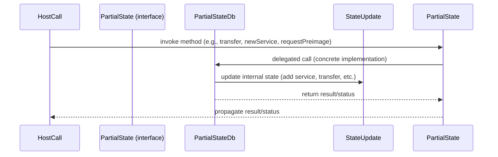
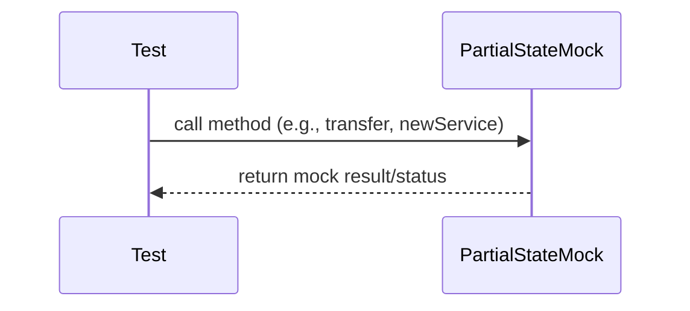

# Partial State

## Pull Request by @tomusdrw

Implement accumulation partial state.

Left to implement: `eject` (aka `quitAndBurn/quitAndTransfer`). Requires #378 first.


## Comment by @coderabbitai[bot]

<!-- This is an auto-generated comment: summarize by coderabbit.ai -->
<!-- This is an auto-generated comment: skip review by coderabbit.ai -->

> [!IMPORTANT]
> ## Review skipped
> 
> Auto incremental reviews are disabled on this repository.
> 
> Please check the settings in the CodeRabbit UI or the `.coderabbit.yaml` file in this repository. To trigger a single review, invoke the `@coderabbitai review` command.
> 
> You can disable this status message by setting the `reviews.review_status` to `false` in the CodeRabbit configuration file.

<!-- end of auto-generated comment: skip review by coderabbit.ai -->
<!-- walkthrough_start -->

<details>
<summary>📝 Walkthrough</summary>

## Summary by CodeRabbit

- **New Features**
  - Introduced new classes for managing partial state updates, pending transfers, and state changes, enhancing blockchain-like state management capabilities.
  - Added comprehensive test suites for new and updated state management logic, including service creation, transfers, upgrades, and preimage handling.

- **Refactor**
  - Unified and renamed types and interfaces related to partial state and gas management for improved clarity and type safety.
  - Updated method signatures and parameter types for greater specificity and consistency across service and gas operations.

- **Bug Fixes**
  - Improved overflow handling in service balance calculations to prevent incorrect threshold values.

- **Chores**
  - Updated and reorganized import paths for better maintainability and consistency.
  - Replaced legacy mock objects in tests with updated mocks reflecting new interfaces and types.
## Walkthrough

This update refactors the JAM host call accumulation subsystem, introducing a new `PartialState` interface and its implementation, `PartialStateDb`, to manage partial blockchain state updates. The test mocks are unified under `PartialStateMock`, and method signatures are updated for stricter typing, especially regarding service gas and preimage handling. Supporting types and utilities are added for pending transfers and state updates, while test suites and import paths are adjusted for consistency.

## Changes

| File(s)                                                                                       | Change Summary |
|-----------------------------------------------------------------------------------------------|---------------|
| `.../accumulate/*.ts` (main logic files)                                                      | Refactored to use `PartialState` instead of `AccumulationPartialState`, updated method signatures for stricter typing (e.g., `ServiceGas`), improved gas and preimage handling, and removed explicit service ID manipulation in some cases. |
| `.../accumulate/*.test.ts`                                                                    | Updated to use `PartialStateMock` instead of `TestAccumulate` for mocking, adjusted imports, and aligned assertions with new mock method signatures and types. |
| `.../externalities/partial-state.ts`                                                          | Introduced/renamed `PartialState` interface, redefined preimage status types, added `slotsToPreimageStatus` utility, and updated method signatures for clarity and type safety. |
| `.../externalities/partial-state-db.ts`                                                       | New: Implements `PartialStateDb` class managing partial state updates, service creation, preimage management, transfers, and more. |
| `.../externalities/partial-state-db.test.ts`                                                  | New: Comprehensive tests for `PartialStateDb` covering all public methods and state transitions. |
| `.../externalities/partial-state-mock.ts`                                                     | Refactored: Renamed `TestAccumulate` to `PartialStateMock`, updated to implement `PartialState`, and aligned method signatures/types with new interface. |
| `.../externalities/partial-state.test.ts`                                                     | New: Unit tests for `slotsToPreimageStatus` utility function. |
| `.../externalities/pending-transfer.ts`                                                       | New: Added `PendingTransfer` class for representing pending transfers with strong typing. |
| `.../externalities/state-update.ts`                                                           | New: Added `StateUpdate` class to encapsulate state updates (new services, transfers, preimages, etc.). |
| `.../refine/*.ts`, `.../refine/*.test.ts`                                                    | Updated import paths for `refine-externalities` and related types to new directory structure; no logic changes. |
| `.../program.test.ts`                                                                        | Changed import source for test constants to align with file renaming. |
| `jam/state/service.ts`                                                                       | Used `sumU64` for overflow-safe balance calculation and marked some properties as `readonly`. |

## Sequence Diagram(s)





## Poem

> A bunny hopped through code so vast,  
> Refactoring types and mocks at last.  
> With PartialState, the state’s more clear,  
> And PendingTransfers now appear.  
> Gas is strong, preimages neat—  
> This rabbit finds the update sweet!  
> 🐇✨

</details>

<!-- walkthrough_end -->
<!-- internal state start -->


<!-- DwQgtGAEAqAWCWBnSTIEMB26CuAXA9mAOYCmGJATmriQCaQDG+Ats2bgFyQAOFk+AIwBWJBrngA3EsgEBPRvlqU0AgfFwA6NPEgQAfACgjoCEejqANiS4AFNBXFoLkAMq5qJAwDlszAZS4AZgAOQIMAVUQAyAJmbERaCgB3I31jcCgyenwAMxwCYjJlGnomVnYuXn5hUXEpGXkmJSpVdS0dNJMoOFRUTHzCUnIqEoVyjE5IKiTIRF9me3k5BWaVNU1tXTBDdNMDbjQGAGs0UkQAeiYKEnPuCWYwXnwiKmZbimfXjRpETVxEDgGABEIIMAGIwZAAIIASUKww89DmrEW/DyDFgmDOZlgJBQzG4+Acs3w2AoDDxOSJMVxCgwv0w/0gAAMAMIAeQAIgBRZkAGhZAFludAoZyoaL+egMPRmTYAErcmGCqEAcW5AH1oNyXNANQAhAAy7P1zMg8ToKCwuFpP1wkBy8CsLKeLzQzG+0j+iDNSTQyAxWMtOQ+zBZQI07xI8AWpDAAgsgjAdqBZoI4cjdse1xjpxI8cTAlTGkgXnw/BtlEYmIwZxi5crMS9kETRHgDAF/qiDng+HpAupTAmH2cOUTMySlDxCyUGiMRgh0IsNBGvfp9ZpeKUDAs9moa+QuUgJAAHoSHJbqdxsAn28eJup4NIjGXyHOQUDUnsDsc8xchO65wAQ8sD4L8YAME4FgXIcDC+Ngu40OcXbwEQGCer83wAsCoKLrC8LFJayILBQ8hHoGtbPgYcB4naszYOolLUo2zJQogiCoRgZqgb8jBQZAfrIMwijwI6lrptc3C7hS6AWM48D0u4GAUoeeQsdAXpQgwcFxIhJBmsJxwCeosAsnYPZOG4HiCvgxzMiWPTIHMAi/OoeBrvw2lksgCmyc4dGQVEyBJCZvksQAEmBuCslBALQuxnFmkoiAMBQ8D+JACa2UcAoKTu2C0ApRBNr8yBUnwczadIiA5Ah+SgWlABe+59pAACO2AkJ16AJWhbATAKlAfHwNa0BYRUOtSp4qRxUgWPIu4UKQCjXFahUqZ2Mo8Jgd7+JiEi9nwSS4lgtDUGgKDINgGDXGgZ0JiQJZlhWuJ8BRdbpnRrbtp27GUOIfaIAOFUkLg2DcAJU6QDOJAANz8Bg82btD2X4lJJD9e4ANYBa9DlcjsHwXpsxY3ignVkGtBzvOeHLsUB4bo226LS165Hqe56jFeN7jQw97iOIVGvo9OGfgYEBgEYP4nGcQGAcBYA8bgEGxchXm6R4yG9eh/yAh+4KQvhQyEUi8youRNbYtRtIxpzaLI7gsjcHirHqwhrPmY4FhWTQZohiwyOJpBzj2bc9he2ADK+yjtAIWT/pTBj+BSPQmD0JJ0mWiFNrSmjRL2kejaO87Znh/Almk37obI6eK4YE4j7SJNFjNCyGiRrXlD1+NgsXAcFkWJHlclqyRLXIghIykV80Co2Q6/BQ2BiFee5sCuMRO0xfDMv3Xs+/pVrI6x2tmjuXYCQn73BtXrs6e72Oe+X3uVxucplxXHj2aW5b4JWfDfXzQcfZcAjgdOOCmlFgpQxhtTBchs6arkBozWkzM9zY1UseM8+dLx8GvLePm7BG6IFSJAUeilF7L1wavUGVZi54ivvQXyZ92IsjYhxNCZpfI70ODLaQcs3gKyVirOSME3Z6S1uwnWPpASQF0JAAAYjfXeT995cC0nfRCa5H4f19gYWR3RyzcIHqoyA2jn6f1Fl+SW+weF/n4fwxWUVhHQTVhozWD12IYW9HrXChs4TGxGERM2pF7ZX2IdbWizY5iMUmnwFi+orDsW4lFPickL5CREmJegEkSBSUOHifiCkGTKSboXWkzINK/HUUTT+KMjLZ1Mm/YxpMbJ2QcggAMlsCk5ByLUZAjYohgwhmUl2hMNbR0ECIMQ5ooiMKwCQQ4pkAr+ket/F6VYAG/W7Og4GJV7RjnwEkKBq0nArjoO0vEtt87HLxODM6oxYJEkKrWJGyxrjCQOrWZGVziRHgqZpMRtS07oFoM84qjYfkFzyE0veLTspfxonsgMwCFLdXTFINKOR5ADPdHiPaaADpEjioM8QXzeCSCdCQUgSJKAHQ2pAUa40vnXVuvdZ061sb2CfEDSASgaBiAmqSZWuQwBPKrOwNK0hNr0D5bUCascpLtg8D5a0KD2yctIrAg2S4Vys36Q2FBogWboPthzbB2RcE8zvIQ3uJDhbvlBOLb8tjZbAQcUI4OLixn3xuB4xAWEfGfjwv4oogTTYohCRbIM4TEWQpJh4TGNzzTcHueJcseULAFRdi4Wl7YSCqn9GaYFzIQGyDYjmigdL82FodNXFiAABOh/gKCkXOFlOy21fykAFMdSlicPkTWurjDezsnJL1MgnZk+pUIFp9NKWUs6EW0iaKIWJR8iA1rEi3Q+zJuxVphLQKEMpZ2j23L6S+XS8bV3iBNC6AS7zMkXSO2iBrpxEjxBPUQokH0VqrU+uhPaTIrXHpPMFdIMUcVarVZSJq7mIg3BaFkpby25opE+opNA7r22ZP6dkBwOokGgJvJd9DAYgKXgQKhrwaFxM3mu+JiS53MOCheymtaA63xqQ/d+5jo7phhSo4ekAYT0ngEoI+p5RB4APmvUCtBZ60gWBDZkRA0yYntKBFuTlUN4hhJyfVkAN3IAkE4TqLGropvg+mJTLJf15oPWmQxdm0M1owws7IalaS8BIIS+ILJ/2bwuVECBdZrhjlqOgGIqFYA0AwIKtSdH4h5nQB8a69AjOQBM5mpun6GDfr5umPdeaeW2w+J88FdHEBoF6Y7eddIOK/DIAweQDShWyRXBNOe76WzPDvEA4c+BRzgJGdDUGcmtW011Saz6hqz6ILZnkM1F4LU8CtQQh8trxakLIxQyjsxOLUDJLcyzJQuDMnnuRyhAAKclJmaCJzun2JGyidHWGhIC7jzSPAAEpOFYGYyyBJ1U/suhdXwt1ginGetEW4pCfqsJmkAEmELILu7aJDdtKd28Ssqe/IF7vG3tmP3r9w+AOp2MZBzitgDpKUOrFhLKWYP/zy3dI48C0PXFcZuBiUQRxCQKT+F6ANljg0ETDfRCNZF0RdJjbaZsK6d08+OPziYXiEfpJjt+tNic8kyUbIhkb/yqkfYPgDhppcvs0FaUcX0J1GC3VJeC8p3q9J/eKRSdpqAr7oB6X05Ggzwb2xYqyXEyv8AC7TPLlZmU8C8vwE3DAv92u0Ll7xAB/A+Bdn+geC5eySZOmcBirX/T1OYKk475GSu+fh4mAJNKPwa5nlqJaDLWW0WvsTm2Rrmetp5XeewEv9DQ/V4F6k5wTBroF1VQUk3Vp3erNjQSfO8aaCYzXUb3A1TxkH3Ju85OdBpWRfIDMON+MBOvet+e5Ad0lBU3nNqqECC9XIK3EatBDN2ZYOWxn1b+D+ZELtXLDCQ3CWy5ktT/xtXkFQXmyTRhkPhtFQEKh6TpysUZy7XBxZxAih1Vhd01irxV28RFz8TF3g2InNml2jRxEuSX1+U81ojo043GS0R433irgDkbCDicDbjDgHiHlqWEljmdF3yThTjqwznyXoGWH6DjRGzoQt1hVqX9jDEbE7goG7iIV5XgGuEoXkHsg7hPDrgbl7h4Ijijn0hHjHmkFA2nlkAU1I3IQoxXmo3XjkPxmD2HwINPl3BYXJgYXYzDEYPvmYMtwPn4yJyE2el/leh6zbEATemAVAQORmGAMnFWhgXv0m3piQRm1fzm2f0/05hwV/15n/02ygDIQXkcIqgOzBlWjg1GCYW8OQDZA8Jr1wBB24XQOZwEVZw9RwJN0uFaIFwRxkTkUUQ41RyqIx0kA8Ae1oFx22hCLUQ+2CIUJoF+z0TkWgEMUmOu1u1mJx0RjxxYNJlsBOJ+2ZEsSdWsWljsQh16OwJEU5233OGShqMejtGF31lFwCVIOCSlxCyokRQCkUEuSwGZDeLQg8DV3+Cv01yyQ3HEJkkKUUkwBUiD3KUqU3xNy8PPnN3PwJ0v3o2dxxMyy5RUGdAUkfAbmamxngKSAbCjyCk906SDB916TEEH1mFBkDxGzMPQBWNakMiOBmUtDClpCBEil+BihES4E5GkHeKBDz2iRoAFFy3yygnkHFMiVKky0oFElkAmhyG0EzVWmOjIEgET15XOkukPjYGEhCWBUqhmlqmcEhPrjpKPAumPzJPGnuWpEGSeh/j/hiJ+h6m2QPF2ToiSKTVOSnDvxpngSmwZhyN5TfxgNNS/zAOKOtQ225RfD7BFn1muLQN4W6PdUeK9QGPdOhN1iIOhBDQRFGDIMjQoMgSoLzloIdgYK3yCL7HCMULrVpE4JDkjHxz4OjgELjg1z31EOBSRMtCkKwBkLoOfXkME0HIDguiQN6WuFrynOdAOBzj0POFUPUOMPHLMK/lHhbSsL7DBRnkrx2yqMWNxRcLozP3x1YPgPKXlMkVqTN1Y0oivQ417M0X7POL40MQHN9iDPWT4GgwFT7C4OpAAS4JSOgTuhFkTJ1SyPXFTOgPyMWyzKKLwRKJtXzK2wqMuz237jfNoToz8MaPPmZD/PeI6NuNdUwLZ2Vg51wKQhrJoBGM2KgHGICP2Pu0OOe0grezAo9hksuP0RgEMQkux3cwWK/NONMQUquIZxsS6PsUh3Z36NhxuBICmUF0wjrO+OIN+ObP+NCRlw7LohVK3iPm5AsuSV4k9Q1wEK12yXLAXL8jnyUnRMNyxLksnNRnxJgpIEvwsNvInnvImjjTMMTUhjqJO21zjQJP3iJOLQAEUGJcBuQW0iQ2DlDykzyjDuUTCn4JyD5i1qqe5arLzSYwBhSDJFA44VVGssMRtvNfNmi2qgUtojFTDSYvEurBDpBc8vpesOxwzs9AZD8A8IZ3ltAcZlJL1MEKRuB9lmIOl6IXIBZ3JWoRthS0YrBMZWZRSAr9tt9FivYV88USB9pDo4KMK0isKX9lSKR640owIBQhwQFBswFDldkhpqRGUJoGltSkVNxmAogLB6gJsky8KDMmZ0yiLMFCiVsyLcyBZKL7VdLnUDL7isDjKnj+KzKLKvjfEGySD7LJdHLKCIlOz7Q0qB8MrjtU17qM0s0kNSIUNK080n0lCWRG1N5m1W120bc6t0wcrYqpRmQir1BSrhopRi1oB5QoQvAXB5FuR5QNRhRBR2QDQABNbUFwCqyLHcqcfc7qw86gUyK7E85qohOqpwBqt3TDDzbgka32b7XPXY2i6hd8kuNw8pDy2oXEnwoC6lfw1hQUjAZW1+ZWksETCTE8cvGTMbRQOwsfV+DqdQI9WgaAKgekXcuEvyhE9MJIKgCGFiDaqk2sJ9NvMmIDEtYWxAZzatOdfwcqPEA4BKL5dQAUJEzrNVbQ+0A3aFFuuLNuwtOCqIjZBan/EGxI8BL66cLCtG3CjMgi7Gk1Ao81H/Am9bImqico58yhfbKE2o3mxEM7UO9HVSuYjSmS5Y2HVYjc9YpHFHW+yjaYrHD+o4p6v+wnGSknZilhZkGOsQDipnQyh4qmqs0y08um2E0mm45Bimni5xGHLnc4cqUgSywgmyxmuyoJFmqNds9mly4qtylieRIkMhry+0Hy8mWup8e6oKlE+fDBdSAFUyrq+pLu2K+KmAI65yVyMGT0ryCgFVYKm0a4HUzhlZYKUKafSASUqKGU6CLgFwQbdsdQJU5KVKdKPFIOI4EOrpdkv3CFVEh8W6i61GSZCLYdQrGMH1ZGfHF63lMkKe9RmQWPeYhPJPOMuJVPe0TZJansFajehIsGpIlekMxCzlZwAMmiskdCmXHm6GH61Mu0Q8aJvEXECwZ2BC66JC+kfex/ZM7IjvQik+4ivG8+tbUo4mwslAks/SsslBym3iky4h0h0GemoNWy0NP42htsq2RfO2P5SK3+17OEhc+gGKhSpO7c0SXc9gGOaco82ABKkDZKl5Wwp8hwu+uiteBiyOw6l2VhpaUGOO1k4CpOwI8C1OrZsIhSzO0TcTFiSTOCSc/O+TSvfifjMZ3AGwHMWMA+VqcayBmuzJXhjcEerkzERACda/LAfAfDNFOjZYBSCQfAI4CaZkLF453DAlkgK7GBxSdze2DF4JqYNAGYSl/0WAJKLQ2oeaNJ6I9PfrUGobQ5QE2AvejI9Gw+5p4+j/Nps+7mCAvM6+7bK5vbf8x+5NPm0nJolkJ59hndTijAnooZwh54n1Ehth8Z2Ej5kBg49S8BzSjwb+rjFZgnEnfje1ySx16SpY7SkIjY4svS418soy4Z6mgY4/GE7CSho2aZ5mkiAEsJZyqJJh4kl2LwEgJIDhou7h1F7XIK/XYLcKkRrnMRkUzZkIok/GDiJgr5FQgwruLgswlkwEhxzklR2ANRvPQKaQLgZ06qV07k0WmSVKBZbGAUY0p0I7QJl9OfbAHpUx/ZgQJwNEkgQ/ad00rcdvc0G6dzCk0jWcaEUFR8ZCuSC5xsLPBJrAIvLFVl+wIgXwbmjF7XRsYUgAcmaOPz7oMboAMjBZ/I/SXhdLqnHduronJnqMLZENolpEdCUftAwGfbSj5kfefdrwxx817HiCRmZAAEYAAGDUQjgAFgACZmRvsBRE8ZgFiq9WWFcqXgbQSWwyAiAbRD9V3dwSl/VpHqDFnoUIrSThCPkD86tcq4UO1yZIUxTGW7pPr8nUjd7AWO8rh1HQzFrN6UnxxIayqRo04mVip/BZB7zNxgtZHTqTVgVr26S7ohB4hcBE16mn9ptZW8jWncbFXwDyKVXwkSbg2yaBn8G+jI2MHo3rKGb42myaGk3Wb6GFnl8/lkNe6dMHMJO+70vRP99U4tp1njJjyUu+7F0Q69XmQs2c36saKiQv3XzbnaMS4/CJbPn5KQjHN1zVnc8MsbO5JDl13fSzM5ik7rgu8VxkAABOOrIjlLPEWj30sTeDG9L5bustVL0d/u32plo8fwQdWZTQme/l/jzTjcaho/bNkdqtYTTkTKJYXwbgRjskPczmnTK7mc2D2geGNzO6Qu5kH9nTADm0RQW0z1LOEyNrfoDmXmdQC7vNV79DzGXPCpqph0Gpuk5kAQO7tTagMYa8B5S087orGSPTDXJQKwEoEsdkDFKCQu4A2cvESH0x579b17hYOLa8L5urG/eb+5DyfGIzMAa4PSOZXH/1OBA+5/I+jz+Vrz7/JV3zq+8JG+9VgMmo2d6D2gF+oBt+zHB1x7J1r+97H+iCwNgB87LXigb1tSvXv1tYqBk33VliirpB8m7i0L9B4hiLudSALbeRVHjyOnjXlkDJjyDHgkK7QnkgA9IxtL2gBl0HF301ghviqN7N9Xb3qASIkM0A0izpii6QD9tMqXpBZTwEu/QL3BhPistBohl4gjTVT4yLyZqhhN2L8g8V1N3iVyjNlkIqygWQXNrhhOHhmD3XOD25Et1cjfSK03PVqt23mt6kYU1l/x/kj2x2XPSFJNdXgUq4B8i52cil4T0RiT2F6MeFn2eIeUaQBCdourL7xhGgivST6yeFAUOUOFvMC/n0Q/d/s/z/rGeIAAGkFItAW2o20MItUm4B5BfDEz4hBQaQ2PKvJoV9xPceAH/ZaFHAtDIA5uiGFiKf1zCkAv+aYOjObhYiYC50W6GlPaHRSmYm4EtPAegJIBf9gBMoM0GQF8AT1ck0kZftcCGozJksfyfAefwAGIAr+cwZcEWi2iFQZ6ZkRgUQPvC+ABus1I7unhs5/Qb2yjIuF6GQAL092DCAcOA3faoxbY11dgLdWBQDIRBa5JLMtBL7b90wDcNCAVyWS0gfSa/blCTF2xHYXOjTfCu52NTS9s++NXPn50AJvgjuwBarBySnxIwQS4mYFJv3hhWkghHTZVgLCgJyti+0CAtmX0dQhs8GrvSsjX0tZ19ZAEzB/I2RNgS44udDeZjbEf7YZlmxvW3pINlBCD/+h2CgUOTxAjlQcvBK8gcyEIJx8uxLR/hSzTrFp2hhAkQSwNAHbNkBezR2jNTbj6EIBntQOuYQiHm86uNGNcn4UeQUA9+HzJod8za7p0/mEQyFjsWHxTCmBIgs0Ii2dbRw5ur7ZolSy0CIA8MaAAjPS0279VoUVLHlgdzKFHdEA2cDEC9TXyItx4N/DQOQLhL2DywuA2kOwLDAd0yoN8W4cwJAF/D/av/AgXcM6EkZjuRSMTGP1mDgjTIfbHQRjE2pXRtqlMAwbEJRHIcwwYWB2uiTsFZUEyYvBphjV+otNAhJFYIWkIAJUVthmrNXtyM17K8Le79KSscX9YnDYqJOZHGb1lGW8wGNvSBmcXt6wNmivfUiM72C6FDq+FrcRKUIRw4NSydxU0RG3d4vFEAJjPLOQ3KE/EW+4aGoXMyBKwCu+UdbNM6PUAD9+I+bJAmixySj9kYc9I+Ef3LaMBZ+EjGSgvzKYsgaavtfrr5EhZMllBUIU9pk0fIQpH+W/bkTvyeQ2EzsV/AjL8FuEa1yqtpObrJxAoBEIwqw5tpAL7g8YGqqYE/kmPhQfMWxp5JtmoRqp8INhHVbKKmB7QIBnQjYQajhx8hFjsMlYszDC0YG1iKArQlkLGO3y21ehjoRJAUwD5zVmwcTWzpGTqzadRWMwXQTU0vSAYc4Wg3UiDVRSdZywd7bFLSHxSEo+AfyYxlD1v5pYqwJmQGn5iHCFQTUlUHFonCrEV4Lo3mAkQyi5YCgYazKeuCZidCHtEJ2LKVLJFZTyBrgMEoogShNKYSzCPKBIfSEXaOg8s+zaDLQD46IpvcqAcaMwEYj3VLObkCvEYKMgmCMYZguksOn9EQMW2pMHfm61ajw0SmPg/kZLwCFIJT6svHzoTTFEBc8hQXW0Ynzd7FDxETo/8W6KmYxdPRbfFNuzRXIshlxXoGsfp03GzieMATOQr4R2rNcIwXtQeGYW7H8YBx7g0cZ2PcnEiycf4xnqfHN61cbmuwhyQnG37NdlRPzaChcJEwcRAWVVHOiCzzqA9wWc8K4SyAIkrjbhDw8Ek8J3xD8ch6LFiu8JpbfDOovwkKltwBFcsgRfLEETRGCyRDaADnXiAMlJDkgCkW0OQgNTsn8klAzsGUE1nkDApa6H4gpEtAw72hX291ZkDlMsmMD2uiGfoPi0qlqVvMUQCYK41XLvCpW4vNzsjEFHySFWiknMpfTFFK9Kid9SUZlR1b6jbMgY2/lwlDaDMk+IzR0c9PVzNdNRCo4SQTldZMFmhkDT1oYj+m+tFRtvXUbbyDZqSK+JozSUUPNGawQEmAGqJQBjaBoKhTNVvq2Xb4MM02MSISRUkroYyNxDKFJIPwyRhiR+mcYKhhnXZCNMSZbHcfGLxKJjq28KE5neSnhj0GhXNCYMWJ1aK0Ghz/K3H2O1pkzdy64sAclLWEXlfJL8JqkOPPKtUlZHgccR2mgG9U/aGJYerwPnE9Zg4fQiaqNVlAbCpqNORJIp2jQFM4CxTE8QtS2TLV+wSTAbFePhgLFuJIpXiTdQEl7chJ/FDyPyXJhgj1APOKmNIz6C+5O2WY3Uu+M6zSzxUKUs6hgAFAZYmA3lJwHBC+absTSs7FKGQC5RgR6IEIofkgA4hfJ7S5YGuaRFyiUSl2NE2vEZkGgngZokgApMJEnyH5E8GAMAKeCQCxZ7QyUUlKzGkkytjpmQhbDL2zIX0umQsHptaP6YaSq+9o7SajOTkUB9JzfQydUOMlOVTJDQ5Lj3WK6bob4UtZ2DLVkBtobGcJG/JaHnJcCJCfjQ2aSCuhVZloJ81buLScJVynceIVvLQKTosR2QXgLULrX1qG1jaqoKEC4A1CKhVQZoEbkPMxlHc+pk/QqWaDCnrx4apM9GdXXZksJX6R0BOtfFAop006V2RsfMN6GhwNhVHc4WcJoXNd24g4hWerP6FCYbypzPmUQALH1DBOydI3qcJaFvcxOuXdOM/IpAbNOZYi+gSiNVkjiaZccILEPjtlRCIsoEGYBll6ATBKA3mB5L1NpBOiyQFIc4Bgr8YDTRJw6SSVvM04CgMe1A2kPvioBpJLx4NGYMCihoGcZQRnIDiyGBbSYAecmftJtT0GXoJ5Evfwe/lOmzyc+oosomqxukatVe905+oAw1HyjIZAMkxDFL1H/YyuFdAhZQGNGrzw25rGmhYq3nq41RJCiGdbyhk6iA2sMkHGTmKVV1SlASqrNTn3FFl4ZNorikjLNFVLwYboWcA31jZRdKh4uFssm0PnAlmwfSlkGMqoATKhctrUMf5URLSLyR0Y4RsbmP5m45FkDIkmFAZK9tNGzg+Gno2lKxQuA4QbgOMpIBKlXKJYFwM7DyzUTNSDc5GECGxakht0qyn6hdAj5KlgU/y0CAhDxgmkBIduBXInntCspD2SpEpoXUZkuNPSq5GmtUAsql8PmPpbcT6mqn8YfSkjbKL8JLC5jwJa4H5d8gFmkw18Z+Ila7nEU5dD80hBoWfnJXScE4D8qOZn2iLAFPoTs2Ii7I0G7IPFSRe2ZKxwp8jJ5WNIvjPJSFy9lJSS+1BEPyYLFNF0yOIWCWKSOBrOveIsUkPLAqqlJl02rCdPXAl9h+uQ+nOpKGVrzKlAxYFRMqmVN9ouVQuZfFzqECckuq5OQi10+zyLuhxsrgsyBckbDux0AtlXOTy67LJCY05csfMDUME06zkthd5I7FcKPAxYbbIlWsLnMae2wnBXc2YblIsFaA/Fv9C1I6NmQjy55a8w1xNcb4+SsRb8za4Cs16sRd2SK08XisZVs4A6fKuiVTylVGCc1RdIXmK9kl1Xaog/VnbkQyujatZQfFekFDhl68lGUhDdUfEmMTkm+A0vmL68lRlC6Bu12ZDHrP6/rFUfZGXlvSQuyMqpYaRIAtwsZ9ZL1bMocq1CfRGnP0Q8xZAW0nwLcYMWki2V11AquyqMRPxjGsyfUFbZwR10JJ9jzljJbOcyWjlvNloOqpkE4wNXlwsVyMS6h42mReNywdbXxlexToBNJJ2gvUpikNJfIvxh0OFRaTrlal6RyKh6HVnNI6NX126KlraWuC1FyApsKqOxFdKHdEU48KFA7FFVhkBaYGNam3PLxrgOV6gnZGEqKQRLKY1MTIgqtmxyTlVwo1IfLxUlLzy+gyk1s6uT4YMBNVMRvjjOoZGT8ZJkxLl2SLg9lz1ZwhRT0NsgRqGFgw+ODSIkViFE1SGzlUIq80lxxZB8CWjsxQH7NBe+4KQNtGPJZqlF7Y1yT7R5lJU+FAi+wikqcL0UGueIQ3MBrfVzDAK2G8hQEXbXIsmFLQ7tf/HXrCst6YrHeoU2HVyrXOKZGJRmQUlzyQhCvEhNRTRwLqPSUoh6YUpYqVbQNRrTdbZs+mWsHNwlJSmJRlHFa5ROvH1o0tyVaUGtr2DYkpW2Jbb511609dDJaWgzLiVmleU6oqUc5s1OWswmAFoACAP1cbGZTMy9EEzHI+PGYNGT7QkzYqnIAQM2rwVPbYo2CsHNWoOjJQce1wE6LNFuRxZqB9GpgEXmrk394A6MFHjBlpXtjE4QvUqQPACas88wCPYTBjt1LwT4WK+UCcPiKicCYJLOurNC0dyDRKJaUL5FcBkH8loOuLegD4sQl+KjS1IBVLzAdYwTyJ6E3cGoB7gXMKJcwJuU+Frx0SGJMTYzPqSxT24J2HkI8D6Qj4lZlImaMDNx36634KMDMJ0i92J594+JQsw/Iynp76dgoduTXTNwXZq72AJYAAGoNx/SfAe5BdCF3e67QwYIBLeWmS/AiQeYOxrzgIIE7amRhTjdzysxAE+wCHMMILqyrX5VoTwKpkjG0Jioo5fdZNM8oL3qMo98RGPbPXz0bgmOXLOrBlhYnqA+OUIPAA1HgC0kPIBGbqOHuBS3ZKUidE3dq2VTe672aLfGPzoiz8k4gWMNcA5HsU1qMy9gGvSLqbaiY5oFzJTRNEHaSa6oaMzpUo0Gj6c4BdAxfpXPlRegFIeqBuaruonq77QrcurJbpKQ0hx4mmegISi+Y8pzcReqsOHvTDDSwMJ+8mcLph4yQP9KkEsPInv0XtC6Dm/gFU1uqoBI991IcDnuRgObLQHwJPF7ksJiAkYgyAJdv1bboL6NiGS6mRLqzuQldKeo6ZRuJi3RxorkPmEXIBq9goDtnXGs3myB4AygOErHfqWY1REy5M0DnQXML0u0yo1ID4Bj14hZYFuRG2yeTsGnnRV2wWABFEqOmKrjNk60zaqstWUUM+53RhjEn5VcBdI4gfHRCWkCWN/AZoOWv0jv1kpOmsmRQBgji3g7XmDc/KGClGJQBzsNwuQSIKw4EjwoXLWwIwOiPYsBQVgWsDaC4BqA2wEwb7LEb/7TCiRIlbKSQBgm3DIj8LeI7ACyNRGkJbHZI2UcyioQBcmRyAGIJv6KU5EzIaFkUfp15hSj5Rko5UaSMccajaR+o1wCaMSC8jv3bNn3SuwrpujkAfULIB+AsclAhodjikctK+Bm0nYE3IKAUizpo+63WdAYI6XkydjGAPY64B0yzoGjox3AMAEy60A9ALRkI9B0D1+lqARKTkOdCuwqHg9iAT4+4C4CvHVDRIf42gAADaAAXQaOksxMTxlHEMQmD0suAMJ0AeMb3VTGZjMRuYwsZwk01Tj5xoYwNARjHHdy+J/0KkbqMZHkT4eVE0pWZDQcu9gPJqKzF75VT1OImJQCeC4CsjNj7UTqJ1C4AIGc6tAFwL3pIBQgW0aAWQMAHmM/A9A0Jmk3CfpNZVYWFKKwNSj7qIArslO0gBQH2P7pwWaAbvUSDFN6mLj63A9AKB+PvGlG+p+zIabwD4Bp+XAQUGgG4B3GY+AoM+YgHlPUnYT4xiA7uSuyjz792MKPuaYNOdhu5EwCk+kdwAZzyTEZsWv6AFA1yuAsp6QNcev5jG6TDmq7AQcmAZnEACp/0/dsfV2jzWL2scR9p3lfrftB8tmgDp9LLKBcHwWOOiTwEyU/DRChcejExiss4tf2FcMaQpCpnMApwCaP4xAPlgLoctQMApDADjQjgH6SajTsKYC46RucAXG2NsykxHlqaB4TUF1UNgqARkSIVtDmDcBOYnSJPW0SKildz4ru7TMz0eST4rQVIROCAifBZZ6D+egI+bomjH4kY4HZsjpigOdGMBVgnU07s0BrmngCOqAWCwMxV5WdK4zdta1mmMCtGOcPlCaUtDp5a2VgiA2e3XDApYDQ+XnKL3ZoA5Lz15+sMuetBbyZAoMScBaXH3m5rTRGkMx6Q8iDzGsJSBMzSJLr95nd7+tdp/tUbSAf9fHGEPaCgiHIAwDuQ3XkGN1gWkNVJZ6uRfAuMDoJK4nlGQDmC87ioT+5dhrrSxQH6irLcgAYXQDy7SJ9uzkO8pe57qLMqaFYOUxb3AoMsZapRgHqD02nrS7gTnsaeZN0kB9TcSCFgAyjq9D8I+9U0RDUuRXMoH6cZh2QBxOAnR9EK89ckgAObb0UwfAEniE0UTAjTca6H7PYCWhR+P+ygPIb4Al1cAsE3qVvKMs/4MeahA/WBdzz4j4W+52pM5ABydwZQzRQ0IVaODgxwoQ8okLIFksYx2uaMoyKQ1/ixZGdGCCCzmIZRvrkewfRFqH24D3HT4Ocn1FyWstM9LuDurABdAPL2AUsJkNeHeAnj5JqYjE1jkpqbhDXUdx4C/ShOKhLdiozIG48QNHTc7DLOWUSfPFQXKRldW0KkL1yOSzBPlGpE1OyL3IyKbukAcIPKENAGY70VAJ2G6bQWyXRSV0cQIwZ2vrh8YrI/UoAjQNGrskdGM8Yk3Gnjm6wTAOSHKjiUm6BQ618ic1ZKVKNjwvuiYPyxHV9amm46ww5mXaYmGZ1JCalZaDJxg6IdV1GC+MK2YbrK+0Op4lWY1k0B3tn2zZUBnnleH6JwRlkGQ33h9WfgSJyAGCcttZUvTe5rKpAAAA+6xuSBCaVNkMs2BhCrvcZtsHXxjVeLEREapY9GujfR1YzUfCAAA2Ujg0ZDudDXb7tiwEqcWnVjGBV2MO6YjiOR3qjDyuO1mfEG3H2QgAgUBZIzvZGSA64x4+MfaOZ3s7tw0o4kajsF347Ix7MyXbLsp3a7dJhq2XRJOUBgz7h1mHaYpCWmsriqOgOce9Opmk46ZnE4gGAA609aBtI2ibW5Bm1La1tX040c7vABS7AoNWiVX0693Wj/dmUPqDJAYAbbKJpU4GaHvcXWY4Z+48neQ5yQozpIGMxjbjuCWx7/dOe8JAXs/Bl7kCte8bVNrm19QVtHULvZuMH3u7g9igDXaVN/d1u0x0ErMdPQkBm77llY/nYxuBByOWx0ymSbiiz3iTW8sh//auMd3i7Hpi0+CyBBFIqJpl/ZOZaBBn3njTytdRicwdYnsHuDozG3c7Bw312bdks7SdaMvH/LlGP418c4sfHzotgSgECeD3AA1HNp0E7vbvtB2ETuAW+4qbRNZVGTPevvX2FZN0t2TI0rkwWsj42POw3eyx4KfgDCnRTjUcU5KelMJI0Ay58jgIFwdQhwg0AcKOyHlAwgAAWhKBhBgKNQBVcINyAScagXAkT7kDo6Md0noOqpg6PFZFNgXtTLN6IPcccdMnTT/9ie4o9tNJnx7DpggM6cgCun3TxT6p/3XSf+nczIG2gFnaxNfCCMpRyR5cS2zy3SgZXW4VbYPhDWwMzIUa2SwmtTXSIs15gL6BMhm336JClkNQtXxcAZn417gJNbj0LPV8U7NhstbICpHCrVgTACdrkRRw7wJtoPhhc2cYxtnY1uZwc5mur4E7jA8Z3Cdud8x7nyp1NE8+YAvPZnez+Zx84xhfOq7PzuW6CktBI8qw5NlkHtf9sR8X7MfBo4HbLNLatbLiHW7mr1vClazP2xNg2YS7Loil8G1lcIXrhsB5pPK+WgkKZAVX9FcyYc/knxXRSfNHauKV2ouNU9/IdGTfgUxiuWlf4FJfCdIopZPp8S3pzce9AP0sA1Kxd59BiI4zwP37FgAUO3A0CPHX48Dw+5AF1ePHc8Im6+2q/tgm2x05c5ohffLpbyVa6d1cVXZVr13XXP/B+xTJL5+F0wiGAG/vaNcmvcRS4/e1q51ftxTXR3e53dKbhciRZSI4LMyHlc1T/h/mTdCVvq40jSd6YIzN1bQdVoQlQPK0omEoiZ4qo+1a/PkcIl5PGHsO5wlWGZcBh+IsburAc4Vv8R4e3NEvvZ0c6PztIZY85nNToyG5g74RokZ+Ytcd0W1h6jjInbBiiDO7l6+d/EGJGAuPA2T0fXQE1NFvaAoU8OlWBswRTatTYoUG6YYeRnIAs6fV/xkacXv7TXpy4/6CjciYIBKWPG/0lPPktq5gHHyj5eFmZ7E44WXVa4PO4xu0lygxFK4v4hSrwE3i764Zwmi6CIb/F+0KQK8xvy/MrLpfX2EcWx4YtTccaYB1jexlxoaEUHjnG37zEFgYUTeFAe3MUARzs1UW74MxpGbYlJm6WxatltUU9We5XFIHyn6kk1RjLzhASFMEPgx6+ixj5y9bUUKRFadTtWIo1uIzlt2trLesN1v5hiX2DKAIKGI8QeJ9p2FkPa6QfD3XIPFvsOU/Ba0Xxo09xM4cdGxAPsTIDle1AvXuQPt7sDouzf2ADhvIAx9lB5ADVGmet55nsedjGs9qlwYU92gDPafc8o0zLn6QKA9XvQKN7W96BzvZ8/LgEHR94qig62z6f0p99KbekuM+hHecK7rU9nZ8d+OAnedgYxI/Ds5GF3Nxt+whFTvBf4TVX8dwu+6fYt0zu4er7g/6NrHY77dnO1Xa/4de5IlxPTwZ8XXle6AZ2Z10Udq/DeSA/j0b63Z/uTfNXnX8uwUdylrjT7pvNbw3axN1etvDXhI1Uaa97ecvXdo74UdO/DRa7C3kr62/V5nZ3XBIgbzUeu/bfGv43wu3Q98/+etX+rtUX9/hYA+hvvjm7zt4IcTenveXnu/N4aeLeyvT9Cr16/C+hm1w1n2b9q/QDRnJgE36L1ebs9xeHPKZpz/gGAcpe3P4DjL1A5gcuA4HgbxB1vKC9qj8fT9yLy04PQk/P7k+ER5PZp/xeDj9PpL0WdS/ueIHm99n9l/B+5ejXSDwr599CXffpRLIAt3mnzPHevQ27mPlF/ctYP+Hd3ldPg4e/hAiHf9vb44vEsUhmve9+h80+YeNzn9tEjh9D/1+TGdMGDpQJb5D+VGbfu3+38Q8MyJmKH5Fmh/6DR+e+WHQt9h8Nc4eY/ivOvwzz95WUqnMcW72t1Wi1Mgvhfhp83xIHN9EAXT575p9e4Gfdf13NATd7k81PanzfaACv1X5r9NPPTLT+v36dRM4vNbqDbdQS7NlCVJl2M90XvJ9W/rZcqAH0sDvZQkBHQ5AKt13yPDlXadTIEmYgETD/Bti1Xv2H7z7CZ17Q0+puI2HJu1cWN1IbQ5eB0Y8mqwR4ff7/GQDwWyRqcFVLj2PFPjXFNOGlpcGJcnFB8a4rrMAH+1eoZidy6csjDIuAKtCqTuahJFjkCobjW7Mg8MGAGFkEAYQbIAbYFICwB0PAgHbo5rsgGsQdlg9DLOD4iYoH+gVmgCYBduLgAXKb/kyAb60AQQG5QnNFCokBPJGQHhAaEiRKUBSGgMi0BoegwEWkklh+iQB3uvgFkAnAbMDcBUiqJrmSCyBQFWAVAS4JSBSeGIG8aduA6Rwc/QJIE4BrAatCyBsAdf6n+WAMQHZI3bGKwQ8F+iAJKoTVlaA/GxgcgBjexzFQa6kiGAvDqo8TEdJlA/cOSKkBYmqta4qfuN4o865Isi5PmXbNID0IVynPokGZQix4ySA2jjRTq88nnyzqFXMqTps/Kt3zIuu6JAFH+fXqu4BKyyp0SqeeLhcDj+9VK2yTK96sP7VBo/pWYaeisoS77q0/gZLeqP6t6Ky4W4LsxAehwHI51YkzlyQr8okgx5Me4Wjm50ea6OtZi6Y0LegXmL3BljQW1Ooig9WHQgu5sCrIsJrFy9LunRlBiALMIaBIKLfhx4OkPxIeQc2AaRT02PJYJJ2z/nXq8K9Er9QvB9sIxBI0ASsUHv+rxOdBFoXjrnjlWrUEGrVegNgcF0u2uNsGte5QU/IpKR2PdTIis3OdyoibcoqguiSMF2C2QhGhNALIEIqgHm4F0EMjOgfyOYBsALgAf5sCEnkyALAuABiCssqAd+5RyUIIDpMGHkH8GH++AMf62krZt1Ro26YEOAYocliyA7ObzpRiyAVIe/5AheNlaCpkc+vlpTOvIaRrxmX+ocgrBX1sNAoAq5B4F8hGAD8bPW5SGnTTBnLguRckg2LKBHaBOEOaUAMwdCG/mqaEJDY+h2OPAIYSbk3b1SqbniJA+t3tywLBjAgLxvq8GNa5muvAdaDzBfyBd4euDzs8wuuBIirShe/NlrRjUXrru5QBcngEQHeH9sa6Rul6oa7d2wbpwLAesEijCrQDPC6KSG1UM+jdWtnrwxPoPlmuRe4s7mGB3ooaA+j/oM5mWEfoiNtRK2YCXiDi2GeOs6DWukAG7RJhp+irRphb/Ab4UgKYbKBZOBfq35gWVHPm6B+63Lu6leroZciuWgHnTzIwzrglbM8xPI2FPykYixDkW9bqVpIaOGGI4lIDwglixa8rt1aLhaplSim+63HOgm2tXOsFumOwhHQ7hXLjfB3udfs+6XqIEX37emprkYCU8ygDmFzw+TFSBwQh4LNqMak5jpaoBkkOPA3BuHmjBlYnWJVi9hjPPIB88CcP+6H4YWK3TFQ4Hkt5X+5YP4CNWVYGFhWA0yNR7hKQ4HtSsBW0DYLYUvImLZ+CEthx5GGXHtOrZBJCNyD7B/HkcHeKZ4GnAresgtN73CjftV5nBkWvC4yotkDNKswvylUHlKrQc9rtBnChP77qmPkRglwUkY/IJqiIdcCCeEIUu7KRJwWaBXYoIRGElw5uKgHAooejEDgwiSNRyLaI/mawGRHCj5KdBVoqJSWBFwfJFchiAKUGKRnQuHyQBoLrs77OkodKH/A0LgSLyCKnnpGBRqsHUHe0DQT6BbYr7naFmhhwVFHWh35CJ7q2BUri76ReUYZEhRxkWFFY+X3jn4liXCCaHSeTHmbaVexwNV7w+cxpt7A+d3h4Fu+dkaq5u2WrqbxjucUf16N2udqNGR+YPlN6ZRVglNGdeadsb6V2/3ht6I+I0bAAt2KPitHZhpPhXbxh8LHz7VuJ3lXaDRnoUtHHR+3tz4veN0QSKFedJrD55gg0b6HI+dvidFhuh3hj6N+n0aQB3Ri0YdH3eoPk9H0ORrlD5KmE4eTIE+lnhgDm+dYfZ5xQjnnL6L2Cvqz6eeWXt55q+txv56BeZ3o34IxQZoL5E+ZflT6xe0vn+iy+89sl5L2LPul54xHPlz4wx3diTHve99mF6UxVnmX6i+ZPl/YU+v9pL71hdPol6Mx8vizEeeyvl56c+aPhr68+pMfz58xI9kL6v2G0TmHugIsRL5oxtPuQ4JegDoz5MxOMazHyx+MYrGEx6Ppr5ne4xrOF0sh4UX72m5vpiaDe22GH7W+oJLb7jeDvjH5xQlPplAu+b2Kj42xyft75sOBOvRIZ+jfo7HB+ODgI5W+EMRH4o+/scI79+9PvJZ+gJSAn7Fm4cX35e+Jls3Jp+McVw55+qaC37vhLsSpDt+1MegBd+9cdX4NOtfn34D+mWIqaN+r4Tk7VxbfqX7NOnfvXGV+TcT373uNTo+4y+PpgM4PqdUblHqewUX3BZARUMmA1KTmjP69BszATJshhKpvAuAljPtQ9mZkEvG1gSDpwgqooNO2ZycR8GAbLxXrj9K04WGofFNYbpuIKT6cEsfHgoq+rTYeQ5uI6Bpa/0kAY9g/bCyCmK3UpuIOGFnqzAPha5Mm4x8KtLrGT40CUGoTeKtDXJFoVbo6DCmkcGKY3c92PYByhbtDLFgOFsZl7sxVHD/xGYSCQwTPhWwrKK2kqlNzrlQeWHzrJM7NnMgEa48tCAr4d4COaSho2CV7nYDuOuof++EbfhTi7YBOgVurASyDYODAFfy78BkNQCMhDbMaEfxp8Z4IUYs7E/KiaVbj6QYqMBscSj0AConC78tXJQJseBsjMT3YJCg+YsIgvB4ISSj/OJDzBEtM1SdoZZGugLwfYBVj3cXyMCiYJdANgkeOuCVNIfuehv1qCRg2mdLDaiSmYYnslwYrZqJjrs4Jm22TrMTrOsELkhP8oCa75l+KtPzEoxeSW/wIJ39iglv8WMa57EJcsaQk7284ebax+A4XOBKUNgJ0wAJHwFUy9wZ2Dkn6Qb/AUnwJ5PqglJwdSSpjL0eRj7B3OgHIIkTsdLLY6yJ8iU8jAANgEkn82u9ksl8Kp8b0z5CAUR9LzxbYp7Rva0HCS64yrmvMps028edxmRTAvvGcMZXPbYHm+oRfFLwI/NhG14wcl8h56TodWqXxSatAbKCRNs/HcAr8Q3hDh+OpBA0ARACaalIeQPyTAE++l8hAWjQEIk0on4dzYfxMQExbc2OlkLqH42/EaalO5jlgDhWKqJyaLkjQO+i2JQkJtTuAOmviyZMNOFVp1WRnkeGXcr5rXgKQ5UPSHqakWHgapwNGgWZYSEMT6SVOdATiklicVtXG/J2FjixOieWPBi/hV5kVCd63Cf86TJTANwCyAYlKfBCJVbkoC5ICgOqn2wEPCeBDyFLHcm1I+iRuyBMmIfuB+JXjlAZKYHun2hbSuaPzKL6KgE6DqAAJOv5cwR5kyDmkJyNT5KoD0BSnE2ngt4kjosNEBg0KdCIynqca0MVhqkDljyhUsuJjDauOgSRxDBJ+CVKYGYBlrOxJBuAOv4YI7bjKjnQbbNZH0IEqDSSEeW0Gww7QHjsZglyfmB8npJLAJPDc0gvD5iMgv1IgCyAjWMwCAAmAROQoksRZ0kuhqkGGauRJLZDaCSuZpJKwzofHJuTtvcnZRj2vVG7Jw4tloHJWVOrgNIZtuMkqpAiWqkapoYFdhKERjMuk/YF6R4CwuzSa0k5K2aX2lnYjsUbHrckJlOFMWKjuslby76W/w82LXiQDjO76XkYtJf+P9JKYZ2HilmOLJvybAJd7jeT2OnJgKBCm27mKYSmeNjKbDRfoQKBBOITmE6RO0TrE7xOiTpqApOETmk7lxoGSURaumEoAmdJFcYiCZcGAFSD/26iCLEiYH5trGp2b/DynyghVpMC9OnUKUYk+KtJU7yOAJqYiqOsjkSAaO0mRQDaOImSBmdMNGTxqqhLoEuF0AGpiuFIa5iSyDQWZpgdbFJIVmU5FJLIGJnWewyXilOmJuKPHNOUEXdoDKD2jZo1B5wJRHkAg4pzBfa0yscn7ybmgsqCKy+ILK7+1ILAlEAmMNyBZksshJxYkV/Gv7V2BhL6DZCohAlok6qWsPQu01yjow9KgwTPTTWY4ZGqRgbmfmDZq3YsWguSRWQPKNR/qCmCMKDgosT7M0grUB5ZRzPlleSVWa5mr+CkMVlVZpWWNRtZC8R1lxZlWQvFeIqYMHRrIq9G9D5M6YOTZp6iRs7J9qHWhOCYUPWnxGseAotPLCR3nKJGhC3gJZqOZ5ZlurmsRWR5n5wRyS5q+ZpyRS7+qxIEFnd8AbnFkRZC8UDYhaKMMlnVwF0Clp1A6WceTlZnWeQDDZeyb3AeShiP1lA5tVBVklZS6M2FskIBophO0P2aZBCSchHGitYseFEwrBC0G1rVMhOueyepFQbTgTpY6gYZCRUtttlZBu2apIOqCMjlE7JLiCdkcw10KQBeZnqqS54yV2X6oc0kItzRcIjOZRAxsiWatDXAdaXFgeOWBvYyNgX2Z3LpasAMWnKuwWnxwfKX6N8pIGHND4ZSk0UFBCQhxaBFnXglEILlvoohP4BwexijdmzSchuviQ5VWeAlW5I2XaAG5TKae4XQvQlLlpaLWQVmDZXWYDmbpRCL1mygf2UNnZqo2e1xwSG+rXiNZOhKlnfZMuRmCtiPucYS254OdIB+5seewpJ5FwInnx53KMHm2ykCEOrzsHBAtnLIQULsiYAZECGQK48NH0rhJ4tiTlRJ8SiKJzp3TG+Azx2yVpKe57mXznM5a8T0Hfqm8e5oBZt2Yyq0SIWbFldZT2enngJKXK6bKJkfHMKOSbGKLJ2wmanHlqyfCJnlr5iAN2L382GAHle5UOW2zD8XJK7mI5+slzlOKceBExyWCCNKBY5vatSCzZjBnDQ6M1eUTn6G7HvXmZBI2hZot5zQbTnt5J2R0iUYSqIPCJgYLiznOaHopdm+qf6lzl3ZzKl6Bj55AE9lwkvrumhcqN8GDlZ56+f9ndZduV6Db58nHiJ75AOUHk1Zh+QWzH5wYdHktZI2DQqxqF+eEzYCkTDfll5x3A/mWBaeplnyavEC2b/Ab6jkD6a0rMTkf5GQcYbceYkXtm/5B2bPF05GebgXnAQBSabBwi5q87cA52VAVz+/QR2SpUw+RrqAaD2ePnW5a5AvnvMS+cvgr5aedgXyFgeT1khufyCQV4F6efmoA6R+QeHUF0ubQWrkqOWDzo5sck1bl5grNjkcheObVhV5hOQ/j8RFiYXzTp0SbOlqqzef0rU51mmGzrp9OQoUksZLB8QbKHqpAWz+fQf9qD5nNHoUsu4JJkXLmAuYeIkAIuWKb80YsjPkIA5AA5hv8DRV1kJSoVD0lnus+UQKeuPdK0VNFcwpYUvaG+coqEFfVMQWFZuBd7mb5+aqKasSi0I+Qb4SBfFkvSzBSfhOJp7gVmr5yih3lOF1hcHnehu+ZMW2F+Bb8D5qgqki6cFWTK1qxEeTHbK2qP1OEVWANeQJF15YhSJEU5o2lIVJFqBE5mpFc8ekVxZ5wOUVdBn6mzknJMBQMFwFJRevjLFE+dYVT5fRYshtF8+WQpO5UeZ4UZZHuSMXtiIOannDFUxQfmPxbhUYLLC48INhpyMef6LBYIrowXx4zBXJb+Ft+ewU45qek/naMcAREUGaIhVOmk5M6Y3kJFi8tIXJFfxe9IAFChQsCz5EBevF95f2gPlm5MuYynv8nwO6Cjwk+KUpv80+ciUDFH6atywsKpcwBql0nsMkxZuBSgUFMmYZFgn5Mec/n+4uKPtxNZISG7SOF0xaMXgJLpWQUEFtWV2HWlLWQQSvikWEEHh5vLJHnOlmWgNk4lvue6Xhl6ebsWul7YsHnjZFxfETiYqFOvRda6RL1rrZsknyVxFApaYZClPxX0yHZanoCVdZ5wJKWNFoJd9o+ZWhYUUKl8BaPlmlxhcWgpc+pW6CGlIsV0qmFidOYXEgQxe1mRlwOfYXQoHpXYUUFtMlySxqLWdSVm5oTCPL0l4rtfnrwbBUKyslmTPjm2l1/lyXCF7+byWf54hTtlfFVOb8UllLmSdnOwJALYxT+YJbWUFF8pdCUJo3NGfj9Fc+SrRLJV5TYBZFsspqVIls+c0XRZiBc2W38PrjtR9l+yJgUxl1hXGVQ5EnFgWb5MFVVkHFIGHKi76j+nrJHgmaohULxKediWElSFeQXEllBcRoI5icLpKUlM5Q8w0li4nSVX5HbHJYYAgRVWAK4a5Xnh3+28mtlpBkSe8Xk53+ZtgnlxZbIXilQJZeXXluRTKX1mfmY2ZFF3OfoXbwH5UcBfly5j+UqBj2dbm9Fq3K+VZcaJRuCn4kFdsXZaQ5dyhjFGFaOXHF++eOVEVk5SRXLClFWUzUVdFrRUMlyeD3h35fWOuVE6m5RyXblzxZxWTpMRbmUN5ZmoKX+c+2SKVnlaRTYXllhIBUU3lNZRdl1lD5boVPlQsuvhaVoAm/wKVSldXbWSv5ZpXalb5T/ymlalSBVQwaBVzkDlEZfhU4V0ZQZWe0RlbNQ1ZhxQ4XmVpBXYVwVrVXsWb5OeVZXF4NldOTklmaHSR2V5nHOUx4C5XRVRMzJaxWP5XlQgQ6My/thTcle5QFUHlHxXxWJFmyY6rOZkVbsW3AWRRoX5F/ef5kNlMJdyokAn5d+W5VqlUYXPZGlWxDpVqBWBXoFy+fpVWFCFQ1Vb5I5RmDYVzhV/DJl7liyUhF55C1jFStMjyKRF2ZekGecX+bEmFlW1TTlrpAJVFXuZKJtKW95klRzmwFyVavg85C1Usp9ozIGjWNBVRTUVi5ulWLIiYPxnYCkAKlcyCPVb/GWCvlKla2V/lVZelyVVsZZ9UmVtUj9Xc1X8HMUYSFAIsXFVt1WfHiu6xe0yc10FZ9UHFO+S1W/V+xYRUA1j+T/hoU4+EpwrZYJJyW+VWZVxVvFMNYeWfFP+UWVbJLQcjV7VxNeJUY1ZLlJXXZj5bjVyVLIFTVB6NNTlWa0jNfgDM111YYXIF6lRJxal/5aiUZI72VuQYlbuViVjlNVa/DwVOxfzVts3uHDlvotlRlmzlaueNWX5zlVNWrlwRbNW1YW5fBw7lh0hEkG1QoutVw1oVcKWnlQlcjInZHjh8Do1u8hvFylJ1VzlHMSpQzUsgTNQVV01gdezUZVgFb8BwlCWRaUthVpR4UR1OcAyA9gXyPiRR1f1R1WK13VU1V1ZQZSPIhlfCe7mx1hldVUL1ZWVBUfVu9UrVelLWoDVxMsHhDQ/4ouj9a+UOQi8XRF1qltnnSxtfxWFkreebVyFe1fXX4Ah1c3XkunOTjUwWsJcBWT5AdWzUolT1YvkvVFhW9UElJxQvXy1ZlUvVulE5X1WS5E9afl0FDQk5VLlLldNW51VxXNWNFOtUtW7lJdaIWG15dU3nw179avJmE5wBHy/1spf/XY1DKilUHU28MiAoJGuAUF+aktE2hDQN8i8FzoxrN1Z90bGZPgcZP9cHC5yHgHADf6lofqAhxm4RBrhiUGpGI7MMglyg2g91pwaKCwKMKG1WP8UBgXQPlPxhcNcdvlJf6F1SyDcN6ImmSY4dWlVyMg9HhgAi85/hLXVglFmuiuK0qvDTIgZFTfzhaOicRpoAxqXEBhgcdvGDQ810JIhyc4KUBLAKokPwAYo0qrZBwQSjF7J/wIUFEDyBIQVyTEQloB3RUqeYkTqPkeCn3TNqJCoXR0ZHgjvBYWKtGAXJRELsMkHOeYA7nlVGUBWGWA8gCRDLm3/vkaNK96nrX+Vj9WTnP1G1aqzjaL5I2ExpjuQ7xwMlTf5Gqe9DYw2wkvUf+mQApRpyDqotKqRCLJ4MQKC3Cizv74LSOSps3bNuzchT7N90RDHHNq+OXHMgTTRKHTWXAJc2p6NzYc2QA4oeC7vOizpCanN/0s82/NkoW81csOzR83SmtzQKA/NKUdNb/NEJo81tNpANek0ACLed45KyLW9j7w6LaTQ7AXQPeD+0VmT5llAmMFwDTA0BcsAroLQOsDtAWwIYAEtpLeoAagYmIgAaghstmx0AGoNPX2gaQAYAEtpHLQDkcwQCQAAA7BdWkcOQAACs5HORwLIOQAwBkcIQMECCtUrbQBqtOQIECkcwQAIAMAMdqK05AhHORyTcfLYy0sArErgAst9Euy3YcnLbQAagWQPS1AAA=== -->

<!-- internal state end -->
<!-- tips_start -->

---


<details>
<summary>🪧 Tips</summary>

### Chat

There are 3 ways to chat with [CodeRabbit](https://coderabbit.ai?utm_source=oss&utm_medium=github&utm_campaign=FluffyLabs/typeberry&utm_content=383):

- Review comments: Directly reply to a review comment made by CodeRabbit. Example:
  - `I pushed a fix in commit <commit_id>, please review it.`
  - `Explain this complex logic.`
  - `Open a follow-up GitHub issue for this discussion.`
- Files and specific lines of code (under the "Files changed" tab): Tag `@coderabbitai` in a new review comment at the desired location with your query. Examples:
  - `@coderabbitai explain this code block.`
  -	`@coderabbitai modularize this function.`
- PR comments: Tag `@coderabbitai` in a new PR comment to ask questions about the PR branch. For the best results, please provide a very specific query, as very limited context is provided in this mode. Examples:
  - `@coderabbitai gather interesting stats about this repository and render them as a table. Additionally, render a pie chart showing the language distribution in the codebase.`
  - `@coderabbitai read src/utils.ts and explain its main purpose.`
  - `@coderabbitai read the files in the src/scheduler package and generate a class diagram using mermaid and a README in the markdown format.`
  - `@coderabbitai help me debug CodeRabbit configuration file.`

### Support

Need help? Create a ticket on our [support page](https://www.coderabbit.ai/contact-us/support) for assistance with any issues or questions.

Note: Be mindful of the bot's finite context window. It's strongly recommended to break down tasks such as reading entire modules into smaller chunks. For a focused discussion, use review comments to chat about specific files and their changes, instead of using the PR comments.

### CodeRabbit Commands (Invoked using PR comments)

- `@coderabbitai pause` to pause the reviews on a PR.
- `@coderabbitai resume` to resume the paused reviews.
- `@coderabbitai review` to trigger an incremental review. This is useful when automatic reviews are disabled for the repository.
- `@coderabbitai full review` to do a full review from scratch and review all the files again.
- `@coderabbitai summary` to regenerate the summary of the PR.
- `@coderabbitai generate sequence diagram` to generate a sequence diagram of the changes in this PR.
- `@coderabbitai resolve` resolve all the CodeRabbit review comments.
- `@coderabbitai configuration` to show the current CodeRabbit configuration for the repository.
- `@coderabbitai help` to get help.

### Other keywords and placeholders

- Add `@coderabbitai ignore` anywhere in the PR description to prevent this PR from being reviewed.
- Add `@coderabbitai summary` to generate the high-level summary at a specific location in the PR description.
- Add `@coderabbitai` anywhere in the PR title to generate the title automatically.

### Documentation and Community

- Visit our [Documentation](https://docs.coderabbit.ai) for detailed information on how to use CodeRabbit.
- Join our [Discord Community](http://discord.gg/coderabbit) to get help, request features, and share feedback.
- Follow us on [X/Twitter](https://twitter.com/coderabbitai) for updates and announcements.

</details>

<!-- tips_end -->


## Comment by @github-actions[bot]


<details>
<summary>View all</summary>

|  Name  |  Status  | |
|--------|----------|-|
| Trie test 0 | ✅ | | 
| Trie test 1 | ✅ | | 
| Trie test 2 | ✅ | | 
| Trie test 3 | ✅ | | 
| Trie test 4 | ✅ | | 
| Trie test 5 | ✅ | | 
| Trie test 6 | ✅ | | 
| Trie test 7 | ✅ | | 
| Trie test 8 | ✅ | | 
| Trie test 9 | ✅ | | 
| Trie test 10 | ✅ | | 
| Trie test 10 | ✅ | | 
| Trie test 10 | ✅ | | 
| jamtestvectors/statistics/tiny/stats_with_empty_extrinsic-1.json | ✅ | | 
| jamtestvectors/statistics/tiny/stats_with_epoch_change-1.json | ✅ | | 
| jamtestvectors/statistics/tiny/stats_with_some_extrinsic-1.json | ✅ | | 
| jamtestvectors/statistics/tiny/stats_with_some_extrinsic-1.json | ✅ | | 
| jamtestvectors/statistics/full/stats_with_empty_extrinsic-1.json | ✅ | | 
| jamtestvectors/statistics/full/stats_with_epoch_change-1.json | ✅ | | 
| jamtestvectors/statistics/full/stats_with_some_extrinsic-1.json | ✅ | | 
| jamtestvectors/statistics/full/stats_with_some_extrinsic-1.json | ✅ | | 
| should correctly shuffle input of length 0 | ✅ | | 
| should correctly shuffle input of length 8 | ✅ | | 
| should correctly shuffle input of length 16 | ✅ | | 
| should correctly shuffle input of length 20 | ✅ | | 
| should correctly shuffle input of length 50 | ✅ | | 
| should correctly shuffle input of length 100 | ✅ | | 
| should correctly shuffle input of length 200 | ✅ | | 
| should correctly shuffle input of length 341 | ✅ | | 
| should correctly shuffle input of length 341 | ✅ | | 
| should correctly shuffle input of length 341 | ✅ | | 
| jamtestvectors/safrole/tiny/enact-epoch-change-with-no-tickets-1.json | ✅ | | 
| jamtestvectors/safrole/tiny/enact-epoch-change-with-no-tickets-2.json | ✅ | | 
| jamtestvectors/safrole/tiny/enact-epoch-change-with-no-tickets-3.json | ✅ | | 
| jamtestvectors/safrole/tiny/enact-epoch-change-with-no-tickets-4.json | ✅ | | 
| jamtestvectors/safrole/tiny/enact-epoch-change-with-padding-1.json | ✅ | | 
| jamtestvectors/safrole/tiny/publish-tickets-no-mark-1.json | ✅ | | 
| jamtestvectors/safrole/tiny/publish-tickets-no-mark-2.json | ✅ | | 
| jamtestvectors/safrole/tiny/publish-tickets-no-mark-3.json | ✅ | | 
| jamtestvectors/safrole/tiny/publish-tickets-no-mark-4.json | ✅ | | 
| jamtestvectors/safrole/tiny/publish-tickets-no-mark-5.json | ✅ | | 
| jamtestvectors/safrole/tiny/publish-tickets-no-mark-6.json | ✅ | | 
| jamtestvectors/safrole/tiny/publish-tickets-no-mark-7.json | ✅ | | 
| jamtestvectors/safrole/tiny/publish-tickets-no-mark-8.json | ✅ | | 
| jamtestvectors/safrole/tiny/publish-tickets-no-mark-9.json | ✅ | | 
| jamtestvectors/safrole/tiny/publish-tickets-with-mark-1.json | ✅ | | 
| jamtestvectors/safrole/tiny/publish-tickets-with-mark-2.json | ✅ | | 
| jamtestvectors/safrole/tiny/publish-tickets-with-mark-3.json | ✅ | | 
| jamtestvectors/safrole/tiny/publish-tickets-with-mark-4.json | ✅ | | 
| jamtestvectors/safrole/tiny/publish-tickets-with-mark-5.json | ✅ | | 
| jamtestvectors/safrole/tiny/skip-epoch-tail-1.json | ✅ | | 
| jamtestvectors/safrole/tiny/skip-epochs-1.json | ✅ | | 
| jamtestvectors/safrole/full/enact-epoch-change-with-no-tickets-1.json | ✅ | | 
| jamtestvectors/safrole/full/enact-epoch-change-with-no-tickets-2.json | ✅ | | 
| jamtestvectors/safrole/full/enact-epoch-change-with-no-tickets-3.json | ✅ | | 
| jamtestvectors/safrole/full/enact-epoch-change-with-no-tickets-4.json | ✅ | | 
| jamtestvectors/safrole/full/enact-epoch-change-with-padding-1.json | ✅ | | 
| jamtestvectors/safrole/full/publish-tickets-no-mark-1.json | ✅ | | 
| jamtestvectors/safrole/full/publish-tickets-no-mark-2.json | ✅ | | 
| jamtestvectors/safrole/full/publish-tickets-no-mark-3.json | ✅ | | 
| jamtestvectors/safrole/full/publish-tickets-no-mark-4.json | ✅ | | 
| jamtestvectors/safrole/full/publish-tickets-no-mark-5.json | ✅ | | 
| jamtestvectors/safrole/full/publish-tickets-no-mark-6.json | ✅ | | 
| jamtestvectors/safrole/full/publish-tickets-no-mark-7.json | ✅ | | 
| jamtestvectors/safrole/full/publish-tickets-no-mark-8.json | ✅ | | 
| jamtestvectors/safrole/full/publish-tickets-no-mark-9.json | ✅ | | 
| jamtestvectors/safrole/full/publish-tickets-with-mark-1.json | ✅ | | 
| jamtestvectors/safrole/full/publish-tickets-with-mark-2.json | ✅ | | 
| jamtestvectors/safrole/full/publish-tickets-with-mark-3.json | ✅ | | 
| jamtestvectors/safrole/full/publish-tickets-with-mark-4.json | ✅ | | 
| jamtestvectors/safrole/full/publish-tickets-with-mark-5.json | ✅ | | 
| jamtestvectors/safrole/full/skip-epoch-tail-1.json | ✅ | | 
| jamtestvectors/safrole/full/skip-epochs-1.json | ✅ | | 
| jamtestvectors/safrole/full/skip-epochs-1.json | ✅ | | 
| jamtestvectors/reports/tiny/anchor_not_recent-1.json | ✅ | | 
| jamtestvectors/reports/tiny/bad_beefy_mmr-1.json | ✅ | | 
| jamtestvectors/reports/tiny/bad_code_hash-1.json | ✅ | | 
| jamtestvectors/reports/tiny/bad_core_index-1.json | ✅ | | 
| jamtestvectors/reports/tiny/bad_service_id-1.json | ✅ | | 
| jamtestvectors/reports/tiny/bad_signature-1.json | ✅ | | 
| jamtestvectors/reports/tiny/bad_state_root-1.json | ✅ | | 
| jamtestvectors/reports/tiny/bad_validator_index-1.json | ✅ | | 
| jamtestvectors/reports/tiny/big_work_report_output-1.json | ✅ | | 
| jamtestvectors/reports/tiny/core_engaged-1.json | ✅ | | 
| jamtestvectors/reports/tiny/dependency_missing-1.json | ✅ | | 
| jamtestvectors/reports/tiny/duplicate_package_in_recent_history-1.json | ✅ | | 
| jamtestvectors/reports/tiny/duplicated_package_in_report-1.json | ✅ | | 
| jamtestvectors/reports/tiny/future_report_slot-1.json | ✅ | | 
| jamtestvectors/reports/tiny/high_work_report_gas-1.json | ✅ | | 
| jamtestvectors/reports/tiny/many_dependencies-1.json | ✅ | | 
| jamtestvectors/reports/tiny/multiple_reports-1.json | ✅ | | 
| jamtestvectors/reports/tiny/no_enough_guarantees-1.json | ✅ | | 
| jamtestvectors/reports/tiny/not_authorized-1.json | ✅ | | 
| jamtestvectors/reports/tiny/not_authorized-2.json | ✅ | | 
| jamtestvectors/reports/tiny/not_sorted_guarantor-1.json | ✅ | | 
| jamtestvectors/reports/tiny/out_of_order_guarantees-1.json | ✅ | | 
| jamtestvectors/reports/tiny/report_before_last_rotation-1.json | ✅ | | 
| jamtestvectors/reports/tiny/report_curr_rotation-1.json | ✅ | | 
| jamtestvectors/reports/tiny/report_prev_rotation-1.json | ✅ | | 
| jamtestvectors/reports/tiny/reports_with_dependencies-1.json | ✅ | | 
| jamtestvectors/reports/tiny/reports_with_dependencies-2.json | ✅ | | 
| jamtestvectors/reports/tiny/reports_with_dependencies-3.json | ✅ | | 
| jamtestvectors/reports/tiny/reports_with_dependencies-4.json | ✅ | | 
| jamtestvectors/reports/tiny/reports_with_dependencies-5.json | ✅ | | 
| jamtestvectors/reports/tiny/reports_with_dependencies-6.json | ✅ | | 
| jamtestvectors/reports/tiny/segment_root_lookup_invalid-1.json | ✅ | | 
| jamtestvectors/reports/tiny/segment_root_lookup_invalid-2.json | ✅ | | 
| jamtestvectors/reports/tiny/service_item_gas_too_low-1.json | ✅ | | 
| jamtestvectors/reports/tiny/too_big_work_report_output-1.json | ✅ | | 
| jamtestvectors/reports/tiny/too_high_work_report_gas-1.json | ✅ | | 
| jamtestvectors/reports/tiny/too_many_dependencies-1.json | ✅ | | 
| jamtestvectors/reports/tiny/with_avail_assignments-1.json | ✅ | | 
| jamtestvectors/reports/tiny/wrong_assignment-1.json | ✅ | | 
| jamtestvectors/reports/tiny/wrong_assignment-1.json | ✅ | | 
| jamtestvectors/reports/full/anchor_not_recent-1.json | ✅ | | 
| jamtestvectors/reports/full/bad_beefy_mmr-1.json | ✅ | | 
| jamtestvectors/reports/full/bad_code_hash-1.json | ✅ | | 
| jamtestvectors/reports/full/bad_core_index-1.json | ✅ | | 
| jamtestvectors/reports/full/bad_service_id-1.json | ✅ | | 
| jamtestvectors/reports/full/bad_signature-1.json | ✅ | | 
| jamtestvectors/reports/full/bad_state_root-1.json | ✅ | | 
| jamtestvectors/reports/full/bad_validator_index-1.json | ✅ | | 
| jamtestvectors/reports/full/big_work_report_output-1.json | ✅ | | 
| jamtestvectors/reports/full/core_engaged-1.json | ✅ | | 
| jamtestvectors/reports/full/dependency_missing-1.json | ✅ | | 
| jamtestvectors/reports/full/duplicate_package_in_recent_history-1.json | ✅ | | 
| jamtestvectors/reports/full/duplicated_package_in_report-1.json | ✅ | | 
| jamtestvectors/reports/full/future_report_slot-1.json | ✅ | | 
| jamtestvectors/reports/full/high_work_report_gas-1.json | ✅ | | 
| jamtestvectors/reports/full/many_dependencies-1.json | ✅ | | 
| jamtestvectors/reports/full/multiple_reports-1.json | ✅ | | 
| jamtestvectors/reports/full/no_enough_guarantees-1.json | ✅ | | 
| jamtestvectors/reports/full/not_authorized-1.json | ✅ | | 
| jamtestvectors/reports/full/not_authorized-2.json | ✅ | | 
| jamtestvectors/reports/full/not_sorted_guarantor-1.json | ✅ | | 
| jamtestvectors/reports/full/out_of_order_guarantees-1.json | ✅ | | 
| jamtestvectors/reports/full/report_before_last_rotation-1.json | ✅ | | 
| jamtestvectors/reports/full/report_curr_rotation-1.json | ✅ | | 
| jamtestvectors/reports/full/report_prev_rotation-1.json | ✅ | | 
| jamtestvectors/reports/full/reports_with_dependencies-1.json | ✅ | | 
| jamtestvectors/reports/full/reports_with_dependencies-2.json | ✅ | | 
| jamtestvectors/reports/full/reports_with_dependencies-3.json | ✅ | | 
| jamtestvectors/reports/full/reports_with_dependencies-4.json | ✅ | | 
| jamtestvectors/reports/full/reports_with_dependencies-5.json | ✅ | | 
| jamtestvectors/reports/full/reports_with_dependencies-6.json | ✅ | | 
| jamtestvectors/reports/full/segment_root_lookup_invalid-1.json | ✅ | | 
| jamtestvectors/reports/full/segment_root_lookup_invalid-2.json | ✅ | | 
| jamtestvectors/reports/full/service_item_gas_too_low-1.json | ✅ | | 
| jamtestvectors/reports/full/too_big_work_report_output-1.json | ✅ | | 
| jamtestvectors/reports/full/too_high_work_report_gas-1.json | ✅ | | 
| jamtestvectors/reports/full/too_many_dependencies-1.json | ✅ | | 
| jamtestvectors/reports/full/with_avail_assignments-1.json | ✅ | | 
| jamtestvectors/reports/full/wrong_assignment-1.json | ✅ | | 
| jamtestvectors/reports/full/wrong_assignment-1.json | ✅ | | 
| jamtestvectors/pvm/schema.json | ✅ | | 
| jamtestvectors/erasure_coding/schema_ec.json | ✅ | | 
| jamtestvectors/erasure_coding/schema_page_proof.json | ✅ | | 
| jamtestvectors/erasure_coding/schema_segment_ec.json | ✅ | | 
| jamtestvectors/erasure_coding/schema_segment_root.json | ✅ | | 
| jamtestvectors/erasure_coding/schema_segment_root.json | ✅ | | 
| jamtestvectors/pvm/programs/gas_basic_consume_all.json | ✅ | | 
| jamtestvectors/pvm/programs/inst_add_32.json | ✅ | | 
| jamtestvectors/pvm/programs/inst_add_32_with_overflow.json | ✅ | | 
| jamtestvectors/pvm/programs/inst_add_32_with_truncation.json | ✅ | | 
| jamtestvectors/pvm/programs/inst_add_32_with_truncation_and_sign_extension.json | ✅ | | 
| jamtestvectors/pvm/programs/inst_add_64.json | ✅ | | 
| jamtestvectors/pvm/programs/inst_add_64_with_overflow.json | ✅ | | 
| jamtestvectors/pvm/programs/inst_add_imm_32.json | ✅ | | 
| jamtestvectors/pvm/programs/inst_add_imm_32_with_truncation.json | ✅ | | 
| jamtestvectors/pvm/programs/inst_add_imm_32_with_truncation_and_sign_extension.json | ✅ | | 
| jamtestvectors/pvm/programs/inst_add_imm_64.json | ✅ | | 
| jamtestvectors/pvm/programs/inst_and.json | ✅ | | 
| jamtestvectors/pvm/programs/inst_and_imm.json | ✅ | | 
| jamtestvectors/pvm/programs/inst_branch_eq_imm_nok.json | ✅ | | 
| jamtestvectors/pvm/programs/inst_branch_eq_imm_ok.json | ✅ | | 
| jamtestvectors/pvm/programs/inst_branch_eq_nok.json | ✅ | | 
| jamtestvectors/pvm/programs/inst_branch_eq_ok.json | ✅ | | 
| jamtestvectors/pvm/programs/inst_branch_greater_or_equal_signed_imm_nok.json | ✅ | | 
| jamtestvectors/pvm/programs/inst_branch_greater_or_equal_signed_imm_ok.json | ✅ | | 
| jamtestvectors/pvm/programs/inst_branch_greater_or_equal_signed_nok.json | ✅ | | 
| jamtestvectors/pvm/programs/inst_branch_greater_or_equal_signed_ok.json | ✅ | | 
| jamtestvectors/pvm/programs/inst_branch_greater_or_equal_unsigned_imm_nok.json | ✅ | | 
| jamtestvectors/pvm/programs/inst_branch_greater_or_equal_unsigned_imm_ok.json | ✅ | | 
| jamtestvectors/pvm/programs/inst_branch_greater_or_equal_unsigned_nok.json | ✅ | | 
| jamtestvectors/pvm/programs/inst_branch_greater_or_equal_unsigned_ok.json | ✅ | | 
| jamtestvectors/pvm/programs/inst_branch_greater_signed_imm_nok.json | ✅ | | 
| jamtestvectors/pvm/programs/inst_branch_greater_signed_imm_ok.json | ✅ | | 
| jamtestvectors/pvm/programs/inst_branch_greater_unsigned_imm_nok.json | ✅ | | 
| jamtestvectors/pvm/programs/inst_branch_greater_unsigned_imm_ok.json | ✅ | | 
| jamtestvectors/pvm/programs/inst_branch_less_or_equal_signed_imm_nok.json | ✅ | | 
| jamtestvectors/pvm/programs/inst_branch_less_or_equal_signed_imm_ok.json | ✅ | | 
| jamtestvectors/pvm/programs/inst_branch_less_or_equal_unsigned_imm_nok.json | ✅ | | 
| jamtestvectors/pvm/programs/inst_branch_less_or_equal_unsigned_imm_ok.json | ✅ | | 
| jamtestvectors/pvm/programs/inst_branch_less_signed_imm_nok.json | ✅ | | 
| jamtestvectors/pvm/programs/inst_branch_less_signed_imm_ok.json | ✅ | | 
| jamtestvectors/pvm/programs/inst_branch_less_signed_nok.json | ✅ | | 
| jamtestvectors/pvm/programs/inst_branch_less_signed_ok.json | ✅ | | 
| jamtestvectors/pvm/programs/inst_branch_less_unsigned_imm_nok.json | ✅ | | 
| jamtestvectors/pvm/programs/inst_branch_less_unsigned_imm_ok.json | ✅ | | 
| jamtestvectors/pvm/programs/inst_branch_less_unsigned_nok.json | ✅ | | 
| jamtestvectors/pvm/programs/inst_branch_less_unsigned_ok.json | ✅ | | 
| jamtestvectors/pvm/programs/inst_branch_not_eq_imm_nok.json | ✅ | | 
| jamtestvectors/pvm/programs/inst_branch_not_eq_imm_ok.json | ✅ | | 
| jamtestvectors/pvm/programs/inst_branch_not_eq_nok.json | ✅ | | 
| jamtestvectors/pvm/programs/inst_branch_not_eq_ok.json | ✅ | | 
| jamtestvectors/pvm/programs/inst_cmov_if_zero_imm_nok.json | ✅ | | 
| jamtestvectors/pvm/programs/inst_cmov_if_zero_imm_ok.json | ✅ | | 
| jamtestvectors/pvm/programs/inst_cmov_if_zero_nok.json | ✅ | | 
| jamtestvectors/pvm/programs/inst_cmov_if_zero_ok.json | ✅ | | 
| jamtestvectors/pvm/programs/inst_div_signed_32.json | ✅ | | 
| jamtestvectors/pvm/programs/inst_div_signed_32.json | ✅ | | 
| jamtestvectors/pvm/programs/inst_div_signed_32_by_zero.json | ✅ | | 
| jamtestvectors/pvm/programs/inst_div_signed_32_with_overflow.json | ✅ | | 
| jamtestvectors/pvm/programs/inst_div_signed_64.json | ✅ | | 
| jamtestvectors/pvm/programs/inst_div_signed_64_by_zero.json | ✅ | | 
| jamtestvectors/pvm/programs/inst_div_signed_64_with_overflow.json | ✅ | | 
| jamtestvectors/pvm/programs/inst_div_unsigned_32.json | ✅ | | 
| jamtestvectors/pvm/programs/inst_div_unsigned_32_by_zero.json | ✅ | | 
| jamtestvectors/pvm/programs/inst_div_unsigned_32_with_overflow.json | ✅ | | 
| jamtestvectors/pvm/programs/inst_div_unsigned_64.json | ✅ | | 
| jamtestvectors/pvm/programs/inst_div_unsigned_64_by_zero.json | ✅ | | 
| jamtestvectors/pvm/programs/inst_div_unsigned_64_with_overflow.json | ✅ | | 
| jamtestvectors/pvm/programs/inst_fallthrough.json | ✅ | | 
| jamtestvectors/pvm/programs/inst_jump.json | ✅ | | 
| jamtestvectors/pvm/programs/inst_jump_indirect_invalid_djump_to_zero_nok.json | ✅ | | 
| jamtestvectors/pvm/programs/inst_jump_indirect_misaligned_djump_with_offset_nok.json | ✅ | | 
| jamtestvectors/pvm/programs/inst_jump_indirect_misaligned_djump_without_offset_nok.json | ✅ | | 
| jamtestvectors/pvm/programs/inst_jump_indirect_with_offset_ok.json | ✅ | | 
| jamtestvectors/pvm/programs/inst_jump_indirect_without_offset_ok.json | ✅ | | 
| jamtestvectors/pvm/programs/inst_load_i16.json | ✅ | | 
| jamtestvectors/pvm/programs/inst_load_i32.json | ✅ | | 
| jamtestvectors/pvm/programs/inst_load_i8.json | ✅ | | 
| jamtestvectors/pvm/programs/inst_load_imm.json | ✅ | | 
| jamtestvectors/pvm/programs/inst_load_imm_64.json | ✅ | | 
| jamtestvectors/pvm/programs/inst_load_imm_and_jump.json | ✅ | | 
| jamtestvectors/pvm/programs/inst_load_imm_and_jump_indirect_different_regs_with_offset_ok.json | ✅ | | 
| jamtestvectors/pvm/programs/inst_load_imm_and_jump_indirect_different_regs_without_offset_ok.json | ✅ | | 
| jamtestvectors/pvm/programs/inst_load_imm_and_jump_indirect_invalid_djump_to_zero_different_regs_without_offset_nok.json | ✅ | | 
| jamtestvectors/pvm/programs/inst_load_imm_and_jump_indirect_invalid_djump_to_zero_same_regs_without_offset_nok.json | ✅ | | 
| jamtestvectors/pvm/programs/inst_load_imm_and_jump_indirect_misaligned_djump_different_regs_with_offset_nok.json | ✅ | | 
| jamtestvectors/pvm/programs/inst_load_imm_and_jump_indirect_misaligned_djump_different_regs_without_offset_nok.json | ✅ | | 
| jamtestvectors/pvm/programs/inst_load_imm_and_jump_indirect_misaligned_djump_same_regs_with_offset_nok.json | ✅ | | 
| jamtestvectors/pvm/programs/inst_load_imm_and_jump_indirect_misaligned_djump_same_regs_without_offset_nok.json | ✅ | | 
| jamtestvectors/pvm/programs/inst_load_imm_and_jump_indirect_same_regs_with_offset_ok.json | ✅ | | 
| jamtestvectors/pvm/programs/inst_load_imm_and_jump_indirect_same_regs_without_offset_ok.json | ✅ | | 
| jamtestvectors/pvm/programs/inst_load_indirect_i16_with_offset.json | ✅ | | 
| jamtestvectors/pvm/programs/inst_load_indirect_i16_without_offset.json | ✅ | | 
| jamtestvectors/pvm/programs/inst_load_indirect_i32_with_offset.json | ✅ | | 
| jamtestvectors/pvm/programs/inst_load_indirect_i32_without_offset.json | ✅ | | 
| jamtestvectors/pvm/programs/inst_load_indirect_i8_with_offset.json | ✅ | | 
| jamtestvectors/pvm/programs/inst_load_indirect_i8_without_offset.json | ✅ | | 
| jamtestvectors/pvm/programs/inst_load_indirect_u16_with_offset.json | ✅ | | 
| jamtestvectors/pvm/programs/inst_load_indirect_u16_without_offset.json | ✅ | | 
| jamtestvectors/pvm/programs/inst_load_indirect_u32_with_offset.json | ✅ | | 
| jamtestvectors/pvm/programs/inst_load_indirect_u32_without_offset.json | ✅ | | 
| jamtestvectors/pvm/programs/inst_load_indirect_u64_with_offset.json | ✅ | | 
| jamtestvectors/pvm/programs/inst_load_indirect_u64_without_offset.json | ✅ | | 
| jamtestvectors/pvm/programs/inst_load_indirect_u8_with_offset.json | ✅ | | 
| jamtestvectors/pvm/programs/inst_load_indirect_u8_without_offset.json | ✅ | | 
| jamtestvectors/pvm/programs/inst_load_u16.json | ✅ | | 
| jamtestvectors/pvm/programs/inst_load_u32.json | ✅ | | 
| jamtestvectors/pvm/programs/inst_load_u32.json | ✅ | | 
| jamtestvectors/pvm/programs/inst_load_u64.json | ✅ | | 
| jamtestvectors/pvm/programs/inst_load_u8.json | ✅ | | 
| jamtestvectors/pvm/programs/inst_load_u8_nok.json | ✅ | | 
| jamtestvectors/pvm/programs/inst_move_reg.json | ✅ | | 
| jamtestvectors/pvm/programs/inst_mul_32.json | ✅ | | 
| jamtestvectors/pvm/programs/inst_mul_64.json | ✅ | | 
| jamtestvectors/pvm/programs/inst_mul_imm_32.json | ✅ | | 
| jamtestvectors/pvm/programs/inst_mul_imm_64.json | ✅ | | 
| jamtestvectors/pvm/programs/inst_negate_and_add_imm_32.json | ✅ | | 
| jamtestvectors/pvm/programs/inst_negate_and_add_imm_64.json | ✅ | | 
| jamtestvectors/pvm/programs/inst_or.json | ✅ | | 
| jamtestvectors/pvm/programs/inst_or_imm.json | ✅ | | 
| jamtestvectors/pvm/programs/inst_rem_signed_32.json | ✅ | | 
| jamtestvectors/pvm/programs/inst_rem_signed_32_by_zero.json | ✅ | | 
| jamtestvectors/pvm/programs/inst_rem_signed_32_with_overflow.json | ✅ | | 
| jamtestvectors/pvm/programs/inst_rem_signed_64.json | ✅ | | 
| jamtestvectors/pvm/programs/inst_rem_signed_64_by_zero.json | ✅ | | 
| jamtestvectors/pvm/programs/inst_rem_signed_64_with_overflow.json | ✅ | | 
| jamtestvectors/pvm/programs/inst_rem_unsigned_32.json | ✅ | | 
| jamtestvectors/pvm/programs/inst_rem_unsigned_32_by_zero.json | ✅ | | 
| jamtestvectors/pvm/programs/inst_rem_unsigned_64.json | ✅ | | 
| jamtestvectors/pvm/programs/inst_rem_unsigned_64_by_zero.json | ✅ | | 
| jamtestvectors/pvm/programs/inst_ret_halt.json | ✅ | | 
| jamtestvectors/pvm/programs/inst_ret_invalid.json | ✅ | | 
| jamtestvectors/pvm/programs/inst_set_greater_than_signed_imm_0.json | ✅ | | 
| jamtestvectors/pvm/programs/inst_set_greater_than_signed_imm_1.json | ✅ | | 
| jamtestvectors/pvm/programs/inst_set_greater_than_unsigned_imm_0.json | ✅ | | 
| jamtestvectors/pvm/programs/inst_set_greater_than_unsigned_imm_1.json | ✅ | | 
| jamtestvectors/pvm/programs/inst_set_less_than_signed_0.json | ✅ | | 
| jamtestvectors/pvm/programs/inst_set_less_than_signed_1.json | ✅ | | 
| jamtestvectors/pvm/programs/inst_set_less_than_signed_imm_0.json | ✅ | | 
| jamtestvectors/pvm/programs/inst_set_less_than_signed_imm_1.json | ✅ | | 
| jamtestvectors/pvm/programs/inst_set_less_than_unsigned_0.json | ✅ | | 
| jamtestvectors/pvm/programs/inst_set_less_than_unsigned_1.json | ✅ | | 
| jamtestvectors/pvm/programs/inst_set_less_than_unsigned_imm_0.json | ✅ | | 
| jamtestvectors/pvm/programs/inst_set_less_than_unsigned_imm_1.json | ✅ | | 
| jamtestvectors/pvm/programs/inst_shift_arithmetic_right_32.json | ✅ | | 
| jamtestvectors/pvm/programs/inst_shift_arithmetic_right_32_with_overflow.json | ✅ | | 
| jamtestvectors/pvm/programs/inst_shift_arithmetic_right_64.json | ✅ | | 
| jamtestvectors/pvm/programs/inst_shift_arithmetic_right_64_with_overflow.json | ✅ | | 
| jamtestvectors/pvm/programs/inst_shift_arithmetic_right_imm_32.json | ✅ | | 
| jamtestvectors/pvm/programs/inst_shift_arithmetic_right_imm_64.json | ✅ | | 
| jamtestvectors/pvm/programs/inst_shift_arithmetic_right_imm_alt_32.json | ✅ | | 
| jamtestvectors/pvm/programs/inst_shift_arithmetic_right_imm_alt_64.json | ✅ | | 
| jamtestvectors/pvm/programs/inst_shift_logical_left_32.json | ✅ | | 
| jamtestvectors/pvm/programs/inst_shift_logical_left_32_with_overflow.json | ✅ | | 
| jamtestvectors/pvm/programs/inst_shift_logical_left_64.json | ✅ | | 
| jamtestvectors/pvm/programs/inst_shift_logical_left_64_with_overflow.json | ✅ | | 
| jamtestvectors/pvm/programs/inst_shift_logical_left_imm_32.json | ✅ | | 
| jamtestvectors/pvm/programs/inst_shift_logical_left_imm_64.json | ✅ | | 
| jamtestvectors/pvm/programs/inst_shift_logical_left_imm_64.json | ✅ | | 
| jamtestvectors/pvm/programs/inst_shift_logical_left_imm_alt_32.json | ✅ | | 
| jamtestvectors/pvm/programs/inst_shift_logical_left_imm_alt_64.json | ✅ | | 
| jamtestvectors/pvm/programs/inst_shift_logical_right_32.json | ✅ | | 
| jamtestvectors/pvm/programs/inst_shift_logical_right_32_with_overflow.json | ✅ | | 
| jamtestvectors/pvm/programs/inst_shift_logical_right_64.json | ✅ | | 
| jamtestvectors/pvm/programs/inst_shift_logical_right_64_with_overflow.json | ✅ | | 
| jamtestvectors/pvm/programs/inst_shift_logical_right_imm_32.json | ✅ | | 
| jamtestvectors/pvm/programs/inst_shift_logical_right_imm_64.json | ✅ | | 
| jamtestvectors/pvm/programs/inst_shift_logical_right_imm_alt_32.json | ✅ | | 
| jamtestvectors/pvm/programs/inst_shift_logical_right_imm_alt_64.json | ✅ | | 
| jamtestvectors/pvm/programs/inst_store_imm_indirect_u16_with_offset_nok.json | ✅ | | 
| jamtestvectors/pvm/programs/inst_store_imm_indirect_u16_with_offset_ok.json | ✅ | | 
| jamtestvectors/pvm/programs/inst_store_imm_indirect_u16_without_offset_ok.json | ✅ | | 
| jamtestvectors/pvm/programs/inst_store_imm_indirect_u32_with_offset_nok.json | ✅ | | 
| jamtestvectors/pvm/programs/inst_store_imm_indirect_u32_with_offset_ok.json | ✅ | | 
| jamtestvectors/pvm/programs/inst_store_imm_indirect_u32_without_offset_ok.json | ✅ | | 
| jamtestvectors/pvm/programs/inst_store_imm_indirect_u64_with_offset_nok.json | ✅ | | 
| jamtestvectors/pvm/programs/inst_store_imm_indirect_u64_with_offset_ok.json | ✅ | | 
| jamtestvectors/pvm/programs/inst_store_imm_indirect_u64_without_offset_ok.json | ✅ | | 
| jamtestvectors/pvm/programs/inst_store_imm_indirect_u8_with_offset_nok.json | ✅ | | 
| jamtestvectors/pvm/programs/inst_store_imm_indirect_u8_with_offset_ok.json | ✅ | | 
| jamtestvectors/pvm/programs/inst_store_imm_indirect_u8_without_offset_ok.json | ✅ | | 
| jamtestvectors/pvm/programs/inst_store_imm_u16.json | ✅ | | 
| jamtestvectors/pvm/programs/inst_store_imm_u32.json | ✅ | | 
| jamtestvectors/pvm/programs/inst_store_imm_u64.json | ✅ | | 
| jamtestvectors/pvm/programs/inst_store_imm_u8.json | ✅ | | 
| jamtestvectors/pvm/programs/inst_store_imm_u8_trap_inaccessible.json | ✅ | | 
| jamtestvectors/pvm/programs/inst_store_imm_u8_trap_read_only.json | ✅ | | 
| jamtestvectors/pvm/programs/inst_store_indirect_u16_with_offset_nok.json | ✅ | | 
| jamtestvectors/pvm/programs/inst_store_indirect_u16_with_offset_ok.json | ✅ | | 
| jamtestvectors/pvm/programs/inst_store_indirect_u16_without_offset_ok.json | ✅ | | 
| jamtestvectors/pvm/programs/inst_store_indirect_u32_with_offset_nok.json | ✅ | | 
| jamtestvectors/pvm/programs/inst_store_indirect_u32_with_offset_ok.json | ✅ | | 
| jamtestvectors/pvm/programs/inst_store_indirect_u32_without_offset_ok.json | ✅ | | 
| jamtestvectors/pvm/programs/inst_store_indirect_u64_with_offset_nok.json | ✅ | | 
| jamtestvectors/pvm/programs/inst_store_indirect_u64_with_offset_ok.json | ✅ | | 
| jamtestvectors/pvm/programs/inst_store_indirect_u64_without_offset_ok.json | ✅ | | 
| jamtestvectors/pvm/programs/inst_store_indirect_u8_with_offset_nok.json | ✅ | | 
| jamtestvectors/pvm/programs/inst_store_indirect_u8_with_offset_ok.json | ✅ | | 
| jamtestvectors/pvm/programs/inst_store_indirect_u8_without_offset_ok.json | ✅ | | 
| jamtestvectors/pvm/programs/inst_store_u16.json | ✅ | | 
| jamtestvectors/pvm/programs/inst_store_u32.json | ✅ | | 
| jamtestvectors/pvm/programs/inst_store_u64.json | ✅ | | 
| jamtestvectors/pvm/programs/inst_store_u8.json | ✅ | | 
| jamtestvectors/pvm/programs/inst_store_u8_trap_inaccessible.json | ✅ | | 
| jamtestvectors/pvm/programs/inst_store_u8_trap_read_only.json | ✅ | | 
| jamtestvectors/pvm/programs/inst_sub_32.json | ✅ | | 
| jamtestvectors/pvm/programs/inst_sub_32_with_overflow.json | ✅ | | 
| jamtestvectors/pvm/programs/inst_sub_64.json | ✅ | | 
| jamtestvectors/pvm/programs/inst_sub_64_with_overflow.json | ✅ | | 
| jamtestvectors/pvm/programs/inst_sub_64_with_overflow.json | ✅ | | 
| jamtestvectors/pvm/programs/inst_sub_imm_32.json | ✅ | | 
| jamtestvectors/pvm/programs/inst_sub_imm_64.json | ✅ | | 
| jamtestvectors/pvm/programs/inst_trap.json | ✅ | | 
| jamtestvectors/pvm/programs/inst_xor.json | ✅ | | 
| jamtestvectors/pvm/programs/inst_xor_imm.json | ✅ | | 
| jamtestvectors/pvm/programs/riscv_rv64ua_amoadd_d.json | ✅ | | 
| jamtestvectors/pvm/programs/riscv_rv64ua_amoadd_w.json | ✅ | | 
| jamtestvectors/pvm/programs/riscv_rv64ua_amoand_d.json | ✅ | | 
| jamtestvectors/pvm/programs/riscv_rv64ua_amoand_w.json | ✅ | | 
| jamtestvectors/pvm/programs/riscv_rv64ua_amomax_d.json | ✅ | | 
| jamtestvectors/pvm/programs/riscv_rv64ua_amomax_w.json | ✅ | | 
| jamtestvectors/pvm/programs/riscv_rv64ua_amomaxu_d.json | ✅ | | 
| jamtestvectors/pvm/programs/riscv_rv64ua_amomaxu_w.json | ✅ | | 
| jamtestvectors/pvm/programs/riscv_rv64ua_amomin_d.json | ✅ | | 
| jamtestvectors/pvm/programs/riscv_rv64ua_amomin_w.json | ✅ | | 
| jamtestvectors/pvm/programs/riscv_rv64ua_amominu_d.json | ✅ | | 
| jamtestvectors/pvm/programs/riscv_rv64ua_amominu_w.json | ✅ | | 
| jamtestvectors/pvm/programs/riscv_rv64ua_amoor_d.json | ✅ | | 
| jamtestvectors/pvm/programs/riscv_rv64ua_amoor_w.json | ✅ | | 
| jamtestvectors/pvm/programs/riscv_rv64ua_amoswap_d.json | ✅ | | 
| jamtestvectors/pvm/programs/riscv_rv64ua_amoswap_w.json | ✅ | | 
| jamtestvectors/pvm/programs/riscv_rv64ua_amoxor_d.json | ✅ | | 
| jamtestvectors/pvm/programs/riscv_rv64ua_amoxor_w.json | ✅ | | 
| jamtestvectors/pvm/programs/riscv_rv64uc_rvc.json | ✅ | | 
| jamtestvectors/pvm/programs/riscv_rv64ui_add.json | ✅ | | 
| jamtestvectors/pvm/programs/riscv_rv64ui_addi.json | ✅ | | 
| jamtestvectors/pvm/programs/riscv_rv64ui_addiw.json | ✅ | | 
| jamtestvectors/pvm/programs/riscv_rv64ui_addw.json | ✅ | | 
| jamtestvectors/pvm/programs/riscv_rv64ui_and.json | ✅ | | 
| jamtestvectors/pvm/programs/riscv_rv64ui_andi.json | ✅ | | 
| jamtestvectors/pvm/programs/riscv_rv64ui_beq.json | ✅ | | 
| jamtestvectors/pvm/programs/riscv_rv64ui_bge.json | ✅ | | 
| jamtestvectors/pvm/programs/riscv_rv64ui_bgeu.json | ✅ | | 
| jamtestvectors/pvm/programs/riscv_rv64ui_blt.json | ✅ | | 
| jamtestvectors/pvm/programs/riscv_rv64ui_bltu.json | ✅ | | 
| jamtestvectors/pvm/programs/riscv_rv64ui_bne.json | ✅ | | 
| jamtestvectors/pvm/programs/riscv_rv64ui_jal.json | ✅ | | 
| jamtestvectors/pvm/programs/riscv_rv64ui_jalr.json | ✅ | | 
| jamtestvectors/pvm/programs/riscv_rv64ui_lb.json | ✅ | | 
| jamtestvectors/pvm/programs/riscv_rv64ui_lbu.json | ✅ | | 
| jamtestvectors/pvm/programs/riscv_rv64ui_ld.json | ✅ | | 
| jamtestvectors/pvm/programs/riscv_rv64ui_lh.json | ✅ | | 
| jamtestvectors/pvm/programs/riscv_rv64ui_lhu.json | ✅ | | 
| jamtestvectors/pvm/programs/riscv_rv64ui_lui.json | ✅ | | 
| jamtestvectors/pvm/programs/riscv_rv64ui_lw.json | ✅ | | 
| jamtestvectors/pvm/programs/riscv_rv64ui_lwu.json | ✅ | | 
| jamtestvectors/pvm/programs/riscv_rv64ui_ma_data.json | ✅ | | 
| jamtestvectors/pvm/programs/riscv_rv64ui_or.json | ✅ | | 
| jamtestvectors/pvm/programs/riscv_rv64ui_ori.json | ✅ | | 
| jamtestvectors/pvm/programs/riscv_rv64ui_sb.json | ✅ | | 
| jamtestvectors/pvm/programs/riscv_rv64ui_sb.json | ✅ | | 
| jamtestvectors/pvm/programs/riscv_rv64ui_sd.json | ✅ | | 
| jamtestvectors/pvm/programs/riscv_rv64ui_sh.json | ✅ | | 
| jamtestvectors/pvm/programs/riscv_rv64ui_simple.json | ✅ | | 
| jamtestvectors/pvm/programs/riscv_rv64ui_sll.json | ✅ | | 
| jamtestvectors/pvm/programs/riscv_rv64ui_slli.json | ✅ | | 
| jamtestvectors/pvm/programs/riscv_rv64ui_slliw.json | ✅ | | 
| jamtestvectors/pvm/programs/riscv_rv64ui_sllw.json | ✅ | | 
| jamtestvectors/pvm/programs/riscv_rv64ui_slt.json | ✅ | | 
| jamtestvectors/pvm/programs/riscv_rv64ui_slti.json | ✅ | | 
| jamtestvectors/pvm/programs/riscv_rv64ui_sltiu.json | ✅ | | 
| jamtestvectors/pvm/programs/riscv_rv64ui_sltu.json | ✅ | | 
| jamtestvectors/pvm/programs/riscv_rv64ui_sra.json | ✅ | | 
| jamtestvectors/pvm/programs/riscv_rv64ui_srai.json | ✅ | | 
| jamtestvectors/pvm/programs/riscv_rv64ui_sraiw.json | ✅ | | 
| jamtestvectors/pvm/programs/riscv_rv64ui_sraw.json | ✅ | | 
| jamtestvectors/pvm/programs/riscv_rv64ui_srl.json | ✅ | | 
| jamtestvectors/pvm/programs/riscv_rv64ui_srli.json | ✅ | | 
| jamtestvectors/pvm/programs/riscv_rv64ui_srliw.json | ✅ | | 
| jamtestvectors/pvm/programs/riscv_rv64ui_srlw.json | ✅ | | 
| jamtestvectors/pvm/programs/riscv_rv64ui_sub.json | ✅ | | 
| jamtestvectors/pvm/programs/riscv_rv64ui_subw.json | ✅ | | 
| jamtestvectors/pvm/programs/riscv_rv64ui_sw.json | ✅ | | 
| jamtestvectors/pvm/programs/riscv_rv64ui_xor.json | ✅ | | 
| jamtestvectors/pvm/programs/riscv_rv64ui_xori.json | ✅ | | 
| jamtestvectors/pvm/programs/riscv_rv64um_div.json | ✅ | | 
| jamtestvectors/pvm/programs/riscv_rv64um_divu.json | ✅ | | 
| jamtestvectors/pvm/programs/riscv_rv64um_divuw.json | ✅ | | 
| jamtestvectors/pvm/programs/riscv_rv64um_divw.json | ✅ | | 
| jamtestvectors/pvm/programs/riscv_rv64um_mul.json | ✅ | | 
| jamtestvectors/pvm/programs/riscv_rv64um_mulh.json | ✅ | | 
| jamtestvectors/pvm/programs/riscv_rv64um_mulhsu.json | ✅ | | 
| jamtestvectors/pvm/programs/riscv_rv64um_mulhu.json | ✅ | | 
| jamtestvectors/pvm/programs/riscv_rv64um_mulw.json | ✅ | | 
| jamtestvectors/pvm/programs/riscv_rv64um_rem.json | ✅ | | 
| jamtestvectors/pvm/programs/riscv_rv64um_remu.json | ✅ | | 
| jamtestvectors/pvm/programs/riscv_rv64um_remuw.json | ✅ | | 
| jamtestvectors/pvm/programs/riscv_rv64um_remw.json | ✅ | | 
| jamtestvectors/pvm/programs/riscv_rv64uzbb_andn.json | ✅ | | 
| jamtestvectors/pvm/programs/riscv_rv64uzbb_clz.json | ✅ | | 
| jamtestvectors/pvm/programs/riscv_rv64uzbb_clzw.json | ✅ | | 
| jamtestvectors/pvm/programs/riscv_rv64uzbb_cpop.json | ✅ | | 
| jamtestvectors/pvm/programs/riscv_rv64uzbb_cpopw.json | ✅ | | 
| jamtestvectors/pvm/programs/riscv_rv64uzbb_ctz.json | ✅ | | 
| jamtestvectors/pvm/programs/riscv_rv64uzbb_ctzw.json | ✅ | | 
| jamtestvectors/pvm/programs/riscv_rv64uzbb_max.json | ✅ | | 
| jamtestvectors/pvm/programs/riscv_rv64uzbb_maxu.json | ✅ | | 
| jamtestvectors/pvm/programs/riscv_rv64uzbb_min.json | ✅ | | 
| jamtestvectors/pvm/programs/riscv_rv64uzbb_minu.json | ✅ | | 
| jamtestvectors/pvm/programs/riscv_rv64uzbb_orc_b.json | ✅ | | 
| jamtestvectors/pvm/programs/riscv_rv64uzbb_orn.json | ✅ | | 
| jamtestvectors/pvm/programs/riscv_rv64uzbb_orn.json | ✅ | | 
| jamtestvectors/pvm/programs/riscv_rv64uzbb_rev8.json | ✅ | | 
| jamtestvectors/pvm/programs/riscv_rv64uzbb_rol.json | ✅ | | 
| jamtestvectors/pvm/programs/riscv_rv64uzbb_rolw.json | ✅ | | 
| jamtestvectors/pvm/programs/riscv_rv64uzbb_ror.json | ✅ | | 
| jamtestvectors/pvm/programs/riscv_rv64uzbb_rori.json | ✅ | | 
| jamtestvectors/pvm/programs/riscv_rv64uzbb_roriw.json | ✅ | | 
| jamtestvectors/pvm/programs/riscv_rv64uzbb_rorw.json | ✅ | | 
| jamtestvectors/pvm/programs/riscv_rv64uzbb_sext_b.json | ✅ | | 
| jamtestvectors/pvm/programs/riscv_rv64uzbb_sext_h.json | ✅ | | 
| jamtestvectors/pvm/programs/riscv_rv64uzbb_xnor.json | ✅ | | 
| jamtestvectors/pvm/programs/riscv_rv64uzbb_zext_h.json | ✅ | | 
| jamtestvectors/pvm/programs/riscv_rv64uzbb_zext_h.json | ✅ | | 
| jamtestvectors/preimages/data/preimage_needed-1.json | ✅ | | 
| jamtestvectors/preimages/data/preimage_needed-2.json | ✅ | | 
| jamtestvectors/preimages/data/preimage_not_needed-1.json | ✅ | | 
| jamtestvectors/preimages/data/preimage_not_needed-2.json | ✅ | | 
| jamtestvectors/preimages/data/preimages_order_check-1.json | ✅ | | 
| jamtestvectors/preimages/data/preimages_order_check-2.json | ✅ | | 
| jamtestvectors/preimages/data/preimages_order_check-3.json | ✅ | | 
| jamtestvectors/preimages/data/preimages_order_check-4.json | ✅ | | 
| jamtestvectors/preimages/data/preimages_order_check-4.json | ✅ | | 
| jamtestvectors/host_function/Zero/hostZeroOK.json | ✅ | | 
| jamtestvectors/host_function/Zero/hostZeroOOB.json | ✅ | | 
| jamtestvectors/host_function/Zero/hostZeroWHO.json | ✅ | | 
| jamtestvectors/host_function/Yield/hostYieldOK.json | ✅ | | 
| jamtestvectors/host_function/Yield/hostYieldOOB.json | ✅ | | 
| jamtestvectors/host_function/Write/hostWriteFULL.json | ✅ | | 
| jamtestvectors/host_function/Write/hostWriteNONE.json | ✅ | | 
| jamtestvectors/host_function/Write/hostWriteOK.json | ✅ | | 
| jamtestvectors/host_function/Write/hostWriteOOB.json | ✅ | | 
| jamtestvectors/host_function/Void/hostVoidOK.json | ✅ | | 
| jamtestvectors/host_function/Void/hostVoidOOB.json | ✅ | | 
| jamtestvectors/host_function/Void/hostVoidWHO.json | ✅ | | 
| jamtestvectors/host_function/Upgrade/hostUpgradeOK.json | ✅ | | 
| jamtestvectors/host_function/Upgrade/hostUpgradeOOB.json | ✅ | | 
| jamtestvectors/host_function/Transfer/hostTransferCASH.json | ✅ | | 
| jamtestvectors/host_function/Transfer/hostTransferLOW.json | ✅ | | 
| jamtestvectors/host_function/Transfer/hostTransferOK.json | ✅ | | 
| jamtestvectors/host_function/Transfer/hostTransferOOB.json | ✅ | | 
| jamtestvectors/host_function/Transfer/hostTransferWHO.json | ✅ | | 
| jamtestvectors/host_function/Solicit/hostSolicitFULL.json | ✅ | | 
| jamtestvectors/host_function/Solicit/hostSolicitHUH.json | ✅ | | 
| jamtestvectors/host_function/Solicit/hostSolicitOK_2_timeslots.json | ✅ | | 
| jamtestvectors/host_function/Solicit/hostSolicitOK_no_timeslots.json | ✅ | | 
| jamtestvectors/host_function/Solicit/hostSolicitOOB.json | ✅ | | 
| jamtestvectors/host_function/Read/hostReadNONE.json | ✅ | | 
| jamtestvectors/host_function/Read/hostReadOK_d_omega7.json | ✅ | | 
| jamtestvectors/host_function/Read/hostReadOK_s.json | ✅ | | 
| jamtestvectors/host_function/Read/hostReadOOB.json | ✅ | | 
| jamtestvectors/host_function/Query/hostQueryNONE.json | ✅ | | 
| jamtestvectors/host_function/Query/hostQueryOK_0_timeslots.json | ✅ | | 
| jamtestvectors/host_function/Query/hostQueryOK_1_timeslots.json | ✅ | | 
| jamtestvectors/host_function/Query/hostQueryOK_2_timeslots.json | ✅ | | 
| jamtestvectors/host_function/Query/hostQueryOK_3_timeslots.json | ✅ | | 
| jamtestvectors/host_function/Query/hostQueryOOB.json | ✅ | | 
| jamtestvectors/host_function/Poke/hostPokeOK.json | ✅ | | 
| jamtestvectors/host_function/Poke/hostPokeOOB.json | ✅ | | 
| jamtestvectors/host_function/Poke/hostPokeWHO.json | ✅ | | 
| jamtestvectors/host_function/Peek/hostPeekOK.json | ✅ | | 
| jamtestvectors/host_function/Peek/hostPeekOOB.json | ✅ | | 
| jamtestvectors/host_function/Peek/hostPeekWHO.json | ✅ | | 
| jamtestvectors/host_function/New/hostNewCASH.json | ✅ | | 
| jamtestvectors/host_function/New/hostNewOK.json | ✅ | | 
| jamtestvectors/host_function/New/hostNewOOB.json | ✅ | | 
| jamtestvectors/host_function/Machine/hostMachineOK.json | ✅ | | 
| jamtestvectors/host_function/Machine/hostMachineOOB.json | ✅ | | 
| jamtestvectors/host_function/Lookup/hostLookupNONE.json | ✅ | | 
| jamtestvectors/host_function/Lookup/hostLookupOK_d_omega7.json | ✅ | | 
| jamtestvectors/host_function/Lookup/hostLookupOK_s.json | ✅ | | 
| jamtestvectors/host_function/Lookup/hostLookupOOB.json | ✅ | | 
| jamtestvectors/host_function/Invoke/hostInvokeFAULT.json | ✅ | | 
| jamtestvectors/host_function/Invoke/hostInvokeFAULT.json | ✅ | | 
| jamtestvectors/host_function/Invoke/hostInvokeHALT.json | ✅ | | 
| jamtestvectors/host_function/Invoke/hostInvokeHOST.json | ✅ | | 
| jamtestvectors/host_function/Invoke/hostInvokeOOB.json | ✅ | | 
| jamtestvectors/host_function/Invoke/hostInvokeOOG.json | ✅ | | 
| jamtestvectors/host_function/Invoke/hostInvokePANIC.json | ✅ | | 
| jamtestvectors/host_function/Invoke/hostInvokeWHO.json | ✅ | | 
| jamtestvectors/host_function/Info/hostInfoNONE.json | ✅ | | 
| jamtestvectors/host_function/Info/hostInfoOK.json | ✅ | | 
| jamtestvectors/host_function/Info/hostInfoOOB.json | ✅ | | 
| jamtestvectors/host_function/Import/hostImportNONE.json | ✅ | | 
| jamtestvectors/host_function/Import/hostImportOK.json | ✅ | | 
| jamtestvectors/host_function/Import/hostImportOK_gt_wg.json | ✅ | | 
| jamtestvectors/host_function/Import/hostImportOOB.json | ✅ | | 
| jamtestvectors/host_function/Historical_lookup/hostHistorical_lookupNONE.json | ✅ | | 
| jamtestvectors/host_function/Historical_lookup/hostHistorical_lookupOK_d_omega7.json | ✅ | | 
| jamtestvectors/host_function/Historical_lookup/hostHistorical_lookupOK_d_s.json | ✅ | | 
| jamtestvectors/host_function/Historical_lookup/hostHistorical_lookupOOB.json | ✅ | | 
| jamtestvectors/host_function/Forget/hostForgetHUH.json | ✅ | | 
| jamtestvectors/host_function/Forget/hostForgetOK_0_timeslots.json | ✅ | | 
| jamtestvectors/host_function/Forget/hostForgetOK_1_timeslots.json | ✅ | | 
| jamtestvectors/host_function/Forget/hostForgetOK_2_timeslots.json | ✅ | | 
| jamtestvectors/host_function/Forget/hostForgetOK_3_timeslots.json | ✅ | | 
| jamtestvectors/host_function/Forget/hostForgetOOB.json | ✅ | | 
| jamtestvectors/host_function/Expunge/hostExpungeOK.json | ✅ | | 
| jamtestvectors/host_function/Expunge/hostExpungeWHO.json | ✅ | | 
| jamtestvectors/host_function/Export/hostExportFULL.json | ✅ | | 
| jamtestvectors/host_function/Export/hostExportOK.json | ✅ | | 
| jamtestvectors/host_function/Export/hostExportOK_gt_wg.json | ✅ | | 
| jamtestvectors/host_function/Export/hostExportOOB.json | ✅ | | 
| jamtestvectors/host_function/Eject/hostEjectHUH.json | ✅ | | 
| jamtestvectors/host_function/Eject/hostEjectOK.json | ✅ | | 
| jamtestvectors/host_function/Eject/hostEjectOOB.json | ✅ | | 
| jamtestvectors/host_function/Eject/hostEjectWHO.json | ✅ | | 
| jamtestvectors/host_function/Eject/hostEjectWHO.json | ✅ | | 
| jamtestvectors/history/data/progress_blocks_history-1.json | ✅ | | 
| jamtestvectors/history/data/progress_blocks_history-2.json | ✅ | | 
| jamtestvectors/history/data/progress_blocks_history-3.json | ✅ | | 
| jamtestvectors/history/data/progress_blocks_history-4.json | ✅ | | 
| jamtestvectors/history/data/progress_blocks_history-4.json | ✅ | | 
| should encode data | ✅ | | 
| should decode data | ✅ | | 
| should decode data | ✅ | | 
| test was skipped because of incorrect data: chunk length: 4 (it should be 2) | ✅ | | 
| test was skipped because of incorrect data: chunk length: 4 (it should be 2) | ✅ | | 
| test was skipped because of incorrect data: chunk length: 6 (it should be 2) | ✅ | | 
| test was skipped because of incorrect data: chunk length: 6 (it should be 2) | ✅ | | 
| test was skipped because of incorrect data: chunk length: 12 (it should be 2) | ✅ | | 
| test was skipped because of incorrect data: chunk length: 12 (it should be 2) | ✅ | | 
| test was skipped because of incorrect data: chunk length: 12 (it should be 2) | ✅ | | 
| test was skipped because of incorrect data: chunk length: 12 (it should be 2) | ✅ | | 
| should encode data | ✅ | | 
| should decode data | ✅ | | 
| should decode data | ✅ | | 
| should encode data | ✅ | | 
| should decode data | ✅ | | 
| should decode data | ✅ | | 
| should decode data | ✅ | | 
| jamtestvectors/erasure_coding/vectors/page_proof_0.json | ✅ | | 
| jamtestvectors/erasure_coding/vectors/page_proof_16000.json | ✅ | | 
| jamtestvectors/erasure_coding/vectors/page_proof_32.json | ✅ | | 
| jamtestvectors/erasure_coding/vectors/page_proof_65536.json | ✅ | | 
| jamtestvectors/erasure_coding/vectors/page_proof_65536.json | ✅ | | 
| jamtestvectors/erasure_coding/vectors/segment_ec_0.json | ✅ | | 
| jamtestvectors/erasure_coding/vectors/segment_ec_1.json | ✅ | | 
| jamtestvectors/erasure_coding/vectors/segment_ec_15000.json | ✅ | | 
| jamtestvectors/erasure_coding/vectors/segment_ec_4096.json | ✅ | | 
| jamtestvectors/erasure_coding/vectors/segment_ec_4104.json | ✅ | | 
| jamtestvectors/erasure_coding/vectors/segment_ec_684.json | ✅ | | 
| jamtestvectors/erasure_coding/vectors/segment_ec_684.json | ✅ | | 
| jamtestvectors/erasure_coding/vectors/segment_root_100000.json | ✅ | | 
| jamtestvectors/erasure_coding/vectors/segment_root_200000.json | ✅ | | 
| jamtestvectors/erasure_coding/vectors/segment_root_21824.json | ✅ | | 
| jamtestvectors/erasure_coding/vectors/segment_root_21888.json | ✅ | | 
| jamtestvectors/erasure_coding/vectors/segment_root_21888.json | ✅ | | 
| jamtestvectors/disputes/tiny/progress_invalidates_avail_assignments-1.json | ✅ | | 
| jamtestvectors/disputes/tiny/progress_with_bad_signatures-1.json | ✅ | | 
| jamtestvectors/disputes/tiny/progress_with_bad_signatures-2.json | ✅ | | 
| jamtestvectors/disputes/tiny/progress_with_culprits-1.json | ✅ | | 
| jamtestvectors/disputes/tiny/progress_with_culprits-2.json | ✅ | | 
| jamtestvectors/disputes/tiny/progress_with_culprits-3.json | ✅ | | 
| jamtestvectors/disputes/tiny/progress_with_culprits-4.json | ✅ | | 
| jamtestvectors/disputes/tiny/progress_with_culprits-5.json | ✅ | | 
| jamtestvectors/disputes/tiny/progress_with_culprits-6.json | ✅ | | 
| jamtestvectors/disputes/tiny/progress_with_culprits-7.json | ✅ | | 
| jamtestvectors/disputes/tiny/progress_with_faults-1.json | ✅ | | 
| jamtestvectors/disputes/tiny/progress_with_faults-2.json | ✅ | | 
| jamtestvectors/disputes/tiny/progress_with_faults-3.json | ✅ | | 
| jamtestvectors/disputes/tiny/progress_with_faults-4.json | ✅ | | 
| jamtestvectors/disputes/tiny/progress_with_faults-5.json | ✅ | | 
| jamtestvectors/disputes/tiny/progress_with_faults-6.json | ✅ | | 
| jamtestvectors/disputes/tiny/progress_with_faults-7.json | ✅ | | 
| jamtestvectors/disputes/tiny/progress_with_invalid_keys-1.json | ✅ | | 
| jamtestvectors/disputes/tiny/progress_with_invalid_keys-2.json | ✅ | | 
| jamtestvectors/disputes/tiny/progress_with_no_verdicts-1.json | ✅ | | 
| jamtestvectors/disputes/tiny/progress_with_verdict_signatures_from_previous_set-1.json | ✅ | | 
| jamtestvectors/disputes/tiny/progress_with_verdict_signatures_from_previous_set-2.json | ✅ | | 
| jamtestvectors/disputes/tiny/progress_with_verdicts-1.json | ✅ | | 
| jamtestvectors/disputes/tiny/progress_with_verdicts-2.json | ✅ | | 
| jamtestvectors/disputes/tiny/progress_with_verdicts-3.json | ✅ | | 
| jamtestvectors/disputes/tiny/progress_with_verdicts-4.json | ✅ | | 
| jamtestvectors/disputes/tiny/progress_with_verdicts-5.json | ✅ | | 
| jamtestvectors/disputes/tiny/progress_with_verdicts-6.json | ✅ | | 
| jamtestvectors/disputes/full/progress_invalidates_avail_assignments-1.json | ✅ | | 
| jamtestvectors/disputes/full/progress_with_bad_signatures-1.json | ✅ | | 
| jamtestvectors/disputes/full/progress_with_bad_signatures-2.json | ✅ | | 
| jamtestvectors/disputes/full/progress_with_culprits-1.json | ✅ | | 
| jamtestvectors/disputes/full/progress_with_culprits-2.json | ✅ | | 
| jamtestvectors/disputes/full/progress_with_culprits-3.json | ✅ | | 
| jamtestvectors/disputes/full/progress_with_culprits-4.json | ✅ | | 
| jamtestvectors/disputes/full/progress_with_culprits-5.json | ✅ | | 
| jamtestvectors/disputes/full/progress_with_culprits-6.json | ✅ | | 
| jamtestvectors/disputes/full/progress_with_culprits-7.json | ✅ | | 
| jamtestvectors/disputes/full/progress_with_faults-1.json | ✅ | | 
| jamtestvectors/disputes/full/progress_with_faults-2.json | ✅ | | 
| jamtestvectors/disputes/full/progress_with_faults-3.json | ✅ | | 
| jamtestvectors/disputes/full/progress_with_faults-4.json | ✅ | | 
| jamtestvectors/disputes/full/progress_with_faults-5.json | ✅ | | 
| jamtestvectors/disputes/full/progress_with_faults-6.json | ✅ | | 
| jamtestvectors/disputes/full/progress_with_faults-7.json | ✅ | | 
| jamtestvectors/disputes/full/progress_with_invalid_keys-1.json | ✅ | | 
| jamtestvectors/disputes/full/progress_with_invalid_keys-2.json | ✅ | | 
| jamtestvectors/disputes/full/progress_with_no_verdicts-1.json | ✅ | | 
| jamtestvectors/disputes/full/progress_with_verdict_signatures_from_previous_set-1.json | ✅ | | 
| jamtestvectors/disputes/full/progress_with_verdict_signatures_from_previous_set-2.json | ✅ | | 
| jamtestvectors/disputes/full/progress_with_verdict_signatures_from_previous_set-2.json | ✅ | | 
| jamtestvectors/disputes/full/progress_with_verdicts-1.json | ✅ | | 
| jamtestvectors/disputes/full/progress_with_verdicts-2.json | ✅ | | 
| jamtestvectors/disputes/full/progress_with_verdicts-3.json | ✅ | | 
| jamtestvectors/disputes/full/progress_with_verdicts-4.json | ✅ | | 
| jamtestvectors/disputes/full/progress_with_verdicts-5.json | ✅ | | 
| jamtestvectors/disputes/full/progress_with_verdicts-6.json | ✅ | | 
| jamtestvectors/disputes/full/progress_with_verdicts-6.json | ✅ | | 
| jamtestvectors/codec/data/assurances_extrinsic.json | ✅ | | 
| jamtestvectors/codec/data/assurances_extrinsic.json | ✅ | | 
| jamtestvectors/codec/data/block.json | ✅ | | 
| jamtestvectors/codec/data/block.json | ✅ | | 
| jamtestvectors/codec/data/disputes_extrinsic.json | ✅ | | 
| jamtestvectors/codec/data/disputes_extrinsic.json | ✅ | | 
| jamtestvectors/codec/data/extrinsic.json | ✅ | | 
| jamtestvectors/codec/data/extrinsic.json | ✅ | | 
| jamtestvectors/codec/data/guarantees_extrinsic.json | ✅ | | 
| jamtestvectors/codec/data/guarantees_extrinsic.json | ✅ | | 
| jamtestvectors/codec/data/header_0.json | ✅ | | 
| jamtestvectors/codec/data/header_1.json | ✅ | | 
| jamtestvectors/codec/data/header_1.json | ✅ | | 
| jamtestvectors/codec/data/preimages_extrinsic.json | ✅ | | 
| jamtestvectors/codec/data/preimages_extrinsic.json | ✅ | | 
| jamtestvectors/codec/data/refine_context.json | ✅ | | 
| jamtestvectors/codec/data/refine_context.json | ✅ | | 
| jamtestvectors/codec/data/tickets_extrinsic.json | ✅ | | 
| jamtestvectors/codec/data/tickets_extrinsic.json | ✅ | | 
| jamtestvectors/codec/data/work_item.json | ✅ | | 
| jamtestvectors/codec/data/work_item.json | ✅ | | 
| jamtestvectors/codec/data/work_package.json | ✅ | | 
| jamtestvectors/codec/data/work_package.json | ✅ | | 
| jamtestvectors/codec/data/work_report.json | ✅ | | 
| jamtestvectors/codec/data/work_report.json | ✅ | | 
| jamtestvectors/codec/data/work_result_0.json | ✅ | | 
| jamtestvectors/codec/data/work_result_1.json | ✅ | | 
| jamtestvectors/codec/data/work_result_1.json | ✅ | | 
| jamtestvectors/authorizations/tiny/progress_authorizations-1.json | ✅ | | 
| jamtestvectors/authorizations/tiny/progress_authorizations-2.json | ✅ | | 
| jamtestvectors/authorizations/tiny/progress_authorizations-3.json | ✅ | | 
| jamtestvectors/authorizations/full/progress_authorizations-1.json | ✅ | | 
| jamtestvectors/authorizations/full/progress_authorizations-2.json | ✅ | | 
| jamtestvectors/authorizations/full/progress_authorizations-3.json | ✅ | | 
| jamtestvectors/authorizations/full/progress_authorizations-3.json | ✅ | | 
| jamtestvectors/assurances/tiny/assurance_for_not_engaged_core-1.json | ✅ | | 
| jamtestvectors/assurances/tiny/assurance_with_bad_attestation_parent-1.json | ✅ | | 
| jamtestvectors/assurances/tiny/assurances_for_stale_report-1.json | ✅ | | 
| jamtestvectors/assurances/tiny/assurances_with_bad_signature-1.json | ✅ | | 
| jamtestvectors/assurances/tiny/assurances_with_bad_validator_index-1.json | ✅ | | 
| jamtestvectors/assurances/tiny/assurers_not_sorted_or_unique-1.json | ✅ | | 
| jamtestvectors/assurances/tiny/assurers_not_sorted_or_unique-2.json | ✅ | | 
| jamtestvectors/assurances/tiny/no_assurances-1.json | ✅ | | 
| jamtestvectors/assurances/tiny/no_assurances_with_stale_report-1.json | ✅ | | 
| jamtestvectors/assurances/tiny/some_assurances-1.json | ✅ | | 
| jamtestvectors/assurances/tiny/some_assurances-1.json | ✅ | | 
| jamtestvectors/assurances/full/assurance_for_not_engaged_core-1.json | ✅ | | 
| jamtestvectors/assurances/full/assurance_with_bad_attestation_parent-1.json | ✅ | | 
| jamtestvectors/assurances/full/assurances_for_stale_report-1.json | ✅ | | 
| jamtestvectors/assurances/full/assurances_with_bad_signature-1.json | ✅ | | 
| jamtestvectors/assurances/full/assurances_with_bad_validator_index-1.json | ✅ | | 
| jamtestvectors/assurances/full/assurers_not_sorted_or_unique-1.json | ✅ | | 
| jamtestvectors/assurances/full/assurers_not_sorted_or_unique-2.json | ✅ | | 
| jamtestvectors/assurances/full/no_assurances-1.json | ✅ | | 
| jamtestvectors/assurances/full/no_assurances_with_stale_report-1.json | ✅ | | 
| jamtestvectors/assurances/full/some_assurances-1.json | ✅ | | 
| jamtestvectors/assurances/full/some_assurances-1.json | ✅ | | 
| jamtestvectors/accumulate/tiny/accumulate_ready_queued_reports-1.json | ✅ | | 
| jamtestvectors/accumulate/tiny/enqueue_and_unlock_chain-1.json | ✅ | | 
| jamtestvectors/accumulate/tiny/enqueue_and_unlock_chain-2.json | ✅ | | 
| jamtestvectors/accumulate/tiny/enqueue_and_unlock_chain-3.json | ✅ | | 
| jamtestvectors/accumulate/tiny/enqueue_and_unlock_chain-4.json | ✅ | | 
| jamtestvectors/accumulate/tiny/enqueue_and_unlock_chain_wraps-1.json | ✅ | | 
| jamtestvectors/accumulate/tiny/enqueue_and_unlock_chain_wraps-2.json | ✅ | | 
| jamtestvectors/accumulate/tiny/enqueue_and_unlock_chain_wraps-3.json | ✅ | | 
| jamtestvectors/accumulate/tiny/enqueue_and_unlock_chain_wraps-4.json | ✅ | | 
| jamtestvectors/accumulate/tiny/enqueue_and_unlock_chain_wraps-5.json | ✅ | | 
| jamtestvectors/accumulate/tiny/enqueue_and_unlock_simple-1.json | ✅ | | 
| jamtestvectors/accumulate/tiny/enqueue_and_unlock_simple-2.json | ✅ | | 
| jamtestvectors/accumulate/tiny/enqueue_and_unlock_with_sr_lookup-1.json | ✅ | | 
| jamtestvectors/accumulate/tiny/enqueue_and_unlock_with_sr_lookup-2.json | ✅ | | 
| jamtestvectors/accumulate/tiny/enqueue_self_referential-1.json | ✅ | | 
| jamtestvectors/accumulate/tiny/enqueue_self_referential-2.json | ✅ | | 
| jamtestvectors/accumulate/tiny/enqueue_self_referential-3.json | ✅ | | 
| jamtestvectors/accumulate/tiny/enqueue_self_referential-4.json | ✅ | | 
| jamtestvectors/accumulate/tiny/no_available_reports-1.json | ✅ | | 
| jamtestvectors/accumulate/tiny/process_one_immediate_report-1.json | ✅ | | 
| jamtestvectors/accumulate/tiny/queues_are_shifted-1.json | ✅ | | 
| jamtestvectors/accumulate/tiny/queues_are_shifted-2.json | ✅ | | 
| jamtestvectors/accumulate/tiny/ready_queue_editing-1.json | ✅ | | 
| jamtestvectors/accumulate/tiny/ready_queue_editing-2.json | ✅ | | 
| jamtestvectors/accumulate/tiny/ready_queue_editing-3.json | ✅ | | 
| jamtestvectors/accumulate/full/accumulate_ready_queued_reports-1.json | ✅ | | 
| jamtestvectors/accumulate/full/enqueue_and_unlock_chain-1.json | ✅ | | 
| jamtestvectors/accumulate/full/enqueue_and_unlock_chain-2.json | ✅ | | 
| jamtestvectors/accumulate/full/enqueue_and_unlock_chain-3.json | ✅ | | 
| jamtestvectors/accumulate/full/enqueue_and_unlock_chain-4.json | ✅ | | 
| jamtestvectors/accumulate/full/enqueue_and_unlock_chain_wraps-1.json | ✅ | | 
| jamtestvectors/accumulate/full/enqueue_and_unlock_chain_wraps-2.json | ✅ | | 
| jamtestvectors/accumulate/full/enqueue_and_unlock_chain_wraps-3.json | ✅ | | 
| jamtestvectors/accumulate/full/enqueue_and_unlock_chain_wraps-4.json | ✅ | | 
| jamtestvectors/accumulate/full/enqueue_and_unlock_chain_wraps-5.json | ✅ | | 
| jamtestvectors/accumulate/full/enqueue_and_unlock_simple-1.json | ✅ | | 
| jamtestvectors/accumulate/full/enqueue_and_unlock_simple-2.json | ✅ | | 
| jamtestvectors/accumulate/full/enqueue_and_unlock_with_sr_lookup-1.json | ✅ | | 
| jamtestvectors/accumulate/full/enqueue_and_unlock_with_sr_lookup-2.json | ✅ | | 
| jamtestvectors/accumulate/full/enqueue_self_referential-1.json | ✅ | | 
| jamtestvectors/accumulate/full/enqueue_self_referential-2.json | ✅ | | 
| jamtestvectors/accumulate/full/enqueue_self_referential-3.json | ✅ | | 
| jamtestvectors/accumulate/full/enqueue_self_referential-4.json | ✅ | | 
| jamtestvectors/accumulate/full/no_available_reports-1.json | ✅ | | 
| jamtestvectors/accumulate/full/process_one_immediate_report-1.json | ✅ | | 
| jamtestvectors/accumulate/full/queues_are_shifted-1.json | ✅ | | 
| jamtestvectors/accumulate/full/queues_are_shifted-2.json | ✅ | | 
| jamtestvectors/accumulate/full/ready_queue_editing-1.json | ✅ | | 
| jamtestvectors/accumulate/full/ready_queue_editing-2.json | ✅ | | 
| jamtestvectors/accumulate/full/ready_queue_editing-3.json | ✅ | | 
| jamtestvectors/accumulate/full/ready_queue_editing-3.json | ✅ | | 
</details>

### JAM test vectors 778/778 OK ✅
      
<!-- thollander/actions-comment-pull-request "jamtestvectors" -->


## Comment by @github-actions[bot]


<details>
<summary>View all</summary>

| File | Benchmark | Ops |  |
|------|-----------|-----|--|
| [bytes/compare.ts[0]](../blob/8d44caf4199b39839b4ae92b588ac15b74458942/benchmarks/bytes/compare.ts) | Comparing Uint32 bytes | 21871.19 ±0.19% | fastest ✅ |
| [bytes/compare.ts[1]](../blob/8d44caf4199b39839b4ae92b588ac15b74458942/benchmarks/bytes/compare.ts) | Comparing raw bytes | 13706.34 ±0.29% | 37.33% slower |
| [bytes/hex-from.ts[0]](../blob/8d44caf4199b39839b4ae92b588ac15b74458942/benchmarks/bytes/hex-from.ts) | parse hex using `Number` with NaN checking | 143188.48 ±0.24% | 84.74% slower |
| [bytes/hex-from.ts[1]](../blob/8d44caf4199b39839b4ae92b588ac15b74458942/benchmarks/bytes/hex-from.ts) | parse hex from char codes | 938085.45 ±0.22% | fastest ✅ |
| [bytes/hex-from.ts[2]](../blob/8d44caf4199b39839b4ae92b588ac15b74458942/benchmarks/bytes/hex-from.ts) | parse hex from string nibbles | 565637.79 ±0.25% | 39.7% slower |
| [bytes/hex-to.ts[0]](../blob/8d44caf4199b39839b4ae92b588ac15b74458942/benchmarks/bytes/hex-to.ts) | number toString + padding | 329368.07 ±1.03% | 11.76% slower |
| [bytes/hex-to.ts[1]](../blob/8d44caf4199b39839b4ae92b588ac15b74458942/benchmarks/bytes/hex-to.ts) | manual | 373274.68 ±0.08% | fastest ✅ |
| [codec/bigint.compare.ts[0]](../blob/8d44caf4199b39839b4ae92b588ac15b74458942/benchmarks/codec/bigint.compare.ts) | compare custom | 181526835.96 ±2.34% | 33.25% slower |
| [codec/bigint.compare.ts[1]](../blob/8d44caf4199b39839b4ae92b588ac15b74458942/benchmarks/codec/bigint.compare.ts) | compare bigint | 271957342.27 ±4.57% | fastest ✅ |
| [codec/bigint.decode.ts[0]](../blob/8d44caf4199b39839b4ae92b588ac15b74458942/benchmarks/codec/bigint.decode.ts) | decode custom | 230700500.4 ±6.63% | fastest ✅ |
| [codec/bigint.decode.ts[1]](../blob/8d44caf4199b39839b4ae92b588ac15b74458942/benchmarks/codec/bigint.decode.ts) | decode bigint | 107573176.73 ±2.29% | 53.37% slower |
| [codec/decoding.ts[0]](../blob/8d44caf4199b39839b4ae92b588ac15b74458942/benchmarks/codec/decoding.ts) | manual decode | 23540200.21 ±0.48% | 86.79% slower |
| [codec/decoding.ts[1]](../blob/8d44caf4199b39839b4ae92b588ac15b74458942/benchmarks/codec/decoding.ts) | int32array decode | 175778485.44 ±2.99% | 1.34% slower |
| [codec/decoding.ts[2]](../blob/8d44caf4199b39839b4ae92b588ac15b74458942/benchmarks/codec/decoding.ts) | dataview decode | 178174928.65 ±2.69% | fastest ✅ |
| [codec/encoding.ts[0]](../blob/8d44caf4199b39839b4ae92b588ac15b74458942/benchmarks/codec/encoding.ts) | manual encode | 3075314.1 ±0.13% | 16.34% slower |
| [codec/encoding.ts[1]](../blob/8d44caf4199b39839b4ae92b588ac15b74458942/benchmarks/codec/encoding.ts) | int32array encode | 3675538.94 ±0.33% | 0.01% slower |
| [codec/encoding.ts[2]](../blob/8d44caf4199b39839b4ae92b588ac15b74458942/benchmarks/codec/encoding.ts) | dataview encode | 3675895.7 ±0.11% | fastest ✅ |
| [codec/view_vs_collection.ts[0]](../blob/8d44caf4199b39839b4ae92b588ac15b74458942/benchmarks/codec/view_vs_collection.ts) | Get first element from Decoded | 30522.48 ±0.07% | 77.48% slower |
| [codec/view_vs_collection.ts[1]](../blob/8d44caf4199b39839b4ae92b588ac15b74458942/benchmarks/codec/view_vs_collection.ts) | Get first element from View | 135559.57 ±0.4% | fastest ✅ |
| [codec/view_vs_collection.ts[2]](../blob/8d44caf4199b39839b4ae92b588ac15b74458942/benchmarks/codec/view_vs_collection.ts) | Get 50th element from Decoded | 30544.8 ±0.05% | 77.47% slower |
| [codec/view_vs_collection.ts[3]](../blob/8d44caf4199b39839b4ae92b588ac15b74458942/benchmarks/codec/view_vs_collection.ts) | Get 50th element from View | 60883.75 ±0.08% | 55.09% slower |
| [codec/view_vs_collection.ts[4]](../blob/8d44caf4199b39839b4ae92b588ac15b74458942/benchmarks/codec/view_vs_collection.ts) | Get last element from Decoded | 30408.79 ±0.5% | 77.57% slower |
| [codec/view_vs_collection.ts[5]](../blob/8d44caf4199b39839b4ae92b588ac15b74458942/benchmarks/codec/view_vs_collection.ts) | Get last element from View | 39865.89 ±0.07% | 70.59% slower |
| [codec/view_vs_object.ts[0]](../blob/8d44caf4199b39839b4ae92b588ac15b74458942/benchmarks/codec/view_vs_object.ts) | Get the first field from Decoded | 463724.49 ±0.08% | 3.77% slower |
| [codec/view_vs_object.ts[1]](../blob/8d44caf4199b39839b4ae92b588ac15b74458942/benchmarks/codec/view_vs_object.ts) | Get the first field from View | 448338.37 ±0.6% | 6.96% slower |
| [codec/view_vs_object.ts[2]](../blob/8d44caf4199b39839b4ae92b588ac15b74458942/benchmarks/codec/view_vs_object.ts) | Get the first field as view from View | 451548.78 ±0.14% | 6.29% slower |
| [codec/view_vs_object.ts[3]](../blob/8d44caf4199b39839b4ae92b588ac15b74458942/benchmarks/codec/view_vs_object.ts) | Get two fields from Decoded | 460543.03 ±0.07% | 4.43% slower |
| [codec/view_vs_object.ts[4]](../blob/8d44caf4199b39839b4ae92b588ac15b74458942/benchmarks/codec/view_vs_object.ts) | Get two fields from View | 378651.21 ±0.61% | 21.42% slower |
| [codec/view_vs_object.ts[5]](../blob/8d44caf4199b39839b4ae92b588ac15b74458942/benchmarks/codec/view_vs_object.ts) | Get two fields from materialized from View | 481875.39 ±0.08% | fastest ✅ |
| [codec/view_vs_object.ts[6]](../blob/8d44caf4199b39839b4ae92b588ac15b74458942/benchmarks/codec/view_vs_object.ts) | Get two fields as views from View | 376125.16 ±0.11% | 21.95% slower |
| [codec/view_vs_object.ts[7]](../blob/8d44caf4199b39839b4ae92b588ac15b74458942/benchmarks/codec/view_vs_object.ts) | Get only third field from Decoded | 462266.92 ±0.51% | 4.07% slower |
| [codec/view_vs_object.ts[8]](../blob/8d44caf4199b39839b4ae92b588ac15b74458942/benchmarks/codec/view_vs_object.ts) | Get only third field from View | 457837.29 ±0.09% | 4.99% slower |
| [codec/view_vs_object.ts[9]](../blob/8d44caf4199b39839b4ae92b588ac15b74458942/benchmarks/codec/view_vs_object.ts) | Get only third field as view from View | 454879.38 ±0.12% | 5.6% slower |
| [collections/map-set.ts[0]](../blob/8d44caf4199b39839b4ae92b588ac15b74458942/benchmarks/collections/map-set.ts) | 2 gets + conditional set | 109893.48 ±0.28% | fastest ✅ |
| [collections/map-set.ts[1]](../blob/8d44caf4199b39839b4ae92b588ac15b74458942/benchmarks/collections/map-set.ts) | 1 get 1 set | 62567.41 ±0.03% | 43.07% slower |
| [collections/map_vs_sorted.ts[0]](../blob/8d44caf4199b39839b4ae92b588ac15b74458942/benchmarks/collections/map_vs_sorted.ts) | Map | 286258.53 ±0.08% | fastest ✅ |
| [collections/map_vs_sorted.ts[1]](../blob/8d44caf4199b39839b4ae92b588ac15b74458942/benchmarks/collections/map_vs_sorted.ts) | Map-array | 104851.37 ±0.03% | 63.37% slower |
| [collections/map_vs_sorted.ts[2]](../blob/8d44caf4199b39839b4ae92b588ac15b74458942/benchmarks/collections/map_vs_sorted.ts) | Array | 167297.41 ±0.31% | 41.56% slower |
| [collections/map_vs_sorted.ts[3]](../blob/8d44caf4199b39839b4ae92b588ac15b74458942/benchmarks/collections/map_vs_sorted.ts) | SortedArray | 204572.26 ±0.24% | 28.54% slower |
| [hash/blake2b.ts[0]](../blob/8d44caf4199b39839b4ae92b588ac15b74458942/benchmarks/hash/blake2b.ts) | hasher with simple allocator | 0.0461 ±0.82% | 0.22% slower |
| [hash/blake2b.ts[1]](../blob/8d44caf4199b39839b4ae92b588ac15b74458942/benchmarks/hash/blake2b.ts) | hasher with page allocator | 0.0462 ±0.86% | fastest ✅ |
| [hash/index.ts[0]](../blob/8d44caf4199b39839b4ae92b588ac15b74458942/benchmarks/hash/index.ts) | hash with numeric representation | 193.2 ±0.05% | 15.99% slower |
| [hash/index.ts[1]](../blob/8d44caf4199b39839b4ae92b588ac15b74458942/benchmarks/hash/index.ts) | hash with string representation | 111.68 ±0.08% | 51.44% slower |
| [hash/index.ts[2]](../blob/8d44caf4199b39839b4ae92b588ac15b74458942/benchmarks/hash/index.ts) | hash with symbol representation | 176.42 ±0.03% | 23.29% slower |
| [hash/index.ts[3]](../blob/8d44caf4199b39839b4ae92b588ac15b74458942/benchmarks/hash/index.ts) | hash with uint8 representation | 158.98 ±0.18% | 30.87% slower |
| [hash/index.ts[4]](../blob/8d44caf4199b39839b4ae92b588ac15b74458942/benchmarks/hash/index.ts) | hash with packed representation | 229.97 ±0.1% | fastest ✅ |
| [hash/index.ts[5]](../blob/8d44caf4199b39839b4ae92b588ac15b74458942/benchmarks/hash/index.ts) | hash with bigint representation | 171.01 ±0.04% | 25.64% slower |
| [hash/index.ts[6]](../blob/8d44caf4199b39839b4ae92b588ac15b74458942/benchmarks/hash/index.ts) | hash with uint32 representation | 203.12 ±0.16% | 11.68% slower |
| [logger/index.ts[0]](../blob/8d44caf4199b39839b4ae92b588ac15b74458942/benchmarks/logger/index.ts) | console.log with string concat | 3341633 ±60.33% | fastest ✅ |
| [logger/index.ts[1]](../blob/8d44caf4199b39839b4ae92b588ac15b74458942/benchmarks/logger/index.ts) | console.log with args | 603834.49 ±113.52% | 81.93% slower |
| [math/add_one_overflow.ts[0]](../blob/8d44caf4199b39839b4ae92b588ac15b74458942/benchmarks/math/add_one_overflow.ts) | add and take modulus | 215149471.22 ±35.77% | 18% slower |
| [math/add_one_overflow.ts[1]](../blob/8d44caf4199b39839b4ae92b588ac15b74458942/benchmarks/math/add_one_overflow.ts) | condition before calculation | 262374849.04 ±5.7% | fastest ✅ |
| [math/count-bits-u32.ts[0]](../blob/8d44caf4199b39839b4ae92b588ac15b74458942/benchmarks/math/count-bits-u32.ts) | standard method | 98734186.39 ±1.46% | 63.8% slower |
| [math/count-bits-u32.ts[1]](../blob/8d44caf4199b39839b4ae92b588ac15b74458942/benchmarks/math/count-bits-u32.ts) | magic | 272728735.08 ±4.4% | fastest ✅ |
| [math/count-bits-u64.ts[0]](../blob/8d44caf4199b39839b4ae92b588ac15b74458942/benchmarks/math/count-bits-u64.ts) | standard method | 1336129.18 ±0.38% | 82.56% slower |
| [math/count-bits-u64.ts[1]](../blob/8d44caf4199b39839b4ae92b588ac15b74458942/benchmarks/math/count-bits-u64.ts) | magic | 7659647.25 ±0.24% | fastest ✅ |
| [math/mul_overflow.ts[0]](../blob/8d44caf4199b39839b4ae92b588ac15b74458942/benchmarks/math/mul_overflow.ts) | multiply and bring back to u32 | 262875156.59 ±5.16% | 2.19% slower |
| [math/mul_overflow.ts[1]](../blob/8d44caf4199b39839b4ae92b588ac15b74458942/benchmarks/math/mul_overflow.ts) | multiply and take modulus | 268760760.28 ±4.61% | fastest ✅ |
| [math/switch.ts[0]](../blob/8d44caf4199b39839b4ae92b588ac15b74458942/benchmarks/math/switch.ts) | switch | 244032967.86 ±6.21% | 8.16% slower |
| [math/switch.ts[1]](../blob/8d44caf4199b39839b4ae92b588ac15b74458942/benchmarks/math/switch.ts) | if | 265702458.49 ±4.96% | fastest ✅ |
| [crypto/ed25519.ts[0]](../blob/8d44caf4199b39839b4ae92b588ac15b74458942/benchmarks/crypto/ed25519.ts) | native crypto | 8.48 ±0.14% | 44.97% slower |
| [crypto/ed25519.ts[1]](../blob/8d44caf4199b39839b4ae92b588ac15b74458942/benchmarks/crypto/ed25519.ts) | wasm lib | 9.92 ±2.32% | 35.63% slower |
| [crypto/ed25519.ts[2]](../blob/8d44caf4199b39839b4ae92b588ac15b74458942/benchmarks/crypto/ed25519.ts) | wasm lib batch | 15.41 ±17.92% | fastest ✅ |
</details>


### Benchmarks summary: 63/63 OK ✅

<!-- thollander/actions-comment-pull-request "benchmarks" -->


## Comment by @coderabbitai[bot]

_⚠️ Potential issue_

**`Number(length)` cast lacks the mandatory safety explanation.**

The coding-guidelines forbid silent bigint→number coercions unless *explicitly* documented as safe.  
Here `length` is `U64`; converting it with `Number(...)` is only valid because the branch is executed *iff* `length < 2**32`.  Please add the rationale, otherwise future readers (or automated linters) may treat this as an overflow bug.

```diff
-const len = length >= 2n ** 32n ? tryAsU32(2 ** 32 - 1) : tryAsU32(Number(length));
+// Safe: the `else` branch is entered only when `length < 2**32`, so the value
+// fits into a JS `number` without precision loss.
+const len =
+  length >= 2n ** 32n
+    ? tryAsU32(2 ** 32 - 1)
+    : tryAsU32(Number(length));
```

<details>
<summary>🤖 Prompt for AI Agents</summary>

```
In packages/jam/jam-host-calls/externalities/partial-state-db.ts around lines
214 to 218, the cast from bigint to number using Number(length) lacks an
explicit safety explanation. To fix this, add a clear comment stating that this
cast is safe because it only occurs when length is less than 2**32, ensuring no
overflow can happen. This will clarify the intent and satisfy coding guidelines
that forbid silent bigint-to-number coercions without documentation.
```

</details>

<!-- This is an auto-generated comment by CodeRabbit -->


## Comment by @DrEverr

```suggestion

  throw new Error(`Invalid slots length: ${slots.length}`);
```

added a space before throw for visual separation


## Comment by @DrEverr

```suggestion
/**
 * `D`: Period in timeslots after which an unreferenced preimage may be expunged.
 *
 * https://graypaper.fluffylabs.dev/#/9a08063/445800445800?v=0.6.6
 */
```


## Comment by @DrEverr

whats the GP reference?


## Comment by @DrEverr

does it need to state `update` twice in a name?


## Comment by @DrEverr

```suggestion
    const len = clampU64ToU32(length);
```


## Comment by @DrEverr

```suggestion
      currentServiceId = bumpServiceId(currentServiceId);
```


## Comment by @mateuszsikora

`gasByServiceId` or `serviceIdToGasMap`?


## Comment by @DrEverr

Service with associated gas to accumulate


## Comment by @mateuszsikora

```suggestion
  static create({ source, destination, amount, memo, gas }: CodecRecord<PendingTransfer>) {
    return new PendingTransfer(source, destination, amount, memo, gas);
```


## Comment by @mateuszsikora

```suggestion
    const maybeNewService = this.updatedState.newServices.find(({ id }) => id === destination);
```


## Comment by @mateuszsikora

```suggestion
      (preimage) => preimage.hash.isEqualTo(hash) && BigInt(preimage.length) === length,
```


## Comment by @mateuszsikora

```suggestion
    return status === undefined ? null : PreimageUpdate.update(status);
```


## Comment by @mateuszsikora

```suggestion
  private getPreimageStatus(hash: PreimageHash, length: U64): PreimageUpdate | null {
```


## Comment by @mateuszsikora

we have `Result` object - maybe we should add `Option` as well? 🤔 


## Comment by @DrEverr

Doesn't make much difference, but I think Sikora's suggestion is more readable.


## Comment by @mateuszsikora

> Doesn't make much difference, but I think Sikora's suggestion is more readable.

readability is similar but I don't like 1-letter names :) 


## Comment by @tomusdrw

The function does something different.


## Comment by @tomusdrw

renamed


## Comment by @tomusdrw

added


## Comment by @tomusdrw

Then instead of 2 different ways to describe absence we will have 3! :)

I was thinking about that, but I don't think there is anything to gain here. The suggestion to use `null` is a good one, so addressed.


## Comment by @tomusdrw

changed
