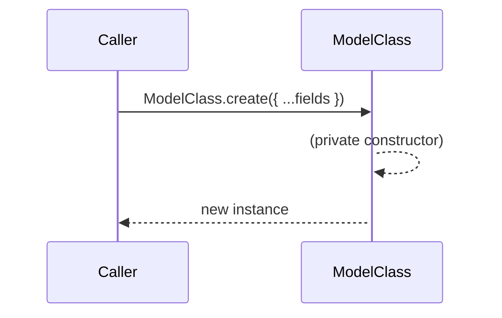

# Rename `fromCodec` static function to `create`

## Pull Request by @DrEverr

Resolves: #263 
- Object creation methods use `create` instead of `fromCodec`.
- Updated `ValidatorData`, `AvailabilityAssurance`, `WorkReport`, `Culprit`, `Fault`, `Judgement`, `Verdict`, and other classes to replace direct instantiation with static `create` methods.
- Modified tests and utility functions to align with the new object creation approach.
- Enhanced readability and maintainability by standardizing the instantiation process across the codebase.


## Comment by @coderabbitai[bot]

<!-- This is an auto-generated comment: summarize by coderabbit.ai -->
<!-- This is an auto-generated comment: skip review by coderabbit.ai -->

> [!IMPORTANT]
> ## Review skipped
> 
> Auto incremental reviews are disabled on this repository.
> 
> Please check the settings in the CodeRabbit UI or the `.coderabbit.yaml` file in this repository. To trigger a single review, invoke the `@coderabbitai review` command.
> 
> You can disable this status message by setting the `reviews.review_status` to `false` in the CodeRabbit configuration file.

<!-- end of auto-generated comment: skip review by coderabbit.ai -->
<!-- walkthrough_start -->

<details>
<summary>📝 Walkthrough</summary>

## Summary by CodeRabbit

- **Refactor**
  - Standardized object creation across the codebase by replacing direct constructor calls and `fromCodec` methods with static `create` factory methods.
  - Updated parameter naming conventions to use explicit, named object properties for clarity and consistency.
  - Made many constructors private, enforcing controlled instantiation through factory methods.
  - Improved code readability and maintainability by unifying instantiation patterns.
- **Tests**
  - Updated all test cases to use the new `create` factory methods for constructing test objects.
## Walkthrough

This change renames all static factory methods named `fromCodec` to `create` across the codebase and makes the corresponding class constructors private, enforcing instantiation via the new `create` methods. All usages of direct constructors or `fromCodec` are updated to use `create`, with argument structures adapted to object-literal style where needed. No logic, control flow, or error handling is altered.

## Changes

| File(s) / Group                                                                                  | Change Summary                                                                                                         |
|--------------------------------------------------------------------------------------------------|-----------------------------------------------------------------------------------------------------------------------|
| `benchmarks/codec/view_vs_collection.ts`, `benchmarks/codec/view_vs_object.ts`                   | Renamed `fromCodec` to `create` in test classes; constructors made private; instantiations updated to use `create`.   |
| `bin/jam/main.ts`, `bin/test-runner/jamduna/stateLoader.ts`, `bin/test-runner/w3f/codec/work-item.ts`, `bin/test-runner/w3f/codec/work-package.ts`, `bin/test-runner/w3f/preimages.ts`, `bin/test-runner/w3f/safrole.ts` | Updated object instantiation from constructors or `fromCodec` to `create` factory methods with object arguments.      |
| `extensions/ipc/handler.ts`, `extensions/ipc/index.ts`                                           | Replaced direct instantiation with `create` factory methods for protocol/message classes; improved type safety.       |
| `extensions/ipc/protocol/*.ts`                                                                   | Renamed `fromCodec` to `create` in all protocol classes; constructors made private; all instantiations updated.      |
| `packages/core/codec/descriptors.test.ts`, `packages/core/codec/descriptors.ts`, `packages/core/codec/view.ts` | Renamed `fromCodec` to `create` in test and type definitions; updated usages in codec/view logic accordingly.         |
| `packages/jam/block-json/*.ts`                                                                   | All domain entity deserialization now uses `create` factory methods with object-literal arguments; naming aligned.    |
| `packages/jam/block/*.ts`, `packages/jam/block/codec.test.ts`                                    | Renamed `fromCodec` to `create` in all block-related classes; constructors made private; tests updated accordingly.   |
| `packages/jam/state/*.ts`, `packages/jam/state-json/*.ts`, `packages/jam/state-merkleization/*.ts` | Renamed `fromCodec` to `create` in all state-related classes; constructors made private; deserialization updated.     |
| `packages/jam/safrole/*.ts`, `packages/jam/transition/*.ts`                                     | All object creation now uses `create` factory methods; constructors made private where applicable; tests updated.     |
| `tools/ipc2rpc/index.ts`, `workers/block-generator/generator.ts`                                 | Protocol and block generation logic updated to use `create` factory methods and object-literal instantiation.         |

## Sequence Diagram(s)



## Poem

> ```
> A hop, a skip, a code refactor spree,
> From `fromCodec` to `create`, as clear as can be!
> Constructors now private, no more direct new,
> Object-literal magic—less error, more true.
> The warren’s code is tidy, the fields now named right,
> This rabbit’s quite happy—what a beautiful sight! 🐇✨
> ```

</details>

<!-- walkthrough_end -->
<!-- internal state start -->


<!-- DwQgtGAEAqAWCWBnSTIEMB26CuAXA9mAOYCmGJATmriQCaQDG+Ats2bgFyQAOFk+AIwBWJBrngA3EsgEBPRvlqU0AgfFwA6NPEgQAfACgjoCEYDEZyAAUASpETZWaCrKNxU3bABsvkCiQBHbGlcABpIcVwvOkgAIhsyNDZIAAMAMwoWAGFFURT7XGp4Bkg07AwxeHwsAlSGf2oSFNDYyAB3NGQHAWZ1Gno5CNgSSGxESkgAEQoAUSkKPk7rOwxHAQmAZgAOAFZ+GuHIADEvbDS02QAZFUQAelxZbhJ1hfl/bnxEdXwXDRhD5jaLAMWCYUgoDASfBeKTIfwYJLwDBEIYjRCFcQlMoVcTVUbjehpH78YSiXCMBq4rAZFipGnMHJKBj5WopeokRopP7uZDYbi0RroWi0fyIcbIJAOEZmABMADYNho3IcQWDpBCGKclKN+UVkfYSPM0L5NZ1xfZsCD0MgUgA1Y3wAUECiTahoZqpACCEm0XhU8C86lknrF2CoFSa4RSAHUfgBrBIfCi4D0pLLeXjqVNHNDeFNRgBS2FopDYGHz6Aw9DtlFoxRTEXwfhI3D9DBGdf8Ygh6Mw4iKeLa6lgqMg5DaBSKJTZlKakDYuFgikQf09wvUVQRPlk4Ro6OQmHoeADQdK5Uq1WQbUoI2YingaXgMVqDqIWCHi6GqF7VecdYAXjEggiN27IDlgaDcLw+BoCCSoGHAIz4EaPiQEQMG+PgaSjrYKDILUZCghGCjag0ApqIGDyVvQgJIoUSL+pR8iDD+AoUABSIokuE7AWSB7+D2hTlvAjT0IumTYEQS54KOTBKAInQkPB+jGOAUBkPQWE4AQxBkMo/QKKw7BcLwJIgeIsKQIMcnKKo6haDoKkmFAPJ4ZW2mEKQ5BUAZTBGeWXBUBODhOC4VnyDZVB2Zo2i6GAhiqaYBjrBUsCAhQcZ3DZDC3BIT5tAA+hIiAFUwPhkpuGi4IgHAGLE9UGBYkCegAkrp3miRaoXyFpqrItIypohixSlLBzryAuS70Eio4pNAIQABIckoFD5KaYrtEs8JJDE9J0pkDK5MyjZ1LOXL/CMTAYOiFCWs6/DYXNi3LZQ+QdMgfWkISB08NgAiBiUtSZj6NDhGQRIUAwnGCX2IlUvsXjyOJ+CSSOi5DVOp0cjQ+STYofw5NdgTBOWiO7iquRDNQPD4J4fp7rNZXRBeGD5M4VDyO9OpOs+TZjCMT3oktaArRoYE44Jy0PZAnZkojjDGoG+rowo124LdYjEh+I4pOO50AHJNvg6N8F4+BECNxJXer0KlGbE6feq14CYCSjweYliel4NA+Zu+FNirTJ+r7l7SyQAAeSYGcSnj/SN7AbgNBhQAAysNJR4/Q21sLQXDpAdjKiAAFAA3lZZsMHG+trJQ4TcM47DCytC2dCOAC+XCFwwCRMOxwDzULL0UHoACU+SAEmEWONKX5f4JX1fMC8dcN+WTeUC3iDt53R09z8tD989IuUKP+QzetNoD7ga+rRCqQpSC6WZbc2W5flRUlUzFXVFViApMnkCExundYkeUvgUVPI7XOqRY4A1VkAzWFAi7/TnlXGuFAuAAFU5QABZl7wivkPDesAuAACFZB7mABsGUJ9ICTxSMDQUV14HOiQRXVBi9KCYJwXgxuhDW6kPIdISh1Cx633PqkS+19T5YBSPfNKzgn4vzyiQQqxVSrQmZlSH+f96qxCMBAMARg5GPyykdV+Kj34FV4mIH+tVdGNU9m1Ly+kYghXSj1bCjtECDUYERUgcJEjJBVr2TEo0EETRIIuRQpQfr52yEdFkTYZzYznDNAQxsdaSKHmzKsEiQgkLYWtP0YppDcgpmrDWzpkBaXRuMRgxTzQN18Wqb6tIYEjSBhQSQjQwYYAhlDfUSIfz9nhtUeWyNUajnHFPCWISRqZwJj8UUHwqycTJugVCQyhIjL9tLWpl0GnqhmirGy6ABJ8h5mJPmdSVbJM5POSJU1JYi2lrLUCl51bAL4AwRWV5hypD1n8Q2/ATaQDNhbEoVtqg218Gke2bljQ+zoO7BxzVvb6V2bUQOohg7gWqdhCOUcgJ8HaSUBO4gk6p3Tg8qJWdAl0DzvSLuRd8DbyZLvPuWSj7D1EXQ8WJAWVstEBy/eXKVo0LPg0vJg9uV/ygIAz5CDICgPgOAqikC85MMVSw1lACd6iD3gfGV4rRFF1JSPWh0Cukg0uh8ypPxBV6vZQazlh8TXSPqWaaVBDZX/zTpjTOzYEQ50ZQXI6jqu4iqNbgApKCaF8tnBG/VvdRX5LYRK4EUrBYxsKf/BV9q+AqrVRFPxDK6h2q+Um51Kbo2xsrjQs1f0AYWroQwmgcDtUOt1ZGl1qb0R1rjBmz1G1s0Dp0Q1ZOSU1AYFuEIJItxaIYFsXVBqTVWrtRcfQNxzgPHNP6t4hCFNtQQwpNjaGKtnFfBkGwmWYZoZOhUIpCEG4HT/nAptD6pbWnMHxOew4usVGQAHUXDQoHRFaoLdRVIMxw7qyGcUDQTLw2gY0KI2oYw/0Y1CWkMaPwIm0ptAOsWiaUOiMPNB2DXTroIf5SBsD51EIFEqWGEY5HrbsD2YcS9qBkGV2bIu0ciAdrhAEDJFWWzYbvsgtBWCI5UAXM6uhm5ww6k4fCTSqaEo1ZSy0m88kEGvkKx8CuSAwKvHtBvPOI+J0Va8bjAAcmQI+EgXhaDVL4MEv64wggcaZPefU5GH0KTqUMyg8NwUIaMB7NFPs8U2cOEHZwcWtKEp+NHElTb47CQpQew25AlT2MnYY5KSJ7ghDALdDA3lZ1JFoOUNAtwQkkEuDBUW1U7GrscRunyrjHDuOll4nx5m7x1guKOIitAlYol6mFoEk521xiRG52+tzFtVgALLSc4vkax5JBjvDbPe+AXZ9MVpZtLJrKAaDMD+Z+H5xmTpzOnPy3Gjzlz7FHMsiqUhh3ij+CnJ4UNHz3fWSelIsEmDlFwAVdEPw0CkA9CreuVAFyUE/WqGJtIUhF0QOEH0pwSDhCUIgeo8BuBUjQ0knHImzYCCJ9IUn5PNxj3CORpHzgCSQDjCQeQqADuwRiIMNAqRQSb3yBHdWY1do/WxSTrpTPv4XTHIBlI/qaAtWu6fD6s56B5WF6rjEJANckGYMRlJM9RewBp4ISAbdRFbJ049aZaujfXaLtzncyrjTBDHv9+AvRg6g+JODhgkPywFV4CQf38PIyjnx8EHgSXUd8D5/Sq5d9acejZ4cULyZNz4nVCkKw/ho+kGN6b2jZdLfW4ELb+32mXlaQAxOYvUfARl7d9Xr3BPffHGD+MCgeV2wFQhyjcsiPDjx5GMjnaPs3LZ15hnwQWfcnYpstNPpTZUBmngG+aXtI/N1n1LIzPzzNKPSn+dNcdYqSK098c/9j4qwAHkKDX5TpQIfc5sQs3JiMJEL6gYb6oy2EtySIRI+Q0ETwyYu6wu0yqun+xQqSasmA7Ye6/imOP6GGx+H+g+SBnooeY+uALUm+iGYaTIiSqQuBX+BBYexBpBL24Q2sgmO0z6/YsKT4rm3ewQJmiEdS5mrEf48AgEZkZIp676gw2BKIdyEsam40Gm725GIsQgYw5IM+yeY4iIAWuSyOXwysTYr474/yi42+UEmQsmKKa66KIc108WHYOKSWVI+KkAqWyYxKv0ccZK2WT4B6UAZmpa/sgmu+CIuALGzhrh6WHhsC5KPhFmLsR8q4qEI2D4xQcWTSdElAW4J0P+8M/urYJu7AaRuSu2HalS+e9cuAPs10BWE6BiRipWe4uAFW5Q1WbQGwaQz8ZibQ8YYA6gJuy69ia6TiekPWW6fWO6A2ARQ2lM5m/OaBempRhmIOTmweLUzAUcAOeQUYsYGU5eMGcG1GDAmxzIrOuSMY8Y5e0iP47Yt2I4yxdhx2zYiAgOFkWGI0Mh3+uGYUmcJm1+G41Qd+f+PAmQ0BVEwa6o9cJS6e+yYS8hPxZyrGtAKh6I++P6iACI3OpUT6RcSkRAGgUYNkBUluqY/gT+JABURAnQBUgYvQKYFqtQPybAXgWQ2JuJ+J5aSgRCJJJAZJAA4p0JcP7lmPSU2ICLgFaCrISmSDEOoZEhMOCc4bci9goW5mUrapCGjvnlpKsGwF0iUJScgDSeoNweqKyCQrviQQ2Gxp0OIPoVQYge2Pyb/PxkCLyKlC0lZDJKgBgPgBOJCZzksOCfQLKT7LwYcMhMoKhMTpQCJEAe+hFliD9AWCnM/vrHYXUrQCwHNrthKMgJHgPlILQEwcYQCHNqNmkDeMROsJhgXtLHIXhiqQeDoSCWFm8IEtDCeiUeLJVFFqil7LFk4XYTLA4TYeEZHGlu4aSi4d4ZSqZk2OZligliOclnwF8G+NQGEWHOOW4ZpBlp4dOZELEc7LeAkUrskcDmkecGIWMkjDnigcJPGebCNNrA/reIoN4EpCunokVvUTOo0c0VVpQLcG0R0S/N0RlGAPXJXDHgMZ1s1MMR1AZNumFL1FMYeuqcwlqdhPrjsXGFYLBHGDHlcUJGgXtMmamZAKLlZCQGQOgaib+srP+tMrhfhdBaQHRqhmtGdvdCDidFIegPNiNPWd8W9tWCxQRTBbRqRm9P8sLnoUQNEKId2M4EQI4OwGqVzjznmWaIviYU5l8fhk8qCD9usLRQvunoyS5iyeMHnLmIuOokoESZ8A2OsH5IXnZbAIXAtM5amB5T8MIZQGLLkESa3PkK5SwO5XgJ5bkFyacdWH5V0oBBQBoOoc6eFWwDaCGYleBAxv+n0TdmzAsGgLzsgD6ROISgDOoPLP6TEEsJgEpWoS2TAZoTnKkPlc6cwfrkcPAOHHQCnAFZ6EVbIG9FQFBJxOEA7o3thQeDTF8Lfr4CpWpeWBpRGVQKhMwixpxiMORWmbodDP4IuvhIcEJmwCJmJnecMnDPnuRlAa2S1dDFdFIMJKHMZSMKZVgApgZLUGKRKYcNMsJYZdEmuSESxpYZ7NYXFoufYaaKOVuUSruVEVloebOf4WqIEREZOZll4ZEPIIlqOQANwIy3kjBjAx7SznEZSsWEUI6LFKpcxzGC7yDC68WsjiVsVKTKkA0qntDDivmpDgV4USWkBHAHQFiIDVD5A7WJ4UAD41Hfl1ElZ/nlaVatHtG3CR6l6lLtZfl9kIWbpdT9aoVo3TEVJ3RYWpCt6a2XEwwRi3F80pCNG0FEGICbbcAzDlguDQD4BO1Q75A5H55cyQKYEMUoi3J6yaWyDgX0CdWzX/FZEGZKpKbQxyXUofGva0o82fhwE7T0CLVljkhdnQpAjQwpDElQYn7L5+4B7ODrInKUjm23LUH4GEFQ4kEQE21oFcznlPjfoh2zRIYUHc1Q0zJziZxMEICKUqx53sDaVQkulIjPjHU7Rqn8EBEbJz7ib3k7J4jSbmFWgnowk5memNXSCf4jAqyrWKxgpPklCBZuh2y+lg0xYYqhzD143JYErbmRFTkxFJx5afmFYK3TplbogAWq0dFCY0jRCwV6JDHdadTIW7qDboV0XNitgC5HWXRX2sgzAfAgibYZSBUD15CZ06y4NzywAEPc7JXKltDDDAjcU1kpAtgUNUM7akjdjwbai3LP54CeCaAEApxoBQMkC8O4D8P5BPYqkaUhlo6J5z0HVzbBI7R5zsAgnDVRiYjc7VTu02zcAaPl346OjUA/DOlFyPVhYxB66pDqzBiIBWCUD2iBhOg/ApAjxlKoDd2mkXXbJXV4iBo1L/rkP4MKKvTB3M1HRgDBa7QGUnTC4LHdn+OiV1zGwJx37r0xn6jcSzTBOUOhM3wSbESoAJ2RFGOXIQhVF35ApGygoJlgwLDEgTZTbhBQoe22xwq+kIpXliDIq9lWEDmYoBxLkw0f0uFf2Y37m/2+Fzl0WBHBLBEbmihw0TkI0/0zlXiWauwAO1FJQS5kBfCXi3Bk45RNOBXa2DFdbOKjEG0TFG37pDZr0M0yzHZiGFPb1YBN5pwNDMDu1SBmxPA5LVj6wqJfMcjMDsPmS3FGZeBzPDCPFfaVA/ZSNp2wkNk/H/aA4pEg734HACygtJAf5VhhPnxAkpC0xkCpjjBVgr7ViaifCj2iWlWdP8xUHqxgu/Mubktm73KdUfMcOnbljF3H43RgstS0CpgPAAtxWpAPqQFNU5Zn7k3O5stJAcv/MCrSVV0Bg104uzTrbSBCakAtxVjRA3wkuzTazAttD4vgvc33EpBWs2vcsSy8sNWqz0QYAl0itJBkISyTXn593N6mYgsqvMDu5La958FvmjapGDmIoTAX38viHwy70wT70/QlNWy/LZGxOBpIhQg/KDmiYn0Fnn3hkoS+AJlQbWyZCwrwrawoz6Z+LQyUCZB8BNPQzEgZWGsdhIAVEgjQzrDGVVDJV9Pg0DOv1DPQ24qDkpbjOrNY0HmJy5bVDbPy27Owb7N+xHPcA5RLYRwwO63wNIXjEoWeJoWMazEthti9sna008XZtg5EKehVgpxmxWlnEvs+nngFHj6kOojwvSAvGSBvHPZnSosiUEbLxiidv8tQtBnAnkt55HIN4BsfBzWbjGhnKqX50mb9XV0UC13/rGtuagjc7EWoGXT114jFNfrhPPN3uZvfLYMGEj1+25uiX/v1UlHT3LVK44Y+AKR8ayJpooLSKAHCHvplUF6EaCIrhJX4BFwLSegpwLQFQpwtQABaMw7jnQz+9cPmwA18RCegRcoiB9hwlu5dtjIY0A/uJAb7xsRcAADOZ8SMEu++EHMTWZHnlCjPhI8KxiUnnpeKuOuPNUR//usWluTTZ4gHZ2wI5w2HtCkAAAKSvPCtuyC3B2Za5ChKBFlQbibRfJjk3GehXl3Xy2j5R5dB1YqBdgA3koAlfVQr3RtYtxaCHsQBVuuJMQS5J5GZA/YZf2DCORLMTyD8Vc3wnkYVXFDGkWMy1+xP39kv22Fv3Lmzuf3w38B7nRHrP6IzMLlNgY0LuTPZa42bd+yE1X3d2Fu7LpHliZFYfD0pC9jJj7FbsS1ng4j555HRD53gRy36Ibs0DUaHPHPq2ZAEBlTPwkBgAACMMoWwUTbCFWxMIQh7cDVzCDp7SDF7KoWaA6CQPm6I+QVF718494zmAwbZwaNZUj03nHKXxDx0rIL2GlTH5NxPGPZPH6dFvdU5nS3SoM05/S0MbzfjHzGA4ysAEkUkgm1KTPtKfwJBs0WQgYjch4prRSZoQJsjfA4JK2/6pAOaKCH+PmEY6dTygddHKXZdrIww3KXJpQVswcp4bGl4SAYPDAsgYXN+mH24QJfX0s+uPPpPDYhTaBXDAspvA6FvJM7Yb0Swn1i+LLKs8B4fPBmgypebqHryLzYg8sIONZTHbXszjAajr6SESbIf5Gg3EZ91+oTC3vZAvvpDjbGTVGodhw5QK0iM0MVbrTMKD9bQK3ENg5G3IzW3YzO3Mci7Uzh3au8ynH5lecWfmPrPE8qQG/6IzryBqQez4P10O7OU0EMP0IcPiPyPqPKC6PEf2iea3FxITeu/DYQdKXU5THlB9C1qjCz/BTGREfwOYn9Ie5/OeJf3bDX8Uedme/tn0f5QB8KKOOUob1YJB0ZoaYTXqvG16BU4+bCBPm3wZa0o84luLgOVzFyWpS6fCTeGQOoGwAPUzDTdsfzuBgDoeEArwFfyR4wC0e/gB/tVHHTrtiswA7dqwONjsDOBMoAAJxgAmscAzHuczgrroceJ7bqJMWNooNyyQaHaJg0EpYgOOBGYOnEkOiD12e4HPmufELwABpHnE42CD4VjsqYF3AkGeKXhY85GA3I0BJ7Z9zoOQBYEB2qBH4FKnuE5AAOcIeCaAzglZOMEBastPBvPK0gJA/4/QheTYNtITjF4/ABkKISXu+gmQK8M+KuXPoyw0opASOOvX7I5nxBk1Amp9X7Ecl5C6gvq1yMtiMHgJFCDB/rAvoxwAHQtfi4XQPusgN4tUUOs0U3i7jITWDhq3NJpEkKxxl13BHuH/k72bgVd3B73XAJML9pu9nAQYaViENNrnYahsQiIfEIhavMDgnjTjvJkaFp9lMAsdoTb1kpYA5uUMAukm147kgfIwwDzERAEroc46WHLniDnL7mZ2wHtavr12o4HB5eI4RnvoM0xQZRQcGbsAsRyHwxBggINbCiCY55k/+NAcfhO3W5Tthy0/XZHOzn57ckay7JftSkDRr99o8SQegmhSQepxEKQSYbYJID2DABh/JgSAJYG7soeYg2HlAKR7SDZBvA+AfwL9S0jV+aeUNIyJIbMj7kkqL1OEJICRDXBDA4QRD0FHgCRR8PMUTIMNxyC9+0o+VD0KLQnh1UX6POF/wAHb9f+IvDCp2h5FsinB/gomNqL5EiC9RbAg0df3FEmjJR8g3+DKIDRyigyCo4wUqLY5iIs0HoiPt6LB78jT+Qoi/hwNFFSDjRjQU0QIzDEWiDh90K0UxAF52jF23/SgWkPvauN4xaoxMd4NviMCUxvos/v6MgGGjsxEo+IQgMgD6sM6QwhUmWJFwVc6Eyw9eKFSjCLDKB6wzYbfEDQpAxhhuCYTzh2yeIs0ZQsJhgJ1GgC/RwojsYGJzE0A8xj/QBqDy+67i2x+4zMYaI2AI8wAooqhDIOEa1t4eWjSJGADrA3RVUx4b+I0Sx6XMRiuPVQXc38Q+I8iMXT5sEToB2dK4kSGIXNGKDaNPQlRE3OTj9qxJ0ugXF4C4By5sJ7gSEyJB1SWBeN08EE0rqrmgm0BYJ2jBCXFxomRIUJ12dCWfk56MM8QRwrVH2AkQzAU40AAqNABahZBLBMwaAMn3Rz9Re6/FMOoBn6p75qJhE3AGZy4pFitYslBWCiVzqoT1i5IcjMDUWbn1rkDPVOnJPIAKS4JOfRNKIgWSQASCXwbhggGQBj1Zo1AZiZHyZYTg2go1J4NHX+QO0XAtnRSUxLQlKTXOxFR3AJQSY2k9h/6fSaEX8C1cdc4USAAp2TrhR207MYqtW2qDzBbS2Q8kC+A+YGcE8KQEhIeDRwhEQQxefAFhBZCBdlUIkVIFoEQD6c0AhnMqUSxlqVTYA1UrCKZ0jaOTUGqfHQR0GJoRAQgEQRSW5DRF0AvO17WCEdm6FFjrquSH5OiGhjMFleTyWbpHEqoFSGukDdUvMH5EEi1usLado4TJHbcVmu3RGtjWpEGB/6wPH8gYB3ECirxGYzgXeIfG3iZQz4kRmAHfFNEvxcGYtpVAUGwNAJiFXrCBPPbqDGMcI9THn1mgMTcAkwb3l0jBnVAvBIQXXhtHppp5DBW/E6GnTYmqS+ATeVGejO/FYyMAOMvnrbw9J7QUhwJZ0b0nF6DIt6UvImkMBhGK9MYW0/GHqj8EuDVkyISLqkA15PhsBJrYlg0kqFvcNIqM63tEi5ip8yJXMwUIhIsnUzQZv4umacIarIBrGBQicCizz4okpqDHOWBFEVil8ABp02GlPxnZXTZ+N0+fud2RrTN+xTyekW9yV7kFi4ZcFhiCBIJKBw4u4KaR3CdTCpe0/cRSbrMxn6z6ZuAeNKkCkaV4XCeDWAGHIjiRyLJtuIVN3DjlUyMZP4qkCnKHRsjS5NM5OYbO3E+jdRH08QY+PvGPi/pkDV8YDMUmfiy5tM3sfmkMwliIEto8tOTJxLZzc54cLgLk3znaMuApkmCYpPAx0dWQ1YpjhPIoZTyZ52cueZEgXlUTUZ9eX7BIgTl9y65SYpsW9LTH6iDxCPb6e3P+ldygZvc2uVomlFnihBjcy8emJbm3iNgYAAWpBSFrw9ugvQGDn+Jqg61seQElQYbThn3MUGUjBccTPtq+CSAbNamnOHEQEyEOpglkWTOYQv9Ho6CzBURX56zCf0LMtIezMyES9NZoyGXreT5nBIle8IoWb4OWQBC1kurW5FLK16yyzWDSIEqiIYXm00wPwDBfGCprkLrGQbUhdIpAUcVREBM9Bu2Fp4CUWaxI6ZIjLhKccJF/gMhaQH37KKDYNTb4dfQhS3Sa27TeFOZmPJWY3YY7Z+k7OJHv0Z+p3W6Wsy9k0iIxGdP2QospogKyCiohgDPF7hG4iWEc9oIovZqFyY5xcmtIEsFrs005BiqRUEvZomKy4ESqeUwViVYL4lPaJJZIqMUkAT4T/cmQ1LATWiS0LScsfuQ3m5Kol28fwHkpiWZKsFXAMpbyitTOiaxiCZpeHNaWRLw5+SzpTHm6UFKY8x8tkckpkUI4daL06+aIM+mPjsEgCnolBSwUyDQQ3fKqKGI6yQz4Kx7GGfAtmbgSWu82X9uSDBxlK26+AcSbP3Knp5jQ4tWfntPljkSCphwDLjaBgxRxEANgGqVfFWFnEylXJQhdqgbr/p1sz+YSepxmC8l1sMwfWNABTgFQbAz+Z/PxPWyegrAVgFqPrF5IpxCqHMChXbx+jSSmKgGe5ZvmUkDL/2uAbovwGKlvVBEZyDmIEWpWgdUgdKokCYusmcdXWJRZ4qIAfCyAS6AtBZSQBd5rCSARAfOtAH8AaiQVcrJDjlj+AzBZMiHUEiVWtDA1aqKUygPgEZoZShqGkgqcSN7hcKxZ02NlREHqlFwKaKSrBXKrOIAq0sQKkFVyXcb/BaOGOGGikW8bn1AuipQ4M5lcxNkjwjSCDoDQ3yWyA2oiy6kD2iyrdXFo4dxa7M8Uez9uPi/+KjX3QnQc1lI+6VRCzWhwHFWzY3qgHLLPSFaKyvcWstvEbKgF2ymPLsp2HIgAJJy5QWctuYIKwJKDK9kb1YUCz2Fy2IwV3B/7Kk0kGSPldMtIApw9lnEFOQhLKXLqu1RATUV6LqEmZOFnowIRLJxFbV+ChyfiJdEpVtJF2wvG1LQshj0KU1jC2Xiwr+qFDwO6LNFL4CikPZh6J6+2tQQnGCKEJ/CmWZNjlk6UL1aDG9r5LuzZsoadSNoR+uKFK5L6qEKtnfUKCj956H1d0pJMJpNdN6T68oq5MyJuRSJfFOpOvNCFQZdFaLRlsMNpZnRHZkNNxVd1Djkj3Zpapdjll8WhI6R8ohkTGOOjKi/WmaNURupXXIg11V87+e9N/kBj75rarZSAs7X7LzReqKpcPJtH1LoEFYh0VWLxEuiC0rIrNJJq3UyaG5LYpuQprvkbBlNEFdtaQDU2cRexy/DOJGJzrRjp1lA2deJpHTmbu+O66IbJus0/zb5N4xHvZs2WObVNm8LdQPMtFIBVUtS4cfQn03kzHR1GzLXWIC2LqHOUm7dZ6JC1WaLx8miLV9Ic1xhgF7NFzd2o/k7Mv5YW8re2Mi33ydgMW6re8DSyvy9Z78w5dAqhn61EGagxBYxkaIkQRgBM4SovieYJMeh9xdwcTMFnLZmCKLFbSsT4DMA8wZORSlMwmoVAtQJdDdYDlTAJAyShMGgLBlTC4VnBeYG7fGHO0L0WsIsB7RlETBpZUwWQfwEoAfJeAaWqQXktgCSxPc6At2lhsmFyqoB820IQsvYA/ADt9QzMz4ACJNA9CPhgRXbGAEoiRkCgsgRSgbyhYvDjSI3TAD6WGihxOyDqv5RaCtBLAXVMq2KqkFak+YmdKQT1cmG9XGw2d5A+gVGCcE+rJxO/GihcCZ3uCZgtAGUDsB2AI9JBpkgyblSi6Aq4iJNG4RrM1DFgWhiGwDH8o0obUBI5GKfOGrfJ8YH0OGmIOeC/RnUfl/+MRXiHRD46ptJE3IBQE9aARc6uSatXeAEjE7yQzBEbodIeDVMK+Va6zMPQm11MDVYWP2C02+TQpa2o/FjZPzY2kiON10ncl4oX4HdHpq7eteeOYE3zWtX0jrUAu63JhetSc9+VAoua9rYF/as9hcqQWyiM6U6hJMbwFhA6QdNAMHY9oh3v8pUuCnOiTNobDhO+n0CXtVB+4swHQDwQmsaXWmoQSmM1eAp3vDDd7aA4OqOBR2Ih7QImTIZsCmn96o7j1PQpvKvr7A0UN9verfRSqZnJCb1qQozXNO/GVB9Qya3xu+kbb2SWhv2KFZBkJ1Fc4WHmMNThtGB4avo8EfpmdKHIVrbCnGjPbmqpG8b/4Ps6JH7MZ6BywlZcMvWEHsCed7ACzeKeqGjnFLDU5+0HVfve1960lGcxNNgb73hBEA+BuKZuRIPJoyDwOtfZfs31pYq5Wacg+vp4OQ7QtZWwvdeOL2db0eUcCveXPBkFjNNRCwtMluLRpb7R486SoZv6UbyNDqokdAIe4PX7PtIhgvasr/lRaS9PRHAzIf7kNbBBRgRtc3Nh7etTcEMo9n2rGKwzG9CMthUjM45G851n4A3N8zVbksEJjrUNnjPNCMzJJRMzAzOuY3NR+hAJIPrJBo1aR0kd2c9SroF7B1qFT+p4siLynWzOGdu6kD9C/2Ogf94iWbpvgfWMUSadSI4XRsg4IjOytfKEcHvsWbMw9xIgA8SAyKu6sOQ/UAiplvAMbWmihlcM4vTWsbM17GuA+nu/pZ781UAVA1ukIObV1ZecDA6EpnjOGxWu4QLkTnvpsHq0hqG1iEaeB8H6xobS43ODoS0HzcZcfY4Vwy7HGsNpx2OTWguMal1W1xkdD8b+ahHKlih6pSltLEaox5ihnHKGzFYLzYTrxwLvCeCO/HyW0AI4zLDdACI9wsaAQLMoTG3HUTALTQzagGUwnvmcJyADawOOOqngyJ9lkSZIDomng7xtANiekC4n8TNxlE0CYBYoHOOLB85Gru2MBzdjzx0Nr6xGCfHElhqcI983+M2g5TYLR0Y8enjinvmkpopewb7hKmkgCp1ILqfBYgnXRYJlQ5CbZAADyTYLSU/SaSCWCI2pmtUYaay1GayTzhm01SdDb2mqwXJkdM6aWUNq5NYhz6XyDADOdb+lcMAGTrHzth86PapQXXo8PnLkG3h8db4YzoIdW9g9cwVkdKGtwX2tAJLqmBI7xbyO0rFIF+xjM3Knl5lYfQkb+IRdgh5SSY6eoOSQbsjlCu6SdBoUFG9SRR9/ZJnhh7QKjDktsxtBqMcye+DRpCCMdaHvqWRug7mm0fMjJtKoMzDJBMCH5x62mdbTpl0fiJOKosUBjNWvhdlp63ZCB7jYv35MZ1BTquy5CKYFmYGLcrcRg++y1NnG+4z7V9u+xoPUpM5XeJg8bA/NfHDU35ws7+d9M2hwLRZ4w6mNMOw9Qz4Z2AdGZ/ZxmNNg8pVNprqWSSGlsCDeaQMgC863zxsLgAlwc7vtelTo0kwRf4REW6BJFzgDAHs5JcoLqQGC++2TGiGELl/JCxGeq2oWIw6F+Q2sYIPrkiD3MUSI+ewzPmy4T+Y0OEGiDCNkA0pqNCWbI7lKqLqpmgDPHkteBFLHINICpaLlqXDwpZzS46ZHTqW0A5HOC62Ns0cC+LKFqrFWeEtyoFDJp7C6oYy3Qm9LZA/Mz+eNgGXlL/lzeAWaS4ABtAALpUXstvlhiF4FCuwBwr+BpS0ZaSspXjY0Vti3marDmWuLJhpteIKcto9BLsZ9ShptEt3nJL/QaS0JVkuUUh44QPSyBZlN9xKzaF9gH+cxgAWmrpQBK61ajQdWhLXVnK8NfKt/tSthVxw7xe4Bhn+LUZly51eWoYWktNSiE6PPS2NLLT449BPRe5TNWErGVwK7gFiuumCLQ8WgQdf6tbhjrEF42GNaWsjXJrQAoMzxcctzXkLpVp6xNfzECCQexWJzdIE6L+BOiTIW4MTkZxVIDlZo6vYoL1rXMRtoEpOIxk0EL4Dw61Hw3ooMGZniZ+C+5LBEyAbRtt3sXbefQmkWDkAzqsVK9CjDrZZAbOy+PsSoxfATi3qMdOWcJjsgcYfqg9aLKPWe4r69xBDWMY6G4txp+4BEjVduH3CzB+fJvFvyP2Nng+aRx6EzcozwZjo7gy+GOiludmtrAMH/mkI9Dgw6FnM4jXiDyFow31Zsh4ULMLUYEmk1a4eoGjvPuZRwVbGPqiDqQ/FCa6MeQAvt8AzTPsQHb7GOfNB7RsoB+veGGXVIj8OmE4Wbg03bba99qJuObJbpaSQHx20B52ZdPPMlquz15qlH4t9mCaszsYlFroYvhuotxMiIG6YlBsvxIb8uaG/+I03ubuafs4maJoP5sj6bLvDAQ3ZBskAwbogCGwzlbumMYbf18Mfxs80hohNPm3u5ZZrvohmbmthgcPYiVj2coLdsnG3dDHuXMLxY5Q6lvNNqHoTa2KBN+ORBnWtDlp6+1wFvtEAcr6tg4qza3sgLG7o95u5PYPvT3278hzuwJqjFL229K93LWvbN6Vwv77NH+7vYnty4AHMtGe4lq01n2Nrumg2yNG0P0YST//dQ/g+rvs3CkTY7e5IsQf73ycgDo+3PZX7+Ly7PduMSQ4kUVB/AYm6BN/ZHtUP/7ND1B0A/+svSKHTdsxNQ7btw3jlCZ6GUmYHVeGVQjzelKOFurNUK7bPJJH5vV4NIT7PwfuHoDqlPAoMqfDZL4H8D0wLdPbA8IQW67iy/eVJzFheRSO3Jdsftc8PDCGH18nugxk0FfUQAI6RwLPOI3WYIVUmhSgeXhf+g15mh8g4jn4JUMPyi2powfFjjbRGRVGpU5mFLlE7FAhLhNP/bJyuA54XQfb1PWNg926Y26m+02Wc3Gu5r8wLKs4DuuqD2gJO6UKaGQDJEzJjhgL8bH4STU6kD99QW591gnoTtJ7Bmcx1PQsYvNLHPZD0lyPVOqtbHJZ2jgAXo7gdYKEHf95B/w5XD8CcjKjqiGo64BVpQLnKUeJAAAC8egGAPEZSQnPu02p0VBc+ue3O89gN7hzvaUT5R4zCN4CcmYJ6JPokKQMUjGWr4Mr7az+fltVxUTrOT5XdUp4vkdijhRpV2e9k2Safk0xJwdVp4ysJ1/BW8fnMYOsgW6KwjVyC/RcTMtv/pQXXSavrQB0c3x/dwzXIMGSTwoCwyxTK+qopg1cdoWcTbmpmeVLUu0QaAgAdB3kosFkg+L9c7UxvrWL49tizplzF6cxAH8lwjOsSBczjA6GN4cZ5O0mdnnpnhd7xfM77GcdeK6A6jNqBBeNA6XQBAVEKs1ePQoX5kGF20DhfiIh7nzyh985UTaIuAkAAwJAGOCxI9KGgWl7GQCoMuHZrPcxgAKQFJADwyAUg+c9ERBuQ3XtENzY0ckRu7XUb93Yy5MVMdE3N2a0AkqjTQAKln8owMPbnTMA8Jd/IQOLRnRmgwwlHRAGAAlws2EMrhmBTI5uYN6UzzZ6FRxMejehfQjEIMCGAcDhgk+TTpzEmRTJpkzd0Rr6MHX4rxNC+ArUE7xSDYTvtWxaGd+24jBFxUCS4CgCJnUCRrCuZTExhQAKj7told5ynH3RTppnsbTyCsz6EPe1Lj3c7jmnQcrAggfgV73ADe7xwOgXGFAbed3mMbOhH3USxgxsYEh24odEk8EG8q3yQhYdMQbOEwzvcIen36qvVSTMI8/Ap5HqKehQBw4cYSiNVaEhGonUaUkRW1SAFLT2pDP5X2eJCBWyYx3RNqijGaJnckn6uiRhr/O8a/naZ65nyBp6QGaSh1v50sA5t9UEbeVxfnpy2R0O8Bf3tzaYfMh1HxGBkVl3lFJYJT07M8qAUKifIB7ijp8ugRV9Z1dMmAy7WwYGtw4mPBFJvvFzK2nfmwn34yUs6fLFcx8MgDOqiMvV669281t143GHjJyYi50FojrqZhNNgE5+jzblplt1jn54qJVEJXPneVrETqoEHxZNfFc18ITa/DxgM+dtPi+mMT8Jnp5yT2OQpFF3s98nmtwYCU8NuVPLbiG32zwDSAu3Hn1m5p/cODv8e8MpcgPgLePkrFJ6KWkfTohNhMyAmKZrfpiN7R+KWX3d9mxxIaA8SUYaZDmDzCmLvP/FZo/GtKpD6UWzBBDgAcO/HfUgZ372NkpQxoe/VrkfL2RpVdQRNe9AFviiVJhM16gnwDG9+qzLHIw1ecN7xWDTAZgukCPosCWGrNRhbQtYesADpSDUz+G0gDe4cSvxJGtwEsw5/ICHF80/PGO7I4YRiDMuOw0PrACNhcyVCBjWRens3xykJxQ4z39kikAFofbkwg9+W49EKA0f4JUYd6IAkqM/anGjocKVbJSBQgcYUYJAEIdwDy/xWirJvCr9jzK/UmiAXJor4Dbg4Ecfqo4O53/SY/uuYgcXBd1JZ6/nSmU/VdJy8nSZ6ffkzoJYLKoYB+qgESgqbchisYucvvggyIQgxAhNASub5eTW9++//f3+TCRlxwnZdP4LMYiQeGFCL4HAUEGLuG6O5r1Q93DYkVLRJzDBAQw5J/HHXdsX0+PNi3c2P0a+EjzpJIo121640deVjhftGsWuk+IGy1l3KZxswPO26vwTmAMEpCVzmYmuwjCsiUcqbfrT69ryTuFm4+5JSa4ILSBtp1+eJQh7z2t9w/rfqfqtqnmdDF8OITfEzU30bUOsvYzE16RGj/SARyZjfigZw7sDt8lf7DQTQbQn6zdMV/2f4XmpsOJakn0k6ALF88J1CjA/saMEjHwcY6eSkUoeOGjzAD3WIVhRBHvYr1KR/VRLxjYQ1SETPQ8QX71d0cXbdz08cvASj88QcQr20I3WZgg9wbQIGV/gowDWnbxpAVMFUou9GihYDUgNtwA9eA9wS/F8fZ0k6EtIYAMD5paWfDRwxPVv1gMO/S8y78HpJ6Wn9S0HmTn8+IUcHZ8sOTfxnMYAnt2OgUvQcF5pxbRcUiR//YoBFoWAMWm+5/aaoGLIokGSHPJJVQZEn1qrYkEwB5ATxXkCD/HryP9lPNHjP9bgLgK4MRvC/3G8+3IbURs8eW/xRtZvMFzjI1/Rb2DxvtOgDSZ/tcuiF9cAfQznAj6Nd3opdvcgMc8HsZz0AxUg37XYJAA9wWmQsgnIIu9KNaGGu9GycLzTAftdIJMUNDdwVqDODC/UA9zcaSm+9Dgcn2GEtMUcGoDs2BxWUJVCRfB+prbEYClIemNl2QE58BUjzhyPB92I9+eWs1ZB1gyj1d4+AVoLSC/tQL3LM3bGs0Jl8FCoNjJnSMHG6DuAvoM5AVqPj3109AlWA48OcNO0OopXdIWLYtA0o3QA0vHVRup2XFYK0JsRbn2epbCBxXVlZAmA3mMFA2ZzzUzXB21NITufvyvMLuNv1a9sjLZgI0mFCpme4g7f4PuIq1RF1oBfA3rxP8wAIIN2sr/AdyRtB1OIPsI5vV9AW8hKYPC1973SYV4D2dbOSoZabcumVkjZLb3XclMXlR39nVF7AtQxAvf3Jl3bbKCiZFIGiBQ1jiDrhSM7QKDy5CtKXJx80eXAXA0UNQ5xi1DZAQpwSNGMXkNYZ8mSWlM9OPTAL3Ns2C0JCZCGGhnA4Y6BDhQDaPcsF38+6H/xNNmCCQOSNQA3Di1ZwnKMCFDoyFf2AJ88aTn5gL4RSUC8uOELzEIwvKrx+F6qX0ILQQRNemcDKKTpiM8oNGaV7odqRgwQA0gIoxacig9iQ+Y49JkEVDOcEPlqA/PGHXu5jAz8F91dVO6kBAxqbtWb9c7FPXb9lmRQNNdkDPwnnJH/NEPa9hwofwHDi/EgDxCvlLxyyJdAusgnVjZNHDGABlK8Gd18A8kIU8PneBxqw+vQIIG82AmPE7dwg3t0kc3Da/wZD5HYzTNox3C2hLx2A7fRuJg6KWlXclgSz2/8aVFvGfCY8IuBDEUSS91ng8TFSX29UICAJRB33bDGgCi8f8OMVM5ICJ9ga8OLwS8qefAOS9/g1Nh1UKwpaUwpWwkcADCsiGnxfBanQNEQC1kCr2TDUA/OhSYwedgnlhenaGGyZ4ItvHIV8wvWySltA7cBY8JpI4XeCluLjysUhPWwhE8IDXsJPNhmAcPgNEQpAx8IjALr0a1D/A8OP9+vNT1JIF6B8WhQJcOkOG0Yg5GwPR7/bLw+ZsKVICe1yAS7QlxXw4zyXcKKT8Iw8CgyVy3d8Ik014p/QlHRADSIoyUgDkWO21g0RwOSioi3WD4Q0pGA9vTdYGPEmQsiSAKyNgwEwppG2D5yHaGZIn0Y6VdkL6LpAtgsidEhstySNaW2pTPRgPCAuw7gC9ZDcAqEyBjYH/iaxgVaqKjBTKC4Eqi1VEmUajZAOqIR8zYfADjA+QEfFShaxVkC6ieo7gBfYQPVaHLMho3qPPcfgGHE4sSZSaJGj+oigCLMShaaJvh3BSPElFktPcFs8tKUA3EjkUXAIwjg1LCItssAEgP64xIP6jBDVYJ6hf92cZYLkZ6nE6H5RZoGKLiiGwXbFhC87WGlkiJmJEJHCe/ItQIh0QpQPLV4Q+cLGkjA5n044m8d6J0jrtfngo0eIhcNmhNIyyIRjcAKwOYAbA1mBmcKQ/wKPCm3Ab2YDRvWAIYA9I6IM8Nh3e8MOFHoReXMlaJBd3fDTPCnhopgQK9SwIfwgWHDo7PPeAc8FtJzyDYGY1GSLhw4LQG0lyccIHFiX3NxgaDfIrG3o0W9EWPjCR9YLxCjaIjjGdUVYiyWyV0ASWKYtxY0jR0lkPcSxYwuAGWJQ8pTLz3QivGU6Of9UvGTCtAG2GSGYj6jTEyw1u3MaC1I+nfgD49BIyVwTJvo/sOxC/os7gBiFIgtTHDe/EGMnDljU8HkDIYv4LOjuaKCXkkhQhFx3CCQ7x0RgCY1SICDiYtT1L0+9SmP+c5HGmOHIWQxIPzwq2Jb1M8VvcsDW8mfHjSPIvwzmL7o9vNyPg0fIlED8jwODbQxZxVRx3WQGdEBWOI8uaTkLCGpHCny1jiBMOYJazcKNmDS+KVEOdYiZ1WUBZ3ckiqiGwOhE3iWMDqNTAIiEqB3jHRY+MPiowY+PURfaSgWPicgX2j9V8ObVkI5PcUePZoHlRKRSRdcRqTfisFB5Xnj/kReL2jnVAWgjwQFEKgoE6EaVRAU2dcYEVV2AAqDZZt4lqIeMFVJVRVVD4v1TV5bkQXz71sY3GNcdfuewNkgoRcmg18bIroH8d6KEvmPwNfHULb1WaQw2TATgplSXppXeVgmgtsZEA6dyQfikspUoupEYCsw3v3KAJVQgNyE5eFGAV4d/JQiRJVCDsOapOfUOgMJAwN8H/YeI26J59qiSSNmMWvX6MWN/o+SJRpo44GOJE3bQcLkiy1I8m6MlAG7iSJSnFsNsJHuRfxOgPw5f3m8kgkaHIwSiaGN6E84zZ0PCqQoIOLiHAd70iDa9ekIMjGQoyPiDIwtkKxBg8cHTJIXtbX3cFwdUJOS47ItMjZjaKdWUo1xQ1cJYdRfZR38AiXG0Cpc+ATuMgxliQeKBxUidUNwTkk1rHwSW3fIGk57WJJOe1WsABM/AHogMlWlufDPRvdccaDQWlaE3vSaSRYehIoIQwnVil9e9DJJaTvudpIdD0kvMB6TAopMPeRBWAAn1AgEk0JaCCyJAjFZUwGyDZ164fHVaw2dA0m5IMk1MDNhXtaUOKS9MBcOI1xkqgzuTp4q7A+gehDyIw5AwjHQ0ob3EYIij6PHSnTwXVO7Xe9lSG1UPUhyfymyisOKWnCjfgppBFhIIJoVHAFggyGGCFSNUgN0BIH0gr5h6W0IVcNSJbkfClsSQEdBgdDghcw3MFpnxCXbWGOwhfEnjyDCOMF4ODiJPfRJmdDEqxOMTiUsxKtiEQ/lJbinYGxLnCeZDROXDt/QpOOkNwk9Uzjg1DfDmMq41f3zwbIfxLPDAkuzFuB+Ajt1Li4FcuN08KXFvVQVTAg9z9Aj3UMAA9IjLYIuCNHV0NH0ZIcfVcCnMNx0D4gwOfXJBA7dFwEp4CK1KncHgf90o4bI+jijsuwPeCVsBhJs1pj7oJvCDSbU2dzDSRQ+ijyM2ZXs3rBFpc4RTiRzdJy9QJzM2ynNayJo0ViWjaJGXMxCPrm5S9E0ZhNd44wGNEt0DUU2E0Z4NaLA8IPOD2g92laq1Us45JNL/dbUyjm6tQkTOQ7SrIa904Jb3TUOdBe0q2MGsB0n92tSh0lNIjB9Tb90ndk0k93ndvXfOKJjK4fVOHTbadB1BMvLC+x8tXRQANbRzrS0x0N/NG0EHSmIUNKt5yHQmJP8j0tdJuJTxZSL8D90j9LswjU+vWm8xtY6nLT41YYVvgMjOYP0DN7cul1tKbNNN7o1HO50eDEjAPmSMT9OUOlhoMvdQ7N24jNJtRhEotSRE+zYo3JBfEmoTPV2zYczwBv9KDCD80CWVJqc+4hc3hIq00CA6MlcIYUDBJbTxxcThjVI2wzyMHf1EiwDSBFrTpI0OIMTw4oxOmYQHBezLQUM3zTlsT5dnTf9DA+u3fS9UwDNWsMHdaxHlsHS+1dEXTB+xy1WHCwM0yuHf9J0yAvDu2b0y7MB2UzIHVh11s90gJLUj8JXTPkNGXU03PtNrYzJM0CHdtErFXMwzy0ybMrzLsywxbr0pC9U7KDQdwk6R30jqY3Twm0Co0YItMmQRLI6pLMPJNqA5tSsKqV7iJvDWINiU7VYSCk9My/cystLDniinVyGRd/vVsB7o4EVvlB90AcHw2hxIGiglt2sfYBGB5gCVQeoWAConBNTwGOl4zcDVdl8RRALERcJk7XmV9JO2LACRBYU7sD3ha4KDBmyQQObJbZFs5GCHB9QPEDqwWswthwDGMOwKyIh2NAD85FgVfAmkq2MTIOjaAJOKf9BzfPEDQwcWrOTBx44UJVdrCXpiPMc7KSIuleUhtNk9I4pSLsM/0jzILjD04QOG89nK8P7cUsgFxm8qsz92iRcbIJxmgOQK0E4lczeHy+0kfLMELBiwUsHYBUwG3zrA7fcszx8kcyzPOC8FJ1JCcGzWNJVtsMqjPDsJUxIQIyH9VmTvVgSQ0ATg39cgN8TaM6qEqNZIKVCLS6jEtJZYy0zGHNlmeF/naMiApdFlcLFY7g9sb6PBGkCZaWPRPk2ADhBlocQhIh0Tk9HlPrTQY4cMjiS7ee0YcnM5hyrsH0wvGJyowdMC8BMwFHwpz0fVIBpzsfenKG89wJnLfTIslBEG9niJHNPTPLTB0MztvWJFJQjbIzVXt3c3MG9gSc73OR9UwVH0pzx8DHyx86c8ugZzQ8jTI2cdUzzMjzEcvcB/SYcuLPwkQg3oORyjla8MiTUsjHKgDqs7HO0EoM+dT4U2gv7QQk7g0IMiNecy9Tv0scPG1Zy0M9nMwy40zcNbM8MhxU7NCMnpCzTX9FEAHMHyIc3KM6M6XJOQGkYPQ3NvkccMsVigfXOTwRk7YWJsTcF4BH8TyQ82PNdEqTPBzbcxtPtzPTUuyBoF05Z39knzMU27T73edLNjUPEyzjlyg9INHTcHID12CkPMSxBowCitwgLB89gg3TICofPDy4cg9LjBggnoNB1kc4+zWtxsnTVws9NbayIdOKYLPjSHUe9LUyMC9ggrz/EXVMbz8C7vUIL6HDzVvNf84U3TlW05lHoMo4Ri3CB2QK4LeVF0mtBHzeg6ApKAkIhgzwMgrU9DEKYWCQsNQpC0HQ3T1C7vSYLgbKvMPSm8ggtjzIMc9ICzL0gtGvS+lGizvTiHB9PMi+9HIJ0K7gPQtwKDC9grryAbFSOwKP02kKAdW81HKpj0c0DPJt0QDSWM8tXCoH8xoI3DUNV6AXayRiyQk6GDtbkXaw/9eEyV1KEh4BMJlD2LTIsVslcVjyOEI9PXI1Ajtd2JKYYVEYDiLhk3pDkhxqEkUiLpWHShC44DcWzb5WXfgD4Y8AOaS+CXsyTLBybcuOMhy/6XPT3DPCyvPhzcCnwpRyogsuJ09O8tG3pQdBJoPYzYkafKKTXeMMD3U84TkOdBuQ1MFyZ+Q8aJyLZUcsyq58oaMGHBIVdDOP0F8k9Sbwdin4D2Ly6A4qtC9bduJwd1HSwrQzzQqRBPkueAHLIh5AasXIxRIroHwASha+ATDA0aTg4cwwJxOVwzZX4qM9kpXUmyioilwh0l5AOIoZ9EOPKAK5JtEoCjT2IEQq94QfP3RLJp8UpKqANwm7LuyISoeHdcLixcCIQoSuUXil4S+AiZLYAEX2uIptCkrQgQOLACs5MNNADmk1FIr0NBqS8pKCcbJKNgr4uncnS75dcqxWJAzdBO2PpjosbGhKboixkhDo1DfPJBt895guwIqPDIxEbLTDEeIT1NIT6KsQt/MGKI42cgUyncrzT4KACttLLgFITqVyjxSK3BcJJdaXVl1VCvuAeKKAbkJkLk2AVE9LypLqWoAQQMGADKZdSQWDL94UMvDKcrNMq0pHClgsjypiogv0ySCnCy+g8LXB2sKqCm9LMzoTOgrZFMyk0OzLnC24DzLOCru3LsdjD0oPJ1GPeR0Y2mfRkg8jQqpBTLgAF4udCIyzOTUZaYYIUUkjfHss9x1g4y2QKa0YcuoYN0pcrrtrMrwr1SmywsTPT480guLLyC/CzLL77KwsoKcrVcp5F6EbTPwktyr/MdzHM10v/yZLXY2IQFysCyHhRyxNBfLU3feGvgN0pEoiyNy68syL7M7/LpQnMtsoEKzPTeFZNBys4pUQuSkzi0t/zIDy7wzdftJrQ4KtoAQrW4P8oZLziy4oq53M8YpwLGy4Cpizf0hvMjzTw4xSSy/nY1LmKgixcxQVcc0wMtoXw+Fy2hHUtjj/1DMI4TYjNae1PyDBeAXJ7NSM7NLFy72CXL3ypc0c1/0zyfRWVJpOUtmTcxg6ANqBg7fivYqj6Kz0jTe0CEH4Zs7FxRfz+ijxXfyhi+TIcy0DJhwatkIrbOQRa8dCsNQ2KmPDSU5CiPjsracQcucrSADdO8qD+S8ojzD06iqUg9MncoMy9ypTI3lbKvaybp2wGk3sr2TRAE5MMJa9X3I15W9PHloqheQdIjcQrgSqgMOTmSqoHJ8PYiaaIiuYKGy4KvcLhHK8sjz0Y+HnYx4o2iq08b/QyJ8QzUr9wtS3onkgXoPowSs4qWcuMRdim2MEAn1tKR6LNziQWEtIDaSkdhjT58znNBM4YnqoxinuRGKErcjESvyMxKzfPIzUnbmUlz6Mw/LNAeKpVAAMePR4hp1ns8AyBy01JrwNc600yodK5MvjQYd7yxe0fL6rUJRVNkKhc1Yd4Ytasj4AK4io/T6q7SMBqjCoeV3KiyyKqPL8gRtE8IW0L4pCy4a4qpSAAaq7SBr1ykGr1SwaxqtntYs2qsPTmAoDO08QMu/zAyP3JWKeR/DLAFwzG6Q+UUkEJIUMQyNqwJ2+rgnWfJJ9ASITJbN0jedVZrLMVfK2rM0nav7Nxc/4MOqD8wnhOqtciYB1zI9QnSNzW2RplTt9QWcNtL5AixLFTi7W8reqrK53IatjYqWIQKDJQcp1jtGVyqA9ja3Az7TwC740ZqLJDdItr4JLApxr8JEmtCq488KphqoEC03HkbasiyCkDY02MQKSAUhBjKfSqqSqi0gcznv00qx/X6VWHF2qxqAqwCsjzPa4B0sqwKh8rjcy4R0FZwDYwctRkrap4xQBCuG2uLrFJDdKFDyq3QomKCJCyQ4Lty72sLK0tDeUdBEq4RD0BC6tySDqLJYKR0k461KtgRb1QUFYda64GoqqG6zOqEcFaSisPSgFfKlJrWq6JJ8RNBBckprYI7vPoAhxdmrydOazhx6yecmqFSAfs3AHHjtiC4muxLMy+vLpcKS4kWQRZFZAFtFq10WN1qMkpCg1hahOsFz18sWpzSSjFOLlyshUcEVyanJDQXMOq97A4z9MLjOBQT88/MhQSUEELkY0UwHNVSYSeEgmN36wypmMrcx6uzUzKx0osrQKrQQ+qXczRzZFz6v7LrqnChuqXrrsSGqwtoa7ywoLFDUzJPKOGtGpoaKsuhpzLF6nomXqQKu8oNrc6oJxczbCl1T2INM2hqnr66kisYb+iL2uMLWGi9PYaTM6goGVV7BdV2Ib62Rr4b5G+hsUahGphpEb9anOooaJG9YrZEH6zXDdrp6kxogphGnzOIKzTUwo0agsisq4bNG1hzsaTcesoYbTG5RvIr68omtwK21YJWarJvW8IrjoG6sC6rbkMpX6qAkQatJlri5W15qTTPiuSaOKxyOErf6m0uKcJ8kjJCAyMo0u5km8XJqPp80mXMLTckRjJ/1wG/mVCQVcjOlgbVzRXAQa5XFUpQaJqh/M1Ke6TWvhDta2TIFTSG0RssalMiCogc3SsdNUzbG/LUCanG6rSBtmG0+x9r261GoRrm0LRrwcqCvxqWaHGhRo/TImrJVsMPC2HPdrI84uKjgcsvwpmL6K8mqZC+sybX2DpyWosgCBaZsDJJr6RvCTZlUmnkSKGFH/RKJ+KSFJWrmsbpL81E1MhImSukqZLyLGMAopqciiiFAO0NdQISyayiYgNQazc9lLaKsWpoqpBui10nEyv0dCORcNAsQGQBsmW5AeTtfHxO1wv4jUszJ1QRUt6dRwRokqEhsi8lGRtzeO3thhm4f1GaZPEhsO4UQ9GmIakDacOxDZwmtWQA61UYqubHG05ssMS46JpvCoku8Ir4F8FpqEpCk/ep818bI+plqv63RtdUY8O+t/iY8D+PLNyE+atJ9bi1WwtaZVP7LST8tD+LeLJ8qhRFqhcgBokrc0h2I4l982SvPgShchMZVQSv+vbRfg3ov45Ck9pNJKGI+WHT5ro5IBRZ1KkFuFDI7I6Gjt2IEZIb48ofUFESIYWkl5xxbfFRag8G+6vE9CGgu2lbxmw7iqseCh8zmavq9sq7xogZEEXB6mToAPiQVdz0BUOoodq9V74r0Mcq+4E7VEAPysuq7ayAIgF7aFs/tv8AR2mZy51cDO+KIJBy6doYAN03duWa1WiChwN1mkBDUbNrfZuPLCHKspsK1Mg9uObjGo9q60NWkSwFNW2qS3bbEyQAugT2aIhEYM0E9gGVUaKDqJ3bPWzfFna1TDpUtajWV8wNB4E8sCA7VVYC0nb94flXwB92sDvbp+Ghstua0sU9qUNNm800vbOG69qvTqyszUw7HlB9oEaIm9VrubKrN9tAL7zD9s+qv29spQxQOqgyjgIOnSzLgOOlDuAANfDDq46jDbDqCbj2l9rnrFPcJuAp1WjJJXrYm01PAzBXVgntpOk8gBSSUmnIyNaGEmfJxhZkl+IO1ZoNZMzzfsIEmWLhVAaqH0dOkwT06mgR1p5qMw3ipqcIWz5JwU24n1q7Mx60XgDat8iWrzTQ2gtJyc5a0/JjimwRWrxbr8vgBVqU7E1g2lJU4VpkiZMsVpermy0B3EaOayRrvb4WjTtaxD2vVJCT1k8xq4L3qpTMoaFmijo+T7tajpw65OortcaCy9xqMyzCr5BI6Ua8zKkaTO1OoXraOiTvk6Lmmqv/T63MACXBQGZYn1TQ8RwG8BGgJB0IMQqgbRr1ksgIpNTO89LMphAW1rIKz5pNAiFtu4gPNnSfgV0EKBpkkhjW1Qyo7rQB54+hj09j8c7rdAKEylrUC54BgDDBRg5lVSEb2U+pfJTAyPGRwNRBVUQACzfVm90phYYG9yJgK7Kpg1CEWB0F1gsFG94hyLaJ+0FAKHGlY+adLKfRFwamGJw5u5fUAw4e8YGj8EZdO2EgyUCpzcgse8kDh6zdI+iaRJ4kFpjUmGfyL8BqACxSx66aqPDf0DUfEtzb99B9GPyemi/IWy22Mzzi7kQI3Ib9sNAHKRRdw4HKMqCG1/IGLO/O3OGL8sZVspDhu0bqaJxu8AnBLfCwbQiS0clbsYq1u7UAwFdenLKeUKNLbrUUsGX9SSRYqkgB9pywf+OJk1tR3ud76CAVVoZruwnqKNR8KHGHJ6IFQvtpL4T3tED7ydsEe6McZ7te6VsFlQx7xQLgBmzeWlwN7jLQG4kQAygXwC8kNwY7OwoW6L0N16PY4XFW8HkEHsaLydNnpCBB2EgGHYtYa7qGQzgYHGllyQE3IbJt8HwDnhRIPiJCLCix7OKK1s0opLSADKKOHoA+ovs3xGVdlOJaY9HDTdIJMy3Oa9Fep6uV6P81XrXZLmjXqSARu5ygfFfkYCmR95u2GwebDe5boYqKakpvBAGaHQWaaECPAnbBPe13qCd3enKqf6GCV0N97IkIoz5ABKI5J27C+ijKn6fEn7veAG4cPvJ4XMaAin0tEbjMi75GTnDEzlGU6hKLiwEujOShdWRGNAw0qMAhwpu8x3WwkQJ0lTBqgZVUwAs+ygEIGMAYgajBYcKgFIAMEcQF4zwISU0ECziOgZjxGBk8CEwqQcdpTBbYpL1zCJwRujf7ABr1uRLimbikFxOnU1SZZdJawj+D+GEvtuk6/SMkrZ5XLSAn6T6Orx7I5e/BuX6TKohueqm2qOKFTrc1fqHD1+qY0Jr/0zuWhBR7OweiAZBDkC8B7mg3qW7Zi55piTgi07GPRiQIRhEYqTFweVQYyPloDoU+NXROgnmK+ljDyaE7rCVwMGjTW1BVdjh3rNtY4pWh9ivkKtCwwpmox8DusMqzLyzO7sKBUizl0cj0ACp1pbOmQ+jg4pbKeL2ggoEvsYN/HDsh+h4mbns4g6w2qkBCJSVjgSZSEnCLggMmjnNmgQpWQCFCwe6Ach6NumW1PldY2jHrxYWviumRRYxIfJkShApEQA5xEbi5hvlWqg39OcX3VRi66DXPJoSh90Bsx6pW5H+gbg6dOIyMCBUp6cFBlWDRbLYAVtGd4UX4K64AIaiKAbg286NI1XdKxyJsdBCbQcA+iRLuky+UsZvFTpma/DVcrlJvBG4thucRS4sJJ4FT8T/Q9scGHBl8XsHnB40Et7wvCbUfBogdxlMGdciHIBiA7EVLsSTQNemcTCQmzAptKYEAbOjtU1VtxHGsfEegZ9exbrorgM2IO8HXm05As4BYOcvAjtkeIqzibem9jAbGjR6AuH4hoLx1hlRn3topyi27oKGLuihODomhuQHbQX7WOysxuw6bHmBRwF32lg4ej3GUGVkh7END4PQ7rdANk9yELodkz1n1BdCICAdVDRkYHeBRQQohn4vSlaCjq/S24YTKpdJMojoRk8jAXB0UwoAO1lhzxDtlj8JFsGkqWqoaEHZoC4bKH6hhnoijwRyJF/7fgtlrkGlS14YH7emqPWaLMGG7BcxYQKEftK1+8ysUiRimwa8LuR3EYU7tWiuKvZbevauKCVCsHFzHni7IedDVRgDj4AEWV4kXN1tVcNqS1Q9ZF1dmfBRE7Yryb0qbFTeWst4DsilL21H+y50dKGvkoNguHTFFW21AYw80EdHoPC7o6CEAp4TdYcdNalQGsWjLk0gHVBThiBwok9BDGKpOMs2T6AOgCjGgyoRNCcCOElxkRTeJconx/R4sdIDNBhEugxxx6hnDTU8W3o0VmaFJ0dC8mZ0PvGqCh7yH0145p3CK9GScqbrdGTsqgw5y8eksw5yriJZa5FHcfwmlhmgCV9mJuN01Zim+UqbAOWl4fKRBWzpi1dFsjtn1BfgnMOyZOI7nLwyZhKQcK47wYtpRA8IoNo+zKAvz2XDmCdsMlYOyF/mp0w1JsaV7LB1scpGz8+trgNVyEVNFaB/OEfNynFDsZBrZBIIK0GW89wcFGya4UYeZe/J5mFskkFUagwqkwzGbC4sZgh8mmpTmkNarfFVS2L7SB/qd6xBzfFTA/Ky4nLMXcR+vsch4+pMgnUgXGMd7n+6wNaSgSaaqwAmsfOm6cJwWIfv6aCeKe965bZMZimqpugjym8nVXhkRcYpKaYb6QAhKBJKMx6HamAmk8emQ+psNi7x7K+3ACQMJ5KU0rbWphoAtYO+yrQjwJ5+IlkA4iHuDxUp+xqvHC8daf6IYWtidN9tp03HTHahczFLaeodXNyFmhMKeQ0DBVMKpgGGLnIOC/Jn4lZwKnFiM6Y3E9VKjD/GSCECJ1vbMjg4DJiwcsS4RiVpMSMCYenMSw4lLvGbbJqf0Yw7uZLHxDqWoAZcTmM8iIY1vu9j1M8IwjxJrib6TkZObHJgb1uyt02pSjMYON8GEtT+jwaeaPJ4dSrDQ+GRCfTp3CmYwB86cNJM8KKNmqpVuY6zzaBdoyOn5iXkpGB7i/+5ToXFmZkNNZm4zBrKGD4BqKKQG2E9IXd8zRtGL71JxnCgIqKBZEuBCYOd2Idp7ORtnyAp8AQcwjk4gEYBCnYkcGGqu+Gshp7TYDQZqdFuEAUBmjBlsfFaTJsLphHoZnjVlaCaHmXeyd8z7JZSvQZdODS7GYGnZmZRlVOzinWiKIDiOyT1O/h1e99KJm1POrHWIexjvMYr+x+UdCmbx+9zvG3evyXVHVMt4Oxn3E1kM8SEkg4NHGcyAzqwyCI0yMsLJ/L6Ed6I+/um8AvAF3EmBHAbgCWS8YyHsyceZkumLxqU6IDbmcqlcDWL4I8eYVU+qKecC9y+BGbjZye7Jg/D76SQfJSDIMvo0TLsAMdPpBWJwkYMHHTKaZprCGsi5ocGyDEDRno8UZuQWVTbxtm3UktLQ1fAF4Nul1So4Rxmq58okyBM+12YbbjBkGc9nTEoIiY7RU2EafnJUpOJlSe2FcLSHb4BOfVqIhy5AJnH2tOZnRydMAFkAPxPAZJse+zVvbzAiy/sriEgjVLxBa44PENhcAAAE1GJSboIX+gLIJSqf0KWm5mD8bdwXCoQebKc6lUUoInAaF+hdwBaCfAdEgsgwCPkLygNhEQAvPeWOgiu8rHPoBnVIRYYWXuphboAsgvWJwNwgaRZQQVLG2KOi7Y82dUmIIXoetmXU+QZ9gayJECUG+jX2Lfn+PMQE2oBIm0I+Du1VQMDUq+B12qRzp+GCttGYa6d9lWe6r3qoAplmEAWpPYBevNocrftTmTRIIK7B2AEbu948MLOZIWXm8osfCbWsvASnmYzmZXd76Dha5iV4r1C54g2NDqLgu8K+J3jX3GCINad6/lxyXIlGqbLqf2t1TotALADoQ6MEkFS4AalkFQWnXIYxcDnjSoYZHB9sbbsAad3UdyMIs6RjU6aYYjOkp6IgPKIxcSiTSd2l5uKIAp8iJ7AK0w6p4iKw5AUpfoeqV+t2aMmPZ0cLMGzJ920hnku6yegXR/N7J8ZTF1OMeg0Op5VVcN8Rf1ziU52wYSWBvbsaIWjei/syW1Am/oVG9A7WW0Y/JtbVRkEonQS55Ie+2iBkB560PsjK56uO+mzR02ZOjsx/XEnreStyH5Re6PpJiBlvflhaH1ARHSUn2hgku6GgfHoTIiBhs4ZslumixWGcYu0XsmwJeA8Aqdbqvslra5AkZqhnHl7PWuWdc+ZggWrJjEK9kXl1jE1ivQsfqSQz/DQF2x45J2qeV9bBFZnmEVjnn+XOxwFbU85kdaQYAXJgUZarFOzvNORIV3bvt6mpYmXiaoWLkGVJnV95q1HshSPvVB7igoeX4zVnkPQV/VzEB5DHe4NeKA2B6sHDXzV3Uej7+ofgEm6zcvmmQWUQKtl1cBISlchY9bQZJ3nG4720Z9F0GQVPmSgU1ZDW91DSklxroMtvfQrsg5elqBYTqdaSq/AAkHJ6enhdls/q4pJQyngtQaQaDtOxci7pWRtiUGXggJAEwXshVfRmM6Z6Kzan1H/VLWI14UM76Zemtpb84QkVrFW5V5ELBnUQ8BbDrIFn2aeXH8zfsG6jV3MSCD1gz8RdGQV8/q8GTaJudD59uw8ZdB7uzFwKWoK6ik1H24qz2bwBZ+zz+TUdafqVXwA0WfqWwONjOFV1JJAL+HdJYDcXHh451svH7Qh0dLmFzEVVr4i6XZJH79lu+EjrupI+MTLZdVMFuGcfeMdlZvQmHXmzTxnUdfXmXelhNJRgrdyvJ8EXblFgjFwQdGXuZcZbIDXIyDCCn/F3L2gCLojvldTm2d2LVLp0rTChAYQQVefyFewwaAX3Z1LslWz86kZla7SvFEnXfEgJiVGaN48dmHVU3QPCBFS9QC6ArY9BcCTZBXUjjBogChZnQM57gHSXje0hfibIMgDRyquSnzXc78m2Iw5qTW+zvkruCpjqgwrsmfTbIBMZAfSFCgebP1xvy4AEd7PNo6H0d6AvyQV9y6cjeIn9SoqbSlpkZEs+YPN4cB80W1gt099ek0bsGzvcHAI5XNzDQY+GlXTyTqoMGyJYPXxV7v2dLSuv2rzry6mCoE6EtwraS2qLTOQLrlB3rYK3FwLuGdqxt6KmzMjGyzZNFrN2za+n7Nvueqr56+JdzEFtqPCW2jmKJSc2wVkUfdFDcSidB7zPdmMGbGachuMkqaitOQyZ55UjjGLS91LxdXTbItJREiIkLOiwhF3GO38gcFuVZGgY7cAD7aT6Yc5DcQhPOxXqT9awAGaAKN6EhyHRWzrjhEgGO2WJ9D1QYwRSXB8XxE/xckTJkFWGp9ckMWsVaish9c+Yjtj2imEpJwLrqbguxjAw0dCeAZPRuyHAnJ3bGPUeurIERlNl5bdYBvMWEUJrbuq11n6MMngZ3Wva2xGj6pmamQGeA9w+yhPF63WdlwB46oyiOjl2pTe2vONFd2QGdqtdnEfm3KAGza23wIHbfDl8OvzKwcyCj4rJMPceE0aBJhNXcSqiq7xtI7zCm3dvKSAe3ZNJHd2nBytvtinb12Ntg3cW3jdp91W3pOgFcD2MoYPapBGschcAg9tu9eHU1AkZf/QvYu3xgGKi9OV5G5wS7ASzrAKkv84SXGZcqQjVeAgCHXxXUcxdhZn0JHdIMTaRRgSUHDb2gx1dtC+ilcPJNtXtu7xlQAY6LRTFnlc5nrxBVcbPd1HaA9Eo2X+Sk6jCLNizLZaDyAWDFzHL47OQvj05Fwc4hJhXAh8IcfZgNEWmF1xkGDl1uRk42pMPneUntkh9bIi/PZ+bE2S0tPYMh7ZkpI1VYiep2a3ZVsGM/zJWocnuXvZ1reXYtN9YgB4gxzPebEqAdPZRXrXH/Te5s98XC/o2PRWUjC5wBUigondPAJVSLN4/yaxP0ndK1ppis/s8G6Z1M23qlFj1fro6AzdN/dn06WapzMXQfVaobOkhn83FdRlT4rJZiOeCIo57ze07460esTr/WspvEq/OySv+Dam46uC7qt0LrAXRD3ESf2fVh2asUNa05brbzlxTcuXlNvWpK6Jd6Zv4Lw0MuFwShCyaTYBO+ATtYOZ3dg9GsfqnqyA89DtLEjlDDmSGMOw55NLMPywDdJMOqDl62xquRw3CwOBAs3ZMLsHYjr2bUa1hzcPI56g7E6G3TA4NST0gbrW2I9mgCpCmsBPYIOt6ixvAdB6Wg8XxXc2aHj4wduSrnynWt+sgxX+fATyPilrzt4P/6/g92qKmmtekqjqs1pNGueaq2BD+m/aJuryQ7ieGxqeLErzDvVsIVyOCbRIR1x71UBpVhmmpUiCXK0/o1KNX9zdff2nSxHZbT3SyCt2s/2+cGYAQI9DgvrDcNdpwMYgATsGOaAZXYtwGLDY62PnKAXUUL9j+gEOPSjxoA3Sjj/yspDMD2ASSOVGqGsI6L21Gud32um9oOapGp44D2Ejt48Nww9/cLPWEjmvJwPqZtydXqdW1zeUz7aUvOkARUZ0k4OkooassX0CMaoz3kjb1LRc/UpfQDSVcFE6BVe0CPuJXd9AkvzbOjgo8c7GjxlXKO18nzuqPxaoQ7zTHoMk7ROdsanakOBezldq2RnerZD0EuxQ5FWN1h5a3XAY8Xama/aqXaDk0IGqULNIkETBFgP8XA26IMAOMFkANTuuFETN4DU8HLuTik5OOy4dCEUA9TqyHVPVTmJW1PdT2088BPWQ08iRjTkPNRPTTnKxNP2nYE9HtoT5uo8tVGr44COfj5GpoLEEcjrVFvTmO19Oo8kQPBOxirw5m7sF3BaaJ8F6bv6Bkjtqqb0yG5TMyOIUzR1uRVFkRcYWMzzRfVn8j7mqcda95zvH88mrg5HqOkSo/xEQusweGcADBQ70HhV9daS6f96U8/zZT8hq0OVjnQ7QYbDsAxkXBy4s932yz2gCyCzTsc+TBdFmXn0Wpz42GEWZz8xznPqDHK2nPSzrc5YWau+dEwOUzvBf3PCFhrrCq26ojtDPqLF3crRIzv03XO1FsReYWKziI8axvD087TPzzzM9iPw9yE9HtgYVuboBnB2KYtX4bK1d7GlO67YgzaaqyHnUKzPAG9pfzucHcEx5vKAnmF58C7HytwnzfoPPi9JvpPqz8M+cJcMwWtH8Y29IV85RcwQ5Umg5kNpkqguk0aGFicbVDvR9QB3UUp7aDC5AuVT8C9ZKM6QOkvBoQeDzVc81oKPK94e/LCBiMCeVuHphnB6INy6x8YBk2pjLs6F2Q45sdUOTBh3LSPu7axuyO2RT0GQvNzlUVm2MD7w+AusL2gDAuv8AM98z/Dy3crFfj8M50akLggDMvOHNOocmrL61D4u7LpAgDPBzgy8y6bGrNF4ubL9udjPrL+edsv/+nA/zKrzprucuDNVy+0a0ayK7ivoro88iO/Luea+hAr79P/OIT3y5m7cRq9eO7+RyC5iboL1bomlZ+vEBPRD8RoOz3lB8o78hkcO2e56gIJNhZX/Oi2c+YR919Z0rmV+clGyt1NF3hxXSXSVWzvVyMu/jhcFvfeJy9+wbvH/ImRhw2VVwJYg2M6JpGOHdl1qlKCF9vTfdAl9ihhX3FZB0GRAN9mMg4DyzHfd/P99sUsOx3Yo5bR0qlQFPyL+I1FomlCe3/sCxOh4SJGho23ovFOez6EbU3dL2S93Wob32Y02nCN7NZHtQFeZ7J7JpM4SOKr/npvX8D7M8IO0jpE9MDVr6IEr2MTrivu9sTl+e+S8TrcAJP59JgY+vmEPHrNlibkgEr3kS6k4kVPzfeFZuLu/Rwc6SL5g/pjhr/TY87E8xs8Bhmz9IV869qyjL5PGj06vuhzq1fCANaTdUA52KWwXb7DzBi5dF2JV9Q5bLDasK6MuExEW8uGPzzA6xvr1y89bqUr/cqt3Aj9K8CPk6s29jOrbqq9Ca4l+I4cGcqrM7Xqczog+pqe85IAfwopym0AAUAkqnm6RqYSmowIaZx8DplIHDvyj5TMYOBbxuffryaeO/LpE7/DM86WT6W7ZPpl/as/15b8O0VviFeqejuiCL1tEiZSLGgeH1QZGezGpJ2c0/rGkYY5Zbee0QFpORkxjJGydzaIATULZgJZVhazVzfIwjSdk+rSGZsHGzv3BRO9XXtb25bf2VeiZv0vrK3YzZNXyvuA97qp9DsG3E0be7i297mO6JBJt2Kff6sOiy+PPvDhK7c0ljze87a5pzyoE6hp0usg6Rp1+412+4d+5yts7i27vvfbj45Ybgz1K/HlCLPyvWP8q1gaKrmZP1vHqpGgB5vu8r8q+Aes6shtCvn76CtAjzaw3HLwP73jqgrwx7+53ueb/B+uwddxoGtpAHtB9im/D89pDOIHuixdxPdmB8Kqfd1hYqOqLtGtzvaHzG/QepO0q4xuHB4aADW/bnVoWKhxZa70FGl1O7s6PUIkE2LKbbYr9WxHkNa+1JFaNdDWcq7R4Tv1HiNdjWjozMfn9J9SSf6Ol8xDNkmixahLzaiS1UhGGFq7FtrPwhb3kMfX1gNXFvfWwpu2qi7wNv+G3lkQ4VvWziLv6blakSbVroIg3QF2NL5e+UOolpTehuQrp++XtwrtUVDK9H3K8/Pyrgx/NWH7zB5SfZmk27VEg13J47mfLkR+yfxAcR+K7DbjLoPqsu90V0eynt27Kf8nyZqHPOtwy6oaCTIoADX2blB6qfRHvp5DWGHsB/tvAs1rqCOOutTO0eBnzw8Jm77tp5KvEzxZ5m7/xY8BhYJHiuIWLhKJFYZn++kIsuwMBRohdwGVSZfFL/H4vaWJs2YPGW1CktbXCnEFk9HGAUIGWGbipmeDbPmowaM4LaJ4vo7nXFr1IF+fVSRYcnGsAmQ4OW9ppVkAwQXxAGUkG51+KBPmYmYSSlwWp45SHvQ0qXuP8RON17xmlu1qrvH+/e8SmEI13ACb+dMp9H3JZLR5af+dZp5GeI10l4KvsL+y5x8Mnlp6lsr6KeJNlVbmcZA4rp83CdcERbzmPx4hhlVVKSd3BscfCj+YaZjOI1FanKvL2sStG6evczRf0i/VaslJx9sOGCd8SmZnosX1YcUkGVADa8jgN2O1Xpe/H4Z64uyUhLFCPlbZanWERQidaoADW6fZ7F8qFFrDomegB/nsVzXMYxHFl4JgqjdaVkl71SjW5aQtN/4K4vWMT3QtdH2K2FIPpsOofQaV18G+F2gZnWv1vP92OMSf4bxOJMdBmxxILDFwl7mJEHaEIBdxwdlNkJ2XMTqArgsOKYYh6k57RPRu1nhI8vXsb3A5pmhRvG9SONDhJpf6rO1qkYOIoguedBSb4RRxP3Yvz1HVQQIAbnWZqSd6PHLhkompPdKw/Wn9T9XTefXK95k4QfWTl/WnuAnhi4+Yy7k+RAaayCY8HfnX6Y4pk/Ftc0YwhhTbJTxxbLnmjbIt63WceEESoQhwDWNuu9JOmKe8XxMZ/k8zetLkXZze2tx+/ArtD6XeDlCNyQTVPvS7qRpwRksjZOMf71MtOuFz4CcDKUP607Q+AJjD5KjIkBMeFwBOi4Y3TRx/h9Htu3626Svbb/zKYf/jq9r+OyO29prLTr2M8Y+PboR9WfH2ytf+TW3Y9OKuFumq61bs50hdzmBcQccFiHsMHFCPsD6nN4+r6kTsh1yzUI+cOGwBn0A4xVRFkxyg7ydUxfsi39dukuQPF/OhVQhDajAVPu1Lch6ewF5PGHPyjj1j+O1iYil93Rw9XTsD0xURf8h/d5Gvrx1Dcg7PPk33OHTr8V747QMIZf/RI2iQeZbOoNbToTM5CL9GTQGiFruautiL7+BrgdEBHidPg18mtkvgyDW1ivtmfUp0vuL7Q8jXwDEq/86AL6VwwvUda5e5EzSU6yU0HhXySnxvojWp4OPZchf3m25ExeakmG6g1nbYkUj1uV0SaIAJexV0b85jqU4WOV2NXo7fhP8MFE+4zpHJ2/a86q6kc4T61ZN7kblA5+aviWbS72FP4rKTfVyEXJfG/pvHPWZwvC4fCA88m5XCBA8sQHCAvcn3PCB4fcIDhfAf906N8NMi1H0/px0OyM+5xp56UXyh1BmRmkV0hJqQJpR8FgxNyFiFaGkdWJF5iecez18SzXyQO8iGqbHX6/jl4DYQH6FOMXG+X3ra/BT0yYz0KTYU/m3IzxkXowL3FUnoQANUUwlM6YEOA67JlBJxO1yRBMysclso3/DQDnXl897x1FKOMZDm7Xs4ehC1dToyL9JU4tQiexe+b9ebGr66CNyxf31LBEdhT4FRB6xtS+W++z1b7bH1viivfSRPuOj2/gbcWnL1NnvZ0k/DvqC5k+XmibRbe+ASHtkRsAAMGokQgAZ4aOBYJAAwRPWHzBTgVmMhD2DwRwP/bQDNl6MacUgd76jnOIqzws6W9dP+q/nU9WI9C0Awz+Gzj8dXyYTNfKD1TBiPU4KtiSPaPWkAkx6F90wuFitreTpCXP7/ZrGUzaZP/kd645TywE0beGGAfta6KGMyOGlJNIPADcox1jOw6OLfuG5iX2x23//T7fmPeCq3fk/tcnPfjJYO3FHAcfGPFR/VtkfiDqO+Jez78EuLnAjU+5ruP+tDeu7PV2aF166/5qkQnT/5AmJX7aflE97IB8Hr9+239O4icPg1CKcQE3gKMC4I/gFC8XgEBKBISIA1zHX+LQBMWMvybw2dxW8+FxHmZRR6EQbCGmVSxfuggFfc+OzgiQ0z1iX9xtwaHmXmDiTSI/Exg2iy0tme9ACcVvlqEm3lLGvE2AsyLnGOAzjT6fa2F6qtS1+C3x3M2GkOek+gYBjVl/+NN3n+jbRAWsS1PWINVX+m4Ch4pVRhOW/1quXv13+GOEhWgcAGugT16mZL2too1yqUWAJ0BneFwBYET5c4wVQgU0w7wO0xQqxgLi87QC/6lRDSkwVQiiWg0qE6/1NGeK2cwI0iykFgPJetrE4iqLxZadWG74fwRoAsAM/02ECeAdqmFymtFmY9EXSC8sDb4P0wzOA9wfWntggOO13uQFsib+2ED0BoJmFmApxq21Ywje8KEP2P2nEB0S068S/zCaK/y2+DvxwMdwHqB2z108pyE3qTunkA5BxXSlBzCOL1l5K39SSkShFZmulH/QJMwoOLM26BDYEuw5PgJcHPyYMnuHxyI4DUYnMCWAU8Wr2P62mQjX3YADKn+Kvf08iRPwteXAE1mzJUIq81xVmZUXdi3zRwMxD0RE8hXZStixkgQFl0kM1HEAdhyJ6vfEiGne1t6R1B72UG3Fmib3MBGwOWoYLzH2bowBa/yAheoJFiIAvnL+8NSSaWs3oETTgtQ7gmeBJACNmJIzvII60osHgNiIfC3ccQIzKMnCw5OFs0J+gYQAMZESDIwCgmq97zyq51H6c/fE4BZugGB4wKQaoBki25QILeutTzeUH1nYFkxlW8xzXusM3QO86FkBGkT70dwA2eTAwguHv2UBO/08mpTQHGMQ0sccQ2s+VIJdWmLx38TO0YY5thIoPq2wgrz1x0KjzsKF2kxib2gTA6sw0+poLuS5oJgwscktBFrRiimnU9yqBVjIqYABBCPkX2Od1EG5/zR2iPxISZwy0gDcVeamz2XYzYC3OJ0AuBooJEKToLeUrOF8+pYn1eVXwH+fZSdGlSTdAaPU9Y7BANAsUwNAoREc2O7xMicLSq6pnVQBDZxKWkASHGQAV2BAKQte8iwEorq21e3NHQ2K5mfGWHGL+FwGhgmW0C+doMhamnWmkBYzkUZny7W4rwGkAsFdBa0FISw81pALkRnuN30givkzBeiYQ1inoVeBx0zXoNrxEIivwumtZDrBQrxVkq2n+Qurw4SwoQ9evwis+z5lEQkr142XyBGSvwXYBdIPvQ99Enu8rjEywPgYiqvy9mxQN9I9TBF6c3yNyZuhE+1a2rm+YxtgdWHUUbIJ0ukgJ3WAzSm+Otw40PIP3Wq9ysGgoIbcwoJnQ9QNygoQ1kAdYV7c7vzbyoK0T242lO+TYlT6WEIpigjmjmQLTlG8n25eFj2WqUcByCcKz8kWhRooV3U1GmoJRAlwNcKPAULGFNkUg8PxMemgWPqoo14hyfXIAfWTTs5kHzwdWEMkjYFFIngWHIkQN+0UMAb+A2TEheyRIAEkJOyCeBBimfQFelwK+AgECHWokMaIjQQz6BrGz6IQy6QYQ0VwyLR+uXLSrGQvSH6aA05k/DD7u4/0WCHRXEYdGUaKwXGPm8/XJaWdkg+MEISe4EMX+Nv2qBXhRQhtwDQhxEPxqtKTcGlq2lBzm29+f10T+AsCyCK4FT6H0VpSWviDATynyyTYGiGqEFj6fglto5NCYhSkEv+OsHKhLEPummFDUhUcDQgbBR4CAAO6mwh0ege53UWs50PO5R1yBJpiDYHUNfO5ZyjggAQhmvwJb0A0I0W25zuaUlHownYNOG4QNdaICnEGFjzVkkQy/89sn0BzFEo6I0LMSY0K/caHVR2jd35Wpj2zGE2hp6ab07unUGYB3TisW1XiABM301+vK3F6ZKSF+pDHR6IQHUucmwMGCN11uMH23WZgwX+mIS1q8rXVcxO3OASEPuAtQJj20UIwh4NUxqcUJxutMwHeV/XVuV31qOL/gJeeS20qvM22BcGgdWYGypBi0Pfit/zQytn2+e8fQ+6GDDsBlmExh1916BDE06g1J2+aQNiuBShGeEX9DhAgy0kWaTTgS6CWA6LUSp8E6hHgF41aEzLGvGB0LVimyUXBaAWtgGAQWWs+yhBEyhg6FAnlU8HVwAiHUPi6ER9B80IxhnyxzaxIE4hIwhVgAmC6i3ABC2xIF5hHGB3i19G6ifICvA13THugy2A+tyjHwmDRVAYYBY2zMO/sGpVQASjwG40O1EA7AHlgNx0Tw8Dg0o9OyZW/AMje6dmE8HRxjeKcR02RML/ieS1KBsmxByxlR+hKhz1u+aikBcRwihUMLkBMMMshmENEK6QQ3++YlhO2/yShIo1N6Z32t6BUKu+1EPphtELSw9EMqhdhTohTUIeCLrHv+bEI7hrcK7heYxmgPoC6Q/nCEhf2GMeagR9BJNnEA+RD6yR1GpgqfSUK6QSAK1cwxaw/Xnh7zSb65wHm4HGFLhf2hGSBAFkhGAAigUYJhYLTDwAjXDSAjXHYg8tTPhhbUhAUHgUABuncOuBjKAElnqBLTHABEYNo0C6V5aZTmsh5bF7WQ/xH+hpVTBUGF1+M/1jhkCEnWt805ws62f8aUPsKg8P+yqCx76gUJXufIKsG1vxPWecJkBBcJFBgKnQhxcJvhbWBwh/hVxu/twIhIRVOQGAmIhb72JGyf0ohO3U2QNEMeg1UPbh6NWQR9wRqhN3XYhfekah9wXSGifQuyGYynhWYx1h5tENhb3QT6H0JEhZbEXhoQ1iIEAK/gzc0bYV8NIREwGkRECKr6oSyp6SiNRhGkObm+bCfhESghAtOVERcEz76v1xCKkekchb4zAyzGAEgRwm0RM/R8hZInFs/8McSTxDzAIyVBuc/wwR8Txa2/Zw36EMMihRcIlUkFD36d5nihUn2IW1cJ8QtcPIhm3Qbh8oMX0e3S4RncJ4RnCOqh921yQXwAgmbZAHGO2WwmXXQYhgRjKRssxXBvfmKh84h20c8JERC8P0RxcK9wo8I3COGADAm1CugGGVsI9tFT6VgEuOVsSyAwwErgzpEThtyHShkRnDhg/QwALkOlY2KSAgnRSEBNiMn0Evy+gk63Um8COw8c637hyYAcK99QWS1XTyCaCMzOWt1BymcOCh2cOUCVQK9u+cPIGDvwXWeTwO+uENvWKRyABpyFWh5TGYRt4HqRilHCWD7AewumHvobXwh+TxGA4P2G3B08HM4C43SmdSWxYUYEsycKzFuooSSQiKMYIoc1JmXQOwOfk1ZAbnwjALCWy+eHRnmaXzOg5Zn+21TxDWF3R2hxwjceMaxdGleE+8KijBBRE0i6R0MqGJ0MkR2SyZy9n1jBYwNU+5oJYWKUypeHjwseVtk74BvwtAkIyVwH80fBKpRWRUCNw0MCKl+POwtm3GyYRl0x382RX+RpjFukyLGJk6LECRCm0uRf0Lk8uek8WRaln85PSSR0MX1KTwzb6PR0rAXgQkB5KD9meKDCRBCJnQjyMlBLyMoROrWRc6gJVA2EzmeLo04RwaOO6GowDh7JRy2KuDDR67yTY9tCXEjL3NWu4L4i7JV6uK5lRKBAQjgbj04uZT2uUGpT8cP00ZgHsOoO9EytGrrHGGKkLjGEZB0EvnClKdQBLRnfwKGrfl/4kpX84ftHuG7GxjY3iJ9BdLRtsglADWygyS+97GkGhpVkGN0IrGhwGGcapS+GPOACEqlUaWd82TeGuTAhVyMBinIKChdy0smWCPMq7qPuRMezOamziaBNqz3+8o21RzHCU+FsPu+gIiyMzqi66JoPtBeXXNBbrVO09rWhB4PwpKBn3BRvKnnGaQy+e8KN9BC0Nc61XU4im0xtAlSPz+I4Ee88A2yKOILUkn4D7+X1yfioYS7BkyXJCqCnGmvLkGAELTQxS8yVwzSzkaH/w8kC1xPGu7VdG3HHeEFP1gxNZzpoOwNE+WHBlc3VFleY93gmZki7BN+i3mzCAscx2nL+WRS7WdCSOmVryLUi6A9Y3wWUGsqJGgqKSoBJd3hgcb16+O/ldeMpEHWzXGggik09QyPiZoAyWowIPl94b4LAWH4LaAX4J4BT0O1+UKAEgGGgEgdEEyAIELTh8vW+hWtR3RHs1zhSUCPhMLFP4MoAoAgolD2iMP7eVCJzwSI0egvOmZqLFjmi6IxT8WXGxGSGXo4ngAEgI3Fj86lRa4JdCCx5biWu9UlkSDiOM8bbxsYAUni4IWOqiit2AOelmNmOwhUA3F1MCpvGsstlhmG24Rjm60KueJ8gJ+fknDobODSx7iINcP6zVB0AUbBNESXBJQjLowwWA+DsCSk1kFTG0hFYGGgAU4SnBU4anA042nF04LUjZURnDoE/Uki+iEyik6IBikAsAeBz/yogxTGGxtsh8AJdHokeWNCkXnytkU4NAgNpDmhxHDMsGljQmxGNJWJ4z5AznA0AlWO7hKuz0swVnSskAGistgPM+0yGexr2NuxeUSLgn2J+xMVkV0QmIwIhWUvBSqEW0q+FaxA+EHIm0kKSO0jOyC3EGSIAhpu6lzORGcIcxK3zXuOCN8CAtDRwVIWUEPwGCCsCh+Ax6JzmlMFJIXxH2e+YL4q3KIyGAoXcEutgDBtyF5IVOKEUZoAVk8+xgccYF3BG7klc56Lh2UERh+/cQee/yBKIzYK2esKKXGC+XUy5MW30xpQnBP6GFwiGIp+XPDIiLwU0goIM/A4IPr+VNgNmTdVTA6/04CXcJ5C0RxuIqYH9ObjGlY5AE6+R9EDA3OBKqAlR+eIPxZxNYFt8FYHcEHfwSErGBhY85CSkvLyjwkP0M+s4zaaLr33BWy1eECiSog8YNw43oS1xS4JNGafz9yUcyPo0nAOukGXRgjxGGSLQTL+mnwr+zjCr+USkpYtfwtQx4PqoZjk4BxAUrBWRBlcPxWyQbkAKRS01PhjEx/ikJUlhIIKbBZPw+22QNZxyVDyKTGIZOcEzTR1YDcyZXysYP8Ui8kGL7xYhDlx3oTWBNngjo9nhuojePJ+aeJ7Wa1HUG6LWaG2Uijh8KDWRs0n/YRKVRuBrlm+kT1ukxoHQgyPjSgkmLr6t2TmqhqIuRwSKt+OejChIPASgzkGnIAbDsonkGv8fkHzogUDQAwUBiC1kBd0KgDUAMUEcg8UAMAf+JAJ6gEfcbmEqikpRUQdABhw4vnJAKkEQJakBlgGwEkEAAHYGANghiCc5wEeMQTiCSQANgHKAZQDKASAM5w5QCoABQDKA0AM5wNgDsBaAAwAEeCQAEeM5wOQDsBiCRsARgHgSkCSwBaSKgST4hgTrwLQACoBpA4oHoAgAA=== -->

<!-- internal state end -->
<!-- tips_start -->

---


<details>
<summary>🪧 Tips</summary>

### Chat

There are 3 ways to chat with [CodeRabbit](https://coderabbit.ai?utm_source=oss&utm_medium=github&utm_campaign=FluffyLabs/typeberry&utm_content=385):

- Review comments: Directly reply to a review comment made by CodeRabbit. Example:
  - `I pushed a fix in commit <commit_id>, please review it.`
  - `Explain this complex logic.`
  - `Open a follow-up GitHub issue for this discussion.`
- Files and specific lines of code (under the "Files changed" tab): Tag `@coderabbitai` in a new review comment at the desired location with your query. Examples:
  - `@coderabbitai explain this code block.`
  -	`@coderabbitai modularize this function.`
- PR comments: Tag `@coderabbitai` in a new PR comment to ask questions about the PR branch. For the best results, please provide a very specific query, as very limited context is provided in this mode. Examples:
  - `@coderabbitai gather interesting stats about this repository and render them as a table. Additionally, render a pie chart showing the language distribution in the codebase.`
  - `@coderabbitai read src/utils.ts and explain its main purpose.`
  - `@coderabbitai read the files in the src/scheduler package and generate a class diagram using mermaid and a README in the markdown format.`
  - `@coderabbitai help me debug CodeRabbit configuration file.`

### Support

Need help? Create a ticket on our [support page](https://www.coderabbit.ai/contact-us/support) for assistance with any issues or questions.

Note: Be mindful of the bot's finite context window. It's strongly recommended to break down tasks such as reading entire modules into smaller chunks. For a focused discussion, use review comments to chat about specific files and their changes, instead of using the PR comments.

### CodeRabbit Commands (Invoked using PR comments)

- `@coderabbitai pause` to pause the reviews on a PR.
- `@coderabbitai resume` to resume the paused reviews.
- `@coderabbitai review` to trigger an incremental review. This is useful when automatic reviews are disabled for the repository.
- `@coderabbitai full review` to do a full review from scratch and review all the files again.
- `@coderabbitai summary` to regenerate the summary of the PR.
- `@coderabbitai generate sequence diagram` to generate a sequence diagram of the changes in this PR.
- `@coderabbitai resolve` resolve all the CodeRabbit review comments.
- `@coderabbitai configuration` to show the current CodeRabbit configuration for the repository.
- `@coderabbitai help` to get help.

### Other keywords and placeholders

- Add `@coderabbitai ignore` anywhere in the PR description to prevent this PR from being reviewed.
- Add `@coderabbitai summary` to generate the high-level summary at a specific location in the PR description.
- Add `@coderabbitai` anywhere in the PR title to generate the title automatically.

### Documentation and Community

- Visit our [Documentation](https://docs.coderabbit.ai) for detailed information on how to use CodeRabbit.
- Join our [Discord Community](http://discord.gg/coderabbit) to get help, request features, and share feedback.
- Follow us on [X/Twitter](https://twitter.com/coderabbitai) for updates and announcements.

</details>

<!-- tips_end -->


## Comment by @github-actions[bot]


<details>
<summary>View all</summary>

|  Name  |  Status  | |
|--------|----------|-|
| Trie test 0 | ✅ | | 
| Trie test 1 | ✅ | | 
| Trie test 2 | ✅ | | 
| Trie test 3 | ✅ | | 
| Trie test 4 | ✅ | | 
| Trie test 5 | ✅ | | 
| Trie test 6 | ✅ | | 
| Trie test 7 | ✅ | | 
| Trie test 8 | ✅ | | 
| Trie test 9 | ✅ | | 
| Trie test 10 | ✅ | | 
| Trie test 10 | ✅ | | 
| Trie test 10 | ✅ | | 
| jamtestvectors/statistics/tiny/stats_with_empty_extrinsic-1.json | ✅ | | 
| jamtestvectors/statistics/tiny/stats_with_epoch_change-1.json | ✅ | | 
| jamtestvectors/statistics/tiny/stats_with_some_extrinsic-1.json | ✅ | | 
| jamtestvectors/statistics/tiny/stats_with_some_extrinsic-1.json | ✅ | | 
| jamtestvectors/statistics/full/stats_with_empty_extrinsic-1.json | ✅ | | 
| jamtestvectors/statistics/full/stats_with_epoch_change-1.json | ✅ | | 
| jamtestvectors/statistics/full/stats_with_some_extrinsic-1.json | ✅ | | 
| jamtestvectors/statistics/full/stats_with_some_extrinsic-1.json | ✅ | | 
| should correctly shuffle input of length 0 | ✅ | | 
| should correctly shuffle input of length 8 | ✅ | | 
| should correctly shuffle input of length 16 | ✅ | | 
| should correctly shuffle input of length 20 | ✅ | | 
| should correctly shuffle input of length 50 | ✅ | | 
| should correctly shuffle input of length 100 | ✅ | | 
| should correctly shuffle input of length 200 | ✅ | | 
| should correctly shuffle input of length 341 | ✅ | | 
| should correctly shuffle input of length 341 | ✅ | | 
| should correctly shuffle input of length 341 | ✅ | | 
| jamtestvectors/safrole/tiny/enact-epoch-change-with-no-tickets-1.json | ✅ | | 
| jamtestvectors/safrole/tiny/enact-epoch-change-with-no-tickets-2.json | ✅ | | 
| jamtestvectors/safrole/tiny/enact-epoch-change-with-no-tickets-3.json | ✅ | | 
| jamtestvectors/safrole/tiny/enact-epoch-change-with-no-tickets-4.json | ✅ | | 
| jamtestvectors/safrole/tiny/enact-epoch-change-with-padding-1.json | ✅ | | 
| jamtestvectors/safrole/tiny/publish-tickets-no-mark-1.json | ✅ | | 
| jamtestvectors/safrole/tiny/publish-tickets-no-mark-2.json | ✅ | | 
| jamtestvectors/safrole/tiny/publish-tickets-no-mark-3.json | ✅ | | 
| jamtestvectors/safrole/tiny/publish-tickets-no-mark-4.json | ✅ | | 
| jamtestvectors/safrole/tiny/publish-tickets-no-mark-5.json | ✅ | | 
| jamtestvectors/safrole/tiny/publish-tickets-no-mark-6.json | ✅ | | 
| jamtestvectors/safrole/tiny/publish-tickets-no-mark-7.json | ✅ | | 
| jamtestvectors/safrole/tiny/publish-tickets-no-mark-8.json | ✅ | | 
| jamtestvectors/safrole/tiny/publish-tickets-no-mark-9.json | ✅ | | 
| jamtestvectors/safrole/tiny/publish-tickets-with-mark-1.json | ✅ | | 
| jamtestvectors/safrole/tiny/publish-tickets-with-mark-2.json | ✅ | | 
| jamtestvectors/safrole/tiny/publish-tickets-with-mark-3.json | ✅ | | 
| jamtestvectors/safrole/tiny/publish-tickets-with-mark-4.json | ✅ | | 
| jamtestvectors/safrole/tiny/publish-tickets-with-mark-5.json | ✅ | | 
| jamtestvectors/safrole/tiny/skip-epoch-tail-1.json | ✅ | | 
| jamtestvectors/safrole/tiny/skip-epochs-1.json | ✅ | | 
| jamtestvectors/safrole/full/enact-epoch-change-with-no-tickets-1.json | ✅ | | 
| jamtestvectors/safrole/full/enact-epoch-change-with-no-tickets-2.json | ✅ | | 
| jamtestvectors/safrole/full/enact-epoch-change-with-no-tickets-3.json | ✅ | | 
| jamtestvectors/safrole/full/enact-epoch-change-with-no-tickets-4.json | ✅ | | 
| jamtestvectors/safrole/full/enact-epoch-change-with-padding-1.json | ✅ | | 
| jamtestvectors/safrole/full/publish-tickets-no-mark-1.json | ✅ | | 
| jamtestvectors/safrole/full/publish-tickets-no-mark-2.json | ✅ | | 
| jamtestvectors/safrole/full/publish-tickets-no-mark-3.json | ✅ | | 
| jamtestvectors/safrole/full/publish-tickets-no-mark-4.json | ✅ | | 
| jamtestvectors/safrole/full/publish-tickets-no-mark-5.json | ✅ | | 
| jamtestvectors/safrole/full/publish-tickets-no-mark-6.json | ✅ | | 
| jamtestvectors/safrole/full/publish-tickets-no-mark-7.json | ✅ | | 
| jamtestvectors/safrole/full/publish-tickets-no-mark-8.json | ✅ | | 
| jamtestvectors/safrole/full/publish-tickets-no-mark-9.json | ✅ | | 
| jamtestvectors/safrole/full/publish-tickets-with-mark-1.json | ✅ | | 
| jamtestvectors/safrole/full/publish-tickets-with-mark-2.json | ✅ | | 
| jamtestvectors/safrole/full/publish-tickets-with-mark-3.json | ✅ | | 
| jamtestvectors/safrole/full/publish-tickets-with-mark-4.json | ✅ | | 
| jamtestvectors/safrole/full/publish-tickets-with-mark-5.json | ✅ | | 
| jamtestvectors/safrole/full/skip-epoch-tail-1.json | ✅ | | 
| jamtestvectors/safrole/full/skip-epochs-1.json | ✅ | | 
| jamtestvectors/safrole/full/skip-epochs-1.json | ✅ | | 
| jamtestvectors/reports/tiny/anchor_not_recent-1.json | ✅ | | 
| jamtestvectors/reports/tiny/bad_beefy_mmr-1.json | ✅ | | 
| jamtestvectors/reports/tiny/bad_code_hash-1.json | ✅ | | 
| jamtestvectors/reports/tiny/bad_core_index-1.json | ✅ | | 
| jamtestvectors/reports/tiny/bad_service_id-1.json | ✅ | | 
| jamtestvectors/reports/tiny/bad_signature-1.json | ✅ | | 
| jamtestvectors/reports/tiny/bad_state_root-1.json | ✅ | | 
| jamtestvectors/reports/tiny/bad_validator_index-1.json | ✅ | | 
| jamtestvectors/reports/tiny/big_work_report_output-1.json | ✅ | | 
| jamtestvectors/reports/tiny/core_engaged-1.json | ✅ | | 
| jamtestvectors/reports/tiny/dependency_missing-1.json | ✅ | | 
| jamtestvectors/reports/tiny/duplicate_package_in_recent_history-1.json | ✅ | | 
| jamtestvectors/reports/tiny/duplicated_package_in_report-1.json | ✅ | | 
| jamtestvectors/reports/tiny/future_report_slot-1.json | ✅ | | 
| jamtestvectors/reports/tiny/high_work_report_gas-1.json | ✅ | | 
| jamtestvectors/reports/tiny/many_dependencies-1.json | ✅ | | 
| jamtestvectors/reports/tiny/multiple_reports-1.json | ✅ | | 
| jamtestvectors/reports/tiny/no_enough_guarantees-1.json | ✅ | | 
| jamtestvectors/reports/tiny/not_authorized-1.json | ✅ | | 
| jamtestvectors/reports/tiny/not_authorized-2.json | ✅ | | 
| jamtestvectors/reports/tiny/not_sorted_guarantor-1.json | ✅ | | 
| jamtestvectors/reports/tiny/out_of_order_guarantees-1.json | ✅ | | 
| jamtestvectors/reports/tiny/report_before_last_rotation-1.json | ✅ | | 
| jamtestvectors/reports/tiny/report_curr_rotation-1.json | ✅ | | 
| jamtestvectors/reports/tiny/report_prev_rotation-1.json | ✅ | | 
| jamtestvectors/reports/tiny/reports_with_dependencies-1.json | ✅ | | 
| jamtestvectors/reports/tiny/reports_with_dependencies-2.json | ✅ | | 
| jamtestvectors/reports/tiny/reports_with_dependencies-3.json | ✅ | | 
| jamtestvectors/reports/tiny/reports_with_dependencies-4.json | ✅ | | 
| jamtestvectors/reports/tiny/reports_with_dependencies-5.json | ✅ | | 
| jamtestvectors/reports/tiny/reports_with_dependencies-6.json | ✅ | | 
| jamtestvectors/reports/tiny/segment_root_lookup_invalid-1.json | ✅ | | 
| jamtestvectors/reports/tiny/segment_root_lookup_invalid-2.json | ✅ | | 
| jamtestvectors/reports/tiny/service_item_gas_too_low-1.json | ✅ | | 
| jamtestvectors/reports/tiny/too_big_work_report_output-1.json | ✅ | | 
| jamtestvectors/reports/tiny/too_high_work_report_gas-1.json | ✅ | | 
| jamtestvectors/reports/tiny/too_many_dependencies-1.json | ✅ | | 
| jamtestvectors/reports/tiny/with_avail_assignments-1.json | ✅ | | 
| jamtestvectors/reports/tiny/wrong_assignment-1.json | ✅ | | 
| jamtestvectors/reports/tiny/wrong_assignment-1.json | ✅ | | 
| jamtestvectors/reports/full/anchor_not_recent-1.json | ✅ | | 
| jamtestvectors/reports/full/bad_beefy_mmr-1.json | ✅ | | 
| jamtestvectors/reports/full/bad_code_hash-1.json | ✅ | | 
| jamtestvectors/reports/full/bad_core_index-1.json | ✅ | | 
| jamtestvectors/reports/full/bad_service_id-1.json | ✅ | | 
| jamtestvectors/reports/full/bad_signature-1.json | ✅ | | 
| jamtestvectors/reports/full/bad_state_root-1.json | ✅ | | 
| jamtestvectors/reports/full/bad_validator_index-1.json | ✅ | | 
| jamtestvectors/reports/full/big_work_report_output-1.json | ✅ | | 
| jamtestvectors/reports/full/core_engaged-1.json | ✅ | | 
| jamtestvectors/reports/full/dependency_missing-1.json | ✅ | | 
| jamtestvectors/reports/full/duplicate_package_in_recent_history-1.json | ✅ | | 
| jamtestvectors/reports/full/duplicated_package_in_report-1.json | ✅ | | 
| jamtestvectors/reports/full/future_report_slot-1.json | ✅ | | 
| jamtestvectors/reports/full/high_work_report_gas-1.json | ✅ | | 
| jamtestvectors/reports/full/many_dependencies-1.json | ✅ | | 
| jamtestvectors/reports/full/multiple_reports-1.json | ✅ | | 
| jamtestvectors/reports/full/no_enough_guarantees-1.json | ✅ | | 
| jamtestvectors/reports/full/not_authorized-1.json | ✅ | | 
| jamtestvectors/reports/full/not_authorized-2.json | ✅ | | 
| jamtestvectors/reports/full/not_sorted_guarantor-1.json | ✅ | | 
| jamtestvectors/reports/full/out_of_order_guarantees-1.json | ✅ | | 
| jamtestvectors/reports/full/report_before_last_rotation-1.json | ✅ | | 
| jamtestvectors/reports/full/report_curr_rotation-1.json | ✅ | | 
| jamtestvectors/reports/full/report_prev_rotation-1.json | ✅ | | 
| jamtestvectors/reports/full/reports_with_dependencies-1.json | ✅ | | 
| jamtestvectors/reports/full/reports_with_dependencies-2.json | ✅ | | 
| jamtestvectors/reports/full/reports_with_dependencies-3.json | ✅ | | 
| jamtestvectors/reports/full/reports_with_dependencies-4.json | ✅ | | 
| jamtestvectors/reports/full/reports_with_dependencies-5.json | ✅ | | 
| jamtestvectors/reports/full/reports_with_dependencies-6.json | ✅ | | 
| jamtestvectors/reports/full/segment_root_lookup_invalid-1.json | ✅ | | 
| jamtestvectors/reports/full/segment_root_lookup_invalid-2.json | ✅ | | 
| jamtestvectors/reports/full/service_item_gas_too_low-1.json | ✅ | | 
| jamtestvectors/reports/full/too_big_work_report_output-1.json | ✅ | | 
| jamtestvectors/reports/full/too_high_work_report_gas-1.json | ✅ | | 
| jamtestvectors/reports/full/too_many_dependencies-1.json | ✅ | | 
| jamtestvectors/reports/full/with_avail_assignments-1.json | ✅ | | 
| jamtestvectors/reports/full/wrong_assignment-1.json | ✅ | | 
| jamtestvectors/reports/full/wrong_assignment-1.json | ✅ | | 
| jamtestvectors/pvm/schema.json | ✅ | | 
| jamtestvectors/erasure_coding/schema_ec.json | ✅ | | 
| jamtestvectors/erasure_coding/schema_page_proof.json | ✅ | | 
| jamtestvectors/erasure_coding/schema_segment_ec.json | ✅ | | 
| jamtestvectors/erasure_coding/schema_segment_root.json | ✅ | | 
| jamtestvectors/erasure_coding/schema_segment_root.json | ✅ | | 
| jamtestvectors/pvm/programs/gas_basic_consume_all.json | ✅ | | 
| jamtestvectors/pvm/programs/inst_add_32.json | ✅ | | 
| jamtestvectors/pvm/programs/inst_add_32_with_overflow.json | ✅ | | 
| jamtestvectors/pvm/programs/inst_add_32_with_truncation.json | ✅ | | 
| jamtestvectors/pvm/programs/inst_add_32_with_truncation_and_sign_extension.json | ✅ | | 
| jamtestvectors/pvm/programs/inst_add_64.json | ✅ | | 
| jamtestvectors/pvm/programs/inst_add_64_with_overflow.json | ✅ | | 
| jamtestvectors/pvm/programs/inst_add_imm_32.json | ✅ | | 
| jamtestvectors/pvm/programs/inst_add_imm_32_with_truncation.json | ✅ | | 
| jamtestvectors/pvm/programs/inst_add_imm_32_with_truncation_and_sign_extension.json | ✅ | | 
| jamtestvectors/pvm/programs/inst_add_imm_64.json | ✅ | | 
| jamtestvectors/pvm/programs/inst_and.json | ✅ | | 
| jamtestvectors/pvm/programs/inst_and_imm.json | ✅ | | 
| jamtestvectors/pvm/programs/inst_branch_eq_imm_nok.json | ✅ | | 
| jamtestvectors/pvm/programs/inst_branch_eq_imm_ok.json | ✅ | | 
| jamtestvectors/pvm/programs/inst_branch_eq_nok.json | ✅ | | 
| jamtestvectors/pvm/programs/inst_branch_eq_ok.json | ✅ | | 
| jamtestvectors/pvm/programs/inst_branch_greater_or_equal_signed_imm_nok.json | ✅ | | 
| jamtestvectors/pvm/programs/inst_branch_greater_or_equal_signed_imm_ok.json | ✅ | | 
| jamtestvectors/pvm/programs/inst_branch_greater_or_equal_signed_nok.json | ✅ | | 
| jamtestvectors/pvm/programs/inst_branch_greater_or_equal_signed_ok.json | ✅ | | 
| jamtestvectors/pvm/programs/inst_branch_greater_or_equal_unsigned_imm_nok.json | ✅ | | 
| jamtestvectors/pvm/programs/inst_branch_greater_or_equal_unsigned_imm_ok.json | ✅ | | 
| jamtestvectors/pvm/programs/inst_branch_greater_or_equal_unsigned_nok.json | ✅ | | 
| jamtestvectors/pvm/programs/inst_branch_greater_or_equal_unsigned_ok.json | ✅ | | 
| jamtestvectors/pvm/programs/inst_branch_greater_signed_imm_nok.json | ✅ | | 
| jamtestvectors/pvm/programs/inst_branch_greater_signed_imm_ok.json | ✅ | | 
| jamtestvectors/pvm/programs/inst_branch_greater_unsigned_imm_nok.json | ✅ | | 
| jamtestvectors/pvm/programs/inst_branch_greater_unsigned_imm_ok.json | ✅ | | 
| jamtestvectors/pvm/programs/inst_branch_less_or_equal_signed_imm_nok.json | ✅ | | 
| jamtestvectors/pvm/programs/inst_branch_less_or_equal_signed_imm_ok.json | ✅ | | 
| jamtestvectors/pvm/programs/inst_branch_less_or_equal_unsigned_imm_nok.json | ✅ | | 
| jamtestvectors/pvm/programs/inst_branch_less_or_equal_unsigned_imm_ok.json | ✅ | | 
| jamtestvectors/pvm/programs/inst_branch_less_signed_imm_nok.json | ✅ | | 
| jamtestvectors/pvm/programs/inst_branch_less_signed_imm_ok.json | ✅ | | 
| jamtestvectors/pvm/programs/inst_branch_less_signed_nok.json | ✅ | | 
| jamtestvectors/pvm/programs/inst_branch_less_signed_ok.json | ✅ | | 
| jamtestvectors/pvm/programs/inst_branch_less_unsigned_imm_nok.json | ✅ | | 
| jamtestvectors/pvm/programs/inst_branch_less_unsigned_imm_ok.json | ✅ | | 
| jamtestvectors/pvm/programs/inst_branch_less_unsigned_nok.json | ✅ | | 
| jamtestvectors/pvm/programs/inst_branch_less_unsigned_ok.json | ✅ | | 
| jamtestvectors/pvm/programs/inst_branch_not_eq_imm_nok.json | ✅ | | 
| jamtestvectors/pvm/programs/inst_branch_not_eq_imm_ok.json | ✅ | | 
| jamtestvectors/pvm/programs/inst_branch_not_eq_nok.json | ✅ | | 
| jamtestvectors/pvm/programs/inst_branch_not_eq_ok.json | ✅ | | 
| jamtestvectors/pvm/programs/inst_cmov_if_zero_imm_nok.json | ✅ | | 
| jamtestvectors/pvm/programs/inst_cmov_if_zero_imm_ok.json | ✅ | | 
| jamtestvectors/pvm/programs/inst_cmov_if_zero_nok.json | ✅ | | 
| jamtestvectors/pvm/programs/inst_cmov_if_zero_ok.json | ✅ | | 
| jamtestvectors/pvm/programs/inst_div_signed_32.json | ✅ | | 
| jamtestvectors/pvm/programs/inst_div_signed_32.json | ✅ | | 
| jamtestvectors/pvm/programs/inst_div_signed_32_by_zero.json | ✅ | | 
| jamtestvectors/pvm/programs/inst_div_signed_32_with_overflow.json | ✅ | | 
| jamtestvectors/pvm/programs/inst_div_signed_64.json | ✅ | | 
| jamtestvectors/pvm/programs/inst_div_signed_64_by_zero.json | ✅ | | 
| jamtestvectors/pvm/programs/inst_div_signed_64_with_overflow.json | ✅ | | 
| jamtestvectors/pvm/programs/inst_div_unsigned_32.json | ✅ | | 
| jamtestvectors/pvm/programs/inst_div_unsigned_32_by_zero.json | ✅ | | 
| jamtestvectors/pvm/programs/inst_div_unsigned_32_with_overflow.json | ✅ | | 
| jamtestvectors/pvm/programs/inst_div_unsigned_64.json | ✅ | | 
| jamtestvectors/pvm/programs/inst_div_unsigned_64_by_zero.json | ✅ | | 
| jamtestvectors/pvm/programs/inst_div_unsigned_64_with_overflow.json | ✅ | | 
| jamtestvectors/pvm/programs/inst_fallthrough.json | ✅ | | 
| jamtestvectors/pvm/programs/inst_jump.json | ✅ | | 
| jamtestvectors/pvm/programs/inst_jump_indirect_invalid_djump_to_zero_nok.json | ✅ | | 
| jamtestvectors/pvm/programs/inst_jump_indirect_misaligned_djump_with_offset_nok.json | ✅ | | 
| jamtestvectors/pvm/programs/inst_jump_indirect_misaligned_djump_without_offset_nok.json | ✅ | | 
| jamtestvectors/pvm/programs/inst_jump_indirect_with_offset_ok.json | ✅ | | 
| jamtestvectors/pvm/programs/inst_jump_indirect_without_offset_ok.json | ✅ | | 
| jamtestvectors/pvm/programs/inst_load_i16.json | ✅ | | 
| jamtestvectors/pvm/programs/inst_load_i32.json | ✅ | | 
| jamtestvectors/pvm/programs/inst_load_i8.json | ✅ | | 
| jamtestvectors/pvm/programs/inst_load_imm.json | ✅ | | 
| jamtestvectors/pvm/programs/inst_load_imm_64.json | ✅ | | 
| jamtestvectors/pvm/programs/inst_load_imm_and_jump.json | ✅ | | 
| jamtestvectors/pvm/programs/inst_load_imm_and_jump_indirect_different_regs_with_offset_ok.json | ✅ | | 
| jamtestvectors/pvm/programs/inst_load_imm_and_jump_indirect_different_regs_without_offset_ok.json | ✅ | | 
| jamtestvectors/pvm/programs/inst_load_imm_and_jump_indirect_invalid_djump_to_zero_different_regs_without_offset_nok.json | ✅ | | 
| jamtestvectors/pvm/programs/inst_load_imm_and_jump_indirect_invalid_djump_to_zero_same_regs_without_offset_nok.json | ✅ | | 
| jamtestvectors/pvm/programs/inst_load_imm_and_jump_indirect_misaligned_djump_different_regs_with_offset_nok.json | ✅ | | 
| jamtestvectors/pvm/programs/inst_load_imm_and_jump_indirect_misaligned_djump_different_regs_without_offset_nok.json | ✅ | | 
| jamtestvectors/pvm/programs/inst_load_imm_and_jump_indirect_misaligned_djump_same_regs_with_offset_nok.json | ✅ | | 
| jamtestvectors/pvm/programs/inst_load_imm_and_jump_indirect_misaligned_djump_same_regs_without_offset_nok.json | ✅ | | 
| jamtestvectors/pvm/programs/inst_load_imm_and_jump_indirect_same_regs_with_offset_ok.json | ✅ | | 
| jamtestvectors/pvm/programs/inst_load_imm_and_jump_indirect_same_regs_without_offset_ok.json | ✅ | | 
| jamtestvectors/pvm/programs/inst_load_indirect_i16_with_offset.json | ✅ | | 
| jamtestvectors/pvm/programs/inst_load_indirect_i16_without_offset.json | ✅ | | 
| jamtestvectors/pvm/programs/inst_load_indirect_i32_with_offset.json | ✅ | | 
| jamtestvectors/pvm/programs/inst_load_indirect_i32_without_offset.json | ✅ | | 
| jamtestvectors/pvm/programs/inst_load_indirect_i8_with_offset.json | ✅ | | 
| jamtestvectors/pvm/programs/inst_load_indirect_i8_without_offset.json | ✅ | | 
| jamtestvectors/pvm/programs/inst_load_indirect_u16_with_offset.json | ✅ | | 
| jamtestvectors/pvm/programs/inst_load_indirect_u16_without_offset.json | ✅ | | 
| jamtestvectors/pvm/programs/inst_load_indirect_u32_with_offset.json | ✅ | | 
| jamtestvectors/pvm/programs/inst_load_indirect_u32_without_offset.json | ✅ | | 
| jamtestvectors/pvm/programs/inst_load_indirect_u64_with_offset.json | ✅ | | 
| jamtestvectors/pvm/programs/inst_load_indirect_u64_without_offset.json | ✅ | | 
| jamtestvectors/pvm/programs/inst_load_indirect_u8_with_offset.json | ✅ | | 
| jamtestvectors/pvm/programs/inst_load_indirect_u8_without_offset.json | ✅ | | 
| jamtestvectors/pvm/programs/inst_load_u16.json | ✅ | | 
| jamtestvectors/pvm/programs/inst_load_u32.json | ✅ | | 
| jamtestvectors/pvm/programs/inst_load_u32.json | ✅ | | 
| jamtestvectors/pvm/programs/inst_load_u64.json | ✅ | | 
| jamtestvectors/pvm/programs/inst_load_u8.json | ✅ | | 
| jamtestvectors/pvm/programs/inst_load_u8_nok.json | ✅ | | 
| jamtestvectors/pvm/programs/inst_move_reg.json | ✅ | | 
| jamtestvectors/pvm/programs/inst_mul_32.json | ✅ | | 
| jamtestvectors/pvm/programs/inst_mul_64.json | ✅ | | 
| jamtestvectors/pvm/programs/inst_mul_imm_32.json | ✅ | | 
| jamtestvectors/pvm/programs/inst_mul_imm_64.json | ✅ | | 
| jamtestvectors/pvm/programs/inst_negate_and_add_imm_32.json | ✅ | | 
| jamtestvectors/pvm/programs/inst_negate_and_add_imm_64.json | ✅ | | 
| jamtestvectors/pvm/programs/inst_or.json | ✅ | | 
| jamtestvectors/pvm/programs/inst_or_imm.json | ✅ | | 
| jamtestvectors/pvm/programs/inst_rem_signed_32.json | ✅ | | 
| jamtestvectors/pvm/programs/inst_rem_signed_32_by_zero.json | ✅ | | 
| jamtestvectors/pvm/programs/inst_rem_signed_32_with_overflow.json | ✅ | | 
| jamtestvectors/pvm/programs/inst_rem_signed_64.json | ✅ | | 
| jamtestvectors/pvm/programs/inst_rem_signed_64_by_zero.json | ✅ | | 
| jamtestvectors/pvm/programs/inst_rem_signed_64_with_overflow.json | ✅ | | 
| jamtestvectors/pvm/programs/inst_rem_unsigned_32.json | ✅ | | 
| jamtestvectors/pvm/programs/inst_rem_unsigned_32_by_zero.json | ✅ | | 
| jamtestvectors/pvm/programs/inst_rem_unsigned_64.json | ✅ | | 
| jamtestvectors/pvm/programs/inst_rem_unsigned_64_by_zero.json | ✅ | | 
| jamtestvectors/pvm/programs/inst_ret_halt.json | ✅ | | 
| jamtestvectors/pvm/programs/inst_ret_invalid.json | ✅ | | 
| jamtestvectors/pvm/programs/inst_set_greater_than_signed_imm_0.json | ✅ | | 
| jamtestvectors/pvm/programs/inst_set_greater_than_signed_imm_1.json | ✅ | | 
| jamtestvectors/pvm/programs/inst_set_greater_than_unsigned_imm_0.json | ✅ | | 
| jamtestvectors/pvm/programs/inst_set_greater_than_unsigned_imm_1.json | ✅ | | 
| jamtestvectors/pvm/programs/inst_set_less_than_signed_0.json | ✅ | | 
| jamtestvectors/pvm/programs/inst_set_less_than_signed_1.json | ✅ | | 
| jamtestvectors/pvm/programs/inst_set_less_than_signed_imm_0.json | ✅ | | 
| jamtestvectors/pvm/programs/inst_set_less_than_signed_imm_1.json | ✅ | | 
| jamtestvectors/pvm/programs/inst_set_less_than_unsigned_0.json | ✅ | | 
| jamtestvectors/pvm/programs/inst_set_less_than_unsigned_1.json | ✅ | | 
| jamtestvectors/pvm/programs/inst_set_less_than_unsigned_imm_0.json | ✅ | | 
| jamtestvectors/pvm/programs/inst_set_less_than_unsigned_imm_1.json | ✅ | | 
| jamtestvectors/pvm/programs/inst_shift_arithmetic_right_32.json | ✅ | | 
| jamtestvectors/pvm/programs/inst_shift_arithmetic_right_32_with_overflow.json | ✅ | | 
| jamtestvectors/pvm/programs/inst_shift_arithmetic_right_64.json | ✅ | | 
| jamtestvectors/pvm/programs/inst_shift_arithmetic_right_64_with_overflow.json | ✅ | | 
| jamtestvectors/pvm/programs/inst_shift_arithmetic_right_imm_32.json | ✅ | | 
| jamtestvectors/pvm/programs/inst_shift_arithmetic_right_imm_64.json | ✅ | | 
| jamtestvectors/pvm/programs/inst_shift_arithmetic_right_imm_alt_32.json | ✅ | | 
| jamtestvectors/pvm/programs/inst_shift_arithmetic_right_imm_alt_64.json | ✅ | | 
| jamtestvectors/pvm/programs/inst_shift_logical_left_32.json | ✅ | | 
| jamtestvectors/pvm/programs/inst_shift_logical_left_32_with_overflow.json | ✅ | | 
| jamtestvectors/pvm/programs/inst_shift_logical_left_64.json | ✅ | | 
| jamtestvectors/pvm/programs/inst_shift_logical_left_64_with_overflow.json | ✅ | | 
| jamtestvectors/pvm/programs/inst_shift_logical_left_imm_32.json | ✅ | | 
| jamtestvectors/pvm/programs/inst_shift_logical_left_imm_64.json | ✅ | | 
| jamtestvectors/pvm/programs/inst_shift_logical_left_imm_64.json | ✅ | | 
| jamtestvectors/pvm/programs/inst_shift_logical_left_imm_alt_32.json | ✅ | | 
| jamtestvectors/pvm/programs/inst_shift_logical_left_imm_alt_64.json | ✅ | | 
| jamtestvectors/pvm/programs/inst_shift_logical_right_32.json | ✅ | | 
| jamtestvectors/pvm/programs/inst_shift_logical_right_32_with_overflow.json | ✅ | | 
| jamtestvectors/pvm/programs/inst_shift_logical_right_64.json | ✅ | | 
| jamtestvectors/pvm/programs/inst_shift_logical_right_64_with_overflow.json | ✅ | | 
| jamtestvectors/pvm/programs/inst_shift_logical_right_imm_32.json | ✅ | | 
| jamtestvectors/pvm/programs/inst_shift_logical_right_imm_64.json | ✅ | | 
| jamtestvectors/pvm/programs/inst_shift_logical_right_imm_alt_32.json | ✅ | | 
| jamtestvectors/pvm/programs/inst_shift_logical_right_imm_alt_64.json | ✅ | | 
| jamtestvectors/pvm/programs/inst_store_imm_indirect_u16_with_offset_nok.json | ✅ | | 
| jamtestvectors/pvm/programs/inst_store_imm_indirect_u16_with_offset_ok.json | ✅ | | 
| jamtestvectors/pvm/programs/inst_store_imm_indirect_u16_without_offset_ok.json | ✅ | | 
| jamtestvectors/pvm/programs/inst_store_imm_indirect_u32_with_offset_nok.json | ✅ | | 
| jamtestvectors/pvm/programs/inst_store_imm_indirect_u32_with_offset_ok.json | ✅ | | 
| jamtestvectors/pvm/programs/inst_store_imm_indirect_u32_without_offset_ok.json | ✅ | | 
| jamtestvectors/pvm/programs/inst_store_imm_indirect_u64_with_offset_nok.json | ✅ | | 
| jamtestvectors/pvm/programs/inst_store_imm_indirect_u64_with_offset_ok.json | ✅ | | 
| jamtestvectors/pvm/programs/inst_store_imm_indirect_u64_without_offset_ok.json | ✅ | | 
| jamtestvectors/pvm/programs/inst_store_imm_indirect_u8_with_offset_nok.json | ✅ | | 
| jamtestvectors/pvm/programs/inst_store_imm_indirect_u8_with_offset_ok.json | ✅ | | 
| jamtestvectors/pvm/programs/inst_store_imm_indirect_u8_without_offset_ok.json | ✅ | | 
| jamtestvectors/pvm/programs/inst_store_imm_u16.json | ✅ | | 
| jamtestvectors/pvm/programs/inst_store_imm_u32.json | ✅ | | 
| jamtestvectors/pvm/programs/inst_store_imm_u64.json | ✅ | | 
| jamtestvectors/pvm/programs/inst_store_imm_u8.json | ✅ | | 
| jamtestvectors/pvm/programs/inst_store_imm_u8_trap_inaccessible.json | ✅ | | 
| jamtestvectors/pvm/programs/inst_store_imm_u8_trap_read_only.json | ✅ | | 
| jamtestvectors/pvm/programs/inst_store_indirect_u16_with_offset_nok.json | ✅ | | 
| jamtestvectors/pvm/programs/inst_store_indirect_u16_with_offset_ok.json | ✅ | | 
| jamtestvectors/pvm/programs/inst_store_indirect_u16_without_offset_ok.json | ✅ | | 
| jamtestvectors/pvm/programs/inst_store_indirect_u32_with_offset_nok.json | ✅ | | 
| jamtestvectors/pvm/programs/inst_store_indirect_u32_with_offset_ok.json | ✅ | | 
| jamtestvectors/pvm/programs/inst_store_indirect_u32_without_offset_ok.json | ✅ | | 
| jamtestvectors/pvm/programs/inst_store_indirect_u64_with_offset_nok.json | ✅ | | 
| jamtestvectors/pvm/programs/inst_store_indirect_u64_with_offset_ok.json | ✅ | | 
| jamtestvectors/pvm/programs/inst_store_indirect_u64_without_offset_ok.json | ✅ | | 
| jamtestvectors/pvm/programs/inst_store_indirect_u8_with_offset_nok.json | ✅ | | 
| jamtestvectors/pvm/programs/inst_store_indirect_u8_with_offset_ok.json | ✅ | | 
| jamtestvectors/pvm/programs/inst_store_indirect_u8_without_offset_ok.json | ✅ | | 
| jamtestvectors/pvm/programs/inst_store_u16.json | ✅ | | 
| jamtestvectors/pvm/programs/inst_store_u32.json | ✅ | | 
| jamtestvectors/pvm/programs/inst_store_u64.json | ✅ | | 
| jamtestvectors/pvm/programs/inst_store_u8.json | ✅ | | 
| jamtestvectors/pvm/programs/inst_store_u8_trap_inaccessible.json | ✅ | | 
| jamtestvectors/pvm/programs/inst_store_u8_trap_read_only.json | ✅ | | 
| jamtestvectors/pvm/programs/inst_sub_32.json | ✅ | | 
| jamtestvectors/pvm/programs/inst_sub_32_with_overflow.json | ✅ | | 
| jamtestvectors/pvm/programs/inst_sub_64.json | ✅ | | 
| jamtestvectors/pvm/programs/inst_sub_64_with_overflow.json | ✅ | | 
| jamtestvectors/pvm/programs/inst_sub_64_with_overflow.json | ✅ | | 
| jamtestvectors/pvm/programs/inst_sub_imm_32.json | ✅ | | 
| jamtestvectors/pvm/programs/inst_sub_imm_64.json | ✅ | | 
| jamtestvectors/pvm/programs/inst_trap.json | ✅ | | 
| jamtestvectors/pvm/programs/inst_xor.json | ✅ | | 
| jamtestvectors/pvm/programs/inst_xor_imm.json | ✅ | | 
| jamtestvectors/pvm/programs/riscv_rv64ua_amoadd_d.json | ✅ | | 
| jamtestvectors/pvm/programs/riscv_rv64ua_amoadd_w.json | ✅ | | 
| jamtestvectors/pvm/programs/riscv_rv64ua_amoand_d.json | ✅ | | 
| jamtestvectors/pvm/programs/riscv_rv64ua_amoand_w.json | ✅ | | 
| jamtestvectors/pvm/programs/riscv_rv64ua_amomax_d.json | ✅ | | 
| jamtestvectors/pvm/programs/riscv_rv64ua_amomax_w.json | ✅ | | 
| jamtestvectors/pvm/programs/riscv_rv64ua_amomaxu_d.json | ✅ | | 
| jamtestvectors/pvm/programs/riscv_rv64ua_amomaxu_w.json | ✅ | | 
| jamtestvectors/pvm/programs/riscv_rv64ua_amomin_d.json | ✅ | | 
| jamtestvectors/pvm/programs/riscv_rv64ua_amomin_w.json | ✅ | | 
| jamtestvectors/pvm/programs/riscv_rv64ua_amominu_d.json | ✅ | | 
| jamtestvectors/pvm/programs/riscv_rv64ua_amominu_w.json | ✅ | | 
| jamtestvectors/pvm/programs/riscv_rv64ua_amoor_d.json | ✅ | | 
| jamtestvectors/pvm/programs/riscv_rv64ua_amoor_w.json | ✅ | | 
| jamtestvectors/pvm/programs/riscv_rv64ua_amoswap_d.json | ✅ | | 
| jamtestvectors/pvm/programs/riscv_rv64ua_amoswap_w.json | ✅ | | 
| jamtestvectors/pvm/programs/riscv_rv64ua_amoxor_d.json | ✅ | | 
| jamtestvectors/pvm/programs/riscv_rv64ua_amoxor_w.json | ✅ | | 
| jamtestvectors/pvm/programs/riscv_rv64uc_rvc.json | ✅ | | 
| jamtestvectors/pvm/programs/riscv_rv64ui_add.json | ✅ | | 
| jamtestvectors/pvm/programs/riscv_rv64ui_addi.json | ✅ | | 
| jamtestvectors/pvm/programs/riscv_rv64ui_addiw.json | ✅ | | 
| jamtestvectors/pvm/programs/riscv_rv64ui_addw.json | ✅ | | 
| jamtestvectors/pvm/programs/riscv_rv64ui_and.json | ✅ | | 
| jamtestvectors/pvm/programs/riscv_rv64ui_andi.json | ✅ | | 
| jamtestvectors/pvm/programs/riscv_rv64ui_beq.json | ✅ | | 
| jamtestvectors/pvm/programs/riscv_rv64ui_bge.json | ✅ | | 
| jamtestvectors/pvm/programs/riscv_rv64ui_bgeu.json | ✅ | | 
| jamtestvectors/pvm/programs/riscv_rv64ui_blt.json | ✅ | | 
| jamtestvectors/pvm/programs/riscv_rv64ui_bltu.json | ✅ | | 
| jamtestvectors/pvm/programs/riscv_rv64ui_bne.json | ✅ | | 
| jamtestvectors/pvm/programs/riscv_rv64ui_jal.json | ✅ | | 
| jamtestvectors/pvm/programs/riscv_rv64ui_jalr.json | ✅ | | 
| jamtestvectors/pvm/programs/riscv_rv64ui_lb.json | ✅ | | 
| jamtestvectors/pvm/programs/riscv_rv64ui_lbu.json | ✅ | | 
| jamtestvectors/pvm/programs/riscv_rv64ui_ld.json | ✅ | | 
| jamtestvectors/pvm/programs/riscv_rv64ui_lh.json | ✅ | | 
| jamtestvectors/pvm/programs/riscv_rv64ui_lhu.json | ✅ | | 
| jamtestvectors/pvm/programs/riscv_rv64ui_lui.json | ✅ | | 
| jamtestvectors/pvm/programs/riscv_rv64ui_lw.json | ✅ | | 
| jamtestvectors/pvm/programs/riscv_rv64ui_lwu.json | ✅ | | 
| jamtestvectors/pvm/programs/riscv_rv64ui_ma_data.json | ✅ | | 
| jamtestvectors/pvm/programs/riscv_rv64ui_or.json | ✅ | | 
| jamtestvectors/pvm/programs/riscv_rv64ui_ori.json | ✅ | | 
| jamtestvectors/pvm/programs/riscv_rv64ui_sb.json | ✅ | | 
| jamtestvectors/pvm/programs/riscv_rv64ui_sb.json | ✅ | | 
| jamtestvectors/pvm/programs/riscv_rv64ui_sd.json | ✅ | | 
| jamtestvectors/pvm/programs/riscv_rv64ui_sh.json | ✅ | | 
| jamtestvectors/pvm/programs/riscv_rv64ui_simple.json | ✅ | | 
| jamtestvectors/pvm/programs/riscv_rv64ui_sll.json | ✅ | | 
| jamtestvectors/pvm/programs/riscv_rv64ui_slli.json | ✅ | | 
| jamtestvectors/pvm/programs/riscv_rv64ui_slliw.json | ✅ | | 
| jamtestvectors/pvm/programs/riscv_rv64ui_sllw.json | ✅ | | 
| jamtestvectors/pvm/programs/riscv_rv64ui_slt.json | ✅ | | 
| jamtestvectors/pvm/programs/riscv_rv64ui_slti.json | ✅ | | 
| jamtestvectors/pvm/programs/riscv_rv64ui_sltiu.json | ✅ | | 
| jamtestvectors/pvm/programs/riscv_rv64ui_sltu.json | ✅ | | 
| jamtestvectors/pvm/programs/riscv_rv64ui_sra.json | ✅ | | 
| jamtestvectors/pvm/programs/riscv_rv64ui_srai.json | ✅ | | 
| jamtestvectors/pvm/programs/riscv_rv64ui_sraiw.json | ✅ | | 
| jamtestvectors/pvm/programs/riscv_rv64ui_sraw.json | ✅ | | 
| jamtestvectors/pvm/programs/riscv_rv64ui_srl.json | ✅ | | 
| jamtestvectors/pvm/programs/riscv_rv64ui_srli.json | ✅ | | 
| jamtestvectors/pvm/programs/riscv_rv64ui_srliw.json | ✅ | | 
| jamtestvectors/pvm/programs/riscv_rv64ui_srlw.json | ✅ | | 
| jamtestvectors/pvm/programs/riscv_rv64ui_sub.json | ✅ | | 
| jamtestvectors/pvm/programs/riscv_rv64ui_subw.json | ✅ | | 
| jamtestvectors/pvm/programs/riscv_rv64ui_sw.json | ✅ | | 
| jamtestvectors/pvm/programs/riscv_rv64ui_xor.json | ✅ | | 
| jamtestvectors/pvm/programs/riscv_rv64ui_xori.json | ✅ | | 
| jamtestvectors/pvm/programs/riscv_rv64um_div.json | ✅ | | 
| jamtestvectors/pvm/programs/riscv_rv64um_divu.json | ✅ | | 
| jamtestvectors/pvm/programs/riscv_rv64um_divuw.json | ✅ | | 
| jamtestvectors/pvm/programs/riscv_rv64um_divw.json | ✅ | | 
| jamtestvectors/pvm/programs/riscv_rv64um_mul.json | ✅ | | 
| jamtestvectors/pvm/programs/riscv_rv64um_mulh.json | ✅ | | 
| jamtestvectors/pvm/programs/riscv_rv64um_mulhsu.json | ✅ | | 
| jamtestvectors/pvm/programs/riscv_rv64um_mulhu.json | ✅ | | 
| jamtestvectors/pvm/programs/riscv_rv64um_mulw.json | ✅ | | 
| jamtestvectors/pvm/programs/riscv_rv64um_rem.json | ✅ | | 
| jamtestvectors/pvm/programs/riscv_rv64um_remu.json | ✅ | | 
| jamtestvectors/pvm/programs/riscv_rv64um_remuw.json | ✅ | | 
| jamtestvectors/pvm/programs/riscv_rv64um_remw.json | ✅ | | 
| jamtestvectors/pvm/programs/riscv_rv64uzbb_andn.json | ✅ | | 
| jamtestvectors/pvm/programs/riscv_rv64uzbb_clz.json | ✅ | | 
| jamtestvectors/pvm/programs/riscv_rv64uzbb_clzw.json | ✅ | | 
| jamtestvectors/pvm/programs/riscv_rv64uzbb_cpop.json | ✅ | | 
| jamtestvectors/pvm/programs/riscv_rv64uzbb_cpopw.json | ✅ | | 
| jamtestvectors/pvm/programs/riscv_rv64uzbb_ctz.json | ✅ | | 
| jamtestvectors/pvm/programs/riscv_rv64uzbb_ctzw.json | ✅ | | 
| jamtestvectors/pvm/programs/riscv_rv64uzbb_max.json | ✅ | | 
| jamtestvectors/pvm/programs/riscv_rv64uzbb_maxu.json | ✅ | | 
| jamtestvectors/pvm/programs/riscv_rv64uzbb_min.json | ✅ | | 
| jamtestvectors/pvm/programs/riscv_rv64uzbb_minu.json | ✅ | | 
| jamtestvectors/pvm/programs/riscv_rv64uzbb_orc_b.json | ✅ | | 
| jamtestvectors/pvm/programs/riscv_rv64uzbb_orn.json | ✅ | | 
| jamtestvectors/pvm/programs/riscv_rv64uzbb_orn.json | ✅ | | 
| jamtestvectors/pvm/programs/riscv_rv64uzbb_rev8.json | ✅ | | 
| jamtestvectors/pvm/programs/riscv_rv64uzbb_rol.json | ✅ | | 
| jamtestvectors/pvm/programs/riscv_rv64uzbb_rolw.json | ✅ | | 
| jamtestvectors/pvm/programs/riscv_rv64uzbb_ror.json | ✅ | | 
| jamtestvectors/pvm/programs/riscv_rv64uzbb_rori.json | ✅ | | 
| jamtestvectors/pvm/programs/riscv_rv64uzbb_roriw.json | ✅ | | 
| jamtestvectors/pvm/programs/riscv_rv64uzbb_rorw.json | ✅ | | 
| jamtestvectors/pvm/programs/riscv_rv64uzbb_sext_b.json | ✅ | | 
| jamtestvectors/pvm/programs/riscv_rv64uzbb_sext_h.json | ✅ | | 
| jamtestvectors/pvm/programs/riscv_rv64uzbb_xnor.json | ✅ | | 
| jamtestvectors/pvm/programs/riscv_rv64uzbb_zext_h.json | ✅ | | 
| jamtestvectors/pvm/programs/riscv_rv64uzbb_zext_h.json | ✅ | | 
| jamtestvectors/preimages/data/preimage_needed-1.json | ✅ | | 
| jamtestvectors/preimages/data/preimage_needed-2.json | ✅ | | 
| jamtestvectors/preimages/data/preimage_not_needed-1.json | ✅ | | 
| jamtestvectors/preimages/data/preimage_not_needed-2.json | ✅ | | 
| jamtestvectors/preimages/data/preimages_order_check-1.json | ✅ | | 
| jamtestvectors/preimages/data/preimages_order_check-2.json | ✅ | | 
| jamtestvectors/preimages/data/preimages_order_check-3.json | ✅ | | 
| jamtestvectors/preimages/data/preimages_order_check-4.json | ✅ | | 
| jamtestvectors/preimages/data/preimages_order_check-4.json | ✅ | | 
| jamtestvectors/host_function/Zero/hostZeroOK.json | ✅ | | 
| jamtestvectors/host_function/Zero/hostZeroOOB.json | ✅ | | 
| jamtestvectors/host_function/Zero/hostZeroWHO.json | ✅ | | 
| jamtestvectors/host_function/Yield/hostYieldOK.json | ✅ | | 
| jamtestvectors/host_function/Yield/hostYieldOOB.json | ✅ | | 
| jamtestvectors/host_function/Write/hostWriteFULL.json | ✅ | | 
| jamtestvectors/host_function/Write/hostWriteNONE.json | ✅ | | 
| jamtestvectors/host_function/Write/hostWriteOK.json | ✅ | | 
| jamtestvectors/host_function/Write/hostWriteOOB.json | ✅ | | 
| jamtestvectors/host_function/Void/hostVoidOK.json | ✅ | | 
| jamtestvectors/host_function/Void/hostVoidOOB.json | ✅ | | 
| jamtestvectors/host_function/Void/hostVoidWHO.json | ✅ | | 
| jamtestvectors/host_function/Upgrade/hostUpgradeOK.json | ✅ | | 
| jamtestvectors/host_function/Upgrade/hostUpgradeOOB.json | ✅ | | 
| jamtestvectors/host_function/Transfer/hostTransferCASH.json | ✅ | | 
| jamtestvectors/host_function/Transfer/hostTransferLOW.json | ✅ | | 
| jamtestvectors/host_function/Transfer/hostTransferOK.json | ✅ | | 
| jamtestvectors/host_function/Transfer/hostTransferOOB.json | ✅ | | 
| jamtestvectors/host_function/Transfer/hostTransferWHO.json | ✅ | | 
| jamtestvectors/host_function/Solicit/hostSolicitFULL.json | ✅ | | 
| jamtestvectors/host_function/Solicit/hostSolicitHUH.json | ✅ | | 
| jamtestvectors/host_function/Solicit/hostSolicitOK_2_timeslots.json | ✅ | | 
| jamtestvectors/host_function/Solicit/hostSolicitOK_no_timeslots.json | ✅ | | 
| jamtestvectors/host_function/Solicit/hostSolicitOOB.json | ✅ | | 
| jamtestvectors/host_function/Read/hostReadNONE.json | ✅ | | 
| jamtestvectors/host_function/Read/hostReadOK_d_omega7.json | ✅ | | 
| jamtestvectors/host_function/Read/hostReadOK_s.json | ✅ | | 
| jamtestvectors/host_function/Read/hostReadOOB.json | ✅ | | 
| jamtestvectors/host_function/Query/hostQueryNONE.json | ✅ | | 
| jamtestvectors/host_function/Query/hostQueryOK_0_timeslots.json | ✅ | | 
| jamtestvectors/host_function/Query/hostQueryOK_1_timeslots.json | ✅ | | 
| jamtestvectors/host_function/Query/hostQueryOK_2_timeslots.json | ✅ | | 
| jamtestvectors/host_function/Query/hostQueryOK_3_timeslots.json | ✅ | | 
| jamtestvectors/host_function/Query/hostQueryOOB.json | ✅ | | 
| jamtestvectors/host_function/Poke/hostPokeOK.json | ✅ | | 
| jamtestvectors/host_function/Poke/hostPokeOOB.json | ✅ | | 
| jamtestvectors/host_function/Poke/hostPokeWHO.json | ✅ | | 
| jamtestvectors/host_function/Peek/hostPeekOK.json | ✅ | | 
| jamtestvectors/host_function/Peek/hostPeekOOB.json | ✅ | | 
| jamtestvectors/host_function/Peek/hostPeekWHO.json | ✅ | | 
| jamtestvectors/host_function/New/hostNewCASH.json | ✅ | | 
| jamtestvectors/host_function/New/hostNewOK.json | ✅ | | 
| jamtestvectors/host_function/New/hostNewOOB.json | ✅ | | 
| jamtestvectors/host_function/Machine/hostMachineOK.json | ✅ | | 
| jamtestvectors/host_function/Machine/hostMachineOOB.json | ✅ | | 
| jamtestvectors/host_function/Lookup/hostLookupNONE.json | ✅ | | 
| jamtestvectors/host_function/Lookup/hostLookupOK_d_omega7.json | ✅ | | 
| jamtestvectors/host_function/Lookup/hostLookupOK_s.json | ✅ | | 
| jamtestvectors/host_function/Lookup/hostLookupOOB.json | ✅ | | 
| jamtestvectors/host_function/Invoke/hostInvokeFAULT.json | ✅ | | 
| jamtestvectors/host_function/Invoke/hostInvokeFAULT.json | ✅ | | 
| jamtestvectors/host_function/Invoke/hostInvokeHALT.json | ✅ | | 
| jamtestvectors/host_function/Invoke/hostInvokeHOST.json | ✅ | | 
| jamtestvectors/host_function/Invoke/hostInvokeOOB.json | ✅ | | 
| jamtestvectors/host_function/Invoke/hostInvokeOOG.json | ✅ | | 
| jamtestvectors/host_function/Invoke/hostInvokePANIC.json | ✅ | | 
| jamtestvectors/host_function/Invoke/hostInvokeWHO.json | ✅ | | 
| jamtestvectors/host_function/Info/hostInfoNONE.json | ✅ | | 
| jamtestvectors/host_function/Info/hostInfoOK.json | ✅ | | 
| jamtestvectors/host_function/Info/hostInfoOOB.json | ✅ | | 
| jamtestvectors/host_function/Import/hostImportNONE.json | ✅ | | 
| jamtestvectors/host_function/Import/hostImportOK.json | ✅ | | 
| jamtestvectors/host_function/Import/hostImportOK_gt_wg.json | ✅ | | 
| jamtestvectors/host_function/Import/hostImportOOB.json | ✅ | | 
| jamtestvectors/host_function/Historical_lookup/hostHistorical_lookupNONE.json | ✅ | | 
| jamtestvectors/host_function/Historical_lookup/hostHistorical_lookupOK_d_omega7.json | ✅ | | 
| jamtestvectors/host_function/Historical_lookup/hostHistorical_lookupOK_d_s.json | ✅ | | 
| jamtestvectors/host_function/Historical_lookup/hostHistorical_lookupOOB.json | ✅ | | 
| jamtestvectors/host_function/Forget/hostForgetHUH.json | ✅ | | 
| jamtestvectors/host_function/Forget/hostForgetOK_0_timeslots.json | ✅ | | 
| jamtestvectors/host_function/Forget/hostForgetOK_1_timeslots.json | ✅ | | 
| jamtestvectors/host_function/Forget/hostForgetOK_2_timeslots.json | ✅ | | 
| jamtestvectors/host_function/Forget/hostForgetOK_3_timeslots.json | ✅ | | 
| jamtestvectors/host_function/Forget/hostForgetOOB.json | ✅ | | 
| jamtestvectors/host_function/Expunge/hostExpungeOK.json | ✅ | | 
| jamtestvectors/host_function/Expunge/hostExpungeWHO.json | ✅ | | 
| jamtestvectors/host_function/Export/hostExportFULL.json | ✅ | | 
| jamtestvectors/host_function/Export/hostExportOK.json | ✅ | | 
| jamtestvectors/host_function/Export/hostExportOK_gt_wg.json | ✅ | | 
| jamtestvectors/host_function/Export/hostExportOOB.json | ✅ | | 
| jamtestvectors/host_function/Eject/hostEjectHUH.json | ✅ | | 
| jamtestvectors/host_function/Eject/hostEjectOK.json | ✅ | | 
| jamtestvectors/host_function/Eject/hostEjectOOB.json | ✅ | | 
| jamtestvectors/host_function/Eject/hostEjectWHO.json | ✅ | | 
| jamtestvectors/host_function/Eject/hostEjectWHO.json | ✅ | | 
| jamtestvectors/history/data/progress_blocks_history-1.json | ✅ | | 
| jamtestvectors/history/data/progress_blocks_history-2.json | ✅ | | 
| jamtestvectors/history/data/progress_blocks_history-3.json | ✅ | | 
| jamtestvectors/history/data/progress_blocks_history-4.json | ✅ | | 
| jamtestvectors/history/data/progress_blocks_history-4.json | ✅ | | 
| should encode data | ✅ | | 
| should decode data | ✅ | | 
| should decode data | ✅ | | 
| test was skipped because of incorrect data: chunk length: 4 (it should be 2) | ✅ | | 
| test was skipped because of incorrect data: chunk length: 4 (it should be 2) | ✅ | | 
| test was skipped because of incorrect data: chunk length: 6 (it should be 2) | ✅ | | 
| test was skipped because of incorrect data: chunk length: 6 (it should be 2) | ✅ | | 
| test was skipped because of incorrect data: chunk length: 12 (it should be 2) | ✅ | | 
| test was skipped because of incorrect data: chunk length: 12 (it should be 2) | ✅ | | 
| test was skipped because of incorrect data: chunk length: 12 (it should be 2) | ✅ | | 
| test was skipped because of incorrect data: chunk length: 12 (it should be 2) | ✅ | | 
| should encode data | ✅ | | 
| should decode data | ✅ | | 
| should decode data | ✅ | | 
| should encode data | ✅ | | 
| should decode data | ✅ | | 
| should decode data | ✅ | | 
| should decode data | ✅ | | 
| jamtestvectors/erasure_coding/vectors/page_proof_0.json | ✅ | | 
| jamtestvectors/erasure_coding/vectors/page_proof_16000.json | ✅ | | 
| jamtestvectors/erasure_coding/vectors/page_proof_32.json | ✅ | | 
| jamtestvectors/erasure_coding/vectors/page_proof_65536.json | ✅ | | 
| jamtestvectors/erasure_coding/vectors/page_proof_65536.json | ✅ | | 
| jamtestvectors/erasure_coding/vectors/segment_ec_0.json | ✅ | | 
| jamtestvectors/erasure_coding/vectors/segment_ec_1.json | ✅ | | 
| jamtestvectors/erasure_coding/vectors/segment_ec_15000.json | ✅ | | 
| jamtestvectors/erasure_coding/vectors/segment_ec_4096.json | ✅ | | 
| jamtestvectors/erasure_coding/vectors/segment_ec_4104.json | ✅ | | 
| jamtestvectors/erasure_coding/vectors/segment_ec_684.json | ✅ | | 
| jamtestvectors/erasure_coding/vectors/segment_ec_684.json | ✅ | | 
| jamtestvectors/erasure_coding/vectors/segment_root_100000.json | ✅ | | 
| jamtestvectors/erasure_coding/vectors/segment_root_200000.json | ✅ | | 
| jamtestvectors/erasure_coding/vectors/segment_root_21824.json | ✅ | | 
| jamtestvectors/erasure_coding/vectors/segment_root_21888.json | ✅ | | 
| jamtestvectors/erasure_coding/vectors/segment_root_21888.json | ✅ | | 
| jamtestvectors/disputes/tiny/progress_invalidates_avail_assignments-1.json | ✅ | | 
| jamtestvectors/disputes/tiny/progress_with_bad_signatures-1.json | ✅ | | 
| jamtestvectors/disputes/tiny/progress_with_bad_signatures-2.json | ✅ | | 
| jamtestvectors/disputes/tiny/progress_with_culprits-1.json | ✅ | | 
| jamtestvectors/disputes/tiny/progress_with_culprits-2.json | ✅ | | 
| jamtestvectors/disputes/tiny/progress_with_culprits-3.json | ✅ | | 
| jamtestvectors/disputes/tiny/progress_with_culprits-4.json | ✅ | | 
| jamtestvectors/disputes/tiny/progress_with_culprits-5.json | ✅ | | 
| jamtestvectors/disputes/tiny/progress_with_culprits-6.json | ✅ | | 
| jamtestvectors/disputes/tiny/progress_with_culprits-7.json | ✅ | | 
| jamtestvectors/disputes/tiny/progress_with_faults-1.json | ✅ | | 
| jamtestvectors/disputes/tiny/progress_with_faults-2.json | ✅ | | 
| jamtestvectors/disputes/tiny/progress_with_faults-3.json | ✅ | | 
| jamtestvectors/disputes/tiny/progress_with_faults-4.json | ✅ | | 
| jamtestvectors/disputes/tiny/progress_with_faults-5.json | ✅ | | 
| jamtestvectors/disputes/tiny/progress_with_faults-6.json | ✅ | | 
| jamtestvectors/disputes/tiny/progress_with_faults-7.json | ✅ | | 
| jamtestvectors/disputes/tiny/progress_with_invalid_keys-1.json | ✅ | | 
| jamtestvectors/disputes/tiny/progress_with_invalid_keys-2.json | ✅ | | 
| jamtestvectors/disputes/tiny/progress_with_no_verdicts-1.json | ✅ | | 
| jamtestvectors/disputes/tiny/progress_with_verdict_signatures_from_previous_set-1.json | ✅ | | 
| jamtestvectors/disputes/tiny/progress_with_verdict_signatures_from_previous_set-2.json | ✅ | | 
| jamtestvectors/disputes/tiny/progress_with_verdicts-1.json | ✅ | | 
| jamtestvectors/disputes/tiny/progress_with_verdicts-2.json | ✅ | | 
| jamtestvectors/disputes/tiny/progress_with_verdicts-3.json | ✅ | | 
| jamtestvectors/disputes/tiny/progress_with_verdicts-4.json | ✅ | | 
| jamtestvectors/disputes/tiny/progress_with_verdicts-5.json | ✅ | | 
| jamtestvectors/disputes/tiny/progress_with_verdicts-6.json | ✅ | | 
| jamtestvectors/disputes/full/progress_invalidates_avail_assignments-1.json | ✅ | | 
| jamtestvectors/disputes/full/progress_with_bad_signatures-1.json | ✅ | | 
| jamtestvectors/disputes/full/progress_with_bad_signatures-2.json | ✅ | | 
| jamtestvectors/disputes/full/progress_with_culprits-1.json | ✅ | | 
| jamtestvectors/disputes/full/progress_with_culprits-2.json | ✅ | | 
| jamtestvectors/disputes/full/progress_with_culprits-3.json | ✅ | | 
| jamtestvectors/disputes/full/progress_with_culprits-4.json | ✅ | | 
| jamtestvectors/disputes/full/progress_with_culprits-5.json | ✅ | | 
| jamtestvectors/disputes/full/progress_with_culprits-6.json | ✅ | | 
| jamtestvectors/disputes/full/progress_with_culprits-7.json | ✅ | | 
| jamtestvectors/disputes/full/progress_with_faults-1.json | ✅ | | 
| jamtestvectors/disputes/full/progress_with_faults-2.json | ✅ | | 
| jamtestvectors/disputes/full/progress_with_faults-3.json | ✅ | | 
| jamtestvectors/disputes/full/progress_with_faults-4.json | ✅ | | 
| jamtestvectors/disputes/full/progress_with_faults-5.json | ✅ | | 
| jamtestvectors/disputes/full/progress_with_faults-6.json | ✅ | | 
| jamtestvectors/disputes/full/progress_with_faults-7.json | ✅ | | 
| jamtestvectors/disputes/full/progress_with_invalid_keys-1.json | ✅ | | 
| jamtestvectors/disputes/full/progress_with_invalid_keys-2.json | ✅ | | 
| jamtestvectors/disputes/full/progress_with_no_verdicts-1.json | ✅ | | 
| jamtestvectors/disputes/full/progress_with_verdict_signatures_from_previous_set-1.json | ✅ | | 
| jamtestvectors/disputes/full/progress_with_verdict_signatures_from_previous_set-2.json | ✅ | | 
| jamtestvectors/disputes/full/progress_with_verdict_signatures_from_previous_set-2.json | ✅ | | 
| jamtestvectors/disputes/full/progress_with_verdicts-1.json | ✅ | | 
| jamtestvectors/disputes/full/progress_with_verdicts-2.json | ✅ | | 
| jamtestvectors/disputes/full/progress_with_verdicts-3.json | ✅ | | 
| jamtestvectors/disputes/full/progress_with_verdicts-4.json | ✅ | | 
| jamtestvectors/disputes/full/progress_with_verdicts-5.json | ✅ | | 
| jamtestvectors/disputes/full/progress_with_verdicts-6.json | ✅ | | 
| jamtestvectors/disputes/full/progress_with_verdicts-6.json | ✅ | | 
| jamtestvectors/codec/data/assurances_extrinsic.json | ✅ | | 
| jamtestvectors/codec/data/assurances_extrinsic.json | ✅ | | 
| jamtestvectors/codec/data/block.json | ✅ | | 
| jamtestvectors/codec/data/block.json | ✅ | | 
| jamtestvectors/codec/data/disputes_extrinsic.json | ✅ | | 
| jamtestvectors/codec/data/disputes_extrinsic.json | ✅ | | 
| jamtestvectors/codec/data/extrinsic.json | ✅ | | 
| jamtestvectors/codec/data/extrinsic.json | ✅ | | 
| jamtestvectors/codec/data/guarantees_extrinsic.json | ✅ | | 
| jamtestvectors/codec/data/guarantees_extrinsic.json | ✅ | | 
| jamtestvectors/codec/data/header_0.json | ✅ | | 
| jamtestvectors/codec/data/header_1.json | ✅ | | 
| jamtestvectors/codec/data/header_1.json | ✅ | | 
| jamtestvectors/codec/data/preimages_extrinsic.json | ✅ | | 
| jamtestvectors/codec/data/preimages_extrinsic.json | ✅ | | 
| jamtestvectors/codec/data/refine_context.json | ✅ | | 
| jamtestvectors/codec/data/refine_context.json | ✅ | | 
| jamtestvectors/codec/data/tickets_extrinsic.json | ✅ | | 
| jamtestvectors/codec/data/tickets_extrinsic.json | ✅ | | 
| jamtestvectors/codec/data/work_item.json | ✅ | | 
| jamtestvectors/codec/data/work_item.json | ✅ | | 
| jamtestvectors/codec/data/work_package.json | ✅ | | 
| jamtestvectors/codec/data/work_package.json | ✅ | | 
| jamtestvectors/codec/data/work_report.json | ✅ | | 
| jamtestvectors/codec/data/work_report.json | ✅ | | 
| jamtestvectors/codec/data/work_result_0.json | ✅ | | 
| jamtestvectors/codec/data/work_result_1.json | ✅ | | 
| jamtestvectors/codec/data/work_result_1.json | ✅ | | 
| jamtestvectors/authorizations/tiny/progress_authorizations-1.json | ✅ | | 
| jamtestvectors/authorizations/tiny/progress_authorizations-2.json | ✅ | | 
| jamtestvectors/authorizations/tiny/progress_authorizations-3.json | ✅ | | 
| jamtestvectors/authorizations/full/progress_authorizations-1.json | ✅ | | 
| jamtestvectors/authorizations/full/progress_authorizations-2.json | ✅ | | 
| jamtestvectors/authorizations/full/progress_authorizations-3.json | ✅ | | 
| jamtestvectors/authorizations/full/progress_authorizations-3.json | ✅ | | 
| jamtestvectors/assurances/tiny/assurance_for_not_engaged_core-1.json | ✅ | | 
| jamtestvectors/assurances/tiny/assurance_with_bad_attestation_parent-1.json | ✅ | | 
| jamtestvectors/assurances/tiny/assurances_for_stale_report-1.json | ✅ | | 
| jamtestvectors/assurances/tiny/assurances_with_bad_signature-1.json | ✅ | | 
| jamtestvectors/assurances/tiny/assurances_with_bad_validator_index-1.json | ✅ | | 
| jamtestvectors/assurances/tiny/assurers_not_sorted_or_unique-1.json | ✅ | | 
| jamtestvectors/assurances/tiny/assurers_not_sorted_or_unique-2.json | ✅ | | 
| jamtestvectors/assurances/tiny/no_assurances-1.json | ✅ | | 
| jamtestvectors/assurances/tiny/no_assurances_with_stale_report-1.json | ✅ | | 
| jamtestvectors/assurances/tiny/some_assurances-1.json | ✅ | | 
| jamtestvectors/assurances/tiny/some_assurances-1.json | ✅ | | 
| jamtestvectors/assurances/full/assurance_for_not_engaged_core-1.json | ✅ | | 
| jamtestvectors/assurances/full/assurance_with_bad_attestation_parent-1.json | ✅ | | 
| jamtestvectors/assurances/full/assurances_for_stale_report-1.json | ✅ | | 
| jamtestvectors/assurances/full/assurances_with_bad_signature-1.json | ✅ | | 
| jamtestvectors/assurances/full/assurances_with_bad_validator_index-1.json | ✅ | | 
| jamtestvectors/assurances/full/assurers_not_sorted_or_unique-1.json | ✅ | | 
| jamtestvectors/assurances/full/assurers_not_sorted_or_unique-2.json | ✅ | | 
| jamtestvectors/assurances/full/no_assurances-1.json | ✅ | | 
| jamtestvectors/assurances/full/no_assurances_with_stale_report-1.json | ✅ | | 
| jamtestvectors/assurances/full/some_assurances-1.json | ✅ | | 
| jamtestvectors/assurances/full/some_assurances-1.json | ✅ | | 
| jamtestvectors/accumulate/tiny/accumulate_ready_queued_reports-1.json | ✅ | | 
| jamtestvectors/accumulate/tiny/enqueue_and_unlock_chain-1.json | ✅ | | 
| jamtestvectors/accumulate/tiny/enqueue_and_unlock_chain-2.json | ✅ | | 
| jamtestvectors/accumulate/tiny/enqueue_and_unlock_chain-3.json | ✅ | | 
| jamtestvectors/accumulate/tiny/enqueue_and_unlock_chain-4.json | ✅ | | 
| jamtestvectors/accumulate/tiny/enqueue_and_unlock_chain_wraps-1.json | ✅ | | 
| jamtestvectors/accumulate/tiny/enqueue_and_unlock_chain_wraps-2.json | ✅ | | 
| jamtestvectors/accumulate/tiny/enqueue_and_unlock_chain_wraps-3.json | ✅ | | 
| jamtestvectors/accumulate/tiny/enqueue_and_unlock_chain_wraps-4.json | ✅ | | 
| jamtestvectors/accumulate/tiny/enqueue_and_unlock_chain_wraps-5.json | ✅ | | 
| jamtestvectors/accumulate/tiny/enqueue_and_unlock_simple-1.json | ✅ | | 
| jamtestvectors/accumulate/tiny/enqueue_and_unlock_simple-2.json | ✅ | | 
| jamtestvectors/accumulate/tiny/enqueue_and_unlock_with_sr_lookup-1.json | ✅ | | 
| jamtestvectors/accumulate/tiny/enqueue_and_unlock_with_sr_lookup-2.json | ✅ | | 
| jamtestvectors/accumulate/tiny/enqueue_self_referential-1.json | ✅ | | 
| jamtestvectors/accumulate/tiny/enqueue_self_referential-2.json | ✅ | | 
| jamtestvectors/accumulate/tiny/enqueue_self_referential-3.json | ✅ | | 
| jamtestvectors/accumulate/tiny/enqueue_self_referential-4.json | ✅ | | 
| jamtestvectors/accumulate/tiny/no_available_reports-1.json | ✅ | | 
| jamtestvectors/accumulate/tiny/process_one_immediate_report-1.json | ✅ | | 
| jamtestvectors/accumulate/tiny/queues_are_shifted-1.json | ✅ | | 
| jamtestvectors/accumulate/tiny/queues_are_shifted-2.json | ✅ | | 
| jamtestvectors/accumulate/tiny/ready_queue_editing-1.json | ✅ | | 
| jamtestvectors/accumulate/tiny/ready_queue_editing-2.json | ✅ | | 
| jamtestvectors/accumulate/tiny/ready_queue_editing-3.json | ✅ | | 
| jamtestvectors/accumulate/full/accumulate_ready_queued_reports-1.json | ✅ | | 
| jamtestvectors/accumulate/full/enqueue_and_unlock_chain-1.json | ✅ | | 
| jamtestvectors/accumulate/full/enqueue_and_unlock_chain-2.json | ✅ | | 
| jamtestvectors/accumulate/full/enqueue_and_unlock_chain-3.json | ✅ | | 
| jamtestvectors/accumulate/full/enqueue_and_unlock_chain-4.json | ✅ | | 
| jamtestvectors/accumulate/full/enqueue_and_unlock_chain_wraps-1.json | ✅ | | 
| jamtestvectors/accumulate/full/enqueue_and_unlock_chain_wraps-2.json | ✅ | | 
| jamtestvectors/accumulate/full/enqueue_and_unlock_chain_wraps-3.json | ✅ | | 
| jamtestvectors/accumulate/full/enqueue_and_unlock_chain_wraps-4.json | ✅ | | 
| jamtestvectors/accumulate/full/enqueue_and_unlock_chain_wraps-5.json | ✅ | | 
| jamtestvectors/accumulate/full/enqueue_and_unlock_simple-1.json | ✅ | | 
| jamtestvectors/accumulate/full/enqueue_and_unlock_simple-2.json | ✅ | | 
| jamtestvectors/accumulate/full/enqueue_and_unlock_with_sr_lookup-1.json | ✅ | | 
| jamtestvectors/accumulate/full/enqueue_and_unlock_with_sr_lookup-2.json | ✅ | | 
| jamtestvectors/accumulate/full/enqueue_self_referential-1.json | ✅ | | 
| jamtestvectors/accumulate/full/enqueue_self_referential-2.json | ✅ | | 
| jamtestvectors/accumulate/full/enqueue_self_referential-3.json | ✅ | | 
| jamtestvectors/accumulate/full/enqueue_self_referential-4.json | ✅ | | 
| jamtestvectors/accumulate/full/no_available_reports-1.json | ✅ | | 
| jamtestvectors/accumulate/full/process_one_immediate_report-1.json | ✅ | | 
| jamtestvectors/accumulate/full/queues_are_shifted-1.json | ✅ | | 
| jamtestvectors/accumulate/full/queues_are_shifted-2.json | ✅ | | 
| jamtestvectors/accumulate/full/ready_queue_editing-1.json | ✅ | | 
| jamtestvectors/accumulate/full/ready_queue_editing-2.json | ✅ | | 
| jamtestvectors/accumulate/full/ready_queue_editing-3.json | ✅ | | 
| jamtestvectors/accumulate/full/ready_queue_editing-3.json | ✅ | | 
</details>

### JAM test vectors 778/778 OK ✅
      
<!-- thollander/actions-comment-pull-request "jamtestvectors" -->


## Comment by @github-actions[bot]


<details>
<summary>View all</summary>

| File | Benchmark | Ops |  |
|------|-----------|-----|--|
| [bytes/compare.ts[0]](../blob/6601be9de5ce512ace92dabb4e3e0f6368a3ae96/benchmarks/bytes/compare.ts) | Comparing Uint32 bytes | 21152.66 ±0.23% | fastest ✅ |
| [bytes/compare.ts[1]](../blob/6601be9de5ce512ace92dabb4e3e0f6368a3ae96/benchmarks/bytes/compare.ts) | Comparing raw bytes | 13574.91 ±1.07% | 35.82% slower |
| [bytes/hex-from.ts[0]](../blob/6601be9de5ce512ace92dabb4e3e0f6368a3ae96/benchmarks/bytes/hex-from.ts) | parse hex using `Number` with NaN checking | 135393.66 ±0.62% | 84.48% slower |
| [bytes/hex-from.ts[1]](../blob/6601be9de5ce512ace92dabb4e3e0f6368a3ae96/benchmarks/bytes/hex-from.ts) | parse hex from char codes | 872174.41 ±0.28% | fastest ✅ |
| [bytes/hex-from.ts[2]](../blob/6601be9de5ce512ace92dabb4e3e0f6368a3ae96/benchmarks/bytes/hex-from.ts) | parse hex from string nibbles | 535267.96 ±0.64% | 38.63% slower |
| [bytes/hex-to.ts[0]](../blob/6601be9de5ce512ace92dabb4e3e0f6368a3ae96/benchmarks/bytes/hex-to.ts) | number toString + padding | 328538.63 ±0.08% | 11.11% slower |
| [bytes/hex-to.ts[1]](../blob/6601be9de5ce512ace92dabb4e3e0f6368a3ae96/benchmarks/bytes/hex-to.ts) | manual | 369586.24 ±0.08% | fastest ✅ |
| [codec/bigint.compare.ts[0]](../blob/6601be9de5ce512ace92dabb4e3e0f6368a3ae96/benchmarks/codec/bigint.compare.ts) | compare custom | 179662762.39 ±2.33% | 32.01% slower |
| [codec/bigint.compare.ts[1]](../blob/6601be9de5ce512ace92dabb4e3e0f6368a3ae96/benchmarks/codec/bigint.compare.ts) | compare bigint | 264262156.35 ±6.22% | fastest ✅ |
| [codec/bigint.decode.ts[0]](../blob/6601be9de5ce512ace92dabb4e3e0f6368a3ae96/benchmarks/codec/bigint.decode.ts) | decode custom | 240905216.32 ±5.28% | fastest ✅ |
| [codec/bigint.decode.ts[1]](../blob/6601be9de5ce512ace92dabb4e3e0f6368a3ae96/benchmarks/codec/bigint.decode.ts) | decode bigint | 108406171.83 ±2.16% | 55% slower |
| [codec/decoding.ts[0]](../blob/6601be9de5ce512ace92dabb4e3e0f6368a3ae96/benchmarks/codec/decoding.ts) | manual decode | 23393322.52 ±0.61% | 86.76% slower |
| [codec/decoding.ts[1]](../blob/6601be9de5ce512ace92dabb4e3e0f6368a3ae96/benchmarks/codec/decoding.ts) | int32array decode | 176621546.64 ±2.44% | fastest ✅ |
| [codec/decoding.ts[2]](../blob/6601be9de5ce512ace92dabb4e3e0f6368a3ae96/benchmarks/codec/decoding.ts) | dataview decode | 176562172.1 ±2.34% | 0.03% slower |
| [codec/encoding.ts[0]](../blob/6601be9de5ce512ace92dabb4e3e0f6368a3ae96/benchmarks/codec/encoding.ts) | manual encode | 3027178.13 ±0.14% | 16.71% slower |
| [codec/encoding.ts[1]](../blob/6601be9de5ce512ace92dabb4e3e0f6368a3ae96/benchmarks/codec/encoding.ts) | int32array encode | 3634451.96 ±0.39% | fastest ✅ |
| [codec/encoding.ts[2]](../blob/6601be9de5ce512ace92dabb4e3e0f6368a3ae96/benchmarks/codec/encoding.ts) | dataview encode | 3466510.61 ±0.69% | 4.62% slower |
| [codec/view_vs_collection.ts[0]](../blob/6601be9de5ce512ace92dabb4e3e0f6368a3ae96/benchmarks/codec/view_vs_collection.ts) | Get first element from Decoded | 28237.37 ±0.69% | 79.65% slower |
| [codec/view_vs_collection.ts[1]](../blob/6601be9de5ce512ace92dabb4e3e0f6368a3ae96/benchmarks/codec/view_vs_collection.ts) | Get first element from View | 138729.28 ±0.17% | fastest ✅ |
| [codec/view_vs_collection.ts[2]](../blob/6601be9de5ce512ace92dabb4e3e0f6368a3ae96/benchmarks/codec/view_vs_collection.ts) | Get 50th element from Decoded | 29175.27 ±0.76% | 78.97% slower |
| [codec/view_vs_collection.ts[3]](../blob/6601be9de5ce512ace92dabb4e3e0f6368a3ae96/benchmarks/codec/view_vs_collection.ts) | Get 50th element from View | 60962.75 ±0.11% | 56.06% slower |
| [codec/view_vs_collection.ts[4]](../blob/6601be9de5ce512ace92dabb4e3e0f6368a3ae96/benchmarks/codec/view_vs_collection.ts) | Get last element from Decoded | 29558.26 ±0.62% | 78.69% slower |
| [codec/view_vs_collection.ts[5]](../blob/6601be9de5ce512ace92dabb4e3e0f6368a3ae96/benchmarks/codec/view_vs_collection.ts) | Get last element from View | 39813.97 ±0.11% | 71.3% slower |
| [codec/view_vs_object.ts[0]](../blob/6601be9de5ce512ace92dabb4e3e0f6368a3ae96/benchmarks/codec/view_vs_object.ts) | Get the first field from Decoded | 460967.77 ±0.08% | 3.77% slower |
| [codec/view_vs_object.ts[1]](../blob/6601be9de5ce512ace92dabb4e3e0f6368a3ae96/benchmarks/codec/view_vs_object.ts) | Get the first field from View | 447529.88 ±0.41% | 6.58% slower |
| [codec/view_vs_object.ts[2]](../blob/6601be9de5ce512ace92dabb4e3e0f6368a3ae96/benchmarks/codec/view_vs_object.ts) | Get the first field as view from View | 442745.39 ±0.14% | 7.58% slower |
| [codec/view_vs_object.ts[3]](../blob/6601be9de5ce512ace92dabb4e3e0f6368a3ae96/benchmarks/codec/view_vs_object.ts) | Get two fields from Decoded | 458614.63 ±0.08% | 4.26% slower |
| [codec/view_vs_object.ts[4]](../blob/6601be9de5ce512ace92dabb4e3e0f6368a3ae96/benchmarks/codec/view_vs_object.ts) | Get two fields from View | 373675.26 ±0.54% | 22% slower |
| [codec/view_vs_object.ts[5]](../blob/6601be9de5ce512ace92dabb4e3e0f6368a3ae96/benchmarks/codec/view_vs_object.ts) | Get two fields from materialized from View | 479041.59 ±0.06% | fastest ✅ |
| [codec/view_vs_object.ts[6]](../blob/6601be9de5ce512ace92dabb4e3e0f6368a3ae96/benchmarks/codec/view_vs_object.ts) | Get two fields as views from View | 371171.81 ±0.1% | 22.52% slower |
| [codec/view_vs_object.ts[7]](../blob/6601be9de5ce512ace92dabb4e3e0f6368a3ae96/benchmarks/codec/view_vs_object.ts) | Get only third field from Decoded | 459122.83 ±0.42% | 4.16% slower |
| [codec/view_vs_object.ts[8]](../blob/6601be9de5ce512ace92dabb4e3e0f6368a3ae96/benchmarks/codec/view_vs_object.ts) | Get only third field from View | 455720.98 ±0.08% | 4.87% slower |
| [codec/view_vs_object.ts[9]](../blob/6601be9de5ce512ace92dabb4e3e0f6368a3ae96/benchmarks/codec/view_vs_object.ts) | Get only third field as view from View | 454070.01 ±0.07% | 5.21% slower |
| [collections/map-set.ts[0]](../blob/6601be9de5ce512ace92dabb4e3e0f6368a3ae96/benchmarks/collections/map-set.ts) | 2 gets + conditional set | 110122.38 ±0.26% | fastest ✅ |
| [collections/map-set.ts[1]](../blob/6601be9de5ce512ace92dabb4e3e0f6368a3ae96/benchmarks/collections/map-set.ts) | 1 get 1 set | 62575.67 ±0.05% | 43.18% slower |
| [collections/map_vs_sorted.ts[0]](../blob/6601be9de5ce512ace92dabb4e3e0f6368a3ae96/benchmarks/collections/map_vs_sorted.ts) | Map | 227871.17 ±0.04% | fastest ✅ |
| [collections/map_vs_sorted.ts[1]](../blob/6601be9de5ce512ace92dabb4e3e0f6368a3ae96/benchmarks/collections/map_vs_sorted.ts) | Map-array | 104782.84 ±0.02% | 54.02% slower |
| [collections/map_vs_sorted.ts[2]](../blob/6601be9de5ce512ace92dabb4e3e0f6368a3ae96/benchmarks/collections/map_vs_sorted.ts) | Array | 166786.35 ±0.25% | 26.81% slower |
| [collections/map_vs_sorted.ts[3]](../blob/6601be9de5ce512ace92dabb4e3e0f6368a3ae96/benchmarks/collections/map_vs_sorted.ts) | SortedArray | 203460.23 ±0.33% | 10.71% slower |
| [hash/blake2b.ts[0]](../blob/6601be9de5ce512ace92dabb4e3e0f6368a3ae96/benchmarks/hash/blake2b.ts) | hasher with simple allocator | 0.046 ±0.22% | 2.13% slower |
| [hash/blake2b.ts[1]](../blob/6601be9de5ce512ace92dabb4e3e0f6368a3ae96/benchmarks/hash/blake2b.ts) | hasher with page allocator | 0.047 ±0.02% | fastest ✅ |
| [hash/index.ts[0]](../blob/6601be9de5ce512ace92dabb4e3e0f6368a3ae96/benchmarks/hash/index.ts) | hash with numeric representation | 194.04 ±0.17% | 24.34% slower |
| [hash/index.ts[1]](../blob/6601be9de5ce512ace92dabb4e3e0f6368a3ae96/benchmarks/hash/index.ts) | hash with string representation | 121.36 ±0.13% | 52.68% slower |
| [hash/index.ts[2]](../blob/6601be9de5ce512ace92dabb4e3e0f6368a3ae96/benchmarks/hash/index.ts) | hash with symbol representation | 178.7 ±0.03% | 30.32% slower |
| [hash/index.ts[3]](../blob/6601be9de5ce512ace92dabb4e3e0f6368a3ae96/benchmarks/hash/index.ts) | hash with uint8 representation | 162.4 ±0.02% | 36.68% slower |
| [hash/index.ts[4]](../blob/6601be9de5ce512ace92dabb4e3e0f6368a3ae96/benchmarks/hash/index.ts) | hash with packed representation | 256.47 ±0.17% | fastest ✅ |
| [hash/index.ts[5]](../blob/6601be9de5ce512ace92dabb4e3e0f6368a3ae96/benchmarks/hash/index.ts) | hash with bigint representation | 166.91 ±0.11% | 34.92% slower |
| [hash/index.ts[6]](../blob/6601be9de5ce512ace92dabb4e3e0f6368a3ae96/benchmarks/hash/index.ts) | hash with uint32 representation | 200.85 ±0.04% | 21.69% slower |
| [logger/index.ts[0]](../blob/6601be9de5ce512ace92dabb4e3e0f6368a3ae96/benchmarks/logger/index.ts) | console.log with string concat | 3347998.23 ±64.22% | fastest ✅ |
| [logger/index.ts[1]](../blob/6601be9de5ce512ace92dabb4e3e0f6368a3ae96/benchmarks/logger/index.ts) | console.log with args | 648194.24 ±114.17% | 80.64% slower |
| [math/add_one_overflow.ts[0]](../blob/6601be9de5ce512ace92dabb4e3e0f6368a3ae96/benchmarks/math/add_one_overflow.ts) | add and take modulus | 200499885.61 ±38.62% | 21.98% slower |
| [math/add_one_overflow.ts[1]](../blob/6601be9de5ce512ace92dabb4e3e0f6368a3ae96/benchmarks/math/add_one_overflow.ts) | condition before calculation | 256984888.36 ±6.3% | fastest ✅ |
| [math/count-bits-u32.ts[0]](../blob/6601be9de5ce512ace92dabb4e3e0f6368a3ae96/benchmarks/math/count-bits-u32.ts) | standard method | 82643997.55 ±1.99% | 68.86% slower |
| [math/count-bits-u32.ts[1]](../blob/6601be9de5ce512ace92dabb4e3e0f6368a3ae96/benchmarks/math/count-bits-u32.ts) | magic | 265426456.04 ±4.74% | fastest ✅ |
| [math/count-bits-u64.ts[0]](../blob/6601be9de5ce512ace92dabb4e3e0f6368a3ae96/benchmarks/math/count-bits-u64.ts) | standard method | 4369648.97 ±0.35% | 51.93% slower |
| [math/count-bits-u64.ts[1]](../blob/6601be9de5ce512ace92dabb4e3e0f6368a3ae96/benchmarks/math/count-bits-u64.ts) | magic | 9089938.3 ±0.34% | fastest ✅ |
| [math/mul_overflow.ts[0]](../blob/6601be9de5ce512ace92dabb4e3e0f6368a3ae96/benchmarks/math/mul_overflow.ts) | multiply and bring back to u32 | 264798773.21 ±6.5% | fastest ✅ |
| [math/mul_overflow.ts[1]](../blob/6601be9de5ce512ace92dabb4e3e0f6368a3ae96/benchmarks/math/mul_overflow.ts) | multiply and take modulus | 261653428.23 ±6.26% | 1.19% slower |
| [math/switch.ts[0]](../blob/6601be9de5ce512ace92dabb4e3e0f6368a3ae96/benchmarks/math/switch.ts) | switch | 275513446.01 ±5.1% | fastest ✅ |
| [math/switch.ts[1]](../blob/6601be9de5ce512ace92dabb4e3e0f6368a3ae96/benchmarks/math/switch.ts) | if | 267723084.66 ±6.7% | 2.83% slower |
| [crypto/ed25519.ts[0]](../blob/6601be9de5ce512ace92dabb4e3e0f6368a3ae96/benchmarks/crypto/ed25519.ts) | native crypto | 8.47 ±0.1% | 56.39% slower |
| [crypto/ed25519.ts[1]](../blob/6601be9de5ce512ace92dabb4e3e0f6368a3ae96/benchmarks/crypto/ed25519.ts) | wasm lib | 10.01 ±1.78% | 48.46% slower |
| [crypto/ed25519.ts[2]](../blob/6601be9de5ce512ace92dabb4e3e0f6368a3ae96/benchmarks/crypto/ed25519.ts) | wasm lib batch | 19.42 ±12.33% | fastest ✅ |
</details>


### Benchmarks summary: 63/63 OK ✅

<!-- thollander/actions-comment-pull-request "benchmarks" -->


## Comment by @coderabbitai[bot]

_⚠️ Potential issue_

**Replace `as` type conversions with `tryAs` methods**

According to the coding guidelines, `as` conversions should not be used. Use `tryAs` conversion methods instead.

Apply this diff to fix the type conversions:

```diff
  WorkItem.create({
    service,
    codeHash: code_hash,
    payload,
-   refineGasLimit: BigInt(refine_gas_limit) as ServiceGas,
-   accumulateGasLimit: BigInt(accumulate_gas_limit) as ServiceGas,
+   refineGasLimit: tryAsServiceGas(BigInt(refine_gas_limit)),
+   accumulateGasLimit: tryAsServiceGas(BigInt(accumulate_gas_limit)),
    importSegments: import_segments,
    extrinsic,
    exportCount: export_count,
  }),
```

You'll need to import the `tryAsServiceGas` function or create it if it doesn't exist yet.


> Committable suggestion skipped: line range outside the PR's diff.

<details>
<summary>🤖 Prompt for AI Agents</summary>

```
In bin/test-runner/w3f/codec/work-item.ts around lines 37 to 46, the code uses
`as` for type conversions to ServiceGas, which violates the coding guidelines.
Replace these `as` conversions with the appropriate `tryAs` methods,
specifically use `tryAsServiceGas` for converting `refine_gas_limit` and
`accumulate_gas_limit`. Import `tryAsServiceGas` if it exists or implement it if
missing, then apply it to convert the values safely before passing them to
WorkItem.create.
```

</details>

<!-- This is an auto-generated comment by CodeRabbit -->


## Comment by @tomusdrw

Is it necessary to provide the target type to `asOpaque`?


## Comment by @DrEverr

probably not in this case


## Comment by @DrEverr

I've found all of the unnecessary type parameters, and deleted them
