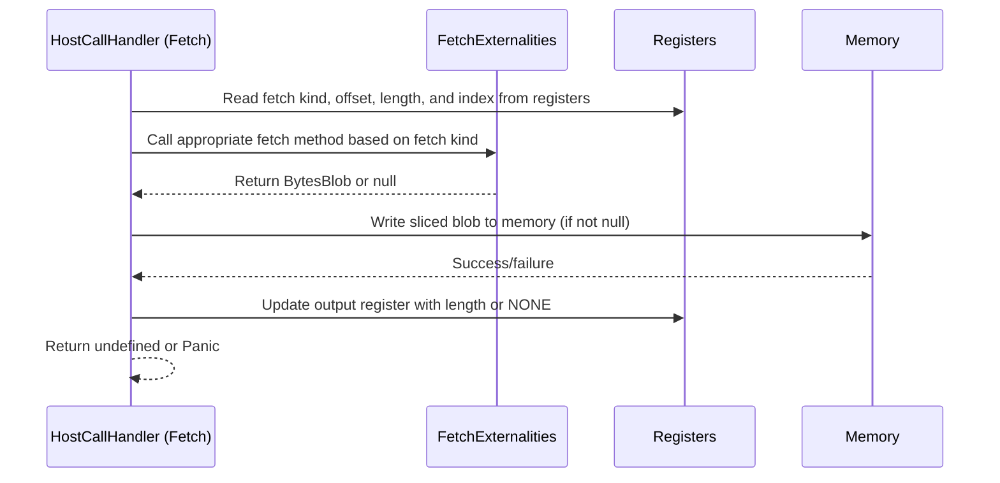

# Fetch host call

## Pull Request by @tomusdrw

Closes #310 


## Comment by @coderabbitai[bot]

<!-- This is an auto-generated comment: summarize by coderabbit.ai -->
<!-- This is an auto-generated comment: skip review by coderabbit.ai -->

> [!IMPORTANT]
> ## Review skipped
> 
> Auto incremental reviews are disabled on this repository.
> 
> Please check the settings in the CodeRabbit UI or the `.coderabbit.yaml` file in this repository. To trigger a single review, invoke the `@coderabbitai review` command.
> 
> You can disable this status message by setting the `reviews.review_status` to `false` in the CodeRabbit configuration file.

<!-- end of auto-generated comment: skip review by coderabbit.ai -->
<!-- walkthrough_start -->

<details>
<summary>📝 Walkthrough</summary>

## Summary by CodeRabbit

- **New Features**
  - Introduced a new fetch functionality supporting multiple data retrieval operations for work packages, items, authorizers, operands, transfers, entropy, and tokens.

- **Bug Fixes**
  - Improved error handling for memory write failures and out-of-bounds data access during fetch operations.

- **Tests**
  - Added comprehensive unit tests covering all fetch scenarios, edge cases, and memory/register interactions.

- **Refactor**
  - Updated result codes to use 64-bit values and removed legacy 32-bit result codes.
  - Streamlined exports by removing several unused module exports.
  - Removed an obsolete utility function related to service ID extraction.
## Walkthrough

A new `Fetch` host call handler is introduced, including its implementation, interface, and associated fetch kinds. Comprehensive unit tests for the `Fetch` class are added, covering all fetch scenarios and edge cases. Several namespace exports and a legacy helper function are removed, and host call result codes are updated from a 32-bit enum to a 64-bit constant object.

## Changes

| File(s)                                                                                  | Change Summary                                                                                                                                                                                                                     |
|------------------------------------------------------------------------------------------|-----------------------------------------------------------------------------------------------------------------------------------------------------------------------------------------------------------------------------------|
| `packages/jam/jam-host-calls/fetch.ts`                                                   | New module implementing the `Fetch` host call handler, including the `Fetch` class, `FetchKind` enum, and `FetchExternalities` interface for various data retrieval operations.                                                    |
| `packages/jam/jam-host-calls/fetch.test.ts`                                              | New comprehensive test suite for the `Fetch` class, including a mock externalities class and helper functions to verify all fetch kinds, memory/register interactions, and error handling.                                         |
| `packages/jam/jam-host-calls/index.ts`                                                   | Removes namespace exports for "gas", "info", "lookup", "read", "write", "accumulate/bless", and "accumulate/assign", retaining only "results" and "utils" exports.                                                                |
| `packages/jam/jam-host-calls/results.ts`                                                 | Removes the `LegacyHostCallResult` 32-bit enum; defines a new `HostCallResult` object with 64-bit unsigned integer constants for host call results.                                         |
| `packages/jam/jam-host-calls/utils.ts`                                                   | Removes the `legacyGetServiceId` function, which previously extracted a service ID from registers.                                                                                          |

## Sequence Diagram(s)



## Poem

> In the meadow of code, a new fetcher appears,  
> With tests to ensure it conquers all fears.  
> Old enums retire, new constants take flight,  
> While exports are trimmed for a tidier sight.  
> The rabbit hops on, with a code-carrot in paw—  
> Fetching the future, with nary a flaw! 🥕

</details>

<!-- walkthrough_end -->
<!-- internal state start -->


<!-- DwQgtGAEAqAWCWBnSTIEMB26CuAXA9mAOYCmGJATmriQCaQDG+Ats2bgFyQAOFk+AIwBWJBrngA3EsgEBPRvlqU0AgfFwA6NPEgQAfACgjoCEYDEZyAAUASpETZWaCrKNwSPbABsvkCiQBHbGlcSHFcLzpIACIAMRJcBlhIWHxEUIY0H2jIAHc0ZAcBZnUaejkw2A9sREowlhraClz0ZG5vX38gkMgMRwE6gGYATgAGfixcKshYr2wAM3nZABkVRAB6XFluEgGKFz8SbjT1fBcNGGnbdFom6VrkTHoGLzTpFEQHDz7mPchBgCMowuADl8DdaOp4PgMFlIEpEAwKPBuOIYfw+EpcNovI8BPg8JUPElMKRkMw0EoUJNpu0fIduuk8pQPLx8BJ4EpaBd3NY7JksANIBySLkotQUrhcNxEBx1usiOpYNgBBomMx1rMFktVgINlsdnsXOs6V51iNgUZ9MZwFAyPR8PMcARiGRlGUFKx2FxePxhKJxFIZPImEoqKp1FodNaTFA4KhUJhnYRSOQqB71WwMJw/GgWg4nAcKqHlBHNNpdGBDDbTAZuGgGABrNBk9ZCNAa9vMMCpdJgTI+DbzBJJDQ0dJj2UGaIzgwWSAAQQAkq609QogWKQdHYxYKTpG4EMhyC1x6F5vBIpB5mciZAAAbxRKwe+MLwFNoUdmc97q3gkKoMEQSRqgwdQwhCZAmCkZEMCIYVnGhGprxHZJETIRC0nQDB6CmEh4D4eBs2UMRoSAvIlUgNhmDOeQnkORV0koRALiXUIYPgC9fzOfwxEgAY9w5W9ckAqiSBog5cmRcdrxxAAaPJROHZ9DlwbAKHIvofAU+iRLIfhFlqXBkBIAAPBgSCiARXgESBIjgqYWMuDwzyg9k6iyXxlKSSBGyI2gTJ+d0rPkR9UIAaX8+8FKIl5sEhOCFCA7Fs0QBT2C/bhZB0vBUmRAAvOpcCoCyFNyM5GxQGhmEgMziqI4CGA2eBmGOChjLKiqeAbZtSByqYzngQqKH6vKhuoMj6kbMgFP8C9yCSmhTNwHSfHWGEPHKihKvUcS0ryLrdpq+tZFeSlVrNDb+B2KgcP2+jPPWhbiswRBhwoJyAFEG2SM8eH8et/GQfxGJoD7sPoajaIoqZ0G4NleHgdcDPmIzHhwuyyCIRz0tM0Q8HePCUOfHSMY/ShjLvMydjEKIge8SmiIYpAwfRyHxOhphiOzHlplc9BcXBDilkqCUie85J/DUjTkHvKwJGYT68YYPAyI0KxMHgBhX3RKHJOkjx5hxdSPHoqYxeme8lxBAB9AB5ABVaAbZsT6AHFXxBlm6lQIyFH2AMvHkAg73s7Hkh3WhqDQPJpJoLBbxD+8AAk0lwABhTybGkBmNBBO2QU+189KwDBwSj7EPlU9TyG5RcUhILwbuvbAMFI9F73/QGSGzohEAXHCAFkOZcV80cgbBuDvP6yA5L8MCzUJckoqT1BUK89fkesyQh5mmI+i4F1uKEYU87L0AfJ8kkH/Am1fF4PxQVrIkX5AibC58lbB2EvChaRXyImDI2pV/rfgSvBGiTZDiIGOEBd4N4+CeWJj5Pyd1d4vSbEReCA5fCAw7AkZi15bzCy1hNGErFQhTC/LkEy+wzjIE4hfLowQmKQ1vpVIGsDahVxKJ8LB6UgLqSwRBJkf5Ijx3uLzVAf0HC7VqoIoGotKGWyvi+N8j8mABzEEHFITxIiPHpBLXy/l9qb2pGDBsaIgKk3oHQUgjACjSA0EYcwlgFxeAsVYt+4IiZKAfumMiyAdzUzOB6W87RrJa3keEeAB4DBQBBKKERoRZE0AhHQLg94ERIngAMAAFHEVC0QFJ5IAJSQAALx6EgAAb0gBoBpkAAC+pSAFYE7j1Fs0g2wdh6d2XsuB+yeSHKhMcIRJz3niZARJLQqhNzqPMVu7csCUi5Jkruzge4kD7gPWgw8JKyDydZQQXAABCshxynJsgpCWkUcJcFUXc2gClHSowSAAfi4D8PYCkw5TE+b0folBWnUmAlSImMjsByKZveCWYyJzGUmQkpJD9PjpNoJk1FyBVE3ygS1bgL92DYtQl/SgP8/6IDaQ+OFZ4Jkw2SMwBmKIrwRN/gwUBN1xDvHomwAaAUn4EvEuwYR79VGko0lkClbSgENkNreSBqD4JGM4TCB46CSqKocYOacs54m1nrE2LpGwux9J7GnIZg51g0qnDOaIc43ErlTMFegm5nDyB3CSOCcSFy9CSdAbYJAADKOTURUUUN4DwsLRmIqroAr8tBsAWWefCEg81hExw/kke+740X4sJdmEVltU7pEzj4ZOejKDSsoMAly4I9w4SvDHAZWrfDL1hv5MykAAQAA5d4xwvHjegRACgKAnM5dRubiIlUpm25ISY6pkrhBXGObIORhkqF+bARBfoqJJctRdv8uWUvMdW2VZUEA+RCWqxlHjmUeF5akflIcpbIhIFIBCyICSBRLPQZd/EbLA0buuXC4ItqVQNb1aQnVtpVT2qNQaw19r4Buk8faL0gLvX2hlZD58Hq5QQ2QyY+BppAV5pG1R2aPwAHJZZmXxjQV8D7FCHEpAwjA7RQh4N5YQ+YX4ape33vtWKcxwEXyMag+gP4C1cUQRjZDVi4RgdgzVW8HbTIITmFBokWAcFv2mJolVOFhFMYdDScje7v6SqPW09ImALL1D9NiJmGbzmXJsjrPgWkvAUPsGywm0wpY1yiH+hsmjRMh1eX7eifzkhcYIeDXjLA96sx0lKcSqJvH2AIP4O8iA/O/ujuYutacxIHJsRPbgFd/MeAJNKQkAmwb0tqkqIq0wYsGTvH+28MdagFvIL4CQWRgjUkhJkcQiUy7wmjmR5ByQJOPBy2QRwzrqR3kzbAJ5r4lvMAUhSeGwigrInZSWTLMDRCcSiX+l9sTBu+GQ+6QJM2SzUjigiBxc1vD8QJGgpIohNX0S5jBYC6IdwNbqLdlhDm0Dw0ysiZGh2okGi0/RettB9G1ToXwLmkIvH8XkIFjS6bupgXZXRlWVisvI0YWY9IZwumyUvCxFx9rFweIe6qhzvjRDvgCRz4Jpk2phL4KyqJwqj1WkXLcKIgDT32fW+K8l1mms3vEIKsSfLAPSzAole8rnpBXMEJAAAPoCnwHmHx68QAbgQr4EGzeEYNz9yEyA/qm5Xfw74PQhyUxBo10GdrVXuvhgqzEXkobugpdDb1Q/RMyrhsmwfxoU4ICRpnUAj5cgnbLCjAr83jfginNOpavDlobZW+lHADCQF0NYFUbKOUU1ibKB8anXx5ObTgkbnae2lIUveYdiB05pzb0CXvD4VYB2zIGygHILJLloPeZx1eoBD+ShQRN2X0AMAsqiIn8v90SsPU3mzKULJL5r8PPlD4ycEzyQPrgbsChD9bmDWa2zm9LmLRnLO2zvYfV2yPLIFwJ/kXp5PsrRKUlwFYHxkgCQMAK3EoPNFECbvLIrMrKrDCHoIvlXjXtAZIMjCZg+KQLgAAGpDYkB5Igwf5f7F69x/6ICQGQCW7W7G6m5eCvghy1CRB8R/ohxGICCOKmbJY+zsZ4DOLp5S62I/CXwRRRTyLLYBKJRGL3a85YDzbXh8aQDjAhwAgADsu20O3AIq4IZ2DAF27KRiJmbGMhn8B+iux+zitqVo+qnSrYJqXYZqfYum6wamk4leTh84y4q4K2rq24TonqZIh4HgkIiwhwNEQYAsvgsIbA9AyR0gBqHgIS7UyAiWNURMNECa6O0QA+xSMQREN4pR0QrwxGk8lR/glIlRq8NAlRoWjg3g646w1k9wpR9E0QrRN6HRH48ARAGAOQTM78vubhvSHhAyFquIPhOEZkdKF4kQh88wjWRMERJALyGAOiRMWRlMuRd40Q9MHiiAOQvRqsuIOQBREagGFITM/gYABxdAUigGCaFkem3wQKfAoOJAzxAuoSUQtx6O9EjcLURE64XxkARAm6OwqR+CMCsqtUgJ2R/0b6SEeWdEg2l468oE66A03CaRTOLigRbOqhmWXO/ihGQSToLxDowudeouBa4uUy2c8RUQxJGRKJgumSBxkAAAVK0DCSOkcdEBoAqAUNEFSh0oalMZ2B2J4YMt4b4YimyRzFIAiWwEifZgcXyaiaEEKSOuUeCGKRKSadKatrKZBsatMYqbMSqYsaZBMuqRyVqekciXqdfgaYKcKdUY2JPBoUluKesP6bUTKZMd0u4faeao6UoM6WqVAOye5O6TqZkQafqYLr6SOvUfQGaesLmZaTCpGbaQqf0rGcMgsfGS6UmRqZyYidyV6fePyUacgE0YbJoSGe2UWe0iWX0qag6ZWaqZSq6Smb0A2Z6Rmd6Vma2f+vcEGTVCGf0e0TQJ0foucRGa4VGXaeWV4UOU6TWZAMmZqeOdqY2VOc2T6bOUMSMQuTEBKcuZ7iQOsDeaMZuXKduWWUqXMc1AeWqU4XqmAEYH2dGbucqZWaccZH4TqnaoEY6m6OmBuI4FuO6uEfWpEQYLyMKjlveMsNsg2LIDQT/g4B4ltj8OelrMkIgURFEIMAAExgBqChCtzAQjHS7ESkBY6qopSUwAxAzCqJSO6YkpAlad6QUKAIgKR7gyCWRYD+BulvHyE1TCbxRRBcy2apT2CJpzqyz5yFzRQPgADqycC40ABl94dsdspy5lxlds5lsQDsywyw5l6cdsrsLlC4gayc5lywdshl5lycS4bs3lfeycDsIVu8Fl4UxclEEO7w5Azgd49FjF4ELFwxtcJ6nFVEaApkLUjguYXqzimFAW4k2g2u2Cig0RqaNFjwvqLQheJaxFDMOs/ofEs69gEJPOp5al3FmAlMAghINQwiAAbAACwpXMVATpXsU0BZVxVtlUDwwhRrbFSyALiIAOxjW25LJWIzYnhJQaWUwGbpEwggaQBjUTUaaQ4JV8D5E5V5U1QXVMUTxTVsWSYcV1C3R9SHDzDcH57YQVZVZ3nJXPUhxPXgTiUnYzYpxBXeUHU8Xom9ahDjElVulKVVxlycb8XZirZEz7WCAiBiB7Uoq9WaWbIppIH0AjoxzqUI0E0Bi5h4S3X1oA3bZFVkmeKBKc7TB+I840kdb0kYieCRKk4slN4S7HlRCC3bYPh4XDoMCEWgE+DZwkW4C26aHWlGr9kzEVmWqQUsQxoiSUWLRlW0UMXPVpVvWZV1C019U5G3gd5IL62OG6oQBAV1hbmlkDm63zFXEG02qzhwXBGIUurIVuodZbGIBREtxtwU73iRDy2yBuwJDT4UCz4kDz7Fw5l1lSHiAe6yCKWLKx2TT/hCQ1A6J1TTrij2Az5aweBLgAAid5McYOI0no3ckmlC4INNpNoQ946cDsNgrsIIzsgan0NgJBS46cn0NsjdBl9EBOGV+ETNd49YnwUQ94E+/gU+tdc+C+QtPdGAMEHotQadddkAjdoI4I+AK9kdzIOWFI4KPi0wDgdCCBwiz2t4N9VQfARdyyJJHN7O5EIcVJfNuO/OguUQ4STJotMScSUAsQO1k08lKZmSCdBFyduAqd6d8+lB2yIIPxXyPxb+fcwBRFytv+gmCkW97A2Ddd8+XAdDe9jBTDGd+9xZnt2tMZe5lqftLpAF1oBgsY8iDoToaAeAKYCFwGnoi8XAVA+YYdRYIYlV4YTFUYlYhgwjmY6gNsnIiANs/gIoYotANstm7UGjNYUAAg3atw8wwwDAAIgw3awwjjtAdF8w2+mQowowuhYww4dFAIogo1tAYwtAAIUcuhFjQjtoMjOjejBjGJoodANs9oGjQAA=== -->

<!-- internal state end -->
<!-- tips_start -->

---


<details>
<summary>🪧 Tips</summary>

### Chat

There are 3 ways to chat with [CodeRabbit](https://coderabbit.ai?utm_source=oss&utm_medium=github&utm_campaign=FluffyLabs/typeberry&utm_content=390):

- Review comments: Directly reply to a review comment made by CodeRabbit. Example:
  - `I pushed a fix in commit <commit_id>, please review it.`
  - `Explain this complex logic.`
  - `Open a follow-up GitHub issue for this discussion.`
- Files and specific lines of code (under the "Files changed" tab): Tag `@coderabbitai` in a new review comment at the desired location with your query. Examples:
  - `@coderabbitai explain this code block.`
  -	`@coderabbitai modularize this function.`
- PR comments: Tag `@coderabbitai` in a new PR comment to ask questions about the PR branch. For the best results, please provide a very specific query, as very limited context is provided in this mode. Examples:
  - `@coderabbitai gather interesting stats about this repository and render them as a table. Additionally, render a pie chart showing the language distribution in the codebase.`
  - `@coderabbitai read src/utils.ts and explain its main purpose.`
  - `@coderabbitai read the files in the src/scheduler package and generate a class diagram using mermaid and a README in the markdown format.`
  - `@coderabbitai help me debug CodeRabbit configuration file.`

### Support

Need help? Create a ticket on our [support page](https://www.coderabbit.ai/contact-us/support) for assistance with any issues or questions.

Note: Be mindful of the bot's finite context window. It's strongly recommended to break down tasks such as reading entire modules into smaller chunks. For a focused discussion, use review comments to chat about specific files and their changes, instead of using the PR comments.

### CodeRabbit Commands (Invoked using PR comments)

- `@coderabbitai pause` to pause the reviews on a PR.
- `@coderabbitai resume` to resume the paused reviews.
- `@coderabbitai review` to trigger an incremental review. This is useful when automatic reviews are disabled for the repository.
- `@coderabbitai full review` to do a full review from scratch and review all the files again.
- `@coderabbitai summary` to regenerate the summary of the PR.
- `@coderabbitai generate sequence diagram` to generate a sequence diagram of the changes in this PR.
- `@coderabbitai resolve` resolve all the CodeRabbit review comments.
- `@coderabbitai configuration` to show the current CodeRabbit configuration for the repository.
- `@coderabbitai help` to get help.

### Other keywords and placeholders

- Add `@coderabbitai ignore` anywhere in the PR description to prevent this PR from being reviewed.
- Add `@coderabbitai summary` to generate the high-level summary at a specific location in the PR description.
- Add `@coderabbitai` anywhere in the PR title to generate the title automatically.

### Documentation and Community

- Visit our [Documentation](https://docs.coderabbit.ai) for detailed information on how to use CodeRabbit.
- Join our [Discord Community](http://discord.gg/coderabbit) to get help, request features, and share feedback.
- Follow us on [X/Twitter](https://twitter.com/coderabbitai) for updates and announcements.

</details>

<!-- tips_end -->


## Comment by @github-actions[bot]


<details>
<summary>View all</summary>

|  Name  |  Status  | |
|--------|----------|-|
| Trie test 0 | ✅ | | 
| Trie test 1 | ✅ | | 
| Trie test 2 | ✅ | | 
| Trie test 3 | ✅ | | 
| Trie test 4 | ✅ | | 
| Trie test 5 | ✅ | | 
| Trie test 6 | ✅ | | 
| Trie test 7 | ✅ | | 
| Trie test 8 | ✅ | | 
| Trie test 9 | ✅ | | 
| Trie test 10 | ✅ | | 
| Trie test 10 | ✅ | | 
| Trie test 10 | ✅ | | 
| jamtestvectors/statistics/tiny/stats_with_empty_extrinsic-1.json | ✅ | | 
| jamtestvectors/statistics/tiny/stats_with_epoch_change-1.json | ✅ | | 
| jamtestvectors/statistics/tiny/stats_with_some_extrinsic-1.json | ✅ | | 
| jamtestvectors/statistics/tiny/stats_with_some_extrinsic-1.json | ✅ | | 
| jamtestvectors/statistics/full/stats_with_empty_extrinsic-1.json | ✅ | | 
| jamtestvectors/statistics/full/stats_with_epoch_change-1.json | ✅ | | 
| jamtestvectors/statistics/full/stats_with_some_extrinsic-1.json | ✅ | | 
| jamtestvectors/statistics/full/stats_with_some_extrinsic-1.json | ✅ | | 
| should correctly shuffle input of length 0 | ✅ | | 
| should correctly shuffle input of length 8 | ✅ | | 
| should correctly shuffle input of length 16 | ✅ | | 
| should correctly shuffle input of length 20 | ✅ | | 
| should correctly shuffle input of length 50 | ✅ | | 
| should correctly shuffle input of length 100 | ✅ | | 
| should correctly shuffle input of length 200 | ✅ | | 
| should correctly shuffle input of length 341 | ✅ | | 
| should correctly shuffle input of length 341 | ✅ | | 
| should correctly shuffle input of length 341 | ✅ | | 
| jamtestvectors/safrole/tiny/enact-epoch-change-with-no-tickets-1.json | ✅ | | 
| jamtestvectors/safrole/tiny/enact-epoch-change-with-no-tickets-2.json | ✅ | | 
| jamtestvectors/safrole/tiny/enact-epoch-change-with-no-tickets-3.json | ✅ | | 
| jamtestvectors/safrole/tiny/enact-epoch-change-with-no-tickets-4.json | ✅ | | 
| jamtestvectors/safrole/tiny/enact-epoch-change-with-padding-1.json | ✅ | | 
| jamtestvectors/safrole/tiny/publish-tickets-no-mark-1.json | ✅ | | 
| jamtestvectors/safrole/tiny/publish-tickets-no-mark-2.json | ✅ | | 
| jamtestvectors/safrole/tiny/publish-tickets-no-mark-3.json | ✅ | | 
| jamtestvectors/safrole/tiny/publish-tickets-no-mark-4.json | ✅ | | 
| jamtestvectors/safrole/tiny/publish-tickets-no-mark-5.json | ✅ | | 
| jamtestvectors/safrole/tiny/publish-tickets-no-mark-6.json | ✅ | | 
| jamtestvectors/safrole/tiny/publish-tickets-no-mark-7.json | ✅ | | 
| jamtestvectors/safrole/tiny/publish-tickets-no-mark-8.json | ✅ | | 
| jamtestvectors/safrole/tiny/publish-tickets-no-mark-9.json | ✅ | | 
| jamtestvectors/safrole/tiny/publish-tickets-with-mark-1.json | ✅ | | 
| jamtestvectors/safrole/tiny/publish-tickets-with-mark-2.json | ✅ | | 
| jamtestvectors/safrole/tiny/publish-tickets-with-mark-3.json | ✅ | | 
| jamtestvectors/safrole/tiny/publish-tickets-with-mark-4.json | ✅ | | 
| jamtestvectors/safrole/tiny/publish-tickets-with-mark-5.json | ✅ | | 
| jamtestvectors/safrole/tiny/skip-epoch-tail-1.json | ✅ | | 
| jamtestvectors/safrole/tiny/skip-epochs-1.json | ✅ | | 
| jamtestvectors/safrole/full/enact-epoch-change-with-no-tickets-1.json | ✅ | | 
| jamtestvectors/safrole/full/enact-epoch-change-with-no-tickets-2.json | ✅ | | 
| jamtestvectors/safrole/full/enact-epoch-change-with-no-tickets-3.json | ✅ | | 
| jamtestvectors/safrole/full/enact-epoch-change-with-no-tickets-4.json | ✅ | | 
| jamtestvectors/safrole/full/enact-epoch-change-with-padding-1.json | ✅ | | 
| jamtestvectors/safrole/full/publish-tickets-no-mark-1.json | ✅ | | 
| jamtestvectors/safrole/full/publish-tickets-no-mark-2.json | ✅ | | 
| jamtestvectors/safrole/full/publish-tickets-no-mark-3.json | ✅ | | 
| jamtestvectors/safrole/full/publish-tickets-no-mark-4.json | ✅ | | 
| jamtestvectors/safrole/full/publish-tickets-no-mark-5.json | ✅ | | 
| jamtestvectors/safrole/full/publish-tickets-no-mark-6.json | ✅ | | 
| jamtestvectors/safrole/full/publish-tickets-no-mark-7.json | ✅ | | 
| jamtestvectors/safrole/full/publish-tickets-no-mark-8.json | ✅ | | 
| jamtestvectors/safrole/full/publish-tickets-no-mark-9.json | ✅ | | 
| jamtestvectors/safrole/full/publish-tickets-with-mark-1.json | ✅ | | 
| jamtestvectors/safrole/full/publish-tickets-with-mark-2.json | ✅ | | 
| jamtestvectors/safrole/full/publish-tickets-with-mark-3.json | ✅ | | 
| jamtestvectors/safrole/full/publish-tickets-with-mark-4.json | ✅ | | 
| jamtestvectors/safrole/full/publish-tickets-with-mark-5.json | ✅ | | 
| jamtestvectors/safrole/full/skip-epoch-tail-1.json | ✅ | | 
| jamtestvectors/safrole/full/skip-epochs-1.json | ✅ | | 
| jamtestvectors/safrole/full/skip-epochs-1.json | ✅ | | 
| jamtestvectors/reports/tiny/anchor_not_recent-1.json | ✅ | | 
| jamtestvectors/reports/tiny/bad_beefy_mmr-1.json | ✅ | | 
| jamtestvectors/reports/tiny/bad_code_hash-1.json | ✅ | | 
| jamtestvectors/reports/tiny/bad_core_index-1.json | ✅ | | 
| jamtestvectors/reports/tiny/bad_service_id-1.json | ✅ | | 
| jamtestvectors/reports/tiny/bad_signature-1.json | ✅ | | 
| jamtestvectors/reports/tiny/bad_state_root-1.json | ✅ | | 
| jamtestvectors/reports/tiny/bad_validator_index-1.json | ✅ | | 
| jamtestvectors/reports/tiny/big_work_report_output-1.json | ✅ | | 
| jamtestvectors/reports/tiny/core_engaged-1.json | ✅ | | 
| jamtestvectors/reports/tiny/dependency_missing-1.json | ✅ | | 
| jamtestvectors/reports/tiny/duplicate_package_in_recent_history-1.json | ✅ | | 
| jamtestvectors/reports/tiny/duplicated_package_in_report-1.json | ✅ | | 
| jamtestvectors/reports/tiny/future_report_slot-1.json | ✅ | | 
| jamtestvectors/reports/tiny/high_work_report_gas-1.json | ✅ | | 
| jamtestvectors/reports/tiny/many_dependencies-1.json | ✅ | | 
| jamtestvectors/reports/tiny/multiple_reports-1.json | ✅ | | 
| jamtestvectors/reports/tiny/no_enough_guarantees-1.json | ✅ | | 
| jamtestvectors/reports/tiny/not_authorized-1.json | ✅ | | 
| jamtestvectors/reports/tiny/not_authorized-2.json | ✅ | | 
| jamtestvectors/reports/tiny/not_sorted_guarantor-1.json | ✅ | | 
| jamtestvectors/reports/tiny/out_of_order_guarantees-1.json | ✅ | | 
| jamtestvectors/reports/tiny/report_before_last_rotation-1.json | ✅ | | 
| jamtestvectors/reports/tiny/report_curr_rotation-1.json | ✅ | | 
| jamtestvectors/reports/tiny/report_prev_rotation-1.json | ✅ | | 
| jamtestvectors/reports/tiny/reports_with_dependencies-1.json | ✅ | | 
| jamtestvectors/reports/tiny/reports_with_dependencies-2.json | ✅ | | 
| jamtestvectors/reports/tiny/reports_with_dependencies-3.json | ✅ | | 
| jamtestvectors/reports/tiny/reports_with_dependencies-4.json | ✅ | | 
| jamtestvectors/reports/tiny/reports_with_dependencies-5.json | ✅ | | 
| jamtestvectors/reports/tiny/reports_with_dependencies-6.json | ✅ | | 
| jamtestvectors/reports/tiny/segment_root_lookup_invalid-1.json | ✅ | | 
| jamtestvectors/reports/tiny/segment_root_lookup_invalid-2.json | ✅ | | 
| jamtestvectors/reports/tiny/service_item_gas_too_low-1.json | ✅ | | 
| jamtestvectors/reports/tiny/too_big_work_report_output-1.json | ✅ | | 
| jamtestvectors/reports/tiny/too_high_work_report_gas-1.json | ✅ | | 
| jamtestvectors/reports/tiny/too_many_dependencies-1.json | ✅ | | 
| jamtestvectors/reports/tiny/with_avail_assignments-1.json | ✅ | | 
| jamtestvectors/reports/tiny/wrong_assignment-1.json | ✅ | | 
| jamtestvectors/reports/tiny/wrong_assignment-1.json | ✅ | | 
| jamtestvectors/reports/full/anchor_not_recent-1.json | ✅ | | 
| jamtestvectors/reports/full/bad_beefy_mmr-1.json | ✅ | | 
| jamtestvectors/reports/full/bad_code_hash-1.json | ✅ | | 
| jamtestvectors/reports/full/bad_core_index-1.json | ✅ | | 
| jamtestvectors/reports/full/bad_service_id-1.json | ✅ | | 
| jamtestvectors/reports/full/bad_signature-1.json | ✅ | | 
| jamtestvectors/reports/full/bad_state_root-1.json | ✅ | | 
| jamtestvectors/reports/full/bad_validator_index-1.json | ✅ | | 
| jamtestvectors/reports/full/big_work_report_output-1.json | ✅ | | 
| jamtestvectors/reports/full/core_engaged-1.json | ✅ | | 
| jamtestvectors/reports/full/dependency_missing-1.json | ✅ | | 
| jamtestvectors/reports/full/duplicate_package_in_recent_history-1.json | ✅ | | 
| jamtestvectors/reports/full/duplicated_package_in_report-1.json | ✅ | | 
| jamtestvectors/reports/full/future_report_slot-1.json | ✅ | | 
| jamtestvectors/reports/full/high_work_report_gas-1.json | ✅ | | 
| jamtestvectors/reports/full/many_dependencies-1.json | ✅ | | 
| jamtestvectors/reports/full/multiple_reports-1.json | ✅ | | 
| jamtestvectors/reports/full/no_enough_guarantees-1.json | ✅ | | 
| jamtestvectors/reports/full/not_authorized-1.json | ✅ | | 
| jamtestvectors/reports/full/not_authorized-2.json | ✅ | | 
| jamtestvectors/reports/full/not_sorted_guarantor-1.json | ✅ | | 
| jamtestvectors/reports/full/out_of_order_guarantees-1.json | ✅ | | 
| jamtestvectors/reports/full/report_before_last_rotation-1.json | ✅ | | 
| jamtestvectors/reports/full/report_curr_rotation-1.json | ✅ | | 
| jamtestvectors/reports/full/report_prev_rotation-1.json | ✅ | | 
| jamtestvectors/reports/full/reports_with_dependencies-1.json | ✅ | | 
| jamtestvectors/reports/full/reports_with_dependencies-2.json | ✅ | | 
| jamtestvectors/reports/full/reports_with_dependencies-3.json | ✅ | | 
| jamtestvectors/reports/full/reports_with_dependencies-4.json | ✅ | | 
| jamtestvectors/reports/full/reports_with_dependencies-5.json | ✅ | | 
| jamtestvectors/reports/full/reports_with_dependencies-6.json | ✅ | | 
| jamtestvectors/reports/full/segment_root_lookup_invalid-1.json | ✅ | | 
| jamtestvectors/reports/full/segment_root_lookup_invalid-2.json | ✅ | | 
| jamtestvectors/reports/full/service_item_gas_too_low-1.json | ✅ | | 
| jamtestvectors/reports/full/too_big_work_report_output-1.json | ✅ | | 
| jamtestvectors/reports/full/too_high_work_report_gas-1.json | ✅ | | 
| jamtestvectors/reports/full/too_many_dependencies-1.json | ✅ | | 
| jamtestvectors/reports/full/with_avail_assignments-1.json | ✅ | | 
| jamtestvectors/reports/full/wrong_assignment-1.json | ✅ | | 
| jamtestvectors/reports/full/wrong_assignment-1.json | ✅ | | 
| jamtestvectors/pvm/schema.json | ✅ | | 
| jamtestvectors/erasure_coding/schema_ec.json | ✅ | | 
| jamtestvectors/erasure_coding/schema_page_proof.json | ✅ | | 
| jamtestvectors/erasure_coding/schema_segment_ec.json | ✅ | | 
| jamtestvectors/erasure_coding/schema_segment_root.json | ✅ | | 
| jamtestvectors/erasure_coding/schema_segment_root.json | ✅ | | 
| jamtestvectors/pvm/programs/gas_basic_consume_all.json | ✅ | | 
| jamtestvectors/pvm/programs/inst_add_32.json | ✅ | | 
| jamtestvectors/pvm/programs/inst_add_32_with_overflow.json | ✅ | | 
| jamtestvectors/pvm/programs/inst_add_32_with_truncation.json | ✅ | | 
| jamtestvectors/pvm/programs/inst_add_32_with_truncation_and_sign_extension.json | ✅ | | 
| jamtestvectors/pvm/programs/inst_add_64.json | ✅ | | 
| jamtestvectors/pvm/programs/inst_add_64_with_overflow.json | ✅ | | 
| jamtestvectors/pvm/programs/inst_add_imm_32.json | ✅ | | 
| jamtestvectors/pvm/programs/inst_add_imm_32_with_truncation.json | ✅ | | 
| jamtestvectors/pvm/programs/inst_add_imm_32_with_truncation_and_sign_extension.json | ✅ | | 
| jamtestvectors/pvm/programs/inst_add_imm_64.json | ✅ | | 
| jamtestvectors/pvm/programs/inst_and.json | ✅ | | 
| jamtestvectors/pvm/programs/inst_and_imm.json | ✅ | | 
| jamtestvectors/pvm/programs/inst_branch_eq_imm_nok.json | ✅ | | 
| jamtestvectors/pvm/programs/inst_branch_eq_imm_ok.json | ✅ | | 
| jamtestvectors/pvm/programs/inst_branch_eq_nok.json | ✅ | | 
| jamtestvectors/pvm/programs/inst_branch_eq_ok.json | ✅ | | 
| jamtestvectors/pvm/programs/inst_branch_greater_or_equal_signed_imm_nok.json | ✅ | | 
| jamtestvectors/pvm/programs/inst_branch_greater_or_equal_signed_imm_ok.json | ✅ | | 
| jamtestvectors/pvm/programs/inst_branch_greater_or_equal_signed_nok.json | ✅ | | 
| jamtestvectors/pvm/programs/inst_branch_greater_or_equal_signed_ok.json | ✅ | | 
| jamtestvectors/pvm/programs/inst_branch_greater_or_equal_unsigned_imm_nok.json | ✅ | | 
| jamtestvectors/pvm/programs/inst_branch_greater_or_equal_unsigned_imm_ok.json | ✅ | | 
| jamtestvectors/pvm/programs/inst_branch_greater_or_equal_unsigned_nok.json | ✅ | | 
| jamtestvectors/pvm/programs/inst_branch_greater_or_equal_unsigned_ok.json | ✅ | | 
| jamtestvectors/pvm/programs/inst_branch_greater_signed_imm_nok.json | ✅ | | 
| jamtestvectors/pvm/programs/inst_branch_greater_signed_imm_ok.json | ✅ | | 
| jamtestvectors/pvm/programs/inst_branch_greater_unsigned_imm_nok.json | ✅ | | 
| jamtestvectors/pvm/programs/inst_branch_greater_unsigned_imm_ok.json | ✅ | | 
| jamtestvectors/pvm/programs/inst_branch_less_or_equal_signed_imm_nok.json | ✅ | | 
| jamtestvectors/pvm/programs/inst_branch_less_or_equal_signed_imm_ok.json | ✅ | | 
| jamtestvectors/pvm/programs/inst_branch_less_or_equal_unsigned_imm_nok.json | ✅ | | 
| jamtestvectors/pvm/programs/inst_branch_less_or_equal_unsigned_imm_ok.json | ✅ | | 
| jamtestvectors/pvm/programs/inst_branch_less_signed_imm_nok.json | ✅ | | 
| jamtestvectors/pvm/programs/inst_branch_less_signed_imm_ok.json | ✅ | | 
| jamtestvectors/pvm/programs/inst_branch_less_signed_nok.json | ✅ | | 
| jamtestvectors/pvm/programs/inst_branch_less_signed_ok.json | ✅ | | 
| jamtestvectors/pvm/programs/inst_branch_less_unsigned_imm_nok.json | ✅ | | 
| jamtestvectors/pvm/programs/inst_branch_less_unsigned_imm_ok.json | ✅ | | 
| jamtestvectors/pvm/programs/inst_branch_less_unsigned_nok.json | ✅ | | 
| jamtestvectors/pvm/programs/inst_branch_less_unsigned_ok.json | ✅ | | 
| jamtestvectors/pvm/programs/inst_branch_not_eq_imm_nok.json | ✅ | | 
| jamtestvectors/pvm/programs/inst_branch_not_eq_imm_ok.json | ✅ | | 
| jamtestvectors/pvm/programs/inst_branch_not_eq_nok.json | ✅ | | 
| jamtestvectors/pvm/programs/inst_branch_not_eq_ok.json | ✅ | | 
| jamtestvectors/pvm/programs/inst_cmov_if_zero_imm_nok.json | ✅ | | 
| jamtestvectors/pvm/programs/inst_cmov_if_zero_imm_ok.json | ✅ | | 
| jamtestvectors/pvm/programs/inst_cmov_if_zero_nok.json | ✅ | | 
| jamtestvectors/pvm/programs/inst_cmov_if_zero_ok.json | ✅ | | 
| jamtestvectors/pvm/programs/inst_div_signed_32.json | ✅ | | 
| jamtestvectors/pvm/programs/inst_div_signed_32.json | ✅ | | 
| jamtestvectors/pvm/programs/inst_div_signed_32_by_zero.json | ✅ | | 
| jamtestvectors/pvm/programs/inst_div_signed_32_with_overflow.json | ✅ | | 
| jamtestvectors/pvm/programs/inst_div_signed_64.json | ✅ | | 
| jamtestvectors/pvm/programs/inst_div_signed_64_by_zero.json | ✅ | | 
| jamtestvectors/pvm/programs/inst_div_signed_64_with_overflow.json | ✅ | | 
| jamtestvectors/pvm/programs/inst_div_unsigned_32.json | ✅ | | 
| jamtestvectors/pvm/programs/inst_div_unsigned_32_by_zero.json | ✅ | | 
| jamtestvectors/pvm/programs/inst_div_unsigned_32_with_overflow.json | ✅ | | 
| jamtestvectors/pvm/programs/inst_div_unsigned_64.json | ✅ | | 
| jamtestvectors/pvm/programs/inst_div_unsigned_64_by_zero.json | ✅ | | 
| jamtestvectors/pvm/programs/inst_div_unsigned_64_with_overflow.json | ✅ | | 
| jamtestvectors/pvm/programs/inst_fallthrough.json | ✅ | | 
| jamtestvectors/pvm/programs/inst_jump.json | ✅ | | 
| jamtestvectors/pvm/programs/inst_jump_indirect_invalid_djump_to_zero_nok.json | ✅ | | 
| jamtestvectors/pvm/programs/inst_jump_indirect_misaligned_djump_with_offset_nok.json | ✅ | | 
| jamtestvectors/pvm/programs/inst_jump_indirect_misaligned_djump_without_offset_nok.json | ✅ | | 
| jamtestvectors/pvm/programs/inst_jump_indirect_with_offset_ok.json | ✅ | | 
| jamtestvectors/pvm/programs/inst_jump_indirect_without_offset_ok.json | ✅ | | 
| jamtestvectors/pvm/programs/inst_load_i16.json | ✅ | | 
| jamtestvectors/pvm/programs/inst_load_i32.json | ✅ | | 
| jamtestvectors/pvm/programs/inst_load_i8.json | ✅ | | 
| jamtestvectors/pvm/programs/inst_load_imm.json | ✅ | | 
| jamtestvectors/pvm/programs/inst_load_imm_64.json | ✅ | | 
| jamtestvectors/pvm/programs/inst_load_imm_and_jump.json | ✅ | | 
| jamtestvectors/pvm/programs/inst_load_imm_and_jump_indirect_different_regs_with_offset_ok.json | ✅ | | 
| jamtestvectors/pvm/programs/inst_load_imm_and_jump_indirect_different_regs_without_offset_ok.json | ✅ | | 
| jamtestvectors/pvm/programs/inst_load_imm_and_jump_indirect_invalid_djump_to_zero_different_regs_without_offset_nok.json | ✅ | | 
| jamtestvectors/pvm/programs/inst_load_imm_and_jump_indirect_invalid_djump_to_zero_same_regs_without_offset_nok.json | ✅ | | 
| jamtestvectors/pvm/programs/inst_load_imm_and_jump_indirect_misaligned_djump_different_regs_with_offset_nok.json | ✅ | | 
| jamtestvectors/pvm/programs/inst_load_imm_and_jump_indirect_misaligned_djump_different_regs_without_offset_nok.json | ✅ | | 
| jamtestvectors/pvm/programs/inst_load_imm_and_jump_indirect_misaligned_djump_same_regs_with_offset_nok.json | ✅ | | 
| jamtestvectors/pvm/programs/inst_load_imm_and_jump_indirect_misaligned_djump_same_regs_without_offset_nok.json | ✅ | | 
| jamtestvectors/pvm/programs/inst_load_imm_and_jump_indirect_same_regs_with_offset_ok.json | ✅ | | 
| jamtestvectors/pvm/programs/inst_load_imm_and_jump_indirect_same_regs_without_offset_ok.json | ✅ | | 
| jamtestvectors/pvm/programs/inst_load_indirect_i16_with_offset.json | ✅ | | 
| jamtestvectors/pvm/programs/inst_load_indirect_i16_without_offset.json | ✅ | | 
| jamtestvectors/pvm/programs/inst_load_indirect_i32_with_offset.json | ✅ | | 
| jamtestvectors/pvm/programs/inst_load_indirect_i32_without_offset.json | ✅ | | 
| jamtestvectors/pvm/programs/inst_load_indirect_i8_with_offset.json | ✅ | | 
| jamtestvectors/pvm/programs/inst_load_indirect_i8_without_offset.json | ✅ | | 
| jamtestvectors/pvm/programs/inst_load_indirect_u16_with_offset.json | ✅ | | 
| jamtestvectors/pvm/programs/inst_load_indirect_u16_without_offset.json | ✅ | | 
| jamtestvectors/pvm/programs/inst_load_indirect_u32_with_offset.json | ✅ | | 
| jamtestvectors/pvm/programs/inst_load_indirect_u32_without_offset.json | ✅ | | 
| jamtestvectors/pvm/programs/inst_load_indirect_u64_with_offset.json | ✅ | | 
| jamtestvectors/pvm/programs/inst_load_indirect_u64_without_offset.json | ✅ | | 
| jamtestvectors/pvm/programs/inst_load_indirect_u8_with_offset.json | ✅ | | 
| jamtestvectors/pvm/programs/inst_load_indirect_u8_without_offset.json | ✅ | | 
| jamtestvectors/pvm/programs/inst_load_u16.json | ✅ | | 
| jamtestvectors/pvm/programs/inst_load_u32.json | ✅ | | 
| jamtestvectors/pvm/programs/inst_load_u32.json | ✅ | | 
| jamtestvectors/pvm/programs/inst_load_u64.json | ✅ | | 
| jamtestvectors/pvm/programs/inst_load_u8.json | ✅ | | 
| jamtestvectors/pvm/programs/inst_load_u8_nok.json | ✅ | | 
| jamtestvectors/pvm/programs/inst_move_reg.json | ✅ | | 
| jamtestvectors/pvm/programs/inst_mul_32.json | ✅ | | 
| jamtestvectors/pvm/programs/inst_mul_64.json | ✅ | | 
| jamtestvectors/pvm/programs/inst_mul_imm_32.json | ✅ | | 
| jamtestvectors/pvm/programs/inst_mul_imm_64.json | ✅ | | 
| jamtestvectors/pvm/programs/inst_negate_and_add_imm_32.json | ✅ | | 
| jamtestvectors/pvm/programs/inst_negate_and_add_imm_64.json | ✅ | | 
| jamtestvectors/pvm/programs/inst_or.json | ✅ | | 
| jamtestvectors/pvm/programs/inst_or_imm.json | ✅ | | 
| jamtestvectors/pvm/programs/inst_rem_signed_32.json | ✅ | | 
| jamtestvectors/pvm/programs/inst_rem_signed_32_by_zero.json | ✅ | | 
| jamtestvectors/pvm/programs/inst_rem_signed_32_with_overflow.json | ✅ | | 
| jamtestvectors/pvm/programs/inst_rem_signed_64.json | ✅ | | 
| jamtestvectors/pvm/programs/inst_rem_signed_64_by_zero.json | ✅ | | 
| jamtestvectors/pvm/programs/inst_rem_signed_64_with_overflow.json | ✅ | | 
| jamtestvectors/pvm/programs/inst_rem_unsigned_32.json | ✅ | | 
| jamtestvectors/pvm/programs/inst_rem_unsigned_32_by_zero.json | ✅ | | 
| jamtestvectors/pvm/programs/inst_rem_unsigned_64.json | ✅ | | 
| jamtestvectors/pvm/programs/inst_rem_unsigned_64_by_zero.json | ✅ | | 
| jamtestvectors/pvm/programs/inst_ret_halt.json | ✅ | | 
| jamtestvectors/pvm/programs/inst_ret_invalid.json | ✅ | | 
| jamtestvectors/pvm/programs/inst_set_greater_than_signed_imm_0.json | ✅ | | 
| jamtestvectors/pvm/programs/inst_set_greater_than_signed_imm_1.json | ✅ | | 
| jamtestvectors/pvm/programs/inst_set_greater_than_unsigned_imm_0.json | ✅ | | 
| jamtestvectors/pvm/programs/inst_set_greater_than_unsigned_imm_1.json | ✅ | | 
| jamtestvectors/pvm/programs/inst_set_less_than_signed_0.json | ✅ | | 
| jamtestvectors/pvm/programs/inst_set_less_than_signed_1.json | ✅ | | 
| jamtestvectors/pvm/programs/inst_set_less_than_signed_imm_0.json | ✅ | | 
| jamtestvectors/pvm/programs/inst_set_less_than_signed_imm_1.json | ✅ | | 
| jamtestvectors/pvm/programs/inst_set_less_than_unsigned_0.json | ✅ | | 
| jamtestvectors/pvm/programs/inst_set_less_than_unsigned_1.json | ✅ | | 
| jamtestvectors/pvm/programs/inst_set_less_than_unsigned_imm_0.json | ✅ | | 
| jamtestvectors/pvm/programs/inst_set_less_than_unsigned_imm_1.json | ✅ | | 
| jamtestvectors/pvm/programs/inst_shift_arithmetic_right_32.json | ✅ | | 
| jamtestvectors/pvm/programs/inst_shift_arithmetic_right_32_with_overflow.json | ✅ | | 
| jamtestvectors/pvm/programs/inst_shift_arithmetic_right_64.json | ✅ | | 
| jamtestvectors/pvm/programs/inst_shift_arithmetic_right_64_with_overflow.json | ✅ | | 
| jamtestvectors/pvm/programs/inst_shift_arithmetic_right_imm_32.json | ✅ | | 
| jamtestvectors/pvm/programs/inst_shift_arithmetic_right_imm_64.json | ✅ | | 
| jamtestvectors/pvm/programs/inst_shift_arithmetic_right_imm_alt_32.json | ✅ | | 
| jamtestvectors/pvm/programs/inst_shift_arithmetic_right_imm_alt_64.json | ✅ | | 
| jamtestvectors/pvm/programs/inst_shift_logical_left_32.json | ✅ | | 
| jamtestvectors/pvm/programs/inst_shift_logical_left_32_with_overflow.json | ✅ | | 
| jamtestvectors/pvm/programs/inst_shift_logical_left_64.json | ✅ | | 
| jamtestvectors/pvm/programs/inst_shift_logical_left_64_with_overflow.json | ✅ | | 
| jamtestvectors/pvm/programs/inst_shift_logical_left_imm_32.json | ✅ | | 
| jamtestvectors/pvm/programs/inst_shift_logical_left_imm_64.json | ✅ | | 
| jamtestvectors/pvm/programs/inst_shift_logical_left_imm_64.json | ✅ | | 
| jamtestvectors/pvm/programs/inst_shift_logical_left_imm_alt_32.json | ✅ | | 
| jamtestvectors/pvm/programs/inst_shift_logical_left_imm_alt_64.json | ✅ | | 
| jamtestvectors/pvm/programs/inst_shift_logical_right_32.json | ✅ | | 
| jamtestvectors/pvm/programs/inst_shift_logical_right_32_with_overflow.json | ✅ | | 
| jamtestvectors/pvm/programs/inst_shift_logical_right_64.json | ✅ | | 
| jamtestvectors/pvm/programs/inst_shift_logical_right_64_with_overflow.json | ✅ | | 
| jamtestvectors/pvm/programs/inst_shift_logical_right_imm_32.json | ✅ | | 
| jamtestvectors/pvm/programs/inst_shift_logical_right_imm_64.json | ✅ | | 
| jamtestvectors/pvm/programs/inst_shift_logical_right_imm_alt_32.json | ✅ | | 
| jamtestvectors/pvm/programs/inst_shift_logical_right_imm_alt_64.json | ✅ | | 
| jamtestvectors/pvm/programs/inst_store_imm_indirect_u16_with_offset_nok.json | ✅ | | 
| jamtestvectors/pvm/programs/inst_store_imm_indirect_u16_with_offset_ok.json | ✅ | | 
| jamtestvectors/pvm/programs/inst_store_imm_indirect_u16_without_offset_ok.json | ✅ | | 
| jamtestvectors/pvm/programs/inst_store_imm_indirect_u32_with_offset_nok.json | ✅ | | 
| jamtestvectors/pvm/programs/inst_store_imm_indirect_u32_with_offset_ok.json | ✅ | | 
| jamtestvectors/pvm/programs/inst_store_imm_indirect_u32_without_offset_ok.json | ✅ | | 
| jamtestvectors/pvm/programs/inst_store_imm_indirect_u64_with_offset_nok.json | ✅ | | 
| jamtestvectors/pvm/programs/inst_store_imm_indirect_u64_with_offset_ok.json | ✅ | | 
| jamtestvectors/pvm/programs/inst_store_imm_indirect_u64_without_offset_ok.json | ✅ | | 
| jamtestvectors/pvm/programs/inst_store_imm_indirect_u8_with_offset_nok.json | ✅ | | 
| jamtestvectors/pvm/programs/inst_store_imm_indirect_u8_with_offset_ok.json | ✅ | | 
| jamtestvectors/pvm/programs/inst_store_imm_indirect_u8_without_offset_ok.json | ✅ | | 
| jamtestvectors/pvm/programs/inst_store_imm_u16.json | ✅ | | 
| jamtestvectors/pvm/programs/inst_store_imm_u32.json | ✅ | | 
| jamtestvectors/pvm/programs/inst_store_imm_u64.json | ✅ | | 
| jamtestvectors/pvm/programs/inst_store_imm_u8.json | ✅ | | 
| jamtestvectors/pvm/programs/inst_store_imm_u8_trap_inaccessible.json | ✅ | | 
| jamtestvectors/pvm/programs/inst_store_imm_u8_trap_read_only.json | ✅ | | 
| jamtestvectors/pvm/programs/inst_store_indirect_u16_with_offset_nok.json | ✅ | | 
| jamtestvectors/pvm/programs/inst_store_indirect_u16_with_offset_ok.json | ✅ | | 
| jamtestvectors/pvm/programs/inst_store_indirect_u16_without_offset_ok.json | ✅ | | 
| jamtestvectors/pvm/programs/inst_store_indirect_u32_with_offset_nok.json | ✅ | | 
| jamtestvectors/pvm/programs/inst_store_indirect_u32_with_offset_ok.json | ✅ | | 
| jamtestvectors/pvm/programs/inst_store_indirect_u32_without_offset_ok.json | ✅ | | 
| jamtestvectors/pvm/programs/inst_store_indirect_u64_with_offset_nok.json | ✅ | | 
| jamtestvectors/pvm/programs/inst_store_indirect_u64_with_offset_ok.json | ✅ | | 
| jamtestvectors/pvm/programs/inst_store_indirect_u64_without_offset_ok.json | ✅ | | 
| jamtestvectors/pvm/programs/inst_store_indirect_u8_with_offset_nok.json | ✅ | | 
| jamtestvectors/pvm/programs/inst_store_indirect_u8_with_offset_ok.json | ✅ | | 
| jamtestvectors/pvm/programs/inst_store_indirect_u8_without_offset_ok.json | ✅ | | 
| jamtestvectors/pvm/programs/inst_store_u16.json | ✅ | | 
| jamtestvectors/pvm/programs/inst_store_u32.json | ✅ | | 
| jamtestvectors/pvm/programs/inst_store_u64.json | ✅ | | 
| jamtestvectors/pvm/programs/inst_store_u8.json | ✅ | | 
| jamtestvectors/pvm/programs/inst_store_u8_trap_inaccessible.json | ✅ | | 
| jamtestvectors/pvm/programs/inst_store_u8_trap_read_only.json | ✅ | | 
| jamtestvectors/pvm/programs/inst_sub_32.json | ✅ | | 
| jamtestvectors/pvm/programs/inst_sub_32_with_overflow.json | ✅ | | 
| jamtestvectors/pvm/programs/inst_sub_64.json | ✅ | | 
| jamtestvectors/pvm/programs/inst_sub_64_with_overflow.json | ✅ | | 
| jamtestvectors/pvm/programs/inst_sub_64_with_overflow.json | ✅ | | 
| jamtestvectors/pvm/programs/inst_sub_imm_32.json | ✅ | | 
| jamtestvectors/pvm/programs/inst_sub_imm_64.json | ✅ | | 
| jamtestvectors/pvm/programs/inst_trap.json | ✅ | | 
| jamtestvectors/pvm/programs/inst_xor.json | ✅ | | 
| jamtestvectors/pvm/programs/inst_xor_imm.json | ✅ | | 
| jamtestvectors/pvm/programs/riscv_rv64ua_amoadd_d.json | ✅ | | 
| jamtestvectors/pvm/programs/riscv_rv64ua_amoadd_w.json | ✅ | | 
| jamtestvectors/pvm/programs/riscv_rv64ua_amoand_d.json | ✅ | | 
| jamtestvectors/pvm/programs/riscv_rv64ua_amoand_w.json | ✅ | | 
| jamtestvectors/pvm/programs/riscv_rv64ua_amomax_d.json | ✅ | | 
| jamtestvectors/pvm/programs/riscv_rv64ua_amomax_w.json | ✅ | | 
| jamtestvectors/pvm/programs/riscv_rv64ua_amomaxu_d.json | ✅ | | 
| jamtestvectors/pvm/programs/riscv_rv64ua_amomaxu_w.json | ✅ | | 
| jamtestvectors/pvm/programs/riscv_rv64ua_amomin_d.json | ✅ | | 
| jamtestvectors/pvm/programs/riscv_rv64ua_amomin_w.json | ✅ | | 
| jamtestvectors/pvm/programs/riscv_rv64ua_amominu_d.json | ✅ | | 
| jamtestvectors/pvm/programs/riscv_rv64ua_amominu_w.json | ✅ | | 
| jamtestvectors/pvm/programs/riscv_rv64ua_amoor_d.json | ✅ | | 
| jamtestvectors/pvm/programs/riscv_rv64ua_amoor_w.json | ✅ | | 
| jamtestvectors/pvm/programs/riscv_rv64ua_amoswap_d.json | ✅ | | 
| jamtestvectors/pvm/programs/riscv_rv64ua_amoswap_w.json | ✅ | | 
| jamtestvectors/pvm/programs/riscv_rv64ua_amoxor_d.json | ✅ | | 
| jamtestvectors/pvm/programs/riscv_rv64ua_amoxor_w.json | ✅ | | 
| jamtestvectors/pvm/programs/riscv_rv64uc_rvc.json | ✅ | | 
| jamtestvectors/pvm/programs/riscv_rv64ui_add.json | ✅ | | 
| jamtestvectors/pvm/programs/riscv_rv64ui_addi.json | ✅ | | 
| jamtestvectors/pvm/programs/riscv_rv64ui_addiw.json | ✅ | | 
| jamtestvectors/pvm/programs/riscv_rv64ui_addw.json | ✅ | | 
| jamtestvectors/pvm/programs/riscv_rv64ui_and.json | ✅ | | 
| jamtestvectors/pvm/programs/riscv_rv64ui_andi.json | ✅ | | 
| jamtestvectors/pvm/programs/riscv_rv64ui_beq.json | ✅ | | 
| jamtestvectors/pvm/programs/riscv_rv64ui_bge.json | ✅ | | 
| jamtestvectors/pvm/programs/riscv_rv64ui_bgeu.json | ✅ | | 
| jamtestvectors/pvm/programs/riscv_rv64ui_blt.json | ✅ | | 
| jamtestvectors/pvm/programs/riscv_rv64ui_bltu.json | ✅ | | 
| jamtestvectors/pvm/programs/riscv_rv64ui_bne.json | ✅ | | 
| jamtestvectors/pvm/programs/riscv_rv64ui_jal.json | ✅ | | 
| jamtestvectors/pvm/programs/riscv_rv64ui_jalr.json | ✅ | | 
| jamtestvectors/pvm/programs/riscv_rv64ui_lb.json | ✅ | | 
| jamtestvectors/pvm/programs/riscv_rv64ui_lbu.json | ✅ | | 
| jamtestvectors/pvm/programs/riscv_rv64ui_ld.json | ✅ | | 
| jamtestvectors/pvm/programs/riscv_rv64ui_lh.json | ✅ | | 
| jamtestvectors/pvm/programs/riscv_rv64ui_lhu.json | ✅ | | 
| jamtestvectors/pvm/programs/riscv_rv64ui_lui.json | ✅ | | 
| jamtestvectors/pvm/programs/riscv_rv64ui_lw.json | ✅ | | 
| jamtestvectors/pvm/programs/riscv_rv64ui_lwu.json | ✅ | | 
| jamtestvectors/pvm/programs/riscv_rv64ui_ma_data.json | ✅ | | 
| jamtestvectors/pvm/programs/riscv_rv64ui_or.json | ✅ | | 
| jamtestvectors/pvm/programs/riscv_rv64ui_ori.json | ✅ | | 
| jamtestvectors/pvm/programs/riscv_rv64ui_sb.json | ✅ | | 
| jamtestvectors/pvm/programs/riscv_rv64ui_sb.json | ✅ | | 
| jamtestvectors/pvm/programs/riscv_rv64ui_sd.json | ✅ | | 
| jamtestvectors/pvm/programs/riscv_rv64ui_sh.json | ✅ | | 
| jamtestvectors/pvm/programs/riscv_rv64ui_simple.json | ✅ | | 
| jamtestvectors/pvm/programs/riscv_rv64ui_sll.json | ✅ | | 
| jamtestvectors/pvm/programs/riscv_rv64ui_slli.json | ✅ | | 
| jamtestvectors/pvm/programs/riscv_rv64ui_slliw.json | ✅ | | 
| jamtestvectors/pvm/programs/riscv_rv64ui_sllw.json | ✅ | | 
| jamtestvectors/pvm/programs/riscv_rv64ui_slt.json | ✅ | | 
| jamtestvectors/pvm/programs/riscv_rv64ui_slti.json | ✅ | | 
| jamtestvectors/pvm/programs/riscv_rv64ui_sltiu.json | ✅ | | 
| jamtestvectors/pvm/programs/riscv_rv64ui_sltu.json | ✅ | | 
| jamtestvectors/pvm/programs/riscv_rv64ui_sra.json | ✅ | | 
| jamtestvectors/pvm/programs/riscv_rv64ui_srai.json | ✅ | | 
| jamtestvectors/pvm/programs/riscv_rv64ui_sraiw.json | ✅ | | 
| jamtestvectors/pvm/programs/riscv_rv64ui_sraw.json | ✅ | | 
| jamtestvectors/pvm/programs/riscv_rv64ui_srl.json | ✅ | | 
| jamtestvectors/pvm/programs/riscv_rv64ui_srli.json | ✅ | | 
| jamtestvectors/pvm/programs/riscv_rv64ui_srliw.json | ✅ | | 
| jamtestvectors/pvm/programs/riscv_rv64ui_srlw.json | ✅ | | 
| jamtestvectors/pvm/programs/riscv_rv64ui_sub.json | ✅ | | 
| jamtestvectors/pvm/programs/riscv_rv64ui_subw.json | ✅ | | 
| jamtestvectors/pvm/programs/riscv_rv64ui_sw.json | ✅ | | 
| jamtestvectors/pvm/programs/riscv_rv64ui_xor.json | ✅ | | 
| jamtestvectors/pvm/programs/riscv_rv64ui_xori.json | ✅ | | 
| jamtestvectors/pvm/programs/riscv_rv64um_div.json | ✅ | | 
| jamtestvectors/pvm/programs/riscv_rv64um_divu.json | ✅ | | 
| jamtestvectors/pvm/programs/riscv_rv64um_divuw.json | ✅ | | 
| jamtestvectors/pvm/programs/riscv_rv64um_divw.json | ✅ | | 
| jamtestvectors/pvm/programs/riscv_rv64um_mul.json | ✅ | | 
| jamtestvectors/pvm/programs/riscv_rv64um_mulh.json | ✅ | | 
| jamtestvectors/pvm/programs/riscv_rv64um_mulhsu.json | ✅ | | 
| jamtestvectors/pvm/programs/riscv_rv64um_mulhu.json | ✅ | | 
| jamtestvectors/pvm/programs/riscv_rv64um_mulw.json | ✅ | | 
| jamtestvectors/pvm/programs/riscv_rv64um_rem.json | ✅ | | 
| jamtestvectors/pvm/programs/riscv_rv64um_remu.json | ✅ | | 
| jamtestvectors/pvm/programs/riscv_rv64um_remuw.json | ✅ | | 
| jamtestvectors/pvm/programs/riscv_rv64um_remw.json | ✅ | | 
| jamtestvectors/pvm/programs/riscv_rv64uzbb_andn.json | ✅ | | 
| jamtestvectors/pvm/programs/riscv_rv64uzbb_clz.json | ✅ | | 
| jamtestvectors/pvm/programs/riscv_rv64uzbb_clzw.json | ✅ | | 
| jamtestvectors/pvm/programs/riscv_rv64uzbb_cpop.json | ✅ | | 
| jamtestvectors/pvm/programs/riscv_rv64uzbb_cpopw.json | ✅ | | 
| jamtestvectors/pvm/programs/riscv_rv64uzbb_ctz.json | ✅ | | 
| jamtestvectors/pvm/programs/riscv_rv64uzbb_ctzw.json | ✅ | | 
| jamtestvectors/pvm/programs/riscv_rv64uzbb_max.json | ✅ | | 
| jamtestvectors/pvm/programs/riscv_rv64uzbb_maxu.json | ✅ | | 
| jamtestvectors/pvm/programs/riscv_rv64uzbb_min.json | ✅ | | 
| jamtestvectors/pvm/programs/riscv_rv64uzbb_minu.json | ✅ | | 
| jamtestvectors/pvm/programs/riscv_rv64uzbb_orc_b.json | ✅ | | 
| jamtestvectors/pvm/programs/riscv_rv64uzbb_orn.json | ✅ | | 
| jamtestvectors/pvm/programs/riscv_rv64uzbb_orn.json | ✅ | | 
| jamtestvectors/pvm/programs/riscv_rv64uzbb_rev8.json | ✅ | | 
| jamtestvectors/pvm/programs/riscv_rv64uzbb_rol.json | ✅ | | 
| jamtestvectors/pvm/programs/riscv_rv64uzbb_rolw.json | ✅ | | 
| jamtestvectors/pvm/programs/riscv_rv64uzbb_ror.json | ✅ | | 
| jamtestvectors/pvm/programs/riscv_rv64uzbb_rori.json | ✅ | | 
| jamtestvectors/pvm/programs/riscv_rv64uzbb_roriw.json | ✅ | | 
| jamtestvectors/pvm/programs/riscv_rv64uzbb_rorw.json | ✅ | | 
| jamtestvectors/pvm/programs/riscv_rv64uzbb_sext_b.json | ✅ | | 
| jamtestvectors/pvm/programs/riscv_rv64uzbb_sext_h.json | ✅ | | 
| jamtestvectors/pvm/programs/riscv_rv64uzbb_xnor.json | ✅ | | 
| jamtestvectors/pvm/programs/riscv_rv64uzbb_zext_h.json | ✅ | | 
| jamtestvectors/pvm/programs/riscv_rv64uzbb_zext_h.json | ✅ | | 
| jamtestvectors/preimages/data/preimage_needed-1.json | ✅ | | 
| jamtestvectors/preimages/data/preimage_needed-2.json | ✅ | | 
| jamtestvectors/preimages/data/preimage_not_needed-1.json | ✅ | | 
| jamtestvectors/preimages/data/preimage_not_needed-2.json | ✅ | | 
| jamtestvectors/preimages/data/preimages_order_check-1.json | ✅ | | 
| jamtestvectors/preimages/data/preimages_order_check-2.json | ✅ | | 
| jamtestvectors/preimages/data/preimages_order_check-3.json | ✅ | | 
| jamtestvectors/preimages/data/preimages_order_check-4.json | ✅ | | 
| jamtestvectors/preimages/data/preimages_order_check-4.json | ✅ | | 
| jamtestvectors/host_function/Zero/hostZeroOK.json | ✅ | | 
| jamtestvectors/host_function/Zero/hostZeroOOB.json | ✅ | | 
| jamtestvectors/host_function/Zero/hostZeroWHO.json | ✅ | | 
| jamtestvectors/host_function/Yield/hostYieldOK.json | ✅ | | 
| jamtestvectors/host_function/Yield/hostYieldOOB.json | ✅ | | 
| jamtestvectors/host_function/Write/hostWriteFULL.json | ✅ | | 
| jamtestvectors/host_function/Write/hostWriteNONE.json | ✅ | | 
| jamtestvectors/host_function/Write/hostWriteOK.json | ✅ | | 
| jamtestvectors/host_function/Write/hostWriteOOB.json | ✅ | | 
| jamtestvectors/host_function/Void/hostVoidOK.json | ✅ | | 
| jamtestvectors/host_function/Void/hostVoidOOB.json | ✅ | | 
| jamtestvectors/host_function/Void/hostVoidWHO.json | ✅ | | 
| jamtestvectors/host_function/Upgrade/hostUpgradeOK.json | ✅ | | 
| jamtestvectors/host_function/Upgrade/hostUpgradeOOB.json | ✅ | | 
| jamtestvectors/host_function/Transfer/hostTransferCASH.json | ✅ | | 
| jamtestvectors/host_function/Transfer/hostTransferLOW.json | ✅ | | 
| jamtestvectors/host_function/Transfer/hostTransferOK.json | ✅ | | 
| jamtestvectors/host_function/Transfer/hostTransferOOB.json | ✅ | | 
| jamtestvectors/host_function/Transfer/hostTransferWHO.json | ✅ | | 
| jamtestvectors/host_function/Solicit/hostSolicitFULL.json | ✅ | | 
| jamtestvectors/host_function/Solicit/hostSolicitHUH.json | ✅ | | 
| jamtestvectors/host_function/Solicit/hostSolicitOK_2_timeslots.json | ✅ | | 
| jamtestvectors/host_function/Solicit/hostSolicitOK_no_timeslots.json | ✅ | | 
| jamtestvectors/host_function/Solicit/hostSolicitOOB.json | ✅ | | 
| jamtestvectors/host_function/Read/hostReadNONE.json | ✅ | | 
| jamtestvectors/host_function/Read/hostReadOK_d_omega7.json | ✅ | | 
| jamtestvectors/host_function/Read/hostReadOK_s.json | ✅ | | 
| jamtestvectors/host_function/Read/hostReadOOB.json | ✅ | | 
| jamtestvectors/host_function/Query/hostQueryNONE.json | ✅ | | 
| jamtestvectors/host_function/Query/hostQueryOK_0_timeslots.json | ✅ | | 
| jamtestvectors/host_function/Query/hostQueryOK_1_timeslots.json | ✅ | | 
| jamtestvectors/host_function/Query/hostQueryOK_2_timeslots.json | ✅ | | 
| jamtestvectors/host_function/Query/hostQueryOK_3_timeslots.json | ✅ | | 
| jamtestvectors/host_function/Query/hostQueryOOB.json | ✅ | | 
| jamtestvectors/host_function/Poke/hostPokeOK.json | ✅ | | 
| jamtestvectors/host_function/Poke/hostPokeOOB.json | ✅ | | 
| jamtestvectors/host_function/Poke/hostPokeWHO.json | ✅ | | 
| jamtestvectors/host_function/Peek/hostPeekOK.json | ✅ | | 
| jamtestvectors/host_function/Peek/hostPeekOOB.json | ✅ | | 
| jamtestvectors/host_function/Peek/hostPeekWHO.json | ✅ | | 
| jamtestvectors/host_function/New/hostNewCASH.json | ✅ | | 
| jamtestvectors/host_function/New/hostNewOK.json | ✅ | | 
| jamtestvectors/host_function/New/hostNewOOB.json | ✅ | | 
| jamtestvectors/host_function/Machine/hostMachineOK.json | ✅ | | 
| jamtestvectors/host_function/Machine/hostMachineOOB.json | ✅ | | 
| jamtestvectors/host_function/Lookup/hostLookupNONE.json | ✅ | | 
| jamtestvectors/host_function/Lookup/hostLookupOK_d_omega7.json | ✅ | | 
| jamtestvectors/host_function/Lookup/hostLookupOK_s.json | ✅ | | 
| jamtestvectors/host_function/Lookup/hostLookupOOB.json | ✅ | | 
| jamtestvectors/host_function/Invoke/hostInvokeFAULT.json | ✅ | | 
| jamtestvectors/host_function/Invoke/hostInvokeFAULT.json | ✅ | | 
| jamtestvectors/host_function/Invoke/hostInvokeHALT.json | ✅ | | 
| jamtestvectors/host_function/Invoke/hostInvokeHOST.json | ✅ | | 
| jamtestvectors/host_function/Invoke/hostInvokeOOB.json | ✅ | | 
| jamtestvectors/host_function/Invoke/hostInvokeOOG.json | ✅ | | 
| jamtestvectors/host_function/Invoke/hostInvokePANIC.json | ✅ | | 
| jamtestvectors/host_function/Invoke/hostInvokeWHO.json | ✅ | | 
| jamtestvectors/host_function/Info/hostInfoNONE.json | ✅ | | 
| jamtestvectors/host_function/Info/hostInfoOK.json | ✅ | | 
| jamtestvectors/host_function/Info/hostInfoOOB.json | ✅ | | 
| jamtestvectors/host_function/Import/hostImportNONE.json | ✅ | | 
| jamtestvectors/host_function/Import/hostImportOK.json | ✅ | | 
| jamtestvectors/host_function/Import/hostImportOK_gt_wg.json | ✅ | | 
| jamtestvectors/host_function/Import/hostImportOOB.json | ✅ | | 
| jamtestvectors/host_function/Historical_lookup/hostHistorical_lookupNONE.json | ✅ | | 
| jamtestvectors/host_function/Historical_lookup/hostHistorical_lookupOK_d_omega7.json | ✅ | | 
| jamtestvectors/host_function/Historical_lookup/hostHistorical_lookupOK_d_s.json | ✅ | | 
| jamtestvectors/host_function/Historical_lookup/hostHistorical_lookupOOB.json | ✅ | | 
| jamtestvectors/host_function/Forget/hostForgetHUH.json | ✅ | | 
| jamtestvectors/host_function/Forget/hostForgetOK_0_timeslots.json | ✅ | | 
| jamtestvectors/host_function/Forget/hostForgetOK_1_timeslots.json | ✅ | | 
| jamtestvectors/host_function/Forget/hostForgetOK_2_timeslots.json | ✅ | | 
| jamtestvectors/host_function/Forget/hostForgetOK_3_timeslots.json | ✅ | | 
| jamtestvectors/host_function/Forget/hostForgetOOB.json | ✅ | | 
| jamtestvectors/host_function/Expunge/hostExpungeOK.json | ✅ | | 
| jamtestvectors/host_function/Expunge/hostExpungeWHO.json | ✅ | | 
| jamtestvectors/host_function/Export/hostExportFULL.json | ✅ | | 
| jamtestvectors/host_function/Export/hostExportOK.json | ✅ | | 
| jamtestvectors/host_function/Export/hostExportOK_gt_wg.json | ✅ | | 
| jamtestvectors/host_function/Export/hostExportOOB.json | ✅ | | 
| jamtestvectors/host_function/Eject/hostEjectHUH.json | ✅ | | 
| jamtestvectors/host_function/Eject/hostEjectOK.json | ✅ | | 
| jamtestvectors/host_function/Eject/hostEjectOOB.json | ✅ | | 
| jamtestvectors/host_function/Eject/hostEjectWHO.json | ✅ | | 
| jamtestvectors/host_function/Eject/hostEjectWHO.json | ✅ | | 
| jamtestvectors/history/data/progress_blocks_history-1.json | ✅ | | 
| jamtestvectors/history/data/progress_blocks_history-2.json | ✅ | | 
| jamtestvectors/history/data/progress_blocks_history-3.json | ✅ | | 
| jamtestvectors/history/data/progress_blocks_history-4.json | ✅ | | 
| jamtestvectors/history/data/progress_blocks_history-4.json | ✅ | | 
| should encode data | ✅ | | 
| should decode data | ✅ | | 
| should decode data | ✅ | | 
| test was skipped because of incorrect data: chunk length: 4 (it should be 2) | ✅ | | 
| test was skipped because of incorrect data: chunk length: 4 (it should be 2) | ✅ | | 
| test was skipped because of incorrect data: chunk length: 6 (it should be 2) | ✅ | | 
| test was skipped because of incorrect data: chunk length: 6 (it should be 2) | ✅ | | 
| test was skipped because of incorrect data: chunk length: 12 (it should be 2) | ✅ | | 
| test was skipped because of incorrect data: chunk length: 12 (it should be 2) | ✅ | | 
| test was skipped because of incorrect data: chunk length: 12 (it should be 2) | ✅ | | 
| test was skipped because of incorrect data: chunk length: 12 (it should be 2) | ✅ | | 
| should encode data | ✅ | | 
| should decode data | ✅ | | 
| should decode data | ✅ | | 
| should encode data | ✅ | | 
| should decode data | ✅ | | 
| should decode data | ✅ | | 
| should decode data | ✅ | | 
| jamtestvectors/erasure_coding/vectors/page_proof_0.json | ✅ | | 
| jamtestvectors/erasure_coding/vectors/page_proof_16000.json | ✅ | | 
| jamtestvectors/erasure_coding/vectors/page_proof_32.json | ✅ | | 
| jamtestvectors/erasure_coding/vectors/page_proof_65536.json | ✅ | | 
| jamtestvectors/erasure_coding/vectors/page_proof_65536.json | ✅ | | 
| jamtestvectors/erasure_coding/vectors/segment_ec_0.json | ✅ | | 
| jamtestvectors/erasure_coding/vectors/segment_ec_1.json | ✅ | | 
| jamtestvectors/erasure_coding/vectors/segment_ec_15000.json | ✅ | | 
| jamtestvectors/erasure_coding/vectors/segment_ec_4096.json | ✅ | | 
| jamtestvectors/erasure_coding/vectors/segment_ec_4104.json | ✅ | | 
| jamtestvectors/erasure_coding/vectors/segment_ec_684.json | ✅ | | 
| jamtestvectors/erasure_coding/vectors/segment_ec_684.json | ✅ | | 
| jamtestvectors/erasure_coding/vectors/segment_root_100000.json | ✅ | | 
| jamtestvectors/erasure_coding/vectors/segment_root_200000.json | ✅ | | 
| jamtestvectors/erasure_coding/vectors/segment_root_21824.json | ✅ | | 
| jamtestvectors/erasure_coding/vectors/segment_root_21888.json | ✅ | | 
| jamtestvectors/erasure_coding/vectors/segment_root_21888.json | ✅ | | 
| jamtestvectors/disputes/tiny/progress_invalidates_avail_assignments-1.json | ✅ | | 
| jamtestvectors/disputes/tiny/progress_with_bad_signatures-1.json | ✅ | | 
| jamtestvectors/disputes/tiny/progress_with_bad_signatures-2.json | ✅ | | 
| jamtestvectors/disputes/tiny/progress_with_culprits-1.json | ✅ | | 
| jamtestvectors/disputes/tiny/progress_with_culprits-2.json | ✅ | | 
| jamtestvectors/disputes/tiny/progress_with_culprits-3.json | ✅ | | 
| jamtestvectors/disputes/tiny/progress_with_culprits-4.json | ✅ | | 
| jamtestvectors/disputes/tiny/progress_with_culprits-5.json | ✅ | | 
| jamtestvectors/disputes/tiny/progress_with_culprits-6.json | ✅ | | 
| jamtestvectors/disputes/tiny/progress_with_culprits-7.json | ✅ | | 
| jamtestvectors/disputes/tiny/progress_with_faults-1.json | ✅ | | 
| jamtestvectors/disputes/tiny/progress_with_faults-2.json | ✅ | | 
| jamtestvectors/disputes/tiny/progress_with_faults-3.json | ✅ | | 
| jamtestvectors/disputes/tiny/progress_with_faults-4.json | ✅ | | 
| jamtestvectors/disputes/tiny/progress_with_faults-5.json | ✅ | | 
| jamtestvectors/disputes/tiny/progress_with_faults-6.json | ✅ | | 
| jamtestvectors/disputes/tiny/progress_with_faults-7.json | ✅ | | 
| jamtestvectors/disputes/tiny/progress_with_invalid_keys-1.json | ✅ | | 
| jamtestvectors/disputes/tiny/progress_with_invalid_keys-2.json | ✅ | | 
| jamtestvectors/disputes/tiny/progress_with_no_verdicts-1.json | ✅ | | 
| jamtestvectors/disputes/tiny/progress_with_verdict_signatures_from_previous_set-1.json | ✅ | | 
| jamtestvectors/disputes/tiny/progress_with_verdict_signatures_from_previous_set-2.json | ✅ | | 
| jamtestvectors/disputes/tiny/progress_with_verdicts-1.json | ✅ | | 
| jamtestvectors/disputes/tiny/progress_with_verdicts-2.json | ✅ | | 
| jamtestvectors/disputes/tiny/progress_with_verdicts-3.json | ✅ | | 
| jamtestvectors/disputes/tiny/progress_with_verdicts-4.json | ✅ | | 
| jamtestvectors/disputes/tiny/progress_with_verdicts-5.json | ✅ | | 
| jamtestvectors/disputes/tiny/progress_with_verdicts-6.json | ✅ | | 
| jamtestvectors/disputes/full/progress_invalidates_avail_assignments-1.json | ✅ | | 
| jamtestvectors/disputes/full/progress_with_bad_signatures-1.json | ✅ | | 
| jamtestvectors/disputes/full/progress_with_bad_signatures-2.json | ✅ | | 
| jamtestvectors/disputes/full/progress_with_culprits-1.json | ✅ | | 
| jamtestvectors/disputes/full/progress_with_culprits-2.json | ✅ | | 
| jamtestvectors/disputes/full/progress_with_culprits-3.json | ✅ | | 
| jamtestvectors/disputes/full/progress_with_culprits-4.json | ✅ | | 
| jamtestvectors/disputes/full/progress_with_culprits-5.json | ✅ | | 
| jamtestvectors/disputes/full/progress_with_culprits-6.json | ✅ | | 
| jamtestvectors/disputes/full/progress_with_culprits-7.json | ✅ | | 
| jamtestvectors/disputes/full/progress_with_faults-1.json | ✅ | | 
| jamtestvectors/disputes/full/progress_with_faults-2.json | ✅ | | 
| jamtestvectors/disputes/full/progress_with_faults-3.json | ✅ | | 
| jamtestvectors/disputes/full/progress_with_faults-4.json | ✅ | | 
| jamtestvectors/disputes/full/progress_with_faults-5.json | ✅ | | 
| jamtestvectors/disputes/full/progress_with_faults-6.json | ✅ | | 
| jamtestvectors/disputes/full/progress_with_faults-7.json | ✅ | | 
| jamtestvectors/disputes/full/progress_with_invalid_keys-1.json | ✅ | | 
| jamtestvectors/disputes/full/progress_with_invalid_keys-2.json | ✅ | | 
| jamtestvectors/disputes/full/progress_with_no_verdicts-1.json | ✅ | | 
| jamtestvectors/disputes/full/progress_with_verdict_signatures_from_previous_set-1.json | ✅ | | 
| jamtestvectors/disputes/full/progress_with_verdict_signatures_from_previous_set-2.json | ✅ | | 
| jamtestvectors/disputes/full/progress_with_verdict_signatures_from_previous_set-2.json | ✅ | | 
| jamtestvectors/disputes/full/progress_with_verdicts-1.json | ✅ | | 
| jamtestvectors/disputes/full/progress_with_verdicts-2.json | ✅ | | 
| jamtestvectors/disputes/full/progress_with_verdicts-3.json | ✅ | | 
| jamtestvectors/disputes/full/progress_with_verdicts-4.json | ✅ | | 
| jamtestvectors/disputes/full/progress_with_verdicts-5.json | ✅ | | 
| jamtestvectors/disputes/full/progress_with_verdicts-6.json | ✅ | | 
| jamtestvectors/disputes/full/progress_with_verdicts-6.json | ✅ | | 
| jamtestvectors/codec/data/assurances_extrinsic.json | ✅ | | 
| jamtestvectors/codec/data/assurances_extrinsic.json | ✅ | | 
| jamtestvectors/codec/data/block.json | ✅ | | 
| jamtestvectors/codec/data/block.json | ✅ | | 
| jamtestvectors/codec/data/disputes_extrinsic.json | ✅ | | 
| jamtestvectors/codec/data/disputes_extrinsic.json | ✅ | | 
| jamtestvectors/codec/data/extrinsic.json | ✅ | | 
| jamtestvectors/codec/data/extrinsic.json | ✅ | | 
| jamtestvectors/codec/data/guarantees_extrinsic.json | ✅ | | 
| jamtestvectors/codec/data/guarantees_extrinsic.json | ✅ | | 
| jamtestvectors/codec/data/header_0.json | ✅ | | 
| jamtestvectors/codec/data/header_1.json | ✅ | | 
| jamtestvectors/codec/data/header_1.json | ✅ | | 
| jamtestvectors/codec/data/preimages_extrinsic.json | ✅ | | 
| jamtestvectors/codec/data/preimages_extrinsic.json | ✅ | | 
| jamtestvectors/codec/data/refine_context.json | ✅ | | 
| jamtestvectors/codec/data/refine_context.json | ✅ | | 
| jamtestvectors/codec/data/tickets_extrinsic.json | ✅ | | 
| jamtestvectors/codec/data/tickets_extrinsic.json | ✅ | | 
| jamtestvectors/codec/data/work_item.json | ✅ | | 
| jamtestvectors/codec/data/work_item.json | ✅ | | 
| jamtestvectors/codec/data/work_package.json | ✅ | | 
| jamtestvectors/codec/data/work_package.json | ✅ | | 
| jamtestvectors/codec/data/work_report.json | ✅ | | 
| jamtestvectors/codec/data/work_report.json | ✅ | | 
| jamtestvectors/codec/data/work_result_0.json | ✅ | | 
| jamtestvectors/codec/data/work_result_1.json | ✅ | | 
| jamtestvectors/codec/data/work_result_1.json | ✅ | | 
| jamtestvectors/authorizations/tiny/progress_authorizations-1.json | ✅ | | 
| jamtestvectors/authorizations/tiny/progress_authorizations-2.json | ✅ | | 
| jamtestvectors/authorizations/tiny/progress_authorizations-3.json | ✅ | | 
| jamtestvectors/authorizations/full/progress_authorizations-1.json | ✅ | | 
| jamtestvectors/authorizations/full/progress_authorizations-2.json | ✅ | | 
| jamtestvectors/authorizations/full/progress_authorizations-3.json | ✅ | | 
| jamtestvectors/authorizations/full/progress_authorizations-3.json | ✅ | | 
| jamtestvectors/assurances/tiny/assurance_for_not_engaged_core-1.json | ✅ | | 
| jamtestvectors/assurances/tiny/assurance_with_bad_attestation_parent-1.json | ✅ | | 
| jamtestvectors/assurances/tiny/assurances_for_stale_report-1.json | ✅ | | 
| jamtestvectors/assurances/tiny/assurances_with_bad_signature-1.json | ✅ | | 
| jamtestvectors/assurances/tiny/assurances_with_bad_validator_index-1.json | ✅ | | 
| jamtestvectors/assurances/tiny/assurers_not_sorted_or_unique-1.json | ✅ | | 
| jamtestvectors/assurances/tiny/assurers_not_sorted_or_unique-2.json | ✅ | | 
| jamtestvectors/assurances/tiny/no_assurances-1.json | ✅ | | 
| jamtestvectors/assurances/tiny/no_assurances_with_stale_report-1.json | ✅ | | 
| jamtestvectors/assurances/tiny/some_assurances-1.json | ✅ | | 
| jamtestvectors/assurances/tiny/some_assurances-1.json | ✅ | | 
| jamtestvectors/assurances/full/assurance_for_not_engaged_core-1.json | ✅ | | 
| jamtestvectors/assurances/full/assurance_with_bad_attestation_parent-1.json | ✅ | | 
| jamtestvectors/assurances/full/assurances_for_stale_report-1.json | ✅ | | 
| jamtestvectors/assurances/full/assurances_with_bad_signature-1.json | ✅ | | 
| jamtestvectors/assurances/full/assurances_with_bad_validator_index-1.json | ✅ | | 
| jamtestvectors/assurances/full/assurers_not_sorted_or_unique-1.json | ✅ | | 
| jamtestvectors/assurances/full/assurers_not_sorted_or_unique-2.json | ✅ | | 
| jamtestvectors/assurances/full/no_assurances-1.json | ✅ | | 
| jamtestvectors/assurances/full/no_assurances_with_stale_report-1.json | ✅ | | 
| jamtestvectors/assurances/full/some_assurances-1.json | ✅ | | 
| jamtestvectors/assurances/full/some_assurances-1.json | ✅ | | 
| jamtestvectors/accumulate/tiny/accumulate_ready_queued_reports-1.json | ✅ | | 
| jamtestvectors/accumulate/tiny/enqueue_and_unlock_chain-1.json | ✅ | | 
| jamtestvectors/accumulate/tiny/enqueue_and_unlock_chain-2.json | ✅ | | 
| jamtestvectors/accumulate/tiny/enqueue_and_unlock_chain-3.json | ✅ | | 
| jamtestvectors/accumulate/tiny/enqueue_and_unlock_chain-4.json | ✅ | | 
| jamtestvectors/accumulate/tiny/enqueue_and_unlock_chain_wraps-1.json | ✅ | | 
| jamtestvectors/accumulate/tiny/enqueue_and_unlock_chain_wraps-2.json | ✅ | | 
| jamtestvectors/accumulate/tiny/enqueue_and_unlock_chain_wraps-3.json | ✅ | | 
| jamtestvectors/accumulate/tiny/enqueue_and_unlock_chain_wraps-4.json | ✅ | | 
| jamtestvectors/accumulate/tiny/enqueue_and_unlock_chain_wraps-5.json | ✅ | | 
| jamtestvectors/accumulate/tiny/enqueue_and_unlock_simple-1.json | ✅ | | 
| jamtestvectors/accumulate/tiny/enqueue_and_unlock_simple-2.json | ✅ | | 
| jamtestvectors/accumulate/tiny/enqueue_and_unlock_with_sr_lookup-1.json | ✅ | | 
| jamtestvectors/accumulate/tiny/enqueue_and_unlock_with_sr_lookup-2.json | ✅ | | 
| jamtestvectors/accumulate/tiny/enqueue_self_referential-1.json | ✅ | | 
| jamtestvectors/accumulate/tiny/enqueue_self_referential-2.json | ✅ | | 
| jamtestvectors/accumulate/tiny/enqueue_self_referential-3.json | ✅ | | 
| jamtestvectors/accumulate/tiny/enqueue_self_referential-4.json | ✅ | | 
| jamtestvectors/accumulate/tiny/no_available_reports-1.json | ✅ | | 
| jamtestvectors/accumulate/tiny/process_one_immediate_report-1.json | ✅ | | 
| jamtestvectors/accumulate/tiny/queues_are_shifted-1.json | ✅ | | 
| jamtestvectors/accumulate/tiny/queues_are_shifted-2.json | ✅ | | 
| jamtestvectors/accumulate/tiny/ready_queue_editing-1.json | ✅ | | 
| jamtestvectors/accumulate/tiny/ready_queue_editing-2.json | ✅ | | 
| jamtestvectors/accumulate/tiny/ready_queue_editing-3.json | ✅ | | 
| jamtestvectors/accumulate/full/accumulate_ready_queued_reports-1.json | ✅ | | 
| jamtestvectors/accumulate/full/enqueue_and_unlock_chain-1.json | ✅ | | 
| jamtestvectors/accumulate/full/enqueue_and_unlock_chain-2.json | ✅ | | 
| jamtestvectors/accumulate/full/enqueue_and_unlock_chain-3.json | ✅ | | 
| jamtestvectors/accumulate/full/enqueue_and_unlock_chain-4.json | ✅ | | 
| jamtestvectors/accumulate/full/enqueue_and_unlock_chain_wraps-1.json | ✅ | | 
| jamtestvectors/accumulate/full/enqueue_and_unlock_chain_wraps-2.json | ✅ | | 
| jamtestvectors/accumulate/full/enqueue_and_unlock_chain_wraps-3.json | ✅ | | 
| jamtestvectors/accumulate/full/enqueue_and_unlock_chain_wraps-4.json | ✅ | | 
| jamtestvectors/accumulate/full/enqueue_and_unlock_chain_wraps-5.json | ✅ | | 
| jamtestvectors/accumulate/full/enqueue_and_unlock_simple-1.json | ✅ | | 
| jamtestvectors/accumulate/full/enqueue_and_unlock_simple-2.json | ✅ | | 
| jamtestvectors/accumulate/full/enqueue_and_unlock_with_sr_lookup-1.json | ✅ | | 
| jamtestvectors/accumulate/full/enqueue_and_unlock_with_sr_lookup-2.json | ✅ | | 
| jamtestvectors/accumulate/full/enqueue_self_referential-1.json | ✅ | | 
| jamtestvectors/accumulate/full/enqueue_self_referential-2.json | ✅ | | 
| jamtestvectors/accumulate/full/enqueue_self_referential-3.json | ✅ | | 
| jamtestvectors/accumulate/full/enqueue_self_referential-4.json | ✅ | | 
| jamtestvectors/accumulate/full/no_available_reports-1.json | ✅ | | 
| jamtestvectors/accumulate/full/process_one_immediate_report-1.json | ✅ | | 
| jamtestvectors/accumulate/full/queues_are_shifted-1.json | ✅ | | 
| jamtestvectors/accumulate/full/queues_are_shifted-2.json | ✅ | | 
| jamtestvectors/accumulate/full/ready_queue_editing-1.json | ✅ | | 
| jamtestvectors/accumulate/full/ready_queue_editing-2.json | ✅ | | 
| jamtestvectors/accumulate/full/ready_queue_editing-3.json | ✅ | | 
| jamtestvectors/accumulate/full/ready_queue_editing-3.json | ✅ | | 
</details>

### JAM test vectors 778/778 OK ✅
      
<!-- thollander/actions-comment-pull-request "jamtestvectors" -->


## Comment by @github-actions[bot]


<details>
<summary>View all</summary>

| File | Benchmark | Ops |  |
|------|-----------|-----|--|
| [bytes/compare.ts[0]](../blob/3de703487ebe3626b41b42814e225d59aeaa6778/benchmarks/bytes/compare.ts) | Comparing Uint32 bytes | 12880.88 ±0.23% | fastest ✅ |
| [bytes/compare.ts[1]](../blob/3de703487ebe3626b41b42814e225d59aeaa6778/benchmarks/bytes/compare.ts) | Comparing raw bytes | 9754.99 ±0.25% | 24.27% slower |
| [bytes/hex-from.ts[0]](../blob/3de703487ebe3626b41b42814e225d59aeaa6778/benchmarks/bytes/hex-from.ts) | parse hex using `Number` with NaN checking | 136027.46 ±0.09% | 86.09% slower |
| [bytes/hex-from.ts[1]](../blob/3de703487ebe3626b41b42814e225d59aeaa6778/benchmarks/bytes/hex-from.ts) | parse hex from char codes | 977856.6 ±0.25% | fastest ✅ |
| [bytes/hex-from.ts[2]](../blob/3de703487ebe3626b41b42814e225d59aeaa6778/benchmarks/bytes/hex-from.ts) | parse hex from string nibbles | 554633.06 ±0.28% | 43.28% slower |
| [bytes/hex-to.ts[0]](../blob/3de703487ebe3626b41b42814e225d59aeaa6778/benchmarks/bytes/hex-to.ts) | number toString + padding | 319327.01 ±0.1% | 10.92% slower |
| [bytes/hex-to.ts[1]](../blob/3de703487ebe3626b41b42814e225d59aeaa6778/benchmarks/bytes/hex-to.ts) | manual | 358462.76 ±0.05% | fastest ✅ |
| [codec/bigint.compare.ts[0]](../blob/3de703487ebe3626b41b42814e225d59aeaa6778/benchmarks/codec/bigint.compare.ts) | compare custom | 187798565.62 ±1.46% | 32.36% slower |
| [codec/bigint.compare.ts[1]](../blob/3de703487ebe3626b41b42814e225d59aeaa6778/benchmarks/codec/bigint.compare.ts) | compare bigint | 277649123.53 ±4.93% | fastest ✅ |
| [codec/bigint.decode.ts[0]](../blob/3de703487ebe3626b41b42814e225d59aeaa6778/benchmarks/codec/bigint.decode.ts) | decode custom | 261677533.94 ±4.8% | fastest ✅ |
| [codec/bigint.decode.ts[1]](../blob/3de703487ebe3626b41b42814e225d59aeaa6778/benchmarks/codec/bigint.decode.ts) | decode bigint | 108980625.16 ±2.18% | 58.35% slower |
| [codec/decoding.ts[0]](../blob/3de703487ebe3626b41b42814e225d59aeaa6778/benchmarks/codec/decoding.ts) | manual decode | 24392212.29 ±0.45% | 89.4% slower |
| [codec/decoding.ts[1]](../blob/3de703487ebe3626b41b42814e225d59aeaa6778/benchmarks/codec/decoding.ts) | int32array decode | 217266357.64 ±4.47% | 5.57% slower |
| [codec/decoding.ts[2]](../blob/3de703487ebe3626b41b42814e225d59aeaa6778/benchmarks/codec/decoding.ts) | dataview decode | 230092055.44 ±3.44% | fastest ✅ |
| [codec/encoding.ts[0]](../blob/3de703487ebe3626b41b42814e225d59aeaa6778/benchmarks/codec/encoding.ts) | manual encode | 3122795.38 ±0.13% | 18.04% slower |
| [codec/encoding.ts[1]](../blob/3de703487ebe3626b41b42814e225d59aeaa6778/benchmarks/codec/encoding.ts) | int32array encode | 3810038.64 ±0.26% | fastest ✅ |
| [codec/encoding.ts[2]](../blob/3de703487ebe3626b41b42814e225d59aeaa6778/benchmarks/codec/encoding.ts) | dataview encode | 3809067.43 ±0.15% | 0.03% slower |
| [codec/view_vs_collection.ts[0]](../blob/3de703487ebe3626b41b42814e225d59aeaa6778/benchmarks/codec/view_vs_collection.ts) | Get first element from Decoded | 30292.16 ±0.56% | 78.25% slower |
| [codec/view_vs_collection.ts[1]](../blob/3de703487ebe3626b41b42814e225d59aeaa6778/benchmarks/codec/view_vs_collection.ts) | Get first element from View | 139292.56 ±0.14% | fastest ✅ |
| [codec/view_vs_collection.ts[2]](../blob/3de703487ebe3626b41b42814e225d59aeaa6778/benchmarks/codec/view_vs_collection.ts) | Get 50th element from Decoded | 30436.79 ±0.08% | 78.15% slower |
| [codec/view_vs_collection.ts[3]](../blob/3de703487ebe3626b41b42814e225d59aeaa6778/benchmarks/codec/view_vs_collection.ts) | Get 50th element from View | 60387.9 ±0.97% | 56.65% slower |
| [codec/view_vs_collection.ts[4]](../blob/3de703487ebe3626b41b42814e225d59aeaa6778/benchmarks/codec/view_vs_collection.ts) | Get last element from Decoded | 30407.7 ±0.07% | 78.17% slower |
| [codec/view_vs_collection.ts[5]](../blob/3de703487ebe3626b41b42814e225d59aeaa6778/benchmarks/codec/view_vs_collection.ts) | Get last element from View | 39648.98 ±0.1% | 71.54% slower |
| [codec/view_vs_object.ts[0]](../blob/3de703487ebe3626b41b42814e225d59aeaa6778/benchmarks/codec/view_vs_object.ts) | Get the first field from Decoded | 461646.08 ±0.09% | 5.08% slower |
| [codec/view_vs_object.ts[1]](../blob/3de703487ebe3626b41b42814e225d59aeaa6778/benchmarks/codec/view_vs_object.ts) | Get the first field from View | 453929.93 ±0.07% | 6.67% slower |
| [codec/view_vs_object.ts[2]](../blob/3de703487ebe3626b41b42814e225d59aeaa6778/benchmarks/codec/view_vs_object.ts) | Get the first field as view from View | 450953.64 ±0.07% | 7.28% slower |
| [codec/view_vs_object.ts[3]](../blob/3de703487ebe3626b41b42814e225d59aeaa6778/benchmarks/codec/view_vs_object.ts) | Get two fields from Decoded | 460514.83 ±0.07% | 5.31% slower |
| [codec/view_vs_object.ts[4]](../blob/3de703487ebe3626b41b42814e225d59aeaa6778/benchmarks/codec/view_vs_object.ts) | Get two fields from View | 373708.14 ±0.07% | 23.16% slower |
| [codec/view_vs_object.ts[5]](../blob/3de703487ebe3626b41b42814e225d59aeaa6778/benchmarks/codec/view_vs_object.ts) | Get two fields from materialized from View | 486358.07 ±0.15% | fastest ✅ |
| [codec/view_vs_object.ts[6]](../blob/3de703487ebe3626b41b42814e225d59aeaa6778/benchmarks/codec/view_vs_object.ts) | Get two fields as views from View | 368365.68 ±0.09% | 24.26% slower |
| [codec/view_vs_object.ts[7]](../blob/3de703487ebe3626b41b42814e225d59aeaa6778/benchmarks/codec/view_vs_object.ts) | Get only third field from Decoded | 462845.77 ±0.07% | 4.83% slower |
| [codec/view_vs_object.ts[8]](../blob/3de703487ebe3626b41b42814e225d59aeaa6778/benchmarks/codec/view_vs_object.ts) | Get only third field from View | 453043.67 ±0.07% | 6.85% slower |
| [codec/view_vs_object.ts[9]](../blob/3de703487ebe3626b41b42814e225d59aeaa6778/benchmarks/codec/view_vs_object.ts) | Get only third field as view from View | 453342.83 ±0.09% | 6.79% slower |
| [collections/map-set.ts[0]](../blob/3de703487ebe3626b41b42814e225d59aeaa6778/benchmarks/collections/map-set.ts) | 2 gets + conditional set | 102932.32 ±0.14% | fastest ✅ |
| [collections/map-set.ts[1]](../blob/3de703487ebe3626b41b42814e225d59aeaa6778/benchmarks/collections/map-set.ts) | 1 get 1 set | 62577.11 ±0.05% | 39.21% slower |
| [collections/map_vs_sorted.ts[0]](../blob/3de703487ebe3626b41b42814e225d59aeaa6778/benchmarks/collections/map_vs_sorted.ts) | Map | 299075.15 ±0.33% | fastest ✅ |
| [collections/map_vs_sorted.ts[1]](../blob/3de703487ebe3626b41b42814e225d59aeaa6778/benchmarks/collections/map_vs_sorted.ts) | Map-array | 104313.41 ±0.04% | 65.12% slower |
| [collections/map_vs_sorted.ts[2]](../blob/3de703487ebe3626b41b42814e225d59aeaa6778/benchmarks/collections/map_vs_sorted.ts) | Array | 160808.46 ±0.19% | 46.23% slower |
| [collections/map_vs_sorted.ts[3]](../blob/3de703487ebe3626b41b42814e225d59aeaa6778/benchmarks/collections/map_vs_sorted.ts) | SortedArray | 200015.12 ±0.18% | 33.12% slower |
| [hash/blake2b.ts[0]](../blob/3de703487ebe3626b41b42814e225d59aeaa6778/benchmarks/hash/blake2b.ts) | hasher with simple allocator | 0.046 ±0.71% | fastest ✅ |
| [hash/blake2b.ts[1]](../blob/3de703487ebe3626b41b42814e225d59aeaa6778/benchmarks/hash/blake2b.ts) | hasher with page allocator | 0.045 ±1.31% | 2.17% slower |
| [hash/index.ts[0]](../blob/3de703487ebe3626b41b42814e225d59aeaa6778/benchmarks/hash/index.ts) | hash with numeric representation | 190.72 ±0.77% | 23.12% slower |
| [hash/index.ts[1]](../blob/3de703487ebe3626b41b42814e225d59aeaa6778/benchmarks/hash/index.ts) | hash with string representation | 119.66 ±0.36% | 51.77% slower |
| [hash/index.ts[2]](../blob/3de703487ebe3626b41b42814e225d59aeaa6778/benchmarks/hash/index.ts) | hash with symbol representation | 185.02 ±0.02% | 25.42% slower |
| [hash/index.ts[3]](../blob/3de703487ebe3626b41b42814e225d59aeaa6778/benchmarks/hash/index.ts) | hash with uint8 representation | 161.6 ±0.06% | 34.86% slower |
| [hash/index.ts[4]](../blob/3de703487ebe3626b41b42814e225d59aeaa6778/benchmarks/hash/index.ts) | hash with packed representation | 248.09 ±0.04% | fastest ✅ |
| [hash/index.ts[5]](../blob/3de703487ebe3626b41b42814e225d59aeaa6778/benchmarks/hash/index.ts) | hash with bigint representation | 182.95 ±0.03% | 26.26% slower |
| [hash/index.ts[6]](../blob/3de703487ebe3626b41b42814e225d59aeaa6778/benchmarks/hash/index.ts) | hash with uint32 representation | 200.39 ±0.25% | 19.23% slower |
| [logger/index.ts[0]](../blob/3de703487ebe3626b41b42814e225d59aeaa6778/benchmarks/logger/index.ts) | console.log with string concat | 3284677.5 ±63.09% | fastest ✅ |
| [logger/index.ts[1]](../blob/3de703487ebe3626b41b42814e225d59aeaa6778/benchmarks/logger/index.ts) | console.log with args | 666323.41 ±112.12% | 79.71% slower |
| [math/add_one_overflow.ts[0]](../blob/3de703487ebe3626b41b42814e225d59aeaa6778/benchmarks/math/add_one_overflow.ts) | add and take modulus | 213563555.71 ±42.16% | 20.49% slower |
| [math/add_one_overflow.ts[1]](../blob/3de703487ebe3626b41b42814e225d59aeaa6778/benchmarks/math/add_one_overflow.ts) | condition before calculation | 268611611.51 ±5.6% | fastest ✅ |
| [math/count-bits-u32.ts[0]](../blob/3de703487ebe3626b41b42814e225d59aeaa6778/benchmarks/math/count-bits-u32.ts) | standard method | 91142516.57 ±1.67% | 64.48% slower |
| [math/count-bits-u32.ts[1]](../blob/3de703487ebe3626b41b42814e225d59aeaa6778/benchmarks/math/count-bits-u32.ts) | magic | 256627044.13 ±6.1% | fastest ✅ |
| [math/count-bits-u64.ts[0]](../blob/3de703487ebe3626b41b42814e225d59aeaa6778/benchmarks/math/count-bits-u64.ts) | standard method | 1120528.07 ±0.36% | 86.36% slower |
| [math/count-bits-u64.ts[1]](../blob/3de703487ebe3626b41b42814e225d59aeaa6778/benchmarks/math/count-bits-u64.ts) | magic | 8212974.95 ±0.3% | fastest ✅ |
| [math/mul_overflow.ts[0]](../blob/3de703487ebe3626b41b42814e225d59aeaa6778/benchmarks/math/mul_overflow.ts) | multiply and bring back to u32 | 261903480.04 ±7.2% | 5.67% slower |
| [math/mul_overflow.ts[1]](../blob/3de703487ebe3626b41b42814e225d59aeaa6778/benchmarks/math/mul_overflow.ts) | multiply and take modulus | 277655863.49 ±4.22% | fastest ✅ |
| [math/switch.ts[0]](../blob/3de703487ebe3626b41b42814e225d59aeaa6778/benchmarks/math/switch.ts) | switch | 280099615.26 ±4.56% | fastest ✅ |
| [math/switch.ts[1]](../blob/3de703487ebe3626b41b42814e225d59aeaa6778/benchmarks/math/switch.ts) | if | 265523167.53 ±5.31% | 5.2% slower |
| [crypto/ed25519.ts[0]](../blob/3de703487ebe3626b41b42814e225d59aeaa6778/benchmarks/crypto/ed25519.ts) | native crypto | 8.47 ±0.1% | 47% slower |
| [crypto/ed25519.ts[1]](../blob/3de703487ebe3626b41b42814e225d59aeaa6778/benchmarks/crypto/ed25519.ts) | wasm lib | 10.04 ±1.78% | 37.17% slower |
| [crypto/ed25519.ts[2]](../blob/3de703487ebe3626b41b42814e225d59aeaa6778/benchmarks/crypto/ed25519.ts) | wasm lib batch | 15.98 ±20.26% | fastest ✅ |
</details>


### Benchmarks summary: 63/63 OK ✅

<!-- thollander/actions-comment-pull-request "benchmarks" -->


## Comment by @coderabbitai[bot]

_⚠️ Potential issue_

**BigInt → Number cast lacks safety comment – violates coding guideline**

The project guideline mandates an explanation whenever a `U64`/`bigint` is cast via `Number()`.  
Please either:

1. Add a guard (`assert(offset <= Number.MAX_SAFE_INTEGER)`) before the cast, or  
2. Add an inline comment explaining why `value.length ≤ 2³² – 1`, making the cast safe.

```diff
-    const chunk = value === null ? new Uint8Array() : value.raw.subarray(Number(offset), Number(offset + length));
+    // `value.length` originates from a JS `number` (BytesBlob.length ≤ 2³²-1),
+    // therefore both `offset` and `length` are guaranteed to be within
+    // `Number.MAX_SAFE_INTEGER`, making the cast safe.
+    const chunk =
+      value === null
+        ? new Uint8Array()
+        : value.raw.subarray(Number(offset), Number(offset + length));
```

Without the explanation the line violates `bigint→Number` casting policy.


<!-- suggestion_start -->

<details>
<summary>📝 Committable suggestion</summary>

> ‼️ **IMPORTANT**
> Carefully review the code before committing. Ensure that it accurately replaces the highlighted code, contains no missing lines, and has no issues with indentation. Thoroughly test & benchmark the code to ensure it meets the requirements.

```suggestion
    // attempt to write the output
    // `value.length` originates from a JS `number` (BytesBlob.length ≤ 2³²-1),
    // therefore both `offset` and `length` are guaranteed to be within
    // `Number.MAX_SAFE_INTEGER`, making the cast safe.
    const chunk =
      value === null
        ? new Uint8Array()
        : value.raw.subarray(Number(offset), Number(offset + length));
    const storeResult = memory.storeFrom(output, chunk);
```

</details>

<!-- suggestion_end -->

<details>
<summary>🤖 Prompt for AI Agents</summary>

```
In packages/jam/jam-host-calls/fetch.ts around lines 235 to 237, the code casts
bigint values to Number without a safety check or explanation, violating the
project's bigint to Number casting policy. To fix this, add an assertion before
the cast to ensure offset is within Number.MAX_SAFE_INTEGER or add an inline
comment explaining why the cast is safe due to the value length being less than
or equal to 2³² - 1.
```

</details>

<!-- This is an auto-generated reply by CodeRabbit -->


## Comment by @coderabbitai[bot]

_⚠️ Potential issue_

**Gas cost is never deducted – breaks interpreter accounting**

`execute()` receives a `GasCounter` and the handler advertises a fixed `gasCost = 10`, yet the counter is never decremented/consumed.  
Host-call implementations are expected to charge gas up-front; otherwise contracts can invoke the call for free.

```diff
   async execute(
     _gas: GasCounter,
     regs: IHostCallRegisters,
     memory: IHostCallMemory,
   ): Promise<undefined | PvmExecution> {
-    const value = this.getValue(regs);
+    // Charge fixed cost first – abort if there is not enough gas.
+    if (_gas.consume(this.gasCost).isError) {
+      return PvmExecution.OutOfGas;
+    }
+
+    const value = this.getValue(regs);
```

(Replace `consume` with the exact API used in `GasCounter`.)


<!-- suggestion_start -->

<details>
<summary>📝 Committable suggestion</summary>

> ‼️ **IMPORTANT**
> Carefully review the code before committing. Ensure that it accurately replaces the highlighted code, contains no missing lines, and has no issues with indentation. Thoroughly test & benchmark the code to ensure it meets the requirements.

```suggestion
  async execute(
    _gas: GasCounter,
    regs: IHostCallRegisters,
    memory: IHostCallMemory,
  ): Promise<undefined | PvmExecution> {
    // Charge fixed cost first – abort if there is not enough gas.
    if (_gas.consume(this.gasCost).isError) {
      return PvmExecution.OutOfGas;
    }

    const value = this.getValue(regs);
    // o
```

</details>

<!-- suggestion_end -->

<details>
<summary>🤖 Prompt for AI Agents</summary>

```
In packages/jam/jam-host-calls/fetch.ts around lines 220 to 226, the execute()
method receives a GasCounter parameter but never deducts gas, which breaks
interpreter accounting. To fix this, call the appropriate GasCounter method to
consume the fixed gas cost (10) at the start of execute(), ensuring the gas is
charged up-front before proceeding with execution.
```

</details>

<!-- This is an auto-generated reply by CodeRabbit -->


## Comment by @DrEverr

It's perfect situation for `switch case`


## Comment by @tomusdrw

`switch case` has scoping issues (same constants defined in different branches) and requires wrapping blocks in `{}` which looks a bit weird. While `switch-case` has it's place, I think this particular code looks better with a series of `ifs` :)


## Comment by @tomusdrw

gas is accounted outside of HC implementation


## Comment by @coderabbitai[bot]

@tomusdrw I understand now - thank you for the clarification. I'll remember that host call implementations define the gas cost but don't need to explicitly consume it, as gas accounting is handled outside the implementation.

---

<details>
<summary>✏️ Learnings added</summary>

```
Learnt from: tomusdrw
PR: FluffyLabs/typeberry#390
File: packages/jam/jam-host-calls/fetch.ts:220-226
Timestamp: 2025-05-16T16:23:08.661Z
Learning: In the typeberry codebase, host call (HC) implementations define a gas cost but don't need to explicitly consume gas in their execute() methods. Gas accounting is handled outside of the host call implementation.
```

> Note: Learnings are effective only in the context of similar code segments. To apply general coding guidelines, please configure [review instructions](https://docs.coderabbit.ai/guides/review-instructions). You can manage existing learnings in the [app](https://app.coderabbit.ai/learnings).

</details>


<!-- This is an auto-generated reply by CodeRabbit -->


## Comment by @tomusdrw

added


## Comment by @coderabbitai[bot]

@tomusdrw Thank you for adding the explanatory comment. This ensures the code complies with the project's guideline for casting `bigint` values to `Number`.

<!-- This is an auto-generated reply by CodeRabbit -->
