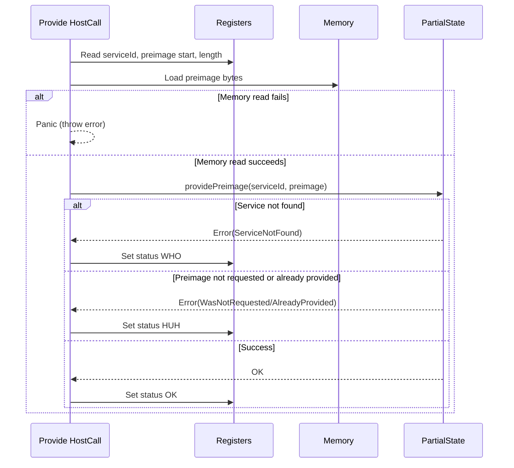

# Implement Provide(27) HC

## Pull Request by @DrEverr

Resolves: #379 


## Comment by @coderabbitai[bot]

<!-- This is an auto-generated comment: summarize by coderabbit.ai -->
<!-- This is an auto-generated comment: skip review by coderabbit.ai -->

> [!IMPORTANT]
> ## Review skipped
> 
> Auto incremental reviews are disabled on this repository.
> 
> Please check the settings in the CodeRabbit UI or the `.coderabbit.yaml` file in this repository. To trigger a single review, invoke the `@coderabbitai review` command.
> 
> You can disable this status message by setting the `reviews.review_status` to `false` in the CodeRabbit configuration file.

<!-- end of auto-generated comment: skip review by coderabbit.ai -->
<!-- walkthrough_start -->

<details>
<summary>📝 Walkthrough</summary>

## Summary by CodeRabbit

- **New Features**
  - Introduced support for providing preimages to services, including error handling for unrequested or already provided preimages.
- **Bug Fixes**
  - Ensured proper error codes are returned for unreadable memory, missing services, and invalid preimage provision scenarios.
- **Tests**
  - Added comprehensive test suites covering preimage provision logic and error cases.
- **Chores**
  - Updated mock implementations to support new preimage provision functionality.
## Walkthrough

A new "provide" host call (index 27) is implemented, enabling services to supply preimages to the state. This includes the `Provide` class, integration with the `PartialState` interface, and error handling via a new enum. Supporting logic, mock, and tests for preimage provision scenarios are also added.

## Changes

| File(s)                                                                                      | Change Summary                                                                                       |
|---------------------------------------------------------------------------------------------|------------------------------------------------------------------------------------------------------|
| `.../accumulate/provide.ts`                                                                 | Added `Provide` class implementing host call 27, handling preimage provision with error handling.    |
| `.../accumulate/provide.test.ts`                                                            | New test suite for `Provide` class, covering memory, error, and success scenarios.                   |
| `.../externalities/partial-state.ts`                                                        | Added `ProvidePreimageError` enum and `providePreimage` method to `PartialState` interface.          |
| `.../externalities/partial-state-db.ts`                                                     | Implemented `providePreimage` method in `PartialStateDb` for preimage provision and error checks.    |
| `.../externalities/partial-state-db.test.ts`                                                | Added tests for `PartialState.providePreimage`, covering all error and success cases.                |
| `.../externalities/partial-state-mock.ts`                                                   | Extended `PartialStateMock` with `providePreimage` method and tracking for test support.             |

## Sequence Diagram(s)



## Poem

> 🐇  
> A hop, a skip, a preimage supplied,  
> Through registers, bytes, and memory we glide.  
> If service is missing, we answer "WHO?"  
> If not requested, "HUH?" will do.  
> But when all aligns, the state shouts "OK!"  
> And the rabbit leaps on its merry way.  
>

</details>

<!-- walkthrough_end -->
<!-- internal state start -->


<!-- DwQgtGAEAqAWCWBnSTIEMB26CuAXA9mAOYCmGJATmriQCaQDG+Ats2bgFyQAOFk+AIwBWJBrngA3EsgEBPRvlqU0AgfFwA6NPEgQAfACgjoCEYDEZyAAUASpETZWaCrKNwSPbABsvkCiQBHbGlcSHFcLzpIACIASWZuSLYMUKsKfAl4JQAKACYAdgBKSAAJAGFoyAB3NGQHAWZ1Gno5MNgPbERKSAARCgBRKQo+Ws8fP0DgxFCMRwFugGYATgBGfixcdsgAMS9sADN92QAZFUQAelxZbhJ54fl/bnxEdXwXDRgt23RaWn9ELrIJAODyzZh3SALfJLAA06CBGFo8AY1CirU2HmiNmk+C8UkQXDMUKWlQw+BoKA2WyUiAYFHg3HE+AwHwAcvgfkimRg0L4lLhtF5kG9ICQAB6JTDUeDM5BVSgeXgZLJokiyZn0Taofz7BUYBgkD7uax2FFYeYTTIkeX0ahtDwAVRsxy4sFwuG4BPO5yI6lg2AEGiYzHOuwOR1OAguVxudxc5243i852WKw0Rn0xnAUDI9Hw+xwBGIZGUzQUrHYXF4/GEonE+MgrSYSioqnUWh0mZMUDgqFQmELhFI5CoZeDyU4fjQVXsjmYznkTcUyjbmm0ujAhizpgM3DQDAA1mhSBchGgQ2fmGBYM9cGAUT4LvuGI5vKiE+lMkoNDRpj+CQY0RAQYFiQAAgrExYjqi9AOE4Lj8AWDCwJgJ5GGBkDkDOv6hA46gePsIoYpAAAGaTKkoJGQDe0yMLyvj7Ng+rcry6jyChMgkGQnJ0B8sShJ00j2qRZJKBwOFUfsVBsFUbwHugiLwl0FC4MgEjODKnSNiQKGZG8woFsRZGfiqVEMF4tRyu0WDwCkyhiLZRDVH66CQMw+CHlEe4qfAvL2AKNBGlsOF1PAzBvhSNGhA+vjiqIeAylgVQubwJDeVE/i+tMlDIJg9BsO5CFMCk2gYI59iUJkBqQLEPS5YpqVhceHi0NQaBBR4eEUkwQzIOFXjiIknUGjy9LPFwTH+GgrUCJEbkkIV8gop05VoDwmDInCylVaC5KQIRTH0P4uDYBQZUYE5a2IDcDDwPsyLUbedHjP83jRcukDZCRADqJQAPIkYUcKNfOpCYXtqV6Z0XgPJMIRRCKvJTbQ8hKl+GUkCdZ2rWSGJ8M2HhfSUDolIDcJ5bODAGgCjG+GjSCJYhrkg81ExY+dl1YH9ADS/nUJ0Hz9PusBhCEkBDHd8BCcRx2neQ9BxS+3ITA4A1wjLJBZTQfDqXs0jk4pxG2dr+7cnKLnEe5nn0N54h+dMqJwmQDj0hdwnGRRJBmRZAIKMMdYw9ReWRMgSKHHqoSUOk+MauoiX1bB2BU9IyAooCHXUSQXg3HwjHMYzJGpel2JEIgYGIgAsgtbyyFRXSqZA2DcMJmVINrCfzYt+1EcFISIHC+CMol9HyCwTTlQVNcTFro6MwQ9hhRFHQYMjKhzZP7yfB4IUKBg90UMwbR2kZ5Ho1RUXPb4TD+2IgdN61v7T23OUKfQxv2Q3yWbMJtu+b4DsUitvJZ8bwkRu3nsRcUN0yxKgIEwLw6YjAgUsGBAapZ45hA5MRJQ5lnDSllEzKBbwywikTLNB67A47SAzJAVk1pRa0XunNaaShaBcELvuI8J5ziXh4eea8t57z0SfFTV8FkaAfk9j+EI/4zLMgFLZcqO9CJ8BPiZSijAfaIAAOTIBIorPAXt5qbEUOmIC0QMw7j3IeZqp5zx8KvFFIRj5zjPjEe+em35VIcEAsBUCEEoKliiHBecCF8yMBQhdahBgMJYU0ZZUip9TIoASEkSh4CtgkRKLeMo9ESjB0oFRd+FB9j7g8H2FI6RaBJyiPPSJtBmH2BupLBgj1aIxWct/WySgxSQAKK/Vy90xRRCIKMJgtFwkrAAAwZ1wb7JQNxETCiwAOWyIgxBRDIs4O2XgADKAUjG2QdvqbeHJ5w8jBizS5JkXjMgzvo4ZSsjFsBMUdEg01coVQoDtGqPR9rpEPmtGk8AiA8jLK3bKfARRKFKW9ZA881ovn9ikL5Pzarq2shMD5zN/BNTBnICkzgqDyCkiwTuU8VpuwdipAZkQLrf11lMGsCj5b/LJRC9uGc6VEC6anCyCRakcjWgsXIYA1ACQwC8UFUR36kAoBnK5HgCVCWcB4Lw+BpoypSEK0iAAhWQv5dXqoEEUyVAoTkAG4UAFg3vIdV01yqlPgEKDFHgDHKz3GVBgiAFW4tBuU+FmLPGCp/tsv+fNAqQF1bUBGVIPCvTVsJF5N5YKY0+QArSBNKSuWuqIFpT9IXsJ5kUgsDhk4028HCH6/0S3CW2siAN4NQgHURAbegWSSa1uIoq6ooxcYTCCPDPMIwvDI1Ruo3i4EsDihQp0esHhkKiHks7U6KrxhRxFGnFV/gg6IkiLQOEX8RYDkspQZW88US4GQo3cgEo6xRA3RQH1SDkHgTQbPAhEDqSiAsh+yVhCJTEIRnwMhXgKEpCoYgGhYFfhRDmXopJGiwpDQnOVLJOS8kFIoKa0i1iuHSAcQ4gR0xnFClcaI/qHiJ2yM6bAHxkBdDWHSDnK4pFunijrpjTBbTor0UpD0vp+QDAMagORFj8gSKjMQGUW8nHQjz2mcJxjYmz0SaRf4FIuzKoNtiLQU1cdWIAC8Q2ItlOa3ASmoAybNRQJOBARjJyHm7NaWyfK8n2aiU1xyDSWcgFXV5pF3UkGyFJrgABxWoMmmLazhJlAkNVsnTFyT4Euz8n1wltVwWIiXcDJa8FXRahQuDkUaF0YAEh8BZEgAAH2sBIZg/RHkJWZHoIpqSFrpKcsRC+HT1W+laTSOk8B5i2gEBkEgviLEGAgGAIweHbGEcvMRu8MULjim1jyMD4gCO/15GAABJAwC0EDDhf8PjzGvoCcOIJid4KjyQpEtCBheyhzugWFhny4k4VnPhbuqjMlWDDe5g5Ghg1pBIHi55mMU3Zo4W5rw+2DlHZOzI1SJE+KhGNlUmpnz2jZ26HnByzJSI4Q8zQb6fotPFVoFp75DaqKbDtPXZATdXJAIjR4I9YRZKoobR3Yq90iCruQD2/wg7aIUzQOpZ1KhnVsQ58gFRoo/TdG7fSUJo8+BdGpwuXnBoM47x6t0fqg05q0jIBpcalNqaIFpoHTxq0eB+tZkrzA5J2ha+09VKomL1C9uQGLqYzQtpJxt3b8dFFHc9qV+oLoXh9ixcxnLHGophgijuj/Z3YMajIH7YHodba2bJ+c9OtPfAM9q4h/6lAuVR3vJRugaXFlZqGi3gwhuEsjjCWvv4MQ5BfbhKMmDrPUPXm6JVm9AZxEDtM0VQiYStkKt4mCV76QHwYNcmHj4WQcJkPELlAqRu3AH4htsuZbASg9UGukEawQJEq3g8h/xBa9/SKzTQAeEguQTWF+InEx9YQ1wHgHs6Mj+/q/QZe6OL6/i76+C/6X6LUP6eCZsAGTwKkwGng5CrSlC22UG02tCHIyEqE0sHIRC6Bw6mBYG2BEGrGOCv6cBiAVqzIgcX2YsW6Hce+KkB+O6LCWqwk32TChok2lis2u4nCC2vCS2Tiq25w62lAm2kGCYQOCOB2yOZ2wh/ikE12o4wSc4uu4SRBUSeBsS9CyaiguGE6YBzUVEOePEmoWCAOyhZOJAPQJq8SAIQUqAZhtojmDcLm9aBoumVEkuFhVe1hjYxqhessZ0nyJE2IqsuApqSIl65UZaNu/AIwTSea90rSIBKoVhpAEB0c6Obe3h+08AT6oQx09IJADY0+q+jYEmARJAQRbKh8xE6m7AHOie7MKeABGe/aLatAGO9oWAwYiYj8xERqH+X+AgQciAIsg+WwwaNsI+Ayi6h4ganUq+4+6q+AB4rOCA0wU8rubk1AyE5U+e2UqxYRYM7ACEXO0+54aqZAPKsAfEBYZIlMIsVxkcYobcwo/2ioaxtheecM1xu+VRSeMRCkqe0cIxvIiAhB7Qmx1qmetxHgHE6Ade00i4XEWAKxf2bQqAHEsAPRxenMcJ6epa+AHx2JV8KJB4IulkkJlIykDcf+9CPaxsDh2xdOBo4+c+kAyRLECEFM0R/6aRKcGcZRgkyA4obcSiQBHcCUW2UsiuIopJjkA8e4g6gB3A2pAyCaoQ9SYGF0bIHI7u3QfWD0m68i6QDE6qM4th7kYcUswx0BKCsBKBCBwpSBf6BkoogG5BGRlB4G4Q6pNC/mMOvBbCFhnsBRwWzRumXAtOO0umNWmESYwMI+XA+qhqxqRWkA8Rb0wAPMcIiGJAiZRRbwrW2a8GiSThByrhOGHCNi3Ckh/C0hwishYoG2rEuBSh8OiOqIahaOwh02Vi4hHZ9iUhgiMhchZ0A56pQ5OyI5NAYAQC6hF2mhgSOht2GuTMhhT2xormOyzhFcHkB43sCSthchiIp++oewl+Dg3AaBzaPcwBw+GJVE3hnhCIS+Ugb8CQxCSimS+ZN+xqDOQBU+AOlhI+NZ2GVJqiQB6+mE9CRKaAEm35kOPQbUNhowsZ3GveoCl88KHIhc8FP5aFcS/wTwkqwJg8qm8ZoBI+8R9FXQBFCIuA2OBo9hu8PFuISa0Oig4+Ep4svIwQ9yOF/qv5Il9AthyGaSdk/F4lA4/RhkmSzRwRFAQuE4NeIkSYVE2Quat0ORI8iSVFkOiFGgaZDa7IuA2w+Ah0ZM/AeMyUXQKAUJ18tAWxl8600kmML84p0J8Byx/wXGdFsore7IblHuQZipbsNprSdplSQl+wTp/ubkigksvEnpb6JsPpvJfpuCAZqBQGFBoG4ZkG0GsGqxTFKk2FVl/qeFAoxWeCLyOUwAgO8OF5V5AA2tEDJc1NEAALp6D9WjUM6EFaKNm9UHKXmHitnzYzkXhdnzk9mLkKGDm7YqFI5bnjlQAb5eTMbMWUUJlsXSAcUkBcAlkDRlncwVnNXNSIV1kXqzVnl/x9VLWw4rUEadmOIbUuJbXLk7bKHrmHYHWIAkT4HHX5TyUsX5Ej4mWr6pmr4Zm1azA+A5kYl5nX6IC34CBFl3W4APVPUXUYmvXTXuEIZNmoiLXXm/XTn/WznrUkYLl9nyGg0XC7UQ2blXmyITkzZzbM12JrWA3s2bWc1Llqlg3DkHbbl+IoJaElj7mzh3ZHmPbRLGicG4QHL6VK4kQQXQ1ZVQJ5QmZCgchn7PnAHG2E0lEmEzhkCOCWUU3WWQFZVY6KA1IKUWywD+Bupl4SX0iYDeKkR2UGgOVOUuVVrfS1AOXYji7NCv4UwkSoJjqVl6Z8RxpzXnkHKmraylIGjkzoUzhlHnWsU/lZWxmHoIDXrPhpR+GkTaUoBKAQb3TdDZBY3N6RDFAhGUVV2D4wVG34323knYzOakQk3QU3BHyRwq5a4gqbZ1Ch4pyfQkTFrFAijMgeBLHAGVnVke2Mpr7gS/BxzMgjwl2NBkgxwVgooqLzjujlTHmc6jDziX6+kKnTBoayBSxeB6bGIprj60AeSODsBwGIIwGFUYK+l0HIEYLhJkEkIgYBhUGig0GRmw11XoMu15FKCH3FG0bB2+QpB6IR0kBR3OWIiv4/Tx3kiJ1B50Ap2KRp04koyZ1QFHXYNlFSpgqrqI34PI3NFo38ktH0CY3ZlO641Rqj2Fm3XSClnllMZu3gFl5vXFWfXA6eaUiF1lJmLASTlbjdjoN5jvZ4BDiq0wTlgThcBUAzghK65LgtgqDiodgbiGDGPjjqAAD6WQiA3j/gVoNo3j1KoQmYBgxjAArFCCsKIFMlMvkAIGgCQJE5E7cCsPsKsLQAsAACyRNTK5MMD5CxMABsuQKwOTUymTuQSw7j24UAXjuAvjvlATtRUswTuY7jQAA== -->

<!-- internal state end -->
<!-- tips_start -->

---


<details>
<summary>🪧 Tips</summary>

### Chat

There are 3 ways to chat with [CodeRabbit](https://coderabbit.ai?utm_source=oss&utm_medium=github&utm_campaign=FluffyLabs/typeberry&utm_content=391):

- Review comments: Directly reply to a review comment made by CodeRabbit. Example:
  - `I pushed a fix in commit <commit_id>, please review it.`
  - `Explain this complex logic.`
  - `Open a follow-up GitHub issue for this discussion.`
- Files and specific lines of code (under the "Files changed" tab): Tag `@coderabbitai` in a new review comment at the desired location with your query. Examples:
  - `@coderabbitai explain this code block.`
  -	`@coderabbitai modularize this function.`
- PR comments: Tag `@coderabbitai` in a new PR comment to ask questions about the PR branch. For the best results, please provide a very specific query, as very limited context is provided in this mode. Examples:
  - `@coderabbitai gather interesting stats about this repository and render them as a table. Additionally, render a pie chart showing the language distribution in the codebase.`
  - `@coderabbitai read src/utils.ts and explain its main purpose.`
  - `@coderabbitai read the files in the src/scheduler package and generate a class diagram using mermaid and a README in the markdown format.`
  - `@coderabbitai help me debug CodeRabbit configuration file.`

### Support

Need help? Create a ticket on our [support page](https://www.coderabbit.ai/contact-us/support) for assistance with any issues or questions.

Note: Be mindful of the bot's finite context window. It's strongly recommended to break down tasks such as reading entire modules into smaller chunks. For a focused discussion, use review comments to chat about specific files and their changes, instead of using the PR comments.

### CodeRabbit Commands (Invoked using PR comments)

- `@coderabbitai pause` to pause the reviews on a PR.
- `@coderabbitai resume` to resume the paused reviews.
- `@coderabbitai review` to trigger an incremental review. This is useful when automatic reviews are disabled for the repository.
- `@coderabbitai full review` to do a full review from scratch and review all the files again.
- `@coderabbitai summary` to regenerate the summary of the PR.
- `@coderabbitai generate sequence diagram` to generate a sequence diagram of the changes in this PR.
- `@coderabbitai resolve` resolve all the CodeRabbit review comments.
- `@coderabbitai configuration` to show the current CodeRabbit configuration for the repository.
- `@coderabbitai help` to get help.

### Other keywords and placeholders

- Add `@coderabbitai ignore` anywhere in the PR description to prevent this PR from being reviewed.
- Add `@coderabbitai summary` to generate the high-level summary at a specific location in the PR description.
- Add `@coderabbitai` anywhere in the PR title to generate the title automatically.

### Documentation and Community

- Visit our [Documentation](https://docs.coderabbit.ai) for detailed information on how to use CodeRabbit.
- Join our [Discord Community](http://discord.gg/coderabbit) to get help, request features, and share feedback.
- Follow us on [X/Twitter](https://twitter.com/coderabbitai) for updates and announcements.

</details>

<!-- tips_end -->


## Comment by @github-actions[bot]


<details>
<summary>View all</summary>

|  Name  |  Status  | |
|--------|----------|-|
| Trie test 0 | ✅ | | 
| Trie test 1 | ✅ | | 
| Trie test 2 | ✅ | | 
| Trie test 3 | ✅ | | 
| Trie test 4 | ✅ | | 
| Trie test 5 | ✅ | | 
| Trie test 6 | ✅ | | 
| Trie test 7 | ✅ | | 
| Trie test 8 | ✅ | | 
| Trie test 9 | ✅ | | 
| Trie test 10 | ✅ | | 
| Trie test 10 | ✅ | | 
| Trie test 10 | ✅ | | 
| jamtestvectors/statistics/tiny/stats_with_empty_extrinsic-1.json | ✅ | | 
| jamtestvectors/statistics/tiny/stats_with_epoch_change-1.json | ✅ | | 
| jamtestvectors/statistics/tiny/stats_with_some_extrinsic-1.json | ✅ | | 
| jamtestvectors/statistics/tiny/stats_with_some_extrinsic-1.json | ✅ | | 
| jamtestvectors/statistics/full/stats_with_empty_extrinsic-1.json | ✅ | | 
| jamtestvectors/statistics/full/stats_with_epoch_change-1.json | ✅ | | 
| jamtestvectors/statistics/full/stats_with_some_extrinsic-1.json | ✅ | | 
| jamtestvectors/statistics/full/stats_with_some_extrinsic-1.json | ✅ | | 
| should correctly shuffle input of length 0 | ✅ | | 
| should correctly shuffle input of length 8 | ✅ | | 
| should correctly shuffle input of length 16 | ✅ | | 
| should correctly shuffle input of length 20 | ✅ | | 
| should correctly shuffle input of length 50 | ✅ | | 
| should correctly shuffle input of length 100 | ✅ | | 
| should correctly shuffle input of length 200 | ✅ | | 
| should correctly shuffle input of length 341 | ✅ | | 
| should correctly shuffle input of length 341 | ✅ | | 
| should correctly shuffle input of length 341 | ✅ | | 
| jamtestvectors/safrole/tiny/enact-epoch-change-with-no-tickets-1.json | ✅ | | 
| jamtestvectors/safrole/tiny/enact-epoch-change-with-no-tickets-2.json | ✅ | | 
| jamtestvectors/safrole/tiny/enact-epoch-change-with-no-tickets-3.json | ✅ | | 
| jamtestvectors/safrole/tiny/enact-epoch-change-with-no-tickets-4.json | ✅ | | 
| jamtestvectors/safrole/tiny/enact-epoch-change-with-padding-1.json | ✅ | | 
| jamtestvectors/safrole/tiny/publish-tickets-no-mark-1.json | ✅ | | 
| jamtestvectors/safrole/tiny/publish-tickets-no-mark-2.json | ✅ | | 
| jamtestvectors/safrole/tiny/publish-tickets-no-mark-3.json | ✅ | | 
| jamtestvectors/safrole/tiny/publish-tickets-no-mark-4.json | ✅ | | 
| jamtestvectors/safrole/tiny/publish-tickets-no-mark-5.json | ✅ | | 
| jamtestvectors/safrole/tiny/publish-tickets-no-mark-6.json | ✅ | | 
| jamtestvectors/safrole/tiny/publish-tickets-no-mark-7.json | ✅ | | 
| jamtestvectors/safrole/tiny/publish-tickets-no-mark-8.json | ✅ | | 
| jamtestvectors/safrole/tiny/publish-tickets-no-mark-9.json | ✅ | | 
| jamtestvectors/safrole/tiny/publish-tickets-with-mark-1.json | ✅ | | 
| jamtestvectors/safrole/tiny/publish-tickets-with-mark-2.json | ✅ | | 
| jamtestvectors/safrole/tiny/publish-tickets-with-mark-3.json | ✅ | | 
| jamtestvectors/safrole/tiny/publish-tickets-with-mark-4.json | ✅ | | 
| jamtestvectors/safrole/tiny/publish-tickets-with-mark-5.json | ✅ | | 
| jamtestvectors/safrole/tiny/skip-epoch-tail-1.json | ✅ | | 
| jamtestvectors/safrole/tiny/skip-epochs-1.json | ✅ | | 
| jamtestvectors/safrole/full/enact-epoch-change-with-no-tickets-1.json | ✅ | | 
| jamtestvectors/safrole/full/enact-epoch-change-with-no-tickets-2.json | ✅ | | 
| jamtestvectors/safrole/full/enact-epoch-change-with-no-tickets-3.json | ✅ | | 
| jamtestvectors/safrole/full/enact-epoch-change-with-no-tickets-4.json | ✅ | | 
| jamtestvectors/safrole/full/enact-epoch-change-with-padding-1.json | ✅ | | 
| jamtestvectors/safrole/full/publish-tickets-no-mark-1.json | ✅ | | 
| jamtestvectors/safrole/full/publish-tickets-no-mark-2.json | ✅ | | 
| jamtestvectors/safrole/full/publish-tickets-no-mark-3.json | ✅ | | 
| jamtestvectors/safrole/full/publish-tickets-no-mark-4.json | ✅ | | 
| jamtestvectors/safrole/full/publish-tickets-no-mark-5.json | ✅ | | 
| jamtestvectors/safrole/full/publish-tickets-no-mark-6.json | ✅ | | 
| jamtestvectors/safrole/full/publish-tickets-no-mark-7.json | ✅ | | 
| jamtestvectors/safrole/full/publish-tickets-no-mark-8.json | ✅ | | 
| jamtestvectors/safrole/full/publish-tickets-no-mark-9.json | ✅ | | 
| jamtestvectors/safrole/full/publish-tickets-with-mark-1.json | ✅ | | 
| jamtestvectors/safrole/full/publish-tickets-with-mark-2.json | ✅ | | 
| jamtestvectors/safrole/full/publish-tickets-with-mark-3.json | ✅ | | 
| jamtestvectors/safrole/full/publish-tickets-with-mark-4.json | ✅ | | 
| jamtestvectors/safrole/full/publish-tickets-with-mark-5.json | ✅ | | 
| jamtestvectors/safrole/full/skip-epoch-tail-1.json | ✅ | | 
| jamtestvectors/safrole/full/skip-epochs-1.json | ✅ | | 
| jamtestvectors/safrole/full/skip-epochs-1.json | ✅ | | 
| jamtestvectors/reports/tiny/anchor_not_recent-1.json | ✅ | | 
| jamtestvectors/reports/tiny/bad_beefy_mmr-1.json | ✅ | | 
| jamtestvectors/reports/tiny/bad_code_hash-1.json | ✅ | | 
| jamtestvectors/reports/tiny/bad_core_index-1.json | ✅ | | 
| jamtestvectors/reports/tiny/bad_service_id-1.json | ✅ | | 
| jamtestvectors/reports/tiny/bad_signature-1.json | ✅ | | 
| jamtestvectors/reports/tiny/bad_state_root-1.json | ✅ | | 
| jamtestvectors/reports/tiny/bad_validator_index-1.json | ✅ | | 
| jamtestvectors/reports/tiny/big_work_report_output-1.json | ✅ | | 
| jamtestvectors/reports/tiny/core_engaged-1.json | ✅ | | 
| jamtestvectors/reports/tiny/dependency_missing-1.json | ✅ | | 
| jamtestvectors/reports/tiny/duplicate_package_in_recent_history-1.json | ✅ | | 
| jamtestvectors/reports/tiny/duplicated_package_in_report-1.json | ✅ | | 
| jamtestvectors/reports/tiny/future_report_slot-1.json | ✅ | | 
| jamtestvectors/reports/tiny/high_work_report_gas-1.json | ✅ | | 
| jamtestvectors/reports/tiny/many_dependencies-1.json | ✅ | | 
| jamtestvectors/reports/tiny/multiple_reports-1.json | ✅ | | 
| jamtestvectors/reports/tiny/no_enough_guarantees-1.json | ✅ | | 
| jamtestvectors/reports/tiny/not_authorized-1.json | ✅ | | 
| jamtestvectors/reports/tiny/not_authorized-2.json | ✅ | | 
| jamtestvectors/reports/tiny/not_sorted_guarantor-1.json | ✅ | | 
| jamtestvectors/reports/tiny/out_of_order_guarantees-1.json | ✅ | | 
| jamtestvectors/reports/tiny/report_before_last_rotation-1.json | ✅ | | 
| jamtestvectors/reports/tiny/report_curr_rotation-1.json | ✅ | | 
| jamtestvectors/reports/tiny/report_prev_rotation-1.json | ✅ | | 
| jamtestvectors/reports/tiny/reports_with_dependencies-1.json | ✅ | | 
| jamtestvectors/reports/tiny/reports_with_dependencies-2.json | ✅ | | 
| jamtestvectors/reports/tiny/reports_with_dependencies-3.json | ✅ | | 
| jamtestvectors/reports/tiny/reports_with_dependencies-4.json | ✅ | | 
| jamtestvectors/reports/tiny/reports_with_dependencies-5.json | ✅ | | 
| jamtestvectors/reports/tiny/reports_with_dependencies-6.json | ✅ | | 
| jamtestvectors/reports/tiny/segment_root_lookup_invalid-1.json | ✅ | | 
| jamtestvectors/reports/tiny/segment_root_lookup_invalid-2.json | ✅ | | 
| jamtestvectors/reports/tiny/service_item_gas_too_low-1.json | ✅ | | 
| jamtestvectors/reports/tiny/too_big_work_report_output-1.json | ✅ | | 
| jamtestvectors/reports/tiny/too_high_work_report_gas-1.json | ✅ | | 
| jamtestvectors/reports/tiny/too_many_dependencies-1.json | ✅ | | 
| jamtestvectors/reports/tiny/with_avail_assignments-1.json | ✅ | | 
| jamtestvectors/reports/tiny/wrong_assignment-1.json | ✅ | | 
| jamtestvectors/reports/tiny/wrong_assignment-1.json | ✅ | | 
| jamtestvectors/reports/full/anchor_not_recent-1.json | ✅ | | 
| jamtestvectors/reports/full/bad_beefy_mmr-1.json | ✅ | | 
| jamtestvectors/reports/full/bad_code_hash-1.json | ✅ | | 
| jamtestvectors/reports/full/bad_core_index-1.json | ✅ | | 
| jamtestvectors/reports/full/bad_service_id-1.json | ✅ | | 
| jamtestvectors/reports/full/bad_signature-1.json | ✅ | | 
| jamtestvectors/reports/full/bad_state_root-1.json | ✅ | | 
| jamtestvectors/reports/full/bad_validator_index-1.json | ✅ | | 
| jamtestvectors/reports/full/big_work_report_output-1.json | ✅ | | 
| jamtestvectors/reports/full/core_engaged-1.json | ✅ | | 
| jamtestvectors/reports/full/dependency_missing-1.json | ✅ | | 
| jamtestvectors/reports/full/duplicate_package_in_recent_history-1.json | ✅ | | 
| jamtestvectors/reports/full/duplicated_package_in_report-1.json | ✅ | | 
| jamtestvectors/reports/full/future_report_slot-1.json | ✅ | | 
| jamtestvectors/reports/full/high_work_report_gas-1.json | ✅ | | 
| jamtestvectors/reports/full/many_dependencies-1.json | ✅ | | 
| jamtestvectors/reports/full/multiple_reports-1.json | ✅ | | 
| jamtestvectors/reports/full/no_enough_guarantees-1.json | ✅ | | 
| jamtestvectors/reports/full/not_authorized-1.json | ✅ | | 
| jamtestvectors/reports/full/not_authorized-2.json | ✅ | | 
| jamtestvectors/reports/full/not_sorted_guarantor-1.json | ✅ | | 
| jamtestvectors/reports/full/out_of_order_guarantees-1.json | ✅ | | 
| jamtestvectors/reports/full/report_before_last_rotation-1.json | ✅ | | 
| jamtestvectors/reports/full/report_curr_rotation-1.json | ✅ | | 
| jamtestvectors/reports/full/report_prev_rotation-1.json | ✅ | | 
| jamtestvectors/reports/full/reports_with_dependencies-1.json | ✅ | | 
| jamtestvectors/reports/full/reports_with_dependencies-2.json | ✅ | | 
| jamtestvectors/reports/full/reports_with_dependencies-3.json | ✅ | | 
| jamtestvectors/reports/full/reports_with_dependencies-4.json | ✅ | | 
| jamtestvectors/reports/full/reports_with_dependencies-5.json | ✅ | | 
| jamtestvectors/reports/full/reports_with_dependencies-6.json | ✅ | | 
| jamtestvectors/reports/full/segment_root_lookup_invalid-1.json | ✅ | | 
| jamtestvectors/reports/full/segment_root_lookup_invalid-2.json | ✅ | | 
| jamtestvectors/reports/full/service_item_gas_too_low-1.json | ✅ | | 
| jamtestvectors/reports/full/too_big_work_report_output-1.json | ✅ | | 
| jamtestvectors/reports/full/too_high_work_report_gas-1.json | ✅ | | 
| jamtestvectors/reports/full/too_many_dependencies-1.json | ✅ | | 
| jamtestvectors/reports/full/with_avail_assignments-1.json | ✅ | | 
| jamtestvectors/reports/full/wrong_assignment-1.json | ✅ | | 
| jamtestvectors/reports/full/wrong_assignment-1.json | ✅ | | 
| jamtestvectors/pvm/schema.json | ✅ | | 
| jamtestvectors/erasure_coding/schema_ec.json | ✅ | | 
| jamtestvectors/erasure_coding/schema_page_proof.json | ✅ | | 
| jamtestvectors/erasure_coding/schema_segment_ec.json | ✅ | | 
| jamtestvectors/erasure_coding/schema_segment_root.json | ✅ | | 
| jamtestvectors/erasure_coding/schema_segment_root.json | ✅ | | 
| jamtestvectors/pvm/programs/gas_basic_consume_all.json | ✅ | | 
| jamtestvectors/pvm/programs/inst_add_32.json | ✅ | | 
| jamtestvectors/pvm/programs/inst_add_32_with_overflow.json | ✅ | | 
| jamtestvectors/pvm/programs/inst_add_32_with_truncation.json | ✅ | | 
| jamtestvectors/pvm/programs/inst_add_32_with_truncation_and_sign_extension.json | ✅ | | 
| jamtestvectors/pvm/programs/inst_add_64.json | ✅ | | 
| jamtestvectors/pvm/programs/inst_add_64_with_overflow.json | ✅ | | 
| jamtestvectors/pvm/programs/inst_add_imm_32.json | ✅ | | 
| jamtestvectors/pvm/programs/inst_add_imm_32_with_truncation.json | ✅ | | 
| jamtestvectors/pvm/programs/inst_add_imm_32_with_truncation_and_sign_extension.json | ✅ | | 
| jamtestvectors/pvm/programs/inst_add_imm_64.json | ✅ | | 
| jamtestvectors/pvm/programs/inst_and.json | ✅ | | 
| jamtestvectors/pvm/programs/inst_and_imm.json | ✅ | | 
| jamtestvectors/pvm/programs/inst_branch_eq_imm_nok.json | ✅ | | 
| jamtestvectors/pvm/programs/inst_branch_eq_imm_ok.json | ✅ | | 
| jamtestvectors/pvm/programs/inst_branch_eq_nok.json | ✅ | | 
| jamtestvectors/pvm/programs/inst_branch_eq_ok.json | ✅ | | 
| jamtestvectors/pvm/programs/inst_branch_greater_or_equal_signed_imm_nok.json | ✅ | | 
| jamtestvectors/pvm/programs/inst_branch_greater_or_equal_signed_imm_ok.json | ✅ | | 
| jamtestvectors/pvm/programs/inst_branch_greater_or_equal_signed_nok.json | ✅ | | 
| jamtestvectors/pvm/programs/inst_branch_greater_or_equal_signed_ok.json | ✅ | | 
| jamtestvectors/pvm/programs/inst_branch_greater_or_equal_unsigned_imm_nok.json | ✅ | | 
| jamtestvectors/pvm/programs/inst_branch_greater_or_equal_unsigned_imm_ok.json | ✅ | | 
| jamtestvectors/pvm/programs/inst_branch_greater_or_equal_unsigned_nok.json | ✅ | | 
| jamtestvectors/pvm/programs/inst_branch_greater_or_equal_unsigned_ok.json | ✅ | | 
| jamtestvectors/pvm/programs/inst_branch_greater_signed_imm_nok.json | ✅ | | 
| jamtestvectors/pvm/programs/inst_branch_greater_signed_imm_ok.json | ✅ | | 
| jamtestvectors/pvm/programs/inst_branch_greater_unsigned_imm_nok.json | ✅ | | 
| jamtestvectors/pvm/programs/inst_branch_greater_unsigned_imm_ok.json | ✅ | | 
| jamtestvectors/pvm/programs/inst_branch_less_or_equal_signed_imm_nok.json | ✅ | | 
| jamtestvectors/pvm/programs/inst_branch_less_or_equal_signed_imm_ok.json | ✅ | | 
| jamtestvectors/pvm/programs/inst_branch_less_or_equal_unsigned_imm_nok.json | ✅ | | 
| jamtestvectors/pvm/programs/inst_branch_less_or_equal_unsigned_imm_ok.json | ✅ | | 
| jamtestvectors/pvm/programs/inst_branch_less_signed_imm_nok.json | ✅ | | 
| jamtestvectors/pvm/programs/inst_branch_less_signed_imm_ok.json | ✅ | | 
| jamtestvectors/pvm/programs/inst_branch_less_signed_nok.json | ✅ | | 
| jamtestvectors/pvm/programs/inst_branch_less_signed_ok.json | ✅ | | 
| jamtestvectors/pvm/programs/inst_branch_less_unsigned_imm_nok.json | ✅ | | 
| jamtestvectors/pvm/programs/inst_branch_less_unsigned_imm_ok.json | ✅ | | 
| jamtestvectors/pvm/programs/inst_branch_less_unsigned_nok.json | ✅ | | 
| jamtestvectors/pvm/programs/inst_branch_less_unsigned_ok.json | ✅ | | 
| jamtestvectors/pvm/programs/inst_branch_not_eq_imm_nok.json | ✅ | | 
| jamtestvectors/pvm/programs/inst_branch_not_eq_imm_ok.json | ✅ | | 
| jamtestvectors/pvm/programs/inst_branch_not_eq_nok.json | ✅ | | 
| jamtestvectors/pvm/programs/inst_branch_not_eq_ok.json | ✅ | | 
| jamtestvectors/pvm/programs/inst_cmov_if_zero_imm_nok.json | ✅ | | 
| jamtestvectors/pvm/programs/inst_cmov_if_zero_imm_ok.json | ✅ | | 
| jamtestvectors/pvm/programs/inst_cmov_if_zero_nok.json | ✅ | | 
| jamtestvectors/pvm/programs/inst_cmov_if_zero_ok.json | ✅ | | 
| jamtestvectors/pvm/programs/inst_div_signed_32.json | ✅ | | 
| jamtestvectors/pvm/programs/inst_div_signed_32.json | ✅ | | 
| jamtestvectors/pvm/programs/inst_div_signed_32_by_zero.json | ✅ | | 
| jamtestvectors/pvm/programs/inst_div_signed_32_with_overflow.json | ✅ | | 
| jamtestvectors/pvm/programs/inst_div_signed_64.json | ✅ | | 
| jamtestvectors/pvm/programs/inst_div_signed_64_by_zero.json | ✅ | | 
| jamtestvectors/pvm/programs/inst_div_signed_64_with_overflow.json | ✅ | | 
| jamtestvectors/pvm/programs/inst_div_unsigned_32.json | ✅ | | 
| jamtestvectors/pvm/programs/inst_div_unsigned_32_by_zero.json | ✅ | | 
| jamtestvectors/pvm/programs/inst_div_unsigned_32_with_overflow.json | ✅ | | 
| jamtestvectors/pvm/programs/inst_div_unsigned_64.json | ✅ | | 
| jamtestvectors/pvm/programs/inst_div_unsigned_64_by_zero.json | ✅ | | 
| jamtestvectors/pvm/programs/inst_div_unsigned_64_with_overflow.json | ✅ | | 
| jamtestvectors/pvm/programs/inst_fallthrough.json | ✅ | | 
| jamtestvectors/pvm/programs/inst_jump.json | ✅ | | 
| jamtestvectors/pvm/programs/inst_jump_indirect_invalid_djump_to_zero_nok.json | ✅ | | 
| jamtestvectors/pvm/programs/inst_jump_indirect_misaligned_djump_with_offset_nok.json | ✅ | | 
| jamtestvectors/pvm/programs/inst_jump_indirect_misaligned_djump_without_offset_nok.json | ✅ | | 
| jamtestvectors/pvm/programs/inst_jump_indirect_with_offset_ok.json | ✅ | | 
| jamtestvectors/pvm/programs/inst_jump_indirect_without_offset_ok.json | ✅ | | 
| jamtestvectors/pvm/programs/inst_load_i16.json | ✅ | | 
| jamtestvectors/pvm/programs/inst_load_i32.json | ✅ | | 
| jamtestvectors/pvm/programs/inst_load_i8.json | ✅ | | 
| jamtestvectors/pvm/programs/inst_load_imm.json | ✅ | | 
| jamtestvectors/pvm/programs/inst_load_imm_64.json | ✅ | | 
| jamtestvectors/pvm/programs/inst_load_imm_and_jump.json | ✅ | | 
| jamtestvectors/pvm/programs/inst_load_imm_and_jump_indirect_different_regs_with_offset_ok.json | ✅ | | 
| jamtestvectors/pvm/programs/inst_load_imm_and_jump_indirect_different_regs_without_offset_ok.json | ✅ | | 
| jamtestvectors/pvm/programs/inst_load_imm_and_jump_indirect_invalid_djump_to_zero_different_regs_without_offset_nok.json | ✅ | | 
| jamtestvectors/pvm/programs/inst_load_imm_and_jump_indirect_invalid_djump_to_zero_same_regs_without_offset_nok.json | ✅ | | 
| jamtestvectors/pvm/programs/inst_load_imm_and_jump_indirect_misaligned_djump_different_regs_with_offset_nok.json | ✅ | | 
| jamtestvectors/pvm/programs/inst_load_imm_and_jump_indirect_misaligned_djump_different_regs_without_offset_nok.json | ✅ | | 
| jamtestvectors/pvm/programs/inst_load_imm_and_jump_indirect_misaligned_djump_same_regs_with_offset_nok.json | ✅ | | 
| jamtestvectors/pvm/programs/inst_load_imm_and_jump_indirect_misaligned_djump_same_regs_without_offset_nok.json | ✅ | | 
| jamtestvectors/pvm/programs/inst_load_imm_and_jump_indirect_same_regs_with_offset_ok.json | ✅ | | 
| jamtestvectors/pvm/programs/inst_load_imm_and_jump_indirect_same_regs_without_offset_ok.json | ✅ | | 
| jamtestvectors/pvm/programs/inst_load_indirect_i16_with_offset.json | ✅ | | 
| jamtestvectors/pvm/programs/inst_load_indirect_i16_without_offset.json | ✅ | | 
| jamtestvectors/pvm/programs/inst_load_indirect_i32_with_offset.json | ✅ | | 
| jamtestvectors/pvm/programs/inst_load_indirect_i32_without_offset.json | ✅ | | 
| jamtestvectors/pvm/programs/inst_load_indirect_i8_with_offset.json | ✅ | | 
| jamtestvectors/pvm/programs/inst_load_indirect_i8_without_offset.json | ✅ | | 
| jamtestvectors/pvm/programs/inst_load_indirect_u16_with_offset.json | ✅ | | 
| jamtestvectors/pvm/programs/inst_load_indirect_u16_without_offset.json | ✅ | | 
| jamtestvectors/pvm/programs/inst_load_indirect_u32_with_offset.json | ✅ | | 
| jamtestvectors/pvm/programs/inst_load_indirect_u32_without_offset.json | ✅ | | 
| jamtestvectors/pvm/programs/inst_load_indirect_u64_with_offset.json | ✅ | | 
| jamtestvectors/pvm/programs/inst_load_indirect_u64_without_offset.json | ✅ | | 
| jamtestvectors/pvm/programs/inst_load_indirect_u8_with_offset.json | ✅ | | 
| jamtestvectors/pvm/programs/inst_load_indirect_u8_without_offset.json | ✅ | | 
| jamtestvectors/pvm/programs/inst_load_u16.json | ✅ | | 
| jamtestvectors/pvm/programs/inst_load_u32.json | ✅ | | 
| jamtestvectors/pvm/programs/inst_load_u32.json | ✅ | | 
| jamtestvectors/pvm/programs/inst_load_u64.json | ✅ | | 
| jamtestvectors/pvm/programs/inst_load_u8.json | ✅ | | 
| jamtestvectors/pvm/programs/inst_load_u8_nok.json | ✅ | | 
| jamtestvectors/pvm/programs/inst_move_reg.json | ✅ | | 
| jamtestvectors/pvm/programs/inst_mul_32.json | ✅ | | 
| jamtestvectors/pvm/programs/inst_mul_64.json | ✅ | | 
| jamtestvectors/pvm/programs/inst_mul_imm_32.json | ✅ | | 
| jamtestvectors/pvm/programs/inst_mul_imm_64.json | ✅ | | 
| jamtestvectors/pvm/programs/inst_negate_and_add_imm_32.json | ✅ | | 
| jamtestvectors/pvm/programs/inst_negate_and_add_imm_64.json | ✅ | | 
| jamtestvectors/pvm/programs/inst_or.json | ✅ | | 
| jamtestvectors/pvm/programs/inst_or_imm.json | ✅ | | 
| jamtestvectors/pvm/programs/inst_rem_signed_32.json | ✅ | | 
| jamtestvectors/pvm/programs/inst_rem_signed_32_by_zero.json | ✅ | | 
| jamtestvectors/pvm/programs/inst_rem_signed_32_with_overflow.json | ✅ | | 
| jamtestvectors/pvm/programs/inst_rem_signed_64.json | ✅ | | 
| jamtestvectors/pvm/programs/inst_rem_signed_64_by_zero.json | ✅ | | 
| jamtestvectors/pvm/programs/inst_rem_signed_64_with_overflow.json | ✅ | | 
| jamtestvectors/pvm/programs/inst_rem_unsigned_32.json | ✅ | | 
| jamtestvectors/pvm/programs/inst_rem_unsigned_32_by_zero.json | ✅ | | 
| jamtestvectors/pvm/programs/inst_rem_unsigned_64.json | ✅ | | 
| jamtestvectors/pvm/programs/inst_rem_unsigned_64_by_zero.json | ✅ | | 
| jamtestvectors/pvm/programs/inst_ret_halt.json | ✅ | | 
| jamtestvectors/pvm/programs/inst_ret_invalid.json | ✅ | | 
| jamtestvectors/pvm/programs/inst_set_greater_than_signed_imm_0.json | ✅ | | 
| jamtestvectors/pvm/programs/inst_set_greater_than_signed_imm_1.json | ✅ | | 
| jamtestvectors/pvm/programs/inst_set_greater_than_unsigned_imm_0.json | ✅ | | 
| jamtestvectors/pvm/programs/inst_set_greater_than_unsigned_imm_1.json | ✅ | | 
| jamtestvectors/pvm/programs/inst_set_less_than_signed_0.json | ✅ | | 
| jamtestvectors/pvm/programs/inst_set_less_than_signed_1.json | ✅ | | 
| jamtestvectors/pvm/programs/inst_set_less_than_signed_imm_0.json | ✅ | | 
| jamtestvectors/pvm/programs/inst_set_less_than_signed_imm_1.json | ✅ | | 
| jamtestvectors/pvm/programs/inst_set_less_than_unsigned_0.json | ✅ | | 
| jamtestvectors/pvm/programs/inst_set_less_than_unsigned_1.json | ✅ | | 
| jamtestvectors/pvm/programs/inst_set_less_than_unsigned_imm_0.json | ✅ | | 
| jamtestvectors/pvm/programs/inst_set_less_than_unsigned_imm_1.json | ✅ | | 
| jamtestvectors/pvm/programs/inst_shift_arithmetic_right_32.json | ✅ | | 
| jamtestvectors/pvm/programs/inst_shift_arithmetic_right_32_with_overflow.json | ✅ | | 
| jamtestvectors/pvm/programs/inst_shift_arithmetic_right_64.json | ✅ | | 
| jamtestvectors/pvm/programs/inst_shift_arithmetic_right_64_with_overflow.json | ✅ | | 
| jamtestvectors/pvm/programs/inst_shift_arithmetic_right_imm_32.json | ✅ | | 
| jamtestvectors/pvm/programs/inst_shift_arithmetic_right_imm_64.json | ✅ | | 
| jamtestvectors/pvm/programs/inst_shift_arithmetic_right_imm_alt_32.json | ✅ | | 
| jamtestvectors/pvm/programs/inst_shift_arithmetic_right_imm_alt_64.json | ✅ | | 
| jamtestvectors/pvm/programs/inst_shift_logical_left_32.json | ✅ | | 
| jamtestvectors/pvm/programs/inst_shift_logical_left_32_with_overflow.json | ✅ | | 
| jamtestvectors/pvm/programs/inst_shift_logical_left_64.json | ✅ | | 
| jamtestvectors/pvm/programs/inst_shift_logical_left_64_with_overflow.json | ✅ | | 
| jamtestvectors/pvm/programs/inst_shift_logical_left_imm_32.json | ✅ | | 
| jamtestvectors/pvm/programs/inst_shift_logical_left_imm_64.json | ✅ | | 
| jamtestvectors/pvm/programs/inst_shift_logical_left_imm_64.json | ✅ | | 
| jamtestvectors/pvm/programs/inst_shift_logical_left_imm_alt_32.json | ✅ | | 
| jamtestvectors/pvm/programs/inst_shift_logical_left_imm_alt_64.json | ✅ | | 
| jamtestvectors/pvm/programs/inst_shift_logical_right_32.json | ✅ | | 
| jamtestvectors/pvm/programs/inst_shift_logical_right_32_with_overflow.json | ✅ | | 
| jamtestvectors/pvm/programs/inst_shift_logical_right_64.json | ✅ | | 
| jamtestvectors/pvm/programs/inst_shift_logical_right_64_with_overflow.json | ✅ | | 
| jamtestvectors/pvm/programs/inst_shift_logical_right_imm_32.json | ✅ | | 
| jamtestvectors/pvm/programs/inst_shift_logical_right_imm_64.json | ✅ | | 
| jamtestvectors/pvm/programs/inst_shift_logical_right_imm_alt_32.json | ✅ | | 
| jamtestvectors/pvm/programs/inst_shift_logical_right_imm_alt_64.json | ✅ | | 
| jamtestvectors/pvm/programs/inst_store_imm_indirect_u16_with_offset_nok.json | ✅ | | 
| jamtestvectors/pvm/programs/inst_store_imm_indirect_u16_with_offset_ok.json | ✅ | | 
| jamtestvectors/pvm/programs/inst_store_imm_indirect_u16_without_offset_ok.json | ✅ | | 
| jamtestvectors/pvm/programs/inst_store_imm_indirect_u32_with_offset_nok.json | ✅ | | 
| jamtestvectors/pvm/programs/inst_store_imm_indirect_u32_with_offset_ok.json | ✅ | | 
| jamtestvectors/pvm/programs/inst_store_imm_indirect_u32_without_offset_ok.json | ✅ | | 
| jamtestvectors/pvm/programs/inst_store_imm_indirect_u64_with_offset_nok.json | ✅ | | 
| jamtestvectors/pvm/programs/inst_store_imm_indirect_u64_with_offset_ok.json | ✅ | | 
| jamtestvectors/pvm/programs/inst_store_imm_indirect_u64_without_offset_ok.json | ✅ | | 
| jamtestvectors/pvm/programs/inst_store_imm_indirect_u8_with_offset_nok.json | ✅ | | 
| jamtestvectors/pvm/programs/inst_store_imm_indirect_u8_with_offset_ok.json | ✅ | | 
| jamtestvectors/pvm/programs/inst_store_imm_indirect_u8_without_offset_ok.json | ✅ | | 
| jamtestvectors/pvm/programs/inst_store_imm_u16.json | ✅ | | 
| jamtestvectors/pvm/programs/inst_store_imm_u32.json | ✅ | | 
| jamtestvectors/pvm/programs/inst_store_imm_u64.json | ✅ | | 
| jamtestvectors/pvm/programs/inst_store_imm_u8.json | ✅ | | 
| jamtestvectors/pvm/programs/inst_store_imm_u8_trap_inaccessible.json | ✅ | | 
| jamtestvectors/pvm/programs/inst_store_imm_u8_trap_read_only.json | ✅ | | 
| jamtestvectors/pvm/programs/inst_store_indirect_u16_with_offset_nok.json | ✅ | | 
| jamtestvectors/pvm/programs/inst_store_indirect_u16_with_offset_ok.json | ✅ | | 
| jamtestvectors/pvm/programs/inst_store_indirect_u16_without_offset_ok.json | ✅ | | 
| jamtestvectors/pvm/programs/inst_store_indirect_u32_with_offset_nok.json | ✅ | | 
| jamtestvectors/pvm/programs/inst_store_indirect_u32_with_offset_ok.json | ✅ | | 
| jamtestvectors/pvm/programs/inst_store_indirect_u32_without_offset_ok.json | ✅ | | 
| jamtestvectors/pvm/programs/inst_store_indirect_u64_with_offset_nok.json | ✅ | | 
| jamtestvectors/pvm/programs/inst_store_indirect_u64_with_offset_ok.json | ✅ | | 
| jamtestvectors/pvm/programs/inst_store_indirect_u64_without_offset_ok.json | ✅ | | 
| jamtestvectors/pvm/programs/inst_store_indirect_u8_with_offset_nok.json | ✅ | | 
| jamtestvectors/pvm/programs/inst_store_indirect_u8_with_offset_ok.json | ✅ | | 
| jamtestvectors/pvm/programs/inst_store_indirect_u8_without_offset_ok.json | ✅ | | 
| jamtestvectors/pvm/programs/inst_store_u16.json | ✅ | | 
| jamtestvectors/pvm/programs/inst_store_u32.json | ✅ | | 
| jamtestvectors/pvm/programs/inst_store_u64.json | ✅ | | 
| jamtestvectors/pvm/programs/inst_store_u8.json | ✅ | | 
| jamtestvectors/pvm/programs/inst_store_u8_trap_inaccessible.json | ✅ | | 
| jamtestvectors/pvm/programs/inst_store_u8_trap_read_only.json | ✅ | | 
| jamtestvectors/pvm/programs/inst_sub_32.json | ✅ | | 
| jamtestvectors/pvm/programs/inst_sub_32_with_overflow.json | ✅ | | 
| jamtestvectors/pvm/programs/inst_sub_64.json | ✅ | | 
| jamtestvectors/pvm/programs/inst_sub_64_with_overflow.json | ✅ | | 
| jamtestvectors/pvm/programs/inst_sub_64_with_overflow.json | ✅ | | 
| jamtestvectors/pvm/programs/inst_sub_imm_32.json | ✅ | | 
| jamtestvectors/pvm/programs/inst_sub_imm_64.json | ✅ | | 
| jamtestvectors/pvm/programs/inst_trap.json | ✅ | | 
| jamtestvectors/pvm/programs/inst_xor.json | ✅ | | 
| jamtestvectors/pvm/programs/inst_xor_imm.json | ✅ | | 
| jamtestvectors/pvm/programs/riscv_rv64ua_amoadd_d.json | ✅ | | 
| jamtestvectors/pvm/programs/riscv_rv64ua_amoadd_w.json | ✅ | | 
| jamtestvectors/pvm/programs/riscv_rv64ua_amoand_d.json | ✅ | | 
| jamtestvectors/pvm/programs/riscv_rv64ua_amoand_w.json | ✅ | | 
| jamtestvectors/pvm/programs/riscv_rv64ua_amomax_d.json | ✅ | | 
| jamtestvectors/pvm/programs/riscv_rv64ua_amomax_w.json | ✅ | | 
| jamtestvectors/pvm/programs/riscv_rv64ua_amomaxu_d.json | ✅ | | 
| jamtestvectors/pvm/programs/riscv_rv64ua_amomaxu_w.json | ✅ | | 
| jamtestvectors/pvm/programs/riscv_rv64ua_amomin_d.json | ✅ | | 
| jamtestvectors/pvm/programs/riscv_rv64ua_amomin_w.json | ✅ | | 
| jamtestvectors/pvm/programs/riscv_rv64ua_amominu_d.json | ✅ | | 
| jamtestvectors/pvm/programs/riscv_rv64ua_amominu_w.json | ✅ | | 
| jamtestvectors/pvm/programs/riscv_rv64ua_amoor_d.json | ✅ | | 
| jamtestvectors/pvm/programs/riscv_rv64ua_amoor_w.json | ✅ | | 
| jamtestvectors/pvm/programs/riscv_rv64ua_amoswap_d.json | ✅ | | 
| jamtestvectors/pvm/programs/riscv_rv64ua_amoswap_w.json | ✅ | | 
| jamtestvectors/pvm/programs/riscv_rv64ua_amoxor_d.json | ✅ | | 
| jamtestvectors/pvm/programs/riscv_rv64ua_amoxor_w.json | ✅ | | 
| jamtestvectors/pvm/programs/riscv_rv64uc_rvc.json | ✅ | | 
| jamtestvectors/pvm/programs/riscv_rv64ui_add.json | ✅ | | 
| jamtestvectors/pvm/programs/riscv_rv64ui_addi.json | ✅ | | 
| jamtestvectors/pvm/programs/riscv_rv64ui_addiw.json | ✅ | | 
| jamtestvectors/pvm/programs/riscv_rv64ui_addw.json | ✅ | | 
| jamtestvectors/pvm/programs/riscv_rv64ui_and.json | ✅ | | 
| jamtestvectors/pvm/programs/riscv_rv64ui_andi.json | ✅ | | 
| jamtestvectors/pvm/programs/riscv_rv64ui_beq.json | ✅ | | 
| jamtestvectors/pvm/programs/riscv_rv64ui_bge.json | ✅ | | 
| jamtestvectors/pvm/programs/riscv_rv64ui_bgeu.json | ✅ | | 
| jamtestvectors/pvm/programs/riscv_rv64ui_blt.json | ✅ | | 
| jamtestvectors/pvm/programs/riscv_rv64ui_bltu.json | ✅ | | 
| jamtestvectors/pvm/programs/riscv_rv64ui_bne.json | ✅ | | 
| jamtestvectors/pvm/programs/riscv_rv64ui_jal.json | ✅ | | 
| jamtestvectors/pvm/programs/riscv_rv64ui_jalr.json | ✅ | | 
| jamtestvectors/pvm/programs/riscv_rv64ui_lb.json | ✅ | | 
| jamtestvectors/pvm/programs/riscv_rv64ui_lbu.json | ✅ | | 
| jamtestvectors/pvm/programs/riscv_rv64ui_ld.json | ✅ | | 
| jamtestvectors/pvm/programs/riscv_rv64ui_lh.json | ✅ | | 
| jamtestvectors/pvm/programs/riscv_rv64ui_lhu.json | ✅ | | 
| jamtestvectors/pvm/programs/riscv_rv64ui_lui.json | ✅ | | 
| jamtestvectors/pvm/programs/riscv_rv64ui_lw.json | ✅ | | 
| jamtestvectors/pvm/programs/riscv_rv64ui_lwu.json | ✅ | | 
| jamtestvectors/pvm/programs/riscv_rv64ui_ma_data.json | ✅ | | 
| jamtestvectors/pvm/programs/riscv_rv64ui_or.json | ✅ | | 
| jamtestvectors/pvm/programs/riscv_rv64ui_ori.json | ✅ | | 
| jamtestvectors/pvm/programs/riscv_rv64ui_sb.json | ✅ | | 
| jamtestvectors/pvm/programs/riscv_rv64ui_sb.json | ✅ | | 
| jamtestvectors/pvm/programs/riscv_rv64ui_sd.json | ✅ | | 
| jamtestvectors/pvm/programs/riscv_rv64ui_sh.json | ✅ | | 
| jamtestvectors/pvm/programs/riscv_rv64ui_simple.json | ✅ | | 
| jamtestvectors/pvm/programs/riscv_rv64ui_sll.json | ✅ | | 
| jamtestvectors/pvm/programs/riscv_rv64ui_slli.json | ✅ | | 
| jamtestvectors/pvm/programs/riscv_rv64ui_slliw.json | ✅ | | 
| jamtestvectors/pvm/programs/riscv_rv64ui_sllw.json | ✅ | | 
| jamtestvectors/pvm/programs/riscv_rv64ui_slt.json | ✅ | | 
| jamtestvectors/pvm/programs/riscv_rv64ui_slti.json | ✅ | | 
| jamtestvectors/pvm/programs/riscv_rv64ui_sltiu.json | ✅ | | 
| jamtestvectors/pvm/programs/riscv_rv64ui_sltu.json | ✅ | | 
| jamtestvectors/pvm/programs/riscv_rv64ui_sra.json | ✅ | | 
| jamtestvectors/pvm/programs/riscv_rv64ui_srai.json | ✅ | | 
| jamtestvectors/pvm/programs/riscv_rv64ui_sraiw.json | ✅ | | 
| jamtestvectors/pvm/programs/riscv_rv64ui_sraw.json | ✅ | | 
| jamtestvectors/pvm/programs/riscv_rv64ui_srl.json | ✅ | | 
| jamtestvectors/pvm/programs/riscv_rv64ui_srli.json | ✅ | | 
| jamtestvectors/pvm/programs/riscv_rv64ui_srliw.json | ✅ | | 
| jamtestvectors/pvm/programs/riscv_rv64ui_srlw.json | ✅ | | 
| jamtestvectors/pvm/programs/riscv_rv64ui_sub.json | ✅ | | 
| jamtestvectors/pvm/programs/riscv_rv64ui_subw.json | ✅ | | 
| jamtestvectors/pvm/programs/riscv_rv64ui_sw.json | ✅ | | 
| jamtestvectors/pvm/programs/riscv_rv64ui_xor.json | ✅ | | 
| jamtestvectors/pvm/programs/riscv_rv64ui_xori.json | ✅ | | 
| jamtestvectors/pvm/programs/riscv_rv64um_div.json | ✅ | | 
| jamtestvectors/pvm/programs/riscv_rv64um_divu.json | ✅ | | 
| jamtestvectors/pvm/programs/riscv_rv64um_divuw.json | ✅ | | 
| jamtestvectors/pvm/programs/riscv_rv64um_divw.json | ✅ | | 
| jamtestvectors/pvm/programs/riscv_rv64um_mul.json | ✅ | | 
| jamtestvectors/pvm/programs/riscv_rv64um_mulh.json | ✅ | | 
| jamtestvectors/pvm/programs/riscv_rv64um_mulhsu.json | ✅ | | 
| jamtestvectors/pvm/programs/riscv_rv64um_mulhu.json | ✅ | | 
| jamtestvectors/pvm/programs/riscv_rv64um_mulw.json | ✅ | | 
| jamtestvectors/pvm/programs/riscv_rv64um_rem.json | ✅ | | 
| jamtestvectors/pvm/programs/riscv_rv64um_remu.json | ✅ | | 
| jamtestvectors/pvm/programs/riscv_rv64um_remuw.json | ✅ | | 
| jamtestvectors/pvm/programs/riscv_rv64um_remw.json | ✅ | | 
| jamtestvectors/pvm/programs/riscv_rv64uzbb_andn.json | ✅ | | 
| jamtestvectors/pvm/programs/riscv_rv64uzbb_clz.json | ✅ | | 
| jamtestvectors/pvm/programs/riscv_rv64uzbb_clzw.json | ✅ | | 
| jamtestvectors/pvm/programs/riscv_rv64uzbb_cpop.json | ✅ | | 
| jamtestvectors/pvm/programs/riscv_rv64uzbb_cpopw.json | ✅ | | 
| jamtestvectors/pvm/programs/riscv_rv64uzbb_ctz.json | ✅ | | 
| jamtestvectors/pvm/programs/riscv_rv64uzbb_ctzw.json | ✅ | | 
| jamtestvectors/pvm/programs/riscv_rv64uzbb_max.json | ✅ | | 
| jamtestvectors/pvm/programs/riscv_rv64uzbb_maxu.json | ✅ | | 
| jamtestvectors/pvm/programs/riscv_rv64uzbb_min.json | ✅ | | 
| jamtestvectors/pvm/programs/riscv_rv64uzbb_minu.json | ✅ | | 
| jamtestvectors/pvm/programs/riscv_rv64uzbb_orc_b.json | ✅ | | 
| jamtestvectors/pvm/programs/riscv_rv64uzbb_orn.json | ✅ | | 
| jamtestvectors/pvm/programs/riscv_rv64uzbb_orn.json | ✅ | | 
| jamtestvectors/pvm/programs/riscv_rv64uzbb_rev8.json | ✅ | | 
| jamtestvectors/pvm/programs/riscv_rv64uzbb_rol.json | ✅ | | 
| jamtestvectors/pvm/programs/riscv_rv64uzbb_rolw.json | ✅ | | 
| jamtestvectors/pvm/programs/riscv_rv64uzbb_ror.json | ✅ | | 
| jamtestvectors/pvm/programs/riscv_rv64uzbb_rori.json | ✅ | | 
| jamtestvectors/pvm/programs/riscv_rv64uzbb_roriw.json | ✅ | | 
| jamtestvectors/pvm/programs/riscv_rv64uzbb_rorw.json | ✅ | | 
| jamtestvectors/pvm/programs/riscv_rv64uzbb_sext_b.json | ✅ | | 
| jamtestvectors/pvm/programs/riscv_rv64uzbb_sext_h.json | ✅ | | 
| jamtestvectors/pvm/programs/riscv_rv64uzbb_xnor.json | ✅ | | 
| jamtestvectors/pvm/programs/riscv_rv64uzbb_zext_h.json | ✅ | | 
| jamtestvectors/pvm/programs/riscv_rv64uzbb_zext_h.json | ✅ | | 
| jamtestvectors/preimages/data/preimage_needed-1.json | ✅ | | 
| jamtestvectors/preimages/data/preimage_needed-2.json | ✅ | | 
| jamtestvectors/preimages/data/preimage_not_needed-1.json | ✅ | | 
| jamtestvectors/preimages/data/preimage_not_needed-2.json | ✅ | | 
| jamtestvectors/preimages/data/preimages_order_check-1.json | ✅ | | 
| jamtestvectors/preimages/data/preimages_order_check-2.json | ✅ | | 
| jamtestvectors/preimages/data/preimages_order_check-3.json | ✅ | | 
| jamtestvectors/preimages/data/preimages_order_check-4.json | ✅ | | 
| jamtestvectors/preimages/data/preimages_order_check-4.json | ✅ | | 
| jamtestvectors/host_function/Zero/hostZeroOK.json | ✅ | | 
| jamtestvectors/host_function/Zero/hostZeroOOB.json | ✅ | | 
| jamtestvectors/host_function/Zero/hostZeroWHO.json | ✅ | | 
| jamtestvectors/host_function/Yield/hostYieldOK.json | ✅ | | 
| jamtestvectors/host_function/Yield/hostYieldOOB.json | ✅ | | 
| jamtestvectors/host_function/Write/hostWriteFULL.json | ✅ | | 
| jamtestvectors/host_function/Write/hostWriteNONE.json | ✅ | | 
| jamtestvectors/host_function/Write/hostWriteOK.json | ✅ | | 
| jamtestvectors/host_function/Write/hostWriteOOB.json | ✅ | | 
| jamtestvectors/host_function/Void/hostVoidOK.json | ✅ | | 
| jamtestvectors/host_function/Void/hostVoidOOB.json | ✅ | | 
| jamtestvectors/host_function/Void/hostVoidWHO.json | ✅ | | 
| jamtestvectors/host_function/Upgrade/hostUpgradeOK.json | ✅ | | 
| jamtestvectors/host_function/Upgrade/hostUpgradeOOB.json | ✅ | | 
| jamtestvectors/host_function/Transfer/hostTransferCASH.json | ✅ | | 
| jamtestvectors/host_function/Transfer/hostTransferLOW.json | ✅ | | 
| jamtestvectors/host_function/Transfer/hostTransferOK.json | ✅ | | 
| jamtestvectors/host_function/Transfer/hostTransferOOB.json | ✅ | | 
| jamtestvectors/host_function/Transfer/hostTransferWHO.json | ✅ | | 
| jamtestvectors/host_function/Solicit/hostSolicitFULL.json | ✅ | | 
| jamtestvectors/host_function/Solicit/hostSolicitHUH.json | ✅ | | 
| jamtestvectors/host_function/Solicit/hostSolicitOK_2_timeslots.json | ✅ | | 
| jamtestvectors/host_function/Solicit/hostSolicitOK_no_timeslots.json | ✅ | | 
| jamtestvectors/host_function/Solicit/hostSolicitOOB.json | ✅ | | 
| jamtestvectors/host_function/Read/hostReadNONE.json | ✅ | | 
| jamtestvectors/host_function/Read/hostReadOK_d_omega7.json | ✅ | | 
| jamtestvectors/host_function/Read/hostReadOK_s.json | ✅ | | 
| jamtestvectors/host_function/Read/hostReadOOB.json | ✅ | | 
| jamtestvectors/host_function/Query/hostQueryNONE.json | ✅ | | 
| jamtestvectors/host_function/Query/hostQueryOK_0_timeslots.json | ✅ | | 
| jamtestvectors/host_function/Query/hostQueryOK_1_timeslots.json | ✅ | | 
| jamtestvectors/host_function/Query/hostQueryOK_2_timeslots.json | ✅ | | 
| jamtestvectors/host_function/Query/hostQueryOK_3_timeslots.json | ✅ | | 
| jamtestvectors/host_function/Query/hostQueryOOB.json | ✅ | | 
| jamtestvectors/host_function/Poke/hostPokeOK.json | ✅ | | 
| jamtestvectors/host_function/Poke/hostPokeOOB.json | ✅ | | 
| jamtestvectors/host_function/Poke/hostPokeWHO.json | ✅ | | 
| jamtestvectors/host_function/Peek/hostPeekOK.json | ✅ | | 
| jamtestvectors/host_function/Peek/hostPeekOOB.json | ✅ | | 
| jamtestvectors/host_function/Peek/hostPeekWHO.json | ✅ | | 
| jamtestvectors/host_function/New/hostNewCASH.json | ✅ | | 
| jamtestvectors/host_function/New/hostNewOK.json | ✅ | | 
| jamtestvectors/host_function/New/hostNewOOB.json | ✅ | | 
| jamtestvectors/host_function/Machine/hostMachineOK.json | ✅ | | 
| jamtestvectors/host_function/Machine/hostMachineOOB.json | ✅ | | 
| jamtestvectors/host_function/Lookup/hostLookupNONE.json | ✅ | | 
| jamtestvectors/host_function/Lookup/hostLookupOK_d_omega7.json | ✅ | | 
| jamtestvectors/host_function/Lookup/hostLookupOK_s.json | ✅ | | 
| jamtestvectors/host_function/Lookup/hostLookupOOB.json | ✅ | | 
| jamtestvectors/host_function/Invoke/hostInvokeFAULT.json | ✅ | | 
| jamtestvectors/host_function/Invoke/hostInvokeFAULT.json | ✅ | | 
| jamtestvectors/host_function/Invoke/hostInvokeHALT.json | ✅ | | 
| jamtestvectors/host_function/Invoke/hostInvokeHOST.json | ✅ | | 
| jamtestvectors/host_function/Invoke/hostInvokeOOB.json | ✅ | | 
| jamtestvectors/host_function/Invoke/hostInvokeOOG.json | ✅ | | 
| jamtestvectors/host_function/Invoke/hostInvokePANIC.json | ✅ | | 
| jamtestvectors/host_function/Invoke/hostInvokeWHO.json | ✅ | | 
| jamtestvectors/host_function/Info/hostInfoNONE.json | ✅ | | 
| jamtestvectors/host_function/Info/hostInfoOK.json | ✅ | | 
| jamtestvectors/host_function/Info/hostInfoOOB.json | ✅ | | 
| jamtestvectors/host_function/Import/hostImportNONE.json | ✅ | | 
| jamtestvectors/host_function/Import/hostImportOK.json | ✅ | | 
| jamtestvectors/host_function/Import/hostImportOK_gt_wg.json | ✅ | | 
| jamtestvectors/host_function/Import/hostImportOOB.json | ✅ | | 
| jamtestvectors/host_function/Historical_lookup/hostHistorical_lookupNONE.json | ✅ | | 
| jamtestvectors/host_function/Historical_lookup/hostHistorical_lookupOK_d_omega7.json | ✅ | | 
| jamtestvectors/host_function/Historical_lookup/hostHistorical_lookupOK_d_s.json | ✅ | | 
| jamtestvectors/host_function/Historical_lookup/hostHistorical_lookupOOB.json | ✅ | | 
| jamtestvectors/host_function/Forget/hostForgetHUH.json | ✅ | | 
| jamtestvectors/host_function/Forget/hostForgetOK_0_timeslots.json | ✅ | | 
| jamtestvectors/host_function/Forget/hostForgetOK_1_timeslots.json | ✅ | | 
| jamtestvectors/host_function/Forget/hostForgetOK_2_timeslots.json | ✅ | | 
| jamtestvectors/host_function/Forget/hostForgetOK_3_timeslots.json | ✅ | | 
| jamtestvectors/host_function/Forget/hostForgetOOB.json | ✅ | | 
| jamtestvectors/host_function/Expunge/hostExpungeOK.json | ✅ | | 
| jamtestvectors/host_function/Expunge/hostExpungeWHO.json | ✅ | | 
| jamtestvectors/host_function/Export/hostExportFULL.json | ✅ | | 
| jamtestvectors/host_function/Export/hostExportOK.json | ✅ | | 
| jamtestvectors/host_function/Export/hostExportOK_gt_wg.json | ✅ | | 
| jamtestvectors/host_function/Export/hostExportOOB.json | ✅ | | 
| jamtestvectors/host_function/Eject/hostEjectHUH.json | ✅ | | 
| jamtestvectors/host_function/Eject/hostEjectOK.json | ✅ | | 
| jamtestvectors/host_function/Eject/hostEjectOOB.json | ✅ | | 
| jamtestvectors/host_function/Eject/hostEjectWHO.json | ✅ | | 
| jamtestvectors/host_function/Eject/hostEjectWHO.json | ✅ | | 
| jamtestvectors/history/data/progress_blocks_history-1.json | ✅ | | 
| jamtestvectors/history/data/progress_blocks_history-2.json | ✅ | | 
| jamtestvectors/history/data/progress_blocks_history-3.json | ✅ | | 
| jamtestvectors/history/data/progress_blocks_history-4.json | ✅ | | 
| jamtestvectors/history/data/progress_blocks_history-4.json | ✅ | | 
| should encode data | ✅ | | 
| should decode data | ✅ | | 
| should decode data | ✅ | | 
| test was skipped because of incorrect data: chunk length: 4 (it should be 2) | ✅ | | 
| test was skipped because of incorrect data: chunk length: 4 (it should be 2) | ✅ | | 
| test was skipped because of incorrect data: chunk length: 6 (it should be 2) | ✅ | | 
| test was skipped because of incorrect data: chunk length: 6 (it should be 2) | ✅ | | 
| test was skipped because of incorrect data: chunk length: 12 (it should be 2) | ✅ | | 
| test was skipped because of incorrect data: chunk length: 12 (it should be 2) | ✅ | | 
| test was skipped because of incorrect data: chunk length: 12 (it should be 2) | ✅ | | 
| test was skipped because of incorrect data: chunk length: 12 (it should be 2) | ✅ | | 
| should encode data | ✅ | | 
| should decode data | ✅ | | 
| should decode data | ✅ | | 
| should encode data | ✅ | | 
| should decode data | ✅ | | 
| should decode data | ✅ | | 
| should decode data | ✅ | | 
| jamtestvectors/erasure_coding/vectors/page_proof_0.json | ✅ | | 
| jamtestvectors/erasure_coding/vectors/page_proof_16000.json | ✅ | | 
| jamtestvectors/erasure_coding/vectors/page_proof_32.json | ✅ | | 
| jamtestvectors/erasure_coding/vectors/page_proof_65536.json | ✅ | | 
| jamtestvectors/erasure_coding/vectors/page_proof_65536.json | ✅ | | 
| jamtestvectors/erasure_coding/vectors/segment_ec_0.json | ✅ | | 
| jamtestvectors/erasure_coding/vectors/segment_ec_1.json | ✅ | | 
| jamtestvectors/erasure_coding/vectors/segment_ec_15000.json | ✅ | | 
| jamtestvectors/erasure_coding/vectors/segment_ec_4096.json | ✅ | | 
| jamtestvectors/erasure_coding/vectors/segment_ec_4104.json | ✅ | | 
| jamtestvectors/erasure_coding/vectors/segment_ec_684.json | ✅ | | 
| jamtestvectors/erasure_coding/vectors/segment_ec_684.json | ✅ | | 
| jamtestvectors/erasure_coding/vectors/segment_root_100000.json | ✅ | | 
| jamtestvectors/erasure_coding/vectors/segment_root_200000.json | ✅ | | 
| jamtestvectors/erasure_coding/vectors/segment_root_21824.json | ✅ | | 
| jamtestvectors/erasure_coding/vectors/segment_root_21888.json | ✅ | | 
| jamtestvectors/erasure_coding/vectors/segment_root_21888.json | ✅ | | 
| jamtestvectors/disputes/tiny/progress_invalidates_avail_assignments-1.json | ✅ | | 
| jamtestvectors/disputes/tiny/progress_with_bad_signatures-1.json | ✅ | | 
| jamtestvectors/disputes/tiny/progress_with_bad_signatures-2.json | ✅ | | 
| jamtestvectors/disputes/tiny/progress_with_culprits-1.json | ✅ | | 
| jamtestvectors/disputes/tiny/progress_with_culprits-2.json | ✅ | | 
| jamtestvectors/disputes/tiny/progress_with_culprits-3.json | ✅ | | 
| jamtestvectors/disputes/tiny/progress_with_culprits-4.json | ✅ | | 
| jamtestvectors/disputes/tiny/progress_with_culprits-5.json | ✅ | | 
| jamtestvectors/disputes/tiny/progress_with_culprits-6.json | ✅ | | 
| jamtestvectors/disputes/tiny/progress_with_culprits-7.json | ✅ | | 
| jamtestvectors/disputes/tiny/progress_with_faults-1.json | ✅ | | 
| jamtestvectors/disputes/tiny/progress_with_faults-2.json | ✅ | | 
| jamtestvectors/disputes/tiny/progress_with_faults-3.json | ✅ | | 
| jamtestvectors/disputes/tiny/progress_with_faults-4.json | ✅ | | 
| jamtestvectors/disputes/tiny/progress_with_faults-5.json | ✅ | | 
| jamtestvectors/disputes/tiny/progress_with_faults-6.json | ✅ | | 
| jamtestvectors/disputes/tiny/progress_with_faults-7.json | ✅ | | 
| jamtestvectors/disputes/tiny/progress_with_invalid_keys-1.json | ✅ | | 
| jamtestvectors/disputes/tiny/progress_with_invalid_keys-2.json | ✅ | | 
| jamtestvectors/disputes/tiny/progress_with_no_verdicts-1.json | ✅ | | 
| jamtestvectors/disputes/tiny/progress_with_verdict_signatures_from_previous_set-1.json | ✅ | | 
| jamtestvectors/disputes/tiny/progress_with_verdict_signatures_from_previous_set-2.json | ✅ | | 
| jamtestvectors/disputes/tiny/progress_with_verdicts-1.json | ✅ | | 
| jamtestvectors/disputes/tiny/progress_with_verdicts-2.json | ✅ | | 
| jamtestvectors/disputes/tiny/progress_with_verdicts-3.json | ✅ | | 
| jamtestvectors/disputes/tiny/progress_with_verdicts-4.json | ✅ | | 
| jamtestvectors/disputes/tiny/progress_with_verdicts-5.json | ✅ | | 
| jamtestvectors/disputes/tiny/progress_with_verdicts-6.json | ✅ | | 
| jamtestvectors/disputes/full/progress_invalidates_avail_assignments-1.json | ✅ | | 
| jamtestvectors/disputes/full/progress_with_bad_signatures-1.json | ✅ | | 
| jamtestvectors/disputes/full/progress_with_bad_signatures-2.json | ✅ | | 
| jamtestvectors/disputes/full/progress_with_culprits-1.json | ✅ | | 
| jamtestvectors/disputes/full/progress_with_culprits-2.json | ✅ | | 
| jamtestvectors/disputes/full/progress_with_culprits-3.json | ✅ | | 
| jamtestvectors/disputes/full/progress_with_culprits-4.json | ✅ | | 
| jamtestvectors/disputes/full/progress_with_culprits-5.json | ✅ | | 
| jamtestvectors/disputes/full/progress_with_culprits-6.json | ✅ | | 
| jamtestvectors/disputes/full/progress_with_culprits-7.json | ✅ | | 
| jamtestvectors/disputes/full/progress_with_faults-1.json | ✅ | | 
| jamtestvectors/disputes/full/progress_with_faults-2.json | ✅ | | 
| jamtestvectors/disputes/full/progress_with_faults-3.json | ✅ | | 
| jamtestvectors/disputes/full/progress_with_faults-4.json | ✅ | | 
| jamtestvectors/disputes/full/progress_with_faults-5.json | ✅ | | 
| jamtestvectors/disputes/full/progress_with_faults-6.json | ✅ | | 
| jamtestvectors/disputes/full/progress_with_faults-7.json | ✅ | | 
| jamtestvectors/disputes/full/progress_with_invalid_keys-1.json | ✅ | | 
| jamtestvectors/disputes/full/progress_with_invalid_keys-2.json | ✅ | | 
| jamtestvectors/disputes/full/progress_with_no_verdicts-1.json | ✅ | | 
| jamtestvectors/disputes/full/progress_with_verdict_signatures_from_previous_set-1.json | ✅ | | 
| jamtestvectors/disputes/full/progress_with_verdict_signatures_from_previous_set-2.json | ✅ | | 
| jamtestvectors/disputes/full/progress_with_verdict_signatures_from_previous_set-2.json | ✅ | | 
| jamtestvectors/disputes/full/progress_with_verdicts-1.json | ✅ | | 
| jamtestvectors/disputes/full/progress_with_verdicts-2.json | ✅ | | 
| jamtestvectors/disputes/full/progress_with_verdicts-3.json | ✅ | | 
| jamtestvectors/disputes/full/progress_with_verdicts-4.json | ✅ | | 
| jamtestvectors/disputes/full/progress_with_verdicts-5.json | ✅ | | 
| jamtestvectors/disputes/full/progress_with_verdicts-6.json | ✅ | | 
| jamtestvectors/disputes/full/progress_with_verdicts-6.json | ✅ | | 
| jamtestvectors/codec/data/assurances_extrinsic.json | ✅ | | 
| jamtestvectors/codec/data/assurances_extrinsic.json | ✅ | | 
| jamtestvectors/codec/data/block.json | ✅ | | 
| jamtestvectors/codec/data/block.json | ✅ | | 
| jamtestvectors/codec/data/disputes_extrinsic.json | ✅ | | 
| jamtestvectors/codec/data/disputes_extrinsic.json | ✅ | | 
| jamtestvectors/codec/data/extrinsic.json | ✅ | | 
| jamtestvectors/codec/data/extrinsic.json | ✅ | | 
| jamtestvectors/codec/data/guarantees_extrinsic.json | ✅ | | 
| jamtestvectors/codec/data/guarantees_extrinsic.json | ✅ | | 
| jamtestvectors/codec/data/header_0.json | ✅ | | 
| jamtestvectors/codec/data/header_1.json | ✅ | | 
| jamtestvectors/codec/data/header_1.json | ✅ | | 
| jamtestvectors/codec/data/preimages_extrinsic.json | ✅ | | 
| jamtestvectors/codec/data/preimages_extrinsic.json | ✅ | | 
| jamtestvectors/codec/data/refine_context.json | ✅ | | 
| jamtestvectors/codec/data/refine_context.json | ✅ | | 
| jamtestvectors/codec/data/tickets_extrinsic.json | ✅ | | 
| jamtestvectors/codec/data/tickets_extrinsic.json | ✅ | | 
| jamtestvectors/codec/data/work_item.json | ✅ | | 
| jamtestvectors/codec/data/work_item.json | ✅ | | 
| jamtestvectors/codec/data/work_package.json | ✅ | | 
| jamtestvectors/codec/data/work_package.json | ✅ | | 
| jamtestvectors/codec/data/work_report.json | ✅ | | 
| jamtestvectors/codec/data/work_report.json | ✅ | | 
| jamtestvectors/codec/data/work_result_0.json | ✅ | | 
| jamtestvectors/codec/data/work_result_1.json | ✅ | | 
| jamtestvectors/codec/data/work_result_1.json | ✅ | | 
| jamtestvectors/authorizations/tiny/progress_authorizations-1.json | ✅ | | 
| jamtestvectors/authorizations/tiny/progress_authorizations-2.json | ✅ | | 
| jamtestvectors/authorizations/tiny/progress_authorizations-3.json | ✅ | | 
| jamtestvectors/authorizations/full/progress_authorizations-1.json | ✅ | | 
| jamtestvectors/authorizations/full/progress_authorizations-2.json | ✅ | | 
| jamtestvectors/authorizations/full/progress_authorizations-3.json | ✅ | | 
| jamtestvectors/authorizations/full/progress_authorizations-3.json | ✅ | | 
| jamtestvectors/assurances/tiny/assurance_for_not_engaged_core-1.json | ✅ | | 
| jamtestvectors/assurances/tiny/assurance_with_bad_attestation_parent-1.json | ✅ | | 
| jamtestvectors/assurances/tiny/assurances_for_stale_report-1.json | ✅ | | 
| jamtestvectors/assurances/tiny/assurances_with_bad_signature-1.json | ✅ | | 
| jamtestvectors/assurances/tiny/assurances_with_bad_validator_index-1.json | ✅ | | 
| jamtestvectors/assurances/tiny/assurers_not_sorted_or_unique-1.json | ✅ | | 
| jamtestvectors/assurances/tiny/assurers_not_sorted_or_unique-2.json | ✅ | | 
| jamtestvectors/assurances/tiny/no_assurances-1.json | ✅ | | 
| jamtestvectors/assurances/tiny/no_assurances_with_stale_report-1.json | ✅ | | 
| jamtestvectors/assurances/tiny/some_assurances-1.json | ✅ | | 
| jamtestvectors/assurances/tiny/some_assurances-1.json | ✅ | | 
| jamtestvectors/assurances/full/assurance_for_not_engaged_core-1.json | ✅ | | 
| jamtestvectors/assurances/full/assurance_with_bad_attestation_parent-1.json | ✅ | | 
| jamtestvectors/assurances/full/assurances_for_stale_report-1.json | ✅ | | 
| jamtestvectors/assurances/full/assurances_with_bad_signature-1.json | ✅ | | 
| jamtestvectors/assurances/full/assurances_with_bad_validator_index-1.json | ✅ | | 
| jamtestvectors/assurances/full/assurers_not_sorted_or_unique-1.json | ✅ | | 
| jamtestvectors/assurances/full/assurers_not_sorted_or_unique-2.json | ✅ | | 
| jamtestvectors/assurances/full/no_assurances-1.json | ✅ | | 
| jamtestvectors/assurances/full/no_assurances_with_stale_report-1.json | ✅ | | 
| jamtestvectors/assurances/full/some_assurances-1.json | ✅ | | 
| jamtestvectors/assurances/full/some_assurances-1.json | ✅ | | 
| jamtestvectors/accumulate/tiny/accumulate_ready_queued_reports-1.json | ✅ | | 
| jamtestvectors/accumulate/tiny/enqueue_and_unlock_chain-1.json | ✅ | | 
| jamtestvectors/accumulate/tiny/enqueue_and_unlock_chain-2.json | ✅ | | 
| jamtestvectors/accumulate/tiny/enqueue_and_unlock_chain-3.json | ✅ | | 
| jamtestvectors/accumulate/tiny/enqueue_and_unlock_chain-4.json | ✅ | | 
| jamtestvectors/accumulate/tiny/enqueue_and_unlock_chain_wraps-1.json | ✅ | | 
| jamtestvectors/accumulate/tiny/enqueue_and_unlock_chain_wraps-2.json | ✅ | | 
| jamtestvectors/accumulate/tiny/enqueue_and_unlock_chain_wraps-3.json | ✅ | | 
| jamtestvectors/accumulate/tiny/enqueue_and_unlock_chain_wraps-4.json | ✅ | | 
| jamtestvectors/accumulate/tiny/enqueue_and_unlock_chain_wraps-5.json | ✅ | | 
| jamtestvectors/accumulate/tiny/enqueue_and_unlock_simple-1.json | ✅ | | 
| jamtestvectors/accumulate/tiny/enqueue_and_unlock_simple-2.json | ✅ | | 
| jamtestvectors/accumulate/tiny/enqueue_and_unlock_with_sr_lookup-1.json | ✅ | | 
| jamtestvectors/accumulate/tiny/enqueue_and_unlock_with_sr_lookup-2.json | ✅ | | 
| jamtestvectors/accumulate/tiny/enqueue_self_referential-1.json | ✅ | | 
| jamtestvectors/accumulate/tiny/enqueue_self_referential-2.json | ✅ | | 
| jamtestvectors/accumulate/tiny/enqueue_self_referential-3.json | ✅ | | 
| jamtestvectors/accumulate/tiny/enqueue_self_referential-4.json | ✅ | | 
| jamtestvectors/accumulate/tiny/no_available_reports-1.json | ✅ | | 
| jamtestvectors/accumulate/tiny/process_one_immediate_report-1.json | ✅ | | 
| jamtestvectors/accumulate/tiny/queues_are_shifted-1.json | ✅ | | 
| jamtestvectors/accumulate/tiny/queues_are_shifted-2.json | ✅ | | 
| jamtestvectors/accumulate/tiny/ready_queue_editing-1.json | ✅ | | 
| jamtestvectors/accumulate/tiny/ready_queue_editing-2.json | ✅ | | 
| jamtestvectors/accumulate/tiny/ready_queue_editing-3.json | ✅ | | 
| jamtestvectors/accumulate/full/accumulate_ready_queued_reports-1.json | ✅ | | 
| jamtestvectors/accumulate/full/enqueue_and_unlock_chain-1.json | ✅ | | 
| jamtestvectors/accumulate/full/enqueue_and_unlock_chain-2.json | ✅ | | 
| jamtestvectors/accumulate/full/enqueue_and_unlock_chain-3.json | ✅ | | 
| jamtestvectors/accumulate/full/enqueue_and_unlock_chain-4.json | ✅ | | 
| jamtestvectors/accumulate/full/enqueue_and_unlock_chain_wraps-1.json | ✅ | | 
| jamtestvectors/accumulate/full/enqueue_and_unlock_chain_wraps-2.json | ✅ | | 
| jamtestvectors/accumulate/full/enqueue_and_unlock_chain_wraps-3.json | ✅ | | 
| jamtestvectors/accumulate/full/enqueue_and_unlock_chain_wraps-4.json | ✅ | | 
| jamtestvectors/accumulate/full/enqueue_and_unlock_chain_wraps-5.json | ✅ | | 
| jamtestvectors/accumulate/full/enqueue_and_unlock_simple-1.json | ✅ | | 
| jamtestvectors/accumulate/full/enqueue_and_unlock_simple-2.json | ✅ | | 
| jamtestvectors/accumulate/full/enqueue_and_unlock_with_sr_lookup-1.json | ✅ | | 
| jamtestvectors/accumulate/full/enqueue_and_unlock_with_sr_lookup-2.json | ✅ | | 
| jamtestvectors/accumulate/full/enqueue_self_referential-1.json | ✅ | | 
| jamtestvectors/accumulate/full/enqueue_self_referential-2.json | ✅ | | 
| jamtestvectors/accumulate/full/enqueue_self_referential-3.json | ✅ | | 
| jamtestvectors/accumulate/full/enqueue_self_referential-4.json | ✅ | | 
| jamtestvectors/accumulate/full/no_available_reports-1.json | ✅ | | 
| jamtestvectors/accumulate/full/process_one_immediate_report-1.json | ✅ | | 
| jamtestvectors/accumulate/full/queues_are_shifted-1.json | ✅ | | 
| jamtestvectors/accumulate/full/queues_are_shifted-2.json | ✅ | | 
| jamtestvectors/accumulate/full/ready_queue_editing-1.json | ✅ | | 
| jamtestvectors/accumulate/full/ready_queue_editing-2.json | ✅ | | 
| jamtestvectors/accumulate/full/ready_queue_editing-3.json | ✅ | | 
| jamtestvectors/accumulate/full/ready_queue_editing-3.json | ✅ | | 
</details>

### JAM test vectors 778/778 OK ✅
      
<!-- thollander/actions-comment-pull-request "jamtestvectors" -->


## Comment by @github-actions[bot]


<details>
<summary>View all</summary>

| File | Benchmark | Ops |  |
|------|-----------|-----|--|
| [bytes/compare.ts[0]](../blob/d6d38237e75ce290bed1c52cd982e1a9474304be/benchmarks/bytes/compare.ts) | Comparing Uint32 bytes | 20135.37 ±0.45% | fastest ✅ |
| [bytes/compare.ts[1]](../blob/d6d38237e75ce290bed1c52cd982e1a9474304be/benchmarks/bytes/compare.ts) | Comparing raw bytes | 13169.27 ±0.22% | 34.6% slower |
| [bytes/hex-from.ts[0]](../blob/d6d38237e75ce290bed1c52cd982e1a9474304be/benchmarks/bytes/hex-from.ts) | parse hex using `Number` with NaN checking | 146051.66 ±0.23% | 84.68% slower |
| [bytes/hex-from.ts[1]](../blob/d6d38237e75ce290bed1c52cd982e1a9474304be/benchmarks/bytes/hex-from.ts) | parse hex from char codes | 953477.73 ±0.17% | fastest ✅ |
| [bytes/hex-from.ts[2]](../blob/d6d38237e75ce290bed1c52cd982e1a9474304be/benchmarks/bytes/hex-from.ts) | parse hex from string nibbles | 567569.71 ±0.22% | 40.47% slower |
| [bytes/hex-to.ts[0]](../blob/d6d38237e75ce290bed1c52cd982e1a9474304be/benchmarks/bytes/hex-to.ts) | number toString + padding | 329862.41 ±0.68% | 11.56% slower |
| [bytes/hex-to.ts[1]](../blob/d6d38237e75ce290bed1c52cd982e1a9474304be/benchmarks/bytes/hex-to.ts) | manual | 372967.51 ±0.07% | fastest ✅ |
| [codec/bigint.compare.ts[0]](../blob/d6d38237e75ce290bed1c52cd982e1a9474304be/benchmarks/codec/bigint.compare.ts) | compare custom | 181926685.38 ±2.64% | 30.98% slower |
| [codec/bigint.compare.ts[1]](../blob/d6d38237e75ce290bed1c52cd982e1a9474304be/benchmarks/codec/bigint.compare.ts) | compare bigint | 263598870.36 ±5.73% | fastest ✅ |
| [codec/bigint.decode.ts[0]](../blob/d6d38237e75ce290bed1c52cd982e1a9474304be/benchmarks/codec/bigint.decode.ts) | decode custom | 244612848.95 ±6.8% | fastest ✅ |
| [codec/bigint.decode.ts[1]](../blob/d6d38237e75ce290bed1c52cd982e1a9474304be/benchmarks/codec/bigint.decode.ts) | decode bigint | 107200590.48 ±2.61% | 56.18% slower |
| [codec/decoding.ts[0]](../blob/d6d38237e75ce290bed1c52cd982e1a9474304be/benchmarks/codec/decoding.ts) | manual decode | 23576143.66 ±0.53% | 86.66% slower |
| [codec/decoding.ts[1]](../blob/d6d38237e75ce290bed1c52cd982e1a9474304be/benchmarks/codec/decoding.ts) | int32array decode | 176763594.25 ±3.14% | fastest ✅ |
| [codec/decoding.ts[2]](../blob/d6d38237e75ce290bed1c52cd982e1a9474304be/benchmarks/codec/decoding.ts) | dataview decode | 175438152.92 ±2.43% | 0.75% slower |
| [codec/encoding.ts[0]](../blob/d6d38237e75ce290bed1c52cd982e1a9474304be/benchmarks/codec/encoding.ts) | manual encode | 3090231.88 ±0.11% | 16.29% slower |
| [codec/encoding.ts[1]](../blob/d6d38237e75ce290bed1c52cd982e1a9474304be/benchmarks/codec/encoding.ts) | int32array encode | 3691432.8 ±0.37% | fastest ✅ |
| [codec/encoding.ts[2]](../blob/d6d38237e75ce290bed1c52cd982e1a9474304be/benchmarks/codec/encoding.ts) | dataview encode | 3681915.15 ±0.12% | 0.26% slower |
| [codec/view_vs_collection.ts[0]](../blob/d6d38237e75ce290bed1c52cd982e1a9474304be/benchmarks/codec/view_vs_collection.ts) | Get first element from Decoded | 30896.32 ±0.06% | 78.15% slower |
| [codec/view_vs_collection.ts[1]](../blob/d6d38237e75ce290bed1c52cd982e1a9474304be/benchmarks/codec/view_vs_collection.ts) | Get first element from View | 141385.09 ±0.44% | fastest ✅ |
| [codec/view_vs_collection.ts[2]](../blob/d6d38237e75ce290bed1c52cd982e1a9474304be/benchmarks/codec/view_vs_collection.ts) | Get 50th element from Decoded | 30879.29 ±0.08% | 78.16% slower |
| [codec/view_vs_collection.ts[3]](../blob/d6d38237e75ce290bed1c52cd982e1a9474304be/benchmarks/codec/view_vs_collection.ts) | Get 50th element from View | 61443.77 ±0.11% | 56.54% slower |
| [codec/view_vs_collection.ts[4]](../blob/d6d38237e75ce290bed1c52cd982e1a9474304be/benchmarks/codec/view_vs_collection.ts) | Get last element from Decoded | 30801.09 ±0.47% | 78.21% slower |
| [codec/view_vs_collection.ts[5]](../blob/d6d38237e75ce290bed1c52cd982e1a9474304be/benchmarks/codec/view_vs_collection.ts) | Get last element from View | 39888.7 ±0.09% | 71.79% slower |
| [codec/view_vs_object.ts[0]](../blob/d6d38237e75ce290bed1c52cd982e1a9474304be/benchmarks/codec/view_vs_object.ts) | Get the first field from Decoded | 457634.75 ±0.08% | 4.81% slower |
| [codec/view_vs_object.ts[1]](../blob/d6d38237e75ce290bed1c52cd982e1a9474304be/benchmarks/codec/view_vs_object.ts) | Get the first field from View | 448766.33 ±0.42% | 6.65% slower |
| [codec/view_vs_object.ts[2]](../blob/d6d38237e75ce290bed1c52cd982e1a9474304be/benchmarks/codec/view_vs_object.ts) | Get the first field as view from View | 446298.34 ±0.11% | 7.17% slower |
| [codec/view_vs_object.ts[3]](../blob/d6d38237e75ce290bed1c52cd982e1a9474304be/benchmarks/codec/view_vs_object.ts) | Get two fields from Decoded | 456431.35 ±0.09% | 5.06% slower |
| [codec/view_vs_object.ts[4]](../blob/d6d38237e75ce290bed1c52cd982e1a9474304be/benchmarks/codec/view_vs_object.ts) | Get two fields from View | 372755.1 ±0.63% | 22.46% slower |
| [codec/view_vs_object.ts[5]](../blob/d6d38237e75ce290bed1c52cd982e1a9474304be/benchmarks/codec/view_vs_object.ts) | Get two fields from materialized from View | 480747.78 ±0.08% | fastest ✅ |
| [codec/view_vs_object.ts[6]](../blob/d6d38237e75ce290bed1c52cd982e1a9474304be/benchmarks/codec/view_vs_object.ts) | Get two fields as views from View | 371760.17 ±0.1% | 22.67% slower |
| [codec/view_vs_object.ts[7]](../blob/d6d38237e75ce290bed1c52cd982e1a9474304be/benchmarks/codec/view_vs_object.ts) | Get only third field from Decoded | 457704.58 ±0.4% | 4.79% slower |
| [codec/view_vs_object.ts[8]](../blob/d6d38237e75ce290bed1c52cd982e1a9474304be/benchmarks/codec/view_vs_object.ts) | Get only third field from View | 453060.54 ±0.07% | 5.76% slower |
| [codec/view_vs_object.ts[9]](../blob/d6d38237e75ce290bed1c52cd982e1a9474304be/benchmarks/codec/view_vs_object.ts) | Get only third field as view from View | 450613.24 ±0.09% | 6.27% slower |
| [collections/map-set.ts[0]](../blob/d6d38237e75ce290bed1c52cd982e1a9474304be/benchmarks/collections/map-set.ts) | 2 gets + conditional set | 109966.76 ±0.25% | fastest ✅ |
| [collections/map-set.ts[1]](../blob/d6d38237e75ce290bed1c52cd982e1a9474304be/benchmarks/collections/map-set.ts) | 1 get 1 set | 62590.81 ±0.05% | 43.08% slower |
| [collections/map_vs_sorted.ts[0]](../blob/d6d38237e75ce290bed1c52cd982e1a9474304be/benchmarks/collections/map_vs_sorted.ts) | Map | 301617.14 ±0.05% | fastest ✅ |
| [collections/map_vs_sorted.ts[1]](../blob/d6d38237e75ce290bed1c52cd982e1a9474304be/benchmarks/collections/map_vs_sorted.ts) | Map-array | 105828.07 ±0.03% | 64.91% slower |
| [collections/map_vs_sorted.ts[2]](../blob/d6d38237e75ce290bed1c52cd982e1a9474304be/benchmarks/collections/map_vs_sorted.ts) | Array | 167801.33 ±0.33% | 44.37% slower |
| [collections/map_vs_sorted.ts[3]](../blob/d6d38237e75ce290bed1c52cd982e1a9474304be/benchmarks/collections/map_vs_sorted.ts) | SortedArray | 206310.58 ±0.38% | 31.6% slower |
| [hash/blake2b.ts[0]](../blob/d6d38237e75ce290bed1c52cd982e1a9474304be/benchmarks/hash/blake2b.ts) | hasher with simple allocator | 0.046 ±0.57% | 0.22% slower |
| [hash/blake2b.ts[1]](../blob/d6d38237e75ce290bed1c52cd982e1a9474304be/benchmarks/hash/blake2b.ts) | hasher with page allocator | 0.0461 ±1.07% | fastest ✅ |
| [hash/index.ts[0]](../blob/d6d38237e75ce290bed1c52cd982e1a9474304be/benchmarks/hash/index.ts) | hash with numeric representation | 192.79 ±0.04% | 25.15% slower |
| [hash/index.ts[1]](../blob/d6d38237e75ce290bed1c52cd982e1a9474304be/benchmarks/hash/index.ts) | hash with string representation | 119.63 ±0.12% | 53.55% slower |
| [hash/index.ts[2]](../blob/d6d38237e75ce290bed1c52cd982e1a9474304be/benchmarks/hash/index.ts) | hash with symbol representation | 181.68 ±0.11% | 29.46% slower |
| [hash/index.ts[3]](../blob/d6d38237e75ce290bed1c52cd982e1a9474304be/benchmarks/hash/index.ts) | hash with uint8 representation | 163.3 ±0.06% | 36.6% slower |
| [hash/index.ts[4]](../blob/d6d38237e75ce290bed1c52cd982e1a9474304be/benchmarks/hash/index.ts) | hash with packed representation | 257.56 ±0.21% | fastest ✅ |
| [hash/index.ts[5]](../blob/d6d38237e75ce290bed1c52cd982e1a9474304be/benchmarks/hash/index.ts) | hash with bigint representation | 177.72 ±0.07% | 31% slower |
| [hash/index.ts[6]](../blob/d6d38237e75ce290bed1c52cd982e1a9474304be/benchmarks/hash/index.ts) | hash with uint32 representation | 203.1 ±0.19% | 21.14% slower |
| [logger/index.ts[0]](../blob/d6d38237e75ce290bed1c52cd982e1a9474304be/benchmarks/logger/index.ts) | console.log with string concat | 3062348.44 ±64.63% | fastest ✅ |
| [logger/index.ts[1]](../blob/d6d38237e75ce290bed1c52cd982e1a9474304be/benchmarks/logger/index.ts) | console.log with args | 681559.02 ±76.7% | 77.74% slower |
| [math/add_one_overflow.ts[0]](../blob/d6d38237e75ce290bed1c52cd982e1a9474304be/benchmarks/math/add_one_overflow.ts) | add and take modulus | 224175761.23 ±33.09% | 13.51% slower |
| [math/add_one_overflow.ts[1]](../blob/d6d38237e75ce290bed1c52cd982e1a9474304be/benchmarks/math/add_one_overflow.ts) | condition before calculation | 259192880.67 ±5.57% | fastest ✅ |
| [math/count-bits-u32.ts[0]](../blob/d6d38237e75ce290bed1c52cd982e1a9474304be/benchmarks/math/count-bits-u32.ts) | standard method | 92298099.6 ±2.04% | 64.12% slower |
| [math/count-bits-u32.ts[1]](../blob/d6d38237e75ce290bed1c52cd982e1a9474304be/benchmarks/math/count-bits-u32.ts) | magic | 257253566.94 ±5.5% | fastest ✅ |
| [math/count-bits-u64.ts[0]](../blob/d6d38237e75ce290bed1c52cd982e1a9474304be/benchmarks/math/count-bits-u64.ts) | standard method | 1139554.19 ±0.53% | 81.84% slower |
| [math/count-bits-u64.ts[1]](../blob/d6d38237e75ce290bed1c52cd982e1a9474304be/benchmarks/math/count-bits-u64.ts) | magic | 6273538.51 ±0.71% | fastest ✅ |
| [math/mul_overflow.ts[0]](../blob/d6d38237e75ce290bed1c52cd982e1a9474304be/benchmarks/math/mul_overflow.ts) | multiply and bring back to u32 | 273620850.47 ±6.44% | fastest ✅ |
| [math/mul_overflow.ts[1]](../blob/d6d38237e75ce290bed1c52cd982e1a9474304be/benchmarks/math/mul_overflow.ts) | multiply and take modulus | 267186472.99 ±5.52% | 2.35% slower |
| [math/switch.ts[0]](../blob/d6d38237e75ce290bed1c52cd982e1a9474304be/benchmarks/math/switch.ts) | switch | 274368752.36 ±5.31% | fastest ✅ |
| [math/switch.ts[1]](../blob/d6d38237e75ce290bed1c52cd982e1a9474304be/benchmarks/math/switch.ts) | if | 270350172.36 ±5.35% | 1.46% slower |
| [crypto/ed25519.ts[0]](../blob/d6d38237e75ce290bed1c52cd982e1a9474304be/benchmarks/crypto/ed25519.ts) | native crypto | 8.42 ±0.14% | 53.3% slower |
| [crypto/ed25519.ts[1]](../blob/d6d38237e75ce290bed1c52cd982e1a9474304be/benchmarks/crypto/ed25519.ts) | wasm lib | 10.01 ±1.91% | 44.48% slower |
| [crypto/ed25519.ts[2]](../blob/d6d38237e75ce290bed1c52cd982e1a9474304be/benchmarks/crypto/ed25519.ts) | wasm lib batch | 18.03 ±12.54% | fastest ✅ |
</details>


### Benchmarks summary: 63/63 OK ✅

<!-- thollander/actions-comment-pull-request "benchmarks" -->


## Comment by @coderabbitai[bot]

_🛠️ Refactor suggestion_

**Ensure proper type comparison for BytesBlob.length and LookupHistoryItem.length.**

The implementation looks good overall, but there's a potential type mismatch in the length comparison on line 479. `item.length` is of type `U32` while `preimage.length` is a number property of BytesBlob. Consider using a proper type conversion to ensure safe comparison.


Consider modifying the comparison to use explicit type conversion:

```diff
-    const status = lookup?.find((item) => item.length === preimage.length);
+    const status = lookup?.find((item) => Number(item.length) === preimage.length);
```

Or alternatively:

```diff
-    const status = lookup?.find((item) => item.length === preimage.length);
+    const status = lookup?.find((item) => tryAsU32(preimage.length).equals(item.length));
```


<!-- suggestion_start -->

<details>
<summary>📝 Committable suggestion</summary>

> ‼️ **IMPORTANT**
> Carefully review the code before committing. Ensure that it accurately replaces the highlighted code, contains no missing lines, and has no issues with indentation. Thoroughly test & benchmark the code to ensure it meets the requirements.

```suggestion
  providePreimage(serviceId: ServiceId | null, preimage: BytesBlob): Result<OK, ProvidePreimageError> {
    const service = serviceId === null ? undefined : this.state.services.get(serviceId);
    if (service === undefined) {
      return Result.error(ProvidePreimageError.ServiceNotFound);
    }

    // calculating the hash
    const preimageHash = blake2b.hashBytes(preimage).asOpaque<PreimageHash>();

    // checking lookup history
    const lookup = service.data.lookupHistory.get(preimageHash);
-   const status = lookup?.find((item) => item.length === preimage.length);
+   const status = lookup?.find((item) => tryAsU32(preimage.length).equals(item.length));
    if (status === undefined || !LookupHistoryItem.isRequested(status)) {
      return Result.error(ProvidePreimageError.WasNotRequested);
    }

    // checking preimages
    const servicePreimage = service.data.preimages.get(preimageHash);
    if (servicePreimage !== undefined) {
      return Result.error(ProvidePreimageError.AlreadyProvided);
    }

    // setting up the new preimage
    service.data.preimages.set(
      preimageHash,
      PreimageItem.create({
        hash: preimageHash,
        blob: preimage,
      }),
    );

    return Result.ok(OK);
  }
```

</details>

<!-- suggestion_end -->

<details>
<summary>🤖 Prompt for AI Agents</summary>

```
In packages/jam/jam-host-calls/externalities/partial-state-db.ts between lines
467 and 499, the comparison between item.length (type U32) and preimage.length
(number) on line 479 may cause a type mismatch. To fix this, convert item.length
to a number using an appropriate method or property before comparing it to
preimage.length, ensuring both sides of the comparison are of the same type for
safe and accurate evaluation.
```

</details>

<!-- This is an auto-generated comment by CodeRabbit -->


## Comment by @coderabbitai[bot]

_🛠️ Refactor suggestion_

**Align mock implementation with actual implementation for service validation.**

The mock immediately returns `ServiceNotFound` if the service is `null`, while the actual implementation in `PartialStateDb` checks if the service exists in the state. This difference could lead to inconsistencies in testing.


Consider modifying the mock to more closely match the real implementation's behavior:

```diff
-  providePreimage(service: ServiceId | null, preimage: BytesBlob): Result<OK, ProvidePreimageError> {
-    if (service === null) {
-      return Result.error(ProvidePreimageError.ServiceNotFound);
-    }
-    this.providePreimageData.push([service, preimage]);
-    return this.providePreimageResponse;
-  }
+  providePreimage(service: ServiceId | null, preimage: BytesBlob): Result<OK, ProvidePreimageError> {
+    this.providePreimageData.push([service, preimage]);
+    // Only return ServiceNotFound from providePreimageResponse to match real implementation
+    return this.providePreimageResponse;
+  }
```


<!-- suggestion_start -->

<details>
<summary>📝 Committable suggestion</summary>

> ‼️ **IMPORTANT**
> Carefully review the code before committing. Ensure that it accurately replaces the highlighted code, contains no missing lines, and has no issues with indentation. Thoroughly test & benchmark the code to ensure it meets the requirements.

```suggestion
  providePreimage(service: ServiceId | null, preimage: BytesBlob): Result<OK, ProvidePreimageError> {
    this.providePreimageData.push([service, preimage]);
    // Only return ServiceNotFound from providePreimageResponse to match real implementation
    return this.providePreimageResponse;
  }
```

</details>

<!-- suggestion_end -->

<details>
<summary>🤖 Prompt for AI Agents</summary>

```
In packages/jam/jam-host-calls/externalities/partial-state-mock.ts around lines
116 to 122, the mock method providePreimage currently returns ServiceNotFound if
the service is null, but the real implementation checks if the service exists in
the state. Update the mock to verify the existence of the service in the mock's
state or service collection instead of just checking for null, and only return
ServiceNotFound if the service is not found there, to align the mock behavior
with the actual implementation.
```

</details>

<!-- This is an auto-generated comment by CodeRabbit -->


## Comment by @tomusdrw

This code is missing one edge case, where the preimage is requested and provided within the same accumulation context.

Here, we're only checking the initial state of the service, but we might have an updated version of `lookupHistory` in `this.updatedState.preimages`.

Could you please add a test for this and implement this special casing for current service?


## Comment by @tomusdrw

This isn't correct. We cannot modify the state here, since it can be reverted or checkpointed at any point in the future. You need to add an extra collection to `updatedState` object and add the preimage there.

Note that you will also need to alter this function to check this already-provided preimages. I.e. when we attempt to `provide` the same preimage twice during one accumulation context, the second invocation should yield an error.

I'd suggest to:
1. Rename `UpdatedState -> preimages` to `UpdatedState -> lookupHistory`
2. Add `providedPreimages: NewPreimage` to `UpdatedState` (where `class NewPreimage { serviceId: ServiceId, item: PreimageItem }`)


## Comment by @DrEverr

How will `updatedState` then move the preimage to the service preimage?


## Comment by @tomusdrw

Outside of the scope of this PR, but eventually the entire `StateUpdate` needs to be applied to the state. It will happen after the whole accumulation is done though.


## Comment by @DrEverr

So for now, I just need to update the new collection, not the individual service itself?


## Comment by @tomusdrw

This seems unused?


## Comment by @tomusdrw

ditto


## Comment by @tomusdrw

```suggestion
  it("should return ok and then error if preimage is provided twice for other", () => {
```


## Comment by @tomusdrw

ditto


## Comment by @tomusdrw

```suggestion
  private constructor(
    public readonly serviceId: ServiceId,
    public readonly item: PreimageItem,
  ) {}
}
```


## Comment by @tomusdrw

That doesn't seem correct. It should only happen if `serviceId === currentServiceId`


## Comment by @tomusdrw

Also please use `this.getPreimageStatus()` if you are in the current service context to avoid duplicating this logic.


## Comment by @tomusdrw

@mateuszsikora the GP doesn't mention that this preimage becomes available afaict (no modifications to `(x_s)_l`, only `x_p`) so I guess this will somehow be integrated after the accumulation?


## Comment by @tomusdrw

```suggestion
    // checking already provided preimages
```


## Comment by @tomusdrw

```suggestion
    const providedPreimage = this.updatedState.providedPreimages.find(
```


## Comment by @tomusdrw

```suggestion
```

don't modify the state.


## Comment by @DrEverr

I've added similar method to `getProvidedPreimage` given `serviceId` and `preimageHash`.


## Comment by @tomusdrw

you should be asserting the `updatedState`.


## Comment by @tomusdrw

To be fair you actually don't need a function that retrieves the `PreimageItem` at all. The only thing you are interested in is if the preimage exists or not, so returning a boolean here might have been a better choice, but that's just nitpicking.


## Comment by @tomusdrw

```suggestion
      if (stateLookup === null || !LookupHistoryItem.isRequested(stateLookup) || stateLookup.forgotten) {
```


## Comment by @mateuszsikora

yup, the timeslot when the preimage becomes available is set during accumulation


## Comment by @DrEverr

implemented as suggested


## Comment by @DrEverr

added test-cases


## Comment by @DrEverr

fixed
