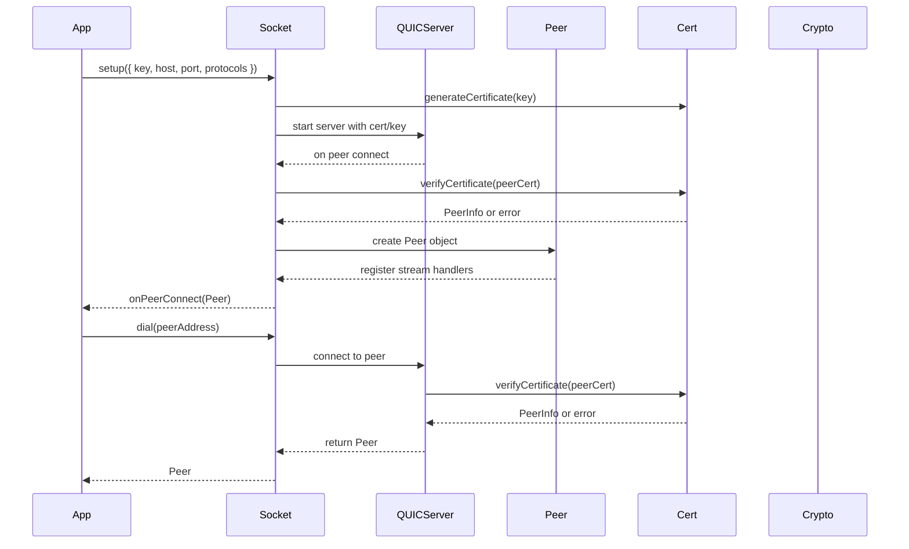

# Initial networking

## Pull Request by @tomusdrw

Related: #279 
Closes: #355 

Initial version of networking #355. For now it only covers `core` stuff - i.e. it's just a tiny wrapper on top of QUIC (based on @matrixai/js-quic) with TLS and x509 certificate signed with `ed25519` and the altName requirements coming from JAMNP-S.

Next step is to use the `core` library to create more JAM-specific, proper networking handling with JAM-specific streams. I expect the core library will heavily evolve anyway.

`js-quic` is using ESM, so it cannot be imported easily currently (and we can't use types), hence #392 .

That said, with current implementation I was able to connect to `polkajam` node 🎉


## Comment by @coderabbitai[bot]

<!-- This is an auto-generated comment: summarize by coderabbit.ai -->
<!-- This is an auto-generated comment: skip review by coderabbit.ai -->

> [!IMPORTANT]
> ## Review skipped
> 
> Auto incremental reviews are disabled on this repository.
> 
> Please check the settings in the CodeRabbit UI or the `.coderabbit.yaml` file in this repository. To trigger a single review, invoke the `@coderabbitai review` command.
> 
> You can disable this status message by setting the `reviews.review_status` to `false` in the CodeRabbit configuration file.

<!-- end of auto-generated comment: skip review by coderabbit.ai -->
<!-- walkthrough_start -->

<details>
<summary>📝 Walkthrough</summary>

## Summary by CodeRabbit

- **New Features**
  - Introduced a peer-to-peer networking package with QUIC-based sockets, supporting secure connections using Ed25519 keys and X.509 certificates.
  - Added base32 encoding functionality and certificate management utilities, including certificate generation and verification.
  - Provided abstractions for peer management, network interface, and stream handling.
  - Enabled Ed25519 key pair generation and signing capabilities.

- **Bug Fixes**
  - Improved cryptographic signature handling for compatibility across different byte formats.

- **Tests**
  - Added comprehensive tests for Ed25519 signing/verification, base32 encoding, and certificate operations.
  - Introduced a demo client-server test script for networking functionality.

- **Chores**
  - Updated and added package manifests and dependencies for new networking and cryptography features.
## Walkthrough

This update introduces a new QUIC-based peer-to-peer networking module with Ed25519 cryptographic authentication, certificate handling, and base32 encoding. It adds networking interfaces, peer management, and socket setup, including tests for certificate and base32 functionality. Supporting cryptographic signing and key abstractions are included, with new workspace and package configurations.

## Changes

| File(s)                                                                                     | Change Summary |
|---------------------------------------------------------------------------------------------|---------------|
| `benchmarks/crypto/ed25519.ts`                                                              | Modified signature argument in `nativeVerify` to use `Uint8Array` instead of `Buffer`. |
| `package.json`                                                                              | Added `packages/core/networking` to workspace packages. |
| `packages/core/crypto/ed25519.ts`, `packages/core/crypto/ed25519.test.ts`                   | Introduced Ed25519 key pair abstraction, signing function, and added a test for signing and verification. |
| `packages/core/crypto/package.json`                                                         | Added `noble-ed25519` as a dependency. |
| `packages/core/networking/base32.ts`, `packages/core/networking/base32.test.ts`             | Added custom base32 encoding function and its test. |
| `packages/core/networking/bin/test.ts`                                                      | New demo client-server test script for networking using Ed25519 keys and QUIC socket. |
| `packages/core/networking/certificate.ts`, `packages/core/networking/certificate.test.ts`   | Added Ed25519-based X.509 certificate handling, generation, verification, and corresponding tests. |
| `packages/core/networking/index.ts`                                                         | Exported all from `socket` module under the `socket` namespace. |
| `packages/core/networking/network.ts`                                                       | Added `Network` interface for peer connection management. |
| `packages/core/networking/package.json`                                                     | New package manifest for `@typeberry/networking` with dependencies and scripts. |
| `packages/core/networking/peers.ts`                                                         | Introduced peer management types, interfaces, and `Peers` class for event handling. |
| `packages/core/networking/socket.ts`                                                        | Implemented QUIC socket setup, peer authentication, stream handling, and certificate verification. |

## Sequence Diagram(s)



## Poem

> In the warren, wires hum and sing,  
> QUIC and Ed25519 take wing.  
> Certificates hop, base32 encoded,  
> Peers connect, their secrets loaded.  
> Streams open wide, data flows anew—  
> Networking stubs, now talking too!  
> 🐇✨

</details>

<!-- walkthrough_end -->
<!-- internal state start -->


<!-- DwQgtGAEAqAWCWBnSTIEMB26CuAXA9mAOYCmGJATmriQCaQDG+Ats2bgFyQAOFk+AIwBWJBrngA3EsgEBPRvlqU0AgfFwA6NPEgQAfACgjoCEYDEZyAAUASpETZWaCrKNxU3bABsvkCiQBHbGlcABpIcVwvOkgAIgBJDHV4NF9yXAB3fAoAa3gMIlDYlAxcCkVsBmkI2BJIADN4CkRcSClm+HwsfHrIdKzc/KIG7AwxToxU9Xl67Jq63nwRMQ1IeNbeeGZneC8Z/AZsRGqu+YV/PpJM7LyCyC80WUpwjIQGWBRkLe5otlKYtDIND3eBEWCZEig8GQDJUbjcSjocqjegARQAqvEAMLhPC7eAALyGZwAAtsyvAAB7aAD0QkQYCC8AYIIEVBcqzgdX6N2JDyefHyTAo3Gy1Gq0AAMgBldAYeiUgCsAAYAJyMSjiRoMcXIRCg8j0DLqD50ABMisVAEZVeE0LRahRiQQzqlcAA5NBsPyBbBNEh/XB6hEMeCNGJySAAKQAggBZd1WMDSjRuWooZg/APsagTRjYCj+Up7BTtZBdEu4dPCuqAkNB/i9HmDAqc9PkSkbB4YQ32GjcT4RfCQAR+rz0bCirBV1A11ns+QupRSLz4AfMbJ1WNxsCIENh5mXa4t4b1EjUAvScJCrzYWjE2CYWheYnb3f77V9/xexBt2t4WA5kwcRQ24XV7ANA8dVKSASAkfBb3EU4ejOOcXzZZx5EBSBlxIVduEDBRSnyYJfyMGM+nwGh6HeVJogKOpUCragznpRk/RZdCF0gI5qgAUSxOMY2lBgnW4VoN1obxqgACj46U4wASheN4PiYTMXx1GgvkzbJxDuJ8IlkBEeMQNBSBKVCCyLVoyAkJoukDNtUCQBxGOQMo0AYHIYmOMCqBoEt8h4bxfH8IIQkgMwAGZVTNVMDAAEWkbh1DqKtpDqF9mHUXMukQcIMvzQt2AzLNAzyrAHAYKpEEQepQvkEIVBfRBaiBIjyHGU4XWBAADUUvByNAhC9PrKKUcIlA3DAWgC4kGrGJDJjSK4BluYYdTAtQX1wWRnOQTwfB9CKWkYVdji+Orgii6LLTlehUH8B5qKHT43Kis0AHZVQS/RjHAKAyHoFC0DwQhSHIAKYnUwMuF4fhhFEcQpBkeQmCUKhVHULQdH+kwoHcK65RwAhiDIZRXth9guCoDJ7EcbYXBHdHFGUbHNG0XQwEMAHTAMAQyHeJmckQGlROMggaXNS0bQ0IMOAMWJlYMCxIBjeJyah8V6AcJxmZQ2iGMQNM6iNizJIPaoiucIhHFKsC6oBDz031IhJlwS83qKvqJfE/ANHaMNZHGxbuqwY0Z2ndM+o9yQSAANUoYPQ9GcPVisfx7PwI49kK12DQvC4Mmwx3jnobD+oAIWweozwocbRPPV7738MQS3qcpmEgPq3Y9y8NDpvrVhjeoaD4IrzZIfO6j7ov3JhOEEUerB+vRfJcAADhjQtHkb/KykqV7O5YGoWL6mu68oYeYAQIEvHHl30uMuoUKKufPYuW37Zgk/u+r2u9dxq9R7uvUo29d4hxhCaHOrRzbOnTCiSgexiRyBoERGgpRVjumHFRR09x8BEGZOESg5Q+CPnlC+Ao4Q5hMFKOUXw9RVz01QGgK+Yg6AJXMJYGMD9KYTA8sOIqSgGAPHmvlRssFKSigoK9OYngBCaVgsRcQ0gjA4PIKmZWsQjAQDAEYMC3lzIkA0PSLoittGqx4ZrSGlNfKM0wpIqeJsDBchhDcPcXkzZdEaHbcRWBgo+0McNUgpjEBdFDrsOoJdkCTloDrFm6BaD3gMpcemwTjE8GoB8PqsQMmkDFjWGkzYNqxGAUI9MJBKRIH0sMVqrQULrU8VULJRiCnYNwRlPgzi3qIFEvAcSBUcIkARPKIW8Arz8D4GwXA9pqDAgyJQOo2wlBcKserPh/jBFnBEWIyq5ZehVJkXIvgCilHsGSGogwGiTFKxVgYPRBivIhOkOLTc4sXD+2lrQC01pfraU0ArO5Oi1Yay1nY3WDiDa9GceRNJERIo6mODCSuySYguh9n7AgGgZZ/OAZFBwaUz6tFsdDDqmwJDikgD5eQ+RkhTAJDESOHxGXlBZtpcIfcOqNEpDENgdVMlzWJDJWIAAJPCq53EUHHCAWIykHroCdrIl2LEiqLCklUXWhdP7LOoO8aowI9yiCglI+sMRaiUi/EMVY6x5hYCDuGJ+EF3bz3QEQbQs1WhquwIow8NKFX8rMqQO0SranErOA65klUfQOAfoOQ+Jjb5MUikczS6gSz6u8jIPBzqkgGXlG0ZO2po1h2WlMPallDVDGiA0Zh4R1LlQuXcKpNTnQhBVa0B18hmDeHEFmXN89yx8AEHq9qazQWbP2d7dMuznBTpQkcvSMR5E+vOSoiZLiblaPuY8gw+TXlFKxfgb5vy5ZAssaCmxFNoaQv1vIQ2FCCmm0YI+6oG9ygatrPCviPzZbqn9WBJo6ABBzS8stBVfcFppzLbteQRwEF1FjoIaIYBcU2nGlxTCI8iItGAg0OYaqnSUvQf6/UjLIAyT6nxRKp7VQAH1bDxATnRgA0nxAAmnRqu7HoDyUgAAXkgNFM0fVFKDntEoCuq4Cj6iUGcFtLRiRnL9SQLCBaP5ezI94z1wFfzq3haIwEyAqO/r+VYbQDdlFbVjeBYEymWT+sMuoZAwp/B7i6Ck4YFKqU0r/D3bzNAWOqfGoCWQYwRhLTzKS2zWATO0fM00UOXd0CQCIVILAAW6j+sjJjSQCGQq+oc6p0yxIkOKJIKh0z6HsPkHpqF8LvcDSp0i6cVhaL6AunVZUOoP7aMDp1cgP+KXA2ZMMpgHuvW/0JYbn574elJEX1kNpcas5X30CG8CPaCIwAVlpbpWRb1gSUtvIxfbXrhwOHhPNigoxxDeiOMYvzCmw0jtwO8QtTpi3gdLXmPqXaVtAmwEQQMTKTQpf8PXIWdR0Q2ElJZZzChWDsA6S+zABSkS6rkxiyp1TFN3EjVpPMq4iEsjmK997BOS3QYmH52rST7zLUOuUeycnIN3C2iofEqigQFoAxZyA2xJikEDCpKJH2oLRv8NsfIsSxhrfHTwydjPp11FnVsyRi7ZHLtOauw8Fzue6PVu1nDszShcD6pruBB9IDUdowxmwTHWMca4zxvjgnhMrdi/uwp7yj0nr/fLRAfUHlG8k+dIz5vLfh7qjbqrqppvjWZSbm7YhsgyXsz6e0u2CtBdkFwSbfzc/hAz9+Wg2eKW564FXJb0hgC27/fbx3bHOPcd49KPQYngoDWecYn3/gPmS2PWh/5QeQ8xmNz98xPco/1ZZJPjLRHxS5/T0RyvkBq/aTrzRhvjHmPN5d23jvXBM4sCQCQOvcfpt6E9/5nvBS3n9798PwPweoDj7D/PyP0j5uz4i+HXNwA0AUimCtAyAG+0gVcq4AgegMkNK+el+Fm4QI2pAXA0Aikx+XcZ+F+tG0o2ql41+lk3ebSB6vunyUsz+QYweliDy/M3uD+JAA+Xy+6YS5iwK6yYK0Wr0esTM96MKr6LibiSgoySgYw8g9SlkQSd+JiZiGA40b8McJIW2JAgshYsgjBBA40+6KKsS3A8Sr0kYEmxIwIdO+64QZWKGw+ieYOZYeYdCoGG8PcAAelaBoPFAAGw3xuLPbEhCHAxCz3qxbD5gAxLMDjRS4eqy5Tz0BVJVDiT4YTzpiGHgagwRBUD4js4sDbDoBjyIgI7sDMy9Q1SZGKBUpFR06+FjKiEo54KIg9Iuh9JiRBhIFXBzKzI0J8DeF3AVEiGhjVCLIXArK3JGDsFK4CIq7DKGbq4Lrf5a4gw66FbKKRAbrqJdC3LUG7p0FFIlJDA0gjrHDCbywhCB4WIqyXrgo3oMx3pOL8Fwp04AoNBi6zDDqAgkDCZWaKAPjYSCxkD06cJrCtBzbKqXC1RmTMySTSSDZAShpjGGQApDDXhjC3ieY9zgGICQGCChxk415ZIdD5odYxx7GvEibvHInz5+b3GEroKTBsD0CxCElvFCwfEFDFB0KzIy4pb6gFA1r3FIrpSPidpFobryZjBMnDApFGqhifhoKzy+hQ5+bSn2CyljALz+TlwNDJbAgWpWp3AbzDh0zsqTIZRYCMlh7wZ3A+z0nElkm3zpSRRGaagdpnCwKeASSjrWw45mr0CWkkm+QUjNrUjtz7TDEjHjxTrY6q6iB7LK7THHLa4FZrpLFXJQA4KmpLpzHxl67rrVBq5xmWzhgrw1CoB3GRSNDRDbo6I0H6J7pSF94MHbEFC7EvEHHnqnHWLnEJLcGOIPpo5XIUR06HAtCnzekmlQYtZYDUkxB9SWkA4lBlAVCarxFHjrRKYFiiiXR+bz4RBoA+QdR9RgJbw7xUBQLYT5AukKomlvoAmlDDjAjelCp3BmnDDAgDkED/xeDcCPiCytC5IqAMBKD1BgjwBCA5BeDMAYBrgBDNCewSAZCUiyAEhmjRQAAsiobhX0ZSNq/wFAK0ecKArQ/5+QBqkAtQ75iIm5fUpAuAVc6gMk8AikwC/JwBVAYgTqagrQLEa5yQpwfU8ASWp8RUp5eASIR54QFCz4xIsCO29QYAVADE6ANU0gl0iS/gn8eawwyofm0uxpIpyJq4a4PA5QIJ7pjEGAZ5bFXwWA7wowoskiioI4zm9aB8KeYawIioYAbFfQjgKhiSaU80dwQ2RUCAYIkU4ZBCiyZ0HlwU5472VlGAOQM8WA2w3ALsRZXliIICtEzF48Eh1YRwr56A75n5VwfmbmvaxImVYGlAQIFwdCWkZACShkKlBYvY2ERUF5usfpRAfmGMJloid4RF4F6CDgRABSYaoomC4gqQIwOq/A4kWwhIlUCuGyoZyuoVau86hyMxJyGZLI+uyxY+xuluMQ5FlptFpleAXA+5ECR56B2pRAN+RBLytZxSa0vIDZlpL+bBlZTyxBz19ZRAux+QNIAKxxbBZxnB9iVx3ZxstxJA9MFJ/ScRTxZw/1rSLyg47685dA14Gk2YxEqS00w4oiEypQu4lA7Qs5yg/+j5Zw4S3kVwwGoG6c/xipDYk4jAZBhCcIbw1KqmkJ3SL4pUhkxwFAFNNNBeNoCqdCvil4HUJS9gBwPkrQAgOcBaLoq4OoXggEZ0SehqH4Ey9AxyCqiwBATAvgN4d4RhqWFM+oyAj4bUtOr1uQIILQZA/NPAJAtRXQXUjO4QxORCdwJhntzQCqYlVCwwc0543ca4ZAQwaMmeyJQop+XR8y/AypHtfAkdXoCq/t+WbckIUgXpNeQ6X4UdiOWYy0jtx4OQg4uGsxiqYW7w5Q4Fuc+0awTYRNgtMERtHgzO8AkmM89giNrQxOHUJc2FRhBaLaDY540qbdAA8l0saMcNeK0P4AiDrCWNQDQJmA2EuCkL4O/PrTEAiIiBJm5rLuIL4NVCCQ1F4KsOiFOJ1MjBMKvbNW7ZAFaMqKXT+OMafRQJysDFbZyUQDWv3RcvULIKgtiQiJnWUGXdhOFH6P4EXWcCbQcAhH5g0QMhsM4EpbDE+GAFQrWBQHbIGO7cckMsdv3bmIHfbE6CyIJexQWv+WDA/M6MOKysOGGIzcjjaQLh6n/uBi5BgPBD5EaGDhlMiqqSfXpNsnSpNegsItIP0oLF6SQI+NnBQEtbwitWMWtZGXOtGZtbGemRnntUmZAO6HDUONwEQ3BHhA3eFuRVpTJHQj7dAPgFwBgGlQA4qaLZQFYHpN474/Rb8QWY9b3vQS9dXTsWoBgMDUcZQV9RsTWdE/9eLJqBLjQIcS0KDRem2RDbejwdcT2QIXfPCvcaWSZXOZ+rLuoAii0O7VULItkxVs9AkvPuWrStHIhpse8v9eNOCWWSzYCQ2F1IpY4sM9UMjUekQNzYeDHVsvWlk19gsHg/CQqnCQ+VfZcnptAFkNYHxDuO1RqK02s0MjGJKNiHxHRliHxDYEAYZFXPPVXHcw89AHaBcKuPaMdcljygNoubxBIe2pyIcxLf+sVoBiHc4GbN+K9EnkoOPDlEkIpiyJlrzbIO7ds11c+gCi5vgBTdcAI8FLC4CIrAYC4fw31G6J6GwM1uHFwLanQu0A2HZrrkVj0yAhKSam6JQHHFIH0F6LPJ1eSZFJGu6aqokZsgK9yMK9bdrMfBqdSuBRkFgBC5i1kkBuSPqk6kcsjL6U6K2EYPFJAAABoqjqgtNahRroKcF5iGSU7LSKyQCutQDz3kCNMkrXq2aKleDSV9wwyrO2t1A00+wQ1YjBt1UMvga60PG8r0B6G1i85QsWY2rsWhqOlFTSg+rLCtC6P8u5iCt0t1BVKYL6ita9MKsQpnM2t1UCNvbtTybSIGv0CJTuiygTlbOMVtXEQ1VRtUr3nDA6tNvAg5CqtYAAsDwGCuu6DqyDX4L3ESsdTWttNlRpnqmnzz2jLSjShw4yRXM3PvOPNiaRgstZM6nnaQCJQPPxHkjG1GbEgNMuh/ZFqyCRvnMhueHpj3H2lAnMRerphOt5ilVxpNXYU86wSFhzD5D3iE75oFXjyytCveg5SIAjsJRuL4umR8mIbgVKAcAApJbCvrTQJVg9xKDYOCwhYFo8W4DjSKKK1DJjbQkSKwsCNyY004KrL0gADkMgY4uAYAXef79HAuFQIzWH7ayiDgNV2QbcuA5AMeoMMrRbcr3oI51Ctba79rXQdoBaq7az4uX2eYpCcwYd1qwZE6ejEiBjkxG1qZ9dK6CxFjLiyZNjVTYuEmdA5u/T/eGThnIbuTgKQeGCHqbaTTi5NLD8JbfUZhEbA7NAcXCqr7n277iXJAMbMJBaHTVMGXxFT44dBCJO5ZuitBaTWxTtG0mTn7dV+TrZ6sV6irkNJT0NT6BgfZNj0zPcgXdXlBGN9CWNHWw4YdPWce7lLx9AZrGglr2nRnSzU6XHbMYS3biGJIIY3gKQFANIiyAgR6NH9AfU63ogm3zgNISoaoGG8AGETo0g6brNOhKWL5p8AA6soViJzQZYS+AxPMOKR84KrfQNx9IcgBq65KRJpRJxGY0Ep0ZAiDztET48wBQ8HSUE8eSA6wZ/l8B6cGZ80Jh9WJuEIxMN0yUH1ZRxS1AKl8HB+3W+KH1FwAnFMEmx1CAzWv/XNyG4kpmhtAZZlMqeEBq/6kocXhy5q+j9QJyrm8jIh4WyjOp3UDJNKDGO6GJiO1bZaahjpSfWLzSvp1qi6jNa5sjEp3pjYFcM1bueb7GmJ0nhz/kLMFMiTHj8oo4KmFTxDbntNhCwz5AAAOI+vaQkxC+ptAaz6wDN05yIAlhhvpgbcvjOCQBvcCAfeD5fcs5n1T1bXIA0pAjIBRgvcsbu/+aL6BaqaeNWDHO+9YhdCssdQF8sYGWSA+bFYgKV8nPa/0BWAsZYjSibx3XF8UWB8kC09tPV/wsGpYDTeze9dUpJ48v5kMxIxiAKrg+Ih85NDMe4AUijgcoKrUMM7yCwOdC0D3d2GHwsVL95ur/XSIgTlDLHAz2dhu1jEW3Il7GHjn9pGlBDL+oPYFIkJn+YyegH/yDTTwr+MvPlthTU4odFeNNW8k2TNBa8eqhtXXqpnlTC1peK/f1OA2Ijhg/GRpXNE6ln7oIk8AlW/hQH45N9iMWWVTIP1pbCtq+LAF0sZUgDK93Qd1RJJr007DAio+pDVhngAwQ4qQoOcjrxxIC8dB+YzCFrnl97xAzs9fQvrHj6w4DryKWVPv7FzyLk2cYpPgDjwwCD9rWFfKvlwBr6iMHSJMafmqE571tBA1/F0O3zvbUBB+w+GMIgCjDhIMAyfL3hZiYHmCgS42EPkf35wBUFCShFQi4HUL4BMSFAe9iAgb5as/Ge4XaGNTF6GQMWDaVYj/3QDwhygmwcUHsAJ7LIoeOHZAEi20DRB6AudPElBzIQFdKEHDGTl7BIF1AD+0wBVP6mN5iBTe93aIO0F7wc1B88zNAB+UPD3hRqCqYSO6A0BWgSSC0WhPlxFoH1PKzAFQgj3QDb8nQu/O7vwx6q10L+OqYbgzCuwHYN4lABbjtHaHz9Tc8SCgDRE5rDDRhc+bIOSHWHoMzaZEYYtZ34S2cKkEZezsY0c7bVzGWZNzqHhiBHVEejgHuEnDS608+I0HSzEnhd49Vmm2PQUoTlOD1AKhstYvu/ghFbV0UL8HuFYGDqJBZgVhcjuGHHDGZ+6XAIdgdx7hwFlBf6WQXiMOqEiK4iARusT24pdpR+azNxg6UuobxrqjwAANoABdW6ifjQ7n5revaYAKSMoDkj8A4QWETT01AIiyEega/OyLDyQinGc+anNxU96qZveceGSDKMwLHBgAAAbx2pr4PBXQbwapgADc1ApfKpi4DOivByhXPB6IAC+BBZGkEMSHVt/E+ogkaYyNG8ivcpfEgLnmMFxhYCqmaFj6M8GujZA02a0afltFDsCC57VpncAxb+oEhDg45lGOiKcjYx5FBLrV3FDp450yPLgA6OtbxBaAVeYuuiQEAeiHAy/XAD4KaAZiXR/o80RZg9Fr8KAQ4igCOL9ECAZxfYrAbgBjCbDEAfETsFQAAD8XAQ8o8HtGQBxRzIodpKPpGdUpRkAYMZOIoGriyg64zcWgB3HqxIEB4o8d6Luqni7qF4q8ZRAyBPjEo4oIMbmLlHAALuv0C1mqAFEhsQxCwhsegibiLUDqBomseRQYFsAZIw+KwD6idGZixxsgW6gyIjG0Nhg7AzgUNgEFoCgyb+DkTGPIpGD8A7fIUbIi4BgSNAEE1UFBLqoETOq+8fwWGhaFvRHBEvTQEhOjEbslCPcX0VmITxkcck9mHCaOIXHBYUumWBSfOLZGiTqxtEk0YETjxuCpJeE6bKmOzEWYuAz+CFjmLnHSTfBREVlsSAsn84XQCQ6FqV2+rVlfq6TKrjsVg5VJ6uIKQpsP2KZdk+CZTNMKth7KzkP03WOWjYyjy4Yd6pUQJDHD851kvJDZHyZSBfwPERmtqfwKhmz4FVfAluQbMlh9gaAaQdNJWkMxKFIIEiCvZpIhkqlXBv2rCHwPgAyAEtZo9DA5GcFjhpT7qaNTJIURBKFS4x5aIUosAz6oMfYTUsTt1yrDIgwQvU2aeNHv6GIhi3CZaj8NmjjF1qgIw0c5wTJ7NDc+I+gGtK8RAiv8RtAAFSKoFa9NVoENliDlTZpZSQgilJibLl0pYyTKck3WLlcPJlXWJg2RKR+T2CTXGtp2WhSo4YaHXeFNABfgiRGilNCgNiJaR9RrG1dGcpjU/QFlJCgMgZv1M+k3Asp1TA6CjLRnQ9CKxAroJ5BX7I1jCVXcTlJBrSC5zISmVHu4xfr5R7ub/A1NyLlyR8jgIIM8AwFkCiJlkVwQCKAR7h11cAVoxkb3AIDcAFZi5BRgfUJCT0OslAFFsRJRpVd7uk08BsgAcYwR/ARCUDOBhmTSzjMXQZURQDME+1FZds4OolCQBcyxA5Seoc+DNh0QR0WaGELUAyzB1OpPtJ3veD6Te1kY4QNzPWHjiFDQ8XFHCrIDfoEVYe/Ue8KkCGZSzFA4aWZDuRSx9R7Z7+C+oyPA47S7MNouoG5gQj2RzSN5EkcHWS7r03MTaXgYkX/woR1Zes58lHP/wgJ/6s2LCpTPXb/sf2L8YzPbMVnFzkkpczdv/AISa1/MIc6qSzI2khltp2yZRgCLGIxkN2h0zMomTBGnSKZF0jGVV0pEfAioswNqcaDuDWzFAFlW/ATP85EzQZlBF1nOyVnOB5ZwErAvBH7rX4Z2X8wcirL/m2iAFtAIBW6x7guzKAjs5GDJDgWziKM3AY/MHTEz8Y9AbQfAP3VuqQLg8MCvqMgrdmRyewiC5BVwHTzoLKAmC7BZAvwW4LaAhCr+ZnK8AyRz6ilGhRQBLmKVwF5+e2UAv+lVkPpGTZgjIROL+TGu7ZLglCl4Iwz2unXemJE1CQyFIkNae2iOE9qrwJ8BGMIS/AiFqFBmg00JEmkOhSFBwlHVRs7HT791iQGIbEBNzVL/0wAZMDnqjS6awZeZyAGwqsQritANKGlWYYZE0hu0YgtUyAHGCsCSgwA8UDSvwzBhVgYOyAepDYoABit4OuPIElAqB9mlSehEf1wW/w9F6zYgoOB4o/SX8+vFLPE0cTYM4iqABfgbQ2E9xyp8TRJnk0oJ+YtCfMjyIc1Mrdx6lCsWWbMlkTJdXgzID4Ddh2lFQEayMmmn1CDBgB8OmXapYspCDjLVIfgUYPfEPolkokyAdXncD6jXTguWUpbjx2QBkCY4SylZTSHNk1Jr4xFfAPgByDdKLFOZMoSMj8JjAhSpwY4P0PNpYUVoPcRQgYtIRQJvcFGKcsXWS6+xOacK/2tfDMJ4gvAoXOiC0t8VYBAlMwsTIZDLaFtfAUKt/qVjJDUAnQ1IeADSCZAMBxoMkLFZAEcJxKNAqoeVEd3j5bcduyhfbhRgZXOEZuGgZUBgNo7HdDgCfbbmBLpV8qXCVoeKNFEUg6NRivwnZIYymImN958xI6QbhDzWN0kFiwXGGDtLtZfOUhFgrISi5gqEQhi4mSeHGhpziQMyVomgE5TD1mOLDb5ZUV6JkRhFP1J6p5OBkA1/6v4FslIo4KBTLirXEKbDKUXMzpIi5dxf1IEZC48aAJCyrU26yn8Waac62BPNX7DyvEKPL2uQvDhDISVxymebQDnnI14gVgY2npDMLSh4GY0O6cCCkhZhLUsMUYLazzBZ1mAayqeT6F4D88XKz9DhIbVR5288hWTaoNVA+DYQPZ4GeIIlDtCzzFKxeVHkuuqWCC6B1LAdWcNRkXTUg4SMnkiWqAPyZZvUZJD/WjqjJvZ0QGFmrVwS3q6cvaz4W4jnCGYY8RcleUmoGELqT6IckrAh33UgqkqmLCMKzGLWLrEoemW1FpTZI7TNaXgf2TXXqSFrukfc8DIZAjkLrTO6WIMKsBe5ByUsHPBdaWpHqEI9W+GmOSMgeC1Q5QTUXHGNQnWSNXY8rXDacCXUUY4249NSvKkHJuZ9Z6SYOtUvyBiMDUx0B5a7RQajrwMSGlDXpiI0/E7MqPHDZhvI3FcqN7AGjRuFRhoNUeoQ3VNwFE2iNXlEm3wGpqg22E/ZzyPTHGBzkyz2ORssPC6Ck3ZV5Ntm+NZzMw2Y9E27snzbj3w2fDJQhCAOsMBEY0Bhhx8WhAFtXgsN/NVmwLewDyXFC15pQuHrWAT5KVZmNm7yP1llpvRvgzOaueeHiSXC9oCUb4erjs5Rld56qpzpqsPnHTNJGWxuZQF4V1RL5PcbWpwDuqKzjkITVYdfCrGnz0Zja78KEWAJANjl5vOZOVhe5OhZk5WabMACup7iU5kANbZAj1Etb91I879U8snVLNuc5uDjRgA7FnijW91MwpwrqjcKOtQeMwnSL61mFmRMg4LB6MMjnrEA5uCTB63G1R1t2ZAGSL2qxC5acgXAAHV6DB0+AUNjC/unCpjoYAodzAK0ZDqbWhERtn6yeT+qTzfbP5VPf+ggrHXp5g63C+HcwuAWE7XZCWn2nQFJ2UBydXAAhVTp7h/aMA9s4ndRDcYCBuFMO5Dc8gp0sKqe7O+2aQv/W0AedfO8HULpSYAy/VQMr6QDVmlgzwa4aqGfIthSuIKmdOapmVF+DJaUsDirEEuTeoR1FaDNeaYxUf6PdgQxu/xhTUMjE1SoyIuPIMP9iPCeaiSoOSBEWos1iphcx/pOCy49RGKXkWIg2DXDK4y1T5Y0m7o35+MetxeetRBknAxirmVgDge8IQhur6A5c3cpjPWie5x4I8vHQ5u2RyyKpys2muTWeB3qFg3mxLbNGqVsKPaVVIobGrAYKD3dBAT3YeFRV7NFyw+TVhZy04CTdOGAapfoPu4Q1WeeEANgaCDZwS6ghm2xWHgT1S0fEoIArXbsxAm7ZpEGWvXwGuWzh8uhkXzPwxFoU1l2ZPZOl5k5kZdYkIDJ7uDvDRJUfFGI6NHj22T26j0tQ7IJ8MSDqRyqsWjyE6BGqIhTZI9R5VDEdJdp9NtRDLjRuv5narlMCISgfzb2CgMAswapYQIQnoJ+oA6uwTLxbnDq86AYKiA3soDkySDK/NmejlfXnkcoM9ILWnXhRMGYtTe//fj0v1H6Xa5bRcmdp4PrDRE+AWTpMmqHtyAwCqOJHrI57xTawRRO4dWiDLa7Utcao9cOGc1EU+obCkPdOG4ZJBFGr8PACrRRCQBf9oBt6EGvXWoyXhnxeUG1G3LJsaI6Iz7N2v+XzUxElYP4Q7sRCyZE0uUi3hB0LnEGBx7Bm+opTvqyaacRgDQb3oWak5YGU6ZGjoP35vsfCqdV3SoL5oY59dKa52I3Qj5dAo+uFIsWGlz4QY8Cgmr8osh+LrbL49cPNUhymoKkyDxwUoPslWA2AnwQ5YukRO+wlLzoJNVoLxCdTA8VuyfBI8OBjBWB4gCUeeoCq8CD1uuQsEYTZiD726D9Qe4zVgZsFUp9Bjlbgy+FFnizWZmAYxCLggwY671xIHI3+icUwwHh3NNTFUNC2WcvhiuGzjMr8N7S6tQIuMiCKPmG40lOk8Jr9oFnGixyrNScDJAdFJ6eAKe7PWivCD+pAxXAbdozn4XABC9NwAgl3lEVEyVdyTQmMSO86die4WJgRHSroOtAk8fUN7QgUSxmEetl2oYHCoG0rCVCnJ8oKbRz3smCgUo0TO9Iq6EyA1FUi3SFyoI7oeYfMIGAWlBjgwZFMMTIjTD8BoB6YGu7nmzCxhsVcY3MQwATERwsG6M/dRAHRizgTJFktAOjHLMNPymRwX0M0MqE9poBlQDAJCmqEVACA3Cm8YTNFAYBuEzQSFTeGaE3hoBN4qoWKG4QYBfQBAEZpCl6YdMGBjTsMdQGadAKWm4I1pugHRmBiGmgAA=== -->

<!-- internal state end -->
<!-- tips_start -->

---


<details>
<summary>🪧 Tips</summary>

### Chat

There are 3 ways to chat with [CodeRabbit](https://coderabbit.ai?utm_source=oss&utm_medium=github&utm_campaign=FluffyLabs/typeberry&utm_content=393):

- Review comments: Directly reply to a review comment made by CodeRabbit. Example:
  - `I pushed a fix in commit <commit_id>, please review it.`
  - `Explain this complex logic.`
  - `Open a follow-up GitHub issue for this discussion.`
- Files and specific lines of code (under the "Files changed" tab): Tag `@coderabbitai` in a new review comment at the desired location with your query. Examples:
  - `@coderabbitai explain this code block.`
  -	`@coderabbitai modularize this function.`
- PR comments: Tag `@coderabbitai` in a new PR comment to ask questions about the PR branch. For the best results, please provide a very specific query, as very limited context is provided in this mode. Examples:
  - `@coderabbitai gather interesting stats about this repository and render them as a table. Additionally, render a pie chart showing the language distribution in the codebase.`
  - `@coderabbitai read src/utils.ts and explain its main purpose.`
  - `@coderabbitai read the files in the src/scheduler package and generate a class diagram using mermaid and a README in the markdown format.`
  - `@coderabbitai help me debug CodeRabbit configuration file.`

### Support

Need help? Create a ticket on our [support page](https://www.coderabbit.ai/contact-us/support) for assistance with any issues or questions.

Note: Be mindful of the bot's finite context window. It's strongly recommended to break down tasks such as reading entire modules into smaller chunks. For a focused discussion, use review comments to chat about specific files and their changes, instead of using the PR comments.

### CodeRabbit Commands (Invoked using PR comments)

- `@coderabbitai pause` to pause the reviews on a PR.
- `@coderabbitai resume` to resume the paused reviews.
- `@coderabbitai review` to trigger an incremental review. This is useful when automatic reviews are disabled for the repository.
- `@coderabbitai full review` to do a full review from scratch and review all the files again.
- `@coderabbitai summary` to regenerate the summary of the PR.
- `@coderabbitai generate sequence diagram` to generate a sequence diagram of the changes in this PR.
- `@coderabbitai resolve` resolve all the CodeRabbit review comments.
- `@coderabbitai configuration` to show the current CodeRabbit configuration for the repository.
- `@coderabbitai help` to get help.

### Other keywords and placeholders

- Add `@coderabbitai ignore` anywhere in the PR description to prevent this PR from being reviewed.
- Add `@coderabbitai summary` to generate the high-level summary at a specific location in the PR description.
- Add `@coderabbitai` anywhere in the PR title to generate the title automatically.

### Documentation and Community

- Visit our [Documentation](https://docs.coderabbit.ai) for detailed information on how to use CodeRabbit.
- Join our [Discord Community](http://discord.gg/coderabbit) to get help, request features, and share feedback.
- Follow us on [X/Twitter](https://twitter.com/coderabbitai) for updates and announcements.

</details>

<!-- tips_end -->


## Comment by @github-actions[bot]


<details>
<summary>View all</summary>

|  Name  |  Status  | |
|--------|----------|-|
| jamdunavectors/chainspecs.json | ✅ | | 
| jamdunavectors/data/assurances/state_transitions_fuzzed/1_005_A1_BadSignature.json | ✅ | | 
| jamdunavectors/data/assurances/state_transitions_fuzzed/1_005_A2_BadValidatorIndex.json | ✅ | | 
| jamdunavectors/data/assurances/state_transitions_fuzzed/1_005_A3_BadCore.json | ✅ | | 
| jamdunavectors/data/assurances/state_transitions_fuzzed/1_005_A4_BadParentHash.json | ✅ | | 
| jamdunavectors/data/assurances/state_transitions_fuzzed/1_008_A1_BadSignature.json | ✅ | | 
| jamdunavectors/data/assurances/state_transitions_fuzzed/1_008_A2_BadValidatorIndex.json | ✅ | | 
| jamdunavectors/data/assurances/state_transitions_fuzzed/1_008_A3_BadCore.json | ✅ | | 
| jamdunavectors/data/assurances/state_transitions_fuzzed/1_008_A4_BadParentHash.json | ✅ | | 
| jamdunavectors/data/assurances/state_transitions_fuzzed/2_000_A1_BadSignature.json | ✅ | | 
| jamdunavectors/data/assurances/state_transitions_fuzzed/2_000_A2_BadValidatorIndex.json | ✅ | | 
| jamdunavectors/data/assurances/state_transitions_fuzzed/2_000_A3_BadCore.json | ✅ | | 
| jamdunavectors/data/assurances/state_transitions_fuzzed/2_000_A4_BadParentHash.json | ✅ | | 
| jamdunavectors/data/assurances/state_transitions_fuzzed/2_005_A1_BadSignature.json | ✅ | | 
| jamdunavectors/data/assurances/state_transitions_fuzzed/2_005_A2_BadValidatorIndex.json | ✅ | | 
| jamdunavectors/data/assurances/state_transitions_fuzzed/2_005_A3_BadCore.json | ✅ | | 
| jamdunavectors/data/assurances/state_transitions_fuzzed/2_005_A4_BadParentHash.json | ✅ | | 
| jamdunavectors/data/assurances/state_transitions_fuzzed/2_007_A1_BadSignature.json | ✅ | | 
| jamdunavectors/data/assurances/state_transitions_fuzzed/2_007_A2_BadValidatorIndex.json | ✅ | | 
| jamdunavectors/data/assurances/state_transitions_fuzzed/2_007_A3_BadCore.json | ✅ | | 
| jamdunavectors/data/assurances/state_transitions_fuzzed/2_007_A4_BadParentHash.json | ✅ | | 
| jamdunavectors/data/assurances/state_transitions_fuzzed/2_009_A1_BadSignature.json | ✅ | | 
| jamdunavectors/data/assurances/state_transitions_fuzzed/2_009_A2_BadValidatorIndex.json | ✅ | | 
| jamdunavectors/data/assurances/state_transitions_fuzzed/2_009_A3_BadCore.json | ✅ | | 
| jamdunavectors/data/assurances/state_transitions_fuzzed/2_009_A4_BadParentHash.json | ✅ | | 
| jamdunavectors/data/assurances/state_transitions_fuzzed/2_011_A1_BadSignature.json | ✅ | | 
| jamdunavectors/data/assurances/state_transitions_fuzzed/2_011_A2_BadValidatorIndex.json | ✅ | | 
| jamdunavectors/data/assurances/state_transitions_fuzzed/2_011_A3_BadCore.json | ✅ | | 
| jamdunavectors/data/assurances/state_transitions_fuzzed/2_011_A4_BadParentHash.json | ✅ | | 
| jamdunavectors/data/assurances/state_transitions_fuzzed/3_003_A1_BadSignature.json | ✅ | | 
| jamdunavectors/data/assurances/state_transitions_fuzzed/3_003_A2_BadValidatorIndex.json | ✅ | | 
| jamdunavectors/data/assurances/state_transitions_fuzzed/3_003_A3_BadCore.json | ✅ | | 
| jamdunavectors/data/assurances/state_transitions_fuzzed/3_003_A4_BadParentHash.json | ✅ | | 
| jamdunavectors/data/assurances/state_transitions_fuzzed/3_005_A1_BadSignature.json | ✅ | | 
| jamdunavectors/data/assurances/state_transitions_fuzzed/3_005_A2_BadValidatorIndex.json | ✅ | | 
| jamdunavectors/data/assurances/state_transitions_fuzzed/3_005_A3_BadCore.json | ✅ | | 
| jamdunavectors/data/assurances/state_transitions_fuzzed/3_005_A4_BadParentHash.json | ✅ | | 
| jamdunavectors/data/assurances/state_transitions_fuzzed/3_007_A1_BadSignature.json | ✅ | | 
| jamdunavectors/data/assurances/state_transitions_fuzzed/3_007_A2_BadValidatorIndex.json | ✅ | | 
| jamdunavectors/data/assurances/state_transitions_fuzzed/3_007_A3_BadCore.json | ✅ | | 
| jamdunavectors/data/assurances/state_transitions_fuzzed/3_007_A4_BadParentHash.json | ✅ | | 
| jamdunavectors/data/assurances/state_transitions_fuzzed/3_010_A1_BadSignature.json | ✅ | | 
| jamdunavectors/data/assurances/state_transitions_fuzzed/3_010_A2_BadValidatorIndex.json | ✅ | | 
| jamdunavectors/data/assurances/state_transitions_fuzzed/3_010_A3_BadCore.json | ✅ | | 
| jamdunavectors/data/assurances/state_transitions_fuzzed/3_010_A4_BadParentHash.json | ✅ | | 
| jamdunavectors/data/assurances/state_transitions_fuzzed/4_000_A1_BadSignature.json | ✅ | | 
| jamdunavectors/data/assurances/state_transitions_fuzzed/4_000_A2_BadValidatorIndex.json | ✅ | | 
| jamdunavectors/data/assurances/state_transitions_fuzzed/4_000_A3_BadCore.json | ✅ | | 
| jamdunavectors/data/assurances/state_transitions_fuzzed/4_000_A4_BadParentHash.json | ✅ | | 
| jamdunavectors/data/assurances/state_transitions_fuzzed/4_002_A1_BadSignature.json | ✅ | | 
| jamdunavectors/data/assurances/state_transitions_fuzzed/4_002_A1_BadSignature.json | ✅ | | 
| jamdunavectors/data/assurances/state_transitions_fuzzed/4_002_A2_BadValidatorIndex.json | ✅ | | 
| jamdunavectors/data/assurances/state_transitions_fuzzed/4_002_A3_BadCore.json | ✅ | | 
| jamdunavectors/data/assurances/state_transitions_fuzzed/4_002_A4_BadParentHash.json | ✅ | | 
| jamdunavectors/data/assurances/state_transitions_fuzzed/4_002_A4_BadParentHash.json | ✅ | | 
| jamdunavectors/data/safrole/state_transitions_fuzzed/1_001_T3_TicketsBadOrder.json | ✅ | | 
| jamdunavectors/data/safrole/state_transitions_fuzzed/1_001_T4_BadRingProof.json | ✅ | | 
| jamdunavectors/data/safrole/state_transitions_fuzzed/1_001_T5_EpochLotteryOver.json | ✅ | | 
| jamdunavectors/data/safrole/state_transitions_fuzzed/1_001_T6_TimeslotNotMonotonic.json | ✅ | | 
| jamdunavectors/data/safrole/state_transitions_fuzzed/1_002_T2_TicketAlreadyInState.json | ✅ | | 
| jamdunavectors/data/safrole/state_transitions_fuzzed/1_002_T3_TicketsBadOrder.json | ✅ | | 
| jamdunavectors/data/safrole/state_transitions_fuzzed/1_002_T4_BadRingProof.json | ✅ | | 
| jamdunavectors/data/safrole/state_transitions_fuzzed/1_002_T5_EpochLotteryOver.json | ✅ | | 
| jamdunavectors/data/safrole/state_transitions_fuzzed/1_002_T6_TimeslotNotMonotonic.json | ✅ | | 
| jamdunavectors/data/safrole/state_transitions_fuzzed/1_003_T2_TicketAlreadyInState.json | ✅ | | 
| jamdunavectors/data/safrole/state_transitions_fuzzed/1_003_T3_TicketsBadOrder.json | ✅ | | 
| jamdunavectors/data/safrole/state_transitions_fuzzed/1_003_T4_BadRingProof.json | ✅ | | 
| jamdunavectors/data/safrole/state_transitions_fuzzed/1_003_T5_EpochLotteryOver.json | ✅ | | 
| jamdunavectors/data/safrole/state_transitions_fuzzed/1_003_T6_TimeslotNotMonotonic.json | ✅ | | 
| jamdunavectors/data/safrole/state_transitions_fuzzed/1_004_T2_TicketAlreadyInState.json | ✅ | | 
| jamdunavectors/data/safrole/state_transitions_fuzzed/1_004_T3_TicketsBadOrder.json | ✅ | | 
| jamdunavectors/data/safrole/state_transitions_fuzzed/1_004_T4_BadRingProof.json | ✅ | | 
| jamdunavectors/data/safrole/state_transitions_fuzzed/1_004_T5_EpochLotteryOver.json | ✅ | | 
| jamdunavectors/data/safrole/state_transitions_fuzzed/1_004_T6_TimeslotNotMonotonic.json | ✅ | | 
| jamdunavectors/data/safrole/state_transitions_fuzzed/2_000_T3_TicketsBadOrder.json | ✅ | | 
| jamdunavectors/data/safrole/state_transitions_fuzzed/2_000_T4_BadRingProof.json | ✅ | | 
| jamdunavectors/data/safrole/state_transitions_fuzzed/2_000_T5_EpochLotteryOver.json | ✅ | | 
| jamdunavectors/data/safrole/state_transitions_fuzzed/2_001_T2_TicketAlreadyInState.json | ✅ | | 
| jamdunavectors/data/safrole/state_transitions_fuzzed/2_001_T3_TicketsBadOrder.json | ✅ | | 
| jamdunavectors/data/safrole/state_transitions_fuzzed/2_001_T4_BadRingProof.json | ✅ | | 
| jamdunavectors/data/safrole/state_transitions_fuzzed/2_001_T5_EpochLotteryOver.json | ✅ | | 
| jamdunavectors/data/safrole/state_transitions_fuzzed/2_001_T6_TimeslotNotMonotonic.json | ✅ | | 
| jamdunavectors/data/safrole/state_transitions_fuzzed/2_002_T2_TicketAlreadyInState.json | ✅ | | 
| jamdunavectors/data/safrole/state_transitions_fuzzed/2_002_T3_TicketsBadOrder.json | ✅ | | 
| jamdunavectors/data/safrole/state_transitions_fuzzed/2_002_T4_BadRingProof.json | ✅ | | 
| jamdunavectors/data/safrole/state_transitions_fuzzed/2_002_T5_EpochLotteryOver.json | ✅ | | 
| jamdunavectors/data/safrole/state_transitions_fuzzed/2_002_T6_TimeslotNotMonotonic.json | ✅ | | 
| jamdunavectors/data/safrole/state_transitions_fuzzed/2_003_T2_TicketAlreadyInState.json | ✅ | | 
| jamdunavectors/data/safrole/state_transitions_fuzzed/2_003_T3_TicketsBadOrder.json | ✅ | | 
| jamdunavectors/data/safrole/state_transitions_fuzzed/2_003_T4_BadRingProof.json | ✅ | | 
| jamdunavectors/data/safrole/state_transitions_fuzzed/2_003_T5_EpochLotteryOver.json | ✅ | | 
| jamdunavectors/data/safrole/state_transitions_fuzzed/2_003_T6_TimeslotNotMonotonic.json | ✅ | | 
| jamdunavectors/data/safrole/state_transitions_fuzzed/3_000_T3_TicketsBadOrder.json | ✅ | | 
| jamdunavectors/data/safrole/state_transitions_fuzzed/3_000_T4_BadRingProof.json | ✅ | | 
| jamdunavectors/data/safrole/state_transitions_fuzzed/3_000_T5_EpochLotteryOver.json | ✅ | | 
| jamdunavectors/data/safrole/state_transitions_fuzzed/3_001_T2_TicketAlreadyInState.json | ✅ | | 
| jamdunavectors/data/safrole/state_transitions_fuzzed/3_001_T3_TicketsBadOrder.json | ✅ | | 
| jamdunavectors/data/safrole/state_transitions_fuzzed/3_001_T4_BadRingProof.json | ✅ | | 
| jamdunavectors/data/safrole/state_transitions_fuzzed/3_001_T5_EpochLotteryOver.json | ✅ | | 
| jamdunavectors/data/safrole/state_transitions_fuzzed/3_001_T6_TimeslotNotMonotonic.json | ✅ | | 
| jamdunavectors/data/safrole/state_transitions_fuzzed/3_002_T2_TicketAlreadyInState.json | ✅ | | 
| jamdunavectors/data/safrole/state_transitions_fuzzed/3_002_T3_TicketsBadOrder.json | ✅ | | 
| jamdunavectors/data/safrole/state_transitions_fuzzed/3_002_T4_BadRingProof.json | ✅ | | 
| jamdunavectors/data/safrole/state_transitions_fuzzed/3_002_T5_EpochLotteryOver.json | ✅ | | 
| jamdunavectors/data/safrole/state_transitions_fuzzed/3_002_T6_TimeslotNotMonotonic.json | ✅ | | 
| jamdunavectors/data/safrole/state_transitions_fuzzed/3_002_T6_TimeslotNotMonotonic.json | ✅ | | 
| jamdunavectors/data/safrole/state_transitions_fuzzed/3_003_T2_TicketAlreadyInState.json | ✅ | | 
| jamdunavectors/data/safrole/state_transitions_fuzzed/3_003_T3_TicketsBadOrder.json | ✅ | | 
| jamdunavectors/data/safrole/state_transitions_fuzzed/3_003_T4_BadRingProof.json | ✅ | | 
| jamdunavectors/data/safrole/state_transitions_fuzzed/3_003_T5_EpochLotteryOver.json | ✅ | | 
| jamdunavectors/data/safrole/state_transitions_fuzzed/3_003_T6_TimeslotNotMonotonic.json | ✅ | | 
| jamdunavectors/data/safrole/state_transitions_fuzzed/4_000_T3_TicketsBadOrder.json | ✅ | | 
| jamdunavectors/data/safrole/state_transitions_fuzzed/4_000_T4_BadRingProof.json | ✅ | | 
| jamdunavectors/data/safrole/state_transitions_fuzzed/4_000_T5_EpochLotteryOver.json | ✅ | | 
| jamdunavectors/data/safrole/state_transitions_fuzzed/4_001_T2_TicketAlreadyInState.json | ✅ | | 
| jamdunavectors/data/safrole/state_transitions_fuzzed/4_001_T3_TicketsBadOrder.json | ✅ | | 
| jamdunavectors/data/safrole/state_transitions_fuzzed/4_001_T4_BadRingProof.json | ✅ | | 
| jamdunavectors/data/safrole/state_transitions_fuzzed/4_001_T5_EpochLotteryOver.json | ✅ | | 
| jamdunavectors/data/safrole/state_transitions_fuzzed/4_001_T6_TimeslotNotMonotonic.json | ✅ | | 
| jamdunavectors/data/safrole/state_transitions_fuzzed/4_002_T2_TicketAlreadyInState.json | ✅ | | 
| jamdunavectors/data/safrole/state_transitions_fuzzed/4_002_T3_TicketsBadOrder.json | ✅ | | 
| jamdunavectors/data/safrole/state_transitions_fuzzed/4_002_T4_BadRingProof.json | ✅ | | 
| jamdunavectors/data/safrole/state_transitions_fuzzed/4_002_T5_EpochLotteryOver.json | ✅ | | 
| jamdunavectors/data/safrole/state_transitions_fuzzed/4_002_T6_TimeslotNotMonotonic.json | ✅ | | 
| jamdunavectors/data/safrole/state_transitions_fuzzed/4_003_T2_TicketAlreadyInState.json | ✅ | | 
| jamdunavectors/data/safrole/state_transitions_fuzzed/4_003_T3_TicketsBadOrder.json | ✅ | | 
| jamdunavectors/data/safrole/state_transitions_fuzzed/4_003_T4_BadRingProof.json | ✅ | | 
| jamdunavectors/data/safrole/state_transitions_fuzzed/4_003_T5_EpochLotteryOver.json | ✅ | | 
| jamdunavectors/data/safrole/state_transitions_fuzzed/4_003_T6_TimeslotNotMonotonic.json | ✅ | | 
| jamdunavectors/data/safrole/state_transitions_fuzzed/5_000_T3_TicketsBadOrder.json | ✅ | | 
| jamdunavectors/data/safrole/state_transitions_fuzzed/5_000_T4_BadRingProof.json | ✅ | | 
| jamdunavectors/data/safrole/state_transitions_fuzzed/5_000_T5_EpochLotteryOver.json | ✅ | | 
| jamdunavectors/data/safrole/state_transitions_fuzzed/5_000_T5_EpochLotteryOver.json | ✅ | | 
| jamdunavectors/data/safrole/state_transitions/1_000.json | ✅ | | 
| jamdunavectors/data/safrole/state_transitions/1_001.json | ✅ | | 
| jamdunavectors/data/safrole/state_transitions/1_002.json | ✅ | | 
| jamdunavectors/data/safrole/state_transitions/1_003.json | ✅ | | 
| jamdunavectors/data/safrole/state_transitions/1_004.json | ✅ | | 
| jamdunavectors/data/safrole/state_transitions/1_005.json | ✅ | | 
| jamdunavectors/data/safrole/state_transitions/1_006.json | ✅ | | 
| jamdunavectors/data/safrole/state_transitions/1_007.json | ✅ | | 
| jamdunavectors/data/safrole/state_transitions/1_008.json | ✅ | | 
| jamdunavectors/data/safrole/state_transitions/1_009.json | ✅ | | 
| jamdunavectors/data/safrole/state_transitions/1_010.json | ✅ | | 
| jamdunavectors/data/safrole/state_transitions/1_011.json | ✅ | | 
| jamdunavectors/data/safrole/state_transitions/2_000.json | ✅ | | 
| jamdunavectors/data/safrole/state_transitions/2_001.json | ✅ | | 
| jamdunavectors/data/safrole/state_transitions/2_002.json | ✅ | | 
| jamdunavectors/data/safrole/state_transitions/2_003.json | ✅ | | 
| jamdunavectors/data/safrole/state_transitions/2_004.json | ✅ | | 
| jamdunavectors/data/safrole/state_transitions/2_005.json | ✅ | | 
| jamdunavectors/data/safrole/state_transitions/2_006.json | ✅ | | 
| jamdunavectors/data/safrole/state_transitions/2_007.json | ✅ | | 
| jamdunavectors/data/safrole/state_transitions/2_008.json | ✅ | | 
| jamdunavectors/data/safrole/state_transitions/2_009.json | ✅ | | 
| jamdunavectors/data/safrole/state_transitions/2_010.json | ✅ | | 
| jamdunavectors/data/safrole/state_transitions/2_011.json | ✅ | | 
| jamdunavectors/data/safrole/state_transitions/3_000.json | ✅ | | 
| jamdunavectors/data/safrole/state_transitions/3_001.json | ✅ | | 
| jamdunavectors/data/safrole/state_transitions/3_002.json | ✅ | | 
| jamdunavectors/data/safrole/state_transitions/3_003.json | ✅ | | 
| jamdunavectors/data/safrole/state_transitions/3_004.json | ✅ | | 
| jamdunavectors/data/safrole/state_transitions/3_005.json | ✅ | | 
| jamdunavectors/data/safrole/state_transitions/3_006.json | ✅ | | 
| jamdunavectors/data/safrole/state_transitions/3_007.json | ✅ | | 
| jamdunavectors/data/safrole/state_transitions/3_008.json | ✅ | | 
| jamdunavectors/data/safrole/state_transitions/3_009.json | ✅ | | 
| jamdunavectors/data/safrole/state_transitions/3_010.json | ✅ | | 
| jamdunavectors/data/safrole/state_transitions/3_011.json | ✅ | | 
| jamdunavectors/data/safrole/state_transitions/4_000.json | ✅ | | 
| jamdunavectors/data/safrole/state_transitions/4_001.json | ✅ | | 
| jamdunavectors/data/safrole/state_transitions/4_002.json | ✅ | | 
| jamdunavectors/data/safrole/state_transitions/4_003.json | ✅ | | 
| jamdunavectors/data/safrole/state_transitions/4_004.json | ✅ | | 
| jamdunavectors/data/safrole/state_transitions/4_005.json | ✅ | | 
| jamdunavectors/data/safrole/state_transitions/4_006.json | ✅ | | 
| jamdunavectors/data/safrole/state_transitions/4_007.json | ✅ | | 
| jamdunavectors/data/safrole/state_transitions/4_008.json | ✅ | | 
| jamdunavectors/data/safrole/state_transitions/4_009.json | ✅ | | 
| jamdunavectors/data/safrole/state_transitions/4_010.json | ✅ | | 
| jamdunavectors/data/safrole/state_transitions/4_011.json | ✅ | | 
| jamdunavectors/data/safrole/state_transitions/5_000.json | ✅ | | 
| jamdunavectors/data/orderedaccumulation/state_transitions/1_000.json | ✅ | | 
| jamdunavectors/data/orderedaccumulation/state_transitions/1_000.json | ✅ | | 
| jamdunavectors/data/orderedaccumulation/state_transitions/1_001.json | ✅ | | 
| jamdunavectors/data/orderedaccumulation/state_transitions/1_002.json | ✅ | | 
| jamdunavectors/data/orderedaccumulation/state_transitions/1_003.json | ✅ | | 
| jamdunavectors/data/orderedaccumulation/state_transitions/1_004.json | ✅ | | 
| jamdunavectors/data/orderedaccumulation/state_transitions/1_005.json | ✅ | | 
| jamdunavectors/data/orderedaccumulation/state_transitions/1_006.json | ✅ | | 
| jamdunavectors/data/orderedaccumulation/state_transitions/1_007.json | ✅ | | 
| jamdunavectors/data/orderedaccumulation/state_transitions/1_008.json | ✅ | | 
| jamdunavectors/data/orderedaccumulation/state_transitions/1_009.json | ✅ | | 
| jamdunavectors/data/orderedaccumulation/state_transitions/1_010.json | ✅ | | 
| jamdunavectors/data/orderedaccumulation/state_transitions/1_011.json | ✅ | | 
| jamdunavectors/data/orderedaccumulation/state_transitions/2_000.json | ✅ | | 
| jamdunavectors/data/orderedaccumulation/state_transitions/2_001.json | ✅ | | 
| jamdunavectors/data/orderedaccumulation/state_transitions/2_002.json | ✅ | | 
| jamdunavectors/data/orderedaccumulation/state_transitions/2_003.json | ✅ | | 
| jamdunavectors/data/orderedaccumulation/state_transitions/2_004.json | ✅ | | 
| jamdunavectors/data/orderedaccumulation/state_transitions/2_005.json | ✅ | | 
| jamdunavectors/data/orderedaccumulation/state_transitions/2_006.json | ✅ | | 
| jamdunavectors/data/orderedaccumulation/state_transitions/2_007.json | ✅ | | 
| jamdunavectors/data/orderedaccumulation/state_transitions/2_008.json | ✅ | | 
| jamdunavectors/data/orderedaccumulation/state_transitions/2_009.json | ✅ | | 
| jamdunavectors/data/orderedaccumulation/state_transitions/2_010.json | ✅ | | 
| jamdunavectors/data/orderedaccumulation/state_transitions/2_011.json | ✅ | | 
| jamdunavectors/data/orderedaccumulation/state_transitions/3_000.json | ✅ | | 
| jamdunavectors/data/orderedaccumulation/state_transitions/3_001.json | ✅ | | 
| jamdunavectors/data/orderedaccumulation/state_transitions/3_002.json | ✅ | | 
| jamdunavectors/data/orderedaccumulation/state_transitions/3_003.json | ✅ | | 
| jamdunavectors/data/orderedaccumulation/state_transitions/3_004.json | ✅ | | 
| jamdunavectors/data/orderedaccumulation/state_transitions/3_005.json | ✅ | | 
| jamdunavectors/data/orderedaccumulation/state_transitions/3_006.json | ✅ | | 
| jamdunavectors/data/orderedaccumulation/state_transitions/3_007.json | ✅ | | 
| jamdunavectors/data/orderedaccumulation/state_transitions/3_008.json | ✅ | | 
| jamdunavectors/data/orderedaccumulation/state_transitions/3_009.json | ✅ | | 
| jamdunavectors/data/fallback/state_transitions/1_000.json | ✅ | | 
| jamdunavectors/data/fallback/state_transitions/1_001.json | ✅ | | 
| jamdunavectors/data/fallback/state_transitions/1_002.json | ✅ | | 
| jamdunavectors/data/fallback/state_transitions/1_003.json | ✅ | | 
| jamdunavectors/data/fallback/state_transitions/1_004.json | ✅ | | 
| jamdunavectors/data/fallback/state_transitions/1_005.json | ✅ | | 
| jamdunavectors/data/fallback/state_transitions/1_006.json | ✅ | | 
| jamdunavectors/data/fallback/state_transitions/1_007.json | ✅ | | 
| jamdunavectors/data/fallback/state_transitions/1_008.json | ✅ | | 
| jamdunavectors/data/fallback/state_transitions/1_009.json | ✅ | | 
| jamdunavectors/data/fallback/state_transitions/1_010.json | ✅ | | 
| jamdunavectors/data/fallback/state_transitions/1_011.json | ✅ | | 
| jamdunavectors/data/fallback/state_transitions/2_000.json | ✅ | | 
| jamdunavectors/data/fallback/state_transitions/2_001.json | ✅ | | 
| jamdunavectors/data/fallback/state_transitions/2_002.json | ✅ | | 
| jamdunavectors/data/fallback/state_transitions/2_003.json | ✅ | | 
| jamdunavectors/data/fallback/state_transitions/2_004.json | ✅ | | 
| jamdunavectors/data/fallback/state_transitions/2_004.json | ✅ | | 
| jamdunavectors/data/fallback/state_transitions/2_005.json | ✅ | | 
| jamdunavectors/data/fallback/state_transitions/2_006.json | ✅ | | 
| jamdunavectors/data/fallback/state_transitions/2_007.json | ✅ | | 
| jamdunavectors/data/fallback/state_transitions/2_008.json | ✅ | | 
| jamdunavectors/data/fallback/state_transitions/2_009.json | ✅ | | 
| jamdunavectors/data/fallback/state_transitions/2_010.json | ✅ | | 
| jamdunavectors/data/fallback/state_transitions/2_011.json | ✅ | | 
| jamdunavectors/data/fallback/state_transitions/3_000.json | ✅ | | 
| jamdunavectors/data/fallback/state_transitions/3_001.json | ✅ | | 
| jamdunavectors/data/fallback/state_transitions/3_002.json | ✅ | | 
| jamdunavectors/data/fallback/state_transitions/3_003.json | ✅ | | 
| jamdunavectors/data/fallback/state_transitions/3_004.json | ✅ | | 
| jamdunavectors/data/fallback/state_transitions/3_005.json | ✅ | | 
| jamdunavectors/data/fallback/state_transitions/3_006.json | ✅ | | 
| jamdunavectors/data/fallback/state_transitions/3_007.json | ✅ | | 
| jamdunavectors/data/fallback/state_transitions/3_008.json | ✅ | | 
| jamdunavectors/data/fallback/state_transitions/3_009.json | ✅ | | 
| jamdunavectors/data/fallback/state_transitions/3_010.json | ✅ | | 
| jamdunavectors/data/fallback/state_transitions/3_011.json | ✅ | | 
| jamdunavectors/data/fallback/state_transitions/4_000.json | ✅ | | 
| jamdunavectors/data/fallback/state_transitions/4_001.json | ✅ | | 
| jamdunavectors/data/fallback/state_transitions/4_002.json | ✅ | | 
| jamdunavectors/data/fallback/state_transitions/4_003.json | ✅ | | 
| jamdunavectors/data/fallback/state_transitions/4_004.json | ✅ | | 
| jamdunavectors/data/fallback/state_transitions/4_005.json | ✅ | | 
| jamdunavectors/data/fallback/state_transitions/4_006.json | ✅ | | 
| jamdunavectors/data/fallback/state_transitions/4_007.json | ✅ | | 
| jamdunavectors/data/fallback/state_transitions/4_008.json | ✅ | | 
| jamdunavectors/data/fallback/state_transitions/4_009.json | ✅ | | 
| jamdunavectors/data/fallback/state_transitions/4_010.json | ✅ | | 
| jamdunavectors/data/fallback/state_transitions/4_011.json | ✅ | | 
| jamdunavectors/data/fallback/state_transitions/5_000.json | ✅ | | 
| jamdunavectors/data/disputes/state_transitions/1_005.json | ✅ | | 
| jamdunavectors/data/disputes/state_transitions/1_008.json | ✅ | | 
| jamdunavectors/data/disputes/state_transitions/2_000.json | ✅ | | 
| jamdunavectors/data/disputes/state_transitions/2_005.json | ✅ | | 
| jamdunavectors/data/disputes/state_transitions/2_007.json | ✅ | | 
| jamdunavectors/data/disputes/state_transitions/2_009.json | ✅ | | 
| jamdunavectors/data/disputes/state_transitions/2_011.json | ✅ | | 
| jamdunavectors/data/disputes/state_transitions/3_003.json | ✅ | | 
| jamdunavectors/data/disputes/state_transitions/3_005.json | ✅ | | 
| jamdunavectors/data/disputes/state_transitions/3_007.json | ✅ | | 
| jamdunavectors/data/disputes/state_transitions/3_010.json | ✅ | | 
| jamdunavectors/data/disputes/state_transitions/4_000.json | ✅ | | 
| jamdunavectors/data/disputes/state_transitions/4_002.json | ✅ | | 
| jamdunavectors/data/assurances/state_transitions/1_000.json | ✅ | | 
| jamdunavectors/data/assurances/state_transitions/1_001.json | ✅ | | 
| jamdunavectors/data/assurances/state_transitions/1_002.json | ✅ | | 
| jamdunavectors/data/assurances/state_transitions/1_003.json | ✅ | | 
| jamdunavectors/data/assurances/state_transitions/1_004.json | ✅ | | 
| jamdunavectors/data/assurances/state_transitions/1_004.json | ✅ | | 
| jamdunavectors/data/assurances/state_transitions/1_005.json | ✅ | | 
| jamdunavectors/data/assurances/state_transitions/1_006.json | ✅ | | 
| jamdunavectors/data/assurances/state_transitions/1_007.json | ✅ | | 
| jamdunavectors/data/assurances/state_transitions/1_008.json | ✅ | | 
| jamdunavectors/data/assurances/state_transitions/1_009.json | ✅ | | 
| jamdunavectors/data/assurances/state_transitions/1_010.json | ✅ | | 
| jamdunavectors/data/assurances/state_transitions/1_011.json | ✅ | | 
| jamdunavectors/data/assurances/state_transitions/2_000.json | ✅ | | 
| jamdunavectors/data/assurances/state_transitions/2_001.json | ✅ | | 
| jamdunavectors/data/assurances/state_transitions/2_002.json | ✅ | | 
| jamdunavectors/data/assurances/state_transitions/2_003.json | ✅ | | 
| jamdunavectors/data/assurances/state_transitions/2_004.json | ✅ | | 
| jamdunavectors/data/assurances/state_transitions/2_005.json | ✅ | | 
| jamdunavectors/data/assurances/state_transitions/2_006.json | ✅ | | 
| jamdunavectors/data/assurances/state_transitions/2_007.json | ✅ | | 
| jamdunavectors/data/assurances/state_transitions/2_008.json | ✅ | | 
| jamdunavectors/data/assurances/state_transitions/2_009.json | ✅ | | 
| jamdunavectors/data/assurances/state_transitions/2_010.json | ✅ | | 
| jamdunavectors/data/assurances/state_transitions/2_011.json | ✅ | | 
| jamdunavectors/data/assurances/state_transitions/3_000.json | ✅ | | 
| jamdunavectors/data/assurances/state_transitions/3_001.json | ✅ | | 
| jamdunavectors/data/assurances/state_transitions/3_002.json | ✅ | | 
| jamdunavectors/data/assurances/state_transitions/3_003.json | ✅ | | 
| jamdunavectors/data/assurances/state_transitions/3_004.json | ✅ | | 
| jamdunavectors/data/assurances/state_transitions/3_005.json | ✅ | | 
| jamdunavectors/data/assurances/state_transitions/3_006.json | ✅ | | 
| jamdunavectors/data/assurances/state_transitions/3_007.json | ✅ | | 
| jamdunavectors/data/assurances/state_transitions/3_008.json | ✅ | | 
| jamdunavectors/data/assurances/state_transitions/3_009.json | ✅ | | 
| jamdunavectors/data/assurances/state_transitions/3_010.json | ✅ | | 
| jamdunavectors/data/assurances/state_transitions/3_011.json | ✅ | | 
| jamdunavectors/data/assurances/state_transitions/4_000.json | ✅ | | 
| jamdunavectors/data/assurances/state_transitions/4_001.json | ✅ | | 
| jamdunavectors/data/assurances/state_transitions/4_002.json | ✅ | | 
| jamdunavectors/data/assurances/state_transitions/4_003.json | ✅ | | 
| jamdunavectors/data/assurances/state_transitions/4_003.json | ✅ | | 
</details>

### jamduna test vectors 322/322 OK ✅
      
<!-- thollander/actions-comment-pull-request "jamdunavectors" -->


## Comment by @github-actions[bot]


<details>
<summary>View all</summary>

|  Name  |  Status  | |
|--------|----------|-|
| Trie test 0 | ✅ | | 
| Trie test 1 | ✅ | | 
| Trie test 2 | ✅ | | 
| Trie test 3 | ✅ | | 
| Trie test 4 | ✅ | | 
| Trie test 5 | ✅ | | 
| Trie test 6 | ✅ | | 
| Trie test 7 | ✅ | | 
| Trie test 8 | ✅ | | 
| Trie test 9 | ✅ | | 
| Trie test 10 | ✅ | | 
| Trie test 10 | ✅ | | 
| Trie test 10 | ✅ | | 
| jamtestvectors/statistics/tiny/stats_with_empty_extrinsic-1.json | ✅ | | 
| jamtestvectors/statistics/tiny/stats_with_epoch_change-1.json | ✅ | | 
| jamtestvectors/statistics/tiny/stats_with_some_extrinsic-1.json | ✅ | | 
| jamtestvectors/statistics/tiny/stats_with_some_extrinsic-1.json | ✅ | | 
| jamtestvectors/statistics/full/stats_with_empty_extrinsic-1.json | ✅ | | 
| jamtestvectors/statistics/full/stats_with_epoch_change-1.json | ✅ | | 
| jamtestvectors/statistics/full/stats_with_some_extrinsic-1.json | ✅ | | 
| jamtestvectors/statistics/full/stats_with_some_extrinsic-1.json | ✅ | | 
| should correctly shuffle input of length 0 | ✅ | | 
| should correctly shuffle input of length 8 | ✅ | | 
| should correctly shuffle input of length 16 | ✅ | | 
| should correctly shuffle input of length 20 | ✅ | | 
| should correctly shuffle input of length 50 | ✅ | | 
| should correctly shuffle input of length 100 | ✅ | | 
| should correctly shuffle input of length 200 | ✅ | | 
| should correctly shuffle input of length 341 | ✅ | | 
| should correctly shuffle input of length 341 | ✅ | | 
| should correctly shuffle input of length 341 | ✅ | | 
| jamtestvectors/safrole/tiny/enact-epoch-change-with-no-tickets-1.json | ✅ | | 
| jamtestvectors/safrole/tiny/enact-epoch-change-with-no-tickets-2.json | ✅ | | 
| jamtestvectors/safrole/tiny/enact-epoch-change-with-no-tickets-3.json | ✅ | | 
| jamtestvectors/safrole/tiny/enact-epoch-change-with-no-tickets-4.json | ✅ | | 
| jamtestvectors/safrole/tiny/enact-epoch-change-with-padding-1.json | ✅ | | 
| jamtestvectors/safrole/tiny/publish-tickets-no-mark-1.json | ✅ | | 
| jamtestvectors/safrole/tiny/publish-tickets-no-mark-2.json | ✅ | | 
| jamtestvectors/safrole/tiny/publish-tickets-no-mark-3.json | ✅ | | 
| jamtestvectors/safrole/tiny/publish-tickets-no-mark-4.json | ✅ | | 
| jamtestvectors/safrole/tiny/publish-tickets-no-mark-5.json | ✅ | | 
| jamtestvectors/safrole/tiny/publish-tickets-no-mark-6.json | ✅ | | 
| jamtestvectors/safrole/tiny/publish-tickets-no-mark-7.json | ✅ | | 
| jamtestvectors/safrole/tiny/publish-tickets-no-mark-8.json | ✅ | | 
| jamtestvectors/safrole/tiny/publish-tickets-no-mark-9.json | ✅ | | 
| jamtestvectors/safrole/tiny/publish-tickets-with-mark-1.json | ✅ | | 
| jamtestvectors/safrole/tiny/publish-tickets-with-mark-2.json | ✅ | | 
| jamtestvectors/safrole/tiny/publish-tickets-with-mark-3.json | ✅ | | 
| jamtestvectors/safrole/tiny/publish-tickets-with-mark-4.json | ✅ | | 
| jamtestvectors/safrole/tiny/publish-tickets-with-mark-5.json | ✅ | | 
| jamtestvectors/safrole/tiny/skip-epoch-tail-1.json | ✅ | | 
| jamtestvectors/safrole/tiny/skip-epochs-1.json | ✅ | | 
| jamtestvectors/safrole/full/enact-epoch-change-with-no-tickets-1.json | ✅ | | 
| jamtestvectors/safrole/full/enact-epoch-change-with-no-tickets-2.json | ✅ | | 
| jamtestvectors/safrole/full/enact-epoch-change-with-no-tickets-3.json | ✅ | | 
| jamtestvectors/safrole/full/enact-epoch-change-with-no-tickets-4.json | ✅ | | 
| jamtestvectors/safrole/full/enact-epoch-change-with-padding-1.json | ✅ | | 
| jamtestvectors/safrole/full/publish-tickets-no-mark-1.json | ✅ | | 
| jamtestvectors/safrole/full/publish-tickets-no-mark-2.json | ✅ | | 
| jamtestvectors/safrole/full/publish-tickets-no-mark-3.json | ✅ | | 
| jamtestvectors/safrole/full/publish-tickets-no-mark-4.json | ✅ | | 
| jamtestvectors/safrole/full/publish-tickets-no-mark-5.json | ✅ | | 
| jamtestvectors/safrole/full/publish-tickets-no-mark-6.json | ✅ | | 
| jamtestvectors/safrole/full/publish-tickets-no-mark-7.json | ✅ | | 
| jamtestvectors/safrole/full/publish-tickets-no-mark-8.json | ✅ | | 
| jamtestvectors/safrole/full/publish-tickets-no-mark-9.json | ✅ | | 
| jamtestvectors/safrole/full/publish-tickets-with-mark-1.json | ✅ | | 
| jamtestvectors/safrole/full/publish-tickets-with-mark-2.json | ✅ | | 
| jamtestvectors/safrole/full/publish-tickets-with-mark-3.json | ✅ | | 
| jamtestvectors/safrole/full/publish-tickets-with-mark-4.json | ✅ | | 
| jamtestvectors/safrole/full/publish-tickets-with-mark-5.json | ✅ | | 
| jamtestvectors/safrole/full/skip-epoch-tail-1.json | ✅ | | 
| jamtestvectors/safrole/full/skip-epochs-1.json | ✅ | | 
| jamtestvectors/safrole/full/skip-epochs-1.json | ✅ | | 
| jamtestvectors/reports/tiny/anchor_not_recent-1.json | ✅ | | 
| jamtestvectors/reports/tiny/bad_beefy_mmr-1.json | ✅ | | 
| jamtestvectors/reports/tiny/bad_code_hash-1.json | ✅ | | 
| jamtestvectors/reports/tiny/bad_core_index-1.json | ✅ | | 
| jamtestvectors/reports/tiny/bad_service_id-1.json | ✅ | | 
| jamtestvectors/reports/tiny/bad_signature-1.json | ✅ | | 
| jamtestvectors/reports/tiny/bad_state_root-1.json | ✅ | | 
| jamtestvectors/reports/tiny/bad_validator_index-1.json | ✅ | | 
| jamtestvectors/reports/tiny/big_work_report_output-1.json | ✅ | | 
| jamtestvectors/reports/tiny/core_engaged-1.json | ✅ | | 
| jamtestvectors/reports/tiny/dependency_missing-1.json | ✅ | | 
| jamtestvectors/reports/tiny/duplicate_package_in_recent_history-1.json | ✅ | | 
| jamtestvectors/reports/tiny/duplicated_package_in_report-1.json | ✅ | | 
| jamtestvectors/reports/tiny/future_report_slot-1.json | ✅ | | 
| jamtestvectors/reports/tiny/high_work_report_gas-1.json | ✅ | | 
| jamtestvectors/reports/tiny/many_dependencies-1.json | ✅ | | 
| jamtestvectors/reports/tiny/multiple_reports-1.json | ✅ | | 
| jamtestvectors/reports/tiny/no_enough_guarantees-1.json | ✅ | | 
| jamtestvectors/reports/tiny/not_authorized-1.json | ✅ | | 
| jamtestvectors/reports/tiny/not_authorized-2.json | ✅ | | 
| jamtestvectors/reports/tiny/not_sorted_guarantor-1.json | ✅ | | 
| jamtestvectors/reports/tiny/out_of_order_guarantees-1.json | ✅ | | 
| jamtestvectors/reports/tiny/report_before_last_rotation-1.json | ✅ | | 
| jamtestvectors/reports/tiny/report_curr_rotation-1.json | ✅ | | 
| jamtestvectors/reports/tiny/report_prev_rotation-1.json | ✅ | | 
| jamtestvectors/reports/tiny/reports_with_dependencies-1.json | ✅ | | 
| jamtestvectors/reports/tiny/reports_with_dependencies-2.json | ✅ | | 
| jamtestvectors/reports/tiny/reports_with_dependencies-3.json | ✅ | | 
| jamtestvectors/reports/tiny/reports_with_dependencies-4.json | ✅ | | 
| jamtestvectors/reports/tiny/reports_with_dependencies-5.json | ✅ | | 
| jamtestvectors/reports/tiny/reports_with_dependencies-6.json | ✅ | | 
| jamtestvectors/reports/tiny/segment_root_lookup_invalid-1.json | ✅ | | 
| jamtestvectors/reports/tiny/segment_root_lookup_invalid-2.json | ✅ | | 
| jamtestvectors/reports/tiny/service_item_gas_too_low-1.json | ✅ | | 
| jamtestvectors/reports/tiny/too_big_work_report_output-1.json | ✅ | | 
| jamtestvectors/reports/tiny/too_high_work_report_gas-1.json | ✅ | | 
| jamtestvectors/reports/tiny/too_many_dependencies-1.json | ✅ | | 
| jamtestvectors/reports/tiny/with_avail_assignments-1.json | ✅ | | 
| jamtestvectors/reports/tiny/wrong_assignment-1.json | ✅ | | 
| jamtestvectors/reports/tiny/wrong_assignment-1.json | ✅ | | 
| jamtestvectors/reports/full/anchor_not_recent-1.json | ✅ | | 
| jamtestvectors/reports/full/bad_beefy_mmr-1.json | ✅ | | 
| jamtestvectors/reports/full/bad_code_hash-1.json | ✅ | | 
| jamtestvectors/reports/full/bad_core_index-1.json | ✅ | | 
| jamtestvectors/reports/full/bad_service_id-1.json | ✅ | | 
| jamtestvectors/reports/full/bad_signature-1.json | ✅ | | 
| jamtestvectors/reports/full/bad_state_root-1.json | ✅ | | 
| jamtestvectors/reports/full/bad_validator_index-1.json | ✅ | | 
| jamtestvectors/reports/full/big_work_report_output-1.json | ✅ | | 
| jamtestvectors/reports/full/core_engaged-1.json | ✅ | | 
| jamtestvectors/reports/full/dependency_missing-1.json | ✅ | | 
| jamtestvectors/reports/full/duplicate_package_in_recent_history-1.json | ✅ | | 
| jamtestvectors/reports/full/duplicated_package_in_report-1.json | ✅ | | 
| jamtestvectors/reports/full/future_report_slot-1.json | ✅ | | 
| jamtestvectors/reports/full/high_work_report_gas-1.json | ✅ | | 
| jamtestvectors/reports/full/many_dependencies-1.json | ✅ | | 
| jamtestvectors/reports/full/multiple_reports-1.json | ✅ | | 
| jamtestvectors/reports/full/no_enough_guarantees-1.json | ✅ | | 
| jamtestvectors/reports/full/not_authorized-1.json | ✅ | | 
| jamtestvectors/reports/full/not_authorized-2.json | ✅ | | 
| jamtestvectors/reports/full/not_sorted_guarantor-1.json | ✅ | | 
| jamtestvectors/reports/full/out_of_order_guarantees-1.json | ✅ | | 
| jamtestvectors/reports/full/report_before_last_rotation-1.json | ✅ | | 
| jamtestvectors/reports/full/report_curr_rotation-1.json | ✅ | | 
| jamtestvectors/reports/full/report_prev_rotation-1.json | ✅ | | 
| jamtestvectors/reports/full/reports_with_dependencies-1.json | ✅ | | 
| jamtestvectors/reports/full/reports_with_dependencies-2.json | ✅ | | 
| jamtestvectors/reports/full/reports_with_dependencies-3.json | ✅ | | 
| jamtestvectors/reports/full/reports_with_dependencies-4.json | ✅ | | 
| jamtestvectors/reports/full/reports_with_dependencies-5.json | ✅ | | 
| jamtestvectors/reports/full/reports_with_dependencies-6.json | ✅ | | 
| jamtestvectors/reports/full/segment_root_lookup_invalid-1.json | ✅ | | 
| jamtestvectors/reports/full/segment_root_lookup_invalid-2.json | ✅ | | 
| jamtestvectors/reports/full/service_item_gas_too_low-1.json | ✅ | | 
| jamtestvectors/reports/full/too_big_work_report_output-1.json | ✅ | | 
| jamtestvectors/reports/full/too_high_work_report_gas-1.json | ✅ | | 
| jamtestvectors/reports/full/too_many_dependencies-1.json | ✅ | | 
| jamtestvectors/reports/full/with_avail_assignments-1.json | ✅ | | 
| jamtestvectors/reports/full/wrong_assignment-1.json | ✅ | | 
| jamtestvectors/reports/full/wrong_assignment-1.json | ✅ | | 
| jamtestvectors/pvm/schema.json | ✅ | | 
| jamtestvectors/erasure_coding/schema_ec.json | ✅ | | 
| jamtestvectors/erasure_coding/schema_page_proof.json | ✅ | | 
| jamtestvectors/erasure_coding/schema_segment_ec.json | ✅ | | 
| jamtestvectors/erasure_coding/schema_segment_root.json | ✅ | | 
| jamtestvectors/erasure_coding/schema_segment_root.json | ✅ | | 
| jamtestvectors/pvm/programs/gas_basic_consume_all.json | ✅ | | 
| jamtestvectors/pvm/programs/inst_add_32.json | ✅ | | 
| jamtestvectors/pvm/programs/inst_add_32_with_overflow.json | ✅ | | 
| jamtestvectors/pvm/programs/inst_add_32_with_truncation.json | ✅ | | 
| jamtestvectors/pvm/programs/inst_add_32_with_truncation_and_sign_extension.json | ✅ | | 
| jamtestvectors/pvm/programs/inst_add_64.json | ✅ | | 
| jamtestvectors/pvm/programs/inst_add_64_with_overflow.json | ✅ | | 
| jamtestvectors/pvm/programs/inst_add_imm_32.json | ✅ | | 
| jamtestvectors/pvm/programs/inst_add_imm_32_with_truncation.json | ✅ | | 
| jamtestvectors/pvm/programs/inst_add_imm_32_with_truncation_and_sign_extension.json | ✅ | | 
| jamtestvectors/pvm/programs/inst_add_imm_64.json | ✅ | | 
| jamtestvectors/pvm/programs/inst_and.json | ✅ | | 
| jamtestvectors/pvm/programs/inst_and_imm.json | ✅ | | 
| jamtestvectors/pvm/programs/inst_branch_eq_imm_nok.json | ✅ | | 
| jamtestvectors/pvm/programs/inst_branch_eq_imm_ok.json | ✅ | | 
| jamtestvectors/pvm/programs/inst_branch_eq_nok.json | ✅ | | 
| jamtestvectors/pvm/programs/inst_branch_eq_ok.json | ✅ | | 
| jamtestvectors/pvm/programs/inst_branch_greater_or_equal_signed_imm_nok.json | ✅ | | 
| jamtestvectors/pvm/programs/inst_branch_greater_or_equal_signed_imm_ok.json | ✅ | | 
| jamtestvectors/pvm/programs/inst_branch_greater_or_equal_signed_nok.json | ✅ | | 
| jamtestvectors/pvm/programs/inst_branch_greater_or_equal_signed_ok.json | ✅ | | 
| jamtestvectors/pvm/programs/inst_branch_greater_or_equal_unsigned_imm_nok.json | ✅ | | 
| jamtestvectors/pvm/programs/inst_branch_greater_or_equal_unsigned_imm_ok.json | ✅ | | 
| jamtestvectors/pvm/programs/inst_branch_greater_or_equal_unsigned_nok.json | ✅ | | 
| jamtestvectors/pvm/programs/inst_branch_greater_or_equal_unsigned_ok.json | ✅ | | 
| jamtestvectors/pvm/programs/inst_branch_greater_signed_imm_nok.json | ✅ | | 
| jamtestvectors/pvm/programs/inst_branch_greater_signed_imm_ok.json | ✅ | | 
| jamtestvectors/pvm/programs/inst_branch_greater_unsigned_imm_nok.json | ✅ | | 
| jamtestvectors/pvm/programs/inst_branch_greater_unsigned_imm_ok.json | ✅ | | 
| jamtestvectors/pvm/programs/inst_branch_less_or_equal_signed_imm_nok.json | ✅ | | 
| jamtestvectors/pvm/programs/inst_branch_less_or_equal_signed_imm_ok.json | ✅ | | 
| jamtestvectors/pvm/programs/inst_branch_less_or_equal_unsigned_imm_nok.json | ✅ | | 
| jamtestvectors/pvm/programs/inst_branch_less_or_equal_unsigned_imm_ok.json | ✅ | | 
| jamtestvectors/pvm/programs/inst_branch_less_signed_imm_nok.json | ✅ | | 
| jamtestvectors/pvm/programs/inst_branch_less_signed_imm_ok.json | ✅ | | 
| jamtestvectors/pvm/programs/inst_branch_less_signed_nok.json | ✅ | | 
| jamtestvectors/pvm/programs/inst_branch_less_signed_ok.json | ✅ | | 
| jamtestvectors/pvm/programs/inst_branch_less_unsigned_imm_nok.json | ✅ | | 
| jamtestvectors/pvm/programs/inst_branch_less_unsigned_imm_ok.json | ✅ | | 
| jamtestvectors/pvm/programs/inst_branch_less_unsigned_nok.json | ✅ | | 
| jamtestvectors/pvm/programs/inst_branch_less_unsigned_ok.json | ✅ | | 
| jamtestvectors/pvm/programs/inst_branch_not_eq_imm_nok.json | ✅ | | 
| jamtestvectors/pvm/programs/inst_branch_not_eq_imm_ok.json | ✅ | | 
| jamtestvectors/pvm/programs/inst_branch_not_eq_nok.json | ✅ | | 
| jamtestvectors/pvm/programs/inst_branch_not_eq_ok.json | ✅ | | 
| jamtestvectors/pvm/programs/inst_cmov_if_zero_imm_nok.json | ✅ | | 
| jamtestvectors/pvm/programs/inst_cmov_if_zero_imm_ok.json | ✅ | | 
| jamtestvectors/pvm/programs/inst_cmov_if_zero_nok.json | ✅ | | 
| jamtestvectors/pvm/programs/inst_cmov_if_zero_ok.json | ✅ | | 
| jamtestvectors/pvm/programs/inst_div_signed_32.json | ✅ | | 
| jamtestvectors/pvm/programs/inst_div_signed_32.json | ✅ | | 
| jamtestvectors/pvm/programs/inst_div_signed_32_by_zero.json | ✅ | | 
| jamtestvectors/pvm/programs/inst_div_signed_32_with_overflow.json | ✅ | | 
| jamtestvectors/pvm/programs/inst_div_signed_64.json | ✅ | | 
| jamtestvectors/pvm/programs/inst_div_signed_64_by_zero.json | ✅ | | 
| jamtestvectors/pvm/programs/inst_div_signed_64_with_overflow.json | ✅ | | 
| jamtestvectors/pvm/programs/inst_div_unsigned_32.json | ✅ | | 
| jamtestvectors/pvm/programs/inst_div_unsigned_32_by_zero.json | ✅ | | 
| jamtestvectors/pvm/programs/inst_div_unsigned_32_with_overflow.json | ✅ | | 
| jamtestvectors/pvm/programs/inst_div_unsigned_64.json | ✅ | | 
| jamtestvectors/pvm/programs/inst_div_unsigned_64_by_zero.json | ✅ | | 
| jamtestvectors/pvm/programs/inst_div_unsigned_64_with_overflow.json | ✅ | | 
| jamtestvectors/pvm/programs/inst_fallthrough.json | ✅ | | 
| jamtestvectors/pvm/programs/inst_jump.json | ✅ | | 
| jamtestvectors/pvm/programs/inst_jump_indirect_invalid_djump_to_zero_nok.json | ✅ | | 
| jamtestvectors/pvm/programs/inst_jump_indirect_misaligned_djump_with_offset_nok.json | ✅ | | 
| jamtestvectors/pvm/programs/inst_jump_indirect_misaligned_djump_without_offset_nok.json | ✅ | | 
| jamtestvectors/pvm/programs/inst_jump_indirect_with_offset_ok.json | ✅ | | 
| jamtestvectors/pvm/programs/inst_jump_indirect_without_offset_ok.json | ✅ | | 
| jamtestvectors/pvm/programs/inst_load_i16.json | ✅ | | 
| jamtestvectors/pvm/programs/inst_load_i32.json | ✅ | | 
| jamtestvectors/pvm/programs/inst_load_i8.json | ✅ | | 
| jamtestvectors/pvm/programs/inst_load_imm.json | ✅ | | 
| jamtestvectors/pvm/programs/inst_load_imm_64.json | ✅ | | 
| jamtestvectors/pvm/programs/inst_load_imm_and_jump.json | ✅ | | 
| jamtestvectors/pvm/programs/inst_load_imm_and_jump_indirect_different_regs_with_offset_ok.json | ✅ | | 
| jamtestvectors/pvm/programs/inst_load_imm_and_jump_indirect_different_regs_without_offset_ok.json | ✅ | | 
| jamtestvectors/pvm/programs/inst_load_imm_and_jump_indirect_invalid_djump_to_zero_different_regs_without_offset_nok.json | ✅ | | 
| jamtestvectors/pvm/programs/inst_load_imm_and_jump_indirect_invalid_djump_to_zero_same_regs_without_offset_nok.json | ✅ | | 
| jamtestvectors/pvm/programs/inst_load_imm_and_jump_indirect_misaligned_djump_different_regs_with_offset_nok.json | ✅ | | 
| jamtestvectors/pvm/programs/inst_load_imm_and_jump_indirect_misaligned_djump_different_regs_without_offset_nok.json | ✅ | | 
| jamtestvectors/pvm/programs/inst_load_imm_and_jump_indirect_misaligned_djump_same_regs_with_offset_nok.json | ✅ | | 
| jamtestvectors/pvm/programs/inst_load_imm_and_jump_indirect_misaligned_djump_same_regs_without_offset_nok.json | ✅ | | 
| jamtestvectors/pvm/programs/inst_load_imm_and_jump_indirect_same_regs_with_offset_ok.json | ✅ | | 
| jamtestvectors/pvm/programs/inst_load_imm_and_jump_indirect_same_regs_without_offset_ok.json | ✅ | | 
| jamtestvectors/pvm/programs/inst_load_indirect_i16_with_offset.json | ✅ | | 
| jamtestvectors/pvm/programs/inst_load_indirect_i16_without_offset.json | ✅ | | 
| jamtestvectors/pvm/programs/inst_load_indirect_i32_with_offset.json | ✅ | | 
| jamtestvectors/pvm/programs/inst_load_indirect_i32_without_offset.json | ✅ | | 
| jamtestvectors/pvm/programs/inst_load_indirect_i8_with_offset.json | ✅ | | 
| jamtestvectors/pvm/programs/inst_load_indirect_i8_without_offset.json | ✅ | | 
| jamtestvectors/pvm/programs/inst_load_indirect_u16_with_offset.json | ✅ | | 
| jamtestvectors/pvm/programs/inst_load_indirect_u16_without_offset.json | ✅ | | 
| jamtestvectors/pvm/programs/inst_load_indirect_u32_with_offset.json | ✅ | | 
| jamtestvectors/pvm/programs/inst_load_indirect_u32_without_offset.json | ✅ | | 
| jamtestvectors/pvm/programs/inst_load_indirect_u64_with_offset.json | ✅ | | 
| jamtestvectors/pvm/programs/inst_load_indirect_u64_without_offset.json | ✅ | | 
| jamtestvectors/pvm/programs/inst_load_indirect_u8_with_offset.json | ✅ | | 
| jamtestvectors/pvm/programs/inst_load_indirect_u8_without_offset.json | ✅ | | 
| jamtestvectors/pvm/programs/inst_load_u16.json | ✅ | | 
| jamtestvectors/pvm/programs/inst_load_u32.json | ✅ | | 
| jamtestvectors/pvm/programs/inst_load_u32.json | ✅ | | 
| jamtestvectors/pvm/programs/inst_load_u64.json | ✅ | | 
| jamtestvectors/pvm/programs/inst_load_u8.json | ✅ | | 
| jamtestvectors/pvm/programs/inst_load_u8_nok.json | ✅ | | 
| jamtestvectors/pvm/programs/inst_move_reg.json | ✅ | | 
| jamtestvectors/pvm/programs/inst_mul_32.json | ✅ | | 
| jamtestvectors/pvm/programs/inst_mul_64.json | ✅ | | 
| jamtestvectors/pvm/programs/inst_mul_imm_32.json | ✅ | | 
| jamtestvectors/pvm/programs/inst_mul_imm_64.json | ✅ | | 
| jamtestvectors/pvm/programs/inst_negate_and_add_imm_32.json | ✅ | | 
| jamtestvectors/pvm/programs/inst_negate_and_add_imm_64.json | ✅ | | 
| jamtestvectors/pvm/programs/inst_or.json | ✅ | | 
| jamtestvectors/pvm/programs/inst_or_imm.json | ✅ | | 
| jamtestvectors/pvm/programs/inst_rem_signed_32.json | ✅ | | 
| jamtestvectors/pvm/programs/inst_rem_signed_32_by_zero.json | ✅ | | 
| jamtestvectors/pvm/programs/inst_rem_signed_32_with_overflow.json | ✅ | | 
| jamtestvectors/pvm/programs/inst_rem_signed_64.json | ✅ | | 
| jamtestvectors/pvm/programs/inst_rem_signed_64_by_zero.json | ✅ | | 
| jamtestvectors/pvm/programs/inst_rem_signed_64_with_overflow.json | ✅ | | 
| jamtestvectors/pvm/programs/inst_rem_unsigned_32.json | ✅ | | 
| jamtestvectors/pvm/programs/inst_rem_unsigned_32_by_zero.json | ✅ | | 
| jamtestvectors/pvm/programs/inst_rem_unsigned_64.json | ✅ | | 
| jamtestvectors/pvm/programs/inst_rem_unsigned_64_by_zero.json | ✅ | | 
| jamtestvectors/pvm/programs/inst_ret_halt.json | ✅ | | 
| jamtestvectors/pvm/programs/inst_ret_invalid.json | ✅ | | 
| jamtestvectors/pvm/programs/inst_set_greater_than_signed_imm_0.json | ✅ | | 
| jamtestvectors/pvm/programs/inst_set_greater_than_signed_imm_1.json | ✅ | | 
| jamtestvectors/pvm/programs/inst_set_greater_than_unsigned_imm_0.json | ✅ | | 
| jamtestvectors/pvm/programs/inst_set_greater_than_unsigned_imm_1.json | ✅ | | 
| jamtestvectors/pvm/programs/inst_set_less_than_signed_0.json | ✅ | | 
| jamtestvectors/pvm/programs/inst_set_less_than_signed_1.json | ✅ | | 
| jamtestvectors/pvm/programs/inst_set_less_than_signed_imm_0.json | ✅ | | 
| jamtestvectors/pvm/programs/inst_set_less_than_signed_imm_1.json | ✅ | | 
| jamtestvectors/pvm/programs/inst_set_less_than_unsigned_0.json | ✅ | | 
| jamtestvectors/pvm/programs/inst_set_less_than_unsigned_1.json | ✅ | | 
| jamtestvectors/pvm/programs/inst_set_less_than_unsigned_imm_0.json | ✅ | | 
| jamtestvectors/pvm/programs/inst_set_less_than_unsigned_imm_1.json | ✅ | | 
| jamtestvectors/pvm/programs/inst_shift_arithmetic_right_32.json | ✅ | | 
| jamtestvectors/pvm/programs/inst_shift_arithmetic_right_32_with_overflow.json | ✅ | | 
| jamtestvectors/pvm/programs/inst_shift_arithmetic_right_64.json | ✅ | | 
| jamtestvectors/pvm/programs/inst_shift_arithmetic_right_64_with_overflow.json | ✅ | | 
| jamtestvectors/pvm/programs/inst_shift_arithmetic_right_imm_32.json | ✅ | | 
| jamtestvectors/pvm/programs/inst_shift_arithmetic_right_imm_64.json | ✅ | | 
| jamtestvectors/pvm/programs/inst_shift_arithmetic_right_imm_alt_32.json | ✅ | | 
| jamtestvectors/pvm/programs/inst_shift_arithmetic_right_imm_alt_64.json | ✅ | | 
| jamtestvectors/pvm/programs/inst_shift_logical_left_32.json | ✅ | | 
| jamtestvectors/pvm/programs/inst_shift_logical_left_32_with_overflow.json | ✅ | | 
| jamtestvectors/pvm/programs/inst_shift_logical_left_64.json | ✅ | | 
| jamtestvectors/pvm/programs/inst_shift_logical_left_64_with_overflow.json | ✅ | | 
| jamtestvectors/pvm/programs/inst_shift_logical_left_imm_32.json | ✅ | | 
| jamtestvectors/pvm/programs/inst_shift_logical_left_imm_64.json | ✅ | | 
| jamtestvectors/pvm/programs/inst_shift_logical_left_imm_64.json | ✅ | | 
| jamtestvectors/pvm/programs/inst_shift_logical_left_imm_alt_32.json | ✅ | | 
| jamtestvectors/pvm/programs/inst_shift_logical_left_imm_alt_64.json | ✅ | | 
| jamtestvectors/pvm/programs/inst_shift_logical_right_32.json | ✅ | | 
| jamtestvectors/pvm/programs/inst_shift_logical_right_32_with_overflow.json | ✅ | | 
| jamtestvectors/pvm/programs/inst_shift_logical_right_64.json | ✅ | | 
| jamtestvectors/pvm/programs/inst_shift_logical_right_64_with_overflow.json | ✅ | | 
| jamtestvectors/pvm/programs/inst_shift_logical_right_imm_32.json | ✅ | | 
| jamtestvectors/pvm/programs/inst_shift_logical_right_imm_64.json | ✅ | | 
| jamtestvectors/pvm/programs/inst_shift_logical_right_imm_alt_32.json | ✅ | | 
| jamtestvectors/pvm/programs/inst_shift_logical_right_imm_alt_64.json | ✅ | | 
| jamtestvectors/pvm/programs/inst_store_imm_indirect_u16_with_offset_nok.json | ✅ | | 
| jamtestvectors/pvm/programs/inst_store_imm_indirect_u16_with_offset_ok.json | ✅ | | 
| jamtestvectors/pvm/programs/inst_store_imm_indirect_u16_without_offset_ok.json | ✅ | | 
| jamtestvectors/pvm/programs/inst_store_imm_indirect_u32_with_offset_nok.json | ✅ | | 
| jamtestvectors/pvm/programs/inst_store_imm_indirect_u32_with_offset_ok.json | ✅ | | 
| jamtestvectors/pvm/programs/inst_store_imm_indirect_u32_without_offset_ok.json | ✅ | | 
| jamtestvectors/pvm/programs/inst_store_imm_indirect_u64_with_offset_nok.json | ✅ | | 
| jamtestvectors/pvm/programs/inst_store_imm_indirect_u64_with_offset_ok.json | ✅ | | 
| jamtestvectors/pvm/programs/inst_store_imm_indirect_u64_without_offset_ok.json | ✅ | | 
| jamtestvectors/pvm/programs/inst_store_imm_indirect_u8_with_offset_nok.json | ✅ | | 
| jamtestvectors/pvm/programs/inst_store_imm_indirect_u8_with_offset_ok.json | ✅ | | 
| jamtestvectors/pvm/programs/inst_store_imm_indirect_u8_without_offset_ok.json | ✅ | | 
| jamtestvectors/pvm/programs/inst_store_imm_u16.json | ✅ | | 
| jamtestvectors/pvm/programs/inst_store_imm_u32.json | ✅ | | 
| jamtestvectors/pvm/programs/inst_store_imm_u64.json | ✅ | | 
| jamtestvectors/pvm/programs/inst_store_imm_u8.json | ✅ | | 
| jamtestvectors/pvm/programs/inst_store_imm_u8_trap_inaccessible.json | ✅ | | 
| jamtestvectors/pvm/programs/inst_store_imm_u8_trap_read_only.json | ✅ | | 
| jamtestvectors/pvm/programs/inst_store_indirect_u16_with_offset_nok.json | ✅ | | 
| jamtestvectors/pvm/programs/inst_store_indirect_u16_with_offset_ok.json | ✅ | | 
| jamtestvectors/pvm/programs/inst_store_indirect_u16_without_offset_ok.json | ✅ | | 
| jamtestvectors/pvm/programs/inst_store_indirect_u32_with_offset_nok.json | ✅ | | 
| jamtestvectors/pvm/programs/inst_store_indirect_u32_with_offset_ok.json | ✅ | | 
| jamtestvectors/pvm/programs/inst_store_indirect_u32_without_offset_ok.json | ✅ | | 
| jamtestvectors/pvm/programs/inst_store_indirect_u64_with_offset_nok.json | ✅ | | 
| jamtestvectors/pvm/programs/inst_store_indirect_u64_with_offset_ok.json | ✅ | | 
| jamtestvectors/pvm/programs/inst_store_indirect_u64_without_offset_ok.json | ✅ | | 
| jamtestvectors/pvm/programs/inst_store_indirect_u8_with_offset_nok.json | ✅ | | 
| jamtestvectors/pvm/programs/inst_store_indirect_u8_with_offset_ok.json | ✅ | | 
| jamtestvectors/pvm/programs/inst_store_indirect_u8_without_offset_ok.json | ✅ | | 
| jamtestvectors/pvm/programs/inst_store_u16.json | ✅ | | 
| jamtestvectors/pvm/programs/inst_store_u32.json | ✅ | | 
| jamtestvectors/pvm/programs/inst_store_u64.json | ✅ | | 
| jamtestvectors/pvm/programs/inst_store_u8.json | ✅ | | 
| jamtestvectors/pvm/programs/inst_store_u8_trap_inaccessible.json | ✅ | | 
| jamtestvectors/pvm/programs/inst_store_u8_trap_read_only.json | ✅ | | 
| jamtestvectors/pvm/programs/inst_sub_32.json | ✅ | | 
| jamtestvectors/pvm/programs/inst_sub_32_with_overflow.json | ✅ | | 
| jamtestvectors/pvm/programs/inst_sub_64.json | ✅ | | 
| jamtestvectors/pvm/programs/inst_sub_64_with_overflow.json | ✅ | | 
| jamtestvectors/pvm/programs/inst_sub_64_with_overflow.json | ✅ | | 
| jamtestvectors/pvm/programs/inst_sub_imm_32.json | ✅ | | 
| jamtestvectors/pvm/programs/inst_sub_imm_64.json | ✅ | | 
| jamtestvectors/pvm/programs/inst_trap.json | ✅ | | 
| jamtestvectors/pvm/programs/inst_xor.json | ✅ | | 
| jamtestvectors/pvm/programs/inst_xor_imm.json | ✅ | | 
| jamtestvectors/pvm/programs/riscv_rv64ua_amoadd_d.json | ✅ | | 
| jamtestvectors/pvm/programs/riscv_rv64ua_amoadd_w.json | ✅ | | 
| jamtestvectors/pvm/programs/riscv_rv64ua_amoand_d.json | ✅ | | 
| jamtestvectors/pvm/programs/riscv_rv64ua_amoand_w.json | ✅ | | 
| jamtestvectors/pvm/programs/riscv_rv64ua_amomax_d.json | ✅ | | 
| jamtestvectors/pvm/programs/riscv_rv64ua_amomax_w.json | ✅ | | 
| jamtestvectors/pvm/programs/riscv_rv64ua_amomaxu_d.json | ✅ | | 
| jamtestvectors/pvm/programs/riscv_rv64ua_amomaxu_w.json | ✅ | | 
| jamtestvectors/pvm/programs/riscv_rv64ua_amomin_d.json | ✅ | | 
| jamtestvectors/pvm/programs/riscv_rv64ua_amomin_w.json | ✅ | | 
| jamtestvectors/pvm/programs/riscv_rv64ua_amominu_d.json | ✅ | | 
| jamtestvectors/pvm/programs/riscv_rv64ua_amominu_w.json | ✅ | | 
| jamtestvectors/pvm/programs/riscv_rv64ua_amoor_d.json | ✅ | | 
| jamtestvectors/pvm/programs/riscv_rv64ua_amoor_w.json | ✅ | | 
| jamtestvectors/pvm/programs/riscv_rv64ua_amoswap_d.json | ✅ | | 
| jamtestvectors/pvm/programs/riscv_rv64ua_amoswap_w.json | ✅ | | 
| jamtestvectors/pvm/programs/riscv_rv64ua_amoxor_d.json | ✅ | | 
| jamtestvectors/pvm/programs/riscv_rv64ua_amoxor_w.json | ✅ | | 
| jamtestvectors/pvm/programs/riscv_rv64uc_rvc.json | ✅ | | 
| jamtestvectors/pvm/programs/riscv_rv64ui_add.json | ✅ | | 
| jamtestvectors/pvm/programs/riscv_rv64ui_addi.json | ✅ | | 
| jamtestvectors/pvm/programs/riscv_rv64ui_addiw.json | ✅ | | 
| jamtestvectors/pvm/programs/riscv_rv64ui_addw.json | ✅ | | 
| jamtestvectors/pvm/programs/riscv_rv64ui_and.json | ✅ | | 
| jamtestvectors/pvm/programs/riscv_rv64ui_andi.json | ✅ | | 
| jamtestvectors/pvm/programs/riscv_rv64ui_beq.json | ✅ | | 
| jamtestvectors/pvm/programs/riscv_rv64ui_bge.json | ✅ | | 
| jamtestvectors/pvm/programs/riscv_rv64ui_bgeu.json | ✅ | | 
| jamtestvectors/pvm/programs/riscv_rv64ui_blt.json | ✅ | | 
| jamtestvectors/pvm/programs/riscv_rv64ui_bltu.json | ✅ | | 
| jamtestvectors/pvm/programs/riscv_rv64ui_bne.json | ✅ | | 
| jamtestvectors/pvm/programs/riscv_rv64ui_jal.json | ✅ | | 
| jamtestvectors/pvm/programs/riscv_rv64ui_jalr.json | ✅ | | 
| jamtestvectors/pvm/programs/riscv_rv64ui_lb.json | ✅ | | 
| jamtestvectors/pvm/programs/riscv_rv64ui_lbu.json | ✅ | | 
| jamtestvectors/pvm/programs/riscv_rv64ui_ld.json | ✅ | | 
| jamtestvectors/pvm/programs/riscv_rv64ui_lh.json | ✅ | | 
| jamtestvectors/pvm/programs/riscv_rv64ui_lhu.json | ✅ | | 
| jamtestvectors/pvm/programs/riscv_rv64ui_lui.json | ✅ | | 
| jamtestvectors/pvm/programs/riscv_rv64ui_lw.json | ✅ | | 
| jamtestvectors/pvm/programs/riscv_rv64ui_lwu.json | ✅ | | 
| jamtestvectors/pvm/programs/riscv_rv64ui_ma_data.json | ✅ | | 
| jamtestvectors/pvm/programs/riscv_rv64ui_or.json | ✅ | | 
| jamtestvectors/pvm/programs/riscv_rv64ui_ori.json | ✅ | | 
| jamtestvectors/pvm/programs/riscv_rv64ui_sb.json | ✅ | | 
| jamtestvectors/pvm/programs/riscv_rv64ui_sb.json | ✅ | | 
| jamtestvectors/pvm/programs/riscv_rv64ui_sd.json | ✅ | | 
| jamtestvectors/pvm/programs/riscv_rv64ui_sh.json | ✅ | | 
| jamtestvectors/pvm/programs/riscv_rv64ui_simple.json | ✅ | | 
| jamtestvectors/pvm/programs/riscv_rv64ui_sll.json | ✅ | | 
| jamtestvectors/pvm/programs/riscv_rv64ui_slli.json | ✅ | | 
| jamtestvectors/pvm/programs/riscv_rv64ui_slliw.json | ✅ | | 
| jamtestvectors/pvm/programs/riscv_rv64ui_sllw.json | ✅ | | 
| jamtestvectors/pvm/programs/riscv_rv64ui_slt.json | ✅ | | 
| jamtestvectors/pvm/programs/riscv_rv64ui_slti.json | ✅ | | 
| jamtestvectors/pvm/programs/riscv_rv64ui_sltiu.json | ✅ | | 
| jamtestvectors/pvm/programs/riscv_rv64ui_sltu.json | ✅ | | 
| jamtestvectors/pvm/programs/riscv_rv64ui_sra.json | ✅ | | 
| jamtestvectors/pvm/programs/riscv_rv64ui_srai.json | ✅ | | 
| jamtestvectors/pvm/programs/riscv_rv64ui_sraiw.json | ✅ | | 
| jamtestvectors/pvm/programs/riscv_rv64ui_sraw.json | ✅ | | 
| jamtestvectors/pvm/programs/riscv_rv64ui_srl.json | ✅ | | 
| jamtestvectors/pvm/programs/riscv_rv64ui_srli.json | ✅ | | 
| jamtestvectors/pvm/programs/riscv_rv64ui_srliw.json | ✅ | | 
| jamtestvectors/pvm/programs/riscv_rv64ui_srlw.json | ✅ | | 
| jamtestvectors/pvm/programs/riscv_rv64ui_sub.json | ✅ | | 
| jamtestvectors/pvm/programs/riscv_rv64ui_subw.json | ✅ | | 
| jamtestvectors/pvm/programs/riscv_rv64ui_sw.json | ✅ | | 
| jamtestvectors/pvm/programs/riscv_rv64ui_xor.json | ✅ | | 
| jamtestvectors/pvm/programs/riscv_rv64ui_xori.json | ✅ | | 
| jamtestvectors/pvm/programs/riscv_rv64um_div.json | ✅ | | 
| jamtestvectors/pvm/programs/riscv_rv64um_divu.json | ✅ | | 
| jamtestvectors/pvm/programs/riscv_rv64um_divuw.json | ✅ | | 
| jamtestvectors/pvm/programs/riscv_rv64um_divw.json | ✅ | | 
| jamtestvectors/pvm/programs/riscv_rv64um_mul.json | ✅ | | 
| jamtestvectors/pvm/programs/riscv_rv64um_mulh.json | ✅ | | 
| jamtestvectors/pvm/programs/riscv_rv64um_mulhsu.json | ✅ | | 
| jamtestvectors/pvm/programs/riscv_rv64um_mulhu.json | ✅ | | 
| jamtestvectors/pvm/programs/riscv_rv64um_mulw.json | ✅ | | 
| jamtestvectors/pvm/programs/riscv_rv64um_rem.json | ✅ | | 
| jamtestvectors/pvm/programs/riscv_rv64um_remu.json | ✅ | | 
| jamtestvectors/pvm/programs/riscv_rv64um_remuw.json | ✅ | | 
| jamtestvectors/pvm/programs/riscv_rv64um_remw.json | ✅ | | 
| jamtestvectors/pvm/programs/riscv_rv64uzbb_andn.json | ✅ | | 
| jamtestvectors/pvm/programs/riscv_rv64uzbb_clz.json | ✅ | | 
| jamtestvectors/pvm/programs/riscv_rv64uzbb_clzw.json | ✅ | | 
| jamtestvectors/pvm/programs/riscv_rv64uzbb_cpop.json | ✅ | | 
| jamtestvectors/pvm/programs/riscv_rv64uzbb_cpopw.json | ✅ | | 
| jamtestvectors/pvm/programs/riscv_rv64uzbb_ctz.json | ✅ | | 
| jamtestvectors/pvm/programs/riscv_rv64uzbb_ctzw.json | ✅ | | 
| jamtestvectors/pvm/programs/riscv_rv64uzbb_max.json | ✅ | | 
| jamtestvectors/pvm/programs/riscv_rv64uzbb_maxu.json | ✅ | | 
| jamtestvectors/pvm/programs/riscv_rv64uzbb_min.json | ✅ | | 
| jamtestvectors/pvm/programs/riscv_rv64uzbb_minu.json | ✅ | | 
| jamtestvectors/pvm/programs/riscv_rv64uzbb_orc_b.json | ✅ | | 
| jamtestvectors/pvm/programs/riscv_rv64uzbb_orn.json | ✅ | | 
| jamtestvectors/pvm/programs/riscv_rv64uzbb_orn.json | ✅ | | 
| jamtestvectors/pvm/programs/riscv_rv64uzbb_rev8.json | ✅ | | 
| jamtestvectors/pvm/programs/riscv_rv64uzbb_rol.json | ✅ | | 
| jamtestvectors/pvm/programs/riscv_rv64uzbb_rolw.json | ✅ | | 
| jamtestvectors/pvm/programs/riscv_rv64uzbb_ror.json | ✅ | | 
| jamtestvectors/pvm/programs/riscv_rv64uzbb_rori.json | ✅ | | 
| jamtestvectors/pvm/programs/riscv_rv64uzbb_roriw.json | ✅ | | 
| jamtestvectors/pvm/programs/riscv_rv64uzbb_rorw.json | ✅ | | 
| jamtestvectors/pvm/programs/riscv_rv64uzbb_sext_b.json | ✅ | | 
| jamtestvectors/pvm/programs/riscv_rv64uzbb_sext_h.json | ✅ | | 
| jamtestvectors/pvm/programs/riscv_rv64uzbb_xnor.json | ✅ | | 
| jamtestvectors/pvm/programs/riscv_rv64uzbb_zext_h.json | ✅ | | 
| jamtestvectors/pvm/programs/riscv_rv64uzbb_zext_h.json | ✅ | | 
| jamtestvectors/preimages/data/preimage_needed-1.json | ✅ | | 
| jamtestvectors/preimages/data/preimage_needed-2.json | ✅ | | 
| jamtestvectors/preimages/data/preimage_not_needed-1.json | ✅ | | 
| jamtestvectors/preimages/data/preimage_not_needed-2.json | ✅ | | 
| jamtestvectors/preimages/data/preimages_order_check-1.json | ✅ | | 
| jamtestvectors/preimages/data/preimages_order_check-2.json | ✅ | | 
| jamtestvectors/preimages/data/preimages_order_check-3.json | ✅ | | 
| jamtestvectors/preimages/data/preimages_order_check-4.json | ✅ | | 
| jamtestvectors/preimages/data/preimages_order_check-4.json | ✅ | | 
| jamtestvectors/host_function/Zero/hostZeroOK.json | ✅ | | 
| jamtestvectors/host_function/Zero/hostZeroOOB.json | ✅ | | 
| jamtestvectors/host_function/Zero/hostZeroWHO.json | ✅ | | 
| jamtestvectors/host_function/Yield/hostYieldOK.json | ✅ | | 
| jamtestvectors/host_function/Yield/hostYieldOOB.json | ✅ | | 
| jamtestvectors/host_function/Write/hostWriteFULL.json | ✅ | | 
| jamtestvectors/host_function/Write/hostWriteNONE.json | ✅ | | 
| jamtestvectors/host_function/Write/hostWriteOK.json | ✅ | | 
| jamtestvectors/host_function/Write/hostWriteOOB.json | ✅ | | 
| jamtestvectors/host_function/Void/hostVoidOK.json | ✅ | | 
| jamtestvectors/host_function/Void/hostVoidOOB.json | ✅ | | 
| jamtestvectors/host_function/Void/hostVoidWHO.json | ✅ | | 
| jamtestvectors/host_function/Upgrade/hostUpgradeOK.json | ✅ | | 
| jamtestvectors/host_function/Upgrade/hostUpgradeOOB.json | ✅ | | 
| jamtestvectors/host_function/Transfer/hostTransferCASH.json | ✅ | | 
| jamtestvectors/host_function/Transfer/hostTransferLOW.json | ✅ | | 
| jamtestvectors/host_function/Transfer/hostTransferOK.json | ✅ | | 
| jamtestvectors/host_function/Transfer/hostTransferOOB.json | ✅ | | 
| jamtestvectors/host_function/Transfer/hostTransferWHO.json | ✅ | | 
| jamtestvectors/host_function/Solicit/hostSolicitFULL.json | ✅ | | 
| jamtestvectors/host_function/Solicit/hostSolicitHUH.json | ✅ | | 
| jamtestvectors/host_function/Solicit/hostSolicitOK_2_timeslots.json | ✅ | | 
| jamtestvectors/host_function/Solicit/hostSolicitOK_no_timeslots.json | ✅ | | 
| jamtestvectors/host_function/Solicit/hostSolicitOOB.json | ✅ | | 
| jamtestvectors/host_function/Read/hostReadNONE.json | ✅ | | 
| jamtestvectors/host_function/Read/hostReadOK_d_omega7.json | ✅ | | 
| jamtestvectors/host_function/Read/hostReadOK_s.json | ✅ | | 
| jamtestvectors/host_function/Read/hostReadOOB.json | ✅ | | 
| jamtestvectors/host_function/Query/hostQueryNONE.json | ✅ | | 
| jamtestvectors/host_function/Query/hostQueryOK_0_timeslots.json | ✅ | | 
| jamtestvectors/host_function/Query/hostQueryOK_1_timeslots.json | ✅ | | 
| jamtestvectors/host_function/Query/hostQueryOK_2_timeslots.json | ✅ | | 
| jamtestvectors/host_function/Query/hostQueryOK_3_timeslots.json | ✅ | | 
| jamtestvectors/host_function/Query/hostQueryOOB.json | ✅ | | 
| jamtestvectors/host_function/Poke/hostPokeOK.json | ✅ | | 
| jamtestvectors/host_function/Poke/hostPokeOOB.json | ✅ | | 
| jamtestvectors/host_function/Poke/hostPokeWHO.json | ✅ | | 
| jamtestvectors/host_function/Peek/hostPeekOK.json | ✅ | | 
| jamtestvectors/host_function/Peek/hostPeekOOB.json | ✅ | | 
| jamtestvectors/host_function/Peek/hostPeekWHO.json | ✅ | | 
| jamtestvectors/host_function/New/hostNewCASH.json | ✅ | | 
| jamtestvectors/host_function/New/hostNewOK.json | ✅ | | 
| jamtestvectors/host_function/New/hostNewOOB.json | ✅ | | 
| jamtestvectors/host_function/Machine/hostMachineOK.json | ✅ | | 
| jamtestvectors/host_function/Machine/hostMachineOOB.json | ✅ | | 
| jamtestvectors/host_function/Lookup/hostLookupNONE.json | ✅ | | 
| jamtestvectors/host_function/Lookup/hostLookupOK_d_omega7.json | ✅ | | 
| jamtestvectors/host_function/Lookup/hostLookupOK_s.json | ✅ | | 
| jamtestvectors/host_function/Lookup/hostLookupOOB.json | ✅ | | 
| jamtestvectors/host_function/Invoke/hostInvokeFAULT.json | ✅ | | 
| jamtestvectors/host_function/Invoke/hostInvokeFAULT.json | ✅ | | 
| jamtestvectors/host_function/Invoke/hostInvokeHALT.json | ✅ | | 
| jamtestvectors/host_function/Invoke/hostInvokeHOST.json | ✅ | | 
| jamtestvectors/host_function/Invoke/hostInvokeOOB.json | ✅ | | 
| jamtestvectors/host_function/Invoke/hostInvokeOOG.json | ✅ | | 
| jamtestvectors/host_function/Invoke/hostInvokePANIC.json | ✅ | | 
| jamtestvectors/host_function/Invoke/hostInvokeWHO.json | ✅ | | 
| jamtestvectors/host_function/Info/hostInfoNONE.json | ✅ | | 
| jamtestvectors/host_function/Info/hostInfoOK.json | ✅ | | 
| jamtestvectors/host_function/Info/hostInfoOOB.json | ✅ | | 
| jamtestvectors/host_function/Import/hostImportNONE.json | ✅ | | 
| jamtestvectors/host_function/Import/hostImportOK.json | ✅ | | 
| jamtestvectors/host_function/Import/hostImportOK_gt_wg.json | ✅ | | 
| jamtestvectors/host_function/Import/hostImportOOB.json | ✅ | | 
| jamtestvectors/host_function/Historical_lookup/hostHistorical_lookupNONE.json | ✅ | | 
| jamtestvectors/host_function/Historical_lookup/hostHistorical_lookupOK_d_omega7.json | ✅ | | 
| jamtestvectors/host_function/Historical_lookup/hostHistorical_lookupOK_d_s.json | ✅ | | 
| jamtestvectors/host_function/Historical_lookup/hostHistorical_lookupOOB.json | ✅ | | 
| jamtestvectors/host_function/Forget/hostForgetHUH.json | ✅ | | 
| jamtestvectors/host_function/Forget/hostForgetOK_0_timeslots.json | ✅ | | 
| jamtestvectors/host_function/Forget/hostForgetOK_1_timeslots.json | ✅ | | 
| jamtestvectors/host_function/Forget/hostForgetOK_2_timeslots.json | ✅ | | 
| jamtestvectors/host_function/Forget/hostForgetOK_3_timeslots.json | ✅ | | 
| jamtestvectors/host_function/Forget/hostForgetOOB.json | ✅ | | 
| jamtestvectors/host_function/Expunge/hostExpungeOK.json | ✅ | | 
| jamtestvectors/host_function/Expunge/hostExpungeWHO.json | ✅ | | 
| jamtestvectors/host_function/Export/hostExportFULL.json | ✅ | | 
| jamtestvectors/host_function/Export/hostExportOK.json | ✅ | | 
| jamtestvectors/host_function/Export/hostExportOK_gt_wg.json | ✅ | | 
| jamtestvectors/host_function/Export/hostExportOOB.json | ✅ | | 
| jamtestvectors/host_function/Eject/hostEjectHUH.json | ✅ | | 
| jamtestvectors/host_function/Eject/hostEjectOK.json | ✅ | | 
| jamtestvectors/host_function/Eject/hostEjectOOB.json | ✅ | | 
| jamtestvectors/host_function/Eject/hostEjectWHO.json | ✅ | | 
| jamtestvectors/host_function/Eject/hostEjectWHO.json | ✅ | | 
| jamtestvectors/history/data/progress_blocks_history-1.json | ✅ | | 
| jamtestvectors/history/data/progress_blocks_history-2.json | ✅ | | 
| jamtestvectors/history/data/progress_blocks_history-3.json | ✅ | | 
| jamtestvectors/history/data/progress_blocks_history-4.json | ✅ | | 
| jamtestvectors/history/data/progress_blocks_history-4.json | ✅ | | 
| should encode data | ✅ | | 
| should decode data | ✅ | | 
| should decode data | ✅ | | 
| test was skipped because of incorrect data: chunk length: 4 (it should be 2) | ✅ | | 
| test was skipped because of incorrect data: chunk length: 4 (it should be 2) | ✅ | | 
| test was skipped because of incorrect data: chunk length: 6 (it should be 2) | ✅ | | 
| test was skipped because of incorrect data: chunk length: 6 (it should be 2) | ✅ | | 
| test was skipped because of incorrect data: chunk length: 12 (it should be 2) | ✅ | | 
| test was skipped because of incorrect data: chunk length: 12 (it should be 2) | ✅ | | 
| test was skipped because of incorrect data: chunk length: 12 (it should be 2) | ✅ | | 
| test was skipped because of incorrect data: chunk length: 12 (it should be 2) | ✅ | | 
| should encode data | ✅ | | 
| should decode data | ✅ | | 
| should decode data | ✅ | | 
| should encode data | ✅ | | 
| should decode data | ✅ | | 
| should decode data | ✅ | | 
| should decode data | ✅ | | 
| jamtestvectors/erasure_coding/vectors/page_proof_0.json | ✅ | | 
| jamtestvectors/erasure_coding/vectors/page_proof_16000.json | ✅ | | 
| jamtestvectors/erasure_coding/vectors/page_proof_32.json | ✅ | | 
| jamtestvectors/erasure_coding/vectors/page_proof_65536.json | ✅ | | 
| jamtestvectors/erasure_coding/vectors/page_proof_65536.json | ✅ | | 
| jamtestvectors/erasure_coding/vectors/segment_ec_0.json | ✅ | | 
| jamtestvectors/erasure_coding/vectors/segment_ec_1.json | ✅ | | 
| jamtestvectors/erasure_coding/vectors/segment_ec_15000.json | ✅ | | 
| jamtestvectors/erasure_coding/vectors/segment_ec_4096.json | ✅ | | 
| jamtestvectors/erasure_coding/vectors/segment_ec_4104.json | ✅ | | 
| jamtestvectors/erasure_coding/vectors/segment_ec_684.json | ✅ | | 
| jamtestvectors/erasure_coding/vectors/segment_ec_684.json | ✅ | | 
| jamtestvectors/erasure_coding/vectors/segment_root_100000.json | ✅ | | 
| jamtestvectors/erasure_coding/vectors/segment_root_200000.json | ✅ | | 
| jamtestvectors/erasure_coding/vectors/segment_root_21824.json | ✅ | | 
| jamtestvectors/erasure_coding/vectors/segment_root_21888.json | ✅ | | 
| jamtestvectors/erasure_coding/vectors/segment_root_21888.json | ✅ | | 
| jamtestvectors/disputes/tiny/progress_invalidates_avail_assignments-1.json | ✅ | | 
| jamtestvectors/disputes/tiny/progress_with_bad_signatures-1.json | ✅ | | 
| jamtestvectors/disputes/tiny/progress_with_bad_signatures-2.json | ✅ | | 
| jamtestvectors/disputes/tiny/progress_with_culprits-1.json | ✅ | | 
| jamtestvectors/disputes/tiny/progress_with_culprits-2.json | ✅ | | 
| jamtestvectors/disputes/tiny/progress_with_culprits-3.json | ✅ | | 
| jamtestvectors/disputes/tiny/progress_with_culprits-4.json | ✅ | | 
| jamtestvectors/disputes/tiny/progress_with_culprits-5.json | ✅ | | 
| jamtestvectors/disputes/tiny/progress_with_culprits-6.json | ✅ | | 
| jamtestvectors/disputes/tiny/progress_with_culprits-7.json | ✅ | | 
| jamtestvectors/disputes/tiny/progress_with_faults-1.json | ✅ | | 
| jamtestvectors/disputes/tiny/progress_with_faults-2.json | ✅ | | 
| jamtestvectors/disputes/tiny/progress_with_faults-3.json | ✅ | | 
| jamtestvectors/disputes/tiny/progress_with_faults-4.json | ✅ | | 
| jamtestvectors/disputes/tiny/progress_with_faults-5.json | ✅ | | 
| jamtestvectors/disputes/tiny/progress_with_faults-6.json | ✅ | | 
| jamtestvectors/disputes/tiny/progress_with_faults-7.json | ✅ | | 
| jamtestvectors/disputes/tiny/progress_with_invalid_keys-1.json | ✅ | | 
| jamtestvectors/disputes/tiny/progress_with_invalid_keys-2.json | ✅ | | 
| jamtestvectors/disputes/tiny/progress_with_no_verdicts-1.json | ✅ | | 
| jamtestvectors/disputes/tiny/progress_with_verdict_signatures_from_previous_set-1.json | ✅ | | 
| jamtestvectors/disputes/tiny/progress_with_verdict_signatures_from_previous_set-2.json | ✅ | | 
| jamtestvectors/disputes/tiny/progress_with_verdicts-1.json | ✅ | | 
| jamtestvectors/disputes/tiny/progress_with_verdicts-2.json | ✅ | | 
| jamtestvectors/disputes/tiny/progress_with_verdicts-3.json | ✅ | | 
| jamtestvectors/disputes/tiny/progress_with_verdicts-4.json | ✅ | | 
| jamtestvectors/disputes/tiny/progress_with_verdicts-5.json | ✅ | | 
| jamtestvectors/disputes/tiny/progress_with_verdicts-6.json | ✅ | | 
| jamtestvectors/disputes/full/progress_invalidates_avail_assignments-1.json | ✅ | | 
| jamtestvectors/disputes/full/progress_with_bad_signatures-1.json | ✅ | | 
| jamtestvectors/disputes/full/progress_with_bad_signatures-2.json | ✅ | | 
| jamtestvectors/disputes/full/progress_with_culprits-1.json | ✅ | | 
| jamtestvectors/disputes/full/progress_with_culprits-2.json | ✅ | | 
| jamtestvectors/disputes/full/progress_with_culprits-3.json | ✅ | | 
| jamtestvectors/disputes/full/progress_with_culprits-4.json | ✅ | | 
| jamtestvectors/disputes/full/progress_with_culprits-5.json | ✅ | | 
| jamtestvectors/disputes/full/progress_with_culprits-6.json | ✅ | | 
| jamtestvectors/disputes/full/progress_with_culprits-7.json | ✅ | | 
| jamtestvectors/disputes/full/progress_with_faults-1.json | ✅ | | 
| jamtestvectors/disputes/full/progress_with_faults-2.json | ✅ | | 
| jamtestvectors/disputes/full/progress_with_faults-3.json | ✅ | | 
| jamtestvectors/disputes/full/progress_with_faults-4.json | ✅ | | 
| jamtestvectors/disputes/full/progress_with_faults-5.json | ✅ | | 
| jamtestvectors/disputes/full/progress_with_faults-6.json | ✅ | | 
| jamtestvectors/disputes/full/progress_with_faults-7.json | ✅ | | 
| jamtestvectors/disputes/full/progress_with_invalid_keys-1.json | ✅ | | 
| jamtestvectors/disputes/full/progress_with_invalid_keys-2.json | ✅ | | 
| jamtestvectors/disputes/full/progress_with_no_verdicts-1.json | ✅ | | 
| jamtestvectors/disputes/full/progress_with_verdict_signatures_from_previous_set-1.json | ✅ | | 
| jamtestvectors/disputes/full/progress_with_verdict_signatures_from_previous_set-2.json | ✅ | | 
| jamtestvectors/disputes/full/progress_with_verdict_signatures_from_previous_set-2.json | ✅ | | 
| jamtestvectors/disputes/full/progress_with_verdicts-1.json | ✅ | | 
| jamtestvectors/disputes/full/progress_with_verdicts-2.json | ✅ | | 
| jamtestvectors/disputes/full/progress_with_verdicts-3.json | ✅ | | 
| jamtestvectors/disputes/full/progress_with_verdicts-4.json | ✅ | | 
| jamtestvectors/disputes/full/progress_with_verdicts-5.json | ✅ | | 
| jamtestvectors/disputes/full/progress_with_verdicts-6.json | ✅ | | 
| jamtestvectors/disputes/full/progress_with_verdicts-6.json | ✅ | | 
| jamtestvectors/codec/data/assurances_extrinsic.json | ✅ | | 
| jamtestvectors/codec/data/assurances_extrinsic.json | ✅ | | 
| jamtestvectors/codec/data/block.json | ✅ | | 
| jamtestvectors/codec/data/block.json | ✅ | | 
| jamtestvectors/codec/data/disputes_extrinsic.json | ✅ | | 
| jamtestvectors/codec/data/disputes_extrinsic.json | ✅ | | 
| jamtestvectors/codec/data/extrinsic.json | ✅ | | 
| jamtestvectors/codec/data/extrinsic.json | ✅ | | 
| jamtestvectors/codec/data/guarantees_extrinsic.json | ✅ | | 
| jamtestvectors/codec/data/guarantees_extrinsic.json | ✅ | | 
| jamtestvectors/codec/data/header_0.json | ✅ | | 
| jamtestvectors/codec/data/header_1.json | ✅ | | 
| jamtestvectors/codec/data/header_1.json | ✅ | | 
| jamtestvectors/codec/data/preimages_extrinsic.json | ✅ | | 
| jamtestvectors/codec/data/preimages_extrinsic.json | ✅ | | 
| jamtestvectors/codec/data/refine_context.json | ✅ | | 
| jamtestvectors/codec/data/refine_context.json | ✅ | | 
| jamtestvectors/codec/data/tickets_extrinsic.json | ✅ | | 
| jamtestvectors/codec/data/tickets_extrinsic.json | ✅ | | 
| jamtestvectors/codec/data/work_item.json | ✅ | | 
| jamtestvectors/codec/data/work_item.json | ✅ | | 
| jamtestvectors/codec/data/work_package.json | ✅ | | 
| jamtestvectors/codec/data/work_package.json | ✅ | | 
| jamtestvectors/codec/data/work_report.json | ✅ | | 
| jamtestvectors/codec/data/work_report.json | ✅ | | 
| jamtestvectors/codec/data/work_result_0.json | ✅ | | 
| jamtestvectors/codec/data/work_result_1.json | ✅ | | 
| jamtestvectors/codec/data/work_result_1.json | ✅ | | 
| jamtestvectors/authorizations/tiny/progress_authorizations-1.json | ✅ | | 
| jamtestvectors/authorizations/tiny/progress_authorizations-2.json | ✅ | | 
| jamtestvectors/authorizations/tiny/progress_authorizations-3.json | ✅ | | 
| jamtestvectors/authorizations/full/progress_authorizations-1.json | ✅ | | 
| jamtestvectors/authorizations/full/progress_authorizations-2.json | ✅ | | 
| jamtestvectors/authorizations/full/progress_authorizations-3.json | ✅ | | 
| jamtestvectors/authorizations/full/progress_authorizations-3.json | ✅ | | 
| jamtestvectors/assurances/tiny/assurance_for_not_engaged_core-1.json | ✅ | | 
| jamtestvectors/assurances/tiny/assurance_with_bad_attestation_parent-1.json | ✅ | | 
| jamtestvectors/assurances/tiny/assurances_for_stale_report-1.json | ✅ | | 
| jamtestvectors/assurances/tiny/assurances_with_bad_signature-1.json | ✅ | | 
| jamtestvectors/assurances/tiny/assurances_with_bad_validator_index-1.json | ✅ | | 
| jamtestvectors/assurances/tiny/assurers_not_sorted_or_unique-1.json | ✅ | | 
| jamtestvectors/assurances/tiny/assurers_not_sorted_or_unique-2.json | ✅ | | 
| jamtestvectors/assurances/tiny/no_assurances-1.json | ✅ | | 
| jamtestvectors/assurances/tiny/no_assurances_with_stale_report-1.json | ✅ | | 
| jamtestvectors/assurances/tiny/some_assurances-1.json | ✅ | | 
| jamtestvectors/assurances/tiny/some_assurances-1.json | ✅ | | 
| jamtestvectors/assurances/full/assurance_for_not_engaged_core-1.json | ✅ | | 
| jamtestvectors/assurances/full/assurance_with_bad_attestation_parent-1.json | ✅ | | 
| jamtestvectors/assurances/full/assurances_for_stale_report-1.json | ✅ | | 
| jamtestvectors/assurances/full/assurances_with_bad_signature-1.json | ✅ | | 
| jamtestvectors/assurances/full/assurances_with_bad_validator_index-1.json | ✅ | | 
| jamtestvectors/assurances/full/assurers_not_sorted_or_unique-1.json | ✅ | | 
| jamtestvectors/assurances/full/assurers_not_sorted_or_unique-2.json | ✅ | | 
| jamtestvectors/assurances/full/no_assurances-1.json | ✅ | | 
| jamtestvectors/assurances/full/no_assurances_with_stale_report-1.json | ✅ | | 
| jamtestvectors/assurances/full/some_assurances-1.json | ✅ | | 
| jamtestvectors/assurances/full/some_assurances-1.json | ✅ | | 
| jamtestvectors/accumulate/tiny/accumulate_ready_queued_reports-1.json | ✅ | | 
| jamtestvectors/accumulate/tiny/enqueue_and_unlock_chain-1.json | ✅ | | 
| jamtestvectors/accumulate/tiny/enqueue_and_unlock_chain-2.json | ✅ | | 
| jamtestvectors/accumulate/tiny/enqueue_and_unlock_chain-3.json | ✅ | | 
| jamtestvectors/accumulate/tiny/enqueue_and_unlock_chain-4.json | ✅ | | 
| jamtestvectors/accumulate/tiny/enqueue_and_unlock_chain_wraps-1.json | ✅ | | 
| jamtestvectors/accumulate/tiny/enqueue_and_unlock_chain_wraps-2.json | ✅ | | 
| jamtestvectors/accumulate/tiny/enqueue_and_unlock_chain_wraps-3.json | ✅ | | 
| jamtestvectors/accumulate/tiny/enqueue_and_unlock_chain_wraps-4.json | ✅ | | 
| jamtestvectors/accumulate/tiny/enqueue_and_unlock_chain_wraps-5.json | ✅ | | 
| jamtestvectors/accumulate/tiny/enqueue_and_unlock_simple-1.json | ✅ | | 
| jamtestvectors/accumulate/tiny/enqueue_and_unlock_simple-2.json | ✅ | | 
| jamtestvectors/accumulate/tiny/enqueue_and_unlock_with_sr_lookup-1.json | ✅ | | 
| jamtestvectors/accumulate/tiny/enqueue_and_unlock_with_sr_lookup-2.json | ✅ | | 
| jamtestvectors/accumulate/tiny/enqueue_self_referential-1.json | ✅ | | 
| jamtestvectors/accumulate/tiny/enqueue_self_referential-2.json | ✅ | | 
| jamtestvectors/accumulate/tiny/enqueue_self_referential-3.json | ✅ | | 
| jamtestvectors/accumulate/tiny/enqueue_self_referential-4.json | ✅ | | 
| jamtestvectors/accumulate/tiny/no_available_reports-1.json | ✅ | | 
| jamtestvectors/accumulate/tiny/process_one_immediate_report-1.json | ✅ | | 
| jamtestvectors/accumulate/tiny/queues_are_shifted-1.json | ✅ | | 
| jamtestvectors/accumulate/tiny/queues_are_shifted-2.json | ✅ | | 
| jamtestvectors/accumulate/tiny/ready_queue_editing-1.json | ✅ | | 
| jamtestvectors/accumulate/tiny/ready_queue_editing-2.json | ✅ | | 
| jamtestvectors/accumulate/tiny/ready_queue_editing-3.json | ✅ | | 
| jamtestvectors/accumulate/full/accumulate_ready_queued_reports-1.json | ✅ | | 
| jamtestvectors/accumulate/full/enqueue_and_unlock_chain-1.json | ✅ | | 
| jamtestvectors/accumulate/full/enqueue_and_unlock_chain-2.json | ✅ | | 
| jamtestvectors/accumulate/full/enqueue_and_unlock_chain-3.json | ✅ | | 
| jamtestvectors/accumulate/full/enqueue_and_unlock_chain-4.json | ✅ | | 
| jamtestvectors/accumulate/full/enqueue_and_unlock_chain_wraps-1.json | ✅ | | 
| jamtestvectors/accumulate/full/enqueue_and_unlock_chain_wraps-2.json | ✅ | | 
| jamtestvectors/accumulate/full/enqueue_and_unlock_chain_wraps-3.json | ✅ | | 
| jamtestvectors/accumulate/full/enqueue_and_unlock_chain_wraps-4.json | ✅ | | 
| jamtestvectors/accumulate/full/enqueue_and_unlock_chain_wraps-5.json | ✅ | | 
| jamtestvectors/accumulate/full/enqueue_and_unlock_simple-1.json | ✅ | | 
| jamtestvectors/accumulate/full/enqueue_and_unlock_simple-2.json | ✅ | | 
| jamtestvectors/accumulate/full/enqueue_and_unlock_with_sr_lookup-1.json | ✅ | | 
| jamtestvectors/accumulate/full/enqueue_and_unlock_with_sr_lookup-2.json | ✅ | | 
| jamtestvectors/accumulate/full/enqueue_self_referential-1.json | ✅ | | 
| jamtestvectors/accumulate/full/enqueue_self_referential-2.json | ✅ | | 
| jamtestvectors/accumulate/full/enqueue_self_referential-3.json | ✅ | | 
| jamtestvectors/accumulate/full/enqueue_self_referential-4.json | ✅ | | 
| jamtestvectors/accumulate/full/no_available_reports-1.json | ✅ | | 
| jamtestvectors/accumulate/full/process_one_immediate_report-1.json | ✅ | | 
| jamtestvectors/accumulate/full/queues_are_shifted-1.json | ✅ | | 
| jamtestvectors/accumulate/full/queues_are_shifted-2.json | ✅ | | 
| jamtestvectors/accumulate/full/ready_queue_editing-1.json | ✅ | | 
| jamtestvectors/accumulate/full/ready_queue_editing-2.json | ✅ | | 
| jamtestvectors/accumulate/full/ready_queue_editing-3.json | ✅ | | 
| jamtestvectors/accumulate/full/ready_queue_editing-3.json | ✅ | | 
</details>

### w3f test vectors 778/778 OK ✅
      
<!-- thollander/actions-comment-pull-request "jamtestvectors" -->


## Comment by @github-actions[bot]


<details>
<summary>View all</summary>

| File | Benchmark | Ops |  |
|------|-----------|-----|--|
| [bytes/compare.ts[0]](../blob/c294b7c386ca1c1cf2615f701354f94143cc5d3a/benchmarks/bytes/compare.ts) | Comparing Uint32 bytes | 22257.17 ±0.24% | fastest ✅ |
| [bytes/compare.ts[1]](../blob/c294b7c386ca1c1cf2615f701354f94143cc5d3a/benchmarks/bytes/compare.ts) | Comparing raw bytes | 13568.72 ±0.88% | 39.04% slower |
| [bytes/hex-from.ts[0]](../blob/c294b7c386ca1c1cf2615f701354f94143cc5d3a/benchmarks/bytes/hex-from.ts) | parse hex using `Number` with NaN checking | 142899.01 ±0.79% | 84.95% slower |
| [bytes/hex-from.ts[1]](../blob/c294b7c386ca1c1cf2615f701354f94143cc5d3a/benchmarks/bytes/hex-from.ts) | parse hex from char codes | 949220.87 ±0.17% | fastest ✅ |
| [bytes/hex-from.ts[2]](../blob/c294b7c386ca1c1cf2615f701354f94143cc5d3a/benchmarks/bytes/hex-from.ts) | parse hex from string nibbles | 559095.41 ±0.28% | 41.1% slower |
| [bytes/hex-to.ts[0]](../blob/c294b7c386ca1c1cf2615f701354f94143cc5d3a/benchmarks/bytes/hex-to.ts) | number toString + padding | 323155.78 ±0.25% | 11.6% slower |
| [bytes/hex-to.ts[1]](../blob/c294b7c386ca1c1cf2615f701354f94143cc5d3a/benchmarks/bytes/hex-to.ts) | manual | 365567.8 ±0.16% | fastest ✅ |
| [codec/bigint.compare.ts[0]](../blob/c294b7c386ca1c1cf2615f701354f94143cc5d3a/benchmarks/codec/bigint.compare.ts) | compare custom | 179815349.85 ±2.13% | 30.7% slower |
| [codec/bigint.compare.ts[1]](../blob/c294b7c386ca1c1cf2615f701354f94143cc5d3a/benchmarks/codec/bigint.compare.ts) | compare bigint | 259462665.3 ±6.27% | fastest ✅ |
| [codec/bigint.decode.ts[0]](../blob/c294b7c386ca1c1cf2615f701354f94143cc5d3a/benchmarks/codec/bigint.decode.ts) | decode custom | 254649411.28 ±5.73% | fastest ✅ |
| [codec/bigint.decode.ts[1]](../blob/c294b7c386ca1c1cf2615f701354f94143cc5d3a/benchmarks/codec/bigint.decode.ts) | decode bigint | 106906818.93 ±2.41% | 58.02% slower |
| [codec/decoding.ts[0]](../blob/c294b7c386ca1c1cf2615f701354f94143cc5d3a/benchmarks/codec/decoding.ts) | manual decode | 23247248.52 ±0.57% | 87.08% slower |
| [codec/decoding.ts[1]](../blob/c294b7c386ca1c1cf2615f701354f94143cc5d3a/benchmarks/codec/decoding.ts) | int32array decode | 173719973.72 ±2.51% | 3.45% slower |
| [codec/decoding.ts[2]](../blob/c294b7c386ca1c1cf2615f701354f94143cc5d3a/benchmarks/codec/decoding.ts) | dataview decode | 179925515.39 ±2.03% | fastest ✅ |
| [codec/encoding.ts[0]](../blob/c294b7c386ca1c1cf2615f701354f94143cc5d3a/benchmarks/codec/encoding.ts) | manual encode | 3077314.57 ±0.11% | 15.12% slower |
| [codec/encoding.ts[1]](../blob/c294b7c386ca1c1cf2615f701354f94143cc5d3a/benchmarks/codec/encoding.ts) | int32array encode | 3625290.97 ±0.76% | fastest ✅ |
| [codec/encoding.ts[2]](../blob/c294b7c386ca1c1cf2615f701354f94143cc5d3a/benchmarks/codec/encoding.ts) | dataview encode | 3442715.96 ±0.41% | 5.04% slower |
| [codec/view_vs_collection.ts[0]](../blob/c294b7c386ca1c1cf2615f701354f94143cc5d3a/benchmarks/codec/view_vs_collection.ts) | Get first element from Decoded | 28022.91 ±0.43% | 78.85% slower |
| [codec/view_vs_collection.ts[1]](../blob/c294b7c386ca1c1cf2615f701354f94143cc5d3a/benchmarks/codec/view_vs_collection.ts) | Get first element from View | 132526.64 ±0.98% | fastest ✅ |
| [codec/view_vs_collection.ts[2]](../blob/c294b7c386ca1c1cf2615f701354f94143cc5d3a/benchmarks/codec/view_vs_collection.ts) | Get 50th element from Decoded | 28182.36 ±1.67% | 78.73% slower |
| [codec/view_vs_collection.ts[3]](../blob/c294b7c386ca1c1cf2615f701354f94143cc5d3a/benchmarks/codec/view_vs_collection.ts) | Get 50th element from View | 56728.54 ±0.39% | 57.19% slower |
| [codec/view_vs_collection.ts[4]](../blob/c294b7c386ca1c1cf2615f701354f94143cc5d3a/benchmarks/codec/view_vs_collection.ts) | Get last element from Decoded | 27400.63 ±1.55% | 79.32% slower |
| [codec/view_vs_collection.ts[5]](../blob/c294b7c386ca1c1cf2615f701354f94143cc5d3a/benchmarks/codec/view_vs_collection.ts) | Get last element from View | 37371.76 ±1.98% | 71.8% slower |
| [codec/view_vs_object.ts[0]](../blob/c294b7c386ca1c1cf2615f701354f94143cc5d3a/benchmarks/codec/view_vs_object.ts) | Get the first field from Decoded | 454883.46 ±0.15% | 5.97% slower |
| [codec/view_vs_object.ts[1]](../blob/c294b7c386ca1c1cf2615f701354f94143cc5d3a/benchmarks/codec/view_vs_object.ts) | Get the first field from View | 454710.17 ±0.63% | 6.01% slower |
| [codec/view_vs_object.ts[2]](../blob/c294b7c386ca1c1cf2615f701354f94143cc5d3a/benchmarks/codec/view_vs_object.ts) | Get the first field as view from View | 452108.88 ±0.16% | 6.54% slower |
| [codec/view_vs_object.ts[3]](../blob/c294b7c386ca1c1cf2615f701354f94143cc5d3a/benchmarks/codec/view_vs_object.ts) | Get two fields from Decoded | 464434.06 ±0.11% | 4% slower |
| [codec/view_vs_object.ts[4]](../blob/c294b7c386ca1c1cf2615f701354f94143cc5d3a/benchmarks/codec/view_vs_object.ts) | Get two fields from View | 375792.13 ±0.63% | 22.32% slower |
| [codec/view_vs_object.ts[5]](../blob/c294b7c386ca1c1cf2615f701354f94143cc5d3a/benchmarks/codec/view_vs_object.ts) | Get two fields from materialized from View | 483767.49 ±0.2% | fastest ✅ |
| [codec/view_vs_object.ts[6]](../blob/c294b7c386ca1c1cf2615f701354f94143cc5d3a/benchmarks/codec/view_vs_object.ts) | Get two fields as views from View | 368567.52 ±0.43% | 23.81% slower |
| [codec/view_vs_object.ts[7]](../blob/c294b7c386ca1c1cf2615f701354f94143cc5d3a/benchmarks/codec/view_vs_object.ts) | Get only third field from Decoded | 466163.47 ±0.32% | 3.64% slower |
| [codec/view_vs_object.ts[8]](../blob/c294b7c386ca1c1cf2615f701354f94143cc5d3a/benchmarks/codec/view_vs_object.ts) | Get only third field from View | 458779.2 ±0.08% | 5.17% slower |
| [codec/view_vs_object.ts[9]](../blob/c294b7c386ca1c1cf2615f701354f94143cc5d3a/benchmarks/codec/view_vs_object.ts) | Get only third field as view from View | 456403.74 ±0.14% | 5.66% slower |
| [collections/map-set.ts[0]](../blob/c294b7c386ca1c1cf2615f701354f94143cc5d3a/benchmarks/collections/map-set.ts) | 2 gets + conditional set | 106099.65 ±0.55% | fastest ✅ |
| [collections/map-set.ts[1]](../blob/c294b7c386ca1c1cf2615f701354f94143cc5d3a/benchmarks/collections/map-set.ts) | 1 get 1 set | 60675.37 ±0.53% | 42.81% slower |
| [collections/map_vs_sorted.ts[0]](../blob/c294b7c386ca1c1cf2615f701354f94143cc5d3a/benchmarks/collections/map_vs_sorted.ts) | Map | 317616.12 ±0.39% | fastest ✅ |
| [collections/map_vs_sorted.ts[1]](../blob/c294b7c386ca1c1cf2615f701354f94143cc5d3a/benchmarks/collections/map_vs_sorted.ts) | Map-array | 104728.82 ±0.05% | 67.03% slower |
| [collections/map_vs_sorted.ts[2]](../blob/c294b7c386ca1c1cf2615f701354f94143cc5d3a/benchmarks/collections/map_vs_sorted.ts) | Array | 168220.03 ±0.27% | 47.04% slower |
| [collections/map_vs_sorted.ts[3]](../blob/c294b7c386ca1c1cf2615f701354f94143cc5d3a/benchmarks/collections/map_vs_sorted.ts) | SortedArray | 208715.95 ±0.21% | 34.29% slower |
| [hash/blake2b.ts[0]](../blob/c294b7c386ca1c1cf2615f701354f94143cc5d3a/benchmarks/hash/blake2b.ts) | hasher with simple allocator | 0.0458 ±1.9% | 0.43% slower |
| [hash/blake2b.ts[1]](../blob/c294b7c386ca1c1cf2615f701354f94143cc5d3a/benchmarks/hash/blake2b.ts) | hasher with page allocator | 0.046 ±1.3% | fastest ✅ |
| [hash/index.ts[0]](../blob/c294b7c386ca1c1cf2615f701354f94143cc5d3a/benchmarks/hash/index.ts) | hash with numeric representation | 190.34 ±0.07% | 15.74% slower |
| [hash/index.ts[1]](../blob/c294b7c386ca1c1cf2615f701354f94143cc5d3a/benchmarks/hash/index.ts) | hash with string representation | 119.96 ±0.18% | 46.9% slower |
| [hash/index.ts[2]](../blob/c294b7c386ca1c1cf2615f701354f94143cc5d3a/benchmarks/hash/index.ts) | hash with symbol representation | 176.39 ±0.06% | 21.92% slower |
| [hash/index.ts[3]](../blob/c294b7c386ca1c1cf2615f701354f94143cc5d3a/benchmarks/hash/index.ts) | hash with uint8 representation | 157.11 ±0.07% | 30.45% slower |
| [hash/index.ts[4]](../blob/c294b7c386ca1c1cf2615f701354f94143cc5d3a/benchmarks/hash/index.ts) | hash with packed representation | 225.9 ±0.29% | fastest ✅ |
| [hash/index.ts[5]](../blob/c294b7c386ca1c1cf2615f701354f94143cc5d3a/benchmarks/hash/index.ts) | hash with bigint representation | 178.37 ±0.06% | 21.04% slower |
| [hash/index.ts[6]](../blob/c294b7c386ca1c1cf2615f701354f94143cc5d3a/benchmarks/hash/index.ts) | hash with uint32 representation | 202.11 ±0.21% | 10.53% slower |
| [logger/index.ts[0]](../blob/c294b7c386ca1c1cf2615f701354f94143cc5d3a/benchmarks/logger/index.ts) | console.log with string concat | 3222194.35 ±64.09% | fastest ✅ |
| [logger/index.ts[1]](../blob/c294b7c386ca1c1cf2615f701354f94143cc5d3a/benchmarks/logger/index.ts) | console.log with args | 834469.21 ±107.02% | 74.1% slower |
| [math/add_one_overflow.ts[0]](../blob/c294b7c386ca1c1cf2615f701354f94143cc5d3a/benchmarks/math/add_one_overflow.ts) | add and take modulus | 3643733.62 ±50.46% | 98.6% slower |
| [math/add_one_overflow.ts[1]](../blob/c294b7c386ca1c1cf2615f701354f94143cc5d3a/benchmarks/math/add_one_overflow.ts) | condition before calculation | 259765987.76 ±6.59% | fastest ✅ |
| [math/count-bits-u32.ts[0]](../blob/c294b7c386ca1c1cf2615f701354f94143cc5d3a/benchmarks/math/count-bits-u32.ts) | standard method | 88622637.22 ±1.97% | 63.45% slower |
| [math/count-bits-u32.ts[1]](../blob/c294b7c386ca1c1cf2615f701354f94143cc5d3a/benchmarks/math/count-bits-u32.ts) | magic | 242455215.12 ±7.03% | fastest ✅ |
| [math/count-bits-u64.ts[0]](../blob/c294b7c386ca1c1cf2615f701354f94143cc5d3a/benchmarks/math/count-bits-u64.ts) | standard method | 1218373.86 ±1.78% | 83.96% slower |
| [math/count-bits-u64.ts[1]](../blob/c294b7c386ca1c1cf2615f701354f94143cc5d3a/benchmarks/math/count-bits-u64.ts) | magic | 7596940.9 ±0.31% | fastest ✅ |
| [math/mul_overflow.ts[0]](../blob/c294b7c386ca1c1cf2615f701354f94143cc5d3a/benchmarks/math/mul_overflow.ts) | multiply and bring back to u32 | 257621663.4 ±6.74% | 6.85% slower |
| [math/mul_overflow.ts[1]](../blob/c294b7c386ca1c1cf2615f701354f94143cc5d3a/benchmarks/math/mul_overflow.ts) | multiply and take modulus | 276567409.22 ±5.69% | fastest ✅ |
| [math/switch.ts[0]](../blob/c294b7c386ca1c1cf2615f701354f94143cc5d3a/benchmarks/math/switch.ts) | switch | 261918423.8 ±5.98% | fastest ✅ |
| [math/switch.ts[1]](../blob/c294b7c386ca1c1cf2615f701354f94143cc5d3a/benchmarks/math/switch.ts) | if | 255607988.35 ±7.35% | 2.41% slower |
| [crypto/ed25519.ts[0]](../blob/c294b7c386ca1c1cf2615f701354f94143cc5d3a/benchmarks/crypto/ed25519.ts) | native crypto | 8.11 ±0.53% | 57.23% slower |
| [crypto/ed25519.ts[1]](../blob/c294b7c386ca1c1cf2615f701354f94143cc5d3a/benchmarks/crypto/ed25519.ts) | wasm lib | 9.99 ±2.36% | 47.31% slower |
| [crypto/ed25519.ts[2]](../blob/c294b7c386ca1c1cf2615f701354f94143cc5d3a/benchmarks/crypto/ed25519.ts) | wasm lib batch | 18.96 ±18.61% | fastest ✅ |
</details>


### Benchmarks summary: 63/63 OK ✅

<!-- thollander/actions-comment-pull-request "benchmarks" -->


## Comment by @coderabbitai[bot]

_💡 Verification agent_

<details>
<summary>🧩 Analysis chain</summary>

**Bit-ordering deviates from RFC 4648 expectations – double-check interop requirements**

`getBit` treats bit 0 as the *least-significant* bit of each byte, whereas the standard Base32 mapping assumes bit 0 is the *most-significant* bit.  
If this encoder ever needs to interoperate with off-the-shelf Base32 tooling (e.g. OpenSSL, Linux `base32`, browser APIs), the output will not match and could break certificate SAN parsing or peer-ID matching.

If the reversed ordering is intentional for JAM-specific reasons, add an explicit comment + test vector clarifying the rationale; otherwise, flip the shift/indexing logic:

```diff
-const bit = i % 8;           // LSB-first
+const bit = 7 - (i % 8);     // MSB-first (RFC 4648)
```

---

🏁 Script executed:

```shell
#!/bin/bash
set -e
# Show the getBit implementation and its surrounding context
rg -n "function getBit" -A5 packages/core/networking/base32.ts

# Show how getBit is used in encoding logic
rg -n "encode" -A15 packages/core/networking/base32.ts
```

Length of output: 296

---

🏁 Script executed:

```shell
#!/bin/bash
set -e
# Print the first 200 lines of base32.ts to locate the encode implementation and see how getBit is used
sed -n '1,200p' packages/core/networking/base32.ts
```

Length of output: 664

---


</details>

**Incorrect bit-ordering in Base32 encoding (LSB-first vs. RFC 4648 MSB-first)**

The helper `getBit()` currently treats bit 0 as the least significant bit in each byte, but RFC 4648 defines bit 0 as the most significant bit. This causes the 5-bit groups to be assembled from a reversed bit-stream and will not interoperate with standard Base32 implementations (e.g. OpenSSL, `base32`, browser APIs), potentially breaking certificate SAN parsing or peer-ID matching.

Please update the bit-indexing or explicitly document the deviation:

```diff
// packages/core/networking/base32.ts — lines 7–14
-function getBit(i: number) {
-  const byte = i >> 3;
-  const bit = i % 8;           // LSB-first (incorrect for RFC 4648)
+function getBit(i: number) {
+  const byte = i >> 3;
+  const bit = 7 - (i % 8);     // MSB-first (RFC 4648)
```

If this ordering is intentional for JAM-specific reasons, please add a clear comment above `getBit` and include test vectors showing the mapping you rely on.  


<!-- suggestion_start -->

<details>
<summary>📝 Committable suggestion</summary>

> ‼️ **IMPORTANT**
> Carefully review the code before committing. Ensure that it accurately replaces the highlighted code, contains no missing lines, and has no issues with indentation. Thoroughly test & benchmark the code to ensure it meets the requirements.

```suggestion
  function getBit(i: number) {
    const byte = i >> 3;
    const bit = 7 - (i % 8);     // MSB-first (RFC 4648)

    const val = input.at(byte) ?? 0;
    const ret = (val >> bit) & 0x1;
    return ret;
  }
```

</details>

<!-- suggestion_end -->

<details>
<summary>🤖 Prompt for AI Agents</summary>

```
In packages/core/networking/base32.ts lines 7 to 14, the getBit function
currently treats bit 0 as the least significant bit of each byte, which
conflicts with RFC 4648's Base32 standard that defines bit 0 as the most
significant bit. To fix this, modify the bit extraction logic to shift by (7 -
bit) instead of bit, effectively reversing the bit order within each byte to
match the standard. Alternatively, if the current ordering is intentional, add a
clear comment above getBit explaining this design choice and provide test
vectors demonstrating the expected behavior.
```

</details>

<!-- This is an auto-generated comment by CodeRabbit -->


## Comment by @coderabbitai[bot]

_⚠️ Potential issue_

**`privateKey` leaks raw secret material in returned object – mark field truly private**

The `Ed25519Pair` constructor exposes `privKey` as a public readonly property.  Any consumer can inadvertently serialise or log the secret key.

Prefer:

```diff
-export class Ed25519Pair {
-  constructor(
-    public readonly pubKey: Ed25519Key,
-    /** Private key. NOTE: Avoid using directly. */
-    public readonly privKey: Bytes<ED25519_PRIV_KEY_BYTES>,
-  ) {}
+export class Ed25519Pair {
+  private constructor(
+    public readonly pubKey: Ed25519Key,
+    private readonly privKey: Bytes<ED25519_PRIV_KEY_BYTES>,
+  ) {}
+
+  /** Factory ensuring the private key never escapes the class. */
+  static async fromSecret(privKey: Bytes<ED25519_PRIV_KEY_BYTES>): Promise<Ed25519Pair> {
+    const pubKey = await ed.getPublicKey(privKey.raw);
+    return new Ed25519Pair(Bytes.fromBlob(pubKey, ED25519_KEY_BYTES).asOpaque(), privKey);
+  }
+
+  /** Internal accessor for signing only. */
+  _rawPriv() {
+    return this.privKey.raw;
+  }
 }
```

Then update `sign` to call `key._rawPriv()`.  
This follows the principle of least privilege and aligns with the repo guideline that classes with sensitive state use private ctors + static factories.


> Committable suggestion skipped: line range outside the PR's diff.

<details>
<summary>🤖 Prompt for AI Agents</summary>

```
In packages/core/crypto/ed25519.ts around lines 44 to 48, the Ed25519Pair class
currently exposes the private key as a public readonly property, risking
accidental leakage of secret material. To fix this, modify Ed25519Pair to store
the private key in a truly private field, making it inaccessible outside the
class. Update the constructor to be private and add a static factory method to
create instances. Also, adjust the sign method to access the private key via a
private method like _rawPriv(), ensuring the secret key is encapsulated and not
exposed publicly.
```

</details>

<!-- This is an auto-generated comment by CodeRabbit -->


## Comment by @coderabbitai[bot]

_💡 Verification agent_

<details>
<summary>🧩 Analysis chain</summary>

**Verify the Noble Ed25519 library version and maintenance status.**

The addition of the `noble-ed25519` dependency makes sense for implementing Ed25519 key pair functionality, but it's important to verify that v1.2.6 is still maintained and doesn't have security vulnerabilities, especially considering this is for a cryptographic implementation.

---

🌐 Web query:

```web
What is the latest version of noble-ed25519 library and is it actively maintained?
```

💡 Result:

## Latest Version of noble-ed25519

The latest version of the **@noble/ed25519** library is **2.2.3**, which was last published in January 2025[4][5][6]. This is a modern, actively maintained version designed for improved security and a minimal attack surface.

## Maintenance Status

The library is actively maintained:
- The GitHub repository shows regular recent contributions, including new features and updates within the last year[1][2].
- The NPM package was updated as recently as four months ago (January 2025), indicating ongoing maintenance[4][5].
- No known security vulnerabilities have been identified, and the project has a healthy download rate and open community[6].

The project has also undergone security audits and is considered production-ready[9].

## Notable Changes in v2.x

- **Improved security** and smaller library footprint.
- Some advanced features (like x25519, ristretto255, and Common.js support) were moved to the related **noble-curves** library. If you rely on these, consider switching to that package[1][2][4].
- Methods are now synchronous by default; asynchronous versions are available with the `Async` suffix[1][2][4].
- The API has changed since v1; see the changelog and repository instructions for upgrade guidance[1][2][4].

## Summary Table

| Version    | Release Date | Maintenance Status    | Key Notes                       |
|------------|-------------|----------------------|----------------------------------|
| 2.2.3      | Jan 2025    | Actively maintained  | Smaller, safer, see migration notes[4][1][6] |

**In summary:**  
The latest version of noble-ed25519 is **2.2.3** and the library is actively maintained as of May 2025[4][1][6].

Citations:

- 1: https://github.com/paulmillr/noble-ed25519/releases
- 2: https://github.com/paulmillr/noble-ed25519
- 3: https://www.jsdelivr.com/package/npm/noble-ed25519
- 4: https://www.npmjs.com/package/@noble/ed25519
- 5: https://www.npmjs.com/package/@noble/ed25519/v/1.7.1
- 6: https://cloudsmith.com/navigator/npm/@noble/ed25519
- 7: https://discourse.ubuntu.com/t/ubuntu-24-04-lts-noble-numbat-release-notes/39890
- 8: https://classic.yarnpkg.com/en/package/@digitalbazaar/ed25519-multikey
- 9: https://www.npmjs.com/package/@noble/ed25519/v/1.6.0
- 10: https://www.npmjs.com/package/noble-ed25519

---


</details>

**Upgrade Noble Ed25519 to the latest maintained version**

The `noble-ed25519` dependency in packages/core/crypto/package.json (`^1.2.6`) is out-of-date. The library is actively maintained and the current stable release is **2.2.3** (Jan 2025). You should:

- Migrate to v2.x:
  - Replace  
    `"noble-ed25519": "^1.2.6"`  
    with  
    `"@noble/ed25519": "^2.2.3"`
  - Update imports and adjust for v2 API changes (methods are synchronous by default; asynchronous variants have an `Async` suffix; advanced curves moved to **@noble/curves**). See the [v2 migration guide](https://github.com/paulmillr/noble-ed25519/releases) for details.
- Or, if a major-version bump isn’t feasible right now, at least update within the v1 line to the latest patch:  
  `"noble-ed25519": "^1.7.1"`

These updates will ensure you get the latest security fixes and performance improvements.

<details>
<summary>🤖 Prompt for AI Agents</summary>

```
In packages/core/crypto/package.json around lines 13 to 14, the noble-ed25519
dependency is outdated at version ^1.2.6. Update the dependency to the latest
actively maintained version by replacing "noble-ed25519": "^1.2.6" with
"@noble/ed25519": "^2.2.3". After updating the package name and version,
refactor the codebase to accommodate the v2 API changes, including synchronous
method calls by default and using Async suffix for asynchronous methods,
following the official v2 migration guide. If a major version upgrade is not
feasible immediately, at least update to the latest v1 patch version "^1.7.1" to
ensure security and performance improvements.
```

</details>

<!-- This is an auto-generated comment by CodeRabbit -->


## Comment by @coderabbitai[bot]

_🛠️ Refactor suggestion_

**Provide a way to unsubscribe to avoid listener leaks**

`addOnPeerConnected/Disconnected` only ever push to the arrays. Long-running processes (e.g. tests, repl sessions) will accumulate callbacks permanently, creating memory leaks and unintended duplicated invocations.

Return a disposer or expose a `removeOnPeerConnected/Disconnected` counterpart.

<details>
<summary>🤖 Prompt for AI Agents</summary>

```
In packages/core/networking/peers.ts around lines 67 to 73, the
addOnPeerConnected and addOnPeerDisconnected methods only add callbacks to
arrays without a way to remove them, causing potential memory leaks. Modify
these methods to return a disposer function that, when called, removes the added
callback from the respective array. This will allow unsubscribing and prevent
accumulation of callbacks in long-running processes.
```

</details>

<!-- This is an auto-generated comment by CodeRabbit -->


## Comment by @coderabbitai[bot]

_🛠️ Refactor suggestion_

**Incorrect default import of `node:assert`**

`node:assert` exports a *namespace*, not a default. Importing as `import assert, { deepEqual } …` works only with `--experimental-modules` interop and will break in strict ESM mode.

```diff
-import assert, { deepEqual } from "node:assert";
+import { strict as assert } from "node:assert";
+const { deepEqual } = assert;
```
  


<!-- suggestion_start -->

<details>
<summary>📝 Committable suggestion</summary>

> ‼️ **IMPORTANT**
> Carefully review the code before committing. Ensure that it accurately replaces the highlighted code, contains no missing lines, and has no issues with indentation. Thoroughly test & benchmark the code to ensure it meets the requirements.

```suggestion
import { strict as assert } from "node:assert";
const { deepEqual } = assert;
```

</details>

<!-- suggestion_end -->

<details>
<summary>🤖 Prompt for AI Agents</summary>

```
In packages/core/networking/certificate.test.ts at line 1, the import statement
incorrectly uses a default import for the 'node:assert' module, which only
exports a namespace. Change the import to use a namespace import syntax like
'import * as assert from "node:assert"' and access deepEqual via
'assert.deepEqual' to ensure compatibility with strict ESM mode.
```

</details>

<!-- This is an auto-generated comment by CodeRabbit -->


## Comment by @coderabbitai[bot]

_⚠️ Potential issue_

**Assertions run outside an `it` block are not reported**

Using `describe("altName", async () => { ...assert... })` executes the assertion during the *definition* phase. If it throws, the entire file aborts and subsequent tests never run; if it passes, no test case is reported.

Wrap the assertion in an `it`:

```diff
-describe("altName", async () => {
-  …
-  assert.strictEqual(aliceAltName, "…");
-});
+describe("altName", () => {
+  it("encodes ed25519 pubkey to expected Base32 string", async () => {
+    …
+    assert.strictEqual(aliceAltName, "…");
+  });
+});
```
  


<!-- suggestion_start -->

<details>
<summary>📝 Committable suggestion</summary>

> ‼️ **IMPORTANT**
> Carefully review the code before committing. Ensure that it accurately replaces the highlighted code, contains no missing lines, and has no issues with indentation. Thoroughly test & benchmark the code to ensure it meets the requirements.

```suggestion
describe("altName", () => {
  it("encodes ed25519 pubkey to expected Base32 string", async () => {
    const alice = await ALICE_PAIR;
    const keyPair = ed25519AsJsonWebKeyPair(alice);

    const aliceAltName = altName(keyPair.publicKey);

    assert.strictEqual(
      aliceAltName,
      "e3r2oc62zwfj3crnuifuvsxvbtlzetk4o5qyhetkhagsc2fgl2oka"
    );
  });
});
```

</details>

<!-- suggestion_end -->

<details>
<summary>🤖 Prompt for AI Agents</summary>

```
In packages/core/networking/certificate.test.ts around lines 25 to 33, the
assertion is executed directly inside the async describe block, causing it to
run during test definition rather than as a test case. To fix this, move the
assertion inside an it block within the describe, so the test framework can
properly report the test result and handle failures without aborting the entire
test file.
```

</details>

<!-- This is an auto-generated comment by CodeRabbit -->


## Comment by @coderabbitai[bot]

_🛠️ Refactor suggestion_

**`as unknown as` violates project guidelines**

The coding-guidelines forbid `as` casts. Double-casting also hides potential type mismatches. Prefer refining the upstream typings or using a type-guard helper:

```ts
function ensureConnection(c: unknown): asserts c is Connection {
  // runtime checks here…
}
ensureConnection(conn);
peerData = handleNewPeer(conn, peerDetails.id);
```

<details>
<summary>🤖 Prompt for AI Agents</summary>

```
In packages/core/networking/socket.ts around lines 221 to 222, the code uses a
double type cast 'as unknown as Connection', which violates project guidelines
against using 'as' casts and can hide type mismatches. To fix this, remove the
double cast and instead implement a type-guard function that performs runtime
checks to assert the variable is a Connection. Call this type-guard before
passing the variable to handleNewPeer, ensuring type safety without using 'as'
casts.
```

</details>

<!-- This is an auto-generated comment by CodeRabbit -->


## Comment by @coderabbitai[bot]

_⚠️ Potential issue_

**Shadowed `peerData` causes disconnect handler to never fire**

The outer `peerData` captured by the `EventQUICClientClose` listener remains `null` because a *new* inner `const peerData` is declared when the connection succeeds. Consequently `peers.peerDisconnected` is never called.

```diff
-    const peerData: Peer | null = null;
+    let peerData: Peer | null = null;   // mutable reference

…
-      const conn = client.connection;
-      const peerData = handleNewPeer(conn as unknown as Connection, peerDetails.id);
-      return resolve(peerData);
+      const conn = client.connection;
+      peerData = handleNewPeer(conn as unknown as Connection, peerDetails.id);
+      return resolve(peerData);
```
  


<!-- suggestion_start -->

<details>
<summary>📝 Committable suggestion</summary>

> ‼️ **IMPORTANT**
> Carefully review the code before committing. Ensure that it accurately replaces the highlighted code, contains no missing lines, and has no issues with indentation. Thoroughly test & benchmark the code to ensure it meets the requirements.

```suggestion
  async function dial(peer: PeerAddress): Promise<Peer> {
    const peerDetails = peerVerification();
-    const peerData: Peer | null = null;
+    let peerData: Peer | null = null;   // mutable reference

    const client = await QUICClient.createQUICClient({
      socket,
      host: peer.host,
      port: peer.port,
      crypto: clientCryptoOps(),
      config: {
        ...config,
        verifyCallback: peerDetails.verifyCallback,
      },
      logger: quicLogger.getChild("client"),
    });

    client.addEventListener(events.EventQUICClientClose.name, () => {
      logger.log("Connection closed.");
      if (peerData !== null) {
        peers.peerDisconnected(peerData);
      }
    });

    return new Promise((resolve, reject) => {
      client.addEventListener(events.EventQUICClientError.name, (error: unknown) => {
        quicLogger.error(`Client error: ${error}`);
        reject(`${error}`);
      });

      logger.log(`🤝 handshake with: ${peer.host}:${peer.port}`);
      if (peerDetails.id === null) {
        return reject("no peer details!");
      }

-      const conn = client.connection;
-      const peerData = handleNewPeer(conn as unknown as Connection, peerDetails.id);
-      return resolve(peerData);
+      const conn = client.connection;
+      peerData = handleNewPeer(conn as unknown as Connection, peerDetails.id);
+      return resolve(peerData);
    });
  }
```

</details>

<!-- suggestion_end -->

<details>
<summary>🤖 Prompt for AI Agents</summary>

```
In packages/core/networking/socket.ts between lines 187 and 224, the variable
peerData is declared twice: once as a const null outside the Promise and again
inside the Promise, shadowing the outer variable. This causes the
EventQUICClientClose listener to always see peerData as null and never call
peers.peerDisconnected. To fix this, remove the inner const declaration of
peerData inside the Promise and instead assign the result of handleNewPeer to
the outer peerData variable so the event listener has access to the correct
peerData value.
```

</details>

<!-- This is an auto-generated comment by CodeRabbit -->


## Comment by @coderabbitai[bot]

_🛠️ Refactor suggestion_

**Avoid `as ArrayBuffer` – guideline breach and potential slicing bug**

`data.buffer` may reference a larger backing buffer than the view. Returning it can expose extra bytes. Create a copy without `as`:

```diff
-function toArrayBuffer(data: Uint8Array): ArrayBuffer {
-  if (data.buffer instanceof ArrayBuffer) {
-    return data.buffer;
-  }
-  const copy = Uint8Array.from(data);
-  return copy.buffer as ArrayBuffer;
-}
+function toArrayBuffer(data: Uint8Array): ArrayBuffer {
+  const copy = new Uint8Array(data); // always copies just the view slice
+  return copy.buffer;
+}
```
  


<!-- suggestion_start -->

<details>
<summary>📝 Committable suggestion</summary>

> ‼️ **IMPORTANT**
> Carefully review the code before committing. Ensure that it accurately replaces the highlighted code, contains no missing lines, and has no issues with indentation. Thoroughly test & benchmark the code to ensure it meets the requirements.

```suggestion
function toArrayBuffer(data: Uint8Array): ArrayBuffer {
  // always copies just the view slice
  const copy = new Uint8Array(data);
  return copy.buffer;
}
```

</details>

<!-- suggestion_end -->

<details>
<summary>🤖 Prompt for AI Agents</summary>

```
In packages/core/networking/socket.ts around lines 250 to 255, avoid using 'as
ArrayBuffer' to cast the buffer, as it can cause a slicing bug by exposing extra
bytes from a larger backing buffer. Instead, create a new ArrayBuffer copy of
the exact data length by copying the Uint8Array contents, and return this new
buffer to ensure only the intended bytes are exposed.
```

</details>

<!-- This is an auto-generated comment by CodeRabbit -->


## Comment by @coderabbitai[bot]

_🛠️ Refactor suggestion_

**Violates “no `as` conversions” guideline & hides a real type error**  

`subtle.generateKey` returns `CryptoKeyPair`, *not* `JsonWebKeyPair`. The subsequent `exportKey` calls work only by coincidence.

```diff
-const keyPair = (await webcrypto.subtle.generateKey(
-  { name: "EdDSA", namedCurve: "Ed25519" },
-  true,
-  ["sign", "verify"],
-)) as JsonWebKeyPair;
+const cryptoKeyPair = await webcrypto.subtle.generateKey(
+  { name: "EdDSA", namedCurve: "Ed25519" },
+  true,
+  ["sign", "verify"],
+) as CryptoKeyPair; // CryptoKeyPair is the correct return type
```

Then export each key:

```ts
return {
  publicKey: await webcrypto.subtle.exportKey("jwk", cryptoKeyPair.publicKey),
  privateKey: await webcrypto.subtle.exportKey("jwk", cryptoKeyPair.privateKey),
};
```

<details>
<summary>🤖 Prompt for AI Agents</summary>

```
In packages/core/networking/certificate.ts around lines 96 to 104, the code
incorrectly casts the result of webcrypto.subtle.generateKey to JsonWebKeyPair,
which violates the no 'as' conversions guideline and hides a real type error
since generateKey returns CryptoKeyPair. To fix this, remove the 'as
JsonWebKeyPair' cast and keep the type as CryptoKeyPair. Then, export the keys
explicitly by calling webcrypto.subtle.exportKey with "jwk" on both the
publicKey and privateKey properties of the generated CryptoKeyPair, returning an
object with these exported keys.
```

</details>

<!-- This is an auto-generated comment by CodeRabbit -->


## Comment by @coderabbitai[bot]

_⚠️ Potential issue_

**SAN uses issuer’s key, but verifier expects subject’s key**  

`generateCertificate` embeds `altName(issuerKeyPair.publicKey)` while `verifyCertificate` checks that the SAN matches the *leaf* public key.  
For non-self-signed certs this causes an unavoidable mismatch and rejection.

```diff
-          value: altName(issuerKeyPair.publicKey),
+          value: altName(subjectKeyPair.publicKey),
```

Please adjust or document that only self-signed certificates are supported.

  


<!-- suggestion_start -->

<details>
<summary>📝 Committable suggestion</summary>

> ‼️ **IMPORTANT**
> Carefully review the code before committing. Ensure that it accurately replaces the highlighted code, contains no missing lines, and has no issues with indentation. Thoroughly test & benchmark the code to ensure it meets the requirements.

```suggestion
      new x509.SubjectAlternativeNameExtension([
        {
          type: "dns",
          value: altName(subjectKeyPair.publicKey),
        },
      ]),
```

</details>

<!-- suggestion_end -->

<details>
<summary>🤖 Prompt for AI Agents</summary>

```
In packages/core/networking/certificate.ts around lines 202 to 207, the Subject
Alternative Name (SAN) extension is set using the issuer's public key, but the
verification expects the SAN to match the subject's (leaf) public key, causing
mismatches for non-self-signed certificates. To fix this, update the SAN to use
the subject's public key instead of the issuer's key when generating the
certificate, or alternatively, add clear documentation stating that only
self-signed certificates are supported to avoid confusion.
```

</details>

<!-- This is an auto-generated comment by CodeRabbit -->


## Comment by @coderabbitai[bot]

_⚠️ Potential issue_

**Mismatch between comment (“exactly one cert”) and logic (allows > 1)**  

`verifyCertificate` only checks for a *non-empty* array and then silently ignores `certs[1…]`.  
If more than one certificate is supplied, we lose the opportunity to validate a chain and we may accept an unexpected leaf cert.

```diff
-  // Must present exactly one cert
-  if (!certs.length) {
+  // Must present exactly one cert
+  if (certs.length !== 1) {
     …
-  }
+  }
```

Alternatively, handle a chain explicitly.

  


<!-- suggestion_start -->

<details>
<summary>📝 Committable suggestion</summary>

> ‼️ **IMPORTANT**
> Carefully review the code before committing. Ensure that it accurately replaces the highlighted code, contains no missing lines, and has no issues with indentation. Thoroughly test & benchmark the code to ensure it meets the requirements.

```suggestion
export async function verifyCertificate(certs: Uint8Array[]): Promise<Result<PeerInfo, VerifyCertError>> {
  logger.info("Verifying peer certificate");
  // Must present exactly one cert
  if (certs.length !== 1) {
    logger.log("Rejecting peer with no certificates.");
    return Result.error(VerifyCertError.NoCertificate);
  }
  // …rest of function…
}
```

</details>

<!-- suggestion_end -->

<details>
<summary>🤖 Prompt for AI Agents</summary>

```
In packages/core/networking/certificate.ts around lines 38 to 45, the comment
states that exactly one certificate must be presented, but the code only checks
for a non-empty array and ignores additional certificates. To fix this, update
the logic to either enforce that exactly one certificate is provided by checking
certs.length === 1 and returning an error otherwise, or modify the function to
explicitly handle and validate a certificate chain when multiple certificates
are present, ensuring all certificates in the chain are properly verified.
```

</details>

<!-- This is an auto-generated comment by CodeRabbit -->


## Comment by @DrEverr

empty file


## Comment by @DrEverr

```suggestion
async function main(clientPort: number, serverPort: number) {
```


## Comment by @DrEverr

What's `cas`? It seems like we aren't using it.


## Comment by @mateuszsikora

the byte should identifying the stream kind so shouldn't you write the same byte to each stream?


## Comment by @mateuszsikora

if it accepts DER - why did you convert it to PEM? 


## Comment by @mateuszsikora

it would be nice to extract it to a util function


## Comment by @mateuszsikora

shouldn't you close the connection somehow?


## Comment by @tomusdrw

Certificate Authorities. It's local certificates that allow your browser to display padlock when you are on a `https` website that is supposed to be trust-worthy. Added a comment.


## Comment by @tomusdrw

removed completely, since we can just pass `der`.


## Comment by @tomusdrw

QUIC is UDP-based so there isn't really any close connection API. We just wait for timeout. Here we have a situation where the same peer is opening connection again. Since this class is just for managing peers (not managing connections) it's assumed that it happens some place else. However as the TODO suggests, I don't yet know exactly what should be done :)


## Comment by @tomusdrw

Since this is just a demo (i.e. dummy client and dummy server) I'm basically just sending some random bytes to distinguish the streams.
In actual JAMNP-S implementation these will correspond to either `UP-0` or `CE-*` stream ids and we will be opening either one persistent per connection (`UP`) or many one-shot streams (i.e. `CE`).
