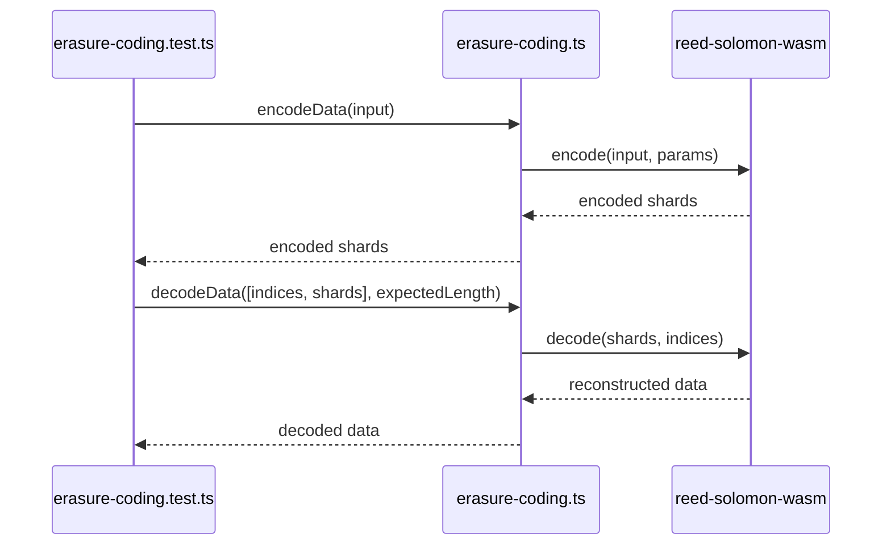

# Update Erasure Coding

## Pull Request by @DrEverr

Resolves: #236

Changes:
- cleaned code
- rename `erasure-encoding` -> `erasure-coding`
- added unzip
- lace
- added join
- split
- added transpose
- added tests for implemented functions
- functions to help reorganize segments for different chain specs
- w3f test vectors


## Comment by @coderabbitai[bot]

<!-- This is an auto-generated comment: summarize by coderabbit.ai -->
<!-- This is an auto-generated comment: skip review by coderabbit.ai -->

> [!IMPORTANT]
> ## Review skipped
> 
> Auto incremental reviews are disabled on this repository.
> 
> Please check the settings in the CodeRabbit UI or the `.coderabbit.yaml` file in this repository. To trigger a single review, invoke the `@coderabbitai review` command.
> 
> You can disable this status message by setting the `reviews.review_status` to `false` in the CodeRabbit configuration file.

<!-- end of auto-generated comment: skip review by coderabbit.ai -->
<!-- walkthrough_start -->

<details>
<summary>📝 Walkthrough</summary>

## Summary by CodeRabbit

- **New Features**
  - Introduced a robust erasure coding module using Reed-Solomon algorithms, enabling data encoding, decoding, splitting, joining, and reconstruction with redundancy for improved reliability.
  - Added comprehensive tests to ensure the accuracy and resilience of erasure coding operations.

- **Bug Fixes**
  - Corrected module import/export paths to ensure proper functionality and resolve potential import errors.

- **Refactor**
  - Streamlined test data and test runner setup for erasure coding, focusing on clarity and maintainability.
  - Enhanced the flexibility of byte blob creation with parameterized size options.

- **Chores**
  - Updated dependencies to include the latest required packages for erasure coding functionality.
## Walkthrough

The changes overhaul the erasure coding implementation and its tests. A new Reed-Solomon-based erasure coding module replaces the previous version, updating all related imports, exports, and test logic. Several erasure coding tests are refactored or removed, and the test runner is updated accordingly. Dependency and workflow references are also updated.

## Changes

| File(s)                                                                                      | Change Summary                                                                                       |
|----------------------------------------------------------------------------------------------|------------------------------------------------------------------------------------------------------|
| .github/workflows/test-runner.yml                                                            | Updated commit hash for JAM test vectors in workflow.                                                |
| bin/test-runner/w3f.ts                                                                       | Removed imports and runner registrations for page proof, segment EC, and segment root erasure coding tests. |
| bin/test-runner/w3f/erasure-coding.ts                                                        | Refactored test logic: renamed `chunks` to `shards`, added helpers, modularized encoding/decoding tests. |
| packages/core/bytes/bytes.ts                                                                 | Enhanced `BytesBlob.empty()` to accept a `size` parameter and validate non-negative sizes.           |
| packages/core/erasure-coding/ec-test-data.ts                                                 | Removed all test logic and helpers; now only exports static `TEST_DATA`.                             |
| packages/core/erasure-coding/erasure-coding.test.ts                                          | Added comprehensive tests for erasure coding encode/decode, split/join, unzip/lace, and utilities.   |
| packages/core/erasure-coding/erasure-coding.ts                                               | Introduced new Reed-Solomon erasure coding module with encoding, decoding, and utility functions.    |
| packages/core/erasure-coding/erasure-encoding.ts                                             | Deleted previous erasure coding implementation.                                                      |
| packages/core/erasure-coding/index.ts                                                        | Fixed export path to reference `erasure-coding` instead of misspelled `erasure-encoding`.           |
| packages/core/erasure-coding/package.json                                                    | Added `@typeberry/bytes` as a dependency.                                                           |

## Sequence Diagram(s)



## Poem

> In bytes and shards, we rabbits hop,  
> Encoding data—never stop!  
> Reed-Solomon magic, tests anew,  
> With helpers and blobs, our code hops through.  
> Old paths are gone, new ones are bright,  
> Erasure coding done just right!  
> 🐇✨

</details>

<!-- walkthrough_end -->
<!-- internal state start -->


<!-- DwQgtGAEAqAWCWBnSTIEMB26CuAXA9mAOYCmGJATmriQCaQDG+Ats2bgFyQAOFk+AIwBWJBrngA3EsgEBPRvlqU0AgfFwA6NPEgQAfACgjoCEYDEZyAAUASpETZWaCrKNxU3bABsvkCiQBHbGlcABpIcVwvOkgAIgBVblpqEkgAUSoHf0gAYUV4DCJQ2MgAdzRkBn8U+jlIbERKSAARCjSpCj5MejRaWn9ERuQkB1SzACYAZgA2DRhYVOZtLAZYTFJhjAYvbCVGaMwConruCIWFJQEKknD/DDRmI7PFxW9UgDMKFkgAA2UskhgMhMWhHH4RfC/f7YfxgEFg8LddB9J7kUqQd7YLbifD3LzqeDSezYVboZA/LEAL3g3B+4R+QnwBTp6Aw9B+uCoGEQ3HwjR+cwAgiicXivLJwrhzrYUBhOa8GESaIhcMh3vg+FLUvBmNxomw5TFMdj4LjkARIGQAQpOqJcORBnM4Kl8B00D5IER8O70NxuCRnObIQJtbqvhInlr9s51BKMVixKa8bHEWyIiEFG7SPx3s9LZkYal4YVIMxXtEyuoEFgo7x8CIxE7zkpEFUaaLZaCGClzWtcHmmNljYnce7YyhkORnOKFLrojRwqUq/YWIsChr0yrkP4lgUnqt3dFCpHITq9SQDZp5qkZah8P7yPR1Xx/BGSOiLURqAs+O8SHQrgYABrVknxhLU+DPcNUijM99XYagkw0cxLDyVh2GQBwnBcNxzlxGcmHQuUeHDeAlFqeRWnaSg+BVHszmoPNb0qLw+RgyFCPPUVF2XKNdywYdRTHXB5FKDUgKeJFD3jD1lVVHgKkQI45gACXwUoSA6cJEFXewlg9DdYnEDBZBKOTkGcVIVXgD1QXed54AYbx+wtOCL3YRcEFJBwiA2eTcS9J4xIoECLTQVZCSkWdeBIBZuUkGCMyYLMSDmKiOj4NZkHvMgYijGVnz8TTCVKcICgjYzjj/ADwpAz5vlfErKCDSAFi8U5/Ac8hQJQMNXRg84QVS69Z0vS1dSy+BKSVPsBw1D4A1wQsLKHBMhN8JEpUYqMnNtYj1Sc4ZsqwXl8UQatjijOTJJ5O0IUtblCz8QQGntaREDmAA5SFelBdbRow/hf3/WhALqr5mH4CD6kaCgVu1LYdnI2U8zrCNkeSXA0GQgx9GMcAoDIeh8FzNA8EIUhyCoGh6EIy8uF4fhhDtBKZHkIaqFUdQtB0PGTCgdwjtZHACGIXLqZiOn2C4Kh0SwpYXEgOoOZUNRNG0XQwEMfHTAMDQiCrbABAAemCoD3lY0pEGNuSwAoLEqY0WRmC8DgDFiD2DAsSBBQASTFqmamJbD5BJxg1kKaRcKLCPs2wJJ6KjH5OvBCR3WCFGk5yBZgPwPBIAAKUFABZTd+ykMQNUQcEVRIU56shn4BEmABWd5pkmABOAB2cYBG7lR3gYABGaZ3gADneAQABZh4YaY0HeFvO+maZx5b2fkgEcYGHBC0fkmAAGcfpm74fp/Hke5/GaZp8mcfx7QR+GBftAB/HruGBblvu5IGZp+mCQAU8xUBljsoSXsVl/QMHgA5Bgo11CtQqLAGGeVIR/lwKSJOAAxHY9lZAABkVDWyEA8OSFcCBw3BP4XkSlKHyFoDCSM5wzYW3UpaAAHqIPASERpMDlF8XwbDSqQFYgbBgqZibQ1rtwbcF5lj1C2LHOgABufgGAZxRk6pQYE7E8w0L5OoDUsgADklQWCPH7FlJW/4sDuhoP4egFpeQFBcj9SAdk/x3H7HTbmRhIAoUsIKLwDjEJmnulGJQ2xnBhO5DmThvIKA0yBjwI2+J4HsAJFHKA31w7rCVJCEgHDEnJI3J4AQ6SHqRAYaILwMTRQfXdp7XGus1AYBtiEO2DtKCm0mO8DQqo3Ye1iF7IJ/tKbKGSfLZwodcwHkjogaOHjYG5jAbAiBeYzwan7HRGgl4LJpi0SQA2KpqZJniXJPw3S4aVilAUPMPxSh9IGdXMu9g2zcCvAAZWges7sPg4yIJ3P1SBvUSnxPVDCKpWTkAAAofhWDQKQKwXwSYsh+F845l40gMGgCEdFmKiCXhsPgfAuAWRImTliRFyLUXvDxSqdF9sMCEuxbi/F9JmWsvYCSslDLyUAEoMQQweRoXp7xjbQlhMWIg4IwFvDmHkW0PJcSgkKOKMq/YlDzhmv4VIVKMBU3BP8rwvZGL+BOQ4suapDJSpIAAfRlcbbgSKHV1hJrEcIsQ7WOvyIUY2jQiXsHtaIT1PVvUFn8L6tVRAA1YuDai3AJQGjMLYkVMsUh6CZPENIJsqQBj9jDjtRQNxZTbF2E8MlP4wXbIOU4jMFqkCcliYgW48iCjIATMo2geaFACPwEIy2PV+pUA9KckkS1shFvOJc5lVN7AkCWqcSyJFpCUEzTxKU6jNHnDtRcSMIQ5F1OSc411JFSXvG0vG4iaQciSIXUG4iiabGVssckhu+jjlNrObiURTacYoR9iEyZSYWqRNqfU0D8SiklJiGUtJjloU5sWbjSANgLz9XoFspJ8SEWupRRegl17cA4v5URx9uBeXks5dS/DdKyM0ZZcR0jHLfhcuI1RsjwrvgCnFZKyNgIZUClQ+hjNeVYB6rY9c8EglzkmsQG7SAugpOGsoLCiNFRCzRqOM6119r3XvDDTSkgBGSYaAbgXHSGBbi0dpRe/lAqfgGCU1AA1VN1M+qdYGy8IaGBhu5XKFjKpzMQ0s7iGzTGKNBdwI55zym3NqY0wCbT/rvMJtJUm8IAXKMZZCywML1mrmReJRlhzTnhlGAgGAIwbSOkqi6apigfG7Vwj9UQF5QzPbez9gHSZMRpmKzDvMjYSzPGlnyA5Ga+rau2znT0p5EqWsypeTJmyqQ6g0LqTAksSdVhYiAq8us/okmiWXD8c6zhaCvPuUnaLxq6mDHCPHTGzDUgFy+QAeU+gpOGkkX4ahjeKOYvt+ydXCpQ0FwI2s9SidDsRiHXGQjasd+MJozRcB+EwHwdovlrAoLQdFPJ8S4Fx5dilaYfiw/jtEFkpQvIoIjrQCszbuS0KOOERke5CjaT1OoSq97/D8PHYmEsmM0D2Dx1d3tBq7uo5HFgVAriviMMVE4yEx3nyQyhzGmHohofmSe+IfE1IdsLEaK1Eg7Vmr3Q6LA+QxbbRiAdNlXMfwtgluzvt15lLBdmk5BO5o1A0DAOdG8+H8CMDsNoLIe4jwTXyF6GgT5MhrjExrINNY9zbowLgbEsxvw074kxlXPIWJqO3JQdnv5ZJYYNIxBucXTAy/xNmCNWHOvzLoGyL0IQr00FILZBWC7+P7C89wJVHq1RBgXgqXGJcW7foElHBtafSSoO/qOUL/3YgYhi/z0eIgC+0z8JoHKaXpBKPdBYCDi8rzZO/tQM9oOFocoS3Ub8AA2hgRwIYKDhAAEKyDKj/6sQCAAC6e81O0g4QVoTCJYR2TQXItA3wjQ0Q8u8Sw+V29efA7eykkAH2boPgkog0uI8og67C50sC8kH6oIguWqQeNelAdeYU422Q8qdSXQfoXw4UKC8+DOluKO9+3IZUfUEYpuRYHB44SIFsRS8AagxOsyeYe6Mq1qvaQ0kAke6IF43Ak0005oXIKqSk3Oo+xO/Ok+eu3I2+E+YuKM4uZY2QMG6SiCSwjWm6KC/Cf0SYPo4e90jOFYniOixEheZE1AG4TecojSRgoyQGoSzBkI4G0SP6cSYcMG2ycGfA5SlS2aEClWI0Pwsu0Sgw+eCBJ2vwe2GAB24I5Qcise/e52ku12Cu8kUSHBsSimym2CEMGO5RB2XAQgVmWgnQaAsgsKFmAxcgwBoBAqoQTmLmMA+AGOmBCmkA/RuIgxVAIxYxaxEx0gIBgg0x5WzSVWRgLqwErq1sg4JAxsOx1sNxHWTSIy3W4y4sQcA2ihw2UcBgoeayueHYT+yoeYuyiGbAUoigUIuoIksKjmmc5wPwgBkxgg92ik904Uionyws94/0LqVAIJTQggDY/YfB6AvwSk004IJRIkHiJA7wZMISJ4kAh8vaIJsAYJmhPAlAmuFkRW4gbA4cogoUhSj02Q52U0QCE4GhuIYA5AX44gUUIYz4RY1QE+4uaIvw8JuxoBVRy44uPw8Qri48goQxsg4I06UCog6y/WopcwKKxUeciAGq4JnyIx0JoI9AkeLkaAQEqQmA8g2JDwi61uUkXg5Qsgcik6j4xJcJQBGpiJFews2hlJup+phpGxIeGe+Sso8oKuRIBQng5cY4L2v6SIfpuJFAU0sSiIPg6k+4h41uFoVQi03pWACZ8gUZCJAgWpC+o+5pk2tA4QkeGAUpxyiEUUpJpa1M1aW0diwZwxBy40TpSs2A9klATYqAZAEcioao0QHCchNk44hUDZiEJY00XwYAe44gY400FENASsoBLuXeasVAisY5bhCSTh+ZResS90MUUgxE0pI5VkopH0kAuSVaTQPhYRpBgiGIQ6qAi8f4O+xMeASkewdyyAzJigAG0RwSsRUGFoCRrRdeKRxSaRxMGRCGGScoMKuRxci6LJ9ASkRA9wk6LoruQJGSEJzp4I9yhR5I6piAexHZeSkcT4Iq52WM4gHFTpUJXA/Fgle8kI4liEUlkJAA3vYKKZAAALwMmQAAC+XA6lY5AA/FwN/swL/vpdpZAKpXpQKrJdGQJZqchBVi0tVgYKcUBOccbJcfxpptKm1pKgwGALbGLvcRVk8b1hLAxY4ArO8coihqHmNsClIBZB6NhjshJe5BEZKBmDYWnGWSoNEK2j1IpPgDAkHEIUes/oUgJvujtoem2nqOFK9quhGHaW8o0EunGZgAkqRX2nRMRD8NAGkF8tAPas0IKNAIKGmfqnJIHljCaczGIOKXcP6Wrr8CNWNRNVNTNeYfxMgBwaQDOF2vklhisKQR5H2ljFzscOLkdakAsBwr0OafpPYJyJJGmCqSEP1sRl3hsb2lVSSR9YUNAPgPxUylfswOTuyBfjYFDTfswNXJWQFHGVdBmA4OoPqi2G2CGB5nVdrkcGGhoCTY5oiA4VRf4DONqgGT2nwiWhKeiPhPIKkUkqCsNaNeNZNdNcan7pgGEHGZHmHvgOIuEMjk0FVeEBuEgSwM7rKBIAOpmmoVBQOjBRQQgO8NQSKkUtwhPp3kiDYS4TSN4F+RaDpNEDOGjGRE8OxW8mLm2hmpJLZDHg8IhtdCWGwPMkgEjaVdgDufiDMnLg0lhd1sBkkWBs2BBuHdBiRUkukakhUohtkZ8VAKJphhjkIe9WWaDeDY5bCrmXgFwKckcPZZAHqXKAaUaU5qnRhpmhnWtOcjLcwFCdXWhrXXQPXWjlgHDQjXsogLCs4BQFwF/j/pQOEOXbgJXRsWAR/mAf2WZaPRQKXSPRZWPWXcmUaTPRASJu3bQBjjjWWXjUlk9ITYUGGlCdpXoDZZACTXMHZXvBjdgFjWUFQH6K1ZcuHqhtnGdd0X7mXAtcHkVLURtX8LHT4n/VtVzbtZ2SglGIgP6VnROk9AbQwSfuwA8ZVrrJ5d5b5UtoFXgzGgMiEOFV1mMlFa8bFYHUNglbhKgGNkrgqESI3iwDFHFEpFFJcpjTeYVEnAQ2CONowtEOEMlJQE8EDQ4KSBUFCO7koAA+iu3iQHI/SETuoOipzhgOilSDSDDb8FtkAsDv2AUOWi2PUEbvuQ3eEgebiB0BPk9VnUcC1Dsf9bOZAPCsXTnRDUKlJDwI0LsIQE3QumgR2J7RHN7a4z8D3WyNfn3T8EKmbTqCbTeQEz0YEyzL+owtnccLgQ1VuL2p3rbu8CzTI/uBqHQXLcrCwzGOIfwHgHmegF+B2v2DBnaL9RRiVQbXrjrl8AIK9OU/IL7pYfbCLscBqPAAbHiB4gwR+k3TOKgS07TLAF7r2io/2EiOo0HVBiunJEaJBY7m9IMD1GRNoWSsCHGLAZk5M1jJmccmWZSVKF8NgEQJXmPsqWmL7hZbdXMF8jqDZNOHGBSBgNSLSD1D8Ho+CCusEZjDs5qAsPAJBBgB0OblTS2ggNwMI7iA5BQI8KboxDYd2FgCGIokC/6OdRaMwM5DSBWNifJJtHFEVGAHo/QHwXnKs2HbEnk0lNcOYh0JAAVaaA0O8mQDGHyGVIjBWiWC2Zc2gNpEcBWD0e02mOS3SeeA+vsq+YpEwevnYkaaImQIfrAHWlSXXJaEEMJIoQMBSyWE4xUoIMBaHiOtJCftBcIvLYrUSDYTFH6dxA9DKrcFDeHPtqk/LuENk0UD1JCxWQ9FkK1YOGU+9OYUpPiLohcrunVSoW5JeOy1EdhWy3EXmC0ZBuEsRbBmRQnVkVRchkYLkvYiBuEvhecIxcxctDHSWykpkUnRWxsiujFI0MRDdggMgJ4i5UcVg7VDg/NH5QCK1jGpO4WNO8pIMhg5FRMtFcHHFfEh8YlQO8svZJmcriSEw9FP4GwwlDALIP6F8h8v2OwR8BuModDimiWOhnQGAF8gOiwEWV4F6Lc7AEjVLZ8j81edgZAAAOokACCCjT4WUzgRji5Jx6q0BgDm0fuDnVHQ0KRnGkAGNUldREhb7802q0SS59oOREAwiRtGNIwnhYy+DmWWVhw2FLHhOfT2pfIqSCg2DNBfKxOShko+gWshIS6XZwo/A2CjXxAELjVsccdcc8fmGMJsiYAMDyDwosdifNDxCfSTWfQ5AACasTTJ5YqQZAz4m5QnI+Y56A+ITFY0Fot8SsjlHiGcFoXyvsxczQf6liLaPUDQRI4wYATjTHVwjQaekAAA4tgrCqPEKqfe1kspcRs+EpR7sPqtroo0HrTvTgpFgQXfQVcxaA5IY3KJCJMNPOMOZ1dsQWQANVYVyRig0XkNjvLjA1Z2MxGfbT1Gl8MG4uetmUVAp8kMREsXMJTp0+l4tUVFvkM/5GWeMz6DYR+uLl1RgQ0WLd0PiB7SMJWnwLG/HFMg0Q51SSoUSaN0NCyFqFgFPo0NB61TYcF3BlgAo+dV2NAT1B9awE8C6iiFa6nu/r1c04hbq4UFKDjMKJ4cvqY3uZSUDTSTAsTikFKyYXzk8G42PnJ+oyjwyEyBo9MeYRqF+BgFNJj1o7SPSGC/SCzoYUAgKnmubkDUbZ4MevqnJZqUzASS1GlsRDYYjgGxUSVfwt2Kfgj/K22vj4cNNIj3UrICy/epT7QqkIbdQGWZuW2tnrKZbrINLml57nzzJhY3Yn6Em+SGl3I/dAGKSCk2HL1bl7eYIIiL5BakeccGl/QAJzS1UHyOhRSyq/KzjKHsnBYcLrgKb5naiXXDSwuoWrmEx0SQUC9yVQUxspxDqs7tpOkkSOb5XsRzz5z6qCG2N8gJn6q+wHGadyWkoz1F1IeOzCwG0lNsXxEZme4piLZAwTawIJKGWR9/AYviWFI+QJufAy4HMBkF8DtznAdlG09Db5C1IWmNz4aEQLc/bhJnnE8yy6jF8IPzjAQcoEQXmDe+eujIey374Fw6xfmP5UWA+2Y8hqK8Y08LF/n764j9S0voT8YUiEsB9RwhEAYZri2n/Y8lRST4DcAgCeZgANcGoFwoqFA7gdIO13WfJwl1rnIiSxdFamOBs4l8kQlnKbssFVAh0gkubPCvEUjqJFvOxbfqvBkTqUVIgORVDKA3BSZ0TeQefOhgDzJcAJ6U9YYqXS4Eplhis9VuowO2SJdHuY3ABmwI4GQAV6v+cehvWnqz0YCxSeZgQj1ZShTKGhRerwPkHDEhBrNfsJnRWaSDC6kAFnnbw0rTQNBdHSgKXTMECBBBDA/QaIJWLY9jBnAUwY5UEqKCLBJAKwVoIcrtk9BYDZwSTzcEBCYyHfHwX4NXpL1whTlQQA4NcxODM6ejMIR4PbLeCTKC9GIbYM8GalHBwQzOnLzYhpC7Bs9XIRkO3pJDCh+vH1h7kWZ89SheQ/YnEK8FVCoQNQrupNz9zTcJBuXYetYL/zpCIhW9JQdAhpiqDgesAaIb/gqERDDiIyNyicTHYbAfKE7Phv6hayxcSGjxMhiuwoYhwN2NDL4pHR1RPg1s11ZYDEGt5zhsqElc5GHGfaIc32rEMsM2TTbQ5CoNhWLrrhf5V5c8AKCINoFYiOJgOzDLpgjzDildxgHAYeIfCmBxloRiPJjkiDhEIiCANHCrnaxIJ7AlAuHWmHzUb6FRMCrXLAXKH7KL0VuwnNtANyU5xgcBxHA/FKFfL/DEMeA1xJhBJAoIpGJIyziGEkilhveFYMOPZxuJOc9ErndzkVCCBws7hwFEHGWiRhGh9eLUL7rKDqY2ECuiCK6HxzP7EcXydQ3EW33kArMJ8iCHPqtx6j7CkmdALEINx2QHdH2l0c4E8Nfbvs3hVnb9lWEhiwcygFQSGG0hjTYjjOxTeAlv3jblQ3W9AT1lUzuqI8emy5IYbyEZ5O8gYYzAoD6CWL3pIxEkapml1EFVc7EUHROtU1P6R8qR+OTYA/xLCOI7RdI3tKG2cEDMg+6RdMRMwW4iolui6CsZVwHxM4ngjwQYDbQO51BGxRJKMK6JeEodPRozKUMwCUHNphmnYRyK9yRBXcZ8G3Z0S6Fm4ZjfAd3Jcl4lfKYkvCvgd7ti2OD3dQuAPZJEyNgAj9OgYRCfoXyFIxAbet49CtQFWAxBrxgAt7ucDrCD9XWXgTNKWEwBIphxl2RHkiDj4riSq44sgZ8NqEth5QsgVqq4koATNdkF/KMGhyO7Q43e6ATWk0CKSLjRQytPYFTUJBXiOEDiCZpOPdG/pcJgYhxj51v7yAYeG4CNh2BQZXMGeiTJCNm1Dq4U62pAhXlHQoG5h9B8ddtrQOoo70xMTiWEiwIm6Z00BbXagE9GEE4ZmBMjcbmgDSF8CjSsWGugpIeQKMQ+tQtSUxQ0nClkhSE8QawP6HSDBhcgiuvwNkCjCEkKgtQbAGyGWUdK0nTjvagIRpBPoYXaACpEgAAAqECqx3Y6ccvksWVyscQ8orDpAaw/wLOwCozs4+RSHYdhWeKBwpklDQbHMmOGh4PiQE1KjaDoJoTdQ2ySVMEKwljR7kPwbBqsNwYCZ52/qXKRwhWyHcHIO5UsWtlqLcZG4sQMVFsNDFEBYgClX4BNKymCY2ss03tKMzm6+ANuxnMBjEDL6yMMuILZSYA0W4CM3gPVUsCMH9DY5zhR4f0p5EcgM4pGIYarrG3mb3Rv+WCc4ODmwA+gHIN0tgKuQsi0Be8KoMaOcxmjbRd0YDScOwheliAZw2iO4LANgiGg2QMQG9qr0VqfcTmVFH0BlXzBj9soL4MvDqG1CDBgg1VE9KeHdx7MTpVLb8MGOurOsh0SICCrmGLQUT20WALEPBXmZqJmaB/IzkVC8TJt+2W08FM1JL6oBYZNMQgUQOElxJ62Yk8gURUknbTS2MkpDDkSgBpA1ZmsokLtL0ngsKch07ilgDalpSLi6wrqU6l6n9S2S0s+GdSUCKwCfgC0jYTNNNm1xegKbNcIMEunRB2QbsrqbFxWkYMlhqUzDulM6lX9upsadqalFWIYBOsuwn2IVL6wxVDh1DfJFuxjgZlfoXJVUkoAfBKAtg8gWIAAAERI/oX/C4GuKOUSgRJRFucliCMlGSw8MyKJLiBFyiYwICBCUEaDoFTSGHLylh0TkYgLhPDc4BXKrngcaIsgRabHJKDxyAZyIcHgJAHSWxIcO5ayKLjrg9zS57+aeee1nmdB55PCU1CUAhlWQEGTc8LD1AEBVou8qQNkmdEpkX5q0fBUWVSWLm9yiQ+JO0IZ3ASC9zkkY4CTmW5Cas++Ghd8H+m6iLwrUUYWQjvOOBHzq5c842OfMQAlBu5qM0ua+SFpgUugxAkSXmF+kkB88QfJ6BuHDyECYitbBWZ3ILbR1KBcddWRRT1koYckuIEgGHLxgGB+YD0YmKTHJjkNkkUsOUDLDQBywSp8gCpkoE5hqweYmsQwAIt8S4B7UZERAPakajvg6A9qOiDhj4UCLxg48ZuIfFoAvwW4w8R+LQDvh9BD48I/uOMBIDTw3448aeN3EmDDw+k3cFuJMFED0AjFBMBBOos0XaLioui2gCGjTD6AgAA= -->

<!-- internal state end -->
<!-- tips_start -->

---


<details>
<summary>🪧 Tips</summary>

### Chat

There are 3 ways to chat with [CodeRabbit](https://coderabbit.ai?utm_source=oss&utm_medium=github&utm_campaign=FluffyLabs/typeberry&utm_content=395):

- Review comments: Directly reply to a review comment made by CodeRabbit. Example:
  - `I pushed a fix in commit <commit_id>, please review it.`
  - `Explain this complex logic.`
  - `Open a follow-up GitHub issue for this discussion.`
- Files and specific lines of code (under the "Files changed" tab): Tag `@coderabbitai` in a new review comment at the desired location with your query. Examples:
  - `@coderabbitai explain this code block.`
  -	`@coderabbitai modularize this function.`
- PR comments: Tag `@coderabbitai` in a new PR comment to ask questions about the PR branch. For the best results, please provide a very specific query, as very limited context is provided in this mode. Examples:
  - `@coderabbitai gather interesting stats about this repository and render them as a table. Additionally, render a pie chart showing the language distribution in the codebase.`
  - `@coderabbitai read src/utils.ts and explain its main purpose.`
  - `@coderabbitai read the files in the src/scheduler package and generate a class diagram using mermaid and a README in the markdown format.`
  - `@coderabbitai help me debug CodeRabbit configuration file.`

### Support

Need help? Create a ticket on our [support page](https://www.coderabbit.ai/contact-us/support) for assistance with any issues or questions.

Note: Be mindful of the bot's finite context window. It's strongly recommended to break down tasks such as reading entire modules into smaller chunks. For a focused discussion, use review comments to chat about specific files and their changes, instead of using the PR comments.

### CodeRabbit Commands (Invoked using PR comments)

- `@coderabbitai pause` to pause the reviews on a PR.
- `@coderabbitai resume` to resume the paused reviews.
- `@coderabbitai review` to trigger an incremental review. This is useful when automatic reviews are disabled for the repository.
- `@coderabbitai full review` to do a full review from scratch and review all the files again.
- `@coderabbitai summary` to regenerate the summary of the PR.
- `@coderabbitai generate sequence diagram` to generate a sequence diagram of the changes in this PR.
- `@coderabbitai resolve` resolve all the CodeRabbit review comments.
- `@coderabbitai configuration` to show the current CodeRabbit configuration for the repository.
- `@coderabbitai help` to get help.

### Other keywords and placeholders

- Add `@coderabbitai ignore` anywhere in the PR description to prevent this PR from being reviewed.
- Add `@coderabbitai summary` to generate the high-level summary at a specific location in the PR description.
- Add `@coderabbitai` anywhere in the PR title to generate the title automatically.

### Documentation and Community

- Visit our [Documentation](https://docs.coderabbit.ai) for detailed information on how to use CodeRabbit.
- Join our [Discord Community](http://discord.gg/coderabbit) to get help, request features, and share feedback.
- Follow us on [X/Twitter](https://twitter.com/coderabbitai) for updates and announcements.

</details>

<!-- tips_end -->


## Comment by @DrEverr

This PR is close to be done. Main functionality is working. Full tests passes. Tiny tests are a bit tricky to implement. I'm opening this PR for review to collectively make it better.


## Comment by @github-actions[bot]


<details>
<summary>View all</summary>

|  Name  |  Status  | |
|--------|----------|-|
| Trie test 0 | ✅ | | 
| Trie test 1 | ✅ | | 
| Trie test 2 | ✅ | | 
| Trie test 3 | ✅ | | 
| Trie test 4 | ✅ | | 
| Trie test 5 | ✅ | | 
| Trie test 6 | ✅ | | 
| Trie test 7 | ✅ | | 
| Trie test 8 | ✅ | | 
| Trie test 9 | ✅ | | 
| Trie test 10 | ✅ | | 
| Trie test 10 | ✅ | | 
| Trie test 10 | ✅ | | 
| jamtestvectors/statistics/tiny/stats_with_empty_extrinsic-1.json | ✅ | | 
| jamtestvectors/statistics/tiny/stats_with_epoch_change-1.json | ✅ | | 
| jamtestvectors/statistics/tiny/stats_with_some_extrinsic-1.json | ✅ | | 
| jamtestvectors/statistics/tiny/stats_with_some_extrinsic-1.json | ✅ | | 
| jamtestvectors/statistics/full/stats_with_empty_extrinsic-1.json | ✅ | | 
| jamtestvectors/statistics/full/stats_with_epoch_change-1.json | ✅ | | 
| jamtestvectors/statistics/full/stats_with_some_extrinsic-1.json | ✅ | | 
| jamtestvectors/statistics/full/stats_with_some_extrinsic-1.json | ✅ | | 
| should correctly shuffle input of length 0 | ✅ | | 
| should correctly shuffle input of length 8 | ✅ | | 
| should correctly shuffle input of length 16 | ✅ | | 
| should correctly shuffle input of length 20 | ✅ | | 
| should correctly shuffle input of length 50 | ✅ | | 
| should correctly shuffle input of length 100 | ✅ | | 
| should correctly shuffle input of length 200 | ✅ | | 
| should correctly shuffle input of length 341 | ✅ | | 
| should correctly shuffle input of length 341 | ✅ | | 
| should correctly shuffle input of length 341 | ✅ | | 
| jamtestvectors/safrole/tiny/enact-epoch-change-with-no-tickets-1.json | ✅ | | 
| jamtestvectors/safrole/tiny/enact-epoch-change-with-no-tickets-2.json | ✅ | | 
| jamtestvectors/safrole/tiny/enact-epoch-change-with-no-tickets-3.json | ✅ | | 
| jamtestvectors/safrole/tiny/enact-epoch-change-with-no-tickets-4.json | ✅ | | 
| jamtestvectors/safrole/tiny/enact-epoch-change-with-padding-1.json | ✅ | | 
| jamtestvectors/safrole/tiny/publish-tickets-no-mark-1.json | ✅ | | 
| jamtestvectors/safrole/tiny/publish-tickets-no-mark-2.json | ✅ | | 
| jamtestvectors/safrole/tiny/publish-tickets-no-mark-3.json | ✅ | | 
| jamtestvectors/safrole/tiny/publish-tickets-no-mark-4.json | ✅ | | 
| jamtestvectors/safrole/tiny/publish-tickets-no-mark-5.json | ✅ | | 
| jamtestvectors/safrole/tiny/publish-tickets-no-mark-6.json | ✅ | | 
| jamtestvectors/safrole/tiny/publish-tickets-no-mark-7.json | ✅ | | 
| jamtestvectors/safrole/tiny/publish-tickets-no-mark-8.json | ✅ | | 
| jamtestvectors/safrole/tiny/publish-tickets-no-mark-9.json | ✅ | | 
| jamtestvectors/safrole/tiny/publish-tickets-with-mark-1.json | ✅ | | 
| jamtestvectors/safrole/tiny/publish-tickets-with-mark-2.json | ✅ | | 
| jamtestvectors/safrole/tiny/publish-tickets-with-mark-3.json | ✅ | | 
| jamtestvectors/safrole/tiny/publish-tickets-with-mark-4.json | ✅ | | 
| jamtestvectors/safrole/tiny/publish-tickets-with-mark-5.json | ✅ | | 
| jamtestvectors/safrole/tiny/skip-epoch-tail-1.json | ✅ | | 
| jamtestvectors/safrole/tiny/skip-epochs-1.json | ✅ | | 
| jamtestvectors/safrole/full/enact-epoch-change-with-no-tickets-1.json | ✅ | | 
| jamtestvectors/safrole/full/enact-epoch-change-with-no-tickets-2.json | ✅ | | 
| jamtestvectors/safrole/full/enact-epoch-change-with-no-tickets-3.json | ✅ | | 
| jamtestvectors/safrole/full/enact-epoch-change-with-no-tickets-4.json | ✅ | | 
| jamtestvectors/safrole/full/enact-epoch-change-with-padding-1.json | ✅ | | 
| jamtestvectors/safrole/full/publish-tickets-no-mark-1.json | ✅ | | 
| jamtestvectors/safrole/full/publish-tickets-no-mark-2.json | ✅ | | 
| jamtestvectors/safrole/full/publish-tickets-no-mark-3.json | ✅ | | 
| jamtestvectors/safrole/full/publish-tickets-no-mark-4.json | ✅ | | 
| jamtestvectors/safrole/full/publish-tickets-no-mark-5.json | ✅ | | 
| jamtestvectors/safrole/full/publish-tickets-no-mark-6.json | ✅ | | 
| jamtestvectors/safrole/full/publish-tickets-no-mark-7.json | ✅ | | 
| jamtestvectors/safrole/full/publish-tickets-no-mark-8.json | ✅ | | 
| jamtestvectors/safrole/full/publish-tickets-no-mark-9.json | ✅ | | 
| jamtestvectors/safrole/full/publish-tickets-with-mark-1.json | ✅ | | 
| jamtestvectors/safrole/full/publish-tickets-with-mark-2.json | ✅ | | 
| jamtestvectors/safrole/full/publish-tickets-with-mark-3.json | ✅ | | 
| jamtestvectors/safrole/full/publish-tickets-with-mark-4.json | ✅ | | 
| jamtestvectors/safrole/full/publish-tickets-with-mark-5.json | ✅ | | 
| jamtestvectors/safrole/full/skip-epoch-tail-1.json | ✅ | | 
| jamtestvectors/safrole/full/skip-epochs-1.json | ✅ | | 
| jamtestvectors/safrole/full/skip-epochs-1.json | ✅ | | 
| jamtestvectors/reports/tiny/anchor_not_recent-1.json | ✅ | | 
| jamtestvectors/reports/tiny/bad_beefy_mmr-1.json | ✅ | | 
| jamtestvectors/reports/tiny/bad_code_hash-1.json | ✅ | | 
| jamtestvectors/reports/tiny/bad_core_index-1.json | ✅ | | 
| jamtestvectors/reports/tiny/bad_service_id-1.json | ✅ | | 
| jamtestvectors/reports/tiny/bad_signature-1.json | ✅ | | 
| jamtestvectors/reports/tiny/bad_state_root-1.json | ✅ | | 
| jamtestvectors/reports/tiny/bad_validator_index-1.json | ✅ | | 
| jamtestvectors/reports/tiny/big_work_report_output-1.json | ✅ | | 
| jamtestvectors/reports/tiny/core_engaged-1.json | ✅ | | 
| jamtestvectors/reports/tiny/dependency_missing-1.json | ✅ | | 
| jamtestvectors/reports/tiny/duplicate_package_in_recent_history-1.json | ✅ | | 
| jamtestvectors/reports/tiny/duplicated_package_in_report-1.json | ✅ | | 
| jamtestvectors/reports/tiny/future_report_slot-1.json | ✅ | | 
| jamtestvectors/reports/tiny/high_work_report_gas-1.json | ✅ | | 
| jamtestvectors/reports/tiny/many_dependencies-1.json | ✅ | | 
| jamtestvectors/reports/tiny/multiple_reports-1.json | ✅ | | 
| jamtestvectors/reports/tiny/no_enough_guarantees-1.json | ✅ | | 
| jamtestvectors/reports/tiny/not_authorized-1.json | ✅ | | 
| jamtestvectors/reports/tiny/not_authorized-2.json | ✅ | | 
| jamtestvectors/reports/tiny/not_sorted_guarantor-1.json | ✅ | | 
| jamtestvectors/reports/tiny/out_of_order_guarantees-1.json | ✅ | | 
| jamtestvectors/reports/tiny/report_before_last_rotation-1.json | ✅ | | 
| jamtestvectors/reports/tiny/report_curr_rotation-1.json | ✅ | | 
| jamtestvectors/reports/tiny/report_prev_rotation-1.json | ✅ | | 
| jamtestvectors/reports/tiny/reports_with_dependencies-1.json | ✅ | | 
| jamtestvectors/reports/tiny/reports_with_dependencies-2.json | ✅ | | 
| jamtestvectors/reports/tiny/reports_with_dependencies-3.json | ✅ | | 
| jamtestvectors/reports/tiny/reports_with_dependencies-4.json | ✅ | | 
| jamtestvectors/reports/tiny/reports_with_dependencies-5.json | ✅ | | 
| jamtestvectors/reports/tiny/reports_with_dependencies-6.json | ✅ | | 
| jamtestvectors/reports/tiny/segment_root_lookup_invalid-1.json | ✅ | | 
| jamtestvectors/reports/tiny/segment_root_lookup_invalid-2.json | ✅ | | 
| jamtestvectors/reports/tiny/service_item_gas_too_low-1.json | ✅ | | 
| jamtestvectors/reports/tiny/too_big_work_report_output-1.json | ✅ | | 
| jamtestvectors/reports/tiny/too_high_work_report_gas-1.json | ✅ | | 
| jamtestvectors/reports/tiny/too_many_dependencies-1.json | ✅ | | 
| jamtestvectors/reports/tiny/with_avail_assignments-1.json | ✅ | | 
| jamtestvectors/reports/tiny/wrong_assignment-1.json | ✅ | | 
| jamtestvectors/reports/tiny/wrong_assignment-1.json | ✅ | | 
| jamtestvectors/reports/full/anchor_not_recent-1.json | ✅ | | 
| jamtestvectors/reports/full/bad_beefy_mmr-1.json | ✅ | | 
| jamtestvectors/reports/full/bad_code_hash-1.json | ✅ | | 
| jamtestvectors/reports/full/bad_core_index-1.json | ✅ | | 
| jamtestvectors/reports/full/bad_service_id-1.json | ✅ | | 
| jamtestvectors/reports/full/bad_signature-1.json | ✅ | | 
| jamtestvectors/reports/full/bad_state_root-1.json | ✅ | | 
| jamtestvectors/reports/full/bad_validator_index-1.json | ✅ | | 
| jamtestvectors/reports/full/big_work_report_output-1.json | ✅ | | 
| jamtestvectors/reports/full/core_engaged-1.json | ✅ | | 
| jamtestvectors/reports/full/dependency_missing-1.json | ✅ | | 
| jamtestvectors/reports/full/duplicate_package_in_recent_history-1.json | ✅ | | 
| jamtestvectors/reports/full/duplicated_package_in_report-1.json | ✅ | | 
| jamtestvectors/reports/full/future_report_slot-1.json | ✅ | | 
| jamtestvectors/reports/full/high_work_report_gas-1.json | ✅ | | 
| jamtestvectors/reports/full/many_dependencies-1.json | ✅ | | 
| jamtestvectors/reports/full/multiple_reports-1.json | ✅ | | 
| jamtestvectors/reports/full/no_enough_guarantees-1.json | ✅ | | 
| jamtestvectors/reports/full/not_authorized-1.json | ✅ | | 
| jamtestvectors/reports/full/not_authorized-2.json | ✅ | | 
| jamtestvectors/reports/full/not_sorted_guarantor-1.json | ✅ | | 
| jamtestvectors/reports/full/out_of_order_guarantees-1.json | ✅ | | 
| jamtestvectors/reports/full/report_before_last_rotation-1.json | ✅ | | 
| jamtestvectors/reports/full/report_curr_rotation-1.json | ✅ | | 
| jamtestvectors/reports/full/report_prev_rotation-1.json | ✅ | | 
| jamtestvectors/reports/full/reports_with_dependencies-1.json | ✅ | | 
| jamtestvectors/reports/full/reports_with_dependencies-2.json | ✅ | | 
| jamtestvectors/reports/full/reports_with_dependencies-3.json | ✅ | | 
| jamtestvectors/reports/full/reports_with_dependencies-4.json | ✅ | | 
| jamtestvectors/reports/full/reports_with_dependencies-5.json | ✅ | | 
| jamtestvectors/reports/full/reports_with_dependencies-6.json | ✅ | | 
| jamtestvectors/reports/full/segment_root_lookup_invalid-1.json | ✅ | | 
| jamtestvectors/reports/full/segment_root_lookup_invalid-2.json | ✅ | | 
| jamtestvectors/reports/full/service_item_gas_too_low-1.json | ✅ | | 
| jamtestvectors/reports/full/too_big_work_report_output-1.json | ✅ | | 
| jamtestvectors/reports/full/too_high_work_report_gas-1.json | ✅ | | 
| jamtestvectors/reports/full/too_many_dependencies-1.json | ✅ | | 
| jamtestvectors/reports/full/with_avail_assignments-1.json | ✅ | | 
| jamtestvectors/reports/full/wrong_assignment-1.json | ✅ | | 
| jamtestvectors/reports/full/wrong_assignment-1.json | ✅ | | 
| jamtestvectors/pvm/schema.json | ✅ | | 
| jamtestvectors/pvm/schema.json | ✅ | | 
| jamtestvectors/pvm/programs/gas_basic_consume_all.json | ✅ | | 
| jamtestvectors/pvm/programs/inst_add_32.json | ✅ | | 
| jamtestvectors/pvm/programs/inst_add_32_with_overflow.json | ✅ | | 
| jamtestvectors/pvm/programs/inst_add_32_with_truncation.json | ✅ | | 
| jamtestvectors/pvm/programs/inst_add_32_with_truncation_and_sign_extension.json | ✅ | | 
| jamtestvectors/pvm/programs/inst_add_64.json | ✅ | | 
| jamtestvectors/pvm/programs/inst_add_64_with_overflow.json | ✅ | | 
| jamtestvectors/pvm/programs/inst_add_imm_32.json | ✅ | | 
| jamtestvectors/pvm/programs/inst_add_imm_32_with_truncation.json | ✅ | | 
| jamtestvectors/pvm/programs/inst_add_imm_32_with_truncation_and_sign_extension.json | ✅ | | 
| jamtestvectors/pvm/programs/inst_add_imm_64.json | ✅ | | 
| jamtestvectors/pvm/programs/inst_and.json | ✅ | | 
| jamtestvectors/pvm/programs/inst_and_imm.json | ✅ | | 
| jamtestvectors/pvm/programs/inst_branch_eq_imm_nok.json | ✅ | | 
| jamtestvectors/pvm/programs/inst_branch_eq_imm_ok.json | ✅ | | 
| jamtestvectors/pvm/programs/inst_branch_eq_nok.json | ✅ | | 
| jamtestvectors/pvm/programs/inst_branch_eq_ok.json | ✅ | | 
| jamtestvectors/pvm/programs/inst_branch_greater_or_equal_signed_imm_nok.json | ✅ | | 
| jamtestvectors/pvm/programs/inst_branch_greater_or_equal_signed_imm_ok.json | ✅ | | 
| jamtestvectors/pvm/programs/inst_branch_greater_or_equal_signed_nok.json | ✅ | | 
| jamtestvectors/pvm/programs/inst_branch_greater_or_equal_signed_ok.json | ✅ | | 
| jamtestvectors/pvm/programs/inst_branch_greater_or_equal_unsigned_imm_nok.json | ✅ | | 
| jamtestvectors/pvm/programs/inst_branch_greater_or_equal_unsigned_imm_ok.json | ✅ | | 
| jamtestvectors/pvm/programs/inst_branch_greater_or_equal_unsigned_nok.json | ✅ | | 
| jamtestvectors/pvm/programs/inst_branch_greater_or_equal_unsigned_ok.json | ✅ | | 
| jamtestvectors/pvm/programs/inst_branch_greater_signed_imm_nok.json | ✅ | | 
| jamtestvectors/pvm/programs/inst_branch_greater_signed_imm_ok.json | ✅ | | 
| jamtestvectors/pvm/programs/inst_branch_greater_unsigned_imm_nok.json | ✅ | | 
| jamtestvectors/pvm/programs/inst_branch_greater_unsigned_imm_ok.json | ✅ | | 
| jamtestvectors/pvm/programs/inst_branch_less_or_equal_signed_imm_nok.json | ✅ | | 
| jamtestvectors/pvm/programs/inst_branch_less_or_equal_signed_imm_ok.json | ✅ | | 
| jamtestvectors/pvm/programs/inst_branch_less_or_equal_unsigned_imm_nok.json | ✅ | | 
| jamtestvectors/pvm/programs/inst_branch_less_or_equal_unsigned_imm_ok.json | ✅ | | 
| jamtestvectors/pvm/programs/inst_branch_less_signed_imm_nok.json | ✅ | | 
| jamtestvectors/pvm/programs/inst_branch_less_signed_imm_ok.json | ✅ | | 
| jamtestvectors/pvm/programs/inst_branch_less_signed_nok.json | ✅ | | 
| jamtestvectors/pvm/programs/inst_branch_less_signed_ok.json | ✅ | | 
| jamtestvectors/pvm/programs/inst_branch_less_unsigned_imm_nok.json | ✅ | | 
| jamtestvectors/pvm/programs/inst_branch_less_unsigned_imm_ok.json | ✅ | | 
| jamtestvectors/pvm/programs/inst_branch_less_unsigned_nok.json | ✅ | | 
| jamtestvectors/pvm/programs/inst_branch_less_unsigned_ok.json | ✅ | | 
| jamtestvectors/pvm/programs/inst_branch_not_eq_imm_nok.json | ✅ | | 
| jamtestvectors/pvm/programs/inst_branch_not_eq_imm_ok.json | ✅ | | 
| jamtestvectors/pvm/programs/inst_branch_not_eq_nok.json | ✅ | | 
| jamtestvectors/pvm/programs/inst_branch_not_eq_ok.json | ✅ | | 
| jamtestvectors/pvm/programs/inst_cmov_if_zero_imm_nok.json | ✅ | | 
| jamtestvectors/pvm/programs/inst_cmov_if_zero_imm_ok.json | ✅ | | 
| jamtestvectors/pvm/programs/inst_cmov_if_zero_nok.json | ✅ | | 
| jamtestvectors/pvm/programs/inst_cmov_if_zero_ok.json | ✅ | | 
| jamtestvectors/pvm/programs/inst_div_signed_32.json | ✅ | | 
| jamtestvectors/pvm/programs/inst_div_signed_32.json | ✅ | | 
| jamtestvectors/pvm/programs/inst_div_signed_32_by_zero.json | ✅ | | 
| jamtestvectors/pvm/programs/inst_div_signed_32_with_overflow.json | ✅ | | 
| jamtestvectors/pvm/programs/inst_div_signed_64.json | ✅ | | 
| jamtestvectors/pvm/programs/inst_div_signed_64_by_zero.json | ✅ | | 
| jamtestvectors/pvm/programs/inst_div_signed_64_with_overflow.json | ✅ | | 
| jamtestvectors/pvm/programs/inst_div_unsigned_32.json | ✅ | | 
| jamtestvectors/pvm/programs/inst_div_unsigned_32_by_zero.json | ✅ | | 
| jamtestvectors/pvm/programs/inst_div_unsigned_32_with_overflow.json | ✅ | | 
| jamtestvectors/pvm/programs/inst_div_unsigned_64.json | ✅ | | 
| jamtestvectors/pvm/programs/inst_div_unsigned_64_by_zero.json | ✅ | | 
| jamtestvectors/pvm/programs/inst_div_unsigned_64_with_overflow.json | ✅ | | 
| jamtestvectors/pvm/programs/inst_fallthrough.json | ✅ | | 
| jamtestvectors/pvm/programs/inst_jump.json | ✅ | | 
| jamtestvectors/pvm/programs/inst_jump_indirect_invalid_djump_to_zero_nok.json | ✅ | | 
| jamtestvectors/pvm/programs/inst_jump_indirect_misaligned_djump_with_offset_nok.json | ✅ | | 
| jamtestvectors/pvm/programs/inst_jump_indirect_misaligned_djump_without_offset_nok.json | ✅ | | 
| jamtestvectors/pvm/programs/inst_jump_indirect_with_offset_ok.json | ✅ | | 
| jamtestvectors/pvm/programs/inst_jump_indirect_without_offset_ok.json | ✅ | | 
| jamtestvectors/pvm/programs/inst_load_i16.json | ✅ | | 
| jamtestvectors/pvm/programs/inst_load_i32.json | ✅ | | 
| jamtestvectors/pvm/programs/inst_load_i8.json | ✅ | | 
| jamtestvectors/pvm/programs/inst_load_imm.json | ✅ | | 
| jamtestvectors/pvm/programs/inst_load_imm_64.json | ✅ | | 
| jamtestvectors/pvm/programs/inst_load_imm_and_jump.json | ✅ | | 
| jamtestvectors/pvm/programs/inst_load_imm_and_jump_indirect_different_regs_with_offset_ok.json | ✅ | | 
| jamtestvectors/pvm/programs/inst_load_imm_and_jump_indirect_different_regs_without_offset_ok.json | ✅ | | 
| jamtestvectors/pvm/programs/inst_load_imm_and_jump_indirect_invalid_djump_to_zero_different_regs_without_offset_nok.json | ✅ | | 
| jamtestvectors/pvm/programs/inst_load_imm_and_jump_indirect_invalid_djump_to_zero_same_regs_without_offset_nok.json | ✅ | | 
| jamtestvectors/pvm/programs/inst_load_imm_and_jump_indirect_misaligned_djump_different_regs_with_offset_nok.json | ✅ | | 
| jamtestvectors/pvm/programs/inst_load_imm_and_jump_indirect_misaligned_djump_different_regs_without_offset_nok.json | ✅ | | 
| jamtestvectors/pvm/programs/inst_load_imm_and_jump_indirect_misaligned_djump_same_regs_with_offset_nok.json | ✅ | | 
| jamtestvectors/pvm/programs/inst_load_imm_and_jump_indirect_misaligned_djump_same_regs_without_offset_nok.json | ✅ | | 
| jamtestvectors/pvm/programs/inst_load_imm_and_jump_indirect_same_regs_with_offset_ok.json | ✅ | | 
| jamtestvectors/pvm/programs/inst_load_imm_and_jump_indirect_same_regs_without_offset_ok.json | ✅ | | 
| jamtestvectors/pvm/programs/inst_load_indirect_i16_with_offset.json | ✅ | | 
| jamtestvectors/pvm/programs/inst_load_indirect_i16_without_offset.json | ✅ | | 
| jamtestvectors/pvm/programs/inst_load_indirect_i32_with_offset.json | ✅ | | 
| jamtestvectors/pvm/programs/inst_load_indirect_i32_without_offset.json | ✅ | | 
| jamtestvectors/pvm/programs/inst_load_indirect_i8_with_offset.json | ✅ | | 
| jamtestvectors/pvm/programs/inst_load_indirect_i8_without_offset.json | ✅ | | 
| jamtestvectors/pvm/programs/inst_load_indirect_u16_with_offset.json | ✅ | | 
| jamtestvectors/pvm/programs/inst_load_indirect_u16_without_offset.json | ✅ | | 
| jamtestvectors/pvm/programs/inst_load_indirect_u32_with_offset.json | ✅ | | 
| jamtestvectors/pvm/programs/inst_load_indirect_u32_without_offset.json | ✅ | | 
| jamtestvectors/pvm/programs/inst_load_indirect_u64_with_offset.json | ✅ | | 
| jamtestvectors/pvm/programs/inst_load_indirect_u64_without_offset.json | ✅ | | 
| jamtestvectors/pvm/programs/inst_load_indirect_u8_with_offset.json | ✅ | | 
| jamtestvectors/pvm/programs/inst_load_indirect_u8_without_offset.json | ✅ | | 
| jamtestvectors/pvm/programs/inst_load_u16.json | ✅ | | 
| jamtestvectors/pvm/programs/inst_load_u32.json | ✅ | | 
| jamtestvectors/pvm/programs/inst_load_u32.json | ✅ | | 
| jamtestvectors/pvm/programs/inst_load_u64.json | ✅ | | 
| jamtestvectors/pvm/programs/inst_load_u8.json | ✅ | | 
| jamtestvectors/pvm/programs/inst_load_u8_nok.json | ✅ | | 
| jamtestvectors/pvm/programs/inst_move_reg.json | ✅ | | 
| jamtestvectors/pvm/programs/inst_mul_32.json | ✅ | | 
| jamtestvectors/pvm/programs/inst_mul_64.json | ✅ | | 
| jamtestvectors/pvm/programs/inst_mul_imm_32.json | ✅ | | 
| jamtestvectors/pvm/programs/inst_mul_imm_64.json | ✅ | | 
| jamtestvectors/pvm/programs/inst_negate_and_add_imm_32.json | ✅ | | 
| jamtestvectors/pvm/programs/inst_negate_and_add_imm_64.json | ✅ | | 
| jamtestvectors/pvm/programs/inst_or.json | ✅ | | 
| jamtestvectors/pvm/programs/inst_or_imm.json | ✅ | | 
| jamtestvectors/pvm/programs/inst_rem_signed_32.json | ✅ | | 
| jamtestvectors/pvm/programs/inst_rem_signed_32_by_zero.json | ✅ | | 
| jamtestvectors/pvm/programs/inst_rem_signed_32_with_overflow.json | ✅ | | 
| jamtestvectors/pvm/programs/inst_rem_signed_64.json | ✅ | | 
| jamtestvectors/pvm/programs/inst_rem_signed_64_by_zero.json | ✅ | | 
| jamtestvectors/pvm/programs/inst_rem_signed_64_with_overflow.json | ✅ | | 
| jamtestvectors/pvm/programs/inst_rem_unsigned_32.json | ✅ | | 
| jamtestvectors/pvm/programs/inst_rem_unsigned_32_by_zero.json | ✅ | | 
| jamtestvectors/pvm/programs/inst_rem_unsigned_64.json | ✅ | | 
| jamtestvectors/pvm/programs/inst_rem_unsigned_64_by_zero.json | ✅ | | 
| jamtestvectors/pvm/programs/inst_ret_halt.json | ✅ | | 
| jamtestvectors/pvm/programs/inst_ret_invalid.json | ✅ | | 
| jamtestvectors/pvm/programs/inst_set_greater_than_signed_imm_0.json | ✅ | | 
| jamtestvectors/pvm/programs/inst_set_greater_than_signed_imm_1.json | ✅ | | 
| jamtestvectors/pvm/programs/inst_set_greater_than_unsigned_imm_0.json | ✅ | | 
| jamtestvectors/pvm/programs/inst_set_greater_than_unsigned_imm_1.json | ✅ | | 
| jamtestvectors/pvm/programs/inst_set_less_than_signed_0.json | ✅ | | 
| jamtestvectors/pvm/programs/inst_set_less_than_signed_1.json | ✅ | | 
| jamtestvectors/pvm/programs/inst_set_less_than_signed_imm_0.json | ✅ | | 
| jamtestvectors/pvm/programs/inst_set_less_than_signed_imm_1.json | ✅ | | 
| jamtestvectors/pvm/programs/inst_set_less_than_unsigned_0.json | ✅ | | 
| jamtestvectors/pvm/programs/inst_set_less_than_unsigned_1.json | ✅ | | 
| jamtestvectors/pvm/programs/inst_set_less_than_unsigned_imm_0.json | ✅ | | 
| jamtestvectors/pvm/programs/inst_set_less_than_unsigned_imm_1.json | ✅ | | 
| jamtestvectors/pvm/programs/inst_shift_arithmetic_right_32.json | ✅ | | 
| jamtestvectors/pvm/programs/inst_shift_arithmetic_right_32_with_overflow.json | ✅ | | 
| jamtestvectors/pvm/programs/inst_shift_arithmetic_right_64.json | ✅ | | 
| jamtestvectors/pvm/programs/inst_shift_arithmetic_right_64_with_overflow.json | ✅ | | 
| jamtestvectors/pvm/programs/inst_shift_arithmetic_right_imm_32.json | ✅ | | 
| jamtestvectors/pvm/programs/inst_shift_arithmetic_right_imm_64.json | ✅ | | 
| jamtestvectors/pvm/programs/inst_shift_arithmetic_right_imm_alt_32.json | ✅ | | 
| jamtestvectors/pvm/programs/inst_shift_arithmetic_right_imm_alt_64.json | ✅ | | 
| jamtestvectors/pvm/programs/inst_shift_logical_left_32.json | ✅ | | 
| jamtestvectors/pvm/programs/inst_shift_logical_left_32_with_overflow.json | ✅ | | 
| jamtestvectors/pvm/programs/inst_shift_logical_left_64.json | ✅ | | 
| jamtestvectors/pvm/programs/inst_shift_logical_left_64_with_overflow.json | ✅ | | 
| jamtestvectors/pvm/programs/inst_shift_logical_left_imm_32.json | ✅ | | 
| jamtestvectors/pvm/programs/inst_shift_logical_left_imm_64.json | ✅ | | 
| jamtestvectors/pvm/programs/inst_shift_logical_left_imm_64.json | ✅ | | 
| jamtestvectors/pvm/programs/inst_shift_logical_left_imm_alt_32.json | ✅ | | 
| jamtestvectors/pvm/programs/inst_shift_logical_left_imm_alt_64.json | ✅ | | 
| jamtestvectors/pvm/programs/inst_shift_logical_right_32.json | ✅ | | 
| jamtestvectors/pvm/programs/inst_shift_logical_right_32_with_overflow.json | ✅ | | 
| jamtestvectors/pvm/programs/inst_shift_logical_right_64.json | ✅ | | 
| jamtestvectors/pvm/programs/inst_shift_logical_right_64_with_overflow.json | ✅ | | 
| jamtestvectors/pvm/programs/inst_shift_logical_right_imm_32.json | ✅ | | 
| jamtestvectors/pvm/programs/inst_shift_logical_right_imm_64.json | ✅ | | 
| jamtestvectors/pvm/programs/inst_shift_logical_right_imm_alt_32.json | ✅ | | 
| jamtestvectors/pvm/programs/inst_shift_logical_right_imm_alt_64.json | ✅ | | 
| jamtestvectors/pvm/programs/inst_store_imm_indirect_u16_with_offset_nok.json | ✅ | | 
| jamtestvectors/pvm/programs/inst_store_imm_indirect_u16_with_offset_ok.json | ✅ | | 
| jamtestvectors/pvm/programs/inst_store_imm_indirect_u16_without_offset_ok.json | ✅ | | 
| jamtestvectors/pvm/programs/inst_store_imm_indirect_u32_with_offset_nok.json | ✅ | | 
| jamtestvectors/pvm/programs/inst_store_imm_indirect_u32_with_offset_ok.json | ✅ | | 
| jamtestvectors/pvm/programs/inst_store_imm_indirect_u32_without_offset_ok.json | ✅ | | 
| jamtestvectors/pvm/programs/inst_store_imm_indirect_u64_with_offset_nok.json | ✅ | | 
| jamtestvectors/pvm/programs/inst_store_imm_indirect_u64_with_offset_ok.json | ✅ | | 
| jamtestvectors/pvm/programs/inst_store_imm_indirect_u64_without_offset_ok.json | ✅ | | 
| jamtestvectors/pvm/programs/inst_store_imm_indirect_u8_with_offset_nok.json | ✅ | | 
| jamtestvectors/pvm/programs/inst_store_imm_indirect_u8_with_offset_ok.json | ✅ | | 
| jamtestvectors/pvm/programs/inst_store_imm_indirect_u8_without_offset_ok.json | ✅ | | 
| jamtestvectors/pvm/programs/inst_store_imm_u16.json | ✅ | | 
| jamtestvectors/pvm/programs/inst_store_imm_u32.json | ✅ | | 
| jamtestvectors/pvm/programs/inst_store_imm_u64.json | ✅ | | 
| jamtestvectors/pvm/programs/inst_store_imm_u8.json | ✅ | | 
| jamtestvectors/pvm/programs/inst_store_imm_u8_trap_inaccessible.json | ✅ | | 
| jamtestvectors/pvm/programs/inst_store_imm_u8_trap_read_only.json | ✅ | | 
| jamtestvectors/pvm/programs/inst_store_indirect_u16_with_offset_nok.json | ✅ | | 
| jamtestvectors/pvm/programs/inst_store_indirect_u16_with_offset_ok.json | ✅ | | 
| jamtestvectors/pvm/programs/inst_store_indirect_u16_without_offset_ok.json | ✅ | | 
| jamtestvectors/pvm/programs/inst_store_indirect_u32_with_offset_nok.json | ✅ | | 
| jamtestvectors/pvm/programs/inst_store_indirect_u32_with_offset_ok.json | ✅ | | 
| jamtestvectors/pvm/programs/inst_store_indirect_u32_without_offset_ok.json | ✅ | | 
| jamtestvectors/pvm/programs/inst_store_indirect_u64_with_offset_nok.json | ✅ | | 
| jamtestvectors/pvm/programs/inst_store_indirect_u64_with_offset_ok.json | ✅ | | 
| jamtestvectors/pvm/programs/inst_store_indirect_u64_without_offset_ok.json | ✅ | | 
| jamtestvectors/pvm/programs/inst_store_indirect_u8_with_offset_nok.json | ✅ | | 
| jamtestvectors/pvm/programs/inst_store_indirect_u8_with_offset_ok.json | ✅ | | 
| jamtestvectors/pvm/programs/inst_store_indirect_u8_without_offset_ok.json | ✅ | | 
| jamtestvectors/pvm/programs/inst_store_u16.json | ✅ | | 
| jamtestvectors/pvm/programs/inst_store_u32.json | ✅ | | 
| jamtestvectors/pvm/programs/inst_store_u64.json | ✅ | | 
| jamtestvectors/pvm/programs/inst_store_u8.json | ✅ | | 
| jamtestvectors/pvm/programs/inst_store_u8_trap_inaccessible.json | ✅ | | 
| jamtestvectors/pvm/programs/inst_store_u8_trap_read_only.json | ✅ | | 
| jamtestvectors/pvm/programs/inst_sub_32.json | ✅ | | 
| jamtestvectors/pvm/programs/inst_sub_32_with_overflow.json | ✅ | | 
| jamtestvectors/pvm/programs/inst_sub_64.json | ✅ | | 
| jamtestvectors/pvm/programs/inst_sub_64_with_overflow.json | ✅ | | 
| jamtestvectors/pvm/programs/inst_sub_64_with_overflow.json | ✅ | | 
| jamtestvectors/pvm/programs/inst_sub_imm_32.json | ✅ | | 
| jamtestvectors/pvm/programs/inst_sub_imm_64.json | ✅ | | 
| jamtestvectors/pvm/programs/inst_trap.json | ✅ | | 
| jamtestvectors/pvm/programs/inst_xor.json | ✅ | | 
| jamtestvectors/pvm/programs/inst_xor_imm.json | ✅ | | 
| jamtestvectors/pvm/programs/riscv_rv64ua_amoadd_d.json | ✅ | | 
| jamtestvectors/pvm/programs/riscv_rv64ua_amoadd_w.json | ✅ | | 
| jamtestvectors/pvm/programs/riscv_rv64ua_amoand_d.json | ✅ | | 
| jamtestvectors/pvm/programs/riscv_rv64ua_amoand_w.json | ✅ | | 
| jamtestvectors/pvm/programs/riscv_rv64ua_amomax_d.json | ✅ | | 
| jamtestvectors/pvm/programs/riscv_rv64ua_amomax_w.json | ✅ | | 
| jamtestvectors/pvm/programs/riscv_rv64ua_amomaxu_d.json | ✅ | | 
| jamtestvectors/pvm/programs/riscv_rv64ua_amomaxu_w.json | ✅ | | 
| jamtestvectors/pvm/programs/riscv_rv64ua_amomin_d.json | ✅ | | 
| jamtestvectors/pvm/programs/riscv_rv64ua_amomin_w.json | ✅ | | 
| jamtestvectors/pvm/programs/riscv_rv64ua_amominu_d.json | ✅ | | 
| jamtestvectors/pvm/programs/riscv_rv64ua_amominu_w.json | ✅ | | 
| jamtestvectors/pvm/programs/riscv_rv64ua_amoor_d.json | ✅ | | 
| jamtestvectors/pvm/programs/riscv_rv64ua_amoor_w.json | ✅ | | 
| jamtestvectors/pvm/programs/riscv_rv64ua_amoswap_d.json | ✅ | | 
| jamtestvectors/pvm/programs/riscv_rv64ua_amoswap_w.json | ✅ | | 
| jamtestvectors/pvm/programs/riscv_rv64ua_amoxor_d.json | ✅ | | 
| jamtestvectors/pvm/programs/riscv_rv64ua_amoxor_w.json | ✅ | | 
| jamtestvectors/pvm/programs/riscv_rv64uc_rvc.json | ✅ | | 
| jamtestvectors/pvm/programs/riscv_rv64ui_add.json | ✅ | | 
| jamtestvectors/pvm/programs/riscv_rv64ui_addi.json | ✅ | | 
| jamtestvectors/pvm/programs/riscv_rv64ui_addiw.json | ✅ | | 
| jamtestvectors/pvm/programs/riscv_rv64ui_addw.json | ✅ | | 
| jamtestvectors/pvm/programs/riscv_rv64ui_and.json | ✅ | | 
| jamtestvectors/pvm/programs/riscv_rv64ui_andi.json | ✅ | | 
| jamtestvectors/pvm/programs/riscv_rv64ui_beq.json | ✅ | | 
| jamtestvectors/pvm/programs/riscv_rv64ui_bge.json | ✅ | | 
| jamtestvectors/pvm/programs/riscv_rv64ui_bgeu.json | ✅ | | 
| jamtestvectors/pvm/programs/riscv_rv64ui_blt.json | ✅ | | 
| jamtestvectors/pvm/programs/riscv_rv64ui_bltu.json | ✅ | | 
| jamtestvectors/pvm/programs/riscv_rv64ui_bne.json | ✅ | | 
| jamtestvectors/pvm/programs/riscv_rv64ui_jal.json | ✅ | | 
| jamtestvectors/pvm/programs/riscv_rv64ui_jalr.json | ✅ | | 
| jamtestvectors/pvm/programs/riscv_rv64ui_lb.json | ✅ | | 
| jamtestvectors/pvm/programs/riscv_rv64ui_lbu.json | ✅ | | 
| jamtestvectors/pvm/programs/riscv_rv64ui_ld.json | ✅ | | 
| jamtestvectors/pvm/programs/riscv_rv64ui_lh.json | ✅ | | 
| jamtestvectors/pvm/programs/riscv_rv64ui_lhu.json | ✅ | | 
| jamtestvectors/pvm/programs/riscv_rv64ui_lui.json | ✅ | | 
| jamtestvectors/pvm/programs/riscv_rv64ui_lw.json | ✅ | | 
| jamtestvectors/pvm/programs/riscv_rv64ui_lwu.json | ✅ | | 
| jamtestvectors/pvm/programs/riscv_rv64ui_ma_data.json | ✅ | | 
| jamtestvectors/pvm/programs/riscv_rv64ui_or.json | ✅ | | 
| jamtestvectors/pvm/programs/riscv_rv64ui_ori.json | ✅ | | 
| jamtestvectors/pvm/programs/riscv_rv64ui_sb.json | ✅ | | 
| jamtestvectors/pvm/programs/riscv_rv64ui_sb.json | ✅ | | 
| jamtestvectors/pvm/programs/riscv_rv64ui_sd.json | ✅ | | 
| jamtestvectors/pvm/programs/riscv_rv64ui_sh.json | ✅ | | 
| jamtestvectors/pvm/programs/riscv_rv64ui_simple.json | ✅ | | 
| jamtestvectors/pvm/programs/riscv_rv64ui_sll.json | ✅ | | 
| jamtestvectors/pvm/programs/riscv_rv64ui_slli.json | ✅ | | 
| jamtestvectors/pvm/programs/riscv_rv64ui_slliw.json | ✅ | | 
| jamtestvectors/pvm/programs/riscv_rv64ui_sllw.json | ✅ | | 
| jamtestvectors/pvm/programs/riscv_rv64ui_slt.json | ✅ | | 
| jamtestvectors/pvm/programs/riscv_rv64ui_slti.json | ✅ | | 
| jamtestvectors/pvm/programs/riscv_rv64ui_sltiu.json | ✅ | | 
| jamtestvectors/pvm/programs/riscv_rv64ui_sltu.json | ✅ | | 
| jamtestvectors/pvm/programs/riscv_rv64ui_sra.json | ✅ | | 
| jamtestvectors/pvm/programs/riscv_rv64ui_srai.json | ✅ | | 
| jamtestvectors/pvm/programs/riscv_rv64ui_sraiw.json | ✅ | | 
| jamtestvectors/pvm/programs/riscv_rv64ui_sraw.json | ✅ | | 
| jamtestvectors/pvm/programs/riscv_rv64ui_srl.json | ✅ | | 
| jamtestvectors/pvm/programs/riscv_rv64ui_srli.json | ✅ | | 
| jamtestvectors/pvm/programs/riscv_rv64ui_srliw.json | ✅ | | 
| jamtestvectors/pvm/programs/riscv_rv64ui_srlw.json | ✅ | | 
| jamtestvectors/pvm/programs/riscv_rv64ui_sub.json | ✅ | | 
| jamtestvectors/pvm/programs/riscv_rv64ui_subw.json | ✅ | | 
| jamtestvectors/pvm/programs/riscv_rv64ui_sw.json | ✅ | | 
| jamtestvectors/pvm/programs/riscv_rv64ui_xor.json | ✅ | | 
| jamtestvectors/pvm/programs/riscv_rv64ui_xori.json | ✅ | | 
| jamtestvectors/pvm/programs/riscv_rv64um_div.json | ✅ | | 
| jamtestvectors/pvm/programs/riscv_rv64um_divu.json | ✅ | | 
| jamtestvectors/pvm/programs/riscv_rv64um_divuw.json | ✅ | | 
| jamtestvectors/pvm/programs/riscv_rv64um_divw.json | ✅ | | 
| jamtestvectors/pvm/programs/riscv_rv64um_mul.json | ✅ | | 
| jamtestvectors/pvm/programs/riscv_rv64um_mulh.json | ✅ | | 
| jamtestvectors/pvm/programs/riscv_rv64um_mulhsu.json | ✅ | | 
| jamtestvectors/pvm/programs/riscv_rv64um_mulhu.json | ✅ | | 
| jamtestvectors/pvm/programs/riscv_rv64um_mulw.json | ✅ | | 
| jamtestvectors/pvm/programs/riscv_rv64um_rem.json | ✅ | | 
| jamtestvectors/pvm/programs/riscv_rv64um_remu.json | ✅ | | 
| jamtestvectors/pvm/programs/riscv_rv64um_remuw.json | ✅ | | 
| jamtestvectors/pvm/programs/riscv_rv64um_remw.json | ✅ | | 
| jamtestvectors/pvm/programs/riscv_rv64uzbb_andn.json | ✅ | | 
| jamtestvectors/pvm/programs/riscv_rv64uzbb_clz.json | ✅ | | 
| jamtestvectors/pvm/programs/riscv_rv64uzbb_clzw.json | ✅ | | 
| jamtestvectors/pvm/programs/riscv_rv64uzbb_cpop.json | ✅ | | 
| jamtestvectors/pvm/programs/riscv_rv64uzbb_cpopw.json | ✅ | | 
| jamtestvectors/pvm/programs/riscv_rv64uzbb_ctz.json | ✅ | | 
| jamtestvectors/pvm/programs/riscv_rv64uzbb_ctzw.json | ✅ | | 
| jamtestvectors/pvm/programs/riscv_rv64uzbb_max.json | ✅ | | 
| jamtestvectors/pvm/programs/riscv_rv64uzbb_maxu.json | ✅ | | 
| jamtestvectors/pvm/programs/riscv_rv64uzbb_min.json | ✅ | | 
| jamtestvectors/pvm/programs/riscv_rv64uzbb_minu.json | ✅ | | 
| jamtestvectors/pvm/programs/riscv_rv64uzbb_orc_b.json | ✅ | | 
| jamtestvectors/pvm/programs/riscv_rv64uzbb_orn.json | ✅ | | 
| jamtestvectors/pvm/programs/riscv_rv64uzbb_orn.json | ✅ | | 
| jamtestvectors/pvm/programs/riscv_rv64uzbb_rev8.json | ✅ | | 
| jamtestvectors/pvm/programs/riscv_rv64uzbb_rol.json | ✅ | | 
| jamtestvectors/pvm/programs/riscv_rv64uzbb_rolw.json | ✅ | | 
| jamtestvectors/pvm/programs/riscv_rv64uzbb_ror.json | ✅ | | 
| jamtestvectors/pvm/programs/riscv_rv64uzbb_rori.json | ✅ | | 
| jamtestvectors/pvm/programs/riscv_rv64uzbb_roriw.json | ✅ | | 
| jamtestvectors/pvm/programs/riscv_rv64uzbb_rorw.json | ✅ | | 
| jamtestvectors/pvm/programs/riscv_rv64uzbb_sext_b.json | ✅ | | 
| jamtestvectors/pvm/programs/riscv_rv64uzbb_sext_h.json | ✅ | | 
| jamtestvectors/pvm/programs/riscv_rv64uzbb_xnor.json | ✅ | | 
| jamtestvectors/pvm/programs/riscv_rv64uzbb_zext_h.json | ✅ | | 
| jamtestvectors/pvm/programs/riscv_rv64uzbb_zext_h.json | ✅ | | 
| jamtestvectors/preimages/data/preimage_needed-1.json | ✅ | | 
| jamtestvectors/preimages/data/preimage_needed-2.json | ✅ | | 
| jamtestvectors/preimages/data/preimage_not_needed-1.json | ✅ | | 
| jamtestvectors/preimages/data/preimage_not_needed-2.json | ✅ | | 
| jamtestvectors/preimages/data/preimages_order_check-1.json | ✅ | | 
| jamtestvectors/preimages/data/preimages_order_check-2.json | ✅ | | 
| jamtestvectors/preimages/data/preimages_order_check-3.json | ✅ | | 
| jamtestvectors/preimages/data/preimages_order_check-4.json | ✅ | | 
| jamtestvectors/preimages/data/preimages_order_check-4.json | ✅ | | 
| jamtestvectors/host_function/Zero/hostZeroOK.json | ✅ | | 
| jamtestvectors/host_function/Zero/hostZeroOOB.json | ✅ | | 
| jamtestvectors/host_function/Zero/hostZeroWHO.json | ✅ | | 
| jamtestvectors/host_function/Yield/hostYieldOK.json | ✅ | | 
| jamtestvectors/host_function/Yield/hostYieldOOB.json | ✅ | | 
| jamtestvectors/host_function/Write/hostWriteFULL.json | ✅ | | 
| jamtestvectors/host_function/Write/hostWriteNONE.json | ✅ | | 
| jamtestvectors/host_function/Write/hostWriteOK.json | ✅ | | 
| jamtestvectors/host_function/Write/hostWriteOOB.json | ✅ | | 
| jamtestvectors/host_function/Void/hostVoidOK.json | ✅ | | 
| jamtestvectors/host_function/Void/hostVoidOOB.json | ✅ | | 
| jamtestvectors/host_function/Void/hostVoidWHO.json | ✅ | | 
| jamtestvectors/host_function/Upgrade/hostUpgradeOK.json | ✅ | | 
| jamtestvectors/host_function/Upgrade/hostUpgradeOOB.json | ✅ | | 
| jamtestvectors/host_function/Transfer/hostTransferCASH.json | ✅ | | 
| jamtestvectors/host_function/Transfer/hostTransferLOW.json | ✅ | | 
| jamtestvectors/host_function/Transfer/hostTransferOK.json | ✅ | | 
| jamtestvectors/host_function/Transfer/hostTransferOOB.json | ✅ | | 
| jamtestvectors/host_function/Transfer/hostTransferWHO.json | ✅ | | 
| jamtestvectors/host_function/Solicit/hostSolicitFULL.json | ✅ | | 
| jamtestvectors/host_function/Solicit/hostSolicitHUH.json | ✅ | | 
| jamtestvectors/host_function/Solicit/hostSolicitOK_2_timeslots.json | ✅ | | 
| jamtestvectors/host_function/Solicit/hostSolicitOK_no_timeslots.json | ✅ | | 
| jamtestvectors/host_function/Solicit/hostSolicitOOB.json | ✅ | | 
| jamtestvectors/host_function/Read/hostReadNONE.json | ✅ | | 
| jamtestvectors/host_function/Read/hostReadOK_d_omega7.json | ✅ | | 
| jamtestvectors/host_function/Read/hostReadOK_s.json | ✅ | | 
| jamtestvectors/host_function/Read/hostReadOOB.json | ✅ | | 
| jamtestvectors/host_function/Query/hostQueryNONE.json | ✅ | | 
| jamtestvectors/host_function/Query/hostQueryOK_0_timeslots.json | ✅ | | 
| jamtestvectors/host_function/Query/hostQueryOK_1_timeslots.json | ✅ | | 
| jamtestvectors/host_function/Query/hostQueryOK_2_timeslots.json | ✅ | | 
| jamtestvectors/host_function/Query/hostQueryOK_3_timeslots.json | ✅ | | 
| jamtestvectors/host_function/Query/hostQueryOOB.json | ✅ | | 
| jamtestvectors/host_function/Poke/hostPokeOK.json | ✅ | | 
| jamtestvectors/host_function/Poke/hostPokeOOB.json | ✅ | | 
| jamtestvectors/host_function/Poke/hostPokeWHO.json | ✅ | | 
| jamtestvectors/host_function/Peek/hostPeekOK.json | ✅ | | 
| jamtestvectors/host_function/Peek/hostPeekOOB.json | ✅ | | 
| jamtestvectors/host_function/Peek/hostPeekWHO.json | ✅ | | 
| jamtestvectors/host_function/New/hostNewCASH.json | ✅ | | 
| jamtestvectors/host_function/New/hostNewOK.json | ✅ | | 
| jamtestvectors/host_function/New/hostNewOOB.json | ✅ | | 
| jamtestvectors/host_function/Machine/hostMachineOK.json | ✅ | | 
| jamtestvectors/host_function/Machine/hostMachineOOB.json | ✅ | | 
| jamtestvectors/host_function/Lookup/hostLookupNONE.json | ✅ | | 
| jamtestvectors/host_function/Lookup/hostLookupOK_d_omega7.json | ✅ | | 
| jamtestvectors/host_function/Lookup/hostLookupOK_s.json | ✅ | | 
| jamtestvectors/host_function/Lookup/hostLookupOOB.json | ✅ | | 
| jamtestvectors/host_function/Invoke/hostInvokeFAULT.json | ✅ | | 
| jamtestvectors/host_function/Invoke/hostInvokeFAULT.json | ✅ | | 
| jamtestvectors/host_function/Invoke/hostInvokeHALT.json | ✅ | | 
| jamtestvectors/host_function/Invoke/hostInvokeHOST.json | ✅ | | 
| jamtestvectors/host_function/Invoke/hostInvokeOOB.json | ✅ | | 
| jamtestvectors/host_function/Invoke/hostInvokeOOG.json | ✅ | | 
| jamtestvectors/host_function/Invoke/hostInvokePANIC.json | ✅ | | 
| jamtestvectors/host_function/Invoke/hostInvokeWHO.json | ✅ | | 
| jamtestvectors/host_function/Info/hostInfoNONE.json | ✅ | | 
| jamtestvectors/host_function/Info/hostInfoOK.json | ✅ | | 
| jamtestvectors/host_function/Info/hostInfoOOB.json | ✅ | | 
| jamtestvectors/host_function/Import/hostImportNONE.json | ✅ | | 
| jamtestvectors/host_function/Import/hostImportOK.json | ✅ | | 
| jamtestvectors/host_function/Import/hostImportOK_gt_wg.json | ✅ | | 
| jamtestvectors/host_function/Import/hostImportOOB.json | ✅ | | 
| jamtestvectors/host_function/Historical_lookup/hostHistorical_lookupNONE.json | ✅ | | 
| jamtestvectors/host_function/Historical_lookup/hostHistorical_lookupOK_d_omega7.json | ✅ | | 
| jamtestvectors/host_function/Historical_lookup/hostHistorical_lookupOK_d_s.json | ✅ | | 
| jamtestvectors/host_function/Historical_lookup/hostHistorical_lookupOOB.json | ✅ | | 
| jamtestvectors/host_function/Forget/hostForgetHUH.json | ✅ | | 
| jamtestvectors/host_function/Forget/hostForgetOK_0_timeslots.json | ✅ | | 
| jamtestvectors/host_function/Forget/hostForgetOK_1_timeslots.json | ✅ | | 
| jamtestvectors/host_function/Forget/hostForgetOK_2_timeslots.json | ✅ | | 
| jamtestvectors/host_function/Forget/hostForgetOK_3_timeslots.json | ✅ | | 
| jamtestvectors/host_function/Forget/hostForgetOOB.json | ✅ | | 
| jamtestvectors/host_function/Expunge/hostExpungeOK.json | ✅ | | 
| jamtestvectors/host_function/Expunge/hostExpungeWHO.json | ✅ | | 
| jamtestvectors/host_function/Export/hostExportFULL.json | ✅ | | 
| jamtestvectors/host_function/Export/hostExportOK.json | ✅ | | 
| jamtestvectors/host_function/Export/hostExportOK_gt_wg.json | ✅ | | 
| jamtestvectors/host_function/Export/hostExportOOB.json | ✅ | | 
| jamtestvectors/host_function/Eject/hostEjectHUH.json | ✅ | | 
| jamtestvectors/host_function/Eject/hostEjectOK.json | ✅ | | 
| jamtestvectors/host_function/Eject/hostEjectOOB.json | ✅ | | 
| jamtestvectors/host_function/Eject/hostEjectWHO.json | ✅ | | 
| jamtestvectors/host_function/Eject/hostEjectWHO.json | ✅ | | 
| jamtestvectors/history/data/progress_blocks_history-1.json | ✅ | | 
| jamtestvectors/history/data/progress_blocks_history-2.json | ✅ | | 
| jamtestvectors/history/data/progress_blocks_history-3.json | ✅ | | 
| jamtestvectors/history/data/progress_blocks_history-4.json | ✅ | | 
| jamtestvectors/history/data/progress_blocks_history-4.json | ✅ | | 
| should encode data & decode it back | ✅ | | 
| should decode from the first 1/3 of shards | ✅ | | 
| should exactly match the test encoding | ✅ | | 
| should decode from random 1/3 of shards | ✅ | | 
| should decode from random 1/3 of shards | ✅ | | 
| should encode data & decode it back | ✅ | | 
| should decode from the first 1/3 of shards | ✅ | | 
| should exactly match the test encoding | ✅ | | 
| should decode from random 1/3 of shards | ✅ | | 
| should decode from random 1/3 of shards | ✅ | | 
| should encode data & decode it back | ✅ | | 
| should decode from the first 1/3 of shards | ✅ | | 
| should exactly match the test encoding | ✅ | | 
| should decode from random 1/3 of shards | ✅ | | 
| should decode from random 1/3 of shards | ✅ | | 
| should encode data & decode it back | ✅ | | 
| should decode from the first 1/3 of shards | ✅ | | 
| should exactly match the test encoding | ✅ | | 
| should decode from random 1/3 of shards | ✅ | | 
| should decode from random 1/3 of shards | ✅ | | 
| should encode data & decode it back | ✅ | | 
| should decode from the first 1/3 of shards | ✅ | | 
| should exactly match the test encoding | ✅ | | 
| should decode from random 1/3 of shards | ✅ | | 
| should decode from random 1/3 of shards | ✅ | | 
| should encode data & decode it back | ✅ | | 
| should decode from the first 1/3 of shards | ✅ | | 
| should exactly match the test encoding | ✅ | | 
| should decode from random 1/3 of shards | ✅ | | 
| should decode from random 1/3 of shards | ✅ | | 
| should decode from random 1/3 of shards | ✅ | | 
| jamtestvectors/disputes/tiny/progress_invalidates_avail_assignments-1.json | ✅ | | 
| jamtestvectors/disputes/tiny/progress_with_bad_signatures-1.json | ✅ | | 
| jamtestvectors/disputes/tiny/progress_with_bad_signatures-2.json | ✅ | | 
| jamtestvectors/disputes/tiny/progress_with_culprits-1.json | ✅ | | 
| jamtestvectors/disputes/tiny/progress_with_culprits-2.json | ✅ | | 
| jamtestvectors/disputes/tiny/progress_with_culprits-3.json | ✅ | | 
| jamtestvectors/disputes/tiny/progress_with_culprits-4.json | ✅ | | 
| jamtestvectors/disputes/tiny/progress_with_culprits-5.json | ✅ | | 
| jamtestvectors/disputes/tiny/progress_with_culprits-6.json | ✅ | | 
| jamtestvectors/disputes/tiny/progress_with_culprits-7.json | ✅ | | 
| jamtestvectors/disputes/tiny/progress_with_faults-1.json | ✅ | | 
| jamtestvectors/disputes/tiny/progress_with_faults-2.json | ✅ | | 
| jamtestvectors/disputes/tiny/progress_with_faults-3.json | ✅ | | 
| jamtestvectors/disputes/tiny/progress_with_faults-4.json | ✅ | | 
| jamtestvectors/disputes/tiny/progress_with_faults-5.json | ✅ | | 
| jamtestvectors/disputes/tiny/progress_with_faults-6.json | ✅ | | 
| jamtestvectors/disputes/tiny/progress_with_faults-7.json | ✅ | | 
| jamtestvectors/disputes/tiny/progress_with_invalid_keys-1.json | ✅ | | 
| jamtestvectors/disputes/tiny/progress_with_invalid_keys-2.json | ✅ | | 
| jamtestvectors/disputes/tiny/progress_with_no_verdicts-1.json | ✅ | | 
| jamtestvectors/disputes/tiny/progress_with_verdict_signatures_from_previous_set-1.json | ✅ | | 
| jamtestvectors/disputes/tiny/progress_with_verdict_signatures_from_previous_set-2.json | ✅ | | 
| jamtestvectors/disputes/tiny/progress_with_verdicts-1.json | ✅ | | 
| jamtestvectors/disputes/tiny/progress_with_verdicts-2.json | ✅ | | 
| jamtestvectors/disputes/tiny/progress_with_verdicts-3.json | ✅ | | 
| jamtestvectors/disputes/tiny/progress_with_verdicts-4.json | ✅ | | 
| jamtestvectors/disputes/tiny/progress_with_verdicts-5.json | ✅ | | 
| jamtestvectors/disputes/tiny/progress_with_verdicts-6.json | ✅ | | 
| jamtestvectors/disputes/full/progress_invalidates_avail_assignments-1.json | ✅ | | 
| jamtestvectors/disputes/full/progress_with_bad_signatures-1.json | ✅ | | 
| jamtestvectors/disputes/full/progress_with_bad_signatures-2.json | ✅ | | 
| jamtestvectors/disputes/full/progress_with_culprits-1.json | ✅ | | 
| jamtestvectors/disputes/full/progress_with_culprits-2.json | ✅ | | 
| jamtestvectors/disputes/full/progress_with_culprits-3.json | ✅ | | 
| jamtestvectors/disputes/full/progress_with_culprits-4.json | ✅ | | 
| jamtestvectors/disputes/full/progress_with_culprits-5.json | ✅ | | 
| jamtestvectors/disputes/full/progress_with_culprits-6.json | ✅ | | 
| jamtestvectors/disputes/full/progress_with_culprits-7.json | ✅ | | 
| jamtestvectors/disputes/full/progress_with_faults-1.json | ✅ | | 
| jamtestvectors/disputes/full/progress_with_faults-2.json | ✅ | | 
| jamtestvectors/disputes/full/progress_with_faults-3.json | ✅ | | 
| jamtestvectors/disputes/full/progress_with_faults-4.json | ✅ | | 
| jamtestvectors/disputes/full/progress_with_faults-5.json | ✅ | | 
| jamtestvectors/disputes/full/progress_with_faults-6.json | ✅ | | 
| jamtestvectors/disputes/full/progress_with_faults-7.json | ✅ | | 
| jamtestvectors/disputes/full/progress_with_invalid_keys-1.json | ✅ | | 
| jamtestvectors/disputes/full/progress_with_invalid_keys-2.json | ✅ | | 
| jamtestvectors/disputes/full/progress_with_no_verdicts-1.json | ✅ | | 
| jamtestvectors/disputes/full/progress_with_verdict_signatures_from_previous_set-1.json | ✅ | | 
| jamtestvectors/disputes/full/progress_with_verdict_signatures_from_previous_set-2.json | ✅ | | 
| jamtestvectors/disputes/full/progress_with_verdict_signatures_from_previous_set-2.json | ✅ | | 
| jamtestvectors/disputes/full/progress_with_verdicts-1.json | ✅ | | 
| jamtestvectors/disputes/full/progress_with_verdicts-2.json | ✅ | | 
| jamtestvectors/disputes/full/progress_with_verdicts-3.json | ✅ | | 
| jamtestvectors/disputes/full/progress_with_verdicts-4.json | ✅ | | 
| jamtestvectors/disputes/full/progress_with_verdicts-5.json | ✅ | | 
| jamtestvectors/disputes/full/progress_with_verdicts-6.json | ✅ | | 
| jamtestvectors/disputes/full/progress_with_verdicts-6.json | ✅ | | 
| jamtestvectors/codec/data/assurances_extrinsic.json | ✅ | | 
| jamtestvectors/codec/data/assurances_extrinsic.json | ✅ | | 
| jamtestvectors/codec/data/block.json | ✅ | | 
| jamtestvectors/codec/data/block.json | ✅ | | 
| jamtestvectors/codec/data/disputes_extrinsic.json | ✅ | | 
| jamtestvectors/codec/data/disputes_extrinsic.json | ✅ | | 
| jamtestvectors/codec/data/extrinsic.json | ✅ | | 
| jamtestvectors/codec/data/extrinsic.json | ✅ | | 
| jamtestvectors/codec/data/guarantees_extrinsic.json | ✅ | | 
| jamtestvectors/codec/data/guarantees_extrinsic.json | ✅ | | 
| jamtestvectors/codec/data/header_0.json | ✅ | | 
| jamtestvectors/codec/data/header_1.json | ✅ | | 
| jamtestvectors/codec/data/header_1.json | ✅ | | 
| jamtestvectors/codec/data/preimages_extrinsic.json | ✅ | | 
| jamtestvectors/codec/data/preimages_extrinsic.json | ✅ | | 
| jamtestvectors/codec/data/refine_context.json | ✅ | | 
| jamtestvectors/codec/data/refine_context.json | ✅ | | 
| jamtestvectors/codec/data/tickets_extrinsic.json | ✅ | | 
| jamtestvectors/codec/data/tickets_extrinsic.json | ✅ | | 
| jamtestvectors/codec/data/work_item.json | ✅ | | 
| jamtestvectors/codec/data/work_item.json | ✅ | | 
| jamtestvectors/codec/data/work_package.json | ✅ | | 
| jamtestvectors/codec/data/work_package.json | ✅ | | 
| jamtestvectors/codec/data/work_report.json | ✅ | | 
| jamtestvectors/codec/data/work_report.json | ✅ | | 
| jamtestvectors/codec/data/work_result_0.json | ✅ | | 
| jamtestvectors/codec/data/work_result_1.json | ✅ | | 
| jamtestvectors/codec/data/work_result_1.json | ✅ | | 
| jamtestvectors/authorizations/tiny/progress_authorizations-1.json | ✅ | | 
| jamtestvectors/authorizations/tiny/progress_authorizations-2.json | ✅ | | 
| jamtestvectors/authorizations/tiny/progress_authorizations-3.json | ✅ | | 
| jamtestvectors/authorizations/full/progress_authorizations-1.json | ✅ | | 
| jamtestvectors/authorizations/full/progress_authorizations-2.json | ✅ | | 
| jamtestvectors/authorizations/full/progress_authorizations-3.json | ✅ | | 
| jamtestvectors/authorizations/full/progress_authorizations-3.json | ✅ | | 
| jamtestvectors/assurances/tiny/assurance_for_not_engaged_core-1.json | ✅ | | 
| jamtestvectors/assurances/tiny/assurance_with_bad_attestation_parent-1.json | ✅ | | 
| jamtestvectors/assurances/tiny/assurances_for_stale_report-1.json | ✅ | | 
| jamtestvectors/assurances/tiny/assurances_with_bad_signature-1.json | ✅ | | 
| jamtestvectors/assurances/tiny/assurances_with_bad_validator_index-1.json | ✅ | | 
| jamtestvectors/assurances/tiny/assurers_not_sorted_or_unique-1.json | ✅ | | 
| jamtestvectors/assurances/tiny/assurers_not_sorted_or_unique-2.json | ✅ | | 
| jamtestvectors/assurances/tiny/no_assurances-1.json | ✅ | | 
| jamtestvectors/assurances/tiny/no_assurances_with_stale_report-1.json | ✅ | | 
| jamtestvectors/assurances/tiny/some_assurances-1.json | ✅ | | 
| jamtestvectors/assurances/tiny/some_assurances-1.json | ✅ | | 
| jamtestvectors/assurances/full/assurance_for_not_engaged_core-1.json | ✅ | | 
| jamtestvectors/assurances/full/assurance_with_bad_attestation_parent-1.json | ✅ | | 
| jamtestvectors/assurances/full/assurances_for_stale_report-1.json | ✅ | | 
| jamtestvectors/assurances/full/assurances_with_bad_signature-1.json | ✅ | | 
| jamtestvectors/assurances/full/assurances_with_bad_validator_index-1.json | ✅ | | 
| jamtestvectors/assurances/full/assurers_not_sorted_or_unique-1.json | ✅ | | 
| jamtestvectors/assurances/full/assurers_not_sorted_or_unique-2.json | ✅ | | 
| jamtestvectors/assurances/full/no_assurances-1.json | ✅ | | 
| jamtestvectors/assurances/full/no_assurances_with_stale_report-1.json | ✅ | | 
| jamtestvectors/assurances/full/some_assurances-1.json | ✅ | | 
| jamtestvectors/assurances/full/some_assurances-1.json | ✅ | | 
| jamtestvectors/accumulate/tiny/accumulate_ready_queued_reports-1.json | ✅ | | 
| jamtestvectors/accumulate/tiny/enqueue_and_unlock_chain-1.json | ✅ | | 
| jamtestvectors/accumulate/tiny/enqueue_and_unlock_chain-2.json | ✅ | | 
| jamtestvectors/accumulate/tiny/enqueue_and_unlock_chain-3.json | ✅ | | 
| jamtestvectors/accumulate/tiny/enqueue_and_unlock_chain-4.json | ✅ | | 
| jamtestvectors/accumulate/tiny/enqueue_and_unlock_chain_wraps-1.json | ✅ | | 
| jamtestvectors/accumulate/tiny/enqueue_and_unlock_chain_wraps-2.json | ✅ | | 
| jamtestvectors/accumulate/tiny/enqueue_and_unlock_chain_wraps-3.json | ✅ | | 
| jamtestvectors/accumulate/tiny/enqueue_and_unlock_chain_wraps-4.json | ✅ | | 
| jamtestvectors/accumulate/tiny/enqueue_and_unlock_chain_wraps-5.json | ✅ | | 
| jamtestvectors/accumulate/tiny/enqueue_and_unlock_simple-1.json | ✅ | | 
| jamtestvectors/accumulate/tiny/enqueue_and_unlock_simple-2.json | ✅ | | 
| jamtestvectors/accumulate/tiny/enqueue_and_unlock_with_sr_lookup-1.json | ✅ | | 
| jamtestvectors/accumulate/tiny/enqueue_and_unlock_with_sr_lookup-2.json | ✅ | | 
| jamtestvectors/accumulate/tiny/enqueue_self_referential-1.json | ✅ | | 
| jamtestvectors/accumulate/tiny/enqueue_self_referential-2.json | ✅ | | 
| jamtestvectors/accumulate/tiny/enqueue_self_referential-3.json | ✅ | | 
| jamtestvectors/accumulate/tiny/enqueue_self_referential-4.json | ✅ | | 
| jamtestvectors/accumulate/tiny/no_available_reports-1.json | ✅ | | 
| jamtestvectors/accumulate/tiny/process_one_immediate_report-1.json | ✅ | | 
| jamtestvectors/accumulate/tiny/queues_are_shifted-1.json | ✅ | | 
| jamtestvectors/accumulate/tiny/queues_are_shifted-2.json | ✅ | | 
| jamtestvectors/accumulate/tiny/ready_queue_editing-1.json | ✅ | | 
| jamtestvectors/accumulate/tiny/ready_queue_editing-2.json | ✅ | | 
| jamtestvectors/accumulate/tiny/ready_queue_editing-3.json | ✅ | | 
| jamtestvectors/accumulate/full/accumulate_ready_queued_reports-1.json | ✅ | | 
| jamtestvectors/accumulate/full/enqueue_and_unlock_chain-1.json | ✅ | | 
| jamtestvectors/accumulate/full/enqueue_and_unlock_chain-2.json | ✅ | | 
| jamtestvectors/accumulate/full/enqueue_and_unlock_chain-3.json | ✅ | | 
| jamtestvectors/accumulate/full/enqueue_and_unlock_chain-4.json | ✅ | | 
| jamtestvectors/accumulate/full/enqueue_and_unlock_chain_wraps-1.json | ✅ | | 
| jamtestvectors/accumulate/full/enqueue_and_unlock_chain_wraps-2.json | ✅ | | 
| jamtestvectors/accumulate/full/enqueue_and_unlock_chain_wraps-3.json | ✅ | | 
| jamtestvectors/accumulate/full/enqueue_and_unlock_chain_wraps-4.json | ✅ | | 
| jamtestvectors/accumulate/full/enqueue_and_unlock_chain_wraps-5.json | ✅ | | 
| jamtestvectors/accumulate/full/enqueue_and_unlock_simple-1.json | ✅ | | 
| jamtestvectors/accumulate/full/enqueue_and_unlock_simple-2.json | ✅ | | 
| jamtestvectors/accumulate/full/enqueue_and_unlock_with_sr_lookup-1.json | ✅ | | 
| jamtestvectors/accumulate/full/enqueue_and_unlock_with_sr_lookup-2.json | ✅ | | 
| jamtestvectors/accumulate/full/enqueue_self_referential-1.json | ✅ | | 
| jamtestvectors/accumulate/full/enqueue_self_referential-2.json | ✅ | | 
| jamtestvectors/accumulate/full/enqueue_self_referential-3.json | ✅ | | 
| jamtestvectors/accumulate/full/enqueue_self_referential-4.json | ✅ | | 
| jamtestvectors/accumulate/full/no_available_reports-1.json | ✅ | | 
| jamtestvectors/accumulate/full/process_one_immediate_report-1.json | ✅ | | 
| jamtestvectors/accumulate/full/queues_are_shifted-1.json | ✅ | | 
| jamtestvectors/accumulate/full/queues_are_shifted-2.json | ✅ | | 
| jamtestvectors/accumulate/full/ready_queue_editing-1.json | ✅ | | 
| jamtestvectors/accumulate/full/ready_queue_editing-2.json | ✅ | | 
| jamtestvectors/accumulate/full/ready_queue_editing-3.json | ✅ | | 
| jamtestvectors/accumulate/full/ready_queue_editing-3.json | ✅ | | 
</details>

### w3f test vectors 770/770 OK ✅
      
<!-- thollander/actions-comment-pull-request "jamtestvectors" -->


## Comment by @github-actions[bot]


<details>
<summary>View all</summary>

|  Name  |  Status  | |
|--------|----------|-|
| jamdunavectors/chainspecs.json | ✅ | | 
| jamdunavectors/data/assurances/state_transitions_fuzzed/1_005_A1_BadSignature.json | ✅ | | 
| jamdunavectors/data/assurances/state_transitions_fuzzed/1_005_A2_BadValidatorIndex.json | ✅ | | 
| jamdunavectors/data/assurances/state_transitions_fuzzed/1_005_A3_BadCore.json | ✅ | | 
| jamdunavectors/data/assurances/state_transitions_fuzzed/1_005_A4_BadParentHash.json | ✅ | | 
| jamdunavectors/data/assurances/state_transitions_fuzzed/1_008_A1_BadSignature.json | ✅ | | 
| jamdunavectors/data/assurances/state_transitions_fuzzed/1_008_A2_BadValidatorIndex.json | ✅ | | 
| jamdunavectors/data/assurances/state_transitions_fuzzed/1_008_A3_BadCore.json | ✅ | | 
| jamdunavectors/data/assurances/state_transitions_fuzzed/1_008_A4_BadParentHash.json | ✅ | | 
| jamdunavectors/data/assurances/state_transitions_fuzzed/2_000_A1_BadSignature.json | ✅ | | 
| jamdunavectors/data/assurances/state_transitions_fuzzed/2_000_A2_BadValidatorIndex.json | ✅ | | 
| jamdunavectors/data/assurances/state_transitions_fuzzed/2_000_A3_BadCore.json | ✅ | | 
| jamdunavectors/data/assurances/state_transitions_fuzzed/2_000_A4_BadParentHash.json | ✅ | | 
| jamdunavectors/data/assurances/state_transitions_fuzzed/2_005_A1_BadSignature.json | ✅ | | 
| jamdunavectors/data/assurances/state_transitions_fuzzed/2_005_A2_BadValidatorIndex.json | ✅ | | 
| jamdunavectors/data/assurances/state_transitions_fuzzed/2_005_A3_BadCore.json | ✅ | | 
| jamdunavectors/data/assurances/state_transitions_fuzzed/2_005_A4_BadParentHash.json | ✅ | | 
| jamdunavectors/data/assurances/state_transitions_fuzzed/2_007_A1_BadSignature.json | ✅ | | 
| jamdunavectors/data/assurances/state_transitions_fuzzed/2_007_A2_BadValidatorIndex.json | ✅ | | 
| jamdunavectors/data/assurances/state_transitions_fuzzed/2_007_A3_BadCore.json | ✅ | | 
| jamdunavectors/data/assurances/state_transitions_fuzzed/2_007_A4_BadParentHash.json | ✅ | | 
| jamdunavectors/data/assurances/state_transitions_fuzzed/2_009_A1_BadSignature.json | ✅ | | 
| jamdunavectors/data/assurances/state_transitions_fuzzed/2_009_A2_BadValidatorIndex.json | ✅ | | 
| jamdunavectors/data/assurances/state_transitions_fuzzed/2_009_A3_BadCore.json | ✅ | | 
| jamdunavectors/data/assurances/state_transitions_fuzzed/2_009_A4_BadParentHash.json | ✅ | | 
| jamdunavectors/data/assurances/state_transitions_fuzzed/2_011_A1_BadSignature.json | ✅ | | 
| jamdunavectors/data/assurances/state_transitions_fuzzed/2_011_A2_BadValidatorIndex.json | ✅ | | 
| jamdunavectors/data/assurances/state_transitions_fuzzed/2_011_A3_BadCore.json | ✅ | | 
| jamdunavectors/data/assurances/state_transitions_fuzzed/2_011_A4_BadParentHash.json | ✅ | | 
| jamdunavectors/data/assurances/state_transitions_fuzzed/3_003_A1_BadSignature.json | ✅ | | 
| jamdunavectors/data/assurances/state_transitions_fuzzed/3_003_A2_BadValidatorIndex.json | ✅ | | 
| jamdunavectors/data/assurances/state_transitions_fuzzed/3_003_A3_BadCore.json | ✅ | | 
| jamdunavectors/data/assurances/state_transitions_fuzzed/3_003_A4_BadParentHash.json | ✅ | | 
| jamdunavectors/data/assurances/state_transitions_fuzzed/3_005_A1_BadSignature.json | ✅ | | 
| jamdunavectors/data/assurances/state_transitions_fuzzed/3_005_A2_BadValidatorIndex.json | ✅ | | 
| jamdunavectors/data/assurances/state_transitions_fuzzed/3_005_A3_BadCore.json | ✅ | | 
| jamdunavectors/data/assurances/state_transitions_fuzzed/3_005_A4_BadParentHash.json | ✅ | | 
| jamdunavectors/data/assurances/state_transitions_fuzzed/3_007_A1_BadSignature.json | ✅ | | 
| jamdunavectors/data/assurances/state_transitions_fuzzed/3_007_A2_BadValidatorIndex.json | ✅ | | 
| jamdunavectors/data/assurances/state_transitions_fuzzed/3_007_A3_BadCore.json | ✅ | | 
| jamdunavectors/data/assurances/state_transitions_fuzzed/3_007_A4_BadParentHash.json | ✅ | | 
| jamdunavectors/data/assurances/state_transitions_fuzzed/3_010_A1_BadSignature.json | ✅ | | 
| jamdunavectors/data/assurances/state_transitions_fuzzed/3_010_A2_BadValidatorIndex.json | ✅ | | 
| jamdunavectors/data/assurances/state_transitions_fuzzed/3_010_A3_BadCore.json | ✅ | | 
| jamdunavectors/data/assurances/state_transitions_fuzzed/3_010_A4_BadParentHash.json | ✅ | | 
| jamdunavectors/data/assurances/state_transitions_fuzzed/4_000_A1_BadSignature.json | ✅ | | 
| jamdunavectors/data/assurances/state_transitions_fuzzed/4_000_A2_BadValidatorIndex.json | ✅ | | 
| jamdunavectors/data/assurances/state_transitions_fuzzed/4_000_A3_BadCore.json | ✅ | | 
| jamdunavectors/data/assurances/state_transitions_fuzzed/4_000_A4_BadParentHash.json | ✅ | | 
| jamdunavectors/data/assurances/state_transitions_fuzzed/4_002_A1_BadSignature.json | ✅ | | 
| jamdunavectors/data/assurances/state_transitions_fuzzed/4_002_A1_BadSignature.json | ✅ | | 
| jamdunavectors/data/assurances/state_transitions_fuzzed/4_002_A2_BadValidatorIndex.json | ✅ | | 
| jamdunavectors/data/assurances/state_transitions_fuzzed/4_002_A3_BadCore.json | ✅ | | 
| jamdunavectors/data/assurances/state_transitions_fuzzed/4_002_A4_BadParentHash.json | ✅ | | 
| jamdunavectors/data/assurances/state_transitions_fuzzed/4_002_A4_BadParentHash.json | ✅ | | 
| jamdunavectors/data/safrole/state_transitions_fuzzed/1_001_T3_TicketsBadOrder.json | ✅ | | 
| jamdunavectors/data/safrole/state_transitions_fuzzed/1_001_T4_BadRingProof.json | ✅ | | 
| jamdunavectors/data/safrole/state_transitions_fuzzed/1_001_T5_EpochLotteryOver.json | ✅ | | 
| jamdunavectors/data/safrole/state_transitions_fuzzed/1_001_T6_TimeslotNotMonotonic.json | ✅ | | 
| jamdunavectors/data/safrole/state_transitions_fuzzed/1_002_T2_TicketAlreadyInState.json | ✅ | | 
| jamdunavectors/data/safrole/state_transitions_fuzzed/1_002_T3_TicketsBadOrder.json | ✅ | | 
| jamdunavectors/data/safrole/state_transitions_fuzzed/1_002_T4_BadRingProof.json | ✅ | | 
| jamdunavectors/data/safrole/state_transitions_fuzzed/1_002_T5_EpochLotteryOver.json | ✅ | | 
| jamdunavectors/data/safrole/state_transitions_fuzzed/1_002_T6_TimeslotNotMonotonic.json | ✅ | | 
| jamdunavectors/data/safrole/state_transitions_fuzzed/1_003_T2_TicketAlreadyInState.json | ✅ | | 
| jamdunavectors/data/safrole/state_transitions_fuzzed/1_003_T3_TicketsBadOrder.json | ✅ | | 
| jamdunavectors/data/safrole/state_transitions_fuzzed/1_003_T4_BadRingProof.json | ✅ | | 
| jamdunavectors/data/safrole/state_transitions_fuzzed/1_003_T5_EpochLotteryOver.json | ✅ | | 
| jamdunavectors/data/safrole/state_transitions_fuzzed/1_003_T6_TimeslotNotMonotonic.json | ✅ | | 
| jamdunavectors/data/safrole/state_transitions_fuzzed/1_004_T2_TicketAlreadyInState.json | ✅ | | 
| jamdunavectors/data/safrole/state_transitions_fuzzed/1_004_T3_TicketsBadOrder.json | ✅ | | 
| jamdunavectors/data/safrole/state_transitions_fuzzed/1_004_T4_BadRingProof.json | ✅ | | 
| jamdunavectors/data/safrole/state_transitions_fuzzed/1_004_T5_EpochLotteryOver.json | ✅ | | 
| jamdunavectors/data/safrole/state_transitions_fuzzed/1_004_T6_TimeslotNotMonotonic.json | ✅ | | 
| jamdunavectors/data/safrole/state_transitions_fuzzed/2_000_T3_TicketsBadOrder.json | ✅ | | 
| jamdunavectors/data/safrole/state_transitions_fuzzed/2_000_T4_BadRingProof.json | ✅ | | 
| jamdunavectors/data/safrole/state_transitions_fuzzed/2_000_T5_EpochLotteryOver.json | ✅ | | 
| jamdunavectors/data/safrole/state_transitions_fuzzed/2_001_T2_TicketAlreadyInState.json | ✅ | | 
| jamdunavectors/data/safrole/state_transitions_fuzzed/2_001_T3_TicketsBadOrder.json | ✅ | | 
| jamdunavectors/data/safrole/state_transitions_fuzzed/2_001_T4_BadRingProof.json | ✅ | | 
| jamdunavectors/data/safrole/state_transitions_fuzzed/2_001_T5_EpochLotteryOver.json | ✅ | | 
| jamdunavectors/data/safrole/state_transitions_fuzzed/2_001_T6_TimeslotNotMonotonic.json | ✅ | | 
| jamdunavectors/data/safrole/state_transitions_fuzzed/2_002_T2_TicketAlreadyInState.json | ✅ | | 
| jamdunavectors/data/safrole/state_transitions_fuzzed/2_002_T3_TicketsBadOrder.json | ✅ | | 
| jamdunavectors/data/safrole/state_transitions_fuzzed/2_002_T4_BadRingProof.json | ✅ | | 
| jamdunavectors/data/safrole/state_transitions_fuzzed/2_002_T5_EpochLotteryOver.json | ✅ | | 
| jamdunavectors/data/safrole/state_transitions_fuzzed/2_002_T6_TimeslotNotMonotonic.json | ✅ | | 
| jamdunavectors/data/safrole/state_transitions_fuzzed/2_003_T2_TicketAlreadyInState.json | ✅ | | 
| jamdunavectors/data/safrole/state_transitions_fuzzed/2_003_T3_TicketsBadOrder.json | ✅ | | 
| jamdunavectors/data/safrole/state_transitions_fuzzed/2_003_T4_BadRingProof.json | ✅ | | 
| jamdunavectors/data/safrole/state_transitions_fuzzed/2_003_T5_EpochLotteryOver.json | ✅ | | 
| jamdunavectors/data/safrole/state_transitions_fuzzed/2_003_T6_TimeslotNotMonotonic.json | ✅ | | 
| jamdunavectors/data/safrole/state_transitions_fuzzed/3_000_T3_TicketsBadOrder.json | ✅ | | 
| jamdunavectors/data/safrole/state_transitions_fuzzed/3_000_T4_BadRingProof.json | ✅ | | 
| jamdunavectors/data/safrole/state_transitions_fuzzed/3_000_T5_EpochLotteryOver.json | ✅ | | 
| jamdunavectors/data/safrole/state_transitions_fuzzed/3_001_T2_TicketAlreadyInState.json | ✅ | | 
| jamdunavectors/data/safrole/state_transitions_fuzzed/3_001_T3_TicketsBadOrder.json | ✅ | | 
| jamdunavectors/data/safrole/state_transitions_fuzzed/3_001_T4_BadRingProof.json | ✅ | | 
| jamdunavectors/data/safrole/state_transitions_fuzzed/3_001_T5_EpochLotteryOver.json | ✅ | | 
| jamdunavectors/data/safrole/state_transitions_fuzzed/3_001_T6_TimeslotNotMonotonic.json | ✅ | | 
| jamdunavectors/data/safrole/state_transitions_fuzzed/3_002_T2_TicketAlreadyInState.json | ✅ | | 
| jamdunavectors/data/safrole/state_transitions_fuzzed/3_002_T3_TicketsBadOrder.json | ✅ | | 
| jamdunavectors/data/safrole/state_transitions_fuzzed/3_002_T4_BadRingProof.json | ✅ | | 
| jamdunavectors/data/safrole/state_transitions_fuzzed/3_002_T5_EpochLotteryOver.json | ✅ | | 
| jamdunavectors/data/safrole/state_transitions_fuzzed/3_002_T6_TimeslotNotMonotonic.json | ✅ | | 
| jamdunavectors/data/safrole/state_transitions_fuzzed/3_002_T6_TimeslotNotMonotonic.json | ✅ | | 
| jamdunavectors/data/safrole/state_transitions_fuzzed/3_003_T2_TicketAlreadyInState.json | ✅ | | 
| jamdunavectors/data/safrole/state_transitions_fuzzed/3_003_T3_TicketsBadOrder.json | ✅ | | 
| jamdunavectors/data/safrole/state_transitions_fuzzed/3_003_T4_BadRingProof.json | ✅ | | 
| jamdunavectors/data/safrole/state_transitions_fuzzed/3_003_T5_EpochLotteryOver.json | ✅ | | 
| jamdunavectors/data/safrole/state_transitions_fuzzed/3_003_T6_TimeslotNotMonotonic.json | ✅ | | 
| jamdunavectors/data/safrole/state_transitions_fuzzed/4_000_T3_TicketsBadOrder.json | ✅ | | 
| jamdunavectors/data/safrole/state_transitions_fuzzed/4_000_T4_BadRingProof.json | ✅ | | 
| jamdunavectors/data/safrole/state_transitions_fuzzed/4_000_T5_EpochLotteryOver.json | ✅ | | 
| jamdunavectors/data/safrole/state_transitions_fuzzed/4_001_T2_TicketAlreadyInState.json | ✅ | | 
| jamdunavectors/data/safrole/state_transitions_fuzzed/4_001_T3_TicketsBadOrder.json | ✅ | | 
| jamdunavectors/data/safrole/state_transitions_fuzzed/4_001_T4_BadRingProof.json | ✅ | | 
| jamdunavectors/data/safrole/state_transitions_fuzzed/4_001_T5_EpochLotteryOver.json | ✅ | | 
| jamdunavectors/data/safrole/state_transitions_fuzzed/4_001_T6_TimeslotNotMonotonic.json | ✅ | | 
| jamdunavectors/data/safrole/state_transitions_fuzzed/4_002_T2_TicketAlreadyInState.json | ✅ | | 
| jamdunavectors/data/safrole/state_transitions_fuzzed/4_002_T3_TicketsBadOrder.json | ✅ | | 
| jamdunavectors/data/safrole/state_transitions_fuzzed/4_002_T4_BadRingProof.json | ✅ | | 
| jamdunavectors/data/safrole/state_transitions_fuzzed/4_002_T5_EpochLotteryOver.json | ✅ | | 
| jamdunavectors/data/safrole/state_transitions_fuzzed/4_002_T6_TimeslotNotMonotonic.json | ✅ | | 
| jamdunavectors/data/safrole/state_transitions_fuzzed/4_003_T2_TicketAlreadyInState.json | ✅ | | 
| jamdunavectors/data/safrole/state_transitions_fuzzed/4_003_T3_TicketsBadOrder.json | ✅ | | 
| jamdunavectors/data/safrole/state_transitions_fuzzed/4_003_T4_BadRingProof.json | ✅ | | 
| jamdunavectors/data/safrole/state_transitions_fuzzed/4_003_T5_EpochLotteryOver.json | ✅ | | 
| jamdunavectors/data/safrole/state_transitions_fuzzed/4_003_T6_TimeslotNotMonotonic.json | ✅ | | 
| jamdunavectors/data/safrole/state_transitions_fuzzed/5_000_T3_TicketsBadOrder.json | ✅ | | 
| jamdunavectors/data/safrole/state_transitions_fuzzed/5_000_T4_BadRingProof.json | ✅ | | 
| jamdunavectors/data/safrole/state_transitions_fuzzed/5_000_T5_EpochLotteryOver.json | ✅ | | 
| jamdunavectors/data/safrole/state_transitions_fuzzed/5_000_T5_EpochLotteryOver.json | ✅ | | 
| jamdunavectors/data/safrole/state_transitions/1_000.json | ✅ | | 
| jamdunavectors/data/safrole/state_transitions/1_001.json | ✅ | | 
| jamdunavectors/data/safrole/state_transitions/1_002.json | ✅ | | 
| jamdunavectors/data/safrole/state_transitions/1_003.json | ✅ | | 
| jamdunavectors/data/safrole/state_transitions/1_004.json | ✅ | | 
| jamdunavectors/data/safrole/state_transitions/1_005.json | ✅ | | 
| jamdunavectors/data/safrole/state_transitions/1_006.json | ✅ | | 
| jamdunavectors/data/safrole/state_transitions/1_007.json | ✅ | | 
| jamdunavectors/data/safrole/state_transitions/1_008.json | ✅ | | 
| jamdunavectors/data/safrole/state_transitions/1_009.json | ✅ | | 
| jamdunavectors/data/safrole/state_transitions/1_010.json | ✅ | | 
| jamdunavectors/data/safrole/state_transitions/1_011.json | ✅ | | 
| jamdunavectors/data/safrole/state_transitions/2_000.json | ✅ | | 
| jamdunavectors/data/safrole/state_transitions/2_001.json | ✅ | | 
| jamdunavectors/data/safrole/state_transitions/2_002.json | ✅ | | 
| jamdunavectors/data/safrole/state_transitions/2_003.json | ✅ | | 
| jamdunavectors/data/safrole/state_transitions/2_004.json | ✅ | | 
| jamdunavectors/data/safrole/state_transitions/2_005.json | ✅ | | 
| jamdunavectors/data/safrole/state_transitions/2_006.json | ✅ | | 
| jamdunavectors/data/safrole/state_transitions/2_007.json | ✅ | | 
| jamdunavectors/data/safrole/state_transitions/2_008.json | ✅ | | 
| jamdunavectors/data/safrole/state_transitions/2_009.json | ✅ | | 
| jamdunavectors/data/safrole/state_transitions/2_010.json | ✅ | | 
| jamdunavectors/data/safrole/state_transitions/2_011.json | ✅ | | 
| jamdunavectors/data/safrole/state_transitions/3_000.json | ✅ | | 
| jamdunavectors/data/safrole/state_transitions/3_001.json | ✅ | | 
| jamdunavectors/data/safrole/state_transitions/3_002.json | ✅ | | 
| jamdunavectors/data/safrole/state_transitions/3_003.json | ✅ | | 
| jamdunavectors/data/safrole/state_transitions/3_004.json | ✅ | | 
| jamdunavectors/data/safrole/state_transitions/3_005.json | ✅ | | 
| jamdunavectors/data/safrole/state_transitions/3_006.json | ✅ | | 
| jamdunavectors/data/safrole/state_transitions/3_007.json | ✅ | | 
| jamdunavectors/data/safrole/state_transitions/3_008.json | ✅ | | 
| jamdunavectors/data/safrole/state_transitions/3_009.json | ✅ | | 
| jamdunavectors/data/safrole/state_transitions/3_010.json | ✅ | | 
| jamdunavectors/data/safrole/state_transitions/3_011.json | ✅ | | 
| jamdunavectors/data/safrole/state_transitions/4_000.json | ✅ | | 
| jamdunavectors/data/safrole/state_transitions/4_001.json | ✅ | | 
| jamdunavectors/data/safrole/state_transitions/4_002.json | ✅ | | 
| jamdunavectors/data/safrole/state_transitions/4_003.json | ✅ | | 
| jamdunavectors/data/safrole/state_transitions/4_004.json | ✅ | | 
| jamdunavectors/data/safrole/state_transitions/4_005.json | ✅ | | 
| jamdunavectors/data/safrole/state_transitions/4_006.json | ✅ | | 
| jamdunavectors/data/safrole/state_transitions/4_007.json | ✅ | | 
| jamdunavectors/data/safrole/state_transitions/4_008.json | ✅ | | 
| jamdunavectors/data/safrole/state_transitions/4_009.json | ✅ | | 
| jamdunavectors/data/safrole/state_transitions/4_010.json | ✅ | | 
| jamdunavectors/data/safrole/state_transitions/4_011.json | ✅ | | 
| jamdunavectors/data/safrole/state_transitions/5_000.json | ✅ | | 
| jamdunavectors/data/orderedaccumulation/state_transitions/1_000.json | ✅ | | 
| jamdunavectors/data/orderedaccumulation/state_transitions/1_000.json | ✅ | | 
| jamdunavectors/data/orderedaccumulation/state_transitions/1_001.json | ✅ | | 
| jamdunavectors/data/orderedaccumulation/state_transitions/1_002.json | ✅ | | 
| jamdunavectors/data/orderedaccumulation/state_transitions/1_003.json | ✅ | | 
| jamdunavectors/data/orderedaccumulation/state_transitions/1_004.json | ✅ | | 
| jamdunavectors/data/orderedaccumulation/state_transitions/1_005.json | ✅ | | 
| jamdunavectors/data/orderedaccumulation/state_transitions/1_006.json | ✅ | | 
| jamdunavectors/data/orderedaccumulation/state_transitions/1_007.json | ✅ | | 
| jamdunavectors/data/orderedaccumulation/state_transitions/1_008.json | ✅ | | 
| jamdunavectors/data/orderedaccumulation/state_transitions/1_009.json | ✅ | | 
| jamdunavectors/data/orderedaccumulation/state_transitions/1_010.json | ✅ | | 
| jamdunavectors/data/orderedaccumulation/state_transitions/1_011.json | ✅ | | 
| jamdunavectors/data/orderedaccumulation/state_transitions/2_000.json | ✅ | | 
| jamdunavectors/data/orderedaccumulation/state_transitions/2_001.json | ✅ | | 
| jamdunavectors/data/orderedaccumulation/state_transitions/2_002.json | ✅ | | 
| jamdunavectors/data/orderedaccumulation/state_transitions/2_003.json | ✅ | | 
| jamdunavectors/data/orderedaccumulation/state_transitions/2_004.json | ✅ | | 
| jamdunavectors/data/orderedaccumulation/state_transitions/2_005.json | ✅ | | 
| jamdunavectors/data/orderedaccumulation/state_transitions/2_006.json | ✅ | | 
| jamdunavectors/data/orderedaccumulation/state_transitions/2_007.json | ✅ | | 
| jamdunavectors/data/orderedaccumulation/state_transitions/2_008.json | ✅ | | 
| jamdunavectors/data/orderedaccumulation/state_transitions/2_009.json | ✅ | | 
| jamdunavectors/data/orderedaccumulation/state_transitions/2_010.json | ✅ | | 
| jamdunavectors/data/orderedaccumulation/state_transitions/2_011.json | ✅ | | 
| jamdunavectors/data/orderedaccumulation/state_transitions/3_000.json | ✅ | | 
| jamdunavectors/data/orderedaccumulation/state_transitions/3_001.json | ✅ | | 
| jamdunavectors/data/orderedaccumulation/state_transitions/3_002.json | ✅ | | 
| jamdunavectors/data/orderedaccumulation/state_transitions/3_003.json | ✅ | | 
| jamdunavectors/data/orderedaccumulation/state_transitions/3_004.json | ✅ | | 
| jamdunavectors/data/orderedaccumulation/state_transitions/3_005.json | ✅ | | 
| jamdunavectors/data/orderedaccumulation/state_transitions/3_006.json | ✅ | | 
| jamdunavectors/data/orderedaccumulation/state_transitions/3_007.json | ✅ | | 
| jamdunavectors/data/orderedaccumulation/state_transitions/3_008.json | ✅ | | 
| jamdunavectors/data/orderedaccumulation/state_transitions/3_009.json | ✅ | | 
| jamdunavectors/data/fallback/state_transitions/1_000.json | ✅ | | 
| jamdunavectors/data/fallback/state_transitions/1_001.json | ✅ | | 
| jamdunavectors/data/fallback/state_transitions/1_002.json | ✅ | | 
| jamdunavectors/data/fallback/state_transitions/1_003.json | ✅ | | 
| jamdunavectors/data/fallback/state_transitions/1_004.json | ✅ | | 
| jamdunavectors/data/fallback/state_transitions/1_005.json | ✅ | | 
| jamdunavectors/data/fallback/state_transitions/1_006.json | ✅ | | 
| jamdunavectors/data/fallback/state_transitions/1_007.json | ✅ | | 
| jamdunavectors/data/fallback/state_transitions/1_008.json | ✅ | | 
| jamdunavectors/data/fallback/state_transitions/1_009.json | ✅ | | 
| jamdunavectors/data/fallback/state_transitions/1_010.json | ✅ | | 
| jamdunavectors/data/fallback/state_transitions/1_011.json | ✅ | | 
| jamdunavectors/data/fallback/state_transitions/2_000.json | ✅ | | 
| jamdunavectors/data/fallback/state_transitions/2_001.json | ✅ | | 
| jamdunavectors/data/fallback/state_transitions/2_002.json | ✅ | | 
| jamdunavectors/data/fallback/state_transitions/2_003.json | ✅ | | 
| jamdunavectors/data/fallback/state_transitions/2_004.json | ✅ | | 
| jamdunavectors/data/fallback/state_transitions/2_004.json | ✅ | | 
| jamdunavectors/data/fallback/state_transitions/2_005.json | ✅ | | 
| jamdunavectors/data/fallback/state_transitions/2_006.json | ✅ | | 
| jamdunavectors/data/fallback/state_transitions/2_007.json | ✅ | | 
| jamdunavectors/data/fallback/state_transitions/2_008.json | ✅ | | 
| jamdunavectors/data/fallback/state_transitions/2_009.json | ✅ | | 
| jamdunavectors/data/fallback/state_transitions/2_010.json | ✅ | | 
| jamdunavectors/data/fallback/state_transitions/2_011.json | ✅ | | 
| jamdunavectors/data/fallback/state_transitions/3_000.json | ✅ | | 
| jamdunavectors/data/fallback/state_transitions/3_001.json | ✅ | | 
| jamdunavectors/data/fallback/state_transitions/3_002.json | ✅ | | 
| jamdunavectors/data/fallback/state_transitions/3_003.json | ✅ | | 
| jamdunavectors/data/fallback/state_transitions/3_004.json | ✅ | | 
| jamdunavectors/data/fallback/state_transitions/3_005.json | ✅ | | 
| jamdunavectors/data/fallback/state_transitions/3_006.json | ✅ | | 
| jamdunavectors/data/fallback/state_transitions/3_007.json | ✅ | | 
| jamdunavectors/data/fallback/state_transitions/3_008.json | ✅ | | 
| jamdunavectors/data/fallback/state_transitions/3_009.json | ✅ | | 
| jamdunavectors/data/fallback/state_transitions/3_010.json | ✅ | | 
| jamdunavectors/data/fallback/state_transitions/3_011.json | ✅ | | 
| jamdunavectors/data/fallback/state_transitions/4_000.json | ✅ | | 
| jamdunavectors/data/fallback/state_transitions/4_001.json | ✅ | | 
| jamdunavectors/data/fallback/state_transitions/4_002.json | ✅ | | 
| jamdunavectors/data/fallback/state_transitions/4_003.json | ✅ | | 
| jamdunavectors/data/fallback/state_transitions/4_004.json | ✅ | | 
| jamdunavectors/data/fallback/state_transitions/4_005.json | ✅ | | 
| jamdunavectors/data/fallback/state_transitions/4_006.json | ✅ | | 
| jamdunavectors/data/fallback/state_transitions/4_007.json | ✅ | | 
| jamdunavectors/data/fallback/state_transitions/4_008.json | ✅ | | 
| jamdunavectors/data/fallback/state_transitions/4_009.json | ✅ | | 
| jamdunavectors/data/fallback/state_transitions/4_010.json | ✅ | | 
| jamdunavectors/data/fallback/state_transitions/4_011.json | ✅ | | 
| jamdunavectors/data/fallback/state_transitions/5_000.json | ✅ | | 
| jamdunavectors/data/disputes/state_transitions/1_005.json | ✅ | | 
| jamdunavectors/data/disputes/state_transitions/1_008.json | ✅ | | 
| jamdunavectors/data/disputes/state_transitions/2_000.json | ✅ | | 
| jamdunavectors/data/disputes/state_transitions/2_005.json | ✅ | | 
| jamdunavectors/data/disputes/state_transitions/2_007.json | ✅ | | 
| jamdunavectors/data/disputes/state_transitions/2_009.json | ✅ | | 
| jamdunavectors/data/disputes/state_transitions/2_011.json | ✅ | | 
| jamdunavectors/data/disputes/state_transitions/3_003.json | ✅ | | 
| jamdunavectors/data/disputes/state_transitions/3_005.json | ✅ | | 
| jamdunavectors/data/disputes/state_transitions/3_007.json | ✅ | | 
| jamdunavectors/data/disputes/state_transitions/3_010.json | ✅ | | 
| jamdunavectors/data/disputes/state_transitions/4_000.json | ✅ | | 
| jamdunavectors/data/disputes/state_transitions/4_002.json | ✅ | | 
| jamdunavectors/data/assurances/state_transitions/1_000.json | ✅ | | 
| jamdunavectors/data/assurances/state_transitions/1_001.json | ✅ | | 
| jamdunavectors/data/assurances/state_transitions/1_002.json | ✅ | | 
| jamdunavectors/data/assurances/state_transitions/1_003.json | ✅ | | 
| jamdunavectors/data/assurances/state_transitions/1_004.json | ✅ | | 
| jamdunavectors/data/assurances/state_transitions/1_004.json | ✅ | | 
| jamdunavectors/data/assurances/state_transitions/1_005.json | ✅ | | 
| jamdunavectors/data/assurances/state_transitions/1_006.json | ✅ | | 
| jamdunavectors/data/assurances/state_transitions/1_007.json | ✅ | | 
| jamdunavectors/data/assurances/state_transitions/1_008.json | ✅ | | 
| jamdunavectors/data/assurances/state_transitions/1_009.json | ✅ | | 
| jamdunavectors/data/assurances/state_transitions/1_010.json | ✅ | | 
| jamdunavectors/data/assurances/state_transitions/1_011.json | ✅ | | 
| jamdunavectors/data/assurances/state_transitions/2_000.json | ✅ | | 
| jamdunavectors/data/assurances/state_transitions/2_001.json | ✅ | | 
| jamdunavectors/data/assurances/state_transitions/2_002.json | ✅ | | 
| jamdunavectors/data/assurances/state_transitions/2_003.json | ✅ | | 
| jamdunavectors/data/assurances/state_transitions/2_004.json | ✅ | | 
| jamdunavectors/data/assurances/state_transitions/2_005.json | ✅ | | 
| jamdunavectors/data/assurances/state_transitions/2_006.json | ✅ | | 
| jamdunavectors/data/assurances/state_transitions/2_007.json | ✅ | | 
| jamdunavectors/data/assurances/state_transitions/2_008.json | ✅ | | 
| jamdunavectors/data/assurances/state_transitions/2_009.json | ✅ | | 
| jamdunavectors/data/assurances/state_transitions/2_010.json | ✅ | | 
| jamdunavectors/data/assurances/state_transitions/2_011.json | ✅ | | 
| jamdunavectors/data/assurances/state_transitions/3_000.json | ✅ | | 
| jamdunavectors/data/assurances/state_transitions/3_001.json | ✅ | | 
| jamdunavectors/data/assurances/state_transitions/3_002.json | ✅ | | 
| jamdunavectors/data/assurances/state_transitions/3_003.json | ✅ | | 
| jamdunavectors/data/assurances/state_transitions/3_004.json | ✅ | | 
| jamdunavectors/data/assurances/state_transitions/3_005.json | ✅ | | 
| jamdunavectors/data/assurances/state_transitions/3_006.json | ✅ | | 
| jamdunavectors/data/assurances/state_transitions/3_007.json | ✅ | | 
| jamdunavectors/data/assurances/state_transitions/3_008.json | ✅ | | 
| jamdunavectors/data/assurances/state_transitions/3_009.json | ✅ | | 
| jamdunavectors/data/assurances/state_transitions/3_010.json | ✅ | | 
| jamdunavectors/data/assurances/state_transitions/3_011.json | ✅ | | 
| jamdunavectors/data/assurances/state_transitions/4_000.json | ✅ | | 
| jamdunavectors/data/assurances/state_transitions/4_001.json | ✅ | | 
| jamdunavectors/data/assurances/state_transitions/4_002.json | ✅ | | 
| jamdunavectors/data/assurances/state_transitions/4_003.json | ✅ | | 
| jamdunavectors/data/assurances/state_transitions/4_003.json | ✅ | | 
</details>

### jamduna test vectors 322/322 OK ✅
      
<!-- thollander/actions-comment-pull-request "jamdunavectors" -->


## Comment by @github-actions[bot]


<details>
<summary>View all</summary>

| File | Benchmark | Ops |  |
|------|-----------|-----|--|
| [bytes/compare.ts[0]](../blob/234726cfcba64cf67e7f5204f45a0cdd77e50665/benchmarks/bytes/compare.ts) | Comparing Uint32 bytes | 22303.42 ±0.15% | fastest ✅ |
| [bytes/compare.ts[1]](../blob/234726cfcba64cf67e7f5204f45a0cdd77e50665/benchmarks/bytes/compare.ts) | Comparing raw bytes | 13928.74 ±0.2% | 37.55% slower |
| [bytes/hex-from.ts[0]](../blob/234726cfcba64cf67e7f5204f45a0cdd77e50665/benchmarks/bytes/hex-from.ts) | parse hex using `Number` with NaN checking | 146078.11 ±0.1% | 84.67% slower |
| [bytes/hex-from.ts[1]](../blob/234726cfcba64cf67e7f5204f45a0cdd77e50665/benchmarks/bytes/hex-from.ts) | parse hex from char codes | 952994.5 ±0.18% | fastest ✅ |
| [bytes/hex-from.ts[2]](../blob/234726cfcba64cf67e7f5204f45a0cdd77e50665/benchmarks/bytes/hex-from.ts) | parse hex from string nibbles | 564265.24 ±0.29% | 40.79% slower |
| [bytes/hex-to.ts[0]](../blob/234726cfcba64cf67e7f5204f45a0cdd77e50665/benchmarks/bytes/hex-to.ts) | number toString + padding | 326110.52 ±0.07% | 12.58% slower |
| [bytes/hex-to.ts[1]](../blob/234726cfcba64cf67e7f5204f45a0cdd77e50665/benchmarks/bytes/hex-to.ts) | manual | 373053.27 ±0.07% | fastest ✅ |
| [codec/bigint.compare.ts[0]](../blob/234726cfcba64cf67e7f5204f45a0cdd77e50665/benchmarks/codec/bigint.compare.ts) | compare custom | 179218035.09 ±3.09% | 33.76% slower |
| [codec/bigint.compare.ts[1]](../blob/234726cfcba64cf67e7f5204f45a0cdd77e50665/benchmarks/codec/bigint.compare.ts) | compare bigint | 270555280.78 ±4.84% | fastest ✅ |
| [codec/bigint.decode.ts[0]](../blob/234726cfcba64cf67e7f5204f45a0cdd77e50665/benchmarks/codec/bigint.decode.ts) | decode custom | 246876260.33 ±5.81% | fastest ✅ |
| [codec/bigint.decode.ts[1]](../blob/234726cfcba64cf67e7f5204f45a0cdd77e50665/benchmarks/codec/bigint.decode.ts) | decode bigint | 106779376.82 ±2.62% | 56.75% slower |
| [codec/decoding.ts[0]](../blob/234726cfcba64cf67e7f5204f45a0cdd77e50665/benchmarks/codec/decoding.ts) | manual decode | 23353988.37 ±0.7% | 86.97% slower |
| [codec/decoding.ts[1]](../blob/234726cfcba64cf67e7f5204f45a0cdd77e50665/benchmarks/codec/decoding.ts) | int32array decode | 179295591.98 ±2.29% | fastest ✅ |
| [codec/decoding.ts[2]](../blob/234726cfcba64cf67e7f5204f45a0cdd77e50665/benchmarks/codec/decoding.ts) | dataview decode | 175023264.35 ±2.78% | 2.38% slower |
| [codec/encoding.ts[0]](../blob/234726cfcba64cf67e7f5204f45a0cdd77e50665/benchmarks/codec/encoding.ts) | manual encode | 3096077.01 ±0.34% | 16.78% slower |
| [codec/encoding.ts[1]](../blob/234726cfcba64cf67e7f5204f45a0cdd77e50665/benchmarks/codec/encoding.ts) | int32array encode | 3720436.06 ±0.13% | fastest ✅ |
| [codec/encoding.ts[2]](../blob/234726cfcba64cf67e7f5204f45a0cdd77e50665/benchmarks/codec/encoding.ts) | dataview encode | 3709744.71 ±0.11% | 0.29% slower |
| [codec/view_vs_collection.ts[0]](../blob/234726cfcba64cf67e7f5204f45a0cdd77e50665/benchmarks/codec/view_vs_collection.ts) | Get first element from Decoded | 30900.55 ±0.42% | 78.35% slower |
| [codec/view_vs_collection.ts[1]](../blob/234726cfcba64cf67e7f5204f45a0cdd77e50665/benchmarks/codec/view_vs_collection.ts) | Get first element from View | 142759.77 ±0.14% | fastest ✅ |
| [codec/view_vs_collection.ts[2]](../blob/234726cfcba64cf67e7f5204f45a0cdd77e50665/benchmarks/codec/view_vs_collection.ts) | Get 50th element from Decoded | 30893.83 ±0.48% | 78.36% slower |
| [codec/view_vs_collection.ts[3]](../blob/234726cfcba64cf67e7f5204f45a0cdd77e50665/benchmarks/codec/view_vs_collection.ts) | Get 50th element from View | 61641.22 ±0.07% | 56.82% slower |
| [codec/view_vs_collection.ts[4]](../blob/234726cfcba64cf67e7f5204f45a0cdd77e50665/benchmarks/codec/view_vs_collection.ts) | Get last element from Decoded | 30888.25 ±0.06% | 78.36% slower |
| [codec/view_vs_collection.ts[5]](../blob/234726cfcba64cf67e7f5204f45a0cdd77e50665/benchmarks/codec/view_vs_collection.ts) | Get last element from View | 40075.18 ±0.07% | 71.93% slower |
| [codec/view_vs_object.ts[0]](../blob/234726cfcba64cf67e7f5204f45a0cdd77e50665/benchmarks/codec/view_vs_object.ts) | Get the first field from Decoded | 453012.43 ±0.07% | 4.52% slower |
| [codec/view_vs_object.ts[1]](../blob/234726cfcba64cf67e7f5204f45a0cdd77e50665/benchmarks/codec/view_vs_object.ts) | Get the first field from View | 448014.33 ±0.14% | 5.58% slower |
| [codec/view_vs_object.ts[2]](../blob/234726cfcba64cf67e7f5204f45a0cdd77e50665/benchmarks/codec/view_vs_object.ts) | Get the first field as view from View | 446328.2 ±0.12% | 5.93% slower |
| [codec/view_vs_object.ts[3]](../blob/234726cfcba64cf67e7f5204f45a0cdd77e50665/benchmarks/codec/view_vs_object.ts) | Get two fields from Decoded | 450409.58 ±0.07% | 5.07% slower |
| [codec/view_vs_object.ts[4]](../blob/234726cfcba64cf67e7f5204f45a0cdd77e50665/benchmarks/codec/view_vs_object.ts) | Get two fields from View | 373998.81 ±0.11% | 21.18% slower |
| [codec/view_vs_object.ts[5]](../blob/234726cfcba64cf67e7f5204f45a0cdd77e50665/benchmarks/codec/view_vs_object.ts) | Get two fields from materialized from View | 474470.34 ±0.12% | fastest ✅ |
| [codec/view_vs_object.ts[6]](../blob/234726cfcba64cf67e7f5204f45a0cdd77e50665/benchmarks/codec/view_vs_object.ts) | Get two fields as views from View | 373340.17 ±0.11% | 21.31% slower |
| [codec/view_vs_object.ts[7]](../blob/234726cfcba64cf67e7f5204f45a0cdd77e50665/benchmarks/codec/view_vs_object.ts) | Get only third field from Decoded | 454108.69 ±0.06% | 4.29% slower |
| [codec/view_vs_object.ts[8]](../blob/234726cfcba64cf67e7f5204f45a0cdd77e50665/benchmarks/codec/view_vs_object.ts) | Get only third field from View | 452307.43 ±0.07% | 4.67% slower |
| [codec/view_vs_object.ts[9]](../blob/234726cfcba64cf67e7f5204f45a0cdd77e50665/benchmarks/codec/view_vs_object.ts) | Get only third field as view from View | 449430.25 ±0.09% | 5.28% slower |
| [collections/map-set.ts[0]](../blob/234726cfcba64cf67e7f5204f45a0cdd77e50665/benchmarks/collections/map-set.ts) | 2 gets + conditional set | 110244.17 ±0.2% | fastest ✅ |
| [collections/map-set.ts[1]](../blob/234726cfcba64cf67e7f5204f45a0cdd77e50665/benchmarks/collections/map-set.ts) | 1 get 1 set | 62708.47 ±0.03% | 43.12% slower |
| [collections/map_vs_sorted.ts[0]](../blob/234726cfcba64cf67e7f5204f45a0cdd77e50665/benchmarks/collections/map_vs_sorted.ts) | Map | 323155.71 ±0.14% | fastest ✅ |
| [collections/map_vs_sorted.ts[1]](../blob/234726cfcba64cf67e7f5204f45a0cdd77e50665/benchmarks/collections/map_vs_sorted.ts) | Map-array | 104807.68 ±0.03% | 67.57% slower |
| [collections/map_vs_sorted.ts[2]](../blob/234726cfcba64cf67e7f5204f45a0cdd77e50665/benchmarks/collections/map_vs_sorted.ts) | Array | 163657.37 ±0.24% | 49.36% slower |
| [collections/map_vs_sorted.ts[3]](../blob/234726cfcba64cf67e7f5204f45a0cdd77e50665/benchmarks/collections/map_vs_sorted.ts) | SortedArray | 201501.5 ±0.4% | 37.65% slower |
| [hash/blake2b.ts[0]](../blob/234726cfcba64cf67e7f5204f45a0cdd77e50665/benchmarks/hash/blake2b.ts) | hasher with simple allocator | 0.046 ±0.81% | fastest ✅ |
| [hash/blake2b.ts[1]](../blob/234726cfcba64cf67e7f5204f45a0cdd77e50665/benchmarks/hash/blake2b.ts) | hasher with page allocator | 0.0459 ±0.56% | 0.22% slower |
| [hash/index.ts[0]](../blob/234726cfcba64cf67e7f5204f45a0cdd77e50665/benchmarks/hash/index.ts) | hash with numeric representation | 188.85 ±0.5% | 18.78% slower |
| [hash/index.ts[1]](../blob/234726cfcba64cf67e7f5204f45a0cdd77e50665/benchmarks/hash/index.ts) | hash with string representation | 115.02 ±0.05% | 50.53% slower |
| [hash/index.ts[2]](../blob/234726cfcba64cf67e7f5204f45a0cdd77e50665/benchmarks/hash/index.ts) | hash with symbol representation | 174.6 ±0.03% | 24.91% slower |
| [hash/index.ts[3]](../blob/234726cfcba64cf67e7f5204f45a0cdd77e50665/benchmarks/hash/index.ts) | hash with uint8 representation | 161.52 ±0.03% | 30.53% slower |
| [hash/index.ts[4]](../blob/234726cfcba64cf67e7f5204f45a0cdd77e50665/benchmarks/hash/index.ts) | hash with packed representation | 232.51 ±0.56% | fastest ✅ |
| [hash/index.ts[5]](../blob/234726cfcba64cf67e7f5204f45a0cdd77e50665/benchmarks/hash/index.ts) | hash with bigint representation | 175.22 ±0.03% | 24.64% slower |
| [hash/index.ts[6]](../blob/234726cfcba64cf67e7f5204f45a0cdd77e50665/benchmarks/hash/index.ts) | hash with uint32 representation | 202.64 ±0.03% | 12.85% slower |
| [logger/index.ts[0]](../blob/234726cfcba64cf67e7f5204f45a0cdd77e50665/benchmarks/logger/index.ts) | console.log with string concat | 3414375.86 ±65.17% | fastest ✅ |
| [logger/index.ts[1]](../blob/234726cfcba64cf67e7f5204f45a0cdd77e50665/benchmarks/logger/index.ts) | console.log with args | 692798.19 ±111.96% | 79.71% slower |
| [math/add_one_overflow.ts[0]](../blob/234726cfcba64cf67e7f5204f45a0cdd77e50665/benchmarks/math/add_one_overflow.ts) | add and take modulus | 183617414.36 ±41.21% | 32.15% slower |
| [math/add_one_overflow.ts[1]](../blob/234726cfcba64cf67e7f5204f45a0cdd77e50665/benchmarks/math/add_one_overflow.ts) | condition before calculation | 270620053.94 ±5.6% | fastest ✅ |
| [math/count-bits-u32.ts[0]](../blob/234726cfcba64cf67e7f5204f45a0cdd77e50665/benchmarks/math/count-bits-u32.ts) | standard method | 102238452.99 ±1.93% | 59.97% slower |
| [math/count-bits-u32.ts[1]](../blob/234726cfcba64cf67e7f5204f45a0cdd77e50665/benchmarks/math/count-bits-u32.ts) | magic | 255405975.58 ±6.32% | fastest ✅ |
| [math/count-bits-u64.ts[0]](../blob/234726cfcba64cf67e7f5204f45a0cdd77e50665/benchmarks/math/count-bits-u64.ts) | standard method | 4519111.86 ±0.34% | 48.02% slower |
| [math/count-bits-u64.ts[1]](../blob/234726cfcba64cf67e7f5204f45a0cdd77e50665/benchmarks/math/count-bits-u64.ts) | magic | 8693862.99 ±0.23% | fastest ✅ |
| [math/mul_overflow.ts[0]](../blob/234726cfcba64cf67e7f5204f45a0cdd77e50665/benchmarks/math/mul_overflow.ts) | multiply and bring back to u32 | 273374210.57 ±4.84% | fastest ✅ |
| [math/mul_overflow.ts[1]](../blob/234726cfcba64cf67e7f5204f45a0cdd77e50665/benchmarks/math/mul_overflow.ts) | multiply and take modulus | 267633153.09 ±4.98% | 2.1% slower |
| [math/switch.ts[0]](../blob/234726cfcba64cf67e7f5204f45a0cdd77e50665/benchmarks/math/switch.ts) | switch | 258125554.98 ±5.4% | 0.65% slower |
| [math/switch.ts[1]](../blob/234726cfcba64cf67e7f5204f45a0cdd77e50665/benchmarks/math/switch.ts) | if | 259806593.61 ±5.13% | fastest ✅ |
| [crypto/ed25519.ts[0]](../blob/234726cfcba64cf67e7f5204f45a0cdd77e50665/benchmarks/crypto/ed25519.ts) | native crypto | 8.45 ±0.1% | 56.15% slower |
| [crypto/ed25519.ts[1]](../blob/234726cfcba64cf67e7f5204f45a0cdd77e50665/benchmarks/crypto/ed25519.ts) | wasm lib | 9.94 ±2.09% | 48.42% slower |
| [crypto/ed25519.ts[2]](../blob/234726cfcba64cf67e7f5204f45a0cdd77e50665/benchmarks/crypto/ed25519.ts) | wasm lib batch | 19.27 ±12.63% | fastest ✅ |
</details>


### Benchmarks summary: 63/63 OK ✅

<!-- thollander/actions-comment-pull-request "benchmarks" -->


## Comment by @coderabbitai[bot]

_🛠️ Refactor suggestion_

**Docstring & guard can better reflect the new capability**

1. The comment still says “with no data” although a sized buffer can now be requested.  
2. Very large `size` arguments could exhaust memory; a sanity cap (or at least an explanatory note) would help.

```diff
-  /** Create a new [`BytesBlob`] with no data. */
+  /**
+   * Allocate a zero-filled `BytesBlob`.
+   * @param size Requested length in bytes (defaults to `0` for an empty blob).
+   */
   static empty({ size = 0 }: { size?: number } = {}): BytesBlob {
-    check(size >= 0, "Size has to be non-negative");
+    check(Number.isSafeInteger(size) && size >= 0, "Size must be a safe, non-negative integer");
     return new BytesBlob(new Uint8Array(size));
   }
```

The additional `Number.isSafeInteger` prevents accidental `NaN`/float inputs.  
Also consider documenting an upper bound if one exists (e.g. “should not exceed 2 MiB for WASM stack allocations”).


<!-- suggestion_start -->

<details>
<summary>📝 Committable suggestion</summary>

> ‼️ **IMPORTANT**
> Carefully review the code before committing. Ensure that it accurately replaces the highlighted code, contains no missing lines, and has no issues with indentation. Thoroughly test & benchmark the code to ensure it meets the requirements.

```suggestion
  /**
   * Allocate a zero-filled `BytesBlob`.
   * @param size Requested length in bytes (defaults to `0` for an empty blob).
   */
  static empty({ size = 0 }: { size?: number } = {}): BytesBlob {
    check(
      Number.isSafeInteger(size) && size >= 0,
      "Size must be a safe, non-negative integer"
    );
    return new BytesBlob(new Uint8Array(size));
  }
```

</details>

<!-- suggestion_end -->

<details>
<summary>🤖 Prompt for AI Agents</summary>

```
In packages/core/bytes/bytes.ts around lines 73 to 77, the comment describing
the empty method states it creates a new BytesBlob with no data, which is
misleading since it now accepts a size parameter. Update the comment to reflect
that it creates a BytesBlob with a specified size, defaulting to zero.
Additionally, add a check to ensure size is a safe integer and non-negative, and
consider including a note about potential memory limits for large sizes.
```

</details>

<!-- This is an auto-generated comment by CodeRabbit -->


## Comment by @coderabbitai[bot]

_⚠️ Potential issue_

**Off-by-n error when updating `readOffset`**

`readOffset` is always incremented by `2`, even when the last segment is shorter (`bytesToReadForThisSegment < 2`).  
This silently corrupts reconstruction for payloads whose length is not a multiple of 2.

```diff
-        readOffset += 2;
+        readOffset += bytesToReadForThisSegment;
```

<details>
<summary>🤖 Prompt for AI Agents</summary>

```
In bin/test-runner/w3f/erasure-coding.ts between lines 75 and 87, the code
increments readOffset by 2 regardless of the actual number of bytes read, which
causes an off-by-one error when the last segment is shorter than 2 bytes. Fix
this by incrementing readOffset by bytesToReadForThisSegment instead of a fixed
2, ensuring the offset accurately reflects the number of bytes processed in each
iteration.
```

</details>

<!-- This is an auto-generated comment by CodeRabbit -->


## Comment by @coderabbitai[bot]

_🛠️ Refactor suggestion_

**`shardsPerGroup` may become a floating-point value**

`const shardsPerGroup = 1026 / validators;`  
For validator counts that are **not** a divisor of 1026 (e.g. 5, 8, 10), the result is a non-integer.  
Down-stream loops (`for (let i = 0; i < validators; i++)`) rely on it being an integer and will truncate/skip data unexpectedly.

```diff
-const shardsPerGroup = 1026 / validators;
+const shardsPerGroup = Math.ceil(1026 / validators); // ensures integer
```

or derive the constant from `TOTAL_SHARDS` already defined in the codec module to avoid magic numbers.


<!-- suggestion_start -->

<details>
<summary>📝 Committable suggestion</summary>

> ‼️ **IMPORTANT**
> Carefully review the code before committing. Ensure that it accurately replaces the highlighted code, contains no missing lines, and has no issues with indentation. Thoroughly test & benchmark the code to ensure it meets the requirements.

```suggestion
  const splitShard = (shards: BytesBlob[], validators: number) => {
-    const shardsPerGroup = 1026 / validators;
+    const shardsPerGroup = Math.ceil(1026 / validators); // ensures integer
    const allReconstructedShards: BytesBlob[] = [];

    for (let i = 0; i < validators; i++) {
      const currentCollectedBlobRaw = shards[i];

      const distributedShardsFromGroup = decouple(currentCollectedBlobRaw, shardsPerGroup);
      allReconstructedShards.push(...distributedShardsFromGroup);
```

</details>

<!-- suggestion_end -->

<details>
<summary>🤖 Prompt for AI Agents</summary>

```
In bin/test-runner/w3f/erasure-coding.ts around lines 91 to 99, the calculation
of shardsPerGroup as 1026 divided by validators may result in a floating-point
number when 1026 is not divisible by validators, causing unexpected behavior in
subsequent loops. Fix this by explicitly converting the division result to an
integer, for example using Math.floor, or better, derive the value from a
predefined constant like TOTAL_SHARDS to avoid magic numbers and ensure
consistent behavior.
```

</details>

<!-- This is an auto-generated comment by CodeRabbit -->


## Comment by @coderabbitai[bot]

_🛠️ Refactor suggestion_

**Logic error in `transpose` – wrong output shape & quadratic realloc**

1 . `result` is pre-sized to `shardLength`, but the inner loop uses `i < input.length`; when `input.length < shardLength` many entries stay `undefined`, leading to `TypeError` on subsequent access.  
2 . Re-allocating `BytesBlob` (`newResult`) inside the double loop is O(n²).

Consider building the full output matrix once:

```ts
export function transpose(input: BytesBlob[]): BytesBlob[] {
  if (input.length === 0) return input;

  const rows = input.length;
  const cols = input[0].length;
  const result = Array.from({ length: cols }, () => BytesBlob.empty({ size: rows }));

  for (let r = 0; r < rows; r++) {
    for (let c = 0; c < cols; c++) {
      result[c].raw[r] = input[r].raw[c];
    }
  }
  return result;
}
```

<details>
<summary>🤖 Prompt for AI Agents</summary>

```
In packages/core/erasure-coding/erasure-coding.ts lines 208 to 224, the
transpose function incorrectly initializes the result array with a size based on
shardLength and uses nested loops that lead to inefficient reallocation of
BytesBlob objects, causing potential errors and performance issues. Fix this by
creating the result array with a size equal to the number of columns, then
iterate over each row and column to assign values directly, avoiding repeated
reallocations and ensuring the output shape is correct.
```

</details>

<!-- This is an auto-generated reply by CodeRabbit -->


## Comment by @coderabbitai[bot]

_⚠️ Potential issue_

**Out-of-bounds read in `unzip` produces silent data corruption**

`j * pieces + i` can exceed `input.length` when the last split-piece is shorter than `size` (common for the tail chunk).  
Reading outside the valid range fills the output with zeros, corrupting data fed into `encodeChunks`.

```diff
-      chunk.raw[j] = input.raw[j * pieces + i];
+      const srcIdx = j * pieces + i;
+      if (srcIdx < input.length) {
+        chunk.raw[j] = input.raw[srcIdx];
+      }
```


<!-- suggestion_start -->

<details>
<summary>📝 Committable suggestion</summary>

> ‼️ **IMPORTANT**
> Carefully review the code before committing. Ensure that it accurately replaces the highlighted code, contains no missing lines, and has no issues with indentation. Thoroughly test & benchmark the code to ensure it meets the requirements.

```suggestion
export function unzip(input: BytesBlob, size = SHARD_LENGTH * N_SHARDS): BytesBlob[] {
  const pieces = Math.ceil(input.length / size);
  const result = new Array<BytesBlob>(pieces);
  for (let i = 0; i < pieces; i++) {
    const chunk = BytesBlob.empty({ size });
    for (let j = 0; j < size; j++) {
-      chunk.raw[j] = input.raw[j * pieces + i];
+      const srcIdx = j * pieces + i;
+      if (srcIdx < input.length) {
+        chunk.raw[j] = input.raw[srcIdx];
+      }
    }
    result[i] = chunk;
  }
  return result;
}
```

</details>

<!-- suggestion_end -->

<details>
<summary>🤖 Prompt for AI Agents</summary>

```
In packages/core/erasure-coding/erasure-coding.ts between lines 167 and 176, the
unzip function reads input.raw at index j * pieces + i without checking if this
index is within input.length, which can cause out-of-bounds access and silent
data corruption, especially for the last chunk if it is smaller than size. Fix
this by adding a boundary check before assigning to chunk.raw[j], and set the
value to zero or skip assignment if the index exceeds input.length.
```

</details>

<!-- This is an auto-generated comment by CodeRabbit -->


## Comment by @coderabbitai[bot]

_⚠️ Potential issue_

**`reconstructData` returns an oversized blob (× `pieces`)**

`lace(result, expectedLength)` interprets `expectedLength` as the *segment size*, not the final length.  
For 342 segments this allocates `pieces × expectedLength` bytes (≈ 234 kB) even when the caller only expects ≤ 684 bytes, and the extra trailing padding is never trimmed.

```diff
-  return lace(result, expectedLength);
+  const reconstructed = lace(result, SHARD_LENGTH);
+  // Trim trailing padding introduced by padding/oversized splits.
+  return BytesBlob.blobFrom(reconstructed.raw.subarray(0, expectedLength));
```


<!-- suggestion_start -->

<details>
<summary>📝 Committable suggestion</summary>

> ‼️ **IMPORTANT**
> Carefully review the code before committing. Ensure that it accurately replaces the highlighted code, contains no missing lines, and has no issues with indentation. Thoroughly test & benchmark the code to ensure it meets the requirements.

```suggestion
export function reconstructData(
  input: [number, BytesBlob][],
  expectedLength: number = SHARD_LENGTH * N_SHARDS,
): BytesBlob {
  check(input.length >= N_SHARDS, `length of input should be equal or more than ${N_SHARDS}`);
  const trimInput = input.slice(0, N_SHARDS);
  const result = new Array<BytesBlob>();
  const pieces = trimInput[0][1].length / SHARD_LENGTH;

  for (let i = 0; i < pieces; i++) {
    const start = i * SHARD_LENGTH;
    const arrayInput = trimInput.map(
      ([index, piece]) => [index, piece.raw.slice(start, start + SHARD_LENGTH)] as [number, Uint8Array],
    );

    check(
      arrayInput[0][1].length === SHARD_LENGTH,
      `length of input[0][1] should be equal to ${SHARD_LENGTH}, got ${arrayInput[0][1].length}`,
    );

    result.push(BytesBlob.blobFrom(decodeData(arrayInput)));
  }
  const reconstructed = lace(result, SHARD_LENGTH);
  // Trim trailing padding introduced by padding/oversized splits.
  return BytesBlob.blobFrom(reconstructed.raw.subarray(0, expectedLength));
}
```

</details>

<!-- suggestion_end -->

<details>
<summary>🤖 Prompt for AI Agents</summary>

```
In packages/core/erasure-coding/erasure-coding.ts around lines 248 to 271, the
reconstructData function calls lace with expectedLength, which is interpreted as
the segment size rather than the final length, causing the returned blob to be
larger than necessary. Fix this by adjusting the call to lace to correctly
produce a blob of the expected final length, either by trimming the result after
lace or by passing the correct size parameter if lace supports it, ensuring the
returned blob matches the caller's expected size.
```

</details>

<!-- This is an auto-generated comment by CodeRabbit -->


## Comment by @mateuszsikora

empty file


## Comment by @mateuszsikora

```suggestion
        result.set(shards[i].raw.subarray(seg, seg + 2), offset);
```

https://shockry.blogspot.com/2017/04/javascript-typed-arrays-slice-vs.html


## Comment by @mateuszsikora

`noOfValidators` or `validatorsCount` would be a better name


## Comment by @tomusdrw

remove please


## Comment by @tomusdrw

ditto


## Comment by @tomusdrw

I don't think it's a good idea to alter that method. `empty()` should be a `BytesBlob` with no data at all. Your byte blob is not empty, it's zero-filled and has specific length. For `Bytes` we have specific `Bytes.zero` method, but I don't think it's necessary for `BytesBlob`.

Why not just do `BytesBlob.blobFrom(new Uint8Array(size))` or `BytesBlob.blobFromNumbers(Array.from({ length: size }, () => 0))`.


## Comment by @tomusdrw

I think this is exactly the same as `BytesBlob.parseBlobNoPrefix(input)`


## Comment by @tomusdrw

it has to be `n` and `n+32` according to GP or test vectors I guess?


## Comment by @tomusdrw

```suggestion
  const pieces = Math.ceil(input.length / size);
  check(input.length === pieces * size);
```

That should be the case, right?


## Comment by @tomusdrw

If each piece must be `size`, this `Math.min` is unnecessary. I think we should rather have a `check` for that.

Actually it might be best to do it that way:
```
function join<N extends number>(input: Bytes<N>[], size: N) {
  ...
}
```
That way you force the user to make sure that each chunk has expected size.


## Comment by @tomusdrw

Should mention that the last chunk/piece is padded with zeros if the input is shorter.


## Comment by @tomusdrw

```suggestion
export function split<N extends number>(input: BytesBlob, size = N): Bytes<N>[] {
```


## Comment by @tomusdrw

^^^


## Comment by @tomusdrw

Can you emphasize how it's different from `split` and how `lace` differs from `join`?


## Comment by @tomusdrw

What' the `6`?

Why is this stuff configurable at all?


## Comment by @tomusdrw

I think that chunks encoding should always be the same - i.e. we have `342` shards and `681` redundancy shards. It doesnt matter which chainSpec we are in.

What changes between chainspecs is how this encoded CHUNKS are split into SEGMENTS and distributed between validators.


## Comment by @tomusdrw

So the process is as follows:
1. You have some input data of arbitrary length (say `N`)
2. You split that data into CHUNKS (each of length `4104`)
3. You erasure-code a CHUNK into SHARDS (342 + 681 ALWAYS).
4.  Each shard should be  `12 bytes` (6 points/pieces, 2 bytes each). With ANY 342 shards we have enough data to recreate the chunk.
5. Now is the only place that differs between `tiny` and `full`. We take the shards and construct SEGMENTS from them, then distribute the segments to validators.
6. In `full` SEGMENT = SHARD - each validator gets `12 bytes` (`numberECPiecesPerSegment = 6`, each piece 2 bytes) which is nice
7. In `tiny` each validator get's `2052 bytes`, (`numberECPiecesPerSegment = 1026`, each piece 2 bytes).

And my guess (didn't read GP that well) is that probably that's where the `unzip/lace` functions come into place - splitting all concatenated `SHARDS` into `SEGMENTS` to distribute among validators.


## Comment by @tomusdrw

```suggestion
  numberECPiecesPerSegment: 6,
```


## Comment by @coderabbitai[bot]

@tomusdrw You're absolutely right! The CodeRabbit analysis identified critical issues with the `transpose` function. Here's the corrected implementation:

```ts
export function transpose(input: BytesBlob[]): BytesBlob[] {
  if (input.length === 0) return input;

  const rows = input.length;
  const cols = input[0].length;
  const result = Array.from({ length: cols }, () => BytesBlob.empty({ size: rows }));

  for (let r = 0; r < rows; r++) {
    for (let c = 0; c < cols; c++) {
      result[c].raw[r] = input[r].raw[c];
    }
  }
  return result;
}
```

This fix:
1. **Corrects the output shape**: Creates `cols` output arrays each of size `rows`
2. **Eliminates quadratic reallocation**: Pre-allocates all BytesBlob objects upfront
3. **Simplifies the logic**: Direct byte-by-byte assignment without complex chunking

The original implementation was trying to process 2-byte chunks but had the array indexing backwards, leading to undefined array entries and constant memory reallocation.

<!-- This is an auto-generated reply by CodeRabbit -->


## Comment by @DrEverr

fixed


## Comment by @coderabbitai[bot]

> Seems like the humans are having a chat. I'll hop back into my burrow for now. If you need me again, just tag @coderabbitai in a new comment, and I'll come hopping out!

<!-- This is an auto-generated mute comment by CodeRabbit -->


## Comment by @DrEverr

fixed


## Comment by @DrEverr

No longer relevant, as all helpers have been removed.


## Comment by @DrEverr

ditto


## Comment by @DrEverr

removed


## Comment by @DrEverr

deleted optional size parameter, and I'm using `BytesBlob.blobFrom(new Uint8Array(size))`


## Comment by @DrEverr

fixed


## Comment by @DrEverr

yea


## Comment by @DrEverr

So I think. Just for tiny test net it's better to aggregate shards externally.
Bcs I tried to implement this inside encodeChunks logic, but it hits me that's extra checks that wouldn't be used in normal circumstances.


## Comment by @tomusdrw

^^^ @mateuszsikora do you know why?


## Comment by @mateuszsikora

no, I think it is a limitation of this RS implementation - probably some operations in GF(16) are faster in this way  


## Comment by @tomusdrw

```suggestion
```
I feel that's redundant, since we already mention that there is always `1023` Chunks, we should rather focus on what's specific to single `Piece`.


## Comment by @tomusdrw

```suggestion
```
I'd skip that as well, because I don't understand how that's useful for anything.


## Comment by @tomusdrw

```suggestion
```


## Comment by @tomusdrw

```suggestion
```
ditto


## Comment by @tomusdrw

```suggestion
    * For other input sizes (always a multiple of a `Piece`), the number of `Points` per `Chunk` scales proportionally. For an input of $k \times \text{Piece}$, each of the 1023 `Chunks` will contain $k \text{ Points}$.
```
since `k` is used in GP.


## Comment by @tomusdrw

```suggestion
* To reconstruct the original encoded data, **any 342 `Chunks`** (along with their indices) out of the 1023 available `Chunks` are required.
```


## Comment by @tomusdrw

```suggestion
    * And **681 redundancy `Chunks`** (for recovery).
    * The order of `Chunks` matter for recovery, so each `Chunk` has an index associated with it. The index is implicit though and is not part of the `Chunk` bytes.
```


## Comment by @tomusdrw

```suggestion
* **`Shard`**: A `Chunk` that has been distributed, for example, to validators in a network. In case of a full network (1023 validators), a `Shard` is equivalent to `Chunk`.
```
