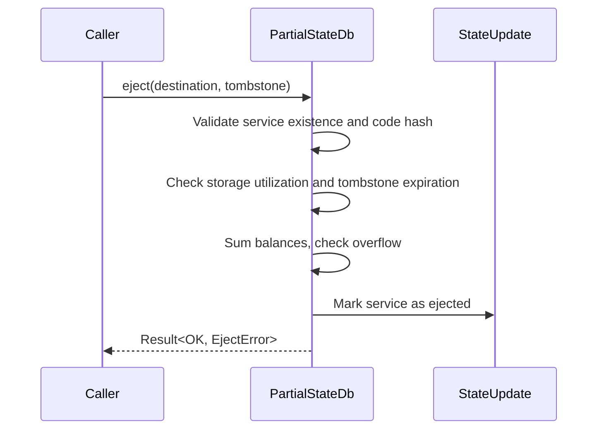

# Partial state eject implementation

## Pull Request by @tomusdrw

Related: #246 


## Comment by @coderabbitai[bot]

<!-- This is an auto-generated comment: summarize by coderabbit.ai -->
<!-- walkthrough_start -->

<details>
<summary>📝 Walkthrough</summary>

## Summary by CodeRabbit

- **New Features**
  - Introduced a new function to determine the maximum value among multiple 64-bit unsigned integers.
  - Added tracking of ejected services within the system state.

- **Bug Fixes**
  - Improved error handling and validation when ejecting services, including checks for service existence, code hash, storage usage, tombstone expiration, and balance overflow.

- **Tests**
  - Added comprehensive tests for service ejection scenarios, including error and success cases.
  - Extended test coverage for the new maximum value function.

- **Documentation**
  - Updated error documentation to clarify meanings for service ejection errors.

- **Refactor**
  - Changed service ejection methods from asynchronous to synchronous and updated parameter types for consistency.
## Walkthrough

This set of changes introduces a new `maxU64` function to the core numbers module, implements and tests a comprehensive synchronous `eject` method for service state management in the JAM host calls, and updates related interfaces, mocks, and state tracking to support ejected services. Extensive tests for the new ejection logic and error handling are added.

## Changes

| File(s)                                                                                         | Change Summary                                                                                                                                                                                                                                                                                                                                                                              |
|-------------------------------------------------------------------------------------------------|---------------------------------------------------------------------------------------------------------------------------------------------------------------------------------------------------------------------------------------------------------------------------------------------------------------------------------------------------------------------------------------------|
| `packages/core/numbers/index.ts`, `index.test.ts`                                               | Added a new exported function `maxU64` for computing the maximum of U64 values, along with corresponding test coverage.                                                                                                                                                                                                                                                                    |
| `packages/jam/jam-host-calls/externalities/partial-state-db.ts`                                 | Fully implemented the synchronous `eject` method in `PartialStateDb`, replacing the stub. Added validation logic for service existence, code hash, storage utilization, tombstone expiration, and balance overflow. Introduced helper methods for preimage checks and updated related logic.                                                        |
| `packages/jam/jam-host-calls/externalities/partial-state-db.test.ts`                            | Added comprehensive tests for the new `eject` method, covering multiple error cases and the successful ejection scenario. Introduced a helper for setting up test services and validated state changes and error returns.                                                                                                                            |
| `packages/jam/jam-host-calls/externalities/partial-state.ts`                                    | Updated the `PartialState` interface: changed the `eject` method to be synchronous, updated parameter types, and improved documentation for `EjectError`.                                                                                                                                                                                           |
| `packages/jam/jam-host-calls/externalities/partial-state-mock.ts`                               | Updated the mock implementation of `eject` to match the new signature, parameter types, and synchronous operation.                                                                                                                                                                                                                                  |
| `packages/jam/jam-host-calls/accumulate/eject.ts`                                               | Updated variable names and types to use `tombstoneHash` (type `PreimageHash`), and changed the `eject` call to be synchronous and use the new parameter type.                                                                                                                                                                                        |
| `packages/jam/jam-host-calls/externalities/state-update.ts`                                     | Added a new public property `ejectedServices` to `StateUpdate` and updated the `copyFrom` method to clone this new state.                                                                                                                                                                                                                            |

## Sequence Diagram(s)



## Poem

> A hop and a skip, a maxU64 leap,  
> Ejection now swift—no promises to keep!  
> Tombstones are checked, balances sum,  
> Services ejected, the tests have begun.  
> With state now updated, the rabbits all cheer,  
> For code that is tidy, and logic made clear!  
> 🐇✨

</details>

<!-- walkthrough_end -->

<!-- announcements_start -->

> [!NOTE]
> <details>
> <summary>⚡️ AI Code Reviews for VS Code, Cursor, Windsurf</summary>
> 
> CodeRabbit now has a plugin for VS Code, Cursor and Windsurf. This brings AI code reviews directly in the code editor. Each commit is reviewed immediately, finding bugs before the PR is raised. Seamless context handoff to your AI code agent ensures that you can easily incorporate review feedback.
> Learn more [here](http://coderabbit.ai/ide).
> 
> </details>

---

> [!NOTE]
> <details>
> <summary>⚡️ Faster reviews with caching</summary>
> 
> CodeRabbit now supports caching for code and dependencies, helping speed up reviews. This means quicker feedback, reduced wait times, and a smoother review experience overall. Cached data is encrypted and stored securely. This feature will be automatically enabled for all accounts on May 30th. To opt out, configure `Review - Disable Cache` at either the organization or repository level. If you prefer to disable all data retention across your organization, simply turn off the `Data Retention` setting under your Organization Settings.
> Enjoy the performance boost—your workflow just got faster.
> 
> </details>

<!-- announcements_end -->
<!-- internal state start -->


<!-- DwQgtGAEAqAWCWBnSTIEMB26CuAXA9mAOYCmGJATmriQCaQDG+Ats2bgFyQAOFk+AIwBWJBrngA3EsgEBPRvlqU0AgfFwA6NPEgQAfACgjoCEYDEZyAAUASpETZWaCrKNwSPbABsvkCiQBHbGlcSHFcLzpIACIrZ3E0X0Rcag8SETEUZm5ItgwU8XwMaMgAdzRkBwFmdRp6OTDYD2xESjCWFtoKUvRkbm9ffyCQyAxHATaAZgBOADZ+LFwmmFluEgmKFz8SbnxEdXwXDRhl2xRkfy9U+gJzhw8x5g3IACYAFlnjgDl8dFpadTwIqJSBKRAMCjwbiFLCHUEkFLwLzIFT4PCNDwMWCYUjIZhoJQoRbLeDZXLsahArClSgeXj4CTwJS0Y7uTw+bbDZKMTCQCaQRkkGn0aiQWC4XDcRAcAD0MqI6lg2AEGiYzBlADEvNgAGY62QAGRUiBluFW60oLhl/R8MpmnyM+mM4CgZHo+B1OAIxDIyjqClY7C4vH4wlE4ikMnkTCUVFU6i0OidJigcFQqF5aDwhFI5Co/rVeU4fjQPQcTi2DRjynjmm0ujAhmdpgM3DQDAA1mhcTKmP4ZY8Nib4BglAAPDQ0ZKT6UGaLzgwWSAAQQAkj689d7I58VsPYxsRhcW5llPQg51B4dXClh4AAZtzvd6S9w4kAfjSiIO+QZiKbweOUyAkGONCjlEDQEgCR7oKMQphCMAhePgnaQNefC3pAd74mOACqsxvD+OrYBgYhUqyCDIOQPRnlkuwULgyDYWgeEEURFAsBiv7/pE6CjgKlDwDq8DSI0orqAomzhl48j+Lg2AUBgyCYThpIghIiTBOgf4wcw3jiDk97YGxRL9IxFEeLREIkKkymwP4RkmRp2rSIAKAQ1BgaleAANL+TK0JEvmYPQqn4l4rnBb0rQMXZorMaxhHbPJil2R4oUgkUJDfL8IFIOIMFnsgcLIQqDBlLS3EAsJdAANxcViOIeIg+CRDJfy0MgTBSFQpBoTeyzxfhiXEaRMIaEY5iWMuXg0PmVLKb8mFKAwVxzUURWeiB9H+nC/RIfAZXsIC0iOpAPwHo1C2QFthw7Xwe1eAd135Oo8jLatlLreV/i/gSHgjo0qBVTqFkXUeHhFG1UEonBNEjAwFRXnCvK5ckI5ENdY7bVEI1kUUWE4UNd7jfO0SOi2j5dj2fbvoOX4yiO44zhwc4Lkua4bn6UTlru8j7g14OIEYy6w5j2P0EwSkpPkaEkXjWCDSZQHtXQxyrqEKQdqJaCQENAqafeaA/pFOsaZCBJPY93L7nrznBIgvm3lgckKUpXGhY4usEfrLnaUUGO3swfKyXQ2AMOj/DdVxI5mT79t8RLLBtpCME2Vi7T1Qp/gyx7zAUagaqGUWqWY3lEfYSOROy6NVJlAg6cuyl7sjqSnt21lZ2/Pgt58CVT1wpLuAcb4OrIT0ysC6QLITYuU0zX680Z0togfTCG1i7dUS7cqj2HS94gnQYUAAMLrdLoS4zCKu0FwitvAAFGgXBDb5Ghv+30pe28ADaAC6ACUz8TIAwfO2KmL4aYfiePTRmIEZx3lZmTI+FMwHPhNEINA6oMHMDALAPYuAwAIx8CadsDBHDeFSDKdI4ZmaINniudcuYub0B5s4PmnpJ6HzZNWMGuJtgYEwZZZYZt4AqF4v4Xg0gjoFWWNiRAsBtgEjQhxIObA/xbB1CorCki1KkAABIVFgD+W4d4CBPGSJlAx8jjb8WwNwWgqQUCMTCOaDOvJ8BtmGFhKw/hdEkCsUY0GajDjyGQhbGCHiF74wwPgHoYSOpEhMWYgQFjyABI0FQUoP4RzJBsu6T0D5fH4n0YYjJpZiYnExIkXwJjk4JC8AAZQKFlahYhsl4kUEJESNxfhtkQExZJqT/GGOyVLPJ/ACk6OKcM6xoMiE1N+KAhiojGnNI0K03A7TRi/GQuDPgpZtB1F8ozA6lIYI604coziFRZCkXskUNEV1EC3KxBxGJLQiQSBQp9DA2V+A90gH3MqA8ihDxamhMevDtY/RHGC2gYdVYz3ZvPNabtbjLxWs4H568boMS3vdHeT0joHyFgYH45ASYLmQWAIwlM0EymwQyzBuD8GEOqSaECs0BGPRJdaeIKywDJFSGAWgKozy0NJvQjmTD8zcx3GwiZULSVpmQMDdqMNC7+CaEpSQlkRgXhoH1DCA04jLMSE01I6yMibN/AiPB9AQF1IFUKmgIqxUhHgWrUIsKOLwoYNrMUJAvBrD4JfWud5WjyW4AAUWtWIkgDTKCMn9cY3pEjnAeB1n+VC0Vk2AUVAoDAwkiAKXjTwLFbBZqVDDgoioWFqwBLvL5CNBAeokFwuIK2PzT4kU2c2ixbaO1IiQD8gAQrIKcTaE58X4NCKkIJTEsBSQQcgP4pnPjKAWiozVw5bmQvgDsdixR5RCfYZC5kTx6uSJ1BkbQ9IzShLxS0A9EYon4jrBwDB/X9J5K0I1XE7wbJ/JW+1LMj6QBsAiV2TFVwYGckyRNFA80/mfXwISXEwT5R+fYJNB0PCrgACLnCwmMHwP44S0HwKJGJoRUbeuJE1NZ4HIPJTdneWD8HaCIeQ9dTYcJ0PLzRgIq+ua8MAHImINpGaCKjVFu6/VwOnTCW1wxRDbBKSgvzmNQabuxuDiQmQ+JIH4lDfG0Oekwi2w4z4h1dphD2/IWyRx9n8Jke+NHrpBBBLcFTYg6D/3GlAFj0GsIcYM7QIzJneMcXM1xQZK66RFI3agGo/SI5wjkTOkcnH7AFA+ffLKRANBBQ0kiMtAh0SlDeRjF1LRfJwg81teA/haABe06xmD+nHpcdwym6L/HPQ8wjgIRImBv2ggUhHDZZQ0ReHdN1UesSuIjauKRSy5pAsQZ02xgA8gAaRsfQVzhwEnKetdzXr+GiPoeqT7Jk2Ly39PGgYaN7YFG0W3ZQZxAhu7veWI3cgR3pD6WnZhF1EMCl2IcXUC1NArWqZ60hvD34M5kAcD9GJ9gmRpD1OGIqX6FILDQtobUP1IoufDJAKHtkiefu/YgZ7bJqIIWvZjMC+wpBtU444s7lOgUSf63wQ8AUI6RXB7+PA2GSKxn1pCR511aC9UlgCNexzSLamghjddvVasOxw0j/1pdclrd8jwuRCjucwl8gOjdeBh0AC8flBX4itsbEMFtj2e8i2aD30XLHeliteircV3U8PtPe4QRKkqgOdThV0Q/4rD7vZ64Q3or0D/NOqkN5DM6sq+6dTRg1tDDV9GkZP/hRFKIqAGmFaLCV4ks+pgrmlusnB6xixM6HUtpagnsjLsEsuSGy4hVDQKaYM7yp1iRm/CtFRKtmU1GG+llSw+Ve4OGHmPAYNkaqfX/nGzrYiPh5CkiLuwKIgHrXAbtYoIkAHTX1NhyQAjAgfyYv6b5CRVxw7nJ4P4RkjybUJEp+5I+Q3M8kKoJwKWN+9AIa6EzAMM0UUeiqlui8YuzSVO9iNOPm1qsEom/qXqaEzW3I3UXSokymY4eUZAhu+4tezgpA54l2oO2IGsyw+BJAAuZuhiCmWI2sWAvm/o7c8IkIUg9AminEmEZCUkMs7BkAhGhBTsB4ogHYsUrBTUTBmWIE7YEQ8guApQvwNuvUl4CBQUhaQqMsSgwkgOvQWENg0aAAirhKuHYQRgAPpfC4QACyo60aNgrhO2GorhDS0AO2Ngy4AA4tGq4auNANGp4Q0q4RqKEa4dGgAFLRrHzQAVJsgga35EJkJXBTiwSRBHhLDlpUCVptAjatDugMb655oC6GEeByBTi+Ro6TYwQSQZihCRAVChBZotx6RBxLD+DyItQshyFqFYCkHVSqGwTRDxaZQlDa6Zr9IoSiL+hV5lFg5MGoBNYtbBxKGdgRzqCVB5Zvr0D7HYbdjaBSyZzSEaykjSDnrTo6ySKWEjhRBbQkS9QhpAgTGriei3a8Gdh9DbrHLniOAlyu5rbrySFZzsCg70EIj1HI6+QlrOCa7oBEC3HWwe6xK+TU5FHwkPGon+oC4wmG6kInbowyTO4hTOAqFxbImMEG6rHXTnYOp1FEngGWrCz/CAjAjH6Oz+5CSehf7tjkEDRyI+IMjY4RZJakDX5LC35bHvb6Giy8CSCOK5EdS3xIDQBLpDLRpYzNZ0CHZYRyImllxHiRbTLZHLDwFtAglMk3aQAKhSCLBGkJZ/7GbTLEa7hawijIAkRoClZXBISZr8T7FRA15sHNKf7bai58j4AtQ2RYAmz8FmaKLNRYDJApxFaVKArUCzRHGulAm+l+LEaJD+AEjyD0iMjMjXSKhtBxmYgIkyw8n2BMBrD8BoZ1F0YRzg6+RqloihAzGyCi7hkqDDpmi5bUAtCgyFJylKB2nPjKn2rEY8k9JU5/p3hWmUFCZEBrlKlEi5JKK0H/YkB/iiGWkVCymNl0AnkkCd4GCeEjgDyb6iTOYa7/TZC3Si4Ckwggh248rIH3x3hVaXjcZ4ari0DLiIAGgkDjqTrNp6LLgNJ6JBGrgABa0aU6d8d4/8vkHxnkv+ks5hF8cIQw2AZpLCrayWNACB/6GyVI9JmB0OEcmEQKd+d4DBMF/qsG14qaZh2OfAGyF2bJDORZkiABLQQBnkZI155+9Al+4YG5t+qA/gN5UQkUEp/q9AapXEzOzydyby8uIByl+Q2GAOyZd4kGDgM0Dp7uygHIg8w8EKS26EHJ4YyZshMSPQP52AYI8IiIkQ9AqB+M+4sh2O+8sg1uDFvULQz4js3pmUYszWTu06lJzQWBrRm6ZRW0u8EkqGSUIW3lacCiOoJOCkVSrQz2k0K4KKvui0/u6eqKOKWMm87oBK4eKex00eW2OlIUMBt8Gy98rh4hzAXAAlJAcFkAAAPqMAML5K4eblwDtp4sEAEoAtYCokgCQMAA5fpMAPtr5LGuGNGmZnoHoKMowFcD+neA/isk/i/ndaAk+H3pgkyjgngkPvMhymPopBPlHnymal4DPq6nPh3uBsuBXiNSqTfFhONZhiOD8jNZdvNUtaRj5O0OYgllwM+TtVwMdTNKdXtuddaldTFrdXfu/kxM9eas0m9bxXSl9Vgsyn9QQgDaPlyiDS+FPhDeDq3jDZKt3q2L3i+P3pzayjzZyuPmBQLfytPsLdmh2PPmTOzEvpuP6KwuvkqpenRLdIqrXq4k9YqTMkYlckHHeAAAJmhrAbBWhIQoQdjWgW0/jKxQSqxFm6nI1X536WaM2rKpCeGu1v4PXIATxfliFaKZimWvIPIfIl7OxJm/7m0sAHVHXA5k1nWQAXViDU2HA3We0FrJyCJVpYT3xTUY1slY3LU+C+TrWQCbVoDDA7UiUfovL3LvLIAp1lWKTlyk24Dk2U2XXXWl1lHl2VEUBMTV0qK115r1042pX42ZSE0W0d1qw6qEgqQwEil0gVoIhtACJsBlB1qcKx2cT7nSZJJpWrrsWYT9DyJRBRq8QgIbIEbUBGzn0hl5W6Vfo0lHgySgwA7zlMWInaW4lcSICCKJmsblxLBIDw5iDBaKQABqBsr53uUSaKrVHgAeHVweXVeKPVSeRK+8Uep0nhMBWORAwmtVHF1wt8NypEPlYg89LAi9sF9A2NK1YohiG1W1ltu1spqWh1w9o9+dVN11tNgASYT+3hicPTWQCzXL38OLHkAb1+nPjE1baOUj150F24BF0UC00Az03eLK0h00Bh2djvVs1S3fUD5c3D7Ii80K0DVg1N6q2u3wJd4QA0oS2fVOMc2/Wy3soePA2K0miC2Q1ZSMQsySpa2cwr7bgVjsIG3b4DTGOmMoaPAyZkJFjYaFjsBR0VTbkZyYqQj6juzpnpYWbLClUiKYCJOhZdYIaXY/gBVEgAgIzElsFMHGYAqUbUbyZ0Z9kyZjO0ZYyU6sVFDsV6acbPndNLaIBrDhyzFiRqFklpQtChDYhSCYzaFtTpWaOJY6O9Rhkk7xpLnB1P6jKzTVXklMRAa2qI10MMM/TR2NT1Ahw3lcUmr7WtCe1UDcAhrTr6WAvqHK7lEV2UAC4O1XhaJ3it3t3San0X7m4iXm2XOW3dOCKqXnPOXvObk9MA6IHd3mUfL2U52GMU3SPj002jLnn5KwQZ3iPkaNOiijH6Re5zw+5B5+4EPtUPb7gJ5kMPQUOR6HxQDRoFN3i5NmY/iUZFMUhXylP5B/3Q44xwgtNavtOcazUWlLPhYrObY0MfP7D0MLk/TbljXWrKPcOCW8MN243N1ovbWGKiPAsSN0tSNKs03yOKMcM12qOY2usr143Lrr17V4t6OSNGMyPMt36wqUDPP3j3PNKd5i2BM94hPoLOMy3/WRPy3RNePC08ka1Sra3MLpO8yKpx6G13hP64T/0R3bq/1s5uiv2/BBWEg6zM5StlS1mUYYBtT0ghpzlqV+aI55oo60Fm1qO0B/xToSKjHSI1aXZzFl5NRhz05H5tQSUTGnxSTrNFCa50kwMFBPR+13g9myAagqKe11qVO3APv1SgplMm0DTHuzUo7OBUDyBTUwNogUCG4tvNJts6ssvSyG7CuiyZRtFKQdEByUSizi6oCSK5pRDwoFn3VFDox/K/ZtA8Ugr5AeWLbjx1qJCzSIoTQ4NEMIeENiubQkOh7Dv9UkqnRw1NmcejvZ5/6RIMTyAzsw7bvOtzUru/wiWWOQepDQepAOOS2FthOD7c2ltA3coVst5Vsd6baKe603tlR3sPtPssBOuqNQf/27Wtvtt02R1YR2cwdVMeKid/vbvsQSFsFgeG45JwdZQBONjNiuj8T7hZjegypbiavFiZL1sKpViKA1hqB1hJjBcpgBg1C4CuFMiICuH/4iTCiuFCoMQNhNgZeTDrAADskwLwAADCNv8JMLMGgAAIwvCtezB1ezC0B1cvCzCzBVcACsLwLwAAHGNy1zqKKu8DV2VyF5l+oDlx1PlyQIKEV26GV0AA -->

<!-- internal state end -->
<!-- tips_start -->

---


<details>
<summary>🪧 Tips</summary>

### Chat

There are 3 ways to chat with [CodeRabbit](https://coderabbit.ai?utm_source=oss&utm_medium=github&utm_campaign=FluffyLabs/typeberry&utm_content=396):

- Review comments: Directly reply to a review comment made by CodeRabbit. Example:
  - `I pushed a fix in commit <commit_id>, please review it.`
  - `Explain this complex logic.`
  - `Open a follow-up GitHub issue for this discussion.`
- Files and specific lines of code (under the "Files changed" tab): Tag `@coderabbitai` in a new review comment at the desired location with your query. Examples:
  - `@coderabbitai explain this code block.`
  -	`@coderabbitai modularize this function.`
- PR comments: Tag `@coderabbitai` in a new PR comment to ask questions about the PR branch. For the best results, please provide a very specific query, as very limited context is provided in this mode. Examples:
  - `@coderabbitai gather interesting stats about this repository and render them as a table. Additionally, render a pie chart showing the language distribution in the codebase.`
  - `@coderabbitai read src/utils.ts and explain its main purpose.`
  - `@coderabbitai read the files in the src/scheduler package and generate a class diagram using mermaid and a README in the markdown format.`
  - `@coderabbitai help me debug CodeRabbit configuration file.`

### Support

Need help? Create a ticket on our [support page](https://www.coderabbit.ai/contact-us/support) for assistance with any issues or questions.

Note: Be mindful of the bot's finite context window. It's strongly recommended to break down tasks such as reading entire modules into smaller chunks. For a focused discussion, use review comments to chat about specific files and their changes, instead of using the PR comments.

### CodeRabbit Commands (Invoked using PR comments)

- `@coderabbitai pause` to pause the reviews on a PR.
- `@coderabbitai resume` to resume the paused reviews.
- `@coderabbitai review` to trigger an incremental review. This is useful when automatic reviews are disabled for the repository.
- `@coderabbitai full review` to do a full review from scratch and review all the files again.
- `@coderabbitai summary` to regenerate the summary of the PR.
- `@coderabbitai generate sequence diagram` to generate a sequence diagram of the changes in this PR.
- `@coderabbitai resolve` resolve all the CodeRabbit review comments.
- `@coderabbitai configuration` to show the current CodeRabbit configuration for the repository.
- `@coderabbitai help` to get help.

### Other keywords and placeholders

- Add `@coderabbitai ignore` anywhere in the PR description to prevent this PR from being reviewed.
- Add `@coderabbitai summary` to generate the high-level summary at a specific location in the PR description.
- Add `@coderabbitai` anywhere in the PR title to generate the title automatically.

### Documentation and Community

- Visit our [Documentation](https://docs.coderabbit.ai) for detailed information on how to use CodeRabbit.
- Join our [Discord Community](http://discord.gg/coderabbit) to get help, request features, and share feedback.
- Follow us on [X/Twitter](https://twitter.com/coderabbitai) for updates and announcements.

</details>

<!-- tips_end -->


## Comment by @github-actions[bot]


<details>
<summary>View all</summary>

|  Name  |  Status  | |
|--------|----------|-|
| Trie test 0 | ✅ | | 
| Trie test 1 | ✅ | | 
| Trie test 2 | ✅ | | 
| Trie test 3 | ✅ | | 
| Trie test 4 | ✅ | | 
| Trie test 5 | ✅ | | 
| Trie test 6 | ✅ | | 
| Trie test 7 | ✅ | | 
| Trie test 8 | ✅ | | 
| Trie test 9 | ✅ | | 
| Trie test 10 | ✅ | | 
| Trie test 10 | ✅ | | 
| Trie test 10 | ✅ | | 
| jamtestvectors/statistics/tiny/stats_with_empty_extrinsic-1.json | ✅ | | 
| jamtestvectors/statistics/tiny/stats_with_epoch_change-1.json | ✅ | | 
| jamtestvectors/statistics/tiny/stats_with_some_extrinsic-1.json | ✅ | | 
| jamtestvectors/statistics/tiny/stats_with_some_extrinsic-1.json | ✅ | | 
| jamtestvectors/statistics/full/stats_with_empty_extrinsic-1.json | ✅ | | 
| jamtestvectors/statistics/full/stats_with_epoch_change-1.json | ✅ | | 
| jamtestvectors/statistics/full/stats_with_some_extrinsic-1.json | ✅ | | 
| jamtestvectors/statistics/full/stats_with_some_extrinsic-1.json | ✅ | | 
| should correctly shuffle input of length 0 | ✅ | | 
| should correctly shuffle input of length 8 | ✅ | | 
| should correctly shuffle input of length 16 | ✅ | | 
| should correctly shuffle input of length 20 | ✅ | | 
| should correctly shuffle input of length 50 | ✅ | | 
| should correctly shuffle input of length 100 | ✅ | | 
| should correctly shuffle input of length 200 | ✅ | | 
| should correctly shuffle input of length 341 | ✅ | | 
| should correctly shuffle input of length 341 | ✅ | | 
| should correctly shuffle input of length 341 | ✅ | | 
| jamtestvectors/safrole/tiny/enact-epoch-change-with-no-tickets-1.json | ✅ | | 
| jamtestvectors/safrole/tiny/enact-epoch-change-with-no-tickets-2.json | ✅ | | 
| jamtestvectors/safrole/tiny/enact-epoch-change-with-no-tickets-3.json | ✅ | | 
| jamtestvectors/safrole/tiny/enact-epoch-change-with-no-tickets-4.json | ✅ | | 
| jamtestvectors/safrole/tiny/enact-epoch-change-with-padding-1.json | ✅ | | 
| jamtestvectors/safrole/tiny/publish-tickets-no-mark-1.json | ✅ | | 
| jamtestvectors/safrole/tiny/publish-tickets-no-mark-2.json | ✅ | | 
| jamtestvectors/safrole/tiny/publish-tickets-no-mark-3.json | ✅ | | 
| jamtestvectors/safrole/tiny/publish-tickets-no-mark-4.json | ✅ | | 
| jamtestvectors/safrole/tiny/publish-tickets-no-mark-5.json | ✅ | | 
| jamtestvectors/safrole/tiny/publish-tickets-no-mark-6.json | ✅ | | 
| jamtestvectors/safrole/tiny/publish-tickets-no-mark-7.json | ✅ | | 
| jamtestvectors/safrole/tiny/publish-tickets-no-mark-8.json | ✅ | | 
| jamtestvectors/safrole/tiny/publish-tickets-no-mark-9.json | ✅ | | 
| jamtestvectors/safrole/tiny/publish-tickets-with-mark-1.json | ✅ | | 
| jamtestvectors/safrole/tiny/publish-tickets-with-mark-2.json | ✅ | | 
| jamtestvectors/safrole/tiny/publish-tickets-with-mark-3.json | ✅ | | 
| jamtestvectors/safrole/tiny/publish-tickets-with-mark-4.json | ✅ | | 
| jamtestvectors/safrole/tiny/publish-tickets-with-mark-5.json | ✅ | | 
| jamtestvectors/safrole/tiny/skip-epoch-tail-1.json | ✅ | | 
| jamtestvectors/safrole/tiny/skip-epochs-1.json | ✅ | | 
| jamtestvectors/safrole/full/enact-epoch-change-with-no-tickets-1.json | ✅ | | 
| jamtestvectors/safrole/full/enact-epoch-change-with-no-tickets-2.json | ✅ | | 
| jamtestvectors/safrole/full/enact-epoch-change-with-no-tickets-3.json | ✅ | | 
| jamtestvectors/safrole/full/enact-epoch-change-with-no-tickets-4.json | ✅ | | 
| jamtestvectors/safrole/full/enact-epoch-change-with-padding-1.json | ✅ | | 
| jamtestvectors/safrole/full/publish-tickets-no-mark-1.json | ✅ | | 
| jamtestvectors/safrole/full/publish-tickets-no-mark-2.json | ✅ | | 
| jamtestvectors/safrole/full/publish-tickets-no-mark-3.json | ✅ | | 
| jamtestvectors/safrole/full/publish-tickets-no-mark-4.json | ✅ | | 
| jamtestvectors/safrole/full/publish-tickets-no-mark-5.json | ✅ | | 
| jamtestvectors/safrole/full/publish-tickets-no-mark-6.json | ✅ | | 
| jamtestvectors/safrole/full/publish-tickets-no-mark-7.json | ✅ | | 
| jamtestvectors/safrole/full/publish-tickets-no-mark-8.json | ✅ | | 
| jamtestvectors/safrole/full/publish-tickets-no-mark-9.json | ✅ | | 
| jamtestvectors/safrole/full/publish-tickets-with-mark-1.json | ✅ | | 
| jamtestvectors/safrole/full/publish-tickets-with-mark-2.json | ✅ | | 
| jamtestvectors/safrole/full/publish-tickets-with-mark-3.json | ✅ | | 
| jamtestvectors/safrole/full/publish-tickets-with-mark-4.json | ✅ | | 
| jamtestvectors/safrole/full/publish-tickets-with-mark-5.json | ✅ | | 
| jamtestvectors/safrole/full/skip-epoch-tail-1.json | ✅ | | 
| jamtestvectors/safrole/full/skip-epochs-1.json | ✅ | | 
| jamtestvectors/safrole/full/skip-epochs-1.json | ✅ | | 
| jamtestvectors/reports/tiny/anchor_not_recent-1.json | ✅ | | 
| jamtestvectors/reports/tiny/bad_beefy_mmr-1.json | ✅ | | 
| jamtestvectors/reports/tiny/bad_code_hash-1.json | ✅ | | 
| jamtestvectors/reports/tiny/bad_core_index-1.json | ✅ | | 
| jamtestvectors/reports/tiny/bad_service_id-1.json | ✅ | | 
| jamtestvectors/reports/tiny/bad_signature-1.json | ✅ | | 
| jamtestvectors/reports/tiny/bad_state_root-1.json | ✅ | | 
| jamtestvectors/reports/tiny/bad_validator_index-1.json | ✅ | | 
| jamtestvectors/reports/tiny/big_work_report_output-1.json | ✅ | | 
| jamtestvectors/reports/tiny/core_engaged-1.json | ✅ | | 
| jamtestvectors/reports/tiny/dependency_missing-1.json | ✅ | | 
| jamtestvectors/reports/tiny/duplicate_package_in_recent_history-1.json | ✅ | | 
| jamtestvectors/reports/tiny/duplicated_package_in_report-1.json | ✅ | | 
| jamtestvectors/reports/tiny/future_report_slot-1.json | ✅ | | 
| jamtestvectors/reports/tiny/high_work_report_gas-1.json | ✅ | | 
| jamtestvectors/reports/tiny/many_dependencies-1.json | ✅ | | 
| jamtestvectors/reports/tiny/multiple_reports-1.json | ✅ | | 
| jamtestvectors/reports/tiny/no_enough_guarantees-1.json | ✅ | | 
| jamtestvectors/reports/tiny/not_authorized-1.json | ✅ | | 
| jamtestvectors/reports/tiny/not_authorized-2.json | ✅ | | 
| jamtestvectors/reports/tiny/not_sorted_guarantor-1.json | ✅ | | 
| jamtestvectors/reports/tiny/out_of_order_guarantees-1.json | ✅ | | 
| jamtestvectors/reports/tiny/report_before_last_rotation-1.json | ✅ | | 
| jamtestvectors/reports/tiny/report_curr_rotation-1.json | ✅ | | 
| jamtestvectors/reports/tiny/report_prev_rotation-1.json | ✅ | | 
| jamtestvectors/reports/tiny/reports_with_dependencies-1.json | ✅ | | 
| jamtestvectors/reports/tiny/reports_with_dependencies-2.json | ✅ | | 
| jamtestvectors/reports/tiny/reports_with_dependencies-3.json | ✅ | | 
| jamtestvectors/reports/tiny/reports_with_dependencies-4.json | ✅ | | 
| jamtestvectors/reports/tiny/reports_with_dependencies-5.json | ✅ | | 
| jamtestvectors/reports/tiny/reports_with_dependencies-6.json | ✅ | | 
| jamtestvectors/reports/tiny/segment_root_lookup_invalid-1.json | ✅ | | 
| jamtestvectors/reports/tiny/segment_root_lookup_invalid-2.json | ✅ | | 
| jamtestvectors/reports/tiny/service_item_gas_too_low-1.json | ✅ | | 
| jamtestvectors/reports/tiny/too_big_work_report_output-1.json | ✅ | | 
| jamtestvectors/reports/tiny/too_high_work_report_gas-1.json | ✅ | | 
| jamtestvectors/reports/tiny/too_many_dependencies-1.json | ✅ | | 
| jamtestvectors/reports/tiny/with_avail_assignments-1.json | ✅ | | 
| jamtestvectors/reports/tiny/wrong_assignment-1.json | ✅ | | 
| jamtestvectors/reports/tiny/wrong_assignment-1.json | ✅ | | 
| jamtestvectors/reports/full/anchor_not_recent-1.json | ✅ | | 
| jamtestvectors/reports/full/bad_beefy_mmr-1.json | ✅ | | 
| jamtestvectors/reports/full/bad_code_hash-1.json | ✅ | | 
| jamtestvectors/reports/full/bad_core_index-1.json | ✅ | | 
| jamtestvectors/reports/full/bad_service_id-1.json | ✅ | | 
| jamtestvectors/reports/full/bad_signature-1.json | ✅ | | 
| jamtestvectors/reports/full/bad_state_root-1.json | ✅ | | 
| jamtestvectors/reports/full/bad_validator_index-1.json | ✅ | | 
| jamtestvectors/reports/full/big_work_report_output-1.json | ✅ | | 
| jamtestvectors/reports/full/core_engaged-1.json | ✅ | | 
| jamtestvectors/reports/full/dependency_missing-1.json | ✅ | | 
| jamtestvectors/reports/full/duplicate_package_in_recent_history-1.json | ✅ | | 
| jamtestvectors/reports/full/duplicated_package_in_report-1.json | ✅ | | 
| jamtestvectors/reports/full/future_report_slot-1.json | ✅ | | 
| jamtestvectors/reports/full/high_work_report_gas-1.json | ✅ | | 
| jamtestvectors/reports/full/many_dependencies-1.json | ✅ | | 
| jamtestvectors/reports/full/multiple_reports-1.json | ✅ | | 
| jamtestvectors/reports/full/no_enough_guarantees-1.json | ✅ | | 
| jamtestvectors/reports/full/not_authorized-1.json | ✅ | | 
| jamtestvectors/reports/full/not_authorized-2.json | ✅ | | 
| jamtestvectors/reports/full/not_sorted_guarantor-1.json | ✅ | | 
| jamtestvectors/reports/full/out_of_order_guarantees-1.json | ✅ | | 
| jamtestvectors/reports/full/report_before_last_rotation-1.json | ✅ | | 
| jamtestvectors/reports/full/report_curr_rotation-1.json | ✅ | | 
| jamtestvectors/reports/full/report_prev_rotation-1.json | ✅ | | 
| jamtestvectors/reports/full/reports_with_dependencies-1.json | ✅ | | 
| jamtestvectors/reports/full/reports_with_dependencies-2.json | ✅ | | 
| jamtestvectors/reports/full/reports_with_dependencies-3.json | ✅ | | 
| jamtestvectors/reports/full/reports_with_dependencies-4.json | ✅ | | 
| jamtestvectors/reports/full/reports_with_dependencies-5.json | ✅ | | 
| jamtestvectors/reports/full/reports_with_dependencies-6.json | ✅ | | 
| jamtestvectors/reports/full/segment_root_lookup_invalid-1.json | ✅ | | 
| jamtestvectors/reports/full/segment_root_lookup_invalid-2.json | ✅ | | 
| jamtestvectors/reports/full/service_item_gas_too_low-1.json | ✅ | | 
| jamtestvectors/reports/full/too_big_work_report_output-1.json | ✅ | | 
| jamtestvectors/reports/full/too_high_work_report_gas-1.json | ✅ | | 
| jamtestvectors/reports/full/too_many_dependencies-1.json | ✅ | | 
| jamtestvectors/reports/full/with_avail_assignments-1.json | ✅ | | 
| jamtestvectors/reports/full/wrong_assignment-1.json | ✅ | | 
| jamtestvectors/reports/full/wrong_assignment-1.json | ✅ | | 
| jamtestvectors/pvm/schema.json | ✅ | | 
| jamtestvectors/erasure_coding/schema_ec.json | ✅ | | 
| jamtestvectors/erasure_coding/schema_page_proof.json | ✅ | | 
| jamtestvectors/erasure_coding/schema_segment_ec.json | ✅ | | 
| jamtestvectors/erasure_coding/schema_segment_root.json | ✅ | | 
| jamtestvectors/erasure_coding/schema_segment_root.json | ✅ | | 
| jamtestvectors/pvm/programs/gas_basic_consume_all.json | ✅ | | 
| jamtestvectors/pvm/programs/inst_add_32.json | ✅ | | 
| jamtestvectors/pvm/programs/inst_add_32_with_overflow.json | ✅ | | 
| jamtestvectors/pvm/programs/inst_add_32_with_truncation.json | ✅ | | 
| jamtestvectors/pvm/programs/inst_add_32_with_truncation_and_sign_extension.json | ✅ | | 
| jamtestvectors/pvm/programs/inst_add_64.json | ✅ | | 
| jamtestvectors/pvm/programs/inst_add_64_with_overflow.json | ✅ | | 
| jamtestvectors/pvm/programs/inst_add_imm_32.json | ✅ | | 
| jamtestvectors/pvm/programs/inst_add_imm_32_with_truncation.json | ✅ | | 
| jamtestvectors/pvm/programs/inst_add_imm_32_with_truncation_and_sign_extension.json | ✅ | | 
| jamtestvectors/pvm/programs/inst_add_imm_64.json | ✅ | | 
| jamtestvectors/pvm/programs/inst_and.json | ✅ | | 
| jamtestvectors/pvm/programs/inst_and_imm.json | ✅ | | 
| jamtestvectors/pvm/programs/inst_branch_eq_imm_nok.json | ✅ | | 
| jamtestvectors/pvm/programs/inst_branch_eq_imm_ok.json | ✅ | | 
| jamtestvectors/pvm/programs/inst_branch_eq_nok.json | ✅ | | 
| jamtestvectors/pvm/programs/inst_branch_eq_ok.json | ✅ | | 
| jamtestvectors/pvm/programs/inst_branch_greater_or_equal_signed_imm_nok.json | ✅ | | 
| jamtestvectors/pvm/programs/inst_branch_greater_or_equal_signed_imm_ok.json | ✅ | | 
| jamtestvectors/pvm/programs/inst_branch_greater_or_equal_signed_nok.json | ✅ | | 
| jamtestvectors/pvm/programs/inst_branch_greater_or_equal_signed_ok.json | ✅ | | 
| jamtestvectors/pvm/programs/inst_branch_greater_or_equal_unsigned_imm_nok.json | ✅ | | 
| jamtestvectors/pvm/programs/inst_branch_greater_or_equal_unsigned_imm_ok.json | ✅ | | 
| jamtestvectors/pvm/programs/inst_branch_greater_or_equal_unsigned_nok.json | ✅ | | 
| jamtestvectors/pvm/programs/inst_branch_greater_or_equal_unsigned_ok.json | ✅ | | 
| jamtestvectors/pvm/programs/inst_branch_greater_signed_imm_nok.json | ✅ | | 
| jamtestvectors/pvm/programs/inst_branch_greater_signed_imm_ok.json | ✅ | | 
| jamtestvectors/pvm/programs/inst_branch_greater_unsigned_imm_nok.json | ✅ | | 
| jamtestvectors/pvm/programs/inst_branch_greater_unsigned_imm_ok.json | ✅ | | 
| jamtestvectors/pvm/programs/inst_branch_less_or_equal_signed_imm_nok.json | ✅ | | 
| jamtestvectors/pvm/programs/inst_branch_less_or_equal_signed_imm_ok.json | ✅ | | 
| jamtestvectors/pvm/programs/inst_branch_less_or_equal_unsigned_imm_nok.json | ✅ | | 
| jamtestvectors/pvm/programs/inst_branch_less_or_equal_unsigned_imm_ok.json | ✅ | | 
| jamtestvectors/pvm/programs/inst_branch_less_signed_imm_nok.json | ✅ | | 
| jamtestvectors/pvm/programs/inst_branch_less_signed_imm_ok.json | ✅ | | 
| jamtestvectors/pvm/programs/inst_branch_less_signed_nok.json | ✅ | | 
| jamtestvectors/pvm/programs/inst_branch_less_signed_ok.json | ✅ | | 
| jamtestvectors/pvm/programs/inst_branch_less_unsigned_imm_nok.json | ✅ | | 
| jamtestvectors/pvm/programs/inst_branch_less_unsigned_imm_ok.json | ✅ | | 
| jamtestvectors/pvm/programs/inst_branch_less_unsigned_nok.json | ✅ | | 
| jamtestvectors/pvm/programs/inst_branch_less_unsigned_ok.json | ✅ | | 
| jamtestvectors/pvm/programs/inst_branch_not_eq_imm_nok.json | ✅ | | 
| jamtestvectors/pvm/programs/inst_branch_not_eq_imm_ok.json | ✅ | | 
| jamtestvectors/pvm/programs/inst_branch_not_eq_nok.json | ✅ | | 
| jamtestvectors/pvm/programs/inst_branch_not_eq_ok.json | ✅ | | 
| jamtestvectors/pvm/programs/inst_cmov_if_zero_imm_nok.json | ✅ | | 
| jamtestvectors/pvm/programs/inst_cmov_if_zero_imm_ok.json | ✅ | | 
| jamtestvectors/pvm/programs/inst_cmov_if_zero_nok.json | ✅ | | 
| jamtestvectors/pvm/programs/inst_cmov_if_zero_ok.json | ✅ | | 
| jamtestvectors/pvm/programs/inst_div_signed_32.json | ✅ | | 
| jamtestvectors/pvm/programs/inst_div_signed_32.json | ✅ | | 
| jamtestvectors/pvm/programs/inst_div_signed_32_by_zero.json | ✅ | | 
| jamtestvectors/pvm/programs/inst_div_signed_32_with_overflow.json | ✅ | | 
| jamtestvectors/pvm/programs/inst_div_signed_64.json | ✅ | | 
| jamtestvectors/pvm/programs/inst_div_signed_64_by_zero.json | ✅ | | 
| jamtestvectors/pvm/programs/inst_div_signed_64_with_overflow.json | ✅ | | 
| jamtestvectors/pvm/programs/inst_div_unsigned_32.json | ✅ | | 
| jamtestvectors/pvm/programs/inst_div_unsigned_32_by_zero.json | ✅ | | 
| jamtestvectors/pvm/programs/inst_div_unsigned_32_with_overflow.json | ✅ | | 
| jamtestvectors/pvm/programs/inst_div_unsigned_64.json | ✅ | | 
| jamtestvectors/pvm/programs/inst_div_unsigned_64_by_zero.json | ✅ | | 
| jamtestvectors/pvm/programs/inst_div_unsigned_64_with_overflow.json | ✅ | | 
| jamtestvectors/pvm/programs/inst_fallthrough.json | ✅ | | 
| jamtestvectors/pvm/programs/inst_jump.json | ✅ | | 
| jamtestvectors/pvm/programs/inst_jump_indirect_invalid_djump_to_zero_nok.json | ✅ | | 
| jamtestvectors/pvm/programs/inst_jump_indirect_misaligned_djump_with_offset_nok.json | ✅ | | 
| jamtestvectors/pvm/programs/inst_jump_indirect_misaligned_djump_without_offset_nok.json | ✅ | | 
| jamtestvectors/pvm/programs/inst_jump_indirect_with_offset_ok.json | ✅ | | 
| jamtestvectors/pvm/programs/inst_jump_indirect_without_offset_ok.json | ✅ | | 
| jamtestvectors/pvm/programs/inst_load_i16.json | ✅ | | 
| jamtestvectors/pvm/programs/inst_load_i32.json | ✅ | | 
| jamtestvectors/pvm/programs/inst_load_i8.json | ✅ | | 
| jamtestvectors/pvm/programs/inst_load_imm.json | ✅ | | 
| jamtestvectors/pvm/programs/inst_load_imm_64.json | ✅ | | 
| jamtestvectors/pvm/programs/inst_load_imm_and_jump.json | ✅ | | 
| jamtestvectors/pvm/programs/inst_load_imm_and_jump_indirect_different_regs_with_offset_ok.json | ✅ | | 
| jamtestvectors/pvm/programs/inst_load_imm_and_jump_indirect_different_regs_without_offset_ok.json | ✅ | | 
| jamtestvectors/pvm/programs/inst_load_imm_and_jump_indirect_invalid_djump_to_zero_different_regs_without_offset_nok.json | ✅ | | 
| jamtestvectors/pvm/programs/inst_load_imm_and_jump_indirect_invalid_djump_to_zero_same_regs_without_offset_nok.json | ✅ | | 
| jamtestvectors/pvm/programs/inst_load_imm_and_jump_indirect_misaligned_djump_different_regs_with_offset_nok.json | ✅ | | 
| jamtestvectors/pvm/programs/inst_load_imm_and_jump_indirect_misaligned_djump_different_regs_without_offset_nok.json | ✅ | | 
| jamtestvectors/pvm/programs/inst_load_imm_and_jump_indirect_misaligned_djump_same_regs_with_offset_nok.json | ✅ | | 
| jamtestvectors/pvm/programs/inst_load_imm_and_jump_indirect_misaligned_djump_same_regs_without_offset_nok.json | ✅ | | 
| jamtestvectors/pvm/programs/inst_load_imm_and_jump_indirect_same_regs_with_offset_ok.json | ✅ | | 
| jamtestvectors/pvm/programs/inst_load_imm_and_jump_indirect_same_regs_without_offset_ok.json | ✅ | | 
| jamtestvectors/pvm/programs/inst_load_indirect_i16_with_offset.json | ✅ | | 
| jamtestvectors/pvm/programs/inst_load_indirect_i16_without_offset.json | ✅ | | 
| jamtestvectors/pvm/programs/inst_load_indirect_i32_with_offset.json | ✅ | | 
| jamtestvectors/pvm/programs/inst_load_indirect_i32_without_offset.json | ✅ | | 
| jamtestvectors/pvm/programs/inst_load_indirect_i8_with_offset.json | ✅ | | 
| jamtestvectors/pvm/programs/inst_load_indirect_i8_without_offset.json | ✅ | | 
| jamtestvectors/pvm/programs/inst_load_indirect_u16_with_offset.json | ✅ | | 
| jamtestvectors/pvm/programs/inst_load_indirect_u16_without_offset.json | ✅ | | 
| jamtestvectors/pvm/programs/inst_load_indirect_u32_with_offset.json | ✅ | | 
| jamtestvectors/pvm/programs/inst_load_indirect_u32_without_offset.json | ✅ | | 
| jamtestvectors/pvm/programs/inst_load_indirect_u64_with_offset.json | ✅ | | 
| jamtestvectors/pvm/programs/inst_load_indirect_u64_without_offset.json | ✅ | | 
| jamtestvectors/pvm/programs/inst_load_indirect_u8_with_offset.json | ✅ | | 
| jamtestvectors/pvm/programs/inst_load_indirect_u8_without_offset.json | ✅ | | 
| jamtestvectors/pvm/programs/inst_load_u16.json | ✅ | | 
| jamtestvectors/pvm/programs/inst_load_u32.json | ✅ | | 
| jamtestvectors/pvm/programs/inst_load_u32.json | ✅ | | 
| jamtestvectors/pvm/programs/inst_load_u64.json | ✅ | | 
| jamtestvectors/pvm/programs/inst_load_u8.json | ✅ | | 
| jamtestvectors/pvm/programs/inst_load_u8_nok.json | ✅ | | 
| jamtestvectors/pvm/programs/inst_move_reg.json | ✅ | | 
| jamtestvectors/pvm/programs/inst_mul_32.json | ✅ | | 
| jamtestvectors/pvm/programs/inst_mul_64.json | ✅ | | 
| jamtestvectors/pvm/programs/inst_mul_imm_32.json | ✅ | | 
| jamtestvectors/pvm/programs/inst_mul_imm_64.json | ✅ | | 
| jamtestvectors/pvm/programs/inst_negate_and_add_imm_32.json | ✅ | | 
| jamtestvectors/pvm/programs/inst_negate_and_add_imm_64.json | ✅ | | 
| jamtestvectors/pvm/programs/inst_or.json | ✅ | | 
| jamtestvectors/pvm/programs/inst_or_imm.json | ✅ | | 
| jamtestvectors/pvm/programs/inst_rem_signed_32.json | ✅ | | 
| jamtestvectors/pvm/programs/inst_rem_signed_32_by_zero.json | ✅ | | 
| jamtestvectors/pvm/programs/inst_rem_signed_32_with_overflow.json | ✅ | | 
| jamtestvectors/pvm/programs/inst_rem_signed_64.json | ✅ | | 
| jamtestvectors/pvm/programs/inst_rem_signed_64_by_zero.json | ✅ | | 
| jamtestvectors/pvm/programs/inst_rem_signed_64_with_overflow.json | ✅ | | 
| jamtestvectors/pvm/programs/inst_rem_unsigned_32.json | ✅ | | 
| jamtestvectors/pvm/programs/inst_rem_unsigned_32_by_zero.json | ✅ | | 
| jamtestvectors/pvm/programs/inst_rem_unsigned_64.json | ✅ | | 
| jamtestvectors/pvm/programs/inst_rem_unsigned_64_by_zero.json | ✅ | | 
| jamtestvectors/pvm/programs/inst_ret_halt.json | ✅ | | 
| jamtestvectors/pvm/programs/inst_ret_invalid.json | ✅ | | 
| jamtestvectors/pvm/programs/inst_set_greater_than_signed_imm_0.json | ✅ | | 
| jamtestvectors/pvm/programs/inst_set_greater_than_signed_imm_1.json | ✅ | | 
| jamtestvectors/pvm/programs/inst_set_greater_than_unsigned_imm_0.json | ✅ | | 
| jamtestvectors/pvm/programs/inst_set_greater_than_unsigned_imm_1.json | ✅ | | 
| jamtestvectors/pvm/programs/inst_set_less_than_signed_0.json | ✅ | | 
| jamtestvectors/pvm/programs/inst_set_less_than_signed_1.json | ✅ | | 
| jamtestvectors/pvm/programs/inst_set_less_than_signed_imm_0.json | ✅ | | 
| jamtestvectors/pvm/programs/inst_set_less_than_signed_imm_1.json | ✅ | | 
| jamtestvectors/pvm/programs/inst_set_less_than_unsigned_0.json | ✅ | | 
| jamtestvectors/pvm/programs/inst_set_less_than_unsigned_1.json | ✅ | | 
| jamtestvectors/pvm/programs/inst_set_less_than_unsigned_imm_0.json | ✅ | | 
| jamtestvectors/pvm/programs/inst_set_less_than_unsigned_imm_1.json | ✅ | | 
| jamtestvectors/pvm/programs/inst_shift_arithmetic_right_32.json | ✅ | | 
| jamtestvectors/pvm/programs/inst_shift_arithmetic_right_32_with_overflow.json | ✅ | | 
| jamtestvectors/pvm/programs/inst_shift_arithmetic_right_64.json | ✅ | | 
| jamtestvectors/pvm/programs/inst_shift_arithmetic_right_64_with_overflow.json | ✅ | | 
| jamtestvectors/pvm/programs/inst_shift_arithmetic_right_imm_32.json | ✅ | | 
| jamtestvectors/pvm/programs/inst_shift_arithmetic_right_imm_64.json | ✅ | | 
| jamtestvectors/pvm/programs/inst_shift_arithmetic_right_imm_alt_32.json | ✅ | | 
| jamtestvectors/pvm/programs/inst_shift_arithmetic_right_imm_alt_64.json | ✅ | | 
| jamtestvectors/pvm/programs/inst_shift_logical_left_32.json | ✅ | | 
| jamtestvectors/pvm/programs/inst_shift_logical_left_32_with_overflow.json | ✅ | | 
| jamtestvectors/pvm/programs/inst_shift_logical_left_64.json | ✅ | | 
| jamtestvectors/pvm/programs/inst_shift_logical_left_64_with_overflow.json | ✅ | | 
| jamtestvectors/pvm/programs/inst_shift_logical_left_imm_32.json | ✅ | | 
| jamtestvectors/pvm/programs/inst_shift_logical_left_imm_64.json | ✅ | | 
| jamtestvectors/pvm/programs/inst_shift_logical_left_imm_64.json | ✅ | | 
| jamtestvectors/pvm/programs/inst_shift_logical_left_imm_alt_32.json | ✅ | | 
| jamtestvectors/pvm/programs/inst_shift_logical_left_imm_alt_64.json | ✅ | | 
| jamtestvectors/pvm/programs/inst_shift_logical_right_32.json | ✅ | | 
| jamtestvectors/pvm/programs/inst_shift_logical_right_32_with_overflow.json | ✅ | | 
| jamtestvectors/pvm/programs/inst_shift_logical_right_64.json | ✅ | | 
| jamtestvectors/pvm/programs/inst_shift_logical_right_64_with_overflow.json | ✅ | | 
| jamtestvectors/pvm/programs/inst_shift_logical_right_imm_32.json | ✅ | | 
| jamtestvectors/pvm/programs/inst_shift_logical_right_imm_64.json | ✅ | | 
| jamtestvectors/pvm/programs/inst_shift_logical_right_imm_alt_32.json | ✅ | | 
| jamtestvectors/pvm/programs/inst_shift_logical_right_imm_alt_64.json | ✅ | | 
| jamtestvectors/pvm/programs/inst_store_imm_indirect_u16_with_offset_nok.json | ✅ | | 
| jamtestvectors/pvm/programs/inst_store_imm_indirect_u16_with_offset_ok.json | ✅ | | 
| jamtestvectors/pvm/programs/inst_store_imm_indirect_u16_without_offset_ok.json | ✅ | | 
| jamtestvectors/pvm/programs/inst_store_imm_indirect_u32_with_offset_nok.json | ✅ | | 
| jamtestvectors/pvm/programs/inst_store_imm_indirect_u32_with_offset_ok.json | ✅ | | 
| jamtestvectors/pvm/programs/inst_store_imm_indirect_u32_without_offset_ok.json | ✅ | | 
| jamtestvectors/pvm/programs/inst_store_imm_indirect_u64_with_offset_nok.json | ✅ | | 
| jamtestvectors/pvm/programs/inst_store_imm_indirect_u64_with_offset_ok.json | ✅ | | 
| jamtestvectors/pvm/programs/inst_store_imm_indirect_u64_without_offset_ok.json | ✅ | | 
| jamtestvectors/pvm/programs/inst_store_imm_indirect_u8_with_offset_nok.json | ✅ | | 
| jamtestvectors/pvm/programs/inst_store_imm_indirect_u8_with_offset_ok.json | ✅ | | 
| jamtestvectors/pvm/programs/inst_store_imm_indirect_u8_without_offset_ok.json | ✅ | | 
| jamtestvectors/pvm/programs/inst_store_imm_u16.json | ✅ | | 
| jamtestvectors/pvm/programs/inst_store_imm_u32.json | ✅ | | 
| jamtestvectors/pvm/programs/inst_store_imm_u64.json | ✅ | | 
| jamtestvectors/pvm/programs/inst_store_imm_u8.json | ✅ | | 
| jamtestvectors/pvm/programs/inst_store_imm_u8_trap_inaccessible.json | ✅ | | 
| jamtestvectors/pvm/programs/inst_store_imm_u8_trap_read_only.json | ✅ | | 
| jamtestvectors/pvm/programs/inst_store_indirect_u16_with_offset_nok.json | ✅ | | 
| jamtestvectors/pvm/programs/inst_store_indirect_u16_with_offset_ok.json | ✅ | | 
| jamtestvectors/pvm/programs/inst_store_indirect_u16_without_offset_ok.json | ✅ | | 
| jamtestvectors/pvm/programs/inst_store_indirect_u32_with_offset_nok.json | ✅ | | 
| jamtestvectors/pvm/programs/inst_store_indirect_u32_with_offset_ok.json | ✅ | | 
| jamtestvectors/pvm/programs/inst_store_indirect_u32_without_offset_ok.json | ✅ | | 
| jamtestvectors/pvm/programs/inst_store_indirect_u64_with_offset_nok.json | ✅ | | 
| jamtestvectors/pvm/programs/inst_store_indirect_u64_with_offset_ok.json | ✅ | | 
| jamtestvectors/pvm/programs/inst_store_indirect_u64_without_offset_ok.json | ✅ | | 
| jamtestvectors/pvm/programs/inst_store_indirect_u8_with_offset_nok.json | ✅ | | 
| jamtestvectors/pvm/programs/inst_store_indirect_u8_with_offset_ok.json | ✅ | | 
| jamtestvectors/pvm/programs/inst_store_indirect_u8_without_offset_ok.json | ✅ | | 
| jamtestvectors/pvm/programs/inst_store_u16.json | ✅ | | 
| jamtestvectors/pvm/programs/inst_store_u32.json | ✅ | | 
| jamtestvectors/pvm/programs/inst_store_u64.json | ✅ | | 
| jamtestvectors/pvm/programs/inst_store_u8.json | ✅ | | 
| jamtestvectors/pvm/programs/inst_store_u8_trap_inaccessible.json | ✅ | | 
| jamtestvectors/pvm/programs/inst_store_u8_trap_read_only.json | ✅ | | 
| jamtestvectors/pvm/programs/inst_sub_32.json | ✅ | | 
| jamtestvectors/pvm/programs/inst_sub_32_with_overflow.json | ✅ | | 
| jamtestvectors/pvm/programs/inst_sub_64.json | ✅ | | 
| jamtestvectors/pvm/programs/inst_sub_64_with_overflow.json | ✅ | | 
| jamtestvectors/pvm/programs/inst_sub_64_with_overflow.json | ✅ | | 
| jamtestvectors/pvm/programs/inst_sub_imm_32.json | ✅ | | 
| jamtestvectors/pvm/programs/inst_sub_imm_64.json | ✅ | | 
| jamtestvectors/pvm/programs/inst_trap.json | ✅ | | 
| jamtestvectors/pvm/programs/inst_xor.json | ✅ | | 
| jamtestvectors/pvm/programs/inst_xor_imm.json | ✅ | | 
| jamtestvectors/pvm/programs/riscv_rv64ua_amoadd_d.json | ✅ | | 
| jamtestvectors/pvm/programs/riscv_rv64ua_amoadd_w.json | ✅ | | 
| jamtestvectors/pvm/programs/riscv_rv64ua_amoand_d.json | ✅ | | 
| jamtestvectors/pvm/programs/riscv_rv64ua_amoand_w.json | ✅ | | 
| jamtestvectors/pvm/programs/riscv_rv64ua_amomax_d.json | ✅ | | 
| jamtestvectors/pvm/programs/riscv_rv64ua_amomax_w.json | ✅ | | 
| jamtestvectors/pvm/programs/riscv_rv64ua_amomaxu_d.json | ✅ | | 
| jamtestvectors/pvm/programs/riscv_rv64ua_amomaxu_w.json | ✅ | | 
| jamtestvectors/pvm/programs/riscv_rv64ua_amomin_d.json | ✅ | | 
| jamtestvectors/pvm/programs/riscv_rv64ua_amomin_w.json | ✅ | | 
| jamtestvectors/pvm/programs/riscv_rv64ua_amominu_d.json | ✅ | | 
| jamtestvectors/pvm/programs/riscv_rv64ua_amominu_w.json | ✅ | | 
| jamtestvectors/pvm/programs/riscv_rv64ua_amoor_d.json | ✅ | | 
| jamtestvectors/pvm/programs/riscv_rv64ua_amoor_w.json | ✅ | | 
| jamtestvectors/pvm/programs/riscv_rv64ua_amoswap_d.json | ✅ | | 
| jamtestvectors/pvm/programs/riscv_rv64ua_amoswap_w.json | ✅ | | 
| jamtestvectors/pvm/programs/riscv_rv64ua_amoxor_d.json | ✅ | | 
| jamtestvectors/pvm/programs/riscv_rv64ua_amoxor_w.json | ✅ | | 
| jamtestvectors/pvm/programs/riscv_rv64uc_rvc.json | ✅ | | 
| jamtestvectors/pvm/programs/riscv_rv64ui_add.json | ✅ | | 
| jamtestvectors/pvm/programs/riscv_rv64ui_addi.json | ✅ | | 
| jamtestvectors/pvm/programs/riscv_rv64ui_addiw.json | ✅ | | 
| jamtestvectors/pvm/programs/riscv_rv64ui_addw.json | ✅ | | 
| jamtestvectors/pvm/programs/riscv_rv64ui_and.json | ✅ | | 
| jamtestvectors/pvm/programs/riscv_rv64ui_andi.json | ✅ | | 
| jamtestvectors/pvm/programs/riscv_rv64ui_beq.json | ✅ | | 
| jamtestvectors/pvm/programs/riscv_rv64ui_bge.json | ✅ | | 
| jamtestvectors/pvm/programs/riscv_rv64ui_bgeu.json | ✅ | | 
| jamtestvectors/pvm/programs/riscv_rv64ui_blt.json | ✅ | | 
| jamtestvectors/pvm/programs/riscv_rv64ui_bltu.json | ✅ | | 
| jamtestvectors/pvm/programs/riscv_rv64ui_bne.json | ✅ | | 
| jamtestvectors/pvm/programs/riscv_rv64ui_jal.json | ✅ | | 
| jamtestvectors/pvm/programs/riscv_rv64ui_jalr.json | ✅ | | 
| jamtestvectors/pvm/programs/riscv_rv64ui_lb.json | ✅ | | 
| jamtestvectors/pvm/programs/riscv_rv64ui_lbu.json | ✅ | | 
| jamtestvectors/pvm/programs/riscv_rv64ui_ld.json | ✅ | | 
| jamtestvectors/pvm/programs/riscv_rv64ui_lh.json | ✅ | | 
| jamtestvectors/pvm/programs/riscv_rv64ui_lhu.json | ✅ | | 
| jamtestvectors/pvm/programs/riscv_rv64ui_lui.json | ✅ | | 
| jamtestvectors/pvm/programs/riscv_rv64ui_lw.json | ✅ | | 
| jamtestvectors/pvm/programs/riscv_rv64ui_lwu.json | ✅ | | 
| jamtestvectors/pvm/programs/riscv_rv64ui_ma_data.json | ✅ | | 
| jamtestvectors/pvm/programs/riscv_rv64ui_or.json | ✅ | | 
| jamtestvectors/pvm/programs/riscv_rv64ui_ori.json | ✅ | | 
| jamtestvectors/pvm/programs/riscv_rv64ui_sb.json | ✅ | | 
| jamtestvectors/pvm/programs/riscv_rv64ui_sb.json | ✅ | | 
| jamtestvectors/pvm/programs/riscv_rv64ui_sd.json | ✅ | | 
| jamtestvectors/pvm/programs/riscv_rv64ui_sh.json | ✅ | | 
| jamtestvectors/pvm/programs/riscv_rv64ui_simple.json | ✅ | | 
| jamtestvectors/pvm/programs/riscv_rv64ui_sll.json | ✅ | | 
| jamtestvectors/pvm/programs/riscv_rv64ui_slli.json | ✅ | | 
| jamtestvectors/pvm/programs/riscv_rv64ui_slliw.json | ✅ | | 
| jamtestvectors/pvm/programs/riscv_rv64ui_sllw.json | ✅ | | 
| jamtestvectors/pvm/programs/riscv_rv64ui_slt.json | ✅ | | 
| jamtestvectors/pvm/programs/riscv_rv64ui_slti.json | ✅ | | 
| jamtestvectors/pvm/programs/riscv_rv64ui_sltiu.json | ✅ | | 
| jamtestvectors/pvm/programs/riscv_rv64ui_sltu.json | ✅ | | 
| jamtestvectors/pvm/programs/riscv_rv64ui_sra.json | ✅ | | 
| jamtestvectors/pvm/programs/riscv_rv64ui_srai.json | ✅ | | 
| jamtestvectors/pvm/programs/riscv_rv64ui_sraiw.json | ✅ | | 
| jamtestvectors/pvm/programs/riscv_rv64ui_sraw.json | ✅ | | 
| jamtestvectors/pvm/programs/riscv_rv64ui_srl.json | ✅ | | 
| jamtestvectors/pvm/programs/riscv_rv64ui_srli.json | ✅ | | 
| jamtestvectors/pvm/programs/riscv_rv64ui_srliw.json | ✅ | | 
| jamtestvectors/pvm/programs/riscv_rv64ui_srlw.json | ✅ | | 
| jamtestvectors/pvm/programs/riscv_rv64ui_sub.json | ✅ | | 
| jamtestvectors/pvm/programs/riscv_rv64ui_subw.json | ✅ | | 
| jamtestvectors/pvm/programs/riscv_rv64ui_sw.json | ✅ | | 
| jamtestvectors/pvm/programs/riscv_rv64ui_xor.json | ✅ | | 
| jamtestvectors/pvm/programs/riscv_rv64ui_xori.json | ✅ | | 
| jamtestvectors/pvm/programs/riscv_rv64um_div.json | ✅ | | 
| jamtestvectors/pvm/programs/riscv_rv64um_divu.json | ✅ | | 
| jamtestvectors/pvm/programs/riscv_rv64um_divuw.json | ✅ | | 
| jamtestvectors/pvm/programs/riscv_rv64um_divw.json | ✅ | | 
| jamtestvectors/pvm/programs/riscv_rv64um_mul.json | ✅ | | 
| jamtestvectors/pvm/programs/riscv_rv64um_mulh.json | ✅ | | 
| jamtestvectors/pvm/programs/riscv_rv64um_mulhsu.json | ✅ | | 
| jamtestvectors/pvm/programs/riscv_rv64um_mulhu.json | ✅ | | 
| jamtestvectors/pvm/programs/riscv_rv64um_mulw.json | ✅ | | 
| jamtestvectors/pvm/programs/riscv_rv64um_rem.json | ✅ | | 
| jamtestvectors/pvm/programs/riscv_rv64um_remu.json | ✅ | | 
| jamtestvectors/pvm/programs/riscv_rv64um_remuw.json | ✅ | | 
| jamtestvectors/pvm/programs/riscv_rv64um_remw.json | ✅ | | 
| jamtestvectors/pvm/programs/riscv_rv64uzbb_andn.json | ✅ | | 
| jamtestvectors/pvm/programs/riscv_rv64uzbb_clz.json | ✅ | | 
| jamtestvectors/pvm/programs/riscv_rv64uzbb_clzw.json | ✅ | | 
| jamtestvectors/pvm/programs/riscv_rv64uzbb_cpop.json | ✅ | | 
| jamtestvectors/pvm/programs/riscv_rv64uzbb_cpopw.json | ✅ | | 
| jamtestvectors/pvm/programs/riscv_rv64uzbb_ctz.json | ✅ | | 
| jamtestvectors/pvm/programs/riscv_rv64uzbb_ctzw.json | ✅ | | 
| jamtestvectors/pvm/programs/riscv_rv64uzbb_max.json | ✅ | | 
| jamtestvectors/pvm/programs/riscv_rv64uzbb_maxu.json | ✅ | | 
| jamtestvectors/pvm/programs/riscv_rv64uzbb_min.json | ✅ | | 
| jamtestvectors/pvm/programs/riscv_rv64uzbb_minu.json | ✅ | | 
| jamtestvectors/pvm/programs/riscv_rv64uzbb_orc_b.json | ✅ | | 
| jamtestvectors/pvm/programs/riscv_rv64uzbb_orn.json | ✅ | | 
| jamtestvectors/pvm/programs/riscv_rv64uzbb_orn.json | ✅ | | 
| jamtestvectors/pvm/programs/riscv_rv64uzbb_rev8.json | ✅ | | 
| jamtestvectors/pvm/programs/riscv_rv64uzbb_rol.json | ✅ | | 
| jamtestvectors/pvm/programs/riscv_rv64uzbb_rolw.json | ✅ | | 
| jamtestvectors/pvm/programs/riscv_rv64uzbb_ror.json | ✅ | | 
| jamtestvectors/pvm/programs/riscv_rv64uzbb_rori.json | ✅ | | 
| jamtestvectors/pvm/programs/riscv_rv64uzbb_roriw.json | ✅ | | 
| jamtestvectors/pvm/programs/riscv_rv64uzbb_rorw.json | ✅ | | 
| jamtestvectors/pvm/programs/riscv_rv64uzbb_sext_b.json | ✅ | | 
| jamtestvectors/pvm/programs/riscv_rv64uzbb_sext_h.json | ✅ | | 
| jamtestvectors/pvm/programs/riscv_rv64uzbb_xnor.json | ✅ | | 
| jamtestvectors/pvm/programs/riscv_rv64uzbb_zext_h.json | ✅ | | 
| jamtestvectors/pvm/programs/riscv_rv64uzbb_zext_h.json | ✅ | | 
| jamtestvectors/preimages/data/preimage_needed-1.json | ✅ | | 
| jamtestvectors/preimages/data/preimage_needed-2.json | ✅ | | 
| jamtestvectors/preimages/data/preimage_not_needed-1.json | ✅ | | 
| jamtestvectors/preimages/data/preimage_not_needed-2.json | ✅ | | 
| jamtestvectors/preimages/data/preimages_order_check-1.json | ✅ | | 
| jamtestvectors/preimages/data/preimages_order_check-2.json | ✅ | | 
| jamtestvectors/preimages/data/preimages_order_check-3.json | ✅ | | 
| jamtestvectors/preimages/data/preimages_order_check-4.json | ✅ | | 
| jamtestvectors/preimages/data/preimages_order_check-4.json | ✅ | | 
| jamtestvectors/host_function/Zero/hostZeroOK.json | ✅ | | 
| jamtestvectors/host_function/Zero/hostZeroOOB.json | ✅ | | 
| jamtestvectors/host_function/Zero/hostZeroWHO.json | ✅ | | 
| jamtestvectors/host_function/Yield/hostYieldOK.json | ✅ | | 
| jamtestvectors/host_function/Yield/hostYieldOOB.json | ✅ | | 
| jamtestvectors/host_function/Write/hostWriteFULL.json | ✅ | | 
| jamtestvectors/host_function/Write/hostWriteNONE.json | ✅ | | 
| jamtestvectors/host_function/Write/hostWriteOK.json | ✅ | | 
| jamtestvectors/host_function/Write/hostWriteOOB.json | ✅ | | 
| jamtestvectors/host_function/Void/hostVoidOK.json | ✅ | | 
| jamtestvectors/host_function/Void/hostVoidOOB.json | ✅ | | 
| jamtestvectors/host_function/Void/hostVoidWHO.json | ✅ | | 
| jamtestvectors/host_function/Upgrade/hostUpgradeOK.json | ✅ | | 
| jamtestvectors/host_function/Upgrade/hostUpgradeOOB.json | ✅ | | 
| jamtestvectors/host_function/Transfer/hostTransferCASH.json | ✅ | | 
| jamtestvectors/host_function/Transfer/hostTransferLOW.json | ✅ | | 
| jamtestvectors/host_function/Transfer/hostTransferOK.json | ✅ | | 
| jamtestvectors/host_function/Transfer/hostTransferOOB.json | ✅ | | 
| jamtestvectors/host_function/Transfer/hostTransferWHO.json | ✅ | | 
| jamtestvectors/host_function/Solicit/hostSolicitFULL.json | ✅ | | 
| jamtestvectors/host_function/Solicit/hostSolicitHUH.json | ✅ | | 
| jamtestvectors/host_function/Solicit/hostSolicitOK_2_timeslots.json | ✅ | | 
| jamtestvectors/host_function/Solicit/hostSolicitOK_no_timeslots.json | ✅ | | 
| jamtestvectors/host_function/Solicit/hostSolicitOOB.json | ✅ | | 
| jamtestvectors/host_function/Read/hostReadNONE.json | ✅ | | 
| jamtestvectors/host_function/Read/hostReadOK_d_omega7.json | ✅ | | 
| jamtestvectors/host_function/Read/hostReadOK_s.json | ✅ | | 
| jamtestvectors/host_function/Read/hostReadOOB.json | ✅ | | 
| jamtestvectors/host_function/Query/hostQueryNONE.json | ✅ | | 
| jamtestvectors/host_function/Query/hostQueryOK_0_timeslots.json | ✅ | | 
| jamtestvectors/host_function/Query/hostQueryOK_1_timeslots.json | ✅ | | 
| jamtestvectors/host_function/Query/hostQueryOK_2_timeslots.json | ✅ | | 
| jamtestvectors/host_function/Query/hostQueryOK_3_timeslots.json | ✅ | | 
| jamtestvectors/host_function/Query/hostQueryOOB.json | ✅ | | 
| jamtestvectors/host_function/Poke/hostPokeOK.json | ✅ | | 
| jamtestvectors/host_function/Poke/hostPokeOOB.json | ✅ | | 
| jamtestvectors/host_function/Poke/hostPokeWHO.json | ✅ | | 
| jamtestvectors/host_function/Peek/hostPeekOK.json | ✅ | | 
| jamtestvectors/host_function/Peek/hostPeekOOB.json | ✅ | | 
| jamtestvectors/host_function/Peek/hostPeekWHO.json | ✅ | | 
| jamtestvectors/host_function/New/hostNewCASH.json | ✅ | | 
| jamtestvectors/host_function/New/hostNewOK.json | ✅ | | 
| jamtestvectors/host_function/New/hostNewOOB.json | ✅ | | 
| jamtestvectors/host_function/Machine/hostMachineOK.json | ✅ | | 
| jamtestvectors/host_function/Machine/hostMachineOOB.json | ✅ | | 
| jamtestvectors/host_function/Lookup/hostLookupNONE.json | ✅ | | 
| jamtestvectors/host_function/Lookup/hostLookupOK_d_omega7.json | ✅ | | 
| jamtestvectors/host_function/Lookup/hostLookupOK_s.json | ✅ | | 
| jamtestvectors/host_function/Lookup/hostLookupOOB.json | ✅ | | 
| jamtestvectors/host_function/Invoke/hostInvokeFAULT.json | ✅ | | 
| jamtestvectors/host_function/Invoke/hostInvokeFAULT.json | ✅ | | 
| jamtestvectors/host_function/Invoke/hostInvokeHALT.json | ✅ | | 
| jamtestvectors/host_function/Invoke/hostInvokeHOST.json | ✅ | | 
| jamtestvectors/host_function/Invoke/hostInvokeOOB.json | ✅ | | 
| jamtestvectors/host_function/Invoke/hostInvokeOOG.json | ✅ | | 
| jamtestvectors/host_function/Invoke/hostInvokePANIC.json | ✅ | | 
| jamtestvectors/host_function/Invoke/hostInvokeWHO.json | ✅ | | 
| jamtestvectors/host_function/Info/hostInfoNONE.json | ✅ | | 
| jamtestvectors/host_function/Info/hostInfoOK.json | ✅ | | 
| jamtestvectors/host_function/Info/hostInfoOOB.json | ✅ | | 
| jamtestvectors/host_function/Import/hostImportNONE.json | ✅ | | 
| jamtestvectors/host_function/Import/hostImportOK.json | ✅ | | 
| jamtestvectors/host_function/Import/hostImportOK_gt_wg.json | ✅ | | 
| jamtestvectors/host_function/Import/hostImportOOB.json | ✅ | | 
| jamtestvectors/host_function/Historical_lookup/hostHistorical_lookupNONE.json | ✅ | | 
| jamtestvectors/host_function/Historical_lookup/hostHistorical_lookupOK_d_omega7.json | ✅ | | 
| jamtestvectors/host_function/Historical_lookup/hostHistorical_lookupOK_d_s.json | ✅ | | 
| jamtestvectors/host_function/Historical_lookup/hostHistorical_lookupOOB.json | ✅ | | 
| jamtestvectors/host_function/Forget/hostForgetHUH.json | ✅ | | 
| jamtestvectors/host_function/Forget/hostForgetOK_0_timeslots.json | ✅ | | 
| jamtestvectors/host_function/Forget/hostForgetOK_1_timeslots.json | ✅ | | 
| jamtestvectors/host_function/Forget/hostForgetOK_2_timeslots.json | ✅ | | 
| jamtestvectors/host_function/Forget/hostForgetOK_3_timeslots.json | ✅ | | 
| jamtestvectors/host_function/Forget/hostForgetOOB.json | ✅ | | 
| jamtestvectors/host_function/Expunge/hostExpungeOK.json | ✅ | | 
| jamtestvectors/host_function/Expunge/hostExpungeWHO.json | ✅ | | 
| jamtestvectors/host_function/Export/hostExportFULL.json | ✅ | | 
| jamtestvectors/host_function/Export/hostExportOK.json | ✅ | | 
| jamtestvectors/host_function/Export/hostExportOK_gt_wg.json | ✅ | | 
| jamtestvectors/host_function/Export/hostExportOOB.json | ✅ | | 
| jamtestvectors/host_function/Eject/hostEjectHUH.json | ✅ | | 
| jamtestvectors/host_function/Eject/hostEjectOK.json | ✅ | | 
| jamtestvectors/host_function/Eject/hostEjectOOB.json | ✅ | | 
| jamtestvectors/host_function/Eject/hostEjectWHO.json | ✅ | | 
| jamtestvectors/host_function/Eject/hostEjectWHO.json | ✅ | | 
| jamtestvectors/history/data/progress_blocks_history-1.json | ✅ | | 
| jamtestvectors/history/data/progress_blocks_history-2.json | ✅ | | 
| jamtestvectors/history/data/progress_blocks_history-3.json | ✅ | | 
| jamtestvectors/history/data/progress_blocks_history-4.json | ✅ | | 
| jamtestvectors/history/data/progress_blocks_history-4.json | ✅ | | 
| should encode data | ✅ | | 
| should decode data | ✅ | | 
| should decode data | ✅ | | 
| test was skipped because of incorrect data: chunk length: 4 (it should be 2) | ✅ | | 
| test was skipped because of incorrect data: chunk length: 4 (it should be 2) | ✅ | | 
| test was skipped because of incorrect data: chunk length: 6 (it should be 2) | ✅ | | 
| test was skipped because of incorrect data: chunk length: 6 (it should be 2) | ✅ | | 
| test was skipped because of incorrect data: chunk length: 12 (it should be 2) | ✅ | | 
| test was skipped because of incorrect data: chunk length: 12 (it should be 2) | ✅ | | 
| test was skipped because of incorrect data: chunk length: 12 (it should be 2) | ✅ | | 
| test was skipped because of incorrect data: chunk length: 12 (it should be 2) | ✅ | | 
| should encode data | ✅ | | 
| should decode data | ✅ | | 
| should decode data | ✅ | | 
| should encode data | ✅ | | 
| should decode data | ✅ | | 
| should decode data | ✅ | | 
| should decode data | ✅ | | 
| jamtestvectors/erasure_coding/vectors/page_proof_0.json | ✅ | | 
| jamtestvectors/erasure_coding/vectors/page_proof_16000.json | ✅ | | 
| jamtestvectors/erasure_coding/vectors/page_proof_32.json | ✅ | | 
| jamtestvectors/erasure_coding/vectors/page_proof_65536.json | ✅ | | 
| jamtestvectors/erasure_coding/vectors/page_proof_65536.json | ✅ | | 
| jamtestvectors/erasure_coding/vectors/segment_ec_0.json | ✅ | | 
| jamtestvectors/erasure_coding/vectors/segment_ec_1.json | ✅ | | 
| jamtestvectors/erasure_coding/vectors/segment_ec_15000.json | ✅ | | 
| jamtestvectors/erasure_coding/vectors/segment_ec_4096.json | ✅ | | 
| jamtestvectors/erasure_coding/vectors/segment_ec_4104.json | ✅ | | 
| jamtestvectors/erasure_coding/vectors/segment_ec_684.json | ✅ | | 
| jamtestvectors/erasure_coding/vectors/segment_ec_684.json | ✅ | | 
| jamtestvectors/erasure_coding/vectors/segment_root_100000.json | ✅ | | 
| jamtestvectors/erasure_coding/vectors/segment_root_200000.json | ✅ | | 
| jamtestvectors/erasure_coding/vectors/segment_root_21824.json | ✅ | | 
| jamtestvectors/erasure_coding/vectors/segment_root_21888.json | ✅ | | 
| jamtestvectors/erasure_coding/vectors/segment_root_21888.json | ✅ | | 
| jamtestvectors/disputes/tiny/progress_invalidates_avail_assignments-1.json | ✅ | | 
| jamtestvectors/disputes/tiny/progress_with_bad_signatures-1.json | ✅ | | 
| jamtestvectors/disputes/tiny/progress_with_bad_signatures-2.json | ✅ | | 
| jamtestvectors/disputes/tiny/progress_with_culprits-1.json | ✅ | | 
| jamtestvectors/disputes/tiny/progress_with_culprits-2.json | ✅ | | 
| jamtestvectors/disputes/tiny/progress_with_culprits-3.json | ✅ | | 
| jamtestvectors/disputes/tiny/progress_with_culprits-4.json | ✅ | | 
| jamtestvectors/disputes/tiny/progress_with_culprits-5.json | ✅ | | 
| jamtestvectors/disputes/tiny/progress_with_culprits-6.json | ✅ | | 
| jamtestvectors/disputes/tiny/progress_with_culprits-7.json | ✅ | | 
| jamtestvectors/disputes/tiny/progress_with_faults-1.json | ✅ | | 
| jamtestvectors/disputes/tiny/progress_with_faults-2.json | ✅ | | 
| jamtestvectors/disputes/tiny/progress_with_faults-3.json | ✅ | | 
| jamtestvectors/disputes/tiny/progress_with_faults-4.json | ✅ | | 
| jamtestvectors/disputes/tiny/progress_with_faults-5.json | ✅ | | 
| jamtestvectors/disputes/tiny/progress_with_faults-6.json | ✅ | | 
| jamtestvectors/disputes/tiny/progress_with_faults-7.json | ✅ | | 
| jamtestvectors/disputes/tiny/progress_with_invalid_keys-1.json | ✅ | | 
| jamtestvectors/disputes/tiny/progress_with_invalid_keys-2.json | ✅ | | 
| jamtestvectors/disputes/tiny/progress_with_no_verdicts-1.json | ✅ | | 
| jamtestvectors/disputes/tiny/progress_with_verdict_signatures_from_previous_set-1.json | ✅ | | 
| jamtestvectors/disputes/tiny/progress_with_verdict_signatures_from_previous_set-2.json | ✅ | | 
| jamtestvectors/disputes/tiny/progress_with_verdicts-1.json | ✅ | | 
| jamtestvectors/disputes/tiny/progress_with_verdicts-2.json | ✅ | | 
| jamtestvectors/disputes/tiny/progress_with_verdicts-3.json | ✅ | | 
| jamtestvectors/disputes/tiny/progress_with_verdicts-4.json | ✅ | | 
| jamtestvectors/disputes/tiny/progress_with_verdicts-5.json | ✅ | | 
| jamtestvectors/disputes/tiny/progress_with_verdicts-6.json | ✅ | | 
| jamtestvectors/disputes/full/progress_invalidates_avail_assignments-1.json | ✅ | | 
| jamtestvectors/disputes/full/progress_with_bad_signatures-1.json | ✅ | | 
| jamtestvectors/disputes/full/progress_with_bad_signatures-2.json | ✅ | | 
| jamtestvectors/disputes/full/progress_with_culprits-1.json | ✅ | | 
| jamtestvectors/disputes/full/progress_with_culprits-2.json | ✅ | | 
| jamtestvectors/disputes/full/progress_with_culprits-3.json | ✅ | | 
| jamtestvectors/disputes/full/progress_with_culprits-4.json | ✅ | | 
| jamtestvectors/disputes/full/progress_with_culprits-5.json | ✅ | | 
| jamtestvectors/disputes/full/progress_with_culprits-6.json | ✅ | | 
| jamtestvectors/disputes/full/progress_with_culprits-7.json | ✅ | | 
| jamtestvectors/disputes/full/progress_with_faults-1.json | ✅ | | 
| jamtestvectors/disputes/full/progress_with_faults-2.json | ✅ | | 
| jamtestvectors/disputes/full/progress_with_faults-3.json | ✅ | | 
| jamtestvectors/disputes/full/progress_with_faults-4.json | ✅ | | 
| jamtestvectors/disputes/full/progress_with_faults-5.json | ✅ | | 
| jamtestvectors/disputes/full/progress_with_faults-6.json | ✅ | | 
| jamtestvectors/disputes/full/progress_with_faults-7.json | ✅ | | 
| jamtestvectors/disputes/full/progress_with_invalid_keys-1.json | ✅ | | 
| jamtestvectors/disputes/full/progress_with_invalid_keys-2.json | ✅ | | 
| jamtestvectors/disputes/full/progress_with_no_verdicts-1.json | ✅ | | 
| jamtestvectors/disputes/full/progress_with_verdict_signatures_from_previous_set-1.json | ✅ | | 
| jamtestvectors/disputes/full/progress_with_verdict_signatures_from_previous_set-2.json | ✅ | | 
| jamtestvectors/disputes/full/progress_with_verdict_signatures_from_previous_set-2.json | ✅ | | 
| jamtestvectors/disputes/full/progress_with_verdicts-1.json | ✅ | | 
| jamtestvectors/disputes/full/progress_with_verdicts-2.json | ✅ | | 
| jamtestvectors/disputes/full/progress_with_verdicts-3.json | ✅ | | 
| jamtestvectors/disputes/full/progress_with_verdicts-4.json | ✅ | | 
| jamtestvectors/disputes/full/progress_with_verdicts-5.json | ✅ | | 
| jamtestvectors/disputes/full/progress_with_verdicts-6.json | ✅ | | 
| jamtestvectors/disputes/full/progress_with_verdicts-6.json | ✅ | | 
| jamtestvectors/codec/data/assurances_extrinsic.json | ✅ | | 
| jamtestvectors/codec/data/assurances_extrinsic.json | ✅ | | 
| jamtestvectors/codec/data/block.json | ✅ | | 
| jamtestvectors/codec/data/block.json | ✅ | | 
| jamtestvectors/codec/data/disputes_extrinsic.json | ✅ | | 
| jamtestvectors/codec/data/disputes_extrinsic.json | ✅ | | 
| jamtestvectors/codec/data/extrinsic.json | ✅ | | 
| jamtestvectors/codec/data/extrinsic.json | ✅ | | 
| jamtestvectors/codec/data/guarantees_extrinsic.json | ✅ | | 
| jamtestvectors/codec/data/guarantees_extrinsic.json | ✅ | | 
| jamtestvectors/codec/data/header_0.json | ✅ | | 
| jamtestvectors/codec/data/header_1.json | ✅ | | 
| jamtestvectors/codec/data/header_1.json | ✅ | | 
| jamtestvectors/codec/data/preimages_extrinsic.json | ✅ | | 
| jamtestvectors/codec/data/preimages_extrinsic.json | ✅ | | 
| jamtestvectors/codec/data/refine_context.json | ✅ | | 
| jamtestvectors/codec/data/refine_context.json | ✅ | | 
| jamtestvectors/codec/data/tickets_extrinsic.json | ✅ | | 
| jamtestvectors/codec/data/tickets_extrinsic.json | ✅ | | 
| jamtestvectors/codec/data/work_item.json | ✅ | | 
| jamtestvectors/codec/data/work_item.json | ✅ | | 
| jamtestvectors/codec/data/work_package.json | ✅ | | 
| jamtestvectors/codec/data/work_package.json | ✅ | | 
| jamtestvectors/codec/data/work_report.json | ✅ | | 
| jamtestvectors/codec/data/work_report.json | ✅ | | 
| jamtestvectors/codec/data/work_result_0.json | ✅ | | 
| jamtestvectors/codec/data/work_result_1.json | ✅ | | 
| jamtestvectors/codec/data/work_result_1.json | ✅ | | 
| jamtestvectors/authorizations/tiny/progress_authorizations-1.json | ✅ | | 
| jamtestvectors/authorizations/tiny/progress_authorizations-2.json | ✅ | | 
| jamtestvectors/authorizations/tiny/progress_authorizations-3.json | ✅ | | 
| jamtestvectors/authorizations/full/progress_authorizations-1.json | ✅ | | 
| jamtestvectors/authorizations/full/progress_authorizations-2.json | ✅ | | 
| jamtestvectors/authorizations/full/progress_authorizations-3.json | ✅ | | 
| jamtestvectors/authorizations/full/progress_authorizations-3.json | ✅ | | 
| jamtestvectors/assurances/tiny/assurance_for_not_engaged_core-1.json | ✅ | | 
| jamtestvectors/assurances/tiny/assurance_with_bad_attestation_parent-1.json | ✅ | | 
| jamtestvectors/assurances/tiny/assurances_for_stale_report-1.json | ✅ | | 
| jamtestvectors/assurances/tiny/assurances_with_bad_signature-1.json | ✅ | | 
| jamtestvectors/assurances/tiny/assurances_with_bad_validator_index-1.json | ✅ | | 
| jamtestvectors/assurances/tiny/assurers_not_sorted_or_unique-1.json | ✅ | | 
| jamtestvectors/assurances/tiny/assurers_not_sorted_or_unique-2.json | ✅ | | 
| jamtestvectors/assurances/tiny/no_assurances-1.json | ✅ | | 
| jamtestvectors/assurances/tiny/no_assurances_with_stale_report-1.json | ✅ | | 
| jamtestvectors/assurances/tiny/some_assurances-1.json | ✅ | | 
| jamtestvectors/assurances/tiny/some_assurances-1.json | ✅ | | 
| jamtestvectors/assurances/full/assurance_for_not_engaged_core-1.json | ✅ | | 
| jamtestvectors/assurances/full/assurance_with_bad_attestation_parent-1.json | ✅ | | 
| jamtestvectors/assurances/full/assurances_for_stale_report-1.json | ✅ | | 
| jamtestvectors/assurances/full/assurances_with_bad_signature-1.json | ✅ | | 
| jamtestvectors/assurances/full/assurances_with_bad_validator_index-1.json | ✅ | | 
| jamtestvectors/assurances/full/assurers_not_sorted_or_unique-1.json | ✅ | | 
| jamtestvectors/assurances/full/assurers_not_sorted_or_unique-2.json | ✅ | | 
| jamtestvectors/assurances/full/no_assurances-1.json | ✅ | | 
| jamtestvectors/assurances/full/no_assurances_with_stale_report-1.json | ✅ | | 
| jamtestvectors/assurances/full/some_assurances-1.json | ✅ | | 
| jamtestvectors/assurances/full/some_assurances-1.json | ✅ | | 
| jamtestvectors/accumulate/tiny/accumulate_ready_queued_reports-1.json | ✅ | | 
| jamtestvectors/accumulate/tiny/enqueue_and_unlock_chain-1.json | ✅ | | 
| jamtestvectors/accumulate/tiny/enqueue_and_unlock_chain-2.json | ✅ | | 
| jamtestvectors/accumulate/tiny/enqueue_and_unlock_chain-3.json | ✅ | | 
| jamtestvectors/accumulate/tiny/enqueue_and_unlock_chain-4.json | ✅ | | 
| jamtestvectors/accumulate/tiny/enqueue_and_unlock_chain_wraps-1.json | ✅ | | 
| jamtestvectors/accumulate/tiny/enqueue_and_unlock_chain_wraps-2.json | ✅ | | 
| jamtestvectors/accumulate/tiny/enqueue_and_unlock_chain_wraps-3.json | ✅ | | 
| jamtestvectors/accumulate/tiny/enqueue_and_unlock_chain_wraps-4.json | ✅ | | 
| jamtestvectors/accumulate/tiny/enqueue_and_unlock_chain_wraps-5.json | ✅ | | 
| jamtestvectors/accumulate/tiny/enqueue_and_unlock_simple-1.json | ✅ | | 
| jamtestvectors/accumulate/tiny/enqueue_and_unlock_simple-2.json | ✅ | | 
| jamtestvectors/accumulate/tiny/enqueue_and_unlock_with_sr_lookup-1.json | ✅ | | 
| jamtestvectors/accumulate/tiny/enqueue_and_unlock_with_sr_lookup-2.json | ✅ | | 
| jamtestvectors/accumulate/tiny/enqueue_self_referential-1.json | ✅ | | 
| jamtestvectors/accumulate/tiny/enqueue_self_referential-2.json | ✅ | | 
| jamtestvectors/accumulate/tiny/enqueue_self_referential-3.json | ✅ | | 
| jamtestvectors/accumulate/tiny/enqueue_self_referential-4.json | ✅ | | 
| jamtestvectors/accumulate/tiny/no_available_reports-1.json | ✅ | | 
| jamtestvectors/accumulate/tiny/process_one_immediate_report-1.json | ✅ | | 
| jamtestvectors/accumulate/tiny/queues_are_shifted-1.json | ✅ | | 
| jamtestvectors/accumulate/tiny/queues_are_shifted-2.json | ✅ | | 
| jamtestvectors/accumulate/tiny/ready_queue_editing-1.json | ✅ | | 
| jamtestvectors/accumulate/tiny/ready_queue_editing-2.json | ✅ | | 
| jamtestvectors/accumulate/tiny/ready_queue_editing-3.json | ✅ | | 
| jamtestvectors/accumulate/full/accumulate_ready_queued_reports-1.json | ✅ | | 
| jamtestvectors/accumulate/full/enqueue_and_unlock_chain-1.json | ✅ | | 
| jamtestvectors/accumulate/full/enqueue_and_unlock_chain-2.json | ✅ | | 
| jamtestvectors/accumulate/full/enqueue_and_unlock_chain-3.json | ✅ | | 
| jamtestvectors/accumulate/full/enqueue_and_unlock_chain-4.json | ✅ | | 
| jamtestvectors/accumulate/full/enqueue_and_unlock_chain_wraps-1.json | ✅ | | 
| jamtestvectors/accumulate/full/enqueue_and_unlock_chain_wraps-2.json | ✅ | | 
| jamtestvectors/accumulate/full/enqueue_and_unlock_chain_wraps-3.json | ✅ | | 
| jamtestvectors/accumulate/full/enqueue_and_unlock_chain_wraps-4.json | ✅ | | 
| jamtestvectors/accumulate/full/enqueue_and_unlock_chain_wraps-5.json | ✅ | | 
| jamtestvectors/accumulate/full/enqueue_and_unlock_simple-1.json | ✅ | | 
| jamtestvectors/accumulate/full/enqueue_and_unlock_simple-2.json | ✅ | | 
| jamtestvectors/accumulate/full/enqueue_and_unlock_with_sr_lookup-1.json | ✅ | | 
| jamtestvectors/accumulate/full/enqueue_and_unlock_with_sr_lookup-2.json | ✅ | | 
| jamtestvectors/accumulate/full/enqueue_self_referential-1.json | ✅ | | 
| jamtestvectors/accumulate/full/enqueue_self_referential-2.json | ✅ | | 
| jamtestvectors/accumulate/full/enqueue_self_referential-3.json | ✅ | | 
| jamtestvectors/accumulate/full/enqueue_self_referential-4.json | ✅ | | 
| jamtestvectors/accumulate/full/no_available_reports-1.json | ✅ | | 
| jamtestvectors/accumulate/full/process_one_immediate_report-1.json | ✅ | | 
| jamtestvectors/accumulate/full/queues_are_shifted-1.json | ✅ | | 
| jamtestvectors/accumulate/full/queues_are_shifted-2.json | ✅ | | 
| jamtestvectors/accumulate/full/ready_queue_editing-1.json | ✅ | | 
| jamtestvectors/accumulate/full/ready_queue_editing-2.json | ✅ | | 
| jamtestvectors/accumulate/full/ready_queue_editing-3.json | ✅ | | 
| jamtestvectors/accumulate/full/ready_queue_editing-3.json | ✅ | | 
</details>

### JAM test vectors 778/778 OK ✅
      
<!-- thollander/actions-comment-pull-request "jamtestvectors" -->


## Comment by @github-actions[bot]


<details>
<summary>View all</summary>

| File | Benchmark | Ops |  |
|------|-----------|-----|--|
| [bytes/compare.ts[0]](../blob/04a198b34d1dbdbba5f60da179fbfe1f4e29bc0a/benchmarks/bytes/compare.ts) | Comparing Uint32 bytes | 10872.6 ±2.94% | fastest ✅ |
| [bytes/compare.ts[1]](../blob/04a198b34d1dbdbba5f60da179fbfe1f4e29bc0a/benchmarks/bytes/compare.ts) | Comparing raw bytes | 9255.41 ±0.64% | 14.87% slower |
| [bytes/hex-from.ts[0]](../blob/04a198b34d1dbdbba5f60da179fbfe1f4e29bc0a/benchmarks/bytes/hex-from.ts) | parse hex using `Number` with NaN checking | 133197.85 ±0.13% | 86.02% slower |
| [bytes/hex-from.ts[1]](../blob/04a198b34d1dbdbba5f60da179fbfe1f4e29bc0a/benchmarks/bytes/hex-from.ts) | parse hex from char codes | 952477.43 ±0.72% | fastest ✅ |
| [bytes/hex-from.ts[2]](../blob/04a198b34d1dbdbba5f60da179fbfe1f4e29bc0a/benchmarks/bytes/hex-from.ts) | parse hex from string nibbles | 548455.86 ±0.45% | 42.42% slower |
| [bytes/hex-to.ts[0]](../blob/04a198b34d1dbdbba5f60da179fbfe1f4e29bc0a/benchmarks/bytes/hex-to.ts) | number toString + padding | 318700.49 ±0.24% | 11.37% slower |
| [bytes/hex-to.ts[1]](../blob/04a198b34d1dbdbba5f60da179fbfe1f4e29bc0a/benchmarks/bytes/hex-to.ts) | manual | 359602.41 ±0.08% | fastest ✅ |
| [codec/bigint.compare.ts[0]](../blob/04a198b34d1dbdbba5f60da179fbfe1f4e29bc0a/benchmarks/codec/bigint.compare.ts) | compare custom | 184326741.89 ±2.28% | 28.02% slower |
| [codec/bigint.compare.ts[1]](../blob/04a198b34d1dbdbba5f60da179fbfe1f4e29bc0a/benchmarks/codec/bigint.compare.ts) | compare bigint | 256071290.54 ±6.78% | fastest ✅ |
| [codec/bigint.decode.ts[0]](../blob/04a198b34d1dbdbba5f60da179fbfe1f4e29bc0a/benchmarks/codec/bigint.decode.ts) | decode custom | 246023994.56 ±5.44% | fastest ✅ |
| [codec/bigint.decode.ts[1]](../blob/04a198b34d1dbdbba5f60da179fbfe1f4e29bc0a/benchmarks/codec/bigint.decode.ts) | decode bigint | 108644898.46 ±2.51% | 55.84% slower |
| [codec/decoding.ts[0]](../blob/04a198b34d1dbdbba5f60da179fbfe1f4e29bc0a/benchmarks/codec/decoding.ts) | manual decode | 24289440.92 ±0.59% | 89.69% slower |
| [codec/decoding.ts[1]](../blob/04a198b34d1dbdbba5f60da179fbfe1f4e29bc0a/benchmarks/codec/decoding.ts) | int32array decode | 209755359.97 ±4.96% | 10.94% slower |
| [codec/decoding.ts[2]](../blob/04a198b34d1dbdbba5f60da179fbfe1f4e29bc0a/benchmarks/codec/decoding.ts) | dataview decode | 235516676.23 ±3.78% | fastest ✅ |
| [codec/encoding.ts[0]](../blob/04a198b34d1dbdbba5f60da179fbfe1f4e29bc0a/benchmarks/codec/encoding.ts) | manual encode | 3144691.59 ±0.12% | 18.69% slower |
| [codec/encoding.ts[1]](../blob/04a198b34d1dbdbba5f60da179fbfe1f4e29bc0a/benchmarks/codec/encoding.ts) | int32array encode | 3867700.06 ±0.21% | fastest ✅ |
| [codec/encoding.ts[2]](../blob/04a198b34d1dbdbba5f60da179fbfe1f4e29bc0a/benchmarks/codec/encoding.ts) | dataview encode | 3860508.75 ±0.17% | 0.19% slower |
| [codec/view_vs_collection.ts[0]](../blob/04a198b34d1dbdbba5f60da179fbfe1f4e29bc0a/benchmarks/codec/view_vs_collection.ts) | Get first element from Decoded | 30310.8 ±0.07% | 78.34% slower |
| [codec/view_vs_collection.ts[1]](../blob/04a198b34d1dbdbba5f60da179fbfe1f4e29bc0a/benchmarks/codec/view_vs_collection.ts) | Get first element from View | 139955.32 ±0.6% | fastest ✅ |
| [codec/view_vs_collection.ts[2]](../blob/04a198b34d1dbdbba5f60da179fbfe1f4e29bc0a/benchmarks/codec/view_vs_collection.ts) | Get 50th element from Decoded | 30413.46 ±0.06% | 78.27% slower |
| [codec/view_vs_collection.ts[3]](../blob/04a198b34d1dbdbba5f60da179fbfe1f4e29bc0a/benchmarks/codec/view_vs_collection.ts) | Get 50th element from View | 61097.96 ±0.1% | 56.34% slower |
| [codec/view_vs_collection.ts[4]](../blob/04a198b34d1dbdbba5f60da179fbfe1f4e29bc0a/benchmarks/codec/view_vs_collection.ts) | Get last element from Decoded | 30561.65 ±0.65% | 78.16% slower |
| [codec/view_vs_collection.ts[5]](../blob/04a198b34d1dbdbba5f60da179fbfe1f4e29bc0a/benchmarks/codec/view_vs_collection.ts) | Get last element from View | 40277.04 ±0.09% | 71.22% slower |
| [codec/view_vs_object.ts[0]](../blob/04a198b34d1dbdbba5f60da179fbfe1f4e29bc0a/benchmarks/codec/view_vs_object.ts) | Get the first field from Decoded | 470620.54 ±0.08% | 3.78% slower |
| [codec/view_vs_object.ts[1]](../blob/04a198b34d1dbdbba5f60da179fbfe1f4e29bc0a/benchmarks/codec/view_vs_object.ts) | Get the first field from View | 454074.86 ±0.68% | 7.17% slower |
| [codec/view_vs_object.ts[2]](../blob/04a198b34d1dbdbba5f60da179fbfe1f4e29bc0a/benchmarks/codec/view_vs_object.ts) | Get the first field as view from View | 449700.54 ±0.09% | 8.06% slower |
| [codec/view_vs_object.ts[3]](../blob/04a198b34d1dbdbba5f60da179fbfe1f4e29bc0a/benchmarks/codec/view_vs_object.ts) | Get two fields from Decoded | 468814.51 ±0.6% | 4.15% slower |
| [codec/view_vs_object.ts[4]](../blob/04a198b34d1dbdbba5f60da179fbfe1f4e29bc0a/benchmarks/codec/view_vs_object.ts) | Get two fields from View | 374722.79 ±0.09% | 23.39% slower |
| [codec/view_vs_object.ts[5]](../blob/04a198b34d1dbdbba5f60da179fbfe1f4e29bc0a/benchmarks/codec/view_vs_object.ts) | Get two fields from materialized from View | 489127.12 ±0.1% | fastest ✅ |
| [codec/view_vs_object.ts[6]](../blob/04a198b34d1dbdbba5f60da179fbfe1f4e29bc0a/benchmarks/codec/view_vs_object.ts) | Get two fields as views from View | 369648.98 ±0.68% | 24.43% slower |
| [codec/view_vs_object.ts[7]](../blob/04a198b34d1dbdbba5f60da179fbfe1f4e29bc0a/benchmarks/codec/view_vs_object.ts) | Get only third field from Decoded | 473254.28 ±0.08% | 3.25% slower |
| [codec/view_vs_object.ts[8]](../blob/04a198b34d1dbdbba5f60da179fbfe1f4e29bc0a/benchmarks/codec/view_vs_object.ts) | Get only third field from View | 459832.23 ±0.09% | 5.99% slower |
| [codec/view_vs_object.ts[9]](../blob/04a198b34d1dbdbba5f60da179fbfe1f4e29bc0a/benchmarks/codec/view_vs_object.ts) | Get only third field as view from View | 456816.6 ±0.68% | 6.61% slower |
| [collections/map-set.ts[0]](../blob/04a198b34d1dbdbba5f60da179fbfe1f4e29bc0a/benchmarks/collections/map-set.ts) | 2 gets + conditional set | 103018.3 ±0.13% | fastest ✅ |
| [collections/map-set.ts[1]](../blob/04a198b34d1dbdbba5f60da179fbfe1f4e29bc0a/benchmarks/collections/map-set.ts) | 1 get 1 set | 62660.98 ±0.05% | 39.17% slower |
| [collections/map_vs_sorted.ts[0]](../blob/04a198b34d1dbdbba5f60da179fbfe1f4e29bc0a/benchmarks/collections/map_vs_sorted.ts) | Map | 317089.89 ±0.44% | fastest ✅ |
| [collections/map_vs_sorted.ts[1]](../blob/04a198b34d1dbdbba5f60da179fbfe1f4e29bc0a/benchmarks/collections/map_vs_sorted.ts) | Map-array | 104536.44 ±0.02% | 67.03% slower |
| [collections/map_vs_sorted.ts[2]](../blob/04a198b34d1dbdbba5f60da179fbfe1f4e29bc0a/benchmarks/collections/map_vs_sorted.ts) | Array | 161986.21 ±0.21% | 48.91% slower |
| [collections/map_vs_sorted.ts[3]](../blob/04a198b34d1dbdbba5f60da179fbfe1f4e29bc0a/benchmarks/collections/map_vs_sorted.ts) | SortedArray | 203357.81 ±0.19% | 35.87% slower |
| [hash/blake2b.ts[0]](../blob/04a198b34d1dbdbba5f60da179fbfe1f4e29bc0a/benchmarks/hash/blake2b.ts) | hasher with simple allocator | 0.0458 ±0.21% | 0.43% slower |
| [hash/blake2b.ts[1]](../blob/04a198b34d1dbdbba5f60da179fbfe1f4e29bc0a/benchmarks/hash/blake2b.ts) | hasher with page allocator | 0.046 ±0.48% | fastest ✅ |
| [hash/index.ts[0]](../blob/04a198b34d1dbdbba5f60da179fbfe1f4e29bc0a/benchmarks/hash/index.ts) | hash with numeric representation | 192.05 ±0.64% | 24.2% slower |
| [hash/index.ts[1]](../blob/04a198b34d1dbdbba5f60da179fbfe1f4e29bc0a/benchmarks/hash/index.ts) | hash with string representation | 121.26 ±0.26% | 52.14% slower |
| [hash/index.ts[2]](../blob/04a198b34d1dbdbba5f60da179fbfe1f4e29bc0a/benchmarks/hash/index.ts) | hash with symbol representation | 183.85 ±0.03% | 27.44% slower |
| [hash/index.ts[3]](../blob/04a198b34d1dbdbba5f60da179fbfe1f4e29bc0a/benchmarks/hash/index.ts) | hash with uint8 representation | 165.64 ±0.04% | 34.63% slower |
| [hash/index.ts[4]](../blob/04a198b34d1dbdbba5f60da179fbfe1f4e29bc0a/benchmarks/hash/index.ts) | hash with packed representation | 253.38 ±0.26% | fastest ✅ |
| [hash/index.ts[5]](../blob/04a198b34d1dbdbba5f60da179fbfe1f4e29bc0a/benchmarks/hash/index.ts) | hash with bigint representation | 194.37 ±0.21% | 23.29% slower |
| [hash/index.ts[6]](../blob/04a198b34d1dbdbba5f60da179fbfe1f4e29bc0a/benchmarks/hash/index.ts) | hash with uint32 representation | 205.06 ±0.15% | 19.07% slower |
| [logger/index.ts[0]](../blob/04a198b34d1dbdbba5f60da179fbfe1f4e29bc0a/benchmarks/logger/index.ts) | console.log with string concat | 3377568.61 ±59.45% | fastest ✅ |
| [logger/index.ts[1]](../blob/04a198b34d1dbdbba5f60da179fbfe1f4e29bc0a/benchmarks/logger/index.ts) | console.log with args | 683275 ±113.79% | 79.77% slower |
| [math/add_one_overflow.ts[0]](../blob/04a198b34d1dbdbba5f60da179fbfe1f4e29bc0a/benchmarks/math/add_one_overflow.ts) | add and take modulus | 220418656.08 ±33.81% | 9.93% slower |
| [math/add_one_overflow.ts[1]](../blob/04a198b34d1dbdbba5f60da179fbfe1f4e29bc0a/benchmarks/math/add_one_overflow.ts) | condition before calculation | 244720102.11 ±6.74% | fastest ✅ |
| [math/count-bits-u32.ts[0]](../blob/04a198b34d1dbdbba5f60da179fbfe1f4e29bc0a/benchmarks/math/count-bits-u32.ts) | standard method | 99716585.48 ±1.59% | 61.6% slower |
| [math/count-bits-u32.ts[1]](../blob/04a198b34d1dbdbba5f60da179fbfe1f4e29bc0a/benchmarks/math/count-bits-u32.ts) | magic | 259676046.68 ±6.77% | fastest ✅ |
| [math/count-bits-u64.ts[0]](../blob/04a198b34d1dbdbba5f60da179fbfe1f4e29bc0a/benchmarks/math/count-bits-u64.ts) | standard method | 3376023.77 ±0.37% | 62.51% slower |
| [math/count-bits-u64.ts[1]](../blob/04a198b34d1dbdbba5f60da179fbfe1f4e29bc0a/benchmarks/math/count-bits-u64.ts) | magic | 9005324.29 ±0.35% | fastest ✅ |
| [math/mul_overflow.ts[0]](../blob/04a198b34d1dbdbba5f60da179fbfe1f4e29bc0a/benchmarks/math/mul_overflow.ts) | multiply and bring back to u32 | 269367665.37 ±6.3% | fastest ✅ |
| [math/mul_overflow.ts[1]](../blob/04a198b34d1dbdbba5f60da179fbfe1f4e29bc0a/benchmarks/math/mul_overflow.ts) | multiply and take modulus | 267443362.22 ±5.18% | 0.71% slower |
| [math/switch.ts[0]](../blob/04a198b34d1dbdbba5f60da179fbfe1f4e29bc0a/benchmarks/math/switch.ts) | switch | 269755575.09 ±6.1% | 0.84% slower |
| [math/switch.ts[1]](../blob/04a198b34d1dbdbba5f60da179fbfe1f4e29bc0a/benchmarks/math/switch.ts) | if | 272042264.94 ±5.73% | fastest ✅ |
| [crypto/ed25519.ts[0]](../blob/04a198b34d1dbdbba5f60da179fbfe1f4e29bc0a/benchmarks/crypto/ed25519.ts) | native crypto | 8.49 ±0.11% | 56.24% slower |
| [crypto/ed25519.ts[1]](../blob/04a198b34d1dbdbba5f60da179fbfe1f4e29bc0a/benchmarks/crypto/ed25519.ts) | wasm lib | 9.87 ±2.64% | 49.12% slower |
| [crypto/ed25519.ts[2]](../blob/04a198b34d1dbdbba5f60da179fbfe1f4e29bc0a/benchmarks/crypto/ed25519.ts) | wasm lib batch | 19.4 ±17.78% | fastest ✅ |
</details>


### Benchmarks summary: 63/63 OK ✅

<!-- thollander/actions-comment-pull-request "benchmarks" -->


## Comment by @coderabbitai[bot]

_💡 Verification agent_

<details>
<summary>🧩 Analysis chain</summary>

**Consider removing async designation from the execute method.**

The `eject` method call has been changed from asynchronous to synchronous, but the `execute` method is still marked as `async`. If there are no other asynchronous operations in this method, consider removing the `async` keyword for improved clarity.

```diff
-  async execute(
+  execute(
```

---

🏁 Script executed:

```shell
#!/bin/bash
# Check if there are any other async operations in the execute method

# Look for await or Promise in the execute method
rg -A 20 "execute\(" "packages/jam/jam-host-calls/accumulate/eject.ts" | rg "await|Promise"
```

Length of output: 132

---

🏁 Script executed:

```shell
#!/bin/bash
# Show first 100 lines of the file to inspect the execute method and partialState.eject signature
sed -n '1,100p' packages/jam/jam-host-calls/accumulate/eject.ts
```

Length of output: 2297

---


</details>

**Remove unnecessary `async` from `execute`**  

The `execute` method in `packages/jam/jam-host-calls/accumulate/eject.ts` never uses `await` or returns a `Promise` explicitly, so the `async` keyword is redundant. If you do remove `async`, you’ll need to ensure the method still returns a `Promise<undefined | PvmExecution>` to satisfy the `HostCallHandler` interface—e.g. by wrapping each return in `Promise.resolve(...)` or adjusting the signature if a synchronous return is permitted.

• File: `packages/jam/jam-host-calls/accumulate/eject.ts`  
  Lines: signature of `async execute(…)`

Suggested diff:
```diff
-  async execute(
+  execute(
     _gas: GasCounter,
     regs: IHostCallRegisters,
     memory: IHostCallMemory,
-  ): Promise<undefined | PvmExecution> {
+  ): Promise<undefined | PvmExecution> {
     // …
     if (memoryReadResult.isError) {
-      return PvmExecution.Panic;
+      return Promise.resolve(PvmExecution.Panic);
     }
     // …
     if (serviceId === this.currentServiceId) {
-      regs.set(IN_OUT_REG, HostCallResult.WHO);
-      return;
+      regs.set(IN_OUT_REG, HostCallResult.WHO);
+      return Promise.resolve(undefined);
     }
     // …
     const result = this.partialState.eject(serviceId, tombstoneHash);
     // …
     if (result.isOk) {
-      regs.set(IN_OUT_REG, HostCallResult.OK);
-      return;
+      regs.set(IN_OUT_REG, HostCallResult.OK);
+      return Promise.resolve(undefined);
     }
     // …
   }
```


<!-- suggestion_start -->

<details>
<summary>📝 Committable suggestion</summary>

> ‼️ **IMPORTANT**
> Carefully review the code before committing. Ensure that it accurately replaces the highlighted code, contains no missing lines, and has no issues with indentation. Thoroughly test & benchmark the code to ensure it meets the requirements.

```suggestion
  execute(
    _gas: GasCounter,
    regs: IHostCallRegisters,
    memory: IHostCallMemory,
  ): Promise<undefined | PvmExecution> {
    // …
    if (memoryReadResult.isError) {
      return Promise.resolve(PvmExecution.Panic);
    }
    // …
    if (serviceId === this.currentServiceId) {
      regs.set(IN_OUT_REG, HostCallResult.WHO);
      return Promise.resolve(undefined);
    }
    // …
    const result = this.partialState.eject(serviceId, tombstoneHash);
    // …
    if (result.isOk) {
      regs.set(IN_OUT_REG, HostCallResult.OK);
      return Promise.resolve(undefined);
    }
    // …
  }
```

</details>

<!-- suggestion_end -->

<details>
<summary>🤖 Prompt for AI Agents</summary>

```
In packages/jam/jam-host-calls/accumulate/eject.ts around line 49, the execute
method is marked async but does not perform any asynchronous operations or use
await. Remove the async keyword from the execute method signature to improve
clarity. To maintain compatibility with the HostCallHandler interface that
expects a Promise return type, wrap any return values in Promise.resolve(...) or
adjust the return type accordingly to ensure the method still returns a Promise.
```

</details>

<!-- This is an auto-generated comment by CodeRabbit -->


## Comment by @coderabbitai[bot]

_🛠️ Refactor suggestion_

**Overflow branch returns `InvalidService`**

When `sumU64` overflows we surface `InvalidService`.  
That might be semantically closer to `BalanceOverflow` rather than service validity.  
Consider a dedicated `BalanceOverflow` variant (or re-using an existing one) to make debugging easier.

<details>
<summary>🤖 Prompt for AI Agents</summary>

```
In packages/jam/jam-host-calls/externalities/partial-state-db.ts around lines
608 to 614, the overflow case in the sumU64 result currently returns an
InvalidService error, which is semantically misleading. Update the overflow
branch to return a dedicated BalanceOverflow error variant instead, either by
creating a new BalanceOverflow variant or reusing an existing one, to improve
error clarity and debugging.
```

</details>

<!-- This is an auto-generated comment by CodeRabbit -->


## Comment by @mateuszsikora

```suggestion
  eject(destination: ServiceId | null, tombstone: PreimageHash | null): Result<OK, EjectError> {
```


## Comment by @mateuszsikora

```suggestion
  eject(from: ServiceId | null, tombstone: PreimageHash | null): Result<OK, EjectError>;
```
