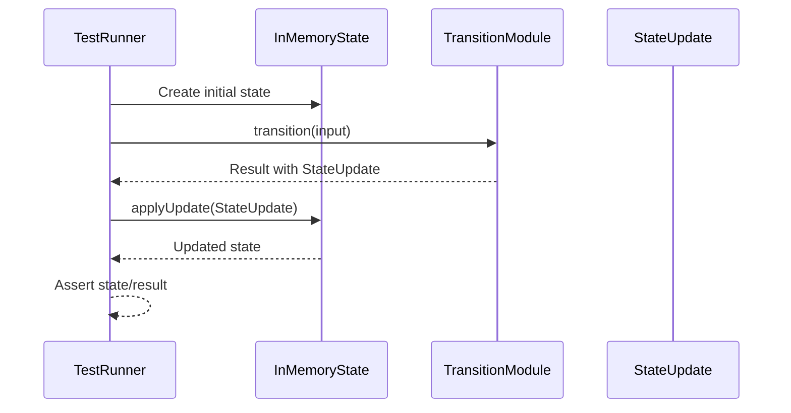
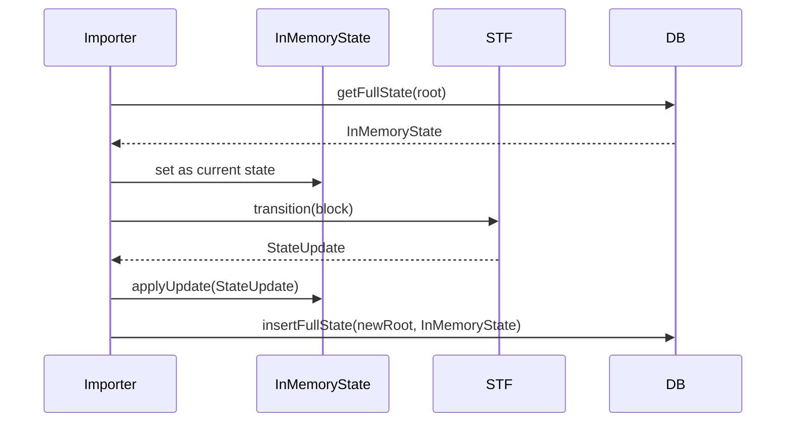

# State refactoring

## Pull Request by @tomusdrw

Related: #317 


## Comment by @coderabbitai[bot]

<!-- This is an auto-generated comment: summarize by coderabbit.ai -->
<!-- This is an auto-generated comment: skip review by coderabbit.ai -->

> [!IMPORTANT]
> ## Review skipped
> 
> Auto incremental reviews are disabled on this repository.
> 
> Please check the settings in the CodeRabbit UI or the `.coderabbit.yaml` file in this repository. To trigger a single review, invoke the `@coderabbitai review` command.
> 
> You can disable this status message by setting the `reviews.review_status` to `false` in the CodeRabbit configuration file.

<!-- end of auto-generated comment: skip review by coderabbit.ai -->
<!-- walkthrough_start -->

<details>
<summary>📝 Walkthrough</summary>

## Summary by CodeRabbit

- **New Features**
  - Introduced an in-memory state management system for blockchain services, providing robust methods for state updates, service management, and error handling.
  - Added a persistent state interface and implementation for accessing blockchain state from storage backends.
  - Extended test coverage for in-memory state updates and service management.

- **Refactor**
  - Transitioned state and service representations to use immutable, in-memory models throughout the codebase.
  - Updated state transition modules to return explicit state updates instead of mutating internal state directly, improving transparency and testability.
  - Enhanced immutability by adopting readonly arrays and immutable collections in APIs and data structures.

- **Bug Fixes**
  - Improved type safety and error handling in state update and transition logic.

- **Chores**
  - Updated workspace configuration and package dependencies to support new state persistence features.

- **Documentation**
  - Improved type annotations and added descriptive comments for new APIs and update mechanisms.
## Walkthrough

This update introduces a comprehensive refactor and extension of the blockchain state management system. It implements a new in-memory state model (`InMemoryState` and `InMemoryService`), replaces direct state mutations with explicit state update objects, and enhances immutability across collections. Numerous modules, tests, and transition functions are updated to use the new state model and apply state updates functionally. Additional utility types, codecs, and persistence interfaces are introduced, and test suites are revised to align with the new abstractions.

## Changes

| File(s) / Group                                                                                           | Change Summary |
|----------------------------------------------------------------------------------------------------------|---------------|
| **State Model & Persistence**<br>packages/jam/state/state-inmemory.ts<br>packages/jam/state/state-update.ts<br>packages/jam/state/state.ts<br>packages/jam/state/service.ts<br>packages/jam/state/index.ts<br>packages/jam/state/test.utils.ts<br>packages/jam/state/state-inmemory.test.ts<br>packages/jam/state-persistence/index.ts<br>packages/jam/state-persistence/package.json | Introduced `InMemoryState` and `InMemoryService` classes for in-memory state, new update classes/enums, and a persistence interface with stub implementations. Added comprehensive tests for in-memory state update logic. |
| **State Serialization & JSON**<br>packages/jam/state-json/accounts.ts<br>packages/jam/state-json/dump.ts<br>packages/jam/state-merkleization/dump.ts<br>packages/jam/state-merkleization/index.ts<br>packages/jam/state-merkleization/serialize.ts | Updated serialization/deserialization logic to use in-memory state/services, improved codecs for immutability, and adjusted type annotations. |
| **Transition Modules (Functional Updates)**<br>packages/jam/transition/assurances.ts<br>packages/jam/transition/authorization.ts<br>packages/jam/transition/disputes/disputes.ts<br>packages/jam/transition/disputes/disputes-state.ts<br>packages/jam/transition/disputes/sort-utils.ts<br>packages/jam/transition/disputes/index.ts<br>packages/jam/transition/chain-stf.ts<br>packages/jam/transition/preimages.ts<br>packages/jam/transition/recent-history.ts<br>packages/jam/transition/reports/reports.ts<br>packages/jam/transition/reports/verify-contextual.ts<br>packages/jam/transition/reports/verify-post-signature.ts<br>packages/jam/transition/statistics.ts<br>packages/jam/transition/test.utils.ts | Refactored all transitions to return explicit state update objects instead of mutating internal state. Updated types to use new update types and in-memory state/service access. |
| **Transition Tests**<br>packages/jam/transition/assurances.test.ts<br>packages/jam/transition/authorization.test.ts<br>packages/jam/transition/disputes/disputes.test.ts<br>packages/jam/transition/preimages.test.ts<br>packages/jam/transition/recent-history.test.ts<br>packages/jam/transition/reports/index.test.ts<br>packages/jam/transition/reports/test.utils.ts<br>packages/jam/transition/reports/verify-contextual.test.ts<br>packages/jam/transition/statistics.test.ts | Updated test logic to apply and verify state updates using the new in-memory state model and explicit state update objects. Adjusted helper functions and type usage. |
| **Block, Service, and Codec Updates**<br>packages/jam/block/codec.ts<br>packages/jam/block/disputes.ts<br>packages/jam/block/work-report.ts<br>packages/jam/state/block-state.ts<br>packages/jam/state/disputes.ts<br>packages/jam/state/privileged-services.ts<br>packages/jam/state/safrole-data.ts | Updated codecs and class properties to use readonly arrays and immutable collections. Improved type safety and immutability guarantees. |
| **Safrole Module**<br>packages/jam/safrole/safrole.ts<br>packages/jam/safrole/index.ts<br>packages/jam/safrole/safrole.test.ts<br>packages/jam/safrole/bandersnatch.ts | Refactored to use readonly arrays, explicit state updates, and improved type usage for disputes records and tickets. |
| **Statistics, Reports, and Test Runner**<br>bin/test-runner/w3f/statistics.ts<br>bin/test-runner/w3f/reports.ts<br>bin/test-runner/w3f/preimages.ts<br>bin/test-runner/w3f/assurances.ts<br>bin/test-runner/w3f/authorizations.ts<br>bin/test-runner/w3f/disputes.ts<br>bin/test-runner/w3f/recent-history.ts<br>bin/test-runner/jamduna/stateLoader.ts<br>bin/test-runner/jamduna/stateTransition.ts<br>bin/test-runner/jamduna/stateTransitionFuzzed.ts<br>bin/test-runner/w3f/accumulate.ts | Updated to use `InMemoryState`/`InMemoryService`, apply state updates, and adjust test logic for new state model and update patterns. |
| **RPC and Service Request/Value**<br>bin/rpc/src/methods/service-request.ts<br>bin/rpc/src/methods/service-value.ts | Changed to enforce readonly arrays in return types, and improved storage value retrieval logic. |
| **Externalities & Partial State DB**<br>packages/jam/jam-host-calls/externalities/partial-state-db.ts<br>packages/jam/jam-host-calls/externalities/partial-state-db.test.ts<br>packages/jam/jam-host-calls/externalities/state-update.ts | Refactored to use `InMemoryService`, improved encapsulation, and updated state mutation patterns. |
| **Database State Storage**<br>packages/jam/database/states.ts<br>packages/jam/database-lmdb/states.ts | Updated interfaces and implementations to use `InMemoryState` for full state storage/retrieval. |
| **Block Generator and Importer**<br>workers/block-generator/generator.ts<br>workers/importer/importer.ts | Updated to use `InMemoryState` for state tracking and mutation during block generation/import. |
| **Codec and Collections**<br>packages/core/codec/descriptors.ts<br>packages/core/codec/encoder.ts<br>packages/core/collections/hash-dictionary.ts<br>packages/core/collections/hash-set.ts<br>packages/core/collections/sized-array.ts<br>packages/core/collections/sorted-array.ts<br>packages/core/collections/sorted-set.ts | Added readonly array support, immutable interfaces, and improved type safety for collections and codecs. |
| **MMR and JSON Parser**<br>packages/core/mmr/index.ts<br>packages/core/json-parser/types.ts | Updated to use readonly arrays in MMR peaks and broadened type inference for readonly arrays in JSON parsing. |
| **Utils and Test Utilities**<br>packages/core/utils/debug.ts<br>packages/core/utils/test.ts | Improved debug inspection, added Map support, and refined test assertion logic for null/undefined. |
| **IPC Extension Test**<br>extensions/ipc/protocol/ce-133-work-package-submission.test.ts | Updated test data construction to use known-size arrays and improved type annotations. |
| **Package Management**<br>package.json | Added new workspace package `packages/jam/state-persistence`. |

## Sequence Diagram(s)





## Poem

> Oh, what a warren of state we weave,  
> With updates explicit, no more to deceive!  
> Immutability reigns, arrays readonly and neat,  
> Bunnies hop through transitions—no more in-place cheat.  
> Services in memory, updates in hand,  
> Our blockchain garden is perfectly planned!  
> 🐇✨

</details>

<!-- walkthrough_end -->
<!-- internal state start -->


<!-- DwQgtGAEAqAWCWBnSTIEMB26CuAXA9mAOYCmGJATmriQCaQDG+Ats2bgFyQAOFk+AIwBWJBrngA3EsgEBPRvlqU0AgfFwA6NPEgQAfACgjoCEYDEZyAAUASpETZWaCrKNwSPbABsvkCiQBHbGlcSHFcLzpIACIAZVxqD38AMzQxfAp4DCJoyAB3NGQHAWZ1Gno5MNgPbERKMJZa2go89GRub19/IJDIDEcBeoBmAE4ADn4sXGrIADEvbGTk2QAZFUQAelxZbhJBihc/Em58RHUM2Q0YGaVEBkzucXwsFMoyBml0I69E+iQHDwZTw+I49RChfrMfZRIYARgA7JABHhILR8J8MPhQrx8BJ4Ep0LRaOp4M80L4lAl4F5kCp8Cjph4GLBMKRkEDBCIxJJPvhklUkiRUulMtkru5rHYGJgkYK8SQ8lFqALIABVGwrLiwXC4biIDgbDZEdSwbACDRMZgbeaLZZrASbba7fYuDYdHwbUZjDRGfTGcBQMj0Pk4AjEMjKcoKVjsLi8fjCUTiKQyeRMJRUVTqLQ6P0mKBwVCoGVoPCEUjkKhRy1sDCcPxoVoOJyHSrp5RZzTaXRgQz+0wGNQYDZCNBWivSJAaXD6gzRecGCyQACCAElw5XfvZHMxnPIQ8zWdI3DN4MwThRQiHGWEdh4AAbxRL3yDJCgsFX3gACTr2lFd4LPpAzCKN4HgFMg/jcD8Hz0HkJoqmeF5Xvy96rhgACyJAgS4T40PeVwAMIZP4iAnBgxLZF4sgADQqv4uDYBQUx3ugGCYgkTxYNeMz3l4+BoLQADiEZnIgL7JNgGDcs8+SFIwLLZFEb4fo+nEkC+BCQGhmHYRceEaeKMySdJXEoOekS1pxpIvNh2gYMgUmHkptB0eC1JdCQglZEQXwAFKxAA8gAcq+1IeCpzAqsaUhYNw1CwHR8UUGc2QoLgdGYPQDFMRgPn0dI3godpyV1LM77MH5iDPC+8HTNpkk+AZAAijjcOVLBVc8AAUZGiAAlC+8k3nc1S7lcwX4PwjJ8PxxoMPwfBMHW76+Mk/GtM5bL5G8wGCSQPpGIuljLl4NBVjZyBaTeSgMD8F3POy/IkAAHshURAh0AhePAC3sCSx4GFAsxOWZZxEBg1BMTU3C0L8XB8QJwmiUgvW7AwXCESyWSxOjSUJVw4KikQ/VcAZL6AEmE2n8YJInkGJaOiJj2MYLjoj49MhO4MTpOQOhWE4bI5MoFg95DiOY5GijiDTuJc4LkDA7ixQ3AMBsiAUGrbDTIomx1BQeIfGA3TBOCsscPL0THSu64TlWUTNruhwHopbInoKjHMbeuz8PyN73vrhskDYgSm7gEmgzZcnIFtykVdpADasT8bgCcALpp5AAA+fSdJpU33gn/iCc81GQMnWLp5nOf9D4BHXKgIHEskv3UFHZDJBkHxXSyoQ3s4VD7qhFfhwmXIzkcnvkH8Dn4h4N6MdBHhFqweAqJEkDdcXtBgKXsj9Ul/ixeIaWYPIzBr2ZPEeIgKe0gcaDyG2j2OJQT1VKgJkyRgRkRZHzwAHJkBZHOpDXwc1fpsXoMtbm+A1obSOLuLIkAnKuzoIdcwJ0zqRkug0FUt17pt0er7SAr13rBj4F9H6f06wA0QL6SAIcp7exvvACGUN/AoNhluTufAbxkIyNWR6CQ6zaUDr9YOocQgvmQWLLIGwVZqw1lrEgOtaB60oEHY2UizYzgkvHe8NhVZYTUcABOAAJQoiVy6aIkauVykBLGIGsaqIYAAmNOdEk4pyrtnXOPg9D520kYhgJjYCKDMU46xsRbEfHsXRKJdFXEeK8dvPe5cfEZz8bXLwgSfTzitorMARhlaq3VprDY2twnqPVrEkgYAJDkmCObS21s1wbkjA7Hce4SGx3oQYCU7YFJHh7uBR+XxwQZDQKQSAjSFjL0gqozIJApD0EihMupQD7AECoDMuGCQrhWCPqSWo1E6LqHsF5TW1R6AjR2dMjwA9xm1HygRFuFFuqDXyAhNAPB/DEmlDQaMyV8peWZKQlasgtksmcXg35y0ibYDEFEe8AAhWQNBxJjyTK+eON4ADWJBLjXA8OQTaihBTQTSJ8aYqA6qwC+MSfwYhtIaFILgT5L5pQglkncqZMzdzcDoi8tKBKiUKAwFIS8UQtK/LRRi6QL5OQ4qygKKYU0ZT4Hij0FhVxlzRisigWkRIohZABW3U+r48DQ3MjiKQhqtIwoZTeb6gg8GCCpFMXiBkADSRL66DOeLA+B+BWiqv/ECRStAfppX8EgrAqCjwOJysxV5OSZF+xmJM3ZHg5nBCNX0LEr56QUQwW07BD0HJ4JuqIQhXF34COlRQzw31IH/XEIDKAk1hlKSulNEabDIae15M9N6giPqULNNQiF4R4DSHyQrCAxTBzyMxbgY2UlKwS2YLQKSaB1bqRWEjSgLSCltNthGe29BHY9JdiM921MkbCy/mZCCRxhQ7JlVNe4XkgUymwo8eQOkBb6XUjIhyIiPhQPQAwBgjhvCJB4M4cQ5JtmIewNwzFk9cpREqGayQ+JsCofxWasAfUGDwBbgtNA3BdgUTfnRKs1Q+GKVRPAZlERz6X3yr85KKHfCASBcqsQv86hcP2Z8ZwHg2AUFIDPWV9gfIbwwxJ7FLK8S/N+WS7SMnSAGVVJhxVVrTI2TonkBA4LlqArIIke+g9kC8PsOjSjkDCWyFpBRNo4Mq1YmY5ANzyAmVJmor/YClA5PicQ6gRkWAaPQTnbc/tvF+Z6VwmBkWgFpIkDMwhCNfAo0xt8oJJQiWqjvlaJRlUKnENxeoUQrAqRqQywffeEjFEMJxZ8kNWjQY347U4bHNZ8cL7WUtc4qT9A+PwFQ4J+eU0U15TSlN1D1WhOJjEIF6Q9x4BDl8n04tfAwUMra7QK4swgSvTHEvTKsGS2hH4vgfFGG3L3NIIfEgZ4HmZU8+IqDaQmBSVCOwZZyBMStAW9sigSLh30FW4CdbE8RW+XvAZiTRyPu7lIPeOiKPDPxH5Rpb79BccSZiQbCRL5qheF2ClDLNBBIkKC2IMuTdKOyHyr9jw+y0BXECjNNDQLLTkXYMgbqDBYR4PFwAVn6oW8HqjcpIcvNN3wwmJ70tRKICl9A82fCyOCLywZ+QjYtUV+wLJ/kC4Og+uNuIUXvNoIFCgy4iRk6DpTkg1P6iqv9lYZDKvha/n65SmCuH5C0tBwqSLNAwD/fgz8MycX3xpFgFcVc55BHIEVJwwSQhahRn+xkSiRAzmINxPlKStQZV3g8/QYr+VtPPE+D9Ql2kUuC2FqquH2iE/V92DLEl/ApXkl8DA1ar4EHOMo1GdZTPQgm6vvyXj/uZvqT2twOFxnv6objxfBPUcQxw4c3AjaYeJlKcebRurZlZVYDPCb76N81/68g9b8t516t9vwbW5wn+SGNqjE+inTbVoQ7X6WBn/iwG8w4Rhgk1oARhploAMm6jXQMjJnUj9VkAADVyR05eZhYqZEZBJkDyNmZ7I2YGAXtEhmpqA0B0DEhMCcCvA8CuB29QMgJZFxY10N12JKBt1d1IYD1Egj19oKBZZ7xWkikSlV0QgeCt1Rwd090hCaBoAqBZ4uJT0Fwlx2k7Ytwb1nZ+Q+kWsodWZ1JVDMAzguII4TNZI31WcW4v0kNEBRkxF0YhpZNX5RFrpeJEDhZuUaQDskRfMSp/BO9PN7wThwRyY6IyAHBiYVRZsC1ECogNcbxDxkFyMXNAUo4YFXpNAVxkhzoJkkVu5EBGorcwg1DLCo5uoA5cBkgQ4HAzp7wD4qtDMC0wdSE3pqF1Ay5asEs8EIjQj0sNMQiSADItAr9ZBUdEhep6jGiioNBHtBpQtig6gehRFEj3wi1VVEjQ5yR1A0xqgGB8Us9dpBs8Eq82i4CxjhYX9DcSE6jkgNBZsA0EBaQfoIYXCpUsj6ttljgv9+Fujfpej5A4dideBxj0smN6hpgSw786xKAwEKicQadtgSEF4qiSRZI3wxwFQMh8Uy1tCK0/9vCucf9K0G0x0m1FoW1p12051wDIBu19ts9pN9pq0s1B0YCqTyFaSqEQDZ09cvVUBm5njJCl1pDhxuCTD5CxwBD91ZtzD1CbIQYAAvNU9BGcC2M9bQi9TcKMfQoeHtN2AZGYWOYCRQFzGlc0kfTkh8Xw9LF9KOelZBf2EwgyZU6o54dUzU2gaw7+JEeQevU+LAMhHo0IAONw9ADww1YaYydjcEJXPE86Q5Y5ekW+WiR9Yg9LN9fwlIhCdJe8NdYiREusDQSEgAfVmw0DczmXEjomRAhFDXSgLXzLggQijNEBfG6nM1+gZWLGcMHRRRPlkCxnILcNl1VWLJCFLJoHLKrJrLrPJHEiMlQDh3QCWCTGQHCVaBvEhLI2f2QGSIqCFAyBvkoBV3gDVL+NVRk0JR+hvK4iSixH+hH2DIrXyjSKDTyNpOWhbiICYj+Kr3oF3XiMSMQJ8kOmJI/3rXtM1zul/zgpDAAInTpMFLoQYRZLQUBJuApL/yBGgOHV5PHWbQFJoSFLOM4V3CUAXUKUlJXWlNkNlL4LyCGGSA2F3wQxoE0Ktj1I6SvW3BbGNKMLNOXgz0vCt0NUcwXlYkfDqX0Q/H9h/DvBdFkGUI0iQxOIeWjiOCpVgm+XqmA1SyFgUqIhImkHImL1L1kp9kwA4j+Jkt4kL0ByxVRMoHRLdN4mgBCD8J+GcN0ouPWXkvJw+HTiCWMo7zqXComiml83qH2y0ggUoIlWDQn1DToguwOEjSykK2Dz2loqOnfxwWITJIQrrVwRQupMAMnVbQoswqBhgFYnsqxGAsM3gL+S1Q8qAxcrrCxWQUQoCvvB8qiPSyCoMTdwkXCsGLYNwmirTnA20i4OYs3VYvYs4tg3j0SHEIlKVhkPBDkLWo4sKDiMwG7l4vPQEr0O6QMJNMBglDXT8FWr4GdNknvBMOXGcKAqy0QBGtHjsKtIcNKwK3nhmG5gsOxNsiaNCDFLeDrDLgEEKA+iwHM1UT8wuWLDDOyr4CBF+QcFg2kAH3RzxAzJsuMkgPQC8AKHc2BQmxVH+k4VIiKmg37i+rUO7gqLnzLjKrISTCiCZrOmg0iNCBrOZIypQEzUFGhoLX/WxvOWxEoF4WYBcMQDxLYw41psyGqlixkDPP8CuHMVDRWUoHOUlqOGltQHxtKManlq6PBo220jQEaWpHXkkWQixWnNmxmPwlxSUpmAFoynQCv0ZO0iYG4FkGXAom9qhKAjKoPMSNSKzTXzhzohi01ptPAioB62vRKMJvKIDpZpmHBIqJ5rej5uykKkFtVWFoqNInRmTE92JULBjjQRFlgV3Q5t+RwnJKpEiB1wOP2Sjninqkcytrzu8HNqKkQBiIciYi/KTvQ3aNQCYAOGC2DODqVE8x+KBtCyQkEUeLDojqjrxydLxTBt6DwGpDoV0uK0cIcFo33ojz6Cj2SugqwVgtwTKoISQsqtHT5KALqpnQaq7W/RwvypormwSO5OIv/2qrQvIqAbAJFg/kC0o3FLPSkMYq2BWt4IoA2DYuOrwHCUyCfMuguv4t0MNJupEpwofUetetFg+qIYyGvM/z+tqnknsIGK0mlEeBtRvALuvkduYZIfq2nCxK4hQJCA0CyA6FwC+X8Lbo1VmWcGm0f20jh3AwNwZxDEHRYbSmzBJQwHOQgweJDC5rTBYBBVFWcpEdYY0NePgt5uRWJzXQrNOFwGrLA1TvNIpTlxQTqFpBQXEB+nRIYdDq1SPtoGjsDw1SmM/E0fgqyBJFQxnLNkXO8c6o7p42ftaHesrtHlFubu0gDpkVGSwCFzpq0jSc0GFq8aAiR20iUGOAAFEghyQ3imRW6p9CjvjLyqNHKz7l5ETmJV9EMhH7xSwdZRGrC1M+4NUwyXpQF3zgU8AHZk72j+jHD9z/BDztqiqYKSqq0v78LkK/7SL+TgD6qwCsLQGRlwGOSTnELKTaSiLoYSKaSAH6TQCQ6vLP5wo6LfQ9qmKDqWK8GCGNhiQyI1mZZtTWkKHL1rrhLelaGxKwhegwWt8zJ3qpJmokA5HpB2HdKuHHC8iqAWV/Y+RkhesUoOsKB8V3DB5oM6jEho6lUEdfaooRpc7nDyjwaVTZIC77idH+QLH7AeibGPAGaHxHsXwA7Qt7xZWVHMhXb/HwkvB1EvhD7Hj5XHslitz6NaXnAGWGx+c4TGGCmljCTb4JFOU9UiRIb3yfGPBhawB+XvSoC19KmtbbD5JBsuBhWjd1a17NbXkoWCWZZHHS766oga7ZtbbOjlpiQuIVmtnkB7xD7I7omT7Y6C5w2YWXj0tGmWWaA2WJb0BnafhH8id06e51z2qS6kspWy6XGeAPGrc1zgEVpQJO7cm27KA2BiRENEjGkVX1H7wyVA9e531IgHa7katCjvcpj56n9F7VN1lMSIazJ5XB897JKQwM3Ims2Yncz5Jb7St77kIUHIBX6Dn36jncLyTnmCLznPnarvnKLbm7qv9UKyKrnEH5Bv6Xm2SCrrcMGGLlrQXnr8H1rITPs2RyGTp9TOkc7kW71e06GMXnrAi4PMdPg31i6tIrjIr2CfbpzZrTLQrNLgqVLnR/x1LHHA2SEqVkE1d2QWMXX0zahtJJqPguV/KB8JQhiY6yPwjhbO9OFE3i4C92gV9fASO0sOCIMzrhSUnHyCyjLRzxycZozq6tVuKNOGVOdkBBVdghslLeheqZxQtvWkBZIhGQESAiBK1J7Baq903mnuA2miMvBaofluJHgo4tI9HOEbxohHtcgHCNWa3KsBGCmC0x7eXvBnXo8Fkg74tHDhPhZBheFHlnCPLQV2nQn5ANcIiPHyZQtwnlopUT5fJHqrOZ0Qc8FOcYMAc+r/GFt02KPePNKX8VOs9Oyok8Xt8XAXwQLAjs0dKmOQwnl3MFW11Ao8A5HoB8AFjmisWbItkIcg88y0FStdxcBwU4vmEg8D30d4P51HPnPnxGMFdU1LVDECm/P6pNUOWYF7IeMwzzx0ThOLuPaH59woCeWu3tGg288kz7xAofVOmxN9t7Dw8F6gUoJSJ2B6tbvpaCsfIa3Hrt7W4zJkq4VPiUaEIbwsgwA2BBYKim5PdC7m2Y2K7pbEUxBoYiT72XmnmKriEqr/732MKbnGqQYbCoDoGbVwSEYTD0d08HlfqQgpHwQ5zYxrB/Ape2Q/qvlOD9r10wWYOOLcPpfxDN5Oj3O29dIO90tVU03Uv2QgeCbnD+oBeKa3nOExftI11lxbtXKOsvPIUVv3e2uOVgdZAuA/q/e7tEAveWnIV8CFLIBCC3ePe+qI+ff8BQ/AdupA/g+QhU/E+aNI/uZ95WDTf9IY+NeQWtfoOIW9eEO9EHehfFN2Fh1UuOqanFvdQ8AVu1uOUFulu8AuBW+5HeZO/gAoe6Jzu8PEAWnsbiIlBAlY/XeQh+/2/VuCm5fcBF/6x1/B+7uMBoA7xgAx/peE5ogrv7Zog05Z/S/sGoPcGde3R/A/udrwPgWr/y+b+IXmV2AwB3idlLg4XdSkOrqVDNDoYVRaBoCQJLFwjiwwDmIkAP/IluEzbA0ZPYK7VzsVH9jutIaL4KpIoEYB2leUvEEOB8DrAwDs0sgLRq/iUZfAS2JAMtqOzUaRA08pjEVsG2ZyWNzwqjSVv21GbycP+xA2ARcELZARE6dPcuiVA8b1N8ICbFspbzlSZtj6pOItiE0OIbdeUU0XTKDSZBMR/AmxNfD7l4he1DM2OLJkihybaZ8m0NF8EUxmD7FiuCkUQPigLRp0acStXDKokVBkBr25goqENE8xAl6eYg8EBIMMgNwW6R4c3NPhcK2dtanLRCCM2RKJE0Ai7PhBIyC7KMMwPIa9GvjhJA5gSFGTjCLBXoXhbM1xRDAtjPybsBWP8TBCuBJJwUOeP9Lnq+xqroVrmjJL9olSbblUGhPmPgE7xHRdEeeLQxBoyUBaYNIOr/LdO/2OCZ5EONsQAV0mAHfsH0+2KCKHiqxiYhGdsSBCFXdwsJDKzqGYN3ScyiAsiJvEDHNSo6aRmqnmEBO+A7oPhuuTpQil62ERQ5AysiP6hMQIAhx3aFXQfNgPoCdFOubEM4SZQmLLZfOdOFTnTjMZL4eAPwVjgjgVbr8aCCQfjidS2QBQQomufWFeVIayRiwtAcHlGC0g4h7hVAv6j8Mzzr8rhuwMzBZgZQsB1AkAgwRJgkhzoNWMQx7u7RpExc8o/Ga8p8GoFlsz2X3QDHM3Mqr0yIzwaylmX9hUjLwiATvj4OJyUjphio5USwnviwEtwRHMTMNRCAKiZwNImEcwO5HUie+4cRgZ+BMJGiZe4IAMs+U3JFEsgEgR7K8iggzCMBkjWRngEGgpchkibGUY6x8Dr0Mu6bOQdmwUG5sbR6o6zo40ab+xWRQEDdjMHpBt9QgsXMGikN9ZFBgeNtYwRRktRmDHGdA12qFhsHKDmQ9g7UU3zwQhcZWloq1oINLaGDkGN4dMXI1DbRCfc36KxlJhKFRhqBL4Mseo2mT2Qkyfg0Qa60SLTczaLDY0MiXybu0WxwQ9wLDzAZMAfASYHkH0SJH54VQmPNKCGESJH5SEUIOgCVnbHZit2B+S0dBhSBZB54rEWoDpUcxk8KeFwWuscBR51gxGd7GoR/VKqdCgOL7AYRcy+Z882hjVXfnZR+hnsTUzfIPGqJ5H3iAAvJAECilBcAwAO0evzojRBkxNAaIBf1FjjDDq4Ldap6MVE7UoAhEATtpE+HpYARYiayAtG+FxjEAyBSEpn1GqJA3I6MMgjpwGhcA7RwsPoSgmkh7ckQKIJCJZFR5mQLiWkCHApyFjqQKycnbqBoG0nq8mBQbXjAiO4hIjGq9Ek6tpBRG0FLBbEzqmiSAyRQuoGALlNJOCpCBtaSxBHMP0tGoi0AdEPCZaNn7VNXJzwdyePE8kZjvJdEFCRaIzF5IYJzVeCaEJcgIwg8dozvpAAwlD8/JGY3yZxMn7vgKAs/OPqxFSnxcMpBTYAFFMVH4TGEuU7GqRKWqa8KJt/aidZxr50SGJBo8ECVIsE2Tuq2kJVkHnGqqQspXYnOFJCUDvI6AEVSqcaPvFjT6Mk0/0qMIg6NTteELVWipAYF/8tCAAyhgsKdg0N70aLfbLcJ7YaDtIAAdQJJGioktI8Sle1VRZBChUyIFP7DxbQtMUhAovFiiZ6N8QEnQ+8A5K+H4BYgiQ1aCJ00oAiTGana8vlGZGXIJ4tRIgPgEUAxJw4OORGkgVURGD7weQZ4PilMrhwpyyAADOiWqg0k6gE8A9ldPpY3SrEKoiVDV1eR1MqWNLfqnWABkdA8oziNGZ03MlNiCAoMzaSQBNEAitu2/PYagEhjZVFQpWV6HdGwAEh/YhE9SNHWiAvh3Kl4eQMFUCj4plRCrD0mDLgQkB4BFNRuIDW4ZTQQasYnqbDW0GcYA2ZtIVh5lIRy1Wy3rDOqgOgyJExWWkZxlGF1yIAAA3OW0S5lFkurZS3kmNVltiyqcGVejoPQypRkckYk9kBBy7nlQ2nA4ugkM8y/J/kSKfmvF3T4vQFZxeViay0MGy5o2ogwOZ20JCatwyIJUIEeN8gniNmEmWvO+ifHsh7xUQ2SLeyOiHN2eIE05r/XAlvshhDJTtNpCBnqTBZRsyICQXUhcA55/E4ZMJIxiQBtOrMdGPgUXkQyXwgAFAI6xwXaSAsAJD3h82n0rXBQHUTgYYZfpfYeePFGUzj8fAe8MjNRnYyMZxBH+dpDxkYACZvM5llzKQCwAQFwVFmQawzCrlGqkPAWSDIPnr9uonY3vphMtECSmY28lmBQS37Q1h+2E4fnrIKYESiJJAEiXRCFngy8pGQafiQFn4nzturEJSXFWwnaQVZlciTOrK5G6z9Z8Cw2cLL+qr8FedYMmAfL+ocxYAXMHmFwCORMi6gwAN0fiEYWnyrZuVB8KUyDLpdqIrychUEnnZAoM5A2fsT6xRrVAvUUtZmpbXzHeAQ5eWVAbWI9mgV2Ma9Zac/xlIV91qgmWAb9Fhazh/+cwvaahwOkosjpEoPdiLXUiGoCODbM+WXIeFF9FOPtGjr+DUoaV646EG0VJDwi+KGA9o0eAwwDF2lqmPi9yPkvEa3ieovo+Rhw0SkRYeGSA/hv7W35RAU6aqRgNJ0eR9tVJz6IZn8nqS5y688TG8BuWC75EJQaxKRKIhOoFdiEqqAniB1zz55HCVxJ+sXV6XpY+uWWU0UG2jltxylkbdLBYyuAUFfioYgMccQcF6d5y/GS0s3Dx4H5UI4ndSWUvEAVLjOL4IEUKDhpQZRlDbYcaaz8zmsK54gQ5auL5nvJUMnnUhEV2UGzLlcskD2S4Q2VRtOh/s2Nh4z2ZAo8gWdMzsg02XbUIR9cF3MmxshOtslphA5e8oKXQAsgZA5lh6WsiHK/qIMOuCoKrQgdWFjtAoOoE0gzBCgsgKSe+ExDccoBuSlldIlwE+Bp6EKOIvlE1ltAhVzIEVRmUgCtzWegEh9vBVAlnMJ5zQhBtPKZKC9AyEkxNC5BkmZiLI2EBSU8pKY5LmVNKolpf08Vv9vFjqvxQbwBoPLVl+ox4UBAt7xMzxTcvISFlr6mqRezvKSUmktW2p5Jf4xfPaqpVgqnVIQOlRgAZUuqcGkw91dSs9V6JiWFszLo2G0Cjw0iJSguEyrzX5L2GPoCAnXzNXRqLVTZONTaoTV2rxVHqmtSEDZWQis11/HNRxTeX5qsU3q60qVkma8qy1tpEENUyrUpq/Fta3asujyKxFLoGweAGUhxAEAtxGwI2LCCGBDAwAeM+lmAHijaVSAZGM0KUCHLBS3G20virtMRZADQl6HU0g9V6AtwN4sSm4sFwkp9xnKiAH1GDlZiCixuSgsJv0u/BpL6Oe6k/DuMegay0g+KB5PNxCAtMlmooM4AwG8mOjNuiyE7qxDfQhrQSbEByjJ0ukElVwNAZgBhu5j64/FmS2eErPeIcqUus3WBvRtngLRucHRFsririyGdHaQGkDbEDA10RquBXTgaZyVAA9Hi6KTFBoC/WQiA6XbBTC3Beh0AyMgosIBhg3hAh8UIG7TZqRjKDx7WZKskBcq+AFyKImAPuM1Xy6IqsAtReSDTPxTUbsIdGrDYxtlxvpbcqyGIeWpBCWFhmKoR6tKDqC3ddFBjPSZMHpq5CLkzCn2AezXReaGNOGyyW/S1Ujzv8z7PVb+0uaAMjVDCE1WDEjU6jygCMBFH3HQ2Yb0t3k9KZvFlxoS9AkANzR5to11buNWKQgtVvRbgg0t3GhrRhM+RcB2tNGwbdhuQAtbFq94VdbPEegbqt174HdXAj3X1ID1R6k9fijPXIaHkV6koP8BsjThpGNfJ/sunPUobSAGgIKRgB1I7Sglz6/abehAHhKZg22siNSglQAUgKZkWRJdtQ23a6ldYyoCGTNzaYAdMyYegynvDRBId0gbdBpTPVvxYB7wChUNH4jZAzgLG5tr4rSiw74dmwBQkjtu3qz65FpebZqxvA/QkyIYD7eepdZ7btou4SGBFkqA7N8A48fYemPuVs5Pu+4fnP+TYS/aD8vQ7bI8E1WnQgJxzUeXlvHkFbIJrQmeZNHICbw0irddJIkOpZzt3tBJT7X9jk3/amdB0IHfSP7Iy1vtwulzl+uyyFpQg/6OBn+0AZDJ20+8dxRduN2bAV6JAODbdEhZbYHgOyfxfdsfWPaDSz226qJQiX/qpK7AGIdEFo5/gDg6lS+jSFyA/rdRU0J6RfPOkZsrleG4KSuD7YFbwm+TEuBgGojLgAewO89mbsszPAauQTW4OLp2SBEu6a8McXJqDzDVpq/0xlAHs3Wt7HM+cw3Jrq71yU0kFe+QNABiohCOVATT2a9Dx2+Rm9gejIFskPaSoPKWAtGjgI1wygaljMlHTiQprZCvMHlFwofsxqmbxk3UYttWJOItFaeFTQoBPAuTVMZ9C1bnSiEPpY9oMmqPuQ3uP0NZT907YETeF1ySTBslXM2efMVmSZUQ+AODFZCiAcQ6ehk+esqCfpJ4BI4KE6q/BJlSogMk+suJ/rKYwZGIqbRidNUczOCMgLOqDMXG1qyrkNYOPuouLq6sapZRaImL9HyHcx80yCXQr4BbX/ZjgCQdRk5WGbzkrxVeLLVLu1X1CXm3PCCbzyV3GqKa57cXqPqn1V7B4FUuiFgT0DdRm9XAZqAPseAZAKp6cQw3oF5jmG7ga+igMABIPT6bDkAIw7NsJ1wb/Avu0QP7scOD6Mg/iiQudqMDeHvdfhtWO8ApRiEH1l1YJUJVfWvaMOx01uhAJVDJQUysJViBM09xtqC1zgQCoajdJ4ywsaid+P7Ej7tgKA6I5wgjHWLBAsssweAC9BWBkAGZAcaZR8BwIUB2jjktMishOSZlGywRAEbSAJqPAlQwEDvRvA421EyD/UPVEkJVCxxnWwZSY/bqODl6+icm2oq4ZgDhUlju7OIahgJ6qox8cCdKq0GvhiZxjiCeyFAb24mMy5KAs4CZoQAzLg62RZ4HREiDZB6oD+04jW3yOGoYjxecna3Q7hdw9cq8CQ1fXRL4DhmXY2brKtiJz0bGWBw4bvs1Zog7dvO5YJkdmXXpuj86aoQoZy01o5djQ/VfA3/bFbGqYSHAWavaoNHSTLRto2QAqnGHwTJALgNUYpTcmYi8a7UocbThfJCCjRtHRyf6Pcn0+0kClPyYVNKAhTpCEU/qG2Nogp9Yp3SYwA6kCmMwXhz3T4Z93thojypk9G1MgBMnr05WpvmyY2I9HnAsp6ADyYtNKn2wqp0EyLmD54FKYYiUk70ZdNun2wHpwU66eFMFGNTBxz/bqcGrpsDTlAI0xeoR2RGzTGwXk3EblhhGDAER88nBu3HfxNgTqMAAChTYuBZhOhJ7SEpe1LCDAkdLgcKAeFwnXaQ3Pg+SpcDAAfUth4HadPuGlYJpT4kEfflmO5o50Nxs2veDbMjcGV8ZrBRRmWD5R7j1dd8GiRDr40GU8kAOOJu0gwocZ7KHGQFhxmByjB05QWaRT0OPw+ZU5qxMN3LOzmGJGekkVnutUOpWN2mRzhQCbOhZ7jXR0eNOSUCRAfaIHECAFvWT/pnAP0eoJEUhrXimQDEnmhREbIMhqg7GVtVZD+JxoJxTxpNLFW/YPMlZnQgnkCEGAsgSaONJfBmvKPVJg5kwbmgKodaJrSeIzJs7T3Qu2rZIuqg/JYr1NmSlliEyXbUM/qy7OePmJoXSaK0/MZ5pKqIAVs/OsW0ILZx/NOfvNdm7aQYZAIFG1TBBEkHh2fhrnGMNGwNm8dlOdFaL3gYU3UNzFwB9S8wBAKMyIJgH3OqIrLRKGy7zCwJ+JxpQoJ8f6RxwBZRtkAOmJGCsM+pAkOOQOYFeCtVgrDnhmtsWRBkXmAeYuUxXye3mmLqAoVuw1wCwIxVGq0degAVvjPaQVLHZ2QGpcp2aXtLJAXS54frGvm49ilh/JEFKtkhOz3ZvSwRGXXhHjTaZ+DUWY2AlnKZlZ5DoJSNJhLUjDZ+S19qaujmokaM4AHVbfR9nC5pWZHtIDj0H6lLG8J1AjPQAOh7ar6BCL+feOE5dzhQU8+EU/N1Bv415+a6okWuz9irT5xwnJIKPXtprHwBVpFE6P64PKp0SEfcc6JiHHgJTHQ2XFytf65xMxiQ3MYB6CdeI11hDY5OouKAtkWR7WDkZ9hvphDgo8zlFBvM8yHrdV6punmas1WrEC1zw7vVgpAgWJhcWILIChBwIZGtNigGnE5SFqAtGGAoHfLgu8WAqj0t/Q1fbW5icLLkBVn9cvC/WHI/19lfcZAt25QKoaDALzbry+DULlCX/Jjb4Q158qhHDVJsc1Nj77MgRe8FLdwAA364gUYfD4EuX3MlaBxEzVtfJuNnqU5yc8O+CkB7CNpqiErghAOOoma2/gIvPUAVsmgedW0FdmhcHnkmhLwE3LaJY+YGr6TUlpkjJfkyK0ZrZNua5TeJvqWKIVVtAD0CiT6WEImspBneRxMantzmpLgJCH2A4zLLuuHK3ZYcteRHJ8VpG9/FQUzRWC21im0TZwlGHeY0VzK84epv5WG2xVwmxAvzuVXMJ1V0u0EjeuGpZrsNwe3PeHuxSoAGEItZkLbgLQWJfQho9ZMiiLWC7mrLS8XZ0tWJjDgcnKywUcR53t7/pktpAnPueWF719ku3fe6gP3jb2pyG7zHuuv2611p/e6jdtMN9oYCMC2wDf/tNJpAj98U2/fgc+BEH8yaM+DfkDAOuru9yB8ffK0IwAAVN3ckbxUKAXAUB49YlPaQyHIzG6xQ77t8wB7NDke/g5XCISoHicRm8za8Cs2Qr7NqK8+tisBSC47D2KTmbzO+Gtxs7etOrDxux4AeI1+YTWcj2gCwa8U6bOm2A0q2xNmpS8wyt24xr1kAm2jDk1dscbu9ZBvBOY+4CfdzIVj8fT7DL1anSDs+yZdZPpscm6ABjkgEY40BkpgdBt1ruIaoExnpqGN1RPUGhvt6N71BhataPQEgyuNRAHfWokeK+OkCgoox0YKC2+Bqm+ueusDpJYVB5A/mt41rk8z2XjZJYWMo1dSA0gzribEfK8mKdJhnujI7U/3Dk1FHPCmgOO9LsfZdDlD4lp3R+2AZNUfYLJuAgjD0d5BQNhjgHgYbmCX2igaTp685IMQLOlnJAaw54jmDiPtIuz/xy4Zwdim6IsweqREV6v5m5HyNvWEo9m60TrTOJ+vkOlF6snQVkCMlKs9CgL2G7lAYw9zl9OHP/jXAYKLzGyf+OjH/zrZzGtKXWS/n0AOiAC6WYaXc4F4gqSYdoJcBIn4LsgJC+hetG/HuTlZ6i+ZL1SZ7ML8l4PGTNXbUz9z/qwo9Os7wXnZ2xdAOBkemmWX668meUGUdmb4jCLcPeo8OmTWES50BSznY3uxAkr+hpa/JBWsGVlJP4jazMs1O7xtTAr2TUy3WCHWXSx16u0LVXMFdPgG5toI7Wr045vW49nGQ7nQhKAXoDrs1BhrSDozzrDZamGQCIDTBLrxOG1nxwVbyum0eTgW1nnkihPV7cep+p9YOiD4fFC0D9F+N/ORRw305SKKG/KDhvgbRttx+kkhvkDYRMN1VkHYhS8IixvkEc/CdsEEiMAKJ+Gz+fecktacERK5rVF2j+a44qkR1/RhdfMsHc7rsQBk5ouZQieK7KKMILdtfXE33j95/eEijQA8Z2bugMRELP1pgd3KkG33DKPr3Xaq72gHC7qvRPzoIPenHsr3eHvj34VymhtCXPhZ8oM3Ki7gDKM1vVWuruvPDfNwcDODN8NWna52R4XWSu0CBkk1OPgJ8A80EhPcaBCXGQ0eQeQ/HZl2J3uhydiS5M/55QAM7M75s+TevcrOlr5ds18rkkyeZDL1r+l7a4ys7JXXFEJ169H/ut367AwJMzjiHcvQPXTHjwx5a8sLTfLTdwoNx6wJt26nndn1wCdgABuxE1CEgHMWQwAB+Fj9i5nq0AlPWL/YB5bytQACrEbnjgq8fiPWV7ItyMrK4PcGfyrk9uidJKTdQP026b6vYO4qgEf6XBKlz4Z5JuG2PgoNgt0A972xaD2Rb8B+OQtW2f6bS7ld6RXXfyPLos29z5Z+Oc7vkyOtyo3JTM+P54vRn3ZY8Uy9WeapoF2SwlsjLkUsBRal6sNhNeLuzUDHgd5m7deceR3bniz0Z/d09WUzXu5lxu/5ekUyMqiVR4kfGtvr7q5pMBiq8eSix0vS80iiAvjeX3Xkk38YhZ4Zm7hW8j4ab9jPYteEuDLF6lN9YqgZvwiWbpbwLkgRA3pB+b1w4y0fjnuS3zj+zDPXlUGMlLCJ40oftPdvw9vLAZd4labTRfHno7tG7JyoApeYyXTUxxNWO+k2B78XowSkBi+Wojhwh6DO+/UaH7fweqYCFkCBBOgs9PF4qzWDj3/NNN9AbqNEF3TxYkDtmXIFpDJ96a8e0gaIMcfXHSYLZPxqtEhC9vPiZniQv28j+e+2DAKv+REvhwjsohyQ50FAd7pvZQfIEcHoNOPnWihpBLwznVWPJpMK61Dww6S9w9m/7uMv631+3N/x0LfcvNznlwWZi+LbP3vXzQHonAe6firXF+zsPAN9Ze/1S8Neyb9d91Wjd7Xk0xb8efqwevw1u34ycgdhf3nJ9n58m/2+EfjDgHjIJjBo9iPMoAPFB41r9Nz937MflgDe5SvsCYrVD9KwX/HuPXU/g8fFxc8hsZ/UHTXptCAvjPgO97Pqg++8p4dR/s/nLU3/n6yM7Ik/JfnZGX5v1B8PD6cGv3Q879Hew3cfnv0hUT/F/e/Kf4f5X52O4Ox/GEzP7IkPcN+BOTf8P/O8ycd/bPEXn7+UD+9FnHr3UFuClHrCm+3I1Tjqqb4n/H+Ko33w9+f/rSX/r/4Ifu/h+a9GH7/JNl/9RzJ/zi8DfOo2axpHO518NbtXbRSg+CX8GD14WJ9TFckjWsyj1fGCiBDE9hIE35t7wDqEqhtabkzulKaHR10oyELKEcJrZey3qg7va720huoLIGpY+AVUH6hpqVVEDtv3XzzLhGAjAGYC1QNgK/1KgRpl+QpIKOC8omQYMRTZR8K5Qx8CfURDfRz2ZrgwxISQWxvYQEOSHu4iseyxRB/kNX2MYBhDA0xMANGoDygCRNTX+hLNaDA+0rXDFVOw59C0gEBk8JQGOYtHH2CYDflSBhXoOMMuGZQoPPKGdtPMHEFKJAHXY1NtkEevBvx5sJzgQw+AVEyQ8VfJQzAkNfKeTTsGEWCVYQYHZ3m+c5taqj2ECAhyWIC7qfG0Yl1nTeA8CWAwQOmkyg3gP4DWAsfxzgDjWoPqB6gqG1FhzfWANKgEAmvEf4uXD3T99IjVgDwYzUV6H69qzNAI0c3tLn0BBJzXYDQBTiDWRI9PKHi3vAMIZgAoArALyAWDcPQKm2cPweJzLc5Ne8G6hzEbJE6AqgzfE4CmWbgPkATgs4J8Aqg5J14gsIelkiA97QHHsgbAI8AgCN9dlE2D5gxAE5soZFUH4huUZVnoEagOoFKwuKXvB4AtgyN0WRIYQdi5EGICsnhCgkPGhEQ4YTHQfA5g7YJed/hd52+Up4F2TVx1Aj/Hk4AAbzhCAQyAAABfYt2YEdmIY1JpAOCkhRQGIdlnHhQsAnloN9OffE4E8QuzHGQsLfXHFs5MZCxMDsMZiHWY3hRvk6ISNfIWN4R9Vf2H89hRzAiJ0Q5X0UMRLND1gZBhQ1TSDGqeRVsk9hF3k1CAQxal181gjYPhDgAU4O/sl7O+yclwfVSDuCa4c4Omo51C53dD/ELwEeDGTd5xjdRbBNByC/g+EM5sBqDqReD8UN4LuxPgo8HtCygn+1vtnEWfmJDcodNmpChQlf3cdbg04I9CHgsfwZDsvGblLdO9JlnsdTUWLCMluQ7q1zNoAn3VT1NgJQGRAiAMYNQDBvFI3fVeICLUKVICdG21sYnPgCRCxkepR7cCbNAAipKyKcO/17dLcm5ADGCeFfpB8c2wcgSnefQkk30M4Ashx1bRUqdOBfJnjkzgKQCQ1gfYcL1QQQfwi/w1w8jH+oTQCQPn0QOUJyZEpQo8KYgTwzSn6crIDH20wItMcIbkqAjRW0gveLkO3JtFSTWVxJWLlgWY1QlChWgQ6R6XXCdxYwOH95uVJ2JgAfPZV4gLpE0HMM2wiAN0pQnRRlvCNw+lB513SUQA/CeQdwmKN2AUTDB9e0MvG9tRlfoChCwbY8JojkvYcP/0iQbcAfpJKd8WQjFw5HFAioRH6m1DKTPCmpMxLWkwmcoJGeVK0o4WZ3hgGoCmj7DVnVUDKDXTbqDoIYACTSkCbILgFqdHLDAF5hfkVAFVA37Krlf1NI7SOMMZw4PgMisAriGMj27TAF5gZwgtCsjN4d7z4BtBPEgcRwmUUPZ8IPe3nrUI1LIIq06ABGAAJ59DpzEA5TOZCcijgTiO9sMJAQxIBeYXg2yA37OKPCYEonCR0jkomAGyi0nHsm7dicZlGojTw7iLMt6w832bCX+DsJQ4JgiVx7DGIgVCLUXCBFXx4ZfBaFRowyE0HqBJmZng6ZaSXIPp5yDCdjzgJo7y0WkmNUHkZxXFVgXP0oI3yF4MWUSsURMeLKgFaBA5W2kgiJ4TEAwAwAHJA2B5o3yxUYsHe0jQsco3yHWs6gEMN1pcuNaNq5YVHzkOJTlZzAGYrNDGm7Z7hK6DKNtMUcUiBZVUaMoMvAd6W4BOjOwOhijBPsnBR1WQq2GiOORaDYQsgVJnTQNge8Eujp4EcSQd2OAUDui0nPcKVoEbPLn1gb8CxVrYBQMTHDYfgeQEDkgVWElYwOxTIEXFUMGpQRtCRYkTjIFwieH4RsaMLGcIdKShijg9BSQIL87OLAFIsnaUkD4A/mEmVoAZkf8MkjSSXULGc5IwrUw9oJFXRIAGo402J1XUE4iiMWosa2oYJrDqNtR96WbGkp44BPRg1k9KI3T0o3OJVx8ElWMVX9w3BhieCHwM01Oc6XK8zY0CoKeCiBV9IIxHD+NLOhcJBGVCDNMXidk1aN+jJVA/kE4qUyywgzDo2fkbg8N2MVL8aCHZxDwi0CANLwXqBIATZWAHfBsAIgGsRCgQOM1Ivkd1kdsNCBwNbpLeGgOdROhDTS01/jP103Mt6VRldowAPuMBMkaNE1np4iViIzBotDaNJMFAW6ALQqwjsiMpXDcN14AFYyXFLizgYKSGcdQ1Dy1iUgw0M/ZGqbCnuYyqPoXQ95I9QwIsE3CUC4Y2fOi2DIBYy/RM8/iBjRx0ImW6AbiAnRz19jDYv32NjQQ/FEhZ8WAthFcUA1qK7C6zaPSvY7YuPRetSsbPXgMwbb2L/ioNRPXSUzTJDRTMrgXCNpQVgrAkoAyzH4I2dD7bSHoUGAF8EHN+RUzHpplTJ90nM3RTFEWCuqLWV2Ck0OMC44RjVsjFZxuQ9luhE4x0xIAZTbOL9kLTL4B7id4UeKM554g9j8hFZUgCsgwIjbBDkwcW2nMc62IoHnizTDLDnhUEvMLzi9aAuNnjVjbeOO059DI2/JF4hx12AY0CKCBB7wZhKMxQdB1lDIG5bAMZjWYrA2k4VaeeLPZQg4Mjk184o/XWjWyBTEM0VbRTGdsVHQfFIg0BXiCIS75Pg0IjVUShwXjBQeNHFD0EACQpMNYg+OSDHdHWIUimSM+KYiL48rSJinfWSKPjU7SilvjWvBsMATJYE2JATttbRGQhzYpFmSMYE08Bj14E0RA1C14xz0UDuHVMQfBME2DWwStKRlxs4KUHjR8taEnEmx99BJzisgbAFGVwAj0R7AwxWE00MfD7wNzSNFCIkxwtVgqdOMDNnTMgG6g3NP3BTN0ITuA0BKEpuMrUcHIxxStBEjOKdM+ja5NuTjdB5PwAnk+ZP6gVidKylErKJTDlE3A8b3I0o4KQwDMiAdZM2Ttkp7BhjepdhIOSjkuMS5RXhaHCBBTkiLHAtywuG2uC/k+5L4D8AL0OUYrg8ZBuC2tAkjuTGXAFM8dqgDcXuZoTTWHEoH8F7zi0kxNZPYANkrEBRTdktUM7j0AKUN0TIgKQF8AkI1YwYkK7cPDvB1YuoU1jCkg0LqSpnE0L6kg8c0LqBEUgVORSUZVFMWoZ7LFOQhFKAmzJSmUilKpSDE9JCtSHkZlLaCSoI2JaTgE/BgJIOkwRF6D6Kbl1dSrQbnERo6gEeJ3QBADSiQDAlKs07DLYob36QHqa4VhTlktGMBU/IvAItte1YWBYkCUicJ450sUmySU1JZ8FOUzwF2goAyaD2EVxTuSc3ZQM05iXedEErkQMh7gyEXzTzhQtKBRCw3zgYj8LA4ghgVQIhyiiBueqBvAjhTIioxQRM3ljpWIaGxdRnAkaMDwlUk42WZIPaD3gj0wT7lAotccuUMVMk7C3NU5MZVOEsCk/LSKTFdLXyZIbTD5xgJ7TYTWVUMsDylrTZibYlv91IQVNwBdLWbHoIaAXmHkUb1fZ2UVaAQqVvTpIe9MvBH0mgC3hNkr9ODhNkj9JXk+YAtIMgf0iqCQB/0/ABUUTUjqRWBQ0gyHZkXU5pIDTaCINPqQvAUNPDTXnS9JUjKtbSBrTOgZAmfToMt9KiR8CNfE7S37WjKah1ISDKxBGM2DKsReYf1Q7S/QzDLMl7wbDNoABAXDIZdpeRHUDSkaENIkzyMzl19T+gxlyJ1JYOTLqAlMgJQe0o0qBJjTuw4b06jPgVYS+07SV4G0EOaMqjUgp07G07JBM3rhWDcM5qAEBwMaVzMybhYWw98OLCb0Qz1IVcnLgfo1uCs0R0yP0qSzbdNLozzecIg4yvAYWCN4/VPzKU4log9j+EJQYi2egGE0Mk3T10zgVPFk5UFRIBWoc8EoSGZbNB8gFEJZDnQ8QJcMC1TwCDxKtbzdszasGVEKMcgm1A9LFppoPzAYZUMOX27YEPHtOop9oQ9ITsqTJO31DVDVIJPjd7MLKiib028IfSosp9Kgzy4V9L4znEKghoBoM5DIUU0MjDKz9IszjJWyeMtbMSAmMqxC2y0rBzN2y/0pRXQzAMq0J28oMGzMxQXM6TLZBZMojKRptMiQlmzD/O03NDYs+jNWyDIC7OcQWMxDDYys/YHK4yGMs7JoBwc2AAEyksoTPTRkGXX2czXMglW8NidTTJ91ZsEI0DCAc+bPNDBVEDKOy4suHNBz1srEDgzEgHbLkUUMxRQAygMyZkQA70ynJBzTssHI2zrET9IQy20pDKZy9s+7IOyow0TIcy8M25wIzIWb7K0zCcijLmzPnbILmcaM1RHAy5PeHN5y6c/jOgzm09jI1zlsiDO1zac99L1zBcsEVYzhM5Bhnspcj7IR08c+XIJz/Mn1KBZVMmTOJ0FCL/ixVrwjMwxduBOhDdA5ObFXqQJMk7V0QdM0PT0yLYxYQwD54T9XCgXU5XHJBQ80s3NB71UdU4ZIHDeKdhqQcPGiD9KLnBWirwDljIht4RhPn4+JCDK+QNca8MGJUCLjK+RO4HwCNpynR2imJo6Tmy0hKZT8HEA2AW+CxA9k7qg9s7UDnDXwF8HIkehUdaSCbpvUGPmKsLMtHSooQ8alBXiYdbrhj5ZUInmfl+4MaN8APxEykuQqOTb2shZIcbjdIQgAfDE1Sge6HLTc02zIAjTMgylK4HM2qGYwTE1uEfxDoLJUoiwQXAAP4scfrRnB7/E/KYCvPQmmKCuRTnA0BucGRgpSIqGAvAKgQ953rzHMBiGWQasueLAKKUh7wxNfId4Bowmif8QMBf83iF4Q/g+/jw5NIK/JS4QIE4gqIf0P4gbS9RB8EbzZiL5GggxVWrGmJDMSMIC9+QMkPLzDcbHjBozwaQBThdKXvMLxkkqiEuAWsSdi3yr8/xm2UUMIFF6US+AQp44FKGtkm4ZkZJgFF8RCpj2CooUmSCTTbaplatpZS4DJQ7WQfERofgHZV2I6kPmGahUuaX2g82shIjxIf80WAwxruJQB65OjZuKTNgC2VRa5tlDmi5VpJVtLBEdC72VewAIgwrxElQdNisK9wIJwVB+ClLOehvucwuu9DoITjHylAQAs0oqcGnCfD5IFIA9dzyUrGq05QsYj+5OjB7FRSSBH/moTms6WRDok2EMQRokaYMAawfgIgFFx8mf/KmkccJ2m0Aq2SIBxk6gLwGSAWiW7n0olzTAB85S3RNRa5eNQVAHwLpGmK6N5i8g0yiUuJfXcg0oCIp4t6ChwVnFFkIvPXyvgMwU3zLhcSKgx3uZJmzkG2KvjI96AFoowx1VfgQrNE3B/2Pyg4GWhpBv0LpTrwXZDQqeK68wyKsDPiruR+KN8b/i/Fkip2zEY59aopFBmIz2UhISabjh6LpA9YqjhWkruSIFwadTjISgUSmQwxfCz8BIBx4GgvBBZVG8HKL6gUvRpKvOceAPcY+FgqmhkQakAhIqC6XmaKjUjDDaKLgDopG4Q6EJKYL3o/2FuAT4erCCKrXGUGhL3cULDxLhjdLmTxwUA8Gk4cmHYQpxn9YkqXDAsWgnXwEQvSlDw7iufAlRfpKOETEbgTotUZ50f4SQMrio8jrFE6KWSjxzizLFncJQeJIxJrBLnTXRFkLJP3TCvbz1CB0C44Bggn3MvMhIGcUrh4Ku85vMIpVEeUvELB8wZwMAbbZQDttVjMBkyw4YZJJM1RlDYVQhHi3YXI5UcxzLCKlitYTtKhC5MvLkNcRUIqIj8YOyFAaiyhGFKZkBZTFLkS/4vkBOSy4jEwUfDeDLMyre0oEMizFmJYwZQO0snzHoUbJQ9xsvUJUNJ5Y+Kmcyk7aD9lT0zX1d1RnP/BAsOSJWOAKwoBgQAS1MxHW9zwkA6j9zV1QPLAJg8lPK8A088PIgSw9fTLjzNHYvKWB30PspM4ioTdTmNbeQJma4XC3jXWRi2CPFXFE4qjhlh2UcuKo57EF5Nd53iRCs5w0KoOAwqjBKO04E7A6UJYgfYdZEiIzgb6CAw8YqaTwRKKnbDLgZouuElE66YMTSgckOwROIu5IPF6jcEAcWLoZC2UVWIXC8AsnhMC1DDO9NoO0i6MqOeAs7hsii9xIQxDIcnx0YCuAvAKOinwKzIVzDHB0ohynZJHLSBMJ3y5HIfURgKkSiUpcBuoJ1C+RPaOpA0AYUUopsr+MrCJu9mBO0pnKWs6X0MrmsUgpWDFCp4uBDmLTLDUK7VLTD9KXC/bGCptMHri0kdJCKm0way21m0kNAUFIiVaE9EsTVEYQyqsrZzMBnAsxRdEi8rrC5+TxozQDOJFpVEaVUKc0hF0sOA5SnNOBxfmOA23T6stTgGULuUEDDgFWPQuo4ORP4HHCSg/9DyK1Q2/Bfliq+qvkL/KkInLwSigcrOsRoFwpOL5yF4quUC0UJ2tlmKvtS0LcY/j3xjRCjwCRLmOBau6rlC43n9hLK0cqwjSw0VhLy2MGcxMqKYgM3Qr/SBfTggaYjoCnxixKPGKLY2U6uXoTCl6qDgZGN6rjpiTYGrsQ3qvyMOgCyqgCLL1de5jEDCTTYotKVKnuGrja4uz0XKqgZcvuqSq29H7K2E9EnRrMofcSTIckFQB5TW5Gtnh5gSiRHEiwq2SCQjH5P4lYKJ04vhhKfkNjC3J7ZLgXiF5yxvkcxjqlEsOBdiRIvXKRnapKvjik9QwYRSyX6Q5BDCDqT9wPylqGxzffO8q9yxwH3KfKR8TYBfKwEIPIhEvyjPKxRQnYjhrJcKr5BYlobagSQqg4FCpcsViYnOqR1c3AEIgtBdgB64AU/gr097wVWv4x1asbndiF9SGq+tkCm2qDCtC9Gr0UHKjSoQKm/Bd3ZQfailJMMQgTGNcibEV6ubTo+Kjmz5cAAFINzbclWrk5g6tRTDr7a62s6MkCtOqjqKjJOsydP5VRFKK8IWoBcrnEJnL0rSAXSxkSuAVUAAA2AABZkM7upoF2iaHIlyhqQOoDx1Id7IrrLahyqurSBFArURG6t2vNtfqFgAOsm8DDQcd/kdOtOL6sMmDqR4kBoChBJkcgC7qLuXuqJc1QYet5gE4EyI7sXsYmGdSZ7GevJBy6i2vMql64cryrV66pHXqcBCy0KAMNZfWcrOcexBPqc6ztLognUa+rw5mMtyLE8RM6erLq567HJ/qHwK2rqRObeyrkqnKhasAbdYYBuJxAqoOA+TN7JPyUBdLdsH6N+4/uuHqbsZAwM4MILICEhCgGBqDhOG2VWeAvSZgPYaMAXhu4aJEXhvwUioYAB9qHEY/lnolgEEjj0TIdRBIk0G9Nk/qqc6giwbQ61Qumx1C5Kr45bq7QsuE+RR+QdJ/666uZY+qjot5r2AMNX+yN6v6sgbT6x/2cbm097Au4uABTWkBUUfiAEAJGs6GH4OreRTxB5qsetoUCpVRu0h1G7+tDrLa15Twa7K8IgsrzGlevrqx3FmimhF616rPDsjPgDFZBozwG+rfICHQBrdqpAqWlbyz3MlgHy33P1r/c5dKDzZsMADhwukl9XQCAKm2MkoBk2MpWSLyE/J24/WIGqNKDG2Iqioni8ZO0hJk52McZ4dVissp2KkvChTpgsjVaozIeFInYFQHrjcolg+QAOT9MNsWes3Ym4mCoeuW1PVKpqJJy4cLNMBFLxfkaAEChmoQKANQEEhCSvE6QFiN4gKGiRCxRqkkWHNR3og/TLIogsOuUonYgCCeEKAA7n5tJIYdDwt0k4iyWh5fK40V9NoMBnPLCqIeTZ58kzcsPijy6bKmcMglZrPzjC0x16ahhA4wVTtIL5u7hIm17PHq2RRtPmoIqfRpIB/PfDK1rqmnWsfL10Z8oDyjat8qaaWm0PygDZcjaXBkNgRGkNZEAIdGZBWmiPXaijM+fScT+mWQDpUTiVRCzzHIUOqS8nEgenHsPacIneVCUAtT8jaQRZFVDUTQxroC5uNuLCErEmYFTTEArkVRRKAlKBlbYATAnYDwiMTQhg6ANVuNazmg4xdapW91s9av9acgOMfW6eH9bVEcKnR566XcWJRu0eFv6jnItKhRbMqQ7GFjW5G+grQckzFuy1sW6SImztylO0ksZsuYEd5AcnIO3pVW36GNbpc3HMlgxW42QlbXW6VuoBZWgtQuJTWrkUwd8QfVs8b220NqJR3DI1o1ayYYcloAY21OFr9qmftv2RgjXMPSRg22BRHbZAMdvraJ2wJPLgp2mdr9NGkptqtAW2yIA3V+3OVvFcrYxVrijumurI8BogDQHVgD5XICbgwIQtRb88EZ/POktS1kO1jHwA+WFhdIhKVSKH8/CCnJvWuerQYunMIDKM7ZOPQAIa7ahWNl9mhlunIkOyIHCb6FPmQQ6eOA+U6MsCZcBWBVwZqGXB7mmwErIMIFpmgBlwSslRQAATWgAWmWIDlY7IZBCjL7AiUHSScO9ZAfan24WV69yQXIFVReOyVrXbO22ACE6o1LXXLoEg/eJxa1UqbN3KsPSAD3rbY6JTj1i6TWqqbj2g+TPbnXcQgthIAXQHy8lbfVUQ6AO3QWQBoiUDqKyoOgwCM7sPbhwQ6EYdDohk2WHHFc7MOilAkIHOmqU9RCvd2hc68OnHAI6iOkjrI6KOqjpo76OxjuY7Kmz7OJ0T2gnIPkI823yjyEjcYOgT48q8pt0xEFLszyQnbRs9s7cM0NVpBy3wV6BeNNEsfIMS+NNcczUwRFulmWKNr9at2/6l2hIlTelhx2ItVyLyvgLYQWhhqNron4utbDSu9/bF7hYRicFruna2u9gMN1uIVXXC0kaK4AwgwKpeCvL/wnuGVAf205F2bMq9TmJxr5aQC+k75UdULJtTOVDAUh7IaBdkzC/T3r8NvaIsRdMmsTAirWgNkpeoKaObTyLoYmFlO71EOwuKYquLpSCZ7wP7pvkV6e+TmZn5TuCYgJqoDG39sZGu0AVgFf+TFg/5T10/kUZLGVHggO3wDcwz8Q5Ouk4xW6VaJpya7q3seyQnvbz7wFploA3EKXClxYQEYEwIWiULD4r63EENf0ryvzV7KRQX1QfBPObznGjUlVSlg1mw6DoP0IYTOS1Q1msluFE2xKLmTR4ytIEsdVi1Jl6jYCiuK84iuBmUJLyVGQPsFu0/bDIBFIP5RYULKMQHpgu5UsucBiQEzXu7ju1KKLwRYVmsTx7gU4Cugr8yWtV8ZImWrPSGTCKMTxEJWKN+6wEyHu+lArCHpO7b5aHq06Eu5tt06ku1LrdzMGI9r47xWlPp/KY87pPaapgvYX/bhZYWG3C5JPcMqAxWBxxOIeMEEH8ApUuzX8wiUBzAmpcyUX1CBGmT80HZdG6TFHNgmHlMQDfwqPG71XOlDqEFlXAGNWtP29VyeitjKZWKgi+8GWfQBq7bvt1VcrcDApx8xDG9EyGIwBiRbbdv3Cznui1VlQLvHB3G73KoNmtb35OqL6xHo/6FFRhu2kjmQB2oPVHyvbOGX59lBQXzUIaAMkzRYN4xpCBR6bHgoMgQvNkH5VlQdQUmw5OLssMw1NToXjk+ahOiqK9IVZEYFQeExj7ycxFG2CrEeaKLbJcU1tgCTG8DlkV6GW14sWwisEEGLple2VURiBycpgKEc9GeFDicMYnD4UnuDnv3ziS531iFl0iolqIEK14l80UBgrxKDiybAa6t8y/nFKBMQJaFG9WqwUCRDXkFqCg7BiEfpjlUOvOXJr5S3iA4GepIPHiUc9FUBLFNBlMQGrDofcvw5QPR5gQHM5DLLCA2uy5EdM/9YHEiZpVODH3xfjJ/r1auIEOURqmIzuDgxrePYRoTIaWVRR8XvHst+l8C9VRbJTxOAdB89KX8QLxPMMoVOw94qSKfYS28Z1lrz09INYgqMmKO0g4ooPA0GgIIaSih4UKxkiAXoYlJdZ624FFOBYLBTDtKA6+tqkb1IOiFSrSJV43x0yfCPtj6oexADJ04pH2ACjkQ3Ymra1culrxYlgN+3KHWxBlv30+gAeDby9rEMACxG0izqLTXa5k2mHVIoYkkBxmPAGx0SAdCBiRhEigBQJhu4Pjm7a/QggAGThmcDngLh0k2uHx20UxjN7hwaD2HoHFXOijm+J4aBQmnLwERoTiTAkuGmjD4GuG3B8OiVNYEcOl0syUJghf6l2jw18GMgbyUz9HhzIEAGIoEfHBH8USEfeH5TREZH88+Vc1kBkRhUFRHF2lKGXagHTEYoBsR1Bz+Gr0xvnNDgRjwBTqU4EkeESbhgfJTg7htgBHg6IFEeZGNTOkfHtWR8UYVBKRyJgRGqR5jLftuRyAF5GsQfkehG5PfvIkLTsulVFGU4OUbyBpRoPUZGIbZkdlHcmBUfhGVO7tiRHXK9kaKGgRvEcQx2UYKAVAZ2v3i2odkQUb1H6wA0fGIjRu2m80t5Gbv3bDnZ/vpGpRy0doJ3DOEYpH7R6kdcqs/NUfdHPRtru9G98cez9HcykUaDGsQGIlG7foc0fkBwx+4bogoxwdp3bTRrEbjHDnBMaVHImFUadGDh6jKOH8Ro1Em1foBhumA6R3MeFGYAcQrFGQx9LUnbfW2bvVbZ2ifzVGkAbsYYBex2AH7HdRvMaHHDRwsdHHuNUsd3aJxiMd+H7G/YdJycgtUakwvRnUFJlEAZcduGdx6Np+HVR10b/R/AM8Zo1HgS8YHobhqcewdVQ8sanG/TRqhDgxBv5GOGgBnEwRgTxqYlAGcKEwzQZoMuYeSBeYADL+zzJEhQMGXxbRsUG+2ZXtPsuFBnPLgdhpYefB4FbfuqUG3dBXQgB+EXLuyh+fQaKgqFA+S86Z+WfmIjCB+3TSGJZMgeSylKkMEnyYtfgZ9kS8sNRFaOW49vUgwAW7Q2p/eCNN0zRrPPsmDUjQZDAYv29YRmDooS9G2EVStDvUgOtO6SHSGUUdKCzBulls6N8cHNG0mtRc2gTbpUhHkxrwkFCwigAWQfCxFQoW4EvIsqqOF5DMyk/MSIgxCDDlCoSoyeeLhmHIqoEVSyIoTcb80tPvynJpXH1gJuRIvShsIUHBbIyRQuXTYTJx1Jo0VEt/V2qDIMybY5eqxIvZFPcFgZvBopqrqB92IvvTlR0i0bkb7ZAM/CdRGMBKG8TZYj7CWwIagJL2i0IklDuNWfP/Gk6KWaFLMrqwlUGinSoDdLMTfJ6HDtUWuRIjY5x3QdEndd8+rPJ4j8u/pDCEignASmqhg63JYNCTIaLbshrctyHA+o0KgBclI+2Vzr03VLPsKoByVpagZBfKBqFsFQa3zogqeHm9EMsyni7Hc5ttEnxJ3dHPAL2tqKva40vClxE3Jk/Tr5F3Y3KKy2oAoO1ot3GIqmgUpv7F8yhcrZRjr1RtScG60s5ygT4TWnZv5topn2Tag9hBtMKq4I/kAG6jG3YXGqONA9iMnd6fpPU72ufi2JElQW7FkLFm+sQwnCVUTmJwApjgNQHzpGmeGbNKdHziSJZW9o/jzpMaecBYp1pxlUOa5JQOhGq6Dv3IFZ5SGX7DGl6ctQWOWsKTBITMIUIK9QAzhVoXhKacDJXSFYLfy9PFN0OAARGAwbU7TSWMgB5ZlKA5xqxXcH1tQ6uHxxRGQMTEGkcKYDzRabBwiz4GkSM436jmOBWbhksAkJrWLaB2kgcUNVXJOQ8pa/QID7jys6craXZo8ZmHGoDRpoBis9qDuntaRmC3kd5PBS4AEZ54GAA15EubagqFdSDZyi5lqHhny5nqFIIcFCchEk5gLuYwAG57Wg7nzwOiAcyzff1JJ1taSFjag0+higz6mm+8kiB7GGyFnmgZnPpkm2muSetixSK3gSJXJmrsTxPMFyZVYj59yZjn4UpecoBYwj7CMLUQMmYyJjaeGrkgbW6jWtLqUFFSrLaZ40s0nH83SZVnKOWsvCI7Zuuh3ErJ27nWgUIs3B6Z5mEWFWnKedaeJbnqnKtaLRyjrVKz/GTRM/BcyrFGV6c44ZNc8LjMBm/It9T2ahmFy9mq6NK4myeCKXAT6mFTuAPKpHgfmgSazIOfcvFFRWIHNrjKLWpt1XDl6n/kwXisIJnubHm55tEQOIHJjbD8gD/JmMzocCqlYEIz4Cvm1aXa2lAriXjX4gAqXdEgYCaw4DcwFAHwCQAd+tFnFn8E2AEwXirBUIxdC7QBdCmcp+IqFsPOSyQySFoVAEVDuaO8EhL7F6KjJ9aCM/mvMrGsKGKm3F/CyJSvklSbpazJhTF2t9F+QBp7tFUnho1oUS7NICIYfKGndD8ynhiH9aFrFmxS5zBdQAsSz9GGr4RR4zJDdEjUNiYtWBiSqXHEt/Pm5hurMe4oMgIqc5FdE6Kvjg8aHRNLiowUrjqAaF+kFrjOjeuNE1jLBTFziRkvFRyZIlnLEBNzEihbgpllA3DrwuZ4SqlnadM2mTmQo7wrYBJQlUDtx4a0fHmT/GBIFkwNW+xeizuuz2Q2UeuCxcwX1mz5Qer7zQotZTjMmOD5crJ8IUKID5s+dXmcSc8O20Jy4ZgQWvxXjVyWRfWgMzlISCjCDmdgCafiWwAYjMyEtpxzBhHPUIxct8HIM3TmM3E8HVfJ9rHnV+RIkxZxklq3HixFrRyl5dnLIIneKqEC2vJJVTj0+XTxalO6CXalRM+5ZNArF6SWIz7ZiajenfFp4oT7fpkScSBVp14Lvn6sdee4BxCcBwun0Un7kwXUsupAeX5kkOt/VXuxJSFy/F7nECX1QxxO5x2l9W2gRpJOogJwcUxePWRIlnLy0nMpvBDiWpqu1YJxtJ8B1U6aSarQb7qBQpY1WoC85PmSQpJME6HEgY5wETRAJ5IE5gACeeg6aBgarcWIh1qteRPhxABaWE8NpagKqFwheDiLjRZZAMheY1A5m1lqHshT4rZ5fiX/GYtm5XpgTBY1xi6BOJ+n1M8VZjxl56Va4g9O0YM3m1HEGdjSH0SJRDKHwBdPIqDEKZvBax+m4ptKc4xpdXCIZ9TmfQBwoH1ybyZo5q3AhKyFMbS80guGnWLF2RFnXBRazuSWjmIfHqBjOf1fjh1AHBGPEpUQrIdrvmjQEitMKi9Yugr1kaNwbkKjQGarpATlBnp14fKDtL0avBDFTZK/CreqCGjUsHxwTSvNRqEgd9r3CqF2uoUrdJYKbFZY6tSvjraCeSvwA+ZJ9b+Ijl+mqgw+qjhLOTz1j+hfWP5dSow3gl3SK+pkQnDcfxq5LPVI225a9eA2JEWAso2Jah9frgWjG5qzICmyDc4EqV4ytwXMoH91bzyUcOk3gA4WT05RZcIRlwW1Q7g1aB4ofLlKx+EC00VitC9mIxjkSF53TnEg1VJPT1U8tqmclI2SGdG2Tf5c1Jl5XCYMh5zISV3l+5snBSKkCdLElND5/da4yBchzPs3e5zeTzqXNu4naCp56+alWAV4cBGCXoeeb9TRW0SdbXwt2pCs2DoLtYG8DM3pPuk1OxIGkpHE7NYZUxeujmdjpk0ZJKw/Yx2k2psxriAABFYIGCArJRDDNMAxU5fhSYQv4h6B80bNPEGLk4RKziMAbqEmhcAOjtUQ0134CNEgU26EwqplweCoaGAIRO1GetvraxBBty23K2DOWgFG3nk2vLxVqws4a/jRATYIoAWmE4GZAfGj0reJzZH1UiFTlw8vixQ1MEje6d2jjSrC4g6uI1tc0IeMfwR4313qhbVhOKubeipZpv7dbcioV7OcdKaALwmDra5FrLBHJIA2ewYmh2wd2Hf9RIF+HzNx9Jk4XHSgQODq8JWIeFMMXvw+iM2WEkyQIJAhyzwtY6E0DrPzaDp5lfk6jNxTo1TlOszeF4C5w4dB3EivCqhrRGuJAcQEdjAiJRn/OpER3Odnne53zh3nbcs1sgnEwJdTUcP10cGjzc1IHcptaR14towsS2Ui6LY9zE+5tfqQacMSFWqfdSLeBmsu1Fn1RtMV9o3hqBZHU9mDcLLA7WotgtSLAJ+1V2nYaE4UnczO6TzHjMVF54UQx9dmfKgwIgpEGAT0iCph/IlmNPCtV3acELVUnWuvsz0Q9j0rD2rcGelyyiAf3XT3dCxXdq7eIfbYN20dNzKzsoMIDgQNk5DeHpsDzXGtCAMC6rJMzGwIMiwxQdGzrZ6FWFzJVLirYMMFj58kVeeyPAFtUQHbG6ydDQSZbGmv67ScY1AKsC1Uu2QzQfklDxkYk9FXD29sagYku9yASC3Pd8b0Gq5yuUKE05UfPcD3NKIkaDB/9ChNwU3CKPc6oQmhAzTGcZsG3o1jaG6rP1qWQ7lZSGwVoDkAsMCZpP2anYMhb3/UaDFugKUUZCig+9X8GDAEcMypyY/q6BFOW3ZlPbHTHlQvUGQGJARCgq98cQA27TLPrG8D5mrANFQpoOgTVVWkxA5eEM8cgHa50+NlA0AJiytipriuT6m8xlEnHFuBoGOgFrGWRyyRxxyAJZk4PcNW1y9q6wfg+4OxifErfGfoekYEOmmQYaVE4+712LIcylOBxkExnGSmZYAKwAcsFD9Q+q2SAU2BxleBXABO3uK2Yq7VtDlba8GMAXQ9q2ccQw8r0LD34BxkU14bdo8ccOoAOJsgEkZBwVDo7dgA30nGQAHwoOTC2b2elTpTxsZ88aWh9ah/cwLNKadxwMN44dhz3FJK7amhgDz+ID3Vlzmgw3y4FgB5GsyvrDJYPXZ+iyOK7EOgmb0jj6CgPeqmPltrRYFfY4J2srva66ysEfZBE8sXnFtsvAOgtAgN4P6qCZIVuCHGQT+kIMyOowUg5ZgKiCvq3SOcRXfDiLSolN/3UVnNF96kg+nZ3LGdjlaubqwrfaiaUdO3YMaDLZOpcs+dhggF3PGhVEQATtjWuC3YtiVbGO0dB3flXGqHDxnt29kvhM9XprmvqgxAkzyiBfzSOtMOCcb9a9dnK/0UaK8OEE+nJBFi4D9qZc4SaR0Hj+3eN3Q/RzqvE3jyTK2VPj/HRL6EIeorxSP5bqCWO5FfY8N3fN6ub3kjBX4+8zESegHptcK/EDF2MKsXYNzD4YCfyPKwU7wXda942jlNKQ045oBMCOiEoSzDLdP2dXTOkN5hoAaT0wPFFiI7PdAiCY8eNEiMo8+AXNeg7UBGDocghgWDppknAG+Dg9jG0RHg7yIRD409DohD3ADNOpwnHF26JDtEa4PzTq+VkOAehQ5XHlDnHFUOJiohk0O4EbQ6IZrDxVFsPRAdgGMOFgtw7MO1Dhw6q2ats6yPCh9lw/GLXeZpejO2ltw68hCsLw8ZIfDpAz8PNkgI7xGgjvxzqRxIWXFFWVdppqROPgJ4+Fa+gtrwRPKz0k8ePZm27RD0Mu6NP/Kjpc3d+rjdG7WiFcu53fbpJ++FPh1JmsFoY5RJqs7iOEIKVHpXIAAAAYNARc9hAr993ZcJRzgJOIhWAZ4ACh7lN9uncskwPjbYNA3vKKdz2u30HxRz0UgH1BgHxd+RogQ/bt2olcZgRwhOm4WPIJEWW1hxDWa0ysAVgMADcQlzjnpEYEuILJA7ogG0CWB5Ae0BlhcgCUCvPFBoJkepAjUGzP0TCZAEmhaKVyTCLn5DINiAW9fiKvZRiYskQAzoilEqzjQA3FqNU6Io1UQa++TlT6C1G3S7Z8EEvK/FuYCuNXP2QzbDowXAijF5ApgMo3STCdBGFHX1KaZOnIxL1XZvmV5owqMExU5UFnOo4Rc+XPVjwzdZXjN3WMBh9Yw9pC31ICVuATQ8k3bS3su/tdvb1m6ZMt2AI6Nz5nct+uB3WVgsM78oMRKku2FMFsIadFbKFSf9ghgtEMtCQlzkUh2A1z5MuSfk3rYTi5ew3um2NAL/a/XzEZcFiBzESsliBVwAAC0WmEFIm3ct6K8iX5tiK8C5LNaK9ivAQ+K8SvkrtK4yvMrs7ZM5uosxOtXHEoUKCRPFu7e6UaUkri23ntktFuRrBF6GX1nB7UbcXx3CX2IqLTUCgtLIVrZCDwkF5grb6TSFAW8sy0ouJX0Fj+g2VAgQWO2Kosh08vWOy2rS9KS7mcpM6FL4ybI2OTNsAhs4NdS7pfi6r0QE1x3kWC1lnPwJy9X2zJWz0pb7wUrN0u7jmgFASPpedBS3Muky46bIlFfIrrkEy+TsuuRKS4kvXtwvq99HuwpRHXxzgPyLM+Zepd6ELmN+SI3CU+OHv1A13K6uSUbb0LQSptrrbm3Cb8E4QO81sIFov7NbG0GbXQgmyR6iosNfhvygBa1dN64YiHBSFm+/LeOXT+Q5xSrZ1vV7bq6f9lVPQbyofqGHu9m428nWv9Vds9fKbwRudJw6rEwJbh5npYQOm4L5lgyoRmKsq7CoweM2OqnYyHNrw6e2uNLhnbOutjhWsFqla7SBj65D4YYgC4wIcKKInWqW7W8Eb4AAa7LwZe2a7XfensZ7me1nqJRWb6H1d8/b83LTDOjNm+LOcJYO6Z6WezAlvdq6d276wnYQlB8Wdb8BysBxbpYJDoD2J29dPXb8ya9vmb325J7kIAO7Q6g7hnuTuw72QAju//H2+jva7kBcjufbpO9DvU76Tw1us77W8u8vrhs/0uUT9LtFc/ynpOy6rL9lu06NKGs6xQYUWUA8FQnUobKNIgw3r3OwY7CZjwsgT8VqnPaUSc0Zu0nDoHElA8kGeBhi/RKBI+rnDvIjdA1Aafc+AeHn50BlcQ7M7jZpSDKD9yf9mXArAVcAHXCsnBMZdtFcG5XYg54GKjwrL6/sNqVsOoDUuWV9XzZXNj7XyvFnOkobyCSHePUfamm/e5MpogIOVhisHnB6R04cQh+V3EdWbEXvQjOs6aTR7xIDv4CMSIDkxevd9YBuOz6e+BuWZrLZeatWrVaYGUEybeDiJm6DXF7Ctv1dmaEMz8CORmHpzmLPkKwiN0SPLuhK8vHiKZhT5oz8YhLOXQ4jdUgybtHXm3lwMsETOxtgaAipsrgx8zjCb7qGMeCAUx422ubiymlECDxZpS48Lgi94r2IVZrhSFejR8TOQjpVf26ZHws5YeFHx2qFvFavgCCvul6W4417wOx80fWG3vFtSVQvMLVC6UxJ8TOWUja3wsOUoPc/6doz8H8etHwJ440FLiVNOWpUmnllSbwDx8D0fbdzBo1EHunatvTrva4YQtU9hJ1Scgkp+SfEgQJ6nq1G0J/kesZRR7PXVILJ60fA2i5ymf+nmgDZbSFqJ45GWeRtaof9LpLtLMMNjh6nv8++Sb6S4E1mZ6aP5SG/y2k9V0CK3Xm9BGkf/YVztw09PZR8WTIaFLirTkzz8ZcOM1r26sfvk/o26gZ2sx4YAsrt5OStvnkgHm3/nxx/rl7WknduuNQ5w9TPajOxyzoD54RLCXHruVEhvdEkJJ4KUBFavyg6V3BFqJBluAFoXmWMZf0cwNY42TbBdEhamhkqGImzbcqP/X6z02hBHRa38GnaPTWn5B80uSk9oVpeoGQdJOvdrkpIaTB8C0k11rr6xNuuVH+tx23bng+XufirFtTRAMQHYgrQ5UsyXxPsSoEHhkEGeNxHv576h5gKdn2PK4eC+sy6OfQblZefMcSySXG4nW2omkacZGqbIEPO/nbIFwOuvD4jIeJ0OcROjFMIlmeg8V46lcph1b57RwidUR3tJmLgnhQG/16CecAoZt9RADhTEbxqrPYQOItzRHbh33dnO8Dfh+P1+sROFQU6JQVGuZpcfZRRrcXjVUB2fPh603aFCd/ZwaeKWbMWQaKxfBFhTQRnZwMgkGI6RAEYXmFu+C+VzvGMqCY2rwxoOCKwx+F6rh3xN9kRB39BfDeGb4/v5LBQVfzOxMYkLOsFaEThHFmIAuvQZQKBh2BgrnVz9a7Y+h7ApBL8QExk7h3G8fj+Nhyv4tIFdCxIrMxRBpW1k6tr6WuFeMPPl7GHHkBKUAjm+HN/FQMJAt8DfdLEt6R3ZAFRpxy9Lxh5Ne5YTlYCoJhlo4s2bOsycIJo38N7xOWJz6AzuP5BBql2c0OHbtriPlN8zVbjhh5+ukPpCeZ2VntfvbH8+BhZSaf+FhcYCaNDU0DGR4J+0XfSBFhbfsWPgd7Y/9IO+E4/Ep7cZ4/MkXmH4/2Pud/LP1nxD4cqrTLp/RJW3YoIaMFPipiwzRPlwDMmwPHW/g/vrgnJU/kP7eQYlKolzt5K8P4W8cSt4C50ZPs6kDdu5VQ0F0gBqQ8ArF2C6gFJDkKWhao1NXX/fgWrdLUoo609APz4ucYTlwGocmsmc2C+x63Szk+LgDrXTgIvndr6roM1L7TgQ5SU8ofEujZ7M/aHlTPrOjXjZ9En8HwWEYuJ7yBLNe9nnsN9K9yRPKt28HjAAPvf+U7W2a5qz4CFx/ACxU/DJJd/WUL1mu2YNvPM9NjTK2xYEPoG9oVnQtcO5YoVHoSzl7AJx736XhrYhNn/mQZAWsFdbBQ9yY62Jp+nzNCxwyhQGvXZTjbruAbMTIFOALYF4+XZ3E+7o3JHLFMASJk6U2+C8DSn6qbAXC0rhiY6kH1DNQnkrpQflDCi1xgrxrwWveZvZXOjoBgEM2k2L0QJKZyFYBA5cawAiFYfJ9r8KVmFisxPppBLyQbeHkAVq5rB09MMcfLRXcaRZj6uWuP75PppdoH4b8re/IQtsiYs8UI2L15WlxXHkc8e+4v8DckI3h9QtFOi8Xs4pcL0fsqtixaMVcxVYgUDo+ND3+8uV4xTq8atF+r3hmrp+0cBasB/S0YJrnghoIkHXPTqtJIKveNzpV/QEDTb6/EjzyrF+RdR8ViLRUAWA5DliimA9OqVhzitzKG5I37Hq5w839NwfK1FOfef+e33J/jxOIPxWvgK38OAjzzX8SBSinX9Oxo6J3FJUWOovKJiRFxrhDoH7+fEBolrzIwBqZwT3HFJsPXn8C5CD6/f0Tlf337P1Cfw3GJ/er5kscVtvrGnylwHACc4WzcT4pzjo6BP6B+O/2qMAsYnH366qLjRy1px4ZaP+J/lF0n5M7p9vGgMnA/34tFrp//Pm0UZEnEut56LeeFpvZLSFFkWk81QNsRjxGaBYM85MEs3+C/33+ZFi/w6BaZwjx6mq7BRO7tGr42f36wxT1+SHIA6AOgEygN6fh9swNbF6iJMhbYUYFU0ATD/WOvQ+iBxHRIQJi7kDigO4zICgog+FO+tbQUAq9BZQiRFXKOK1dk+UnVUTL2yAh1X7YznGUEJ4gh+MG0hWF7wvkFPxzQa3zZAG3yfeK/xaexbWOm2sVOmFbQ9GTXyTIDgAvWwHwRgEcUGApPgcy0QDognyHSkrWmpCqVXpCupnhOZX0Q+FXza+JlGq+SE04Bm3XHiwHzNsDmUmIhcTLYLEiYAPxDF+J+TlKdCUI23ZU6qeHFm+DyCsgDAMMqwfy/ER+EqyoFhXIhrx12C91a+7X2MunZ32ejX2vK0hjuEqU2HMp0Xa+p+Vw2cIiVOZPAT2hpAnymACsBceg5yBuGYAXF0mkQMTUEjxh92NdiFmIC3rKUg3OaBjSQWAx1++/nFcK/+mcISBm76Y1xg24D0MBBPwJmIsDve5gPW+S/yMqP/FfeBOCv2/R2xqIx0gKT9AhWPPlLwes2KanQFkWHghNgIQFNQXHySGN6mTkh0H5mvXBM8LhCLmSexOIZB2HYpSyAYdfWCeHgL5gmYkQuAV01YjmCrGrem5wdEGO6LJSUOWIAni5I0ygdjHvmJwD9O0GDa20gFu45JSWBwJhO8hyhYaPoyjgjwLOBn43v8Hh18gAWBiIvhz8AmyTZOeIDCeJJmQqQAPXwJCGM47QMV+833ISdb06B4JQt+pCFRikiU6AY5TAuZFDk4ZcCQO6zHXk8kEVAIIFFECPQqIT/yfkGuAmkpYEFoQIE1I74CiAzMRRWcWnhQB3wMmJBVQOr1xUCmeB0U+fwSGnclmQ02GKeneSm+OJkPe+AIogYMX3mPeWW+DQPoBm01oBD4hFm2iWQqVrm/+JWzVAiQwHEwQUJoQmlTmBAM4MyoGBESB0G60dHCaVq192eTTp81mHw2TwMx8qlXV+3cEzaCoMkCfAWoQ1nAQy/A0+62NRZ0OlH+UqmA8mvQnlBCJVaByoPye+L2nyBxyOINYmgwIgUc0zK0BQ4KCkgJFS26by1XYcvzHQGBxNcSVFgE9oNcKXch5O3tnwwicxmwJZzmSdn0Vi7QAfGtukjBaUGMB+AhsmJ3kumDdUHwuXRXIaR0WSCBl4qQH3hSJ0TAA4TGTmjM2yBgREk0eUDR0sNS6O1b0443XyCYvXxIA/Xx5AqdDvAZGB58IJmxoseF5soK2CBh3yP+G0x4BCTkcw4QKgILhVVQhwLpsMQKUS9EX02cnRYBuLV5ectReOTnUhA2kAtB2NGg6zMXB6toIGe8RXvAk0CCK8VlKK4DWZKnDleOHUgCmXey+OuwlhKVYIYCTn2kaJwLxcHn1SqeX2gwAJzrq3nwJmAKSBOOaFcsI/lA+BfBI+GU2wgrJ1BOxDWI+pRWQaQRFQatpwohViEQaDyGohYXxo0ZENQW4pVHKHdWkUSvES+FuWS++nxo0DQWEy4DnAhkuVHBUEJxO1y20gkfFfgmYCXkrfU5g9nWM6iqwo8GbC6U8nm2yluUnSNABaMxU0QAKOQxmN3GTy/GErmDmwoI+MA/Kcijk40a3rKukI1YiAGysWkNI4cZyr6xIyb6cpjmKyQBSilDmD4UpxUOeRVMhfm0c2gL0L4hkPwgPoF866EADK0mFAmHeR0BfBThwVkI/KIayBQAADJnPt81o6I5DqJh1Z3wflJYpJFDlODspVIVA1AerzBI2s4042uHU5PAhDnGnnUQSmxkIocZ1ZHp2NtXq3od3J9MwoSIll+l1ZfOi1DEML6DVId24tmiLtY+mIN1PNI0/TDjg4cMLs+qup4T2ATgn7DlCkkIZhwmre5cYoZhSioCEESvNDNoQtUloeVIR+NqCJMGtCcZDNCSzqNDEANHREALtDScPNR/GjhIjoXlCMgAVDmof+wdlkd9aEGlATwYwUrGE3gqDgdB2wnQcpigwdDiEwdB0Lqcr5Pqch0IadJDjKNRDs6c/rs7dvpE4dzgVj0vTsIxpgL6caQKYdq1AodPlDERDuGlURIdw5ewWQFZgXZDoekgt6LsL9BwRTQNbiOCuoV1YhJnIDaPsfdDMJ4DzXt4DI8K0BcumucNkMVB0gdBgyAI4Av8EgtZQcoxZpl0NBHuXIwwfaCz/sscpuFx8r9mN4MahXE9oGx12iNZhkZCDguEr78zAS1wzAeLUtpkfhDoFAASHCQ5e/tr8zUBChHABbC7rj3IysOrCTsO/Bu/kfguEnNVTBL9V3foWRTftHNbASv9buKBY3fr79nFk0C7AS4Aa2Kthn7h4k0oFP9wHBbCrYb794zPbDTZsQUsMIHN8Bh65cEBrhj/H2V63kbdaiH9UDDiLMzoYZgU/kSAn9DwwulIFMbiikNQUOEcTsCdV9YRzCwjuCgwpnEN7IRsgT8sR1/9LFhAyGSEBAfNcOYUpDGqInC8cAD8bYSLDmAPbCoWLVxsAOApPgIMBX3BXFQwoPRHvo393oi1wGuGJULjF99wdJFUcCtFCE4ZbCJ4UYCBOPbDqeAERM4QWCzxLnCD/DRYpNpoxbXCD9q5NOwdGlv1zSI+YSeAKppflqhZfo8hv4C8ZqAceI/YZB4A4dSskVAaVd4mPDT4QoIGfp5hp4bPC0GHDQ1CkvC3BKvCEZAC02JsHCxsPFNOfifCFoTmgI3PbD8gdsgTYYkN74eQl7jES90et24q4WiCosEVCOaEt8dQDHCDwhtF4pue9DoDxsKVNUMM8CFpC+ls0RREQBnOE5xihJa0yAT3DmoGLCRZlPsGamYC3YXANwwTpQzAdTDLUIjQ39nCCvWCHMjAADZ3CkLCriGqM2ocEZhYdmDMwR/Z84aiCK3DCZUqKtA+6O/87VBuQwpgAtOyi7CSgdVAKMOv0MNreDv3lnNf3tfF8hs+D0Hq+CScPH9rYRRBPwYTEomoiCcZAP84zsn9ncJXCSYeicOpEnCLuNB0I/BUZDOsZ0hiN19uoNSFSoXQDbdF788vkpCoAPkwCvAUj7QWfVGpjewvtgygykb50NoRJgK4bQBqkUUimgXlVpAUhMcPNPC3wWfCg4In8okTdEwkZIIKEiD8UkVEAZ7P99vjkZwH4brAckRUi4cB0jnGvIi4kBSkekeUjQ6OpDCkWsiakbgUukdSsykWic9/o4ABkfAjSPmagRkabBtClj14kWBDuHDMj6fjmhMkQsj1EEsiAzByg9ka9UVvsQimkbkju3KsjfkXVMtkacjbkNo5s3iWcy2BrgJbp8jWNt3B4kS41XquFRtkQijpANdD+6oMiLmj51ckQiUsUVr8x6qijmkZl9joQM9EiqiiWYa4DjXvPIavr+U6vjvNFWnvMSlqYid0qEMnnnBRIgXfQSzsTMxwK8CVgTxRtgZf8boPdV0URqYveFI19kT1xZ+JS1RHkOtt9tl5VYfcUo8Jjkt8tOw04ebN7QT3gtwGwk/8Ja4UBo/t5/rUDwCiw1CaDQClYYlMJNFcoJpsWCFVAF8a2B6gPuHHDGAaOUQ3HmlWIJ0RwbggZ6Tng1aoa9V6oQzVocmq5DUd0p/ShQI8MBPBiOk2U1eoKFuEiwJ58DRgnqodBSVP9tRNtphu9DJCZMAe4tlGpp/AbBBJQR0Cu6Au5SoYCFMKtPDOkHe4CwcR1ZVOoi/3G2wnNNojEMEoAAQc/JT1t1BAAC3AmuDOgaACZ8rGi/aPvw/uAdQwaj+VhqNL3uYXqPsAdUCQBaUHWQrtgVuvfQecC5VHoeRxRIhd2QcZW3meNkEDO5Bm5UyMQe237gPY/WyW2iZzW22KXisdhwjoWjzeqxvCVum9hm8u1VAc2Gxj0B7EfRBaC/atPQW8j6OZmV7FVWIqwjKpnWFmtxTAe/6nfgiPjUIsQS1RXKIhR/eCk2PXB8+CBXderq0ymhMJm2SxiMAcNRHw9tiYilu1UYJmm3hkFVaONcQHiuHjf6JXUiGAviIwP/QriIQ0XR9aBrYzzDZw9CVkhoQKrRMiOFBmmE1w/zT7wb+GHkFtx/epbT/eT4PBR2sQzRkIA7A8kKEExribqJaMCsFUJRRSTn/GIs0KsRSW700TTAwe/g/aBWmH6YGE+RSKMTeYqK4AEqMQhGUI+Ar0OExPqKo4jAWRRIGwDRUGEah2yLAG/1WJqPVGjOW6NjOJAWqY+20O2uZzDO5zlVCR6KG2V6KNEaX16hxnUcxk2CJm8Z3hol6PmedFUMGBcC8xvh18xn6JfsVd3pYjKSYhd9h3s2x2UxfJFVRcyLs88KMjqWEP94OELRRfVTmIBOHQI0u3OOxENIAHWgNyaKKIaY9S4hjEJ7qFuWfqTljRRnxVaxPEJvqFuRYhpELYyaKOi+sgF6xVEL4hen1kA2X0axVKLFWC9zcYzYU5h9X0VaKwlV6fyiLoZXW8uMwDFm8qOa6C+W/h0K04QZoKuWAaiyBuqyeKQsIOS7BRSUkBHQGXE35AAwK+ABsxh6oTELKU3StcdLXyc5NDr4UnAt+Lsg7hjMKtyQEFGI8MjUhFvywi+MCdBey0zBXODRqL0XPIxaVvykFgB2YaOhEByWeWgqD40YaHRmcRV72wUzlQQRXM0qaJwWhU0Te8m1EqQ1RiEI1XFE8T1SeRVSAwrr0hUFNBsWN21I04BnNIEJVOxPtA7h0Niexr3C50b2Phq3aQfi/UwFik0wdKzNU7eDjmPEZtGQuugh+wLhXmmcqliGjICCSQU1fwlRhWmwQK72f+BhIS5TighkjmYRMX5W6QOYBR0wfB1tw6e4ajK0rO3bGcUT60N2I8AI2khyPtEIIDuOEQwBSbSLuNChwOJ5x1H1ZhPukWxITCJyc2JV2xE2HA+BnZo/106+bZ0nuDKIVaYMwTySZCGQ6zSYO31BpalRCqUKNGzyH7Xd8nPgqIuPEfiiQg9u2AwHwUUIex8aLLgtnE4E6QzBsMsCVYbs0/MS4ijx/XAhUWGO2gebhCC5gmbEkxRdoj+DtEEkDJaBdE56VaC7w9219BpelTkObB9osqBGUvEFIgzYn0U8FEH2oiHZyp1AkirxFCwAdArwDbGuKHSmcU6ACIAE4ilCJFSsETv2oAoCBvoG9BKmZRmW6gTC4ATeEl+FIMSIEeOgwT+I9+zwDAA93Wq6XmAhhhOwUm9zAYxhJjP0FQg9YXsi9RYPWXxM3wvgSZEGAOiktk8Whp+WQjioAgExWN4G0wb/31xuNUWYCbU4EzeLGYr0jXedYg0eB3GCyIWC6yIHmGyEczAJsFgRauAJyo0oOZePTitkLZHq4iYNwQaALZRws2ho5uMtuPLytx/7x0uaz2J0EeM4obNDbxpr1kmieJawEeJuqEzHTx0eKxQhzRqueeIOu+hQngSWgigsTx3CG3Ue4PUnscjjgZmqEGjuGIUtIx2Kh+luH0J3glSoTqI7eMPVSIZRjhRjtA1OkQEHxm8HqcTLGpk1d0EQT+iPuOEx9oukUNmLKAoGjjg2UfeKrYL3nBhOp3YAoR3viRIRbIjVQGOLIHE2CgEk2+t0tOLhJBhmpzBh2p0UBdYDq2j4yZYspXH+oKBn+Y4PPIK/WfojhHgJKPEDo0NlfunAgXEW705obC3J0WqAGIHGmiwNMWXiOcXJeizn8cDMjrxj132UBEx9oZIUvuaUGnckzFcJbtEzwJKkYshvVuafbDJhW5kUJ/XFH6wFnH6Q51VcheRSGRJg/KsA1UwoROPE2phmJ2RKiJeROUS36P3oB7H6JezgtSY53EeFzz5ciGhvopMKmgl7EforGkMJYoC6yKbVXSWbTwBObSoJ7JAxavGNp294IU67T3/eB43+G102+ckACUh7OTvSEeN4CcjC4A6xJ+o5Ez9ElE1QyuEnKk0d3cMWJO7ga0Nn4SJKM6VMApJwGXYk2A3RJ6ChJJ0gBxJ8jDxJiiiH41IQiJrtDtEY2h8Jl4HTgIcnIUmJIkJP1E2JHgDpCdEEZJE/Dqk5JKUhQz20gkpPy+ksDEJreIkiNfAA+fAKM6yJNKGrEElJopMa0VgA6GupOlh0QE5JORO2A0RPyJuADg+1JMU+ohOwG4hI3x51GUy7uVK+rgOVJNwLEYmeTjxtX2kJoM0w4KePUBsiHUOLDCMKygPAYkDkaUfDBzwecnnxsOP3mdePZ0tjGmY4W0qUlQnpJtSh4cfOMboT7h4sBBIEwa+AmYwZJmYNkHIE0IhOUbcKPeFakxhxDBTJaJJqUXyE6I2aE9kdeMFBTCK+AoMRwaZg3GRM326JHgigGy000ECckjIRZJTJCYgKyrJU9wFRSnxR7HkE5KKLS5cAqq0ynt0HBK54osHUO2MINaxOB0OsZ3+4LrEVo9BiVAx+Jfw17H7JWxGamBuMOWHMRaJkzA9JDjHUxtrW/uA0wngJSiri6sPvxFrl3IBgXRMU8WnYC8GUKXBKLoe+N0EKxloJ27HPJOBMyMXvUYqY5QSAG8DzJHbF3Yz6PjiM5KjEc5JSUBiEfaweKawNeg+JhF2+JPgJwMKeD4J/GJOmOcw4B6hJpQU0FqSZ1zZC/vVvi14lFIaDBcB82PdJyZNDJUhO3mMhLMWchMzJKwTseNZLkuenjHUQNCn6zCDVK/FJDJypS7JmlDJC0NjFYPEzrR8FNFoFeJLc0cPx0Qg3Uk65K0Oi1CLydBQSJm0FB6EyBSJCCG1YdxJ9O2lKk2WlL9ObLFaI9rWXo7gwqK3uhrYUKlDEpFWAQoQF6JpXGE++225ua4gTIn5Flx71VDAAlPqATqBUW/SjuBvgFL6u4REplQA4RxT0QAgbwyCtUA6uhyC0OSQ1ZxEZGrxfS0cIJKxA0YUGJ80SWWaxbHuJgxNlAr0ROo/+K8IBcCspNIDZYzbhJyAIyIiodWaupFXlJt5JsgopMyUIGPyoNr05mJazkKygQEiJgTZSvaGIp/iIExgSKD6bzkapCJJmGdZNIm9YAkpxZOeAzJLjMHUmWp4W0VJVoFYpAlM9JPWld4dJJqUmJI6pq1MWpvME2pRhS6pJdVEyl1Pqw21K2A9pJHJ7FPM+hLS0M7VLYpUlICJzuOsAhpNOpyalt0JpPMpfpzg+tpKVJT1P+pWu1dJLFPtJYe0PIzxA4p8rT9JaLD3mSqPe6TQ0ER3el1kEA3t0oiP8Ax+I/+C31eketlnR63Qr2vRzVOC/WQ60lJxkTty6pOODEkNNJxwRpO+pOMi2h9NOCQIZz4EAnyZpH1L2pXEA5pf8wXU+Si6pvaM7JyQEtBHKi2QNM1TS9bAEeaynfMUeEh4JrCDwM6QdacaMh40PEOgDl0/AgUAwAO8gPepOLxhw+QxSNVzAssT3kCgrh50MFmBaJYG5A3tl+akxOvuBIHSSs9xcR83EkGUDnFkhGncCAANte1hICaushbmEtLqkUgyE4PFNtqiyAdmjhEVKcoRtQ4aEw0xRxOxrZJBGOswma4AJQo4Rysuk12wGNVTogLeVPw7eTVKvURaYeRSck9gl5SLSi2WKoGTm4iTiIpKEyavB38EvGjay9cmHoV+OLAN+MGIpwOVEwZ3dovdOE0jpNj6FgjcOB8gHpv3HH449MMOeVXc61ZMkpXEFnp/hOFpV0MMEGYJ4cnRHUEtIA1OPKUqpMRPa4wVBakCh1OB0nnXxGeKMwMDwgB333VUk5PZK33XUEy4G3pWp2YOIuGqu8+jugTeFjinEgAQFbAuJtgl3plpLVCqqByQ1pBJk5RNRonCA+w/OFOBtJBVJndCuJIuAypnQBiIAsUTa0YCHAuL2uutxhZ8u6BlBzNUfp8KngZ5ZAfQLlNIqKKGxpMPWCoPFIRQcCBf6kmFr6+RkaQiciBQZgKqByOFqpChwRKOMh7pgtz0pFyy3J+DPNJhDKx6hhzDO+MMjONbGIO3HGTmojyS6hROiiyaL7YqemUEpehLpZdJlouFPyeoNGVAmIEkkJFS2GuyxLx9QFjp0OFiGKdL/6GGIRqI3nZSGAHN6yzV9sJNUQRRXht62imAOAiM36zDOURsyBVaUYOtU85EJotNUfcp8AEZwZCEZzfQ/AF3w3g1UCYgHNBCST2KWeNDJuIZjPGpdFMmpeQ2mpOHm0wWmMhR6bHIZ5IPIcdqgiZcZLGUetide+E3paiGHShdNOkpkAHShjNO+pNTJXAwpO7gepPSh7NOqZtTK5p76VHKLTJXA/1J6ZEqhpUotOM+CJzEJcNPBACNLgUZP0SZdpgPY4zMlp4TCoWnfGnA0yDkw4TWIUdEET+dEDykpEmCmAdNt8KzLoAazKOhmzJU6BwGyxunkh4+tJZgrt22ROHjVG/n2cxPzkOUX6TyUcCl86ungHSTVJS0ntOqY5OVpJ2eKJOwCU8awCSwI45ngahuEoAUSGocELIoAzEOZy+zmom+KGDpZJMeRV4g/MDWUnxd9PCwATmCZFpKsgWKG6gHEDkiZZwDxbpNhpLMHhpzxzDxiOjEJpwN+uEbCMuiNMvavazRYQeFleDWEcSVTPHWwFQF6w1VwJEZBh6QeBp070SOwib1K4l3gJMc6FpwCmCOEVmFQyB2CigjTHqeg+g30BpMf0ffVsE8WMuQ8jhhxSq3KOUGnlRxOOkCyxPTRclC5ZYxLiO2xLzRv/wP+4KFchW/wR4QvQFuLtzJeuLKEZJtKQYwVHNZflN2gA4h0ZHQgL+xNRDojIGVonuFe+vTTQsiAUyoLBLiGe5CGmSQzIQpEHYiFvD7Yc/UzeAll8RfGImppFPxaynXB6shz2xUtwd0bONLyYZSI0AdgucGt0mWarJVphQ3yMIkV1ZWwxOa6mNPiUeCyZrjm9ZIom4cASXaG6rIPY3DJdZ05FNJlxOfpBRK5E3rOZhdDwz6tLNkO9LPASseOQC9KN9JLLI/UKeL8YwlMQJAG0pYMCjfgdLBNYsqKg0SrEEYHLFlKbTnx0LxBk24J2hs/hFeQF7NtYXyDFYb1F1YDLC/uMyEUCXdNKMKM1Dwuk0fC0QCdu1Pl6Ah4LSsT+MfCOPG8ZDYOZ+JdFzpaSR3Z/kW34RAPSSoHN6AQJnygw+gRIeB3UwzIz+ar0AYJYhAg2wsSKOgZAt4K5KwABPF2W7HWSZOQzYBZFIao+sREJ4NOzxc7MxQTHP+udKNz6nFORpgBKYiLKLiCjjJkMrFz+uWeMqEHhUgQBySduEAQapG9TugVyF8peLNiJb6LbeLR25UzdQ9q4/zXc55Dk5BRMlBGYWYgQTDMEPlPPIwAAfpv9NyJo7NCAnaVn4XRK0KClKQJpxU4RbZKLyUL1QKhlLxoxlMSJ7gzuJbrLM5hFXH+oDMf2AC31wtoAUaoiGcSCsLcpg4j1c4yF6JlQD7en1AM5/gDDp2JibqcOBLugtwU5QGJi57KAKsqXJdu2nLpeV9zDsl8E9k/E20qsamBE6NPzZSMNLugUzQZbxTrRavwRkACw/MEwJg51LClaHhNwpv925ksiXkYoWFZk7XIHER0R2OksIuY5T2MSgj3pWa9IkG2eKwiWyAkkgNRe6bVLlQmohOJ9hLJCpXH65sCj3ZDMjlQy+LJCyMWHhNxERhEbGq5Q7K85VVKtECGR2203MqE32M44LIW44dpSwB3GHmUjNHWxZ+HryZVG0wOBxfu1diIBJDKFYuwMDBehHIOwuHa4cTge+f7iigJyiMA6eBj259x0Gr1gwmprJgxXeAg0IdFqIxnP7xI7Iu5tNOdZKMJxw8XLjO3lMoAvlL8JsN0q5EbGupqtONQV4jKoINynBhZW6OxZXuYsCxiEZPD66z3OJam+COEvWRlSf8PCOT2Jzka+A7aeoHCQz5Mx0ztJmCbXNgUP61bQaUDge/PJu2LGLMZflU5eY2ShJO10ExQSLhJjH0BGCMD+ZQnI9Y0EyRhZhlkO841uy+JKH4PdxTuo7UOcTtwYmDCiAy1JJRJIGTRJpwLN5SMIt5rJIRZ5UmpCm3N3ZxrH5MDd17udvIFJ0lM95VPOkpuXzogDvKn4FKD0A1Lg6k4nOGZ89xnZSMJY5ROVbGduOKGHY3q24/1k5QjOE8r5EQA52AoA0d30h/phd5d+1U5VyHU5/gE05HKAkAOVhL5ZfIr5P6VJ5hnKx5kRKfpF3ObSSfNEyKfLBpO1PtJdLNOBO1Gz5TVK5GtYNS4OXKj6ZKA60Gpk4Bc/LO6i/MyosHI1MNvKbuOI01JRnTz5QKCy57VBX5gPQX5XH0hcCoGP5iADX5vsBl5b8GD5Id1t5G7XFMkfP+6aXLlJlPJhYD1PT5EbEz5UNPoeafNH5s7PHu3pKXZHHJXZPV0OevD0GSnLILZp9D9o2DLfaBEEz5oeSRmjN3uKgUX1Um+HggGrGlAfNgAI92JLcrVIAIOZKYqE7PHcvgG46GFOQFjjD9ZLZF2Yv7Eo5rAOop1uJAY+Fi0g0tRDk6SD8EanVkA+mlQgE7K5Ej7VOBKAtg2IlPWQkb0wFWkGwFtAFwFuWP3ow/MepjHLpZ490nZJX3/5ZLKUFs7IFczTRDxy2MZRSeKVaSAFVAeUB6Ah7nRQNXlKcEZIgKoNjSeJtnGQ8iUUSBRiymF/WUqcT1iS6WRjmuawGy1xmNulO39YrZHcgIIBw2GcKriwywOEjyC70RBxVa1e0/AkWw9ZxpFFZgMkcFyiQS49GlWihQCIE7ZVmuWP3p8NaO34qHJXIy8Eos8gAHBGQqDAz9wzABaDh6SFhZoUOEBAM0HggCD3V5G5U15bTxFeQmLzmkUSn5OQXyiZsiuhJguCAZgumx/bm6geeBViUZlXkyQvYAO/Mmi+9AKi/QvgApgtIo5gpGFYwuvBfVG3GCiXGFVkE38pLJhpmgoz52gqWxzpPT6U8zEJCJWq+IAvY5SNPAFyeJFoC8JBGCvS2hpXhwZ1lz9m73OUmrgt2xMfGroRuLmmUB2fk6OwXM2wkyBgs1HBQsLOe6ShoF4RGhuzwAAo15i04F+27IlukAoLnGWsLuyR5pjSVwdymyWX4lnEzCJ6+0YNuUFBKE4jVQLqHuC9wUcXlwJIRBEuQMcy0ULKqjWWcQd5jKsQ+N6E+CJjqsWFiS+iPfJ57js03fTe+Sck6hfuIOgEIhuGGagpO7MBQh2kjQh0Nhex+Uz0RJHJCGJ/EwsBTEluyMxBaBAie46oSRuzxJT0IeLZFuHNwEgTGjRVblm+axTJCQuJXIOcSWZeWHiqaVW42hFFsUB+URI13E8u59Apq0gkTB6bHlYSAFyZMZPDEEXPgoI7BFB9tUm+EmAc+vBOWIjISDYNeLq4ksOskmtIJi8yGTRixKsCo+OteuFIApR1RdRwmzvgip2CIVnFpAKxjDk5RBVFTom/JmBilCCm0G5zPzLgglSCCKPANgsbG9wtQN0qXVSdQfXK6OV5XOMP2CIEqjFOAvguySDiBbU3BMVxJ+QNce034qknBbIsrOeAP6D/Q3uyJFCCR/hO4KPyuuPrQX7yzZKTJzZ7K0UiVbRz5zfDJFBMysxTJwcQCJUpGjJHU8g2OYA7hlGxl4ukA6nn4h02MEhtfi0JEzyZuQqzpFX/PtJFwoK69HJH5jHL/FbHK3mNwsMyBgoDqAX1IS2kHLFkMnrSK7waU700Vwy3O1Fq3KoEbTNZpMPTicimGtUmEh9QqAlWIWQhfE7EQpmBiBrZKUMBpxnDg+nmI6GdmxiAnOBUaMIJR5D4AwlFrN7MGIrWsn0Pb6iQzjoAX3tBvhWu5sEru5GSX8YtGPaA5QobBYDHJBxhIuR4SLHqzgpxqIKnhQ+eA/AlSyDQdhNa4d2HgaaS1dQAgBsBQfxX+200k5OAjjKhqKqcJ+SF+owKouH4qeq6vQ3wtCPfWB5gY2NVUscxaLwaVkrMsCMQZE4XO2qGaHxM1QpnguzNoqFTTRYU/3Eq1WVQw0VPiwsVMA4bC0vpyOGSauVU4htlQZkX6mGuvkCF+iAM+M1bho0QcM7+B8178HgExZ0M3ZQz4rdW4r3WqjmFRo/OGr+XVWLAXgCJ+Ayhn6ulHfR2inhQVZPRRjlUKAzlRSlP+TNo3f3qljUv3BgdDJaYUs5+BaCmBMcKJZHkptZoWUyc5XNb+jiVKKxgs1BU0l5wDQtQyttC+q7+zVK6SLw4FZFiRDhNXFrGIk0XOIGluUu9kkhT70moVcejmLgUaLBIZ5YuUiNAA3wOjMl5hXP8ygoqBQYrEqAlMneiCJVpIalN8gYUtwWBAsEgttA5xkgQ3cKKF4uPkDulKVME0LAwP2AX2upslOY0oaOdFnNIsEa9OKlvb1KlU2LMmfPUAm0rDDU5t0hJFuOhJ7Qp150zkyCTVP8FkErHqXEjgFBNnIldEsIkJZ2olCWNolxpIYlgSFbZrQHbZjyFD6MSMZlepIwkrMuhRhmAIkCJRUak/OvS9Mtgl6ZLaxTJPOpokkOhQTQC+jvLZyisuOpfWPH4a1LVlBClYl5TJoAo/E1l8fJn4tLWeFjVA9WM+ApoVn3dqZUpo03UFGxXACdl2ECEhwUu0lndT1lmWM2y9SMk8ynk08bsoJlrEPmkeb2K+LpPUF+wsqElWXJKX/FdRXpMXZ1wuZZ4Ev9JoQC26BKkMOCctIEYZMVsahMMCzcmrxTSmjJwykLiRxOKECZMdZh1Jm5PDgmYhAnYAeVQk5V3MrxGwJzJkc24EFRHrlnTKblNXMMZUR2MW6lMkGM4P8YTZM/pYcVb8WcM8wyoWvplIqVa0+OjEs+JRm1rOVRTYALJSIkaZVMWnFGgjig+5MhayNGvYwvNKE4FJBUSJn5qhBO2xD4Abl3NPaKgUzbpl+KRI1+Iy4cB1ngT5z6InvUFss6loKMsJQET+LP0uPE9ku4F6uF8CigQLgosqUXg65ROXoiMvFSkAG9Af22NZ7C0pWKMg3wa6DTRStOvlXTNIEpZJ2Uy9C5xskFFZwQqNcw6UApiTOlh2BJBU/gBECimCogGuJU4JvRLKCAF+Wf5KTIBPGu2WVPkA1slV5CRSiwhTwqcJ8tYwZfVu23wHz+9bn4G2AMYFluJhJT4OEJ1LLtJjHOzlTAKZZPazTlaLH7WL6Li+95lQFejyqGLCG1cZcH7WCmEgM/axWGv4HispVOMsxWxzSI0DVoVlwVYmCuYW7qPpuRQDL6IlKoWrMuNJIjOASIwx2ZleOLZArLJCks27Oe5GyZnNPJKjiswl6Ip2JIHQP29bSVQqEAcV3TIhasYnJKojPiFHtNrlYsgI0laSI08kFappexzuiSp5prNPQG+iRu5HrBLhqSu8V5BkTYOIR1woYrvZHwEUqJbmMZzPHiINq2lhlYqe83KWK4xksBE+XKUgL9yK56bA0p21C8VHpVYW2lRDkgbAhl2/D05UeHW5nZHGVJh3yAW21p6FiqV2PIUvmQICBlBUBeBpJWARisl3x68LrR/lGfONAA30LynOy+Zz/+sMor+N4AwgGEBsASUFqA2UtXlqe1qF9+BQE1jgLgGEGXAAAA1KyDYAWmIRAWmMFBoAJWRzEKuBYgGR06OrD4Kdu1loDIPhDFnzy7qI4JfyTeJhOSxIdOWPi14SDyXzlzoKFaxgbObfc7OZSDDcbt5M2eTL+CTUkUHjbcZ5G9SgPvTKilex9mZdpBqQssrTiNBkj+JyqRhpnASwjRKTiBRKCJLyrQaXsLw8faTFFYnLzPqoDVibTzc+SyrnIdHR9SR0NFVarMRVZ0zRGWKq57hoLY5VKrc5VaZKMm2Nc+QtSMSTVJwlegtzqUJ8jqYtS1ZRarSBAbLzVY3KklZhL3+WqqqPjqqY5R6w45Z/wlFdmYp2WcLJVZxIazguzI0qBLU5elsryv7JHKGS038QXQ+SjLDulNph6YFGB3rsviRibxAlWGrh65BxMfaBQMoSsOze+XvTClPGsqQfvsuRV4S/YHu50cszFouT1QRNBS9Nlf8Sx0YdcwtL0B6CZCsGklSquXq0KBCdIqgkbIqA1bLkxCYfTKsiuJlFabsLXjw8aNIo0HYlJdZsK7EQATIYkeZ7FYuYgAiedeY6mbPjclaoTy+hU4n7oeF2ZchUeFJS0LeJH9YdAxKYxYP0QlXBJyYVuqTZZazc0WdJzxfW0SBUBgTSedzi1TwpgqPerN1ZxITRAM0/aSurjBujSTYK4oIsY8zc1TJS/YHJR71fVTYeejLPwO4T4zBvoI6RKCbrqJKXOWJsTKR5zUIIWrTObjy72owBMiYkQQkrsr1AE1MzWMSq8/m8Y18OWTlwCsY9QdDi7SN/07NNRi9KfNK5lVQIlmVmqOWGfpPUUDz9BDTSgnpKD81RFz+GSZzBGd5zVlTAqYuSTyKAGTyByRvIoCJyD9pjNV/YLW1NDlERytFjAaxJDjVjFWTSeP+oUUJpryuDpqrlHgsKaJDteumsIRURrQANilpsKm+sInoyKFmWAYqssbQCgSflKgL3DiLqMqeKAydaAC7UxKKNTtoLRjUGWN4vgEcJOymYykMJEdZYvuqPpu1NDidwqGidxg8ss/gKVWjNvXsSICwVuzlGAwxkVv0UdSrgZU8M0LM5juLqObmytjjh45VZzTfhNUzxZaqrOJGzL8NVJqLudqrZAbqrvVaOrD6RRkIybBqWtZjNPVRKqFFcGq+tQWo4qQerkcEerHajwoz1eXIL1XUh1ZGH488YNrUJBmIfxWNr3aGOqvRFigjBigkSmpBrBSTVIGtazTVtXuF6bKar0FHaJHVb+kreeVIRpHgAcpO7QUWTdShqO4SFBSOrxtZxIDeMGjFcFBrFqGgpcABdqRKfTZTNdpqoorpruKkrKgrJRi2NdIB5xqCyFQOtTRMp9rxVTSyg1TtqJtftqKKX8sQSqmlKGU5r4muM91NN90rMc1pWtP5qDoIFrfhnIqGOXqrg1VhSaQHoKuKRKA95meIQbvuF1sdBDjSq/kvpk8UFtcKLtIdRx+lCqdezquFWNcL5U1peNxzAXoMAL8F4ddLqcmjrY2yBqLaiTg57FXGIDIFpZN3JLJd1W4rtVtzjWWrNrvmgas7aveqj+FRLw2toNNWOjTIrlYFOsaLBpOc4Bu+aDDtgHrTUrpQAsNgqwyUL+r4olHS+yo4RGqlQJvdI3zxuhKhrmisxWQW9R6UIXzpNdOQXdc7hgmZ7rvdRJAhinkLlirGiHuV2x7EuixRmDH83oEmyyGEKicVf5N6yhpIPylyg7SNO42oUSDTZT/L3ikdy2tf29pNU6V/Yhpz3WeCFyxKuFquoE8GGN7SclT7AulqpAjMVKi6kGGsx9SCiWWmndPMozVu+l1wBdbsI7akTiEFUsSAdhatXkfO8eLGjjcFVTjKZvd0fle8rZ7CyKWsjDwPlpuRtdHTdIQl9hyVe70L5vNBs9kfCREEzVieD8cG2BCtLCX/1ytX70qOcwLYSZ0Lbcd0KZhr0K6+FLrf+jLrkdXkBAoZKKUqOAbqMWrLkIEJAldb/13DA7qHIOp5qQlCxXaIRA9ArQgVyF8ElINDr8UOp4ndT0is/KAbAyPAbpAJ9QoDTAakRXAaUDQgad2kaJkDUL5UDYc50DTdCuAFgakADga8DfxglREeBiDaQb3IlgATkTTKFsilJtdepBddbF4oCmmqdHlyJLdabru4AatRms5CrdRzKbdd68rxOgbUmEnq3dWaTZAKnr3wKIbUGjbjlIsarm+OEw/dUNrZiFwb1PEaIddab99IYgbM8MLAT5PBSCeNypiOFoDiVNBgtqoYaU9RgAvde+B09dMhLDeZtrDbFE8gn1o+9TyiRtNSF6UMVlmAGOQKUFEhGtE04xMHSFGtJSFJToZiaMJKiQUdKi8onEbPcQkb1QUkb9hKkb0jbQ0rEFkbChfSE8jQUbrTEUbjMTPrI5acLh1VjrM8BsBa2mABciEswfOJcLk5eGqVFZGreRWbY7RPesVWgrxhjeSA6RocQcaVxUHBI5gchXaDgVoTpkGJIz2gJupPcEOZCcvgDvbIMA+yfvZrRKKynyTKgQgClwNmnkBkNXaQBNQkoXCOgbQ6OP8jDS95TDfgAuAJlEnHjzdXHvfk7TvGieBtxBUIH1qayC3rG+QnB5zpnAMJOjll7qcbbIGINX2YCBNqBP8pgP+TwOSvofwd9KYnIGR1kFL5/6dYDWuF8DZII8DngXHpSShHCdKmxNySu/LYsXBACSDMl9eETsgHo9RexZCUt5cQhyOR99u1RryKZVrypqUaFB1WoLp2b0bFRP0aVWoMaI9pDFWdZxyrGUxExlJtidKBMwZmoR99hAcla2vMbIYksbtgPLrvohjtyCQDtXnqMTNKH5F0bETMvbqoaGfBFRrTTwoDkjWy7pBW8IUnIUR5ahs60dBtfkBuzihsyEP7kMh0aiihnNXetUKvKxSoYk0zVvYJlII4lgpV5Kk8hgSo8EMh68lXV3JZawwzfr0LNWbZ00Eaz19SlwWuEMh1FqYoZYs1T5ab/U5KpHUS4vUaE3nbUKNgchwChWbN7Nh1hYgPktsda8L/k28hQDqyb4SdI4oETN0anC1+cPQT4PD4LFAnm0zbhCSe1QKa2hdrzpqZMoZmWbQS9N90tTTKafOLqaPVV1qvVZDRdtRKaBjUMbZTQWpIdpUBGiXWiU0oR9JrrjsyJdzL15NaaRhn4gehhFQPFVeaGJbebtJFI4h1SMzxTTOBJTZkBlgGeosVH0I5TbcLAdqsM2AIEQlquqDwtWLYvbs8tSlJoUa6QeKARqUrP4g9gN8EQqyNnpR96KpoONW7UugWoEWuD5q3CjE9VIPCCQzama6oYgULoaGayLRdcK6Ut8T8itU0dMWaeEAYgYzYMQszQUQiiLai8snUh0Fa0BQQqhgOyTBKECjLQ8iR9yz2QlKHKoCcfzMkxdwL4Bj8S3QK6UGIC/EKJ5WHJahoEeSIMIJbHki1saAEI1eGjGLHiDWaecHWbtLSQBdLRdZnTQs0jRc2bpeL7MBHs28ANAtzv7hEFIKigJZBp9hZLfJBdcJIrKZdObc5qrUl1qOEoCsggFzdDMIdbgAo2jARiDY21A1dtq+jQMaZxOVoDOtsiCAtVCNTAZAtDceqv9DBbkKtyq7TQtQAJYoLY5cOoKlEnKw1d2tJ1fs87hduBeAes0BmYxpt7gBEynLzNnpPbBPhWWFtMEoywmN90F5WhS4jjTEc2twr+5S5K1KmYdUycbzQUsTRhjPflTvihtEwYeST8UbTl6RCpnRLE5JUO6Ih5TNzYqHkBbjWhq1EIPqvYJAYgie4U1cGWdZOKptKaFfclNavjzlZAxD2OHRj2DPiJZsvKzpO8r/hePAgAUqLJgRyRxxMeSn6JgTMtcFNtNpzF5OMVajlPOTimO3TH5e+zn5faUZ8vkI0gO+BP5YU5lCmfpXRI9hOyXjCxrZDQ7ClYNQbmB4yqPQSSKumJLQP0IWFTOB/BocI+pnBRqoJEA+iOLjdyOJrKQeyA0CfZAWjgAqSph6LrOHyaWhZOa+1VTLpqbja8EP/rrmLRSJsuy8GKagwlgMxTRtUVbRrROqgbgX1tMXjCS+rni4Nh7FjBheqzDvaaVgo6bM3pLzrudEB3TliB1ZM5EabS/0qnNisTqkGzwqapA/hMEq9beTC6rSLThNVErrWSr1hpWEStYepK6uU/FPwCW9XmSeqiZs2zlbS2zuKZ7SWJBMwnbcoTHzCutbXvkr2QulBslV7BeKmlMzDl1SwZUGx5KelrFKQ1kq6pGcRNf2l9KeFyBcTig0JcDyhxKDbqEj4iDADrT0BOHb0NcxZ79bwN0UVHbDRaKzaftnlzaR+AQkkFpPBixjgVuACFbnQBu+gjRxuX9LzJSCVQbXsCJ4o94cpVULSILABq8WdKT1qJVpdJqU40TZo4YKIgqQSxiW7fnae7TMBkLcesQwdIirSpVEeEVu978tiqBlaQA4gnkSUVEBS8YUiBkNA3liddtRK7WVyuNeXb69a8y5mG5BuSHlRXOdPh2eadE+utgDN8KiqNyJDbmIFuLqVSRSqtXuKL0gNrb1dm807cNr1zTLbvVaDaDeMFQHzQ3rDbWjCSJA0zCkWYdcraDaz+CHIpAQKquZUKq2ZUbarSX4h/bYcoiHelDJAdpJ6QqizUDG2yVMaErXsq8yxZb9TaHWg7HzVrbJ5j0bGOdg7UTmSiowJ8zr0t8za5e/zW7anzutZubJHXgsDENdr6wGtSIqJo7C+BRMEcvw6aadLbMdYxzmdVJNo8uMaKraaR7bZ1btZN1aUKWnIecU+r+zHgEzHTg6HJsD1T9PMEaUBvcGnBsLbiJkxl8Clr15e9bLGrzSgnXcoxlElhlQMpSa9lxr7dXxrp2JvTA2WuZ+hFlwFIQcJTgFEt9FMgyr9agycXk3qt+p0JmiQLVEMDn8CTAKCKwe2C+hf2x6MBFjPsJkAy4DJQM6ktgmIJEQvinxoKNHjQ3rHEEK0EOgeQHghR0lqhv+PT5J5ckMNXMgt1Aqt5GltzaKtX/q6VSwLADRLFhZXdaomI47xTmUF1GhRLE+d1BISGgR9Ilbho6ElD+MNyY/Ico6Nze2s3HScKGKNto34AZcPSoAIMgFLADSBkAALaorYErcS5cXJQ+lPAKniQVsx1j7RZ7nz0gMVkskKcbrHiTYqQLXYqwUmxUATcaaE0j49eBjsx2Tnp4KePsBqYK/ogtp+Ax7LR4hKQhKc0l9iZqNkD+zX5gA2fS87Eci0NoK6DDQUwSpieHMOXmTKJzTSrs5tVqGVQi7ueS7w1Rmi6RomcqsXTPYcXRmtZELc6UoPc6TiI868GJQxXnd21k3putwXY0lhXZsBOusMFjNVmYrhZY6FbZVbWHO9AloAxInjTnogmFy7sIOi7AVNeA0vNkDoZGD8Obe6DlnhM0TyFahgtOpJIAK1B4iK0lOmoHQhreVVIKuURX8bnS/NcTqEacPKCoNDRjlVFgQASWy+iF3TvCKgBAVB3CSqWKC2RKcpFyRsQqqlZtbyOR4b5gcb75vJtk6EHNWNKipoSAIq1ShpTniFvjd2sjjFrvSIPBBbYUBIsD8RV/Rncilx83Y0cgqXbVi3RCoLrmEJySvDVn/lTwXuTWEoQXiJcNisFHGNy6KAJKDl6Jac+iAiRdvjBT15ESqZQG3LTiaTiFiufL8yfsxGVhnNf9UwKFnQAa7mTPzR3YVlfcSLqgkHbkVXbNoFXRuoVXZe7tXc8cCHB+0TEeArT3dq7z3QSQ7nUq7r3eOgszCvYDujpp4zXkwR3Ua6T0KDqBiPTZIlGGdAWR6VgWR6UoDZby2SYSSTQFEh7QjCzdLOYgYWVAa9AOPMVXW9r3+XDzP3S+6tbiK733Uq6/tXExy5YNbxxSkUuyuOSZgKYMgIAe7W3f6723btQ+wPmAIUPpIywN2tLafi4G9uNZn4BmAVAGoAuwLmBewAYBWPTWB1AJWR8QIgBKyMcgFQHQB6mJJQ/QKJ6AwJAA3ECMB5ziMAB6tSxYQEPU0AO4g0ALCAxgEZ6BAEZ6hgAPUBAMkABAAwBkgGMAdPSQAhgFLhkgFLgRgEsA0AG4gewCx6VPeJ7PGFJ6ZPUMY5PbQBKyKft9AEAA= -->

<!-- internal state end -->
<!-- tips_start -->

---


<details>
<summary>🪧 Tips</summary>

### Chat

There are 3 ways to chat with [CodeRabbit](https://coderabbit.ai?utm_source=oss&utm_medium=github&utm_campaign=FluffyLabs/typeberry&utm_content=398):

- Review comments: Directly reply to a review comment made by CodeRabbit. Example:
  - `I pushed a fix in commit <commit_id>, please review it.`
  - `Explain this complex logic.`
  - `Open a follow-up GitHub issue for this discussion.`
- Files and specific lines of code (under the "Files changed" tab): Tag `@coderabbitai` in a new review comment at the desired location with your query. Examples:
  - `@coderabbitai explain this code block.`
  -	`@coderabbitai modularize this function.`
- PR comments: Tag `@coderabbitai` in a new PR comment to ask questions about the PR branch. For the best results, please provide a very specific query, as very limited context is provided in this mode. Examples:
  - `@coderabbitai gather interesting stats about this repository and render them as a table. Additionally, render a pie chart showing the language distribution in the codebase.`
  - `@coderabbitai read src/utils.ts and explain its main purpose.`
  - `@coderabbitai read the files in the src/scheduler package and generate a class diagram using mermaid and a README in the markdown format.`
  - `@coderabbitai help me debug CodeRabbit configuration file.`

### Support

Need help? Create a ticket on our [support page](https://www.coderabbit.ai/contact-us/support) for assistance with any issues or questions.

Note: Be mindful of the bot's finite context window. It's strongly recommended to break down tasks such as reading entire modules into smaller chunks. For a focused discussion, use review comments to chat about specific files and their changes, instead of using the PR comments.

### CodeRabbit Commands (Invoked using PR comments)

- `@coderabbitai pause` to pause the reviews on a PR.
- `@coderabbitai resume` to resume the paused reviews.
- `@coderabbitai review` to trigger an incremental review. This is useful when automatic reviews are disabled for the repository.
- `@coderabbitai full review` to do a full review from scratch and review all the files again.
- `@coderabbitai summary` to regenerate the summary of the PR.
- `@coderabbitai generate sequence diagram` to generate a sequence diagram of the changes in this PR.
- `@coderabbitai resolve` resolve all the CodeRabbit review comments.
- `@coderabbitai configuration` to show the current CodeRabbit configuration for the repository.
- `@coderabbitai help` to get help.

### Other keywords and placeholders

- Add `@coderabbitai ignore` anywhere in the PR description to prevent this PR from being reviewed.
- Add `@coderabbitai summary` to generate the high-level summary at a specific location in the PR description.
- Add `@coderabbitai` anywhere in the PR title to generate the title automatically.

### Documentation and Community

- Visit our [Documentation](https://docs.coderabbit.ai) for detailed information on how to use CodeRabbit.
- Join our [Discord Community](http://discord.gg/coderabbit) to get help, request features, and share feedback.
- Follow us on [X/Twitter](https://twitter.com/coderabbitai) for updates and announcements.

</details>

<!-- tips_end -->


## Comment by @github-actions[bot]


<details>
<summary>View all</summary>

|  Name  |  Status  | |
|--------|----------|-|
| jamdunavectors/chainspecs.json | ✅ | | 
| jamdunavectors/data/assurances/state_transitions_fuzzed/1_005_A1_BadSignature.json | ✅ | | 
| jamdunavectors/data/assurances/state_transitions_fuzzed/1_005_A2_BadValidatorIndex.json | ✅ | | 
| jamdunavectors/data/assurances/state_transitions_fuzzed/1_005_A3_BadCore.json | ✅ | | 
| jamdunavectors/data/assurances/state_transitions_fuzzed/1_005_A4_BadParentHash.json | ✅ | | 
| jamdunavectors/data/assurances/state_transitions_fuzzed/1_008_A1_BadSignature.json | ✅ | | 
| jamdunavectors/data/assurances/state_transitions_fuzzed/1_008_A2_BadValidatorIndex.json | ✅ | | 
| jamdunavectors/data/assurances/state_transitions_fuzzed/1_008_A3_BadCore.json | ✅ | | 
| jamdunavectors/data/assurances/state_transitions_fuzzed/1_008_A4_BadParentHash.json | ✅ | | 
| jamdunavectors/data/assurances/state_transitions_fuzzed/2_000_A1_BadSignature.json | ✅ | | 
| jamdunavectors/data/assurances/state_transitions_fuzzed/2_000_A2_BadValidatorIndex.json | ✅ | | 
| jamdunavectors/data/assurances/state_transitions_fuzzed/2_000_A3_BadCore.json | ✅ | | 
| jamdunavectors/data/assurances/state_transitions_fuzzed/2_000_A4_BadParentHash.json | ✅ | | 
| jamdunavectors/data/assurances/state_transitions_fuzzed/2_005_A1_BadSignature.json | ✅ | | 
| jamdunavectors/data/assurances/state_transitions_fuzzed/2_005_A2_BadValidatorIndex.json | ✅ | | 
| jamdunavectors/data/assurances/state_transitions_fuzzed/2_005_A3_BadCore.json | ✅ | | 
| jamdunavectors/data/assurances/state_transitions_fuzzed/2_005_A4_BadParentHash.json | ✅ | | 
| jamdunavectors/data/assurances/state_transitions_fuzzed/2_007_A1_BadSignature.json | ✅ | | 
| jamdunavectors/data/assurances/state_transitions_fuzzed/2_007_A2_BadValidatorIndex.json | ✅ | | 
| jamdunavectors/data/assurances/state_transitions_fuzzed/2_007_A3_BadCore.json | ✅ | | 
| jamdunavectors/data/assurances/state_transitions_fuzzed/2_007_A4_BadParentHash.json | ✅ | | 
| jamdunavectors/data/assurances/state_transitions_fuzzed/2_009_A1_BadSignature.json | ✅ | | 
| jamdunavectors/data/assurances/state_transitions_fuzzed/2_009_A2_BadValidatorIndex.json | ✅ | | 
| jamdunavectors/data/assurances/state_transitions_fuzzed/2_009_A3_BadCore.json | ✅ | | 
| jamdunavectors/data/assurances/state_transitions_fuzzed/2_009_A4_BadParentHash.json | ✅ | | 
| jamdunavectors/data/assurances/state_transitions_fuzzed/2_011_A1_BadSignature.json | ✅ | | 
| jamdunavectors/data/assurances/state_transitions_fuzzed/2_011_A2_BadValidatorIndex.json | ✅ | | 
| jamdunavectors/data/assurances/state_transitions_fuzzed/2_011_A3_BadCore.json | ✅ | | 
| jamdunavectors/data/assurances/state_transitions_fuzzed/2_011_A4_BadParentHash.json | ✅ | | 
| jamdunavectors/data/assurances/state_transitions_fuzzed/3_003_A1_BadSignature.json | ✅ | | 
| jamdunavectors/data/assurances/state_transitions_fuzzed/3_003_A2_BadValidatorIndex.json | ✅ | | 
| jamdunavectors/data/assurances/state_transitions_fuzzed/3_003_A3_BadCore.json | ✅ | | 
| jamdunavectors/data/assurances/state_transitions_fuzzed/3_003_A4_BadParentHash.json | ✅ | | 
| jamdunavectors/data/assurances/state_transitions_fuzzed/3_005_A1_BadSignature.json | ✅ | | 
| jamdunavectors/data/assurances/state_transitions_fuzzed/3_005_A2_BadValidatorIndex.json | ✅ | | 
| jamdunavectors/data/assurances/state_transitions_fuzzed/3_005_A3_BadCore.json | ✅ | | 
| jamdunavectors/data/assurances/state_transitions_fuzzed/3_005_A4_BadParentHash.json | ✅ | | 
| jamdunavectors/data/assurances/state_transitions_fuzzed/3_007_A1_BadSignature.json | ✅ | | 
| jamdunavectors/data/assurances/state_transitions_fuzzed/3_007_A2_BadValidatorIndex.json | ✅ | | 
| jamdunavectors/data/assurances/state_transitions_fuzzed/3_007_A3_BadCore.json | ✅ | | 
| jamdunavectors/data/assurances/state_transitions_fuzzed/3_007_A4_BadParentHash.json | ✅ | | 
| jamdunavectors/data/assurances/state_transitions_fuzzed/3_010_A1_BadSignature.json | ✅ | | 
| jamdunavectors/data/assurances/state_transitions_fuzzed/3_010_A2_BadValidatorIndex.json | ✅ | | 
| jamdunavectors/data/assurances/state_transitions_fuzzed/3_010_A3_BadCore.json | ✅ | | 
| jamdunavectors/data/assurances/state_transitions_fuzzed/3_010_A4_BadParentHash.json | ✅ | | 
| jamdunavectors/data/assurances/state_transitions_fuzzed/4_000_A1_BadSignature.json | ✅ | | 
| jamdunavectors/data/assurances/state_transitions_fuzzed/4_000_A2_BadValidatorIndex.json | ✅ | | 
| jamdunavectors/data/assurances/state_transitions_fuzzed/4_000_A3_BadCore.json | ✅ | | 
| jamdunavectors/data/assurances/state_transitions_fuzzed/4_000_A4_BadParentHash.json | ✅ | | 
| jamdunavectors/data/assurances/state_transitions_fuzzed/4_002_A1_BadSignature.json | ✅ | | 
| jamdunavectors/data/assurances/state_transitions_fuzzed/4_002_A1_BadSignature.json | ✅ | | 
| jamdunavectors/data/assurances/state_transitions_fuzzed/4_002_A2_BadValidatorIndex.json | ✅ | | 
| jamdunavectors/data/assurances/state_transitions_fuzzed/4_002_A3_BadCore.json | ✅ | | 
| jamdunavectors/data/assurances/state_transitions_fuzzed/4_002_A4_BadParentHash.json | ✅ | | 
| jamdunavectors/data/assurances/state_transitions_fuzzed/4_002_A4_BadParentHash.json | ✅ | | 
| jamdunavectors/data/safrole/state_transitions_fuzzed/1_001_T3_TicketsBadOrder.json | ✅ | | 
| jamdunavectors/data/safrole/state_transitions_fuzzed/1_001_T4_BadRingProof.json | ✅ | | 
| jamdunavectors/data/safrole/state_transitions_fuzzed/1_001_T5_EpochLotteryOver.json | ✅ | | 
| jamdunavectors/data/safrole/state_transitions_fuzzed/1_001_T6_TimeslotNotMonotonic.json | ✅ | | 
| jamdunavectors/data/safrole/state_transitions_fuzzed/1_002_T2_TicketAlreadyInState.json | ✅ | | 
| jamdunavectors/data/safrole/state_transitions_fuzzed/1_002_T3_TicketsBadOrder.json | ✅ | | 
| jamdunavectors/data/safrole/state_transitions_fuzzed/1_002_T4_BadRingProof.json | ✅ | | 
| jamdunavectors/data/safrole/state_transitions_fuzzed/1_002_T5_EpochLotteryOver.json | ✅ | | 
| jamdunavectors/data/safrole/state_transitions_fuzzed/1_002_T6_TimeslotNotMonotonic.json | ✅ | | 
| jamdunavectors/data/safrole/state_transitions_fuzzed/1_003_T2_TicketAlreadyInState.json | ✅ | | 
| jamdunavectors/data/safrole/state_transitions_fuzzed/1_003_T3_TicketsBadOrder.json | ✅ | | 
| jamdunavectors/data/safrole/state_transitions_fuzzed/1_003_T4_BadRingProof.json | ✅ | | 
| jamdunavectors/data/safrole/state_transitions_fuzzed/1_003_T5_EpochLotteryOver.json | ✅ | | 
| jamdunavectors/data/safrole/state_transitions_fuzzed/1_003_T6_TimeslotNotMonotonic.json | ✅ | | 
| jamdunavectors/data/safrole/state_transitions_fuzzed/1_004_T2_TicketAlreadyInState.json | ✅ | | 
| jamdunavectors/data/safrole/state_transitions_fuzzed/1_004_T3_TicketsBadOrder.json | ✅ | | 
| jamdunavectors/data/safrole/state_transitions_fuzzed/1_004_T4_BadRingProof.json | ✅ | | 
| jamdunavectors/data/safrole/state_transitions_fuzzed/1_004_T5_EpochLotteryOver.json | ✅ | | 
| jamdunavectors/data/safrole/state_transitions_fuzzed/1_004_T6_TimeslotNotMonotonic.json | ✅ | | 
| jamdunavectors/data/safrole/state_transitions_fuzzed/2_000_T3_TicketsBadOrder.json | ✅ | | 
| jamdunavectors/data/safrole/state_transitions_fuzzed/2_000_T4_BadRingProof.json | ✅ | | 
| jamdunavectors/data/safrole/state_transitions_fuzzed/2_000_T5_EpochLotteryOver.json | ✅ | | 
| jamdunavectors/data/safrole/state_transitions_fuzzed/2_001_T2_TicketAlreadyInState.json | ✅ | | 
| jamdunavectors/data/safrole/state_transitions_fuzzed/2_001_T3_TicketsBadOrder.json | ✅ | | 
| jamdunavectors/data/safrole/state_transitions_fuzzed/2_001_T4_BadRingProof.json | ✅ | | 
| jamdunavectors/data/safrole/state_transitions_fuzzed/2_001_T5_EpochLotteryOver.json | ✅ | | 
| jamdunavectors/data/safrole/state_transitions_fuzzed/2_001_T6_TimeslotNotMonotonic.json | ✅ | | 
| jamdunavectors/data/safrole/state_transitions_fuzzed/2_002_T2_TicketAlreadyInState.json | ✅ | | 
| jamdunavectors/data/safrole/state_transitions_fuzzed/2_002_T3_TicketsBadOrder.json | ✅ | | 
| jamdunavectors/data/safrole/state_transitions_fuzzed/2_002_T4_BadRingProof.json | ✅ | | 
| jamdunavectors/data/safrole/state_transitions_fuzzed/2_002_T5_EpochLotteryOver.json | ✅ | | 
| jamdunavectors/data/safrole/state_transitions_fuzzed/2_002_T6_TimeslotNotMonotonic.json | ✅ | | 
| jamdunavectors/data/safrole/state_transitions_fuzzed/2_003_T2_TicketAlreadyInState.json | ✅ | | 
| jamdunavectors/data/safrole/state_transitions_fuzzed/2_003_T3_TicketsBadOrder.json | ✅ | | 
| jamdunavectors/data/safrole/state_transitions_fuzzed/2_003_T4_BadRingProof.json | ✅ | | 
| jamdunavectors/data/safrole/state_transitions_fuzzed/2_003_T5_EpochLotteryOver.json | ✅ | | 
| jamdunavectors/data/safrole/state_transitions_fuzzed/2_003_T6_TimeslotNotMonotonic.json | ✅ | | 
| jamdunavectors/data/safrole/state_transitions_fuzzed/3_000_T3_TicketsBadOrder.json | ✅ | | 
| jamdunavectors/data/safrole/state_transitions_fuzzed/3_000_T4_BadRingProof.json | ✅ | | 
| jamdunavectors/data/safrole/state_transitions_fuzzed/3_000_T5_EpochLotteryOver.json | ✅ | | 
| jamdunavectors/data/safrole/state_transitions_fuzzed/3_001_T2_TicketAlreadyInState.json | ✅ | | 
| jamdunavectors/data/safrole/state_transitions_fuzzed/3_001_T3_TicketsBadOrder.json | ✅ | | 
| jamdunavectors/data/safrole/state_transitions_fuzzed/3_001_T4_BadRingProof.json | ✅ | | 
| jamdunavectors/data/safrole/state_transitions_fuzzed/3_001_T5_EpochLotteryOver.json | ✅ | | 
| jamdunavectors/data/safrole/state_transitions_fuzzed/3_001_T6_TimeslotNotMonotonic.json | ✅ | | 
| jamdunavectors/data/safrole/state_transitions_fuzzed/3_002_T2_TicketAlreadyInState.json | ✅ | | 
| jamdunavectors/data/safrole/state_transitions_fuzzed/3_002_T3_TicketsBadOrder.json | ✅ | | 
| jamdunavectors/data/safrole/state_transitions_fuzzed/3_002_T4_BadRingProof.json | ✅ | | 
| jamdunavectors/data/safrole/state_transitions_fuzzed/3_002_T5_EpochLotteryOver.json | ✅ | | 
| jamdunavectors/data/safrole/state_transitions_fuzzed/3_002_T6_TimeslotNotMonotonic.json | ✅ | | 
| jamdunavectors/data/safrole/state_transitions_fuzzed/3_002_T6_TimeslotNotMonotonic.json | ✅ | | 
| jamdunavectors/data/safrole/state_transitions_fuzzed/3_003_T2_TicketAlreadyInState.json | ✅ | | 
| jamdunavectors/data/safrole/state_transitions_fuzzed/3_003_T3_TicketsBadOrder.json | ✅ | | 
| jamdunavectors/data/safrole/state_transitions_fuzzed/3_003_T4_BadRingProof.json | ✅ | | 
| jamdunavectors/data/safrole/state_transitions_fuzzed/3_003_T5_EpochLotteryOver.json | ✅ | | 
| jamdunavectors/data/safrole/state_transitions_fuzzed/3_003_T6_TimeslotNotMonotonic.json | ✅ | | 
| jamdunavectors/data/safrole/state_transitions_fuzzed/4_000_T3_TicketsBadOrder.json | ✅ | | 
| jamdunavectors/data/safrole/state_transitions_fuzzed/4_000_T4_BadRingProof.json | ✅ | | 
| jamdunavectors/data/safrole/state_transitions_fuzzed/4_000_T5_EpochLotteryOver.json | ✅ | | 
| jamdunavectors/data/safrole/state_transitions_fuzzed/4_001_T2_TicketAlreadyInState.json | ✅ | | 
| jamdunavectors/data/safrole/state_transitions_fuzzed/4_001_T3_TicketsBadOrder.json | ✅ | | 
| jamdunavectors/data/safrole/state_transitions_fuzzed/4_001_T4_BadRingProof.json | ✅ | | 
| jamdunavectors/data/safrole/state_transitions_fuzzed/4_001_T5_EpochLotteryOver.json | ✅ | | 
| jamdunavectors/data/safrole/state_transitions_fuzzed/4_001_T6_TimeslotNotMonotonic.json | ✅ | | 
| jamdunavectors/data/safrole/state_transitions_fuzzed/4_002_T2_TicketAlreadyInState.json | ✅ | | 
| jamdunavectors/data/safrole/state_transitions_fuzzed/4_002_T3_TicketsBadOrder.json | ✅ | | 
| jamdunavectors/data/safrole/state_transitions_fuzzed/4_002_T4_BadRingProof.json | ✅ | | 
| jamdunavectors/data/safrole/state_transitions_fuzzed/4_002_T5_EpochLotteryOver.json | ✅ | | 
| jamdunavectors/data/safrole/state_transitions_fuzzed/4_002_T6_TimeslotNotMonotonic.json | ✅ | | 
| jamdunavectors/data/safrole/state_transitions_fuzzed/4_003_T2_TicketAlreadyInState.json | ✅ | | 
| jamdunavectors/data/safrole/state_transitions_fuzzed/4_003_T3_TicketsBadOrder.json | ✅ | | 
| jamdunavectors/data/safrole/state_transitions_fuzzed/4_003_T4_BadRingProof.json | ✅ | | 
| jamdunavectors/data/safrole/state_transitions_fuzzed/4_003_T5_EpochLotteryOver.json | ✅ | | 
| jamdunavectors/data/safrole/state_transitions_fuzzed/4_003_T6_TimeslotNotMonotonic.json | ✅ | | 
| jamdunavectors/data/safrole/state_transitions_fuzzed/5_000_T3_TicketsBadOrder.json | ✅ | | 
| jamdunavectors/data/safrole/state_transitions_fuzzed/5_000_T4_BadRingProof.json | ✅ | | 
| jamdunavectors/data/safrole/state_transitions_fuzzed/5_000_T5_EpochLotteryOver.json | ✅ | | 
| jamdunavectors/data/safrole/state_transitions_fuzzed/5_000_T5_EpochLotteryOver.json | ✅ | | 
| jamdunavectors/data/safrole/state_transitions/1_000.json | ✅ | | 
| jamdunavectors/data/safrole/state_transitions/1_001.json | ✅ | | 
| jamdunavectors/data/safrole/state_transitions/1_002.json | ✅ | | 
| jamdunavectors/data/safrole/state_transitions/1_003.json | ✅ | | 
| jamdunavectors/data/safrole/state_transitions/1_004.json | ✅ | | 
| jamdunavectors/data/safrole/state_transitions/1_005.json | ✅ | | 
| jamdunavectors/data/safrole/state_transitions/1_006.json | ✅ | | 
| jamdunavectors/data/safrole/state_transitions/1_007.json | ✅ | | 
| jamdunavectors/data/safrole/state_transitions/1_008.json | ✅ | | 
| jamdunavectors/data/safrole/state_transitions/1_009.json | ✅ | | 
| jamdunavectors/data/safrole/state_transitions/1_010.json | ✅ | | 
| jamdunavectors/data/safrole/state_transitions/1_011.json | ✅ | | 
| jamdunavectors/data/safrole/state_transitions/2_000.json | ✅ | | 
| jamdunavectors/data/safrole/state_transitions/2_001.json | ✅ | | 
| jamdunavectors/data/safrole/state_transitions/2_002.json | ✅ | | 
| jamdunavectors/data/safrole/state_transitions/2_003.json | ✅ | | 
| jamdunavectors/data/safrole/state_transitions/2_004.json | ✅ | | 
| jamdunavectors/data/safrole/state_transitions/2_005.json | ✅ | | 
| jamdunavectors/data/safrole/state_transitions/2_006.json | ✅ | | 
| jamdunavectors/data/safrole/state_transitions/2_007.json | ✅ | | 
| jamdunavectors/data/safrole/state_transitions/2_008.json | ✅ | | 
| jamdunavectors/data/safrole/state_transitions/2_009.json | ✅ | | 
| jamdunavectors/data/safrole/state_transitions/2_010.json | ✅ | | 
| jamdunavectors/data/safrole/state_transitions/2_011.json | ✅ | | 
| jamdunavectors/data/safrole/state_transitions/3_000.json | ✅ | | 
| jamdunavectors/data/safrole/state_transitions/3_001.json | ✅ | | 
| jamdunavectors/data/safrole/state_transitions/3_002.json | ✅ | | 
| jamdunavectors/data/safrole/state_transitions/3_003.json | ✅ | | 
| jamdunavectors/data/safrole/state_transitions/3_004.json | ✅ | | 
| jamdunavectors/data/safrole/state_transitions/3_005.json | ✅ | | 
| jamdunavectors/data/safrole/state_transitions/3_006.json | ✅ | | 
| jamdunavectors/data/safrole/state_transitions/3_007.json | ✅ | | 
| jamdunavectors/data/safrole/state_transitions/3_008.json | ✅ | | 
| jamdunavectors/data/safrole/state_transitions/3_009.json | ✅ | | 
| jamdunavectors/data/safrole/state_transitions/3_010.json | ✅ | | 
| jamdunavectors/data/safrole/state_transitions/3_011.json | ✅ | | 
| jamdunavectors/data/safrole/state_transitions/4_000.json | ✅ | | 
| jamdunavectors/data/safrole/state_transitions/4_001.json | ✅ | | 
| jamdunavectors/data/safrole/state_transitions/4_002.json | ✅ | | 
| jamdunavectors/data/safrole/state_transitions/4_003.json | ✅ | | 
| jamdunavectors/data/safrole/state_transitions/4_004.json | ✅ | | 
| jamdunavectors/data/safrole/state_transitions/4_005.json | ✅ | | 
| jamdunavectors/data/safrole/state_transitions/4_006.json | ✅ | | 
| jamdunavectors/data/safrole/state_transitions/4_007.json | ✅ | | 
| jamdunavectors/data/safrole/state_transitions/4_008.json | ✅ | | 
| jamdunavectors/data/safrole/state_transitions/4_009.json | ✅ | | 
| jamdunavectors/data/safrole/state_transitions/4_010.json | ✅ | | 
| jamdunavectors/data/safrole/state_transitions/4_011.json | ✅ | | 
| jamdunavectors/data/safrole/state_transitions/5_000.json | ✅ | | 
| jamdunavectors/data/orderedaccumulation/state_transitions/1_000.json | ✅ | | 
| jamdunavectors/data/orderedaccumulation/state_transitions/1_000.json | ✅ | | 
| jamdunavectors/data/orderedaccumulation/state_transitions/1_001.json | ✅ | | 
| jamdunavectors/data/orderedaccumulation/state_transitions/1_002.json | ✅ | | 
| jamdunavectors/data/orderedaccumulation/state_transitions/1_003.json | ✅ | | 
| jamdunavectors/data/orderedaccumulation/state_transitions/1_004.json | ✅ | | 
| jamdunavectors/data/orderedaccumulation/state_transitions/1_005.json | ✅ | | 
| jamdunavectors/data/orderedaccumulation/state_transitions/1_006.json | ✅ | | 
| jamdunavectors/data/orderedaccumulation/state_transitions/1_007.json | ✅ | | 
| jamdunavectors/data/orderedaccumulation/state_transitions/1_008.json | ✅ | | 
| jamdunavectors/data/orderedaccumulation/state_transitions/1_009.json | ✅ | | 
| jamdunavectors/data/orderedaccumulation/state_transitions/1_010.json | ✅ | | 
| jamdunavectors/data/orderedaccumulation/state_transitions/1_011.json | ✅ | | 
| jamdunavectors/data/orderedaccumulation/state_transitions/2_000.json | ✅ | | 
| jamdunavectors/data/orderedaccumulation/state_transitions/2_001.json | ✅ | | 
| jamdunavectors/data/orderedaccumulation/state_transitions/2_002.json | ✅ | | 
| jamdunavectors/data/orderedaccumulation/state_transitions/2_003.json | ✅ | | 
| jamdunavectors/data/orderedaccumulation/state_transitions/2_004.json | ✅ | | 
| jamdunavectors/data/orderedaccumulation/state_transitions/2_005.json | ✅ | | 
| jamdunavectors/data/orderedaccumulation/state_transitions/2_006.json | ✅ | | 
| jamdunavectors/data/orderedaccumulation/state_transitions/2_007.json | ✅ | | 
| jamdunavectors/data/orderedaccumulation/state_transitions/2_008.json | ✅ | | 
| jamdunavectors/data/orderedaccumulation/state_transitions/2_009.json | ✅ | | 
| jamdunavectors/data/orderedaccumulation/state_transitions/2_010.json | ✅ | | 
| jamdunavectors/data/orderedaccumulation/state_transitions/2_011.json | ✅ | | 
| jamdunavectors/data/orderedaccumulation/state_transitions/3_000.json | ✅ | | 
| jamdunavectors/data/orderedaccumulation/state_transitions/3_001.json | ✅ | | 
| jamdunavectors/data/orderedaccumulation/state_transitions/3_002.json | ✅ | | 
| jamdunavectors/data/orderedaccumulation/state_transitions/3_003.json | ✅ | | 
| jamdunavectors/data/orderedaccumulation/state_transitions/3_004.json | ✅ | | 
| jamdunavectors/data/orderedaccumulation/state_transitions/3_005.json | ✅ | | 
| jamdunavectors/data/orderedaccumulation/state_transitions/3_006.json | ✅ | | 
| jamdunavectors/data/orderedaccumulation/state_transitions/3_007.json | ✅ | | 
| jamdunavectors/data/orderedaccumulation/state_transitions/3_008.json | ✅ | | 
| jamdunavectors/data/orderedaccumulation/state_transitions/3_009.json | ✅ | | 
| jamdunavectors/data/fallback/state_transitions/1_000.json | ✅ | | 
| jamdunavectors/data/fallback/state_transitions/1_001.json | ✅ | | 
| jamdunavectors/data/fallback/state_transitions/1_002.json | ✅ | | 
| jamdunavectors/data/fallback/state_transitions/1_003.json | ✅ | | 
| jamdunavectors/data/fallback/state_transitions/1_004.json | ✅ | | 
| jamdunavectors/data/fallback/state_transitions/1_005.json | ✅ | | 
| jamdunavectors/data/fallback/state_transitions/1_006.json | ✅ | | 
| jamdunavectors/data/fallback/state_transitions/1_007.json | ✅ | | 
| jamdunavectors/data/fallback/state_transitions/1_008.json | ✅ | | 
| jamdunavectors/data/fallback/state_transitions/1_009.json | ✅ | | 
| jamdunavectors/data/fallback/state_transitions/1_010.json | ✅ | | 
| jamdunavectors/data/fallback/state_transitions/1_011.json | ✅ | | 
| jamdunavectors/data/fallback/state_transitions/2_000.json | ✅ | | 
| jamdunavectors/data/fallback/state_transitions/2_001.json | ✅ | | 
| jamdunavectors/data/fallback/state_transitions/2_002.json | ✅ | | 
| jamdunavectors/data/fallback/state_transitions/2_003.json | ✅ | | 
| jamdunavectors/data/fallback/state_transitions/2_004.json | ✅ | | 
| jamdunavectors/data/fallback/state_transitions/2_004.json | ✅ | | 
| jamdunavectors/data/fallback/state_transitions/2_005.json | ✅ | | 
| jamdunavectors/data/fallback/state_transitions/2_006.json | ✅ | | 
| jamdunavectors/data/fallback/state_transitions/2_007.json | ✅ | | 
| jamdunavectors/data/fallback/state_transitions/2_008.json | ✅ | | 
| jamdunavectors/data/fallback/state_transitions/2_009.json | ✅ | | 
| jamdunavectors/data/fallback/state_transitions/2_010.json | ✅ | | 
| jamdunavectors/data/fallback/state_transitions/2_011.json | ✅ | | 
| jamdunavectors/data/fallback/state_transitions/3_000.json | ✅ | | 
| jamdunavectors/data/fallback/state_transitions/3_001.json | ✅ | | 
| jamdunavectors/data/fallback/state_transitions/3_002.json | ✅ | | 
| jamdunavectors/data/fallback/state_transitions/3_003.json | ✅ | | 
| jamdunavectors/data/fallback/state_transitions/3_004.json | ✅ | | 
| jamdunavectors/data/fallback/state_transitions/3_005.json | ✅ | | 
| jamdunavectors/data/fallback/state_transitions/3_006.json | ✅ | | 
| jamdunavectors/data/fallback/state_transitions/3_007.json | ✅ | | 
| jamdunavectors/data/fallback/state_transitions/3_008.json | ✅ | | 
| jamdunavectors/data/fallback/state_transitions/3_009.json | ✅ | | 
| jamdunavectors/data/fallback/state_transitions/3_010.json | ✅ | | 
| jamdunavectors/data/fallback/state_transitions/3_011.json | ✅ | | 
| jamdunavectors/data/fallback/state_transitions/4_000.json | ✅ | | 
| jamdunavectors/data/fallback/state_transitions/4_001.json | ✅ | | 
| jamdunavectors/data/fallback/state_transitions/4_002.json | ✅ | | 
| jamdunavectors/data/fallback/state_transitions/4_003.json | ✅ | | 
| jamdunavectors/data/fallback/state_transitions/4_004.json | ✅ | | 
| jamdunavectors/data/fallback/state_transitions/4_005.json | ✅ | | 
| jamdunavectors/data/fallback/state_transitions/4_006.json | ✅ | | 
| jamdunavectors/data/fallback/state_transitions/4_007.json | ✅ | | 
| jamdunavectors/data/fallback/state_transitions/4_008.json | ✅ | | 
| jamdunavectors/data/fallback/state_transitions/4_009.json | ✅ | | 
| jamdunavectors/data/fallback/state_transitions/4_010.json | ✅ | | 
| jamdunavectors/data/fallback/state_transitions/4_011.json | ✅ | | 
| jamdunavectors/data/fallback/state_transitions/5_000.json | ✅ | | 
| jamdunavectors/data/disputes/state_transitions/1_005.json | ✅ | | 
| jamdunavectors/data/disputes/state_transitions/1_008.json | ✅ | | 
| jamdunavectors/data/disputes/state_transitions/2_000.json | ✅ | | 
| jamdunavectors/data/disputes/state_transitions/2_005.json | ✅ | | 
| jamdunavectors/data/disputes/state_transitions/2_007.json | ✅ | | 
| jamdunavectors/data/disputes/state_transitions/2_009.json | ✅ | | 
| jamdunavectors/data/disputes/state_transitions/2_011.json | ✅ | | 
| jamdunavectors/data/disputes/state_transitions/3_003.json | ✅ | | 
| jamdunavectors/data/disputes/state_transitions/3_005.json | ✅ | | 
| jamdunavectors/data/disputes/state_transitions/3_007.json | ✅ | | 
| jamdunavectors/data/disputes/state_transitions/3_010.json | ✅ | | 
| jamdunavectors/data/disputes/state_transitions/4_000.json | ✅ | | 
| jamdunavectors/data/disputes/state_transitions/4_002.json | ✅ | | 
| jamdunavectors/data/assurances/state_transitions/1_000.json | ✅ | | 
| jamdunavectors/data/assurances/state_transitions/1_001.json | ✅ | | 
| jamdunavectors/data/assurances/state_transitions/1_002.json | ✅ | | 
| jamdunavectors/data/assurances/state_transitions/1_003.json | ✅ | | 
| jamdunavectors/data/assurances/state_transitions/1_004.json | ✅ | | 
| jamdunavectors/data/assurances/state_transitions/1_004.json | ✅ | | 
| jamdunavectors/data/assurances/state_transitions/1_005.json | ✅ | | 
| jamdunavectors/data/assurances/state_transitions/1_006.json | ✅ | | 
| jamdunavectors/data/assurances/state_transitions/1_007.json | ✅ | | 
| jamdunavectors/data/assurances/state_transitions/1_008.json | ✅ | | 
| jamdunavectors/data/assurances/state_transitions/1_009.json | ✅ | | 
| jamdunavectors/data/assurances/state_transitions/1_010.json | ✅ | | 
| jamdunavectors/data/assurances/state_transitions/1_011.json | ✅ | | 
| jamdunavectors/data/assurances/state_transitions/2_000.json | ✅ | | 
| jamdunavectors/data/assurances/state_transitions/2_001.json | ✅ | | 
| jamdunavectors/data/assurances/state_transitions/2_002.json | ✅ | | 
| jamdunavectors/data/assurances/state_transitions/2_003.json | ✅ | | 
| jamdunavectors/data/assurances/state_transitions/2_004.json | ✅ | | 
| jamdunavectors/data/assurances/state_transitions/2_005.json | ✅ | | 
| jamdunavectors/data/assurances/state_transitions/2_006.json | ✅ | | 
| jamdunavectors/data/assurances/state_transitions/2_007.json | ✅ | | 
| jamdunavectors/data/assurances/state_transitions/2_008.json | ✅ | | 
| jamdunavectors/data/assurances/state_transitions/2_009.json | ✅ | | 
| jamdunavectors/data/assurances/state_transitions/2_010.json | ✅ | | 
| jamdunavectors/data/assurances/state_transitions/2_011.json | ✅ | | 
| jamdunavectors/data/assurances/state_transitions/3_000.json | ✅ | | 
| jamdunavectors/data/assurances/state_transitions/3_001.json | ✅ | | 
| jamdunavectors/data/assurances/state_transitions/3_002.json | ✅ | | 
| jamdunavectors/data/assurances/state_transitions/3_003.json | ✅ | | 
| jamdunavectors/data/assurances/state_transitions/3_004.json | ✅ | | 
| jamdunavectors/data/assurances/state_transitions/3_005.json | ✅ | | 
| jamdunavectors/data/assurances/state_transitions/3_006.json | ✅ | | 
| jamdunavectors/data/assurances/state_transitions/3_007.json | ✅ | | 
| jamdunavectors/data/assurances/state_transitions/3_008.json | ✅ | | 
| jamdunavectors/data/assurances/state_transitions/3_009.json | ✅ | | 
| jamdunavectors/data/assurances/state_transitions/3_010.json | ✅ | | 
| jamdunavectors/data/assurances/state_transitions/3_011.json | ✅ | | 
| jamdunavectors/data/assurances/state_transitions/4_000.json | ✅ | | 
| jamdunavectors/data/assurances/state_transitions/4_001.json | ✅ | | 
| jamdunavectors/data/assurances/state_transitions/4_002.json | ✅ | | 
| jamdunavectors/data/assurances/state_transitions/4_003.json | ✅ | | 
| jamdunavectors/data/assurances/state_transitions/4_003.json | ✅ | | 
</details>

### jamduna test vectors 322/322 OK ✅
      
<!-- thollander/actions-comment-pull-request "jamdunavectors" -->


## Comment by @github-actions[bot]


<details>
<summary>View all</summary>

|  Name  |  Status  | |
|--------|----------|-|
| Trie test 0 | ✅ | | 
| Trie test 1 | ✅ | | 
| Trie test 2 | ✅ | | 
| Trie test 3 | ✅ | | 
| Trie test 4 | ✅ | | 
| Trie test 5 | ✅ | | 
| Trie test 6 | ✅ | | 
| Trie test 7 | ✅ | | 
| Trie test 8 | ✅ | | 
| Trie test 9 | ✅ | | 
| Trie test 10 | ✅ | | 
| Trie test 10 | ✅ | | 
| Trie test 10 | ✅ | | 
| jamtestvectors/statistics/tiny/stats_with_empty_extrinsic-1.json | ✅ | | 
| jamtestvectors/statistics/tiny/stats_with_epoch_change-1.json | ✅ | | 
| jamtestvectors/statistics/tiny/stats_with_some_extrinsic-1.json | ✅ | | 
| jamtestvectors/statistics/tiny/stats_with_some_extrinsic-1.json | ✅ | | 
| jamtestvectors/statistics/full/stats_with_empty_extrinsic-1.json | ✅ | | 
| jamtestvectors/statistics/full/stats_with_epoch_change-1.json | ✅ | | 
| jamtestvectors/statistics/full/stats_with_some_extrinsic-1.json | ✅ | | 
| jamtestvectors/statistics/full/stats_with_some_extrinsic-1.json | ✅ | | 
| should correctly shuffle input of length 0 | ✅ | | 
| should correctly shuffle input of length 8 | ✅ | | 
| should correctly shuffle input of length 16 | ✅ | | 
| should correctly shuffle input of length 20 | ✅ | | 
| should correctly shuffle input of length 50 | ✅ | | 
| should correctly shuffle input of length 100 | ✅ | | 
| should correctly shuffle input of length 200 | ✅ | | 
| should correctly shuffle input of length 341 | ✅ | | 
| should correctly shuffle input of length 341 | ✅ | | 
| should correctly shuffle input of length 341 | ✅ | | 
| jamtestvectors/safrole/tiny/enact-epoch-change-with-no-tickets-1.json | ✅ | | 
| jamtestvectors/safrole/tiny/enact-epoch-change-with-no-tickets-2.json | ✅ | | 
| jamtestvectors/safrole/tiny/enact-epoch-change-with-no-tickets-3.json | ✅ | | 
| jamtestvectors/safrole/tiny/enact-epoch-change-with-no-tickets-4.json | ✅ | | 
| jamtestvectors/safrole/tiny/enact-epoch-change-with-padding-1.json | ✅ | | 
| jamtestvectors/safrole/tiny/publish-tickets-no-mark-1.json | ✅ | | 
| jamtestvectors/safrole/tiny/publish-tickets-no-mark-2.json | ✅ | | 
| jamtestvectors/safrole/tiny/publish-tickets-no-mark-3.json | ✅ | | 
| jamtestvectors/safrole/tiny/publish-tickets-no-mark-4.json | ✅ | | 
| jamtestvectors/safrole/tiny/publish-tickets-no-mark-5.json | ✅ | | 
| jamtestvectors/safrole/tiny/publish-tickets-no-mark-6.json | ✅ | | 
| jamtestvectors/safrole/tiny/publish-tickets-no-mark-7.json | ✅ | | 
| jamtestvectors/safrole/tiny/publish-tickets-no-mark-8.json | ✅ | | 
| jamtestvectors/safrole/tiny/publish-tickets-no-mark-9.json | ✅ | | 
| jamtestvectors/safrole/tiny/publish-tickets-with-mark-1.json | ✅ | | 
| jamtestvectors/safrole/tiny/publish-tickets-with-mark-2.json | ✅ | | 
| jamtestvectors/safrole/tiny/publish-tickets-with-mark-3.json | ✅ | | 
| jamtestvectors/safrole/tiny/publish-tickets-with-mark-4.json | ✅ | | 
| jamtestvectors/safrole/tiny/publish-tickets-with-mark-5.json | ✅ | | 
| jamtestvectors/safrole/tiny/skip-epoch-tail-1.json | ✅ | | 
| jamtestvectors/safrole/tiny/skip-epochs-1.json | ✅ | | 
| jamtestvectors/safrole/full/enact-epoch-change-with-no-tickets-1.json | ✅ | | 
| jamtestvectors/safrole/full/enact-epoch-change-with-no-tickets-2.json | ✅ | | 
| jamtestvectors/safrole/full/enact-epoch-change-with-no-tickets-3.json | ✅ | | 
| jamtestvectors/safrole/full/enact-epoch-change-with-no-tickets-4.json | ✅ | | 
| jamtestvectors/safrole/full/enact-epoch-change-with-padding-1.json | ✅ | | 
| jamtestvectors/safrole/full/publish-tickets-no-mark-1.json | ✅ | | 
| jamtestvectors/safrole/full/publish-tickets-no-mark-2.json | ✅ | | 
| jamtestvectors/safrole/full/publish-tickets-no-mark-3.json | ✅ | | 
| jamtestvectors/safrole/full/publish-tickets-no-mark-4.json | ✅ | | 
| jamtestvectors/safrole/full/publish-tickets-no-mark-5.json | ✅ | | 
| jamtestvectors/safrole/full/publish-tickets-no-mark-6.json | ✅ | | 
| jamtestvectors/safrole/full/publish-tickets-no-mark-7.json | ✅ | | 
| jamtestvectors/safrole/full/publish-tickets-no-mark-8.json | ✅ | | 
| jamtestvectors/safrole/full/publish-tickets-no-mark-9.json | ✅ | | 
| jamtestvectors/safrole/full/publish-tickets-with-mark-1.json | ✅ | | 
| jamtestvectors/safrole/full/publish-tickets-with-mark-2.json | ✅ | | 
| jamtestvectors/safrole/full/publish-tickets-with-mark-3.json | ✅ | | 
| jamtestvectors/safrole/full/publish-tickets-with-mark-4.json | ✅ | | 
| jamtestvectors/safrole/full/publish-tickets-with-mark-5.json | ✅ | | 
| jamtestvectors/safrole/full/skip-epoch-tail-1.json | ✅ | | 
| jamtestvectors/safrole/full/skip-epochs-1.json | ✅ | | 
| jamtestvectors/safrole/full/skip-epochs-1.json | ✅ | | 
| jamtestvectors/reports/tiny/anchor_not_recent-1.json | ✅ | | 
| jamtestvectors/reports/tiny/bad_beefy_mmr-1.json | ✅ | | 
| jamtestvectors/reports/tiny/bad_code_hash-1.json | ✅ | | 
| jamtestvectors/reports/tiny/bad_core_index-1.json | ✅ | | 
| jamtestvectors/reports/tiny/bad_service_id-1.json | ✅ | | 
| jamtestvectors/reports/tiny/bad_signature-1.json | ✅ | | 
| jamtestvectors/reports/tiny/bad_state_root-1.json | ✅ | | 
| jamtestvectors/reports/tiny/bad_validator_index-1.json | ✅ | | 
| jamtestvectors/reports/tiny/big_work_report_output-1.json | ✅ | | 
| jamtestvectors/reports/tiny/core_engaged-1.json | ✅ | | 
| jamtestvectors/reports/tiny/dependency_missing-1.json | ✅ | | 
| jamtestvectors/reports/tiny/duplicate_package_in_recent_history-1.json | ✅ | | 
| jamtestvectors/reports/tiny/duplicated_package_in_report-1.json | ✅ | | 
| jamtestvectors/reports/tiny/future_report_slot-1.json | ✅ | | 
| jamtestvectors/reports/tiny/high_work_report_gas-1.json | ✅ | | 
| jamtestvectors/reports/tiny/many_dependencies-1.json | ✅ | | 
| jamtestvectors/reports/tiny/multiple_reports-1.json | ✅ | | 
| jamtestvectors/reports/tiny/no_enough_guarantees-1.json | ✅ | | 
| jamtestvectors/reports/tiny/not_authorized-1.json | ✅ | | 
| jamtestvectors/reports/tiny/not_authorized-2.json | ✅ | | 
| jamtestvectors/reports/tiny/not_sorted_guarantor-1.json | ✅ | | 
| jamtestvectors/reports/tiny/out_of_order_guarantees-1.json | ✅ | | 
| jamtestvectors/reports/tiny/report_before_last_rotation-1.json | ✅ | | 
| jamtestvectors/reports/tiny/report_curr_rotation-1.json | ✅ | | 
| jamtestvectors/reports/tiny/report_prev_rotation-1.json | ✅ | | 
| jamtestvectors/reports/tiny/reports_with_dependencies-1.json | ✅ | | 
| jamtestvectors/reports/tiny/reports_with_dependencies-2.json | ✅ | | 
| jamtestvectors/reports/tiny/reports_with_dependencies-3.json | ✅ | | 
| jamtestvectors/reports/tiny/reports_with_dependencies-4.json | ✅ | | 
| jamtestvectors/reports/tiny/reports_with_dependencies-5.json | ✅ | | 
| jamtestvectors/reports/tiny/reports_with_dependencies-6.json | ✅ | | 
| jamtestvectors/reports/tiny/segment_root_lookup_invalid-1.json | ✅ | | 
| jamtestvectors/reports/tiny/segment_root_lookup_invalid-2.json | ✅ | | 
| jamtestvectors/reports/tiny/service_item_gas_too_low-1.json | ✅ | | 
| jamtestvectors/reports/tiny/too_big_work_report_output-1.json | ✅ | | 
| jamtestvectors/reports/tiny/too_high_work_report_gas-1.json | ✅ | | 
| jamtestvectors/reports/tiny/too_many_dependencies-1.json | ✅ | | 
| jamtestvectors/reports/tiny/with_avail_assignments-1.json | ✅ | | 
| jamtestvectors/reports/tiny/wrong_assignment-1.json | ✅ | | 
| jamtestvectors/reports/tiny/wrong_assignment-1.json | ✅ | | 
| jamtestvectors/reports/full/anchor_not_recent-1.json | ✅ | | 
| jamtestvectors/reports/full/bad_beefy_mmr-1.json | ✅ | | 
| jamtestvectors/reports/full/bad_code_hash-1.json | ✅ | | 
| jamtestvectors/reports/full/bad_core_index-1.json | ✅ | | 
| jamtestvectors/reports/full/bad_service_id-1.json | ✅ | | 
| jamtestvectors/reports/full/bad_signature-1.json | ✅ | | 
| jamtestvectors/reports/full/bad_state_root-1.json | ✅ | | 
| jamtestvectors/reports/full/bad_validator_index-1.json | ✅ | | 
| jamtestvectors/reports/full/big_work_report_output-1.json | ✅ | | 
| jamtestvectors/reports/full/core_engaged-1.json | ✅ | | 
| jamtestvectors/reports/full/dependency_missing-1.json | ✅ | | 
| jamtestvectors/reports/full/duplicate_package_in_recent_history-1.json | ✅ | | 
| jamtestvectors/reports/full/duplicated_package_in_report-1.json | ✅ | | 
| jamtestvectors/reports/full/future_report_slot-1.json | ✅ | | 
| jamtestvectors/reports/full/high_work_report_gas-1.json | ✅ | | 
| jamtestvectors/reports/full/many_dependencies-1.json | ✅ | | 
| jamtestvectors/reports/full/multiple_reports-1.json | ✅ | | 
| jamtestvectors/reports/full/no_enough_guarantees-1.json | ✅ | | 
| jamtestvectors/reports/full/not_authorized-1.json | ✅ | | 
| jamtestvectors/reports/full/not_authorized-2.json | ✅ | | 
| jamtestvectors/reports/full/not_sorted_guarantor-1.json | ✅ | | 
| jamtestvectors/reports/full/out_of_order_guarantees-1.json | ✅ | | 
| jamtestvectors/reports/full/report_before_last_rotation-1.json | ✅ | | 
| jamtestvectors/reports/full/report_curr_rotation-1.json | ✅ | | 
| jamtestvectors/reports/full/report_prev_rotation-1.json | ✅ | | 
| jamtestvectors/reports/full/reports_with_dependencies-1.json | ✅ | | 
| jamtestvectors/reports/full/reports_with_dependencies-2.json | ✅ | | 
| jamtestvectors/reports/full/reports_with_dependencies-3.json | ✅ | | 
| jamtestvectors/reports/full/reports_with_dependencies-4.json | ✅ | | 
| jamtestvectors/reports/full/reports_with_dependencies-5.json | ✅ | | 
| jamtestvectors/reports/full/reports_with_dependencies-6.json | ✅ | | 
| jamtestvectors/reports/full/segment_root_lookup_invalid-1.json | ✅ | | 
| jamtestvectors/reports/full/segment_root_lookup_invalid-2.json | ✅ | | 
| jamtestvectors/reports/full/service_item_gas_too_low-1.json | ✅ | | 
| jamtestvectors/reports/full/too_big_work_report_output-1.json | ✅ | | 
| jamtestvectors/reports/full/too_high_work_report_gas-1.json | ✅ | | 
| jamtestvectors/reports/full/too_many_dependencies-1.json | ✅ | | 
| jamtestvectors/reports/full/with_avail_assignments-1.json | ✅ | | 
| jamtestvectors/reports/full/wrong_assignment-1.json | ✅ | | 
| jamtestvectors/reports/full/wrong_assignment-1.json | ✅ | | 
| jamtestvectors/pvm/schema.json | ✅ | | 
| jamtestvectors/pvm/schema.json | ✅ | | 
| jamtestvectors/pvm/programs/gas_basic_consume_all.json | ✅ | | 
| jamtestvectors/pvm/programs/inst_add_32.json | ✅ | | 
| jamtestvectors/pvm/programs/inst_add_32_with_overflow.json | ✅ | | 
| jamtestvectors/pvm/programs/inst_add_32_with_truncation.json | ✅ | | 
| jamtestvectors/pvm/programs/inst_add_32_with_truncation_and_sign_extension.json | ✅ | | 
| jamtestvectors/pvm/programs/inst_add_64.json | ✅ | | 
| jamtestvectors/pvm/programs/inst_add_64_with_overflow.json | ✅ | | 
| jamtestvectors/pvm/programs/inst_add_imm_32.json | ✅ | | 
| jamtestvectors/pvm/programs/inst_add_imm_32_with_truncation.json | ✅ | | 
| jamtestvectors/pvm/programs/inst_add_imm_32_with_truncation_and_sign_extension.json | ✅ | | 
| jamtestvectors/pvm/programs/inst_add_imm_64.json | ✅ | | 
| jamtestvectors/pvm/programs/inst_and.json | ✅ | | 
| jamtestvectors/pvm/programs/inst_and_imm.json | ✅ | | 
| jamtestvectors/pvm/programs/inst_branch_eq_imm_nok.json | ✅ | | 
| jamtestvectors/pvm/programs/inst_branch_eq_imm_ok.json | ✅ | | 
| jamtestvectors/pvm/programs/inst_branch_eq_nok.json | ✅ | | 
| jamtestvectors/pvm/programs/inst_branch_eq_ok.json | ✅ | | 
| jamtestvectors/pvm/programs/inst_branch_greater_or_equal_signed_imm_nok.json | ✅ | | 
| jamtestvectors/pvm/programs/inst_branch_greater_or_equal_signed_imm_ok.json | ✅ | | 
| jamtestvectors/pvm/programs/inst_branch_greater_or_equal_signed_nok.json | ✅ | | 
| jamtestvectors/pvm/programs/inst_branch_greater_or_equal_signed_ok.json | ✅ | | 
| jamtestvectors/pvm/programs/inst_branch_greater_or_equal_unsigned_imm_nok.json | ✅ | | 
| jamtestvectors/pvm/programs/inst_branch_greater_or_equal_unsigned_imm_ok.json | ✅ | | 
| jamtestvectors/pvm/programs/inst_branch_greater_or_equal_unsigned_nok.json | ✅ | | 
| jamtestvectors/pvm/programs/inst_branch_greater_or_equal_unsigned_ok.json | ✅ | | 
| jamtestvectors/pvm/programs/inst_branch_greater_signed_imm_nok.json | ✅ | | 
| jamtestvectors/pvm/programs/inst_branch_greater_signed_imm_ok.json | ✅ | | 
| jamtestvectors/pvm/programs/inst_branch_greater_unsigned_imm_nok.json | ✅ | | 
| jamtestvectors/pvm/programs/inst_branch_greater_unsigned_imm_ok.json | ✅ | | 
| jamtestvectors/pvm/programs/inst_branch_less_or_equal_signed_imm_nok.json | ✅ | | 
| jamtestvectors/pvm/programs/inst_branch_less_or_equal_signed_imm_ok.json | ✅ | | 
| jamtestvectors/pvm/programs/inst_branch_less_or_equal_unsigned_imm_nok.json | ✅ | | 
| jamtestvectors/pvm/programs/inst_branch_less_or_equal_unsigned_imm_ok.json | ✅ | | 
| jamtestvectors/pvm/programs/inst_branch_less_signed_imm_nok.json | ✅ | | 
| jamtestvectors/pvm/programs/inst_branch_less_signed_imm_ok.json | ✅ | | 
| jamtestvectors/pvm/programs/inst_branch_less_signed_nok.json | ✅ | | 
| jamtestvectors/pvm/programs/inst_branch_less_signed_ok.json | ✅ | | 
| jamtestvectors/pvm/programs/inst_branch_less_unsigned_imm_nok.json | ✅ | | 
| jamtestvectors/pvm/programs/inst_branch_less_unsigned_imm_ok.json | ✅ | | 
| jamtestvectors/pvm/programs/inst_branch_less_unsigned_nok.json | ✅ | | 
| jamtestvectors/pvm/programs/inst_branch_less_unsigned_ok.json | ✅ | | 
| jamtestvectors/pvm/programs/inst_branch_not_eq_imm_nok.json | ✅ | | 
| jamtestvectors/pvm/programs/inst_branch_not_eq_imm_ok.json | ✅ | | 
| jamtestvectors/pvm/programs/inst_branch_not_eq_nok.json | ✅ | | 
| jamtestvectors/pvm/programs/inst_branch_not_eq_ok.json | ✅ | | 
| jamtestvectors/pvm/programs/inst_cmov_if_zero_imm_nok.json | ✅ | | 
| jamtestvectors/pvm/programs/inst_cmov_if_zero_imm_ok.json | ✅ | | 
| jamtestvectors/pvm/programs/inst_cmov_if_zero_nok.json | ✅ | | 
| jamtestvectors/pvm/programs/inst_cmov_if_zero_ok.json | ✅ | | 
| jamtestvectors/pvm/programs/inst_div_signed_32.json | ✅ | | 
| jamtestvectors/pvm/programs/inst_div_signed_32.json | ✅ | | 
| jamtestvectors/pvm/programs/inst_div_signed_32_by_zero.json | ✅ | | 
| jamtestvectors/pvm/programs/inst_div_signed_32_with_overflow.json | ✅ | | 
| jamtestvectors/pvm/programs/inst_div_signed_64.json | ✅ | | 
| jamtestvectors/pvm/programs/inst_div_signed_64_by_zero.json | ✅ | | 
| jamtestvectors/pvm/programs/inst_div_signed_64_with_overflow.json | ✅ | | 
| jamtestvectors/pvm/programs/inst_div_unsigned_32.json | ✅ | | 
| jamtestvectors/pvm/programs/inst_div_unsigned_32_by_zero.json | ✅ | | 
| jamtestvectors/pvm/programs/inst_div_unsigned_32_with_overflow.json | ✅ | | 
| jamtestvectors/pvm/programs/inst_div_unsigned_64.json | ✅ | | 
| jamtestvectors/pvm/programs/inst_div_unsigned_64_by_zero.json | ✅ | | 
| jamtestvectors/pvm/programs/inst_div_unsigned_64_with_overflow.json | ✅ | | 
| jamtestvectors/pvm/programs/inst_fallthrough.json | ✅ | | 
| jamtestvectors/pvm/programs/inst_jump.json | ✅ | | 
| jamtestvectors/pvm/programs/inst_jump_indirect_invalid_djump_to_zero_nok.json | ✅ | | 
| jamtestvectors/pvm/programs/inst_jump_indirect_misaligned_djump_with_offset_nok.json | ✅ | | 
| jamtestvectors/pvm/programs/inst_jump_indirect_misaligned_djump_without_offset_nok.json | ✅ | | 
| jamtestvectors/pvm/programs/inst_jump_indirect_with_offset_ok.json | ✅ | | 
| jamtestvectors/pvm/programs/inst_jump_indirect_without_offset_ok.json | ✅ | | 
| jamtestvectors/pvm/programs/inst_load_i16.json | ✅ | | 
| jamtestvectors/pvm/programs/inst_load_i32.json | ✅ | | 
| jamtestvectors/pvm/programs/inst_load_i8.json | ✅ | | 
| jamtestvectors/pvm/programs/inst_load_imm.json | ✅ | | 
| jamtestvectors/pvm/programs/inst_load_imm_64.json | ✅ | | 
| jamtestvectors/pvm/programs/inst_load_imm_and_jump.json | ✅ | | 
| jamtestvectors/pvm/programs/inst_load_imm_and_jump_indirect_different_regs_with_offset_ok.json | ✅ | | 
| jamtestvectors/pvm/programs/inst_load_imm_and_jump_indirect_different_regs_without_offset_ok.json | ✅ | | 
| jamtestvectors/pvm/programs/inst_load_imm_and_jump_indirect_invalid_djump_to_zero_different_regs_without_offset_nok.json | ✅ | | 
| jamtestvectors/pvm/programs/inst_load_imm_and_jump_indirect_invalid_djump_to_zero_same_regs_without_offset_nok.json | ✅ | | 
| jamtestvectors/pvm/programs/inst_load_imm_and_jump_indirect_misaligned_djump_different_regs_with_offset_nok.json | ✅ | | 
| jamtestvectors/pvm/programs/inst_load_imm_and_jump_indirect_misaligned_djump_different_regs_without_offset_nok.json | ✅ | | 
| jamtestvectors/pvm/programs/inst_load_imm_and_jump_indirect_misaligned_djump_same_regs_with_offset_nok.json | ✅ | | 
| jamtestvectors/pvm/programs/inst_load_imm_and_jump_indirect_misaligned_djump_same_regs_without_offset_nok.json | ✅ | | 
| jamtestvectors/pvm/programs/inst_load_imm_and_jump_indirect_same_regs_with_offset_ok.json | ✅ | | 
| jamtestvectors/pvm/programs/inst_load_imm_and_jump_indirect_same_regs_without_offset_ok.json | ✅ | | 
| jamtestvectors/pvm/programs/inst_load_indirect_i16_with_offset.json | ✅ | | 
| jamtestvectors/pvm/programs/inst_load_indirect_i16_without_offset.json | ✅ | | 
| jamtestvectors/pvm/programs/inst_load_indirect_i32_with_offset.json | ✅ | | 
| jamtestvectors/pvm/programs/inst_load_indirect_i32_without_offset.json | ✅ | | 
| jamtestvectors/pvm/programs/inst_load_indirect_i8_with_offset.json | ✅ | | 
| jamtestvectors/pvm/programs/inst_load_indirect_i8_without_offset.json | ✅ | | 
| jamtestvectors/pvm/programs/inst_load_indirect_u16_with_offset.json | ✅ | | 
| jamtestvectors/pvm/programs/inst_load_indirect_u16_without_offset.json | ✅ | | 
| jamtestvectors/pvm/programs/inst_load_indirect_u32_with_offset.json | ✅ | | 
| jamtestvectors/pvm/programs/inst_load_indirect_u32_without_offset.json | ✅ | | 
| jamtestvectors/pvm/programs/inst_load_indirect_u64_with_offset.json | ✅ | | 
| jamtestvectors/pvm/programs/inst_load_indirect_u64_without_offset.json | ✅ | | 
| jamtestvectors/pvm/programs/inst_load_indirect_u8_with_offset.json | ✅ | | 
| jamtestvectors/pvm/programs/inst_load_indirect_u8_without_offset.json | ✅ | | 
| jamtestvectors/pvm/programs/inst_load_u16.json | ✅ | | 
| jamtestvectors/pvm/programs/inst_load_u32.json | ✅ | | 
| jamtestvectors/pvm/programs/inst_load_u32.json | ✅ | | 
| jamtestvectors/pvm/programs/inst_load_u64.json | ✅ | | 
| jamtestvectors/pvm/programs/inst_load_u8.json | ✅ | | 
| jamtestvectors/pvm/programs/inst_load_u8_nok.json | ✅ | | 
| jamtestvectors/pvm/programs/inst_move_reg.json | ✅ | | 
| jamtestvectors/pvm/programs/inst_mul_32.json | ✅ | | 
| jamtestvectors/pvm/programs/inst_mul_64.json | ✅ | | 
| jamtestvectors/pvm/programs/inst_mul_imm_32.json | ✅ | | 
| jamtestvectors/pvm/programs/inst_mul_imm_64.json | ✅ | | 
| jamtestvectors/pvm/programs/inst_negate_and_add_imm_32.json | ✅ | | 
| jamtestvectors/pvm/programs/inst_negate_and_add_imm_64.json | ✅ | | 
| jamtestvectors/pvm/programs/inst_or.json | ✅ | | 
| jamtestvectors/pvm/programs/inst_or_imm.json | ✅ | | 
| jamtestvectors/pvm/programs/inst_rem_signed_32.json | ✅ | | 
| jamtestvectors/pvm/programs/inst_rem_signed_32_by_zero.json | ✅ | | 
| jamtestvectors/pvm/programs/inst_rem_signed_32_with_overflow.json | ✅ | | 
| jamtestvectors/pvm/programs/inst_rem_signed_64.json | ✅ | | 
| jamtestvectors/pvm/programs/inst_rem_signed_64_by_zero.json | ✅ | | 
| jamtestvectors/pvm/programs/inst_rem_signed_64_with_overflow.json | ✅ | | 
| jamtestvectors/pvm/programs/inst_rem_unsigned_32.json | ✅ | | 
| jamtestvectors/pvm/programs/inst_rem_unsigned_32_by_zero.json | ✅ | | 
| jamtestvectors/pvm/programs/inst_rem_unsigned_64.json | ✅ | | 
| jamtestvectors/pvm/programs/inst_rem_unsigned_64_by_zero.json | ✅ | | 
| jamtestvectors/pvm/programs/inst_ret_halt.json | ✅ | | 
| jamtestvectors/pvm/programs/inst_ret_invalid.json | ✅ | | 
| jamtestvectors/pvm/programs/inst_set_greater_than_signed_imm_0.json | ✅ | | 
| jamtestvectors/pvm/programs/inst_set_greater_than_signed_imm_1.json | ✅ | | 
| jamtestvectors/pvm/programs/inst_set_greater_than_unsigned_imm_0.json | ✅ | | 
| jamtestvectors/pvm/programs/inst_set_greater_than_unsigned_imm_1.json | ✅ | | 
| jamtestvectors/pvm/programs/inst_set_less_than_signed_0.json | ✅ | | 
| jamtestvectors/pvm/programs/inst_set_less_than_signed_1.json | ✅ | | 
| jamtestvectors/pvm/programs/inst_set_less_than_signed_imm_0.json | ✅ | | 
| jamtestvectors/pvm/programs/inst_set_less_than_signed_imm_1.json | ✅ | | 
| jamtestvectors/pvm/programs/inst_set_less_than_unsigned_0.json | ✅ | | 
| jamtestvectors/pvm/programs/inst_set_less_than_unsigned_1.json | ✅ | | 
| jamtestvectors/pvm/programs/inst_set_less_than_unsigned_imm_0.json | ✅ | | 
| jamtestvectors/pvm/programs/inst_set_less_than_unsigned_imm_1.json | ✅ | | 
| jamtestvectors/pvm/programs/inst_shift_arithmetic_right_32.json | ✅ | | 
| jamtestvectors/pvm/programs/inst_shift_arithmetic_right_32_with_overflow.json | ✅ | | 
| jamtestvectors/pvm/programs/inst_shift_arithmetic_right_64.json | ✅ | | 
| jamtestvectors/pvm/programs/inst_shift_arithmetic_right_64_with_overflow.json | ✅ | | 
| jamtestvectors/pvm/programs/inst_shift_arithmetic_right_imm_32.json | ✅ | | 
| jamtestvectors/pvm/programs/inst_shift_arithmetic_right_imm_64.json | ✅ | | 
| jamtestvectors/pvm/programs/inst_shift_arithmetic_right_imm_alt_32.json | ✅ | | 
| jamtestvectors/pvm/programs/inst_shift_arithmetic_right_imm_alt_64.json | ✅ | | 
| jamtestvectors/pvm/programs/inst_shift_logical_left_32.json | ✅ | | 
| jamtestvectors/pvm/programs/inst_shift_logical_left_32_with_overflow.json | ✅ | | 
| jamtestvectors/pvm/programs/inst_shift_logical_left_64.json | ✅ | | 
| jamtestvectors/pvm/programs/inst_shift_logical_left_64_with_overflow.json | ✅ | | 
| jamtestvectors/pvm/programs/inst_shift_logical_left_imm_32.json | ✅ | | 
| jamtestvectors/pvm/programs/inst_shift_logical_left_imm_64.json | ✅ | | 
| jamtestvectors/pvm/programs/inst_shift_logical_left_imm_64.json | ✅ | | 
| jamtestvectors/pvm/programs/inst_shift_logical_left_imm_alt_32.json | ✅ | | 
| jamtestvectors/pvm/programs/inst_shift_logical_left_imm_alt_64.json | ✅ | | 
| jamtestvectors/pvm/programs/inst_shift_logical_right_32.json | ✅ | | 
| jamtestvectors/pvm/programs/inst_shift_logical_right_32_with_overflow.json | ✅ | | 
| jamtestvectors/pvm/programs/inst_shift_logical_right_64.json | ✅ | | 
| jamtestvectors/pvm/programs/inst_shift_logical_right_64_with_overflow.json | ✅ | | 
| jamtestvectors/pvm/programs/inst_shift_logical_right_imm_32.json | ✅ | | 
| jamtestvectors/pvm/programs/inst_shift_logical_right_imm_64.json | ✅ | | 
| jamtestvectors/pvm/programs/inst_shift_logical_right_imm_alt_32.json | ✅ | | 
| jamtestvectors/pvm/programs/inst_shift_logical_right_imm_alt_64.json | ✅ | | 
| jamtestvectors/pvm/programs/inst_store_imm_indirect_u16_with_offset_nok.json | ✅ | | 
| jamtestvectors/pvm/programs/inst_store_imm_indirect_u16_with_offset_ok.json | ✅ | | 
| jamtestvectors/pvm/programs/inst_store_imm_indirect_u16_without_offset_ok.json | ✅ | | 
| jamtestvectors/pvm/programs/inst_store_imm_indirect_u32_with_offset_nok.json | ✅ | | 
| jamtestvectors/pvm/programs/inst_store_imm_indirect_u32_with_offset_ok.json | ✅ | | 
| jamtestvectors/pvm/programs/inst_store_imm_indirect_u32_without_offset_ok.json | ✅ | | 
| jamtestvectors/pvm/programs/inst_store_imm_indirect_u64_with_offset_nok.json | ✅ | | 
| jamtestvectors/pvm/programs/inst_store_imm_indirect_u64_with_offset_ok.json | ✅ | | 
| jamtestvectors/pvm/programs/inst_store_imm_indirect_u64_without_offset_ok.json | ✅ | | 
| jamtestvectors/pvm/programs/inst_store_imm_indirect_u8_with_offset_nok.json | ✅ | | 
| jamtestvectors/pvm/programs/inst_store_imm_indirect_u8_with_offset_ok.json | ✅ | | 
| jamtestvectors/pvm/programs/inst_store_imm_indirect_u8_without_offset_ok.json | ✅ | | 
| jamtestvectors/pvm/programs/inst_store_imm_u16.json | ✅ | | 
| jamtestvectors/pvm/programs/inst_store_imm_u32.json | ✅ | | 
| jamtestvectors/pvm/programs/inst_store_imm_u64.json | ✅ | | 
| jamtestvectors/pvm/programs/inst_store_imm_u8.json | ✅ | | 
| jamtestvectors/pvm/programs/inst_store_imm_u8_trap_inaccessible.json | ✅ | | 
| jamtestvectors/pvm/programs/inst_store_imm_u8_trap_read_only.json | ✅ | | 
| jamtestvectors/pvm/programs/inst_store_indirect_u16_with_offset_nok.json | ✅ | | 
| jamtestvectors/pvm/programs/inst_store_indirect_u16_with_offset_ok.json | ✅ | | 
| jamtestvectors/pvm/programs/inst_store_indirect_u16_without_offset_ok.json | ✅ | | 
| jamtestvectors/pvm/programs/inst_store_indirect_u32_with_offset_nok.json | ✅ | | 
| jamtestvectors/pvm/programs/inst_store_indirect_u32_with_offset_ok.json | ✅ | | 
| jamtestvectors/pvm/programs/inst_store_indirect_u32_without_offset_ok.json | ✅ | | 
| jamtestvectors/pvm/programs/inst_store_indirect_u64_with_offset_nok.json | ✅ | | 
| jamtestvectors/pvm/programs/inst_store_indirect_u64_with_offset_ok.json | ✅ | | 
| jamtestvectors/pvm/programs/inst_store_indirect_u64_without_offset_ok.json | ✅ | | 
| jamtestvectors/pvm/programs/inst_store_indirect_u8_with_offset_nok.json | ✅ | | 
| jamtestvectors/pvm/programs/inst_store_indirect_u8_with_offset_ok.json | ✅ | | 
| jamtestvectors/pvm/programs/inst_store_indirect_u8_without_offset_ok.json | ✅ | | 
| jamtestvectors/pvm/programs/inst_store_u16.json | ✅ | | 
| jamtestvectors/pvm/programs/inst_store_u32.json | ✅ | | 
| jamtestvectors/pvm/programs/inst_store_u64.json | ✅ | | 
| jamtestvectors/pvm/programs/inst_store_u8.json | ✅ | | 
| jamtestvectors/pvm/programs/inst_store_u8_trap_inaccessible.json | ✅ | | 
| jamtestvectors/pvm/programs/inst_store_u8_trap_read_only.json | ✅ | | 
| jamtestvectors/pvm/programs/inst_sub_32.json | ✅ | | 
| jamtestvectors/pvm/programs/inst_sub_32_with_overflow.json | ✅ | | 
| jamtestvectors/pvm/programs/inst_sub_64.json | ✅ | | 
| jamtestvectors/pvm/programs/inst_sub_64_with_overflow.json | ✅ | | 
| jamtestvectors/pvm/programs/inst_sub_64_with_overflow.json | ✅ | | 
| jamtestvectors/pvm/programs/inst_sub_imm_32.json | ✅ | | 
| jamtestvectors/pvm/programs/inst_sub_imm_64.json | ✅ | | 
| jamtestvectors/pvm/programs/inst_trap.json | ✅ | | 
| jamtestvectors/pvm/programs/inst_xor.json | ✅ | | 
| jamtestvectors/pvm/programs/inst_xor_imm.json | ✅ | | 
| jamtestvectors/pvm/programs/riscv_rv64ua_amoadd_d.json | ✅ | | 
| jamtestvectors/pvm/programs/riscv_rv64ua_amoadd_w.json | ✅ | | 
| jamtestvectors/pvm/programs/riscv_rv64ua_amoand_d.json | ✅ | | 
| jamtestvectors/pvm/programs/riscv_rv64ua_amoand_w.json | ✅ | | 
| jamtestvectors/pvm/programs/riscv_rv64ua_amomax_d.json | ✅ | | 
| jamtestvectors/pvm/programs/riscv_rv64ua_amomax_w.json | ✅ | | 
| jamtestvectors/pvm/programs/riscv_rv64ua_amomaxu_d.json | ✅ | | 
| jamtestvectors/pvm/programs/riscv_rv64ua_amomaxu_w.json | ✅ | | 
| jamtestvectors/pvm/programs/riscv_rv64ua_amomin_d.json | ✅ | | 
| jamtestvectors/pvm/programs/riscv_rv64ua_amomin_w.json | ✅ | | 
| jamtestvectors/pvm/programs/riscv_rv64ua_amominu_d.json | ✅ | | 
| jamtestvectors/pvm/programs/riscv_rv64ua_amominu_w.json | ✅ | | 
| jamtestvectors/pvm/programs/riscv_rv64ua_amoor_d.json | ✅ | | 
| jamtestvectors/pvm/programs/riscv_rv64ua_amoor_w.json | ✅ | | 
| jamtestvectors/pvm/programs/riscv_rv64ua_amoswap_d.json | ✅ | | 
| jamtestvectors/pvm/programs/riscv_rv64ua_amoswap_w.json | ✅ | | 
| jamtestvectors/pvm/programs/riscv_rv64ua_amoxor_d.json | ✅ | | 
| jamtestvectors/pvm/programs/riscv_rv64ua_amoxor_w.json | ✅ | | 
| jamtestvectors/pvm/programs/riscv_rv64uc_rvc.json | ✅ | | 
| jamtestvectors/pvm/programs/riscv_rv64ui_add.json | ✅ | | 
| jamtestvectors/pvm/programs/riscv_rv64ui_addi.json | ✅ | | 
| jamtestvectors/pvm/programs/riscv_rv64ui_addiw.json | ✅ | | 
| jamtestvectors/pvm/programs/riscv_rv64ui_addw.json | ✅ | | 
| jamtestvectors/pvm/programs/riscv_rv64ui_and.json | ✅ | | 
| jamtestvectors/pvm/programs/riscv_rv64ui_andi.json | ✅ | | 
| jamtestvectors/pvm/programs/riscv_rv64ui_beq.json | ✅ | | 
| jamtestvectors/pvm/programs/riscv_rv64ui_bge.json | ✅ | | 
| jamtestvectors/pvm/programs/riscv_rv64ui_bgeu.json | ✅ | | 
| jamtestvectors/pvm/programs/riscv_rv64ui_blt.json | ✅ | | 
| jamtestvectors/pvm/programs/riscv_rv64ui_bltu.json | ✅ | | 
| jamtestvectors/pvm/programs/riscv_rv64ui_bne.json | ✅ | | 
| jamtestvectors/pvm/programs/riscv_rv64ui_jal.json | ✅ | | 
| jamtestvectors/pvm/programs/riscv_rv64ui_jalr.json | ✅ | | 
| jamtestvectors/pvm/programs/riscv_rv64ui_lb.json | ✅ | | 
| jamtestvectors/pvm/programs/riscv_rv64ui_lbu.json | ✅ | | 
| jamtestvectors/pvm/programs/riscv_rv64ui_ld.json | ✅ | | 
| jamtestvectors/pvm/programs/riscv_rv64ui_lh.json | ✅ | | 
| jamtestvectors/pvm/programs/riscv_rv64ui_lhu.json | ✅ | | 
| jamtestvectors/pvm/programs/riscv_rv64ui_lui.json | ✅ | | 
| jamtestvectors/pvm/programs/riscv_rv64ui_lw.json | ✅ | | 
| jamtestvectors/pvm/programs/riscv_rv64ui_lwu.json | ✅ | | 
| jamtestvectors/pvm/programs/riscv_rv64ui_ma_data.json | ✅ | | 
| jamtestvectors/pvm/programs/riscv_rv64ui_or.json | ✅ | | 
| jamtestvectors/pvm/programs/riscv_rv64ui_ori.json | ✅ | | 
| jamtestvectors/pvm/programs/riscv_rv64ui_sb.json | ✅ | | 
| jamtestvectors/pvm/programs/riscv_rv64ui_sb.json | ✅ | | 
| jamtestvectors/pvm/programs/riscv_rv64ui_sd.json | ✅ | | 
| jamtestvectors/pvm/programs/riscv_rv64ui_sh.json | ✅ | | 
| jamtestvectors/pvm/programs/riscv_rv64ui_simple.json | ✅ | | 
| jamtestvectors/pvm/programs/riscv_rv64ui_sll.json | ✅ | | 
| jamtestvectors/pvm/programs/riscv_rv64ui_slli.json | ✅ | | 
| jamtestvectors/pvm/programs/riscv_rv64ui_slliw.json | ✅ | | 
| jamtestvectors/pvm/programs/riscv_rv64ui_sllw.json | ✅ | | 
| jamtestvectors/pvm/programs/riscv_rv64ui_slt.json | ✅ | | 
| jamtestvectors/pvm/programs/riscv_rv64ui_slti.json | ✅ | | 
| jamtestvectors/pvm/programs/riscv_rv64ui_sltiu.json | ✅ | | 
| jamtestvectors/pvm/programs/riscv_rv64ui_sltu.json | ✅ | | 
| jamtestvectors/pvm/programs/riscv_rv64ui_sra.json | ✅ | | 
| jamtestvectors/pvm/programs/riscv_rv64ui_srai.json | ✅ | | 
| jamtestvectors/pvm/programs/riscv_rv64ui_sraiw.json | ✅ | | 
| jamtestvectors/pvm/programs/riscv_rv64ui_sraw.json | ✅ | | 
| jamtestvectors/pvm/programs/riscv_rv64ui_srl.json | ✅ | | 
| jamtestvectors/pvm/programs/riscv_rv64ui_srli.json | ✅ | | 
| jamtestvectors/pvm/programs/riscv_rv64ui_srliw.json | ✅ | | 
| jamtestvectors/pvm/programs/riscv_rv64ui_srlw.json | ✅ | | 
| jamtestvectors/pvm/programs/riscv_rv64ui_sub.json | ✅ | | 
| jamtestvectors/pvm/programs/riscv_rv64ui_subw.json | ✅ | | 
| jamtestvectors/pvm/programs/riscv_rv64ui_sw.json | ✅ | | 
| jamtestvectors/pvm/programs/riscv_rv64ui_xor.json | ✅ | | 
| jamtestvectors/pvm/programs/riscv_rv64ui_xori.json | ✅ | | 
| jamtestvectors/pvm/programs/riscv_rv64um_div.json | ✅ | | 
| jamtestvectors/pvm/programs/riscv_rv64um_divu.json | ✅ | | 
| jamtestvectors/pvm/programs/riscv_rv64um_divuw.json | ✅ | | 
| jamtestvectors/pvm/programs/riscv_rv64um_divw.json | ✅ | | 
| jamtestvectors/pvm/programs/riscv_rv64um_mul.json | ✅ | | 
| jamtestvectors/pvm/programs/riscv_rv64um_mulh.json | ✅ | | 
| jamtestvectors/pvm/programs/riscv_rv64um_mulhsu.json | ✅ | | 
| jamtestvectors/pvm/programs/riscv_rv64um_mulhu.json | ✅ | | 
| jamtestvectors/pvm/programs/riscv_rv64um_mulw.json | ✅ | | 
| jamtestvectors/pvm/programs/riscv_rv64um_rem.json | ✅ | | 
| jamtestvectors/pvm/programs/riscv_rv64um_remu.json | ✅ | | 
| jamtestvectors/pvm/programs/riscv_rv64um_remuw.json | ✅ | | 
| jamtestvectors/pvm/programs/riscv_rv64um_remw.json | ✅ | | 
| jamtestvectors/pvm/programs/riscv_rv64uzbb_andn.json | ✅ | | 
| jamtestvectors/pvm/programs/riscv_rv64uzbb_clz.json | ✅ | | 
| jamtestvectors/pvm/programs/riscv_rv64uzbb_clzw.json | ✅ | | 
| jamtestvectors/pvm/programs/riscv_rv64uzbb_cpop.json | ✅ | | 
| jamtestvectors/pvm/programs/riscv_rv64uzbb_cpopw.json | ✅ | | 
| jamtestvectors/pvm/programs/riscv_rv64uzbb_ctz.json | ✅ | | 
| jamtestvectors/pvm/programs/riscv_rv64uzbb_ctzw.json | ✅ | | 
| jamtestvectors/pvm/programs/riscv_rv64uzbb_max.json | ✅ | | 
| jamtestvectors/pvm/programs/riscv_rv64uzbb_maxu.json | ✅ | | 
| jamtestvectors/pvm/programs/riscv_rv64uzbb_min.json | ✅ | | 
| jamtestvectors/pvm/programs/riscv_rv64uzbb_minu.json | ✅ | | 
| jamtestvectors/pvm/programs/riscv_rv64uzbb_orc_b.json | ✅ | | 
| jamtestvectors/pvm/programs/riscv_rv64uzbb_orn.json | ✅ | | 
| jamtestvectors/pvm/programs/riscv_rv64uzbb_orn.json | ✅ | | 
| jamtestvectors/pvm/programs/riscv_rv64uzbb_rev8.json | ✅ | | 
| jamtestvectors/pvm/programs/riscv_rv64uzbb_rol.json | ✅ | | 
| jamtestvectors/pvm/programs/riscv_rv64uzbb_rolw.json | ✅ | | 
| jamtestvectors/pvm/programs/riscv_rv64uzbb_ror.json | ✅ | | 
| jamtestvectors/pvm/programs/riscv_rv64uzbb_rori.json | ✅ | | 
| jamtestvectors/pvm/programs/riscv_rv64uzbb_roriw.json | ✅ | | 
| jamtestvectors/pvm/programs/riscv_rv64uzbb_rorw.json | ✅ | | 
| jamtestvectors/pvm/programs/riscv_rv64uzbb_sext_b.json | ✅ | | 
| jamtestvectors/pvm/programs/riscv_rv64uzbb_sext_h.json | ✅ | | 
| jamtestvectors/pvm/programs/riscv_rv64uzbb_xnor.json | ✅ | | 
| jamtestvectors/pvm/programs/riscv_rv64uzbb_zext_h.json | ✅ | | 
| jamtestvectors/pvm/programs/riscv_rv64uzbb_zext_h.json | ✅ | | 
| jamtestvectors/preimages/data/preimage_needed-1.json | ✅ | | 
| jamtestvectors/preimages/data/preimage_needed-2.json | ✅ | | 
| jamtestvectors/preimages/data/preimage_not_needed-1.json | ✅ | | 
| jamtestvectors/preimages/data/preimage_not_needed-2.json | ✅ | | 
| jamtestvectors/preimages/data/preimages_order_check-1.json | ✅ | | 
| jamtestvectors/preimages/data/preimages_order_check-2.json | ✅ | | 
| jamtestvectors/preimages/data/preimages_order_check-3.json | ✅ | | 
| jamtestvectors/preimages/data/preimages_order_check-4.json | ✅ | | 
| jamtestvectors/preimages/data/preimages_order_check-4.json | ✅ | | 
| jamtestvectors/host_function/Zero/hostZeroOK.json | ✅ | | 
| jamtestvectors/host_function/Zero/hostZeroOOB.json | ✅ | | 
| jamtestvectors/host_function/Zero/hostZeroWHO.json | ✅ | | 
| jamtestvectors/host_function/Yield/hostYieldOK.json | ✅ | | 
| jamtestvectors/host_function/Yield/hostYieldOOB.json | ✅ | | 
| jamtestvectors/host_function/Write/hostWriteFULL.json | ✅ | | 
| jamtestvectors/host_function/Write/hostWriteNONE.json | ✅ | | 
| jamtestvectors/host_function/Write/hostWriteOK.json | ✅ | | 
| jamtestvectors/host_function/Write/hostWriteOOB.json | ✅ | | 
| jamtestvectors/host_function/Void/hostVoidOK.json | ✅ | | 
| jamtestvectors/host_function/Void/hostVoidOOB.json | ✅ | | 
| jamtestvectors/host_function/Void/hostVoidWHO.json | ✅ | | 
| jamtestvectors/host_function/Upgrade/hostUpgradeOK.json | ✅ | | 
| jamtestvectors/host_function/Upgrade/hostUpgradeOOB.json | ✅ | | 
| jamtestvectors/host_function/Transfer/hostTransferCASH.json | ✅ | | 
| jamtestvectors/host_function/Transfer/hostTransferLOW.json | ✅ | | 
| jamtestvectors/host_function/Transfer/hostTransferOK.json | ✅ | | 
| jamtestvectors/host_function/Transfer/hostTransferOOB.json | ✅ | | 
| jamtestvectors/host_function/Transfer/hostTransferWHO.json | ✅ | | 
| jamtestvectors/host_function/Solicit/hostSolicitFULL.json | ✅ | | 
| jamtestvectors/host_function/Solicit/hostSolicitHUH.json | ✅ | | 
| jamtestvectors/host_function/Solicit/hostSolicitOK_2_timeslots.json | ✅ | | 
| jamtestvectors/host_function/Solicit/hostSolicitOK_no_timeslots.json | ✅ | | 
| jamtestvectors/host_function/Solicit/hostSolicitOOB.json | ✅ | | 
| jamtestvectors/host_function/Read/hostReadNONE.json | ✅ | | 
| jamtestvectors/host_function/Read/hostReadOK_d_omega7.json | ✅ | | 
| jamtestvectors/host_function/Read/hostReadOK_s.json | ✅ | | 
| jamtestvectors/host_function/Read/hostReadOOB.json | ✅ | | 
| jamtestvectors/host_function/Query/hostQueryNONE.json | ✅ | | 
| jamtestvectors/host_function/Query/hostQueryOK_0_timeslots.json | ✅ | | 
| jamtestvectors/host_function/Query/hostQueryOK_1_timeslots.json | ✅ | | 
| jamtestvectors/host_function/Query/hostQueryOK_2_timeslots.json | ✅ | | 
| jamtestvectors/host_function/Query/hostQueryOK_3_timeslots.json | ✅ | | 
| jamtestvectors/host_function/Query/hostQueryOOB.json | ✅ | | 
| jamtestvectors/host_function/Poke/hostPokeOK.json | ✅ | | 
| jamtestvectors/host_function/Poke/hostPokeOOB.json | ✅ | | 
| jamtestvectors/host_function/Poke/hostPokeWHO.json | ✅ | | 
| jamtestvectors/host_function/Peek/hostPeekOK.json | ✅ | | 
| jamtestvectors/host_function/Peek/hostPeekOOB.json | ✅ | | 
| jamtestvectors/host_function/Peek/hostPeekWHO.json | ✅ | | 
| jamtestvectors/host_function/New/hostNewCASH.json | ✅ | | 
| jamtestvectors/host_function/New/hostNewOK.json | ✅ | | 
| jamtestvectors/host_function/New/hostNewOOB.json | ✅ | | 
| jamtestvectors/host_function/Machine/hostMachineOK.json | ✅ | | 
| jamtestvectors/host_function/Machine/hostMachineOOB.json | ✅ | | 
| jamtestvectors/host_function/Lookup/hostLookupNONE.json | ✅ | | 
| jamtestvectors/host_function/Lookup/hostLookupOK_d_omega7.json | ✅ | | 
| jamtestvectors/host_function/Lookup/hostLookupOK_s.json | ✅ | | 
| jamtestvectors/host_function/Lookup/hostLookupOOB.json | ✅ | | 
| jamtestvectors/host_function/Invoke/hostInvokeFAULT.json | ✅ | | 
| jamtestvectors/host_function/Invoke/hostInvokeFAULT.json | ✅ | | 
| jamtestvectors/host_function/Invoke/hostInvokeHALT.json | ✅ | | 
| jamtestvectors/host_function/Invoke/hostInvokeHOST.json | ✅ | | 
| jamtestvectors/host_function/Invoke/hostInvokeOOB.json | ✅ | | 
| jamtestvectors/host_function/Invoke/hostInvokeOOG.json | ✅ | | 
| jamtestvectors/host_function/Invoke/hostInvokePANIC.json | ✅ | | 
| jamtestvectors/host_function/Invoke/hostInvokeWHO.json | ✅ | | 
| jamtestvectors/host_function/Info/hostInfoNONE.json | ✅ | | 
| jamtestvectors/host_function/Info/hostInfoOK.json | ✅ | | 
| jamtestvectors/host_function/Info/hostInfoOOB.json | ✅ | | 
| jamtestvectors/host_function/Import/hostImportNONE.json | ✅ | | 
| jamtestvectors/host_function/Import/hostImportOK.json | ✅ | | 
| jamtestvectors/host_function/Import/hostImportOK_gt_wg.json | ✅ | | 
| jamtestvectors/host_function/Import/hostImportOOB.json | ✅ | | 
| jamtestvectors/host_function/Historical_lookup/hostHistorical_lookupNONE.json | ✅ | | 
| jamtestvectors/host_function/Historical_lookup/hostHistorical_lookupOK_d_omega7.json | ✅ | | 
| jamtestvectors/host_function/Historical_lookup/hostHistorical_lookupOK_d_s.json | ✅ | | 
| jamtestvectors/host_function/Historical_lookup/hostHistorical_lookupOOB.json | ✅ | | 
| jamtestvectors/host_function/Forget/hostForgetHUH.json | ✅ | | 
| jamtestvectors/host_function/Forget/hostForgetOK_0_timeslots.json | ✅ | | 
| jamtestvectors/host_function/Forget/hostForgetOK_1_timeslots.json | ✅ | | 
| jamtestvectors/host_function/Forget/hostForgetOK_2_timeslots.json | ✅ | | 
| jamtestvectors/host_function/Forget/hostForgetOK_3_timeslots.json | ✅ | | 
| jamtestvectors/host_function/Forget/hostForgetOOB.json | ✅ | | 
| jamtestvectors/host_function/Expunge/hostExpungeOK.json | ✅ | | 
| jamtestvectors/host_function/Expunge/hostExpungeWHO.json | ✅ | | 
| jamtestvectors/host_function/Export/hostExportFULL.json | ✅ | | 
| jamtestvectors/host_function/Export/hostExportOK.json | ✅ | | 
| jamtestvectors/host_function/Export/hostExportOK_gt_wg.json | ✅ | | 
| jamtestvectors/host_function/Export/hostExportOOB.json | ✅ | | 
| jamtestvectors/host_function/Eject/hostEjectHUH.json | ✅ | | 
| jamtestvectors/host_function/Eject/hostEjectOK.json | ✅ | | 
| jamtestvectors/host_function/Eject/hostEjectOOB.json | ✅ | | 
| jamtestvectors/host_function/Eject/hostEjectWHO.json | ✅ | | 
| jamtestvectors/host_function/Eject/hostEjectWHO.json | ✅ | | 
| jamtestvectors/history/data/progress_blocks_history-1.json | ✅ | | 
| jamtestvectors/history/data/progress_blocks_history-2.json | ✅ | | 
| jamtestvectors/history/data/progress_blocks_history-3.json | ✅ | | 
| jamtestvectors/history/data/progress_blocks_history-4.json | ✅ | | 
| jamtestvectors/history/data/progress_blocks_history-4.json | ✅ | | 
| should encode data & decode it back | ✅ | | 
| should decode from the first 1/3 of shards | ✅ | | 
| should exactly match the test encoding | ✅ | | 
| should decode from random 1/3 of shards | ✅ | | 
| should decode from random 1/3 of shards | ✅ | | 
| should encode data & decode it back | ✅ | | 
| should decode from the first 1/3 of shards | ✅ | | 
| should exactly match the test encoding | ✅ | | 
| should decode from random 1/3 of shards | ✅ | | 
| should decode from random 1/3 of shards | ✅ | | 
| should encode data & decode it back | ✅ | | 
| should decode from the first 1/3 of shards | ✅ | | 
| should exactly match the test encoding | ✅ | | 
| should decode from random 1/3 of shards | ✅ | | 
| should decode from random 1/3 of shards | ✅ | | 
| should encode data & decode it back | ✅ | | 
| should decode from the first 1/3 of shards | ✅ | | 
| should exactly match the test encoding | ✅ | | 
| should decode from random 1/3 of shards | ✅ | | 
| should decode from random 1/3 of shards | ✅ | | 
| should encode data & decode it back | ✅ | | 
| should decode from the first 1/3 of shards | ✅ | | 
| should exactly match the test encoding | ✅ | | 
| should decode from random 1/3 of shards | ✅ | | 
| should decode from random 1/3 of shards | ✅ | | 
| should encode data & decode it back | ✅ | | 
| should decode from the first 1/3 of shards | ✅ | | 
| should exactly match the test encoding | ✅ | | 
| should decode from random 1/3 of shards | ✅ | | 
| should decode from random 1/3 of shards | ✅ | | 
| should decode from random 1/3 of shards | ✅ | | 
| jamtestvectors/disputes/tiny/progress_invalidates_avail_assignments-1.json | ✅ | | 
| jamtestvectors/disputes/tiny/progress_with_bad_signatures-1.json | ✅ | | 
| jamtestvectors/disputes/tiny/progress_with_bad_signatures-2.json | ✅ | | 
| jamtestvectors/disputes/tiny/progress_with_culprits-1.json | ✅ | | 
| jamtestvectors/disputes/tiny/progress_with_culprits-2.json | ✅ | | 
| jamtestvectors/disputes/tiny/progress_with_culprits-3.json | ✅ | | 
| jamtestvectors/disputes/tiny/progress_with_culprits-4.json | ✅ | | 
| jamtestvectors/disputes/tiny/progress_with_culprits-5.json | ✅ | | 
| jamtestvectors/disputes/tiny/progress_with_culprits-6.json | ✅ | | 
| jamtestvectors/disputes/tiny/progress_with_culprits-7.json | ✅ | | 
| jamtestvectors/disputes/tiny/progress_with_faults-1.json | ✅ | | 
| jamtestvectors/disputes/tiny/progress_with_faults-2.json | ✅ | | 
| jamtestvectors/disputes/tiny/progress_with_faults-3.json | ✅ | | 
| jamtestvectors/disputes/tiny/progress_with_faults-4.json | ✅ | | 
| jamtestvectors/disputes/tiny/progress_with_faults-5.json | ✅ | | 
| jamtestvectors/disputes/tiny/progress_with_faults-6.json | ✅ | | 
| jamtestvectors/disputes/tiny/progress_with_faults-7.json | ✅ | | 
| jamtestvectors/disputes/tiny/progress_with_invalid_keys-1.json | ✅ | | 
| jamtestvectors/disputes/tiny/progress_with_invalid_keys-2.json | ✅ | | 
| jamtestvectors/disputes/tiny/progress_with_no_verdicts-1.json | ✅ | | 
| jamtestvectors/disputes/tiny/progress_with_verdict_signatures_from_previous_set-1.json | ✅ | | 
| jamtestvectors/disputes/tiny/progress_with_verdict_signatures_from_previous_set-2.json | ✅ | | 
| jamtestvectors/disputes/tiny/progress_with_verdicts-1.json | ✅ | | 
| jamtestvectors/disputes/tiny/progress_with_verdicts-2.json | ✅ | | 
| jamtestvectors/disputes/tiny/progress_with_verdicts-3.json | ✅ | | 
| jamtestvectors/disputes/tiny/progress_with_verdicts-4.json | ✅ | | 
| jamtestvectors/disputes/tiny/progress_with_verdicts-5.json | ✅ | | 
| jamtestvectors/disputes/tiny/progress_with_verdicts-6.json | ✅ | | 
| jamtestvectors/disputes/full/progress_invalidates_avail_assignments-1.json | ✅ | | 
| jamtestvectors/disputes/full/progress_with_bad_signatures-1.json | ✅ | | 
| jamtestvectors/disputes/full/progress_with_bad_signatures-2.json | ✅ | | 
| jamtestvectors/disputes/full/progress_with_culprits-1.json | ✅ | | 
| jamtestvectors/disputes/full/progress_with_culprits-2.json | ✅ | | 
| jamtestvectors/disputes/full/progress_with_culprits-3.json | ✅ | | 
| jamtestvectors/disputes/full/progress_with_culprits-4.json | ✅ | | 
| jamtestvectors/disputes/full/progress_with_culprits-5.json | ✅ | | 
| jamtestvectors/disputes/full/progress_with_culprits-6.json | ✅ | | 
| jamtestvectors/disputes/full/progress_with_culprits-7.json | ✅ | | 
| jamtestvectors/disputes/full/progress_with_faults-1.json | ✅ | | 
| jamtestvectors/disputes/full/progress_with_faults-2.json | ✅ | | 
| jamtestvectors/disputes/full/progress_with_faults-3.json | ✅ | | 
| jamtestvectors/disputes/full/progress_with_faults-4.json | ✅ | | 
| jamtestvectors/disputes/full/progress_with_faults-5.json | ✅ | | 
| jamtestvectors/disputes/full/progress_with_faults-6.json | ✅ | | 
| jamtestvectors/disputes/full/progress_with_faults-7.json | ✅ | | 
| jamtestvectors/disputes/full/progress_with_invalid_keys-1.json | ✅ | | 
| jamtestvectors/disputes/full/progress_with_invalid_keys-2.json | ✅ | | 
| jamtestvectors/disputes/full/progress_with_no_verdicts-1.json | ✅ | | 
| jamtestvectors/disputes/full/progress_with_verdict_signatures_from_previous_set-1.json | ✅ | | 
| jamtestvectors/disputes/full/progress_with_verdict_signatures_from_previous_set-2.json | ✅ | | 
| jamtestvectors/disputes/full/progress_with_verdict_signatures_from_previous_set-2.json | ✅ | | 
| jamtestvectors/disputes/full/progress_with_verdicts-1.json | ✅ | | 
| jamtestvectors/disputes/full/progress_with_verdicts-2.json | ✅ | | 
| jamtestvectors/disputes/full/progress_with_verdicts-3.json | ✅ | | 
| jamtestvectors/disputes/full/progress_with_verdicts-4.json | ✅ | | 
| jamtestvectors/disputes/full/progress_with_verdicts-5.json | ✅ | | 
| jamtestvectors/disputes/full/progress_with_verdicts-6.json | ✅ | | 
| jamtestvectors/disputes/full/progress_with_verdicts-6.json | ✅ | | 
| jamtestvectors/codec/data/assurances_extrinsic.json | ✅ | | 
| jamtestvectors/codec/data/assurances_extrinsic.json | ✅ | | 
| jamtestvectors/codec/data/block.json | ✅ | | 
| jamtestvectors/codec/data/block.json | ✅ | | 
| jamtestvectors/codec/data/disputes_extrinsic.json | ✅ | | 
| jamtestvectors/codec/data/disputes_extrinsic.json | ✅ | | 
| jamtestvectors/codec/data/extrinsic.json | ✅ | | 
| jamtestvectors/codec/data/extrinsic.json | ✅ | | 
| jamtestvectors/codec/data/guarantees_extrinsic.json | ✅ | | 
| jamtestvectors/codec/data/guarantees_extrinsic.json | ✅ | | 
| jamtestvectors/codec/data/header_0.json | ✅ | | 
| jamtestvectors/codec/data/header_1.json | ✅ | | 
| jamtestvectors/codec/data/header_1.json | ✅ | | 
| jamtestvectors/codec/data/preimages_extrinsic.json | ✅ | | 
| jamtestvectors/codec/data/preimages_extrinsic.json | ✅ | | 
| jamtestvectors/codec/data/refine_context.json | ✅ | | 
| jamtestvectors/codec/data/refine_context.json | ✅ | | 
| jamtestvectors/codec/data/tickets_extrinsic.json | ✅ | | 
| jamtestvectors/codec/data/tickets_extrinsic.json | ✅ | | 
| jamtestvectors/codec/data/work_item.json | ✅ | | 
| jamtestvectors/codec/data/work_item.json | ✅ | | 
| jamtestvectors/codec/data/work_package.json | ✅ | | 
| jamtestvectors/codec/data/work_package.json | ✅ | | 
| jamtestvectors/codec/data/work_report.json | ✅ | | 
| jamtestvectors/codec/data/work_report.json | ✅ | | 
| jamtestvectors/codec/data/work_result_0.json | ✅ | | 
| jamtestvectors/codec/data/work_result_1.json | ✅ | | 
| jamtestvectors/codec/data/work_result_1.json | ✅ | | 
| jamtestvectors/authorizations/tiny/progress_authorizations-1.json | ✅ | | 
| jamtestvectors/authorizations/tiny/progress_authorizations-2.json | ✅ | | 
| jamtestvectors/authorizations/tiny/progress_authorizations-3.json | ✅ | | 
| jamtestvectors/authorizations/full/progress_authorizations-1.json | ✅ | | 
| jamtestvectors/authorizations/full/progress_authorizations-2.json | ✅ | | 
| jamtestvectors/authorizations/full/progress_authorizations-3.json | ✅ | | 
| jamtestvectors/authorizations/full/progress_authorizations-3.json | ✅ | | 
| jamtestvectors/assurances/tiny/assurance_for_not_engaged_core-1.json | ✅ | | 
| jamtestvectors/assurances/tiny/assurance_with_bad_attestation_parent-1.json | ✅ | | 
| jamtestvectors/assurances/tiny/assurances_for_stale_report-1.json | ✅ | | 
| jamtestvectors/assurances/tiny/assurances_with_bad_signature-1.json | ✅ | | 
| jamtestvectors/assurances/tiny/assurances_with_bad_validator_index-1.json | ✅ | | 
| jamtestvectors/assurances/tiny/assurers_not_sorted_or_unique-1.json | ✅ | | 
| jamtestvectors/assurances/tiny/assurers_not_sorted_or_unique-2.json | ✅ | | 
| jamtestvectors/assurances/tiny/no_assurances-1.json | ✅ | | 
| jamtestvectors/assurances/tiny/no_assurances_with_stale_report-1.json | ✅ | | 
| jamtestvectors/assurances/tiny/some_assurances-1.json | ✅ | | 
| jamtestvectors/assurances/tiny/some_assurances-1.json | ✅ | | 
| jamtestvectors/assurances/full/assurance_for_not_engaged_core-1.json | ✅ | | 
| jamtestvectors/assurances/full/assurance_with_bad_attestation_parent-1.json | ✅ | | 
| jamtestvectors/assurances/full/assurances_for_stale_report-1.json | ✅ | | 
| jamtestvectors/assurances/full/assurances_with_bad_signature-1.json | ✅ | | 
| jamtestvectors/assurances/full/assurances_with_bad_validator_index-1.json | ✅ | | 
| jamtestvectors/assurances/full/assurers_not_sorted_or_unique-1.json | ✅ | | 
| jamtestvectors/assurances/full/assurers_not_sorted_or_unique-2.json | ✅ | | 
| jamtestvectors/assurances/full/no_assurances-1.json | ✅ | | 
| jamtestvectors/assurances/full/no_assurances_with_stale_report-1.json | ✅ | | 
| jamtestvectors/assurances/full/some_assurances-1.json | ✅ | | 
| jamtestvectors/assurances/full/some_assurances-1.json | ✅ | | 
| jamtestvectors/accumulate/tiny/accumulate_ready_queued_reports-1.json | ✅ | | 
| jamtestvectors/accumulate/tiny/enqueue_and_unlock_chain-1.json | ✅ | | 
| jamtestvectors/accumulate/tiny/enqueue_and_unlock_chain-2.json | ✅ | | 
| jamtestvectors/accumulate/tiny/enqueue_and_unlock_chain-3.json | ✅ | | 
| jamtestvectors/accumulate/tiny/enqueue_and_unlock_chain-4.json | ✅ | | 
| jamtestvectors/accumulate/tiny/enqueue_and_unlock_chain_wraps-1.json | ✅ | | 
| jamtestvectors/accumulate/tiny/enqueue_and_unlock_chain_wraps-2.json | ✅ | | 
| jamtestvectors/accumulate/tiny/enqueue_and_unlock_chain_wraps-3.json | ✅ | | 
| jamtestvectors/accumulate/tiny/enqueue_and_unlock_chain_wraps-4.json | ✅ | | 
| jamtestvectors/accumulate/tiny/enqueue_and_unlock_chain_wraps-5.json | ✅ | | 
| jamtestvectors/accumulate/tiny/enqueue_and_unlock_simple-1.json | ✅ | | 
| jamtestvectors/accumulate/tiny/enqueue_and_unlock_simple-2.json | ✅ | | 
| jamtestvectors/accumulate/tiny/enqueue_and_unlock_with_sr_lookup-1.json | ✅ | | 
| jamtestvectors/accumulate/tiny/enqueue_and_unlock_with_sr_lookup-2.json | ✅ | | 
| jamtestvectors/accumulate/tiny/enqueue_self_referential-1.json | ✅ | | 
| jamtestvectors/accumulate/tiny/enqueue_self_referential-2.json | ✅ | | 
| jamtestvectors/accumulate/tiny/enqueue_self_referential-3.json | ✅ | | 
| jamtestvectors/accumulate/tiny/enqueue_self_referential-4.json | ✅ | | 
| jamtestvectors/accumulate/tiny/no_available_reports-1.json | ✅ | | 
| jamtestvectors/accumulate/tiny/process_one_immediate_report-1.json | ✅ | | 
| jamtestvectors/accumulate/tiny/queues_are_shifted-1.json | ✅ | | 
| jamtestvectors/accumulate/tiny/queues_are_shifted-2.json | ✅ | | 
| jamtestvectors/accumulate/tiny/ready_queue_editing-1.json | ✅ | | 
| jamtestvectors/accumulate/tiny/ready_queue_editing-2.json | ✅ | | 
| jamtestvectors/accumulate/tiny/ready_queue_editing-3.json | ✅ | | 
| jamtestvectors/accumulate/full/accumulate_ready_queued_reports-1.json | ✅ | | 
| jamtestvectors/accumulate/full/enqueue_and_unlock_chain-1.json | ✅ | | 
| jamtestvectors/accumulate/full/enqueue_and_unlock_chain-2.json | ✅ | | 
| jamtestvectors/accumulate/full/enqueue_and_unlock_chain-3.json | ✅ | | 
| jamtestvectors/accumulate/full/enqueue_and_unlock_chain-4.json | ✅ | | 
| jamtestvectors/accumulate/full/enqueue_and_unlock_chain_wraps-1.json | ✅ | | 
| jamtestvectors/accumulate/full/enqueue_and_unlock_chain_wraps-2.json | ✅ | | 
| jamtestvectors/accumulate/full/enqueue_and_unlock_chain_wraps-3.json | ✅ | | 
| jamtestvectors/accumulate/full/enqueue_and_unlock_chain_wraps-4.json | ✅ | | 
| jamtestvectors/accumulate/full/enqueue_and_unlock_chain_wraps-5.json | ✅ | | 
| jamtestvectors/accumulate/full/enqueue_and_unlock_simple-1.json | ✅ | | 
| jamtestvectors/accumulate/full/enqueue_and_unlock_simple-2.json | ✅ | | 
| jamtestvectors/accumulate/full/enqueue_and_unlock_with_sr_lookup-1.json | ✅ | | 
| jamtestvectors/accumulate/full/enqueue_and_unlock_with_sr_lookup-2.json | ✅ | | 
| jamtestvectors/accumulate/full/enqueue_self_referential-1.json | ✅ | | 
| jamtestvectors/accumulate/full/enqueue_self_referential-2.json | ✅ | | 
| jamtestvectors/accumulate/full/enqueue_self_referential-3.json | ✅ | | 
| jamtestvectors/accumulate/full/enqueue_self_referential-4.json | ✅ | | 
| jamtestvectors/accumulate/full/no_available_reports-1.json | ✅ | | 
| jamtestvectors/accumulate/full/process_one_immediate_report-1.json | ✅ | | 
| jamtestvectors/accumulate/full/queues_are_shifted-1.json | ✅ | | 
| jamtestvectors/accumulate/full/queues_are_shifted-2.json | ✅ | | 
| jamtestvectors/accumulate/full/ready_queue_editing-1.json | ✅ | | 
| jamtestvectors/accumulate/full/ready_queue_editing-2.json | ✅ | | 
| jamtestvectors/accumulate/full/ready_queue_editing-3.json | ✅ | | 
| jamtestvectors/accumulate/full/ready_queue_editing-3.json | ✅ | | 
</details>

### w3f test vectors 770/770 OK ✅
      
<!-- thollander/actions-comment-pull-request "jamtestvectors" -->


## Comment by @github-actions[bot]


<details>
<summary>View all</summary>

| File | Benchmark | Ops |  |
|------|-----------|-----|--|
| [bytes/compare.ts[0]](../blob/58c5d022b8edb1d87ab2d09559939a741ad9f2fa/benchmarks/bytes/compare.ts) | Comparing Uint32 bytes | 19933.7 ±0.08% | fastest ✅ |
| [bytes/compare.ts[1]](../blob/58c5d022b8edb1d87ab2d09559939a741ad9f2fa/benchmarks/bytes/compare.ts) | Comparing raw bytes | 13655.73 ±0.22% | 31.49% slower |
| [bytes/hex-from.ts[0]](../blob/58c5d022b8edb1d87ab2d09559939a741ad9f2fa/benchmarks/bytes/hex-from.ts) | parse hex using `Number` with NaN checking | 146682.72 ±0.05% | 84.67% slower |
| [bytes/hex-from.ts[1]](../blob/58c5d022b8edb1d87ab2d09559939a741ad9f2fa/benchmarks/bytes/hex-from.ts) | parse hex from char codes | 957123.81 ±0.18% | fastest ✅ |
| [bytes/hex-from.ts[2]](../blob/58c5d022b8edb1d87ab2d09559939a741ad9f2fa/benchmarks/bytes/hex-from.ts) | parse hex from string nibbles | 565787.31 ±0.22% | 40.89% slower |
| [bytes/hex-to.ts[0]](../blob/58c5d022b8edb1d87ab2d09559939a741ad9f2fa/benchmarks/bytes/hex-to.ts) | number toString + padding | 327845.44 ±0.75% | 11.87% slower |
| [bytes/hex-to.ts[1]](../blob/58c5d022b8edb1d87ab2d09559939a741ad9f2fa/benchmarks/bytes/hex-to.ts) | manual | 372008.33 ±0.08% | fastest ✅ |
| [codec/bigint.compare.ts[0]](../blob/58c5d022b8edb1d87ab2d09559939a741ad9f2fa/benchmarks/codec/bigint.compare.ts) | compare custom | 184933428.94 ±1.88% | 31.11% slower |
| [codec/bigint.compare.ts[1]](../blob/58c5d022b8edb1d87ab2d09559939a741ad9f2fa/benchmarks/codec/bigint.compare.ts) | compare bigint | 268437217.24 ±5.65% | fastest ✅ |
| [codec/bigint.decode.ts[0]](../blob/58c5d022b8edb1d87ab2d09559939a741ad9f2fa/benchmarks/codec/bigint.decode.ts) | decode custom | 247505529.8 ±5.44% | fastest ✅ |
| [codec/bigint.decode.ts[1]](../blob/58c5d022b8edb1d87ab2d09559939a741ad9f2fa/benchmarks/codec/bigint.decode.ts) | decode bigint | 103297384.64 ±2.19% | 58.26% slower |
| [codec/decoding.ts[0]](../blob/58c5d022b8edb1d87ab2d09559939a741ad9f2fa/benchmarks/codec/decoding.ts) | manual decode | 21843448.93 ±1.02% | 87.58% slower |
| [codec/decoding.ts[1]](../blob/58c5d022b8edb1d87ab2d09559939a741ad9f2fa/benchmarks/codec/decoding.ts) | int32array decode | 175394369.12 ±2.2% | 0.24% slower |
| [codec/decoding.ts[2]](../blob/58c5d022b8edb1d87ab2d09559939a741ad9f2fa/benchmarks/codec/decoding.ts) | dataview decode | 175816056.08 ±1.98% | fastest ✅ |
| [codec/encoding.ts[0]](../blob/58c5d022b8edb1d87ab2d09559939a741ad9f2fa/benchmarks/codec/encoding.ts) | manual encode | 2937943.51 ±0.54% | 17.52% slower |
| [codec/encoding.ts[1]](../blob/58c5d022b8edb1d87ab2d09559939a741ad9f2fa/benchmarks/codec/encoding.ts) | int32array encode | 3015926.22 ±4.32% | 15.33% slower |
| [codec/encoding.ts[2]](../blob/58c5d022b8edb1d87ab2d09559939a741ad9f2fa/benchmarks/codec/encoding.ts) | dataview encode | 3562136.92 ±0.7% | fastest ✅ |
| [codec/view_vs_collection.ts[0]](../blob/58c5d022b8edb1d87ab2d09559939a741ad9f2fa/benchmarks/codec/view_vs_collection.ts) | Get first element from Decoded | 29981.48 ±0.06% | 78.37% slower |
| [codec/view_vs_collection.ts[1]](../blob/58c5d022b8edb1d87ab2d09559939a741ad9f2fa/benchmarks/codec/view_vs_collection.ts) | Get first element from View | 138640.09 ±0.57% | fastest ✅ |
| [codec/view_vs_collection.ts[2]](../blob/58c5d022b8edb1d87ab2d09559939a741ad9f2fa/benchmarks/codec/view_vs_collection.ts) | Get 50th element from Decoded | 30075.65 ±0.06% | 78.31% slower |
| [codec/view_vs_collection.ts[3]](../blob/58c5d022b8edb1d87ab2d09559939a741ad9f2fa/benchmarks/codec/view_vs_collection.ts) | Get 50th element from View | 60559.43 ±0.65% | 56.32% slower |
| [codec/view_vs_collection.ts[4]](../blob/58c5d022b8edb1d87ab2d09559939a741ad9f2fa/benchmarks/codec/view_vs_collection.ts) | Get last element from Decoded | 29557.54 ±0.51% | 78.68% slower |
| [codec/view_vs_collection.ts[5]](../blob/58c5d022b8edb1d87ab2d09559939a741ad9f2fa/benchmarks/codec/view_vs_collection.ts) | Get last element from View | 39302.44 ±0.35% | 71.65% slower |
| [codec/view_vs_object.ts[0]](../blob/58c5d022b8edb1d87ab2d09559939a741ad9f2fa/benchmarks/codec/view_vs_object.ts) | Get the first field from Decoded | 444152.23 ±0.1% | 8.66% slower |
| [codec/view_vs_object.ts[1]](../blob/58c5d022b8edb1d87ab2d09559939a741ad9f2fa/benchmarks/codec/view_vs_object.ts) | Get the first field from View | 450784.49 ±1.23% | 7.29% slower |
| [codec/view_vs_object.ts[2]](../blob/58c5d022b8edb1d87ab2d09559939a741ad9f2fa/benchmarks/codec/view_vs_object.ts) | Get the first field as view from View | 449775.18 ±0.24% | 7.5% slower |
| [codec/view_vs_object.ts[3]](../blob/58c5d022b8edb1d87ab2d09559939a741ad9f2fa/benchmarks/codec/view_vs_object.ts) | Get two fields from Decoded | 453694.8 ±0.07% | 6.69% slower |
| [codec/view_vs_object.ts[4]](../blob/58c5d022b8edb1d87ab2d09559939a741ad9f2fa/benchmarks/codec/view_vs_object.ts) | Get two fields from View | 376256.57 ±0.65% | 22.62% slower |
| [codec/view_vs_object.ts[5]](../blob/58c5d022b8edb1d87ab2d09559939a741ad9f2fa/benchmarks/codec/view_vs_object.ts) | Get two fields from materialized from View | 486236.47 ±0.12% | fastest ✅ |
| [codec/view_vs_object.ts[6]](../blob/58c5d022b8edb1d87ab2d09559939a741ad9f2fa/benchmarks/codec/view_vs_object.ts) | Get two fields as views from View | 375488.27 ±0.08% | 22.78% slower |
| [codec/view_vs_object.ts[7]](../blob/58c5d022b8edb1d87ab2d09559939a741ad9f2fa/benchmarks/codec/view_vs_object.ts) | Get only third field from Decoded | 456250.89 ±0.39% | 6.17% slower |
| [codec/view_vs_object.ts[8]](../blob/58c5d022b8edb1d87ab2d09559939a741ad9f2fa/benchmarks/codec/view_vs_object.ts) | Get only third field from View | 457076.47 ±0.15% | 6% slower |
| [codec/view_vs_object.ts[9]](../blob/58c5d022b8edb1d87ab2d09559939a741ad9f2fa/benchmarks/codec/view_vs_object.ts) | Get only third field as view from View | 455576.64 ±0.13% | 6.31% slower |
| [collections/map-set.ts[0]](../blob/58c5d022b8edb1d87ab2d09559939a741ad9f2fa/benchmarks/collections/map-set.ts) | 2 gets + conditional set | 110069.48 ±0.25% | fastest ✅ |
| [collections/map-set.ts[1]](../blob/58c5d022b8edb1d87ab2d09559939a741ad9f2fa/benchmarks/collections/map-set.ts) | 1 get 1 set | 62576.79 ±0.08% | 43.15% slower |
| [collections/map_vs_sorted.ts[0]](../blob/58c5d022b8edb1d87ab2d09559939a741ad9f2fa/benchmarks/collections/map_vs_sorted.ts) | Map | 323620.11 ±0.07% | fastest ✅ |
| [collections/map_vs_sorted.ts[1]](../blob/58c5d022b8edb1d87ab2d09559939a741ad9f2fa/benchmarks/collections/map_vs_sorted.ts) | Map-array | 104843.07 ±0.02% | 67.6% slower |
| [collections/map_vs_sorted.ts[2]](../blob/58c5d022b8edb1d87ab2d09559939a741ad9f2fa/benchmarks/collections/map_vs_sorted.ts) | Array | 162353.09 ±0.47% | 49.83% slower |
| [collections/map_vs_sorted.ts[3]](../blob/58c5d022b8edb1d87ab2d09559939a741ad9f2fa/benchmarks/collections/map_vs_sorted.ts) | SortedArray | 203139.65 ±0.24% | 37.23% slower |
| [hash/blake2b.ts[0]](../blob/58c5d022b8edb1d87ab2d09559939a741ad9f2fa/benchmarks/hash/blake2b.ts) | hasher with simple allocator | 0.046 ±0.87% | 0.43% slower |
| [hash/blake2b.ts[1]](../blob/58c5d022b8edb1d87ab2d09559939a741ad9f2fa/benchmarks/hash/blake2b.ts) | hasher with page allocator | 0.0462 ±0.93% | fastest ✅ |
| [hash/index.ts[0]](../blob/58c5d022b8edb1d87ab2d09559939a741ad9f2fa/benchmarks/hash/index.ts) | hash with numeric representation | 192.82 ±0.04% | 23.74% slower |
| [hash/index.ts[1]](../blob/58c5d022b8edb1d87ab2d09559939a741ad9f2fa/benchmarks/hash/index.ts) | hash with string representation | 117.61 ±0.19% | 53.48% slower |
| [hash/index.ts[2]](../blob/58c5d022b8edb1d87ab2d09559939a741ad9f2fa/benchmarks/hash/index.ts) | hash with symbol representation | 183.77 ±0.02% | 27.31% slower |
| [hash/index.ts[3]](../blob/58c5d022b8edb1d87ab2d09559939a741ad9f2fa/benchmarks/hash/index.ts) | hash with uint8 representation | 158.08 ±0.03% | 37.48% slower |
| [hash/index.ts[4]](../blob/58c5d022b8edb1d87ab2d09559939a741ad9f2fa/benchmarks/hash/index.ts) | hash with packed representation | 252.83 ±0.17% | fastest ✅ |
| [hash/index.ts[5]](../blob/58c5d022b8edb1d87ab2d09559939a741ad9f2fa/benchmarks/hash/index.ts) | hash with bigint representation | 162.65 ±0.05% | 35.67% slower |
| [hash/index.ts[6]](../blob/58c5d022b8edb1d87ab2d09559939a741ad9f2fa/benchmarks/hash/index.ts) | hash with uint32 representation | 202.75 ±0.18% | 19.81% slower |
| [logger/index.ts[0]](../blob/58c5d022b8edb1d87ab2d09559939a741ad9f2fa/benchmarks/logger/index.ts) | console.log with string concat | 3330976.04 ±60.05% | fastest ✅ |
| [logger/index.ts[1]](../blob/58c5d022b8edb1d87ab2d09559939a741ad9f2fa/benchmarks/logger/index.ts) | console.log with args | 607069.79 ±116.04% | 81.78% slower |
| [math/add_one_overflow.ts[0]](../blob/58c5d022b8edb1d87ab2d09559939a741ad9f2fa/benchmarks/math/add_one_overflow.ts) | add and take modulus | 263741113.16 ±4.39% | fastest ✅ |
| [math/add_one_overflow.ts[1]](../blob/58c5d022b8edb1d87ab2d09559939a741ad9f2fa/benchmarks/math/add_one_overflow.ts) | condition before calculation | 259380905.62 ±6.12% | 1.65% slower |
| [math/count-bits-u32.ts[0]](../blob/58c5d022b8edb1d87ab2d09559939a741ad9f2fa/benchmarks/math/count-bits-u32.ts) | standard method | 87190862.18 ±1.58% | 65.49% slower |
| [math/count-bits-u32.ts[1]](../blob/58c5d022b8edb1d87ab2d09559939a741ad9f2fa/benchmarks/math/count-bits-u32.ts) | magic | 252633184.03 ±6.11% | fastest ✅ |
| [math/count-bits-u64.ts[0]](../blob/58c5d022b8edb1d87ab2d09559939a741ad9f2fa/benchmarks/math/count-bits-u64.ts) | standard method | 4332636.01 ±0.39% | 52.2% slower |
| [math/count-bits-u64.ts[1]](../blob/58c5d022b8edb1d87ab2d09559939a741ad9f2fa/benchmarks/math/count-bits-u64.ts) | magic | 9064645.96 ±0.32% | fastest ✅ |
| [math/mul_overflow.ts[0]](../blob/58c5d022b8edb1d87ab2d09559939a741ad9f2fa/benchmarks/math/mul_overflow.ts) | multiply and bring back to u32 | 273314889.85 ±5.62% | fastest ✅ |
| [math/mul_overflow.ts[1]](../blob/58c5d022b8edb1d87ab2d09559939a741ad9f2fa/benchmarks/math/mul_overflow.ts) | multiply and take modulus | 272662489.87 ±4.63% | 0.24% slower |
| [math/switch.ts[0]](../blob/58c5d022b8edb1d87ab2d09559939a741ad9f2fa/benchmarks/math/switch.ts) | switch | 283954919.05 ±3.73% | fastest ✅ |
| [math/switch.ts[1]](../blob/58c5d022b8edb1d87ab2d09559939a741ad9f2fa/benchmarks/math/switch.ts) | if | 268946977.14 ±5.13% | 5.29% slower |
| [crypto/ed25519.ts[0]](../blob/58c5d022b8edb1d87ab2d09559939a741ad9f2fa/benchmarks/crypto/ed25519.ts) | native crypto | 8.44 ±0.12% | 55.3% slower |
| [crypto/ed25519.ts[1]](../blob/58c5d022b8edb1d87ab2d09559939a741ad9f2fa/benchmarks/crypto/ed25519.ts) | wasm lib | 10.07 ±1.73% | 46.66% slower |
| [crypto/ed25519.ts[2]](../blob/58c5d022b8edb1d87ab2d09559939a741ad9f2fa/benchmarks/crypto/ed25519.ts) | wasm lib batch | 18.88 ±12.5% | fastest ✅ |
</details>


### Benchmarks summary: 63/63 OK ✅

<!-- thollander/actions-comment-pull-request "benchmarks" -->


## Comment by @coderabbitai[bot]

_🛠️ Refactor suggestion_

**Check transition & update application results**

1. `statistics.transition(input)` may return a `Result` (similar to other transitions) or throw.  Blindly assuming a plain object creates a silent failure path in case of an `Error` result.  
2. `state.applyUpdate(update)` itself returns `Result<OK, UpdateError>` – ignoring it could let update-application failures slip through the test unnoticed.

```diff
-const update = statistics.transition(input);
-const state = InMemoryState.partial(spec, preState);
-state.applyUpdate(update);
+const transition = statistics.transition(input);
+assert.ok(!("isError" in transition) || !transition.isError, transition);
+
+const state = InMemoryState.partial(spec, preState);
+const applyRes = state.applyUpdate(transition);
+assert.ok(!applyRes.isError, applyRes);
```

This keeps the test in lock-step with the “explicit update” contract introduced elsewhere.  


<!-- suggestion_start -->

<details>
<summary>📝 Committable suggestion</summary>

> ‼️ **IMPORTANT**
> Carefully review the code before committing. Ensure that it accurately replaces the highlighted code, contains no missing lines, and has no issues with indentation. Thoroughly test & benchmark the code to ensure it meets the requirements.

```suggestion
  const transition = statistics.transition(input);
  assert.ok(!("isError" in transition) || !transition.isError, transition);

  const state = InMemoryState.partial(spec, preState);
  const applyRes = state.applyUpdate(transition);
  assert.ok(!applyRes.isError, applyRes);
```

</details>

<!-- suggestion_end -->

<details>
<summary>🤖 Prompt for AI Agents</summary>

```
In bin/test-runner/w3f/statistics.ts around lines 124 to 127, the code assumes
statistics.transition(input) returns a plain update object, but it may return a
Result or throw an error, and state.applyUpdate(update) also returns a Result
that is currently ignored. To fix this, handle the Result returned by
statistics.transition(input) by checking if it is an error or success before
proceeding, and similarly check the Result from state.applyUpdate(update) to
detect and handle any update application failures, ensuring errors are not
silently ignored in the test.
```

</details>

<!-- This is an auto-generated comment by CodeRabbit -->


## Comment by @coderabbitai[bot]

_🛠️ Refactor suggestion_

**Ensure size invariant of `availabilityAssignment`**

`asKnownSize(availabilityAssignment)` is only a thin opaque cast – it does *not* check that the sliced array length still equals `coresCount`.  If a bug ever pushes an out-of-range index into `coresToClear`, the invariant is silently broken.

```diff
-availabilityAssignment[c] = null;
+check(c < availabilityAssignment.length, "core index out of bounds");
+availabilityAssignment[c] = null;
```

Alternatively replace the whole block with a non-mutating `map` that preserves array length and eliminates bounds risk:

```ts
const availabilityAssignment = asKnownSize(
  this.state.availabilityAssignment.map((r, idx) =>
    coresToClear.includes(idx) ? null : r,
  ),
);
```

<details>
<summary>🤖 Prompt for AI Agents</summary>

```
In packages/jam/transition/assurances.ts around lines 144 to 154, the current
code mutates a sliced array and uses asKnownSize without verifying the array
length matches coresCount, risking silent invariant breaks if coresToClear
contains out-of-range indices. Replace the mutation with a non-mutating map over
this.state.availabilityAssignment that sets elements to null if their index is
in coresToClear, otherwise keeps the original value, then wrap the result with
asKnownSize to ensure the size invariant is preserved safely.
```

</details>

<!-- This is an auto-generated comment by CodeRabbit -->


## Comment by @coderabbitai[bot]

_⚠️ Potential issue_

**Returning a mutated reference can break immutability guarantees**

When the epoch **does not change**, `getStatistics()` returns `this.state.statistics` by reference.  
You then mutate it in-place and return:

```ts
return { statistics };
```

Callers that perform structural sharing (e.g. rely on `===` for fast-path) will see **the same object reference** and assume nothing has changed.  
To keep the “functional update” contract introduced in this PR, clone before mutating, e.g.:

```diff
-const statistics = this.getStatistics(slot);
+const statistics = StatisticsData.clone(this.getStatistics(slot));
```

(or similar utility) so that the returned object is always a **new** instance.

<details>
<summary>🤖 Prompt for AI Agents</summary>

```
In packages/jam/transition/statistics.ts around lines 341 to 344, the function
returns this.state.statistics by reference when the epoch does not change,
leading to mutations on the original object and breaking immutability
guarantees. To fix this, create a shallow or deep clone of this.state.statistics
before mutating it, ensuring that the returned statistics object is always a new
instance and preserving functional update semantics.
```

</details>

<!-- This is an auto-generated comment by CodeRabbit -->


## Comment by @coderabbitai[bot]

_⚠️ Potential issue_

**Remove second duplicate test case.**

This is the third instance of the same test case. Please remove this duplicate as well.


Remove this duplicate test case that has the same logic as the previous ones.

<details>
<summary>🤖 Prompt for AI Agents</summary>

```
In packages/jam/state/state-inmemory.test.ts around lines 217 to 241, there is a
duplicate test case that checks failure to update storage of a non-existing
service. Remove this entire test case block to eliminate redundancy since it
duplicates previous tests with the same logic.
```

</details>

<!-- This is an auto-generated comment by CodeRabbit -->


## Comment by @coderabbitai[bot]

_⚠️ Potential issue_

**Remove duplicate test case.**

This test case is duplicated with the previous one (lines 165-189). The test names are identical: "should fail to update storage of non-existing service".


Remove this duplicate test case:

```diff
-  it("should fail to update storage of non-existing service", () => {
-    const state = InMemoryState.empty(tinyChainSpec);
-
-    const serviceId = tryAsServiceId(42); // Not created
-    const key = Bytes.zero(HASH_SIZE).asOpaque();
-    const blob = BytesBlob.blobFromString("data");
-    const item = StorageItem.create({ hash: key, blob });
-
-    const result = state.applyUpdate({
-      storage: [
-        {
-          serviceId,
-          action: {
-            kind: UpdateStorageKind.Set,
-            storage: item,
-          },
-        },
-      ],
-    });
-
-    assert.deepEqual(
-      result,
-      Result.error(UpdateError.NoService, `Attempting to update storage of non-existing service: ${serviceId}`),
-    );
-  });
```

<details>
<summary>🤖 Prompt for AI Agents</summary>

```
In packages/jam/state/state-inmemory.test.ts between lines 191 and 241, there is
a duplicate test case named "should fail to update storage of non-existing
service" that repeats the same logic as the test in lines 165-189. Remove this
entire duplicate test block to avoid redundancy and keep only one instance of
this test.
```

</details>

<!-- This is an auto-generated comment by CodeRabbit -->


## Comment by @coderabbitai[bot]

_⚠️ Potential issue_

**Open TODO indicates data-loss bug – worth converting to tracked issue**

The comment highlights that duplicate `LookupHistoryEntry` keys silently override each other when deserialising.  Because this can drop history slots, it’s potentially consensus-breaking.

Recommend:

1. Creating a dedicated issue so it does not get overlooked.
2. Adding a runtime assertion in the converter that throws when duplicates are detected, making the failure explicit instead of silent.

```diff
-    (data): HashDictionary<PreimageHash, LookupHistoryItem[]> =>
-      HashDictionary.fromEntries(data.map((x) => [x.key, x.data])),
+    (data): HashDictionary<PreimageHash, LookupHistoryItem[]> => {
+      const seen = new Set<PreimageHash>();
+      for (const { key } of data) {
+        if (seen.has(key)) {
+          throw new Error(`Duplicate lookupHistory entry for ${key.toString()}`);
+        }
+        seen.add(key);
+      }
+      return HashDictionary.fromEntries(data.map((x) => [x.key, x.data]));
+    },
```

<details>
<summary>🤖 Prompt for AI Agents</summary>

```
In packages/jam/state-merkleization/dump.ts around lines 65 to 67, the current
code silently overwrites entries with duplicate keys in the HashDictionary,
causing potential data loss. To fix this, create a dedicated issue to track this
bug and add a runtime assertion in the converter function that throws an error
if duplicate keys are detected during deserialization, ensuring the failure is
explicit and preventing silent data loss.
```

</details>

<!-- This is an auto-generated comment by CodeRabbit -->


## Comment by @coderabbitai[bot]

_⚠️ Potential issue_

**`ServiceWithCodec` violates project codec-class guidelines**

Per coding guidelines: “Classes with `static Codec` field must have private constructor and static `create` method.”  
`ServiceWithCodec` provides `static create`, but the constructor remains public (implicitly inherited) so external callers can still instantiate it directly, bypassing validation.

```diff
-class ServiceWithCodec extends InMemoryService {
+class ServiceWithCodec extends InMemoryService {
+  // keep outsiders from constructing without codec validation
+  private constructor(id: ServiceId, data: InMemoryService["data"]) {
+    super(id, data);
+  }
```

Adjust `static create` accordingly.

This keeps invariants enforced and aligns with the rest of the codebase.

<details>
<summary>🤖 Prompt for AI Agents</summary>

```
In packages/jam/state-merkleization/dump.ts around lines 71 to 80, the class
ServiceWithCodec has a public constructor by default, which violates the project
guideline requiring classes with a static Codec field to have a private
constructor and a static create method. To fix this, explicitly declare the
constructor as private to prevent direct instantiation, and ensure the static
create method is used for object creation to enforce validation and maintain
invariants.
```

</details>

<!-- This is an auto-generated comment by CodeRabbit -->


## Comment by @coderabbitai[bot]

_🛠️ Refactor suggestion_

**Un-implemented `DbService` will throw at runtime**

Every method simply `throw new Error("Method not implemented.")`.  
As soon as `DbState.service()` is implemented and returns a `DbService`, any call-site will hard-crash.

Consider at least returning `null`/`Result.error()` or marking the whole class `/** @internal */` until there is a minimal read-only implementation.

<details>
<summary>🤖 Prompt for AI Agents</summary>

```
In packages/jam/state-persistence/index.ts between lines 22 and 38, the
DbService class methods currently throw errors indicating they are not
implemented, which will cause runtime crashes when these methods are called. To
fix this, replace the error throws with safe fallback returns such as null or a
Result.error() to prevent crashes, or alternatively mark the entire DbService
class as internal with a comment to avoid its usage until a minimal read-only
implementation is provided.
```

</details>

<!-- This is an auto-generated comment by CodeRabbit -->


## Comment by @coderabbitai[bot]

_🛠️ Refactor suggestion_

**`retrieve()` never validates backend response**

If `backend.get(key)` returns `undefined` or an empty blob, `Decoder.decodeObject` will still be invoked and explode with an opaque error.  
Guard early and emit a descriptive error:

```diff
-const bytes = this.backend.get(key);
-return Decoder.decodeObject(Codec, bytes, this.spec);
+const bytes = this.backend.get(key);
+if (!bytes?.length) {
+  throw new Error(`Missing state entry for key ${String(key)}`);
+}
+return Decoder.decodeObject(Codec, bytes, this.spec);
```


<!-- suggestion_start -->

<details>
<summary>📝 Committable suggestion</summary>

> ‼️ **IMPORTANT**
> Carefully review the code before committing. Ensure that it accurately replaces the highlighted code, contains no missing lines, and has no issues with indentation. Thoroughly test & benchmark the code to ensure it meets the requirements.

```suggestion
export class DbState implements State {
  constructor(
    private readonly backend: Persistence,
    private readonly spec: ChainSpec,
  ) {}

  service(_id: ServiceId): Service | null {
    throw new Error("Method not implemented.");
  }

  private retrieve<T>({
    key,
    Codec,
  }: {
    key: StateKey;
    Codec: Decode<T>;
  }): T {
    const bytes = this.backend.get(key);
    if (!bytes?.length) {
      throw new Error(`Missing state entry for key ${String(key)}`);
    }
    return Decoder.decodeObject(Codec, bytes, this.spec);
  }
}
```

</details>

<!-- suggestion_end -->

<details>
<summary>🤖 Prompt for AI Agents</summary>

```
In packages/jam/state-persistence/index.ts around lines 40 to 60, the retrieve()
method calls Decoder.decodeObject without checking if backend.get(key) returns
undefined or an empty value, which can cause unclear errors. Add a guard after
retrieving bytes to check if the value is undefined or empty, and if so, throw a
descriptive error before calling Decoder.decodeObject. This ensures clearer
error handling for missing or empty backend responses.
```

</details>

<!-- This is an auto-generated comment by CodeRabbit -->


## Comment by @DrEverr

That could be more "human readable".


## Comment by @tomusdrw

Do you mean the variables names? That's not my choice, it's the JSON format matching GP definitions.


## Comment by @mateuszsikora

do we have any GP url that confirms it is a right way to merge it?


## Comment by @mateuszsikora

```suggestion
        if (keysToMergeTyped.includes(key)) {
```


## Comment by @tomusdrw

Not sure if I can imagine any other way of merging it. Basically some reports are simply being removed either by `Disputes` or `Assurances` if they were present so we just take either.
`Reports` however assign entries to the cores that had `null` previously.

AFAICT there is no real conflict here.
