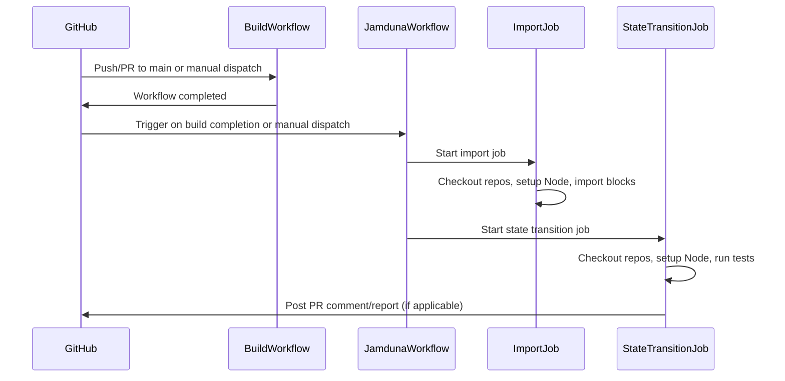
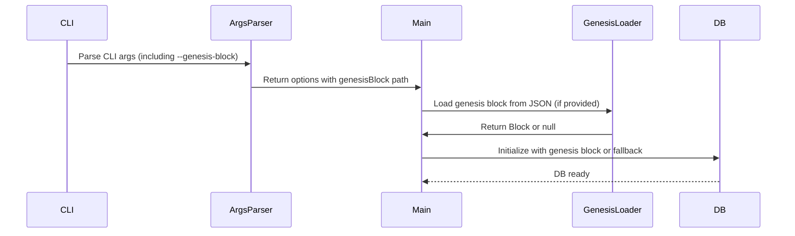

# Run jamduna tests on CI

## Pull Request by @tomusdrw

Closes #315
Related: #314 (still needs more investigation into errors we're getting)

1. Attempts to run `state_transtions` as standalone tests (needs block verifier disabled, because we don't have parent blocks)
2. Attempts to import blocks from `safrole` and `fallback`.


Improvements for the future:
1. Avoid duplicating jamduna ref in the github actions file.
2. Better assertion on block imports (currently matching on the CLI output).
3. `verifySeal` is taking ~200ms for each block (sic!). We need to make this faster - related #313 


## Comment by @coderabbitai[bot]

<!-- This is an auto-generated comment: summarize by coderabbit.ai -->
<!-- This is an auto-generated comment: skip review by coderabbit.ai -->

> [!IMPORTANT]
> ## Review skipped
> 
> Auto incremental reviews are disabled on this repository.
> 
> Please check the settings in the CodeRabbit UI or the `.coderabbit.yaml` file in this repository. To trigger a single review, invoke the `@coderabbitai review` command.
> 
> You can disable this status message by setting the `reviews.review_status` to `false` in the CodeRabbit configuration file.

<!-- end of auto-generated comment: skip review by coderabbit.ai -->
<!-- walkthrough_start -->

<details>
<summary>📝 Walkthrough</summary>

## Summary by CodeRabbit

- **New Features**
  - Added support for loading a genesis block from a JSON file via a new CLI option.
  - Introduced new workflows for automated build, linting, and testing.
  - Added a workflow to run and report on "jamduna" test vectors.

- **Improvements**
  - Enhanced error handling and messaging for CLI argument parsing.
  - Improved test runner to support filtering and skipping tests.
  - Updated test reporting to display suite-specific summaries.
  - Refined block import logic to ensure serialized processing and added performance instrumentation.

- **Bug Fixes**
  - Improved error handling in ticket verification for known runtime errors.

- **Chores**
  - Updated ignore patterns for files and directories.
  - Adjusted workflow triggers for better CI/CD integration.
  - Removed legacy workflow files and updated script commands for clarity.

- **Documentation**
  - Updated CLI help text and workflow names for clarity.
## Walkthrough

This update restructures GitHub Actions workflows by splitting CI tasks into separate files for building, linting, and testing, and introduces new workflows for running JAM test vectors, including the "jamduna" suite. The codebase adds support for loading a genesis block from JSON, enhances test runner filtering, improves error handling and block verification logic, and serializes block import operations.

## Changes

| File(s)                                                                                       | Change Summary                                                                                                                                                                                                                                                                                                                                                                                                                                                                                                                                                                                                                      |
|-----------------------------------------------------------------------------------------------|-----------------------------------------------------------------------------------------------------------------------------------------------------------------------------------------------------------------------------------------------------------------------------------------------------------------------------------------------------------------------------------------------------------------------------------------------------------------------------------------------------------------------------------------------------------------------------------------------------------------------------------|
| .github/workflows/benchmarks.yml, .github/workflows/vectors-w3f.yml                           | Updated workflow triggers: benchmarks and w3f vectors now run on manual dispatch and after build workflow completion; removed scheduled and pull request triggers. Renamed "Run JAM test vectors" to "w3f test vectors".                                                                                                 |
| .github/workflows/node.js.yml                                                                 | Removed Node.js CI workflow that previously ran build, QA, and tests on pushes/PRs to main.                                                                                                                                                                                                                                                                                                                                                                                                                                                                                                 |
| .github/workflows/src-build.yml, .github/workflows/src-lint.yml, .github/workflows/src-test.yml | Added new workflows for build, lint, and test, each running on push/PR to main with Node.js 22.x.                                                                                                                                                                                                                                                                                                                                                                                                                                                                                          |
| .github/workflows/vectors-jamduna.yml                                                         | Added new workflow to run "jamduna" test vectors on manual dispatch and after build; includes jobs for importing blocks and state transition testing, with PR comment/reporting logic.                                                                                                                                                                                                                                                                                                                                                              |
| .gitignore, biome.jsonc                                                                       | Added `jamdunavectors` to ignore lists in .gitignore and biome.jsonc.                                                                                                                                                                                                                                                                                                                                                                                                                                                                                                                      |
| bin/jam/args.ts, bin/jam/args.test.ts                                                        | Added support and tests for `--genesis-block` CLI option, updating argument parsing and types.                                                                                                                                                                                                                                                                                                                                                                                                                                                                                            |
| bin/jam/genesis.ts                                                                           | Added `loadGenesisBlock` function to parse and load a genesis block from JSON.                                                                                                                                                                                                                                                                                                                                                                                                                                                                                                            |
| bin/jam/index.ts                                                                             | Improved error handling: on argument parsing failure, prints error and help, then exits with code 1.                                                                                                                                                                                                                                                                                                                                                                                                                                                                                      |
| bin/jam/main.ts                                                                              | Added support for loading genesis block from JSON in database initialization, with fallback to default empty block. Updated types and logic accordingly.                                                                                                                                                                                                                                                                                                                                                                                                                                   |
| bin/test-runner/common.ts, bin/test-runner/jamduna.ts, bin/test-runner/w3f.ts                | Enhanced test runner: added filtering by accepted/ignored patterns, updated argument order, and added skipping logic for tests.                                                                                                                                                                                                                                                                                                                                                                                                                                                           |
| bin/test-runner/index.ts, bin/test-runner/reporter.ts                                        | Reporter class now takes suite name as parameter, used in summary output; instantiation updated.                                                                                                                                                                                                                                                                                                                                                                                                                                                                                          |
| bin/test-runner/jamduna/stateTransition.ts, bin/test-runner/jamduna/stateTransitionFuzzed.ts | State transition tests skip full block verification, use header hash instead; fuzzed tests now check for expected errors per test file.                                                                                                                                                                                                                                                                                                                                                                                                                                                    |
| package.json                                                                                 | Appended `--` to the "start" script to allow argument passthrough.                                                                                                                                                                                                                                                                                                                                                                                                                                                                                                                        |
| packages/core/concurrent/worker.ts                                                           | Made `ConcurrentWorker.run` explicitly async, now awaits internal call.                                                                                                                                                                                                                                                                                                                                                                                                                                                                                                                   |
| packages/jam/safrole/bandersnatch.ts                                                         | Wrapped ticket verification in try-catch; returns fallback results if a specific runtime error occurs.                                                                                                                                                                                                                                                                                                                                                                                                                                                                                    |
| packages/jam/transition/block-verifier.ts                                                    | Improved block verification: added AlreadyImported error, zero-hash constant for genesis, public hashHeader method, and adjusted parent/existence checks for genesis.                                                                                                                                                                                                                                                                                                                                                                                                                     |
| packages/jam/transition/chain-stf.ts                                                         | Exported `stfError`, moved statistics transition call earlier in the method, removed duplicate code.                                                                                                                                                                                                                                                                                                                                                                                                                                                                                      |
| workers/importer/importer.ts                                                                 | Added timing instrumentation for block import steps using console.time/console.timeEnd.                                                                                                                                                                                                                                                                                                                                                                                                                                                                                                   |
| workers/importer/index.ts                                                                    | Changed block import to use a queue and serialize processing, ensuring ordered imports and preventing concurrent execution.                                                                                                                                                                                                                                                                                                                                                                                                                                                               |

## Sequence Diagram(s)





## Poem

> 🐇  
> New workflows hop and test with glee,  
> Genesis blocks from JSON, now easy as can be!  
> Imports queue up in a line,  
> While state transitions run just fine.  
> With filters and hashes, the vectors are checked—  
> CI is swift, and bugs are wrecked!  
> 🥕

</details>

<!-- walkthrough_end -->
<!-- internal state start -->


<!-- DwQgtGAEAqAWCWBnSTIEMB26CuAXA9mAOYCmGJATmriQCaQDG+Ats2bgFyQAOFk+AIwBWJBrngA3EsgEBPRvlqU0AgfFwA6NPEgQAfACgjoCEYDEZyAAUASpETZWaCrKNxU3bABsvkCiQBHbGlcABpIcVwvOkgAIhtsLCE0ZlpEtAiQ5HwsAGEASVDYyAB3NGQHAWZ1Gno5SGxESgiWRtoKEvRkW0gMRwFmgGYATmGULFxYEkgAMS9sADMF2QAZFUQAelxZbhIBihc/Em58RHV8Fw0YKchmbSwifDRfVAJIMhVov0SMeAwiSDJVLpTKIXDIErqBATG5MDDiPr4RrjGhEKjiHKQAAUBQAlDx4LsvH8SFcAMq7BjwBbwBjPLyycLqdC0drSJrIJAOaZmQYARgArOgMPRUP4vNQYm8ucFILy+QAWcIlBAMWBHILwfzIBbYCiTZp/KRg+BEajwTFpaZvSgUC7IMhMRI0fy0DRuWGwTCkTkYBjzJToXA0ZjccEtb4w6YAAzBkoA+rgqBgTTlENHQeHyvZcJhaM8ctaspB6rQkJ8/gCDSWvPgGABrSBSCjU+CUcJnP3TbjOdg1uv15C93r4XDoCTaCUCL5/CIIZBwmgAD00kAAgqz1BaMPTGXPpj1qCGw8hpaGLmPpwOdXbmPvILG0As7dEM3mHwt6QI0A2M4gkRQDDSO6BhwNMSiIAwLZhtu6BeP+/B4MS5A6ngerTPAoZ2lIbDwogXBoBI+DwGW/yQGk3DEnSGJYPgCz3kCaQ7kcCyUI6GFRpAADi6gABLYAI65iNuC45DSRB6uaORMqG0S4QiAIDMGzTlE0+oifwWBXg2KDnvqMgkLIOT0HcuBqpWkC5Cs+SIbgnhhMK9D4DB1QAF4WdW0bNtSshkiQzwZrqfo0cqqrqgwer+PCDIRGg9bSOg3C8PgS6YZKMUAEwAAxZbc8A+EgojGcgux8Np9ZXO42QufArlSVgYokBKtQRjKPL8oMIH6MY4BQGQTn0WgeCEKQ5DojETCsOwXC8PwwiiOIxolvITBKFQqjqFoOjdSYUBVSgQ5YENBDEGQygtZN8lcFQnQOE4hz1KtygbZo2i6GAhg9aYBgaEQUICRsJQXPWCy1iUmwDH6sB3BQg4aLIzBeBwBixKjBgWOu+SnWNkr0HdMPyHRjBev80getMPG4PxglrsJaalMDoP4J0SamqQfBwuJkk0aU2Zqt6dBXFY/gSBajQMuE1ZA7DTOdMmmm3Jg2DPORSA9mZsDhJ4PgasEYKns4pAKfesR3H8xQCMmarhO+GSQVMaTRPQUGYkIghBpAWUKhwCpCvm+WyJVNzYNw+YXWJprc7B/jMPgS3Vtrvj+EEISOfYap0N41otkQ7OHaKKY0Gg9Cs7nlCnjc0sg2D6ALC696TZRJA80T1axAI2D5bQxRV7LHaUq2dI+ITWC9zXFCJAosnN7BJBSHhQfTNqY6tzcbuCZzkfotHJBmymDRQwLbpGOYlhrl4Lr1ae+D3ko/rOFf/D0SQS4nPqMQXDwAlUe88JbmTBgAByhZ3So1iEYCAYAjC/X+gIQGjMwabAwIoUkQhEDw0RsjMB6Mz5Y1GudGI+NnCE3ovzUmiBybkSas3GINIvhlCHNxPiAkhI0QhAg5mCgMBc23piHcbB6CxGAUoDQaDLL5GKBBU05AS432OiwSUXCETYCRL6VEvCsALE/hkYRqCSp2hEGIK4+Qxyl3Zh/LAnhEBTHzl/HWyc9bhlzBQI2Hkbim3uBbK2sBF4MxluPTACtAkAFUO7wmwL/UWdoMDyTTo0GIGRTItiXDmcaRB5BvBoGCdAZo/jZN0aI5AzYziYgyhlDQS5fFgmOL6f02AlDOymA2CySJTE3H8CcM4BBDhPQ7M3Y2Id7yIAHjSGIBSxHFNgpCSYvRuB3jpOZMiHxpx0C1pQLRFBqhkQyP6fyDVC70nqk/KhuwRSOjbEU+AGRowYDmYweA0ZwgTwwL8bZkAgjPHUPIVSkkuzp2gmOLENy7nPPeWgaMuJwjORoruEsncvCkSrDcf8eogIKEDEC25d5QUdy7u9akYBeDSHYBCm2IpIA0h3MPSMrykVFmyQ4dQ0xMV3KybgCFQdUBj04WQBwrouFnGqfCSJWocixKaLgEO4QlCnKUH6eQdwdykHkmS+gL9RB4FgkTXFCK05sqnoq2gOpP7VnGfo/AhjNAnxweuC+50NKZJuHfCUGjsjP1fheD+fBPDTlpL/SIFyjDAPIKAtGBhIHQL+pMAG3LwYbEQIBMAOq3QIyRijNGGM1x4LOuNPGjgCbHLIT6Iwa5egkE6JTamrCNKxopflaY/CYixkTcmjBXgMxegMmQFkDSIzyNMtaG4yaeB2iAogdB1wuUcJZjnPOCsrE2LTonXWxZnGuLIp5PeGZLaYDVMYscShKUJTtpWL469GD0ibcmjMkxqCRmyJxZqqdQnOgiWQKJYr2C+PPfExhST4ApLBGkjJN9hmiB8pAM1TZy6wTKRUqpNBuC1IDNMDOzSyKtPvB0045wekoL6cGCygzqxgapKM+gUHJmYmmeqLFF7FkAmWU7JkByCpkRlf1c5CVGgWWBfMh5qqaVuOmMOyCAKmxXIfHRnF8LaDRhAqfW1l82ERmrM6h+KmiYvzfi1T+Pqf7sH/hQoBID03gPDd9GB0a4Gxs2AmhgYBkKaFTVgjNuDsYELzfdEhxMBbGdLeQCtzCaZ033rWuhDaUhNvs45v4znEYduzAMbtxde1vH7YopzFkNlYeODh7pgdJ3sP8Zwsx5d52NEXe+ZdDjV2Gxnhum40Yt0lm8fuqhR7GGdiIGe92Q8nYPiczer0Y5nkPvvE+7JL7wkiuifJb97tf3oEVqzQDSZJTpIjKCmjkGUGFOgxQEpWA4OVOuNMapSHxh1MDGh+sLS8C5c6bhla+H7D9KI9wXbIixE7YWdCRjO4Vn0By3RjjZy/QXJY3GNjAIwdyqpNx7rUm7lUkeWnZ5tKJtxZaXwD5xJthdD5bu87UFCRjlFtc6Tk8AjgoUza8+ymHU3zU6IF1j8tMevfk5b138/WGfEAA4NpIzMQMs1G2AMbp12cTWyttrnwGZuzTjFqRDDhEyLQAgL5amFUxYbTFT4X629Ci/QZtDnZepsS12o6rIYiJDWg+KzEubNS/k0Vvx1dOGoE3hJflmTZ3NExAu495KauBEcQbFxDW6UPhazuqG7XD0ki66e6Y57G2m7ZcNu9Y2FbVkm2OabkrZufvhAtwSS3EnUGSakjbIHIylChF9vRB2juQBOwhmp4wGLuz+Nd1DTS7sYYe9WbDXSLgvaUARgZn2oO/Z/P93+nxaGf1B8cTjEPpBQ9zDDk5G+EfIB42RPj9y0fvgxx5YsO2T9Z7p5mu1rrVNOtZxpjSHOdNeq/r6hg/qjNBtM9ghZlAj9OLpLiVnGlIGIPaGAIxOkHLiLorh5rmvYPmsQoWiTMWqBPOGWkFrriFgbtOsbgInELAcxPqpAd0ogMUN7hHL7lKDfKCpiIqsrL4GWMMtQGqGnE+PXNWI3NEC3PRG3Mmj3NOoniQJ1hEEDICIIPhA+JhDpm+OSrGLmDQImMmF0tuGjgIKOOqBfhhlgE0F4AsGALAKcC1BjuVjtpRjBqUuUpUpQtGPIReBmOeqVBsswBXNMFoj4MzBZBdrIcyLdtkCPrCJFH2GPs9lwfYCMn6pdMyKvNMC/C6FSg+ECGAExGgBsECGyuQOykcE9gViiHIigQIGWP4FAS4AANxvbhiDJQbvh5I77wR77g4H7VG7LOCMK1hDzkTUAqDlDgRagLQT7VFOH6T9gNj8yzjlQ3gsCSE3xlhLBsTCphwDHhhAqIBPgvgkCKGm6fg+Dfi/j4hH4Ag6J7ZiJoBJRURHI7akatgxD4KCp1rRCIDVHvjeSjIVDYAMBjqIC6gvB6SXjyBNDOAMYUqfzaYLQxCxAABCqc5UxQrS9kkAyECUs4+e+ARAiA4Qn4+Uwm0hgk1I94kJYgMQMx6A/gI4Y4Wi9uIEYED4cYqh62KYW4OQLh7szwCEQRtkj2+WFwkONRh+s+5x2J4w0OzRcOXGop5+iQjC+qjKNAEmGQGQVc7BQEYAdxNIP++qFhHMLAhq7WfeKGFQiG18VC/B0wmA8gRKosqiBq7ABsZcpupBhEwxh2GYmICc3gSc4eqcWIOQMURJ1YPQqAz4cxJGUW+RfJLgkKqswyEoGSqc2o3g4IWsZhy2gW9pwqO21YOp0gKZ42wZNggmIctYxcFJ4gn4Ygok8I9w+JeZDgF8nIgha87suJ8EdJlchBRp9SCUcIZYMKvgtYf02pciREJEWZxsQe3pK6+s/AOcfw5oZEYZd4Gyg4cSHI9Gi+OWUGkpm+E6JicECEle6kVZY4pZTwsiI6xKFAUgmYtk9k427Z6Ed+Z8D+j8jq4EL+j+7+nq3OX+Bmf8AuxmUAgC2ulaeuoWxWnunQEWjuoBLu4BmwFB0BLpbab4tu9AOZUh68shjhgJuxDJKhJAahmAGhbJoa5mEaIBsC8CSFGwKFh2YAJQgwCw8B2CiB+CyBquPmGuxm9JEF+BNahBjavMC4GBtCt4cQCQWAAAUmuAALL3mMVUERixAsWCGpwqUaDFD0llYthLLzzhg5ZSyEElBsS3CKD3G0BcAJwixiyngB6HZXYoYmRKwqxsHqzWx2I+kpxzlrrR4mx7xeK7qaxRH2yZwDYuxJAcljhZQZQcBZSDC9EByLxNClAWUdIShARYVN7MEeVqwcHqi2w4ERBOV56wgsBNwCEmzCEe6yy+KZn6UolIA0D7yam0iwo5Z8E0L0C54JFxB1W1qNH+QDQ+WznhifwRWOwxBjavlKb2r0yflUL3w/nuof7/n6Z85AWBrhqQAADqIlkZGuwOUl0YMlkA8lSl5Bbp6YEY0YGlylt1GYs48mCFdFMFyFt1zFrF6FIuQBkaW4RAyC/g8u9OSunmKB3m6BfmDhVm0iFwOxzx0wDCDQocuMy0PaFkGQmZ7Ahw0YLpKlN6zONwxI2SRMCN/KEW2QfAZRbpFynKQ4m4PMHg2VMQmEAiVyNAMU3BzQ1YL8rVvG2RIQRN/qlwu2/ABoHMElZp1YlN3YR4lA+8U1SY3xkqlJ5llJdwIi1q9+jOS1JNX5q17O61f585AF21AaguhY/11FagGAWRKQGwhs6Csu4IYNnFOaGNPFMN5ClC8pncipJlNwVkNkhsjgfYPYh2zQqNSRnGdQ3ym4bymZh6Q0F8/AMEmI0YjxSAMJ3R9YL1vw4gnyrk9BUm3phd940YqdKZAA8pnSmB6fNEYuuKVfqnSOlajXFnaGkDlRGB8RkiNveFHWpAoAcAtDFCTLQC8VXRADnYgEmvnRmJdHmLFuQBnTRIzfeapJQE4kPSqN2tGHPWdIKovQOAALwaAbDz1n0NiFJskHQ8A720CSztL5kXwWQj0JIuIR14QuW9lV3z150DgZjJSlQE4Sr3WxAaBX1X033lT30YCxBn61j/BnCBjVg6HNA13p3QoiRXDAKS1TDS1+YRgC0mgbrFifzDl+qa3TDa3C4nx62LX7zLXqZrXvCc66Y87f6/7AUQLriYUPhAP51cB9A+CgN2jgP16eRkheiuj11sJN2Wpim5h/LV3iFp24CKMiSV25mpxwXRj22O3MDO0uKu0hAaDgjya23fTGNAhmNYlWP4QIHuZcXe2oFq6kIy2UKh0UkSSxJf18Cx0rjx0RgOBJQXgZna54NZ3H0oRIC30F2hS0jqgdXHpP0zLpaXVki12ALI1KJ1lvLz0TEVTu6xMNTIC0B1i/0tTok3BTBeCfbLhji2xCPLXRhyO9i0A6Npg3o7CWnIDZ0n252iOpIWQAA+vQFdvi0YX9XTCjDdd1QUoWYlaNYcZdX9c4qAmZFT9gmE+UzgMUy15DxsR9HmgqHpDd4QJxQykZ4o5od56suh0g+A8wPMNDDAvi/g6tMiG9b+zdY4yCnQPZEEgDIziAwDv4I6zku93yqDWJJEg6iRqUFDAIwzCTd1YDcLBDN8WDfAnz5tton8U9yEAIqNJ181DOLDstz+xtmmptXO5tW1P+/Ou1UAG4va2L+o8gGL0gozA4XAQGkz0zEjT+KLG1EQAzD4CzdAvTjd3eRjfwJjjjrt6YlFouwB9jTt89zjHtbjXtKunjvFPjWBqGKCPajCmZKzPM0YZZtAXEELULBdc4Oeo1jCsluT+TcFK5y2f088mTYVX9nIDk74cIzY4YzIcWxR0YzryjC0DQSOcznRJAMwt4sl/4GAGYOZTW5UabLAGbD9QTXCPCZJg93Y2ESLpuuQXofwFIogbu+0NrsEPV8knhnDgtx+9rjrmLgUiQoWKTnB9rtiwbfrELOYiivrnreTRRy2nTxF8bLdnLrJVKEsukOmxqfAnkcbUruwequb+d+bzAhbWbT90dfAw43dig3xZdETOm2zyA1r/bg5XyIEzDj+bD35JtnDkremvOrLO1ACUAMwz7sEqWdAXAdrl5Pb/LkL+dWIpGXANb9w9bDAWs1AsAQrrM/wuIXAO7r12rpjur1jkAkAe1+QgJTNvaOWsbS9u7lpSheb6bmboDKbfABHyrDjxH6YtjWrnHTtfwSglS7trjmMSBHj0N6upr9JxLfApLFkhLOW4dgTnRFkFLElbo1g9lqia7RJyb0da45jw2/gnQgSsnr9FbmJVAd4vAcWUoDTTUn2bA46aApA6OJAYAkwJnxJBwFwuLJQTIY4tnf9/NvnfAznmxbntxkUSIIoFkgWqJopBoliBle90wjTTn7Irngz4w7h9UKsSJeAgmlKsKAtaXMLvxuknN6U8gO2ZX6K0wfIW9NpDpFKeoUtnDGqPMvNF7Z7SOz5/gvi1EnB5U4JfAzW9wGYMc9wh+h8pMx8TDb5+trDhtK1bODLP7Ztf7vDbL1tIavHRghHGwe8eronWa4nRrkn3jsNZriss4GuKIPdN7XxkT+oY3KJl52N5KfwW4Jd+Jqx34ndTeGQJTo3073rRus4qWK74rHbaLkAJTjJ0w4PVwWunQezfLgqzrVgGHL1VHZdnk8rd12we71Wz9c4do2ARA6o1Ye8bXwUYHShP3xdxIpdAAIn0YDzscYiyYGI4UXVcqzyQBz7mFz2jrwRa4raGE4jfPa2O5i6UxSlJXZXHFW4G4m9jaVRl80M21nd206/nfkAsMLKrw0m7kbyOAj+O6N884/clKLL2tQ598uZOKKcyPsc0YcY2G8FBP5MbBkDg2OLvGGPIKD/nY3jMmZ9L/IFMMXCpOSsHwTkkQZWcAwBOvSSU7Hw7q8FMFgGtJIJJeGaTZeZ/oH1bwrwg2duX7B4r6gI6CgvQA0SmLvezfCKtwDwMXBDkOS03tWIj8RWnEj34PgKOJAJ2j4pACsJiX9GRKgOB1eYJ51Yqfa191hS2FOS2dMGHwOL4jaQ5R9yOa62OL7xjQH5oyme8NH9X08aN/28ZCu7Co1JRD+GWw+1wgOduCrCv2RGwGQkgMwI1W1za8+AuvLAFB2LgwcsehvY3pWzN6/w6QSGbwJKHbbf9Ti5KYcjPwBADVt+OkX1hFjfZLcaWsPdht+20xbceGgFK2iBUEZcsH4bAeuJjwFYNgcekwLDgZQBBTNxG7aWHmQKZblBZAfoenqs356/cheIvfok0ErpKsHaDjE7tY3dAcshGT7Bnnr2g4G8BwRvE3g7zoAIdKQSHWthgFQ7hARGA4FgZh3GZkROB3pXDpAGdaQArBYrDjjIKdpyD1WB3AwMYzZRgBdSGwS6DkFO4cUDWyuQhMa19qYF6SE3P4H2xUEGFpE1AdCGsxOp9ofixwVpjbg/45ACuDdFWFHSiz1xBAKja/D+CAhhg6AhFRwsDURpyYLBpxA4GgFkDSlyUmDCgA7iJi5D6BlhbMMXCECNAWomSOKDGGZ6C8Zg9aO6gMA2Qxg6aFRWQNAHwBkg6QWbXxIp0/hKAXQWyNTmFHvLU0tsk8WOhgBJh916gdCF0JfjnJc8nIUYdKpmWjDFDUhZQtOBUJBr3D1YyRWQmyghCmF0q6wN5ngAVqTAqmN8ZBGOFBYMcfMnkW4aUOqGVBhWaDCkvQ2cDxQryAwewHdiSirI9UxYUyGCStJyFKhroVjspAoBHRKSL8fvGqj/jih5AvrfRtkjJpjgdsGQYcrcCy6kBUepVbQm8z2QwtpGDJUwt4FoBkhUR2bLoe01W7RhoAIQNcCKBkpjR+mpPclJAzeDRh9ikgzGmX1epEoo6JACUWCDdxs89QpwoPkuC67bhJYmIhETEGvzWIkQCKQUYSDfCUltsTeaMLLk2iIAhR4TVEfuGYApMvg+LZAKChBp3Bh4viOCpBEwCY5CWqNEOBsyvLxI5CAvZ4CMJeKF1qk5ZImPz2THSA3cClP4E71zir8jgpAFJI0Gy7vdbeWVF/rEmm6zh+2GnKlu+RUyft6Wb+RltwwtoAcqBAjEDjEP2bA14hlJGMbjC4BkdSONwxAAIJ/ygC7uGALELqVkIyjKAwARIPWGBYYA9AAAbQAC60qIYtMNmHzDMAbAysCxizGyEYRRAbcbiAzCjjIAgAJMJSOBgMcfwMEHTi94c4n4OXC4CLiKAy4jAKuOZjrjtxLGUQWeOPH/BgJqscogVgPELDwJRAKFEswAD8XAAAN7oAUhkIlCTUO3GjE8RdAbCReO3GQAAAvteIEbQBpWQ42oCOKfEPgSe0wHUbgClG0AfxGYOOmclyozJMy3LbYLRLHHWj+Rdo7gFwA5HRBMA0YdwZ4JCDeDPxFADYIJxfgBC3MYndxpdwLRScbu9JRopgGLo1VPINgPLO/AoDL0JQ46NZrHEWJtgF+foFDMKH8a1MZo2ncWHuHOpGSXQwohcP4Axo0ZMM7QmhIdnCAdwgWXuYETWSAxq1LRzohUtqPwAyVWO46BJIdAcnzZ3cD3J8KxGrJj9Ssb9D/Ox19CiDao6Ik4G1RZ6BluE8wc5LP0jbwglaKsIfp/AGBehbSZUAYhcKGSB0RMJACyM8lxZENmgfFWHouBfAUowY4QWTmPzzBksoUBLTErQwsoMMGxy3WlkbXW6tjNuTLbbpQL/x7VcgaYVWhUQvQ6xqJEHKTNrkMl5SsQ14+8WdM6AXTPUFABDp1NmEyVrpTgrYDJJ8GKThOPHQAnbWVZeCfBaFEToENUmGsQhV3XzH7Vu79ZYekQ09tONRqWTrKEYB7s0Idzvg+gzAfYMcmU4OkhYzkxALp3pF8xL0XE9UNGA/EvJy44QWIITVuqxAtYo6dkFoBcQSANARM2kCQCxAZRcQ14/zigDClHSBs1+KmWNFFLJRfirMogOzM5lAQeZsZOmSkAyIqVGZ/zNMNeNCgWVowFTO6nP1oiAtoi4GZYLxghG1Byh8taoccPLizMzZ9w5wFQHkB0iKgMRbUqnGogkBHgLYBKNKFsm9lBMnkS2Q6MdktU5yHVN2dkm2Hvgph3SC5GQyXD94leRfJeIkC3qpYdQ+UE4WREJbLUdSck8YERGoimilEL4MlqUE2E3UKiQ4SkpLPZCCxdahAj9u3y/YbdeB7Yllnw12pC4NWANDwQDM+lySTGGReNMRWgDqEV2ykhXEEMho+1NJ0M+kk9COCxx44Nwf4r4FG4fEl+sEC7JjSagHMdwxsXgvSHuqbzKAGgAes6yxDlQAAam2BKDXSGiWYcdHWC5oxAJp8nf4DzzTEv1BZU8eyD7Ic5x85O5QdUANVv5JtT5FADQOP14ijVKAV8/OrfPLQPzQ8O9CuKgHH6w8h+zJcipolA7+Cq+E07DOpGXImpkUA/HBTD2TLp1UAJ0uMelWjDULcAB47DkQECifw8uhGRrIkTC7MiXObnEaumPojRgUeF4nyG7j2lTQ/6q1CDLempIzlN5RczEKgHdGEhdgV5ekF7n/BPoS4SZWUhHz5GXhw+84ArAQIWpNzb4Lc9aW3M/wdzduxmbuVJP7lghZJ1M+SS6RHmSgx5ZFFdiB1cil03QIMlSedzUkQyNJ13eeavPwVgDnkZIUeePJoh+KAlnkyylZLLp94Lgb8RRBNJJIqFYIH8xSG1Iqr0pqSRuRtF/KLhjU158gAeviVG7X5IF58ygD5DjYWcGuI4W6KiNQg6xFFRyd8Eti8jNLRkUCmBXApMkRhBAuYepulzGWTTrE73EjBQoSXbhUedcZoG4QuBbIY82C5ZdRmim4A2KlCmiOL0qo3ZB8zZe8PqjgqiUsRVWDAPIAAklAsAuSt+bwo7oJQk8fzKHqVWjAvLaAAAUTC53U7gSUSsMYkGjPLX4UJNVLwtDKxcf51YacTvXGJyLLluyrAEwpWwZx0FDoKFaSRhV2gKAoxTfmVR8U8xEgfymKA4BSF0A3e1JV3pcssaWQcgxSJqHuCJLIIf20K94LCqqbiESQwOMhSUraVIrEpKKoermXRV/yLSXxFIeOmqUGLMMsndPlIWAFCC2E4QR8GGWiCArCV5QzYtqpIB+Rnguqi4GjjoY9oy6cICKWIAnYihnAZYAJTysJVHBGyxlIVVyvxXOr7QyoKgKCrIjhzvVepMFtGyIoLBTV4ygoQtAhDA8koUjFsNkt4VD4jUszP5RGruplhQsaBEFS7ONl+orlZSqLCtPSrWqDpLUIhe/VTJL5fUZEIlFSHSoThiQYcLVM/F4WtJJoCUHLLqH8WEIllZK/BjQIf4AkN2GVSkvP3CYhx72BoEtTLRYzXZeMzzdhSAMLVsBOG62AdkGoa6ND6AmqfHFSOiWbtXVF/ApWYupYWKWcLY+mL+U2kUDLaO04DtEr7EHyEhdCyDrEviX9qcgSSnQWyj2m1T4QXAOJV4vRXfqf58YZ5vBOukPjGFiQIDTQG8UslEl2AHtbQCxC/qcgpUwDR+sQ3bhQNZosEGYMg1SDpJLioGcrPSCeL4NIG5DQEucaSS/pdjZxbgFcVjQNgxCl0JPPBoXcwlaBOeeEKaz3TjJpk1SAKjLWfwkZVlcjMkJKGtNSq/khgTFMARRZs2mwlRd0iSnLYO53k6phgBii8TCs+0eTYaE8JYB4kBcKuiVyF4Zh6BphK8hFDBAsAipHU6GqiVKDr82qsPMMUmH8gADIAqHQeLuDaWMk/UF4uIFdSepVye42YSsX3QZHkQBBKQELawqP7/0wWnkRTcpqbDPBggTyStRZGmVQ0C0rm4FkcGLiVhIOFgSwAABJUJkwJABzM6lKa2AJEiLZQUgAwMNAqYypcckRUAZoS4WyuW1o63QMJa+LA/n6k/jDS3mo0zhOpyPhLSiBzYtaVerbG2L/2ncoDsysLgTxDpZwfserWmCvqHwpanbd0iukZhoNJ2tWhcCxBabRqAZYEo1qixEbu898cyW5LynEamNLGygGxvclnzrGTih2oDMHkaVONntYIV5nCVQz+N0wC4K0MGg/022T9RKVeU3STd1V+SpLCQG7SIAygaIzTsLDngOU12R8nWKjXhliyaZJBFIGylVlMy6wLMw2LLKojczeZmslHUjkWXsCHwSs5gHToZlvh22TQfsilL7DvgJeTgEUGvUtJI7WuDs+oV0EuUIAWhqyngp6AFhtLYZqASnfOIZ1SzmdHM1nQrNpnC0wQqsjnT2HHT4kV60u1zXjL/oK7vkwuoqOSgd1pCS45CnndGD50C7ItQu5XVqE06EMxtg0t4J83Gm8KClM0kudNtlhwjryTQMvA3PMUflm5l65Wqts2rrb7F/+fbgxr44sA9EOQBgPqzBmQ7CtvGiJbDph2WlWQ7bGORPkybJFed9MquRsAABUyDWHnSOORwVnmnIfCQnUuUj8vANsBFugxRadsAQlswNrKuKpDNYgbBXAJ3uQaarfdItW6qvrPxKF24joaGAiM2Ad6O9GwQrivq72NtsCJ01JfcXbY+7qaGgeWt3p9xRxPSN8UkXZO2H24+aTWNvZQQzCN7DgvrWudbs/kp6z1aeyxRnrdQbT25OewDg4ptoF6jAPYBsNl0QZl6Ql4MqHVXtr38UNdpMG/Z8RNhxh9QxQMTGTm7yeRUD9YdA2ggfpwV6glxWVJr2qbfxwIIC7EOcwhQex+a5KAarbtNx0ZSDY4ZipAAAACDE/YC4BMaX65+zNWeK/CojqAqVcQ5onwbGqCH1ZKYcfWDC+6PaBATQFOMKnd1mlkRVupoJ7sp7U9FVD2AYPltqkUAiULUbMLrMxpYo+poemWlgtJxhhza6gAyM1ItAXstacfBbeerpbLbM9sBtbTtwQMCNCGYe9/Vw1iPbTgKAAcjW6v40w1RB7SQecS4ByDvh4/vqXfChaNRP4Wg6yPoOnsJNaS4+MgYMA0HsumwJgP4F8El6wi8ID6gDpcagysDFe2edXoAQRDnk1m5uLZqoNNY/1EUcevCEOqwxKAwm8yXNvm5Jy7wdsScbAGiR2kbNigI4L8017RgTe1QJoMAGgCGS3VegAA3uKiDyB6gPzPUJjlHyVrjkMGjAPkEcNUpxeciI6BOKhg7HkQextVEodpAqGFUFo8mQ+BfEMBCKtzG4WUHUAelOIsMpUc8k+PJEAoW9ZGcQdp4TH9j6WLwGUAaEHGnjy2bUG8ykD0Bkopxy0msovaInD5NwOzkSJyG3hCoTyDDj/sCSPGiR+JFkykRpOFQoJE9QOIpggNNj09URmAzYuz1xGuxe1BSvibxhxCDt6zYcQ+GeS3a6BshaADj2s6IAbBJxwqOccuMplrjr2syUMxmNdHcACx+KOMoqNoGfQHR9o3CFmNRQV9VcXoxduhP/Gf8Wp9obqf1MpBDTXAY02cYuOVqLT93K0w+BtNzG7TwMJY4q2aMum2jJADo36FtM9GoFgOxo2mekAqsDV2xDYN+DOSHYD5e6IJVPPL0zzQhfGkY01gHrQBaQ8UEjojOzA4nrJEYEoH6objHylR5ZtaIgCrM+JvwGsa+UMpmFtnm4ldDIEmFkBgBhu6oSvkTttIuSRVj6mOTzUZP2dpgvSnmJivfAgr1Fv89LMSJDlExG1JEI5EwonTAIAuKAElaie2PMxkppI1IcXKPkaxFe3JIMjcAmkRcyxdfJcD+DuO86ZK4gNgBGq4CJBvJ/MFZMgx54pbA17ywLqSaJHJSndxye8wYrgi+BxADYZuMgBhiIildRoT5I33JSl07Qb8+EFIxj4gKt8WKxfPnjIBEAZkA1P4MiSIvtmJ0MwbRPcv6l8BPzSzNpRNMahedAJW9B7le17oJRtMyhoPlHqmnZZtEkAR5RiudCYQeFLqyCB8BbD4AGdDvTXh7y95HqaFhcUascjAauclyMeMS5vXAONimcUB6U8cllPMt4DCp0CjfCSNDJVT6EGUykblNpGLk1RRFY+sGUthlgrZ4iyRxrFhZe+yKSMntufWDd3BhZzYA4yOXbgyz+dMAI0prNcbQlOBrxngYcLOspzsVtsOMre0QhswZAA4VFMj6lUJpDEh8OfG02yAKOG1YmuMEzWKID6R0WvkOC8A9XE9fYArR3yaBsjS1ukh8AAC1/lNgWuvGF4hrgyQvEKbscG1CGY3ktF/ADECz7NBMFXdBi9ez7rSg5UlZcttf1QCV9PjVdC+XR2BNtLyo6R5AKdeAXzKaCoYX4WqiOZ7gSqt2NZuOrPDVdua8gXk0dGeWwqSVo3OfhNdGryAxitQXfr2GFSjdTm7EYmKIEbB1GUZbwVRZ9kPOwQALCtT03MvVDh5OSy11a+tc2vbWMwWIHAfWFjKaLIQZEdm2YZ2AiatRwqXG38gl26X7AtYY/uct8TQXzsEtrLU2puLZgUIdTXnsizPZ9hhbaKMG28DyOgoQcOQC5o9fzrp9V5i5XwD9Zpt/y8Ait0i3HDflHM6rfaccn1SKgA3jYzIO9BodR4KHMhw8G2HJvW3AmHwoyoBSkohv+Wqqvw9zr83vAW3MFRMEHgXy0j51T1rlg2u5eyPRGvLW0u9fwz2qcsYguNLGcyOxnNBow3V1G31bNrn1IAAoAa7RwHA1X7iFACNTY0UG9oeJgd5U8HZAWwKgFCCwVrYMQV3ybBhk35pRN2DnH0VvEZixQA3GxAfrsQLcRaZ95xmG7DYJu8MpsYFnKjLRlVnlZyC+CDBGpA5eDunncUGzwx/AzGDBDhqwu0Q1ZqsdICnU5iGQWzhOEVILXhUF5mI87H2mLW4tnM6nhBf8CcKWoRmglq1VS2a91seJMiCvS/lIsq6tdDAMhyiGMArTX1+ieivGOTBFAH18PsnzyR+oB0Ca1nn0qaGwhBzN8F0fOA5l5KTQafKxjg9HX0M7bO67gGUBaHhAStdYD0/lqmhlgautcdXYMyJxdhHKn6rAGDffDjDEadzQ1aSpw0EL6SFEa4i1FG7q4LWqKvfjp2+RojumKJSUOx04hB3UaMcdh5jes4BSSo5PJUXVvQTBbGHrtFh0lbuZsA51AYPwhLZth4BTCJjoTuNJXAp9aQc6xzWRHY3SkJwhzFZFGX0iCZE+EJy7Epx+KOAkB3XJoeoVYh8AnHRFh83iw66EsISqlkUGXKfv1zFuqeyUxnY4bZ3b1nY+9WGtbuY7MQSQ31m/ZbAf3zWByb+78d/uibdJyMMcdGBdEUJSOy5/aTmDvsuqa7wAAANKCc11/UZAHEumcXAFnIocILqqWcigVnByiNfPdk5L29AWIZNVwA2c/zlbp0iNWaYvjABdVegfEOfT0CQB0JHW0iXRIADUbc0TVM4jWQBZnFznZ0aj837OwuFzrZwcGBd7O1nc92IEc+XtYgvnpHM55AAhfIuy01SGypABueVr7nBwPQKEC+dPOXnbzmBh8+Gf0aw01Fb04dgUmAlft6N3o5gYhoX3IZfFShOjbsFB2CtVd4yRg5E2o0hoRAeSK1fChphORVjMW2GwlfRApXMF8lP1jNJsBygCQ98EyLUyv7aI9EeKM7q2OAnqoRAtIDzqRuAlyQrswLREH3nksRRvaZwPCvvAbyhlW8zEDvKBSvWQGsZRZYogPt4LexGxU+769JRDIB+akQXrVAocmRKA8UchzzBAPbrb4nPTvn2aZQZ0iBRoSk34QH55Jd6xcpG833UjSRB+72bhTwDMIn3FEdoUfrI9TirE+pg0i1Qwx71zS0Om66PebSm2+BZYkVm4NDxUzaK2VMLbQTwHWSbLiczI1VzHGmvbbam9UcI5AYvUeXr1cB+UztMcWNHaXmwJl/JO+ln26zbL6HRy9u6mv72BS8bT/nKcv2bOzM0A4xgXxXZwnikcPhzToCvyea33M5LKnYDHNiiKcYID/LDcl0Yg8biyJZKagVKbLCdxk/ycBKeX73o3Hc/IBDiYhyi3UsMEFONsJ6StweAuD/fwo6ZKwAARWCDBA3cpaMSVyNBiuc5CiAE3r8UrB49HuV1surygSF5HCwFXdkApxH6fZc8d6Bc7pauD7Vc+y2Ubg7IL62JOVIH2fg+keAniG4FrdgOVkZE8fULvpP+LCmsTUhww5JakTcD/cMdRQlHb0ZpBEwjwSANsaD0snvfo2Sw4heR7XNfcbpVu5AFcFvVrDORUtPs616ownjyQ+llPShxhFg/9ZwV9k2z9SqAi0qPrqcC2/rOQT9sEk6A6fnQGJW/z2y0pI4JagpvIAMBgsKvo4Vo83vusgUCUDPoDHEpWm9J+8AZ8foKr43n+Sm+8hI8YQHQ0fWSxJWvJGUayHp6a8Z/fCsftQ85NaOiMA9C86g4faT0QFTvLTiBVilbf05zsNO87flvA/HN/b1O+G8gEgQbgWlhGq+3ZpRfvEvZfGVYHTFrNOPkJyR2Ac72xp9F2i/wxq8ibjX/akWcA/AaAW6KEMegoJ1oagV6NtA+gGAHvcRXAPGBIiIB4w9lctHQHjAiH3o933qO8Ayh0AAAHE+EGACgAAbCQAADsWUYYAqAYAo/BgaAYYAsAVCo/SifIUn8MAFCjBhgWUPYIMBICo+EfX0KAKD/B9GoofxOmH7QHjD9QEfQAA=== -->

<!-- internal state end -->
<!-- tips_start -->

---


<details>
<summary>🪧 Tips</summary>

### Chat

There are 3 ways to chat with [CodeRabbit](https://coderabbit.ai?utm_source=oss&utm_medium=github&utm_campaign=FluffyLabs/typeberry&utm_content=399):

- Review comments: Directly reply to a review comment made by CodeRabbit. Example:
  - `I pushed a fix in commit <commit_id>, please review it.`
  - `Explain this complex logic.`
  - `Open a follow-up GitHub issue for this discussion.`
- Files and specific lines of code (under the "Files changed" tab): Tag `@coderabbitai` in a new review comment at the desired location with your query. Examples:
  - `@coderabbitai explain this code block.`
  -	`@coderabbitai modularize this function.`
- PR comments: Tag `@coderabbitai` in a new PR comment to ask questions about the PR branch. For the best results, please provide a very specific query, as very limited context is provided in this mode. Examples:
  - `@coderabbitai gather interesting stats about this repository and render them as a table. Additionally, render a pie chart showing the language distribution in the codebase.`
  - `@coderabbitai read src/utils.ts and explain its main purpose.`
  - `@coderabbitai read the files in the src/scheduler package and generate a class diagram using mermaid and a README in the markdown format.`
  - `@coderabbitai help me debug CodeRabbit configuration file.`

### Support

Need help? Create a ticket on our [support page](https://www.coderabbit.ai/contact-us/support) for assistance with any issues or questions.

Note: Be mindful of the bot's finite context window. It's strongly recommended to break down tasks such as reading entire modules into smaller chunks. For a focused discussion, use review comments to chat about specific files and their changes, instead of using the PR comments.

### CodeRabbit Commands (Invoked using PR comments)

- `@coderabbitai pause` to pause the reviews on a PR.
- `@coderabbitai resume` to resume the paused reviews.
- `@coderabbitai review` to trigger an incremental review. This is useful when automatic reviews are disabled for the repository.
- `@coderabbitai full review` to do a full review from scratch and review all the files again.
- `@coderabbitai summary` to regenerate the summary of the PR.
- `@coderabbitai generate sequence diagram` to generate a sequence diagram of the changes in this PR.
- `@coderabbitai resolve` resolve all the CodeRabbit review comments.
- `@coderabbitai configuration` to show the current CodeRabbit configuration for the repository.
- `@coderabbitai help` to get help.

### Other keywords and placeholders

- Add `@coderabbitai ignore` anywhere in the PR description to prevent this PR from being reviewed.
- Add `@coderabbitai summary` to generate the high-level summary at a specific location in the PR description.
- Add `@coderabbitai` anywhere in the PR title to generate the title automatically.

### Documentation and Community

- Visit our [Documentation](https://docs.coderabbit.ai) for detailed information on how to use CodeRabbit.
- Join our [Discord Community](http://discord.gg/coderabbit) to get help, request features, and share feedback.
- Follow us on [X/Twitter](https://twitter.com/coderabbitai) for updates and announcements.

</details>

<!-- tips_end -->


## Comment by @github-actions[bot]


<details>
<summary>View all</summary>

|  Name  |  Status  | |
|--------|----------|-|
| Trie test 0 | ✅ | | 
| Trie test 1 | ✅ | | 
| Trie test 2 | ✅ | | 
| Trie test 3 | ✅ | | 
| Trie test 4 | ✅ | | 
| Trie test 5 | ✅ | | 
| Trie test 6 | ✅ | | 
| Trie test 7 | ✅ | | 
| Trie test 8 | ✅ | | 
| Trie test 9 | ✅ | | 
| Trie test 10 | ✅ | | 
| Trie test 10 | ✅ | | 
| Trie test 10 | ✅ | | 
| jamtestvectors/statistics/tiny/stats_with_empty_extrinsic-1.json | ✅ | | 
| jamtestvectors/statistics/tiny/stats_with_epoch_change-1.json | ✅ | | 
| jamtestvectors/statistics/tiny/stats_with_some_extrinsic-1.json | ✅ | | 
| jamtestvectors/statistics/tiny/stats_with_some_extrinsic-1.json | ✅ | | 
| jamtestvectors/statistics/full/stats_with_empty_extrinsic-1.json | ✅ | | 
| jamtestvectors/statistics/full/stats_with_epoch_change-1.json | ✅ | | 
| jamtestvectors/statistics/full/stats_with_some_extrinsic-1.json | ✅ | | 
| jamtestvectors/statistics/full/stats_with_some_extrinsic-1.json | ✅ | | 
| should correctly shuffle input of length 0 | ✅ | | 
| should correctly shuffle input of length 8 | ✅ | | 
| should correctly shuffle input of length 16 | ✅ | | 
| should correctly shuffle input of length 20 | ✅ | | 
| should correctly shuffle input of length 50 | ✅ | | 
| should correctly shuffle input of length 100 | ✅ | | 
| should correctly shuffle input of length 200 | ✅ | | 
| should correctly shuffle input of length 341 | ✅ | | 
| should correctly shuffle input of length 341 | ✅ | | 
| should correctly shuffle input of length 341 | ✅ | | 
| jamtestvectors/safrole/tiny/enact-epoch-change-with-no-tickets-1.json | ✅ | | 
| jamtestvectors/safrole/tiny/enact-epoch-change-with-no-tickets-2.json | ✅ | | 
| jamtestvectors/safrole/tiny/enact-epoch-change-with-no-tickets-3.json | ✅ | | 
| jamtestvectors/safrole/tiny/enact-epoch-change-with-no-tickets-4.json | ✅ | | 
| jamtestvectors/safrole/tiny/enact-epoch-change-with-padding-1.json | ✅ | | 
| jamtestvectors/safrole/tiny/publish-tickets-no-mark-1.json | ✅ | | 
| jamtestvectors/safrole/tiny/publish-tickets-no-mark-2.json | ✅ | | 
| jamtestvectors/safrole/tiny/publish-tickets-no-mark-3.json | ✅ | | 
| jamtestvectors/safrole/tiny/publish-tickets-no-mark-4.json | ✅ | | 
| jamtestvectors/safrole/tiny/publish-tickets-no-mark-5.json | ✅ | | 
| jamtestvectors/safrole/tiny/publish-tickets-no-mark-6.json | ✅ | | 
| jamtestvectors/safrole/tiny/publish-tickets-no-mark-7.json | ✅ | | 
| jamtestvectors/safrole/tiny/publish-tickets-no-mark-8.json | ✅ | | 
| jamtestvectors/safrole/tiny/publish-tickets-no-mark-9.json | ✅ | | 
| jamtestvectors/safrole/tiny/publish-tickets-with-mark-1.json | ✅ | | 
| jamtestvectors/safrole/tiny/publish-tickets-with-mark-2.json | ✅ | | 
| jamtestvectors/safrole/tiny/publish-tickets-with-mark-3.json | ✅ | | 
| jamtestvectors/safrole/tiny/publish-tickets-with-mark-4.json | ✅ | | 
| jamtestvectors/safrole/tiny/publish-tickets-with-mark-5.json | ✅ | | 
| jamtestvectors/safrole/tiny/skip-epoch-tail-1.json | ✅ | | 
| jamtestvectors/safrole/tiny/skip-epochs-1.json | ✅ | | 
| jamtestvectors/safrole/full/enact-epoch-change-with-no-tickets-1.json | ✅ | | 
| jamtestvectors/safrole/full/enact-epoch-change-with-no-tickets-2.json | ✅ | | 
| jamtestvectors/safrole/full/enact-epoch-change-with-no-tickets-3.json | ✅ | | 
| jamtestvectors/safrole/full/enact-epoch-change-with-no-tickets-4.json | ✅ | | 
| jamtestvectors/safrole/full/enact-epoch-change-with-padding-1.json | ✅ | | 
| jamtestvectors/safrole/full/publish-tickets-no-mark-1.json | ✅ | | 
| jamtestvectors/safrole/full/publish-tickets-no-mark-2.json | ✅ | | 
| jamtestvectors/safrole/full/publish-tickets-no-mark-3.json | ✅ | | 
| jamtestvectors/safrole/full/publish-tickets-no-mark-4.json | ✅ | | 
| jamtestvectors/safrole/full/publish-tickets-no-mark-5.json | ✅ | | 
| jamtestvectors/safrole/full/publish-tickets-no-mark-6.json | ✅ | | 
| jamtestvectors/safrole/full/publish-tickets-no-mark-7.json | ✅ | | 
| jamtestvectors/safrole/full/publish-tickets-no-mark-8.json | ✅ | | 
| jamtestvectors/safrole/full/publish-tickets-no-mark-9.json | ✅ | | 
| jamtestvectors/safrole/full/publish-tickets-with-mark-1.json | ✅ | | 
| jamtestvectors/safrole/full/publish-tickets-with-mark-2.json | ✅ | | 
| jamtestvectors/safrole/full/publish-tickets-with-mark-3.json | ✅ | | 
| jamtestvectors/safrole/full/publish-tickets-with-mark-4.json | ✅ | | 
| jamtestvectors/safrole/full/publish-tickets-with-mark-5.json | ✅ | | 
| jamtestvectors/safrole/full/skip-epoch-tail-1.json | ✅ | | 
| jamtestvectors/safrole/full/skip-epochs-1.json | ✅ | | 
| jamtestvectors/safrole/full/skip-epochs-1.json | ✅ | | 
| jamtestvectors/reports/tiny/anchor_not_recent-1.json | ✅ | | 
| jamtestvectors/reports/tiny/bad_beefy_mmr-1.json | ✅ | | 
| jamtestvectors/reports/tiny/bad_code_hash-1.json | ✅ | | 
| jamtestvectors/reports/tiny/bad_core_index-1.json | ✅ | | 
| jamtestvectors/reports/tiny/bad_service_id-1.json | ✅ | | 
| jamtestvectors/reports/tiny/bad_signature-1.json | ✅ | | 
| jamtestvectors/reports/tiny/bad_state_root-1.json | ✅ | | 
| jamtestvectors/reports/tiny/bad_validator_index-1.json | ✅ | | 
| jamtestvectors/reports/tiny/big_work_report_output-1.json | ✅ | | 
| jamtestvectors/reports/tiny/core_engaged-1.json | ✅ | | 
| jamtestvectors/reports/tiny/dependency_missing-1.json | ✅ | | 
| jamtestvectors/reports/tiny/duplicate_package_in_recent_history-1.json | ✅ | | 
| jamtestvectors/reports/tiny/duplicated_package_in_report-1.json | ✅ | | 
| jamtestvectors/reports/tiny/future_report_slot-1.json | ✅ | | 
| jamtestvectors/reports/tiny/high_work_report_gas-1.json | ✅ | | 
| jamtestvectors/reports/tiny/many_dependencies-1.json | ✅ | | 
| jamtestvectors/reports/tiny/multiple_reports-1.json | ✅ | | 
| jamtestvectors/reports/tiny/no_enough_guarantees-1.json | ✅ | | 
| jamtestvectors/reports/tiny/not_authorized-1.json | ✅ | | 
| jamtestvectors/reports/tiny/not_authorized-2.json | ✅ | | 
| jamtestvectors/reports/tiny/not_sorted_guarantor-1.json | ✅ | | 
| jamtestvectors/reports/tiny/out_of_order_guarantees-1.json | ✅ | | 
| jamtestvectors/reports/tiny/report_before_last_rotation-1.json | ✅ | | 
| jamtestvectors/reports/tiny/report_curr_rotation-1.json | ✅ | | 
| jamtestvectors/reports/tiny/report_prev_rotation-1.json | ✅ | | 
| jamtestvectors/reports/tiny/reports_with_dependencies-1.json | ✅ | | 
| jamtestvectors/reports/tiny/reports_with_dependencies-2.json | ✅ | | 
| jamtestvectors/reports/tiny/reports_with_dependencies-3.json | ✅ | | 
| jamtestvectors/reports/tiny/reports_with_dependencies-4.json | ✅ | | 
| jamtestvectors/reports/tiny/reports_with_dependencies-5.json | ✅ | | 
| jamtestvectors/reports/tiny/reports_with_dependencies-6.json | ✅ | | 
| jamtestvectors/reports/tiny/segment_root_lookup_invalid-1.json | ✅ | | 
| jamtestvectors/reports/tiny/segment_root_lookup_invalid-2.json | ✅ | | 
| jamtestvectors/reports/tiny/service_item_gas_too_low-1.json | ✅ | | 
| jamtestvectors/reports/tiny/too_big_work_report_output-1.json | ✅ | | 
| jamtestvectors/reports/tiny/too_high_work_report_gas-1.json | ✅ | | 
| jamtestvectors/reports/tiny/too_many_dependencies-1.json | ✅ | | 
| jamtestvectors/reports/tiny/with_avail_assignments-1.json | ✅ | | 
| jamtestvectors/reports/tiny/wrong_assignment-1.json | ✅ | | 
| jamtestvectors/reports/tiny/wrong_assignment-1.json | ✅ | | 
| jamtestvectors/reports/full/anchor_not_recent-1.json | ✅ | | 
| jamtestvectors/reports/full/bad_beefy_mmr-1.json | ✅ | | 
| jamtestvectors/reports/full/bad_code_hash-1.json | ✅ | | 
| jamtestvectors/reports/full/bad_core_index-1.json | ✅ | | 
| jamtestvectors/reports/full/bad_service_id-1.json | ✅ | | 
| jamtestvectors/reports/full/bad_signature-1.json | ✅ | | 
| jamtestvectors/reports/full/bad_state_root-1.json | ✅ | | 
| jamtestvectors/reports/full/bad_validator_index-1.json | ✅ | | 
| jamtestvectors/reports/full/big_work_report_output-1.json | ✅ | | 
| jamtestvectors/reports/full/core_engaged-1.json | ✅ | | 
| jamtestvectors/reports/full/dependency_missing-1.json | ✅ | | 
| jamtestvectors/reports/full/duplicate_package_in_recent_history-1.json | ✅ | | 
| jamtestvectors/reports/full/duplicated_package_in_report-1.json | ✅ | | 
| jamtestvectors/reports/full/future_report_slot-1.json | ✅ | | 
| jamtestvectors/reports/full/high_work_report_gas-1.json | ✅ | | 
| jamtestvectors/reports/full/many_dependencies-1.json | ✅ | | 
| jamtestvectors/reports/full/multiple_reports-1.json | ✅ | | 
| jamtestvectors/reports/full/no_enough_guarantees-1.json | ✅ | | 
| jamtestvectors/reports/full/not_authorized-1.json | ✅ | | 
| jamtestvectors/reports/full/not_authorized-2.json | ✅ | | 
| jamtestvectors/reports/full/not_sorted_guarantor-1.json | ✅ | | 
| jamtestvectors/reports/full/out_of_order_guarantees-1.json | ✅ | | 
| jamtestvectors/reports/full/report_before_last_rotation-1.json | ✅ | | 
| jamtestvectors/reports/full/report_curr_rotation-1.json | ✅ | | 
| jamtestvectors/reports/full/report_prev_rotation-1.json | ✅ | | 
| jamtestvectors/reports/full/reports_with_dependencies-1.json | ✅ | | 
| jamtestvectors/reports/full/reports_with_dependencies-2.json | ✅ | | 
| jamtestvectors/reports/full/reports_with_dependencies-3.json | ✅ | | 
| jamtestvectors/reports/full/reports_with_dependencies-4.json | ✅ | | 
| jamtestvectors/reports/full/reports_with_dependencies-5.json | ✅ | | 
| jamtestvectors/reports/full/reports_with_dependencies-6.json | ✅ | | 
| jamtestvectors/reports/full/segment_root_lookup_invalid-1.json | ✅ | | 
| jamtestvectors/reports/full/segment_root_lookup_invalid-2.json | ✅ | | 
| jamtestvectors/reports/full/service_item_gas_too_low-1.json | ✅ | | 
| jamtestvectors/reports/full/too_big_work_report_output-1.json | ✅ | | 
| jamtestvectors/reports/full/too_high_work_report_gas-1.json | ✅ | | 
| jamtestvectors/reports/full/too_many_dependencies-1.json | ✅ | | 
| jamtestvectors/reports/full/with_avail_assignments-1.json | ✅ | | 
| jamtestvectors/reports/full/wrong_assignment-1.json | ✅ | | 
| jamtestvectors/reports/full/wrong_assignment-1.json | ✅ | | 
| jamtestvectors/pvm/schema.json | ✅ | | 
| jamtestvectors/erasure_coding/schema_ec.json | ✅ | | 
| jamtestvectors/erasure_coding/schema_page_proof.json | ✅ | | 
| jamtestvectors/erasure_coding/schema_segment_ec.json | ✅ | | 
| jamtestvectors/erasure_coding/schema_segment_root.json | ✅ | | 
| jamtestvectors/erasure_coding/schema_segment_root.json | ✅ | | 
| jamtestvectors/pvm/programs/gas_basic_consume_all.json | ✅ | | 
| jamtestvectors/pvm/programs/inst_add_32.json | ✅ | | 
| jamtestvectors/pvm/programs/inst_add_32_with_overflow.json | ✅ | | 
| jamtestvectors/pvm/programs/inst_add_32_with_truncation.json | ✅ | | 
| jamtestvectors/pvm/programs/inst_add_32_with_truncation_and_sign_extension.json | ✅ | | 
| jamtestvectors/pvm/programs/inst_add_64.json | ✅ | | 
| jamtestvectors/pvm/programs/inst_add_64_with_overflow.json | ✅ | | 
| jamtestvectors/pvm/programs/inst_add_imm_32.json | ✅ | | 
| jamtestvectors/pvm/programs/inst_add_imm_32_with_truncation.json | ✅ | | 
| jamtestvectors/pvm/programs/inst_add_imm_32_with_truncation_and_sign_extension.json | ✅ | | 
| jamtestvectors/pvm/programs/inst_add_imm_64.json | ✅ | | 
| jamtestvectors/pvm/programs/inst_and.json | ✅ | | 
| jamtestvectors/pvm/programs/inst_and_imm.json | ✅ | | 
| jamtestvectors/pvm/programs/inst_branch_eq_imm_nok.json | ✅ | | 
| jamtestvectors/pvm/programs/inst_branch_eq_imm_ok.json | ✅ | | 
| jamtestvectors/pvm/programs/inst_branch_eq_nok.json | ✅ | | 
| jamtestvectors/pvm/programs/inst_branch_eq_ok.json | ✅ | | 
| jamtestvectors/pvm/programs/inst_branch_greater_or_equal_signed_imm_nok.json | ✅ | | 
| jamtestvectors/pvm/programs/inst_branch_greater_or_equal_signed_imm_ok.json | ✅ | | 
| jamtestvectors/pvm/programs/inst_branch_greater_or_equal_signed_nok.json | ✅ | | 
| jamtestvectors/pvm/programs/inst_branch_greater_or_equal_signed_ok.json | ✅ | | 
| jamtestvectors/pvm/programs/inst_branch_greater_or_equal_unsigned_imm_nok.json | ✅ | | 
| jamtestvectors/pvm/programs/inst_branch_greater_or_equal_unsigned_imm_ok.json | ✅ | | 
| jamtestvectors/pvm/programs/inst_branch_greater_or_equal_unsigned_nok.json | ✅ | | 
| jamtestvectors/pvm/programs/inst_branch_greater_or_equal_unsigned_ok.json | ✅ | | 
| jamtestvectors/pvm/programs/inst_branch_greater_signed_imm_nok.json | ✅ | | 
| jamtestvectors/pvm/programs/inst_branch_greater_signed_imm_ok.json | ✅ | | 
| jamtestvectors/pvm/programs/inst_branch_greater_unsigned_imm_nok.json | ✅ | | 
| jamtestvectors/pvm/programs/inst_branch_greater_unsigned_imm_ok.json | ✅ | | 
| jamtestvectors/pvm/programs/inst_branch_less_or_equal_signed_imm_nok.json | ✅ | | 
| jamtestvectors/pvm/programs/inst_branch_less_or_equal_signed_imm_ok.json | ✅ | | 
| jamtestvectors/pvm/programs/inst_branch_less_or_equal_unsigned_imm_nok.json | ✅ | | 
| jamtestvectors/pvm/programs/inst_branch_less_or_equal_unsigned_imm_ok.json | ✅ | | 
| jamtestvectors/pvm/programs/inst_branch_less_signed_imm_nok.json | ✅ | | 
| jamtestvectors/pvm/programs/inst_branch_less_signed_imm_ok.json | ✅ | | 
| jamtestvectors/pvm/programs/inst_branch_less_signed_nok.json | ✅ | | 
| jamtestvectors/pvm/programs/inst_branch_less_signed_ok.json | ✅ | | 
| jamtestvectors/pvm/programs/inst_branch_less_unsigned_imm_nok.json | ✅ | | 
| jamtestvectors/pvm/programs/inst_branch_less_unsigned_imm_ok.json | ✅ | | 
| jamtestvectors/pvm/programs/inst_branch_less_unsigned_nok.json | ✅ | | 
| jamtestvectors/pvm/programs/inst_branch_less_unsigned_ok.json | ✅ | | 
| jamtestvectors/pvm/programs/inst_branch_not_eq_imm_nok.json | ✅ | | 
| jamtestvectors/pvm/programs/inst_branch_not_eq_imm_ok.json | ✅ | | 
| jamtestvectors/pvm/programs/inst_branch_not_eq_nok.json | ✅ | | 
| jamtestvectors/pvm/programs/inst_branch_not_eq_ok.json | ✅ | | 
| jamtestvectors/pvm/programs/inst_cmov_if_zero_imm_nok.json | ✅ | | 
| jamtestvectors/pvm/programs/inst_cmov_if_zero_imm_ok.json | ✅ | | 
| jamtestvectors/pvm/programs/inst_cmov_if_zero_nok.json | ✅ | | 
| jamtestvectors/pvm/programs/inst_cmov_if_zero_ok.json | ✅ | | 
| jamtestvectors/pvm/programs/inst_div_signed_32.json | ✅ | | 
| jamtestvectors/pvm/programs/inst_div_signed_32.json | ✅ | | 
| jamtestvectors/pvm/programs/inst_div_signed_32_by_zero.json | ✅ | | 
| jamtestvectors/pvm/programs/inst_div_signed_32_with_overflow.json | ✅ | | 
| jamtestvectors/pvm/programs/inst_div_signed_64.json | ✅ | | 
| jamtestvectors/pvm/programs/inst_div_signed_64_by_zero.json | ✅ | | 
| jamtestvectors/pvm/programs/inst_div_signed_64_with_overflow.json | ✅ | | 
| jamtestvectors/pvm/programs/inst_div_unsigned_32.json | ✅ | | 
| jamtestvectors/pvm/programs/inst_div_unsigned_32_by_zero.json | ✅ | | 
| jamtestvectors/pvm/programs/inst_div_unsigned_32_with_overflow.json | ✅ | | 
| jamtestvectors/pvm/programs/inst_div_unsigned_64.json | ✅ | | 
| jamtestvectors/pvm/programs/inst_div_unsigned_64_by_zero.json | ✅ | | 
| jamtestvectors/pvm/programs/inst_div_unsigned_64_with_overflow.json | ✅ | | 
| jamtestvectors/pvm/programs/inst_fallthrough.json | ✅ | | 
| jamtestvectors/pvm/programs/inst_jump.json | ✅ | | 
| jamtestvectors/pvm/programs/inst_jump_indirect_invalid_djump_to_zero_nok.json | ✅ | | 
| jamtestvectors/pvm/programs/inst_jump_indirect_misaligned_djump_with_offset_nok.json | ✅ | | 
| jamtestvectors/pvm/programs/inst_jump_indirect_misaligned_djump_without_offset_nok.json | ✅ | | 
| jamtestvectors/pvm/programs/inst_jump_indirect_with_offset_ok.json | ✅ | | 
| jamtestvectors/pvm/programs/inst_jump_indirect_without_offset_ok.json | ✅ | | 
| jamtestvectors/pvm/programs/inst_load_i16.json | ✅ | | 
| jamtestvectors/pvm/programs/inst_load_i32.json | ✅ | | 
| jamtestvectors/pvm/programs/inst_load_i8.json | ✅ | | 
| jamtestvectors/pvm/programs/inst_load_imm.json | ✅ | | 
| jamtestvectors/pvm/programs/inst_load_imm_64.json | ✅ | | 
| jamtestvectors/pvm/programs/inst_load_imm_and_jump.json | ✅ | | 
| jamtestvectors/pvm/programs/inst_load_imm_and_jump_indirect_different_regs_with_offset_ok.json | ✅ | | 
| jamtestvectors/pvm/programs/inst_load_imm_and_jump_indirect_different_regs_without_offset_ok.json | ✅ | | 
| jamtestvectors/pvm/programs/inst_load_imm_and_jump_indirect_invalid_djump_to_zero_different_regs_without_offset_nok.json | ✅ | | 
| jamtestvectors/pvm/programs/inst_load_imm_and_jump_indirect_invalid_djump_to_zero_same_regs_without_offset_nok.json | ✅ | | 
| jamtestvectors/pvm/programs/inst_load_imm_and_jump_indirect_misaligned_djump_different_regs_with_offset_nok.json | ✅ | | 
| jamtestvectors/pvm/programs/inst_load_imm_and_jump_indirect_misaligned_djump_different_regs_without_offset_nok.json | ✅ | | 
| jamtestvectors/pvm/programs/inst_load_imm_and_jump_indirect_misaligned_djump_same_regs_with_offset_nok.json | ✅ | | 
| jamtestvectors/pvm/programs/inst_load_imm_and_jump_indirect_misaligned_djump_same_regs_without_offset_nok.json | ✅ | | 
| jamtestvectors/pvm/programs/inst_load_imm_and_jump_indirect_same_regs_with_offset_ok.json | ✅ | | 
| jamtestvectors/pvm/programs/inst_load_imm_and_jump_indirect_same_regs_without_offset_ok.json | ✅ | | 
| jamtestvectors/pvm/programs/inst_load_indirect_i16_with_offset.json | ✅ | | 
| jamtestvectors/pvm/programs/inst_load_indirect_i16_without_offset.json | ✅ | | 
| jamtestvectors/pvm/programs/inst_load_indirect_i32_with_offset.json | ✅ | | 
| jamtestvectors/pvm/programs/inst_load_indirect_i32_without_offset.json | ✅ | | 
| jamtestvectors/pvm/programs/inst_load_indirect_i8_with_offset.json | ✅ | | 
| jamtestvectors/pvm/programs/inst_load_indirect_i8_without_offset.json | ✅ | | 
| jamtestvectors/pvm/programs/inst_load_indirect_u16_with_offset.json | ✅ | | 
| jamtestvectors/pvm/programs/inst_load_indirect_u16_without_offset.json | ✅ | | 
| jamtestvectors/pvm/programs/inst_load_indirect_u32_with_offset.json | ✅ | | 
| jamtestvectors/pvm/programs/inst_load_indirect_u32_without_offset.json | ✅ | | 
| jamtestvectors/pvm/programs/inst_load_indirect_u64_with_offset.json | ✅ | | 
| jamtestvectors/pvm/programs/inst_load_indirect_u64_without_offset.json | ✅ | | 
| jamtestvectors/pvm/programs/inst_load_indirect_u8_with_offset.json | ✅ | | 
| jamtestvectors/pvm/programs/inst_load_indirect_u8_without_offset.json | ✅ | | 
| jamtestvectors/pvm/programs/inst_load_u16.json | ✅ | | 
| jamtestvectors/pvm/programs/inst_load_u32.json | ✅ | | 
| jamtestvectors/pvm/programs/inst_load_u32.json | ✅ | | 
| jamtestvectors/pvm/programs/inst_load_u64.json | ✅ | | 
| jamtestvectors/pvm/programs/inst_load_u8.json | ✅ | | 
| jamtestvectors/pvm/programs/inst_load_u8_nok.json | ✅ | | 
| jamtestvectors/pvm/programs/inst_move_reg.json | ✅ | | 
| jamtestvectors/pvm/programs/inst_mul_32.json | ✅ | | 
| jamtestvectors/pvm/programs/inst_mul_64.json | ✅ | | 
| jamtestvectors/pvm/programs/inst_mul_imm_32.json | ✅ | | 
| jamtestvectors/pvm/programs/inst_mul_imm_64.json | ✅ | | 
| jamtestvectors/pvm/programs/inst_negate_and_add_imm_32.json | ✅ | | 
| jamtestvectors/pvm/programs/inst_negate_and_add_imm_64.json | ✅ | | 
| jamtestvectors/pvm/programs/inst_or.json | ✅ | | 
| jamtestvectors/pvm/programs/inst_or_imm.json | ✅ | | 
| jamtestvectors/pvm/programs/inst_rem_signed_32.json | ✅ | | 
| jamtestvectors/pvm/programs/inst_rem_signed_32_by_zero.json | ✅ | | 
| jamtestvectors/pvm/programs/inst_rem_signed_32_with_overflow.json | ✅ | | 
| jamtestvectors/pvm/programs/inst_rem_signed_64.json | ✅ | | 
| jamtestvectors/pvm/programs/inst_rem_signed_64_by_zero.json | ✅ | | 
| jamtestvectors/pvm/programs/inst_rem_signed_64_with_overflow.json | ✅ | | 
| jamtestvectors/pvm/programs/inst_rem_unsigned_32.json | ✅ | | 
| jamtestvectors/pvm/programs/inst_rem_unsigned_32_by_zero.json | ✅ | | 
| jamtestvectors/pvm/programs/inst_rem_unsigned_64.json | ✅ | | 
| jamtestvectors/pvm/programs/inst_rem_unsigned_64_by_zero.json | ✅ | | 
| jamtestvectors/pvm/programs/inst_ret_halt.json | ✅ | | 
| jamtestvectors/pvm/programs/inst_ret_invalid.json | ✅ | | 
| jamtestvectors/pvm/programs/inst_set_greater_than_signed_imm_0.json | ✅ | | 
| jamtestvectors/pvm/programs/inst_set_greater_than_signed_imm_1.json | ✅ | | 
| jamtestvectors/pvm/programs/inst_set_greater_than_unsigned_imm_0.json | ✅ | | 
| jamtestvectors/pvm/programs/inst_set_greater_than_unsigned_imm_1.json | ✅ | | 
| jamtestvectors/pvm/programs/inst_set_less_than_signed_0.json | ✅ | | 
| jamtestvectors/pvm/programs/inst_set_less_than_signed_1.json | ✅ | | 
| jamtestvectors/pvm/programs/inst_set_less_than_signed_imm_0.json | ✅ | | 
| jamtestvectors/pvm/programs/inst_set_less_than_signed_imm_1.json | ✅ | | 
| jamtestvectors/pvm/programs/inst_set_less_than_unsigned_0.json | ✅ | | 
| jamtestvectors/pvm/programs/inst_set_less_than_unsigned_1.json | ✅ | | 
| jamtestvectors/pvm/programs/inst_set_less_than_unsigned_imm_0.json | ✅ | | 
| jamtestvectors/pvm/programs/inst_set_less_than_unsigned_imm_1.json | ✅ | | 
| jamtestvectors/pvm/programs/inst_shift_arithmetic_right_32.json | ✅ | | 
| jamtestvectors/pvm/programs/inst_shift_arithmetic_right_32_with_overflow.json | ✅ | | 
| jamtestvectors/pvm/programs/inst_shift_arithmetic_right_64.json | ✅ | | 
| jamtestvectors/pvm/programs/inst_shift_arithmetic_right_64_with_overflow.json | ✅ | | 
| jamtestvectors/pvm/programs/inst_shift_arithmetic_right_imm_32.json | ✅ | | 
| jamtestvectors/pvm/programs/inst_shift_arithmetic_right_imm_64.json | ✅ | | 
| jamtestvectors/pvm/programs/inst_shift_arithmetic_right_imm_alt_32.json | ✅ | | 
| jamtestvectors/pvm/programs/inst_shift_arithmetic_right_imm_alt_64.json | ✅ | | 
| jamtestvectors/pvm/programs/inst_shift_logical_left_32.json | ✅ | | 
| jamtestvectors/pvm/programs/inst_shift_logical_left_32_with_overflow.json | ✅ | | 
| jamtestvectors/pvm/programs/inst_shift_logical_left_64.json | ✅ | | 
| jamtestvectors/pvm/programs/inst_shift_logical_left_64_with_overflow.json | ✅ | | 
| jamtestvectors/pvm/programs/inst_shift_logical_left_imm_32.json | ✅ | | 
| jamtestvectors/pvm/programs/inst_shift_logical_left_imm_64.json | ✅ | | 
| jamtestvectors/pvm/programs/inst_shift_logical_left_imm_64.json | ✅ | | 
| jamtestvectors/pvm/programs/inst_shift_logical_left_imm_alt_32.json | ✅ | | 
| jamtestvectors/pvm/programs/inst_shift_logical_left_imm_alt_64.json | ✅ | | 
| jamtestvectors/pvm/programs/inst_shift_logical_right_32.json | ✅ | | 
| jamtestvectors/pvm/programs/inst_shift_logical_right_32_with_overflow.json | ✅ | | 
| jamtestvectors/pvm/programs/inst_shift_logical_right_64.json | ✅ | | 
| jamtestvectors/pvm/programs/inst_shift_logical_right_64_with_overflow.json | ✅ | | 
| jamtestvectors/pvm/programs/inst_shift_logical_right_imm_32.json | ✅ | | 
| jamtestvectors/pvm/programs/inst_shift_logical_right_imm_64.json | ✅ | | 
| jamtestvectors/pvm/programs/inst_shift_logical_right_imm_alt_32.json | ✅ | | 
| jamtestvectors/pvm/programs/inst_shift_logical_right_imm_alt_64.json | ✅ | | 
| jamtestvectors/pvm/programs/inst_store_imm_indirect_u16_with_offset_nok.json | ✅ | | 
| jamtestvectors/pvm/programs/inst_store_imm_indirect_u16_with_offset_ok.json | ✅ | | 
| jamtestvectors/pvm/programs/inst_store_imm_indirect_u16_without_offset_ok.json | ✅ | | 
| jamtestvectors/pvm/programs/inst_store_imm_indirect_u32_with_offset_nok.json | ✅ | | 
| jamtestvectors/pvm/programs/inst_store_imm_indirect_u32_with_offset_ok.json | ✅ | | 
| jamtestvectors/pvm/programs/inst_store_imm_indirect_u32_without_offset_ok.json | ✅ | | 
| jamtestvectors/pvm/programs/inst_store_imm_indirect_u64_with_offset_nok.json | ✅ | | 
| jamtestvectors/pvm/programs/inst_store_imm_indirect_u64_with_offset_ok.json | ✅ | | 
| jamtestvectors/pvm/programs/inst_store_imm_indirect_u64_without_offset_ok.json | ✅ | | 
| jamtestvectors/pvm/programs/inst_store_imm_indirect_u8_with_offset_nok.json | ✅ | | 
| jamtestvectors/pvm/programs/inst_store_imm_indirect_u8_with_offset_ok.json | ✅ | | 
| jamtestvectors/pvm/programs/inst_store_imm_indirect_u8_without_offset_ok.json | ✅ | | 
| jamtestvectors/pvm/programs/inst_store_imm_u16.json | ✅ | | 
| jamtestvectors/pvm/programs/inst_store_imm_u32.json | ✅ | | 
| jamtestvectors/pvm/programs/inst_store_imm_u64.json | ✅ | | 
| jamtestvectors/pvm/programs/inst_store_imm_u8.json | ✅ | | 
| jamtestvectors/pvm/programs/inst_store_imm_u8_trap_inaccessible.json | ✅ | | 
| jamtestvectors/pvm/programs/inst_store_imm_u8_trap_read_only.json | ✅ | | 
| jamtestvectors/pvm/programs/inst_store_indirect_u16_with_offset_nok.json | ✅ | | 
| jamtestvectors/pvm/programs/inst_store_indirect_u16_with_offset_ok.json | ✅ | | 
| jamtestvectors/pvm/programs/inst_store_indirect_u16_without_offset_ok.json | ✅ | | 
| jamtestvectors/pvm/programs/inst_store_indirect_u32_with_offset_nok.json | ✅ | | 
| jamtestvectors/pvm/programs/inst_store_indirect_u32_with_offset_ok.json | ✅ | | 
| jamtestvectors/pvm/programs/inst_store_indirect_u32_without_offset_ok.json | ✅ | | 
| jamtestvectors/pvm/programs/inst_store_indirect_u64_with_offset_nok.json | ✅ | | 
| jamtestvectors/pvm/programs/inst_store_indirect_u64_with_offset_ok.json | ✅ | | 
| jamtestvectors/pvm/programs/inst_store_indirect_u64_without_offset_ok.json | ✅ | | 
| jamtestvectors/pvm/programs/inst_store_indirect_u8_with_offset_nok.json | ✅ | | 
| jamtestvectors/pvm/programs/inst_store_indirect_u8_with_offset_ok.json | ✅ | | 
| jamtestvectors/pvm/programs/inst_store_indirect_u8_without_offset_ok.json | ✅ | | 
| jamtestvectors/pvm/programs/inst_store_u16.json | ✅ | | 
| jamtestvectors/pvm/programs/inst_store_u32.json | ✅ | | 
| jamtestvectors/pvm/programs/inst_store_u64.json | ✅ | | 
| jamtestvectors/pvm/programs/inst_store_u8.json | ✅ | | 
| jamtestvectors/pvm/programs/inst_store_u8_trap_inaccessible.json | ✅ | | 
| jamtestvectors/pvm/programs/inst_store_u8_trap_read_only.json | ✅ | | 
| jamtestvectors/pvm/programs/inst_sub_32.json | ✅ | | 
| jamtestvectors/pvm/programs/inst_sub_32_with_overflow.json | ✅ | | 
| jamtestvectors/pvm/programs/inst_sub_64.json | ✅ | | 
| jamtestvectors/pvm/programs/inst_sub_64_with_overflow.json | ✅ | | 
| jamtestvectors/pvm/programs/inst_sub_64_with_overflow.json | ✅ | | 
| jamtestvectors/pvm/programs/inst_sub_imm_32.json | ✅ | | 
| jamtestvectors/pvm/programs/inst_sub_imm_64.json | ✅ | | 
| jamtestvectors/pvm/programs/inst_trap.json | ✅ | | 
| jamtestvectors/pvm/programs/inst_xor.json | ✅ | | 
| jamtestvectors/pvm/programs/inst_xor_imm.json | ✅ | | 
| jamtestvectors/pvm/programs/riscv_rv64ua_amoadd_d.json | ✅ | | 
| jamtestvectors/pvm/programs/riscv_rv64ua_amoadd_w.json | ✅ | | 
| jamtestvectors/pvm/programs/riscv_rv64ua_amoand_d.json | ✅ | | 
| jamtestvectors/pvm/programs/riscv_rv64ua_amoand_w.json | ✅ | | 
| jamtestvectors/pvm/programs/riscv_rv64ua_amomax_d.json | ✅ | | 
| jamtestvectors/pvm/programs/riscv_rv64ua_amomax_w.json | ✅ | | 
| jamtestvectors/pvm/programs/riscv_rv64ua_amomaxu_d.json | ✅ | | 
| jamtestvectors/pvm/programs/riscv_rv64ua_amomaxu_w.json | ✅ | | 
| jamtestvectors/pvm/programs/riscv_rv64ua_amomin_d.json | ✅ | | 
| jamtestvectors/pvm/programs/riscv_rv64ua_amomin_w.json | ✅ | | 
| jamtestvectors/pvm/programs/riscv_rv64ua_amominu_d.json | ✅ | | 
| jamtestvectors/pvm/programs/riscv_rv64ua_amominu_w.json | ✅ | | 
| jamtestvectors/pvm/programs/riscv_rv64ua_amoor_d.json | ✅ | | 
| jamtestvectors/pvm/programs/riscv_rv64ua_amoor_w.json | ✅ | | 
| jamtestvectors/pvm/programs/riscv_rv64ua_amoswap_d.json | ✅ | | 
| jamtestvectors/pvm/programs/riscv_rv64ua_amoswap_w.json | ✅ | | 
| jamtestvectors/pvm/programs/riscv_rv64ua_amoxor_d.json | ✅ | | 
| jamtestvectors/pvm/programs/riscv_rv64ua_amoxor_w.json | ✅ | | 
| jamtestvectors/pvm/programs/riscv_rv64uc_rvc.json | ✅ | | 
| jamtestvectors/pvm/programs/riscv_rv64ui_add.json | ✅ | | 
| jamtestvectors/pvm/programs/riscv_rv64ui_addi.json | ✅ | | 
| jamtestvectors/pvm/programs/riscv_rv64ui_addiw.json | ✅ | | 
| jamtestvectors/pvm/programs/riscv_rv64ui_addw.json | ✅ | | 
| jamtestvectors/pvm/programs/riscv_rv64ui_and.json | ✅ | | 
| jamtestvectors/pvm/programs/riscv_rv64ui_andi.json | ✅ | | 
| jamtestvectors/pvm/programs/riscv_rv64ui_beq.json | ✅ | | 
| jamtestvectors/pvm/programs/riscv_rv64ui_bge.json | ✅ | | 
| jamtestvectors/pvm/programs/riscv_rv64ui_bgeu.json | ✅ | | 
| jamtestvectors/pvm/programs/riscv_rv64ui_blt.json | ✅ | | 
| jamtestvectors/pvm/programs/riscv_rv64ui_bltu.json | ✅ | | 
| jamtestvectors/pvm/programs/riscv_rv64ui_bne.json | ✅ | | 
| jamtestvectors/pvm/programs/riscv_rv64ui_jal.json | ✅ | | 
| jamtestvectors/pvm/programs/riscv_rv64ui_jalr.json | ✅ | | 
| jamtestvectors/pvm/programs/riscv_rv64ui_lb.json | ✅ | | 
| jamtestvectors/pvm/programs/riscv_rv64ui_lbu.json | ✅ | | 
| jamtestvectors/pvm/programs/riscv_rv64ui_ld.json | ✅ | | 
| jamtestvectors/pvm/programs/riscv_rv64ui_lh.json | ✅ | | 
| jamtestvectors/pvm/programs/riscv_rv64ui_lhu.json | ✅ | | 
| jamtestvectors/pvm/programs/riscv_rv64ui_lui.json | ✅ | | 
| jamtestvectors/pvm/programs/riscv_rv64ui_lw.json | ✅ | | 
| jamtestvectors/pvm/programs/riscv_rv64ui_lwu.json | ✅ | | 
| jamtestvectors/pvm/programs/riscv_rv64ui_ma_data.json | ✅ | | 
| jamtestvectors/pvm/programs/riscv_rv64ui_or.json | ✅ | | 
| jamtestvectors/pvm/programs/riscv_rv64ui_ori.json | ✅ | | 
| jamtestvectors/pvm/programs/riscv_rv64ui_sb.json | ✅ | | 
| jamtestvectors/pvm/programs/riscv_rv64ui_sb.json | ✅ | | 
| jamtestvectors/pvm/programs/riscv_rv64ui_sd.json | ✅ | | 
| jamtestvectors/pvm/programs/riscv_rv64ui_sh.json | ✅ | | 
| jamtestvectors/pvm/programs/riscv_rv64ui_simple.json | ✅ | | 
| jamtestvectors/pvm/programs/riscv_rv64ui_sll.json | ✅ | | 
| jamtestvectors/pvm/programs/riscv_rv64ui_slli.json | ✅ | | 
| jamtestvectors/pvm/programs/riscv_rv64ui_slliw.json | ✅ | | 
| jamtestvectors/pvm/programs/riscv_rv64ui_sllw.json | ✅ | | 
| jamtestvectors/pvm/programs/riscv_rv64ui_slt.json | ✅ | | 
| jamtestvectors/pvm/programs/riscv_rv64ui_slti.json | ✅ | | 
| jamtestvectors/pvm/programs/riscv_rv64ui_sltiu.json | ✅ | | 
| jamtestvectors/pvm/programs/riscv_rv64ui_sltu.json | ✅ | | 
| jamtestvectors/pvm/programs/riscv_rv64ui_sra.json | ✅ | | 
| jamtestvectors/pvm/programs/riscv_rv64ui_srai.json | ✅ | | 
| jamtestvectors/pvm/programs/riscv_rv64ui_sraiw.json | ✅ | | 
| jamtestvectors/pvm/programs/riscv_rv64ui_sraw.json | ✅ | | 
| jamtestvectors/pvm/programs/riscv_rv64ui_srl.json | ✅ | | 
| jamtestvectors/pvm/programs/riscv_rv64ui_srli.json | ✅ | | 
| jamtestvectors/pvm/programs/riscv_rv64ui_srliw.json | ✅ | | 
| jamtestvectors/pvm/programs/riscv_rv64ui_srlw.json | ✅ | | 
| jamtestvectors/pvm/programs/riscv_rv64ui_sub.json | ✅ | | 
| jamtestvectors/pvm/programs/riscv_rv64ui_subw.json | ✅ | | 
| jamtestvectors/pvm/programs/riscv_rv64ui_sw.json | ✅ | | 
| jamtestvectors/pvm/programs/riscv_rv64ui_xor.json | ✅ | | 
| jamtestvectors/pvm/programs/riscv_rv64ui_xori.json | ✅ | | 
| jamtestvectors/pvm/programs/riscv_rv64um_div.json | ✅ | | 
| jamtestvectors/pvm/programs/riscv_rv64um_divu.json | ✅ | | 
| jamtestvectors/pvm/programs/riscv_rv64um_divuw.json | ✅ | | 
| jamtestvectors/pvm/programs/riscv_rv64um_divw.json | ✅ | | 
| jamtestvectors/pvm/programs/riscv_rv64um_mul.json | ✅ | | 
| jamtestvectors/pvm/programs/riscv_rv64um_mulh.json | ✅ | | 
| jamtestvectors/pvm/programs/riscv_rv64um_mulhsu.json | ✅ | | 
| jamtestvectors/pvm/programs/riscv_rv64um_mulhu.json | ✅ | | 
| jamtestvectors/pvm/programs/riscv_rv64um_mulw.json | ✅ | | 
| jamtestvectors/pvm/programs/riscv_rv64um_rem.json | ✅ | | 
| jamtestvectors/pvm/programs/riscv_rv64um_remu.json | ✅ | | 
| jamtestvectors/pvm/programs/riscv_rv64um_remuw.json | ✅ | | 
| jamtestvectors/pvm/programs/riscv_rv64um_remw.json | ✅ | | 
| jamtestvectors/pvm/programs/riscv_rv64uzbb_andn.json | ✅ | | 
| jamtestvectors/pvm/programs/riscv_rv64uzbb_clz.json | ✅ | | 
| jamtestvectors/pvm/programs/riscv_rv64uzbb_clzw.json | ✅ | | 
| jamtestvectors/pvm/programs/riscv_rv64uzbb_cpop.json | ✅ | | 
| jamtestvectors/pvm/programs/riscv_rv64uzbb_cpopw.json | ✅ | | 
| jamtestvectors/pvm/programs/riscv_rv64uzbb_ctz.json | ✅ | | 
| jamtestvectors/pvm/programs/riscv_rv64uzbb_ctzw.json | ✅ | | 
| jamtestvectors/pvm/programs/riscv_rv64uzbb_max.json | ✅ | | 
| jamtestvectors/pvm/programs/riscv_rv64uzbb_maxu.json | ✅ | | 
| jamtestvectors/pvm/programs/riscv_rv64uzbb_min.json | ✅ | | 
| jamtestvectors/pvm/programs/riscv_rv64uzbb_minu.json | ✅ | | 
| jamtestvectors/pvm/programs/riscv_rv64uzbb_orc_b.json | ✅ | | 
| jamtestvectors/pvm/programs/riscv_rv64uzbb_orn.json | ✅ | | 
| jamtestvectors/pvm/programs/riscv_rv64uzbb_orn.json | ✅ | | 
| jamtestvectors/pvm/programs/riscv_rv64uzbb_rev8.json | ✅ | | 
| jamtestvectors/pvm/programs/riscv_rv64uzbb_rol.json | ✅ | | 
| jamtestvectors/pvm/programs/riscv_rv64uzbb_rolw.json | ✅ | | 
| jamtestvectors/pvm/programs/riscv_rv64uzbb_ror.json | ✅ | | 
| jamtestvectors/pvm/programs/riscv_rv64uzbb_rori.json | ✅ | | 
| jamtestvectors/pvm/programs/riscv_rv64uzbb_roriw.json | ✅ | | 
| jamtestvectors/pvm/programs/riscv_rv64uzbb_rorw.json | ✅ | | 
| jamtestvectors/pvm/programs/riscv_rv64uzbb_sext_b.json | ✅ | | 
| jamtestvectors/pvm/programs/riscv_rv64uzbb_sext_h.json | ✅ | | 
| jamtestvectors/pvm/programs/riscv_rv64uzbb_xnor.json | ✅ | | 
| jamtestvectors/pvm/programs/riscv_rv64uzbb_zext_h.json | ✅ | | 
| jamtestvectors/pvm/programs/riscv_rv64uzbb_zext_h.json | ✅ | | 
| jamtestvectors/preimages/data/preimage_needed-1.json | ✅ | | 
| jamtestvectors/preimages/data/preimage_needed-2.json | ✅ | | 
| jamtestvectors/preimages/data/preimage_not_needed-1.json | ✅ | | 
| jamtestvectors/preimages/data/preimage_not_needed-2.json | ✅ | | 
| jamtestvectors/preimages/data/preimages_order_check-1.json | ✅ | | 
| jamtestvectors/preimages/data/preimages_order_check-2.json | ✅ | | 
| jamtestvectors/preimages/data/preimages_order_check-3.json | ✅ | | 
| jamtestvectors/preimages/data/preimages_order_check-4.json | ✅ | | 
| jamtestvectors/preimages/data/preimages_order_check-4.json | ✅ | | 
| jamtestvectors/host_function/Zero/hostZeroOK.json | ✅ | | 
| jamtestvectors/host_function/Zero/hostZeroOOB.json | ✅ | | 
| jamtestvectors/host_function/Zero/hostZeroWHO.json | ✅ | | 
| jamtestvectors/host_function/Yield/hostYieldOK.json | ✅ | | 
| jamtestvectors/host_function/Yield/hostYieldOOB.json | ✅ | | 
| jamtestvectors/host_function/Write/hostWriteFULL.json | ✅ | | 
| jamtestvectors/host_function/Write/hostWriteNONE.json | ✅ | | 
| jamtestvectors/host_function/Write/hostWriteOK.json | ✅ | | 
| jamtestvectors/host_function/Write/hostWriteOOB.json | ✅ | | 
| jamtestvectors/host_function/Void/hostVoidOK.json | ✅ | | 
| jamtestvectors/host_function/Void/hostVoidOOB.json | ✅ | | 
| jamtestvectors/host_function/Void/hostVoidWHO.json | ✅ | | 
| jamtestvectors/host_function/Upgrade/hostUpgradeOK.json | ✅ | | 
| jamtestvectors/host_function/Upgrade/hostUpgradeOOB.json | ✅ | | 
| jamtestvectors/host_function/Transfer/hostTransferCASH.json | ✅ | | 
| jamtestvectors/host_function/Transfer/hostTransferLOW.json | ✅ | | 
| jamtestvectors/host_function/Transfer/hostTransferOK.json | ✅ | | 
| jamtestvectors/host_function/Transfer/hostTransferOOB.json | ✅ | | 
| jamtestvectors/host_function/Transfer/hostTransferWHO.json | ✅ | | 
| jamtestvectors/host_function/Solicit/hostSolicitFULL.json | ✅ | | 
| jamtestvectors/host_function/Solicit/hostSolicitHUH.json | ✅ | | 
| jamtestvectors/host_function/Solicit/hostSolicitOK_2_timeslots.json | ✅ | | 
| jamtestvectors/host_function/Solicit/hostSolicitOK_no_timeslots.json | ✅ | | 
| jamtestvectors/host_function/Solicit/hostSolicitOOB.json | ✅ | | 
| jamtestvectors/host_function/Read/hostReadNONE.json | ✅ | | 
| jamtestvectors/host_function/Read/hostReadOK_d_omega7.json | ✅ | | 
| jamtestvectors/host_function/Read/hostReadOK_s.json | ✅ | | 
| jamtestvectors/host_function/Read/hostReadOOB.json | ✅ | | 
| jamtestvectors/host_function/Query/hostQueryNONE.json | ✅ | | 
| jamtestvectors/host_function/Query/hostQueryOK_0_timeslots.json | ✅ | | 
| jamtestvectors/host_function/Query/hostQueryOK_1_timeslots.json | ✅ | | 
| jamtestvectors/host_function/Query/hostQueryOK_2_timeslots.json | ✅ | | 
| jamtestvectors/host_function/Query/hostQueryOK_3_timeslots.json | ✅ | | 
| jamtestvectors/host_function/Query/hostQueryOOB.json | ✅ | | 
| jamtestvectors/host_function/Poke/hostPokeOK.json | ✅ | | 
| jamtestvectors/host_function/Poke/hostPokeOOB.json | ✅ | | 
| jamtestvectors/host_function/Poke/hostPokeWHO.json | ✅ | | 
| jamtestvectors/host_function/Peek/hostPeekOK.json | ✅ | | 
| jamtestvectors/host_function/Peek/hostPeekOOB.json | ✅ | | 
| jamtestvectors/host_function/Peek/hostPeekWHO.json | ✅ | | 
| jamtestvectors/host_function/New/hostNewCASH.json | ✅ | | 
| jamtestvectors/host_function/New/hostNewOK.json | ✅ | | 
| jamtestvectors/host_function/New/hostNewOOB.json | ✅ | | 
| jamtestvectors/host_function/Machine/hostMachineOK.json | ✅ | | 
| jamtestvectors/host_function/Machine/hostMachineOOB.json | ✅ | | 
| jamtestvectors/host_function/Lookup/hostLookupNONE.json | ✅ | | 
| jamtestvectors/host_function/Lookup/hostLookupOK_d_omega7.json | ✅ | | 
| jamtestvectors/host_function/Lookup/hostLookupOK_s.json | ✅ | | 
| jamtestvectors/host_function/Lookup/hostLookupOOB.json | ✅ | | 
| jamtestvectors/host_function/Invoke/hostInvokeFAULT.json | ✅ | | 
| jamtestvectors/host_function/Invoke/hostInvokeFAULT.json | ✅ | | 
| jamtestvectors/host_function/Invoke/hostInvokeHALT.json | ✅ | | 
| jamtestvectors/host_function/Invoke/hostInvokeHOST.json | ✅ | | 
| jamtestvectors/host_function/Invoke/hostInvokeOOB.json | ✅ | | 
| jamtestvectors/host_function/Invoke/hostInvokeOOG.json | ✅ | | 
| jamtestvectors/host_function/Invoke/hostInvokePANIC.json | ✅ | | 
| jamtestvectors/host_function/Invoke/hostInvokeWHO.json | ✅ | | 
| jamtestvectors/host_function/Info/hostInfoNONE.json | ✅ | | 
| jamtestvectors/host_function/Info/hostInfoOK.json | ✅ | | 
| jamtestvectors/host_function/Info/hostInfoOOB.json | ✅ | | 
| jamtestvectors/host_function/Import/hostImportNONE.json | ✅ | | 
| jamtestvectors/host_function/Import/hostImportOK.json | ✅ | | 
| jamtestvectors/host_function/Import/hostImportOK_gt_wg.json | ✅ | | 
| jamtestvectors/host_function/Import/hostImportOOB.json | ✅ | | 
| jamtestvectors/host_function/Historical_lookup/hostHistorical_lookupNONE.json | ✅ | | 
| jamtestvectors/host_function/Historical_lookup/hostHistorical_lookupOK_d_omega7.json | ✅ | | 
| jamtestvectors/host_function/Historical_lookup/hostHistorical_lookupOK_d_s.json | ✅ | | 
| jamtestvectors/host_function/Historical_lookup/hostHistorical_lookupOOB.json | ✅ | | 
| jamtestvectors/host_function/Forget/hostForgetHUH.json | ✅ | | 
| jamtestvectors/host_function/Forget/hostForgetOK_0_timeslots.json | ✅ | | 
| jamtestvectors/host_function/Forget/hostForgetOK_1_timeslots.json | ✅ | | 
| jamtestvectors/host_function/Forget/hostForgetOK_2_timeslots.json | ✅ | | 
| jamtestvectors/host_function/Forget/hostForgetOK_3_timeslots.json | ✅ | | 
| jamtestvectors/host_function/Forget/hostForgetOOB.json | ✅ | | 
| jamtestvectors/host_function/Expunge/hostExpungeOK.json | ✅ | | 
| jamtestvectors/host_function/Expunge/hostExpungeWHO.json | ✅ | | 
| jamtestvectors/host_function/Export/hostExportFULL.json | ✅ | | 
| jamtestvectors/host_function/Export/hostExportOK.json | ✅ | | 
| jamtestvectors/host_function/Export/hostExportOK_gt_wg.json | ✅ | | 
| jamtestvectors/host_function/Export/hostExportOOB.json | ✅ | | 
| jamtestvectors/host_function/Eject/hostEjectHUH.json | ✅ | | 
| jamtestvectors/host_function/Eject/hostEjectOK.json | ✅ | | 
| jamtestvectors/host_function/Eject/hostEjectOOB.json | ✅ | | 
| jamtestvectors/host_function/Eject/hostEjectWHO.json | ✅ | | 
| jamtestvectors/host_function/Eject/hostEjectWHO.json | ✅ | | 
| jamtestvectors/history/data/progress_blocks_history-1.json | ✅ | | 
| jamtestvectors/history/data/progress_blocks_history-2.json | ✅ | | 
| jamtestvectors/history/data/progress_blocks_history-3.json | ✅ | | 
| jamtestvectors/history/data/progress_blocks_history-4.json | ✅ | | 
| jamtestvectors/history/data/progress_blocks_history-4.json | ✅ | | 
| should encode data | ✅ | | 
| should decode data | ✅ | | 
| should decode data | ✅ | | 
| test was skipped because of incorrect data: chunk length: 4 (it should be 2) | ✅ | | 
| test was skipped because of incorrect data: chunk length: 4 (it should be 2) | ✅ | | 
| test was skipped because of incorrect data: chunk length: 6 (it should be 2) | ✅ | | 
| test was skipped because of incorrect data: chunk length: 6 (it should be 2) | ✅ | | 
| test was skipped because of incorrect data: chunk length: 12 (it should be 2) | ✅ | | 
| test was skipped because of incorrect data: chunk length: 12 (it should be 2) | ✅ | | 
| test was skipped because of incorrect data: chunk length: 12 (it should be 2) | ✅ | | 
| test was skipped because of incorrect data: chunk length: 12 (it should be 2) | ✅ | | 
| should encode data | ✅ | | 
| should decode data | ✅ | | 
| should decode data | ✅ | | 
| should encode data | ✅ | | 
| should decode data | ✅ | | 
| should decode data | ✅ | | 
| should decode data | ✅ | | 
| jamtestvectors/erasure_coding/vectors/page_proof_0.json | ✅ | | 
| jamtestvectors/erasure_coding/vectors/page_proof_16000.json | ✅ | | 
| jamtestvectors/erasure_coding/vectors/page_proof_32.json | ✅ | | 
| jamtestvectors/erasure_coding/vectors/page_proof_65536.json | ✅ | | 
| jamtestvectors/erasure_coding/vectors/page_proof_65536.json | ✅ | | 
| jamtestvectors/erasure_coding/vectors/segment_ec_0.json | ✅ | | 
| jamtestvectors/erasure_coding/vectors/segment_ec_1.json | ✅ | | 
| jamtestvectors/erasure_coding/vectors/segment_ec_15000.json | ✅ | | 
| jamtestvectors/erasure_coding/vectors/segment_ec_4096.json | ✅ | | 
| jamtestvectors/erasure_coding/vectors/segment_ec_4104.json | ✅ | | 
| jamtestvectors/erasure_coding/vectors/segment_ec_684.json | ✅ | | 
| jamtestvectors/erasure_coding/vectors/segment_ec_684.json | ✅ | | 
| jamtestvectors/erasure_coding/vectors/segment_root_100000.json | ✅ | | 
| jamtestvectors/erasure_coding/vectors/segment_root_200000.json | ✅ | | 
| jamtestvectors/erasure_coding/vectors/segment_root_21824.json | ✅ | | 
| jamtestvectors/erasure_coding/vectors/segment_root_21888.json | ✅ | | 
| jamtestvectors/erasure_coding/vectors/segment_root_21888.json | ✅ | | 
| jamtestvectors/disputes/tiny/progress_invalidates_avail_assignments-1.json | ✅ | | 
| jamtestvectors/disputes/tiny/progress_with_bad_signatures-1.json | ✅ | | 
| jamtestvectors/disputes/tiny/progress_with_bad_signatures-2.json | ✅ | | 
| jamtestvectors/disputes/tiny/progress_with_culprits-1.json | ✅ | | 
| jamtestvectors/disputes/tiny/progress_with_culprits-2.json | ✅ | | 
| jamtestvectors/disputes/tiny/progress_with_culprits-3.json | ✅ | | 
| jamtestvectors/disputes/tiny/progress_with_culprits-4.json | ✅ | | 
| jamtestvectors/disputes/tiny/progress_with_culprits-5.json | ✅ | | 
| jamtestvectors/disputes/tiny/progress_with_culprits-6.json | ✅ | | 
| jamtestvectors/disputes/tiny/progress_with_culprits-7.json | ✅ | | 
| jamtestvectors/disputes/tiny/progress_with_faults-1.json | ✅ | | 
| jamtestvectors/disputes/tiny/progress_with_faults-2.json | ✅ | | 
| jamtestvectors/disputes/tiny/progress_with_faults-3.json | ✅ | | 
| jamtestvectors/disputes/tiny/progress_with_faults-4.json | ✅ | | 
| jamtestvectors/disputes/tiny/progress_with_faults-5.json | ✅ | | 
| jamtestvectors/disputes/tiny/progress_with_faults-6.json | ✅ | | 
| jamtestvectors/disputes/tiny/progress_with_faults-7.json | ✅ | | 
| jamtestvectors/disputes/tiny/progress_with_invalid_keys-1.json | ✅ | | 
| jamtestvectors/disputes/tiny/progress_with_invalid_keys-2.json | ✅ | | 
| jamtestvectors/disputes/tiny/progress_with_no_verdicts-1.json | ✅ | | 
| jamtestvectors/disputes/tiny/progress_with_verdict_signatures_from_previous_set-1.json | ✅ | | 
| jamtestvectors/disputes/tiny/progress_with_verdict_signatures_from_previous_set-2.json | ✅ | | 
| jamtestvectors/disputes/tiny/progress_with_verdicts-1.json | ✅ | | 
| jamtestvectors/disputes/tiny/progress_with_verdicts-2.json | ✅ | | 
| jamtestvectors/disputes/tiny/progress_with_verdicts-3.json | ✅ | | 
| jamtestvectors/disputes/tiny/progress_with_verdicts-4.json | ✅ | | 
| jamtestvectors/disputes/tiny/progress_with_verdicts-5.json | ✅ | | 
| jamtestvectors/disputes/tiny/progress_with_verdicts-6.json | ✅ | | 
| jamtestvectors/disputes/full/progress_invalidates_avail_assignments-1.json | ✅ | | 
| jamtestvectors/disputes/full/progress_with_bad_signatures-1.json | ✅ | | 
| jamtestvectors/disputes/full/progress_with_bad_signatures-2.json | ✅ | | 
| jamtestvectors/disputes/full/progress_with_culprits-1.json | ✅ | | 
| jamtestvectors/disputes/full/progress_with_culprits-2.json | ✅ | | 
| jamtestvectors/disputes/full/progress_with_culprits-3.json | ✅ | | 
| jamtestvectors/disputes/full/progress_with_culprits-4.json | ✅ | | 
| jamtestvectors/disputes/full/progress_with_culprits-5.json | ✅ | | 
| jamtestvectors/disputes/full/progress_with_culprits-6.json | ✅ | | 
| jamtestvectors/disputes/full/progress_with_culprits-7.json | ✅ | | 
| jamtestvectors/disputes/full/progress_with_faults-1.json | ✅ | | 
| jamtestvectors/disputes/full/progress_with_faults-2.json | ✅ | | 
| jamtestvectors/disputes/full/progress_with_faults-3.json | ✅ | | 
| jamtestvectors/disputes/full/progress_with_faults-4.json | ✅ | | 
| jamtestvectors/disputes/full/progress_with_faults-5.json | ✅ | | 
| jamtestvectors/disputes/full/progress_with_faults-6.json | ✅ | | 
| jamtestvectors/disputes/full/progress_with_faults-7.json | ✅ | | 
| jamtestvectors/disputes/full/progress_with_invalid_keys-1.json | ✅ | | 
| jamtestvectors/disputes/full/progress_with_invalid_keys-2.json | ✅ | | 
| jamtestvectors/disputes/full/progress_with_no_verdicts-1.json | ✅ | | 
| jamtestvectors/disputes/full/progress_with_verdict_signatures_from_previous_set-1.json | ✅ | | 
| jamtestvectors/disputes/full/progress_with_verdict_signatures_from_previous_set-2.json | ✅ | | 
| jamtestvectors/disputes/full/progress_with_verdict_signatures_from_previous_set-2.json | ✅ | | 
| jamtestvectors/disputes/full/progress_with_verdicts-1.json | ✅ | | 
| jamtestvectors/disputes/full/progress_with_verdicts-2.json | ✅ | | 
| jamtestvectors/disputes/full/progress_with_verdicts-3.json | ✅ | | 
| jamtestvectors/disputes/full/progress_with_verdicts-4.json | ✅ | | 
| jamtestvectors/disputes/full/progress_with_verdicts-5.json | ✅ | | 
| jamtestvectors/disputes/full/progress_with_verdicts-6.json | ✅ | | 
| jamtestvectors/disputes/full/progress_with_verdicts-6.json | ✅ | | 
| jamtestvectors/codec/data/assurances_extrinsic.json | ✅ | | 
| jamtestvectors/codec/data/assurances_extrinsic.json | ✅ | | 
| jamtestvectors/codec/data/block.json | ✅ | | 
| jamtestvectors/codec/data/block.json | ✅ | | 
| jamtestvectors/codec/data/disputes_extrinsic.json | ✅ | | 
| jamtestvectors/codec/data/disputes_extrinsic.json | ✅ | | 
| jamtestvectors/codec/data/extrinsic.json | ✅ | | 
| jamtestvectors/codec/data/extrinsic.json | ✅ | | 
| jamtestvectors/codec/data/guarantees_extrinsic.json | ✅ | | 
| jamtestvectors/codec/data/guarantees_extrinsic.json | ✅ | | 
| jamtestvectors/codec/data/header_0.json | ✅ | | 
| jamtestvectors/codec/data/header_1.json | ✅ | | 
| jamtestvectors/codec/data/header_1.json | ✅ | | 
| jamtestvectors/codec/data/preimages_extrinsic.json | ✅ | | 
| jamtestvectors/codec/data/preimages_extrinsic.json | ✅ | | 
| jamtestvectors/codec/data/refine_context.json | ✅ | | 
| jamtestvectors/codec/data/refine_context.json | ✅ | | 
| jamtestvectors/codec/data/tickets_extrinsic.json | ✅ | | 
| jamtestvectors/codec/data/tickets_extrinsic.json | ✅ | | 
| jamtestvectors/codec/data/work_item.json | ✅ | | 
| jamtestvectors/codec/data/work_item.json | ✅ | | 
| jamtestvectors/codec/data/work_package.json | ✅ | | 
| jamtestvectors/codec/data/work_package.json | ✅ | | 
| jamtestvectors/codec/data/work_report.json | ✅ | | 
| jamtestvectors/codec/data/work_report.json | ✅ | | 
| jamtestvectors/codec/data/work_result_0.json | ✅ | | 
| jamtestvectors/codec/data/work_result_1.json | ✅ | | 
| jamtestvectors/codec/data/work_result_1.json | ✅ | | 
| jamtestvectors/authorizations/tiny/progress_authorizations-1.json | ✅ | | 
| jamtestvectors/authorizations/tiny/progress_authorizations-2.json | ✅ | | 
| jamtestvectors/authorizations/tiny/progress_authorizations-3.json | ✅ | | 
| jamtestvectors/authorizations/full/progress_authorizations-1.json | ✅ | | 
| jamtestvectors/authorizations/full/progress_authorizations-2.json | ✅ | | 
| jamtestvectors/authorizations/full/progress_authorizations-3.json | ✅ | | 
| jamtestvectors/authorizations/full/progress_authorizations-3.json | ✅ | | 
| jamtestvectors/assurances/tiny/assurance_for_not_engaged_core-1.json | ✅ | | 
| jamtestvectors/assurances/tiny/assurance_with_bad_attestation_parent-1.json | ✅ | | 
| jamtestvectors/assurances/tiny/assurances_for_stale_report-1.json | ✅ | | 
| jamtestvectors/assurances/tiny/assurances_with_bad_signature-1.json | ✅ | | 
| jamtestvectors/assurances/tiny/assurances_with_bad_validator_index-1.json | ✅ | | 
| jamtestvectors/assurances/tiny/assurers_not_sorted_or_unique-1.json | ✅ | | 
| jamtestvectors/assurances/tiny/assurers_not_sorted_or_unique-2.json | ✅ | | 
| jamtestvectors/assurances/tiny/no_assurances-1.json | ✅ | | 
| jamtestvectors/assurances/tiny/no_assurances_with_stale_report-1.json | ✅ | | 
| jamtestvectors/assurances/tiny/some_assurances-1.json | ✅ | | 
| jamtestvectors/assurances/tiny/some_assurances-1.json | ✅ | | 
| jamtestvectors/assurances/full/assurance_for_not_engaged_core-1.json | ✅ | | 
| jamtestvectors/assurances/full/assurance_with_bad_attestation_parent-1.json | ✅ | | 
| jamtestvectors/assurances/full/assurances_for_stale_report-1.json | ✅ | | 
| jamtestvectors/assurances/full/assurances_with_bad_signature-1.json | ✅ | | 
| jamtestvectors/assurances/full/assurances_with_bad_validator_index-1.json | ✅ | | 
| jamtestvectors/assurances/full/assurers_not_sorted_or_unique-1.json | ✅ | | 
| jamtestvectors/assurances/full/assurers_not_sorted_or_unique-2.json | ✅ | | 
| jamtestvectors/assurances/full/no_assurances-1.json | ✅ | | 
| jamtestvectors/assurances/full/no_assurances_with_stale_report-1.json | ✅ | | 
| jamtestvectors/assurances/full/some_assurances-1.json | ✅ | | 
| jamtestvectors/assurances/full/some_assurances-1.json | ✅ | | 
| jamtestvectors/accumulate/tiny/accumulate_ready_queued_reports-1.json | ✅ | | 
| jamtestvectors/accumulate/tiny/enqueue_and_unlock_chain-1.json | ✅ | | 
| jamtestvectors/accumulate/tiny/enqueue_and_unlock_chain-2.json | ✅ | | 
| jamtestvectors/accumulate/tiny/enqueue_and_unlock_chain-3.json | ✅ | | 
| jamtestvectors/accumulate/tiny/enqueue_and_unlock_chain-4.json | ✅ | | 
| jamtestvectors/accumulate/tiny/enqueue_and_unlock_chain_wraps-1.json | ✅ | | 
| jamtestvectors/accumulate/tiny/enqueue_and_unlock_chain_wraps-2.json | ✅ | | 
| jamtestvectors/accumulate/tiny/enqueue_and_unlock_chain_wraps-3.json | ✅ | | 
| jamtestvectors/accumulate/tiny/enqueue_and_unlock_chain_wraps-4.json | ✅ | | 
| jamtestvectors/accumulate/tiny/enqueue_and_unlock_chain_wraps-5.json | ✅ | | 
| jamtestvectors/accumulate/tiny/enqueue_and_unlock_simple-1.json | ✅ | | 
| jamtestvectors/accumulate/tiny/enqueue_and_unlock_simple-2.json | ✅ | | 
| jamtestvectors/accumulate/tiny/enqueue_and_unlock_with_sr_lookup-1.json | ✅ | | 
| jamtestvectors/accumulate/tiny/enqueue_and_unlock_with_sr_lookup-2.json | ✅ | | 
| jamtestvectors/accumulate/tiny/enqueue_self_referential-1.json | ✅ | | 
| jamtestvectors/accumulate/tiny/enqueue_self_referential-2.json | ✅ | | 
| jamtestvectors/accumulate/tiny/enqueue_self_referential-3.json | ✅ | | 
| jamtestvectors/accumulate/tiny/enqueue_self_referential-4.json | ✅ | | 
| jamtestvectors/accumulate/tiny/no_available_reports-1.json | ✅ | | 
| jamtestvectors/accumulate/tiny/process_one_immediate_report-1.json | ✅ | | 
| jamtestvectors/accumulate/tiny/queues_are_shifted-1.json | ✅ | | 
| jamtestvectors/accumulate/tiny/queues_are_shifted-2.json | ✅ | | 
| jamtestvectors/accumulate/tiny/ready_queue_editing-1.json | ✅ | | 
| jamtestvectors/accumulate/tiny/ready_queue_editing-2.json | ✅ | | 
| jamtestvectors/accumulate/tiny/ready_queue_editing-3.json | ✅ | | 
| jamtestvectors/accumulate/full/accumulate_ready_queued_reports-1.json | ✅ | | 
| jamtestvectors/accumulate/full/enqueue_and_unlock_chain-1.json | ✅ | | 
| jamtestvectors/accumulate/full/enqueue_and_unlock_chain-2.json | ✅ | | 
| jamtestvectors/accumulate/full/enqueue_and_unlock_chain-3.json | ✅ | | 
| jamtestvectors/accumulate/full/enqueue_and_unlock_chain-4.json | ✅ | | 
| jamtestvectors/accumulate/full/enqueue_and_unlock_chain_wraps-1.json | ✅ | | 
| jamtestvectors/accumulate/full/enqueue_and_unlock_chain_wraps-2.json | ✅ | | 
| jamtestvectors/accumulate/full/enqueue_and_unlock_chain_wraps-3.json | ✅ | | 
| jamtestvectors/accumulate/full/enqueue_and_unlock_chain_wraps-4.json | ✅ | | 
| jamtestvectors/accumulate/full/enqueue_and_unlock_chain_wraps-5.json | ✅ | | 
| jamtestvectors/accumulate/full/enqueue_and_unlock_simple-1.json | ✅ | | 
| jamtestvectors/accumulate/full/enqueue_and_unlock_simple-2.json | ✅ | | 
| jamtestvectors/accumulate/full/enqueue_and_unlock_with_sr_lookup-1.json | ✅ | | 
| jamtestvectors/accumulate/full/enqueue_and_unlock_with_sr_lookup-2.json | ✅ | | 
| jamtestvectors/accumulate/full/enqueue_self_referential-1.json | ✅ | | 
| jamtestvectors/accumulate/full/enqueue_self_referential-2.json | ✅ | | 
| jamtestvectors/accumulate/full/enqueue_self_referential-3.json | ✅ | | 
| jamtestvectors/accumulate/full/enqueue_self_referential-4.json | ✅ | | 
| jamtestvectors/accumulate/full/no_available_reports-1.json | ✅ | | 
| jamtestvectors/accumulate/full/process_one_immediate_report-1.json | ✅ | | 
| jamtestvectors/accumulate/full/queues_are_shifted-1.json | ✅ | | 
| jamtestvectors/accumulate/full/queues_are_shifted-2.json | ✅ | | 
| jamtestvectors/accumulate/full/ready_queue_editing-1.json | ✅ | | 
| jamtestvectors/accumulate/full/ready_queue_editing-2.json | ✅ | | 
| jamtestvectors/accumulate/full/ready_queue_editing-3.json | ✅ | | 
| jamtestvectors/accumulate/full/ready_queue_editing-3.json | ✅ | | 
</details>

### w3f test vectors 778/778 OK ✅
      
<!-- thollander/actions-comment-pull-request "jamtestvectors" -->


## Comment by @github-actions[bot]


<details>
<summary>View all</summary>

|  Name  |  Status  | |
|--------|----------|-|
| jamdunavectors/chainspecs.json | ✅ | | 
| jamdunavectors/data/assurances/state_transitions_fuzzed/1_005_A1_BadSignature.json | ✅ | | 
| jamdunavectors/data/assurances/state_transitions_fuzzed/1_005_A2_BadValidatorIndex.json | ✅ | | 
| jamdunavectors/data/assurances/state_transitions_fuzzed/1_005_A3_BadCore.json | ✅ | | 
| jamdunavectors/data/assurances/state_transitions_fuzzed/1_005_A4_BadParentHash.json | ✅ | | 
| jamdunavectors/data/assurances/state_transitions_fuzzed/1_008_A1_BadSignature.json | ✅ | | 
| jamdunavectors/data/assurances/state_transitions_fuzzed/1_008_A2_BadValidatorIndex.json | ✅ | | 
| jamdunavectors/data/assurances/state_transitions_fuzzed/1_008_A3_BadCore.json | ✅ | | 
| jamdunavectors/data/assurances/state_transitions_fuzzed/1_008_A4_BadParentHash.json | ✅ | | 
| jamdunavectors/data/assurances/state_transitions_fuzzed/2_000_A1_BadSignature.json | ✅ | | 
| jamdunavectors/data/assurances/state_transitions_fuzzed/2_000_A2_BadValidatorIndex.json | ✅ | | 
| jamdunavectors/data/assurances/state_transitions_fuzzed/2_000_A3_BadCore.json | ✅ | | 
| jamdunavectors/data/assurances/state_transitions_fuzzed/2_000_A4_BadParentHash.json | ✅ | | 
| jamdunavectors/data/assurances/state_transitions_fuzzed/2_005_A1_BadSignature.json | ✅ | | 
| jamdunavectors/data/assurances/state_transitions_fuzzed/2_005_A2_BadValidatorIndex.json | ✅ | | 
| jamdunavectors/data/assurances/state_transitions_fuzzed/2_005_A3_BadCore.json | ✅ | | 
| jamdunavectors/data/assurances/state_transitions_fuzzed/2_005_A4_BadParentHash.json | ✅ | | 
| jamdunavectors/data/assurances/state_transitions_fuzzed/2_007_A1_BadSignature.json | ✅ | | 
| jamdunavectors/data/assurances/state_transitions_fuzzed/2_007_A2_BadValidatorIndex.json | ✅ | | 
| jamdunavectors/data/assurances/state_transitions_fuzzed/2_007_A3_BadCore.json | ✅ | | 
| jamdunavectors/data/assurances/state_transitions_fuzzed/2_007_A4_BadParentHash.json | ✅ | | 
| jamdunavectors/data/assurances/state_transitions_fuzzed/2_009_A1_BadSignature.json | ✅ | | 
| jamdunavectors/data/assurances/state_transitions_fuzzed/2_009_A2_BadValidatorIndex.json | ✅ | | 
| jamdunavectors/data/assurances/state_transitions_fuzzed/2_009_A3_BadCore.json | ✅ | | 
| jamdunavectors/data/assurances/state_transitions_fuzzed/2_009_A4_BadParentHash.json | ✅ | | 
| jamdunavectors/data/assurances/state_transitions_fuzzed/2_011_A1_BadSignature.json | ✅ | | 
| jamdunavectors/data/assurances/state_transitions_fuzzed/2_011_A2_BadValidatorIndex.json | ✅ | | 
| jamdunavectors/data/assurances/state_transitions_fuzzed/2_011_A3_BadCore.json | ✅ | | 
| jamdunavectors/data/assurances/state_transitions_fuzzed/2_011_A4_BadParentHash.json | ✅ | | 
| jamdunavectors/data/assurances/state_transitions_fuzzed/3_003_A1_BadSignature.json | ✅ | | 
| jamdunavectors/data/assurances/state_transitions_fuzzed/3_003_A2_BadValidatorIndex.json | ✅ | | 
| jamdunavectors/data/assurances/state_transitions_fuzzed/3_003_A3_BadCore.json | ✅ | | 
| jamdunavectors/data/assurances/state_transitions_fuzzed/3_003_A4_BadParentHash.json | ✅ | | 
| jamdunavectors/data/assurances/state_transitions_fuzzed/3_005_A1_BadSignature.json | ✅ | | 
| jamdunavectors/data/assurances/state_transitions_fuzzed/3_005_A2_BadValidatorIndex.json | ✅ | | 
| jamdunavectors/data/assurances/state_transitions_fuzzed/3_005_A3_BadCore.json | ✅ | | 
| jamdunavectors/data/assurances/state_transitions_fuzzed/3_005_A4_BadParentHash.json | ✅ | | 
| jamdunavectors/data/assurances/state_transitions_fuzzed/3_007_A1_BadSignature.json | ✅ | | 
| jamdunavectors/data/assurances/state_transitions_fuzzed/3_007_A2_BadValidatorIndex.json | ✅ | | 
| jamdunavectors/data/assurances/state_transitions_fuzzed/3_007_A3_BadCore.json | ✅ | | 
| jamdunavectors/data/assurances/state_transitions_fuzzed/3_007_A4_BadParentHash.json | ✅ | | 
| jamdunavectors/data/assurances/state_transitions_fuzzed/3_010_A1_BadSignature.json | ✅ | | 
| jamdunavectors/data/assurances/state_transitions_fuzzed/3_010_A2_BadValidatorIndex.json | ✅ | | 
| jamdunavectors/data/assurances/state_transitions_fuzzed/3_010_A3_BadCore.json | ✅ | | 
| jamdunavectors/data/assurances/state_transitions_fuzzed/3_010_A4_BadParentHash.json | ✅ | | 
| jamdunavectors/data/assurances/state_transitions_fuzzed/4_000_A1_BadSignature.json | ✅ | | 
| jamdunavectors/data/assurances/state_transitions_fuzzed/4_000_A2_BadValidatorIndex.json | ✅ | | 
| jamdunavectors/data/assurances/state_transitions_fuzzed/4_000_A3_BadCore.json | ✅ | | 
| jamdunavectors/data/assurances/state_transitions_fuzzed/4_000_A4_BadParentHash.json | ✅ | | 
| jamdunavectors/data/assurances/state_transitions_fuzzed/4_002_A1_BadSignature.json | ✅ | | 
| jamdunavectors/data/assurances/state_transitions_fuzzed/4_002_A1_BadSignature.json | ✅ | | 
| jamdunavectors/data/assurances/state_transitions_fuzzed/4_002_A2_BadValidatorIndex.json | ✅ | | 
| jamdunavectors/data/assurances/state_transitions_fuzzed/4_002_A3_BadCore.json | ✅ | | 
| jamdunavectors/data/assurances/state_transitions_fuzzed/4_002_A4_BadParentHash.json | ✅ | | 
| jamdunavectors/data/assurances/state_transitions_fuzzed/4_002_A4_BadParentHash.json | ✅ | | 
| jamdunavectors/data/safrole/state_transitions_fuzzed/1_001_T3_TicketsBadOrder.json | ✅ | | 
| jamdunavectors/data/safrole/state_transitions_fuzzed/1_001_T4_BadRingProof.json | ✅ | | 
| jamdunavectors/data/safrole/state_transitions_fuzzed/1_001_T5_EpochLotteryOver.json | ✅ | | 
| jamdunavectors/data/safrole/state_transitions_fuzzed/1_001_T6_TimeslotNotMonotonic.json | ✅ | | 
| jamdunavectors/data/safrole/state_transitions_fuzzed/1_002_T2_TicketAlreadyInState.json | ✅ | | 
| jamdunavectors/data/safrole/state_transitions_fuzzed/1_002_T3_TicketsBadOrder.json | ✅ | | 
| jamdunavectors/data/safrole/state_transitions_fuzzed/1_002_T4_BadRingProof.json | ✅ | | 
| jamdunavectors/data/safrole/state_transitions_fuzzed/1_002_T5_EpochLotteryOver.json | ✅ | | 
| jamdunavectors/data/safrole/state_transitions_fuzzed/1_002_T6_TimeslotNotMonotonic.json | ✅ | | 
| jamdunavectors/data/safrole/state_transitions_fuzzed/1_003_T2_TicketAlreadyInState.json | ✅ | | 
| jamdunavectors/data/safrole/state_transitions_fuzzed/1_003_T3_TicketsBadOrder.json | ✅ | | 
| jamdunavectors/data/safrole/state_transitions_fuzzed/1_003_T4_BadRingProof.json | ✅ | | 
| jamdunavectors/data/safrole/state_transitions_fuzzed/1_003_T5_EpochLotteryOver.json | ✅ | | 
| jamdunavectors/data/safrole/state_transitions_fuzzed/1_003_T6_TimeslotNotMonotonic.json | ✅ | | 
| jamdunavectors/data/safrole/state_transitions_fuzzed/1_004_T2_TicketAlreadyInState.json | ✅ | | 
| jamdunavectors/data/safrole/state_transitions_fuzzed/1_004_T3_TicketsBadOrder.json | ✅ | | 
| jamdunavectors/data/safrole/state_transitions_fuzzed/1_004_T4_BadRingProof.json | ✅ | | 
| jamdunavectors/data/safrole/state_transitions_fuzzed/1_004_T5_EpochLotteryOver.json | ✅ | | 
| jamdunavectors/data/safrole/state_transitions_fuzzed/1_004_T6_TimeslotNotMonotonic.json | ✅ | | 
| jamdunavectors/data/safrole/state_transitions_fuzzed/2_000_T3_TicketsBadOrder.json | ✅ | | 
| jamdunavectors/data/safrole/state_transitions_fuzzed/2_000_T4_BadRingProof.json | ✅ | | 
| jamdunavectors/data/safrole/state_transitions_fuzzed/2_000_T5_EpochLotteryOver.json | ✅ | | 
| jamdunavectors/data/safrole/state_transitions_fuzzed/2_001_T2_TicketAlreadyInState.json | ✅ | | 
| jamdunavectors/data/safrole/state_transitions_fuzzed/2_001_T3_TicketsBadOrder.json | ✅ | | 
| jamdunavectors/data/safrole/state_transitions_fuzzed/2_001_T4_BadRingProof.json | ✅ | | 
| jamdunavectors/data/safrole/state_transitions_fuzzed/2_001_T5_EpochLotteryOver.json | ✅ | | 
| jamdunavectors/data/safrole/state_transitions_fuzzed/2_001_T6_TimeslotNotMonotonic.json | ✅ | | 
| jamdunavectors/data/safrole/state_transitions_fuzzed/2_002_T2_TicketAlreadyInState.json | ✅ | | 
| jamdunavectors/data/safrole/state_transitions_fuzzed/2_002_T3_TicketsBadOrder.json | ✅ | | 
| jamdunavectors/data/safrole/state_transitions_fuzzed/2_002_T4_BadRingProof.json | ✅ | | 
| jamdunavectors/data/safrole/state_transitions_fuzzed/2_002_T5_EpochLotteryOver.json | ✅ | | 
| jamdunavectors/data/safrole/state_transitions_fuzzed/2_002_T6_TimeslotNotMonotonic.json | ✅ | | 
| jamdunavectors/data/safrole/state_transitions_fuzzed/2_003_T2_TicketAlreadyInState.json | ✅ | | 
| jamdunavectors/data/safrole/state_transitions_fuzzed/2_003_T3_TicketsBadOrder.json | ✅ | | 
| jamdunavectors/data/safrole/state_transitions_fuzzed/2_003_T4_BadRingProof.json | ✅ | | 
| jamdunavectors/data/safrole/state_transitions_fuzzed/2_003_T5_EpochLotteryOver.json | ✅ | | 
| jamdunavectors/data/safrole/state_transitions_fuzzed/2_003_T6_TimeslotNotMonotonic.json | ✅ | | 
| jamdunavectors/data/safrole/state_transitions_fuzzed/3_000_T3_TicketsBadOrder.json | ✅ | | 
| jamdunavectors/data/safrole/state_transitions_fuzzed/3_000_T4_BadRingProof.json | ✅ | | 
| jamdunavectors/data/safrole/state_transitions_fuzzed/3_000_T5_EpochLotteryOver.json | ✅ | | 
| jamdunavectors/data/safrole/state_transitions_fuzzed/3_001_T2_TicketAlreadyInState.json | ✅ | | 
| jamdunavectors/data/safrole/state_transitions_fuzzed/3_001_T3_TicketsBadOrder.json | ✅ | | 
| jamdunavectors/data/safrole/state_transitions_fuzzed/3_001_T4_BadRingProof.json | ✅ | | 
| jamdunavectors/data/safrole/state_transitions_fuzzed/3_001_T5_EpochLotteryOver.json | ✅ | | 
| jamdunavectors/data/safrole/state_transitions_fuzzed/3_001_T6_TimeslotNotMonotonic.json | ✅ | | 
| jamdunavectors/data/safrole/state_transitions_fuzzed/3_002_T2_TicketAlreadyInState.json | ✅ | | 
| jamdunavectors/data/safrole/state_transitions_fuzzed/3_002_T3_TicketsBadOrder.json | ✅ | | 
| jamdunavectors/data/safrole/state_transitions_fuzzed/3_002_T4_BadRingProof.json | ✅ | | 
| jamdunavectors/data/safrole/state_transitions_fuzzed/3_002_T5_EpochLotteryOver.json | ✅ | | 
| jamdunavectors/data/safrole/state_transitions_fuzzed/3_002_T6_TimeslotNotMonotonic.json | ✅ | | 
| jamdunavectors/data/safrole/state_transitions_fuzzed/3_002_T6_TimeslotNotMonotonic.json | ✅ | | 
| jamdunavectors/data/safrole/state_transitions_fuzzed/3_003_T2_TicketAlreadyInState.json | ✅ | | 
| jamdunavectors/data/safrole/state_transitions_fuzzed/3_003_T3_TicketsBadOrder.json | ✅ | | 
| jamdunavectors/data/safrole/state_transitions_fuzzed/3_003_T4_BadRingProof.json | ✅ | | 
| jamdunavectors/data/safrole/state_transitions_fuzzed/3_003_T5_EpochLotteryOver.json | ✅ | | 
| jamdunavectors/data/safrole/state_transitions_fuzzed/3_003_T6_TimeslotNotMonotonic.json | ✅ | | 
| jamdunavectors/data/safrole/state_transitions_fuzzed/4_000_T3_TicketsBadOrder.json | ✅ | | 
| jamdunavectors/data/safrole/state_transitions_fuzzed/4_000_T4_BadRingProof.json | ✅ | | 
| jamdunavectors/data/safrole/state_transitions_fuzzed/4_000_T5_EpochLotteryOver.json | ✅ | | 
| jamdunavectors/data/safrole/state_transitions_fuzzed/4_001_T2_TicketAlreadyInState.json | ✅ | | 
| jamdunavectors/data/safrole/state_transitions_fuzzed/4_001_T3_TicketsBadOrder.json | ✅ | | 
| jamdunavectors/data/safrole/state_transitions_fuzzed/4_001_T4_BadRingProof.json | ✅ | | 
| jamdunavectors/data/safrole/state_transitions_fuzzed/4_001_T5_EpochLotteryOver.json | ✅ | | 
| jamdunavectors/data/safrole/state_transitions_fuzzed/4_001_T6_TimeslotNotMonotonic.json | ✅ | | 
| jamdunavectors/data/safrole/state_transitions_fuzzed/4_002_T2_TicketAlreadyInState.json | ✅ | | 
| jamdunavectors/data/safrole/state_transitions_fuzzed/4_002_T3_TicketsBadOrder.json | ✅ | | 
| jamdunavectors/data/safrole/state_transitions_fuzzed/4_002_T4_BadRingProof.json | ✅ | | 
| jamdunavectors/data/safrole/state_transitions_fuzzed/4_002_T5_EpochLotteryOver.json | ✅ | | 
| jamdunavectors/data/safrole/state_transitions_fuzzed/4_002_T6_TimeslotNotMonotonic.json | ✅ | | 
| jamdunavectors/data/safrole/state_transitions_fuzzed/4_003_T2_TicketAlreadyInState.json | ✅ | | 
| jamdunavectors/data/safrole/state_transitions_fuzzed/4_003_T3_TicketsBadOrder.json | ✅ | | 
| jamdunavectors/data/safrole/state_transitions_fuzzed/4_003_T4_BadRingProof.json | ✅ | | 
| jamdunavectors/data/safrole/state_transitions_fuzzed/4_003_T5_EpochLotteryOver.json | ✅ | | 
| jamdunavectors/data/safrole/state_transitions_fuzzed/4_003_T6_TimeslotNotMonotonic.json | ✅ | | 
| jamdunavectors/data/safrole/state_transitions_fuzzed/5_000_T3_TicketsBadOrder.json | ✅ | | 
| jamdunavectors/data/safrole/state_transitions_fuzzed/5_000_T4_BadRingProof.json | ✅ | | 
| jamdunavectors/data/safrole/state_transitions_fuzzed/5_000_T5_EpochLotteryOver.json | ✅ | | 
| jamdunavectors/data/safrole/state_transitions_fuzzed/5_000_T5_EpochLotteryOver.json | ✅ | | 
| jamdunavectors/data/safrole/state_transitions/1_000.json | ✅ | | 
| jamdunavectors/data/safrole/state_transitions/1_001.json | ✅ | | 
| jamdunavectors/data/safrole/state_transitions/1_002.json | ✅ | | 
| jamdunavectors/data/safrole/state_transitions/1_003.json | ✅ | | 
| jamdunavectors/data/safrole/state_transitions/1_004.json | ✅ | | 
| jamdunavectors/data/safrole/state_transitions/1_005.json | ✅ | | 
| jamdunavectors/data/safrole/state_transitions/1_006.json | ✅ | | 
| jamdunavectors/data/safrole/state_transitions/1_007.json | ✅ | | 
| jamdunavectors/data/safrole/state_transitions/1_008.json | ✅ | | 
| jamdunavectors/data/safrole/state_transitions/1_009.json | ✅ | | 
| jamdunavectors/data/safrole/state_transitions/1_010.json | ✅ | | 
| jamdunavectors/data/safrole/state_transitions/1_011.json | ✅ | | 
| jamdunavectors/data/safrole/state_transitions/2_000.json | ✅ | | 
| jamdunavectors/data/safrole/state_transitions/2_001.json | ✅ | | 
| jamdunavectors/data/safrole/state_transitions/2_002.json | ✅ | | 
| jamdunavectors/data/safrole/state_transitions/2_003.json | ✅ | | 
| jamdunavectors/data/safrole/state_transitions/2_004.json | ✅ | | 
| jamdunavectors/data/safrole/state_transitions/2_005.json | ✅ | | 
| jamdunavectors/data/safrole/state_transitions/2_006.json | ✅ | | 
| jamdunavectors/data/safrole/state_transitions/2_007.json | ✅ | | 
| jamdunavectors/data/safrole/state_transitions/2_008.json | ✅ | | 
| jamdunavectors/data/safrole/state_transitions/2_009.json | ✅ | | 
| jamdunavectors/data/safrole/state_transitions/2_010.json | ✅ | | 
| jamdunavectors/data/safrole/state_transitions/2_011.json | ✅ | | 
| jamdunavectors/data/safrole/state_transitions/3_000.json | ✅ | | 
| jamdunavectors/data/safrole/state_transitions/3_001.json | ✅ | | 
| jamdunavectors/data/safrole/state_transitions/3_002.json | ✅ | | 
| jamdunavectors/data/safrole/state_transitions/3_003.json | ✅ | | 
| jamdunavectors/data/safrole/state_transitions/3_004.json | ✅ | | 
| jamdunavectors/data/safrole/state_transitions/3_005.json | ✅ | | 
| jamdunavectors/data/safrole/state_transitions/3_006.json | ✅ | | 
| jamdunavectors/data/safrole/state_transitions/3_007.json | ✅ | | 
| jamdunavectors/data/safrole/state_transitions/3_008.json | ✅ | | 
| jamdunavectors/data/safrole/state_transitions/3_009.json | ✅ | | 
| jamdunavectors/data/safrole/state_transitions/3_010.json | ✅ | | 
| jamdunavectors/data/safrole/state_transitions/3_011.json | ✅ | | 
| jamdunavectors/data/safrole/state_transitions/4_000.json | ✅ | | 
| jamdunavectors/data/safrole/state_transitions/4_001.json | ✅ | | 
| jamdunavectors/data/safrole/state_transitions/4_002.json | ✅ | | 
| jamdunavectors/data/safrole/state_transitions/4_003.json | ✅ | | 
| jamdunavectors/data/safrole/state_transitions/4_004.json | ✅ | | 
| jamdunavectors/data/safrole/state_transitions/4_005.json | ✅ | | 
| jamdunavectors/data/safrole/state_transitions/4_006.json | ✅ | | 
| jamdunavectors/data/safrole/state_transitions/4_007.json | ✅ | | 
| jamdunavectors/data/safrole/state_transitions/4_008.json | ✅ | | 
| jamdunavectors/data/safrole/state_transitions/4_009.json | ✅ | | 
| jamdunavectors/data/safrole/state_transitions/4_010.json | ✅ | | 
| jamdunavectors/data/safrole/state_transitions/4_011.json | ✅ | | 
| jamdunavectors/data/safrole/state_transitions/5_000.json | ✅ | | 
| jamdunavectors/data/orderedaccumulation/state_transitions/1_000.json | ✅ | | 
| jamdunavectors/data/orderedaccumulation/state_transitions/1_000.json | ✅ | | 
| jamdunavectors/data/orderedaccumulation/state_transitions/1_001.json | ✅ | | 
| jamdunavectors/data/orderedaccumulation/state_transitions/1_002.json | ✅ | | 
| jamdunavectors/data/orderedaccumulation/state_transitions/1_003.json | ✅ | | 
| jamdunavectors/data/orderedaccumulation/state_transitions/1_004.json | ✅ | | 
| jamdunavectors/data/orderedaccumulation/state_transitions/1_005.json | ✅ | | 
| jamdunavectors/data/orderedaccumulation/state_transitions/1_006.json | ✅ | | 
| jamdunavectors/data/orderedaccumulation/state_transitions/1_007.json | ✅ | | 
| jamdunavectors/data/orderedaccumulation/state_transitions/1_008.json | ✅ | | 
| jamdunavectors/data/orderedaccumulation/state_transitions/1_009.json | ✅ | | 
| jamdunavectors/data/orderedaccumulation/state_transitions/1_010.json | ✅ | | 
| jamdunavectors/data/orderedaccumulation/state_transitions/1_011.json | ✅ | | 
| jamdunavectors/data/orderedaccumulation/state_transitions/2_000.json | ✅ | | 
| jamdunavectors/data/orderedaccumulation/state_transitions/2_001.json | ✅ | | 
| jamdunavectors/data/orderedaccumulation/state_transitions/2_002.json | ✅ | | 
| jamdunavectors/data/orderedaccumulation/state_transitions/2_003.json | ✅ | | 
| jamdunavectors/data/orderedaccumulation/state_transitions/2_004.json | ✅ | | 
| jamdunavectors/data/orderedaccumulation/state_transitions/2_005.json | ✅ | | 
| jamdunavectors/data/orderedaccumulation/state_transitions/2_006.json | ✅ | | 
| jamdunavectors/data/orderedaccumulation/state_transitions/2_007.json | ✅ | | 
| jamdunavectors/data/orderedaccumulation/state_transitions/2_008.json | ✅ | | 
| jamdunavectors/data/orderedaccumulation/state_transitions/2_009.json | ✅ | | 
| jamdunavectors/data/orderedaccumulation/state_transitions/2_010.json | ✅ | | 
| jamdunavectors/data/orderedaccumulation/state_transitions/2_011.json | ✅ | | 
| jamdunavectors/data/orderedaccumulation/state_transitions/3_000.json | ✅ | | 
| jamdunavectors/data/orderedaccumulation/state_transitions/3_001.json | ✅ | | 
| jamdunavectors/data/orderedaccumulation/state_transitions/3_002.json | ✅ | | 
| jamdunavectors/data/orderedaccumulation/state_transitions/3_003.json | ✅ | | 
| jamdunavectors/data/orderedaccumulation/state_transitions/3_004.json | ✅ | | 
| jamdunavectors/data/orderedaccumulation/state_transitions/3_005.json | ✅ | | 
| jamdunavectors/data/orderedaccumulation/state_transitions/3_006.json | ✅ | | 
| jamdunavectors/data/orderedaccumulation/state_transitions/3_007.json | ✅ | | 
| jamdunavectors/data/orderedaccumulation/state_transitions/3_008.json | ✅ | | 
| jamdunavectors/data/orderedaccumulation/state_transitions/3_009.json | ✅ | | 
| jamdunavectors/data/fallback/state_transitions/1_000.json | ✅ | | 
| jamdunavectors/data/fallback/state_transitions/1_001.json | ✅ | | 
| jamdunavectors/data/fallback/state_transitions/1_002.json | ✅ | | 
| jamdunavectors/data/fallback/state_transitions/1_003.json | ✅ | | 
| jamdunavectors/data/fallback/state_transitions/1_004.json | ✅ | | 
| jamdunavectors/data/fallback/state_transitions/1_005.json | ✅ | | 
| jamdunavectors/data/fallback/state_transitions/1_006.json | ✅ | | 
| jamdunavectors/data/fallback/state_transitions/1_007.json | ✅ | | 
| jamdunavectors/data/fallback/state_transitions/1_008.json | ✅ | | 
| jamdunavectors/data/fallback/state_transitions/1_009.json | ✅ | | 
| jamdunavectors/data/fallback/state_transitions/1_010.json | ✅ | | 
| jamdunavectors/data/fallback/state_transitions/1_011.json | ✅ | | 
| jamdunavectors/data/fallback/state_transitions/2_000.json | ✅ | | 
| jamdunavectors/data/fallback/state_transitions/2_001.json | ✅ | | 
| jamdunavectors/data/fallback/state_transitions/2_002.json | ✅ | | 
| jamdunavectors/data/fallback/state_transitions/2_003.json | ✅ | | 
| jamdunavectors/data/fallback/state_transitions/2_004.json | ✅ | | 
| jamdunavectors/data/fallback/state_transitions/2_004.json | ✅ | | 
| jamdunavectors/data/fallback/state_transitions/2_005.json | ✅ | | 
| jamdunavectors/data/fallback/state_transitions/2_006.json | ✅ | | 
| jamdunavectors/data/fallback/state_transitions/2_007.json | ✅ | | 
| jamdunavectors/data/fallback/state_transitions/2_008.json | ✅ | | 
| jamdunavectors/data/fallback/state_transitions/2_009.json | ✅ | | 
| jamdunavectors/data/fallback/state_transitions/2_010.json | ✅ | | 
| jamdunavectors/data/fallback/state_transitions/2_011.json | ✅ | | 
| jamdunavectors/data/fallback/state_transitions/3_000.json | ✅ | | 
| jamdunavectors/data/fallback/state_transitions/3_001.json | ✅ | | 
| jamdunavectors/data/fallback/state_transitions/3_002.json | ✅ | | 
| jamdunavectors/data/fallback/state_transitions/3_003.json | ✅ | | 
| jamdunavectors/data/fallback/state_transitions/3_004.json | ✅ | | 
| jamdunavectors/data/fallback/state_transitions/3_005.json | ✅ | | 
| jamdunavectors/data/fallback/state_transitions/3_006.json | ✅ | | 
| jamdunavectors/data/fallback/state_transitions/3_007.json | ✅ | | 
| jamdunavectors/data/fallback/state_transitions/3_008.json | ✅ | | 
| jamdunavectors/data/fallback/state_transitions/3_009.json | ✅ | | 
| jamdunavectors/data/fallback/state_transitions/3_010.json | ✅ | | 
| jamdunavectors/data/fallback/state_transitions/3_011.json | ✅ | | 
| jamdunavectors/data/fallback/state_transitions/4_000.json | ✅ | | 
| jamdunavectors/data/fallback/state_transitions/4_001.json | ✅ | | 
| jamdunavectors/data/fallback/state_transitions/4_002.json | ✅ | | 
| jamdunavectors/data/fallback/state_transitions/4_003.json | ✅ | | 
| jamdunavectors/data/fallback/state_transitions/4_004.json | ✅ | | 
| jamdunavectors/data/fallback/state_transitions/4_005.json | ✅ | | 
| jamdunavectors/data/fallback/state_transitions/4_006.json | ✅ | | 
| jamdunavectors/data/fallback/state_transitions/4_007.json | ✅ | | 
| jamdunavectors/data/fallback/state_transitions/4_008.json | ✅ | | 
| jamdunavectors/data/fallback/state_transitions/4_009.json | ✅ | | 
| jamdunavectors/data/fallback/state_transitions/4_010.json | ✅ | | 
| jamdunavectors/data/fallback/state_transitions/4_011.json | ✅ | | 
| jamdunavectors/data/fallback/state_transitions/5_000.json | ✅ | | 
| jamdunavectors/data/disputes/state_transitions/1_005.json | ✅ | | 
| jamdunavectors/data/disputes/state_transitions/1_008.json | ✅ | | 
| jamdunavectors/data/disputes/state_transitions/2_000.json | ✅ | | 
| jamdunavectors/data/disputes/state_transitions/2_005.json | ✅ | | 
| jamdunavectors/data/disputes/state_transitions/2_007.json | ✅ | | 
| jamdunavectors/data/disputes/state_transitions/2_009.json | ✅ | | 
| jamdunavectors/data/disputes/state_transitions/2_011.json | ✅ | | 
| jamdunavectors/data/disputes/state_transitions/3_003.json | ✅ | | 
| jamdunavectors/data/disputes/state_transitions/3_005.json | ✅ | | 
| jamdunavectors/data/disputes/state_transitions/3_007.json | ✅ | | 
| jamdunavectors/data/disputes/state_transitions/3_010.json | ✅ | | 
| jamdunavectors/data/disputes/state_transitions/4_000.json | ✅ | | 
| jamdunavectors/data/disputes/state_transitions/4_002.json | ✅ | | 
| jamdunavectors/data/assurances/state_transitions/1_000.json | ✅ | | 
| jamdunavectors/data/assurances/state_transitions/1_001.json | ✅ | | 
| jamdunavectors/data/assurances/state_transitions/1_002.json | ✅ | | 
| jamdunavectors/data/assurances/state_transitions/1_003.json | ✅ | | 
| jamdunavectors/data/assurances/state_transitions/1_004.json | ✅ | | 
| jamdunavectors/data/assurances/state_transitions/1_004.json | ✅ | | 
| jamdunavectors/data/assurances/state_transitions/1_005.json | ✅ | | 
| jamdunavectors/data/assurances/state_transitions/1_006.json | ✅ | | 
| jamdunavectors/data/assurances/state_transitions/1_007.json | ✅ | | 
| jamdunavectors/data/assurances/state_transitions/1_008.json | ✅ | | 
| jamdunavectors/data/assurances/state_transitions/1_009.json | ✅ | | 
| jamdunavectors/data/assurances/state_transitions/1_010.json | ✅ | | 
| jamdunavectors/data/assurances/state_transitions/1_011.json | ✅ | | 
| jamdunavectors/data/assurances/state_transitions/2_000.json | ✅ | | 
| jamdunavectors/data/assurances/state_transitions/2_001.json | ✅ | | 
| jamdunavectors/data/assurances/state_transitions/2_002.json | ✅ | | 
| jamdunavectors/data/assurances/state_transitions/2_003.json | ✅ | | 
| jamdunavectors/data/assurances/state_transitions/2_004.json | ✅ | | 
| jamdunavectors/data/assurances/state_transitions/2_005.json | ✅ | | 
| jamdunavectors/data/assurances/state_transitions/2_006.json | ✅ | | 
| jamdunavectors/data/assurances/state_transitions/2_007.json | ✅ | | 
| jamdunavectors/data/assurances/state_transitions/2_008.json | ✅ | | 
| jamdunavectors/data/assurances/state_transitions/2_009.json | ✅ | | 
| jamdunavectors/data/assurances/state_transitions/2_010.json | ✅ | | 
| jamdunavectors/data/assurances/state_transitions/2_011.json | ✅ | | 
| jamdunavectors/data/assurances/state_transitions/3_000.json | ✅ | | 
| jamdunavectors/data/assurances/state_transitions/3_001.json | ✅ | | 
| jamdunavectors/data/assurances/state_transitions/3_002.json | ✅ | | 
| jamdunavectors/data/assurances/state_transitions/3_003.json | ✅ | | 
| jamdunavectors/data/assurances/state_transitions/3_004.json | ✅ | | 
| jamdunavectors/data/assurances/state_transitions/3_005.json | ✅ | | 
| jamdunavectors/data/assurances/state_transitions/3_006.json | ✅ | | 
| jamdunavectors/data/assurances/state_transitions/3_007.json | ✅ | | 
| jamdunavectors/data/assurances/state_transitions/3_008.json | ✅ | | 
| jamdunavectors/data/assurances/state_transitions/3_009.json | ✅ | | 
| jamdunavectors/data/assurances/state_transitions/3_010.json | ✅ | | 
| jamdunavectors/data/assurances/state_transitions/3_011.json | ✅ | | 
| jamdunavectors/data/assurances/state_transitions/4_000.json | ✅ | | 
| jamdunavectors/data/assurances/state_transitions/4_001.json | ✅ | | 
| jamdunavectors/data/assurances/state_transitions/4_002.json | ✅ | | 
| jamdunavectors/data/assurances/state_transitions/4_003.json | ✅ | | 
| jamdunavectors/data/assurances/state_transitions/4_003.json | ✅ | | 
</details>

### jamduna test vectors 322/322 OK ✅
      
<!-- thollander/actions-comment-pull-request "jamdunavectors" -->


## Comment by @github-actions[bot]


<details>
<summary>View all</summary>

| File | Benchmark | Ops |  |
|------|-----------|-----|--|
| [bytes/compare.ts[0]](../blob/052a6d9cdebf5375328b9274787b01aa9af9aa77/benchmarks/bytes/compare.ts) | Comparing Uint32 bytes | 17804.84 ±1.52% | fastest ✅ |
| [bytes/compare.ts[1]](../blob/052a6d9cdebf5375328b9274787b01aa9af9aa77/benchmarks/bytes/compare.ts) | Comparing raw bytes | 13292.27 ±0.44% | 25.34% slower |
| [bytes/hex-from.ts[0]](../blob/052a6d9cdebf5375328b9274787b01aa9af9aa77/benchmarks/bytes/hex-from.ts) | parse hex using `Number` with NaN checking | 144776.63 ±0.32% | 84.62% slower |
| [bytes/hex-from.ts[1]](../blob/052a6d9cdebf5375328b9274787b01aa9af9aa77/benchmarks/bytes/hex-from.ts) | parse hex from char codes | 941222.43 ±0.44% | fastest ✅ |
| [bytes/hex-from.ts[2]](../blob/052a6d9cdebf5375328b9274787b01aa9af9aa77/benchmarks/bytes/hex-from.ts) | parse hex from string nibbles | 563131.3 ±0.34% | 40.17% slower |
| [bytes/hex-to.ts[0]](../blob/052a6d9cdebf5375328b9274787b01aa9af9aa77/benchmarks/bytes/hex-to.ts) | number toString + padding | 311090.91 ±1.26% | 13.24% slower |
| [bytes/hex-to.ts[1]](../blob/052a6d9cdebf5375328b9274787b01aa9af9aa77/benchmarks/bytes/hex-to.ts) | manual | 358545.96 ±0.82% | fastest ✅ |
| [codec/bigint.compare.ts[0]](../blob/052a6d9cdebf5375328b9274787b01aa9af9aa77/benchmarks/codec/bigint.compare.ts) | compare custom | 179146511.95 ±2.12% | 31.37% slower |
| [codec/bigint.compare.ts[1]](../blob/052a6d9cdebf5375328b9274787b01aa9af9aa77/benchmarks/codec/bigint.compare.ts) | compare bigint | 261032059.06 ±4.5% | fastest ✅ |
| [codec/bigint.decode.ts[0]](../blob/052a6d9cdebf5375328b9274787b01aa9af9aa77/benchmarks/codec/bigint.decode.ts) | decode custom | 244480760.92 ±4.86% | fastest ✅ |
| [codec/bigint.decode.ts[1]](../blob/052a6d9cdebf5375328b9274787b01aa9af9aa77/benchmarks/codec/bigint.decode.ts) | decode bigint | 105024865.03 ±2.51% | 57.04% slower |
| [codec/decoding.ts[0]](../blob/052a6d9cdebf5375328b9274787b01aa9af9aa77/benchmarks/codec/decoding.ts) | manual decode | 23589654.87 ±0.73% | 86.69% slower |
| [codec/decoding.ts[1]](../blob/052a6d9cdebf5375328b9274787b01aa9af9aa77/benchmarks/codec/decoding.ts) | int32array decode | 177232979.87 ±2.13% | fastest ✅ |
| [codec/decoding.ts[2]](../blob/052a6d9cdebf5375328b9274787b01aa9af9aa77/benchmarks/codec/decoding.ts) | dataview decode | 173929871.47 ±2.71% | 1.86% slower |
| [codec/encoding.ts[0]](../blob/052a6d9cdebf5375328b9274787b01aa9af9aa77/benchmarks/codec/encoding.ts) | manual encode | 3085072.61 ±0.14% | 17.32% slower |
| [codec/encoding.ts[1]](../blob/052a6d9cdebf5375328b9274787b01aa9af9aa77/benchmarks/codec/encoding.ts) | int32array encode | 3731183.64 ±0.4% | fastest ✅ |
| [codec/encoding.ts[2]](../blob/052a6d9cdebf5375328b9274787b01aa9af9aa77/benchmarks/codec/encoding.ts) | dataview encode | 3717472.25 ±0.22% | 0.37% slower |
| [codec/view_vs_collection.ts[0]](../blob/052a6d9cdebf5375328b9274787b01aa9af9aa77/benchmarks/codec/view_vs_collection.ts) | Get first element from Decoded | 30736.16 ±0.06% | 78.48% slower |
| [codec/view_vs_collection.ts[1]](../blob/052a6d9cdebf5375328b9274787b01aa9af9aa77/benchmarks/codec/view_vs_collection.ts) | Get first element from View | 142846.48 ±0.47% | fastest ✅ |
| [codec/view_vs_collection.ts[2]](../blob/052a6d9cdebf5375328b9274787b01aa9af9aa77/benchmarks/codec/view_vs_collection.ts) | Get 50th element from Decoded | 30955.82 ±0.06% | 78.33% slower |
| [codec/view_vs_collection.ts[3]](../blob/052a6d9cdebf5375328b9274787b01aa9af9aa77/benchmarks/codec/view_vs_collection.ts) | Get 50th element from View | 61430.22 ±0.55% | 57% slower |
| [codec/view_vs_collection.ts[4]](../blob/052a6d9cdebf5375328b9274787b01aa9af9aa77/benchmarks/codec/view_vs_collection.ts) | Get last element from Decoded | 30782.66 ±0.05% | 78.45% slower |
| [codec/view_vs_collection.ts[5]](../blob/052a6d9cdebf5375328b9274787b01aa9af9aa77/benchmarks/codec/view_vs_collection.ts) | Get last element from View | 39873.28 ±0.12% | 72.09% slower |
| [codec/view_vs_object.ts[0]](../blob/052a6d9cdebf5375328b9274787b01aa9af9aa77/benchmarks/codec/view_vs_object.ts) | Get the first field from Decoded | 465199.91 ±0.4% | 3.99% slower |
| [codec/view_vs_object.ts[1]](../blob/052a6d9cdebf5375328b9274787b01aa9af9aa77/benchmarks/codec/view_vs_object.ts) | Get the first field from View | 454725.59 ±0.12% | 6.15% slower |
| [codec/view_vs_object.ts[2]](../blob/052a6d9cdebf5375328b9274787b01aa9af9aa77/benchmarks/codec/view_vs_object.ts) | Get the first field as view from View | 452194.51 ±0.12% | 6.67% slower |
| [codec/view_vs_object.ts[3]](../blob/052a6d9cdebf5375328b9274787b01aa9af9aa77/benchmarks/codec/view_vs_object.ts) | Get two fields from Decoded | 464910.49 ±0.54% | 4.05% slower |
| [codec/view_vs_object.ts[4]](../blob/052a6d9cdebf5375328b9274787b01aa9af9aa77/benchmarks/codec/view_vs_object.ts) | Get two fields from View | 377196.15 ±0.09% | 22.15% slower |
| [codec/view_vs_object.ts[5]](../blob/052a6d9cdebf5375328b9274787b01aa9af9aa77/benchmarks/codec/view_vs_object.ts) | Get two fields from materialized from View | 484526.44 ±0.11% | fastest ✅ |
| [codec/view_vs_object.ts[6]](../blob/052a6d9cdebf5375328b9274787b01aa9af9aa77/benchmarks/codec/view_vs_object.ts) | Get two fields as views from View | 377350.08 ±0.1% | 22.12% slower |
| [codec/view_vs_object.ts[7]](../blob/052a6d9cdebf5375328b9274787b01aa9af9aa77/benchmarks/codec/view_vs_object.ts) | Get only third field from Decoded | 467828.32 ±0.38% | 3.45% slower |
| [codec/view_vs_object.ts[8]](../blob/052a6d9cdebf5375328b9274787b01aa9af9aa77/benchmarks/codec/view_vs_object.ts) | Get only third field from View | 458290.35 ±0.08% | 5.41% slower |
| [codec/view_vs_object.ts[9]](../blob/052a6d9cdebf5375328b9274787b01aa9af9aa77/benchmarks/codec/view_vs_object.ts) | Get only third field as view from View | 455547.98 ±0.59% | 5.98% slower |
| [collections/map-set.ts[0]](../blob/052a6d9cdebf5375328b9274787b01aa9af9aa77/benchmarks/collections/map-set.ts) | 2 gets + conditional set | 110255.77 ±0.27% | fastest ✅ |
| [collections/map-set.ts[1]](../blob/052a6d9cdebf5375328b9274787b01aa9af9aa77/benchmarks/collections/map-set.ts) | 1 get 1 set | 62561.46 ±0.06% | 43.26% slower |
| [collections/map_vs_sorted.ts[0]](../blob/052a6d9cdebf5375328b9274787b01aa9af9aa77/benchmarks/collections/map_vs_sorted.ts) | Map | 284121.11 ±0.15% | fastest ✅ |
| [collections/map_vs_sorted.ts[1]](../blob/052a6d9cdebf5375328b9274787b01aa9af9aa77/benchmarks/collections/map_vs_sorted.ts) | Map-array | 104693.65 ±0.07% | 63.15% slower |
| [collections/map_vs_sorted.ts[2]](../blob/052a6d9cdebf5375328b9274787b01aa9af9aa77/benchmarks/collections/map_vs_sorted.ts) | Array | 167476.64 ±0.29% | 41.05% slower |
| [collections/map_vs_sorted.ts[3]](../blob/052a6d9cdebf5375328b9274787b01aa9af9aa77/benchmarks/collections/map_vs_sorted.ts) | SortedArray | 197552.92 ±0.25% | 30.47% slower |
| [hash/blake2b.ts[0]](../blob/052a6d9cdebf5375328b9274787b01aa9af9aa77/benchmarks/hash/blake2b.ts) | hasher with simple allocator | 0.0456 ±0.08% | 0.22% slower |
| [hash/blake2b.ts[1]](../blob/052a6d9cdebf5375328b9274787b01aa9af9aa77/benchmarks/hash/blake2b.ts) | hasher with page allocator | 0.0457 ±0.08% | fastest ✅ |
| [hash/index.ts[0]](../blob/052a6d9cdebf5375328b9274787b01aa9af9aa77/benchmarks/hash/index.ts) | hash with numeric representation | 192.99 ±0.15% | 14.02% slower |
| [hash/index.ts[1]](../blob/052a6d9cdebf5375328b9274787b01aa9af9aa77/benchmarks/hash/index.ts) | hash with string representation | 119.84 ±0.18% | 46.61% slower |
| [hash/index.ts[2]](../blob/052a6d9cdebf5375328b9274787b01aa9af9aa77/benchmarks/hash/index.ts) | hash with symbol representation | 177.24 ±0.07% | 21.04% slower |
| [hash/index.ts[3]](../blob/052a6d9cdebf5375328b9274787b01aa9af9aa77/benchmarks/hash/index.ts) | hash with uint8 representation | 159.34 ±0.04% | 29.02% slower |
| [hash/index.ts[4]](../blob/052a6d9cdebf5375328b9274787b01aa9af9aa77/benchmarks/hash/index.ts) | hash with packed representation | 224.47 ±0.04% | fastest ✅ |
| [hash/index.ts[5]](../blob/052a6d9cdebf5375328b9274787b01aa9af9aa77/benchmarks/hash/index.ts) | hash with bigint representation | 174.32 ±0.17% | 22.34% slower |
| [hash/index.ts[6]](../blob/052a6d9cdebf5375328b9274787b01aa9af9aa77/benchmarks/hash/index.ts) | hash with uint32 representation | 200 ±0.33% | 10.9% slower |
| [logger/index.ts[0]](../blob/052a6d9cdebf5375328b9274787b01aa9af9aa77/benchmarks/logger/index.ts) | console.log with string concat | 3343119.73 ±61.18% | fastest ✅ |
| [logger/index.ts[1]](../blob/052a6d9cdebf5375328b9274787b01aa9af9aa77/benchmarks/logger/index.ts) | console.log with args | 825664.51 ±115.56% | 75.3% slower |
| [math/add_one_overflow.ts[0]](../blob/052a6d9cdebf5375328b9274787b01aa9af9aa77/benchmarks/math/add_one_overflow.ts) | add and take modulus | 3094559.65 ±51.78% | 98.8% slower |
| [math/add_one_overflow.ts[1]](../blob/052a6d9cdebf5375328b9274787b01aa9af9aa77/benchmarks/math/add_one_overflow.ts) | condition before calculation | 257669150.36 ±6.01% | fastest ✅ |
| [math/count-bits-u32.ts[0]](../blob/052a6d9cdebf5375328b9274787b01aa9af9aa77/benchmarks/math/count-bits-u32.ts) | standard method | 86079134.55 ±1.55% | 67.99% slower |
| [math/count-bits-u32.ts[1]](../blob/052a6d9cdebf5375328b9274787b01aa9af9aa77/benchmarks/math/count-bits-u32.ts) | magic | 268905577.52 ±4.73% | fastest ✅ |
| [math/count-bits-u64.ts[0]](../blob/052a6d9cdebf5375328b9274787b01aa9af9aa77/benchmarks/math/count-bits-u64.ts) | standard method | 1044090.7 ±1.77% | 86.41% slower |
| [math/count-bits-u64.ts[1]](../blob/052a6d9cdebf5375328b9274787b01aa9af9aa77/benchmarks/math/count-bits-u64.ts) | magic | 7684739.94 ±0.32% | fastest ✅ |
| [math/mul_overflow.ts[0]](../blob/052a6d9cdebf5375328b9274787b01aa9af9aa77/benchmarks/math/mul_overflow.ts) | multiply and bring back to u32 | 262510885.51 ±5.4% | fastest ✅ |
| [math/mul_overflow.ts[1]](../blob/052a6d9cdebf5375328b9274787b01aa9af9aa77/benchmarks/math/mul_overflow.ts) | multiply and take modulus | 252963111.93 ±5.87% | 3.64% slower |
| [math/switch.ts[0]](../blob/052a6d9cdebf5375328b9274787b01aa9af9aa77/benchmarks/math/switch.ts) | switch | 265724542.88 ±5.73% | 3.16% slower |
| [math/switch.ts[1]](../blob/052a6d9cdebf5375328b9274787b01aa9af9aa77/benchmarks/math/switch.ts) | if | 274402375.82 ±4.65% | fastest ✅ |
| [crypto/ed25519.ts[0]](../blob/052a6d9cdebf5375328b9274787b01aa9af9aa77/benchmarks/crypto/ed25519.ts) | native crypto | 8.47 ±0.12% | 44.42% slower |
| [crypto/ed25519.ts[1]](../blob/052a6d9cdebf5375328b9274787b01aa9af9aa77/benchmarks/crypto/ed25519.ts) | wasm lib | 9.92 ±2.3% | 34.91% slower |
| [crypto/ed25519.ts[2]](../blob/052a6d9cdebf5375328b9274787b01aa9af9aa77/benchmarks/crypto/ed25519.ts) | wasm lib batch | 15.24 ±18.01% | fastest ✅ |
</details>


### Benchmarks summary: 63/63 OK ✅

<!-- thollander/actions-comment-pull-request "benchmarks" -->


## Comment by @coderabbitai[bot]

_🛠️ Refactor suggestion_

**Improve block import verification robustness.**

The current approach of using `tee` and `grep` to verify import success is fragile and could miss errors if the output format changes.


Consider enhancing the verification approach:

```diff
-      - run: npm start -- --genesis ./jamdunavectors/chainspecs/state_snapshots/genesis-tiny.json --genesis-block ./jamdunavectors/chainspecs/blocks/genesis-tiny.json import ./jamdunavectors/data/safrole/blocks/*.json | tee safrole.txt
-      # TODO [ToDr] would probably be best to have some CLI to display the best block and test with that?
-      #             or a special mode that would import the blocks for test purposes and print some extra output.
-      - run: |
-          grep -q "Best block: #60 (0x293c3d1d15d58871a9ffd2bbdbd48d59f3874e6bfac644ec7b8f975263e7fabe)" safrole.txt || {
-            echo "Seems that the blocks where not imported correctly"
-            exit 1
-          }
+      - name: Import safrole blocks
+        run: |
+          npm start -- --genesis ./jamdunavectors/chainspecs/state_snapshots/genesis-tiny.json --genesis-block ./jamdunavectors/chainspecs/blocks/genesis-tiny.json import ./jamdunavectors/data/safrole/blocks/*.json | tee safrole.txt
+          # Verify import success with more robust error handling
+          if ! grep -q "Best block: #60 (0x293c3d1d15d58871a9ffd2bbdbd48d59f3874e6bfac644ec7b8f975263e7fabe)" safrole.txt; then
+            echo "ERROR: Safrole blocks were not imported correctly"
+            echo "Expected: Best block: #60 (0x293c3d1d15d58871a9ffd2bbdbd48d59f3874e6bfac644ec7b8f975263e7fabe)"
+            echo "Actual output:"
+            cat safrole.txt
+            exit 1
+          fi
+          echo "✓ Safrole blocks imported successfully"
```


Also applies to: 43-43

<details>
<summary>🤖 Prompt for AI Agents</summary>

```
In .github/workflows/vectors-jamduna.yml at lines 34 and 43, the current use of
`tee` combined with `grep` to verify the success of block imports is fragile and
may fail if output formats change. Replace this approach by capturing the
command's exit status directly to determine success or failure. Modify the
script to run the import command, save its output to a file, and then check the
exit code to decide if the import succeeded, ensuring more reliable verification
regardless of output content changes.
```

</details>

<!-- This is an auto-generated comment by CodeRabbit -->


## Comment by @coderabbitai[bot]

_🛠️ Refactor suggestion_

**Address the hardcoded commit reference duplication.**

The commit hash `6d41bb2e8f4d60dc1806df42401363b54f956c0a` is duplicated between the import and state_transition jobs, which violates DRY principles and makes maintenance harder.


Consider extracting the commit reference to a workflow-level environment variable:

```diff
 name: jamduna test vectors

+env:
+  JAMTESTNET_REF: 6d41bb2e8f4d60dc1806df42401363b54f956c0a
+
 on:
   workflow_dispatch:
   workflow_run:
     workflows: ["build"]
     types:
       - completed

 jobs:
   import:
     # ... existing configuration ...
     steps:
       # ... other steps ...
       - name: Checkout JAM test vectors
         uses: actions/checkout@v4
         with:
           repository: jam-duna/jamtestnet
           path: "./jamdunavectors"
-          ref: 6d41bb2e8f4d60dc1806df42401363b54f956c0a
+          ref: ${{ env.JAMTESTNET_REF }}
```

Apply the same change to the state_transition job.


<!-- suggestion_start -->

<details>
<summary>📝 Committable suggestion</summary>

> ‼️ **IMPORTANT**
> Carefully review the code before committing. Ensure that it accurately replaces the highlighted code, contains no missing lines, and has no issues with indentation. Thoroughly test & benchmark the code to ensure it meets the requirements.

```suggestion
name: jamduna test vectors

env:
  JAMTESTNET_REF: 6d41bb2e8f4d60dc1806df42401363b54f956c0a

on:
  workflow_dispatch:
  workflow_run:
    workflows: ["build"]
    types:
      - completed

jobs:
  import:
    runs-on: self-hosted
    steps:
      # ... other steps ...
      - name: Checkout JAM test vectors
        uses: actions/checkout@v4
        with:
          repository: jam-duna/jamtestnet
          path: "./jamdunavectors"
          ref: ${{ env.JAMTESTNET_REF }}

  state_transition:
    runs-on: self-hosted
    steps:
      # ... other steps ...
      - name: Checkout JAM test vectors
        uses: actions/checkout@v4
        with:
          repository: jam-duna/jamtestnet
          path: "./jamdunavectors"
          ref: ${{ env.JAMTESTNET_REF }}
```

</details>

<!-- suggestion_end -->

<details>
<summary>🤖 Prompt for AI Agents</summary>

```
In .github/workflows/vectors-jamduna.yml around lines 23 to 26, the commit hash
is hardcoded and duplicated in multiple jobs. To fix this, define the commit
hash as a workflow-level environment variable at the top of the file, then
replace the hardcoded commit references in both the import and state_transition
jobs with this variable to avoid duplication and improve maintainability.
```

</details>

<!-- This is an auto-generated comment by CodeRabbit -->


## Comment by @coderabbitai[bot]

_💡 Verification agent_

<details>
<summary>🧩 Analysis chain</summary>

**Verify the test runner command syntax.**

The command `npm start -w @typeberry/test-runner jamduna` uses npm workspace syntax. Ensure this command is correctly configured in package.json.

---

🏁 Script executed:

```shell
#!/bin/bash
# Description: Verify the npm workspace command is properly configured
# Expected: Find the test-runner workspace and jamduna script configuration

# Check if the workspace is defined in package.json
jq '.workspaces' package.json

# Check if the test-runner package has the expected scripts
if [ -f "packages/test-runner/package.json" ]; then
  jq '.scripts' packages/test-runner/package.json
elif [ -f "bin/test-runner/package.json" ]; then
  jq '.scripts' bin/test-runner/package.json
fi
```

Length of output: 1572

---


</details>

**Run the `jamduna` script via `npm run`**  

The `bin/test-runner` workspace and its `jamduna` script are correctly defined, but  
```bash
npm start -w @typeberry/test-runner jamduna
```  
will invoke the `start` script (passing “jamduna” as an argument) instead of running the `jamduna` script itself.  

Please update the workflow at `.github/workflows/vectors-jamduna.yml` (line 78):

```diff
-      - run: npm start -w @typeberry/test-runner jamduna
+      - run: npm run jamduna --workspace=@typeberry/test-runner
```

<details>
<summary>🤖 Prompt for AI Agents</summary>

```
In .github/workflows/vectors-jamduna.yml at line 78, the command uses `npm start
-w @typeberry/test-runner jamduna` which incorrectly runs the start script with
"jamduna" as an argument instead of running the "jamduna" script. Change the
command to `npm run -w @typeberry/test-runner jamduna` to correctly invoke the
"jamduna" script in the specified workspace.
```

</details>

<!-- This is an auto-generated reply by CodeRabbit -->


## Comment by @tomusdrw

that's actually expected.


## Comment by @coderabbitai[bot]

@tomusdrw Thank you for the clarification! I understand now that passing "jamduna" as an argument to the start script is the intended design pattern for selecting different test suites.

---

<details>
<summary>✏️ Learnings added</summary>

```
Learnt from: tomusdrw
PR: FluffyLabs/typeberry#399
File: .github/workflows/vectors-jamduna.yml:78-78
Timestamp: 2025-05-26T21:31:58.671Z
Learning: In the typeberry project, the npm start script in the test-runner workspace is designed to accept test suite names as arguments (e.g., "jamduna", "w3f"). The command `npm start -w @typeberry/test-runner jamduna` is the correct way to run the jamduna test suite, not `npm run jamduna`. This is an architectural design choice where the start script acts as a unified entry point for different test suites.
```

> Note: Learnings are effective only in the context of similar code segments. To apply general coding guidelines, please configure [review instructions](https://docs.coderabbit.ai/guides/review-instructions). You can manage existing learnings in the [app](https://app.coderabbit.ai/learnings).

</details>


<!-- This is an auto-generated reply by CodeRabbit -->


## Comment by @skoszuta

were*


## Comment by @skoszuta

likewise


## Comment by @skoszuta

its a nitpick but this could be hidden away in the helper function too, this whole block structure adds a lot of crowd to the initializeDatabase function


## Comment by @skoszuta

do you hate `else if`? 🤨 


## Comment by @tomusdrw

I re-wrote the whole assertion stuff cause it was a bit wierd :) thanks for noticing.
