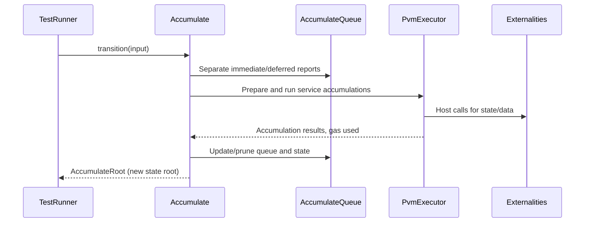

# Accumulate

## Pull Request by @mateuszsikora

### Description
This PR introduces accumulate logic aligned with GP version 0.6.2.

## Next steps (planned for separate PRs):
 - Implementation of missing host call externalities: fetch, read, write, lookup
 - Alignment with the latest GP version

This PR partially resolves https://github.com/FluffyLabs/typeberry/issues/225


## Comment by @coderabbitai[bot]

<!-- This is an auto-generated comment: summarize by coderabbit.ai -->
<!-- This is an auto-generated comment: skip review by coderabbit.ai -->

> [!IMPORTANT]
> ## Review skipped
> 
> Auto incremental reviews are disabled on this repository.
> 
> Please check the settings in the CodeRabbit UI or the `.coderabbit.yaml` file in this repository. To trigger a single review, invoke the `@coderabbitai review` command.
> 
> You can disable this status message by setting the `reviews.review_status` to `false` in the CodeRabbit configuration file.

<!-- end of auto-generated comment: skip review by coderabbit.ai -->
<!-- walkthrough_start -->

<details>
<summary>📝 Walkthrough</summary>

## Summary by CodeRabbit

- **New Features**
  - Introduced advanced accumulation logic for work reports, including parallel and sequential processing, gas metering, and state updates.
  - Added utilities for managing accumulation queues, pruning dependencies, and generating service IDs.
  - Implemented a PVM executor with specialized host call handlers for accumulation operations.
  - Added new externalities classes for account and fetch operations, with structured interfaces for future extension.

- **Bug Fixes**
  - Improved naming consistency by renaming properties from `unlocks` to `dependencies` in reports and state.

- **Refactor**
  - Replaced and enhanced the accumulate transition logic with a more robust, modular, and testable implementation.
  - Updated type branding for `ServiceGas` for clarity.

- **Tests**
  - Added comprehensive unit tests for accumulation utilities, queue management, PVM execution, and externalities.

- **Chores**
  - Updated dependencies and centralized exports for easier access to new features and utilities.
## Walkthrough

This update introduces a comprehensive implementation of the "accumulate" transition logic for a blockchain system. It adds the core accumulation algorithm, operand handling, PVM executor integration, and externalities support. Extensive unit tests and test vectors are included to validate queue management, state transitions, and utility functions. Several supporting types and utilities are refactored or introduced, and new modules are organized for clarity.

## Changes

| File(s)                                                                                   | Change Summary |
|------------------------------------------------------------------------------------------|---------------|
| `packages/jam/transition/accumulate/accumulate.ts`, `accumulate-queue.ts`, `accumulate-utils.ts`, `operand.ts`, `pvm-executor.ts` | New accumulation transition logic, queue management, operand class, utility functions, and PVM executor implementation. |
| `packages/jam/transition/accumulate/externalities/*.ts`, `externalities/index.ts`        | Added externalities classes for info, read, lookup, write, and fetch; index file for re-exports. |
| `packages/jam/transition/accumulate/index.ts`                                            | Re-exports core accumulate transition entities for centralized access. |
| `packages/jam/transition/accumulate/accumulate-queue.test.ts`, `accumulate-utils.test.ts`, `accumulate.test.ts`, `externalities/*.test.ts` | New unit tests for accumulate queue, utilities, transition logic, and externalities. |
| `packages/jam/transition/reports/verify-contextual.test.ts`, `state/not-yet-accumulated.ts`, `state-json/not-yet-accumulated.ts` | Renamed property `unlocks` to `dependencies` for consistency in not-yet-accumulated reports. |
| `packages/jam/transition/work-packages.ts`                                               | Updated PVM executor result handling to use new `ReturnValue` interface. |
| `packages/jam/transition/accumulate.ts`                                                  | Removed deprecated accumulate transition stub and related types. |
| `bin/test-runner/w3f/accumulate.ts`                                                      | Refactored test runner to use new accumulate state/output conversion and types. |
| `packages/core/trie/hasher.ts`                                                           | Added Keccak-based trie hasher implementation. |
| `packages/core/utils/mutable-pick.ts`, `utils/index.ts`, `jam/safrole/safrole.ts`        | Introduced and exported `MutablePick` utility type; removed local duplicates. |
| `packages/core/pvm-interpreter/interpreter.ts`, `jam/pvm-host-calls/host-calls.ts`       | Added gas consumption tracking and refactored return value handling in PVM interpreter and host calls. |
| `packages/jam/jam-host-calls/externalities/partial-state-db.ts`                          | Refined state slice typing and initialization logic for partial state DB. |
| `packages/jam/block/common.ts`                                                           | Updated branding for `ServiceGas` opaque type. |
| `packages/jam/block/work-package.ts`                                                     | Clarified error message for work items count validation. |
| `packages/jam/block/work-report.ts`                                                      | Updated documentation URL for `WorkReport`. |
| `packages/core/numbers/index.ts`                                                         | Clarified JSDoc for `u32AsLeBytes`. |
| `packages/jam/transition/package.json`                                                   | Added dependencies: `@typeberry/logger`, `@typeberry/trie`. |

## Sequence Diagram(s)



## Poem

> In the warren, code is hopping—  
> Accumulate queues, new roots popping!  
> With operands wrangled, gas well-tracked,  
> PVM and services interact.  
> Dependencies now clear as day,  
> The bunny’s logic leads the way.  
> 🥕✨ Hooray for tests that never lag!

</details>

<!-- walkthrough_end -->
<!-- internal state start -->


<!-- DwQgtGAEAqAWCWBnSTIEMB26CuAXA9mAOYCmGJATmriQCaQDG+Ats2bgFyQAOFk+AIwBWJBrngA3EsgEBPRvlqU0AgfFwA6NPEgQAfACgjoCEYDEZyAAUASpETZWaCrKNwSPbABsvkCiQBHbGlcSHFcLzpIACIAQQYGR29qEgAaaPtsAWZ1Gno5SGxESkhmFKKAL0R4AGt8KnRkW0gMRwESgBYABi7UlAxcCkVsBml0BKSvFMgvfCJ4BnQveCJyegB3dVhIAHErSCkKavwsLo0ANg0AJg0YWA8lRAYKeG5xE/tuUXgAM3gx3Cwahhe4oZjcSJsAbUeAfVAnIj4eAYIh9TaAsIhZCIcQ+fo8IZEfyIZCYegQzBrML4SDtdC0JQbLbIkGoWy3ABieGw/kg63qNT6FIwVJ+9XsJG4zmm3G8vn8QSxfWRDC82EeYIhJCh4hRpSQ1T1sHwOMYaDxJAAHjQKBhzep/tiRts0MgfiRcAxYH1/GhaGiXjQ+mSZvh8DVsNxg8h1iQ8a6lisMMiiCCPEwlAJXR50dtAR4pjRTXsDpRjhhbnA2XYpRRxOavPI/bRicVkAbgi02iUrlcAKz4/OQDlqn4/WQAGRUiAA9LhZF92hQXH5JSb1PVZJXQbK8QrgqaGJhaR5/BJ/rH6MDYLhcNxEBwZzP5oCshomMwZyPsGPJ9O5wuJBLi4M67l4M7dGcRj6MY4BQGQ9D4D8OAEMQZDKHkCisOwXC8PwwiiOIUgyPIGbKKo6haDoMEmFAVbtqSWBoHghCkOQVCYR+OpcFQ6yZE4K4FGRVAUZo2i6GAhiwaYBhqBgc4hGAFDYCKlAzusADMPwzmgEzMMkNAaLgD4GNEZkGBYkCxAAkmh7EpPQDgCfISGMECKLSG4oJepgpDIP4Py6QQfBDkWoTKapfBiiFoK6Yk+mFh4gyYNU7xYAU/gUgwKaQLQ8D+GIhSIGgpD8MhAAG8TxQZJAAMq4Ck5XoBg9CVXpNUAPJ4LKuBNfOXztlgoUhLl1BoIwUwkmMuboC0JB8ciNpsHl0zldAIT1Y1zWtV1d54E1mXEuwMIfICwJlJ69zIEOABStUdQAcvYgwjLgPIeMw9TprMxSNrcsRzXxOIwosbCAookBrRtDWGQQVWTCkm00E1TAYIcxmsoNS10PA0yHdIx1pf0BBpuMb3mpD8MJYjMMkAdgTYPlUQFEObXVYlfVUBgqWwhgyoYKq6o5WU3DcDlxQUOeoxYzS43lQAsmg3DlQGSti3qvq0PIioHtt4zsw5EoYzN5WDLIsSIFYlAAKLcPgXoAEKzAwNQq3rqM4spYg5bwkjwJEpCOZQUtjCGzGoXFCM0BKksLNNWzoKLQy+9M/Xpichzlogty1fAORTBQjZ9OVu09UZ+BU513X7XyVD3qT+DV+FYahCycs2NI3iaOG5Xbh45URZXiXrTiTU/Cp3sfBg+B8aj6PXTu/hQCGds4mAwNFpAPxDMwkMj7gSN09SlPtYlh9Ne00WnipyZ6qFXM8x8IYfrWOXEl3iDBi1WG1gCoKN3tZu+BQh5QKhEeQM0hz+DeraKI78vCaDuB4O6j0eDOENKmaKe9oZbVQNUcEyw/jM3kP4T6549TjUSDiFgpQ1Y5XHgLImIZWYdz9LIDuTAKC0GsjQZgKNJqf36DiEgfo0FHDfiIrWkAdYeHUNqQayxyC3AAKqtGKPQPOds6yMXoEOWYRBSAUDAFmdRCgWoOhOBTMK9gaivHVqmZwp5tT4CkLQW4HVDgNj6MNU0EV2ItBnkVUOpQvqQCtBCBY6gzGZ15jMNAsgSjtFwLGMgkAUFPWsbQMaeshyLUoHaXwkdqbRw3h4EMACephEAtnIw5hLCxAQRhXm10aRDiUKqaUaVkCuXCfUTC4pZQCGWIsdgDpPIGCgAAYQEdgnE598TlTkgpNefi1KaW0kUmqRlEDlS4LEBkUQN4LFKB6Y0rU4anxpikAAFGFQ+XB96Hz6D5ZEtUvgMC4JMoErz3kAEo9mXJoOfDQEzIDTNdMgEuTcmoskWciZZuAlI3zWVpHSgKSDbN2VZA5jkYbHLBmcyGFyDY0FLnga5FS8BcDJbgf5kAO4OAQcAIeKQbAtz6OQQ4ehe6gvBSSE+JKSD7xhVgOF8kwpIsiupVFmzEqYs+e5QOBJ8BfDrPINObod6Q14CQAA+qUgFgr5kk3Kjq/VtMHk4ORsXSlnArLoppX1Gk5VbXUuhV/Vqq9cDmpSIaqOdVaZOu1Sab1BqYBWrpiCqAXJGGxIHipFlNB963JCH64pQqQhCmoLALgnsUy/JFZDJZErVkUGlRs9F8rIC51WNQd6hQBaKroH0AQeBNSQkJrEnyHldE0jnpQUIUM5mBuPmzf18zL6hL8TlIcsrU4PwsUxb+L9nASMZcZEFZlojQRklKF2JVpAzk4SQGcrRmBLlnMiJQlptkcFMuZSyNk7IYUOY4MoK5XLdr8l5ZBtUAAi9ssI6i3uKIcDDJ6iuwBpK4FsJwkAdrIIsTV1gJkjFkzCJNEDvN+OqoEoRckYEqbWNAYMSioHGso6DXZz0lA4vcGKx5xpsUoMcs9S4+5bwnkTaotaYFlO/pojt0IiakO0FgCeTb/RmN1IzO+faM4DtmpRq4BxzSdkWjSdQyBli3kiGABCuN0qIacTq4ownYkJgo4tAAHLEZc8SQW1MfY0jizTj5tNEAXE63MyphMtFo/pfBBnDLCQMMZiAjAPROBi+926Jm7t0jUA9s5j2gQkMwMAeSKA6ptDOLLOXKC3tixZeptlmMcVfc5XzX7xnuE1H056KRgNYKIK6JScZDZ4H9uFvkCYrQ0BalEEmKo1RKCJS4C2DsVg7FdL3KygMCSSGmEQrwrVkQOnNDNnZvXSQ4vc6Ccq1kBiUAKxQfhELj7UN5ARjbvhWvICYCpG0jXDJ3FQCtjRg1bvwAqFEc0CJqhjaHFaJAupUzlXuyjRux2+AsiHB7F6YhxQhiOqEAligW3AO2MUfDrTF4uPgIySA93VNqhzHXL4+R5AQ9dJM6HNpbkTcQFt6593fkFv+gt4L+LTkQwhx6LbdPuaODoNcgtO3iZDFoCMZtfIEBejNF4RIiUF4PF+O6fwAsPBJJSUNUE636x3cs9/eHPJNehBJ0UHKpsmdTaIFtqHaMyxuZJu5WgkQeDANGQ2eQBdSoSDU9IW41lkLw5YD1KIJOPYi8+3NVrRE0goHCh6HkPmbuG+JwmAPZOADc/B8wUE2MUZUyeYFp53OuBPuV1eUDIKMbcqB0fkiGOeDU40UPqppIqFcxo+L6QVyToEMgSCpOj8tewKokr65h6diXqP+Cw+TIbn7dBbhRfz/R0M8xFjilRoMfAvgfizFnk2mMtfaFKEc3UqyLnvMtNJu0rzXTfO9LrFEAZWQQujPEOMqA+yie+wB7RwfaQwG64xeBbZcCC706UBBodL8qHYz7QKwELJ7pJZ+RHpfRpYZb5bIFlq4EeiFbGQ8p/57bc6gy86tSkC4DQHC7LRi5QGzbHzwGQpHY2inaFqmqJbJaYH+DYGZZIGEH4GCE2iYqbrmTxZgBGBoE8GpaDD/AzhD70ZFZbolZWRlboQVaORvrOAuTIQ1YRYGB1ZkT0i0BOiiwNZYLjTkB8TyEeBKGJLZiIR64eAADSogR4NQkAShOU5oiIgYsAzAwerc4IfSyA5A0sxUK4XWOmjoOS1SIGfA7hCQaAXhPhFC38Sgfw5ApIC2gUSOK44GRM/OuAyRnh0ALwJAAAEq6PRn1HhvrJKBjHLGUakTUYgHUUIg1FrnrNAqnrkWtJUe0Z0YICIGIA3uEfNN4bUWRgQtqOwKrpDEoULkeL1CcuDFTtEgOjlMiJUsojZnZlQLIDLJDAhkWE7IICKsDFroIvmFgOkamPmLvFbnfPjq3lEK0WkTMXwOeHLEoRcQIDsh6lvMiD7quGXjOqCPAqEMbvwFKIqHvEMbUXNnViDjiDlE7KkSQFcAIMYk4WEJUdMR0bRtqGJsgBJr5KvrUmoQ0jaHfvtg8J5p0m5j0v5n0u/kFp/sct/o6NBMOFxhZjilwCUZ8RUf8MMZQNcg4RQFwJ8RKRQHSmKdUd8ZwTIRgXIZUYod8ZisVpIdIdweqVgTEZeoNjesZHeqoY+hofZJhE5O+noW5JSYYcYU2qYbkTYX5gFi9vMQMAydqgaYeqlsaXlqaZiiCZEH0Fht8H8EeD4PIK/mDksL4AmZqjQqzBoDOPpA1EMiQGAGLC7E1J9NLpEBMX5gNmYaTOQVZFYNZL5kOMaWgvuqVAUCNkLK8enMdgMN0qHgdlmSoHpvma7IULiOoPIEWd4GUrMCiIDlPh4DqueI3IgI2J6eyfQOOZEMgNcuVJmNgEQG7C6vCcEPudCW7CGKbCEOVL8mvjSFjiUEWb8AsPSSTGiYmSmQvgoGNvosco4hfjFk5vUrfs/iTB5h0q5icN2SuW/ohJyUMtyWFj/oYaQUTgmcKQmZAAAFRbxarRAZl9k5l5kLA1DRCqkBkpZGm4gmnXo6mqF6kGBqmBnkX+yzh4UDmEUqEPqlbPpaH8T2nVan5GAAwekxGjlVJfCQzyx4D9lHyoCLRS4y66INENQ1DBLlbHJpx7xNQo7OLESkwDySInCNiFmKAPklDbw0INhJ7IC8AqrbHSB9BlC2Ltm7wsUYrYp5RpQ+7BgLYJlDaASJgJgKySU5lWCEUwrIBZHIiy7rDy7bAfhyRjDQCAS1TPCvC4AADkMgjMCCAhkMIVBZw53W84fICcrMEl2ZkQfUgEtwgV5VJAeVQ5SlwS6la0ml3840DggJHovmWmkAylxxkMrhbsg5C8JoHgfVqZu8LVwJdxtCylix0JPsyctlyALltIJC2lvhGA1OmsBlsgRleURCRwV+NJgFLueOjJoF9JrJAWHJngsFIy8FvJoK/+UQPluifl9oAVZVUl9VwA0AfQrhZZCEyAfVrk0A3KqBpFvBJ6wZLlBFLs1FEhEAUhdFUNQgJGM4Qy9sNQmBrAJw7F26VpXFhsdpuhfFTpP6/AGAy5NWKAuR95MZ3mdZoI6lAgXMeUeoeaeoWCrMtUwcccDucJaACJactwVgZ4sIRQRckMfNscowgtKG4VJA2Rf2kKHUh5JAwAyi5wHQfQ0QW2AA2tgDrQALrRDcp55RKoDTx8QRVUgBXq3C3BBa06162y0hyG3G0dBm3cocb9riIfBFFxpmwWzu0C1MGibIjkmNqUluJvYPauloBjiETdLU24ZJSAQZW0js07FKBhaHXFXgxtrmg2ibW+5zDHK74nD76H7H7HXOZ0lAXnW5RMlgU+bXWrnvlVk8m/4wB+U8Z2h8aFDcDoZ0CoVsl1iiUeBh3y0JgAC8kAjtioLtutMQntpt5tTUgASYSQxoXqUz0kBbaQAL1L3O3a2r3RAH3r3e2b2Q1NmHro2fhY0uy42fQVjEG6nI36n32ziP2Y3Ow438gUA1B5kBkE00nWkvraFVafr8VGGgiUBDB8BsAkgHqDgHYh2IAADqAoPC8idOT2Y8ApHwitw9o9vaISvIkcFWy5AUkQhUQ42ehOfglJiRulODwDeDzAiABDAwTU2ewQYtEti50tQ4KDxUpUV6j5GGil3k9O9gxo3g+QBY0gC8x4YjaAloecjg1GS4vmQDXhci3DHGHp4jaDoFJlaj+GcjT2pQRQoQdIOuI+Lh+oyY+ku8bGJQrkBjSe8ikA1yrZ1QUgvyOSoIZQWj7jujXjyEPjRjm5VogsQTJAV5SCpOhOTNX5iwWmcYyEkdPmFJPa9dAFjdZ1D+rdV1yEb1XdXJD14QT1UWSin9CWP9M4f9z9gDAo7WAW4DRN5WJNOhH6+hcDdWu1jpHkdNzUZDqczdyiNgE46DDw9sIu5mHwXE7AbDrMHDNQHcAW52JIHG85ktyAsz8z5UN4d4D4T4RI8SUoqqGgR+P444UwgJGgSgEgM4ZgM4fYAA7AAJwCC0AACMVwM4gLGk5wPwPQYL3z5wPQyGCYmUUwowTIGI1hUxJzSxt494j4z4RxtzhWDzv4zz2cbzHzR6DAfYgL3ztA3zoLGkgLDAXQgLYLVw3QgLAA/BIHPWcJcH2CifRmUryNPGM35H6SYZk88jMp7K9O9H0MjltRvqZcQwUqOUUzfiU+BX6Y/syZqx3VBdU/daFnU+Mg0zFjRV/ajS03/Y/WAMaGvLGV4LOP1vkvaAhaBM4IbuvLTGALQAID05xX07aQMw6QYZTQjl7MFMzf3FYB6+AYfH+gIHszGAmAzf8BQ3FE0bNHaMuDPCUOpTzQdqUk1MRqRhQByoEqM/uPlJCf3NEBLCHIgMRXrOVNEOICg7MLgE29ZaqghVGwvisKCb4OVMalVfNh6YActv8KtpDOQNaA9PNAfdZLQPC1jHJci2KwIn7eBYjpG8K1OYYtXmAsuRCkmIsVKFNK1LO7gPO+sIu8u2IiRkIcfJQjMiAa2q3NzDQKIkUMEqY5QZDNQfO9aLEAHv7FJXe3AeHngPxleCSEmKTGARTAIx4K5OVFezexB7SPiadG8YTlEEeOYqPQc9KKWy0I+xLjVvQGZZNehwu/zaMEu0Gmh/1hh/RyQEu5MmSOk8jMfHQ4RJjCK65XVsSKEK5GHp+xG+KJk6uGUFHQ2pR/zILBzY8aCEw+hrEmdNY+mGbus/W3HH5qDoNKTKUmq7SU0pq8BaCNq23RBVUx/oaz3YhW5VEBO8AVO5eyx3R3Lex7QFwJhyTCwblbG+aPG4m3fegQ/RjTa3a4ig6069aC67EYerWJ66Uj6368QVGpAPLMZUQvQOG69OKJ+jMuVDG3WHG7TAmyRVa1FyRrayGmAHFzOM67aK646O6+V+aF6ykOl/KgYJALoGCpJg+6R+VGGsas6mGr9U8jEHp9LBkAAD4xBtvSAdub0goDdTLDcltPvMdztechxLt+dseMejq0e3sne0CceEe+rVqXckHOfvViWfWQqHy1TDIeAL3Te0x61zfSCLfLd5yrfAK32wr0W/21cZYxeNcNjxc2gqtuspfgHdc0C9eZdNMo3g+tMY3cDpb1f2uw+KENdxf+vqHE1BswNDMU3wPpin6S7DCjBZtTHlQdxl4ABqgeSboWR494BkNbq466vmMXiuyZloogXWJwaIMV/QSnYwAgWOpMY+kexu9AJAWwJQ7VMMRQ7540bAn0K4S5ccHGJRrPqeHPZOhZ/7qAAUQUX0FDfRtokzUd3RjPYnCAD2Myzvkivm40vEMtWv224o5U+xAwtm9me1wRASfE/WVAYgyAUe4FMeWFaZ0+7BeBXRmAjPWlZe2I2G9ov2rUpvto5vR5GfNxbDACYASExACY1yHUHUOwvyWayYDA9lzihRzECCgi4oDgCQqj48vgevm49gH32cqThzi5W+alDRoChEtDKesCrUSMRQTUQfIfuAYfRxYVq4WUxCAn0rYg70V4Sc+AuksAjmglUx9wXgqq6xhK5UsZyuKQQuTkdAgt5Ge2AXUH0cCfdBbwsSxUd0KI0UZEBtgVtcIsAiCQaIXGHRGeFgAOo/BjeVocXjxybwTM0MhsEmA71FRF8MAJfI+KMRTpmJqgwiAYNLURa6RfCeICftr2wEQU/ew7APqvz4DB8Di4fflv3Aiji05gVAPhHf0UBZ1sBU9CZpR31j1BlOy5E1NwJyDFBgAuA/Ab7QEoMhF0nlBDqEUnqod3+CdWOsfFbJA4MGtuabEwWErzgpeCwMAeSVMQshf+Tkf/qs3NBP8ukHGIfiuFmB+gco0nD/kIHsZDY+09wF2GwylClRAoH8T0sMnUDHtv4Qg9uAvzwGc9C6LoLANqDeDU51+m/eJKvywAhCEEPobNHm3cjglU8vhSAL9iGBgBIgKIVFuH0PZz8twRgDxMoB8DeI5GAwIYLXUCQhhEG4oN3IolTB5NiBoOdZu+3QBCtAk6wCnFEDbh+BzBJJMvMIM05mhlwcReXhiBsGOA7BS6VXmL0SAiZO4CCUaA1FM6nULOzdazhU0gqBY7qX+R6r3T5S7ZGQwpeQfEJmhHJFg+RYKGOUoKQpqO9fHYPuWo4xsW+/wnePLHb6yAOQnfXqMXGo6gj9esgd7nHFapPcPARAbAM4DXJfCliroWEZuARGjB9yQ+Zfjsiy6giNiE+XjPWgwF5BhSrnFER6CeFk5rkG8IoH5wD5t84RXAHES4B9AkAiAD4elLyMGFHA6URIyAEtzSGHEMhkAHeqaheBAE6RuABkcECZEB9WRdaQRLj2YBHZriowLgGwROx4E6USo6SlgEC7lQqiIaTjj4GJGgpSRhKAenWioZCltUco6YI/xqgv8Y8LORDhAVdCMFBE92f0XSnf6miSuFonEFaMdYPc7REMB0UPSpFj0XRS2aOK6FkACw/MKAkgNck1HaiXeJAPUSIUoB0ppBSATWqKPFFsCjiENGUbSMaBpiRk2w6DtmPSy5jM++YyAPqOyyGiuAJY2QcaIhosgzR4Y3AJGJtFQAYxjkJMI6I8AJjfOkMVMemK4GEheB1yXiNwOubMAuAEo8PvzFuxWAPkUTMtv0FuyQFdgroeyvEnaAdx5gwiI4Oyy4DXihRgiMoLIHaBcjZA947LmCOLE7xSxwAcsZAG3FVjt684xAPWL8AqR1xK4tccuJIxbjKx8SXcYbn3FcBPGR4n0aeK2wXjXxJAR8beMQCfi8JNoZ8ZeJIDvjPx74n8SwD/H9jC0Q4y0bDx5TmtmmEXCHp+EAFtCT0HEg/BinNLFZemmhfppT0E7OkrO6uGTi4j/gFh7YFMO2ouggrJIaQJg9VNUmLjfUcyf1CGmeXUmRBfq/1SAK4W5R9BqOulbiSWWILhlXKuYyRCXnqzaJxKQVXSaFWT67xgcCXVrkOwAACacYCLIBnDGli2YDeOoJzCTLAcgg9KSauGlwtRMAoQZ2FYj8pnDn8WlZYGMBw4eAOijiegMpOEEmS3J8PCmOuSE4CsRhHgYVgYWfYKsJW0mNoVvGPxys+AXQvgD0J2IuMyIjmBuuZzTynDymz+PVpcO7o3CnO6+Cqc+QnoDSamRrESklOaTiE4sFrLHn/TS5CBEAJwU9MAjAAJJEUc6PIKTyfSBtKsvFWBtTzqzpIxEGCewF6FJJsNyoUWXAAAE0PQiaOgDsz6QrspmmEDKGQBIz89u2A6eQH1RcmQwVIADbbCaiUBfBBsAsR0IWhWF5hp8lSQgYVDklMITc/8AiIVGeAiIiYDrDjM4COLCDOhQmUILWAulbkVp+NfGfEmuTUcboq0isHICLDQYxcBaEJv0IKaBw5WadSsktTVRkc2AtCUWDlFIYl1a8biakp1Js5atepLJSpuNNuqDTjWw0vwU6WPh2cYK1w8IPIBmngU88ozLLAUmVQ9t5AdoAWSLHsQLM0k90J6KTJKCkNU2VJZiZjzRoY1Sk60xFFtLAA7TV8fEy0gG0EkU8jpVPDyKJO+gXZbpwCR6bgGem0BXpdYd6TbwKK+DVwps2ckbP+m9EOsmEPDvnX+BHAgZ5UEGdjTBnOoIZCEOvDDNLK00k67oOPor0UCiAW62RRdM0Iyl4pFgD/X0KgP/Y7dnsYcCgKiJ1DTVF4yYjsgf0ja9yNeUQ/StzL+lqoOMxQMoGFgoKYAJEsnHzB7EGEDAW0baIcKbJyg20G0vweoMwGXI/tIUZcqGdlGkBXEv2iECqEXJdg2iTqGrbqWU0up9S5ZN1aClcLgpKy+SZXR9n3O/hzyiqmuR9nOMLnU1i5IE7cpKHLnQyb5+IM0XdKjkxy45axMHi7PYm0x3Zm0j0F7PRRuIP6UAJGDzjJGdzsZR8OMZSJHqGxBxJXVBU9KIUYLqurE7HjgpSB4LPZ3s4hdthMmUKbkAAbx359I+gj8moMgAAC+nyBuQwA4TiDgATC6OSwrXB1g9A4uE1FjOEWiK6wfQS+XnWvnSLZF7SBRVwiUWRzmFgqWOWotwAaLyoGPb+uwr/rJRuYi6NFIKj2mQNuKpNQZiJMppKBIgmEP4B7jtq+UBoesF9hdn8CJR02WAOIOigyCuLH4WAaypEQSFTD2mLyLAOKDyh5p32hyY4rwmkz9ZI+eg8JYyWbnP4sEuxPAN3ybiCIQwBsimKUkjLOhGgAqf1Edh6hNRrkM0caCtxH6QCQwPjTKGESb6QxWEWsMxdwl4S9L28AoXRaEBmgGKK50gCZWeWenzIpSB+ZTkMtwB9B2AycWQH0BkT0DJETYNqkQr5CLL6KRJK6EKDlH+xeRdlPWH90QApM6sY6dNFz1IYFcxAUQfpY6RZBRlsojNVGVeCYjopvSwJKJL0lMSMYwJjaIYNPG1424Uoi6S3mSIWEZs3gf2LALUphLTyy8f2AXl3Frh0IMi/AJuDrySE5sKAxvZJZiv4EbAEwOILIO0HTZeAO8/kWIZMyalkr9hJsVoD4A4GWSlgq0uybaRICeJfAGqIGbeWQbDANyq4WJcfAeJohFlYy7RM8hOB/BURbdYEqUhjgNsjhr8+/CBSfyyyLhCsyaY5z5LWwwsvIUhC4gphu8PAVTDVMKWelspgE+5Z6d0v2jFwpl7CUQOIK4b+r0U58YuM9MdRZdHV4gZ1dpTdU9kPV8s/LiV2enIYE4PVf5ZG2YSxQkVXoFFZPzQHoq3FaUJiUjRYk8EXFC6NKB4v9SNr00YAGREZBCBeLyeh0smsdJDleRraUxaxCEo8AFt+43s1tcEFL5FT6e0uaWD/H8D3A3FUgI+fhixBpN1O7ZE8ECAXJ8B3VnS9NAAEVJ1R8QLgWv7i8AVIJAI9SQFL5B18aHYkBMrUirIBr+t/O9W/O0XRxPoAQ8qFs1YXFwtmMbe+kdjFCnlv4Ech6VYv9Q2LdmZfOdTNFRj6qeQUlAkLXiCBIA5EgiVZYgsaXfxigRAYDEMGARj86sYUB7JJJlJ8kSif62xYgGgAVx0U1kbCCtBoCGUuAhwSxiCGBDarjYWwABKhqrapQ0pfAfDcBmw1GLSphQxfmCGWi4xWNdQqANRoFAYK6NDGwVFOBtBYoONRCKxkspjAJwdUgmzDe+VE3rNxNcRH8tgMBUTDYOkMZRegtsXZqMQnCMBC3UhmGLHQw87jbRqWCax1qowMgU2GuU/kEmo2KkoprIAyIVNWKMjVxuTwBZ9NRdR9e5rWWkheQvseoA6AL5+kzKvpPdTIlCbeaEtCQhtGDDc0IKJNlm7SuFoA4ehr1wQDkDvHPhcBYtCwocAVtQAubahfgYBIbBMTv4mIxOSQKkm4BD5ZEppFunKKiAmSBlQPJcsAiy6yjL19WumC1rXULCeNaWpxA1EioaJU1+Ue5aHFGEfseZ9sVRocg9A8iyEkw1NU2H8BebktFWizeloih/YEg4glMMuWiojahgkRKkjT0xA4hLBjJSUGEiCCusmwU0cricLMR/AKAu8cJIRHfwNK3l2jRKKpheCT8CtpSHROVqvnyAng30zHYIjIAOAXgm6grUvIPTAZpO7QbdaHCxjlzspg2PgAgNry+lUY7lWaRLOKZdSLVVnGWbqy/md17Oms8LHyRvaA7QgDgORKYUTFwKngLwdoNcmiDjqZE0QPoBoC13i4sFNXT8EyobXezm1NUCdTet4kdqLJe+MTDOjXVYJvlNUFbVzyby46lt5AR3ZxljT41HFlrZxRjQN28xjdiUQPT1zbW+yOKZPA6dAyDn+KDAl/WeJmvRTu6ZKrQhnsnKp2lQhw4gljBkSo7+xS6eobxlqp81WFAUsSfrc4TTAHbzNocPDbTEj7WV3iK1TEQQDvSgol2oyccDcuAZ6a4tZodKGUmuV5xZNKQZcu0CPA/s0w8genQEgE0MwMNm8HvryMI0txQw4YSMDUigDWxrQsfR7VfLiKuQmMw2rAKMtsVrUsIckHYhjEM1z6hNuO0zb6SI1xSwwEYe8Fl3b350IERe4rQsP0img6QvCuJM9mlxJQaQL5HKNXsETjDKVKnbUB0og1oLVFsG53m2Nx0Xrb4MB3eCVDJLJ4At4CfWNBr03xqMABWrSlnr4An7itKy+BXvrl7yA5ErmKQMuV+iERISo1ErcKzybgHqDHm15TtJrbMBgSaB/niQfe1cJPtCmgUXYWXWzpS9HwArXlO8g6dfSxq8vVTVmiDL5tRKhSrTzEyfBoy0jXmIAEwCZAGuAVwVCiAgIQ5cnW9iMGSEvWxMu1uPUX9lBHlOMl5WuJZIpyI65Vi6OW3Hrt+YSihiEuez8bNtcuNgw4S22+aLlyqP7ZCvt7VbYj52+gBAaBlQJSS62DWLRtLLvr0BVgmHAUkkE0h15O2lxjImMMDDSBDASHT3p/K8KL+eIZ3auA1x14Mp2GGMhKAgwQVxo0Qa5guCViUAMgoKh8qsViSjqDtmTM1XzulkfzrV6s3+bU3F3PU9sZo56e7sgSggxQPgGeD7EmnO670m3SGHmvqAqjbuWyn7sCowBvJRACqMTNcYYAFp+ug3JTcAxU30aA1zGuTXGFkCrjaNXAGjQFgNom06UAJvpECYcWHGXj2zWje8fRQabJSm2/48ptsVAm6U9mxA2CZNoQnnjkW49SptXFcB0T1ijBaiaROvGUTWJp44puoIrbGtLAQ+EyI7YPIge73YBCCeROAnKTyxgAq6K/VW9RUax/wwceePUFQTdYP9NwdS2/GAsZJ6EwFnZPAMgNEXYYuCb5IvUth38j3RBmFOKa0DV649dKbCKEnLFKi4kxSceVnaL2EpfkcMT5q4BgAgGgMsMQ0XGnINpp6DSScpNOynFtav3fWoD1G7x1xpdtTiE7WR6eKPa4Od+ngYDrbCI0YdfOPRRgBgzYUMMrJVT3R0oksWrBDlPfVGdWYQZiivtQnJlKBYYWheP4A+i6HrEMuosK3sBa3B0K6FFSPAEVDi0CYksEgB1C4SUAmzlqIHb3rAw+GXVOlaXBElWIeriZE1SZlTIgQIAPcpmfmpusy3zBDZZB3zHDtND2xEgy4VozUgMA3AMK6FUUwKCVMHprTfZ8NAOba2bGfDXWsQMuRj5BRciOOXzC2YRI+M7lkRoGYxmqGocxTaxJGRulSbWI81K1bGpDAAu3yUDJWvJbqEKjfmQw2muIpnppXkZIYtpj0I7lKNUC5VdrewjMX3MaRGzx5gOSQCA4HxLul5/eLpqHOe6sAB0xYlexNX6drIf6BQLuYfPyB5gUgQbTufNwsXGebFw5Snu4BT7ai01ObR23EUXTxoOqQI5cb0NgqDD960jSNGQuRTbUtCS6DXs9JI6g43nDsX+kcxqWBzE+gPJju16vqlW9F3HfKoUP9xvJgEXyU1DDVgThErkvtF3I8Bqd+gPUXHdppcgNLFOo2a3GcRvnFxMGEHSK0zmgAsmO2YGxCAXjH4WwJYyU3kGUDGwvFwcSgSUNbHB1eAkRoEtKxoDzRiB8raIwq8wT1X5Rd4953ADkX3MNCqATQ0mAmYb14dyNniYIeKEBm5nlWvKtVSTD4MfBad8gNTjCHbIHbEdAK5RtuthD5yZo+MMzHimXWErcdtqfc9fjM5SzLOF1K1ULptU/zFZSxqAJLqHXPK5dkCws0xRDOaBLd1da3XfFt31AdTwM5MG2aOidnuzSgM7FqbShUnatuAR0/fWtNEN6LgN/nDaXIv9ZMO7673YtL9MYrDd6KYPajxTMmQ/ZEesi1HsjMx76IC2adR1Y1D9XbLqqzATSE/MBl8DxSCzHhrY5GXicAc2JLmEyUANslJS60KWdl65FcjUC1s8EHbP1suzPZv6xtuq3hVIwwyaYGehYwjIpzP5piNUOiqXXFzscKa7upeCrm3Vots/dldmh2n/o08AvP9d5jFwTzipp04RbdhPm652fforNFfOuR3znYKm/fUO3TnfzBMwvd3s23ODlVlS59eob8q3TYbl3QNWsWWujJN1hKkbkIV5Xob/AFDA6UzyBgM3hLMvUKxQkEseAM7RylVOJY6KSX22C2h9UElyJkRFgTwe4GUDs3WwAAGtAF1RsXdUkyDqH+mtiTIg0deBuWmGKBx3iJxMWWLSFBKFET51ALdryD5sHSKL/nLEqrn7vrWlgCIErZQm+RYBhj4Ks29zwbmq4BDHt0mD3aJyMyxg+tzEspRxLAlfrw290lMT+6M2hICmcrnqBS59slC1KwBEPdmjQZjEUSFSAPUmHHZDEpZPJAe1QAzU/Q3g4RCiwQCDbN7xyLmKVGfhP3PpiWL++1XTvsXRaqTXI+EnCF4Hjbf8YEFEloD4AxgxtngJQGii7wJrOM/wZIrUNDhwzbFrdmNhiX76kh7kw2csDZqroxgWCI+ymD6Aar4iYlFqSiGBIBR2dc69qu0ZUvwClmzWcUD1UmM871W0xvay3VmOHX5jJ1hCmqb2xVM+bLtuql9akA/XKAf1IGi1HCLdgKAega5PjIeSkmYA4J8Lr6f13+m1pgZpMxjYcVIVXq6a02x8ChNnnSA1pw09ollOem6UmF+0yDeVO1EBxoqRG54+RsBnUbN1x1jqQCcanO609si7Pcu4BNCMVKSAEU+85LsI7zyde/cduM/JRAIo+7u44wJ1r0n3jzJ744oo5PHuR1wmcsACoVPDu3CUp2sRmigK4iY3S7sd0qfLti4+dsS1wATXHLhiiVolFJeATMm2ArJzBSk+wVzgvH8kHx4KmTPdOP63pn3R44OftOjnnTzxambD2E1/Z0N3G34tDax6FsNZxmMAVAwHYs13pAkjc6n5ZNV2qe6AYmfucW7iRZdsJRXfDwLrSdw2qXWaH7sLCNLixeq41b7bGr/dHwVVNQ736sx/ngXb7QxaP2O25HWTUZxxlAvbsI2jEY8Rnnt1nwR0VBnbZEFz1xgKyegmdBs4OVGtjlkZNjhqKeUBwLt3nQRAVHYDHtrlm24EoxlkNYACtdsXcIbBNhEmPTjmuDUHlSax3N5A5g/WED5eRKZgoOfRl/rCKMBvLMD7wnGDfUDWOMM120rTHQA/Bns98IF6gDweRI8DgRyMr3hyizijXJd/lxzNeqiXLlBlhtuIroWYQpXgWmmzVHoByvIlSQ8EEVRGtKunDIFkaBFEWK4umIRa2ACWqlqRvGgaVpWqDoZgQ6+2Wls9SCUNnGqsDzvQ+/5n0uk4DwOcGVY0IKo6Z5AeZyTeUooafqCLxJQRO8seV+wxXUbuOJAYtc6q9Yxt/BdtNle0bjJlAnTJNZgNGxIwfbTJGNE5x+45y/gPOGgyxoCAJm5oSVQpcszEDuioQHM4vY3sM3P1vMGlyNHPkY6jmwggKJFR1C46wLaRg7E5cXCIM9qYSJgO5eKUkxW0/seI6WBeCd6hwWS9e+1jVXoZNeEbd6CRpZojRSd2Hwc38/RScwgX0neq8uTSXnbFisdsIyGATGLEm3ohiQXUP/LqPdrPU7R+3WF36tRdf806+U8HXxnLrzYeXd7LuthkrdmRhxMi9rMjrfn/cYlzMhSkk0XXBb4F9eT6e8fFjvbH8tZ1uoOzwXgId7M8rmk7pnZeu65xWoyeCo0bvEzG+Hv2k42Izbz4Zu7zyKXXBMPpDGES+I8TRol0gO2G4pzKBDftqjTaleFL16gKDlrtm9jWyXlDagGUopdqEj7p7IpyICQDJKJiuQ/u68Sl4m8LCxJpOrNwbfdgS85BMIZAc8CiqHkfT+eRAWYFmF8CMfOEzHv2lK0jDFa4ZEoRUGFgpgrxpQPgOMAV6Zo+2vCKb4kO8kTIk4wpPVEMPfcALPK/Ijmdwv2+VZtcxg5S1vVAAlNLQpP3hQJEvM/2+2fNBHE8EkYvYZLSv5Lmb3nEoigp2zr8HPf0Ey+OVpPVgNnvLH8bcCswagZYOiUWBs98o5MXwIrC9CRUQmyAnYeKAEdn8c7WdTN8C+EdkhehYSelU6AVwpsDQ4sYV++RMI6pT3y30FDNgLw5QbK7NADw4L556gE+A5kvSSjL3Ydj9875POulQOiuXlM7xnohpWDIanBD3qhyfN8KKv8QxGIb4UmeAmhsQwr3VUN+9ic0XX9HvoLT+Mh9BZA7nOBC3Fw3kgDMd8B+Brg31WRRYjYcWIr9jf8OtUE7zO22VTCptRjMOxb9O5zuNK8AxoF4BUCZpnK+gtD3JWNCFeGXkQYoDlFMXFAkAxi0qiV7CqAeuYX7LePDs3jV5lAifUAZRLG/56I+SD083AzK+sVGx8zoIVpQSBbNZHitCYCIqozJqqGPgph2AHZb5eG+rRjgzaoy/AKZ5tMd3hxkz9h28+k7d72Kez6nec+c7bf01xV8N9b6UB/PdeYC6s8fA0BCw+oFdM9gpBFiiPyjySFzSShmSJfy1zUs+PTBclytRBm9oZ+S9aEdoVc9u4z/HqhQgv+HTj968Z5EfJXkf7N9V91eFfKQYEi/C6zZ2PSj++5R34joMLE3VEfaEiy4AYayyigfDL/nBBoOWaAAD37EyXV8uXTX2I0ioYoU+I8SUxDsJnoLD38ATLORjGxylJWnZdXqelWmIWoVHywQZBC6XeU8fBuWV8EwMfA2FAXF2CEc3lF131cBsao1oQ8kO0C1xI+SIG6sxgCy2/ccpeVU6EuHDb3vwssIKBK16yFnRN89QFD10Mm3emwlcpjdj3fkDrLj008NZPj30duTQJ01N1KF7n3UaoX1TWIHaDWlWcIAwxyCczAgZ0hQA1UZyc1tgCZzGAxuJkxgB4rP1WbZETSAAAtwTewOQpHAj6mcCLAlly2hnWcxBftguIdnmQXhfL08DDfdUz6dVjXz1zA3rF/h3Yg+U4xoA00GqBm5slOpyG47jP5B5RDjKwEmkFxCggoUC3Epx6gigxKAjsqJGQU1ofVFuEUFDjCSgQRXgBc15MPoTERqUCjfrxF9pOebzN9R6NIIcDNTOoOCdRUagisDhia5BQDVsF6S18uAA2jvY+gU+mVIOiE2hcdexToPRQrAxQQudUnSzxSVbPZrmkCkuWcDih6cRAAEIxQfTHuDwscT0ecIGLtVecQ2Vz1jNkXBM3TNZ1U+yXwpdN0Hk8BUZ4JA18ALfQKkHgpNkjJKXMEh6oSiWEKxUzkSPhxxySbgFmgoAxYJdEt/fwAPo4Cby1mhh2NjmgseicZyTsn1KkFSCsOUxCfghtXixlp7ud9wHMmAQ4BBBKzS6SJ1YQfkVJcEOUZ0hg/uU7lQA0OOUDdhhQ1mHFD72ZPV8txQCh0XNfSOHAL9cfEWGBJZQwtmacutLDBOAKyYa3XUc7YPBcZNzfDH5AUXV5TEYreEwzbdZrXjj5UpQ0VTNDSYIzy4RrQ2yXRdCPYYLJE6BeuU4tpdBmyeDbGQP3HsiYC6HB9N1K7HFcQ4A4TQBOQjGAn0IUbYhh0efeHV9CpNKkGQ4VqagAVw3JKbzgQ9hDdDUcdrJ8g49dA2ziCctPKaSMCzrQT1NBZPK6xukqoGEIwAxQeEMS5wsLnl11fdNJ1n9bnGzxa4EedrlDCuyV4MIARwmQK+DtsSBBesYofuGoIMQllVM9aKK4ILdbg6cIeCPFZ4MnD3ghEM+DvggSRednPf4Op449PzwQI2wp7EQBYQrsI8kewiZhBD5KdtC89+eNmHbDQNYmCoddIKyVCA68JWEZQV/WaBFhfMegL6o9+e+zYscPMOX5RibXSzqDi3E4FLV/2dEI7D8AeomBBcVZomH82Ld8hFUvAYPFTU/LNtGto5Qd8iHBoI9i2tpIBMUBUhDPMJiVhbJAMMIj3EAvCLxE8KJGgRKiHSnttbQRYnKhww4tl5kiqBy3h9wqA92ClT1O21yJZgNfTxCJAmkHdBLoMQTDCMI+HSZorCVkNSRqIn82eg7eBQDl9svZCHeUtAisJ0CdWPQN0c7VIaQMcicTIMewuye8I+CEKGFDmIdQa3BvDnIjCPcC73SThYEmRYV05ElYf8Uu4+gA+nsU9YMtQWDlwjCKCjZnGZ2GcxRLsB8B2gv8QPpvI3AFhCUowiOSd/SCz03CjdbcPCxdw28P3CSohCkRp5pGtVackbQcK3DXIscPe1yo+SJf0Dw7sKqiHnezyedsbU8N8VzwvtQ+cPSC6w9w7dLKMQAJwZ/UjAHw0cKQURZHFEj5JPHzHapPtJKBGhmw1OXoBVdFqInDNYDqMfCEKDIBmhosZFyPB+7BiPyEPAaIDajIwDIEeAUqRxgAYkwhD040FhB1g/Dbo5WBZU1DY8GQMeiVDgmipohSNmiZA+oiGB1gBlwFUNjYYNQZSoaIAnEAkEIi1AdQVfAyBTLUIEA8MHQy3wiw4QANcg/gMXknFfsY+HPZSQNLUHkFiP0nKgvozEMUAXoz9yixL8FaVpAsqRFDbgodCFWRcipSEJ+J7QdTi91WPcsKbpLIqWX6lbVBzjsjQUEaTp4xpTU1rDHOPPCM9wqcSVGZmwW+zjNTQYdTXCFpfZyKjUbSqOainI4yHKFpo7gAOi5o7OGPDnnKBjPDyaIaMvDEqL4GSoXgN4HFVYXRXgT1jYyaLNjQYxELlxzBN8P/ddKIGLNiRUG0HyJipOCMGgebR2zWifommLDjBzeezCArQyeSOBhSfVGac+laXjO9/9dkNmdmBVKK8AQmM8l1QlCeZVOIpgC+wEBVnT5TCY7QusWRUUI7Xn4iVo3Kl/FigemFWkvAchEeJQDdXj4A5YcK0QAASIuLYiwUJQ3ARW5H6NQAWzDyPYB8VBSghioYigKkZRjV4iQBzIkWMtUrI6sPliDA7TyepcnK8JcDdo4yGBiX9P2KfDPPTyL1AssSOOhDbwy+MjA2FK531jhwpqMPRxwk2K+iLYmcJIVenMtS+jrkLOMSi7uWZ1yi5QPoHLjaiLgHPtsSWuNqJ0o2QRHiASKBJ8B8oxyOeCX47gGvi3Ilp0i4Bwm4OKiv4x4PPiXgv+MNig8c52rVzPfsOuD3FUhMPC3WH+JeD9o6hKtioXC0gc9vFISWj13nS8NGi5PRcKfiuyKZXwSYZU+KJITwVJBE846HhGt828GT2+cypCBRiA2E9rD9B/4h4OOiE4NFmgcYgTWCSURoIkEbhuAW4CwZmQPXFQAzEyMHcN440C2zBXonTV70PozdT0o/QOmIr0/oz9jbFfMT8NvCJEshPBiZ4VeKQYFAhuLhjroxGIodb4xeLcR0Y3D0PA6XV6BfNMHE13fsCY+ACJiJ8EmJJgyYjpWcBKYrsmpjNYbxIZi2wcpwbkNAFaSzpYPbKlhRUw+OWbYwoYsxVUrCTmLcxmEDaJ3Z3obeNKZd4sWO48JpSWP/lpYlWRDk1ZGsMPi6wx0CVi3PBASppj2BkA1igQy61zB+NBmnV8MibWUF1uYHWNqiiExhJRtP4lhKNi9wjhLISwzJzwGj7Y6M0dikqFKjdiEzcqE0Srk85JoTtsZPX3xQQqTDkls7bBKCTJESRKQUFheJNKSfPb2KmVw438PrxpIz3jLN1QYJAwQPcMtXKSA4gsJTjFJAezLBM4+UN6UVbBXDziykAuOGci4l0MKtS48DVgSOiXpTE4Q7BBJxI645wX/YAwuWBODu4g/D7i1ZQeIpC0ExrwpTCIubEmQp44AT9DCUOeLcYUYhJNCYV4/lTXjzEDeJU4t4nBw891BDGBiUZVWKSnppzbcMbJWJS7E68GsAjAji/w6KP/YaFAgLLDjhN+SGTzhGyLGT+PO4SutvVChOCTPk75IXiQA1MAfjzUwJPETJEN+LqjiEphINiyEsqL2jJEHRKPCdkW0X/Z5E4Uk1hQE+UKSi44JdgwSvAGBKUJ4E6uMQThiFBM1oBUwQEzSsEr2OeCPUzqKkS+w9+MOdGoz1MjSTYj5KrSvkhxUuC9YutOYSW08hO9iwAcYTkQY0rqO4T+JG2J8Vg2e5Nqw3PEaKE8PcF8LnUWzVdTp8oQgNOMgsGQMBIBQU7bBYIlox6zk5AQPkK+djNBqAHkPQKf0xFyoftOtRIYTWFqg7Qe8GNBcAODEqFYANZyEjEAeqHqAD0LkFdDIAa2Dh9rEH0JvMnEUFSrx5/ZCMhjZoBGP/Y4k71N2kMgaGMXUReWXHXit3PuwlTFAKI34tpXeQHniZU47DjoMY4HRBJckpe174XQdJJxj2La+1cQgZUoXwAvKJAP9gOXVez79fSE+3lc03FIQTDaQRrzlxz8NWGlscyPGS6TNWDMNckGidxJgN+7Jo2hJ8/NNSLDVeCgPaBISCGIrAbU81RmMqwl/BmSFjOZN7oZY1WTliRdWZMViBOJZLVjVk1O3WSPcecKXTGpLRnRI9QQLmd1Dk+hNrSbnetO7TG0l4MvTcyThJuT+o8dN7UHkhbCdi6oZ5Mxjy028LXS5ETdO3450yYVgyPwiaJiyeOP1PhSCbQLg9j90kfCbji1FuKb0NifkQvT1048kkRb0oCIfSn0iwxfTgSN9I/SqAUgG/TCrW4D/SFcNARwirKEjnjtybDDBpB77HOXEAt7J+EyJskb82GEsMhN33SwkyDNiTIBCFLgy0fJBn5g8oZVJ4AkWEgGNANg2HFgy78drwuxhbcmMds3oC9x74jwMcF2U2GceCHo3mOMBVRgMA/XPja4WXU4TFgiHQGSYde1M/l9A3TPtVjAjNXDkUs9dLiyg46O19SYcR+JXTsGUrMiS5PbY02A9QfY0htfMlNOmcIE4Z2zS4EyACZSkEou0gBdUDD3gTjMUeN4yluQiMLTgATL0JxuUSGxvS702AUfSyAGrNRzwE3YPxyc07HLzTmU5BJ7FO4zWjQlS07E0U0kABrK/S5QFnOGc00hjloAKc+Xh4lMAGnPbTCoztPDSG08dRUivQQdMdBZwnhN6jHPQLOElBEz5w2jVEjZiI9BUDkA9AvQEHMC4h8WRIJUU9P5O5tyzOxn6CtQM6OzBkAQK3546dNAB3VmaTrRmRLovmMstyNcxCcEc3LkIo1tvawEygrI3zHJ8yQRLW2A4LFUFCB37EMBJxcwrLke9481yFjsMPJRJygObeB3t8+YOEmUAbHYEgWdC7bYCoNshB9wbAswJ+Sy42eFjGGy9cYEEkzdKBHH78xcbxLUN/oudRHcbXNnQEsS895E3JTYZEFkAvkCoNEAircqAH4vAOfIacGAS8l5CZsnozmzkY4mTRils+oCy4hcOHQugNOBojEDJ+DXO2AmjLcnDg3fFfAoAKiP8P7zi4Axi4Z4Q8nWqAGAF/Mhg383hCY0AsH/IvTTzAMiAK78zLVKEwC13wgLvMejWUoMAIAt/dyAIXBoBrQMAp8AtmLhkQAgC6LEwLeEIAr/ztQGNlkA3BWgHQKvAJ/O5gDfHAvIBKCxAA1x+8tmWdDhUlbIMN2yfux/IKHLVIDxfSaXHJ0HERV1bz+YpmiAzd6CN37yfogMOBwI3QALJiogPguLzUkiDCELlgAWM7zB0BsHVpK8swgkKpChBgFgG5IOF69XeZCAspE8mxxULuOM/OBAXUcgC0L2aXQtiFFiI+0OR448wqvAYSJSxMpoBKikppYtCfUEc9QEwQs0TcQCHXgk6cnDVgywNWWFxeQeq24zxHIgH+gRMjeXoc2GK0HkCowq6HfInXQJ1GANhEnViL+eQLl9y+IxnUGxGIgfVP9TRaulKV1MjR0rC947TIPjfsqWIbDNYh92E9nRN5KTMr8rXJoSoXbCyetHiBcJDj0US3MugbcpT2nk1VdwsoD3cFMFcyfTENJOTrPJtU4TbPMAD6L/M62L6jbYu5OCzxkS8Mcj/UCYutyQk0HJ9TdKM4tgAQc9LNkRQXJ3LLtAI3nhVx+VGQqUIvKf71E5kIdwu19ZoCfP0My8/bPgi4/DUCaMSYK/K/dJ+ThPsoQ0fRml4hBSlKLjpsviGPABVHM2lS98qjnW8+3JAXELxcNAT0KUODWkSJd4PdVjDVeD4tqJjeTQtVQk8iQrQEXC3HXZS8QP4qKS1qaOHPcMAwFLkUevYIBpCE4MQJQ1zDDEECLUQAOI9xbCrs3pKWoCQuZLM5HPjjiUQD3DmKWyUMkXoTbGTKzlk5XvK7JgwaAvd882WPkTxYmXhDndu9cHgNLwYI0qPFwC93xELwwMgB5EVaTm35cLKM0vkQuZHMEWUjGTVW70jGNBBILT+KTAspklA32BJTo8MtmFU8GdmlDKI8DIVTls/oFWzUM/MA4LjtS4uzkbEj3ghQPsu1IF1OPfeOMzWi8ZJPiTi9NBuK7ipLL1ByoKsouL7i2HJAx4c3Y0NYkcyE2OMKAa5BrzhiJZwjdhiOVllKzCalCHKgTGp3nyDxVfKuNKgyGz1LjIBgmxzicseP8ZUSkw3pVfkSGxryFy4tIvcyc6UMht7Sh/KfzRgbcqXLSc4uKFzf83Bl4QP8qOgWBQEwgs3FAJHWkzSYEq9CtAtxHWjpQdyzNMvLgCzhn/yNUh8uvLtQT8o6BXy/HPfLLQMCu/KzyktL3LRVZHJAL76U8vOJzy4VIPLDSh/NQrpAdBIQrCrTCptKfsWAqdKEC2CrQr4Ki8tpz6QkgBQL+sHCpJzKKjCshMGwPAvkQGKvCqorITXApArmAYCoArQK58o6ByK3CvQr9yyE0fLiC0gv4qagLhhgqiciit3KuK54zpLtC7ApErGKxNkhtosewrJAKUIcqOxr0eSsXLFK38oPKfAOguoKNKziuYrnjaLEsrJSXVGjKKAQyo/KhK6yrErEKpXIYSP49YojSoKgLP2KgsqM0nTOtV0gSy1kqCvFVxbd4NL8LQcaWnM/gZdWKBiML9QDtBrCmyBpDouInVCx1XzzU96Kf22LIxgJeCqZHEYUnVyrc2AH6KgSCFz3Dwwmqv3J3k6NM4SmqihNNiFIxqrqzNE3zMarSyEqCJBeRLSI3d1AECNwMWrFfA0QNUsn1TV+7V7Jm0J8FUo9VWheQDthFofMv519rJovFjjrWyLLKBPPvADsConypVyzkrzICqLJBMlws9M6czAwD8Y/GFh0qt6x6KTnbYpCSDy9qoarWqj6t7Tm07KpvkfqvcKoT3qlivareq76u8r3MhqKN0LqnqJ+DwzA4pCrRJMKtYYIqqzNKrxpb0mAxcq46qhqSE1G1hqx4EzzLsMa7/XNz/UVy3gomwfdibL5VZlxSAI7SNUFQrA19POMtocSOnV4pTCBsKcKWz2Ip+q+HIXtlqpWVEcAQGkDpBNEfJy1RWYQmvFVb3cavz4T/VRk9x1q+ou0CvsuYx0y9HY+N6dSavpDdTBUJmq6U3AmNTOCW4VmqjUR0ARV5rvZJthrSVi3yvTQQyKiloSaotzIdrTqptXcLAqsdMNy4GY4pK5dKlqHizHc18KwFJQYAM8KnbGJkQdmMuYregtQYHVs1jweOuboPvL70TQxjZVhdLpHYoVLzicPFgGMRNFELSgQSmOJdzGQrBHvt7sLNGDLRET4ozEdhWJGhJrS+/I99svJuEOUEqnrUgEG6t2wi57leVywrShQerCQ4fT2ARBJBQCHg9VpAWSgNRYVWiFoRaapE5xXhD8kblUABSyrqWMfPiZoQwR4B3rlgdutiR3Vfu0ZD9bVmBA8gIMD0wJ2kJqB4cqAbkRK1868UogkVVMjI6VCYqIHftqgX7A2tSS+etVRYI6RIQiXzduSONvLAfPeilC5olFQg6hUL8SeiBasrtVwVr11UncZ+wcRv4Wh1al/LfxgxQkikSzJ0coEnHQtfLaupV4KVIWQ1g0APiBPsTiFVCdoM6CJXFBz3D5S3YJOQrlhwrKIYJEtoobKCczq6NoWYz/o+sCJhps3cm2BBFHjihC165jnWBvEswUx8++N4FyIkeN1SHL8IcP1Xs9wOfV78PsYBsC4Xi4CM3hM9TRsLzx5etBeF5CBhgXBwvGOHAJiK7jGNTJ6R93G1SYdOpG8cZWoq5s1aiyI1qdHLWr2r+PSXSqYzReBqag9PcFy4JlcjzKN1vaiyWyDAbMhUWBQFanDpw76thglhHG4+rWkD6l4F3rS6wGxqDDWHalnlRIx0GFJIcYuClA662gFWdi4E8mLhDy3JowBHUeZwSqWa4uArjmm4esoA7A5JvAay1EdyDRRGr430iUGgqHEEStHBpGz8uJ+3LANuQbnFpR5fyK4bGif/goRqBCpqDxBmkGATibCUZsQaxGtXCPZ+3LVBTrNGoCyWLLnD2ribUbTUXeCUBQ/N2L9coKr9qLw0LKeTXYtHCOrTUPHih8WIBlQskfktdiGwZ+GioGIrAdLAn9ofP60C5ISkapddAWkyOsBPvfxlMxHAfsibADgYH0qtaEaMOSZlUDcWTyfw65kwhheB1nmLIgI6lSZp1SWvskEocQHdzKWiyh6ESgFghKqdSihh2jBUDIETzn8bso0BCGymDg5VgfcidhVGfci+RRAGoDWq+GYuAlM4xOmEOVPQDQGpT6APpl8BWWvEHZb85Lci2xhxSMX3IYUgDVKzi4G4v3JcE/cgxCUmRRI9jKEbdh1TZzSmEmRJkZRHlhlECcFiBoAa2F1QqiDqFqgm7SZFiAJwCcFbtvW2qFqhrYWqHvrQca6vHUYlQ2B1bfATlv3MvlaFuYBYWoFq55jGmqFyJPGofKrML/KeXoAU2wRDzVAVBOHvsyIL+BGFvbZCBTbqWssA4yBXBcCRBfSayg3EFAJ7EKwy7UBuOz9mstR1Rf4Z6SNbGJXvR9EV8UkCTN86ptr1bSW17Ofh17Lwo7z5XBepscmbeyG1b4SqloXbj4ahwBLw8IJQIsqAkoG+LCA6OJXIqkxFXrFkI1FUhQIoKBoaJOskYRKTYGq8Ff8O/dBvHkoW2CT4Ei2oDwykX3Xu37l32/4pRbNvUThcZPGmGNXa02NtvlatDNv3+gXDXmFUFNefZveFh+YZu8tnpbNuCht+BCIoYxm6YA5SYWxsUI7UNHnwNUq21FmhV52lH2iL63b2UQ6O2zQEppp1K9xpAHW/mQC9/Uo5XbbFoPyK7beBHtphxeY6vGToBLQTqQ6p86yFqhdUWIGURoAANpsBrIAAC1rYP9BNbrYDkGsgHoa2H9U3Wj1q9afWozuLhHoXVGgAbAWIAehaoDkGtgbADfP1tfeGiuawfDG3HNhLYf9t4ZNNRzGasvEeuTGwcQ4elmhPGlFtiQqvfKBOBgMIFRfgEXJdWA6fig70PA2Wpjvzl2XQyPp9/UCvJs4RLfskUKU9Iby2FJ/D4FchPG0TpIxSWknFLZ7G/VONU5Arow2rNM7apGSJYsXXrDenMJpK5M2gjvqB3AnIJgaTjWsT+4Mm9sR3LhHBiR8AaiM9ozjIAcdpm6MuscrY7FoXnJ4ESMPzqLE9m8QHqD7+EdscQx26bsdZuyshJaCUgRbq8BN08crXz6nacsacuAS7tm73cSgFVNDjC2HAl0UlSEccB5fkUm62/IMXW6OguQViEFBS8pSaE4kd3w7KOk4zG6G5BStErBALus9TzumgEu7ruy4zKCpy+42LEKO55rOx7IkwM7pU5LDAE6VqpDr8i5ykyEhMFOpTpU61OzTu071ujcS26CeyExsA9Ogzuthme3gVZ6/y2IBM7PW71t9aeezbpgI2e54ys6bOuzoc6nO0XuYA+ewnuRF/KM+MFR0ei4oeildfnleyq2XvwKBWOxjrm6akSGruaGowqopkMAXXPhrbk4KvxsrQj0ggNi4K+t8kZwfREMRF853pvq7CN2G69gQGJBCczgM4EBYZQ/jM/5m6OBRS0cNJqGKAIMPthiaIuWpPpkiasaOXTPe5cD8kC3QKXvoNPRVREk/SO5TBg/QP30ukfm7vnsz42vUFSNYwDKz9A/yba1tTNqrRy0ydqg1k676maLBuaNwutM20ZwQK0a4fGkHx1yR0vYt9qBEuBiOx3QkaHOifLdvJ2S+hMPxYNyu5CDHNpbaOH7rksIDq8bYkGRBni0mvjstl4DKDXTQYNPpHfBIGkXgo5huARQkUS5SGAgN+WRvFy4ULZJI/ZKkSxt5AvpLKA/Cb+omq5cStCPqe15o+czGoR8C2UYZA8IpM4yiqGoBtoMAdeBXx62hzGqTFWPgGk5kcFIrkzkXavsnIbQf7Xr6NMzRx1lrIoJqdSjA01k76O0jzIMZQGH+h9r+EvG3ecM2vHrhaNAJ9pZUs6RIrj6TyAuWViNATUVYHIJf9velKOIRhlUjmaWl+Br0ksPekKHXxJ1EUOCqCAkMhFiNiF8VMJHTdqcHcpRhrXRW3UGuMgXNnM9ZDiNLEVBklU/byoLQatcqFKji1Q9KddDmwosdYBni0BK6SfkUACqHACh8d8TxEsxHXWuhlIEgEtpTI+jKTxswgYksGR8guXADmRRAG7NvBj7jmwQ8JGNMGHbdEo0HTiOCrC59bCwcyGNAZIXnB+80sgoE51IcBoFroPylcGvCZdsMzQQaTnDrlydKVQ0zMEwtAiwREfn04caluqWB89bdz3xapI/A6E0ZHMHiQG4GlW5LOtGBrwGX5BotFiHUkgbb79MyZNFZNHK1LSl2u3atIG4ibAd/IiqkYyZofkxLmpi+umHoZU2BtAQWzRvNOkOSpIWiFCx75FCFYgnPNZgGAeIWhrtjH7X6xUA1AMSGohJIAwFuGuIdQF1RCcRAF1QJaeaDoAfUSehgh/huCEgBwWLoFoAugDSA0gSAJlnOA+wPsF9Zfmb5lRGfgQFmsxIWLoBHxrMDSA6ABASlhIAwWQFjQBvmDwBhGARlgAq9gRswjBGxBiEdoBdUBCAkg9AIAA== -->

<!-- internal state end -->
<!-- tips_start -->

---


<details>
<summary>🪧 Tips</summary>

### Chat

There are 3 ways to chat with [CodeRabbit](https://coderabbit.ai?utm_source=oss&utm_medium=github&utm_campaign=FluffyLabs/typeberry&utm_content=400):

- Review comments: Directly reply to a review comment made by CodeRabbit. Example:
  - `I pushed a fix in commit <commit_id>, please review it.`
  - `Explain this complex logic.`
  - `Open a follow-up GitHub issue for this discussion.`
- Files and specific lines of code (under the "Files changed" tab): Tag `@coderabbitai` in a new review comment at the desired location with your query. Examples:
  - `@coderabbitai explain this code block.`
  -	`@coderabbitai modularize this function.`
- PR comments: Tag `@coderabbitai` in a new PR comment to ask questions about the PR branch. For the best results, please provide a very specific query, as very limited context is provided in this mode. Examples:
  - `@coderabbitai gather interesting stats about this repository and render them as a table. Additionally, render a pie chart showing the language distribution in the codebase.`
  - `@coderabbitai read src/utils.ts and explain its main purpose.`
  - `@coderabbitai read the files in the src/scheduler package and generate a class diagram using mermaid and a README in the markdown format.`
  - `@coderabbitai help me debug CodeRabbit configuration file.`

### Support

Need help? Create a ticket on our [support page](https://www.coderabbit.ai/contact-us/support) for assistance with any issues or questions.

Note: Be mindful of the bot's finite context window. It's strongly recommended to break down tasks such as reading entire modules into smaller chunks. For a focused discussion, use review comments to chat about specific files and their changes, instead of using the PR comments.

### CodeRabbit Commands (Invoked using PR comments)

- `@coderabbitai pause` to pause the reviews on a PR.
- `@coderabbitai resume` to resume the paused reviews.
- `@coderabbitai review` to trigger an incremental review. This is useful when automatic reviews are disabled for the repository.
- `@coderabbitai full review` to do a full review from scratch and review all the files again.
- `@coderabbitai summary` to regenerate the summary of the PR.
- `@coderabbitai generate sequence diagram` to generate a sequence diagram of the changes in this PR.
- `@coderabbitai resolve` resolve all the CodeRabbit review comments.
- `@coderabbitai configuration` to show the current CodeRabbit configuration for the repository.
- `@coderabbitai help` to get help.

### Other keywords and placeholders

- Add `@coderabbitai ignore` anywhere in the PR description to prevent this PR from being reviewed.
- Add `@coderabbitai summary` to generate the high-level summary at a specific location in the PR description.
- Add `@coderabbitai` anywhere in the PR title to generate the title automatically.

### Documentation and Community

- Visit our [Documentation](https://docs.coderabbit.ai) for detailed information on how to use CodeRabbit.
- Join our [Discord Community](http://discord.gg/coderabbit) to get help, request features, and share feedback.
- Follow us on [X/Twitter](https://twitter.com/coderabbitai) for updates and announcements.

</details>

<!-- tips_end -->


## Comment by @github-actions[bot]


<details>
<summary>View all</summary>

|  Name  |  Status  | |
|--------|----------|-|
| jamdunavectors/chainspecs.json | ✅ | | 
| jamdunavectors/data/assurances/state_transitions_fuzzed/1_005_A1_BadSignature.json | ✅ | | 
| jamdunavectors/data/assurances/state_transitions_fuzzed/1_005_A2_BadValidatorIndex.json | ✅ | | 
| jamdunavectors/data/assurances/state_transitions_fuzzed/1_005_A3_BadCore.json | ✅ | | 
| jamdunavectors/data/assurances/state_transitions_fuzzed/1_005_A4_BadParentHash.json | ✅ | | 
| jamdunavectors/data/assurances/state_transitions_fuzzed/1_008_A1_BadSignature.json | ✅ | | 
| jamdunavectors/data/assurances/state_transitions_fuzzed/1_008_A2_BadValidatorIndex.json | ✅ | | 
| jamdunavectors/data/assurances/state_transitions_fuzzed/1_008_A3_BadCore.json | ✅ | | 
| jamdunavectors/data/assurances/state_transitions_fuzzed/1_008_A4_BadParentHash.json | ✅ | | 
| jamdunavectors/data/assurances/state_transitions_fuzzed/2_000_A1_BadSignature.json | ✅ | | 
| jamdunavectors/data/assurances/state_transitions_fuzzed/2_000_A2_BadValidatorIndex.json | ✅ | | 
| jamdunavectors/data/assurances/state_transitions_fuzzed/2_000_A3_BadCore.json | ✅ | | 
| jamdunavectors/data/assurances/state_transitions_fuzzed/2_000_A4_BadParentHash.json | ✅ | | 
| jamdunavectors/data/assurances/state_transitions_fuzzed/2_005_A1_BadSignature.json | ✅ | | 
| jamdunavectors/data/assurances/state_transitions_fuzzed/2_005_A2_BadValidatorIndex.json | ✅ | | 
| jamdunavectors/data/assurances/state_transitions_fuzzed/2_005_A3_BadCore.json | ✅ | | 
| jamdunavectors/data/assurances/state_transitions_fuzzed/2_005_A4_BadParentHash.json | ✅ | | 
| jamdunavectors/data/assurances/state_transitions_fuzzed/2_007_A1_BadSignature.json | ✅ | | 
| jamdunavectors/data/assurances/state_transitions_fuzzed/2_007_A2_BadValidatorIndex.json | ✅ | | 
| jamdunavectors/data/assurances/state_transitions_fuzzed/2_007_A3_BadCore.json | ✅ | | 
| jamdunavectors/data/assurances/state_transitions_fuzzed/2_007_A4_BadParentHash.json | ✅ | | 
| jamdunavectors/data/assurances/state_transitions_fuzzed/2_009_A1_BadSignature.json | ✅ | | 
| jamdunavectors/data/assurances/state_transitions_fuzzed/2_009_A2_BadValidatorIndex.json | ✅ | | 
| jamdunavectors/data/assurances/state_transitions_fuzzed/2_009_A3_BadCore.json | ✅ | | 
| jamdunavectors/data/assurances/state_transitions_fuzzed/2_009_A4_BadParentHash.json | ✅ | | 
| jamdunavectors/data/assurances/state_transitions_fuzzed/2_011_A1_BadSignature.json | ✅ | | 
| jamdunavectors/data/assurances/state_transitions_fuzzed/2_011_A2_BadValidatorIndex.json | ✅ | | 
| jamdunavectors/data/assurances/state_transitions_fuzzed/2_011_A3_BadCore.json | ✅ | | 
| jamdunavectors/data/assurances/state_transitions_fuzzed/2_011_A4_BadParentHash.json | ✅ | | 
| jamdunavectors/data/assurances/state_transitions_fuzzed/3_003_A1_BadSignature.json | ✅ | | 
| jamdunavectors/data/assurances/state_transitions_fuzzed/3_003_A2_BadValidatorIndex.json | ✅ | | 
| jamdunavectors/data/assurances/state_transitions_fuzzed/3_003_A3_BadCore.json | ✅ | | 
| jamdunavectors/data/assurances/state_transitions_fuzzed/3_003_A4_BadParentHash.json | ✅ | | 
| jamdunavectors/data/assurances/state_transitions_fuzzed/3_005_A1_BadSignature.json | ✅ | | 
| jamdunavectors/data/assurances/state_transitions_fuzzed/3_005_A2_BadValidatorIndex.json | ✅ | | 
| jamdunavectors/data/assurances/state_transitions_fuzzed/3_005_A3_BadCore.json | ✅ | | 
| jamdunavectors/data/assurances/state_transitions_fuzzed/3_005_A4_BadParentHash.json | ✅ | | 
| jamdunavectors/data/assurances/state_transitions_fuzzed/3_007_A1_BadSignature.json | ✅ | | 
| jamdunavectors/data/assurances/state_transitions_fuzzed/3_007_A2_BadValidatorIndex.json | ✅ | | 
| jamdunavectors/data/assurances/state_transitions_fuzzed/3_007_A3_BadCore.json | ✅ | | 
| jamdunavectors/data/assurances/state_transitions_fuzzed/3_007_A4_BadParentHash.json | ✅ | | 
| jamdunavectors/data/assurances/state_transitions_fuzzed/3_010_A1_BadSignature.json | ✅ | | 
| jamdunavectors/data/assurances/state_transitions_fuzzed/3_010_A2_BadValidatorIndex.json | ✅ | | 
| jamdunavectors/data/assurances/state_transitions_fuzzed/3_010_A3_BadCore.json | ✅ | | 
| jamdunavectors/data/assurances/state_transitions_fuzzed/3_010_A4_BadParentHash.json | ✅ | | 
| jamdunavectors/data/assurances/state_transitions_fuzzed/4_000_A1_BadSignature.json | ✅ | | 
| jamdunavectors/data/assurances/state_transitions_fuzzed/4_000_A2_BadValidatorIndex.json | ✅ | | 
| jamdunavectors/data/assurances/state_transitions_fuzzed/4_000_A3_BadCore.json | ✅ | | 
| jamdunavectors/data/assurances/state_transitions_fuzzed/4_000_A4_BadParentHash.json | ✅ | | 
| jamdunavectors/data/assurances/state_transitions_fuzzed/4_002_A1_BadSignature.json | ✅ | | 
| jamdunavectors/data/assurances/state_transitions_fuzzed/4_002_A1_BadSignature.json | ✅ | | 
| jamdunavectors/data/assurances/state_transitions_fuzzed/4_002_A2_BadValidatorIndex.json | ✅ | | 
| jamdunavectors/data/assurances/state_transitions_fuzzed/4_002_A3_BadCore.json | ✅ | | 
| jamdunavectors/data/assurances/state_transitions_fuzzed/4_002_A4_BadParentHash.json | ✅ | | 
| jamdunavectors/data/assurances/state_transitions_fuzzed/4_002_A4_BadParentHash.json | ✅ | | 
| jamdunavectors/data/safrole/state_transitions_fuzzed/1_001_T3_TicketsBadOrder.json | ✅ | | 
| jamdunavectors/data/safrole/state_transitions_fuzzed/1_001_T4_BadRingProof.json | ✅ | | 
| jamdunavectors/data/safrole/state_transitions_fuzzed/1_001_T5_EpochLotteryOver.json | ✅ | | 
| jamdunavectors/data/safrole/state_transitions_fuzzed/1_001_T6_TimeslotNotMonotonic.json | ✅ | | 
| jamdunavectors/data/safrole/state_transitions_fuzzed/1_002_T2_TicketAlreadyInState.json | ✅ | | 
| jamdunavectors/data/safrole/state_transitions_fuzzed/1_002_T3_TicketsBadOrder.json | ✅ | | 
| jamdunavectors/data/safrole/state_transitions_fuzzed/1_002_T4_BadRingProof.json | ✅ | | 
| jamdunavectors/data/safrole/state_transitions_fuzzed/1_002_T5_EpochLotteryOver.json | ✅ | | 
| jamdunavectors/data/safrole/state_transitions_fuzzed/1_002_T6_TimeslotNotMonotonic.json | ✅ | | 
| jamdunavectors/data/safrole/state_transitions_fuzzed/1_003_T2_TicketAlreadyInState.json | ✅ | | 
| jamdunavectors/data/safrole/state_transitions_fuzzed/1_003_T3_TicketsBadOrder.json | ✅ | | 
| jamdunavectors/data/safrole/state_transitions_fuzzed/1_003_T4_BadRingProof.json | ✅ | | 
| jamdunavectors/data/safrole/state_transitions_fuzzed/1_003_T5_EpochLotteryOver.json | ✅ | | 
| jamdunavectors/data/safrole/state_transitions_fuzzed/1_003_T6_TimeslotNotMonotonic.json | ✅ | | 
| jamdunavectors/data/safrole/state_transitions_fuzzed/1_004_T2_TicketAlreadyInState.json | ✅ | | 
| jamdunavectors/data/safrole/state_transitions_fuzzed/1_004_T3_TicketsBadOrder.json | ✅ | | 
| jamdunavectors/data/safrole/state_transitions_fuzzed/1_004_T4_BadRingProof.json | ✅ | | 
| jamdunavectors/data/safrole/state_transitions_fuzzed/1_004_T5_EpochLotteryOver.json | ✅ | | 
| jamdunavectors/data/safrole/state_transitions_fuzzed/1_004_T6_TimeslotNotMonotonic.json | ✅ | | 
| jamdunavectors/data/safrole/state_transitions_fuzzed/2_000_T3_TicketsBadOrder.json | ✅ | | 
| jamdunavectors/data/safrole/state_transitions_fuzzed/2_000_T4_BadRingProof.json | ✅ | | 
| jamdunavectors/data/safrole/state_transitions_fuzzed/2_000_T5_EpochLotteryOver.json | ✅ | | 
| jamdunavectors/data/safrole/state_transitions_fuzzed/2_001_T2_TicketAlreadyInState.json | ✅ | | 
| jamdunavectors/data/safrole/state_transitions_fuzzed/2_001_T3_TicketsBadOrder.json | ✅ | | 
| jamdunavectors/data/safrole/state_transitions_fuzzed/2_001_T4_BadRingProof.json | ✅ | | 
| jamdunavectors/data/safrole/state_transitions_fuzzed/2_001_T5_EpochLotteryOver.json | ✅ | | 
| jamdunavectors/data/safrole/state_transitions_fuzzed/2_001_T6_TimeslotNotMonotonic.json | ✅ | | 
| jamdunavectors/data/safrole/state_transitions_fuzzed/2_002_T2_TicketAlreadyInState.json | ✅ | | 
| jamdunavectors/data/safrole/state_transitions_fuzzed/2_002_T3_TicketsBadOrder.json | ✅ | | 
| jamdunavectors/data/safrole/state_transitions_fuzzed/2_002_T4_BadRingProof.json | ✅ | | 
| jamdunavectors/data/safrole/state_transitions_fuzzed/2_002_T5_EpochLotteryOver.json | ✅ | | 
| jamdunavectors/data/safrole/state_transitions_fuzzed/2_002_T6_TimeslotNotMonotonic.json | ✅ | | 
| jamdunavectors/data/safrole/state_transitions_fuzzed/2_003_T2_TicketAlreadyInState.json | ✅ | | 
| jamdunavectors/data/safrole/state_transitions_fuzzed/2_003_T3_TicketsBadOrder.json | ✅ | | 
| jamdunavectors/data/safrole/state_transitions_fuzzed/2_003_T4_BadRingProof.json | ✅ | | 
| jamdunavectors/data/safrole/state_transitions_fuzzed/2_003_T5_EpochLotteryOver.json | ✅ | | 
| jamdunavectors/data/safrole/state_transitions_fuzzed/2_003_T6_TimeslotNotMonotonic.json | ✅ | | 
| jamdunavectors/data/safrole/state_transitions_fuzzed/3_000_T3_TicketsBadOrder.json | ✅ | | 
| jamdunavectors/data/safrole/state_transitions_fuzzed/3_000_T4_BadRingProof.json | ✅ | | 
| jamdunavectors/data/safrole/state_transitions_fuzzed/3_000_T5_EpochLotteryOver.json | ✅ | | 
| jamdunavectors/data/safrole/state_transitions_fuzzed/3_001_T2_TicketAlreadyInState.json | ✅ | | 
| jamdunavectors/data/safrole/state_transitions_fuzzed/3_001_T3_TicketsBadOrder.json | ✅ | | 
| jamdunavectors/data/safrole/state_transitions_fuzzed/3_001_T4_BadRingProof.json | ✅ | | 
| jamdunavectors/data/safrole/state_transitions_fuzzed/3_001_T5_EpochLotteryOver.json | ✅ | | 
| jamdunavectors/data/safrole/state_transitions_fuzzed/3_001_T6_TimeslotNotMonotonic.json | ✅ | | 
| jamdunavectors/data/safrole/state_transitions_fuzzed/3_002_T2_TicketAlreadyInState.json | ✅ | | 
| jamdunavectors/data/safrole/state_transitions_fuzzed/3_002_T3_TicketsBadOrder.json | ✅ | | 
| jamdunavectors/data/safrole/state_transitions_fuzzed/3_002_T4_BadRingProof.json | ✅ | | 
| jamdunavectors/data/safrole/state_transitions_fuzzed/3_002_T5_EpochLotteryOver.json | ✅ | | 
| jamdunavectors/data/safrole/state_transitions_fuzzed/3_002_T6_TimeslotNotMonotonic.json | ✅ | | 
| jamdunavectors/data/safrole/state_transitions_fuzzed/3_002_T6_TimeslotNotMonotonic.json | ✅ | | 
| jamdunavectors/data/safrole/state_transitions_fuzzed/3_003_T2_TicketAlreadyInState.json | ✅ | | 
| jamdunavectors/data/safrole/state_transitions_fuzzed/3_003_T3_TicketsBadOrder.json | ✅ | | 
| jamdunavectors/data/safrole/state_transitions_fuzzed/3_003_T4_BadRingProof.json | ✅ | | 
| jamdunavectors/data/safrole/state_transitions_fuzzed/3_003_T5_EpochLotteryOver.json | ✅ | | 
| jamdunavectors/data/safrole/state_transitions_fuzzed/3_003_T6_TimeslotNotMonotonic.json | ✅ | | 
| jamdunavectors/data/safrole/state_transitions_fuzzed/4_000_T3_TicketsBadOrder.json | ✅ | | 
| jamdunavectors/data/safrole/state_transitions_fuzzed/4_000_T4_BadRingProof.json | ✅ | | 
| jamdunavectors/data/safrole/state_transitions_fuzzed/4_000_T5_EpochLotteryOver.json | ✅ | | 
| jamdunavectors/data/safrole/state_transitions_fuzzed/4_001_T2_TicketAlreadyInState.json | ✅ | | 
| jamdunavectors/data/safrole/state_transitions_fuzzed/4_001_T3_TicketsBadOrder.json | ✅ | | 
| jamdunavectors/data/safrole/state_transitions_fuzzed/4_001_T4_BadRingProof.json | ✅ | | 
| jamdunavectors/data/safrole/state_transitions_fuzzed/4_001_T5_EpochLotteryOver.json | ✅ | | 
| jamdunavectors/data/safrole/state_transitions_fuzzed/4_001_T6_TimeslotNotMonotonic.json | ✅ | | 
| jamdunavectors/data/safrole/state_transitions_fuzzed/4_002_T2_TicketAlreadyInState.json | ✅ | | 
| jamdunavectors/data/safrole/state_transitions_fuzzed/4_002_T3_TicketsBadOrder.json | ✅ | | 
| jamdunavectors/data/safrole/state_transitions_fuzzed/4_002_T4_BadRingProof.json | ✅ | | 
| jamdunavectors/data/safrole/state_transitions_fuzzed/4_002_T5_EpochLotteryOver.json | ✅ | | 
| jamdunavectors/data/safrole/state_transitions_fuzzed/4_002_T6_TimeslotNotMonotonic.json | ✅ | | 
| jamdunavectors/data/safrole/state_transitions_fuzzed/4_003_T2_TicketAlreadyInState.json | ✅ | | 
| jamdunavectors/data/safrole/state_transitions_fuzzed/4_003_T3_TicketsBadOrder.json | ✅ | | 
| jamdunavectors/data/safrole/state_transitions_fuzzed/4_003_T4_BadRingProof.json | ✅ | | 
| jamdunavectors/data/safrole/state_transitions_fuzzed/4_003_T5_EpochLotteryOver.json | ✅ | | 
| jamdunavectors/data/safrole/state_transitions_fuzzed/4_003_T6_TimeslotNotMonotonic.json | ✅ | | 
| jamdunavectors/data/safrole/state_transitions_fuzzed/5_000_T3_TicketsBadOrder.json | ✅ | | 
| jamdunavectors/data/safrole/state_transitions_fuzzed/5_000_T4_BadRingProof.json | ✅ | | 
| jamdunavectors/data/safrole/state_transitions_fuzzed/5_000_T5_EpochLotteryOver.json | ✅ | | 
| jamdunavectors/data/safrole/state_transitions_fuzzed/5_000_T5_EpochLotteryOver.json | ✅ | | 
| jamdunavectors/data/safrole/state_transitions/1_000.json | ✅ | | 
| jamdunavectors/data/safrole/state_transitions/1_001.json | ✅ | | 
| jamdunavectors/data/safrole/state_transitions/1_002.json | ✅ | | 
| jamdunavectors/data/safrole/state_transitions/1_003.json | ✅ | | 
| jamdunavectors/data/safrole/state_transitions/1_004.json | ✅ | | 
| jamdunavectors/data/safrole/state_transitions/1_005.json | ✅ | | 
| jamdunavectors/data/safrole/state_transitions/1_006.json | ✅ | | 
| jamdunavectors/data/safrole/state_transitions/1_007.json | ✅ | | 
| jamdunavectors/data/safrole/state_transitions/1_008.json | ✅ | | 
| jamdunavectors/data/safrole/state_transitions/1_009.json | ✅ | | 
| jamdunavectors/data/safrole/state_transitions/1_010.json | ✅ | | 
| jamdunavectors/data/safrole/state_transitions/1_011.json | ✅ | | 
| jamdunavectors/data/safrole/state_transitions/2_000.json | ✅ | | 
| jamdunavectors/data/safrole/state_transitions/2_001.json | ✅ | | 
| jamdunavectors/data/safrole/state_transitions/2_002.json | ✅ | | 
| jamdunavectors/data/safrole/state_transitions/2_003.json | ✅ | | 
| jamdunavectors/data/safrole/state_transitions/2_004.json | ✅ | | 
| jamdunavectors/data/safrole/state_transitions/2_005.json | ✅ | | 
| jamdunavectors/data/safrole/state_transitions/2_006.json | ✅ | | 
| jamdunavectors/data/safrole/state_transitions/2_007.json | ✅ | | 
| jamdunavectors/data/safrole/state_transitions/2_008.json | ✅ | | 
| jamdunavectors/data/safrole/state_transitions/2_009.json | ✅ | | 
| jamdunavectors/data/safrole/state_transitions/2_010.json | ✅ | | 
| jamdunavectors/data/safrole/state_transitions/2_011.json | ✅ | | 
| jamdunavectors/data/safrole/state_transitions/3_000.json | ✅ | | 
| jamdunavectors/data/safrole/state_transitions/3_001.json | ✅ | | 
| jamdunavectors/data/safrole/state_transitions/3_002.json | ✅ | | 
| jamdunavectors/data/safrole/state_transitions/3_003.json | ✅ | | 
| jamdunavectors/data/safrole/state_transitions/3_004.json | ✅ | | 
| jamdunavectors/data/safrole/state_transitions/3_005.json | ✅ | | 
| jamdunavectors/data/safrole/state_transitions/3_006.json | ✅ | | 
| jamdunavectors/data/safrole/state_transitions/3_007.json | ✅ | | 
| jamdunavectors/data/safrole/state_transitions/3_008.json | ✅ | | 
| jamdunavectors/data/safrole/state_transitions/3_009.json | ✅ | | 
| jamdunavectors/data/safrole/state_transitions/3_010.json | ✅ | | 
| jamdunavectors/data/safrole/state_transitions/3_011.json | ✅ | | 
| jamdunavectors/data/safrole/state_transitions/4_000.json | ✅ | | 
| jamdunavectors/data/safrole/state_transitions/4_001.json | ✅ | | 
| jamdunavectors/data/safrole/state_transitions/4_002.json | ✅ | | 
| jamdunavectors/data/safrole/state_transitions/4_003.json | ✅ | | 
| jamdunavectors/data/safrole/state_transitions/4_004.json | ✅ | | 
| jamdunavectors/data/safrole/state_transitions/4_005.json | ✅ | | 
| jamdunavectors/data/safrole/state_transitions/4_006.json | ✅ | | 
| jamdunavectors/data/safrole/state_transitions/4_007.json | ✅ | | 
| jamdunavectors/data/safrole/state_transitions/4_008.json | ✅ | | 
| jamdunavectors/data/safrole/state_transitions/4_009.json | ✅ | | 
| jamdunavectors/data/safrole/state_transitions/4_010.json | ✅ | | 
| jamdunavectors/data/safrole/state_transitions/4_011.json | ✅ | | 
| jamdunavectors/data/safrole/state_transitions/5_000.json | ✅ | | 
| jamdunavectors/data/orderedaccumulation/state_transitions/1_000.json | ✅ | | 
| jamdunavectors/data/orderedaccumulation/state_transitions/1_000.json | ✅ | | 
| jamdunavectors/data/orderedaccumulation/state_transitions/1_001.json | ✅ | | 
| jamdunavectors/data/orderedaccumulation/state_transitions/1_002.json | ✅ | | 
| jamdunavectors/data/orderedaccumulation/state_transitions/1_003.json | ✅ | | 
| jamdunavectors/data/orderedaccumulation/state_transitions/1_004.json | ✅ | | 
| jamdunavectors/data/orderedaccumulation/state_transitions/1_005.json | ✅ | | 
| jamdunavectors/data/orderedaccumulation/state_transitions/1_006.json | ✅ | | 
| jamdunavectors/data/orderedaccumulation/state_transitions/1_007.json | ✅ | | 
| jamdunavectors/data/orderedaccumulation/state_transitions/1_008.json | ✅ | | 
| jamdunavectors/data/orderedaccumulation/state_transitions/1_009.json | ✅ | | 
| jamdunavectors/data/orderedaccumulation/state_transitions/1_010.json | ✅ | | 
| jamdunavectors/data/orderedaccumulation/state_transitions/1_011.json | ✅ | | 
| jamdunavectors/data/orderedaccumulation/state_transitions/2_000.json | ✅ | | 
| jamdunavectors/data/orderedaccumulation/state_transitions/2_001.json | ✅ | | 
| jamdunavectors/data/orderedaccumulation/state_transitions/2_002.json | ✅ | | 
| jamdunavectors/data/orderedaccumulation/state_transitions/2_003.json | ✅ | | 
| jamdunavectors/data/orderedaccumulation/state_transitions/2_004.json | ✅ | | 
| jamdunavectors/data/orderedaccumulation/state_transitions/2_005.json | ✅ | | 
| jamdunavectors/data/orderedaccumulation/state_transitions/2_006.json | ✅ | | 
| jamdunavectors/data/orderedaccumulation/state_transitions/2_007.json | ✅ | | 
| jamdunavectors/data/orderedaccumulation/state_transitions/2_008.json | ✅ | | 
| jamdunavectors/data/orderedaccumulation/state_transitions/2_009.json | ✅ | | 
| jamdunavectors/data/orderedaccumulation/state_transitions/2_010.json | ✅ | | 
| jamdunavectors/data/orderedaccumulation/state_transitions/2_011.json | ✅ | | 
| jamdunavectors/data/orderedaccumulation/state_transitions/3_000.json | ✅ | | 
| jamdunavectors/data/orderedaccumulation/state_transitions/3_001.json | ✅ | | 
| jamdunavectors/data/orderedaccumulation/state_transitions/3_002.json | ✅ | | 
| jamdunavectors/data/orderedaccumulation/state_transitions/3_003.json | ✅ | | 
| jamdunavectors/data/orderedaccumulation/state_transitions/3_004.json | ✅ | | 
| jamdunavectors/data/orderedaccumulation/state_transitions/3_005.json | ✅ | | 
| jamdunavectors/data/orderedaccumulation/state_transitions/3_006.json | ✅ | | 
| jamdunavectors/data/orderedaccumulation/state_transitions/3_007.json | ✅ | | 
| jamdunavectors/data/orderedaccumulation/state_transitions/3_008.json | ✅ | | 
| jamdunavectors/data/orderedaccumulation/state_transitions/3_009.json | ✅ | | 
| jamdunavectors/data/fallback/state_transitions/1_000.json | ✅ | | 
| jamdunavectors/data/fallback/state_transitions/1_001.json | ✅ | | 
| jamdunavectors/data/fallback/state_transitions/1_002.json | ✅ | | 
| jamdunavectors/data/fallback/state_transitions/1_003.json | ✅ | | 
| jamdunavectors/data/fallback/state_transitions/1_004.json | ✅ | | 
| jamdunavectors/data/fallback/state_transitions/1_005.json | ✅ | | 
| jamdunavectors/data/fallback/state_transitions/1_006.json | ✅ | | 
| jamdunavectors/data/fallback/state_transitions/1_007.json | ✅ | | 
| jamdunavectors/data/fallback/state_transitions/1_008.json | ✅ | | 
| jamdunavectors/data/fallback/state_transitions/1_009.json | ✅ | | 
| jamdunavectors/data/fallback/state_transitions/1_010.json | ✅ | | 
| jamdunavectors/data/fallback/state_transitions/1_011.json | ✅ | | 
| jamdunavectors/data/fallback/state_transitions/2_000.json | ✅ | | 
| jamdunavectors/data/fallback/state_transitions/2_001.json | ✅ | | 
| jamdunavectors/data/fallback/state_transitions/2_002.json | ✅ | | 
| jamdunavectors/data/fallback/state_transitions/2_003.json | ✅ | | 
| jamdunavectors/data/fallback/state_transitions/2_004.json | ✅ | | 
| jamdunavectors/data/fallback/state_transitions/2_004.json | ✅ | | 
| jamdunavectors/data/fallback/state_transitions/2_005.json | ✅ | | 
| jamdunavectors/data/fallback/state_transitions/2_006.json | ✅ | | 
| jamdunavectors/data/fallback/state_transitions/2_007.json | ✅ | | 
| jamdunavectors/data/fallback/state_transitions/2_008.json | ✅ | | 
| jamdunavectors/data/fallback/state_transitions/2_009.json | ✅ | | 
| jamdunavectors/data/fallback/state_transitions/2_010.json | ✅ | | 
| jamdunavectors/data/fallback/state_transitions/2_011.json | ✅ | | 
| jamdunavectors/data/fallback/state_transitions/3_000.json | ✅ | | 
| jamdunavectors/data/fallback/state_transitions/3_001.json | ✅ | | 
| jamdunavectors/data/fallback/state_transitions/3_002.json | ✅ | | 
| jamdunavectors/data/fallback/state_transitions/3_003.json | ✅ | | 
| jamdunavectors/data/fallback/state_transitions/3_004.json | ✅ | | 
| jamdunavectors/data/fallback/state_transitions/3_005.json | ✅ | | 
| jamdunavectors/data/fallback/state_transitions/3_006.json | ✅ | | 
| jamdunavectors/data/fallback/state_transitions/3_007.json | ✅ | | 
| jamdunavectors/data/fallback/state_transitions/3_008.json | ✅ | | 
| jamdunavectors/data/fallback/state_transitions/3_009.json | ✅ | | 
| jamdunavectors/data/fallback/state_transitions/3_010.json | ✅ | | 
| jamdunavectors/data/fallback/state_transitions/3_011.json | ✅ | | 
| jamdunavectors/data/fallback/state_transitions/4_000.json | ✅ | | 
| jamdunavectors/data/fallback/state_transitions/4_001.json | ✅ | | 
| jamdunavectors/data/fallback/state_transitions/4_002.json | ✅ | | 
| jamdunavectors/data/fallback/state_transitions/4_003.json | ✅ | | 
| jamdunavectors/data/fallback/state_transitions/4_004.json | ✅ | | 
| jamdunavectors/data/fallback/state_transitions/4_005.json | ✅ | | 
| jamdunavectors/data/fallback/state_transitions/4_006.json | ✅ | | 
| jamdunavectors/data/fallback/state_transitions/4_007.json | ✅ | | 
| jamdunavectors/data/fallback/state_transitions/4_008.json | ✅ | | 
| jamdunavectors/data/fallback/state_transitions/4_009.json | ✅ | | 
| jamdunavectors/data/fallback/state_transitions/4_010.json | ✅ | | 
| jamdunavectors/data/fallback/state_transitions/4_011.json | ✅ | | 
| jamdunavectors/data/fallback/state_transitions/5_000.json | ✅ | | 
| jamdunavectors/data/disputes/state_transitions/1_005.json | ✅ | | 
| jamdunavectors/data/disputes/state_transitions/1_008.json | ✅ | | 
| jamdunavectors/data/disputes/state_transitions/2_000.json | ✅ | | 
| jamdunavectors/data/disputes/state_transitions/2_005.json | ✅ | | 
| jamdunavectors/data/disputes/state_transitions/2_007.json | ✅ | | 
| jamdunavectors/data/disputes/state_transitions/2_009.json | ✅ | | 
| jamdunavectors/data/disputes/state_transitions/2_011.json | ✅ | | 
| jamdunavectors/data/disputes/state_transitions/3_003.json | ✅ | | 
| jamdunavectors/data/disputes/state_transitions/3_005.json | ✅ | | 
| jamdunavectors/data/disputes/state_transitions/3_007.json | ✅ | | 
| jamdunavectors/data/disputes/state_transitions/3_010.json | ✅ | | 
| jamdunavectors/data/disputes/state_transitions/4_000.json | ✅ | | 
| jamdunavectors/data/disputes/state_transitions/4_002.json | ✅ | | 
| jamdunavectors/data/assurances/state_transitions/1_000.json | ✅ | | 
| jamdunavectors/data/assurances/state_transitions/1_001.json | ✅ | | 
| jamdunavectors/data/assurances/state_transitions/1_002.json | ✅ | | 
| jamdunavectors/data/assurances/state_transitions/1_003.json | ✅ | | 
| jamdunavectors/data/assurances/state_transitions/1_004.json | ✅ | | 
| jamdunavectors/data/assurances/state_transitions/1_004.json | ✅ | | 
| jamdunavectors/data/assurances/state_transitions/1_005.json | ✅ | | 
| jamdunavectors/data/assurances/state_transitions/1_006.json | ✅ | | 
| jamdunavectors/data/assurances/state_transitions/1_007.json | ✅ | | 
| jamdunavectors/data/assurances/state_transitions/1_008.json | ✅ | | 
| jamdunavectors/data/assurances/state_transitions/1_009.json | ✅ | | 
| jamdunavectors/data/assurances/state_transitions/1_010.json | ✅ | | 
| jamdunavectors/data/assurances/state_transitions/1_011.json | ✅ | | 
| jamdunavectors/data/assurances/state_transitions/2_000.json | ✅ | | 
| jamdunavectors/data/assurances/state_transitions/2_001.json | ✅ | | 
| jamdunavectors/data/assurances/state_transitions/2_002.json | ✅ | | 
| jamdunavectors/data/assurances/state_transitions/2_003.json | ✅ | | 
| jamdunavectors/data/assurances/state_transitions/2_004.json | ✅ | | 
| jamdunavectors/data/assurances/state_transitions/2_005.json | ✅ | | 
| jamdunavectors/data/assurances/state_transitions/2_006.json | ✅ | | 
| jamdunavectors/data/assurances/state_transitions/2_007.json | ✅ | | 
| jamdunavectors/data/assurances/state_transitions/2_008.json | ✅ | | 
| jamdunavectors/data/assurances/state_transitions/2_009.json | ✅ | | 
| jamdunavectors/data/assurances/state_transitions/2_010.json | ✅ | | 
| jamdunavectors/data/assurances/state_transitions/2_011.json | ✅ | | 
| jamdunavectors/data/assurances/state_transitions/3_000.json | ✅ | | 
| jamdunavectors/data/assurances/state_transitions/3_001.json | ✅ | | 
| jamdunavectors/data/assurances/state_transitions/3_002.json | ✅ | | 
| jamdunavectors/data/assurances/state_transitions/3_003.json | ✅ | | 
| jamdunavectors/data/assurances/state_transitions/3_004.json | ✅ | | 
| jamdunavectors/data/assurances/state_transitions/3_005.json | ✅ | | 
| jamdunavectors/data/assurances/state_transitions/3_006.json | ✅ | | 
| jamdunavectors/data/assurances/state_transitions/3_007.json | ✅ | | 
| jamdunavectors/data/assurances/state_transitions/3_008.json | ✅ | | 
| jamdunavectors/data/assurances/state_transitions/3_009.json | ✅ | | 
| jamdunavectors/data/assurances/state_transitions/3_010.json | ✅ | | 
| jamdunavectors/data/assurances/state_transitions/3_011.json | ✅ | | 
| jamdunavectors/data/assurances/state_transitions/4_000.json | ✅ | | 
| jamdunavectors/data/assurances/state_transitions/4_001.json | ✅ | | 
| jamdunavectors/data/assurances/state_transitions/4_002.json | ✅ | | 
| jamdunavectors/data/assurances/state_transitions/4_003.json | ✅ | | 
| jamdunavectors/data/assurances/state_transitions/4_003.json | ✅ | | 
</details>

### jamduna test vectors 322/322 OK ✅
      
<!-- thollander/actions-comment-pull-request "jamdunavectors" -->


## Comment by @github-actions[bot]


<details>
<summary>View all</summary>

|  Name  |  Status  | |
|--------|----------|-|
| Trie test 0 | ✅ | | 
| Trie test 1 | ✅ | | 
| Trie test 2 | ✅ | | 
| Trie test 3 | ✅ | | 
| Trie test 4 | ✅ | | 
| Trie test 5 | ✅ | | 
| Trie test 6 | ✅ | | 
| Trie test 7 | ✅ | | 
| Trie test 8 | ✅ | | 
| Trie test 9 | ✅ | | 
| Trie test 10 | ✅ | | 
| Trie test 10 | ✅ | | 
| Trie test 10 | ✅ | | 
| jamtestvectors/statistics/tiny/stats_with_empty_extrinsic-1.json | ✅ | | 
| jamtestvectors/statistics/tiny/stats_with_epoch_change-1.json | ✅ | | 
| jamtestvectors/statistics/tiny/stats_with_some_extrinsic-1.json | ✅ | | 
| jamtestvectors/statistics/tiny/stats_with_some_extrinsic-1.json | ✅ | | 
| jamtestvectors/statistics/full/stats_with_empty_extrinsic-1.json | ✅ | | 
| jamtestvectors/statistics/full/stats_with_epoch_change-1.json | ✅ | | 
| jamtestvectors/statistics/full/stats_with_some_extrinsic-1.json | ✅ | | 
| jamtestvectors/statistics/full/stats_with_some_extrinsic-1.json | ✅ | | 
| should correctly shuffle input of length 0 | ✅ | | 
| should correctly shuffle input of length 8 | ✅ | | 
| should correctly shuffle input of length 16 | ✅ | | 
| should correctly shuffle input of length 20 | ✅ | | 
| should correctly shuffle input of length 50 | ✅ | | 
| should correctly shuffle input of length 100 | ✅ | | 
| should correctly shuffle input of length 200 | ✅ | | 
| should correctly shuffle input of length 341 | ✅ | | 
| should correctly shuffle input of length 341 | ✅ | | 
| should correctly shuffle input of length 341 | ✅ | | 
| jamtestvectors/safrole/tiny/enact-epoch-change-with-no-tickets-1.json | ✅ | | 
| jamtestvectors/safrole/tiny/enact-epoch-change-with-no-tickets-2.json | ✅ | | 
| jamtestvectors/safrole/tiny/enact-epoch-change-with-no-tickets-3.json | ✅ | | 
| jamtestvectors/safrole/tiny/enact-epoch-change-with-no-tickets-4.json | ✅ | | 
| jamtestvectors/safrole/tiny/enact-epoch-change-with-padding-1.json | ✅ | | 
| jamtestvectors/safrole/tiny/publish-tickets-no-mark-1.json | ✅ | | 
| jamtestvectors/safrole/tiny/publish-tickets-no-mark-2.json | ✅ | | 
| jamtestvectors/safrole/tiny/publish-tickets-no-mark-3.json | ✅ | | 
| jamtestvectors/safrole/tiny/publish-tickets-no-mark-4.json | ✅ | | 
| jamtestvectors/safrole/tiny/publish-tickets-no-mark-5.json | ✅ | | 
| jamtestvectors/safrole/tiny/publish-tickets-no-mark-6.json | ✅ | | 
| jamtestvectors/safrole/tiny/publish-tickets-no-mark-7.json | ✅ | | 
| jamtestvectors/safrole/tiny/publish-tickets-no-mark-8.json | ✅ | | 
| jamtestvectors/safrole/tiny/publish-tickets-no-mark-9.json | ✅ | | 
| jamtestvectors/safrole/tiny/publish-tickets-with-mark-1.json | ✅ | | 
| jamtestvectors/safrole/tiny/publish-tickets-with-mark-2.json | ✅ | | 
| jamtestvectors/safrole/tiny/publish-tickets-with-mark-3.json | ✅ | | 
| jamtestvectors/safrole/tiny/publish-tickets-with-mark-4.json | ✅ | | 
| jamtestvectors/safrole/tiny/publish-tickets-with-mark-5.json | ✅ | | 
| jamtestvectors/safrole/tiny/skip-epoch-tail-1.json | ✅ | | 
| jamtestvectors/safrole/tiny/skip-epochs-1.json | ✅ | | 
| jamtestvectors/safrole/full/enact-epoch-change-with-no-tickets-1.json | ✅ | | 
| jamtestvectors/safrole/full/enact-epoch-change-with-no-tickets-2.json | ✅ | | 
| jamtestvectors/safrole/full/enact-epoch-change-with-no-tickets-3.json | ✅ | | 
| jamtestvectors/safrole/full/enact-epoch-change-with-no-tickets-4.json | ✅ | | 
| jamtestvectors/safrole/full/enact-epoch-change-with-padding-1.json | ✅ | | 
| jamtestvectors/safrole/full/publish-tickets-no-mark-1.json | ✅ | | 
| jamtestvectors/safrole/full/publish-tickets-no-mark-2.json | ✅ | | 
| jamtestvectors/safrole/full/publish-tickets-no-mark-3.json | ✅ | | 
| jamtestvectors/safrole/full/publish-tickets-no-mark-4.json | ✅ | | 
| jamtestvectors/safrole/full/publish-tickets-no-mark-5.json | ✅ | | 
| jamtestvectors/safrole/full/publish-tickets-no-mark-6.json | ✅ | | 
| jamtestvectors/safrole/full/publish-tickets-no-mark-7.json | ✅ | | 
| jamtestvectors/safrole/full/publish-tickets-no-mark-8.json | ✅ | | 
| jamtestvectors/safrole/full/publish-tickets-no-mark-9.json | ✅ | | 
| jamtestvectors/safrole/full/publish-tickets-with-mark-1.json | ✅ | | 
| jamtestvectors/safrole/full/publish-tickets-with-mark-2.json | ✅ | | 
| jamtestvectors/safrole/full/publish-tickets-with-mark-3.json | ✅ | | 
| jamtestvectors/safrole/full/publish-tickets-with-mark-4.json | ✅ | | 
| jamtestvectors/safrole/full/publish-tickets-with-mark-5.json | ✅ | | 
| jamtestvectors/safrole/full/skip-epoch-tail-1.json | ✅ | | 
| jamtestvectors/safrole/full/skip-epochs-1.json | ✅ | | 
| jamtestvectors/safrole/full/skip-epochs-1.json | ✅ | | 
| jamtestvectors/reports/tiny/anchor_not_recent-1.json | ✅ | | 
| jamtestvectors/reports/tiny/bad_beefy_mmr-1.json | ✅ | | 
| jamtestvectors/reports/tiny/bad_code_hash-1.json | ✅ | | 
| jamtestvectors/reports/tiny/bad_core_index-1.json | ✅ | | 
| jamtestvectors/reports/tiny/bad_service_id-1.json | ✅ | | 
| jamtestvectors/reports/tiny/bad_signature-1.json | ✅ | | 
| jamtestvectors/reports/tiny/bad_state_root-1.json | ✅ | | 
| jamtestvectors/reports/tiny/bad_validator_index-1.json | ✅ | | 
| jamtestvectors/reports/tiny/big_work_report_output-1.json | ✅ | | 
| jamtestvectors/reports/tiny/core_engaged-1.json | ✅ | | 
| jamtestvectors/reports/tiny/dependency_missing-1.json | ✅ | | 
| jamtestvectors/reports/tiny/duplicate_package_in_recent_history-1.json | ✅ | | 
| jamtestvectors/reports/tiny/duplicated_package_in_report-1.json | ✅ | | 
| jamtestvectors/reports/tiny/future_report_slot-1.json | ✅ | | 
| jamtestvectors/reports/tiny/high_work_report_gas-1.json | ✅ | | 
| jamtestvectors/reports/tiny/many_dependencies-1.json | ✅ | | 
| jamtestvectors/reports/tiny/multiple_reports-1.json | ✅ | | 
| jamtestvectors/reports/tiny/no_enough_guarantees-1.json | ✅ | | 
| jamtestvectors/reports/tiny/not_authorized-1.json | ✅ | | 
| jamtestvectors/reports/tiny/not_authorized-2.json | ✅ | | 
| jamtestvectors/reports/tiny/not_sorted_guarantor-1.json | ✅ | | 
| jamtestvectors/reports/tiny/out_of_order_guarantees-1.json | ✅ | | 
| jamtestvectors/reports/tiny/report_before_last_rotation-1.json | ✅ | | 
| jamtestvectors/reports/tiny/report_curr_rotation-1.json | ✅ | | 
| jamtestvectors/reports/tiny/report_prev_rotation-1.json | ✅ | | 
| jamtestvectors/reports/tiny/reports_with_dependencies-1.json | ✅ | | 
| jamtestvectors/reports/tiny/reports_with_dependencies-2.json | ✅ | | 
| jamtestvectors/reports/tiny/reports_with_dependencies-3.json | ✅ | | 
| jamtestvectors/reports/tiny/reports_with_dependencies-4.json | ✅ | | 
| jamtestvectors/reports/tiny/reports_with_dependencies-5.json | ✅ | | 
| jamtestvectors/reports/tiny/reports_with_dependencies-6.json | ✅ | | 
| jamtestvectors/reports/tiny/segment_root_lookup_invalid-1.json | ✅ | | 
| jamtestvectors/reports/tiny/segment_root_lookup_invalid-2.json | ✅ | | 
| jamtestvectors/reports/tiny/service_item_gas_too_low-1.json | ✅ | | 
| jamtestvectors/reports/tiny/too_big_work_report_output-1.json | ✅ | | 
| jamtestvectors/reports/tiny/too_high_work_report_gas-1.json | ✅ | | 
| jamtestvectors/reports/tiny/too_many_dependencies-1.json | ✅ | | 
| jamtestvectors/reports/tiny/with_avail_assignments-1.json | ✅ | | 
| jamtestvectors/reports/tiny/wrong_assignment-1.json | ✅ | | 
| jamtestvectors/reports/tiny/wrong_assignment-1.json | ✅ | | 
| jamtestvectors/reports/full/anchor_not_recent-1.json | ✅ | | 
| jamtestvectors/reports/full/bad_beefy_mmr-1.json | ✅ | | 
| jamtestvectors/reports/full/bad_code_hash-1.json | ✅ | | 
| jamtestvectors/reports/full/bad_core_index-1.json | ✅ | | 
| jamtestvectors/reports/full/bad_service_id-1.json | ✅ | | 
| jamtestvectors/reports/full/bad_signature-1.json | ✅ | | 
| jamtestvectors/reports/full/bad_state_root-1.json | ✅ | | 
| jamtestvectors/reports/full/bad_validator_index-1.json | ✅ | | 
| jamtestvectors/reports/full/big_work_report_output-1.json | ✅ | | 
| jamtestvectors/reports/full/core_engaged-1.json | ✅ | | 
| jamtestvectors/reports/full/dependency_missing-1.json | ✅ | | 
| jamtestvectors/reports/full/duplicate_package_in_recent_history-1.json | ✅ | | 
| jamtestvectors/reports/full/duplicated_package_in_report-1.json | ✅ | | 
| jamtestvectors/reports/full/future_report_slot-1.json | ✅ | | 
| jamtestvectors/reports/full/high_work_report_gas-1.json | ✅ | | 
| jamtestvectors/reports/full/many_dependencies-1.json | ✅ | | 
| jamtestvectors/reports/full/multiple_reports-1.json | ✅ | | 
| jamtestvectors/reports/full/no_enough_guarantees-1.json | ✅ | | 
| jamtestvectors/reports/full/not_authorized-1.json | ✅ | | 
| jamtestvectors/reports/full/not_authorized-2.json | ✅ | | 
| jamtestvectors/reports/full/not_sorted_guarantor-1.json | ✅ | | 
| jamtestvectors/reports/full/out_of_order_guarantees-1.json | ✅ | | 
| jamtestvectors/reports/full/report_before_last_rotation-1.json | ✅ | | 
| jamtestvectors/reports/full/report_curr_rotation-1.json | ✅ | | 
| jamtestvectors/reports/full/report_prev_rotation-1.json | ✅ | | 
| jamtestvectors/reports/full/reports_with_dependencies-1.json | ✅ | | 
| jamtestvectors/reports/full/reports_with_dependencies-2.json | ✅ | | 
| jamtestvectors/reports/full/reports_with_dependencies-3.json | ✅ | | 
| jamtestvectors/reports/full/reports_with_dependencies-4.json | ✅ | | 
| jamtestvectors/reports/full/reports_with_dependencies-5.json | ✅ | | 
| jamtestvectors/reports/full/reports_with_dependencies-6.json | ✅ | | 
| jamtestvectors/reports/full/segment_root_lookup_invalid-1.json | ✅ | | 
| jamtestvectors/reports/full/segment_root_lookup_invalid-2.json | ✅ | | 
| jamtestvectors/reports/full/service_item_gas_too_low-1.json | ✅ | | 
| jamtestvectors/reports/full/too_big_work_report_output-1.json | ✅ | | 
| jamtestvectors/reports/full/too_high_work_report_gas-1.json | ✅ | | 
| jamtestvectors/reports/full/too_many_dependencies-1.json | ✅ | | 
| jamtestvectors/reports/full/with_avail_assignments-1.json | ✅ | | 
| jamtestvectors/reports/full/wrong_assignment-1.json | ✅ | | 
| jamtestvectors/reports/full/wrong_assignment-1.json | ✅ | | 
| jamtestvectors/pvm/schema.json | ✅ | | 
| jamtestvectors/erasure_coding/schema_ec.json | ✅ | | 
| jamtestvectors/erasure_coding/schema_page_proof.json | ✅ | | 
| jamtestvectors/erasure_coding/schema_segment_ec.json | ✅ | | 
| jamtestvectors/erasure_coding/schema_segment_root.json | ✅ | | 
| jamtestvectors/erasure_coding/schema_segment_root.json | ✅ | | 
| jamtestvectors/pvm/programs/gas_basic_consume_all.json | ✅ | | 
| jamtestvectors/pvm/programs/inst_add_32.json | ✅ | | 
| jamtestvectors/pvm/programs/inst_add_32_with_overflow.json | ✅ | | 
| jamtestvectors/pvm/programs/inst_add_32_with_truncation.json | ✅ | | 
| jamtestvectors/pvm/programs/inst_add_32_with_truncation_and_sign_extension.json | ✅ | | 
| jamtestvectors/pvm/programs/inst_add_64.json | ✅ | | 
| jamtestvectors/pvm/programs/inst_add_64_with_overflow.json | ✅ | | 
| jamtestvectors/pvm/programs/inst_add_imm_32.json | ✅ | | 
| jamtestvectors/pvm/programs/inst_add_imm_32_with_truncation.json | ✅ | | 
| jamtestvectors/pvm/programs/inst_add_imm_32_with_truncation_and_sign_extension.json | ✅ | | 
| jamtestvectors/pvm/programs/inst_add_imm_64.json | ✅ | | 
| jamtestvectors/pvm/programs/inst_and.json | ✅ | | 
| jamtestvectors/pvm/programs/inst_and_imm.json | ✅ | | 
| jamtestvectors/pvm/programs/inst_branch_eq_imm_nok.json | ✅ | | 
| jamtestvectors/pvm/programs/inst_branch_eq_imm_ok.json | ✅ | | 
| jamtestvectors/pvm/programs/inst_branch_eq_nok.json | ✅ | | 
| jamtestvectors/pvm/programs/inst_branch_eq_ok.json | ✅ | | 
| jamtestvectors/pvm/programs/inst_branch_greater_or_equal_signed_imm_nok.json | ✅ | | 
| jamtestvectors/pvm/programs/inst_branch_greater_or_equal_signed_imm_ok.json | ✅ | | 
| jamtestvectors/pvm/programs/inst_branch_greater_or_equal_signed_nok.json | ✅ | | 
| jamtestvectors/pvm/programs/inst_branch_greater_or_equal_signed_ok.json | ✅ | | 
| jamtestvectors/pvm/programs/inst_branch_greater_or_equal_unsigned_imm_nok.json | ✅ | | 
| jamtestvectors/pvm/programs/inst_branch_greater_or_equal_unsigned_imm_ok.json | ✅ | | 
| jamtestvectors/pvm/programs/inst_branch_greater_or_equal_unsigned_nok.json | ✅ | | 
| jamtestvectors/pvm/programs/inst_branch_greater_or_equal_unsigned_ok.json | ✅ | | 
| jamtestvectors/pvm/programs/inst_branch_greater_signed_imm_nok.json | ✅ | | 
| jamtestvectors/pvm/programs/inst_branch_greater_signed_imm_ok.json | ✅ | | 
| jamtestvectors/pvm/programs/inst_branch_greater_unsigned_imm_nok.json | ✅ | | 
| jamtestvectors/pvm/programs/inst_branch_greater_unsigned_imm_ok.json | ✅ | | 
| jamtestvectors/pvm/programs/inst_branch_less_or_equal_signed_imm_nok.json | ✅ | | 
| jamtestvectors/pvm/programs/inst_branch_less_or_equal_signed_imm_ok.json | ✅ | | 
| jamtestvectors/pvm/programs/inst_branch_less_or_equal_unsigned_imm_nok.json | ✅ | | 
| jamtestvectors/pvm/programs/inst_branch_less_or_equal_unsigned_imm_ok.json | ✅ | | 
| jamtestvectors/pvm/programs/inst_branch_less_signed_imm_nok.json | ✅ | | 
| jamtestvectors/pvm/programs/inst_branch_less_signed_imm_ok.json | ✅ | | 
| jamtestvectors/pvm/programs/inst_branch_less_signed_nok.json | ✅ | | 
| jamtestvectors/pvm/programs/inst_branch_less_signed_ok.json | ✅ | | 
| jamtestvectors/pvm/programs/inst_branch_less_unsigned_imm_nok.json | ✅ | | 
| jamtestvectors/pvm/programs/inst_branch_less_unsigned_imm_ok.json | ✅ | | 
| jamtestvectors/pvm/programs/inst_branch_less_unsigned_nok.json | ✅ | | 
| jamtestvectors/pvm/programs/inst_branch_less_unsigned_ok.json | ✅ | | 
| jamtestvectors/pvm/programs/inst_branch_not_eq_imm_nok.json | ✅ | | 
| jamtestvectors/pvm/programs/inst_branch_not_eq_imm_ok.json | ✅ | | 
| jamtestvectors/pvm/programs/inst_branch_not_eq_nok.json | ✅ | | 
| jamtestvectors/pvm/programs/inst_branch_not_eq_ok.json | ✅ | | 
| jamtestvectors/pvm/programs/inst_cmov_if_zero_imm_nok.json | ✅ | | 
| jamtestvectors/pvm/programs/inst_cmov_if_zero_imm_ok.json | ✅ | | 
| jamtestvectors/pvm/programs/inst_cmov_if_zero_nok.json | ✅ | | 
| jamtestvectors/pvm/programs/inst_cmov_if_zero_ok.json | ✅ | | 
| jamtestvectors/pvm/programs/inst_div_signed_32.json | ✅ | | 
| jamtestvectors/pvm/programs/inst_div_signed_32.json | ✅ | | 
| jamtestvectors/pvm/programs/inst_div_signed_32_by_zero.json | ✅ | | 
| jamtestvectors/pvm/programs/inst_div_signed_32_with_overflow.json | ✅ | | 
| jamtestvectors/pvm/programs/inst_div_signed_64.json | ✅ | | 
| jamtestvectors/pvm/programs/inst_div_signed_64_by_zero.json | ✅ | | 
| jamtestvectors/pvm/programs/inst_div_signed_64_with_overflow.json | ✅ | | 
| jamtestvectors/pvm/programs/inst_div_unsigned_32.json | ✅ | | 
| jamtestvectors/pvm/programs/inst_div_unsigned_32_by_zero.json | ✅ | | 
| jamtestvectors/pvm/programs/inst_div_unsigned_32_with_overflow.json | ✅ | | 
| jamtestvectors/pvm/programs/inst_div_unsigned_64.json | ✅ | | 
| jamtestvectors/pvm/programs/inst_div_unsigned_64_by_zero.json | ✅ | | 
| jamtestvectors/pvm/programs/inst_div_unsigned_64_with_overflow.json | ✅ | | 
| jamtestvectors/pvm/programs/inst_fallthrough.json | ✅ | | 
| jamtestvectors/pvm/programs/inst_jump.json | ✅ | | 
| jamtestvectors/pvm/programs/inst_jump_indirect_invalid_djump_to_zero_nok.json | ✅ | | 
| jamtestvectors/pvm/programs/inst_jump_indirect_misaligned_djump_with_offset_nok.json | ✅ | | 
| jamtestvectors/pvm/programs/inst_jump_indirect_misaligned_djump_without_offset_nok.json | ✅ | | 
| jamtestvectors/pvm/programs/inst_jump_indirect_with_offset_ok.json | ✅ | | 
| jamtestvectors/pvm/programs/inst_jump_indirect_without_offset_ok.json | ✅ | | 
| jamtestvectors/pvm/programs/inst_load_i16.json | ✅ | | 
| jamtestvectors/pvm/programs/inst_load_i32.json | ✅ | | 
| jamtestvectors/pvm/programs/inst_load_i8.json | ✅ | | 
| jamtestvectors/pvm/programs/inst_load_imm.json | ✅ | | 
| jamtestvectors/pvm/programs/inst_load_imm_64.json | ✅ | | 
| jamtestvectors/pvm/programs/inst_load_imm_and_jump.json | ✅ | | 
| jamtestvectors/pvm/programs/inst_load_imm_and_jump_indirect_different_regs_with_offset_ok.json | ✅ | | 
| jamtestvectors/pvm/programs/inst_load_imm_and_jump_indirect_different_regs_without_offset_ok.json | ✅ | | 
| jamtestvectors/pvm/programs/inst_load_imm_and_jump_indirect_invalid_djump_to_zero_different_regs_without_offset_nok.json | ✅ | | 
| jamtestvectors/pvm/programs/inst_load_imm_and_jump_indirect_invalid_djump_to_zero_same_regs_without_offset_nok.json | ✅ | | 
| jamtestvectors/pvm/programs/inst_load_imm_and_jump_indirect_misaligned_djump_different_regs_with_offset_nok.json | ✅ | | 
| jamtestvectors/pvm/programs/inst_load_imm_and_jump_indirect_misaligned_djump_different_regs_without_offset_nok.json | ✅ | | 
| jamtestvectors/pvm/programs/inst_load_imm_and_jump_indirect_misaligned_djump_same_regs_with_offset_nok.json | ✅ | | 
| jamtestvectors/pvm/programs/inst_load_imm_and_jump_indirect_misaligned_djump_same_regs_without_offset_nok.json | ✅ | | 
| jamtestvectors/pvm/programs/inst_load_imm_and_jump_indirect_same_regs_with_offset_ok.json | ✅ | | 
| jamtestvectors/pvm/programs/inst_load_imm_and_jump_indirect_same_regs_without_offset_ok.json | ✅ | | 
| jamtestvectors/pvm/programs/inst_load_indirect_i16_with_offset.json | ✅ | | 
| jamtestvectors/pvm/programs/inst_load_indirect_i16_without_offset.json | ✅ | | 
| jamtestvectors/pvm/programs/inst_load_indirect_i32_with_offset.json | ✅ | | 
| jamtestvectors/pvm/programs/inst_load_indirect_i32_without_offset.json | ✅ | | 
| jamtestvectors/pvm/programs/inst_load_indirect_i8_with_offset.json | ✅ | | 
| jamtestvectors/pvm/programs/inst_load_indirect_i8_without_offset.json | ✅ | | 
| jamtestvectors/pvm/programs/inst_load_indirect_u16_with_offset.json | ✅ | | 
| jamtestvectors/pvm/programs/inst_load_indirect_u16_without_offset.json | ✅ | | 
| jamtestvectors/pvm/programs/inst_load_indirect_u32_with_offset.json | ✅ | | 
| jamtestvectors/pvm/programs/inst_load_indirect_u32_without_offset.json | ✅ | | 
| jamtestvectors/pvm/programs/inst_load_indirect_u64_with_offset.json | ✅ | | 
| jamtestvectors/pvm/programs/inst_load_indirect_u64_without_offset.json | ✅ | | 
| jamtestvectors/pvm/programs/inst_load_indirect_u8_with_offset.json | ✅ | | 
| jamtestvectors/pvm/programs/inst_load_indirect_u8_without_offset.json | ✅ | | 
| jamtestvectors/pvm/programs/inst_load_u16.json | ✅ | | 
| jamtestvectors/pvm/programs/inst_load_u32.json | ✅ | | 
| jamtestvectors/pvm/programs/inst_load_u32.json | ✅ | | 
| jamtestvectors/pvm/programs/inst_load_u64.json | ✅ | | 
| jamtestvectors/pvm/programs/inst_load_u8.json | ✅ | | 
| jamtestvectors/pvm/programs/inst_load_u8_nok.json | ✅ | | 
| jamtestvectors/pvm/programs/inst_move_reg.json | ✅ | | 
| jamtestvectors/pvm/programs/inst_mul_32.json | ✅ | | 
| jamtestvectors/pvm/programs/inst_mul_64.json | ✅ | | 
| jamtestvectors/pvm/programs/inst_mul_imm_32.json | ✅ | | 
| jamtestvectors/pvm/programs/inst_mul_imm_64.json | ✅ | | 
| jamtestvectors/pvm/programs/inst_negate_and_add_imm_32.json | ✅ | | 
| jamtestvectors/pvm/programs/inst_negate_and_add_imm_64.json | ✅ | | 
| jamtestvectors/pvm/programs/inst_or.json | ✅ | | 
| jamtestvectors/pvm/programs/inst_or_imm.json | ✅ | | 
| jamtestvectors/pvm/programs/inst_rem_signed_32.json | ✅ | | 
| jamtestvectors/pvm/programs/inst_rem_signed_32_by_zero.json | ✅ | | 
| jamtestvectors/pvm/programs/inst_rem_signed_32_with_overflow.json | ✅ | | 
| jamtestvectors/pvm/programs/inst_rem_signed_64.json | ✅ | | 
| jamtestvectors/pvm/programs/inst_rem_signed_64_by_zero.json | ✅ | | 
| jamtestvectors/pvm/programs/inst_rem_signed_64_with_overflow.json | ✅ | | 
| jamtestvectors/pvm/programs/inst_rem_unsigned_32.json | ✅ | | 
| jamtestvectors/pvm/programs/inst_rem_unsigned_32_by_zero.json | ✅ | | 
| jamtestvectors/pvm/programs/inst_rem_unsigned_64.json | ✅ | | 
| jamtestvectors/pvm/programs/inst_rem_unsigned_64_by_zero.json | ✅ | | 
| jamtestvectors/pvm/programs/inst_ret_halt.json | ✅ | | 
| jamtestvectors/pvm/programs/inst_ret_invalid.json | ✅ | | 
| jamtestvectors/pvm/programs/inst_set_greater_than_signed_imm_0.json | ✅ | | 
| jamtestvectors/pvm/programs/inst_set_greater_than_signed_imm_1.json | ✅ | | 
| jamtestvectors/pvm/programs/inst_set_greater_than_unsigned_imm_0.json | ✅ | | 
| jamtestvectors/pvm/programs/inst_set_greater_than_unsigned_imm_1.json | ✅ | | 
| jamtestvectors/pvm/programs/inst_set_less_than_signed_0.json | ✅ | | 
| jamtestvectors/pvm/programs/inst_set_less_than_signed_1.json | ✅ | | 
| jamtestvectors/pvm/programs/inst_set_less_than_signed_imm_0.json | ✅ | | 
| jamtestvectors/pvm/programs/inst_set_less_than_signed_imm_1.json | ✅ | | 
| jamtestvectors/pvm/programs/inst_set_less_than_unsigned_0.json | ✅ | | 
| jamtestvectors/pvm/programs/inst_set_less_than_unsigned_1.json | ✅ | | 
| jamtestvectors/pvm/programs/inst_set_less_than_unsigned_imm_0.json | ✅ | | 
| jamtestvectors/pvm/programs/inst_set_less_than_unsigned_imm_1.json | ✅ | | 
| jamtestvectors/pvm/programs/inst_shift_arithmetic_right_32.json | ✅ | | 
| jamtestvectors/pvm/programs/inst_shift_arithmetic_right_32_with_overflow.json | ✅ | | 
| jamtestvectors/pvm/programs/inst_shift_arithmetic_right_64.json | ✅ | | 
| jamtestvectors/pvm/programs/inst_shift_arithmetic_right_64_with_overflow.json | ✅ | | 
| jamtestvectors/pvm/programs/inst_shift_arithmetic_right_imm_32.json | ✅ | | 
| jamtestvectors/pvm/programs/inst_shift_arithmetic_right_imm_64.json | ✅ | | 
| jamtestvectors/pvm/programs/inst_shift_arithmetic_right_imm_alt_32.json | ✅ | | 
| jamtestvectors/pvm/programs/inst_shift_arithmetic_right_imm_alt_64.json | ✅ | | 
| jamtestvectors/pvm/programs/inst_shift_logical_left_32.json | ✅ | | 
| jamtestvectors/pvm/programs/inst_shift_logical_left_32_with_overflow.json | ✅ | | 
| jamtestvectors/pvm/programs/inst_shift_logical_left_64.json | ✅ | | 
| jamtestvectors/pvm/programs/inst_shift_logical_left_64_with_overflow.json | ✅ | | 
| jamtestvectors/pvm/programs/inst_shift_logical_left_imm_32.json | ✅ | | 
| jamtestvectors/pvm/programs/inst_shift_logical_left_imm_64.json | ✅ | | 
| jamtestvectors/pvm/programs/inst_shift_logical_left_imm_64.json | ✅ | | 
| jamtestvectors/pvm/programs/inst_shift_logical_left_imm_alt_32.json | ✅ | | 
| jamtestvectors/pvm/programs/inst_shift_logical_left_imm_alt_64.json | ✅ | | 
| jamtestvectors/pvm/programs/inst_shift_logical_right_32.json | ✅ | | 
| jamtestvectors/pvm/programs/inst_shift_logical_right_32_with_overflow.json | ✅ | | 
| jamtestvectors/pvm/programs/inst_shift_logical_right_64.json | ✅ | | 
| jamtestvectors/pvm/programs/inst_shift_logical_right_64_with_overflow.json | ✅ | | 
| jamtestvectors/pvm/programs/inst_shift_logical_right_imm_32.json | ✅ | | 
| jamtestvectors/pvm/programs/inst_shift_logical_right_imm_64.json | ✅ | | 
| jamtestvectors/pvm/programs/inst_shift_logical_right_imm_alt_32.json | ✅ | | 
| jamtestvectors/pvm/programs/inst_shift_logical_right_imm_alt_64.json | ✅ | | 
| jamtestvectors/pvm/programs/inst_store_imm_indirect_u16_with_offset_nok.json | ✅ | | 
| jamtestvectors/pvm/programs/inst_store_imm_indirect_u16_with_offset_ok.json | ✅ | | 
| jamtestvectors/pvm/programs/inst_store_imm_indirect_u16_without_offset_ok.json | ✅ | | 
| jamtestvectors/pvm/programs/inst_store_imm_indirect_u32_with_offset_nok.json | ✅ | | 
| jamtestvectors/pvm/programs/inst_store_imm_indirect_u32_with_offset_ok.json | ✅ | | 
| jamtestvectors/pvm/programs/inst_store_imm_indirect_u32_without_offset_ok.json | ✅ | | 
| jamtestvectors/pvm/programs/inst_store_imm_indirect_u64_with_offset_nok.json | ✅ | | 
| jamtestvectors/pvm/programs/inst_store_imm_indirect_u64_with_offset_ok.json | ✅ | | 
| jamtestvectors/pvm/programs/inst_store_imm_indirect_u64_without_offset_ok.json | ✅ | | 
| jamtestvectors/pvm/programs/inst_store_imm_indirect_u8_with_offset_nok.json | ✅ | | 
| jamtestvectors/pvm/programs/inst_store_imm_indirect_u8_with_offset_ok.json | ✅ | | 
| jamtestvectors/pvm/programs/inst_store_imm_indirect_u8_without_offset_ok.json | ✅ | | 
| jamtestvectors/pvm/programs/inst_store_imm_u16.json | ✅ | | 
| jamtestvectors/pvm/programs/inst_store_imm_u32.json | ✅ | | 
| jamtestvectors/pvm/programs/inst_store_imm_u64.json | ✅ | | 
| jamtestvectors/pvm/programs/inst_store_imm_u8.json | ✅ | | 
| jamtestvectors/pvm/programs/inst_store_imm_u8_trap_inaccessible.json | ✅ | | 
| jamtestvectors/pvm/programs/inst_store_imm_u8_trap_read_only.json | ✅ | | 
| jamtestvectors/pvm/programs/inst_store_indirect_u16_with_offset_nok.json | ✅ | | 
| jamtestvectors/pvm/programs/inst_store_indirect_u16_with_offset_ok.json | ✅ | | 
| jamtestvectors/pvm/programs/inst_store_indirect_u16_without_offset_ok.json | ✅ | | 
| jamtestvectors/pvm/programs/inst_store_indirect_u32_with_offset_nok.json | ✅ | | 
| jamtestvectors/pvm/programs/inst_store_indirect_u32_with_offset_ok.json | ✅ | | 
| jamtestvectors/pvm/programs/inst_store_indirect_u32_without_offset_ok.json | ✅ | | 
| jamtestvectors/pvm/programs/inst_store_indirect_u64_with_offset_nok.json | ✅ | | 
| jamtestvectors/pvm/programs/inst_store_indirect_u64_with_offset_ok.json | ✅ | | 
| jamtestvectors/pvm/programs/inst_store_indirect_u64_without_offset_ok.json | ✅ | | 
| jamtestvectors/pvm/programs/inst_store_indirect_u8_with_offset_nok.json | ✅ | | 
| jamtestvectors/pvm/programs/inst_store_indirect_u8_with_offset_ok.json | ✅ | | 
| jamtestvectors/pvm/programs/inst_store_indirect_u8_without_offset_ok.json | ✅ | | 
| jamtestvectors/pvm/programs/inst_store_u16.json | ✅ | | 
| jamtestvectors/pvm/programs/inst_store_u32.json | ✅ | | 
| jamtestvectors/pvm/programs/inst_store_u64.json | ✅ | | 
| jamtestvectors/pvm/programs/inst_store_u8.json | ✅ | | 
| jamtestvectors/pvm/programs/inst_store_u8_trap_inaccessible.json | ✅ | | 
| jamtestvectors/pvm/programs/inst_store_u8_trap_read_only.json | ✅ | | 
| jamtestvectors/pvm/programs/inst_sub_32.json | ✅ | | 
| jamtestvectors/pvm/programs/inst_sub_32_with_overflow.json | ✅ | | 
| jamtestvectors/pvm/programs/inst_sub_64.json | ✅ | | 
| jamtestvectors/pvm/programs/inst_sub_64_with_overflow.json | ✅ | | 
| jamtestvectors/pvm/programs/inst_sub_64_with_overflow.json | ✅ | | 
| jamtestvectors/pvm/programs/inst_sub_imm_32.json | ✅ | | 
| jamtestvectors/pvm/programs/inst_sub_imm_64.json | ✅ | | 
| jamtestvectors/pvm/programs/inst_trap.json | ✅ | | 
| jamtestvectors/pvm/programs/inst_xor.json | ✅ | | 
| jamtestvectors/pvm/programs/inst_xor_imm.json | ✅ | | 
| jamtestvectors/pvm/programs/riscv_rv64ua_amoadd_d.json | ✅ | | 
| jamtestvectors/pvm/programs/riscv_rv64ua_amoadd_w.json | ✅ | | 
| jamtestvectors/pvm/programs/riscv_rv64ua_amoand_d.json | ✅ | | 
| jamtestvectors/pvm/programs/riscv_rv64ua_amoand_w.json | ✅ | | 
| jamtestvectors/pvm/programs/riscv_rv64ua_amomax_d.json | ✅ | | 
| jamtestvectors/pvm/programs/riscv_rv64ua_amomax_w.json | ✅ | | 
| jamtestvectors/pvm/programs/riscv_rv64ua_amomaxu_d.json | ✅ | | 
| jamtestvectors/pvm/programs/riscv_rv64ua_amomaxu_w.json | ✅ | | 
| jamtestvectors/pvm/programs/riscv_rv64ua_amomin_d.json | ✅ | | 
| jamtestvectors/pvm/programs/riscv_rv64ua_amomin_w.json | ✅ | | 
| jamtestvectors/pvm/programs/riscv_rv64ua_amominu_d.json | ✅ | | 
| jamtestvectors/pvm/programs/riscv_rv64ua_amominu_w.json | ✅ | | 
| jamtestvectors/pvm/programs/riscv_rv64ua_amoor_d.json | ✅ | | 
| jamtestvectors/pvm/programs/riscv_rv64ua_amoor_w.json | ✅ | | 
| jamtestvectors/pvm/programs/riscv_rv64ua_amoswap_d.json | ✅ | | 
| jamtestvectors/pvm/programs/riscv_rv64ua_amoswap_w.json | ✅ | | 
| jamtestvectors/pvm/programs/riscv_rv64ua_amoxor_d.json | ✅ | | 
| jamtestvectors/pvm/programs/riscv_rv64ua_amoxor_w.json | ✅ | | 
| jamtestvectors/pvm/programs/riscv_rv64uc_rvc.json | ✅ | | 
| jamtestvectors/pvm/programs/riscv_rv64ui_add.json | ✅ | | 
| jamtestvectors/pvm/programs/riscv_rv64ui_addi.json | ✅ | | 
| jamtestvectors/pvm/programs/riscv_rv64ui_addiw.json | ✅ | | 
| jamtestvectors/pvm/programs/riscv_rv64ui_addw.json | ✅ | | 
| jamtestvectors/pvm/programs/riscv_rv64ui_and.json | ✅ | | 
| jamtestvectors/pvm/programs/riscv_rv64ui_andi.json | ✅ | | 
| jamtestvectors/pvm/programs/riscv_rv64ui_beq.json | ✅ | | 
| jamtestvectors/pvm/programs/riscv_rv64ui_bge.json | ✅ | | 
| jamtestvectors/pvm/programs/riscv_rv64ui_bgeu.json | ✅ | | 
| jamtestvectors/pvm/programs/riscv_rv64ui_blt.json | ✅ | | 
| jamtestvectors/pvm/programs/riscv_rv64ui_bltu.json | ✅ | | 
| jamtestvectors/pvm/programs/riscv_rv64ui_bne.json | ✅ | | 
| jamtestvectors/pvm/programs/riscv_rv64ui_jal.json | ✅ | | 
| jamtestvectors/pvm/programs/riscv_rv64ui_jalr.json | ✅ | | 
| jamtestvectors/pvm/programs/riscv_rv64ui_lb.json | ✅ | | 
| jamtestvectors/pvm/programs/riscv_rv64ui_lbu.json | ✅ | | 
| jamtestvectors/pvm/programs/riscv_rv64ui_ld.json | ✅ | | 
| jamtestvectors/pvm/programs/riscv_rv64ui_lh.json | ✅ | | 
| jamtestvectors/pvm/programs/riscv_rv64ui_lhu.json | ✅ | | 
| jamtestvectors/pvm/programs/riscv_rv64ui_lui.json | ✅ | | 
| jamtestvectors/pvm/programs/riscv_rv64ui_lw.json | ✅ | | 
| jamtestvectors/pvm/programs/riscv_rv64ui_lwu.json | ✅ | | 
| jamtestvectors/pvm/programs/riscv_rv64ui_ma_data.json | ✅ | | 
| jamtestvectors/pvm/programs/riscv_rv64ui_or.json | ✅ | | 
| jamtestvectors/pvm/programs/riscv_rv64ui_ori.json | ✅ | | 
| jamtestvectors/pvm/programs/riscv_rv64ui_sb.json | ✅ | | 
| jamtestvectors/pvm/programs/riscv_rv64ui_sb.json | ✅ | | 
| jamtestvectors/pvm/programs/riscv_rv64ui_sd.json | ✅ | | 
| jamtestvectors/pvm/programs/riscv_rv64ui_sh.json | ✅ | | 
| jamtestvectors/pvm/programs/riscv_rv64ui_simple.json | ✅ | | 
| jamtestvectors/pvm/programs/riscv_rv64ui_sll.json | ✅ | | 
| jamtestvectors/pvm/programs/riscv_rv64ui_slli.json | ✅ | | 
| jamtestvectors/pvm/programs/riscv_rv64ui_slliw.json | ✅ | | 
| jamtestvectors/pvm/programs/riscv_rv64ui_sllw.json | ✅ | | 
| jamtestvectors/pvm/programs/riscv_rv64ui_slt.json | ✅ | | 
| jamtestvectors/pvm/programs/riscv_rv64ui_slti.json | ✅ | | 
| jamtestvectors/pvm/programs/riscv_rv64ui_sltiu.json | ✅ | | 
| jamtestvectors/pvm/programs/riscv_rv64ui_sltu.json | ✅ | | 
| jamtestvectors/pvm/programs/riscv_rv64ui_sra.json | ✅ | | 
| jamtestvectors/pvm/programs/riscv_rv64ui_srai.json | ✅ | | 
| jamtestvectors/pvm/programs/riscv_rv64ui_sraiw.json | ✅ | | 
| jamtestvectors/pvm/programs/riscv_rv64ui_sraw.json | ✅ | | 
| jamtestvectors/pvm/programs/riscv_rv64ui_srl.json | ✅ | | 
| jamtestvectors/pvm/programs/riscv_rv64ui_srli.json | ✅ | | 
| jamtestvectors/pvm/programs/riscv_rv64ui_srliw.json | ✅ | | 
| jamtestvectors/pvm/programs/riscv_rv64ui_srlw.json | ✅ | | 
| jamtestvectors/pvm/programs/riscv_rv64ui_sub.json | ✅ | | 
| jamtestvectors/pvm/programs/riscv_rv64ui_subw.json | ✅ | | 
| jamtestvectors/pvm/programs/riscv_rv64ui_sw.json | ✅ | | 
| jamtestvectors/pvm/programs/riscv_rv64ui_xor.json | ✅ | | 
| jamtestvectors/pvm/programs/riscv_rv64ui_xori.json | ✅ | | 
| jamtestvectors/pvm/programs/riscv_rv64um_div.json | ✅ | | 
| jamtestvectors/pvm/programs/riscv_rv64um_divu.json | ✅ | | 
| jamtestvectors/pvm/programs/riscv_rv64um_divuw.json | ✅ | | 
| jamtestvectors/pvm/programs/riscv_rv64um_divw.json | ✅ | | 
| jamtestvectors/pvm/programs/riscv_rv64um_mul.json | ✅ | | 
| jamtestvectors/pvm/programs/riscv_rv64um_mulh.json | ✅ | | 
| jamtestvectors/pvm/programs/riscv_rv64um_mulhsu.json | ✅ | | 
| jamtestvectors/pvm/programs/riscv_rv64um_mulhu.json | ✅ | | 
| jamtestvectors/pvm/programs/riscv_rv64um_mulw.json | ✅ | | 
| jamtestvectors/pvm/programs/riscv_rv64um_rem.json | ✅ | | 
| jamtestvectors/pvm/programs/riscv_rv64um_remu.json | ✅ | | 
| jamtestvectors/pvm/programs/riscv_rv64um_remuw.json | ✅ | | 
| jamtestvectors/pvm/programs/riscv_rv64um_remw.json | ✅ | | 
| jamtestvectors/pvm/programs/riscv_rv64uzbb_andn.json | ✅ | | 
| jamtestvectors/pvm/programs/riscv_rv64uzbb_clz.json | ✅ | | 
| jamtestvectors/pvm/programs/riscv_rv64uzbb_clzw.json | ✅ | | 
| jamtestvectors/pvm/programs/riscv_rv64uzbb_cpop.json | ✅ | | 
| jamtestvectors/pvm/programs/riscv_rv64uzbb_cpopw.json | ✅ | | 
| jamtestvectors/pvm/programs/riscv_rv64uzbb_ctz.json | ✅ | | 
| jamtestvectors/pvm/programs/riscv_rv64uzbb_ctzw.json | ✅ | | 
| jamtestvectors/pvm/programs/riscv_rv64uzbb_max.json | ✅ | | 
| jamtestvectors/pvm/programs/riscv_rv64uzbb_maxu.json | ✅ | | 
| jamtestvectors/pvm/programs/riscv_rv64uzbb_min.json | ✅ | | 
| jamtestvectors/pvm/programs/riscv_rv64uzbb_minu.json | ✅ | | 
| jamtestvectors/pvm/programs/riscv_rv64uzbb_orc_b.json | ✅ | | 
| jamtestvectors/pvm/programs/riscv_rv64uzbb_orn.json | ✅ | | 
| jamtestvectors/pvm/programs/riscv_rv64uzbb_orn.json | ✅ | | 
| jamtestvectors/pvm/programs/riscv_rv64uzbb_rev8.json | ✅ | | 
| jamtestvectors/pvm/programs/riscv_rv64uzbb_rol.json | ✅ | | 
| jamtestvectors/pvm/programs/riscv_rv64uzbb_rolw.json | ✅ | | 
| jamtestvectors/pvm/programs/riscv_rv64uzbb_ror.json | ✅ | | 
| jamtestvectors/pvm/programs/riscv_rv64uzbb_rori.json | ✅ | | 
| jamtestvectors/pvm/programs/riscv_rv64uzbb_roriw.json | ✅ | | 
| jamtestvectors/pvm/programs/riscv_rv64uzbb_rorw.json | ✅ | | 
| jamtestvectors/pvm/programs/riscv_rv64uzbb_sext_b.json | ✅ | | 
| jamtestvectors/pvm/programs/riscv_rv64uzbb_sext_h.json | ✅ | | 
| jamtestvectors/pvm/programs/riscv_rv64uzbb_xnor.json | ✅ | | 
| jamtestvectors/pvm/programs/riscv_rv64uzbb_zext_h.json | ✅ | | 
| jamtestvectors/pvm/programs/riscv_rv64uzbb_zext_h.json | ✅ | | 
| jamtestvectors/preimages/data/preimage_needed-1.json | ✅ | | 
| jamtestvectors/preimages/data/preimage_needed-2.json | ✅ | | 
| jamtestvectors/preimages/data/preimage_not_needed-1.json | ✅ | | 
| jamtestvectors/preimages/data/preimage_not_needed-2.json | ✅ | | 
| jamtestvectors/preimages/data/preimages_order_check-1.json | ✅ | | 
| jamtestvectors/preimages/data/preimages_order_check-2.json | ✅ | | 
| jamtestvectors/preimages/data/preimages_order_check-3.json | ✅ | | 
| jamtestvectors/preimages/data/preimages_order_check-4.json | ✅ | | 
| jamtestvectors/preimages/data/preimages_order_check-4.json | ✅ | | 
| jamtestvectors/host_function/Zero/hostZeroOK.json | ✅ | | 
| jamtestvectors/host_function/Zero/hostZeroOOB.json | ✅ | | 
| jamtestvectors/host_function/Zero/hostZeroWHO.json | ✅ | | 
| jamtestvectors/host_function/Yield/hostYieldOK.json | ✅ | | 
| jamtestvectors/host_function/Yield/hostYieldOOB.json | ✅ | | 
| jamtestvectors/host_function/Write/hostWriteFULL.json | ✅ | | 
| jamtestvectors/host_function/Write/hostWriteNONE.json | ✅ | | 
| jamtestvectors/host_function/Write/hostWriteOK.json | ✅ | | 
| jamtestvectors/host_function/Write/hostWriteOOB.json | ✅ | | 
| jamtestvectors/host_function/Void/hostVoidOK.json | ✅ | | 
| jamtestvectors/host_function/Void/hostVoidOOB.json | ✅ | | 
| jamtestvectors/host_function/Void/hostVoidWHO.json | ✅ | | 
| jamtestvectors/host_function/Upgrade/hostUpgradeOK.json | ✅ | | 
| jamtestvectors/host_function/Upgrade/hostUpgradeOOB.json | ✅ | | 
| jamtestvectors/host_function/Transfer/hostTransferCASH.json | ✅ | | 
| jamtestvectors/host_function/Transfer/hostTransferLOW.json | ✅ | | 
| jamtestvectors/host_function/Transfer/hostTransferOK.json | ✅ | | 
| jamtestvectors/host_function/Transfer/hostTransferOOB.json | ✅ | | 
| jamtestvectors/host_function/Transfer/hostTransferWHO.json | ✅ | | 
| jamtestvectors/host_function/Solicit/hostSolicitFULL.json | ✅ | | 
| jamtestvectors/host_function/Solicit/hostSolicitHUH.json | ✅ | | 
| jamtestvectors/host_function/Solicit/hostSolicitOK_2_timeslots.json | ✅ | | 
| jamtestvectors/host_function/Solicit/hostSolicitOK_no_timeslots.json | ✅ | | 
| jamtestvectors/host_function/Solicit/hostSolicitOOB.json | ✅ | | 
| jamtestvectors/host_function/Read/hostReadNONE.json | ✅ | | 
| jamtestvectors/host_function/Read/hostReadOK_d_omega7.json | ✅ | | 
| jamtestvectors/host_function/Read/hostReadOK_s.json | ✅ | | 
| jamtestvectors/host_function/Read/hostReadOOB.json | ✅ | | 
| jamtestvectors/host_function/Query/hostQueryNONE.json | ✅ | | 
| jamtestvectors/host_function/Query/hostQueryOK_0_timeslots.json | ✅ | | 
| jamtestvectors/host_function/Query/hostQueryOK_1_timeslots.json | ✅ | | 
| jamtestvectors/host_function/Query/hostQueryOK_2_timeslots.json | ✅ | | 
| jamtestvectors/host_function/Query/hostQueryOK_3_timeslots.json | ✅ | | 
| jamtestvectors/host_function/Query/hostQueryOOB.json | ✅ | | 
| jamtestvectors/host_function/Poke/hostPokeOK.json | ✅ | | 
| jamtestvectors/host_function/Poke/hostPokeOOB.json | ✅ | | 
| jamtestvectors/host_function/Poke/hostPokeWHO.json | ✅ | | 
| jamtestvectors/host_function/Peek/hostPeekOK.json | ✅ | | 
| jamtestvectors/host_function/Peek/hostPeekOOB.json | ✅ | | 
| jamtestvectors/host_function/Peek/hostPeekWHO.json | ✅ | | 
| jamtestvectors/host_function/New/hostNewCASH.json | ✅ | | 
| jamtestvectors/host_function/New/hostNewOK.json | ✅ | | 
| jamtestvectors/host_function/New/hostNewOOB.json | ✅ | | 
| jamtestvectors/host_function/Machine/hostMachineOK.json | ✅ | | 
| jamtestvectors/host_function/Machine/hostMachineOOB.json | ✅ | | 
| jamtestvectors/host_function/Lookup/hostLookupNONE.json | ✅ | | 
| jamtestvectors/host_function/Lookup/hostLookupOK_d_omega7.json | ✅ | | 
| jamtestvectors/host_function/Lookup/hostLookupOK_s.json | ✅ | | 
| jamtestvectors/host_function/Lookup/hostLookupOOB.json | ✅ | | 
| jamtestvectors/host_function/Invoke/hostInvokeFAULT.json | ✅ | | 
| jamtestvectors/host_function/Invoke/hostInvokeFAULT.json | ✅ | | 
| jamtestvectors/host_function/Invoke/hostInvokeHALT.json | ✅ | | 
| jamtestvectors/host_function/Invoke/hostInvokeHOST.json | ✅ | | 
| jamtestvectors/host_function/Invoke/hostInvokeOOB.json | ✅ | | 
| jamtestvectors/host_function/Invoke/hostInvokeOOG.json | ✅ | | 
| jamtestvectors/host_function/Invoke/hostInvokePANIC.json | ✅ | | 
| jamtestvectors/host_function/Invoke/hostInvokeWHO.json | ✅ | | 
| jamtestvectors/host_function/Info/hostInfoNONE.json | ✅ | | 
| jamtestvectors/host_function/Info/hostInfoOK.json | ✅ | | 
| jamtestvectors/host_function/Info/hostInfoOOB.json | ✅ | | 
| jamtestvectors/host_function/Import/hostImportNONE.json | ✅ | | 
| jamtestvectors/host_function/Import/hostImportOK.json | ✅ | | 
| jamtestvectors/host_function/Import/hostImportOK_gt_wg.json | ✅ | | 
| jamtestvectors/host_function/Import/hostImportOOB.json | ✅ | | 
| jamtestvectors/host_function/Historical_lookup/hostHistorical_lookupNONE.json | ✅ | | 
| jamtestvectors/host_function/Historical_lookup/hostHistorical_lookupOK_d_omega7.json | ✅ | | 
| jamtestvectors/host_function/Historical_lookup/hostHistorical_lookupOK_d_s.json | ✅ | | 
| jamtestvectors/host_function/Historical_lookup/hostHistorical_lookupOOB.json | ✅ | | 
| jamtestvectors/host_function/Forget/hostForgetHUH.json | ✅ | | 
| jamtestvectors/host_function/Forget/hostForgetOK_0_timeslots.json | ✅ | | 
| jamtestvectors/host_function/Forget/hostForgetOK_1_timeslots.json | ✅ | | 
| jamtestvectors/host_function/Forget/hostForgetOK_2_timeslots.json | ✅ | | 
| jamtestvectors/host_function/Forget/hostForgetOK_3_timeslots.json | ✅ | | 
| jamtestvectors/host_function/Forget/hostForgetOOB.json | ✅ | | 
| jamtestvectors/host_function/Expunge/hostExpungeOK.json | ✅ | | 
| jamtestvectors/host_function/Expunge/hostExpungeWHO.json | ✅ | | 
| jamtestvectors/host_function/Export/hostExportFULL.json | ✅ | | 
| jamtestvectors/host_function/Export/hostExportOK.json | ✅ | | 
| jamtestvectors/host_function/Export/hostExportOK_gt_wg.json | ✅ | | 
| jamtestvectors/host_function/Export/hostExportOOB.json | ✅ | | 
| jamtestvectors/host_function/Eject/hostEjectHUH.json | ✅ | | 
| jamtestvectors/host_function/Eject/hostEjectOK.json | ✅ | | 
| jamtestvectors/host_function/Eject/hostEjectOOB.json | ✅ | | 
| jamtestvectors/host_function/Eject/hostEjectWHO.json | ✅ | | 
| jamtestvectors/host_function/Eject/hostEjectWHO.json | ✅ | | 
| jamtestvectors/history/data/progress_blocks_history-1.json | ✅ | | 
| jamtestvectors/history/data/progress_blocks_history-2.json | ✅ | | 
| jamtestvectors/history/data/progress_blocks_history-3.json | ✅ | | 
| jamtestvectors/history/data/progress_blocks_history-4.json | ✅ | | 
| jamtestvectors/history/data/progress_blocks_history-4.json | ✅ | | 
| should encode data | ✅ | | 
| should decode data | ✅ | | 
| should decode data | ✅ | | 
| test was skipped because of incorrect data: chunk length: 4 (it should be 2) | ✅ | | 
| test was skipped because of incorrect data: chunk length: 4 (it should be 2) | ✅ | | 
| test was skipped because of incorrect data: chunk length: 6 (it should be 2) | ✅ | | 
| test was skipped because of incorrect data: chunk length: 6 (it should be 2) | ✅ | | 
| test was skipped because of incorrect data: chunk length: 12 (it should be 2) | ✅ | | 
| test was skipped because of incorrect data: chunk length: 12 (it should be 2) | ✅ | | 
| test was skipped because of incorrect data: chunk length: 12 (it should be 2) | ✅ | | 
| test was skipped because of incorrect data: chunk length: 12 (it should be 2) | ✅ | | 
| should encode data | ✅ | | 
| should decode data | ✅ | | 
| should decode data | ✅ | | 
| should encode data | ✅ | | 
| should decode data | ✅ | | 
| should decode data | ✅ | | 
| should decode data | ✅ | | 
| jamtestvectors/erasure_coding/vectors/page_proof_0.json | ✅ | | 
| jamtestvectors/erasure_coding/vectors/page_proof_16000.json | ✅ | | 
| jamtestvectors/erasure_coding/vectors/page_proof_32.json | ✅ | | 
| jamtestvectors/erasure_coding/vectors/page_proof_65536.json | ✅ | | 
| jamtestvectors/erasure_coding/vectors/page_proof_65536.json | ✅ | | 
| jamtestvectors/erasure_coding/vectors/segment_ec_0.json | ✅ | | 
| jamtestvectors/erasure_coding/vectors/segment_ec_1.json | ✅ | | 
| jamtestvectors/erasure_coding/vectors/segment_ec_15000.json | ✅ | | 
| jamtestvectors/erasure_coding/vectors/segment_ec_4096.json | ✅ | | 
| jamtestvectors/erasure_coding/vectors/segment_ec_4104.json | ✅ | | 
| jamtestvectors/erasure_coding/vectors/segment_ec_684.json | ✅ | | 
| jamtestvectors/erasure_coding/vectors/segment_ec_684.json | ✅ | | 
| jamtestvectors/erasure_coding/vectors/segment_root_100000.json | ✅ | | 
| jamtestvectors/erasure_coding/vectors/segment_root_200000.json | ✅ | | 
| jamtestvectors/erasure_coding/vectors/segment_root_21824.json | ✅ | | 
| jamtestvectors/erasure_coding/vectors/segment_root_21888.json | ✅ | | 
| jamtestvectors/erasure_coding/vectors/segment_root_21888.json | ✅ | | 
| jamtestvectors/disputes/tiny/progress_invalidates_avail_assignments-1.json | ✅ | | 
| jamtestvectors/disputes/tiny/progress_with_bad_signatures-1.json | ✅ | | 
| jamtestvectors/disputes/tiny/progress_with_bad_signatures-2.json | ✅ | | 
| jamtestvectors/disputes/tiny/progress_with_culprits-1.json | ✅ | | 
| jamtestvectors/disputes/tiny/progress_with_culprits-2.json | ✅ | | 
| jamtestvectors/disputes/tiny/progress_with_culprits-3.json | ✅ | | 
| jamtestvectors/disputes/tiny/progress_with_culprits-4.json | ✅ | | 
| jamtestvectors/disputes/tiny/progress_with_culprits-5.json | ✅ | | 
| jamtestvectors/disputes/tiny/progress_with_culprits-6.json | ✅ | | 
| jamtestvectors/disputes/tiny/progress_with_culprits-7.json | ✅ | | 
| jamtestvectors/disputes/tiny/progress_with_faults-1.json | ✅ | | 
| jamtestvectors/disputes/tiny/progress_with_faults-2.json | ✅ | | 
| jamtestvectors/disputes/tiny/progress_with_faults-3.json | ✅ | | 
| jamtestvectors/disputes/tiny/progress_with_faults-4.json | ✅ | | 
| jamtestvectors/disputes/tiny/progress_with_faults-5.json | ✅ | | 
| jamtestvectors/disputes/tiny/progress_with_faults-6.json | ✅ | | 
| jamtestvectors/disputes/tiny/progress_with_faults-7.json | ✅ | | 
| jamtestvectors/disputes/tiny/progress_with_invalid_keys-1.json | ✅ | | 
| jamtestvectors/disputes/tiny/progress_with_invalid_keys-2.json | ✅ | | 
| jamtestvectors/disputes/tiny/progress_with_no_verdicts-1.json | ✅ | | 
| jamtestvectors/disputes/tiny/progress_with_verdict_signatures_from_previous_set-1.json | ✅ | | 
| jamtestvectors/disputes/tiny/progress_with_verdict_signatures_from_previous_set-2.json | ✅ | | 
| jamtestvectors/disputes/tiny/progress_with_verdicts-1.json | ✅ | | 
| jamtestvectors/disputes/tiny/progress_with_verdicts-2.json | ✅ | | 
| jamtestvectors/disputes/tiny/progress_with_verdicts-3.json | ✅ | | 
| jamtestvectors/disputes/tiny/progress_with_verdicts-4.json | ✅ | | 
| jamtestvectors/disputes/tiny/progress_with_verdicts-5.json | ✅ | | 
| jamtestvectors/disputes/tiny/progress_with_verdicts-6.json | ✅ | | 
| jamtestvectors/disputes/full/progress_invalidates_avail_assignments-1.json | ✅ | | 
| jamtestvectors/disputes/full/progress_with_bad_signatures-1.json | ✅ | | 
| jamtestvectors/disputes/full/progress_with_bad_signatures-2.json | ✅ | | 
| jamtestvectors/disputes/full/progress_with_culprits-1.json | ✅ | | 
| jamtestvectors/disputes/full/progress_with_culprits-2.json | ✅ | | 
| jamtestvectors/disputes/full/progress_with_culprits-3.json | ✅ | | 
| jamtestvectors/disputes/full/progress_with_culprits-4.json | ✅ | | 
| jamtestvectors/disputes/full/progress_with_culprits-5.json | ✅ | | 
| jamtestvectors/disputes/full/progress_with_culprits-6.json | ✅ | | 
| jamtestvectors/disputes/full/progress_with_culprits-7.json | ✅ | | 
| jamtestvectors/disputes/full/progress_with_faults-1.json | ✅ | | 
| jamtestvectors/disputes/full/progress_with_faults-2.json | ✅ | | 
| jamtestvectors/disputes/full/progress_with_faults-3.json | ✅ | | 
| jamtestvectors/disputes/full/progress_with_faults-4.json | ✅ | | 
| jamtestvectors/disputes/full/progress_with_faults-5.json | ✅ | | 
| jamtestvectors/disputes/full/progress_with_faults-6.json | ✅ | | 
| jamtestvectors/disputes/full/progress_with_faults-7.json | ✅ | | 
| jamtestvectors/disputes/full/progress_with_invalid_keys-1.json | ✅ | | 
| jamtestvectors/disputes/full/progress_with_invalid_keys-2.json | ✅ | | 
| jamtestvectors/disputes/full/progress_with_no_verdicts-1.json | ✅ | | 
| jamtestvectors/disputes/full/progress_with_verdict_signatures_from_previous_set-1.json | ✅ | | 
| jamtestvectors/disputes/full/progress_with_verdict_signatures_from_previous_set-2.json | ✅ | | 
| jamtestvectors/disputes/full/progress_with_verdict_signatures_from_previous_set-2.json | ✅ | | 
| jamtestvectors/disputes/full/progress_with_verdicts-1.json | ✅ | | 
| jamtestvectors/disputes/full/progress_with_verdicts-2.json | ✅ | | 
| jamtestvectors/disputes/full/progress_with_verdicts-3.json | ✅ | | 
| jamtestvectors/disputes/full/progress_with_verdicts-4.json | ✅ | | 
| jamtestvectors/disputes/full/progress_with_verdicts-5.json | ✅ | | 
| jamtestvectors/disputes/full/progress_with_verdicts-6.json | ✅ | | 
| jamtestvectors/disputes/full/progress_with_verdicts-6.json | ✅ | | 
| jamtestvectors/codec/data/assurances_extrinsic.json | ✅ | | 
| jamtestvectors/codec/data/assurances_extrinsic.json | ✅ | | 
| jamtestvectors/codec/data/block.json | ✅ | | 
| jamtestvectors/codec/data/block.json | ✅ | | 
| jamtestvectors/codec/data/disputes_extrinsic.json | ✅ | | 
| jamtestvectors/codec/data/disputes_extrinsic.json | ✅ | | 
| jamtestvectors/codec/data/extrinsic.json | ✅ | | 
| jamtestvectors/codec/data/extrinsic.json | ✅ | | 
| jamtestvectors/codec/data/guarantees_extrinsic.json | ✅ | | 
| jamtestvectors/codec/data/guarantees_extrinsic.json | ✅ | | 
| jamtestvectors/codec/data/header_0.json | ✅ | | 
| jamtestvectors/codec/data/header_1.json | ✅ | | 
| jamtestvectors/codec/data/header_1.json | ✅ | | 
| jamtestvectors/codec/data/preimages_extrinsic.json | ✅ | | 
| jamtestvectors/codec/data/preimages_extrinsic.json | ✅ | | 
| jamtestvectors/codec/data/refine_context.json | ✅ | | 
| jamtestvectors/codec/data/refine_context.json | ✅ | | 
| jamtestvectors/codec/data/tickets_extrinsic.json | ✅ | | 
| jamtestvectors/codec/data/tickets_extrinsic.json | ✅ | | 
| jamtestvectors/codec/data/work_item.json | ✅ | | 
| jamtestvectors/codec/data/work_item.json | ✅ | | 
| jamtestvectors/codec/data/work_package.json | ✅ | | 
| jamtestvectors/codec/data/work_package.json | ✅ | | 
| jamtestvectors/codec/data/work_report.json | ✅ | | 
| jamtestvectors/codec/data/work_report.json | ✅ | | 
| jamtestvectors/codec/data/work_result_0.json | ✅ | | 
| jamtestvectors/codec/data/work_result_1.json | ✅ | | 
| jamtestvectors/codec/data/work_result_1.json | ✅ | | 
| jamtestvectors/authorizations/tiny/progress_authorizations-1.json | ✅ | | 
| jamtestvectors/authorizations/tiny/progress_authorizations-2.json | ✅ | | 
| jamtestvectors/authorizations/tiny/progress_authorizations-3.json | ✅ | | 
| jamtestvectors/authorizations/full/progress_authorizations-1.json | ✅ | | 
| jamtestvectors/authorizations/full/progress_authorizations-2.json | ✅ | | 
| jamtestvectors/authorizations/full/progress_authorizations-3.json | ✅ | | 
| jamtestvectors/authorizations/full/progress_authorizations-3.json | ✅ | | 
| jamtestvectors/assurances/tiny/assurance_for_not_engaged_core-1.json | ✅ | | 
| jamtestvectors/assurances/tiny/assurance_with_bad_attestation_parent-1.json | ✅ | | 
| jamtestvectors/assurances/tiny/assurances_for_stale_report-1.json | ✅ | | 
| jamtestvectors/assurances/tiny/assurances_with_bad_signature-1.json | ✅ | | 
| jamtestvectors/assurances/tiny/assurances_with_bad_validator_index-1.json | ✅ | | 
| jamtestvectors/assurances/tiny/assurers_not_sorted_or_unique-1.json | ✅ | | 
| jamtestvectors/assurances/tiny/assurers_not_sorted_or_unique-2.json | ✅ | | 
| jamtestvectors/assurances/tiny/no_assurances-1.json | ✅ | | 
| jamtestvectors/assurances/tiny/no_assurances_with_stale_report-1.json | ✅ | | 
| jamtestvectors/assurances/tiny/some_assurances-1.json | ✅ | | 
| jamtestvectors/assurances/tiny/some_assurances-1.json | ✅ | | 
| jamtestvectors/assurances/full/assurance_for_not_engaged_core-1.json | ✅ | | 
| jamtestvectors/assurances/full/assurance_with_bad_attestation_parent-1.json | ✅ | | 
| jamtestvectors/assurances/full/assurances_for_stale_report-1.json | ✅ | | 
| jamtestvectors/assurances/full/assurances_with_bad_signature-1.json | ✅ | | 
| jamtestvectors/assurances/full/assurances_with_bad_validator_index-1.json | ✅ | | 
| jamtestvectors/assurances/full/assurers_not_sorted_or_unique-1.json | ✅ | | 
| jamtestvectors/assurances/full/assurers_not_sorted_or_unique-2.json | ✅ | | 
| jamtestvectors/assurances/full/no_assurances-1.json | ✅ | | 
| jamtestvectors/assurances/full/no_assurances_with_stale_report-1.json | ✅ | | 
| jamtestvectors/assurances/full/some_assurances-1.json | ✅ | | 
| jamtestvectors/assurances/full/some_assurances-1.json | ✅ | | 
| jamtestvectors/accumulate/tiny/accumulate_ready_queued_reports-1.json | ✅ | | 
| jamtestvectors/accumulate/tiny/enqueue_and_unlock_chain-1.json | ✅ | | 
| jamtestvectors/accumulate/tiny/enqueue_and_unlock_chain-2.json | ✅ | | 
| jamtestvectors/accumulate/tiny/enqueue_and_unlock_chain-3.json | ✅ | | 
| jamtestvectors/accumulate/tiny/enqueue_and_unlock_chain-4.json | ✅ | | 
| jamtestvectors/accumulate/tiny/enqueue_and_unlock_chain_wraps-1.json | ✅ | | 
| jamtestvectors/accumulate/tiny/enqueue_and_unlock_chain_wraps-2.json | ✅ | | 
| jamtestvectors/accumulate/tiny/enqueue_and_unlock_chain_wraps-3.json | ✅ | | 
| jamtestvectors/accumulate/tiny/enqueue_and_unlock_chain_wraps-4.json | ✅ | | 
| jamtestvectors/accumulate/tiny/enqueue_and_unlock_chain_wraps-5.json | ✅ | | 
| jamtestvectors/accumulate/tiny/enqueue_and_unlock_simple-1.json | ✅ | | 
| jamtestvectors/accumulate/tiny/enqueue_and_unlock_simple-2.json | ✅ | | 
| jamtestvectors/accumulate/tiny/enqueue_and_unlock_with_sr_lookup-1.json | ✅ | | 
| jamtestvectors/accumulate/tiny/enqueue_and_unlock_with_sr_lookup-2.json | ✅ | | 
| jamtestvectors/accumulate/tiny/enqueue_self_referential-1.json | ✅ | | 
| jamtestvectors/accumulate/tiny/enqueue_self_referential-2.json | ✅ | | 
| jamtestvectors/accumulate/tiny/enqueue_self_referential-3.json | ✅ | | 
| jamtestvectors/accumulate/tiny/enqueue_self_referential-4.json | ✅ | | 
| jamtestvectors/accumulate/tiny/no_available_reports-1.json | ✅ | | 
| jamtestvectors/accumulate/tiny/process_one_immediate_report-1.json | ✅ | | 
| jamtestvectors/accumulate/tiny/queues_are_shifted-1.json | ✅ | | 
| jamtestvectors/accumulate/tiny/queues_are_shifted-2.json | ✅ | | 
| jamtestvectors/accumulate/tiny/ready_queue_editing-1.json | ✅ | | 
| jamtestvectors/accumulate/tiny/ready_queue_editing-2.json | ✅ | | 
| jamtestvectors/accumulate/tiny/ready_queue_editing-3.json | ✅ | | 
| jamtestvectors/accumulate/full/accumulate_ready_queued_reports-1.json | ✅ | | 
| jamtestvectors/accumulate/full/enqueue_and_unlock_chain-1.json | ✅ | | 
| jamtestvectors/accumulate/full/enqueue_and_unlock_chain-2.json | ✅ | | 
| jamtestvectors/accumulate/full/enqueue_and_unlock_chain-3.json | ✅ | | 
| jamtestvectors/accumulate/full/enqueue_and_unlock_chain-4.json | ✅ | | 
| jamtestvectors/accumulate/full/enqueue_and_unlock_chain_wraps-1.json | ✅ | | 
| jamtestvectors/accumulate/full/enqueue_and_unlock_chain_wraps-2.json | ✅ | | 
| jamtestvectors/accumulate/full/enqueue_and_unlock_chain_wraps-3.json | ✅ | | 
| jamtestvectors/accumulate/full/enqueue_and_unlock_chain_wraps-4.json | ✅ | | 
| jamtestvectors/accumulate/full/enqueue_and_unlock_chain_wraps-5.json | ✅ | | 
| jamtestvectors/accumulate/full/enqueue_and_unlock_simple-1.json | ✅ | | 
| jamtestvectors/accumulate/full/enqueue_and_unlock_simple-2.json | ✅ | | 
| jamtestvectors/accumulate/full/enqueue_and_unlock_with_sr_lookup-1.json | ✅ | | 
| jamtestvectors/accumulate/full/enqueue_and_unlock_with_sr_lookup-2.json | ✅ | | 
| jamtestvectors/accumulate/full/enqueue_self_referential-1.json | ✅ | | 
| jamtestvectors/accumulate/full/enqueue_self_referential-2.json | ✅ | | 
| jamtestvectors/accumulate/full/enqueue_self_referential-3.json | ✅ | | 
| jamtestvectors/accumulate/full/enqueue_self_referential-4.json | ✅ | | 
| jamtestvectors/accumulate/full/no_available_reports-1.json | ✅ | | 
| jamtestvectors/accumulate/full/process_one_immediate_report-1.json | ✅ | | 
| jamtestvectors/accumulate/full/queues_are_shifted-1.json | ✅ | | 
| jamtestvectors/accumulate/full/queues_are_shifted-2.json | ✅ | | 
| jamtestvectors/accumulate/full/ready_queue_editing-1.json | ✅ | | 
| jamtestvectors/accumulate/full/ready_queue_editing-2.json | ✅ | | 
| jamtestvectors/accumulate/full/ready_queue_editing-3.json | ✅ | | 
| jamtestvectors/accumulate/full/ready_queue_editing-3.json | ✅ | | 
</details>

### w3f test vectors 778/778 OK ✅
      
<!-- thollander/actions-comment-pull-request "jamtestvectors" -->


## Comment by @github-actions[bot]


<details>
<summary>View all</summary>

| File | Benchmark | Ops |  |
|------|-----------|-----|--|
| [bytes/compare.ts[0]](../blob/4dda151052eae52397e825ac2595ba52d5f32f49/benchmarks/bytes/compare.ts) | Comparing Uint32 bytes | 22305.94 ±0.08% | fastest ✅ |
| [bytes/compare.ts[1]](../blob/4dda151052eae52397e825ac2595ba52d5f32f49/benchmarks/bytes/compare.ts) | Comparing raw bytes | 13776.83 ±0.59% | 38.24% slower |
| [bytes/hex-from.ts[0]](../blob/4dda151052eae52397e825ac2595ba52d5f32f49/benchmarks/bytes/hex-from.ts) | parse hex using `Number` with NaN checking | 134376.01 ±0.52% | 85.82% slower |
| [bytes/hex-from.ts[1]](../blob/4dda151052eae52397e825ac2595ba52d5f32f49/benchmarks/bytes/hex-from.ts) | parse hex from char codes | 947402.4 ±0.41% | fastest ✅ |
| [bytes/hex-from.ts[2]](../blob/4dda151052eae52397e825ac2595ba52d5f32f49/benchmarks/bytes/hex-from.ts) | parse hex from string nibbles | 561378.52 ±0.39% | 40.75% slower |
| [bytes/hex-to.ts[0]](../blob/4dda151052eae52397e825ac2595ba52d5f32f49/benchmarks/bytes/hex-to.ts) | number toString + padding | 320350.37 ±1.03% | 12.53% slower |
| [bytes/hex-to.ts[1]](../blob/4dda151052eae52397e825ac2595ba52d5f32f49/benchmarks/bytes/hex-to.ts) | manual | 366223.84 ±0.39% | fastest ✅ |
| [codec/bigint.compare.ts[0]](../blob/4dda151052eae52397e825ac2595ba52d5f32f49/benchmarks/codec/bigint.compare.ts) | compare custom | 175606754.41 ±2.97% | 32.9% slower |
| [codec/bigint.compare.ts[1]](../blob/4dda151052eae52397e825ac2595ba52d5f32f49/benchmarks/codec/bigint.compare.ts) | compare bigint | 261696436.6 ±7.55% | fastest ✅ |
| [codec/bigint.decode.ts[0]](../blob/4dda151052eae52397e825ac2595ba52d5f32f49/benchmarks/codec/bigint.decode.ts) | decode custom | 246526347.13 ±6% | fastest ✅ |
| [codec/bigint.decode.ts[1]](../blob/4dda151052eae52397e825ac2595ba52d5f32f49/benchmarks/codec/bigint.decode.ts) | decode bigint | 96645231.28 ±2.3% | 60.8% slower |
| [codec/decoding.ts[0]](../blob/4dda151052eae52397e825ac2595ba52d5f32f49/benchmarks/codec/decoding.ts) | manual decode | 22793840.71 ±0.91% | 86.69% slower |
| [codec/decoding.ts[1]](../blob/4dda151052eae52397e825ac2595ba52d5f32f49/benchmarks/codec/decoding.ts) | int32array decode | 168079226.14 ±3.28% | 1.85% slower |
| [codec/decoding.ts[2]](../blob/4dda151052eae52397e825ac2595ba52d5f32f49/benchmarks/codec/decoding.ts) | dataview decode | 171247048.31 ±2.84% | fastest ✅ |
| [codec/encoding.ts[0]](../blob/4dda151052eae52397e825ac2595ba52d5f32f49/benchmarks/codec/encoding.ts) | manual encode | 3093343.13 ±0.11% | 16.17% slower |
| [codec/encoding.ts[1]](../blob/4dda151052eae52397e825ac2595ba52d5f32f49/benchmarks/codec/encoding.ts) | int32array encode | 3690207.47 ±0.35% | fastest ✅ |
| [codec/encoding.ts[2]](../blob/4dda151052eae52397e825ac2595ba52d5f32f49/benchmarks/codec/encoding.ts) | dataview encode | 3689174.84 ±0.15% | 0.03% slower |
| [codec/view_vs_collection.ts[0]](../blob/4dda151052eae52397e825ac2595ba52d5f32f49/benchmarks/codec/view_vs_collection.ts) | Get first element from Decoded | 30701.6 ±0.05% | 77.95% slower |
| [codec/view_vs_collection.ts[1]](../blob/4dda151052eae52397e825ac2595ba52d5f32f49/benchmarks/codec/view_vs_collection.ts) | Get first element from View | 139205.44 ±0.47% | fastest ✅ |
| [codec/view_vs_collection.ts[2]](../blob/4dda151052eae52397e825ac2595ba52d5f32f49/benchmarks/codec/view_vs_collection.ts) | Get 50th element from Decoded | 30672.7 ±0.08% | 77.97% slower |
| [codec/view_vs_collection.ts[3]](../blob/4dda151052eae52397e825ac2595ba52d5f32f49/benchmarks/codec/view_vs_collection.ts) | Get 50th element from View | 60588.22 ±0.57% | 56.48% slower |
| [codec/view_vs_collection.ts[4]](../blob/4dda151052eae52397e825ac2595ba52d5f32f49/benchmarks/codec/view_vs_collection.ts) | Get last element from Decoded | 30815.98 ±0.05% | 77.86% slower |
| [codec/view_vs_collection.ts[5]](../blob/4dda151052eae52397e825ac2595ba52d5f32f49/benchmarks/codec/view_vs_collection.ts) | Get last element from View | 39676.02 ±0.07% | 71.5% slower |
| [codec/view_vs_object.ts[0]](../blob/4dda151052eae52397e825ac2595ba52d5f32f49/benchmarks/codec/view_vs_object.ts) | Get the first field from Decoded | 457323.23 ±0.51% | 5.06% slower |
| [codec/view_vs_object.ts[1]](../blob/4dda151052eae52397e825ac2595ba52d5f32f49/benchmarks/codec/view_vs_object.ts) | Get the first field from View | 454720.91 ±0.08% | 5.6% slower |
| [codec/view_vs_object.ts[2]](../blob/4dda151052eae52397e825ac2595ba52d5f32f49/benchmarks/codec/view_vs_object.ts) | Get the first field as view from View | 452762.37 ±0.09% | 6% slower |
| [codec/view_vs_object.ts[3]](../blob/4dda151052eae52397e825ac2595ba52d5f32f49/benchmarks/codec/view_vs_object.ts) | Get two fields from Decoded | 453947.34 ±0.52% | 5.76% slower |
| [codec/view_vs_object.ts[4]](../blob/4dda151052eae52397e825ac2595ba52d5f32f49/benchmarks/codec/view_vs_object.ts) | Get two fields from View | 379033.03 ±0.08% | 21.31% slower |
| [codec/view_vs_object.ts[5]](../blob/4dda151052eae52397e825ac2595ba52d5f32f49/benchmarks/codec/view_vs_object.ts) | Get two fields from materialized from View | 481683.07 ±0.06% | fastest ✅ |
| [codec/view_vs_object.ts[6]](../blob/4dda151052eae52397e825ac2595ba52d5f32f49/benchmarks/codec/view_vs_object.ts) | Get two fields as views from View | 376042.75 ±0.54% | 21.93% slower |
| [codec/view_vs_object.ts[7]](../blob/4dda151052eae52397e825ac2595ba52d5f32f49/benchmarks/codec/view_vs_object.ts) | Get only third field from Decoded | 457925.16 ±0.07% | 4.93% slower |
| [codec/view_vs_object.ts[8]](../blob/4dda151052eae52397e825ac2595ba52d5f32f49/benchmarks/codec/view_vs_object.ts) | Get only third field from View | 459097.18 ±0.07% | 4.69% slower |
| [codec/view_vs_object.ts[9]](../blob/4dda151052eae52397e825ac2595ba52d5f32f49/benchmarks/codec/view_vs_object.ts) | Get only third field as view from View | 455386.9 ±0.6% | 5.46% slower |
| [collections/map-set.ts[0]](../blob/4dda151052eae52397e825ac2595ba52d5f32f49/benchmarks/collections/map-set.ts) | 2 gets + conditional set | 109954.16 ±0.26% | fastest ✅ |
| [collections/map-set.ts[1]](../blob/4dda151052eae52397e825ac2595ba52d5f32f49/benchmarks/collections/map-set.ts) | 1 get 1 set | 62549.72 ±0.04% | 43.11% slower |
| [collections/map_vs_sorted.ts[0]](../blob/4dda151052eae52397e825ac2595ba52d5f32f49/benchmarks/collections/map_vs_sorted.ts) | Map | 269250.52 ±0.16% | fastest ✅ |
| [collections/map_vs_sorted.ts[1]](../blob/4dda151052eae52397e825ac2595ba52d5f32f49/benchmarks/collections/map_vs_sorted.ts) | Map-array | 104777.9 ±0.11% | 61.09% slower |
| [collections/map_vs_sorted.ts[2]](../blob/4dda151052eae52397e825ac2595ba52d5f32f49/benchmarks/collections/map_vs_sorted.ts) | Array | 141357.98 ±0.19% | 47.5% slower |
| [collections/map_vs_sorted.ts[3]](../blob/4dda151052eae52397e825ac2595ba52d5f32f49/benchmarks/collections/map_vs_sorted.ts) | SortedArray | 185975.35 ±0.24% | 30.93% slower |
| [hash/blake2b.ts[0]](../blob/4dda151052eae52397e825ac2595ba52d5f32f49/benchmarks/hash/blake2b.ts) | hasher with simple allocator | 0.04605 ±0.86% | fastest ✅ |
| [hash/blake2b.ts[1]](../blob/4dda151052eae52397e825ac2595ba52d5f32f49/benchmarks/hash/blake2b.ts) | hasher with page allocator | 0.04602 ±0.25% | 0.07% slower |
| [hash/index.ts[0]](../blob/4dda151052eae52397e825ac2595ba52d5f32f49/benchmarks/hash/index.ts) | hash with numeric representation | 192.86 ±0.15% | 15.78% slower |
| [hash/index.ts[1]](../blob/4dda151052eae52397e825ac2595ba52d5f32f49/benchmarks/hash/index.ts) | hash with string representation | 111.09 ±0.16% | 51.49% slower |
| [hash/index.ts[2]](../blob/4dda151052eae52397e825ac2595ba52d5f32f49/benchmarks/hash/index.ts) | hash with symbol representation | 176.38 ±0.19% | 22.97% slower |
| [hash/index.ts[3]](../blob/4dda151052eae52397e825ac2595ba52d5f32f49/benchmarks/hash/index.ts) | hash with uint8 representation | 161.01 ±0.02% | 29.69% slower |
| [hash/index.ts[4]](../blob/4dda151052eae52397e825ac2595ba52d5f32f49/benchmarks/hash/index.ts) | hash with packed representation | 228.99 ±0.03% | fastest ✅ |
| [hash/index.ts[5]](../blob/4dda151052eae52397e825ac2595ba52d5f32f49/benchmarks/hash/index.ts) | hash with bigint representation | 181.03 ±0.14% | 20.94% slower |
| [hash/index.ts[6]](../blob/4dda151052eae52397e825ac2595ba52d5f32f49/benchmarks/hash/index.ts) | hash with uint32 representation | 201.45 ±0.03% | 12.03% slower |
| [logger/index.ts[0]](../blob/4dda151052eae52397e825ac2595ba52d5f32f49/benchmarks/logger/index.ts) | console.log with string concat | 3299612.28 ±62.91% | fastest ✅ |
| [logger/index.ts[1]](../blob/4dda151052eae52397e825ac2595ba52d5f32f49/benchmarks/logger/index.ts) | console.log with args | 702052.52 ±107.95% | 78.72% slower |
| [math/add_one_overflow.ts[0]](../blob/4dda151052eae52397e825ac2595ba52d5f32f49/benchmarks/math/add_one_overflow.ts) | add and take modulus | 215055996.42 ±34.16% | 17.07% slower |
| [math/add_one_overflow.ts[1]](../blob/4dda151052eae52397e825ac2595ba52d5f32f49/benchmarks/math/add_one_overflow.ts) | condition before calculation | 259319617.09 ±6.77% | fastest ✅ |
| [math/count-bits-u32.ts[0]](../blob/4dda151052eae52397e825ac2595ba52d5f32f49/benchmarks/math/count-bits-u32.ts) | standard method | 104071339.81 ±2.24% | 59.87% slower |
| [math/count-bits-u32.ts[1]](../blob/4dda151052eae52397e825ac2595ba52d5f32f49/benchmarks/math/count-bits-u32.ts) | magic | 259331273.43 ±7.43% | fastest ✅ |
| [math/count-bits-u64.ts[0]](../blob/4dda151052eae52397e825ac2595ba52d5f32f49/benchmarks/math/count-bits-u64.ts) | standard method | 1297085.11 ±0.38% | 82.99% slower |
| [math/count-bits-u64.ts[1]](../blob/4dda151052eae52397e825ac2595ba52d5f32f49/benchmarks/math/count-bits-u64.ts) | magic | 7624113.26 ±0.21% | fastest ✅ |
| [math/mul_overflow.ts[0]](../blob/4dda151052eae52397e825ac2595ba52d5f32f49/benchmarks/math/mul_overflow.ts) | multiply and bring back to u32 | 266143305.93 ±6.74% | 2.28% slower |
| [math/mul_overflow.ts[1]](../blob/4dda151052eae52397e825ac2595ba52d5f32f49/benchmarks/math/mul_overflow.ts) | multiply and take modulus | 272351324.72 ±5.35% | fastest ✅ |
| [math/switch.ts[0]](../blob/4dda151052eae52397e825ac2595ba52d5f32f49/benchmarks/math/switch.ts) | switch | 262075377.94 ±6% | fastest ✅ |
| [math/switch.ts[1]](../blob/4dda151052eae52397e825ac2595ba52d5f32f49/benchmarks/math/switch.ts) | if | 261634639.14 ±7.2% | 0.17% slower |
| [crypto/ed25519.ts[0]](../blob/4dda151052eae52397e825ac2595ba52d5f32f49/benchmarks/crypto/ed25519.ts) | native crypto | 8.47 ±0.13% | 57.09% slower |
| [crypto/ed25519.ts[1]](../blob/4dda151052eae52397e825ac2595ba52d5f32f49/benchmarks/crypto/ed25519.ts) | wasm lib | 10 ±1.79% | 49.34% slower |
| [crypto/ed25519.ts[2]](../blob/4dda151052eae52397e825ac2595ba52d5f32f49/benchmarks/crypto/ed25519.ts) | wasm lib batch | 19.74 ±12.6% | fastest ✅ |
</details>


### Benchmarks summary: 63/63 OK ✅

<!-- thollander/actions-comment-pull-request "benchmarks" -->


## Comment by @tomusdrw

🥳 


## Comment by @tomusdrw

```suggestion
type StateSlice = Pick<State, "services" | "timeslot">;
```


## Comment by @tomusdrw

I don't think this is the right logic. If it was that simple I'd have implemented that already :)

The `nextNewServiceId` depends on a bunch of state items:
https://graypaper.fluffylabs.dev/#/9a08063/2f59022f5902?v=0.6.6

> Concretely, we create the identifier from the Blake2 hash of the identifier of the creating service, the current random accumulator η′ 0 and the block’s timeslot.


## Comment by @tomusdrw

```suggestion
    const gasLeft = pvmInstance.getGasCounter().get();
    const gasConsumed = this.calculateConsumedGas(initialGas, gasLeft);
```


## Comment by @tomusdrw

Shouldn't `initialGas` rather be managed by `Interpreter`? 


## Comment by @tomusdrw

```suggestion
    if (result.hasStatus()) {
```


## Comment by @tomusdrw

Could you `Pick` these from `State` and match the names?


## Comment by @tomusdrw

`processedHashes` could be a `HashSet`, since you just check existence.


## Comment by @tomusdrw

Seems that if `segmentRootLookup.length > 0` the item will never get pruned. Is that correctly? Shouldn't we also prune the ones that we have the segments for?

Also AFAIR reports that have their prerequisites satisfied within the same accumulation can be accumulated. Is this function called multiple times and the state is updated in the meantime to accomodate for this?


## Comment by @tomusdrw

Seems to me that in most of the usages of the function it doesn't necessarily need to be sorted and would actually benefit from being a `HashSet` instead of an array.
We only need that stuff sorted when writing to the state, don't we?


## Comment by @tomusdrw

I think that `Set` guarantees that elements can be iterated on in insertion order: https://developer.mozilla.org/en-US/docs/Web/JavaScript/Reference/Global_Objects/Set

so this could be simplified.


## Comment by @tomusdrw

What guarantees it won't overflow here or when adding with `currentGas`?


## Comment by @tomusdrw

I guess the whole thing could be using codec?
```
const argsCodec = codec.object({
  slot: codec.u32.asOpaque<TimeSlot>(),
  serviceId: codec.u32.asOpaque<ServiceId>(),
  operands: codec.sequenceVarLen(Operand.Codec),
});
```


## Comment by @tomusdrw

So it seems that we are ignoring a non-hash-size length result and non-oog and non-panic status, right? I feel like it would deserve a comment or some type assertion to make sure we are covering all cases.


## Comment by @tomusdrw

Could this be a `.filter`?


## Comment by @tomusdrw

Shouldn't that rather be whole gas?


## Comment by @tomusdrw

Does that mean an error?


## Comment by @tomusdrw

I think updating the state should be deferred until the whole accumulation is over. Take a look at #398 to see how this will be done in the future to avoid building too much code for this. 


## Comment by @tomusdrw

Should `authQueues` be overwritten entirely instead of pushed to?


## Comment by @tomusdrw

```suggestion
      if (slots !== undefined && LookupHistoryItem.isRequired(item)) {
```


## Comment by @tomusdrw

Isn't that just `shift()`?


## Comment by @tomusdrw

```suggestion
  async transition({ reports, slot }: AccumulateInput): Promise<AccumulateRoot> {
```

seems there is no error?


## Comment by @tomusdrw

This stuff will be used more commonly than `accumulate`, but we can move it later.


## Comment by @tomusdrw

Could be js doc with some explanation. Also link to GP would be helpful.


## Comment by @tomusdrw

Could this `PvmExecutor` be rather shared and the host calls initialized externally? I imagine that will quickly need a similar executor for `Refine`.


## Comment by @tomusdrw

what's `5`?


## Comment by @mateuszsikora

5 is a number :) I will extract it to a const


## Comment by @mateuszsikora

it looks correctly: it is `g` from here https://graypaper.fluffylabs.dev/#/9a08063/17a50317a503?v=0.6.6


## Comment by @mateuszsikora

not really - here `designatedValidatorData` and `authQueues` are optional and mutable. if I use `Pick` they will be mandatory and readonly


## Comment by @mateuszsikora

> Seems that if segmentRootLookup.length > 0 the item will never get pruned. Is that correctly? Shouldn't we also prune the ones that we have the segments for?

this method returns reports that cannot be accumulated immediately because they have some deps. they will be enqueued to accumulate later. `pruneQueue` here removes deps that were accumulated during previous accumulation 

> Also AFAIR reports that have their prerequisites satisfied within the same accumulation can be accumulated. Is this function called multiple times and the state is updated in the meantime to accomodate for this?

`enqueueReports` is doing that


## Comment by @tomusdrw

What I mean is that the `Intepreter` could store the `initialGas` instead of having a separate variable. It already knows how much gas is left and actually knows how much was there during start.

Introducing another variable just seems unnecessary and error-prone, e.g. no guarantee that it's actually the same value that was passed to the `Intepreter` and it may end up with underflows (for instance we have more gas left in the `Intepreter` than `initialGas`).


## Comment by @tomusdrw

Well, then you can pick the stuff that does not mutate and just explicitly define stuff that is different. We will need to match `State` interface anyway, to add this to the `OnChain` (top-level) STF.


## Comment by @tomusdrw

> this method returns reports that cannot be accumulated immediately because they have some deps. they will be enqueued to accumulate later. pruneQueue here removes deps that were accumulated during previous accumulation

Understood. `segmentRootLookups` are treated like dependencies then, so you are saying that the only way to satisfy them is to have work packages? I thought this could be just data from Data Lake that will later be `read` by the service during accumulation. Hence asking if we should actually have another data structure that tells us which segments we have available (i.e. they were requested from D3L and erasure-decoded).


## Comment by @mateuszsikora

ah, now I get it. you are right, I will change it. 


## Comment by @mateuszsikora

correct me if I am wrong but I can't see any possibility to read data from Data Lake during accumulation. `import/export` host calls are available during refine.

Formula 12.6 says that we should add segment keys to deps: https://graypaper.fluffylabs.dev/#/9a08063/16df0016ec00?v=0.6.6

it affects the order of accumulation but I don't pass those segments anywhere 


## Comment by @mateuszsikora

done


## Comment by @mateuszsikora

done


## Comment by @mateuszsikora

done


## Comment by @mateuszsikora

I moved initialisation to a static method. we can add the second one for Refine


## Comment by @mateuszsikora

done


## Comment by @mateuszsikora

done


## Comment by @mateuszsikora

done


## Comment by @mateuszsikora

changed


## Comment by @mateuszsikora

so initial gas limit is clamped to:
```
const ACCUMULATE_TOTAL_GAS = 3_500_000_000n;
```

here we add gas cost until the amount is less than gas limit. so the partial sum theoretically can exceed u64 number but it is not a problem because we use `bigint` and at the end we return a number that is less or equal `ACCUMULATE_TOTAL_GAS`


## Comment by @mateuszsikora

should I add a comment?


## Comment by @mateuszsikora

fixed


## Comment by @mateuszsikora

changed


## Comment by @mateuszsikora

yes but `shift()` removes the first item what is not desired here. I will replace it with `slice(1)` and `push` 


## Comment by @mateuszsikora

done


## Comment by @mateuszsikora

yup, they should. fixed 


## Comment by @mateuszsikora

```ts
    const accumulatedSorted = Array.from(accumulatedSet).sort((a, b) => hashComparator(a, b).value);
    this.state.accumulated = this.state.accumulated.slice(1).concat([accumulatedSorted]);

```


## Comment by @mateuszsikora

fixed


## Comment by @mateuszsikora

yes it means an error so we don't have any state update so we can accumulate a next service, am I right?


## Comment by @DrEverr

```suggestion
  runner("accumulate/tiny", AccumulateTestTiny.fromJson, runAccumulateTestTiny),
  runner("accumulate/full", AccumulateTestFull.fromJson, runAccumulateTestFull),
```


## Comment by @DrEverr

```suggestion
function getAccumulateStateFromJson(chainSpec: ChainSpec) {
  return class AccumulateStateTemplate {
    static fromJson = json.object<AccumulateStateTemplate, AccumulateState>(
```


## Comment by @DrEverr

I'm not a fan of this solution, it's error prone. I would prefer to see one static constructor `fromStatus` and you pass `status` inside + `comsumedGas`, or smth like that.


## Comment by @DrEverr

missing GP reference


## Comment by @mateuszsikora

fixed


## Comment by @mateuszsikora

fixed


## Comment by @mateuszsikora

added a comment


## Comment by @mateuszsikora

added a comment


## Comment by @mateuszsikora

I added a link to the place in GP where the letters from comments are defined 


## Comment by @mateuszsikora

why is it error prone? you have explicite defined limited number of state/values that the invocation can return. I think your solution will be error prone as memory fault is not really an error here but a correct result  


## Comment by @mateuszsikora

I added GP references to all methods in this class


## Comment by @mateuszsikora

I changed this solution, the comment is not relevant anymore


## Comment by @mateuszsikora

I changed this solution, the comment is not relevant anymore


## Comment by @DrEverr

```suggestion
  private constructor(
    public readonly consumedGas: Gas,
    public readonly status?: Status,
    public readonly memorySlice?: Uint8Array,
  ) {}
```


## Comment by @DrEverr

there is nothing stopping me from using `fromPanic` on `Status.OOG`, and vice versa. and it's clearly 1:1 mapping in those cases. I understand usign separate method like `fromMemory` that does something slightly different.


## Comment by @coderabbitai[bot]

_⚠️ Potential issue_

**Fix inconsistency between validation logic and error message.**

The error message indicates an exclusive upper bound (`< ${MAX_NUMBER_OF_WORK_ITEMS}`) but the validation logic on line 20 uses an inclusive upper bound (`<= MAX_NUMBER_OF_WORK_ITEMS`).


Apply this diff to make the error message consistent with the validation:

```diff
-    `WorkItemsCount: Expected '${MIN_NUMBER_OF_WORK_ITEMS} <= count < ${MAX_NUMBER_OF_WORK_ITEMS}' got ${len}`,
+    `WorkItemsCount: Expected '${MIN_NUMBER_OF_WORK_ITEMS} <= count <= ${MAX_NUMBER_OF_WORK_ITEMS}' got ${len}`,
```


<!-- suggestion_start -->

<details>
<summary>📝 Committable suggestion</summary>

> ‼️ **IMPORTANT**
> Carefully review the code before committing. Ensure that it accurately replaces the highlighted code, contains no missing lines, and has no issues with indentation. Thoroughly test & benchmark the code to ensure it meets the requirements.

```suggestion
    return err(
-    `WorkItemsCount: Expected '${MIN_NUMBER_OF_WORK_ITEMS} <= count < ${MAX_NUMBER_OF_WORK_ITEMS}' got ${len}`,
+    `WorkItemsCount: Expected '${MIN_NUMBER_OF_WORK_ITEMS} <= count <= ${MAX_NUMBER_OF_WORK_ITEMS}' got ${len}`,
    );
```

</details>

<!-- suggestion_end -->

<details>
<summary>🤖 Prompt for AI Agents</summary>

```
In packages/jam/block/work-package.ts at line 21, the error message currently
shows an exclusive upper bound for the count, but the validation logic uses an
inclusive upper bound. Update the error message to use '<=
${MAX_NUMBER_OF_WORK_ITEMS}' instead of '< ${MAX_NUMBER_OF_WORK_ITEMS}' to match
the validation condition.
```

</details>

<!-- This is an auto-generated comment by CodeRabbit -->


## Comment by @coderabbitai[bot]

_⚠️ Potential issue_

**Fix incorrect test suite name.**

The test suite name should be `"accounts-lookup-externalities"` to match the class being tested, not `"accounts-read-externalities"`.


```diff
-describe("accounts-read-externalities", () => {
+describe("accounts-lookup-externalities", () => {
```


<!-- suggestion_start -->

<details>
<summary>📝 Committable suggestion</summary>

> ‼️ **IMPORTANT**
> Carefully review the code before committing. Ensure that it accurately replaces the highlighted code, contains no missing lines, and has no issues with indentation. Thoroughly test & benchmark the code to ensure it meets the requirements.

```suggestion
-describe("accounts-read-externalities", () => {
+describe("accounts-lookup-externalities", () => {
```

</details>

<!-- suggestion_end -->

<details>
<summary>🤖 Prompt for AI Agents</summary>

```
In
packages/jam/transition/accumulate/externalities/accounts-lookup-externalities.test.ts
at line 9, the test suite name is incorrectly set to
"accounts-read-externalities". Change the test suite name to
"accounts-lookup-externalities" to correctly reflect the class being tested.
```

</details>

<!-- This is an auto-generated comment by CodeRabbit -->


## Comment by @coderabbitai[bot]

_🛠️ Refactor suggestion_

**Fix the edge case handling in gas consumption calculation.**

The logic returns `this.initialGas.get()` when `gasConsumed < 0`, but this doesn't make sense as a consumed amount. It should return zero consumed gas instead.


Apply this fix:

```diff
  getGasConsumed(): Gas {
    const gasConsumed = tryAsBigGas(this.initialGas.get()) - tryAsBigGas(this.gas.get());

    if (gasConsumed < 0) {
-     return this.initialGas.get();
+     return tryAsBigGas(0);
    }

    return tryAsBigGas(gasConsumed);
  }
```

<details>
<summary>🤖 Prompt for AI Agents</summary>

```
In packages/core/pvm-interpreter/interpreter.ts around lines 290 to 298, the
method getGasConsumed incorrectly returns the initial gas amount when the
calculated gasConsumed is negative, which is illogical. Modify the code so that
if gasConsumed is less than zero, the method returns zero gas consumed instead
of the initial gas value.
```

</details>

<!-- This is an auto-generated comment by CodeRabbit -->


## Comment by @coderabbitai[bot]

_⚠️ Potential issue_

**Assertions are not wired – the test will never fail.**

`deepEqual()` returns a boolean, it does not throw.  
Calling it without wrapping it in an assertion means the test suite will happily pass even when the values differ.

```diff
-deepEqual(output, expectedOutput);
-deepEqual(accumulate.state, expectedState);
+assert.deepStrictEqual(output, expectedOutput);
+assert.deepStrictEqual(accumulate.state, expectedState);
```

Add  

```ts
import assert from "node:assert/strict";
```  

at the top of the file.  
Without this change you have zero coverage for the transition logic.

<details>
<summary>🤖 Prompt for AI Agents</summary>

```
In packages/jam/transition/accumulate/accumulate.test.ts around lines 160 to
164, the deepEqual calls are used without assertions, so test failures won't be
detected. Import 'assert' from 'node:assert/strict' at the top of the file and
replace the deepEqual calls with assert.deepEqual to ensure the test fails when
outputs differ, properly validating the transition logic.
```

</details>

<!-- This is an auto-generated comment by CodeRabbit -->


## Comment by @coderabbitai[bot]

_⚠️ Potential issue_

**Unsafe `Number()` cast on `U64` violates coding guidelines.**

`operandIndex` is an opaque `U64` (bigint-backed). Converting it with `Number()`:

```ts
const operand = this.operands[Number(operandIndex)];
```

1. Silently truncates for values > `2^53–1`.
2. Lacks the mandatory comment explaining why the cast is safe (see coding-guidelines).
3. Omits bounds checking – an out-of-range index will yield `undefined` and crash inside `encodeObject`.

```diff
+import { tryAsU64ToNumber } from "@typeberry/numbers"; // hypothetical helper
 ...
-const operand = this.operands[Number(operandIndex)];
-if (operand === undefined) {
-  return null;
-}
-return Encoder.encodeObject(Operand.Codec, operand, this.chainSpec);
+const idx = tryAsU64ToNumber(operandIndex); // guaranteed ≤ Number.MAX_SAFE_INTEGER
+if (idx >= this.operands.length) {
+  return null;
+}
+return Encoder.encodeObject(Operand.Codec, this.operands[idx], this.chainSpec);
```

Alternatively, keep operands in a `Map<U64, Operand>` and avoid casts altogether.

<details>
<summary>🤖 Prompt for AI Agents</summary>

```
In
packages/jam/transition/accumulate/externalities/accumulate-fetch-externalities.ts
around lines 68 to 71, avoid using Number() to cast the U64 operandIndex as it
can truncate large values and lacks bounds checking. Instead, either refactor
the operands collection to be a Map keyed by U64 to directly access the operand
without casting, or if you must use Number(), add a comment justifying the
safety of the cast, perform explicit bounds checking to ensure the index is
valid, and handle out-of-range cases gracefully to prevent crashes in
Encoder.encodeObject.
```

</details>

<!-- This is an auto-generated comment by CodeRabbit -->


## Comment by @coderabbitai[bot]

_🛠️ Refactor suggestion_

**`Number(this.entrypoint)` deserves an overflow-safety comment**

`ProgramCounter` appears to be an opaque / branded type. Converting it with `Number(...)` breaks the brand and loses range guarantees. At the very least add a short comment explaining why the value is known to be < 2³² (or whatever bound applies). If that guarantee cannot be made, keep it as a `bigint`/`u32` and pass it unchanged to `runProgram`.  

```diff
-    return this.pvm.runProgram(program.code, Number(this.entrypoint), gas, program.registers, program.memory);
+    // `entrypoint` is guaranteed to fit into a native JS number (< 2^32).
+    return this.pvm.runProgram(program.code, Number(this.entrypoint), gas, program.registers, program.memory);
```


<!-- suggestion_start -->

<details>
<summary>📝 Committable suggestion</summary>

> ‼️ **IMPORTANT**
> Carefully review the code before committing. Ensure that it accurately replaces the highlighted code, contains no missing lines, and has no issues with indentation. Thoroughly test & benchmark the code to ensure it meets the requirements.

```suggestion
    // `entrypoint` is guaranteed to fit into a native JS number (< 2^32).
    return this.pvm.runProgram(program.code, Number(this.entrypoint), gas, program.registers, program.memory);
```

</details>

<!-- suggestion_end -->

<details>
<summary>🤖 Prompt for AI Agents</summary>

```
In packages/jam/transition/accumulate/pvm-executor.ts around lines 104 to 106,
the conversion of this.entrypoint to a Number breaks the ProgramCounter's
branded type and loses range guarantees. Add a comment explaining why
this.entrypoint is guaranteed to be within the safe range (e.g., less than 2³²)
before converting it. If such a guarantee cannot be established, avoid
converting it and instead pass this.entrypoint as a bigint or u32 directly to
runProgram to preserve type safety and prevent overflow issues.
```

</details>

<!-- This is an auto-generated comment by CodeRabbit -->


## Comment by @coderabbitai[bot]

_🛠️ Refactor suggestion_

**`Array.fill([])` creates a shared reference – all cores share one queue**

`fill([])` stores the *same* empty array instance in every slot.  
Pushing into one core’s queue will silently push into all other cores.  

```diff
-          const queue = new Array(this.chainSpec.coresCount);
-          queue.fill([]);
+          const queue = Array.from({ length: this.chainSpec.coresCount }, () => []);
```


<!-- suggestion_start -->

<details>
<summary>📝 Committable suggestion</summary>

> ‼️ **IMPORTANT**
> Carefully review the code before committing. Ensure that it accurately replaces the highlighted code, contains no missing lines, and has no issues with indentation. Thoroughly test & benchmark the code to ensure it meets the requirements.

```suggestion
      if (serviceId === authManager && stateUpdate.authorizationQueues !== null) {
        if (this.state.authQueues === undefined) {
          const queue = Array.from({ length: this.chainSpec.coresCount }, () => []);
          this.state.authQueues = tryAsPerCore(queue, this.chainSpec);
        }
```

</details>

<!-- suggestion_end -->

<details>
<summary>🤖 Prompt for AI Agents</summary>

```
In packages/jam/transition/accumulate/accumulate.ts around lines 371 to 376, the
code uses Array.fill([]) which assigns the same empty array reference to every
slot, causing all cores to share one queue. To fix this, replace fill([]) with a
method that creates a new empty array for each slot individually, such as using
Array.from or a loop to assign a distinct empty array to each core's queue.
```

</details>

<!-- This is an auto-generated comment by CodeRabbit -->


## Comment by @coderabbitai[bot]

_🛠️ Refactor suggestion_

**Type mismatch in gas accumulation may break bigint arithmetic**

`gasCosts` stores `ServiceGas`. In the reducer `acc + gas` relies on structural
compatibility between `ServiceGas` and `bigint`. If `ServiceGas` is a branded
type (common pattern), this becomes a type error.


```diff
-    const consumedGas = parallelAccumulationResult.gasCosts.reduce((acc, [_, gas]) => acc + gas, 0n);
+    const consumedGas = parallelAccumulationResult.gasCosts
+      .reduce<bigint>((acc, [, gas]) => acc + BigInt(gas), 0n);
```
Alternatively store plain `bigint` in `gasCosts` in the first place.  


<!-- suggestion_start -->

<details>
<summary>📝 Committable suggestion</summary>

> ‼️ **IMPORTANT**
> Carefully review the code before committing. Ensure that it accurately replaces the highlighted code, contains no missing lines, and has no issues with indentation. Thoroughly test & benchmark the code to ensure it meets the requirements.

```suggestion
    const consumedGas = parallelAccumulationResult.gasCosts
      .reduce<bigint>((acc, [, gas]) => acc + BigInt(gas), 0n);
    const sequentialAccumulationResult = await this.accumulateSequentially(
      tryAsServiceGas(gasLimit - consumedGas),
      reportsToAccumulateSequentially,
```

</details>

<!-- suggestion_end -->

<details>
<summary>🤖 Prompt for AI Agents</summary>

```
In packages/jam/transition/accumulate/accumulate.ts around lines 285 to 288, the
reducer adds gas values assuming they are plain bigints, but gasCosts contains
ServiceGas, which may be a branded type incompatible with bigint arithmetic. To
fix this, convert each ServiceGas value to a plain bigint before adding, or
refactor the code to store plain bigint values in gasCosts initially to ensure
type compatibility during accumulation.
```

</details>

<!-- This is an auto-generated comment by CodeRabbit -->


## Comment by @mateuszsikora

changed but still there is nothing stopping you from using `Status.OOG` when it should be `Status.Panic`


## Comment by @mateuszsikora

changed


## Comment by @tomusdrw

```suggestion
  static fromJson = {
```


## Comment by @tomusdrw

You can just drop the `json.object` completely I think.


## Comment by @tomusdrw

IMHO it should fail the entire accumulation (i.e. consider the block invalid). Otherwise if you can trigger this behaviour you are invoking some computation on all validators and they happily execute that, yet no one is paying for the costs.

Also what to do in that case is consensus-critical, meaning if different implementation treats such blocks differently (i.e. one ignores, second one rejects) we will have a network split.

Feel free to address in a follow up PR.


## Comment by @tomusdrw

Agreed, seems correct.


## Comment by @tomusdrw

@coderabbitai please create an issue for this.


## Comment by @coderabbitai[bot]

<details>
<summary>🧩 Analysis chain</summary>

<!-- [monologue]
[task create_issue_1/1]
Analyze the comment chain to understand the issue that needs to be created, then create a GitHub issue using the GitHub CLI.

[observations]
- The conversation is about error handling in the accumulation process in `packages/jam/transition/accumulate/accumulate.ts`
- When `stateUpdate` is null (indicating an error), the current implementation continues to the next service
- tomusdrw believes this should fail the entire accumulation to prevent validators from doing unpaid work and avoid consensus issues
- This is consensus-critical as different implementations treating such blocks differently could cause network splits
- tomusdrw requested creating an issue for this
- Need to include PR and comment URLs as backlinks
- Should assign to tomusdrw as they requested it

[analysis]
This is a valid consensus-critical issue that needs to be tracked. The current implementation allows errors in service accumulation to be silently ignored, which could lead to validators performing unpaid work and potential network splits if implementations differ in how they handle this case.

[actions]
- Create a GitHub issue with appropriate title and description
- Include backlinks to the PR and comment
- Assign to tomusdrw
- Use clear, consensus-focused language
</monologue>

I'll create an issue to track this consensus-critical error handling concern.


@tomusdrw I've created an issue to track this consensus-critical error handling concern. The issue highlights both the unpaid computation problem and the potential for network splits if implementations handle accumulation errors differently.

---

🏁 Script executed:
```
#!/bin/bash

# Create GitHub issue for consensus-critical error handling in accumulation
gh issue create \
  --title "Consensus-critical: Error handling in accumulation process should fail entire accumulation" \
  --body "## Problem

Currently, when an error occurs during service accumulation in the \`accumulateInParallel\` method, the implementation continues processing the next service by returning \`null\` for \`stateUpdate\` and using \`continue\` to skip to the next iteration.

This approach has two critical issues:

1. **Unpaid computation**: Validators perform computation work but no one pays for the costs when errors occur
2. **Consensus risk**: Different implementations might handle this case differently (some ignore errors, others reject), potentially causing network splits

## Current Behavior

In \`packages/jam/transition/accumulate/accumulate.ts\`, when \`stateUpdate\` is \`null\`:
\`\`\`typescript
if (stateUpdate === null) {
  continue;  // Just skip to next service
}
\`\`\`

## Expected Behavior

The entire accumulation should fail (consider the block invalid) when errors occur during service accumulation to ensure:
- Validators are compensated for their work
- Consistent behavior across implementations
- Network consensus integrity

## References

- Pull Request: https://github.com/FluffyLabs/typeberry/pull/400
- Discussion: https://github.com/FluffyLabs/typeberry/pull/400#discussion_r2111473759

Requested by: @tomusdrw" \
  --assignee tomusdrw
```

Length of output: 1416

---


</details>

@tomusdrw Perfect! I've successfully created GitHub issue #410 to track this consensus-critical error handling concern: https://github.com/FluffyLabs/typeberry/issues/410

The issue documents both the unpaid computation problem and the network consensus risk, with clear references back to this PR discussion and assigned to you for follow-up.

<!-- This is an auto-generated reply by CodeRabbit -->
