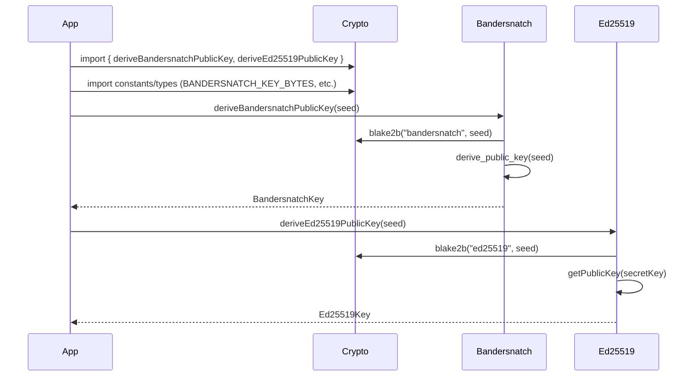

# Add key generator package with trivial seed function

## Pull Request by @DrEverr

https://github.com/polkadot-fellows/JIPs/blob/7048f79edf4f4eb8bfe6fb42e6bbf61900f44c65/JIP-5.md


## Comment by @coderabbitai[bot]

<!-- This is an auto-generated comment: summarize by coderabbit.ai -->
<!-- This is an auto-generated comment: skip review by coderabbit.ai -->

> [!IMPORTANT]
> ## Review skipped
> 
> Auto incremental reviews are disabled on this repository.
> 
> Please check the settings in the CodeRabbit UI or the `.coderabbit.yaml` file in this repository. To trigger a single review, invoke the `@coderabbitai review` command.
> 
> You can disable this status message by setting the `reviews.review_status` to `false` in the CodeRabbit configuration file.

<!-- end of auto-generated comment: skip review by coderabbit.ai -->
<!-- walkthrough_start -->

<details>
<summary>📝 Walkthrough</summary>

## Summary by CodeRabbit

- **New Features**
  - Introduced comprehensive key derivation utilities for Ed25519 and Bandersnatch cryptographic schemes, including seed generation and public/secret key derivation functions.
  - Added new exports for Bandersnatch cryptography primitives and constants, making them available for use throughout the application.

- **Bug Fixes**
  - Standardized and corrected import sources for cryptographic types and constants, consolidating them under a single crypto package for improved reliability.

- **Tests**
  - Added extensive unit tests to ensure correctness and robustness of key derivation and cryptographic operations.

- **Chores**
  - Updated package dependencies to reflect new cryptography package structure and ensure proper module resolution.
## Walkthrough

This change centralizes all Bandersnatch- and BLS-related cryptographic constants and types into the `@typeberry/crypto` package, updating imports across numerous modules and tests. It introduces new key derivation logic and tests for Bandersnatch and Ed25519 schemes, and expands the crypto package's exports. Several package manifests now explicitly depend on `@typeberry/crypto`.

## Changes

| Files/Groups                                                                                  | Change Summary                                                                                                                        |
|-----------------------------------------------------------------------------------------------|---------------------------------------------------------------------------------------------------------------------------------------|
| **crypto package (`packages/core/crypto/`)**                                                  | Added Bandersnatch and Ed25519 key derivation logic (`key-derivation.ts`), new tests for both schemes, and expanded exports in `index.ts`. |
| `packages/core/crypto/package.json`                                                           | Refactored dependencies, moved several to devDependencies, added new devDependencies, and removed dependency on `@typeberry/block`.    |
| **Test files (`*.test.ts`)**                                                                  | Updated imports to source Bandersnatch/BLS/Ed25519 constants/types from `@typeberry/crypto` instead of `@typeberry/block` or local files. |
| **Block, state, transition, safrole, and jam modules**                                        | Refactored imports: all Bandersnatch/BLS/Ed25519 constants/types now imported from `@typeberry/crypto`. Removed local crypto exports.   |
| `packages/jam/safrole/index.ts`, `packages/jam/safrole/safrole-seal.ts`, others              | Updated export/import sources for `verifySeal` and related VRF logic to reference the correct module.                                 |
| **Package manifests (`package.json`)**                                                        | Added `@typeberry/crypto` as a dependency to relevant packages: block-json, state-json, state-merkleization.                         |

## Sequence Diagram(s)



## Poem

> In fields of code where cryptos grow,
> The rabbits hop, imports in tow.
> Bandersnatch and BLS now unite,
> In `@typeberry/crypto`, shining bright.
> With keys derived and tests anew,
> Our crypto garden blooms for you!
> 🐇✨

</details>

<!-- walkthrough_end -->
<!-- internal state start -->


<!-- DwQgtGAEAqAWCWBnSTIEMB26CuAXA9mAOYCmGJATmriQCaQDG+Ats2bgFyQAOFk+AIwBWJBrngA3EsgEBPRvlqU0AgfFwA6NPEgQAfACgjoCEYDEZyAAUASpETZWaCrKNwSPbABsvkCiQBHbGlcSHFcLzpIACIAQVp6AGsSeVJyKgI+bjQGRLRSSAB3dVgwikl4NF9EEiiAM2wMMXh8DGiitGQHAWZ1Gno5MNgPbBq+ABEKAFEpCj5O6zsMRwFKSAAWAEZ1jRhhxZQMXApFbAZpdEhyQshk1LJlTJ4cvILcWGpDhi9sJWQ0MoVKr2Wr0BpNcStXbuSB/BjlbiQrD+OqUMjnf6w/AMRzsSCwfCIfr8LAAcXUAAlsAJ0KF3h4AKo2AAyXFguFw3EQHAA9DyiCVqRomMwedx8F48rR8LgwKifPhCogeQApACSVmVAi8gh5AHYAAzrAAcdT1AE46HV1taSAJjQJUQA2OoCdYAJhITtUdSdm3NBoN1vWDCdAFZVRqwGGNMxaAAaIoIBilXjSRwqLzyXj4CTwP7oBLqFoYYFMI4kAAeoXwfEQ3FE8Dq8AY1BLyH8XmoUQIQw88GY3EibCObahkAAcvhIA0KPS+EpcNovMha5Aq0PMGOMP9/DwTnmlPRiu94Fh6Qc4QikRojPpjOAoGR6Pg6jgCMQHhkoiKR5x9/wwiiOIUgyPITBKFQqjqFoOj3iYUBwKgqCYO+hBpI8P4sH+XBUDcDhOC4kCDBByjQZo2i6GAhgPqYBhqBgPI0ESYAUI06Q8oUADMdQ8ogaB1CckQaLg3IGNEEkGBYkCxGqn7pN29AEcwzjyK+jAfBgpCIG4+wDuKc72EuNB/sghRon4JC1kQmDwAAXj207MLmHgXmmeb4KMWYKKw7B0GAnmhPptaiZZXbEr2ABCmCQYgpa4CmCg7kuRz/Bg9C4LIDbIIJLAxAAAplDarHMsg8vCWUEO0AgvIcvY5CBIw1LsADKDYME2LZVFmiYAAaRbEE7jFMNgtROsTQAAwhSAD6ADSUwAJozZFi3QFMLW9X1A1DSNY0TdNM22AA8sdABiK1rRtW2QP1g3DaN41TbNNhqhOpIzTYp3QJd62bYmMV9mEWUeP1MWUHF1ApjYZ5EDY+Ayr1RQWf4zlSGCJzMEDwWGV4SA1m+0SFSDJUuDy2rYok7SA2gCSOdjg4hZAeNEvwhPE8VlBkxViL4NTOpaYg+ag1M4zumGYb+vNS2/dd6DpbdUy0OLkvmnNKS9dCCDICmmAFOWiASvm3b/D4kDRelEPxSmrEkOFWHJZgoWA0VFxnr2F4872zm0N4/aM3OiCJoUCCREDFO5JAPt+ygAehRg04C6QfBnt8vyucMNTm+DFCQwlsBgPWjbNgwKAmYgt4GFO/DzjOjTNK0wJrkSbFiNgVC+LrWkXOZe4qUohxA6RWseP4rPqRezZh6j2g7pA9eaaQtCV+YlixF4NAZO2YTTheSjfM426rm+G4hVEa7cNSeOl+wxbSEYU7kLeEnRHedFVjQO7tjy8DcAwYonAIEwLw5USBgE2FxTYYBzjgK4u6QuAkhJgPELkEgspaD43KAIPAJYRIhBEmJF+Uk15yQwt+JSjgVJEXUl3bSul/YGVCIbdu5w2ZD1aESJ2t0doPX2s9I6X1zqy02h0HWi96iYyBtHMOvUOZ2i5mVCOiRyouF5kjXssjXakzKl7fAmtJzThlMMPgpF+B8B1AKUutCe4WX7v2c8+xmKhCniQFexCZIb0eNvD2+x95di3hwthp85znyyFfFs64jh3x0lXVoJBxKSQMBAMARhsi5HyNIcqtYSAqMqvgcmOc84pjwUSAhHAEmv2krJeSmEKGETUm+axMTYhXBIDcJxM54BhzqGuC2sVralDuLCSgkhtyiMLEeXYaogpx2QOQDE/EiLSIuD0+YiAxhIiDmEEIsMAYKzkDQKOtlL7hVwXsVyIR7DYHUB4aIfSrZQ1gOreQ4wRkSG3O0csS4zyYiFlpMOHTWxZ3eJ8WYnULie1rP4MQ5B1lsIvL1SCkgSD3NzgMqw4SGDPKRuCBuGAR7bNZgbY4ZxnYgnhGgkEEi8oAmbJWKIwxKy00bCpXwFMBCJiRaBdhcxpDinSrDbOls0WPM8NqCJdw9n0E6Bs5AIK6S+LeVEIZKl84XFQhuYCDLnC0FIvQS+4rS5DPeT8Vx5zCWhDIA4MeQMuXKpSCgHWULgLeVdtKzEYNhVFKeRreW9BRgXCUCQbg64ghVHUPIXs5ZmwUCxheVVxSjCrw8ZvI+O9bWiH8Wm9SwTiQX0xZE8I8B76xKfnsVAGC6hvlaN5WmtBMTXAtZ0sOJ4CR4CjooJsshBWYHkLm0JYrr6FojcMg+ASdzP0Sck1JLwMnKiYP4XJvMCleoGWUip7jqlkMUlc+pbCmn0NhE2N8daG1tLrhCEst0DXX2xUMT4drMSou9YOiVDrcpYwBAKKQWAah0CmTMxhyBEVKpmjelsM07g4skRq6slBSy+GWX6+eNRkDqHTduw5F47gEtxUiDSohEhyv2DG1mByPAT32P4XA7dyBJAdc4KgkbpyLkoL0cgVyGALMgAACk1c0LSkAHInBnM3M4CyACUUy3yT3gLnUI5HHVXBlEJyg+BEzofeCcJU8t1xzDXGeDBrZxCCdQoFAKdQwBsGckRcsGCbyQGOr+8T0gtnocQNfCF+whmMbQPID9QMah2eIrIQ5rRCg6sTOWWYoV0Pu2nACfqoXpBI0ECIMQbC6XasQKUIWDkpWWRoxQOe6GFhmeyEEUGz6BnYq1shI4JxfYYnXJWIcLZ0NczXJpWgeNBOrKjiQGz8gkAOEDe3QVQyuVjMBuiNAXJvAmyBuBo1Dqpv4YsREs8lxG39rBPXG8SbN2ePHXK3eiqx3ZpPq1s+L4wmGuHeIEtUAzr7avXWugXBerLeeTxv9tAuAMndsaWIcw/MSa4NVx5d6ttfdndpLJi7dErv6Y8ghvUN1JLomk14mSF05KR4Zqs66iFVNIV+HdylVL7vETEmESHYfpPh3jpdBAf6W0rGj8ZH9nz01zdt89uiiBUG4MmK4aA2D1hyB4QGnYd230ezlSRCKaqrseUjZZrV2qdVbD4WQGnQgJxuP4MAubTa+FN/PYVQNSwS7SaDFXKP85I0BoZiovtup9uu4HEEsxgSuzSvQYlTtuTcMKTVjW20w+PJhlpeGiNI+q/zgANQoHUFq8AiDxXbiQG6nrHcpisCcV8ufIormxQV+kcn0DrOxJUYkim8seCD6lOr/wiz4eyB3SIK4gZVnxoKi3AWEV0BVv6dXpxIiJnnHaT32QBWCc9qoggQu5ui94AOYs3LAY4Lxgr9A7yumZg8EP7WjB2Ad0OEoDnh2qnHbTT4jwfjD6bKCV7vNd2h3y+LTEqA8QjwtcYU+z5wACpq9iIo8ncZxJFepogNBkcHl85ogkYYdsc50Ed8cl98lCcOdRJ0df86Z6AbcohB9oDYD4CRVEDkCsAGccd51skWcsD2c0dylIBdBQ9E8UxsUDBWCoA88EDoZYY49cB0ceD2D89YAU808M8s9/ARC2C+CKCC8i86g5DeDS9EAuDRC7pdpHoDpZoFplpVo/pVDuF7o9onpDpXp3pPpvphETDtDeELDZok8bALoWo1RSQnomQpg7DuD5CeFzC9CBFToLojDro/C1DmQWppZDCrpNoMdp0DBUCmd6Ckc7gwA1tcEnFidJJScalyFd0qEGkNI9YS0kI5lz0OkXF9xcxhYnVBx/Bhgv4pBLdNMQgco1xJs3kxk8Nt5ZcIppxBdhdRc/sA9bgUg0MHEm9slGBMDnhGczVpkLViNH80E2Mzx+9S5MMr0J5yg8xgRRioC8o4EwA1BQhGghZM8oh3YSBk4xiwVmwvMPAqwGoQsws8BL5nE1xmBvBxAhx7FPjIATVggK5zVqj6QsATVjZmIM09ixl1IlZR9zRyVqNxjZBFc8p6Qs5RiosWBO9BU94lV6N0T0AbIflLVWstV6BS80Bkh3QaQPgcsgSqgQSAN0AVxd52jq9ZAmhYATgE5Rhhk4T8METlYJZ/RX0VsSST8PAgtUS7gtlo05N2MiAeVoVcBYVj4gYx5fjBVls0TQT09eh/Eeoy4FBZgVihTRkRS3xId84UTKUFSjisZDiXZ9hugahKsjgrT3kbShVxDJSDTnShhCRZTRB5SJiAYyTISRk6hu0F99hApPj/hozWZ+NiRGTShgTpACUnFkAA1LghZBww5rNax5BupsRqA1x+sujhS3sFZBshx8B5AW4WxQgg0Q1AhsBw1Mpq8NlvFpwrVs8WtXiE1M5czLkgULgmBZhLgqBu42E/tDhkyNMmgfgMFBM6B9ZOgLg8ZkhVMThExEBWVfAbi7iCsAR/EChGVmUOpWVmTTVEwhzyhBMThsEiRNTkMF11TPzKMPBazrSr0NsGA3Fb9U0X8H9R0s0X8c038B19Sv8ntJxKjLkHAbkJkPtborx4BVgkYlEOi+BohnlIBXk6zWguBjggRqhQRohEwiKHVSLALyLIBETxTkS5TKU/taKYhiLGLfSSwuBWLVZAy7huL6KXluikQIcIDEoOKmEaKCtxKSLJKBL/T+DUwC1RLB4aC0Dmc0iUgMiVKoRsjcDWCkkDEO1K0uoILBy4LbtAzELJj7BPIKBWFSIABuEkbyRtQFRQaXAgydV+THFJJIuHXHVIzAnkdIzI4ywhXIkhfIinShKnGhGnXSVARtJDfSYcdgZAAC/i1oC9PFDohUYoBMjwdUKwaMewLXEuHo5ucMx01bIy/FSAJYpQZsWFS4ZveSqIRvNhOBN49VBWHMQ8dVIq/DXsTDaXQEfY3wE4hvUEYMgEBa9DC46Q64isZOELSyBsNsQTdQZAXfCIMBZ8SoLARTfwNMGoUcBzJY1OdclZV7QJXsO1B00IJ0/rISiUwGO0xKIY1fCJRAFMQbC4QYTMntJKYzMgeEk9ewEGtgQuWqiJHqoyF81Ut0sMqIUYQVGkukgQAlJDKoQ2GosanKZ6ueV6pVNUvlVoDc1U/Uz6pXd0xq3q/7bk3k/kzyDzfzNcb65EwYQQb5DAAk/YRm99ZmjwdfX0/8lIArRAHklMLmryXmvgP60oQYDBdU7yEUT40WqWzSiWzEqjNAfCJa8jUEmEUxANOVEGAYZLdAUHEkwGdlAi5c9tQGJMvAeW7AbgIDfgREEsYEUsoiCs4zK9L5ISIEyoS4I0/49eHUYzWsUCteO/GyjNC7GCq7RheCgtRyu8GSAgpKThb03qFqKYUWGadwgALSmC4GWGYBKmdwVldnZMqGA3LsrprqmCoOvTCroMR0iuiparR3Mr/3qAptukormpalBF+wBzgXB3NmS0QGAE7vGCrrVFrr0F7p0pSMHrySioMpivxVwLHqLt6MKpAz2JIH5tnopVwB+z+whxXrXoro3u7r0ABgVCTooAAH4uA47IgE7KzMgl68aSB6SKROhYBd7kjwqD7l1h6yLT7EA8DC7/9L7qC7V1b77qMn7QQX7mI36u6t6pgv72TE6qz/7AHsqSAQHf7wGux8boGcs4H+70CGCj7ZBDKUHR78D/9OhFaJqr1r7kV+aMVDUCHMLIpX717N7t6l7C8WAkASBgB+bnkd7tL4GB6MDD7kGmLUH0Hx69tL0r6cGZLYBJHb0UhftCHl7iH5HP7wHLHodqCdHOH9KeGT7R6iFgqZ0FjdGuH4GNAhBDYMBykScErpq6kijqdSjacxawrQnwnm1j81wEU5FtEGCkZ4HxkfZwUMonIXJhkGxLYmhv9gyLxoglAymlAKnpB2ggtJqztbklAJBXk6n0Rv8mngIzk2pi4updcp8xb/APIVbmZ8Yohamecmh5BNESYFFyZE7EgkYIsOxBsXJ6Bb5OxZBdgJxz12nOnZmOobE9x3t2aFnOZSoeRMzc8smlmG6So0GCtZE6gfgq1ZAuwBAtRLH9EYQ+8iRBUZnynTngMHmbmLb7mtElmd8XnboR82KwB1nmAbpAZeoE5tRTqxTVY1mUY0FZ4ohsFQg0ZsarcamSAOng0TmemCUXIu91wq1gIlMARoUux1ltdYa+ws4dGwD2m7Z8BuA/xSmaWLgMhjF71kRGhxA2ARXQXv9g4SgSQpawrLJSXpUW6+TahWkbheWLmU6U0vEXrWmoLn9t5YKc77KEKokFcC7q4ml01dszEHKbXv9PKa1sxkmwnCqQX6mGB5An8TtkY+5O1Hjl4EiscOGhBxdlnKYwBvXGJhhmUKAcjKlonydiRKdqFGk0qDAYQcYmFjJQbUpg3R4rIKAbIRaHIini6jZaBuwgZ/cxD1Ly9m3FCJDU909M9qBs80WFZeoNHfUAsahO8G2C3Jmur4tCzYYw5x3OETI8QZTboIXuZMDx9fZhJIABmOo6rhnG2QZgN1a710X1bJCu2ZCc9S21Wtmqm9I45JnWYAsrn5FIWVnm7pUi6qhWgiAhYB4B2cX/Q3GGZGFgzn3sndF9Fq4jE1gsGm5zF8BLEywacr27FB5IUlADX15wKByM7oLzXs6btnXrWi0S1H5XEI2QqPHo3RQlF43wmxQvXwnIn4qZIycFJM3krs2Sju5EnVium5mH2gopi+6FiUnWgcUul0m+BMmYXX242E3cnVX1n55uB6369yyixTMdW5W/W1JhOwOlmIP5iccgSIZRGDQNALPNh/nT861ixCrlPUOv3BZhZe9Kx+9BNfXume4ShApr28xBNvjQ34yMaMA1Ja5z9v9MO06cPCTM78OADCP817t87S1yO/HEiqOY3aOE2mIWxkhRITdqwXyhYQLRJmO03WPEqOO91UqEnD052XLWE/zi6UpQgHDAj+ETohEwiRFlPrEMZjaPB6ciZZOyYlEkD00YCV2dFMCkD9nDFa5TE1xgL8nQ3i1w2k0wKjXKaTXA3LtEuQkrW87XXSO4lAq35KOo3suVnbmSBk2SlNByuN08iYnCiUqc36u8272QP53i2vi+AOvdD+EXC3CPCvCbAfDeu1mFgBvlqwo2wWjx3sh3hboyDdFJv6osAVBDYfhDk8nkfqBShpuxvZu8l5uLLoOTE/LnXVuHXe5hvmU0PHFLkXFovsPjXcOzXAkLWkuP8IlUuyOLv/HQrAmeRqPY3cg7uHvnuomqu3us3iiD1vuGEmZ1Ige+FDoDC7DtozDgfDpQfN7PCJpvCde23vVW2T3LGz3pCe3ZDgZso1v0Z4eqHfBNYcnLKY5ILuditgQDObmjOQny0xFSja28Y1P1UzYAaRdNtZl4e/kiAw4feENnKWFR4ie1gQVf02sOR9asZVhcBzIyBmZKzfAZs4NffEMJ8czKeluafVvqyKaez5BlOqhN5/0b9U6Ofduueg3eejuiOTuSOYkheKOAnaDxebvKY2cr9U3N02Pal3uuPleAW38jJuxhX+t41q+Yg4CMfxlUYb2l297MkJelEZ+idTK2ePFfAqfDvC2N/cq1XZ5LcBv2edvTte+DunXkvP9Tuf9IANgTZs71zRAE1+oBALOjzm7uV2GYvM/rd2wK+Mp0kbOAVPyl4oICuFcWXixy3QZs+qnHJXrm3zb3t1eARfXrNG66hE4i77fdg2HN7oplCMPZAOqxd6l8EejUWOCBxgJ785u6iBLFgGT7AgCe97EnoswD68CFuNcCVst3g6WJuO2kFDsynf5BtIK+3LOvf1zopd/+D8c7mP1F4T8Je1HMAASBYg64VwPIHIDiB+L2weQfwW3jQEe5z9XueA2Jh93kFlEfuTMP7qZBQ7rd6YI7Z/BnFlJNcLgpAvXpr30IyxoeyGfqFERiJ2FdgheSli0BVojNpA0xR2CWwZ6cDCOx/GbpL1WbGcMk7Jb9kUCVa9RjgsgWIIgFnoUA8w5wNULQH0SxA6gm8IeOIj6iVDqhtQ+oSQEaFIwZ4PyHIQPyfb5ClEN0EOJJ1MI6EIh8Q6ISeziHa95he4Q3MMOJCjDSeOTAlOO3V6iwkScw6gaB3yFGdBhc8BeKUWXjB93B6AJlmIFXAYBXUngwyCj1gBjFpQFwBOKEDb5rBe0JfSxLiQawSgZwOoQoImDXCdY+A3WXrKqVbRbYLwVRSTsoPvx7dM03POeP33fwuth+Ogp+HoKy6igjBJg2UGYOVCCDd83+BjnOEqBeBC4RbDIgTRMpxVKuuA9jvgNq6fceODXe9t4Kf7ZCCmYbdNIfxaJ7w5MzLHYW+A15OEDhxhGIZFEWFRDDhGwsQeNzfbIZyS93egOO3pBxoEOaCCVq2kVhiw2K0ouWEqOuars8kNnVANYjD7QkniqfVyhRhkyZwMhJdWLEcASz2AZ2qvQyDyO9J5DNhgfZJrX2kE08MmlyVbq32Owd8tuXfD/umji54ceeBHAfr/wF7aC0uwvTLtd1FD8RcokQcgt6jAASBU8jg7AcyIX4FFFe8TTkSrzWHr8F2JbOESz0fZTDsh/gayLZGrbIZO84gD3GFFAZEs0ERfLAMskNLI0zBeuVrsHnNjhCpRSwuIomDIGzDKBwiArMuKlFWEPogiH6L118HO8l2o3ZUYohWbtA8mkFI8eaLJ68wzxwYmEFgzKBVDEASecNGp1rBqh2cz/IYQW2pRYxLxL7FUZTFgLmpCeqPfrKQFwAx4iAk0bCOoGFaAwHisgaAPlzQRmRYe4iQbn+LgIO51K7QXsGQRwnttixqeYCcdFrgFsxi8I1Cmgl9oKAB4pw1/hhMrjbcVBKI+LsmI0HHctB2IzMXiJzF8REEEoHJIRKLEli6gTg9NqyNcHL8iBTwh/o2NCjtjy2lbeyFEEBi9jqR3kTsIOIGDDjago46vuOMGaTi0hDvC4AO0BHcBZArDWBn1BfHh9qGH4q/H23oBl0NqtAZCagmEL7jfxQMf3oBNyA0D/JJ46fhgNQmKdAmjrVrNfE0wgwAoDw4bHH0+DwjBWBKJLMxCCmyNmIpeQQMgTj58ij+0BMYSvT4GFlg0gQ+sX6K+ECAXIaUjcUES3E2Fjou46gQnnEKtsFC3qKCUIRcn0DHkNvbtkVkvZNsCpB4oqZsPGFTdjha7Olr7jNgkBbhQUTEP4F8zdx4JCsfwBglbLEsdib4RrmnzGIBDx08KOKR6zWEYksY2Zc6Yq3eB+daE+tNYcQX/59hmANQLwKBCRHp1ExaIrUj/3543wMxo/DLigIMExs8xSCC/jgSZHz9qubIuJnV1rGr9fuRbTfmuF6iITZ6VQJge4Jrbjsl2I3bCZY2Il1BJu6o2mGwm4GFiBkFPKDnXwHjgi38ZkWxH4M27JosO8Y1QaiL74pjMRxHaJAXSmBr9mEjolThH0uYYz7uXgJGHzjh5PsCJljTHtOEpkiSBkxM0me434ngyhJkMpAUFWzGoDcxgkgsVrMiCFxJZZY6Gc4KklL9CBX3YgcjMf5ZD8WnYqtvTFJbsJMhoUSUUEQXHGFdeMwqUYb3cLG9oApvaHq8zlHRFfZpoyRKsEFQ/jMJy7CaaqN7BxyDqccXycFI97Ocf2rnAdkaNVgmjNorea4QbDraLZuo3LJvJgRXwx9S4DeVSdOKbEejp2/yH0c4klpJzjxHvIPrTIlawdb+sgoZu4KZl9wmezYi5K2OEid9DWrEr/uoL+lYj+ZvE4GVdwNkCT8xOSE2WAhqBVAJJ8vFwTbJrF0I6x4o2gVVlca+pHOhUobl3KvEFCIpJnDRNNMtG7A/89nBDKaQvBnyEUEsrGSIwc7oSLhoHeWRwVgCKy0ehMsBWrMg6LdQxA8BvtT0BG+B3mioNblZRjFsyYunPb6dzM4mD9uJy8oGcgLXmgzDZm8jeUggtkVcYZCvAgcfI8HtyGx/3JylRKnmgxt5FsvFnuA7EVsuxakjaeW0gj/ot2lLZQKeTj4Bjjxj8udD5MTlC5PIDYTUXH17Cu5Dw3ZXwL1mkBPlop7WCIC2VqohczJYxLBl0DOClAFgFk44IK2skwNc8VgSgPZOhK1hc8XQxAMhLYAtQdQwhPqJ5MwGCzKKX8BgL1IqEuBqhfitBLEA5CNlhC2wkgRKJVlq5xkcPVRfezllQLxCMCw4ESA1EUzQF4hGmXApg5N9B5fw4efT1sTjzhOvlDDjPPZlzzcF3/OygQr/48TiFeskGWgQl7bzKFQk/eSyMX7ViEZJ8+2V4JRlP8YcnC0ykpJdmqTLm9U/hNHJERW8wFd6JSSwKXYbE+xEikDgotomY1kQYCBOTvAgn6jyhew40Usugx5Qs5EHN+e3iDp7tv53IkIaJkB4QSoJME1gHBPYBBTEJES6ZUAu7iJzlZCs0qaCugViTClUgtYKYkQUAKEMI6a+RgtZlHZu+n/RpQvOaVpiAZbS3QavPH5dKwZdI3Lr7EHD9LKxSVdkSPK5EOyFJo8strMu7HewSm5wOcC/x6qUSD27A+mNH1gDyAeMCyywm9G3G2FeuS4+UbET+hLjL5U4wdrIAky3tQYYw1UeeJNa3K12RQ0gLsAACy93DAJMMnzGLkMpinlTWyUQ1EFkgqHjFMEsm2KcsiYBxdMHFApgcpuQKfGEsQBOqpgLq2AG6sSAeqnxPQlsCQFJCdBFVDE45WaIAkhTApJcm0e8LmQqYBIqIDLL8PhWR0gRqCm4LCOE4uJPK6GM6bTCECjBQoF4YWawjHFvKq5505iXGIaXnYkx6InmZoNaVELBiyHPkUz05nsTm1+CnFQ9kqbNiK0x6LMZ0vhzdKSV9HEJgmxoVWzBl9C4ZYwp07oh5ALMITn5JnXhMJOYcFrlnL+50dxOWqjwMp19piz00D1dOPzhuBecBOhVGTt3KDELFaQpnXOOZ0s4aBrOkgu/g6ypr8cwWzrNgEuDU4Agu1tS2MbPORHzyEui8vmbaxXkkLCVE64ld2EPWMQpllsySQuupUr85JzC4VsisKbpojpDbZ5SB1IGyrncmIVulIvvlPqccq5HJeTPUgFt45Xw6jSDCOHJzKYNnY/JPVCVPjvVvq/1QMMGyzw0MGckFSqp43xrxENw1NaFDOlkavBrywGESC+ZSc+p+cNZb5w9rHYe0YXGFdT3plDyQKdS7BT30xUwbsV/0wdWd1xEEr9BRK3MVOtaA8goSb4igBkWoBoAKVsM6SbbMRl4aK1TovyZHKLlIxUa/XDCUqs94yJ/x2TCbuCoS2GcJBIY2FWGNM3oLCmn02Lo2p+mv5LWLS9MXioc2IanNyGlzahrYAUBEgkQeyNuFsGOBuAfmuhThtklMKqpDKyyEyv8HlTvwwHEKBdIKjcbcg1MBWClvEHk9Ncxkj3P7McINSRVTUlqTKJWXiFupCMbyespvlxo8N66thJNoClUw1RyUXJVGskSHbrxVUOlrXCbYISWSFwHjGXUoC9D+hvigcCQC8Xx5bopEBgE6qcWebeoEasTVtnO15RLtBQ9oK2juniJv1tcAebTwQ7lLO1lS8DVgvRUJj8teC2DUP3bVlaOlpC5zXxDpE1a6tJABrUiAY6idZ1L3LDVWMXUciRliqf9WuvxjM9QYW6o9dUS377B91JOygGTop0lgZFBQU9apx3SDA7OWnRtLev9Ykg/JL8tRMetfVCwr6FnKzrAqM0jzMdfHUVquD4B39HiXgetIoLR1oqOZbEptb9Js1Lz4N7Sy7khtP4oaaAvS02SBuoW06D51soZYzuXVztxl/otGUKpehLadxdhJ3r5IfX3zJpaqhXYGM1VB9RlhkdXr9v+2vjqGomlSEMOjWJa32sm0PimuAj3DHhwQtPvCl53B7PooesVYcNRqAxE1ymL4cdnljhd4FFGLLRPKbRs9zNGOntVbsK189bd3+HEel3K34jid3YV3WAnd3ljaFh8n3TStPnciA9ik52Xwtdk1sSNhyCicGQh0TdkM/RfAT0EMm3tQyj0xORDox4zad2QzL+dysBimreoQm7EH6rfZ9Q09DkzILnlT2OL09X+zoZ6uf2uq39P2vygwAADqJQGCRWGrC54AVueGCfvCAELomhfUX7bnjmiG4MA6eByCDiYwhLOgmBxUNgdUncLhuN7VOe3OIK6KOo+i3fdJrG1qjQo3QMccHFDhVY5xPshUX7OmELb+EjUsPeHK02cEI8soyxhtsRhXswdf4xXddquEJr8AHw5NYtKBjwqB5I6YlowH8Tgoxi35IvYFleVVq/yWcCiblpwVY6mlRWgdYL3xVj7NZRbJiPgjhatb59DOxfUnvkksLfBKKwUcAKCFHp1S9YsIQHMW3WFBDio8ad3Mmku5Tt5M8duhhz2pbLRJQlzgPHhGcb/2SJWrPIbk1lzP99okLRTMr0CGa9Mo+qF6LblxaPAT22Q3ogjUZ9pOmkGqsdTY3EQ9JxfQvsUw3Y18+5xSsxinxW5I6dc2usDfYiBjd6IN9SqDVZo4k47CFdu2wwTsd3KhJ1k+jzdQ281LgXD3utw7hs60r7uteRu0Rq0DzOoxA9McdpXL5Uo0OEbXLlY70FWcHFl3BjaBKqjkvGWoiYC5YXKWUyrVlctc2GXgBPyrFVS7fiLKyQyX65u2SmgMxrfD1gWj5VfPu0awB77bu+/QGFCem3pa+ACO5uCSjbgX4KlY8tIya2Hg96Ld0G2Yzbrg3D6ENSxirU7tFDHBMAQsSnTKnbiYAMQHuuXgMvp3ta7ZwWg494aI29ghR/hrWmKPiW8HOuWvD45lMlXh7EjcnQKSdqY3KKQO2ok5XqLWAGj85+wq5TEO+NSxg5EPKHhEZuW1GrRIfBckcYj6WlrjUpIak3PdHlGE+s7NJZ3N0THqnyeMdjPtVVKbTGg9bb0t8SQCbhzgGpobXDv7klLEdiHTuCjpJNjG2FziRERSYbWrFe11uqw7ZpsPkA+J68lk1/Ep1bTPimSMs3gBzKMi51dOqlfDN928dKpwpmZevrmXVqx0I6QGHsu4Cwxr9nLJ5XJOG1omgJV7O0zuinYAh3THgLRWsMFRKb9g5AOgBPX6PIAeMbin1S/sDXVCP9ziigNufcUfavtuAA8wDscns4JMiYIUYKkaABooz3uR4yEeeNSrXj5sRU71ykyQBoDFpO2FOOU3e5IBtRqHRZA3Dgwa2G4GKXQcvUDxK9Sy5DOFrgs5zf2HgY0+aCLlfGC5Jp8Hib0h5rjkMF4eVWZMkHEnGepJxthGKGOJgHxHVLZe2DBHzBDNP6sMXgGQuDbfRBxsw5ZosNYrczQ++zaPoZPj7izbJksDyCupDbHDpSZw7PvnX8mGz7hoU47NX08LlJ/CmtuOcORXGa5wxG457PuMrILtQFuqJ6OnOQAez1xZfUpf7O7sv5ozZIdzW8hb725WpWCx8fgvvm4i9B0bcdu23owK8Lol091rJn3mBipy3U0q1QvoWWKmFtC6aZwvmnpVyGO+vYOHI0bDL8e7E+UWuGF67hXlSNHhrUHbx69ihpNSS2C4t6ylDAAEdYpQUgj6LemE4JCJijQj2daTTixiu4vWbeLtJ/i2OpogIRIkL4E9HgHQiHzfw7AXCKbSPkkQ/KUEM4rBCoiGABrv4dQDNHzCIAZoYzYtOZFoAzROEhke8AYAGumg9Q4YTYHaANDGhjQWwd0AaC4jGg4EHVNAH6DDDuhjQ5odYBaE2DiwuIeoMMAwGNCLXaIUAFa7gDWv1pNryQtpHQBmjPhFrQAA== -->

<!-- internal state end -->
<!-- tips_start -->

---


<details>
<summary>🪧 Tips</summary>

### Chat

There are 3 ways to chat with [CodeRabbit](https://coderabbit.ai?utm_source=oss&utm_medium=github&utm_campaign=FluffyLabs/typeberry&utm_content=414):

- Review comments: Directly reply to a review comment made by CodeRabbit. Example:
  - `I pushed a fix in commit <commit_id>, please review it.`
  - `Explain this complex logic.`
  - `Open a follow-up GitHub issue for this discussion.`
- Files and specific lines of code (under the "Files changed" tab): Tag `@coderabbitai` in a new review comment at the desired location with your query. Examples:
  - `@coderabbitai explain this code block.`
  -	`@coderabbitai modularize this function.`
- PR comments: Tag `@coderabbitai` in a new PR comment to ask questions about the PR branch. For the best results, please provide a very specific query, as very limited context is provided in this mode. Examples:
  - `@coderabbitai gather interesting stats about this repository and render them as a table. Additionally, render a pie chart showing the language distribution in the codebase.`
  - `@coderabbitai read src/utils.ts and explain its main purpose.`
  - `@coderabbitai read the files in the src/scheduler package and generate a class diagram using mermaid and a README in the markdown format.`
  - `@coderabbitai help me debug CodeRabbit configuration file.`

### Support

Need help? Create a ticket on our [support page](https://www.coderabbit.ai/contact-us/support) for assistance with any issues or questions.

Note: Be mindful of the bot's finite context window. It's strongly recommended to break down tasks such as reading entire modules into smaller chunks. For a focused discussion, use review comments to chat about specific files and their changes, instead of using the PR comments.

### CodeRabbit Commands (Invoked using PR comments)

- `@coderabbitai pause` to pause the reviews on a PR.
- `@coderabbitai resume` to resume the paused reviews.
- `@coderabbitai review` to trigger an incremental review. This is useful when automatic reviews are disabled for the repository.
- `@coderabbitai full review` to do a full review from scratch and review all the files again.
- `@coderabbitai summary` to regenerate the summary of the PR.
- `@coderabbitai generate sequence diagram` to generate a sequence diagram of the changes in this PR.
- `@coderabbitai resolve` resolve all the CodeRabbit review comments.
- `@coderabbitai configuration` to show the current CodeRabbit configuration for the repository.
- `@coderabbitai help` to get help.

### Other keywords and placeholders

- Add `@coderabbitai ignore` anywhere in the PR description to prevent this PR from being reviewed.
- Add `@coderabbitai summary` to generate the high-level summary at a specific location in the PR description.
- Add `@coderabbitai` anywhere in the PR title to generate the title automatically.

### Documentation and Community

- Visit our [Documentation](https://docs.coderabbit.ai) for detailed information on how to use CodeRabbit.
- Join our [Discord Community](http://discord.gg/coderabbit) to get help, request features, and share feedback.
- Follow us on [X/Twitter](https://twitter.com/coderabbitai) for updates and announcements.

</details>

<!-- tips_end -->


## Comment by @github-actions[bot]


<details>
<summary>View all</summary>

|  Name  |  Status  | |
|--------|----------|-|
| Trie test 0 | ✅ | | 
| Trie test 1 | ✅ | | 
| Trie test 2 | ✅ | | 
| Trie test 3 | ✅ | | 
| Trie test 4 | ✅ | | 
| Trie test 5 | ✅ | | 
| Trie test 6 | ✅ | | 
| Trie test 7 | ✅ | | 
| Trie test 8 | ✅ | | 
| Trie test 9 | ✅ | | 
| Trie test 10 | ✅ | | 
| Trie test 10 | ✅ | | 
| Trie test 10 | ✅ | | 
| jamtestvectors/statistics/tiny/stats_with_empty_extrinsic-1.json | ✅ | | 
| jamtestvectors/statistics/tiny/stats_with_epoch_change-1.json | ✅ | | 
| jamtestvectors/statistics/tiny/stats_with_some_extrinsic-1.json | ✅ | | 
| jamtestvectors/statistics/tiny/stats_with_some_extrinsic-1.json | ✅ | | 
| jamtestvectors/statistics/full/stats_with_empty_extrinsic-1.json | ✅ | | 
| jamtestvectors/statistics/full/stats_with_epoch_change-1.json | ✅ | | 
| jamtestvectors/statistics/full/stats_with_some_extrinsic-1.json | ✅ | | 
| jamtestvectors/statistics/full/stats_with_some_extrinsic-1.json | ✅ | | 
| should correctly shuffle input of length 0 | ✅ | | 
| should correctly shuffle input of length 8 | ✅ | | 
| should correctly shuffle input of length 16 | ✅ | | 
| should correctly shuffle input of length 20 | ✅ | | 
| should correctly shuffle input of length 50 | ✅ | | 
| should correctly shuffle input of length 100 | ✅ | | 
| should correctly shuffle input of length 200 | ✅ | | 
| should correctly shuffle input of length 341 | ✅ | | 
| should correctly shuffle input of length 341 | ✅ | | 
| should correctly shuffle input of length 341 | ✅ | | 
| jamtestvectors/safrole/tiny/enact-epoch-change-with-no-tickets-1.json | ✅ | | 
| jamtestvectors/safrole/tiny/enact-epoch-change-with-no-tickets-2.json | ✅ | | 
| jamtestvectors/safrole/tiny/enact-epoch-change-with-no-tickets-3.json | ✅ | | 
| jamtestvectors/safrole/tiny/enact-epoch-change-with-no-tickets-4.json | ✅ | | 
| jamtestvectors/safrole/tiny/enact-epoch-change-with-padding-1.json | ✅ | | 
| jamtestvectors/safrole/tiny/publish-tickets-no-mark-1.json | ✅ | | 
| jamtestvectors/safrole/tiny/publish-tickets-no-mark-2.json | ✅ | | 
| jamtestvectors/safrole/tiny/publish-tickets-no-mark-3.json | ✅ | | 
| jamtestvectors/safrole/tiny/publish-tickets-no-mark-4.json | ✅ | | 
| jamtestvectors/safrole/tiny/publish-tickets-no-mark-5.json | ✅ | | 
| jamtestvectors/safrole/tiny/publish-tickets-no-mark-6.json | ✅ | | 
| jamtestvectors/safrole/tiny/publish-tickets-no-mark-7.json | ✅ | | 
| jamtestvectors/safrole/tiny/publish-tickets-no-mark-8.json | ✅ | | 
| jamtestvectors/safrole/tiny/publish-tickets-no-mark-9.json | ✅ | | 
| jamtestvectors/safrole/tiny/publish-tickets-with-mark-1.json | ✅ | | 
| jamtestvectors/safrole/tiny/publish-tickets-with-mark-2.json | ✅ | | 
| jamtestvectors/safrole/tiny/publish-tickets-with-mark-3.json | ✅ | | 
| jamtestvectors/safrole/tiny/publish-tickets-with-mark-4.json | ✅ | | 
| jamtestvectors/safrole/tiny/publish-tickets-with-mark-5.json | ✅ | | 
| jamtestvectors/safrole/tiny/skip-epoch-tail-1.json | ✅ | | 
| jamtestvectors/safrole/tiny/skip-epochs-1.json | ✅ | | 
| jamtestvectors/safrole/full/enact-epoch-change-with-no-tickets-1.json | ✅ | | 
| jamtestvectors/safrole/full/enact-epoch-change-with-no-tickets-2.json | ✅ | | 
| jamtestvectors/safrole/full/enact-epoch-change-with-no-tickets-3.json | ✅ | | 
| jamtestvectors/safrole/full/enact-epoch-change-with-no-tickets-4.json | ✅ | | 
| jamtestvectors/safrole/full/enact-epoch-change-with-padding-1.json | ✅ | | 
| jamtestvectors/safrole/full/publish-tickets-no-mark-1.json | ✅ | | 
| jamtestvectors/safrole/full/publish-tickets-no-mark-2.json | ✅ | | 
| jamtestvectors/safrole/full/publish-tickets-no-mark-3.json | ✅ | | 
| jamtestvectors/safrole/full/publish-tickets-no-mark-4.json | ✅ | | 
| jamtestvectors/safrole/full/publish-tickets-no-mark-5.json | ✅ | | 
| jamtestvectors/safrole/full/publish-tickets-no-mark-6.json | ✅ | | 
| jamtestvectors/safrole/full/publish-tickets-no-mark-7.json | ✅ | | 
| jamtestvectors/safrole/full/publish-tickets-no-mark-8.json | ✅ | | 
| jamtestvectors/safrole/full/publish-tickets-no-mark-9.json | ✅ | | 
| jamtestvectors/safrole/full/publish-tickets-with-mark-1.json | ✅ | | 
| jamtestvectors/safrole/full/publish-tickets-with-mark-2.json | ✅ | | 
| jamtestvectors/safrole/full/publish-tickets-with-mark-3.json | ✅ | | 
| jamtestvectors/safrole/full/publish-tickets-with-mark-4.json | ✅ | | 
| jamtestvectors/safrole/full/publish-tickets-with-mark-5.json | ✅ | | 
| jamtestvectors/safrole/full/skip-epoch-tail-1.json | ✅ | | 
| jamtestvectors/safrole/full/skip-epochs-1.json | ✅ | | 
| jamtestvectors/safrole/full/skip-epochs-1.json | ✅ | | 
| jamtestvectors/reports/tiny/anchor_not_recent-1.json | ✅ | | 
| jamtestvectors/reports/tiny/bad_beefy_mmr-1.json | ✅ | | 
| jamtestvectors/reports/tiny/bad_code_hash-1.json | ✅ | | 
| jamtestvectors/reports/tiny/bad_core_index-1.json | ✅ | | 
| jamtestvectors/reports/tiny/bad_service_id-1.json | ✅ | | 
| jamtestvectors/reports/tiny/bad_signature-1.json | ✅ | | 
| jamtestvectors/reports/tiny/bad_state_root-1.json | ✅ | | 
| jamtestvectors/reports/tiny/bad_validator_index-1.json | ✅ | | 
| jamtestvectors/reports/tiny/big_work_report_output-1.json | ✅ | | 
| jamtestvectors/reports/tiny/core_engaged-1.json | ✅ | | 
| jamtestvectors/reports/tiny/dependency_missing-1.json | ✅ | | 
| jamtestvectors/reports/tiny/duplicate_package_in_recent_history-1.json | ✅ | | 
| jamtestvectors/reports/tiny/duplicated_package_in_report-1.json | ✅ | | 
| jamtestvectors/reports/tiny/future_report_slot-1.json | ✅ | | 
| jamtestvectors/reports/tiny/high_work_report_gas-1.json | ✅ | | 
| jamtestvectors/reports/tiny/many_dependencies-1.json | ✅ | | 
| jamtestvectors/reports/tiny/multiple_reports-1.json | ✅ | | 
| jamtestvectors/reports/tiny/no_enough_guarantees-1.json | ✅ | | 
| jamtestvectors/reports/tiny/not_authorized-1.json | ✅ | | 
| jamtestvectors/reports/tiny/not_authorized-2.json | ✅ | | 
| jamtestvectors/reports/tiny/not_sorted_guarantor-1.json | ✅ | | 
| jamtestvectors/reports/tiny/out_of_order_guarantees-1.json | ✅ | | 
| jamtestvectors/reports/tiny/report_before_last_rotation-1.json | ✅ | | 
| jamtestvectors/reports/tiny/report_curr_rotation-1.json | ✅ | | 
| jamtestvectors/reports/tiny/report_prev_rotation-1.json | ✅ | | 
| jamtestvectors/reports/tiny/reports_with_dependencies-1.json | ✅ | | 
| jamtestvectors/reports/tiny/reports_with_dependencies-2.json | ✅ | | 
| jamtestvectors/reports/tiny/reports_with_dependencies-3.json | ✅ | | 
| jamtestvectors/reports/tiny/reports_with_dependencies-4.json | ✅ | | 
| jamtestvectors/reports/tiny/reports_with_dependencies-5.json | ✅ | | 
| jamtestvectors/reports/tiny/reports_with_dependencies-6.json | ✅ | | 
| jamtestvectors/reports/tiny/segment_root_lookup_invalid-1.json | ✅ | | 
| jamtestvectors/reports/tiny/segment_root_lookup_invalid-2.json | ✅ | | 
| jamtestvectors/reports/tiny/service_item_gas_too_low-1.json | ✅ | | 
| jamtestvectors/reports/tiny/too_big_work_report_output-1.json | ✅ | | 
| jamtestvectors/reports/tiny/too_high_work_report_gas-1.json | ✅ | | 
| jamtestvectors/reports/tiny/too_many_dependencies-1.json | ✅ | | 
| jamtestvectors/reports/tiny/with_avail_assignments-1.json | ✅ | | 
| jamtestvectors/reports/tiny/wrong_assignment-1.json | ✅ | | 
| jamtestvectors/reports/tiny/wrong_assignment-1.json | ✅ | | 
| jamtestvectors/reports/full/anchor_not_recent-1.json | ✅ | | 
| jamtestvectors/reports/full/bad_beefy_mmr-1.json | ✅ | | 
| jamtestvectors/reports/full/bad_code_hash-1.json | ✅ | | 
| jamtestvectors/reports/full/bad_core_index-1.json | ✅ | | 
| jamtestvectors/reports/full/bad_service_id-1.json | ✅ | | 
| jamtestvectors/reports/full/bad_signature-1.json | ✅ | | 
| jamtestvectors/reports/full/bad_state_root-1.json | ✅ | | 
| jamtestvectors/reports/full/bad_validator_index-1.json | ✅ | | 
| jamtestvectors/reports/full/big_work_report_output-1.json | ✅ | | 
| jamtestvectors/reports/full/core_engaged-1.json | ✅ | | 
| jamtestvectors/reports/full/dependency_missing-1.json | ✅ | | 
| jamtestvectors/reports/full/duplicate_package_in_recent_history-1.json | ✅ | | 
| jamtestvectors/reports/full/duplicated_package_in_report-1.json | ✅ | | 
| jamtestvectors/reports/full/future_report_slot-1.json | ✅ | | 
| jamtestvectors/reports/full/high_work_report_gas-1.json | ✅ | | 
| jamtestvectors/reports/full/many_dependencies-1.json | ✅ | | 
| jamtestvectors/reports/full/multiple_reports-1.json | ✅ | | 
| jamtestvectors/reports/full/no_enough_guarantees-1.json | ✅ | | 
| jamtestvectors/reports/full/not_authorized-1.json | ✅ | | 
| jamtestvectors/reports/full/not_authorized-2.json | ✅ | | 
| jamtestvectors/reports/full/not_sorted_guarantor-1.json | ✅ | | 
| jamtestvectors/reports/full/out_of_order_guarantees-1.json | ✅ | | 
| jamtestvectors/reports/full/report_before_last_rotation-1.json | ✅ | | 
| jamtestvectors/reports/full/report_curr_rotation-1.json | ✅ | | 
| jamtestvectors/reports/full/report_prev_rotation-1.json | ✅ | | 
| jamtestvectors/reports/full/reports_with_dependencies-1.json | ✅ | | 
| jamtestvectors/reports/full/reports_with_dependencies-2.json | ✅ | | 
| jamtestvectors/reports/full/reports_with_dependencies-3.json | ✅ | | 
| jamtestvectors/reports/full/reports_with_dependencies-4.json | ✅ | | 
| jamtestvectors/reports/full/reports_with_dependencies-5.json | ✅ | | 
| jamtestvectors/reports/full/reports_with_dependencies-6.json | ✅ | | 
| jamtestvectors/reports/full/segment_root_lookup_invalid-1.json | ✅ | | 
| jamtestvectors/reports/full/segment_root_lookup_invalid-2.json | ✅ | | 
| jamtestvectors/reports/full/service_item_gas_too_low-1.json | ✅ | | 
| jamtestvectors/reports/full/too_big_work_report_output-1.json | ✅ | | 
| jamtestvectors/reports/full/too_high_work_report_gas-1.json | ✅ | | 
| jamtestvectors/reports/full/too_many_dependencies-1.json | ✅ | | 
| jamtestvectors/reports/full/with_avail_assignments-1.json | ✅ | | 
| jamtestvectors/reports/full/wrong_assignment-1.json | ✅ | | 
| jamtestvectors/reports/full/wrong_assignment-1.json | ✅ | | 
| jamtestvectors/pvm/schema.json | ✅ | | 
| jamtestvectors/pvm/schema.json | ✅ | | 
| jamtestvectors/pvm/programs/gas_basic_consume_all.json | ✅ | | 
| jamtestvectors/pvm/programs/inst_add_32.json | ✅ | | 
| jamtestvectors/pvm/programs/inst_add_32_with_overflow.json | ✅ | | 
| jamtestvectors/pvm/programs/inst_add_32_with_truncation.json | ✅ | | 
| jamtestvectors/pvm/programs/inst_add_32_with_truncation_and_sign_extension.json | ✅ | | 
| jamtestvectors/pvm/programs/inst_add_64.json | ✅ | | 
| jamtestvectors/pvm/programs/inst_add_64_with_overflow.json | ✅ | | 
| jamtestvectors/pvm/programs/inst_add_imm_32.json | ✅ | | 
| jamtestvectors/pvm/programs/inst_add_imm_32_with_truncation.json | ✅ | | 
| jamtestvectors/pvm/programs/inst_add_imm_32_with_truncation_and_sign_extension.json | ✅ | | 
| jamtestvectors/pvm/programs/inst_add_imm_64.json | ✅ | | 
| jamtestvectors/pvm/programs/inst_and.json | ✅ | | 
| jamtestvectors/pvm/programs/inst_and_imm.json | ✅ | | 
| jamtestvectors/pvm/programs/inst_branch_eq_imm_nok.json | ✅ | | 
| jamtestvectors/pvm/programs/inst_branch_eq_imm_ok.json | ✅ | | 
| jamtestvectors/pvm/programs/inst_branch_eq_nok.json | ✅ | | 
| jamtestvectors/pvm/programs/inst_branch_eq_ok.json | ✅ | | 
| jamtestvectors/pvm/programs/inst_branch_greater_or_equal_signed_imm_nok.json | ✅ | | 
| jamtestvectors/pvm/programs/inst_branch_greater_or_equal_signed_imm_ok.json | ✅ | | 
| jamtestvectors/pvm/programs/inst_branch_greater_or_equal_signed_nok.json | ✅ | | 
| jamtestvectors/pvm/programs/inst_branch_greater_or_equal_signed_ok.json | ✅ | | 
| jamtestvectors/pvm/programs/inst_branch_greater_or_equal_unsigned_imm_nok.json | ✅ | | 
| jamtestvectors/pvm/programs/inst_branch_greater_or_equal_unsigned_imm_ok.json | ✅ | | 
| jamtestvectors/pvm/programs/inst_branch_greater_or_equal_unsigned_nok.json | ✅ | | 
| jamtestvectors/pvm/programs/inst_branch_greater_or_equal_unsigned_ok.json | ✅ | | 
| jamtestvectors/pvm/programs/inst_branch_greater_signed_imm_nok.json | ✅ | | 
| jamtestvectors/pvm/programs/inst_branch_greater_signed_imm_ok.json | ✅ | | 
| jamtestvectors/pvm/programs/inst_branch_greater_unsigned_imm_nok.json | ✅ | | 
| jamtestvectors/pvm/programs/inst_branch_greater_unsigned_imm_ok.json | ✅ | | 
| jamtestvectors/pvm/programs/inst_branch_less_or_equal_signed_imm_nok.json | ✅ | | 
| jamtestvectors/pvm/programs/inst_branch_less_or_equal_signed_imm_ok.json | ✅ | | 
| jamtestvectors/pvm/programs/inst_branch_less_or_equal_unsigned_imm_nok.json | ✅ | | 
| jamtestvectors/pvm/programs/inst_branch_less_or_equal_unsigned_imm_ok.json | ✅ | | 
| jamtestvectors/pvm/programs/inst_branch_less_signed_imm_nok.json | ✅ | | 
| jamtestvectors/pvm/programs/inst_branch_less_signed_imm_ok.json | ✅ | | 
| jamtestvectors/pvm/programs/inst_branch_less_signed_nok.json | ✅ | | 
| jamtestvectors/pvm/programs/inst_branch_less_signed_ok.json | ✅ | | 
| jamtestvectors/pvm/programs/inst_branch_less_unsigned_imm_nok.json | ✅ | | 
| jamtestvectors/pvm/programs/inst_branch_less_unsigned_imm_ok.json | ✅ | | 
| jamtestvectors/pvm/programs/inst_branch_less_unsigned_nok.json | ✅ | | 
| jamtestvectors/pvm/programs/inst_branch_less_unsigned_ok.json | ✅ | | 
| jamtestvectors/pvm/programs/inst_branch_not_eq_imm_nok.json | ✅ | | 
| jamtestvectors/pvm/programs/inst_branch_not_eq_imm_ok.json | ✅ | | 
| jamtestvectors/pvm/programs/inst_branch_not_eq_nok.json | ✅ | | 
| jamtestvectors/pvm/programs/inst_branch_not_eq_ok.json | ✅ | | 
| jamtestvectors/pvm/programs/inst_cmov_if_zero_imm_nok.json | ✅ | | 
| jamtestvectors/pvm/programs/inst_cmov_if_zero_imm_ok.json | ✅ | | 
| jamtestvectors/pvm/programs/inst_cmov_if_zero_nok.json | ✅ | | 
| jamtestvectors/pvm/programs/inst_cmov_if_zero_ok.json | ✅ | | 
| jamtestvectors/pvm/programs/inst_div_signed_32.json | ✅ | | 
| jamtestvectors/pvm/programs/inst_div_signed_32.json | ✅ | | 
| jamtestvectors/pvm/programs/inst_div_signed_32_by_zero.json | ✅ | | 
| jamtestvectors/pvm/programs/inst_div_signed_32_with_overflow.json | ✅ | | 
| jamtestvectors/pvm/programs/inst_div_signed_64.json | ✅ | | 
| jamtestvectors/pvm/programs/inst_div_signed_64_by_zero.json | ✅ | | 
| jamtestvectors/pvm/programs/inst_div_signed_64_with_overflow.json | ✅ | | 
| jamtestvectors/pvm/programs/inst_div_unsigned_32.json | ✅ | | 
| jamtestvectors/pvm/programs/inst_div_unsigned_32_by_zero.json | ✅ | | 
| jamtestvectors/pvm/programs/inst_div_unsigned_32_with_overflow.json | ✅ | | 
| jamtestvectors/pvm/programs/inst_div_unsigned_64.json | ✅ | | 
| jamtestvectors/pvm/programs/inst_div_unsigned_64_by_zero.json | ✅ | | 
| jamtestvectors/pvm/programs/inst_div_unsigned_64_with_overflow.json | ✅ | | 
| jamtestvectors/pvm/programs/inst_fallthrough.json | ✅ | | 
| jamtestvectors/pvm/programs/inst_jump.json | ✅ | | 
| jamtestvectors/pvm/programs/inst_jump_indirect_invalid_djump_to_zero_nok.json | ✅ | | 
| jamtestvectors/pvm/programs/inst_jump_indirect_misaligned_djump_with_offset_nok.json | ✅ | | 
| jamtestvectors/pvm/programs/inst_jump_indirect_misaligned_djump_without_offset_nok.json | ✅ | | 
| jamtestvectors/pvm/programs/inst_jump_indirect_with_offset_ok.json | ✅ | | 
| jamtestvectors/pvm/programs/inst_jump_indirect_without_offset_ok.json | ✅ | | 
| jamtestvectors/pvm/programs/inst_load_i16.json | ✅ | | 
| jamtestvectors/pvm/programs/inst_load_i32.json | ✅ | | 
| jamtestvectors/pvm/programs/inst_load_i8.json | ✅ | | 
| jamtestvectors/pvm/programs/inst_load_imm.json | ✅ | | 
| jamtestvectors/pvm/programs/inst_load_imm_64.json | ✅ | | 
| jamtestvectors/pvm/programs/inst_load_imm_and_jump.json | ✅ | | 
| jamtestvectors/pvm/programs/inst_load_imm_and_jump_indirect_different_regs_with_offset_ok.json | ✅ | | 
| jamtestvectors/pvm/programs/inst_load_imm_and_jump_indirect_different_regs_without_offset_ok.json | ✅ | | 
| jamtestvectors/pvm/programs/inst_load_imm_and_jump_indirect_invalid_djump_to_zero_different_regs_without_offset_nok.json | ✅ | | 
| jamtestvectors/pvm/programs/inst_load_imm_and_jump_indirect_invalid_djump_to_zero_same_regs_without_offset_nok.json | ✅ | | 
| jamtestvectors/pvm/programs/inst_load_imm_and_jump_indirect_misaligned_djump_different_regs_with_offset_nok.json | ✅ | | 
| jamtestvectors/pvm/programs/inst_load_imm_and_jump_indirect_misaligned_djump_different_regs_without_offset_nok.json | ✅ | | 
| jamtestvectors/pvm/programs/inst_load_imm_and_jump_indirect_misaligned_djump_same_regs_with_offset_nok.json | ✅ | | 
| jamtestvectors/pvm/programs/inst_load_imm_and_jump_indirect_misaligned_djump_same_regs_without_offset_nok.json | ✅ | | 
| jamtestvectors/pvm/programs/inst_load_imm_and_jump_indirect_same_regs_with_offset_ok.json | ✅ | | 
| jamtestvectors/pvm/programs/inst_load_imm_and_jump_indirect_same_regs_without_offset_ok.json | ✅ | | 
| jamtestvectors/pvm/programs/inst_load_indirect_i16_with_offset.json | ✅ | | 
| jamtestvectors/pvm/programs/inst_load_indirect_i16_without_offset.json | ✅ | | 
| jamtestvectors/pvm/programs/inst_load_indirect_i32_with_offset.json | ✅ | | 
| jamtestvectors/pvm/programs/inst_load_indirect_i32_without_offset.json | ✅ | | 
| jamtestvectors/pvm/programs/inst_load_indirect_i8_with_offset.json | ✅ | | 
| jamtestvectors/pvm/programs/inst_load_indirect_i8_without_offset.json | ✅ | | 
| jamtestvectors/pvm/programs/inst_load_indirect_u16_with_offset.json | ✅ | | 
| jamtestvectors/pvm/programs/inst_load_indirect_u16_without_offset.json | ✅ | | 
| jamtestvectors/pvm/programs/inst_load_indirect_u32_with_offset.json | ✅ | | 
| jamtestvectors/pvm/programs/inst_load_indirect_u32_without_offset.json | ✅ | | 
| jamtestvectors/pvm/programs/inst_load_indirect_u64_with_offset.json | ✅ | | 
| jamtestvectors/pvm/programs/inst_load_indirect_u64_without_offset.json | ✅ | | 
| jamtestvectors/pvm/programs/inst_load_indirect_u8_with_offset.json | ✅ | | 
| jamtestvectors/pvm/programs/inst_load_indirect_u8_without_offset.json | ✅ | | 
| jamtestvectors/pvm/programs/inst_load_u16.json | ✅ | | 
| jamtestvectors/pvm/programs/inst_load_u32.json | ✅ | | 
| jamtestvectors/pvm/programs/inst_load_u32.json | ✅ | | 
| jamtestvectors/pvm/programs/inst_load_u64.json | ✅ | | 
| jamtestvectors/pvm/programs/inst_load_u8.json | ✅ | | 
| jamtestvectors/pvm/programs/inst_load_u8_nok.json | ✅ | | 
| jamtestvectors/pvm/programs/inst_move_reg.json | ✅ | | 
| jamtestvectors/pvm/programs/inst_mul_32.json | ✅ | | 
| jamtestvectors/pvm/programs/inst_mul_64.json | ✅ | | 
| jamtestvectors/pvm/programs/inst_mul_imm_32.json | ✅ | | 
| jamtestvectors/pvm/programs/inst_mul_imm_64.json | ✅ | | 
| jamtestvectors/pvm/programs/inst_negate_and_add_imm_32.json | ✅ | | 
| jamtestvectors/pvm/programs/inst_negate_and_add_imm_64.json | ✅ | | 
| jamtestvectors/pvm/programs/inst_or.json | ✅ | | 
| jamtestvectors/pvm/programs/inst_or_imm.json | ✅ | | 
| jamtestvectors/pvm/programs/inst_rem_signed_32.json | ✅ | | 
| jamtestvectors/pvm/programs/inst_rem_signed_32_by_zero.json | ✅ | | 
| jamtestvectors/pvm/programs/inst_rem_signed_32_with_overflow.json | ✅ | | 
| jamtestvectors/pvm/programs/inst_rem_signed_64.json | ✅ | | 
| jamtestvectors/pvm/programs/inst_rem_signed_64_by_zero.json | ✅ | | 
| jamtestvectors/pvm/programs/inst_rem_signed_64_with_overflow.json | ✅ | | 
| jamtestvectors/pvm/programs/inst_rem_unsigned_32.json | ✅ | | 
| jamtestvectors/pvm/programs/inst_rem_unsigned_32_by_zero.json | ✅ | | 
| jamtestvectors/pvm/programs/inst_rem_unsigned_64.json | ✅ | | 
| jamtestvectors/pvm/programs/inst_rem_unsigned_64_by_zero.json | ✅ | | 
| jamtestvectors/pvm/programs/inst_ret_halt.json | ✅ | | 
| jamtestvectors/pvm/programs/inst_ret_invalid.json | ✅ | | 
| jamtestvectors/pvm/programs/inst_set_greater_than_signed_imm_0.json | ✅ | | 
| jamtestvectors/pvm/programs/inst_set_greater_than_signed_imm_1.json | ✅ | | 
| jamtestvectors/pvm/programs/inst_set_greater_than_unsigned_imm_0.json | ✅ | | 
| jamtestvectors/pvm/programs/inst_set_greater_than_unsigned_imm_1.json | ✅ | | 
| jamtestvectors/pvm/programs/inst_set_less_than_signed_0.json | ✅ | | 
| jamtestvectors/pvm/programs/inst_set_less_than_signed_1.json | ✅ | | 
| jamtestvectors/pvm/programs/inst_set_less_than_signed_imm_0.json | ✅ | | 
| jamtestvectors/pvm/programs/inst_set_less_than_signed_imm_1.json | ✅ | | 
| jamtestvectors/pvm/programs/inst_set_less_than_unsigned_0.json | ✅ | | 
| jamtestvectors/pvm/programs/inst_set_less_than_unsigned_1.json | ✅ | | 
| jamtestvectors/pvm/programs/inst_set_less_than_unsigned_imm_0.json | ✅ | | 
| jamtestvectors/pvm/programs/inst_set_less_than_unsigned_imm_1.json | ✅ | | 
| jamtestvectors/pvm/programs/inst_shift_arithmetic_right_32.json | ✅ | | 
| jamtestvectors/pvm/programs/inst_shift_arithmetic_right_32_with_overflow.json | ✅ | | 
| jamtestvectors/pvm/programs/inst_shift_arithmetic_right_64.json | ✅ | | 
| jamtestvectors/pvm/programs/inst_shift_arithmetic_right_64_with_overflow.json | ✅ | | 
| jamtestvectors/pvm/programs/inst_shift_arithmetic_right_imm_32.json | ✅ | | 
| jamtestvectors/pvm/programs/inst_shift_arithmetic_right_imm_64.json | ✅ | | 
| jamtestvectors/pvm/programs/inst_shift_arithmetic_right_imm_alt_32.json | ✅ | | 
| jamtestvectors/pvm/programs/inst_shift_arithmetic_right_imm_alt_64.json | ✅ | | 
| jamtestvectors/pvm/programs/inst_shift_logical_left_32.json | ✅ | | 
| jamtestvectors/pvm/programs/inst_shift_logical_left_32_with_overflow.json | ✅ | | 
| jamtestvectors/pvm/programs/inst_shift_logical_left_64.json | ✅ | | 
| jamtestvectors/pvm/programs/inst_shift_logical_left_64_with_overflow.json | ✅ | | 
| jamtestvectors/pvm/programs/inst_shift_logical_left_imm_32.json | ✅ | | 
| jamtestvectors/pvm/programs/inst_shift_logical_left_imm_64.json | ✅ | | 
| jamtestvectors/pvm/programs/inst_shift_logical_left_imm_64.json | ✅ | | 
| jamtestvectors/pvm/programs/inst_shift_logical_left_imm_alt_32.json | ✅ | | 
| jamtestvectors/pvm/programs/inst_shift_logical_left_imm_alt_64.json | ✅ | | 
| jamtestvectors/pvm/programs/inst_shift_logical_right_32.json | ✅ | | 
| jamtestvectors/pvm/programs/inst_shift_logical_right_32_with_overflow.json | ✅ | | 
| jamtestvectors/pvm/programs/inst_shift_logical_right_64.json | ✅ | | 
| jamtestvectors/pvm/programs/inst_shift_logical_right_64_with_overflow.json | ✅ | | 
| jamtestvectors/pvm/programs/inst_shift_logical_right_imm_32.json | ✅ | | 
| jamtestvectors/pvm/programs/inst_shift_logical_right_imm_64.json | ✅ | | 
| jamtestvectors/pvm/programs/inst_shift_logical_right_imm_alt_32.json | ✅ | | 
| jamtestvectors/pvm/programs/inst_shift_logical_right_imm_alt_64.json | ✅ | | 
| jamtestvectors/pvm/programs/inst_store_imm_indirect_u16_with_offset_nok.json | ✅ | | 
| jamtestvectors/pvm/programs/inst_store_imm_indirect_u16_with_offset_ok.json | ✅ | | 
| jamtestvectors/pvm/programs/inst_store_imm_indirect_u16_without_offset_ok.json | ✅ | | 
| jamtestvectors/pvm/programs/inst_store_imm_indirect_u32_with_offset_nok.json | ✅ | | 
| jamtestvectors/pvm/programs/inst_store_imm_indirect_u32_with_offset_ok.json | ✅ | | 
| jamtestvectors/pvm/programs/inst_store_imm_indirect_u32_without_offset_ok.json | ✅ | | 
| jamtestvectors/pvm/programs/inst_store_imm_indirect_u64_with_offset_nok.json | ✅ | | 
| jamtestvectors/pvm/programs/inst_store_imm_indirect_u64_with_offset_ok.json | ✅ | | 
| jamtestvectors/pvm/programs/inst_store_imm_indirect_u64_without_offset_ok.json | ✅ | | 
| jamtestvectors/pvm/programs/inst_store_imm_indirect_u8_with_offset_nok.json | ✅ | | 
| jamtestvectors/pvm/programs/inst_store_imm_indirect_u8_with_offset_ok.json | ✅ | | 
| jamtestvectors/pvm/programs/inst_store_imm_indirect_u8_without_offset_ok.json | ✅ | | 
| jamtestvectors/pvm/programs/inst_store_imm_u16.json | ✅ | | 
| jamtestvectors/pvm/programs/inst_store_imm_u32.json | ✅ | | 
| jamtestvectors/pvm/programs/inst_store_imm_u64.json | ✅ | | 
| jamtestvectors/pvm/programs/inst_store_imm_u8.json | ✅ | | 
| jamtestvectors/pvm/programs/inst_store_imm_u8_trap_inaccessible.json | ✅ | | 
| jamtestvectors/pvm/programs/inst_store_imm_u8_trap_read_only.json | ✅ | | 
| jamtestvectors/pvm/programs/inst_store_indirect_u16_with_offset_nok.json | ✅ | | 
| jamtestvectors/pvm/programs/inst_store_indirect_u16_with_offset_ok.json | ✅ | | 
| jamtestvectors/pvm/programs/inst_store_indirect_u16_without_offset_ok.json | ✅ | | 
| jamtestvectors/pvm/programs/inst_store_indirect_u32_with_offset_nok.json | ✅ | | 
| jamtestvectors/pvm/programs/inst_store_indirect_u32_with_offset_ok.json | ✅ | | 
| jamtestvectors/pvm/programs/inst_store_indirect_u32_without_offset_ok.json | ✅ | | 
| jamtestvectors/pvm/programs/inst_store_indirect_u64_with_offset_nok.json | ✅ | | 
| jamtestvectors/pvm/programs/inst_store_indirect_u64_with_offset_ok.json | ✅ | | 
| jamtestvectors/pvm/programs/inst_store_indirect_u64_without_offset_ok.json | ✅ | | 
| jamtestvectors/pvm/programs/inst_store_indirect_u8_with_offset_nok.json | ✅ | | 
| jamtestvectors/pvm/programs/inst_store_indirect_u8_with_offset_ok.json | ✅ | | 
| jamtestvectors/pvm/programs/inst_store_indirect_u8_without_offset_ok.json | ✅ | | 
| jamtestvectors/pvm/programs/inst_store_u16.json | ✅ | | 
| jamtestvectors/pvm/programs/inst_store_u32.json | ✅ | | 
| jamtestvectors/pvm/programs/inst_store_u64.json | ✅ | | 
| jamtestvectors/pvm/programs/inst_store_u8.json | ✅ | | 
| jamtestvectors/pvm/programs/inst_store_u8_trap_inaccessible.json | ✅ | | 
| jamtestvectors/pvm/programs/inst_store_u8_trap_read_only.json | ✅ | | 
| jamtestvectors/pvm/programs/inst_sub_32.json | ✅ | | 
| jamtestvectors/pvm/programs/inst_sub_32_with_overflow.json | ✅ | | 
| jamtestvectors/pvm/programs/inst_sub_64.json | ✅ | | 
| jamtestvectors/pvm/programs/inst_sub_64_with_overflow.json | ✅ | | 
| jamtestvectors/pvm/programs/inst_sub_64_with_overflow.json | ✅ | | 
| jamtestvectors/pvm/programs/inst_sub_imm_32.json | ✅ | | 
| jamtestvectors/pvm/programs/inst_sub_imm_64.json | ✅ | | 
| jamtestvectors/pvm/programs/inst_trap.json | ✅ | | 
| jamtestvectors/pvm/programs/inst_xor.json | ✅ | | 
| jamtestvectors/pvm/programs/inst_xor_imm.json | ✅ | | 
| jamtestvectors/pvm/programs/riscv_rv64ua_amoadd_d.json | ✅ | | 
| jamtestvectors/pvm/programs/riscv_rv64ua_amoadd_w.json | ✅ | | 
| jamtestvectors/pvm/programs/riscv_rv64ua_amoand_d.json | ✅ | | 
| jamtestvectors/pvm/programs/riscv_rv64ua_amoand_w.json | ✅ | | 
| jamtestvectors/pvm/programs/riscv_rv64ua_amomax_d.json | ✅ | | 
| jamtestvectors/pvm/programs/riscv_rv64ua_amomax_w.json | ✅ | | 
| jamtestvectors/pvm/programs/riscv_rv64ua_amomaxu_d.json | ✅ | | 
| jamtestvectors/pvm/programs/riscv_rv64ua_amomaxu_w.json | ✅ | | 
| jamtestvectors/pvm/programs/riscv_rv64ua_amomin_d.json | ✅ | | 
| jamtestvectors/pvm/programs/riscv_rv64ua_amomin_w.json | ✅ | | 
| jamtestvectors/pvm/programs/riscv_rv64ua_amominu_d.json | ✅ | | 
| jamtestvectors/pvm/programs/riscv_rv64ua_amominu_w.json | ✅ | | 
| jamtestvectors/pvm/programs/riscv_rv64ua_amoor_d.json | ✅ | | 
| jamtestvectors/pvm/programs/riscv_rv64ua_amoor_w.json | ✅ | | 
| jamtestvectors/pvm/programs/riscv_rv64ua_amoswap_d.json | ✅ | | 
| jamtestvectors/pvm/programs/riscv_rv64ua_amoswap_w.json | ✅ | | 
| jamtestvectors/pvm/programs/riscv_rv64ua_amoxor_d.json | ✅ | | 
| jamtestvectors/pvm/programs/riscv_rv64ua_amoxor_w.json | ✅ | | 
| jamtestvectors/pvm/programs/riscv_rv64uc_rvc.json | ✅ | | 
| jamtestvectors/pvm/programs/riscv_rv64ui_add.json | ✅ | | 
| jamtestvectors/pvm/programs/riscv_rv64ui_addi.json | ✅ | | 
| jamtestvectors/pvm/programs/riscv_rv64ui_addiw.json | ✅ | | 
| jamtestvectors/pvm/programs/riscv_rv64ui_addw.json | ✅ | | 
| jamtestvectors/pvm/programs/riscv_rv64ui_and.json | ✅ | | 
| jamtestvectors/pvm/programs/riscv_rv64ui_andi.json | ✅ | | 
| jamtestvectors/pvm/programs/riscv_rv64ui_beq.json | ✅ | | 
| jamtestvectors/pvm/programs/riscv_rv64ui_bge.json | ✅ | | 
| jamtestvectors/pvm/programs/riscv_rv64ui_bgeu.json | ✅ | | 
| jamtestvectors/pvm/programs/riscv_rv64ui_blt.json | ✅ | | 
| jamtestvectors/pvm/programs/riscv_rv64ui_bltu.json | ✅ | | 
| jamtestvectors/pvm/programs/riscv_rv64ui_bne.json | ✅ | | 
| jamtestvectors/pvm/programs/riscv_rv64ui_jal.json | ✅ | | 
| jamtestvectors/pvm/programs/riscv_rv64ui_jalr.json | ✅ | | 
| jamtestvectors/pvm/programs/riscv_rv64ui_lb.json | ✅ | | 
| jamtestvectors/pvm/programs/riscv_rv64ui_lbu.json | ✅ | | 
| jamtestvectors/pvm/programs/riscv_rv64ui_ld.json | ✅ | | 
| jamtestvectors/pvm/programs/riscv_rv64ui_lh.json | ✅ | | 
| jamtestvectors/pvm/programs/riscv_rv64ui_lhu.json | ✅ | | 
| jamtestvectors/pvm/programs/riscv_rv64ui_lui.json | ✅ | | 
| jamtestvectors/pvm/programs/riscv_rv64ui_lw.json | ✅ | | 
| jamtestvectors/pvm/programs/riscv_rv64ui_lwu.json | ✅ | | 
| jamtestvectors/pvm/programs/riscv_rv64ui_ma_data.json | ✅ | | 
| jamtestvectors/pvm/programs/riscv_rv64ui_or.json | ✅ | | 
| jamtestvectors/pvm/programs/riscv_rv64ui_ori.json | ✅ | | 
| jamtestvectors/pvm/programs/riscv_rv64ui_sb.json | ✅ | | 
| jamtestvectors/pvm/programs/riscv_rv64ui_sb.json | ✅ | | 
| jamtestvectors/pvm/programs/riscv_rv64ui_sd.json | ✅ | | 
| jamtestvectors/pvm/programs/riscv_rv64ui_sh.json | ✅ | | 
| jamtestvectors/pvm/programs/riscv_rv64ui_simple.json | ✅ | | 
| jamtestvectors/pvm/programs/riscv_rv64ui_sll.json | ✅ | | 
| jamtestvectors/pvm/programs/riscv_rv64ui_slli.json | ✅ | | 
| jamtestvectors/pvm/programs/riscv_rv64ui_slliw.json | ✅ | | 
| jamtestvectors/pvm/programs/riscv_rv64ui_sllw.json | ✅ | | 
| jamtestvectors/pvm/programs/riscv_rv64ui_slt.json | ✅ | | 
| jamtestvectors/pvm/programs/riscv_rv64ui_slti.json | ✅ | | 
| jamtestvectors/pvm/programs/riscv_rv64ui_sltiu.json | ✅ | | 
| jamtestvectors/pvm/programs/riscv_rv64ui_sltu.json | ✅ | | 
| jamtestvectors/pvm/programs/riscv_rv64ui_sra.json | ✅ | | 
| jamtestvectors/pvm/programs/riscv_rv64ui_srai.json | ✅ | | 
| jamtestvectors/pvm/programs/riscv_rv64ui_sraiw.json | ✅ | | 
| jamtestvectors/pvm/programs/riscv_rv64ui_sraw.json | ✅ | | 
| jamtestvectors/pvm/programs/riscv_rv64ui_srl.json | ✅ | | 
| jamtestvectors/pvm/programs/riscv_rv64ui_srli.json | ✅ | | 
| jamtestvectors/pvm/programs/riscv_rv64ui_srliw.json | ✅ | | 
| jamtestvectors/pvm/programs/riscv_rv64ui_srlw.json | ✅ | | 
| jamtestvectors/pvm/programs/riscv_rv64ui_sub.json | ✅ | | 
| jamtestvectors/pvm/programs/riscv_rv64ui_subw.json | ✅ | | 
| jamtestvectors/pvm/programs/riscv_rv64ui_sw.json | ✅ | | 
| jamtestvectors/pvm/programs/riscv_rv64ui_xor.json | ✅ | | 
| jamtestvectors/pvm/programs/riscv_rv64ui_xori.json | ✅ | | 
| jamtestvectors/pvm/programs/riscv_rv64um_div.json | ✅ | | 
| jamtestvectors/pvm/programs/riscv_rv64um_divu.json | ✅ | | 
| jamtestvectors/pvm/programs/riscv_rv64um_divuw.json | ✅ | | 
| jamtestvectors/pvm/programs/riscv_rv64um_divw.json | ✅ | | 
| jamtestvectors/pvm/programs/riscv_rv64um_mul.json | ✅ | | 
| jamtestvectors/pvm/programs/riscv_rv64um_mulh.json | ✅ | | 
| jamtestvectors/pvm/programs/riscv_rv64um_mulhsu.json | ✅ | | 
| jamtestvectors/pvm/programs/riscv_rv64um_mulhu.json | ✅ | | 
| jamtestvectors/pvm/programs/riscv_rv64um_mulw.json | ✅ | | 
| jamtestvectors/pvm/programs/riscv_rv64um_rem.json | ✅ | | 
| jamtestvectors/pvm/programs/riscv_rv64um_remu.json | ✅ | | 
| jamtestvectors/pvm/programs/riscv_rv64um_remuw.json | ✅ | | 
| jamtestvectors/pvm/programs/riscv_rv64um_remw.json | ✅ | | 
| jamtestvectors/pvm/programs/riscv_rv64uzbb_andn.json | ✅ | | 
| jamtestvectors/pvm/programs/riscv_rv64uzbb_clz.json | ✅ | | 
| jamtestvectors/pvm/programs/riscv_rv64uzbb_clzw.json | ✅ | | 
| jamtestvectors/pvm/programs/riscv_rv64uzbb_cpop.json | ✅ | | 
| jamtestvectors/pvm/programs/riscv_rv64uzbb_cpopw.json | ✅ | | 
| jamtestvectors/pvm/programs/riscv_rv64uzbb_ctz.json | ✅ | | 
| jamtestvectors/pvm/programs/riscv_rv64uzbb_ctzw.json | ✅ | | 
| jamtestvectors/pvm/programs/riscv_rv64uzbb_max.json | ✅ | | 
| jamtestvectors/pvm/programs/riscv_rv64uzbb_maxu.json | ✅ | | 
| jamtestvectors/pvm/programs/riscv_rv64uzbb_min.json | ✅ | | 
| jamtestvectors/pvm/programs/riscv_rv64uzbb_minu.json | ✅ | | 
| jamtestvectors/pvm/programs/riscv_rv64uzbb_orc_b.json | ✅ | | 
| jamtestvectors/pvm/programs/riscv_rv64uzbb_orn.json | ✅ | | 
| jamtestvectors/pvm/programs/riscv_rv64uzbb_orn.json | ✅ | | 
| jamtestvectors/pvm/programs/riscv_rv64uzbb_rev8.json | ✅ | | 
| jamtestvectors/pvm/programs/riscv_rv64uzbb_rol.json | ✅ | | 
| jamtestvectors/pvm/programs/riscv_rv64uzbb_rolw.json | ✅ | | 
| jamtestvectors/pvm/programs/riscv_rv64uzbb_ror.json | ✅ | | 
| jamtestvectors/pvm/programs/riscv_rv64uzbb_rori.json | ✅ | | 
| jamtestvectors/pvm/programs/riscv_rv64uzbb_roriw.json | ✅ | | 
| jamtestvectors/pvm/programs/riscv_rv64uzbb_rorw.json | ✅ | | 
| jamtestvectors/pvm/programs/riscv_rv64uzbb_sext_b.json | ✅ | | 
| jamtestvectors/pvm/programs/riscv_rv64uzbb_sext_h.json | ✅ | | 
| jamtestvectors/pvm/programs/riscv_rv64uzbb_xnor.json | ✅ | | 
| jamtestvectors/pvm/programs/riscv_rv64uzbb_zext_h.json | ✅ | | 
| jamtestvectors/pvm/programs/riscv_rv64uzbb_zext_h.json | ✅ | | 
| jamtestvectors/preimages/data/preimage_needed-1.json | ✅ | | 
| jamtestvectors/preimages/data/preimage_needed-2.json | ✅ | | 
| jamtestvectors/preimages/data/preimage_not_needed-1.json | ✅ | | 
| jamtestvectors/preimages/data/preimage_not_needed-2.json | ✅ | | 
| jamtestvectors/preimages/data/preimages_order_check-1.json | ✅ | | 
| jamtestvectors/preimages/data/preimages_order_check-2.json | ✅ | | 
| jamtestvectors/preimages/data/preimages_order_check-3.json | ✅ | | 
| jamtestvectors/preimages/data/preimages_order_check-4.json | ✅ | | 
| jamtestvectors/preimages/data/preimages_order_check-4.json | ✅ | | 
| jamtestvectors/host_function/Zero/hostZeroOK.json | ✅ | | 
| jamtestvectors/host_function/Zero/hostZeroOOB.json | ✅ | | 
| jamtestvectors/host_function/Zero/hostZeroWHO.json | ✅ | | 
| jamtestvectors/host_function/Yield/hostYieldOK.json | ✅ | | 
| jamtestvectors/host_function/Yield/hostYieldOOB.json | ✅ | | 
| jamtestvectors/host_function/Write/hostWriteFULL.json | ✅ | | 
| jamtestvectors/host_function/Write/hostWriteNONE.json | ✅ | | 
| jamtestvectors/host_function/Write/hostWriteOK.json | ✅ | | 
| jamtestvectors/host_function/Write/hostWriteOOB.json | ✅ | | 
| jamtestvectors/host_function/Void/hostVoidOK.json | ✅ | | 
| jamtestvectors/host_function/Void/hostVoidOOB.json | ✅ | | 
| jamtestvectors/host_function/Void/hostVoidWHO.json | ✅ | | 
| jamtestvectors/host_function/Upgrade/hostUpgradeOK.json | ✅ | | 
| jamtestvectors/host_function/Upgrade/hostUpgradeOOB.json | ✅ | | 
| jamtestvectors/host_function/Transfer/hostTransferCASH.json | ✅ | | 
| jamtestvectors/host_function/Transfer/hostTransferLOW.json | ✅ | | 
| jamtestvectors/host_function/Transfer/hostTransferOK.json | ✅ | | 
| jamtestvectors/host_function/Transfer/hostTransferOOB.json | ✅ | | 
| jamtestvectors/host_function/Transfer/hostTransferWHO.json | ✅ | | 
| jamtestvectors/host_function/Solicit/hostSolicitFULL.json | ✅ | | 
| jamtestvectors/host_function/Solicit/hostSolicitHUH.json | ✅ | | 
| jamtestvectors/host_function/Solicit/hostSolicitOK_2_timeslots.json | ✅ | | 
| jamtestvectors/host_function/Solicit/hostSolicitOK_no_timeslots.json | ✅ | | 
| jamtestvectors/host_function/Solicit/hostSolicitOOB.json | ✅ | | 
| jamtestvectors/host_function/Read/hostReadNONE.json | ✅ | | 
| jamtestvectors/host_function/Read/hostReadOK_d_omega7.json | ✅ | | 
| jamtestvectors/host_function/Read/hostReadOK_s.json | ✅ | | 
| jamtestvectors/host_function/Read/hostReadOOB.json | ✅ | | 
| jamtestvectors/host_function/Query/hostQueryNONE.json | ✅ | | 
| jamtestvectors/host_function/Query/hostQueryOK_0_timeslots.json | ✅ | | 
| jamtestvectors/host_function/Query/hostQueryOK_1_timeslots.json | ✅ | | 
| jamtestvectors/host_function/Query/hostQueryOK_2_timeslots.json | ✅ | | 
| jamtestvectors/host_function/Query/hostQueryOK_3_timeslots.json | ✅ | | 
| jamtestvectors/host_function/Query/hostQueryOOB.json | ✅ | | 
| jamtestvectors/host_function/Poke/hostPokeOK.json | ✅ | | 
| jamtestvectors/host_function/Poke/hostPokeOOB.json | ✅ | | 
| jamtestvectors/host_function/Poke/hostPokeWHO.json | ✅ | | 
| jamtestvectors/host_function/Peek/hostPeekOK.json | ✅ | | 
| jamtestvectors/host_function/Peek/hostPeekOOB.json | ✅ | | 
| jamtestvectors/host_function/Peek/hostPeekWHO.json | ✅ | | 
| jamtestvectors/host_function/New/hostNewCASH.json | ✅ | | 
| jamtestvectors/host_function/New/hostNewOK.json | ✅ | | 
| jamtestvectors/host_function/New/hostNewOOB.json | ✅ | | 
| jamtestvectors/host_function/Machine/hostMachineOK.json | ✅ | | 
| jamtestvectors/host_function/Machine/hostMachineOOB.json | ✅ | | 
| jamtestvectors/host_function/Lookup/hostLookupNONE.json | ✅ | | 
| jamtestvectors/host_function/Lookup/hostLookupOK_d_omega7.json | ✅ | | 
| jamtestvectors/host_function/Lookup/hostLookupOK_s.json | ✅ | | 
| jamtestvectors/host_function/Lookup/hostLookupOOB.json | ✅ | | 
| jamtestvectors/host_function/Invoke/hostInvokeFAULT.json | ✅ | | 
| jamtestvectors/host_function/Invoke/hostInvokeFAULT.json | ✅ | | 
| jamtestvectors/host_function/Invoke/hostInvokeHALT.json | ✅ | | 
| jamtestvectors/host_function/Invoke/hostInvokeHOST.json | ✅ | | 
| jamtestvectors/host_function/Invoke/hostInvokeOOB.json | ✅ | | 
| jamtestvectors/host_function/Invoke/hostInvokeOOG.json | ✅ | | 
| jamtestvectors/host_function/Invoke/hostInvokePANIC.json | ✅ | | 
| jamtestvectors/host_function/Invoke/hostInvokeWHO.json | ✅ | | 
| jamtestvectors/host_function/Info/hostInfoNONE.json | ✅ | | 
| jamtestvectors/host_function/Info/hostInfoOK.json | ✅ | | 
| jamtestvectors/host_function/Info/hostInfoOOB.json | ✅ | | 
| jamtestvectors/host_function/Import/hostImportNONE.json | ✅ | | 
| jamtestvectors/host_function/Import/hostImportOK.json | ✅ | | 
| jamtestvectors/host_function/Import/hostImportOK_gt_wg.json | ✅ | | 
| jamtestvectors/host_function/Import/hostImportOOB.json | ✅ | | 
| jamtestvectors/host_function/Historical_lookup/hostHistorical_lookupNONE.json | ✅ | | 
| jamtestvectors/host_function/Historical_lookup/hostHistorical_lookupOK_d_omega7.json | ✅ | | 
| jamtestvectors/host_function/Historical_lookup/hostHistorical_lookupOK_d_s.json | ✅ | | 
| jamtestvectors/host_function/Historical_lookup/hostHistorical_lookupOOB.json | ✅ | | 
| jamtestvectors/host_function/Forget/hostForgetHUH.json | ✅ | | 
| jamtestvectors/host_function/Forget/hostForgetOK_0_timeslots.json | ✅ | | 
| jamtestvectors/host_function/Forget/hostForgetOK_1_timeslots.json | ✅ | | 
| jamtestvectors/host_function/Forget/hostForgetOK_2_timeslots.json | ✅ | | 
| jamtestvectors/host_function/Forget/hostForgetOK_3_timeslots.json | ✅ | | 
| jamtestvectors/host_function/Forget/hostForgetOOB.json | ✅ | | 
| jamtestvectors/host_function/Expunge/hostExpungeOK.json | ✅ | | 
| jamtestvectors/host_function/Expunge/hostExpungeWHO.json | ✅ | | 
| jamtestvectors/host_function/Export/hostExportFULL.json | ✅ | | 
| jamtestvectors/host_function/Export/hostExportOK.json | ✅ | | 
| jamtestvectors/host_function/Export/hostExportOK_gt_wg.json | ✅ | | 
| jamtestvectors/host_function/Export/hostExportOOB.json | ✅ | | 
| jamtestvectors/host_function/Eject/hostEjectHUH.json | ✅ | | 
| jamtestvectors/host_function/Eject/hostEjectOK.json | ✅ | | 
| jamtestvectors/host_function/Eject/hostEjectOOB.json | ✅ | | 
| jamtestvectors/host_function/Eject/hostEjectWHO.json | ✅ | | 
| jamtestvectors/host_function/Eject/hostEjectWHO.json | ✅ | | 
| jamtestvectors/history/data/progress_blocks_history-1.json | ✅ | | 
| jamtestvectors/history/data/progress_blocks_history-2.json | ✅ | | 
| jamtestvectors/history/data/progress_blocks_history-3.json | ✅ | | 
| jamtestvectors/history/data/progress_blocks_history-4.json | ✅ | | 
| jamtestvectors/history/data/progress_blocks_history-4.json | ✅ | | 
| should encode data & decode it back | ✅ | | 
| should decode from the first 1/3 of shards | ✅ | | 
| should exactly match the test encoding | ✅ | | 
| should decode from random 1/3 of shards | ✅ | | 
| should decode from random 1/3 of shards | ✅ | | 
| should encode data & decode it back | ✅ | | 
| should decode from the first 1/3 of shards | ✅ | | 
| should exactly match the test encoding | ✅ | | 
| should decode from random 1/3 of shards | ✅ | | 
| should decode from random 1/3 of shards | ✅ | | 
| should encode data & decode it back | ✅ | | 
| should decode from the first 1/3 of shards | ✅ | | 
| should exactly match the test encoding | ✅ | | 
| should decode from random 1/3 of shards | ✅ | | 
| should decode from random 1/3 of shards | ✅ | | 
| should encode data & decode it back | ✅ | | 
| should decode from the first 1/3 of shards | ✅ | | 
| should exactly match the test encoding | ✅ | | 
| should decode from random 1/3 of shards | ✅ | | 
| should decode from random 1/3 of shards | ✅ | | 
| should encode data & decode it back | ✅ | | 
| should decode from the first 1/3 of shards | ✅ | | 
| should exactly match the test encoding | ✅ | | 
| should decode from random 1/3 of shards | ✅ | | 
| should decode from random 1/3 of shards | ✅ | | 
| should encode data & decode it back | ✅ | | 
| should decode from the first 1/3 of shards | ✅ | | 
| should exactly match the test encoding | ✅ | | 
| should decode from random 1/3 of shards | ✅ | | 
| should decode from random 1/3 of shards | ✅ | | 
| should decode from random 1/3 of shards | ✅ | | 
| jamtestvectors/disputes/tiny/progress_invalidates_avail_assignments-1.json | ✅ | | 
| jamtestvectors/disputes/tiny/progress_with_bad_signatures-1.json | ✅ | | 
| jamtestvectors/disputes/tiny/progress_with_bad_signatures-2.json | ✅ | | 
| jamtestvectors/disputes/tiny/progress_with_culprits-1.json | ✅ | | 
| jamtestvectors/disputes/tiny/progress_with_culprits-2.json | ✅ | | 
| jamtestvectors/disputes/tiny/progress_with_culprits-3.json | ✅ | | 
| jamtestvectors/disputes/tiny/progress_with_culprits-4.json | ✅ | | 
| jamtestvectors/disputes/tiny/progress_with_culprits-5.json | ✅ | | 
| jamtestvectors/disputes/tiny/progress_with_culprits-6.json | ✅ | | 
| jamtestvectors/disputes/tiny/progress_with_culprits-7.json | ✅ | | 
| jamtestvectors/disputes/tiny/progress_with_faults-1.json | ✅ | | 
| jamtestvectors/disputes/tiny/progress_with_faults-2.json | ✅ | | 
| jamtestvectors/disputes/tiny/progress_with_faults-3.json | ✅ | | 
| jamtestvectors/disputes/tiny/progress_with_faults-4.json | ✅ | | 
| jamtestvectors/disputes/tiny/progress_with_faults-5.json | ✅ | | 
| jamtestvectors/disputes/tiny/progress_with_faults-6.json | ✅ | | 
| jamtestvectors/disputes/tiny/progress_with_faults-7.json | ✅ | | 
| jamtestvectors/disputes/tiny/progress_with_invalid_keys-1.json | ✅ | | 
| jamtestvectors/disputes/tiny/progress_with_invalid_keys-2.json | ✅ | | 
| jamtestvectors/disputes/tiny/progress_with_no_verdicts-1.json | ✅ | | 
| jamtestvectors/disputes/tiny/progress_with_verdict_signatures_from_previous_set-1.json | ✅ | | 
| jamtestvectors/disputes/tiny/progress_with_verdict_signatures_from_previous_set-2.json | ✅ | | 
| jamtestvectors/disputes/tiny/progress_with_verdicts-1.json | ✅ | | 
| jamtestvectors/disputes/tiny/progress_with_verdicts-2.json | ✅ | | 
| jamtestvectors/disputes/tiny/progress_with_verdicts-3.json | ✅ | | 
| jamtestvectors/disputes/tiny/progress_with_verdicts-4.json | ✅ | | 
| jamtestvectors/disputes/tiny/progress_with_verdicts-5.json | ✅ | | 
| jamtestvectors/disputes/tiny/progress_with_verdicts-6.json | ✅ | | 
| jamtestvectors/disputes/full/progress_invalidates_avail_assignments-1.json | ✅ | | 
| jamtestvectors/disputes/full/progress_with_bad_signatures-1.json | ✅ | | 
| jamtestvectors/disputes/full/progress_with_bad_signatures-2.json | ✅ | | 
| jamtestvectors/disputes/full/progress_with_culprits-1.json | ✅ | | 
| jamtestvectors/disputes/full/progress_with_culprits-2.json | ✅ | | 
| jamtestvectors/disputes/full/progress_with_culprits-3.json | ✅ | | 
| jamtestvectors/disputes/full/progress_with_culprits-4.json | ✅ | | 
| jamtestvectors/disputes/full/progress_with_culprits-5.json | ✅ | | 
| jamtestvectors/disputes/full/progress_with_culprits-6.json | ✅ | | 
| jamtestvectors/disputes/full/progress_with_culprits-7.json | ✅ | | 
| jamtestvectors/disputes/full/progress_with_faults-1.json | ✅ | | 
| jamtestvectors/disputes/full/progress_with_faults-2.json | ✅ | | 
| jamtestvectors/disputes/full/progress_with_faults-3.json | ✅ | | 
| jamtestvectors/disputes/full/progress_with_faults-4.json | ✅ | | 
| jamtestvectors/disputes/full/progress_with_faults-5.json | ✅ | | 
| jamtestvectors/disputes/full/progress_with_faults-6.json | ✅ | | 
| jamtestvectors/disputes/full/progress_with_faults-7.json | ✅ | | 
| jamtestvectors/disputes/full/progress_with_invalid_keys-1.json | ✅ | | 
| jamtestvectors/disputes/full/progress_with_invalid_keys-2.json | ✅ | | 
| jamtestvectors/disputes/full/progress_with_no_verdicts-1.json | ✅ | | 
| jamtestvectors/disputes/full/progress_with_verdict_signatures_from_previous_set-1.json | ✅ | | 
| jamtestvectors/disputes/full/progress_with_verdict_signatures_from_previous_set-2.json | ✅ | | 
| jamtestvectors/disputes/full/progress_with_verdict_signatures_from_previous_set-2.json | ✅ | | 
| jamtestvectors/disputes/full/progress_with_verdicts-1.json | ✅ | | 
| jamtestvectors/disputes/full/progress_with_verdicts-2.json | ✅ | | 
| jamtestvectors/disputes/full/progress_with_verdicts-3.json | ✅ | | 
| jamtestvectors/disputes/full/progress_with_verdicts-4.json | ✅ | | 
| jamtestvectors/disputes/full/progress_with_verdicts-5.json | ✅ | | 
| jamtestvectors/disputes/full/progress_with_verdicts-6.json | ✅ | | 
| jamtestvectors/disputes/full/progress_with_verdicts-6.json | ✅ | | 
| jamtestvectors/codec/data/assurances_extrinsic.json | ✅ | | 
| jamtestvectors/codec/data/assurances_extrinsic.json | ✅ | | 
| jamtestvectors/codec/data/block.json | ✅ | | 
| jamtestvectors/codec/data/block.json | ✅ | | 
| jamtestvectors/codec/data/disputes_extrinsic.json | ✅ | | 
| jamtestvectors/codec/data/disputes_extrinsic.json | ✅ | | 
| jamtestvectors/codec/data/extrinsic.json | ✅ | | 
| jamtestvectors/codec/data/extrinsic.json | ✅ | | 
| jamtestvectors/codec/data/guarantees_extrinsic.json | ✅ | | 
| jamtestvectors/codec/data/guarantees_extrinsic.json | ✅ | | 
| jamtestvectors/codec/data/header_0.json | ✅ | | 
| jamtestvectors/codec/data/header_1.json | ✅ | | 
| jamtestvectors/codec/data/header_1.json | ✅ | | 
| jamtestvectors/codec/data/preimages_extrinsic.json | ✅ | | 
| jamtestvectors/codec/data/preimages_extrinsic.json | ✅ | | 
| jamtestvectors/codec/data/refine_context.json | ✅ | | 
| jamtestvectors/codec/data/refine_context.json | ✅ | | 
| jamtestvectors/codec/data/tickets_extrinsic.json | ✅ | | 
| jamtestvectors/codec/data/tickets_extrinsic.json | ✅ | | 
| jamtestvectors/codec/data/work_item.json | ✅ | | 
| jamtestvectors/codec/data/work_item.json | ✅ | | 
| jamtestvectors/codec/data/work_package.json | ✅ | | 
| jamtestvectors/codec/data/work_package.json | ✅ | | 
| jamtestvectors/codec/data/work_report.json | ✅ | | 
| jamtestvectors/codec/data/work_report.json | ✅ | | 
| jamtestvectors/codec/data/work_result_0.json | ✅ | | 
| jamtestvectors/codec/data/work_result_1.json | ✅ | | 
| jamtestvectors/codec/data/work_result_1.json | ✅ | | 
| jamtestvectors/authorizations/tiny/progress_authorizations-1.json | ✅ | | 
| jamtestvectors/authorizations/tiny/progress_authorizations-2.json | ✅ | | 
| jamtestvectors/authorizations/tiny/progress_authorizations-3.json | ✅ | | 
| jamtestvectors/authorizations/full/progress_authorizations-1.json | ✅ | | 
| jamtestvectors/authorizations/full/progress_authorizations-2.json | ✅ | | 
| jamtestvectors/authorizations/full/progress_authorizations-3.json | ✅ | | 
| jamtestvectors/authorizations/full/progress_authorizations-3.json | ✅ | | 
| jamtestvectors/assurances/tiny/assurance_for_not_engaged_core-1.json | ✅ | | 
| jamtestvectors/assurances/tiny/assurance_with_bad_attestation_parent-1.json | ✅ | | 
| jamtestvectors/assurances/tiny/assurances_for_stale_report-1.json | ✅ | | 
| jamtestvectors/assurances/tiny/assurances_with_bad_signature-1.json | ✅ | | 
| jamtestvectors/assurances/tiny/assurances_with_bad_validator_index-1.json | ✅ | | 
| jamtestvectors/assurances/tiny/assurers_not_sorted_or_unique-1.json | ✅ | | 
| jamtestvectors/assurances/tiny/assurers_not_sorted_or_unique-2.json | ✅ | | 
| jamtestvectors/assurances/tiny/no_assurances-1.json | ✅ | | 
| jamtestvectors/assurances/tiny/no_assurances_with_stale_report-1.json | ✅ | | 
| jamtestvectors/assurances/tiny/some_assurances-1.json | ✅ | | 
| jamtestvectors/assurances/tiny/some_assurances-1.json | ✅ | | 
| jamtestvectors/assurances/full/assurance_for_not_engaged_core-1.json | ✅ | | 
| jamtestvectors/assurances/full/assurance_with_bad_attestation_parent-1.json | ✅ | | 
| jamtestvectors/assurances/full/assurances_for_stale_report-1.json | ✅ | | 
| jamtestvectors/assurances/full/assurances_with_bad_signature-1.json | ✅ | | 
| jamtestvectors/assurances/full/assurances_with_bad_validator_index-1.json | ✅ | | 
| jamtestvectors/assurances/full/assurers_not_sorted_or_unique-1.json | ✅ | | 
| jamtestvectors/assurances/full/assurers_not_sorted_or_unique-2.json | ✅ | | 
| jamtestvectors/assurances/full/no_assurances-1.json | ✅ | | 
| jamtestvectors/assurances/full/no_assurances_with_stale_report-1.json | ✅ | | 
| jamtestvectors/assurances/full/some_assurances-1.json | ✅ | | 
| jamtestvectors/assurances/full/some_assurances-1.json | ✅ | | 
| jamtestvectors/accumulate/tiny/accumulate_ready_queued_reports-1.json | ✅ | | 
| jamtestvectors/accumulate/tiny/enqueue_and_unlock_chain-1.json | ✅ | | 
| jamtestvectors/accumulate/tiny/enqueue_and_unlock_chain-2.json | ✅ | | 
| jamtestvectors/accumulate/tiny/enqueue_and_unlock_chain-3.json | ✅ | | 
| jamtestvectors/accumulate/tiny/enqueue_and_unlock_chain-4.json | ✅ | | 
| jamtestvectors/accumulate/tiny/enqueue_and_unlock_chain_wraps-1.json | ✅ | | 
| jamtestvectors/accumulate/tiny/enqueue_and_unlock_chain_wraps-2.json | ✅ | | 
| jamtestvectors/accumulate/tiny/enqueue_and_unlock_chain_wraps-3.json | ✅ | | 
| jamtestvectors/accumulate/tiny/enqueue_and_unlock_chain_wraps-4.json | ✅ | | 
| jamtestvectors/accumulate/tiny/enqueue_and_unlock_chain_wraps-5.json | ✅ | | 
| jamtestvectors/accumulate/tiny/enqueue_and_unlock_simple-1.json | ✅ | | 
| jamtestvectors/accumulate/tiny/enqueue_and_unlock_simple-2.json | ✅ | | 
| jamtestvectors/accumulate/tiny/enqueue_and_unlock_with_sr_lookup-1.json | ✅ | | 
| jamtestvectors/accumulate/tiny/enqueue_and_unlock_with_sr_lookup-2.json | ✅ | | 
| jamtestvectors/accumulate/tiny/enqueue_self_referential-1.json | ✅ | | 
| jamtestvectors/accumulate/tiny/enqueue_self_referential-2.json | ✅ | | 
| jamtestvectors/accumulate/tiny/enqueue_self_referential-3.json | ✅ | | 
| jamtestvectors/accumulate/tiny/enqueue_self_referential-4.json | ✅ | | 
| jamtestvectors/accumulate/tiny/no_available_reports-1.json | ✅ | | 
| jamtestvectors/accumulate/tiny/process_one_immediate_report-1.json | ✅ | | 
| jamtestvectors/accumulate/tiny/queues_are_shifted-1.json | ✅ | | 
| jamtestvectors/accumulate/tiny/queues_are_shifted-2.json | ✅ | | 
| jamtestvectors/accumulate/tiny/ready_queue_editing-1.json | ✅ | | 
| jamtestvectors/accumulate/tiny/ready_queue_editing-2.json | ✅ | | 
| jamtestvectors/accumulate/tiny/ready_queue_editing-3.json | ✅ | | 
| jamtestvectors/accumulate/full/accumulate_ready_queued_reports-1.json | ✅ | | 
| jamtestvectors/accumulate/full/enqueue_and_unlock_chain-1.json | ✅ | | 
| jamtestvectors/accumulate/full/enqueue_and_unlock_chain-2.json | ✅ | | 
| jamtestvectors/accumulate/full/enqueue_and_unlock_chain-3.json | ✅ | | 
| jamtestvectors/accumulate/full/enqueue_and_unlock_chain-4.json | ✅ | | 
| jamtestvectors/accumulate/full/enqueue_and_unlock_chain_wraps-1.json | ✅ | | 
| jamtestvectors/accumulate/full/enqueue_and_unlock_chain_wraps-2.json | ✅ | | 
| jamtestvectors/accumulate/full/enqueue_and_unlock_chain_wraps-3.json | ✅ | | 
| jamtestvectors/accumulate/full/enqueue_and_unlock_chain_wraps-4.json | ✅ | | 
| jamtestvectors/accumulate/full/enqueue_and_unlock_chain_wraps-5.json | ✅ | | 
| jamtestvectors/accumulate/full/enqueue_and_unlock_simple-1.json | ✅ | | 
| jamtestvectors/accumulate/full/enqueue_and_unlock_simple-2.json | ✅ | | 
| jamtestvectors/accumulate/full/enqueue_and_unlock_with_sr_lookup-1.json | ✅ | | 
| jamtestvectors/accumulate/full/enqueue_and_unlock_with_sr_lookup-2.json | ✅ | | 
| jamtestvectors/accumulate/full/enqueue_self_referential-1.json | ✅ | | 
| jamtestvectors/accumulate/full/enqueue_self_referential-2.json | ✅ | | 
| jamtestvectors/accumulate/full/enqueue_self_referential-3.json | ✅ | | 
| jamtestvectors/accumulate/full/enqueue_self_referential-4.json | ✅ | | 
| jamtestvectors/accumulate/full/no_available_reports-1.json | ✅ | | 
| jamtestvectors/accumulate/full/process_one_immediate_report-1.json | ✅ | | 
| jamtestvectors/accumulate/full/queues_are_shifted-1.json | ✅ | | 
| jamtestvectors/accumulate/full/queues_are_shifted-2.json | ✅ | | 
| jamtestvectors/accumulate/full/ready_queue_editing-1.json | ✅ | | 
| jamtestvectors/accumulate/full/ready_queue_editing-2.json | ✅ | | 
| jamtestvectors/accumulate/full/ready_queue_editing-3.json | ✅ | | 
| jamtestvectors/accumulate/full/ready_queue_editing-3.json | ✅ | | 
</details>

### w3f test vectors 770/770 OK ✅
      
<!-- thollander/actions-comment-pull-request "jamtestvectors" -->


## Comment by @github-actions[bot]


<details>
<summary>View all</summary>

|  Name  |  Status  | |
|--------|----------|-|
| jamdunavectors/chainspecs.json | ✅ | | 
| jamdunavectors/data/assurances/state_transitions_fuzzed/1_005_A1_BadSignature.json | ✅ | | 
| jamdunavectors/data/assurances/state_transitions_fuzzed/1_005_A2_BadValidatorIndex.json | ✅ | | 
| jamdunavectors/data/assurances/state_transitions_fuzzed/1_005_A3_BadCore.json | ✅ | | 
| jamdunavectors/data/assurances/state_transitions_fuzzed/1_005_A4_BadParentHash.json | ✅ | | 
| jamdunavectors/data/assurances/state_transitions_fuzzed/1_008_A1_BadSignature.json | ✅ | | 
| jamdunavectors/data/assurances/state_transitions_fuzzed/1_008_A2_BadValidatorIndex.json | ✅ | | 
| jamdunavectors/data/assurances/state_transitions_fuzzed/1_008_A3_BadCore.json | ✅ | | 
| jamdunavectors/data/assurances/state_transitions_fuzzed/1_008_A4_BadParentHash.json | ✅ | | 
| jamdunavectors/data/assurances/state_transitions_fuzzed/2_000_A1_BadSignature.json | ✅ | | 
| jamdunavectors/data/assurances/state_transitions_fuzzed/2_000_A2_BadValidatorIndex.json | ✅ | | 
| jamdunavectors/data/assurances/state_transitions_fuzzed/2_000_A3_BadCore.json | ✅ | | 
| jamdunavectors/data/assurances/state_transitions_fuzzed/2_000_A4_BadParentHash.json | ✅ | | 
| jamdunavectors/data/assurances/state_transitions_fuzzed/2_005_A1_BadSignature.json | ✅ | | 
| jamdunavectors/data/assurances/state_transitions_fuzzed/2_005_A2_BadValidatorIndex.json | ✅ | | 
| jamdunavectors/data/assurances/state_transitions_fuzzed/2_005_A3_BadCore.json | ✅ | | 
| jamdunavectors/data/assurances/state_transitions_fuzzed/2_005_A4_BadParentHash.json | ✅ | | 
| jamdunavectors/data/assurances/state_transitions_fuzzed/2_007_A1_BadSignature.json | ✅ | | 
| jamdunavectors/data/assurances/state_transitions_fuzzed/2_007_A2_BadValidatorIndex.json | ✅ | | 
| jamdunavectors/data/assurances/state_transitions_fuzzed/2_007_A3_BadCore.json | ✅ | | 
| jamdunavectors/data/assurances/state_transitions_fuzzed/2_007_A4_BadParentHash.json | ✅ | | 
| jamdunavectors/data/assurances/state_transitions_fuzzed/2_009_A1_BadSignature.json | ✅ | | 
| jamdunavectors/data/assurances/state_transitions_fuzzed/2_009_A2_BadValidatorIndex.json | ✅ | | 
| jamdunavectors/data/assurances/state_transitions_fuzzed/2_009_A3_BadCore.json | ✅ | | 
| jamdunavectors/data/assurances/state_transitions_fuzzed/2_009_A4_BadParentHash.json | ✅ | | 
| jamdunavectors/data/assurances/state_transitions_fuzzed/2_011_A1_BadSignature.json | ✅ | | 
| jamdunavectors/data/assurances/state_transitions_fuzzed/2_011_A2_BadValidatorIndex.json | ✅ | | 
| jamdunavectors/data/assurances/state_transitions_fuzzed/2_011_A3_BadCore.json | ✅ | | 
| jamdunavectors/data/assurances/state_transitions_fuzzed/2_011_A4_BadParentHash.json | ✅ | | 
| jamdunavectors/data/assurances/state_transitions_fuzzed/3_003_A1_BadSignature.json | ✅ | | 
| jamdunavectors/data/assurances/state_transitions_fuzzed/3_003_A2_BadValidatorIndex.json | ✅ | | 
| jamdunavectors/data/assurances/state_transitions_fuzzed/3_003_A3_BadCore.json | ✅ | | 
| jamdunavectors/data/assurances/state_transitions_fuzzed/3_003_A4_BadParentHash.json | ✅ | | 
| jamdunavectors/data/assurances/state_transitions_fuzzed/3_005_A1_BadSignature.json | ✅ | | 
| jamdunavectors/data/assurances/state_transitions_fuzzed/3_005_A2_BadValidatorIndex.json | ✅ | | 
| jamdunavectors/data/assurances/state_transitions_fuzzed/3_005_A3_BadCore.json | ✅ | | 
| jamdunavectors/data/assurances/state_transitions_fuzzed/3_005_A4_BadParentHash.json | ✅ | | 
| jamdunavectors/data/assurances/state_transitions_fuzzed/3_007_A1_BadSignature.json | ✅ | | 
| jamdunavectors/data/assurances/state_transitions_fuzzed/3_007_A2_BadValidatorIndex.json | ✅ | | 
| jamdunavectors/data/assurances/state_transitions_fuzzed/3_007_A3_BadCore.json | ✅ | | 
| jamdunavectors/data/assurances/state_transitions_fuzzed/3_007_A4_BadParentHash.json | ✅ | | 
| jamdunavectors/data/assurances/state_transitions_fuzzed/3_010_A1_BadSignature.json | ✅ | | 
| jamdunavectors/data/assurances/state_transitions_fuzzed/3_010_A2_BadValidatorIndex.json | ✅ | | 
| jamdunavectors/data/assurances/state_transitions_fuzzed/3_010_A3_BadCore.json | ✅ | | 
| jamdunavectors/data/assurances/state_transitions_fuzzed/3_010_A4_BadParentHash.json | ✅ | | 
| jamdunavectors/data/assurances/state_transitions_fuzzed/4_000_A1_BadSignature.json | ✅ | | 
| jamdunavectors/data/assurances/state_transitions_fuzzed/4_000_A2_BadValidatorIndex.json | ✅ | | 
| jamdunavectors/data/assurances/state_transitions_fuzzed/4_000_A3_BadCore.json | ✅ | | 
| jamdunavectors/data/assurances/state_transitions_fuzzed/4_000_A4_BadParentHash.json | ✅ | | 
| jamdunavectors/data/assurances/state_transitions_fuzzed/4_002_A1_BadSignature.json | ✅ | | 
| jamdunavectors/data/assurances/state_transitions_fuzzed/4_002_A1_BadSignature.json | ✅ | | 
| jamdunavectors/data/assurances/state_transitions_fuzzed/4_002_A2_BadValidatorIndex.json | ✅ | | 
| jamdunavectors/data/assurances/state_transitions_fuzzed/4_002_A3_BadCore.json | ✅ | | 
| jamdunavectors/data/assurances/state_transitions_fuzzed/4_002_A4_BadParentHash.json | ✅ | | 
| jamdunavectors/data/assurances/state_transitions_fuzzed/4_002_A4_BadParentHash.json | ✅ | | 
| jamdunavectors/data/safrole/state_transitions_fuzzed/1_001_T3_TicketsBadOrder.json | ✅ | | 
| jamdunavectors/data/safrole/state_transitions_fuzzed/1_001_T4_BadRingProof.json | ✅ | | 
| jamdunavectors/data/safrole/state_transitions_fuzzed/1_001_T5_EpochLotteryOver.json | ✅ | | 
| jamdunavectors/data/safrole/state_transitions_fuzzed/1_001_T6_TimeslotNotMonotonic.json | ✅ | | 
| jamdunavectors/data/safrole/state_transitions_fuzzed/1_002_T2_TicketAlreadyInState.json | ✅ | | 
| jamdunavectors/data/safrole/state_transitions_fuzzed/1_002_T3_TicketsBadOrder.json | ✅ | | 
| jamdunavectors/data/safrole/state_transitions_fuzzed/1_002_T4_BadRingProof.json | ✅ | | 
| jamdunavectors/data/safrole/state_transitions_fuzzed/1_002_T5_EpochLotteryOver.json | ✅ | | 
| jamdunavectors/data/safrole/state_transitions_fuzzed/1_002_T6_TimeslotNotMonotonic.json | ✅ | | 
| jamdunavectors/data/safrole/state_transitions_fuzzed/1_003_T2_TicketAlreadyInState.json | ✅ | | 
| jamdunavectors/data/safrole/state_transitions_fuzzed/1_003_T3_TicketsBadOrder.json | ✅ | | 
| jamdunavectors/data/safrole/state_transitions_fuzzed/1_003_T4_BadRingProof.json | ✅ | | 
| jamdunavectors/data/safrole/state_transitions_fuzzed/1_003_T5_EpochLotteryOver.json | ✅ | | 
| jamdunavectors/data/safrole/state_transitions_fuzzed/1_003_T6_TimeslotNotMonotonic.json | ✅ | | 
| jamdunavectors/data/safrole/state_transitions_fuzzed/1_004_T2_TicketAlreadyInState.json | ✅ | | 
| jamdunavectors/data/safrole/state_transitions_fuzzed/1_004_T3_TicketsBadOrder.json | ✅ | | 
| jamdunavectors/data/safrole/state_transitions_fuzzed/1_004_T4_BadRingProof.json | ✅ | | 
| jamdunavectors/data/safrole/state_transitions_fuzzed/1_004_T5_EpochLotteryOver.json | ✅ | | 
| jamdunavectors/data/safrole/state_transitions_fuzzed/1_004_T6_TimeslotNotMonotonic.json | ✅ | | 
| jamdunavectors/data/safrole/state_transitions_fuzzed/2_000_T3_TicketsBadOrder.json | ✅ | | 
| jamdunavectors/data/safrole/state_transitions_fuzzed/2_000_T4_BadRingProof.json | ✅ | | 
| jamdunavectors/data/safrole/state_transitions_fuzzed/2_000_T5_EpochLotteryOver.json | ✅ | | 
| jamdunavectors/data/safrole/state_transitions_fuzzed/2_001_T2_TicketAlreadyInState.json | ✅ | | 
| jamdunavectors/data/safrole/state_transitions_fuzzed/2_001_T3_TicketsBadOrder.json | ✅ | | 
| jamdunavectors/data/safrole/state_transitions_fuzzed/2_001_T4_BadRingProof.json | ✅ | | 
| jamdunavectors/data/safrole/state_transitions_fuzzed/2_001_T5_EpochLotteryOver.json | ✅ | | 
| jamdunavectors/data/safrole/state_transitions_fuzzed/2_001_T6_TimeslotNotMonotonic.json | ✅ | | 
| jamdunavectors/data/safrole/state_transitions_fuzzed/2_002_T2_TicketAlreadyInState.json | ✅ | | 
| jamdunavectors/data/safrole/state_transitions_fuzzed/2_002_T3_TicketsBadOrder.json | ✅ | | 
| jamdunavectors/data/safrole/state_transitions_fuzzed/2_002_T4_BadRingProof.json | ✅ | | 
| jamdunavectors/data/safrole/state_transitions_fuzzed/2_002_T5_EpochLotteryOver.json | ✅ | | 
| jamdunavectors/data/safrole/state_transitions_fuzzed/2_002_T6_TimeslotNotMonotonic.json | ✅ | | 
| jamdunavectors/data/safrole/state_transitions_fuzzed/2_003_T2_TicketAlreadyInState.json | ✅ | | 
| jamdunavectors/data/safrole/state_transitions_fuzzed/2_003_T3_TicketsBadOrder.json | ✅ | | 
| jamdunavectors/data/safrole/state_transitions_fuzzed/2_003_T4_BadRingProof.json | ✅ | | 
| jamdunavectors/data/safrole/state_transitions_fuzzed/2_003_T5_EpochLotteryOver.json | ✅ | | 
| jamdunavectors/data/safrole/state_transitions_fuzzed/2_003_T6_TimeslotNotMonotonic.json | ✅ | | 
| jamdunavectors/data/safrole/state_transitions_fuzzed/3_000_T3_TicketsBadOrder.json | ✅ | | 
| jamdunavectors/data/safrole/state_transitions_fuzzed/3_000_T4_BadRingProof.json | ✅ | | 
| jamdunavectors/data/safrole/state_transitions_fuzzed/3_000_T5_EpochLotteryOver.json | ✅ | | 
| jamdunavectors/data/safrole/state_transitions_fuzzed/3_001_T2_TicketAlreadyInState.json | ✅ | | 
| jamdunavectors/data/safrole/state_transitions_fuzzed/3_001_T3_TicketsBadOrder.json | ✅ | | 
| jamdunavectors/data/safrole/state_transitions_fuzzed/3_001_T4_BadRingProof.json | ✅ | | 
| jamdunavectors/data/safrole/state_transitions_fuzzed/3_001_T5_EpochLotteryOver.json | ✅ | | 
| jamdunavectors/data/safrole/state_transitions_fuzzed/3_001_T6_TimeslotNotMonotonic.json | ✅ | | 
| jamdunavectors/data/safrole/state_transitions_fuzzed/3_002_T2_TicketAlreadyInState.json | ✅ | | 
| jamdunavectors/data/safrole/state_transitions_fuzzed/3_002_T3_TicketsBadOrder.json | ✅ | | 
| jamdunavectors/data/safrole/state_transitions_fuzzed/3_002_T4_BadRingProof.json | ✅ | | 
| jamdunavectors/data/safrole/state_transitions_fuzzed/3_002_T5_EpochLotteryOver.json | ✅ | | 
| jamdunavectors/data/safrole/state_transitions_fuzzed/3_002_T6_TimeslotNotMonotonic.json | ✅ | | 
| jamdunavectors/data/safrole/state_transitions_fuzzed/3_002_T6_TimeslotNotMonotonic.json | ✅ | | 
| jamdunavectors/data/safrole/state_transitions_fuzzed/3_003_T2_TicketAlreadyInState.json | ✅ | | 
| jamdunavectors/data/safrole/state_transitions_fuzzed/3_003_T3_TicketsBadOrder.json | ✅ | | 
| jamdunavectors/data/safrole/state_transitions_fuzzed/3_003_T4_BadRingProof.json | ✅ | | 
| jamdunavectors/data/safrole/state_transitions_fuzzed/3_003_T5_EpochLotteryOver.json | ✅ | | 
| jamdunavectors/data/safrole/state_transitions_fuzzed/3_003_T6_TimeslotNotMonotonic.json | ✅ | | 
| jamdunavectors/data/safrole/state_transitions_fuzzed/4_000_T3_TicketsBadOrder.json | ✅ | | 
| jamdunavectors/data/safrole/state_transitions_fuzzed/4_000_T4_BadRingProof.json | ✅ | | 
| jamdunavectors/data/safrole/state_transitions_fuzzed/4_000_T5_EpochLotteryOver.json | ✅ | | 
| jamdunavectors/data/safrole/state_transitions_fuzzed/4_001_T2_TicketAlreadyInState.json | ✅ | | 
| jamdunavectors/data/safrole/state_transitions_fuzzed/4_001_T3_TicketsBadOrder.json | ✅ | | 
| jamdunavectors/data/safrole/state_transitions_fuzzed/4_001_T4_BadRingProof.json | ✅ | | 
| jamdunavectors/data/safrole/state_transitions_fuzzed/4_001_T5_EpochLotteryOver.json | ✅ | | 
| jamdunavectors/data/safrole/state_transitions_fuzzed/4_001_T6_TimeslotNotMonotonic.json | ✅ | | 
| jamdunavectors/data/safrole/state_transitions_fuzzed/4_002_T2_TicketAlreadyInState.json | ✅ | | 
| jamdunavectors/data/safrole/state_transitions_fuzzed/4_002_T3_TicketsBadOrder.json | ✅ | | 
| jamdunavectors/data/safrole/state_transitions_fuzzed/4_002_T4_BadRingProof.json | ✅ | | 
| jamdunavectors/data/safrole/state_transitions_fuzzed/4_002_T5_EpochLotteryOver.json | ✅ | | 
| jamdunavectors/data/safrole/state_transitions_fuzzed/4_002_T6_TimeslotNotMonotonic.json | ✅ | | 
| jamdunavectors/data/safrole/state_transitions_fuzzed/4_003_T2_TicketAlreadyInState.json | ✅ | | 
| jamdunavectors/data/safrole/state_transitions_fuzzed/4_003_T3_TicketsBadOrder.json | ✅ | | 
| jamdunavectors/data/safrole/state_transitions_fuzzed/4_003_T4_BadRingProof.json | ✅ | | 
| jamdunavectors/data/safrole/state_transitions_fuzzed/4_003_T5_EpochLotteryOver.json | ✅ | | 
| jamdunavectors/data/safrole/state_transitions_fuzzed/4_003_T6_TimeslotNotMonotonic.json | ✅ | | 
| jamdunavectors/data/safrole/state_transitions_fuzzed/5_000_T3_TicketsBadOrder.json | ✅ | | 
| jamdunavectors/data/safrole/state_transitions_fuzzed/5_000_T4_BadRingProof.json | ✅ | | 
| jamdunavectors/data/safrole/state_transitions_fuzzed/5_000_T5_EpochLotteryOver.json | ✅ | | 
| jamdunavectors/data/safrole/state_transitions_fuzzed/5_000_T5_EpochLotteryOver.json | ✅ | | 
| jamdunavectors/data/safrole/state_transitions/1_000.json | ✅ | | 
| jamdunavectors/data/safrole/state_transitions/1_001.json | ✅ | | 
| jamdunavectors/data/safrole/state_transitions/1_002.json | ✅ | | 
| jamdunavectors/data/safrole/state_transitions/1_003.json | ✅ | | 
| jamdunavectors/data/safrole/state_transitions/1_004.json | ✅ | | 
| jamdunavectors/data/safrole/state_transitions/1_005.json | ✅ | | 
| jamdunavectors/data/safrole/state_transitions/1_006.json | ✅ | | 
| jamdunavectors/data/safrole/state_transitions/1_007.json | ✅ | | 
| jamdunavectors/data/safrole/state_transitions/1_008.json | ✅ | | 
| jamdunavectors/data/safrole/state_transitions/1_009.json | ✅ | | 
| jamdunavectors/data/safrole/state_transitions/1_010.json | ✅ | | 
| jamdunavectors/data/safrole/state_transitions/1_011.json | ✅ | | 
| jamdunavectors/data/safrole/state_transitions/2_000.json | ✅ | | 
| jamdunavectors/data/safrole/state_transitions/2_001.json | ✅ | | 
| jamdunavectors/data/safrole/state_transitions/2_002.json | ✅ | | 
| jamdunavectors/data/safrole/state_transitions/2_003.json | ✅ | | 
| jamdunavectors/data/safrole/state_transitions/2_004.json | ✅ | | 
| jamdunavectors/data/safrole/state_transitions/2_005.json | ✅ | | 
| jamdunavectors/data/safrole/state_transitions/2_006.json | ✅ | | 
| jamdunavectors/data/safrole/state_transitions/2_007.json | ✅ | | 
| jamdunavectors/data/safrole/state_transitions/2_008.json | ✅ | | 
| jamdunavectors/data/safrole/state_transitions/2_009.json | ✅ | | 
| jamdunavectors/data/safrole/state_transitions/2_010.json | ✅ | | 
| jamdunavectors/data/safrole/state_transitions/2_011.json | ✅ | | 
| jamdunavectors/data/safrole/state_transitions/3_000.json | ✅ | | 
| jamdunavectors/data/safrole/state_transitions/3_001.json | ✅ | | 
| jamdunavectors/data/safrole/state_transitions/3_002.json | ✅ | | 
| jamdunavectors/data/safrole/state_transitions/3_003.json | ✅ | | 
| jamdunavectors/data/safrole/state_transitions/3_004.json | ✅ | | 
| jamdunavectors/data/safrole/state_transitions/3_005.json | ✅ | | 
| jamdunavectors/data/safrole/state_transitions/3_006.json | ✅ | | 
| jamdunavectors/data/safrole/state_transitions/3_007.json | ✅ | | 
| jamdunavectors/data/safrole/state_transitions/3_008.json | ✅ | | 
| jamdunavectors/data/safrole/state_transitions/3_009.json | ✅ | | 
| jamdunavectors/data/safrole/state_transitions/3_010.json | ✅ | | 
| jamdunavectors/data/safrole/state_transitions/3_011.json | ✅ | | 
| jamdunavectors/data/safrole/state_transitions/4_000.json | ✅ | | 
| jamdunavectors/data/safrole/state_transitions/4_001.json | ✅ | | 
| jamdunavectors/data/safrole/state_transitions/4_002.json | ✅ | | 
| jamdunavectors/data/safrole/state_transitions/4_003.json | ✅ | | 
| jamdunavectors/data/safrole/state_transitions/4_004.json | ✅ | | 
| jamdunavectors/data/safrole/state_transitions/4_005.json | ✅ | | 
| jamdunavectors/data/safrole/state_transitions/4_006.json | ✅ | | 
| jamdunavectors/data/safrole/state_transitions/4_007.json | ✅ | | 
| jamdunavectors/data/safrole/state_transitions/4_008.json | ✅ | | 
| jamdunavectors/data/safrole/state_transitions/4_009.json | ✅ | | 
| jamdunavectors/data/safrole/state_transitions/4_010.json | ✅ | | 
| jamdunavectors/data/safrole/state_transitions/4_011.json | ✅ | | 
| jamdunavectors/data/safrole/state_transitions/5_000.json | ✅ | | 
| jamdunavectors/data/orderedaccumulation/state_transitions/1_000.json | ✅ | | 
| jamdunavectors/data/orderedaccumulation/state_transitions/1_000.json | ✅ | | 
| jamdunavectors/data/orderedaccumulation/state_transitions/1_001.json | ✅ | | 
| jamdunavectors/data/orderedaccumulation/state_transitions/1_002.json | ✅ | | 
| jamdunavectors/data/orderedaccumulation/state_transitions/1_003.json | ✅ | | 
| jamdunavectors/data/orderedaccumulation/state_transitions/1_004.json | ✅ | | 
| jamdunavectors/data/orderedaccumulation/state_transitions/1_005.json | ✅ | | 
| jamdunavectors/data/orderedaccumulation/state_transitions/1_006.json | ✅ | | 
| jamdunavectors/data/orderedaccumulation/state_transitions/1_007.json | ✅ | | 
| jamdunavectors/data/orderedaccumulation/state_transitions/1_008.json | ✅ | | 
| jamdunavectors/data/orderedaccumulation/state_transitions/1_009.json | ✅ | | 
| jamdunavectors/data/orderedaccumulation/state_transitions/1_010.json | ✅ | | 
| jamdunavectors/data/orderedaccumulation/state_transitions/1_011.json | ✅ | | 
| jamdunavectors/data/orderedaccumulation/state_transitions/2_000.json | ✅ | | 
| jamdunavectors/data/orderedaccumulation/state_transitions/2_001.json | ✅ | | 
| jamdunavectors/data/orderedaccumulation/state_transitions/2_002.json | ✅ | | 
| jamdunavectors/data/orderedaccumulation/state_transitions/2_003.json | ✅ | | 
| jamdunavectors/data/orderedaccumulation/state_transitions/2_004.json | ✅ | | 
| jamdunavectors/data/orderedaccumulation/state_transitions/2_005.json | ✅ | | 
| jamdunavectors/data/orderedaccumulation/state_transitions/2_006.json | ✅ | | 
| jamdunavectors/data/orderedaccumulation/state_transitions/2_007.json | ✅ | | 
| jamdunavectors/data/orderedaccumulation/state_transitions/2_008.json | ✅ | | 
| jamdunavectors/data/orderedaccumulation/state_transitions/2_009.json | ✅ | | 
| jamdunavectors/data/orderedaccumulation/state_transitions/2_010.json | ✅ | | 
| jamdunavectors/data/orderedaccumulation/state_transitions/2_011.json | ✅ | | 
| jamdunavectors/data/orderedaccumulation/state_transitions/3_000.json | ✅ | | 
| jamdunavectors/data/orderedaccumulation/state_transitions/3_001.json | ✅ | | 
| jamdunavectors/data/orderedaccumulation/state_transitions/3_002.json | ✅ | | 
| jamdunavectors/data/orderedaccumulation/state_transitions/3_003.json | ✅ | | 
| jamdunavectors/data/orderedaccumulation/state_transitions/3_004.json | ✅ | | 
| jamdunavectors/data/orderedaccumulation/state_transitions/3_005.json | ✅ | | 
| jamdunavectors/data/orderedaccumulation/state_transitions/3_006.json | ✅ | | 
| jamdunavectors/data/orderedaccumulation/state_transitions/3_007.json | ✅ | | 
| jamdunavectors/data/orderedaccumulation/state_transitions/3_008.json | ✅ | | 
| jamdunavectors/data/orderedaccumulation/state_transitions/3_009.json | ✅ | | 
| jamdunavectors/data/fallback/state_transitions/1_000.json | ✅ | | 
| jamdunavectors/data/fallback/state_transitions/1_001.json | ✅ | | 
| jamdunavectors/data/fallback/state_transitions/1_002.json | ✅ | | 
| jamdunavectors/data/fallback/state_transitions/1_003.json | ✅ | | 
| jamdunavectors/data/fallback/state_transitions/1_004.json | ✅ | | 
| jamdunavectors/data/fallback/state_transitions/1_005.json | ✅ | | 
| jamdunavectors/data/fallback/state_transitions/1_006.json | ✅ | | 
| jamdunavectors/data/fallback/state_transitions/1_007.json | ✅ | | 
| jamdunavectors/data/fallback/state_transitions/1_008.json | ✅ | | 
| jamdunavectors/data/fallback/state_transitions/1_009.json | ✅ | | 
| jamdunavectors/data/fallback/state_transitions/1_010.json | ✅ | | 
| jamdunavectors/data/fallback/state_transitions/1_011.json | ✅ | | 
| jamdunavectors/data/fallback/state_transitions/2_000.json | ✅ | | 
| jamdunavectors/data/fallback/state_transitions/2_001.json | ✅ | | 
| jamdunavectors/data/fallback/state_transitions/2_002.json | ✅ | | 
| jamdunavectors/data/fallback/state_transitions/2_003.json | ✅ | | 
| jamdunavectors/data/fallback/state_transitions/2_004.json | ✅ | | 
| jamdunavectors/data/fallback/state_transitions/2_004.json | ✅ | | 
| jamdunavectors/data/fallback/state_transitions/2_005.json | ✅ | | 
| jamdunavectors/data/fallback/state_transitions/2_006.json | ✅ | | 
| jamdunavectors/data/fallback/state_transitions/2_007.json | ✅ | | 
| jamdunavectors/data/fallback/state_transitions/2_008.json | ✅ | | 
| jamdunavectors/data/fallback/state_transitions/2_009.json | ✅ | | 
| jamdunavectors/data/fallback/state_transitions/2_010.json | ✅ | | 
| jamdunavectors/data/fallback/state_transitions/2_011.json | ✅ | | 
| jamdunavectors/data/fallback/state_transitions/3_000.json | ✅ | | 
| jamdunavectors/data/fallback/state_transitions/3_001.json | ✅ | | 
| jamdunavectors/data/fallback/state_transitions/3_002.json | ✅ | | 
| jamdunavectors/data/fallback/state_transitions/3_003.json | ✅ | | 
| jamdunavectors/data/fallback/state_transitions/3_004.json | ✅ | | 
| jamdunavectors/data/fallback/state_transitions/3_005.json | ✅ | | 
| jamdunavectors/data/fallback/state_transitions/3_006.json | ✅ | | 
| jamdunavectors/data/fallback/state_transitions/3_007.json | ✅ | | 
| jamdunavectors/data/fallback/state_transitions/3_008.json | ✅ | | 
| jamdunavectors/data/fallback/state_transitions/3_009.json | ✅ | | 
| jamdunavectors/data/fallback/state_transitions/3_010.json | ✅ | | 
| jamdunavectors/data/fallback/state_transitions/3_011.json | ✅ | | 
| jamdunavectors/data/fallback/state_transitions/4_000.json | ✅ | | 
| jamdunavectors/data/fallback/state_transitions/4_001.json | ✅ | | 
| jamdunavectors/data/fallback/state_transitions/4_002.json | ✅ | | 
| jamdunavectors/data/fallback/state_transitions/4_003.json | ✅ | | 
| jamdunavectors/data/fallback/state_transitions/4_004.json | ✅ | | 
| jamdunavectors/data/fallback/state_transitions/4_005.json | ✅ | | 
| jamdunavectors/data/fallback/state_transitions/4_006.json | ✅ | | 
| jamdunavectors/data/fallback/state_transitions/4_007.json | ✅ | | 
| jamdunavectors/data/fallback/state_transitions/4_008.json | ✅ | | 
| jamdunavectors/data/fallback/state_transitions/4_009.json | ✅ | | 
| jamdunavectors/data/fallback/state_transitions/4_010.json | ✅ | | 
| jamdunavectors/data/fallback/state_transitions/4_011.json | ✅ | | 
| jamdunavectors/data/fallback/state_transitions/5_000.json | ✅ | | 
| jamdunavectors/data/disputes/state_transitions/1_005.json | ✅ | | 
| jamdunavectors/data/disputes/state_transitions/1_008.json | ✅ | | 
| jamdunavectors/data/disputes/state_transitions/2_000.json | ✅ | | 
| jamdunavectors/data/disputes/state_transitions/2_005.json | ✅ | | 
| jamdunavectors/data/disputes/state_transitions/2_007.json | ✅ | | 
| jamdunavectors/data/disputes/state_transitions/2_009.json | ✅ | | 
| jamdunavectors/data/disputes/state_transitions/2_011.json | ✅ | | 
| jamdunavectors/data/disputes/state_transitions/3_003.json | ✅ | | 
| jamdunavectors/data/disputes/state_transitions/3_005.json | ✅ | | 
| jamdunavectors/data/disputes/state_transitions/3_007.json | ✅ | | 
| jamdunavectors/data/disputes/state_transitions/3_010.json | ✅ | | 
| jamdunavectors/data/disputes/state_transitions/4_000.json | ✅ | | 
| jamdunavectors/data/disputes/state_transitions/4_002.json | ✅ | | 
| jamdunavectors/data/assurances/state_transitions/1_000.json | ✅ | | 
| jamdunavectors/data/assurances/state_transitions/1_001.json | ✅ | | 
| jamdunavectors/data/assurances/state_transitions/1_002.json | ✅ | | 
| jamdunavectors/data/assurances/state_transitions/1_003.json | ✅ | | 
| jamdunavectors/data/assurances/state_transitions/1_004.json | ✅ | | 
| jamdunavectors/data/assurances/state_transitions/1_004.json | ✅ | | 
| jamdunavectors/data/assurances/state_transitions/1_005.json | ✅ | | 
| jamdunavectors/data/assurances/state_transitions/1_006.json | ✅ | | 
| jamdunavectors/data/assurances/state_transitions/1_007.json | ✅ | | 
| jamdunavectors/data/assurances/state_transitions/1_008.json | ✅ | | 
| jamdunavectors/data/assurances/state_transitions/1_009.json | ✅ | | 
| jamdunavectors/data/assurances/state_transitions/1_010.json | ✅ | | 
| jamdunavectors/data/assurances/state_transitions/1_011.json | ✅ | | 
| jamdunavectors/data/assurances/state_transitions/2_000.json | ✅ | | 
| jamdunavectors/data/assurances/state_transitions/2_001.json | ✅ | | 
| jamdunavectors/data/assurances/state_transitions/2_002.json | ✅ | | 
| jamdunavectors/data/assurances/state_transitions/2_003.json | ✅ | | 
| jamdunavectors/data/assurances/state_transitions/2_004.json | ✅ | | 
| jamdunavectors/data/assurances/state_transitions/2_005.json | ✅ | | 
| jamdunavectors/data/assurances/state_transitions/2_006.json | ✅ | | 
| jamdunavectors/data/assurances/state_transitions/2_007.json | ✅ | | 
| jamdunavectors/data/assurances/state_transitions/2_008.json | ✅ | | 
| jamdunavectors/data/assurances/state_transitions/2_009.json | ✅ | | 
| jamdunavectors/data/assurances/state_transitions/2_010.json | ✅ | | 
| jamdunavectors/data/assurances/state_transitions/2_011.json | ✅ | | 
| jamdunavectors/data/assurances/state_transitions/3_000.json | ✅ | | 
| jamdunavectors/data/assurances/state_transitions/3_001.json | ✅ | | 
| jamdunavectors/data/assurances/state_transitions/3_002.json | ✅ | | 
| jamdunavectors/data/assurances/state_transitions/3_003.json | ✅ | | 
| jamdunavectors/data/assurances/state_transitions/3_004.json | ✅ | | 
| jamdunavectors/data/assurances/state_transitions/3_005.json | ✅ | | 
| jamdunavectors/data/assurances/state_transitions/3_006.json | ✅ | | 
| jamdunavectors/data/assurances/state_transitions/3_007.json | ✅ | | 
| jamdunavectors/data/assurances/state_transitions/3_008.json | ✅ | | 
| jamdunavectors/data/assurances/state_transitions/3_009.json | ✅ | | 
| jamdunavectors/data/assurances/state_transitions/3_010.json | ✅ | | 
| jamdunavectors/data/assurances/state_transitions/3_011.json | ✅ | | 
| jamdunavectors/data/assurances/state_transitions/4_000.json | ✅ | | 
| jamdunavectors/data/assurances/state_transitions/4_001.json | ✅ | | 
| jamdunavectors/data/assurances/state_transitions/4_002.json | ✅ | | 
| jamdunavectors/data/assurances/state_transitions/4_003.json | ✅ | | 
| jamdunavectors/data/assurances/state_transitions/4_003.json | ✅ | | 
</details>

### jamduna test vectors 322/322 OK ✅
      
<!-- thollander/actions-comment-pull-request "jamdunavectors" -->


## Comment by @github-actions[bot]


| File | Benchmark | Error |
|------|-----------|-------|
| [bytes/hex-from.ts[2]](../blob/08e4e75b95498e9e5109e4df77f3bc40e2b2e29c//_work/typeberry-1/typeberry/typeberry/benchmarks/bytes/hex-from.ts) | parse hex from string nibbles |  Significant speed difference: (current) "531755.98 (1.9123436517729837) ±0.47%" vs "556035.34 (2.034986162409908) ± 0.25%" (previous) |


<details>
<summary>View all</summary>

| File | Benchmark | Ops |  |
|------|-----------|-----|--|
| [bytes/hex-to.ts[0]](../blob/08e4e75b95498e9e5109e4df77f3bc40e2b2e29c//_work/typeberry-1/typeberry/typeberry/benchmarks/bytes/hex-to.ts) | number toString + padding | 333711.79 ±0.09% | fastest ✅ |
| [bytes/hex-to.ts[1]](../blob/08e4e75b95498e9e5109e4df77f3bc40e2b2e29c//_work/typeberry-1/typeberry/typeberry/benchmarks/bytes/hex-to.ts) | manual | 16459.18 ±0.17% | 95.07% slower |
| [math/switch.ts[0]](../blob/08e4e75b95498e9e5109e4df77f3bc40e2b2e29c//_work/typeberry-1/typeberry/typeberry/benchmarks/math/switch.ts) | switch | 269929528.56 ±5.28% | fastest ✅ |
| [math/switch.ts[1]](../blob/08e4e75b95498e9e5109e4df77f3bc40e2b2e29c//_work/typeberry-1/typeberry/typeberry/benchmarks/math/switch.ts) | if | 264277098.37 ±5.9% | 2.09% slower |
| [math/count-bits-u64.ts[0]](../blob/08e4e75b95498e9e5109e4df77f3bc40e2b2e29c//_work/typeberry-1/typeberry/typeberry/benchmarks/math/count-bits-u64.ts) | standard method | 1610016.38 ±0.29% | 86.93% slower |
| [math/count-bits-u64.ts[1]](../blob/08e4e75b95498e9e5109e4df77f3bc40e2b2e29c//_work/typeberry-1/typeberry/typeberry/benchmarks/math/count-bits-u64.ts) | magic | 12314749.61 ±0.27% | fastest ✅ |
| [math/count-bits-u32.ts[0]](../blob/08e4e75b95498e9e5109e4df77f3bc40e2b2e29c//_work/typeberry-1/typeberry/typeberry/benchmarks/math/count-bits-u32.ts) | standard method | 82418051.97 ±1.81% | 68.14% slower |
| [math/count-bits-u32.ts[1]](../blob/08e4e75b95498e9e5109e4df77f3bc40e2b2e29c//_work/typeberry-1/typeberry/typeberry/benchmarks/math/count-bits-u32.ts) | magic | 258727334.64 ±5.03% | fastest ✅ |
| [hash/index.ts[0]](../blob/08e4e75b95498e9e5109e4df77f3bc40e2b2e29c//_work/typeberry-1/typeberry/typeberry/benchmarks/hash/index.ts) | hash with numeric representation | 190.97 ±0.03% | 28.27% slower |
| [hash/index.ts[1]](../blob/08e4e75b95498e9e5109e4df77f3bc40e2b2e29c//_work/typeberry-1/typeberry/typeberry/benchmarks/hash/index.ts) | hash with string representation | 118.84 ±0.44% | 55.36% slower |
| [hash/index.ts[2]](../blob/08e4e75b95498e9e5109e4df77f3bc40e2b2e29c//_work/typeberry-1/typeberry/typeberry/benchmarks/hash/index.ts) | hash with symbol representation | 184.9 ±0.25% | 30.55% slower |
| [hash/index.ts[3]](../blob/08e4e75b95498e9e5109e4df77f3bc40e2b2e29c//_work/typeberry-1/typeberry/typeberry/benchmarks/hash/index.ts) | hash with uint8 representation | 165.85 ±0.09% | 37.7% slower |
| [hash/index.ts[4]](../blob/08e4e75b95498e9e5109e4df77f3bc40e2b2e29c//_work/typeberry-1/typeberry/typeberry/benchmarks/hash/index.ts) | hash with packed representation | 266.22 ±0.1% | fastest ✅ |
| [hash/index.ts[5]](../blob/08e4e75b95498e9e5109e4df77f3bc40e2b2e29c//_work/typeberry-1/typeberry/typeberry/benchmarks/hash/index.ts) | hash with bigint representation | 194.53 ±0.29% | 26.93% slower |
| [hash/index.ts[6]](../blob/08e4e75b95498e9e5109e4df77f3bc40e2b2e29c//_work/typeberry-1/typeberry/typeberry/benchmarks/hash/index.ts) | hash with uint32 representation | 204.93 ±0.15% | 23.02% slower |
| [math/add_one_overflow.ts[0]](../blob/08e4e75b95498e9e5109e4df77f3bc40e2b2e29c//_work/typeberry-1/typeberry/typeberry/benchmarks/math/add_one_overflow.ts) | add and take modulus | 262117646.3 ±5.56% | fastest ✅ |
| [math/add_one_overflow.ts[1]](../blob/08e4e75b95498e9e5109e4df77f3bc40e2b2e29c//_work/typeberry-1/typeberry/typeberry/benchmarks/math/add_one_overflow.ts) | condition before calculation | 254730976.74 ±6.16% | 2.82% slower |
| [codec/decoding.ts[0]](../blob/08e4e75b95498e9e5109e4df77f3bc40e2b2e29c//_work/typeberry-1/typeberry/typeberry/benchmarks/codec/decoding.ts) | manual decode | 23200806.01 ±0.53% | 86.5% slower |
| [codec/decoding.ts[1]](../blob/08e4e75b95498e9e5109e4df77f3bc40e2b2e29c//_work/typeberry-1/typeberry/typeberry/benchmarks/codec/decoding.ts) | int32array decode | 171834504.18 ±3.1% | fastest ✅ |
| [codec/decoding.ts[2]](../blob/08e4e75b95498e9e5109e4df77f3bc40e2b2e29c//_work/typeberry-1/typeberry/typeberry/benchmarks/codec/decoding.ts) | dataview decode | 168279590.7 ±2.82% | 2.07% slower |
| [collections/map-set.ts[0]](../blob/08e4e75b95498e9e5109e4df77f3bc40e2b2e29c//_work/typeberry-1/typeberry/typeberry/benchmarks/collections/map-set.ts) | 2 gets + conditional set | 121468.34 ±0.12% | fastest ✅ |
| [collections/map-set.ts[1]](../blob/08e4e75b95498e9e5109e4df77f3bc40e2b2e29c//_work/typeberry-1/typeberry/typeberry/benchmarks/collections/map-set.ts) | 1 get 1 set | 62049.1 ±0.03% | 48.92% slower |
| [codec/encoding.ts[0]](../blob/08e4e75b95498e9e5109e4df77f3bc40e2b2e29c//_work/typeberry-1/typeberry/typeberry/benchmarks/codec/encoding.ts) | manual encode | 3073764.57 ±0.11% | 17.03% slower |
| [codec/encoding.ts[1]](../blob/08e4e75b95498e9e5109e4df77f3bc40e2b2e29c//_work/typeberry-1/typeberry/typeberry/benchmarks/codec/encoding.ts) | int32array encode | 3704610.91 ±0.16% | fastest ✅ |
| [codec/encoding.ts[2]](../blob/08e4e75b95498e9e5109e4df77f3bc40e2b2e29c//_work/typeberry-1/typeberry/typeberry/benchmarks/codec/encoding.ts) | dataview encode | 3699731.34 ±0.26% | 0.13% slower |
| [bytes/hex-from.ts[0]](../blob/08e4e75b95498e9e5109e4df77f3bc40e2b2e29c//_work/typeberry-1/typeberry/typeberry/benchmarks/bytes/hex-from.ts) | parse hex using `Number` with NaN checking | 145405.39 ±0.06% | 83.3% slower |
| [bytes/hex-from.ts[1]](../blob/08e4e75b95498e9e5109e4df77f3bc40e2b2e29c//_work/typeberry-1/typeberry/typeberry/benchmarks/bytes/hex-from.ts) | parse hex from char codes | 870573.41 ±0.41% | fastest ✅ |
| [bytes/hex-from.ts[2]](../blob/08e4e75b95498e9e5109e4df77f3bc40e2b2e29c//_work/typeberry-1/typeberry/typeberry/benchmarks/bytes/hex-from.ts) | parse hex from string nibbles | 531755.98 ±0.47% | 38.92% slower |
| [codec/bigint.compare.ts[0]](../blob/08e4e75b95498e9e5109e4df77f3bc40e2b2e29c//_work/typeberry-1/typeberry/typeberry/benchmarks/codec/bigint.compare.ts) | compare custom | 237268509.74 ±7.47% | 5.65% slower |
| [codec/bigint.compare.ts[1]](../blob/08e4e75b95498e9e5109e4df77f3bc40e2b2e29c//_work/typeberry-1/typeberry/typeberry/benchmarks/codec/bigint.compare.ts) | compare bigint | 251478750.98 ±6.35% | fastest ✅ |
| [codec/bigint.decode.ts[0]](../blob/08e4e75b95498e9e5109e4df77f3bc40e2b2e29c//_work/typeberry-1/typeberry/typeberry/benchmarks/codec/bigint.decode.ts) | decode custom | 177693971.98 ±2.4% | fastest ✅ |
| [codec/bigint.decode.ts[1]](../blob/08e4e75b95498e9e5109e4df77f3bc40e2b2e29c//_work/typeberry-1/typeberry/typeberry/benchmarks/codec/bigint.decode.ts) | decode bigint | 107426896.34 ±2.58% | 39.54% slower |
| [math/mul_overflow.ts[0]](../blob/08e4e75b95498e9e5109e4df77f3bc40e2b2e29c//_work/typeberry-1/typeberry/typeberry/benchmarks/math/mul_overflow.ts) | multiply and bring back to u32 | 256348658.47 ±5.81% | 4.62% slower |
| [math/mul_overflow.ts[1]](../blob/08e4e75b95498e9e5109e4df77f3bc40e2b2e29c//_work/typeberry-1/typeberry/typeberry/benchmarks/math/mul_overflow.ts) | multiply and take modulus | 268765808.81 ±6.85% | fastest ✅ |
| [logger/index.ts[0]](../blob/08e4e75b95498e9e5109e4df77f3bc40e2b2e29c//_work/typeberry-1/typeberry/typeberry/benchmarks/logger/index.ts) | console.log with string concat | 7506922.39 ±43.22% | fastest ✅ |
| [logger/index.ts[1]](../blob/08e4e75b95498e9e5109e4df77f3bc40e2b2e29c//_work/typeberry-1/typeberry/typeberry/benchmarks/logger/index.ts) | console.log with args | 1178267.55 ±93.15% | 84.3% slower |
| [codec/view_vs_collection.ts[0]](../blob/08e4e75b95498e9e5109e4df77f3bc40e2b2e29c//_work/typeberry-1/typeberry/typeberry/benchmarks/codec/view_vs_collection.ts) | Get first element from Decoded | 24030.63 ±8.74% | 62.93% slower |
| [codec/view_vs_collection.ts[1]](../blob/08e4e75b95498e9e5109e4df77f3bc40e2b2e29c//_work/typeberry-1/typeberry/typeberry/benchmarks/codec/view_vs_collection.ts) | Get first element from View | 64817.38 ±0.35% | fastest ✅ |
| [codec/view_vs_collection.ts[2]](../blob/08e4e75b95498e9e5109e4df77f3bc40e2b2e29c//_work/typeberry-1/typeberry/typeberry/benchmarks/codec/view_vs_collection.ts) | Get 50th element from Decoded | 25883.51 ±0.71% | 60.07% slower |
| [codec/view_vs_collection.ts[3]](../blob/08e4e75b95498e9e5109e4df77f3bc40e2b2e29c//_work/typeberry-1/typeberry/typeberry/benchmarks/codec/view_vs_collection.ts) | Get 50th element from View | 34187 ±0.41% | 47.26% slower |
| [codec/view_vs_collection.ts[4]](../blob/08e4e75b95498e9e5109e4df77f3bc40e2b2e29c//_work/typeberry-1/typeberry/typeberry/benchmarks/codec/view_vs_collection.ts) | Get last element from Decoded | 25249.76 ±0.45% | 61.04% slower |
| [codec/view_vs_collection.ts[5]](../blob/08e4e75b95498e9e5109e4df77f3bc40e2b2e29c//_work/typeberry-1/typeberry/typeberry/benchmarks/codec/view_vs_collection.ts) | Get last element from View | 23777.05 ±0.47% | 63.32% slower |
| [codec/view_vs_object.ts[0]](../blob/08e4e75b95498e9e5109e4df77f3bc40e2b2e29c//_work/typeberry-1/typeberry/typeberry/benchmarks/codec/view_vs_object.ts) | Get the first field from Decoded | 389363.8 ±0.47% | 11.81% slower |
| [codec/view_vs_object.ts[1]](../blob/08e4e75b95498e9e5109e4df77f3bc40e2b2e29c//_work/typeberry-1/typeberry/typeberry/benchmarks/codec/view_vs_object.ts) | Get the first field from View | 91717.48 ±0.56% | 79.23% slower |
| [codec/view_vs_object.ts[2]](../blob/08e4e75b95498e9e5109e4df77f3bc40e2b2e29c//_work/typeberry-1/typeberry/typeberry/benchmarks/codec/view_vs_object.ts) | Get the first field as view from View | 95300.61 ±1.33% | 78.41% slower |
| [codec/view_vs_object.ts[3]](../blob/08e4e75b95498e9e5109e4df77f3bc40e2b2e29c//_work/typeberry-1/typeberry/typeberry/benchmarks/codec/view_vs_object.ts) | Get two fields from Decoded | 440168.47 ±0.27% | 0.3% slower |
| [codec/view_vs_object.ts[4]](../blob/08e4e75b95498e9e5109e4df77f3bc40e2b2e29c//_work/typeberry-1/typeberry/typeberry/benchmarks/codec/view_vs_object.ts) | Get two fields from View | 83784.68 ±0.07% | 81.02% slower |
| [codec/view_vs_object.ts[5]](../blob/08e4e75b95498e9e5109e4df77f3bc40e2b2e29c//_work/typeberry-1/typeberry/typeberry/benchmarks/codec/view_vs_object.ts) | Get two fields from materialized from View | 174000.41 ±0.23% | 60.59% slower |
| [codec/view_vs_object.ts[6]](../blob/08e4e75b95498e9e5109e4df77f3bc40e2b2e29c//_work/typeberry-1/typeberry/typeberry/benchmarks/codec/view_vs_object.ts) | Get two fields as views from View | 83214.73 ±0.25% | 81.15% slower |
| [codec/view_vs_object.ts[7]](../blob/08e4e75b95498e9e5109e4df77f3bc40e2b2e29c//_work/typeberry-1/typeberry/typeberry/benchmarks/codec/view_vs_object.ts) | Get only third field from Decoded | 441510.35 ±0.32% | fastest ✅ |
| [codec/view_vs_object.ts[8]](../blob/08e4e75b95498e9e5109e4df77f3bc40e2b2e29c//_work/typeberry-1/typeberry/typeberry/benchmarks/codec/view_vs_object.ts) | Get only third field from View | 103726.63 ±0.14% | 76.51% slower |
| [codec/view_vs_object.ts[9]](../blob/08e4e75b95498e9e5109e4df77f3bc40e2b2e29c//_work/typeberry-1/typeberry/typeberry/benchmarks/codec/view_vs_object.ts) | Get only third field as view from View | 103539.94 ±0.1% | 76.55% slower |
| [collections/map_vs_sorted.ts[0]](../blob/08e4e75b95498e9e5109e4df77f3bc40e2b2e29c//_work/typeberry-1/typeberry/typeberry/benchmarks/collections/map_vs_sorted.ts) | Map | 228279.07 ±0.03% | fastest ✅ |
| [collections/map_vs_sorted.ts[1]](../blob/08e4e75b95498e9e5109e4df77f3bc40e2b2e29c//_work/typeberry-1/typeberry/typeberry/benchmarks/collections/map_vs_sorted.ts) | Map-array | 103566.52 ±0.03% | 54.63% slower |
| [collections/map_vs_sorted.ts[2]](../blob/08e4e75b95498e9e5109e4df77f3bc40e2b2e29c//_work/typeberry-1/typeberry/typeberry/benchmarks/collections/map_vs_sorted.ts) | Array | 66762.31 ±0.14% | 70.75% slower |
| [collections/map_vs_sorted.ts[3]](../blob/08e4e75b95498e9e5109e4df77f3bc40e2b2e29c//_work/typeberry-1/typeberry/typeberry/benchmarks/collections/map_vs_sorted.ts) | SortedArray | 200559.05 ±0.27% | 12.14% slower |
| [bytes/compare.ts[0]](../blob/08e4e75b95498e9e5109e4df77f3bc40e2b2e29c//_work/typeberry-1/typeberry/typeberry/benchmarks/bytes/compare.ts) | Comparing Uint32 bytes | 14661.36 ±0.17% | 9.18% slower |
| [bytes/compare.ts[1]](../blob/08e4e75b95498e9e5109e4df77f3bc40e2b2e29c//_work/typeberry-1/typeberry/typeberry/benchmarks/bytes/compare.ts) | Comparing raw bytes | 16142.56 ±0.14% | fastest ✅ |
| [hash/blake2b.ts[0]](../blob/08e4e75b95498e9e5109e4df77f3bc40e2b2e29c//_work/typeberry-1/typeberry/typeberry/benchmarks/hash/blake2b.ts) | hasher with simple allocator | 0.0462 ±0.3% | fastest ✅ |
| [hash/blake2b.ts[1]](../blob/08e4e75b95498e9e5109e4df77f3bc40e2b2e29c//_work/typeberry-1/typeberry/typeberry/benchmarks/hash/blake2b.ts) | hasher with page allocator | 0.046 ±0.71% | 0.43% slower |
| [crypto/ed25519.ts[0]](../blob/08e4e75b95498e9e5109e4df77f3bc40e2b2e29c//_work/typeberry-1/typeberry/typeberry/benchmarks/crypto/ed25519.ts) | native crypto | 5.49 ±18.03% | 80.91% slower |
| [crypto/ed25519.ts[1]](../blob/08e4e75b95498e9e5109e4df77f3bc40e2b2e29c//_work/typeberry-1/typeberry/typeberry/benchmarks/crypto/ed25519.ts) | wasm lib | 10.64 ±0.08% | 63% slower |
| [crypto/ed25519.ts[2]](../blob/08e4e75b95498e9e5109e4df77f3bc40e2b2e29c//_work/typeberry-1/typeberry/typeberry/benchmarks/crypto/ed25519.ts) | wasm lib batch | 28.76 ±1.15% | fastest ✅ |
</details>


### Benchmarks summary: 62/63 OK ❌

<!-- thollander/actions-comment-pull-request "benchmarks" -->


## Comment by @tomusdrw

```suggestion
export function generateEd25519SecretKey(seed: Bytes<32>, allocator: SimpleAllocator = new SimpleAllocator()): Blake2bHash {
```
consider using a default value here instead of in the code below.


## Comment by @tomusdrw

These look like `devDependencies`?


## Comment by @coderabbitai[bot]

_⚠️ Potential issue_

**Runtime dependencies are misplaced under `devDependencies`.**

Everything listed here is referenced by the library’s runtime code (e.g. `bandersnatch.ts`, `key-derivation.ts`).  Publishing the package with these kernels only in `devDependencies` will make consumers install an empty artifact, resulting in `MODULE_NOT_FOUND` at run-time.

```diff
-  "devDependencies": {
-    "@typeberry/bytes": "0.0.1",
-    "@typeberry/hash": "0.0.1",
-    "@typeberry/numbers": "0.0.1",
-    "@typeberry/utils": "0.0.1",
-    "ed25519-wasm": "github:fluffylabs/ed25519-wasm#a69da16025aa39c1b63842189fe841583213c07b",
-    "@fluffylabs/bandersnatch": "0.1.0-c67985f",
-    "noble-ed25519": "^1.2.6"
-  },
+  "dependencies": {
+    "@typeberry/bytes": "0.0.1",
+    "@typeberry/hash": "0.0.1",
+    "@typeberry/numbers": "0.0.1",
+    "@typeberry/utils": "0.0.1",
+    "ed25519-wasm": "github:fluffylabs/ed25519-wasm#a69da16025aa39c1b63842189fe841583213c07b",
+    "@fluffylabs/bandersnatch": "0.1.0-c67985f",
+    "noble-ed25519": "^1.2.6"
+  },
+  "devDependencies": {
+    "typescript": "^5"
+  },
```


<!-- suggestion_start -->

<details>
<summary>📝 Committable suggestion</summary>

> ‼️ **IMPORTANT**
> Carefully review the code before committing. Ensure that it accurately replaces the highlighted code, contains no missing lines, and has no issues with indentation. Thoroughly test & benchmark the code to ensure it meets the requirements.

```suggestion
  "dependencies": {
    "@typeberry/bytes": "0.0.1",
    "@typeberry/hash": "0.0.1",
    "@typeberry/numbers": "0.0.1",
    "@typeberry/utils": "0.0.1",
    "ed25519-wasm": "github:fluffylabs/ed25519-wasm#a69da16025aa39c1b63842189fe841583213c07b",
    "@fluffylabs/bandersnatch": "0.1.0-c67985f",
    "noble-ed25519": "^1.2.6"
  },
  "devDependencies": {
    "typescript": "^5"
  },
```

</details>

<!-- suggestion_end -->

<details>
<summary>🤖 Prompt for AI Agents</summary>

```
In packages/core/crypto/package.json lines 9 to 17, the dependencies required at
runtime are incorrectly listed under devDependencies. Move all packages that the
runtime code imports, such as @typeberry/bytes, @typeberry/hash,
@typeberry/numbers, @typeberry/utils, ed25519-wasm, @fluffylabs/bandersnatch,
and noble-ed25519, from devDependencies to dependencies to ensure they are
installed when the package is used.
```

</details>

<!-- This is an auto-generated comment by CodeRabbit -->


## Comment by @coderabbitai[bot]

_🛠️ Refactor suggestion_

**Strengthen `publicKey()` – wrong size constant & missing validation.**

1. `Bytes.fromBlob(..., HASH_SIZE)` relies on an unrelated constant; use `BANDERSNATCH_KEY_BYTES` for clarity & safety.  
2. No check that `seed` is the correct size.  
3. Only `status === 0` / “OOM” is handled; future error codes will surface as misleading “OOM”.

```diff
-export function publicKey(seed: Uint8Array): BandersnatchKey {
-  const key = derive_public_key(seed);
-
-  // Can happen if there is not enough memory to derive the key
-  const success = key[0] === 0;
-  if (!success) {
-    throw new Error("Invalid public key: Out of memory error");
-  }
-
-  return Bytes.fromBlob(key.subarray(1), HASH_SIZE).asOpaque();
+export function publicKey(seed: Uint8Array): BandersnatchKey {
+  if (seed.length !== BANDERSNATCH_KEY_BYTES) {
+    throw new TypeError(
+      `Seed must be ${BANDERSNATCH_KEY_BYTES} bytes, got ${seed.length}`,
+    );
+  }
+
+  const key = derive_public_key(seed);
+
+  const status = key[0];
+  if (status !== 0) {
+    const msg = status === 1 ? "Out of memory" : `derive_public_key failed (code ${status})`;
+    throw new Error(msg);
+  }
+
+  return Bytes.fromBlob(key.subarray(1), BANDERSNATCH_KEY_BYTES).asOpaque();
 }
```


<!-- suggestion_start -->

<details>
<summary>📝 Committable suggestion</summary>

> ‼️ **IMPORTANT**
> Carefully review the code before committing. Ensure that it accurately replaces the highlighted code, contains no missing lines, and has no issues with indentation. Thoroughly test & benchmark the code to ensure it meets the requirements.

```suggestion
/** Derive a Bandersnatch public key from a seed. */
export function publicKey(seed: Uint8Array): BandersnatchKey {
  if (seed.length !== BANDERSNATCH_KEY_BYTES) {
    throw new TypeError(
      `Seed must be ${BANDERSNATCH_KEY_BYTES} bytes, got ${seed.length}`,
    );
  }

  const key = derive_public_key(seed);

  const status = key[0];
  if (status !== 0) {
    const msg =
      status === 1
        ? "Out of memory"
        : `derive_public_key failed (code ${status})`;
    throw new Error(msg);
  }

  return Bytes.fromBlob(key.subarray(1), BANDERSNATCH_KEY_BYTES).asOpaque();
}
```

</details>

<!-- suggestion_end -->

<details>
<summary>🤖 Prompt for AI Agents</summary>

```
In packages/core/crypto/bandersnatch.ts lines 53 to 64, update the call to
Bytes.fromBlob to use BANDERSNATCH_KEY_BYTES instead of HASH_SIZE to correctly
reflect the key size. Add a validation check at the start of the publicKey
function to ensure the seed length matches the expected size, throwing an error
if not. Replace the single success check with a more comprehensive error
handling that distinguishes between out-of-memory and other error codes,
providing accurate error messages for each case.
```

</details>

<!-- This is an auto-generated comment by CodeRabbit -->


## Comment by @coderabbitai[bot]

_⚠️ Potential issue_

**Incorrect opaque type in final Bandersnatch public-key test.**

`deriveBandersnatchPublicKey` returns `BandersnatchKey`, but the expectation is cast to `Blake2bHash`, masking type-level guarantees.

```diff
-      ).asOpaque<Blake2bHash>(),
+      ).asOpaque<BandersnatchKey>(),
```


<!-- suggestion_start -->

<details>
<summary>📝 Committable suggestion</summary>

> ‼️ **IMPORTANT**
> Carefully review the code before committing. Ensure that it accurately replaces the highlighted code, contains no missing lines, and has no issues with indentation. Thoroughly test & benchmark the code to ensure it meets the requirements.

```suggestion
  it("should derive from seed: f92d...d9d1", () => {
    const seed = Bytes.fromBlob(
      Bytes.parseBlobNoPrefix("f92d680ea3f0ac06307795490d8a03c5c0d4572b5e0a8cffec87e1294855d9d1").raw,
      SEED_SIZE,
    );
    const bandersnatch_seed = deriveBandersnatchSecretKey(seed, allocator);
    const bandersnatch_public_key = deriveBandersnatchPublicKey(bandersnatch_seed);
    assert.deepStrictEqual(
      bandersnatch_public_key,
      Bytes.fromBlob(
        Bytes.parseBlobNoPrefix("299bdfd8d615aadd9e6c58718f9893a5144d60e897bc9da1f3d73c935715c650").raw,
        SEED_SIZE,
      ).asOpaque<BandersnatchKey>(),
```

</details>

<!-- suggestion_end -->

<details>
<summary>🤖 Prompt for AI Agents</summary>

```
In packages/core/crypto/key-derivation.test.ts between lines 460 and 472, the
test incorrectly casts the expected Bandersnatch public key to Blake2bHash
instead of BandersnatchKey. To fix this, change the opaque type cast on the
expected value to BandersnatchKey to match the return type of
deriveBandersnatchPublicKey, ensuring type consistency and preserving type-level
guarantees.
```

</details>

<!-- This is an auto-generated comment by CodeRabbit -->


## Comment by @tomusdrw

If that's the only kind of error we can have, we really shouldn't be bothered by that. even in the Rust library. There really isn't anything we can do to recover from OOM, so better if the `derive_public_key` was just infallible.


## Comment by @tomusdrw

```suggestion
  return Bytes.fromBlob(key.subarray(1), BANDERSNATCH_KEY_BYTES).asOpaque();
```


## Comment by @tomusdrw

we can add a `check(key[0] === 0)` to detect that early.


## Comment by @tomusdrw

```suggestion
const ED25519_SECRET_KEY = Bytes.blobFromString("jam_val_key_ed25519");
const BANDERSNATCH_SECRET_KEY = Bytes.blobFromString("jam_val_key_bandersnatch");
```
that would avoid parsing each time.
