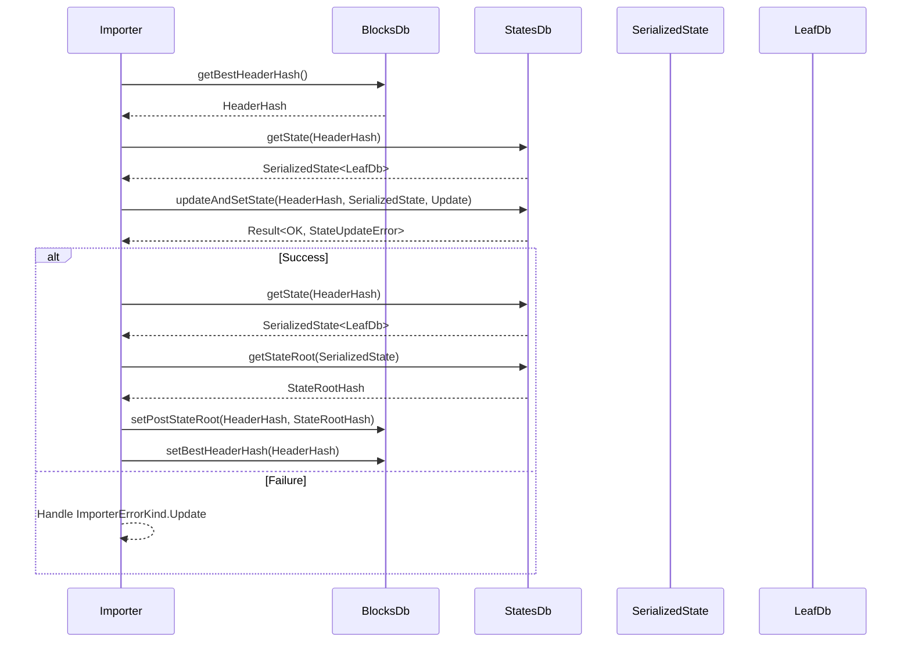

# LMDB state storage

## Pull Request by @tomusdrw

Follow up on #398 

Closes: #389, #353, #317, #87 

Related: #394

This PR introduces much better (yet still not perfect) state management and prepares us to support loading test vectors which contain only serialized state (i.e. no original state keys, no way to iterate over services etc). 

Important changes:
- Previously for each state were storing the entire `InMemoryState` JAM-encoded.
- Currently for each state we store collection of trie leaves (see LMDB docs for details).
- Since leaves may not contain long values (longer than 32 bytes), these are stored in a separate sub-db and are referenced by hash (which also means they are automatically de-duplicated if they don't change).
- Thanks to `SerializedState` object we can now lazy-reference values (i.e. reading them from the DB only if they are needed).
- Every time we want to alter the state we instead serialize the `StateUpdate` object: first into a collection of `StateEntries` (i.e. according to serialization in GP), secondly we convert that into leaf objects of the trie (+ changes to the values DB). So we never really modify the state directly.
- We are not able to iterate over services (or service entries) now, but that's not really needed. Even RPC mentions that the `ServiceIds` returned are best-effort list. There is a separate `EnumerableState` interface for that now.

Follow up work (separate PRs):
- [ ] Fix how state is being passed to STF. We currently assume the state object is internally mutated, so every STF holds it as `readonly` field. Now it's not true. Currently we use a hacky solution to replace a `backend` of the state. I think we could just change the main `OnChain` stf and create smaller ones each time or we could pass the state as input parameter. (#421)
- [ ] Avoid constructing trie. We currently construct the trie couple of times even though it's not really needed. In reality the trie needs to be constructed ONLY to obtain the state root, and even then we don't need to store all of the intermediate nodes like we do now. We could be working just on the collection of leaf nodes instead (insertion/removal) and in case the root is needed we compute just the root hash and disregard all intermediate nodes instead of storing them. (#432)
- [ ] State pruning - removing older state entries after finality. We might want to store every `Nth` state as well so that when `N+5` is needed, we just re-play 5 blocks to get that state. (#430)
- [ ] Removing values. We store larger values separately, but we never remove them. We should be either ref-counting the values (i.e. in how many state-leaf collections it's being referenced) and remove when it reaches 0 or we could simply store the last state that uses that value if we prune all states before finality (i.e not being able to re-execute some older blocks). (#431)


## Comment by @coderabbitai[bot]

<!-- This is an auto-generated comment: summarize by coderabbit.ai -->
<!-- This is an auto-generated comment: skip review by coderabbit.ai -->

> [!IMPORTANT]
> ## Review skipped
> 
> Auto incremental reviews are disabled on this repository.
> 
> Please check the settings in the CodeRabbit UI or the `.coderabbit.yaml` file in this repository. To trigger a single review, invoke the `@coderabbitai review` command.
> 
> You can disable this status message by setting the `reviews.review_status` to `false` in the CodeRabbit configuration file.

<!-- end of auto-generated comment: skip review by coderabbit.ai -->
<!-- walkthrough_start -->

<details>
<summary>📝 Walkthrough</summary>

## Summary by CodeRabbit

- **New Features**
  - Introduced granular, trie-leaf-based state storage for improved efficiency and incremental updates.
  - Added new abstractions and APIs for serializing, updating, and retrieving blockchain state and service data.
  - Added comprehensive test suites for trie, state, and database modules.

- **Refactor**
  - Streamlined state and block database APIs to decouple header hash and state root management.
  - Updated method signatures and data models for improved clarity and type safety.
  - Replaced in-memory state mutation with asynchronous, persistent state updates.

- **Bug Fixes**
  - Fixed inconsistent usage of service identifier properties across modules and tests.

- **Chores**
  - Updated and reorganized dependencies in package manifests.
  - Removed deprecated preimage database code and related exports.

- **Documentation**
  - Enhanced error messages and added clarifying comments in code and tests.
## Walkthrough

This update refactors the blockchain state storage and update mechanism across the codebase. It replaces full in-memory state serialization with a trie-based, leaf-node-centric model, introduces new abstractions for state serialization and persistence, updates database APIs, and adapts state update and retrieval flows throughout the system. Numerous type and method signatures are revised for clarity and efficiency.

## Changes

| File(s) / Group                                               | Change Summary |
|---------------------------------------------------------------|---------------|
| `.gitignore`                                                  | Unignored `database` and `bin/jam/database` directories. |
| `bin/jam/main.ts`, `bin/test-runner/jamduna/state-transition*.ts`, `bin/test-runner/jamduna/state-loader.ts`, `packages/jam/state-json/dump.test.ts` | Switched state serialization/merkelization to use `StateEntries` abstraction and updated related logic. |
| `bin/rpc/src/methods/*.ts`                                    | Refactored state/service retrieval to use new APIs: direct state lookup by header hash, method-based service access, and updated error handling. |
| `bin/rpc/src/types.ts`                                        | Updated database context types to non-LMDB, generic database interfaces. |
| `bin/rpc/package.json`                                        | Added `@typeberry/numbers` dependency. |
| `bin/test-runner/w3f/accumulate.ts`, `bin/test-runner/w3f/reports.ts`, `packages/jam/jam-host-calls/externalities/partial-state-db.test.ts`, `packages/jam/state-json/dump.ts`, `packages/jam/jam-host-calls/externalities/state-update.ts` | Standardized use of `serviceId` instead of `id` for service keys. |
| `extensions/ipc/protocol/ce-129-state-request.ts`             | Changed trie node codec to use `.raw` property instead of `.data`. |
| `packages/core/trie/*`                                        | Refactored trie node types: renamed `TrieHash` to `TrieNodeHash`, unified naming, added leaf enumeration, static trie construction, and new tests for leaves. |
| `packages/core/utils/result.ts`                               | Improved `resultToString` formatting and symbol handling. |
| `packages/jam/database-lmdb/blocks.ts`, `packages/jam/database/blocks.ts`, `packages/jam/database/blocks.test.ts`, `packages/jam/transition/block-verifier.test.ts`, `workers/block-generator/generator.ts`, `workers/importer/importer.ts` | Simplified best block tracking: now stores only best header hash, not state root. Updated related APIs and tests. |
| `packages/jam/database-lmdb/preimages.ts`, `packages/jam/database/preimage.ts`, `packages/jam/database/preimage.test.ts`, `packages/jam/database-lmdb/index.ts`, `packages/jam/database/index.ts` | Removed preimage database and related exports. |
| `packages/jam/database-lmdb/package.json`, `packages/jam/database/package.json` | Added new dependencies for state serialization and related packages. |
| `packages/jam/database-lmdb/states.ts`, `packages/jam/database-lmdb/states/leaf-db.ts`, `packages/jam/database-lmdb/states/truncated-hash-dictionary.ts` | Major refactor: implemented trie-leaf-based state storage, added `LeafDb` and `TruncatedHashDictionary` for efficient leaf/value management, and new error handling. |
| `packages/jam/database-lmdb/states.test.ts`, `packages/jam/database-lmdb/states/leaf-db.test.ts`, `packages/jam/database-lmdb/states/truncated-hash-dictionary.test.ts` | Added comprehensive tests for new LMDB state storage, leaf DB, and hash dictionary. |
| `packages/jam/database/states.ts`, `packages/jam/database/states.test.ts` | Redesigned `StatesDb` interface: now generic, supports partial updates, error handling, and header-hash-keyed storage. |
| `packages/jam/state-merkleization/*`                          | Replaced in-module state serialization logic with re-exports from specialized modules. Added new `StateEntries` abstraction. |
| `packages/jam/state-merkleization/serialize-update.ts`        | Added serialization logic for partial state and service updates as trie actions. |
| `packages/jam/state-merkleization/state-entries.ts`           | New class: `StateEntries` for serializing in-memory state to trie entries and root hash. |
| `packages/jam/state-merkleization/state-serialized.ts`        | New: `SerializedState` and `Persistence` for generic, codec-based state access over key-value storage. |
| `packages/jam/state-merkleization/state-inmemory-codec.ts`    | Renamed codec fields for service IDs; renamed exported codec constant. |
| `packages/jam/state-merkleization/state-serialized.test.ts`   | Added tests for serialized state loading and copying. |
| `packages/jam/state/service.ts`                               | Broadened `LookupHistoryItem.isRequested` to accept slot arrays. |
| `packages/jam/state/service.test.ts`                          | Added tests for `ServiceAccountInfo` encoding/decoding. |
| `packages/jam/state/state-inmemory.ts`                        | Added `ServiceEntries` type, codecs, copy/serialization methods for partial service data, and updated method signatures. |
| `packages/jam/state/state.ts`                                 | Updated `Service`/`EnumerableState` interfaces: new signatures, clarified return types, added `serviceId` property. |
| `packages/jam/transition/accumulate/accumulate.ts`            | Changed argument to executor creation to use full code object. |
| `packages/jam/transition/block-verifier.ts`                   | Clarified error message for prior state root mismatch. |
| `packages/jam/transition/preimages.ts`, `packages/jam/transition/work-packages.ts` | Refactored preimage and service retrieval to new APIs and signatures. |
| `packages/jam/transition/test.utils.ts`                       | Updated return type of `copyAndUpdateState` utility function. |
| `workers/importer/index.ts`                                   | Reordered `Importer` constructor arguments; minor logging updates. |

## Sequence Diagram(s)



## Poem

> A bunny hops through trie's green leaves,  
> Refactoring roots, it gently weaves.  
> State now lives in nodes so spry,  
> With hashes trimmed and branches high.  
> Gone are blobs, now keys abound—  
> The blockchain's state is tightly wound.  
> 🐇✨ Hooray for code that’s neat and sound!

</details>

<!-- walkthrough_end -->
<!-- internal state start -->


<!-- DwQgtGAEAqAWCWBnSTIEMB26CuAXA9mAOYCmGJATmriQCaQDG+Ats2bgFyQAOFk+AIwBWJBrngA3EsgEBPRvlqU0AgfFwA6NPEgQAfACgjoCEYDEZyAAUASpETZWaCrKNwSPbABsvkCiQBHbGlcSHFcLzpIACIAGQBZABEAIXtcag9EAipSaMg5SGxESjCWItoKAHdIAApbSDMAFgBGAE4AShQMXApFbAZpe3giDHgAM3gGTFD4Zl58KTZu5AI0jMhmTDRSJZmsXFgPeZExDUgASVCx/B98SuRsbn4sNB5/CXh8Ius7GrMAZlaAA5Oph6AwvPhishilIqL4kA5Bn9/kDWgAaBr/ACs/0xAOaAHZ8UDCe1MZUEJF0F5EPg/CQvNR4BgiKUUIgkVjWo0NEYANIkeQMWCYUjIFkQ7BKBncJkMFlsg5Hd6fb5objzNAi/hjNL4CiKsKHSDseD+SAAA3OGHiJGYBtkAGV0jRLehkAApACC8TAZCYSnotGor0q6lg6Eg5GqbAOimN1H1/mQTB8onE+AwyHwep68A8kTQUkQmLQyCU6XgkXoLMgCRSkFo+AYjnYzKzZydko8+cLJGLgymGAw+FCTG62iwEjQXmCyEhrJKB0wkH+ACZ8rIaKXIIvSHwZ3PBs5MtkosVuM4Ml55HXXg4BGAQ+kBOWPGCGWNKAGogVleakCiogsCYmQKheEaaB4CwzIME2dCPJBUyZlglJkJAR7zgymx1tgGAimKdBnO4XQ9H0YifFguZRpaTqUPAs7wAAXnQLoZO6ggnKEs6Qvce5oMx8j+N+/gEUaNFYdImJsJgRpScgp4Mmg9BjL0zDGh4L4qO+zy3pA6FYOQdDEUY7E0BsijjJMHbZugFqjtUooYLQNZbvYDFMcxUFWuZJAAKrcC+JCccIGZkfSdGuiQACi3SGtI7qfsqWATnC4isppxQRWECV7gOepcRmikuQoFAptwWa0EahFLhK+wmgpTahm+xRlhI+DwNVmXVf4YhrBZzB4LZZzel48bYEQkbqMoqH8HCHkUB8Aw5nwxRLZMHjsAlErIKOe5Zge9iPJVFA0LQmIHKgqCjuOWaIF1P7goa4hTF4Zala8MZWnFbZUAIkR+e6LI0BQYzah4wH5CQGEg70tD9FE1xrf0kbcNgFCVdCfIGKR9SznS/B4JB5DINctyVGAjwGQaADW7ICB+tAVNIxS1lgl7XhZ6M+AyQQhIgJGHNlkpzjKEwAB5GrAdwDR4qBXpyUSrMqkBOtAABitR+TAVDZuoVGQBr+GUVm5L8Nw4jMCxRp9go2Y9P0c2rMWnX0Ph5ArYgzh3t0lBsNV6yjjKWQGtsJCYrMcr2mamVZOsvD4bb9L+A6Uj8F4ShrdFprxQWiljKDkATBgTG4LIH30JspdELbJqpwss66gJFBHaH/j0E1By9JNkYiT+BEeEw+EZWyBr8Mq2dUDQteDKsvAkFI3SFBgAhfC5F7ZOHkBEL0lQHDj+jGOAUBkPQNHQQQxBkLNURMKw7BcLw/BhZRJbuYGyiqOoWg6EfJhQDgNdEqOAr6kHINPO+LBdhcCoNUBwTgXAf0UF/NQmhtC6DAIYY+pgDAaFruIEYBoSAcAMNEchBgLCQG9Oca+ECMj0AQZsJBNFarijcCaS0+CDZEP8O6CY1JKjlkstVCYf5hL2gWLbSo9Jtr5y4KrXqGZHTRjQAHK02lWohXQKVVWV4DhWjUBgAA9EINRxjNHvi4TAYWvYZE8GoLARSDl6T7hKMMUcHd3IAHEf6QAAHL0jHIcPgbC570g8cQhxuBQZ2XHlkCgTsMYeEqD+DYKkSA43MJYMaoNbIrHpIo0QTJp5URzHqEgEtTrnX4HwdGANJi53CPnIwgTyBkIoQYCAYAjBGNMeY3CGANC4EQKQ8h0RKE5NoeA2+jDHDMPkKw5y7DcYmijgaUINFLRsAoLTRkLESBAx0fQS061GKQVYkctSLArQAAFy7cBIIzcqshjHxxoGAHZtNIgsVsu6IRyB/ByghvQAo6yzpGiihkOKfZEDWNIpYkWoxxBeVsgdWu8EAWMGWcrFOJA+zp1VozLIQEBxZyAuWSMyVDgNSOFCUI7yPC9DHMXceK5QiHAyRQSODsyXN1IDEo0a8DGcvJZ+RlpQBUhKFkPQ4DB6bI2aq+XSLIDaormo5U0VTkLqH0nCayc9RShFVhKm6LKMDeF8IzZGQ8WBXkNJldQ7JWK9C3DuGVO8b4PQXPgFSRoxgmw1bLfwuAMZ2QfJ5C5SMDQaRoqrGZ3q5a1EtAmpAfl6KGi8nQS0oJ9wPRlKrA0wwWRNwlZ+dQgL8AsuArAD1qaYQ5zOeqw2cYZbghxapdShQHqZVOZGg5RzPzbMoHsqNRzVhFEhX5GFO0NBNqjTaO0DoXBJVKoIKsoxMqq2ZRyylxcu0mv7axRh0UzgAHUaVdHWqPTSnrSaoFNd0QpJpEUR1vZ/aMssWTXpWCaedByT3rD2bIcRt762kq5RSkCV6aAqWbt+ygN7VYBt5hK4DoHt1Vt3SBD1raEyrGKMak0xLQgAxbPTOsiiWq6SxWEztNzCM3uFZGUVJRxU5x3eyRjEkMD6SJSECD5Ka0yuymE1MNxIhv0ZPIEC4wiOQzBCTMeeoJX/uYmi9jYdSDsiKB4KFNAZ351XfQFSQgiihFfWRZQptw0MCYBQbqRBbxZMmdQ8as0ynsiKRCLmnmaKVOqVEce9TkJNINtIIwUBAnYqIgUrVgXz51OwA0+CZpy4IR86U+6Bk0mbBlJRhAFZxhjD5OMyLuC+mYwYMYq88rw4aCEHSDAYyKFUJoXQ2Zx1EGLL1GJjhWkSCPI3gReQkESUFb07V2m9XGtZn4dWDwirVaWnubIR5zyXDGKq+6Kb28sWPGCqC+QKlHNRm+koIbSgRtNKQUtk0u3tMrYeU8ygm2LXMGeXCgyEZMKUAelmK0AA9AADBoUHzRrHReCSUMTXmX2DbPgGfOtSdGLMng4s65Tb0CJSbljJLm2vuay3ZFW8PMv5ObgFjZQWkspbC+ICLBg2mZI6RMrpFWWRbe4NVxAFBqt4doIgYxJGwBkflcM0ZrPXPtZmZAuZ3Xm59dWbamUQL5SGqZfihKR5m78ZJWL+mrG+A1v3Tc14SgElJK8c4KgEjQ0UHIEdjRAgNAG8FgK5IIREihhqO0d0LsmzmnCm9XwqxLS0Bd27/B+LPdZAABJksoHHylvv4WFZi3VW9dIMYDA2PittrK+DrqnHXDwJHBMlBN9c2N5BEyhBDWGkBNu0DyBqNXgyCAdTIfNCSxkMdl5YsqT0bU51OirCzL2I1DJ7ck5NEbqDkYlFiGczYzIyXij82XpCDFdfi74pFBrivfB/zp5N5+A/8qybjwtbzVOU4HgEQ7QTnJROKek4G+T1CWOqdnRp54OnaWLSTOE+pWnS3SvSnOVWbyfOxiAuQuY2uAYA60y00gEuLWEybW0yN8cuXWCyiuOKiA/WCgqug26uv6Koi8aoKwMiSBNATw8wXszcIa2upeSanG7erwBuR+C+xymkWA34uAIorBKGvgEqJ+SYnG4YBiD4io1IIe7I4eLujK7u+KRyk6W6c+iexue6S+EQsgHqAWOqoQr248F+Cq48rw1snIRoEqnGqADcUgF0vBqsJhfAbAnI28iqlhiINhOcqAB2DC7I/cYkueqs8+Ju08ISiYtKbBWGo0zMBsWYvEFct6Au7IxedYyBm0FwiQqYBBpuGk2oXskKjKc6lAKBgswGiAqe7IIeJRp6fU7AGaKB5wguqemIC8CCEEduYaPkAioMf+ARNSCBzcWRue5wuRHqCwygvME45EvgYwfEOE9+Weaib6UhVKWArhxoe8WA4wWefhe0lqzhf65R2RExgK+KYaUQwiq4ze+hRg2SbmeSX+cOH+JSFO/mVS1OiW/+oWgBjOUW9IsO7+QwIw1AySq0GWHxrxXxCWKOIWjSAJgsq+8WPxVoCBzRm0X2aRD04J9umugyD+dGoBbO4BBglW3O0B/O+eigQuYxJAz4oYaBUumBHWOBTCPs+BsWRBH6IkI+Bo5B0+2uTccaxGkI8qhEmROc4qZxue2kXQt6faG0Aw3u6Q7oNgVgAAwnnvGLQGcJcLKGQbergDQVkINm8C2KzM3BMBQCShkZumyK8FjIgbYVhgUbelwZZtShhAIUIRoYtscRKu3iajnJZhsVGD2k5kPLxAoRHnOtFCobgGoVGbevgFePzNwcJqiWYYXlGFYambYfaPfpiA3g7pCjfl4MDHqLdKyvhPqaiWkS7HZtaQyUqq8ADqGesEVP1LDhwS2dYZlK8MqRUe6JsPQb0I8mdPIBGVwgKjUasHUUOVaAKliQMDUQLh6rmYqgWTYXKVpKGBnuKB6TuDeoqpaPWSQCXNml5iEP6uPJaJWdYhrCWj4CkS4QRFZJlGKZkPue2V0NcPYFIQfmTF2kUazD5KTDUlwtpBoCyNcDtpOYhvIIubxD5HOfijaNcBubSefDEW2QqT2aRleVEgGF+WyE6hGctmuSQN6HZuvLgFhfgBoFqSggwGnh4NMfCL4HMb0AsUsZ+GWfsGtoMHfnWBON6jQAPj9oWoaLXKXF4M/s8R5tlqCUoJ/n5hUt8b/r8Yialt0OFoQV0gEsCfkasD/jUsFslv8QZelupTCX5mtB4hCSmDlhaHlvLA1KgKIiVlLuzj0hSZAVSbzjSXqfSfuWAAvLMPViMugdLlgfQjUpySwr1gQbySgl+AKXabeswQWDrj+UmrKSqRQdFdpgUGrtqEaLoZaVOeluBZyN9gYmkSHiiU6I8gqBMCHikU6g4YfiDP7HQIxBZOaU8DRH6QgMuS6bQesOwQeuKeRhWNRtlD6VgLlZQQGcXEGTnOIfXnERcLyipJHBZkHsvosgIBukKRKuoWyIoQmRkEmUclRSaOmWgJmeEZSh6m2agPVWzJhIxFaKUaufucDAdefHqLofpO3qcqegyUmdYt2NbCUreJdPdv4KVfLJcQSlENdQDfudHrgFYGjZsKQO6JEcuM5OgAOamSOZtBoLBVFcTagQKhxdGJasYpedee2qILTM4h4EMTcfRQ5rIShaZdzXmY+ZaiDeaXBlshzSyDeehBaBqHKDZADJkkbK+cjTlVcQ7lEAzdvGRgIByEeUjF2ogAvH6r2vraQK7pCC7nAv7vSObf4JbTddbZkg7VMXCLGbxTcMXAJaVNsc5K5EaGJalPdEgFJbgKWTrY6VaE+SgHqJgDJnQZALIAWJnHtHig4ONEpbkipSTs+u8b5tlnCeiVZQAbZUAUCSbXFhZX/npfTvIPZSXdmAANxZ7OUEnNw00DCE0kDo2k3Fnforwkl+XkmUk84wFwFvIRX+D8xZAsllZsmy6BHJU9a11EEBoERBrVAQ127a6H5XXU3xnKH42PUyXPUZnBBZmUox1pysH9UUABxDVngWljX74TVOk8D0rTUWSzU3K3Vu4s1fWKRU1RAfDDmA2qHA0wZ8pbKlGw342WiVy3qVnYpi13a/nFXG380maC2OYr6kRrX5V6ju32CQgjLG38liDEK0BcDfqwZg2U3FG9oMl03MmQj4C0yPBx6R2OjGbFzVigxCqjZkBEAHBHWfrVAtW43FX42xBVo8PcB8PtyyD/KX2cXX0lWM08E+lvAD26ORCsgGJpSIa4pRj+Qbis0fYlA42Wg9CyDeiIBWPrgs3b02bT6N7x2S2J2o6662IHTcOPBkzaDvQTwhLhgiz16x2XWUPICVBUCahRD3gvDlQt5nAADy3tPgKNtq8Uftixwaw9s+mQax+QeAt6CpP1upbaJUXNl+9kZ4LtzAJMNxpUumhQQUgR3oVg5wgsjx0ur+rxalxSrd3+2llltONlzSgJJltdbxYJpcBJEz8JFdMzhlBhkzUCDs0wcjKBNggQ84uAQ9F1qxbASzLlH4uiIlpJ5WAVk91JsBuF4VxVYAUkS9rWUy7Ja98yXJSyPJyutTCYiqJDrBEqUMjMGEdGHpONzpv9bp1ae6XDyjya8ZUeAqVg9KfkNgWG/CEmdwoGt1Z9AqxsPgQMY+9I+9e+ghX9Bx6wJ+ZeEphue6NQxLiZ590UOan1f5JDTcIZf6OckLMMWAeDHpP16FsNY5GoNVyFyaiD+5cNlLjAaFy5aRnZgr3Zr8oQbL0DyZwN7QW5cq5ha0f5lSkdv40jCgcwp4ikRA9+oQEtPgUtTDPdctju8Nsw1YzgWtoZWmHgUkwpeVTcwr0LHa4rVNkFIQUQ4ezJ7c4c0rTwureNsF8bNtzNyrS5396r+Ff5RF8reNq5W8JNhrqJ5r5pg8GD8qeZfrOQAbs4N9BMplRE9GGkF5G8nNjtPjzrZwL5Clvr9csdm8/r+QdtWqw+njWKD0cwkEYiTuDhrBXChtiF6Zcrn41LErvaGgDtzwBxI7HzgzhOLxnmozGlpdWlaz0zSJVdcz0WIJsi2zul1l174QzdYzxOCTeOSgHdJqXdySPdDJAAag29omHcSU/uPRziYlASFc82FW8q6JHZMILLFayd86vUlX8ylZvUC3yZIu/KrE/S/esCNUwVrnlawVNYi1cHNUy+Ru2Vot2pCui8y0mVi1kDi1hjUDWpk9o37icR+JyC2K/fQOg2YQaaDVI9Sw6ZddtcKKqzdafRy0WxkNx5Srx69cEH7p9evkc+wKzbMca7u12f/SU+By20LA+lHLO8jtuuR4vE3Nvo0gUPstbMs+C4NlzGeDNe6eNbwdS/zC4OCznE9XR9W8Joey/se6pUXdCeM5To+wic+/pbM0ZTXfe53fiZCQl5e38S+5s2W4l9DcyFkMh2ObhZc93WB6PRB2Vv5RAdB8FTAc9ih5Lsveh9gb8wrgC3VEQeClQ4qpZi1xSunFC6lOG1DbEMwBHskKx4I5aFNxHn5F9gK3pqtutq9q8q+mAF4NNwIDttqNNtpmHrNwtYkPt7wfptIOd/wrR3cs9htlt0tdog9urd6AkahMkZiN9MN5aL9DshBIcly5d1cl2k9iJY9whxxCN2XiKygHMD8WcKxeVNIJVC5MLXk1aGqTpMUKxX7BLCc1ZmDBDFBtDBhGKxOtlJaKd5fjd+LcAyD4med8ADrAAGSQD/dfyAzRR6D4t8DFc7guvwN5io2UFfDIANjJBIHtXWTwQtdnBQ7o4ZdOfwSmFZjzH+2yxKSdHsB53DMnuxct0fs5fl1XspeGWRZY/Pd480AE8g2gzgy551iWiPOwfy8jLuh4OkKQC6CGJzdhAiUm2ttWiLcCA0881dvU+sc3cGA+9QAC+JQB+PJB8ekLd7fLeR/LfM9s8c/vZc9A8ZC8+QcPOc6nlgCJIjiUD9LTf4RoBQ8fKQhcqfMYEdeJUXhYcb1K6kT9dyy7A1ucJqbaIOgIyCLCIwvt79c2Ey+dXJGp/RDrcvYvL1+MlfI/LqaoSz2ZpRrRBduT+ZSrf5C9CQaWjz8PebfL+fIjpr+2Q78OJ1Y202KoDD8GqXVfB86FgthooFXKnnIHLAwI9nQKmFmfAIMFrKzgi4ydCJjDgyrjwVeipbvJEBxhHsC6cWbzA5XPZokdKSXSuql1aQgFi+DXYxGXwr4QJq+CMUuBf2Hz6xUIYAANMxGPTN94qPzTDt11SqAtu+AAzZHqGHS7J9klyYHkOkH6g9AGC/SHoykv67Jr+qEf5MIgqoDAnce/G6tOjziJQkeBoCqFVAx5Z4j0X/EXhQT/qyoW2sLVMl2RcizgJ8cjX/vwNU4Lw/ImIc2qIH44eNnY9IHGqrDSJXdDMqBQfoukkQuAagDghgB0X8B+RtOOZO1MNDmgFUF4BgvwO6RNz7ZumNSdvFm3pZmDFwemL5HwIL40Aagtg6KBmisF0AnBgaQ2KsBZAdRaYrBDwfkIyCFCs0+pAVLizHDJ4QIqeETIYMzxyDJ8FBD4OL3QCagj+OoGiGpigilQshFyYLusAjJfQSA1QZWkMMjDspu0h+TwSoK+wqAEkI+Q2OWioZqYNMpUTjBEXs4644CevaLoXSqbvtPiF7U3nl3N4M4jKzOO5vV0ComJiBHsKvmYhr4UDxBVAh6KhEYEr1OuLAvAj1xWQcDqkPdCYQOgEGlQf+WaYQW21EHn9xBq/AeuvyogyDLiwKeQe5EUG+RooXguFDyy36/IoheoZjAYygCfgqOiZK1rpmQBrDYUZRMkaxF8HLpZAAQ9qvYOij8dGGwvSwYiOigBDoo9g9qmENIj3x0YiHAHAVWo48Fx+XaVITwNHSwjVOg/WgKEK7YqjNRfkfGs0NwCtDYA7Qx/sgH0SxIDItxTUJBB2aSV2AkNYLP4AMEdEEWYogTkIwUpxCWUaAQuGxhtHp0NqEqf4YkVFZJD1axDATAVRV48opQp2CVI30cyYguCZFRzBYlEDkVeR6wEMXNEqSiA8AVEVBuWGvRlJ76KxE2BB0eLIDjep7dAXEluFYD1m+XR4XgPIAvCJ6pfEIOX0+EUBjElQf4GMGMRFFHA3gDIECNb6dZ163JXrrhxxQiIX+t6YDCsPZhKkpW6SJ4BJUdiTsIwE2K0NABCD6iCAdFVsENCZA0Ajkm5awKqHF4DsPA45K0amBdo1J7G7DLqElCFJLjFUA4HUNaFtB+DnQsDRhpgCd4xFLQRRBihsPSb6FUS/NI0hDF/SoBZy7DBkq0XfGLihQcDFSJZ0UhE5kAMseBIqyaZdAlAEsFJjERTDeAb094gQJU2bCgCfRYwb8P1Ghx8A4BavApvxTuDnCUBizI3jcMwFTN7h9OIAs8IIFvCiBXYkgVX37GDigUGyVrnFWBFt95cYItgTOKlFzjn+YiD8RhN0wrjVYm4xJJ4wviQB4gMrUuOol7qJ9v0j0JUvuI46noCAhzapIgCOTvJGkl4/un0KKC3jTJMrWjE+NAzjluARob8ZGD7x99neC8LQPRRHhfYA8wGd5iBwcSARFaPQyAEuKxSWgJYcFWgII1ViBsspEsaxN6D9F8ADJOKTHkuL0nG1sprIlonlMwnMM6pb47CegEYnFQgIssZbGuLMlPAWQJE1YRyMdA0VQo3EUCjcmWzgS4pSUKCfYOAp0t28bgzhG+NlbTlFmVk1CWtLqo6SHiQzC4agLJx1jVmdwxusiUt53szKhva4bCScpZdXKZdRsWb2EmDBUk7lfHGJKHxkB/s2YYxPACpLzACAaYYxAMDADNB1wrQAweXz06L1UO7XahAlUnEd9pxEIk0GYztKGxnBmMtlJwj7CBIlArFdStiPnFzsdM2UZbDu3mC1UN6hHDADKJfjcQmpATPTNpBXbUyO80LJ8ehWSDbhrJuzSthwVHaCADCn5U7LoUNjVcKxLbXkdWB4r3QtxN6WYdUEtDQAEo+M7RAf0tCUykK05NqWEnalMSqG+E99GxSJ4LwqGtM+mQqUMgZZyKbqQYCDHpDDlVZBYdWVwki7KUax10s9vWIEkN1kuL0p4fgLq7klXuQuezCQCIEJRjENaSgOOIRnMD2+rAnDqRGew6JboaKLBl4wdyYRkp3/GtHjxQjlc9SipKkS7yZB7J1wAgF2SQGNGUB8pz1bVtnMdzuQU0+KQUHZjQC0wa5dcigMTKVGAMe5lKSPjXPVnGiWaPfRlH30SGHYWGBoQhiLXh5QiVZaslBOPKZlbIh5IEW7pNM4QaBjEwcRPsP28Dq1FeURNiaEnV58VNe1QLFFpILD6kPZ+dL2VcJ9knSnpQk86cZTtAly8Syzf9l7ytAFyswKEGoM1kgD+QQYQIb0HNIZBZAAA/FwEgXdBoFUEgANoABddoFwC3mwB3QgAJMIgFlKQudQDAVIKoFMC23DHQQXkKUFlClvJguwW6xXZa84eYqXLldySAVc3BfXIZnhQoph3cOOHOIRRyCwMcylHHI97fyKuf8q5l00OxcBLQwCgiKQvAXILcAqCqhXAtwCIKIFFC9BVgpwUJR15hCpRcQpAWqLaFGi+hSkRTA6KrFmihhYYuYUkAx5bC3cfmyEpEsBUHcqYN3OMUSK+5m1HeobAEX39pAIMkRX2HEUgRJFcKMSWHMiX+BRFkcgaZUnjky4QRSc1SSnJNAWVVElk3BTvI0jLZ95h8nEn0GpChtVq4EdRGHlHmsLt5RPftsdkOGMl66JmJkUUviLVRPub5MsNGDmECS9xNgfyP4i1LehoAMURIAAH1+QMUAAJozLkgCyqZU6HdDVL0AzMCxqrBGKPSBud3LhAfJQQVKR+p8oJEryum3oOlgclHL7U4nzCLQOvboNxJfloD4u+y/2TgIt7GUYokzBkBZLoCKKilkAUxQ0qUDGiPQLi9eWEqO4RKI5KSv6RvBylSKoAfyqESdiBUjKxlEyqZbMvmVLKVlaykGlaESUIrolaSlFfEpDm4IyVUS6OeUoyWIyOSyM8EYzgRTFZMqtDbKqrDtiHyKULkJTMQTLwSILJYw8ECUnGCBilQIleprnMzRq1dwn4AoKZnMxGhcSf7VyuWhnb95ZRlwqOL0HTgSULW12c/JKvLhdhp+NkN8qQmMqkQXqmZNOVd0FDqNLuqsk2Awj8gurZpmuQFfQEp7pSmQjMXwCfz7BeqhQt/AUTLW4HRBGULqnfnyEAQmgnVIK+wrUosYryWFEKthasEZgxISgIkSTDMCoayQ46txHgiZL5UoJE11CQZTI3ll7MVZNgc4DFBmX+JMmiQVtUSpijrLjacMCiBYyBQph9O3eUiYwgOS1AAAbI0HtmIBOglavKIfJjq4jpYzgWgJ/E7ggcBmSavTOCu0Q+YGq3QiUFQyfpejY26pbaTOR+xay0AlQLtjLEzhoMMqcgHcEWNvxXkB4K0OMqGB9XyLAi4EoWqyGcx2rOEAqdWdABErFyC8cA6rianKY0TQgjI7Wn6qtDazV2us4yt6CtAEAXQDqIgFBoTDfVtl/qyKHuq7ZCVIy+YTKEOukDtgKROVW9bOprWkRqeesEUG7MYBMgGq/NHCb4GCK/gJpbbVmQoR3bn58i9qNYkXGG5Q0QV9S1edmu3nMbOEsQAqBxoPV5FYsSpavMB2PDuh3J8EJsk7JbKWwowWMgHEJUhQ6bggMK0Gs3HNwnVHWIKwNjWlQY8aaQCIP2A7ibj8bB4gmjRD+pE23r3ZO6kPqppQTuh1NWywXLRGAgxRbGxGqzUPwq6LkjO+xVWPyrTmoA/u8WlTb6OC2ok25uAb1ZiEK2JaVNJjPBSVoFSJaUGl3arSB3XlwF2FuWsYBxqUgU9XB5MzhGhupk1qsNDjfALhsVAEbawikYjQoRa0cb54hq2ya8GRibB81J6PDfYHwmsElxn4ZzR9SMDZMZi4TCqZpqThjB5AYqzKGYwMr3RI4cwQ1b2ED6ZZ1AKRT8CdjSDLaaNxQScK8UG5PJJo8lIgBSCpAUEsiG1ItPJUc74Ad85+K+YUz4ivK383s46Sbw/lnSb2aXGAIHyYiyD019DQkRkG9Wp8NO/MYAPjus130YgcaiNbzwUJE6SAhO7RsaMxDRAw10UeNUX0ARo7IIGOv1cCor4oQ2ITOoUMUqtBU7gAPMncMAGgCjLxlky6ZXMsWXLLVlPavQPTrJ2yBogFOsPELpF3SAxdEu3FdLoJVy61liumIIzpx3k7LQdqtnYxEuKc69xASppWCvk21y2FwiS0ELqp107jdCUVXebqixDLNxezDpcCubWtr21nag3T2vdBgLHAzyTEIG2nXtBjKWpLjV0sd2WhvevvPHpbm5UY5JNBazHan20gOKbFkfOBEXqgnm64+1CcbQLkUU4aqNRAX3FwASTDbE9yeq0MkDY2wA3Z6eqAOZA8kVdLQ1eJ0MlnVlfYJNcYZcLKpT5Q0agkQQuEYoLAe65KsATgNCspT8cw8s+q8qvr3VL7hgK+hfa4saWwA/csfX3j/LqYrl8UKmwuDUSHRND99uAGohRrTkDy22sm0jY7vHmt7ixoW30d3rP297EOBmgfdppA56bNVnQ0gMH0tA1BgMXAG0DKJdWx6QOXATXYgFO4CAUDx4Y0YfuNEb7IocBoUAgbpl4BkDuc48Ggd5kYG7a2B4nSBC4C+5IAAAXj0CQBEt+Bivb73e5BhgWWOsxYgDi2MwEtIHRvfkCrRFgMAXBqADwaiA17sNg2+vWIeb2shzdNKgKnSuSXRLyl53JlYnJUn/M1JqMqA6JVIIk9VYnTAqrLkaSZqndTStOTMMsgWhAhsvW3VmrsN4Kk+k+HuFNC+DyZ46Jy3Qx7yEaRBYxYsI0HWA1X3STwNzZPpgAzlf4PUAhrveFr4NWtY5QpQ+QAHImRPWuVlGuamszRodau9LNHHgeCiwJYGokRt4Nh5R9N3P7ZMGmgvFBgXFdzcmCiDlLeC6dRkNFvjBdakwSkWsgIE72foLcmIKYKVwDKFEFwBUMY6gQK3lL3Q1UGzFyWujIoih7MNplCudK9AaAYgOQ/aGeR+BHE5NVcLuMMlOwDQn1YA2kctAbFjRrFG1oT01TgVLYcqoSinvcM2bpazU7pQVrPQvQBwateoxd0i1NatZ+HbREOgQxnQID0R3mn+pqQBq3DR+hTXgq9q7b0UjSRVPyr5bhNYTqEVBg4W81mdzmb6BDSaUD4uHOq923gvypmjE4VWV4NQJBEeFESyAzkeQTDpGZw6PlDYwSUjtwEW7k+si7uoAtsO9yNAyi0BWov0VaKKAui9RY4tkCMK8DbCh3YvsCXSnzFKip/XKboWwLFTZe23GqZcVuLt5P+hqpaFBNp7ADV49DXVWI2KLAZGYKIC7WbC8ZjtJyrgMaMSCTBPuLgMXV/pJ17qi+lezPQrPiSQGkTWK2A7HIoDqnYlFAfjqYryEByPTWYfSAmaTMhJT9lei/QmDFMALwx/B+cjWlzNMK91kAAAD4GcqyoKq/U/orPmnj9VZx3bWfrPSHTJMimMxKZrTqyyFrZpQO2a1P26iFIEQc+Ar3Wjm0THh7s4WZMzOmrQAAKkqPSAxD3iEEQaGACTaUE4Z33n3pAO/y+zpZl03sbdOAZXojVWAI8btTUAxdegNTgwbX0gQwIpExgy2dwWdBWDMAKswQtJUXmDjV5xpA8fMXPHHzz52AIfotOgQtUJCWoF+ZDMgQfzbB6AP+atNMjATM0QHradqBfSXITI209gvtOLnKuJZhRahqhNQXKzAFyE2nBIA0XhzHh/M+ft7PRHYz/Bwk2ApQQwWUEmIGtLou/O5m6L3Fw+XxaUACXKUQl5CyfokvzmElgi8UEksjnRK+wwyEIHoYw7ZLDDuS3sAJgcAzR++vYPKNZ11VopB8GALk1EAjKwgZiJR08nKteAFi2Td4TgR6h75bIlAg2GKEEFnAC7weG3Jfi5a+xYpMVqkceN5Y3H3nDQTWeAQLAk63o4gcx9WXkFPKY9LQUkdebRgm5gVA8fUbDJGEDYB4zNNSmfKwQSHXqtAiAKnXfptEPzUGqsYsYhkNgzzAiqFXmFdDJilDOwRgLDd9H93LwHGIQQDsogoCtBiZ/ahGPIImPq8S8y5QjM3ESmBsrwPeZcYqVPHiBo4DlhKzYn8AeAfuAsNykzCDC2rmgZwFcyudjUyxvA9ACjbGSLA1kTl0QS61wEjNGSqGrwO2FDVPKjXuVE1m7PnBjpY1eN+UX0fMaVWfQlYmOTSIBCqL0mMqr2ujZ5m2AOt4sl557YqANSbrjwAzAwOuAutXWQIXwR9QwECm5QCwHpR6xDZesrm0D2AasNFq+t5QfrI1saxNffMTsT1VDdc7uD6jyyPrikByyzdo7ZRebRY6GxbKnyYYkWsSuVfyrTBFrNK4hgxLCiImPQDKb0HGP8EJvXWSbd12OmVAKtg2xgBcIuDxtpv03GbQt762D1+vs3at7cB2Rscc4DgSwMdQk5dXKZyJpIfBX7IaG0m75dlbt0w4Mntj2jl4NQexlFd8vYB/Lu7OkFgKqLmxqUSYOzpceAsU3FsXaXm+klpaH5gdr5RUkcL3SfhGVRgPtl92uVSwpjbIaIPZNCBSBs9rQNKwJjvlWRSZKJ9LUMuGtZA/r2QAG4NauDjwK0XQGUcuvlCP1eM8tPhacH6yiZ8iT2pgN7W0yKpqb/KsgH9FsiXQ8o/Nh2B9cxk52Q7kN8EBHQrYMBjsZU2M7uANVSIt0AmXoDRKyCkwPjJASw3mAEywUn5+vGLq/Ph2fKn23ylsZhvG1D3sNbN/65HvzY0RlryU1a3aU6CwqhFKlxFepdPIS5I9p5EIyQENYgPeDh1klJMeRA3LIGGiaQGTfgCMxLQxiS0OoBzQ96rQ6gGoHrduvNz2j69565iCYO/mOoXUfkVgEtCaHVL0ctB5pakWV7aHT+lh6TfJu22bkHDi3NEC4eoXMIbsfh6SqUvwr6VYi0R7DPiUSOmH0jg2zPiNvhRHrZtuxuGMQBKPagKj3h7QHUeCPNHwirQyI4SgaW9HahsArSuccoO1L7juGV8wTnaWDD2HLvpwmGkuAa5EWtvVihobngSNOEaYjohXg1TT1TcQfWeMTbOEnZzMAaDiayryA4Cii6UXgByEkBDRfPa1jKNYIl3oM7ecW5d2ry5aSwVTve1nsVlZ2qbx9rcgLauN8AcrRg5sgMBM2rh0yfS70aEH5XmDWQ+adKV0dfRJHCMI2q1p8dvSEmogCj65u7GhBRgmQQkK0FlbYWlXaiEQiyOPH8CdMwiH1Arb1RWeSzRgOq3YH+EqaixpQgwALGCCgQPxlg8WJkKqkyiUgJEacJuKgEgijp5Anwr2FyXFTfa7y+/PAP+2cBCF9j9uJuGJhxgQa4j7O3Z/4DPEWN+VGR465xdT4f7UTsF+bhwZzX0g81RcQteFAAimtq4r0FEkAg01LgaqqN5E7AB8ORgoj/8rVaVHSe+AZwCqyIDfYIjhHHUoEvsDaGvT8IerGAErarMHB2k6AVgRxDE+LGoNLQZNgcOeOSw9AYYGsA0MkGCQtPE+pVnGDaCtB6u6hhr/aya4oBmuDgFruFAMoGuaCJnYV8bS7HsdJOPgQ5LYjXZvRbO/G3d6oNTahhwaLmm2t8wYyXg3ooXrMLknifw4EwOZNSldY6iuyvQm4CkD1HAMVQZ2mMoxrozbPhvVQ4Q2mB5zC0pNmpqgz2egKFxJcm55e22nJntrRn5Fb7hKW7eaoe15P9NpKLwFOSvzlS8oJbnYYcPdKlO9VMda8quPxQjacj0MUUH0O5S8EntD4X0SQCIBx2HM6Ae1owwZDkCQwy8NNyC9pCZur0LVnN2aDegm2KD84Hkwbz/v8m/ZgDjZsA5kPjbh3Hg4d3O/KeGioLlAXM5QExC83YEZKLM/ID3NKAzTu+6l5xt/2/il0joaJ+wqEeoOAn8S397wf/cD7h3zT4+6B8TOvmQkkH4+9B5Uiwf6wYWhD84sieyBMPi5NvWh//GYekHyl8lW44LAYPE94bEt+PFYTsfmPXHgR9h/8f8fgjUNYTxQB4sW4uA2F2DCCcCMCACDgFyQOsHk+KfpAynoE7hfU+lksM8lzs+g2YP1nT9UALUuG35dyKEGy7xUpFo4+ciJPGj8JS4+Ec6PcPAVwjEQdkAkGkDQoOgwhfQOYGZILeRmFS5AgyWxzcl1R6tLDz+f4D+1YLykSkhUGdwEX9JLIGi8NbpLXAGLwl/g8hRBPRg+z93S2R3PnPYnv8W54SgkqnHnnvx3x8yTBHqu9F6YjUBmVcBw1sgJheQDhDuhKTEZT5xvFPs/ORk5XpcFXHYsCvOK3ApoVhhs0ofrT4nxr1h98e8efPMnlbmD2W8tCU8s59eWHkO9Gjjv8l7/eoaMDYeQrW2aQJRK0tZLQnnfNKkC0hM51cA0ARQ3hoVchKAc7d0RA/NqJzjjZoZF7YNmHXvbDYF8AR5k1phD0vvxtEt8RCvFi8fJ3VY6gVf0hP1Ko+Lk5CmA0DcN7esXFQ0QAV53ApGZhCUNwKJ8k/jaD4WQB9j9pghI4KmfALNYwDpRj17IB8PXr+eTBdUkL6mnXrw2minXn6DAEgWZ9rwRXW6qRkhoKnJThESAHpaGKrvIYY01AG9AVW2JEPMbgL24kTiCl32lQ3W1ApWDCZj6NkZQsn+kEAEFUvFS2xUJiHJh8RQMSs7YytWuXlR4kAvheJLFAzRAYofvxM9EDanvA/sBdhzCUAKpW/qwcq7Yu4W9jaZpRp4RJ9amISvvf77y43gA+wHfvq68zWHG9LvEZJFmxZh6QKa+VF+FjpEE5598ok/ehtqh5YiPSN43EmR+Sk5xRPGgt/69hO2mJiFD+9AKAT5lMFwEOZfeh/I/sP3oG06KWWv3wixM9x257dhcrHZ78pNwK6Xwn+TeOBe/KaKp24rBcvF6UPKDPZvqfZID2ugAzLEgky70JH1v/qxllsQTJlqX5ATzOBPdcL3bWJleqJwkqMeMfSGp5qDf/nhIoaFESX4X1VQUbIiPGPC9wAtOJ3z1kvJAPjwtCdeV2FurAHwUo6TKdms5sbLjHPA9IFCk0JIME3DgCH8clFVglxanjv93/T/2/976M31vQF4byQbQR2GiCpEwiLQj0ZSoF0gYh/fHzhZQJwHnWWY0fZHg0F0eIDXfITQDwQ9xkAi9VQCUNM7wwCjRLAOd1SoGFlWAKNOjxkIgNPTATwuUdeQ+YLgKZ2KYQbPdi8R3qaDGoCb/RgOSAP/L/0EY1nJ1FuJqIbRnb0IA2e00ALgJ63/JUAa4HrIpGNZ1eAXUEAXoATcAqgWF0yTNGGoDkD1A4CqCbEzl4p8Z3yjBQ0baxog7AzYnoAhAw0BED/6d0lQCGLR+X2keJWsQ/cblJsQeFi/Miyr8+aM8ytBywWQAIgPIXAFjxcAbHiYsTArOA90XSPyD69ooQ0XwMuAQmhYAkAanXscKdUxTaCOgwjG6D+gpPBTwWzFYIoBxgh0ysIZgt2Ap1xKdj1D5w+L7G48IlFf225duCPE38FqATygBGg080otCtboN6CmFNBQ2CPdTjiO8QIDBToslAzANMDLvSAHeD3FVKEOC9uY4Ka9Elc4LX9LggQGuDL8ATxu8DAKEPMQLgjf0pVt/JGWTl9/YZSnl9OLOWPlqQCPxqwiaIRTyAyg6YmD5lsFEOYBV/ZVGKB1/K4IxDZPBbFGheYFiVxDooXYEuIw7KWVm8c/S4Tz9+JWoOekv5KAEOZyggSUUV8lFcw9JiQ92msc26SEN8doQ+kMZJYQpFRIlEQ7xw0MVQ1EJhCN/V7gawmsRSQnEWVbEPe8EUBHGGwL7PcEjp4BThCNDZsKQx7oYAzbDRCI8YmXG9eDFVQSI44ReHstvoQK0X4V0ewCYBHkAoOccSnCTAzAykWrV1cswCYHw0StV9HjD3sT7HjDGUTMOigJBb5AxE/kErT7BatIdBCsOKZag+5PMBwBtFdVauyQ4eoa0KuwFQV6QjA/DANwkg3CDu2lV/GXgE+A+AH2zxsniZ+Vh133fPxr8v3ZsRElg5HUNu89Q2kI9C4QhUMxDzQnJRxClASIGSEFsJeUiBnnf1WU09ufunRovsdTUaMdQeYA+BeDV4HECQ0eWCedkbOUT0ErQA8MZo6eJ+kd4+aVMlXBJeUXEO4ogRZwsD0kEGCnAbiY6CfBLMFDWiAFQ8kJ3EXgSZ3rAkgVID/CpRNvSrD4SU0npAw7dDXyQuAS3kK0xdcdjPhkAd3UpQnzL8z9wp/E4RPADGdGg9A6QBUECJHDWuCXgLYTTgUxoMYDANIYmGfGAjLQM9AjB15fNjmJ5rc31Yj8gk2RR5zaTQV7R//QQGWNDyfYhCCXITEAfIE6NLVF5qIrFFrJnlTQGMo+0XADwiCLaLSIiQIJ8w0BTIwvUgBeIg4GNExdTEGkiBAPQEYU09NWHPAcwWvHKMokBUPQACAa2C6obze8FyhMAb2BswzgGKG1A0YUkO0wsUDZydxgpWp0Y0qA6g0WY4EWdWZkqI3Ri/tcONvXk8ugNVCjRdwtfFAjnuE8lRopEXg0l5JnXp3yxJXd5xMwYADtUyZrWPvlug64JME8jrYKaBiYggIPHQAZwb1lZM6TOMBUg5ImIgDRu6coXR4edDmXRxlQY7CVpI2NWi8jGARDCnAhZSUlFBpSe6hxgdtbikx5ItAMA1Ac6QIlahGkLUlGVEgHbngA9kYJVWNXLPMk8jUmOCMbAyAD4F6AMAXYCktBVKqkPJ8TXgjfBaWW9whRAfGSj1ggoiZ33drwP2FQJv7A6V4kbpZWxFDP5ZHUt50VdEki0gAxRVD4nwoRUgDtw2OBuosY0gBfDJPWcLpCcedUMNCIo1AmCNIAe0wlDKQvg1GQfeM/QkcBUfSIJ4CIyACMjYAEiMpQcFJhUsjbzSlBsjIAOyLYM6zBOhpifeCR0Iw2YqSkMjadYiJqBTIjhnSBlPPiKFjoAWyOoNMDByOcVJgnYOABZg90EljfeOmMcJw7KM3I8Ew/e36c8hQ0BnBTOWjy9NJnLgFD5DRU/SRCaQ0mK0RGQuELPp0HQJxb5gnF7138wnS0PTwCHBlAZsLILOXKjluBjl0hCQgNgYhA7ZDEVcy4DekUEY6V2lc0khIVGZYpSDmDDJDyJ2x2cjQSXg4jOgh4CeAaAAAS5JdCItEGBFUJABuB2reFydIdAyQ3IINIamF9Ei4MKTCBNLVEkcsFABaEJMxhU0DmB0sMtFKh9UI7QiMqGOp1Ei5idgF3AhiKYQsgqRFkEv5ORXgizBnwJAHphbLP8mmll4T8BRZqYQrGyBIXKx1QYJwW0jc5hI8OxNVbQgqjFYZ42sEXj4hG5x4MNfUPCOtg6akAJFPwdeLVYokaUUiAJYAxiUBOaOWDAhswDGBaieIXmH7CVWLAEZgSXVO38Mx3C1ivNy/fO2QAAsDMHyQPUEeM6ZmrQGMuF7480A0gHAKmhQwLYHiXXYYYJ4COYM40YhzhwwoGwE4JEfSABwXLOk1Ktx3RaCsFt7BCH2EiTXgglRq4f6VHFARaGKqC+TUcM/dC/CcNvYhlLB0MsLIcK0UULcCh0ZhmHOOPpFX0Gx24c2DAAG9IAZWMgAAAX0ccvY+cOX4UOMRyPC5rAFzZBNrf6WpAsHIh2QA2WOh1WieaToBP8/CTgWzinCEBPDFGEj9nbEfHZf31C1Q32KcSlwrrhXDw4vTFD4M+NbwSZhEAiwegpAfSHic6GXgm9CLGMyz74lZR6Kl43weVE3gSOYtkyBZAc0g0gtEPCmTBbYPKC2dAUU43KkKaEQhESGhOWFZdReTgIGEtQYYQqRRZcVVtlTsfpO3i2AXeOUIHxOCTxEVVLO2/DfqOILCjd8J21cj9ILpKkTPOSBH0hdkluG0wmoHzVWT5AbMiQjf9TVEGQzmNCKqSQIpkjVDGYiwRCT1gA5MpUiWYEKaVPwD5NgFnAc5K3ViJPMSdxGXBfBxgXVEoya03nJQFtV4+QkyBgGGbMEQwhbTUSTQCgO10VktiKeJQo8octDRSIUIchQT1hKFTthGnFKEaj1AUN2PteCLuFi4UgGtQvJwxb0Bcgnja2BOYuAZWltEhbP6ImSunbYWywagQkwe8GLZVnONpfBZJUQ+wWa3TAxAZAC7gp8T0yyMrgJ1DrBGnT8ESYZoWY0HA5VJqGoApg3yNBJGwMbzD8BVEOlZAWU/mnZStRVQi5ZoPEtxtsRbG5HLY6U/VLLB6rSiPtQUUXwFglMUx2SFSbME+xpSpbEw23UmzT4O5SGQID1k5RAwq2KjsGTYzlhV3GpL2QXIFlJU43QaD2sCDkg/hSAY6Z1NogWtOnkcMQ8dNPZA/OS5IgYFfXgnCDfII9F51oea/GOJ9iXcmtSiCc7GkAPEGiLbBf0JMAdASUCVFQSw6GriME81VJAwg3cewSdpsgUALEZ9U3gkTg46G4DwTdoJwy2hGJIX115h4xdROUiJIP3HVWIKdRnVqAlO1KgSkEFNxsiJGtGhlRIX8ESdXYLqCbAkIGyEBFwhKqLjFBgaAHqjhEldOmSa0hQBHhFQEKItTAEo0B9deDRVEbB74LlOLgwmbLiJTjVCtlCAw3WChzI29TVHKTV47HR3Bs+JtK1FooXcwKhzuPQH2DbNaIWvFvgV8Ihgtozt12j8iboXzIswG4B3F4IEQliEJEnYUGFfUHUEcNl0DwF3hMAUcU3c+wHbgKgNk4djrYRERkB2SToeSS6A9XXYCbg3NT8CvJaTfTjTZFvM5PrZcbAUMOli6ZRIRihTH5Rs9kImMzowMY9PnpEcM35yz4LuUxUyTbM28PsymeAQBZ5CMvyBIzfRMjJZ0ezEuR0TWgxAHaD4IZFJFEjcXAyBCtA+Nz1FooEYOhR1hJhX1jpg4AGn9KJQnX5BMQPyEChgoUfwNByMklRc9nM+6h90AsgvCCywJELI6DbUjlOgQmHSLN5josgEPjc+wEg3Q8onBKExBzIy4Hz5gANBRrk6KSRP68tY7LztoMFBfwmD1IVLPSzxoTLOyzooXLOhR5/CjOySQ+GzNKzpFQLOXMqs0LNjM7U+iGTIIsmLOgtmsgYJJ1GUPry8ziM0tPsjMQfmgmDnAP1JZ4c4dnhooXGcMUmztgmbMe85szJiyznIjICWyDMFbKKywQpbkTIyssi0qyFg+CGzSKnLjkuy1Ya7IyAfMsYDIzks6bOKAXsjIDGDiIsHNQ8SswXi2yKsnbPhyagHdF9MTsphXqE8o7zNuyxYrs1q9CcjbOJy7girnRjgsvbMJMyWLwD8gKc0z0ByaAPHNiz4s/ag6znQPkSmypg7HKNiPSYrNZzEoEnITBOcwrV5z+cynKFyEcr4IS9mPHWHFjfGFIXByBADPiX84VIXFVCyYpJOUJjER62fAXcAOLa4gnTJR38pxNlSMo2XHaxJQccYyz/10ci7iTiyIeGERgMU6OJ0yk4Y1COsjwLqGZANqKdwBxBKE4X5Z0426O/5bsrV05BK4mBPlpf0fawAj9gATF8SuACwTniuwuhK9gGE+POogk6P3KJjD/XPHbxYHY8BSlsqWFwEAN8YIGXgfokYQSdn3X23hSfIbcgsINgHwkyglxCzV7QnyDukwAOQ6hOfpQ6JPN8BJIUFMFlwyH7CvSRVbRKglEAafM+hjQc0H9V24hDOrB/2RmHXdewm9x197QS2GThGAcm2HJ08j0gqEmIUFDHYFSZYTNQeIDYEokvEnTOnVZ1d83apOnGkyRILUlP3qwiCMhOyhDgUdxKAhE6MJtixAR/JolrbFJ3mT/xLp3bxGIjCH7DeRYhBzA4QIpkjc5jJqH8jkoyzHHI74wKSFsFuUjIu4gJAWTu5MUg5P0ZyC57g7pFCDWHUgbAILQMgkmIUmSj7xINOHJEtRACJiHecw2lseXO4BARtifYleB56Y5iiAlxJ/lHyiAXfJOQKE3AAR93xH9CDtB2ZHy2QS3R/IfR+gCvO8A3fMJlYIsHFiSiYWcXDkh0HlB0P0ssgeqA6gvAd+BxTF2dPOBsWCTKCagCgKoglsSxTKCITM7PvyoZx4ZPxTdxQMDLH9LUoVVQBDCIXz0JB480idxS81gm2JyfZuRstL0Z/MghX8wQCCDzRGbSDBSEo6zxdFkUCTdDXVSCBGNnAZHEVQHA5KDygIM1kFc1sodWWNC00hm3GgwAZ3i0L5uU8jHJKlKGKrEouRRJHDhQxLjqDA5C6Q0SBMH3MqyHEg0KuCbcu3PjJHciLTcS46EeKzlaC3zLBM29RPIJ8R3KcmujXiNli0KdCkrWMK6C+MIjwuClgB4K71XB09iSYxxI2LJMrYqdyg4l3KxC0kwFn6shlQPMtBNih3JOD6ociGms6AS7WjhdgdCkfzItZYTPDHoIWxwTz7QsBbw2MdvK5tYfBaEvCYw4yT1B80vKztBJBEy349MM3/RQjFM+1A/D7YCQKOix2GiG+Sn0YiUkAuoOO18Auk7AxjykMKQro4jaYxgkZpoIW08Scgh8KPT5jIYBPSsEz9EP5gJSMC6NteaH38DDSU5OVAxbOYy6NhXfSE/AHklYleAL4p4BWNAzeQHQwIU7nUCIiXHvKAwhQXcFijQiiMGXBZEeLV4MmoNlHpB4bL8XZivNeX2bz8TTF2U0HitbIuwOYhPODdYkDJ1ELxCygDfC8yMFn8LQU5YWbBP0dVOx8MwXHw5KukwtyUZqYc0qoh64usP3ckAYWGhhTSOHiOM6AT0tBTS4/K2zLfYMG3fgNtUFJrSnceG0ULzQL6LVCWGVmCSNmaNIzWdlfZvOLFhOeiJ+xXgbAqLiHSlIgHp0calgP4ay8bWptx4AoHGp/UO7i+kAyhOOKAtyE4tpB6QNEotx8yZLWBIzndKQVEq8Jgt7zc7OFj2JpUjArthHtEWIrkuFJ8FaSunBMxxh8s7Qk+jHUCUFcyakUhwfy6Cv8vdBN7ZgApAfsaPJfBMZRDNcoEYZbUNoMcVMgnynSXjJ7D1gbYgiLhklXHfDKIy0FmzCeNOXMoVFbgEOjhqMwutJx4cGBPyLQb/hI99UzA34RCnPg1wwxipeUUzRXVIIET2TZKCn128PF0CIw5Gtn3TxjBfFd9fo3mXSRRgHmBGgO3XbRRon+Liv2jKKuRMPwi3C5zJRpKuCtjzftLd0jZMoFgt0RDgQCHHK6IkCtBT/IikrzCunDp2SR7BBTJJS2QKkRXKLwwOn9KWlDoxxsX3BRLeUjpGoNmLRQpGN+V3sKLTjNbsiCpvM88Wxn54bQOCtLSAtU4ItyEkq3I1Dvi30Xtzbg/agkLc8SrLjKLuCMkUD8UALxNMW8JhWVNi9Lb3iS5wtYr9jEyW3J+LISsrKT1f9SrJMLgKyFCsA/sF+O0QNiBhyPM7jZipLBMDGoENosvaQBy8I8Iry3VzuJhRIq0c87kxBoq+f27N3rfpytAt9fVJo9PTfSFK9MFbrIEA5q3GwWqFzAfXnJUvfryYU7I8z0lpSLS6odTccrjhpzRglb2Hkzc5B0tyfYzKqarHYPUzoAwAO9KLKkiFwA8dNAQOKYEQnUOLe92BCOMWLh0sPN9yV5D1XOg/TAM2LLQwyLTnjkcUezPziwC/MvJDwRov6FEAAYFLgiglEkNIafXfEC4uw1cGvy7KTGrBqeiB3CZF3WbNEri585gAHTQgSt2KwGIb8mdjdxLjVIxZKkhivLymBssDZVIkyzRq9aESHgAoEhbRApz0S9ABqedegHhtFbR6Ex5QaymrZrSmPvKTSBIcbGJSakbaHnKOpKTD4S4QQ0FOwUg/oQnx8KtIs+sjyigwFLJ8JMFNKHgEwRtKakHWvUEmyoNgDDb0SypE5NqHwDAAlxAt0gAAARWCAdoWKvhtz8nqEFqxIY1ADrFaq8mVrTDEx3bZs8j1l7ZNaeQJcKqGb6X/ZlhWSmLQvRJcRaKXEUICGhooYMEQT061YyQQvCuUVYkCy0ainISE1Ei0TCKsmDzraAJAgnU4A+yFtxhE+G0e1JbQhKqQMbL0v55OaxqTwq55QDScw9pQcJ/tBQoKuMyQqxGOFNfdRtyWLNwyrM1qGEYGspQD4juv0Jti+2A3RbYI6wOL3VQGtoAMau+ozzkAOAnFFRAWXln5B9dSGJF5uZmliTdQuqu9j3wa3P+rs6sepBqWaw2pSTQRPf3e8QSmRnY836rWs/qLS4GGhLg8vEVWBq4beCJKFU+jTvSvy+GzSlA8DqRCJnbW9DFr7ZVKPW0LQSJA7gDy2kpciMpR0tygFap9KEYx1JhtFKDENlnF0cVKXXxVZdbtXWVzYSIIkhKmOzkGRRGd1H/CTyyiMI8S5IBpYAQG2onvzHy+vOzszcNJltwlrIUCSlm8+B13BqGgeJULxMEKXaZ/VOBvcg5GjakYbJ64oCIBdgCThjL+lFAEQ1dnYchwasa11StL3IbUvlr36hfHr80ZNvSNKR6BQrftvYBaMvrA6jCRolaGvMl9qywCmAXyCUUUj1AAiop2oB/SMeGdjeVJxuqRYfB8PYiCtIcrSI3jT6yjql8idz4buG98mzrefbFPTIuwuzkiAZwZeAcCg0uziKBAeCplobUGQLls4TQYmtvAqqRBq5IvCPOxKa+8gzNhi35BHUFMA5MUKr1eDFzywaGEIJtZrZYjmK5jMQQDgp1Bq+02GqPBavGJEagfsK4ABszs3QNtdcRrxUZdQlXl0nQI3UA4MFRDzgbDmw2uFjzm7sysAA5Uqqf0RCF1RwVnm6g1ebJdd5v11pGr7MA5OzVeq8cySOJPNzq+KBuKB4QnmghrkGnSzDj4a8upVZsoE/3xRcU4xz8Kn48vDyDnCq0GY8IQvcpSRhEadhVpSZcqjMMFQDanftcaLoOUC0ADRlVt7EcfXxQ/sdyEMDoyFVk6tIoJYJCA/kzwwjILBcVtBg1BcSLR4F5THi0LPMMvxJcUtMWl/YjA6GBJQGWwNkyCCgJ4MVaTs6o0oyk6Yyo7ip6lvFyKnca1qyAXglmidrvgU8lXdcalCCqbIyDMVnjkpCkPNizQKosp8oBcqQEwL5R+uvkiC5ZLHoJiz2WHChQ2EjHDVE+oMZxRJD4sgbX0fFoUk0OYONdzWVIw3ZU1kTzUTKo+M7mKrhEe+UHUoTBmN3xAEv8GCRPSATAZacAn+nNIig7OATTJUfPDjk1YK1S6pMeCEwVaPWn3Bc0e2kRgNBo0/jnv0NAz1uJduhN1snbNAlrJNEa0RdvhE/gzdvOy2hP3BPDIwOj2IbjuYjE7b+Ayqwmg9gdwsDcn4woIvzqODVpkDtWpUmZb/eSLTsy9VZZI60vwItX3z2XUgAUROEEjHY4jsl6rHA2ZOVjDa4Sj0Qnbl2gLSXbBWqdpUC0kNdtbkN2pVtAaNAnDpPayAzoPrTDbPXA5Rr2m51IhuMINxpbg2JfIfCn24oKZRfOdctY52/LAFbbGEI5JvB5AUh10iIO6NNw6CabFneroOtqXUovgaOCFJ6W8jugwJ2KoX347uBjv7aSgllDrAt4qtpJ5tVBErvChkAKrTb96mYty5TMn9zyqEyknhrbaefbgYczYw4z1JFFDdt6D1gk7NdFe23sOjSEs4XI+qULaXINijY2mKhM5vOzqbNngn3FeClWhbKg6Lvb4O7NZDQLrbR7OvDttanOrdsxyZc3YK6gDzfD1s74u4Lptat2sQxw7LedqvW96vR0BZbRU4CqZFjgm7hItK9GzoKCdZcuEUVwO4Tsi6PO7XKi68FfzslD5DXSJC70gPoOc7Z29zq1yRchLxSzZcvYO7N6uvg0UV92l4Mebwu0bq87YAH4PtNYu2boFblgpLqaylW1Lt86pu9bur1cKObsS78uphUK6827Fp+r3wTUPSUoapSUBLUG0ls5CMgPvgJCuK+UMpjyQjHUlDNZVYrVC7uqlXmxEBEykqAlIspryVJmPzWJC3cPIE/BiQ5QjyAx050RuUBWdYxIlsHVZuqCD6ozq2awq8UIC6pQq0BlC5Q/eXdpI1YmPzbnuIHu1DMWiBuu70qrRBqxNHY0KzBTQktqe6SW9SXsRu0y7CRxfbYMLEE4RE5FqKL+dEXJEsRZMXbakwOEB+krQUHHBxatfVvCsNpCMptCjMDyBJKlSJ0KawQexbBxk1uM/iX5Uwu/jhUo22fKuU9ETR11Iho9IHsEKHd4yUi+wkNyqoGwgXs/Z3pJQGx6lEwztOl8e4U1zbpw5EM+Kae92kJaHus0NSTnu9SXhx1wpGE3DBI+WlqjNE5GoOLmPAmMT51NLPNzqW5V4BgKLik51WATcBUmWkPAWbk4Uq5GkCIAi0A4EKJSoRJhlZKKH7FHsbk5NULzdIHFPaYYMYCR0zXPR0Ez73XUoxwJu4GGCibgwQ8kNoR69MGbcfsEAvghJ6hSFQYGy5UA0hdxP8MNJqU3GuVgMgk4VLxsoTyMZZAIY4S4j8o0x36gz8UqAVIl+3OAcBltQ9B4hSoAVGiSKcUqy790bYCx97pijNpUS5ir+SD76emcOp7Ae8Psj7Oe5cJj7jDBCHj7VITcKLru+2jNzxLQTPrp5Fm8hjXzRW9CJeZTuk5gI7JajEspiaIicpqQGIyQAwhL+4x28ZKKJJgjDFSYcgFj+IpuVbTeYfYlrIFIiJPhFlnAjthzpC0cEx8OjVyM4oOwp5UpjoSw3me4PUZYo9r4UhAafLd4n9rRQXPDPtEH/cKfBqlAmylH9Mv6kgKiRnSogD80HVG+iJdc1WSqn7BypzzSICsVAEi1xqHfoPJ0gU2oNqYXNpVP6/GvguVoyJWiAYGQQgxpRx0GeQvbzd0ljWWc0jRk0CI2jPRDKKc6w8N4Joo00G2Shml9HmaXAYG16JlyFMBuBzY+YB2Cq07wAERQ8E0B4HXo/oUQH7Cnephicev3sR0A+szMgAZu0ocfDKYstJ+xine01wjoAfCMItOYhWOMimLdCzVirIjWNGzpqu2kZynyNoZliOhgyMIieh7mKVizI0MAGHBYkCGFjRYs0wm70u2gH8yZupQdK6XAQfpxjdVHqqaHiqloewG2h1mKmH2Yroa5ieYl836GLI9WJWHNYkWO1jRh+6udYJh/FGOabh2YZMiFh1WMeHBh54eGGaDQQF1j9u1LL86ru76qZ7bu/2JcSOegEogHueqAZ8SMqdPr2HJc0rLWy2rZEzxRcRGMh8A4sNXMtQL6AxEK1B0HQN4gSRnnLJHgeWcnCyOIPWTnFfRQ2SFJdW7LEyKNqVVD9T0AQIcrZ7S7RLMqCojvP05x4qMpo6HOOjqTQMM1OVjawdRpFg0/0NYmTEFGhQIq5AVP2rKTPNEfFiqTOM8BHZ13WHjDYhnY8oolNgAGAkRFicKDFY1eFHkztemc4DSMtRr/vTb4Yw+uM7JwtsS+rlLG7rxb/Yv4uhqQ4t3PLaPcytvyq9MBzMACTIP+QsYME6w1V5CSpNBTVIK64dOwruWrTkFKOajJhAzLPgAaHlhOjzpKsBceOo7Q6h9qaahk9yCXiPUb6AaGTsH+peZTnOYDKdKNAdpnbYJCHVYAPApNAjJfU85GvtiTCiPbHN447FvpoMAozs1YiWW1rQ+rEoygq8MgKHDEYqqKIKZYSxJyRtl4LGAegFo1wgrA26tkCupb4pTKlc2Qe+OQhPrHQPqzjCMPzxsWNPXMhzcR4RH/af2tBiGVExpcbEL6CjTtzwXDQZPPJHx5kf/DNUU5KWTQmq1pw6N5bgWjTx5Dhoaof2zIx7tas+1Mg63QNI2WFeU5HGdInswcdgkA8RlA+jXIQYB3HKHakFgl9x9yD0HNIEpUigcslcbD8WKRMMvHiw68Z7Hw0kl1KIEAzRrpHyWBkYx1CRt1qZH0JykCaNc4T+HjSLIOFhKNP4eCE0xXKJ1AKA8gkMrvFzyz1C/zryvdCgz4O0SZ1BB+IUnQLFkmUi8qubY9UrRZxj1B+i0iVQLWIYDUlnpHoedQLQnoTDplLN2QcTplAy+mSbYp6M5SvfQe3dccRgWM5wwVlkkEzEDow/MAFvUlIY8eCg88WqCQANICCeuSZO4WAntKqDam9a8xnVT4BOM1TAaS2m0DE0m5bN0YM6f+kzJqGTOjbsXGruYHNigw/EVr5cay7KktA8eRYgDN5uTlLoca1eIA7sQfBoau5vxrtgTHsCGwx+HotHWEs8/IC5rOGwqBh0pGROp/SRyHhjYZxzPOnXMy6rQFCcOz+co3Cpyt2rMRoAcFe7PDFHsiFFnA1pjwDezFWOqa+zVppav+yIumgDqm/ywrIuHnq3IT2mzs1YO86YAD4arJjKOqYlVUPICcF52QN8cGnmeUGZIAZppqnOGJHbaY+nGLRrJfMlupHOhmTp4KDOnnsnPnezbpyEexyHpgHPom8s0HPennJkD3RmsR0IR87Us2Cfxy2h4SeRmTs/acPa4LKmYlyaZ77MJnfsvSMemtcl6bJmWYpGe44WZ76c2D19drP/F9crs19Gzg8xG+Fga3+hapjEHcvwDHhFnvOmvAKGS2LER4tuRHo+1EYraI0gRqUyz7KOm7Rt4eUT/INbcQDEQ6kRrubL0R8WAfINXLWb8gbuS1X/qZ+XxtjIWwVsBR5fNADjxpVpQQWDb7U+RlWljRsnizd1cWfopHkJfci2kw5icAjmUCeqU2gtpCqFjCCk6CU9y2RzqQMkuZSUaRMJIbgT1zAJfmS/UfSQCAlHHy0Em2RyMfUTXFxyHlmZckSG2pmA+asSONsvqXNwNQHZx01bxNpPKUQcs6etX1hUM/SBqkbZLwsyhvoL6irmYjTjsFRpjRlrbJKC2/sPG1pNpsAzF8+K1cKGQM4oIw/yLuqVc0o7eDRKfpZfr/IeNJAUmLAqozKqHNmoB29GIxbt000lISCC5SdlQvIyp12ekFrItJVpXkAKpoBzfY35cBqAHGe2kMVmZYLIDAAVZtWbLh84TWb9SdZyEqRHmVQ2bhrY+rSE5UG2mEADD4QS2ePJv+AVEUZgmFRn4ZQw+praUzi00rSDGW5AdwnZwD2eOLf9caO/SUnZIoVA0M8RgMQ1W6AW59zGfho3BRcJ1Hwg4x9mBngSgNllcYc0DmREGMfRAD4wTQYRsjBB8V0r4BNI5q1+IOOmhofTugFfDapvZ61VvBEU/aijSk5jAAQpMeKmTlYLcUKeW1cTIZVhpp9MHksSX0mxMj5LElCSx1vF/LRtdCtTPvMgigWrWQxeIStITFe6q1nRkOJ8EoEXPDMPAUXagfYg2I1O9eEFxOgLPwtAVRChd7rVGa+KgsqPDAFcYwhc4F6wswOXoQrE/FHFAZ6zMINiZ6zSyaHZGEeJiIlG+5JhXFKkhbkKWaF2QF6zmAEbxIoLQUBMfbKYmtWCWkAH7w+xQ4cgHRUg8PKUx5GFzVHiWmRYxkj5Ul8/BpGmzSheUYilx0BqBvIvEonxSl8paF5o1GlmWbYyGaF5reCfoiFq3KsRgq0bjCEg3Ss4MgeD5VFscCKwcfB4igBgltRsz6Il7t0wZx4dCGmi1I3RlQCF6Z8V2dCtfZd4YBlu2MMZw4D3UcZnGVxlRX0aDQA0X2gXdoaYeacN0HZXBn5c+sHIY4mvwWURQujYnCbMcyncxpheWFigZF0OAIrPgEsJimulg0W6Bu0MXpjKIFaiGQVzHl4rRmrUd4I4BfVo5abOCxk6ZyVv5ZDqpxkYQHA+cOlnuIBmJmO2jeIRjIO1RgI7WcJH9DCGucAK5TAvntMRhZc5tUFIv0hFYRkt5WhFzlaFtxFtBBXhpFqzCOgnJpFeoW1GCLV2XHtWgDMxa7LPF05N8NDMVG5eekFbbtaMlY6WANBeUj8oTUopUXnW+QEeWUKl5bFLiOwkd58IyaqnJWpM+gF9qpE10G+Ah8KgGCi9O3k2/6PRvHtfnb2ZtkzxQSJoPfkX5uv097y/b3rcxfAe+QDbssJSGFd2QSweAqKcDJdAk3Zv1PYXv6qBZD7IGuBeVmaR1We8qUFiJXEF+aIlte8UZY2ZNoSZKZpVAh5/sqVg2kgeIil9OLZC6sNAGMHez/kS9DnmbqWGjqmTg0CUdk8Z8MRG0vZjqnMWsfFZMPx+W05FylGpgGgzmBgZOaFJA2A4v8X5sXo2YW6pmig0Au+v1Z8ALe9HDjb7lG+UZ8TfCoPKGpi90YwEwF9tYulG148kqHbpci2r9f+0KtS4Z1r2PEFnQixEcBuACPqDHHulEdwW0Rv+ZlA8RxtsJH2AplZGbtMONHsROYSBEuLSxIUTHQReq0BhFrBN0BgrpCIYBNbmqP2dAllBWFGnX9qX41GIj0SjmcBfqD+L9tpNhePSJzqFaJltCrTHk9cZQallkZmRWdB8EsR7kVEAOiXTebSaAQ1nO9jRBciM0EAMOpjdNcL7xZGiIIYBnYFxSIatIGqGiAdJanb+PqdFOlzbwTkEbMDYz4K/0LZEDhOb14ELkNFCDSLBEagqKSUTkZqUiScdNm8ZZXmG5HzfNOzRlLyu6xi2+XblcPwwi6yuPBSpp+fKnPRyqeL9LpTTXMoOt8Bbi5jefVo8oHQ7ymKxqNkmNo2msejbmAN12Gq3Xwxkw13XD8aqV+pFyWRwH5FWbJ01lT44I3uJmFkQg9mGN54uYBPQPXtE3OwdH04DfJe8Vow+nTOxxoB4nbdXdaHRqQcX1pYRDoChQUaCvt9tJcHHaZWJXw23iqLaTe30sfzG2SdtilJNAVC0GjakC5xVK6kCJYqkRMfk/SQMKf83tGhmxpDMHml1AZZqhokveVqTnGpD7embRgTMltmB5vMgHi2yK2ta2Bt5+dr81ElHW62m1sn0gNW1pnezbXa3tey3oSygC9FQSBQfo1lsA7eihEgI7fUhTtubHO3dOmEb9HzENESv58wjfmZDmNqPpQajZhbbCxWGkdfo1VMHQTmhDS5Xcl6AcGMVPHpQRdlU3sa5PQytpN8p3+8bMRqyB2ihK5EVcpLGQDh4gA4qNUqzlDoQDdvnNHlwyDF1MV8IcK9YS58OnHyDkdaEwjKTRcCw5LZEJ4wyZURH0APD2UVMHOFQS81/FDCYogdorNXeKsms4S7UCfF+ciqComtcsAHjad8iez+HHauK0CZuBpMBkH9BoejyByZbldvA5DB1pOMZiERKNDqn5uQbJswArfeUH4qYN9Y4LacgDCpGTkXqoxksSsfYv5NRS0Gn2iRdYWX3xBfsLX3xNv/lT5x9ptN32h0fr2X2qiNPGsG5xDTJzmW9tcL3d7qXjZUXcfYCqRgU8uk3fxsoZBZ7Wxi3cHKsNCYIM3DhCpaPigm4fJVgBksG81bDqqYXaoh751NurXcN32Xw3mdy3hm78lUT1Q9rd9RhrU0D/5TjRLdF3Rn3j0IGBwOie9A71BG/e3f5ykcog9c2cHdrrG78tXA6hExqRVz32ZNxiw5npZ90UCE3rdaIwBTFhgBpyUct0D61xtVHuh75pwfiH3lXBKCGysRA/c34ihSfeCh3ZCR1oOiMjiBK0F9iOwGAt9nMNX2+QdQ4321NxQ+33N9ow994B9/fahpD9tkRChLD+PlP3FD8/fG3IGpXcpLTdkxAn311sAYNnNdtjYraboUEq4q1G3AJuj39p2ibSMcPkdimH9iveyI3NIA7FHBRvUCbyb6SxuOh1AUZubiLa2Hz4ASTDzSyCEoQtaTRtMnPuvJZCiKtsN5DmXfGiVjaYUOB0cV4CXFibVhwwS4hnSvKDcMFaLR62D6w9Ygh9/sveMowQuPsBR29LajABx1TKiSiKPJiwAejTOgGS8owGybj1y8sEaQ0MR0vsFb5k8YVC8CmTJ41hxyUKQYzIQ3cDbjo+CHhtUAAxatbB+ZIA2OGAF1SH7dJyMFTm/4/SFTFBgIve+BxnYstEIc4MRCWOcaBeHgHT7dSjlVFj6LUJNKaRI1qbVCX0T4oSAbHg2VGQC4srrXKZYREqkqRE+b2hGXo0RMxWI1J8jZ+alZ4hkExSjOOcGNTOcM49u46bSaKR9eV7O8cKVFlBgNskh3qmNdBvykiN8iCZUWK+JURXFyoH0gu+zjuR2zgQfqIlMU+k/sODh5ys1BbfaVxLEswTGYyBnegN3ybzV4UrlVIUiOsCJGFwU6QQFVrsAKmaT5NMGTZT13YaTatAvYBiohAo/TcZRtsm0zVjlEhm73FmKbpP5AAY4qcAu69ahVCj2E88wsGQCAIpDyKol/KpkwCp4AEymNGxpGSz8a+PZd9wc1BF2OKE/gKADQC+PMmbVhWcW3MY/n6RoRsi4qkNSpFFA1VPt2T4zCSDOvUtC/xGIWu2DE4/BeYWCXk6mbC0A46piPAHpkVVtLbmhvqYfqNS+AKE9tgkIVowdbJE4DFQZDaP7TSQp+jk20XxJlBAn6HBqIvxSkyp07xtqxfTra3a1/3vrWUdFGKwEapkfekFYqhZM+wmWi2vm4bOpKGI0a1Y85qQMOOiv6PpD8MUc2GAPg6nBBDtU6OnrAVha8BLpyAGunkd/Ga4AtzRKh3MBsuQ6d2tc8gzsiJs+8/KK5ZtKtpCPDvMK8OlDrNFm3QxvSx3XCFk2XUp1rXcSslvVw5dDDuMgHCtdLtqgl8lZJ5ZLBOoVBMPUoyiTfAGBgOCgHK0agWSY0BsADcGPaO8MSepYvjoWzFW1aCTIq0PIdi50yXVyRf1gRgMiVkW7SD1DFYP0LpYQlxMYi5skZQYckzMvTGqr0TDQS2ANAJjZZCM2w8fS9vAbFHi58mUjji+cBuL3i/4v1wAlYv2cJUGCFJZJ1dzIqnZZSH2rZokxpVWZLrHBcu+83cEqgo6c5ANLO56WG6kX0OSP53MYa8N+IyAZGDxFVfVgGGgFo5Cr3J+zqiHTEqL3TsqDH5hnfa261gjZA09MBknIuBlx3YHP9YAtBd2s0d0C1HasBTE/imRQmVEAYO9aTf1bXOy705B4Ti6cufJly809ITJ2OsuoJWy9Yv7LkgBGuyAWa9EA+LgS8X95d+WfQucwiXsxEswC/n7CmNrBf0M5t93MgKz66kE+Thqc45LnpNiyxfG3JvQJ5b8F421kZ0A+w7n2pNkdGyFyRyMH42dM6ihMOdodTcEOAG3xqKuGRBFet384VkSKFmPT88OmcHVic/iC6eaBKBMU1BJ+pVhbM833L1NOgzpTsdI6OBtAVvOcRp66Cb8CEma9WAx5uKSF6vHhXtnKMvrrLckSzNnglQAHSUDBVEDRFbpqINWC05WOR08lOVWVMLjpoBRThTk+vMt9UVEPV8Bez1WpVZY68PeCW67mhiapUihvE+TYXxKS51VRJReVDjd7B0I7lffHqgJ0fp2+Jcq4PPKr9LiuVkDh4QgX4dIbYr8rBlYHOuSADujo8/rhLlLKBJHJJ/q+p0yA2u0L8XpN3dr7w5zCDrvw+wWAj+bfnHvoMEvMOWRYIymsQ89W8BvNe48KEudQdSqorKIuZLkGVEA3ELOOMKH1o0/YTpSDb7D4MGSGN6QW5ZEaShqjCP8nY80v01t/V08oDGwhKXOCgUYSDdrzzmeB4gDpwew50b8lPXKZyGgYnj3UuZrvq3V3d30gNiVsP9bizm0B8ataJ1CmAQKFJ377OsgsB2LEC5IW3LyU6SYr7K5T8vfBHGymx/K90ym2HBoYCsYgZ/qQrRrl2iD0SXjUoiVDvuMEjm93DeXJszG7X7148YAMYTOv0gUCpY/KbKbdvAxuXBqga/jZxnYy8CWIlZqIJA8ptgQhKjqMAL64C/o/iXoZn7y0HcGnZKbSlU0mu+BpRMvciKHwlPeNO/CDko0GQIQh+CbrETUpIeBGupO5gnsvxPBcPwPADRgJDXcH0rsgXcGqhzaMp13BtobprAhBCDQE6AQTjuFz6oECE4E49iFowIK2Md9Vrhe2i8EIldxYMSiP7D2Gz4BtIYITRXxQA4/DhUGQ04GW3TkKO2TR7xxmNovjsuI2o/uNk6CUW3OIOwqLIBi/knPBxRBrvCpp3GHJT9lSeFULd08rgzcMy5NYJogYTLWwNQSgDyAizuaGKAQ033PBvWiym3fu3oVsDPFYDm+4P8FZad1q2EHn6KGMxwd/siuzQWfl7ccjqIu3SmwkbHNu4YvDb63rbnZrvh2PDW9CsIwIatuMAPJtLhveDyAFs8fznkTlgpZzkS5men7s2ubQDdSCYfWa/yGzBd3UUQyAEDLK9fBIgQFp9hLphC7eHwRt6sSy1N+002rs9a2I6cDQe5vWFNn5usB5dnoMxGzXhsbKOfI9HsIdicHR6s0aBUF+6YUNvPe++eC8QrQAfjn9ac67zdPB1f28Aga5EWzofB/wAlnw2s/PvzlkF/PJn8XO4OMgC7s0Ga7/Z5C8XnkYfBHI9Wsg6UE9IO5xaMLqQQKvxBFkBlSXARBZ8mo7467wucQlzxooBY7q/YpSeMbiW3Nx9NSIvRAfE8fUCdxqTeuGpWrTYRWCQwZu1k+aifjXhaV9tR5JIresx5h3XV0CkV3c0WvAJ9Yx5CAPrbec2V/2zphHnLl5qTfFndop4+tTCW5cav5YGJhtGEdrqxNp1fPpV8kblBi7AdAJ6meB5NlMSFsnU+RlAl25gLl8j4WQAe4yBQ35DfPkI1u5UcL0N0vy/Yyhkq93Oyr/c+qHDzy3hfJoN/1/URneDl4jAuXpiaJlFFLqC4BnLjcGqshdGilaInzVM32ZM5rHQreCbcsGrfidut7Kz5nzRoLeDgIt4Q2c9XV48XAGLxacIFSGxLes2KQ5nsxaATzOKpOXtijV1IoPxeJ3usw8nHfRnyd4zEHMWd5QJ539Sn8ynzu0XSAu8zHXs7xdhjdDfGzWhx9fI3timVD3D7a9DvbIC/jpf/xRl9YupFCl5X8qXlXZpeDDwjMOv9Z6O+JbAjoynQa3arI5jjDextKruLxLivWMYSxGAbJDSeAaFtsH3Kf6PTyG0Fyjx0KfC76QEXkcHGaHlOnWBpJjKGFB+D8Y7MW+18+cbHIyWQmwYUCWKvn655EeAAonZS9NiWjTh7VKh9JoDqTQh7wJ/m1qAfLfHBdIE/jaPH1RMUVvj0OWFv5t+7ucPQq7pNC/vbUB0dSLExP8EO4coEJ5EPtEBgoGB5jhQHsbQUbT+EKBHLHdiqvHhIMY/siQaIwzK7Xxo8D56hCAtI2E26MnS4eGupB0PNXKMKoRR4z5B9CJreeW1Mnq/to18rgHB14lobzgsh+qXeHu0Wn9ZoL8/+gnoCREaqOKMtKsoy8odGLaIA0O/IUxJUdLE6xLsT73mBZDvPDsO5X2APh+qT7HSBhwTxYCjD5hfe7Rihds+ckUVYtAEDvqp5DHST6LXfUcU5TTGUIr5YMLEqxNMjbEj2OD6aNx96q/n38QU1FcLsttyVgj6oB9yU76uZk+OH8vxrgawkLOaS8yIu/4PoZM4pMfLSc8J8hMSqSlBl00lJj13A2gG+h4h0Tnn+hueaHlKHqaizEUeaCnQ/6r7eMzoKqm8PEorWohZMcJvkwbeCZAQMTd2obZ62k+U+tjppIZTQUpSGSjJ6swfnH0PlM40vaIWZ4UAyG0JXofHwvqqX3GX54zInPKSMd6c8l7p68zAJSrvVvK5yMeXV1SnyAZJV3BUgbLMiOPfm1K4pu6a1hnVshPjYpZeHgpOfKH+0w7liK9EGrHrj5seCgDybyuU030sU6yf27+xLYfsJ7Dt2XvT8OHuQtO5e/4RN78B4jkL7+TEfw4J+H7GkG78tYYf4ds1KXKqhjPmPSBcqiIQn9O6z7iSh06jBPxu38rZ7vzNP/C4m8NFNbECDTI2R+VrgVjSHRY7HAZxTpj4uJ4JohfsPkAeG1yWPwR1vYCNf+35xLOV8L4kmY1w+iOwdwHKCbcKbpjmXJfHnQMo+Un2A6MA6IfX7RJdnH45kAC4uv5zhQd5HHub8EDQH5KXwSK1DBuspABlFfbK2GkBKGeBPIhuAB7T4ef6G4D5tRAfThnT8nUrgYAlVOzBHF8ngHH5h5wS6EmA9kT6y3/TxYc52OmIMfIwkzkX20GwWwPuCwxghLksiBoDRaAqIclg+go5yx5X4DIwzuPa3G9Vb747EGQqmgO8Z+MbspeIDG7uUNQrwJO/q+EQ0D9QGpjFAduYb/MJ4W4XtLCbB/Z/HXk4VjJuAU5WOhGgVep+MDtJEAUEBtKLqJeIH6LHLaQrhgYWoj5QcgkAywoKgNkwGVf2jmsBaI1MC0QC7V2pSDQmAyDZAC/pRIANRKJ6/ORVDVPAyiikG/LWwMO66na/JhwJBBC/VwRRJIlA/hQQK5/StiL3SphSvajQfqOhp42bVa5MbHCbhJu5ElK7QkAGlD5JN9BFXKKZCIEKbrAGpgO/XpJJgL75WfWM6L7TX75AFQFOEcCANIUIqNPAsBnxWIyMkb2DfgHAEyjE74rRT+6l7cgDLAJL7/2TNqpfY+qdPGRZA/PTD/fJfYXnJ6pP6a6p86AbxTVMEZG0A3I9sKF6qQN85e/RABpAzX41Ac0rtdYkTJZNQF6HMQ67Nen6wfRn7adAyi9oUaQ3mBhznPbIDbVfxZXZYHYRJMX7tfa4ADAlAjHiBihMUXwp5UEgC8cPpRcASCypeF1R2pLl6PmFRwdDOsyr1RfwFmbAZNmJihiGGigTAkeBMUeMJFsf1iiif1gjBf1guqW6qHPAoFdmErTAQTPpMWTPpbBNeDN7TACnA/FDPAlsyvAyWaEvfIH/TL4G4AWq5qMF4GUxD3TGMJBQCXV2L9LNRhOgDpaFAqsiNArp6YHPT7jTZAAVAy1iWeLEGDwfYLdVDoGSbNx5b2NWg/Xfp5wQBmKKKIfRlAlF6jPfg7ovGg5lA4Q6wfLlglaGMAYg6wD1AmGa0gsZ5ovCZ6zVP8wDAzYzeZaAC88Rw4bvA+4PkHkH0giZ5B/LHToWNQ6+8MFp04DwT80B461JFyBgKOYTqgjNLygphT2ORUFQAZUGhYDwSNEboA1vNohMKKy7yAC0GYKQ0HWAcFqZAmiiipLHQWg5kHCgv8hIg+0GcXVIICoTy5bhI4aEgz76/jfda1UZHB0JKlBMiYsBhMFQDVge7TOMP+S7AR4o9pfEh0AHTQClA0AonNkFD4dMGD/CgBZg21wgPdgC5g4c4FgwRy5jEsHZAMsGiPMf6IAKd7zyIfoOMWYCT/aDolaSR6z/eMKXwWABYsRf6dgvh6J1N+yJQErRmgroJzcErTuSdf6Ng4cSn/VCADg4IDxhEcHWXE/6aVZZbYaQ/74oRADHibf7DnTMIDgJTAuqQoRDgknqVQEUCVOErQfPBbDQGa9bigwmjaeQaDNjSExY0RYFCgFYFsULgDLAurLqUR8zdZchzGXVCBN6evT/mS7iS1OYH/HZ8FOMT8GiAd8EvgyCEMANYEwtTYEdsZPruyL96K7aKCb8dOaO5I64w1Vl5oNL3KZfKD69JKMb7kI4HdAE4FN0PtSBTbkz/hPgFhAexA+Jd8DvJWvAKfXfCh7ZchN/YqikQkYH4AF1i99S0iwlIUhNbfPaVIDJAKgTYAAnSHxaRMRL6MWfKJhGhLdzb/7m+G44iQ9SjRUCSFCobT5QnWQpdRI8D6cDiHjA4YHkQoiiifbUaFAcQC3RIRLOEISqHKWoqQVJgCHfWuLU7aM6GVRSGNWEShIEXdw2MBiDwQdGQ/SV2pYOBUi0QubSj1cJ4ztN8BMgQeCYge1ikPXGzL9M07mQpW5xgeAEokBMEtWftZPKOM7P0BM5u9Nz5+WW6K01cip39NT4FWF+zNwdyrOQ/zgZiR2q9AL2DjFbDalXC27pvNtYoHYyjM4H9jp4HyhRaIWyRxbByQHSpjALMYSgLdp7NiB27jMNw4VfRlAYQ2mjMvHCGrfHEIaNYF5IAQ5hwrG8hp5OEHXxIZbf1ZZINtJ9LGaYwhLnB/LrQx0CbQnvqCjTlYh8I6EuABEG/LWaS24SU65jde6bIZ2INNbiKggjaG1xNwJtLbDSJIfT56gUeynIeJi3Ql1qD4fFKU+cHqpECri2kQhzGsWnzh1VuBtgZeBQwKBiAwy9Qd0fYh0gJpYz4BJhNHKIgAw35Z4rJJZ4NSACRBLJiTwOwpSMI1zUADkbwwipI0FN6EjSFGF7bRPJYwqaJREf6EaLImEkws0Q7rEYxDfb6QQwvUiruFkD0yNOQBrINYcTOATF9RTBl4dtq+JDeoJrKtZvuRA6c7ccLc7S3hdvAvBNBTixnvCkFLQmGTnQUVK1xWEFULCi6DLWuJMKd4GSGAnLWmemEuAE6GpVSl7oQ9hjBGUxTDuPWErQ2gCGw+0DGwg5YDLIZadmW2HOgeJgWwiQwDgF0IHBQnKXQs2H2gcr6wjLa4ZAKaEDAOnr3MaBZxw5fgvvN6L/iFb4WhF7qdQrb6URH7iB8fSGbQHRqPXLSK5wLew/9BkhnfQIgXfAfJxwAqZBFbU6hpax5qMWx4bvTVoqvYVTwQIuqhiYRLFwgYA6NV8rD3YUCmySlo4MBUjJTGD4SvIiSq9ceGiJOaDowTGBQgcYo2uZbAVzYqjf1THgv6KfRbIM4F1sQTogrZtpKQfq4YVKsaunJ0RmPe172gOLBnwujwWGDeAUAWZpSRO4GyRdIDmDEEFRwlZxaw/wgPXIzQjOL/IOrHV4StAv6UDHOQPgUdr8nS+I2PclZLNOljLCXlbMDBEBPWYez1kHGDgfBaEJgBMKz/Y7ZEw1Xph4DeEoEVQZJgfD5nYIZTEfV/7ZEAz4iqYz5l5K1RRAVBI4rRmi7gVuHXxCx6kAYJJgUW6BREReYGNNqRNkagGEJUAH7EISH0ASAF3iNQqvpZbThhaVRV7D9o3vdCaZ3SIZP7IaE+3QRyH/Z44rONNSShRPKCTFwELzAZ4D6GRG4I3fCkI3paWfahHIIWf5QQd9R9NPZhAnaLQcEbhFo3YyYG2KdyOoPYSESaiS+wSoSQoQhG00YxHqQKpw07P8j9jKIZiI9YT8I5LSCIvxgRoHBiqFegHrzN/h/jU9B9WCsK8nLWhSpXwYeCF9aKsFE6M+X1yRQSz6LkapaIYdZwF3Wh7rAIA73iLZA0UHRpfiex77keBKVwo0BNw/Y6SrBX5twjRb3jDUaaNfxbVEfkTW6AN6WXZf7mg4nYDIxqathLQEUUKhgE1Ddy+THaL+TT+Z5OUqzsJE+aGPZhKD8ShGgybE6/hEuK6cEZDwJUZrTHOWTWI78iZ7OwG8fQiRflAHBQVTrAJ7RPKLuSrzZcXrZYwTijOxT2ApuJBAKkBc5k0RwH8ENtK1xAcIpvBA5lTJqFc7eYqYWfu7SzYGjdAu7a9Ax1YAqWyalvV0HE7Oiz9A5HKDAi6onmDixWZKNINJcqrORa4FCgN6r+sf2Fegq977w8OCEol0DEo3IEAgzAxAgoF5FmSzIdoHAY/AprJ/A36aZ9clFM5UxSYsSmLggq+FbBO6peg5lHjqXFFsovZZRwoVHo0LYKBwoZaYKIEGUo6/Qyo34EQgknRQgiBQwg+sBRw66FUMMVGV6Bs7wIQxHbZU6wA0W4yBIlgABCfchjAzaDT/HaB2oweFJZKZ4jSYGhFdOrwRvHNLiopFEBwBLqDAgZF7VOjy2gn4JXvEcEWgwNH+XYNHE7O0FXNU1EF4VXLDuEKTyoZ44cgidbnIYADQzbN6Z0cjI2orwBjAY6bRtPmI4KbszGo5u5pGSrKAebprHbGoAsSdro7HZHbY8LgB9SHd6NvbLL7kYkRfZLHb2mMtGWI+po7ZXJGNo0LrNojUCtokDZOEOpHrCIvitQoZQ3KZ7DzTSdGmHCMgOIpkTaZZ45XAutguqO0Hng0QZTZYVGUobdEYkKOFcASxLqo/dEgQDugaLaEGbgGxKxomdHVAD14NqZYBSHDtHrCS97LXDjIPkRdFA3BPTSxfcjY8d9EMXQbiBPWpGvo0w5TwgeEkAVCTkvWb4TbJ2GOSdXbgDHBax3IFh5wqiHsnYhZNwTLS/+E7B9wxRR2RebgKLSuK9UGEAsAXoR0XNyyoRKfRssBVEfQ7Q6UxTaElaWlF1sTaGkAg2w5rGiaxVPpYmwgZb6ojYTwiAjFJGU36kg4HjPYVdyDPANHVGIZF1KSKDho8ZE1ECMhisZsAniHTooeAOw9NKfA9UZpaLg+P7iAdOCQY1CSU3W9oYPdxIxAEcEaAPIAsaToENDJIrpjT3x+hb+jWght7joum55zUlZhoLwxY4Bab+sQ+GUxEbSImfq5RQMlGOQilFDoHlEhYpnIncO4FAgpIxPAvzF8GVdzCAruZqY4gIEYafh3gccAwwgxhvaXPAaAziK0tT0h20D+GBw7+ExmS/ZmjYY6P9KLR/xDEhkAa9EHcKgCDvZmEeY7jG+w+EGIgpnLC3FJx7bJBH+7WHD0uBAEraOTClAGwFVwDyJ9QaYLLpKEC7jfSCCZU0B+A/TgKkf/4U4Y3Y4ohbzAonc6govc5tPCq4tQ9nJrYuRQSmfpFiGJzEhoklROqYTEffdCamKOTGSYq0EweZ2JnY+ARFwy7EO7YyiTBdmSVZJzEYoi0EkqAaajSZXISohbzaw/FHnA7TIbo8OA3AiHGkAXlEqReuYpA6eGbQX4IOpMHENJaHEkAKHEMosdgUousD/Y91H7YzWEPBBhDsowVFnouVH/A8LH2gZVG44kMGI4vQ4qogmik4zlEao36aiozrHw44nhIDAHEE4llEcWCUwFLHjFggsnGM0eVFRwxVEYKanEc46tqdA/lGqowXHFLYXHorTVF1Y7VGuXH2HIrdrG/LSXFE8aXHuo1CG0hHMQFXacGaVIcTLg/FzZwoEp4LAi4B3amH7uPvh2rDNRWACQDMAP5T5ibIDwbQKRbgmcGxQUiStgbICNTUi7cAZ3Fe4zSqJVT/jnndVgPhS0Ah4/FzqbLyQUY8doVcB3EnIT+C20GSJQ7RbA94HiA0w9gDT5H7YfzP7ZuDB3FMiT+DLGBzREMdPDgCSVqWyBRqxcPMR+40wjFzfgh5WUHY0yThCl4vwKLMCNp6YDvH5sCtCMgErDzMDkLm7IOiKYaSrsSDXiJtb6idzUyAptIcJbYtN47Yq257YkvxW9MFGl0O6TrYjZoQo5EjEuDyjjQtOGG4va4G4d5gpxAsBZnLCFAfFl5zQ9JIQfHH6N+BeD2oEgDVdOtr+3YHzcbdXDvoWMhh4U+hIdAbpG4BG7uxQDbEsM7pszUWZcoQS7TI29BCIcgIeAaIAkYPIBcENNTTvfx6VtHeIqISzC5Xe+zDpK4iMbHZofHHj40RNKFYAcArS/GCIMQ7KAVbLoBwVN4DPtDjClBe66zyNjyNFA1YuEMAoxFGhFQEiHxblG5DRARKov5Gcar6ZWJpWekB8E7nwCEnsKMdF2KTfM4C1ojGBzqCPxD4lDaxvCfEJtJYiJvL3rJvTbFKw9fFIHYaFqw4Ag+jfXFRyQKKhifFqn4gOzn4i3GQDbdbRFDwg1uL6E2ySIZ0Egdp0SLOhN1Y24uEReqZ2JTqCEnl5w8PBhTEOShF2Ugl6YMQk0E6jgLAkfA8lI3SiIyADAAURF6AW/hX+F/5h4cIkSEvtqCEqIliAGImAFDGwJE7wnnQNgxyEhBwJqbmF3aVOJClagkCEhUTBEGEATHPk6gkSQnKdJjo+iLyoq0PhazY5wDErLwlAFWtJjlZADRAN/iCwPIBnyEoCobeN6JtIHzY2WIHBVXbEGEgAYpw2dYVfI/EmIRcIzQkMY34l7p4cR3jCPYv60dVH6FFXQTanKBFPAbj5+RcdYqDbJLPbeL6QId9a0XG8TfrWwZn9bvGnEoCA2PPbaLNGcoCBfKIcwVVYH4DlY8LeKBFNWlhCodtrXOaDD6MVCoaLNqSoBPRFrJaqjyEL1Zfw/UZz4UuwBfaElJLe2DpQCxivAOS6IaBS4tyeL4lAXjqYrFxgbgFmjiXakDglMXEfQ6hhPXddqAwgjqaof/4YpBj5vE84l3LPwaWoXpzo8CZy5kWHAKvOQKopTTZLIbmgRGaUpZLPxpU4/whIQluRknPmBKFJwhOoNZZZY/Yh4w5O5HEdkI6LGlb6wtHwaScFYDOHGHk0HRgkNLwAemVRGHzNlhxYq+GKLWtxP4bmEJIAcCtMHPIMNWN7ctB+gbUPbasrNVb+ccvHyAemqsEVhEqICMi8rctSOrWYm49ZfEGEm249bdnYImbfGqw25RO3Lta3Ja0wHDWIYlqAfS3E6HghoUzbmVIvDBEr0QtrA/EK7A3EgxMwnoOEKzWErXZb0XB7dNO1KwbfiZv41LFEbe16Y0DzGiwkcBjgYs7x4x4mYw64i1RT8apjToYZjdNEXTaaaQ4KnxuDXhbC+ZuQgIfNgOGH7Dw2TeSCMezBvteSCgpeUTlMUWH1QPcSR6S0CWJNBT8gRUjAYGiDQADBQ4KY8kS4nxalsBvxsHLWFhWD2oiQbXyLaPnzf5caDwAC6K14LICyAC67BYYBH+g5rE5yZ7CSDNg4waMkx8haAxlbHtaUAH7SAWB3aXcRlBDHIA7fQYyGKw3Py6ElWFZtSFFQAY2AwvLWGAKE2KWgHvxsHGRGNk8MQig0cmYgwC6XTXNG1Cf84vDZCmnTAC5azeCEwAY2Jn6QhTEU0ikwvcikuQJsmo5K4ZyxGilsU6aZPmBikIWJimLZFinjkoC6igphRHkk8l1gM8l6gC8lXk/kA3kjFpLEr2KrEvsR0wSKjOOGsmgfVB5OgjtG+4mCBBKZ3hnoOmAaucJSu4hvEePetoB3RJz6ycHyasYUaJ/bIjVMOaK1Q5D72tCsbCELajrAA/jNEvwkFULggAEtwaaoJcqf0I+g5wLyZqNE5CmldlIigA0AgMXlj7zLjbB8Tdj3rGGiKsfGg2owYGErQZTpFbaS2cTrT1EMcRA0YqhFUhqQlU9cnKvWQJsgP0ElAJrRssAVD7AkqkhLQVF+4O8mkrEUgyjJT5MfD9AUDbQQ4MD9D94/NEQ3DXDZQVqluEZsZdY6qit4w9au1UfGmrNjpe2NgCpDcshxwSBGQYhymWUmKpF/OWpwJbZEEVBfAanNsiTUn+qSI8oyJTBrYVBbQmYU7bF6E+Ym4U1fGaaFMmG3TLhb4lL6UbArikQCFp1Iiyn+4zamokspgXMH+GgSGym7IOylwqQ6lg07PpiSGRC8CO0jmEl869iTGnGUlDEaSTTTMZCwzZQLZCWfATJRIT8aZjLwwo1MWpHIFamnFQIhUk6JqqTH57X6csAHtSgAHZYHgskiiJCkRhoMtexgYsUAk/TE0T8OUUncCAWmodHoKhdJG4vwR5LqLVmlYpeTg+AKqnuocnIozE/RmvADjKcfFDq5EUSMoIAlKvCSLNUkAHxFUIkdrA1p4oR17yYOW51QRKzLYcgAE8cPgjaexZMrWckMoa64vAcYRM3JW7RieWn6PapxtjA0awRNNTwk8cZIkyKAXrElhIzEDwXraml8iZk5iTBtLZDaYLtQooAZWZokCdYV5o7A6xDKefANudABCIGaANkdwDZQXnavEGVYK3EBL6rEj4WQO07ctZ+GlNI37oTLW5g/Ep70sMv6voZ7bw5SpzDlHpLREOSo8lGT6THFW4N/OfG71QzKL4t6nRkj6lYuHTIfPBOCOzDEis0836ghVDyQXMoxBKQLHFIuiaD3ARyo0vZDo0k/GY04xDY0j3g1qDWFYIihas0jYIc01Thu4NAzR8LAxDJdrrfjdRwueNenTwdKnm0thzglJekCCJkRHIH+5/UKBha05ybgEtmYi011gIMEBk60jUSLTRfyxktnZpGFtY4Up0bQwWQBVQcOprwKs7bONhyBsXW64AbkIzrPel/YP6ScCKvj9cOJTYQzYk5wq3HnAMhmhIWJyME9qxRraWFJoc9o1hHygDwVIo93BaQ8E+vpdAdAmVIwaAoIUPB+XTFLSJERkeA2pLW/W7K8kq546k6oD4DDtpmtVKbk3fnwdjPdCrAaT4GSIsHLwLiaQiDZDh8NIyEBEYAANYxYUfFtgikyBlJ0AMQEAqxyNlU6iLMChH6bXu4zIqRhrLf1YvAarIigYobfARGbOTNIx83asavoIiZCqMQF8jCiagA12kr4UqQQCY6D0JbwCxmKRi2DJCYmokKl3cb0iuTYKAGTTzTFk7aieAr8Cfqd+axfVonJY6lJFDVjL8DSWpUhaZpuTFxm95UnZ0oBBYKiXcRu4Vloeoc/zMsQpl0NXBhuTHu5UtM/xXtSgJ7oP5F908vAYZP8oJFSDK5JOzGJOGQZkI6oB0MwLAUAP8r8gAaQaAOqZ5kOI4xxRCoLGRRhEAeCmm04lz4MxtqW029D8tPILO2UWl+EjIxZMBjImyDiTobbDKfkZeGQIRSDeM3gbF7Uj72MsbzWrPhbG08eB2ndjAMsApkfM16JeHdKa8tCZYprMFmVM+qCCM6ul3iSISt0zJ68ZMKKRkxnZJk7Zobdb6CLjS84lAS0CbMyzxuMBQhLM6nArMsPxrMlyBNeYhno0ihm9ielkYOR86zMplr0MmKpJwTsiB8LhZiwXdTbAaAx/lTNFssylnrMuqZPTZcakzMfyrZe4x0wEhn0s0hnLMplnfyFykWxa16b4hzzlzehlbQ53i0soXBysxlke8BhxuzXPTZUfwDzyJ6BWQx5DAdIFTMxU2JE9csF3gzXBTXeQB30t8q1teMJz0x2IBXJ+la5IaY7oh1lRo52IjPXkECHdqgNY41marKWJZdSMKNYkBH97INkygnq6PAwJRGKUwmoQXuTxhbfAHgWEEHM+uQlaF1kv47ML3UZ+kEZFkGo5BnJigmbypEwPg0QD1mZ46DYJ8Jrxks3/Ab0tvRQ0LekwfYUE3ZOgpSsnVnys8ll9s5tmKsu4LKsnJGcCR2nsKJtmgwLaGPXAur3TXmbAAbwYrDJbobBQDgFgSoBG6SdmUAV6awzX65uTdalWpDuIJbWCRwCbVkysuln0MgdnqtU+lKs9/FxdLBEkYcPiebRxybsltmcLPFAmOUjoTjaaABU8ZmHkE3CnstGm6si9n6skkQo0s9lAc5Zm09DYmltGhlQDfrEkAM1lEQlVlbVYFIIwqh4ftTVmnQwz6WQSsblyBajzcZQgC6bvB2kY1BitQCnV42LiMNJ5KOrV2oM0gpSEVRJzb4dgJFAdlaBJChiqdUCS0s4nwYAcdkBhRGHSwgsbSY02iAMCf76oyPgxgcPhic117/HLWg2yJxYGve/qcIK2rY7fqAH8Hvh7/N9DLYUTmUMVzHG0Z5nfpEzB5oWyR4c+VAEcvcEs0OxSpRc3b1wp+I98LhhPAc+Jg6H7RliEehQU2fH1Q1N6NQpfEZvDp6s7Yjbxkv6nxAgGnsmADn70iDn9stXYoQ7xzYIABC5wZhiXwQgAw1JLGwIRjRTiLppZwFQBoIX+CYIQwCxcuDLqAGZRdQRAAzKVUBzCOgAzKeOCACI+AGAWLnYgbEAMARoB1c4HAkAQkBoANADNARiRAgRoCEgbEBdcoEBTADrm0AQkCtAbEAdcjcBoAQkCEgdcAMAbEB6garl5cm8aFcwXAlcyghlc2gAzKM+A5coAA=== -->

<!-- internal state end -->
<!-- tips_start -->

---


<details>
<summary>🪧 Tips</summary>

### Chat

There are 3 ways to chat with [CodeRabbit](https://coderabbit.ai?utm_source=oss&utm_medium=github&utm_campaign=FluffyLabs/typeberry&utm_content=419):

- Review comments: Directly reply to a review comment made by CodeRabbit. Example:
  - `I pushed a fix in commit <commit_id>, please review it.`
  - `Explain this complex logic.`
  - `Open a follow-up GitHub issue for this discussion.`
- Files and specific lines of code (under the "Files changed" tab): Tag `@coderabbitai` in a new review comment at the desired location with your query. Examples:
  - `@coderabbitai explain this code block.`
  -	`@coderabbitai modularize this function.`
- PR comments: Tag `@coderabbitai` in a new PR comment to ask questions about the PR branch. For the best results, please provide a very specific query, as very limited context is provided in this mode. Examples:
  - `@coderabbitai gather interesting stats about this repository and render them as a table. Additionally, render a pie chart showing the language distribution in the codebase.`
  - `@coderabbitai read src/utils.ts and explain its main purpose.`
  - `@coderabbitai read the files in the src/scheduler package and generate a class diagram using mermaid and a README in the markdown format.`
  - `@coderabbitai help me debug CodeRabbit configuration file.`

### Support

Need help? Create a ticket on our [support page](https://www.coderabbit.ai/contact-us/support) for assistance with any issues or questions.

Note: Be mindful of the bot's finite context window. It's strongly recommended to break down tasks such as reading entire modules into smaller chunks. For a focused discussion, use review comments to chat about specific files and their changes, instead of using the PR comments.

### CodeRabbit Commands (Invoked using PR comments)

- `@coderabbitai pause` to pause the reviews on a PR.
- `@coderabbitai resume` to resume the paused reviews.
- `@coderabbitai review` to trigger an incremental review. This is useful when automatic reviews are disabled for the repository.
- `@coderabbitai full review` to do a full review from scratch and review all the files again.
- `@coderabbitai summary` to regenerate the summary of the PR.
- `@coderabbitai generate sequence diagram` to generate a sequence diagram of the changes in this PR.
- `@coderabbitai resolve` resolve all the CodeRabbit review comments.
- `@coderabbitai configuration` to show the current CodeRabbit configuration for the repository.
- `@coderabbitai help` to get help.

### Other keywords and placeholders

- Add `@coderabbitai ignore` anywhere in the PR description to prevent this PR from being reviewed.
- Add `@coderabbitai summary` to generate the high-level summary at a specific location in the PR description.
- Add `@coderabbitai` anywhere in the PR title to generate the title automatically.

### Documentation and Community

- Visit our [Documentation](https://docs.coderabbit.ai) for detailed information on how to use CodeRabbit.
- Join our [Discord Community](http://discord.gg/coderabbit) to get help, request features, and share feedback.
- Follow us on [X/Twitter](https://twitter.com/coderabbitai) for updates and announcements.

</details>

<!-- tips_end -->


## Comment by @github-actions[bot]


<details>
<summary>View all</summary>

|  Name  |  Status  | |
|--------|----------|-|
| jamdunavectors/chainspecs.json | ✅ | | 
| jamdunavectors/data/assurances/state_transitions_fuzzed/1_005_A1_BadSignature.json | ✅ | | 
| jamdunavectors/data/assurances/state_transitions_fuzzed/1_005_A2_BadValidatorIndex.json | ✅ | | 
| jamdunavectors/data/assurances/state_transitions_fuzzed/1_005_A3_BadCore.json | ✅ | | 
| jamdunavectors/data/assurances/state_transitions_fuzzed/1_005_A4_BadParentHash.json | ✅ | | 
| jamdunavectors/data/assurances/state_transitions_fuzzed/1_008_A1_BadSignature.json | ✅ | | 
| jamdunavectors/data/assurances/state_transitions_fuzzed/1_008_A2_BadValidatorIndex.json | ✅ | | 
| jamdunavectors/data/assurances/state_transitions_fuzzed/1_008_A3_BadCore.json | ✅ | | 
| jamdunavectors/data/assurances/state_transitions_fuzzed/1_008_A4_BadParentHash.json | ✅ | | 
| jamdunavectors/data/assurances/state_transitions_fuzzed/2_000_A1_BadSignature.json | ✅ | | 
| jamdunavectors/data/assurances/state_transitions_fuzzed/2_000_A2_BadValidatorIndex.json | ✅ | | 
| jamdunavectors/data/assurances/state_transitions_fuzzed/2_000_A3_BadCore.json | ✅ | | 
| jamdunavectors/data/assurances/state_transitions_fuzzed/2_000_A4_BadParentHash.json | ✅ | | 
| jamdunavectors/data/assurances/state_transitions_fuzzed/2_005_A1_BadSignature.json | ✅ | | 
| jamdunavectors/data/assurances/state_transitions_fuzzed/2_005_A2_BadValidatorIndex.json | ✅ | | 
| jamdunavectors/data/assurances/state_transitions_fuzzed/2_005_A3_BadCore.json | ✅ | | 
| jamdunavectors/data/assurances/state_transitions_fuzzed/2_005_A4_BadParentHash.json | ✅ | | 
| jamdunavectors/data/assurances/state_transitions_fuzzed/2_007_A1_BadSignature.json | ✅ | | 
| jamdunavectors/data/assurances/state_transitions_fuzzed/2_007_A2_BadValidatorIndex.json | ✅ | | 
| jamdunavectors/data/assurances/state_transitions_fuzzed/2_007_A3_BadCore.json | ✅ | | 
| jamdunavectors/data/assurances/state_transitions_fuzzed/2_007_A4_BadParentHash.json | ✅ | | 
| jamdunavectors/data/assurances/state_transitions_fuzzed/2_009_A1_BadSignature.json | ✅ | | 
| jamdunavectors/data/assurances/state_transitions_fuzzed/2_009_A2_BadValidatorIndex.json | ✅ | | 
| jamdunavectors/data/assurances/state_transitions_fuzzed/2_009_A3_BadCore.json | ✅ | | 
| jamdunavectors/data/assurances/state_transitions_fuzzed/2_009_A4_BadParentHash.json | ✅ | | 
| jamdunavectors/data/assurances/state_transitions_fuzzed/2_011_A1_BadSignature.json | ✅ | | 
| jamdunavectors/data/assurances/state_transitions_fuzzed/2_011_A2_BadValidatorIndex.json | ✅ | | 
| jamdunavectors/data/assurances/state_transitions_fuzzed/2_011_A3_BadCore.json | ✅ | | 
| jamdunavectors/data/assurances/state_transitions_fuzzed/2_011_A4_BadParentHash.json | ✅ | | 
| jamdunavectors/data/assurances/state_transitions_fuzzed/3_003_A1_BadSignature.json | ✅ | | 
| jamdunavectors/data/assurances/state_transitions_fuzzed/3_003_A2_BadValidatorIndex.json | ✅ | | 
| jamdunavectors/data/assurances/state_transitions_fuzzed/3_003_A3_BadCore.json | ✅ | | 
| jamdunavectors/data/assurances/state_transitions_fuzzed/3_003_A4_BadParentHash.json | ✅ | | 
| jamdunavectors/data/assurances/state_transitions_fuzzed/3_005_A1_BadSignature.json | ✅ | | 
| jamdunavectors/data/assurances/state_transitions_fuzzed/3_005_A2_BadValidatorIndex.json | ✅ | | 
| jamdunavectors/data/assurances/state_transitions_fuzzed/3_005_A3_BadCore.json | ✅ | | 
| jamdunavectors/data/assurances/state_transitions_fuzzed/3_005_A4_BadParentHash.json | ✅ | | 
| jamdunavectors/data/assurances/state_transitions_fuzzed/3_007_A1_BadSignature.json | ✅ | | 
| jamdunavectors/data/assurances/state_transitions_fuzzed/3_007_A2_BadValidatorIndex.json | ✅ | | 
| jamdunavectors/data/assurances/state_transitions_fuzzed/3_007_A3_BadCore.json | ✅ | | 
| jamdunavectors/data/assurances/state_transitions_fuzzed/3_007_A4_BadParentHash.json | ✅ | | 
| jamdunavectors/data/assurances/state_transitions_fuzzed/3_010_A1_BadSignature.json | ✅ | | 
| jamdunavectors/data/assurances/state_transitions_fuzzed/3_010_A2_BadValidatorIndex.json | ✅ | | 
| jamdunavectors/data/assurances/state_transitions_fuzzed/3_010_A3_BadCore.json | ✅ | | 
| jamdunavectors/data/assurances/state_transitions_fuzzed/3_010_A4_BadParentHash.json | ✅ | | 
| jamdunavectors/data/assurances/state_transitions_fuzzed/4_000_A1_BadSignature.json | ✅ | | 
| jamdunavectors/data/assurances/state_transitions_fuzzed/4_000_A2_BadValidatorIndex.json | ✅ | | 
| jamdunavectors/data/assurances/state_transitions_fuzzed/4_000_A3_BadCore.json | ✅ | | 
| jamdunavectors/data/assurances/state_transitions_fuzzed/4_000_A4_BadParentHash.json | ✅ | | 
| jamdunavectors/data/assurances/state_transitions_fuzzed/4_002_A1_BadSignature.json | ✅ | | 
| jamdunavectors/data/assurances/state_transitions_fuzzed/4_002_A1_BadSignature.json | ✅ | | 
| jamdunavectors/data/assurances/state_transitions_fuzzed/4_002_A2_BadValidatorIndex.json | ✅ | | 
| jamdunavectors/data/assurances/state_transitions_fuzzed/4_002_A3_BadCore.json | ✅ | | 
| jamdunavectors/data/assurances/state_transitions_fuzzed/4_002_A4_BadParentHash.json | ✅ | | 
| jamdunavectors/data/assurances/state_transitions_fuzzed/4_002_A4_BadParentHash.json | ✅ | | 
| jamdunavectors/data/safrole/state_transitions_fuzzed/1_001_T3_TicketsBadOrder.json | ✅ | | 
| jamdunavectors/data/safrole/state_transitions_fuzzed/1_001_T4_BadRingProof.json | ✅ | | 
| jamdunavectors/data/safrole/state_transitions_fuzzed/1_001_T5_EpochLotteryOver.json | ✅ | | 
| jamdunavectors/data/safrole/state_transitions_fuzzed/1_001_T6_TimeslotNotMonotonic.json | ✅ | | 
| jamdunavectors/data/safrole/state_transitions_fuzzed/1_002_T2_TicketAlreadyInState.json | ✅ | | 
| jamdunavectors/data/safrole/state_transitions_fuzzed/1_002_T3_TicketsBadOrder.json | ✅ | | 
| jamdunavectors/data/safrole/state_transitions_fuzzed/1_002_T4_BadRingProof.json | ✅ | | 
| jamdunavectors/data/safrole/state_transitions_fuzzed/1_002_T5_EpochLotteryOver.json | ✅ | | 
| jamdunavectors/data/safrole/state_transitions_fuzzed/1_002_T6_TimeslotNotMonotonic.json | ✅ | | 
| jamdunavectors/data/safrole/state_transitions_fuzzed/1_003_T2_TicketAlreadyInState.json | ✅ | | 
| jamdunavectors/data/safrole/state_transitions_fuzzed/1_003_T3_TicketsBadOrder.json | ✅ | | 
| jamdunavectors/data/safrole/state_transitions_fuzzed/1_003_T4_BadRingProof.json | ✅ | | 
| jamdunavectors/data/safrole/state_transitions_fuzzed/1_003_T5_EpochLotteryOver.json | ✅ | | 
| jamdunavectors/data/safrole/state_transitions_fuzzed/1_003_T6_TimeslotNotMonotonic.json | ✅ | | 
| jamdunavectors/data/safrole/state_transitions_fuzzed/1_004_T2_TicketAlreadyInState.json | ✅ | | 
| jamdunavectors/data/safrole/state_transitions_fuzzed/1_004_T3_TicketsBadOrder.json | ✅ | | 
| jamdunavectors/data/safrole/state_transitions_fuzzed/1_004_T4_BadRingProof.json | ✅ | | 
| jamdunavectors/data/safrole/state_transitions_fuzzed/1_004_T5_EpochLotteryOver.json | ✅ | | 
| jamdunavectors/data/safrole/state_transitions_fuzzed/1_004_T6_TimeslotNotMonotonic.json | ✅ | | 
| jamdunavectors/data/safrole/state_transitions_fuzzed/2_000_T3_TicketsBadOrder.json | ✅ | | 
| jamdunavectors/data/safrole/state_transitions_fuzzed/2_000_T4_BadRingProof.json | ✅ | | 
| jamdunavectors/data/safrole/state_transitions_fuzzed/2_000_T5_EpochLotteryOver.json | ✅ | | 
| jamdunavectors/data/safrole/state_transitions_fuzzed/2_001_T2_TicketAlreadyInState.json | ✅ | | 
| jamdunavectors/data/safrole/state_transitions_fuzzed/2_001_T3_TicketsBadOrder.json | ✅ | | 
| jamdunavectors/data/safrole/state_transitions_fuzzed/2_001_T4_BadRingProof.json | ✅ | | 
| jamdunavectors/data/safrole/state_transitions_fuzzed/2_001_T5_EpochLotteryOver.json | ✅ | | 
| jamdunavectors/data/safrole/state_transitions_fuzzed/2_001_T6_TimeslotNotMonotonic.json | ✅ | | 
| jamdunavectors/data/safrole/state_transitions_fuzzed/2_002_T2_TicketAlreadyInState.json | ✅ | | 
| jamdunavectors/data/safrole/state_transitions_fuzzed/2_002_T3_TicketsBadOrder.json | ✅ | | 
| jamdunavectors/data/safrole/state_transitions_fuzzed/2_002_T4_BadRingProof.json | ✅ | | 
| jamdunavectors/data/safrole/state_transitions_fuzzed/2_002_T5_EpochLotteryOver.json | ✅ | | 
| jamdunavectors/data/safrole/state_transitions_fuzzed/2_002_T6_TimeslotNotMonotonic.json | ✅ | | 
| jamdunavectors/data/safrole/state_transitions_fuzzed/2_003_T2_TicketAlreadyInState.json | ✅ | | 
| jamdunavectors/data/safrole/state_transitions_fuzzed/2_003_T3_TicketsBadOrder.json | ✅ | | 
| jamdunavectors/data/safrole/state_transitions_fuzzed/2_003_T4_BadRingProof.json | ✅ | | 
| jamdunavectors/data/safrole/state_transitions_fuzzed/2_003_T5_EpochLotteryOver.json | ✅ | | 
| jamdunavectors/data/safrole/state_transitions_fuzzed/2_003_T6_TimeslotNotMonotonic.json | ✅ | | 
| jamdunavectors/data/safrole/state_transitions_fuzzed/3_000_T3_TicketsBadOrder.json | ✅ | | 
| jamdunavectors/data/safrole/state_transitions_fuzzed/3_000_T4_BadRingProof.json | ✅ | | 
| jamdunavectors/data/safrole/state_transitions_fuzzed/3_000_T5_EpochLotteryOver.json | ✅ | | 
| jamdunavectors/data/safrole/state_transitions_fuzzed/3_001_T2_TicketAlreadyInState.json | ✅ | | 
| jamdunavectors/data/safrole/state_transitions_fuzzed/3_001_T3_TicketsBadOrder.json | ✅ | | 
| jamdunavectors/data/safrole/state_transitions_fuzzed/3_001_T4_BadRingProof.json | ✅ | | 
| jamdunavectors/data/safrole/state_transitions_fuzzed/3_001_T5_EpochLotteryOver.json | ✅ | | 
| jamdunavectors/data/safrole/state_transitions_fuzzed/3_001_T6_TimeslotNotMonotonic.json | ✅ | | 
| jamdunavectors/data/safrole/state_transitions_fuzzed/3_002_T2_TicketAlreadyInState.json | ✅ | | 
| jamdunavectors/data/safrole/state_transitions_fuzzed/3_002_T3_TicketsBadOrder.json | ✅ | | 
| jamdunavectors/data/safrole/state_transitions_fuzzed/3_002_T4_BadRingProof.json | ✅ | | 
| jamdunavectors/data/safrole/state_transitions_fuzzed/3_002_T5_EpochLotteryOver.json | ✅ | | 
| jamdunavectors/data/safrole/state_transitions_fuzzed/3_002_T6_TimeslotNotMonotonic.json | ✅ | | 
| jamdunavectors/data/safrole/state_transitions_fuzzed/3_002_T6_TimeslotNotMonotonic.json | ✅ | | 
| jamdunavectors/data/safrole/state_transitions_fuzzed/3_003_T2_TicketAlreadyInState.json | ✅ | | 
| jamdunavectors/data/safrole/state_transitions_fuzzed/3_003_T3_TicketsBadOrder.json | ✅ | | 
| jamdunavectors/data/safrole/state_transitions_fuzzed/3_003_T4_BadRingProof.json | ✅ | | 
| jamdunavectors/data/safrole/state_transitions_fuzzed/3_003_T5_EpochLotteryOver.json | ✅ | | 
| jamdunavectors/data/safrole/state_transitions_fuzzed/3_003_T6_TimeslotNotMonotonic.json | ✅ | | 
| jamdunavectors/data/safrole/state_transitions_fuzzed/4_000_T3_TicketsBadOrder.json | ✅ | | 
| jamdunavectors/data/safrole/state_transitions_fuzzed/4_000_T4_BadRingProof.json | ✅ | | 
| jamdunavectors/data/safrole/state_transitions_fuzzed/4_000_T5_EpochLotteryOver.json | ✅ | | 
| jamdunavectors/data/safrole/state_transitions_fuzzed/4_001_T2_TicketAlreadyInState.json | ✅ | | 
| jamdunavectors/data/safrole/state_transitions_fuzzed/4_001_T3_TicketsBadOrder.json | ✅ | | 
| jamdunavectors/data/safrole/state_transitions_fuzzed/4_001_T4_BadRingProof.json | ✅ | | 
| jamdunavectors/data/safrole/state_transitions_fuzzed/4_001_T5_EpochLotteryOver.json | ✅ | | 
| jamdunavectors/data/safrole/state_transitions_fuzzed/4_001_T6_TimeslotNotMonotonic.json | ✅ | | 
| jamdunavectors/data/safrole/state_transitions_fuzzed/4_002_T2_TicketAlreadyInState.json | ✅ | | 
| jamdunavectors/data/safrole/state_transitions_fuzzed/4_002_T3_TicketsBadOrder.json | ✅ | | 
| jamdunavectors/data/safrole/state_transitions_fuzzed/4_002_T4_BadRingProof.json | ✅ | | 
| jamdunavectors/data/safrole/state_transitions_fuzzed/4_002_T5_EpochLotteryOver.json | ✅ | | 
| jamdunavectors/data/safrole/state_transitions_fuzzed/4_002_T6_TimeslotNotMonotonic.json | ✅ | | 
| jamdunavectors/data/safrole/state_transitions_fuzzed/4_003_T2_TicketAlreadyInState.json | ✅ | | 
| jamdunavectors/data/safrole/state_transitions_fuzzed/4_003_T3_TicketsBadOrder.json | ✅ | | 
| jamdunavectors/data/safrole/state_transitions_fuzzed/4_003_T4_BadRingProof.json | ✅ | | 
| jamdunavectors/data/safrole/state_transitions_fuzzed/4_003_T5_EpochLotteryOver.json | ✅ | | 
| jamdunavectors/data/safrole/state_transitions_fuzzed/4_003_T6_TimeslotNotMonotonic.json | ✅ | | 
| jamdunavectors/data/safrole/state_transitions_fuzzed/5_000_T3_TicketsBadOrder.json | ✅ | | 
| jamdunavectors/data/safrole/state_transitions_fuzzed/5_000_T4_BadRingProof.json | ✅ | | 
| jamdunavectors/data/safrole/state_transitions_fuzzed/5_000_T5_EpochLotteryOver.json | ✅ | | 
| jamdunavectors/data/safrole/state_transitions_fuzzed/5_000_T5_EpochLotteryOver.json | ✅ | | 
| jamdunavectors/data/safrole/state_transitions/1_000.json | ✅ | | 
| jamdunavectors/data/safrole/state_transitions/1_001.json | ✅ | | 
| jamdunavectors/data/safrole/state_transitions/1_002.json | ✅ | | 
| jamdunavectors/data/safrole/state_transitions/1_003.json | ✅ | | 
| jamdunavectors/data/safrole/state_transitions/1_004.json | ✅ | | 
| jamdunavectors/data/safrole/state_transitions/1_005.json | ✅ | | 
| jamdunavectors/data/safrole/state_transitions/1_006.json | ✅ | | 
| jamdunavectors/data/safrole/state_transitions/1_007.json | ✅ | | 
| jamdunavectors/data/safrole/state_transitions/1_008.json | ✅ | | 
| jamdunavectors/data/safrole/state_transitions/1_009.json | ✅ | | 
| jamdunavectors/data/safrole/state_transitions/1_010.json | ✅ | | 
| jamdunavectors/data/safrole/state_transitions/1_011.json | ✅ | | 
| jamdunavectors/data/safrole/state_transitions/2_000.json | ✅ | | 
| jamdunavectors/data/safrole/state_transitions/2_001.json | ✅ | | 
| jamdunavectors/data/safrole/state_transitions/2_002.json | ✅ | | 
| jamdunavectors/data/safrole/state_transitions/2_003.json | ✅ | | 
| jamdunavectors/data/safrole/state_transitions/2_004.json | ✅ | | 
| jamdunavectors/data/safrole/state_transitions/2_005.json | ✅ | | 
| jamdunavectors/data/safrole/state_transitions/2_006.json | ✅ | | 
| jamdunavectors/data/safrole/state_transitions/2_007.json | ✅ | | 
| jamdunavectors/data/safrole/state_transitions/2_008.json | ✅ | | 
| jamdunavectors/data/safrole/state_transitions/2_009.json | ✅ | | 
| jamdunavectors/data/safrole/state_transitions/2_010.json | ✅ | | 
| jamdunavectors/data/safrole/state_transitions/2_011.json | ✅ | | 
| jamdunavectors/data/safrole/state_transitions/3_000.json | ✅ | | 
| jamdunavectors/data/safrole/state_transitions/3_001.json | ✅ | | 
| jamdunavectors/data/safrole/state_transitions/3_002.json | ✅ | | 
| jamdunavectors/data/safrole/state_transitions/3_003.json | ✅ | | 
| jamdunavectors/data/safrole/state_transitions/3_004.json | ✅ | | 
| jamdunavectors/data/safrole/state_transitions/3_005.json | ✅ | | 
| jamdunavectors/data/safrole/state_transitions/3_006.json | ✅ | | 
| jamdunavectors/data/safrole/state_transitions/3_007.json | ✅ | | 
| jamdunavectors/data/safrole/state_transitions/3_008.json | ✅ | | 
| jamdunavectors/data/safrole/state_transitions/3_009.json | ✅ | | 
| jamdunavectors/data/safrole/state_transitions/3_010.json | ✅ | | 
| jamdunavectors/data/safrole/state_transitions/3_011.json | ✅ | | 
| jamdunavectors/data/safrole/state_transitions/4_000.json | ✅ | | 
| jamdunavectors/data/safrole/state_transitions/4_001.json | ✅ | | 
| jamdunavectors/data/safrole/state_transitions/4_002.json | ✅ | | 
| jamdunavectors/data/safrole/state_transitions/4_003.json | ✅ | | 
| jamdunavectors/data/safrole/state_transitions/4_004.json | ✅ | | 
| jamdunavectors/data/safrole/state_transitions/4_005.json | ✅ | | 
| jamdunavectors/data/safrole/state_transitions/4_006.json | ✅ | | 
| jamdunavectors/data/safrole/state_transitions/4_007.json | ✅ | | 
| jamdunavectors/data/safrole/state_transitions/4_008.json | ✅ | | 
| jamdunavectors/data/safrole/state_transitions/4_009.json | ✅ | | 
| jamdunavectors/data/safrole/state_transitions/4_010.json | ✅ | | 
| jamdunavectors/data/safrole/state_transitions/4_011.json | ✅ | | 
| jamdunavectors/data/safrole/state_transitions/5_000.json | ✅ | | 
| jamdunavectors/data/orderedaccumulation/state_transitions/1_000.json | ✅ | | 
| jamdunavectors/data/orderedaccumulation/state_transitions/1_000.json | ✅ | | 
| jamdunavectors/data/orderedaccumulation/state_transitions/1_001.json | ✅ | | 
| jamdunavectors/data/orderedaccumulation/state_transitions/1_002.json | ✅ | | 
| jamdunavectors/data/orderedaccumulation/state_transitions/1_003.json | ✅ | | 
| jamdunavectors/data/orderedaccumulation/state_transitions/1_004.json | ✅ | | 
| jamdunavectors/data/orderedaccumulation/state_transitions/1_005.json | ✅ | | 
| jamdunavectors/data/orderedaccumulation/state_transitions/1_006.json | ✅ | | 
| jamdunavectors/data/orderedaccumulation/state_transitions/1_007.json | ✅ | | 
| jamdunavectors/data/orderedaccumulation/state_transitions/1_008.json | ✅ | | 
| jamdunavectors/data/orderedaccumulation/state_transitions/1_009.json | ✅ | | 
| jamdunavectors/data/orderedaccumulation/state_transitions/1_010.json | ✅ | | 
| jamdunavectors/data/orderedaccumulation/state_transitions/1_011.json | ✅ | | 
| jamdunavectors/data/orderedaccumulation/state_transitions/2_000.json | ✅ | | 
| jamdunavectors/data/orderedaccumulation/state_transitions/2_001.json | ✅ | | 
| jamdunavectors/data/orderedaccumulation/state_transitions/2_002.json | ✅ | | 
| jamdunavectors/data/orderedaccumulation/state_transitions/2_003.json | ✅ | | 
| jamdunavectors/data/orderedaccumulation/state_transitions/2_004.json | ✅ | | 
| jamdunavectors/data/orderedaccumulation/state_transitions/2_005.json | ✅ | | 
| jamdunavectors/data/orderedaccumulation/state_transitions/2_006.json | ✅ | | 
| jamdunavectors/data/orderedaccumulation/state_transitions/2_007.json | ✅ | | 
| jamdunavectors/data/orderedaccumulation/state_transitions/2_008.json | ✅ | | 
| jamdunavectors/data/orderedaccumulation/state_transitions/2_009.json | ✅ | | 
| jamdunavectors/data/orderedaccumulation/state_transitions/2_010.json | ✅ | | 
| jamdunavectors/data/orderedaccumulation/state_transitions/2_011.json | ✅ | | 
| jamdunavectors/data/orderedaccumulation/state_transitions/3_000.json | ✅ | | 
| jamdunavectors/data/orderedaccumulation/state_transitions/3_001.json | ✅ | | 
| jamdunavectors/data/orderedaccumulation/state_transitions/3_002.json | ✅ | | 
| jamdunavectors/data/orderedaccumulation/state_transitions/3_003.json | ✅ | | 
| jamdunavectors/data/orderedaccumulation/state_transitions/3_004.json | ✅ | | 
| jamdunavectors/data/orderedaccumulation/state_transitions/3_005.json | ✅ | | 
| jamdunavectors/data/orderedaccumulation/state_transitions/3_006.json | ✅ | | 
| jamdunavectors/data/orderedaccumulation/state_transitions/3_007.json | ✅ | | 
| jamdunavectors/data/orderedaccumulation/state_transitions/3_008.json | ✅ | | 
| jamdunavectors/data/orderedaccumulation/state_transitions/3_009.json | ✅ | | 
| jamdunavectors/data/fallback/state_transitions/1_000.json | ✅ | | 
| jamdunavectors/data/fallback/state_transitions/1_001.json | ✅ | | 
| jamdunavectors/data/fallback/state_transitions/1_002.json | ✅ | | 
| jamdunavectors/data/fallback/state_transitions/1_003.json | ✅ | | 
| jamdunavectors/data/fallback/state_transitions/1_004.json | ✅ | | 
| jamdunavectors/data/fallback/state_transitions/1_005.json | ✅ | | 
| jamdunavectors/data/fallback/state_transitions/1_006.json | ✅ | | 
| jamdunavectors/data/fallback/state_transitions/1_007.json | ✅ | | 
| jamdunavectors/data/fallback/state_transitions/1_008.json | ✅ | | 
| jamdunavectors/data/fallback/state_transitions/1_009.json | ✅ | | 
| jamdunavectors/data/fallback/state_transitions/1_010.json | ✅ | | 
| jamdunavectors/data/fallback/state_transitions/1_011.json | ✅ | | 
| jamdunavectors/data/fallback/state_transitions/2_000.json | ✅ | | 
| jamdunavectors/data/fallback/state_transitions/2_001.json | ✅ | | 
| jamdunavectors/data/fallback/state_transitions/2_002.json | ✅ | | 
| jamdunavectors/data/fallback/state_transitions/2_003.json | ✅ | | 
| jamdunavectors/data/fallback/state_transitions/2_004.json | ✅ | | 
| jamdunavectors/data/fallback/state_transitions/2_004.json | ✅ | | 
| jamdunavectors/data/fallback/state_transitions/2_005.json | ✅ | | 
| jamdunavectors/data/fallback/state_transitions/2_006.json | ✅ | | 
| jamdunavectors/data/fallback/state_transitions/2_007.json | ✅ | | 
| jamdunavectors/data/fallback/state_transitions/2_008.json | ✅ | | 
| jamdunavectors/data/fallback/state_transitions/2_009.json | ✅ | | 
| jamdunavectors/data/fallback/state_transitions/2_010.json | ✅ | | 
| jamdunavectors/data/fallback/state_transitions/2_011.json | ✅ | | 
| jamdunavectors/data/fallback/state_transitions/3_000.json | ✅ | | 
| jamdunavectors/data/fallback/state_transitions/3_001.json | ✅ | | 
| jamdunavectors/data/fallback/state_transitions/3_002.json | ✅ | | 
| jamdunavectors/data/fallback/state_transitions/3_003.json | ✅ | | 
| jamdunavectors/data/fallback/state_transitions/3_004.json | ✅ | | 
| jamdunavectors/data/fallback/state_transitions/3_005.json | ✅ | | 
| jamdunavectors/data/fallback/state_transitions/3_006.json | ✅ | | 
| jamdunavectors/data/fallback/state_transitions/3_007.json | ✅ | | 
| jamdunavectors/data/fallback/state_transitions/3_008.json | ✅ | | 
| jamdunavectors/data/fallback/state_transitions/3_009.json | ✅ | | 
| jamdunavectors/data/fallback/state_transitions/3_010.json | ✅ | | 
| jamdunavectors/data/fallback/state_transitions/3_011.json | ✅ | | 
| jamdunavectors/data/fallback/state_transitions/4_000.json | ✅ | | 
| jamdunavectors/data/fallback/state_transitions/4_001.json | ✅ | | 
| jamdunavectors/data/fallback/state_transitions/4_002.json | ✅ | | 
| jamdunavectors/data/fallback/state_transitions/4_003.json | ✅ | | 
| jamdunavectors/data/fallback/state_transitions/4_004.json | ✅ | | 
| jamdunavectors/data/fallback/state_transitions/4_005.json | ✅ | | 
| jamdunavectors/data/fallback/state_transitions/4_006.json | ✅ | | 
| jamdunavectors/data/fallback/state_transitions/4_007.json | ✅ | | 
| jamdunavectors/data/fallback/state_transitions/4_008.json | ✅ | | 
| jamdunavectors/data/fallback/state_transitions/4_009.json | ✅ | | 
| jamdunavectors/data/fallback/state_transitions/4_010.json | ✅ | | 
| jamdunavectors/data/fallback/state_transitions/4_011.json | ✅ | | 
| jamdunavectors/data/fallback/state_transitions/5_000.json | ✅ | | 
| jamdunavectors/data/disputes/state_transitions/1_005.json | ✅ | | 
| jamdunavectors/data/disputes/state_transitions/1_008.json | ✅ | | 
| jamdunavectors/data/disputes/state_transitions/2_000.json | ✅ | | 
| jamdunavectors/data/disputes/state_transitions/2_005.json | ✅ | | 
| jamdunavectors/data/disputes/state_transitions/2_007.json | ✅ | | 
| jamdunavectors/data/disputes/state_transitions/2_009.json | ✅ | | 
| jamdunavectors/data/disputes/state_transitions/2_011.json | ✅ | | 
| jamdunavectors/data/disputes/state_transitions/3_003.json | ✅ | | 
| jamdunavectors/data/disputes/state_transitions/3_005.json | ✅ | | 
| jamdunavectors/data/disputes/state_transitions/3_007.json | ✅ | | 
| jamdunavectors/data/disputes/state_transitions/3_010.json | ✅ | | 
| jamdunavectors/data/disputes/state_transitions/4_000.json | ✅ | | 
| jamdunavectors/data/disputes/state_transitions/4_002.json | ✅ | | 
| jamdunavectors/data/assurances/state_transitions/1_000.json | ✅ | | 
| jamdunavectors/data/assurances/state_transitions/1_001.json | ✅ | | 
| jamdunavectors/data/assurances/state_transitions/1_002.json | ✅ | | 
| jamdunavectors/data/assurances/state_transitions/1_003.json | ✅ | | 
| jamdunavectors/data/assurances/state_transitions/1_004.json | ✅ | | 
| jamdunavectors/data/assurances/state_transitions/1_004.json | ✅ | | 
| jamdunavectors/data/assurances/state_transitions/1_005.json | ✅ | | 
| jamdunavectors/data/assurances/state_transitions/1_006.json | ✅ | | 
| jamdunavectors/data/assurances/state_transitions/1_007.json | ✅ | | 
| jamdunavectors/data/assurances/state_transitions/1_008.json | ✅ | | 
| jamdunavectors/data/assurances/state_transitions/1_009.json | ✅ | | 
| jamdunavectors/data/assurances/state_transitions/1_010.json | ✅ | | 
| jamdunavectors/data/assurances/state_transitions/1_011.json | ✅ | | 
| jamdunavectors/data/assurances/state_transitions/2_000.json | ✅ | | 
| jamdunavectors/data/assurances/state_transitions/2_001.json | ✅ | | 
| jamdunavectors/data/assurances/state_transitions/2_002.json | ✅ | | 
| jamdunavectors/data/assurances/state_transitions/2_003.json | ✅ | | 
| jamdunavectors/data/assurances/state_transitions/2_004.json | ✅ | | 
| jamdunavectors/data/assurances/state_transitions/2_005.json | ✅ | | 
| jamdunavectors/data/assurances/state_transitions/2_006.json | ✅ | | 
| jamdunavectors/data/assurances/state_transitions/2_007.json | ✅ | | 
| jamdunavectors/data/assurances/state_transitions/2_008.json | ✅ | | 
| jamdunavectors/data/assurances/state_transitions/2_009.json | ✅ | | 
| jamdunavectors/data/assurances/state_transitions/2_010.json | ✅ | | 
| jamdunavectors/data/assurances/state_transitions/2_011.json | ✅ | | 
| jamdunavectors/data/assurances/state_transitions/3_000.json | ✅ | | 
| jamdunavectors/data/assurances/state_transitions/3_001.json | ✅ | | 
| jamdunavectors/data/assurances/state_transitions/3_002.json | ✅ | | 
| jamdunavectors/data/assurances/state_transitions/3_003.json | ✅ | | 
| jamdunavectors/data/assurances/state_transitions/3_004.json | ✅ | | 
| jamdunavectors/data/assurances/state_transitions/3_005.json | ✅ | | 
| jamdunavectors/data/assurances/state_transitions/3_006.json | ✅ | | 
| jamdunavectors/data/assurances/state_transitions/3_007.json | ✅ | | 
| jamdunavectors/data/assurances/state_transitions/3_008.json | ✅ | | 
| jamdunavectors/data/assurances/state_transitions/3_009.json | ✅ | | 
| jamdunavectors/data/assurances/state_transitions/3_010.json | ✅ | | 
| jamdunavectors/data/assurances/state_transitions/3_011.json | ✅ | | 
| jamdunavectors/data/assurances/state_transitions/4_000.json | ✅ | | 
| jamdunavectors/data/assurances/state_transitions/4_001.json | ✅ | | 
| jamdunavectors/data/assurances/state_transitions/4_002.json | ✅ | | 
| jamdunavectors/data/assurances/state_transitions/4_003.json | ✅ | | 
| jamdunavectors/data/assurances/state_transitions/4_003.json | ✅ | | 
</details>

### jamduna test vectors 322/322 OK ✅
      
<!-- thollander/actions-comment-pull-request "jamdunavectors" -->


## Comment by @github-actions[bot]


<details>
<summary>View all</summary>

|  Name  |  Status  | |
|--------|----------|-|
| Trie test 0 | ✅ | | 
| Trie test 1 | ✅ | | 
| Trie test 2 | ✅ | | 
| Trie test 3 | ✅ | | 
| Trie test 4 | ✅ | | 
| Trie test 5 | ✅ | | 
| Trie test 6 | ✅ | | 
| Trie test 7 | ✅ | | 
| Trie test 8 | ✅ | | 
| Trie test 9 | ✅ | | 
| Trie test 10 | ✅ | | 
| Trie test 10 | ✅ | | 
| Trie test 10 | ✅ | | 
| jamtestvectors/statistics/tiny/stats_with_empty_extrinsic-1.json | ✅ | | 
| jamtestvectors/statistics/tiny/stats_with_epoch_change-1.json | ✅ | | 
| jamtestvectors/statistics/tiny/stats_with_some_extrinsic-1.json | ✅ | | 
| jamtestvectors/statistics/tiny/stats_with_some_extrinsic-1.json | ✅ | | 
| jamtestvectors/statistics/full/stats_with_empty_extrinsic-1.json | ✅ | | 
| jamtestvectors/statistics/full/stats_with_epoch_change-1.json | ✅ | | 
| jamtestvectors/statistics/full/stats_with_some_extrinsic-1.json | ✅ | | 
| jamtestvectors/statistics/full/stats_with_some_extrinsic-1.json | ✅ | | 
| should correctly shuffle input of length 0 | ✅ | | 
| should correctly shuffle input of length 8 | ✅ | | 
| should correctly shuffle input of length 16 | ✅ | | 
| should correctly shuffle input of length 20 | ✅ | | 
| should correctly shuffle input of length 50 | ✅ | | 
| should correctly shuffle input of length 100 | ✅ | | 
| should correctly shuffle input of length 200 | ✅ | | 
| should correctly shuffle input of length 341 | ✅ | | 
| should correctly shuffle input of length 341 | ✅ | | 
| should correctly shuffle input of length 341 | ✅ | | 
| jamtestvectors/safrole/tiny/enact-epoch-change-with-no-tickets-1.json | ✅ | | 
| jamtestvectors/safrole/tiny/enact-epoch-change-with-no-tickets-2.json | ✅ | | 
| jamtestvectors/safrole/tiny/enact-epoch-change-with-no-tickets-3.json | ✅ | | 
| jamtestvectors/safrole/tiny/enact-epoch-change-with-no-tickets-4.json | ✅ | | 
| jamtestvectors/safrole/tiny/enact-epoch-change-with-padding-1.json | ✅ | | 
| jamtestvectors/safrole/tiny/publish-tickets-no-mark-1.json | ✅ | | 
| jamtestvectors/safrole/tiny/publish-tickets-no-mark-2.json | ✅ | | 
| jamtestvectors/safrole/tiny/publish-tickets-no-mark-3.json | ✅ | | 
| jamtestvectors/safrole/tiny/publish-tickets-no-mark-4.json | ✅ | | 
| jamtestvectors/safrole/tiny/publish-tickets-no-mark-5.json | ✅ | | 
| jamtestvectors/safrole/tiny/publish-tickets-no-mark-6.json | ✅ | | 
| jamtestvectors/safrole/tiny/publish-tickets-no-mark-7.json | ✅ | | 
| jamtestvectors/safrole/tiny/publish-tickets-no-mark-8.json | ✅ | | 
| jamtestvectors/safrole/tiny/publish-tickets-no-mark-9.json | ✅ | | 
| jamtestvectors/safrole/tiny/publish-tickets-with-mark-1.json | ✅ | | 
| jamtestvectors/safrole/tiny/publish-tickets-with-mark-2.json | ✅ | | 
| jamtestvectors/safrole/tiny/publish-tickets-with-mark-3.json | ✅ | | 
| jamtestvectors/safrole/tiny/publish-tickets-with-mark-4.json | ✅ | | 
| jamtestvectors/safrole/tiny/publish-tickets-with-mark-5.json | ✅ | | 
| jamtestvectors/safrole/tiny/skip-epoch-tail-1.json | ✅ | | 
| jamtestvectors/safrole/tiny/skip-epochs-1.json | ✅ | | 
| jamtestvectors/safrole/full/enact-epoch-change-with-no-tickets-1.json | ✅ | | 
| jamtestvectors/safrole/full/enact-epoch-change-with-no-tickets-2.json | ✅ | | 
| jamtestvectors/safrole/full/enact-epoch-change-with-no-tickets-3.json | ✅ | | 
| jamtestvectors/safrole/full/enact-epoch-change-with-no-tickets-4.json | ✅ | | 
| jamtestvectors/safrole/full/enact-epoch-change-with-padding-1.json | ✅ | | 
| jamtestvectors/safrole/full/publish-tickets-no-mark-1.json | ✅ | | 
| jamtestvectors/safrole/full/publish-tickets-no-mark-2.json | ✅ | | 
| jamtestvectors/safrole/full/publish-tickets-no-mark-3.json | ✅ | | 
| jamtestvectors/safrole/full/publish-tickets-no-mark-4.json | ✅ | | 
| jamtestvectors/safrole/full/publish-tickets-no-mark-5.json | ✅ | | 
| jamtestvectors/safrole/full/publish-tickets-no-mark-6.json | ✅ | | 
| jamtestvectors/safrole/full/publish-tickets-no-mark-7.json | ✅ | | 
| jamtestvectors/safrole/full/publish-tickets-no-mark-8.json | ✅ | | 
| jamtestvectors/safrole/full/publish-tickets-no-mark-9.json | ✅ | | 
| jamtestvectors/safrole/full/publish-tickets-with-mark-1.json | ✅ | | 
| jamtestvectors/safrole/full/publish-tickets-with-mark-2.json | ✅ | | 
| jamtestvectors/safrole/full/publish-tickets-with-mark-3.json | ✅ | | 
| jamtestvectors/safrole/full/publish-tickets-with-mark-4.json | ✅ | | 
| jamtestvectors/safrole/full/publish-tickets-with-mark-5.json | ✅ | | 
| jamtestvectors/safrole/full/skip-epoch-tail-1.json | ✅ | | 
| jamtestvectors/safrole/full/skip-epochs-1.json | ✅ | | 
| jamtestvectors/safrole/full/skip-epochs-1.json | ✅ | | 
| jamtestvectors/reports/tiny/anchor_not_recent-1.json | ✅ | | 
| jamtestvectors/reports/tiny/bad_beefy_mmr-1.json | ✅ | | 
| jamtestvectors/reports/tiny/bad_code_hash-1.json | ✅ | | 
| jamtestvectors/reports/tiny/bad_core_index-1.json | ✅ | | 
| jamtestvectors/reports/tiny/bad_service_id-1.json | ✅ | | 
| jamtestvectors/reports/tiny/bad_signature-1.json | ✅ | | 
| jamtestvectors/reports/tiny/bad_state_root-1.json | ✅ | | 
| jamtestvectors/reports/tiny/bad_validator_index-1.json | ✅ | | 
| jamtestvectors/reports/tiny/big_work_report_output-1.json | ✅ | | 
| jamtestvectors/reports/tiny/core_engaged-1.json | ✅ | | 
| jamtestvectors/reports/tiny/dependency_missing-1.json | ✅ | | 
| jamtestvectors/reports/tiny/duplicate_package_in_recent_history-1.json | ✅ | | 
| jamtestvectors/reports/tiny/duplicated_package_in_report-1.json | ✅ | | 
| jamtestvectors/reports/tiny/future_report_slot-1.json | ✅ | | 
| jamtestvectors/reports/tiny/high_work_report_gas-1.json | ✅ | | 
| jamtestvectors/reports/tiny/many_dependencies-1.json | ✅ | | 
| jamtestvectors/reports/tiny/multiple_reports-1.json | ✅ | | 
| jamtestvectors/reports/tiny/no_enough_guarantees-1.json | ✅ | | 
| jamtestvectors/reports/tiny/not_authorized-1.json | ✅ | | 
| jamtestvectors/reports/tiny/not_authorized-2.json | ✅ | | 
| jamtestvectors/reports/tiny/not_sorted_guarantor-1.json | ✅ | | 
| jamtestvectors/reports/tiny/out_of_order_guarantees-1.json | ✅ | | 
| jamtestvectors/reports/tiny/report_before_last_rotation-1.json | ✅ | | 
| jamtestvectors/reports/tiny/report_curr_rotation-1.json | ✅ | | 
| jamtestvectors/reports/tiny/report_prev_rotation-1.json | ✅ | | 
| jamtestvectors/reports/tiny/reports_with_dependencies-1.json | ✅ | | 
| jamtestvectors/reports/tiny/reports_with_dependencies-2.json | ✅ | | 
| jamtestvectors/reports/tiny/reports_with_dependencies-3.json | ✅ | | 
| jamtestvectors/reports/tiny/reports_with_dependencies-4.json | ✅ | | 
| jamtestvectors/reports/tiny/reports_with_dependencies-5.json | ✅ | | 
| jamtestvectors/reports/tiny/reports_with_dependencies-6.json | ✅ | | 
| jamtestvectors/reports/tiny/segment_root_lookup_invalid-1.json | ✅ | | 
| jamtestvectors/reports/tiny/segment_root_lookup_invalid-2.json | ✅ | | 
| jamtestvectors/reports/tiny/service_item_gas_too_low-1.json | ✅ | | 
| jamtestvectors/reports/tiny/too_big_work_report_output-1.json | ✅ | | 
| jamtestvectors/reports/tiny/too_high_work_report_gas-1.json | ✅ | | 
| jamtestvectors/reports/tiny/too_many_dependencies-1.json | ✅ | | 
| jamtestvectors/reports/tiny/with_avail_assignments-1.json | ✅ | | 
| jamtestvectors/reports/tiny/wrong_assignment-1.json | ✅ | | 
| jamtestvectors/reports/tiny/wrong_assignment-1.json | ✅ | | 
| jamtestvectors/reports/full/anchor_not_recent-1.json | ✅ | | 
| jamtestvectors/reports/full/bad_beefy_mmr-1.json | ✅ | | 
| jamtestvectors/reports/full/bad_code_hash-1.json | ✅ | | 
| jamtestvectors/reports/full/bad_core_index-1.json | ✅ | | 
| jamtestvectors/reports/full/bad_service_id-1.json | ✅ | | 
| jamtestvectors/reports/full/bad_signature-1.json | ✅ | | 
| jamtestvectors/reports/full/bad_state_root-1.json | ✅ | | 
| jamtestvectors/reports/full/bad_validator_index-1.json | ✅ | | 
| jamtestvectors/reports/full/big_work_report_output-1.json | ✅ | | 
| jamtestvectors/reports/full/core_engaged-1.json | ✅ | | 
| jamtestvectors/reports/full/dependency_missing-1.json | ✅ | | 
| jamtestvectors/reports/full/duplicate_package_in_recent_history-1.json | ✅ | | 
| jamtestvectors/reports/full/duplicated_package_in_report-1.json | ✅ | | 
| jamtestvectors/reports/full/future_report_slot-1.json | ✅ | | 
| jamtestvectors/reports/full/high_work_report_gas-1.json | ✅ | | 
| jamtestvectors/reports/full/many_dependencies-1.json | ✅ | | 
| jamtestvectors/reports/full/multiple_reports-1.json | ✅ | | 
| jamtestvectors/reports/full/no_enough_guarantees-1.json | ✅ | | 
| jamtestvectors/reports/full/not_authorized-1.json | ✅ | | 
| jamtestvectors/reports/full/not_authorized-2.json | ✅ | | 
| jamtestvectors/reports/full/not_sorted_guarantor-1.json | ✅ | | 
| jamtestvectors/reports/full/out_of_order_guarantees-1.json | ✅ | | 
| jamtestvectors/reports/full/report_before_last_rotation-1.json | ✅ | | 
| jamtestvectors/reports/full/report_curr_rotation-1.json | ✅ | | 
| jamtestvectors/reports/full/report_prev_rotation-1.json | ✅ | | 
| jamtestvectors/reports/full/reports_with_dependencies-1.json | ✅ | | 
| jamtestvectors/reports/full/reports_with_dependencies-2.json | ✅ | | 
| jamtestvectors/reports/full/reports_with_dependencies-3.json | ✅ | | 
| jamtestvectors/reports/full/reports_with_dependencies-4.json | ✅ | | 
| jamtestvectors/reports/full/reports_with_dependencies-5.json | ✅ | | 
| jamtestvectors/reports/full/reports_with_dependencies-6.json | ✅ | | 
| jamtestvectors/reports/full/segment_root_lookup_invalid-1.json | ✅ | | 
| jamtestvectors/reports/full/segment_root_lookup_invalid-2.json | ✅ | | 
| jamtestvectors/reports/full/service_item_gas_too_low-1.json | ✅ | | 
| jamtestvectors/reports/full/too_big_work_report_output-1.json | ✅ | | 
| jamtestvectors/reports/full/too_high_work_report_gas-1.json | ✅ | | 
| jamtestvectors/reports/full/too_many_dependencies-1.json | ✅ | | 
| jamtestvectors/reports/full/with_avail_assignments-1.json | ✅ | | 
| jamtestvectors/reports/full/wrong_assignment-1.json | ✅ | | 
| jamtestvectors/reports/full/wrong_assignment-1.json | ✅ | | 
| jamtestvectors/pvm/schema.json | ✅ | | 
| jamtestvectors/pvm/schema.json | ✅ | | 
| jamtestvectors/pvm/programs/gas_basic_consume_all.json | ✅ | | 
| jamtestvectors/pvm/programs/inst_add_32.json | ✅ | | 
| jamtestvectors/pvm/programs/inst_add_32_with_overflow.json | ✅ | | 
| jamtestvectors/pvm/programs/inst_add_32_with_truncation.json | ✅ | | 
| jamtestvectors/pvm/programs/inst_add_32_with_truncation_and_sign_extension.json | ✅ | | 
| jamtestvectors/pvm/programs/inst_add_64.json | ✅ | | 
| jamtestvectors/pvm/programs/inst_add_64_with_overflow.json | ✅ | | 
| jamtestvectors/pvm/programs/inst_add_imm_32.json | ✅ | | 
| jamtestvectors/pvm/programs/inst_add_imm_32_with_truncation.json | ✅ | | 
| jamtestvectors/pvm/programs/inst_add_imm_32_with_truncation_and_sign_extension.json | ✅ | | 
| jamtestvectors/pvm/programs/inst_add_imm_64.json | ✅ | | 
| jamtestvectors/pvm/programs/inst_and.json | ✅ | | 
| jamtestvectors/pvm/programs/inst_and_imm.json | ✅ | | 
| jamtestvectors/pvm/programs/inst_branch_eq_imm_nok.json | ✅ | | 
| jamtestvectors/pvm/programs/inst_branch_eq_imm_ok.json | ✅ | | 
| jamtestvectors/pvm/programs/inst_branch_eq_nok.json | ✅ | | 
| jamtestvectors/pvm/programs/inst_branch_eq_ok.json | ✅ | | 
| jamtestvectors/pvm/programs/inst_branch_greater_or_equal_signed_imm_nok.json | ✅ | | 
| jamtestvectors/pvm/programs/inst_branch_greater_or_equal_signed_imm_ok.json | ✅ | | 
| jamtestvectors/pvm/programs/inst_branch_greater_or_equal_signed_nok.json | ✅ | | 
| jamtestvectors/pvm/programs/inst_branch_greater_or_equal_signed_ok.json | ✅ | | 
| jamtestvectors/pvm/programs/inst_branch_greater_or_equal_unsigned_imm_nok.json | ✅ | | 
| jamtestvectors/pvm/programs/inst_branch_greater_or_equal_unsigned_imm_ok.json | ✅ | | 
| jamtestvectors/pvm/programs/inst_branch_greater_or_equal_unsigned_nok.json | ✅ | | 
| jamtestvectors/pvm/programs/inst_branch_greater_or_equal_unsigned_ok.json | ✅ | | 
| jamtestvectors/pvm/programs/inst_branch_greater_signed_imm_nok.json | ✅ | | 
| jamtestvectors/pvm/programs/inst_branch_greater_signed_imm_ok.json | ✅ | | 
| jamtestvectors/pvm/programs/inst_branch_greater_unsigned_imm_nok.json | ✅ | | 
| jamtestvectors/pvm/programs/inst_branch_greater_unsigned_imm_ok.json | ✅ | | 
| jamtestvectors/pvm/programs/inst_branch_less_or_equal_signed_imm_nok.json | ✅ | | 
| jamtestvectors/pvm/programs/inst_branch_less_or_equal_signed_imm_ok.json | ✅ | | 
| jamtestvectors/pvm/programs/inst_branch_less_or_equal_unsigned_imm_nok.json | ✅ | | 
| jamtestvectors/pvm/programs/inst_branch_less_or_equal_unsigned_imm_ok.json | ✅ | | 
| jamtestvectors/pvm/programs/inst_branch_less_signed_imm_nok.json | ✅ | | 
| jamtestvectors/pvm/programs/inst_branch_less_signed_imm_ok.json | ✅ | | 
| jamtestvectors/pvm/programs/inst_branch_less_signed_nok.json | ✅ | | 
| jamtestvectors/pvm/programs/inst_branch_less_signed_ok.json | ✅ | | 
| jamtestvectors/pvm/programs/inst_branch_less_unsigned_imm_nok.json | ✅ | | 
| jamtestvectors/pvm/programs/inst_branch_less_unsigned_imm_ok.json | ✅ | | 
| jamtestvectors/pvm/programs/inst_branch_less_unsigned_nok.json | ✅ | | 
| jamtestvectors/pvm/programs/inst_branch_less_unsigned_ok.json | ✅ | | 
| jamtestvectors/pvm/programs/inst_branch_not_eq_imm_nok.json | ✅ | | 
| jamtestvectors/pvm/programs/inst_branch_not_eq_imm_ok.json | ✅ | | 
| jamtestvectors/pvm/programs/inst_branch_not_eq_nok.json | ✅ | | 
| jamtestvectors/pvm/programs/inst_branch_not_eq_ok.json | ✅ | | 
| jamtestvectors/pvm/programs/inst_cmov_if_zero_imm_nok.json | ✅ | | 
| jamtestvectors/pvm/programs/inst_cmov_if_zero_imm_ok.json | ✅ | | 
| jamtestvectors/pvm/programs/inst_cmov_if_zero_nok.json | ✅ | | 
| jamtestvectors/pvm/programs/inst_cmov_if_zero_ok.json | ✅ | | 
| jamtestvectors/pvm/programs/inst_div_signed_32.json | ✅ | | 
| jamtestvectors/pvm/programs/inst_div_signed_32.json | ✅ | | 
| jamtestvectors/pvm/programs/inst_div_signed_32_by_zero.json | ✅ | | 
| jamtestvectors/pvm/programs/inst_div_signed_32_with_overflow.json | ✅ | | 
| jamtestvectors/pvm/programs/inst_div_signed_64.json | ✅ | | 
| jamtestvectors/pvm/programs/inst_div_signed_64_by_zero.json | ✅ | | 
| jamtestvectors/pvm/programs/inst_div_signed_64_with_overflow.json | ✅ | | 
| jamtestvectors/pvm/programs/inst_div_unsigned_32.json | ✅ | | 
| jamtestvectors/pvm/programs/inst_div_unsigned_32_by_zero.json | ✅ | | 
| jamtestvectors/pvm/programs/inst_div_unsigned_32_with_overflow.json | ✅ | | 
| jamtestvectors/pvm/programs/inst_div_unsigned_64.json | ✅ | | 
| jamtestvectors/pvm/programs/inst_div_unsigned_64_by_zero.json | ✅ | | 
| jamtestvectors/pvm/programs/inst_div_unsigned_64_with_overflow.json | ✅ | | 
| jamtestvectors/pvm/programs/inst_fallthrough.json | ✅ | | 
| jamtestvectors/pvm/programs/inst_jump.json | ✅ | | 
| jamtestvectors/pvm/programs/inst_jump_indirect_invalid_djump_to_zero_nok.json | ✅ | | 
| jamtestvectors/pvm/programs/inst_jump_indirect_misaligned_djump_with_offset_nok.json | ✅ | | 
| jamtestvectors/pvm/programs/inst_jump_indirect_misaligned_djump_without_offset_nok.json | ✅ | | 
| jamtestvectors/pvm/programs/inst_jump_indirect_with_offset_ok.json | ✅ | | 
| jamtestvectors/pvm/programs/inst_jump_indirect_without_offset_ok.json | ✅ | | 
| jamtestvectors/pvm/programs/inst_load_i16.json | ✅ | | 
| jamtestvectors/pvm/programs/inst_load_i32.json | ✅ | | 
| jamtestvectors/pvm/programs/inst_load_i8.json | ✅ | | 
| jamtestvectors/pvm/programs/inst_load_imm.json | ✅ | | 
| jamtestvectors/pvm/programs/inst_load_imm_64.json | ✅ | | 
| jamtestvectors/pvm/programs/inst_load_imm_and_jump.json | ✅ | | 
| jamtestvectors/pvm/programs/inst_load_imm_and_jump_indirect_different_regs_with_offset_ok.json | ✅ | | 
| jamtestvectors/pvm/programs/inst_load_imm_and_jump_indirect_different_regs_without_offset_ok.json | ✅ | | 
| jamtestvectors/pvm/programs/inst_load_imm_and_jump_indirect_invalid_djump_to_zero_different_regs_without_offset_nok.json | ✅ | | 
| jamtestvectors/pvm/programs/inst_load_imm_and_jump_indirect_invalid_djump_to_zero_same_regs_without_offset_nok.json | ✅ | | 
| jamtestvectors/pvm/programs/inst_load_imm_and_jump_indirect_misaligned_djump_different_regs_with_offset_nok.json | ✅ | | 
| jamtestvectors/pvm/programs/inst_load_imm_and_jump_indirect_misaligned_djump_different_regs_without_offset_nok.json | ✅ | | 
| jamtestvectors/pvm/programs/inst_load_imm_and_jump_indirect_misaligned_djump_same_regs_with_offset_nok.json | ✅ | | 
| jamtestvectors/pvm/programs/inst_load_imm_and_jump_indirect_misaligned_djump_same_regs_without_offset_nok.json | ✅ | | 
| jamtestvectors/pvm/programs/inst_load_imm_and_jump_indirect_same_regs_with_offset_ok.json | ✅ | | 
| jamtestvectors/pvm/programs/inst_load_imm_and_jump_indirect_same_regs_without_offset_ok.json | ✅ | | 
| jamtestvectors/pvm/programs/inst_load_indirect_i16_with_offset.json | ✅ | | 
| jamtestvectors/pvm/programs/inst_load_indirect_i16_without_offset.json | ✅ | | 
| jamtestvectors/pvm/programs/inst_load_indirect_i32_with_offset.json | ✅ | | 
| jamtestvectors/pvm/programs/inst_load_indirect_i32_without_offset.json | ✅ | | 
| jamtestvectors/pvm/programs/inst_load_indirect_i8_with_offset.json | ✅ | | 
| jamtestvectors/pvm/programs/inst_load_indirect_i8_without_offset.json | ✅ | | 
| jamtestvectors/pvm/programs/inst_load_indirect_u16_with_offset.json | ✅ | | 
| jamtestvectors/pvm/programs/inst_load_indirect_u16_without_offset.json | ✅ | | 
| jamtestvectors/pvm/programs/inst_load_indirect_u32_with_offset.json | ✅ | | 
| jamtestvectors/pvm/programs/inst_load_indirect_u32_without_offset.json | ✅ | | 
| jamtestvectors/pvm/programs/inst_load_indirect_u64_with_offset.json | ✅ | | 
| jamtestvectors/pvm/programs/inst_load_indirect_u64_without_offset.json | ✅ | | 
| jamtestvectors/pvm/programs/inst_load_indirect_u8_with_offset.json | ✅ | | 
| jamtestvectors/pvm/programs/inst_load_indirect_u8_without_offset.json | ✅ | | 
| jamtestvectors/pvm/programs/inst_load_u16.json | ✅ | | 
| jamtestvectors/pvm/programs/inst_load_u32.json | ✅ | | 
| jamtestvectors/pvm/programs/inst_load_u32.json | ✅ | | 
| jamtestvectors/pvm/programs/inst_load_u64.json | ✅ | | 
| jamtestvectors/pvm/programs/inst_load_u8.json | ✅ | | 
| jamtestvectors/pvm/programs/inst_load_u8_nok.json | ✅ | | 
| jamtestvectors/pvm/programs/inst_move_reg.json | ✅ | | 
| jamtestvectors/pvm/programs/inst_mul_32.json | ✅ | | 
| jamtestvectors/pvm/programs/inst_mul_64.json | ✅ | | 
| jamtestvectors/pvm/programs/inst_mul_imm_32.json | ✅ | | 
| jamtestvectors/pvm/programs/inst_mul_imm_64.json | ✅ | | 
| jamtestvectors/pvm/programs/inst_negate_and_add_imm_32.json | ✅ | | 
| jamtestvectors/pvm/programs/inst_negate_and_add_imm_64.json | ✅ | | 
| jamtestvectors/pvm/programs/inst_or.json | ✅ | | 
| jamtestvectors/pvm/programs/inst_or_imm.json | ✅ | | 
| jamtestvectors/pvm/programs/inst_rem_signed_32.json | ✅ | | 
| jamtestvectors/pvm/programs/inst_rem_signed_32_by_zero.json | ✅ | | 
| jamtestvectors/pvm/programs/inst_rem_signed_32_with_overflow.json | ✅ | | 
| jamtestvectors/pvm/programs/inst_rem_signed_64.json | ✅ | | 
| jamtestvectors/pvm/programs/inst_rem_signed_64_by_zero.json | ✅ | | 
| jamtestvectors/pvm/programs/inst_rem_signed_64_with_overflow.json | ✅ | | 
| jamtestvectors/pvm/programs/inst_rem_unsigned_32.json | ✅ | | 
| jamtestvectors/pvm/programs/inst_rem_unsigned_32_by_zero.json | ✅ | | 
| jamtestvectors/pvm/programs/inst_rem_unsigned_64.json | ✅ | | 
| jamtestvectors/pvm/programs/inst_rem_unsigned_64_by_zero.json | ✅ | | 
| jamtestvectors/pvm/programs/inst_ret_halt.json | ✅ | | 
| jamtestvectors/pvm/programs/inst_ret_invalid.json | ✅ | | 
| jamtestvectors/pvm/programs/inst_set_greater_than_signed_imm_0.json | ✅ | | 
| jamtestvectors/pvm/programs/inst_set_greater_than_signed_imm_1.json | ✅ | | 
| jamtestvectors/pvm/programs/inst_set_greater_than_unsigned_imm_0.json | ✅ | | 
| jamtestvectors/pvm/programs/inst_set_greater_than_unsigned_imm_1.json | ✅ | | 
| jamtestvectors/pvm/programs/inst_set_less_than_signed_0.json | ✅ | | 
| jamtestvectors/pvm/programs/inst_set_less_than_signed_1.json | ✅ | | 
| jamtestvectors/pvm/programs/inst_set_less_than_signed_imm_0.json | ✅ | | 
| jamtestvectors/pvm/programs/inst_set_less_than_signed_imm_1.json | ✅ | | 
| jamtestvectors/pvm/programs/inst_set_less_than_unsigned_0.json | ✅ | | 
| jamtestvectors/pvm/programs/inst_set_less_than_unsigned_1.json | ✅ | | 
| jamtestvectors/pvm/programs/inst_set_less_than_unsigned_imm_0.json | ✅ | | 
| jamtestvectors/pvm/programs/inst_set_less_than_unsigned_imm_1.json | ✅ | | 
| jamtestvectors/pvm/programs/inst_shift_arithmetic_right_32.json | ✅ | | 
| jamtestvectors/pvm/programs/inst_shift_arithmetic_right_32_with_overflow.json | ✅ | | 
| jamtestvectors/pvm/programs/inst_shift_arithmetic_right_64.json | ✅ | | 
| jamtestvectors/pvm/programs/inst_shift_arithmetic_right_64_with_overflow.json | ✅ | | 
| jamtestvectors/pvm/programs/inst_shift_arithmetic_right_imm_32.json | ✅ | | 
| jamtestvectors/pvm/programs/inst_shift_arithmetic_right_imm_64.json | ✅ | | 
| jamtestvectors/pvm/programs/inst_shift_arithmetic_right_imm_alt_32.json | ✅ | | 
| jamtestvectors/pvm/programs/inst_shift_arithmetic_right_imm_alt_64.json | ✅ | | 
| jamtestvectors/pvm/programs/inst_shift_logical_left_32.json | ✅ | | 
| jamtestvectors/pvm/programs/inst_shift_logical_left_32_with_overflow.json | ✅ | | 
| jamtestvectors/pvm/programs/inst_shift_logical_left_64.json | ✅ | | 
| jamtestvectors/pvm/programs/inst_shift_logical_left_64_with_overflow.json | ✅ | | 
| jamtestvectors/pvm/programs/inst_shift_logical_left_imm_32.json | ✅ | | 
| jamtestvectors/pvm/programs/inst_shift_logical_left_imm_64.json | ✅ | | 
| jamtestvectors/pvm/programs/inst_shift_logical_left_imm_64.json | ✅ | | 
| jamtestvectors/pvm/programs/inst_shift_logical_left_imm_alt_32.json | ✅ | | 
| jamtestvectors/pvm/programs/inst_shift_logical_left_imm_alt_64.json | ✅ | | 
| jamtestvectors/pvm/programs/inst_shift_logical_right_32.json | ✅ | | 
| jamtestvectors/pvm/programs/inst_shift_logical_right_32_with_overflow.json | ✅ | | 
| jamtestvectors/pvm/programs/inst_shift_logical_right_64.json | ✅ | | 
| jamtestvectors/pvm/programs/inst_shift_logical_right_64_with_overflow.json | ✅ | | 
| jamtestvectors/pvm/programs/inst_shift_logical_right_imm_32.json | ✅ | | 
| jamtestvectors/pvm/programs/inst_shift_logical_right_imm_64.json | ✅ | | 
| jamtestvectors/pvm/programs/inst_shift_logical_right_imm_alt_32.json | ✅ | | 
| jamtestvectors/pvm/programs/inst_shift_logical_right_imm_alt_64.json | ✅ | | 
| jamtestvectors/pvm/programs/inst_store_imm_indirect_u16_with_offset_nok.json | ✅ | | 
| jamtestvectors/pvm/programs/inst_store_imm_indirect_u16_with_offset_ok.json | ✅ | | 
| jamtestvectors/pvm/programs/inst_store_imm_indirect_u16_without_offset_ok.json | ✅ | | 
| jamtestvectors/pvm/programs/inst_store_imm_indirect_u32_with_offset_nok.json | ✅ | | 
| jamtestvectors/pvm/programs/inst_store_imm_indirect_u32_with_offset_ok.json | ✅ | | 
| jamtestvectors/pvm/programs/inst_store_imm_indirect_u32_without_offset_ok.json | ✅ | | 
| jamtestvectors/pvm/programs/inst_store_imm_indirect_u64_with_offset_nok.json | ✅ | | 
| jamtestvectors/pvm/programs/inst_store_imm_indirect_u64_with_offset_ok.json | ✅ | | 
| jamtestvectors/pvm/programs/inst_store_imm_indirect_u64_without_offset_ok.json | ✅ | | 
| jamtestvectors/pvm/programs/inst_store_imm_indirect_u8_with_offset_nok.json | ✅ | | 
| jamtestvectors/pvm/programs/inst_store_imm_indirect_u8_with_offset_ok.json | ✅ | | 
| jamtestvectors/pvm/programs/inst_store_imm_indirect_u8_without_offset_ok.json | ✅ | | 
| jamtestvectors/pvm/programs/inst_store_imm_u16.json | ✅ | | 
| jamtestvectors/pvm/programs/inst_store_imm_u32.json | ✅ | | 
| jamtestvectors/pvm/programs/inst_store_imm_u64.json | ✅ | | 
| jamtestvectors/pvm/programs/inst_store_imm_u8.json | ✅ | | 
| jamtestvectors/pvm/programs/inst_store_imm_u8_trap_inaccessible.json | ✅ | | 
| jamtestvectors/pvm/programs/inst_store_imm_u8_trap_read_only.json | ✅ | | 
| jamtestvectors/pvm/programs/inst_store_indirect_u16_with_offset_nok.json | ✅ | | 
| jamtestvectors/pvm/programs/inst_store_indirect_u16_with_offset_ok.json | ✅ | | 
| jamtestvectors/pvm/programs/inst_store_indirect_u16_without_offset_ok.json | ✅ | | 
| jamtestvectors/pvm/programs/inst_store_indirect_u32_with_offset_nok.json | ✅ | | 
| jamtestvectors/pvm/programs/inst_store_indirect_u32_with_offset_ok.json | ✅ | | 
| jamtestvectors/pvm/programs/inst_store_indirect_u32_without_offset_ok.json | ✅ | | 
| jamtestvectors/pvm/programs/inst_store_indirect_u64_with_offset_nok.json | ✅ | | 
| jamtestvectors/pvm/programs/inst_store_indirect_u64_with_offset_ok.json | ✅ | | 
| jamtestvectors/pvm/programs/inst_store_indirect_u64_without_offset_ok.json | ✅ | | 
| jamtestvectors/pvm/programs/inst_store_indirect_u8_with_offset_nok.json | ✅ | | 
| jamtestvectors/pvm/programs/inst_store_indirect_u8_with_offset_ok.json | ✅ | | 
| jamtestvectors/pvm/programs/inst_store_indirect_u8_without_offset_ok.json | ✅ | | 
| jamtestvectors/pvm/programs/inst_store_u16.json | ✅ | | 
| jamtestvectors/pvm/programs/inst_store_u32.json | ✅ | | 
| jamtestvectors/pvm/programs/inst_store_u64.json | ✅ | | 
| jamtestvectors/pvm/programs/inst_store_u8.json | ✅ | | 
| jamtestvectors/pvm/programs/inst_store_u8_trap_inaccessible.json | ✅ | | 
| jamtestvectors/pvm/programs/inst_store_u8_trap_read_only.json | ✅ | | 
| jamtestvectors/pvm/programs/inst_sub_32.json | ✅ | | 
| jamtestvectors/pvm/programs/inst_sub_32_with_overflow.json | ✅ | | 
| jamtestvectors/pvm/programs/inst_sub_64.json | ✅ | | 
| jamtestvectors/pvm/programs/inst_sub_64_with_overflow.json | ✅ | | 
| jamtestvectors/pvm/programs/inst_sub_64_with_overflow.json | ✅ | | 
| jamtestvectors/pvm/programs/inst_sub_imm_32.json | ✅ | | 
| jamtestvectors/pvm/programs/inst_sub_imm_64.json | ✅ | | 
| jamtestvectors/pvm/programs/inst_trap.json | ✅ | | 
| jamtestvectors/pvm/programs/inst_xor.json | ✅ | | 
| jamtestvectors/pvm/programs/inst_xor_imm.json | ✅ | | 
| jamtestvectors/pvm/programs/riscv_rv64ua_amoadd_d.json | ✅ | | 
| jamtestvectors/pvm/programs/riscv_rv64ua_amoadd_w.json | ✅ | | 
| jamtestvectors/pvm/programs/riscv_rv64ua_amoand_d.json | ✅ | | 
| jamtestvectors/pvm/programs/riscv_rv64ua_amoand_w.json | ✅ | | 
| jamtestvectors/pvm/programs/riscv_rv64ua_amomax_d.json | ✅ | | 
| jamtestvectors/pvm/programs/riscv_rv64ua_amomax_w.json | ✅ | | 
| jamtestvectors/pvm/programs/riscv_rv64ua_amomaxu_d.json | ✅ | | 
| jamtestvectors/pvm/programs/riscv_rv64ua_amomaxu_w.json | ✅ | | 
| jamtestvectors/pvm/programs/riscv_rv64ua_amomin_d.json | ✅ | | 
| jamtestvectors/pvm/programs/riscv_rv64ua_amomin_w.json | ✅ | | 
| jamtestvectors/pvm/programs/riscv_rv64ua_amominu_d.json | ✅ | | 
| jamtestvectors/pvm/programs/riscv_rv64ua_amominu_w.json | ✅ | | 
| jamtestvectors/pvm/programs/riscv_rv64ua_amoor_d.json | ✅ | | 
| jamtestvectors/pvm/programs/riscv_rv64ua_amoor_w.json | ✅ | | 
| jamtestvectors/pvm/programs/riscv_rv64ua_amoswap_d.json | ✅ | | 
| jamtestvectors/pvm/programs/riscv_rv64ua_amoswap_w.json | ✅ | | 
| jamtestvectors/pvm/programs/riscv_rv64ua_amoxor_d.json | ✅ | | 
| jamtestvectors/pvm/programs/riscv_rv64ua_amoxor_w.json | ✅ | | 
| jamtestvectors/pvm/programs/riscv_rv64uc_rvc.json | ✅ | | 
| jamtestvectors/pvm/programs/riscv_rv64ui_add.json | ✅ | | 
| jamtestvectors/pvm/programs/riscv_rv64ui_addi.json | ✅ | | 
| jamtestvectors/pvm/programs/riscv_rv64ui_addiw.json | ✅ | | 
| jamtestvectors/pvm/programs/riscv_rv64ui_addw.json | ✅ | | 
| jamtestvectors/pvm/programs/riscv_rv64ui_and.json | ✅ | | 
| jamtestvectors/pvm/programs/riscv_rv64ui_andi.json | ✅ | | 
| jamtestvectors/pvm/programs/riscv_rv64ui_beq.json | ✅ | | 
| jamtestvectors/pvm/programs/riscv_rv64ui_bge.json | ✅ | | 
| jamtestvectors/pvm/programs/riscv_rv64ui_bgeu.json | ✅ | | 
| jamtestvectors/pvm/programs/riscv_rv64ui_blt.json | ✅ | | 
| jamtestvectors/pvm/programs/riscv_rv64ui_bltu.json | ✅ | | 
| jamtestvectors/pvm/programs/riscv_rv64ui_bne.json | ✅ | | 
| jamtestvectors/pvm/programs/riscv_rv64ui_jal.json | ✅ | | 
| jamtestvectors/pvm/programs/riscv_rv64ui_jalr.json | ✅ | | 
| jamtestvectors/pvm/programs/riscv_rv64ui_lb.json | ✅ | | 
| jamtestvectors/pvm/programs/riscv_rv64ui_lbu.json | ✅ | | 
| jamtestvectors/pvm/programs/riscv_rv64ui_ld.json | ✅ | | 
| jamtestvectors/pvm/programs/riscv_rv64ui_lh.json | ✅ | | 
| jamtestvectors/pvm/programs/riscv_rv64ui_lhu.json | ✅ | | 
| jamtestvectors/pvm/programs/riscv_rv64ui_lui.json | ✅ | | 
| jamtestvectors/pvm/programs/riscv_rv64ui_lw.json | ✅ | | 
| jamtestvectors/pvm/programs/riscv_rv64ui_lwu.json | ✅ | | 
| jamtestvectors/pvm/programs/riscv_rv64ui_ma_data.json | ✅ | | 
| jamtestvectors/pvm/programs/riscv_rv64ui_or.json | ✅ | | 
| jamtestvectors/pvm/programs/riscv_rv64ui_ori.json | ✅ | | 
| jamtestvectors/pvm/programs/riscv_rv64ui_sb.json | ✅ | | 
| jamtestvectors/pvm/programs/riscv_rv64ui_sb.json | ✅ | | 
| jamtestvectors/pvm/programs/riscv_rv64ui_sd.json | ✅ | | 
| jamtestvectors/pvm/programs/riscv_rv64ui_sh.json | ✅ | | 
| jamtestvectors/pvm/programs/riscv_rv64ui_simple.json | ✅ | | 
| jamtestvectors/pvm/programs/riscv_rv64ui_sll.json | ✅ | | 
| jamtestvectors/pvm/programs/riscv_rv64ui_slli.json | ✅ | | 
| jamtestvectors/pvm/programs/riscv_rv64ui_slliw.json | ✅ | | 
| jamtestvectors/pvm/programs/riscv_rv64ui_sllw.json | ✅ | | 
| jamtestvectors/pvm/programs/riscv_rv64ui_slt.json | ✅ | | 
| jamtestvectors/pvm/programs/riscv_rv64ui_slti.json | ✅ | | 
| jamtestvectors/pvm/programs/riscv_rv64ui_sltiu.json | ✅ | | 
| jamtestvectors/pvm/programs/riscv_rv64ui_sltu.json | ✅ | | 
| jamtestvectors/pvm/programs/riscv_rv64ui_sra.json | ✅ | | 
| jamtestvectors/pvm/programs/riscv_rv64ui_srai.json | ✅ | | 
| jamtestvectors/pvm/programs/riscv_rv64ui_sraiw.json | ✅ | | 
| jamtestvectors/pvm/programs/riscv_rv64ui_sraw.json | ✅ | | 
| jamtestvectors/pvm/programs/riscv_rv64ui_srl.json | ✅ | | 
| jamtestvectors/pvm/programs/riscv_rv64ui_srli.json | ✅ | | 
| jamtestvectors/pvm/programs/riscv_rv64ui_srliw.json | ✅ | | 
| jamtestvectors/pvm/programs/riscv_rv64ui_srlw.json | ✅ | | 
| jamtestvectors/pvm/programs/riscv_rv64ui_sub.json | ✅ | | 
| jamtestvectors/pvm/programs/riscv_rv64ui_subw.json | ✅ | | 
| jamtestvectors/pvm/programs/riscv_rv64ui_sw.json | ✅ | | 
| jamtestvectors/pvm/programs/riscv_rv64ui_xor.json | ✅ | | 
| jamtestvectors/pvm/programs/riscv_rv64ui_xori.json | ✅ | | 
| jamtestvectors/pvm/programs/riscv_rv64um_div.json | ✅ | | 
| jamtestvectors/pvm/programs/riscv_rv64um_divu.json | ✅ | | 
| jamtestvectors/pvm/programs/riscv_rv64um_divuw.json | ✅ | | 
| jamtestvectors/pvm/programs/riscv_rv64um_divw.json | ✅ | | 
| jamtestvectors/pvm/programs/riscv_rv64um_mul.json | ✅ | | 
| jamtestvectors/pvm/programs/riscv_rv64um_mulh.json | ✅ | | 
| jamtestvectors/pvm/programs/riscv_rv64um_mulhsu.json | ✅ | | 
| jamtestvectors/pvm/programs/riscv_rv64um_mulhu.json | ✅ | | 
| jamtestvectors/pvm/programs/riscv_rv64um_mulw.json | ✅ | | 
| jamtestvectors/pvm/programs/riscv_rv64um_rem.json | ✅ | | 
| jamtestvectors/pvm/programs/riscv_rv64um_remu.json | ✅ | | 
| jamtestvectors/pvm/programs/riscv_rv64um_remuw.json | ✅ | | 
| jamtestvectors/pvm/programs/riscv_rv64um_remw.json | ✅ | | 
| jamtestvectors/pvm/programs/riscv_rv64uzbb_andn.json | ✅ | | 
| jamtestvectors/pvm/programs/riscv_rv64uzbb_clz.json | ✅ | | 
| jamtestvectors/pvm/programs/riscv_rv64uzbb_clzw.json | ✅ | | 
| jamtestvectors/pvm/programs/riscv_rv64uzbb_cpop.json | ✅ | | 
| jamtestvectors/pvm/programs/riscv_rv64uzbb_cpopw.json | ✅ | | 
| jamtestvectors/pvm/programs/riscv_rv64uzbb_ctz.json | ✅ | | 
| jamtestvectors/pvm/programs/riscv_rv64uzbb_ctzw.json | ✅ | | 
| jamtestvectors/pvm/programs/riscv_rv64uzbb_max.json | ✅ | | 
| jamtestvectors/pvm/programs/riscv_rv64uzbb_maxu.json | ✅ | | 
| jamtestvectors/pvm/programs/riscv_rv64uzbb_min.json | ✅ | | 
| jamtestvectors/pvm/programs/riscv_rv64uzbb_minu.json | ✅ | | 
| jamtestvectors/pvm/programs/riscv_rv64uzbb_orc_b.json | ✅ | | 
| jamtestvectors/pvm/programs/riscv_rv64uzbb_orn.json | ✅ | | 
| jamtestvectors/pvm/programs/riscv_rv64uzbb_orn.json | ✅ | | 
| jamtestvectors/pvm/programs/riscv_rv64uzbb_rev8.json | ✅ | | 
| jamtestvectors/pvm/programs/riscv_rv64uzbb_rol.json | ✅ | | 
| jamtestvectors/pvm/programs/riscv_rv64uzbb_rolw.json | ✅ | | 
| jamtestvectors/pvm/programs/riscv_rv64uzbb_ror.json | ✅ | | 
| jamtestvectors/pvm/programs/riscv_rv64uzbb_rori.json | ✅ | | 
| jamtestvectors/pvm/programs/riscv_rv64uzbb_roriw.json | ✅ | | 
| jamtestvectors/pvm/programs/riscv_rv64uzbb_rorw.json | ✅ | | 
| jamtestvectors/pvm/programs/riscv_rv64uzbb_sext_b.json | ✅ | | 
| jamtestvectors/pvm/programs/riscv_rv64uzbb_sext_h.json | ✅ | | 
| jamtestvectors/pvm/programs/riscv_rv64uzbb_xnor.json | ✅ | | 
| jamtestvectors/pvm/programs/riscv_rv64uzbb_zext_h.json | ✅ | | 
| jamtestvectors/pvm/programs/riscv_rv64uzbb_zext_h.json | ✅ | | 
| jamtestvectors/preimages/data/preimage_needed-1.json | ✅ | | 
| jamtestvectors/preimages/data/preimage_needed-2.json | ✅ | | 
| jamtestvectors/preimages/data/preimage_not_needed-1.json | ✅ | | 
| jamtestvectors/preimages/data/preimage_not_needed-2.json | ✅ | | 
| jamtestvectors/preimages/data/preimages_order_check-1.json | ✅ | | 
| jamtestvectors/preimages/data/preimages_order_check-2.json | ✅ | | 
| jamtestvectors/preimages/data/preimages_order_check-3.json | ✅ | | 
| jamtestvectors/preimages/data/preimages_order_check-4.json | ✅ | | 
| jamtestvectors/preimages/data/preimages_order_check-4.json | ✅ | | 
| jamtestvectors/host_function/Zero/hostZeroOK.json | ✅ | | 
| jamtestvectors/host_function/Zero/hostZeroOOB.json | ✅ | | 
| jamtestvectors/host_function/Zero/hostZeroWHO.json | ✅ | | 
| jamtestvectors/host_function/Yield/hostYieldOK.json | ✅ | | 
| jamtestvectors/host_function/Yield/hostYieldOOB.json | ✅ | | 
| jamtestvectors/host_function/Write/hostWriteFULL.json | ✅ | | 
| jamtestvectors/host_function/Write/hostWriteNONE.json | ✅ | | 
| jamtestvectors/host_function/Write/hostWriteOK.json | ✅ | | 
| jamtestvectors/host_function/Write/hostWriteOOB.json | ✅ | | 
| jamtestvectors/host_function/Void/hostVoidOK.json | ✅ | | 
| jamtestvectors/host_function/Void/hostVoidOOB.json | ✅ | | 
| jamtestvectors/host_function/Void/hostVoidWHO.json | ✅ | | 
| jamtestvectors/host_function/Upgrade/hostUpgradeOK.json | ✅ | | 
| jamtestvectors/host_function/Upgrade/hostUpgradeOOB.json | ✅ | | 
| jamtestvectors/host_function/Transfer/hostTransferCASH.json | ✅ | | 
| jamtestvectors/host_function/Transfer/hostTransferLOW.json | ✅ | | 
| jamtestvectors/host_function/Transfer/hostTransferOK.json | ✅ | | 
| jamtestvectors/host_function/Transfer/hostTransferOOB.json | ✅ | | 
| jamtestvectors/host_function/Transfer/hostTransferWHO.json | ✅ | | 
| jamtestvectors/host_function/Solicit/hostSolicitFULL.json | ✅ | | 
| jamtestvectors/host_function/Solicit/hostSolicitHUH.json | ✅ | | 
| jamtestvectors/host_function/Solicit/hostSolicitOK_2_timeslots.json | ✅ | | 
| jamtestvectors/host_function/Solicit/hostSolicitOK_no_timeslots.json | ✅ | | 
| jamtestvectors/host_function/Solicit/hostSolicitOOB.json | ✅ | | 
| jamtestvectors/host_function/Read/hostReadNONE.json | ✅ | | 
| jamtestvectors/host_function/Read/hostReadOK_d_omega7.json | ✅ | | 
| jamtestvectors/host_function/Read/hostReadOK_s.json | ✅ | | 
| jamtestvectors/host_function/Read/hostReadOOB.json | ✅ | | 
| jamtestvectors/host_function/Query/hostQueryNONE.json | ✅ | | 
| jamtestvectors/host_function/Query/hostQueryOK_0_timeslots.json | ✅ | | 
| jamtestvectors/host_function/Query/hostQueryOK_1_timeslots.json | ✅ | | 
| jamtestvectors/host_function/Query/hostQueryOK_2_timeslots.json | ✅ | | 
| jamtestvectors/host_function/Query/hostQueryOK_3_timeslots.json | ✅ | | 
| jamtestvectors/host_function/Query/hostQueryOOB.json | ✅ | | 
| jamtestvectors/host_function/Poke/hostPokeOK.json | ✅ | | 
| jamtestvectors/host_function/Poke/hostPokeOOB.json | ✅ | | 
| jamtestvectors/host_function/Poke/hostPokeWHO.json | ✅ | | 
| jamtestvectors/host_function/Peek/hostPeekOK.json | ✅ | | 
| jamtestvectors/host_function/Peek/hostPeekOOB.json | ✅ | | 
| jamtestvectors/host_function/Peek/hostPeekWHO.json | ✅ | | 
| jamtestvectors/host_function/New/hostNewCASH.json | ✅ | | 
| jamtestvectors/host_function/New/hostNewOK.json | ✅ | | 
| jamtestvectors/host_function/New/hostNewOOB.json | ✅ | | 
| jamtestvectors/host_function/Machine/hostMachineOK.json | ✅ | | 
| jamtestvectors/host_function/Machine/hostMachineOOB.json | ✅ | | 
| jamtestvectors/host_function/Lookup/hostLookupNONE.json | ✅ | | 
| jamtestvectors/host_function/Lookup/hostLookupOK_d_omega7.json | ✅ | | 
| jamtestvectors/host_function/Lookup/hostLookupOK_s.json | ✅ | | 
| jamtestvectors/host_function/Lookup/hostLookupOOB.json | ✅ | | 
| jamtestvectors/host_function/Invoke/hostInvokeFAULT.json | ✅ | | 
| jamtestvectors/host_function/Invoke/hostInvokeFAULT.json | ✅ | | 
| jamtestvectors/host_function/Invoke/hostInvokeHALT.json | ✅ | | 
| jamtestvectors/host_function/Invoke/hostInvokeHOST.json | ✅ | | 
| jamtestvectors/host_function/Invoke/hostInvokeOOB.json | ✅ | | 
| jamtestvectors/host_function/Invoke/hostInvokeOOG.json | ✅ | | 
| jamtestvectors/host_function/Invoke/hostInvokePANIC.json | ✅ | | 
| jamtestvectors/host_function/Invoke/hostInvokeWHO.json | ✅ | | 
| jamtestvectors/host_function/Info/hostInfoNONE.json | ✅ | | 
| jamtestvectors/host_function/Info/hostInfoOK.json | ✅ | | 
| jamtestvectors/host_function/Info/hostInfoOOB.json | ✅ | | 
| jamtestvectors/host_function/Import/hostImportNONE.json | ✅ | | 
| jamtestvectors/host_function/Import/hostImportOK.json | ✅ | | 
| jamtestvectors/host_function/Import/hostImportOK_gt_wg.json | ✅ | | 
| jamtestvectors/host_function/Import/hostImportOOB.json | ✅ | | 
| jamtestvectors/host_function/Historical_lookup/hostHistorical_lookupNONE.json | ✅ | | 
| jamtestvectors/host_function/Historical_lookup/hostHistorical_lookupOK_d_omega7.json | ✅ | | 
| jamtestvectors/host_function/Historical_lookup/hostHistorical_lookupOK_d_s.json | ✅ | | 
| jamtestvectors/host_function/Historical_lookup/hostHistorical_lookupOOB.json | ✅ | | 
| jamtestvectors/host_function/Forget/hostForgetHUH.json | ✅ | | 
| jamtestvectors/host_function/Forget/hostForgetOK_0_timeslots.json | ✅ | | 
| jamtestvectors/host_function/Forget/hostForgetOK_1_timeslots.json | ✅ | | 
| jamtestvectors/host_function/Forget/hostForgetOK_2_timeslots.json | ✅ | | 
| jamtestvectors/host_function/Forget/hostForgetOK_3_timeslots.json | ✅ | | 
| jamtestvectors/host_function/Forget/hostForgetOOB.json | ✅ | | 
| jamtestvectors/host_function/Expunge/hostExpungeOK.json | ✅ | | 
| jamtestvectors/host_function/Expunge/hostExpungeWHO.json | ✅ | | 
| jamtestvectors/host_function/Export/hostExportFULL.json | ✅ | | 
| jamtestvectors/host_function/Export/hostExportOK.json | ✅ | | 
| jamtestvectors/host_function/Export/hostExportOK_gt_wg.json | ✅ | | 
| jamtestvectors/host_function/Export/hostExportOOB.json | ✅ | | 
| jamtestvectors/host_function/Eject/hostEjectHUH.json | ✅ | | 
| jamtestvectors/host_function/Eject/hostEjectOK.json | ✅ | | 
| jamtestvectors/host_function/Eject/hostEjectOOB.json | ✅ | | 
| jamtestvectors/host_function/Eject/hostEjectWHO.json | ✅ | | 
| jamtestvectors/host_function/Eject/hostEjectWHO.json | ✅ | | 
| jamtestvectors/history/data/progress_blocks_history-1.json | ✅ | | 
| jamtestvectors/history/data/progress_blocks_history-2.json | ✅ | | 
| jamtestvectors/history/data/progress_blocks_history-3.json | ✅ | | 
| jamtestvectors/history/data/progress_blocks_history-4.json | ✅ | | 
| jamtestvectors/history/data/progress_blocks_history-4.json | ✅ | | 
| should encode data & decode it back | ✅ | | 
| should decode from the first 1/3 of shards | ✅ | | 
| should exactly match the test encoding | ✅ | | 
| should decode from random 1/3 of shards | ✅ | | 
| should decode from random 1/3 of shards | ✅ | | 
| should encode data & decode it back | ✅ | | 
| should decode from the first 1/3 of shards | ✅ | | 
| should exactly match the test encoding | ✅ | | 
| should decode from random 1/3 of shards | ✅ | | 
| should decode from random 1/3 of shards | ✅ | | 
| should encode data & decode it back | ✅ | | 
| should decode from the first 1/3 of shards | ✅ | | 
| should exactly match the test encoding | ✅ | | 
| should decode from random 1/3 of shards | ✅ | | 
| should decode from random 1/3 of shards | ✅ | | 
| should encode data & decode it back | ✅ | | 
| should decode from the first 1/3 of shards | ✅ | | 
| should exactly match the test encoding | ✅ | | 
| should decode from random 1/3 of shards | ✅ | | 
| should decode from random 1/3 of shards | ✅ | | 
| should encode data & decode it back | ✅ | | 
| should decode from the first 1/3 of shards | ✅ | | 
| should exactly match the test encoding | ✅ | | 
| should decode from random 1/3 of shards | ✅ | | 
| should decode from random 1/3 of shards | ✅ | | 
| should encode data & decode it back | ✅ | | 
| should decode from the first 1/3 of shards | ✅ | | 
| should exactly match the test encoding | ✅ | | 
| should decode from random 1/3 of shards | ✅ | | 
| should decode from random 1/3 of shards | ✅ | | 
| should decode from random 1/3 of shards | ✅ | | 
| jamtestvectors/disputes/tiny/progress_invalidates_avail_assignments-1.json | ✅ | | 
| jamtestvectors/disputes/tiny/progress_with_bad_signatures-1.json | ✅ | | 
| jamtestvectors/disputes/tiny/progress_with_bad_signatures-2.json | ✅ | | 
| jamtestvectors/disputes/tiny/progress_with_culprits-1.json | ✅ | | 
| jamtestvectors/disputes/tiny/progress_with_culprits-2.json | ✅ | | 
| jamtestvectors/disputes/tiny/progress_with_culprits-3.json | ✅ | | 
| jamtestvectors/disputes/tiny/progress_with_culprits-4.json | ✅ | | 
| jamtestvectors/disputes/tiny/progress_with_culprits-5.json | ✅ | | 
| jamtestvectors/disputes/tiny/progress_with_culprits-6.json | ✅ | | 
| jamtestvectors/disputes/tiny/progress_with_culprits-7.json | ✅ | | 
| jamtestvectors/disputes/tiny/progress_with_faults-1.json | ✅ | | 
| jamtestvectors/disputes/tiny/progress_with_faults-2.json | ✅ | | 
| jamtestvectors/disputes/tiny/progress_with_faults-3.json | ✅ | | 
| jamtestvectors/disputes/tiny/progress_with_faults-4.json | ✅ | | 
| jamtestvectors/disputes/tiny/progress_with_faults-5.json | ✅ | | 
| jamtestvectors/disputes/tiny/progress_with_faults-6.json | ✅ | | 
| jamtestvectors/disputes/tiny/progress_with_faults-7.json | ✅ | | 
| jamtestvectors/disputes/tiny/progress_with_invalid_keys-1.json | ✅ | | 
| jamtestvectors/disputes/tiny/progress_with_invalid_keys-2.json | ✅ | | 
| jamtestvectors/disputes/tiny/progress_with_no_verdicts-1.json | ✅ | | 
| jamtestvectors/disputes/tiny/progress_with_verdict_signatures_from_previous_set-1.json | ✅ | | 
| jamtestvectors/disputes/tiny/progress_with_verdict_signatures_from_previous_set-2.json | ✅ | | 
| jamtestvectors/disputes/tiny/progress_with_verdicts-1.json | ✅ | | 
| jamtestvectors/disputes/tiny/progress_with_verdicts-2.json | ✅ | | 
| jamtestvectors/disputes/tiny/progress_with_verdicts-3.json | ✅ | | 
| jamtestvectors/disputes/tiny/progress_with_verdicts-4.json | ✅ | | 
| jamtestvectors/disputes/tiny/progress_with_verdicts-5.json | ✅ | | 
| jamtestvectors/disputes/tiny/progress_with_verdicts-6.json | ✅ | | 
| jamtestvectors/disputes/full/progress_invalidates_avail_assignments-1.json | ✅ | | 
| jamtestvectors/disputes/full/progress_with_bad_signatures-1.json | ✅ | | 
| jamtestvectors/disputes/full/progress_with_bad_signatures-2.json | ✅ | | 
| jamtestvectors/disputes/full/progress_with_culprits-1.json | ✅ | | 
| jamtestvectors/disputes/full/progress_with_culprits-2.json | ✅ | | 
| jamtestvectors/disputes/full/progress_with_culprits-3.json | ✅ | | 
| jamtestvectors/disputes/full/progress_with_culprits-4.json | ✅ | | 
| jamtestvectors/disputes/full/progress_with_culprits-5.json | ✅ | | 
| jamtestvectors/disputes/full/progress_with_culprits-6.json | ✅ | | 
| jamtestvectors/disputes/full/progress_with_culprits-7.json | ✅ | | 
| jamtestvectors/disputes/full/progress_with_faults-1.json | ✅ | | 
| jamtestvectors/disputes/full/progress_with_faults-2.json | ✅ | | 
| jamtestvectors/disputes/full/progress_with_faults-3.json | ✅ | | 
| jamtestvectors/disputes/full/progress_with_faults-4.json | ✅ | | 
| jamtestvectors/disputes/full/progress_with_faults-5.json | ✅ | | 
| jamtestvectors/disputes/full/progress_with_faults-6.json | ✅ | | 
| jamtestvectors/disputes/full/progress_with_faults-7.json | ✅ | | 
| jamtestvectors/disputes/full/progress_with_invalid_keys-1.json | ✅ | | 
| jamtestvectors/disputes/full/progress_with_invalid_keys-2.json | ✅ | | 
| jamtestvectors/disputes/full/progress_with_no_verdicts-1.json | ✅ | | 
| jamtestvectors/disputes/full/progress_with_verdict_signatures_from_previous_set-1.json | ✅ | | 
| jamtestvectors/disputes/full/progress_with_verdict_signatures_from_previous_set-2.json | ✅ | | 
| jamtestvectors/disputes/full/progress_with_verdict_signatures_from_previous_set-2.json | ✅ | | 
| jamtestvectors/disputes/full/progress_with_verdicts-1.json | ✅ | | 
| jamtestvectors/disputes/full/progress_with_verdicts-2.json | ✅ | | 
| jamtestvectors/disputes/full/progress_with_verdicts-3.json | ✅ | | 
| jamtestvectors/disputes/full/progress_with_verdicts-4.json | ✅ | | 
| jamtestvectors/disputes/full/progress_with_verdicts-5.json | ✅ | | 
| jamtestvectors/disputes/full/progress_with_verdicts-6.json | ✅ | | 
| jamtestvectors/disputes/full/progress_with_verdicts-6.json | ✅ | | 
| jamtestvectors/codec/data/assurances_extrinsic.json | ✅ | | 
| jamtestvectors/codec/data/assurances_extrinsic.json | ✅ | | 
| jamtestvectors/codec/data/block.json | ✅ | | 
| jamtestvectors/codec/data/block.json | ✅ | | 
| jamtestvectors/codec/data/disputes_extrinsic.json | ✅ | | 
| jamtestvectors/codec/data/disputes_extrinsic.json | ✅ | | 
| jamtestvectors/codec/data/extrinsic.json | ✅ | | 
| jamtestvectors/codec/data/extrinsic.json | ✅ | | 
| jamtestvectors/codec/data/guarantees_extrinsic.json | ✅ | | 
| jamtestvectors/codec/data/guarantees_extrinsic.json | ✅ | | 
| jamtestvectors/codec/data/header_0.json | ✅ | | 
| jamtestvectors/codec/data/header_1.json | ✅ | | 
| jamtestvectors/codec/data/header_1.json | ✅ | | 
| jamtestvectors/codec/data/preimages_extrinsic.json | ✅ | | 
| jamtestvectors/codec/data/preimages_extrinsic.json | ✅ | | 
| jamtestvectors/codec/data/refine_context.json | ✅ | | 
| jamtestvectors/codec/data/refine_context.json | ✅ | | 
| jamtestvectors/codec/data/tickets_extrinsic.json | ✅ | | 
| jamtestvectors/codec/data/tickets_extrinsic.json | ✅ | | 
| jamtestvectors/codec/data/work_item.json | ✅ | | 
| jamtestvectors/codec/data/work_item.json | ✅ | | 
| jamtestvectors/codec/data/work_package.json | ✅ | | 
| jamtestvectors/codec/data/work_package.json | ✅ | | 
| jamtestvectors/codec/data/work_report.json | ✅ | | 
| jamtestvectors/codec/data/work_report.json | ✅ | | 
| jamtestvectors/codec/data/work_result_0.json | ✅ | | 
| jamtestvectors/codec/data/work_result_1.json | ✅ | | 
| jamtestvectors/codec/data/work_result_1.json | ✅ | | 
| jamtestvectors/authorizations/tiny/progress_authorizations-1.json | ✅ | | 
| jamtestvectors/authorizations/tiny/progress_authorizations-2.json | ✅ | | 
| jamtestvectors/authorizations/tiny/progress_authorizations-3.json | ✅ | | 
| jamtestvectors/authorizations/full/progress_authorizations-1.json | ✅ | | 
| jamtestvectors/authorizations/full/progress_authorizations-2.json | ✅ | | 
| jamtestvectors/authorizations/full/progress_authorizations-3.json | ✅ | | 
| jamtestvectors/authorizations/full/progress_authorizations-3.json | ✅ | | 
| jamtestvectors/assurances/tiny/assurance_for_not_engaged_core-1.json | ✅ | | 
| jamtestvectors/assurances/tiny/assurance_with_bad_attestation_parent-1.json | ✅ | | 
| jamtestvectors/assurances/tiny/assurances_for_stale_report-1.json | ✅ | | 
| jamtestvectors/assurances/tiny/assurances_with_bad_signature-1.json | ✅ | | 
| jamtestvectors/assurances/tiny/assurances_with_bad_validator_index-1.json | ✅ | | 
| jamtestvectors/assurances/tiny/assurers_not_sorted_or_unique-1.json | ✅ | | 
| jamtestvectors/assurances/tiny/assurers_not_sorted_or_unique-2.json | ✅ | | 
| jamtestvectors/assurances/tiny/no_assurances-1.json | ✅ | | 
| jamtestvectors/assurances/tiny/no_assurances_with_stale_report-1.json | ✅ | | 
| jamtestvectors/assurances/tiny/some_assurances-1.json | ✅ | | 
| jamtestvectors/assurances/tiny/some_assurances-1.json | ✅ | | 
| jamtestvectors/assurances/full/assurance_for_not_engaged_core-1.json | ✅ | | 
| jamtestvectors/assurances/full/assurance_with_bad_attestation_parent-1.json | ✅ | | 
| jamtestvectors/assurances/full/assurances_for_stale_report-1.json | ✅ | | 
| jamtestvectors/assurances/full/assurances_with_bad_signature-1.json | ✅ | | 
| jamtestvectors/assurances/full/assurances_with_bad_validator_index-1.json | ✅ | | 
| jamtestvectors/assurances/full/assurers_not_sorted_or_unique-1.json | ✅ | | 
| jamtestvectors/assurances/full/assurers_not_sorted_or_unique-2.json | ✅ | | 
| jamtestvectors/assurances/full/no_assurances-1.json | ✅ | | 
| jamtestvectors/assurances/full/no_assurances_with_stale_report-1.json | ✅ | | 
| jamtestvectors/assurances/full/some_assurances-1.json | ✅ | | 
| jamtestvectors/assurances/full/some_assurances-1.json | ✅ | | 
| jamtestvectors/accumulate/tiny/accumulate_ready_queued_reports-1.json | ✅ | | 
| jamtestvectors/accumulate/tiny/enqueue_and_unlock_chain-1.json | ✅ | | 
| jamtestvectors/accumulate/tiny/enqueue_and_unlock_chain-2.json | ✅ | | 
| jamtestvectors/accumulate/tiny/enqueue_and_unlock_chain-3.json | ✅ | | 
| jamtestvectors/accumulate/tiny/enqueue_and_unlock_chain-4.json | ✅ | | 
| jamtestvectors/accumulate/tiny/enqueue_and_unlock_chain_wraps-1.json | ✅ | | 
| jamtestvectors/accumulate/tiny/enqueue_and_unlock_chain_wraps-2.json | ✅ | | 
| jamtestvectors/accumulate/tiny/enqueue_and_unlock_chain_wraps-3.json | ✅ | | 
| jamtestvectors/accumulate/tiny/enqueue_and_unlock_chain_wraps-4.json | ✅ | | 
| jamtestvectors/accumulate/tiny/enqueue_and_unlock_chain_wraps-5.json | ✅ | | 
| jamtestvectors/accumulate/tiny/enqueue_and_unlock_simple-1.json | ✅ | | 
| jamtestvectors/accumulate/tiny/enqueue_and_unlock_simple-2.json | ✅ | | 
| jamtestvectors/accumulate/tiny/enqueue_and_unlock_with_sr_lookup-1.json | ✅ | | 
| jamtestvectors/accumulate/tiny/enqueue_and_unlock_with_sr_lookup-2.json | ✅ | | 
| jamtestvectors/accumulate/tiny/enqueue_self_referential-1.json | ✅ | | 
| jamtestvectors/accumulate/tiny/enqueue_self_referential-2.json | ✅ | | 
| jamtestvectors/accumulate/tiny/enqueue_self_referential-3.json | ✅ | | 
| jamtestvectors/accumulate/tiny/enqueue_self_referential-4.json | ✅ | | 
| jamtestvectors/accumulate/tiny/no_available_reports-1.json | ✅ | | 
| jamtestvectors/accumulate/tiny/process_one_immediate_report-1.json | ✅ | | 
| jamtestvectors/accumulate/tiny/queues_are_shifted-1.json | ✅ | | 
| jamtestvectors/accumulate/tiny/queues_are_shifted-2.json | ✅ | | 
| jamtestvectors/accumulate/tiny/ready_queue_editing-1.json | ✅ | | 
| jamtestvectors/accumulate/tiny/ready_queue_editing-2.json | ✅ | | 
| jamtestvectors/accumulate/tiny/ready_queue_editing-3.json | ✅ | | 
| jamtestvectors/accumulate/full/accumulate_ready_queued_reports-1.json | ✅ | | 
| jamtestvectors/accumulate/full/enqueue_and_unlock_chain-1.json | ✅ | | 
| jamtestvectors/accumulate/full/enqueue_and_unlock_chain-2.json | ✅ | | 
| jamtestvectors/accumulate/full/enqueue_and_unlock_chain-3.json | ✅ | | 
| jamtestvectors/accumulate/full/enqueue_and_unlock_chain-4.json | ✅ | | 
| jamtestvectors/accumulate/full/enqueue_and_unlock_chain_wraps-1.json | ✅ | | 
| jamtestvectors/accumulate/full/enqueue_and_unlock_chain_wraps-2.json | ✅ | | 
| jamtestvectors/accumulate/full/enqueue_and_unlock_chain_wraps-3.json | ✅ | | 
| jamtestvectors/accumulate/full/enqueue_and_unlock_chain_wraps-4.json | ✅ | | 
| jamtestvectors/accumulate/full/enqueue_and_unlock_chain_wraps-5.json | ✅ | | 
| jamtestvectors/accumulate/full/enqueue_and_unlock_simple-1.json | ✅ | | 
| jamtestvectors/accumulate/full/enqueue_and_unlock_simple-2.json | ✅ | | 
| jamtestvectors/accumulate/full/enqueue_and_unlock_with_sr_lookup-1.json | ✅ | | 
| jamtestvectors/accumulate/full/enqueue_and_unlock_with_sr_lookup-2.json | ✅ | | 
| jamtestvectors/accumulate/full/enqueue_self_referential-1.json | ✅ | | 
| jamtestvectors/accumulate/full/enqueue_self_referential-2.json | ✅ | | 
| jamtestvectors/accumulate/full/enqueue_self_referential-3.json | ✅ | | 
| jamtestvectors/accumulate/full/enqueue_self_referential-4.json | ✅ | | 
| jamtestvectors/accumulate/full/no_available_reports-1.json | ✅ | | 
| jamtestvectors/accumulate/full/process_one_immediate_report-1.json | ✅ | | 
| jamtestvectors/accumulate/full/queues_are_shifted-1.json | ✅ | | 
| jamtestvectors/accumulate/full/queues_are_shifted-2.json | ✅ | | 
| jamtestvectors/accumulate/full/ready_queue_editing-1.json | ✅ | | 
| jamtestvectors/accumulate/full/ready_queue_editing-2.json | ✅ | | 
| jamtestvectors/accumulate/full/ready_queue_editing-3.json | ✅ | | 
| jamtestvectors/accumulate/full/ready_queue_editing-3.json | ✅ | | 
</details>

### w3f test vectors 770/770 OK ✅
      
<!-- thollander/actions-comment-pull-request "jamtestvectors" -->


## Comment by @github-actions[bot]


<details>
<summary>View all</summary>

| File | Benchmark | Ops |  |
|------|-----------|-----|--|
| [bytes/hex-from.ts[0]](../blob/7b5151136a4b1fcb7fe9a9ac7bb9a8927cf1e62e//_work/typeberry-runner-2/typeberry/typeberry/benchmarks/bytes/hex-from.ts) | parse hex using `Number` with NaN checking | 129200.37 ±0.22% | 84.95% slower |
| [bytes/hex-from.ts[1]](../blob/7b5151136a4b1fcb7fe9a9ac7bb9a8927cf1e62e//_work/typeberry-runner-2/typeberry/typeberry/benchmarks/bytes/hex-from.ts) | parse hex from char codes | 858488.93 ±0.32% | fastest ✅ |
| [bytes/hex-from.ts[2]](../blob/7b5151136a4b1fcb7fe9a9ac7bb9a8927cf1e62e//_work/typeberry-runner-2/typeberry/typeberry/benchmarks/bytes/hex-from.ts) | parse hex from string nibbles | 523129.97 ±0.45% | 39.06% slower |
| [math/count-bits-u32.ts[0]](../blob/7b5151136a4b1fcb7fe9a9ac7bb9a8927cf1e62e//_work/typeberry-runner-2/typeberry/typeberry/benchmarks/math/count-bits-u32.ts) | standard method | 106655606.75 ±2.68% | 58.42% slower |
| [math/count-bits-u32.ts[1]](../blob/7b5151136a4b1fcb7fe9a9ac7bb9a8927cf1e62e//_work/typeberry-runner-2/typeberry/typeberry/benchmarks/math/count-bits-u32.ts) | magic | 256490695.12 ±6.56% | fastest ✅ |
| [math/mul_overflow.ts[0]](../blob/7b5151136a4b1fcb7fe9a9ac7bb9a8927cf1e62e//_work/typeberry-runner-2/typeberry/typeberry/benchmarks/math/mul_overflow.ts) | multiply and bring back to u32 | 258805899.72 ±6.99% | 2.53% slower |
| [math/mul_overflow.ts[1]](../blob/7b5151136a4b1fcb7fe9a9ac7bb9a8927cf1e62e//_work/typeberry-runner-2/typeberry/typeberry/benchmarks/math/mul_overflow.ts) | multiply and take modulus | 265521739.45 ±7.08% | fastest ✅ |
| [math/switch.ts[0]](../blob/7b5151136a4b1fcb7fe9a9ac7bb9a8927cf1e62e//_work/typeberry-runner-2/typeberry/typeberry/benchmarks/math/switch.ts) | switch | 232957252.65 ±8.22% | 5.4% slower |
| [math/switch.ts[1]](../blob/7b5151136a4b1fcb7fe9a9ac7bb9a8927cf1e62e//_work/typeberry-runner-2/typeberry/typeberry/benchmarks/math/switch.ts) | if | 246251034.13 ±8.33% | fastest ✅ |
| [math/add_one_overflow.ts[0]](../blob/7b5151136a4b1fcb7fe9a9ac7bb9a8927cf1e62e//_work/typeberry-runner-2/typeberry/typeberry/benchmarks/math/add_one_overflow.ts) | add and take modulus | 265598972.95 ±7.25% | fastest ✅ |
| [math/add_one_overflow.ts[1]](../blob/7b5151136a4b1fcb7fe9a9ac7bb9a8927cf1e62e//_work/typeberry-runner-2/typeberry/typeberry/benchmarks/math/add_one_overflow.ts) | condition before calculation | 258122416.96 ±9.24% | 2.81% slower |
| [math/count-bits-u64.ts[0]](../blob/7b5151136a4b1fcb7fe9a9ac7bb9a8927cf1e62e//_work/typeberry-runner-2/typeberry/typeberry/benchmarks/math/count-bits-u64.ts) | standard method | 1271423.06 ±0.16% | 89.42% slower |
| [math/count-bits-u64.ts[1]](../blob/7b5151136a4b1fcb7fe9a9ac7bb9a8927cf1e62e//_work/typeberry-runner-2/typeberry/typeberry/benchmarks/math/count-bits-u64.ts) | magic | 12022135.8 ±0.52% | fastest ✅ |
| [hash/index.ts[0]](../blob/7b5151136a4b1fcb7fe9a9ac7bb9a8927cf1e62e//_work/typeberry-runner-2/typeberry/typeberry/benchmarks/hash/index.ts) | hash with numeric representation | 189.73 ±0.71% | 27.68% slower |
| [hash/index.ts[1]](../blob/7b5151136a4b1fcb7fe9a9ac7bb9a8927cf1e62e//_work/typeberry-runner-2/typeberry/typeberry/benchmarks/hash/index.ts) | hash with string representation | 107.39 ±0.18% | 59.07% slower |
| [hash/index.ts[2]](../blob/7b5151136a4b1fcb7fe9a9ac7bb9a8927cf1e62e//_work/typeberry-runner-2/typeberry/typeberry/benchmarks/hash/index.ts) | hash with symbol representation | 181.44 ±0.1% | 30.84% slower |
| [hash/index.ts[3]](../blob/7b5151136a4b1fcb7fe9a9ac7bb9a8927cf1e62e//_work/typeberry-runner-2/typeberry/typeberry/benchmarks/hash/index.ts) | hash with uint8 representation | 159.3 ±0.29% | 39.28% slower |
| [hash/index.ts[4]](../blob/7b5151136a4b1fcb7fe9a9ac7bb9a8927cf1e62e//_work/typeberry-runner-2/typeberry/typeberry/benchmarks/hash/index.ts) | hash with packed representation | 262.36 ±0.36% | fastest ✅ |
| [hash/index.ts[5]](../blob/7b5151136a4b1fcb7fe9a9ac7bb9a8927cf1e62e//_work/typeberry-runner-2/typeberry/typeberry/benchmarks/hash/index.ts) | hash with bigint representation | 186.16 ±0.55% | 29.04% slower |
| [hash/index.ts[6]](../blob/7b5151136a4b1fcb7fe9a9ac7bb9a8927cf1e62e//_work/typeberry-runner-2/typeberry/typeberry/benchmarks/hash/index.ts) | hash with uint32 representation | 199.49 ±0.58% | 23.96% slower |
| [codec/bigint.compare.ts[0]](../blob/7b5151136a4b1fcb7fe9a9ac7bb9a8927cf1e62e//_work/typeberry-runner-2/typeberry/typeberry/benchmarks/codec/bigint.compare.ts) | compare custom | 252215414.96 ±7.73% | 0.97% slower |
| [codec/bigint.compare.ts[1]](../blob/7b5151136a4b1fcb7fe9a9ac7bb9a8927cf1e62e//_work/typeberry-runner-2/typeberry/typeberry/benchmarks/codec/bigint.compare.ts) | compare bigint | 254684870.86 ±8.89% | fastest ✅ |
| [codec/bigint.decode.ts[0]](../blob/7b5151136a4b1fcb7fe9a9ac7bb9a8927cf1e62e//_work/typeberry-runner-2/typeberry/typeberry/benchmarks/codec/bigint.decode.ts) | decode custom | 212380383.2 ±5.35% | fastest ✅ |
| [codec/bigint.decode.ts[1]](../blob/7b5151136a4b1fcb7fe9a9ac7bb9a8927cf1e62e//_work/typeberry-runner-2/typeberry/typeberry/benchmarks/codec/bigint.decode.ts) | decode bigint | 97235620.09 ±2.68% | 54.22% slower |
| [codec/decoding.ts[0]](../blob/7b5151136a4b1fcb7fe9a9ac7bb9a8927cf1e62e//_work/typeberry-runner-2/typeberry/typeberry/benchmarks/codec/decoding.ts) | manual decode | 23910413.46 ±0.66% | 88.05% slower |
| [codec/decoding.ts[1]](../blob/7b5151136a4b1fcb7fe9a9ac7bb9a8927cf1e62e//_work/typeberry-runner-2/typeberry/typeberry/benchmarks/codec/decoding.ts) | int32array decode | 196997901.54 ±5.55% | 1.57% slower |
| [codec/decoding.ts[2]](../blob/7b5151136a4b1fcb7fe9a9ac7bb9a8927cf1e62e//_work/typeberry-runner-2/typeberry/typeberry/benchmarks/codec/decoding.ts) | dataview decode | 200140606.68 ±4.17% | fastest ✅ |
| [codec/encoding.ts[0]](../blob/7b5151136a4b1fcb7fe9a9ac7bb9a8927cf1e62e//_work/typeberry-runner-2/typeberry/typeberry/benchmarks/codec/encoding.ts) | manual encode | 3123894.11 ±0.66% | 19.48% slower |
| [codec/encoding.ts[1]](../blob/7b5151136a4b1fcb7fe9a9ac7bb9a8927cf1e62e//_work/typeberry-runner-2/typeberry/typeberry/benchmarks/codec/encoding.ts) | int32array encode | 3870000.1 ±0.27% | 0.25% slower |
| [codec/encoding.ts[2]](../blob/7b5151136a4b1fcb7fe9a9ac7bb9a8927cf1e62e//_work/typeberry-runner-2/typeberry/typeberry/benchmarks/codec/encoding.ts) | dataview encode | 3879842.64 ±0.17% | fastest ✅ |
| [collections/map-set.ts[0]](../blob/7b5151136a4b1fcb7fe9a9ac7bb9a8927cf1e62e//_work/typeberry-runner-2/typeberry/typeberry/benchmarks/collections/map-set.ts) | 2 gets + conditional set | 111534.8 ±0.08% | fastest ✅ |
| [collections/map-set.ts[1]](../blob/7b5151136a4b1fcb7fe9a9ac7bb9a8927cf1e62e//_work/typeberry-runner-2/typeberry/typeberry/benchmarks/collections/map-set.ts) | 1 get 1 set | 60553.84 ±0.54% | 45.71% slower |
| [bytes/hex-to.ts[0]](../blob/7b5151136a4b1fcb7fe9a9ac7bb9a8927cf1e62e//_work/typeberry-runner-2/typeberry/typeberry/benchmarks/bytes/hex-to.ts) | number toString + padding | 317627.04 ±0.12% | fastest ✅ |
| [bytes/hex-to.ts[1]](../blob/7b5151136a4b1fcb7fe9a9ac7bb9a8927cf1e62e//_work/typeberry-runner-2/typeberry/typeberry/benchmarks/bytes/hex-to.ts) | manual | 16157.06 ±0.74% | 94.91% slower |
| [logger/index.ts[0]](../blob/7b5151136a4b1fcb7fe9a9ac7bb9a8927cf1e62e//_work/typeberry-runner-2/typeberry/typeberry/benchmarks/logger/index.ts) | console.log with string concat | 6944666.46 ±63.41% | fastest ✅ |
| [logger/index.ts[1]](../blob/7b5151136a4b1fcb7fe9a9ac7bb9a8927cf1e62e//_work/typeberry-runner-2/typeberry/typeberry/benchmarks/logger/index.ts) | console.log with args | 1249001.34 ±85.21% | 82.01% slower |
| [codec/view_vs_object.ts[0]](../blob/7b5151136a4b1fcb7fe9a9ac7bb9a8927cf1e62e//_work/typeberry-runner-2/typeberry/typeberry/benchmarks/codec/view_vs_object.ts) | Get the first field from Decoded | 427695.74 ±6.72% | 4.79% slower |
| [codec/view_vs_object.ts[1]](../blob/7b5151136a4b1fcb7fe9a9ac7bb9a8927cf1e62e//_work/typeberry-runner-2/typeberry/typeberry/benchmarks/codec/view_vs_object.ts) | Get the first field from View | 99873.42 ±1.06% | 77.77% slower |
| [codec/view_vs_object.ts[2]](../blob/7b5151136a4b1fcb7fe9a9ac7bb9a8927cf1e62e//_work/typeberry-runner-2/typeberry/typeberry/benchmarks/codec/view_vs_object.ts) | Get the first field as view from View | 89127.43 ±1.75% | 80.16% slower |
| [codec/view_vs_object.ts[3]](../blob/7b5151136a4b1fcb7fe9a9ac7bb9a8927cf1e62e//_work/typeberry-runner-2/typeberry/typeberry/benchmarks/codec/view_vs_object.ts) | Get two fields from Decoded | 356892.56 ±2.54% | 20.55% slower |
| [codec/view_vs_object.ts[4]](../blob/7b5151136a4b1fcb7fe9a9ac7bb9a8927cf1e62e//_work/typeberry-runner-2/typeberry/typeberry/benchmarks/codec/view_vs_object.ts) | Get two fields from View | 82632.58 ±0.3% | 81.6% slower |
| [codec/view_vs_object.ts[5]](../blob/7b5151136a4b1fcb7fe9a9ac7bb9a8927cf1e62e//_work/typeberry-runner-2/typeberry/typeberry/benchmarks/codec/view_vs_object.ts) | Get two fields from materialized from View | 174522.35 ±0.18% | 61.15% slower |
| [codec/view_vs_object.ts[6]](../blob/7b5151136a4b1fcb7fe9a9ac7bb9a8927cf1e62e//_work/typeberry-runner-2/typeberry/typeberry/benchmarks/codec/view_vs_object.ts) | Get two fields as views from View | 82197.35 ±0.6% | 81.7% slower |
| [codec/view_vs_object.ts[7]](../blob/7b5151136a4b1fcb7fe9a9ac7bb9a8927cf1e62e//_work/typeberry-runner-2/typeberry/typeberry/benchmarks/codec/view_vs_object.ts) | Get only third field from Decoded | 449200.26 ±0.31% | fastest ✅ |
| [codec/view_vs_object.ts[8]](../blob/7b5151136a4b1fcb7fe9a9ac7bb9a8927cf1e62e//_work/typeberry-runner-2/typeberry/typeberry/benchmarks/codec/view_vs_object.ts) | Get only third field from View | 99847.26 ±1.96% | 77.77% slower |
| [codec/view_vs_object.ts[9]](../blob/7b5151136a4b1fcb7fe9a9ac7bb9a8927cf1e62e//_work/typeberry-runner-2/typeberry/typeberry/benchmarks/codec/view_vs_object.ts) | Get only third field as view from View | 103590.7 ±0.11% | 76.94% slower |
| [codec/view_vs_collection.ts[0]](../blob/7b5151136a4b1fcb7fe9a9ac7bb9a8927cf1e62e//_work/typeberry-runner-2/typeberry/typeberry/benchmarks/codec/view_vs_collection.ts) | Get first element from Decoded | 26094.36 ±3.2% | 57.29% slower |
| [codec/view_vs_collection.ts[1]](../blob/7b5151136a4b1fcb7fe9a9ac7bb9a8927cf1e62e//_work/typeberry-runner-2/typeberry/typeberry/benchmarks/codec/view_vs_collection.ts) | Get first element from View | 61094.25 ±3.21% | fastest ✅ |
| [codec/view_vs_collection.ts[2]](../blob/7b5151136a4b1fcb7fe9a9ac7bb9a8927cf1e62e//_work/typeberry-runner-2/typeberry/typeberry/benchmarks/codec/view_vs_collection.ts) | Get 50th element from Decoded | 27607.18 ±0.15% | 54.81% slower |
| [codec/view_vs_collection.ts[3]](../blob/7b5151136a4b1fcb7fe9a9ac7bb9a8927cf1e62e//_work/typeberry-runner-2/typeberry/typeberry/benchmarks/codec/view_vs_collection.ts) | Get 50th element from View | 38422.46 ±0.15% | 37.11% slower |
| [codec/view_vs_collection.ts[4]](../blob/7b5151136a4b1fcb7fe9a9ac7bb9a8927cf1e62e//_work/typeberry-runner-2/typeberry/typeberry/benchmarks/codec/view_vs_collection.ts) | Get last element from Decoded | 27598.86 ±0.17% | 54.83% slower |
| [codec/view_vs_collection.ts[5]](../blob/7b5151136a4b1fcb7fe9a9ac7bb9a8927cf1e62e//_work/typeberry-runner-2/typeberry/typeberry/benchmarks/codec/view_vs_collection.ts) | Get last element from View | 24372.08 ±3.91% | 60.11% slower |
| [hash/blake2b.ts[0]](../blob/7b5151136a4b1fcb7fe9a9ac7bb9a8927cf1e62e//_work/typeberry-runner-2/typeberry/typeberry/benchmarks/hash/blake2b.ts) | hasher with simple allocator | 0.045 ±0.57% | 2.17% slower |
| [hash/blake2b.ts[1]](../blob/7b5151136a4b1fcb7fe9a9ac7bb9a8927cf1e62e//_work/typeberry-runner-2/typeberry/typeberry/benchmarks/hash/blake2b.ts) | hasher with page allocator | 0.046 ±1.18% | fastest ✅ |
| [bytes/compare.ts[0]](../blob/7b5151136a4b1fcb7fe9a9ac7bb9a8927cf1e62e//_work/typeberry-runner-2/typeberry/typeberry/benchmarks/bytes/compare.ts) | Comparing Uint32 bytes | 11375.38 ±20.04% | 26.11% slower |
| [bytes/compare.ts[1]](../blob/7b5151136a4b1fcb7fe9a9ac7bb9a8927cf1e62e//_work/typeberry-runner-2/typeberry/typeberry/benchmarks/bytes/compare.ts) | Comparing raw bytes | 15394.64 ±0.06% | fastest ✅ |
| [collections/map_vs_sorted.ts[0]](../blob/7b5151136a4b1fcb7fe9a9ac7bb9a8927cf1e62e//_work/typeberry-runner-2/typeberry/typeberry/benchmarks/collections/map_vs_sorted.ts) | Map | 264840.24 ±0.15% | fastest ✅ |
| [collections/map_vs_sorted.ts[1]](../blob/7b5151136a4b1fcb7fe9a9ac7bb9a8927cf1e62e//_work/typeberry-runner-2/typeberry/typeberry/benchmarks/collections/map_vs_sorted.ts) | Map-array | 103454.93 ±0.02% | 60.94% slower |
| [collections/map_vs_sorted.ts[2]](../blob/7b5151136a4b1fcb7fe9a9ac7bb9a8927cf1e62e//_work/typeberry-runner-2/typeberry/typeberry/benchmarks/collections/map_vs_sorted.ts) | Array | 79854.37 ±1.95% | 69.85% slower |
| [collections/map_vs_sorted.ts[3]](../blob/7b5151136a4b1fcb7fe9a9ac7bb9a8927cf1e62e//_work/typeberry-runner-2/typeberry/typeberry/benchmarks/collections/map_vs_sorted.ts) | SortedArray | 176578.99 ±0.2% | 33.33% slower |
| [crypto/ed25519.ts[0]](../blob/7b5151136a4b1fcb7fe9a9ac7bb9a8927cf1e62e//_work/typeberry-runner-2/typeberry/typeberry/benchmarks/crypto/ed25519.ts) | native crypto | 5.45 ±19.11% | 81.79% slower |
| [crypto/ed25519.ts[1]](../blob/7b5151136a4b1fcb7fe9a9ac7bb9a8927cf1e62e//_work/typeberry-runner-2/typeberry/typeberry/benchmarks/crypto/ed25519.ts) | wasm lib | 10.63 ±0.03% | 64.48% slower |
| [crypto/ed25519.ts[2]](../blob/7b5151136a4b1fcb7fe9a9ac7bb9a8927cf1e62e//_work/typeberry-runner-2/typeberry/typeberry/benchmarks/crypto/ed25519.ts) | wasm lib batch | 29.93 ±0.53% | fastest ✅ |
</details>


### Benchmarks summary: 63/63 OK ✅

<!-- thollander/actions-comment-pull-request "benchmarks" -->


## Comment by @coderabbitai[bot]

_💡 Verification agent_

<details>
<summary>🧩 Analysis chain</summary>

**Verify the API change for PvmExecutor.createAccumulateExecutor.**

The change from passing `code.blob` to passing the entire `code` object aligns with the broader state serialization refactoring. However, please ensure this matches the updated API signature of `createAccumulateExecutor`.


---

🏁 Script executed:

```shell
#!/bin/bash
# Description: Verify the createAccumulateExecutor method signature expects the full code object
# Expected: Method should accept the full code object, not just code.blob

ast-grep --pattern $'createAccumulateExecutor($$$) {
  $$$
}'
```

Length of output: 62

---

🏁 Script executed:

```shell
#!/bin/bash
# Search for the definition of PvmExecutor and its createAccumulateExecutor method
rg -n "class PvmExecutor" -C5
rg -n "createAccumulateExecutor" -C3
```

Length of output: 3036

---


</details>

**Incorrect argument passed to `createAccumulateExecutor`**

The static signature in `packages/jam/transition/accumulate/pvm-executor.ts` is:  
```ts
static createAccumulateExecutor(
  serviceCode: BytesBlob,
  externalities: AccumulateHostCallExternalities,
  chainSpec: ChainSpec
): PvmExecutor { … }
```
You're passing the whole `code` object instead of its `blob` (a `BytesBlob`). This will cause a type mismatch at runtime.

Please update the call in `packages/jam/transition/accumulate/accumulate.ts` (line 193) as follows:

```diff
- const executor = PvmExecutor.createAccumulateExecutor(code, externalities, this.chainSpec);
+ const executor = PvmExecutor.createAccumulateExecutor(code.blob, externalities, this.chainSpec);
```

<details>
<summary>🤖 Prompt for AI Agents</summary>

```
In packages/jam/transition/accumulate/accumulate.ts at line 193, the call to
PvmExecutor.createAccumulateExecutor incorrectly passes the entire code object
instead of code.blob. Update the argument to pass code.blob to match the method
signature, which expects a BytesBlob as the first parameter, ensuring type
correctness and preventing runtime errors.
```

</details>

<!-- This is an auto-generated reply by CodeRabbit -->


## Comment by @coderabbitai[bot]

_🛠️ Refactor suggestion_

**`Object.assign({}, state)` is not a valid `StateUpdate`**

`StateUpdate` is expected to contain partial changes (timeslot, service updates, …).  
Passing the full `InMemoryState` instance silently widens the type to `any` and relies on `applyUpdate` performing a deep-clone compare, which is error-prone and may break when `applyUpdate` performs structural checks.

Create an explicit, typed update (even if “update everything”) instead of cloning the whole state:

```ts
const stateUpdate: StateUpdate = {
  timeslot: state.timeslot,
  privilegedServices: state.privilegedServices,
  servicesUpdates: state.services.map(/* … */),
  // …other deltas…
};
```

This keeps type safety and intent clear.

<details>
<summary>🤖 Prompt for AI Agents</summary>

```
In packages/jam/database-lmdb/states.test.ts around lines 158 to 160, the code
uses Object.assign({}, state) to create a stateUpdate, which is invalid because
StateUpdate expects partial changes, not a full InMemoryState clone. Replace
this with an explicit StateUpdate object that includes only the necessary
partial updates like timeslot, privilegedServices, and servicesUpdates, ensuring
each field is correctly typed and reflects intended changes to maintain type
safety and clarity.
```

</details>

<!-- This is an auto-generated reply by CodeRabbit -->


## Comment by @coderabbitai[bot]

_⚠️ Potential issue_

**Mutable singleton key breaks parallel reads**

`this.truncatedKey` is mutated on every `get()` call.  
If the dictionary is accessed concurrently (e.g. from multiple async tasks using the same instance), look-ups race and may read the wrong value.

Safer pattern:

```diff
public get(fullKey: T | Bytes<TRUNCATED_KEY_BYTES>): V | undefined {
-  this.truncatedKey.raw.set(fullKey.raw.subarray(0, TRUNCATED_KEY_BYTES));
-  return this.dict.get(this.truncatedKey);
+  const probe = Bytes.zero(HASH_SIZE).asOpaque();
+  probe.raw.set(fullKey.raw.subarray(0, TRUNCATED_KEY_BYTES));
+  return this.dict.get(probe);
}
```

Or keep the reusable buffer private but protect access with a mutex.  


<!-- suggestion_start -->

<details>
<summary>📝 Committable suggestion</summary>

> ‼️ **IMPORTANT**
> Carefully review the code before committing. Ensure that it accurately replaces the highlighted code, contains no missing lines, and has no issues with indentation. Thoroughly test & benchmark the code to ensure it meets the requirements.

```suggestion
  private readonly truncatedKey: T = Bytes.zero(HASH_SIZE).asOpaque();

  private constructor(private readonly dict: HashDictionary<HashWithZeroedBit, V>) {}

  /** Retrieve a value that matches the key on `TRUNCATED_KEY_BYTES`. */
  public get(fullKey: T | Bytes<TRUNCATED_KEY_BYTES>): V | undefined {
    const probe = Bytes.zero(HASH_SIZE).asOpaque();
    probe.raw.set(fullKey.raw.subarray(0, TRUNCATED_KEY_BYTES));
    return this.dict.get(probe);
  }
```

</details>

<!-- suggestion_end -->

<details>
<summary>🤖 Prompt for AI Agents</summary>

```
In packages/jam/database-lmdb/states/truncated-hash-dictionary.ts around lines
31 to 38, the mutable singleton key truncatedKey is modified on every get()
call, causing race conditions during concurrent access. To fix this, avoid
mutating a shared truncatedKey instance; instead, create a new truncated key
instance inside the get() method for each call or protect access to the mutable
truncatedKey with a mutex to ensure thread safety during parallel reads.
```

</details>

<!-- This is an auto-generated reply by CodeRabbit -->


## Comment by @coderabbitai[bot]

_🛠️ Refactor suggestion_

**Returning zero-hash hides “unset” vs “genesis”**

`getBestHeaderHash()` collapses “no value stored” and “hash is actually 0x00…00” into the same result, forcing callers to rely on out-of-band knowledge.

Prefer returning `null` when not set:

```diff
const bestHeaderHash = this.root.db.get(BEST_BLOCK);
-if (bestHeaderHash === undefined) {
-  return Bytes.zero(HASH_SIZE).asOpaque();
-}
-return Bytes.fromBlob(bestHeaderHash, HASH_SIZE).asOpaque();
+return bestHeaderHash === undefined
+  ? null
+  : Bytes.fromBlob(bestHeaderHash, HASH_SIZE).asOpaque();
```

Update callers accordingly.  


> Committable suggestion skipped: line range outside the PR's diff.

<details>
<summary>🤖 Prompt for AI Agents</summary>

```
In packages/jam/database-lmdb/blocks.ts around lines 68 to 75, the method
getBestHeaderHash() currently returns a zero hash when no value is stored, which
conflates "unset" with an actual zero hash. Modify the method to return null
instead of a zero hash when bestHeaderHash is undefined. Then, update all
callers of getBestHeaderHash() to handle the null case appropriately,
distinguishing between unset and zero hash scenarios.
```

</details>

<!-- This is an auto-generated reply by CodeRabbit -->


## Comment by @coderabbitai[bot]

_⚠️ Potential issue_

**Missing safety explanation for Number() conversion.**

According to coding guidelines, casting a `bigint` using `Number(x)` must have an explanation comment why it is safe.

Add a safety comment explaining why the conversion is safe:

```diff
-    const lenU32 = len >= 2n ** 32n ? null : tryAsU32(Number(len));
+    // Safe to convert to Number: we check that len < 2^32 before conversion
+    const lenU32 = len >= 2n ** 32n ? null : tryAsU32(Number(len));
```


<!-- suggestion_start -->

<details>
<summary>📝 Committable suggestion</summary>

> ‼️ **IMPORTANT**
> Carefully review the code before committing. Ensure that it accurately replaces the highlighted code, contains no missing lines, and has no issues with indentation. Thoroughly test & benchmark the code to ensure it meets the requirements.

```suggestion
    // Safe to convert to Number: we check that len < 2^32 before conversion
    const lenU32 = len >= 2n ** 32n ? null : tryAsU32(Number(len));
    const slots = service === null || lenU32 === null ? null : service.getLookupHistory(tombstone, lenU32);
```

</details>

<!-- suggestion_end -->

<details>
<summary>🤖 Prompt for AI Agents</summary>

```
In packages/jam/jam-host-calls/externalities/partial-state-db.ts around lines
180 to 181, the conversion from bigint to Number using Number(len) lacks a
safety comment. Add a comment explaining why this conversion is safe, such as
the prior check ensuring len is less than 2^32, which fits within the safe
integer range of Number, thus preventing precision loss or overflow.
```

</details>

<!-- This is an auto-generated comment by CodeRabbit -->


## Comment by @coderabbitai[bot]

_⚠️ Potential issue_

**Missing safety explanation for Number() conversion.**

According to coding guidelines, casting a `bigint` using `Number(x)` must have an explanation comment why it is safe.

Add a safety comment explaining why the conversion is safe:

```diff
-    const lenU32 = length >= 2n ** 32n ? null : tryAsU32(Number(length));
+    // Safe to convert to Number: we check that length < 2^32 before conversion
+    const lenU32 = length >= 2n ** 32n ? null : tryAsU32(Number(length));
```


<!-- suggestion_start -->

<details>
<summary>📝 Committable suggestion</summary>

> ‼️ **IMPORTANT**
> Carefully review the code before committing. Ensure that it accurately replaces the highlighted code, contains no missing lines, and has no issues with indentation. Thoroughly test & benchmark the code to ensure it meets the requirements.

```suggestion
    // Safe to convert to Number: we check that length < 2^32 before conversion
    const lenU32 = length >= 2n ** 32n ? null : tryAsU32(Number(length));
    if (lenU32 === null || service === null) {
```

</details>

<!-- suggestion_end -->

<details>
<summary>🤖 Prompt for AI Agents</summary>

```
In packages/jam/jam-host-calls/externalities/partial-state-db.ts around lines
156 to 157, the conversion of a bigint to Number using Number(length) lacks a
safety comment. Add a comment explaining that the conversion is safe because the
length is guaranteed to be less than 2^32, which fits within the safe integer
range of Number, ensuring no precision loss or overflow occurs.
```

</details>

<!-- This is an auto-generated comment by CodeRabbit -->


## Comment by @coderabbitai[bot]

_⚠️ Potential issue_

**`UpdateServiceKind.Remove` not handled**

`serializeServiceUpdates()` unconditionally treats every update as an insertion, but the API exposes a “remove” variant.  
Without an explicit `TrieAction.Remove`, deleted services will silently stay in the trie.

  
Quick fix:

```diff
-    yield [TrieAction.Insert, codec.key, encode(codec.Codec, action.account)];
+    if (action.kind === UpdateServiceKind.Remove) {
+      yield [TrieAction.Remove, codec.key, EMPTY_BLOB];
+      continue;
+    }
+    yield [TrieAction.Insert, codec.key, encode(codec.Codec, action.account)];
```


<!-- suggestion_start -->

<details>
<summary>📝 Committable suggestion</summary>

> ‼️ **IMPORTANT**
> Carefully review the code before committing. Ensure that it accurately replaces the highlighted code, contains no missing lines, and has no issues with indentation. Thoroughly test & benchmark the code to ensure it meets the requirements.

```suggestion
  for (const { action, serviceId } of servicesUpdates ?? []) {
    // new service being created, updated, or removed
    const codec = serialize.serviceData(serviceId);

    if (action.kind === UpdateServiceKind.Remove) {
      yield [TrieAction.Remove, codec.key, EMPTY_BLOB];
      continue;
    }

    // insert or update
    yield [TrieAction.Insert, codec.key, encode(codec.Codec, action.account)];

    // additional lookup history update (only on create)
    if (action.kind === UpdateServiceKind.Create && action.lookupHistory !== null) {
      const { lookupHistory } = action;
      const codec2 = serialize.serviceLookupHistory(
        serviceId,
        lookupHistory.hash,
        lookupHistory.length
      );
      yield [TrieAction.Insert, codec2.key, encode(codec2.Codec, lookupHistory.slots)];
    }
  }
```

</details>

<!-- suggestion_end -->

<details>
<summary>🤖 Prompt for AI Agents</summary>

```
In packages/jam/state-merkleization/serialize-update.ts around lines 115 to 126,
the code currently treats all service updates as insertions and does not handle
the UpdateServiceKind.Remove case. To fix this, add a conditional branch that
checks if action.kind is Remove and yield a TrieAction.Remove with the
appropriate key to delete the service from the trie. This ensures that removed
services are properly deleted instead of lingering in the trie.
```

</details>

<!-- This is an auto-generated reply by CodeRabbit -->


## Comment by @coderabbitai[bot]

_🛠️ Refactor suggestion_

**Purging only `serviceData` will leave orphaned sub-keys**

`serializeRemovedServices()` removes the service’s main `serviceData` entry but keeps all preimages, storage items and lookup-history leaves alive, leaving the state permanently bloated and inconsistent.  
Please remove every key that is prefixed with the service id (preimages, storage, lookup history) when a service is purged.

  
Example diff outline:

```diff
-    const codec = serialize.serviceData(serviceId);
-    yield [TrieAction.Remove, codec.key, EMPTY_BLOB];
+    // delete service meta-data …
+    yield [TrieAction.Remove, serialize.serviceData(serviceId).key, EMPTY_BLOB];
+
+    // delete all storage / preimages / lookup history under that service
+    for (const { key } of serialize.iterateServiceNamespace(serviceId)) {
+      yield [TrieAction.Remove, key, EMPTY_BLOB];
+    }
```


<!-- suggestion_start -->

<details>
<summary>📝 Committable suggestion</summary>

> ‼️ **IMPORTANT**
> Carefully review the code before committing. Ensure that it accurately replaces the highlighted code, contains no missing lines, and has no issues with indentation. Thoroughly test & benchmark the code to ensure it meets the requirements.

```suggestion
function* serializeRemovedServices(servicesRemoved: ServiceId[] | undefined): Generator<SerializeOutput> {
  for (const serviceId of servicesRemoved ?? []) {
    // TODO [ToDr] what about all data associated with a service?
    // delete service meta-data …
    yield [TrieAction.Remove, serialize.serviceData(serviceId).key, EMPTY_BLOB];

    // delete all storage / preimages / lookup history under that service
    for (const { key } of serialize.iterateServiceNamespace(serviceId)) {
      yield [TrieAction.Remove, key, EMPTY_BLOB];
    }
  }
}
```

</details>

<!-- suggestion_end -->

<details>
<summary>🤖 Prompt for AI Agents</summary>

```
In packages/jam/state-merkleization/serialize-update.ts around lines 50 to 55,
the current code only removes the main serviceData entry for each removed
service, leaving orphaned sub-keys like preimages, storage items, and
lookup-history entries intact. To fix this, update the serializeRemovedServices
function to yield removal actions for all keys prefixed with the service id,
ensuring complete purging of the service's data and preventing state bloat and
inconsistency.
```

</details>

<!-- This is an auto-generated reply by CodeRabbit -->


## Comment by @coderabbitai[bot]

_🛠️ Refactor suggestion_

**`leaves()` treats every non-branch node as a leaf**

If future node types (e.g. extension / compressed-path nodes) are introduced, `asLeafNode()` will throw.  
Safer to filter explicitly for `NodeType.Leaf`.


```diff
-      const nodeType = val.getNodeType();
-      if (nodeType !== NodeType.Branch) {
-        yield val.asLeafNode();
-      }
+      if (val.getNodeType() === NodeType.Leaf) {
+        yield val.asLeafNode();
+      }
```


<!-- suggestion_start -->

<details>
<summary>📝 Committable suggestion</summary>

> ‼️ **IMPORTANT**
> Carefully review the code before committing. Ensure that it accurately replaces the highlighted code, contains no missing lines, and has no issues with indentation. Thoroughly test & benchmark the code to ensure it meets the requirements.

```suggestion
  *leaves(): Generator<LeafNode> {
    // TODO [ToDr] Perhaps we could avoid iterating over all nodes?
    for (const val of this.nodes.values()) {
      if (val.getNodeType() === NodeType.Leaf) {
        yield val.asLeafNode();
      }
    }
```

</details>

<!-- suggestion_end -->

<details>
<summary>🤖 Prompt for AI Agents</summary>

```
In packages/core/trie/nodesDb.ts around lines 26 to 33, the leaves() method
currently yields all nodes that are not of type Branch, assuming they are leaf
nodes. This is unsafe because if new node types are added, calling asLeafNode()
on them will throw an error. To fix this, explicitly check that the node type is
NodeType.Leaf before yielding and calling asLeafNode(), ensuring only actual
leaf nodes are processed.
```

</details>

<!-- This is an auto-generated reply by CodeRabbit -->


## Comment by @coderabbitai[bot]

_🛠️ Refactor suggestion_

**`state` held as a mutable singleton – risk of stale views**

The importer keeps a single `SerializedState` instance in a readonly field and mutates its backend in place (`updateBackend`).  
This assumes:
1. blocks are imported strictly sequentially,
2. no other component still holds references to the old backend.

If either assumption breaks (e.g. parallel import or fork handling), subtle consistency bugs will appear.  Prefer creating a fresh `SerializedState` (and `OnChain`) per imported block, or move the instance to a local variable.

<details>
<summary>🤖 Prompt for AI Agents</summary>

```
In workers/importer/importer.ts around lines 32 to 36, the issue is that the
importer holds a single mutable SerializedState instance as a readonly field and
updates its backend in place, which risks stale views if blocks are imported in
parallel or forks occur. To fix this, refactor the code to avoid keeping
SerializedState as a long-lived singleton; instead, create a new SerializedState
(and corresponding OnChain) instance for each imported block or move the state
variable to a local scope within the import method to ensure fresh state per
operation and prevent shared mutable state issues.
```

</details>

<!-- This is an auto-generated reply by CodeRabbit -->


## Comment by @coderabbitai[bot]

_⚠️ Potential issue_

**`TrieAction.Remove` will currently crash the importer**

`updateAndSetState` may receive removals; those translate to `trie.remove()` which throws *“Removing from the trie not implemented yet.”*  The importer swallows no error here, so the first removal will explode.

Until removal is implemented, guard against it:

```diff
- const updateResult = await this.states.updateAndSetState(headerHash, this.state, update);
+ if ("remove" in update) {
+   throw new Error("State removal not supported yet.");
+ }
+ const updateResult = await this.states.updateAndSetState(headerHash, this.state, update);
```
or implement `InMemoryTrie.remove`.  


<!-- suggestion_start -->

<details>
<summary>📝 Committable suggestion</summary>

> ‼️ **IMPORTANT**
> Carefully review the code before committing. Ensure that it accurately replaces the highlighted code, contains no missing lines, and has no issues with indentation. Thoroughly test & benchmark the code to ensure it meets the requirements.

```suggestion
    // Prevent unimplemented removals from crashing the importer
    if ("remove" in update) {
      throw new Error("State removal not supported yet.");
    }
    const updateResult = await this.states.updateAndSetState(headerHash, this.state, update);
    if (updateResult.isError) {
      logger.error(`🧱 Unable to update state: ${resultToString(updateResult)}`);
      return importerError(ImporterErrorKind.Update, updateResult);
    }
    const newState = this.states.getState(headerHash);
    if (newState === null) {
      throw new Error("Freshly updated state not in the DB?");
    }
    // TODO [ToDr] This is a temporary measure. We should rather read
    // the state of a parent block to support forks and create a fresh STF.
    this.state.updateBackend(newState.backend);
    logger.log(timerState());
```

</details>

<!-- suggestion_end -->

<details>
<summary>🤖 Prompt for AI Agents</summary>

```
In workers/importer/importer.ts around lines 96 to 108, the code calls
updateAndSetState which may trigger trie.remove() causing a crash since removal
is not implemented. To fix this, add a guard before calling updateAndSetState to
check if the update contains any TrieAction.Remove operations and skip or handle
them safely until removal is implemented, or alternatively implement the remove
method in InMemoryTrie to support removals without throwing errors.
```

</details>

<!-- This is an auto-generated comment by CodeRabbit -->


## Comment by @coderabbitai[bot]

_⚠️ Potential issue_

**`remove()` not implemented but already invoked by LMDB backend**

`LmdbStates.updateAndCommit()` calls `trie.remove()`, yet this method immediately throws. Any block update that contains a deletion will abort the whole import flow.

Minimum fix – return a proper `StateUpdateError` instead of throwing:

```diff
   remove(_: StateKey) {
-    throw new Error("Removing from the trie not implemented yet.");
+    // TODO: full implementation. For now signal unsupported op.
+    throw new Error("Trie removal not implemented – called unexpectedly.");
   }
```

Better: implement deletion or adapt the higher-level code to reject `TrieAction.Remove` upfront.  


<!-- suggestion_start -->

<details>
<summary>📝 Committable suggestion</summary>

> ‼️ **IMPORTANT**
> Carefully review the code before committing. Ensure that it accurately replaces the highlighted code, contains no missing lines, and has no issues with indentation. Thoroughly test & benchmark the code to ensure it meets the requirements.

```suggestion
  remove(_: StateKey) {
    // TODO [ToDr] Trie removal is most likely not needed. If we run into this issue,
    // we should most likely decide to optimize the code that requires removal.
    // NOTE: we pretty much NEVER need the full trie at all. We only need to compute the
    // state root (from time to time), but we can easily just operate on the leafs.
    // Removal should happen on the leaf level as well. Most likey the whole
    // `InMemoryTrie` stuff should be eradicated in favor of leaves-operating methods.
    // TODO: full implementation. For now signal unsupported op.
    throw new Error("Trie removal not implemented – called unexpectedly.");
  }
```

</details>

<!-- suggestion_end -->

<details>
<summary>🤖 Prompt for AI Agents</summary>

```
In packages/core/trie/trie.ts around lines 59 to 67, the remove() method
currently throws an error when called, causing the LMDB backend's
updateAndCommit() to fail on deletions. To fix this, replace the thrown generic
error with returning a proper StateUpdateError to handle the failure gracefully.
Alternatively, consider implementing the deletion logic or modifying the
higher-level code to prevent calling remove() for TrieAction.Remove, but the
immediate fix is to return a StateUpdateError instead of throwing.
```

</details>

<!-- This is an auto-generated comment by CodeRabbit -->


## Comment by @coderabbitai[bot]

_⚠️ Potential issue_

**Fatal path: deletion leads to runtime exception**

`TrieAction.Remove` branches directly to `trie.remove()` which is unimplemented and throws. The LMDB backend therefore cannot process any state update that deletes keys.

Either
1. implement deletion on `InMemoryTrie`, or
2. reject/remove `TrieAction.Remove` until support is added, mapping it to `StateUpdateError.Conflict`.

Current behaviour risks bringing down the importer at runtime.

<details>
<summary>🤖 Prompt for AI Agents</summary>

```
In packages/jam/database-lmdb/states.ts around lines 96 to 108, the code calls
an unimplemented trie.remove() method when handling TrieAction.Remove, causing
runtime exceptions. To fix this, either implement the remove method on the
InMemoryTrie class to properly handle deletions, or modify the code to reject or
remove TrieAction.Remove actions by returning or throwing a
StateUpdateError.Conflict error instead, preventing the runtime crash during
state updates.
```

</details>

<!-- This is an auto-generated comment by CodeRabbit -->


## Comment by @coderabbitai[bot]

_🛠️ Refactor suggestion_

**Possible duplicate `LookupHistoryItem` entries**

`items.push(new LookupHistoryItem(…))` unconditionally appends, so supplying the same `{hash,length}` twice produces duplicates and breaks the invariant “max 1 entry per (hash,length)”.  
Consider deduplicating or overwriting.

```diff
-      const items = lookupHistory.get(hash) ?? [];
-      items.push(new LookupHistoryItem(hash, length, slots));
-      lookupHistory.set(hash, items);
+      const items = lookupHistory.get(hash) ?? [];
+      const idx = items.findIndex((i) => i.length === length);
+      if (idx === -1) {
+        items.push(new LookupHistoryItem(hash, length, slots));
+      } else {
+        items[idx] = new LookupHistoryItem(hash, length, slots);
+      }
+      lookupHistory.set(hash, items);
```


<!-- suggestion_start -->

<details>
<summary>📝 Committable suggestion</summary>

> ‼️ **IMPORTANT**
> Carefully review the code before committing. Ensure that it accurately replaces the highlighted code, contains no missing lines, and has no issues with indentation. Thoroughly test & benchmark the code to ensure it meets the requirements.

```suggestion
    for (const { hash, length } of entries.lookupHistory) {
      const slots = service.getLookupHistory(hash, length);
      if (slots === null) {
        throw new Error(`Service ${service.serviceId} is missing expected lookupHistory: ${hash}, ${length}`);
      }
      const items = lookupHistory.get(hash) ?? [];
      const idx = items.findIndex((i) => i.length === length);
      if (idx === -1) {
        items.push(new LookupHistoryItem(hash, length, slots));
      } else {
        items[idx] = new LookupHistoryItem(hash, length, slots);
      }
      lookupHistory.set(hash, items);
    }
```

</details>

<!-- suggestion_end -->

<details>
<summary>🤖 Prompt for AI Agents</summary>

```
In packages/jam/state/state-inmemory.ts around lines 141 to 149, the code
unconditionally appends new LookupHistoryItem instances to the items array,
which can cause duplicate entries for the same (hash, length) pair. To fix this,
modify the logic to check if an item with the same hash and length already
exists in items; if it does, overwrite or update that entry instead of pushing a
new one, ensuring only one entry per (hash, length) is maintained.
```

</details>

<!-- This is an auto-generated reply by CodeRabbit -->


## Comment by @coderabbitai[bot]

_🛠️ Refactor suggestion_

**`updateBackend` breaks immutability and thread-safety**

Mutating the backing store after construction defeats the “snapshot” semantics usually expected from a `State` object and may introduce TOCTOU issues if concurrently accessed.

If hot-swapping is required, prefer producing a *new* `SerializedState` instance or use an immutable wrapper that exposes versioning.

<details>
<summary>🤖 Prompt for AI Agents</summary>

```
In packages/jam/state-merkleization/state-serialized.ts around lines 112 to 116,
the updateBackend method mutates the internal backend state, breaking
immutability and risking thread-safety issues. To fix this, remove the
updateBackend method and instead implement a method that returns a new
SerializedState instance with the updated backend, preserving the original
instance unchanged to maintain snapshot semantics and avoid TOCTOU problems.
```

</details>

<!-- This is an auto-generated comment by CodeRabbit -->


## Comment by @tomusdrw

nah, `code` is `BytesBlob` already.


## Comment by @coderabbitai[bot]

@tomusdrw You're absolutely right! I missed that the `getPreimage()` method now returns `BytesBlob | null` directly instead of `PreimageItem | null`. With the state serialization refactoring, `code` is indeed already a `BytesBlob`, so the call is correct as written. My apologies for the confusion.

---

<details>
<summary>✏️ Learnings added</summary>

```
Learnt from: tomusdrw
PR: FluffyLabs/typeberry#419
File: packages/jam/transition/accumulate/accumulate.ts:193-193
Timestamp: 2025-06-10T12:04:56.047Z
Learning: In the typeberry codebase, the Service.getPreimage() method was updated to return BytesBlob | null directly instead of PreimageItem | null, so the returned value is already a BytesBlob and doesn't need .blob property access.
```

> Note: Learnings are effective only in the context of similar code segments. To apply general coding guidelines, please configure [review instructions](https://docs.coderabbit.ai/guides/review-instructions). You can manage existing learnings in the [app](https://app.coderabbit.ai/learnings).

</details>


---

<details>
<summary>🧠 Learnings used</summary>

```
Learnt from: tomusdrw
PR: FluffyLabs/typeberry#351
File: packages/jam/state-merkleization/index.ts:19-37
Timestamp: 2025-04-24T19:48:31.051Z
Learning: In the typeberry codebase, `Bytes` inherits from `BytesBlob`, so a `Bytes` instance can be directly used where a `BytesBlob` is expected without needing conversion.
```

</details>


<!-- This is an auto-generated reply by CodeRabbit -->


## Comment by @tomusdrw

Yes, the point is valid, yet we don't care that much about this specific thing because it's a test code. Listing all state entries would be pretty cumbersome, that's why it's not done here.


## Comment by @coderabbitai[bot]

@tomusdrw Thanks for the clarification! I understand the pragmatic approach here - test code readability and maintainability often takes precedence over strict type safety, especially when the alternative would be verbose and cumbersome. Your reasoning makes sense for keeping the test focused and concise.


      /|   /|  
     ( :v:  )
    _\_\_\_/_
   (  o.o  )
    > ^

---

<details>
<summary>✏️ Learnings added</summary>

```
Learnt from: tomusdrw
PR: FluffyLabs/typeberry#419
File: packages/jam/database-lmdb/states.test.ts:158-160
Timestamp: 2025-06-10T12:06:32.524Z
Learning: In test code, tomusdrw prefers pragmatic solutions over strict type safety when listing all entries would be cumbersome. Using `Object.assign({}, state)` for state updates in tests is acceptable even if it compromises type safety, prioritizing test maintainability and readability.
```

> Note: Learnings are effective only in the context of similar code segments. To apply general coding guidelines, please configure [review instructions](https://docs.coderabbit.ai/guides/review-instructions). You can manage existing learnings in the [app](https://app.coderabbit.ai/learnings).

</details>


<!-- This is an auto-generated reply by CodeRabbit -->


## Comment by @tomusdrw

Correct, but JavaSctipt is single-threaded, since the value is not passed to any async code there is no risk it's going to be mutated before doing the actual read. The design is intended to avoid allocating fresh key every time.


## Comment by @coderabbitai[bot]

@tomusdrw Thank you for the clarification! You're absolutely right - I was applying a general concurrency concern without considering JavaScript's single-threaded execution model. Since the `get()` method is synchronous and doesn't yield control to the event loop, there's no opportunity for interleaving calls that could corrupt the shared `truncatedKey` buffer.

The performance optimization of reusing the buffer to avoid repeated allocations makes perfect sense in this context. I appreciate you explaining both the technical reasoning and the intentional design choice.

---

<details>
<summary>✏️ Learnings added</summary>

```
Learnt from: tomusdrw
PR: FluffyLabs/typeberry#419
File: packages/jam/database-lmdb/states/truncated-hash-dictionary.ts:31-38
Timestamp: 2025-06-10T12:08:09.275Z
Learning: In JavaScript's single-threaded execution model, mutable singleton patterns for performance optimization (like reusing buffers) are safe when the methods are synchronous and don't yield control to the event loop. Race conditions are not a concern in this context, unlike in truly multi-threaded environments.
```

> Note: Learnings are effective only in the context of similar code segments. To apply general coding guidelines, please configure [review instructions](https://docs.coderabbit.ai/guides/review-instructions). You can manage existing learnings in the [app](https://app.coderabbit.ai/learnings).

</details>


<!-- This is an auto-generated reply by CodeRabbit -->


## Comment by @tomusdrw

Works as designed.


## Comment by @coderabbitai[bot]

@tomusdrw Understood, thanks for the clarification!

<!-- This is an auto-generated reply by CodeRabbit -->


## Comment by @tomusdrw

There is no `UpdateServiceKind.Remove`.


## Comment by @coderabbitai[bot]

@tomusdrw You're absolutely right - I apologize for the confusion. There is no `UpdateServiceKind.Remove` variant.

Looking at the code more carefully, service removal is already properly handled through the separate `servicesRemoved` parameter that gets processed by the `serializeRemovedServices` function. This design makes sense as it cleanly separates service updates/creations from service removals.

The current implementation in `serializeServiceUpdates` is correct for handling the actual variants that exist in `UpdateServiceKind`.

---

<details>
<summary>✏️ Learnings added</summary>

```
Learnt from: tomusdrw
PR: FluffyLabs/typeberry#419
File: packages/jam/state-merkleization/serialize-update.ts:115-126
Timestamp: 2025-06-10T12:10:10.491Z
Learning: In packages/jam/state-merkleization/serialize-update.ts, service removal is handled separately from service updates. The UpdateServiceKind enum does not include a Remove variant. Service removals are handled via the servicesRemoved parameter in serializeUpdate() which is processed by serializeRemovedServices(), while service updates/creations are handled via servicesUpdates parameter processed by serializeServiceUpdates().
```

> Note: Learnings are effective only in the context of similar code segments. To apply general coding guidelines, please configure [review instructions](https://docs.coderabbit.ai/guides/review-instructions). You can manage existing learnings in the [app](https://app.coderabbit.ai/learnings).

</details>


<!-- This is an auto-generated reply by CodeRabbit -->


## Comment by @tomusdrw

Correct, we don't know if and how this could be done. Please create an issue for this.


## Comment by @tomusdrw

Works as intended. We need both `NodeType.Leaf` and `NodeType.EmbedLeaf`.


## Comment by @coderabbitai[bot]

<details>
<summary>🧩 Analysis chain</summary>

@tomusdrw I'll create an issue to track this incomplete service removal problem.


The issue has been created to track this incomplete service removal problem. It includes the technical details, the current problematic implementation, the expected solution approach, and references back to this PR discussion.

---

🏁 Script executed:
```
#!/bin/bash
# Create a GitHub issue for the incomplete service removal problem
gh issue create \
  --title "Incomplete service removal leaves orphaned data in state" \
  --body "## Problem

The \`serializeRemovedServices()\` function in \`packages/jam/state-merkleization/serialize-update.ts\` only removes the main \`serviceData\` entry when a service is removed, but leaves behind orphaned sub-keys including:

- Preimages
- Storage items  
- Lookup history entries

This incomplete removal causes:
- **State bloat**: Orphaned data accumulates permanently
- **State inconsistency**: References to non-existent services remain

## Current Implementation

The function only removes the service's main data:
\`\`\`typescript
function* serializeRemovedServices(servicesRemoved: ServiceId[] | undefined): Generator<SerializeOutput> {
  for (const serviceId of servicesRemoved ?? []) {
    // TODO [ToDr] what about all data associated with a service?
    const codec = serialize.serviceData(serviceId);
    yield [TrieAction.Remove, codec.key, EMPTY_BLOB];
  }
}
\`\`\`

## Expected Solution

Complete service removal should purge all keys prefixed with the service ID, similar to:
\`\`\`typescript
// delete service meta-data
yield [TrieAction.Remove, serialize.serviceData(serviceId).key, EMPTY_BLOB];

// delete all storage / preimages / lookup history under that service  
for (const { key } of serialize.iterateServiceNamespace(serviceId)) {
  yield [TrieAction.Remove, key, EMPTY_BLOB];
}
\`\`\`

## Investigation Needed

- Determine how to enumerate all keys for a given service ID
- Ensure the removal approach doesn't break state consistency
- Consider performance implications of bulk removals

## References

- Original discussion: https://github.com/FluffyLabs/typeberry/pull/419#discussion_r2137698672
- PR: https://github.com/FluffyLabs/typeberry/pull/419
- Identified by: @tomusdrw" \
  --assignee tomusdrw
```

Length of output: 1868

---


</details>

Perfect! I've successfully created GitHub issue #420 to track the incomplete service removal problem: https://github.com/FluffyLabs/typeberry/issues/420

The issue documents:
- The technical problem with orphaned data remaining after service removal
- Current incomplete implementation in `serializeRemovedServices()`
- Expected solution approach for complete service purging
- Investigation needed to determine the best implementation strategy
- References back to this PR discussion

This will ensure the problem is properly tracked and can be addressed in a future PR once the implementation approach is determined.

---

<details>
<summary>🧠 Learnings used</summary>

```
Learnt from: tomusdrw
PR: FluffyLabs/typeberry#419
File: packages/jam/state-merkleization/serialize-update.ts:115-126
Timestamp: 2025-06-10T12:10:10.491Z
Learning: In packages/jam/state-merkleization/serialize-update.ts, service removal is handled separately from service updates. The UpdateServiceKind enum does not include a Remove variant. Service removals are handled via the servicesRemoved parameter in serializeUpdate() which is processed by serializeRemovedServices(), while service updates/creations are handled via servicesUpdates parameter processed by serializeServiceUpdates().
```

</details>


<!-- This is an auto-generated reply by CodeRabbit -->


## Comment by @coderabbitai[bot]

@tomusdrw Thank you for the clarification! You're absolutely right - my suggestion would have incorrectly excluded `NodeType.EmbedLeaf` nodes. The current implementation correctly yields both regular leaf nodes and embedded leaf nodes by filtering out only branch nodes. I appreciate the correction.

---

<details>
<summary>✏️ Learnings added</summary>

```
Learnt from: tomusdrw
PR: FluffyLabs/typeberry#419
File: packages/core/trie/nodesDb.ts:26-33
Timestamp: 2025-06-10T12:11:27.316Z
Learning: In the trie implementation (`packages/core/trie/nodesDb.ts`), the `leaves()` method intentionally yields both `NodeType.Leaf` and `NodeType.EmbedLeaf` nodes by filtering out only `NodeType.Branch` nodes. Both leaf types are valid leaf nodes that should be included in leaf iteration.
```

> Note: Learnings are effective only in the context of similar code segments. To apply general coding guidelines, please configure [review instructions](https://docs.coderabbit.ai/guides/review-instructions). You can manage existing learnings in the [app](https://app.coderabbit.ai/learnings).

</details>


<!-- This is an auto-generated reply by CodeRabbit -->


## Comment by @tomusdrw

Correct, please create an issue for this based on this description:
>  Fix how state is being passed to STF. We currently assume the state object is internally mutated, so every STF holds it as readonly field. Now it's not true. Currently we use a hacky solution to replace a backend of the state. I think we could just change the main OnChain stf and create smaller ones each time or we could pass the state as input parameter.


## Comment by @coderabbitai[bot]

<details>
<summary>🧩 Analysis chain</summary>

I'll create a GitHub issue for this STF state handling problem.


@tomusdrw I've created a GitHub issue to track this STF state handling refactor. The issue captures the problem with the current singleton pattern and the hacky `updateBackend()` solution, along with the potential approaches you mentioned for fixing it.

🐰
  /|   /|  
 ( :v:  ) 
  |(_)|

---

🏁 Script executed:
```
#!/bin/bash
# Create GitHub issue for STF state handling refactor
gh issue create \
  --title "Fix state handling in STF: avoid shared mutable state singleton" \
  --body "## Problem

Fix how state is being passed to STF. We currently assume the state object is internally mutated, so every STF holds it as readonly field. Now it's not true. Currently we use a hacky solution to replace a backend of the state.

## Current Implementation Issues

- The importer holds a single \`SerializedState\` instance as a readonly field
- Uses \`updateBackend()\` method to mutate the backend in place
- This creates risks of stale views if blocks are imported in parallel or forks occur
- Assumes blocks are imported strictly sequentially
- Assumes no other components hold references to the old backend

## Potential Solutions

1. Change the main OnChain STF and create smaller ones each time
2. Pass the state as input parameter instead of holding it as a readonly field

## Context

Related to the LMDB state storage implementation where state is now serialized rather than held in-memory.

## References

- PR: https://github.com/FluffyLabs/typeberry/pull/419
- Comment: https://github.com/FluffyLabs/typeberry/pull/419#discussion_r2137698677" \
  --assignee tomusdrw
```

Length of output: 1234

---


</details>

Perfect! I've successfully created GitHub issue #421 to track this STF state handling refactor. The issue includes:

- **Problem description**: How state is currently passed to STF with the assumption of internal mutation
- **Current implementation issues**: The singleton pattern with `updateBackend()` hack and risks of stale views
- **Potential solutions**: Your suggested approaches of creating smaller OnChain instances or passing state as input parameter
- **Context**: Links to this PR and comment thread
- **Assignment**: Assigned to you as requested

The issue is now available at: https://github.com/FluffyLabs/typeberry/issues/421

This will help track the follow-up work to properly refactor the state handling architecture away from the current shared mutable state pattern.

🐰
    (\   /)
   ( ._. )
  o_(")(")

---

<details>
<summary>🧬 Code Graph Analysis Results</summary>

### Relevant snippets for `workers/importer/importer.ts`

---

#### From `packages/jam/transition/chain-stf.ts` (lines 71-301)

```ts
export class OnChain {
  // ... (fields and constructor omitted for brevity)

  async verifySeal(timeSlot: TimeSlot, block: BlockView) {
    const sealState = this.safrole.getSafroleSealState(timeSlot);
    return await this.safroleSeal.verifyHeaderSeal(block.header.view(), sealState);
  }

  async transition(
    block: BlockView,
    headerHash: HeaderHash,
    preverifiedSeal: EntropyHash | null = null,
  ): Promise<Result<Ok, StfError>> {
    const header = block.header.materialize();
    const timeSlot = header.timeSlotIndex;

    // safrole seal
    let newEntropyHash = preverifiedSeal;
    if (newEntropyHash === null) {
      const sealResult = await this.verifySeal(timeSlot, block);
      if (sealResult.isError) {
        return stfError(StfErrorKind.SafroleSeal, sealResult);
      }
      newEntropyHash = sealResult.ok;
    }

    // disputes
    const disputesResult = await this.disputes.transition(block.extrinsic.view().disputes.materialize());
    if (disputesResult.isError) {
      return stfError(StfErrorKind.Disputes, disputesResult);
    }
    const {
      disputesRecords,
      availabilityAssignment: disputesAvailAssignment,
      ...disputesRest
    } = disputesResult.ok.stateUpdate;
    assertEmpty(disputesRest);

    // reports
    const reportsResult = await this.reports.transition({
      slot: timeSlot,
      guarantees: block.extrinsic.view().guarantees.view(),
      knownPackages: [],
    });
    if (reportsResult.isError) {
      return stfError(StfErrorKind.Reports, reportsResult);
    }
    const { availabilityAssignment: reportsAvailAssignment, ...reportsRest } = reportsResult.ok.stateUpdate;
    assertEmpty(reportsRest);

    // assurances
    const assurancesResult = await this.assurances.transition({
      assurances: asKnownSize(block.extrinsic.view().assurances.view()),
      slot: timeSlot,
      parentHash: header.parentHeaderHash,
    });
    if (assurancesResult.isError) {
      return stfError(StfErrorKind.Assurances, assurancesResult);
    }
    const { availabilityAssignment: assurancesAvailAssignment, ...assurancesRest } = assurancesResult.ok.stateUpdate;
    assertEmpty(assurancesRest);

    // safrole
    const safroleResult = await this.safrole.transition({
      slot: timeSlot,
      entropy: newEntropyHash,
      extrinsic: block.extrinsic.view().tickets.materialize(),
    });
    if (safroleResult.isError) {
      return stfError(StfErrorKind.Safrole, safroleResult);
    }
    const {
      timeslot,
      ticketsAccumulator,
      sealingKeySeries,
      epochRoot,
      entropy,
      nextValidatorData,
      currentValidatorData,
      previousValidatorData,
      ...safroleRest
    } = safroleResult.ok.stateUpdate;
    assertEmpty(safroleRest);

    // preimages
    const preimagesResult = this.preimages.integrate({
      slot: timeSlot,
      preimages: block.extrinsic.view().preimages.materialize(),
    });
    if (preimagesResult.isError) {
      return stfError(StfErrorKind.Preimages, preimagesResult);
    }
    const { preimages, ...preimagesRest } = preimagesResult.ok;
    assertEmpty(preimagesRest);

    // accumulate
    const accumulateResult = await this.accumulate.transition({
      slot: timeSlot,
      reports: assurancesResult.ok.availableReports,
      entropy: entropy[0],
    });
    if (accumulateResult.isError) {
      return stfError(StfErrorKind.Accumulate, accumulateResult);
    }
    const { root: accumulateRoot, stateUpdate: accumulateUpdate, ...accumulateRest } = accumulateResult.ok;
    assertEmpty(accumulateRest);
    const {
      privilegedServices: maybePrivilegedServices,
      authQueues: maybeAuthQueues,
      designatedValidatorData: maybeDesignatedValidatorData,
      timeslot: accumulationTimeSlot,
      preimages: accumulatePreimages,
      ...servicesUpdate
    } = accumulateUpdate;

    // recent history
    const recentHistoryUpdate = this.recentHistory.transition({
      headerHash,
      priorStateRoot: header.priorStateRoot,
      accumulateRoot,
      workPackages: reportsResult.ok.reported,
    });
    const { recentBlocks, ...recentHistoryRest } = recentHistoryUpdate;
    assertEmpty(recentHistoryRest);

    // authorization
    const authorizationUpdate = this.authorization.transition({
      slot: timeSlot,
      used: this.getUsedAuthorizerHashes(block.extrinsic.view().guarantees.view()),
    });
    const { authPools, ...authorizationRest } = authorizationUpdate;
    assertEmpty(authorizationRest);

    const extrinsic = block.extrinsic.materialize();

    // statistics
    const statisticsUpdate = this.statistics.transition({
      slot: timeSlot,
      authorIndex: header.bandersnatchBlockAuthorIndex,
      extrinsic,
      incomingReports: extrinsic.guarantees.map((g) => g.report),
      availableReports: assurancesResult.ok.availableReports,
      accumulationStatistics: new Map(),
      transferStatistics: new Map(),
    });
    const { statistics, ...statisticsRest } = statisticsUpdate;
    assertEmpty(statisticsRest);

    return Result.ok({
      ...(maybeAuthQueues !== undefined ? { authQueues: maybeAuthQueues } : {}),
      ...(maybeDesignatedValidatorData !== undefined ? { designatedValidatorData: maybeDesignatedValidatorData } : {}),
      ...(maybePrivilegedServices !== undefined ? { privilegedServices: maybePrivilegedServices } : {}),
      authPools,
      preimages: preimages.concat(accumulatePreimages),
      disputesRecords,
      availabilityAssignment: mergeAvailabilityAssignments(
        reportsAvailAssignment,
        disputesAvailAssignment,
        assurancesAvailAssignment,
      ),
      recentBlocks,
      statistics,
      timeslot,
      epochRoot,
      entropy,
      currentValidatorData,
      nextValidatorData,
      previousValidatorData,
      sealingKeySeries,
      ticketsAccumulator,
      ...servicesUpdate,
    });
  }

  private getUsedAuthorizerHashes(guarantees: GuaranteesExtrinsicView) {
    const map = new Map<CoreIndex, HashSet<AuthorizerHash>>();
    for (const guarantee of guarantees) {
      const reportView = guarantee.view().report.view();
      const coreIndex = reportView.coreIndex.materialize();
      const ofCore = map.get(coreIndex) ?? HashSet.new();
      ofCore.insert(reportView.authorizerHash.materialize());
      map.set(coreIndex, ofCore);
    }
    return map;
  }
}
```

---

#### From `packages/jam/state-merkleization/state-serialized.ts` (lines 93-222)

```ts
export class SerializedState<T extends Persistence = Persistence> implements State, EnumerableState {
  // ...

  private constructor(
    private readonly spec: ChainSpec,
    public backend: T,
  ) {}

  // TODO [ToDr] Temporary method to update the state,
  // without changing references.
  public updateBackend(newBackend: T) {
    this.backend = newBackend;
  }

  // ... (other methods omitted)
}
```

---

#### From `packages/jam/database/states.ts` (lines 26-43)

```ts
export interface StatesDb<T extends State = State> {
  /** Compute a state root for given state. */
  getStateRoot(state: T): Promise<StateRootHash>;

  /**
   * Apply & commit a state update.
   *
   * NOTE: for efficiency, the implementation MAY alter given `state` object.
   */
  updateAndSetState(
    header: HeaderHash,
    state: T,
    update: Partial<State & ServicesUpdate>,
  ): Promise<Result<OK, StateUpdateError>>;

  /** Retrieve posterior state of given header. */
  getState(header: HeaderHash): T | null;
}
```

---

#### From `packages/jam/database/blocks.ts` (lines 9-28)

```ts
export interface BlocksDb {
  /** Mark given header hash as the best block. */
  setBestHeaderHash(hash: HeaderHash): Promise<void>;
  /** Retrieve current best header hash. */
  getBestHeaderHash(): HeaderHash;
  /** Set the posterior state root hash of given block. */
  setPostStateRoot(hash: HeaderHash, postStateRoot: StateRootHash): Promise<void>;
  /** Get posterior state root of given block hash. */
  getPostStateRoot(hash: HeaderHash): StateRootHash | null;
  /** Insert and flush a new block into the database. */
  insertBlock(block: WithHash<HeaderHash, BlockView>): Promise<void>;
  /** Retrieve header by hash. */
  getHeader(hash: HeaderHash): HeaderView | null;
  /**
   * Retrieve extrinsic data by hash of the header they are part of.
   *
   * NOTE: this is not extrinsic hash!
   */
  getExtrinsic(hash: HeaderHash): ExtrinsicView | null;
}
```

---

#### From `packages/jam/transition/block-verifier.ts` (lines 19-90)

```ts
export class BlockVerifier {
  constructor(
    public readonly hasher: TransitionHasher,
    private readonly blocks: BlocksDb,
  ) {}

  async verifyBlock(block: BlockView): Promise<Result<HeaderHash, BlockVerifierError>> {
    const headerView = block.header.view();
    const headerHash = this.hasher.header(headerView);
    // check if current block is already imported
    if (this.blocks.getHeader(headerHash.hash) !== null) {
      return Result.error(BlockVerifierError.AlreadyImported, `Block ${headerHash.hash} is already imported.`);
    }

    // Check if parent block exists.
    const parentHash = headerView.parentHeaderHash.materialize();
    if (!parentHash.isEqualTo(ZERO_HASH)) {
      const parentBlock = this.blocks.getHeader(parentHash);
      if (parentBlock === null) {
        return Result.error(BlockVerifierError.ParentNotFound, `Parent ${parentHash.toString()} not found`);
      }

      // Check if the time slot index is consecutive and not from future.
      const timeslot = headerView.timeSlotIndex.materialize();
      const parentTimeslot = parentBlock.timeSlotIndex.materialize();
      if (timeslot <= parentTimeslot) {
        return Result.error(
          BlockVerifierError.InvalidTimeSlot,
          `Invalid time slot index: ${timeslot}, expected > ${parentTimeslot}`,
        );
      }
    }

    // Check if extrinsic is valid.
    const extrinsicHash = headerView.extrinsicHash.materialize();
    const extrinsicMerkleCommitment = this.hasher.extrinsic(block.extrinsic.view());
    if (!extrinsicHash.isEqualTo(extrinsicMerkleCommitment.hash)) {
      return Result.error(
        BlockVerifierError.InvalidExtrinsic,
        `Invalid extrinsic hash: ${extrinsicHash.toString()}, expected ${extrinsicMerkleCommitment.hash.toString()}`,
      );
    }

    // Check if the state root is valid.
    const stateRoot = headerView.priorStateRoot.materialize();
    const posteriorStateRoot = this.blocks.getPostStateRoot(parentHash);
    if (posteriorStateRoot === null) {
      return Result.error(
        BlockVerifierError.StateRootNotFound,
        `Posterior state root ${parentHash.toString()} not found`,
      );
    }
    if (!stateRoot.isEqualTo(posteriorStateRoot)) {
      return Result.error(
        BlockVerifierError.InvalidStateRoot,
        `Invalid prior state root: ${stateRoot.toString()}, expected ${posteriorStateRoot.toString()} (ours)`,
      );
    }

    return Result.ok(headerHash.hash);
  }

  hashHeader(block: BlockView) {
    return this.hasher.header(block.header.view());
  }
}
```

---

#### From `packages/core/utils/result.ts` (lines 78-108)

```ts
export const Result = {
  /** Create new [`Result`] with `Ok` status. */
  ok: <Ok, Error>(ok: Ok): Result<Ok, Error> => {
    check(ok !== undefined, "`Ok` type cannot be undefined.");
    return {
      isOk: true,
      isError: false,
      ok,
    };
  },

  /** Create new [`Result`] with `Error` status. */
  error: <Ok, Error>(error: Error, details = ""): Result<Ok, Error> => {
    check(error !== undefined, "`Error` type cannot be undefined.");
    return {
      isOk: false,
      isError: true,
      error,
      details,
    };
  },

  /** Create new [`Result`] with `Error` coming from a nested error type. */
  taggedError: <Ok, Kind extends string | number, Nested>(
    enumMapping: EnumMapping,
    kind: Kind,
    nested: ErrorResult<Nested>,
  ): Result<Ok, RichTaggedError<Kind, Nested>> => {
    return Result.error(new RichTaggedError(kind, nested.error, enumMapping), nested.details);
  },
};
```

---

### Summary

The main file `importer.ts` uses the `OnChain` class from `chain-stf.ts` to perform state transitions and seal verification. The `OnChain` class holds the state internally and performs asynchronous transitions that produce state updates. The `SerializedState` class has a method `updateBackend` which is used in `importer.ts` as a temporary hack to replace the backend of the state object after updating it in the database. The `StatesDb` interface defines the `updateAndSetState` method which may mutate the state object passed to it. The `BlockVerifier` class is used to verify blocks before importing. The `Result` utility is used extensively for error handling and wrapping results.

These snippets provide context on how state is passed and mutated, how the STF (`OnChain`) is used, and how the state backend is updated, which is directly relevant to the user comment about fixing how state is passed to STF and the current hacky solution of replacing the backend of the state.

</details>


<!-- This is an auto-generated reply by CodeRabbit -->


## Comment by @tomusdrw

we are copying entries from an existing state, so there can be no duplicates here (note we are in the context of `copyFrom` function).


## Comment by @coderabbitai[bot]

@tomusdrw You're absolutely correct! In the context of the `copyFrom` function, since we're copying from an existing well-formed state, the `entries.lookupHistory` array would already maintain the invariant of unique `(hash, length)` pairs. My suggestion was unnecessarily defensive for this specific use case where the input data comes from a properly structured existing state.

Thank you for the clarification!


      (\   /)
     ( ._. )
    o_(")(")  *thoughtful*

---

<details>
<summary>✏️ Learnings added</summary>

```
Learnt from: tomusdrw
PR: FluffyLabs/typeberry#419
File: packages/jam/state/state-inmemory.ts:141-149
Timestamp: 2025-06-10T12:20:17.475Z
Learning: In the `InMemoryService.copyFrom` function in `packages/jam/state/state-inmemory.ts`, duplicate checking for `(hash, length)` pairs in the lookup history is not necessary because the function operates under the assumption that the input `ServiceEntries` comes from an existing well-formed state, which already maintains the invariant of unique lookup history entries per hash and length combination.
```

> Note: Learnings are effective only in the context of similar code segments. To apply general coding guidelines, please configure [review instructions](https://docs.coderabbit.ai/guides/review-instructions). You can manage existing learnings in the [app](https://app.coderabbit.ai/learnings).

</details>


<!-- This is an auto-generated reply by CodeRabbit -->


## Comment by @mateuszsikora

```suggestion
 * "should not take a lot". Let's assume that we have:
```


## Comment by @mateuszsikora

```suggestion
    const mapped = entries.map<[T, V]>(([key, value]) => {
      const newKey: T = Bytes.zero(HASH_SIZE).asOpaque();
      newKey.raw.set(key.raw.subarray(0, TRUNCATED_KEY_BYTES));
      return [newKey, value];
    });
```


## Comment by @mateuszsikora

```suggestion
  public get(fullKey: T | Bytes<TRUNCATED_KEY_BYTES>): V | null {
    this.truncatedKey.raw.set(fullKey.raw.subarray(0, TRUNCATED_KEY_BYTES));
    return this.dict.get(this.truncatedKey) ?? null;
```


## Comment by @mateuszsikora

```suggestion
      case UpdateError.DuplicateService:
      case UpdateError.NoService:
      case UpdateError.PreimageExists:
        return Result.error(StateUpdateError.Conflict, res.details);
```


## Comment by @mateuszsikora

```suggestion
    const maybeNewService = this.updatedState.newServices.find(({ serviceId }) => serviceId === destination);
```


## Comment by @mateuszsikora

I saw this conversion a few times - maybe it is worth to add some helper function `toU32OrNull(len)` or `toU32Or(len, null)`?


## Comment by @mateuszsikora

it is in a wrong place, doesn't it?


## Comment by @mateuszsikora


## Comment by @DrEverr

```suggestion
function createTempDir(suffix = "lmdb"): string {
  return fs.mkdtempSync(`typeberry-${suffix}`);
}
```


## Comment by @tomusdrw

⚰️ it was supposed to be a joke :(


## Comment by @tomusdrw

I would actually prefer to keep it like that. The rule of thumb I started to use is: If I'm building a generic utility I might want the `V` to be for instance `BytesBlob | null`. So this return type would be `BytesBlob | null | undefined` which allows me to distinguish between:
 - value not present (`undefined`)
 - value is explicitly set to `null`
 - value is present

Otherwise, I agree with you that if we know the type, `null` should be preferred.


## Comment by @tomusdrw

Logged here, #420 it might actually not be an issue at all, since I believe for the service to be removed it first needs to clean up all it's entries. The only thing left is the preimage that is expiring anyway, so we might just need to clean up the preimage + lookup history entry, but that's something that will need to be done anyway for active services too and is yet to be implemented.


## Comment by @mateuszsikora

ahh, sorry then :D

Recently I started using shortcuts to desktops. I placed my IDE on desktop 2 what means that the shortcut is ctrl+2. sometimes (actually quite often) I mix `ctrl` and `option` up what means I write ™ to terminal what is annoying. This is why I thought that it was a mistake :) 


## Comment by @mateuszsikora

This is why we should have `Option<T>` :)
