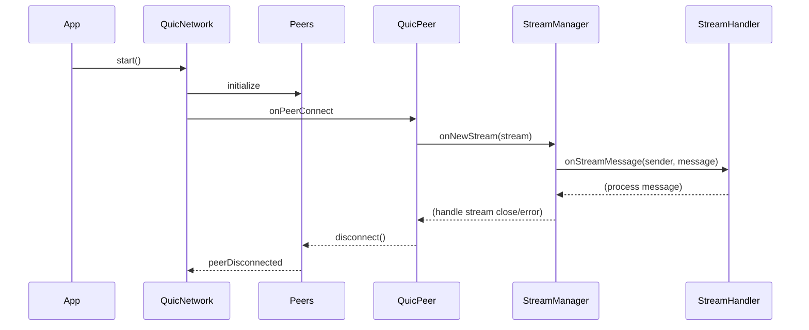
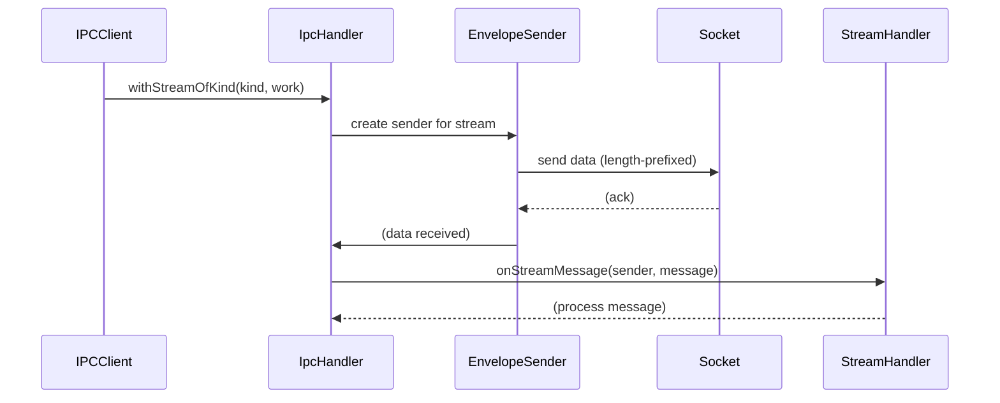

# Networking refactor

## Pull Request by @tomusdrw

Related: #44 

After #392 it's now possible to import `@matrixai/quic` in a regular way (not dynamic import), hence the types can be used as well.

This PR is mostly about moving stuff around:
1. Introduce `jamnp-s` package which now has the protocol implementation.
2. Refactor current protocol abstractions (`MessageSender`, etc) to fit into QUIC abstractions.
3. Split the `networking` package into smaller pieces.


## Comment by @coderabbitai[bot]

<!-- This is an auto-generated comment: summarize by coderabbit.ai -->
<!-- This is an auto-generated comment: skip review by coderabbit.ai -->

> [!IMPORTANT]
> ## Review skipped
> 
> Auto incremental reviews are disabled on this repository.
> 
> Please check the settings in the CodeRabbit UI or the `.coderabbit.yaml` file in this repository. To trigger a single review, invoke the `@coderabbitai review` command.
> 
> You can disable this status message by setting the `reviews.review_status` to `false` in the CodeRabbit configuration file.

<!-- end of auto-generated comment: skip review by coderabbit.ai -->
<!-- walkthrough_start -->

<details>
<summary>📝 Walkthrough</summary>

## Summary by CodeRabbit

- **New Features**
  - Introduced a modular networking protocol package with stream-based communication, QUIC peer management, and protocol handler abstractions.
  - Added utilities for Ed25519 cryptography, peer verification, and secure random byte generation.
  - Provided test utilities for simulating protocol streams and client-server interactions.

- **Refactor**
  - Streamlined IPC and networking implementations for improved modularity and type safety.
  - Unified protocol constants, types, and message sending interfaces across packages.
  - Reorganized exports and dependencies to use shared protocol and networking modules.

- **Bug Fixes**
  - Corrected event naming for IPC server announcement handling.

- **Chores**
  - Updated package scripts to use the `tsx` runner for TypeScript execution and testing.
  - Adjusted and added workspace and package dependencies for new protocol modules.
## Walkthrough

This update introduces a comprehensive refactor and modularization of the networking and protocol handling layers, particularly around stream-based communication and QUIC networking. The changes include new abstractions for stream management, a generic peer and stream interface, and a new `@typeberry/jamnp-s` package consolidating protocol logic. Several test utilities are introduced for stream simulation, and the build and test scripts are updated to use `tsx` for TypeScript execution. The networking core is restructured to use explicit peer and stream management, and IPC handling is modernized to align with the new protocol abstractions.

## Changes

| File(s) / Group                                                      | Change Summary |
|----------------------------------------------------------------------|---------------|
| `packages/core/networking/crypto.ts`, `peer-verification.ts`, `quic-network.ts`, `quic-peer.ts`, `quic-utils.ts`, `setup.ts` | Added new modules for cryptographic operations, peer verification, QUIC networking, peer abstraction, event utilities, and QUIC setup. |
| `packages/core/networking/peers.ts`                                  | Extended `Stream` and `Peer` interfaces, made `Peers` a generic class, updated callback types, and improved lifecycle management. |
| `packages/core/networking/network.ts`                                | Made `Network` a generic interface, updated method signatures for peer callbacks and dialing, added documentation. |
| `packages/core/networking/index.ts`                                  | Changed export strategy to export from `network.js`, `setup.js`, and `peers.js` instead of only `socket.js`. |
| `packages/core/networking/socket.ts`                                 | Deleted: removed old QUIC socket networking implementation in favor of new modular approach. |
| `packages/core/networking/bin/test.ts`                               | Refactored test script to use new `Quic` setup, improved async stream handling, error management, and lifecycle. |
| `packages/core/networking/package.json`, `packages/jam/config/net/package.json`, `packages/jam/database/package.json`, `packages/jam/pvm-host-calls/package.json` | Updated scripts to use `tsx` for TypeScript execution and testing. |
| `packages/core/crypto/index.ts`                                      | Expanded exports to include `Ed25519Pair` and `ED25519_PRIV_KEY_BYTES`. |
| `packages/jam/jamnp-s/` (multiple new files: `index.ts`, `network.ts`, `protocol/stream.ts`, `protocol/test-utils.ts`, etc.) | Introduced new package consolidating protocol, network, and stream abstractions; added test utilities and re-exports. |
| `packages/jam/jamnp-s/protocol/*.ts` (protocol modules)              | Refactored to use new `StreamMessageSender` interface, updated stream kind constants, improved type safety, and unified message sending logic. |
| `packages/jam/jamnp-s/protocol/*.test.ts` (protocol tests)           | Simplified test setup using new test utilities, removed custom sender classes, clarified async handling. |
| `extensions/ipc/handler.ts`, `server.ts`, `stream.ts`, `index.ts`    | Refactored IPC stream handling to use new abstractions, updated imports, improved type usage, and streamlined message dispatch. |
| `extensions/ipc/package.json`, `tools/ipc2rpc/package.json`          | Updated dependencies to include `@typeberry/jamnp-s`, removed obsolete packages. |
| `tools/ipc2rpc/client.ts`, `rpc.ts`, `index.ts`                      | Updated to use new `IpcHandler` and protocol imports, improved key truncation logic, and updated function signatures. |
| `package.json`                                                       | Reordered workspace entries, added new workspaces for `jamnp-s` and `state-json`. |

## Changes Table (Compact)

| File(s) / Group                                              | Change Summary |
|--------------------------------------------------------------|---------------|
| Networking core (`network.ts`, `peers.ts`, `crypto.ts`, etc.) | Refactored interfaces to be generic, improved peer/stream abstraction, added cryptographic utilities, and modularized QUIC setup. |
| JAMNP-S package (`jamnp-s/`, protocol modules, test-utils)    | Introduced new package for protocol logic, unified stream/message handling, added test utilities, and improved type safety. |
| IPC extensions (`handler.ts`, `server.ts`, `stream.ts`, etc.) | Refactored IPC handling to align with new stream abstractions, updated imports, and improved message framing. |
| Tests and scripts (`bin/test.ts`, `*.test.ts`, package.json)  | Updated to use new abstractions, improved async handling, switched to `tsx` for TypeScript execution. |
| Workspace/package management (`package.json`, dependencies)   | Reorganized workspaces, updated dependencies, and removed obsolete packages. |

## Sequence Diagram(s)





## Poem

> ```
> A network of streams, a warren anew,
> With QUIC and with keys, the packets hop through.
> Handlers now smarter, peers know their place,
> Streams find their kind, in a modular space.
> Typeberry hops forward—refactor complete!
> 🐇✨
> ```

</details>

<!-- walkthrough_end -->
<!-- internal state start -->


<!-- DwQgtGAEAqAWCWBnSTIEMB26CuAXA9mAOYCmGJATmriQCaQDG+Ats2bgFyQAOFk+AIwBWJBrngA3EsgEBPRvlqU0AgfFwA6NPEgQAfACgjoCEYDEZyAAUASpETZWaCrKNwSPbABsvkCiQBHbGlcSHFcLzpIACIAORJcAHd8CgBreAwiPxIAMzQxFOjIOUhsREowljLaCkTIAApbSDMAFgBmADYASkgc/AYy6X4sfxSiTHgALwyszHp4Zl58CRmw2A9yJJT0zIUlATRyjUgAMXwffETV3HXGWExSZAzcCkVsBiiM6zszNoBOABMABoUKFUBhLjx8IhEPABJFKihFilQjcPAADAACzGoFHgAA9tAB6ILwBjonj5VJoUgoLBoey4ObOeiJNDyKhovg3TClWG7WiyDBoZhkpHcFGIEFoC5XXZovkefA5UHIXCybhDWjwfxiLyyDRuW44r4Me6ZIZfG6oJoZBhebBKDhGACMxwAkhgXm8xPB8FhlehIOQ6twqTSPAwZZF6OihCKMNwwIh0SDEggzQovdoMGrbksCExfAtuJE2NnxP7DQDjjZcvkCHjdoGSPikOJdgX+ud0AJEC8G37c/Z3rB0Mh0QBZaSICMAZTISgoFIIxQSND4MvgRCwVxukAAigBVd0AYV7/aovv9iENbWOc9L6g7WQVrfbq3Rm2SaRmFLDDDUrSzz4PYOI+JQILMCkHg4sKpAqAi3DwKI0iGgY7jlHcDxDNozCIiWrxSGsHiXu8uDYP46AYPQJrZhkKjwF46jyIGCrftsqxMEoxTyJEUhUEQ1y3MeZ48K8hY9tBVG5DkojiFI+rUbRbxeM4UzCZGigkAcRwwLctrIP4ak0PQq5IA4HitC0ynFNgTG0Mg2ASlgvAkCs+BlJAP6pJAtD+h4XxNL8gLofoxjgFAi78CqaB4IQpDkJyURMKw7BcLw/DCPJkhDCU3HKKo6haDo4UmFAcCoKgvJxQQxBkMopkKGlXpcFQdQOE4Li8XshVqJo2i6GAhgRaYBitjQuZDogRLwNwDBEuatCRBQGi4IgzrRFtBgWJAACC7r1Ul1BRJ1OLdYGZo4YgRoeNqOQqv4eQFBQeYeO6VjnpeJAipAS3MbsJZluw1BDj1/ilvkmnie5fpeVOM4RgAEnMK0UvahzIHM2QmZ8XqUM9Qz1AjMLzoulCppA6Jzi8P3MAuNEUyC1O0yKKM0WjPR7mODIhlT7rzezy0U4wakwuKwNetDLP+CKk6YBGy50huhO9K8+G8hNlDCr4AFASQxzuMGJB1Bj4twRGyDfSKWM0X9qOUFbCxMc4SkCHgipY8bdTPNrMr8/NDNLujYtqqBiRUNwQbU/0qQJBS2P/aRi6rLQ1AMtzQaRJkNxgG5OQElEORUKKnYSd2XjoQA0iQ8hXRaTwYPajokM6BhQHW0ESP7bG3CTs6kEHIu+xQqvYzLdND0rZuIAA3NkkMfPQJTogLDBTwndvogAohgin4JqG+i5jaHtwH6/k0rEdoNwXsx4B8e2eUNFGWgdRp0yMMF/iUSZwyLRgDkDQSA2ciA3ENFAHee8SBeAPiQI+QMSDlnWlTGmstmDTlJoPS+m96BkAKlbVm+EyD701MgeoAB5TUGAQSTkQEQEEp5YHlB6AIXIMF7Ap12CsBkq9A44IgefIWaMsxkResGSETI453znLHR+GR+w/XoIGBkiVKBimfkuWyDBZY0FtufDegi0F03thzCo/ghKXlBv6J+RDIAW1IMgkB+AhIMGyHROyoQIR1EGFTXepD4E4N6CkThNFVhsCwafCqfdubGJFBSNgNxFAoCMkg5YdB57oliUQihOQq4ZFoLgqm3N4iJDicwCk3i1ivDqDY0UMJVhJ1erZXxUCAmGLPp6VK4TEaPHQFRJQBV6CHFQUQ/xMC4FFO1IgMMuAzRRFXDfJYvB4AnVMcLV689sAYFSN4rA1tmBYyoknZerFqGrD5gc5AIT7TQlWPAFUEJ1krUgO+fst4z5G2LiKVYmjejbOvFgdEmiADq6hYAABkyBgNgFYJ6BIKSoBxDxEeOsGgQgwGAVsEoKCmS6IIihAlowggVAVFJ2QxgTEmAs0C5QwzJSzB8Cgw5AyIDkaETRqxiZrw3j0bGBzXnQNgZqUJ2pdjE3GcKwJjNlxdGlHbRZzEdzeXBa8/EG40UCocUg9gysCb5FPgYWIoF659NXKSjhXYiz8D4BEgeHh/qrFga4/pgUvSvFoO8OgIJ/RKTERRKgvhsYj0JmAfiMDsjPUbDMdC5hLB7S8Buaxw5zW3EGWpTk00YpqpxU1EJ3BsDwjFOwdQKEbpnyYZjbIwo2DDLtrCHc1BKKRnNKQWgXB+7IwdkrQASYRCO7YixYksXyjPQfLeCw98ajwNfPJguYXjkRua2ou6sqb1E0ZQLgmD7VTy6CuUC6J13sq4LIh+uA92CM7uk+YU7CYdu3WTGV6JL1pKkDelWBqO3lOESLeosCozFlvQaheakl49RLCiBZGoSD4rPlet9x8YRfqIR0qAe1aBKHoDPDtkq4EIKHTqqWuwJ5y16dK4Ogj0OYcQxtAxQTr7cGQsR09cdcDPrPicAFlYgWgvBVCnOsL4X4nRsu+gxcWA5sg2ZUCqL/b1H8F3KI6JsUogpHHWQP5aCwa2tEIwEAwBGC1lNG8s15qzUZviNaG0DA6Z2vGw6ajkr0DOs4ViKpTXSFur1EDBrkD/v9la84yZNQMAeWKCDuLbZmWg6k3G0mqYfDAC6AEfwinomcmAAADBSTOaIdQKG2RuelKCItNXE/hBUWJ1SajYRQFwRJ4zMETMmNLmJqs6UoPVl4KEiQQiULeIQKZKSAUtg+ELYWAP6hJX3FGiBYB7RonOWBbHmYLYhACwjK3bLoiFnNtAccVwxdsnlvgOifrcfsQkWAigjkbEhPkD4MIog8JIlTZy2XgwimkABN1ii0DKJVP54syJIuGz7mw/sAAhf9qQKTdzxIhQKapoPDInO9jQs35uLeW5AAAPsGbwXginOQ/lEB7KQxVEH1GDjEpBcC7fuAd/5TcLtVP8AG4cvJ0vcEyxjuYe2mcKKZE3EgIIyifnR5jhbtAlv4DY8E7kab6zeFCN3B0Hh0xkCphD3A0PY6IuQBgQn6FPSvfRHTmusgABqMpghWG0K9CkOQuNDmmxifszhcCW//M4L7G4wjQewg3NWEneGQ9kHoxF87MAfBVfuBk38lNV23gATQAPpzndAALW3vu6OHxkt/A0N7mnkB1P2CmFpaPXoqbJ/T5nnPBufNgZXtAGwR5Yinj2tAbeAARNPde0+Q5Tz3ucTvV0Km63d/rw39al/uHNkcfZuu7EGGJm5LB6VIBsagBdTcTrxfRG3jvXee/98H8P0fUe/sA9r6njP2fc+l/Z5Rcg9B1NgDV8ESk+XwSQjnf6lEOLsRgXilsXrXDburvbjqNfjQP9tmgqG5B5GUEpEDkpKVknhAbbiQNAcuOhISsoD4G7kHn0tsg8vIIFl4GAMZAfgHmQtojeMLigiUKVppPhOVvYPcP4PQHrJbH4NQOsIrryEDuJHLhXL0ExNINKLQEIGUCOu1tRBCEyNxlFnyBGOgAwEwBQJTtTnGvtImo1FmqmndKIBmsmtciqCprilEPmoWsxG4iWuIJ5mfMaiQUMKuFYXmnwAWkWg4VLOqH5KYb7iod5JQLBP9m6msKgPdDkKXtBPdGSOYa6iAs7E1OZFOmiogsgsmoEUyExKoaVsgNzFaH3B7ritvOqmQLCP6E7i7jvkCkZtUbmKZgtAUq2FZuxrZu3GNI0dNC0USLwaQBoINv6JtNtLtAdEdI1KdI4OdG5m4eWkbEoNQkoE3HxO2HSGboMQbCMRgBSL3BiG1tBrVvVhNGAHNOSGqpNE0d5CMvEWFlECUApssMJP4B4NsbRlVscZ1rIESEWJEICimMzEcTVj8X8f6AXEQJTOPCCR1nVr8TohqAQM+vtBhqWv6NGLIMQdsVTLCScb8Y1s1kNmyFjBhmTl7HzMseTGsaXlSYzE3GWrie1viYtIcLAJTF8aCfCUSM6qQMuPKrGHiWCUbswLVkNgpjmKUE3KJmqh8NwKEH0Irh4M8WrtmpyXCfVngPkSiUbP4P2AgbcAXJECCHaA6JTvYDonNOtNKHgNdhQCCPYVUaLrZPEd4B4O1iCBKQolKR5rQLGnZvoUmiEcYYERjJmjeNmp4TYd4XYcWv4WWnppAK4R5mHJJtYcojGb4YKuEGWgAOShlmEqHzy+ryB0mrEMDyDsB4iWhArbHDFsp7GhFUT3EFx0CGhdH6aGaVHGbNEXFEjlAUACRWZjG6YTEOYNROYjhdTzEpleZkpPQNgpBvSQAfRfSUACQSybY5FPEkCLzQxIFwwTgPqkA/pKzjzHnkaUDoY3wbghwnxFGqq8wmz9pmLTyhxrDUB+Q6jyRKQPa7koIMhspnql6FHJEAHnDwCk60Cemvq/K7nBGBQg4oKBiUH2KqS4QKoxYmnzpKLigoifigGpbbbvbj6h4V6ZBIThhDH6QeDO4s5gwNrCgBpDCKlUx06Q6eQ0SubGr9ZpYW5YFQEO5DbOAeAk60GritKEXgGyCHb0FC64WBiOZijojh6R50FoQrlNwsC/Lsp+TpzkpVJzoCRlaroqXYAPQiyrjohHjPAAAce0dW7IFIbCipHgbCqwYYT28WCodq6hTSpeB5nkyA2K9h6gVMvGNw/GMKcKuQCKl2SSdawyac8pFQM8yRKp3qFeQ65B0MvltInKuwbA9cSAzApe7kuqzEiiSU7iyw/srFmA62IuyCyAieXs1WMmWAb4UgNeNatFpl0QDVnkHwyC0Qee6IA1GAjVw17Ao1xwBBgaXgxBKZjI6CAM7ptwq5nCg5lAuZyAeVDqqMqwJQwBswUpDx9ATSNGLS3AUF6lahQxRgehCaQZRhoECo6awRWaLY+Iua0ZngWZjhCZHGdR+y24TFzapQN1B+HaZRuAPK65k6VMvRJmfZA5Q560FIkABgkAug1gvuiSFQ7WyAvpCubFCQHF2yacLgPF0gpF+Eh6C+sAXASMSilAmOIIsNluXAql0gwAUlg+De28egIIi4XNkAPNiAfNJAhexe9+gtegPQAAvHoDANWTTQANoAC6Y19QjNzNrNFA7NjInuYt/NtcItNEpt0tYBluStKt0Aat2kWtmN2NuN9uJcCQhNR2JNrF5uCQlukBduQldNa6etkALNERhtbJHNTIuKYtEtUtMtAtj+wtgqtA8dEevN/NctKddtjA1tReAd2BuBztiIDNbJ+tkdRtnNtcXAZtWJadVtSdtced9dgdOBDuztNm203RBm403ZTRM0qNRCw53do59mUxk5LmF07my6ixtwpWxtNAzVTZsEig51iIEMoGHgIhChSgBcGA6JLKKoJGzA7ohS225S+SNEOWqqoFHBb4lRzK/srpCI6pLJhJSYKYpe1lLoHQsliFuatxqSim0FtkJZVMR4tlaWLwsge0iAUDFIXpWAGBYmplQp3JIpYpKJYK1onVfc5SuGmod5MIS12kbi+9GQR9pNlWBy59/4rwmouK8gJJbhaDZFf9gCYV2yjFeMNAfJDQ6Wf96IPQiykAbQAIXDoQPDYNfDJAAjxM2AEjIjpeBUbirFlW7WDDcCzD7iOYTk0pOEfpj1AZz1hhEZIZH14Zx9aZXh/19h2ZpazhFUgeW4hwQwp99Dl9RC19F9iQYRNVCGD9CAe16FtkIlEiPsSFK6Em79YJn9LWgipuaVp9RDJAFI9QXwymA9fRw96CHRcqr2Hu4gbi6Ip45D2jTDARrDYlpkXAtDRCXjrZXgtAu1vUbiPtpl2AwjZdSjAInRPdnZBgdZuxI5pj45x0TU09M5c9XmFOFQBx3k2wMywGVZjJJRGIIzDZTukhwD6AMhchbZkAj4ogE2mJxB41agGARIeiuA1B2ySUo12Z3UrDoDIeFWtw1o2hiICofQlE+4EosIF2GzxSyzP2wljlBoMAyQ3sSzaQKzseazQw/jVE/2mGHa0QHxDWIo2LTWX9Tz48mLVF0guL/ZyhJAYAuxs1NFVMRLI2jwpLxTFLVLFIVZLDIygVKB6xiiwyqItw0UizWSYLvmCckLtkC+a4Wuxk/Q4loEDIgL1DaAOQ/u41WLjWZLJ01L5TdW32/oOhDdCoYsqIMLSLjcr2KQ24DEvglVuAzM0QPkjss00TFABLW8dL+sM06rTLlLDZo1aYATow2hYRzmb19woQqrxLnrOL3rLLBloEsCFom4fLHg0U7soQSyP0zSmbzEkE229r2wjrGBLrTeVShrhwoQbLxwrhcughCxiIiAlp8pUogRKx+CZaPqp2EJ24lEORKL4RSg/pExBh1jqZ71QRI7kZP1UmNq9jcZOZzhxq5A7ZgzY0WLWhJAfxLg8p+A5mSglm60YzY5k9tB0z2as5GE/LU7uKS9m27zZuGgRIdAAIAArM+y6EXoNgkmE6w9inMDSnSM3DxJVtvLQC+2+38LgWln3mB++2nrYO6FbgPvfpftvGPrY2a2i9QyGZy4gEpFGbGNB6+7BxfiPqh1B73jB38A/gAOKxDd5Hg2DbxD6kdj5g6oAeb7OOSwu9V4JXsoI0FpGgQgeUdl61w/7NLYwrLdzALl5AKkSV6iJMHNs4g7CvjrAazdwuzwi0UhKL3BObORvgn+CbtIk7ttH7tDZstQjPCDvxrDtJGWPjtJHfW/UZmzt+HzvlpQAVFANMtOK1N4xUxrswQmfbu7vtEY0ERNxmkYjCdEcQcO7keUdwc2AIdIfp4odoccHPqPugfxf1kJwJtECwg8RvIjqeETiEfgfpfMdX7bZVeweZ60f0eMe1dkfLu6a91GDBfGccS/iZBEhXM3MhCj22ZHuOYnuzGuZnuzMXvukhAWl4jymk19eqd7MBfxZb3AYKi+KBjArsq337jogHj2SXGsWrecIUTcABUkCpX+jkCArPIVCvPr2tnxZJwrUmIfwMiyzmkKKQUeA1SIBChmivDraNwH3qA734AHzSiyhcT+gdjYBBXZD/arCsp2JmjbKpAGPiC+AKgCqLjNvyXwGBi/fo8YBKT+gfDHDbx1ZLl+SUS/J2KOq7Clt4hEACO8mrCSe3d8DTJzoPfcal4CpwJYCTYHCAS2Sah3eTXySMDRiS++RVIhVkjqBKQv7MrUSQAUJVxL1lDHAgrrBYDahbi7Dyt89kM8RVJsjqDIAAicJzpcdKv+6C85Q2IuUcJi+rAuiZafc2ycJBAlrnPeR4gjqAUzAIgA9Sw5CyBHWZ2Ig/SZgHJtMRzqCI4V48R/y29NRp96LHB7TKsLPnK7BXImmhDOrE2b6RAXbYwC/3fyTLky+bjA/Slg9BXU40sXdzZ4D+SJAoN+YuJtrhM59k5F9Kn2KSmwIHxxGSl0WPcZASAysXasMMaag3pBhRhzJjjwixyIjOqvL08Sd2zvihCZx5BMQQ3FMG869EpEGvbLWETpLjgg+wDt9eSs9ZAY/oLNudYhLarIIBSKROSBWXtBV5vQvgS6A30BLHZbgq3WzoGXMYppQ2JhMMs50sJ8c/qPhBxoDWcZJkTUc9RPpgLc7YC52LEAsp9QjJ9tJ+KKfBtEQeSxEx6emVdoZ3Xa9YEgPkGYKFwICjdxiE9CblMym4z0FiRgPaLC1foYhES27DouSmeAeovUPBIiJBS4hbsCARASOBmFKB48nGxNdgMG2GCQA4u4HUTmciQGqEqANECTHJ0gACChwHoCtnxzVAwsPE8/FQh2ifbxdTwqg/AGlntAoQvQXg0zlQm/pGBlMeXcDoEO3YJxNC/5fREYPfYmDxOtkTXpzgDDZQxAWYPIofXlD5g8Q0nDwOXhGS8gHKVAWQJDnMpyRNwdsLnAfCGyCARAGQv+K31B7+gUewKMGmlgEjkEEkV2G7D/UYo9CEqYQfbLhHEiSA1khQu2N93HD7RIW5Qiyq9BBBGVKAKCNEPhBAivYlkjDBHMAgPhoAg+vEYBBDD1IgwVCQApYJ6kexBhGKTaVFvohKHsh5hlQn+l0Nj6DDrszmZ2BmiUjLDIsdIAtABTtivDGSBPMGrcMB7jAhcr2aYSdVeykC3E5eJcLlHYYfN3ieQiYebWyAc4eexQGHpEF5AFJEiI6NXMoPVDoR0Qfg9gJEIIDBCkGCQV/PonqHy8/4QKWoZUxWF1xEeOYHnvSGaFv9Wh8MCwf5GYAS13hySHkAqSYheAvYQkbqrMNKFPDnuqqKQWoI0GJEfA8gcoAMCohCiJMX+IYLCJpr1k2mWSHSCqPwAaA6cNgOYCwHbohCDAYg9YF4CYbM5Hu6IAgA8LKEVCRYvwgCpABspeh7KYrRZFgE9GKj7SrycFBUB3LYicholGVPqCOrei+ADydAJpzUjacZ2+UA+HHzjF6VP4Gwp8nUDDHJj0IRsCQTjEZI2ItYz9a1nCCoDVkWqISeIX8EYDeD1BN8TQSslFAKQMKpyYBHBDmjeBk0FtBwE2FfDQZkwSrQHnbD2EHDP+2adTKoRuHMUPkj1Idi9QsYoCKBE7FztO1sIA14yeAqjFEHw6uiLsYQyjtSPwD1B1MXAFsbgS6BcAAA3iYK4AliFhxZW+C+Irw7h6gUnMWh+MqEghvu74uYcmKfHWB1YSAEgMACAmUA9A88V4bIH/F5DAJ4EhYSBPThgSFRyYjmmCOYo4THhEErgHCm0rlBgAAgPET9AwAq0AAvpADolR4gurAkLqty4HmiOiZ8E8bx1c7niwYFInNgEO8HBD6gkE18bUJ/G6iRRmdRAPUFAnyjiJCwyCWRPqSwSl+kFeiYxOYnogeuG7diQN04kY0mBXXYZqxN64cDOIA3czrwPHr7QJm0xZzEIJmbXQvMnhG9k4hBa6TzJ+kyyf1yIDhcLOOzBEKw06ZkV+QVODYF9gRYps+O2aaMOhzvY5cgKrGArj8zf63dOE9KNZDx0SnZcH28Az9szAfblAruBXIATl2b4DZv6+kVAFtyuGIF/AyBJ2BRQhHqD5GtBdyZnGYAq45oCIVXqFgcG5oWqq6GImERrwSDm2AgV4BEWyFqdSITAEVHuPTKOMnCI0iTOxD8lrc6yJjDcWYPSmoDCyX1DAXxIPE4CjxXnQwXFLCn013JAAKhmEpSEgd7aICVPZT1knmqaN4llIQrod3BcUh6RwVensCtgaQD6RyXukvSSp9I67oNj9bbZIZQMh9lVPBmbFvJ9LElmwIMkBSbJGNDrswL7p6SQZnAgbvAIPZMDxuE5SbtORm6uS5uVMeIKDNhx6pp0seUKTKTEZKU3EIaYDNlIJp4hqUpyKmNAFZbdlzS6IKwHzx1J9x/QksygOUzl5iA0sssvnr3iQBu8lZ8VD4YbnuwxDluEvKkBYTuoSy+ep4RXlSGADQA9AsBBSrFCyqlhaKINYYWt14Ryy8CNLdEKbyJxazFAbTFIXdRqZQ0TKsTVSTBOABuzrZZdUORRKtkokqMR9f2P1kba9jmoK9agWi3/YKgeZseYNCgkSTazsKgHHEUoXWqflPZqyb2XNk8gtNXk3VCiJiRHCMYUQQYcQGwE8iaAaWi9PzrqkDm3V0igHDEG7LNk+Ale7GdcXZ03HIDoRTnEIstLsbwjVpQNKAJ6A/Sx4VxENDbh2kZk+QKQfadENvO2CWyriRPawHz0jlZMiZ2M4mdsC4lQBpwQw9eVRE3lUwVZ8s6AbgHqCvyKAXAf8aRL5550NJWmLgIAt3kvyMAQ89+Z/PAV88/58s82YBEtkK1gF+ASCsxOzkYgD5aQRBTpMvlbSuBZMlMGfHvkfDfx4NJ+UHLoAdov5ashtpAq/k/zuAsCigAApQVALIAICyAHvOoXqy6F0CzdKfLgUjyLZVsyCRwq+DoKGZW07BWjNwVMz8FW02+ZAGIXJJH5olChe2iphez6gaLPUrRjdlUZdFKk6CRRIjmgLy5MobRRhl0VMKDFM4IxeRNgmxzNiEi/eVIqcUXyfJ18/yV4tSBcSOyLAjGTNCxl4KBuWzUYhTP4FUzBBNMy6LNyNhhL9kycpsRPziaYMQlUJWfH5TQDEQ2EWuDbpvV3Lb1Xsu3E+utDAB9Z0mceMcO6MQDCYxspzAuJNgNalFY68uBtkty8SQgKAPDKmOtHxCQAH2Q3W5jIJJ634al5S7SAMsG4ZBhu/YDog+C+GuxmlGIW5hSHaVWlImnsXpbUqGirLgksoR4vIAZCCga06opSAIKiA2sECC3I0lIWbz7kmph5KmBUt2ULcIA/gUkFRDKUVKiQFidsJOiX5b87BtU4msujQoJF3CtwbpVLDYCCoVgYPJxKxVbCiAtSuwaANBjnDJyJCkQVQrc3Wn01vl2kMan0sO7XYPYMoDcNDFubYq7oPCgSHxBcRkgEBZjCdo5zQGzyTp+4zMudM85GBF2BsEyUM1kUkyApzfT/OokaXJpbJ4zY9tErmK0yG4og8QWE10l89xVeISVcL0i5VR3UPoBZGG0Sm8Jm+VuCVUSKHC1F6KVYEFfxJsQpDGR6Q0IMcOkAlpzePAPnlUrCAwtlkKwstB2lQXYVS0Dco3Pf3HjITh5XgUefKhf5t8BRLVEGi8IlWyBw1o8jQnKVWEwtnApQo2UynECaqiYzffOrijOZ6JbIIhHNcWsB62kLWa06bJ5CIBjgy2uAf3KgG2Rr4+UQI01ZCveLury1eamQHXGjA8i8KK09EGGp9V5qLVgKD0CqGBFAqbEF/aUeXyzDGVlys6nIn/25BysFAOrGZHq0/DXi6erwJWLCKzkZF/YTol0a4IEmHAD1R/IpHatBDFkuQVwcoEutKlN8+eJo1BQdPYWdqeC7qjIIqRxC187YD6ymrFTfxRdtQW/UiO8EexrijYF6ioFepsTogb13gw9SkASQ3wrY42RpVTBNUaqk1KwzDUrDICOAkB7C7AqmS0J6kXI4s29UerhzUbpsNSIdRupQCxQsA2ybFPJGeymq51WADjagHwScUNwRzSqHtSWQI8BIwVI/lbFHAzCKVfsFOb1XsQlVqA8yYnlpR1YZDy8RNKCBZC4jjqiRdy/lARIhobq1xe01lduKsboDbGWA2Mh5x0GJlOMlq+kGSQ0WqrKAhG4tUODEk4LPFV8sVWuq1WEL/FhM4LekoGJ89bw5MsbpEsmYzEYls9OmUbFPpR5V5GuEZEZmoz9yYuQYMggcOBSNML63q3RtjCB6v93+E4frN6BQl7ofZfpD2W7Ky36o2ZRQ7AEQGQS/xHysLQ4DVtjWaKeFisj+U1vzniiTUzCdalXiF7AqjYBsqXkTSphDz4FzM8eOUmTVUgcsATfJauDYQ2CJyYodJHwBNkixNtRCABqkhmQ5RFIRyu2GzkCD2QdR9I5lEOvRC68AG9bMEfjwNWDaY14POFr5GxgcaFxETbVLxw1SYkf6bsobGlVeYREjtSUE7RuVdlSyl8HpWyHbxZlooltIOyFqoUm2fDG0q41epDVurk5tCkfeQBJSwgKguZq202etuwU/0qp2GqOMg2QDqZDlWYebTYndC95PEmy/sDBGQCM7ztSsIXDHg0oQoh+PIrDOtrpCAqcizqMUMgx9IylWwaamhrcEZ3VYeeBzfsM1WZX2dgydmmecdMc0kDnNi8vAeiAkXlIgtgSozr5LkWhK4tMgvLX1puDOgcakCOhhoqwYUxXakCera8Ea2kTjF6k1hdbLPgO6gMseNrTIui3u7RVnuyLt7tZDgo/duNcubQrG1iSo9Di4AIArj2QIFCW2lnXOGPkvxjmdiRWvXvQSRyM5qONdPQuOZ50vt8ehQmtqEUILoAterjqYs47kl29fC7+TAC71Vx0Q8etKnDqPl5bkAI+xnWlXqkeVHlKPDFJPWUpw6SGzbbmLnsgRSc1kv3CBl/IVlC9KFAiigNtoH16Au6/uoLuiKOFKJz9E+mhRrLqY3679qQRBY/rz0n7X9/2CBlVK3Q3xgAl4GYCCFMWh6gutu5vpfr420B/xMCqfcgtQVwHdJCB1WaNqv0oHm+XAaAKItYWz6n92BrMmiwoQT6kDYgOgPUAYACAmFv+xBZBLEmQBla7C0g1gYXlUGP9eB5AwwaYM/6WdIin+SwswORbuuqekVSSFO7lKFFCWvgfZNlUpb5VsSumWIL5gpMTuZITBczKyIur5pkipmcAF0MMAR9EinVd6EuH/ttUh4E8KeEATuN6A2M+wYKijC3xhxJa3hKJFPAsZH448PwwuG2pnkiuHq45RXNWAob6QdsAtQAPYCqN3ydELIXfFhp0A1l5LREEgV1TcFKamADlK0rJYHx+ATDcwv0NaViib0ga5iNSmXJPT029aBGi3yG3g8psziTnppHyzX9bwHs0XdwCqOMhahuI/cGjQqD8p2UYuIOdDCZalr5d5vTQhThp20865T3ZpKxQLVf6wYdfAQ49wiYqZyg9AF7OiAv3vzlZ/BgvUL0pjpgyQY4JQJEHGDAIQy4GigImM7DuqEjNeYHoolKoeyvZgxgHS0LaOVkPcRaObKMK2M2IxGBak9bkJeLUYvZ0R+NbtInn7S2VR0iMnPKc2HjeV3ErzVdWO6nd9Dg6B2cgk/D6GzDp3Sw7WRkNWSAppIBgAoaZkyDcshpc4LAjlBZAF5xO6zOQcBPG1cUReqCSXrL1kG89/J/o0Kejkx7NJYpyBKccL0d6+9Eai2eYYjmQS6wHOdFZqGADtYUKnuvgxArG10A495B7hZcfkhQK3ZzBlnWqbPkam3tGAbU7BL1MqgUZhp3AxaboO0BTT4p5oV+QsWEGb9timEPYrUmUmyQsBqQ2ZJd3BK09chskHnD57SrKZyWpyalpEEOjYWOhqkxjusPyCwMhhojMYcl3tbWZBsFchW33xeHcYXsPw3zvd5YBiYfh2g9xhEYukFYfSMVQJyiCJJ/s+lBwJmBGSQmsAgukEBdx0UzgQQBasc9onbFqiERtcJI1WiobiAtwdRrOEPwqC0L1+P6kc3MeK4NnHuIQRCEgFgDIJ3DNrKoit2fL1mrkBgi1GNtdyvIex4fGIAciKDlUa8L2AkWet8A7w6528V8yLE1z7IiE1yahO4ZlBsoUiVVZJUeYuxWaDzb0X44tvfIHGhgPJgpZYld7rb4LlycC4Iz4PlIqEZAERiSlAhi8gwfMNQNqF1DcZ/Yd5uxMTDF5O7Cm2MVcPXzG1wj3VJQfo0xmMMvG3jWQfc4Cf5HAnBGXFq4/ihpb9Ywa+dd1OuaGCE9Vj4Ou2PueYggDZAYAyfhOkRUhIGQ9Z5vqbsnmjslc7Kq3WeLOlkC1piZHiQSbtPDwCMZJ4jMno8Wxm2JMWhk0mcoAsmc9cBqwLbrP2U8KCjDH1dIA7Qjnz6XAKA5kA5KTmkMwZqxTOA5KQUYrK+KEszDvGGDwh77b3HAYVn+oDLeskdBSPu5cAWz7881dtmb6eg+gTCuqz4LgPKLYwxFnJNQnXREJf9J6Lq7accPlIkFXBzA0/pasvzqE5SIU8Eau1wH4GIPZrSNq9Pjbi94Z0U4KoCUetXdPirgd5a1LSiUzSWxyVOXUNpbFVWZvmLtfIExGqYaLbeHXIhT/KkoTeOQXqviwMZa5FVB6+YnkbthrGpNPw9QRgS0EmRYgchMd36vNGOSLZoSVtjBtnhWz5q5mFNfQQqNKzqa2IS3OcB04soDQ21try/OhA0qABBdC9CAHVbAdKPEJHyNq0K9+9vimlldb+WKJj+71mvFeeqpQnPmmN56TzqFldVdUaVXqqXjZsVBF++AaRA/yV2smU2qx6XSLm0Sab1gtsSsviDTVGF+R/fRnuOJpsqmpeyKgYNxgdLzH5pGsOTUeofL7g50NAdVNgH9iAaUgwG7Y1RI9h82a8ChUHUf0uyRI2OwVXMM2gMYnJZS/5LNF8HxtrHbsHR4ftzHblflEA3S+UtDFDs5AOTJltExbosuYnOVK06yy5tsvA0PNo+7zTdbuufWKAi+sWcgFuvsA9A9QWOnTgqvg3QjeOBw3DehtN3KrT5mxPjiRt0wlhakSYJMB/F8x6gGgEe5jdoyYBZAWtSCYProlLD1tP89yEQYkP0B8c0p0vbHpIPfr3LG1uM7IZ2t494tEWldlFo8sWT4zpU5yPtZUMXL0zx1zM1oefIVjgUMMkZY3BsMKDEQc6SEhDWDSH01ztRwHs3fPDYytqaO9S63ZIQ6h/QF51GxV2jjmH99ERpemKDEvU3n7V3QYxKLRtNtQHxfEIqaUdBDqWxiQsMDqBBDXZ+w05lEEAIcBNyVpe0CFFYFiCiFJIe1mlhfajhLB4Nyu84FIHF1RKcR0ACFDXt7Wma72jU+E1EHUxLCu2RAJnrsCMv41PazSQczzG523ckwW4YiMGmFhhAFgJAduUALOygxXVe2bgv6N7xWB7A70/aEA9wcpjG4HuKWLQUzgtjnDhxtsaZw7HcBYAD2rDLI+bTxZkJbqx2HyBxH47LsxVRAKVS8xjG+AbN+C3aG0q7ARzzbfwDjeEjQgNc4KaOySP/UVAwtz57GM5BsSDn4NzuXwEtAFzOkGMVfDu8OCyaOWpd1eK4TcaHNfKrwccDfujsdjYaJ0q0QwaseFvNIPucTw/mbd7vQg/bRjqqzYk0uiBtL/Uuuc22567BjI7kAo3SCA1SqaWFY6C6BEobkB9EqD4beYu9lXX0iga3YXgCdt2x6zlImvKk+yNxbpQjGYS1lRdinZ5znYlBx2o1VmrSnMM5ttjBSHhJOzUQAtbLcew/0QwyepDXwCusfBFLAD5AJsd0TbGT+qxq5uaVYr7nbkY4isxlo4eDGH1vhok1tNgIy6PDOG7wzMcmP2OQJFcm1TQhCe2pwXEY/lM0c466KtnFoowPNWJQP9JlJ5sE4raDD/XdIELtVXVALUgO/mXFFfsqO+c+PwsqxcIA3Q0sPIFnOlz47jdB11ywANQXKEJo9uf8U7tm6eenZsZWXuVNlpeaiWoxniFCn2+OzeApCHO4Kjdjh5SA9obhPi6mDJg+IdyFN0QFD+XJ1fHEhvc0GTYPcwoqmUEhsEbnnpC1gxoZ8TZ4nM2SFJXIO3E/J4neFRhmfzXXuYLgFQhUJhmw55h/Q9bPxmmThVdJ/su9KUN2TJiN9o69Nw0OnWliMCT2mJl2ZFmmohlxw8bDT3WOz04Kt0h+VCBLAVg1GMZ9jAecKkQaW4AIhseleEBNjLAHqYfUE1hO8xRl8uEWHcMYXhkBbjB8y6nfYOmoX97tr9YPj4PouhD83lgGIfl5SHEYsN1Q9xQ0PnIfEhh0w5YcVxgXoGx02ThMM7yWZqsbqb0K46rhYaxRqOAT2aMwUcLFQTd/U6JBSXGz2tpXsB/oBez+Azt0CCjKMAry/YGopdWvjNzYhcQBIYkAyYpDMRpp03VcMY+ASAUuCUQI8JY7HesZpQdjuJ0APufQ3ejRsMZ6FICfmPM4QjkRyZpg38O0z4j24K+7E7vvbIwIvGN0neOpU5PJ0JyBFM35yE9RAmnIhE6wc4hGMKUXT8AkKfVj5NiIe594PGdLkReXL4W+vhTFaVS4Il2Z7mBBAaf8niwjsxOkC/ADtXSz9gI3CLkpPfPMddBG2POzPmrNQArD4CTLHGgwmKRnMGB8l3w72T2H81J04QtSvHYItfIGOCdXPwmoJQHp0rGBsE2uRVDGL/U9yLaBF1rLlAGq5Yg0O7Eods16jdod8TaL35QFP7HvOg7gLeCZZwYIIs/8kj/gu5iV1pVm8sgiL3RFEGE8LfzbY4WEKKAzSePt26nkzxdg4fkOHY/jlr/M9AERevQeH7IGyi8AIY/4TOkWPV8hqlO4NM4Cp+smqfoRrx3jzQToySKsVGKCu39URtTj6VXHuV1sUuPJ0DugCBnyrBg3qzmjGP9Y1zGmGVH+hZNWaNhEkFu6hiMJlQ1QgGNwBBis1cRMJvs4A4xc8Eprw6rsBB9cuF3vn5z0F9WezBVc6kFHh7keBACLrq7kGvBdEcwbkdlG7GFYG3iThl1jsOwfy7v6LVXsty6lzWdoIJ5CcQD9x1EBAdqRZASogFgBq68BFbPLL/c7q7i8mJP+Rj5V4D7KPBk2vMEDzzlZE5LjzXDnNOxietfECZ2C83AZdN7w9umoTrwPC65ULuuINCPDAN/d+saM4B6S+x4IkD819TxPv/k1dfQfOQi3bgnXsW8QAVuKJ1blcAatXNRHBZyQ0D2ZHj+juJF0HhKrybz2w0pT0e9e7KawOSmC/Mpn03KbAVGmheDB+ew0CDNuzl7m9wpFgfNNf6B/tNhhWgZH8cGVagCsfz37OeoH+F+i5K6GeWthzYDUAZP729x3+wVtZTXzxyUrtehcGsAeGzUQqnn/cAl/p3YqGd99fGfswdS2z5UBWIp1a1k+xtfVY3uApTYAGJiWesnCVEta+yiU1DDtxOtHgLzGpV1lfWS3df7OERADdiGlT2YbpPdyyAvwIlQ9VKsCAD2Uk7GkAr9PlT8EJUlAX5W+smbPPGhUYADFSxU8VCiywDtlYTDwC+4AgJCAncNSCyA6LH8ihZFtJAPrQ8eXwAPpneHwCpg1oEbki5blVJG1FYQe7WSEelNYRBA02V7GhVW5FNj3goHDAH0s+APW1RVjDPFXsA9weZBRF8BAdkGw8AxAAmUgObcRqVWA6FSSh3fc3UtcvfI2Rtd3OO3XLR+VWtyFVDOdVm+5JXYAIxlQAjAEPYDrKemckFVWAPpl4ArFVSg4IDfkQJUAhsnQC4/DwBR9fiQIPcZMlWkHZkjGY4BipmpdoyMDqBWgNhMPAI0UsDqVRwIN8G1PuHICN2Rm1vI/oGHl8gPCYUEzFnTTFQ6VG5XNFLxtDQQPoB6pSFVQApbFgJXAFuWoIjE2nO4xG8IgTUV/dJQPwAeZVgboIYCQgUT0NJdmevnpVKQJtW1gaGG5UkIQGfRiKYvsMXAM90QUQLzx/Mdj3EDn0YZWkCTg5wNepXAygW99TpW1xzsgaflR/9pDF3XVYEmIegswr7Vt0gDb7aAPvtYWczgncEQFX3zMXrS938AsURwXsRepB2ThC+xT7AiRwWJTwxBgQn3BCDYHNEISlLbSLySlCpIEmf0xCIsFZJXycqRqtD3c4DJZ8mT9i/J6LTvnjkGLCj1BBEpcoDv5APIsABs4sLEIMYtEW7VCx8NXqhil0AZiHcZPiEilJpucLLEAQYcMAEGoNsC8yKkEsa2mgZlQxLGSxbKNUNjgAbIPjmUdQikQLoncEJCtCksFLGTByWM0OCALQ6kKtCXQNoBdAbQs7UNDPQsAF9DJGWcHExIgMABKZWMQ1x+s4QLUirBLQgvDaA2gb0N1CkseMLAAfIPOGJZkwQtHqQmiRkPdC2gFoETC7Qj0IAQ0w7YmTAuCGNB1Dx4OMOfZCw30OfZUw7YABtc0CMKgM02OwU/ZvbS7mchRECClJxgqNEKRVDgFCBTEkKFpHtRXkaURNhBCAVXHlEBC1zHYrXdwJ99s7LwMTJSkLEKphcZYSnxNt7S2FJZgQokFFlc0cJAxCEQSaVsgZQvEJGQk5PEDYRhkKiSkBfA9a33CgQhMC/ofFMEIclIgjM3PZJNWFgRDnLCkKHczwbX1cMtpEBHZBkNEJAVBogYEKKBKCY91JDeRVozaFiXC9ywdS/JSzrNh3bvi5dbneLEAo8NFCAupoQRox4JqHZgNURjXA71VEfnRcz8cgwVCmj5c1EcMCI8hGJg1hxfWEGQBGaAYIgiEnUmnQ9+dVIVohwXKL2Scsge8x/NR0OmHHRFYSlxFx0vDEHKR5IvkkQcsvb0gs8BLI2QFQdgWDxQF8sJpFUJBwYiHvNjCIyO7RVCJi3i81+R2HcMZ3AHi9h83VcGaDtzFnisjwmbjUPogI/GGcwKIAQFJpveZsBudOKfyLm9IAI3i1wixf3nWEILBqCFkLeXNlPo1IkWF+5lyAuFehQgawXMguvWPiKY7EfSP88twfsNBBSbGEH6BVkEtQJ47EcYK2ED4HYQOoGQgbwSAnIKODB1X/S93xcu1WKNshUvVYXzB3VOzzNtZ+fpxIhxeRHgyBkeLllR4uOJJ2898xBPAnxbgA5BBBFSNkGp1CqMjDMsmojZClI8eAqPi8ieZSKphzDR/wR1I4HCLEgBUYNF8i/Rd2AWFToLhCyAiqc0BKokHHEDbAepfCAejKhCvGpQHIpQRnwsLOD2ihphE5wktM4DqI5gwfVjxm1DokxA7EPgCp075SNZAE9QtbAqi/5TsZhHuQ94MW0AczPA1W6xOeUJwLV+o+XyzNBfeQAz8k4Waybg0YpvCo9XI7ZGjUgTCm3t8s0TOCRcBwAB3p8j1Z5BjRIAOXU6NAYN+3kZJyG4FeButMlVRA3qK8FIhevZZxFp5NHrzWQUyfAkV9iCFX3fVIacV2HdBPXSz4IBUK70WcZxWiDIwY7WZDNBoDaXiBjcIZfCvAQiEH0x4t3Mgl3coYj2z1ImIfwRp4UTecI993g3cUzt55W3X987LdNzT9/TDPw4d6gbFx/Ew3dK3HF54XNC4BY3RiRBA1EHiMxxK6JcCNpsrDwXA4NAINx1BO/YAFfFVuCq1O554A5FSjJ9VSPZdGJc+RpNAQnFkPCCFWfTTdqMFJgbj+nbN25MYPBv0gQ3IqOlfI5JEew0BjInq3QRTyKewwNx/M03GsiEeoDTwgzJpxBA08A5F8Zp4umF8Yy4s6KIRI5Gu3VsdZMEDui6ALoAn8MAUpAms143M1zYDkeuzPBykMuNWsu4lKHfJCTMkEf8B3T8FUiyMI+EzgB4+vyP1tcZMWlwg4eSWwlxaWST1wBASCSolzgGiRX9uooUxAV/gmMz/82498OTBggufFGYIlCAMU9T2TtxiCH7UMBSD51ftzfsCzIuBgj8wYlhxCogaIEyDcWIkiKBM4XHxsRecXnDdBUbQ5x6icSIoU3DxgjxCs4JQZ4Eu5EQaIG3DXpGlhxJoiaQEtJ7wmYWiAAAKT2gZffQ1WAyJVh1xo5wRBCKBg0PzDJAnSegBeMlFKwAhQwAGsF5waWWqDtJyUSUI3oRkaIBOAHQB6HkAIUT/zkSxBOIN6D2OST3/ZaAowNhFogPpSKAbEBKRkDJ+bfn3JqADVBiA7pSQLmV1oDhPBQQWHEl4CXofgIYSMZHcS1BdyaklCwhgOpDPCPAFhOZIfiIoB3MIXSNjh4g0VXDl9uEjQF4TC5M0iOoYcFQNkkZHQZBkcIIQEhkdo/bcCWFvBM7zmxDbUmIjFsZcc0cAxSAXwPtXgrcSDiHNDwL98LpdcOfIsky3VGJcgnYlSDWKSpO+JuSeCI9U+zb7g5oklFLyKT6SEpI+RozNVmwS8WXBMoI/iCliNCTQwCGdCpAqQOsxwA8EOISog0hOcIjYalTJR0gyAFPBt4SACNDigGHGyBzQ6d2ZDfAVhgXIXof9l28nwfKKQ8ruM9mhtkwLl32ow7AKk30ZogRNjATgEYQvIj4NKmxg4IG2xRSdQdHncxW7Tl0btO0E8gHQ6QJx1acA2V9COZPQG/H49zrbQSF987d0RCAmEBbxCMBIQLXJRmYk1HW8GCbi1JRWUpo0btjInAAIAHbJpQL40SHkJKDbgCJ08oPHKyhKQTYR/xV4fqUKgWCsRBkSpgvtdAHH46QK52hhd+KXnKAg+OWw+UXQjuUwgW0a6GyBbDXEUkIKASGHY87YJ/mIgwycgSjtyVYdipUQgNpnXYOjE7T4A2Ee4A8hVof2JZVA4xcLcDJ2L4M8Dw4o1ACgMEx5OYA2Ej8NeTDQgEGND3U1IG+TUkv5OUMAUw6xISYAkFLTQGBCnT08zcWtPrT1Qn1N+TtGPRIHdtyOuFbQqVQPEFYN0JWD5llHTYgFDCCZrXxVZIkUCPgrKf+MiRDEVGxGD0Y+YO1tUyZ+xlQNATRDlTM4E9KXANAX6KvJFsRcAvTjeUVFWBRNajH2ozWKiSO4ZUtmi5Tx4KVPYBTyaWSrwnHcNjnA28beE0SB8d0FiBe8EtkhAsIvmOYD3RFwHgYr6ApHqAjQprVGV4pDkPl4owOZRXIxw7uVu9kif7FkIeWVNSWMKKWnRkwxwlKIASgkceFgZUMnxgKQgMrCGWolWEAVCAiUrGLXBM0v0CqFosEVDKB1CVQLcgxjc1kV9MhV4BECOTWyGhjloJ1EZUGAJZKnl80j4OXCi09ZNxMoAQqyYJSFcEV7Tv9amHAzIMquGgzYMtGQHTPkxtOHTm0kTCMYkpWFJGQ0Mm+jLpmMxADcyUDTDM7ilFGD0MzmKYzOv0TjDAG3T7UddEvgd4jdMvgoIMjG5pYE2BHgT545iR7jmjQDM4UwFcLIjBIsmVGiyMEBjJlQ4syJASy9EOBOX9rM95LrTbMptM0BjJO+QCzVFYLO81/QbLNIBcspcHyyp4YrPtRSs6QHKyUszYhSZ/0r0AyyuFMLKIQLyDrP4U2sy8gjF9qPrMQABsoawvosmGzIbTasxRVGsms5+T9pdcGHAXAvUj4Gmz64lDFiy/oA2hzjw6S7OjpcMwFC4A1Zei2fNPovXEAhaMI8AkYy417NSAtaZuIJMRs+nC5S95digOzntfBBIATs/LOpTzs9YCroK6a7LhyJku7O4wHs+YOey0AfEG+z3sz7O38KJb7N+ydJdbKHSwchzPLT/Ap5KJIBiZFLeT7Qv4EdCToTbKeCW0lt2/DqZO+z/DPmBbnBT6EjwChTacm9gRTfUoUJ7BUU+sHRT4sTFM0t5AIlLUt5gRYCIh3SQPAAIHrCslUYjPemkpS44aHKfQrqUXLeYQXQpQNREorQR9ixUt0VuYAc79IoA5UrB11iew99w/iFvAlMbsZcqyNLxy8WEGpRFOTZ3RBk6RvD2YRg7PSO5j8TvG7w+8Grky4Q6SfGrIJEGfBxJcXG8AetQgcvFAR9wUTOooMtfimtxi6YOmZc2mBdP9wFCfIItAzAhPELhaAZMAU4VKWSWAA/coWjzwGQaSA8AJuf829x1KUvFuY2mCGJR4InK1KfBBpDXkdN9ET7Rn19eLGGdS9SXh2hg6NG8ArN3QJCiKIAmMjMOZhkRY02iqcGjMjQASZNg4y56GCi7hVgVtQ8dQKKrTRI2eZ8gCh4LHblFTGIomwKM1xJ6jN03gjTODjrdX3zDiNklwgIFA0jwhXDvg1aVLIdk3MHngEpFsgBdOcKiFkx8ebcWpVblZ8N/9XwinOrTqc2tLpzvWezLqzmcmVTbcO0zMyWIe0gLmXI+cwvAFyMC3qPHSLsfKCnS8xD3IU4OCMvJ/h6AT0MOF3CLdT3wYNd/DE5PckwgPpedI/HbxQ8s/AjyWOaWWqgLKEGzuo3GcoGbY1GQIkh4zhF0kayLNPUhxhZWEwTzBpY+tWjtfmSQh/owMxjnMzLM9GEYJNnP/DqA7IoPOqVPM7zMTC8nKVS8xkMlCBppymQZGcoE+VPLHB2OGUnoL7YbQiGRIADoBsgxGO/Jrx+C90CY5YgChF7wmOSPKkTVwQIp/oi6QShgJvGE6DrBEU/fQNEKFEiHyxy8Zpmd53/QZFTJfETaTqB2C2gloKvct23lCJwEvAcKMstKjALLQFBCJtulcRDpSlC0nT9tEQEovj86gX3NrhvtbDMWYcOCQkYLK8r3Nk5ZJH+lazJssjD4oEgGmBOhw8NvKwsqkP8mW5eEWbIQQcKUnhPpykXdLE9noyMi0o307aLrZsuOdLPTFwMaiuLb0igAgSbi0mk/Sd+MKOm4KlZcSyMZ83MDuUqieRyyB7ip6LCRdgT3ioh8XGYxHoFfQgiV9SUQgTIJ8oyotEp7UE0nlzn+BQiDCEgBulPzyMnjMti+MunTcpkxIEvNJygOCBKYH80xifzlkl/NWS/84tM/zIEdySJtjmMzMnAoMmDMcyS85zJSwZhGwo8yUMrzNYyaIDDJSwsM/BjXpPUN+hrSqstAqdCMC+ZTxNqMbJiAYFCS3A4MYEvREtkBC0/HDySOUfD+zdJFAplL6cmgEZyQhSBCSKg6FIsJtGCNosbBAsiGkwDD0bKwTpPQ1On1FFs8rJ1psrS3GKj1cT0qSyxSmkNYcacwvBNKKWeUrxl49JYpoB0i31MQdWixdD4Amsp0t1obsubFzif0pHJrpZARbOAA3Si2nTpa6DUt5oCyyfi+jHAAxOpQuAD7IBAmtKyjTLEcpmgRy8427JzKuAX0sbpiyzss+iFgSssrwayz7JwUjS2nPDKzS9jEgQGi98kTLxEFMu8LTKTJi8zmjLgEQT8RFl3Yo3i6mm0hEAAAH4f5MOgjpWy7MtaUM6TUrLLRaYstdKXQBWgX9VaJwqdpNaTOP9oBKK0teg9yhoAPL0y2ABjoTaS8przzyy2j/Kzy68rzpLSjuh1Ap7HWiQArclcuolMAJ8t1xNy2QBppdy/cvhzDyrMu/KBTL3G7LMRC8tzLIAW2lvKHae8qUAtaBCrArcCVCo/L0Kr8p/K46XCobp8Kjspbpbyyis7pNaIMsNLaQlkNQKxyyMvNKqYU8g0BZisdHmL5rOcqczsuSHKb1J4c7IWySypbMDKdaOdKhzCspcB6yIwAMsEAuK6UtHL0CknMwKJyoSu7RLRRYvJYViwYokrlCgNK5LpK1StkqYsorIuymyzMqjpjy38oIqYykgDjKQgdWmiAcy6IEfLhgOsF3Ufin+SZYerNIt1Yfi0fxUqosxyoKyd0mHK/K3K6uhPLiy7yt8r+wfysCrgq/0FCqXIcoAiryWKKtjKYqlhFvKl/Ycp4qvAUModCDKxFIVKHk8nMrTDwvSo9CXQf0PeSJGKcWDCKWMMISBWw7rHbCqwJnPCCiE9tKBTO0+enm59SFX1Yo5wJVlkyPAaADJBWMSABoURq6MN3ARkNFMbAMUoGHIIH+fFLGdXcmGNL4X7GlgGBRdDXKpT1Kn0VDg0wDMB28+y0UN4zjihd1xjdgJoVQivIfHQP09q/lJa1BUuAjAZJ8BbiqRBgL2HhcL3CVP7BLc5oxtzFU87Fm1xOR3N1Q2UjcmMiYKPcjzF6U222rw1zEDWz0tbQMHOqNkZcUvhejbkKHAQ+UlCV0TU/9nRAR408mJIRkfbVAgBpdXg5BHTB1NHyXebc2OLJ8daoSBRxf4s35E8qqkdU+a/UQ9AF88nWXyKMqnX1YClRTClJmYo7FPyq/DYGfJqY4dU0Ac0qkvUzzLAtKxMbdHE1c0v8utl/ztMj/PVcdxJImoFkUSImtAD0h6HgKAQrBLaqcEmaA6q/QgML6qVq0MNFq7maZG2rwtCarbSfw9nLiVu0h6HBUHiZci7lyWFeh3I8a7AIOL6MVVHozkqnXO1rpYawqFKL6K63057AL7CxDVGEwpIzTMgwrZKLMmDLTxqObeFiBt4GwG7wKEGwDTxoAChBS4KEAAA0U8NLH0KIM+ussy+6weu7re6hhwhRRWWyuH4OCbJNRBXGJ7CLUIyYmFczi69swO0SAPGJqNK8I41WRelAUr5LJsA/ReqYYTqEQh5AOwt2FO2aBGvZ2ICjTxA3EfUTfsD0PkqJoO81xhqLUEVkvZKrMltXUVKM9fKUgCS17EGCia9SjXFTcSrCtyMsv9Ohspy+8mxIlHQvMDwIU0LNmy0sTRDWqz0KoyeBQVKStMos6nXK3S5ivOoowHXBOV5CsmAHOErcG0OspgfKALIVTRUV7FfSFkUOs9sJwrwuIbYmK4vPSJ4+soPQ7i8BPvThS4RqAz7vUIEWY1dBgHaSn3LIE58QJUQHXpMgIx2+rjDOdP3yzggFFExNY6EqWpCBJWuXqRMicJdj4vOdJ9c/cUJ1Z8ia7TXfsc5KjWYgP4IcHBIH6m4kUQo4SxpMR9I73Nu8gBFslp0Vo44pcjQIXxEBLnMZ6LUydox2o5U381cJLS9M6urBA/7Mv1M9RMLgCxocaWutHqAGpupbq26juq7qe6ieqHrnM5gs3r0EXxmJUT64uowzPQprRya/6uuoKbbAAevTwymmepDp0QD0Id5qm3eLYz+SuBkFKam9DP6a90RMm2ybK5rKGzP4+Bu7Qy7SaC44R6wwpgyDS30K6rA6oMODrBqsOsjDRqjAA6Jsm12iwaKGiLIcrSGjSp4atKxSuWyOFcbNmyZK7Yvkr4s+5sDKUs6Zs6KyFLItupTQT+PoalmwfSX0WStpobre8TZp6rtmnqsDDlqpBJDqz0YarvCdqk5pxozm0SrkiyMF5rOyZUCrKeaLmnLKubCW7BDxbBslpqvS8G1jBxb0EbrNeQJQM0E9A92e8QZasK/ZpPRZGWgCpaEgfFoLcaIblo/liWsSsobc2Xcn6BYAJltbAWW8VpJRQ6jlp3A6AAVuX8yc1uJ9rnkv2pHKPQtoEbC0gdMIxlMwgQGzC7BcasITo6tnKhCOcuaslF4QnnMhTt4LVuB09kpfCNabEVClFyo0J3zVrn+BkBurtUukDWoqYTXJIBtc4OCuo6UzAAZTRYJ3LOrLYy6g4cPQXYrAYwqKpBPy7YaGqDBYajPwtzobK3JtyDVfBBpdazB/nRcoku2CuAyallIW8n4QlNja3c61TyMrhKiVDTw082IUteYyvGXJ4AmGVTTVM6hoNTllMICTSsYKm2G1e8yEG5rbUh9RHyE4ZNjTpxarWx+5pAXhwhdo9FxuCBn8BbkWZqVeRsUbzSQZHUa3/aJuBLjDHyD2TdG70n0aCgo2tMsf1ezQSa1k+2qtqoAZMkIFbarlXpKHau9q5iAmF2s2I3ar8g9qVW72qrSXkzVpTDSwjMIcBDWozTGqsC1MymrfwuOtpUE6poqeAFa9OtAw4KbKWARQKPbm/Rf0reGuaQLfrVSgrmT4DHC8OohEAzmYcpHoYaOklrmzoSLeCLrxm9zLLrStNkKGwJBKuqga8m9ZsAaiGuytXRIjeiwV59SPbi1axqT+q3VJsEZpYzWOnzPjCL0TShGNqlRZtfI0sIFo06aMO5UnwZ0lUFoYgkAvJFtxSrLIY6cGxcBBRtge3AxkCG8lCdKiOpWHIbhWndAEQ+jSzus7iWQYzoakGrlLql2ECgGA1BOIMB6lE0eADDQMgeTi6L/AVz2PaTi/wvfT2FI+qvTfLTRCbxA8j1RS7Voe4seK2OkJBeKhXKiFPahEk/nVQmwWEAYAtg5Uk3aDO24B3bafJRtubaQa3wjtbYr6ruQ8xHRr0YL2wxhLzYm29qAKtM99p0yn2yFNSaHS8hSgov0f+ohbndYDvaqwO7Vog79WqDpdbjmyLidKHWwZpFBamuTrGahm4Uq1apmhrIflZm3bMxbSMSJBpa5K5yoUqJaB5tIN5mqtGph0soHLM6XOoloSrXm27veb7uz5pWy5uxArVbKc/2qW6mwssNW6YO9bsIUTukhR2z1FKhQmyPu9rKFabupcAqyAW57q06NkMxQu6kqy5q+6GO3dEGy9whljfD1WqnNqrQy8DvB7IOrMKh6tsn5qMzds0FE86MZa7qcqbm9dklb8QLgG1YSAHnrTA2e/WC4ArOtIBs79YEWjK7/uBgFF7tgd0GXoKiFfAq78/VLMBbfO7Tr7Qzm9EDFNWe8XuJZ6gV2hxpUey7tc6iso3u3UBeizD56YIQXot6fICXruaxe1IEd7SAIEAt6JocrrJA5etIAV6kEJXq97Ku93pxpL43Jp17XaUnpJZyekHsW6dWxtIh76ehpFg7Z9FqtVaQOjVqp7fQksNp6VuisMyAUkzAqjrWcuVQtakOwdvmrdmViihSYU/MMijtgPGnyS5wPPqyB3WxcnMc4PI6uxSjU06prbIkQWMuqypeRNJTcOQAt4KKU+6pFa3yKtHDajcf2HLbmUqNsxr1Ujcg5SSADLKhdkWPlNAYE2oVOos9am/Lhrs26VIhtZBaJkSon/T+yVTkg78guorIi2k8MHAEyFypLYk1OUzXEPVO1B+24gjGdLqMdrqAJ2wfI5wJwR1MFq+ASfMe9E0/UiWA1JZ6tuM9mJQkvrdUUEsJdFbeeuUsiEANohr9Sb121q8ba1LV4OUT73Fh/ZfUT/bQmjVNMrr21OxWT72ukpG7c7Z9u/zg8N9qzt/8xwkAKlw8nV/aSiegUA7U++bt9rKekMqz64+vVv1hyw9SHz7m3bAohD23YQUtaAOlUEILXsFOpOgV6CSkPp8or6vUhsUwPEKJcazDsursOwBmWDKOmeIHR6O2lpwRLBumDo7vGBTuzcfWm8D7DaCRejMG6YajvXSz6QpBsHTex9GDggBa/NNz5AZDNGabCnjpAzWm/Jtm77O+crIol6sTrljN+BKSsoWOg7sU6WgZToy1HOoYtSRF4Pgu+7Q2r4HzdVFeCyvTneusGjdmYPHovJmJArpe7QjBBq3hsetGAqk9el3q860ZFoYphjgbVm+L9WOex8Bj0wRofSpG9KkNywMS9LEaFhXLpQMxh0GJP5TimwgdUqu3fMDSuM+XhYa++vjNeiJgaJ2OxA8dPMJKkU51W2opM6EpkyewJO3uw7YeRuzQyClrqJTX0trriNV28AdRaqBhcNNrNMwtOG7H2hgchSOZfTqiH+O48OblsuU+vLZBGYsN5Kt60RgPQ0hnbomb8w3Star0+oQYrhqe7Pt1aIe5voVKoAI8GAaShmyrNYGhgSGQakMHgxf1FY0GDcR2hyoZRAOe+mHOyfIBkdxQrsiobFb2Rtspsr7xGHwMToumDDMUgDGkZKZRUTkdzQmRkNtzZWRrkcByMyuvrSA2R+UawrVFPkco4BR35qmazTJHqxaruk3uZGfukrI+adKwbIJbkeiHINHpR+bN+7Es00YB6z4QkdupiRwUdJHuhqfspGdR55oNG6Wu7rtHksgHsyzzmi0alGHqm0eNG/u+0fQS+Tf03aHXey0cJ6rB5yu57resbv8BBezhB61IvGwBh5cAeWEYwZgWjGd74xxq3IrgdeMfKEzEH3o6GMZSseFgy418VlHc0Dke2BlRzHBrjeRl33i5NRozLolI5PeQlMPO/XvZ6rRsMZkd0x1Mf56Mx8oCzHbvHMblx8xnSOrGSx6P3wAyxh3uJY6xyIGXHNxymkiAGx4HTbH4ciUZRB2xibtbgux8Dh7GgsvsZT7j7L2qB70R/2obC0wiGBRBkWqMK1VfkovtUNIQ+QbL7YCyvpCRq+j0OfZFR3yGVHNqw5p2qA8sXIOrNuCYcAcCajUU3Jetcfq1ywxxBw4tL2fvLCpvXFCgdwlMC8nX6WnZFn60IpBEFk6xGfWqzbJUnNqRqshkJhNzmIAIgkzHAa+tV9H+vtNJQS22I1JqF+xd2dyNyCmpWhm2SXJyo8xLtsH7aajEl5DDOmiBPHcUdGASl/uIDm76q2gVEuo+8m1MAH7U6duwpoNEx1OoynL728BSjJARAoiM1OopDqBTmsCZ4xKj1TakqHWthZ9a0rCrYmBvpGdqkdEMhTTt2lTJnYT4NetzB+u9Ex+Hza9/MtqARnwOurCBCBg2GMhalQoKwYJQDyJpRbHQXz54J5AfaopjgYLTna17hIjPazBMfGFuzPp6qXxpsLfHcUD8aOavw38bkGXJLtwXorJtQZsmAmcClcbaCHcgPyjB36Vw79iqjoI7YwHIaSlXpB9n8o4ZIpGwzWCZjCGmNO3wfx7/BpmG2xER5gF27suYGQORwZCIYMy+Oseo5KMAuIa4iEh/DNCBiYUCdhGHB+EeSHxA1IfqaFOxpufZlO03HqH1OnHu2x3RzIubY9OpaVq73cIzrQaTOs3BqHxK8eHpG5RuzuLyF6khtxbQ25zr1GzeqhtNwymDXo2RrihSdbHIZ4gnzc2Gv5DfAlh1kHr7qpgm2Om+W69KEaR7ERvJnfLHLoka5hqmeka9SWRv+me23dtTg1GynEmShIDRu0QtGopnOyudTXSva5w3NJcCaS2gbtqop+130zNneHqm6kaa6UYIwW6Icsz8s3bsj6o2YHuQLyp5MMqndWkmdqnUWjbrJm+mtoDAntu9aeGb7psIYabQJi9CIUmeoLPO7dRvwZR7ExtHtzY/RsrP+7Hm97sRnPuvLMSrrRzStIBtKgMbEVxeBZte7tOzWYPDBB58dEHDZ8OpRbwtYypmbBR5rMR7vRj2c57KAXluDGA592aDnCh/OZJ6o5rHrRmREOOej6dZ4QYqmk5uUaNm05wRAznfmrOfJnFJwVtznDRm5qbGUQLgGo4bbCwRoA6ALuYLmIZyUdHHJ+oXqVG5RweeHmCjW7loBx58uf+yq5xGnRkBBinsTnXxpuZTnPx41pCF+B0qYTnqc7aekH4OmOtL70tJib5gVfARORx6CX+2y1UyQb2bl5WZFNJoHEU8LC7MQ+83Jrto9w2etbDCcFo6L6S7QcGZhYrW/wWIh4nWNKbQi2wnd6vgH0iD9VVBonhfetmnEfhKEdjcdo+nRiw9ConqCQJFT/wHAJCnYfOKokn1xKZhxZMqIRpzIGJ6R6/etjBj9KXfj7APVOSDoAleAwRMnxYEJAXUf7BVGm0snBGJFBiF8wdjnE9Hgsi7eIzyN8aA+FRHsBiIhEQKR2ZraNYXVwLhxnAAOSSKa7sQ0Z0x5mESzWWdjgE4CtZDUlSMmz2XMs1VhlQEn1XTEQU9szh7zEoF3quQbIFhEyuZnh/4cM2US1x/GkJGCisgPmEvyVAmtivdwnJXSwddQXer4dNhRjG2Eqo3aJeROXGVFJoR4QcCrBPhvNO+HX8nKZ5VRu+y2qLVkMBbK11S2sqKQs2h6dsGUDEUjTi5ksucSqvGC+XPmR6erIdcoMEVCkKvB3xiqX9Q7GFqXbZx6caWCcUUhaW+S9pap6L5mHu6X30DrRsWLRwBNVQKtNaUUKQE8KjK18suwfRA6ZmXAfSFJSMYDHVy5BIqlUEjHtrIOl/Ji6X7LFxXw7XyS2W8yh9ZABeXG9bzMjlM4YKyUh1lkIf0iiDPko6LWFwubdnLRuGZmySFo0d6yTRiOce7x4f0CYQsnCN3qXdlpNsQBSNWCqQTMAK5eDLMRuZb8z7l2Ra8G647NywsskcFBIs8kApGeXi615cSrfGEEGgBTyelceWNkWlYU7Naauy3iCkQFeLrZ51IDQrXyIg1PIOaHuetHp9CrPHhzUspCIQOV9IdZX+VmABZXQWtlZWh5VpEZoguV28V5WYAbzIFWhVjZBFXu0MVZLmoV9HtvLdeXFe4qQyglaA7T5neepzbmMAF2tD7H8ZwLpqvArvnnyBEN1VQF8vukZRUxkhB83qoydiiwI1OXdiciL4E/naquFW0CYHBXrkL5Fz1VAgPEGeAithZEIFGnx4aABCBiJgdGOBQhPNf7BRpgd2XJc6pGcnRstJhfhMeeEdqB0+MwMGsFwYoQPi9wStnjlx/NCMhewAa9w3Tb0HefNrRUlvPF29vDQHgbWUeDNOyVBM0mj4zW1rDH5mrkckRLW8xsjHX67oitd7iFIyD2AwZ+vglC7xAf+cIs4Ft7h6hPGCBfUsToIgAtZy/FeHCHUbTSOHALPeCyYYeIyaEKMf+FD3+VzHHGu0RKIfwC9AqeahFijejJNffm/hEeMaQ7+7IA+BJASH0/hSncCyAF9AkdFPaYjbb0jEvF3xfeNXoJPNA2Z2EMB+F1vcKLphejcpAS911X2xUKYFxWPi9BdEyIqjQsPtM1S3F8CwTatPKSLsRQl1Qg7XDzCJjHW4sLH3jxklhqNSWwva73CI9LJfvw9AbfX0XWaJHsNhEnB4ZLkcqATMQ0Do7YmEzxJwI8AhQw8/vDWa2S6AHdBJwbeAoQjwaADTxJwMfFgx6ZFXxp9HImfF4Qj+9gCtzJ1C7Cwc2PUYTU9AwEeC/0lMVdYLWZFnlKGBKvIw0341U6JtCMacLCE1TBNtZGG8ns2Sd6iEgqNcoKaYlIA2iSS7jZA32urCHxtVCaYXx9/GLXCT4xwGtnGNJ1rlkMaFqK3jRFJHL2G+Q2AdDZgiQgPxbpgI1hNx6gEtkdBNitXSTZZtrSQxefTeZxOG7QeHXdxjXLhiCDAZu8ryDggnAvJfFmCl2kqlnilgEfssUmVdbLW7ov+PNXiOi21tKkyzZe1kwEmYfpmoEpkHDmEEuCsbJqwmbTQTSDSjHxNtt/NfXW/Ovbbmmx0OxY9UZy+0uBXtZUBJZqqAjcDZrh7EeynjEq2eM4qvm8gwOQ6wODakBMmDRXAWsJa7dhXlW8g2yR0EXJF8YNVq2dK6Vmt5aVXmVibdVX5p9legBPl7leLq+VhToNWaK4VeVWTV0VEhWVly+ElW4dvPRlXykAnYGWKdhnZZ3XyRVekWqdmnZ1WaIenfSHGd3Wm7RjV18lNXOs4ObDGudh0fIN4l3KBIsOrNK1aWwGAFYZWCkLHbz1NdqQC21Ht3XfAXlW9+N4lp2WiYRr6J0IyFNXxRdyIN3tyJFPIa45cpgB3d+1E93tJZEKHzIt6Nq5dfNlUH8335QLd92u0ELeFxoXe1bJ6kC0Dqp6MsTLBqzNQpqkSNL5iIPNb/x2+eQ6lBihTQ7fOayZIzsxXMBcHw+dS2oKpIlgEVyRUe+lXQ6UX6QvDCxcikikDaqGVZC6YesiBAigAh3NJ19b7c9mr4HOtLmzyaoTPzsAtadqbdpn3KM2AGpvEwCROvDKhHiYP3ktnamm6Z9aUhhEbqXNVlA0ywXp0zp2wuUmeAaT5rYzuaQcOMBpRwZhU+iPgImUtjv2RkSteWn3ZPoZiqBho9LLoRhyRsZnxh/IcsKaZ7LvEbDl//Y0AgyqWMykeTbOfM7mYTRAZwRhJjtjBNENbE4ppqL0Gka7h+xogFegeTI10CeC4LYClQEK2ZdE5BgXGlY8dyjzESlc7cqFZhm2T2LyZxML4zOGi2MiRejati8XlqDwgZ8Lq7GJm38D+7EgK/VhQVCnPfcKZDjsTDbZlnxu+WehoQRg6asynSjfZJ2oFm2fk70h+oCP3AexPe1nk9kMtT309yagwPNsRntO7M5l2ZzmzVpMZubvZ/rN9nHu80aLmEx2w9cPfR20Z9moxx7sx7xYU/ZkWWJNPrKmjDpMDT2NsjPcwOjKx2csP25lnsXAkDuOCZG6Wqp0ZwLxxI6FGgxxA/5w0j0MZnmfvNI+ZocjkYSDKUmEiaCPt5mPpT2wjkw6mpzDrpbbnmehHvJn0DrUPYBkj87M1Coj98VMO2jr0Ca095NA96PM9r0DyOq1jl16Puj/aGGOoj0o8/jyjreYdWqj0I9VCIjmY/qOj7Trj8C0+7gAkBmAMADDd/Q6MD9rKEsINNbi+qALz3mptAebweo2GkW4NlBIOQDkgkILQCFq1dFhFxlCpTzxPjklU3pWYyrEGUMgGQTgKaWfxI2UhZy9q5LcDqaNYLFQCYNJpHA64E2Cuw1DrUDCsfR0qAewKjyRUf4fWzWD6A3oJiSQWe44QDDa0WeNq4mr9oztEmtgYZL8BG2q5q6B/4bzJ4m6aGKmCAc4CHp5oAEDDSFoRd3qmPVxDvz2DahRZyVCfNhh6KsIPhAYAmhi7we9IKWgmYiFa7LlYTCQ7lLBrs0ZvYZRG92JlYSziC4mkaY41pQBzKkLpSD3XZFvzXhTyZuJvw1SNe2C2NkGt00olvOEWj0LmR0+rmiaqqLBhnvVfqnhryFKivhI4ASyKZdKfzqAOeoFfYyFZbYmrBg9ua065Txghow3bxO1mfq6B91YCg2y4ONb/WGjIbf76GEBTP4OlM3mchPeuttHQgbNfJcOkpD2k4/bRu9zUe4FDkzPckrrWGgByj0M9HtxfdFalti6cDI/ENbyyXGKO44H1AwBWjkY84AGgBqi4B0cSc9mOqq1hTLjPThCTMU2zp2Q7PobLs9Ywez5stisizgc9HOLx9g04MRzl+DSPxzhc82wf5Wc8hpeca8+QRR/XHNglEz18gNLOT6URaJeTszAFPIuLGkYH+AbDeZPcptk6oEOpgxowTPz7k4YAfz1olBDs9yauvmrjmIKNhVB5el1RMGpUIrFoZziINqX0+lTwZZgCkmikfsMaf1P1Uc4jMxXk4w7WO6j7UMQBPpWjJPC8xXKXclucD7E2m1T32upZ/wtE4J5PICgFjw9nBVBamS92QBtaztJULjT02BNOfdWIHg8mUQkO4ZBY4C5befzVtyWb+HpZhdgCgOTvERgu4LvBIjBQg91dkHcChQbLJ8EbljSatiU4+CkdOFJVYSLiOC6JD9YdbmAaavKfb3734G5PLICK8am4v1W6IC4BogHhI0AXQalm4Pa2Xg+3EcSc5PThLkjpWbYN8VTZ7YV+H9oiIJDmgcssQL2Q90ul2KC4Mvvzvk9+V5oQU/MvPVhQbcHWZ90JSxR08QlFzIzlgiQoCKa0LvZIjR6JrwcSYmCCuiSds21qycFBgo6T6EPJ1Lz8ZDhEKkpVhKnxesbcoK5v6v6f7TobH3F9dgZhpk9wbAeaA83fT4c1NnVzpzoPQ3znHp36AeM3Fhotrs7hBolqXfaph/KOnG8rLKmSj2Ymi+LF8QGQcoqahGaEBGhR9wclPPWxrgzeEK6uYYtZnRikIvDZs6evEfxEwhUBTzfrscFAtKN+Qj7hRRDU6pcy6xmikcuCwtAPPYttAfHzuM1oLKLbgcvFQAsb8/s+vHiALrcpd6zsBPhvKW4CaQBfbItVSq2iRTdtXhuNa7lBLv2IpOb2sKcKW8ru1zwEmzk7zO7mj0rU2v5oeSWENe8dOElde7Bby3QPt18gGPtl6W4YBZbh7IVv3GJW/SgVyQWG7QuK6C5KuzMPk78UV2EaHKg06eKXigGphIINv2oRqZ6gCodTf6gSoIaEMAbbhIPUA08SCkQA08R5RNg6ATeNaUvb0aCgBn2NAEyw0AWyhIBMsP4DfYOgDDBaAXQEgA6AGAAAHZM7nIE9DGDDoGfYGANoFgucgJO9soJGNoHoBwoAwB9ut3P24Dug72GBDvaANPGih9AIAA=== -->

<!-- internal state end -->
<!-- tips_start -->

---


<details>
<summary>🪧 Tips</summary>

### Chat

There are 3 ways to chat with [CodeRabbit](https://coderabbit.ai?utm_source=oss&utm_medium=github&utm_campaign=FluffyLabs/typeberry&utm_content=436):

- Review comments: Directly reply to a review comment made by CodeRabbit. Example:
  - `I pushed a fix in commit <commit_id>, please review it.`
  - `Explain this complex logic.`
  - `Open a follow-up GitHub issue for this discussion.`
- Files and specific lines of code (under the "Files changed" tab): Tag `@coderabbitai` in a new review comment at the desired location with your query. Examples:
  - `@coderabbitai explain this code block.`
  -	`@coderabbitai modularize this function.`
- PR comments: Tag `@coderabbitai` in a new PR comment to ask questions about the PR branch. For the best results, please provide a very specific query, as very limited context is provided in this mode. Examples:
  - `@coderabbitai gather interesting stats about this repository and render them as a table. Additionally, render a pie chart showing the language distribution in the codebase.`
  - `@coderabbitai read src/utils.ts and explain its main purpose.`
  - `@coderabbitai read the files in the src/scheduler package and generate a class diagram using mermaid and a README in the markdown format.`
  - `@coderabbitai help me debug CodeRabbit configuration file.`

### Support

Need help? Create a ticket on our [support page](https://www.coderabbit.ai/contact-us/support) for assistance with any issues or questions.

Note: Be mindful of the bot's finite context window. It's strongly recommended to break down tasks such as reading entire modules into smaller chunks. For a focused discussion, use review comments to chat about specific files and their changes, instead of using the PR comments.

### CodeRabbit Commands (Invoked using PR comments)

- `@coderabbitai pause` to pause the reviews on a PR.
- `@coderabbitai resume` to resume the paused reviews.
- `@coderabbitai review` to trigger an incremental review. This is useful when automatic reviews are disabled for the repository.
- `@coderabbitai full review` to do a full review from scratch and review all the files again.
- `@coderabbitai summary` to regenerate the summary of the PR.
- `@coderabbitai generate sequence diagram` to generate a sequence diagram of the changes in this PR.
- `@coderabbitai resolve` resolve all the CodeRabbit review comments.
- `@coderabbitai configuration` to show the current CodeRabbit configuration for the repository.
- `@coderabbitai help` to get help.

### Other keywords and placeholders

- Add `@coderabbitai ignore` anywhere in the PR description to prevent this PR from being reviewed.
- Add `@coderabbitai summary` to generate the high-level summary at a specific location in the PR description.
- Add `@coderabbitai` anywhere in the PR title to generate the title automatically.

### Documentation and Community

- Visit our [Documentation](https://docs.coderabbit.ai) for detailed information on how to use CodeRabbit.
- Join our [Discord Community](http://discord.gg/coderabbit) to get help, request features, and share feedback.
- Follow us on [X/Twitter](https://twitter.com/coderabbitai) for updates and announcements.

</details>

<!-- tips_end -->


## Comment by @github-actions[bot]


<details>
<summary>View all</summary>

| File | Benchmark | Ops |  |
|------|-----------|-----|--|
| [bytes/hex-to.ts[0]](../blob/8c149b26b9fb9f63ae0b59891bd7e0dc72dfb8c4//_work/typeberry-1/typeberry/typeberry/benchmarks/bytes/hex-to.ts) | number toString + padding | 335078.36 ±0.09% | fastest ✅ |
| [bytes/hex-to.ts[1]](../blob/8c149b26b9fb9f63ae0b59891bd7e0dc72dfb8c4//_work/typeberry-1/typeberry/typeberry/benchmarks/bytes/hex-to.ts) | manual | 16385.53 ±0.5% | 95.11% slower |
| [math/add_one_overflow.ts[0]](../blob/8c149b26b9fb9f63ae0b59891bd7e0dc72dfb8c4//_work/typeberry-1/typeberry/typeberry/benchmarks/math/add_one_overflow.ts) | add and take modulus | 244309835.05 ±5.94% | fastest ✅ |
| [math/add_one_overflow.ts[1]](../blob/8c149b26b9fb9f63ae0b59891bd7e0dc72dfb8c4//_work/typeberry-1/typeberry/typeberry/benchmarks/math/add_one_overflow.ts) | condition before calculation | 243083451.76 ±6.01% | 0.5% slower |
| [math/count-bits-u32.ts[0]](../blob/8c149b26b9fb9f63ae0b59891bd7e0dc72dfb8c4//_work/typeberry-1/typeberry/typeberry/benchmarks/math/count-bits-u32.ts) | standard method | 90908826.16 ±2.09% | 63.46% slower |
| [math/count-bits-u32.ts[1]](../blob/8c149b26b9fb9f63ae0b59891bd7e0dc72dfb8c4//_work/typeberry-1/typeberry/typeberry/benchmarks/math/count-bits-u32.ts) | magic | 248764144.63 ±6.39% | fastest ✅ |
| [codec/bigint.decode.ts[0]](../blob/8c149b26b9fb9f63ae0b59891bd7e0dc72dfb8c4//_work/typeberry-1/typeberry/typeberry/benchmarks/codec/bigint.decode.ts) | decode custom | 171686344.95 ±3.55% | fastest ✅ |
| [codec/bigint.decode.ts[1]](../blob/8c149b26b9fb9f63ae0b59891bd7e0dc72dfb8c4//_work/typeberry-1/typeberry/typeberry/benchmarks/codec/bigint.decode.ts) | decode bigint | 105727008.73 ±2.42% | 38.42% slower |
| [codec/decoding.ts[0]](../blob/8c149b26b9fb9f63ae0b59891bd7e0dc72dfb8c4//_work/typeberry-1/typeberry/typeberry/benchmarks/codec/decoding.ts) | manual decode | 23038049.46 ±0.57% | 86.41% slower |
| [codec/decoding.ts[1]](../blob/8c149b26b9fb9f63ae0b59891bd7e0dc72dfb8c4//_work/typeberry-1/typeberry/typeberry/benchmarks/codec/decoding.ts) | int32array decode | 169466922.2 ±2.84% | fastest ✅ |
| [codec/decoding.ts[2]](../blob/8c149b26b9fb9f63ae0b59891bd7e0dc72dfb8c4//_work/typeberry-1/typeberry/typeberry/benchmarks/codec/decoding.ts) | dataview decode | 162929209.72 ±2.8% | 3.86% slower |
| [codec/encoding.ts[0]](../blob/8c149b26b9fb9f63ae0b59891bd7e0dc72dfb8c4//_work/typeberry-1/typeberry/typeberry/benchmarks/codec/encoding.ts) | manual encode | 3096760.42 ±0.13% | 16.9% slower |
| [codec/encoding.ts[1]](../blob/8c149b26b9fb9f63ae0b59891bd7e0dc72dfb8c4//_work/typeberry-1/typeberry/typeberry/benchmarks/codec/encoding.ts) | int32array encode | 3726607.2 ±0.18% | fastest ✅ |
| [codec/encoding.ts[2]](../blob/8c149b26b9fb9f63ae0b59891bd7e0dc72dfb8c4//_work/typeberry-1/typeberry/typeberry/benchmarks/codec/encoding.ts) | dataview encode | 3713512.51 ±0.26% | 0.35% slower |
| [hash/index.ts[0]](../blob/8c149b26b9fb9f63ae0b59891bd7e0dc72dfb8c4//_work/typeberry-1/typeberry/typeberry/benchmarks/hash/index.ts) | hash with numeric representation | 191.9 ±0.45% | 27.08% slower |
| [hash/index.ts[1]](../blob/8c149b26b9fb9f63ae0b59891bd7e0dc72dfb8c4//_work/typeberry-1/typeberry/typeberry/benchmarks/hash/index.ts) | hash with string representation | 119.32 ±0.57% | 54.66% slower |
| [hash/index.ts[2]](../blob/8c149b26b9fb9f63ae0b59891bd7e0dc72dfb8c4//_work/typeberry-1/typeberry/typeberry/benchmarks/hash/index.ts) | hash with symbol representation | 180.83 ±0.6% | 31.29% slower |
| [hash/index.ts[3]](../blob/8c149b26b9fb9f63ae0b59891bd7e0dc72dfb8c4//_work/typeberry-1/typeberry/typeberry/benchmarks/hash/index.ts) | hash with uint8 representation | 165.47 ±0.13% | 37.12% slower |
| [hash/index.ts[4]](../blob/8c149b26b9fb9f63ae0b59891bd7e0dc72dfb8c4//_work/typeberry-1/typeberry/typeberry/benchmarks/hash/index.ts) | hash with packed representation | 263.17 ±0.56% | fastest ✅ |
| [hash/index.ts[5]](../blob/8c149b26b9fb9f63ae0b59891bd7e0dc72dfb8c4//_work/typeberry-1/typeberry/typeberry/benchmarks/hash/index.ts) | hash with bigint representation | 183.02 ±0.14% | 30.46% slower |
| [hash/index.ts[6]](../blob/8c149b26b9fb9f63ae0b59891bd7e0dc72dfb8c4//_work/typeberry-1/typeberry/typeberry/benchmarks/hash/index.ts) | hash with uint32 representation | 199.4 ±0.31% | 24.23% slower |
| [collections/map-set.ts[0]](../blob/8c149b26b9fb9f63ae0b59891bd7e0dc72dfb8c4//_work/typeberry-1/typeberry/typeberry/benchmarks/collections/map-set.ts) | 2 gets + conditional set | 120532.27 ±0.21% | fastest ✅ |
| [collections/map-set.ts[1]](../blob/8c149b26b9fb9f63ae0b59891bd7e0dc72dfb8c4//_work/typeberry-1/typeberry/typeberry/benchmarks/collections/map-set.ts) | 1 get 1 set | 61701.96 ±0.03% | 48.81% slower |
| [codec/bigint.compare.ts[0]](../blob/8c149b26b9fb9f63ae0b59891bd7e0dc72dfb8c4//_work/typeberry-1/typeberry/typeberry/benchmarks/codec/bigint.compare.ts) | compare custom | 231752276 ±8.06% | 12.55% slower |
| [codec/bigint.compare.ts[1]](../blob/8c149b26b9fb9f63ae0b59891bd7e0dc72dfb8c4//_work/typeberry-1/typeberry/typeberry/benchmarks/codec/bigint.compare.ts) | compare bigint | 265013470.86 ±6.41% | fastest ✅ |
| [bytes/hex-from.ts[0]](../blob/8c149b26b9fb9f63ae0b59891bd7e0dc72dfb8c4//_work/typeberry-1/typeberry/typeberry/benchmarks/bytes/hex-from.ts) | parse hex using `Number` with NaN checking | 146646.99 ±0.16% | 83.67% slower |
| [bytes/hex-from.ts[1]](../blob/8c149b26b9fb9f63ae0b59891bd7e0dc72dfb8c4//_work/typeberry-1/typeberry/typeberry/benchmarks/bytes/hex-from.ts) | parse hex from char codes | 897976.95 ±0.37% | fastest ✅ |
| [bytes/hex-from.ts[2]](../blob/8c149b26b9fb9f63ae0b59891bd7e0dc72dfb8c4//_work/typeberry-1/typeberry/typeberry/benchmarks/bytes/hex-from.ts) | parse hex from string nibbles | 564439.21 ±0.36% | 37.14% slower |
| [math/count-bits-u64.ts[0]](../blob/8c149b26b9fb9f63ae0b59891bd7e0dc72dfb8c4//_work/typeberry-1/typeberry/typeberry/benchmarks/math/count-bits-u64.ts) | standard method | 1570924.11 ±0.3% | 85.31% slower |
| [math/count-bits-u64.ts[1]](../blob/8c149b26b9fb9f63ae0b59891bd7e0dc72dfb8c4//_work/typeberry-1/typeberry/typeberry/benchmarks/math/count-bits-u64.ts) | magic | 10691451.4 ±0.76% | fastest ✅ |
| [math/mul_overflow.ts[0]](../blob/8c149b26b9fb9f63ae0b59891bd7e0dc72dfb8c4//_work/typeberry-1/typeberry/typeberry/benchmarks/math/mul_overflow.ts) | multiply and bring back to u32 | 237370955.47 ±6.97% | 5.07% slower |
| [math/mul_overflow.ts[1]](../blob/8c149b26b9fb9f63ae0b59891bd7e0dc72dfb8c4//_work/typeberry-1/typeberry/typeberry/benchmarks/math/mul_overflow.ts) | multiply and take modulus | 250050658.44 ±6.93% | fastest ✅ |
| [math/switch.ts[0]](../blob/8c149b26b9fb9f63ae0b59891bd7e0dc72dfb8c4//_work/typeberry-1/typeberry/typeberry/benchmarks/math/switch.ts) | switch | 250137859.6 ±6.45% | fastest ✅ |
| [math/switch.ts[1]](../blob/8c149b26b9fb9f63ae0b59891bd7e0dc72dfb8c4//_work/typeberry-1/typeberry/typeberry/benchmarks/math/switch.ts) | if | 228962183.05 ±6.72% | 8.47% slower |
| [logger/index.ts[0]](../blob/8c149b26b9fb9f63ae0b59891bd7e0dc72dfb8c4//_work/typeberry-1/typeberry/typeberry/benchmarks/logger/index.ts) | console.log with string concat | 6727668.87 ±56.01% | fastest ✅ |
| [logger/index.ts[1]](../blob/8c149b26b9fb9f63ae0b59891bd7e0dc72dfb8c4//_work/typeberry-1/typeberry/typeberry/benchmarks/logger/index.ts) | console.log with args | 1137834.53 ±92.37% | 83.09% slower |
| [codec/view_vs_object.ts[0]](../blob/8c149b26b9fb9f63ae0b59891bd7e0dc72dfb8c4//_work/typeberry-1/typeberry/typeberry/benchmarks/codec/view_vs_object.ts) | Get the first field from Decoded | 377611.47 ±0.48% | 15.11% slower |
| [codec/view_vs_object.ts[1]](../blob/8c149b26b9fb9f63ae0b59891bd7e0dc72dfb8c4//_work/typeberry-1/typeberry/typeberry/benchmarks/codec/view_vs_object.ts) | Get the first field from View | 89326.58 ±0.6% | 79.92% slower |
| [codec/view_vs_object.ts[2]](../blob/8c149b26b9fb9f63ae0b59891bd7e0dc72dfb8c4//_work/typeberry-1/typeberry/typeberry/benchmarks/codec/view_vs_object.ts) | Get the first field as view from View | 95169.94 ±1.68% | 78.61% slower |
| [codec/view_vs_object.ts[3]](../blob/8c149b26b9fb9f63ae0b59891bd7e0dc72dfb8c4//_work/typeberry-1/typeberry/typeberry/benchmarks/codec/view_vs_object.ts) | Get two fields from Decoded | 358129.16 ±1.25% | 19.49% slower |
| [codec/view_vs_object.ts[4]](../blob/8c149b26b9fb9f63ae0b59891bd7e0dc72dfb8c4//_work/typeberry-1/typeberry/typeberry/benchmarks/codec/view_vs_object.ts) | Get two fields from View | 76672.33 ±1.59% | 82.76% slower |
| [codec/view_vs_object.ts[5]](../blob/8c149b26b9fb9f63ae0b59891bd7e0dc72dfb8c4//_work/typeberry-1/typeberry/typeberry/benchmarks/codec/view_vs_object.ts) | Get two fields from materialized from View | 170948.27 ±0.26% | 61.57% slower |
| [codec/view_vs_object.ts[6]](../blob/8c149b26b9fb9f63ae0b59891bd7e0dc72dfb8c4//_work/typeberry-1/typeberry/typeberry/benchmarks/codec/view_vs_object.ts) | Get two fields as views from View | 82442.86 ±0.28% | 81.47% slower |
| [codec/view_vs_object.ts[7]](../blob/8c149b26b9fb9f63ae0b59891bd7e0dc72dfb8c4//_work/typeberry-1/typeberry/typeberry/benchmarks/codec/view_vs_object.ts) | Get only third field from Decoded | 444838.29 ±0.37% | fastest ✅ |
| [codec/view_vs_object.ts[8]](../blob/8c149b26b9fb9f63ae0b59891bd7e0dc72dfb8c4//_work/typeberry-1/typeberry/typeberry/benchmarks/codec/view_vs_object.ts) | Get only third field from View | 103882.54 ±0.44% | 76.65% slower |
| [codec/view_vs_object.ts[9]](../blob/8c149b26b9fb9f63ae0b59891bd7e0dc72dfb8c4//_work/typeberry-1/typeberry/typeberry/benchmarks/codec/view_vs_object.ts) | Get only third field as view from View | 103725.88 ±0.3% | 76.68% slower |
| [codec/view_vs_collection.ts[0]](../blob/8c149b26b9fb9f63ae0b59891bd7e0dc72dfb8c4//_work/typeberry-1/typeberry/typeberry/benchmarks/codec/view_vs_collection.ts) | Get first element from Decoded | 26141.92 ±1.46% | 60.15% slower |
| [codec/view_vs_collection.ts[1]](../blob/8c149b26b9fb9f63ae0b59891bd7e0dc72dfb8c4//_work/typeberry-1/typeberry/typeberry/benchmarks/codec/view_vs_collection.ts) | Get first element from View | 65599.06 ±0.93% | fastest ✅ |
| [codec/view_vs_collection.ts[2]](../blob/8c149b26b9fb9f63ae0b59891bd7e0dc72dfb8c4//_work/typeberry-1/typeberry/typeberry/benchmarks/codec/view_vs_collection.ts) | Get 50th element from Decoded | 27524.31 ±0.3% | 58.04% slower |
| [codec/view_vs_collection.ts[3]](../blob/8c149b26b9fb9f63ae0b59891bd7e0dc72dfb8c4//_work/typeberry-1/typeberry/typeberry/benchmarks/codec/view_vs_collection.ts) | Get 50th element from View | 37332.29 ±1.65% | 43.09% slower |
| [codec/view_vs_collection.ts[4]](../blob/8c149b26b9fb9f63ae0b59891bd7e0dc72dfb8c4//_work/typeberry-1/typeberry/typeberry/benchmarks/codec/view_vs_collection.ts) | Get last element from Decoded | 22936.58 ±2.48% | 65.04% slower |
| [codec/view_vs_collection.ts[5]](../blob/8c149b26b9fb9f63ae0b59891bd7e0dc72dfb8c4//_work/typeberry-1/typeberry/typeberry/benchmarks/codec/view_vs_collection.ts) | Get last element from View | 24873.57 ±1.99% | 62.08% slower |
| [bytes/compare.ts[0]](../blob/8c149b26b9fb9f63ae0b59891bd7e0dc72dfb8c4//_work/typeberry-1/typeberry/typeberry/benchmarks/bytes/compare.ts) | Comparing Uint32 bytes | 20008.3 ±1.34% | fastest ✅ |
| [bytes/compare.ts[1]](../blob/8c149b26b9fb9f63ae0b59891bd7e0dc72dfb8c4//_work/typeberry-1/typeberry/typeberry/benchmarks/bytes/compare.ts) | Comparing raw bytes | 19987.35 ±1.06% | 0.1% slower |
| [hash/blake2b.ts[0]](../blob/8c149b26b9fb9f63ae0b59891bd7e0dc72dfb8c4//_work/typeberry-1/typeberry/typeberry/benchmarks/hash/blake2b.ts) | hasher with simple allocator | 0.04603 ±0.6% | 0.02% slower |
| [hash/blake2b.ts[1]](../blob/8c149b26b9fb9f63ae0b59891bd7e0dc72dfb8c4//_work/typeberry-1/typeberry/typeberry/benchmarks/hash/blake2b.ts) | hasher with page allocator | 0.04604 ±0.57% | fastest ✅ |
| [collections/map_vs_sorted.ts[0]](../blob/8c149b26b9fb9f63ae0b59891bd7e0dc72dfb8c4//_work/typeberry-1/typeberry/typeberry/benchmarks/collections/map_vs_sorted.ts) | Map | 305287.66 ±0.2% | fastest ✅ |
| [collections/map_vs_sorted.ts[1]](../blob/8c149b26b9fb9f63ae0b59891bd7e0dc72dfb8c4//_work/typeberry-1/typeberry/typeberry/benchmarks/collections/map_vs_sorted.ts) | Map-array | 103598.43 ±0.03% | 66.07% slower |
| [collections/map_vs_sorted.ts[2]](../blob/8c149b26b9fb9f63ae0b59891bd7e0dc72dfb8c4//_work/typeberry-1/typeberry/typeberry/benchmarks/collections/map_vs_sorted.ts) | Array | 66465.91 ±0.12% | 78.23% slower |
| [collections/map_vs_sorted.ts[3]](../blob/8c149b26b9fb9f63ae0b59891bd7e0dc72dfb8c4//_work/typeberry-1/typeberry/typeberry/benchmarks/collections/map_vs_sorted.ts) | SortedArray | 196815.12 ±0.38% | 35.53% slower |
| [crypto/ed25519.ts[0]](../blob/8c149b26b9fb9f63ae0b59891bd7e0dc72dfb8c4//_work/typeberry-1/typeberry/typeberry/benchmarks/crypto/ed25519.ts) | native crypto | 3.74 ±17.28% | 87.4% slower |
| [crypto/ed25519.ts[1]](../blob/8c149b26b9fb9f63ae0b59891bd7e0dc72dfb8c4//_work/typeberry-1/typeberry/typeberry/benchmarks/crypto/ed25519.ts) | wasm lib | 10.32 ±1.68% | 65.24% slower |
| [crypto/ed25519.ts[2]](../blob/8c149b26b9fb9f63ae0b59891bd7e0dc72dfb8c4//_work/typeberry-1/typeberry/typeberry/benchmarks/crypto/ed25519.ts) | wasm lib batch | 29.69 ±0.62% | fastest ✅ |
</details>


### Benchmarks summary: 63/63 OK ✅

<!-- thollander/actions-comment-pull-request "benchmarks" -->


## Comment by @coderabbitai[bot]

_🛠️ Refactor suggestion_

**`main` should reference compiled JS, not TS**

Publishing a package with `"type": "module"` and `"main": "index.ts"` breaks consumers that don’t transpile TS.  
Point to the emitted JS (or use `"exports"` field) and ensure build step emits it before publish.

<details>
<summary>🤖 Prompt for AI Agents</summary>

```
In packages/jam/jamnp-s/package.json at lines 7 to 9, the "main" field
incorrectly points to "index.ts" which causes issues for consumers not
transpiling TypeScript. Change the "main" field to reference the compiled
JavaScript output file (e.g., "index.js") instead. Also, verify that the build
process emits this JS file before publishing the package to ensure
compatibility.
```

</details>

<!-- This is an auto-generated comment by CodeRabbit -->


## Comment by @coderabbitai[bot]

_🛠️ Refactor suggestion_

**`test` script is *nix-only – make it cross-platform**

`$(find …)` relies on a POSIX shell and will fail on Windows. Use an npm-friendly glob instead:

```diff
-    "test": "tsx --test $(find . -type f -name '*.test.ts' | tr '\\n' ' ')"
+    "test": "tsx --test \"**/*.test.ts\""
```

This keeps parity across environments and CI runners.

<!-- suggestion_start -->

<details>
<summary>📝 Committable suggestion</summary>

> ‼️ **IMPORTANT**
> Carefully review the code before committing. Ensure that it accurately replaces the highlighted code, contains no missing lines, and has no issues with indentation. Thoroughly test & benchmark the code to ensure it meets the requirements.

```suggestion
  "scripts": {
-    "test": "tsx --test $(find . -type f -name '*.test.ts' | tr '\\n' ' ')"
+    "test": "tsx --test \"**/*.test.ts\""
  },
```

</details>

<!-- suggestion_end -->

<details>
<summary>🤖 Prompt for AI Agents</summary>

```
In packages/jam/jamnp-s/package.json around lines 9 to 11, the "test" script
uses a POSIX-specific command substitution with `$(find ...)` which breaks on
Windows. Replace this with an npm-friendly glob pattern that works
cross-platform, such as using a glob pattern directly supported by the test
runner or a package like "glob" or "tsx" that accepts globs. This ensures the
test script runs consistently on all environments including Windows.
```

</details>

<!-- This is an auto-generated comment by CodeRabbit -->


## Comment by @coderabbitai[bot]

_⚠️ Potential issue_

**Type-mismatch in both `StreamEnvelope.Codec` and `NewStream.Codec`**

`codec.u32` (and `codec.u8`) encode to the raw `U32` / `U8` branded types, but the constructor parameters are declared as the *domain-specific* branded types `StreamId` and `StreamKind`.  
Without an explicit `convert`, TypeScript will complain that `U32` is not assignable to `StreamId`, and likewise for `StreamKind`.

Proposed fix (one way):

```diff
-    streamId: codec.u32,
+    streamId: codec.u32.convert<StreamId>(
+      (i) => i as unknown as StreamId,   // or a proper `tryAsStreamId` helper
+      (o) => o,
+    ),
```

and

```diff
-    streamByte: codec.u8,
+    streamByte: codec.u8.convert<StreamKind>(
+      (i) => i as unknown as StreamKind,
+      (o) => o,
+    ),
```

This mirrors the existing conversion already used for `type: codec.u8.convert<StreamEnvelopeType>(…)`.

Failing to add the conversion will break compilation once `strict` or `exactOptionalPropertyTypes` is enabled and silently widens your domain branding otherwise.  


Also applies to: 37-41

<details>
<summary>🤖 Prompt for AI Agents</summary>

```
In extensions/ipc/stream.ts around lines 14 to 15 and also lines 37 to 41, the
fields streamId and the corresponding codec use codec.u32 and codec.u8 which
produce raw U32 and U8 types, but the constructor parameters expect
domain-specific branded types StreamId and StreamKind. To fix the type mismatch,
wrap codec.u32 with a convert call to StreamId and similarly wrap codec.u8 with
a convert call to StreamKind, just like the existing conversion for type:
codec.u8.convert<StreamEnvelopeType>. This explicit conversion ensures
TypeScript type compatibility and prevents errors under strict type checking.
```

</details>

<!-- This is an auto-generated comment by CodeRabbit -->


## Comment by @coderabbitai[bot]

_🛠️ Refactor suggestion_

_⚠️ Potential issue_

**Move `started = true` after the socket/server successfully start**

`started` is flipped _before_ the awaited I/O begins.  
If either `socket.start` or `server.start` throws, the flag remains `true`, leaving the object in an inconsistent state and preventing a retry.

```diff
-    this.started = true;
-    await this.socket.start({ host: this.listen.host, port: this.listen.port });
-    logger.info(`🛜  QUIC socket on ${this.socket.host}:${this.socket.port}`);
-    await this.server.start();
-    logger.log("🛜  QUIC server listening");
+    await this.socket.start({ host: this.listen.host, port: this.listen.port });
+    logger.info(`🛜  QUIC socket on ${this.socket.host}:${this.socket.port}`);
+    await this.server.start();
+    logger.log("🛜  QUIC server listening");
+    this.started = true;
```

<!-- suggestion_start -->

<details>
<summary>📝 Committable suggestion</summary>

> ‼️ **IMPORTANT**
> Carefully review the code before committing. Ensure that it accurately replaces the highlighted code, contains no missing lines, and has no issues with indentation. Thoroughly test & benchmark the code to ensure it meets the requirements.

```suggestion
    // ... previous lines in start()

    await this.socket.start({ host: this.listen.host, port: this.listen.port });
    logger.info(`🛜  QUIC socket on ${this.socket.host}:${this.socket.port}`);
    await this.server.start();
    logger.log("🛜  QUIC server listening");
    this.started = true;

    // ... following lines in start()
```

</details>

<!-- suggestion_end -->

<details>
<summary>🤖 Prompt for AI Agents</summary>

```
In packages/core/networking/quic-network.ts around lines 25 to 30, the `started`
flag is set to true before the asynchronous calls to `socket.start` and
`server.start` complete, which can cause an inconsistent state if either throws
an error. Move the assignment `this.started = true` to after both `await
this.socket.start(...)` and `await this.server.start()` have successfully
completed to ensure the flag only flips when the socket and server are fully
started.
```

</details>

<!-- This is an auto-generated comment by CodeRabbit -->


## Comment by @coderabbitai[bot]

_🛠️ Refactor suggestion_

**Detach listeners on disconnect to avoid leaks**

`addEventListener` registrations on the QUIC connection are never removed.  
After a reconnection loop this can accumulate listeners and memory.  
Store the disposer returned from `addEventListener` (it yields a function) and call it in `disconnect()`.

<details>
<summary>🤖 Prompt for AI Agents</summary>

```
In packages/core/networking/quic-peer.ts around lines 33 to 41, the event
listeners added to the QUIC connection using addEventListener are never removed,
causing potential memory leaks after reconnections. To fix this, store the
disposer functions returned by addEventListener calls in a class property or
array, and then call these disposer functions inside the disconnect() method to
properly detach the listeners and prevent accumulation.
```

</details>

<!-- This is an auto-generated comment by CodeRabbit -->


## Comment by @coderabbitai[bot]

_⚠️ Potential issue_

**Replace `as` type-assertion with a safe construction method**

`as` casts are prohibited by the coding guidelines.  
Use explicit typing instead:

```diff
-let bestBlock = null as up0.HashAndSlot | null;
+let bestBlock: up0.HashAndSlot | null = null;
```

<!-- suggestion_start -->

<details>
<summary>📝 Committable suggestion</summary>

> ‼️ **IMPORTANT**
> Carefully review the code before committing. Ensure that it accurately replaces the highlighted code, contains no missing lines, and has no issues with indentation. Thoroughly test & benchmark the code to ensure it meets the requirements.

```suggestion
  let bestBlock: up0.HashAndSlot | null = null;
```

</details>

<!-- suggestion_end -->

<details>
<summary>🤖 Prompt for AI Agents</summary>

```
In extensions/ipc/index.ts at lines 16 to 17, replace the use of the `as` type
assertion for the variable bestBlock with an explicit type annotation during
declaration. Declare bestBlock with a type annotation of up0.HashAndSlot | null
and initialize it to null without using `as` casting to comply with coding
guidelines.
```

</details>

<!-- This is an auto-generated comment by CodeRabbit -->


## Comment by @coderabbitai[bot]

_⚠️ Potential issue_

**`getKeyValuePairs`/`getBoundaryNodes` signature mismatch with `startIpcServer`**

`startIpcServer` now expects `(hash, startKey, endKey)` but the supplied callbacks accept only two params.  
This will be a compile-time error and a runtime crash.

```diff
-const getBoundaryNodes = () => {
-  return [];
-};
-
-const getKeyValuePairs = (_hash: HeaderHash, startKey: ce129.Key) => {
+const getBoundaryNodes = (_hash: HeaderHash, _startKey: ce129.Key, _endKey: ce129.Key) => {
+  return [];
+};
+
+const getKeyValuePairs = (_hash: HeaderHash, startKey: ce129.Key, _endKey: ce129.Key) => {
```
Make corresponding type updates in the function bodies if you actually need `endKey`.

<!-- suggestion_start -->

<details>
<summary>📝 Committable suggestion</summary>

> ‼️ **IMPORTANT**
> Carefully review the code before committing. Ensure that it accurately replaces the highlighted code, contains no missing lines, and has no issues with indentation. Thoroughly test & benchmark the code to ensure it meets the requirements.

```suggestion
  const getBoundaryNodes = (_hash: HeaderHash, _startKey: ce129.Key, _endKey: ce129.Key) => {
    return [];
  };

  const getKeyValuePairs = (_hash: HeaderHash, startKey: ce129.Key, _endKey: ce129.Key) => {
    let value = BytesBlob.blobFromNumbers([255, 255, 0, 0]);
    if (
      Bytes.fromBlob(
        blake2b.hashString("0x83bd3bde264a79a2e67c487696c1d7f0b549da89").raw.subarray(0, TRUNCATED_KEY_BYTES),
        TRUNCATED_KEY_BYTES,
      ).isEqualTo(startKey)
    ) {
      value = BytesBlob.blobFromNumbers([255, 255, 255, 0]);
    }
    return [new ce129.KeyValuePair(startKey, value)];
  };

  return startIpcServer(announcements, getHandshake, getBoundaryNodes, getKeyValuePairs);
```

</details>

<!-- suggestion_end -->

<details>
<summary>🤖 Prompt for AI Agents</summary>

```
In extensions/ipc/index.ts around lines 37 to 50, the getKeyValuePairs function
currently accepts only two parameters, but startIpcServer expects callbacks with
three parameters: hash, startKey, and endKey. Update the getKeyValuePairs
function signature to include the third parameter endKey. If endKey is needed in
the function logic, incorporate it accordingly; otherwise, include it as a
parameter to match the expected signature and avoid compile-time and runtime
errors.
```

</details>

<!-- This is an auto-generated comment by CodeRabbit -->


## Comment by @coderabbitai[bot]

_⚠️ Potential issue_

**Slice the buffer, don’t expose unrelated bytes**

If `data` is a sub-view, returning `data.buffer` exposes the entire underlying buffer.  
```diff
-return data.buffer;
+return data.buffer.slice(data.byteOffset, data.byteOffset + data.byteLength);
```  
Prevents accidental data leakage and respects the intended length.

<!-- suggestion_start -->

<details>
<summary>📝 Committable suggestion</summary>

> ‼️ **IMPORTANT**
> Carefully review the code before committing. Ensure that it accurately replaces the highlighted code, contains no missing lines, and has no issues with indentation. Thoroughly test & benchmark the code to ensure it meets the requirements.

```suggestion
  if (data.buffer instanceof ArrayBuffer) {
-    return data.buffer;
+    // Only return the bytes that belong to this view, not the entire backing buffer
+    return data.buffer.slice(data.byteOffset, data.byteOffset + data.byteLength);
  }
  const buffer = new ArrayBuffer(data.length);
  const copy = new Uint8Array(buffer);
  copy.set(data, 0);
  return buffer;
```

</details>

<!-- suggestion_end -->

<details>
<summary>🤖 Prompt for AI Agents</summary>

```
In packages/core/networking/crypto.ts around lines 40 to 46, the code returns
data.buffer directly, which can expose the entire underlying ArrayBuffer if data
is a sub-view. To fix this, return a sliced copy of the buffer that corresponds
exactly to the data's byteOffset and byteLength, ensuring only the intended
bytes are exposed and preventing accidental data leakage.
```

</details>

<!-- This is an auto-generated comment by CodeRabbit -->


## Comment by @coderabbitai[bot]

_⚠️ Potential issue_

**Race-condition in peer verification**

`lastConnectedPeer` is reused for every incoming connection. Concurrent handshakes will overwrite `id`, causing mismatched verification and possible unwanted disconnects or identity mix-ups.

Create a fresh `peerVerification()` instance per connection:

```diff
-const lastConnectedPeer = peerVerification();
...
addEventListener(server, events.EventQUICServerConnection, async (ev) => {
-  const conn = ev.detail;
-  if (lastConnectedPeer.id === null) {
+  const conn = ev.detail;
+  const pv = peerVerification();
+  conn.setVerifyCallback(pv.verifyCallback); // pseudo-API
+  if (pv.id === null) {
     await conn.stop();
     return;
   }
-  newPeer(conn, lastConnectedPeer.id);
-  lastConnectedPeer.id = null;
+  newPeer(conn, pv.id);
   await conn.start();
});
```  


> Committable suggestion skipped: line range outside the PR's diff.

<details>
<summary>🤖 Prompt for AI Agents</summary>

```
In packages/core/networking/setup.ts around lines 51 to 62, the variable
lastConnectedPeer is reused across multiple connections, causing race conditions
in peer verification. To fix this, move the call to peerVerification() inside
the connection handler so that a new instance is created for each incoming
connection. Then use this fresh instance's verifyCallback in the config for that
specific connection to avoid shared state and identity mix-ups.
```

</details>

<!-- This is an auto-generated comment by CodeRabbit -->


## Comment by @coderabbitai[bot]

_🛠️ Refactor suggestion_

**`bufferAndSend` always returns `true` – defeats back-pressure contract**

The interface promises `false` when a message is dropped. Returning a constant `true` removes any chance for callers to react. Either document that drops are impossible here or propagate the actual socket `write()` back-pressure signal.

<details>
<summary>🤖 Prompt for AI Agents</summary>

```
In extensions/ipc/handler.ts around lines 187 to 196, the bufferAndSend method
always returns true, which breaks the back-pressure contract by not indicating
when messages are dropped. To fix this, modify bufferAndSend to return the
actual result of the underlying socket write operation or sending method,
reflecting whether the message was successfully buffered or dropped. If drops
are truly impossible, update the method documentation to clearly state this
behavior.
```

</details>

<!-- This is an auto-generated comment by CodeRabbit -->


## Comment by @coderabbitai[bot]

_🛠️ Refactor suggestion_

**Buffered length never reduced on write failure**

`bufferedLength` is decremented only after a successful `writer.write`.  
If the write throws, the counter stays inflated, permanently blocking further sends.

Add a `finally` block or manual adjustment inside the `catch` path.

<details>
<summary>🤖 Prompt for AI Agents</summary>

```
In packages/jam/jamnp-s/network.ts between lines 135 and 153, the bufferedLength
is only decremented after a successful write, causing it to remain inflated if
the write fails and blocking further sends. To fix this, ensure bufferedLength
is decremented regardless of write success by moving the decrement operation
into a finally block or adding it explicitly in the error handling path within
the async function passed to handleAsyncErrors.
```

</details>

<!-- This is an auto-generated comment by CodeRabbit -->


## Comment by @coderabbitai[bot]

_⚠️ Potential issue_

**Do not require the first read to be exactly 1 byte**

A peer may send the kind byte together with the first payload chunk. Failing the stream when `bytes.raw.length !== 1` will disconnect perfectly valid peers.

```diff
- if (bytes.raw.length !== 1) {
-   throw new Error(`Expected 1-byte stream identifier, got: ${bytes}`);
- }
-
- const kind = tryAsStreamKind(bytes.raw[0]);
- const firstPayload = bytes.raw.subarray(1); // could be empty
+ if (bytes.raw.length < 1) {
+   throw new Error(`Missing stream identifier byte`);
+ }
+
+ const kind = tryAsStreamKind(bytes.raw[0]);
+ const firstPayload = bytes.raw.subarray(1); // remainder of same chunk
```
Process `firstPayload` before entering the read-loop if `length > 0`.

<!-- suggestion_start -->

<details>
<summary>📝 Committable suggestion</summary>

> ‼️ **IMPORTANT**
> Carefully review the code before committing. Ensure that it accurately replaces the highlighted code, contains no missing lines, and has no issues with indentation. Thoroughly test & benchmark the code to ensure it meets the requirements.

```suggestion
    // We expect a one-byte identifier first.
    const data = await reader.read();
    const bytes = BytesBlob.blobFrom(data.value !== undefined ? data.value : new Uint8Array());
    logger.trace(`[${peer.id}:${stream.streamId}]🚰 Initial data: ${bytes}`);
    if (bytes.raw.length < 1) {
      throw new Error(`Missing stream identifier byte`);
    }

    const kind = tryAsStreamKind(bytes.raw[0]);
    const firstPayload = bytes.raw.subarray(1); // remainder of same chunk
```

</details>

<!-- suggestion_end -->

<details>
<summary>🤖 Prompt for AI Agents</summary>

```
In packages/jam/jamnp-s/network.ts around lines 71 to 78, the code currently
throws an error if the first read is not exactly 1 byte, which can disconnect
valid peers sending the kind byte with the first payload chunk. Modify the logic
to accept the first read even if it contains more than one byte by extracting
the first byte as the identifier and treating the remaining bytes as the initial
payload. Process this firstPayload before entering the main read loop instead of
throwing an error.
```

</details>

<!-- This is an auto-generated comment by CodeRabbit -->


## Comment by @coderabbitai[bot]

_🛠️ Refactor suggestion_

**Replace unchecked `as` cast with `tryAsStreamId`**

Guidelines forbid `as` conversions.  
Use a dedicated helper:

```diff
- const getRandomStreamId = () => Math.floor(Math.random() * 2 ** 16) as StreamId;
+ const getRandomStreamId = () =>
+   tryAsStreamId(Math.floor(Math.random() * 2 ** 16));
```

This retains type-safety and complies with the rules.  
Same comment applies to other `as THandler` casts in this file.

<!-- suggestion_start -->

<details>
<summary>📝 Committable suggestion</summary>

> ‼️ **IMPORTANT**
> Carefully review the code before committing. Ensure that it accurately replaces the highlighted code, contains no missing lines, and has no issues with indentation. Thoroughly test & benchmark the code to ensure it meets the requirements.

```suggestion
    const getRandomStreamId = () =>
      tryAsStreamId(Math.floor(Math.random() * 2 ** 16));
    const streams = this.openStreams;
    const streamId = (function findStreamId() {
      const s = getRandomStreamId();
      if (!streams.has(s)) {
        return s;
      }
      return findStreamId();
    })();
```

</details>

<!-- suggestion_end -->

<details>
<summary>🤖 Prompt for AI Agents</summary>

```
In packages/jam/jamnp-s/protocol/test-utils.ts around lines 81 to 89, replace
the unchecked `as StreamId` cast on the random number with a call to the
`tryAsStreamId` helper function to ensure type safety. Modify the code to use
`tryAsStreamId` to validate the generated ID before returning it, and apply the
same approach to other `as THandler` casts in this file to comply with the
guidelines forbidding unchecked `as` conversions.
```

</details>

<!-- This is an auto-generated comment by CodeRabbit -->


## Comment by @DrEverr

Name of this function does not suggest what this function does


## Comment by @DrEverr

ditto


## Comment by @tomusdrw

Renamed and added docs.
