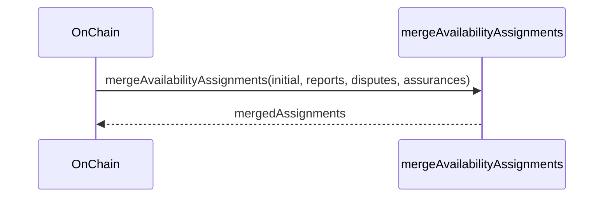

# Fix merging availability assignment and add tests

## Pull Request by @mateuszsikora

Availability assignments produced by disputes, assurances and reports  were merged incorrectly. I fixed the problem and added a few tests


## Comment by @coderabbitai[bot]

<!-- This is an auto-generated comment: summarize by coderabbit.ai -->
<!-- This is an auto-generated comment: skip review by coderabbit.ai -->

> [!IMPORTANT]
> ## Review skipped
> 
> Auto incremental reviews are disabled on this repository.
> 
> Please check the settings in the CodeRabbit UI or the `.coderabbit.yaml` file in this repository. To trigger a single review, invoke the `@coderabbitai review` command.
> 
> You can disable this status message by setting the `reviews.review_status` to `false` in the CodeRabbit configuration file.

<!-- end of auto-generated comment: skip review by coderabbit.ai -->
<!-- walkthrough_start -->

<details>
<summary>📝 Walkthrough</summary>

## Summary by CodeRabbit

- **New Features**
  - Enhanced merging logic for availability assignments, providing more accurate handling of reports, disputes, and assurances.

- **Tests**
  - Added comprehensive unit tests to verify the behavior of availability assignment merging in various scenarios.
## Walkthrough

A new test suite was added to verify the behavior of the `mergeAvailabilityAssignments` function, which itself was refactored to accept an explicit initial assignment parameter and update its merging logic accordingly. The function is now exported, and its invocation in the `OnChain` class was updated to use the new signature.

## Changes

| File(s)                                                      | Change Summary                                                                                                          |
|--------------------------------------------------------------|------------------------------------------------------------------------------------------------------------------------|
| packages/jam/transition/chain-stf.test.ts                    | Added a comprehensive test suite for `mergeAvailabilityAssignments`, covering multiple merging scenarios and edge cases.|
| packages/jam/transition/chain-stf.ts                         | Refactored `mergeAvailabilityAssignments` to accept an initial assignment parameter, revised merging logic, exported it, and updated its usage in the `OnChain` class. |

## Sequence Diagram(s)



## Poem

> In the warren of code, a merge takes flight,  
> Assignments combined by logic tight.  
> Tests now ensure disputes are clear,  
> Reports and assurances steer.  
> With hashes checked and states aligned,  
> The rabbits rejoice, all bugs confined! 🐇✨

</details>

<!-- walkthrough_end -->
<!-- internal state start -->


<!-- DwQgtGAEAqAWCWBnSTIEMB26CuAXA9mAOYCmGJATmriQCaQDG+Ats2bgFyQAOFk+AIwBWJBrngA3EsgEBPRvlqU0AgfFwA6NPEgQAfACgjoCEYDEZyAAUASpETZWaCrKNwSPbABsvkCiQBHbGlcSHFcLzpIACIAMXgAD0g2CiJ4DCJ0CW0vFXgvdXk0RER4Igw2DFDMejRaehpEXERoyAB3YvtsAWZ1Gno5MNgPbERKZOoSUYAvUoBrfCp0ZFtIDEcBcYAWLYAGfixcYchYr2wAM3PZABkVRAB6XFluEk2KFz8SbnxSghcNGDHJAODx1Wj+EpRdJDVCrdISfBeKTII4edJMd6iUIpNIZfjnLI5PIFJ7LUrlSrNIbUdD+HgURTYBhRQa0JDcPDSAA0ZOwVAwzMQPJqn2+FGaAPcCiqFHgAjwi0g50SUVR9MEkWYn1y/TC+BhyBx6UyvHwguQIrBUTGUiovkaVIIkFt8CuQw8GP8YnIJXx7qViUlx1W2mYKP18GYpqk/tgNQKePwBLQ2XyxMKZLKFXYMnkZAcsrxqKKdJxUU9WK8RQw9GyBVokwasAZ2CIsDWJDaYRCjGK0iDHnO3l8SlwOQtNYUSkYcYy0l7WE2Svw2EnNLV0fgSnoAFUbNcuLBcLhuIgOPd7mkjt0NExmPdThcrrcBA8ni83i57hyfPcdrsNCMfRjHAKAyHoJMcAIYgyGUXU70pLheH4YQsUkedBiYJQqFUdQtB0YCTCgOBUFQTAoMIUhyCoeCWEQvw0C7BwnA+TDFGUXDNG0XQwEMEDTAMbg0AYOY0FIB4hDQe9cH5X54HwDB7gYON0jAJpzg0B1NLPAxoj0gwLEgABBABJGDqMbLoWPkSDlMwcS3AQZByC7B0A0iFAZUZQV0C6dQPEg1d1G7JpkHORU1QAAzLIzU1yNQSVkIySizSlEEipVVzEeSMABEzQiUZUfV84YvBePghwFcQFL1Rh/EmZIzTmSBItiokEsKZLyWzKoMsEEQxGQNp1HbNkmnRUI40QdsxjoRABxCqkmFtZJvHEbgPMQZkMGceTkBdK5jUgWB8C7aLKFINq0w6p4utSnMMrvNRivCvlPI5ZouHSdR4DQXxim6tKeX8MVmh5MaPu5dA1xKPlMEFBaHQtSFxWpAr2U5Cdalh/kfIYciGEiZxMwpHNga+RYlvIgGsw7LsQcp8NIBIKNSUVQmSGcctFihkUjhpBnxWQWh9QwfBQghP5QRS0mqmQDmuYGeQIcx6HsYLeH+0gABRYT2zc3gvi55BEBeBhXXgBh3rwewx0aSBRiOyKZKSxArEoABhHmMpFO8hIhf0y3oCE1vQIhtAwJp/RIBIzd1FcTxtx28SUL5maCP6MwByhqsjwCjAMywjK8GgaJypm1SUQnnGocu/Rj0GokVDkBAKK32B+6QgMgAA5TtFr8mh0HqOguEipQttlTYAApohiuL01umWeuaaIeQ0DeAEoMuhSKhJEsTpHuSTpNkn6FKUlSMDU3ANK05pHoUsdvrxZg1vgDaPGdkJHr7MKIuOOdVIJArrxXyJ1ZeaUMqVWygpQCelohAQEvvUS4lj5SUeGfXOl8I43zvjpBBhdjJmSonBa0jhmDOBsgSOyc5ECOS/vPdq4Cl6AweplKqOV2idFoaQBo+oxxzFBFgME58dq+GVBQKO/spIkFLi1b64g/qgLukQSkGUQYQg7kWY4TRnDiDxCmZhiUSYr1tpMBaMDc5rFOp5H6mdpjziii5VRK90q0ioPITCXgFJHSOKRDA9j/qQPYJ5JonMII0J8YEvEkVBbNBUSE3qC0jR4h8WkK2HRkD+CKqPZcfBObKQUP4Hkrp/Tjwxo0RJbDer8D4JFAGcMBTSGqfdWp4U+D81CBiNEyBIrrB8D7ScapFG/WCTU0IHS0bFI8FkmxoR+nDkijyNULlTGUnydMnpKATZyNqoswZAIjL1DEX9KspSCRRXiYgVpstcDQMVGgGZOz5ktQGV4IZ9B1B9LaIsOYNgKbig0FNWAGU2SXEoGFBkWoRmBKUeMtpuAADk8tFgQm+DWI6IKVnHDWTTO5myunPNQNgbgDZdROjVNc9Z7BLFZWsdeZADc27qCrAoKMxsZz2XnGJCOUdYVBJpVUWq8p8hNg8EHT4DgS50s4TVOZf1ED6gbpTOgC18Y+HsP5Ty5SADyGAPZX0erkEoKKWoyUwHJBSGU2BHEUNw5ApLyWqn1EJX0zsnIaD0TQLQC8bquwmT7FEQI4VjKFdUVIjhQlOiAZdP1LCA2IvSvnQyxdS61wUhXY4Vdchl0zfXWOqqIJ8Bbm3ZmVRO70IMFAWI9KuHdWoHyEYZLGxjyYddBNri0rT2ubcleXA+2UnBpUlpcUu3sAHWOpJuBhQ401jcqdEzJ05HHVUbekBABJhC1FVqMrFcPbWAxKq7mjT1GcoxdZR6KDvYOTUGC6V3TuXfkY9w7TaY2vVUJ9XgX28lxqOh9S7jIXrueu3eKDD4SQwRayOYicGqXUtpSKul9LVt4vxMCk5IJoAVOZMh9AEIToYkxChVDIBsWwioNQXECJoaIuy3ouAAD6W5ECMf8BIeAnY6CMb0ajYCBg6MAEZhMAGYSAACYBAAHYdgieEwADgAKy7DQGgcT4ndjicUwAThIIJ+TgnNOCa2IJ8TI9aACAJPxujCF1DMdoKx9jnG2jcfAjxPQQA== -->

<!-- internal state end -->
<!-- tips_start -->

---


<details>
<summary>🪧 Tips</summary>

### Chat

There are 3 ways to chat with [CodeRabbit](https://coderabbit.ai?utm_source=oss&utm_medium=github&utm_campaign=FluffyLabs/typeberry&utm_content=440):

- Review comments: Directly reply to a review comment made by CodeRabbit. Example:
  - `I pushed a fix in commit <commit_id>, please review it.`
  - `Explain this complex logic.`
  - `Open a follow-up GitHub issue for this discussion.`
- Files and specific lines of code (under the "Files changed" tab): Tag `@coderabbitai` in a new review comment at the desired location with your query. Examples:
  - `@coderabbitai explain this code block.`
  -	`@coderabbitai modularize this function.`
- PR comments: Tag `@coderabbitai` in a new PR comment to ask questions about the PR branch. For the best results, please provide a very specific query, as very limited context is provided in this mode. Examples:
  - `@coderabbitai gather interesting stats about this repository and render them as a table. Additionally, render a pie chart showing the language distribution in the codebase.`
  - `@coderabbitai read src/utils.ts and explain its main purpose.`
  - `@coderabbitai read the files in the src/scheduler package and generate a class diagram using mermaid and a README in the markdown format.`
  - `@coderabbitai help me debug CodeRabbit configuration file.`

### Support

Need help? Create a ticket on our [support page](https://www.coderabbit.ai/contact-us/support) for assistance with any issues or questions.

Note: Be mindful of the bot's finite context window. It's strongly recommended to break down tasks such as reading entire modules into smaller chunks. For a focused discussion, use review comments to chat about specific files and their changes, instead of using the PR comments.

### CodeRabbit Commands (Invoked using PR comments)

- `@coderabbitai pause` to pause the reviews on a PR.
- `@coderabbitai resume` to resume the paused reviews.
- `@coderabbitai review` to trigger an incremental review. This is useful when automatic reviews are disabled for the repository.
- `@coderabbitai full review` to do a full review from scratch and review all the files again.
- `@coderabbitai summary` to regenerate the summary of the PR.
- `@coderabbitai generate sequence diagram` to generate a sequence diagram of the changes in this PR.
- `@coderabbitai resolve` resolve all the CodeRabbit review comments.
- `@coderabbitai configuration` to show the current CodeRabbit configuration for the repository.
- `@coderabbitai help` to get help.

### Other keywords and placeholders

- Add `@coderabbitai ignore` anywhere in the PR description to prevent this PR from being reviewed.
- Add `@coderabbitai summary` to generate the high-level summary at a specific location in the PR description.
- Add `@coderabbitai` anywhere in the PR title to generate the title automatically.

### Documentation and Community

- Visit our [Documentation](https://docs.coderabbit.ai) for detailed information on how to use CodeRabbit.
- Join our [Discord Community](http://discord.gg/coderabbit) to get help, request features, and share feedback.
- Follow us on [X/Twitter](https://twitter.com/coderabbitai) for updates and announcements.

</details>

<!-- tips_end -->


## Comment by @github-actions[bot]


<details>
<summary>View all</summary>

| File | Benchmark | Ops |  |
|------|-----------|-----|--|
| [bytes/hex-from.ts[0]](../blob/dfec212ee648a4080183d2196f86e0919cea645e//_work/typeberry-runner-2/typeberry/typeberry/benchmarks/bytes/hex-from.ts) | parse hex using `Number` with NaN checking | 132725.13 ±0.71% | 84.78% slower |
| [bytes/hex-from.ts[1]](../blob/dfec212ee648a4080183d2196f86e0919cea645e//_work/typeberry-runner-2/typeberry/typeberry/benchmarks/bytes/hex-from.ts) | parse hex from char codes | 871800.26 ±0.59% | fastest ✅ |
| [bytes/hex-from.ts[2]](../blob/dfec212ee648a4080183d2196f86e0919cea645e//_work/typeberry-runner-2/typeberry/typeberry/benchmarks/bytes/hex-from.ts) | parse hex from string nibbles | 535156.04 ±0.67% | 38.61% slower |
| [hash/index.ts[0]](../blob/dfec212ee648a4080183d2196f86e0919cea645e//_work/typeberry-runner-2/typeberry/typeberry/benchmarks/hash/index.ts) | hash with numeric representation | 191.81 ±0.35% | 24.7% slower |
| [hash/index.ts[1]](../blob/dfec212ee648a4080183d2196f86e0919cea645e//_work/typeberry-runner-2/typeberry/typeberry/benchmarks/hash/index.ts) | hash with string representation | 116.24 ±0.16% | 54.37% slower |
| [hash/index.ts[2]](../blob/dfec212ee648a4080183d2196f86e0919cea645e//_work/typeberry-runner-2/typeberry/typeberry/benchmarks/hash/index.ts) | hash with symbol representation | 181.4 ±0.16% | 28.78% slower |
| [hash/index.ts[3]](../blob/dfec212ee648a4080183d2196f86e0919cea645e//_work/typeberry-runner-2/typeberry/typeberry/benchmarks/hash/index.ts) | hash with uint8 representation | 163.47 ±0.31% | 35.82% slower |
| [hash/index.ts[4]](../blob/dfec212ee648a4080183d2196f86e0919cea645e//_work/typeberry-runner-2/typeberry/typeberry/benchmarks/hash/index.ts) | hash with packed representation | 254.72 ±0.15% | fastest ✅ |
| [hash/index.ts[5]](../blob/dfec212ee648a4080183d2196f86e0919cea645e//_work/typeberry-runner-2/typeberry/typeberry/benchmarks/hash/index.ts) | hash with bigint representation | 187.54 ±0.18% | 26.37% slower |
| [hash/index.ts[6]](../blob/dfec212ee648a4080183d2196f86e0919cea645e//_work/typeberry-runner-2/typeberry/typeberry/benchmarks/hash/index.ts) | hash with uint32 representation | 202.74 ±0.2% | 20.41% slower |
| [collections/map-set.ts[0]](../blob/dfec212ee648a4080183d2196f86e0919cea645e//_work/typeberry-runner-2/typeberry/typeberry/benchmarks/collections/map-set.ts) | 2 gets + conditional set | 109682.74 ±0.25% | fastest ✅ |
| [collections/map-set.ts[1]](../blob/dfec212ee648a4080183d2196f86e0919cea645e//_work/typeberry-runner-2/typeberry/typeberry/benchmarks/collections/map-set.ts) | 1 get 1 set | 60034.44 ±0.44% | 45.27% slower |
| [codec/bigint.decode.ts[0]](../blob/dfec212ee648a4080183d2196f86e0919cea645e//_work/typeberry-runner-2/typeberry/typeberry/benchmarks/codec/bigint.decode.ts) | decode custom | 176009788.65 ±2.38% | fastest ✅ |
| [codec/bigint.decode.ts[1]](../blob/dfec212ee648a4080183d2196f86e0919cea645e//_work/typeberry-runner-2/typeberry/typeberry/benchmarks/codec/bigint.decode.ts) | decode bigint | 106291175.84 ±2.18% | 39.61% slower |
| [codec/bigint.compare.ts[0]](../blob/dfec212ee648a4080183d2196f86e0919cea645e//_work/typeberry-runner-2/typeberry/typeberry/benchmarks/codec/bigint.compare.ts) | compare custom | 255100231.42 ±6.21% | fastest ✅ |
| [codec/bigint.compare.ts[1]](../blob/dfec212ee648a4080183d2196f86e0919cea645e//_work/typeberry-runner-2/typeberry/typeberry/benchmarks/codec/bigint.compare.ts) | compare bigint | 243246745 ±7.01% | 4.65% slower |
| [bytes/hex-to.ts[0]](../blob/dfec212ee648a4080183d2196f86e0919cea645e//_work/typeberry-runner-2/typeberry/typeberry/benchmarks/bytes/hex-to.ts) | number toString + padding | 314596.06 ±0.41% | fastest ✅ |
| [bytes/hex-to.ts[1]](../blob/dfec212ee648a4080183d2196f86e0919cea645e//_work/typeberry-runner-2/typeberry/typeberry/benchmarks/bytes/hex-to.ts) | manual | 16419.21 ±0.14% | 94.78% slower |
| [math/add_one_overflow.ts[0]](../blob/dfec212ee648a4080183d2196f86e0919cea645e//_work/typeberry-runner-2/typeberry/typeberry/benchmarks/math/add_one_overflow.ts) | add and take modulus | 272030187.73 ±5.74% | fastest ✅ |
| [math/add_one_overflow.ts[1]](../blob/dfec212ee648a4080183d2196f86e0919cea645e//_work/typeberry-runner-2/typeberry/typeberry/benchmarks/math/add_one_overflow.ts) | condition before calculation | 249568469.98 ±6.61% | 8.26% slower |
| [math/count-bits-u64.ts[0]](../blob/dfec212ee648a4080183d2196f86e0919cea645e//_work/typeberry-runner-2/typeberry/typeberry/benchmarks/math/count-bits-u64.ts) | standard method | 1475924.19 ±0.34% | 87.64% slower |
| [math/count-bits-u64.ts[1]](../blob/dfec212ee648a4080183d2196f86e0919cea645e//_work/typeberry-runner-2/typeberry/typeberry/benchmarks/math/count-bits-u64.ts) | magic | 11945507.87 ±0.56% | fastest ✅ |
| [math/count-bits-u32.ts[0]](../blob/dfec212ee648a4080183d2196f86e0919cea645e//_work/typeberry-runner-2/typeberry/typeberry/benchmarks/math/count-bits-u32.ts) | standard method | 95943428.94 ±1.74% | 62.12% slower |
| [math/count-bits-u32.ts[1]](../blob/dfec212ee648a4080183d2196f86e0919cea645e//_work/typeberry-runner-2/typeberry/typeberry/benchmarks/math/count-bits-u32.ts) | magic | 253267480.2 ±5.93% | fastest ✅ |
| [math/mul_overflow.ts[0]](../blob/dfec212ee648a4080183d2196f86e0919cea645e//_work/typeberry-runner-2/typeberry/typeberry/benchmarks/math/mul_overflow.ts) | multiply and bring back to u32 | 252406570.55 ±6.68% | fastest ✅ |
| [math/mul_overflow.ts[1]](../blob/dfec212ee648a4080183d2196f86e0919cea645e//_work/typeberry-runner-2/typeberry/typeberry/benchmarks/math/mul_overflow.ts) | multiply and take modulus | 245942395.28 ±6.7% | 2.56% slower |
| [math/switch.ts[0]](../blob/dfec212ee648a4080183d2196f86e0919cea645e//_work/typeberry-runner-2/typeberry/typeberry/benchmarks/math/switch.ts) | switch | 248909399.46 ±7.23% | 3.1% slower |
| [math/switch.ts[1]](../blob/dfec212ee648a4080183d2196f86e0919cea645e//_work/typeberry-runner-2/typeberry/typeberry/benchmarks/math/switch.ts) | if | 256871709.18 ±5.54% | fastest ✅ |
| [codec/decoding.ts[0]](../blob/dfec212ee648a4080183d2196f86e0919cea645e//_work/typeberry-runner-2/typeberry/typeberry/benchmarks/codec/decoding.ts) | manual decode | 23293409.98 ±0.95% | 86.08% slower |
| [codec/decoding.ts[1]](../blob/dfec212ee648a4080183d2196f86e0919cea645e//_work/typeberry-runner-2/typeberry/typeberry/benchmarks/codec/decoding.ts) | int32array decode | 165834560.18 ±2.59% | 0.87% slower |
| [codec/decoding.ts[2]](../blob/dfec212ee648a4080183d2196f86e0919cea645e//_work/typeberry-runner-2/typeberry/typeberry/benchmarks/codec/decoding.ts) | dataview decode | 167291045.58 ±3.21% | fastest ✅ |
| [codec/encoding.ts[0]](../blob/dfec212ee648a4080183d2196f86e0919cea645e//_work/typeberry-runner-2/typeberry/typeberry/benchmarks/codec/encoding.ts) | manual encode | 3140129.54 ±0.24% | 17.64% slower |
| [codec/encoding.ts[1]](../blob/dfec212ee648a4080183d2196f86e0919cea645e//_work/typeberry-runner-2/typeberry/typeberry/benchmarks/codec/encoding.ts) | int32array encode | 3756034.07 ±0.64% | 1.48% slower |
| [codec/encoding.ts[2]](../blob/dfec212ee648a4080183d2196f86e0919cea645e//_work/typeberry-runner-2/typeberry/typeberry/benchmarks/codec/encoding.ts) | dataview encode | 3812589.35 ±0.5% | fastest ✅ |
| [logger/index.ts[0]](../blob/dfec212ee648a4080183d2196f86e0919cea645e//_work/typeberry-runner-2/typeberry/typeberry/benchmarks/logger/index.ts) | console.log with string concat | 7117116.28 ±58.23% | fastest ✅ |
| [logger/index.ts[1]](../blob/dfec212ee648a4080183d2196f86e0919cea645e//_work/typeberry-runner-2/typeberry/typeberry/benchmarks/logger/index.ts) | console.log with args | 1056076.02 ±92.47% | 85.16% slower |
| [codec/view_vs_collection.ts[0]](../blob/dfec212ee648a4080183d2196f86e0919cea645e//_work/typeberry-runner-2/typeberry/typeberry/benchmarks/codec/view_vs_collection.ts) | Get first element from Decoded | 26824.19 ±7.71% | 60.35% slower |
| [codec/view_vs_collection.ts[1]](../blob/dfec212ee648a4080183d2196f86e0919cea645e//_work/typeberry-runner-2/typeberry/typeberry/benchmarks/codec/view_vs_collection.ts) | Get first element from View | 67659.58 ±0.58% | fastest ✅ |
| [codec/view_vs_collection.ts[2]](../blob/dfec212ee648a4080183d2196f86e0919cea645e//_work/typeberry-runner-2/typeberry/typeberry/benchmarks/codec/view_vs_collection.ts) | Get 50th element from Decoded | 27908.46 ±0.35% | 58.75% slower |
| [codec/view_vs_collection.ts[3]](../blob/dfec212ee648a4080183d2196f86e0919cea645e//_work/typeberry-runner-2/typeberry/typeberry/benchmarks/codec/view_vs_collection.ts) | Get 50th element from View | 39058.03 ±0.13% | 42.27% slower |
| [codec/view_vs_collection.ts[4]](../blob/dfec212ee648a4080183d2196f86e0919cea645e//_work/typeberry-runner-2/typeberry/typeberry/benchmarks/codec/view_vs_collection.ts) | Get last element from Decoded | 28002.5 ±0.18% | 58.61% slower |
| [codec/view_vs_collection.ts[5]](../blob/dfec212ee648a4080183d2196f86e0919cea645e//_work/typeberry-runner-2/typeberry/typeberry/benchmarks/codec/view_vs_collection.ts) | Get last element from View | 27426.73 ±0.29% | 59.46% slower |
| [codec/view_vs_object.ts[0]](../blob/dfec212ee648a4080183d2196f86e0919cea645e//_work/typeberry-runner-2/typeberry/typeberry/benchmarks/codec/view_vs_object.ts) | Get the first field from Decoded | 448492.52 ±0.22% | fastest ✅ |
| [codec/view_vs_object.ts[1]](../blob/dfec212ee648a4080183d2196f86e0919cea645e//_work/typeberry-runner-2/typeberry/typeberry/benchmarks/codec/view_vs_object.ts) | Get the first field from View | 104466.68 ±0.1% | 76.71% slower |
| [codec/view_vs_object.ts[2]](../blob/dfec212ee648a4080183d2196f86e0919cea645e//_work/typeberry-runner-2/typeberry/typeberry/benchmarks/codec/view_vs_object.ts) | Get the first field as view from View | 104212.14 ±0.07% | 76.76% slower |
| [codec/view_vs_object.ts[3]](../blob/dfec212ee648a4080183d2196f86e0919cea645e//_work/typeberry-runner-2/typeberry/typeberry/benchmarks/codec/view_vs_object.ts) | Get two fields from Decoded | 447121.28 ±0.25% | 0.31% slower |
| [codec/view_vs_object.ts[4]](../blob/dfec212ee648a4080183d2196f86e0919cea645e//_work/typeberry-runner-2/typeberry/typeberry/benchmarks/codec/view_vs_object.ts) | Get two fields from View | 83053.08 ±0.1% | 81.48% slower |
| [codec/view_vs_object.ts[5]](../blob/dfec212ee648a4080183d2196f86e0919cea645e//_work/typeberry-runner-2/typeberry/typeberry/benchmarks/codec/view_vs_object.ts) | Get two fields from materialized from View | 173972.53 ±0.15% | 61.21% slower |
| [codec/view_vs_object.ts[6]](../blob/dfec212ee648a4080183d2196f86e0919cea645e//_work/typeberry-runner-2/typeberry/typeberry/benchmarks/codec/view_vs_object.ts) | Get two fields as views from View | 82832.59 ±0.07% | 81.53% slower |
| [codec/view_vs_object.ts[7]](../blob/dfec212ee648a4080183d2196f86e0919cea645e//_work/typeberry-runner-2/typeberry/typeberry/benchmarks/codec/view_vs_object.ts) | Get only third field from Decoded | 447063.44 ±0.22% | 0.32% slower |
| [codec/view_vs_object.ts[8]](../blob/dfec212ee648a4080183d2196f86e0919cea645e//_work/typeberry-runner-2/typeberry/typeberry/benchmarks/codec/view_vs_object.ts) | Get only third field from View | 104189.96 ±0.06% | 76.77% slower |
| [codec/view_vs_object.ts[9]](../blob/dfec212ee648a4080183d2196f86e0919cea645e//_work/typeberry-runner-2/typeberry/typeberry/benchmarks/codec/view_vs_object.ts) | Get only third field as view from View | 103850.84 ±0.08% | 76.84% slower |
| [collections/map_vs_sorted.ts[0]](../blob/dfec212ee648a4080183d2196f86e0919cea645e//_work/typeberry-runner-2/typeberry/typeberry/benchmarks/collections/map_vs_sorted.ts) | Map | 334970.72 ±0.21% | fastest ✅ |
| [collections/map_vs_sorted.ts[1]](../blob/dfec212ee648a4080183d2196f86e0919cea645e//_work/typeberry-runner-2/typeberry/typeberry/benchmarks/collections/map_vs_sorted.ts) | Map-array | 103564.13 ±0.02% | 69.08% slower |
| [collections/map_vs_sorted.ts[2]](../blob/dfec212ee648a4080183d2196f86e0919cea645e//_work/typeberry-runner-2/typeberry/typeberry/benchmarks/collections/map_vs_sorted.ts) | Array | 67938.64 ±0.15% | 79.72% slower |
| [collections/map_vs_sorted.ts[3]](../blob/dfec212ee648a4080183d2196f86e0919cea645e//_work/typeberry-runner-2/typeberry/typeberry/benchmarks/collections/map_vs_sorted.ts) | SortedArray | 197304.65 ±0.2% | 41.1% slower |
| [bytes/compare.ts[0]](../blob/dfec212ee648a4080183d2196f86e0919cea645e//_work/typeberry-runner-2/typeberry/typeberry/benchmarks/bytes/compare.ts) | Comparing Uint32 bytes | 20040.51 ±0.11% | 3.74% slower |
| [bytes/compare.ts[1]](../blob/dfec212ee648a4080183d2196f86e0919cea645e//_work/typeberry-runner-2/typeberry/typeberry/benchmarks/bytes/compare.ts) | Comparing raw bytes | 20820.01 ±0.06% | fastest ✅ |
| [hash/blake2b.ts[0]](../blob/dfec212ee648a4080183d2196f86e0919cea645e//_work/typeberry-runner-2/typeberry/typeberry/benchmarks/hash/blake2b.ts) | hasher with simple allocator | 0.0463 ±0.01% | 0.43% slower |
| [hash/blake2b.ts[1]](../blob/dfec212ee648a4080183d2196f86e0919cea645e//_work/typeberry-runner-2/typeberry/typeberry/benchmarks/hash/blake2b.ts) | hasher with page allocator | 0.0465 ±0.08% | fastest ✅ |
| [crypto/ed25519.ts[0]](../blob/dfec212ee648a4080183d2196f86e0919cea645e//_work/typeberry-runner-2/typeberry/typeberry/benchmarks/crypto/ed25519.ts) | native crypto | 5.29 ±20.3% | 82.33% slower |
| [crypto/ed25519.ts[1]](../blob/dfec212ee648a4080183d2196f86e0919cea645e//_work/typeberry-runner-2/typeberry/typeberry/benchmarks/crypto/ed25519.ts) | wasm lib | 10.64 ±0.02% | 64.45% slower |
| [crypto/ed25519.ts[2]](../blob/dfec212ee648a4080183d2196f86e0919cea645e//_work/typeberry-runner-2/typeberry/typeberry/benchmarks/crypto/ed25519.ts) | wasm lib batch | 29.93 ±0.53% | fastest ✅ |
</details>


### Benchmarks summary: 63/63 OK ✅

<!-- thollander/actions-comment-pull-request "benchmarks" -->


## Comment by @tomusdrw

```suggestion
    if (disputesAvailAssignment[core] === null  || assurancesAvailAssignment[core] === null) {
      newAssignments[core] = null;
    }
    // override with new report, but only if it's actually changed (otherwise it will
    // restore reports removed by disputes or assurances).
    if (reportsAvailAssignment[core] !== null && initialAvailAssigment[core] !== reportsAvailAssignment[core]) {
      newAssignments[core] = reportsAvailAssignment[core];
    }
```
