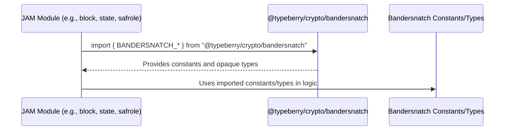

# Fix PVM debugger adapter build

## Pull Request by @mateuszsikora

Currently the published package is broken. There are 2 problems:
- circular dependency in `@typeberry/blocks` that causes the bundle includes a lot of unnecessary things like safrole, concurrent etc. To fix it I moved bandersnatch specific consts and types from `safrole` to `crypto`
- node specific exports in utils that causes white screen in debugger - I removed the problematic export


Additionally: 
- I exported a function to split code and metadata because I need it to fix a bug in debugger.
- I added a script to detect circular deps. I am going to run it on CI in the future but currently it is impossible - we have a few more circular deps problems. I will fix them in a separate PR.


## Comment by @coderabbitai[bot]

<!-- This is an auto-generated comment: summarize by coderabbit.ai -->
<!-- This is an auto-generated comment: skip review by coderabbit.ai -->

> [!IMPORTANT]
> ## Review skipped
> 
> Auto incremental reviews are disabled on this repository.
> 
> Please check the settings in the CodeRabbit UI or the `.coderabbit.yaml` file in this repository. To trigger a single review, invoke the `@coderabbitai review` command.
> 
> You can disable this status message by setting the `reviews.review_status` to `false` in the CodeRabbit configuration file.

<!-- end of auto-generated comment: skip review by coderabbit.ai -->
<!-- walkthrough_start -->

<details>
<summary>📝 Walkthrough</summary>

## Summary by CodeRabbit

- **New Features**
  - Added new cryptographic constants and types for Bandersnatch VRF signatures, ring commitments, and proofs.

- **Improvements**
  - Centralized Bandersnatch-related cryptographic constants and types into a dedicated module for easier maintenance and consistency.
  - Updated public APIs to explicitly export additional utility functions and types.

- **Chores**
  - Introduced a script to check for circular dependencies and added the necessary development dependency.

- **Refactor**
  - Updated import paths across the codebase to use the new centralized cryptographic module, removing local duplications.
## Walkthrough

The changes centralize Bandersnatch cryptography constants and opaque types by introducing them in a new core crypto module and updating all relevant imports throughout the codebase. Additionally, some export statements are refined for clarity, and a new npm script for circular dependency checking is added alongside its dependency.

## Changes

| File(s)                                                                                           | Change Summary                                                                                                      |
|---------------------------------------------------------------------------------------------------|---------------------------------------------------------------------------------------------------------------------|
| `packages/core/crypto/bandersnatch.ts`                                                            | Added Bandersnatch VRF, ring root, and proof constants and corresponding opaque types with documentation.           |
| `packages/jam/safrole/bandersnatch-vrf.ts`                                                        | Removed local Bandersnatch constants/types; now imports them from core crypto module.                               |
| `packages/jam/block/header.ts`, `header.test.ts`, `block-json/header.ts`, ... (multiple files)    | Updated imports of Bandersnatch constants/types to use the new core crypto module path.                             |
| `packages/jam/safrole/bandersnatch-vrf.test.ts`, `safrole-seal.test.ts`, ... (multiple files)     | Changed import paths for Bandersnatch constants/types to the new module.                                            |
| `packages/jam/state/in-memory-state.ts`, `state-json/dump.ts`, `state-merkleization/in-memory...` | Changed Bandersnatch imports to reference the new crypto module.                                                    |
| `bin/test-runner/w3f/safrole.ts`                                                                  | Reorganized and reordered import statements; updated Bandersnatch imports to new module.                            |
| `extensions/ipc/protocol/ce-131-ce-132-safrole-ticket-distribution.test.ts`                       | Updated Bandersnatch proof constant import to new core crypto module.                                               |
| `packages/jam/block/tickets.ts`, `block-json/tickets-extrinsic.ts`, `transition/hasher.test.ts`   | Updated Bandersnatch proof constant/type imports to new module.                                                     |
| `packages/core/pvm-debugger-adapter/index.ts`                                                     | Refined exports: explicit utility exports and added `extractCodeAndMetadata` to exports.                            |
| `packages/core/pvm-program/index.ts`                                                              | Added export of `extractCodeAndMetadata` alongside `Program`.                                                       |
| `package.json`                                                                                    | Added `check:cycles` script using `madge` and added `madge` as a dev dependency.                                    |

## Sequence Diagram(s)



## Poem

> 🐇  
> A hop, a leap, a tidy sweep—  
> Bandersnatch bytes now run so deep!  
> Imports aligned, no cycles found,  
> Crypto constants all around.  
> With scripts and exports polished bright,  
> The codebase hums in pure delight!  
>

</details>

<!-- walkthrough_end -->
<!-- internal state start -->


<!-- DwQgtGAEAqAWCWBnSTIEMB26CuAXA9mAOYCmGJATmriQCaQDG+Ats2bgFyQAOFk+AIwBWJBrngA3EsgEBPRvlqU0AgfFwA6NPEgQAfACgjoCEYDEZyAAUASpETZWaCrKNxU3bABsvkCiQBHbGlcABpIcVwvOkgAIgAxeAAPawA1AFlIJQFsIlI+NFo0bho+HPgvWlDY9Fpaf0REaRRG4OR4LFxYEh5sAS8kbvpuNAYAazRSfgAzCO6eCnwRMQ0YebQ8WHw+eCUMcWn4ZtwAd3xIZm0sXkFo5kQuBngKBm9nLJJuMj2n5o65noAAwAArhZF8BJQXAB6fr4caIQE8UYTUjhE4IBiwRgbJoAyA5DC0aIRc4dBhebBKC6YeTYDDkBjSRDOeTMRTeZoOLHoZAs6aLEmYehMDCvCj+fbhYWQDCKEhgRBfJ6HBiQEhJbjbXDtTrzPAVZDs2icubUPzSby4FBYNCQDHqHqIBj+Mj27pYbCIDpEfHZXL5DRGACStrq6ng+E650OSR9ALxSAc0nCXR6Gy623Vmu1yDt03pYkj0fs3AG1qY1JlbFwhWoaHRmOxqEZzNZpItiHwXik6AJuRtfpIOTylFWcB6nh8FqCIXQXi7NtwixNTLz9hd8BKH29RHI9AIHxoYkYz1eXneSi+RLIv0QqwAgl5M7lsWmNxQt9aW/hrbISN++wkEQVA0PQHSHqK4gYNg+BekuwGgcWkAABQAMLBgAlFkwQdu+vDSLePT4LMzBWluJJPC8bx8Fe3y3vINz9CQ9ypusmxZmWmDIIehT1MyCY9P8dpNCMoE9AWuDYP4vTTv4s6IJoRj6MY4BQN8Mw4AQxBkMoYEKKw7BcLw/DCKI4hSDI8iVsoqjqFoOgqSYUDuO0ea2nghCkOQ4kiiwbD7FwVAnPYjiXC4BLWfKVB2Zo2i6GAhiqaYBhqBg0I0IpYAUPSPnQicADM0zQvygokBoOocAYsQ1QYFiQA+wY6T51AxA4TgRSRjCwJgpCIG48zwMwWoUNaimtQFOr2pQPT+NsSj+PQMpzRQRCYPAABeMQnOoWx4N1vXxu+Q0jfp7ARsc3T3CQPbSKsADKyrwKqaA+LIbFCcN2qaYC8SLMwABSXYYEiMqAkIwNIgKLCQCCYIQlCsjQhDUZgGJTQUKDRL4id31dYC91oND0RQ/9sOguCw6IyVRNlUiJwzRc+BSPQkJePgIXHV9o0/QAQsKlCIBg1BYjYPo2Pgv5Y/Q/gXvporjfsiCNvAPIMzJWK9TE0PMASJDxrjo3a2TcOU5CEpI6V3YkLCAsUELIuwGAEgUNMGgQ0ih6mwjFvQi64IELbN728LuBYu7iKrAAcucv7dHwBZiuIUavfwfDs0Qqup5rGB9dNMmXNS/zvjZQZ1ZYT6lNQxY8ec75KBSzjV1GyBdRqp0xJxfQDGq53iNIRgx+QQY1bEykpRqNAYN6LfQluDDQjcBBMF4fsKgAjAV69gEyYCbwATIqtPW2A4jjABYC0Egy7wDkycYBVIQVQ81W1fVjXNXpbVhe2XU531A1PqnWRF0SA0wswlxbrWfYsNeYPijgAEQAKI2HulHB80A0IAAkAD6tgADy+D4g4N5gATWgEg+69M0DIH/sbGG3sqa+yttEIOC0HZhydi7N2HsOyMPNjCf2JR8BsMFqHcOHto6xzTHwGyadIAZ1VvaGhTMr6HDoGXcwFdnx6RrnheYDcLxIRbppdu2pO58E8P0JRfcjj9QMEPEgr8x4GAgGAIwIxxiTHKijDAVVR7lwak1byX96DtXCvIP+PVc4DwMA+WUJAQoYG4LrZ0n5tzCzYPQQEWJRBjA4AwWQFJpDULzHUGIh53yAjSV+RE9hzLFhVjyHK098SAkLqQT2ktfCHiUMeCsZ4aIfGvD8Oxg5oCU3upubchxojIHpAtNpGhF4om8XUq+/gxDbFkKsNC2wGhaiJD6Lw702kdJIEiTxqIegnBUXxGIdyPhSHZik9gwz6JinkDtUBUh7bIUBAAPQABwaAAAxgsBI+cM99XonOlBEKgFR4xMCcMospSgDx13mBqa+8ZAT+EKJQMAcpMpIhqdudgLgy7vx0cY1plSDGiCMc3VpbccxG3oF3axvd9gXXsVAKZ6TrT3NoFwQEsRcnjAKUUuZsQuCxHOQlKi553gQEnmQGe9LkDLKuWs2ISJ/iAl1aQCOUZASuMgAgkgEh3k3k+bUDFYqFWFFIHKuIwKwVgv1YOI1qyTW+PNQE1xKVjXSD9tsG2QjA4CDthw8OlVnGBI/iE3yoUOqRNmHQ+xE4sjPVmBBFc2A1wJJCgraBU0ZRMAlNIQ5V9c78BGLOCIlNkCy1apiyA/Ng5xuxFG/AIFiiYgUNPZcRadQPSei9N64R1AOr5JtHoZbMBTXAXwLt7DxHYlSDYeI9h4B7moNJZoKEACcAA2SKmVMLhE/PWlFzB1CTWQChdeAAWV9l7pDXvQNjG4JFn0AHYgUfrkFe3Z+ya1Rjrb6fAjbcLw2aM4HoShDj7jARA7oeIy05TEA8WBsbN2pFdvdfdocj2AnCICddYjHZi1zhLKW0psZUYI47KwiwSKQsgEg0Y2JyCc0pi0LI8JHDsG2rtPs/hpgzTFD0AAqjYAAMvono1GQ6O0gAO8ExRKA/vAsgFDHQHnuQbWgJtJwqDcC+AURYCy+ygfTBKNAGb8RKlEM9I4YSF3jkw+maFej1XY3fDixS8Y1M9sgGMEg8hDMYAjCY75e1rTGmerIeMIXoK+kUWqLMiciwt00Um2lLLa5DkbnS1uswzEcvkVYnu6peX935ZAPZI7l0OroGKuBiCUFoIwdgnB27iH3WDAAcXQdABTSCSHkMoVwGCzBzYGqwL6rxfVw3+D9i4YRoj1OcOfuaqArXFbCvKaK2B8DkGoImwNmwwYo6jZwTYQh0AZsUPuvNxwS2fWhsQBtyN23o2sf2zqQ7LWoHtZFV1y7vWbu4IIUQt7c3ZRfcoMt2Gv3/tbYDiImN3bN0HYtRMr4HXzssfx47Ij0wSMHqkjJAAvJAfBcGSDAF5rITKbOYfXf67gobOCRvjYwVNpH909DhFiOFwjxHSOHv8LEPQ6PVvXL+1WgHOPds9sJy5QTUP8MU84XRogDHrSM+Z2Z4IbOOfSC5z1nnmDcF3Ye09l7ovxdxCl7R8WktcAK6V5jtX2Odt443Y7bXMBddna68DrE7HJazDNyzq3nPutXb6w7vBz3EdkPe+7yXMfYBG5p2R+Xiuft+rDYHvtmuCeg8TcG9xBgA8RsXhIZgl9hwBiJXWEolA543iSM/fxb8K7BN0qm8Jv9M3RIAQYHN1Wxq1hoJNdDfAqlx4HcwJEfd5A6zaRTH2MJuBt7RosTflyK9ouzCMG8HbXqLgX7DSeVAxB7KUA+Ik6QAJ1lrFxh8/mU5p18RH8upgteUZJ+FqYDQFwL81t0x1wdpKgGBnB6BblW1PgLwmRUCJNMBr8e5Z1MkYhH8BhFJNIyJnwKIehoD1B5AEN3J6A8t75lYbQKQqQ8UkEJRtgbBLRnwKNYYODFh7Y9kfBzJtg+DAR8EABpcQ/BMYbghwXgyjc3WccQ+Qq0cQ6ASYUgWgAQsQyjaAfAKLDAfBaYcQgAdV2itRHHMN2mUOCHEJoTsJIGJwuUoxoQxlwCjmtTR0o0lTGHEI1XI0ow6DczEHEIaCtAMPuhvlzj4LBiaGcNgFsyIFgC4xjn4BkQOhiVK2y3kSgkFDAXZhCiQwWEIn2EKxpSriYJUw+HKxK1MXZX0i5Xq1sViSgCQUaL3VpyPUgGwG4CKH0kNWb022P3b39FHAoDAB71KH7yUEH1ByqkgF0EgD+hYDFUfwAG9rAz8qBdYABfMBMmWIA/JhI/E/G4TfWIAAbnNSWJcnwHWM6K2I312PCGf1GFwDfxIA/1oC/1rAGLtAOL32OIQwESRlGNP37V2OuPNQtQ6OAV3BLyoP6PbXLzgNVxbwhPGPyCmKKF7woFmI1AO0WOWNWOYEeOAQACpDiYYQSzYoDxAFwYSDA7iYAHi8DVYCC0Aslr9cwSSljARBSWSljeSeYNjhSRTuNOCKA1DnxQgJSRTdChDuxogtkKB5TJSlipCNTNTZDZSwgFStSWcdTJT9STSRTNDRwdDpTzSliDCjCTDbTIALCugrDcgnSXTYAnCnTHCWcXCfTGhKBPDvD1TDTuo8knTAj/AnSQjlQDTNTOxIj8Bojb0iAnSEi4BkjYBzSgSjiTiwToRoDEBriFTBTA1aoG8PEK8MSRjzidjuTCT5iX4Al34x8Wp9JJ9Opp8tZs1sVOjxpl83li55hlc1kscISLjdjGyDswEKgbkVEUt1EO1yRKQqwwwr4YVfAF9Vh2NrVIwvQ4V+AMATk2kXjuTt9GsvkVEF96FdYqkdV6zmAI4kRjRORHxphSh8Q6FwgBA45YYzyt89Mn8khlwPivifi/if80BQYZIbyGCyZ3wWQ2BVE3y1hUA6Fswp5aAeJ5g6slEHwrBgxNJ8JL85BeTvR60ql3jX95QILv8ASoZCx755EJBnB4AVAhR2Zc5vRqRAQALIUjAtEGpitqiGVkMmUm5qi2UO5OVLFu4bFGs7FlJuNOi9dARqLPjaLP96L6xSYGEHyoTuTny0SVdxy6zDLmBpy68g03Eqz0TkYGy4RxgwBfFoRuhCUKAh9E1WzP4J8f4uysjZ8c1DZF8Jo3lV18QEN9dQ9OEqdi85cLkr86F4KYYQqDZrQ993xXySRxV8zqYWESBvVDw0r61Z099crQTqZq8Q8aN9sIZ9UfNUA+iBj0xphpNcMjyTzEK4IXgeh2ZkDmLQD5goqQqgLaB8BmgSVVFUsf1IlMjcjcsmLixXoaDBx3xZlyohLK5dETExLajmUpKqtGiLFehuUGtIglKHEoxNqbKQ1qyHLLKnKxgXLgYMpVYosdQwBn8QjVYvKWzR9fLUTOyXMs1AEUBuYxoeqmRiKRzU9YdedM9CFiEc9KEkQl0YE0DArbzYY6TD9LZj5WEaq9ssRnZXYI4irzgKr6TfZqqC9ya0jpF44FBqQsxcjMbFzPMKjtEqi9E9rDFJK9FpLzFZLTqWjFLYlHF69bKm97qhBHL+qxg3KSAPLH5FI/qR8glAaOz/KQaZ9YlgqIb7AobiJZhIE2sYEqNud08Bt+dBcJsRcUaqEkq9aUrdZIDmECabYiae1SaeE6kvY8qabAdcc6bJFIB0i45dM5FWb+0lEs184ehC4hI9QehMoMq5yubhKebdqsVxK6jDrRSmi5KzrWj7FJbbrG9Mc5bHqFalaVaE1/rNaU0gadbNJQa59BpDb8Y4b7cbad0Bcxt7abBptHbpZoraqsQ4rZc6dEq6Cr92QWYaS7z5hsqgRA6YQCqa9HZfbjKA7Kqg6NdvaCcw7XIsbeiUTMpXNjaUKSQIq0xEwIbkBEs4JhVaV4xaQMimbo705Y61RhyJIM6tqRLebc79qBaTEhaatmiFKLqJbrqR4Kzpaq75b4RFaz4Pr7wG6Nbk1x8W700269beygFvouxpJoaIrLa7drb4cs9kbZsnaZR3worycYrY8ONTDnatZXacb178biYvaC8d76qukeH97BFg6t66riyGbP6o75R5E2aFzFAPMNFBKits76VQH+aKsGiZLat5KeVYGy74Gpa7r7Lq6aZ+HJGSbuFVbNAsGx4fLm7tb8GokeywbRqByWJwqsxKG084dEbs96Gx6/H4aM8ndHss9XtR7OGYluG7Q20LJiGeZyrYhlkj7t7bHhGOxcCVAuxKQaBwbgFUneGg8gcDcJFpGpFZHZF5GY7M41R471ZE7CU1r5gNrM7tqdG+aJKdHIGi7RaYG+VB5rrTHK7ZaGzN6MnOEd6HGk02zQk00IkCH3GO7kM80LQF7Lo+r4RU5tH6iupPdOFIAhtsobpUT0aK1sZYMLdU6W1UJQne6+d+67bhdh7RdxCe7qGnt7tInXdR7KMvmAmEc6H3s4igtuhngFBq0lQoN4wbmm056WGJ7C9vdGNx7ibYAp7uj/BPmC849ONsJMr5hxRJRksORohVhQxFJlaqhBJh0Tt6Dm0vg8wZIQrsbgsQLKBhZfBV7yYxGkZaaKnYBnyfNknQrByYE5QQp258Coh5ABBUzdQLsqGAmImXd8FongmgKmH7nkXMWjcTcQmjnJ6ZccWLkoUNzlqgCuZgF8YnC9K3bSmiyDV0CtmvNZN8QEX4N7mSi5QFEox8gwHFoA3kC3oxWZI/XGbdNGDrWFHf7s5CG2nF15Qrj8QGhrQhqAGSR/BLgQjeixQXbqVuadrNGysDrBajq9HoHDHhmLVuD3XQ29nemDnM0IclYgLvW7mWWSSoBHnvnbbB63mR7gnhS+2gWEb1WomPmx2VX/GEaQWZ3WT9We1DWfckQUIu3mWSBMJZ2V3pdqdp7yNUIt2ENd3l2TXYACWOHN2Wdt3d2LV/8MUim8ZTb2mVSOZ4xyrSmhXWGRWPZe252wnbtfmNWtWwW93L212pZUIz3IOC9sWkSN24OK67LTKLHN6CrFRlavA7H1bHGAbnHv5XHuzsiPGu7Zh+2AnB2hdJt3mYn2bmZsa7R+rU5EnJBJxqBsRxV0nBGsnpGcmsB1UKAeXkQ4CQFuPcbTjBWJHpnKmGrw7o3amWaf6Gmsan7GYk7k3ZzKW1HKjS3St64W2C64L9GS7xbjHyAxm0OxyMPPbLGyo8O5mnHcGXHlm3GyO1mX2eYvGV8KGJ2M9F2YmwYAuQPndp2GOlHF698WPdnfB2PexRqRhQEUIePrGuEybhHsJeIxPrlFQmAvhwJDbkvsRUupOCzf2UX6bMJGraE9b0A2rzJW5jzaD5hSHeqYbCIGXy0mXxrJrfx5xPyP606A2Gnwh8juxCiOZwgswoQsxoliR4xEt/6Ig5wOmgGNHDPGV87K3C6Tq8La2msRnh5rOZbzHJml8FRXKTRhp8P5mtbiP3PSOgrO6ETr6s3uv2sqPJ3QOIvtXMbkql7RHqaN77O5OMu/aKbge8aymQ7hX6bqnI7lOdm1PFqk5rXVrGO1FOa9OS3umtHjPdvTOa3zq63y7EGzH0OLvWowA2AKAxhohNoWV+9aeWJtlFRLud55QGA7uXP2zHup91PyOETLu/PfHQvHdfv/ntXGHhrBN92vd6N13YntCOxIRvP9JiXE6KW16BXYf0vjKQiaBCgfpSmpm+PMvI5FOanmaUelE0f8seXMe7laVVHBL9P8fy3wHWUq3hazOxajHjunFUOzuqfLKvGWe2B2QXAOfWpefCPXOBeAr26Da7XKOJefnwvpewWgKFfDc0XcBSkmZouEKV6df+WQe+Gyp0uhH/bKaf3ZPQ6reI7Mjv7Ru46k3mmaQlBOngGc6ve+nfeoHi6A+yeTGQ/kHw/LuHOT4ASnPmzsGFm/KSOhevOkuuPV8vz23rRvvwmpfNWPmVfsb3bQerHwfa+RGT+ZPD6m+ZGkfbf421OmnNPWmVuRv1v3e8f6iemduIGh+BmDupPI7ldSs4T8JmU/VqDP2iCXx6w8fJuonzCSt0POL3cVvYFF4+M+Au/MLn8wP7BdmMUHAvkX0B574SqvoEpnr3N7Cta+UPKmjD0q6YsEeaFI0Mo3UQ4UnQ19PlnfV8xACxkd8YTP11fpDcMAc1L+vIwWoJwlqgBTHrtBW4f8Pe3/Anr/x957cRagA0ukHwQYuIkG4AkqNPzToaAiycAnBvz0QEr8U+r3EhugJgT+craarffuB1RpH9uGkIA2BDQ5Zl8TQOVM3mDwt5+0RGLg0qm4O4ZX99e4PUVtb3v5yJn+BcQlL30241F9mJnY6qoIMY8C4GoAinuM3O6WVQK08eLOlB6iIB448/YfAR3gEmClmgvcwagPa7Q0PulzIDk80CagtHBAPF2kD1oHScoBhVS/uVyqqN94ewjWrtNVYHuhGYTDNbnOVMi1h82VSDPkF21asVKQPQPgX12QBTVXoQg2gnOHEFgJJBTvMEMWyzoGcEhhPP/ioP95DNgBjiTQePCSjOQGsnKWYBmC8gICDIk0IKGgBCjA1IotvGKGoDiiOREoBgB4fenUA4JdgiAHBP4AkBHAGYtAHBONB5gqQQRakSAAVDPT7w0A+8AQGeloDrxpgJ6AAKwAYSAAGdeGejPRoAqRw4WgESPxFUiGA+8V9KMBIDrxQUBUNAAVASj3C0RYI3ABCOwrQi9yiSOgDgg0j6AgAA -->

<!-- internal state end -->
<!-- tips_start -->

---


<details>
<summary>🪧 Tips</summary>

### Chat

There are 3 ways to chat with [CodeRabbit](https://coderabbit.ai?utm_source=oss&utm_medium=github&utm_campaign=FluffyLabs/typeberry&utm_content=442):

- Review comments: Directly reply to a review comment made by CodeRabbit. Example:
  - `I pushed a fix in commit <commit_id>, please review it.`
  - `Explain this complex logic.`
  - `Open a follow-up GitHub issue for this discussion.`
- Files and specific lines of code (under the "Files changed" tab): Tag `@coderabbitai` in a new review comment at the desired location with your query. Examples:
  - `@coderabbitai explain this code block.`
  -	`@coderabbitai modularize this function.`
- PR comments: Tag `@coderabbitai` in a new PR comment to ask questions about the PR branch. For the best results, please provide a very specific query, as very limited context is provided in this mode. Examples:
  - `@coderabbitai gather interesting stats about this repository and render them as a table. Additionally, render a pie chart showing the language distribution in the codebase.`
  - `@coderabbitai read src/utils.ts and explain its main purpose.`
  - `@coderabbitai read the files in the src/scheduler package and generate a class diagram using mermaid and a README in the markdown format.`
  - `@coderabbitai help me debug CodeRabbit configuration file.`

### Support

Need help? Create a ticket on our [support page](https://www.coderabbit.ai/contact-us/support) for assistance with any issues or questions.

Note: Be mindful of the bot's finite context window. It's strongly recommended to break down tasks such as reading entire modules into smaller chunks. For a focused discussion, use review comments to chat about specific files and their changes, instead of using the PR comments.

### CodeRabbit Commands (Invoked using PR comments)

- `@coderabbitai pause` to pause the reviews on a PR.
- `@coderabbitai resume` to resume the paused reviews.
- `@coderabbitai review` to trigger an incremental review. This is useful when automatic reviews are disabled for the repository.
- `@coderabbitai full review` to do a full review from scratch and review all the files again.
- `@coderabbitai summary` to regenerate the summary of the PR.
- `@coderabbitai generate sequence diagram` to generate a sequence diagram of the changes in this PR.
- `@coderabbitai resolve` resolve all the CodeRabbit review comments.
- `@coderabbitai configuration` to show the current CodeRabbit configuration for the repository.
- `@coderabbitai help` to get help.

### Other keywords and placeholders

- Add `@coderabbitai ignore` anywhere in the PR description to prevent this PR from being reviewed.
- Add `@coderabbitai summary` to generate the high-level summary at a specific location in the PR description.
- Add `@coderabbitai` anywhere in the PR title to generate the title automatically.

### Documentation and Community

- Visit our [Documentation](https://docs.coderabbit.ai) for detailed information on how to use CodeRabbit.
- Join our [Discord Community](http://discord.gg/coderabbit) to get help, request features, and share feedback.
- Follow us on [X/Twitter](https://twitter.com/coderabbitai) for updates and announcements.

</details>

<!-- tips_end -->


## Comment by @github-actions[bot]


<details>
<summary>View all</summary>

| File | Benchmark | Ops |  |
|------|-----------|-----|--|
| [bytes/hex-from.ts[0]](../blob/f1e55c347e97879947265df98535b7c05e94a9bc//_work/typeberry-1/typeberry/typeberry/benchmarks/bytes/hex-from.ts) | parse hex using `Number` with NaN checking | 144791.76 ±0.06% | 84.03% slower |
| [bytes/hex-from.ts[1]](../blob/f1e55c347e97879947265df98535b7c05e94a9bc//_work/typeberry-1/typeberry/typeberry/benchmarks/bytes/hex-from.ts) | parse hex from char codes | 906907.11 ±0.23% | fastest ✅ |
| [bytes/hex-from.ts[2]](../blob/f1e55c347e97879947265df98535b7c05e94a9bc//_work/typeberry-1/typeberry/typeberry/benchmarks/bytes/hex-from.ts) | parse hex from string nibbles | 562258.82 ±0.25% | 38% slower |
| [math/mul_overflow.ts[0]](../blob/f1e55c347e97879947265df98535b7c05e94a9bc//_work/typeberry-1/typeberry/typeberry/benchmarks/math/mul_overflow.ts) | multiply and bring back to u32 | 248627888.21 ±5.48% | 4.88% slower |
| [math/mul_overflow.ts[1]](../blob/f1e55c347e97879947265df98535b7c05e94a9bc//_work/typeberry-1/typeberry/typeberry/benchmarks/math/mul_overflow.ts) | multiply and take modulus | 261380783.32 ±5.6% | fastest ✅ |
| [math/switch.ts[0]](../blob/f1e55c347e97879947265df98535b7c05e94a9bc//_work/typeberry-1/typeberry/typeberry/benchmarks/math/switch.ts) | switch | 265133540.17 ±4.68% | fastest ✅ |
| [math/switch.ts[1]](../blob/f1e55c347e97879947265df98535b7c05e94a9bc//_work/typeberry-1/typeberry/typeberry/benchmarks/math/switch.ts) | if | 261664859.89 ±5.72% | 1.31% slower |
| [hash/index.ts[0]](../blob/f1e55c347e97879947265df98535b7c05e94a9bc//_work/typeberry-1/typeberry/typeberry/benchmarks/hash/index.ts) | hash with numeric representation | 193.74 ±0.08% | 26.98% slower |
| [hash/index.ts[1]](../blob/f1e55c347e97879947265df98535b7c05e94a9bc//_work/typeberry-1/typeberry/typeberry/benchmarks/hash/index.ts) | hash with string representation | 120.34 ±0.21% | 54.64% slower |
| [hash/index.ts[2]](../blob/f1e55c347e97879947265df98535b7c05e94a9bc//_work/typeberry-1/typeberry/typeberry/benchmarks/hash/index.ts) | hash with symbol representation | 185.41 ±0.05% | 30.12% slower |
| [hash/index.ts[3]](../blob/f1e55c347e97879947265df98535b7c05e94a9bc//_work/typeberry-1/typeberry/typeberry/benchmarks/hash/index.ts) | hash with uint8 representation | 165.42 ±0.15% | 37.65% slower |
| [hash/index.ts[4]](../blob/f1e55c347e97879947265df98535b7c05e94a9bc//_work/typeberry-1/typeberry/typeberry/benchmarks/hash/index.ts) | hash with packed representation | 265.32 ±0.07% | fastest ✅ |
| [hash/index.ts[5]](../blob/f1e55c347e97879947265df98535b7c05e94a9bc//_work/typeberry-1/typeberry/typeberry/benchmarks/hash/index.ts) | hash with bigint representation | 187.59 ±0.6% | 29.3% slower |
| [hash/index.ts[6]](../blob/f1e55c347e97879947265df98535b7c05e94a9bc//_work/typeberry-1/typeberry/typeberry/benchmarks/hash/index.ts) | hash with uint32 representation | 203.61 ±0.37% | 23.26% slower |
| [math/add_one_overflow.ts[0]](../blob/f1e55c347e97879947265df98535b7c05e94a9bc//_work/typeberry-1/typeberry/typeberry/benchmarks/math/add_one_overflow.ts) | add and take modulus | 247274470.72 ±5.93% | 0.82% slower |
| [math/add_one_overflow.ts[1]](../blob/f1e55c347e97879947265df98535b7c05e94a9bc//_work/typeberry-1/typeberry/typeberry/benchmarks/math/add_one_overflow.ts) | condition before calculation | 249331444.53 ±6.33% | fastest ✅ |
| [math/count-bits-u64.ts[0]](../blob/f1e55c347e97879947265df98535b7c05e94a9bc//_work/typeberry-1/typeberry/typeberry/benchmarks/math/count-bits-u64.ts) | standard method | 7548680.39 ±0.62% | 91.75% slower |
| [math/count-bits-u64.ts[1]](../blob/f1e55c347e97879947265df98535b7c05e94a9bc//_work/typeberry-1/typeberry/typeberry/benchmarks/math/count-bits-u64.ts) | magic | 91525527.54 ±1.45% | fastest ✅ |
| [math/count-bits-u32.ts[0]](../blob/f1e55c347e97879947265df98535b7c05e94a9bc//_work/typeberry-1/typeberry/typeberry/benchmarks/math/count-bits-u32.ts) | standard method | 99114236.37 ±1.77% | 57.88% slower |
| [math/count-bits-u32.ts[1]](../blob/f1e55c347e97879947265df98535b7c05e94a9bc//_work/typeberry-1/typeberry/typeberry/benchmarks/math/count-bits-u32.ts) | magic | 235303152.13 ±5.96% | fastest ✅ |
| [collections/map-set.ts[0]](../blob/f1e55c347e97879947265df98535b7c05e94a9bc//_work/typeberry-1/typeberry/typeberry/benchmarks/collections/map-set.ts) | 2 gets + conditional set | 118934.23 ±0.14% | fastest ✅ |
| [collections/map-set.ts[1]](../blob/f1e55c347e97879947265df98535b7c05e94a9bc//_work/typeberry-1/typeberry/typeberry/benchmarks/collections/map-set.ts) | 1 get 1 set | 61115.27 ±0.21% | 48.61% slower |
| [codec/bigint.decode.ts[0]](../blob/f1e55c347e97879947265df98535b7c05e94a9bc//_work/typeberry-1/typeberry/typeberry/benchmarks/codec/bigint.decode.ts) | decode custom | 170460745.81 ±3.38% | fastest ✅ |
| [codec/bigint.decode.ts[1]](../blob/f1e55c347e97879947265df98535b7c05e94a9bc//_work/typeberry-1/typeberry/typeberry/benchmarks/codec/bigint.decode.ts) | decode bigint | 105382943.84 ±2.84% | 38.18% slower |
| [bytes/hex-to.ts[0]](../blob/f1e55c347e97879947265df98535b7c05e94a9bc//_work/typeberry-1/typeberry/typeberry/benchmarks/bytes/hex-to.ts) | number toString + padding | 328474.55 ±0.45% | fastest ✅ |
| [bytes/hex-to.ts[1]](../blob/f1e55c347e97879947265df98535b7c05e94a9bc//_work/typeberry-1/typeberry/typeberry/benchmarks/bytes/hex-to.ts) | manual | 16410.08 ±0.6% | 95% slower |
| [codec/bigint.compare.ts[0]](../blob/f1e55c347e97879947265df98535b7c05e94a9bc//_work/typeberry-1/typeberry/typeberry/benchmarks/codec/bigint.compare.ts) | compare custom | 259058526.67 ±5.12% | fastest ✅ |
| [codec/bigint.compare.ts[1]](../blob/f1e55c347e97879947265df98535b7c05e94a9bc//_work/typeberry-1/typeberry/typeberry/benchmarks/codec/bigint.compare.ts) | compare bigint | 252139777.35 ±6.22% | 2.67% slower |
| [logger/index.ts[0]](../blob/f1e55c347e97879947265df98535b7c05e94a9bc//_work/typeberry-1/typeberry/typeberry/benchmarks/logger/index.ts) | console.log with string concat | 7667399.98 ±56.01% | fastest ✅ |
| [logger/index.ts[1]](../blob/f1e55c347e97879947265df98535b7c05e94a9bc//_work/typeberry-1/typeberry/typeberry/benchmarks/logger/index.ts) | console.log with args | 1013764.81 ±99.16% | 86.78% slower |
| [codec/decoding.ts[0]](../blob/f1e55c347e97879947265df98535b7c05e94a9bc//_work/typeberry-1/typeberry/typeberry/benchmarks/codec/decoding.ts) | manual decode | 16196535.81 ±1.62% | 89.97% slower |
| [codec/decoding.ts[1]](../blob/f1e55c347e97879947265df98535b7c05e94a9bc//_work/typeberry-1/typeberry/typeberry/benchmarks/codec/decoding.ts) | int32array decode | 159074050.95 ±2.93% | 1.45% slower |
| [codec/decoding.ts[2]](../blob/f1e55c347e97879947265df98535b7c05e94a9bc//_work/typeberry-1/typeberry/typeberry/benchmarks/codec/decoding.ts) | dataview decode | 161417529.5 ±3.16% | fastest ✅ |
| [codec/encoding.ts[0]](../blob/f1e55c347e97879947265df98535b7c05e94a9bc//_work/typeberry-1/typeberry/typeberry/benchmarks/codec/encoding.ts) | manual encode | 2587355.33 ±0.57% | 18.07% slower |
| [codec/encoding.ts[1]](../blob/f1e55c347e97879947265df98535b7c05e94a9bc//_work/typeberry-1/typeberry/typeberry/benchmarks/codec/encoding.ts) | int32array encode | 3158140.65 ±0.52% | fastest ✅ |
| [codec/encoding.ts[2]](../blob/f1e55c347e97879947265df98535b7c05e94a9bc//_work/typeberry-1/typeberry/typeberry/benchmarks/codec/encoding.ts) | dataview encode | 3131069.23 ±0.61% | 0.86% slower |
| [codec/view_vs_collection.ts[0]](../blob/f1e55c347e97879947265df98535b7c05e94a9bc//_work/typeberry-1/typeberry/typeberry/benchmarks/codec/view_vs_collection.ts) | Get first element from Decoded | 26419.42 ±1.49% | 61.58% slower |
| [codec/view_vs_collection.ts[1]](../blob/f1e55c347e97879947265df98535b7c05e94a9bc//_work/typeberry-1/typeberry/typeberry/benchmarks/codec/view_vs_collection.ts) | Get first element from View | 68756.45 ±0.13% | fastest ✅ |
| [codec/view_vs_collection.ts[2]](../blob/f1e55c347e97879947265df98535b7c05e94a9bc//_work/typeberry-1/typeberry/typeberry/benchmarks/codec/view_vs_collection.ts) | Get 50th element from Decoded | 27435.69 ±1.5% | 60.1% slower |
| [codec/view_vs_collection.ts[3]](../blob/f1e55c347e97879947265df98535b7c05e94a9bc//_work/typeberry-1/typeberry/typeberry/benchmarks/codec/view_vs_collection.ts) | Get 50th element from View | 31752.7 ±2.26% | 53.82% slower |
| [codec/view_vs_collection.ts[4]](../blob/f1e55c347e97879947265df98535b7c05e94a9bc//_work/typeberry-1/typeberry/typeberry/benchmarks/codec/view_vs_collection.ts) | Get last element from Decoded | 25788.68 ±2.08% | 62.49% slower |
| [codec/view_vs_collection.ts[5]](../blob/f1e55c347e97879947265df98535b7c05e94a9bc//_work/typeberry-1/typeberry/typeberry/benchmarks/codec/view_vs_collection.ts) | Get last element from View | 23978.42 ±2.17% | 65.13% slower |
| [codec/view_vs_object.ts[0]](../blob/f1e55c347e97879947265df98535b7c05e94a9bc//_work/typeberry-1/typeberry/typeberry/benchmarks/codec/view_vs_object.ts) | Get the first field from Decoded | 388209.87 ±2.32% | 11.99% slower |
| [codec/view_vs_object.ts[1]](../blob/f1e55c347e97879947265df98535b7c05e94a9bc//_work/typeberry-1/typeberry/typeberry/benchmarks/codec/view_vs_object.ts) | Get the first field from View | 102933.83 ±0.35% | 76.66% slower |
| [codec/view_vs_object.ts[2]](../blob/f1e55c347e97879947265df98535b7c05e94a9bc//_work/typeberry-1/typeberry/typeberry/benchmarks/codec/view_vs_object.ts) | Get the first field as view from View | 102427.38 ±0.64% | 76.78% slower |
| [codec/view_vs_object.ts[3]](../blob/f1e55c347e97879947265df98535b7c05e94a9bc//_work/typeberry-1/typeberry/typeberry/benchmarks/codec/view_vs_object.ts) | Get two fields from Decoded | 441091.12 ±0.61% | fastest ✅ |
| [codec/view_vs_object.ts[4]](../blob/f1e55c347e97879947265df98535b7c05e94a9bc//_work/typeberry-1/typeberry/typeberry/benchmarks/codec/view_vs_object.ts) | Get two fields from View | 83414.95 ±0.64% | 81.09% slower |
| [codec/view_vs_object.ts[5]](../blob/f1e55c347e97879947265df98535b7c05e94a9bc//_work/typeberry-1/typeberry/typeberry/benchmarks/codec/view_vs_object.ts) | Get two fields from materialized from View | 173812.77 ±0.31% | 60.59% slower |
| [codec/view_vs_object.ts[6]](../blob/f1e55c347e97879947265df98535b7c05e94a9bc//_work/typeberry-1/typeberry/typeberry/benchmarks/codec/view_vs_object.ts) | Get two fields as views from View | 79427.35 ±1.1% | 81.99% slower |
| [codec/view_vs_object.ts[7]](../blob/f1e55c347e97879947265df98535b7c05e94a9bc//_work/typeberry-1/typeberry/typeberry/benchmarks/codec/view_vs_object.ts) | Get only third field from Decoded | 432990.41 ±0.95% | 1.84% slower |
| [codec/view_vs_object.ts[8]](../blob/f1e55c347e97879947265df98535b7c05e94a9bc//_work/typeberry-1/typeberry/typeberry/benchmarks/codec/view_vs_object.ts) | Get only third field from View | 104508.8 ±0.17% | 76.31% slower |
| [codec/view_vs_object.ts[9]](../blob/f1e55c347e97879947265df98535b7c05e94a9bc//_work/typeberry-1/typeberry/typeberry/benchmarks/codec/view_vs_object.ts) | Get only third field as view from View | 93874.11 ±2.29% | 78.72% slower |
| [bytes/compare.ts[0]](../blob/f1e55c347e97879947265df98535b7c05e94a9bc//_work/typeberry-1/typeberry/typeberry/benchmarks/bytes/compare.ts) | Comparing Uint32 bytes | 20906.19 ±0.72% | 3.58% slower |
| [bytes/compare.ts[1]](../blob/f1e55c347e97879947265df98535b7c05e94a9bc//_work/typeberry-1/typeberry/typeberry/benchmarks/bytes/compare.ts) | Comparing raw bytes | 21681.71 ±0.09% | fastest ✅ |
| [hash/blake2b.ts[0]](../blob/f1e55c347e97879947265df98535b7c05e94a9bc//_work/typeberry-1/typeberry/typeberry/benchmarks/hash/blake2b.ts) | hasher with simple allocator | 0.0456 ±1.22% | 1.3% slower |
| [hash/blake2b.ts[1]](../blob/f1e55c347e97879947265df98535b7c05e94a9bc//_work/typeberry-1/typeberry/typeberry/benchmarks/hash/blake2b.ts) | hasher with page allocator | 0.0462 ±0.12% | fastest ✅ |
| [collections/map_vs_sorted.ts[0]](../blob/f1e55c347e97879947265df98535b7c05e94a9bc//_work/typeberry-1/typeberry/typeberry/benchmarks/collections/map_vs_sorted.ts) | Map | 228378.18 ±0.03% | fastest ✅ |
| [collections/map_vs_sorted.ts[1]](../blob/f1e55c347e97879947265df98535b7c05e94a9bc//_work/typeberry-1/typeberry/typeberry/benchmarks/collections/map_vs_sorted.ts) | Map-array | 103847.29 ±0.02% | 54.53% slower |
| [collections/map_vs_sorted.ts[2]](../blob/f1e55c347e97879947265df98535b7c05e94a9bc//_work/typeberry-1/typeberry/typeberry/benchmarks/collections/map_vs_sorted.ts) | Array | 68470.82 ±1.06% | 70.02% slower |
| [collections/map_vs_sorted.ts[3]](../blob/f1e55c347e97879947265df98535b7c05e94a9bc//_work/typeberry-1/typeberry/typeberry/benchmarks/collections/map_vs_sorted.ts) | SortedArray | 191918.57 ±0.35% | 15.96% slower |
| [crypto/ed25519.ts[0]](../blob/f1e55c347e97879947265df98535b7c05e94a9bc//_work/typeberry-1/typeberry/typeberry/benchmarks/crypto/ed25519.ts) | native crypto | 5.55 ±18.02% | 81.36% slower |
| [crypto/ed25519.ts[1]](../blob/f1e55c347e97879947265df98535b7c05e94a9bc//_work/typeberry-1/typeberry/typeberry/benchmarks/crypto/ed25519.ts) | wasm lib | 10.65 ±0.02% | 64.23% slower |
| [crypto/ed25519.ts[2]](../blob/f1e55c347e97879947265df98535b7c05e94a9bc//_work/typeberry-1/typeberry/typeberry/benchmarks/crypto/ed25519.ts) | wasm lib batch | 29.77 ±0.6% | fastest ✅ |
</details>


### Benchmarks summary: 63/63 OK ✅

<!-- thollander/actions-comment-pull-request "benchmarks" -->


## Comment by @coderabbitai[bot]

_⚠️ Potential issue_

**Mismatch in opaque token for proof type**  
The alias `BandersnatchProof` is branded as `"BandersnatchRingSignature"`, which does not match the type name. This will break nominal typing.  
  
Please update the token to `"BandersnatchProof"` (or an appropriate label) to align with the alias.

<details>
<summary>🤖 Prompt for AI Agents</summary>

```
In packages/core/crypto/bandersnatch.ts around lines 46 to 51, the opaque type
alias BandersnatchProof uses the branding token "BandersnatchRingSignature"
which mismatches the alias name. Update the branding token to
"BandersnatchProof" to ensure consistent nominal typing and prevent type errors.
```

</details>

<!-- This is an auto-generated comment by CodeRabbit -->


## Comment by @tomusdrw

why not `*`? Listing all things explicitly has issues if there are types which cause the ESM JS package to be broken.


## Comment by @mateuszsikora

because I don't neeed test utils and for sure I don't want `measure` function that uses `process` in global scope under the hood what causes white screen. I can split utils into `utils` and `utils-dev` if you want


## Comment by @tomusdrw

`measure` was meant to work in browser, hence checking if `process` is available there, perhaps it should be done in some other way?

What's wrong with `testUtils`? Is it just they are bringing in `node:assert`?

Feel free to merge as is, but doing this is just hiding a potential problem. `@typeberry/utils` are imported everywhere and they MUST work in every environment, that's why I'm asking. Let's create an issue to make sure we don't forget it. CC @coderabbitai.


## Comment by @coderabbitai[bot]

<details>
<summary>🧩 Analysis chain</summary>

@tomusdrw, you're absolutely right about this being a fundamental issue. The explicit exports are indeed hiding the underlying problem rather than fixing it. Let me examine the `@typeberry/utils` package and create an issue to track this properly.

Based on my analysis, I can see the core issues:

1. **`measure` function**: Uses `process.hrtime()` which is Node.js-specific and causes white screen in browsers
2. **`testUtils`**: Imports `node:assert` which breaks browser compatibility
3. **Environment assumptions**: The package makes Node.js assumptions throughout

The current workaround of explicit exports is fragile because:
- It requires manual maintenance when utils exports change
- Other packages importing `@typeberry/utils` with wildcard will still break
- It doesn't solve the root cause

Let me create an issue to track making `@typeberry/utils` truly universal:


The issue has been created to track making `@typeberry/utils` truly universal. The current approach in this PR is a reasonable short-term fix, but the real solution should ensure the utils package works everywhere since it's a foundational dependency.

Some potential approaches for the long-term fix:
1. **Split the package**: Separate browser-safe and Node.js-specific utilities
2. **Conditional exports**: Use package.json conditional exports for different environments  
3. **Polyfills**: Provide browser-compatible alternatives for Node.js APIs
4. **Environment detection**: Properly detect capabilities rather than assuming `process` exists


     (\   /)
    ( .-. )
   o_(")(")
*thinking rabbit*

---

🏁 Script executed:
```
#!/bin/bash
# First, let's examine the structure of the @typeberry/utils package
echo "=== @typeberry/utils package structure ==="
fd -t f . packages/core/utils/ | head -20

echo -e "\n=== Main index.ts exports ==="
cat packages/core/utils/index.ts

echo -e "\n=== Looking for measure function ==="
rg "measure" packages/core/utils/ -A 5 -B 2

echo -e "\n=== Looking for testUtils ==="
rg "testUtils" packages/core/utils/ -A 5 -B 2

echo -e "\n=== Looking for process usage ==="
rg "process\." packages/core/utils/ -A 3 -B 1

echo -e "\n=== Looking for node:assert imports ==="
rg "node:assert" packages/core/utils/ -A 2 -B 1
```

Length of output: 3532

---

🏁 Script executed:
```
#!/bin/bash
# Create GitHub issue to track browser compatibility
gh issue create \
  --title "Make @typeberry/utils browser-compatible" \
  --body "## Problem

The \`@typeberry/utils\` package contains Node.js-specific code that breaks browser compatibility, specifically:

1. **\`measure\` function**: Uses \`process.hrtime()\` causing white screen in browsers
2. **\`testUtils\`**: Imports \`node:assert\` which is Node.js-specific
3. **General environment assumptions**: Package assumes Node.js environment

## Impact

- PVM debugger adapter had to switch from wildcard exports to explicit named exports (PR #442)  
- Any browser-based usage of packages importing \`@typeberry/utils\` fails
- Workarounds like explicit exports are fragile and don't solve root cause

## Solution

\`@typeberry/utils\` should be refactored to work in all environments:

1. **Conditional imports/exports**: Separate browser and Node.js specific utilities
2. **Environment detection**: Proper feature detection instead of assuming \`process\` exists
3. **Alternative implementations**: Browser-compatible alternatives for Node.js-specific APIs
4. **Testing**: Ensure package works in both Node.js and browser environments

## References

- PR: https://github.com/FluffyLabs/typeberry/pull/442
- Discussion: https://github.com/FluffyLabs/typeberry/pull/442#discussion_r2154668266

CC: @tomusdrw @mateuszsikora" \
  --assignee tomusdrw
```

Length of output: 1379

---


</details>

@tomusdrw, I've analyzed the `@typeberry/utils` package and created issue #443 to track this properly.

## Findings

You're absolutely correct - this is a fundamental compatibility issue:

**1. `measure` function** (`debug.ts`):
```typescript
export const measure =
  process === undefined
    ? (id: string) => {
        const start = performance.now();
        return () => `${id} took ${performance.now() - start}ms`;
      }
    : (id: string) => {
        const start = process.hrtime.bigint();  // ❌ Breaks bundling
        return () => {
          const tookNano = process.hrtime.bigint() - start;
          const tookMilli = Number(tookNano / 1_000_000n).toFixed(2);
          return `${id} took ${tookMilli}ms`;
        };
      };
```

**2. Test utilities** (`test.ts`):
```typescript
import assert from "node:assert";  // ❌ Browser incompatible
```

## Root Cause

The environment detection approach is flawed for bundlers. Even though there's a conditional check, bundlers see the `process.hrtime` reference and either:
- Include Node.js polyfills (bloating bundle)
- Fail to resolve the module
- Cause runtime errors

## Issue Created

✅ **Issue #443**: "Make @typeberry/utils browser-compatible"
- https://github.com/FluffyLabs/typeberry/issues/443
- Assigned to you
- Includes detailed problem description and solution approaches

## Long-term Solutions

1. **Conditional exports** in `package.json`:
   ```json
   "exports": {
     ".": {
       "browser": "./dist/browser.js",
       "node": "./dist/node.js",
       "default": "./dist/browser.js"
     }
   }
   ```

2. **Split packages**: `@typeberry/utils-browser` and `@typeberry/utils-node`

3. **Dynamic imports**: Load Node.js-specific code only when needed

The current explicit exports approach is a reasonable short-term fix for the debugger, but as you noted, it's fragile and doesn't solve the underlying issue that affects all consumers of `@typeberry/utils`.


     (\   /)
    ( .-. )
   o_(")(")
*thoughtful rabbit*

---

<details>
<summary>✏️ Learnings added</summary>

```
Learnt from: tomusdrw
PR: FluffyLabs/typeberry#442
File: packages/core/pvm-debugger-adapter/index.ts:22-40
Timestamp: 2025-06-18T20:35:13.509Z
Learning: The `@typeberry/utils` package has browser compatibility issues due to Node.js-specific code like `measure` function using `process.hrtime()` and `testUtils` importing `node:assert`, causing white screens in browser environments.
```

---

```
Learnt from: tomusdrw
PR: FluffyLabs/typeberry#442
File: packages/core/pvm-debugger-adapter/index.ts:22-40
Timestamp: 2025-06-18T20:35:13.509Z
Learning: The `measure` function in `@typeberry/utils/debug.ts` attempts environment detection by checking `process === undefined` but still causes bundling issues because bundlers see the `process.hrtime` reference in the Node.js branch.
```

> Note: Learnings are effective only in the context of similar code segments. To apply general coding guidelines, please configure [review instructions](https://docs.coderabbit.ai/guides/review-instructions). You can manage existing learnings in the [app](https://app.coderabbit.ai/learnings).

</details>


<!-- This is an auto-generated reply by CodeRabbit -->


## Comment by @mateuszsikora

@tomusdrw ok I will fix `measure` to work in browser  then 


## Comment by @coderabbitai[bot]

> Seems like the humans are having a chat. I'll hop back into my burrow for now. If you need me again, just tag @coderabbitai in a new comment, and I'll come hopping out!

<!-- This is an auto-generated mute comment by CodeRabbit -->


## Comment by @mateuszsikora

done. @tomusdrw take a look at the last commit
