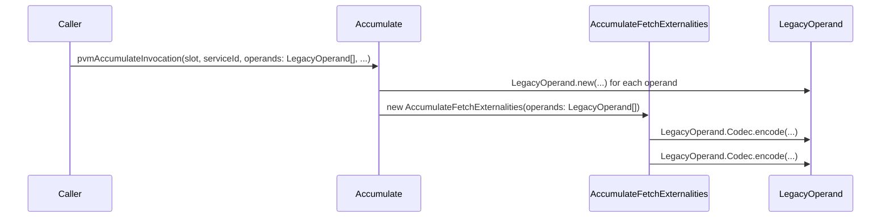

# Adjust operands to older GP

## Pull Request by @mateuszsikora

This PR adds `LegacyOperand` class and replaces all usages of `Operand` class. `LegacyOperand` is temporary used to run older services (GP 0.6.4). The order of fields look incorrect (in GP it is different) but seems to be correct in case of test vectors. 

I had to disable accumulate tests as they stopped working because of missing externalities implementation. Currently I am working on it and the next PR will restore it


## Comment by @coderabbitai[bot]

<!-- This is an auto-generated comment: summarize by coderabbit.ai -->
<!-- This is an auto-generated comment: skip review by coderabbit.ai -->

> [!IMPORTANT]
> ## Review skipped
> 
> Auto incremental reviews are disabled on this repository.
> 
> Please check the settings in the CodeRabbit UI or the `.coderabbit.yaml` file in this repository. To trigger a single review, invoke the `@coderabbitai review` command.
> 
> You can disable this status message by setting the `reviews.review_status` to `false` in the CodeRabbit configuration file.

<!-- end of auto-generated comment: skip review by coderabbit.ai -->
<!-- walkthrough_start -->

<details>
<summary>📝 Walkthrough</summary>

## Summary by CodeRabbit

- **New Features**
	- Introduced a new LegacyOperand class to support compatibility with older data formats.
- **Refactor**
	- Updated references and method signatures to use LegacyOperand instead of Operand in relevant modules.
- **Documentation**
	- Updated comments and reference URLs to reflect the latest Graypaper version and terminology changes.
## Walkthrough

The changes introduce a new `LegacyOperand` class to maintain compatibility with older operand formats, updating all relevant usages from `Operand` to `LegacyOperand` in the accumulate transition logic and externalities. Comments and references are updated in memory constants to reflect the latest Graypaper version, but no logic is altered.

## Changes

| File(s)                                                                                       | Change Summary                                                                                                      |
|-----------------------------------------------------------------------------------------------|---------------------------------------------------------------------------------------------------------------------|
| packages/core/pvm-spi-decoder/memory-conts.ts                                                 | Updated Graypaper reference URL and comments for constants; no logic or exported value changes.                     |
| packages/jam/transition/accumulate/accumulate.ts                                              | Replaced all `Operand` usages with `LegacyOperand`; updated method signatures and types; added relevant TODO.       |
| packages/jam/transition/accumulate/externalities/accumulate-fetch-externalities.ts            | Changed constructor and method types from `Operand[]` to `LegacyOperand[]`; updated codec usage accordingly.        |
| packages/jam/transition/accumulate/operand.ts                                                 | Added new `LegacyOperand` class with its own codec and methods for legacy compatibility.                            |

## Sequence Diagram(s)



## Poem

> In fields of code where operands roam,  
> A legacy rabbit builds a home.  
> Old formats hop, new classes sprout,  
> With careful paws, we swap them out.  
> Graypaper’s path is now more clear—  
> The code hops forward, year by year!  
> 🐇✨

</details>

<!-- walkthrough_end -->
<!-- internal state start -->


<!-- DwQgtGAEAqAWCWBnSTIEMB26CuAXA9mAOYCmGJATmriQCaQDG+Ats2bgFyQAOFk+AIwBWJBrngA3EsgEBPRvlqU0AgfFwA6NPEgQAfACgjoCEYDEZyAAUASpETZWaCrKNwSPbABsvkCiQBHbGlcSHFcLzpIACIAQVohbERQ/G5lDFpkAn4vJT4AcSsAGmj7bAFmdRp6OUgkykhmahIkgC9EeABrfCp0ZFtIDEcBBoAWUYA2IpQMXApFbAZpdEGSAHdGLzREZAY0HyiAAwAZEiI0BlkAeTSqDMONGARdrZ2/Em4tpeR93xIADyQ4gwRDqiDQpGQ+AAZmFYB5Djd0rRDpttohHu5PBRuPhEB4YZATmcLtdbpgUSgsvgytxcRRQkxmNxqPA1F51PI1upYDk8vZKBJ4N9pog0gx4NDhb95IVIFIKB18FgAAwaCYaUaPWJeXCwfDYIi8vUEij8wlSki5ZDwLDE86XJF3SloOkkZzUyC0SXQhrQ+bMOGm/n1ei2yCFabqdAcogYXY9fxiLxcnlBsIheWiAiKnjzIVKWiY56MWCYUhUmY0DJRbYrGjMnrOeRsbbYfxhGlNW24bRYaHYDBieDK/acyDcvXp/C5BpyhVKjDFjwDPZYEbvIXrKLhpS9+C+aiQWC4XDcRAcAD0l6IPPKGiZl4AYl5sNDobJjipEJfcLI0iMFAuJe3DeF4l7jBqRj6MY4BQGQ9CEmgeCEKQ5BUNUCisOwXC8PwwjZpIyy1EweQqGomjaLoYCGCYUBwKgqCYDgBDEGQyiYUybCzFwVAbA4TguJAJGKMoqjqFoOgwbBpgGCyDCdBC0iXkw/ggRIzBgGK8BgEopGUJebDMD0shgEwswYrgF4GNEtkGBYkCxAAkmx6HNPQAlNEJhIMGWILSG48IKEodTcLQzRZEF/i+v4Q4eAAqjYxyQNCPTpvkVD/q6DQABSFAAlClAboFgM78guI5YNkaCrGsDTKh4OUSGqGoAOz5Y8TmMn5kLpuZySYKEGBoGwMxYdxVlFSwRIAFoAPoAIqotkhzzTNqKpXwhwAMoAKL5AAsrtABy0BzdtTkzbthzTDt0CxAAwgA0ud+1HadN0lfQhyxDY+Tba9h0ndAy00tFkRiKF4WYTQFCVBgM74EQ8hpQjvbiMqY0mhGVjLoMjiUMK8r7MEUKwia+IKPGvYWe83ZYIOvnlnQ0wCHgfUsBNyBKIgDAUGytqgia8B8Hkkispj/rTXKLJUGwsM/B22Bhe56AMKp3ogimGjmJYOqwxL8adumelbBhlVk5AAL0phaWgQIHIMFbszqPAAUGFAx00kz/metjHRxtQ7bLGlEgkyHsLWz0nHKgNFkANz8BgKbjewPwZO8MVkEskCJcldVKyr1Q67Z0TQbJ8mKZCl5CCNv53B0GMYJeFwMI43jNC36vt1sNAaFZHA2XZDnOa5HFRJ5zb8LCPuQoFHjeu+7yfBcyy/GCSmW9jiLkvcYT/h4k68vapJOhSqLhtvrc980/eIBtB4kMWjFDq+PPpvAjYMvY6MkBN0zY30k7JQUoMCu0lmlQ4qRkT3zGj9P6AMHpXAACK7Qep9bGssRokFhvvNIWMgqHG4BpWI3dmAdxoE5DAEh8B7CbqieW+paDTApOmLwtD9jE35ioSIeCPDhkOKQXAZ8MiIFiBkfI2wHp4lwA8RytBvRNxlAAoK/U5iLCbtPfgu8wzU0wN8CcPIBFCJEZkcRtBJGIGkckVECMNj1GQCfR0OiNDkDWBfam7pEKwh3siVx6w5GxFTrMOgYADShA5OQTOlBs6CyJOcWBtoOghWxtA50VNkgUA0ZVSs+xEBgz/vgKQRZHK1RgCgq4wTQhMQUTuO0xDmCkLbuQ3uJAqE0LoZVWx+BgRCzLNUrAcoWoaFatOHRitMqVn8CvJY9Aj4oEmpEEEepHhe34CaPg7DbxOzSuZOYM4UrsI2LPNeHYezzFoIsOgOsjD2T1rqDiFtjbY1Ns4Q2lso4MiiHbcojtnbhDdogaCkADo4KYfYeAgdcDByhu5LgRD+ZhxoH0WQQ4eAkLIRQtp1COFNxyogdhnAYCfxINtQlopBTCjabQLg21KVLCcsw7RMCuCmIANoAF1pgJNpfSkgljpjsHmNwWQXBdqzGFbIAAEtsWA+UuBWADEgEgwAbDSG8LgYA7TcWVTVQ4XU0wrAaW1Z05Uu0gI9D0HoVEgAkwiJLwcWyLtioqdg0ppN9KE4tNRgfFhKuDQBJWSnpFKKBCgZTSyAdLQ1UsZdMNJFILyQFOA6MkyJOXcu2Ly6NSwBX/MlWKiVqRpWyvldYJV+JVXqt1Fqr1hs9UasNca2tTdzXzAoFajxaI3g/Uxa0ztRCLhV2UrXZg9dMCN0ql3ZpWKp0eqflZQ4Q8y4ewroOzeNc65zHHeA5u18WmdwBLDYaHJxDKT3VisAvpcC+TAIeygx7XbSDvoPUudzHIuTQuPDyjgvIoxnj1d2WJP42y0b450G1ioPA0JeeNGQNBCFgWsOs0yvhRHmU41N4HHjSKAtIXEGRBYphUR4P8+DMBo0NilNK29YOZFRFg+WDRL6EPdfumgT4cG+V2v8I9Y5T2wIYK8BM1MsliDSkh3YAH6BS0DGBiknLQZEmTafHRCnHgAHUjFVVUUJxoYLFCON+KYxAOV8qolYVA8gpjTMYKCtnRQcS9g+GQAXDwytoZRGyPUJTJJnF+OkXpDxyQvGgdMRoALog5FrJ6fCTZSMia7OVPs3w0IjmlmZi5mJjQ0BKBubrRyDzzax2eUFV5RWjaEk+bbPg9s/nsEfUCj2kBpEiY0XbN5jG+Ckbc0XOg8LaOJvZRy21RIBtcGU3550CmxqCfRESVjWKOPXtgNx3jJ7AX9sruukdY74w7tnWxkgl470UAffxg7F6r03pO2dwFd9F2vpXWAIwW3q47a3XtpuF3WkwZcQPJdb7R6fowhPH9U8fIAca0EtxXbHETcw+fCcdYcuFj6CsSIKasyKhyYSbGAIgRxLk3vWbbxsj033FgJkLJxDsnHPMsqDQaDJCzGJxUjx4rJy6AiUxn0MM8/4JUSa28EkPytPQVhJzIrBnqjPUSTtLTWk6qEEBtpljqChGsSncv7C+T/jVeZCvMjwrLIgWAvOquIBsPgHpvPkJ6h6PAVolAZWm9t3gfU/NWiGyuHgUCsjboslkOwnLLuzcsIzocfw+rZF4xJzaV+2B341QGuIJ2hw+buhoAw/T9A9RHjUaJyaNU+c6KCzTHOMmVhAPeBrYS8hzIKl6V9CcVA6RxMN8gDolQzYpxWvztmoQj7hPidsORWIC9tb4Kw5P6MiaHDcdn+34uOy8CKfAVHm0Zhx3EIbPGMO4+VgHD4eQ+IvDQjMklvstYM5YIOF4KXP9C8wtYYwgzoXS/CXZuDbM6c+QNGhjVJtE0KEBVMqHloDoVu8iVgvKIGbFAZVv8DbN8jVr8kTPVvxsCg9Lpijn1j5imvzgIq9sOpug3Ptuej9rRvdoYlOCnnPhFgwJ9B3pADlIcCbmHkSBblbjbrdHbh7o7s7rKm7vbp7t7r7ngLzoHsHrQKHrzlHhqocPlKKLPmnhns0IvkwtMA6kih4BPqzuHh5MoUSAvnpkviXHZCuoYAYHRM7N4ixKhOxCDvQFxDhH4GgPxGDkJCJGROJJRFJDRFYXBONOoHNOvogHNP4FuHVLQHNANN/NJNYaMAIAAEy0AAAcAAjAAKypFJETAADM6R0IAAnLkSQO+NCAINCJkUkSQOMAwK1NCKkXkWgGgBMGgOkRcKkdRJYdYVxMEaEeESQJEXQHNAhN0UAA= -->

<!-- internal state end -->
<!-- tips_start -->

---


<details>
<summary>🪧 Tips</summary>

### Chat

There are 3 ways to chat with [CodeRabbit](https://coderabbit.ai?utm_source=oss&utm_medium=github&utm_campaign=FluffyLabs/typeberry&utm_content=446):

- Review comments: Directly reply to a review comment made by CodeRabbit. Example:
  - `I pushed a fix in commit <commit_id>, please review it.`
  - `Explain this complex logic.`
  - `Open a follow-up GitHub issue for this discussion.`
- Files and specific lines of code (under the "Files changed" tab): Tag `@coderabbitai` in a new review comment at the desired location with your query. Examples:
  - `@coderabbitai explain this code block.`
  -	`@coderabbitai modularize this function.`
- PR comments: Tag `@coderabbitai` in a new PR comment to ask questions about the PR branch. For the best results, please provide a very specific query, as very limited context is provided in this mode. Examples:
  - `@coderabbitai gather interesting stats about this repository and render them as a table. Additionally, render a pie chart showing the language distribution in the codebase.`
  - `@coderabbitai read src/utils.ts and explain its main purpose.`
  - `@coderabbitai read the files in the src/scheduler package and generate a class diagram using mermaid and a README in the markdown format.`
  - `@coderabbitai help me debug CodeRabbit configuration file.`

### Support

Need help? Create a ticket on our [support page](https://www.coderabbit.ai/contact-us/support) for assistance with any issues or questions.

Note: Be mindful of the bot's finite context window. It's strongly recommended to break down tasks such as reading entire modules into smaller chunks. For a focused discussion, use review comments to chat about specific files and their changes, instead of using the PR comments.

### CodeRabbit Commands (Invoked using PR comments)

- `@coderabbitai pause` to pause the reviews on a PR.
- `@coderabbitai resume` to resume the paused reviews.
- `@coderabbitai review` to trigger an incremental review. This is useful when automatic reviews are disabled for the repository.
- `@coderabbitai full review` to do a full review from scratch and review all the files again.
- `@coderabbitai summary` to regenerate the summary of the PR.
- `@coderabbitai generate sequence diagram` to generate a sequence diagram of the changes in this PR.
- `@coderabbitai resolve` resolve all the CodeRabbit review comments.
- `@coderabbitai configuration` to show the current CodeRabbit configuration for the repository.
- `@coderabbitai help` to get help.

### Other keywords and placeholders

- Add `@coderabbitai ignore` anywhere in the PR description to prevent this PR from being reviewed.
- Add `@coderabbitai summary` to generate the high-level summary at a specific location in the PR description.
- Add `@coderabbitai` anywhere in the PR title to generate the title automatically.

### Documentation and Community

- Visit our [Documentation](https://docs.coderabbit.ai) for detailed information on how to use CodeRabbit.
- Join our [Discord Community](http://discord.gg/coderabbit) to get help, request features, and share feedback.
- Follow us on [X/Twitter](https://twitter.com/coderabbitai) for updates and announcements.

</details>

<!-- tips_end -->


## Comment by @github-actions[bot]


<details>
<summary>View all</summary>

| File | Benchmark | Ops |  |
|------|-----------|-----|--|
| [bytes/hex-from.ts[0]](../blob/1aed5587ebff3816b7d2acea8a63219c4a4a39a3//_work/typeberry-1/typeberry/typeberry/benchmarks/bytes/hex-from.ts) | parse hex using `Number` with NaN checking | 144422.57 ±0.06% | 84.06% slower |
| [bytes/hex-from.ts[1]](../blob/1aed5587ebff3816b7d2acea8a63219c4a4a39a3//_work/typeberry-1/typeberry/typeberry/benchmarks/bytes/hex-from.ts) | parse hex from char codes | 906021.23 ±0.17% | fastest ✅ |
| [bytes/hex-from.ts[2]](../blob/1aed5587ebff3816b7d2acea8a63219c4a4a39a3//_work/typeberry-1/typeberry/typeberry/benchmarks/bytes/hex-from.ts) | parse hex from string nibbles | 562295.8 ±0.19% | 37.94% slower |
| [math/count-bits-u32.ts[0]](../blob/1aed5587ebff3816b7d2acea8a63219c4a4a39a3//_work/typeberry-1/typeberry/typeberry/benchmarks/math/count-bits-u32.ts) | standard method | 88500718.55 ±1.92% | 66.11% slower |
| [math/count-bits-u32.ts[1]](../blob/1aed5587ebff3816b7d2acea8a63219c4a4a39a3//_work/typeberry-1/typeberry/typeberry/benchmarks/math/count-bits-u32.ts) | magic | 261141236.34 ±5.04% | fastest ✅ |
| [math/mul_overflow.ts[0]](../blob/1aed5587ebff3816b7d2acea8a63219c4a4a39a3//_work/typeberry-1/typeberry/typeberry/benchmarks/math/mul_overflow.ts) | multiply and bring back to u32 | 272092372.78 ±4.68% | fastest ✅ |
| [math/mul_overflow.ts[1]](../blob/1aed5587ebff3816b7d2acea8a63219c4a4a39a3//_work/typeberry-1/typeberry/typeberry/benchmarks/math/mul_overflow.ts) | multiply and take modulus | 259717328.1 ±7.73% | 4.55% slower |
| [math/switch.ts[0]](../blob/1aed5587ebff3816b7d2acea8a63219c4a4a39a3//_work/typeberry-1/typeberry/typeberry/benchmarks/math/switch.ts) | switch | 267901615.63 ±5.13% | 2.16% slower |
| [math/switch.ts[1]](../blob/1aed5587ebff3816b7d2acea8a63219c4a4a39a3//_work/typeberry-1/typeberry/typeberry/benchmarks/math/switch.ts) | if | 273809440.84 ±4.69% | fastest ✅ |
| [math/add_one_overflow.ts[0]](../blob/1aed5587ebff3816b7d2acea8a63219c4a4a39a3//_work/typeberry-1/typeberry/typeberry/benchmarks/math/add_one_overflow.ts) | add and take modulus | 263040550.26 ±6.14% | 3.92% slower |
| [math/add_one_overflow.ts[1]](../blob/1aed5587ebff3816b7d2acea8a63219c4a4a39a3//_work/typeberry-1/typeberry/typeberry/benchmarks/math/add_one_overflow.ts) | condition before calculation | 273766694.45 ±4.45% | fastest ✅ |
| [math/count-bits-u64.ts[0]](../blob/1aed5587ebff3816b7d2acea8a63219c4a4a39a3//_work/typeberry-1/typeberry/typeberry/benchmarks/math/count-bits-u64.ts) | standard method | 1355322.29 ±0.2% | 88.16% slower |
| [math/count-bits-u64.ts[1]](../blob/1aed5587ebff3816b7d2acea8a63219c4a4a39a3//_work/typeberry-1/typeberry/typeberry/benchmarks/math/count-bits-u64.ts) | magic | 11448600.3 ±0.21% | fastest ✅ |
| [hash/index.ts[0]](../blob/1aed5587ebff3816b7d2acea8a63219c4a4a39a3//_work/typeberry-1/typeberry/typeberry/benchmarks/hash/index.ts) | hash with numeric representation | 193.38 ±0.08% | 26.54% slower |
| [hash/index.ts[1]](../blob/1aed5587ebff3816b7d2acea8a63219c4a4a39a3//_work/typeberry-1/typeberry/typeberry/benchmarks/hash/index.ts) | hash with string representation | 119.92 ±0.46% | 54.44% slower |
| [hash/index.ts[2]](../blob/1aed5587ebff3816b7d2acea8a63219c4a4a39a3//_work/typeberry-1/typeberry/typeberry/benchmarks/hash/index.ts) | hash with symbol representation | 184.29 ±0.04% | 29.99% slower |
| [hash/index.ts[3]](../blob/1aed5587ebff3816b7d2acea8a63219c4a4a39a3//_work/typeberry-1/typeberry/typeberry/benchmarks/hash/index.ts) | hash with uint8 representation | 164.32 ±0.17% | 37.58% slower |
| [hash/index.ts[4]](../blob/1aed5587ebff3816b7d2acea8a63219c4a4a39a3//_work/typeberry-1/typeberry/typeberry/benchmarks/hash/index.ts) | hash with packed representation | 263.24 ±0.37% | fastest ✅ |
| [hash/index.ts[5]](../blob/1aed5587ebff3816b7d2acea8a63219c4a4a39a3//_work/typeberry-1/typeberry/typeberry/benchmarks/hash/index.ts) | hash with bigint representation | 194.33 ±0.03% | 26.18% slower |
| [hash/index.ts[6]](../blob/1aed5587ebff3816b7d2acea8a63219c4a4a39a3//_work/typeberry-1/typeberry/typeberry/benchmarks/hash/index.ts) | hash with uint32 representation | 205.64 ±0.04% | 21.88% slower |
| [codec/encoding.ts[0]](../blob/1aed5587ebff3816b7d2acea8a63219c4a4a39a3//_work/typeberry-1/typeberry/typeberry/benchmarks/codec/encoding.ts) | manual encode | 3095809.24 ±0.17% | 16.24% slower |
| [codec/encoding.ts[1]](../blob/1aed5587ebff3816b7d2acea8a63219c4a4a39a3//_work/typeberry-1/typeberry/typeberry/benchmarks/codec/encoding.ts) | int32array encode | 3695873.57 ±0.12% | fastest ✅ |
| [codec/encoding.ts[2]](../blob/1aed5587ebff3816b7d2acea8a63219c4a4a39a3//_work/typeberry-1/typeberry/typeberry/benchmarks/codec/encoding.ts) | dataview encode | 3681957.62 ±0.21% | 0.38% slower |
| [codec/decoding.ts[0]](../blob/1aed5587ebff3816b7d2acea8a63219c4a4a39a3//_work/typeberry-1/typeberry/typeberry/benchmarks/codec/decoding.ts) | manual decode | 23403844.39 ±0.52% | 86.2% slower |
| [codec/decoding.ts[1]](../blob/1aed5587ebff3816b7d2acea8a63219c4a4a39a3//_work/typeberry-1/typeberry/typeberry/benchmarks/codec/decoding.ts) | int32array decode | 169623778.03 ±3.01% | fastest ✅ |
| [codec/decoding.ts[2]](../blob/1aed5587ebff3816b7d2acea8a63219c4a4a39a3//_work/typeberry-1/typeberry/typeberry/benchmarks/codec/decoding.ts) | dataview decode | 168289513.68 ±3.44% | 0.79% slower |
| [codec/bigint.compare.ts[0]](../blob/1aed5587ebff3816b7d2acea8a63219c4a4a39a3//_work/typeberry-1/typeberry/typeberry/benchmarks/codec/bigint.compare.ts) | compare custom | 255802454.95 ±7.79% | 5.91% slower |
| [codec/bigint.compare.ts[1]](../blob/1aed5587ebff3816b7d2acea8a63219c4a4a39a3//_work/typeberry-1/typeberry/typeberry/benchmarks/codec/bigint.compare.ts) | compare bigint | 271868927.62 ±6.03% | fastest ✅ |
| [collections/map-set.ts[0]](../blob/1aed5587ebff3816b7d2acea8a63219c4a4a39a3//_work/typeberry-1/typeberry/typeberry/benchmarks/collections/map-set.ts) | 2 gets + conditional set | 121187.79 ±0.14% | fastest ✅ |
| [collections/map-set.ts[1]](../blob/1aed5587ebff3816b7d2acea8a63219c4a4a39a3//_work/typeberry-1/typeberry/typeberry/benchmarks/collections/map-set.ts) | 1 get 1 set | 61725.33 ±0.03% | 49.07% slower |
| [codec/bigint.decode.ts[0]](../blob/1aed5587ebff3816b7d2acea8a63219c4a4a39a3//_work/typeberry-1/typeberry/typeberry/benchmarks/codec/bigint.decode.ts) | decode custom | 174567420.67 ±3.04% | fastest ✅ |
| [codec/bigint.decode.ts[1]](../blob/1aed5587ebff3816b7d2acea8a63219c4a4a39a3//_work/typeberry-1/typeberry/typeberry/benchmarks/codec/bigint.decode.ts) | decode bigint | 109042884.33 ±2.25% | 37.54% slower |
| [bytes/hex-to.ts[0]](../blob/1aed5587ebff3816b7d2acea8a63219c4a4a39a3//_work/typeberry-1/typeberry/typeberry/benchmarks/bytes/hex-to.ts) | number toString + padding | 331580.33 ±0.07% | fastest ✅ |
| [bytes/hex-to.ts[1]](../blob/1aed5587ebff3816b7d2acea8a63219c4a4a39a3//_work/typeberry-1/typeberry/typeberry/benchmarks/bytes/hex-to.ts) | manual | 16439.93 ±0.06% | 95.04% slower |
| [logger/index.ts[0]](../blob/1aed5587ebff3816b7d2acea8a63219c4a4a39a3//_work/typeberry-1/typeberry/typeberry/benchmarks/logger/index.ts) | console.log with string concat | 6983155.66 ±62.08% | fastest ✅ |
| [logger/index.ts[1]](../blob/1aed5587ebff3816b7d2acea8a63219c4a4a39a3//_work/typeberry-1/typeberry/typeberry/benchmarks/logger/index.ts) | console.log with args | 1273826.2 ±96.46% | 81.76% slower |
| [codec/view_vs_collection.ts[0]](../blob/1aed5587ebff3816b7d2acea8a63219c4a4a39a3//_work/typeberry-1/typeberry/typeberry/benchmarks/codec/view_vs_collection.ts) | Get first element from Decoded | 28045.05 ±0.69% | 59.1% slower |
| [codec/view_vs_collection.ts[1]](../blob/1aed5587ebff3816b7d2acea8a63219c4a4a39a3//_work/typeberry-1/typeberry/typeberry/benchmarks/codec/view_vs_collection.ts) | Get first element from View | 68568.71 ±0.06% | fastest ✅ |
| [codec/view_vs_collection.ts[2]](../blob/1aed5587ebff3816b7d2acea8a63219c4a4a39a3//_work/typeberry-1/typeberry/typeberry/benchmarks/codec/view_vs_collection.ts) | Get 50th element from Decoded | 28165.87 ±0.27% | 58.92% slower |
| [codec/view_vs_collection.ts[3]](../blob/1aed5587ebff3816b7d2acea8a63219c4a4a39a3//_work/typeberry-1/typeberry/typeberry/benchmarks/codec/view_vs_collection.ts) | Get 50th element from View | 38675.26 ±0.19% | 43.6% slower |
| [codec/view_vs_collection.ts[4]](../blob/1aed5587ebff3816b7d2acea8a63219c4a4a39a3//_work/typeberry-1/typeberry/typeberry/benchmarks/codec/view_vs_collection.ts) | Get last element from Decoded | 28154.81 ±0.27% | 58.94% slower |
| [codec/view_vs_collection.ts[5]](../blob/1aed5587ebff3816b7d2acea8a63219c4a4a39a3//_work/typeberry-1/typeberry/typeberry/benchmarks/codec/view_vs_collection.ts) | Get last element from View | 27354.46 ±0.3% | 60.11% slower |
| [codec/view_vs_object.ts[0]](../blob/1aed5587ebff3816b7d2acea8a63219c4a4a39a3//_work/typeberry-1/typeberry/typeberry/benchmarks/codec/view_vs_object.ts) | Get the first field from Decoded | 441975.61 ±0.23% | fastest ✅ |
| [codec/view_vs_object.ts[1]](../blob/1aed5587ebff3816b7d2acea8a63219c4a4a39a3//_work/typeberry-1/typeberry/typeberry/benchmarks/codec/view_vs_object.ts) | Get the first field from View | 104794.8 ±0.06% | 76.29% slower |
| [codec/view_vs_object.ts[2]](../blob/1aed5587ebff3816b7d2acea8a63219c4a4a39a3//_work/typeberry-1/typeberry/typeberry/benchmarks/codec/view_vs_object.ts) | Get the first field as view from View | 105029.14 ±0.13% | 76.24% slower |
| [codec/view_vs_object.ts[3]](../blob/1aed5587ebff3816b7d2acea8a63219c4a4a39a3//_work/typeberry-1/typeberry/typeberry/benchmarks/codec/view_vs_object.ts) | Get two fields from Decoded | 439386.23 ±0.26% | 0.59% slower |
| [codec/view_vs_object.ts[4]](../blob/1aed5587ebff3816b7d2acea8a63219c4a4a39a3//_work/typeberry-1/typeberry/typeberry/benchmarks/codec/view_vs_object.ts) | Get two fields from View | 83810.26 ±0.11% | 81.04% slower |
| [codec/view_vs_object.ts[5]](../blob/1aed5587ebff3816b7d2acea8a63219c4a4a39a3//_work/typeberry-1/typeberry/typeberry/benchmarks/codec/view_vs_object.ts) | Get two fields from materialized from View | 173319.74 ±0.2% | 60.79% slower |
| [codec/view_vs_object.ts[6]](../blob/1aed5587ebff3816b7d2acea8a63219c4a4a39a3//_work/typeberry-1/typeberry/typeberry/benchmarks/codec/view_vs_object.ts) | Get two fields as views from View | 83480.27 ±0.12% | 81.11% slower |
| [codec/view_vs_object.ts[7]](../blob/1aed5587ebff3816b7d2acea8a63219c4a4a39a3//_work/typeberry-1/typeberry/typeberry/benchmarks/codec/view_vs_object.ts) | Get only third field from Decoded | 440907.74 ±0.26% | 0.24% slower |
| [codec/view_vs_object.ts[8]](../blob/1aed5587ebff3816b7d2acea8a63219c4a4a39a3//_work/typeberry-1/typeberry/typeberry/benchmarks/codec/view_vs_object.ts) | Get only third field from View | 104359.7 ±0.12% | 76.39% slower |
| [codec/view_vs_object.ts[9]](../blob/1aed5587ebff3816b7d2acea8a63219c4a4a39a3//_work/typeberry-1/typeberry/typeberry/benchmarks/codec/view_vs_object.ts) | Get only third field as view from View | 103872.9 ±0.18% | 76.5% slower |
| [hash/blake2b.ts[0]](../blob/1aed5587ebff3816b7d2acea8a63219c4a4a39a3//_work/typeberry-1/typeberry/typeberry/benchmarks/hash/blake2b.ts) | hasher with simple allocator | 0.0453 ±0.94% | fastest ✅ |
| [hash/blake2b.ts[1]](../blob/1aed5587ebff3816b7d2acea8a63219c4a4a39a3//_work/typeberry-1/typeberry/typeberry/benchmarks/hash/blake2b.ts) | hasher with page allocator | 0.0452 ±1.04% | 0.22% slower |
| [bytes/compare.ts[0]](../blob/1aed5587ebff3816b7d2acea8a63219c4a4a39a3//_work/typeberry-1/typeberry/typeberry/benchmarks/bytes/compare.ts) | Comparing Uint32 bytes | 14220.4 ±0.05% | 10.5% slower |
| [bytes/compare.ts[1]](../blob/1aed5587ebff3816b7d2acea8a63219c4a4a39a3//_work/typeberry-1/typeberry/typeberry/benchmarks/bytes/compare.ts) | Comparing raw bytes | 15889.52 ±0.21% | fastest ✅ |
| [collections/map_vs_sorted.ts[0]](../blob/1aed5587ebff3816b7d2acea8a63219c4a4a39a3//_work/typeberry-1/typeberry/typeberry/benchmarks/collections/map_vs_sorted.ts) | Map | 228329.07 ±0.04% | fastest ✅ |
| [collections/map_vs_sorted.ts[1]](../blob/1aed5587ebff3816b7d2acea8a63219c4a4a39a3//_work/typeberry-1/typeberry/typeberry/benchmarks/collections/map_vs_sorted.ts) | Map-array | 103620.73 ±0.05% | 54.62% slower |
| [collections/map_vs_sorted.ts[2]](../blob/1aed5587ebff3816b7d2acea8a63219c4a4a39a3//_work/typeberry-1/typeberry/typeberry/benchmarks/collections/map_vs_sorted.ts) | Array | 80765.4 ±2.59% | 64.63% slower |
| [collections/map_vs_sorted.ts[3]](../blob/1aed5587ebff3816b7d2acea8a63219c4a4a39a3//_work/typeberry-1/typeberry/typeberry/benchmarks/collections/map_vs_sorted.ts) | SortedArray | 197255.42 ±0.24% | 13.61% slower |
| [crypto/ed25519.ts[0]](../blob/1aed5587ebff3816b7d2acea8a63219c4a4a39a3//_work/typeberry-1/typeberry/typeberry/benchmarks/crypto/ed25519.ts) | native crypto | 5.72 ±17.47% | 80.77% slower |
| [crypto/ed25519.ts[1]](../blob/1aed5587ebff3816b7d2acea8a63219c4a4a39a3//_work/typeberry-1/typeberry/typeberry/benchmarks/crypto/ed25519.ts) | wasm lib | 10.66 ±0.02% | 64.16% slower |
| [crypto/ed25519.ts[2]](../blob/1aed5587ebff3816b7d2acea8a63219c4a4a39a3//_work/typeberry-1/typeberry/typeberry/benchmarks/crypto/ed25519.ts) | wasm lib batch | 29.74 ±0.6% | fastest ✅ |
</details>


### Benchmarks summary: 63/63 OK ✅

<!-- thollander/actions-comment-pull-request "benchmarks" -->


## Comment by @coderabbitai[bot]

_⚠️ Potential issue_

**Fix type signature in create method.**

The `create` method parameter type should be `CodecRecord<LegacyOperand>` instead of `CodecRecord<Operand>` to ensure type safety.


```diff
-  static create({ authorizationOutput, authorizerHash, exportsRoot, hash, payloadHash, result }: CodecRecord<Operand>) {
+  static create({ authorizationOutput, authorizerHash, exportsRoot, hash, payloadHash, result }: CodecRecord<LegacyOperand>) {
```

<details>
<summary>🤖 Prompt for AI Agents</summary>

```
In packages/jam/transition/accumulate/operand.ts at line 90, the create method's
parameter type is incorrectly set to CodecRecord<Operand>. Change this type to
CodecRecord<LegacyOperand> to ensure proper type safety as required.
```

</details>

<!-- This is an auto-generated comment by CodeRabbit -->

<!-- fingerprinting:phantom:poseidon:panther -->


## Comment by @tomusdrw

I think these conversions are not really necessary, are they?


## Comment by @tomusdrw

```suggestion
  private constructor(operand: CodecRecord<LegacyOperand>) {
```

that seems to be exactly the same I think


## Comment by @tomusdrw

That's the ones you are working on, right? Can we make the commented out code as minimal as possible? I.e I guess we should still be able to do `transition` and just avoid doing any assertions. Also please add a `TODO` here to make sure we know it's you responsible for that :D


## Comment by @mateuszsikora

the problem is that `transition` throws "Method not implemented". I've already fixed it and all tests work again. I will open a PR today


## Comment by @mateuszsikora

you are right. fixed.


## Comment by @mateuszsikora

fixed


## Comment by @mateuszsikora

added a comment
