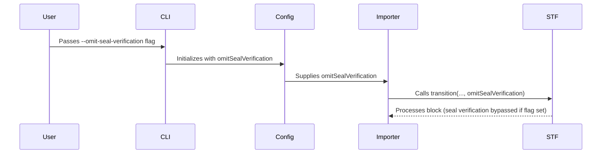

# Generating blocks in special mode to omit seal verification

## Pull Request by @DrEverr

Closes #388 


## Comment by @coderabbitai[bot]

<!-- This is an auto-generated comment: summarize by coderabbit.ai -->
<!-- This is an auto-generated comment: skip review by coderabbit.ai -->

> [!IMPORTANT]
> ## Review skipped
> 
> Auto incremental reviews are disabled on this repository.
> 
> Please check the settings in the CodeRabbit UI or the `.coderabbit.yaml` file in this repository. To trigger a single review, invoke the `@coderabbitai review` command.
> 
> You can disable this status message by setting the `reviews.review_status` to `false` in the CodeRabbit configuration file.

<!-- end of auto-generated comment: skip review by coderabbit.ai -->
<!-- walkthrough_start -->

<details>
<summary>📝 Walkthrough</summary>

## Summary by CodeRabbit

* **New Features**
  * Added a new command-line option to omit seal verification during block processing.
  * Users can now control state root verification via a CLI flag.
* **Bug Fixes**
  * Improved log messages for block verification and block generation.
* **Documentation**
  * Enhanced inline documentation for hash-related methods.
* **Style**
  * Refined log message formatting and clarified comments.
* **Tests**
  * Added tests to ensure correct handling of the new seal verification flag.
## Walkthrough

A new boolean option, `omitSealVerification`, was introduced across the CLI, configuration, transition logic, and worker components. This flag allows the system to bypass seal verification during block processing when enabled. The change propagates from argument parsing through to state transition methods, with corresponding updates in type declarations, configuration handling, and test coverage.

## Changes

| File(s)                                                                                 | Change Summary                                                                                                       |
|-----------------------------------------------------------------------------------------|---------------------------------------------------------------------------------------------------------------------|
| bin/jam/args.ts, bin/jam/args.test.ts, bin/jam/main.ts                                  | Added `omitSealVerification` boolean option to CLI parsing, shared options, and main logic; updated related types and tests. |
| packages/jam/config/config.ts                                                           | Extended `Config` class and `reInit` method to support the new `omitSealVerification` property.                     |
| packages/jam/transition/chain-stf.ts, packages/jam/transition/disputes/disputes.ts      | Added `omitSealVerification` parameter to `transition` methods; logic now conditionally bypasses seal/dispute verification. |
| packages/jam/transition/hasher.ts                                                       | Added JSDoc documentation to the `TransitionHasher` class and its methods; no logic changes.                        |
| workers/block-generator/generator.ts                                                    | Refactored imports, clarified comments, adjusted votesEpoch calculation, and updated extrinsics creation.            |
| workers/block-generator/index.ts                                                        | Updated log message to include a gift emoji.                                                                        |
| workers/importer/importer.ts, workers/importer/index.ts                                 | Added `omitSealVerification` parameter to `importBlock` and passed config value; updated log messages.               |

## Sequence Diagram(s)



## Poem

> In the warren, a flag now hops—  
> "Omit the seal!" the rabbit stops.  
> From CLI to chain, it scurries fast,  
> Through config fields, its shadow cast.  
> Now blocks may skip their seal’s inspection,  
> With every hop, a new direction!  
> 🐇✨

</details>

<!-- walkthrough_end -->
<!-- internal state start -->


<!-- DwQgtGAEAqAWCWBnSTIEMB26CuAXA9mAOYCmGJATmriQCaQDG+Ats2bgFyQAOFk+AIwBWJBrngA3EsgEBPRvlqU0AgfFwA6NPEgQAfACgjoCEejqANiS4BxMsvEYikARfwNk8LIm6j4aC0hmRRJIAn5mdUhEEgDIKQp4ADN4Bmp4fAwDADlsZgFKLgAWAFYABgMAVRiKLgARCgBRBIojfWNwKDJ6fCScAmJ7Khp6JlZ2Ll5+YVFxKRl5JiUqVXUtHXaTKDhUVEx+wlJyYboFcYxOSCoAd2i85jQKeTkFZZU1TW1dMEMO0wM1BgAPRCNDMIGPIiIDQ0RCaXCIDgGABEqIMAGJ0ZAAIIASUGx2op0Q90e8l6jFgmFIiDMsFCsNwd3UoSS+D4uHpkAAwgAZXHoChEPLsHiPGqQa5oZAkAAeNAwSno4S8DAs2CUCgSaFIkDZfDQkHItwE+HwVn2+G44kykAABix1ABlWIWABqlGSqXSmTtGhgXKUSTQ2AsTKtNowyEEIjEkulkGw3FoROV+BQGDVGtCDsiuBdAQ9iRSaUjduiJCZ4TtwYsMT9MGu6eNYWkTLSMWQ10ooTQtCVXEyoQSXukYSpTO40sQXmcdogjtwYBiATAI5LPowAF5cBRsCRyxRpKGERnx6EpxQYvRISKLsgqRJZ/bFwX3Z6N2WK1X03bd/u7QAGnQRVz34TlKHiD94DHTlqDFRAZyce0FzzZdXTXaDSwybda3rK5jzDTwsCiApnxiH97Twg9/TgaQGTbZAmAwFIKGYcd4IgsUr0gpgKCPMQLHkLwaAoXhK2QLjTXNWIsCSCwdT1CgWDAsYHlAiwvFCLxuDwf1snTfAIL4NwiFSfg+EoZS+CpRVNOQhhbJpSUeyCPsSA0IwjExHEwwcHDJPTLilDVR5N2jPo5W4dkRgsnhsFccz2HUGDaQMKBsX7U5eCtShcHkXNnVdIsvWwzIuGki0MHLcIuLtJ0qSPWgAHlrQCmrZF8DM4UwBgcyDEMw1ayNEHLLx7UBEEwQhIVoUZGFRsgAAKRk9XgKwAEpPNRZE2n+SbQXBSE5sRFE0R8vECQcYlSSefg+kc6lpCMbEjRIE0zSqs51NoMB7NZBS51Q9R0NXddvS/KViN3RRsD6tMwL5AVbzYC5uKQ5xTNSWiEGQeTFNQWh3DvWLxq4+kLG4Vt5XQZBDRoZhoqoO6fD8OJ8eccIyBUKw4toJAedCHqaCuM0mXBsqMGAgaT2fatqIbOj7Qax46GG9qwk60IocgOUFSVMJ01VdVNUNFsct8Ch8pfPM3xKz8cPLCl8q6yrZJxnNLxiFWmvVzJFqSbBM0jeNkCTFNYvCL2GVxt7bg5pSVK4pHBWFVGEWAkTKHExxOa5OFEmQu1kX/EhkXLBM/z3A8QPoGWwzl38FZQPoMCMnhlKfJUPfR04JACfcUEk+kSMzE3TjJrkj1wbAKHIeh6satW2v9p2ZjEfTDOMyAsYYOLmJhwJ5PwW5HqcMduyPNylE8ryLr84YAsNsCQoUx//fu3XZSZ2L2XixK97JXEM9dKOIsr0AtnlAqr5ipYU3BVT6skarpiijFU4Lscw+2XiNMaWA7QHWmsdBadozq7XSvtLwU1wQPC8AtJEO0MRYkukca69ASSsDJJ/M+NIXpxxcIgy0K88EwMLHAyGCY+wG1qlyO0fsowdS6pgegXgUoBHgAAL1OEkZS7E1JKL+lpVOJNiJgTtDQ6qeog5iBwj3O0SBsR4FgOyWc5YE7jTMdoCxOtuFaJ0VRAI+Fqyl0VjI7kmQUhEHLMxAucMCB8DSBYQIOtw6pmfmgBgfVrRgRbIVfMsDiwQ0dvwIRtN0DjngBQCBYU2CiX9LiLAdUVG4AcZydkiAEDcFcVYyMwEuKmSCNIRAOpWR/xyrQOGpxXDuAANZdgTMEfmKR0FGzHtmMCUyGDTOiBo7SUZ4CakQAAR2wKrFwVBNkSW6jQPsn9DRMDcBgdCl5Un6geJobyTCH7hWfsFUQb9vkUlQVbU4oyEqaUARcFKICMrgI7rlK20Dbb5NKvA/hMlMDILAkC2KsihGLQwWefBlDDpAnMcQzyUBKjJlSdirR3ScL2nMUtY6XBsRCmMRtXBE1iXTTJQiTFFF7T2Mcc4pwmKq4AVrhmLMmpcl2zEUUyeOY5GLRjLMBC15n52jCSxeAkTtponIWAIwU5NnDMQFQoEzEIlWvCXquhpDGE4nxCwk4bDbrkgek5EBSttV2siYwBSiEFBRn/GIP+Os9bdGWdK8eZSWxu32JAhFNsiqiIKZLcs1x1CwDKfXcWA9QgUhrAEmiPJ2RHh8JkfmTghK9PzrgdIe8alOIXkeep6gs0JhSZHFB8pzlMjlcih2vpE7sS4jpPAIaInTFjEyJRGqUCUTqjqiJUT/ZhricBMgJJC551QObZSltraoGTUJAiYAmn+E0pom8DyoT7JzI9LwTpfAMArqBO0tABAAAVqCwD9F5J12IvkjR+YGP5YUwOAu/mgnofBdIAN1pC4BaUoA6pieGvgFJQrBr9bqgN7jTXTPNZa61erbUEeIYmalvb0D9nje9biYJKyFFTXk9NKLIwIPRVgLcepS2AagE6Rt4hm2VlbfadtGB1BLXI0QLgQdplt2uBgTlZ5cPIHw2uwlxHSMkvk5RiJ1Ge0xr1gOqVU48MiPfBmzcWaR6MCPOkZCZsmPab1bgnqmYPKOqNSa9JJGaSWt3JgGckYrVUi8MuXASQHUMIui6oYqT2EPDujh71aVfWhb2V+FtihP51WahgbkUWLGadDl/fWpxs2ckY7cCMOE4iJqwM8mpkEh2cZHRYpa+bG4CbrCQLakAADqjnOu2a44qyS1d62hHy/QOQVnOxgWwCSOIQztEyQrHECWm5og0CpgurwcJYijA3XuMQdNoiyAuPSMTyGYbcHkFSdpLh5BkCWHLGR4g2BOjcLgD9C8BBKMoIgDA1BHIACE3CbJaU4ig9SlCylweEQ0ABmAATGAOQItHhUFkMBV7CBkJRFq7mmHaBpkkExwIYCC61vffggmLiLZ2BHpe9KWAdS+gTftoU0dqBqJzYsnqrwG3XRQTsyHXeBFzFh0zN62gt9Mr80jAEOtqkNdas5EgDQ/MfB4GkDCKguWik6wWaOBGy3TE2f55mvUgNSmGhiMxG87L0708SSfb7oQDe6VhGEU34WGWy/CAUdAUor7O1jm7lKmRb4GXAvSeJmRD6O5PnFKyf9bK0Hss4HxXZXIiWUuM+GPdK3hj6FxBbAByZAu9M6rJrc4bPNklH56lcLUIpnEDASPPLjMjaN5AfvqJb50i/eQfflGT+tL4P/3BY9qFaHIAAFkJMFZnEQCHM8r6mdoFwO00pbt7xyyHzIS0NnTK4DDmZboYLXCJ2dygAAJLnXBX8v4oO/9pwFxLgx0BvhcCNAXAc6/65oAA+RooYgQ/GGAsB6m40FWsiJWZWXKdoemwWJK5+8ewIz6jycIcW/KkAgASYT2gn6ZhB5hZ4FX6w436QB36bIP7vTP7uQ/4f6QBf7sEQH/5HiAG0DAGQCgFPayAQGQDQEIGJKQDwGwHAR24Kq2j8bURIFYAoHFalaeIYFYHSAhbB54GRaeIxbEGjR+YQDGoGA6EWo4H6ERb+5G4Wr2GwjxbnRMJJaEixSpacIZZPRZY/a2FFILaFYyJ1BIAB7SBRJBpzLICW5LIIzpKZLzpYCSJ4FxCNaZDNYCKtbVKsZ8B86KFeI5p5okDBgnjxCFqfwlqDYhKno5GiQhqHxdj3Yp5gRBHtL4Chj0BkD6h9SqT0ibJ6h/wBDOa0DyBCAaikB1xhEOH+ivp+AbiJKE6qTVqpGBBwRMjTyzyz77Bt6SjjbriyC4hJAgYjGyAABSExdAri2gdYlWPiCMmQ56mxc8IEus/Ef8yQ7G8q0u02/i1RPOXxw6AuFiqAEqB4IuQRS204sEXIuxzxckQxFgpxkA4xtAkxkAThY4C6B8Xg+4yAOUfUiEs4m8yekEsuf8B8ykR8bgtwOsAQokdAt8Y+/kH8k+GJ0+AKkUsGwKC+iGS+QCqUbQ6+m+bCequ+s8PetGdAXAkABgkAFBiAp+1BZul+mJiIkAoRhusIjQ/aJ2qQG0XAP6OiSAJAwAAASoRLgMAAAN73RJDRpXhr6PAMGNC0CY4lAlAACMAAnAANIkCyAADaAAugANwHZEhUoRzWAanTGwgiaRlSnhkAC+wEmp4RiAjQ7xFAYSSgegeg5Ysp8p5BRZCpSpuBkYvWcZ0g9Q1ZmZupeyDA8hSKXWwJMhA2MQBpkARpjoMQ5plpNpdpDpiATpFALpbpHpPp/pQZYZEZNAUZRItZWp0gCZ85SZkAqZsZy5mZ2ZuZJA+ZhZcpGmUR9o6ZDh2hgW+m00FZOEQIapd5dZxCZh/wVhehNBEWxOlALhu0iWV0bqdwHC6WXqvhdIoQhe9Gdc0gDAiQbUUgkAZxTodQ7g307AgUFY2ogQC2dMoEXEFWSq9o0AARmQEBlAkR04sxb6KKix9Oga04f0JAUggQakoodJsKSgiA0F8AgIzgUQEikAFMlsgx8Szmuc30jx8ga2pwn5JiUk9B/oG+rSv0VgjFKF94LkV8kiMadoxOOqpY5YS0UUCkKipO7YmQpY3MgeuATY/FXOWJoE0lYElaJ4G0wE2l3++lbcolUQ0FsQgehoxOY66y9B/F3+8Qj+LlUqdoTYY5f6ZqpA+lXg/M2EJlTmvlWJNlb2+oZSZkUgWAI27I0ysVQWQ2JJ4Fl8827k4GoQjeDRVJGeT+We2ZNldks44Z4lGJxM6c+2zFal5VQ+peEyyuo+ny4+YGbJr8UGT8MGP8IKCGYKSUKGgpoCqupwCFSFe8PVy6sJ3JsUKBhF75OEJFFAF5cVuhNhB1mQQIn5FAT5MKBsa1yFm1VVi+5kQR2lXOul1AzKXA/pGSVOvBLgP1ogaQ0yEBXZv1INEBXKe1RFGAR1J1xV1h15sNV1tlN1/Ky1sKD1G1LA6cz1fJr1Ip9o9I7BS0JNywn+3+LB1wXZI2OaEBwA3BywANTNlA1NBZx504BFsN8Numl52ByNF1wI11t1YC91iFj1uNoobJBN4mil9o0VhV/NJAS0itRVwyXA+VMVyttN9NXO2IioUOsgsIwAWtStp1ANZt6tpAHNyBJ5do+1KpcNaNCNV54IN5l1ItGNDC/mBgitYOQI1+f51A7IQIrqId6Np0CWbhwdnhHqXCmWoFKAjMMUc5JA6cReV80S5o+yqSC6M4jMmkcR72ZwgIz4zAss3AvM8AKdVseMfiXEQybAQQsMVg0M6YGMvM/02F9AA++AT4yEQcklyitdp4JIjkpSdoRpJANdwyQO9oRtsId+Ag+lcoiRQlYEGCw2Ssb1R42i0gsAvI0ouArNFABtghomNcka384Klg8gGCCM8J9oEg+A+yISvYipiuykbca2Ay8tdo5A8ooBSwdATB0yXaMoN9qQd9msvgj9lYWxZSU9xpfZi90gy9BZdSeymodUgDuAYD5YC2NFT1rFUi6YoUxY99E4m9Nd0gAOQ80qA+7AWif8uFs8R4aM1+ti4ks9NIriMEFgyiDSMiOpu4epDAGgPlRIUS2u3iSugVLus4VgYAJAVgeN+OaAiwaeniz4hoyDM9Dw8VkoRRhoR4xybYkEFINQT4vRuIdQkAnpUqhoKQsokybgdOaSWA6d1o8gGjSx5OYEABGQv9/0qlv8U6C6XEZjeJ9RdjlIT09AW27Ejj4QZQZ4uFUtFwpw/0PcCSDAoY+2xaL92p0UjkED8T58iTfizjbgLmRAYA0UIkGJkgSADKAD705gf29DQI5S0IBBcxEjJApTh9ZARAnImK+wWcpAfA/MT4M4tojORcTpnIGgx87IS0xonTJA/27cPTuufTZWAzGgQz7gIzTgnInKFebYwR1V+AZkTZsaGovuqVhTXJYjjZfeIV7B9OoE1+/e6dniCu9xt8Hyvko1T841HJ0GXJM1vJ81EK4gqGQpClkm2+4p++Uph+9ovAkgRIBE+97SR9cIp959q5Kt6m5BmBiQ/cIse9lah9x9JLioZLS0XZL9b9nNeGdgHh7IGB/tV4gd9Bsdod4dcSotKLW+Yp1AEpNG0ZWLx+n9e8eDwDIQtAYDrL5YlLlBSresKrSo6rXZPZkQqDxt6D7jttah9t3LDgvLhK/LFqQdorIryWYr3thq5hRg9rgrMywrFAQIiVco35wG7hrCAFaWnqFTPCBgSs7VPiDDhosRbZMetzzgbAiEwy6TMi5iXSwcDKybLgwVTrfA/LPc/SoT6xHcDFwTiA56HRuAAeOKYDkA1rwwf8e4GAMmyEwA3eHNKmjz7F2VyQTI6d+AQgOg4kLjwE3C/WdogAPBuACB+4wcFS2xHVcEHJ284N25fZg5AEnkZC0TVZSeaPVfIZZE1bnp3nsEkPaWIIycNWCyybPpCxQ5yV/LC3FLLcvkizkEOAamQh637QVQHTXTNX6yB2gpHfQq4c6rHTdIBRG4XknXYqPQQ3/ZJvhXaLiKPaRbRcGhbooFbmkgxm5g1kIpkbxsxu1nkQoT8aOgE4aPmuUeqEWrzgrDjLUVQFRww8tugrAMpNgEQLmmyXaEQSbkLTI4kl7jSc+Ee4EP3ZBNcM0ZBCuIEHtiHO0Z0S4EWnmLFOMnumBN3sqRfhgP6KrqsZrn0nc2ZMhGm0MrqGgEkPUYII2sZXnKENfhlbmnIwkwo5AK6uZMiDYO3MTsiAMum7qGji3VfIZdA0yMiPzm4zMrYMF1zqF7Z8MlO2/MkLIEzlWFyB52pwyqdlTK9mcFXaxu6hkoMoHIsUySNY+2hb8i+9C2+3Bh+/C1+0tVABK6KTvtKxi3K0ftq8nT/Oq9frfvQdTXwQxdBEAa6CAWAVaGIVzhITAYkqobh1plh6B3y0BwK+B8CmB9h5HZq2WVQQd/g/QXQUl0u/fo/tNwIUISIeASt5IXIREGmpNt1u2SodDfbdtxB7t2OcB8d/68d0+T7QB16xd5QP64qIGwiFBz+THaK3B+GwnSBdG1yAkmsb+DDzdRd6h/h4sjBAjMbGsvsCkermsQgJUkYp7vaPJhoDR1Nr6P6NPU+B0TW0sTXkTd4hrjVkUVZemCjKhVwLJTMlKlxGgFKCyGwq6JvA1VEKgDj4L3VhL5siLjL9oJ4a6D8zeGil9G4oqIUshIpxJpBOEIuDtqpwUex0xN6ugA/MPNpKPQW5L7Li8MtjJ/6rPJuGALQNS2QLVce/J3wCp1Lqzw0kFFyPjyC8BqBhCzH1Ps11NTC216CkhgKSAgZOQH+3tL8FsMhj0H0CGAMKj+ducJcDcGG5wi8CAysB8OsN8IYEX2pOoAAPr7KIAd/8GP50Ad89RWwt9/BQBFC05KAADsJQJRAgwYmOJAJQaAk/SQ6O6OAAbCUUUCQN6ejqoEUAIOUOv2gCfwwN6evyPwYG37jZ393731W+9AP90C30AA -->

<!-- internal state end -->
<!-- tips_start -->

---


<details>
<summary>🪧 Tips</summary>

### Chat

There are 3 ways to chat with [CodeRabbit](https://coderabbit.ai?utm_source=oss&utm_medium=github&utm_campaign=FluffyLabs/typeberry&utm_content=450):

- Review comments: Directly reply to a review comment made by CodeRabbit. Example:
  - `I pushed a fix in commit <commit_id>, please review it.`
  - `Explain this complex logic.`
  - `Open a follow-up GitHub issue for this discussion.`
- Files and specific lines of code (under the "Files changed" tab): Tag `@coderabbitai` in a new review comment at the desired location with your query. Examples:
  - `@coderabbitai explain this code block.`
  -	`@coderabbitai modularize this function.`
- PR comments: Tag `@coderabbitai` in a new PR comment to ask questions about the PR branch. For the best results, please provide a very specific query, as very limited context is provided in this mode. Examples:
  - `@coderabbitai gather interesting stats about this repository and render them as a table. Additionally, render a pie chart showing the language distribution in the codebase.`
  - `@coderabbitai read src/utils.ts and explain its main purpose.`
  - `@coderabbitai read the files in the src/scheduler package and generate a class diagram using mermaid and a README in the markdown format.`
  - `@coderabbitai help me debug CodeRabbit configuration file.`

### Support

Need help? Create a ticket on our [support page](https://www.coderabbit.ai/contact-us/support) for assistance with any issues or questions.

Note: Be mindful of the bot's finite context window. It's strongly recommended to break down tasks such as reading entire modules into smaller chunks. For a focused discussion, use review comments to chat about specific files and their changes, instead of using the PR comments.

### CodeRabbit Commands (Invoked using PR comments)

- `@coderabbitai pause` to pause the reviews on a PR.
- `@coderabbitai resume` to resume the paused reviews.
- `@coderabbitai review` to trigger an incremental review. This is useful when automatic reviews are disabled for the repository.
- `@coderabbitai full review` to do a full review from scratch and review all the files again.
- `@coderabbitai summary` to regenerate the summary of the PR.
- `@coderabbitai generate sequence diagram` to generate a sequence diagram of the changes in this PR.
- `@coderabbitai resolve` resolve all the CodeRabbit review comments.
- `@coderabbitai configuration` to show the current CodeRabbit configuration for the repository.
- `@coderabbitai help` to get help.

### Other keywords and placeholders

- Add `@coderabbitai ignore` anywhere in the PR description to prevent this PR from being reviewed.
- Add `@coderabbitai summary` to generate the high-level summary at a specific location in the PR description.
- Add `@coderabbitai` anywhere in the PR title to generate the title automatically.

### Documentation and Community

- Visit our [Documentation](https://docs.coderabbit.ai) for detailed information on how to use CodeRabbit.
- Join our [Discord Community](http://discord.gg/coderabbit) to get help, request features, and share feedback.
- Follow us on [X/Twitter](https://twitter.com/coderabbitai) for updates and announcements.

</details>

<!-- tips_end -->


## Comment by @github-actions[bot]


| File | Benchmark | Error |
|------|-----------|-------|
| [bytes/hex-from.ts[1]](../blob/a1df0396e7dd2b03e457cdcd407043ed11d05568//_work/typeberry-runner-2/typeberry/typeberry/benchmarks/bytes/hex-from.ts) | parse hex from char codes |  Significant speed difference: (current) "694351.48 (2.392792330531484) ±1.22%" vs "877861.26 (2.5569557068426603) ± 0.29%" (previous) |


<details>
<summary>View all</summary>

| File | Benchmark | Ops |  |
|------|-----------|-----|--|
| [bytes/hex-to.ts[0]](../blob/a1df0396e7dd2b03e457cdcd407043ed11d05568//_work/typeberry-runner-2/typeberry/typeberry/benchmarks/bytes/hex-to.ts) | number toString + padding | 306926.43 ±0.48% | fastest ✅ |
| [bytes/hex-to.ts[1]](../blob/a1df0396e7dd2b03e457cdcd407043ed11d05568//_work/typeberry-runner-2/typeberry/typeberry/benchmarks/bytes/hex-to.ts) | manual | 16159.46 ±0.82% | 94.74% slower |
| [math/mul_overflow.ts[0]](../blob/a1df0396e7dd2b03e457cdcd407043ed11d05568//_work/typeberry-runner-2/typeberry/typeberry/benchmarks/math/mul_overflow.ts) | multiply and bring back to u32 | 262468685.37 ±5.29% | fastest ✅ |
| [math/mul_overflow.ts[1]](../blob/a1df0396e7dd2b03e457cdcd407043ed11d05568//_work/typeberry-runner-2/typeberry/typeberry/benchmarks/math/mul_overflow.ts) | multiply and take modulus | 262090737.37 ±5.84% | 0.14% slower |
| [math/switch.ts[0]](../blob/a1df0396e7dd2b03e457cdcd407043ed11d05568//_work/typeberry-runner-2/typeberry/typeberry/benchmarks/math/switch.ts) | switch | 259026076.63 ±5.64% | fastest ✅ |
| [math/switch.ts[1]](../blob/a1df0396e7dd2b03e457cdcd407043ed11d05568//_work/typeberry-runner-2/typeberry/typeberry/benchmarks/math/switch.ts) | if | 256369903.29 ±5.72% | 1.03% slower |
| [math/count-bits-u64.ts[0]](../blob/a1df0396e7dd2b03e457cdcd407043ed11d05568//_work/typeberry-runner-2/typeberry/typeberry/benchmarks/math/count-bits-u64.ts) | standard method | 8981468.83 ±0.28% | 90.77% slower |
| [math/count-bits-u64.ts[1]](../blob/a1df0396e7dd2b03e457cdcd407043ed11d05568//_work/typeberry-runner-2/typeberry/typeberry/benchmarks/math/count-bits-u64.ts) | magic | 97297423.97 ±1.58% | fastest ✅ |
| [hash/index.ts[0]](../blob/a1df0396e7dd2b03e457cdcd407043ed11d05568//_work/typeberry-runner-2/typeberry/typeberry/benchmarks/hash/index.ts) | hash with numeric representation | 186.58 ±1% | 29.12% slower |
| [hash/index.ts[1]](../blob/a1df0396e7dd2b03e457cdcd407043ed11d05568//_work/typeberry-runner-2/typeberry/typeberry/benchmarks/hash/index.ts) | hash with string representation | 118.83 ±1.1% | 54.86% slower |
| [hash/index.ts[2]](../blob/a1df0396e7dd2b03e457cdcd407043ed11d05568//_work/typeberry-runner-2/typeberry/typeberry/benchmarks/hash/index.ts) | hash with symbol representation | 185.54 ±0.04% | 29.51% slower |
| [hash/index.ts[3]](../blob/a1df0396e7dd2b03e457cdcd407043ed11d05568//_work/typeberry-runner-2/typeberry/typeberry/benchmarks/hash/index.ts) | hash with uint8 representation | 165.09 ±0.15% | 37.28% slower |
| [hash/index.ts[4]](../blob/a1df0396e7dd2b03e457cdcd407043ed11d05568//_work/typeberry-runner-2/typeberry/typeberry/benchmarks/hash/index.ts) | hash with packed representation | 263.23 ±0.73% | fastest ✅ |
| [hash/index.ts[5]](../blob/a1df0396e7dd2b03e457cdcd407043ed11d05568//_work/typeberry-runner-2/typeberry/typeberry/benchmarks/hash/index.ts) | hash with bigint representation | 188.61 ±1.04% | 28.35% slower |
| [hash/index.ts[6]](../blob/a1df0396e7dd2b03e457cdcd407043ed11d05568//_work/typeberry-runner-2/typeberry/typeberry/benchmarks/hash/index.ts) | hash with uint32 representation | 200.45 ±0.6% | 23.85% slower |
| [logger/index.ts[0]](../blob/a1df0396e7dd2b03e457cdcd407043ed11d05568//_work/typeberry-runner-2/typeberry/typeberry/benchmarks/logger/index.ts) | console.log with string concat | 9057251.23 ±43.15% | fastest ✅ |
| [logger/index.ts[1]](../blob/a1df0396e7dd2b03e457cdcd407043ed11d05568//_work/typeberry-runner-2/typeberry/typeberry/benchmarks/logger/index.ts) | console.log with args | 798972.9 ±89.23% | 91.18% slower |
| [math/add_one_overflow.ts[0]](../blob/a1df0396e7dd2b03e457cdcd407043ed11d05568//_work/typeberry-runner-2/typeberry/typeberry/benchmarks/math/add_one_overflow.ts) | add and take modulus | 187240560.22 ±37.73% | 26.26% slower |
| [math/add_one_overflow.ts[1]](../blob/a1df0396e7dd2b03e457cdcd407043ed11d05568//_work/typeberry-runner-2/typeberry/typeberry/benchmarks/math/add_one_overflow.ts) | condition before calculation | 253919233.61 ±5.66% | fastest ✅ |
| [math/count-bits-u32.ts[0]](../blob/a1df0396e7dd2b03e457cdcd407043ed11d05568//_work/typeberry-runner-2/typeberry/typeberry/benchmarks/math/count-bits-u32.ts) | standard method | 108450308.24 ±1.81% | 56.73% slower |
| [math/count-bits-u32.ts[1]](../blob/a1df0396e7dd2b03e457cdcd407043ed11d05568//_work/typeberry-runner-2/typeberry/typeberry/benchmarks/math/count-bits-u32.ts) | magic | 250621612.12 ±4.63% | fastest ✅ |
| [collections/map-set.ts[0]](../blob/a1df0396e7dd2b03e457cdcd407043ed11d05568//_work/typeberry-runner-2/typeberry/typeberry/benchmarks/collections/map-set.ts) | 2 gets + conditional set | 108659.49 ±0.44% | fastest ✅ |
| [collections/map-set.ts[1]](../blob/a1df0396e7dd2b03e457cdcd407043ed11d05568//_work/typeberry-runner-2/typeberry/typeberry/benchmarks/collections/map-set.ts) | 1 get 1 set | 60296.63 ±0.57% | 44.51% slower |
| [codec/encoding.ts[0]](../blob/a1df0396e7dd2b03e457cdcd407043ed11d05568//_work/typeberry-runner-2/typeberry/typeberry/benchmarks/codec/encoding.ts) | manual encode | 2341031.69 ±1.73% | 26.01% slower |
| [codec/encoding.ts[1]](../blob/a1df0396e7dd2b03e457cdcd407043ed11d05568//_work/typeberry-runner-2/typeberry/typeberry/benchmarks/codec/encoding.ts) | int32array encode | 3163972.87 ±0.38% | fastest ✅ |
| [codec/encoding.ts[2]](../blob/a1df0396e7dd2b03e457cdcd407043ed11d05568//_work/typeberry-runner-2/typeberry/typeberry/benchmarks/codec/encoding.ts) | dataview encode | 3041657.23 ±1.24% | 3.87% slower |
| [codec/bigint.decode.ts[0]](../blob/a1df0396e7dd2b03e457cdcd407043ed11d05568//_work/typeberry-runner-2/typeberry/typeberry/benchmarks/codec/bigint.decode.ts) | decode custom | 213700320.45 ±5.22% | fastest ✅ |
| [codec/bigint.decode.ts[1]](../blob/a1df0396e7dd2b03e457cdcd407043ed11d05568//_work/typeberry-runner-2/typeberry/typeberry/benchmarks/codec/bigint.decode.ts) | decode bigint | 83933595.28 ±2.09% | 60.72% slower |
| [codec/decoding.ts[0]](../blob/a1df0396e7dd2b03e457cdcd407043ed11d05568//_work/typeberry-runner-2/typeberry/typeberry/benchmarks/codec/decoding.ts) | manual decode | 15535066.15 ±1.35% | 91.88% slower |
| [codec/decoding.ts[1]](../blob/a1df0396e7dd2b03e457cdcd407043ed11d05568//_work/typeberry-runner-2/typeberry/typeberry/benchmarks/codec/decoding.ts) | int32array decode | 191309465.27 ±4.36% | fastest ✅ |
| [codec/decoding.ts[2]](../blob/a1df0396e7dd2b03e457cdcd407043ed11d05568//_work/typeberry-runner-2/typeberry/typeberry/benchmarks/codec/decoding.ts) | dataview decode | 186105141.49 ±5.06% | 2.72% slower |
| [codec/bigint.compare.ts[0]](../blob/a1df0396e7dd2b03e457cdcd407043ed11d05568//_work/typeberry-runner-2/typeberry/typeberry/benchmarks/codec/bigint.compare.ts) | compare custom | 257210915.99 ±5.61% | fastest ✅ |
| [codec/bigint.compare.ts[1]](../blob/a1df0396e7dd2b03e457cdcd407043ed11d05568//_work/typeberry-runner-2/typeberry/typeberry/benchmarks/codec/bigint.compare.ts) | compare bigint | 245585747.79 ±5.47% | 4.52% slower |
| [bytes/hex-from.ts[0]](../blob/a1df0396e7dd2b03e457cdcd407043ed11d05568//_work/typeberry-runner-2/typeberry/typeberry/benchmarks/bytes/hex-from.ts) | parse hex using `Number` with NaN checking | 121274.46 ±0.36% | 82.53% slower |
| [bytes/hex-from.ts[1]](../blob/a1df0396e7dd2b03e457cdcd407043ed11d05568//_work/typeberry-runner-2/typeberry/typeberry/benchmarks/bytes/hex-from.ts) | parse hex from char codes | 694351.48 ±1.22% | fastest ✅ |
| [bytes/hex-from.ts[2]](../blob/a1df0396e7dd2b03e457cdcd407043ed11d05568//_work/typeberry-runner-2/typeberry/typeberry/benchmarks/bytes/hex-from.ts) | parse hex from string nibbles | 466048.16 ±0.61% | 32.88% slower |
| [codec/view_vs_object.ts[0]](../blob/a1df0396e7dd2b03e457cdcd407043ed11d05568//_work/typeberry-runner-2/typeberry/typeberry/benchmarks/codec/view_vs_object.ts) | Get the first field from Decoded | 41491.8 ±95.11% | 87.65% slower |
| [codec/view_vs_object.ts[1]](../blob/a1df0396e7dd2b03e457cdcd407043ed11d05568//_work/typeberry-runner-2/typeberry/typeberry/benchmarks/codec/view_vs_object.ts) | Get the first field from View | 86542.94 ±0.71% | 74.23% slower |
| [codec/view_vs_object.ts[2]](../blob/a1df0396e7dd2b03e457cdcd407043ed11d05568//_work/typeberry-runner-2/typeberry/typeberry/benchmarks/codec/view_vs_object.ts) | Get the first field as view from View | 91651.98 ±1.47% | 72.71% slower |
| [codec/view_vs_object.ts[3]](../blob/a1df0396e7dd2b03e457cdcd407043ed11d05568//_work/typeberry-runner-2/typeberry/typeberry/benchmarks/codec/view_vs_object.ts) | Get two fields from Decoded | 335864.06 ±1.98% | fastest ✅ |
| [codec/view_vs_object.ts[4]](../blob/a1df0396e7dd2b03e457cdcd407043ed11d05568//_work/typeberry-runner-2/typeberry/typeberry/benchmarks/codec/view_vs_object.ts) | Get two fields from View | 65412.07 ±1.21% | 80.52% slower |
| [codec/view_vs_object.ts[5]](../blob/a1df0396e7dd2b03e457cdcd407043ed11d05568//_work/typeberry-runner-2/typeberry/typeberry/benchmarks/codec/view_vs_object.ts) | Get two fields from materialized from View | 135339.34 ±1.06% | 59.7% slower |
| [codec/view_vs_object.ts[6]](../blob/a1df0396e7dd2b03e457cdcd407043ed11d05568//_work/typeberry-runner-2/typeberry/typeberry/benchmarks/codec/view_vs_object.ts) | Get two fields as views from View | 65247.41 ±0.99% | 80.57% slower |
| [codec/view_vs_object.ts[7]](../blob/a1df0396e7dd2b03e457cdcd407043ed11d05568//_work/typeberry-runner-2/typeberry/typeberry/benchmarks/codec/view_vs_object.ts) | Get only third field from Decoded | 308922.63 ±4.38% | 8.02% slower |
| [codec/view_vs_object.ts[8]](../blob/a1df0396e7dd2b03e457cdcd407043ed11d05568//_work/typeberry-runner-2/typeberry/typeberry/benchmarks/codec/view_vs_object.ts) | Get only third field from View | 84510.93 ±1.52% | 74.84% slower |
| [codec/view_vs_object.ts[9]](../blob/a1df0396e7dd2b03e457cdcd407043ed11d05568//_work/typeberry-runner-2/typeberry/typeberry/benchmarks/codec/view_vs_object.ts) | Get only third field as view from View | 86631.37 ±0.65% | 74.21% slower |
| [codec/view_vs_collection.ts[0]](../blob/a1df0396e7dd2b03e457cdcd407043ed11d05568//_work/typeberry-runner-2/typeberry/typeberry/benchmarks/codec/view_vs_collection.ts) | Get first element from Decoded | 22592.72 ±0.49% | 60.12% slower |
| [codec/view_vs_collection.ts[1]](../blob/a1df0396e7dd2b03e457cdcd407043ed11d05568//_work/typeberry-runner-2/typeberry/typeberry/benchmarks/codec/view_vs_collection.ts) | Get first element from View | 56646.48 ±0.46% | fastest ✅ |
| [codec/view_vs_collection.ts[2]](../blob/a1df0396e7dd2b03e457cdcd407043ed11d05568//_work/typeberry-runner-2/typeberry/typeberry/benchmarks/codec/view_vs_collection.ts) | Get 50th element from Decoded | 23586.77 ±2.04% | 58.36% slower |
| [codec/view_vs_collection.ts[3]](../blob/a1df0396e7dd2b03e457cdcd407043ed11d05568//_work/typeberry-runner-2/typeberry/typeberry/benchmarks/codec/view_vs_collection.ts) | Get 50th element from View | 34144.27 ±2.09% | 39.72% slower |
| [codec/view_vs_collection.ts[4]](../blob/a1df0396e7dd2b03e457cdcd407043ed11d05568//_work/typeberry-runner-2/typeberry/typeberry/benchmarks/codec/view_vs_collection.ts) | Get last element from Decoded | 26891.67 ±0.35% | 52.53% slower |
| [codec/view_vs_collection.ts[5]](../blob/a1df0396e7dd2b03e457cdcd407043ed11d05568//_work/typeberry-runner-2/typeberry/typeberry/benchmarks/codec/view_vs_collection.ts) | Get last element from View | 26299.77 ±0.31% | 53.57% slower |
| [collections/map_vs_sorted.ts[0]](../blob/a1df0396e7dd2b03e457cdcd407043ed11d05568//_work/typeberry-runner-2/typeberry/typeberry/benchmarks/collections/map_vs_sorted.ts) | Map | 296469.88 ±0.15% | fastest ✅ |
| [collections/map_vs_sorted.ts[1]](../blob/a1df0396e7dd2b03e457cdcd407043ed11d05568//_work/typeberry-runner-2/typeberry/typeberry/benchmarks/collections/map_vs_sorted.ts) | Map-array | 103603.21 ±0.02% | 65.05% slower |
| [collections/map_vs_sorted.ts[2]](../blob/a1df0396e7dd2b03e457cdcd407043ed11d05568//_work/typeberry-runner-2/typeberry/typeberry/benchmarks/collections/map_vs_sorted.ts) | Array | 63613.4 ±0.22% | 78.54% slower |
| [collections/map_vs_sorted.ts[3]](../blob/a1df0396e7dd2b03e457cdcd407043ed11d05568//_work/typeberry-runner-2/typeberry/typeberry/benchmarks/collections/map_vs_sorted.ts) | SortedArray | 192202.14 ±0.8% | 35.17% slower |
| [bytes/compare.ts[0]](../blob/a1df0396e7dd2b03e457cdcd407043ed11d05568//_work/typeberry-runner-2/typeberry/typeberry/benchmarks/bytes/compare.ts) | Comparing Uint32 bytes | 15899.48 ±50.81% | 28.95% slower |
| [bytes/compare.ts[1]](../blob/a1df0396e7dd2b03e457cdcd407043ed11d05568//_work/typeberry-runner-2/typeberry/typeberry/benchmarks/bytes/compare.ts) | Comparing raw bytes | 22376.8 ±0.12% | fastest ✅ |
| [hash/blake2b.ts[0]](../blob/a1df0396e7dd2b03e457cdcd407043ed11d05568//_work/typeberry-runner-2/typeberry/typeberry/benchmarks/hash/blake2b.ts) | hasher with simple allocator | 0.0462 ±0.53% | fastest ✅ |
| [hash/blake2b.ts[1]](../blob/a1df0396e7dd2b03e457cdcd407043ed11d05568//_work/typeberry-runner-2/typeberry/typeberry/benchmarks/hash/blake2b.ts) | hasher with page allocator | 0.046 ±0.59% | 0.43% slower |
| [crypto/ed25519.ts[0]](../blob/a1df0396e7dd2b03e457cdcd407043ed11d05568//_work/typeberry-runner-2/typeberry/typeberry/benchmarks/crypto/ed25519.ts) | native crypto | 4.55 ±21.45% | 84.72% slower |
| [crypto/ed25519.ts[1]](../blob/a1df0396e7dd2b03e457cdcd407043ed11d05568//_work/typeberry-runner-2/typeberry/typeberry/benchmarks/crypto/ed25519.ts) | wasm lib | 10.64 ±0.03% | 64.26% slower |
| [crypto/ed25519.ts[2]](../blob/a1df0396e7dd2b03e457cdcd407043ed11d05568//_work/typeberry-runner-2/typeberry/typeberry/benchmarks/crypto/ed25519.ts) | wasm lib batch | 29.77 ±0.71% | fastest ✅ |
</details>


### Benchmarks summary: 62/63 OK ❌

<!-- thollander/actions-comment-pull-request "benchmarks" -->


## Comment by @skoszuta

i suppose authoring should be optional


## Comment by @skoszuta

could you look into a way of initializing this array without assigning directly to indices? maybe try creating from a regular array using the uint8array constructor


## Comment by @DrEverr

I could add a flag to manipulate this value


## Comment by @tomusdrw

```suggestion
    const args = parse(["--omit-seal-verification"]);
```

that should be sufficient to make it `true`.


## Comment by @tomusdrw

Just a note here, a mode where seal verification is omitted can actually be pretty useful even when we can produce proper seal for the blocks.

Example: we have a production network chain that we want to fork-off and locally build on top of the existing state to simulate future network progress. In such case we will not be able to produce proper seal (because we don't know the validator keys), but we will need some sort of "fake" sealing that pretends to be validators signatures.


## Comment by @tomusdrw

I have a separate sub-command for this on my branch, so feel free to leave as-is for now (either enabled or disabled by default, I don't mind).


## Comment by @tomusdrw

just use an encoder for this?
```
const e = Encoder.create();
e.u32(timeSlot);
e.u16(validatorId);
newEntropyHash = blake2b.hashBytes(e.viewResult()).asOpaque()
```

However, we shouldn't be creating the seal here, but rather in the block generator. `ChainStf` is meant to verify the seal, so it should rather branch-off in `verifySeal` method and avoid calling into the bandersnatch library.


## Comment by @tomusdrw

That's beyond the scope and misleading. Being able to skip signature verification on disputes is a separate feature (possibly useful) and shouldn't be hiding under `omitSealVerification` flag. We probably can easily generate correct signatures here anyway (just signing with `ed25519` key).


## Comment by @tomusdrw

Not a fan of this as mentioned in a different comment. It unnecessarily calls into proper signature verification and then overrides the result. Also as mentioned earlier, the flag is misleading. I'm not agains this kind of feature, but I feel it should rather be done in the `ed25519.verify` layer, where we would be able to have a "fake verification" performed for all things that require `ed25519` and not just disputes.
