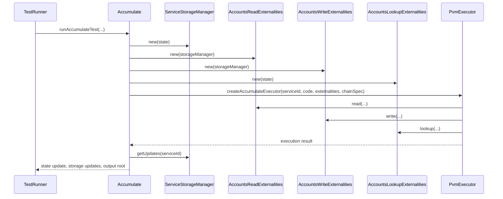

# Accumulate externalities implementation

## Pull Request by @mateuszsikora

This PR introduces implementation of read, write and lookup host call externalities and reenable tests that were disabled in this PR: https://github.com/FluffyLabs/typeberry/pull/446

Changes from this PR allows to correctly add a service to state. Unfortunately it looks that balance of the new service is incorrect. I will fix it in a next PR.


## Comment by @coderabbitai[bot]

<!-- This is an auto-generated comment: summarize by coderabbit.ai -->
<!-- This is an auto-generated comment: skip review by coderabbit.ai -->

> [!IMPORTANT]
> ## Review skipped
> 
> Auto incremental reviews are disabled on this repository.
> 
> Please check the settings in the CodeRabbit UI or the `.coderabbit.yaml` file in this repository. To trigger a single review, invoke the `@coderabbitai review` command.
> 
> You can disable this status message by setting the `reviews.review_status` to `false` in the CodeRabbit configuration file.

<!-- end of auto-generated comment: skip review by coderabbit.ai -->
<!-- walkthrough_start -->

<details>
<summary>📝 Walkthrough</summary>

## Summary by CodeRabbit

* **New Features**
  * Introduced comprehensive storage management for services, including accumulation, reading, writing, and update tracking.
  * Implemented and tested externalities for account lookup, reading, and writing, enhancing state transition capabilities.
  * Added detailed tests for service storage management and externalities to ensure correct behavior.

* **Bug Fixes**
  * Enabled previously skipped state transition tests to improve test coverage.

* **Refactor**
  * Updated internal handler storage to use a map for improved handler management.
  * Enhanced state update objects to include detailed storage updates.

* **Style**
  * Minor formatting improvements for code readability.
## Walkthrough

The changes implement and test a comprehensive storage accumulation subsystem for services. They introduce new classes for managing per-service storage, update the accumulation transition flow to use these classes, and fully implement and test externalities for reading, writing, and looking up storage. Several previously unimplemented methods are now functional, and related tests are expanded or enabled.

## Changes

| File(s)                                                                                       | Change Summary                                                                                                   |
|----------------------------------------------------------------------------------------------|-----------------------------------------------------------------------------------------------------------------|
| `packages/jam/transition/accumulate/externalities/accumulate-service-storage.ts`,<br>`...accumulate-service-storage.test.ts` | Introduced and tested `AccumulateServiceStorage` and `ServiceStorageManager` classes for per-service storage management and update tracking. |
| `packages/jam/transition/accumulate/externalities/accounts-read-externalities.ts`,<br>`...accounts-read-externalities.test.ts` | Implemented and thoroughly tested `AccountsReadExternalities` for reading service storage.                      |
| `packages/jam/transition/accumulate/externalities/accounts-write-externalities.ts`,<br>`...accounts-write-externalities.test.ts` | Implemented and thoroughly tested `AccountsWriteExternalities` for writing, snapshot reading, and storage fullness checks. |
| `packages/jam/transition/accumulate/externalities/accounts-lookup-externalities.ts`,<br>`...accounts-lookup-externalities.test.ts` | Implemented and tested `AccountsLookupExternalities` for service preimage lookup.                               |
| `packages/jam/transition/accumulate/accumulate.ts`                                           | Integrated `ServiceStorageManager` into the accumulation transition, passing it to externalities and capturing storage updates. |
| `packages/jam/transition/accumulate/pvm-executor.ts`                                         | Updated `PvmExecutor` to require `serviceId` and propagate it to host call handlers.                            |
| `packages/jam/pvm-host-calls/host-calls-manager.ts`                                          | Changed host call handler storage from array to `Map` for keyed handler retrieval and safer management.          |
| `packages/jam/jam-host-calls/externalities/state-update.ts`                                  | Added `storage` property to `AccumulationStateUpdate` and included it in service updates.                       |
| `bin/test-runner/w3f/accumulate.ts`                                                          | Enabled and completed the accumulation test runner logic, including assertions and state checks.                 |
| `packages/jam/transition/accumulate/accumulate.test.ts`                                      | Enabled a previously skipped test for state transition correctness.                                              |
| `packages/jam/transition/accumulate/operand.ts`                                              | Added a blank line before a private constructor; no logic changes.                                               |

## Sequence Diagram(s)



## Poem

> In burrows deep, with bytes I play,  
> New storage rules now lead the way.  
> Each service keeps its own small chest,  
> With reads and writes and all the rest.  
> Tests now hop and storage grows—  
> A rabbit’s code, where progress shows!  
> 🐇✨

</details>

<!-- walkthrough_end -->
<!-- internal state start -->


<!-- DwQgtGAEAqAWCWBnSTIEMB26CuAXA9mAOYCmGJATmriQCaQDG+Ats2bgFyQAOFk+AIwBWJBrngA3EsgEBPRvlqU0AgfFwA6NPEgQAfACgjoCEYDEZyAAUASpETZWaCrKNxU3bABsvkCiQBHbGlcABpIcVwvOkgAIgBBBgZHb2oSSBIADxoKDDQvdXhpFGZuaLYMXGp4fAxQ2MgAdzRkBwFmdRp6OQjYdOxESkhmNIGAL0R4AGt8KnRkW0gMRwEhgBYAVgBGfixcPsgAMS9sADNT2QAZFUQAelxZbhJVihc/Em58SYIXDRgDkbwLCeCifQb8U69dKLVAEFCVCiKbAMdL7dLwUrldjVWoQ95oWjhRoUdQkcKYehefD4KbYbiQWBfXCMfK+LI5PIFcTSP7xWi0Qq1VmycLqd5kFTRZA0RC4aWwahNSjpXgkCQ1AZeeQCxCSmJA6x2ZbMF6QNZrABsfzg6QYCowpGQIyU8N6qEWEoE0ShCleomZBIF4lx+EhaHslHVKIi+B9srSfwAEvhGmrKOE0ZABPlMNHQz7yI0teh+TFBhQo+k0Nwns5pbHVvCmH6xOSMPRM2g8Iy+GVMPWS7R/Ih5agkA50Vhw21BkF2IbrQdPD53nPZSysI31SRU/RFbBcLhuIgOLdbkR1LBsAINExmLdjmcLtcBHcHk8Xi5bsuvLdNlsNCMfRjHAKAyHofMuwIYgyGULoFFYdguF4fhhH9SRih6JglCoVR1C0HRgJMKB3GQVBMBwaDSHIKh4LvCpOD8NBGnsRwRjeLDFGUPDNG0XQwEMEDTAMNQMHuEIwAobAMBo25GgAZlOW40CSFIvATOUOAMWIdIMCxIHiABJGCaLSegHCcN58ztTBHTcA4bIdYogVwRFaGRKssAxT4KGZfNMwAAxactcAC4YkW9U5EWYSAADkuI0IRkApQcfW82Y/MhAKlA+ABRIJ8jCqKWEgAKAAF32eSgvzweAvEQALF3SCRnHgPVSoAfXYRFuFkMLUH8PI2A7WMAu6/BerClKBhiLIyngBh1GLFoeGcTK0owTxmThQKVOSZhUhoDRXP7QUMDCth9kUJqeH8dV8E1eR6PYOgwAe5kGFZGNSr2tSNKoDBvhqc6UGQDAU3QMQMLbeh1GQYdvGZVBZVmfUp1KhGvFCyAWpJPUbuw9JwZYu1RCmMissxzQkFy15Zim9sWR8ZAgpHShNFObQvDCxpL3QLBqtmYZpF1UgUEhTMTsBs7IE5uq6Bu+MaEgOlaDSUH0BrAoYmkph2zO4V0FOHIfUFvhSYYKY/kOIFhQzByuJ4ShTlmZhkBy+lAmwfJ1CevpLZkEhcFTMgfVVsz7CqZWUszOb/RiMFcDAJWyX57og5DvYDipoEiD8akA0Z2PMieMQYnerb8/wMJ3j7RaHVutUNUQYtnsqV73vmELgcQG78CkKgV1OKkWOJ2XvGLLJRDwYpO1Ug71ODPYAaB2pwhago1ZlVikhF8ktaKeV0hTlXuC31OUoH+BTkPn0b85SP1ZSiu8CrzQjHMSx4ixuCe++zMlAMHUrRP++Y5oZXLr2a8BQGAZEqIUaQQEji6yXvYeARA8i4GwP4FWGBHKkFoFwMaJcMrzFkHg8eeDUFSQwIkfah0SDQBCAAChlIxOhf0aBMNlOEbg1BYBcFlCSB0ABKfqWAAqiXErKSS0lZIKSUr9BeGkGqQGYacFBwMsyKHkMwRQ18ijdFfpMDB1BsHpH8ICQGcY0BsBEdpXSBgIBgCMHwy2aBHS3CELYrxtiwCMhkZ9Zmtx2SUE5Agu4KcwDhyOppBxsQ9Jf2MtROCZY2LOHkNZe0dkDA2lKhw5RS8ADKUcSAAFUz5pDCkA4KTQVqhPbDEOEQIgHYBdOGQsPBoELVuhNdm8gAooyoKQMK/lHjpAChU8+JTZgeJIAAbQALoBVFBgQoPsxgxBWhREgpQHjoFeGgWQfwADCsxhyfH1g6LU9sJkuXwEUyMC1pBTKqcLK69BmhOn0TfJpsZ/BYNyG6FmQy5lTUOfIFafDfJ4kzDnBuAVHkVmeYgV5NBRloTEPCWUJACR4h2XsyFELeT8gNj4EUaVSikJTgxOpyAYl/KbCcF0gU0UkBmcMkgYVKqy2ij6cqlVPyyFuCnMKbiphzMAokgyP8QG1AHAA0QwCcTWLASQ3ykCuleh6ewCJSC+RKHoJ4bVsDeB9N8gM0FpAuBso5XMpZ3LYw1JHPk+eh1gYlLSGy8RpVxVzLuN4+8gb/FMjAEE+qITshhJ9tySJpTomVNiQ1JxkAACyPzDHvMZPQAK9ykWVlRYmkgrCMTSCpIxaApainlpEVwfNKLvWumdSzAp7raiepoI2g0AU/WeMDb45gIbAmsjuKE3IMbD4ivjQy46qjml4OZRMq1JAuD7CQBoZdPq4VB2weQCCmKkaAxoHiyCAtCUHKoMc+JQFhK9ukAO78EhB0BKTuGu4L6w0jrACMPIpAKCzq0jpBJ+kjImVSeZdJVlIT4MQbkg4AVkyyhOSO1NmA5kUGqepEcAByMi7dx2+GXbLIWL6ma+HtLQaIFBkBfMYNkmIxUYoUWcJe764YAqoe4GFKYJBZAxB6AhpkyGfCGUaZkRq/xbTytcsiH4SwIYzRZpxjdQcGY5uU6QbGQIcUnrDBC+EShMi5zY/yNOdGybEb4FkJA4gG4Uao4gcIZAHDCLzuDfgA9iSkmQPgVS/7JMoByCqjzQwvr2coHh0qgxcD1pRIZWgPMVoMpGoF1JIW+AcerBoDewREDMLEdi49EEJYHBY0cyAAp/BiC1DdAKmmLpB2zfJliAKSRpmQOF6jOM2qlQ06ppofNwycx8NmS2bHSodBHLnMKnXwj+DrsZzMqp7oDAveVoEhnIYohHE1cEMHvkCguD6Le04ZNiHMWZvaItVqHjCcgF2fBSPhoZBSBzA2rqv3yDkRbBwx0P3iFYQy/A+CrAVPdf9H9pXfyC0vBVBxAHKth3icBGqIJQJNXAyIh8kFnKPVJMQQsTGYIu/mQTSGUNob/WFSx2hrEBT1kI2TsxmEaFZy+4TXhEyvYi1wRDuAOdc/bFRpZBWBCvxctG3w3ksSVGCzBlLM1evVnETp4ra2r1QFTY1xQUWg6xZIPF5h5ZKzxbrU8uLtBa043wPABLroyf84p7+ygYVkvwg5IbZpMP0j9yGJl7g2X8i5fy41FNWuPmlU08w9nrJROGd50J2PYmrd84F9zjD9vU9O/Q67otCvwT+40PVwruK1dlfkBt6zDpAJAZvS4gwd6A0+KlqvMSSiGHKTdYvEgx0QgAevSB5JsFaJpMspk6D9HED2VtPR10ksQiy3lj9LvGk+9ymqfKmzPnISegKA3cMy3m7FkQFMeANYmkL8+oMP4RTS4GPDRS+f64r9E1sTEWIiBGTeHoLQJ15z/SPzKwt5nQNC0by68olSrDGYn5n5PD0DMK5qaAwFcYiJsZQxSBqKIEBQiJ/DxT8Boh8B6KHYLQqpw6ogL5UgXgMCrJbSOYZAlzxwQR4C0HhBCzBTsx/ypg4LOg94BZsIKDwLLCzyxhXxHaZjNhVa4DkAur+QHAnzAGoIGiBStrd6Ya1IDDGZDbwCZBoyVwpRxxlzmSlJSqfwyow5/w7Tw5KrOCkHI7qrwRCzGowKY56oGDxTkDXpOK3oqQSp9rN4rxnSd70Ld5BGcI95xK16D5gYj4QZj54j7bT50a2TOQIhIjRgdI7ilT652qkCobO4Z7aZVB4LpC8xrpZwTLcBPoqFpCiYSC+YqoNYR6yETLVHoqMBYa9z/BjhHq5jojIAMD+ARwaENziHYKDTMgnwxx9DAjsF7jJSrRUCXRDCWFSZ45M5dak50IPSVCIA2Cl65RRoEYRJqaupMDSRygADqJINABxHuXIh8Kytc6k9cecaI8AvYd0zcCxb+OQUoeG8Y8CpBtWWx5xiAlw1ItI3AtxkuxxAhtmuW30VWJAGEcYpSFW7x/oNWRgBqZKNyPoz2cIAUVgT6Bx08Pwt4gxNArRJApJyQPw/UB2BijKLSi6/Kxuzy8WU0R8i+1GAYFARAjg7AvCSJAoIx8GhMJxxCdxxxUq8Qxsyxv2OhdJQsNCdBmYnSJ8DKqEIgWKAKu6/GAy0K4g+QHaPemmppbKeWBW5E2ARADEBpXc6CayCKhYppG6PwYK/8BwDK8MQcbWUg9AjGUWHpuRlOlAReQclpRu5uBuluoecG0gM+yReGNARAI+/K2RIZJAeROe7usYc8wRwWQIdRn0qCw8KY5I5w6EdmEMf2E6xQ/g3eKWe02xzIgxtAyUjMXm28zg6QP6cye4jMjILERGPpByk4zYPkEc9yPo8KecmpRaJhUOsqthKxFW1hcqqqO+9hmqThOq8CsaSCeB+2Xpx8TpZiw4dhPkDh6OzhuqsaSo3BBIPenhziriPh/qD6ChwMoRhSJAka0psaQRrZiAYAVINIdIYAdZ9xPIbC/ekRSS0REcFk7E4+SRTkU+CZEQC+DgpIlmpxIF4JEFUJhx4SsaGg4FkJiWyAc0FIWyjMGi5KJQZQuyL0tAfwVgnxD0Lcj+Bw/BtQy0bMqOvQiomYl0TWtG4MSMmIrF7cg5HYsA/gLEOydM/m8UjQ5IDIJAXgTwfAGiVCWiPa82vZppDJ7ubkHkKWkwf56AEYyK0YJ8pRsAjcGI/qZm7J6RSQrZ8ILsfwqaiMZ+3o/BL+NGyog4jKoh8gmYlFdIWYJAYONQfA0kOE6JVZ4xAhQYPcXAjQ0xcYMZkAhkAAIhrMsD4ESLlZmB5ekL/sUFJfQTZuVaHEtv4K5WLDVWDNXPVTwmZjlU1UuC1SMGLNZrKJ0blCpM5cFZScUBRIUb0XiAFCCTsURZCdCUcbGjzHzM1R8L2UYU/IzOwb5PKKJQcDFfSOJTrnqbkDRZeH7qVdzMDqbAwYYaVAAEKyAygvVUgCBTReUUCilEA1YBZ6yuT4C+DlmjwQwsltLFBmq6WAF9m+an7777WIDkJ2iIjgyranVkY0Z8yqiLTggGHwRUx0HzbPE/YqhcWrZ1zxWg0pVwWQ4gYrlI5rkI42FI5qrXm7ndKwL3nY5uG1C8F5Inm9mQAFAdDwQ7SX6OwpS/7ybMhEHXyQoYDyAo43lap3kHnyBE4Xk8ivneHuJ+H3jfm1C/kd7QURLAWglgUQmQUW3kURG6RREpIxGsRxFZLJmJELVeWgnLV0irVkUPHtG1K0Zu7NIyW0qBSnWNFNaFGl6wqKUpiaFxDh5NZ1XS6yVdANBmy8gCGM4E58C0aBiMpXbcABjBlvKCA6nMhOW2V1Z64xkx3XQBYBTR1Zo65jwtBo2J2Y08XvCArWLsZvUfVfWjIZZ3VhQ9A3y8nmaWzGbXxskxmcklUTxzY7q5DGZ3Xiz2D4B/CGTbS5WtZFBSDclVUQExSVVonDF5z10xYxnRn2WxliJ70lbHz5WoB3Wihtnr3WJ3V/AADyBBvMgwX9/du63JqorVVYI4vmbU8EtdmYF4UgWACon+WYT0rIxmgyMZEZuAnFyJg1xaqDsAWgiA/9fCc4+Wz9jNX8zNFh+ZVhNSm52+9BXNaOGt+5WOsGUAuO+dcmxdhCpUDOZ2PwRupSXAVgC0UwwApp4QsQ5pMZsQeg1pWAzaBFvtttJFgFQd3ajeX5ARS8ZtIR9tk6LZ1tp1UFpF9Zvc6+Ye2usMEd2IqCAjRCXdFCp1D9Jugj+u8WkAAAPksKvS9p/lwJ9WgDxgAEwCBc6f5W6cUsBIAkDADD3SCfWCD+OBM+B6A+pqPe1nFLWaMB3WM+o9oflG33AGM/nt7GNWMwV3BmM7E23EWWPaOwWqLMKH7cXFhs3+BGLMjSQZ32mW763156P9om1t4r40AAUwlAUNNyiSSl4tOzOHy96yjwVO2IUu3IWQZoUJFYX8G4XKwPbqM7F7EEhFN1PUVoIYL36YBRCq0lx0XyXvCcwF0KzWBU08WgPA205bJoLXIqjPG01eD00L4HW2avEKgH0TLtlN2fIrTp2ONyU3SdIDyTC4guQWXbZaU6VDD6VQzyrfSqjQqeTwjfq7KzDa35W116w3wCm4TehEYpQpxOZ5DaoNx6I4KDEFCyg9KHMoh5AkhfBSpwD+BEyZFsKhU4ICP4WBRwvt2EIGAAQFXf0D0swT1NAVXwZVXL3OACm0qoABQT2AQRN71qvgOlSau9XlGri5bwRn3tXy1dWHqokJgGDyTmu+iSHFjtmdn0CXWD2RyozdBfXn15WP24bBucpat9Vv2P1mY8aPM2aisHCdJSsqzgjsaZmzKhn5GT0+EOkzUYAUtcvUsJsstZnomEtCsUrWXuoNw8s2Y9Jn3zM+WxiVu5v9DiAFBjAqq1YKvnWwwdUsRsJbKo14I91dPK30CiGZpwiBsZA3Xj0Txj2PWlwOs/D8ZfVr0LZimU1NzcXYXrj7CKhE30UZCqW9CIiNBSr/0Dysi3LoWOipRsCYC5yMUKAPtiwnPyul7wtRug5oDg64IpWHanDKiVAZVnSk0fDk37s8DAuMigvLEL60u1ADFBzpAEtLz5DHtyhLlM3mFEus0bm2Gc0QLsN7m80Hn81QDHmT7fRq3c0Y73nahkdI5cF9nPlz4IDSgL43zRA16OJvkN5lP3rjOVOm3VNpAzNrWmM+2NPtnLPydtOAabMGRD6mQOu7PxGT5e2LVyjnO0CXOwlqO0aDNsWIlwcqSoj9WHurYDPIubvXi53CP45yZF2ljNm7xl1105uco5lU6Fa9G528CSDqxDuR565ZnXNYtpGMq6gQe+t+nH3HxVsnPhhIOhzYOP2cnhCll2jGZZAohl1/wpSUEXgNxmwUz93+l4dyz1Rr0D1YOasGgOB2gsiDCdF5IBSDv2N0rMUy7wRuPo21DTtcBiiBsaurslDDRwPaUV6v2655d25GsT0ADc+BfQFAwDqcYo1ANAeyA4mmqJXb3W7G5psXL90bcyGs0kwHXM7UCBE9IioDw4oNJ930xrq7N3RGqALsyVPzI6Z3nKUbfX/7ir72E1BwE0aAc4lmMUzRvS6ohqwTzlKU03gWvpDgWMfw4JRAVXecqAM0KW821KVbR9aoDXXM5ivcNDZhv8JHDD1VHHoC25bDD11HLhh5KaJyHRpzRn+xtTsJuj4nTextUnkzhZ0zJj968zoFyncvNjDUWkkAugBk3nedIjswRC7n6xHTJILUysy6QXlAZuj9OR2ZYZFAYiBg6vUABqCcRvkX9jRC4Xxv6QV3XbnjHJ3jS9luXA1JAXd3ATE99vGvhkznMQQ7rjE7sC7ZvvFuFvXjGTn96PoT6kkT0TLQsAcT0UiTyT71qTYbYfE82TTxKkFNjcK29Kay0fRhrnIz75htEn/hp0hjMnsvIvczinCz3ZJAKngdsFa+J4A+Wzw+Oz7tE+ntBzOF2AeFJzeTIFVxpIpn61g3ROdzlQk8TzjSLz3kiIAZ0P+IvL4gsC0WsVKUELPcSY2lcNOHnBYV8X7kKIKWJLoteiY2VVdBKcdBnbMbfsn+lxr7ABC9LbBO1CBDrJCMVbFlu/QwAuw2WkoYzFywPYE1PI9AN9s6SICfspWUqUTPygH7coQgapezrX0Q62dkOYLdcETWTqxAkWLFIZtnSva0YyatnboFFUaD5kSBXAQWjjEoBK0fsiobssZlrodJagljGzPODPpFV3guPOUK6Hcyjki0//falJR25gD3iHQMUsIOuKiDBsOMH2OZHyqyCJCmJeQGalf7FA+Byg8+Km1hal4ikeQY8IyFwCXAyARAfYMQPXCh0884bWgfvjiAMDhudAZgYiD4Bwgb+OgmFlDyx4/cfARUNgpAGy5YBW2Q5XPmvWHjVk844YJQPfH4zxVgOiVewaVCQBW9Dgs3DNlxwQgsUaAKXbsjQCwBBkD8SHOmssXzJcCBCmHIAiQJEofR/YUwH0EOyjaLscs6QbMIMAghYAv+PGYwQmyBC+VIA/9cgPh34EkhfkR1CYlWw/qdVGKvgG1j6GzDqRiiZmWqL2zlwgVxyDIdBLABhg+hq4GgulloM2G3cxYAPCeLG1tZHC5q00HtvAD7aoJ8mCg0WiPF2zkERqmbdIH0DxZ6VNEzPRgFNTsqVh227lNEjMPp4GB72ygMqviUY5sCHKWCAQPhxAHOVH+QoXwBm1PYTEMQDCU/s2wv75U/+qI87nrEyryonMOhCgATWr7NhxhhQ8HCw2UJ99EAq/G4j3yDrNpCOtDYjtYlI5MNyOHPSjlzx5o886OcUJ1IxzhDMcqOKotjuuXlGccwqPBXjrCAE7yxhOCSLwqM3F76MO+VTKZv+WV5W1GmA/IftYw2bAYJ+2nUfKhT06z9euhnEUdcRpLijpAahF1LRj2EV4G+4bTpo9FwSWc5Kkca8Iq06LxBteHnIWF5zR6RDfO5dRFDGSt5m8CiPRYomFxd7KxoRcNKLrfSt5xdUiVgqymgGS7yAqeGBIjJl2SEYQJEurBLAV2oBFdqumQUrkjgq74BCexXVSrBxa4ulZuuIRruYlqxECoeY8NscUCIzqhLuMXLto8Sx64oKAxYBev9xm4JC7hDwygHtxxrBku2GgZcQg1h4UNgg6PMzCdgHaODnBn+auO4IdBeCoe1lOqM4BS6uQ0urQLMs10tbxD7qC9B7i1AAlehU4KpH+qfQ/GuCxaHg0AUGWXS1YyhWZCoQkNiGpd2srw1OFj3DAfcvAx/AKMNkGBioC+4II8dsJPHcxWCfALHtunkHzUsJOErtnhK8Ah5eQK4Idh1m5w+gbgZAPMJCCIxplbOUY6Hp3H2A3tJx4QjEaYWhxM9ZRLPfUYjnZ6sMlRjhXUbR24aQBeGOvPgC4yEbSZMxFAMRl22LEp9nkRYm3io2Doupl+oJUUSGNaaqIxerfCXhUztHScHRcnYfvU2FFgBXRyvWdAFDsYR5ExXQOPmjSaDBik+sZeyRbnCDENM+4TEgFExia3CKs1ANAKE2L6IA0mRIsvj4Hz4JNBgwAOorbgr4GhcmgYjyevx0YSIxm7faWJ3yClOiFe4U4MW6LqZRSYpsdBvglIoTtknB1YT8W4PQmwAUppuSAD40JAZ9IAYTbPnlKqmTYkmxoU0BVK8ANTVGAvNyTsRamhjvJ7Um0ZJwCnS8wiwU6xs6P74DTIptjTXANzil0AiE3EzlLxIWn+9VuW0wvgIGpDRBMAh0lyS2mFFnSvJJTDqZLxulGNZOvUsKRFPOnDTa8Volvr4Tb7wyup9omXo6POmIyaAycGMsnCzJrNNAjtT0ZpyQo6dp+z7WDKRCWCSszR3oF/h5H6IsBVQ0xSYBgQGbbRehv7eDMH0LGxczMBYy3lmWLHhjuuXraLPSnpBVj8WcIjSQiNxTKwgQpbKlkiOeTESQuxREkZoIZaQC1kxpXwCdjMxwgP+OCc9rtWVhjkTmIg5GgG0pbqgG4/3I7j1z4pCyhYeTMIiHxGRrClafQpKYUAbiWzLBnM/Ev/ixQLlz49sXQeHJyGZNfAYwirPgFqqdUo50YH0onO/p6J3ZecSOdi1ngOwWwBc/uHhwZR3CqR+If6mAyurrtGC0bGIJbKFhb0F6YkyoLVkDnW982xIzQRQAvrQtAsjcoNhvFtynEA5YsncQbOjCdipgxMVISYOKpTFFQYoMwdViipUAA4ZmLHrYLSDJR5ShdYMd7PBEKDFcMw3WQSKPkn9VQ0WLMDmENnhAiAK0MYaoPoC7Iy62tKtgKBratRpAtcvoJCiErMg7ZcVBKrMHpSTAI5JAD4BkAKhcgZ2kcEkFii9gxo/YZMFScuRlFkEtJ7NHSdqOVGsdDJmFejqzPXBHMqwWvJfqLKllzy1GPk7GX5ImbEzCZXk9haTMfrkybxcFV6XFEoUTEF+0cWhX7L7kyyIZ9uOGf5LxmBSCZ90uplwqqq8LOUlM9GSJwNosLbRci26X+UUWW0u+g/FRVhOplQ4tO4GN2r6I9oYV7IH9TIoJ0nAg0rB0oToc2iAXTy/yfcyUhIpt6PE4QQA+NsiOZZTMtE00FQdDwNCnY0gn7MgOqAxoMQpU/srxbPM5RhRxJ00hhKBPO7mpbCnY2BQDSCV6zbcuqX5BwJW5eMJM+9YYLTiqDaZ+Y7uSXNW1w5vARgNYaAlWyTYDhPZuyHzHwHT4nQ95o5P4QCK0QGg5APZRmECLuFGLslMbLUrkthwExLJ6xeENAP+FlzEy7yNBfdj5TNV+4JSuYZWCjYLDd6XtZcVF1G5Tt4xY5DsUkJSGQAk2J/TpO3NYluznISMSEJbI/oTwvWBIIQAMAUGSxd5sw/WWcP+HBYJl01KZd5RbJ/Vc4eJZzNgk3qxhyAb88QBgQ/lesqsswDsjHL9CIBLkDchZbpWCzRk/IbywuSQFQJRKvI+GB+GOTP5viCQ8LOriBNbk/5Cp4bTMBLgIzNLgYGSB6sNnqhPyxsa5KqlGywkYx3x001wd+M8GwBqcSEn0NEB/HOV8wQyNuVysXm8YHqncsMK+HYB/Bc0iAcobNzvCktuSyQP0FB2GV1QIVzjN+YUQjbHKZAz86MApOkBUDvoSgHINoPRCSTGJ48HwMas0yWklV6rFVTZnxQOijC53ElepIxGSzKwjkgeYEqdABUWKnihhN4vnnFAk2DpGQYVS9bqQxgdUJ6FNX9YshSYkMgmbmtmqGzT4uIfwGuH6YFKfQZqVHmWFKSABMAhZgKNH68LL1gpJTCdlL24Q7etulbVlhV5JVXYdsXYqqt0A9UWMJ2pKXzEouC7QiRgSMX0BHZ9y7sTfPSBFVwJG9ZGhkHPTl5t6Sg7YaWOjDDUCORgLEYPC8BPtCYKPddbZT4bmI9wNYREONTQIEyrZIK/WSeThpVVVkrSYlSMuCyXQdlpwotE/NwCDiiAUoxnsw1PIEKMNFHYSvpNIVcNyFmvNHk1IdG5ra6QktXhr3pwrKC6KUtKdSuikO8fo8fMOTQGjy5860WZAANK8ZwgJ2YqSPXSb7TAZNUuqbQGyYR8oArMRKZNJQlfi5p7GkJktO428YRNO0lYEMH2kSamNJqs1T4HywSM6JSTYGaDVxQYBtNVG0bvXMU0CJlNXbHjbIDU1F9BN5U1ORZqk1hqVBBmyALaizIOp9UWvXJr4oHnkb7GY/HTfr1o0pwJGUjGRqUjkYDrKwSjO3jpu96co/p9G+LFbnoUprYukm6LrgCjK9jMtgfHzUWit7+aMZonGRWwqMW3Bcl7YD0eYrpk+jBVNinJOmIKXegvQmAQYXvhKLbIteqwB7HZ0poRdlYkWuTFFyULwZ3Bb8hgLIHIbKB2wss3AhqOTKPluOLKTSZQQWgFdagINMGiPBYnjqSMr2YzMj0m1Cw2CKtbbkMCNIJ1bQHRNDWpIw1yjtJRLHDerW5581YM7hEgM3zE6+SdFredhY+kHRTxlS/6Mxc7Un70zrFM/WxVhSJIkklSeAemFIqu18AdagKAbYrPPgpYoa7SFmS1i9gYkjUNhJYhll7GjIJY4yLIgHyqXSwWUDsNYgXUrImwoB5s/4VgxjzMwNqoA/ZV2voCdZSBfZAbtgzvqrc/p1pfoqyHLgSI+d9UR1F3FgbqxKqs6+8VCKZA41Tk/+QlbUH+p4lL61QWBG8x+C6IJdmHNINSVpLo6M8tGRWmUsA0fAYhuXSpd8Sp1mY+ELqMUGuRR3MA7d9JDMesUXCoAYMcCFzGXOOpLpGdGsWGh4gjhwCa6l4GbekEh326o2T2MLOnndjIqG4Da40kvBe10N4RiqA0UQp3I6j8NrhHhjRrkzWRjpxJQPWjuD3MLPy103RWDsqIQ7W9swKKafAJ0mY9wJOz3VhwoBEIMtS0gPuECqpnIlAAmkvoIAymJ4fAguSjDzkgBZ4196eJZGy1ciPAbclQQzeOMWJnJzilAO3lAA7Q9Iax1uqkg6KD0Y7G9tSAPU/pLG+orpnU0HXVp72WMyS/e9fIPojiRDTMGRFiNCh+Lm9SoU+5abPpjLz6V0a0kqWVI5FeSg+Do7fV4FakeKbIQIW/KIC4AnIFQ+B0uHbyq0CQhIYERmJBHR0tb6AbcRiFQBHK6dOIOEFQGoF4iERKDxEBCBLQ6i25EAHUT4juDoAdR4wMKYCAYF4MAAGCJqcG2AAB2BgAAE5TgKhi0LQAiYkBTgDALYLQEUNoA0AGwWgCoZUAWhTgWwRQyoe2AWgtgGwDYJsFgRSHeD9EdQAIY7LCGm4oh2gF1EZj6AgAA=== -->

<!-- internal state end -->
<!-- tips_start -->

---


<details>
<summary>🪧 Tips</summary>

### Chat

There are 3 ways to chat with [CodeRabbit](https://coderabbit.ai?utm_source=oss&utm_medium=github&utm_campaign=FluffyLabs/typeberry&utm_content=451):

- Review comments: Directly reply to a review comment made by CodeRabbit. Example:
  - `I pushed a fix in commit <commit_id>, please review it.`
  - `Explain this complex logic.`
  - `Open a follow-up GitHub issue for this discussion.`
- Files and specific lines of code (under the "Files changed" tab): Tag `@coderabbitai` in a new review comment at the desired location with your query. Examples:
  - `@coderabbitai explain this code block.`
  -	`@coderabbitai modularize this function.`
- PR comments: Tag `@coderabbitai` in a new PR comment to ask questions about the PR branch. For the best results, please provide a very specific query, as very limited context is provided in this mode. Examples:
  - `@coderabbitai gather interesting stats about this repository and render them as a table. Additionally, render a pie chart showing the language distribution in the codebase.`
  - `@coderabbitai read src/utils.ts and explain its main purpose.`
  - `@coderabbitai read the files in the src/scheduler package and generate a class diagram using mermaid and a README in the markdown format.`
  - `@coderabbitai help me debug CodeRabbit configuration file.`

### Support

Need help? Create a ticket on our [support page](https://www.coderabbit.ai/contact-us/support) for assistance with any issues or questions.

Note: Be mindful of the bot's finite context window. It's strongly recommended to break down tasks such as reading entire modules into smaller chunks. For a focused discussion, use review comments to chat about specific files and their changes, instead of using the PR comments.

### CodeRabbit Commands (Invoked using PR comments)

- `@coderabbitai pause` to pause the reviews on a PR.
- `@coderabbitai resume` to resume the paused reviews.
- `@coderabbitai review` to trigger an incremental review. This is useful when automatic reviews are disabled for the repository.
- `@coderabbitai full review` to do a full review from scratch and review all the files again.
- `@coderabbitai summary` to regenerate the summary of the PR.
- `@coderabbitai generate sequence diagram` to generate a sequence diagram of the changes in this PR.
- `@coderabbitai resolve` resolve all the CodeRabbit review comments.
- `@coderabbitai configuration` to show the current CodeRabbit configuration for the repository.
- `@coderabbitai help` to get help.

### Other keywords and placeholders

- Add `@coderabbitai ignore` anywhere in the PR description to prevent this PR from being reviewed.
- Add `@coderabbitai summary` to generate the high-level summary at a specific location in the PR description.
- Add `@coderabbitai` anywhere in the PR title to generate the title automatically.

### Documentation and Community

- Visit our [Documentation](https://docs.coderabbit.ai) for detailed information on how to use CodeRabbit.
- Join our [Discord Community](http://discord.gg/coderabbit) to get help, request features, and share feedback.
- Follow us on [X/Twitter](https://twitter.com/coderabbitai) for updates and announcements.

</details>

<!-- tips_end -->


## Comment by @tomusdrw

@coderabbitai Please gather all unresolved discussions in this PR and make it into an issue with subtasks.


## Comment by @coderabbitai[bot]

<!-- This is an auto-generated reply by CodeRabbit -->
> [!TIP]
> For best results, initiate chat on the files or code changes.

<details>
<summary>🧩 Analysis chain</summary>

I'll gather all unresolved discussions from this PR and create an issue with subtasks.

---

🏁 Script executed:
```
#!/bin/bash
# Get all review comments and discussions from the PR
echo "=== Getting PR review comments ==="
gh pr view 451 --json reviews,comments,reviewRequests --jq '.reviews[] | select(.state == "COMMENTED" or .state == "CHANGES_REQUESTED") | {author: .author.login, state: .state, body: .body, submittedAt: .submittedAt}'

echo -e "\n=== Getting PR comments ==="
gh pr view 451 --json comments --jq '.comments[] | {author: .author.login, body: .body, createdAt: .createdAt}'

echo -e "\n=== Getting review threads ==="
gh api graphql -f query='
query($owner: String!, $repo: String!, $number: Int!) {
  repository(owner: $owner, name: $repo) {
    pullRequest(number: $number) {
      reviewThreads(first: 100) {
        nodes {
          isResolved
          comments(first: 100) {
            nodes {
              author {
                login
              }
              body
              createdAt
            }
          }
        }
      }
    }
  }
}' -f owner=FluffyLabs -f repo=typeberry -f number=451
```

Length of output: 89023

---

Let me fix the GraphQL query and gather the unresolved discussions properly.

---

🏁 Script executed:
```
#!/bin/bash
# Fix the GraphQL query to pass number as integer
echo "=== Getting review threads with corrected query ==="
gh api graphql -f query='
query($owner: String!, $repo: String!, $number: Int!) {
  repository(owner: $owner, name: $repo) {
    pullRequest(number: $number) {
      reviewThreads(first: 100) {
        nodes {
          isResolved
          comments(first: 100) {
            nodes {
              author {
                login
              }
              body
              createdAt
            }
          }
        }
      }
    }
  }
}' -f owner=FluffyLabs -f repo=typeberry -F number=451

echo -e "\n=== Getting specific review comments that need resolution ==="
# Get review comments with their resolution status
gh pr view 451 --json reviews --jq '.reviews[] | select(.state == "CHANGES_REQUESTED" or .state == "COMMENTED") | {author: .author.login, state: .state, body: .body, submittedAt: .submittedAt}'
```

Length of output: 69586

---

Now I can see the unresolved discussions. Based on the GraphQL query results, I found several unresolved review threads and general feedback that needs to be addressed. Let me create a comprehensive issue with subtasks.

---

🏁 Script executed:
```
#!/bin/bash
# Create a GitHub issue with subtasks for unresolved discussions
gh issue create \
  --title "Address unresolved discussions from PR #451 - Accumulate externalities implementation" \
  --body "# Unresolved discussions from PR #451

This issue tracks the unresolved discussions and feedback from PR #451 (Accumulate externalities implementation).

**Reference PR:** https://github.com/FluffyLabs/typeberry/pull/451
**Original request:** https://github.com/FluffyLabs/typeberry/pull/451#issuecomment-2293887393

## Major architectural improvements needed

### 1. Interface design and abstraction improvements
- [ ] **Add CurrentServiceNewBalanceProvider interface** - tomusdrw suggested adding this interface to handle balance updates during accumulation:
  \`\`\`typescript
  /**
   * During accumulation, the balance of currently accumulated service may change (transfers, etc).
   * That info is stored in \`PartialState\`, yet we need the most recent balance here as well.
   * The abstraction is introduced to avoid depending directly on \`PartialState\` (because it makes no sense outside of accumulation).
   */
  interface CurrentServiceNewBalanceProvider {
    getNewBalance(): U64 | null;
  }
  \`\`\`

### 2. Service state reflection improvements  
- [ ] **Reflect new balance and storage entries for current service** - The system should reflect updated balance and storage entries when the current service is requested
- [ ] **Return preimages provided using \`providePreimage\`** - The lookup functionality should return preimages provided using \`providePreimage\` for the currently accumulated service

### 3. Better abstraction for PartialState integration
- [ ] **Consider returning entire Service instead of just balance** - tomusdrw suggested having a custom function that returns the entire \`Service\` instead of just the balance, which might be less error prone
- [ ] **Evaluate extending PartialState** - Consider extending \`PartialState\` and using the extended version in all places during accumulation, or create an issue to figure out better abstraction in the future

## Code quality improvements

### 4. Test improvements
- [ ] **Change test descriptions from 'it' to 'check'** - Update test method calls as suggested in review
- [ ] **Add safety comment for Number conversion** - Add explanation comment for \`Number(this.entrypoint)\` conversion in \`packages/jam/transition/accumulate/pvm-executor.ts\`

### 5. Minor code quality fixes
- [ ] **Verify large balance values in tests** - Review if \`2 ** 32\` balance values in tests are appropriate or should use more realistic values
- [ ] **Update test descriptions** - Change \"should not be implemented yet\" to \"should return null for snapshot length\" to match actual implementation
- [ ] **Consider more realistic test values** - Review test balance and utilization values for better test clarity

## General feedback to address

**From tomusdrw's review:**
> I feel like there is quite some room for improvement.
> 
> General thoughts:
> 1. I reckon the externalities are spread too thin (we have read, write, info, lookup) that have very similar logic and because of that read/write just delegate to a more abstract \`StorageManager\`.
> 2. AFAICT we need to distinguish better the context where \`read/write\` are being used. In case of \`accumulate\` we are pretty much focused on a single service and there might be multiple changes to that service (for instance \`balance\`) that may be affecting \`read/write\`. In case of \`refine/is_authorized\` storage changes are possible, but I guess they are not translated into \`StateUpdate\` and we also know that other things about the account do not change.
> 3. We should alter \`write-externalities\` interface to have the current service id be implicit. Otherwise we are unnecessarily handling cases where potentially some other services are being modified which is not necessary.

### 6. Architectural refactoring (follow-up work)
- [ ] **Consolidate externalities classes** - Consider reducing the separation between read, write, info, and lookup externalities since they share similar logic
- [ ] **Improve context distinction** - Better distinguish between accumulate context vs refine/is_authorized context usage
- [ ] **Make current service ID implicit** - Alter write-externalities interface to have the current service ID be implicit rather than explicit parameter

---

## Priority
**High** - These improvements affect the core accumulation functionality and should be addressed before the feature is considered complete.

## Effort Estimation
- Interface improvements: **Medium** (2-3 days)
- Code quality fixes: **Low** (1 day)  
- Architectural refactoring: **High** (1-2 weeks)

/cc @tomusdrw @mateuszsikora" \
  --assignee tomusdrw
```

Length of output: 4735

---


</details>

@tomusdrw I've successfully gathered all unresolved discussions from PR #451 and created a comprehensive issue with subtasks: **Issue #462**.

The issue organizes the feedback into several key areas:

## **Major Unresolved Items Captured:**

**🏗️ Architectural Improvements:**
- Adding the `CurrentServiceNewBalanceProvider` interface you suggested
- Reflecting new balance and storage entries for current service
- Returning preimages provided using `providePreimage`
- Better abstraction for PartialState integration

**🔧 Code Quality Fixes:**
- Test method updates (it → check)
- Safety comments for Number conversions
- Test value improvements and description updates

**📐 High-Level Architectural Feedback:**
- Your comprehensive review about externalities being "spread too thin"
- Need to distinguish accumulate vs refine/is_authorized contexts
- Making current service ID implicit in write-externalities interface

## **Issue Details:**
- **Issue #462**: https://github.com/FluffyLabs/typeberry/issues/462
- **Assigned to**: @tomusdrw
- **Priority**: High
- **Effort Estimates**: Provided for each category
- **References**: Links back to original PR and specific comments

The issue includes 12 actionable subtasks with checkboxes for tracking progress, complete with code snippets and context from the original discussions. This should provide a clear roadmap for addressing all remaining concerns before the accumulate externalities implementation is considered complete.

🐰✨

*Feeling organized and thorough about capturing all those important discussions!*

```
   /|   /|   
  (  ^.^  )
   \_) (_/ 
    📋✅
```

---

<details>
<summary>🧠 Learnings used</summary>

```
Learnt from: tomusdrw
PR: FluffyLabs/typeberry#390
File: packages/jam/jam-host-calls/fetch.ts:220-226
Timestamp: 2025-05-16T16:23:08.685Z
Learning: In the typeberry codebase, host call (HC) implementations define a gas cost but don't need to explicitly consume gas in their execute() methods. Gas accounting is handled outside of the host call implementation.
```

</details>


## Comment by @github-actions[bot]


| File | Benchmark | Error |
|------|-----------|-------|
| [bytes/hex-to.ts[0]](../blob/9c1c856d60e8d670dba55db3878cd4f3c4576f62//_work/typeberry-runner-2/typeberry/typeberry/benchmarks/bytes/hex-to.ts) | number toString + padding |  Significant speed difference: (current) "260930.06 (4.22410119117645) ±0.22%" vs "333242.3 (4.4714148005541) ± 0.1%" (previous) |


<details>
<summary>View all</summary>

| File | Benchmark | Ops |  |
|------|-----------|-----|--|
| [bytes/hex-from.ts[0]](../blob/9c1c856d60e8d670dba55db3878cd4f3c4576f62//_work/typeberry-runner-2/typeberry/typeberry/benchmarks/bytes/hex-from.ts) | parse hex using `Number` with NaN checking | 135939.07 ±0.1% | 84.55% slower |
| [bytes/hex-from.ts[1]](../blob/9c1c856d60e8d670dba55db3878cd4f3c4576f62//_work/typeberry-runner-2/typeberry/typeberry/benchmarks/bytes/hex-from.ts) | parse hex from char codes | 879623.17 ±0.19% | fastest ✅ |
| [bytes/hex-from.ts[2]](../blob/9c1c856d60e8d670dba55db3878cd4f3c4576f62//_work/typeberry-runner-2/typeberry/typeberry/benchmarks/bytes/hex-from.ts) | parse hex from string nibbles | 537676.75 ±0.23% | 38.87% slower |
| [codec/encoding.ts[0]](../blob/9c1c856d60e8d670dba55db3878cd4f3c4576f62//_work/typeberry-runner-2/typeberry/typeberry/benchmarks/codec/encoding.ts) | manual encode | 3154180.9 ±0.27% | 18.26% slower |
| [codec/encoding.ts[1]](../blob/9c1c856d60e8d670dba55db3878cd4f3c4576f62//_work/typeberry-runner-2/typeberry/typeberry/benchmarks/codec/encoding.ts) | int32array encode | 3741021.49 ±0.69% | 3.05% slower |
| [codec/encoding.ts[2]](../blob/9c1c856d60e8d670dba55db3878cd4f3c4576f62//_work/typeberry-runner-2/typeberry/typeberry/benchmarks/codec/encoding.ts) | dataview encode | 3858785.53 ±0.22% | fastest ✅ |
| [hash/index.ts[0]](../blob/9c1c856d60e8d670dba55db3878cd4f3c4576f62//_work/typeberry-runner-2/typeberry/typeberry/benchmarks/hash/index.ts) | hash with numeric representation | 193.08 ±0.67% | 25.79% slower |
| [hash/index.ts[1]](../blob/9c1c856d60e8d670dba55db3878cd4f3c4576f62//_work/typeberry-runner-2/typeberry/typeberry/benchmarks/hash/index.ts) | hash with string representation | 120.08 ±0.16% | 53.85% slower |
| [hash/index.ts[2]](../blob/9c1c856d60e8d670dba55db3878cd4f3c4576f62//_work/typeberry-runner-2/typeberry/typeberry/benchmarks/hash/index.ts) | hash with symbol representation | 179.54 ±0.08% | 31% slower |
| [hash/index.ts[3]](../blob/9c1c856d60e8d670dba55db3878cd4f3c4576f62//_work/typeberry-runner-2/typeberry/typeberry/benchmarks/hash/index.ts) | hash with uint8 representation | 161.97 ±0.04% | 37.75% slower |
| [hash/index.ts[4]](../blob/9c1c856d60e8d670dba55db3878cd4f3c4576f62//_work/typeberry-runner-2/typeberry/typeberry/benchmarks/hash/index.ts) | hash with packed representation | 260.19 ±0.03% | fastest ✅ |
| [hash/index.ts[5]](../blob/9c1c856d60e8d670dba55db3878cd4f3c4576f62//_work/typeberry-runner-2/typeberry/typeberry/benchmarks/hash/index.ts) | hash with bigint representation | 166.88 ±0.93% | 35.86% slower |
| [hash/index.ts[6]](../blob/9c1c856d60e8d670dba55db3878cd4f3c4576f62//_work/typeberry-runner-2/typeberry/typeberry/benchmarks/hash/index.ts) | hash with uint32 representation | 204.14 ±0.07% | 21.54% slower |
| [logger/index.ts[0]](../blob/9c1c856d60e8d670dba55db3878cd4f3c4576f62//_work/typeberry-runner-2/typeberry/typeberry/benchmarks/logger/index.ts) | console.log with string concat | 9000797.13 ±28.41% | fastest ✅ |
| [logger/index.ts[1]](../blob/9c1c856d60e8d670dba55db3878cd4f3c4576f62//_work/typeberry-runner-2/typeberry/typeberry/benchmarks/logger/index.ts) | console.log with args | 60871.12 ±55.9% | 99.32% slower |
| [codec/bigint.compare.ts[0]](../blob/9c1c856d60e8d670dba55db3878cd4f3c4576f62//_work/typeberry-runner-2/typeberry/typeberry/benchmarks/codec/bigint.compare.ts) | compare custom | 256990851.62 ±6.68% | 3.92% slower |
| [codec/bigint.compare.ts[1]](../blob/9c1c856d60e8d670dba55db3878cd4f3c4576f62//_work/typeberry-runner-2/typeberry/typeberry/benchmarks/codec/bigint.compare.ts) | compare bigint | 267475087.67 ±6.2% | fastest ✅ |
| [bytes/hex-to.ts[0]](../blob/9c1c856d60e8d670dba55db3878cd4f3c4576f62//_work/typeberry-runner-2/typeberry/typeberry/benchmarks/bytes/hex-to.ts) | number toString + padding | 260930.06 ±0.22% | fastest ✅ |
| [bytes/hex-to.ts[1]](../blob/9c1c856d60e8d670dba55db3878cd4f3c4576f62//_work/typeberry-runner-2/typeberry/typeberry/benchmarks/bytes/hex-to.ts) | manual | 14623.64 ±0.36% | 94.4% slower |
| [collections/map-set.ts[0]](../blob/9c1c856d60e8d670dba55db3878cd4f3c4576f62//_work/typeberry-runner-2/typeberry/typeberry/benchmarks/collections/map-set.ts) | 2 gets + conditional set | 111699.41 ±0.08% | fastest ✅ |
| [collections/map-set.ts[1]](../blob/9c1c856d60e8d670dba55db3878cd4f3c4576f62//_work/typeberry-runner-2/typeberry/typeberry/benchmarks/collections/map-set.ts) | 1 get 1 set | 61739.37 ±0% | 44.73% slower |
| [codec/bigint.decode.ts[0]](../blob/9c1c856d60e8d670dba55db3878cd4f3c4576f62//_work/typeberry-runner-2/typeberry/typeberry/benchmarks/codec/bigint.decode.ts) | decode custom | 222813592.1 ±4.05% | fastest ✅ |
| [codec/bigint.decode.ts[1]](../blob/9c1c856d60e8d670dba55db3878cd4f3c4576f62//_work/typeberry-runner-2/typeberry/typeberry/benchmarks/codec/bigint.decode.ts) | decode bigint | 88879158.05 ±1.79% | 60.11% slower |
| [codec/decoding.ts[0]](../blob/9c1c856d60e8d670dba55db3878cd4f3c4576f62//_work/typeberry-runner-2/typeberry/typeberry/benchmarks/codec/decoding.ts) | manual decode | 17132196.32 ±0.42% | 91.3% slower |
| [codec/decoding.ts[1]](../blob/9c1c856d60e8d670dba55db3878cd4f3c4576f62//_work/typeberry-runner-2/typeberry/typeberry/benchmarks/codec/decoding.ts) | int32array decode | 196402614.15 ±5.19% | 0.31% slower |
| [codec/decoding.ts[2]](../blob/9c1c856d60e8d670dba55db3878cd4f3c4576f62//_work/typeberry-runner-2/typeberry/typeberry/benchmarks/codec/decoding.ts) | dataview decode | 197013302.02 ±4.74% | fastest ✅ |
| [math/switch.ts[0]](../blob/9c1c856d60e8d670dba55db3878cd4f3c4576f62//_work/typeberry-runner-2/typeberry/typeberry/benchmarks/math/switch.ts) | switch | 261619597.49 ±6.52% | 2.34% slower |
| [math/switch.ts[1]](../blob/9c1c856d60e8d670dba55db3878cd4f3c4576f62//_work/typeberry-runner-2/typeberry/typeberry/benchmarks/math/switch.ts) | if | 267896379.35 ±6.1% | fastest ✅ |
| [math/count-bits-u64.ts[0]](../blob/9c1c856d60e8d670dba55db3878cd4f3c4576f62//_work/typeberry-runner-2/typeberry/typeberry/benchmarks/math/count-bits-u64.ts) | standard method | 1208860.58 ±0.29% | 86.38% slower |
| [math/count-bits-u64.ts[1]](../blob/9c1c856d60e8d670dba55db3878cd4f3c4576f62//_work/typeberry-runner-2/typeberry/typeberry/benchmarks/math/count-bits-u64.ts) | magic | 8873468.76 ±0.38% | fastest ✅ |
| [math/add_one_overflow.ts[0]](../blob/9c1c856d60e8d670dba55db3878cd4f3c4576f62//_work/typeberry-runner-2/typeberry/typeberry/benchmarks/math/add_one_overflow.ts) | add and take modulus | 258798793.02 ±7.09% | 4.76% slower |
| [math/add_one_overflow.ts[1]](../blob/9c1c856d60e8d670dba55db3878cd4f3c4576f62//_work/typeberry-runner-2/typeberry/typeberry/benchmarks/math/add_one_overflow.ts) | condition before calculation | 271725187.55 ±4.17% | fastest ✅ |
| [math/count-bits-u32.ts[0]](../blob/9c1c856d60e8d670dba55db3878cd4f3c4576f62//_work/typeberry-runner-2/typeberry/typeberry/benchmarks/math/count-bits-u32.ts) | standard method | 101860158.42 ±1.63% | 61.31% slower |
| [math/count-bits-u32.ts[1]](../blob/9c1c856d60e8d670dba55db3878cd4f3c4576f62//_work/typeberry-runner-2/typeberry/typeberry/benchmarks/math/count-bits-u32.ts) | magic | 263242817.23 ±5.66% | fastest ✅ |
| [math/mul_overflow.ts[0]](../blob/9c1c856d60e8d670dba55db3878cd4f3c4576f62//_work/typeberry-runner-2/typeberry/typeberry/benchmarks/math/mul_overflow.ts) | multiply and bring back to u32 | 263852667.51 ±7.76% | 1.93% slower |
| [math/mul_overflow.ts[1]](../blob/9c1c856d60e8d670dba55db3878cd4f3c4576f62//_work/typeberry-runner-2/typeberry/typeberry/benchmarks/math/mul_overflow.ts) | multiply and take modulus | 269042067.13 ±5.62% | fastest ✅ |
| [codec/view_vs_object.ts[0]](../blob/9c1c856d60e8d670dba55db3878cd4f3c4576f62//_work/typeberry-runner-2/typeberry/typeberry/benchmarks/codec/view_vs_object.ts) | Get the first field from Decoded | 46188.1 ±110.47% | 89.72% slower |
| [codec/view_vs_object.ts[1]](../blob/9c1c856d60e8d670dba55db3878cd4f3c4576f62//_work/typeberry-runner-2/typeberry/typeberry/benchmarks/codec/view_vs_object.ts) | Get the first field from View | 91859.14 ±0.21% | 79.56% slower |
| [codec/view_vs_object.ts[2]](../blob/9c1c856d60e8d670dba55db3878cd4f3c4576f62//_work/typeberry-runner-2/typeberry/typeberry/benchmarks/codec/view_vs_object.ts) | Get the first field as view from View | 101672.29 ±1.02% | 77.37% slower |
| [codec/view_vs_object.ts[3]](../blob/9c1c856d60e8d670dba55db3878cd4f3c4576f62//_work/typeberry-runner-2/typeberry/typeberry/benchmarks/codec/view_vs_object.ts) | Get two fields from Decoded | 447643.31 ±0.22% | 0.37% slower |
| [codec/view_vs_object.ts[4]](../blob/9c1c856d60e8d670dba55db3878cd4f3c4576f62//_work/typeberry-runner-2/typeberry/typeberry/benchmarks/codec/view_vs_object.ts) | Get two fields from View | 82919.22 ±0.08% | 81.55% slower |
| [codec/view_vs_object.ts[5]](../blob/9c1c856d60e8d670dba55db3878cd4f3c4576f62//_work/typeberry-runner-2/typeberry/typeberry/benchmarks/codec/view_vs_object.ts) | Get two fields from materialized from View | 173281.94 ±0.15% | 61.43% slower |
| [codec/view_vs_object.ts[6]](../blob/9c1c856d60e8d670dba55db3878cd4f3c4576f62//_work/typeberry-runner-2/typeberry/typeberry/benchmarks/codec/view_vs_object.ts) | Get two fields as views from View | 82689.13 ±0.21% | 81.6% slower |
| [codec/view_vs_object.ts[7]](../blob/9c1c856d60e8d670dba55db3878cd4f3c4576f62//_work/typeberry-runner-2/typeberry/typeberry/benchmarks/codec/view_vs_object.ts) | Get only third field from Decoded | 449310.58 ±0.23% | fastest ✅ |
| [codec/view_vs_object.ts[8]](../blob/9c1c856d60e8d670dba55db3878cd4f3c4576f62//_work/typeberry-runner-2/typeberry/typeberry/benchmarks/codec/view_vs_object.ts) | Get only third field from View | 103852.15 ±0.11% | 76.89% slower |
| [codec/view_vs_object.ts[9]](../blob/9c1c856d60e8d670dba55db3878cd4f3c4576f62//_work/typeberry-runner-2/typeberry/typeberry/benchmarks/codec/view_vs_object.ts) | Get only third field as view from View | 103617.56 ±0.09% | 76.94% slower |
| [codec/view_vs_collection.ts[0]](../blob/9c1c856d60e8d670dba55db3878cd4f3c4576f62//_work/typeberry-runner-2/typeberry/typeberry/benchmarks/codec/view_vs_collection.ts) | Get first element from Decoded | 27736.66 ±0.22% | 59.09% slower |
| [codec/view_vs_collection.ts[1]](../blob/9c1c856d60e8d670dba55db3878cd4f3c4576f62//_work/typeberry-runner-2/typeberry/typeberry/benchmarks/codec/view_vs_collection.ts) | Get first element from View | 67799.48 ±0.16% | fastest ✅ |
| [codec/view_vs_collection.ts[2]](../blob/9c1c856d60e8d670dba55db3878cd4f3c4576f62//_work/typeberry-runner-2/typeberry/typeberry/benchmarks/codec/view_vs_collection.ts) | Get 50th element from Decoded | 27677.1 ±0.22% | 59.18% slower |
| [codec/view_vs_collection.ts[3]](../blob/9c1c856d60e8d670dba55db3878cd4f3c4576f62//_work/typeberry-runner-2/typeberry/typeberry/benchmarks/codec/view_vs_collection.ts) | Get 50th element from View | 38940.31 ±0.26% | 42.57% slower |
| [codec/view_vs_collection.ts[4]](../blob/9c1c856d60e8d670dba55db3878cd4f3c4576f62//_work/typeberry-runner-2/typeberry/typeberry/benchmarks/codec/view_vs_collection.ts) | Get last element from Decoded | 27655.83 ±0.26% | 59.21% slower |
| [codec/view_vs_collection.ts[5]](../blob/9c1c856d60e8d670dba55db3878cd4f3c4576f62//_work/typeberry-runner-2/typeberry/typeberry/benchmarks/codec/view_vs_collection.ts) | Get last element from View | 27438.76 ±0.31% | 59.53% slower |
| [bytes/compare.ts[0]](../blob/9c1c856d60e8d670dba55db3878cd4f3c4576f62//_work/typeberry-runner-2/typeberry/typeberry/benchmarks/bytes/compare.ts) | Comparing Uint32 bytes | 20820.84 ±4.28% | 4.75% slower |
| [bytes/compare.ts[1]](../blob/9c1c856d60e8d670dba55db3878cd4f3c4576f62//_work/typeberry-runner-2/typeberry/typeberry/benchmarks/bytes/compare.ts) | Comparing raw bytes | 21859.78 ±0.1% | fastest ✅ |
| [hash/blake2b.ts[0]](../blob/9c1c856d60e8d670dba55db3878cd4f3c4576f62//_work/typeberry-runner-2/typeberry/typeberry/benchmarks/hash/blake2b.ts) | hasher with simple allocator | 0.05 ±1.44% | fastest ✅ |
| [hash/blake2b.ts[1]](../blob/9c1c856d60e8d670dba55db3878cd4f3c4576f62//_work/typeberry-runner-2/typeberry/typeberry/benchmarks/hash/blake2b.ts) | hasher with page allocator | 0.04 ±0.6% | 20% slower |
| [collections/map_vs_sorted.ts[0]](../blob/9c1c856d60e8d670dba55db3878cd4f3c4576f62//_work/typeberry-runner-2/typeberry/typeberry/benchmarks/collections/map_vs_sorted.ts) | Map | 219642.82 ±59.85% | fastest ✅ |
| [collections/map_vs_sorted.ts[1]](../blob/9c1c856d60e8d670dba55db3878cd4f3c4576f62//_work/typeberry-runner-2/typeberry/typeberry/benchmarks/collections/map_vs_sorted.ts) | Map-array | 102359.98 ±0.24% | 53.4% slower |
| [collections/map_vs_sorted.ts[2]](../blob/9c1c856d60e8d670dba55db3878cd4f3c4576f62//_work/typeberry-runner-2/typeberry/typeberry/benchmarks/collections/map_vs_sorted.ts) | Array | 53692.65 ±4.8% | 75.55% slower |
| [collections/map_vs_sorted.ts[3]](../blob/9c1c856d60e8d670dba55db3878cd4f3c4576f62//_work/typeberry-runner-2/typeberry/typeberry/benchmarks/collections/map_vs_sorted.ts) | SortedArray | 199388.72 ±0.17% | 9.22% slower |
| [crypto/ed25519.ts[0]](../blob/9c1c856d60e8d670dba55db3878cd4f3c4576f62//_work/typeberry-runner-2/typeberry/typeberry/benchmarks/crypto/ed25519.ts) | native crypto | 8.34 ±0.73% | 71.02% slower |
| [crypto/ed25519.ts[1]](../blob/9c1c856d60e8d670dba55db3878cd4f3c4576f62//_work/typeberry-runner-2/typeberry/typeberry/benchmarks/crypto/ed25519.ts) | wasm lib | 10.09 ±1.66% | 64.94% slower |
| [crypto/ed25519.ts[2]](../blob/9c1c856d60e8d670dba55db3878cd4f3c4576f62//_work/typeberry-runner-2/typeberry/typeberry/benchmarks/crypto/ed25519.ts) | wasm lib batch | 28.78 ±1.35% | fastest ✅ |
</details>


### Benchmarks summary: 62/63 OK ❌

<!-- thollander/actions-comment-pull-request "benchmarks" -->


## Comment by @coderabbitai[bot]

_🛠️ Refactor suggestion_

**Improve type casting approach.**

The use of `as unknown as Service` bypasses TypeScript's type safety. Consider creating a proper mock that implements the Service interface.


```diff
-      const state = prepareState({ getInfo: () => info } as unknown as Service);
+      const mockService: Pick<Service, 'getInfo'> = { getInfo: () => info };
+      const state = prepareState(mockService as Service);
```

<!-- suggestion_start -->

<details>
<summary>📝 Committable suggestion</summary>

> ‼️ **IMPORTANT**
> Carefully review the code before committing. Ensure that it accurately replaces the highlighted code, contains no missing lines, and has no issues with indentation. Thoroughly test & benchmark the code to ensure it meets the requirements.

```suggestion
      const mockService: Pick<Service, 'getInfo'> = { getInfo: () => info };
      const state = prepareState(mockService as Service);
```

</details>

<!-- suggestion_end -->

<details>
<summary>🤖 Prompt for AI Agents</summary>

```
In
packages/jam/transition/accumulate/externalities/accounts-write-externalities.test.ts
at line 121, replace the double type assertion 'as unknown as Service' with a
properly constructed mock object that fully implements the Service interface.
Define a mock Service object with all required properties and methods, including
the getInfo method returning the expected info, to ensure type safety and avoid
bypassing TypeScript's checks.
```

</details>

<!-- This is an auto-generated comment by CodeRabbit -->

<!-- fingerprinting:phantom:poseidon:panther -->


## Comment by @coderabbitai[bot]

_⚠️ Potential issue_

**Fix potential underflow handling for storage count.**

Similar issue with the storage count underflow check - `tryAsU32` will convert negative values, making the comparison ineffective.


```diff
- const newStorageUtilisationCount = tryAsU32(this.storageUtilisationCount - 1);
- this.storageUtilisationCount = newStorageUtilisationCount < 0 ? tryAsU32(0) : newStorageUtilisationCount;
+ this.storageUtilisationCount = this.storageUtilisationCount > 0 
+   ? tryAsU32(this.storageUtilisationCount - 1)
+   : tryAsU32(0);
```

<!-- suggestion_start -->

<details>
<summary>📝 Committable suggestion</summary>

> ‼️ **IMPORTANT**
> Carefully review the code before committing. Ensure that it accurately replaces the highlighted code, contains no missing lines, and has no issues with indentation. Thoroughly test & benchmark the code to ensure it meets the requirements.

```suggestion
      this.storageUtilisationCount = this.storageUtilisationCount > 0
        ? tryAsU32(this.storageUtilisationCount - 1)
        : tryAsU32(0);
```

</details>

<!-- suggestion_end -->

<details>
<summary>🤖 Prompt for AI Agents</summary>

```
In
packages/jam/transition/accumulate/externalities/accumulate-service-storage.ts
around lines 42 to 43, the current underflow check is ineffective because
tryAsU32 converts negative values, so comparing newStorageUtilisationCount to 0
does not detect underflow properly. Instead, check if
this.storageUtilisationCount is already zero before subtracting, and only
decrement if it is greater than zero; otherwise, set it to zero directly to
avoid underflow.
```

</details>

<!-- This is an auto-generated comment by CodeRabbit -->

<!-- fingerprinting:phantom:poseidon:panther -->


## Comment by @coderabbitai[bot]

_⚠️ Potential issue_

**Consider storage count increment for new items.**

When adding new storage items, you increment the bytes but not the count. For new items (not replacing existing ones), you should also increment the storage count.


```diff
  const item = StorageItem.create({ blob: data, hash });
  this.storageUpdates.push(UpdateStorage.set({ serviceId: this.serviceId, storage: item }));
  this.storage.set(hash, item);
  this.storageUtilisationBytes = tryAsU64(this.storageUtilisationBytes + BigInt(data.length));
+ if (existingItem === null) {
+   this.storageUtilisationCount = tryAsU32(this.storageUtilisationCount + 1);
+ }
```

<!-- suggestion_start -->

<details>
<summary>📝 Committable suggestion</summary>

> ‼️ **IMPORTANT**
> Carefully review the code before committing. Ensure that it accurately replaces the highlighted code, contains no missing lines, and has no issues with indentation. Thoroughly test & benchmark the code to ensure it meets the requirements.

```suggestion
    const item = StorageItem.create({ blob: data, hash });
    this.storageUpdates.push(UpdateStorage.set({ serviceId: this.serviceId, storage: item }));
    this.storage.set(hash, item);
    this.storageUtilisationBytes = tryAsU64(this.storageUtilisationBytes + BigInt(data.length));
    if (existingItem === null) {
      this.storageUtilisationCount = tryAsU32(this.storageUtilisationCount + 1);
    }
```

</details>

<!-- suggestion_end -->

<details>
<summary>🤖 Prompt for AI Agents</summary>

```
In
packages/jam/transition/accumulate/externalities/accumulate-service-storage.ts
at line 52, the code increments storageUtilisationBytes when adding data but
does not increment the storage count for new items. Modify the logic to check if
the item is new (not replacing an existing one) and, if so, increment the
storage count accordingly along with updating storageUtilisationBytes.
```

</details>

<!-- This is an auto-generated comment by CodeRabbit -->

<!-- fingerprinting:phantom:poseidon:panther -->


## Comment by @coderabbitai[bot]

_⚠️ Potential issue_

**Fix potential underflow handling.**

The current underflow check `newStorageUtilisationBytes < 0` won't work correctly because `tryAsU64` converts negative values to 0, so the comparison will never be true.


```diff
- const newStorageUtilisationBytes = tryAsU64(this.storageUtilisationBytes - BigInt(existingItem.length));
- this.storageUtilisationBytes = newStorageUtilisationBytes < 0 ? tryAsU64(0n) : newStorageUtilisationBytes;
+ const itemLength = BigInt(existingItem.length);
+ this.storageUtilisationBytes = this.storageUtilisationBytes >= itemLength 
+   ? tryAsU64(this.storageUtilisationBytes - itemLength)
+   : tryAsU64(0n);
```

<!-- suggestion_start -->

<details>
<summary>📝 Committable suggestion</summary>

> ‼️ **IMPORTANT**
> Carefully review the code before committing. Ensure that it accurately replaces the highlighted code, contains no missing lines, and has no issues with indentation. Thoroughly test & benchmark the code to ensure it meets the requirements.

```suggestion
      const itemLength = BigInt(existingItem.length);
      this.storageUtilisationBytes = this.storageUtilisationBytes >= itemLength
        ? tryAsU64(this.storageUtilisationBytes - itemLength)
        : tryAsU64(0n);
```

</details>

<!-- suggestion_end -->

<details>
<summary>🤖 Prompt for AI Agents</summary>

```
In
packages/jam/transition/accumulate/externalities/accumulate-service-storage.ts
around lines 37 to 38, the underflow check using `newStorageUtilisationBytes <
0` is ineffective because `tryAsU64` converts negative values to 0, making the
comparison always false. To fix this, perform the subtraction and check for
negativity before calling `tryAsU64`. If the result is negative, set
`storageUtilisationBytes` to 0 directly; otherwise, assign the positive result
converted by `tryAsU64`.
```

</details>

<!-- This is an auto-generated comment by CodeRabbit -->

<!-- fingerprinting:phantom:poseidon:panther -->


## Comment by @tomusdrw

```suggestion
  /** Service's storage update. */
  public storage: UpdateStorage[] = [];
```


## Comment by @tomusdrw

`HostCallIndidces` are pretty consecutive and low on values, no? Is it that much more convenient when it's a `Map`?


## Comment by @tomusdrw

These 3 could probably be just a single class, since they basically have a lot in common. The `storageManager` would then not be needed at all.

It should still be separate interfaces, but just implemented by one bigger class imho.


## Comment by @tomusdrw

Feels to me like it's too much fake-mocking here. If you merge `read-externalities, write-externalities, info-externalities` and `lookup-externalities` you will be able to share the initialisation methods (i.e. less code = better). Surely it will be larger files, but I'm okay with that.

Using `InMemoryState` should be easy-enough to make this kind of mocks and I'd rather see tests using it. If it's not as easy, then might be worth creating some more advanced helpers for this, since it's going to be a common problem.

Here is an example how a state with one service can be created:
https://github.com/FluffyLabs/typeberry/blob/main/packages/jam/transition/accumulate/externalities/accounts-info-externalities.test.ts#L57

alternatively you should be able to something like this, if you don't wish to specify the entire service manually:
```ts
const state = InMemoryState.empty(tinyChainSpec);
const result = state.applyUpdate({
    servicesUpdates: [UpdateService.create({
          serviceId,
          accountInfo,
          lookupHistory: null,
     })],
      storage: [
        UpdateStorage.set({ serviceId, storage: StorageItem.create({ hash, blob }) })
      ]
    });
```


## Comment by @tomusdrw

Since all of these methods do pretty much nothing, that's another proof for me that the responsibility between `write-externalities` and `storage-manager` shouldn't be split in the fist place.


## Comment by @tomusdrw

I feel like making all of the methods `async` is not really necessary, since the underlying storage is synchronous as well. We explicitly expect all database `read`s to be always synchronous, just modifications should be async, however since they are buffered, I'd say we should keep them sync as well.


## Comment by @tomusdrw

I think this isn't correct. Account balance may be altered during accumulation (`transfer`) and we keep the updated balance in the `PartialState`.


## Comment by @tomusdrw

I'd suggest storing `HashDictionary<StorageKey, UpdateStorage>` instead of two separate collections. You should be able to figure out the `StorageItem | null` by inspecting the `action`. Feel free to also add a helper method, something like `newValue(): StorageItem | null` directly to `UpdateStorage`.


## Comment by @tomusdrw

That's incorrect. If the we set `hash` to `null` we shouldn't be going to the original storage - the item is simply removed and when reading it should return `empty`. You need to distinguish between `undefined` and `null` returned from the `this.storage.get(hash)`


## Comment by @tomusdrw

I was assuming that the host calls will be re-used between services, but if we create it fresh each time it would be better to pass `serviceId` as a constructor parameter.


## Comment by @tomusdrw

This is a great example of how badly designed interface propagates and causes a terrible series of extra (potentially incorrect) code to be written. I take the blame for this, so it's not your fault.

The issues is that `write` can ONLY modify current service storage, and not all possible storages. So there is no need to maintain a separate `AccumulateServiceStorage` for each and every service id we are accessing. The reads for non-current service should always go directly into the state, while only current service may ever be altered.

This would be a bit more evident if there was less abstraction (e.g. this kind of alterations being done directly in the host call), but yeah, we should still fix this. I think the `write-externalities` interface should be modified and the `currentServiceId` should be just implied for all of the methods there.


## Comment by @tomusdrw

We have an example of this already here: https://github.com/FluffyLabs/typeberry/blob/b6821820ca6b71ec3047e1f24ea2a3bf8b3b944c/packages/jam/jam-host-calls/externalities/partial-state-db.ts#L71


## Comment by @tomusdrw

Incorrect I think, the method explicitly mentions it reads from the `snapshot` (i.e. the state of the account before accumulation started).


## Comment by @mateuszsikora

I can use array but then I have to have an additional condition in `setServiceId` to check if a host call handler is not equal to `undefined`


## Comment by @mateuszsikora

the knowledge what is `snapshot` is a key here :) 


## Comment by @DrEverr

is this even possible? Do we manipulate `this.storageUtilisationBytes` somewhere else in the code?


## Comment by @tomusdrw

Even if we don't it's better to get a more friendly message of "Unexpected underflow in storage utilisation bytes" than a generic: "Cannot convert -10 to U64"


## Comment by @mateuszsikora

fixed


## Comment by @mateuszsikora

`serviceId` is moved to constructor so I can revert the array here 


## Comment by @mateuszsikora

actually I merged all of them to just a single class


## Comment by @mateuszsikora

done


## Comment by @mateuszsikora

fixed


## Comment by @mateuszsikora

changed


## Comment by @mateuszsikora

changed to sync


## Comment by @mateuszsikora

fixed 


## Comment by @mateuszsikora

fixed


## Comment by @mateuszsikora

fixed


## Comment by @mateuszsikora

changed


## Comment by @tomusdrw

```suggestion
/**
 * During accumulation, the balance of currently accumulated service may change (transfers, etc).
 * That info is stored in `PartialState`, yet we need the most recent balance here as well.
 * The abstraction is introduced to avoid depending directly on `PartialState` (because it makes no sense outside of accumulation).
 * 
 */
interface CurrentServiceNewBalanceProvider {
  getNewBalance(): U64 | null;
}
```


## Comment by @tomusdrw

Feel free to make these `check`


## Comment by @tomusdrw

I think this should reflect the new balance and storage entries if current service is requested.


## Comment by @tomusdrw

This probably should also return preimages provided using `providePreimage` for the currently accumulated service.


## Comment by @tomusdrw

Wouldn't it be better to have a custom function that returns the entire `Service` instead of just the balance? I think it might be less error prone?

Seems that there is many cases where we need `PartialState` data, not just the balance. Perhaps the simplest way for now would be to `extend PartialState` and use the extended version in all places during accumulation? We can also create an issue to figure out better abstraction in the future.


## Comment by @mateuszsikora

changed
