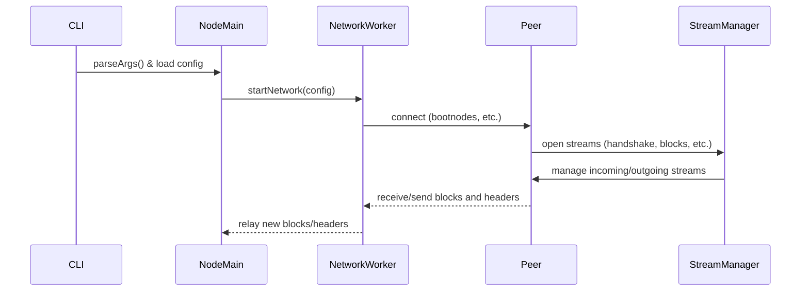
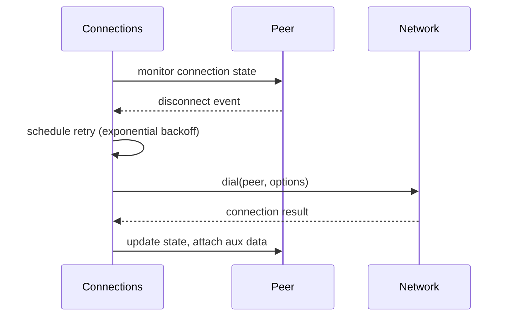
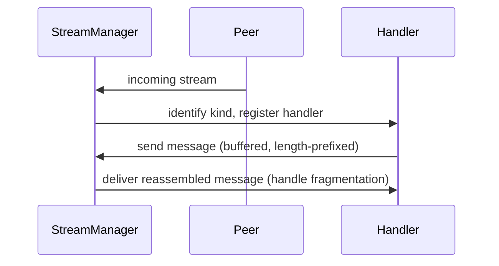

# Super-duper simple networking sync (UP0 + CE128)

## Pull Request by @tomusdrw

Related: #279 #44 

Things left to do:
- [x] Clean up the code
- [x] Tests
- [x] Test connection with other impls.

How to test this:
1. Start the first validator with block generator.
```
$ JAM_LOG=log npm start -- --config=dev dev 1
```

2. Start second node (different/fresh database path and number)
```
JAM_LOG=log npm start -- --config=dev
```


## Comment by @coderabbitai[bot]

<!-- This is an auto-generated comment: summarize by coderabbit.ai -->
<!-- This is an auto-generated comment: skip review by coderabbit.ai -->

> [!IMPORTANT]
> ## Review skipped
> 
> Auto incremental reviews are disabled on this repository.
> 
> Please check the settings in the CodeRabbit UI or the `.coderabbit.yaml` file in this repository. To trigger a single review, invoke the `@coderabbitai review` command.
> 
> You can disable this status message by setting the `reviews.review_status` to `false` in the CodeRabbit configuration file.

<!-- end of auto-generated comment: skip review by coderabbit.ai -->
<!-- walkthrough_start -->

<details>
<summary>📝 Walkthrough</summary>

<!-- This is an auto-generated comment: release notes by coderabbit.ai -->

## Summary by CodeRabbit

* **New Features**
  * Introduced networking support for JAM nodes, enabling peer-to-peer block and header propagation.
  * Added a network worker module with robust peer connection management, bootnode retry logic, and synchronization tasks.
  * Added new command-line options for developer mode and network configuration.
  * Default and development blockchain network configurations are now available.
  * Enhanced block synchronization, announcement, and request protocols for improved network reliability.

* **Improvements**
  * Streamlined network and stream management with improved error handling and message fragmentation support.
  * Enhanced configuration handling for nodes, supporting explicit network parameters and flexible block import options.
  * Improved test coverage for networking, synchronization, and protocol handlers.
  * Updated documentation and comments for clarity.

* **Bug Fixes**
  * Fixed various type and naming inconsistencies in peer and stream management.
  * Corrected configuration defaults and improved validation for command-line arguments.

* **Chores**
  * Added and updated dependencies across multiple packages to support new networking and cryptographic features.
  * Refactored internal code structure for maintainability and modularity.

<!-- end of auto-generated comment: release notes by coderabbit.ai -->
## Walkthrough

This update introduces a comprehensive networking subsystem for the JAM blockchain node, spanning CLI, configuration, protocol, peer management, stream handling, and worker orchestration. Major additions include a network worker package, peer/connection management with retry logic, a robust stream manager, protocol updates for multi-stream and handshake support, and full integration of networking into the node's lifecycle. Supporting changes span CLI argument parsing, configuration, protocol APIs, and extensive new tests.

## Changes

| Cohort / File(s) | Change Summary |
|---|---|
| **CLI & Config Enhancements**<br>`bin/jam/args.ts`, `bin/jam/args.test.ts`, `bin/jam/index.ts`, `bin/jam/package.json`, `bin/tci/index.ts`, `bin/tci/index.test.ts`, `configs/typeberry-default.json`, `configs/typeberry-dev.json`, `packages/jam/config/node/node-config.ts`, `packages/jam/config/node/package.json`, `packages/jam/config/node/jip-chain-spec.ts`, `packages/jam/config/node/jip-chain-spec.test.ts`, `package.json` | CLI gains a `dev` command with validator index parsing. Default and dev config support is added, with a new default config file. Bootnode parsing logic is externalized. Workspace and dependency lists updated. |
| **Node Networking Integration**<br>`packages/jam/node/main.ts`, `packages/jam/node/network.ts`, `packages/jam/node/jam-config.ts`, `packages/jam/node/package.json` | Networking is integrated into the node's main lifecycle, with a new network worker, config types, and startup/cleanup logic. Network config is now part of `JamConfig`. |
| **Network Worker Implementation**<br>`workers/jam-network/index.ts`, `workers/jam-network/state-machine.ts`, `workers/jam-network/bootstrap.mjs`, `workers/jam-network/package.json` | New network worker package with state machine, message channel orchestration, and worker bootstrap. Exports spawn and main functions for worker lifecycle. |
| **Peer & Connection Management**<br>`packages/jam/jamnp-s/peers.ts`, `packages/jam/jamnp-s/network.ts` | New peer/connection management system with retry logic, auxiliary data, persistent bootnode support, and exported APIs for peer tracking. |
| **Stream Management & Utilities**<br>`packages/jam/jamnp-s/stream-manager.ts`, `packages/jam/jamnp-s/stream-manager.test.ts`, `packages/jam/jamnp-s/protocol/stream.ts`, `packages/jam/jamnp-s/protocol/test-utils.ts`, `packages/jam/jamnp-s/utils.ts` | Adds a robust StreamManager for handling incoming/outgoing streams, error handling, and message fragmentation. StreamKind typing improved. Utilities for async error handling added. |
| **Protocol & Sync Updates**<br>`packages/jam/jamnp-s/protocol/index.ts`, `packages/jam/jamnp-s/protocol/ce-128-block-request.ts`, `packages/jam/jamnp-s/protocol/ce-128-block-request.test.ts`, `packages/jam/jamnp-s/protocol/up-0-block-announcement.ts`, `packages/jam/jamnp-s/tasks/sync.ts`, `packages/jam/jamnp-s/tasks/sync.test.ts` | Protocols updated for multi-stream, handshake, and block view support. Sync task introduced for block/header sync between peers. Extensive new tests for protocol and sync logic. |
| **JamNP-S API Consolidation**<br>`packages/jam/jamnp-s/index.ts`, `packages/jam/jamnp-s/package.json` | JamNP-S exports consolidated; new dependency on database package. |
| **Networking Core Refactor**<br>`packages/core/networking/peers.ts`, `packages/core/networking/peers.test.ts`, `packages/core/networking/network.ts`, `packages/core/networking/quic-peer.ts`, `packages/core/networking/quic-network.ts`, `packages/core/networking/quic-stream.ts`, `packages/core/networking/setup.ts`, `packages/core/networking/message.ts`, `packages/core/networking/message.test.ts`, `packages/core/networking/certificate.ts`, `packages/core/networking/certificate.test.ts`, `packages/core/networking/index.ts`, `packages/core/networking/bin/test.ts`, `packages/core/networking/package.json`, `packages/core/networking/testing.ts` | Peer IDs are now opaque types. Stream and peer APIs updated for error handling, incoming stream callbacks, and message fragmentation. QUIC and networking APIs refactored for new dialing options, peer verification, and improved logging. New test and mock utilities added. |
| **Extension & IPC Adaptations**<br>`extensions/ipc/handler.ts`, `extensions/ipc/index.ts`, `extensions/ipc/server.ts`, `extensions/ipc/package.json` | IPC handler and server updated for new stream management, event listener types, and message fragmentation. Extension API now includes chain spec. |
| **Tools & RPC Adjustments**<br>`tools/ipc2rpc/client.ts`, `tools/ipc2rpc/index.ts`, `tools/ipc2rpc/rpc.ts`, `tools/ipc2rpc/package.json` | IPC2RPC client and index updated for multi-stream, handshake, and chain spec support. Dependencies updated. |
| **Crypto & Logger Minor Updates**<br>`packages/core/crypto/index.ts`, `packages/core/crypto/package.json`, `packages/core/logger/options.ts` | Bandersnatch WASM exports added, dependency updated, and logger comment typo fixed. |
| **Block Generator Adjustments**<br>`workers/block-generator/generator.ts`, `workers/block-generator/index.ts`, `workers/block-generator/package.json` | Block generator now uses crypto constants for seal/entropy sizes and aligns block interval with slot duration. Dependency on crypto package added. |
| **Test & Miscellaneous**<br>`bin/rpc/test/e2e-setup.ts`, `packages/jam/config/config.ts` | Minor variable renames for consistency and a TODO comment added. |

## Sequence Diagram(s)

### Node Startup and Networking Integration



### Peer Connection and Retry Logic



### Stream Handling and Fragmentation



## Estimated code review effort

🎯 5 (Critical) | ⏱️ ~90–120 minutes

- **Complexity**: High. This update introduces a full networking subsystem, new worker package, peer management, stream management, protocol updates, and integrates these into the node lifecycle. Many APIs are refactored, and new abstractions and tests are added.
- **Review time**: Extensive, due to the breadth of changes, new modules, and the need to verify protocol, peer, and stream logic, as well as integration points.

## Poem

> ```
> A warren of wires, a network anew,
> Rabbits connect—peer, stream, and queue.
> With streams now managed, and bootnodes in tow,
> The JAM node hops further, much faster to go!
> From slot-driven blocks to handshake delight,
> This patch brings the warren alive in the night.
> 🐇✨
> ```

</details>

<!-- walkthrough_end -->
<!-- internal state start -->


<!-- DwQgtGAEAqAWCWBnSTIEMB26CuAXA9mAOYCmGJATmriQCaQDG+Ats2bgFyQAOFk+AIwBWJBrngA3EsgEBPRvlqU0AgfFwA6NPEgQAfACgjoCEYDEZyAAUASpETZWaCrKNwSPbABsvkCiQBHbGlcSHFcLzpIACIAZWxuSjBaBMp7eGZuSMhyXAB3fAoAa3gMIntZDAZIAAoAVSsABkgAakgAYQBRAEYAJgAOAEpoyDy0ZAcBZnUaejkw2A9sRDSCZmXaCjz0ZFscxwE0gBYAVl7+LFxFmFlEw4oXPxJufER1QtkNGGu9/y9qaRhfAoRAOQFmXoAdgAnOgMPQzEcjl93JAlIgGBR4NxxPgsPg8F5SoCrh5/MxtBhSuVcOMiogADSjBAMWAoKpebBKRiRTDUyAJBYeJhKJloWi0fk0RC4Rlw+jS8RlIUKDDkMTwPGjdRs/CkvgZLIkNgYWm4jCIL4ASQtuAo2A1eOQADNCmEQlLrs6SNRsP50P7ePgJPAlLQuM74BQZUyZc5QqT2ep4GhfBJU6HqG68jqVQIvPgGEVIKRyFQCHxlp7hSwKfDIAADABSAEEALIAfQAMgB5ADiAF4C+UMNxmPZaRRQhBdGAmBhI0QB0oJGiSKvug2xfXSVg41P0PZRHj6BhFB4c1dD5Lnd7/Kb+Hxnf5EGzaNQVOMPNxqGzMKeDjSKtlWbdtu37Id8BHMcJ3jWdZ3nRdl3XBsUR+OxtGYZACBQTJIhNUI0HSPCPFyApin5RBKlZCg8XgAAvahNSwNhWT5RBmA0Ix9GMcAoDIeh8GdHACGIMhlFmBRWHYLheH4YRRHEKQZHkEVlFUdQtB0HiTCgOBUFQTARMIUsJKiJhpNNLgqG2BwnEeeY1KoDTNG0WdDF40wDDUDAAHohDQZhfOcIhLUVDRZQ4AxohigwLEgFsrTEssAXoOyKUeITGFgTBSEQNxrkVexsHUDxXT4RN2i7K0AyIRx2B4ZwVj4MZkBIAAPGh4SiS82XIbZFWQP5UqBFVohXEYLLreh/xQWUniCKMolKJR2tq+rTS+FschIbZDUKUJysbO1ZBbRA6m6AA2BtRnGdAJSiHD5ykA9ExWjr1oI0aiKusA1FCbALXgIhyHoUoaFICgtvdGVbuQcUw1Gl74GdeQrmoMaJqk6aFAeRSvHkH9o0BIjFna8VRAyVN2VWicsWVGpokacnokGdkcMTDB6qxap005DxumaPIqG4RI5nkBsTrOi7rq2iVkzxanBtGSgPHB2iUgYR7gXGZqExy/Xvya1ZYFovI2oeQpkDyRZLmucb10m2tZtQIMQ0R3qCUIrB3rWkKNtCbNcyM0o+dDGmPv9r6ahIDQiA0Jlom6DQTlZplevsRIGBR+BqkoWi+DYUE0Dymnc6Y5VE2mUF+TdUOMzB7r2rQ6QPGViyjS+jqkCVGkQmwg3stEYsjsBjqs8kqb/3h+t8BxZjLSMcxLBbLwaHLBfRsTJQGH+DenX4YTx4OqI3W4bB81zyB2GTaRuMgAA5YE2LKQE8lVyAKW5Dnrh3vemIPllY+U5T58HPpfPOppb7IFKCqRUURmCKG8CQAA3BcAmMNQgMC/NbD+CM6BcQMJ0GUVNJ7nieCGXa19bwHS4G2Og8BHDRVigYCAYAjA+X8oFYKFBQoRUQFFGK0Q4orySqZcsUR0rOHkFlF+eUCrChyq/GBpoNYOg8ERfq2NZoNhXDdH+Hgqo1Sjg1ImzUW4CkQCXNWtp7SOgtPKSAiwvDcHdJ1AMSxuDvkkjhUou8uQeAbAFccABtOe5pEAAF01yrmACuMAYdvGFDAL7PQqFviBPaM7eEN0yCOBBNfTqAkerBx2tsNgzB7iNgACIoQsQ2FsvCA6IH0bcJYVItRnj2hyAJ8NIDpixJgQ6bpEwNlqRIG6U94TpxZGyfwi0XxwnupKc01MGy+xuiYh8WVcBtMbDLVCRgbQqgbGYkgjTQo3WdIDexYoymMC/JAI6DYslOHhBocZN1DIPVoNaUIZyJg5X8IJeeTomS7kKXaNAYgB6kQ6v814CsMDUy2YRWFMSEkNyzAaJufz+lYulAsDGVwDJNwKbwVuD4XZ9MSQKIGIMoi/X+uzEgkNagNgOYMa0wlEkAKwM6bQXg5RGXznXAeZsMBbWdOvfFRJvHMSZOoHYetkBnkhVQT67AhrGkpI4/wuA/QOMTGc+gUyZr1lRSo/xkpK7XF9oQls8tVk+FkOCu1mQDqwRoF9VACRvHa3ZNawJ1TOgADEWx1C7NADs7QewP1DVaPsmydzXAbAACU6F2Kw+j4VPJGamiAiFgY3XCcxAp8LikKmBARMtSrsFYEOBcDwWUxmdAAGoxrjQmpNj4alhojVGzt8bE2HIME/fg+ptH1jMfyYcV83Sir4Eo2gRJlSoDkQQpeIiEprwkpvAxa5d7OD5cgIB7UXggMEmAi+RJIHhHgHfVhkBOhc3HBUqp+Dww1PXJAAcMQJpfKwC87JtBcmvvZI2ThwSeF8NlA2J90A9mAzLRW7qX7HWI2A282gFzEDAFedND564mSxCBXQHsoKHEADJIAAG8I7tS4DLSAABfNJo0GlNIIi0sIezYENig9wkKYUWlPtDTc80AovGpS4Kc42uGailHPpwOm1IQmRPTjqGwJAvBWF/FwGoEguAynpkQNmA49CqbKIMLgFzmmAcg6ULhQVhP8JuoAFAJllRGXau8ozyCP/iIxM7UV5eWSZbRszVpojDEPEBSMh3J/CUO2CQGhU46EMKYUI7iXlBNBXtZFZhwj4qJWSmZNKjgMoyOEhu/KBhUSnP8ETEgWSFzA1DfASIVyJNltap/RQOcA1kCUVrVUi4/R8p4E149kmBBfkEnbGs2HeOJAsRSkMBJkAvTeFqN4eF5AFgpgqa4Z5uRFrqvvLAs19WGqiERZsgVWuLhuhnSM7UohBkSFOB9AjGxIBbHgWAhRqQ3RWAmYEAqhUkCZAJgsRZoD4CtB6qcoOSDg5VJGSIMDhKJjNXDRsSOL24C3I4zm5DkVsCebRcclrCGoi0dt2tqikFawmOuZQvhatRQQ9cAZKZ8yBPzIWekCPCcHRuk1/4rPGyY+kMmsGbP0eJll/DB4aB5AoxVHj1ADYxco6ZHqRYWwkCBK5j4Q5UBtqnIOqRlGxOCkdzwHd9FqKGMoBx9cbXyAxkoQN/qHMKxID0UoPgLilu1zr2mFSEh1QyKFBKMqIoJANfIHESNUobxuRGStFaUNnQoqQF0JAK0Huls4x158u5KxlrIExD6SSwFyiSyxCGVMsQSB0Be7mRMrvfaqhej4nWkAADMvQ/pKsBm8BljcIaUC4oXqAPZ/cm7ucH2ikiO+CWEm8YPjZYidE6NUjssQrQAC1OhfOQMsTdC+MlHhr0KLA1+q1rhbxorAnRaC9BOCcbosIVh16hBJ6fA85kho63b0APbMBPbFo5D4DdJBoCIGC37rKIAA5XDA5lCo5K72hqyl5ToK7foTLz5F4NinYkAPyBQkCbKiyVohZshvRkqa644gYFI+7EHIGkFC5FiICi7I7253QqDBixycFQBkHngwFECbIyCpaFAiG37bRaJkFo7kRFCSEloKRiCqi0ilDUgF6F5F6ohKBv6QHAGHIGFF5pqvCHTwDvYv4NhJxQgaCNDOEaDdDRDmEGFQBWCepg4cZ9DD6nA3RZDLAnJE627SqeEoECD4B6jkE8bPgsAqiHaIzkFjbAwTbhZ8AiqZC7IBhUAa7CSAxKCRigyELjqG5pC1ajTzh2j4C+DOgFjbALqWxLr/i+Yqz+hfwiFLwla7qXbYTAjbyiD/wRKHyFJE6gKeAQLXxQLiCPpQCxDAzIoGr+hnqTH0DXJVCSaNbPDOAtZ4iLgdZdYQYCZObQYFY8YbqbHU76ENj3GyicE1DCa2ZcZarmaWZNiPaHHAycH3HwaF4ZzraaihGGj4TsCTY3YUBUhlB3EPH5SF5fHQE/Hxz9Q1D0b/aA6YFEARipgrBMjcFFB8FE7GZ2hqYaZwFKCUFsCkmmZMjkGSFcCYDyAsaDB/H3GcE4SaJUJgnGgQmSZQkwk4nsmSwImQBImSEaBom0acGF6YkYGmZcAxH1E+gYAMiymUkUFUG0nUjqkWGEm8GI78E6llDqaQAAA++wPgepBhDJKJTJGArqGpcexQjJdGGphewBXAn+3+v+0I7egBAA0snjaRYUDjKCaUQKGQYSSfsJUpQNGYXsqbgPEZGephqSxpwaySKTFiQvFuZOQklg+ilmlipvQpKFliwmwhwucdwj+EWNYhoEIIgHiIIrFCVmIuJBIhVvZNVtlLlI+tAAUPckoIkN1FUD9jDgAAK7J3D5yyC+RyDSjy6NgzltL3AuC+Svr3A8YxFXgYyM5agNguEuGbjpx4I/JbypqjnFITly5Hj2LjGjL1lFCNnNl4hXKdZlT5qBJrlzkPALnBLBHQqvmkBfAVGTrVEHovnWKfxo7igfixiYjYiygG58Ari1JjlKB3m4JdEUyELLw7rrwnpXkeB/wzabzrEnxXrTG3qzH3qPpPzkCEKxakIFmJbrjFnULlQqZdjwFFY5bsLeROYUDcAMC+SKi+QkC9AkBgBg4JD8JtnFaiJlbdnFS9njG1YKL4qDIC45BUF5oVTXDOAFHjGElPJfmNRXDWx3TXFU5JENgq76LAiw7C6Gl67E5fBZJ4yIAvDwjUgExuoaJvEPjAGNSggBpQGSn9QvZ3R+ojSJHjiuXw5GmxlOUcYGnEni5oSGREggzopExUEyoU4Xjd7XD3hUH0B84qCRDgXAiVF8BQXAhzoMBMiLpOLtG6m9q1G0QNFNGdEeDdEEXbqrzEVjEHrkUDHjHAKSRnw3pXw3zzF1ZQDjpNUTHUW9rgJ0WLXyCTUkXvx4VKAsV5kjRqQUJcWpY8VcB8V5ACWsK5ZOa4DZy+QFYhCKUCUdmqUjRSKZQ1ZKLyL1bupE7jGtodqxrDo9qJWrmzkkAbkLnnZgDkGxXaqIJSC/IdCFAvh+U2pECBUnIlFoDeC4ASkomAbJgZiMSSZ9Z2U4TX6NgpGSE1APw9ghodghrhqRrQCxAaDnaDCAYyg+hb7034DiiM0hpg1dqJp82GUnJ2ltZSFTZzyUC7J1UTpG6QAtW9pFSHA5QbYtSCH9Gbq9Erz9EkUTUjEUWAJHznobVzUzGLU/ZGBMU9GsX5mmqFmcVUKXW0KQA3V3XVnCV+RPXwAvW4qFbZafVp6SQ/V9laWA1qz8Eg3i1DrdpXLU7Q3rnzm+QI1I347kjCHo3eVY0ngBWupa6pi+A4QNgM2k2nF14Agk3y3I39mvwv500NjM2s3s0Dpc08210Z40DihPnXDAmbYYL7SXp9oS0Q3pIQXq2a1ug9X1FPL9V9apjrxG2EWjV7oHzm1HpTVUWT123bVzGO1PqrX/UkhDHXBT4rF+iAiH2zXXr22n3SDHVxanUe3JbcU+3lmMLMD+1eTnaIASWZ0AXJCpaE1rxNktkYBKUjWdkpTR2VbSKaWX11aKFUJNixBxrpEXaTay76VsCQEw1w0QMCpE0wMfkdUyFkBebo36QuiWUlHEh9KElsSwIunFjnaZFlpHSJjRCkPznkNQO4CTQ5SwIZyHlYDdCOJESCOlCyAjCNFoASCFB4q+WUyRgkiDwrDUzIyRjYKSavgEheCnh6iQCNosAzAEJ348OXaBqcjoiHgcN7hZw5xGNloAFU2lLIZBCKK6pWjVJ3JEiwxZSuh+iWOxEpnkIIwvgrDIAxzQpsgZxWhWCOJE6DAhN4jlBkwUzZwUi+Amb8hNYvg3y2oeCmRvAyBw7FiLAUwUDbgzQR6CpRBVOoBxg0CfxoCiz8jAGDFOIdT5NUxpipjBCWh37tMTBmg1imiUjIDrBrzYjZDsBYhvy5h7ykCDPtRgBkBqT0DeJERC4CBygUp2Q1XyClOUq9xJjiDUzsMSN7gzNogfhywrLMQV1l0sHy28O7Zo7oqHNzaB5AtGxXg4TRAaC+SAtfgQt36EP+B3h7Mkzik4MPz2Csg6qQB1A2Bdgy1hbMTDV9FjX7rX1kUW0H3W0bGbXzV3rQL3wPxUKEOfqybAOgP/kuAiOUPvkYCTJ4g6FCl5i1OuM7T5Dx54O/NYCHPv1sXu0cXf3e3pa+38XZb3VCWstCPgMrhUNwMfUqVR2SIoO/Ut0A2oj2OTZ8zBAy3RDWO4Adh6NeAdgGPlzmgjDFEmweDRCE0KmvjYgjDeO9a2WX03FJGQ6B4cy4Gq0NXGtvwfzdGkUWW1VbpEs71GqkuHqjGUWUu23P0n0MXLWPzPzoOjQzVTFbULVzG7XksnrStu0KBysXWlkZYVkAMqsB2oY7YWgvViW+Q+Zz7h3tl6tdnfWGux3oPaW65iVprtGUCTL/CghwEa05NpC8ncYnKxB2g+jMBtiYDWIUCAbrwCpawWLiJXww2NRUBsDrwuhugNi9Trv+CBQ9jOiBkrQrm3s6gMt5D3ubs3SXtA60C4UeB7ZZCDbixPCo38jjy3pKoNjfuBQvs5KqgmaUjzTXbPBS7VjjgZywcbvwcrRPvADQBTvwiRAUBpKKqZC0QhiVx8YLiqxVDfl8AmabuQAJ4AfKqFgpiSQZy9vRj1IABC2At4M7uEwNUN0Q5BHAAgQnd4IwfW+daNTTJyez549CxcpAXYZARAVw3W2xfD6d0Qf5sNWdXD1Icnd06sLOAaku0Kg1mA2A1MKnONw9HgRwf0sgXTkQZQV4FKb2pxKw8IAA6jqJp957AFYAi7YekqiKPaEXWA574E57OlBFfI3o2C+k5M5aMFiF01XNIFYls159pyk3dDZ1rGB0RG8GUNkNgj4Bxk5yQGpwVyQKF8V9F9cDfP6A2L26GlQEQARHyrp7csyLnGyL23MDJ5QPyGh7rMaPmH2UV1cGAL57YQgvl9YnKPJ8aAXTlS6D1lqLF4gBgtCgwI4N4OnlUNY8qIc9lIDPSEyCahrVpz55F+9sKvWKHPgEns07V14HNkWOgvIDbHQ0RNcnV0XM13naICQJILY6iAp9TA4EQHlPNOjIdH1wN5Jj5vyKgGqgWK/OhXiB4Ebs2gaMgON9fFDsD/4F8D2C9BXUFdGxMGCSjGjHstj8qEdMx4FDPAczpqygCHBepx4It2yCt2tEl5XEPmGM61EHgJ1uoGXTbJZQp9WFTiXJj2Whz+UC1YQsm1NXvRm1betUfTm+W3m/fBOwwMRyuiJ0evO3j0uwaCRKuzhw+1uzu5DPu5QIeyIVAPQhgWlMsb6P6PFbMFwJAH8Xe7h8wE+wh7QIR3B8wPH5CgJMgEn/H0yER9O3wKhux0nzb6R4nzH/H3oHoDUNz8nytFwFzSXytOnPHgZrxzX4XwmUeN1BQN6RgFIAWIkO3h3x8f0vgKGDZkP6GDdJH4XoAEmEheUfOoSfcfK0hHrfufRS8I6fMfK/5flf8fXAGf+Hzoy/OfegDfxQTfOfLfOfsYxSnfz63fOmSt/fxhg/ajI/XAr/oGT6Af/76QIMIfni/qL9JP0bC9RP2SfYvu7xT558N+kA+vjABX6p91+kAAvjnwgGbtS+5fNjjX337TJRgjfWoM33gFX92+xhLvj30f438X+w/WgKPw/4T9OCM/YAe+yuBgCY+R/EjmkGgHIDN+x/GoFgO4GwD4QBHbPhwLI6n8ig5/UQZf1EHX8O+ZAh/n30oG/pLMH/WgdQPgxQBOgNtSelsUfLddp2vXDXvyWYg1Bfu/3CQbUEOZcBBOwnCgFQLf6WCPw1gybnYOUFj9QMUPVGpulbZeR22C8LtuJUuLwNI6Q7ZBhpVkRjt466XNfh2xbDcB4A3vCgL73xx58A0fiJxhonuSfZlaEsVxrECzglocceyF5I83yGiB2ugSTAGeBuR8lTQPGdnA+GNA2N9a2qLILZ3oAZx7sXYHuF2WAAJAXCLYNUASAY4ER2MA9TAFrCU6JgmhNcLUFlCqHDCtYq7PrMByJDaMwOqvCptfCkAPgSqVmcoKigsQT1A4wkBsN0IFplhm6dlKGkRBhpgA8Q49ROlyVlSWtjhXwDrMihdSM9fuHGfcLgCtBiV28FAF6M3UQQ3gH0L+H8PO05hUIGweQgoVFjRQY4owsMQqpezb4UpyuavBYTUNXazQo2ZgkCoiMXjG0iKKbAZsMX3okVH6pbGlvRTpZPoIuStKcPIGZaNh4RogLgO0FKEIjfEpoH3rZ2iFdRYh8QhzA2D8FOgAhodVaG5lzIf0EsYBeVo20gB/1KywiVVkYAlGdtsQ4lGCmBW5bBDB2SDA1uEL+oDk6sMXECm+VgZrgsKezH7DLVGRGc4aUlTqCkjEq/skE2QA6gAJGjzAEYUoYclohvLjls40gWTM6JM4qF48IORxA2EjEAVfInTWShSFZDEgKhhSHuPyBDHYUGAEsBMZuW3KUAeM5IeZpYzwAFIukGtHoTNGlRpB4xGrQsdGIohYFI2kFItjhAxBYgcQcoS9ghVpBoVxWDjH0d0yOpJsTaxLXemmz2pjEaRNFMtrSyWpO0ieNbT+vWy9rKi/aPgoSlqJAY6ikxlAF6O9QjpGjys6lKrGg3NHaU0m7QI8MCLSB/DBQugqmndDBGgdvoDALWDiEPAlDKQZQhgMBQvZo40gs0W4W0kgLnCuolAPodwAGFDDcR7AMYbaEFrjEiIJ7aoA2E6A7DcAnQaYLgHXgZiGw/QjQCvwlysoe4DjKsekN6QnJNGAExEaTmHIBjnU18XIqpArrmCnk+3C0EyDkQ495o84EzA6ArC/876NPO/DiJGENRQmUElocRBA7rDLGlzbbtRwOF+BAYcWNuHsgxYA9ZokofwGIGO6ghHA2I+CVJIfCoAdkxQ4iYMOqHmTPKd+BoaEEmBdiUKZaWaJPgviuTKMMtSSUsK1QDVo2wbccMUzKB/R5s2whqCVUSYOE/JtQsRg2DZg4R9JikasRcLSDPiy0/gIgBRMmxodUaqYCxC2SLBo4XmtIDqqILgLbBr83uXtk12sSGD+uxg6hgPRQktoeuGPZqTyymG/wPwDyHwJxLRHASKo2koNvZSSo2C7wWXDlODH6CNICiJODOImAR6+B5hT+NUND2LiPBnoxYstFXTqCzT5p6uG6IcHKhGwa413PqQegh6wVeORwxOu1IMGdS5m5oZugpzoBMgyuUQeYPoI4H1TSAjUzXh+Vp709rSWuItmHzbjXAbxd4l6KNDpqIJ/QJmHJhghhr0AnJFUldF1XFBCBlgoQXjkhztDCS9pwILRENKvZKdDQVHQauty2bPgjBL0rXp1TKCEsJx5I+NjOMzYm8n6tFc3gyKgDiY9Ou2YPqsV9Hh9Z+heBsH8IBEMAgRL0Z4mZP8l1DvS2E3Cc0KZCkBcANvV8GgCTwGZB+xE7WTlCTway0c/HYYe+BcBPx0QXADQHbNNm4BgysgNtGMxIB6YURtsu2dLWAGMC/i0swEYeMoAV8s4XInkaIG3B2SlZkUX2j0LLAwS4Jkc+KSfxLBo4jZuskgPrLcGGzp4xs6HCnNwDmzii0ia2eGMgB2yE4+cp2S7P5juzownsjQHzTlEys62iohtldRVGZYW2VZLyHqNjgGjdWCURBmeJjqXjlE2lVQr5UFEmV1cEGZ8laP1GwNPy3o18QNkUn+j5YWwhwsAw8L0VHg5AZwHmHIlqha4+BGSXqnQ7Qo1ec7UIFvJRKIAd5qzIHrmAcKqFixzmRGs2KKAeFdu0bbiopFh4YIvB3uaINvLTpJFphs8fAhPPrIi8e430LAD6AoBEg0gLwN4JJhdjM5NYyLLRNAsFEvz48b84JB/NFbFAd5xKDru8gLZq0qiHYtNoQ1qINQ3QQksQPfUClDVxxZIg3tOKrazis2pvXmYuLPorUietQNVGtRLbzi6RDtaQAAHJ02ltC0GySIQnUFR51Dce3K3HdyhKvckBkwH8DZ0XAOIfANKI6jHiB2g8r6mEIvERCrxUQjdMsj6RaIZqXqeKUSlCD+Bdm2g1DnVxmouh060wopNCWpi9yYgU5RojJ1kD/ATmi5f8MWJWKshXWHfFUNFJgWQZYl0YeJbAEC7jBmA7XAyComWRIp423cEhMqA8XOKdk1wOHNTAhYxKO+iATJTAxGBgjkEdKYwskqoKTzRsAmdJQ0uoCshZ69VSdG+MMZm0hibSU9I1SdC0g6hHiUcT0S3qm1xq3Cqkbwu5m0iX6FvJ9FoOBpsjxRXiyAAACodgljXpZkuyUcRxpoS8JbeEiUqAQGc2epZkp3n8YdF2dOQgYtuAEATFzcODE3NrZnUiy6in2povVEB03leikgJ8qMW+Re52rQ0RYv1Y9lrFZoseVEJzF7N5A0jFzo1AbJbNDONy1GFEoeVnL+lsAEYLAlGQYqcKqOR8i2ghUfLMQXy4xXCu5bN1IZwUmIKeWcJzhLoMIfoCcGdAjBwW3KxoHOF6BQhLol0RoLCzno0LzRbC/Chwu3pcKVQnM43hIupabKGRztf5WuNbnArFWoKwSkYAZX6LhwkMXyKWidBmLlKiK0ISaJRVM9tKDw1SJfQKREQ9FBk8LMJDAkvBZ5nuWsA1CEJSATkpRWgJpx75DdzQFiciPQBAUolgU5nWvJjUUgBoE1PzYFBoBGDuB/Q+xBdmtRYLcgWqvEvlr1RXrwFBx7VbXqzM4VjK1VPCrmZquPp8ylxY6FcXqtUVAqSyGi5VlotNXzzpA7y/RaZzKCLlHqb1ftnatKxIrzxqDGxWitRAYyCZ2U3KeFkWyNhEgInQQCIC0LU0xpUNBsAjB7AYAF+Y5aaceowA2gLI1IJPnkoWaryHRuODiUSLJLI8Mp6dYHldjpgsdLJY5ANF+qWR+Iru5QSvgUgMkw80aFicYNRFNh4hNsXEoWVgG14qgwNs0C1fxOQA3dSxGeOlNcTFBYb8AOjDwNWuZkHCU0YBVYviFOE9hAyo6RZZONTYNrVlTarxRstzY6qO1yi+UexQNU9rf6ncwBtosHW6KPlo6ogNnWVoeMAQEUSdUgRPH2rjRyK+daipNaFQQgonT1B5Mh6VKyo3EmWo7huY95+iKxWHkQzKjp0iIC41jsnnxzXD06R6teNSWoIcZ16zmpsHkCKDpJ/x0mr4SqGOEuKvoX0yAm5qoJd4rwjm3AO5s80k5ZoiYIqNgjDaDxDNgIVeLnBIAyL4YJmpiKGr2FVjfu3uULWwA81eb2QAtIei2iK3UE2x89FLtUBGQabZu32A+COJGUQja1Kq+tZSKN4OI5xWqjjW2uEXMU7G7q11egGE4wp/NidbTbBTPRZjlQmqzKQfEpXqbYYsuNBGqmbVm9FxlbFjS1tjaPqjartfVWov42KtVRXcsFT3JE3DqoV4myTd9lGU0BbVCDSxY6pU3Oq7FRbSzlgsPBaIltQGKrTYDQB5B9Eg8fVuiliAtg0WoUvzJZr8Ag6BFNm+QMcyUlTZUsthfkNEBIDCrgQ6gGQF+FHyzERQ1ICxCUpuaRbnN0a2tNqhKr2EqtJWlcgi2hQVgA0O0g8ERCbCwNAusNJ2d9AR3bBUdcW22P1N8CU6qCwO0HVtDq6HdRdAzcXWwE2T+hgt9BRsAzpi1vMkUnzRnusg8HaMzGAayjRAUbBWAO8FAG0K6A0K7r0eDlAxrIHaBSantLm3HvAWy49MxYquo9YgAoxoB/GiGRIIRNN2UALdoecfitjVi14D1Dm2HdNKD3m7QMXwPisj35A3TS4/GO3Q7se2y8ldQHPKrAAiDyA2ttjDyqrjFlpCek3IL3T7r91tIVyoyOPVaA8Ew0W4geaovvVZ6OIVghVXLtcCh1oso6ZaTWkdBsjI7ee4pQLoGTlBkByoo2ZGQTxWz8gjoW6vgEE3e5pQ89Be+6LjNhgYaWZyqpZSS2Y09bT0fCnmdZukX5t/dzaU4Q3oXCh6PB9mhyjHo4wN6PB/GW/ZbvD1h4Eol5RbfpoV0kBJdMcL/D/j/xWAL4Ts6wR52kD8cCwAgUfjHu/3aY6djiDless2L/6qtwB30mAYgPJ4uAXOvEDzoEBOyEDZJLApABn4AGSt2B0A9CHAMkH8D4pbnbzuTxkHTMo6Y7V2s9pnayygm7cQOrxVDrIVW5T+dSB+UvaQhSmudUazjqmt3VCMRxV7QOXJivoB6OTEIdE0jqxDY6y4kvLzl0TfNGCGatNx8VeK/F4C1NJC1T19yeMLS2qt8FQBcDjUdIlsFYBqi6aRWqhfkCEr5FBpmQAIOGU4bY2cqGwNhmBrFvx6hRQwUM78EWTHryBNV9hwEMoRIVFAIjMOeStwAyNxjl9loZsoMuoWFxH1njKcYuxyn1aplzOPqq7vzVnN2AHWg/WUe60KKT96B/ra2qEU/7EYM1WTM4uOXidrDtM2wy8qAxmq7tOhiTXoc7W8bTtP9I1X2qu3CbNDt20Q2kfEPhHwoU617bOpHkLq1NuPKhEVEIY/b1EV+KkAmH7iOjhyAO37OKMu5KB/pLXZ7rADfZ1ThjgMrqRmOVjPIGuTx1rjp36RTdUYbijHPpq9X4xEjDx4jU9zC6oShekPQQpADc5LlYF+EyILs38pGRxeiqCvfyES2AgjoZ4CgIU0cTGgcQhe4YxM1RA/Gb27x4Xp8cZnUMwsasVDmoCJB5EnoqawycpMElEytCHcSIF0xsMWHxwwGqPOUFRM/qeeoJikCjos0MyeZ84IxmQFShfAfNoyvzUqmVgob5hUkI0MKeGNPAtYsPGaIHAY53IbDxpyDctBYhE1lmCppqbMsUx4nlQRMO5r4FF7o6/Os0d0ymF8BWnDmWTRxIs3EBGgkOogeXqGpFOqgVTKxW04eCq640bEymCxMrCa36xyFwoF9QD1JRqNvuqulgnjB5NPBZulSSIPQEDN9SxtgG0Ht4ADNGmcotDLABBtNONHGNFI3+I2o1UhGOjgihYgW3IBoISUMCJQwNA01Mt6wtAIjaqgsYjLWRjpdoy2v7MkiuDsx7tfMb4PNshNgh0CsIbE2THfImx+TeYpnUOrlNshyIZg3KRejAkx5y/OzDUTldRovbBE7BXpkSmZaXDbGMhlKOSpi8oQFhuQD6R8mhkjYNsLED7DdhOgD8DsLYDDRWgAAGh2H44ABNaAJ0FiDYFRoRwT6c8DKZQIthUpr03qbqBE6vT4vCxADsbB/HhjAJ142EHTl9IZppoOaWrlkC/sjTaHKjTAnmhemGuM0PpCiegPVj0TslASCmCwBkXzg0nWwRYkhWIb7EGYPIq7Co4xGwOv023k8cZNmhmIi02ZE8B4uHhqLaPRWqzgSaBoQN6vJ05JBu6sg7u1JhAHtyQ3oBPxZ3f4IShu6wIQ4/IoJb4Fkt3gMmxsBZlSe9OrcKuyJ9zp5xmAYmJLRkUXnijGD466U4gRLtUKIBvg+phkdMJ1hqptxgQD7Y7CLxeNhW/YFGrAElfmj8MvQ9Zt81sx/CRKRa6NE9aNjrPg8jThkCKuWY+lzR2Q+ZmE27HUui7OJS0wNSRENPC8Tl92A6axaOkcWqL+mhwKLAOgLN7T4Z5UwCHjOVnQr3l9INVzIp9T7LGAYsPMALBzx+QGkzrAu0RlLYDTNM4XijV1QraPAAVufPvo7MczuzvW0/exs6MDmMMBZW0GBYbAQWoLXYGC3BZsAIXkLaFjC7EC4BFi92pxcY2se8Njr7zT6AGxgZcv3G1I/xl4zUBsNMZDp7F0fjNdwBsWFpyNm7SIfu0Y3Lcl5ai5pciDaXnpulvEKYJzMWCagVgrFiTYKL2CaBBmXm+Tcpvq5BbYolG3TeGOyjuNzcwFTwc3NNt/6O5gwFLcPNcNJDp4tSnsdU2Pprz4empP6YowRJm6px58zhD2Y9MHAHl5tJRmvboV/T03HgGbtxPWppu+ISjGsjt1U79hSMYE2jA67no019AZfeZvG0yp5w6odBRak9ssSpZwfLwIUMNsNIYiU4JYn/yTvfQfAtRtO0ZsDUbS6VkrHVJQoayShUwnFwPqJP/6G7GwDLNI4kOSF9Y0DXJT8c8H1gV5jb9twCUVRAlRHM8sRzMaUqbxx6MM8TJXXVAIh4W2h2cLYbLqTMYnXct9f/mtniOhEpowamIhWJeBdQPTGCJa0TmduaSvYngguj1JplV3pzp3IGRVbuirDQO7Z9mYb1aPTVezy5+kYNu6NRBNVZ7MZF3dNuq7rVnwxWl9iWqNgfbVBAAPyRk32y9rwNA4Sh52M7nwyWzTYPPrGx1mtuDN/rqDSZJIf7RQNXdFkg1y7Wd2BODAFHdL67qhQjogPY5x72Mh60h88QlDxMuAo91h/l1H5Mjq4JAQjuxirrMO4m+Xdh2brHv5cDc9trgNUn/sLxuH1OE3Pw9QcrHabGtz+W5lXHcGlR7ci7arfVsYOJNrK2BgirPPSHdbn2ows8FvJhiClc8oQ9q2TtOjGxC5cTcBSEOBT/AhQYwnDxHoibVy8WLEOTBDqLQAJ05LON4BTAUBfI78AQEyqMWxb6w8Y8J0SGcC+R2oJwRoNCBewHa0aVyxMHuTWA4rqVNjtKUrkKhzxNdzqPGsakHUZ12WLjwCNGGbqfpPrdonCufcfDtKW0BYhcvLyFTN0fWdYmaJ+K8el0at8q5RKNG8moU4KtIQ5oOOkaAd5lj91VS0YpZLnttH9s+s7U0frnFbCrXiosZNVq20H2hgx7CrN1hQ5NJjoeTrZHajyDjqqI4xpocClRHRqaOPVcTnZbZgTDo5KwDuUvKTbbL+KFEWB8Nm7VQ0drxmaFCKzQ6wJcfE3iChdahCRPBPFMrFMv17Ln/NGZaNghMlmYjUCbRtbEWCTorNEL9dEi5Du9pJQGIKl2IG+nyA0upyM3a1mjud5cjZumR3S8LuzBK7/7Ry0BxKhdMi0JJgeBjFXUC1gUw1kCg7ZdtVF6XMdg5kgCjv/ytQTk0vX1a+53ZRYtEXgFxx0wLmKsy1qcKtaWbrWubMhfExXVPhYBVX9iPFHiWBAsnxXWCS1w8gbRgEvB5qDoZ1l8CO959jaX7ndjrF8AVplTj5n5vi1XGyADgf0KZdrNZCIXnQhBe1Hm3lAgmkLxSHKCVRfSCqa95AGHcflpmrjdNDM4ftFfjhx41L5UryCeYAgx9qL4sJ9z/Mr0S4U+i0H6DV4NhPns7XWJYxIC60SYKiLqIjGeuB4MQqprEK8BWddauze276xs6R0X76WhbBVZbbfubOL9w5pyx6vuTHHLKAYyuFcequBJe3PIXWLs9lZ8albHc7cwIZOcqP0HaNwx5c61uKbh59z/Y4OU9zfbMF6iP7VQjni+7LWZ7DMHdB7dm7G9WXK5gF3+QQvV909jDnPYLeWJr9PAf4LAlh1yuw7q+2u5B5E4UOkhU8ijSbuxcXvQQ9SMPdkJZGnE49D5qsWjJOUEf49OLtqacMQN34WPXz3WJlpZR+XumriKsTVLI/B6PBd0RMGFTPatSKtHH8g1IWhhaICHkBJAGy5DuKYv0r+6Wt8kRhPRFguZ31fK5ailIcpOw4vNUgdyKujaSenKcqBjNL6IX9rpV2iBVeKuy0wnwPNyW2DOIvsilnYrS7aGyBG9NQZfaI8oDS1TL5UeLAVQQ8WfUwOTVXclfDLexQ7nqLnjMstmShg8yr3yv8E+Bcfl9anhl+J8SfL7uXTnjl8p6vxJbUA1Fo6LvvI3mNqpgeFl3PjD0SfrgYVI6BSFcTMiSKMnoWq16hhOfmI0HunKmjvX8fkhwR0dyUjBZBiqE76YsbJkvWdBWiNQPEGt4LgGYM5dKIoF0gwCC21BYenCJK5lTtUm3a+n8eiDqKyAag8j6xisGAAf92Myn0aDd9oiB2gOMfcb2e7N2N3BRFVIuCqDe9HqJQJ6s9WQAvXg+r1l3CU5N6eh7wO9plpVL2ytRWXK+p6f9WBwaokiGsSfdoFzdaSJA+P5MtIHsPXRR6HKeIejxxjxCTejo7e3ZEpyIhR43QUX6gDcx9MSgQL9RLUGgFDcxBmaGFilRuo3ubRtKFq8n50tSWw6HcVPpKhJzRwcA8jO8qutEFV+joGsl6uPUV75dxidfXL1z7y8q9o4BXHVUNaSCjCbqaWN0YAnGvA5n3umCeGkIsDFN4Rc46gDBAuMIR08OcXgb4d9so7CFDbVib0HkXmDm3+QLH6D7xKR8gmKci+phTH0xm+YxQEoa+K0VT+UQEgwNTsTHyu9xh4QzgLLyLygi2fygXsVM+9afsrLj9r9qlu/ZXeY3LyYHlJ3cecVntX9v6SANXuCDABYdicZfY3uiB6AUEGglUYdpnyUPAkd6/QgzcRjKeVvMPrb4UA28YBV/t/GOFwDu4Hejv7/ageP9EJf3trgfWTB9/wB3eHvvD579QLH8T+2wU/qb3gvo/z+OgY0mj3kV10wPKDf2TT1B8/5b8ZA0qpZnH/jB9aACHxj4KMMgAr4Y+QnwGkQKPfjgCubY71oBx/X/3ACT1a9RA0k+WAPd54Av7kQCBBTdgIDzBVAKP9/eJ/zb8Uwb3AJ8ubYAFiA6HGARY4/0JPjSQ3/bkQHJQ7Y9HRE+APYUPV1/OPT35paKg3X8k+YQIf8n/e3m9xPnWhy4EGHBsA4CxpIj2AcevZHUNtD1bdm4AB/eTyZAFAjAK0DgAV/T0CzdNJGP8sbUAMUBZMVTys9aADTzC949UflrdVSAEiLxOA1uksCg+P/lFkkCCwjEJCvWwJC8zdGvlQCboGoHelICBcTt9k8ONTZI/AzdSN8eXdlzsDQvGAFCDagCIJt8IEaINkBYgjUjEJDfSgD186AUwQEAHA0gJAp+HUfnu83BOgQyCVJKIFORbfZHTyD4gzAIwA49cr0CCGAMoOsBWXegOgA9AaoIlt6g71yyDb0HILyC5bAFS/o25ATXvd+1R9z3MtDCY3OcQnYhVUJ33Ux0/dTRCx1TQAARRKgGAah3jw+3UED48GwDsFIdqdYWW8DWFZuzwcA0E7nbtEzY8GnQeA4aUbAgHHjCslEgI21TATbBeHSQi6aQGxpS6Rnms1dEf035dCHPrCL0X8Z4O/EjIIBzWRvgnu14DVdIiAJoiaViQpN5Ia3SCt52bUxcorg6EPulgaVQwag16IVGBAW7PHQr1B7P+wBDu7L/SoUo2BeiqM6iGo22BqiVrSVVSRTrWWUj9F+z60m/V+nzZWsZhREkyfPgEuDrgiDGkDGwQ4NzgTg4oGUdlg1Y3u11grByuIFfRsCCDKABwPEdQQQfh4dFHZUIYB9AqugNDb+Dh02AJHfgCkdIAGR2ZCIkU0IUcnvC0IUCv+M30Idl7Yhw5UVvKiCqAXPVMBtCjQzhxND2HD0L4cvQ0wJugqDGDRDDmHVILtD4mSRwiRpHWRwPg/0WjFZJowx71jCjg/QNgRFQhsAtDVQ0rVeVTnVYJfdfIbUPUc/laYJO0NzA52Vs1RY530c6w9YOX0tg252HZdguQyBpPUFtH2C6gK0HaAEfPZHE4pyAJ1sJtAesKODk1R31yc0OGe0ZdNNb7GVAiIapTF0LQyb0VDBjRcNzg5KH72bJYWBrGo89XHIUNt91LgKuUpZeT1j0AA9JG2hkjMAEiAe+cozZRxhBjnM1ICKXyRs+sc21tNytIWnJcKAFJCBs/wyWCcsNAQCNfC6uBrzl1ApOkLQ8FgDpjIx6AQCMcRqJb+BHpYvWu2HA6rQkzdBDgfCQVd+RTqGtA4fEpkR1yw8cMnCY+K3WzcrlEb3VdsJTVyrFhYd3QTNEwXcKVCjgg8O+cB3M6VYkZgWuDDdwCaEkw4LEUH0vVIfHlih4UDKukvVsA+H2YjcIgSS5tDbOyhO5RnarjRhaQlr33DmI+pCVpT1TSLe8qxQUj6QeI2gkgJTI93hxcJhGxDAicVEfQYiJwu9QjdFYT03L9+QNekZtk/d3kdCyAD21DsIXWl3YiEFTiLJ1sJcSNmF+UN0C0RMfBdiiNOBPCSGhEdNKOk5QgeyI91MfEGX99A/BVWQwQTMDRQ0rgWiGwAMrE5Ccif2N3VoJsiesC1hVECmjL9k9ZUAzhhsVyPdoqIg1GphSgDnxjUa/VZ3nd6/UUK3dxQ++G/4/QkWVYVAwtXRh9FIvAJICubJAPwD6AscO8iY+IYIP8w9RMJh91I29Rj41ox7A2jiAi6IQCiwYAAajAofaPcEHMMsLjDCPMYxrDUbGMTHUews3VlF/eX0K8CxJMvS/QGwCyNwDR+HaKYjnIjALBizoiGKEjNI0sJEjyw4sP+9qbJ9zOduwo4OW5fopsLXNr3OYzbC73FWwfcuwr6Ik11gyvj7C3tC81HZbFA2xeiEY6GNJQ6iLBWOwMYFdgClRkSbyI9feRKxFgZ4NpUoACYaP0hieY6CNGwoaJ0TnCgnY8Pole5NqhtokzOaG9xK+WP0bBCrPKwSdICYWHUAtYkByk1AQVvHzkr2eSxEjBrZxiMh2gzfxhCX8M7xAkEFLPwxkZJLsguAVQN1iQVZASiBj4mQcqDGAKAZzmmEs/JQB0JK6IfAtjzILm0dcaQ9agst7sC/w4tPA0EwK13YjvhFjlQSvguCE422LwsqNZ2yDBeHaGGgAWaHsGxgopPUB0YMYFDWH0UJWaF1iRXAsEDwNXApFkBSpHCEbRP0WdyFC1nakR+tJFbVU/sLAzVUZjc4cWM3UPorUOxiqYuDHoIOA6ZTsQKwFlnnjhJNf2s1CrMbUr4uAMWJj5G5W/D7A0cdeFkw1YuwNH5EbVwKgB94iiNv4GwTWIFx7vLgG0wEKAXDvVj/S+MPiQBHLjyt74yAEC5P45+OYjj/OaJBjVvdb029WiHbx39jrPf1qDqBUIMASAY8/xCBPvb+LNCnvF73gxmwrRzmDztfg0WCyYlsQk0sjamN2Mv3PWwtEqlAKOVBPwnTHecPASGO/C0gO8I8CoaENH446gPsFGhAuFsBsAH4IqUnADUVxGIirTB4MAFRoPCMyERoySFw8LPOX1GtieawgyYDoJkDS4YRPIEeEqWAA0l0bg5KKMpvwOkTCoAvPL0IRjkRMGag4ZGKNT82+LRB0l6QQKRadTvEgAJDxTRF15dN4ZggLsoXN0zN0+PMKniwMWdFAEiwqCvh0xnQOcDc88QNmDrh8CMO1ypCrVSFsDLBBIFvRBeGKK5Ri8BtENwHkBJm+Fwkn2GmY54D3UQUMEToXKMSI370bB5Q6i39D7guKkeCEQtuyRCrsJ1EjcvglkJlCnyYoRdCvAQEKdAMxehN3gH0B8HroXxbVEPZWdF/C70ZsQewGSGoYZLLQfhUCUqs1eAuJXx0AHOxzA3TXWA9t0APO2rsGiBzW+CNAOBwzEZkh8Bwi4QgunZg02U5MDh7bfEMUgHUQXxijtwQpRYknWVtwFpXEIKN09C2YeHdwtcBJOX0+PTNz8TFgQWOrdivcz0Vp3YBM1Bj7bDQAgdFdblBVA8PaczgJQgUFJeT2qVAGqj4CSVCMA/fKgDBlSQVvSLYEYVTAZcqjZFywB8WOYQySrwMxIdjTUZBQfAB7HN2D9Q1ZCKZ8y6WaF6i/wm5NDCOiToV2S4HYqBNcUvIzyhT3kvlC7jD9HuLWUttZdxmifQqu2qTQ+OpKPjdLaoCTDqgLI3RInEawge4lExWgIAmAIVCZAwqFjC4AekxRQLCb/CsM/kkJCj29wLQ9UI25NQw8yISZ4zzEYJ14YByhCK7Pzy8YFo/0Ef0kqHVKDStQFMOCC+gygGNDEAa/3NDUYygAEcXKCNOoto0w0NjSKAeNIzCF4LMNdC5HO1KTTc4BQKvcW5QmOVE00YGFgA9HCeMPNFQUnW2MpDHYKdUhww422BCGCOL6RG0zniAlVCL80mN9TInlmVI/F3nKZygRBF0kdwDTUWdxiTHwe5LnJTi4YJmK0FCAQI7CGHIwNaQNLkGwaABCBt2LmDbxmImZFG41kpogWZ7OIaIwBrddyVaiemYhyygbuLUFvjsgOuL/jsgBdLjF90mUGqQkkjqDvVT01kEYAH2QlB/AloA5n/S1oNKIzhkIp9L6lGieAnqQf03AFp9FQvbHO5CUbkjSNJUirwRCzwSdD3SQgejzapkUS+GVA1AFKSUsimFPwsiIomV1zNu+QsAIY64WiIziC/aGCIyZQToON9kgs4IfUlAIVEPAw7Uy3rQwoliCvSaM93hkAKxUF1sToo3JJcV6CE+xZ0EuLwzFYWdSQEV53hFnQ+BI0hxGGSyKXjOpc8jXtCI88MyVPAzowVXWxC14ZZHiYSYesH6Z3hUoG10TkR/yLBKw/jNE5wSWZVZ9hcdTOKBn/UbFMt4XUuDDsLEvSWMzHyS71jAMgTDMBBSHcF2LEphLEHfVrMmKKhZosyTGbj+GD0DdM/QVBTfolWLqPKAWY1lDUpcU2qKBxZMoYioBRsPrzGJZoZMSZ5ZU5owmiRQvuL7Mtnf60vIywlDMPSEuHmPHTCLJvEm8M4eLmpgl6VaThlX09/A6EP0772kzv9CwP6yQgP9KNB2oYbM7gJ0vfE0iM4TpivhQfKzKy5DM/jwsyUgTbOlMsIFbL6zkYlDNp9OY0bNE8kbWD12zyXSiOSD4FKNi4zUM/71jBc/A6G9jQoujO3CPuNjNA0U/S71uzEYNbO4zEgvDK+QRsinVp83s57KxDssj7GTdcwSbKkyWOabMcQFM3lzCB6sl3xhyogJm0Myugk31oA49ewP2EmQZLwQdB/HgAOgEHRG1H4HshHNsDTs0DMyEi/d8Hx4jMpIJMzfolv0RhKcvnK5zKAWuXOjmARvUYw4ye4EVRaAboEjIVc3oEjJR+EJGlzGmGAGIyzdSJF5z68NuGHJzMhJKKg8jcnOZT+3EG2FwvMnzPilo/SsKMD4w1XSq8pnfhNjACAbgCZBSHIzyu97YqlLVc/IInOpSGM+7gw9QSXy2AcMMjyzLQPcy4LjyAQXX0Vc32O1nizbbHjJFyxATgxUU9nbR3mCSYvBI+jkxMAFTEEAcgCko4o5tO1sBwttKvN7kUHyEhnQZp1b802M4VjloJQYP4yf5N70RDUOUp1djqLfKWEJeLPJztQY8xzgSimhK+L48XYssDldRkdtBgtoAUHFkBKkeojxRbI/zQljGOfsl0IWZRwxTVkc9FHJ1o/ahh0Q8QLWFtiVIaFNDBnbMYCMi6UIPMikzkrvL44xoudzJYF3No0VTz9ZVP+iq7PZRbyagBfKzSebEIJgSHBEc2ejkYyCV6Ee89GI1CRDMvIrziQavK1RZbfGIrTWw5UV0dSYm7Wgxzsd5XlpiE88xkM6YtFW2hi46pFLjxffKMEJLyDPBiMTkQLgIUKAdQmdSLg/wBtB1AUHC1TPAvjyvsA4GVLsYg1VlNqiUeFNSBhjCbZPXpKAUzUt9rkv0HvB/kWiAIAz2DxV0IPTBiEmwcoAHnmAd7G+E+ZwqZWJu5yI9+DoZX5azLS5OddsBbkGAVWgBdOcchF5DY2fkIY1a/YUPWd/8qRWVTdVTBILzsEw51upCClY2IKUSLcnPB/IbEDnBHmOSizhZNGUHIKzHUhL2C24RrQipmtH2FkLB7aIBMZvAegEKsomOInPB75TBCySLwFeXBE2dfT2LB+Ikq08NddYImvDaPIBGSZSimJm5ABvHFTIIwtA2JZELEF8BOEVQct0AQgMbEDfYicMiQpBYEG5CDYf5exQRZIgSbU9VuTLIikx/UWuwhSpEtoryJ+AsiOiY0iQl3EAntXrB1BnrTBDaymNeVNY1G/aaK2UdnGYwJi8CnR1wSljXc3dTIi+WmiKlAWIu4B4iykESLRAVItbSPtIcJsQ/UtZHNkyipQG8ygLIpRdh5oQ7IwlEqe9ljE3vEcUyCpYr0C/IaIsCJ11YS7opc1pPWcz2h+CCnP8Ug7aEoDNbzOp2M5ExYJFHA5KDMRnQqEurRlpkyNImw8UhTqHqzJIcGCHwBc+L3IB2jJmzORiSpGh/lqLSXFl583TigQ12SnXjq0uAJVFy9krRgmUw/bH6UM4PCRWNBdUeaGXSZfTT1BqAUNNJgkBLoNHQ1L8JWuA3Vr5BQHx5gzF1xVB6jP8PmEZdeMDlAbE11zdLPUQyFlRw4JlAnx6UUGBZRIYJTh3yvPRsClLzwFyP5Tl4yFLkTz2FYCqpXZQV0bASqCewDgCkAqLm82QKvR/Aa9APVEi5CMwqlAO8uMvhLCZBePUYuPJsGxBOA0oH/F+Mvj2wZcGdECm4KaSbE1oREkaFpoWvSUuOL4ysrUHohaZaQaDICastjh0Sp8KTil9JqH5BuS8ovGdGqWhS1wRIuuHmglvazL5CxxAUKaNbijrN8LN3JVK2UoAbTDGCVAqbORiZy8LTZA+TOspai0oQQtB85yjgwfC3lH4sXA/iqFSEA4i1xhBKnC7B3Fzv7XswlLjYGcsMwtc6wRHKay6sIiLuEEgvIIASoEtKBgKjRyfRcHURNRLBir/0bLuAZstPUkixKkIMlIwcsCRhyuEpc0joFcu5BlSscvY9Yy+CtnLqcDEtbEXi3Av2d8Cj4s7CiC5CqiLUK8gjCSyC2vI/c7nQcMiF5DBVRAjAPHkOmVgbbuk5oU6EdCeB3S/OzJYKGOzLNZJMWXDFB+7VgoCV03KelUqk0epE7pOgNmn7ROaLC3uStCX1DqT4ZFr2UrB0cGlToTlZK1sysEFEiYrZPUyvcqR0RTx5JE6SkIsl4YdvMXYh6YYm0qfKzNUmwOytFhqBJYMBg5ZvKhxzSSGsGuibp9M8tDX4fkyxPLpA8QDThEUSPTEBNAgBLm9xXK6NECqk0XOMNR8442EgIS5SQglYwFccDehKSvnliqUWONDJ003Ye3KMr4Z5GTo6q2YrLEFirgJ/lFDCYmg5nJQHIPB6vJq2dtvKocQIZ4daTg4F6ARKqeAWyP0CPYv87uJPLe4pdwAKLyk/3aNQLKyD7QOaNyslo+wH/0QqNQn8uBg/yv8tErFwP6Mn9ai9GV7NrqlTA7oWaKypqq7K56u+LBK34uErzwT6uBg3MSAE8w7KUqpyrP/eQEPUxqh6umkaqsyskDfq8Uu4lZMbKsXBTBMqv0x9hUflaqUSdquQKIaoKBQqYikSvOx4azzBadq4m9nOxyqtkAHBua50Jsr7qmelGhBSVMqiA1q87D6qH4LioVtC8nBIWDPipYNprSC38tQqjHVsgHltgySobz6YkcisdQxeQEM5nHZzBZKKiqRl2ktQJmFcJ3CfHHsS02B2DacbHP1hDycVFWv5RLKU91CUDanOnPARgOFTZD2xddzTYQlPsXmd0WbsRmcF0QapuZinB0X3KFlEaiPLOzH/MmiussUKeKuNHAqlqQi66iOcNReWryhnMQ2sBK9xMOhPNp1fsKsUIS6SqDsKQmZlXYrijQxeruEZksLqJDGeMIYRxQSXqJMwWYC+AIuRUuWA8aUMwdNM4LRgWpzDK5RWgtMlIGCUNCwsHqIwAYaHwdbzMfXWL/08YijZkjJZyg5PfTfXKUQjFvQvAP4TILXCpcDcNFZLGWiAaZuZQLS1QuAERRMMFtF6A85K8uHQcpIWK3IKM5GAjPVp768oHZwXAElD7TX62FRnqzUiQwKMli91XvtiXFUGcUpQ1hXmBBMgXk0qTU2eq8B56nTBGhfFfnQXsNEZHmykRoZI3ZQgwU1PqIwGlpGDNQJHnyWRnFZ5Dfq33D+uV5gMvrAIz0dDbH7rEjPeqOq5Uk6oVSzy86v5lIAK8suTB68My3rs4UICwaoaCevdg1M4htQb+sFICxwaavOugwm6uShbqWkN/1QhgGvUFQae2HPgiNj/bRrkbQGqmIKMjGt+pAbSGhIDAAxVQkjAA4pAiEMaUCSxt0bQGrWDAA+gfoD+hamdBv8YUi8xpcadGkhq8BJNTxt6BoQU8IBA/G8Zk0BAm0glcaQmsJu6Bh8boDnBZKFJrHww/XqlkpxAEqVwBkgCiXgA8oglniaxCRJr0aPGlJuHwwAVQmW5B1OSgvhq4DtmcaEm4JsqaMmwIlqb48epqEM5KIFFJ0ymxsAqb3GzppOBum4oHQaicQpuKYSmvEEMaF/cCuBpPStKzzYHwuhuLEIjZRqHVVGwKCNqNGifyHiDlFZp6zRTYZvabQG+1A/rwalRsbq9m5uumMgi14p4re1MIpLykKoKDUaQGHUJucaYygoecf3QJCyNtEvkp/A0MD8S/FCIZpL8jz2Xuzrkui+Il4lHmYeuzhzivEAJJamLDQ/AQWFnwjzB0wXUxa8UKiQuMnbYPGYs9fIELHLXI1XS+xqmXe0MtHgIfSOKaKsfT+FmLWIGohoAOkDB0MYL7E1BJQX7kL0UOMsWDCaIOiEpoUMR+pHwHyE8EzLZdUoFXRvwRz0UyCZLbjGDj69oTR0YyitAE8mbLIzj0ECxfP0sz0oPLagEo8AusytQGERwyjoZxPYzpMjJmVbXEm1WPzcqtH0stPzXKMrZIgIgArgaQFykr5D03dg0A8QE6LKBxs3MFI0SOT0AxhhwMfTDzWI0zK1ABUTrHvoWfGOLfVIYdFFFbGLRAAaL6qMckTN3GQxixYmga7LdiyZJ1upS8fEegLcMEIC0aCk+INq95nUuMXujclVtqez2bHiUcYuQYHJY5teAkhcFsZesHaows+KXPJQ0lgDusMEHEupLavfEvSTCS1DRT8UNTWhd0UsYO0hT24uzmRRSAP6tpK8aIkCTxiky4o3VjhRtpj5m2kTjQ5gXBRuQQSRQlIZ5wZBVXsNnABiHmy9q/k2IdrWl9yPABEtHUQbfWm5mLogYdk2gRRoLRHuVDSzeGSqKW3pJhwOWqoC5a82knDd5N2a9r3Y2YXlMCVPhBiGSzc+c1o/z/2hIFPTsgTYXKAqM5yRT9ZoV60LhPeVxS7aSKXEoXbE2Q8o+tn7U8oeLzygRv2VdlHNqqTwCbgBqAfIL9HoxkvSMjQRYyRG1YxTZYCyQAp2V8C4A00QWkoBFO2AAtSmDOgBwNoQDQB9I6DWuW9lOCGmmBAmBZxXTTFrITpE7q+OjANSIyfYSk6faGTpYw5O6QAU7xgWAGU7VOigHU7NO2QC4BtOugz06QDP0lrkCSVit+wZy9TFjAQ5d/z/Es4DFrcprBTFuqQBAA3AwBP2WAyS7agA0mS7hcNtGLJ1MI7wwSxCGhss6BEg1o/zEACvk5a6QPflq682+kk/kuAF3IYdvc93kw7NojDoY67BTZB+R74U1m+cUjJtp6632dtuydldKconzWOjwBqAA3NlE1USeLlElrZgw1RUxq0jKzrSPmguvUbna35pISpK2xUsc7ag7DgU6652v0NaEhkpdEvmtxz3N8cNA3XlnOGMuKcoTE6BloGxVKoXJoWFYBuhsVY8gtrCjAkQ3LhiO2odE3QZkiKNz2eaE8M26jwoPKvC8aMTrOss6v8LU65ihW71xXgyzq3muWu/K7m5gH2arc8SvVr68iuqO7d3f7UsoN04TKrbHa8dq+gqIAWnHAjobDM2CALNcFKJkWBsHvLW2tHJuY2esVnorSqfciwAgmJkDSYlOInAe41LZzjl9ZoZL1ctzLK2HktyynFNTR4Oi0H4ygMhglJzC3S5xDMGO2FGt8LEtYVEBZAXeFjgOeuYrmZcNVnx6YQaD/XwAWIybVqJKQFPXgobuBwGAy7oaRPT97Q0EFLVnWls1Sx6OSYQZb4kjSTlBNJOMEyArvQmjTcUnR4CY8veisEbIjAYDGD6eMBfIGZvzXLLPg6e+xHjbssheGUS8HAjtmd+xIiH0iA4sZw56D7Fa3QB8JZJi6p9UNZlUklOMPmm5sARPsiddqPqV1hOOEaCBI33OxnNjZexzLmgJIN0GEJGqVQvYAMECzKtyjAQLhF0Psx2xzyZnTPurbQcDFkUaSYPABYAmIaoAMlFMzn3JN5oHqJtpyAKBHuYQKFvPC63WMDjNY9KKPHiyacesApA03dYE6qMgEgC9hl67pm/78kNvsj7NoYvGEg2+h0Q6gtYR6CqUMgdQAhCKXFGkuSpY0nNJ078U/uD7hqk/tBDWIoQgPA4HAZnrQtYXwCgG36IwAwwtdPzW36Q8njAb7TXQpS8TowWOVCBhev0vzVyBxuERKaAU9qvBj4G/o9NTlIsBbzhit4PDzz+3Imq9B7LhmEL/TJOJNqsQNFuo1JU04u0yCU0GQD9kRbIC7a+kWiGk5YYViCUQkATqurRhW7y0/6GO3DNyTrYXMFAGcBsUB76FeVBi97Fq3ACl7dpC4TYHWK7Pz312O7wruKezbjv4bB43/X+q7y1iqRyds57JY940h8trKV42UPpzjAlAG4B1c1nMVYOc7WM8DapawjCDNZdeGw7EnAgA4qiAe7wtxLqn+2KEAcdqGqQPwJRxpb9ih0W/8KgTfKzt8RL2zF1AYZ/AQc1863KurkYzXp4xeoOeNsREh/UK4YWuz+VdyU03eKLwgE3wK8JGwMHBqG6h2kH4dww7NMb0Vc2zB761htAH4c/cpwTSCDowAKWGGwTWVWH6hwYM2GUh0MF2Hah64cejoAC0iFiues4ZQJeoK4fWGbh1MIACdhhKD2Gnh9LpqGDMBPpr5Xht1neHB+aADgS2gzWWKDacy52/i109SEiBUR8sEKAZh83Tv0zAtoIRhTdFga8HtME6BE6IuuCpoqiu04YwT061bux7IADbtrTwihus+b7m3bqsbQmqpoGAfG4XBibJ1a5zVqy697UvMKezIthgzqN2q6Bwm/oEsZamBaFiaUGs1Ie6nKyitjLamArt2g2Pfyp57amK5DIi5R/nurY78Y4SWc9IkZ1r7DIpD0vkQILLqLA32RUFtHStbDkdGNR0HTjEHR9UeLJvjDTQBrGwOG2jR+OXsHaA6NZSJACq6f0ZQsgxwMg7A20K0E6BAuDMR1S4NaoRqYAs+ZAVGfhC5LxqoaZlzulNZR0fbx/GBjjIk847cMVpeHFz29VUZHWFTcQOcRp2BqIYvFzxOgUXWj87pdMZCACxyqqRYmdaQHqJVJN0pjDCzcqmkBKGCSWyKRkoKRqJp2/NQgV9mP20NG1lScpNNcnA0jJMt2ySDXHeivUyo61wZ4GvgggQFyHgiwepHzHamQseCBix2GTSACZKpJDTqiq/BVH6Q/w3uwk+aD1haMQjrzKgURQiBCoJUhxKo0lkaeT7IdR/Lq9G/Kwb0dGMxQUkegNNG7n7LB8dCL3TMLAMajGYxuMYTGqWhjhJFEe7/PkUuO7Nh47P7QWUfI1U4GNkwzx4XAvGkWGoA7AmzTzoZHvO3zsgBSQ71WYgswtifRaWJr/sdHfsaS1H5HR9TATDGwSiaLBqJhjlonj4rrsChthlifomvOhpmYnWJkPI4mQ8pkA7AeJzFqYxR8ASc9HdoISe2aQGXZsJ7m6kxtIauR7xvsaOxlIq2NRMJ5u4rparc2Ly8egStZGTJ9kbcbzJjJu5GrJ7sZsmS6nYwoLzHSEs3DqOgEC+gEJ8vX8NRkF0fAm2/HJgHs1R4XDfYVOxSY87CJGR04mlIvJCw47oPlOfMM4EONaYdq2IGqRCwMuNmUoOd3q2EVgOsDya2jBpAxAtBXeDCDxgNqOc4YBzkDeApAIocgJakDEGvUs7Hm2kB2pnHh6RupkgDZgqOheGMSN1WDkDkfOnPm17UNe8b6LRJooHEmb8vFqYT92iFpeCjIZiRaTHw93nfH2kuLQKtpIq7Cux2LEGlinNRiCdundRrylTVfKEuktHy6Orirp1pzaed08ir4MsiOu4Y3ZUnxswtokY+d8fOmJiVKVAmiwV0aEmydB4xPkVQUDuBZMWuzT1DmXR0Y0AskHeGmksZnGdBLXR0dBMSNellK1klp51MZ4z2ZopWSVgbTBbIvAbbF/YHenaes4+xxmZF7Cyu6byADJ7cdOFBJo3IsQd4AbGVAsoO1slM5RlYCLHpcfjHp8r2oGeVHRE1UZhn0jAmacKiZh6ZbR8Z88AAk5IgGMMo2AT2P/CRJs2XPHuxq8a24VIlymsmC5M2elmXNZEu1RAJs9hM6TdGMOABuZ9TDSRffTQdKjJnQZ0NhFR5eiqjjIxkO5myJDSsmxBJVgfHpkJbUagn/evwFG40gEQpvsZaaab+Y6p3OCu95zVDQWm8WvwwyEV20KLUHtGKGC4b2s5HoIn+FEIa6MX0fJD/sspyWw5Hkmnyd8abZtzFsxLybBjKnqgBgvl0zoBgGan2hxJ36mGAQac4t4yT/KgB2gZGLlk1OimafLxh15RbmLJnkaLA+R/ycUC4ujwPaSLh02aonzZraYED5JxibSnXwP3KWh7EVSeG5NJ7Lv4m3BAWemk5cxvWkn5c2gEZyPOhSeMJmJjObgZnQq+fNAmQO+Z4JtJ3oEH5PZwWafRZ523NnnBk8mdEFm5zyc5HvJyyfbm/JzQDgw3/YAOIYk4/edtnD5+2emkbZrsaIWSCGebGk3vMiYfDvpo+ZIBgkuQSuit2YYyf42+eph/mv5s+Y4WL5ysZUmAFrKeAW0AdqF4mwFxNKe8BZ1NI1iMF0hcvGtYBhdIEmFp41YW9c9hYXmlOrhbUWNO3hevn+FtSaAGRFrFh0ni08Rb0meZyJG9nMem9yJiCC95pZGdukBjMnQmoIUFG/m4KcbytEK/ViBkKb8UIb1kYurbzEYD2PHjtur5oubSG+9XvbyO8SzHqK6bmTOaz6lXFkw7pD+p0QzGlpF8jPhPGlzdolonDNcwzbIA3qhYpjmLar4FJSnl2/XdP6E9R2UJsa7G3xscaGjAoxhwtYLxuqX2RVBfXmigTebiaWkZpZIA+gLJw+6uRyJrLyO5ppfaWUmzcCGXOmtJqqbR8OSgF8cmsADyak8AptpcySOZslRxluEX6Xh8YfDaWdlzxr2WJmrpd7lGmqYCQAWm7ZZaXAiA5bmW3OOprOWdZUzByMdEG5ZOA7lsZpOWpmg6BmaNl+XnmbwG11qyMkOTuv9Q2oMeqho+cJUo5H0Gu9sKWhSxMwCoSNVREJhh+CX38Gke/CdOq/CgeK6NP2SJcCQ9Dehm5lTDVZog7D1ZJZ4xUls8PSXz6Rb3pK/FmURniWnH+vM0ulcMSMaqlh8NqXOlhxsVl4pVprEIWlgYA6r2l6Ub5Wxl0TBQIRVwZcPVhlqJpoBuloVYmXUmsVcOXJl9JqOWsmxZZVJll3OFWW/lrEE2WVVnZeqb1VuZZqbHlhpsmBmm0pulXSCG5aOALVzpoeWemp5YGaWZIZrNXh8D5YfC5l8ZrqamsX5fWXjVgFa2W7J2kax7b3Y1Rzr8etyaJ6W56eICmW0jWvJ7F1QqD2RwPWgLr5EOVmc5VKuXkjWSaAkGjqB+gLLjQkuyU9mKEcBBPheGuBMtZ78y1yzD/Q18gyqaJ+JGohMpWRfrCRkSl3VIvhqZ04TLXgQl6bBD3p5XH/0pYRAFrXgZpWeBBG0dCX4A4ZTREacU7NfPPkjLdDrw54QWhxoxm1xaWDhax+aqyT0cPdMgB918tZmqqGufTZRZySsuLmWONjlPXSdcdjo7BhWgCf5bYvoqbaWFm/gB9RsLMffFW7SFqWQUQopjeC5gWIjrcPxz4N2I3sYLiuB6LEnD4k10FEtWmBA3m345oDRACy74DNwWcDMAZ+aw2cNvDZl6MddqEQ3YAeiwQdCNw7wI3oNlwPKTOuWfyvbRu4LLzlGGsXgn7T/c3wcS6aGfsLa0ovU1M86GZ9Z44c+TblK4pyh1HuQ+nRXkNts1vbMEEIAw/nrX8q5gMCgt+AJZ6suN9VBZ1s2lP2fWz2dpJuESwWHiAwUBRBcNs0uecHeYYW6Tzo57wQ6oMAqBqpx5T1pZ/FCmQaWjXVWenXyD6dhh6Te9c9eNmSxX1VRd1xWBtLoyv1i12pMAE+jA5TPZa1ptfLWMAzvz2Ra1uQI02sWGUb/Rm1nvw3WbmnZoJ7E15BaTEfvP5QFlFrVaaWi+OtL301p12tbm7HABG0adR+WdfS2DlEyxcAzoLLfU3R3VVEady+V9BCC35+Pj3Xctp1PrqFa0JccWKt93m+qgEoh0WiNUyDBcEP1p/h5tjh7DelA8NpwMY2iNjAPfX4QLbZI29tuA3I2ENkLheNaNw7cO8lSe7YcxeYvBV/XheZRbdTbmhNdMmk1yrdEwoAG0APZAfKctkwRuvdrejgluxbm3ftxbaq2bgP4KU29lDLb+Da14QSYCmFrfkK30dqzdt4KAYAGGi0gaAFL5IASBxgAU+BGz/rPtkre+2PJpJuTWaR/POebHJ9sMu1+KkJbZGHFlucVAwAQLbBK01kUYzWE6auvCmqQmouA2Lp9cKm0qWX+zB3d2eIe3Wq+IQVbyzY23IGzhjUiXSineR3NXZuYtjfB2kbF7aPYf4s9r9GD09XaWnGeJdZM2Pgq9iu7E86Pnd5F+RDh0RQBXaHGyP4KBohE0dCjpgbz0E9b3TOtpdY1bZ7V3yBbc1jwXaSz2MzaXW8+aP062q6VHbU3tN56Z8px13Gi+ZPcCuhUREp5gVgBWBaGJHE0IumknKUDPeZ35X2TWdOE2OCoVJSFVHGTxk4EW4CRmwNNjjH1eOWwYwIKxBQtMwAU/0A5DtCctUQy8gULbrVjqquZxW+GtHoEahG3J0N2hd3zO7bZMNXeF4Nd+buXZT85Te679dioeW3qFurYd3N2J3brWUtrgVrWs+BAVP2eBUQTQEd12gDL45c3fhgAz9vATP4CBC/iIEZBEgSzS3t5rmUXB+WjXSCqDA/cfZn2JfhEFcd7Hav3cd7fnD3xtg/nYFoD8QUkFcd6QVx3ZBBRZ/3rEP/bcEAD6kYVD7ss3ZX2lp7/V33attbdz389zdhv3Fdg9rT4mFzPg/2IDy/fd4V+ag4wE+BGztr4VNpA7f2pBRg9I50D7/fln3tpQQsxe/QMkAOQBD9jd22BcA9I5IDlg94Fy9+EDgOldhA9I5k5VQmQPSOVA4EOv92/kwPSAbA7EPcDp6PwPVdwg+a5SJLiGZHZtjnbCXQm3lfsaGlzaBJ6hR2mIBbyEsvUfMrOMc1tFrHGRCAxiK1stwj+RIgAkRx8xFdGQNdxUKXmxACHtjtE5L6GFmcaKSkRm3TWiHMtishrFX3XdOTJkBMkwU2AkfXF238plQZdB1kk8ar0DFgQSZIkRBPTMqlkBINOSTxv11AHhDRodbAahLs5JK6YKj3OSb7vUHsTR0bE5csySevGQjEiAuZ7sxlKj+60RN6wONpVB+j9ORIFIObCXMiAZjDoVnrI13Q+9hJe+lVjwZvXWpKgOG/gM0nQWOTzE/c48GcYVjpPE/qkjhqBjNOhS8mQjiUerOKse+SmSYyqj+Sv+mWjlzSbdhxs46SVM3BXpzlVjqVgkkBV5I9uP+QDzxhNfxFsoREjoFI5cSaAaiK49pj2yUWF4pb9adc0Pb3GCOERQDUl5yNJ478zFjqCGzaJLB+uDUEwT46e4e+TY9nnXgFzTe9LepqCiYrwe48/asKfkD5PjTLxyXzPcRuMkQfvFUVKA3QVOa6kKp1DjzVIq9vRBMXDUSnZPxiIU9AlYT546pMbihOuxXeG4Ian3P7SUO/aZ+mrGRiNd4raMnStn7fK2nD+pe1PXDnjDpC4SUUmM6kyisBqANSfV3TAumdeIwB97WLpJPw5H05bxBeAM4wRNZQE8zkxDwE+jJfTiM8FoxtPEFxOEJG6vkWhDk6Y/m4Qf+bTP7JQWwTPwz/0+TPAzwI5jPagaY6zPN2WSb5PlOyE6TxCzzgjiDGwDkiAKf+PffIPpjwE8zODD4Q9/2b+T+fX5c5es+HP05EQOWHmjhs/oWqzvs8BmRDgfjgLbcq0/ej2d9yc537TwErqXeRlw8wX/tjuVVSyDhLf+n8zqOTBG1QWzCdPcAEYKoNUzq84MxZzt+dkmqhS88pPrz6Arf07XT0/NPW29NApnrT/Ouh3Nz2xr5Xdz76oJXgTs6Z+RZMPEArPezp85zO6zhkenORg0sO/O+AWREtP/z1c6h37D+bYdOdzq8+wLGdhyczriYjsLjXXJ+xYW3N2cvJ67kivc/26gp9IvbSnncc1hhXnLpjdqFdzDu8ynWQEGSsdaVRk1AcUbpj3b+2mUwhPo2uz11OOe8RJAs8ZByhQycd0jm8yu27txUu3ooHZCyLpvRWKLoeU0xIjG3cU7fzZQEtxlAU1OGREa30uiUKwn0JPjEvrEAiHf4A7GNoBgoEvFPLa8PIWrNwtB1KIL8PXAd3Ey7scHP6tBx4MCGsB0gHWUTO3cVNPg8AIgHRXIc0KNb2FgM2Ez8C4KfQjqJLrCHhNRNrAGfWxMxtAiZcBYXQvAxWaixd03XHwGWhhINVDA1PDG2aiBn18nUXgAdiHOuzfsXtNd8OYjq5gzcwWlFSv81CnnxdN9OLVJyerfq873CIVjhWglJLpiDgrwTyTiv6AVK+wQ6aRdDauO5Sa214Auztx736ZGyzW4HrOZVGvZ2n0C6sBcEo8EzYeaVwPQ7pbZSz9dr4iEwycrjK6thpxtrBJNQTY1GQGXPTfpCuirSxIoA+PXeHVPgTvM21dfXUXveunwf4Hjgn0boW9A8xS3q4BK3Ny5B8eu26H+cIeurjSicIUoiQA2QU6XLKij3uHKTlYOmnk2wHb3r/BvcKnMxykRm9sScBsyTIR9ajzPMF5TM5rIL8WfCcahnIUoS71pqj5UBLkYGC4IzNPRffr1PPrX/Ib9CJ2uYHMdnV1pvBfVKhpjKD3bIGOnaL8dqhhbJh8pPt5zD2w4ajTvFYoH7JjOrW6Wdrbtwv1zmi8Cg6L/Xb52yegXced7kE43/dpcV8b125dvntBDLjvSm69PeZcofyspxHgCvLCjvCwA8jIc6xkKMzJPFnHEL2ESucrto2hXQiVvbxQbe/lkvTemMoDaNKoyTZlpE7/EQSukr8ttb3wUPXtcslIJbM3YO9hgkWBrfQfuzgRobm/rB29pTnHaCdIsHCOLZXNtsSa48UDeubuJMdogUxgmHKSeL9jYrp4CbVBylkOH1WBu5XVW/o5qOlK5Wgx9btJyHRoRrObRU3EyuE3GqPnPuQprv8BRb3xMO1mg2OL4FX66GUHLUl/L93kVRnJOg58tyafyxEsJ6zxhqmjNlaBoib1e1vru5lUua935gQqzV5IwaMDYGRLZKWGko8WI2t9n1sq5bMvYANB7xdXOeEGQ+jgxqMAk+TVyDzbTQ9qfl+Bp67I1QTJY82u4/VUkfGXFekj1BBscniLvML14DTbCc7LJi80gdV1aJMyiB9Fnt8FPy8t9epIUKBcF2olKBsABIwgwDp0VuTGENM619zfBydKNNDrtOYwV8zNXl44+PK0yDBzLa1xuj0jSgcGYXEKomRj22j7YKQu2gNDo7+AMu+zE+pDOHA3YTYrlKsuqcdobGqgOR9CJ64q+lTjjCdOOSvN2KXon6d7xH3VPTEmjvrBwlV8FKPnOHx9XSJGu/QoAvboAff7yxWwXSBd8HCC6PGhdqD0fozbbkeBlgWCm01kWWmdkoQWbCICzOxbsqJBd8eJ59mSogFIYqJ+vpDgbpXD812gKrt0DCyU9Naxq5r8+ftZSArnqLIfpLqMhIjrLNOYYH3BxxHMEzmON1koQdfNWmPX1zFbwmItv/Mn2zb/NlWy55n25baAL4yf2bK+R2+DaZ4ibIBjFhsQiDyw2ogBX5qu8uXb235lfipGnooxqDyewOx7KAHnmoCefJNl55z43nugSMbNZOnKkmmFxvW4cIXS0l8vz4kAW0BcAUNEKAPhIm5QT3Z9BKMbgD2PlAPd1uQ84EctzS7I4bQ1+a2Gcz/gUT31DlNJ4PzS9/fxe9cx88gBzH0Q8sxTDkF8+HpDr9lkOL9wl6gOND24ddtZrlQ/oP4D+l80P8BWl74P6XwQ9v5mXgfhwOJD6kaMbQ2iHNwC/htvk3imFsRb4dMXsCptz52FGNHiY+Cx/UuQIQw5IALHkYeP9TT58v1CIXt8ZzObyrwDfn0uzfwgS9vaBLEPVBeF+W2BMDbdO2BIbbdpAoDC7cEArt2wio2aNx7ZVJMAA7ZjeeWeBKrs4RcU+/j2X+Yf1nHKLqdgB0XwsNv9QwMwItu6R290ZGbbuw7tvaQPNpAZRWhi+dvy6125/cO0yos4v987mIa7StQhv4uJgWDXHu9CyTE1pI7uhlMzdrB5mBLj2lFZDBx7pxvr7/mKTH6wAeFdMXSUs0I/LzCnlHTlGfu3x+Tyumcylkee3iVt2w2o99pnc78duFn7umcGGqnQNRsYzg1UGO4qAJybqNzARFHp/6elWpd9o6L62gES0bmVResyuTGnIDyipYVxsRECYx989bjGohPupZ2RYfoccDTTXHYM0oALNf3sfU0l7AAsBmd2dNgbRmFe7zoGYBLfpGLIrvHQtJaxRwC2xacEVXQNIipbt/FbJsdM35vdiyREbGXwImgmAHQOm4XYtEA0kS6eCeUZCAqSpIjvfZoUa+tMfJLKDXGjC0ftRABAT9+/fMEGQqgfOqweFMybZz+EuXlynD8F9WzAcaOY5P8YHxlvO1XuqMK1bpDUYOZlRA/v8OrxKXeH7l67vaYonN1+PKIRsezvVTC0zkYlk7cN3f4NUIhWWBmWe8F0QKPu+KIzLfLgwGaTOCYo+J3ITrK1laVMb4/msmd/ycNNX95oY/wc0ZxpJ73v19nUNYD8KRKAbOAssizIDkbGK3k60HdhL1jJcYy1eogrNgF+0xxjOBbvijA8QCKdzAipr8kEs9YSij3BGxr2Ashzb3CbH2DT+4oVvjT/FeecOL/L72UkOhgBQ7StZWCOfbT9RvK+q36iBre4dglcW6dMcD+4lEmFnnEbjDXs3mBNbyaa0aDSQsf1S/hNrannSM2gHZy11/MON2rgdTuABUp7ha0XHRvQCEmjGwzJQzHRjb3tsEHejGaxTQdToQcPvzReHM/+2IAw/eh2H4w+0EZMRsBomBB3XYAQVH71B1O1jFH4qNt76h/Fpnhe+/4Xpo4ESUM/YZBYXTXiYQd8fjzve+mJjzqZBvvt59QS+HG0HoREZWQF4mC3qNasWq0mtNLevt6i7W+kxDb7cPXFli/cWqEHz6pB93y4DpBCVvfDbeHzECJfx3Hkd9gQ0v2jslnaPuX8mwB36O4N7drTWzkuwjiI8xDy23W8dbPsugZfNp2D1vozk78u9l/e36Fwda0uRxe9xuVt5f6XRVtM0V/s7ssRS/YYfb08vzKeic70MPsvvBXJUhPucHHgeCbKoYePgEOBQ/g71lG3KJTlk+mrb97YvBmBpmIHAUt93HY5vhb+8zt7j3Pz84IV3/l/Y77IE1PEjvE6+h7PdOjveLI+97Fb9f4xl5vz63P4M+C/4wkDz/bncAXXJZuhf4+LLjRjcHtUfxpuYd3uhbObTMp6DJVZ3lMrT+gCDP+FYwzJkCJA8JNXhk6JPtGaavIopjjoWaPzx73feyzkvkvYbpR5lo7VijJw/6wZa6pY1Pv+Zra24RX75aBsQVpQiwjcwanqaiCnZGcbxuChK1cAdywwHd4YfGlqXOORQb/dD56gMfQ2zBZgafJ/5uUJXoGRdPbouau4n/TP58fXzxh2dLxMQGPCZlQhoNteGBODJPr99cqTtPUiJMcCsAufS/50fHv5c3FBQQuXlKvoMyCFuV4BvAPSi1/SEijjNeATMbaA+eDKTgmadpO4PpCR/PUwR/bzqWIfkCwGdOS9AAQCNPIlJaDKuD0lK2zcAG2wNuZIiclBzxJAUSBh2Hd56/N35cTPCKCnac6OXUgBT2XM7N/UxCZHcL5lAXj7FgaD5IsBloPoPmBKcAQGSYNz7IoBjgy3TjoT7U27RbXrI9Gf6qKVB8CwcVCwPwdoAdgCNCIWRxzVDIEbrDOb41DabbxrEX50gdb5VALCqLNP6pUsMsJl/blqq6PCqg+P4QrkX8KjYKrxaNCyK4ORoACvcLxKvaIj6fGUCE/c0redLgB0/V8AM/c+ZaLQn6ujR6JpvMQhB/FsrUQb+L0YCl7UQemZE0NBAEgaMAI/NgBw/PUA7uFP6IAJYEWvJH6T/WYAIObTBz/OgC8TM0gsYQ5phDKlg5TZX5VAWYFrweIa7la56NgL54UAfjghAQn5tgNAHlAP9CbgIxpPwTLpozP9C9AUn68TfYGxNKIB/ofZZ6vdozUBCDzAggT60AXibxDfXQAcLRrD+f/xieUn5W+eFrQARH56gUn5MADSS3fe4AM7HjRM7Mi4lvWw7C/UJa87CX4HdTWrUFOTapWBTZM2XthnQaiCb+HjAsxJ8zF6QiANJVHjDkGUJ3GVQgJODx5d/BDSylS6bO2Nn55vO/ZKcUGIb+VoixaAubAgV8yQ9Ta4LWFywdQSMyEoW9inBORjN9fxI/iHmhkqG6AEyPkRhXWUE2xf5KJgNn5PAa3RT6CbS13RfqrMCmjTcWX4IaKNpx3BG7rPEb6bPeW41zCb4DmEiboKaC6NgZkGitNkE1ALQ61Ad0K5vF7yuvcBK1AXby7+PFL7+awAYvO/xU7G0407EBhUgyNYkXS270jGxYuTbbqoVIhRM1akHMXQ7qC7RsCN0Z7CttW9oDlCZSBSVIQTJNwavJFpLiadaoxqO/B4VZQhujfvKkeRM4iudC4g0GsGwEQvYgzAfL/HJx6pGVQhcFdpK/BQJCVhSQivDOF71ITKipUcXCwbGVD5rbOz9UMgj1mBzCHTK1o1jfIgzyLKDYeYz5ShBI68beaJ3BRZAjievYC0YZx6XMZxO0I4yNgkcRq/WTBLg2ugUAwLIu+R0JjESwFljMKjV4egDJVfTp+kAMj6odvCd4YMyK9OfZGpA8CI2XFpnyCT4RddlBRdI3KZVYcKMDEcTjwWJQv4cRLpcELp/4aCFo4WCEleacqRDL4BvA4kxPARPxg5d2iWQLBDx+Z1ibwGOoA5H3qR6XKDR+QkhZUFHAZUTFoCQgQgfcDlKIuFiGnoYuzkCXzyzQDsG6VGaYaDJp644MlIZ+MRrqlVsFEmIdL8g2uxpEBSFcTVUzkZcoBIkTUgDMINxU1aVw3vT+Sj6AkgT1NdC+WX3inMFazZ/CLpkdOIytwYETLlECj+xZiE/gcQDgdCPysidZJ8Q4SEbgwSE7tK0hRKNjrDfbhrj7Q07jfHZ73wDH55NJOKdnY85RUFEhSke6ZViAfKCxI8HAOJx57zLhiSEBBw/gnKoifItjJUIkhhQ3ADM5eTwGTKujrgjyh1Q0zBmkWF4Hg7/Q2vcYZpQmTDVg74g5VOI4iSYlqgfGMpFQ5rqPwT+TLg9qHm4RxDVEKqHuUY0j7CBqEuUJqGLQ2HRtQyKEVDbb69mMDzBgjuiTQ2uhAkJoYpGL0jPoUiH+kUQAwQzfBodCTr7CNDrSdRpzZDATDkjSABYQraHKGaXZZrPaGUQ8ZBcFEmosQklZ5RQ2zk6OgDLdFagfQjai7QsMCyYX6G10f6FfQFpxAws9ggwmgTlpfMG3uQsFs7OxaoVG3q1vYUZUFNTQBMSZxyVDsEzPK5LJKc8DaPXVAag07h6VJojBVbYB+LdQAO5Me6+fZyyPkHTy6bAywkfDqLoob8w2Ff5IdgpwxkZCsxyMIMqngayH6QvJL35MMAylcEx85JQw4ZAWHMuP4QO5IEg27YsS9tQOLXAKZiD/G8ZM/f8E2QuzqzPaXpzPCLoaMGd6CgM+rDQWQC/YERSReQoA+Q/P5rjHT6CfZT5woHDIHocygXtPXJanKNimWOKRsXdRIbUFD4T5IXYnwCqBpsU36XhC4wO5MUFGWT1R1uJ8SNbWo4+5ZJTWQmwqzTE5A29bRLfCWJZ8iKz674L1hA4aMAIAVxDJVHQroEEuE+sbgCJSApAdHBxJeOFBQaw6zKQzOzbUDYwwiwjRBYkUuHYgQHj/JeaEiQhjz1mKVAyoYuFWwMuG3MUlp8oRnhKEHQpxw/TTroG1zQ3P8CYPfVxc3FuFOfd2xbCb8xi1UCRtuMrL+UH+7lAYHiToav7IQyYwp7UDrOcLk5cwVxApxN2rfmQhr5qRGGyEMAFxGKCAXsTMRmXSgbQtTJZl0NnzrlWSoMhJgZN4QYFxTPjD8EU5hbJECAcieiRV0HmF1PEgBaCYURAhFnwbyNSSPiQRJQQSZ7f3P1oUw7kAlUKjwXGKuETwqYq5VJY61mHuE1wgpC0uPKy/IJSHqAxniq3CMoW/QXpBZAWFRHE7DkIM3oo3SICkZGqiafALK4fS+qfYEuAG/FQhR3dOE4ZMq6hTNvhHQ5kSwQKcCCgZrKwAPADTmPIDIaMjRBAuvwo9KLZ/WfNiBg4NJ3g8iZq6ATr6aG3ok1eWgEGfqGLgTTBXAbTC6YMmowVcmpuCWHTaeHC4K1HGGUgZmpPAJuHSuHSGlhLPYcYSuHUIsuErkFpw/CBBGxwz+QVDIxH8+PaF8mW5iVhHvwRpRTCUlCgCPxWgD+dYvAZIrJFK8DgpukdgrFAIoIokVzrVMQn7qdb+aaLJrppGN0hlQxcArg+syxgGrJmMDH5TgSsLRvOtwEkF4FdAmOTpSPHY9A2AB9Az75MgcBG7QMvjRgm/w1BMQ6Sgl7yZAqi7eI0oD5AyADxIvcBHnXqHI1WGChI71jhIwyb51JZGSoGeJhpfULykEuF6EUordIvBjdAwpFlIuRGZIwWg5IjyiUAfJEReFyjpIyYgPI8UBPIvJGPIxVBoEHuEXIujZB9RcA3IkpGcFFEh80NGFFvImJkg2xZeIhmqNhFNZ15Ot4Ew/WxN5RlY6hVX6e3OAYYwLBoyPPX6ig//Sqw2JFywlyy5Qmr7xVcLCaEUYq/2SsLFIpPAQopuh4oRBEftRWEDpAWGOQCujR+SeSaIhlEicXEq/kA2pEKLhh3dRsgJQQXyJgThETAH8CaInqzamKgBAwcajXAAWEtZeYCrPFDwRXWHIWQybAqJVNDTHLgrKeNUGPkaMr4gGlHaES95a4IZ6hAb8wtZdApilaoGfte7CE3V8C2xepAuohixveTNqawyrjPMKFBKokmQWUaPCN3D2EDpLlE+Abtweo79ZWtG+jPMe1GftaMrljE3CgmF8D9jN+Ai6X9pisB9j6ggRgeougB+sGZg6InwohAhKFhAwxH6aPZQWdFywkotIxWI0FETQtIz8oplGLgaWiLaBzRZA4SpIookHy2GFG8VWWpYwhFH/FPbouLGkHprQmH+HXWqlOfDwXdBNgtvVND+bXOghKSKYVcDBH/HV7q7yNGo3sfzYio2JGq6f7onkNwhA9P2qTOOB5g9aQBIUUOpygHp6e9Bx7w9WOr68DZ5fWLZ6hAgxHLiDHqFvaNZExWNbgqKi7ZNFUh1KIf6ZKWpo5KaJwcFPGEeHb9xeHbzZhVKqw/kEDLMqcI49MFkD6Zb3BzYJ6iwAR1gB2DsArLf5hodUzAdgKaDqAAiBPQu3R2sH0BZ2bEpTdQVGrkQlR3KaJSPKQDFGg3FT3dYPYbhY4TO2HBppKJ5RkqC5QdtHdSpSQ9T+bOJwEAUdap7N6bp7dtYoRaCh1tDXDdVFDGoREGafcB46TlWy5maD3IxowXCkqdDG8Yl3qaAcQomfIfaOITWg4adaT4aVXQ+gYDKcnWJb5lRuA/iNn4aAVNEczEsaNVMsZKEemZ+UX7r2VPTHa+CcYMsEESi6GWgdQHKB4yNTH6zUY5lKHVC4aC95iAItGBDSLbbPMtFvol2h5g3tGvNVWwEAeoh7iMSi9AUSjiUG5LgY/5qQY8dh/COBbsAEFr8YDLFCoAIQ5Y7tj5Yi55i7RSSFzAJBATP+HBKFuHLDBEQLgxsAhnXWZ2MHSJkTOVyyg0874nMWFKEWC7TnSZA6RccHzrLWGZCbW4yTCPbtYrrEK7MbxcebOTWbX8J3MSTA2RAy7KQPNCRMS1BHxAoQw4aM4TYmHB3nN85PQ8bFjnVo5WjEPaDjPuqbpQgCu4aRjkhXwg11AKQPg2gDb6RCYBaZE4kVcoRTWcPSJzFbHieHtJtIKMoXyELKpoDqSKmQbi5VbDj0mZrg6WeHFmbVe5qFQlZFSYXClSG7jLqHPhVSIk4hg6dis2OHGvSSvZE4jgQo416T71JnhOlVYoOgjhqjuTcrwLe34cCT+CvvTq4oAbChnFMB4SwY+JVAy7hqneo6kwawFNuNyFbFfBGqPOU4hza8AowRFgPgam4gEL0GxQ0b5BDUtGvosTA1bExES48WRmdbraLWfhKlY00AV8bHGoZMmos5U7E3Y3bwzIyzDrYgDi5yEEb3nWoAvnKTAJyBwGmgFMGSgmWTabCWS/+PXFicA3HxgI3G4AYOSciOLooncOT2AU3Gc1dIaW4+3HpyWM6242CQkSac6O4t84PnY44IXCOQ7+ZPHDYgiCFnC4BwXe17HHWO5zHHPEuEQE6e492be44/jdomYKfovtHOTY5yVYrLEMAGrGBCYupMXNIqVg8dEBaFtBKge3RhyeiSCYj2qHQpgqywvrGfTANqG4smZXCPUJQiZWJn1S1DsoYqSrLTmpvsOPFzHOuEhENp7IrewHpnaq6EBIsDgoYEAL4xfRmaQ7HHQRRg9YtDqr4tHDr4k7GpyM7FATK87bTXMA6QhsAvzHM5VCCLyDwSGTe4WgCqAjf6E/bIYHTVrGJcNiSzHAY7AndWFASW3af44+Kl43ORQo40ZMZVtyPSUQRHJKc5W4gZws8NeTKSCDhbCdSH4yawGu4fBY9naWhyQ13QpxZmxz4bs7TnXs7S0T2Bd7P8YkiB9Hegp9G+gs/T+gurDPFB9wt46rG5Y2FSDqeFQjoisG0gk1gLebYBR1c9Hu1L7qK1YGAjAWaD61eQniaEYB7kP8ChAbFTm1U8jRASdoaISKqg9axwOif1hzCfAiSwaDat49vHCE+xxsqWdFrlWnGdibxYzOIOqIUXtDn5a7g61XMTR1O9GxYnhpjfP0GJQ9tTvovn6VpNLH8EywmCE7ti5YgrFuLUUYpyMsDVrBHZ/jC+6owNXgt7Oa5XFKJEuUfLGu7Ll4F7E3YCMYJAdgfMapgVyIjAGwBWAW8RYlYLY7cVMGPY6pzXAGom14ZeGFmYchLrfkFcACJ4b3HcBZrUjwmgtpCjw91jRsdLqoya4ADEv4KqWLVHO4Q8AdEluHQaFhTh3HokzQFIkL49B41WFywmY84zXEPvKHadFBnsPfZplK7pgaIGHTmQEAsNbvbIzS6yU4IW4iXbqi1fbkJ+EuKEBE7glBE4RSOE3REH0Jjj3jZ9Hq4lczQohvHvFftE51GwoPKXxpR0QoC+QCEl63ZFESVF25ooqDHVEOSqJgATaGeX0Y89aHQhoGwCxAB+AtgaADtANNAxjGwChoY/CJoXEnQAbFhWVWGyYWMVa44QxQ4QQhpwPLnorTXfCyIZWi6oKUzATbPbjlDU4l+ecYWsYrIamcuBRuG+jkY+a4kwf0DEtQuEzEtfALrHDbjEL0wYkh+BYknEl4kgklEkkkkn4PsDkkykkoWdCw0k0nAUKJyCWeTNQAaHLhGZKsYa4U0DX0DpjkYvjwj6Ojqr2R7HoATB6dFWRCgZbZINcYzzTXa8D5ZPKTlWfTYagGqZik1EzwwUNw+Q8DRQ40+q7uXcbkncmHGoB9g52FUxpQEMkuCDJZuZCBR1EbgDyAfarJPF6wiWYCbOPK8CU+e8JmbN7BRAaEDWlUMnxsL0wNtDSz8cTEmdAbEnkk9UltoYkmkk7Ul4k3UnUkrCz2IkNEJsUZj8wfqSncePJagKaqt0GnFtaP8xhk5G6BzOZJmEvOYooUdrM4bMlR4g6o2IQVgBZX94GVZYjVga3w74dZhgsa4AMYuJSr/NsmhoFbb+gYiwlWAGpPE1XHxYl9ErmVdwfE4tGzib4kmI34mBEstGnEUEmLkcEmhCSEnQkrCofo/n5AkpvEgkjgpgk3kbQkjRpd48Er1vKDHmUAfRagBR5laIyqpoHOEI4hrFe7PTwDkOBAIDCjKVfPWgDufIBSIpCmhCGab1EthpHcDPZl+OeDY3SSCg8cKzStAAiytCOwPiOk6/1TormUEm5TtQiwlQI/KogSGTqVE+oDwBdp2ENcB5eS37ZIxPzVASqynKI4kaY/AFFAVxh8eI7gWMFICXYGLoj1P/5efPzDs1TKFwIo5IYfP9IOMY5SCwRoCNAX9h+uE3B2bSY7llAfRMQtY47w3NCEkGap5UI1DHkuUbIU3IrrwPmAgnIcSSIGAGaUyEi/gE2AHTDqgBxecY1NVilTmDBpK4mKGVze8mfk14mJY8+hruSZwx1eNgDYmlycEqaJETP5x2wVACq3AEmgUovIUXAOi/k+xowU4dEKaUnqoozw7aUddFnyc7oiEuwmEMbi7+baqkAUpGxLo+LYDlZ8ZFzF7peEzFQRiD2r0k53pAmFgZHkA9GbgBwmFqLsxnoyZRwgGRCTod0xtGZXCWUGOp3kn0H5UxW68EtOopYwEkgqbOqVUyCnvyLhiLkaJjIcbIzMAZshwU/nYIkox5KeRla/kndFpGK6lIAqFC3U65ojuTkHsxddJQI4yxTrRAAeUWkmpoQRiIAdqBSUDiDBQeIQ7yEJQoPQnHEhYUFePGinebfiLMZOkr79RsC1KS4g7yBepmaA9CncPGAPgZIx8ebFhdgH+SXUf+Q98FHTXU76nLU1lFktE5B404uo7yQhoWDZ9CMBQhpkACd5tfBqB2FNECVAQKBXwTxbOE7zZiA8ubK4pKm7U5OqPFTjQhEo6llUhYy49Y5xvUh26XU5xZ1U9w6FYshIFQRt6c0jfbsI4sACw1nrikBwrfmNLhi3Zsgv7RlFpXQWgJPKeG8wxMxxolvpilBklWDW1EzMRty1gX8zmsFMCHgK0wvwcgBeAW+4i6Fhr2gY+SizDdQ29B2nigF+6BU5AANeXiQKwwDw4ZO1Hu0vORocFcbIsKaD+0yTAh0mhLUYsH76wQqwDVDRKYU6iyVWOVzyMOJJzdT+TDAOh6P4eig+oxdj0Uy6y+AeRh5o2gAFowXioAbNGLAdGhUbFbSoABR6J08gZ7YqWE3HN/CCxSCF/4KbCSAQXjAEH47Sk5ABdgNsDVIfjhlST8AWWOipCsZFrQnNdL/tWh6ZojhG5gZLxIQ2Z66wtL70TcLostBMF5PJxiUQEJLBmYViGGZQa4tYE41PesCSfV9RpsTOF34b8w5/cUB5/e5ChwrUABaHm5zwElx0MKVEcFPZJMMYNERfE7DWQjpj8JZ3CEo9hqGkvTQuWMG7FfMazrAKkCtuIum+ABIAouadpCmAljdGDuE8pDrEg6DABNo8rEQraXa1HWVFFU62AIMoWlLrVVHsMi6wMg5nzO0up6drEpLJkG6lK/ZrKJ2EpiC0VhgN3H8TbsUoD5IgQoyaCubHlZ4lq4r8ka4goHtGKtF6CSxGkMjLDC8dwKh05KGNcLOnAASsJ8FWZ6VhUxmIAIYJiiDWnMADYLx4A5oQgzVS6MnYi8oxhkcFcoY/k86nvU1QiuMkClhE8qms7CCngozMHOM4oA2EvcyiEnWmS/HvHoopQgzowhhNmAdwg8YKK6Ja7pZ0AJk6gn2rH0v8E1OdxyuE8qTAQkcBUEJkDSMG47TOBVDnvBBSorVnLgwdlB6GCho9w3f7paC0DZ0z/r0lZvRwsSygf0h0SVcUqRPpEak4UN2Lp3b3A9OXfpK0bgKaGSTEHkU2pAYWanpIY+mEnW/63CF5wS00yxR07CCluZWKikdqAloK7B1cVCD63WdHXsUL4GSP0ATTWOZqqQBYfACxC3oWNwR6f9qjQNsBWALsBgAXoDOEDpwhKdo7OAAsyCED/A8028w7UvKny0gqlK3KhCB1PkDegWGB7KFJlbo4VGa03dGIlGS5zONwkyEuUDTOHOY9MwYmWLEJmq01WyOMqJlFACrbRNeNGxEqX5a1fy6C8eNHa7OU7m0/mEIMjkFWcHM5os13z+Ab7wNub8GfyKxlhBZml8oYMz7QtIxKM53EagXLTWQxrJyOGUGovV8AcuGoCR4VzLmgHCGm4T+SmM7dhpicgAgtQzJiU6Zh0srOkgnCdw+0qe70o25EDQkSLaA3QGEoKWEtMTrDsfbiEJEqbhyUhBnnYcpGoAW+kGw+emwgQcEeAFenGwq+kuQllosohkJtPQQo3xEgD8spOIOJQaGDFcPSNwIvzS4KGgj6G7iNxQCxduZUAMKdxD+oxAB3gXFo9gmKgLlVjJF+LbEEsNwDDkOOktZHdIQrJnGVrRIkYSUxn8ZbnBiEBRkYAMVnutARj10m3pN05MTtMi4Ryubj5ozY2JEDG45qQWFDjgPVEBMLDz9rGeFkmLKJCgZT41ROqIioIjoDIvFCV/K57wKROR6w6zLzAOMlJfMo6h7ccBnvP1TmQJRCh03OLt9GQaSwnVFALUnCKotBSBozanBoiU6C8dVGcU4yy6EGJ4dzS3iVhdtnTsdFDRAeulcMHtkzMPtnCiGWja/K85ygFI4CXDq4ofJTiz5cdl4oMTLTHZSl35OMmkgD/qAxDMCizFdbxsluih06OItkGWGAgW1mT0pcnNMNT63jdnxfs5+p20nXok5TACPs3eixog1las/KzIiF9mvlFRkGAc2QMpH2ku2ER7fXF2b1Fe0qO/DOKJ2OUDIRTa6Wg3qTlSMkp9WBuBUWOjmvsrpgD0/CzXMaMnhwyegNgOVlD03vJ34dEDLEQnFMeUhlyufOnEM/0nYRKrqBYhKKDtWYhxuYHIHHaVwtZHNlIoeNoIZVeiFE1BlKwsDGJUtRnJUrgm/WJ8kQgpmxcMDVlZ07+KRcjjkWM9Vk+06bYksy6loFLOnfVPZ625M1ngorgoHZN8qbsiNlWMutHAwSBJh/TREU1T+RNorgo6INEjlySgkWoRel+nWZhXg0S7agiJkXUz+TkspVaUsuHbpcg16tssVmx7M14zMYABAcx5GE2SkDDAJkD6cnqyZcxlGSEdjBAkOkQWtf6a/Atygk4RPJxSDoGxkK/S0AYxk6YRnJ9IoZEjImpEaLCgBDA0IKP43ACM0MrmNo81nPYGUEeo0wTnsnTA18cCS7crwCc5B9lIoBHDAAKbl37Bxn+MlFkfUlLkcctLl3ZDLmfyfrn5VOPZDckbnfIhulpGCbmrI1Tk5nGbmlI+Wjzc9/GLc4jqygz9ggE4BZ5c6Y68TELw+0bblvc1wGRdUxbAvdQQXcq7lTDG7lZc0mh83Rsb3GWgAMonN43+dzEngD9bQAT7nmgb7m+XSbnI8svj/c1rm5M6JnA8yvKxwP5Q+CDyC6QWYjgRQ/p/NBgrWQHKL3ORyDngZyD/QLSDuQAwBy8wjG2sUMCIADsDdqOgB2sfhI683Xl8QSADdAZ0CNABgCXQcUCQgZ0D9ADvAnAaEDvgVLCQgfpaNASEACAaEBoAQIg+gJEDvgYfBKAGEDCQHiCW8mcD68jsCG843k8GU3kCQHXly85gAMAbgAEYvljwoM3lwQSPn/EAwAykQvDRAFgoZWWUDRALgDRdTgjRAf2JCke+Tl8yJAGATMh58qPlQAVPnp8rNm2sJPn6AIAA== -->

<!-- internal state end -->
<!-- tips_start -->

---


<details>
<summary>🪧 Tips</summary>

### Chat

There are 3 ways to chat with [CodeRabbit](https://coderabbit.ai?utm_source=oss&utm_medium=github&utm_campaign=FluffyLabs/typeberry&utm_content=452):

- Review comments: Directly reply to a review comment made by CodeRabbit. Example:
  - `I pushed a fix in commit <commit_id>, please review it.`
  - `Explain this complex logic.`
  - `Open a follow-up GitHub issue for this discussion.`
- Files and specific lines of code (under the "Files changed" tab): Tag `@coderabbitai` in a new review comment at the desired location with your query. Examples:
  - `@coderabbitai explain this code block.`
- PR comments: Tag `@coderabbitai` in a new PR comment to ask questions about the PR branch. For the best results, please provide a very specific query, as very limited context is provided in this mode. Examples:
  - `@coderabbitai gather interesting stats about this repository and render them as a table. Additionally, render a pie chart showing the language distribution in the codebase.`
  - `@coderabbitai read src/utils.ts and explain its main purpose.`
  - `@coderabbitai read the files in the src/scheduler package and generate a class diagram using mermaid and a README in the markdown format.`

### Support

Need help? Create a ticket on our [support page](https://www.coderabbit.ai/contact-us/support) for assistance with any issues or questions.

### CodeRabbit Commands (Invoked using PR comments)

- `@coderabbitai pause` to pause the reviews on a PR.
- `@coderabbitai resume` to resume the paused reviews.
- `@coderabbitai review` to trigger an incremental review. This is useful when automatic reviews are disabled for the repository.
- `@coderabbitai full review` to do a full review from scratch and review all the files again.
- `@coderabbitai summary` to regenerate the summary of the PR.
- `@coderabbitai generate sequence diagram` to generate a sequence diagram of the changes in this PR.
- `@coderabbitai resolve` resolve all the CodeRabbit review comments.
- `@coderabbitai configuration` to show the current CodeRabbit configuration for the repository.
- `@coderabbitai help` to get help.

### Other keywords and placeholders

- Add `@coderabbitai ignore` anywhere in the PR description to prevent this PR from being reviewed.
- Add `@coderabbitai summary` to generate the high-level summary at a specific location in the PR description.
- Add `@coderabbitai` anywhere in the PR title to generate the title automatically.

### Documentation and Community

- Visit our [Documentation](https://docs.coderabbit.ai) for detailed information on how to use CodeRabbit.
- Join our [Discord Community](http://discord.gg/coderabbit) to get help, request features, and share feedback.
- Follow us on [X/Twitter](https://twitter.com/coderabbitai) for updates and announcements.

</details>

<!-- tips_end -->


## Comment by @github-actions[bot]


<details>
<summary>View all</summary>

| File | Benchmark | Ops |  |
|------|-----------|-----|--|
| [collections/map-set.ts[0]](../blob/3d8c22c3434cde35d8685142492e6f2305d68b29//_work/typeberry-runner-2/typeberry/typeberry/benchmarks/collections/map-set.ts) | 2 gets + conditional set | 69835.71 ±0.15% | fastest ✅ |
| [collections/map-set.ts[1]](../blob/3d8c22c3434cde35d8685142492e6f2305d68b29//_work/typeberry-runner-2/typeberry/typeberry/benchmarks/collections/map-set.ts) | 1 get 1 set | 42743.44 ±0.03% | 38.79% slower |
| [codec/decoding.ts[0]](../blob/3d8c22c3434cde35d8685142492e6f2305d68b29//_work/typeberry-runner-2/typeberry/typeberry/benchmarks/codec/decoding.ts) | manual decode | 23784025.78 ±0.73% | 88.23% slower |
| [codec/decoding.ts[1]](../blob/3d8c22c3434cde35d8685142492e6f2305d68b29//_work/typeberry-runner-2/typeberry/typeberry/benchmarks/codec/decoding.ts) | int32array decode | 193092106.47 ±5.64% | 4.48% slower |
| [codec/decoding.ts[2]](../blob/3d8c22c3434cde35d8685142492e6f2305d68b29//_work/typeberry-runner-2/typeberry/typeberry/benchmarks/codec/decoding.ts) | dataview decode | 202139817.09 ±4.38% | fastest ✅ |
| [codec/encoding.ts[0]](../blob/3d8c22c3434cde35d8685142492e6f2305d68b29//_work/typeberry-runner-2/typeberry/typeberry/benchmarks/codec/encoding.ts) | manual encode | 3147882.17 ±0.17% | 18.32% slower |
| [codec/encoding.ts[1]](../blob/3d8c22c3434cde35d8685142492e6f2305d68b29//_work/typeberry-runner-2/typeberry/typeberry/benchmarks/codec/encoding.ts) | int32array encode | 3846459.71 ±0.24% | 0.2% slower |
| [codec/encoding.ts[2]](../blob/3d8c22c3434cde35d8685142492e6f2305d68b29//_work/typeberry-runner-2/typeberry/typeberry/benchmarks/codec/encoding.ts) | dataview encode | 3854058.2 ±0.2% | fastest ✅ |
| [math/count-bits-u64.ts[0]](../blob/3d8c22c3434cde35d8685142492e6f2305d68b29//_work/typeberry-runner-2/typeberry/typeberry/benchmarks/math/count-bits-u64.ts) | standard method | 9383734.44 ±0.25% | 89.6% slower |
| [math/count-bits-u64.ts[1]](../blob/3d8c22c3434cde35d8685142492e6f2305d68b29//_work/typeberry-runner-2/typeberry/typeberry/benchmarks/math/count-bits-u64.ts) | magic | 90214678.39 ±1.25% | fastest ✅ |
| [bytes/hex-to.ts[0]](../blob/3d8c22c3434cde35d8685142492e6f2305d68b29//_work/typeberry-runner-2/typeberry/typeberry/benchmarks/bytes/hex-to.ts) | number toString + padding | 320189.36 ±0.76% | fastest ✅ |
| [bytes/hex-to.ts[1]](../blob/3d8c22c3434cde35d8685142492e6f2305d68b29//_work/typeberry-runner-2/typeberry/typeberry/benchmarks/bytes/hex-to.ts) | manual | 16612.9 ±0.14% | 94.81% slower |
| [codec/bigint.compare.ts[0]](../blob/3d8c22c3434cde35d8685142492e6f2305d68b29//_work/typeberry-runner-2/typeberry/typeberry/benchmarks/codec/bigint.compare.ts) | compare custom | 264974315.47 ±7.14% | fastest ✅ |
| [codec/bigint.compare.ts[1]](../blob/3d8c22c3434cde35d8685142492e6f2305d68b29//_work/typeberry-runner-2/typeberry/typeberry/benchmarks/codec/bigint.compare.ts) | compare bigint | 238694927.81 ±9.42% | 9.92% slower |
| [codec/bigint.decode.ts[0]](../blob/3d8c22c3434cde35d8685142492e6f2305d68b29//_work/typeberry-runner-2/typeberry/typeberry/benchmarks/codec/bigint.decode.ts) | decode custom | 214123115.28 ±4.79% | fastest ✅ |
| [codec/bigint.decode.ts[1]](../blob/3d8c22c3434cde35d8685142492e6f2305d68b29//_work/typeberry-runner-2/typeberry/typeberry/benchmarks/codec/bigint.decode.ts) | decode bigint | 110886503.31 ±2.65% | 48.21% slower |
| [hash/index.ts[0]](../blob/3d8c22c3434cde35d8685142492e6f2305d68b29//_work/typeberry-runner-2/typeberry/typeberry/benchmarks/hash/index.ts) | hash with numeric representation | 191.18 ±0.64% | 27.19% slower |
| [hash/index.ts[1]](../blob/3d8c22c3434cde35d8685142492e6f2305d68b29//_work/typeberry-runner-2/typeberry/typeberry/benchmarks/hash/index.ts) | hash with string representation | 118.86 ±0.1% | 54.73% slower |
| [hash/index.ts[2]](../blob/3d8c22c3434cde35d8685142492e6f2305d68b29//_work/typeberry-runner-2/typeberry/typeberry/benchmarks/hash/index.ts) | hash with symbol representation | 183.3 ±0.04% | 30.19% slower |
| [hash/index.ts[3]](../blob/3d8c22c3434cde35d8685142492e6f2305d68b29//_work/typeberry-runner-2/typeberry/typeberry/benchmarks/hash/index.ts) | hash with uint8 representation | 163.56 ±0.26% | 37.71% slower |
| [hash/index.ts[4]](../blob/3d8c22c3434cde35d8685142492e6f2305d68b29//_work/typeberry-runner-2/typeberry/typeberry/benchmarks/hash/index.ts) | hash with packed representation | 262.57 ±0.11% | fastest ✅ |
| [hash/index.ts[5]](../blob/3d8c22c3434cde35d8685142492e6f2305d68b29//_work/typeberry-runner-2/typeberry/typeberry/benchmarks/hash/index.ts) | hash with bigint representation | 190.34 ±0.61% | 27.51% slower |
| [hash/index.ts[6]](../blob/3d8c22c3434cde35d8685142492e6f2305d68b29//_work/typeberry-runner-2/typeberry/typeberry/benchmarks/hash/index.ts) | hash with uint32 representation | 201.63 ±0.56% | 23.21% slower |
| [logger/index.ts[0]](../blob/3d8c22c3434cde35d8685142492e6f2305d68b29//_work/typeberry-runner-2/typeberry/typeberry/benchmarks/logger/index.ts) | console.log with string concat | 8688799.58 ±47.62% | fastest ✅ |
| [logger/index.ts[1]](../blob/3d8c22c3434cde35d8685142492e6f2305d68b29//_work/typeberry-runner-2/typeberry/typeberry/benchmarks/logger/index.ts) | console.log with args | 794751.4 ±102.3% | 90.85% slower |
| [bytes/hex-from.ts[0]](../blob/3d8c22c3434cde35d8685142492e6f2305d68b29//_work/typeberry-runner-2/typeberry/typeberry/benchmarks/bytes/hex-from.ts) | parse hex using `Number` with NaN checking | 122569.53 ±2.81% | 83.92% slower |
| [bytes/hex-from.ts[1]](../blob/3d8c22c3434cde35d8685142492e6f2305d68b29//_work/typeberry-runner-2/typeberry/typeberry/benchmarks/bytes/hex-from.ts) | parse hex from char codes | 762041.27 ±0.53% | fastest ✅ |
| [bytes/hex-from.ts[2]](../blob/3d8c22c3434cde35d8685142492e6f2305d68b29//_work/typeberry-runner-2/typeberry/typeberry/benchmarks/bytes/hex-from.ts) | parse hex from string nibbles | 477220.19 ±0.82% | 37.38% slower |
| [math/mul_overflow.ts[0]](../blob/3d8c22c3434cde35d8685142492e6f2305d68b29//_work/typeberry-runner-2/typeberry/typeberry/benchmarks/math/mul_overflow.ts) | multiply and bring back to u32 | 255730207.27 ±7.74% | fastest ✅ |
| [math/mul_overflow.ts[1]](../blob/3d8c22c3434cde35d8685142492e6f2305d68b29//_work/typeberry-runner-2/typeberry/typeberry/benchmarks/math/mul_overflow.ts) | multiply and take modulus | 251035494.52 ±7.47% | 1.84% slower |
| [math/switch.ts[0]](../blob/3d8c22c3434cde35d8685142492e6f2305d68b29//_work/typeberry-runner-2/typeberry/typeberry/benchmarks/math/switch.ts) | switch | 235126619.91 ±8.91% | 13.25% slower |
| [math/switch.ts[1]](../blob/3d8c22c3434cde35d8685142492e6f2305d68b29//_work/typeberry-runner-2/typeberry/typeberry/benchmarks/math/switch.ts) | if | 271040992.49 ±6.83% | fastest ✅ |
| [math/add_one_overflow.ts[0]](../blob/3d8c22c3434cde35d8685142492e6f2305d68b29//_work/typeberry-runner-2/typeberry/typeberry/benchmarks/math/add_one_overflow.ts) | add and take modulus | 263598954.76 ±7.52% | fastest ✅ |
| [math/add_one_overflow.ts[1]](../blob/3d8c22c3434cde35d8685142492e6f2305d68b29//_work/typeberry-runner-2/typeberry/typeberry/benchmarks/math/add_one_overflow.ts) | condition before calculation | 252064077.84 ±7.82% | 4.38% slower |
| [math/count-bits-u32.ts[0]](../blob/3d8c22c3434cde35d8685142492e6f2305d68b29//_work/typeberry-runner-2/typeberry/typeberry/benchmarks/math/count-bits-u32.ts) | standard method | 79565297.58 ±2.72% | 64.23% slower |
| [math/count-bits-u32.ts[1]](../blob/3d8c22c3434cde35d8685142492e6f2305d68b29//_work/typeberry-runner-2/typeberry/typeberry/benchmarks/math/count-bits-u32.ts) | magic | 222465544.49 ±8.55% | fastest ✅ |
| [codec/view_vs_collection.ts[0]](../blob/3d8c22c3434cde35d8685142492e6f2305d68b29//_work/typeberry-runner-2/typeberry/typeberry/benchmarks/codec/view_vs_collection.ts) | Get first element from Decoded | 22762.62 ±2.19% | 57.87% slower |
| [codec/view_vs_collection.ts[1]](../blob/3d8c22c3434cde35d8685142492e6f2305d68b29//_work/typeberry-runner-2/typeberry/typeberry/benchmarks/codec/view_vs_collection.ts) | Get first element from View | 54035.38 ±1.23% | fastest ✅ |
| [codec/view_vs_collection.ts[2]](../blob/3d8c22c3434cde35d8685142492e6f2305d68b29//_work/typeberry-runner-2/typeberry/typeberry/benchmarks/codec/view_vs_collection.ts) | Get 50th element from Decoded | 22751.97 ±1.24% | 57.89% slower |
| [codec/view_vs_collection.ts[3]](../blob/3d8c22c3434cde35d8685142492e6f2305d68b29//_work/typeberry-runner-2/typeberry/typeberry/benchmarks/codec/view_vs_collection.ts) | Get 50th element from View | 30971.38 ±1.25% | 42.68% slower |
| [codec/view_vs_collection.ts[4]](../blob/3d8c22c3434cde35d8685142492e6f2305d68b29//_work/typeberry-runner-2/typeberry/typeberry/benchmarks/codec/view_vs_collection.ts) | Get last element from Decoded | 23614.2 ±2.2% | 56.3% slower |
| [codec/view_vs_collection.ts[5]](../blob/3d8c22c3434cde35d8685142492e6f2305d68b29//_work/typeberry-runner-2/typeberry/typeberry/benchmarks/codec/view_vs_collection.ts) | Get last element from View | 23315.81 ±2.79% | 56.85% slower |
| [codec/view_vs_object.ts[0]](../blob/3d8c22c3434cde35d8685142492e6f2305d68b29//_work/typeberry-runner-2/typeberry/typeberry/benchmarks/codec/view_vs_object.ts) | Get the first field from Decoded | 408779.55 ±0.67% | 9.29% slower |
| [codec/view_vs_object.ts[1]](../blob/3d8c22c3434cde35d8685142492e6f2305d68b29//_work/typeberry-runner-2/typeberry/typeberry/benchmarks/codec/view_vs_object.ts) | Get the first field from View | 97034.59 ±1.72% | 78.47% slower |
| [codec/view_vs_object.ts[2]](../blob/3d8c22c3434cde35d8685142492e6f2305d68b29//_work/typeberry-runner-2/typeberry/typeberry/benchmarks/codec/view_vs_object.ts) | Get the first field as view from View | 91074.55 ±0.67% | 79.79% slower |
| [codec/view_vs_object.ts[3]](../blob/3d8c22c3434cde35d8685142492e6f2305d68b29//_work/typeberry-runner-2/typeberry/typeberry/benchmarks/codec/view_vs_object.ts) | Get two fields from Decoded | 398235.11 ±0.47% | 11.63% slower |
| [codec/view_vs_object.ts[4]](../blob/3d8c22c3434cde35d8685142492e6f2305d68b29//_work/typeberry-runner-2/typeberry/typeberry/benchmarks/codec/view_vs_object.ts) | Get two fields from View | 73584.83 ±0.56% | 83.67% slower |
| [codec/view_vs_object.ts[5]](../blob/3d8c22c3434cde35d8685142492e6f2305d68b29//_work/typeberry-runner-2/typeberry/typeberry/benchmarks/codec/view_vs_object.ts) | Get two fields from materialized from View | 159808.04 ±1.76% | 64.54% slower |
| [codec/view_vs_object.ts[6]](../blob/3d8c22c3434cde35d8685142492e6f2305d68b29//_work/typeberry-runner-2/typeberry/typeberry/benchmarks/codec/view_vs_object.ts) | Get two fields as views from View | 83706.72 ±0.47% | 81.42% slower |
| [codec/view_vs_object.ts[7]](../blob/3d8c22c3434cde35d8685142492e6f2305d68b29//_work/typeberry-runner-2/typeberry/typeberry/benchmarks/codec/view_vs_object.ts) | Get only third field from Decoded | 450626.31 ±0.99% | fastest ✅ |
| [codec/view_vs_object.ts[8]](../blob/3d8c22c3434cde35d8685142492e6f2305d68b29//_work/typeberry-runner-2/typeberry/typeberry/benchmarks/codec/view_vs_object.ts) | Get only third field from View | 106113.53 ±0.28% | 76.45% slower |
| [codec/view_vs_object.ts[9]](../blob/3d8c22c3434cde35d8685142492e6f2305d68b29//_work/typeberry-runner-2/typeberry/typeberry/benchmarks/codec/view_vs_object.ts) | Get only third field as view from View | 103175.78 ±1.15% | 77.1% slower |
| [bytes/compare.ts[0]](../blob/3d8c22c3434cde35d8685142492e6f2305d68b29//_work/typeberry-runner-2/typeberry/typeberry/benchmarks/bytes/compare.ts) | Comparing Uint32 bytes | 20542.65 ±0.61% | 4.95% slower |
| [bytes/compare.ts[1]](../blob/3d8c22c3434cde35d8685142492e6f2305d68b29//_work/typeberry-runner-2/typeberry/typeberry/benchmarks/bytes/compare.ts) | Comparing raw bytes | 21613.34 ±0.83% | fastest ✅ |
| [hash/blake2b.ts[0]](../blob/3d8c22c3434cde35d8685142492e6f2305d68b29//_work/typeberry-runner-2/typeberry/typeberry/benchmarks/hash/blake2b.ts) | hasher with simple allocator | 0.046 ±1.31% | fastest ✅ |
| [hash/blake2b.ts[1]](../blob/3d8c22c3434cde35d8685142492e6f2305d68b29//_work/typeberry-runner-2/typeberry/typeberry/benchmarks/hash/blake2b.ts) | hasher with page allocator | 0.045 ±1.16% | 2.17% slower |
| [collections/map_vs_sorted.ts[0]](../blob/3d8c22c3434cde35d8685142492e6f2305d68b29//_work/typeberry-runner-2/typeberry/typeberry/benchmarks/collections/map_vs_sorted.ts) | Map | 311392.86 ±0.18% | fastest ✅ |
| [collections/map_vs_sorted.ts[1]](../blob/3d8c22c3434cde35d8685142492e6f2305d68b29//_work/typeberry-runner-2/typeberry/typeberry/benchmarks/collections/map_vs_sorted.ts) | Map-array | 103546.15 ±0.02% | 66.75% slower |
| [collections/map_vs_sorted.ts[2]](../blob/3d8c22c3434cde35d8685142492e6f2305d68b29//_work/typeberry-runner-2/typeberry/typeberry/benchmarks/collections/map_vs_sorted.ts) | Array | 78321.97 ±0.16% | 74.85% slower |
| [collections/map_vs_sorted.ts[3]](../blob/3d8c22c3434cde35d8685142492e6f2305d68b29//_work/typeberry-runner-2/typeberry/typeberry/benchmarks/collections/map_vs_sorted.ts) | SortedArray | 197700.2 ±0.17% | 36.51% slower |
| [crypto/ed25519.ts[0]](../blob/3d8c22c3434cde35d8685142492e6f2305d68b29//_work/typeberry-runner-2/typeberry/typeberry/benchmarks/crypto/ed25519.ts) | native crypto | 8.41 ±0.16% | 72.26% slower |
| [crypto/ed25519.ts[1]](../blob/3d8c22c3434cde35d8685142492e6f2305d68b29//_work/typeberry-runner-2/typeberry/typeberry/benchmarks/crypto/ed25519.ts) | wasm lib | 10.64 ±0.05% | 64.91% slower |
| [crypto/ed25519.ts[2]](../blob/3d8c22c3434cde35d8685142492e6f2305d68b29//_work/typeberry-runner-2/typeberry/typeberry/benchmarks/crypto/ed25519.ts) | wasm lib batch | 30.32 ±0.05% | fastest ✅ |
</details>


### Benchmarks summary: 63/63 OK ✅

<!-- thollander/actions-comment-pull-request "benchmarks" -->


## Comment by @coderabbitai[bot]

_🛠️ Refactor suggestion_

**Consider message size validation.**

The function correctly encodes message length, but `tryAsU32(message.length)` will throw if the message exceeds 4GB (U32 maximum). Consider adding explicit validation or documenting this limitation.


```diff
 export function encodeMessageLength(message: Uint8Array) {
+  if (message.length > 0xFFFFFFFF) {
+    throw new Error(`Message too large: ${message.length} bytes exceeds U32 maximum`);
+  }
   return u32AsLeBytes(tryAsU32(message.length));
 }
```

<!-- suggestion_start -->

<details>
<summary>📝 Committable suggestion</summary>

> ‼️ **IMPORTANT**
> Carefully review the code before committing. Ensure that it accurately replaces the highlighted code, contains no missing lines, and has no issues with indentation. Thoroughly test & benchmark the code to ensure it meets the requirements.

```suggestion
export function encodeMessageLength(message: Uint8Array) {
  if (message.length > 0xFFFFFFFF) {
    throw new Error(`Message too large: ${message.length} bytes exceeds U32 maximum`);
  }
  return u32AsLeBytes(tryAsU32(message.length));
}
```

</details>

<!-- suggestion_end -->

<details>
<summary>🤖 Prompt for AI Agents</summary>

```
In packages/core/networking/message.ts around lines 7 to 9, the
encodeMessageLength function uses tryAsU32 on message.length which throws if the
message size exceeds 4GB. To fix this, add explicit validation to check if
message.length is within the U32 range before calling tryAsU32, and handle or
report the error gracefully. Alternatively, document this size limitation
clearly in the function comments.
```

</details>

<!-- fingerprinting:phantom:poseidon:panther -->

<!-- This is an auto-generated comment by CodeRabbit -->


## Comment by @coderabbitai[bot]

_⚠️ Potential issue_

**Critical: Add bounds checking and improve buffer management.**

The function has several security and performance issues:

1. **Security vulnerability**: No validation on `expectedLength` read from network data - malicious senders could cause memory exhaustion
2. **Performance issue**: `Buffer.concat` creates new buffers repeatedly, which is inefficient for large data streams
3. **Memory management**: No maximum message size limits could lead to unbounded memory growth


```diff
+const MAX_MESSAGE_SIZE = 16 * 1024 * 1024; // 16MB limit
+
 export function handleMessageFragmentation(callback: (data: Uint8Array) => void): (data: Uint8Array) => void {
   let buffer = Buffer.alloc(0);
   let expectedLength = -1;

   return (data: Uint8Array) => {
     buffer = Buffer.concat([buffer as Uint8Array, data]);
     do {
       if (expectedLength === -1) {
         if (buffer.length < MSG_LEN_PREFIX_BYTES) {
           break;
         }

         expectedLength = buffer.readUint32LE();
+        
+        // Validate message size to prevent memory exhaustion
+        if (expectedLength > MAX_MESSAGE_SIZE || expectedLength < 0) {
+          throw new Error(`Invalid message length: ${expectedLength}`);
+        }
+        
         buffer = buffer.subarray(MSG_LEN_PREFIX_BYTES);
       }
```

Consider using a more efficient buffer management strategy like a circular buffer or pre-allocated buffer pool for production use.

<details>
<summary>🤖 Prompt for AI Agents</summary>

```
In packages/core/networking/message.ts lines 17 to 47, the
handleMessageFragmentation function lacks validation on the expectedLength read
from the buffer, which can lead to security risks like memory exhaustion. To fix
this, add bounds checking to ensure expectedLength is within a reasonable
maximum message size before proceeding. Replace repeated Buffer.concat calls
with a more efficient buffer management approach, such as maintaining buffer
offsets or using a pre-allocated buffer to avoid unnecessary memory allocations.
Also, enforce a maximum message size limit to prevent unbounded memory growth
and potential denial of service.
```

</details>

<!-- fingerprinting:phantom:poseidon:panther -->

<!-- This is an auto-generated comment by CodeRabbit -->


## Comment by @coderabbitai[bot]

_💡 Verification agent_

<details>
<summary>🧩 Analysis chain</summary>

**Connection replacement logic needs attention.**

The peer replacement behavior on lines 85-89 shows a TODO comment indicating this might need proper handling. Ensure that replacing connections properly cleans up the old connection to prevent resource leaks.

---

🏁 Script executed:

```shell
#!/bin/bash
# Description: Check how peer replacement is handled in the codebase
# Expected: Find proper cleanup logic for replaced connections

# Search for connection cleanup or replacement handling
ast-grep --pattern 'disconnect($$$)' 
rg -A 10 -B 5 "replacing.*connection" --type ts
rg -A 10 -B 5 "oldPeerData.*disconnect" --type ts
```

Length of output: 1168

---


</details>

**Implement proper cleanup when replacing peer connections**

The current logic in packages/core/networking/peers.ts (peerConnected, lines 85–89) detects an existing peer but never tears down the old connection, which will leak resources. You should:

- In the `peerConnected(peer: T)` method, before calling `this.peers.set(peer.id, peer)`, invoke the appropriate cleanup on `oldPeerData` (e.g. `disconnect()`, `close()`, or equivalent) to fully release the previous connection.
- Remove or replace the `// TODO [ToDr] replacing old connection?` comment once handled.
- Update the warning to reflect that teardown occurred (and consider making it an info-level log).

Suggested diff:

```diff
--- a/packages/core/networking/peers.ts
+++ b/packages/core/networking/peers.ts
@@ 85,7 +85,16 @@
     const oldPeerData = this.peers.get(peer.id);
-    if (oldPeerData !== undefined) {
-      // TODO [ToDr] replacing old connection?
-      logger.warn("Replacing older connection.");
+    if (oldPeerData) {
+      // Clean up the existing connection to avoid resource leaks
+      try {
+        await oldPeerData.disconnect();      // or .close(), .destroy(), etc.
+      } catch (err) {
+        logger.error(`Failed to disconnect old peer ${displayId(peer)}:`, err);
+      }
+      logger.info(`Replaced previous connection for peer ${displayId(peer)}.`);
     }
     this.peers.set(peer.id, peer);
     for (const callback of this.onPeerConnected) {
```


> Committable suggestion skipped: line range outside the PR's diff.

<details>
<summary>🤖 Prompt for AI Agents</summary>

```
In packages/core/networking/peers.ts around lines 85 to 89, the code detects an
existing peer connection but does not clean up the old connection, causing
resource leaks. Modify the peerConnected(peer: T) method to call the appropriate
cleanup method (such as disconnect() or close()) on oldPeerData before replacing
it in this.peers. Remove the TODO comment and change the logger.warn message to
an info-level log indicating the old connection was properly torn down.
```

</details>

<!-- fingerprinting:phantom:poseidon:panther -->

<!-- This is an auto-generated comment by CodeRabbit -->


## Comment by @coderabbitai[bot]

_⚠️ Potential issue_

**Implement the destroy method for TestDuplexStream**

The `destroy` method is currently empty, which might lead to resource leaks in tests.


```diff
-  async destroy(): Promise<void> {}
+  async destroy(): Promise<void> {
+    await this.writable.abort("destroying");
+    // Notify error handlers if any
+    const error = new Error("Stream destroyed");
+    for (const handler of this._onError) {
+      handler(error);
+    }
+  }
```


> Committable suggestion skipped: line range outside the PR's diff.

<details>
<summary>🤖 Prompt for AI Agents</summary>

```
In packages/core/networking/testing.ts at line 86, the destroy method of
TestDuplexStream is currently empty, which can cause resource leaks during
tests. Implement the destroy method to properly clean up and release any
resources or internal state held by the TestDuplexStream instance, ensuring no
memory or handles remain after destruction.
```

</details>

<!-- fingerprinting:phantom:medusa:lion -->

<!-- This is an auto-generated comment by CodeRabbit -->


## Comment by @coderabbitai[bot]

_🛠️ Refactor suggestion_

**Improve IPv6 handling and add IP validation.**

The parsing logic has potential issues with IPv6 addresses and lacks IP validation.


```diff
 export function parseBootnode(v: string): Bootnode {
   const [name, ipPort] = v.split("@");
-  // spliting only by last `:` in case of IPv6
-  const ip = ipPort.substring(0, ipPort.lastIndexOf(":"));
-  const port = ipPort.substring(ipPort.lastIndexOf(":") + 1);
+  
+  // Handle IPv6 addresses properly (enclosed in brackets)
+  let ip: string;
+  let port: string;
+  
+  if (ipPort.startsWith("[")) {
+    // IPv6 format: [::1]:8080
+    const closingBracket = ipPort.indexOf("]");
+    if (closingBracket === -1 || ipPort[closingBracket + 1] !== ":") {
+      throw new Error(`Invalid IPv6 bootnode format: "${v}"`);
+    }
+    ip = ipPort.substring(1, closingBracket);
+    port = ipPort.substring(closingBracket + 2);
+  } else {
+    // IPv4 format: 127.0.0.1:8080
+    const lastColon = ipPort.lastIndexOf(":");
+    ip = ipPort.substring(0, lastColon);
+    port = ipPort.substring(lastColon + 1);
+  }
+  
   if (name === "" || ip === "" || port === "") {
     throw new Error(`Invalid bootnode format, expected: <name>@<ip>:<port>, got: "${v}"`);
   }
```

Consider adding basic IP address validation using Node.js `net.isIP()` or similar.

<!-- suggestion_start -->

<details>
<summary>📝 Committable suggestion</summary>

> ‼️ **IMPORTANT**
> Carefully review the code before committing. Ensure that it accurately replaces the highlighted code, contains no missing lines, and has no issues with indentation. Thoroughly test & benchmark the code to ensure it meets the requirements.

```suggestion
export function parseBootnode(v: string): Bootnode {
  const [name, ipPort] = v.split("@");

  // Handle IPv6 addresses properly (enclosed in brackets)
  let ip: string;
  let port: string;

  if (ipPort.startsWith("[")) {
    // IPv6 format: [::1]:8080
    const closingBracket = ipPort.indexOf("]");
    if (closingBracket === -1 || ipPort[closingBracket + 1] !== ":") {
      throw new Error(`Invalid IPv6 bootnode format: "${v}"`);
    }
    ip = ipPort.substring(1, closingBracket);
    port = ipPort.substring(closingBracket + 2);
  } else {
    // IPv4 format: 127.0.0.1:8080
    const lastColon = ipPort.lastIndexOf(":");
    ip = ipPort.substring(0, lastColon);
    port = ipPort.substring(lastColon + 1);
  }

  if (name === "" || ip === "" || port === "") {
    throw new Error(
      `Invalid bootnode format, expected: <name>@<ip>:<port>, got: "${v}"`
    );
  }

  const portNumber = Number.parseInt(port);
  if (!isU16(portNumber)) {
    throw new Error(`Invalid port number: "${port}"`);
  }

  // TODO [ToDr] we should probably validate the name!
  return new Bootnode(asOpaqueType(name), ip, portNumber);
}
```

</details>

<!-- suggestion_end -->

<details>
<summary>🤖 Prompt for AI Agents</summary>

```
In packages/jam/config/node/jip-chain-spec.ts around lines 8 to 24, the current
parseBootnode function does not properly handle IPv6 addresses and lacks IP
validation. Update the parsing logic to correctly extract the IP and port when
IPv6 addresses are present, for example by detecting brackets around IPv6
addresses. Then, add IP validation using Node.js's net.isIP() to ensure the
extracted IP is valid before proceeding. Throw an error if the IP is invalid to
prevent malformed bootnode entries.
```

</details>

<!-- fingerprinting:phantom:poseidon:panther -->

<!-- This is an auto-generated comment by CodeRabbit -->


## Comment by @coderabbitai[bot]

_🛠️ Refactor suggestion_

**Consider using a more robust scheduling mechanism**

The current infinite loop pattern with `setImmediate` and `setTimeout` could be problematic:
- No way to stop the sync maintenance loop
- Potential memory leaks if the setup is called multiple times
- Hard to test due to the infinite nature


Consider using a cancellable timer pattern:

```diff
+  let syncInterval: NodeJS.Timeout | null = null;
+
-  setImmediate(async () => {
-    for (;;) {
-      await setTimeout(3000);
-      syncTask.maintainSync();
-    }
-  });
+  syncInterval = setInterval(() => {
+    syncTask.maintainSync();
+  }, 3000);

  return {
    network,
    syncTask,
    streamManager,
+    stop: () => {
+      if (syncInterval) {
+        clearInterval(syncInterval);
+        syncInterval = null;
+      }
+    },
  };
```

<!-- suggestion_start -->

<details>
<summary>📝 Committable suggestion</summary>

> ‼️ **IMPORTANT**
> Carefully review the code before committing. Ensure that it accurately replaces the highlighted code, contains no missing lines, and has no issues with indentation. Thoroughly test & benchmark the code to ensure it meets the requirements.

```suggestion
  // Replace the infinite loop with a cancellable interval
  let syncInterval: NodeJS.Timeout | null = null;

  syncInterval = setInterval(() => {
    syncTask.maintainSync();
  }, 3000);

  return {
    network,
    syncTask,
    streamManager,
    stop: () => {
      if (syncInterval) {
        clearInterval(syncInterval);
        syncInterval = null;
      }
    },
  };
```

</details>

<!-- suggestion_end -->

<details>
<summary>🤖 Prompt for AI Agents</summary>

```
In packages/jam/jamnp-s/network.ts around lines 41 to 46, replace the infinite
loop with setImmediate and setTimeout by implementing a cancellable timer
pattern. Create a mechanism to start and stop the sync maintenance loop cleanly,
such as using a timer ID or a cancellation flag, to prevent memory leaks and
improve testability. Refactor the code to allow the loop to be stopped
externally and avoid multiple overlapping loops if the setup is called multiple
times.
```

</details>

<!-- fingerprinting:phantom:medusa:lion -->

<!-- This is an auto-generated comment by CodeRabbit -->


## Comment by @coderabbitai[bot]

_💡 Verification agent_

<details>
<summary>🧩 Analysis chain</summary>

**Clarify the uncertainty in the PeerId length comment.**

The comment contains a question mark about the length being "always 53-character?". This uncertainty should be resolved and documented properly.

---

🏁 Script executed:

```shell
#!/bin/bash
# Search for PeerId type definition and usage to understand its format
ast-grep --pattern 'type PeerId = $_'

# Search for PeerId usage patterns to see typical lengths
rg -A 3 -B 3 'PeerId' --type ts | head -50
```

Length of output: 3152

---


</details>

**Remove speculative length note from PeerId comment**

The `always 53-character?` suffix is conjecture—PeerId is an opaque string and its length isn’t enforced here. Please update the comment to remove the question:

- File: packages/jam/jamnp-s/peers.ts  
- Lines: 8–9  

Diff:
```diff
-   /** Network address derived from the node's cryptographic public key (always 53-character?) */
+   /** Network address derived from the node's cryptographic public key */
```

<!-- suggestion_start -->

<details>
<summary>📝 Committable suggestion</summary>

> ‼️ **IMPORTANT**
> Carefully review the code before committing. Ensure that it accurately replaces the highlighted code, contains no missing lines, and has no issues with indentation. Thoroughly test & benchmark the code to ensure it meets the requirements.

```suggestion
    /** Network address derived from the node's cryptographic public key */
    readonly id: PeerId,
```

</details>

<!-- suggestion_end -->

<details>
<summary>🤖 Prompt for AI Agents</summary>

```
In packages/jam/jamnp-s/peers.ts at lines 8 to 9, the comment for the readonly
id: PeerId property includes a speculative note about the length being always 53
characters. Remove the "always 53-character?" part from the comment to avoid
conjecture, leaving only the factual description that it is a network address
derived from the node's cryptographic public key.
```

</details>

<!-- fingerprinting:phantom:medusa:lion -->

<!-- This is an auto-generated comment by CodeRabbit -->


## Comment by @coderabbitai[bot]

_⚠️ Potential issue_

**Replace `as` conversion with safer type handling.**

The code uses `as T` which violates the coding guideline. Consider using a `tryAs` conversion method or validate the type before casting.

```diff
-  getAuxData<T>(peer: PeerId, id: AuxData<T>): T | undefined {
-    return this.peerInfo.get(peer)?.aux.get(id.id) as T | undefined;
-  }
+  getAuxData<T>(peer: PeerId, id: AuxData<T>): T | undefined {
+    const data = this.peerInfo.get(peer)?.aux.get(id.id);
+    // Since we control the data storage via setAuxData with the same id,
+    // the type should be correct. Return undefined if not found.
+    return data as T | undefined;
+  }
```

Consider implementing a type-safe wrapper if runtime type validation is needed.


> Committable suggestion skipped: line range outside the PR's diff.

<details>
<summary>🤖 Prompt for AI Agents</summary>

```
In packages/jam/jamnp-s/peers.ts around lines 73 to 75, the use of 'as T' for
type casting violates coding guidelines due to unsafe casting. Replace this with
a safer approach by either using a 'tryAs' method if available or implementing
runtime type validation before returning the value. Consider creating a
type-safe wrapper function that validates the type of the retrieved auxiliary
data before casting or returning it, ensuring type safety without using direct
'as' casting.
```

</details>

<!-- fingerprinting:phantom:medusa:lion -->

<!-- This is an auto-generated comment by CodeRabbit -->


## Comment by @coderabbitai[bot]

_⚠️ Potential issue_

**Replace `as` operator with `tryAs` conversion method**

The use of `as` operator violates the coding guidelines for TypeScript files. Consider implementing a proper type-safe conversion method.


Since `tryAsU8` already returns `U8`, and you need `T & U8`, you should validate that the input satisfies both constraints without using unsafe casting:

```diff
-export function tryAsStreamKind<T extends number>(num: T): StreamKind<T & U8> {
-  return tryAsU8(num) as T & U8;
-}
+export function tryAsStreamKind<T extends number>(num: T): StreamKind<T & U8> {
+  const u8Value = tryAsU8(num);
+  // The type system ensures T extends number and tryAsU8 validates U8 bounds
+  // TypeScript will infer the intersection type correctly
+  return u8Value;
+}
```


> Committable suggestion skipped: line range outside the PR's diff.

<details>
<summary>🤖 Prompt for AI Agents</summary>

```
In packages/jam/jamnp-s/protocol/stream.ts around lines 14 to 16, the use of the
'as' operator for type casting violates coding guidelines. Replace the unsafe
cast with a type-safe conversion by implementing a method that validates the
input satisfies both T and U8 constraints, using the existing tryAsU8 function
to perform the conversion and then ensuring the result matches the expected
combined type without direct casting.
```

</details>

<!-- fingerprinting:phantom:medusa:lion -->

<!-- This is an auto-generated comment by CodeRabbit -->


## Comment by @coderabbitai[bot]

_🛠️ Refactor suggestion_

_⚠️ Potential issue_

**Critical: Implement backpressure to prevent memory exhaustion.**

The current implementation reads messages as fast as possible without waiting for the handler to process them. This could lead to memory exhaustion if the handler is slower than the incoming data rate.


Consider making the handler callback return a Promise and await it:
```diff
-  const callback = handleMessageFragmentation((data) => {
+  const callback = handleMessageFragmentation(async (data) => {
     const bytes = BytesBlob.blobFrom(new Uint8Array(data));
     logger.trace(`🚰 --> [${peer.id}:${quicStream.streamId}] ${bytes}`);
-    handler.onStreamMessage(quicStream, bytes);
+    await handler.onStreamMessage(quicStream, bytes);
   });

   for (;;) {
-    // TODO [ToDr] We are going to read messages from the socket as fast as we can,
-    // yet it doesn't mean we are able to handle them as fast. This should rather
-    // be a promise, so that we can make back pressure here.
-    callback(bytes.raw);
+    await callback(bytes.raw);
```

<!-- suggestion_start -->

<details>
<summary>📝 Committable suggestion</summary>

> ‼️ **IMPORTANT**
> Carefully review the code before committing. Ensure that it accurately replaces the highlighted code, contains no missing lines, and has no issues with indentation. Thoroughly test & benchmark the code to ensure it meets the requirements.

```suggestion
  const callback = handleMessageFragmentation(async (data) => {
    const bytes = BytesBlob.blobFrom(new Uint8Array(data));
    logger.trace(`🚰 --> [${peer.id}:${quicStream.streamId}] ${bytes}`);
    await handler.onStreamMessage(quicStream, bytes);
  });

  for (;;) {
    await callback(bytes.raw);
```

</details>

<!-- suggestion_end -->

<details>
<summary>🤖 Prompt for AI Agents</summary>

```
In packages/jam/jamnp-s/stream-manager.ts around lines 186 to 191, the code
reads messages from the socket in a tight loop without waiting for the handler
to finish processing, risking memory exhaustion. Modify the callback to return a
Promise and use await to ensure backpressure, so the loop waits for the handler
to complete before reading the next message.
```

</details>

<!-- fingerprinting:phantom:medusa:lion -->

<!-- This is an auto-generated comment by CodeRabbit -->


## Comment by @coderabbitai[bot]

_💡 Verification agent_

<details>
<summary>🧩 Analysis chain</summary>

**Sweep for stale direct imports of `@fluffylabs/bandersnatch` after the migration**

To prevent duplicate WASM instantiation, ensure workers no longer import the old package directly.

---

🏁 Script executed:

```shell
#!/bin/bash
# Search the entire repo (excluding lock files) for legacy imports
rg --glob '!**/package-lock.json' --glob '!**/pnpm-lock.yaml' \
   -n "@fluffylabs/bandersnatch"
```

Length of output: 566

---


</details>

**Replace all direct `@fluffylabs/bandersnatch` imports with `@typeberry/crypto`**  

We still have stale references to the old WASM package in several places—these must be updated (or removed) to avoid duplicate instantiations and complete the migration:

• tools/typeberry-builder/index.ts  
  ```ts
  { name: "bandersnatch_bg.wasm", path: "@fluffylabs/bandersnatch" }
  ```  
• packages/jam/safrole/package.json  
  ```json
  "@fluffylabs/bandersnatch": "^0.1.0-c67985f",
  ```  
• packages/core/crypto/bandersnatch.ts  
  ```ts
  import { derive_public_key } from "@fluffylabs/bandersnatch";
  ```  
• packages/core/crypto/index.ts  
  ```ts
  export * as bandersnatchWasm from "@fluffylabs/bandersnatch";
  ```  
• packages/core/crypto/package.json  
  ```json
  "@fluffylabs/bandersnatch": "0.1.0-c227660",
  ```
  
Action items:  
1. Remove these dependencies/references to `@fluffylabs/bandersnatch`.  
2. Add or switch to `@typeberry/crypto` where needed and update any API calls.  
3. Re-run `rg "@fluffylabs/bandersnatch"` to confirm no remaining imports.

<details>
<summary>🤖 Prompt for AI Agents</summary>

```
In workers/block-generator/package.json at line 12 and related files, replace
all direct imports and references to the old WASM package
`@fluffylabs/bandersnatch` with the new package `@typeberry/crypto`. Remove any
`@fluffylabs/bandersnatch` dependencies from package.json files, update import
statements in TypeScript files to use `@typeberry/crypto`, and adjust any API
calls accordingly. After making these changes, run a search for
`@fluffylabs/bandersnatch` to ensure no stale references remain.
```

</details>

<!-- fingerprinting:phantom:triton:cougar -->

<!-- This is an auto-generated comment by CodeRabbit -->


## Comment by @coderabbitai[bot]

_⚠️ Potential issue_

**Avoid unsafe type assertion - use `tryAs` conversion method.**

The code uses an unsafe `as NetworkWorkerConfig` type assertion which violates the coding guidelines for TypeScript files.


Consider implementing a proper validation/conversion method:
```diff
   static reInit(config: unknown) {
-    const { genericConfig, genesisHeaderHash, key, host, port, bootnodes } = config as NetworkWorkerConfig;
+    // Validate the config object structure
+    if (!config || typeof config !== 'object') {
+      throw new Error('Invalid config: expected object');
+    }
+    const rawConfig = config as Record<string, unknown>;
+    
+    // Extract and validate required fields
+    const genericConfig = rawConfig.genericConfig;
+    const genesisHeaderHash = rawConfig.genesisHeaderHash;
+    const key = rawConfig.key;
+    const host = rawConfig.host;
+    const port = rawConfig.port;
+    const bootnodes = rawConfig.bootnodes;
+    
+    // Add validation for each field as needed
+    if (typeof host !== 'string' || typeof port !== 'number' || !Array.isArray(bootnodes)) {
+      throw new Error('Invalid config structure');
+    }
+    
     return new NetworkWorkerConfig(
       WorkerConfig.reInit(genericConfig),
       Bytes.fromBlob(genesisHeaderHash.raw, HASH_SIZE).asOpaque(),
       Bytes.fromBlob(key.raw, SEED_SIZE).asOpaque(),
       host,
       port,
       bootnodes,
     );
   }
```

<!-- suggestion_start -->

<details>
<summary>📝 Committable suggestion</summary>

> ‼️ **IMPORTANT**
> Carefully review the code before committing. Ensure that it accurately replaces the highlighted code, contains no missing lines, and has no issues with indentation. Thoroughly test & benchmark the code to ensure it meets the requirements.

```suggestion
  static reInit(config: unknown) {
    // Validate the config object structure
    if (!config || typeof config !== 'object') {
      throw new Error('Invalid config: expected object');
    }
    const rawConfig = config as Record<string, unknown>;
    
    // Extract and validate required fields
    const genericConfig = rawConfig.genericConfig;
    const genesisHeaderHash = rawConfig.genesisHeaderHash;
    const key = rawConfig.key;
    const host = rawConfig.host;
    const port = rawConfig.port;
    const bootnodes = rawConfig.bootnodes;
    
    // Add validation for each field as needed
    if (typeof host !== 'string' || typeof port !== 'number' || !Array.isArray(bootnodes)) {
      throw new Error('Invalid config structure');
    }

    return new NetworkWorkerConfig(
      WorkerConfig.reInit(genericConfig),
      Bytes.fromBlob((genesisHeaderHash as any).raw, HASH_SIZE).asOpaque(),
      Bytes.fromBlob((key as any).raw, SEED_SIZE).asOpaque(),
      host,
      port,
      bootnodes,
    );
  }
```

</details>

<!-- suggestion_end -->

<details>
<summary>🤖 Prompt for AI Agents</summary>

```
In workers/jam-network/state-machine.ts around lines 37 to 47, replace the
unsafe type assertion `config as NetworkWorkerConfig` with a safe conversion
using the `tryAs` method provided by the NetworkWorkerConfig class. Use
`NetworkWorkerConfig.tryAs(config)` to validate and convert the input, then
handle the case where the conversion fails before proceeding to create the new
NetworkWorkerConfig instance.
```

</details>

<!-- fingerprinting:phantom:medusa:lion -->

<!-- This is an auto-generated comment by CodeRabbit -->


## Comment by @coderabbitai[bot]

_⚠️ Potential issue_

**Avoid unsafe ArrayBuffer type assertion.**

The code uses `as ArrayBuffer` type assertion which violates the coding guidelines. Additionally, the TODO comment indicates uncertainty about the buffer type guarantee.


Ensure the buffer is actually an ArrayBuffer before casting:
```diff
   sendBlocks(port: TypedChannel, blocks: BlockView[]) {
-    // TODO [ToDr] How to make a better API to pass this binary data around?
-    // Currently we don't guarantee that the underlying buffer is actually `ArrayBuffer`.
     const config = this.getConfig();
     const encoded = Encoder.encodeObject(
       codec.sequenceVarLen(Block.Codec.View),
       blocks,
       config.genericConfig.chainSpec,
     );
-    port.sendSignal("newBlocks", encoded.raw, [encoded.raw.buffer as ArrayBuffer]);
+    // Ensure we have a proper ArrayBuffer
+    const buffer = encoded.raw.buffer;
+    if (!(buffer instanceof ArrayBuffer)) {
+      throw new Error("Expected ArrayBuffer but got different buffer type");
+    }
+    port.sendSignal("newBlocks", encoded.raw, [buffer]);
   }
```

<!-- suggestion_start -->

<details>
<summary>📝 Committable suggestion</summary>

> ‼️ **IMPORTANT**
> Carefully review the code before committing. Ensure that it accurately replaces the highlighted code, contains no missing lines, and has no issues with indentation. Thoroughly test & benchmark the code to ensure it meets the requirements.

```suggestion
  sendBlocks(port: TypedChannel, blocks: BlockView[]) {
    const config = this.getConfig();
    const encoded = Encoder.encodeObject(
      codec.sequenceVarLen(Block.Codec.View),
      blocks,
      config.genericConfig.chainSpec,
    );
    // Ensure we have a proper ArrayBuffer
    const buffer = encoded.raw.buffer;
    if (!(buffer instanceof ArrayBuffer)) {
      throw new Error("Expected ArrayBuffer but got different buffer type");
    }
    port.sendSignal("newBlocks", encoded.raw, [buffer]);
  }
```

</details>

<!-- suggestion_end -->

<details>
<summary>🤖 Prompt for AI Agents</summary>

```
In workers/jam-network/state-machine.ts around lines 147 to 157, avoid using
unsafe type assertion 'as ArrayBuffer' on encoded.raw.buffer. Instead, verify
that encoded.raw.buffer is an instance of ArrayBuffer before passing it to
port.sendSignal. If it is not, convert or copy the data into a proper
ArrayBuffer to ensure type safety and compliance with coding guidelines.
```

</details>

<!-- fingerprinting:phantom:medusa:lion -->

<!-- This is an auto-generated comment by CodeRabbit -->


## Comment by @DrEverr

I suggest testing the _change_ of the flag.
Here and in next tests as well.
```suggestion
    assert.strictEqual(connectedCalled, false);
    peers.peerConnected(peer);
    assert.strictEqual(connectedCalled, true);
    
    assert.strictEqual(disconnectedCalled, false);
    peers.peerDisconnected(peer);
    assert.strictEqual(disconnectedCalled, true);
```


## Comment by @DrEverr

```suggestion

    peers.peerConnected(peer1);
    assert.strictEqual(peers.isConnected(peer1.id), true);

    peers.peerConnected(peer2);
    assert.strictEqual(peers.isConnected(peer1.id), false);
    assert.strictEqual(peers.isConnected(peer2.id), true);
```


## Comment by @DrEverr

```suggestion
    // Get best block view
    const ourBestBlock = blocks.getHeader(ourBestHash);
    if (ourBestBlock === null) {
      throw new Error(`Best header ${ourBestHash} missing in the database?`);
    }
    this.bestSeen = up0.HashAndSlot.create({
      hash: ourBestHash,
      slot: ourBestBlock.timeSlotIndex.materialize(),
```


## Comment by @DrEverr

```suggestion
  // Other's best header hash with timeslot
  private othersBest: up0.HashAndSlot;
```


## Comment by @mateuszsikora

todo


## Comment by @DrEverr

so `peer1` is still connected even when `should replace existing peer with same ID`?


## Comment by @DrEverr

ahh, ok, they have same ID. and you just checking by ID. not by whole object.


## Comment by @DrEverr

we could check that `peers` `Map` has size of 1.


## Comment by @tomusdrw

Good point. Changed. Also realised that `Peers` and `Connections` were doing some things that were pretty common so refactored that part a bit as well.


## Comment by @DrEverr

I would normally expect a method `toString()` do exactly that. But it's not a must, if you think they should be distinct.


## Comment by @DrEverr

Could you also add tests: `should track number of connected peers`, `should disconnect replaced peer`.

Should there be a cap of how many connected peers we can handle? 🤔


## Comment by @DrEverr

I don't like the `.id.id` part. maybe we could change that to `.info.id`, `.peer.id` or `.data.id`. Could be done in separate PR if it brings too many changes.


## Comment by @DrEverr

Could return notification about `maxRetriesExceeded`


## Comment by @DrEverr

```suggestion
      // attempt to connect to the peer.
      try {
        await this.network.dial(meta.address, { signal, verifyName: meta.peerId });
        return;
      } catch {
```


## Comment by @DrEverr

On success: will it reset `meta.currentRetry` to `0`? I cannot see it.


## Comment by @tomusdrw

There can be many implementations of `Peer` interface and I'd rather avoid repeating the same code in each and every one of them. Also don't want to introduce `abstract` base class just for that reason to avoid unnecessary inheritance. Please notice that this function is not even exported, it's just for the purpose of logging what happens in the peer class.


## Comment by @tomusdrw

I've added size assertions to the first test that tracks the connection status since it's exactly the same logic. I'm not sure what `should disconnect replaced peer` would supposed to be doing exactly? If the peer is replaced we just update their info under the same `peer.id`, we can't really do much else.

> Should there be a cap of how many connected peers we can handle?

Yes, but not needed yet and I'd rather avoid adding anything more to this PR. @coderabbitai please add an issue to support `target/max` peers. When we have discovery process in place we should attempt to discover as much peers as we can and then attempt to connect to `target` best of them. We should be internally keeping track of peers that we were previously connected and track their score (i.e. how helpful and reliable they were). We may go over `target` peer count, but `max` should be a hard-cap where we stop accepting any new connections and even actively disconnect peers with the lowest score.


## Comment by @coderabbitai[bot]

<details>
<summary>🧩 Analysis chain</summary>

@tomusdrw I've created an issue to track the implementation of target/max peer management with a scoring system. The issue includes all the requirements you mentioned: discovery process, connecting to the best peers based on scores, tracking peer reliability and helpfulness, allowing flexibility above the target count, and enforcing a hard maximum with active disconnection of lowest-scoring peers.

---

🏁 Script executed:
```
#!/bin/bash
# Create a GitHub issue for peer management with target/max limits
gh issue create \
  --title "Implement target/max peer management with scoring system" \
  --body "## Feature Request

Add support for managing peer connections with configurable target and maximum limits, along with a peer scoring system.

### Requirements

- **Discovery Process**: Attempt to discover as many peers as possible
- **Target Connections**: Connect to the \`target\` best peers based on their scores
- **Peer Scoring**: Track previously connected peers and maintain scores based on:
  - Helpfulness (quality of data provided)
  - Reliability (connection stability, response times)
- **Flexible Target**: Allow going over the \`target\` peer count when beneficial
- **Hard Maximum**: Enforce a \`max\` limit where:
  - Stop accepting any new connections when reached
  - Actively disconnect peers with the lowest scores to maintain the limit

### Context

This feature was discussed in PR #452: https://github.com/FluffyLabs/typeberry/pull/452#discussion_r2259395416

Requested by: @tomusdrw" \
  --assignee tomusdrw
```

Length of output: 1065

---


</details>

@tomusdrw Perfect! I've successfully created issue #534 to track the implementation of target/max peer management with a scoring system: https://github.com/FluffyLabs/typeberry/issues/534

The issue captures all your requirements including the discovery process, peer scoring based on helpfulness and reliability, flexible target counts, and the hard maximum limit with automatic disconnection of lowest-scoring peers. It's been assigned to you as requested.

<!-- This is an auto-generated reply by CodeRabbit -->


## Comment by @tomusdrw

Added some logger in this file. And displaying info there.


## Comment by @tomusdrw

Good catch! We didn't reset that value, I don't remember if I made it on purpose though. For instance on not-very-reliable connections we may end up connecting/disconnecting to a peer quite frequently, so because we don't have scoring system yet attempting to re-connect right away can cause some extra churn.

However we also definitely don't want to stay at the `currentRetry` value indefinitely. I've added some code to lower the retries by two, so asymptotically we will be close to `0` for fast-connecting peers.
