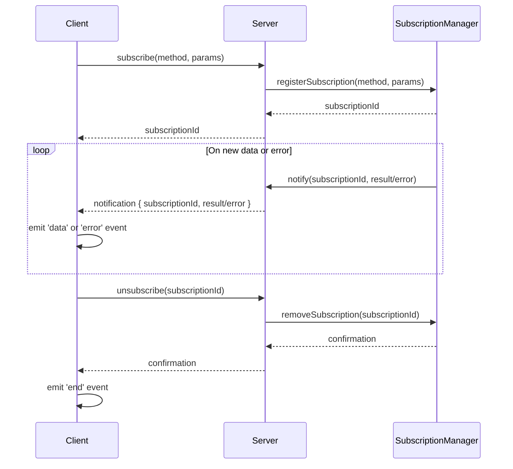

# JSON RPC client subscription API

## Pull Request by @skoszuta

- [x] subscription failure tests

@tomusdrw should we use rxjs observable instead of this makeshift sub system?


## Comment by @coderabbitai[bot]

<!-- This is an auto-generated comment: summarize by coderabbit.ai -->
<!-- This is an auto-generated comment: skip review by coderabbit.ai -->

> [!IMPORTANT]
> ## Review skipped
> 
> Auto incremental reviews are disabled on this repository.
> 
> Please check the settings in the CodeRabbit UI or the `.coderabbit.yaml` file in this repository. To trigger a single review, invoke the `@coderabbitai review` command.
> 
> You can disable this status message by setting the `reviews.review_status` to `false` in the CodeRabbit configuration file.

<!-- end of auto-generated comment: skip review by coderabbit.ai -->
<!-- walkthrough_start -->

<details>
<summary>📝 Walkthrough</summary>

## Summary by CodeRabbit

* **New Features**
  * Introduced subscription management, allowing clients to subscribe to real-time updates and receive events for data, errors, and completion.
  * Added a public method for subscribing to server-side events, with corresponding event emitters and unsubscribe functionality.

* **Bug Fixes**
  * Improved error handling for invalid and malformed requests, providing more descriptive error messages.

* **Tests**
  * Enhanced and expanded tests to cover subscription workflows, error scenarios, and event emissions.
## Walkthrough

The changes implement a structured subscription system for the RPC client and server. The client now supports subscribing and unsubscribing to events, with event emitters handling data, error, and end events. The server and subscription manager are updated to handle subscription notifications and errors more explicitly, and the types are refactored for clarity. End-to-end tests are expanded to cover these new subscription flows and error scenarios.

## Changes

| File(s)                                      | Change Summary                                                                                                  |
|----------------------------------------------|-----------------------------------------------------------------------------------------------------------------|
| bin/rpc/src/client.ts                        | Introduced subscription management: new interfaces, event emitters, subscribe/unsubscribe methods, and notification handling. |
| bin/rpc/src/server.ts                        | Refactored subscription/unsubscription method handling; improved error messages for invalid requests.            |
| bin/rpc/src/subscription-manager.ts          | Changed subscription method map to tuple format; unified notification sending and error handling; removed whitelist. |
| bin/rpc/src/types.ts                         | Refactored subscription notification types to a union of result and error variants with explicit param objects.  |
| bin/rpc/test/e2e.ts                          | Enhanced tests: added async subscription tests, error handling, and improved invalid request assertions.         |

## Sequence Diagram(s)



## Poem

> In tunnels of code, subscriptions bloom,  
> Events now dance from server to room.  
> Errors and data, each has its say,  
> With emitters to guide them along their way.  
> Tests now ensure the flow is right—  
> A rabbit hops, coding delight! 🐇✨

</details>

<!-- walkthrough_end -->
<!-- internal state start -->


<!-- DwQgtGAEAqAWCWBnSTIEMB26CuAXA9mAOYCmGJATmriQCaQDG+Ats2bgFyQAOFk+AIwBWJBrngA3EsgEBPRvlqU0AgfFwA6NPEgQAfACgjoCEYDEZyAAUASpETZWaCrKNwSPbABsvkCiQBHbGlcSHFcLzpIACIAKQBlAHkAOUgbKwBhRi94dntsAUQGCnhucXwsAEErAEloyAB3NGQHAWZ1Gno5MNgPbERKewBrfEQALzw0dGRbSAxHAUGAFgBWAGZ+LFxeyAAxL2wAM0PZABkVRAB6XFluEkWKFz8SblH1fBcNGB3mbSxD/AMfr8Q49VCzVDbDzwZjcSJsDC4ajwCog9D5QrFUrlKq1SAAvhQyAJFJpTLZXKIr7uSBKIolMoorDwDC0eAMajSHrUDH07FM/HaA7+MIhZCwNBSSCLMgoDAMA5KeiYei/ChDKLNBSwyKdL6VWhsnFoHyyAA0PUo0OQUyCIQFrwG9AI6Aw+ChfCYiJKAjwHwtAAECMx+rQKA0Lf4iM42RgiI1eh6wvhIP0PJg/AAPITIQQDCgSFSROWIGhoej4UFEoGPPK/DWIBCHUKtPmM1GIWSlkjMFA6nvsKIssEzGzUnYQ+WKrlE/yRQuIhRKRgSuNclWi0vIOec50pomtrHt3E1fHYeXGnI3DRGfTGcBQMgV0FoP3EMjKTrahGcHh8QQiGIkhct0TBKFQqjqFoOh3iYUBwKgqAZq+BDvuQVBfkwrDsFwVANPkThPKBijKJBmjaLoYCGPepgGGoGCXBQ3AMJciAUCxCqUpouCIBwBjRAJBgWJAlQ1Ghn5RA4hHyJWK6YKQiBuDsDCrgpcq4BQijYAw6a8keOKQL8GBoKQP72F2NC9i6RIAAY2MxGQ5OwNnZM0iD6nMJD4TZ8QFG2OIuSyNAUIcaA6a6yqQD5fn6UyACiUiInF7S4MFLkKm5kAkJmNCsiy8Y2Ql7DJR0lAuc46aGlELqrrQxaHgyBkkIlPGQAAFDZtDUGgNkWjZlCaRQvVRU+NkAJTjh4nF5G6+G/EFfw2lFDX8hUiAub83CQBqshRN0K3HpANQACLuUpHgAOr3PEgIaqEbCIIgJkeLVkR8KgZCrjpe60iQNBiHpjUCm64iHOyyJrdK8gqaIQz5fiHzLTFQMVDUtDlayWXqL0fA2f4DheLgLmI/1jwfIFWw7PjrwYAMPDOGgbDBe5kAXb0WAOCpczuvAYMcjiNqPMBFrVh81MVLG8YHTiADkyDNXkPalXwSutZ13XE7jA3k1lLU2gwTAUJLXiyDeBiVJ5+HcAUOQMEjmI+iQG1/bAigoDaVW0BaDQIFzAyskt0sCv4dqlpAEjwFMRLZUg4hxlFHI+M72yKBa2V3GIgf5fVGnw0HqInXKlrPIgNMDBaxQkJyS3RQ7q0YEVSUpWljTY66qa08j8CLGeF5MhapYfDOOz5xgFobv4uDYBQtPFwri6q8FZsW7wkiclF54rYsyeu/QSGe9yoRePg+BDMg2BbQeXeHd0J2Rn9JQK8gou1qXEvw5vXc90zu/4ppvY+QAKoACF4gZBsDUYBcUAD6ABZOK0AAASiRjpwOqMNROXhkDqFbtsYuo8jrHXHpjC+HZtI6UeocbwCgMBgwoL8AybUBAn0iBmDSwQi7i1piQMa99mD4CkM/Ee18DKHH/sXTaXwaihG2JpBo8syYUGwVWYRddDqoBBgjc8Xti6fzrt/F2btNrcHhqgdoj18oWkRgeSgUg+BcLpohDAhYcgVj4OQaM4gpBmxpDHUs8MHpPVIJAV68MCT2CRKyGMxIkjJDAOkLIDiuT+HmrPc8Kl5J0AtL6GRqj/LAx5nzCGWBQnxw0fgfC6dbY4I3KWCg2kp7+FoGbYSlRCafiZM/fcOwlAZQwp0tE6cPhfkRtbAQtssqInULkRSBgoAGiVOpSgoVwq13yRUFyDQ268HwHcCg4guQ2XgLQLgdT8rDRsj/RQpzc5xmGhufqLUSqpUoFwXyaicSN1wM8tKN55kHwyo9KK7z1kNyec3MqWUcpPnhoVcFytgAgtihUL5sC0DcD0JstuXo6kNMRmFHSjJ44Zj0XyHuVC+4VD+SJA+Nw7joByFqNZyKwXsDRdwFySgwYYHhvPNWXUkQXO1kNYh9B+qshstShZUQxkTOaLIeUhlDFiq3iQNqVyTkRJKHGC03AGbMF4h3IYs0MAAG0AC6Y0uBWH/kgEgiKRHxXhS8igmKi6AuQHZByTlESSrmTSxZq9Cw0GmAqu2GqN6d30Wq0eaMbnaqIFa6wtqBjAAkPgY5brhweqivZBgjkuJ+v+YGkowaPA7L2Tce2oLDXsuAGcnVkAkUowwFmrAOavX5p9UTG8Aloi3lovRRizFWLsVYrYygGgeJ8T7UJSwolxIYUko4NUMlQQZLXLMmkMJXj7IiZyMyTRkD8LZGDaqKYUkCI8ESHdwy0Q2UAckeIICwEQKgXAhByDUEXUQTUaAcVTg1HiNAFyYiWD4MdaiIyz0+Anu8CQKRlMPA2VeiQGwgRgilh3qnOeiiS5lw8OElkLjjnPFDq1I9kyvrnrlAqbAy4Dy3KILzXIbj4DMeMr4EOmHQjDmjnhwJz1dWaQjpLQyQ8aE0Byoh4uNkqFeDBj4dD5HsM6NnA/XILi0RX2jUqlO9AwMAOfaA8BkCYHwKQSgtBVhNlag3aQH6dJ2FiGnteqmf1p7kGdBfSIaccpUCAvHCoJsIO6YjRudjboE34NEBLLK8J2CTRXLDBGfBSVYgMfp5AlH7NREM6mRA8Mpg+3UCQHIYcBihA6o+4zr6zMfss9+39/7APAfGsmWkCrGbg1NMlhgcMykqI8BGhhMMbQYHkOlx2enf68GkHkLUNivT0DKwORcfGdguMw/e2rpn30Wa/dZyV3xUD+DhGFdc+7xB2xKzQcroQtl4KmLQLr7Q7bH1PhfJL+NQiySJMfZjdtwl6qoEzQYIPCvEsxgQ6Dpk8gpMWh3XLzSjDmHne0/pkNrI9NEF4BmAtBmZl3SMvgsr2STPCDMowyQKgIf4oJOZg6WTDpYmxVnkGMBgFh5O6d9P+2tLEqQdCu4CKrrRLlrdOwgEmbfeZz9VnYHoJoaWTAD27OqTy+I4xecOczcUF09EkOiA52i8c9gLHBgum1/HKEVkUxRx81NCoSIWTwx06ClASgplnr4BuF+XCxNTe7sN5VWr8pJYGCD9eD6n0vr23Lxr0Cf1/oA0BkD9g/qNC1JeqQKODA1CQ1FV4Phm313Wnr58snS/HjRcZUgQ1XKPRFjsAH5PKP+BWQQJpHXzy83kCDFj/MBSV2KRFDPeU4xfBtc1FE/QTbN48HjsO+NvBq+QIcP6MNlTNktzsBJjATReFFdzUG4MCcNCtOP37GAQu8xiyUE08AxhRAH0Ugyp6N/d/y/95oLY8i06+Dijw1KXjABwcyykUWy2xnwDwHHzE2FRP0H2KTOgMBpwjGLiX1CBX0JndnxE316C6BIAJDcw8H30wWPymBslfzPyZHiCYxckLAf3GWtF+j6SiAvjAypG+BD303QBeVhFahdEwVCw93C0xhxWc1aimGoKH1REe1gCL31XLy1AzAAlEFCC9Bdx5XjhsljXRjHzxmkFX2OxqBfCwAQMBBrEQAtBZG7HLDRDAMsRQA0P8GrnRBkNH3kMUNB3L00L+FhT0IxmVCwFJkGhcgbSICSw8IMlQHzEjhyGfx+hJFSGHGYTwQ5AGBZl2BZEP3NGLmiIFFiP/xv3kDvxwQ/0oHX3ER/wqxmkKRoIqGPxqKwKMJwI5BhlwIvgFU1ANg+GNlNjRxEgx2QI6yJF6Tx0x1nlkiGX2SiFGRtnJ3NwOVmSgGlzq323l1QUVxszkjXAM3ERsjrQiIHiYzdRdEOPRXrSYwtFNWOLDzjHNTdS8K23XGfkd1zFBAIQ3CD0OgjQiJZkgH9Rj121lwa0O2TxazT1s23B7CvXoDajdEgGPjXBViJ2GToAmkgEBNQJTAl0aEv1+AY26Q8EKyIGMkaS5FkkwGhiX0yP4Fg2VWwRCOrxxFrxgz9VnUZzACMCHSYlZzHTpWkCnV4j5znREkFw/CXXoCkjF1kgl3Ol2OCQ7zCi7yEWQ1iEQAqDzRZKZBp1P1kIwBckFL/nAymCN2LCCmWQu1wQUIdzhGQyjwNRcgrUoCrRdCmF71RGNL+waBTDZH8QvCWRCguxZhpA+HYxyN8EtODPCglDFUdOUKWinntKilNR1NRh0Q1K1OYnQwJlwHNWOxpHIHwjpEi3sDhHUCEScWsl9KDJWWkC4BsizIwG1I51zNXz1KQIChtO8MZkTPbjUIBj8Ndx0MCIMOwKJmPybM1JbOYnTIbkUU7LfyZCxTwRsgTPKnG34GEHUMk38NHI5zRiCPblCJ1lknPGNQqS2FuAQ24KhWJyiGnOzIYHnKXIaMNLCBvNwNmnRE9KwD+16DplwFrOjPrNDIQGQFy3Uk0loG0i5CqXZHKN5k/3N1H0WGApIFlE5goUQHk0BnrhLlX3G2lN12FSZPyPqINM/PpVxRc38DNkGLaWChGOxw8HGPxwGWmLRNmLcU8HGUWKmWWNvEgAyA1zFWbNbI+V1MouKVA3EQzFAutOylyjEyfNnIYDfINNXIUPXKUK4DTMPMzJnLzXbMJgLI6w9J5S9JvL4ixOLSHERCtNWQkrnLbNaNwE0tkqhRUthRco0pku7K8N0p8K4AAG98Ljw40m1DKABuQiwmLgPy0y3AOKgAXxsgMDsoDQcuCnrKij8vnKAMGk8u7OUphR0L8pKpXJ7OCr7LCoipxCivnLRjiuFS4AvJNTSoyqyrim4q/DUsktBSqo2WmF/Ksv/NBAGtcqkq1PcuGqwAAB9iRjLprQUiqPh5qMrOSIBuS6Jmc+TrgQhLgSAAAmBDXnWdAXRdEXGU5wNdRU6QBUmgCrbAUrVLYuZIskLIaaREMAfMOxIMlUgUSjT6TAb6Hs8sI0JkE0BqpkMAHcL8Z6qQzGHdETKIBAkA8OSgLspkJLObCOGAloMNWATSN0YEAhJG966IVVeIWxdkEgafGEZ6eodvF4PHcGrw5CTseUEmioQm5NFgO1MAAQZoTUbgHZMKBQ7YHkVVawpE2OMgdfRGAVNAceR6V0tU54HSYCegFWwyagMbe89QqIF4uW74qNMlLkUhdtFge0gyRGYVakWs4szcCjS/SGugLgWnLGkoM9IRHkasbtBQWsMQELfwQCVqYjR/EimarAbjMUCG5kZxaOv8EgJm4JCURsCgkGHGewGEbwNws0idCgP6s3CAwaWkaeHXWOqGUUWED4ZweAELK9IWMTGxAsSgOWA/HwWBUPbHORduCwrAaIRYUsYBY+freoTBcCyEEIaYfMQQiUXJEk0ilKLchAvlHs6OInY21UaQIJdMEhC2jLLkF0igE2fUQ0aZCoXIhfDPDuigLuhAwTNScJX4BTD4NgegeOrcfEkUQk4bCTOkWKKUboFkOjNunYKO1xMjHjSTPIDbDwZ+/e56d6tIhQ80w+roA2hQn+niFpdHZignVi1giYkYrih83isnO2JYqnf1GnB67LAk8sa9YkvOsk6gVzD4+89EqhhYmhwSmZIubYVAD/XtBnO8AwOCSZSvFCQgIXCSegLCH8XCNAfCW6oiaGEiCCNQciGCKiKRh8b8dQaBY5RAaBfwCOLyOgaBFXPdSR6R2gAANgEA3w5DWAAE4TqABGFxk6k61QNYWgAABgYCWBccOBOoAHY1gSAPGnGom0AiCN9DgnGPAHGjHlGTGzGLGZ9rHaBoEnxKI9AgA= -->

<!-- internal state end -->
<!-- tips_start -->

---


<details>
<summary>🪧 Tips</summary>

### Chat

There are 3 ways to chat with [CodeRabbit](https://coderabbit.ai?utm_source=oss&utm_medium=github&utm_campaign=FluffyLabs/typeberry&utm_content=453):

- Review comments: Directly reply to a review comment made by CodeRabbit. Example:
  - `I pushed a fix in commit <commit_id>, please review it.`
  - `Explain this complex logic.`
  - `Open a follow-up GitHub issue for this discussion.`
- Files and specific lines of code (under the "Files changed" tab): Tag `@coderabbitai` in a new review comment at the desired location with your query. Examples:
  - `@coderabbitai explain this code block.`
  -	`@coderabbitai modularize this function.`
- PR comments: Tag `@coderabbitai` in a new PR comment to ask questions about the PR branch. For the best results, please provide a very specific query, as very limited context is provided in this mode. Examples:
  - `@coderabbitai gather interesting stats about this repository and render them as a table. Additionally, render a pie chart showing the language distribution in the codebase.`
  - `@coderabbitai read src/utils.ts and explain its main purpose.`
  - `@coderabbitai read the files in the src/scheduler package and generate a class diagram using mermaid and a README in the markdown format.`
  - `@coderabbitai help me debug CodeRabbit configuration file.`

### Support

Need help? Create a ticket on our [support page](https://www.coderabbit.ai/contact-us/support) for assistance with any issues or questions.

Note: Be mindful of the bot's finite context window. It's strongly recommended to break down tasks such as reading entire modules into smaller chunks. For a focused discussion, use review comments to chat about specific files and their changes, instead of using the PR comments.

### CodeRabbit Commands (Invoked using PR comments)

- `@coderabbitai pause` to pause the reviews on a PR.
- `@coderabbitai resume` to resume the paused reviews.
- `@coderabbitai review` to trigger an incremental review. This is useful when automatic reviews are disabled for the repository.
- `@coderabbitai full review` to do a full review from scratch and review all the files again.
- `@coderabbitai summary` to regenerate the summary of the PR.
- `@coderabbitai generate sequence diagram` to generate a sequence diagram of the changes in this PR.
- `@coderabbitai resolve` resolve all the CodeRabbit review comments.
- `@coderabbitai configuration` to show the current CodeRabbit configuration for the repository.
- `@coderabbitai help` to get help.

### Other keywords and placeholders

- Add `@coderabbitai ignore` anywhere in the PR description to prevent this PR from being reviewed.
- Add `@coderabbitai summary` to generate the high-level summary at a specific location in the PR description.
- Add `@coderabbitai` anywhere in the PR title to generate the title automatically.

### Documentation and Community

- Visit our [Documentation](https://docs.coderabbit.ai) for detailed information on how to use CodeRabbit.
- Join our [Discord Community](http://discord.gg/coderabbit) to get help, request features, and share feedback.
- Follow us on [X/Twitter](https://twitter.com/coderabbitai) for updates and announcements.

</details>

<!-- tips_end -->


## Comment by @github-actions[bot]


<details>
<summary>View all</summary>

| File | Benchmark | Ops |  |
|------|-----------|-----|--|
| [bytes/hex-to.ts[0]](../blob/06f25d8cf1a9a70fe0b5fb643ffa083fd4fb71c4//_work/typeberry-1/typeberry/typeberry/benchmarks/bytes/hex-to.ts) | number toString + padding | 333578.4 ±0.1% | fastest ✅ |
| [bytes/hex-to.ts[1]](../blob/06f25d8cf1a9a70fe0b5fb643ffa083fd4fb71c4//_work/typeberry-1/typeberry/typeberry/benchmarks/bytes/hex-to.ts) | manual | 16411.17 ±0.19% | 95.08% slower |
| [bytes/hex-from.ts[0]](../blob/06f25d8cf1a9a70fe0b5fb643ffa083fd4fb71c4//_work/typeberry-1/typeberry/typeberry/benchmarks/bytes/hex-from.ts) | parse hex using `Number` with NaN checking | 146374.93 ±0.09% | 83.79% slower |
| [bytes/hex-from.ts[1]](../blob/06f25d8cf1a9a70fe0b5fb643ffa083fd4fb71c4//_work/typeberry-1/typeberry/typeberry/benchmarks/bytes/hex-from.ts) | parse hex from char codes | 903231.78 ±0.14% | fastest ✅ |
| [bytes/hex-from.ts[2]](../blob/06f25d8cf1a9a70fe0b5fb643ffa083fd4fb71c4//_work/typeberry-1/typeberry/typeberry/benchmarks/bytes/hex-from.ts) | parse hex from string nibbles | 561508.19 ±0.24% | 37.83% slower |
| [hash/index.ts[0]](../blob/06f25d8cf1a9a70fe0b5fb643ffa083fd4fb71c4//_work/typeberry-1/typeberry/typeberry/benchmarks/hash/index.ts) | hash with numeric representation | 191.1 ±0.2% | 28.3% slower |
| [hash/index.ts[1]](../blob/06f25d8cf1a9a70fe0b5fb643ffa083fd4fb71c4//_work/typeberry-1/typeberry/typeberry/benchmarks/hash/index.ts) | hash with string representation | 120.16 ±0.49% | 54.92% slower |
| [hash/index.ts[2]](../blob/06f25d8cf1a9a70fe0b5fb643ffa083fd4fb71c4//_work/typeberry-1/typeberry/typeberry/benchmarks/hash/index.ts) | hash with symbol representation | 184.94 ±0.03% | 30.61% slower |
| [hash/index.ts[3]](../blob/06f25d8cf1a9a70fe0b5fb643ffa083fd4fb71c4//_work/typeberry-1/typeberry/typeberry/benchmarks/hash/index.ts) | hash with uint8 representation | 165.6 ±0.03% | 37.87% slower |
| [hash/index.ts[4]](../blob/06f25d8cf1a9a70fe0b5fb643ffa083fd4fb71c4//_work/typeberry-1/typeberry/typeberry/benchmarks/hash/index.ts) | hash with packed representation | 266.53 ±0.09% | fastest ✅ |
| [hash/index.ts[5]](../blob/06f25d8cf1a9a70fe0b5fb643ffa083fd4fb71c4//_work/typeberry-1/typeberry/typeberry/benchmarks/hash/index.ts) | hash with bigint representation | 182.06 ±0.06% | 31.69% slower |
| [hash/index.ts[6]](../blob/06f25d8cf1a9a70fe0b5fb643ffa083fd4fb71c4//_work/typeberry-1/typeberry/typeberry/benchmarks/hash/index.ts) | hash with uint32 representation | 204.24 ±0.18% | 23.37% slower |
| [codec/bigint.compare.ts[0]](../blob/06f25d8cf1a9a70fe0b5fb643ffa083fd4fb71c4//_work/typeberry-1/typeberry/typeberry/benchmarks/codec/bigint.compare.ts) | compare custom | 234480564.46 ±7.99% | 10.87% slower |
| [codec/bigint.compare.ts[1]](../blob/06f25d8cf1a9a70fe0b5fb643ffa083fd4fb71c4//_work/typeberry-1/typeberry/typeberry/benchmarks/codec/bigint.compare.ts) | compare bigint | 263066688.09 ±6.49% | fastest ✅ |
| [codec/bigint.decode.ts[0]](../blob/06f25d8cf1a9a70fe0b5fb643ffa083fd4fb71c4//_work/typeberry-1/typeberry/typeberry/benchmarks/codec/bigint.decode.ts) | decode custom | 175764434.29 ±2.6% | fastest ✅ |
| [codec/bigint.decode.ts[1]](../blob/06f25d8cf1a9a70fe0b5fb643ffa083fd4fb71c4//_work/typeberry-1/typeberry/typeberry/benchmarks/codec/bigint.decode.ts) | decode bigint | 108761473.61 ±2.43% | 38.12% slower |
| [collections/map-set.ts[0]](../blob/06f25d8cf1a9a70fe0b5fb643ffa083fd4fb71c4//_work/typeberry-1/typeberry/typeberry/benchmarks/collections/map-set.ts) | 2 gets + conditional set | 121513.03 ±0.11% | fastest ✅ |
| [collections/map-set.ts[1]](../blob/06f25d8cf1a9a70fe0b5fb643ffa083fd4fb71c4//_work/typeberry-1/typeberry/typeberry/benchmarks/collections/map-set.ts) | 1 get 1 set | 61735.64 ±0.01% | 49.19% slower |
| [math/add_one_overflow.ts[0]](../blob/06f25d8cf1a9a70fe0b5fb643ffa083fd4fb71c4//_work/typeberry-1/typeberry/typeberry/benchmarks/math/add_one_overflow.ts) | add and take modulus | 260737797.12 ±6.03% | 2.02% slower |
| [math/add_one_overflow.ts[1]](../blob/06f25d8cf1a9a70fe0b5fb643ffa083fd4fb71c4//_work/typeberry-1/typeberry/typeberry/benchmarks/math/add_one_overflow.ts) | condition before calculation | 266120765.3 ±5.61% | fastest ✅ |
| [math/count-bits-u64.ts[0]](../blob/06f25d8cf1a9a70fe0b5fb643ffa083fd4fb71c4//_work/typeberry-1/typeberry/typeberry/benchmarks/math/count-bits-u64.ts) | standard method | 1253005.67 ±0.26% | 90.02% slower |
| [math/count-bits-u64.ts[1]](../blob/06f25d8cf1a9a70fe0b5fb643ffa083fd4fb71c4//_work/typeberry-1/typeberry/typeberry/benchmarks/math/count-bits-u64.ts) | magic | 12552638.84 ±0.37% | fastest ✅ |
| [logger/index.ts[0]](../blob/06f25d8cf1a9a70fe0b5fb643ffa083fd4fb71c4//_work/typeberry-1/typeberry/typeberry/benchmarks/logger/index.ts) | console.log with string concat | 7547386.74 ±52.25% | fastest ✅ |
| [logger/index.ts[1]](../blob/06f25d8cf1a9a70fe0b5fb643ffa083fd4fb71c4//_work/typeberry-1/typeberry/typeberry/benchmarks/logger/index.ts) | console.log with args | 220449.5 ±118.31% | 97.08% slower |
| [math/count-bits-u32.ts[0]](../blob/06f25d8cf1a9a70fe0b5fb643ffa083fd4fb71c4//_work/typeberry-1/typeberry/typeberry/benchmarks/math/count-bits-u32.ts) | standard method | 86508811.57 ±18.13% | 63.91% slower |
| [math/count-bits-u32.ts[1]](../blob/06f25d8cf1a9a70fe0b5fb643ffa083fd4fb71c4//_work/typeberry-1/typeberry/typeberry/benchmarks/math/count-bits-u32.ts) | magic | 239691128.84 ±6.38% | fastest ✅ |
| [math/mul_overflow.ts[0]](../blob/06f25d8cf1a9a70fe0b5fb643ffa083fd4fb71c4//_work/typeberry-1/typeberry/typeberry/benchmarks/math/mul_overflow.ts) | multiply and bring back to u32 | 246795540.29 ±6.78% | 4.49% slower |
| [math/mul_overflow.ts[1]](../blob/06f25d8cf1a9a70fe0b5fb643ffa083fd4fb71c4//_work/typeberry-1/typeberry/typeberry/benchmarks/math/mul_overflow.ts) | multiply and take modulus | 258409685.39 ±5.76% | fastest ✅ |
| [math/switch.ts[0]](../blob/06f25d8cf1a9a70fe0b5fb643ffa083fd4fb71c4//_work/typeberry-1/typeberry/typeberry/benchmarks/math/switch.ts) | switch | 249309216.04 ±6.98% | fastest ✅ |
| [math/switch.ts[1]](../blob/06f25d8cf1a9a70fe0b5fb643ffa083fd4fb71c4//_work/typeberry-1/typeberry/typeberry/benchmarks/math/switch.ts) | if | 248085018.7 ±7.55% | 0.49% slower |
| [codec/encoding.ts[0]](../blob/06f25d8cf1a9a70fe0b5fb643ffa083fd4fb71c4//_work/typeberry-1/typeberry/typeberry/benchmarks/codec/encoding.ts) | manual encode | 46639.05 ±57.25% | 98.26% slower |
| [codec/encoding.ts[1]](../blob/06f25d8cf1a9a70fe0b5fb643ffa083fd4fb71c4//_work/typeberry-1/typeberry/typeberry/benchmarks/codec/encoding.ts) | int32array encode | 2215547.83 ±0.26% | 17.58% slower |
| [codec/encoding.ts[2]](../blob/06f25d8cf1a9a70fe0b5fb643ffa083fd4fb71c4//_work/typeberry-1/typeberry/typeberry/benchmarks/codec/encoding.ts) | dataview encode | 2687986.48 ±0.66% | fastest ✅ |
| [codec/decoding.ts[0]](../blob/06f25d8cf1a9a70fe0b5fb643ffa083fd4fb71c4//_work/typeberry-1/typeberry/typeberry/benchmarks/codec/decoding.ts) | manual decode | 12839544.68 ±0.43% | 93.6% slower |
| [codec/decoding.ts[1]](../blob/06f25d8cf1a9a70fe0b5fb643ffa083fd4fb71c4//_work/typeberry-1/typeberry/typeberry/benchmarks/codec/decoding.ts) | int32array decode | 200679444.59 ±4.2% | fastest ✅ |
| [codec/decoding.ts[2]](../blob/06f25d8cf1a9a70fe0b5fb643ffa083fd4fb71c4//_work/typeberry-1/typeberry/typeberry/benchmarks/codec/decoding.ts) | dataview decode | 186111090.8 ±4.88% | 7.26% slower |
| [codec/view_vs_collection.ts[0]](../blob/06f25d8cf1a9a70fe0b5fb643ffa083fd4fb71c4//_work/typeberry-1/typeberry/typeberry/benchmarks/codec/view_vs_collection.ts) | Get first element from Decoded | 27483.93 ±0.21% | 57.97% slower |
| [codec/view_vs_collection.ts[1]](../blob/06f25d8cf1a9a70fe0b5fb643ffa083fd4fb71c4//_work/typeberry-1/typeberry/typeberry/benchmarks/codec/view_vs_collection.ts) | Get first element from View | 65390.52 ±0.93% | fastest ✅ |
| [codec/view_vs_collection.ts[2]](../blob/06f25d8cf1a9a70fe0b5fb643ffa083fd4fb71c4//_work/typeberry-1/typeberry/typeberry/benchmarks/codec/view_vs_collection.ts) | Get 50th element from Decoded | 26881.76 ±0.39% | 58.89% slower |
| [codec/view_vs_collection.ts[3]](../blob/06f25d8cf1a9a70fe0b5fb643ffa083fd4fb71c4//_work/typeberry-1/typeberry/typeberry/benchmarks/codec/view_vs_collection.ts) | Get 50th element from View | 37084.97 ±0.25% | 43.29% slower |
| [codec/view_vs_collection.ts[4]](../blob/06f25d8cf1a9a70fe0b5fb643ffa083fd4fb71c4//_work/typeberry-1/typeberry/typeberry/benchmarks/codec/view_vs_collection.ts) | Get last element from Decoded | 27397.64 ±0.31% | 58.1% slower |
| [codec/view_vs_collection.ts[5]](../blob/06f25d8cf1a9a70fe0b5fb643ffa083fd4fb71c4//_work/typeberry-1/typeberry/typeberry/benchmarks/codec/view_vs_collection.ts) | Get last element from View | 26727.5 ±0.37% | 59.13% slower |
| [codec/view_vs_object.ts[0]](../blob/06f25d8cf1a9a70fe0b5fb643ffa083fd4fb71c4//_work/typeberry-1/typeberry/typeberry/benchmarks/codec/view_vs_object.ts) | Get the first field from Decoded | 430465.7 ±0.63% | 0.48% slower |
| [codec/view_vs_object.ts[1]](../blob/06f25d8cf1a9a70fe0b5fb643ffa083fd4fb71c4//_work/typeberry-1/typeberry/typeberry/benchmarks/codec/view_vs_object.ts) | Get the first field from View | 98588.4 ±1.08% | 77.21% slower |
| [codec/view_vs_object.ts[2]](../blob/06f25d8cf1a9a70fe0b5fb643ffa083fd4fb71c4//_work/typeberry-1/typeberry/typeberry/benchmarks/codec/view_vs_object.ts) | Get the first field as view from View | 100519.79 ±0.98% | 76.76% slower |
| [codec/view_vs_object.ts[3]](../blob/06f25d8cf1a9a70fe0b5fb643ffa083fd4fb71c4//_work/typeberry-1/typeberry/typeberry/benchmarks/codec/view_vs_object.ts) | Get two fields from Decoded | 432528.99 ±0.11% | fastest ✅ |
| [codec/view_vs_object.ts[4]](../blob/06f25d8cf1a9a70fe0b5fb643ffa083fd4fb71c4//_work/typeberry-1/typeberry/typeberry/benchmarks/codec/view_vs_object.ts) | Get two fields from View | 74325.97 ±2.19% | 82.82% slower |
| [codec/view_vs_object.ts[5]](../blob/06f25d8cf1a9a70fe0b5fb643ffa083fd4fb71c4//_work/typeberry-1/typeberry/typeberry/benchmarks/codec/view_vs_object.ts) | Get two fields from materialized from View | 152564.99 ±1.69% | 64.73% slower |
| [codec/view_vs_object.ts[6]](../blob/06f25d8cf1a9a70fe0b5fb643ffa083fd4fb71c4//_work/typeberry-1/typeberry/typeberry/benchmarks/codec/view_vs_object.ts) | Get two fields as views from View | 75797.19 ±1.52% | 82.48% slower |
| [codec/view_vs_object.ts[7]](../blob/06f25d8cf1a9a70fe0b5fb643ffa083fd4fb71c4//_work/typeberry-1/typeberry/typeberry/benchmarks/codec/view_vs_object.ts) | Get only third field from Decoded | 422982.92 ±0.84% | 2.21% slower |
| [codec/view_vs_object.ts[8]](../blob/06f25d8cf1a9a70fe0b5fb643ffa083fd4fb71c4//_work/typeberry-1/typeberry/typeberry/benchmarks/codec/view_vs_object.ts) | Get only third field from View | 101115.79 ±0.24% | 76.62% slower |
| [codec/view_vs_object.ts[9]](../blob/06f25d8cf1a9a70fe0b5fb643ffa083fd4fb71c4//_work/typeberry-1/typeberry/typeberry/benchmarks/codec/view_vs_object.ts) | Get only third field as view from View | 102279.81 ±0.23% | 76.35% slower |
| [collections/map_vs_sorted.ts[0]](../blob/06f25d8cf1a9a70fe0b5fb643ffa083fd4fb71c4//_work/typeberry-1/typeberry/typeberry/benchmarks/collections/map_vs_sorted.ts) | Map | 289596.36 ±0.07% | fastest ✅ |
| [collections/map_vs_sorted.ts[1]](../blob/06f25d8cf1a9a70fe0b5fb643ffa083fd4fb71c4//_work/typeberry-1/typeberry/typeberry/benchmarks/collections/map_vs_sorted.ts) | Map-array | 103633.39 ±0.04% | 64.21% slower |
| [collections/map_vs_sorted.ts[2]](../blob/06f25d8cf1a9a70fe0b5fb643ffa083fd4fb71c4//_work/typeberry-1/typeberry/typeberry/benchmarks/collections/map_vs_sorted.ts) | Array | 81802.06 ±0.95% | 71.75% slower |
| [collections/map_vs_sorted.ts[3]](../blob/06f25d8cf1a9a70fe0b5fb643ffa083fd4fb71c4//_work/typeberry-1/typeberry/typeberry/benchmarks/collections/map_vs_sorted.ts) | SortedArray | 188244.6 ±0.43% | 35% slower |
| [bytes/compare.ts[0]](../blob/06f25d8cf1a9a70fe0b5fb643ffa083fd4fb71c4//_work/typeberry-1/typeberry/typeberry/benchmarks/bytes/compare.ts) | Comparing Uint32 bytes | 17976.64 ±3.48% | 15.31% slower |
| [bytes/compare.ts[1]](../blob/06f25d8cf1a9a70fe0b5fb643ffa083fd4fb71c4//_work/typeberry-1/typeberry/typeberry/benchmarks/bytes/compare.ts) | Comparing raw bytes | 21226.86 ±1.01% | fastest ✅ |
| [hash/blake2b.ts[0]](../blob/06f25d8cf1a9a70fe0b5fb643ffa083fd4fb71c4//_work/typeberry-1/typeberry/typeberry/benchmarks/hash/blake2b.ts) | hasher with simple allocator | 0.05 ±1.74% | fastest ✅ |
| [hash/blake2b.ts[1]](../blob/06f25d8cf1a9a70fe0b5fb643ffa083fd4fb71c4//_work/typeberry-1/typeberry/typeberry/benchmarks/hash/blake2b.ts) | hasher with page allocator | 0.04 ±1.67% | 20% slower |
| [crypto/ed25519.ts[0]](../blob/06f25d8cf1a9a70fe0b5fb643ffa083fd4fb71c4//_work/typeberry-1/typeberry/typeberry/benchmarks/crypto/ed25519.ts) | native crypto | 5.2 ±19.16% | 82.46% slower |
| [crypto/ed25519.ts[1]](../blob/06f25d8cf1a9a70fe0b5fb643ffa083fd4fb71c4//_work/typeberry-1/typeberry/typeberry/benchmarks/crypto/ed25519.ts) | wasm lib | 10.64 ±0.04% | 64.1% slower |
| [crypto/ed25519.ts[2]](../blob/06f25d8cf1a9a70fe0b5fb643ffa083fd4fb71c4//_work/typeberry-1/typeberry/typeberry/benchmarks/crypto/ed25519.ts) | wasm lib batch | 29.64 ±0.67% | fastest ✅ |
</details>


### Benchmarks summary: 63/63 OK ✅

<!-- thollander/actions-comment-pull-request "benchmarks" -->


## Comment by @tomusdrw

👍 


## Comment by @tomusdrw

```suggestion
          params: { subscriptionId, error: `${error}` },
```
this should be pretty safe


## Comment by @tomusdrw

I hope this would be improved with zod validation as well, right?


## Comment by @tomusdrw

Shall we rather have a repository of supported methods? I'm not 100% sure if we can rely  on the "subscribe/unsubscribe" method always be just a capitalized version.


## Comment by @tomusdrw

I've noticed you asked about `rxjs` in the description, but I'm wondering if we should rather have something in-between, i.e. just use `EventEmitter`?

So that the `subscribe` method would return something that can emit two/three events (`data`, `error`, `end`) and expose `unsubscribe()` method.


## Comment by @skoszuta

yes


## Comment by @skoszuta

with the spec as is there are no exceptions but youre right and it crossed my mind. tbh i feel like a simple "unsubscribe" method would be enough, since all you need to unsubscribe is a subscription id. but i guess for now, a repo would be the safest.

which btw makes me realize that there's a security flaw we should take care of:
- either check whether the unsubscribing client is the same as the one who subscribed
- or make ids random hashes so they cant be arbitrarily guessed 


## Comment by @skoszuta

sure, i think that would work. ill make it happen


## Comment by @skoszuta

https://github.com/FluffyLabs/typeberry/issues/458


## Comment by @skoszuta

done


## Comment by @skoszuta

repo added


## Comment by @skoszuta

done
