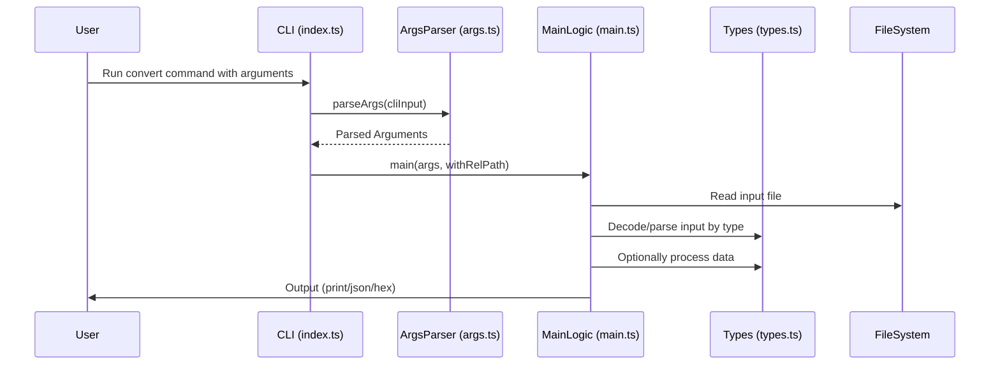

# JAM-Codec / JSON conversion tool

## Pull Request by @tomusdrw

A standalone tool to read HEX/JSON files (maybe also `.bin` if needed, but didn't really have a use case for this now) and just display the structure read. Kind of similar to `https://papi.fluffylabs.dev` but more convenient to use and easier to maintan.

While working on networking I went on a tangent to implement #352 (together with #412 support), however to maintain compatibility with current version of jamduna test vectors I had to convert their `genesis_header.json` and `genesis_state.json` into JIP-4 compatible format. I've realised that this kind of conversions might be useful not only once, but also in the future - hence this PR.

It currently supports just a small subset of things that can be loaded, but it should be easy to add whatever is needed in the future.


## Comment by @coderabbitai[bot]

<!-- This is an auto-generated comment: summarize by coderabbit.ai -->
<!-- This is an auto-generated comment: skip review by coderabbit.ai -->

> [!IMPORTANT]
> ## Review skipped
> 
> Auto incremental reviews are disabled on this repository.
> 
> Please check the settings in the CodeRabbit UI or the `.coderabbit.yaml` file in this repository. To trigger a single review, invoke the `@coderabbitai review` command.
> 
> You can disable this status message by setting the `reviews.review_status` to `false` in the CodeRabbit configuration file.

<!-- end of auto-generated comment: skip review by coderabbit.ai -->
<!-- walkthrough_start -->

<details>
<summary>📝 Walkthrough</summary>

## Summary by CodeRabbit

* **New Features**
  * Introduced a new command-line tool for inspecting and converting JAM-related formats, with support for various input types, processing options, and output formats (print, JSON, hex).
  * Added comprehensive documentation and usage examples for the new tool.

* **Documentation**
  * Updated and expanded documentation with a new section in the main README and a dedicated README for the conversion tool.

* **Tests**
  * Added a test suite to validate command-line argument parsing for the new tool.

* **Chores**
  * Added a new workspace and package configuration for the conversion tool.

* **Style**
  * Updated help messages for improved clarity in usage instructions.

* **Refactor**
  * Enhanced internal classes to include debugging capabilities.
## Walkthrough

A new CLI tool, `@typeberry/convert`, was introduced with supporting documentation, argument parsing, main logic, type handling, and tests. The root and workspace package manifests were updated to include this tool. Minor documentation and string constant changes were made elsewhere, and some classes were updated to inherit from a debug utility base.

## Changes

| File(s)                                                                                     | Change Summary                                                                                                  |
|---------------------------------------------------------------------------------------------|-----------------------------------------------------------------------------------------------------------------|
| README.md                                                                                   | Added "Additional tooling" section referencing `@typeberry/convert`.                                            |
| bin/convert/README.md                                                                       | New documentation for the `@typeberry/convert` tool, describing usage, options, and examples.                   |
| bin/convert/package.json                                                                    | New package manifest for `@typeberry/convert` with scripts and dependencies.                                    |
| bin/convert/args.ts, bin/convert/args.test.ts                                               | New CLI argument parser and test suite for parsing and validating CLI options and arguments.                    |
| bin/convert/index.ts                                                                        | New CLI entry point script for `@typeberry/convert`.                                                            |
| bin/convert/main.ts                                                                         | Implements the main conversion logic for input/output transformation and processing.                            |
| bin/convert/types.ts                                                                        | Defines supported types, codecs, JSON parsers, and processing logic for the converter.                          |
| package.json                                                                                | Added `bin/convert` to the workspaces list.                                                                     |
| bin/jam/args.ts                                                                            | Updated help message to use "@typeberry/jam" and revised usage examples.                                        |
| packages/core/pvm-spi-decoder/decode-standard-program.ts                                    | Classes now extend `WithDebug` from `@typeberry/utils` and call `super()` in constructors.                      |

## Sequence Diagram(s)



## Poem

> 🐇  
> A clever new tool hops in today,  
> To convert and inspect in a JAM-packed way.  
> With arguments parsed and types to decode,  
> It reads, it processes, along its new road.  
> Debugging gets stronger, the docs are precise—  
> This bunny’s delighted, the updates are nice!  
> 🥕

</details>

<!-- walkthrough_end -->
<!-- internal state start -->


<!-- DwQgtGAEAqAWCWBnSTIEMB26CuAXA9mAOYCmGJATmriQCaQDG+Ats2bgFyQAOFk+AIwBWJBrngA3EsgEBPRvlqU0AgfFwA6NPEgQAfACgjoCEYDEZyAAUASpETZWaCrKNxU3bABsvkCiQBHbGlcABpIcVwvOkgAIgApAEEAWTAAYUVRSAB6SHiAZQB5ADkFDCkKRHh8LAJ8L1DYyAB3NGQHAWZ1Gno5CNgSSGxESgiWYdoKZvRkW0gMRwFRgBYAVmWUWoHIADEvbAAzA9kAGRVEbNxZbhIlihc/Em58KoIXDRhtpgxcCngBPDVLDwH4URTYBjSdD2XCYWhoLw1QZ1XxKKpEcj0AiPND0AASAFEABroDD0AolSAHeDRRDhZrqWA8fA0H7wBFUvDYfz2bDcZ4UXBU/B8AAGGjUGFFVJp0nCCNwsHw2CITIw+EY3P8PyGI0YbUGBxFkHFkulqHgSjZ1LoHzgyPw9QA5MhePBmM55AdsBgxECUMhsbQkNwvGh5IrBohfhDcNzBvgDv1BvDYTj6Acwcxk3rqbSPgBJIWoNEMP5LehtSBLEFEezumnOMbJyAkAAeSHEGDrNS8IId9XQQtguFw3EQHGy2W4aG48A0B32R1kYYEiA0Sgk1bw6HdgY1S0gzBFg2+Ugw8HYpPoJDal742I9INhII0bm2x/EEmo/qND4Q+6Ds4LwptytbzCQuDNCKADW4HQRQMGPGGPTNu6oYkGwbLdgGDhQmYADMqwAEzXpAZjLAAjMRdoak+PzaFgTDMDO4hqH2VwtIyLYMFqV4VFUNT8EmQhoMwtA+mgEQhJAUhiCKdItmgeBKnw5B0DE2JnpQQqiqQ5BVIgAD6Ay4pQGhCIgNTSnCJr6dISBGdG1AkBZVlSjKtKbNiUnxAWVhgBszGsf80TChQHqaJANiiPgGLwAAXuBirULyDBMtplRAsgTDeL0gzDCQ3q+Essg1FiAH1t2YUgs5vokOEkY4IqxqbiQiI3BVqAos2BxoAwNLqC5nJxjymWCRg65GIkQq8NI7CNdsPUOPyIq4MgvbyFJfZdKhHQjEKiaQKmUlXDcgawKlDCYNWgyImZtDhACxbFsgaLwBimkHoM7aslUAjRPKPj4AyOG4sG4g1ByK0CkK2KHuDMRVupSj0CCLbeqNrlGPoxjgFAZD0EdykEMQZDKKhzFYZwPB8IIIh+lIMjyEwShUKo6haDouMmFA7jIKgN0k4Q9lUJTLDU1wVDTA4TgPH0rPKBzmjaLoYCGHjpgGDYBKJAAIskBIaOJHAGLE5sGBYkCJAWZPkGLMSyx6DxHelmCkIg76DDr+uG8bGayi0VZ8qmX2bAw+xKNC5Ay6IkO1Oo0T0LEiS0BDQIciitYaE0/P2HH/rg8gUlVNVgwAj4kHMs+jwHJQZADThTWigAAmdtyUC42SZbg0oouEpblkjxdDOIHERhqtU3GI/B8D3CisEJSTJOFkWKQyirQv4KGSHdIJIdi6jID7BtG5AxQaiyAxzzUrKHXwf6RV2dZu92ULNPXR5mTMlqGlmLb+GPN+XwxMIhUEGjhAGmAkJ9nIEOFshNhIY1lG+IwltLCJC8DQMW2VmxNSUBHZwP4agbSTO2WGMRjSeABvABgrY2TiGkEYC+5A3zm1iDjLWkpu41AqLgbIJ8/YmzNhbK2Ns7YU0do4Z28hXaXTfp7AwiQILTEEQSTyhpjTNzbtcDu9xZA8PKDpPujpfCXRkCQMg6A062k+CWfAvFqbHWkGWf4UImoohdDwbkzwRj0gQOlAMzZ57LzANvFyWJdEWKgpYrAwYjj1x1I/ag65IBFnsNPeANoLqnglnCMAsCCqIDQKQHg1BsEYHCCCCO2Bgw4XwNweOyA/wZNEFk2QyUviXXRogaeVIwwSGNAAClFMVLw0pjSii7LIUUA8irKSwclDUUyQQzIAJRkSkrwBx0hS51mjE8Zss5QzyCWH+BMeBPBRXtLyVagpKGXJ3Mk9a6AeSijdD8aUQzvhWTCsqMceA5l9W8LgNZ4RRSWWsvKMkJoBhti+aExWdC4VgAbpkeg0Y/jdjWXabYajab4AkL/ZA7YxIYQXh6Mkb1MIkN+D+HC41fz/wpKUbEcLwjDBKQmJMTVFxoEGXTRpQJoX0G2ZCRAezoTORoMdRw3BvIaikm7EEYBelZGCj+AGmiIrUELEKBEVl5gsncZdOG2wQRXIiLooJwtIq0IRF4eQSgaBiBiAIA0RMtiGkDr9MgE1IAjI0HCiZYo3LWRxWg9B1ssEU1wdifBogww4JIUg8ha1KF8GoX2Oh7B1CXkUSw1ydicryNKUXaOJBpi0AcY4dgxCsB5kGLZatUJ1RCmPPEraGAWaZGcYQ5Nk02EWwMBAMARhuE92yM4Ig64aDRg0OtU27Co3iNFhE3kctZFJlfh7d8qAY7SWjBo8KLY0gnALK8ogtadQzkqKMYBloXI5NupdIlxojrN1vSMRIFAZ3Sm9L6eOVJ/7N2neuSy0oO3eCLekg6yA+TQjnUKBw6gingQvkoNyXiAQ0lwGAdGSHgNiUrbBTZEqdLIG/H8ZUrpnCSsQJCDAzhqipJuUhnKhLRhfvAnIxirSBrUmukBhpTSA2iggHygVoowUEvFRtIVKaRkQDFbs6TQKFn6t/deoUwDgiKWbVkuu2pDqPKFM85AIyPm93BZCqU4Lg04rSTpygWT839FSk1C1O5WJMlQEwe4cdHVgMwIgR+bqtoEqJajMpm9/C/IqJyQDQJcVRmwKh9AXhDXsdbPcY08jaCwLrH0NoIxBSdI89sL9oxFRgmaCStskIFOTS4pvNVAnaFHl2Vy5AzQBhYDRT6bB4EfQw3TUTUzq8UlVPKAiS09hZAMTbAGroErOmDBgiQWQCFk4EFiDJ40I2+QULRhgS17dWNLRCPBvUShDmBGwLNzi6VRAwX3GUakEUWxVcrFppx9M47IEioE8hcdHYxjEPGKaaCxExoHW9hN/b62kNbG2Y7s9vE0JzQw/NONz6VsPchtLMrEYnZNBO3hOkp2/tnSEBdiA+4hDWyjtHAG/RCXeXRkgP6/3AZYCaMDblxQiI4SOrhIJDF8KpzOunS7REYNtmuva0jPRIJ3UwpRKiKX5MKZe7TZS718Cg2FFprd253C7j3c0AtQTgkhLQPVuooSii6BeFbvdmxVcgGei9XmXm2VG4KeTomWnKqwG1/p/LhnibAJJkUanZO7PAh2wYSmwAqYlfH33VqbjTctY2mLsARX8Am88lLR5wRhTTYH6EzrtBJ11Fy7IAwvDysxeBQe/xwIB9Qud8I/y88ijXkX9PkqRPZQd0oakBlSQmm59p+n2em0wpuqKQopmdiD+oNKMgjgWtMl007qzsyTS2eP7ZUUwbUE3PoszsbiW2dYA53e7nC+R8msGNLL357NiWucFQWQ4Qv0VAfoYMMKD6qYPGTWxcMKvieaUMvg068+DuZAf44qX2cWDc3KjwQQ8A/gP2V61MFmWe7cZEWejaMm4BT6PE3SYefSsefAJSjER6ME6ozQWAB+FmKy3aIaJoYy8ez2DAr2J6TUY+8BcQu2kAG2W2Io+U5yLY/eTym+YQZEk+Gmz6ChZmShzY7yWK7uWSQwk0mSNo9uTmGWhqfqkORqKOdK5ANGuuhB6OohzWgCfGaABw2C+ueyqCeI7UNwD8PoD+1uNSUcT+Iw0AuiJisks2ocLYxB1qjBtUhOdyPeUS4KAhME0A+AkRFQ7S6B809USCTUsQEhUh224KVWa+AKuAG+Oq7u2IlBxOMBnO8hJeShReoRJAhQTWkRnutkDRgwIIwYUWD2ICUBe+ziwKWCUR+w0gZeooJWOkF8yQJ4L+/6ARQG3wH2zAyA6oBhIOrq+B8+jhYxLh6MbhHh3G3YV+H4FeTamWGoVefuJoAA0qwRgGkDQfkNPNvgsNmCHjQfxhHgKhdgmBUA6mUL8IOIuCDPQg4HFjCH8DPA0f6EdN7j/ngIpBHLeHwJ3MaGwBKt1ieitqPnwCCOAfYewPpjCv4KNM1iXODljPQKKHPoQRMsIHHOMeCd9mRP0aKkQmwNglDuYBgrDkjngtsAQkmmKUdI8RmhjtmvQpEDjiOtbDYjeKjnfj8rCDqKKISCcFYFwG3t2NKN8C+BeDhJyqUokRQLGLgv7kdnfk4VNFAKnNFrKZEjcLPr9pSdKBvEyNsn4YwhOLwQMiKFwK8SDO8Z8d8eUWCHJoab8LWMflMrolwPkA6fcrQOETcMmb7lYNQLAAmVikQMmRoTUZFFwJUVcuWVvm+C6WqbfpmfQrvqvuvkob6dxGwMwHcMGaKFYLocmfEO5MmT4fCnWaqW6RqU2azkBh0S/t8n2AWKdngEWbWAANoAC69IjIMUXg+ZioXAQyEgq52KkAAAvHoAibWGslwCyT6eOa6TEO6c2dmKKBGWwR8YxF8aIB2ZvF2T2VwKKNAKssmTsN4OMkOiLqOuOuLpOoMe2DLsLiugruTA7Bisri7NuqWursogeu2KIHgCoGFAxn8I0oqQ8M8DXBaDbhJHbpsGTrBRToKNkPBW2HTuKKYXBkMPKoiEQEQOBJsR9NyPWtWB6vwFgDdGQESmCBgE4lRuyFqioUVP2CPM3n4ffkBtiHFvUFIMhD+Lpfnj5iCfYK4mRVVhxk4GSAUv2BST8NduBEqsMAQK+VVqsRpcKpAPloVjlmCJUNWPIFZkzriYbl1mWjCpaYMGpYtFYu2HmjhH6TCNQMMJAJRIWEmIgU4pcfshCJCHQIpOoPqD4CPM7oxGsUlkJAlU1NyRlZSWRFVQWY8PFuZNbN2ijo1qJjVpGf5SaPRDZGNMpKqMobxaQFiBqHVPCBQDeLlhQEXtdIVOgTshKs2LFUKAldKslWAKlZ8FGKZYdBgEFjac1oqKgLxR1vofhbxKhMGP4GIEFkMm2igCxGNjJs6pQC7uFgvLekzkboMAAKo2AnDimDAj6bCDJCb+g+aoLCnRrYJinxoSmJpEKiYylTmoRULYCY6Kl5rq5QDFD44EDcAFIkBSC+AkXwBkWnV0Ik70Wijk5GLMWsXsXjG7HPm5pBkADcGWvgisfgI2ZQ6c8BQWvWViTUP1QSF1eAMQ11gWsgkFnCY6BgdNku9EiFy6YiKF9s66TsKuvGCi00muVM2uNlgI48X86MM5/o1FkJtFYc88WeJ0Gi0SH8Vi8SRmV45mZEINkY2Y/U/mdSdY2IbWrmmk8RMKoe/Grm4NJCDu3eyA/guI4EZBsoJKjIowVYKKaK0WkoKuAMggG0fALKcy2C71vQXoPqbYf0yW216Jr0fa6K6O3J7qIwnqC1UWIdNwXiBCigPGBdRQpQWV+oM47E2N0BlY+c0QBxjAAJQdgmIlQyYy6O0yjmiQ7howXd/t04dGtYfeTWHII+AlN0CM/IfYYc+C1AUk+h3eH1HiuiA8SARF4EmdDlq9Uwzgo1tMxNV4K2QOAwxlb+9ADt3UfWxeVR9FSIhRsA/g2qa8XAVmMQU8BcNQ4QGdvo9dy8CgBCfevdlIRp/Fxh4xvE0YfOpW7IfYCUIlLSQdmcUSkAfYG2kAAAQrIHOgw4iAIE9B9M+EXniG0LAHrLQvHJ6GXibeoPINUpHFCMFZ5XCN5S0odskfA8uZobUYpMSYnUo47RypNBmVdbFBvU/d2EXvI2jvvfUlAR8BkDbr4NCdMKgJirGPGO/V5QMRoyQa9Q/nMqzLWJvVlIYwnqtn47ZBoZNqOPBNxO2JdE5bvIvlPS9m9hYTyOCddCMMXDyM4/bpGjDrDR1RqAjlKcjWQqjXKVmh1mzcqVAGBeVRJWqYBfREMmBred6XZduYqLufuYWQGseVeaeRed00QDebJPgJaOaI/krZTiretKKEhaLgrWM8xTOIIVymGhgLLhwurRImhRujIqrthYorhfjhzos6QMs/+oHOYrdFYtTS0tombp3AYpbmUkczBkKJPipV9v1DBFyp1rCIA76JHOBExmwOEAJP6EMgAAwaAQuUQvUuKkXxzhDZp+op7JBWAnBgA0Rgsya2QkyqQBp7CHDHCQBnBriOY3ILOfNWkcYYDUhXp4EzAz4Ej5Dl4SRhQJWijFG6KxBcCxA/WxAcXX58bsAUVDM6i2TZ0PAS2wiKXODlxXz5xwzLKM0QZ2jQTzDcDZhk2NKpMpjKWYiAXOSCiRGHUtjZkkD5C7XkVl2svcRTKIDwrtFIZGs+hc0mgLq06TOO26jgS2tLYQCOtl7ktfOSkyvUo3BkgNxuZCTMAgrk1hSm66Lm4zImUNIxCBsewBrgkgtCQQtQsbK2RNS+oUBMa+DO4ggNjRjShpsp5ZtYAAB6qVNEAAHBGtDiKdk3GrkwjYjgU42WjZmhjQqWUzjXjtMFW32vk0CIBTojcImxLsYuMQKbiOfUpWG1aANFCOjLTYxfTfwlWyc9M9BYrdu5LudqrXLtbBrZIuhZujs+7DhZrqa+a3C8y9BgxRgHO8xaex61bWCDbRVKlK89PkqvUBPcJkmFfQA8u+diegY0QJ493X4yyp4dvWRE4XvXGYnvFYyGcdWIiIIeHcaNKoMJSlyk4qab9A7uhGtJRsxnYUiopEh1VpUEY2PKI+5SmpmHzjcwm3c9vkwIgLIAcj7dSe1OunhxyD9cZf5j9KjTaovj9v/iaPkL9VYFYIUDYNAASHrEZNAAAJpWCMsmm3yMQ8bsliAXQAewtuKtj9RMgQcxN9CAtL6ipght38C72+AClKi0DNLGiwfwf+3hBIdoguazbkPwue0YcBNECoIEi2e3Jo4kFCvyAehiN/O1IkCmxQCiiZ0kA2Qwqijr15fsfNboTRDUxM6igEioNKD5dMl6x6PFfPiUB9RoEtLivyAkNhf1oPkn7DklePC0kOV5B92eHVZ14njv1ST8XnhT18Yz32rxwPlYBoclsj5skMwvO6vgSmM9hjHYu80YD2wDcpSHR+FUFCQI710O0JUlxGGXhExNaoLpkKMekbvpdRy534c0FhKieoRDvtAQhMhVhfevbIO3hszrykb+CwxQ+ISPMUtygtCkaobbFF5SRWAABqK8hGckbwHwrpcBxbjq8ocQvS8ATQJBsddd/tUq2pE1LncUVAfx/8n+cgc6ZesQRHYAEkLElP1q1PsH2Q69DlwIGAYAXZIonXsIjRjPbdroUXo+Yx2IQB/UZqH+jow4vD4QC9Qr+aWDYCAR66evUInH2YTURH4QNJ3I5pAdAw2Y6M8ldhXXZDMQj8UO1+tx/QyVjGdKrvgY1qXl4ElNJ6TvyVoP4d/uMvJAv3KEUty79jEOcWgBTGNCDKJCnYV4/nNPKHjHW9gTMKVDrvkHaYu3olzd4lLYJBtkhUFAqq93lC5jmTbbsaKa8NOr3buCKNaO6NmNAPuOj56piX8RfYVYooL3x2pr0oHekodvUYl0npR09nbjVnjSCk4xq39CisAXDUkAtmw+ivBKgZ+aD5DZz5WpmAukynqn6nmn2nenBn+QUsEPm0kAE/Y2prm50ofY0YXeOj7d78biJGFwKNVp4X4H6DVxIDC9GuGDUQAx1G5McqSjPOTMHzii0I5aMzGCu+1EjMApcs6CcEhXWaK4pEN7XWrugMA3I1KnWAkqUlwZlA6oukPUlYF9LBxuAocd+mrhbDBhekYYWQKmzBBEBme8wYjGRAiqbBE+TSANgIKEFOcg4JaO9hmH/gcsZ2dzSnhqFiDTs9EXcHAU0HEa1ImcNbeYIsGaoZAAsvScqLWBJ4tgxBpKFiF5A/g8gQ466M3uIR476JIAa5J0huSaC2RlBWg+QJ4KgIblHqsMSAMAElBgARQYAWzGAFB6IA9AaguIDgI8FeCfBMKWIMkMCFNJghVHQUGEIiFRCYhcQhIR8Avj8BIwc8XZs2Epo70mkBvU0mCGsaIhpgDg4jmZChorpRSOTLgYjThypoimRMftn32xzDsyhaueJgMIboDtSmDCJ1L0KRyc1X+FvRMun0mjalGBBIfUkZx+BXhWggObusYQwGHs92tmVZshQ2Za0MKW6ObnrQoFdI721iHzhWhaGwRek/UCAb8HkDss5muAPlkDRRydhg+nYJBAhFewLN3uLYQ5ojxOYaJcUqADtMHWfSgi3hkId7EJQHTdU9BtPIWGnCJ570PmQbXAnHCl4GE2YACTXgSk24p8H6OEMdiR1IBOIUQb2G6nFAvAJRnO0jMkGFGOo7F8cyI8ERlhqAzpf4eRN9MMCCw/80aBkDoVk1b5HVO2HfCdimm76Okhhg7EYYolxoahxhy1SYb33VFKlpATocdkjWyiLD9qEYbYPyPeFojaWIlTdicP657DuK7Ao4VrCrYXBpO04CQMwHr7wAeejXCgNAMViqp6eb9NPNILEhns1m8uC4UrlIFYU72iiG5IQnIzIBRQyQGlC4HyAkAiA1MZMl8XgCZjjwLgM/AV0LH9kmeYkX0p/ARH4MVeFdRBM3AADqjIBrgCBLLl9TwYYJai4O44qD9E2QE2q/gJHHMvcIoOLM8DJCWCACyYEAVqRtLyQ/KrQl0eui0jglRQK0SgEMjWQ9EwQfhILGW3EBhdkQ5qDANfFQxMlWxiodsSqDKoP5HsstaurkOQzR8nEzog1BqCcE95J4H3QYKKGvF8Nbgd40oZfAqG0M0BdCY0A0KhLNCbh6bFcR6EwzQ1ME7bNvgqJNF9CVRTZfUTMMNGaivcPY9McWKl45i8x7AE0thUUF84cusnVMcgBInZjcx+Y7Qo8UYBETIAjE2QGRKcS+oqUkAQCbeM7EJUFxsYA7GwLXHaiNxW4igDuKFxQA0gHE8fnOC4mUSFBvOV8mxPolv8VJWYpNtiFomhDtJhYridYUJjIBBJwE4SdxFElLjVxP4wqiWxklyTxyikkrEpznCVjBB1Y+CW73/iGS1o7E9yRWMjHMBIiAUvIcZM8mhSzJ/EyyR2N/IZRaUi4t4PZNtrSS+Q243cW6I1i8x6ERMdKngBFioV10VMdgFLDQAywrh3VRWOzDUAqxuY6sAwHlKpjqAjIloYyP4CJSVo6ATkWEHkNxjNT8YjAYiMsAACcaANAI22IirACIAAdjmnLAAAbI2wOBzTG2lEAQKsCWnLABABEDaQcAYDEQSAywOaQcGIgHBKIqwRtgRDVi5ThprU3AO1J85GQupl4D+LQCMiIJ9AQAA -->

<!-- internal state end -->
<!-- tips_start -->

---


<details>
<summary>🪧 Tips</summary>

### Chat

There are 3 ways to chat with [CodeRabbit](https://coderabbit.ai?utm_source=oss&utm_medium=github&utm_campaign=FluffyLabs/typeberry&utm_content=454):

- Review comments: Directly reply to a review comment made by CodeRabbit. Example:
  - `I pushed a fix in commit <commit_id>, please review it.`
  - `Explain this complex logic.`
  - `Open a follow-up GitHub issue for this discussion.`
- Files and specific lines of code (under the "Files changed" tab): Tag `@coderabbitai` in a new review comment at the desired location with your query. Examples:
  - `@coderabbitai explain this code block.`
  -	`@coderabbitai modularize this function.`
- PR comments: Tag `@coderabbitai` in a new PR comment to ask questions about the PR branch. For the best results, please provide a very specific query, as very limited context is provided in this mode. Examples:
  - `@coderabbitai gather interesting stats about this repository and render them as a table. Additionally, render a pie chart showing the language distribution in the codebase.`
  - `@coderabbitai read src/utils.ts and explain its main purpose.`
  - `@coderabbitai read the files in the src/scheduler package and generate a class diagram using mermaid and a README in the markdown format.`
  - `@coderabbitai help me debug CodeRabbit configuration file.`

### Support

Need help? Create a ticket on our [support page](https://www.coderabbit.ai/contact-us/support) for assistance with any issues or questions.

Note: Be mindful of the bot's finite context window. It's strongly recommended to break down tasks such as reading entire modules into smaller chunks. For a focused discussion, use review comments to chat about specific files and their changes, instead of using the PR comments.

### CodeRabbit Commands (Invoked using PR comments)

- `@coderabbitai pause` to pause the reviews on a PR.
- `@coderabbitai resume` to resume the paused reviews.
- `@coderabbitai review` to trigger an incremental review. This is useful when automatic reviews are disabled for the repository.
- `@coderabbitai full review` to do a full review from scratch and review all the files again.
- `@coderabbitai summary` to regenerate the summary of the PR.
- `@coderabbitai generate sequence diagram` to generate a sequence diagram of the changes in this PR.
- `@coderabbitai resolve` resolve all the CodeRabbit review comments.
- `@coderabbitai configuration` to show the current CodeRabbit configuration for the repository.
- `@coderabbitai help` to get help.

### Other keywords and placeholders

- Add `@coderabbitai ignore` anywhere in the PR description to prevent this PR from being reviewed.
- Add `@coderabbitai summary` to generate the high-level summary at a specific location in the PR description.
- Add `@coderabbitai` anywhere in the PR title to generate the title automatically.

### Documentation and Community

- Visit our [Documentation](https://docs.coderabbit.ai) for detailed information on how to use CodeRabbit.
- Join our [Discord Community](http://discord.gg/coderabbit) to get help, request features, and share feedback.
- Follow us on [X/Twitter](https://twitter.com/coderabbitai) for updates and announcements.

</details>

<!-- tips_end -->


## Comment by @github-actions[bot]


<details>
<summary>View all</summary>

| File | Benchmark | Ops |  |
|------|-----------|-----|--|
| [bytes/hex-to.ts[0]](../blob/b9a2750e560bba757ab34f550fb099140167002c//_work/typeberry-runner-2/typeberry/typeberry/benchmarks/bytes/hex-to.ts) | number toString + padding | 322123.25 ±0.13% | fastest ✅ |
| [bytes/hex-to.ts[1]](../blob/b9a2750e560bba757ab34f550fb099140167002c//_work/typeberry-runner-2/typeberry/typeberry/benchmarks/bytes/hex-to.ts) | manual | 16514.66 ±0.23% | 94.87% slower |
| [codec/bigint.decode.ts[0]](../blob/b9a2750e560bba757ab34f550fb099140167002c//_work/typeberry-runner-2/typeberry/typeberry/benchmarks/codec/bigint.decode.ts) | decode custom | 180450026.44 ±2.3% | fastest ✅ |
| [codec/bigint.decode.ts[1]](../blob/b9a2750e560bba757ab34f550fb099140167002c//_work/typeberry-runner-2/typeberry/typeberry/benchmarks/codec/bigint.decode.ts) | decode bigint | 110351038.76 ±2% | 38.85% slower |
| [collections/map-set.ts[0]](../blob/b9a2750e560bba757ab34f550fb099140167002c//_work/typeberry-runner-2/typeberry/typeberry/benchmarks/collections/map-set.ts) | 2 gets + conditional set | 110757.87 ±0.08% | fastest ✅ |
| [collections/map-set.ts[1]](../blob/b9a2750e560bba757ab34f550fb099140167002c//_work/typeberry-runner-2/typeberry/typeberry/benchmarks/collections/map-set.ts) | 1 get 1 set | 59933.43 ±0.59% | 45.89% slower |
| [codec/decoding.ts[0]](../blob/b9a2750e560bba757ab34f550fb099140167002c//_work/typeberry-runner-2/typeberry/typeberry/benchmarks/codec/decoding.ts) | manual decode | 22681711.56 ±0.46% | 87.21% slower |
| [codec/decoding.ts[1]](../blob/b9a2750e560bba757ab34f550fb099140167002c//_work/typeberry-runner-2/typeberry/typeberry/benchmarks/codec/decoding.ts) | int32array decode | 166015355.09 ±3.48% | 6.41% slower |
| [codec/decoding.ts[2]](../blob/b9a2750e560bba757ab34f550fb099140167002c//_work/typeberry-runner-2/typeberry/typeberry/benchmarks/codec/decoding.ts) | dataview decode | 177388157.49 ±2.66% | fastest ✅ |
| [math/count-bits-u64.ts[0]](../blob/b9a2750e560bba757ab34f550fb099140167002c//_work/typeberry-runner-2/typeberry/typeberry/benchmarks/math/count-bits-u64.ts) | standard method | 1308948.59 ±0.13% | 88.33% slower |
| [math/count-bits-u64.ts[1]](../blob/b9a2750e560bba757ab34f550fb099140167002c//_work/typeberry-runner-2/typeberry/typeberry/benchmarks/math/count-bits-u64.ts) | magic | 11219170.63 ±1.32% | fastest ✅ |
| [math/count-bits-u32.ts[0]](../blob/b9a2750e560bba757ab34f550fb099140167002c//_work/typeberry-runner-2/typeberry/typeberry/benchmarks/math/count-bits-u32.ts) | standard method | 90744004.46 ±1.74% | 65.46% slower |
| [math/count-bits-u32.ts[1]](../blob/b9a2750e560bba757ab34f550fb099140167002c//_work/typeberry-runner-2/typeberry/typeberry/benchmarks/math/count-bits-u32.ts) | magic | 262756805.18 ±4.19% | fastest ✅ |
| [math/mul_overflow.ts[0]](../blob/b9a2750e560bba757ab34f550fb099140167002c//_work/typeberry-runner-2/typeberry/typeberry/benchmarks/math/mul_overflow.ts) | multiply and bring back to u32 | 265105805.51 ±5.46% | fastest ✅ |
| [math/mul_overflow.ts[1]](../blob/b9a2750e560bba757ab34f550fb099140167002c//_work/typeberry-runner-2/typeberry/typeberry/benchmarks/math/mul_overflow.ts) | multiply and take modulus | 260023262.68 ±5.89% | 1.92% slower |
| [math/switch.ts[0]](../blob/b9a2750e560bba757ab34f550fb099140167002c//_work/typeberry-runner-2/typeberry/typeberry/benchmarks/math/switch.ts) | switch | 270337475.89 ±6.23% | fastest ✅ |
| [math/switch.ts[1]](../blob/b9a2750e560bba757ab34f550fb099140167002c//_work/typeberry-runner-2/typeberry/typeberry/benchmarks/math/switch.ts) | if | 263570111.2 ±5.54% | 2.5% slower |
| [codec/encoding.ts[0]](../blob/b9a2750e560bba757ab34f550fb099140167002c//_work/typeberry-runner-2/typeberry/typeberry/benchmarks/codec/encoding.ts) | manual encode | 3068013.44 ±0.27% | 17.7% slower |
| [codec/encoding.ts[1]](../blob/b9a2750e560bba757ab34f550fb099140167002c//_work/typeberry-runner-2/typeberry/typeberry/benchmarks/codec/encoding.ts) | int32array encode | 3727833.18 ±0.31% | fastest ✅ |
| [codec/encoding.ts[2]](../blob/b9a2750e560bba757ab34f550fb099140167002c//_work/typeberry-runner-2/typeberry/typeberry/benchmarks/codec/encoding.ts) | dataview encode | 3628465.98 ±0.64% | 2.67% slower |
| [hash/index.ts[0]](../blob/b9a2750e560bba757ab34f550fb099140167002c//_work/typeberry-runner-2/typeberry/typeberry/benchmarks/hash/index.ts) | hash with numeric representation | 188.09 ±0.95% | 28.79% slower |
| [hash/index.ts[1]](../blob/b9a2750e560bba757ab34f550fb099140167002c//_work/typeberry-runner-2/typeberry/typeberry/benchmarks/hash/index.ts) | hash with string representation | 119.35 ±0.53% | 54.82% slower |
| [hash/index.ts[2]](../blob/b9a2750e560bba757ab34f550fb099140167002c//_work/typeberry-runner-2/typeberry/typeberry/benchmarks/hash/index.ts) | hash with symbol representation | 185.25 ±0.19% | 29.87% slower |
| [hash/index.ts[3]](../blob/b9a2750e560bba757ab34f550fb099140167002c//_work/typeberry-runner-2/typeberry/typeberry/benchmarks/hash/index.ts) | hash with uint8 representation | 164.5 ±0.25% | 37.72% slower |
| [hash/index.ts[4]](../blob/b9a2750e560bba757ab34f550fb099140167002c//_work/typeberry-runner-2/typeberry/typeberry/benchmarks/hash/index.ts) | hash with packed representation | 264.15 ±0.39% | fastest ✅ |
| [hash/index.ts[5]](../blob/b9a2750e560bba757ab34f550fb099140167002c//_work/typeberry-runner-2/typeberry/typeberry/benchmarks/hash/index.ts) | hash with bigint representation | 190.95 ±0.18% | 27.71% slower |
| [hash/index.ts[6]](../blob/b9a2750e560bba757ab34f550fb099140167002c//_work/typeberry-runner-2/typeberry/typeberry/benchmarks/hash/index.ts) | hash with uint32 representation | 202.32 ±0.32% | 23.41% slower |
| [logger/index.ts[0]](../blob/b9a2750e560bba757ab34f550fb099140167002c//_work/typeberry-runner-2/typeberry/typeberry/benchmarks/logger/index.ts) | console.log with string concat | 8097208.35 ±29.66% | fastest ✅ |
| [logger/index.ts[1]](../blob/b9a2750e560bba757ab34f550fb099140167002c//_work/typeberry-runner-2/typeberry/typeberry/benchmarks/logger/index.ts) | console.log with args | 1133709.87 ±86.43% | 86% slower |
| [math/add_one_overflow.ts[0]](../blob/b9a2750e560bba757ab34f550fb099140167002c//_work/typeberry-runner-2/typeberry/typeberry/benchmarks/math/add_one_overflow.ts) | add and take modulus | 258007538.27 ±6.54% | 5.81% slower |
| [math/add_one_overflow.ts[1]](../blob/b9a2750e560bba757ab34f550fb099140167002c//_work/typeberry-runner-2/typeberry/typeberry/benchmarks/math/add_one_overflow.ts) | condition before calculation | 273923024.41 ±5.64% | fastest ✅ |
| [codec/bigint.compare.ts[0]](../blob/b9a2750e560bba757ab34f550fb099140167002c//_work/typeberry-runner-2/typeberry/typeberry/benchmarks/codec/bigint.compare.ts) | compare custom | 270484067.56 ±5.33% | fastest ✅ |
| [codec/bigint.compare.ts[1]](../blob/b9a2750e560bba757ab34f550fb099140167002c//_work/typeberry-runner-2/typeberry/typeberry/benchmarks/codec/bigint.compare.ts) | compare bigint | 262561593.24 ±6.22% | 2.93% slower |
| [bytes/hex-from.ts[0]](../blob/b9a2750e560bba757ab34f550fb099140167002c//_work/typeberry-runner-2/typeberry/typeberry/benchmarks/bytes/hex-from.ts) | parse hex using `Number` with NaN checking | 119573.2 ±0.21% | 83.24% slower |
| [bytes/hex-from.ts[1]](../blob/b9a2750e560bba757ab34f550fb099140167002c//_work/typeberry-runner-2/typeberry/typeberry/benchmarks/bytes/hex-from.ts) | parse hex from char codes | 713246.04 ±0.31% | fastest ✅ |
| [bytes/hex-from.ts[2]](../blob/b9a2750e560bba757ab34f550fb099140167002c//_work/typeberry-runner-2/typeberry/typeberry/benchmarks/bytes/hex-from.ts) | parse hex from string nibbles | 449760.6 ±0.2% | 36.94% slower |
| [codec/view_vs_object.ts[0]](../blob/b9a2750e560bba757ab34f550fb099140167002c//_work/typeberry-runner-2/typeberry/typeberry/benchmarks/codec/view_vs_object.ts) | Get the first field from Decoded | 330423.55 ±0.72% | 17.17% slower |
| [codec/view_vs_object.ts[1]](../blob/b9a2750e560bba757ab34f550fb099140167002c//_work/typeberry-runner-2/typeberry/typeberry/benchmarks/codec/view_vs_object.ts) | Get the first field from View | 96775.21 ±1.27% | 75.74% slower |
| [codec/view_vs_object.ts[2]](../blob/b9a2750e560bba757ab34f550fb099140167002c//_work/typeberry-runner-2/typeberry/typeberry/benchmarks/codec/view_vs_object.ts) | Get the first field as view from View | 99285.38 ±0.3% | 75.11% slower |
| [codec/view_vs_object.ts[3]](../blob/b9a2750e560bba757ab34f550fb099140167002c//_work/typeberry-runner-2/typeberry/typeberry/benchmarks/codec/view_vs_object.ts) | Get two fields from Decoded | 396404.39 ±0.36% | 0.63% slower |
| [codec/view_vs_object.ts[4]](../blob/b9a2750e560bba757ab34f550fb099140167002c//_work/typeberry-runner-2/typeberry/typeberry/benchmarks/codec/view_vs_object.ts) | Get two fields from View | 79238.84 ±0.27% | 80.14% slower |
| [codec/view_vs_object.ts[5]](../blob/b9a2750e560bba757ab34f550fb099140167002c//_work/typeberry-runner-2/typeberry/typeberry/benchmarks/codec/view_vs_object.ts) | Get two fields from materialized from View | 164030.86 ±0.18% | 58.88% slower |
| [codec/view_vs_object.ts[6]](../blob/b9a2750e560bba757ab34f550fb099140167002c//_work/typeberry-runner-2/typeberry/typeberry/benchmarks/codec/view_vs_object.ts) | Get two fields as views from View | 78907.01 ±0.3% | 80.22% slower |
| [codec/view_vs_object.ts[7]](../blob/b9a2750e560bba757ab34f550fb099140167002c//_work/typeberry-runner-2/typeberry/typeberry/benchmarks/codec/view_vs_object.ts) | Get only third field from Decoded | 398917.83 ±0.34% | fastest ✅ |
| [codec/view_vs_object.ts[8]](../blob/b9a2750e560bba757ab34f550fb099140167002c//_work/typeberry-runner-2/typeberry/typeberry/benchmarks/codec/view_vs_object.ts) | Get only third field from View | 99063.74 ±0.29% | 75.17% slower |
| [codec/view_vs_object.ts[9]](../blob/b9a2750e560bba757ab34f550fb099140167002c//_work/typeberry-runner-2/typeberry/typeberry/benchmarks/codec/view_vs_object.ts) | Get only third field as view from View | 98872.63 ±0.27% | 75.21% slower |
| [codec/view_vs_collection.ts[0]](../blob/b9a2750e560bba757ab34f550fb099140167002c//_work/typeberry-runner-2/typeberry/typeberry/benchmarks/codec/view_vs_collection.ts) | Get first element from Decoded | 25638.99 ±0.41% | 59.15% slower |
| [codec/view_vs_collection.ts[1]](../blob/b9a2750e560bba757ab34f550fb099140167002c//_work/typeberry-runner-2/typeberry/typeberry/benchmarks/codec/view_vs_collection.ts) | Get first element from View | 62760.86 ±0.36% | fastest ✅ |
| [codec/view_vs_collection.ts[2]](../blob/b9a2750e560bba757ab34f550fb099140167002c//_work/typeberry-runner-2/typeberry/typeberry/benchmarks/codec/view_vs_collection.ts) | Get 50th element from Decoded | 25641.96 ±0.4% | 59.14% slower |
| [codec/view_vs_collection.ts[3]](../blob/b9a2750e560bba757ab34f550fb099140167002c//_work/typeberry-runner-2/typeberry/typeberry/benchmarks/codec/view_vs_collection.ts) | Get 50th element from View | 35024.77 ±0.36% | 44.19% slower |
| [codec/view_vs_collection.ts[4]](../blob/b9a2750e560bba757ab34f550fb099140167002c//_work/typeberry-runner-2/typeberry/typeberry/benchmarks/codec/view_vs_collection.ts) | Get last element from Decoded | 25632.75 ±0.36% | 59.16% slower |
| [codec/view_vs_collection.ts[5]](../blob/b9a2750e560bba757ab34f550fb099140167002c//_work/typeberry-runner-2/typeberry/typeberry/benchmarks/codec/view_vs_collection.ts) | Get last element from View | 24696.31 ±0.2% | 60.65% slower |
| [hash/blake2b.ts[0]](../blob/b9a2750e560bba757ab34f550fb099140167002c//_work/typeberry-runner-2/typeberry/typeberry/benchmarks/hash/blake2b.ts) | hasher with simple allocator | 0.046 ±0.74% | fastest ✅ |
| [hash/blake2b.ts[1]](../blob/b9a2750e560bba757ab34f550fb099140167002c//_work/typeberry-runner-2/typeberry/typeberry/benchmarks/hash/blake2b.ts) | hasher with page allocator | 0.045 ±0.98% | 2.17% slower |
| [bytes/compare.ts[0]](../blob/b9a2750e560bba757ab34f550fb099140167002c//_work/typeberry-runner-2/typeberry/typeberry/benchmarks/bytes/compare.ts) | Comparing Uint32 bytes | 19576.34 ±0.29% | fastest ✅ |
| [bytes/compare.ts[1]](../blob/b9a2750e560bba757ab34f550fb099140167002c//_work/typeberry-runner-2/typeberry/typeberry/benchmarks/bytes/compare.ts) | Comparing raw bytes | 19152.35 ±9.92% | 2.17% slower |
| [collections/map_vs_sorted.ts[0]](../blob/b9a2750e560bba757ab34f550fb099140167002c//_work/typeberry-runner-2/typeberry/typeberry/benchmarks/collections/map_vs_sorted.ts) | Map | 296046.04 ±0.03% | fastest ✅ |
| [collections/map_vs_sorted.ts[1]](../blob/b9a2750e560bba757ab34f550fb099140167002c//_work/typeberry-runner-2/typeberry/typeberry/benchmarks/collections/map_vs_sorted.ts) | Map-array | 103539.78 ±0.02% | 65.03% slower |
| [collections/map_vs_sorted.ts[2]](../blob/b9a2750e560bba757ab34f550fb099140167002c//_work/typeberry-runner-2/typeberry/typeberry/benchmarks/collections/map_vs_sorted.ts) | Array | 73987.23 ±0.2% | 75.01% slower |
| [collections/map_vs_sorted.ts[3]](../blob/b9a2750e560bba757ab34f550fb099140167002c//_work/typeberry-runner-2/typeberry/typeberry/benchmarks/collections/map_vs_sorted.ts) | SortedArray | 196159.11 ±0.19% | 33.74% slower |
| [crypto/ed25519.ts[0]](../blob/b9a2750e560bba757ab34f550fb099140167002c//_work/typeberry-runner-2/typeberry/typeberry/benchmarks/crypto/ed25519.ts) | native crypto | 5.19 ±20.68% | 82.6% slower |
| [crypto/ed25519.ts[1]](../blob/b9a2750e560bba757ab34f550fb099140167002c//_work/typeberry-runner-2/typeberry/typeberry/benchmarks/crypto/ed25519.ts) | wasm lib | 10.65 ±0.02% | 64.3% slower |
| [crypto/ed25519.ts[2]](../blob/b9a2750e560bba757ab34f550fb099140167002c//_work/typeberry-runner-2/typeberry/typeberry/benchmarks/crypto/ed25519.ts) | wasm lib batch | 29.83 ±0.59% | fastest ✅ |
</details>


### Benchmarks summary: 63/63 OK ✅

<!-- thollander/actions-comment-pull-request "benchmarks" -->


## Comment by @coderabbitai[bot]

_⚠️ Potential issue_

**Replace `as` conversion with `tryAs` method.**

The coding guidelines specify that `as` conversions must not be used. Use `tryAs` conversion methods instead.


```diff
-        const state = data as InMemoryState;
+        // Need to check if InMemoryState has a tryAs method, or implement proper type checking
+        if (!isInMemoryState(data)) {
+          throw new Error("Expected InMemoryState but received different type");
+        }
+        const state = data;
```

You'll need to implement `isInMemoryState` type guard or use the appropriate `tryAs` method if available on the `InMemoryState` type.


> Committable suggestion skipped: line range outside the PR's diff.

<details>
<summary>🤖 Prompt for AI Agents</summary>

```
In bin/convert/types.ts at line 83, replace the direct type assertion using `as`
with a safer conversion method by implementing and using an `isInMemoryState`
type guard or the existing `tryAs` method for `InMemoryState`. This involves
checking if `data` can be converted to `InMemoryState` using `tryAs` and
handling the case where the conversion fails, instead of directly asserting the
type.
```

</details>

<!-- This is an auto-generated comment by CodeRabbit -->

<!-- fingerprinting:phantom:poseidon:panther -->


## Comment by @coderabbitai[bot]

_⚠️ Potential issue_

**Fix forward reference to `KnownChainSpec`.**

The `Arguments` type references `KnownChainSpec` on line 39, but the enum is defined later at line 128. This forward reference should be resolved by moving the enum definition before its usage.


Move the `KnownChainSpec` enum definition to before line 38, or reorganize the file structure to avoid forward references.

<details>
<summary>🤖 Prompt for AI Agents</summary>

```
In bin/convert/args.ts around lines 38 to 44, the Arguments type references the
KnownChainSpec enum before it is defined at line 128, causing a forward
reference issue. To fix this, move the KnownChainSpec enum definition so that it
appears before line 38, ensuring it is declared before being used in the
Arguments type. Alternatively, reorganize the file to place the enum above the
Arguments type to avoid forward references.
```

</details>

<!-- This is an auto-generated comment by CodeRabbit -->

<!-- fingerprinting:phantom:poseidon:panther -->


## Comment by @coderabbitai[bot]

_⚠️ Potential issue_

**Replace `as` type assertions with safer alternatives.**

The function uses `as Record<S, T>` type assertions on lines 144 and 156, which violates the TypeScript coding guidelines that prohibit `as` conversions.


Consider using a type-safe approach:

```diff
 function parseOption<S extends string, T>(
   args: minimist.ParsedArgs,
   option: S,
   parser: (v: string) => T | null,
   defaultValue: T,
-): Record<S, T> {
+): { [K in S]: T } {
   if (args[option] === undefined) {
-    return {
-      [option]: defaultValue,
-    } as Record<S, T>;
+    return { [option]: defaultValue } as { [K in S]: T };
   }

   // ... rest of function
   try {
     const parsed = parser(val);
-    return {
-      [option]: parsed ?? defaultValue,
-    } as Record<S, T>;
+    return { [option]: parsed ?? defaultValue } as { [K in S]: T };
   }
```

Or consider restructuring to avoid type assertions entirely by using a more explicit return type.

<!-- suggestion_start -->

<details>
<summary>📝 Committable suggestion</summary>

> ‼️ **IMPORTANT**
> Carefully review the code before committing. Ensure that it accurately replaces the highlighted code, contains no missing lines, and has no issues with indentation. Thoroughly test & benchmark the code to ensure it meets the requirements.

```suggestion
function parseOption<S extends string, T>(
  args: minimist.ParsedArgs,
  option: S,
  parser: (v: string) => T | null,
  defaultValue: T,
): { [K in S]: T } {
  if (args[option] === undefined) {
    return { [option]: defaultValue } as { [K in S]: T };
  }

  const val = args[option];
  delete args[option];
  if (typeof val !== "string") {
    throw new Error(`Option '--${option}' requires an argument.`);
  }
  try {
    const parsed = parser(val);
    return { [option]: parsed ?? defaultValue } as { [K in S]: T };
  } catch (e) {
    throw new Error(`Invalid value '${val}' for option '${option}': ${e}`);
  }
}
```

</details>

<!-- suggestion_end -->

<details>
<summary>🤖 Prompt for AI Agents</summary>

```
In bin/convert/args.ts between lines 135 and 160, the function parseOption uses
'as Record<S, T>' type assertions which are discouraged. To fix this, refactor
the function to explicitly construct and return an object matching the expected
type without using 'as'. You can achieve this by defining the return object with
a variable typed as Record<S, T> or by restructuring the function to ensure the
returned object naturally conforms to the type, thus avoiding unsafe type
assertions.
```

</details>

<!-- This is an auto-generated comment by CodeRabbit -->

<!-- fingerprinting:phantom:poseidon:panther -->


## Comment by @mateuszsikora

wouldn't `--spec` or -`--chain-spec` be more descriptive than `--flavor`?


## Comment by @mateuszsikora

I would suggest sticking to the unix args format (`--to=json)`


## Comment by @mateuszsikora

in this case bigints will be converted to strings. you can use `json-bigint-patch` (we have it in the project) to keep numbers in the output json 


## Comment by @DrEverr

or even `--output=json`. unification can speed up getting used to the tool.


## Comment by @tomusdrw

I've noticed that `flavor` is now being used to describe the parameter set in public channels. `Chainspec` is now the JIP-4 chainspec.


## Comment by @tomusdrw

I've changed the CLI completely, we now have `to-json, to-hex and to-print`, while processing options don't require a flag as well and they can be `as-entries`, etc. So the whole command is something like:
```
$ @typeberry/convert ./file.json state-dump as-entries to-json
```


## Comment by @tomusdrw

Added!
