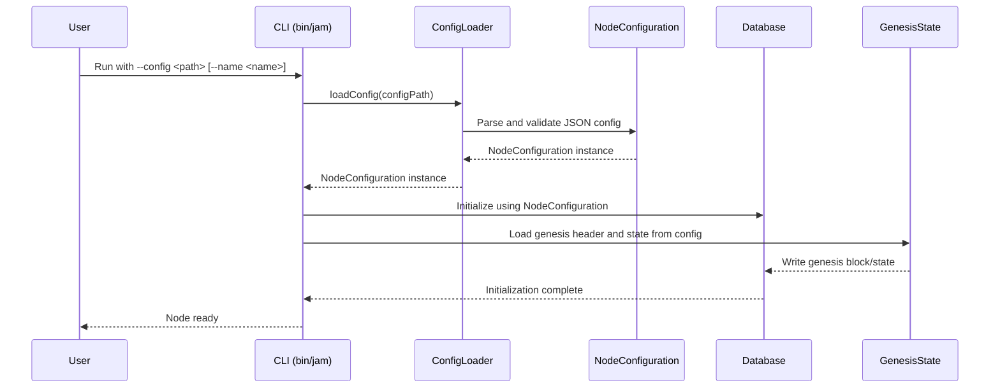

# Replace CLI options with config files.

## Pull Request by @tomusdrw

Related: #352 
Closes: #394

On top of that, we read the genesis header/state & bootnodes from the JIP-4-compatible chain spec file (see #412).

Additional changes:
1. Database location changed from `{dbPath}/{genesisRootHash}` to `{dbBasePath}/{first8bytes(hash(nodeName))}/{first8bytes(genesisHeaderHash)}`. Using genesis header hash is in-line with networking and having separate database locations for each `nodeName` makes it easier to run multiple different nodes on the same machine (without overlapping the database). `NodeName` will also be used to derive the networking key.
2. Introduced reading the state from truncated serialization (i.e. 31-byte state keys).
3. Added JSON schema files for our config and JIP-4 chain spec. They will also be published on `https://typebery.dev/schemas/` during build.


## Comment by @coderabbitai[bot]

<!-- This is an auto-generated comment: summarize by coderabbit.ai -->
<!-- This is an auto-generated comment: skip review by coderabbit.ai -->

> [!IMPORTANT]
> ## Review skipped
> 
> Auto incremental reviews are disabled on this repository.
> 
> Please check the settings in the CodeRabbit UI or the `.coderabbit.yaml` file in this repository. To trigger a single review, invoke the `@coderabbitai review` command.
> 
> You can disable this status message by setting the `reviews.review_status` to `false` in the CodeRabbit configuration file.

<!-- end of auto-generated comment: skip review by coderabbit.ai -->
<!-- walkthrough_start -->

<details>
<summary>📝 Walkthrough</summary>

## Summary by CodeRabbit

**New Features**
  * Introduced unified node configuration files for blockchain nodes, supporting both development and end-to-end environments.
  * Added JSON schemas for validating node and chain specification configurations.
  * CLI now supports simplified arguments: `--name` and `--config`, with support for a "dev" config.
  * Added new workspace and configuration packages for improved modularity.

**Bug Fixes**
  * Improved error messages and context in JSON parsing for easier debugging.

**Refactor**
  * Streamlined CLI argument parsing and configuration loading.
  * Replaced legacy chain spec and genesis options with a config-driven approach.
  * Generalized and improved state entry handling and iteration throughout state and database modules.
  * Renamed and reorganized configuration classes and packages for clarity.

**Chores**
  * Updated dependencies and workspace paths.
  * Consolidated and cleaned up import statements.
  * Added new and updated test files to reflect configuration changes.
## Walkthrough

This update introduces a new configuration system for blockchain nodes, consolidating genesis and chain specification options into unified JSON config files validated by new schemas. The CLI, initialization logic, and tests are refactored to use these configs. Supporting packages, schemas, and test infrastructure are added or adapted, and legacy options are removed.

## Changes

| File(s)                                                                                   | Change Summary |
|-------------------------------------------------------------------------------------------|---------------|
| `.github/workflows/deploy-stats.yml`                                                      | Added step to copy `.schema.json` files from configs to web directory in CI workflow. |
| `bin/jam/args.ts`, `bin/jam/args.test.ts`                                                | Refactored CLI argument parsing: removed legacy options, now only supports `--name` and `--config`. Updated tests accordingly. |
| `bin/jam/main.ts`, `bin/jam/main.test.ts`                                                | Refactored main logic to load node configuration from JSON files; added test for config loading. |
| `bin/jam/index.ts`                                                                       | Changed export from `KnownChainSpec` to `DEV_CONFIG`; added path resolution helper. |
| `bin/jam/package.json`, `bin/rpc/package.json`                                           | Added new dependencies: `@typeberry/config-node`, `@typeberry/configs`, and `@typeberry/database`. |
| `bin/rpc/index.ts`                                                                       | Updated `KnownChainSpec` import to use `@typeberry/config-node`. |
| `bin/rpc/test/e2e-setup.ts`, `bin/rpc/test/e2e.ts`                                       | E2E tests now use a JSON config file for initialization; removed legacy genesis/db path logic. |
| `bin/rpc/test/e2e.config.json`                                                           | Added new JSON config for e2e blockchain test environment. |
| `configs/config-v1.schema.json`, `configs/specs/jip4.schema.json`                        | Added new JSON schemas for node and chain specification configuration. |
| `configs/typeberry-dev.json`                                                             | Added development blockchain node configuration JSON file. |
| `configs/package.json`                                                                   | Added package definition for `@typeberry/configs`. |
| `package.json`                                                                           | Updated workspace paths; added `configs` to workspaces. |
| `packages/core/collections/hash-dictionary.ts`                                           | Simplified iterator implementation for `HashDictionary`. |
| `packages/core/json-parser/parse.ts`                                                     | Enhanced error messages with parsing context in JSON parser. |
| `packages/jam/config/net/index.ts`                                                       | Removed re-export of network chain spec. |
| `packages/jam/config/node/index.ts`                                                      | Added new re-export module for node configuration and chain spec. |
| `packages/jam/config/node/jip-chain-spec.ts`, `jip-chain-spec.test.ts`                   | Renamed `NetChainSpec` to `JipChainSpec` throughout. |
| `packages/jam/config/node/node-config.ts`                                                | Added `NodeConfiguration` class, `KnownChainSpec` enum, and JSON parsing logic for node config. |
| `packages/jam/config/node/package.json`                                                  | Renamed package to `@typeberry/config-node` and updated description. |
| `packages/jam/database-lmdb/index.ts`                                                    | Removed export of `leaf-db.js`. |
| `packages/jam/database-lmdb/states.ts`                                                   | Switched to importing `LeafDb` from `@typeberry/database` and updated entry access. |
| `packages/jam/database/index.ts`                                                         | Re-exported `leaf-db.js` and `truncated-hash-dictionary.js`. |
| `packages/jam/database/truncated-hash-dictionary.ts`                                     | Generalized `HashWithZeroedBit` type and added iterator to `TruncatedHashDictionary`. |
| `packages/jam/state-merkleization/serialized-state.ts`, `state-entries.test.ts`          | Updated access to state entries to use `.data` property. |
| `packages/jam/state-merkleization/state-entries.ts`                                      | Generalized `StateEntries` class to support full and truncated entries; updated methods and types. |
| `workers/importer/importer.ts`, `workers/importer/index.ts`                              | Consolidated and simplified import statements from database packages. |

## Sequence Diagram(s)



## Poem

> A bunny hopped through JSON fields,  
> With schemas new, its fate was sealed.  
> Configs unified, old flags retired,  
> Chain specs and state now neatly wired.  
> E2E tests run with glee—  
> Oh, what a hoppy refactory!  
> 🐇✨

</details>

<!-- walkthrough_end -->
<!-- internal state start -->


<!-- DwQgtGAEAqAWCWBnSTIEMB26CuAXA9mAOYCmGJATmriQCaQDG+Ats2bgFyQAOFk+AIwBWJBrngA3EsgEBPRvlqU0AgfFwA6NPEgQAfACgjoCEYDEZyAAUASpETZWaCrKNwSPbABsvkCiQBHbGlcSHFcLzpIACIbEm4vNAYPAGEAGQBJfm5xfAxkAHd1WAUMADN4IkgKyMQAGmj7bAFmdRp6OUhsREowlm7aCgL0ZFtIDEcBXoAWAFZZupQMXApFbGTkHqkqX0RKjHgKhkxQhlhMUmQCMNgPaFluEimKFx5VkTENGFuu7lpqDwCbDwLy0ZDYbh5FCIBweMwAZlmACZ0Bh6PAMEwKJCqDRkP40LQMVVcD9SOQ9shboTKItELgAYtMB18PhcBhFNJqqtmOhIAApDJWMDTMBMZjcajwASRRjnDH2R4MQ7wY65LA1EhM/EkMqUMjJdFYJCwyBmaYARiRGiMAGkSPIzhcuRiGF5sEoOEYLV93JB/gyBGgepAvPg1fAoWV8BRmNRIOcZCQyJBmIoVVEyjzIAADADetAEVmosAAvgB6PPk6RIGys3AACWDZZzfVzBYEACFgyRi6SK3mKhR6QAOOR4gAUidgE45SgAcmg2ABKZcDoej8fSCfVykNkg0ihNxCwNc530IZCEoTdXBsZboLz7K4/AMqHuh8NSqFFUnjEi4AUMYANbEqUUjLJG+SovQZRJCC6gAvi2AYAcGBVMw3jiAkHhzlyUKkh4iBLh4cZnBiHi/rA+B4P61DviG+DbIk3BfAAgrQRLqmgPiyIshG5nhi5sK2RQ+JAUxdD09DXEoFCSB4AnkIBIFgcBDo2gY1rfERDI0H4B5EuhqaiOcByILyHLDA43A4rgVwUChapRD08k8fAABe34YHSSoqscvEJsyT7GfCFpgFu9h6R46myIgmnwl8/IAMoAPLzvYZwkHG1Qgly0Z8AIbIlAJvD4B8px5BURDYLiUEwTcHiCsK0xytoWCIH5RzeUFUgScmWCEkotAXtIRFZXGhQgr4kncM0T4nlE8Y5rAuC4NwiAcOW5a4A8TyULIGhKBI5aIBNwblq2tC1WBAlAiC9BlRs8VuD8c3if4QQhIwmD9QZEjwCQBRRAqSgMiC6ChKt62bdtRDFM0GjiuWABi7plGUshpCoiA7XtzwuOW71eOWcyzJp+jGOAUBkPQ+BlDgBDEGQyjtAorDsFwvD8MIojiFIMiOpyVCqOoWg6JTJhQHAqCoL9aB4IQ1a4lE4r3pwfhoNZjhxq8nRMHJKhqJo2i6GAhhU6YBgaPDpLNOWQEUMBZRhgUuNKAk+CyGA9LUPFsjMF4XrRCHBgWJAbEZMz5Aq/QDhOK89Nteh0hGGx/7WTQ3DjCR9DRCk+DcPIZ23JNjQFMG6CcVE1wCQA4uoDbNBHYhQYUIEu/gwwoXJjW5nNMpILAYqcgwrZCIIF6oPS8R+ChV72Lc4lq8ybZMEXj6+OeJfZWgGhCIgeStpqyBZiwffnuWTDlJUuNXfA/hiDG8gTq67pGVUDgCESj8EPJ0jLiWLXH4l9gYCFOudO+/oH582flPTYWdoRLFcmzeAHMiQAi8PINAZQaB8AErEFCoYMTAUQGKW4DBgINWVgCcYbJpAaEaDPbOq8pgFUUj8aIyUAIQmsGgS4TCs5fHnPgfghE+BOhTlcURAlHbO1dp+eGDB+ASLyCsfAvhO7DGBv4VMNJNLmEsGxLweDvLSL7koN0zgzH8AZiQAAHnZKIMZPCD2UewdQgNEBGBEeQG0IdohGAgGAIwagMDliEEucszgiDxTxJoeywdQ7h0jtHVmLkdbOHkEnSRlxXqKW+g4dQHgCqQHSFkGJjh2A8GcHsYyFdNj7H8icLB9g0EJAzPQVe/howMG6HQUa/pdQKxMdkdU4JpJLDCCEQo+pk6kFgtmBxHTlShF3EgRY6zECdjDJQzZLNKR1jZIsQsfZYBMjRG1DEyUlRvELpQcQXJrg3npHQhcJEGrX2qmcoZ8kpCLPPgAEQAKIozYgAVTSNAZKgzJR/l4LqeA9iwJlCcuqGpMIa6iMlMOEgbEKCxMgA0+ZmZsxoFyvYlyKwwLRA0Iwts5LUWYnRQix4aIaV0vLI0a4B4zg1NJJpbh2weLTPpKfFxOK6mfy6qqMZbciVzP8Gmf5XAnQYh9kqfZFINmQC2RFXZwETkCDAHC851CDlIDAKsNkXwMj5BoISRY5BhjxNmbooamYJW1Nuj8CAGAPmrwgF8yocq8j1CWG6D0YFyXxOqC4gSnVRDwBFdEY6jRg1VAkDxYIgzXV0OGNsQ48hSTxkIoxHI8qIQBlwpyYSHhV4Zp+f4RNrcpBYM0n6WNpSMRZqfPQNVGANWiFDVgXtwQiWVyVUxKIHj/Dtp0qK+yca+AoWWXzVWLA4xonDYXcZFyukEqqcsHUcYFROTMgszSqVhU+H4j8XJXIp19SYMK0gtjQwkCIEkbJfAn3OIrWGhq/gEhJA4dlIlxRF3ivwfe2q/gHx+oDZcoNVUQ27rbnSdpT5MY+oKa8nouBeGrzXWIGxSQsQf3bUYQxEcTGs3lcAjwljEh1UA0nZZMY2YSvmrKjxjzvEGCgCIkl5iOMUC43wAeT53GQV2kMqxrHoI6NIjSKZpJUBdryv40OgmrZhIiVEmJcTNoGACWHIxUcaFs3jrrbJDMH0Cb9JU9WNThxgTDEoidjSJTYcBl0y5PTwz9JGguhFAMaLIAcTQfICkymZBHTqRIbNrgDsVEm7q6otU1nxPWLLlIoqMl1RamQBr910UDB+U1CrdF/pC3amejq+4GxrcMPIrSbJ2SuEBBLXAcyIZEm2adLx4BKD7nhHObAGp9ZHjfIgrZrgtqLXyDNuVZRVZceSxbKa02lGqoMnMtorIYBSPKDANzRCtjII4IDJAktREle5/AnnlOQFu2gjEAIQt+iUHBLCkAx1chew+gFvJUstvNdqshc7PtDN+yY8xP2RlLtKeN/1k2JzdFw5AVKyUEz4HpGjkggCG2oaqBORHWFbqiNTSQCQ0Rlz7clSQZK5x/C0FSgB/Ix80X1SsvwDArSotUDEMgHMhPWyrxzBm1s6Gw2LEx8ZclkpMW0DAAqKrzaNHbGqDzqMLiVumsi/Y5IOQiW3CwAmvy23afptJ0gxbFQBkLpzEz/FsTufMvqsSqtMPyMxko8W0R/SxtA37rU5nrO6Ac/Ga2PYRB/WEfdZcjzqpBlL2zjQexoRvd/Bh9cHpkQxAh9a5zq8AXsrTq6R9XU+pMRPJkT8DR/bTtpeUavLZCXBntM4wVmg6s3UeGB22bv4m+6Skofwjw2w9hQkrildKDVrgj9CAJHHeOCcfLTNdSIXxr3KFvX3cp6BD0uYxHguCyQvM5xeF3Jaly9g+c6YsJ90bxKRC/QwR0Lfwft+K1a27MOsu0E3S8QiQyoxkhEvIVEfID+OEqis2EUPYXStkqwSQsAmkKSdGim5iAkzG1i4y76YmEmri0mr2smXiQSkAcQyqM6jinGM6EwvIB2R2J27U52Y8NoUArBKc9ARBG69qJwuYIKYKkK0Kx8ZKWAggFUEGf4Uup27BOYiwOYWyRyuAihU2pyJY82oiv0UhfMMhJQYuJEXA9I8k6EEulyUupOJh1K5hnBZSF6tBTi/aYaDID4OYIKAAagAPopDpQowZB1ziHnyba2FVBPimJbw0507niCYOHOi8F0HiY1x7S5gs7OBR6l7BG8i6G8xF7QHKHFY2FmFVAAA+4w3gXgAA3EVpDjsuGMBMUWBOURMD4DUSofWFwMlNFKoceLADUQOuwVwIdl3MdvIUqDUZoaSE0ehFUdoaiDzNIQUUJMYVFCUQMaTmcjMUQHMfYdwQsm0vHtQLVB4EnC7uHukWztHm3NkbmBOEZlwK0AcK0PSBoMWLirQG7uGnOlsWscSIAgALx6CQCXGZEx5tg5j3EEqbSpgYjvavHvHSRfGLBURxBeC/ETgSDbGAnAmmH/GQBAkgmR7s5ZF7GOFxz7DHG6JnGu7Qm3GQkYhzQax4noQADaAAus/rdr8SyUQDiRHCfuwIgPMQyRgEydsRySicUGiRiViX8ehPybyfyW7kevZLEVAOCrnmzDmA2MCmkFYJdkkWzNfL7A+LyW2AXvoc6nFlkEAWXvQNPvVMvlFLIDvqZjpsEqEhiAZswOWBiEoPYhoIku6YEikpZizLHE0AnHZiJvkq9kadyOfJfEZvvMKVfkPmfEwSMQUGMWwUqCKV4b4f4YEeeBHBnAmLdo8HwEyq3FCDmKidyVoVfmfqsNdIaGvHkFxFBDxK0qyrTHyNDvzB4FVgihUPYpABODmD8VoYAtcOSvDBBPyiUOaShLUMgOoEgjxASLQNggIIfO6DQPAjrp7lCMBmAU8m9P4OFt0NAr/FJKcQzFOY2aSKJObj9D4GBOcbil8RYeiFeF4IfBipMpXPLJxJ4nkCKs5tUoxrmKehgB7rWRgIMpQKsHwGZLQCFFUKvB5vDMZFMOcOFr+rvGepiOSQYuZrRqYgQTBXgdgYQUac4pJjxjJuEBQXEcCgmUPgqDmPppEr6f6Q4kGcKb1kQZAHmGUpusyIsNmbmdcrcqWImbyLStEtCamdEK2IAEmEuYol4lBcTgaIiwhZfh84ARdckAClmZMQGgKlsSalOYIZQSem3pfF5YcFQZIQQlSSoZFmaSkZNmWS76Dmac5ZmmsoPFzlUSbl8SQlrYssywrZ6w/B4MaEWFbS6EsosaRS+khOec/IbEAAsjabSpAAAOrFAKjqabDAg0B3pzKoB5B4anAfglpNU+AvgeA5hhiEgFyzYIXorQECRQXuHRHqVtiFqYw3DxgbkOKiB4CA7FA0Qr6wCrBFCK4YDyAoUxjID65UAnjEi5rfT9LtWCScgcDxKthb7eAkAADkouSgZ08kUwv5uY6gfV8qpSph6wieWO0V1GFFxiVFDGDeTGogLGNi7GDFdMTFbiZBrFqccRwmDmbYfBUNJBvG5B0gNRlVm5IV30moVcH8i6Cgo2bWh0DlumISBgvFkV7UnlDlYZvlMO/lic9mjhjmPwcFx5iFhxCeJxV+UWtMWK6ADAJuoQ5K9Z0pz5sArYAUXgQYeyi+jepeaxX1fNxKPSSQf8QtZ5oG9g8Q+BHgHeq8b4QYIYI51ibAeCU0f45KKEnSuYIiSgPV1UtU3kz1YutaJEpZ329EptHgcJ4g7kXk6KKeyi6tQM8ka0KYsklAsWuBvtlWJYilfI0476SknIE29alyAkHe1Ivc04z+JYvQJaGoZKtR2Wfg9YQUJ4DU5KJtidf4vJsKV5kYN5odk1oQXVw0DU41fm5d+Wvs+krCBqydAtFA/qmieUhQk6Fe/yN2IG7ZnQXdYEHeg9Wd9AedvQP8fMrSllpUqwAM3dOYjtJAztlQrt6o3tZIxWEkI9qAfOJpKwX1pK58uBognI9AudhkvQq8v02UOQG1WeZhewDAhd4ik1WAy9xklljKeUKisOSOVOCx/9cmMoDRgyq90USCXdL9vIAkGaF9UEt1/d08WD7A/84a182wqCywOhYQjkmIMOqdRIiFAVq8rkyaT4HkVKhWA1Pw1qUMzYiiBxQIoQHIn4KcEiFC6kXSX6GIryf9ji669AAj1d6BC69dIYAdnDnkPUBQkdF5htN9aDlCDUa9QCwNkAaQ+VgKnY5WDE69etS6d030m9aFQjfuFAAezdtOrdVIlZvQNZBBpSUDVQHeJjVCv+kOveJS2YJ81WHgtW8955HQ2CaVRAsoQT9ULVn4hIyAmDtCe996pOhDUIb4KtYgJx7E5ZnV+A3VpOb1P4IF1cMkoiXdfI42BDimyd5K8+GU+NG2EkwIJiauWAx0t2hcLmGaiwD2xkG5Z+dDx9nIZ9NUimsVAhdetqEonGA+VcLyyWOhItm6igtCZag+bNiwb8UaiuYFxkOYZQaZpS+N250alyy+YEfTu2Iab4XwaQT2uFVQOe1arT95uYOFlAGgGI0Yx8Limjw5SdUTFd5jqjqdbAMIk+8U2ON6XgtVSwniQdPUWi+aQybKYI/OMBT9lTbObyg+JT3TuItwMGv0PQOKtCRtlycLrmJEVtmGj+OGa1/a5DQdYEXTPUoTDUnLVWckkg3k5FmBgNgGNFoN+B8qENzh8DUm6NcNAmUAKMuuHUlJieHgPu7QvWwYsgmIXN6KcFUJsSXAKp/ey4mluY5rlrWTUINrDxApNU/eUppIMpJYXAmJ2JBJuJYRTrcRerJ5BrRxRrvwwLZriAFryi7rxoBwgdXDJAgKCdPQE4LaXArBclogJyObvYgb8pRAeWtY9YfRXRPRNbzYVbiAPJYRkALRlRTb+4h4LbJRbbFRPgy4XAVgPISAJAwAvJegzrOYrrKb+reLGbnkWbpbebSoBb4xxbNLda2xJbFWPQ3YPQPbxIiwGaXA/I8A3AhbZ2Sog71gI7PQ47YRk7kbc7HqtAIlCZqbuTtAKzE4ja5bSpXAJ9KzpT8F5NnpVNEVvp4+wEk+qZeQXl/14ZMcTNmSLNsZBgcA/guEoeHsgtmIXiCTBNQtAkOYuHaIBoXisefM9UScJH0HsHB8R8q2JS8aICAAArtI8ATLID6a2PR6QL1hx/jChTxxmmAHhOoTmEJ1xyJ1fKTsKWVlJ5x/tC8Dx3C+oT2ZDP9pQDPlgDmAAAwaCGcWilnCYOJIDiDGRkdKD4eA6Kqz2MWpjpiO4jR/Xyv0aKuWO0Xg12KQ0avMWw2eLw2+IkDaaBIU1enhLYgMB+nkeBnBlmYM1WYZLRmBVs1xnOmHy1SX60cgIyWXsKH2ABxFS+DEoZnZilRJAwdvpKfCeqe8cQnScqeExicSfCKiLFS9DNbwPt3Epb6dJytGJYE2JKsKY+fxnqvcYw18ZsUhdgdOVRfcAxf8eheMcYAIdJcRkoepc5LpcYevjxB4ef7EKvIVUgIrdwfwXMfLoXxNfcfljRd8dVeT5X4mtC1XOjbkrWkreCfKf3etecgS6hCOl1kAB6hnxnpnHX4DSNMdpLFH+EfAD157S6L2cYSgg3lFHn0Eo3YNBBar9BqNmrLFQXAmIXYXjllN+m0XO0IQ5YJASIJAPsPCrECXySPlyXccqHMZQV+3tLo2f64IEwkyy+iWeeoiJ8cUfeMzJYZWkU6FmFtqoQb2TxSEY+LdEWpQXZEFvgWUpjpSAk5nM8deErMCT8rwg9N5ScddpbS5EkSB5L85N9KLzYtq9qhklzoQTknZ4FE9rSDDx1zpK8lyAMMaICfFjTabewn39D3saofKETXe2zo+wfB6PrQpx+REWGnSXAhvji0mG5krsvJDJWDRTbMT9g/qG01EuA5fAjZWYOMqEYUIrLltOnmfBkNBdW7vjW4tKxA2E40QDPJA9OtduYf7L5Bk+5c9ofL1yfmglte8muXgUg8xylw/SMpOl3jQGRRHX2PwC0oQScETzHJ67UQvwO+2DZ6JTZn7cV6ibZ2t0gWu8LpIyAs/OYy+Ggi/Ggy/q/DUyuYCmXhHQQkI+XwYFDfncZohMKSCLvj01zBIxqAZwGXBbkvIsBR2DKWPmKCQElAT+zgGiNnR+BaxtAxpHsosBwpY5NqfAYjMiks6AtIM3XMABaHJZwQQQVTBdJzTv4IJpoSwCQPgBkZadDeaIDAkNwVY48vOyrOigT2SJE8AuM3eGkJlESw9REKNfztN1kzyBvOBBNHvogXSk0JuPeJJsSg8KdhvCVgNiNAAbDu064wKecMCmSgZBko3hGwKlFSjQAZarhE4OGgKAIA+Uu/cRmGEkYGCZBgyTgXOyVTn8ugpFBIlMjjy80k8f5XgfwKWhLUPAtMCnhFwg6LcYu8Senoz036zZLuG3Dnlt2szc80uzoATOnGtKfNRW6KfGjmA34ZpLurYRMP1BTCvsohvccKtkNp70hLoR5fGj9gojADaYYAJmP2QnDD9Zy30MgADFWAYApmdLQloMwiZg4pe2UJXq3gzALxoglnWQI0BdhoA+B1A+/ABGOqcs/adva4KmlLbFU/QWIB8k1mWHooNMICAdN4RbQy48itfM3KqBKAfcuQttA4F9CuTGgbO4gR3HwBzBD9Ge6lJkEMnBiRB6AhRSHN4TcathgMzadgEtAXiBCqgtwexDSGVBxhdgYRMrOSnFAIpzcewPqKiOyyfDooF1NALZH2pxl6RlIRkQCFioLwWG3EV4D4LmSxR7S/2bNECN0SEjiRaCEVLyR1AIoegkEOZum04a30GiYOMhvFS8SjQQw5DAjk+HUitIsQzaSENnVERZp5ImvNYS3kuq1AmQRzFCPZEWAuIGG4gSbPSBjAvdikzAdcsqKDopCS+gyAHD6MjSjYDQH9exk0D8FXh7RD4IMIkDrzfEHRaCUiABEJD0QnRfATrkj2ihDplQRwJYAVDjDopyAz0AKgbx+BWj2obYX2KPgVDkpgIR2GJh2mKazYQOj4QCoCM2AsAiIVuXwMKIML8o8E0EfUR1WiAYx9OE4wznSlGqS5ogE4vUPOLKB0pGEr5f4egFsgHh8EKgzEBnSGi+8RULo5MfAyTYzxeQrfACDpxmb449gMoeQIOSFpFQ2QphFkdwDAjOikxk2CEEQCoD3Ur02LO9KgHxplRD6QI9mDhH0gd46h9UUpH/UZ5E0B0iwMgCoBgF3QDUqWcbEvl9GZsBxSuNnIinIBxwsGq8Nxjd3iRgQ5o2IfHAwjc6iDseOBA7mN3x6+dJu0NUgvIJ1aQB5woefGq+16zU8lufQ3AHkNC7NC1uHg5YO1CxzDDlRUIa3lgDGETDs630RvullVA9REWA9LBlBLyAZDwO/EnIXTw35s9vKEcJDuki547dWalQuMplRZ6kSfgnzGwFYBSBlInw7AMANwgoDa4FJhAfsnmj67Oc+6mE/FthITSUBtcCuVKtpI1BwN5GDqOmAzH9KSARs2AEVKnzAAhR60gpY9F8HYLNJeIuLVyNrnvpdwCsMgiSPIEAHRp0mYVFDL1WPzp8HwkIM/Eg3JR/97sSdM4k0K35iSuSC9LHGFj8briyoaBDukBSiDTY9UAjd2hAELAmomyQ1VHpBiDEoB5+uDbSoz2Z6EZWIB8K+v7Xn7voTBZgiwVYKmw2C7BDgpwS4LcGiQZ6cAzxt404nQ9GWImNsLGlDragUEGGeBtfHUSaIFEOgjHjRKx50VceKrNjMxMJ5qC2JGNMng1Xm6U0M0uMMThIB9A7w4wRQ+miUOQ5lDLJ6HaoaHk+bozYGYVFGWjPOgtDq67QtNg/0SogtpJYGL5qsx6ifUqWLHGDHcDq56w0JLecbCDywA+gF0xM7YY7hfCloWxLtbpnLEkI/CDIQQB+CihoiSZVgVZfjL1gAAkxMyTvzMk5HCThknD4V8MU5wtvCftbwqaj2m5hNZ50PjirIeTyBZYj+VZP70CDAhqWlcHFEfwZgCRPmyUc6AVjRDOB9+HVHWXclVnyBMIrySSEpEmC9ALQlzdlBGAgISzz63TfGvzP2x6yYwts+5OJgdkLxzS91BgI9Sxzmjk0D4XLrS1bGKY/WJQBxEuBwiij3QXIPYRiAOENQxxlRe4e8NOyfD8yYc+2QZD1DwYNgyDLPJQAnqZRS4JMjqkIHPbTANAxMymTHQqDkA+4lYhUCpLzFqT1Q+2E2WbItkDy85ONDkIOhQbFxW2DuWQFjiuFVZSkG8sZrb3dFUBSAtcseQ3NlAA530ylOFt3PGjTzoExEHwF3DLzYIwK3EXwGVFVkEcpgsgTsjcCokTcC+EQTQfhIGTAyAadEt6QxLx6qtIZ5UqbjDO1aUEuJwwImf7J4ktNesSMuTggVRmLyKZYk2HHCWTlVzJZPUPQkXlKT3AZOqnVUZQnQkZ1+ZkAZgdASgUPICOOYHWUoSzkUADZvco2RoVLamyew5srQrpKtg0KLua3YoaZMZq4zbMFQqRMFWtLnEJ8pASmfjTaFTAOhLTeyR1Tu6yckZT3cxaF0gAZBQgDM46itxMgMhymH3MCITkWDCKJwEPDQBaGXAnJpAxclHlBHIGqgyAIYCcPlSsBpAwA1ofTpEtrp4BqIfACcGjGwAYx5A2MPcgzlCzPc3008GVLiIWL2CnO2+SiJBhhHKdogXAaIDaJH6WzOa5DSqfgDPz24AIEJASoGV2nVNMqMS03HFRDE1xzgoQAPlBikifl7I9iFAZvAQHRU1Sp/OND3AMh9I3MbaB2agKYxm8/4ZNajO51BkSDGJeC4IcQWJ6Bd+MJClQX50IVatSe8mFjCDFQGAStMCMowDQpbS4w553ABeUvJ0VYy9FnPKMoYt27WSDABMshWlAyjCyGhwK0FYwsPhXdrFA0IBAlXbIryKIfcVmXG1Xi9oRsPURyLUBu7koH5YIkWTvKgiDJhZn0N2UCJllLFIM0YWqHokDmnKj5asl6rQEk6Pj2QnIBTrmC2Tojv6cixTpKrXqWzP+Qq1MLeD+ihFe2RY8iIri8DcAzIVSeSMoidDC4raDUWAA8BpH7YRVeENMuIuPnSzj8VAGMrKMQmjSsRY0RUalRFXPjs442IaM2h9F9xCxy0R4JQG8IjY2O1EekBwDsiiRIMm2JvgZFIDjk4UQ4sggVHALhFb8FAY4GbWTB8AMggKEUUKAkCtRfV0gHoNbRKCdZ9skqjESfLyBgBz5FZccuaVdUKi6BfccJiPTcbVrisXImgDyIWKcLs8kGfsZXAABsSIchNYjEC9BCRFbEUStMrhzqnVqamMOmroQE19xkCu2eJgI4gF5ZvbeMJEGDBH815sUMAF/MlAPwmV/sokEAtdigL+VMCh0PAtJCIKHcfmTHpgsuUWJJB43VQa8pJ6PKEahMpFVPN3jXdeJ4/eTqdCVBAr55DC6eZTOklY5iVfNa3vwuAipYt5zSdFEOoHE2r+Mgq4VfWCtWSca10qjTpYTlVMiNFiMmDX9xE5gBjomMxLtjPMnQqAqsK4xfCvLK1CXh0EuBjlVzCMbVOzG2nJTOxW2LhogwuBl4r5C0rxmYYbgC5jmEPw8gSw6uXo0gzCzhFzA1eLIpiD7D6UHi+laBJw0ZYnSEI+2pXD2FczvYx0BoBGnfjVTD+76LlXwF2QipLVYqgcYRAfhT8lQQ5ZVSYmTScQ/VKAazVCJFFVqF00U0oMlV5Gpi8on9G+iRNbU4iukeIvIASPrmWJpRZIw9ZckUbRZaRRjaJuYzjCsjjIjBSgJr0lH5bSRkAfsSlhjDGifexkBrUmia1Bi+p2I91X3G0YyisGlczDQOnYjgLuyBU54VpvRQEYLhtvW+UnRuHWU4W9KP0JQsZb14+QDMuOP7J6S152ytm6ymTMQ27xLujCDBcN2opXLcFEM25Y53uXsSSF3EuBlBqsKzZcYomlwOJokCUzfpkkxXGNpbwWaGVUIeLWIoC6O5QQVVKMVbK1lKFpFuYWRfIvah9yLsE5AJXcxGwka2QZGpQhRsPBUaURNG7kVkslz7zVFFsujUYG0WYrdFqSKFczR557c/QciTqLrR8WG41M53Cpat0xXHw4GL2N7qkwMho4pJJy5+EPMO2xMky0QFbkCqiQZpywykUatcBhEK6fStC6qCrs5DqUJt2vP3nxA6ah52d4+NIfFXkAwikZo1YlC+MFogsBIbmpOGbtAxC9e4AkVRq7svzOAHV7XMRC9OUGZR5IOQcNNZwR47p4C7C/qnMnR6hcrtYg+iSDWuX3aANrEt5cBvJ5/KDAmux4XJx8DUcw05YacMxtVD8jDoxkxDvopS4wqrJPGv0FhmyjsAOF3skBKyWSjFcNEkLKijGHZIXUAI1EI0BfD6KAoy93ZFwDLUSAwgr8sBXzE7mHa+MIsWCT3lfid44yXEn7HJssmQWtJikkZIbCJsvDf8WRGgIMROCdYNRr5t2buryhKBfyGqFU/nG4r9DWlG96sHqNvTEAuzE8OPH4HvuoAb7swOYSqsftYhn6L9VERaosqB1WYXELibfaqA3JhhC4R5B9G8DGheTDG9gD5P/vRT4VjhkYQqLRCOp8g0wuia+MqBDDG0Tlw01AmcBEEgyRut28GdBGkF3K5BsMp5a9JgpxCqS+EfBewfUHatCOcemovoIEhv7m9eG1vR1Xb2d6vA3e1mL3v71vqh9JHEfWPogoT7GAU+6esgH64ucadOevncjJjAkAIkmK+abigoBExw8dNNjZCtKE16uNdevJHz1ektk1gl+FYHHxwGYarwqwHZbLXMRM5qy+raDE1h7CFAttfcEjMllSKoBogvJRoC4miCMFng5ccqkcvtVoBvYftegJ8yLkh7d5t7Rfd0GX1j5w8fAMrj2SiCf6UFFI9avGVFryogI3gR6CrP4S0JIDtEPcRAoS1RZ2uBQS5jIdcyuQbgK1UYZAJX2oBjg2AIgKtBuykgVqWAPhoPjgzVJZmVQX6VFnQPw9HdPwKgSZHRavyyCZkddUcZWCgYVACEXaAbq3UVG/6kA448RDfTljB8H4QUdkcZK0RlOSCDkGLXZX6EpNWAEXcPkxDvxGZWxgY1nh51pDnjTdJ6QHt6Dt19caiVYP9NKlI1AZ8e85bRJ/Vv0U9rBgQ49o4PEKEaSgtmtgqz6xsTi21Ek7IKEPvLuKTOFGDyH5AC74GWYq1m3CMOa6XKyu5SLFwDL2H2ejhnGc4bQ688NtcDMxdV2kBa7BTAEYU4JU2WDSl9d4pnqoM05EFT4FXDmmsDCrWVlIU69VC2lTJX1AJ+rdyHJhBNgTIgNAF2V30WBsBMAPqZaMMpiobr8RvQIqUCIXhlR7EP6dAEQG/GfoAD1ZVjmkKNJ6mkyJpgdLmItOjRdEJU5E55qeyqhEJzxhXkex+nomNE1QBRPKOqRncflbpPE4wZu2/qiT9Jh7YyaIWk9KC1BSvLcpibqx32dkSAAACpk6yleM6dkTMHxogcxKZHKYxaKnScKu5U56bVLZ7+TSuyc3hBVPxcTMDhxnU4Ysm170OMsZAGgc8OP8F41pDpddzHOXAJzs2XXUoGXNemcm/gBtTGbWW6nk6KkNM/UquowlL4wK004OnNO7SpsxpzkDNj2yjLvgcsYBW7FKDxx2+o2j2koHEnR76oPipfAdJgY1SLdPhngH0ofAMti6ZkVaXZBRRLJRpx5pKYfVSm8Qv112oGtWbu3Em6z0MjPWxUUFryJwAkAZgLk1P3nOs8ZCzmBHYnJ1uTHSitVAYMPXzjIG2W5lUGtJaC24y4OcyYfPM66lzX5hM+aY2WrmxT65iU5uZcPbmfgoVSiJXDBP55QCutTTgdpHn5QgDXE3AAV37nq6z2F7ddhwVAvBjITu5i9Fjky7RR1YuLWNOU0fqCEgltdcSN0AxaHSbLdl0QBoEzIcmmODl89lFYYAxX2TAug6vhmqqONSLKUkVLGmzWPpiKoJ6ITwSmTt12GlLI1k6I4t9wGQBKQZVYmn2lJoTpK9yAGCdKbBfwWUYOQst+kYhx01wcakLBeD6FoTsKhUODjfCLAcz4lhmC8SlTwNG1Pm+6mVkuPLUu4b4tNmStRpzWwILKmBLBEBgw7FgojYll0bikXxHLSV2Kj5ib0STXhPfBKQ7QAhXXKLie6kx8pYO1m09aNIDUxael+I4tVJ/QTgj1BF48rGdMK2+lXii8ai4jb609o0EfW6KaPQKegrMyZD5zvpQU5yAiTntvziZyvZt20ucapTrO+9LoczpUybFWAcrkmUivOWRSl1hmxMZogLGoDbFvKAnJDFgQzug+CmzJbyB0g9IsqS2oPuR2pX4rqRc8capAI/6wge0XFhfj5Wi3FA75XwPIxGwdVYrAu3FlLgJD9rfFYt/wHLeU5lZ96MrfSI/Ucjm8uWbffBHtHYjV5h5BoNlUaFNKB0mJT12y8zYIqAgcVxl0RDmCZt5kMdJll2PoWxrwYlw+1JE9idj2qYYKZ+CeSKg+lPrpAGYw26rckN3X5UsC19ZeDF3R30Ir1rBWDKkEMmGLv1hQa5ODA6gcqHZnvA1eQD02Q7Y8SAFpUaGcUKbwdotm3ZZMKWBTi5nGypYHNqXhS8l1xYrqxtD2rzeEIC5UFFMmStLHG5nUYrcMIq3zYVOe80M2X388VQtBmUzLbHTWqgMEmlk4whBbCnzf9RgrmHy7M2Bq3WMuV4N6zQA257tPVj4HUIZaBtoO5vhqESAnDMW6cT5qEdzANjRiSVtkywDitXdHZOEdWAfYwM6NuG86ixhfHvut3LsjBO9CtVeavZnjUIFCBA5zJLAmSL0dw48NbNvCOqQHATUxybsolfBdcxhhtG8Bq9Om9DrAIRq8QaytZE5JUojp05QRWws4WORQCyX3NAH2cicpg97uSPBi/c+4lHzcI5dHyPdq9hdnJ2WE4W+7MtpPzzbhsthwEzWwXOFvKJ7mEtq7irZkizKxjoEz5vhoWZ8glmTtLh+s1NLJBglrVqUKwtzChzodILSSPXK/3yB45aZooCGGWPrW1qBD1CoMittfUXEqAXgBba1Crqs1PNjZh7eyZrX5jJUH4IPVlRK2pdNjwSEDHUI+C1xVZQscdWEV69Im5eH/YedDxxTMAyQZsU1DA3QnIgr6LA7V14WEw1uVh1yK2CfACAqALgeXPNZkt9RhZKG4JvAdGmBOubLmmrSEA6luYZr4/BRf3I/4aP2CKVmB2ldcsX3s4iSuk38TBsPBXmDpHx9IbGwZ14tnzH45oAT2l3mD5d+i4BoeV/WOIN+2+8wUgcP3IMbAZgM8FFxv31qH9youszDyT3FLlQS8+Ye3tb81S9hf5/wXdvgOWCzl6B8wFgdcB8XsD4AHI80cMBJ2N3Qo8g4JYPOgXOZK66Ocxva6kXS51F4UPRdxFMX/aCm649PruODCXoSALoBBLmPM7KI7W/B0gDEvMVwAOh7NqgiUvSk1LjhrS8ZUGBhXUAbolKBTaa1SnA+1W2LgqfC0WjQOxx7LNlu1QUqLj+VwhaY5tPNmGrkV8OzSeQWKrLiMRRbQvHDg+H50bYtrOEdSv0jlAXWdI4oDDFcXWDpQoo9ECntErDNpQro57CHs7CTrqAFYAC7bl9BPD6QL6+nkBu3MR8GRWG9R293JOSbg9uovhXiR+7CLwexebZeAWd7wpPkwPYXMNucbdO+DhCuXt+Vyh3Gtw36B8WE50y5JXs44vq6tcAI3KanBO5a6k5xOeur4AXGGudQOtGTY3ZV1cVDJkenOV7lqXWn5w7cBvezf+BUhOx6UNwlZqRNPd4R6Uwmbk3Hd0Rx6S7BJnBZ9foosSfrvz4Lg1Vbd1uokcLDKcwELDXnCb7Gvt3jOlOHGEya9FzO8c3seBlKa9XGMerKDMaBAalK/EkyKYdVmXQHrwCB/AQznHmWmJE4+6pM8oHzaJ0bL13jtAyKz36pgzRY/dsHSTTJ4DVAGbNz0iCDd0fD2csrIfooqHg8Oh8LB2UmXbb30gR6I9gfx76N8Dvh9LbAfQPKHxe1XqZ39vXD8NBvQdLg/VJSkOYNIKJ8BQCB6Sc7tTqW1ulXgWmZt/hnQB7iCFnSZxYzzglM+3FyUXmyerKHDpd83eF8eRg8m1cG2bHuLbrmVzHdzkRaZai+G+BznhzDpqrzNrQGC+hddR0gDx/FPfT1Hd9gNcS9rhzBJfF2KX6KBoHS8tvTnBhgjtRBdSHHNR4o6M1cZnWwRkn+QCRVCGccCRqU6Tj9bLS/wXBCLSZfFH7szJ5tY6fokrwCDK/1fEAF+9XcN9yNHPmAY3tyMl9S/Tfuv8UN8E6wYNMeqzhJ2i19ZeXp6q7HExGlSZxPvXeDRrI71+4RvCHSzyAIkBjH/fymp75YOFnJ4Z1mTIPW56D6RENN4epPH30tnJ+s/xtxeBkLiz3h1MPm963WPo1NsQ8fm0PGHi01NifqMN2gYAEvXyPH2HQQLO5klPGWixktSoAXNiFYFtKjGi+27zoFjpJC3Aon3WIS4+By3R8oTGvco4A3VY8UDU8UP85LjU+jL3nb75PYd8/dQyfnz2rl3YrvO6m+PoQAT9mGUqo/xPQ5uF6eYVMuVPvJH+ylAG5dQ+Ff2lBMsr/PjKVMfzkVXLj80P+oXAEn2t296126+4uMVCe0751+g/Lfn2HH82FL2sN7f4H8Uyva096XFIqRdyJXB1LNgyqpIAAFp1a6AnYV6qO5iGoWxyE0jnGgC+h9F5ia+2OimxjBME+isf2AAn9WBJ/1AwAaACT9pjIAs/Of5sMCQBIwANO4FnmyvmxTYjMDHaiMrKmlsQtQsfyWhIk/N7EMB/9tx4Pu+BYmv/cxIVpOro0MB/ZAwAEv8UHL/4BK/uAav3oEWCeFJ29xiBY8eNA96+AZTnMHIfBdd7cDve8/eD86EwUcw0ABhlb6X/l7J9tdph2uKUDv41euB7JpYw9wlAFgifkfIjmDEMN/hQCIS/qIPBWcNBv/6ySxUhsyjyZxM/5OQn2G/74+sRIx5UWnnCx5fO8NmSaNmcRD1TEqLiNd580Iur1ipOWaJbauE1tn/Dk4ZelwCYBWhiv5r+8fon60Ayfr8L7+F+h3Y0BI/vQFJOFAEwFiALAc2Cj6y/qv4x+6/lwE8BO/nv56AF+pvK8uaAVj50ArAXb4r+NfgLTbo2OJKCN+J4EoGa+SnruzmG3vtj42+y/m75QA+VAa5dIVCrmCX+JXIoa4gt/jeweKShhQDAArJNAB7+7JJS6qBtdrmDqBr/pIG2+WSNX61++gQ37BAfRCYGSeAHtJ5e+L/j77WB5em74KeVsMy5r0YAGwBOwkQLozqgp0ON7JePsKV5B+vbttx/eZNuczOg9SjsIXwa9MCgzeVgMI7G8yQJHyP65GGWpY4pHPRDxeg8mcR8iG3hQyZehkNl4nKrSJFK5goweV6WmV4BjB8wVIKVJCCm3nojZwqAMbb/wc9Lh5pE0UK0Gbe3wtIRsIZhkShUA1WlUDzMg0LmDtBbmJ0EkA6zOfigYgyM2heyAauEKFWF/OSTHsaiH1ZIMJjjHyFEahOK5jSxtla51OYotSq6oCkFgCxQ8DK0Tq2DMACbbKwgqL7MeB3qx4V20vpwYUm3Bp87g0SPIayXObHvWaMW1EtkGU0uQTmIFBwEEUHB0UEKdA5i5Xu5SvEVQT941Bulv94oAYgvwDa4RXtwyEStCOV5wmRNEkbUQ7Rl+xmMZQYuw1WhSNFDlwlcLTa8g//nAG/wrSAfqFesoUKFjBlHMPh5eVQFqGChAyKyFxeR5FV5YGWXFmq0sBetzRTAHfuZLxKBopqbh2rcEDp7m2RmhrUkj5CaEjQCwfAL1GvIcoAygikDoRAmReADosKqVAMEMgQwcfI5M1EDDqDapiKGGw0FDG8HfQo2u9IZmoDM5rXMVQAiFUizgEgCz4IfNCG127Xj5Cd8kQuegJEr7piHvuBAcd7fuMvlnpUhtOsD55BdIQyHeQzIQCANqM3up5E2IflB51BBwQCBHB4wToYhBxKDQjJe1YhCCdmL5neqWc1zo8C1m5jOV5cAqKOJCihq8JYEMEm3r6DdY1pMpzhoOYJ/ZeAU4fqGS4YQZ9g3hGXiiR1U8VF4ZP8xZg+BnMgWtRwHKzqnyjQE4tLuFeArYI+LHqADvwhj8RotIAmihNHj5sB8tlP6TkGQKwB4AyEiQBaBWSDCxhGB+E/5pB7QBhHaGBvHhF0AZSg8IU2fOCQb5++qrbbeubrlQAUQILCQDFAvQJXJROe0BQ5+gRTsojn+JoXaj2BZBrIDg+AdkgqIGKCgZBy24tKl6PhiAMABXh0kUEHIB6TvowviEusv5TI4tHJEzeJwfoQFEQEbnyOQTwT4zXkouJmRSB5euCj5AOCE8FghEXjEJReotPzi70lROmEEc5TJa7j0LjlJEzeskZUTyRmXu05KRlwa+J+O5TA/gggzgFRi8a1pFxFghljiwD3h7QGZH4+FkcRB6g9/nYopY+tvWgThNANJHV+xEbQB+RyCKo6y6eDAVEuRXIJNYXBKkXMzDqshHpHVAPED0DYBDwsIE22tkSVb2R8QKkLl01EU/7SR82AkYPW76MDbGgKEYGCygcEdoE9quAM/6AwKhmLZAskPrganEBXiAZmhgwcVGTBZxOtFaRt5DvTG6lpO6GM+2HJnAMBatDEb7huiMpEbiQ+rkQcqNtHMGbRhGmcrnelQiIYJ2ljKibey/8HRFfUNHL+hV0qdAFB9ISWHEqORgeDVY3OArEFDQCb4gzBAR2nMOA3kh4cKH6QrIRiH7eTYf+oth93sQEG+GURH5PgUfppHHBBGjupEa+YDrg+A+kcECTE9EFwDIRmEBNHoREQdIGpe9oMbqdgsgHiD1EAgHoA1EpYPr4RwhMVP6R+kLgVEDR5MbnKUx4lA1FwQAFCQD0xDIFwAJRmgWzHl6wABzEOgiwNzG8xYYPzGCxwsZqQz+TdjlEkAUsdcCSQysKqC9YXkZt7V+0kTEFkspMRQx9sasYVEzeBJNK6+RXseUQexfkXEQmxTNGK5lOFAf4C9YMUbxEYA/Ec/ArssbvES92QtgCCMxMcRXguAqXjez2xFDD5E+AgcRqQHuaMSLYOBPNHwaRxYrqZGRBLgClFWR5OAzE+xecTN6sktwgyDRA7JFnGHB3ka7FeIT7ATHd0MUTY7lxOropQexSUWwE1xeoHXEqxMAJLFNxLcWgBtxHcZOHeRAcTN69xkAMHHGkbUX/ClxRrNQHD+dAfagMBMYBOD3KWbtVbbhMANJERsHYQYByIOnH6RrSNhsvgQsHIdXo6WpNnCq6enZvp7HohHCaQaI5KmzCdABQQCxhA3WCywG0+Fjszju32pZ7mBO/JcjRAFniD7mBKngICNAzjptjz++0p2aCeKCb/JjSnYrmD1ElCIgDueShK55lAFCebGbxFsZALE65seQlmeqBo4ToAywSLgQxg2gdIC2wBByyb+yAKiE8QeCKiDyAqdr9IYmhZl3AZ2RxifZihmoA2FYx4vtiHfOJ3j+5wyfiNnr3xw4I/FOIz8a75vxmnmOFfxf+np4+WGfPsEDOzXPAkOM6CS4rym/8WGiAJM/vD6iIkCSrDEIFIOg7YJ6VB4CZS0Cbup3MaQER6kJpCJJzBJhYKoSMJRnkR6peaZAQCkA4iMmZZSNaASF9w4ifmaYmwxgtbZmwUFk7PCSgGIbVWEhmYkAgLmMSiz69tPrAsAYSGBCYQoWo3Ki86Dn+6Yx1FliHNhd3kQGZ6LSdkEWwUsGQSPWCsEzBQqasJzCaw2sKlzVJhsKLAmwEsObAGA/SWrDqAoamCDeELdEDB0AXIqPiUwCydTCQA0wAIAWgtAAwAAA7NMAjgFoIckMA8IPpwCAZQAwBIgeoLMAkAJyfpxoA7ySQAjg0wEiDwgcEI8ljq9yWOpmwfSXslLJuACsmIAayb4wbJtAN4T9k+gEAA -->

<!-- internal state end -->
<!-- tips_start -->

---


<details>
<summary>🪧 Tips</summary>

### Chat

There are 3 ways to chat with [CodeRabbit](https://coderabbit.ai?utm_source=oss&utm_medium=github&utm_campaign=FluffyLabs/typeberry&utm_content=455):

- Review comments: Directly reply to a review comment made by CodeRabbit. Example:
  - `I pushed a fix in commit <commit_id>, please review it.`
  - `Explain this complex logic.`
  - `Open a follow-up GitHub issue for this discussion.`
- Files and specific lines of code (under the "Files changed" tab): Tag `@coderabbitai` in a new review comment at the desired location with your query. Examples:
  - `@coderabbitai explain this code block.`
  -	`@coderabbitai modularize this function.`
- PR comments: Tag `@coderabbitai` in a new PR comment to ask questions about the PR branch. For the best results, please provide a very specific query, as very limited context is provided in this mode. Examples:
  - `@coderabbitai gather interesting stats about this repository and render them as a table. Additionally, render a pie chart showing the language distribution in the codebase.`
  - `@coderabbitai read src/utils.ts and explain its main purpose.`
  - `@coderabbitai read the files in the src/scheduler package and generate a class diagram using mermaid and a README in the markdown format.`
  - `@coderabbitai help me debug CodeRabbit configuration file.`

### Support

Need help? Create a ticket on our [support page](https://www.coderabbit.ai/contact-us/support) for assistance with any issues or questions.

Note: Be mindful of the bot's finite context window. It's strongly recommended to break down tasks such as reading entire modules into smaller chunks. For a focused discussion, use review comments to chat about specific files and their changes, instead of using the PR comments.

### CodeRabbit Commands (Invoked using PR comments)

- `@coderabbitai pause` to pause the reviews on a PR.
- `@coderabbitai resume` to resume the paused reviews.
- `@coderabbitai review` to trigger an incremental review. This is useful when automatic reviews are disabled for the repository.
- `@coderabbitai full review` to do a full review from scratch and review all the files again.
- `@coderabbitai summary` to regenerate the summary of the PR.
- `@coderabbitai generate sequence diagram` to generate a sequence diagram of the changes in this PR.
- `@coderabbitai resolve` resolve all the CodeRabbit review comments.
- `@coderabbitai configuration` to show the current CodeRabbit configuration for the repository.
- `@coderabbitai help` to get help.

### Other keywords and placeholders

- Add `@coderabbitai ignore` anywhere in the PR description to prevent this PR from being reviewed.
- Add `@coderabbitai summary` to generate the high-level summary at a specific location in the PR description.
- Add `@coderabbitai` anywhere in the PR title to generate the title automatically.

### Documentation and Community

- Visit our [Documentation](https://docs.coderabbit.ai) for detailed information on how to use CodeRabbit.
- Join our [Discord Community](http://discord.gg/coderabbit) to get help, request features, and share feedback.
- Follow us on [X/Twitter](https://twitter.com/coderabbitai) for updates and announcements.

</details>

<!-- tips_end -->


## Comment by @coderabbitai[bot]

_💡 Verification agent_

<details>
<summary>🧩 Analysis chain</summary>

**Verify 62-character requirement for state keys.**

The genesis_state keys are restricted to exactly 62 hex characters. Ensure this aligns with the actual state key format used in the blockchain implementation.

---

🏁 Script executed:

```shell
#!/bin/bash
# Description: Verify the expected length of state keys in the codebase
# Expected: Find references to state key lengths and validate 62-character requirement

echo "Searching for state key length references..."
rg -A 3 -B 3 "state.*key.*length|key.*length.*62|62.*char" --type ts
echo -e "\nSearching for state key patterns..."
rg -A 3 -B 3 "[0-9a-fA-F]{62}" --type ts
echo -e "\nSearching for hex key validation..."
ast-grep --pattern 'const $_ = $_.$_($$$).length'
```

Length of output: 291651

---


</details>

**Incorrect 62-character key length in JSON schema—should be 64**  
The chain spec’s `genesis_state` keys are full 32-byte hashes (64 hex chars), but the schema’s regex only allows 62. Update `configs/specs/jip4.schema.json` accordingly:

• File: configs/specs/jip4.schema.json  
  Line 34: change the pattern to 64 hex characters  

```diff
-        "^[0-9a-fA-F]{62}$": {
+        "^[0-9a-fA-F]{64}$": {
```

This aligns the schema with actual keys used in tests (e.g. `0100…00`, 64 chars).

<details>
<summary>🤖 Prompt for AI Agents</summary>

```
In configs/specs/jip4.schema.json at line 34, the regex pattern for keys
currently allows only 62 hex characters, but it should allow 64 to match the
full 32-byte hash keys used in genesis_state. Update the regex pattern to
require exactly 64 hexadecimal characters by changing the quantifier from {62}
to {64}.
```

</details>

<!-- This is an auto-generated comment by CodeRabbit -->

<!-- fingerprinting:phantom:poseidon:panther -->


## Comment by @coderabbitai[bot]

_🛠️ Refactor suggestion_

**Avoid publishing raw `.ts` entry points**

`"main": "index.ts"` exposes an un-transpiled TypeScript file to consumers.  
Unless you publish the package with the TS sources *and* a `typescript`/`tsx` runtime requirement, this will break for downstream Node.js users expecting plain JS.

Suggested patch:

```diff
-  "main": "index.ts",
+  "main": "./dist/index.js",
+  "types": "./dist/index.d.ts",
```

…and be sure the build step emits those files to `dist/`.  
This keeps the workspace DX unchanged while producing a safe artefact for npm.

<!-- suggestion_start -->

<details>
<summary>📝 Committable suggestion</summary>

> ‼️ **IMPORTANT**
> Carefully review the code before committing. Ensure that it accurately replaces the highlighted code, contains no missing lines, and has no issues with indentation. Thoroughly test & benchmark the code to ensure it meets the requirements.

```suggestion
  "name": "@typeberry/config-node",
  "version": "0.0.1",
  "description": "Config for typeberry node.",
  "main": "./dist/index.js",
  "types": "./dist/index.d.ts",
```

</details>

<!-- suggestion_end -->

<details>
<summary>🤖 Prompt for AI Agents</summary>

```
In packages/jam/config/node/package.json lines 2 to 5, the "main" field points
to "index.ts", which exposes raw TypeScript to consumers and can break
downstream Node.js usage. Change the "main" field to point to the transpiled
JavaScript output, typically something like "dist/index.js". Ensure the build
process compiles the TypeScript sources into the "dist/" directory so that the
published package contains the JavaScript files referenced by "main".
```

</details>

<!-- This is an auto-generated comment by CodeRabbit -->

<!-- fingerprinting:phantom:triton:cougar -->


## Comment by @coderabbitai[bot]

_💡 Verification agent_

<details>
<summary>🧩 Analysis chain</summary>

**Potential workspace duplication**

Both `"packages/jam/config"` and `"packages/jam/config/node"` are listed. If the first package was renamed, leaving it here will:

1. slow `npm install` (empty folder treated as workspace),
2. risk publishing two packages with overlapping names.

Please verify no obsolete `package.json` remains under `packages/jam/config`.


Also applies to: 53-54

---

🏁 Script executed:

```shell
#!/bin/bash
# List workspaces that still declare the old name
fd package.json packages/jam/config -x jq -r '.name' | sort -u
```

Length of output: 103

---


</details>

**Remove the stale `packages/jam/config` package**

The search in `packages/jam/config` shows both  
- `@typeberry/config` (from `packages/jam/config/package.json`)  
- `@typeberry/config-node` (from `packages/jam/config/node/package.json`)  

Since your root `workspaces` only include `packages/jam/config/node` (and not the parent `config`), the orphaned `@typeberry/config` package can still be picked up by workspace tools, slowing installs and risking an unintended publish. 

Please delete or relocate the old package manifest and directory if it’s no longer needed:

• packages/jam/config/package.json  
• (and the encompassing `packages/jam/config/` folder, if empty)

<details>
<summary>🤖 Prompt for AI Agents</summary>

```
In package.json around lines 36 to 37, remove the stale packages/jam/config
package by deleting the packages/jam/config/package.json file and, if the
packages/jam/config directory is empty afterward, delete that directory as well
to prevent workspace tools from picking up the orphaned @typeberry/config
package.
```

</details>

<!-- This is an auto-generated comment by CodeRabbit -->

<!-- fingerprinting:phantom:triton:cougar -->


## Comment by @coderabbitai[bot]

_🛠️ Refactor suggestion_

**Improve robustness of the schema copying step.**

The current command may fail if no `.schema.json` files exist or if the shell doesn't support `**` globbing. Consider a more robust approach:


```diff
-    - name: Copy schemas
-      run: cp ./configs/**/*.schema.json ./web/schemas/
+    - name: Copy schemas
+      run: |
+        mkdir -p ./web/schemas/
+        find ./configs -name "*.schema.json" -exec cp {} ./web/schemas/ \;
```

This ensures the destination directory exists and handles the case where no schema files are found without failing.

<!-- suggestion_start -->

<details>
<summary>📝 Committable suggestion</summary>

> ‼️ **IMPORTANT**
> Carefully review the code before committing. Ensure that it accurately replaces the highlighted code, contains no missing lines, and has no issues with indentation. Thoroughly test & benchmark the code to ensure it meets the requirements.

```suggestion
    - name: Copy schemas
      run: |
        mkdir -p ./web/schemas/
        find ./configs -name "*.schema.json" -exec cp {} ./web/schemas/ \;
```

</details>

<!-- suggestion_end -->

<details>
<summary>🤖 Prompt for AI Agents</summary>

```
In .github/workflows/deploy-stats.yml at lines 34-35, the current copy command
using cp with ** globbing can fail if no schema files exist or if the shell does
not support **. To fix this, first ensure the destination directory exists by
adding a command to create it if missing, then use a safer method to copy schema
files that handles the case of no matching files gracefully, such as using a
loop or conditional check before copying.
```

</details>

<!-- This is an auto-generated comment by CodeRabbit -->

<!-- fingerprinting:phantom:poseidon:panther -->


## Comment by @coderabbitai[bot]

_⚠️ Potential issue_

**Add missing $schema property.**

The configuration file is missing the required `$schema` property according to the schema definition in `configs/config-v1.schema.json`.


```diff
 {
+  "$schema": "../../../configs/config-v1.schema.json",
   "flavor": "tiny",
```

<!-- suggestion_start -->

<details>
<summary>📝 Committable suggestion</summary>

> ‼️ **IMPORTANT**
> Carefully review the code before committing. Ensure that it accurately replaces the highlighted code, contains no missing lines, and has no issues with indentation. Thoroughly test & benchmark the code to ensure it meets the requirements.

```suggestion
{
  "$schema": "../../../configs/config-v1.schema.json",
  "flavor": "tiny",
  "database_base_path": "database",
  "chain_spec": {
    "id": "e2e",
    "genesis_header": "0000000000000000000000000000000000000000000000000000000000000000000000000000000000000000000000000000000000000000000000000000000000000000000000000000000000000000000000000000000000000000000000000000000000000000000000000000000000000000000000000000000000000000000000000000000000000000000000000000000000000000000000000000000000000000000000000000000000000000000000000000000000000000000000000000000000000000000000000000000000000000000000000000000000000000000000000000000000000000000000000000000000000000000000000000000000000000000000000000000005e465beb01dbafe160ce8216047f2155dd0569f058afd52dcea601025a8d161d3b6a27bcceb6a42d62a3a8d02a6f0d73653215771de243a63ac048a18b59da293d5e5a51aab2b048f8686ecd79712a80e3265a114cc73f14bdb2a59233fb66d022351e22105a19aabb42589162ad7f1ea0df1c25cebf0e4a9fcd261301274862aa2b95f7572875b0d0f186552ae745ba8222fc0b5bd456554bfe51c68938f8bce68e0cf7f26c59f963b5846202d2327cc8bc0c4eff8cb9abd4012f9a71decf007f6190116d118d643a98878e294ccf62b509e214299931aad8ff9764181a4e33b3e0e096b02e2ec98a3441410aeddd78c95e27a0da6f411a09c631c0f2bea6e948e5fcdce10e0b64ec4eebd0d9211c7bac2f27ce54bca6f7776ff6fee86ab3e35c7f34a4bd4f2d04076a8c6f9060a0c8d2c6bdd082ceb3eda7df381cb260fafff16e5352840afb47e206b5c89f560f2611835855cf2e6ebad1acc9520a72591d837ce344bc9defceb0d7de7e9e9925096768b7adb4dad932e532eb6551e0ea020000ffff00000000000000000000000000000000000000000000000000000000000000000000000000000000000000000000000000000000000000000000000000000000000000000000000000000000000000000000000000000000000000000000000000000000000000000000000000000000000000000000000000000000000000000000000000000000000000000000000000000000000000000000000000000000000000000000000000000000000000000000000000000000000000000000000000000000000000000000000000000000000000000000000000000000000000000000000000000000000000000000000000000000000000000000000000000000000000000000000000000000000000000000000000000000000000000000000000000000000000000000000000000000000000000000000000000000000000000000000000000000000000000000000000000000000000000000000000000000000000000000000000000000000000000000000000000003e",
    "genesis_state": {
      … (remaining properties unchanged) …
    }
  }
}
```

</details>

<!-- suggestion_end -->

<details>
<summary>🤖 Prompt for AI Agents</summary>

```
In bin/rpc/test/e2e.config.json lines 1 to 30, the configuration file lacks the
required $schema property. Add a $schema property at the top level of the JSON
object, setting its value to the relative or absolute path of the schema file,
such as "configs/config-v1.schema.json", to comply with the schema definition
requirements.
```

</details>

<!-- This is an auto-generated comment by CodeRabbit -->

<!-- fingerprinting:phantom:poseidon:panther -->


## Comment by @DrEverr

nice catch 🙌


## Comment by @DrEverr

this `try {} catch`'es could be a separate method


## Comment by @DrEverr

```suggestion
describe("Importing JIP Chain Spec", () => {
```


## Comment by @DrEverr

```suggestion
describe("Importing JIP Chain Spec: Error Handling", () => {
```


## Comment by @tomusdrw

can you elaborate?
Do you mean that it should be just:
```ts
return parseOrThrow(parser, value, context);
```
and the `try-catch` should be inside it to avoid duplication?


## Comment by @tomusdrw

It wasn't a bug, but now it's just less code.


## Comment by @DrEverr

Is it possible to refer like this?

```suggestion
  "$schema": "@typeberry/configs/config-v1.schema.json",
```


## Comment by @tomusdrw

Unfortunately no, because JSON-schema has nothing to do with our NPM package structure.

However the reason I'm publishing the schemas to gh pages is that we can then use an URL here, so this path will become: `https://typeberry.dev/schemas/config-v1.schema.json`.


## Comment by @skoszuta

is there a way to build on top of another config? similar to tsconfig.extend


## Comment by @tomusdrw

Not yet, but I'd love to extend our format in the future and add extends and off-loading parameters to an external file (for instance `Jip4ChainSpec` would leave separately and would could be just referenced here to avoid duplication). @coderabbitai Please make these ideas into an issue.


## Comment by @coderabbitai[bot]

<details>
<summary>🧩 Analysis chain</summary>

@tomusdrw I'll create an issue to track these configuration enhancement ideas.

---

🏁 Script executed:
```
#!/bin/bash
# Create GitHub issue for configuration format enhancements
gh issue create \
  --title "Enhance configuration format with extends and external file references" \
  --body "## Feature Request

This issue tracks two enhancement ideas for the configuration format:

### 1. Configuration Extension Support
Add support for extending configurations similar to `tsconfig.extend`, allowing configuration files to inherit from other configuration files.

### 2. External File References
Support off-loading parameters to external files. For example, `Jip4ChainSpec` could live separately and be referenced from the main configuration to avoid duplication.

## Context
These ideas were discussed in the context of replacing CLI options with config files.

## References
- PR: https://github.com/FluffyLabs/typeberry/pull/455
- Comment: https://github.com/FluffyLabs/typeberry/pull/455#discussion_r2189931250
- Requested by: @tomusdrw" \
  --assignee tomusdrw
```

Length of output: 1144

---


</details>

Perfect! I've successfully created issue #461 to track these configuration format enhancements: https://github.com/FluffyLabs/typeberry/issues/461

The issue captures both enhancement ideas:

1. **Configuration Extension Support** - Adding `extends` functionality similar to TypeScript's `tsconfig.json` to allow configuration inheritance
2. **External File References** - Supporting off-loading of components like `JipChainSpec` to separate files that can be referenced to avoid duplication

These enhancements would significantly improve the maintainability and reusability of configuration files in the Typeberry project. The current setup embeds the entire chain specification directly in the node configuration, but with external references, you could have shared chain specs that multiple configurations could reference.

---

<details>
<summary>🧬 Code Graph Analysis Results</summary>

### Relevant snippets for understanding `bin/jam/main.ts` and the user comment about extending format and externalizing `Jip4ChainSpec`:

---

#### From `bin/jam/main.ts` (lines 1-200 approx; full file provided)

- The main file imports `ChainSpec`, `Config`, `fullChainSpec`, `tinyChainSpec` from `@typeberry/config`.
- It imports `JipChainSpec`, `KnownChainSpec`, `NodeConfiguration` from `@typeberry/config-node`.
- The `main` function loads a config, gets a chain spec by flavor, opens a database, initializes it, starts extensions, block importer, block reader, and optionally authorship.
- The `getChainSpec` function returns either `fullChainSpec` or `tinyChainSpec` based on the `KnownChainSpec` enum.
- The `initializeDatabase` function initializes the DB with the genesis block and state if the DB is fresh.
- The `loadGenesisState` function loads the genesis state from the `JipChainSpec` genesisState map.
- The `loadConfig` function loads a node configuration from JSON or a dev config.
- The `Options` type includes `config: NodeConfiguration`.
- The `NodeConfiguration` includes a `chainSpec: JipChainSpec` property.
- The user comment mentions wanting to extend the format and externalize `Jip4ChainSpec` to avoid duplication.

---

#### From `packages/jam/config/node/jip-chain-spec.ts` (lines 49-105)

```ts
export class JipChainSpec extends WithDebug {
  readonly bootnodes?: Bootnode[];
  readonly id: string;
  readonly genesisHeader: BytesBlob;
  readonly genesisState: Map<Bytes<31>, BytesBlob>;

  static fromJson = json.object<JsonObject<JipChainSpec>, JipChainSpec>(
    {
      bootnodes: json.optional(json.array(json.fromString(Bootnode.fromString))),
      id: "string",
      genesis_header: fromJson.bytesBlob,
      genesis_state: json.map(
        json.fromString<Bytes<31>>((v) => Bytes.parseBytesNoPrefix(v, 31).asOpaque()),
        fromJson.bytesBlob,
      ),
    },
    (o) =>
      JipChainSpec.create({
        bootnodes: o.bootnodes,
        id: o.id,
        genesisHeader: o.genesis_header,
        genesisState: o.genesis_state ?? new Map(),
      }),
  );

  static create({
    bootnodes = [],
    id = "",
    genesisHeader = BytesBlob.empty(),
    genesisState = new Map(),
  }: {
    bootnodes?: Bootnode[];
    id?: string;
    genesisHeader?: BytesBlob;
    genesisState?: Map<Bytes<31>, BytesBlob>;
  }) {
    return new JipChainSpec({ bootnodes, id, genesisHeader, genesisState });
  }

  private constructor(data: JipChainSpec) {
    super();
    this.bootnodes = data.bootnodes;
    this.id = data.id;
    this.genesisHeader = data.genesisHeader;
    this.genesisState = data.genesisState;
  }
}
```

- This class defines the structure of the chain spec used in the node config.
- It includes genesis header and genesis state as a map of keys to blobs.
- It has a JSON parser and factory method.
- This is the class the user wants to externalize and reference to avoid duplication.

---

#### From `packages/jam/config/node/node-config.ts` (lines 25-53)

```ts
export class NodeConfiguration {
  static fromJson = json.object<JsonObject<NodeConfiguration>, NodeConfiguration>(
    {
      $schema: "string",
      version: "number",
      flavor: knownChainSpecFromJson,
      chain_spec: JipChainSpec.fromJson,
      database_base_path: "string",
      authorship: AuthorshipOptions.fromJson,
    },
    NodeConfiguration.new,
  );

  static new({ $schema, version, flavor, chain_spec, database_base_path, authorship }: JsonObject<NodeConfiguration>) {
    if (version !== 1) {
      throw new Error("Only version=1 config is supported.");
    }
    return new NodeConfiguration($schema, version, flavor, chain_spec, database_base_path, authorship);
  }

  private constructor(
    public readonly $schema: string,
    public readonly version: number,
    public readonly flavor: KnownChainSpec,
    public readonly chainSpec: JipChainSpec,
    public readonly databaseBasePath: string,
    public readonly authorship: AuthorshipOptions,
  ) {}
}
```

- The node configuration includes a `chainSpec` property of type `JipChainSpec`.
- This config is loaded in `bin/jam/main.ts` via `loadConfig`.

---

#### From `bin/jam/args.ts` (lines 5 and 39-46)

```ts
export const DEV_CONFIG = "dev";

export type Arguments =
  | CommandArgs<Command.Run, SharedOptions & {}>
  | CommandArgs<
      Command.Import,
      SharedOptions & {
        files: string[];
      }
    >;
```

- The `DEV_CONFIG` constant is used in `loadConfig` to load a dev config JSON.
- The `Arguments` type defines CLI arguments including config path.

---

#### From `bin/jam/extensions.ts` (lines 3-8)

```ts
export function initializeExtensions(api: ipc.ExtensionApi) {
  const closeIpc = ipc.startExtension(api);
  return () => {
    closeIpc();
  };
}
```

- Extensions are initialized in `main.ts` via `initializeExtensions`.
- The user comment mentions "extensions" and "off-loading parameters to an external file".

---

#### From `bin/jam/reader.ts` (lines 20-28)

```ts
export function* startBlocksReader(options: BlocksImporterConfig) {
  const { chainSpec } = options;
  for (const file of options.files) {
    const isJsonFile = isJson(file);

    const block = isJsonFile ? readJsonBlock(file, chainSpec) : readCodecBlock(file, chainSpec);
    yield block;
  }
}
```

- The block reader reads blocks from files using the chain spec.
- This relates to the import functionality in `main.ts`.

---

#### From `workers/importer/state-machine.ts` (lines 29-71 and 73-118)

```ts
export class MainReady extends State<"ready(main)", Finished, Config> {
  public readonly onBestBlock = new Listener<WithHash<HeaderHash, HeaderView>>();

  constructor() {
    super({
      name: "ready(main)",
      allowedTransitions: ["finished"],
      signalListeners: {
        bestBlock: (block) => this.triggerBestBlock(block) as undefined,
      },
    });
  }

  getConfig(): Config {
    if (this.data === null) {
      throw new Error("Did not receive chain spec config!");
    }
    return this.data;
  }

  triggerBestBlock(block: unknown) {
    if (block instanceof Uint8Array) {
      const config = this.getConfig();
      const headerWithHash = Decoder.decodeObject(headerViewWithHashCodec, block, config.chainSpec);
      this.onBestBlock.emit(headerWithHash);
    }
  }

  sendBlock(port: TypedChannel, block: Uint8Array) {
    port.sendSignal("block", block, [block.buffer as ArrayBuffer]);
  }

  finish(channel: TypedChannel): TransitionTo<Finished> {
    this.onBestBlock.markDone();
    const promise = channel.sendRequest<null>("finish", null);
    return { state: "finished", data: promise };
  }
}

export class ImporterReady extends State<"ready(importer)", Finished, Config> {
  public readonly onBlock = new Listener<BlockView>();

  constructor() {
    super({
      name: "ready(importer)",
      allowedTransitions: ["finished"],
      requestHandlers: { finish: async () => this.endWork() },
      signalListeners: {
        block: (block) => this.triggerOnBlock(block) as undefined,
      },
    });
  }

  getConfig(): Config {
    if (this.data === null) {
      throw new Error("Did not receive chain spec config!");
    }
    return this.data;
  }

  announce(sender: TypedChannel, headerWithHash: WithHash<HeaderHash, HeaderView>) {
    const config = this.getConfig();
    const encoded = Encoder.encodeObject(headerViewWithHashCodec, headerWithHash, config.chainSpec).raw;
    sender.sendSignal("bestBlock", encoded, [encoded.buffer as ArrayBuffer]);
  }

  private triggerOnBlock(block: unknown) {
    if (block instanceof Uint8Array) {
      const config = this.getConfig();
      const blockView = Decoder.decodeObject(Block.Codec.View, block, config.chainSpec);
      this.onBlock.emit(blockView);
    } else {
      logger.error(`${this.constructor.name} got invalid signal type: ${JSON.stringify(block)}.`);
    }
  }

  async endWork(): Promise<RespondAndTransitionTo<null, Finished>> {
    this.onBlock.markDone();
    return {
      response: null,
      transitionTo: { state: "finished", data: Promise.resolve(null) },
    };
  }
}
```

- These classes represent states of the importer worker.
- They use the chain spec config to decode blocks and headers.
- This relates to the import and block processing pipeline.

---

#### From `bin/jam/author.ts` (lines 4-21)

```ts
export async function startBlockGenerator(config: Config) {
  const generatorInit = await blockGenerator.spawnWorker();

  const generatorReady = generatorInit.transition((state, port) => {
    return state.sendConfig(port, config);
  });

  return {
    generator: generatorReady,
    finish: () => {
      generatorReady.transition((ready, port) => {
        return ready.finish(port);
      });
      return generatorReady.waitForState("finished");
    },
  };
}
```

- This function starts the block generator worker with the config.
- The config includes the chain spec.

---

### Summary of relevance:

- The user comment is about extending the format and externalizing `Jip4ChainSpec` to avoid duplication.
- The `JipChainSpec` class in `packages/jam/config/node/jip-chain-spec.ts` defines the chain spec format currently embedded in the node config.
- The `NodeConfiguration` class in `packages/jam/config/node/node-config.ts` includes the `chainSpec` property of type `JipChainSpec`.
- The main binary (`bin/jam/main.ts`) loads the node config, accesses the chain spec, and uses it throughout the system.
- The chain spec is used for decoding blocks, headers, and genesis state.
- The user wants to move `Jip4ChainSpec` out to a separate file and reference it to avoid duplication.
- The extensions system (`bin/jam/extensions.ts`) and the importer state machine (`workers/importer/state-machine.ts`) also rely on the chain spec.
- The block generator (`bin/jam/author.ts`) uses the config with the chain spec.
- The `loadConfig` function in `bin/jam/main.ts` loads the node config JSON including the chain spec.

---

### Relevant snippets included:

- Full `bin/jam/main.ts` (already provided)
- `JipChainSpec` class from `packages/jam/config/node/jip-chain-spec.ts` (lines 49-105)
- `NodeConfiguration` class from `packages/jam/config/node/node-config.ts` (lines 25-53)
- `initializeExtensions` from `bin/jam/extensions.ts` (lines 3-8)
- `startBlocksReader` from `bin/jam/reader.ts` (lines 20-28)
- `MainReady` and `ImporterReady` states from `workers/importer/state-machine.ts` (lines 29-71 and 73-118)
- `startBlockGenerator` from `bin/jam/author.ts` (lines 4-21)
- `loadConfig` function from `bin/jam/main.ts` (included in main.ts)
- `getChainSpec` function from `bin/jam/main.ts` (included in main.ts)

---

If you need me to create an issue or further assist with these ideas, please let me know.

</details>


---

<details>
<summary>✏️ Learnings added</summary>

```
Learnt from: tomusdrw
PR: FluffyLabs/typeberry#455
File: bin/jam/main.ts:264-264
Timestamp: 2025-07-07T15:30:50.163Z
Learning: The user tomusdrw wants to enhance the configuration format with two specific features: 1) Configuration extension support (similar to tsconfig.extend) for inheritance, and 2) External file references to off-load parameters like JipChainSpec to separate files to avoid duplication.
```

> Note: Learnings are effective only in the context of similar code segments. To apply general coding guidelines, please configure [review instructions](https://docs.coderabbit.ai/guides/review-instructions). You can manage existing learnings in the [app](https://app.coderabbit.ai/learnings).

</details>


<!-- This is an auto-generated reply by CodeRabbit -->
