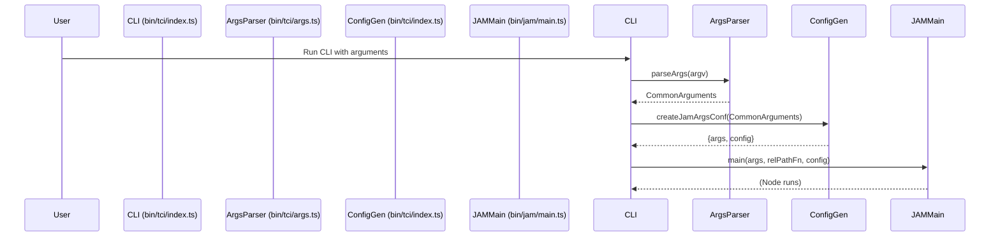

# Typeberry Common Interface (TCI)

## Pull Request by @DrEverr

Resolves: #457 


## Comment by @coderabbitai[bot]

<!-- This is an auto-generated comment: summarize by coderabbit.ai -->
<!-- This is an auto-generated comment: skip review by coderabbit.ai -->

> [!IMPORTANT]
> ## Review skipped
> 
> Auto incremental reviews are disabled on this repository.
> 
> Please check the settings in the CodeRabbit UI or the `.coderabbit.yaml` file in this repository. To trigger a single review, invoke the `@coderabbitai review` command.
> 
> You can disable this status message by setting the `reviews.review_status` to `false` in the CodeRabbit configuration file.

<!-- end of auto-generated comment: skip review by coderabbit.ai -->
<!-- walkthrough_start -->

<details>
<summary>📝 Walkthrough</summary>

## Summary by CodeRabbit

* **New Features**
  * Introduced a new CLI tool for Typeberry Common Interface (TCI) with robust argument parsing, configuration generation, and genesis file support.
  * Added new JSON schemas for authorship and genesis block header configuration.
  * Enhanced configuration options for block authorship, supporting cryptographic seeds and additional parameters.

* **Bug Fixes**
  * Improved validation for hex-encoded byte string lengths in CLI and configuration parsing.

* **Documentation**
  * Added detailed help messages for CLI usage and new JSON schema files for configuration validation.

* **Tests**
  * Added comprehensive tests for argument parsing and configuration generation to ensure correctness and error handling.

* **Chores**
  * Updated workspace and package metadata to include the new TCI tool.
## Walkthrough

This update introduces a new CLI tool under `bin/tci` for the Typeberry project, providing strict argument parsing, configuration generation, and JAM node launching with aligned options. Supporting schemas, tests, and genesis configuration are added. Existing JAM and RPC entry points are refactored to accept pre-loaded configuration objects. Authorship and node configuration classes are extended for richer options.

## Changes

| File(s) / Path(s)                                                          | Change Summary                                                                                                                        |
|----------------------------------------------------------------------------|--------------------------------------------------------------------------------------------------------------------------------------|
| `bin/tci/args.ts`, `bin/tci/args.test.ts`                                  | New CLI argument parsing module and comprehensive tests for strict, typed command-line parsing and validation.                        |
| `bin/tci/index.ts`, `bin/tci/index.test.ts`                                | New TCI entry point, config/argument translation logic, and tests for correct config generation and JAM node launch.                  |
| `bin/tci/genesis/genesis.json`                                             | Adds a static genesis state configuration file for blockchain initialization.                                                         |
| `bin/tci/package.json`                                                     | Declares the new `@typeberry/tci` package, dependencies, scripts, and binary entry.                                                  |
| `bin/jam/main.ts`, `bin/rpc/index.ts`                                      | Refactor: main functions now accept an optional pre-loaded `NodeConfiguration` for flexible config injection.                        |
| `packages/core/bytes/bytes.ts`                                             | Refactors hex string length validation into a helper function for consistency and clarity.                                            |
| `packages/jam/config/node/authorship.ts`                                   | Extends `AuthorshipOptions` class to support additional optional fields (seeds, genesis path, slot, validator index).                |
| `packages/jam/config/node/node-config.ts`                                  | Makes certain `NodeConfiguration` properties mutable (removes `readonly` from `chainSpec`, `databaseBasePath`, `authorship`).        |
| `configs/config-v1.schema.json`                                            | Changes `authorship` property to reference an external schema instead of inline definition.                                           |
| `configs/specs/authorship.schema.json`                                     | Adds new schema for block authorship configuration, supporting optional cryptographic seeds and other fields.                         |
| `configs/specs/jip5.schema.json`                                           | Adds new schema for genesis block header structure and validation.                                                                    |
| `package.json`                                                             | Adds `bin/tci` to the project’s workspace configuration.                                                                             |

## Sequence Diagram(s)



## Poem

> In the warren, code grows neat,  
> New CLI hops on nimble feet.  
> Arguments parsed, all byte-lengths right,  
> Genesis dawns in JSON light.  
> Configs align, the schemas sing—  
> Typeberry’s spring is blossoming!  
> 🐇✨

</details>

<!-- walkthrough_end -->
<!-- internal state start -->


<!-- DwQgtGAEAqAWCWBnSTIEMB26CuAXA9mAOYCmGJATmriQCaQDG+Ats2bgFyQAOFk+AIwBWJBrngA3EsgEBPRvlqU0AgfFwA6NPEgQAfACgjoCEYDEZyAAUASpETZWaCrKNwSPbABsvkCiQBHbGlcSHFcLzpIACJoWW4SAUoXSABhFmZ8LABJDBoKADM0Bg8ACmhU7IBKaMgAdzRkBwFmdRp6OTDYD2xESkgAEQoAUSkKPkbPHz9A4MRQjEckvgAWAFYAThQsXG6YeMTk+X9ufER1fBcNGD3bGYLKMhLkTHp/RHwvKWQkBw9F5jLSDrADs1wAcvh0LRaOp4Fk0L4lIgGBR4NxxFl+HwlLhtF4XgJ8Hguh4GLBMKQfnkKIpsCV6PAdntuN5fP4giF6o8eLSJPAlLRru5rHYGJhIElIPySHUotRSZAAKo2AAyXFguFw3EQHAA9HqiOpYNgBBomMw9QAxLzYAoFWSqlSIPW4A7LFx61k+PXrDYaIz6YzgKBkej4Ao4AjEMjKdoKVjsLi8fjCUTib6S+RMJRUVTqLQ6IMmKBwVCoCVoPCEUjkKjxi1sPJcKh1eyOZjOeSdHPKfOabS6MCGYOmAxqDB6oRoS2dpkaXC6gzRFcGCyQACC2RjdeoUQcThSEcYFIwVLcewABnOMJfIAVsBgxPCsOciBhqNh/PVJthuLQ93oAh0AYEoMXQLB8AxF9ES6eAKHobhnBnEh8kgS8MEUEh0gwAp4CIO9jzdBJ0MhJQcLwogv2oF9L2uXJziUdCb0vAAaRVLyYXD8LvXgoMoN1+EjXYPEvKDMQwRBCLTMQUGQTC20aN9yHoApaWYdDMPIrJKLveBIz4/lBQAbn4ESKDqJASHY9R70RAlJWKABrMIoS8fA0FhM9FS4yjqIk+91MVJDdnsBIGH0+AoiZRVnCoptF2uDcYThBEfFkdi0HsJkiEiSUvEwFyvCZDwGheGF5QKNCRMYezXPQ/iMAGagVEaEg7wKS570uTstRyiEoXwczIHco0GGxBQaU+e93LbclKWkblv07JQAyMNdLA3Lx8horJkGAmqlAYAr6xfZBjxIAAPU4KHjLrWQEYrxvYOFpEDSArUfZ8sWUz9vz/AD2i4S8rpu0JGlkJ97y+gKb1KOLdU3Ch4vYRB2Ms3YbBILwrGoWAuFKCQuHmNEzyqSAAF49HsXBSaIKo70AJMJ0NBy5wcQSHxofJ9Ye0DB4eRxGN2RxxUfR40sZxvGCaJmm6fJqm5Zy9itOwnT8IAfi4Mi1e4qjTqyBntnQicpxnPUbwXKTl1XAwIDAIxTYobgGD1JklEuq2OBt6INs3bdazjfcOy7ISTwWxAL1EljoZ5l9svfP7St/f9APq4owPByDoLS+xRCyRDkLYNCMKwiieLD4jRJ18v9d2296MkgUPBq7nvowdiat8/D/Pj9zPJykb8DGn9kEyWE8LoLgmXmEhPLDxEGlkZBxR8QfL372ha7vDHYB89WiB4PH0BFhKbIWfA216RaasM5v6FL7S9b0yM0AkfEVEiUyhu6CyrPPuyPgZDOXqhvDyW8D50RuKgeaZ4PD2UvvtPYbcArAXEjBdKMwSiSHgbyEgYBN5RG7nXAKggRBiHYnIJCiBzjeVbvAPKm9B6z24GtdcW0doSX2lCQ6ogTr13OpGVmt0oj3VNE9SAL1xBvTth9GG8dfq4C/D0VOQNmJ8wFkQRGJMcoAG0AC6RtmbXg0QjYmtM9H6JVmXA+WtIA1wPr3Q2eksCXidi7N2GAPZW0vD7QMY5Ta4AinqBGC4Qhez8ewgOsZ6zB0PPIY8sDzwGDLPJWUYQuQOHUB4d+xVAY3z2HFUWeQj4UFoYfUa8BxpESvEhMpJBhZaI6vIrEakWAcVCUIKSkBx7eGsvUBA5JeT4GeH0FeGRXgEJKtsVki5tjASyiTekSj/AP3SKwLIjTimLmkuQzQkBsihBoPMZAdTylh3fmiYkyACgFS0dsY62AvKH0vBAAQrxKCIA/EE2AbF0JvIJH814/ywB0AAExrDWAARg2HePodA0aSh/vUY0EF6C72JODdCAAGS6vF/B4UuuxMgDg6akmzJcfwYgvAUowGMI5UJCV0DAOcAAXh4OQNAT5UGXvRcGBIoRjEiotM5g9jw6O8kUhKyBipOVEhAQGA8KB/NeTuaQSAgVeJBcXTyLUgXIDlNMSYAJKBVJPijPITR6R70mKqsGKqIA7Mylq1VuSBTUEuO7K6fymSPOeZAbol1PKiHgJ2XwJq0TjSZLM7qfAaoFS1JQYUexjlzKYGMSR4wuqnloMVbynU+BMjdYyDAszEW+ttP6ggUJECwDZhNatQ9vKBqVmeG5XV4WqTuYizCGAwARrNbkuYsbIADq5t29irQaGDw5NgeCURbloEPlKsWkBHyg3TEQiZXjEXAsfFS4eGB4Dsq7UuxA1xhjFD3qm9ANCBJIIVDVTFMberkgKR4DdYgohnP3LTZZyiG0UiOYU7gfFeDwD3Jm2kfBd7oDCiGvC402A0KXR4VAuxaR1AwGtcwm1tpxjOvVXhx1kJcLDsIu6fAHoSKkVFSOsjwTpJvXhPKnlBTA0CcE0JqafGTTxEyQeqb21xr2BRqIl4f2NO6Sg+OwKaqXnWZkDAWzpV3iroFdpl5OlSQDCuX2dsAlMldFxwWES9N+y3Gq2J9ADydiPJGJJMiNyjvSakVU2RzXbNKec3peUC2KmiFXD0shajVt8OWKatB6R0D5ZAJQeFyAvADdjbgPTpCIFQ62w+yJUTwAnMu9+DDP5km3bQKZ5B+A50kjZJ8lbmEkARSO1E8QCBECoNwQZ9g33IfYoquL86xCXAypAQO5wbkMP6TqxVKtUJ1EuC5MGxLThDPEMhvEzBuDOvoMWj1havFXWTR4XzH7rpsySwpjImzT6ozUwcGYvBpAvTod0PolWyOwbQKB2k4HINV3LbVp5g8mVlbZRy2QXLnA8uE8ly6ecEVrRFEwb8MmsQSecH0KTd5r5IOjgJqduA7zFQEFQFIwEf1+DQG2NzHno0kiZAsyCMlcDsUQOFfSshB51XQXtW9WXqRwnsrIWLIksB8VGYtOeQzP3xkXYfDDxIiA2uS14BIfA0f1IAGqImCM0uOWR0aDL3lxelTQLHeVp3M+nPCQNgbRL9g4iMW0Svuc4DwP6S3AWByy49YOIfjDQMvFWSxPknzd+jqIsGdsSS23z0PR871AVgLSbAiv+tUoiELwYJAijeFCEOxarv0CgeKhH3+HhWcIaivQUoJANBEA0JO1Cuq8Rxez1Wba3CYhbSqSQaIVRDvoR/Vr207VY7t3QAKgNrxIhj1+Jz67lq0XecHskS4Mh5Dy8st5HLaJoJSEkZdTOZ01obiqv0UVkrphOQUlgWXiL5NKQEpCAAspcBpgtdfj6FZPB9F813kGuk3UQjOFSg/F8BXUtXYjqRQnyBeDPzVwgD+S6n3XznfB91PXuX8BvE7iT0vhXyzTKRQFfgwHkEL06kfCFGgWQBJWUVN0jTz0RHdVIUjGpxmTwDWgAHkxh7IcCjs6Q8o75kQ/BBBehmcwgDhC4ylOctUo945jxWCIC5l/MaogsjhXJPhxZQpjo54+BV8+ATg2ZpD6Aspr4KAwA1IoovEaVldUtkMMtSAcMLN8MDZJIiM9gjp+EyMLpTsRFwwqNxEzVaMZEoBkpBQD8wYt1JI8QSlLwAAJYYVUKwcxOmO8LifjI9byVg3oTLGeP9duc9WRUIqIMTICO7Rg21RTK7C1HZVvFENEfLRUWtT7DwY8d3NIdzN7Y/QoiqegEosfAKdXDHQWUoY6eAXIWZZIyxKoLgSo5TBfGo3YBUH9F4GQxg/JZABQ+Ygo8zAzB2ccIzIJeAQ0WMMbY4xLJADQLpLIb2czKJKzNOWzUORJU8ZJZzcgNsAAKQAGUODwR7wJt0JRsLirjbxR5oQwiKD+g3EDjgkgSXRUish0jBM9g4SaZINiEnFb8uospHoRknJ5oYoupYQdEBA8AohIhaBSA+AOZZ5mAB8WNy82cf9tgBdfBoDi4Q8K1AdJVIB2VaRv1XcSlcSGAXIKRa0oDBTQh5hINaQhoY8rozdzhxoxTYAatYRxRxBnsPBUThSnIB9EB3JQhUA+gGVeTKB8AB8QZltYAAB9OzJyOFdMeOLkoQvk/AYoqabgeQfPFY4wkaJAUIcVeAWHKPNfYlK9FFUKJSEZCDeMNxD5Mpb5ckO8YFEGWgCFaFWFTwR6M1OVXlG4UScQEU1CRAO05wB0uSUdNkGPeTCMB4fbMpMsigCsisLAEgDbQSYqeYS0qsXYS4G0r1PFSsk0+qN0y09gb7WQG0j4L8EoFMl1PoREDqKKLwWgF4b8E6UgM0/k+gJ3M3LRdiWVbGeQbgAqEoOtVckPLqATcQWCH0kdKgLxFgRLX0/KPEvORgs8ZNVABkvOCgTMSYGqG8iDXwaUiHVYvJXbPOUIZQvYGkmgDSBUOExw9hZwgRNwjwDw0jQjbwiIvw7MmjPIV6ejKASEcItmURfwnM56Ii6RA1HkNjSinpRQYVWgUyXYcsJLd4tEosyAb434yaPyFw/4yIXTW2e2R2GEo4wcsJbsxcG41cO4wOazdseJMORzejN4pjLkX86EycQ4zxbxHjGoiLWmOkBkPjPmTnf/WyG9LJLlWCjwOIBIYLNIS7HIPISgIoEoSAcoSocmGwKwVIQSnuFwgfG9UNMGF4O9W6WTLVG9PABhYijTDSHWS43ddybyWDeLdvQMqrV8v7FKjiAAAVUPGFkDNmYF4mclQxj3clXmYqixnxHUUOX0lS1QxOEtRDngkli3ixKiSzsrnS5Q/DYHoFiHdDUNmIOU8sKGKDKAqGqC4ECtSFrlqDqEN2guQD/Fbxz22nsApFWU6L2muAAHVjQYoOKrVslMpsozw8ob1xRXtv86MuhH09gVqQqSFnTxlxh0xrDuq04NqyA2rD5GxJk814EtjLKBMeSpsWoZol1wquRljYp5jtUm9FUKYAAhQQP5ZSvcHHL6zEtdc5TifwPcD4mcKTCiTVYwmKuZRY4DDwd4XPefao6kP1FudwtvXPY61w2DeTVWcEFCQiMYNECqHYKEaIXGgQaIb8/aLkGg94N65mzzBKUGpfTq+uRgCmgKSpcaJHdPaw+nEgNrQmpffAcW5uZAHKvm+895PocMLAC3dW1GFCvDThQjA6HmkjFwwRci3wiaajQI2iujd6SECrUoQ6fSV+GELi7S+YES0qY0TFRq9naQ+QPosRaiyRMO6QfvPxXYyS/S4JGS+SyJTaaJXceMR4+zcOOBTSlzNsZykgL43LcCY7E2KSwyg7Ey6kMyqLCypmv8gComick8/AenFqvijcZ/exLCSMo3dyhMTsLxcrKGjm2LSKs7FzUZUORK4qOipfQqtpDSS5eEXodCUqya8q6qkU1Df7P1QebW/W8BZWN2kpC/IgOq4eI0byE0v8AfUaKkyszqqIR20RLACUMgfkWkDADWi+4rBHPYG8QO+MCGJ8XAzCK+lHVxGOPEOVZAVsVeiG6ZRQxFVGkSDSK3ODJZMQZRVSHqGs7oLAQG45We5/FlJks1ChpfLKVWYm4SshdMLMWqNebycmnqkgKm5gGmnSKBQ5UkF2ulfAIhxUD4uenpPmfo+OQWl7Te7ZV8rKfwBNHBI+UKd4T4MYFB0SdhmR6mwWWm3RrEY3e9YKcPegRsLEPh2hzR+ezYjm/h0dRe1+uQpnWLLiWECSQXLaoRnWyeVcq1IZSYZrDEYedrTrTtZAUoeMhsr5agZM9iNxQFYp8FSFGFS8KoXrFqSBtPdMIbdiVE38kKVUsIUNcvQ0mPUMvbD2RyJ2/gZkN3d4J4FohzSlaQU4LxF+0rDe/m89A5UIbHGw/oPBzvcnVbTpoaJfHp7YPpn0+klpLAfwFZVw2+Txzhz+uZOTPYAGNOMJrINaK0JkQXXgrrXfUIN9EUn4SMWyVAK6UQMk+gWEY20grxGySMD4diVeByExJkHeVFLuWZyGq56gw/OrLUkJpiAFhgPAYrJfOo9EUIVplB1ALup4T7BwBNd9IeEeZQx8g0mibybxrAQJox+ZKEfxrFkrPWEm4FAqL6BATFwRjOS4Z5GlD2zcNCsjH2zCvhbCnnXCii/CkOmi8IcO7osIvozBrmI59RJkTRbRfcgxaY6wdSKyYACQKe2gPQFxbu0u6S/bT2HZTV4onwmXPVqRymxxrRCiTRWWWYlTVGU1gAb3NURmnDpKDctVMmIW1hsV5eEoAF87W9LjNHWjLrYdiJL9iHWvQaqHCQSFLfYlKYkHiQ566NKjAtK2w0cH7C2PhQTfyxTJQGtoGeiR15Mb6XKjh0376nJUM+rs8BqPH62jtMaEaXTB5Rr+kxhzh9daiO7o9tGYoJ6eAp6Slcny6pJqml8JxQ413cmNBe7nWd2B8kIx3hzUJecJRhgvjGq+lfLLxAsDhoguBohjtogqnt6AchDCWMRodpTYrMXPtTyqkdbcnFxYdj3t2qml8KBHwMi5cQhzpoHpg6JjLpMJttqyaoOoERQL2B2tyuy5k+huCkQSAEh9snxXqsQf4oTu3Dg76ut+JC4x2CqrxWgj18dCc8sSdhtEQshD4PtW8pB3JuANalAqOlAnx5B/NW726PnxDuAcoA7rw8cAz8O9gnoSU0Mmhr3gJn8rBVQwAwUNBsUWH4E8A61C0mgeH5RkAbQ7QHRIAnQBACj1pUKvaedZXW8/b0KlWg6c7CL1Xgj7F0lCPMssKXDgZIuG2sgOoupLxGPgs+3drYbD54a8RetKOwwng6MWcl3d0tUu6q4xL9Mc3iEXRiEwAJAoUNAURuhOx0rrjK7/Z7ja6K2EkHMXiZERRoheybPa10RagwMBJ5BLq9h+K/jGv2ysoyoG7SBVIgoJQmQUWRHZJ+qj0AoRPZ150Oh8BPg55RdvtxuYgWB1Bpy54vAbSXqNSXxahgV1BbbpAl2XxO4oQTHs9HgnwW5Pu2zLp8gwCusmuspfz5a9QK8GAXRBu18EBWFZvmuQT5aqD7szyaXQYnpbJ6rYJEesotvQCl6IID8gfcfusvuHh/Bfv2IsCrbkS0MMAUWxvbp5BcR8RXyuISY+ZEp1onDvOznrc5X/OvChF3WmLVW87QuSKzX+IWeYhYeyl4fahJuWbDvAymcQe5uw5OID5quD5av6u8eWvQTHNlv2lVvGfpkNupTyeievugh9ukUjuJRmfBJogLvcArvERbvTVEN65QtPv0IAASAlO8AlH7iKSR49qHmH6zuH9EBr8n43uiIuyr3XyH8KWPvsxXhPo3ottryzAmzrtS54iOat5uvin4mb2338mdh+BX4bhHpPkEu8FtpIEG+nWkIeqIYCLb7m8vPIlZeBCCpg+OBD5q/zXUqMIb+H+J0hfK/U23qH4VX/feRNnW1s1MPZGYB3slW+U7uXsSVoT3xcm7u7+uO8eGJ3yITAfvRZh5StRabnYH1316hwFJ5APJ3MApn5K7ugFVR6KWU7R00WY6ZCphsD/60A/kkuJXM7m0Y/JrKgaYNBFDDQWMgevlZ/rEwezA4ie0QXFH3iSgpQYmvgTAWyQP7H0XSokOEjaVaaX9ncu7S8Js2nKGlL+AIZYJOjxyOBIA2KXdqmR6YDknWrA4PBQA4HccuBPAxfqD36wZYfAiCCCCeXIGvUkgsgAuF0DOAnYwOEUDPOlxUjXABgr3D5oRkLyCEF0XUGAcMlVyCRgIftdnKSHgjzI8u9Aa+CzmtS85eg9WRrL31NT740mrWTJrmRIDLwJoVtZIAKEHg6l6qC2IuKhE+SSsOEBGHzoLz86eEcKovPCsHQCJqtiKEddJNN016dhk64JKeOhAb7w9E+oPZPjoPp5yx/034YFLISxDj9Fok/SIdP3j6pYHm2cLhOV38R7EquGfUQC6CEDog1g5Qubsb2LYWZq6QcGzF13Uq9cm63FPIXj0KF190Iww7gKMLz6NtW+kwdvio0HrRYgIUIPvo0UH4AZjwWUCIe+W6DBoKAkgrXsv2ZIj0aoU/W4bmErIShreRPPbkdTgGJM1yI6dXOwBVR1J2A05PEDQBtKykCcMeEGID1JhKkbSKpaARGROAjMiKzaK6KCifBYRdyjQF7NKDWJpxOgX3UgLDhCjoCEEW+Q+KQJiD4C8EhKJfEgKOihpYI80KgF+jKSxZEQHwHfnOhVoCNRYkadCAaSGjLlsYbwSjhiM1Jy49gTAR8IGUhaGkmgvqXBH316LWloWe0WmHzB75Qhe0/aM2jRH3wHMCy+QrKJQJWIsxrSTZCsgCJ0EOdie3w4FF8KqywQx06EIsnKkXB2iJRq5B4QUOJLUiVipBIgRggsECQlBgQ1QX2VeyY8qk6gawiRxiyo8VhJgpLDolkgNDb8VANgHNmbIjprhIpZLHcOpCNFl4CFOIdK29pJDouAXNIcqwyG50gi0vRjJ8Sr4WjChjFWgMDH6Ex8pwIwsYUjx2FVDMW9DIfjs2JEBQmh0OK4ScVQBvC54Hw63j0OLoGA4utefPrcSrodc4kdmbrotz67yjeu4JBOm2ALFORWc81SXikGfacZ4AX7DCgfgDKDwSOYcS8deOeDGx5Mm4yoQyQVrp1nhLIWkHsgADkBqebF+J5ZCUdanQKdu1XBKgFYIILBpikEhIiZRIE4RLpeXuEL0zIv8I8Z3n/aLgcu0nfLtIHYhdQsu83HkCtFry88vOCQgXoqHrEi90G4vTIZL2yEMYsgZQTCERPqjZ0qKIXYimBOSEKtJIVQVPmOE3F69/AeoTlNIEUng5pAZmRSruKL77iniPXMvikhPERx7gxQAgJhJGhkAiAoUHMbSzNT+Zv6/xS6MykiBnhQogaHEb2A6CqTY8KvdCNjVUndISMNCa4FYH8D8hrkNKN5sXDrSAjBiJAXycckhDBTh2Q5VMj+jinSAESeQPUSWhRZfMrxqtLoP4DbB6EfmioV2nAKckWS94V0EoHQB76iZACX6egBVN2CHZXsuU9cizUo7o8PJcGbit0BVyrNPWuU1UOZN2BqYgM0oX3q9X0ilTS0JIcqaNKqlBpqU8gV9ISNwCWQfKNUaXBA08nNS948MUCMSExGHx/MLaJ4CxTJg4FMM+BaDCVKApzSjS1BY0P0EbSZVaRcaQ7gdTZiWlUpfku8JFMUDQghAohImvtPjwDNgInEboCKRGnOTfkYjZoLqOfDeQwUQk9Fk8n744ohy2A4MoBJKA0hGC7KV8o+BX5mT4ZRIyCgFDOlXQssbBRKPhPo58ADaE0PQlPisIv0FhceTvuZRiyMTPazEzvMRhSGKtGxQXESaHSl7vQiifpbiuBnfhcp+pquFxq4mGmLTgAAADRJ5hh5IwgvQITG1wkAuAGs4lA1LUQazTWVrAUKmzkl6gkcJAFScckdlqSaipQTCKEBKKF0oAr+CeFXh4pmpAZD8P6fFPwCJTCUms7WTuirKAhKA+s2WM7kPJkBjZprNKYgE1m2tjYAUz/qnJtkFtlJ9s52S6CUnnoFiUIE4Oj22AotwZuUonjC1ARqz4ZKfb2SxUng2ZIRAc1CFFMHzh5U5EchUjrOjnLA45kxM8InIwDJyuAvcjWRnJihZyfJ/042HWyI75y38hcwubxmAjlybxa3aZNXJhkuRYMdcqGQ3Mqkp9s2skvOUMPNjEI9QqsEJHHxz6sIK6O49rlpNmEl9dJjdKOOhA3APzG+HBfKqkQKg0IwS/c/bMcPbCgZ60bGZCSQPdG+BOhpSGArELNYkBQpvQcKSgEDKM9SCoESjhgzuq5QOUh3G/q4g95e8z+U0+7glwGh1AAEvIz7ngoA781ceDWQEf5l8EZNPsnWPMjky/6fIkytpYAcU0AGQCVU5TTMmIt4GAkFxpZWgVlhjyej7y/mRgR02YHiil8l4fgYOS06PYK+AIjqd5gXRBQ8hkwOka/wLxapqEkM3AinmvRwV2540DCLKA6jGShsaWPsh7iSHyz0SOohDoNhEEDIqke8Bbnc3jDARKBpIV7HLOiGwFecEvCmrQCyDWELFCzEUHkLsksyFuZAU8MPShA5oHqBjCvnSIMV28vsUEO3FynUxuMpCPOGvHXgbwmw/JAAZjBSJdqSbCxAHfxFAhCqA0wCcRcOEjyjgFxDObjPEaIoRKEdOC+EVKfCUtvAFtTIN+DZ4TZjCf82fogsVTVj+eQs32iLNcKBdKMBFSWTxKgA4QJxXUY8JeF/nZ9/5gCtdKon1HgkWFbJWJZ8m9iQBdAJsBMj/3JBfE2FdiXubEQ3BfFYiNpL4tkAABawwW1gYE+VQASmiAf5XQEBV+TgAwK0FeCqhUwrfE8K0ARmRhTIraAqK45OipBVgqIV0K2FXisvBwlcYuwOxM7lxVfLVFbAL4oaTsTQAOm7K8UXCpZU9NcgHsOxMPiYKXBBV3qd6F8UcUeKu51y9ZeiAAXdD3icKfCN8gAym8UqHy9CJeEYGRxPlYFM1O8VKBhtyFp/H3miD94BQk2XAD4o2w4JM5gANymfgqvyp6BpJnynVcyoIBarPVi4PlQavGhGqQ2fKz5aauu7mrIo1CjuCGscj5NBFkA1iDGtEWdpE1nyz5RIphQJqY11A1pqmrTVMCxRzOGNdoqdZ5rrVfFO1Q6qdXtDFVZ0N1Xys9WSrpVrveQHKtuXw9a1J1M+raoS4PL8kEC8nDAuIEvL/ikopcDSveRxrCmQithcyoRXJrZ1fKhFRmogHACl1Mi84nIrxhzqvRaiwtTuq0XTj+yOimSXsVtmRs7ZB8W+VhGvVKAwAxCdSSW00llti+B4+YXpMRynjx4ZM+TA4nX4SQgFSkSaBcr4CdBae/ITFpeESXJLZAAMluVFD4Bn0OIBJDAF8XCgqpFUkDbGm1HpW/I4RpQ9EPill50VWp3NfwMM2I2vU5Q34B7OgoNITdWAeLR6PAngLAbB+8cUkuDG/AKQekTGyIJlFkE0i7BfAe8sBClAaq0ArGi3tKV+7a8/1sEgDWAz1qpiyKTM6yQwGJQEF2ZuaD+l1DSK0hfAtyS+J8PtBAFtlgs58WxNSEcSVWXE1se9HOWD8O0qqpOOpRGWkQE2Cm2iIvPPXXyr1d81WPeoPi8YNVZ9H1Tqr9WfLOeTmigKUBjUJLlxMGyAEHzx4jyf68WridBpwWTTal48weZQDzWfKEtnkJLYuitYUAuAAAaRvypAKQTINDaIEK3HLxoWWgGnVtQ3hQbV6IWrXzAa0aaMtudVraz1qZtRsNfQXDWlqa3Fakl2WgjdwC4DVrH5na6rHyvdXaqvV+ABtRFr1Vsb/FJkuLWmua0zASt2WlLeT0m0DaJEQ2nLfOzy1sCCtl2s1NdrK2XAqtNW9rX1qm1cSUNfWrrdwB631bwoX23OphtG04bpYCix7eNDm0Lb5V3AZbWjFW1bbfE58kcCWDzrhhX41YPcV4wyBJgKcbYOut2ApS5gVAagAcEWGHAGB0djYS7gKFLIhSoocoWgBCOcChAgw1OkMMCAABsUKbPAAA41gAgWgBsAYAghudYKUXfzrF3NKoU/O8XbztoD87aA2KKFNigYDc6NgmwDYGCkjAc6adGQOnWuWhFoKmddAG0mGCHB6AgAA -->

<!-- internal state end -->
<!-- tips_start -->

---


<details>
<summary>🪧 Tips</summary>

### Chat

There are 3 ways to chat with [CodeRabbit](https://coderabbit.ai?utm_source=oss&utm_medium=github&utm_campaign=FluffyLabs/typeberry&utm_content=459):

- Review comments: Directly reply to a review comment made by CodeRabbit. Example:
  - `I pushed a fix in commit <commit_id>, please review it.`
  - `Explain this complex logic.`
  - `Open a follow-up GitHub issue for this discussion.`
- Files and specific lines of code (under the "Files changed" tab): Tag `@coderabbitai` in a new review comment at the desired location with your query. Examples:
  - `@coderabbitai explain this code block.`
  -	`@coderabbitai modularize this function.`
- PR comments: Tag `@coderabbitai` in a new PR comment to ask questions about the PR branch. For the best results, please provide a very specific query, as very limited context is provided in this mode. Examples:
  - `@coderabbitai gather interesting stats about this repository and render them as a table. Additionally, render a pie chart showing the language distribution in the codebase.`
  - `@coderabbitai read src/utils.ts and explain its main purpose.`
  - `@coderabbitai read the files in the src/scheduler package and generate a class diagram using mermaid and a README in the markdown format.`
  - `@coderabbitai help me debug CodeRabbit configuration file.`

### Support

Need help? Create a ticket on our [support page](https://www.coderabbit.ai/contact-us/support) for assistance with any issues or questions.

Note: Be mindful of the bot's finite context window. It's strongly recommended to break down tasks such as reading entire modules into smaller chunks. For a focused discussion, use review comments to chat about specific files and their changes, instead of using the PR comments.

### CodeRabbit Commands (Invoked using PR comments)

- `@coderabbitai pause` to pause the reviews on a PR.
- `@coderabbitai resume` to resume the paused reviews.
- `@coderabbitai review` to trigger an incremental review. This is useful when automatic reviews are disabled for the repository.
- `@coderabbitai full review` to do a full review from scratch and review all the files again.
- `@coderabbitai summary` to regenerate the summary of the PR.
- `@coderabbitai generate sequence diagram` to generate a sequence diagram of the changes in this PR.
- `@coderabbitai resolve` resolve all the CodeRabbit review comments.
- `@coderabbitai configuration` to show the current CodeRabbit configuration for the repository.
- `@coderabbitai help` to get help.

### Other keywords and placeholders

- Add `@coderabbitai ignore` anywhere in the PR description to prevent this PR from being reviewed.
- Add `@coderabbitai summary` to generate the high-level summary at a specific location in the PR description.
- Add `@coderabbitai` anywhere in the PR title to generate the title automatically.

### Documentation and Community

- Visit our [Documentation](https://docs.coderabbit.ai) for detailed information on how to use CodeRabbit.
- Join our [Discord Community](http://discord.gg/coderabbit) to get help, request features, and share feedback.
- Follow us on [X/Twitter](https://twitter.com/coderabbitai) for updates and announcements.

</details>

<!-- tips_end -->


## Comment by @github-actions[bot]


<details>
<summary>View all</summary>

| File | Benchmark | Ops |  |
|------|-----------|-----|--|
| [bytes/hex-to.ts[0]](../blob/1988d575d2c4e4a5be8dce89bd046f175ae690a3//_work/typeberry-1/typeberry/typeberry/benchmarks/bytes/hex-to.ts) | number toString + padding | 333279.4 ±0.13% | fastest ✅ |
| [bytes/hex-to.ts[1]](../blob/1988d575d2c4e4a5be8dce89bd046f175ae690a3//_work/typeberry-1/typeberry/typeberry/benchmarks/bytes/hex-to.ts) | manual | 16472.97 ±0.18% | 95.06% slower |
| [math/mul_overflow.ts[0]](../blob/1988d575d2c4e4a5be8dce89bd046f175ae690a3//_work/typeberry-1/typeberry/typeberry/benchmarks/math/mul_overflow.ts) | multiply and bring back to u32 | 263829517.81 ±5.07% | fastest ✅ |
| [math/mul_overflow.ts[1]](../blob/1988d575d2c4e4a5be8dce89bd046f175ae690a3//_work/typeberry-1/typeberry/typeberry/benchmarks/math/mul_overflow.ts) | multiply and take modulus | 262587174.24 ±5.71% | 0.47% slower |
| [math/switch.ts[0]](../blob/1988d575d2c4e4a5be8dce89bd046f175ae690a3//_work/typeberry-1/typeberry/typeberry/benchmarks/math/switch.ts) | switch | 267197059.64 ±4.91% | 0.52% slower |
| [math/switch.ts[1]](../blob/1988d575d2c4e4a5be8dce89bd046f175ae690a3//_work/typeberry-1/typeberry/typeberry/benchmarks/math/switch.ts) | if | 268582136.82 ±4.72% | fastest ✅ |
| [logger/index.ts[0]](../blob/1988d575d2c4e4a5be8dce89bd046f175ae690a3//_work/typeberry-1/typeberry/typeberry/benchmarks/logger/index.ts) | console.log with string concat | 6887709.46 ±57.99% | fastest ✅ |
| [logger/index.ts[1]](../blob/1988d575d2c4e4a5be8dce89bd046f175ae690a3//_work/typeberry-1/typeberry/typeberry/benchmarks/logger/index.ts) | console.log with args | 974990.44 ±101% | 85.84% slower |
| [codec/bigint.decode.ts[0]](../blob/1988d575d2c4e4a5be8dce89bd046f175ae690a3//_work/typeberry-1/typeberry/typeberry/benchmarks/codec/bigint.decode.ts) | decode custom | 150910602.73 ±31.79% | fastest ✅ |
| [codec/bigint.decode.ts[1]](../blob/1988d575d2c4e4a5be8dce89bd046f175ae690a3//_work/typeberry-1/typeberry/typeberry/benchmarks/codec/bigint.decode.ts) | decode bigint | 87993377.99 ±2% | 41.69% slower |
| [codec/encoding.ts[0]](../blob/1988d575d2c4e4a5be8dce89bd046f175ae690a3//_work/typeberry-1/typeberry/typeberry/benchmarks/codec/encoding.ts) | manual encode | 2573140.02 ±0.24% | 18.43% slower |
| [codec/encoding.ts[1]](../blob/1988d575d2c4e4a5be8dce89bd046f175ae690a3//_work/typeberry-1/typeberry/typeberry/benchmarks/codec/encoding.ts) | int32array encode | 3154361.47 ±0.27% | fastest ✅ |
| [codec/encoding.ts[2]](../blob/1988d575d2c4e4a5be8dce89bd046f175ae690a3//_work/typeberry-1/typeberry/typeberry/benchmarks/codec/encoding.ts) | dataview encode | 3140392.07 ±0.23% | 0.44% slower |
| [hash/index.ts[0]](../blob/1988d575d2c4e4a5be8dce89bd046f175ae690a3//_work/typeberry-1/typeberry/typeberry/benchmarks/hash/index.ts) | hash with numeric representation | 193.29 ±0.2% | 27.19% slower |
| [hash/index.ts[1]](../blob/1988d575d2c4e4a5be8dce89bd046f175ae690a3//_work/typeberry-1/typeberry/typeberry/benchmarks/hash/index.ts) | hash with string representation | 119.61 ±0.35% | 54.94% slower |
| [hash/index.ts[2]](../blob/1988d575d2c4e4a5be8dce89bd046f175ae690a3//_work/typeberry-1/typeberry/typeberry/benchmarks/hash/index.ts) | hash with symbol representation | 184.89 ±0.2% | 30.35% slower |
| [hash/index.ts[3]](../blob/1988d575d2c4e4a5be8dce89bd046f175ae690a3//_work/typeberry-1/typeberry/typeberry/benchmarks/hash/index.ts) | hash with uint8 representation | 165.28 ±0.2% | 37.74% slower |
| [hash/index.ts[4]](../blob/1988d575d2c4e4a5be8dce89bd046f175ae690a3//_work/typeberry-1/typeberry/typeberry/benchmarks/hash/index.ts) | hash with packed representation | 265.46 ±0.19% | fastest ✅ |
| [hash/index.ts[5]](../blob/1988d575d2c4e4a5be8dce89bd046f175ae690a3//_work/typeberry-1/typeberry/typeberry/benchmarks/hash/index.ts) | hash with bigint representation | 194.24 ±0.14% | 26.83% slower |
| [hash/index.ts[6]](../blob/1988d575d2c4e4a5be8dce89bd046f175ae690a3//_work/typeberry-1/typeberry/typeberry/benchmarks/hash/index.ts) | hash with uint32 representation | 204.67 ±0.22% | 22.9% slower |
| [math/add_one_overflow.ts[0]](../blob/1988d575d2c4e4a5be8dce89bd046f175ae690a3//_work/typeberry-1/typeberry/typeberry/benchmarks/math/add_one_overflow.ts) | add and take modulus | 265032317.87 ±5.89% | fastest ✅ |
| [math/add_one_overflow.ts[1]](../blob/1988d575d2c4e4a5be8dce89bd046f175ae690a3//_work/typeberry-1/typeberry/typeberry/benchmarks/math/add_one_overflow.ts) | condition before calculation | 264438300.73 ±4.7% | 0.22% slower |
| [math/count-bits-u32.ts[0]](../blob/1988d575d2c4e4a5be8dce89bd046f175ae690a3//_work/typeberry-1/typeberry/typeberry/benchmarks/math/count-bits-u32.ts) | standard method | 88959178.91 ±1.61% | 65.46% slower |
| [math/count-bits-u32.ts[1]](../blob/1988d575d2c4e4a5be8dce89bd046f175ae690a3//_work/typeberry-1/typeberry/typeberry/benchmarks/math/count-bits-u32.ts) | magic | 257583611.19 ±4.63% | fastest ✅ |
| [math/count-bits-u64.ts[0]](../blob/1988d575d2c4e4a5be8dce89bd046f175ae690a3//_work/typeberry-1/typeberry/typeberry/benchmarks/math/count-bits-u64.ts) | standard method | 1085930.61 ±0.23% | 87.87% slower |
| [math/count-bits-u64.ts[1]](../blob/1988d575d2c4e4a5be8dce89bd046f175ae690a3//_work/typeberry-1/typeberry/typeberry/benchmarks/math/count-bits-u64.ts) | magic | 8952893.24 ±0.26% | fastest ✅ |
| [collections/map-set.ts[0]](../blob/1988d575d2c4e4a5be8dce89bd046f175ae690a3//_work/typeberry-1/typeberry/typeberry/benchmarks/collections/map-set.ts) | 2 gets + conditional set | 121486.38 ±0.12% | fastest ✅ |
| [collections/map-set.ts[1]](../blob/1988d575d2c4e4a5be8dce89bd046f175ae690a3//_work/typeberry-1/typeberry/typeberry/benchmarks/collections/map-set.ts) | 1 get 1 set | 61740.63 ±0% | 49.18% slower |
| [codec/bigint.compare.ts[0]](../blob/1988d575d2c4e4a5be8dce89bd046f175ae690a3//_work/typeberry-1/typeberry/typeberry/benchmarks/codec/bigint.compare.ts) | compare custom | 270308513.57 ±4.94% | fastest ✅ |
| [codec/bigint.compare.ts[1]](../blob/1988d575d2c4e4a5be8dce89bd046f175ae690a3//_work/typeberry-1/typeberry/typeberry/benchmarks/codec/bigint.compare.ts) | compare bigint | 261123900.64 ±6.62% | 3.4% slower |
| [codec/decoding.ts[0]](../blob/1988d575d2c4e4a5be8dce89bd046f175ae690a3//_work/typeberry-1/typeberry/typeberry/benchmarks/codec/decoding.ts) | manual decode | 16456882.47 ±0.46% | 90.91% slower |
| [codec/decoding.ts[1]](../blob/1988d575d2c4e4a5be8dce89bd046f175ae690a3//_work/typeberry-1/typeberry/typeberry/benchmarks/codec/decoding.ts) | int32array decode | 169973102.06 ±2.16% | 6.08% slower |
| [codec/decoding.ts[2]](../blob/1988d575d2c4e4a5be8dce89bd046f175ae690a3//_work/typeberry-1/typeberry/typeberry/benchmarks/codec/decoding.ts) | dataview decode | 180971432.37 ±4.02% | fastest ✅ |
| [bytes/hex-from.ts[0]](../blob/1988d575d2c4e4a5be8dce89bd046f175ae690a3//_work/typeberry-1/typeberry/typeberry/benchmarks/bytes/hex-from.ts) | parse hex using `Number` with NaN checking | 131607.05 ±0.3% | 82.9% slower |
| [bytes/hex-from.ts[1]](../blob/1988d575d2c4e4a5be8dce89bd046f175ae690a3//_work/typeberry-1/typeberry/typeberry/benchmarks/bytes/hex-from.ts) | parse hex from char codes | 769700.49 ±0.21% | fastest ✅ |
| [bytes/hex-from.ts[2]](../blob/1988d575d2c4e4a5be8dce89bd046f175ae690a3//_work/typeberry-1/typeberry/typeberry/benchmarks/bytes/hex-from.ts) | parse hex from string nibbles | 504733.31 ±0.39% | 34.42% slower |
| [codec/view_vs_object.ts[0]](../blob/1988d575d2c4e4a5be8dce89bd046f175ae690a3//_work/typeberry-1/typeberry/typeberry/benchmarks/codec/view_vs_object.ts) | Get the first field from Decoded | 54503.97 ±98.43% | 87.66% slower |
| [codec/view_vs_object.ts[1]](../blob/1988d575d2c4e4a5be8dce89bd046f175ae690a3//_work/typeberry-1/typeberry/typeberry/benchmarks/codec/view_vs_object.ts) | Get the first field from View | 90332.82 ±0.28% | 79.55% slower |
| [codec/view_vs_object.ts[2]](../blob/1988d575d2c4e4a5be8dce89bd046f175ae690a3//_work/typeberry-1/typeberry/typeberry/benchmarks/codec/view_vs_object.ts) | Get the first field as view from View | 98049.87 ±1.2% | 77.8% slower |
| [codec/view_vs_object.ts[3]](../blob/1988d575d2c4e4a5be8dce89bd046f175ae690a3//_work/typeberry-1/typeberry/typeberry/benchmarks/codec/view_vs_object.ts) | Get two fields from Decoded | 438133.18 ±0.24% | 0.8% slower |
| [codec/view_vs_object.ts[4]](../blob/1988d575d2c4e4a5be8dce89bd046f175ae690a3//_work/typeberry-1/typeberry/typeberry/benchmarks/codec/view_vs_object.ts) | Get two fields from View | 81936.02 ±0.14% | 81.45% slower |
| [codec/view_vs_object.ts[5]](../blob/1988d575d2c4e4a5be8dce89bd046f175ae690a3//_work/typeberry-1/typeberry/typeberry/benchmarks/codec/view_vs_object.ts) | Get two fields from materialized from View | 172600.66 ±0.14% | 60.92% slower |
| [codec/view_vs_object.ts[6]](../blob/1988d575d2c4e4a5be8dce89bd046f175ae690a3//_work/typeberry-1/typeberry/typeberry/benchmarks/codec/view_vs_object.ts) | Get two fields as views from View | 81665.95 ±0.13% | 81.51% slower |
| [codec/view_vs_object.ts[7]](../blob/1988d575d2c4e4a5be8dce89bd046f175ae690a3//_work/typeberry-1/typeberry/typeberry/benchmarks/codec/view_vs_object.ts) | Get only third field from Decoded | 441651.03 ±0.32% | fastest ✅ |
| [codec/view_vs_object.ts[8]](../blob/1988d575d2c4e4a5be8dce89bd046f175ae690a3//_work/typeberry-1/typeberry/typeberry/benchmarks/codec/view_vs_object.ts) | Get only third field from View | 101493.6 ±0.16% | 77.02% slower |
| [codec/view_vs_object.ts[9]](../blob/1988d575d2c4e4a5be8dce89bd046f175ae690a3//_work/typeberry-1/typeberry/typeberry/benchmarks/codec/view_vs_object.ts) | Get only third field as view from View | 101551.58 ±0.17% | 77.01% slower |
| [codec/view_vs_collection.ts[0]](../blob/1988d575d2c4e4a5be8dce89bd046f175ae690a3//_work/typeberry-1/typeberry/typeberry/benchmarks/codec/view_vs_collection.ts) | Get first element from Decoded | 27545.61 ±0.18% | 59.91% slower |
| [codec/view_vs_collection.ts[1]](../blob/1988d575d2c4e4a5be8dce89bd046f175ae690a3//_work/typeberry-1/typeberry/typeberry/benchmarks/codec/view_vs_collection.ts) | Get first element from View | 68708.67 ±0.16% | fastest ✅ |
| [codec/view_vs_collection.ts[2]](../blob/1988d575d2c4e4a5be8dce89bd046f175ae690a3//_work/typeberry-1/typeberry/typeberry/benchmarks/codec/view_vs_collection.ts) | Get 50th element from Decoded | 27609.63 ±0.28% | 59.82% slower |
| [codec/view_vs_collection.ts[3]](../blob/1988d575d2c4e4a5be8dce89bd046f175ae690a3//_work/typeberry-1/typeberry/typeberry/benchmarks/codec/view_vs_collection.ts) | Get 50th element from View | 37922.33 ±0.09% | 44.81% slower |
| [codec/view_vs_collection.ts[4]](../blob/1988d575d2c4e4a5be8dce89bd046f175ae690a3//_work/typeberry-1/typeberry/typeberry/benchmarks/codec/view_vs_collection.ts) | Get last element from Decoded | 27613.68 ±0.09% | 59.81% slower |
| [codec/view_vs_collection.ts[5]](../blob/1988d575d2c4e4a5be8dce89bd046f175ae690a3//_work/typeberry-1/typeberry/typeberry/benchmarks/codec/view_vs_collection.ts) | Get last element from View | 26848.6 ±0.29% | 60.92% slower |
| [hash/blake2b.ts[0]](../blob/1988d575d2c4e4a5be8dce89bd046f175ae690a3//_work/typeberry-1/typeberry/typeberry/benchmarks/hash/blake2b.ts) | hasher with simple allocator | 0.0459 ±0.7% | fastest ✅ |
| [hash/blake2b.ts[1]](../blob/1988d575d2c4e4a5be8dce89bd046f175ae690a3//_work/typeberry-1/typeberry/typeberry/benchmarks/hash/blake2b.ts) | hasher with page allocator | 0.0456 ±1.22% | 0.65% slower |
| [bytes/compare.ts[0]](../blob/1988d575d2c4e4a5be8dce89bd046f175ae690a3//_work/typeberry-1/typeberry/typeberry/benchmarks/bytes/compare.ts) | Comparing Uint32 bytes | 20655.23 ±0.45% | 0.14% slower |
| [bytes/compare.ts[1]](../blob/1988d575d2c4e4a5be8dce89bd046f175ae690a3//_work/typeberry-1/typeberry/typeberry/benchmarks/bytes/compare.ts) | Comparing raw bytes | 20684.88 ±0.05% | fastest ✅ |
| [collections/map_vs_sorted.ts[0]](../blob/1988d575d2c4e4a5be8dce89bd046f175ae690a3//_work/typeberry-1/typeberry/typeberry/benchmarks/collections/map_vs_sorted.ts) | Map | 328505.46 ±0.09% | fastest ✅ |
| [collections/map_vs_sorted.ts[1]](../blob/1988d575d2c4e4a5be8dce89bd046f175ae690a3//_work/typeberry-1/typeberry/typeberry/benchmarks/collections/map_vs_sorted.ts) | Map-array | 103480.83 ±0.03% | 68.5% slower |
| [collections/map_vs_sorted.ts[2]](../blob/1988d575d2c4e4a5be8dce89bd046f175ae690a3//_work/typeberry-1/typeberry/typeberry/benchmarks/collections/map_vs_sorted.ts) | Array | 79505.61 ±2.56% | 75.8% slower |
| [collections/map_vs_sorted.ts[3]](../blob/1988d575d2c4e4a5be8dce89bd046f175ae690a3//_work/typeberry-1/typeberry/typeberry/benchmarks/collections/map_vs_sorted.ts) | SortedArray | 191793.78 ±0.56% | 41.62% slower |
| [crypto/ed25519.ts[0]](../blob/1988d575d2c4e4a5be8dce89bd046f175ae690a3//_work/typeberry-1/typeberry/typeberry/benchmarks/crypto/ed25519.ts) | native crypto | 4.54 ±21.65% | 84.83% slower |
| [crypto/ed25519.ts[1]](../blob/1988d575d2c4e4a5be8dce89bd046f175ae690a3//_work/typeberry-1/typeberry/typeberry/benchmarks/crypto/ed25519.ts) | wasm lib | 10.65 ±0.02% | 64.42% slower |
| [crypto/ed25519.ts[2]](../blob/1988d575d2c4e4a5be8dce89bd046f175ae690a3//_work/typeberry-1/typeberry/typeberry/benchmarks/crypto/ed25519.ts) | wasm lib batch | 29.93 ±0.41% | fastest ✅ |
</details>


### Benchmarks summary: 63/63 OK ✅

<!-- thollander/actions-comment-pull-request "benchmarks" -->


## Comment by @coderabbitai[bot]

_🛠️ Refactor suggestion_

**Incomplete schema definition for complex objects.**

The schema defines `epoch_mark` as just `"type": "object"` without specifying its required properties or structure. Similarly, `tickets_mark` has no validation constraints. This doesn't provide sufficient validation for the complex genesis structure shown in `bin/tci/genesis/genesis.json`.


Consider expanding the schema to fully validate the epoch_mark structure:

```diff
 "epoch_mark": {
-  "type": "object"
+  "type": "object",
+  "required": ["entropy", "tickets_entropy", "validators"],
+  "properties": {
+    "entropy": {
+      "type": "string",
+      "pattern": "^(?:0x)?[0-9a-fA-F]{64}$"
+    },
+    "tickets_entropy": {
+      "type": "string", 
+      "pattern": "^(?:0x)?[0-9a-fA-F]{64}$"
+    },
+    "validators": {
+      "type": "array",
+      "items": {
+        "type": "object",
+        "required": ["bandersnatch", "ed25519"],
+        "properties": {
+          "bandersnatch": {
+            "type": "string",
+            "pattern": "^(?:0x)?[0-9a-fA-F]{64}$"
+          },
+          "ed25519": {
+            "type": "string", 
+            "pattern": "^(?:0x)?[0-9a-fA-F]{64}$"
+          }
+        }
+      }
+    }
+  }
 },
 "tickets_mark": {
-  "type": "number"
+  "type": ["number", "null"]
 }
```

<!-- suggestion_start -->

<details>
<summary>📝 Committable suggestion</summary>

> ‼️ **IMPORTANT**
> Carefully review the code before committing. Ensure that it accurately replaces the highlighted code, contains no missing lines, and has no issues with indentation. Thoroughly test & benchmark the code to ensure it meets the requirements.

```suggestion
    "epoch_mark": {
      "type": "object",
      "required": ["entropy", "tickets_entropy", "validators"],
      "properties": {
        "entropy": {
          "type": "string",
          "pattern": "^(?:0x)?[0-9a-fA-F]{64}$"
        },
        "tickets_entropy": {
          "type": "string",
          "pattern": "^(?:0x)?[0-9a-fA-F]{64}$"
        },
        "validators": {
          "type": "array",
          "items": {
            "type": "object",
            "required": ["bandersnatch", "ed25519"],
            "properties": {
              "bandersnatch": {
                "type": "string",
                "pattern": "^(?:0x)?[0-9a-fA-F]{64}$"
              },
              "ed25519": {
                "type": "string",
                "pattern": "^(?:0x)?[0-9a-fA-F]{64}$"
              }
            }
          }
        }
      }
    },
    "tickets_mark": {
      "type": ["number", "null"]
    }
```

</details>

<!-- suggestion_end -->

<details>
<summary>🤖 Prompt for AI Agents</summary>

```
In configs/specs/jip5.schema.json around lines 41 to 46, the schema defines
epoch_mark as a generic object without specifying its properties or required
fields, and tickets_mark lacks validation constraints. To fix this, expand the
epoch_mark definition by detailing its expected properties, their types, and
required fields based on the structure in bin/tci/genesis/genesis.json. Also,
add appropriate validation rules for tickets_mark, such as minimum or maximum
values if applicable, to ensure thorough validation of the genesis structure.
```

</details>

<!-- fingerprinting:phantom:poseidon:panther -->

<!-- This is an auto-generated comment by CodeRabbit -->


## Comment by @coderabbitai[bot]

_⚠️ Potential issue_

**Fix incorrect description for genesis_path.**

The description for `genesis_path` incorrectly states "Use seed to derive ed25519 key" which appears to be copied from the `ed25519_seed` description above.


Apply this diff to fix the description:

```diff
 "genesis_path": {
   "type": "string",
-  "description": "Use seed to derive ed25519 key"
+  "description": "Path to genesis configuration file"
 },
```

<!-- suggestion_start -->

<details>
<summary>📝 Committable suggestion</summary>

> ‼️ **IMPORTANT**
> Carefully review the code before committing. Ensure that it accurately replaces the highlighted code, contains no missing lines, and has no issues with indentation. Thoroughly test & benchmark the code to ensure it meets the requirements.

```suggestion
    "genesis_path": {
      "type": "string",
      "description": "Path to genesis configuration file"
    },
```

</details>

<!-- suggestion_end -->

<details>
<summary>🤖 Prompt for AI Agents</summary>

```
In configs/specs/authorship.schema.json around lines 27 to 30, the description
for the "genesis_path" field is incorrect and mistakenly copied from
"ed25519_seed". Update the description to accurately reflect the purpose of
"genesis_path" by replacing the current text with a correct and relevant
description that matches its intended use.
```

</details>

<!-- fingerprinting:phantom:poseidon:panther -->

<!-- This is an auto-generated comment by CodeRabbit -->


## Comment by @coderabbitai[bot]

_⚠️ Potential issue_

**Fix typo in string array.**

There's a spelling error in the minimist configuration.


```diff
-    string: ["bandersnatch", "bls", "datadir", "ed25519", "genesis", "medatada", "port", "ts", "validatorindex"],
+    string: ["bandersnatch", "bls", "datadir", "ed25519", "genesis", "metadata", "port", "ts", "validatorindex"],
```

<!-- suggestion_start -->

<details>
<summary>📝 Committable suggestion</summary>

> ‼️ **IMPORTANT**
> Carefully review the code before committing. Ensure that it accurately replaces the highlighted code, contains no missing lines, and has no issues with indentation. Thoroughly test & benchmark the code to ensure it meets the requirements.

```suggestion
    string: ["bandersnatch", "bls", "datadir", "ed25519", "genesis", "metadata", "port", "ts", "validatorindex"],
```

</details>

<!-- suggestion_end -->

<details>
<summary>🤖 Prompt for AI Agents</summary>

```
In bin/tci/args.ts at line 55, there is a typo in the string array where
"medatada" should be corrected to "metadata". Update the string array to fix
this spelling error to ensure proper configuration.
```

</details>

<!-- fingerprinting:phantom:poseidon:panther -->

<!-- This is an auto-generated comment by CodeRabbit -->


## Comment by @tomusdrw

I know it's easier to do it this way, but we shouldn't be silently ignoring things that are in `args`.

Instead you can either use some sort of union type:
```ts
type JamConfig = {
  nodeName: string,
  config: NodeConfig,
  ... //whatever else is needed, but already parsed and not in the "CLI/string" format
};
function main(arguments: Arguments | JamConfig, ...) {
...
}
```

or you should split `main` into two steps:
1. Parsing CLI `Arguments` into some higher level `JamConfig`
2. Running the node using `JamConfig` alone (no CLI/string stuff at this point).


## Comment by @tomusdrw

same here. It should be `args: string[] | NodeConfiguration` or some sort of tagged union and not both. 

The process is as follows:
1. Parse raw CLI arguments
2. Interpret parsed arguments to create a "configuration object"
3. Start the node / rpc server with the configuration object.

So your TCI, should tap into (3) and have no overlap with the local CLI stuff.


## Comment by @tomusdrw

Could you add a link to docs that this CLI should be conformant with?


## Comment by @tomusdrw

Would be good to mention whether `hex` is `0x`-prefixed or not, etc.


## Comment by @tomusdrw

Are you should it should be unix timestamp and not JAM timestamp? The starting date is quite different.


## Comment by @tomusdrw

Why not use proper `Opaque` types here already? Like `BandersnatchSeed`?


## Comment by @tomusdrw

So it seems we have two places where we use these `string`s another place where we use them to define object properties (`CommonArguments`) and fourth place in HELP where they need to match. I think it's worth to introduce string constants and use them instead, e.g.:
```ts
enum Option {
  bls = "bls",
  ...
}

type CommonArguments = {
   [Option.bls]: BlsSeed,
   ...
};

const HELP = `

${Option.bls} ...
`;

```


## Comment by @tomusdrw

```suggestion
    throw new Error(`Unrecognized flags: ${keysLeft.join(", ")}`);
```


## Comment by @tomusdrw

database base path should use relative path helper. 

The issue is that when we run workspace file like that:
```
npm start -w @typeberry/tci -- --datadir ./help
```
we would expect that the `./help` will be created in our CWD, however the npm workspaces change the CWD to `./bin/tci` and that's a bit misleading for the user. Hence we have the `withRelPath` helper that fixes that issue and it should be added here as well.


## Comment by @tomusdrw

`/configs/specs` directory is for `chainspec`s. This schema should be just in `/configs`


## Comment by @tomusdrw

shouldn't this be 32 bytes (i.e. 64 characters?)


## Comment by @tomusdrw

That's incorrect.

```suggestion
    checkLength(v.length, 2 * len);
```

Could you please add a test case, since you know identified that there isn't one for this error case?


## Comment by @tomusdrw

You should first check that the `0x` prefix is present - otherwise it will generate misleading messages for the user (it's worth writing a test case for actually).

Also `len` should be doubled, since we work with characters and not raw bytes.

Examples:
```ts
Bytes.parseBytes("", 32) // Input string too short. Expected 32, got -1.
```

worth adding a test for this too, so that it rather fails with "Missing `0x` prefix."


## Comment by @tomusdrw

As discussed off-band we should pretty much just change `>` sign into `===` and in case of prefixed bytes add another check that `0x` is at the beginning. The extra `checkLength` method seems redundant.


## Comment by @tomusdrw

It should stay readonly, if you need to alter it feel free to create a new object and copy all previous properties.


## Comment by @DrEverr

Could be both


## Comment by @DrEverr

I believe it should be Jam time slot even. But this is what is written in [docs](https://docs.jamcha.in/basics/cli-args#--ts-int)


## Comment by @DrEverr

done


## Comment by @DrEverr

done


## Comment by @DrEverr

here i accually reverted it, since tci is not touching rpc (for now?)


## Comment by @DrEverr

done


## Comment by @DrEverr

fixed


## Comment by @DrEverr

rel path is added in `jam main`


## Comment by @DrEverr

but i fixed `withRelPath` method im passing to this function


## Comment by @DrEverr

moved


## Comment by @DrEverr

deleted as its not in json config any more


## Comment by @DrEverr

reverted changes. all of them are readonly now


## Comment by @DrEverr

i deleted this check function, and i think making bytes class better is out of scope for this PR. 


## Comment by @DrEverr

ditto


## Comment by @DrEverr

this pr could make bytes and blobs return result instead of throwing errors


## Comment by @tomusdrw

It's not a path. `dev` is special "known" version of the config that has hardcoded path.


## Comment by @tomusdrw

Please fix the description - this one makes no sense.


## Comment by @tomusdrw

```suggestion
    let dev = (devConfig !== undefined) ? devConfig : {...DEV_CONFIG};
```
less clutter


## Comment by @tomusdrw

```suggestion
    if (seedConfig !== undefined) {
      dev.seedConfig = seedConfig
    }
```
couldn't we just override that? Just take note that my previous suggestion copies the `DEFAULT_DEV_CONFIG` to avoid override there.


## Comment by @tomusdrw

```suggestion
  /** Use to provide path for genesis state. */
```


## Comment by @tomusdrw

Why "Use" prefix? IMHO comment should describe what the variable holds. Just `Path to genesis state JSON description file.` would be better, but then why is the path here at all? We already have genesis definition in `NodeConfig` (i.e. JIP-4 chainspec file)


## Comment by @tomusdrw

```suggestion
  "main": "main.ts",
```

it's just a library now to a binary so:
1. `bin` not needed
2. should be moved from `./bin/jam` to ./packages/jam/node` (+rename) or `./packages/jam/jam` (to avoid too many changes)


## Comment by @tomusdrw

The whole file has permissions changed to `execute` which is not needed.


## Comment by @tomusdrw

"could" be or "should" be? :) @coderabbitai please create an issue for this.


## Comment by @tomusdrw

I'd rather avoid the `CLI` postfix. `@typeberry/jam` should be our main entry point (aka "binary"), `@typeberry/jam-node` or `@typeberry/node` can be what currently `jam` is to decouple the two.


## Comment by @tomusdrw

```suggestion
Cross-implementation compatible CLI for typeberry ${packageJson.version} by ${packageJson.author}
```


## Comment by @tomusdrw

```suggestion
  "description": "Typeberry Common Interface - Compatibility wrapper binary with flags understood by all JAM nodes",
```


## Comment by @tomusdrw

Maybe use `TciFlag` enum and place that type and constant next to it?


## Comment by @tomusdrw

Is that specified in the docs really? I guess if some seed is not used now it's probably fine to skip it?


## Comment by @tomusdrw

I feel that it's better to put the error message in `else` then, since you have separated the validation but now you are repeating the same checks which seems pretty redundant and not co-located:
```ts
if (argv.bandersnatch !== undefined && argv.bls !== undefined && argv.ed25519 !== undefined) {
  ...
} else {
  // logic to figure out what's missing and what's required.
  const requiredFlags = [TciFlags.Bandersnatch, ...] as (keyof SeedDevConfig)[];
  ...

  throw new Error(
        `Incomplete seed configuration. You must provide all seeds or none. Provided: [${provided.join(", ")}]. Missing: [${missing.join(", ")}].`,
}


``` 


## Comment by @coderabbitai[bot]

<details>
<summary>🧩 Analysis chain</summary>

@tomusdrw I'll create an issue for this TODO comment. Let me gather the necessary information and create it for you.


Regarding your question about "could" vs "should" - based on the context, this seems like an architectural improvement for better code organization and consistency. The choice between "could" and "should" would depend on whether you consider this a nice-to-have refactoring or a necessary architectural change for maintainability. What's your preference for the priority level?

---

🏁 Script executed:
```
#!/bin/bash
# Create a GitHub issue for the TODO comment about separating CLI from main functionality
gh issue create \
  --title "Separate CLI from main functionality in RPC server" \
  --body "## Description

There is a TODO comment in \`bin/rpc/index.ts\` suggesting that the RPC server should be refactored to start similar to \`bin/jam\` by:
- Accepting a config file to the \`main\` function
- Separating CLI parsing from main functionality

## Current State
The RPC server currently handles CLI argument parsing directly in the \`main\` function, which couples the CLI interface with the core functionality.

## Proposed Changes
- Refactor the \`main\` function to accept a config object instead of raw CLI arguments
- Move CLI argument parsing to a separate layer
- Align the architecture with how \`bin/jam\` is structured

## Context
- **File**: \`bin/rpc/index.ts\`
- **PR**: https://github.com/FluffyLabs/typeberry/pull/459
- **Comment**: https://github.com/FluffyLabs/typeberry/pull/459#discussion_r2213173018
- **Reported by**: @tomusdrw

## TODO Comment
\`\`\`
// TODO: [MaSo] Could be starting like \`bin/jam\`
// from giving a config file to \`main\` function
// and separating cli from main funcionality
\`\`\`

This appears to be an architectural improvement to improve code organization and consistency across the codebase." \
  --assignee tomusdrw
```

Length of output: 1283

---


</details>

@tomusdrw Perfect! I've successfully created issue #490 for the TODO comment about separating CLI from main functionality in the RPC server. 

You can view the issue here: https://github.com/FluffyLabs/typeberry/issues/490

The issue includes all the relevant context, the current TODO comment, and outlines the proposed architectural improvements to align the RPC server with how `bin/jam` is structured. I've assigned it to you as requested.

Regarding the "could" vs "should" question - this seems like a good architectural improvement for consistency and maintainability across the codebase, so the priority level is really up to your team's preferences!

---

<details>
<summary>🧬 Code Graph Analysis Results</summary>

### Relevant snippets for understanding `bin/rpc/index.ts` and the user comment:

---

#### From `bin/jam-cli/args.ts` (lines 7-10):
```ts
export const DEFAULTS = {
  name: os.hostname(),
  config: DEV_CONFIG_PATH,
};
```
- Defines default CLI argument values for `name` and `config` used in `bin/rpc/index.ts`.

---

#### From `bin/jam/main.ts` (lines 37-82):
```ts
export async function main(config: JamConfig, withRelPath: (v: string) => string) {
  if (!isMainThread) {
    logger.error("The main binary cannot be running as a Worker!");
    return;
  }

  const chainSpec = getChainSpec(config.node.flavor);
  const { rootDb, dbPath, genesisHeaderHash } = openDatabase(
    config.nodeName,
    config.node.chainSpec.genesisHeader,
    withRelPath(config.node.databaseBasePath),
  );

  // Initialize the database with genesis state and block if there isn't one.
  await initializeDatabase(chainSpec, genesisHeaderHash, rootDb, config.node.chainSpec);

  // Start extensions
  const importerInit = await blockImporter.spawnWorker();
  const bestHeader = importerInit.getState<MainReady>("ready(main)").onBestBlock;
  const closeExtensions = initializeExtensions({ bestHeader });

  // Start block importer
  const workerConfig = new WorkerConfig(chainSpec, dbPath, config.node.authorship.omitSealVerification);
  const importerReady = importerInit.transition((state, port) => {
    return state.sendConfig(port, workerConfig);
  });

  // Initialize block reader and wait for it to finish
  const blocksReader = initBlocksReader(importerReady, chainSpec, config.blocksToImport);

  // Authorship initialization.
  // 1. load validator keys (bandersnatch, ed25519, bls)
  // 2. allow the validator to specify metadata.
  // 3. if we have validator keys, we should start the authorship module.
  const closeAuthorship = await initAuthorship(config.isAuthoring, workerConfig, importerReady);

  logger.info("[main]⌛ waiting for importer to finish");
  const importerDone = await blocksReader;
  logger.log("[main] ☠️  Closing the extensions");
  closeExtensions();
  logger.log("[main]⌛ waiting for tasks to finish");
  await importerDone.currentState().waitForWorkerToFinish();
  logger.log("[main] ☠️  Closing the authorship module");
  closeAuthorship();
  logger.info("[main] ✅ Done.");
}
```
- This is the main function of the `jam` binary referenced in the TODO comment in `bin/rpc/index.ts`.
- It accepts a config object and a path resolver function.
- It initializes the database, extensions, block importer, block reader, and authorship modules.
- The TODO in `bin/rpc/index.ts` suggests refactoring to use this kind of main function with config file input and CLI separation.

---

#### From `bin/jam/main.ts` (lines 241-253):
```ts
export function loadConfig(configPath: string): NodeConfiguration {
  if (configPath === DEV_CONFIG_PATH) {
    return parseFromJson(devConfigJson, NodeConfiguration.fromJson);
  }

  try {
    const configFile = fs.readFileSync(configPath, "utf8");
    const parsed = JSON.parse(configFile);
    return parseFromJson(parsed, NodeConfiguration.fromJson);
  } catch (e) {
    throw new Error(`Unable to load config file from ${configPath}: ${e}`);
  }
}
```
- Function to load node configuration from a JSON file or default dev config.
- Used in `bin/rpc/index.ts` to load the config specified by CLI argument.

---

#### From `bin/jam/main.ts` (lines 129-139):
```ts
export const getChainSpec = (name: KnownChainSpec) => {
  if (name === KnownChainSpec.Full) {
    return fullChainSpec;
  }

  if (name === KnownChainSpec.Tiny) {
    return tinyChainSpec;
  }

  throw new Error(`Unknown chain spec: ${name}. Possible options: ${[KnownChainSpec.Full, KnownChainSpec.Tiny]}`);
};
```
- Returns the chain specification object based on the config flavor.
- Used in `bin/rpc/index.ts` to get the chain spec.

---

#### From `bin/jam/main.ts` (lines 141-162):
```ts
export function openDatabase(
  nodeName: string,
  genesisHeader: BytesBlob,
  databaseBasePath: string,
  { readOnly = false }: { readOnly?: boolean } = {},
) {
  const nodeNameHash = blake2b.hashString(nodeName).toString().substring(2, 10);
  const genesisHeaderHash = blake2b.hashBytes(genesisHeader).asOpaque<HeaderHash>();
  const genesisHeaderHashNibbles = genesisHeaderHash.toString().substring(2, 10);

  const dbPath = `${databaseBasePath}/${nodeNameHash}/${genesisHeaderHashNibbles}`;
  logger.info(`🛢️ Opening database at ${dbPath}`);
  try {
    return {
      dbPath,
      rootDb: new LmdbRoot(dbPath, readOnly),
      genesisHeaderHash,
    };
  } catch (e) {
    throw new Error(`Unable to open database at ${dbPath}: ${e}`);
  }
}
```
- Opens the LMDB database for the node.
- Used in `bin/rpc/index.ts` with `readOnly: true`.

---

#### From `bin/rpc/src/method-loader.ts` (lines 20-35):
```ts
export const methods: RpcMethodRepo = new Map([
  ["beefyRoot", [methodNotImplemented, MethodNotImplementedParams]], // todo [seko] beefy root needs to be stored in the db first, also awaits chapter 12
  ["bestBlock", [bestBlock, BestBlockParams]],
  ["finalizedBlock", [bestBlock, BestBlockParams]], // todo [seko] implement when finality is implemented
  ["listServices", [listServices, ListServicesParams]],
  ["parameters", [methodNotImplemented, MethodNotImplementedParams]],
  ["parent", [parent, ParentParams]],
  ["serviceData", [serviceData, ServiceDataParams]],
  ["servicePreimage", [servicePreimage, ServicePreimageParams]],
  ["serviceRequest", [serviceRequest, ServiceRequestParams]],
  ["serviceValue", [serviceValue, ServiceValueParams]],
  ["stateRoot", [stateRoot, StateRootParams]],
  ["statistics", [statistics, StatisticsParams]],
  ["submitPreimage", [methodNotImplemented, MethodNotImplementedParams]],
  ["submitWorkPackage", [methodNotImplemented, MethodNotImplementedParams]],
]);
```
- Defines the RPC methods available to the server.
- Used in `bin/rpc/index.ts` to instantiate the `RpcServer`.

---

#### From `bin/rpc/src/server.ts` (lines 39-225):
```ts
export class RpcServer {
  private readonly wss: WebSocketServer;
  private readonly blocks: LmdbBlocks;
  private readonly states: LmdbStates;
  private readonly subscriptionManager: SubscriptionManager;
  private readonly logger: Logger;

  constructor(
    port: number,
    private readonly rootDb: LmdbRoot,
    private readonly chainSpec: ChainSpec,
    private readonly methods: RpcMethodRepo,
  ) {
    this.logger = Logger.new(import.meta.filename, "rpc");

    this.blocks = new LmdbBlocks(chainSpec, this.rootDb);
    this.states = new LmdbStates(chainSpec, this.rootDb);

    this.wss = new WebSocketServer({ port });
    this.setupWebSocket();

    this.subscriptionManager = new SubscriptionManager(this);
  }

  private setupWebSocket(): void {
    this.wss.on("error", (error) => {
      this.logger.error(`Server error: ${error}`);
    });

    this.wss.on("listening", () => {
      this.logger.info(`Server listening on port ${this.wss.options.port}`);
    });

    this.wss.on("connection", (ws: WebSocket) => {
      let isAlive = true;

      ws.on("pong", () => {
        isAlive = true;
      });

      const pingInterval = setInterval(() => {
        if (!isAlive) {
          ws.terminate();
        }
        isAlive = false;
        ws.ping();
        this.logger.info("Pinging client");
      }, PING_INTERVAL_MS);

      ws.on("close", () => {
        clearInterval(pingInterval);
      });

      ws.on("message", async (data: string) => {
        let rawRequest: unknown;
        try {
          rawRequest = JSON.parse(data);
        } catch {
          ws.send(JSON.stringify(createErrorResponse(new RpcError(-32700, "Parse error"), null)));
          return;
        }

        if (Array.isArray(rawRequest)) {
          if (rawRequest.length === 0) {
            ws.send(JSON.stringify(createErrorResponse(new RpcError(-32600, "Array must contain requests."), null)));
            return;
          }

          const responses = (
            await Promise.all(rawRequest.map((request: unknown) => this.handleRequest(request, ws)))
          ).filter((response) => response !== null);

          if (responses.length > 0) {
            ws.send(JSON.stringify(responses));
          }

          return;
        }

        const response = await this.handleRequest(rawRequest, ws);
        if (response !== null) {
          ws.send(JSON.stringify(response));
        }
      });
    });
  }

  private async handleRequest(request: unknown, ws: WebSocket): Promise<JsonRpcResponse | null> {
    const requestParseResult = JsonRpcRequest.safeParse(request);
    if (requestParseResult.success === true) {
      try {
        return {
          jsonrpc: JSON_RPC_VERSION,
          result: await this.fulfillRequest(requestParseResult.data, ws),
          id: requestParseResult.data.id,
        };
      } catch (error) {
        const rpcError =
          error instanceof RpcError
            ? error
            : new RpcError(-32603, error instanceof Error ? error.message : "Internal error");
        return createErrorResponse(rpcError, requestParseResult.data.id);
      }
    }

    const notificationParseResult = JsonRpcNotification.safeParse(request);
    if (notificationParseResult.success === true) {
      try {
        await this.fulfillRequest(notificationParseResult.data, ws);
      } catch (error) {
        const msg = error instanceof Error ? error.message : "Unknown error";
        this.logger.error(`Notification ${JSON.stringify(notificationParseResult.data)} caused an error: ${msg}`);
      }

      return null;
    }

    return createErrorResponse(new RpcError(-32600, `Invalid request: ${JSON.stringify(request)}`), null);
  }

  private async fulfillRequest(request: JsonRpcRequest | JsonRpcNotification, ws: WebSocket): Promise<JsonRpcResult> {
    const { method, params } = request;

    const [subscribeMethod, _] = SUBSCRIBE_METHOD_MAP.get(method) ?? [];
    if (subscribeMethod !== undefined) {
      const validatedParams = this.validateCall(subscribeMethod, params ?? null);
      return [this.subscriptionManager.subscribe(ws, subscribeMethod, validatedParams)];
    }

    if ([...SUBSCRIBE_METHOD_MAP.values()].some(([, unsubscribeMethod]) => unsubscribeMethod === method)) {
      const parseResult = UnsubscribeParams.safeParse(params);
      if (parseResult.error !== undefined) {
        throw new RpcError(-32602, createParamsParseErrorMessage(parseResult.error));
      }
      return [this.subscriptionManager.unsubscribe(parseResult.data[0])];
    }

    const validatedParams = this.validateCall(method, params ?? null);
    return this.callMethod(method, validatedParams);
  }

  private validateCall(method: string, params: unknown): unknown {
    const methodEntry = this.methods.get(method);
    if (methodEntry === undefined) {
      throw new RpcError(-32601, `Method not found: ${method}`);
    }

    const [_, paramsSchema] = methodEntry;

    const parseResult = paramsSchema.safeParse(params);
    if (parseResult.error !== undefined) {
      throw new RpcError(-32602, createParamsParseErrorMessage(parseResult.error));
    }
    return parseResult.data;
  }

  async callMethod(method: string, validatedParams: unknown): Promise<JsonRpcResult> {
    const methodEntry = this.methods.get(method);
    if (methodEntry === undefined) {
      throw new RpcError(-32601, `Method not found: ${method}`);
    }
    const [methodFn] = methodEntry;

    const db: DatabaseContext = {
      blocks: this.blocks,
      states: this.states,
    };

    return methodFn(validatedParams, db, this.chainSpec);
  }

  getLogger(): Logger {
    return this.logger;
  }

  async close(): Promise<void> {
    this.logger.info("Cleaning up...");
    await new Promise<void>((resolve) => {
      for (const ws of this.wss.clients) {
        ws.terminate();
      }
      this.wss.close(() => resolve());
    });
    this.subscriptionManager.destroy();
    await this.rootDb.db.close();
  }
}
```
- Implements the RPC server used in `bin/rpc/index.ts`.
- Manages WebSocket connections, JSON-RPC request parsing, method dispatch, subscriptions, and graceful shutdown.
- Uses the `methods` map from `method-loader.ts` for RPC method implementations.

---

These snippets provide context on:

- The default CLI arguments used in `bin/rpc/index.ts`.
- The config loading and chain spec retrieval.
- The database opening with read-only mode.
- The RPC methods available.
- The RPC server implementation.
- The referenced `jam` main function that the TODO comment suggests could be used or refactored towards.

This context will assist a human reviewer in understanding the code and the user comment about whether the TODO should say "could" or "should" and about creating an issue for it.

</details>


---

<details>
<summary>🧠 Learnings used</summary>

```
Learnt from: tomusdrw
PR: FluffyLabs/typeberry#399
File: .github/workflows/vectors-jamduna.yml:78-78
Timestamp: 2025-05-26T21:31:58.688Z
Learning: In the typeberry project, the npm start script in the test-runner workspace is designed to accept test suite names as arguments (e.g., "jamduna", "w3f"). The command `npm start -w @typeberry/test-runner jamduna` is the correct way to run the jamduna test suite, not `npm run jamduna`. This is an architectural design choice where the start script acts as a unified entry point for different test suites.
```

</details>


<!-- This is an auto-generated reply by CodeRabbit -->


## Comment by @mateuszsikora


## Comment by @tomusdrw

I think this is rather `PrivateKey Seed` not `PublicKey Seed`. Unless you meant that it's a `KeySeed` that's `Public`?

Maybe let's just call it `KeySeed` to avoid the ambiguity?


## Comment by @tomusdrw

Shall we use the `KeySeed` type here instead ?
