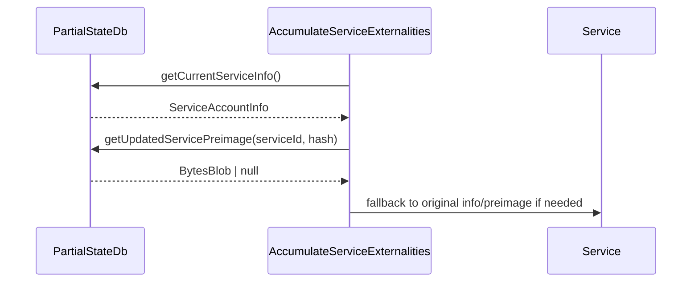

# improve externalities implementation

## Pull Request by @mateuszsikora

it resolves #462

## Comment by @coderabbitai[bot]

<!-- This is an auto-generated comment: summarize by coderabbit.ai -->
<!-- This is an auto-generated comment: skip review by coderabbit.ai -->

> [!IMPORTANT]
> ## Review skipped
> 
> Auto incremental reviews are disabled on this repository.
> 
> Please check the settings in the CodeRabbit UI or the `.coderabbit.yaml` file in this repository. To trigger a single review, invoke the `@coderabbitai review` command.
> 
> You can disable this status message by setting the `reviews.review_status` to `false` in the CodeRabbit configuration file.

<!-- end of auto-generated comment: skip review by coderabbit.ai -->
<!-- walkthrough_start -->

📝 Walkthrough

## Summary by CodeRabbit

* **Refactor**
  * Streamlined how updated service information and preimages are accessed, replacing the old balance provider with a unified service info provider.
  * Improved validation for storage utilization values, enforcing stricter checks for non-negative counts and bytes.
  * Simplified and updated related tests to align with the new service info provider approach.
## Walkthrough

The changes introduce a new `UpdatedCurrentService` interface for providing updated service info and preimages, refactor related classes and tests to use this abstraction, and enforce stricter validation on storage utilization values. The `PartialStateDb` now implements this interface, and the construction and usage of service externalities have been updated accordingly.

## Changes

| File(s)                                                                                                         | Change Summary                                                                                                                                                                                                                                                                                                                                                                                                  |
|-----------------------------------------------------------------------------------------------------------------|------------------------------------------------------------------------------------------------------------------------------------------------------------------------------------------------------------------------------------------------------------------------------------------------------------------------------------------------------------------------------------------------------------------|
| `packages/jam/jam-host-calls/externalities/partial-state-db.ts`                                                 | Added `UpdatedCurrentService` interface; updated `PartialStateDb` to implement it; made `getCurrentServiceInfo()` public; added `getUpdatedServicePreimage()`.                                                                                                                 |
| `packages/jam/transition/accumulate/accumulate.ts`                                                              | Removed intermediate `balanceProvider`; now directly passes `partialState` as `UpdatedCurrentService` to `AccumulateServiceExternalities`.                                                                                                                                                |
| `packages/jam/transition/accumulate/externalities/accumulate-service-externalities.ts`                          | Refactored to depend on `UpdatedCurrentService` instead of `balanceProvider`; added stricter checks for storage utilization; updated methods to use new interface for updated info and preimages; removed `CurrentServiceNewBalanceProvider`.                                              |
| `packages/jam/transition/accumulate/externalities/accumulate-service-externalities.test.ts`                     | Replaced `prepareBalanceProvider` with `prepareUpdatedService` helper; updated all tests to use new abstraction; simplified and refactored test cases for balance and storage.                                                                                                             |

## Sequence Diagram(s)

## Poem

> In the warren of code, a new path appears,  
> Interfaces polished, abstraction now clears.  
> Service info updated, preimages in tow,  
> Tests all refactored, validation in flow.  
> The rabbit hops forward, with storage checked tight—  
> All is in order, the future is bright!  
> 🐇✨

<!-- walkthrough_end -->
<!-- internal state start -->

<!-- DwQgtGAEAqAWCWBnSTIEMB26CuAXA9mAOYCmGJATmriQCaQDG+Ats2bgFyQAOFk+AIwBWJBrngA3EsgEBPRvlqU0AgfFwA6NPEgQAfACgjoCEYDEZyAAUASpETZWaCrKNwSPbABsvkCiQBHbGlcSHFcLzpIACJ4Zl58KUgSAA8aCgw0L3V4aRR4yLYMXGp4fAxoyAB3NGQHAWZ1Gno5MNgPbERKSGZqEk6AL0R4AGt8KnRkW0gMRwFugBYANgAODRh2xlhMUmR4LFwEZG5vX38gkPRaWn9EZEx6W/wvJKQHD1nmeb5lgCZ1gBy+CutBy5SykCUiAYFHg3HE5X4fCUJXgXnuAnweDaHkQ3FE8AAZvAGPkElIirhkL0lGFgYcPKl0plsuI8nFuIV2KVEc4POT4EpaOt3J4fH5AsFEKEGJhIPNIBJclUotRILBcLhuIgOAB6XVEdSwbACDRMZi6gBiXmwhMJsgAMipELrcLJ8d8XLqTj5dcs1kZ9MZwFAyPR8IScARiGRlM0FKx2FxePxhKJxFIZPImEoqKp1FodEGTFA4KhUHK0HhCKRyFR4+bKVwqFV7I5ei55dnFMp85ptLowIZg6YDNw0AwRmhdrqhGgLXPmGBYPhpWBZT4XUzKCyctJvc5xFkwNK+mBaKaqRwDNFbwYLJAAIIASRjdb69AcTk7Ea2O2kbibAw2wYKQKDFBQijYAweRoDMJCtvs6SEhOHgAAYAKrcLQH4AMLYBQ/jFAAypQSowWh1RGmEVTAmwhyKDqkBoaQuD4YR7CkRQ5EkM+GCEvgAAUACUlEPMxrFYThzRcTxVj+HE04kIJXTcSSvG0AANOqtSwKJIqbGhViHvAWTESUNAACICJRDBeLUezINg2EfnSZJcsUbTlsUlAoTB4EgmCBzAkZJlmRZJBoQZHj0Su9AsSQbEEURuCyepfECSJlGoMB/70ISkHMDwsISH0bknAI2QMOsj7wa2FVVT0iVxRJiVSR+aUwfJJCKaQKlkelWk6YgenZfc1xRAQzHGRQR5eOZfTWWh2lVAgwESrgBEYMgDLFT1vRgZVgiQAVLA4sxznSXQC00BoApCt1vXSGJhFoPIRIoKEvS4MBeS7YaUhYKpPGQM+lnoBg9DbCN2njDMpwoJGGD4KEAnYJDgLAij7R8F4+CGqScNMBBzwnXjra5aBsH+OBuCQbQ0F0Bo5iWI+XjpDy21ubtSh2c4nPIL+qTcOM8Zww1JLJMUe6IIGT4TfQSG+ahzHtc07EpZ1kVUYcTUMbQOoGJAuitUlHEkQNMEZUJwlcFrj4MEw6O4NbaFGybCW4Gr12WyQj0HcpwODXbvvPkN0OwFw/tKQAErptuQAAQrINCIIneMCJAAA+8M+G7UDe/QfN3NNYXzRFS1uRyHmhJhLnq8lnG+9lWBoNcQVuaFs2meXfRRQYUC4SBpD0LFiimxrTdqVb/E2y3pfd+Fi02SdhXFZIZVTRL1UD/LQqeJVktj/Fkn1z709+wpAf9RfYch7f4e6VHV+x/HXDJ6n6fHTnsx553M1zRuiQJazNbzREDKOcck4lIukXK6Kg20gq6gnAwRw3g+jIMdmg+yt0rw3jvA+F8b44xRC/B2eQv5Ka7EAh4KhHh/DMESLBLASsKBsFBGVNCAgsiYC6pBJUuZKKCBEGINoaoajHH8EqLEiAvDyHHHcVUO1NiHHgBQegzgiCOHYNzQyDtUHMHQTQLWABRNIO4sgy1suUaUFBoIEAoOsPi0oSBt20rtHMHx8CtlBP4MQcieAOT+oZcci9e40BbqeDA/lajnVUeo9AFAtGUmqO0LAMJXHiFAsxfR2C+imPMRkSxbJEBRQ2KgYYBQiS5GUbQmxdN7FlCwL+NCQcYJmOZMUmplFWgkGyI0TIWSiDnS4Tw6Jl9EiCkoJRKoVBuD4j4IcNU5QAnC1XKqU2AIEKJzGRRPWLV/CbQyPsYZcFuH2XGavM6aFQmAIihoS6HV7mPJkqHWeZTRS3FCL+XaeMCYQyLuUOmpNCTkwlL0fYkB0Z0OFEYFmT52ZxiaTtekmxeb2XrMi/gkY1mzSiOLE0jV2AyyMECcgoC7wD0gROKcM44F00wMMBEGBMEGKMSQXU24imshqayvJNATy+zAFy3cJSNCp00HgsB95WavlrCQz87ZnAUMjHQ2WBhRQSrbOoehJBOSoVqXtaRnRmK8D1XyHZFy+GTMEeqPpCyVprVgBtLaqpmlplEVUaicFPZbKqJa3h2tj4rW9XVU1/hQkkELlrSi7QvALJdcc7Jco65XVoJPC2F8hEes0OU5A5BWxxoTfdWCE9G6Zp4q7fZ48lmhEOVte4zF7aOyxMUKt+won+S9brJQKFvChFKjaPIbAklRG7c6zA8iy78CkIRKZiBtLiR9afNNWto6kEosfMRoQsg1FkMgetGR82nBquKLVsoujKLVB2ko0tXJoVyYYnBJACmdJ5c9GY3ioVdHDea/w0bfZZXAi4tu2Lf2RoDeM+SNrKBZRqu3ZlWQ5HaS6LOiEEqD19NclNaU4wlInVOOQEu4lzmBqhWfZA2wkjzDIPYau1SoitAYZM7JT7xCclxH+zelwL3MMeHq+yDATk4iKuOujoFIiMCQyi8DfIANZp1s6vEBJiSklI5cwdUpoozuUOKP5ktxLnqYVQMCDDtDpJsUgGgxRtICGxLtdT/kBTDERGwSmSAiriX8M++gWquibW4DpajJBaP+D8g4yawJOgeF2gW+wvtwICWKjBvgrC/IkGZnCwhiLMU2N0R4dF/NmWCxxSkEWeLwx8G3lLcINS5aWmhcykEdAuA3IjXJs+tAtaCVuT3a2Ucy7AGbU7Nts89AJ0Lhm1KzcApauJJJm5NKYGznnPAxlSCUH8o5SKrp+5NtPrPG0kgwrCmipqeKkI4rSkSn1UJ7Ju0zXGuQG1v9JBIPWoEdMu18buiEka00il4CqVgCMFA2l+56UIKZU0vlB2aCctO7tl0+32WCovidt9MsrvXmlYQuVsZ6ykKVT+VVw8AIaqAvZEuD6sFw5fb7DpFj33XYkT0RQDHfPAgjYJmLmxHtlBNaMq1EzPsUEokofEkMyAMHkGJuCcW0IvPPjxIB4u9VhmlyqsI7p0KTfLdNrNBlUBxYlxr6J70nJdE5xtWEJAkgeP1/Fi+AByJynXEvAnEmap6iBMu1Ti7wDeNBq0n0SlNrW1sb48XvjxUS1RYlt33lNQ9BxNhK6Lo7o7HvEboFKmiFQkRYYMgoF6n9KEfDcMnPlpE8BDQsidyDfYAkjfUmauPVA0XFZYDQkgcyeHSANZ8EBqaghUSp9oY7xzHgb2uPDKqpDwndrMakPFKf0HRcaFYn697yl9JGD4sxXvDilKD68FlbSwsqrqC2KIEYlvhNoV+pOID3PUL0H5zIujkRPJMA4mILFAkfA5ARApQSQrSx+pAGE4g2QiAnMuErauAYkkMzEuGJmUa0BSAnMH8H6mm0gF+s8FAd2wyDIP6U0CoyMGAYAwBoBGWNCpskeR2YcceW6rO6ebkKe50bBqC5soQWeTewIvi6YASH0S+koIQpCCWYMPQ1Av0hq3BKUDe6koMlkmWooaEeM+AIwzkUeg02kEczBbe9ArOZAIEME1uxIFA0oN+VegBEM5Gaae0T0VyRUiunWWsqu8oJAgBHg5e2Q2SleIw1e4wte+wEIR2rujhAcmWAAsvsHDByKLFcEIJ0LgJSMgCqDTDSDFsCPsHZNgLSLFghKrJ1uHjNm6PiACm5IniMk/iMJRHgGiOoLINpsvlEGlirGhKURfNvrsiLlMmLpUeoJbvhhkYyP0qEc0JlgAPJoY+DuJARk57A+RECE4jLp7uERSURbz8JTLkZgDRhXSKH+T8GVHe4BwLpSyAH+S2IkjpCKiWLSRNL8BAwQEdAYEDCcwKDOz3DIFyCpyLrIGtHnQf4mpT7Jai7oACC2ITjMqZbwpswczFbV6Fa5ZcxCxlaiz4pVaEqSzEolJyzwHbQNJiBwwtKPrsqvpM5WL2EfjNgCZv6BJUD0TdBC6Brr79FcBdE8Q9HC7sm2piauGrq+xAJcB648ExrMxQCPgKzrylTB5bqexcnpSzw6EwQx7qQJzDYIHtrpJU7PbknPqUncpWKSmQCFwh70EqmMG0DqlWz0A/ynCam+z6LamzzZy5xeDzzFz6m04UkM6I7M5bFc6JRbQ0kNiZ4JYnGrS0atKhy0CboyHtDIDyE6JHamnmkKkaFaHcCqkaS2kaTum/xeB6FPxJz2QjAkC/ACBxwjQJzYFpwZyFmnBel6k5K+mGn+mY4lJBnWGBFsFnEwLOEXRuHCmbGeHeEnRIYBGA4QLDglhSxz5Rg1gE6uSNhJh+BoCthkLKpdgKC5gqBqD9hFhDgGDzmNjqAAD6goiAF5UiyodAF5p4s0g4c5IYkAAArAAIwACcKw35sobcAg35E43575hI/535AgAA7KIL+QIAwDBVBQIChCsFBQAMyEhLCygvkjhQDnm4BXkGy3l273m0AXlhgvlAA= -->

<!-- internal state end -->
<!-- tips_start -->

---

🪧 Tips

### Chat

There are 3 ways to chat with [CodeRabbit](https://coderabbit.ai?utm_source=oss&utm_medium=github&utm_campaign=FluffyLabs/typeberry&utm_content=468):

- Review comments: Directly reply to a review comment made by CodeRabbit. Example:
  - `I pushed a fix in commit <commit_id>, please review it.`
  - `Explain this complex logic.`
  - `Open a follow-up GitHub issue for this discussion.`
- Files and specific lines of code (under the "Files changed" tab): Tag `@coderabbitai` in a new review comment at the desired location with your query. Examples:
  - `@coderabbitai explain this code block.`
  -	`@coderabbitai modularize this function.`
- PR comments: Tag `@coderabbitai` in a new PR comment to ask questions about the PR branch. For the best results, please provide a very specific query, as very limited context is provided in this mode. Examples:
  - `@coderabbitai gather interesting stats about this repository and render them as a table. Additionally, render a pie chart showing the language distribution in the codebase.`
  - `@coderabbitai read src/utils.ts and explain its main purpose.`
  - `@coderabbitai read the files in the src/scheduler package and generate a class diagram using mermaid and a README in the markdown format.`
  - `@coderabbitai help me debug CodeRabbit configuration file.`

### Support

Need help? Create a ticket on our [support page](https://www.coderabbit.ai/contact-us/support) for assistance with any issues or questions.

Note: Be mindful of the bot's finite context window. It's strongly recommended to break down tasks such as reading entire modules into smaller chunks. For a focused discussion, use review comments to chat about specific files and their changes, instead of using the PR comments.

### CodeRabbit Commands (Invoked using PR comments)

- `@coderabbitai pause` to pause the reviews on a PR.
- `@coderabbitai resume` to resume the paused reviews.
- `@coderabbitai review` to trigger an incremental review. This is useful when automatic reviews are disabled for the repository.
- `@coderabbitai full review` to do a full review from scratch and review all the files again.
- `@coderabbitai summary` to regenerate the summary of the PR.
- `@coderabbitai generate sequence diagram` to generate a sequence diagram of the changes in this PR.
- `@coderabbitai resolve` resolve all the CodeRabbit review comments.
- `@coderabbitai configuration` to show the current CodeRabbit configuration for the repository.
- `@coderabbitai help` to get help.

### Other keywords and placeholders

- Add `@coderabbitai ignore` anywhere in the PR description to prevent this PR from being reviewed.
- Add `@coderabbitai summary` to generate the high-level summary at a specific location in the PR description.
- Add `@coderabbitai` anywhere in the PR title to generate the title automatically.

### Documentation and Community

- Visit our [Documentation](https://docs.coderabbit.ai) for detailed information on how to use CodeRabbit.
- Join our [Discord Community](http://discord.gg/coderabbit) to get help, request features, and share feedback.
- Follow us on [X/Twitter](https://twitter.com/coderabbitai) for updates and announcements.

<!-- tips_end -->

## Comment by @github-actions[bot]

| File | Benchmark | Error |
|------|-----------|-------|
| [codec/view_vs_collection.ts[3]](../blob/098eb690eff09d4585bfca639e46f0832f157eb8//_work/typeberry-runner-2/typeberry/typeberry/benchmarks/codec/view_vs_collection.ts) | Get 50th element from View |  Significant speed difference: (current) "30552.29 (1.1283580644867446) ±1.36%" vs "38404.07 (1.2645590168075689) ± 5%" (previous) |

View all

| File | Benchmark | Ops |  |
|------|-----------|-----|--|
| [bytes/hex-from.ts[0]](../blob/098eb690eff09d4585bfca639e46f0832f157eb8//_work/typeberry-runner-2/typeberry/typeberry/benchmarks/bytes/hex-from.ts) | parse hex using `Number` with NaN checking | 135097.21 ±0.13% | 84.31% slower |
| [bytes/hex-from.ts[1]](../blob/098eb690eff09d4585bfca639e46f0832f157eb8//_work/typeberry-runner-2/typeberry/typeberry/benchmarks/bytes/hex-from.ts) | parse hex from char codes | 861239.07 ±0.69% | fastest ✅ |
| [bytes/hex-from.ts[2]](../blob/098eb690eff09d4585bfca639e46f0832f157eb8//_work/typeberry-runner-2/typeberry/typeberry/benchmarks/bytes/hex-from.ts) | parse hex from string nibbles | 540054.82 ±0.24% | 37.29% slower |
| [math/mul_overflow.ts[0]](../blob/098eb690eff09d4585bfca639e46f0832f157eb8//_work/typeberry-runner-2/typeberry/typeberry/benchmarks/math/mul_overflow.ts) | multiply and bring back to u32 | 260980058.17 ±5.78% | 0.42% slower |
| [math/mul_overflow.ts[1]](../blob/098eb690eff09d4585bfca639e46f0832f157eb8//_work/typeberry-runner-2/typeberry/typeberry/benchmarks/math/mul_overflow.ts) | multiply and take modulus | 262079657.91 ±6.16% | fastest ✅ |
| [math/switch.ts[0]](../blob/098eb690eff09d4585bfca639e46f0832f157eb8//_work/typeberry-runner-2/typeberry/typeberry/benchmarks/math/switch.ts) | switch | 257442860.83 ±6.26% | fastest ✅ |
| [math/switch.ts[1]](../blob/098eb690eff09d4585bfca639e46f0832f157eb8//_work/typeberry-runner-2/typeberry/typeberry/benchmarks/math/switch.ts) | if | 250840659.24 ±7.33% | 2.56% slower |
| [codec/bigint.decode.ts[0]](../blob/098eb690eff09d4585bfca639e46f0832f157eb8//_work/typeberry-runner-2/typeberry/typeberry/benchmarks/codec/bigint.decode.ts) | decode custom | 214561333.41 ±4.38% | fastest ✅ |
| [codec/bigint.decode.ts[1]](../blob/098eb690eff09d4585bfca639e46f0832f157eb8//_work/typeberry-runner-2/typeberry/typeberry/benchmarks/codec/bigint.decode.ts) | decode bigint | 108796698.08 ±2.84% | 49.29% slower |
| [codec/decoding.ts[0]](../blob/098eb690eff09d4585bfca639e46f0832f157eb8//_work/typeberry-runner-2/typeberry/typeberry/benchmarks/codec/decoding.ts) | manual decode | 24511577.18 ±0.47% | 88.04% slower |
| [codec/decoding.ts[1]](../blob/098eb690eff09d4585bfca639e46f0832f157eb8//_work/typeberry-runner-2/typeberry/typeberry/benchmarks/codec/decoding.ts) | int32array decode | 205008633.54 ±4.48% | fastest ✅ |
| [codec/decoding.ts[2]](../blob/098eb690eff09d4585bfca639e46f0832f157eb8//_work/typeberry-runner-2/typeberry/typeberry/benchmarks/codec/decoding.ts) | dataview decode | 197067216.77 ±4.62% | 3.87% slower |
| [collections/map-set.ts[0]](../blob/098eb690eff09d4585bfca639e46f0832f157eb8//_work/typeberry-runner-2/typeberry/typeberry/benchmarks/collections/map-set.ts) | 2 gets + conditional set | 111214.77 ±0.2% | fastest ✅ |
| [collections/map-set.ts[1]](../blob/098eb690eff09d4585bfca639e46f0832f157eb8//_work/typeberry-runner-2/typeberry/typeberry/benchmarks/collections/map-set.ts) | 1 get 1 set | 61676.93 ±0.09% | 44.54% slower |
| [codec/encoding.ts[0]](../blob/098eb690eff09d4585bfca639e46f0832f157eb8//_work/typeberry-runner-2/typeberry/typeberry/benchmarks/codec/encoding.ts) | manual encode | 3088742.42 ±0.55% | 14.88% slower |
| [codec/encoding.ts[1]](../blob/098eb690eff09d4585bfca639e46f0832f157eb8//_work/typeberry-runner-2/typeberry/typeberry/benchmarks/codec/encoding.ts) | int32array encode | 3628570.81 ±1.45% | fastest ✅ |
| [codec/encoding.ts[2]](../blob/098eb690eff09d4585bfca639e46f0832f157eb8//_work/typeberry-runner-2/typeberry/typeberry/benchmarks/codec/encoding.ts) | dataview encode | 3535898.73 ±1.22% | 2.55% slower |
| [bytes/hex-to.ts[0]](../blob/098eb690eff09d4585bfca639e46f0832f157eb8//_work/typeberry-runner-2/typeberry/typeberry/benchmarks/bytes/hex-to.ts) | number toString + padding | 304532.16 ±0.93% | fastest ✅ |
| [bytes/hex-to.ts[1]](../blob/098eb690eff09d4585bfca639e46f0832f157eb8//_work/typeberry-runner-2/typeberry/typeberry/benchmarks/bytes/hex-to.ts) | manual | 15790.34 ±0.46% | 94.81% slower |
| [codec/bigint.compare.ts[0]](../blob/098eb690eff09d4585bfca639e46f0832f157eb8//_work/typeberry-runner-2/typeberry/typeberry/benchmarks/codec/bigint.compare.ts) | compare custom | 260601513.15 ±6.91% | fastest ✅ |
| [codec/bigint.compare.ts[1]](../blob/098eb690eff09d4585bfca639e46f0832f157eb8//_work/typeberry-runner-2/typeberry/typeberry/benchmarks/codec/bigint.compare.ts) | compare bigint | 249249374.11 ±6.3% | 4.36% slower |
| [math/add_one_overflow.ts[0]](../blob/098eb690eff09d4585bfca639e46f0832f157eb8//_work/typeberry-runner-2/typeberry/typeberry/benchmarks/math/add_one_overflow.ts) | add and take modulus | 253618060.36 ±7.02% | 4.11% slower |
| [math/add_one_overflow.ts[1]](../blob/098eb690eff09d4585bfca639e46f0832f157eb8//_work/typeberry-runner-2/typeberry/typeberry/benchmarks/math/add_one_overflow.ts) | condition before calculation | 264485179.42 ±6.34% | fastest ✅ |
| [math/count-bits-u64.ts[0]](../blob/098eb690eff09d4585bfca639e46f0832f157eb8//_work/typeberry-runner-2/typeberry/typeberry/benchmarks/math/count-bits-u64.ts) | standard method | 1267899.57 ±0.42% | 88.29% slower |
| [math/count-bits-u64.ts[1]](../blob/098eb690eff09d4585bfca639e46f0832f157eb8//_work/typeberry-runner-2/typeberry/typeberry/benchmarks/math/count-bits-u64.ts) | magic | 10828389.24 ±0.5% | fastest ✅ |
| [hash/index.ts[0]](../blob/098eb690eff09d4585bfca639e46f0832f157eb8//_work/typeberry-runner-2/typeberry/typeberry/benchmarks/hash/index.ts) | hash with numeric representation | 186.31 ±0.21% | 24.41% slower |
| [hash/index.ts[1]](../blob/098eb690eff09d4585bfca639e46f0832f157eb8//_work/typeberry-runner-2/typeberry/typeberry/benchmarks/hash/index.ts) | hash with string representation | 118.02 ±0.46% | 52.12% slower |
| [hash/index.ts[2]](../blob/098eb690eff09d4585bfca639e46f0832f157eb8//_work/typeberry-runner-2/typeberry/typeberry/benchmarks/hash/index.ts) | hash with symbol representation | 181.09 ±0.2% | 26.53% slower |
| [hash/index.ts[3]](../blob/098eb690eff09d4585bfca639e46f0832f157eb8//_work/typeberry-runner-2/typeberry/typeberry/benchmarks/hash/index.ts) | hash with uint8 representation | 158.72 ±0.24% | 35.61% slower |
| [hash/index.ts[4]](../blob/098eb690eff09d4585bfca639e46f0832f157eb8//_work/typeberry-runner-2/typeberry/typeberry/benchmarks/hash/index.ts) | hash with packed representation | 246.49 ±0.48% | fastest ✅ |
| [hash/index.ts[5]](../blob/098eb690eff09d4585bfca639e46f0832f157eb8//_work/typeberry-runner-2/typeberry/typeberry/benchmarks/hash/index.ts) | hash with bigint representation | 177.56 ±0.34% | 27.96% slower |
| [hash/index.ts[6]](../blob/098eb690eff09d4585bfca639e46f0832f157eb8//_work/typeberry-runner-2/typeberry/typeberry/benchmarks/hash/index.ts) | hash with uint32 representation | 201.21 ±0.27% | 18.37% slower |
| [logger/index.ts[0]](../blob/098eb690eff09d4585bfca639e46f0832f157eb8//_work/typeberry-runner-2/typeberry/typeberry/benchmarks/logger/index.ts) | console.log with string concat | 8981529.23 ±36.12% | fastest ✅ |
| [logger/index.ts[1]](../blob/098eb690eff09d4585bfca639e46f0832f157eb8//_work/typeberry-runner-2/typeberry/typeberry/benchmarks/logger/index.ts) | console.log with args | 905664.4 ±95.66% | 89.92% slower |
| [math/count-bits-u32.ts[0]](../blob/098eb690eff09d4585bfca639e46f0832f157eb8//_work/typeberry-runner-2/typeberry/typeberry/benchmarks/math/count-bits-u32.ts) | standard method | 104804916.57 ±2.11% | 57.74% slower |
| [math/count-bits-u32.ts[1]](../blob/098eb690eff09d4585bfca639e46f0832f157eb8//_work/typeberry-runner-2/typeberry/typeberry/benchmarks/math/count-bits-u32.ts) | magic | 247972484.2 ±6.64% | fastest ✅ |
| [codec/view_vs_collection.ts[0]](../blob/098eb690eff09d4585bfca639e46f0832f157eb8//_work/typeberry-runner-2/typeberry/typeberry/benchmarks/codec/view_vs_collection.ts) | Get first element from Decoded | 23996.61 ±0.39% | 58.17% slower |
| [codec/view_vs_collection.ts[1]](../blob/098eb690eff09d4585bfca639e46f0832f157eb8//_work/typeberry-runner-2/typeberry/typeberry/benchmarks/codec/view_vs_collection.ts) | Get first element from View | 57369.45 ±0.47% | fastest ✅ |
| [codec/view_vs_collection.ts[2]](../blob/098eb690eff09d4585bfca639e46f0832f157eb8//_work/typeberry-runner-2/typeberry/typeberry/benchmarks/codec/view_vs_collection.ts) | Get 50th element from Decoded | 25204.51 ±2.03% | 56.07% slower |
| [codec/view_vs_collection.ts[3]](../blob/098eb690eff09d4585bfca639e46f0832f157eb8//_work/typeberry-runner-2/typeberry/typeberry/benchmarks/codec/view_vs_collection.ts) | Get 50th element from View | 30552.29 ±1.36% | 46.74% slower |
| [codec/view_vs_collection.ts[4]](../blob/098eb690eff09d4585bfca639e46f0832f157eb8//_work/typeberry-runner-2/typeberry/typeberry/benchmarks/codec/view_vs_collection.ts) | Get last element from Decoded | 25467.97 ±2.14% | 55.61% slower |
| [codec/view_vs_collection.ts[5]](../blob/098eb690eff09d4585bfca639e46f0832f157eb8//_work/typeberry-runner-2/typeberry/typeberry/benchmarks/codec/view_vs_collection.ts) | Get last element from View | 26882.45 ±0.42% | 53.14% slower |
| [codec/view_vs_object.ts[0]](../blob/098eb690eff09d4585bfca639e46f0832f157eb8//_work/typeberry-runner-2/typeberry/typeberry/benchmarks/codec/view_vs_object.ts) | Get the first field from Decoded | 450299.14 ±0.25% | 0.06% slower |
| [codec/view_vs_object.ts[1]](../blob/098eb690eff09d4585bfca639e46f0832f157eb8//_work/typeberry-runner-2/typeberry/typeberry/benchmarks/codec/view_vs_object.ts) | Get the first field from View | 103551.75 ±0.12% | 77.02% slower |
| [codec/view_vs_object.ts[2]](../blob/098eb690eff09d4585bfca639e46f0832f157eb8//_work/typeberry-runner-2/typeberry/typeberry/benchmarks/codec/view_vs_object.ts) | Get the first field as view from View | 102990.64 ±0.12% | 77.14% slower |
| [codec/view_vs_object.ts[3]](../blob/098eb690eff09d4585bfca639e46f0832f157eb8//_work/typeberry-runner-2/typeberry/typeberry/benchmarks/codec/view_vs_object.ts) | Get two fields from Decoded | 449622.54 ±0.25% | 0.21% slower |
| [codec/view_vs_object.ts[4]](../blob/098eb690eff09d4585bfca639e46f0832f157eb8//_work/typeberry-runner-2/typeberry/typeberry/benchmarks/codec/view_vs_object.ts) | Get two fields from View | 82234.17 ±0.08% | 81.75% slower |
| [codec/view_vs_object.ts[5]](../blob/098eb690eff09d4585bfca639e46f0832f157eb8//_work/typeberry-runner-2/typeberry/typeberry/benchmarks/codec/view_vs_object.ts) | Get two fields from materialized from View | 172918.98 ±0.15% | 61.62% slower |
| [codec/view_vs_object.ts[6]](../blob/098eb690eff09d4585bfca639e46f0832f157eb8//_work/typeberry-runner-2/typeberry/typeberry/benchmarks/codec/view_vs_object.ts) | Get two fields as views from View | 82258.51 ±0.16% | 81.74% slower |
| [codec/view_vs_object.ts[7]](../blob/098eb690eff09d4585bfca639e46f0832f157eb8//_work/typeberry-runner-2/typeberry/typeberry/benchmarks/codec/view_vs_object.ts) | Get only third field from Decoded | 450590.27 ±0.27% | fastest ✅ |
| [codec/view_vs_object.ts[8]](../blob/098eb690eff09d4585bfca639e46f0832f157eb8//_work/typeberry-runner-2/typeberry/typeberry/benchmarks/codec/view_vs_object.ts) | Get only third field from View | 103386.41 ±0.1% | 77.06% slower |
| [codec/view_vs_object.ts[9]](../blob/098eb690eff09d4585bfca639e46f0832f157eb8//_work/typeberry-runner-2/typeberry/typeberry/benchmarks/codec/view_vs_object.ts) | Get only third field as view from View | 103390.7 ±0.17% | 77.05% slower |
| [bytes/compare.ts[0]](../blob/098eb690eff09d4585bfca639e46f0832f157eb8//_work/typeberry-runner-2/typeberry/typeberry/benchmarks/bytes/compare.ts) | Comparing Uint32 bytes | 20760.39 ±0.09% | 4.91% slower |
| [bytes/compare.ts[1]](../blob/098eb690eff09d4585bfca639e46f0832f157eb8//_work/typeberry-runner-2/typeberry/typeberry/benchmarks/bytes/compare.ts) | Comparing raw bytes | 21833.35 ±0.09% | fastest ✅ |
| [collections/map_vs_sorted.ts[0]](../blob/098eb690eff09d4585bfca639e46f0832f157eb8//_work/typeberry-runner-2/typeberry/typeberry/benchmarks/collections/map_vs_sorted.ts) | Map | 309223.01 ±0.34% | fastest ✅ |
| [collections/map_vs_sorted.ts[1]](../blob/098eb690eff09d4585bfca639e46f0832f157eb8//_work/typeberry-runner-2/typeberry/typeberry/benchmarks/collections/map_vs_sorted.ts) | Map-array | 103613.34 ±0.02% | 66.49% slower |
| [collections/map_vs_sorted.ts[2]](../blob/098eb690eff09d4585bfca639e46f0832f157eb8//_work/typeberry-runner-2/typeberry/typeberry/benchmarks/collections/map_vs_sorted.ts) | Array | 87312.32 ±0.09% | 71.76% slower |
| [collections/map_vs_sorted.ts[3]](../blob/098eb690eff09d4585bfca639e46f0832f157eb8//_work/typeberry-runner-2/typeberry/typeberry/benchmarks/collections/map_vs_sorted.ts) | SortedArray | 198112.58 ±0.18% | 35.93% slower |
| [hash/blake2b.ts[0]](../blob/098eb690eff09d4585bfca639e46f0832f157eb8//_work/typeberry-runner-2/typeberry/typeberry/benchmarks/hash/blake2b.ts) | hasher with simple allocator | 0.046 ±0.02% | fastest ✅ |
| [hash/blake2b.ts[1]](../blob/098eb690eff09d4585bfca639e46f0832f157eb8//_work/typeberry-runner-2/typeberry/typeberry/benchmarks/hash/blake2b.ts) | hasher with page allocator | 0.045 ±0.53% | 2.17% slower |
| [crypto/ed25519.ts[0]](../blob/098eb690eff09d4585bfca639e46f0832f157eb8//_work/typeberry-runner-2/typeberry/typeberry/benchmarks/crypto/ed25519.ts) | native crypto | 4.9 ±20.74% | 83.59% slower |
| [crypto/ed25519.ts[1]](../blob/098eb690eff09d4585bfca639e46f0832f157eb8//_work/typeberry-runner-2/typeberry/typeberry/benchmarks/crypto/ed25519.ts) | wasm lib | 10.65 ±0.02% | 64.33% slower |
| [crypto/ed25519.ts[2]](../blob/098eb690eff09d4585bfca639e46f0832f157eb8//_work/typeberry-runner-2/typeberry/typeberry/benchmarks/crypto/ed25519.ts) | wasm lib batch | 29.86 ±0.53% | fastest ✅ |

### Benchmarks summary: 62/63 OK ❌

<!-- thollander/actions-comment-pull-request "benchmarks" -->
