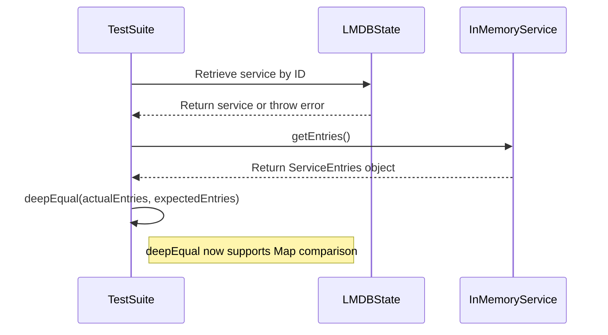

# Add proper 'Map' support to 'deepEqual'

## Pull Request by @tomusdrw

Turns out our `deepEqual` function was not comparing `Map` object correctly 🙈😱
It was treating them like `object`s, but actually calling `Object.keys` on a map returns absolutely nothing (BTW `JSON.stringify` is equally fucked up in that regard).

This PR fixes that behaviour and fixes the instances where our tests started failing after that change. Luckily it wasn't anything significant.


## Comment by @coderabbitai[bot]

<!-- This is an auto-generated comment: summarize by coderabbit.ai -->
<!-- This is an auto-generated comment: skip review by coderabbit.ai -->

> [!IMPORTANT]
> ## Review skipped
> 
> Auto incremental reviews are disabled on this repository.
> 
> Please check the settings in the CodeRabbit UI or the `.coderabbit.yaml` file in this repository. To trigger a single review, invoke the `@coderabbitai review` command.
> 
> You can disable this status message by setting the `reviews.review_status` to `false` in the CodeRabbit configuration file.

<!-- end of auto-generated comment: skip review by coderabbit.ai -->
<!-- walkthrough_start -->

<details>
<summary>📝 Walkthrough</summary>

## Summary by CodeRabbit

* **New Features**
  * Added a method to retrieve entries from in-memory services, providing arrays of storage keys, preimages, and lookup history details.
  * Introduced a new method for accessing entries in hash dictionaries.

* **Bug Fixes**
  * Improved deep equality checks to correctly compare Map objects in test utilities.

* **Tests**
  * Refined database state tests to ensure service-specific entries are checked for accuracy.
## Walkthrough

A new `entries()` method was added to the `HashDictionary` class. The `deepEqual` utility now supports deep comparison of `Map` objects. LMDB state database tests were updated to compare service-specific entries. The `InMemoryService` class gained a `getEntries()` method, and iteration in `InMemoryState.copyFrom` was clarified.

## Changes

| File(s)                                                                        | Change Summary                                                                                           |
|--------------------------------------------------------------------------------|----------------------------------------------------------------------------------------------------------|
| packages/core/collections/hash-dictionary.ts                                   | Added public `entries()` method to `HashDictionary`, returning the same iterator as `[Symbol.iterator]`. |
| packages/core/utils/test.ts                                                    | Enhanced `deepEqual` to handle `Map` objects by comparing their sorted entries recursively.              |
| packages/jam/database-lmdb/states.test.ts                                      | Updated tests to fetch and compare service-specific entries, adding guard clauses for missing services.   |
| packages/jam/state/in-memory-state.ts                                          | Added `getEntries()` to `InMemoryService`; clarified map iteration in `InMemoryState.copyFrom`.          |

## Sequence Diagram(s)



## Poem

> A hop, a skip, a dictionary grows,
> With entries exposed for all who chose.
> Maps now compare with thoughtful care,
> Services checked, with tests aware.
> InMemory hops with entries anew,
> This bunny’s code is fresh as dew! 🐇✨

</details>

<!-- walkthrough_end -->
<!-- internal state start -->


<!-- DwQgtGAEAqAWCWBnSTIEMB26CuAXA9mAOYCmGJATmriQCaQDG+Ats2bgFyQAOFk+AIwBWJBrngA3EsgEBPRvlqU0AgfFwA6NPEgQAfACgjoCEYDEZyAAUASpETZWaCrKNxU3bABsvkCiQBHbGlcABpIcVwvOkgAIgBBWnpefG5KSAByAFk0bgz7bG5ufApcCPxMpRJuAFEgtC8M0Nj0JP9ERGl0LCQHEhQsXFh+gAMq2vqvEcgAM2wMMXh8LAB3Yf9IEZzuacERMWQVyn6MfDKBEngMIgVmbmcYpgp/MS9ZDRhhyBIADyRxa4oO7RNgYXDUJaDfzUGJbXLTK6IcELLpoZD+IjeZz8YSiXDITD0bCdegjADyuLEGgA1iRZIhpgRbvcNkMSMxwmt4AxYJBaPguqcyisStTIBcGGhiaMKftNLT6dN/LhsBQMMhTpAFcgZiVNttdpT8R84P1bApnnjkENUBdYGgJEs+HIgdwQewrjcUmk+Ew7s4kMtIF58ERubM9XCdji5Yd1AhBl8xiRqnVsA1pnMFuJlh9ErR1JCGm9wmzrHZCrQYdavjQkYw0V0htR7ODSjEZtovJ6+cFyhEEMgeZhSOEyA4KD22fJ/DNomIB/0ni8yvaMLRu4D8DN9fDmQHEMtECavlKhnqhU37WUy3Wyp34F5VV0jhtmFc9YTvmjH/IZvAfjoE9+k8Hw/ECYJ61QBwBHfXAaHoF1pT4AhmGJWgKBWbp6FQB0uxUaJ0FXeDuEQDgAHpyLDIZsAEDQ/XIgAxJ8ZhmWQABkVEQcjcFkNILmeWRyNArxyIAFgAdgAZg0Ix9GMcAoDIehtxwAhiDIZQENuUFOB4Pg9jxSQuhdJglCoVR1C0HR5JMKB3GQXCsDPQhSHIKhtL9XSuCoLCHCcFxxXkMzlEszRtF0MBDAU0wDHuBhqTQUhuKeEhyKYHwjKPcj7UQWAwALRZlmcd58Q4AxYkqgwLEgeIAEkNPcmF6H85gSv4Hdh2uaQjHiSByCwzwBG7BhIDYc9SXYSdpAACgASmmFY0VaJR6CZMsRgACTRWAABFuRzDASumBgvDRY9PlQcbYEUcCVTVGt+kQNA2BQGgPM/R7vj+JEexGABtABlWRmAEfAvA0dQtJKABdebpmuxRwkQNIGHgf9JR8eQyyhj6DKkFCvjavJkAkBpIM5BAeXQVlCmiZBVIBgBpcIADUYZGD4ADkKjOdZGDXZL+xDMNRr1JgwQocHZhDLDX36NqlFkoxqsseIvHeiEj37MslFO5wtfVDrvuKdsVL4IaRu+MFCx6gwoCyEgJpWuguBGKb4FmhaBkYM6Ok2ba8v2oqjpcBEsBGeLEuS9KSjSjL50O7jcvywrDpKjR8RGCqqvt2Ko6S6RY/8ci8Efbi70zsic9iVXaoatytJiVr2tUrrkt6/qSD81H4AaBtOkgJaCSSGJ1qTcY0wzWZ5hD/s1w3JcWBZQMsEZg0YytD4AHVhiwMGhk2NAxHTKZsM2X5UYQ6YHgGJFMAYLp1/hUthngPgPdRDYJYJ7SmWcKg9JkYlAQuEL8bIsB+hZDEF4qpEDGTeJAYkf1J6TE5pdIcy8DxBmlASBQYJfhlEIcpGILoRixH+sTGGsQb7rnsPadoi5vr/B7JQKWFBMGZTEJ+Oh8AiCnA2N2JEeYZjvQHKgKB2CMCv36FmOeypVRG3gKwOgfcaAliCvcDoU4vhKE7N4MohkFySMnIeLAItuTKxqurTWScda6NEGdDykIGY7kviAmIepLbhg9OIO2UAeYCxHE2CoZZ4H8OoM+VxJsPHmx4LRK2vjPaHGOGNNASsa5yXzsfaORchAvXIlWcEAhGxgC8MwWgAhyL3zrJnEIVdyqVVrtYhumkPLN0cG1QKbdBZ21NBEEIA8ui6kJv0diWRdoACFICA3BHWPk1AVCNiHqk5gih0aezWhUS+I11CIOVNNKQTDOgUEdI/Ie8Z7CUDOf0Oqu1IAAAZZhS2YEwq4hZ+7i1VP4MErYYTihICMkClARnvkBOMb4kx1DBWGAlC6dUdw2mQCcm5KANRnAjPMWgYCsBsL1KgIYUsVgYGAnyFM3BIWn2hegDolA7HNjKLwEgjp8DEkQSYmIaAFDcHkKpMsHoNg1P6CsS5mBvh3F4mkilqkUXcn6J/dFg1zroClfg8E7zAT8slsk42ZYDmeykC1a5cqTwSN6fwBgDA4E+0JSmAZ9ZJSdDInEPKrKvA4TuCAsacdmTRB+H8mgzQXU3W8ESbgRSFY+qgX662uBpqICDV+ZY/R5hHTYGtQZjqTgkGxGWC4YYMAYE9KSiWcbpZznwFhVAlZmr9iuKdbASgVWYmcPQfW0oBwtnHFEphTLOgol1V8WV5yLhAv0vgR+qjAQisPvyqFkqeSiGpKSixYsdxCu5bIHsX4TGrzRQOYk4F/zkC2QMBtTbh0kDACjUQGzRoKr8NQfmzZnK4olfIYmytzBqw1lpFx9j+h6ycYbaJ7izb8AtgknxNs/GICMDzcgskmlZLAEYAuMd8nMGqXMtKVwwBsDWS4a9OGGmZJaY1JuLVOmt06r0uDBg+oDTGk7G6pJSC4BqNqr2i1lrpNWgBzYdUMCO0I7IQGxrH4nT9hdByzHnYKIeiqkY4nTlys43G5Jho5Rqu0EWwEAC0D0mNkiEohctR0gTfpS4bVko4voCGfA1JCiQEHAQQKD7CFUDEB2F5xyJMkAyI5Ahap+5FK5WnIs8aV34Ec851zJR5APtvnGzAiBQUxCuEyIx+ILmHxGCnWhpJojXCGNMb0dLkmU1SSMYrRBSsWnaMUdc1pQlfFq4fPlXx/wcLKA5pzFL4uBShq8kZ35qYp2VkJphIwhMiYS7MmEUnzoyIDeGRGpImA8sYi8njyA1kFn/GPbZPw3Tcj2cFYsmwNAKvhvwRMoxL2IF2os6Y2wh57zen+rcBM3rhHbj2GYvmRijZmhLes/14DYtjfGmGxn/NPcWd7JkwO9Sg6PGUCHUOFWw5lfD574JrtccQPNBapqhxOI2VefouNDb8B+2WYm0OdUCDwHyAU6Kyjt36GWVdVif22P/ePQDjiDZ2NUmB7SXioP3pg8kuSkBHbOz467TY7H1PxvmlwFTNz1eaZ9vrf2M3hPsnm/58Omx0N5IKUK8ieGCMJeIzCKu2cAkVHCUde6S46P9l+CwwEEvPGQeGtByIySADcd3EE08OvYWQYI0D+prdpK4gnjeiYWzQeiqRZDbZYAjFjigkO53kgYOy1sVI7hchR9pbaWDeUfX5ajgVTKKFCmocKNkoql8UjpdQAB9SHiA+/+EdN3Ogff76lEitFMvaAAAcJABAAFYSASQAGxz4AEzHzEg8tAaBN8MDnwATjnw8hgm+xJr5IEviUABGJftBN8STQBJWga/p8xSgF5fvg/h/Ms9iOFoD72UmnyAA=== -->

<!-- internal state end -->
<!-- tips_start -->

---


<details>
<summary>🪧 Tips</summary>

### Chat

There are 3 ways to chat with [CodeRabbit](https://coderabbit.ai?utm_source=oss&utm_medium=github&utm_campaign=FluffyLabs/typeberry&utm_content=473):

- Review comments: Directly reply to a review comment made by CodeRabbit. Example:
  - `I pushed a fix in commit <commit_id>, please review it.`
  - `Explain this complex logic.`
  - `Open a follow-up GitHub issue for this discussion.`
- Files and specific lines of code (under the "Files changed" tab): Tag `@coderabbitai` in a new review comment at the desired location with your query. Examples:
  - `@coderabbitai explain this code block.`
  -	`@coderabbitai modularize this function.`
- PR comments: Tag `@coderabbitai` in a new PR comment to ask questions about the PR branch. For the best results, please provide a very specific query, as very limited context is provided in this mode. Examples:
  - `@coderabbitai gather interesting stats about this repository and render them as a table. Additionally, render a pie chart showing the language distribution in the codebase.`
  - `@coderabbitai read src/utils.ts and explain its main purpose.`
  - `@coderabbitai read the files in the src/scheduler package and generate a class diagram using mermaid and a README in the markdown format.`
  - `@coderabbitai help me debug CodeRabbit configuration file.`

### Support

Need help? Create a ticket on our [support page](https://www.coderabbit.ai/contact-us/support) for assistance with any issues or questions.

Note: Be mindful of the bot's finite context window. It's strongly recommended to break down tasks such as reading entire modules into smaller chunks. For a focused discussion, use review comments to chat about specific files and their changes, instead of using the PR comments.

### CodeRabbit Commands (Invoked using PR comments)

- `@coderabbitai pause` to pause the reviews on a PR.
- `@coderabbitai resume` to resume the paused reviews.
- `@coderabbitai review` to trigger an incremental review. This is useful when automatic reviews are disabled for the repository.
- `@coderabbitai full review` to do a full review from scratch and review all the files again.
- `@coderabbitai summary` to regenerate the summary of the PR.
- `@coderabbitai generate sequence diagram` to generate a sequence diagram of the changes in this PR.
- `@coderabbitai resolve` resolve all the CodeRabbit review comments.
- `@coderabbitai configuration` to show the current CodeRabbit configuration for the repository.
- `@coderabbitai help` to get help.

### Other keywords and placeholders

- Add `@coderabbitai ignore` anywhere in the PR description to prevent this PR from being reviewed.
- Add `@coderabbitai summary` to generate the high-level summary at a specific location in the PR description.
- Add `@coderabbitai` anywhere in the PR title to generate the title automatically.

### Documentation and Community

- Visit our [Documentation](https://docs.coderabbit.ai) for detailed information on how to use CodeRabbit.
- Join our [Discord Community](http://discord.gg/coderabbit) to get help, request features, and share feedback.
- Follow us on [X/Twitter](https://twitter.com/coderabbitai) for updates and announcements.

</details>

<!-- tips_end -->


## Comment by @coderabbitai[bot]

_⚠️ Potential issue_

**Fix the sorting logic for Map entries.**

The current implementation uses JavaScript's default `Array.sort()` which performs string-based comparison. This may not work correctly for Maps with complex key types (objects, numbers, etc.) and could lead to incorrect equality results.


Consider using a more robust sorting approach:

```diff
-  if (actual instanceof Map && expected instanceof Map) {
-    const actualEntries = Array.from(actual.entries());
-    actualEntries.sort();
-    const expectedEntries = Array.from(expected.entries());
-    expectedEntries.sort();
+  if (actual instanceof Map && expected instanceof Map) {
+    const actualEntries = Array.from(actual.entries());
+    actualEntries.sort((a, b) => {
+      const aKey = typeof a[0] === 'object' ? JSON.stringify(a[0]) : String(a[0]);
+      const bKey = typeof b[0] === 'object' ? JSON.stringify(b[0]) : String(b[0]);
+      return aKey.localeCompare(bKey);
+    });
+    const expectedEntries = Array.from(expected.entries());
+    expectedEntries.sort((a, b) => {
+      const aKey = typeof a[0] === 'object' ? JSON.stringify(a[0]) : String(a[0]);
+      const bKey = typeof b[0] === 'object' ? JSON.stringify(b[0]) : String(b[0]);
+      return aKey.localeCompare(bKey);
+    });
```

Alternatively, you could compare Maps without sorting by checking size equality and verifying that all key-value pairs from one Map exist in the other.

<!-- suggestion_start -->

<details>
<summary>📝 Committable suggestion</summary>

> ‼️ **IMPORTANT**
> Carefully review the code before committing. Ensure that it accurately replaces the highlighted code, contains no missing lines, and has no issues with indentation. Thoroughly test & benchmark the code to ensure it meets the requirements.

```suggestion
  // special casing for maps
  if (actual instanceof Map && expected instanceof Map) {
    const actualEntries = Array.from(actual.entries());
    actualEntries.sort((a, b) => {
      const aKey = typeof a[0] === 'object' ? JSON.stringify(a[0]) : String(a[0]);
      const bKey = typeof b[0] === 'object' ? JSON.stringify(b[0]) : String(b[0]);
      return aKey.localeCompare(bKey);
    });
    const expectedEntries = Array.from(expected.entries());
    expectedEntries.sort((a, b) => {
      const aKey = typeof a[0] === 'object' ? JSON.stringify(a[0]) : String(a[0]);
      const bKey = typeof b[0] === 'object' ? JSON.stringify(b[0]) : String(b[0]);
      return aKey.localeCompare(bKey);
    });
    deepEqual(actualEntries, expectedEntries, {
      context: ctx.concat(["[map]"]),
      errorsCollector: errors,
      ignore,
    });
    return errors.exitOrThrow();
  }
```

</details>

<!-- suggestion_end -->

<details>
<summary>🤖 Prompt for AI Agents</summary>

```
In packages/core/utils/test.ts around lines 120 to 132, the sorting of Map
entries uses the default Array.sort(), which does string-based comparison and
fails for complex key types. To fix this, replace the sort calls with a custom
comparator that properly compares keys and values, or alternatively, remove
sorting and instead verify that both Maps have the same size and that every
key-value pair in one Map exists in the other by iterating through entries and
comparing them deeply.
```

</details>

<!-- This is an auto-generated comment by CodeRabbit -->

<!-- fingerprinting:phantom:poseidon:panther -->


## Comment by @coderabbitai[bot]

_⚠️ Potential issue_

**Add safety check for empty lookup history arrays.**

The method accesses `val[0].length` without checking if the array is non-empty, which could cause a runtime error if a preimage hash has an empty lookup history.


Apply this fix to add a safety check:

```diff
  getEntries(): ServiceEntries {
    return {
      storageKeys: Array.from(this.data.storage.keys()),
      preimages: Array.from(this.data.preimages.keys()),
      lookupHistory: Array.from(this.data.lookupHistory.entries()).map(([hash, val]) => {
-        return { hash, length: val[0].length };
+        if (val.length === 0) {
+          throw new Error(`Empty lookup history for preimage hash: ${hash}`);
+        }
+        return { hash, length: val[0].length };
      }),
    };
  }
```

Alternatively, if empty arrays are expected, you could handle them gracefully by filtering them out or providing a default length value.

<!-- suggestion_start -->

<details>
<summary>📝 Committable suggestion</summary>

> ‼️ **IMPORTANT**
> Carefully review the code before committing. Ensure that it accurately replaces the highlighted code, contains no missing lines, and has no issues with indentation. Thoroughly test & benchmark the code to ensure it meets the requirements.

```suggestion
  getEntries(): ServiceEntries {
    return {
      storageKeys: Array.from(this.data.storage.keys()),
      preimages: Array.from(this.data.preimages.keys()),
      lookupHistory: Array.from(this.data.lookupHistory.entries()).map(([hash, val]) => {
        if (val.length === 0) {
          throw new Error(`Empty lookup history for preimage hash: ${hash}`);
        }
        return { hash, length: val[0].length };
      }),
    };
  }
```

</details>

<!-- suggestion_end -->

<details>
<summary>🤖 Prompt for AI Agents</summary>

```
In packages/jam/state/in-memory-state.ts around lines 118 to 126, the getEntries
method accesses val[0].length without verifying if val is a non-empty array,
risking a runtime error. Fix this by adding a safety check to ensure val has at
least one element before accessing val[0].length, either by filtering out empty
arrays from lookupHistory or by providing a default length value when val is
empty.
```

</details>

<!-- This is an auto-generated comment by CodeRabbit -->

<!-- fingerprinting:phantom:poseidon:panther -->


## Comment by @mateuszsikora

I think it is incorrect. The map's entries are arrays and you should sort by key - the first item of this array


## Comment by @tomusdrw

They are actually objects, but yeah, you are right. We cant make it pefect since we don't know exactly the key type and if it's sortable, but I'll just convert it to string and hope for the best.


## Comment by @tomusdrw

Ah, sorry, they are arrays yes, since we do that before `map`. Anyways - updated now.
