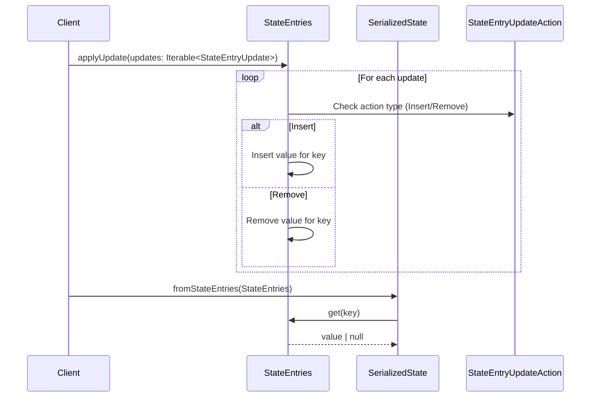

# `SerializedState` - applying update and some extra docs.

## Pull Request by @tomusdrw

This PR adds an option to update `SerializedState` that's backed by some `StateEntries`. Previously it was only possible for `InMemoryState` or `LMDB` (i.e. `SerializedState<LeafDb> + disk backend for values`).

Since the different state representations are a bit unclear, I've renamed a bunch of things as well and added some extra docs. Below is also a general description of how the state is represented in our code.

### Details of state representations

We maintain two “views” of our chain state:

- **InMemoryState**
  - Full, canonical state held entirely in RAM.
  - Complete info on every field, plus lists of services, modules, etc.

- **SerializedState<T>**
  - Generic wrapper around a serialized snapshot of the state.
  - Only the bytes (and minimal metadata) are held up front.
  - Three instantiations:
    - **`SerializedState<Persistence>`**: Pure “black-box” serialized blob (incomplete in-memory view).
    - **`SerializedState<LeafDb>`**: Disk-backed trie storage—leaf nodes live on disk and load on demand; cheap to update (no data duplication) and re-compute the `stateRoot`.
    - **`SerializedState<StateEntries>`**: Fully materialized serialized state in RAM; backed by a simple in-memory hashmap of `key → value` entries.

## Comment by @coderabbitai[bot]

<!-- This is an auto-generated comment: summarize by coderabbit.ai -->
<!-- This is an auto-generated comment: skip review by coderabbit.ai -->

> [!IMPORTANT]
> ## Review skipped
> 
> Auto incremental reviews are disabled on this repository.
> 
> Please check the settings in the CodeRabbit UI or the `.coderabbit.yaml` file in this repository. To trigger a single review, invoke the `@coderabbitai review` command.
> 
> You can disable this status message by setting the `reviews.review_status` to `false` in the CodeRabbit configuration file.

<!-- end of auto-generated comment: skip review by coderabbit.ai -->
<!-- walkthrough_start -->

📝 Walkthrough

## Summary by CodeRabbit

* **New Features**
  * Added public methods to retrieve and update serialized state entries in memory.
  * Introduced methods for setting and deleting entries in truncated hash dictionaries.

* **Refactor**
  * Renamed and reorganized enums and namespaces for state entry keys and update actions.
  * Updated naming and documentation for persistence and serialization abstractions.
  * Unified and clarified state key indexing and update serialization throughout the codebase.

* **Bug Fixes**
  * Improved test coverage and organization for truncated hash dictionary behavior and state serialization updates.

* **Documentation**
  * Expanded and clarified documentation for state management, serialization, and persistence interfaces.
## Walkthrough

This update refactors state key and entry handling across the codebase. It replaces the `StateEntry` enum with `StateKeyIdx`, renames and reorganizes key namespaces, and updates all references accordingly. Serialization and update logic are adjusted to use new naming conventions. Additional methods are introduced for state entry management, and tests are expanded for dictionary operations and state updates.

## Changes

| File(s)                                                                                     | Change Summary                                                                                                                                                                                                                                                                                                                                                                 |
|---------------------------------------------------------------------------------------------|-------------------------------------------------------------------------------------------------------------------------------------------------------------------------------------------------------------------------------------------------------------------------------------------------------------------------------------------------------------------------------|
| `packages/jam/database-lmdb/states.ts`                                                      | Replaced `TrieAction` with `StateEntryUpdateAction` from `@typeberry/state-merkleization`; updated method signatures and internal logic to match new naming and serialization conventions.                                                                                                                                            |
| `packages/jam/database/leaf-db.ts`                                                          | Changed interface from `Persistence` to `SerializedStateBackend`; updated JSDoc; moved type declarations.                                                                                                                                                                                                                             |
| `packages/jam/database/truncated-hash-dictionary.ts` `.../truncated-hash-dictionary.test.ts` | Added `set` and `delete` methods to dictionary; expanded and reorganized tests to cover key truncation, collisions, and mutation safety.                                                                                                                                                                                              |
| `packages/jam/state-merkleization/entries.ts`                                               | Deleted the `StateEntry` enum and its numeric mappings for state entries.                                                                                                                                                                                                                                                             |
| `packages/jam/state-merkleization/index.ts`                                                 | Added documentation for state views; renamed export from `serialize-update.js` to `serialize-state-update.js`.                                                                                                                                                                                                                        |
| `packages/jam/state-merkleization/keys.ts` `.../keys.test.ts` `.../serialize.ts`      | Introduced `StateKeyIdx` enum; renamed `keys` namespace to `stateKeys`; updated all references and function signatures to use new enum and namespace.                                                                                                                                                                                 |
| `packages/jam/state-merkleization/serialize-state-update.ts`                                | Renamed `TrieAction` to `StateEntryUpdateAction`; updated related types and generator functions; changed function names and yield types accordingly.                                                                                                                                            |
| `packages/jam/state-merkleization/serialized-state.ts`                                      | Renamed `Persistence` interface to `SerializedStateBackend`; removed wrapper function; updated class generics and static methods; moved class/type declarations to file end.                                                                                                                   |
| `packages/jam/state-merkleization/state-entries.ts`                                         | Replaced `ImmutableHashDictionary` with `HashDictionary`; added `get` and `applyUpdate` methods to `StateEntries` for state access and updates; clarified class documentation.                                                                                                                  |
| `packages/jam/state-merkleization/state-entries.test.ts`                                    | Added a new test for updating and verifying state serialization and root hash stability.                                                                                                                                                                                                       |

## Sequence Diagram(s)

## Poem

> In fields of hashes, keys now prance,  
> With enums new, they lead the dance.  
> Dictionaries grow, with set and delete,  
> State updates march, their work complete.  
> From entries old to indices bright,  
> The code hops on, both day and night!  
> 🐇✨

<!-- walkthrough_end -->
<!-- internal state start -->

<!-- DwQgtGAEAqAWCWBnSTIEMB26CuAXA9mAOYCmGJATmriQCaQDG+Ats2bgFyQAOFk+AIwBWJBrngA3EsgEBPRvlqU0AgfFwA6NPEgQAfACgjoCEYDEZyAAUASpETZWaCrKNwSPbABsvkCiQBHbGlcSHFcLzpIACIAAwBlSng0L3gALzp43GoSWN10bm4vWXgMInQMemxuWhyK+kQWDxIAD1wqSFp8BkRoyDlIbERKMJYh2goAd0gACltIDEcBEYAWAHYAVgBKFAx2xWwGaQrBmrqCMNgPBKSU9MzsmjymZm58cj3dy48mJQE0YYaGBXSDMbRYMiwTBHNifVC4EFoWi0dTwd78ABmJ3w3HE6Iu1VqNEgNwoyVSGVoWRyeUmVyw6hQMjQDAA1lEBglHiQAKJ7MnSWJAqz+CRoobFAA0pyJx0mlA872KPHwiEQ8AEkUgGPwfFiAEkMABZEjMXWyalPfh6gAyRoAIgAhPIzRDcUTwDHwBgpZWk8n3Knc4A2khoDH2gR6WnqWDoTpIVn9Fnsyra3WQCQpYKILYaIwAQS87yI6qUl1QGOwGDEaIwKRlOWlCI881KDC82CUyH89eYpXK+CxwykVF8JEisNwyAuHecnvkLYTGIxCs+iG5fhIvGk7GodeQmHoSNoyFa7TQnW6jj3eKwF1aRXBkFg+GmG7qqH8O+GeyipW+exZA3U18wMdwrwYG89n3dE5zJL1jgRahAMQYCaGYUFwWyUoZ0mfAsIAsUSEmZAh0AhgoQAj8aA4IwoAAKgYw0TTNFxLRIJiuDgVBUEvKsfGlH0MHeb0Gxojwri8eh2HgfxlQAmwCyNIT3hwjABwUV5ImJUodQoME734CFR3kRDpOldtOxRMpIFSDcyOHSgxSOQ80zNWhvGkMDGIYxIyTuSkOOAaA9C44FeMPSBSHIMkGEgSYqEKEZnHwatj3sW4KSiRB624RBX1Ccilwk6VX2kzSlUXEE5BoNz6H7DSwV8NhsiJS9qgxCg1KBfVQihGdYH8DxcOyPZkjvRA6MgfJ/UCh4cmAKxKHVECaxIaMuALTx/EgQAcAk1FMwAEfAWkAXAJMoC7L6E1QQtx/WTbMwXYXiKEhdIwMA2DY+RiMmfMZqgObruC0Nw0jTbIHtRNjpTKJ2ngDwN11NBSASq5dsicMFkUY5/DLRUsBRRAkyPOz8CRYzOlNI9pV9N9NMosNuEbOqEtjNLQnazpqlSH0jLJsgVFSWz/FevBYKwYqQViCSbHwfBcCFAxAZJfyAyC4MOL5BHpEh7aBOVQyssDS6NZyzdFOU6V/jZDl5EvdVtJGz7vvNF8AVgMEWfI9lZDALNO2aflEcQMCeOQeYESGSBIWhJCQQxSIWg1eBUlweRyOBwMOLyQkcnqlBXm6qRBp+Lx5wzzF7E3b98dvOtLm67AiDjXs0Ea8oya6KCp0lnywEMAwTCgMh6HItA8EIGLlBoegXinLheH4YRRHEUv+nkX5lFUdQtB0fRh/AKAI6ZE5J4IYgyFnqIF/YLgqHfRwwRcTeFCUKhd80bRdEHowj9MAYbgKZUbSAAPRCA7mA9q/xhhgC8MwWgAgwESTDtOOi0RMEGAsJAAs+or6xRyA0Z+zhM5YkopgUgiA3Agm3vdCurl0A+EGIgUBjlAKxGgAKAstZ3h5DII4dmCI1bch1i4AAqmcGgPC7x5C6iwDhAABDO7plgUBcCg7kX1KCskiOkSWeRgFslAUCU+VkuzHAoWUTSS54CvF1KECSU56is00r6Lcq5eyMIAkuWIuFKC4FzqCd6r5aDNhlvnaRlQADCLB+xK2CQiRQPBnAd3eilNM6hkClBoBQesvhixEG9HTNMvjIkkALJURIgTuR5FaqE9GCpUImzSJLbU1ZeEMh7ELNg9B5GYVli0kgkjZR5AuIMq69wOIjJpKYiJUiKkxLieoOpITFAAHJkDAKoK1EYKifhQjKMcFkTAKA2SIMqC4JztyhANLk4WJBgAAG1tb8lkDM6RnTpQcQANIkFkNKR0sg6qOmLAIAAutGXYIFKZZz6jvSIzyuGIxkXWb53I/kAsgECkFYLIVCmBD8d4KI7wNiZmybJGACYknKZU2gsTWArJxtMV6zgPCo3BBuEROQxHvIWai94GhDTDAoAksmXIeVvI+RUzpGgbCmnwFIPIo0wzjyxEuHcYo0rIE4dwzpeQswBT2GHQlZtAptJ9MwgCsRaVVPekE1A5T6AEmGCSEV5tpkLOVVSmgsKsQTPNtKgl7hXVWKoUw+ARB7y0NxkIuMTqFgdzcWmAsVh9QKAwFIca7xKVKP2WojREltEUF0SQfRsiUnGLRpMDmeAmG5JsSCdKlBiiaUKd6a0Gb9i+CTm+MC5hLBFnuZNUYgElDwUluwx8DiogZm4NgTUHbZLiGkPRSAJokkNEjfWXA2BdpOq4LEAEsgazQoCRxGYVwkSUAABKey4De1Vt7PbSndfNIMOQuCvN1rmLgIoWBIEefKhwXhcDAAAPI/PRTkaVPJ1G6j0FCgCc41QkhtIggQHFEDepJEY1kbCIFQJgQCEg8CMOaILhoacLptlpNyWEWQ7pBg1kOaQMJ/Q605MoPklhoDq4siMgIzCYa6BbAMFADdDT1RRuoHujwB7cNkizMSY9p7bX0uWbgS9T6KB3oKg+nTenYDNgFFwFiCqXDIpINKdqZn7makeS80RUr+VfMgL8/5gLgXSFBYISFWw/3dX7MMYAwHvBgcg9BmgsH4MUEQzhlDOr0NIKwzh2IeGCOQOYNA6gKgSNkaQRRuqVHsOzFo7svg+zGCsaiP0kk8LP6IqeVZgVGAoskExV53FfmoXjIaw85536JGubvO1zr2LvOIF8xC6MYmJNrK3TJ3d+6Fm0EPap+K6nqkXqvR/IzBnr26ZfTXT97mhkfpoCGMMEYozSnKX+5w4gUjAA4pAAAZGdigLlpDSr0AF6wQXAOhekOFiDUH3Pchi91OLSGsCJbQxh1LXx0sgKoYR7LxG4EIMK6gkrLouN5LJe4kTfSgtuqGUG0dAb5qetGWJzB0R6KAIy2jrLOXsiwJIGArGGIwBIJKxgrBOC8EEJvsQpwr9yIieoeBEEdi3iioY0x2Iy0KCrRoOtORZPYjKMYyQAtsgiukbYCWvRrSK2TABPQlkUQa3COzprHIjo4aVAJbE9R0g3iVAHFKCiFdUOxDBjdvIIlpjy8nOwHV6t30cWd3bV30LfVqpJKr9XZAjjBpBAAKXiPaboWlnHokD9dyMtIrcJtnBXBC1UUKMn8EiZAPOcbdl2Fc9daBuDwPgOyGuFBDjLY8MhXAqlmBqHIPQO3cZLyxAAGrZmkKXoSz0BPoCig7haNA4+ploJn64NoFasmqD80oO/Y6LEwuK/f+BD/cDGXr6UmrxSIGVOOqvURyDOEAgQbg0p5S7X8GaFIKTgokPuTPzI3GTP4Dkt1J5EcMeKEEuCdLgAQJhNLB4F6FqJPpzBUFvDVl8EwH+J8BmMMGCOND0ECAAHIESKwYztI1ikq+AZjtqWrVaUJyhNJghKBgTC6gazwHijpLiv6pIjrkTTqiqzp8DzqLrxTLqhxrrRL+5JYl4CDPA1bOoETh6mjsBqznax4u6n4qp+op4rRIAa4Z7I4s7gJs6Y5c48584CB475gM5M5gBGCWGIDo7s55bDBgLtAdJEJgADSwB87eikouBUYhAC4GDOHC74IzxUBzz2AkKS7kI1Yy4QR1SOLYDqDoEZi6r+FzxGbQydKkJl7dIbh95iBybHhpjSYaRejCQRDyCPhHh0BzKKhkhFI8bqhlBaiZHID6QkikAJJ/4eBEDNzuhVCVApTUwoj8xRCxDdgMBkjLAzDRDDHRBbB5C3RsglL0DkDTD9EJRNInjwwERMCjiZjzjaqxy0Bow+jDCFzLBQhapq5bgVyJEXB+xhB941htJkxMA+BIAHjtGurmLlijgLiaT+C6yByNJYB+zIAogrgjBVRfBLj+6hC1TWYeyVAizlCAn2T8F0hNJ+F/GJGIn8CjgVwswzCT6ASYlnriEyRvJUmUBkjnJbB7Fn4OBki2TFjX7VDID0lknzH0CUkOAMBHASHajaC+Ad68A4gBQ0DFBAjbSZEJRW6nHqEZpegGSXAoS6iRqlANiUlso4yhDMASyJGeR8nlBzFhFbw5p+GdKdrXJqhgQUEkQkhLErG5D9DFgUrph6jDBippiLETjpKrKbrClNLQEHBwHShhiURdrgiaRWmgbwBvRhAhAmoQSDIJJHGQkYgOzIiaQHFn4/p3ZSKaStCmGaSImvrvTiC2SBw5gsI2K/FimQCNkuKKqUCJSoitnz7Cn0g9n/LIAFTmklRpI/EFFRA7hegtDtE+mRlWhHEXEjBKA6S1kpwbgNkTk2ZrnlnvBgB1lrShC9nbnvSaRiiXiilELjnATcnXktnlCUmgFTm7QzlsBznkkLn+BLlgTgaji+jhIHJsGHjIhaQ7j0jqhSAKCgVoyDGCGhF1ikKbL9AkAvFoh8AildmPm9nfGEnAk5rclWmPCNysKrgZy/4IBai6hECYDpA2K5mt4ETMENjjFpT5Rvz1KKD9rYKDq8EJH8EXCCGiBV6TrVxiGJFzoLp8yVmoirriaQBUGsFHIzgESyUylSGKXLryBCGiU5oADcxklyIQ78HgluUFSgNR9A/gjFzFlIThWC4mzOqOVhRGuWnOvhBFc8gRnsIRJR4R6C0RQug6cR18CROUyRZCGlVCNC1wXC85tARRaF7wpRjAihmpZ4bQY8tusYYQ+ECw3pelHa/Fp4h6oZeQ4qr5uQQIjoNBiSoSh4UpNy8YhsT5swZaLYfA/E3gvgQRnaD5iR2JuYfZ7oMVVMtif4hOvgDp6Fr8Qwjag+/lUQ3x+kvSb8TA3AJQtkS4epXKnCNg4iFB0SBY0API9oAA+j8jyAAJo3WOgPVXXxDbGTbVyzXzqXn/IrkFnRkNL+KipkR8DlJRRtnspqjdATSFXCJLijUbWeboxpyD4yz1WA3JIAH9llyVmvwoUgiI3il/WmrnlvlDHvSY0T5W4k7ahk6Ph8zqB+jlUMBjIERKAYiTygaeDSGZjAlqDpzyAzAiSgiKCeiIwUB5i4IwDgb2jgYF7aE2XoDIixVEBULk2zX7CwFGQTwkgpX/lpWex35MY5IES+K66qLsmG5BGGKeUuKAGNqoCElryNzjIW365W1gLO2dKlYXDY0IVKDujTE1iZzRprWIyVr4akCCU8HDpiVm0ghGXSWiEtAK5yWSEKVLrjQroy5QAFgq0NQLbk5aaGyYrcSQAAA+E2dUIUp151l111d1j1z1r1PI8Qeg0okNXAM+/2Eg+A8Ap+leAIOq+tYp6VIVsgIU0oM+sOuGnlHh1hPlJGflqVgVBUwVjpeOql+ddlLVySEZOkJAMwpd/y5dVdOK0gtdZ1F1V1t191T1L1b1f2XAfdA9bN2Vw9et61htBUxRjpU9kAM9aW7hnhNhK9Bta9wRi1mVoV2Gql0Sahe99AYo6oAt6g8VsQwxx9g1ZdMAld1dl90AddN9jd99LdT9/2M++DzaXo4+WuCi6WmdrNo6HNXNoQwt2lqdjNlpYtiEkt+BOV+RBt49/90A09s9KOVaXlGOS9PhRNkDG9S1sgW9zh7lrhQC89nhRaJupa5adYYC7AAoaCU04VjOsRouMV4uL88V0uSV1Mh9fSqN1MtDUQz0QmfB6IfYCxQ2sgYyUIoQipYou9l45+SQ8U3s3AmkgxhqT+J2xIhjocLC/4YdQEIEzAQIPILIcYhj8gPiIIQmCgHuboxKZx8YboHoDRGaRwuI2ADYGYVY9B6Fvgr07w7A0odcu4f4N0DszG8AQQHgoTcUVxQcK5CTxw4J/4Sg40fDAxGYF8r4ZIGQkhCsXghc/TOY7Tog2hCAyMLgr64Y3UkQNmSAP1HgYsuop4SZ/IOIWKgcA91AxB70yAwt54Qke6vYw+PAooT+XJ6AWYacKgac6Dq+dRU4iAbzHunw4gv5z+isD+SmqNbGl0324LcT9ZPQv+uoSY7hsw9etADsaYYs7AyoJyjg3gRCvzZMIqKLnQuWoz5+wz7ZVARywBmEAADKOgAEwbAbC/5FVmhcpjOHhqjbo5SBDBDjS+hmRk4csXAACMvLfZ5AeNDsIrUaUQ3LGwcyqABT1LrjUURw/I76Hia4RwwZcTwc7QuTUz4gMz0onNDAQLlFtkBBaenwQwfGZMBOO4lF6ILI3UqGS428nOMdwlcdOaAhidklwh/BKdadulTDSlOda69oa5UQOlLJgiEqNAvKMY8Nic+APgDMtk30aihcgzHakNJjqssQ4iiwww9AAAvJAGy7ECrLNEWNwFCJAM23Ky6AWHgAs/cHwFYCs2JjW1YAgD25AJy/24O0aUs5AAAIrBDBDjuzSOjvSXjNsADMLo8qhroQN6ph5o67QMAA4h3GCNOysC6PEAc4WyQGeynuqNOxsC6NDG6HgMcAexc8gGApAFnl2KQGC8+7EDyNkNOwAGwuhiI3Ngf6iKzbuQBrAuheltCAN3BEi6i5jttAw/IKnIcAAcLo0S7z2hc+qQ2HauYHNoHcAgtQ07AAnC6CKCQFqjHJR/cwQDR3hySDYK+NO3K627MAWP8xXGg1XAWGqxgFOGB9AJPEJ327MGR5CwgXYkjMWLgGBwgzoL27O7MCKJIIi1EP5Ci2B1YHp5AHK3u7MJaOi7hzW+4JB727e7MAAOpYvWDz1bhIiLgETLDoBSlksfGiZ8exAAAaVnCrLonnJa3nUj3Sh7JLwXGZFL4XqboGyHmrd7zk3oxw7U9OblEA6jIDbO2jOiZuksYCJ+rQURMRkVFjj5DgEuNjaRdjImytp41MOEkQ9APc0EvrRM0gyxqcB1JVxMLZYgfNJE7CQbVEWAEkWE9YSLAwJU6EpoXAz0pQ2iP07SzCwkokLBS3ax5mP0HEmxLil48RHab6109geUBUisCUSUU1sw0Q0eIMwYoUmxK5Hx9GlYe6fVscXD4IcNcYCIw09g7ojrlTo0mAT2k0W3O0SM52AZd0MwKuJha0GelLCYJMsMdszqAodk12zeSMPHfGmPQepelLaY23rsFm8gQR3s909cMERkmPQ2ocsQUtO9qImVPgWKS4slFrziBNFPdQ5SZqFIbSHkXkZ87c21dW1O2UYA5SGgQgvtBEqv9wYARaGvWvBK6lNBIwDTJRjBfABB3a2oxYLKaR6Au08ZsBbR/8QluCIl0l4lUbE6IhWIGbnaLNSbchqlPIqdDiYv2hCmsQovDEdNCi0QGgKCQy6vCymvvQJleQgASYQkix/x+YSJ/J+TIZD69aKG8Z/AOaPldaI6NVd3g1fTHLnUamMuFuFV9QIVem5lrm76OIkREbj1cRW4JRWEKJEtfWPVy2Oy6D6WUYHWXl6rajrfgMLsrMKAWmtIQJ0jT2LMkkiIl5CCAiDTfio+P8IMv0mywYoTm1XhkeayD6i0AtB5D4ww/rwThYqAWRC1hPQJUuyATy9ahZKoNRNJ3AzRZpJoQIeIDD3FqWpfcsArSnvwnIaBauLQGYD4w0ARctixxXaLTXGQSRMUYcFAWgKv739H+GArYpALsQAsKAvudxKbz4DEVnSlRIyPAKSIpkrcsQPvtS3y6GgdQsQaUJwKQHcCjgWQFGKQH4GIDgIGgYQSQDY52JQEEg8VFwLy5HAr8N+Y9rs18bYD5Mi/F1NcHwHX9E8qqauIIOAi74i4adSPsam0HK0hAQwRIicguY+5/OFgiPtmw6z/IH+T/FxJfxyAED6GmEJcJSQAE4l/aq1VwYrizin8fB+/NUmWQYK+5WmieeOPxlBDhZ4AYAZwEQEG50FXSsA2YBMm+xqDqgGgnjr4x2BK1AKuoQyJ8QIiXgMy4gLvMqyyE5CNwsgLUIMTxaAtBaNsOtBiXwBFJ4oABTlMxhJwrlh6ASfgmTA1LMFvgzAYYF4A3ijELSotZEojFoChsPe4bKlJGw8BJ0/eIPeNuPAzq81ZCKlKAPqB36hBaaKvaIUoMMHjI7+Xgm/vQF8E0B/BFhdvtlk766Me+7wMBH30yJ45ZgGpOfuZVkBmURaAffYVMJEqiZXKjONRm30S5aMa+lXbvtV0BEmMGuw/JrmPziqT92u0/KytbkYQapvm2qBSFcO8bOYrWZ/QRPSRCYkQX8JAFxq8KeGP96RgQ/xocO4bKh3GMVZABW3ign58uszPgDExuJLchWSZLJnGmpiIBRuuISQESlYCR5/q+/EAZ7htyK8ekpTN4R4LMH/UUBciDpHeEwrlZ0klWPXL/wGLa5oh3vAZt6XcGYpnhZ+RwNyUOpmjG4sw4YbhFQhpImyyBcIUdSxLeZUhSzfAFEGGqOjooKohkI30oH9gq8vuXxDIN4H4BTRjTdEMvxty40hgiof1OgMy7ZA82cYF0Z4LIEli0AciR5sGIOqJw5IXKbEl9RBB+xKC1BYHubwYK2jHeHgTgoPi37dVXWLpIyLMIzD0DchI6PJgMzSRugbcmwodB4x2GxiYREbONjOmOE819K2dEPnnQLqHDNx7ogZByO8H0lhRWEQoAOHFEWs8aiTa1GVw75oiu+ejf4ViOVhQB5UXjGSOH135eN5xZrUwdrzdQkDSsD4r4UbmLS/DMRSA6jPmCgDSpFsO6OTCYJNFTjG41qAwWYK1EASSAS8VJBViVwQUWW+fblDmzeTv0KxpAp/vBMgCITycX2HgRgD4HoT0QmE0CSHjnFGJBxSTMiYaK8EaBqx3qGFMnncG8pBJE4UsQiNb4aMUR1fHIFBLr76M7uevA3mnzCo4iRc8RZrgSKlxEiIIyJLEErwTjBws2LWfVFTh8bSpWsLw1mMcjX4ThHyVWO4CRkLjaSeOrErADCT3T3g9cbVU5OcjgGsYom9ooZOBjwA/VKJVkr1PS0ERVstwYIGcfYFnICA605pUPPYF2pRBm0lWEEBWS8ZqlmEJQCcA0G5BgsvmCZGxLzGOBoFgyAyJ5AJjRRPkbYeKWqitllA6kCxfE3lNZIsmGFRJ5k2RECAABi3ozxnOL7G/9WWDEwNF6ipwqSMgtOGkC4iXDeS8k0UaKg82tHuhDw7UpyQRE/5rxAIFZXdNmX2QrkCcPGKSG927H8FMeC0kgPKkAKZAVBgoAQQ9NEFUBxB70oZHILBBUIJBuvRaa9OlTYZuSQMkgM7nVAMB/BOwF4mjTLR8Bip0kIiYXDWm+Sdpdkzqa6iXAVkCm0w6qURJXIVF+8KEsmOOPVQggFpbSP0VgA6RqFpQaJXGUmieilIbRmAESEN12n9jeG6w0dF1NxnOjopsoGyceJ8HCzlpp0vonrkXGe8R0q46NsZR2Ebjd+8lU4buPOGQA+QgiYyWtlz6/jQgBTQaXWGz76zLBBTCWZ8grTgS5JT4hSbXwxH18HppfBSRr2b4nx2ZqQK3LrJcQZtD0VWT7vcHCm4Afq07ZrHqlGwQ4/ByNC+lNlamQAc+MfA2URKjnkSrW0qMOZbJlSRy7+XWHzPHJtlR1pGkEh2a+IwBF9zYLsmgKn1lBb0oAo07MV5L1H2V7A26WTHtLniHpRet094HHwenSpXQMPLgAg3BBQDRA1ZWUA9lFTkgXsm4D7GZzFG/Z/s57TaTxxexhSIpeAKFInO7ljSMAfcoZEtJoCDzRAw8hbmPIYATzTsVgR7DPNezzzXpiAJeVwBXmj9dQs8yVOnIWQSNHx3w58dBKdkp81Jtc5vqoxK7Iii5C9O2dXNLl/Dy5D0wfmY0a7uTYqrXQkZBTsby4I+TiSPDYIrwHTtwK/bqRRJiGGCL+p42yQaP8FAh3cL/YlM4LpgOTPE6eTfpIMIGN8ZgGgLhVgPuFSCZBDELMT7RsG4CCIXUqhUgKIFcKNAPC8MlhLDj8LBFk0PlvmxdhKAWgjvbIeVMQB24mY00sSSQoKbxTHhJAt0YYpHIdjexywgcbsKsrxQOapQAXlSiTJtAqArpZgozL4CTjqZRkJQL1zzK0IHe1YT0NUOVDS8SoaUCgGa3IhLdviKA5NA0FendV3JjcOrEkJCG+yGWVyTmRjE2ZJwXaP/QCgJgnF8BjJ1cP2GAHkiPksFINFxB62jpu9Y6y4hARJV96xt/eBshNurPCAh8qC5AaSUiNkmQLUR9s9EWXIrnvoq5JARBe7y0mrzUFE/PSRguJEE4HWHgR/JSPkDfjjCauUwiwrKJbgtljw3QtyC3xjxbJWSSCINzaRK0Wi0xHUvBAXAoBQgWpLACoAqKNT0Q/ZfqsmHjzzw1IaZWyA9NKl1AZRKNFMmCHkCBcdubsSXJ4s+jExWQK5a6Wbz3kgTP5RjVPLss1wGlQgiUBUjSPRU892K8YLHjspx7+lD+R0yoQqiAL/VA5juK0PDiVr4LeJgs6YOvguyQz9C3qXJKsqMFGFSVbrDPMTMorxQHWZQpBiSH6Tc9BQuVKaSwzkhrwUu1TW5DKtKxYE60eKq8bZHUCeiZYBxKmnKpZUCy8p3pFZTqPOmmoOVC88wvDmmEyxMUdKWJOOmNrWUOC/ZaaUuH7DIgGKlM9Ak41jFjxlFcYEWj3J4zS4gQIFZQIJAogO9HKFAJihpAyAuJSlGqbHmYXZQCB3lbmf2uyjpkYByArkVhK/C1U3S953JeSN0HOAyx6VL0xibapyqQFHJnxG0bGKQIoFWx/qzArWmeUiVVqckcmIMNlnbDmlPvKSgcID5qydx3SzWYaF5U6ifZVLNuQPixmHpMV5K02dapOXcr5RP5fsUXUwbvQZgfsL9CQP+yxzps+DRYD4Er62y/5Iyl8XAvGXXRJldcyAE9I9WeTqqtIjFempYUzAHSp6wldIH+zrqM1t6oZfJJgWjKn1QK19e7MgAKFP6W65aTd3igjiqAOSeVSrxCgg8Nc3XMDSwunaEb1ovWHXrhvPBjxkAtazlacrTDNsaNehX5T/Igk/ClJ/wuDRJDfX2dwmB6xjdyA0DSqf1RKuou3OIlIsrk7VXEMQp/R5AUQYsJovyuTylrNI6gVSjxslUoaaAGgA1RtNigdoMN2EbDdrgo35VKgkcP9aRsommb8N1G45U7n0Isa71JcmDdV040CaENSGgPIxtelybFZcvT9XVm9W0A+i2lNMFnF/kubH1bm87PBvVVFURaomldbYw9lMYXJOqR1UsnHQhQoUz06acFtC1n5RJkWtjY7OUmxauN1GeUYluXUoTbGYCjys5tK1jKi0QrfvpoA0lD9Zlo/eZaQnQWaVCwpVQ4pZQeIeBogT3bwFUAWSoRuQfQJWtqRsUfdNw9KyWH0AcA5FtWM4Syg9NxoOKnsvgDUqVEzBJBEI2SacH4AVj9RPY6AJiqNHjCshQ8cOZ0gj3ApPafUzAqKBWW2T7bbx0va3gCq7hYAj0g7UdoW1KzmQJ8RVXACVSXJ0B9e9wTeCpnURoBgIL3fFceGQAPa3wn0dUMmu9oQDTU0vVAECqu6FBUgpTEXnuXJok6uNuCDEPRgVKtoGxOg2UOBRzJcpuwQyfMYvyW5kwJhNS0Ar4nmag7VmciRGCjMMhMxcaBxElmTr5mQ1eovaxoFuHJSshBoKEVaZdo9gFQEpIw8Vg2FjFGkuiBu7bbXC11BEVynXZ3ocHGZXCbxR6RAD8ke3xB7ggMq1tJ1Vzu5cgP04viQCPne6dCvuzlYoNKQ1rakKci4A4EKAR8EQqAE6ZZWYLDqmlNitccrPaVHDA+ibM4bnTUrnEHeD4DpVuKD7Z6zKaJJkcNq5Sja5VC2yfElNBGo1+l4CwZZlmgXG5XNTsrRG1s61ILcRKCqxn1sWUDbiR0uUkQjN4lwpWAEsBzCIyUZliSQM+mBloIl4khRpPgMRESu5iWr8yaq54DlR1Zmbd6IpEqhWXh7rQkGU0CmmGVeGM6+Uoyf6sMUNUwkBQG8EqGj0hrmtru8YviZigCGAQcpTO8oEKwTAT1Nmy2DSLZFiDXqvAyqP1d1T4hZr2A/1G/ZTkqpBcVVbkJ5QikLG3icmdk1FsmTjCut6ytkCeK8rcx+xuSCuyAH1AKBFBEmLYV1ODTfjA1yaGYMIbZCANJToG9YV+I4LOQ2IhxHytrB2QgNZzWsQqKlAEkoViHZUH6pVGqQhAtAoQ9glUdVlEBJgL+/O3AF6VHDKpbKpTMgLyVX7yk8hrkyaYchC1tFqDduyaUiDsEgQdSEzEkFoZ0OUBbJ+ybpKFx1LSjWS4NS3YoXgTscJwCtT4IMX0Wyaz4ty3ekPWrw4qnlbPTpudq6rQqmet4q3CTqAP2qUIQBiFVhTR3JR6AptQPebGD3mt397pMOAOi2HJ6FZrS9cenqPFTqs6M6nPdABtEeQYBksQ9Kvq8Dr7ZV+yTCosVyyGJuoU1KuDcO1yXCKKDyBfTwcnq5yCGccwQGRvn2ew/6SjD+e8JjmTZps0YWiZJmSTalD0WDE9anMNHnqdjYKK9YNQSyCMd9nwprf/PY3wLO9IcbyHBNUoHHjwBddbGTtv05BXQwmn7AsjsxYHNjvIFzLKGfqZh+6BhOHHcaBNgSgdJWp42Vo42vGf0jhFvu5SHgjwit/GKeHiNvhxJ74fgNAE/DQUDBt4n8NQN/APh/w8TC8dQDdQHqIAbq3zEiHQBuofhFch8ABFABXAMBOWaAJjjux3acs1gO7BgBsBWBMdOWbLTlpyx3YbA2WRHHdgqag4CApSKwBgFqdqBytaAcrJjr/FxPHwC8zJ1k+yfY6Ix5QtAG6mPBNNAA= -->

<!-- internal state end -->
<!-- tips_start -->

---

🪧 Tips

### Chat

There are 3 ways to chat with [CodeRabbit](https://coderabbit.ai?utm_source=oss&utm_medium=github&utm_campaign=FluffyLabs/typeberry&utm_content=475):

- Review comments: Directly reply to a review comment made by CodeRabbit. Example:
  - `I pushed a fix in commit <commit_id>, please review it.`
  - `Explain this complex logic.`
  - `Open a follow-up GitHub issue for this discussion.`
- Files and specific lines of code (under the "Files changed" tab): Tag `@coderabbitai` in a new review comment at the desired location with your query. Examples:
  - `@coderabbitai explain this code block.`
  -	`@coderabbitai modularize this function.`
- PR comments: Tag `@coderabbitai` in a new PR comment to ask questions about the PR branch. For the best results, please provide a very specific query, as very limited context is provided in this mode. Examples:
  - `@coderabbitai gather interesting stats about this repository and render them as a table. Additionally, render a pie chart showing the language distribution in the codebase.`
  - `@coderabbitai read src/utils.ts and explain its main purpose.`
  - `@coderabbitai read the files in the src/scheduler package and generate a class diagram using mermaid and a README in the markdown format.`
  - `@coderabbitai help me debug CodeRabbit configuration file.`

### Support

Need help? Create a ticket on our [support page](https://www.coderabbit.ai/contact-us/support) for assistance with any issues or questions.

Note: Be mindful of the bot's finite context window. It's strongly recommended to break down tasks such as reading entire modules into smaller chunks. For a focused discussion, use review comments to chat about specific files and their changes, instead of using the PR comments.

### CodeRabbit Commands (Invoked using PR comments)

- `@coderabbitai pause` to pause the reviews on a PR.
- `@coderabbitai resume` to resume the paused reviews.
- `@coderabbitai review` to trigger an incremental review. This is useful when automatic reviews are disabled for the repository.
- `@coderabbitai full review` to do a full review from scratch and review all the files again.
- `@coderabbitai summary` to regenerate the summary of the PR.
- `@coderabbitai generate sequence diagram` to generate a sequence diagram of the changes in this PR.
- `@coderabbitai resolve` resolve all the CodeRabbit review comments.
- `@coderabbitai configuration` to show the current CodeRabbit configuration for the repository.
- `@coderabbitai help` to get help.

### Other keywords and placeholders

- Add `@coderabbitai ignore` anywhere in the PR description to prevent this PR from being reviewed.
- Add `@coderabbitai summary` to generate the high-level summary at a specific location in the PR description.
- Add `@coderabbitai` anywhere in the PR title to generate the title automatically.

### Documentation and Community

- Visit our [Documentation](https://docs.coderabbit.ai) for detailed information on how to use CodeRabbit.
- Join our [Discord Community](http://discord.gg/coderabbit) to get help, request features, and share feedback.
- Follow us on [X/Twitter](https://twitter.com/coderabbitai) for updates and announcements.

<!-- tips_end -->

## Comment by @github-actions[bot]

View all

| File | Benchmark | Ops |  |
|------|-----------|-----|--|
| [bytes/hex-from.ts[0]](../blob/dcdf46aebeca73dac469a0b67d91f6a42eb87b18//_work/typeberry-1/typeberry/typeberry/benchmarks/bytes/hex-from.ts) | parse hex using `Number` with NaN checking | 142659.12 ±0.08% | 83.86% slower |
| [bytes/hex-from.ts[1]](../blob/dcdf46aebeca73dac469a0b67d91f6a42eb87b18//_work/typeberry-1/typeberry/typeberry/benchmarks/bytes/hex-from.ts) | parse hex from char codes | 883953.88 ±0.35% | fastest ✅ |
| [bytes/hex-from.ts[2]](../blob/dcdf46aebeca73dac469a0b67d91f6a42eb87b18//_work/typeberry-1/typeberry/typeberry/benchmarks/bytes/hex-from.ts) | parse hex from string nibbles | 562063.98 ±0.78% | 36.41% slower |
| [math/count-bits-u64.ts[0]](../blob/dcdf46aebeca73dac469a0b67d91f6a42eb87b18//_work/typeberry-1/typeberry/typeberry/benchmarks/math/count-bits-u64.ts) | standard method | 7739236.23 ±0.61% | 91.53% slower |
| [math/count-bits-u64.ts[1]](../blob/dcdf46aebeca73dac469a0b67d91f6a42eb87b18//_work/typeberry-1/typeberry/typeberry/benchmarks/math/count-bits-u64.ts) | magic | 91371378.68 ±1.39% | fastest ✅ |
| [collections/map-set.ts[0]](../blob/dcdf46aebeca73dac469a0b67d91f6a42eb87b18//_work/typeberry-1/typeberry/typeberry/benchmarks/collections/map-set.ts) | 2 gets + conditional set | 120440.23 ±0.39% | fastest ✅ |
| [collections/map-set.ts[1]](../blob/dcdf46aebeca73dac469a0b67d91f6a42eb87b18//_work/typeberry-1/typeberry/typeberry/benchmarks/collections/map-set.ts) | 1 get 1 set | 61161.01 ±0.48% | 49.22% slower |
| [bytes/hex-to.ts[0]](../blob/dcdf46aebeca73dac469a0b67d91f6a42eb87b18//_work/typeberry-1/typeberry/typeberry/benchmarks/bytes/hex-to.ts) | number toString + padding | 316550.44 ±0.77% | fastest ✅ |
| [bytes/hex-to.ts[1]](../blob/dcdf46aebeca73dac469a0b67d91f6a42eb87b18//_work/typeberry-1/typeberry/typeberry/benchmarks/bytes/hex-to.ts) | manual | 16210.19 ±0.4% | 94.88% slower |
| [codec/bigint.decode.ts[0]](../blob/dcdf46aebeca73dac469a0b67d91f6a42eb87b18//_work/typeberry-1/typeberry/typeberry/benchmarks/codec/bigint.decode.ts) | decode custom | 170816195.58 ±2.35% | fastest ✅ |
| [codec/bigint.decode.ts[1]](../blob/dcdf46aebeca73dac469a0b67d91f6a42eb87b18//_work/typeberry-1/typeberry/typeberry/benchmarks/codec/bigint.decode.ts) | decode bigint | 100504744.86 ±3.66% | 41.16% slower |
| [hash/index.ts[0]](../blob/dcdf46aebeca73dac469a0b67d91f6a42eb87b18//_work/typeberry-1/typeberry/typeberry/benchmarks/hash/index.ts) | hash with numeric representation | 190.23 ±0.22% | 28.33% slower |
| [hash/index.ts[1]](../blob/dcdf46aebeca73dac469a0b67d91f6a42eb87b18//_work/typeberry-1/typeberry/typeberry/benchmarks/hash/index.ts) | hash with string representation | 119.05 ±0.28% | 55.15% slower |
| [hash/index.ts[2]](../blob/dcdf46aebeca73dac469a0b67d91f6a42eb87b18//_work/typeberry-1/typeberry/typeberry/benchmarks/hash/index.ts) | hash with symbol representation | 173.77 ±0.7% | 34.53% slower |
| [hash/index.ts[3]](../blob/dcdf46aebeca73dac469a0b67d91f6a42eb87b18//_work/typeberry-1/typeberry/typeberry/benchmarks/hash/index.ts) | hash with uint8 representation | 164.18 ±0.44% | 38.15% slower |
| [hash/index.ts[4]](../blob/dcdf46aebeca73dac469a0b67d91f6a42eb87b18//_work/typeberry-1/typeberry/typeberry/benchmarks/hash/index.ts) | hash with packed representation | 265.43 ±0.43% | fastest ✅ |
| [hash/index.ts[5]](../blob/dcdf46aebeca73dac469a0b67d91f6a42eb87b18//_work/typeberry-1/typeberry/typeberry/benchmarks/hash/index.ts) | hash with bigint representation | 190.8 ±0.14% | 28.12% slower |
| [hash/index.ts[6]](../blob/dcdf46aebeca73dac469a0b67d91f6a42eb87b18//_work/typeberry-1/typeberry/typeberry/benchmarks/hash/index.ts) | hash with uint32 representation | 203.11 ±0.17% | 23.48% slower |
| [logger/index.ts[0]](../blob/dcdf46aebeca73dac469a0b67d91f6a42eb87b18//_work/typeberry-1/typeberry/typeberry/benchmarks/logger/index.ts) | console.log with string concat | 8529196.27 ±36.82% | fastest ✅ |
| [logger/index.ts[1]](../blob/dcdf46aebeca73dac469a0b67d91f6a42eb87b18//_work/typeberry-1/typeberry/typeberry/benchmarks/logger/index.ts) | console.log with args | 670857.08 ±113.04% | 92.13% slower |
| [math/add_one_overflow.ts[0]](../blob/dcdf46aebeca73dac469a0b67d91f6a42eb87b18//_work/typeberry-1/typeberry/typeberry/benchmarks/math/add_one_overflow.ts) | add and take modulus | 227158620.24 ±29.09% | 12% slower |
| [math/add_one_overflow.ts[1]](../blob/dcdf46aebeca73dac469a0b67d91f6a42eb87b18//_work/typeberry-1/typeberry/typeberry/benchmarks/math/add_one_overflow.ts) | condition before calculation | 258135561.08 ±5.7% | fastest ✅ |
| [math/count-bits-u32.ts[0]](../blob/dcdf46aebeca73dac469a0b67d91f6a42eb87b18//_work/typeberry-1/typeberry/typeberry/benchmarks/math/count-bits-u32.ts) | standard method | 81051554.83 ±1.47% | 65.42% slower |
| [math/count-bits-u32.ts[1]](../blob/dcdf46aebeca73dac469a0b67d91f6a42eb87b18//_work/typeberry-1/typeberry/typeberry/benchmarks/math/count-bits-u32.ts) | magic | 234373378.86 ±7.62% | fastest ✅ |
| [codec/bigint.compare.ts[0]](../blob/dcdf46aebeca73dac469a0b67d91f6a42eb87b18//_work/typeberry-1/typeberry/typeberry/benchmarks/codec/bigint.compare.ts) | compare custom | 252011709.8 ±6.6% | 7.82% slower |
| [codec/bigint.compare.ts[1]](../blob/dcdf46aebeca73dac469a0b67d91f6a42eb87b18//_work/typeberry-1/typeberry/typeberry/benchmarks/codec/bigint.compare.ts) | compare bigint | 273398646.79 ±4.23% | fastest ✅ |
| [math/mul_overflow.ts[0]](../blob/dcdf46aebeca73dac469a0b67d91f6a42eb87b18//_work/typeberry-1/typeberry/typeberry/benchmarks/math/mul_overflow.ts) | multiply and bring back to u32 | 260415863.28 ±5.27% | fastest ✅ |
| [math/mul_overflow.ts[1]](../blob/dcdf46aebeca73dac469a0b67d91f6a42eb87b18//_work/typeberry-1/typeberry/typeberry/benchmarks/math/mul_overflow.ts) | multiply and take modulus | 256774784.59 ±6.03% | 1.4% slower |
| [codec/encoding.ts[0]](../blob/dcdf46aebeca73dac469a0b67d91f6a42eb87b18//_work/typeberry-1/typeberry/typeberry/benchmarks/codec/encoding.ts) | manual encode | 2594887.84 ±0.18% | 16.47% slower |
| [codec/encoding.ts[1]](../blob/dcdf46aebeca73dac469a0b67d91f6a42eb87b18//_work/typeberry-1/typeberry/typeberry/benchmarks/codec/encoding.ts) | int32array encode | 3103012.98 ±0.36% | 0.11% slower |
| [codec/encoding.ts[2]](../blob/dcdf46aebeca73dac469a0b67d91f6a42eb87b18//_work/typeberry-1/typeberry/typeberry/benchmarks/codec/encoding.ts) | dataview encode | 3106411.24 ±0.33% | fastest ✅ |
| [codec/decoding.ts[0]](../blob/dcdf46aebeca73dac469a0b67d91f6a42eb87b18//_work/typeberry-1/typeberry/typeberry/benchmarks/codec/decoding.ts) | manual decode | 17791523.43 ±0.39% | 88.85% slower |
| [codec/decoding.ts[1]](../blob/dcdf46aebeca73dac469a0b67d91f6a42eb87b18//_work/typeberry-1/typeberry/typeberry/benchmarks/codec/decoding.ts) | int32array decode | 159597739.35 ±3.56% | fastest ✅ |
| [codec/decoding.ts[2]](../blob/dcdf46aebeca73dac469a0b67d91f6a42eb87b18//_work/typeberry-1/typeberry/typeberry/benchmarks/codec/decoding.ts) | dataview decode | 144584827.42 ±4.07% | 9.41% slower |
| [math/switch.ts[0]](../blob/dcdf46aebeca73dac469a0b67d91f6a42eb87b18//_work/typeberry-1/typeberry/typeberry/benchmarks/math/switch.ts) | switch | 157788260.11 ±4.62% | fastest ✅ |
| [math/switch.ts[1]](../blob/dcdf46aebeca73dac469a0b67d91f6a42eb87b18//_work/typeberry-1/typeberry/typeberry/benchmarks/math/switch.ts) | if | 153837465.31 ±5.41% | 2.5% slower |
| [codec/view_vs_collection.ts[0]](../blob/dcdf46aebeca73dac469a0b67d91f6a42eb87b18//_work/typeberry-1/typeberry/typeberry/benchmarks/codec/view_vs_collection.ts) | Get first element from Decoded | 26776.49 ±0.56% | 61.13% slower |
| [codec/view_vs_collection.ts[1]](../blob/dcdf46aebeca73dac469a0b67d91f6a42eb87b18//_work/typeberry-1/typeberry/typeberry/benchmarks/codec/view_vs_collection.ts) | Get first element from View | 68889.79 ±0.18% | fastest ✅ |
| [codec/view_vs_collection.ts[2]](../blob/dcdf46aebeca73dac469a0b67d91f6a42eb87b18//_work/typeberry-1/typeberry/typeberry/benchmarks/codec/view_vs_collection.ts) | Get 50th element from Decoded | 26175.03 ±0.15% | 62% slower |
| [codec/view_vs_collection.ts[3]](../blob/dcdf46aebeca73dac469a0b67d91f6a42eb87b18//_work/typeberry-1/typeberry/typeberry/benchmarks/codec/view_vs_collection.ts) | Get 50th element from View | 37026.99 ±0.47% | 46.25% slower |
| [codec/view_vs_collection.ts[4]](../blob/dcdf46aebeca73dac469a0b67d91f6a42eb87b18//_work/typeberry-1/typeberry/typeberry/benchmarks/codec/view_vs_collection.ts) | Get last element from Decoded | 26659.41 ±0.25% | 61.3% slower |
| [codec/view_vs_collection.ts[5]](../blob/dcdf46aebeca73dac469a0b67d91f6a42eb87b18//_work/typeberry-1/typeberry/typeberry/benchmarks/codec/view_vs_collection.ts) | Get last element from View | 26720.61 ±0.31% | 61.21% slower |
| [codec/view_vs_object.ts[0]](../blob/dcdf46aebeca73dac469a0b67d91f6a42eb87b18//_work/typeberry-1/typeberry/typeberry/benchmarks/codec/view_vs_object.ts) | Get the first field from Decoded | 425736.29 ±0.27% | fastest ✅ |
| [codec/view_vs_object.ts[1]](../blob/dcdf46aebeca73dac469a0b67d91f6a42eb87b18//_work/typeberry-1/typeberry/typeberry/benchmarks/codec/view_vs_object.ts) | Get the first field from View | 106000.38 ±0.14% | 75.1% slower |
| [codec/view_vs_object.ts[2]](../blob/dcdf46aebeca73dac469a0b67d91f6a42eb87b18//_work/typeberry-1/typeberry/typeberry/benchmarks/codec/view_vs_object.ts) | Get the first field as view from View | 105196.54 ±0.12% | 75.29% slower |
| [codec/view_vs_object.ts[3]](../blob/dcdf46aebeca73dac469a0b67d91f6a42eb87b18//_work/typeberry-1/typeberry/typeberry/benchmarks/codec/view_vs_object.ts) | Get two fields from Decoded | 422016.24 ±0.28% | 0.87% slower |
| [codec/view_vs_object.ts[4]](../blob/dcdf46aebeca73dac469a0b67d91f6a42eb87b18//_work/typeberry-1/typeberry/typeberry/benchmarks/codec/view_vs_object.ts) | Get two fields from View | 84195.65 ±0.12% | 80.22% slower |
| [codec/view_vs_object.ts[5]](../blob/dcdf46aebeca73dac469a0b67d91f6a42eb87b18//_work/typeberry-1/typeberry/typeberry/benchmarks/codec/view_vs_object.ts) | Get two fields from materialized from View | 176005.4 ±0.23% | 58.66% slower |
| [codec/view_vs_object.ts[6]](../blob/dcdf46aebeca73dac469a0b67d91f6a42eb87b18//_work/typeberry-1/typeberry/typeberry/benchmarks/codec/view_vs_object.ts) | Get two fields as views from View | 83220.87 ±0.14% | 80.45% slower |
| [codec/view_vs_object.ts[7]](../blob/dcdf46aebeca73dac469a0b67d91f6a42eb87b18//_work/typeberry-1/typeberry/typeberry/benchmarks/codec/view_vs_object.ts) | Get only third field from Decoded | 421563.03 ±0.26% | 0.98% slower |
| [codec/view_vs_object.ts[8]](../blob/dcdf46aebeca73dac469a0b67d91f6a42eb87b18//_work/typeberry-1/typeberry/typeberry/benchmarks/codec/view_vs_object.ts) | Get only third field from View | 105142.78 ±0.12% | 75.3% slower |
| [codec/view_vs_object.ts[9]](../blob/dcdf46aebeca73dac469a0b67d91f6a42eb87b18//_work/typeberry-1/typeberry/typeberry/benchmarks/codec/view_vs_object.ts) | Get only third field as view from View | 104239.99 ±0.11% | 75.52% slower |
| [hash/blake2b.ts[0]](../blob/dcdf46aebeca73dac469a0b67d91f6a42eb87b18//_work/typeberry-1/typeberry/typeberry/benchmarks/hash/blake2b.ts) | hasher with simple allocator | 0.04611 ±0.13% | 0.02% slower |
| [hash/blake2b.ts[1]](../blob/dcdf46aebeca73dac469a0b67d91f6a42eb87b18//_work/typeberry-1/typeberry/typeberry/benchmarks/hash/blake2b.ts) | hasher with page allocator | 0.04612 ±0.11% | fastest ✅ |
| [bytes/compare.ts[0]](../blob/dcdf46aebeca73dac469a0b67d91f6a42eb87b18//_work/typeberry-1/typeberry/typeberry/benchmarks/bytes/compare.ts) | Comparing Uint32 bytes | 20862.73 ±0.18% | 3.76% slower |
| [bytes/compare.ts[1]](../blob/dcdf46aebeca73dac469a0b67d91f6a42eb87b18//_work/typeberry-1/typeberry/typeberry/benchmarks/bytes/compare.ts) | Comparing raw bytes | 21677.16 ±0.15% | fastest ✅ |
| [collections/map_vs_sorted.ts[0]](../blob/dcdf46aebeca73dac469a0b67d91f6a42eb87b18//_work/typeberry-1/typeberry/typeberry/benchmarks/collections/map_vs_sorted.ts) | Map | 327759.36 ±0.21% | fastest ✅ |
| [collections/map_vs_sorted.ts[1]](../blob/dcdf46aebeca73dac469a0b67d91f6a42eb87b18//_work/typeberry-1/typeberry/typeberry/benchmarks/collections/map_vs_sorted.ts) | Map-array | 103718.58 ±0.05% | 68.36% slower |
| [collections/map_vs_sorted.ts[2]](../blob/dcdf46aebeca73dac469a0b67d91f6a42eb87b18//_work/typeberry-1/typeberry/typeberry/benchmarks/collections/map_vs_sorted.ts) | Array | 86915.98 ±2.35% | 73.48% slower |
| [collections/map_vs_sorted.ts[3]](../blob/dcdf46aebeca73dac469a0b67d91f6a42eb87b18//_work/typeberry-1/typeberry/typeberry/benchmarks/collections/map_vs_sorted.ts) | SortedArray | 195023.99 ±0.4% | 40.5% slower |
| [crypto/ed25519.ts[0]](../blob/dcdf46aebeca73dac469a0b67d91f6a42eb87b18//_work/typeberry-1/typeberry/typeberry/benchmarks/crypto/ed25519.ts) | native crypto | 6.25 ±15.06% | 79.05% slower |
| [crypto/ed25519.ts[1]](../blob/dcdf46aebeca73dac469a0b67d91f6a42eb87b18//_work/typeberry-1/typeberry/typeberry/benchmarks/crypto/ed25519.ts) | wasm lib | 10.65 ±0.02% | 64.3% slower |
| [crypto/ed25519.ts[2]](../blob/dcdf46aebeca73dac469a0b67d91f6a42eb87b18//_work/typeberry-1/typeberry/typeberry/benchmarks/crypto/ed25519.ts) | wasm lib batch | 29.83 ±0.55% | fastest ✅ |

### Benchmarks summary: 63/63 OK ✅

<!-- thollander/actions-comment-pull-request "benchmarks" -->

## Comment by @skoszuta

is it any different to what happens when the dictionary is non-empty but the requested key isn't found?

## Comment by @tomusdrw

Nope, the behavior should be exactly the same. There is `"should return undefined for a key with a different truncated prefix"` test that basically tests the same thing, however the setup here is simpler.
