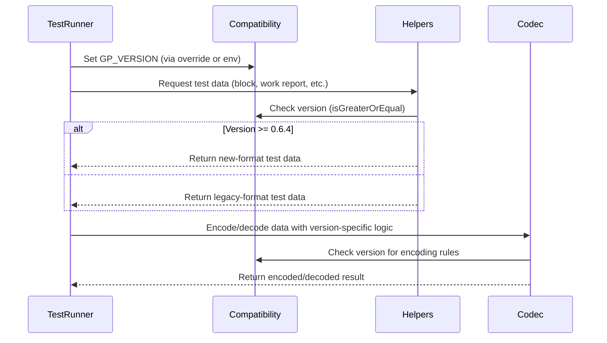
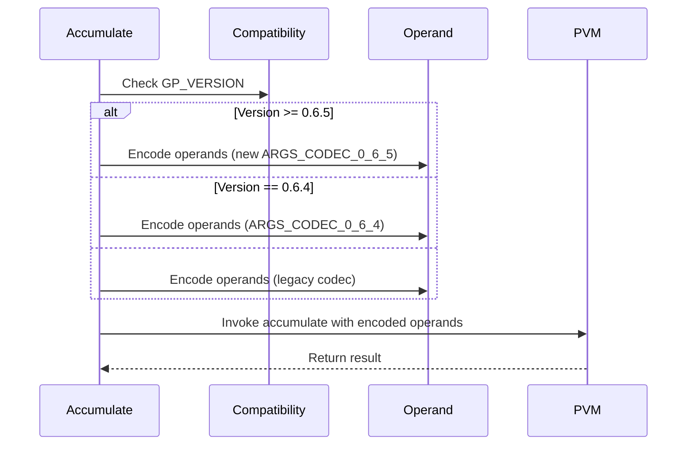

# Fix work-report encoding and bump w3f tests.

## Pull Request by @tomusdrw

Closes #484 

We were debugging the `stf/accumulation` test vectors yesterday with @mateuszsikora but it seems they expect some weird encoding of constants returned by fetch.


## Comment by @coderabbitai[bot]

<!-- This is an auto-generated comment: summarize by coderabbit.ai -->
<!-- This is an auto-generated comment: skip review by coderabbit.ai -->

> [!IMPORTANT]
> ## Review skipped
> 
> Auto incremental reviews are disabled on this repository.
> 
> Please check the settings in the CodeRabbit UI or the `.coderabbit.yaml` file in this repository. To trigger a single review, invoke the `@coderabbitai review` command.
> 
> You can disable this status message by setting the `reviews.review_status` to `false` in the CodeRabbit configuration file.

<!-- end of auto-generated comment: skip review by coderabbit.ai -->
<!-- walkthrough_start -->

<details>
<summary>📝 Walkthrough</summary>

## Summary by CodeRabbit

* **New Features**
  * Added version-aware handling for test data, storage serialization, and operand encoding, enabling compatibility with multiple protocol versions.
  * Introduced a logging host call for enhanced PVM debugging and tracing.
  * Expanded test coverage for multiple protocol versions in automated workflows.

* **Bug Fixes**
  * Corrected naming inconsistencies for storage item properties across the codebase, ensuring reliable data access and serialization.

* **Refactor**
  * Unified operand and storage item representations, improving code clarity and maintainability.
  * Enhanced backward compatibility for JSON state deserialization and test utilities.

* **Chores**
  * Updated dependencies and workflow environment variables to support new features and protocol versions.

* **Tests**
  * Updated and expanded tests to support version-dependent data and logic, improving reliability across protocol upgrades.
## Walkthrough

This update introduces version-aware handling for storage, block, and work report data structures and codecs, particularly to support changes in encoding and hashing introduced in Graypaper version 0.6.4 and above. It refactors storage item property names, updates test data selection and expectations based on version, and adds logging capabilities to host calls. The CI workflows are adjusted for multi-version testing.

## Changes

| Files/Groups                                                                                      | Change Summary                                                                                                 |
|---------------------------------------------------------------------------------------------------|----------------------------------------------------------------------------------------------------------------|
| `.github/workflows/*.yml`                                                                         | Added/updated `GP_VERSION` env variable, updated `TEST_VECTORS_REF`, and expanded test matrix for GP versions. |
| `bin/test-runner/*`                                                                               | Refactored codec runner logic for multi-version support; updated statistics deserialization.                   |
| `packages/core/utils/compatibility.*`                                                             | Introduced version override, comparison utilities, and exported them.                                           |
| `packages/core/utils/test.ts`                                                                     | Improved value inspection in assertion errors.                                                                  |
| `packages/jam/block/test-block*.ts`, `test-work-report*.ts`                                       | Added/updated versioned test block and work report data files.                                                  |
| `packages/jam/block/test-helpers.ts`                                                              | Added version-aware test data selection helpers for blocks and work reports.                                    |
| `packages/jam/block/work-report.ts`                                                               | Made `coreIndex` encoding/decoding version-aware with U16/U32 handling and validation.                          |
| `packages/jam/jam-host-calls/externalities/partial-state-db*`                                     | Renamed storage item properties from `blob`/`hash` to `value`/`key` in code and tests.                         |
| `packages/jam/jam-host-calls/log.ts`                                                             | Added new log host call handler for PVM logging.                                                                |
| `packages/jam/jam-host-calls/package.json`                                                        | Added logger dependency.                                                                                        |
| `packages/jam/pvm-host-calls/host-calls-manager.ts`                                               | Added trace logging for host call handler retrieval.                                                            |
| `packages/jam/state-json/accounts.ts`                                                             | Refactored deserialization for version-aware storage item format and key hashing.                               |
| `packages/jam/state-merkleization/*`                                                              | Changed storage serialization to use `key`/`value` instead of `hash`/`blob`.                                   |
| `packages/jam/state/in-memory-state*`                                                             | Unified storage access to use `key`/`value` naming throughout.                                                  |
| `packages/jam/state/service.ts`                                                                   | Renamed `StorageItem` fields from `hash`/`blob` to `key`/`value`.                                              |
| `packages/jam/state/state-update.ts`                                                              | Updated `UpdateStorage` getters to use new property names.                                                      |
| `packages/jam/state/test.utils.ts`                                                                | Made test data version-aware for state root and assignments.                                                    |
| `packages/jam/transition/accumulate/*`                                                            | Refactored operand types/codecs for version-aware encoding, added trace logging, and updated operand handling.  |
| `packages/jam/transition/assurances.test.ts`, `block-verifier.test.ts`, `hasher.test.ts`,         |
| `statistics.test.ts`, `reports/test.utils.ts`, `reports/verify-credentials.test.ts`               | Updated tests to use version-aware test data and assertions.                                                    |

## Sequence Diagram(s)





## Poem

> 🐇  
> Versions come and versions go,  
> Storage keys and values now in tow.  
> Blocks and reports, aware of time,  
> Encoding changes—oh, how sublime!  
> With logging calls and tests anew,  
> This bunny hops to version two!  
> 🗝️📦

</details>

<!-- walkthrough_end -->
<!-- internal state start -->


<!-- DwQgtGAEAqAWCWBnSTIEMB26CuAXA9mAOYCmGJATmriQCaQDG+Ats2bgFyQAOFk+AIwBWJBrngA3EsgEBPRvlqU0AgfFwA6NPEgQAfACgjoCEYDEZyAAUASpETZWaCrKNwSPbABsvkCiQBHbGlcSHFcLzpIACIAMXgAD0gAd3wKAGswf2400LImWngMInQMegFHbhSAZgAzMJDEaPRaWn9ERGlSlA7gvxIvaiiCMNgPfMUikvx6pgxEXExcZH9cbApycvlcMcgAA1qSXAZYPcha7AwxeHwsItGPPYXagHo0BgZHb2objDOaBaQKRiNKIDQwXbYTp8AjMKFtZL2bACZjqGj0HaoWwAGkgGEcAkoUQALAAOABsuMw9HUPXQEm0gwEkXQoVguFw3EQHBeLyI6lgyI0TGYL1iXmwtVqsgAMipEC9cLJuCRCRQXC9uN4vC8yeTwe5IEpEAwKPBuOJbnj8ADRtQHjwKIJIswUmhkPAlBhxLV4FFaOspkbVdgiPzivx6jtHs83h8voNLX8GoDgQQKMg0F5bkREJ6PJgbWM+HNcGaKuncQABZhDKEALzz6TSaANuwBoTToPQ3BVzjC+EgJASKrE3UuUOwWaHV0mEdqaVroQXMN2cwWS0QuOSCBOoyxdm0zGQI19CXBAEFWupflmvLJcdHrHYGNnOh7eh4zGTiRojPpjHAKAyHoGYcAIYgyGUdEFFYdguF4fhhFEcQpBkeQCmUVR1C0HQAJMKA4FQVBMHAwhSHIKgYJFNhvS4KhEQcJwXEgOQFCUKhsM0bRdDAQxANMAwNH5HZkReVIMlqbNkgVChuAYMASAAJhIDRZGYLwOAMaIdIMCxIAvABJSDKKGegmNrFiwJOTBSEQNxdjICR4CdDBaM7Zx4BUSJkBXB0AHF1AACWRAzrluZAJPSKT8ERDA0DYehoiERArTkhghxUlNlmaZIiUgbBuFoMzWPkNBrwjNA8RIREGTNbzHn8qwAH0ADUAFEbAAZUMgB5AA5M5kgFB0GQlR4AAYNH1Yk9nBfrByLShGFgWyuhGJ8opixFs35BhcSEQRg19DAbwi3E0nsGguRSfLayUP8jD0ywLy8GgqN+E9ByfJRX2cH4IsjIcR1yKJLq1Zl4Ay9gb2kIwFvIbTdIMCAwCMYSBTErbpIVRAKAUjs1I0rSdOiZ6DOMijoKiCznHkazVuKOGDENQLcBCgQwqTSK0mi6TzkurwinESqymyoNVpkEgyAKoqSpGChLhaQok2nDtYNrMpIpGwopSJb0Z2c1z3KBTyGvsI4RdzcEutHeBfQYO8H3QWp3odYckCt/YMG4V0OzOGjqVxX0pGqxF1cV+ZIFW0PCRl8qlFoXESHeWALY5IMnyclzbhNuqvOZRqWo67q+sGgd0CNT2ijHKQM1+U3xsgAAKKaZtxNuNAAVg76bpt7/UAHYqTFqbB40CaAEpWJIFdxgSUQ8CDPYfb9kI5ohVBhxoLWHQ7IMmDrtBSAruE3vNFk67zQGwL2Jq2s6nqBqGgV7ifRAEo8bHYsgQ6BEe8wL03rQU+hXH6ohBgfRvvUYcOQKAwXBsiIW0NvSw3sgYBGqkkZkxRoJDGokBDiV5ttBUXYMxgCEAlAM8UiaaWweTIyJlqbmUcJZemsxGZ2Qcl/Yh/Ns7G3YKbeqhd9jQHal1aAD8ADC0BerdWajYdqsQhrullsVGCIwcjCwrlVcgiIaK0klmnZuexiS0AmiQAAnF3QeAhLHkksVYwexI0CD1oAIQeE0ACMrjaC1EHgwYqDABDVFJMSJSpJqjmLONkQYDBl7VBIMSckqgu7kgYIPLuAgvEpI+CQSJxJB4kC8ZYgQE1wm1C7hY0kGTaBKQmoPPYk9LzXlVj4Z2uiaqGxzm5QR+dzZ32Lo/MuL8dijSzH0PYndZpukzK0Og81FrRhLJw9a31djfx2vgPaB0jpKBOmdeYF0+ALBIDdPK/hID3SwU9fSr13oAyjhtXYv1IGPOQGBWBoNQJ8Ahsgmc4Q/ToKgO1DARtc59LNiIhOdAuCDIfqXZ+6cK5TL7jM+4c0RKCkIZs0hKFQQUKoZcVs6kvB7BRpAUF4LekG36SIwq6jYWiPEZIjqMi5FdQUUogOqz6C1CdK6PYiTkmpPSZk7JuSGD5OqIU4ppTylKUqdU2p9TGkorMRY6xtj7GOMsc43xHjvG+P8YE94ISwkRKiRNM4GL8HYqIZJHGLwyGIEJcwahJKNLktJv+PBWKsa8NinikE5Dkh1FoSTXSdzKZQSojTVhdMgY2SZugw0/CIW0qhSyPYYiJHSNkfIxRyiUBYCfGzDmXNQGbP2HagNjqg3OvxaG8NpKVHIAZSVflLANaGPdGnIVSSUkCDSRkrJOSBB5IKUUkpZSKlVPySqhp/xBymPMVYmxdiHFOJcW4w1Pi3EmqCea8JkToltlQMmk+aA9ZiBPLsRAdsHY9tCGBJ8BwJRSlkEyBUHYwAupiWc/AeZ0zbFWqEC9YwGDpDBngI0gYIybUDYiYci8kyLP4Mslaa0voOmrbtKGuJTlcmOQob0TpfDbVupc65ACGHAKgU89ZHhXn/W5kDL58Cwa/KQVDAFaD4a3CwT63BaMDBqAwIqEIWRLiUReJQ91xKXgbhoGAbM5VKAaGWJGsm0amFxpYcxdhWGU3cOMyfZgkxfTrV2Hsd4TBLi4GagsFspAzhoF7CBZaFwrhJhLQ6PY6Qii0AALLue4FMM4ggRBiDbB4bg/02Bu3imwOkl6ohdsFcyQQy79hjWCDlrM8AiBYGGmMp8yWD63CkKgq0UIoj3CWnwMLnmMzgkMvMfMDpvPhQwI+GzXV0zHxIIZGgzBhT+CGAHO8dIO0aMHHV7oUWUIpBGrwfAKp4FAv2AAb0gNB2QXAjG4jyx4AAvja+YNBypAz2Lto7rFsyc3O+elYs9Ii3srmlvzsAf7v0GyfdQJBXQXoimWbAYg6DJxHMg9Q948QJUzrsfbpR6AnfOH6LwtAVjUGLHaLAUIgxVSpmaDKRiUcPcELF/ogJX27G675/wtYijtquLy3Eqx1inUqjwZw4hpzKY8LNr+I1ytdOc1QAHo2UhUA8zSLApE9gAFU5Y0AGy51SnRcBTZ8I9O59H3lgJeRA1joDPkg04z8zwkMUGAuZlABaZm1kOjzMV6g6wuhm7gQg7j1u+PiC6BcjwNGIRB8s1DR5dJhaUHir4Z5jw7P4Ac05/7JA3MebKF5y4PWVuYlLTZwLZRQu9gi0haLmh6EiaMOJyTCxpMYFk2G2omnuT0N08TkqtMrIcOw6Z+AzAvc3YuD4KRq0ii21EGcDL+wqxKhVGqDUcxfREDbcrKIWYcx5iUO7BI1cIx7BFrIEf2gMDj4YBvQ0vASDOUT4gOHsCYfgbKJIT0U5fCYQypHSivlLpPmiAf5oNk9wD6ogVGHgsS7wUQbEnSiIYwXgG25wWevmew7+NgMmlAiA/wYGkA7eton+6BAsfAAgRYMQ/+5O0QQ+XgABo+WAwBDAYIm8vkiBDciw0GmY5wgwEg4MCWRwy0zcf+RQsgzQl05B2o0Qk8hGAwKEd6HgTA6o0gOQT+EYgBNBo4I89AHOGwmY8u6oaARmeBGYOeac8WOwyAl+Z4kB8gyBigogLwAAJNtlJGgJwRQKdi8G5mLATghrsGFk6LwF5DQPYKOAQZAAAFJdQDTBjQheRCz1gR706fRU5M5YD6GZg6HyAYA/w1wSjGjO6X7XbtDeDLA3YoFoEZh8H/6TzuH0BWG/SoH17oF8EUFiEXanLXa05xZmiXSrQUC0CYRJSkHv5+ClFghGBXgqy3jtJ9YyHTYjB7BJEr7byeb0ClZpykTrZsZLZji0H2yyCE6QBCw071BFYZH+AYghDo4+Tk6FD+AhpAq4gZGLDMjyBZHYCFDc5/5UBSoKjNDXFNplRixnziDcAshhERG+iXH+CJjDCDh2YJhDDZRbjoAfAsDxanQWGfYsAmz37H6I72iwlnzwkdi+SMhwYeAjATBvElBIAODSCPQO5paRR3TqaG4eBBbP4BhqznH6EIE+am6rgkAuT7HbK8aEiyC3AYgICvYLCKxiDwYlDUgOgJyHJAzHFpDDDnHgm0lPR0YPJsZx7Bh/QMYfIwLm7e5W7/Iwz+7AqQCxBMFWgwq0BwolH1FlGOHOFcD8EYCCGQAAA+MQTRlR/QawGwhO2hVAehwxwR78j6fo9AyhgRIBbpl0GK1ev6+h4k4ayw3qyMqMVeRQNeuAdeDedQLw7+pZmJtwze2mDCMapkMEneRmDJpmmE1oiItAsgFWjs7SFs72RRT48Z2xDsEedWfKl0FJoZ9Av0c4JQAg7oYMeeHgmpPOOwbWl2KcoE9QWYyQuh7aeYe+B+R+Y+o4ewUxPJ2eewpAuAh5J+x5keZGig4O0JQZnOQ4Aoy0++Ah15p+kWfABw2oX5t5SgKoih0wJWYwmGT4S5xhacpYx+yA0QioAhLwQhfACFFByFbW9Q5Ab5JyyI0pQYqAC4lwSc3QlATofAqAOwToyQGAVOewkcUi1hDA0A68Z5vmdWd6qATwt5fkRBYy45osk5og05/AG27y7OZycSiOHRV+NwUI0czgvR1h9AC2t8B51B35tGeuupoC+pLGRp7GppXG5pvGlpQK/4Bk8y9A0B0cAw8B8RVoF5RwAFogzcmpXA+FxQk8XALlZ+LcY5QQkgWYgis+JA08KZ+ZaZpRGZrwZZNElZWZLcDxwMXudAzSFKwWYewwjkO+CwQYHGMEDlWA9FlwjFv0LFCwwA0Aegzc7+PlTFVVegj4IQXA0Awc8AkQHlZYUwgZEVEmUVLpMV5Zv05ZrACVGBFcC2P0HZCOXZcOnQvZUQA5QRzOV2G5lc5hoE5Af4wmuZYmkVUm6ZjeSmiw4geVdBVZreL0tZzCSIhmSaqyqauwfeA+Au7kjJlysC1IT5LxW+SpbSYQyoXQCpRVr2UJGIg4shBYYsY0no1Al0ym1cdBhGMZc1lhjF/gA2Pw51GBuIewWNZ14gdBAAItQGgCefsK1IVuomkATUjbjeTvvi4BeIgFYJQBjannRRVbgATanowIMB0AAOTICgn9SRGUDRHwCxG+YmhjC1izJXJZWOnO5TDZqI042T4Y7rWhX7AhGpQn6nX02k2LAr7gFSpbBhCpDoBpGIl7BjSIDNSfDqjJ7UATUKl21ZgO0C2ObKYM18WrE203ZU1Cw00UB00a3ggY3tAKGUn3inl/QdCOjraUBWmgFqLyyDj+BSTLbRidCO70GGj774Dh1E2IC81nCI0ZSJY/bLGqL+DJBmgcgywjDrhg5jhvrq2l2a0DAqV7klD42G043G2timgpw0AU07hQxpwZGIjHxED+BEBDDIBO3+AGwKmX7X7yWw2h1XTY2l0txzB1wwTORVRM2yAs1s0UDB1w3phNK4hFA3iFb1hdBQ272E1QyZhaHW3hnsb95Kj7Ac0l0f2RbIQfZ5jP0W39nUEJkMDC0KCXL2YGy1VVYp1RAn37Bljn2s3s1ql33k4P184xHA1YBA4WjyC1hVB+TQjORfFU4b1yWZi9hOipxJooObbc591q2D1d2l7LbbmvYWZSC0BU7tAvpRi7DV2KD9BJEs5pYkUaFc4lBPjiBsC342jk4r2Qoh3w18DqJVR5ioiQJw6H2oPCOAIGT656lMYGlvIbEmmpWW5/KmWoJWkWU5ohDl383ujciQCQAGC+NQBH5MzmSG0ZQHACp623BnBrYbb/1T63Zv301cCRMG170f3D0aAZYpO4gaC5OQDnYoq7b22O3rAUAu1aa/z61aBpHNwpPX2h1AMXVZP63iGNxe3ug+2nU+MpSVnODhm1P631M6ONNgjNO3CtO5PggFN+MBOQBBOkBy4bhXAdHJ2bZdDxOd0f0gDJP60jPD05Ye1eAO0r3lOIDbOQBDPpgjMADaAAulUblp7c1N7ac+c5c7Tdwx/Xc2cDM7oJAMroyiEz8FXUcDXRg8XZ83Qbzc3LQT5RpaoW/SQK1R46dWFVwCM54wrJJRAQVB/CfLfCk3s2TZphC2kyTWTaMjBaDjKb5rfESybUCF5PsPSyPRNuPbiwfKU4Iuvf4JvcgNvTo4kzjbiK/Zs8jeTqQ//dQ1DF0BQztTmYJPFlBkNgqFDS8EvEc6NcYfAGoELEqJpiEJdT6m3rGh3gml3vnaZurC2fw4rbrLGRXIzvgKHO2Z2f0GAC9bkEGO0bBNq7q+oOQw+SyAqb8WOJrOaN8LS+I+MGCj0nnFmkXAik/INKua0SRco40K2biwWGHFcqC1I3sIxf3j8P6/q862RfmM3IGSMJrvwCWJEP2E+FfA3ALlGSEFMC9v0MCRAdIY6LJTfj2GtiwzuPlFnLGwIpmsIiyLa7WwqU+BZgGNO3XSQB6/3t8oYZ9qnCuxUHlRGEEJQPIJ5Uo5nW9jnWuKslTt4ynaAozsfs7p/MdhLdKLiaEIWyiSWx1QGxoEgFWwBsGU8orIuT/jlaOMfegb8LiBWM7kcIVHSAY8CfbA62xKGxEPTHXGaJSQ6CKH65+//c22lDjstDsKRJCbsRGFaOmjSh5FO8Q/QAu94GAQMPgOVCMbckAjpYDHpcbgZZ7uu4gr7mZXbpAPSY9RXAVcZU4zbgGzYyboDIHlcsyW/JKdlBcUJgq6Jkq+kCq+Wf4Oq+IJq9hx+3q7IEa1GtdXpma/dQzD3izEbrUGgIUUCOB1aK3UsArXI+cAKpTRNM1OSM1DMrMa1D53513OfjZlIorjYIov1KysMkigVQrQu4h+ll51VK5wbCMFVHCI8dmpEFrvg32UDQrV9RnhDegD4D/HsMRbPEUHQBvBeLm2kBxGvmkfsBeDKDKEm2XJyoZP1M1HIsTZ1CvsLE6AGObY62cu0Nyz4HtjPVgPh1HPcO6FKiBXWxxHRUWzh8ZwHALZFKoosaVxu7gFbXookyCzsIoD43sOW+qPmBPbuKsRVzJOnF7JdDdxh9JQA5F9F7F4iuXPaJHCoyQGofsEgP5Gy5QL1BQO1EEFmPd1PStKIOkB6NG4wFy7Ss53cMgPPWPUR4zHW0OLD7HjCTA8l6jpj6VL655F4QKb8kBoch6AuWt0SOT/XFaAcZoCHqD4gOD7jxQFDzD6/mcJIxKdRV/WRcmaj0UFqJ2BT6gMlURWLEpx4OkHN052z1HBz1Th7Lu/3UgML/m7XcgJEK7AVKzmtPQMOFKhaMEaiCcQQUuFbFpexyApx9Y/pQbrxxbgT5J37uZRSvM1EAl3sIN7EBeIrjKL98m5Pl53fNwK1JjxoEF75/5wc/5PH4n8nyF3NAH7yilbkF91F+1DF110ivE63XM998X1H2XFwOnwnxrwc3l5X0XyXyXMm3Xxnxr76Wb/srV7QDn1AGMUH6afsBX+151+39181L1/1zYINzYJ3w39fBgN83+EP1ZWd3mxd9Ue95WwtwAPxL+Y/eVAj4Ceg5YJ3IBvvFviCluyCD+WWJxb8i/c+89DD8/Q9E/NwLfH8a+n9EF8ADbZMC3V24AN32d/XDg/3lY4I9qmnbTmqw1YKggsw4UzjpnM44F40VnbvCZls4yFVkysNgqdwS5vUQq1jPYPALsg6cSAenDqsgIzznhEqmpFGqIEQ5o18+7DeUjNwKq+QvOb6DQFqyM5fsUowvINqpAYLKxlSB3LHNBzEYFR9O0nejhCRXbidIGynFAUkGYEpAHufbPlnDl+pRA9gSgCoEQA0AiC8a62NAPuzMEM16K0gQojYIpru1CYIg9DI1iFJ7QCepYcjOwUyKZgb06IZ3hYw46MYHQHvOxhwLNK+9BO1pYfpb1NJwoEuAAKk87dpogAgwzpAOM42DogAAbguz7BKB0gagbQM1YaDm82ZWAYq3eBacqBiA/Tj+kNZaYrqFMCzvWXNaNlHqzZAgZ63gS9s9gzOUDpPjtJYAp8T4bMF2X2DGDQwjgu1gx3Jxm1rMHgI9goEoDxIrQt8d4GsDh6M1YEKEOro3GCDawxkc1HDAMPmBDDtBzdMYHnROypEPA2FTDCvG1BnB7eVXDPCdDq6dt8A8YAwsryHDqhLoqjPFjIWpbg5fMzOTrG+iUBnJBeOwoqnA3xA+B1WHw/vlTzND61WIVAVnCwPiRDluyI7LAKPR+B74thr+YmkgG4APM9gewiHLQApEPpJ8wHAsB0GvYUdARfAYEUNkSJh5HYvmMgIzC+K4ZdChw4GpcmyBTdvQa+ZAEe0Z7oBWRm2K0PZw6ru50IHLPfIMJQgtE1qQMeDiyFGzdsAiKwpgGsN+BBD7krvUIeAkNKe97GfHH3BaRcb+9MEFeOATUO07yYXgWWKDAWTADejMgE0MAOSDAC/hmhxrDAaa3aHYDLWBgBrqd3VhLl98Umf0WAEDHBjQxE1W1g6V7549HgRQhUJ6P9FnAUOaQEzhIKXI8DK4nDZjLPAc5vQroZoJQrcEWAP1uckCE+GMASDqZ4ktYXwHowpz/wueNEQRGyT5HWZ7QmIZAP2NtYsEZYYw3YAAHVVQ1QG0onjKAR4yy/omwVaEJhc8lytAfAF0GSqwUluXpNip9BFa7dpAJGf6hMQ8EikSAYpMWAVURyoBOxDYjttqW0qWicM1o2xqbjtHe9+Ojo23LEM342VEx+YuTAlC9ETD0gvolMWmJDEVDIhexfZHWNCBHsuAvzGkaP3QmOdogwAdsR4HfFHs9A0QSob6g07uiqBhYuCQhLgloCaybQrAWwgeo2c00eE2sY5xWEYooJdEn4fBN/RbjEqtrRYcsRGhVRdYhwVemyGHCKRZwz/f0UaDJofjigVONIEViKD85uqEYGcWgGgyjC+BNmRvOxBsJbiemIAkINuAQD6jdgp3XiSeAMlzjjJjwUyWWQPywTBJ24qyQsDcGYYWyl0Ycd6A+r4CLewMa3suEuizZPuwU0IFi2zrt17JYuRPPjA8A+t1YejKnF9lSiRA4cQuXturGUn9iRyfmScXMMiDmjLGuld3tx1tGRCJOPGKTq4wpTtQuJ9nHibpJKBo4hccuQoTROKECSfRwkxiUwNcn7B3JTFLyVBh8n/Bzi/Y/UnsEmkjVPJFk/WnNMBBZTXR1Q5VrRJgn+jfRsBDbGCDDFmdWhmAgzGxOs64DDQDJEtGWAfJSp1eK/MAGgG3KXIFqKEBuK+nmmqTeKcErQssV5hdtcgMgOcltSp5ZDpOKxKsajWekNxm4Wffzs0kgDtY02QMFDvoLXacDycnheUvYFVpklfpiwVTvHWsJZtehfZK2gt2NIqdipqkudtTMx60z1YUUEGfAhUmLA2soQBOMgCOmZ5eSgMJMQsAABCcEoKMOF/aM0OwC43mDYEAzwIJZCQKWcR1CAKNFSTDdbPVACKZTVJQFECN6zAqgtcxaPOQhj276oAceH/AnoEFfwVwkZv4LnsLNwBizBJUs5wSEFdlQZWofoZIFLNBrW1BcKuJ8lOS3xPh6ZJM+cR4AW5gBPpdIumXBNspJAVhVEXHMR3lzo4F4ZxTaapMplU5Tuzs2WRkHlle4lZ/skYXSGzFQdkqsgI4Nmz6nlTEAp0DzJzyIiM8HpY3F+uKUOTTh8MGUGtoVAHyAkL40c5mUDF1kkyywmAB9M4HYD3gqpIQ38UbhtERDVBPvJqX7yE5xCGpfKCuc7K9npAy5gZBRnsRjn6yM8GXc4hHP0ZdT1+kATKvaxH4ONzxjlDsAfJVmDhQ5i5WPm/PFmSzeqa5NopuUznqkc5JMvORlSVo7yX5xVX+YJJ9k1QP5BpcmfEzgVQYj52o9ckDCqibUVO/YiBRv2f5ryiqGDEIEXPSAlzcgGC58iGW5xnyzknmS+YCDZnZAC+/Yo9jAKolGB+J+0+ib+iihZAFZhZJCRmOrIms6yrExNNdK4Sxjc2iY/hbzEEVe5UxQY5CaJNUTZjqu/JfqbtMGm8LBJxYlyH8U7YVjTSbBascdAwlqSSg6XUICeMUaVxswEYTsd2L7zTgTssWS5PLxhKtI7xfc4OCMMRJjkORClMoELAjAjdHp9WPPIRQ6okBchKATCUAIGDyA1szkHIuVNIldT5RiSqcdxPrEFUF5P4lkjJx46ASohG8mIRZW3n4SClCQ/YAl1qWhBgALi36G4t8BkSChFAgaQWP0XDSpMAi1hfAhUXpiKh206ibot6WigDpCijIEotyBMTxFt1BsuxJunns1odrZLr2zXlNLrF+xQHFQF8D/DnZYAQZUIpQmal85YubJdJPwJRz+AmOfgOQEp5PgnWY0IGERRLARRUMkgDwM/SdBYZPi70ZAHwQmhgqJoYhVkLDNYFPocgwGBuOQEbYSNPQtAFkD6yyWNjTBwnJZLjjun6ljRzYwRJdCXLSlwR7uQOQpwehfiXeBlLjivIAnQLgJzjUCRZRE7YYSl4QhlWvKZXNSgUCS24HDibYTJ0pqPXZWvJWG2tepnCyvAYB4XTL6JZyr3IsojESLLpUinATIsNCUzEW71NOr1IrgGDJBANDVtJwDkDDEAiuHJNSMwYs1Fc1QJSDH27TlYCQ+BIoSDxv5bcA21I+vpj0dV+xIQDQnnLoroo2rEAHNdrEoASDDDBZJWDRUc0HCUyUuTq3YBMOnBWExqtFEQRVJuTtZ/M5CyhfAh27eMzJGUPvqdCTCnkBKRAF4KHKDB9yoyNmKGhGuHDd1HltrDziMEJCkZxitwacLOU6AQz+yEAnVlAPhmOUfVGvJPsF1T7ghYgl0GmdgQh58AAqdskYNMjxpNqGBNqZABSToA1rhKz/DRUIgLiRBVMZAIgGMjtVKR7pJAUgHwBhkmNu+Ac1WY3BvrQ04ybDeKbsBOxcBa1EYDihg2ZoWr7VTg58YpIPiQZkeKAVHmjl9BFFhYJPS1ZSFGDUVQyAI8itBsSVGhDxyAB4lMSJGfqPQoQPGYBqwbhqt1s6+dWPMJD8x11DoTSeGGnCbVY5UtDwEhtEpWC+ggxVACOUehtzHc900bo+X5aY9Xp700Eb9FCWoqgwfkKwv4GbVRqN2t43tb4AFa+ZyS8wclUOq8UMDsNR49Rlb2lgSk2NOSPwBssJEzgCgUwGyXEvK7SRT5CbM9cUEvX2qu2kow2kqMuh6JloNM3XDSoNx0r/x0CRlQ6OZX8YKUbKlNCUpdzxRgyHucpY1IE5OiA8TJB6FzyS5Dk2Ms8m9RsDVjWNBiZa5Uj6z2D5qhFRajoNKrdGTLoJooeTGAB+y15ThLwRYrlr1ZApNQvOaIrHNRZgB3EBrPyadPQHnTIxkii1k2TwEqcWyfEzrVmG61DBet/8QmOovbTByyuiwh0KpRg0Jt4cKWPYEYkpb7B9sBQ4ecCSJmAhHY74foODQrji4hsSJL4scIQBM89gF4eMASVVyUAaGJANqe9BjxoJix0gU0Dqw8Bbi5maQaOt3OKBx07N/QGSfkCdwDDRsB/DQFln/iRBnNpwNOh2pXSA5mAyOjxejovWY6LNXZT4ImCDC3aT4Jq6Wg3DkAAhspona9IcCSkyV4sDGXUSnkSVA5ES0YQUszjZF3BvQg4SncxihiqwzQ148nA4AECdB92BsCbLQHEiN10pYlNjG/EaCXgFRbGeTvqpbqQb0Ai9Vao83GiYKgF+wVHWF2WFA4lgD4mODcGXWo8iS0jOCvezYDBwfhJGq0CLv6DlQldgOKXfFC5A/ZQghOsZKsAl1jRIOsGcrAjkEpJ1YmZUPJKyIhne7cdoU+BjcUKpBSIonsfICZ2pXBDilgW2TlHC94VKktLKjBIJkq07Tahei2rQlHq1AZCyTWlrX9qtIdbNss2gXAtuVXDbVVd1K6RquZiGhX+dg7tlKih5jE1cEuEgAC0mxlSbMVgGbV4F5rE0BA5WvbsgAy0OssWyWMkrsDZ2fw3Y8TC3SihOwbwo68hSHUQGh3TYs6+sIUZCLDkSNDeeq1bZNTzqHN8sJadGbfAt0tIe1MeaHUOsuw0tvpqPJXMHJn3cjNc2uXwO2t5QIReWDDaHbSGJEwRT6MB0gCNiBwHaYm17LoAkyMRcB9skHR7Pk1A30AZ6WGjA10FpAwyEmZB0UZQeyndyAaJwJHsESRG+BPawu0rJwb5Sx9UdkAAALziG8QLw8/cKrEMSGeDlu6nHIPnZv7/FJaV8K8Rk1skaeJaSNdgpIa5UvYQuBYdi3iTkcmsFUJRpCGDl+Z98kpDQL1N5oaARdFNW9szjN5yM/Nhe2lbVPpXBbuVoW3lUJ2Cxv6YtbuS5L1LhR+EGQARRYVPtaDYG59wc5uPtnRYp4AA0o+PIOCAuAIs2QACFdmcw/SPBwMoACTCQoWaGiOMcJ9JAOI7QASPz6aAyRx8akfVwZHnYP6yALkfyMUGij2oABV40Tp7Bl9Xe1fai3X1dK5VNWpvY1rvAKg29hWDvWzsIZzaVMfWrMuMu4U9KatUxhrS3tmMvBdofexhBdMH3qqYxcYrpEoMeCHHEqxEe8p3IlL2gXqLodgGwV2OMBpsjMVFV5kFjbJwwJQLkXZEMJLdrArUYLC3CsBOhZy/rc6hcxcjbDfAoWE4LV2niUd3IdFGUNsiCjN6pEd4TfSgH7wvGQp/mbEwsFxM+Ago1ISIBQAuzvR7OT0hUiRA6DHE18IC+gO8bmo6HhwQMLxGCo3b/LBwi9Zes3u5n3azkRRU+po29BdRPtMrQyAP1lgucwR2eEYPmFQTShoOFAL7aRhoAJAopfAXaKx1ulqkYFCx54nKLfQoZPg7LEXjZr3AK6ZRV+ZQL4AXq56+AdwiuEoHeh28D9HgXaPsSdNeBHwzgS8nstTW+YFSoe2ACD0BPLDsl4ZhuJGfPUrlUZPMirmOJPBA1rKgdPyMoxDN1yFSsZy8QlHCw09BSUZnDPar9G0hLgMW6JTQDvX0FDIju/M5hMWAcyE47QD8NaAwBgABT99EPcxxkF5mKAoZlYXTvWZec2AFmFwAktpBbkdyQpFjg6FjOlRbQU+ac6WPBAiziCE57+ouey1fyhD3aRXNAFiBgBSQ904XV1NY7xBgDzsWkIaY2qLhqAMEVc79U+7SsnphkYmriH9ORApAQZ5Bc/3bOXkQeR5vNh0Du0kaqou0O9b/sWDLN7ATAFUGV3nZiDVO++sgrsbACnCACQwIgFufS1v6FGbBdoEAKEZJ1UQedRg9V0+ED976T+PkUGAyIIF4EuOKwGCeBg/Kvd10e4WEDNBhgWenhi0d4bCF1TV5RlRxpUuS1gTn+V/fYJiaICkmryeJgk6dvcjLwVL5JrwJSbCWUAJjWxz0XVpwtNabjmYgUFpFmaQnVm/9c4ZGorp1yRgHJ6bBoMgC8mJo/jP5jZYT37AhTjFBYI5fimDgBT2Bd0F5cCbKn0wYpi0MvClM81ZTUqeU+i0SvDYB+EV++W/twmoYSAzcZqEKbr7uhGKDmSgBJVzBcBDI2lu8PLP5CnIMwuITcy4AqtVWfAwRmc7IFP42XqLJAYAHRbRF+krAEgZgG1J4sYA9ANqQk0DhhjaG4Lda4UgwA2OyqjLMEky83twv7GihPksRSquWUdDVlMi7eTZXPlegGA8gdgCxFzOH6BpMQGfEDXnyyADjfxygM0AW4xApoU0LxM0H+HHX8gW2ToNnmK2bXLJmtFkJdceC3W58ZFB66tZmM+AJqm17FRhlxWidTwIws04RiB0WgglnIo4OVFUnycaMBe0SwFp8NBbS9CW6SxXvC2YIa9EyuvVMs1BDXpjexuGy8FMuzGwAmsIbBQCOM3V9MpxsbV0Im1fZIlnctgnBeWirVMAT0k0MnTQu7B2bcN7NeTl5mVwp5UqM9YBY8EAoWIz+30/sBatHNQs8UO9cJCOAG8d+4IBcWMGSJHAI9exFyzNy+PUnKeGg08q/xoNPn+y6PTCaldRm/mHQ/gfdqcnZPN6PjM3N2+TifDO3KAcDBS1hcZO6bCQc8GhQ4ujtUmNMXPBjdpL7FGKxw6s9FRneXXaL7OPgWclBiuTUkJYRdukOJJeXKdZrEYIjALCe7olXlMHDYCJeqlu9xLvh8myFpMqBHrSkWoE/iuOJhH4tA96IbJeylgC9ghtxAMbe5sPN1A2+rK5eWbi7GdLCmrgIbYU2n9Dbel74zSed33As8efIAuPbi203Nj1Wz0T3sslxhEGywXmyxLVWC2OJRuKIk/Qjz1qqGft1PaNi32w6thapMrg4F7AF9y76Qd6R+tv4jrjOG7W5bJNCLhExaK4JcGDIHVPLRoifGAFbUKC7sxwotNzdIHYAG4qGnOtPWnVFuPllaewQlinlwPMADtAWR8dSIv3o4e63+d02PL0CiHIAdG92unwmjkhiQjD9XMw9Yf7bGaZ+qzJjh4dDhnAQsHzczKpwkO2d0IbtT3O7Jxy+y3hTWX4XhIYP7Qx1w2bg+76cGZpRgYmnKVIyvWp8JD1U1KNa1XR1cpDzoN6EeRkyt8NBm4lFd7be7kcZONiGYUSCfcGIe2R8WuYDwi570ftn85ZuUo5K9WEQFQU/lIgTn6Cc63hxr2QD8PBHaKU8sE77SpYUSeAKICRrFnOSlInMIxN63EYg5mA4mCwkaNtnw6ElfkFOBQBUe5OV+POpHNE9QCaP/Qed1DjkqycfLEgUQMnOA3EH8aSniANOJRRtv1yclf2dx8jn+FR5XHhQHrHTFxDxYjFEksZNAWMYQ9qiCRqRzqZxLaHkcCpDxVayK7FbnDXDx5ccsJapX8Tkqj/fEyuejZvmKKCR7PuYeAuEpvZB0Kdx2eJR/CHgEhxKLIdeO0MT/HR+pdBlp1sxA8yBxzPqfFBIOeRoPJgAjbk7bgIPV65kIQfScrHyPLu4vI5USWuVUl9eVTZamERnn9QJ4Cnmia+EU6zxYqp861MysNAejHlOFL+dMOAX9zIF7swldA41+i1yYw/f1odbg1lk7a/3t2vRjxthoH61cHkAc9F9eYgabNNU4NrwboVe6ydXm3A2g1dehWvqqgIWHK4p3XV6dZwd7AIbqoKG6UImqvXUUH1sLiRF8VWhbW1ycrhvihE5Vd8JQV11thWKJ41ZQOZ1t605GWYyO8pM8e4POtAoilYlv8SXtpn+HB7m89BDTYVfLXRQPetgBkEiBS1HkLwIoJzaTcuAVjK7d/K/ZOMrLpFI+9ZUzE2VWZe2yOPR8SormlT/hgxMG/sFed7Pxd8gFYscplOCupUC4gUGVQnwDH6CkJ/tlCBAMvIxdt4FiPtkMH/O8DOtrbGxF52/kZHBB+BLIASXXo3YUDNaAOaieyBpCroC92MEFJsOH+8e3lwhfXKdsmdUhaOL9hszTv93va3W46fqhENrKYsY0BLSfqQ4zMn3DQTJtj4yPZiR24IgPUkejYzgkhd6rm5Ju92ybhbplzypLcWUGjNMUJn+9vfgDfokWWYHPcXdfaV3OwNd35Wm132YJVbygOkFrc07bgDb3s41dkCtvcLTFCoVZb+aB9jNr7nsk2hgW4fXn8TZuAkGniiG9AkAc8Fh5XSaftPun88Dh/HczEV07+Sk0s4pH7OXAzcE92Nm485NcmlRG+0tb4+Vuet1boTwKRE8SZv7RDKT0Lg7cjb37nQz+2FL7c76lhFsWD3W98x/2EanOgqUDALyXPzbwJ57YF9Y0JGzgOBEdzGvBBbu9Bzsd+Eh5iLDlsHtmHrE4ZTwaADP2BEbVhyYpKeFSuxHutlTizaBfy1zNGSnRFYyfmDWws0SLpR2PZ7ml4V2CbLSwvuANNXtDGN5w8jBMBLXyTfc7FgdeFH+wPr/MAG8lqNAw32r2N5OxSvVqgHiQal/9oOhkcpU/+/F/89R3v1MhkQ0DjRDpZkye3xUbRS57O2Gn+weWYIz5ojfAYCpdwUsZZl04K5rh/HOb2CYkerGZHgt4ZWflUeqlEWyGijesahG4tHyXRgy78OUeAjJbtOsHlH28iI8dx37Xlv8w5fn6eX1T88amtIvvpGAeeeW889WuVMPn4T/W573ZvaSg25iZ272vdunqUX8zFlUCcVeEvEBuL9qe90C/Htxyx9bgHaxtXSxvNaAPgFs+zvo1tX6wCgZvy7urdD3qr4YLG8yPVET4Db9UTG9n7rfz38aFTn1UtkaD83pb+w/WeDP/idv+r5w8d/RyZD93yWv56A/0ZAnqUp6T61t8sH4syelFHT41ypWGfCpaXbLuCDeg78iktfGLHFzRLNTof0Z3Z/z06ki9pN5H2XsS0gTqb1ejn/Te2MC4xPTb9q62/62aAhfSy/m12+H3i/Jt5M0N1Ar32fxj1DUMGhnTcez6udx4MqVbWtZzl6Cp+NgU7FPJ0oWQ9DY3+kU/jVEz9YksgNv+kMm6QeT4G9//SwsLvZXY2Og/Afc559T9j2A5hfsAM6OTfDH/+sjkQNivMPfaA5mZ6Z4fwUsU4Viw86O6R+FNGBuXbBM2PyBikm7TnTAhSIHXi9gvzd9WCJlRcJWPZ06I0TgDgFDIl7NEAinVSsqcetTnZziK9m+8BGO9nPsLeflTZ9QMIPxo4dtWjjf95AfbHT1ddE9kSkeZUjDzBTkA2AqwmxMFBhhKyIm27srRZeXI8Ufe0WLd0fMt12pa9D0X49UWZvwk82/Tvx2tu/UX179uhdlVkJM9B0FP95AUqUy4k9GUU51pxV+Ge11fZt1kB2PGVmpErA9q08Yr+WkkgAl/fEVf8nKHmi5dt+MFgxQHAzXy+cs2Ui38wNAThwMDsFZlkv9TddajmgADVwL7wOqZRwfN//ejysJuAWQFiABUC2zBZb4fwJcBbAqVApoNnKfxQt03IUnWwggu2z9A0IZ3E500cdBk8DU/MWDoNcNLpDw8QXAjwQtpbLoBI0mDTIxYMCmc7zN1iDPtFIN+gkQ2exIAOUAWA0DYqjyCbA1Fj2A4GKrmgNvA20xu9onIwOF065QB251UsO/1j4QfWikt8f/FFCOC6vdXEO92HYAIl8eg06A1MY9O3gzdrKEwOXJftYIiCdHxQGVFFESM2gIpZwDrF4CX0CilnA5CMcHCD99R7Ra8wQl9HIBWOb8TzdxAyvwptmXGv1ZdMrHfgJlXcOLXcM8+KDiZ93IYclW04US8gSMmjA7FcD0jR8VP4ujaQAKMe+eQz8wFLPYHmCCgvml48G/e+yUDG3FQIFwxlKADppzuMFjSCMggVBhZUrFKyXdgeM92kBJQr7VBRuqaQH6NmQ1kMCCOQhQK88hgZQOsDVAian1Udne80/1HgHD3dowgnlzWZFHXYJn8hgmIKt8xYPYAAMKUSEyCoAiMfSFwyQkXS4BaPBIzuYe+Pq02BT+eWQcA3oYAF6g0jXEFo92oDkXGsmQue1ZDFgmw0VduQ8Tx1C+QxKn1CXHQ0JGAFsBb1G96vP/z/0OXc4JOClnIaFWdNcJAKocgHdzyTCtQ5ANC8B9HvxjFC6Rz2+dVEdgP6Bz/IolP8tsBUl0Dr9VbgnctaHxhP9zQ/+j7DWveR3oAN/Hdy39EofYBkc9/ffTK4f3Kg30Cxw33xLU3nacKN9ZwxgJ38H/BWlXoD/WYif8ueSujH4IebIMUA4GI/USxloY0DbpgyCci6DUECPB10P9BPB6JVabYHmwv9E0PtDOHG0Juw7Qg8Oyw2DMA3BEuCKgHvCDCOdi/c+ABXQFVUlMcLjd8oPg07CD/eJlAjzdQ8Ow8vfU0OFUN4EexS1qMZkn1ItFe8EzggaPH3vEMoUUnFIHgPOmPCng1jnMZibRH3zcylKexktK9KAHaChsa5yv56Iff3nDwgicMk0pwhcNOCyjVcIpQBInA06DhIzCLEiNwjRknCtaXCOyxIAWSIv15Ixz3Gxcea8PMgr7clQ7C7McUx2xX3Y7BkNBgwBRiC7sPtCyMnsclH4jWw7gKfDoI4/XwIWIpNUFRN7UYMpDWjcYMewcjAl0QACjatkM8UjIKNn02jGyPGgwo7o0EBKievw1CufGgR70QvNQI1cNArVyFtc1N9G9DvAq/lPJLyN2FXDEuIfxPZ/2DBjsNiw/MK99gItSnqjjver0XDVnJ8COC9sILDpB8ac2xtgEgoxjK9dgcqPfJOHT/2CYJuWqNsMkALQDajLgoCPsibsScXmjFverzkdmRewBH9uo9LypxCQO3WJUtovYEB9y2M4HS9T7KOCoDgmCSn/ZPuZHC81tQanFA5fldnzY4vDUjy4j6pIt2ns+IxGzxVsfUyPaBJAoCWJ8YhGgP0FMw6cDGiKKSa0JC1dZ7WKj1cb5zuglaGsIrcMogsnsMGhBsM1ch9ZsN7cgTWhyek5gIA17l5rViHBkcHIdXgd7+MdWKoJ1FfinUU+ALm2CIXQkGO5pYUtGpkzYYk2sgU6O9gnk0uUHE3AbYVGidgtIClGNNLsNzhzQWUZqAvBWoIyBlALwEWUMgZQQyGgAAATQViuoHqH8h+oYLGr5t1LNm8YWTLahFVLaQcAxUgwD0zMdyOI2Qgo1wYdTpjXrS2SXUbZInhRQHZBQ2O5rY7k1lEq4PWBOQhYIgHZBIYnU3YA75TiWflbFZlDzQJEC8DEQFEXqF6hoAE2IMZEgnpwwh2DCYjhwzY4rHnJLYv2KTk9lD037V5yV3VHlLHSDTvlOPJ7X8xc0SRETixENzDSIqQUnifRzrWQDgZ/rRiKI9BEZuCqgbYrykrl41bRzaR845k0LiLY8eStoR43MGDBgKTDh3FnY2mNHUFuPjRuFbguZFZ4XpN6Wy0BAbEWRMEMb6GJkpJGrnLULxOzVihPudWBNVU6TLmKgbeEYGQd4dOUVbYEXTxw80sAMcnA0IwDmLygZYBdWTsTTBUgfd3yH2P8lccetWz17yCjH5gSIejAWQRAul2L1uIn6N4jwtEFCZc44uWITjoAJOPagU4tOMMtOfJv0JgkBFCQ84p8HBWmcQmTFR0QJ4u8VgQuzBuBPkHY4uKtpA4+2NApwBdeOyEweJdQF5v+RmLNEHZNz1alcEkWINh8EyREVjlY1WPVjNYnWIvA9YwyANijYmLjcxwJNglJjUXVhOkAV+VO0NkuE/2OTkbzJeINkHY/hM9V9WIRL54RE1/GbgxEysgkSN4Er1QNniUICzE2TaxTvk2pWOJkTX2JuOagW49qDITOQxQK1DKEnGMSoYvZWkEwhwIk1wBe44Sjz9slNHBoTUuPxJWFMuZhJU0UqNhLSgO7BxSSTX0bhMsTeE91024hBexJ55hEr/mcTXE2incT0YznynkOsJMCfs4SGgB6T3tVSByjjjMLwFsIvNZVF0pQTANi8XtN7UjY+aBSwVJISEqBbIsXIeUKIR5emNplVmBUirVKY7B1XiPAcHl0J4seAhcSrAaeHJcXYqAVFNiY9aBO4ukd/FtoLwGwH8hOUKRF6hBuKRGahp1GZHdpnk15Oah3kz5O+SU+ULnd0+AXZO2Td4PpkXM34rP3kBqkg5MgAmoemLopuAIa1e1PgAZPaxOCZiyiYfAqRhoN9EyeLOsc/XtiKBcUiPBDNHAV43VFLDMhxLVaInBTvBoHLcJfVd1D5FoCHQKMyBgoUmQT8hvNPpwSIs7MSjFgdaIwNgAnQUMB+xo9NcDAEIML/27Q9gGUFvV3gWQF6hRUhU3ySZzDwHbxfAPYA1TlAMoAnpJJemNjk4ZfpFkTDU7EVoAQUvznRRsZObCRBsXF9ExxVHPJ0SJ17I4GtTqQRAAvAygfyCKtm9V4R/hW6Gli/oYUozANTNU7UW6DGeQsMUtVU06x9TjU5/xJTHwT4hXYALAYA8F/jHVVpTstbMQxR8SOZK6hCZNkJyx/TP7F5xg4RkHdwQeBwFeD4A2ZJJdRhMchYZ6wrnkpl+LDsMNUPVOpN/dhHLvhX4/VeQVw5ewsVJPZqjRNMXpk0mNI3Zo0o1IVN3aFNNtSfkhQxe0Xkt5I+T2oKRAB0DkCEW31qopJy3w+Uz+krgPaCgCvUzgZuCjNwqZaPgCLYOXWj96gSIFnT6YTVILpt4/OgUAfAL6UAtSU82BjkD4y5D5ST0l8IThgwFsUiB6ARu3lIpUsWBLTW07i2tMzRVBPL8kfDBKJ9pA2S2qVN+U7jjjHkuFH+Tt04FPXTGaEjMBSd0r5OnVQuYImpSsSf+KpJiqSY06T4VUTyQytQzjJoAKhO+QU8CUkyOxDyVMCCiN4SMfXRTmATFN6ThsMFB+FHkAoWZCpMgZL9U5PPYDUzlgLy1EyAid0A7IMoCTKUy5knFLkykwZuC8tfGNRk4AYAPvBIAuobMFwBsQMzPl85TZWjZD5TBzN8ZfGM9K4AVU99NXS7mdzI8yCrVwNStA0rcEczzrdbApCFQ3wlkBrPaMy8tOrAVCQAerIMMKJgAIzLxSMAVLLehcQQa2YAMsx5CjDyKPQEMBfGNTPJRfGAgC8tysjTN8YtMlkV0yeADFJbShgArJMzHMizNaprM2zJtAAs8zNStkrYLKlC3MxzK8zIAPzNuY+ssKx8Y2Q0LKmyIs9IK4BosyLLiyAsxLJYBks4AGyzcAdLNkzMs7bNyyhrNrN+AistIBKzqstTNz5wperIEy/Lb1M/T/U2gFCyArfLnuBFMlrPZZswr/Qmzogm7B8y1Un7LNd9gM9LbjwyO+W3l1bP0z+N/gzfA6IXQoPCytuMmzPLS1QokTnsDMqEhz45Aum3Si2Mw5H6S5k5rT1No8BY3a0kcsAEOBjgWAEUhic1rTQR2/XGLyj8Y7V0gDAQJch+dAWCbmnT79WeEf0nccBEvwxxS3DfS1UmdIBz50nWhhlvbM2VfZV0/4CBpO2AwWXpRON+CK5MAB4nEpR/ERE5VzodSMk0oQO7S6cmM0SiXT6CMYhf8Rox4FDVZs90H19fMW1kTV4PXuifJZ2PxKFMWDZuC8RsQcFWngKOFhjoNQITVNfCpUCSgn09iOKToAwABN2mz5RGLXRMhxRnQCETcm1L7Yj9CtU5kqoS/DTyIOFWxm55/S7XZSc/LwXfZQMz9OThNNRhPXBc9PVyO4rDTnMXSbU+XJVACuYU1+h0MO6QJtyI6xnVhYEprC11QEBiMQzn4r2H1J4xNXOaCZPdDMRCaxPuwo9UfMGNwyMfH9M7yw5QcEwSWXIFEFpSlA3CU5KKDUjiV2kqJNFA8c7pKRyic6nza1ihcnMpyTgGnIvz6coZL5tLOZnKFtjTLfEWFe2TbSrFCZMXLnSl0pvOFwysK2jAzQqW2jlzGaVdLtTU+R8GF1B5Avgpc6YmGThTQgFFN81UzNFz6FbEgdO9Vh034DOAH4rbBbpc4lTXmpJCFnWTyJIkAgrjB1NcB9tkUqwFRSnZO8FXTEAKWQ9sf4DlIoLd4XoMgKfkjQG48bUGDTl5r+H2IuhlkYaDzoazS7QbzqQfgqYoN4MtMMYkg08mu5yAVdLYK39Tgv0Yf8sDKlyDHGJm1kJNEAkRSmeVArwdzc9NPsAWAUETggpRWgCjzYMIcO4cW4PYDSNqRQaGngJw2wvg0mLEkRjd7YOHWWY5RWxUUcmoMeAngKVTF3y1gk1vJAIdk43NUMoOXOkXJhwy6LN5eNIcSisvI2CMBpm8vyDPSZsX51j5/sv/JtSwXFdB+zwQXqCPgfAeOhVz7jR8jNSQMmNis1yOeoAKLJ6dfym5BXbQ3wCIlFx3pMUA7wSAFfBZIAR8apTDO+jsM36OwSwdSCJDQecGCJ4IYQIrgiMx+LIooBm4G7IWzYswKOWz0g1bMdB4crgqxxvMpNPVTNU/zKOLKjLDCPJRAOFmPxT8Uo3WL5i9MC2KKjeEh2K4spbPvIDipyOuL4SMbImzDnD4oCJlCU/AeK7ihgGVD0cj7JIBYgI4BOAftEnMvyJqdUL2lj87EXYyJMM/PmNUSgnKhIKcxEupy8Sh/IwI0ojEsVAsS/HLPy+UxnOfyzjFnImT6gfwDSBF6U6Gfpe2JrmWgwIKcItMbMVdLkLmPLfgK1L4w5Aatk3PfEa9IKFyEBA4VcUpbtpIdElwkvcRABsB8AG0AppbMPAB+wzQf5TiytShzgu49Sx5F6g8AGXi1L4sL9CHMDSvGiFM1wuwWDCtcSOnB0Bw2Oktzg8lIucLjlcAoWTxREgG5LTiU+GoA9wcqQcl2nZZggjSVBYvdpr/W7Oy0OwrOghdypVkp6IWebcP2JdCBNyj0v1QXAzxs4ua08E52GiLSLrohZkegLCvOI9KRct1wUsZw2/DnDDBEoouL/82u1EinyGQrKAoC2aEvAZuB/VXohRZ5AvRduRi3UNMOVey3DCtdPLDSoIigEIxUguMvWC0/VIL0RjIqkHCNPw5Em/CodMsTfzEyVIsTslmJ6T5Lx5Bu3OKN3NIvfgH2DdlYsAYh4EFJQCgnkDKoyzyN+RuCR9xLLly4FluycfVUQpUOwnMN4KWY37NvhmyuXLpJMfdlX1JVDCXj4A/vPF2Lz4E0YopVbk2gASV0Le1kyz+LIWFRAnU1Mo4hNDb0qZ5BiPsLAEdcqOEWTRIz7hrKMIXbnGKe7L6Mkt58nDL+ipEMAV8j6HMCvnTZIoCvtTIk3HOpLT8uEpeA6S9YwFD6PcIN/KNywFjhQLwgQtjDi1TsoVN8K9MqkiM/eHUTCMYk/N+ACSrUNEryS8Su/LJKoGKDkZKqd3o95Kt7LnteK1PhbgMHSgDhxlU84rlzp4Divu0muH8M0qOkwSp0raSzVP5C5i6Muis7w5YtyLTKsyCdINi5uD5T6qWomEoeiYAC4ql0vQGeKrCV4rSBoqzVNirRAeWVkJaAUMM1TuylKoUzrKwqvIz0S+vSpLp5GkuEr9K1yMpDvy1/ikrwq9EFkr6POg2bhdsSZnyZsqhgFyqmuRKucrNU4qp0jzK78o6quqvJlOxeq/qoSqbK4kBGqrKxSvmr+Kyku0qOM2qv8qxKhqqJofykyqmT6HC8L0RMqpdK4ArAKGHSBBq3zM1TcQfbDAgkqm1JGrZIo6sQUYq6wAuqCqpdO7Lbqx8TAh5qxarRzlqsquAqvKo/Kqquk3ys2ql0sZWxzb7MGvWqcS4Sokyac1DDSB6SqMRfzIvATVVtSIbVVAqsTHEzUt7lD1wtdvXGGxZtNWQ4yzUrjfBiuBsiYhk9K/sgmrJM1Lf4UjSgYPVNA9ztT4yLtlfZ7SzzZ5DHKGAF7Cuno9X+YrTyyRra0zSBN9Tthi9pfOQUdtfAGOwMJSpT9w8BOLcEytM8AI6KawPs2nTKgnXODI+N4sUtl7CnFXME6w+ikoBVqZRcHFWJsed0AkpyobcGV1g4Ykr/MNS9IEKgQeIoAXBoE5aF7ydTHwUowkE96BQT3ojiImLGKxl2YqZi9EJIil5ZYRMq58qQPjq0IsiLS1yfTCojxkIl2GZ19HVkihi38KKzl8laqTRdspbIIqy9K4G7IvCReQ/IErqq0/N6Bj4wXyaEW8cMVyiGSj+3GSMCpQ1ZyfE4GSGVQgacVURsk7tAviOpesW1VC5OWTK1UhQVE9dLXGZQGVFFEetmF8k5cP7rSFBYFK1S5FtUXrp8UmvVAHrVetrx+ZVrFcEwdOQgfQb9V/xIUV4GqAvAGQRIPv4WaOPPYAV8DsJGdcMYeqEUrC9YCeleg2kIijHsDQBGcCjZuBll56g+uVlJ4ABQTS9gUBoKMIG5wE6AoGmBuLkhFNzwkF5a53Cj9mMVSTu9LoP9XpT9gfetyAQGMvENcVOTXEKgA6g0wpi4Eh6QQSf4LMWQSzGSOtECk67fKYq06rBJakXRWGo894anytE8UxOuGS4ebJbU7qzpYZMbDNAgmLO1lwWzVk0D5Bvmkbv6j/WcsM7M1N1c8gEcH2FUcYVQtM5/c4gu0XArVUdT80g2FtZpBH6jprXiR4FqSoZJUC1KWkh0phFuAOETJQj6kmrutvXJAQ3hCowevV4diT7lgr6MwXW3pgYXSTzBScf4qzgjG+OSibVzFYSJTiCw0OOtOUlrwETpOX/kw0m2YQsXU+eT2NXUV0FpOZi+KjuOQKUqYxribGxBJoUolnPZR40B1flXELks08mzsY8PZRh9F/IaOULaG9WCkbn2DhnBwHtIfApwK7MZvDx085JtA4ZndcmWgycAohnrhTJ/BJSVoIDBlhqC6mPvQR/cl1riUXSwq6j+8q0Ff5d8k8HOJJohZn8ayAzQG8aBsEnFwBfGg5m8b3m/ur8jj6wJtPqfXS3RAD6ijuUaLiUlhJSaf4i01ICLmqOH2akUhAo3jMeCSk4CgwOFKf0sAMnATcZeKWE5jgEtRynzPopEKwy46wRv957cSCqi0V8skgr9iWgRo3z6DGJRua2cg/IpLKqhGrZs+0DTFkb1XBRrxjGS1/LCalyWTWgBxGjADiyDLKqMfkyuMFpILD2MgtzL6m1Jr1Mmm3jDJw0cBrGeV88kHSpj4Wq5MQdN41wPFjJiB0G1VSBOxvbCdGhNScat8ftLcbB0+0M8aj6p8AILZWMQVXI94c4jGayg5JvibVW0pz8gEA5VshEMoexUzgLqo4G+CiAKcGxEaASXUWaGmsnG8V9EBrT2aMISDQIpUeeK3pi6QK2TdgV1Gnzj5l+cRPXTMKKwo7jTuNVpkN2mugE6biwCQulCnwXpunBK2puAGbO2EWwaKhRehWXjBEWkQQRzS2DH+FWZAUGjyswd6DvjziIOuGK2GxEEHyJSEHC2a7xPRzQzuGtBJpapiklvpbh7CltHs186YsEaEUgnyjgqWxfVQBpJRurWrRWl4BHrGhPySoTH8t+1GT9rHt1ZIbGjKVub/6gfDHrlcxVNdAp6qxVnqsGihQXr4mZeu9dz6wskVUFlLNS3qD/QDrIVYGqhUPrQOk+o1AIO+rTsp0CRwRdLb6mOh/DGLfzD0RKGwtRgVTyVKCAaQdcKIpUaDEZ2PN/VRjidKk0O8GXggOgtXZh/5ECvqBNHT81SDWOhetR05aqXwIaKOjPLWdX4g9X1sStRDpI7NiUICg4DxfTTTNH3ZeREo4EoKobh61VewGAm8Als4iiWjdrpa0Qslv+isfFWiEzgY0hqPbU60GJYq0EUn3UwL2tlqvab2xtDNBpQXC1OIYYT2gZyH2kX3yisahMVs07aJ9kk9R6L0EIYTpDupXwEkg1RsbbWyl3cbGaR1vuUH4wNkXZxBUJpUaPjW4RC6X2LENi0/y7LQUYPvXJ2X8FmkDgabVzEQyTaCkw0L0dICHVuIq9Wgpop5qXA3TgpX2KpqgTUZIQotlseD2PzbieQp3bhnXS4yMS7tEQ0cl65WtsoB62npsEsc7SCxBEBxfput1mcdtp6FO2roG7bGFQxqWbJyXOSZ4OwKkACFPuVcxIaTkfarmbMs2lwwyY6wn03ajOoTkTqxOfdpZdD22fPs6qVERtYyr2sVki6BtORqG1eWpnP5asavGsd0P2jIHZlR6w7tqCyWJltUal2H9qmjaEyxUc4Ie3etwBiO/LhQ6/mtDr4U16uZQ3qYOknm3rMeueuwa4G0dICbIbf5vQ7L6sEGvqr9O+pAoPAugxx67chuA5yJ/X+sQxoeketE62IOahY6EOqnqQ74GzjqrhM9fKT7oTWx1MME+Or3DOABOvBqE734QhtE6Lu4C0+4pO8XpI6h2zNnk6cNa0CU6TZHvOYavlJCu2h6KsQJnyJAqv0psnu0tzr85A/iAIgZwdaiNLyIEZLil6IN6Sfbhe6wk4g1AbiDwg+IAwA96DERzE9AHaFAxqg6AF2g5kAISPqAhWIBgGJAu4SpFqcu4NADSRLEepHJASACaA8RB4FQAsQ0AYkF5MxHAQGJAC+yvvSR6AFPqj7MSdQGahY+5qHj68oW1JAheIPQCAA -->

<!-- internal state end -->
<!-- tips_start -->

---


<details>
<summary>🪧 Tips</summary>

### Chat

There are 3 ways to chat with [CodeRabbit](https://coderabbit.ai?utm_source=oss&utm_medium=github&utm_campaign=FluffyLabs/typeberry&utm_content=486):

- Review comments: Directly reply to a review comment made by CodeRabbit. Example:
  - `I pushed a fix in commit <commit_id>, please review it.`
  - `Explain this complex logic.`
  - `Open a follow-up GitHub issue for this discussion.`
- Files and specific lines of code (under the "Files changed" tab): Tag `@coderabbitai` in a new review comment at the desired location with your query. Examples:
  - `@coderabbitai explain this code block.`
  -	`@coderabbitai modularize this function.`
- PR comments: Tag `@coderabbitai` in a new PR comment to ask questions about the PR branch. For the best results, please provide a very specific query, as very limited context is provided in this mode. Examples:
  - `@coderabbitai gather interesting stats about this repository and render them as a table. Additionally, render a pie chart showing the language distribution in the codebase.`
  - `@coderabbitai read src/utils.ts and explain its main purpose.`
  - `@coderabbitai read the files in the src/scheduler package and generate a class diagram using mermaid and a README in the markdown format.`
  - `@coderabbitai help me debug CodeRabbit configuration file.`

### Support

Need help? Create a ticket on our [support page](https://www.coderabbit.ai/contact-us/support) for assistance with any issues or questions.

Note: Be mindful of the bot's finite context window. It's strongly recommended to break down tasks such as reading entire modules into smaller chunks. For a focused discussion, use review comments to chat about specific files and their changes, instead of using the PR comments.

### CodeRabbit Commands (Invoked using PR comments)

- `@coderabbitai pause` to pause the reviews on a PR.
- `@coderabbitai resume` to resume the paused reviews.
- `@coderabbitai review` to trigger an incremental review. This is useful when automatic reviews are disabled for the repository.
- `@coderabbitai full review` to do a full review from scratch and review all the files again.
- `@coderabbitai summary` to regenerate the summary of the PR.
- `@coderabbitai generate sequence diagram` to generate a sequence diagram of the changes in this PR.
- `@coderabbitai resolve` resolve all the CodeRabbit review comments.
- `@coderabbitai configuration` to show the current CodeRabbit configuration for the repository.
- `@coderabbitai help` to get help.

### Other keywords and placeholders

- Add `@coderabbitai ignore` anywhere in the PR description to prevent this PR from being reviewed.
- Add `@coderabbitai summary` to generate the high-level summary at a specific location in the PR description.
- Add `@coderabbitai` anywhere in the PR title to generate the title automatically.

### Documentation and Community

- Visit our [Documentation](https://docs.coderabbit.ai) for detailed information on how to use CodeRabbit.
- Join our [Discord Community](http://discord.gg/coderabbit) to get help, request features, and share feedback.
- Follow us on [X/Twitter](https://twitter.com/coderabbitai) for updates and announcements.

</details>

<!-- tips_end -->


## Comment by @github-actions[bot]


<details>
<summary>View all</summary>

| File | Benchmark | Ops |  |
|------|-----------|-----|--|
| [bytes/hex-from.ts[0]](../blob/1638123ce5ca4ace72865066ba6929c904116dc0//_work/typeberry-runner-2/typeberry/typeberry/benchmarks/bytes/hex-from.ts) | parse hex using `Number` with NaN checking | 134158.88 ±0.09% | 84.68% slower |
| [bytes/hex-from.ts[1]](../blob/1638123ce5ca4ace72865066ba6929c904116dc0//_work/typeberry-runner-2/typeberry/typeberry/benchmarks/bytes/hex-from.ts) | parse hex from char codes | 875736.17 ±0.19% | fastest ✅ |
| [bytes/hex-from.ts[2]](../blob/1638123ce5ca4ace72865066ba6929c904116dc0//_work/typeberry-runner-2/typeberry/typeberry/benchmarks/bytes/hex-from.ts) | parse hex from string nibbles | 542324.29 ±0.23% | 38.07% slower |
| [math/add_one_overflow.ts[0]](../blob/1638123ce5ca4ace72865066ba6929c904116dc0//_work/typeberry-runner-2/typeberry/typeberry/benchmarks/math/add_one_overflow.ts) | add and take modulus | 259491711.6 ±6.57% | 4.2% slower |
| [math/add_one_overflow.ts[1]](../blob/1638123ce5ca4ace72865066ba6929c904116dc0//_work/typeberry-runner-2/typeberry/typeberry/benchmarks/math/add_one_overflow.ts) | condition before calculation | 270878718.28 ±5.53% | fastest ✅ |
| [math/count-bits-u64.ts[0]](../blob/1638123ce5ca4ace72865066ba6929c904116dc0//_work/typeberry-runner-2/typeberry/typeberry/benchmarks/math/count-bits-u64.ts) | standard method | 1272041.51 ±0.3% | 89.68% slower |
| [math/count-bits-u64.ts[1]](../blob/1638123ce5ca4ace72865066ba6929c904116dc0//_work/typeberry-runner-2/typeberry/typeberry/benchmarks/math/count-bits-u64.ts) | magic | 12329019.44 ±0.27% | fastest ✅ |
| [math/mul_overflow.ts[0]](../blob/1638123ce5ca4ace72865066ba6929c904116dc0//_work/typeberry-runner-2/typeberry/typeberry/benchmarks/math/mul_overflow.ts) | multiply and bring back to u32 | 273210027.59 ±4.73% | fastest ✅ |
| [math/mul_overflow.ts[1]](../blob/1638123ce5ca4ace72865066ba6929c904116dc0//_work/typeberry-runner-2/typeberry/typeberry/benchmarks/math/mul_overflow.ts) | multiply and take modulus | 262744147.06 ±6.2% | 3.83% slower |
| [math/count-bits-u32.ts[0]](../blob/1638123ce5ca4ace72865066ba6929c904116dc0//_work/typeberry-runner-2/typeberry/typeberry/benchmarks/math/count-bits-u32.ts) | standard method | 83154956.32 ±1.37% | 67.49% slower |
| [math/count-bits-u32.ts[1]](../blob/1638123ce5ca4ace72865066ba6929c904116dc0//_work/typeberry-runner-2/typeberry/typeberry/benchmarks/math/count-bits-u32.ts) | magic | 255773456.62 ±6.19% | fastest ✅ |
| [hash/index.ts[0]](../blob/1638123ce5ca4ace72865066ba6929c904116dc0//_work/typeberry-runner-2/typeberry/typeberry/benchmarks/hash/index.ts) | hash with numeric representation | 191.84 ±0.65% | 27.6% slower |
| [hash/index.ts[1]](../blob/1638123ce5ca4ace72865066ba6929c904116dc0//_work/typeberry-runner-2/typeberry/typeberry/benchmarks/hash/index.ts) | hash with string representation | 114.09 ±0.05% | 56.94% slower |
| [hash/index.ts[2]](../blob/1638123ce5ca4ace72865066ba6929c904116dc0//_work/typeberry-runner-2/typeberry/typeberry/benchmarks/hash/index.ts) | hash with symbol representation | 183.61 ±0.03% | 30.71% slower |
| [hash/index.ts[3]](../blob/1638123ce5ca4ace72865066ba6929c904116dc0//_work/typeberry-runner-2/typeberry/typeberry/benchmarks/hash/index.ts) | hash with uint8 representation | 164.23 ±0.03% | 38.02% slower |
| [hash/index.ts[4]](../blob/1638123ce5ca4ace72865066ba6929c904116dc0//_work/typeberry-runner-2/typeberry/typeberry/benchmarks/hash/index.ts) | hash with packed representation | 264.98 ±0.08% | fastest ✅ |
| [hash/index.ts[5]](../blob/1638123ce5ca4ace72865066ba6929c904116dc0//_work/typeberry-runner-2/typeberry/typeberry/benchmarks/hash/index.ts) | hash with bigint representation | 193.35 ±0.04% | 27.03% slower |
| [hash/index.ts[6]](../blob/1638123ce5ca4ace72865066ba6929c904116dc0//_work/typeberry-runner-2/typeberry/typeberry/benchmarks/hash/index.ts) | hash with uint32 representation | 203.15 ±0.4% | 23.33% slower |
| [logger/index.ts[0]](../blob/1638123ce5ca4ace72865066ba6929c904116dc0//_work/typeberry-runner-2/typeberry/typeberry/benchmarks/logger/index.ts) | console.log with string concat | 6939295.57 ±59.87% | fastest ✅ |
| [logger/index.ts[1]](../blob/1638123ce5ca4ace72865066ba6929c904116dc0//_work/typeberry-runner-2/typeberry/typeberry/benchmarks/logger/index.ts) | console.log with args | 1058153.65 ±93.56% | 84.75% slower |
| [codec/decoding.ts[0]](../blob/1638123ce5ca4ace72865066ba6929c904116dc0//_work/typeberry-runner-2/typeberry/typeberry/benchmarks/codec/decoding.ts) | manual decode | 15291302.01 ±12.79% | 91.07% slower |
| [codec/decoding.ts[1]](../blob/1638123ce5ca4ace72865066ba6929c904116dc0//_work/typeberry-runner-2/typeberry/typeberry/benchmarks/codec/decoding.ts) | int32array decode | 171320360.71 ±2.84% | fastest ✅ |
| [codec/decoding.ts[2]](../blob/1638123ce5ca4ace72865066ba6929c904116dc0//_work/typeberry-runner-2/typeberry/typeberry/benchmarks/codec/decoding.ts) | dataview decode | 166132580.73 ±4.23% | 3.03% slower |
| [codec/encoding.ts[0]](../blob/1638123ce5ca4ace72865066ba6929c904116dc0//_work/typeberry-runner-2/typeberry/typeberry/benchmarks/codec/encoding.ts) | manual encode | 2579871.57 ±0.24% | 19.93% slower |
| [codec/encoding.ts[1]](../blob/1638123ce5ca4ace72865066ba6929c904116dc0//_work/typeberry-runner-2/typeberry/typeberry/benchmarks/codec/encoding.ts) | int32array encode | 3213894.86 ±0.32% | 0.25% slower |
| [codec/encoding.ts[2]](../blob/1638123ce5ca4ace72865066ba6929c904116dc0//_work/typeberry-runner-2/typeberry/typeberry/benchmarks/codec/encoding.ts) | dataview encode | 3221924.07 ±0.34% | fastest ✅ |
| [collections/map-set.ts[0]](../blob/1638123ce5ca4ace72865066ba6929c904116dc0//_work/typeberry-runner-2/typeberry/typeberry/benchmarks/collections/map-set.ts) | 2 gets + conditional set | 111567.59 ±0.08% | fastest ✅ |
| [collections/map-set.ts[1]](../blob/1638123ce5ca4ace72865066ba6929c904116dc0//_work/typeberry-runner-2/typeberry/typeberry/benchmarks/collections/map-set.ts) | 1 get 1 set | 61748.55 ±0.02% | 44.65% slower |
| [codec/bigint.compare.ts[0]](../blob/1638123ce5ca4ace72865066ba6929c904116dc0//_work/typeberry-runner-2/typeberry/typeberry/benchmarks/codec/bigint.compare.ts) | compare custom | 267036223.57 ±6.33% | 4.76% slower |
| [codec/bigint.compare.ts[1]](../blob/1638123ce5ca4ace72865066ba6929c904116dc0//_work/typeberry-runner-2/typeberry/typeberry/benchmarks/codec/bigint.compare.ts) | compare bigint | 280396466.58 ±5.66% | fastest ✅ |
| [codec/bigint.decode.ts[0]](../blob/1638123ce5ca4ace72865066ba6929c904116dc0//_work/typeberry-runner-2/typeberry/typeberry/benchmarks/codec/bigint.decode.ts) | decode custom | 204884785.42 ±5.52% | fastest ✅ |
| [codec/bigint.decode.ts[1]](../blob/1638123ce5ca4ace72865066ba6929c904116dc0//_work/typeberry-runner-2/typeberry/typeberry/benchmarks/codec/bigint.decode.ts) | decode bigint | 88518115.99 ±2.05% | 56.8% slower |
| [bytes/hex-to.ts[0]](../blob/1638123ce5ca4ace72865066ba6929c904116dc0//_work/typeberry-runner-2/typeberry/typeberry/benchmarks/bytes/hex-to.ts) | number toString + padding | 253385.86 ±0.3% | fastest ✅ |
| [bytes/hex-to.ts[1]](../blob/1638123ce5ca4ace72865066ba6929c904116dc0//_work/typeberry-runner-2/typeberry/typeberry/benchmarks/bytes/hex-to.ts) | manual | 14493.01 ±0.35% | 94.28% slower |
| [math/switch.ts[0]](../blob/1638123ce5ca4ace72865066ba6929c904116dc0//_work/typeberry-runner-2/typeberry/typeberry/benchmarks/math/switch.ts) | switch | 277915067.8 ±5.33% | fastest ✅ |
| [math/switch.ts[1]](../blob/1638123ce5ca4ace72865066ba6929c904116dc0//_work/typeberry-runner-2/typeberry/typeberry/benchmarks/math/switch.ts) | if | 276879544.38 ±5.25% | 0.37% slower |
| [bytes/compare.ts[0]](../blob/1638123ce5ca4ace72865066ba6929c904116dc0//_work/typeberry-runner-2/typeberry/typeberry/benchmarks/bytes/compare.ts) | Comparing Uint32 bytes | 20316.26 ±0.18% | 2.57% slower |
| [bytes/compare.ts[1]](../blob/1638123ce5ca4ace72865066ba6929c904116dc0//_work/typeberry-runner-2/typeberry/typeberry/benchmarks/bytes/compare.ts) | Comparing raw bytes | 20852.89 ±0.29% | fastest ✅ |
| [codec/view_vs_collection.ts[0]](../blob/1638123ce5ca4ace72865066ba6929c904116dc0//_work/typeberry-runner-2/typeberry/typeberry/benchmarks/codec/view_vs_collection.ts) | Get first element from Decoded | 25687.13 ±1.9% | 61.62% slower |
| [codec/view_vs_collection.ts[1]](../blob/1638123ce5ca4ace72865066ba6929c904116dc0//_work/typeberry-runner-2/typeberry/typeberry/benchmarks/codec/view_vs_collection.ts) | Get first element from View | 66935.29 ±0.2% | fastest ✅ |
| [codec/view_vs_collection.ts[2]](../blob/1638123ce5ca4ace72865066ba6929c904116dc0//_work/typeberry-runner-2/typeberry/typeberry/benchmarks/codec/view_vs_collection.ts) | Get 50th element from Decoded | 27770.08 ±0.27% | 58.51% slower |
| [codec/view_vs_collection.ts[3]](../blob/1638123ce5ca4ace72865066ba6929c904116dc0//_work/typeberry-runner-2/typeberry/typeberry/benchmarks/codec/view_vs_collection.ts) | Get 50th element from View | 38630.95 ±0.21% | 42.29% slower |
| [codec/view_vs_collection.ts[4]](../blob/1638123ce5ca4ace72865066ba6929c904116dc0//_work/typeberry-runner-2/typeberry/typeberry/benchmarks/codec/view_vs_collection.ts) | Get last element from Decoded | 27764.77 ±0.14% | 58.52% slower |
| [codec/view_vs_collection.ts[5]](../blob/1638123ce5ca4ace72865066ba6929c904116dc0//_work/typeberry-runner-2/typeberry/typeberry/benchmarks/codec/view_vs_collection.ts) | Get last element from View | 27233.61 ±0.27% | 59.31% slower |
| [codec/view_vs_object.ts[0]](../blob/1638123ce5ca4ace72865066ba6929c904116dc0//_work/typeberry-runner-2/typeberry/typeberry/benchmarks/codec/view_vs_object.ts) | Get the first field from Decoded | 443380.17 ±0.18% | 0.02% slower |
| [codec/view_vs_object.ts[1]](../blob/1638123ce5ca4ace72865066ba6929c904116dc0//_work/typeberry-runner-2/typeberry/typeberry/benchmarks/codec/view_vs_object.ts) | Get the first field from View | 103465.36 ±0.11% | 76.67% slower |
| [codec/view_vs_object.ts[2]](../blob/1638123ce5ca4ace72865066ba6929c904116dc0//_work/typeberry-runner-2/typeberry/typeberry/benchmarks/codec/view_vs_object.ts) | Get the first field as view from View | 103363.16 ±0.07% | 76.69% slower |
| [codec/view_vs_object.ts[3]](../blob/1638123ce5ca4ace72865066ba6929c904116dc0//_work/typeberry-runner-2/typeberry/typeberry/benchmarks/codec/view_vs_object.ts) | Get two fields from Decoded | 443000.57 ±0.18% | 0.11% slower |
| [codec/view_vs_object.ts[4]](../blob/1638123ce5ca4ace72865066ba6929c904116dc0//_work/typeberry-runner-2/typeberry/typeberry/benchmarks/codec/view_vs_object.ts) | Get two fields from View | 82390.37 ±0.1% | 81.42% slower |
| [codec/view_vs_object.ts[5]](../blob/1638123ce5ca4ace72865066ba6929c904116dc0//_work/typeberry-runner-2/typeberry/typeberry/benchmarks/codec/view_vs_object.ts) | Get two fields from materialized from View | 169923.75 ±0.19% | 61.68% slower |
| [codec/view_vs_object.ts[6]](../blob/1638123ce5ca4ace72865066ba6929c904116dc0//_work/typeberry-runner-2/typeberry/typeberry/benchmarks/codec/view_vs_object.ts) | Get two fields as views from View | 81721.87 ±0.12% | 81.57% slower |
| [codec/view_vs_object.ts[7]](../blob/1638123ce5ca4ace72865066ba6929c904116dc0//_work/typeberry-runner-2/typeberry/typeberry/benchmarks/codec/view_vs_object.ts) | Get only third field from Decoded | 443466.24 ±0.24% | fastest ✅ |
| [codec/view_vs_object.ts[8]](../blob/1638123ce5ca4ace72865066ba6929c904116dc0//_work/typeberry-runner-2/typeberry/typeberry/benchmarks/codec/view_vs_object.ts) | Get only third field from View | 102700.21 ±0.08% | 76.84% slower |
| [codec/view_vs_object.ts[9]](../blob/1638123ce5ca4ace72865066ba6929c904116dc0//_work/typeberry-runner-2/typeberry/typeberry/benchmarks/codec/view_vs_object.ts) | Get only third field as view from View | 102565.49 ±0.12% | 76.87% slower |
| [hash/blake2b.ts[0]](../blob/1638123ce5ca4ace72865066ba6929c904116dc0//_work/typeberry-runner-2/typeberry/typeberry/benchmarks/hash/blake2b.ts) | hasher with simple allocator | 0.05 ±0.34% | fastest ✅ |
| [hash/blake2b.ts[1]](../blob/1638123ce5ca4ace72865066ba6929c904116dc0//_work/typeberry-runner-2/typeberry/typeberry/benchmarks/hash/blake2b.ts) | hasher with page allocator | 0.04 ±0.33% | 20% slower |
| [collections/map_vs_sorted.ts[0]](../blob/1638123ce5ca4ace72865066ba6929c904116dc0//_work/typeberry-runner-2/typeberry/typeberry/benchmarks/collections/map_vs_sorted.ts) | Map | 331694.38 ±0.46% | fastest ✅ |
| [collections/map_vs_sorted.ts[1]](../blob/1638123ce5ca4ace72865066ba6929c904116dc0//_work/typeberry-runner-2/typeberry/typeberry/benchmarks/collections/map_vs_sorted.ts) | Map-array | 103386.25 ±0.02% | 68.83% slower |
| [collections/map_vs_sorted.ts[2]](../blob/1638123ce5ca4ace72865066ba6929c904116dc0//_work/typeberry-runner-2/typeberry/typeberry/benchmarks/collections/map_vs_sorted.ts) | Array | 66871.33 ±0.15% | 79.84% slower |
| [collections/map_vs_sorted.ts[3]](../blob/1638123ce5ca4ace72865066ba6929c904116dc0//_work/typeberry-runner-2/typeberry/typeberry/benchmarks/collections/map_vs_sorted.ts) | SortedArray | 198582.99 ±0.2% | 40.13% slower |
| [crypto/ed25519.ts[0]](../blob/1638123ce5ca4ace72865066ba6929c904116dc0//_work/typeberry-runner-2/typeberry/typeberry/benchmarks/crypto/ed25519.ts) | native crypto | 5.23 ±19.88% | 82.54% slower |
| [crypto/ed25519.ts[1]](../blob/1638123ce5ca4ace72865066ba6929c904116dc0//_work/typeberry-runner-2/typeberry/typeberry/benchmarks/crypto/ed25519.ts) | wasm lib | 10.64 ±0.02% | 64.47% slower |
| [crypto/ed25519.ts[2]](../blob/1638123ce5ca4ace72865066ba6929c904116dc0//_work/typeberry-runner-2/typeberry/typeberry/benchmarks/crypto/ed25519.ts) | wasm lib batch | 29.95 ±0.47% | fastest ✅ |
</details>


### Benchmarks summary: 63/63 OK ✅

<!-- thollander/actions-comment-pull-request "benchmarks" -->


## Comment by @coderabbitai[bot]

_⚠️ Potential issue_

**Remove duplicate runner registration**

Line 116 is an exact duplicate of line 115, registering the same assurances extrinsic test runner twice.


```diff
    runner(`codec/${flavor}/assurances_extrinsic`, getAssurancesExtrinsicFromJson(spec), runAssurancesExtrinsicTest),
-   runner(`codec/${flavor}/assurances_extrinsic`, getAssurancesExtrinsicFromJson(spec), runAssurancesExtrinsicTest),
    runner(`codec/${flavor}/block`, blockFromJson(spec), runBlockTest),
```

<!-- suggestion_start -->

<details>
<summary>📝 Committable suggestion</summary>

> ‼️ **IMPORTANT**
> Carefully review the code before committing. Ensure that it accurately replaces the highlighted code, contains no missing lines, and has no issues with indentation. Thoroughly test & benchmark the code to ensure it meets the requirements.

```suggestion
    runner(`codec/${flavor}/assurances_extrinsic`, getAssurancesExtrinsicFromJson(spec), runAssurancesExtrinsicTest),
    runner(`codec/${flavor}/block`, blockFromJson(spec), runBlockTest),
```

</details>

<!-- suggestion_end -->

<details>
<summary>🤖 Prompt for AI Agents</summary>

```
In bin/test-runner/w3f.ts at lines 115-116, there is a duplicate call to runner
registering the same assurances extrinsic test runner twice. Remove the
duplicate line 116 so that the assurances extrinsic test runner is only
registered once.
```

</details>

<!-- fingerprinting:phantom:medusa:lion -->

<!-- This is an auto-generated reply by CodeRabbit -->


## Comment by @coderabbitai[bot]

_⚠️ Potential issue_

**Inconsistent version checking pattern**

This file uses `Compatibility.is(GpVersion.V0_6_4)` to check for exact version match, while other files in this PR use `Compatibility.isGreaterOrEqual(GpVersion.V0_6_4)`. This inconsistency could cause issues with future versions.


```diff
-     return Compatibility.is(GpVersion.V0_6_4)
+     return Compatibility.isGreaterOrEqual(GpVersion.V0_6_4)
        ? Encoder.encodeObject(codec.sequenceVarLen(Operand_0_6_4.Codec), this.operands, this.chainSpec)
        : Encoder.encodeObject(codec.sequenceVarLen(Operand.Codec), this.operands, this.chainSpec);
```

Apply the same change to the `oneOperand` method:

```diff
-     return Compatibility.is(GpVersion.V0_6_4)
+     return Compatibility.isGreaterOrEqual(GpVersion.V0_6_4)
        ? Encoder.encodeObject(Operand_0_6_4.Codec, operand, this.chainSpec)
        : Encoder.encodeObject(Operand.Codec, operand, this.chainSpec);
```


Also applies to: 204-206

<details>
<summary>🤖 Prompt for AI Agents</summary>

```
In
packages/jam/transition/accumulate/externalities/accumulate-fetch-externalities.ts
around lines 188-190 and 204-206, replace the exact version check
Compatibility.is(GpVersion.V0_6_4) with
Compatibility.isGreaterOrEqual(GpVersion.V0_6_4) to ensure consistent version
checking across the codebase. Apply this change also to the oneOperand method as
indicated.
```

</details>

<!-- fingerprinting:phantom:medusa:lion -->

<!-- This is an auto-generated comment by CodeRabbit -->


## Comment by @coderabbitai[bot]

_⚠️ Potential issue_

**Breaking change in TestState structure needs migration consideration.**

The change from a single `statistics` field to separate `vals_curr_stats` and `vals_last_stats` arrays is a breaking change that will affect existing test data. Ensure that:
1. All existing test files are updated to the new format
2. Migration documentation is provided if needed
3. The JSON schema changes are reflected in any test data generators

<details>
<summary>🤖 Prompt for AI Agents</summary>

```
In bin/test-runner/w3f/statistics.ts around lines 76 to 87, the TestState
structure has changed by replacing a single statistics field with separate
vals_curr_stats and vals_last_stats arrays, which breaks compatibility with
existing test data. To fix this, update all existing test files to use the new
format with separate arrays, revise any test data generators to produce JSON
matching the new schema, and add migration documentation explaining the change
and how to update old test data accordingly.
```

</details>

<!-- fingerprinting:phantom:medusa:lion -->

<!-- This is an auto-generated comment by CodeRabbit -->


## Comment by @coderabbitai[bot]

_🛠️ Refactor suggestion_

**Refactor version-specific encoding logic for better readability.**

The nested ternary operators make the version selection logic hard to follow. Consider using a more readable pattern.


```diff
-    const args = Compatibility.is(GpVersion.V0_6_4)
-      ? Encoder.encodeObject(ARGS_CODEC_0_6_4, { slot, serviceId, operands }, this.chainSpec)
-      : Compatibility.is(GpVersion.V0_6_5)
-        ? Encoder.encodeObject(ARGS_CODEC_0_6_5, { slot, serviceId, operands }, this.chainSpec)
-        : Encoder.encodeObject(ARGS_CODEC, { slot, serviceId, operands: tryAsU32(operands.length) });
+    let args: BytesBlob;
+    if (Compatibility.is(GpVersion.V0_6_4)) {
+      args = Encoder.encodeObject(ARGS_CODEC_0_6_4, { slot, serviceId, operands }, this.chainSpec);
+    } else if (Compatibility.is(GpVersion.V0_6_5)) {
+      args = Encoder.encodeObject(ARGS_CODEC_0_6_5, { slot, serviceId, operands }, this.chainSpec);
+    } else {
+      // For versions > 0.6.5, only encode the operands count
+      args = Encoder.encodeObject(ARGS_CODEC, { slot, serviceId, operands: tryAsU32(operands.length) });
+    }
```

<!-- suggestion_start -->

<details>
<summary>📝 Committable suggestion</summary>

> ‼️ **IMPORTANT**
> Carefully review the code before committing. Ensure that it accurately replaces the highlighted code, contains no missing lines, and has no issues with indentation. Thoroughly test & benchmark the code to ensure it meets the requirements.

```suggestion
    let args: BytesBlob;
    if (Compatibility.is(GpVersion.V0_6_4)) {
      args = Encoder.encodeObject(ARGS_CODEC_0_6_4, { slot, serviceId, operands }, this.chainSpec);
    } else if (Compatibility.is(GpVersion.V0_6_5)) {
      args = Encoder.encodeObject(ARGS_CODEC_0_6_5, { slot, serviceId, operands }, this.chainSpec);
    } else {
      // For versions > 0.6.5, only encode the operands count
      args = Encoder.encodeObject(ARGS_CODEC, { slot, serviceId, operands: tryAsU32(operands.length) });
    }
```

</details>

<!-- suggestion_end -->

<details>
<summary>🤖 Prompt for AI Agents</summary>

```
In packages/jam/transition/accumulate/accumulate.ts around lines 200 to 204, the
nested ternary operators used for version-specific encoding make the code hard
to read. Refactor this by replacing the nested ternary with a clearer
conditional structure such as if-else statements or a switch-case to select the
appropriate encoding logic based on the version, improving readability and
maintainability.
```

</details>

<!-- fingerprinting:phantom:medusa:lion -->

<!-- This is an auto-generated reply by CodeRabbit -->


## Comment by @coderabbitai[bot]

_💡 Verification agent_

<details>
<summary>🧩 Analysis chain</summary>

**Verify the fallback codec only encoding operands length.**

The `ARGS_CODEC` only encodes the operands count as `varU32`, unlike the version-specific codecs that encode the full operands sequence. Please confirm this is the intended behavior for versions > 0.6.5.

---

🌐 Web query:

```web
What is the correct encoding format for accumulate function arguments in Graypaper versions after 0.6.5? Should the operands be encoded as a full sequence or just the count?
```

💡 Result:

For **Graypaper versions after 0.6.5**, the correct encoding format for the **accumulate** function’s arguments is to encode the **full sequence of operand tuples**, not just the count.

This change is reflected in the [release notes for v0.6.5](https://github.com/gavofyork/graypaper/releases), which mention:  
> "Accumulate invocation can read operand tuples individually" [8].

This means that the function expects a list (sequence) of operands, each being a tuple, and the encoding must represent each operand in detail—not simply state how many operands there are. This is further supported by the specification of Accumulate’s purpose and input structure in public documentation:

- **Accumulate can accept multiple outputs (operands) from Refine**, all originating from the same service[10].
- **Repeatable fields** (like arrays or lists of operands) in typical JAM encoding are represented by **repeating the encoding of each individual operand**, *not* by a single count or length value[1].

In summary:
- **Operands must be encoded as a full sequence**, with each operand tuple encoded according to the standard rules for arrays/repeatable fields in JAM/Accumulate's custom binary encoding—which is to repeat the field (operand) structure, one after the other[1][10].
- The count is *not* sufficient nor required—decoding is done by reading the repeated operand entries.

If you have a sequence such as \([op_1, op_2, op_3]\), the encoding literally becomes a concatenation of each operand’s encoding.

**References for JAM encoding**:
> "A repeatable field (usually typed as an array/slice/list) is encoded simply by repeating the field. ... would be encoded as 01 07 01 08 01 09" [1].

Therefore, for **Graypaper versions after 0.6.5**, always encode accumulate function operands as a full sequence with all operands present in the encoded data, not just the count[8][1].

Citations:

- 1: https://docs.accumulatenetwork.io/core/for-developers/encoding
- 2: https://github.com/gavofyork/graypaper
- 3: https://graypaper.fluffylabs.dev
- 4: https://paritytech.github.io/matrix-archiver/archive/_21ddsEwXlCWnreEGuqXZ_3Apolkadot.io/index.html
- 5: https://arxiv.org/pdf/2402.11099
- 6: https://graypaper.com/news/
- 7: https://www.youtube.com/watch?v=O3kRAVBTkfs
- 8: https://github.com/gavofyork/graypaper/releases
- 9: https://archive.org/stream/Draftsman210473/Draftsman2-10473-1956_djvu.txt
- 10: https://wiki.polkadot.network/learn/learn-jam-chain/

---


</details>

**Fix ARGS_CODEC to encode full operand sequence**  
The fallback codec in packages/jam/transition/accumulate/accumulate.ts still encodes only the operand count (via `codec.varU32`), but as of Graypaper v0.6.5+ the accumulate invocation must serialize each operand tuple in turn. Please update the codec to repeat‐encode the operand structures, not just emit their length.

• File: packages/jam/transition/accumulate/accumulate.ts  
  Lines 127–131  
  Update the `operands` field from a count to a full sequence codec.  

Suggested diff:
```diff
 const ARGS_CODEC = codec.object({
   slot: codec.u32.asOpaque<TimeSlot>(),
   serviceId: codec.u32.asOpaque<ServiceId>(),
-  operands: codec.varU32,
+  // encode each operand tuple in full—per Graypaper v0.6.5+ spec
+  operands: codec.array(OPERAND_TUPLE_CODEC),
 });
```
• Define or import `OPERAND_TUPLE_CODEC` to match the version-specific tuple encoding used elsewhere (e.g. the same codec the versioned implementations employ).


> Committable suggestion skipped: line range outside the PR's diff.

<details>
<summary>🤖 Prompt for AI Agents</summary>

```
In packages/jam/transition/accumulate/accumulate.ts around lines 127 to 131, the
ARGS_CODEC currently encodes the operands field as just a count using
codec.varU32, but it needs to encode the full sequence of operand tuples. To fix
this, replace codec.varU32 with a repeated encoding of the operand tuple codec
(e.g., OPERAND_TUPLE_CODEC) that matches the version-specific tuple encoding
used elsewhere. Import or define OPERAND_TUPLE_CODEC accordingly and update the
operands field to use a repeated codec that serializes each operand tuple in
turn.
```

</details>

<!-- fingerprinting:phantom:medusa:lion -->

<!-- This is an auto-generated comment by CodeRabbit -->


## Comment by @skoszuta

bro is right


## Comment by @skoszuta

```suggestion
      throw new Error(`Invalid version: ${version}. Not found among supported versions.`);
```


## Comment by @skoszuta

just double checking you're sure you intend to bump the version to 0.6.5


## Comment by @skoszuta

interesting, i thought the change was from 0.6.5 onwards. assumption based on the fact that when we were supposedly at 0.6.4 the tests worked and they begun failing for davxy vectors at 0.6.5. hard to verify on davxy vectors alone because they're not tagged below 0.6.5. how have you figured out the version to set here?


## Comment by @skoszuta

im a bit split on this. adding differently-named classes and variables can get a bit messy but the verbosity is appreciated.

just a thought to ponder:

```typescript
let MyClass;

if (condition) {
  MyClass = class {
    constructor() {
      console.log("Class A");
    }
  };
} else {
  MyClass = class {
    constructor() {
      console.log("Class B");
    }
  };
}
```


## Comment by @skoszuta

i concur


## Comment by @coderabbitai[bot]

@skoszuta Thanks for confirming! 👍 

The duplicate line should be straightforward to fix - just removing line 116 will clean up the redundant runner registration for the assurances extrinsic test.

      (\   /)
     ( ._. )
    o_(")(") Happy to help spot the duplicate!

---

<details>
<summary>🧠 Learnings used</summary>

```
Learnt from: tomusdrw
PR: FluffyLabs/typeberry#399
File: .github/workflows/vectors-jamduna.yml:78-78
Timestamp: 2025-05-26T21:31:58.688Z
Learning: In the typeberry project, the npm start script in the test-runner workspace is designed to accept test suite names as arguments (e.g., "jamduna", "w3f"). The command `npm start -w @typeberry/test-runner jamduna` is the correct way to run the jamduna test suite, not `npm run jamduna`. This is an architectural design choice where the start script acts as a unified entry point for different test suites.
```

---

```
Learnt from: tomusdrw
PR: FluffyLabs/typeberry#419
File: packages/jam/state/state-inmemory.ts:141-149
Timestamp: 2025-06-10T12:20:17.513Z
Learning: In the `InMemoryService.copyFrom` function in `packages/jam/state/state-inmemory.ts`, duplicate checking for `(hash, length)` pairs in the lookup history is not necessary because the function operates under the assumption that the input `ServiceEntries` comes from an existing well-formed state, which already maintains the invariant of unique lookup history entries per hash and length combination.
```

</details>


<!-- This is an auto-generated reply by CodeRabbit -->


## Comment by @coderabbitai[bot]

@skoszuta Thank you for the agreement! The refactoring from nested ternary operators to if-else statements will indeed improve the readability of the version-specific encoding logic, making it easier to understand and maintain the different codec selections for versions 0.6.4, 0.6.5, and beyond.

<!-- This is an auto-generated reply by CodeRabbit -->


## Comment by @tomusdrw

thanks for being vigilant, but yes, that's was my intention.


## Comment by @tomusdrw

You're right it should be from `0.6.5` onwards. The reason the code was like that was a combination of few things:
1. Bug in `Compatibility`
2. Initially I had `isGreater` method but later ended up with `isGreaterOrEqual` since it was more convenient to use.

Should be fixed now.


## Comment by @tomusdrw

This thing looks pretty nice, I'm not sure though how typescript will handle the type of such class (probably a union?) when there are different methods.

In this particular case we pretty much just want to change the `fromJson` static part of the class, so I'm also not sure how feasible it is. 

I really hope that the whole `Compatibility` thing is temporary. Specifically the `0.6.4` stuff I'd like to get rid of as soon as we move on to `0.6.5` and have them fully green.


## Comment by @tomusdrw

Fixed


## Comment by @coderabbitai[bot]

> Seems like the humans are having a chat. I'll hop back into my burrow for now. If you need me again, just tag @coderabbitai in a new comment, and I'll come hopping out!

<!-- This is an auto-generated mute comment by CodeRabbit -->


## Comment by @tomusdrw

@coderabbitai Please create an issue for this an include a link to the PR that updates the test vectors: https://github.com/davxy/jam-test-vectors/pull/74


## Comment by @coderabbitai[bot]

<details>
<summary>🧩 Analysis chain</summary>

I'll create an issue for the erasure coding test vectors update. Let me use the GitHub CLI to create this issue with the appropriate details.


@tomusdrw I've created an issue for updating the erasure coding test vectors to GP 0.7.0. The issue includes:

- A clear description of what needs to be done
- Context about the current ignored state
- Links to the test vectors PR you mentioned and this current PR
- Assignment to you as requested

The issue will help track this work item separately from the current PR scope.

---

🏁 Script executed:
```
#!/bin/bash
# Create GitHub issue for erasure coding test vectors update
gh issue create \
  --title "Update erasure coding test vectors to GP 0.7.0" \
  --body "## Description

The erasure coding test vectors in the W3F test suite need to be updated to GP 0.7.0. Currently, these tests are ignored in the test runner due to this incompatibility.

## Context

- **File**: \`bin/test-runner/w3f.ts\`
- **TODO Comment**: \`TODO [ToDr] Erasure coding test vectors need to be updated to GP 0.7.0\`
- **Current Status**: The \`erasure/\` directory is currently in the ignored list

## Related Links

- Test vectors update PR: https://github.com/davxy/jam-test-vectors/pull/74
- Original PR: https://github.com/FluffyLabs/typeberry/pull/486
- Comment: https://github.com/FluffyLabs/typeberry/pull/486#discussion_r2213145656

## Expected Outcome

Once the erasure coding test vectors are updated to GP 0.7.0, the \`erasure/\` directory should be removed from the ignored list in the test runner configuration." \
  --assignee tomusdrw
```

Length of output: 987

---


</details>

Perfect! I've successfully created issue #489 for updating the erasure coding test vectors to GP 0.7.0. The issue is now available at: https://github.com/FluffyLabs/typeberry/issues/489

The issue includes:
- A clear description of the problem and current ignored state
- Context about the TODO comment in `bin/test-runner/w3f.ts`
- Links to both the test vectors PR you mentioned and this current PR
- Assignment to you as requested

This will help track the work needed to update the erasure coding test vectors and eventually remove the `erasure/` directory from the ignored list in the test runner configuration.

---

<details>
<summary>🧬 Code Graph Analysis Results</summary>

### Relevant snippets for understanding `bin/test-runner/w3f.ts` and the user comment:

---

**File:** `bin/test-runner/w3f/runners.ts`  
**Lines:** 50-74  
**Content:**
```ts
export const runners = [
  runner("accumulate", AccumulateTest.fromJson, runAccumulateTest),
  runner("assurances/tiny", AssurancesTestTiny.fromJson, runAssurancesTestTiny),
  runner("assurances/full", AssurancesTestFull.fromJson, runAssurancesTestFull),
  runner("authorizations", AuthorizationsTest.fromJson, runAuthorizationsTest),
  ...codecRunners("tiny"),
  ...codecRunners("full"),
  runner("disputes", DisputesTest.fromJson, runDisputesTest),
  runner("erasure_coding", EcTest.fromJson, runEcTest),
  runner("history", HistoryTest.fromJson, runHistoryTest),
  runner("schema", JsonSchema.fromJson, ignoreSchemaFiles), // ignore schema files
  runner("preimages", PreImagesTest.fromJson, runPreImagesTest),
  runner("pvm", PvmTest.fromJson, runPvmTest),
  runner("host_function", HostCallGeneralTest.fromJson, runHostCallGeneralTest),
  runner("host_function", HostCallAccumulateTest.fromJson, runHostCallAccumulateTest),
  runner("host_function", HostCallRefineTest.fromJson, runHostCallRefineTest),
  runner("reports/tiny", ReportsTest.fromJson, runReportsTestTiny),
  runner("reports/full", ReportsTest.fromJson, runReportsTestFull),
  runner("safrole", SafroleTest.fromJson, runSafroleTest),
  runner("shuffle", shufflingTests, runShufflingTests),
  runner("statistics/tiny", StatisticsTestTiny.fromJson, runStatisticsTestTiny),
  runner("statistics/full", StatisticsTestFull.fromJson, runStatisticsTestFull),
  runner("trie", trieTestSuiteFromJson, runTrieTest),
  runner("traces", StateTransition.fromJson, runStateTransition),
];
```
- This exports the array of test runners used by the `w3f.ts` test runner script.
- Each runner is associated with a test category, a JSON deserialization method, and a test execution function.
- The list includes categories like "accumulate", "erasure_coding", "traces", etc.
- This is the `runners` argument passed to the `main` function in `w3f.ts`.

---

**File:** `bin/test-runner/common.ts`  
**Lines:** 28-113  
**Content:**
```ts
export async function main(
  runners: Runner<unknown>[],
  initialFiles: string[],
  directoryToScan: string,
  {
    accepted,
    ignored,
  }: {
    accepted?: string[];
    ignored?: string[];
  } = {},
) {
  const relPath = `${import.meta.dirname}/../..`;
  const tests: TestAndRunner[] = [];
  const ignoredPatterns = ignored ?? [];

  let testFiles = initialFiles;
  if (initialFiles.length === 0) {
    // scan the given directory for fallback tests
    testFiles = await scanDir(relPath, directoryToScan, ".json");
  }

  logger.info(`Preparing tests for ${testFiles.length} files.`);
  for (const testFile of testFiles) {
    const absolutePath = path.resolve(`${relPath}/${testFile}`);

    if (ignoredPatterns.some((x) => absolutePath.includes(x))) {
      logger.log(`Ignoring: ${absolutePath}`);
      continue;
    }

    const content = await fs.readFile(absolutePath, "utf8");
    const testJson = JSON.parse(content);
    const test = prepareTest(runners, testJson, testFile, absolutePath);

    test.shouldSkip = accepted !== undefined && !accepted.some((x) => absolutePath.includes(x));

    tests.push(test);
  }

  // aggregate the tests by their runner.
  const aggregated = new Map<string, TestAndRunner[]>();
  for (const test of tests) {
    const sameRunner = aggregated.get(test.runner) ?? [];
    sameRunner.push(test);
    aggregated.set(test.runner, sameRunner);
  }

  const pathToReplace = new RegExp(`/.*${directoryToScan}/`);

  logger.info(`Running ${tests.length} tests.`);
  // run in parallel and generate results.
  for (const [testGroupName, testRunners] of aggregated.entries()) {
    // split large suites into parts
    const batchSize = 50;
    const totalBatches = Math.ceil(testRunners.length / batchSize);
    for (let i = 0; i < totalBatches; i += 1) {
      // NOTE: we use `setImmediate` here, to make sure to start each suite
      // separately (faster feedback in the console when running tests).
      setImmediate(() => {
        const testName = `${testGroupName} tests [${i + 1}/${totalBatches}]`;
        logger.info(`Running ${testName}`);
        test.describe(
          testName,
          {
            concurrency: 100,
            timeout: 60 * 1000,
          },
          () => {
            const runnersBatch = testRunners.slice(i * batchSize, (i + 1) * batchSize);
            for (const runner of runnersBatch) {
              const fileName = runner.file.replace(pathToReplace, "");
              if (runner.shouldSkip) {
                test.it.skip(fileName, runner.test);
              } else {
                test.it(fileName, runner.test);
              }
            }
          },
        );
      });
    }
  }

  return "Tests registered successfully";
}
```
- This is the `main` function imported and used in `w3f.ts`.
- It accepts:
  - `runners`: array of test runners.
  - `initialFiles`: list of test files to run (empty means scan directory).
  - `directoryToScan`: directory to scan for test JSON files.
  - options object with `accepted` and `ignored` arrays for filtering tests.
- It scans for test files if none provided, reads and parses them, prepares tests by matching with runners.
- It skips tests matching ignored patterns.
- Tests are grouped by runner and run in batches with concurrency and timeout.
- Supports skipping tests conditionally.
- Returns a success message after registering tests.

---

**File:** `bin/test-runner/common.ts`  
**Line:** 12  
**Content:**
```ts
export const logger = Logger.new(import.meta.filename, "test-runner");
```
- Logger instance used in `w3f.ts` and `common.ts` for logging info and errors.

---

These snippets provide the context for how the `w3f.ts` test runner script operates, how it uses the runners list, how it scans and filters test files, and how it logs and runs tests. The user comment about creating an issue and linking a PR related to updating test vectors likely pertains to the test vectors used by this test runner, which are filtered or ignored in the `ignored` list in `w3f.ts` and managed by the runners in `w3f/runners.ts`.

</details>


---

<details>
<summary>🧠 Learnings used</summary>

```
Learnt from: tomusdrw
PR: FluffyLabs/typeberry#399
File: .github/workflows/vectors-jamduna.yml:78-78
Timestamp: 2025-05-26T21:31:58.688Z
Learning: In the typeberry project, the npm start script in the test-runner workspace is designed to accept test suite names as arguments (e.g., "jamduna", "w3f"). The command `npm start -w @typeberry/test-runner jamduna` is the correct way to run the jamduna test suite, not `npm run jamduna`. This is an architectural design choice where the start script acts as a unified entry point for different test suites.
```

</details>


<!-- This is an auto-generated reply by CodeRabbit -->


## Comment by @mateuszsikora

empty file
