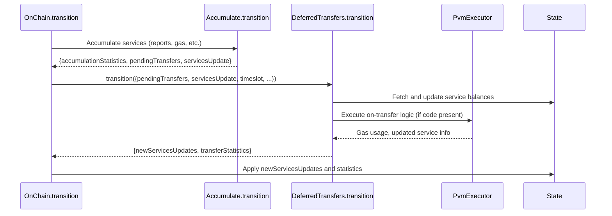

# Deferred transfers and other fixes

## Pull Request by @mateuszsikora

I've implemented deferred transfers from chapter 12 and fixed a few problems to make assurances tests green (see comments)


## Comment by @coderabbitai[bot]

<!-- This is an auto-generated comment: summarize by coderabbit.ai -->
<!-- This is an auto-generated comment: skip review by coderabbit.ai -->

> [!IMPORTANT]
> ## Review skipped
> 
> Auto incremental reviews are disabled on this repository.
> 
> Please check the settings in the CodeRabbit UI or the `.coderabbit.yaml` file in this repository. To trigger a single review, invoke the `@coderabbitai review` command.
> 
> You can disable this status message by setting the `reviews.review_status` to `false` in the CodeRabbit configuration file.

<!-- end of auto-generated comment: skip review by coderabbit.ai -->
<!-- walkthrough_start -->

<details>
<summary>📝 Walkthrough</summary>

## Summary by CodeRabbit

* **New Features**
  * Added JSON serialization methods to core data structures for improved interoperability.
  * Introduced configurable preimage expiration periods and enhanced storage utilization tracking.
  * Implemented a dedicated logging host call handler and new execution context for transfer operations.
  * Added support for deferred token transfers between services with detailed transfer statistics.

* **Bug Fixes**
  * Corrected storage removal logic to prevent errors when deleting non-existent items.

* **Refactor**
  * Replaced hardcoded constants with configurable values and improved hash calculation for root state.
  * Updated internal logic for hash parsing, register usage, and statistics aggregation.

* **Tests**
  * Updated test cases to reflect new parameters and improved storage accounting.

* **Chores**
  * Minor code cleanups and documentation adjustments.
## Walkthrough

This update introduces a new deferred transfer processing mechanism to the blockchain state transition system. It adds a dedicated module for handling pending token transfers between services, updates accumulation and chain transition logic to integrate deferred transfers, and enhances statistics tracking. Additional changes include improvements to storage accounting, gas management, serialization, and minor bug fixes and refactorings across several core modules.

## Changes

| File(s)                                                                                                      | Change Summary |
|--------------------------------------------------------------------------------------------------------------|---------------|
| `packages/jam/transition/accumulate/deferred-transfers.ts`                                                   | New module implementing the `DeferredTransfers` class for processing deferred service-to-service token transfers, including types and transition logic. |
| `packages/jam/transition/chain-stf.ts`                                                                      | Integrated deferred transfers into the `OnChain` class; updated transition logic to process and apply deferred transfers and their statistics. Improved logic for merging availability assignments. |
| `packages/jam/transition/accumulate/accumulate.ts`                                                          | Added per-service accumulation statistics, flattened pending transfers, updated root hash computation to use binary Merkleization, and refactored PartialStateDb instantiation. |
| `packages/jam/transition/accumulate/pvm-executor.ts`                                                        | Added support for "on transfer" execution context in `PvmExecutor`, including new host call handlers and a static factory method for transfer execution. |
| `packages/jam/transition/accumulate/externalities/accumulate-fetch-externalities.ts`                        | Switched from a hardcoded preimage expunge period to using the value from `chainSpec`. |
| `packages/jam/jam-host-calls/externalities/partial-state-db.ts`, `packages/jam/jam-host-calls/externalities/partial-state-db.test.ts` | Updated `PartialStateDb` to use `currentTimeslot` and `chainSpec` for expiration and accounting; revised tests to supply these parameters and adjusted storage utilization expectations. |
| `packages/jam/config/chain-spec.ts`                                                                         | Added `preimageExpungePeriod` property to `ChainSpec`; updated chain specs to include this value. |
| `packages/jam/database/blocks.ts`                                                                           | Made `InMemoryBlocks` constructor private to enforce factory usage. |
| `packages/jam/pvm-host-calls/interpreter-instance-manager.ts`                                               | Changed interpreter instantiation to supply new gas and execution flags. |
| `packages/core/pvm-interpreter/interpreter.ts`                                                              | Added `freeExecution` parameter to `Interpreter` constructor; conditionally disables gas deduction. |
| `packages/core/bytes/bytes.ts`                                                                              | Added `toJSON()` serialization method to `BytesBlob`. |
| `packages/core/collections/hash-dictionary.ts`                                                              | Added `toJSON()` serialization method to `HashDictionary`. |
| `packages/jam/jam-host-calls/externalities/pending-transfer.ts`                                             | Added static codec property for `PendingTransfer` serialization. |
| `packages/jam/jam-host-calls/externalities/state-update.ts`                                                 | Updated preimage update logic to pass a `LookupHistoryItem` instead of a `PreimageUpdate`. |
| `packages/jam/jam-host-calls/log.ts`                                                                       | Introduced `LogHostCall` class as a placeholder for logging host calls. |
| `packages/jam/pvm-host-calls/host-calls.ts`                                                                | Changed register indices and error handling for memory loads on HALT. |
| `packages/jam/state/in-memory-state.ts`                                                                    | Fixed logic in `updateStorage` to correctly check for key existence before removal. |
| `packages/jam/state/service.ts`                                                                            | Removed a URL comment from JSDoc. |
| `packages/jam/jam-host-calls/write.ts`                                                                     | Added a numeric comment line. |
| `bin/test-runner/jamduna.ts`                                                                               | Updated accepted test vector directories. |
| `workers/importer/importer.ts`                                                                             | Added a blank line for readability. |

## Sequence Diagram(s)



## Poem

> In the meadow of code, where transfers hop free,  
> Deferred bunnies now bounce from service to tree.  
> Accumulation tallies, statistics in tow,  
> Gas and balances tracked as the blockchains grow.  
> With roots now binary, and storage more tight,  
> The rabbits rejoice—everything’s working just right!  
> 🐇✨

</details>

<!-- walkthrough_end -->
<!-- internal state start -->


<!-- DwQgtGAEAqAWCWBnSTIEMB26CuAXA9mAOYCmGJATmriQCaQDG+Ats2bgFyQAOFk+AIwBWJBrngA3EsgEBPRvlqU0AgfFwA6NPEgQAfACgjoCEYDEZyAAUASpETZWaCrKNwSPbABsvkCiQBHbGlcSHFcLzpIACIAERIAM0p/elwqDEQkimRMenxcWEpIBPgAD2kAGmj7bAFmdRp6OUhsRCLmahJWgC9EeABrfCp0ZFtIDEcBIoAWAA4AdgqUDDTFbAZpMMKUZm5IthXqeHwsfATIJSyUsPTMyhzkJUQGCngp+ngsBlg0bho+ACMACYNJAAIK0WjqY4YNA+WRLAoeMZoSH+RBtHIYeglcrINpSKi+JAOTYESBkBz+LbULYeNAY7DpDbIGiIXDIbgM/HrFmZbxeWSg9yMH4YUg5eDMML4Ha8fBSOkKJQCBkeZqfJgUbhDI7ii6JZJRNKYO58BLYDBiGFw9TyXJ+aT4LwST5ECmlJDifXygT7Vk/UIAd0oHgYaFabrCIWK2i8TOkwu2Fp8Btwcax9CYSlFmAljEwkCmjtdJBD9FpSJ4FAV8CU9AAqjYADJcWC4XDcRAcAD0PaI6lgtQ0TGYPYAYvGEglZM2VIge7hZNwSFMKC4e9wBT25vMNEZ9MZwFAyHlzhGCMQyMpGgpWOwuLx+MJROIpDJ5NnlKp1FodIeTCgOBUFQQsL0IUhyCoW9RwOTg/DQIMaicFwi0/RRvzUTRtF0MBDCPUwDDUDBFxCMAKEtKCeyENBmFoS00A0DkOAMaI2IMCxwQASSvKDOnoBwUPkM5c3FaQ3G2b48w8ZhFHgEoyW2LwvX4c8GA2P5jRjKQxCGC54H8XTXk2T4lQAAw6T4zOKS1rROAtUyDQdTLM4jSPZcjKMoajaPo2EmMQMzQQAZRXBh5PgcN4SWdQWitFg4IDDwzOibkmUwFke3ZToAH0TQyaETkQaJrPYFwllRKF9Vi8kqzQdSSE01JtNfIZEAq7E70S/g8HM6IhiUFJ6oYRxvCOE4svTGg8tuQqMhKikVnKx1ZNdarQgSGtpTqhqmsgZT2VBAA5WV8kKPgvHwAcGCWZI9LFWhlPFJY9KYJbnWKS6kNArx/jofcjA4ywwV+m8YVZWUqyUBgvGccaMlUj0dQoW89K3P1IsW8J4HEgwTvIfc2OiA9CLctlcE8jAqJouiGMmzowEu1FKACliiaB7jeJvKJBI6VCRKksTEAk5KrGcNoKA0dldVIay2AKRRICDBlIFkqEFNSWVBdISBYHwb7Qi5bJFOSp4XngP4YWs9lXnFUErH8V18FaQUYtCRA9hq7Y2je+gjdCESoekc3Lfsz5yTMgBtH5EFgJZ+hIWQAF1rIdVoojMmPYGs8kSFKE0xHQGoBBtqMEj0iySHTAAJBls+O/W3ZQIgMCGE3igM9l7E90ISH2dh0E6k5BRaTFIDMhPZCCmBtjMm3a9j6zUEGyQomafxVqjKsUv6ABeBbeESMpii28fJ6XjIaFRRGUtgPeFs2lhx6z6eRUrmu66XpKsCNtp6ChQyER5CP2lHPNIC9s5K0HM7d2tRS76g6BgC2Y1xD2T0r8Fc2IozdEoPgRASZUDa3bpda6iM9ZISrFnFAyA84F1vA6X+URy58GllQHWZUcbtXsFKT2M4oyxXXiQTe+oqyHydq0Yu8D3QOhwTWMAXJIRRnZI1fB5hgag2guDGUSpoaw00UVRGedkaoz4OjZSDAsbQlxlAE6ol8y1W9vAFu1AEzIBEkYoYJjPAYwsewKxyAQzUg6EoJMMk5IlHDKgrAIEViUFhL4BxHhsriAsfLPW9AwEyxINZQOs8xbGwoNZGG3JCbsQMBAMARguQMH6GgCUPYtQkB7HINkzTZBslZqxdinEwQ8UgtzASjg+bCXOEQ4WBgwTjDLKrKu6Tx4EAAFLBQAPJHQABQAEprLKxyJCY0kNZ4ACF2nSEOZdAQRTYYYgIcgNJit/C4CZAjKsiBaJJLSFGfwh82iHCiSMJUecvRRjMgQYKHzxSbLlrMxQt1pyvlXiPeUroqrSMgEs1Z9hKDwFtN0eGPVOy9WYcsbKVpNgiTMsctkZzBBBUBhzEG/x4YQx0aIPRTLDGlGMVENGtRzGWPENYyAABZaFFY9m0C4CC/A6L1lbOWIwK5yAKUnMQNSi58qzLVNqfUxpbTWktMTByMyXTiblMIlqup0gGlt2tT4eFRUexZzAFCOysIXCdPZj0vp15oI8yGc4EZdjcaTPIEhO5GTFkrNldslWlV9nmQgbESKUSA2XJKTPVA4aFAYEJByHRyabSoU+CSjYyxyRoB4LDUyCy0ASDQMFEOAcXyF2aJGfUZllnNs0CAgAoktThayChIC2UsSIhI6lb0koqgA5MgdQ35IhlsoAkeqHhyTynoqWwsggRCFy+eidgeLckeBdSmlws7ICTzAHW+MHguSdwbvwJEF0rqY1eicVYvgEhfSVirIhtAAZqPBBo9liSDTFP0QjdxnLPHctMbyzGfiBXjKgCKhWYr6ySsjasyF8rikYnHomgtJxU0aotTqm1TA7WuoXE609hahRGpNSTSpBhyNWt1dwCQzAwDh0oIff4PY+PageSzZizGvVc19YMoSiMxki3HlxWJImq6UDTQRt6Nt1gED4Dsj0NBsTxuGo1UIFbQ1FnwM6EghYjZvP+OPTaJASA9vKCNKJqdLrij6DmKsgL2TAvTsFAQFB+gAHEGTTyU+Zcg+cwWNShehxE2wiAq3rNpmE+1X0WKJdZ74xK0jpfsnptWEU6BcCrClnkAg6EZbToZig379ailEP0cYTXfZzThCPRA/QLaQEqwaTdfz5IOf8M51zeArbUJuMEWFSRrRSBHlCV5GN9QDc044UOXxCg1PwRm5ARD0BwrEElZY0I4T9ZVg4arVBXVFkSG3fLFE7t51EJNk4SwgwIEXVWdEAdzgVZVg9J67oSGYw3toBGtkxSkAA0BhlYMDFgd0XDKJbjzgeJRnB7xfKkOcIPJAAAwkVArRluHOMedSbA3BaD8UlZp0nOm1m8EkJ0UeJAgshfC8gXesYvBtDlYAJMJx4M+e0zlndaaDs852FlWvOV385IEsCXbPHPjbe38+XcIBcXwVdyRTymBNqbI/VbVHGbVcZ48Jo3FAhOG9E5LJj7MzWsfYwuGm1qMAlCIA0n4nwwAe1EB67pwNvV8VvLzANcmYfBqmUhfwqJh7yAmGwV4Fj5QrhRvITV/gpSWpc1uMSVgsWKBjbs+s2jt6E79xgUKoh1NcP3dIPxIjtiZ+OB8LA4g2CIEunmtACR7NfcirAQecV/BZDIBsP2ueOg6w6PIYsRjLSw8+4OIuE/QyksgE2ZslfktUGXL8IotB8AjTgvDUJ2atNk/JdXyHdeGBl5aDT/i2jPjneUjgrYqBzMZ8oEuCfE/FWJ8FuKELTumKCBCFCCmtFOZN6LIPfp8I/qnJ1GZCmF4EgbXmFBfCWmSucGZFgSgUrKGC/hAfGpqPGDmIHuFBEpADesEMgESjniQHnqQAXiviQMXq8KXpAGsgAGyDz0AAgACcFQQIAADBIY6DQW+H3LIBsoBvSiBmjvvieqyqjlotBlynkPBj4vyvjuUuCOKtWPgJnoAWZAnqfhgIirPvnpypwdwR3lwCnmuDnFrIquPEQTgSbjUpau7rRJ7t7r7pDgHmFAFMalAA2K/jBCTmLnpH0BTgmHJp4YQTXsQS5G7j5GOG9MEVJP7jQREdosZn8EIWduIDislIfGweNoXqQE4bwSAssGARcNQGgMxi7lUqbv4dkT2BASoGqM0pdLtsHsTJJv0tJshMMtHtJOMpMirlLqLtpnpHpnGprOZEpiKrJC4NSrtg3jckGjIR8idvpIAvlpgBUX8uSpsUIkMLILsf0IFEAdKDAt5mulOtyLdF7kMOFK3h4OnIjKIjWMijzFNJjCukZPIOGkqqGrhg6OgVtA8YgLhkSjuq+IwAnlEo+mdEUGDhYu+u9F+j+sVuEjjHDoDD0ioVosjhoZBujkjLBroTjohisP4gTtAVEBWgsWGHEcsRQJKtydfozkMLhqZPhkqjcdsfccMY8brpqt0fUh7v0aqG0EMWfo8RER0RUl0X4YqYETTGAHrB5FFPzj2LQnEraMhpuM4BUV4AHlNCQM6gIExCEKMfSmHgMlMVHgLDHuMiKOTDUPOsUBXPkraWCp0LEOqnptTuQesZpl6OwCPMWumKyWzmZKGdil4OGTQJGdsuvrgEGLKJVJ1r4LZvLPcFwBWiClKNIH3tZGsm0KEBHGkLIGCIgNADWcFH3msgCPwXKnpDiXwP4GOhcfQXCIwRsmUdWRgIgekTgQcYdgPvNnmuQM4CPF1tGF3OGGPPVDWARswN4OIHsOoc8K8MWH6OqVwpQdgCipuXmkStUXPu8i4gdjtr1s9NWKwU+Y6EECEFwswqQB2FGI+f4UsBLK6KWi8NZlEksDenWNQHpP0WQZ0Fwt8C1jqOHG6GBZQBBf8dwEQFQE8BVHgHrK8Lin8r+cEMhWyMrq8K6JELDpihQLhcgDGShYiLcFkFwrIDjF4CirRbWLeSBRKLdLut6O6OBZFJUGUcNKNLDOJUxbhfphacpMhgDNASWa7PKtvP4L+eyA7F+ZajnH+Ulh4EYq+FEJqBvOwMypkmwiQA2OIAdPDJStIKgRkqwpao5fAM5VEsTpaLgLrlWGxRHjhVJcsOXCQdSFZdZn/GhB3OUBWLJAFcgGsgANSzAAhoRshlFpVZVMABUyFhRyGCgbJLAT6RDWj6gVqHamTkL2A6aWotBOXwDkUZagTqTOyxLknBQsA8n3jdVgAwIOT87aIWTqnZkkBaDcB7CyDRHkHWxVwKVVjd61n5BRUeBfKwzT7xUALonchOIYBwSAmzyrW975DWR1qvAqCRAdSpCSRdYBKkGwTsDcq9TQTnQ0hYAbwKj/RGC2JjIbWqzMxqGZakLoIYgAHUmFDMBtAuibBTCyAnD3XN48Bwzll8DFmqEOj1Ctx8Ap5YoWKohCCtC4CJRX5vSfqfSNwUjrj3S5Ag53V3lIyvjsoQ6mTQ7STkmUmMqqE0kQbsraGMn8B6G46snIb/Vay+lA3BJroHLqEC2qEJGHUuLogco6Ei3Mm+Li2cLaUICsgxglCRBX4lYRLsrOAeDKT1C3i1QxjJkXHYrY2dTCbxLM14mlKmralsYKlWoe4GlGkUwmkLjmkUDxL+LWkoyZn2kMy0DOniaeqh5SZv6R78yjK+kKbqznDhw1ibrtxmQdlsBdkXVTneH15hDLgmQrDy3jwZlwiTW5l64YgVSKLtojTrjsAF1rWBVTn5HYFl1/q8lk5lmqbZBlFbX1RRgbl7V7qGj+Ckq2VDr4LJJTVnV1lQIFDzL60jhMhz24Cd3nWBVX5iLHAuzyA/AUC0BfhZgk6jnpk2A9pcRCpgihY9o5Q9oAAaVgDYR0L9OUVgPaNgXEyysQ9ZohkhEhk5qAP1UgFYnU49O1zQIKW9vdj+GgwltRjhJetA1kRKG56DSMBkeKaFIxRgUWOlgQjBuABlNRCW6SplYN4Jr0cII08lSijVOsk2X+RDXV/enUBqc6r5XNXAyZ1mZ43Cuw65Ld7oWV860oDoVYkQ4oBQTcrcSEHWsBkjtAyAQIKANAsNKAAObedhOsv+ZYzdJN7Ip2BqCghVzQUM8kk+2+pkijRAG9ewEimV2VJk5woaTNmezC+jRi5isUxDjxwZ+NJwYA5AKWb4doZRv1DWX0V+IVctil4VnlHDLVbVYcyAqjFwJwHgTkG926XaywLqeo7oCTjWSEySEiDoxSuwUQDB0lH1RQBQhYVANTjgqiBgwUUoPla5CIetyUQYrwNAtDMKSo1jBVKwDkLDeKoEtAFjNtso15OYYEiisBkAAAzDo/w0rIUFgMWdVXHpeonJrddjVvqLs14wEocytLWCc5POpamK0P4TfIvVLA6UxDWQfTg3pCFVGJdPgP0NTrrF6HcfYH3m4nwKE1GEYoQ38hbY6HsKuvQEU6Pkg0gNve3SsPvXWQDMsuOj4PQ4DdA/SLrM4JfRhPQAi5BjwFg/KiuhIAOeeNmt7ulH6GGDXt3KIBFJEjCDFLsMCXeoZEgLVp1K8kkIAaZBk/8Vk3isNDw1GM0MDlGFU19JmFMjE6vGObejQpysE0AkzZaPJPIKvetZvnPSyMUWjZDbQLxl8DvQPBa5oHSjzYjs8tXSjnSercLTyvoXjoKsTpfPEXwALKkbXVmQ6Q3ZkT7QEWOP7XgoHY9WafnCpeHf7FHcvU6UUSk+sZVGjVQBjd2AYJALoCLs63i7833lwJ3UXYFWWxW2ZCg2FFwKXU/lqeavG70Um8aamyHWHVaZgiimAPlGaG6eMT6snf6qnUGn6dsDwp4g1Z0N1MwcTtDDYKIANO5ePNADYGCEdMFOOAAzlEKj2kKssjlIcgAJrQA9rBTbLPUx44inxLgrhDU2HyBLsozMprObUBU1lyieJMEVxfhP5Tn7uHvHunvnuXvXt3sPvTwhrTLJKYz/5Z5eEYQQerEmFgbpmnhujQCcXG7ilLCXAf4nPgf2BoUdDhNMWZmtWKudRPBYo4qX77bKiiDA1dhKjimmHmG61rJzzOwUAbBmRLBmRPDejwwSfjy0Q8NyeVyyRKeVZmSTnkg0H8tccWLvvSVrPqtci/lKxUAzX3D0dmTBRhUbBcTYNTlWfMVSXc5ycVq4h0CMxkCuOj7WPOCH4WdsAqdM38HTBgBYRxSJHkCd40CkCj3MEKcBW7tmRqdX5/YnVhiKoxRWhUGTqius6LGD06ZlEvJgkWItuYnZIzKJYrSQ6sVWgvtKEeu+v81spK0Y4wZY5MlmIsnYyCockCQlcCcAHZ4btl3kj8cEdYLijEemhZBylZF+20SGnJtgBB1pv/BDucKbiEfihjskeO5PEYtKgReq0kAsTltmQXcchNtocWIjcMDtvYdbtai0DADF6TdEDTcZBZCGDncXeQBNsf62mtVNPYoi7YcaCE6Kp5kb0KR8VKqICifieSfSefCyeSfxcrBKcBf4AudoHJdduu49sLc8YB0rcDvpuh2Wmbc5spOTuJ0TEzuyY+mzEKaHam261VhLF3bHrjzAugvcDVwQsuDWQYeAFcj2ug1mTzWdDUNPkaApPLIUDQETOd5vHmThz4AOcsXS/jOVdzI89mRgjqRyXwyTU68Vfin2yOwn295DO+aej+btqy9eUxEVdomFxmSlDP7i9xXT1AL/JmR8/U6C+sJTxQGD5tOSQx4VSnNmTNiWb88h86ayBcR6O4EpmlqELlf0BtrujbwvyScuMFC48eXQsi81iCf4Hjxe9lE++WWXyiMHFwj/CnZ6ea323b51/rFmQK9K+Qg4OnxVnO+kDm/1nD55bmnYhKrx8gvB9C8p9p/r2j4bMwE2i+DoFDBED5AGY4OwxEAadFmVqQ7jwz+J/z+p9CJFIFdMJvvexvKtHpgdx9xaPYnPoMP4mwsfo1hElNagTHaNANd1EvNakt61pKC02uGtANmLR67jJ8YU1AnjqTNwJtsiS3ftj4AXAkI6enMBnhHlnaBp5MEyU5uN3j5EBq4ybQnF1iXgSMhELePPrPDIHsgKBPgWuNiEiCFIl0DWVdNNmzprBp8oIVPgaBKDkAcgusZNiNUpasCigh3VzmUHr5KBSgiMAEFITKKyJZQ62ZNhTQK7oJdo/eStri1wBa8pKtnEXujRHqAkK648QwTZzs4OhWEJkUzCIK64WIrCSeQblnivxmRXsbmCrlmnTAJxkAA2B0P4AHDKJTEpglvkWF6ht1d6iKZdEMH0atx+Amec2nAyrhPIRB6IZ0DA1ML1A2gS/ceJaAo6RdX4HxAjMvGkCHVOSjg7aiQD1h8UigRKC0JTktpXQBw+oC0FaFgJxMHQfmPNCzj5g+VzWsoMgDdR5Lt1C4A2N5jrCijzMsS7rIAZ62ZRBxFaWhCAf61Frdc2SRhPro3Wn5XQGBuAJgV4CoHHk4IwKA4UcJYGPRjcGLM7hWwdhmEhu48T4PIMWpNlZQAdcQS8LziQAlBEhJtlAAeHmFs8lWYnOyDeHaJVBl2YWOWygAhsb8hXEogpRbZVsDB1nEgLZy4BWCMR2DAEcKlFTjwvBeAEgGshyiVYuA3OfyspiWA5Rgh3YSAFxAuFdYt2IQlvhsi4APDchJAYAIUKPiRdIAAAH2sDcYXMGuGEHoGsgPInkk9GQlkKiDyguR+QnvoZiEF0BjUzuL2vN31KLdSeq3UZvOiwG9Ik6uApnmnRZ6EC+g4oRdC9VmZPQeShwSjnQI8AE008+0edESHHh9hpgQIeYLMAkIABWf0fwV2YYBn8axHYGwChCdAR4UwZhPSCwC9CowNo0IFaynwyjQsh+LkJnh3wtgiu2wA6i3GOrkoF8UwAAGrjlskj6QGoEhkgg0wMeJJYJTW/7U0gwL0PgHdD4Bqs7Y8w4DMAKRygCVhBiIWh101pOCDCuMOAQgO9q6lfagRS3KgJTboDHUy3IOoaI9KTEU6+A9OgYBFBfh52SoF4VJVYpxVyQDyYyIqALKyhdmoXWKJaAi719ou5nJor9hICsjzOX2MgEdymgSJUAZkauGCGbDQBp4BlcRLbybhWFnijoN8aPSUFlEAQAIAANxtYDYjoVEEwVPjBCEyo9eYGUVmBX4rq2KLluMDeRPUqcrvCsJ1QvpugR4wnEsSQGgLogni8JOic2E87F9FCxhVfiRjgIviHAv0NLjMilKZZr4jw+lnpjnpvJX2T8eUqQHHARhfo7hXnvgFRBbs+JgVJmr5jpqws3y2aLiVgD0z/pIJcLdoegjawYAomAoceFyFknyTu6Y3N8vwgIJMxaAqkw8hoCQA9otJX8GbFNRngtDSERKKUaHUnoJjdggBbHqhF7zhV7IHY6rsWiO5vIAYjXUDAOJa6rCGSI4qAZsIlpGEAa0tMDMd2aH0lMcXiMcUG1Im1iQkU4rUWOHnG6jU21uB3I6zwJgBEElqfbmzBDzYDp2Jo6YszyFis8tB4bQxslCUz/AbcSmPAkKkwDtSG8v6W5KSQoKXwHaaZMafxgdw5Iu0ASfMoWV5a0FMYAgSzJEDAgUAiAjgGyuPDWQK42gHFYIHKhEYiSfGRZU6edJWB7ZgIgjIWKIKQi5ZMWa0lTP8HT4ZQPAMST/MD3Rb3MqwbUmLhiWgr2DOQR0xGI1JHp7ZbEg5d/prSbEfRqm809ABoj+oUkFhTXVKZoSHFrDMpGw7WjAIJzwjhSLCFWs0JSL64zI/0iactNJTTTYQMXObkTznHcYFxZPJccjP+DNSM+jpaGWJieLs0ocdXLmksAEC9QQC7My4hlmuL24R6m0sSnOgKg5hYoeTdODCWmSsyHcV07XErh8n3SG+j08eOZmNkj1IUHtFjIgJ6Ie5l6duVqbcRcDR0aAa440X6lNHztBpWCYbF3lngpMwUWSFXgJJZkYAtidxSanNIMlDBAE/0awNb2dhgS+OGEZrDUmNCBgvxWSfSPQAABUrcXAMXMpYXjtgk8e7HGIeZrR3Q6gT7AgDyyFlvAneLUIAhHgfIiAMMwsLFI/FHMOwQiS2CIllDksx8iY9aEImSbkSuOyEhQOMP96hMAwlYb2Oww8DFzT80gCuT8CrkeAa5sYx7NAzhBfEqQk6WkP3K0nTYCgNYIMKcC/YHNPxLZLeOPNuKKgzMkTKeRJQ3m6MZ5kANGW/zxKYyv+2M4kn+nq49iEcxMllIOKgzkzSpCGKmVsJsRS1ZioNH1oLXplJE1aw4xBYGx1qbAaxwNKqRqO7YzjkBbsyShsF9k4D/ZfUs0QNJ3HbBXBtVU7CfN8AiQK0loogIul3xdQB4doyCVWCWSxAz8Ai2Zgb2xFG8ZmuAJTOXDmnyN8xmzVWQDl2l+hMArWO0drN0acgahj6Doa6gux6Q8SF2PcdWNIKy1ABvYxYRgrAGtcMp+C6AVsLgGOzOi04pAb0XHZzQewslA8vJSaR+KUEK9UtgnW6nh56F3pRhRKAzoOMy0OddYGSFuzvlKmakc/Cggyxod/MDAD8OgCkZFxBSYCI4NkqeIdBuAwzceDIpN669+O7TFMduwvqnZZFiML5CBzKKTC4q2Y6hSeiZCT1je/ijjh9J47TYD0pmJsuvJtLRzvF7mPXorAYRmFglneeTv0uCV9MrRHOdESUOShVKBlNAVyQpPLorhpsk/CvOSH/Y/58QYJEpcModCud5KBmKIAdH+xWTtuH3Pbk8QeliMK0k8TkuuDQBCgicyc6QDqHe5aVt4+SLrH3B2UZKTg+yuyRXQvSapXln3M0E8Vh4fBPpjFJoidL86BxqckQZAD8qaDyBulDI2ILa2/SXy/lgaCbiihRWzcAYUWMyEEoCVKYIVdqY4aS2dCVUriBBEdkR3eXeTDJTRLcLHC3j4rNgRK+KqSq4jkrNOh8VECFL9itAEAfxG4DN3M5+8kyVdIuJStMzUqAYb8KNvXXVRc9CuJpMjNxmhWsqc0Z+WTtNnzbv4suN5ZKH8x7pzky6w9FvoaskjYchSo5HLPFFvIsq2czgM6d1CgYjDIxkEw3jYFCzBQcohOYBj2kJyKTDehOQnA2CFQNhmwYIe9jlDBBxqE1Sa2ICmv+aws9EdoH1ZtUsyhAqEo4MAnimAUuRAKNgWtRAm8kT56oOmeNBPOCp5CuFWAGOXHJcDEccYkWK2bQCbgI9f2SoHis/yiA1h8guSmVbEEbEnBc0SUaUBryLDnIDsLAYiEonRFkqyiWcJmg2uJEiDiIUeEVCFkXRLrQgroCtGZmmSGQmQfQRUK5FR4uBb1/QSIExxmWGKsSnHIDRljfXZAEUJKnuKdlAK9RfO/ypYFnE2BvRIkIwmCN9noBIbtpxTGIK3CUDVBD4uIJmkFIRgyDXaD6ylrHAOLwN24x9DOTcBxihc1Q9ACjfWuYYwqMAAMIVJ8HfQ5gYY1mCYLx3OXQMowlodOPQAImjCtWxNUmlGEk1ETYQPeejhBirV+T+AxLXwFjJ/5IQeh18rse6GllxR/01i6BSlNgVpSyZji7HGVMIUoZOJTCXilo2WXpLWGJwbMkChyVcBpp3AYANiNs5LAqRuAMENiG5wNg/4Eoqcvyqm7vKORyKvbpHBTig0SpxoCwYbxWUBK4VPMihV4tmhRJfF6WzoPlpc2dAIi+4VDItJRqHLRYcMDldavhiZbfCnij3NMphBFbqlgSgrT7KNTxVtYwKKLW8o1XZAB+0kyOH5qnXWA4tg2hLUnAS1pq3udK+LSnDK2QAt2imqIAzlvqFr41ia5NamrGpggM1WanNXmtfpbbi1u2rLU1sCItaJoIamgG1t2UhLaUUAHYYKXRXjwslKSekd5t83oj/NgKgKsFtoChbwtikznqkTq268422W5rblta13aOtxWrrYFGW1CoKtsygSAzOSLkpjVMbU1UNJGo6K0tSOi3p4TOXOr1mKi7iUWzszmc54tbGAJ2TXrwlW2ogdth6og7Q6rtY4G7SRAR0PbglpW7YSYXMyFAvA2Y0DfZC/VupZAv6/9dkwwBrJYN8EVyqqnOQJbENdcSgHW2MgQJKA7ImAMZBOhKAO1jWl2ddrh23bOtiO9rULvK3qwySVmisIgFkBWgbInQjLElyrhtr8gECNZPOvqEuTa19I0bX9vG3LIjOwQCBDNqTgG7ORSAbkZDpIA+7cAEWrnebp52W6+d1ugXQEqKLkgASVYczNetQhy7WCCu9ADNRrD1RR8nyxGIWH9wRTzWxkNxZqN5mZ7TQPi/nZcCNAOtx2XFWhT1MiVzsCBKHMNGsEXRSdZ6KQXboNvwTdaYkqwXOusWBzvFRWZ+aQDwsRg9726msBOF3neX3YCyTmLAN0uw2qqi4F5GpL3UWiugawR1dgPwPAJ8jNgVZeIFcDoD0r7gc0upcDS5ntxl66qgqH8mHJv510ryoA6ivo4VoBwUgLvDW3yAU1PCZq7QRpF0E36tOZtJFp1C5I2lMyK7KXMJghJmUYMW+0lWeJxg3oyi0Ql1ggbdbMKxhMkAkSCiz05w0A/gsfMrufBiVs06YR0Qy3e6QGuKpLVEWEDoPYVHOpaFJlwlsHojkA5LADAyNMzW7WQe3Agx5q1bSG0mpaVULDHnroBKJKKQUKCHHB6Rfp2hkGbavhpLL+95nNZKwTf5XZEeHgRCiEFR5RIyqujR0B8hIDvg+OohgFnPNJXL0wKvWGap8nfk8w5DT+5CK3zUMY880KPfkTlhr0WGyiWh16OV3xDHqlWhVT4JFUO5F7pkuh4GYypGlpGY4HoDXKMPnlrIKDvhkHs+vnlUIGExjEgJ4ahkEiO+lxV/UW1tIEGT0bRFUvGIrDWBSxQqKo25j0injLQR3dEYAEwCNxOZNsMvpSEh3KfDS3QAvSI1FOnLmIZ7x94JDSlWVRpPeVX4iRhXCiAjEO4DYra6gHIL3OCFv5nx2wFYzIc6ic8io50+gANkjXPd6+QhooJ9sig9MRQasbwP8THjgdQOmNbYwPA2P8VmqPlOJpLoRhEpTWxnUlQNCxQfl5GFdAPAPkKamdM8MJ8YOdNdFvRCQfQIqDEZKmsgK6pJoOB/tSCH7ADQQ6QIeS+LhguwGS/UI6uCMOktWHSpqsCZyVX5gFlIVxDSHdjHqoK8MJYCk2I3vyLsyLdEMVSiCDzigVcb4EeskPPkcq9EW2E6MgNzQkpRMszcsIs3wKndo4pBeOLs1HRpk/HZLRKnHjv7e9X+obWbr1Id7gD8OnPTvpn1vHNSNiaZG3xdOSp3Tu+z04gATl8FrsjZG+HGcO7VkDjxdeEoBWxHqdvTs43030Dy3d7p97nYM0xlDMUILBEZt00WdoAxmGtayFM2fvN5MS0CKx9zSUuzPp6fTi4LPbnsK2BnizZx0swArDMWCfWZWKs8yZjNKYwC9ZLg16qfEVxedKvSBkOpqndnO9BZgM9Wdn1fd7gmpMhYTxh0W6Nz/pknWtwzZWkEdYAaVt8DACDsqehqUJV1KNF0KZMDCwOQweA4owb4tgB+k/V/of0v6P9V+v/UAbANht20bYPed8DgnJ9AAAT05rgNwfbRcaaWguZs8DcIb2Y6VjoaAhAB3FWAof4GTrEYufC5V+diLKyuVOYPJsZkhqnYWCNRDgkXiwaXUKxpxV8CPBePJRWdEHec2EIl47rt4gFPtFfVpkXE0VtkYDUMsXL/8mlBXVRQCiDXrab6b07g6+DAphR+WXWc1kY1EkWEQGzckfJ+VAkjxxNB43YMLQ22zMHQ+sseC2w51oM2jzF+oqxdf6fVgFBJKmjjNWL4zyS8OKkv2PM2kzrTLp20wQupl4wCmre8hdzvXN+mrdZ5+cRcaGCD6Ilb5qJR+d3HS0eBudGoDNWXa4NTmFxjLJTVoT7QVAfcKIP1AP2DbqgGLUyOCpFETYdM+xcEKczb4doMAnppkT4BczrcHzHyx4C/vG1T5fgfEipkXHlKR066DpHJADlS246IyFyKAqc0FI3cMdVkr5BbWWTdW9uvV/nN5PDHrptr1IT4RatX2j1MDmMMDDVcBMUBqgZV/OJlxhg3lgUJAg60p25yfWmal10k2ZC3aoglOAAdTGbZJJOp/anCXwNwKLR4expFHWAzhZtZrnQLZR6CBTtpD4RseidboOulKujOQbAEQDghrx7Q+Sqsh9fIGUD38eaBnr4D+tQEqd8SLSi+qQhjiNrEJZPptbK5wzdrnp0UVMfYGL6ElO1cnSSh6NTWrAzVjXEMCv5e4nECYdFvmW2B3WVj1Qc6xuT+t5ixhap5GvCyWjLh8A4cUJHkMBonKAULVoYBem5MqBkTgBckKvqLjLZvQhcRMyJA1voCyi6F5DPRxWPkQ+4b+USUymwq2Ypc3FgwyTt4O0ITNgVr1sFd9Z4LrNdp8qeyRF0jmjltoBkJKj5v7WqbfVinhtzcr5DRe2eZG9G06AcjML5dnMiteF0V51rA3cNAKVOskAc7g2vGw2TD1Yiw9t0Au4Na4Bt3dzFAA6/1YvOcIDdB1q4WwNm14ZI20twW89vs3Kr9CG1puyLnK6D2zQAtvACKW6WYjIAY2o41JRG5cBVdaqXuwNdUqcIB7e19u3na8Cj3KeV96QHHvns72hbXwOe8wG3utXUd6Ohu0cFSTMGsbFtJPXjd1zjcpb39y2+wPJ2vWcwcffYffaCrJZp29Nhmnueqnt74r+Z1rb3XtIJA0rnpTcTMSYVvxdrWBROSrBOVLT4HFLP/HRTZwBc1w48fszWcFXmCjlZkKMykBjNydx+te7WeLcdoAnPjobPkqCFiC9K1VLBk8ycBV4VQI+fAHaEjsyU0BuA1F50U1loS3Z+8TNi7OiqVR3aYQbZr7Yl3618PhF+YzrWBo5O/QYjSIL4I9U3rYs2HMZpiKwfyElMeDo4Q9Zjcm1D3Ao9Db+R9rkOj8NJkkUQ6ma7po30Qh5E6oQinohAxcUpndWZFDTYjEATZxLq2auVmO18xTI5pDUjr2Rf9iQy0OZTEAObn+8hoRJDg8GNnXeUsMJ67yGsosahStjeuk7LCZPsnHg3J8UrMc3z7m/7GwxMvEDXKUmeMk4EQDV5AlfDNvbVXQ4yTGO3NeTkE7SgmT6OeJs8VPKQDBB1oBmagVSq2QxCHVEoODKSxlhJIO6KCwrX6lnODkZZUShIV4MGsOewxjn3Qs54WIulNFWlv7Yi8omtncKeEi6T4BQ0tKfg3yKjdrCwGxsMXCyIWLdsYg0AvwBJgPfA7ZemQFiH9alsi4WDMgeSggcIaADjwx1nzpHxphJm85cOPyz8bdOdOUYBd1q64Bhx5Dpf0hwpsgZpmxTAstMhXip7XJxdlMMIvaTCgpZh0UCn2TmYtkAHh5/o4djdUiFDmvJdoz04OfF+D9kIQ6NTLbze19cR7flGQquMAlDnM8gN50hECiuAXV08TFspkJbMrj04Kv1dzys0sjhK6GNnvMzVXkOdV12atfavbXRRaQds4kGPR1W5wNh/da1bXlqTpwAggM4mdDPGr2wEjaCTZy08jCaO257S2FdMIrnUuvZ/RI+e22TnbZCLhc4tc5a5HJEYN3a8UmHYxHek+jjS7rCT0y3XzwAri7XaD9xGx5ZYJC5Oe2sqEw7uJqE34BDqkX/QFF54jRefwYrrGGd/cCEyWWsctuH9v8CIcbi8BpDmJRaOonqg9DWiiF7jPDFHzqQReyyZO+YIZO5rR2ezICzVWAG03yULdw8RV4HFt5uTdaouRnLv9boemhmlhRAWEkWxMdvsXHYFcJ2EFSdiKy4oKZdt8IgERaF8p3t+zr6A1eCJ0y9KoRmgX4KgD+Gwj/g8IBgVD7BHUA5Q6wiAWkQs7LB0Aco2Ub84eHI/HhIA8wKQgIH9HbMAQ2zNACIWmC0B+CSgJzCIX9ESEGA2zbZrMGmAiESA2zEQts3mD+j5PAgfggIFk/+jcIKH9j5R9wDUetGdH0sOWByingdPQAA=== -->

<!-- internal state end -->
<!-- tips_start -->

---


<details>
<summary>🪧 Tips</summary>

### Chat

There are 3 ways to chat with [CodeRabbit](https://coderabbit.ai?utm_source=oss&utm_medium=github&utm_campaign=FluffyLabs/typeberry&utm_content=487):

- Review comments: Directly reply to a review comment made by CodeRabbit. Example:
  - `I pushed a fix in commit <commit_id>, please review it.`
  - `Explain this complex logic.`
  - `Open a follow-up GitHub issue for this discussion.`
- Files and specific lines of code (under the "Files changed" tab): Tag `@coderabbitai` in a new review comment at the desired location with your query. Examples:
  - `@coderabbitai explain this code block.`
  -	`@coderabbitai modularize this function.`
- PR comments: Tag `@coderabbitai` in a new PR comment to ask questions about the PR branch. For the best results, please provide a very specific query, as very limited context is provided in this mode. Examples:
  - `@coderabbitai gather interesting stats about this repository and render them as a table. Additionally, render a pie chart showing the language distribution in the codebase.`
  - `@coderabbitai read src/utils.ts and explain its main purpose.`
  - `@coderabbitai read the files in the src/scheduler package and generate a class diagram using mermaid and a README in the markdown format.`
  - `@coderabbitai help me debug CodeRabbit configuration file.`

### Support

Need help? Create a ticket on our [support page](https://www.coderabbit.ai/contact-us/support) for assistance with any issues or questions.

Note: Be mindful of the bot's finite context window. It's strongly recommended to break down tasks such as reading entire modules into smaller chunks. For a focused discussion, use review comments to chat about specific files and their changes, instead of using the PR comments.

### CodeRabbit Commands (Invoked using PR comments)

- `@coderabbitai pause` to pause the reviews on a PR.
- `@coderabbitai resume` to resume the paused reviews.
- `@coderabbitai review` to trigger an incremental review. This is useful when automatic reviews are disabled for the repository.
- `@coderabbitai full review` to do a full review from scratch and review all the files again.
- `@coderabbitai summary` to regenerate the summary of the PR.
- `@coderabbitai generate sequence diagram` to generate a sequence diagram of the changes in this PR.
- `@coderabbitai resolve` resolve all the CodeRabbit review comments.
- `@coderabbitai configuration` to show the current CodeRabbit configuration for the repository.
- `@coderabbitai help` to get help.

### Other keywords and placeholders

- Add `@coderabbitai ignore` anywhere in the PR description to prevent this PR from being reviewed.
- Add `@coderabbitai summary` to generate the high-level summary at a specific location in the PR description.
- Add `@coderabbitai` anywhere in the PR title to generate the title automatically.

### Documentation and Community

- Visit our [Documentation](https://docs.coderabbit.ai) for detailed information on how to use CodeRabbit.
- Join our [Discord Community](http://discord.gg/coderabbit) to get help, request features, and share feedback.
- Follow us on [X/Twitter](https://twitter.com/coderabbitai) for updates and announcements.

</details>

<!-- tips_end -->


## Comment by @github-actions[bot]


<details>
<summary>View all</summary>

| File | Benchmark | Ops |  |
|------|-----------|-----|--|
| [bytes/hex-from.ts[0]](../blob/be2d544a585f9e3b65acc37cf8afc22369dc91f8//_work/typeberry-1/typeberry/typeberry/benchmarks/bytes/hex-from.ts) | parse hex using `Number` with NaN checking | 142817.31 ±0.04% | 83.96% slower |
| [bytes/hex-from.ts[1]](../blob/be2d544a585f9e3b65acc37cf8afc22369dc91f8//_work/typeberry-1/typeberry/typeberry/benchmarks/bytes/hex-from.ts) | parse hex from char codes | 890517.89 ±0.19% | fastest ✅ |
| [bytes/hex-from.ts[2]](../blob/be2d544a585f9e3b65acc37cf8afc22369dc91f8//_work/typeberry-1/typeberry/typeberry/benchmarks/bytes/hex-from.ts) | parse hex from string nibbles | 565140.16 ±0.2% | 36.54% slower |
| [math/count-bits-u32.ts[0]](../blob/be2d544a585f9e3b65acc37cf8afc22369dc91f8//_work/typeberry-1/typeberry/typeberry/benchmarks/math/count-bits-u32.ts) | standard method | 88667025.84 ±1.83% | 64.27% slower |
| [math/count-bits-u32.ts[1]](../blob/be2d544a585f9e3b65acc37cf8afc22369dc91f8//_work/typeberry-1/typeberry/typeberry/benchmarks/math/count-bits-u32.ts) | magic | 248162210.7 ±5.44% | fastest ✅ |
| [logger/index.ts[0]](../blob/be2d544a585f9e3b65acc37cf8afc22369dc91f8//_work/typeberry-1/typeberry/typeberry/benchmarks/logger/index.ts) | console.log with string concat | 6392935.54 ±52.72% | fastest ✅ |
| [logger/index.ts[1]](../blob/be2d544a585f9e3b65acc37cf8afc22369dc91f8//_work/typeberry-1/typeberry/typeberry/benchmarks/logger/index.ts) | console.log with args | 271920.24 ±116.74% | 95.75% slower |
| [math/add_one_overflow.ts[0]](../blob/be2d544a585f9e3b65acc37cf8afc22369dc91f8//_work/typeberry-1/typeberry/typeberry/benchmarks/math/add_one_overflow.ts) | add and take modulus | 235303776.84 ±6.93% | 12.51% slower |
| [math/add_one_overflow.ts[1]](../blob/be2d544a585f9e3b65acc37cf8afc22369dc91f8//_work/typeberry-1/typeberry/typeberry/benchmarks/math/add_one_overflow.ts) | condition before calculation | 268935520.31 ±5.39% | fastest ✅ |
| [math/count-bits-u64.ts[0]](../blob/be2d544a585f9e3b65acc37cf8afc22369dc91f8//_work/typeberry-1/typeberry/typeberry/benchmarks/math/count-bits-u64.ts) | standard method | 3189880.61 ±0.14% | 96.48% slower |
| [math/count-bits-u64.ts[1]](../blob/be2d544a585f9e3b65acc37cf8afc22369dc91f8//_work/typeberry-1/typeberry/typeberry/benchmarks/math/count-bits-u64.ts) | magic | 90553406.91 ±1.36% | fastest ✅ |
| [math/mul_overflow.ts[0]](../blob/be2d544a585f9e3b65acc37cf8afc22369dc91f8//_work/typeberry-1/typeberry/typeberry/benchmarks/math/mul_overflow.ts) | multiply and bring back to u32 | 247513737.19 ±6.13% | 5.96% slower |
| [math/mul_overflow.ts[1]](../blob/be2d544a585f9e3b65acc37cf8afc22369dc91f8//_work/typeberry-1/typeberry/typeberry/benchmarks/math/mul_overflow.ts) | multiply and take modulus | 263202949.73 ±5.18% | fastest ✅ |
| [math/switch.ts[0]](../blob/be2d544a585f9e3b65acc37cf8afc22369dc91f8//_work/typeberry-1/typeberry/typeberry/benchmarks/math/switch.ts) | switch | 268989673.42 ±5.11% | fastest ✅ |
| [math/switch.ts[1]](../blob/be2d544a585f9e3b65acc37cf8afc22369dc91f8//_work/typeberry-1/typeberry/typeberry/benchmarks/math/switch.ts) | if | 254647504.8 ±5.91% | 5.33% slower |
| [codec/bigint.compare.ts[0]](../blob/be2d544a585f9e3b65acc37cf8afc22369dc91f8//_work/typeberry-1/typeberry/typeberry/benchmarks/codec/bigint.compare.ts) | compare custom | 248557834.43 ±6.62% | fastest ✅ |
| [codec/bigint.compare.ts[1]](../blob/be2d544a585f9e3b65acc37cf8afc22369dc91f8//_work/typeberry-1/typeberry/typeberry/benchmarks/codec/bigint.compare.ts) | compare bigint | 244932542.95 ±7.73% | 1.46% slower |
| [collections/map-set.ts[0]](../blob/be2d544a585f9e3b65acc37cf8afc22369dc91f8//_work/typeberry-1/typeberry/typeberry/benchmarks/collections/map-set.ts) | 2 gets + conditional set | 121542.47 ±0.12% | fastest ✅ |
| [collections/map-set.ts[1]](../blob/be2d544a585f9e3b65acc37cf8afc22369dc91f8//_work/typeberry-1/typeberry/typeberry/benchmarks/collections/map-set.ts) | 1 get 1 set | 61790.63 ±0% | 49.16% slower |
| [codec/bigint.decode.ts[0]](../blob/be2d544a585f9e3b65acc37cf8afc22369dc91f8//_work/typeberry-1/typeberry/typeberry/benchmarks/codec/bigint.decode.ts) | decode custom | 175687749.47 ±2.78% | fastest ✅ |
| [codec/bigint.decode.ts[1]](../blob/be2d544a585f9e3b65acc37cf8afc22369dc91f8//_work/typeberry-1/typeberry/typeberry/benchmarks/codec/bigint.decode.ts) | decode bigint | 86281733.98 ±1.87% | 50.89% slower |
| [bytes/hex-to.ts[0]](../blob/be2d544a585f9e3b65acc37cf8afc22369dc91f8//_work/typeberry-1/typeberry/typeberry/benchmarks/bytes/hex-to.ts) | number toString + padding | 263196.39 ±0.21% | fastest ✅ |
| [bytes/hex-to.ts[1]](../blob/be2d544a585f9e3b65acc37cf8afc22369dc91f8//_work/typeberry-1/typeberry/typeberry/benchmarks/bytes/hex-to.ts) | manual | 14353.6 ±0.32% | 94.55% slower |
| [hash/index.ts[0]](../blob/be2d544a585f9e3b65acc37cf8afc22369dc91f8//_work/typeberry-1/typeberry/typeberry/benchmarks/hash/index.ts) | hash with numeric representation | 189.83 ±0.58% | 28.72% slower |
| [hash/index.ts[1]](../blob/be2d544a585f9e3b65acc37cf8afc22369dc91f8//_work/typeberry-1/typeberry/typeberry/benchmarks/hash/index.ts) | hash with string representation | 121.56 ±0.29% | 54.35% slower |
| [hash/index.ts[2]](../blob/be2d544a585f9e3b65acc37cf8afc22369dc91f8//_work/typeberry-1/typeberry/typeberry/benchmarks/hash/index.ts) | hash with symbol representation | 184.99 ±0.26% | 30.54% slower |
| [hash/index.ts[3]](../blob/be2d544a585f9e3b65acc37cf8afc22369dc91f8//_work/typeberry-1/typeberry/typeberry/benchmarks/hash/index.ts) | hash with uint8 representation | 165.17 ±0.14% | 37.98% slower |
| [hash/index.ts[4]](../blob/be2d544a585f9e3b65acc37cf8afc22369dc91f8//_work/typeberry-1/typeberry/typeberry/benchmarks/hash/index.ts) | hash with packed representation | 266.31 ±0.27% | fastest ✅ |
| [hash/index.ts[5]](../blob/be2d544a585f9e3b65acc37cf8afc22369dc91f8//_work/typeberry-1/typeberry/typeberry/benchmarks/hash/index.ts) | hash with bigint representation | 186.86 ±0.2% | 29.83% slower |
| [hash/index.ts[6]](../blob/be2d544a585f9e3b65acc37cf8afc22369dc91f8//_work/typeberry-1/typeberry/typeberry/benchmarks/hash/index.ts) | hash with uint32 representation | 205.42 ±0.28% | 22.86% slower |
| [codec/decoding.ts[0]](../blob/be2d544a585f9e3b65acc37cf8afc22369dc91f8//_work/typeberry-1/typeberry/typeberry/benchmarks/codec/decoding.ts) | manual decode | 114159.79 ±41.29% | 99.93% slower |
| [codec/decoding.ts[1]](../blob/be2d544a585f9e3b65acc37cf8afc22369dc91f8//_work/typeberry-1/typeberry/typeberry/benchmarks/codec/decoding.ts) | int32array decode | 170729595.02 ±2.52% | fastest ✅ |
| [codec/decoding.ts[2]](../blob/be2d544a585f9e3b65acc37cf8afc22369dc91f8//_work/typeberry-1/typeberry/typeberry/benchmarks/codec/decoding.ts) | dataview decode | 160022843.44 ±3.22% | 6.27% slower |
| [codec/encoding.ts[0]](../blob/be2d544a585f9e3b65acc37cf8afc22369dc91f8//_work/typeberry-1/typeberry/typeberry/benchmarks/codec/encoding.ts) | manual encode | 2175301.55 ±0.27% | 30.21% slower |
| [codec/encoding.ts[1]](../blob/be2d544a585f9e3b65acc37cf8afc22369dc91f8//_work/typeberry-1/typeberry/typeberry/benchmarks/codec/encoding.ts) | int32array encode | 2853710.61 ±1.35% | 8.44% slower |
| [codec/encoding.ts[2]](../blob/be2d544a585f9e3b65acc37cf8afc22369dc91f8//_work/typeberry-1/typeberry/typeberry/benchmarks/codec/encoding.ts) | dataview encode | 3116933.3 ±0.18% | fastest ✅ |
| [collections/map_vs_sorted.ts[0]](../blob/be2d544a585f9e3b65acc37cf8afc22369dc91f8//_work/typeberry-1/typeberry/typeberry/benchmarks/collections/map_vs_sorted.ts) | Map | 307121.15 ±0.04% | fastest ✅ |
| [collections/map_vs_sorted.ts[1]](../blob/be2d544a585f9e3b65acc37cf8afc22369dc91f8//_work/typeberry-1/typeberry/typeberry/benchmarks/collections/map_vs_sorted.ts) | Map-array | 103616.22 ±0.03% | 66.26% slower |
| [collections/map_vs_sorted.ts[2]](../blob/be2d544a585f9e3b65acc37cf8afc22369dc91f8//_work/typeberry-1/typeberry/typeberry/benchmarks/collections/map_vs_sorted.ts) | Array | 88011.32 ±0.2% | 71.34% slower |
| [collections/map_vs_sorted.ts[3]](../blob/be2d544a585f9e3b65acc37cf8afc22369dc91f8//_work/typeberry-1/typeberry/typeberry/benchmarks/collections/map_vs_sorted.ts) | SortedArray | 202630.26 ±0.26% | 34.02% slower |
| [bytes/compare.ts[0]](../blob/be2d544a585f9e3b65acc37cf8afc22369dc91f8//_work/typeberry-1/typeberry/typeberry/benchmarks/bytes/compare.ts) | Comparing Uint32 bytes | 19529.08 ±0.16% | 0.97% slower |
| [bytes/compare.ts[1]](../blob/be2d544a585f9e3b65acc37cf8afc22369dc91f8//_work/typeberry-1/typeberry/typeberry/benchmarks/bytes/compare.ts) | Comparing raw bytes | 19721.09 ±0.07% | fastest ✅ |
| [hash/blake2b.ts[0]](../blob/be2d544a585f9e3b65acc37cf8afc22369dc91f8//_work/typeberry-1/typeberry/typeberry/benchmarks/hash/blake2b.ts) | hasher with simple allocator | 0.0462 ±0.34% | fastest ✅ |
| [hash/blake2b.ts[1]](../blob/be2d544a585f9e3b65acc37cf8afc22369dc91f8//_work/typeberry-1/typeberry/typeberry/benchmarks/hash/blake2b.ts) | hasher with page allocator | 0.0461 ±0.05% | 0.22% slower |
| [codec/view_vs_collection.ts[0]](../blob/be2d544a585f9e3b65acc37cf8afc22369dc91f8//_work/typeberry-1/typeberry/typeberry/benchmarks/codec/view_vs_collection.ts) | Get first element from Decoded | 21647.89 ±6.89% | 68.18% slower |
| [codec/view_vs_collection.ts[1]](../blob/be2d544a585f9e3b65acc37cf8afc22369dc91f8//_work/typeberry-1/typeberry/typeberry/benchmarks/codec/view_vs_collection.ts) | Get first element from View | 68029.03 ±0.12% | fastest ✅ |
| [codec/view_vs_collection.ts[2]](../blob/be2d544a585f9e3b65acc37cf8afc22369dc91f8//_work/typeberry-1/typeberry/typeberry/benchmarks/codec/view_vs_collection.ts) | Get 50th element from Decoded | 27669.09 ±0.29% | 59.33% slower |
| [codec/view_vs_collection.ts[3]](../blob/be2d544a585f9e3b65acc37cf8afc22369dc91f8//_work/typeberry-1/typeberry/typeberry/benchmarks/codec/view_vs_collection.ts) | Get 50th element from View | 38088.73 ±0.12% | 44.01% slower |
| [codec/view_vs_collection.ts[4]](../blob/be2d544a585f9e3b65acc37cf8afc22369dc91f8//_work/typeberry-1/typeberry/typeberry/benchmarks/codec/view_vs_collection.ts) | Get last element from Decoded | 27623.65 ±0.14% | 59.39% slower |
| [codec/view_vs_collection.ts[5]](../blob/be2d544a585f9e3b65acc37cf8afc22369dc91f8//_work/typeberry-1/typeberry/typeberry/benchmarks/codec/view_vs_collection.ts) | Get last element from View | 26985.76 ±0.28% | 60.33% slower |
| [codec/view_vs_object.ts[0]](../blob/be2d544a585f9e3b65acc37cf8afc22369dc91f8//_work/typeberry-1/typeberry/typeberry/benchmarks/codec/view_vs_object.ts) | Get the first field from Decoded | 439422.7 ±0.18% | 0.22% slower |
| [codec/view_vs_object.ts[1]](../blob/be2d544a585f9e3b65acc37cf8afc22369dc91f8//_work/typeberry-1/typeberry/typeberry/benchmarks/codec/view_vs_object.ts) | Get the first field from View | 104787.85 ±0.19% | 76.21% slower |
| [codec/view_vs_object.ts[2]](../blob/be2d544a585f9e3b65acc37cf8afc22369dc91f8//_work/typeberry-1/typeberry/typeberry/benchmarks/codec/view_vs_object.ts) | Get the first field as view from View | 104277.19 ±0.17% | 76.32% slower |
| [codec/view_vs_object.ts[3]](../blob/be2d544a585f9e3b65acc37cf8afc22369dc91f8//_work/typeberry-1/typeberry/typeberry/benchmarks/codec/view_vs_object.ts) | Get two fields from Decoded | 439069.26 ±0.29% | 0.3% slower |
| [codec/view_vs_object.ts[4]](../blob/be2d544a585f9e3b65acc37cf8afc22369dc91f8//_work/typeberry-1/typeberry/typeberry/benchmarks/codec/view_vs_object.ts) | Get two fields from View | 83182.42 ±0.17% | 81.11% slower |
| [codec/view_vs_object.ts[5]](../blob/be2d544a585f9e3b65acc37cf8afc22369dc91f8//_work/typeberry-1/typeberry/typeberry/benchmarks/codec/view_vs_object.ts) | Get two fields from materialized from View | 173346.67 ±0.16% | 60.64% slower |
| [codec/view_vs_object.ts[6]](../blob/be2d544a585f9e3b65acc37cf8afc22369dc91f8//_work/typeberry-1/typeberry/typeberry/benchmarks/codec/view_vs_object.ts) | Get two fields as views from View | 82857.75 ±0.13% | 81.19% slower |
| [codec/view_vs_object.ts[7]](../blob/be2d544a585f9e3b65acc37cf8afc22369dc91f8//_work/typeberry-1/typeberry/typeberry/benchmarks/codec/view_vs_object.ts) | Get only third field from Decoded | 440401.95 ±0.33% | fastest ✅ |
| [codec/view_vs_object.ts[8]](../blob/be2d544a585f9e3b65acc37cf8afc22369dc91f8//_work/typeberry-1/typeberry/typeberry/benchmarks/codec/view_vs_object.ts) | Get only third field from View | 103664.41 ±0.09% | 76.46% slower |
| [codec/view_vs_object.ts[9]](../blob/be2d544a585f9e3b65acc37cf8afc22369dc91f8//_work/typeberry-1/typeberry/typeberry/benchmarks/codec/view_vs_object.ts) | Get only third field as view from View | 103454.07 ±0.15% | 76.51% slower |
| [crypto/ed25519.ts[0]](../blob/be2d544a585f9e3b65acc37cf8afc22369dc91f8//_work/typeberry-1/typeberry/typeberry/benchmarks/crypto/ed25519.ts) | native crypto | 8.46 ±0.11% | 72.13% slower |
| [crypto/ed25519.ts[1]](../blob/be2d544a585f9e3b65acc37cf8afc22369dc91f8//_work/typeberry-1/typeberry/typeberry/benchmarks/crypto/ed25519.ts) | wasm lib | 10.65 ±0.02% | 64.91% slower |
| [crypto/ed25519.ts[2]](../blob/be2d544a585f9e3b65acc37cf8afc22369dc91f8//_work/typeberry-1/typeberry/typeberry/benchmarks/crypto/ed25519.ts) | wasm lib batch | 30.35 ±0.03% | fastest ✅ |
</details>


### Benchmarks summary: 63/63 OK ✅

<!-- thollander/actions-comment-pull-request "benchmarks" -->


## Comment by @mateuszsikora

`hash` has some incorrect bytes. `key` in data looks exactly like `hash` but it is complete  


## Comment by @mateuszsikora

the assurances tests expect instruction to be free


## Comment by @mateuszsikora

this value is different in case of `full` and `tiny` chain specs so I had to move it there  


## Comment by @mateuszsikora

we have to use `timeslot` from header so I moved it to the constructor 


## Comment by @mateuszsikora

it worked correctly from typescript perspective but `x` has an extra field `forgotten` and `deepEqual` was complaining about it


## Comment by @coderabbitai[bot]

_🛠️ Refactor suggestion_

**Consider handling failed transfers explicitly.**

When a service is null (removed), transfers destined for it are silently skipped. Consider whether these transfers should be returned to the source or handled differently.


Consider implementing a mechanism to handle failed transfers, such as:
- Returning funds to the source service
- Logging failed transfers for audit purposes
- Emitting events for failed transfers

<details>
<summary>🤖 Prompt for AI Agents</summary>

```
In packages/jam/transition/accumulate/deferred-transfers.ts around lines 100 to
103, the code currently skips transfers when the service is null without
handling them. Modify the logic to explicitly handle these failed transfers by
either returning the funds to the source service, logging the failure for
auditing, or emitting an event to notify about the failed transfer. Implement
one or more of these mechanisms to ensure failed transfers are properly managed
and traceable.
```

</details>

<!-- fingerprinting:phantom:medusa:lion -->

<!-- This is an auto-generated comment by CodeRabbit -->


## Comment by @coderabbitai[bot]

_⚠️ Potential issue_

**Fix the null check logic.**

The check on line 71 appears incorrect. Since `serviceInfo` is assigned with a fallback to `{}` on line 70, it will never be null. The check should verify that the service exists.

Apply this diff to fix the logic:

```diff
       case UpdateServiceKind.Update: {
         const service = this.state.getService(serviceId);
         const serviceInfo = service?.getInfo() ?? {};
-        check(serviceInfo !== null, "Update service exists so the service has to exist as well!");
+        check(service !== null, "Update service exists so the service has to exist as well!");
         return new InMemoryService(serviceId, {
```

<!-- suggestion_start -->

<details>
<summary>📝 Committable suggestion</summary>

> ‼️ **IMPORTANT**
> Carefully review the code before committing. Ensure that it accurately replaces the highlighted code, contains no missing lines, and has no issues with indentation. Thoroughly test & benchmark the code to ensure it meets the requirements.

```suggestion
      case UpdateServiceKind.Update: {
        const service = this.state.getService(serviceId);
        const serviceInfo = service?.getInfo() ?? {};
        check(
          service !== null,
          "Update service exists so the service has to exist as well!"
        );
        return new InMemoryService(serviceId, {
          lookupHistory: HashDictionary.new(),
          preimages: HashDictionary.new(),
          storage: HashDictionary.new(),
          ...(service ?? {}),
          info: {
            ...serviceInfo,
            ...maybeUpdatedService?.action.account,
          },
        });
      }
```

</details>

<!-- suggestion_end -->

<details>
<summary>🤖 Prompt for AI Agents</summary>

```
In packages/jam/transition/accumulate/deferred-transfers.ts around lines 68 to
82, the current null check verifies serviceInfo which is always non-null due to
the fallback to an empty object. Instead, update the check to verify that the
service itself exists by checking if the service variable is not null or
undefined before proceeding.
```

</details>

<!-- fingerprinting:phantom:medusa:lion -->

<!-- This is an auto-generated comment by CodeRabbit -->


## Comment by @coderabbitai[bot]

_💡 Verification agent_

<details>
<summary>🧩 Analysis chain</summary>

**Critical: Source service balance deduction is missing.**

The transition method only increases the balance of destination services but never decreases the balance of source services. This violates the fundamental principle of token conservation in transfers.


You need to:
1. Process source services to deduct transferred amounts
2. Handle the case where source service has insufficient balance
3. Ensure atomic updates where both source and destination are updated together

Run the following script to check if source balance deduction is handled elsewhere:

---

🏁 Script executed:

```shell
#!/bin/bash
# Description: Search for source balance deduction logic in the codebase

# Search for patterns that might handle source balance deduction
rg -A 10 "source.*balance|balance.*source" --type ts

# Search for transfer-related balance updates
ast-grep --pattern 'balance - $_'
```

Length of output: 3336

---

🏁 Script executed:

```shell
#!/bin/bash
# Search for getService implementation and usage in deferred-transfers.ts
rg -n "getService" -A 5 packages/jam/transition/accumulate/deferred-transfers.ts
```

Length of output: 1543

---

🏁 Script executed:

```shell
#!/bin/bash
# Print partial-state-db.ts around the balance deduction logic
rg -n "const newBalance" -A 10 -B 10 packages/jam/jam-host-calls/externalities/partial-state-db.ts
```

Length of output: 1933

---


</details>

**Source balance deduction missing in transition method**

The `transition` implementation currently only credits destination services and never debits the sources, so tokens are effectively minted. Although `PartialStateDb` contains a “`source.balance – amount`” check, it’s only used for in-PVM transfers—not for the initial `pendingTransfers` batch. We need to explicitly subtract each transfer’s `amount` from its source before or alongside crediting the destination, handling null/removed services and insufficient‐balance errors.

Please update `packages/jam/transition/accumulate/deferred-transfers.ts` in `transition()` (around lines 98–104) to:

- Iterate over each `pendingTransfer` and:
  - Retrieve the source via `this.getService(sourceId, servicesUpdates, servicesRemoved)`
  - If `null`, error or skip according to your failure policy
  - Check `info.balance >= amount` (plus any threshold) and throw/return on underflow
  - Create or update an `UpdateService` entry subtracting `amount` from the source balance
- Then proceed with the existing destination‐credit logic so both sides are updated atomically.

For example:

```ts
// before grouping by destination…
for (const { source, amount } of pendingTransfers) {
  const srcIdx = servicesUpdates.findIndex(x => x.serviceId === source);
  const srcService = this.getService(source, servicesUpdates, servicesRemoved);
  if (!srcService) throw new Error(`Source ${source} not found`);
  const srcInfo = srcService.getInfo();
  if (srcInfo.balance < amount) throw new Error(`Insufficient balance on ${source}`);
  const newSrcBalance = tryAsU64(srcInfo.balance - amount);
  const srcUpdate = UpdateService.update({
    serviceId: source,
    serviceInfo: ServiceAccountInfo.create({ ...srcInfo, balance: newSrcBalance }),
  });
  if (srcIdx < 0) servicesUpdates.push(srcUpdate);
  else servicesUpdates[srcIdx] = srcUpdate;
}
// …then your existing loop to credit destinations
```

<details>
<summary>🤖 Prompt for AI Agents</summary>

```
In packages/jam/transition/accumulate/deferred-transfers.ts within the
transition() method around lines 98 to 104, the code currently only credits
destination services without deducting balances from source services, causing
token minting. To fix this, before processing destination credits, iterate over
each pendingTransfer, retrieve the source service using this.getService with
servicesUpdates and servicesRemoved, throw an error if the source is null, check
if the source balance is sufficient for the transfer amount and throw if not,
then create or update an UpdateService entry subtracting the amount from the
source balance in servicesUpdates. After this source deduction loop, continue
with the existing logic that credits the destination balances so both sides are
updated atomically.
```

</details>

<!-- fingerprinting:phantom:medusa:lion -->

<!-- This is an auto-generated comment by CodeRabbit -->


## Comment by @mateuszsikora

registers were incorrect 


## Comment by @mateuszsikora

currently `loadInto` returns `Result` so this condition was always met 


## Comment by @mateuszsikora

this check had incorrect condition  


## Comment by @mateuszsikora

we don't need the `serviceId` of source service


## Comment by @tomusdrw

What about host calls? Should they be free as well? In that case we can just call that option "noGasMetering"


## Comment by @tomusdrw

What about host calls? Should they be free as well? In that case we can just call that option "noGasMetering"


## Comment by @tomusdrw

What about host calls? Should they be free as well? In that case we can just call that option "noGasMetering"


## Comment by @mateuszsikora

nope, in case of host calls only `log` is free


## Comment by @tomusdrw

```suggestion
      const amount = sumU64(transfers.map(item => item.amount));
```
and the overflow handling


## Comment by @tomusdrw

let's rename to `ignoreInstructionGas` then maybe. Since it's technically not really "free execution".


## Comment by @tomusdrw

```suggestion
    private readonly currentTimeslot: TimeSlot,
    private readonly chainSpec: ChainSpec,
```


## Comment by @tomusdrw

```suggestion
    const keyLen = isAddingNew ? BigInt(HASH_SIZE) : isRemoving ? BigInt(-HASH_SIZE) : 0n;
```
?


## Comment by @tomusdrw

Ugh, can this be a configuration object instead? `false, true` doesn't tell much :)


## Comment by @tomusdrw

would be cool to avoid having mutated state here and rather create the statistics locally.


## Comment by @tomusdrw

`gasCosts` could just be a single already accumulated gas, since we don't really use the extra information anywhere (we already have that in statistics).


## Comment by @tomusdrw

This may override statistics of the services in case it's accumulated multiple times. I think we should rather sumup the values.


## Comment by @tomusdrw

Would be good to add a test for this and mention the formula in GP this code implements.


## Comment by @tomusdrw

Could also be moved to `state-merklization` package maybe?


## Comment by @tomusdrw

```suggestion
        return this.state.getService(serviceId)?.getPreimage(preimageHash) ?? null;
```


## Comment by @tomusdrw

Hmm, technically we can have `Provide + UpdateOrAdd` in the `preimages` state changes, so when we do `findLast` we will only get the `UpdateOrAdd` and the call here will return `null`.

Maybe let's just add a todo/issue for this and revisit if it's even possible in the future?


## Comment by @tomusdrw

I think this is rather unused, since it's incorrect.


## Comment by @tomusdrw

That's not going to be correct. We need to feed the entire `ServicesUpdate` back to the partial state db, or simply re-use the `PartialState` we have in `accumulate`. I feel like we already had another issue earlier that could have been solved by just reusing the partial state :)


## Comment by @mateuszsikora

done


## Comment by @mateuszsikora

changed


## Comment by @mateuszsikora

added a todo


## Comment by @mateuszsikora

do you know how to handle the balance overflow?


## Comment by @mateuszsikora

changed


## Comment by @mateuszsikora

fixed


## Comment by @mateuszsikora

fixed


## Comment by @mateuszsikora

done 


## Comment by @mateuszsikora

ok I changed `DeferredTransfers` to return `Result` and added an error 


## Comment by @tomusdrw

file name has a typo :) Should be `merkleization`


## Comment by @tomusdrw

```suggestion
/**
 *. Binary merkleization for well-balanced trees.
 *
 * https://graypaper.fluffylabs.dev/#/38c4e62/3c5d033c5d03?v=0.7.0
 */
export function binaryMerkleization(input: BytesBlob[], hasher: TrieHasher): TrieNodeHash {
```


## Comment by @mateuszsikora

removed


## Comment by @mateuszsikora

fixed


## Comment by @mateuszsikora

fixed


## Comment by @tomusdrw

I guess that's part of #410, right? Adding a comment to have a cross-reference.


## Comment by @tomusdrw

Does the comment still hold? I guess we shouldn't be ignoring these, right?


## Comment by @tomusdrw

I guess that should be `=== null` still, since that's how the variable is initialized.


## Comment by @tomusdrw

Since now #492 landed, could we re-use partial state here instead of re-implementing parts of that logic? Just asking, feel free to turn it into a separate issue.


## Comment by @tomusdrw

That behavior seems fishy. This will cause the funds to be subtracted from a source service id and not added anywhere - essentially the funds get burned.

If this cannot happen in real code scenario, I'd rather throw an exception here or we could simply return an error.


## Comment by @tomusdrw

nitpic: I know that logger is not used at all yet, but this is a good place where we could log that there is no code / no transfers for that service, hence we don't run any `on_transfer`.


## Comment by @mateuszsikora

yeah and I think we should resolve #410 asap


## Comment by @mateuszsikora

currently we use `AccumulationStateUpdate` so we don't ignore them anymore. I will remove the comment


## Comment by @mateuszsikora

yeah I changed it to `undefined` and then again to `null`. good catch


## Comment by @mateuszsikora

@coderabbitai can you create an issue?


## Comment by @coderabbitai[bot]

<details>
<summary>🧩 Analysis chain</summary>

I'll create a GitHub issue for this refactoring suggestion. Let me first gather some context about the current implementation and PR #492.


@mateuszsikora I've created a GitHub issue to track the refactoring suggestion from @tomusdrw about reusing partial state logic from PR #492 instead of re-implementing parts of that functionality in the deferred transfers code. The issue includes the context from this discussion and outlines the proposed refactoring work.

---

🏁 Script executed:
```
#!/bin/bash
# Look at the deferred-transfers.ts file to understand the current implementation
cat packages/jam/transition/accumulate/deferred-transfers.ts

echo "=== Searching for PR #492 references ==="
# Search for any references to PR #492 or recent partial state changes
rg -i "partial.*state" --type ts -A 2 -B 2

echo "=== Looking for recent commits mentioning partial state ==="
git log --oneline -10 --grep="partial.*state" || echo "No recent commits found with partial state"

echo "=== Checking for any PartialStateDb usage patterns ==="
rg "PartialStateDb" --type ts -A 3 -B 1
```

Length of output: 185357

---

🏁 Script executed:
```
#!/bin/bash
# Create a GitHub issue for the refactoring suggestion
gh issue create \
  --title "Refactor deferred transfers to reuse partial state logic from PR #492" \
  --body "## Description

As mentioned by @tomusdrw in [PR #487](https://github.com/FluffyLabs/typeberry/pull/487#discussion_r2225657687), now that PR #492 has landed, we should consider refactoring the deferred transfers implementation to reuse the partial state logic instead of re-implementing parts of that functionality.

## Current Implementation

The \`DeferredTransfers\` class in \`packages/jam/transition/accumulate/deferred-transfers.ts\` currently implements its own logic for handling service state updates and transfers. This may duplicate functionality that is now available through the partial state implementation from PR #492.

## Proposed Solution

- Review the partial state functionality introduced in PR #492
- Identify opportunities to refactor the deferred transfers implementation to leverage existing partial state logic
- Reduce code duplication and improve maintainability

## Context

- Original discussion: https://github.com/FluffyLabs/typeberry/pull/487#discussion_r2225657687
- Related PR: #487 (Deferred transfers and other fixes)
- Suggested by: @tomusdrw

## Acceptance Criteria

- [ ] Analyze the overlap between deferred transfers logic and partial state functionality
- [ ] Refactor deferred transfers to reuse partial state logic where appropriate  
- [ ] Ensure all existing tests continue to pass
- [ ] Update documentation if necessary" \
  --assignee mateuszsikora
```

Length of output: 1547

---


</details>

@mateuszsikora I've successfully created GitHub issue #503 to track the refactoring suggestion from @tomusdrw. The issue documents the need to refactor the deferred transfers implementation to reuse partial state logic from PR #492, rather than re-implementing similar functionality.

Based on my analysis of the codebase, I can see that:

1. The `DeferredTransfers` class currently creates its own `PartialStateDb` instances and implements logic for handling service state updates and transfers
2. There's extensive `PartialStateDb` usage throughout the codebase, indicating it's a well-established pattern
3. The deferred transfers functionality could potentially leverage existing partial state patterns to reduce code duplication

The issue is now assigned to you and includes all the relevant context, acceptance criteria, and links back to the original discussion.

<!-- This is an auto-generated reply by CodeRabbit -->


## Comment by @mateuszsikora

added


## Comment by @mateuszsikora

fixed
