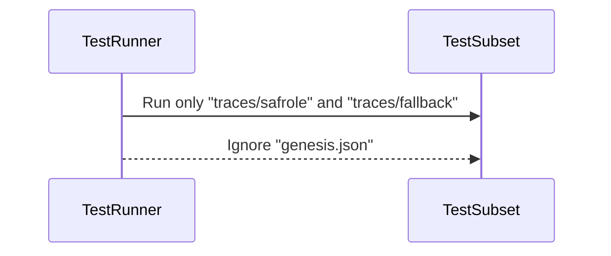
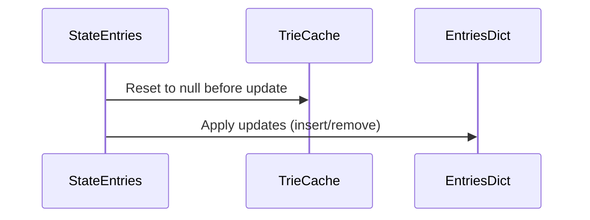
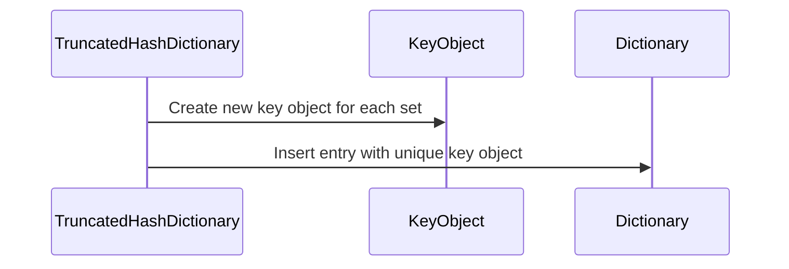

# Fixing serialized state update and comparison

## Pull Request by @skoszuta

- excluded truncatedKey property from state comparisons
- TruncatedHashDictionary.set() not reusing keys
- enabled trace safrole and fallback davxy tests
- resetting trieCache when entries are updated


## Comment by @coderabbitai[bot]

<!-- This is an auto-generated comment: summarize by coderabbit.ai -->
<!-- This is an auto-generated comment: skip review by coderabbit.ai -->

> [!IMPORTANT]
> ## Review skipped
> 
> Auto incremental reviews are disabled on this repository.
> 
> Please check the settings in the CodeRabbit UI or the `.coderabbit.yaml` file in this repository. To trigger a single review, invoke the `@coderabbitai review` command.
> 
> You can disable this status message by setting the `reviews.review_status` to `false` in the CodeRabbit configuration file.

<!-- end of auto-generated comment: skip review by coderabbit.ai -->
<!-- walkthrough_start -->

<details>
<summary>📝 Walkthrough</summary>

<!-- This is an auto-generated comment: release notes by coderabbit.ai -->

## Summary by CodeRabbit

* **Bug Fixes**
  * Corrected handling of key storage in the dictionary to ensure unique key objects are used for each entry.
  * Updated state comparison logic to ignore specific non-essential differences during testing.
  * Fixed root hash assertion in state update tests to reflect the correct expected value.
  * Ensured internal cache is properly reset when state entries are updated.

* **Tests**
  * Added a test to verify that distinct key objects are maintained in the dictionary when inserting multiple keys.
  * Refined test runner configuration to selectively run specific test subsets.

<!-- end of auto-generated comment: release notes by coderabbit.ai -->
## Walkthrough

The changes update test configurations, internal state comparison logic, and dictionary key management to improve test selectivity, key object uniqueness, and cache invalidation. Adjustments were made to ensure that test assertions reflect updated expectations and that internal caches are reset appropriately upon state updates.

## Changes

| File(s)                                                                                  | Change Summary                                                                                                   |
|-----------------------------------------------------------------------------------------|------------------------------------------------------------------------------------------------------------------|
| bin/test-runner/w3f-davxy.ts                                                            | Refined test runner to accept only specific test subsets and ignore only "genesis.json".                         |
| bin/test-runner/w3f/state-transition.ts                                                 | Updated deep equality check to ignore differences in "backend.entries.data.truncatedKey".                        |
| packages/jam/database/truncated-hash-dictionary.ts                                      | Modified `set` method to use unique key objects for each entry, avoiding shared mutable key instances.           |
| packages/jam/database/truncated-hash-dictionary.test.ts                                 | Added test to verify that dictionary keys are unique objects, not reused references.                             |
| packages/jam/state-merkleization/state-entries.ts                                       | Changed `applyUpdate` to reset internal trie cache before applying updates.                                      |
| packages/jam/state-merkleization/state-entries.test.ts                                  | Updated test to expect a new specific root hash after state update.                                              |

## Sequence Diagram(s)







## Estimated code review effort

3 (30–60 minutes)

## Poem

> In the garden of code where hashes grow,
> Each key now stands alone, aglow.
> Caches reset with every breeze,
> Test runners pick their tests with ease.
> Roots and states are kept in line—
> A tidy patch, by rabbit design! 🐇✨

</details>

<!-- walkthrough_end -->
<!-- internal state start -->


<!-- DwQgtGAEAqAWCWBnSTIEMB26CuAXA9mAOYCmGJATmriQCaQDG+Ats2bgFyQAOFk+AIwBWJBrngA3EsgEBPRvlqU0AgfFwA6NPEgQAfACgjoCEYDEZyAAUASpETZWaCrKNwSPbABsvkCiQBHbGlcSHFcLzpIACIAMXgAD3gMIntKeDQveAAvKMRcag9sblpC9Ax6JmZuZyR8DGjIAHc0ZAcBZnUaejkw2CLESnsAa3xEbLw0dGRbSAxHASGAFgBOAEZ+LFx+yFivbAAzA9kAGRVEAHpcWW4SRYoXPxJuMfV8Fw0YHYZYTFJkZIMfZKNJSKi+A6JaTlejwaoUfBSNgYXDIfxeQr0Aj2Ao0SDMTBoUjI0KYLEhZJET4AZVuDHgkIYmS8sgANH0PAADXAUbAYJndADSJFknJ4CNuFGuzVakBICSB2CU9AOCOYOLKVRqFDqGGQ2N40kcKhZ6Ak+HgsP5738YjlQUy6nkP1Ew0Qn3ckE50F5/MxAAlWrAACLwMTwerOWQaQa4AAUAEoxWxtooZchiqVumF8HK9dh/ChQv5sINkMMRchePhJSzPgBBWi0dQRjDMtlhKgMDyINCq/CRGGQA7MgRoBjDSClCQJeQ0fLIJqUDxkE10dnJZsCynlPO/fkkEkoLYhBRgoked5PLIqeBZa6feJtnwd7ZcnnwEgAYXH/TFqH8WNmn6cgwTzD9oWcIoSkxdksgrU1sQJZICmSRhfw8Jg9SQGh+XkPsaD4fJNX3f4PR2WYmSwRYngkT8lytKcSFQ3xqEgWBcFwbhEA4C4LiIdRYGwAQNCqC49kOY4zgES5rlue4XAubhvC8C5VjWDQjH0YxwCgMh6HwA4cAIYgyGUbMqhJLheH4YRRHEKQZGdRRlFUdQtB0bSTCgOBUFQTBjMIUhyCoCyWCsvw0CaexHAJR5eiYJQqDczRtF0MBDB00wDDUDArhCMBfRCi4mgAZgOMBp1nDRUQ4AxogagwLEgesAElTJCzEYqcR5DMYUjpDcHZ52LPkQuPc1t3qdN8UUBlPyxXN/G4DFu3QSABARNBYSIDB3g8LJ8maQT1uYfb7DpeaGHQBhu24AoDyHeBdvOrDISIAtqFbT4rH8Oj8FLFl2TfPwxqGZ69v8Hp8G2GJgukJANCERB6kaMkOXA+BC2iMqKqq2RGhGtJNBag5CIxn4/hIDdQnlFaw3UU1xzu1FNkQnZoh5cdpAuXt+0iNGKhiLnu0uEcfDHCdCdPdpY0XBBByw8R5h3bEIfO+pTWieHEER5HUfI1A2wefAmn1HZECYW5+CMka0T5Yc1RQF6dRSdAfBzNJInDKRTSKndEEuyE8mEuXNKMJrLHrLxCK++p9VzEGlCBZw471G25QSF4pSiK9lIELJrvYFtBoMAA5eoSHDgBRfI4S6xKPD++i5SOd5OEgABZOh4EcerGoMCAwCMXL8vyQqwYoEryt53ESDALnsPEeoap4/vokjlr2vh0KQ56+Q+splJS89I/SFm5tg/NjwlGee1sEdaUXQnDbmKXMgvUNak57FdHORefI39Ci/zJkMNA3AVqyFVhbOenZMC62XhgH6zcAaICBhTFg2pdQzSmPkHUdpb7cHvo/Z0/QX5NEEgDWmCpniIPdF8aCWYoiN2PDyRQ2BRa7hrIgz26tCyXwOMuA8AItg7GrJKaUNRYacmiJLCsFQNDsB1NIDQWY0A1V9AKOgwoCZiloAWaBN8SB30CA/e8zlqi1BRkgr4qA2DwL6GxTA8hmyW2Wpgek0I0Ig25JozEOixTBy8PQcg+Qoh8iSl6OR+lFEomUe6NRYoKEexoq4/wRBnDKmAh/VogwpQ7lMSQ1+uB36iI8CU3MxF5zkSbqePqIMvD4AEgwDc/JgSGOmHknh9SdgIhhuxIMxDzHsn8MhdOfIz50HDuYKOMdzKtgThjZOGJQoLIznTduuc+D50LpjcQpcK7kBrnXAkYUQTNxINFEgbcpRcG7s2PuDUN6D2yjUCcF5LhCDQMwC4aixyDCuH47oYBfiIFgJVMMiCow1RCKvOqTzN5tQ6uZPecUD5GUmYgIa5SZbYHUB4A4V5vRAroIGMFoZwyRhcEk2U8pcJZIobDKY5BopEyZIMSAEShgg2iLGRoKZYBpjtobZALKwinjBPNaE2w2JNBAvibw4gVo3xwoCUIFZZDICgseLpUQUKJx2FuKFLhgY7A1cgKBJBglRF6Pi1ZbtETcsNZC1sUZwLxPQPw1V/JQiCBEHafwgj/DCJpEHMM7YaY6soKzCpU4GRBvYJAc17ImA+HstfJNlZHYsCWS6ql8g7XUHeOydGuTo3mzYiDeYzB7gZz5PAIIHgNW2X9azU5LoM3VtrX1ZIur6DJrzA4V2qQ9qZoPnZAN1yhFrRLBy/At0CwiMIs+OsRhGzNihS+U1Hg4TZ1CFUw8ibCV8E5P6es1J/QAH1qStQAFrVxpVq7ARASRRGxJkFGKBqjtwxnJLkAB5GojayWwECU7EGvY2AX28NTYCYZYAoAzIMRiVbLniqOsesINwOmpu9tmc14cK78DfHwA4EzN38D4ErBEEJGnRUxc0Zc+JtpVwjoiuZqz46eyTqIFZadkB9Q2TnAy2zhK7OLvsrFg9IBEYY9iIT2Y85ibDHslxvHU50MY4WAkShjniFOcwlytEW7XOPR3e5vdmDry0q88cwwPkXC+T8v5rQSCAomZiEFQYIWUuNtGWq1nmpIp3l1Bw+8M6YuxV6WMyZmKCpQzsYlHnuggYpca0UjAMSIEXLKM6l8FqezQOaS0nLdZuwg78KGXoeTJe0SKf8eoHprTlR/Xt0adxXkzF9N2SjPwiIxlyigLIdxGtdR8awKDAavh2AKtMs630W0q1EXxtXaABI2vIWMytUjqDRFFDb85uPDRJfQPdrYM4g2rHRLJzb0ZviwDUbLO51BHZVb5qMAByZAnIYv4ji4oGp/UqZPBWtzc2qBGUIYYP4brqRmVodyAiZbAAhWQ84GvEUen1MjHtQUId1rkFNNYoHleO6tsdB2vEolzOoInGAwTbaLIVrANY0CNqw7cEtQt7s8FydAo2aHm3YiTnmvzX3ovMVi6mWgIrB0Fmlb8UIIv3uPHyPtLVca64+oUNwdFGNm2hX6HwGVWBcFLfoMwSYBcd2NY8VXBhXpSC4E5OyTkoKXdDk5EoSINApfxeQErZIwRPalnKYtqC9AVt+iFPV4cV5Gn4GGMUfgkp+PTPY7HTTwvDXqc4+nQTWdNkic8AXFTEm+taRk7mOTBqewQ2oPLgTfBlkabWQXvdWyS/iZRCXRcTGdP2//RgdmNvl2ZC/cqkkacLuJd+7NhLXIfSrdS6LqMYoU7ZZmnlqVMujC130w3IzFyrk3PMz3R5A8h5GDefZ/4jnvmz0KGANgFBhiRByGnR/NAwC9ZUSNOFgWUc28Zku89AYWaKEWA0UmnoRMZa+S00kqxwHSfSoQeO6AoCfA4CkCO4uCsCXWeIoKr8H8kyMuE2JA/0U2266G1CdI2YIMKBAyYKnsoy2gWAhSvg2el4OoAkz4Xo0A1c1I0A160A9Y/Bl6Ng/6/60AnIgO+Bb6p4e0VyWc6a60gcogV0cwaGDBaBEgmQweMiAADAkAAEzGEkAACsdwBwAgxhpUpUDAqwtAAAHHYX2GsAYQAOxoAkBOErCuE2HGErACDdgCCOECBrC0DGEABsBhSwKgNhJAawxhBhwRpUThawdwaA0QIC5MIMchiG6AECWQUytiaI1yeGGuTADw9k52nWMEeI3iOwdM9kUQ2hgyuh+wHgAC+6sC2+jIac4cQWHG/Gr2TEKceeAmRkCmneOyZePekmRghyrGCKLyw8BgN+DmTmX+88L+b+JAH+iC2xP+cSfWABCKQWwBnU2Y4Bbqh8UBUWnIWBLIAAqvUSQH7mmI0VyEAjQNXCcdIOvlljlsgH0QVtiIBMxBjChJQLwb4p+D+C6GKNiJyPMD4GKIsMeh4E8STnDhgPIHIYsnkRUJQMNj1v8cgKNvmrLmQEOgrpWt8BhFiMoiDhCSiNPn5PTo6EwvQC1qBE6iuOSZ6phAND0AWnqO1lxleKMoiB+oDoBL6rbDsPkY0s0k8GMhmPyCKTTPMg6mBJdgiNduEm8VqkLNic9uKVKJRmqY6jdJpszO8M2CkKuhnvMlxpwWMXxppu3kXlabMUXPMRXtJrJlAaMbrLtA3oBOsoXsJr6cpv6eEKcQ7pMgUdCRQLwe6Y8UUbIK8Uwh8bCNUJEFPt0sPtGHvicofucuQSZqfncuflZisdpAYN5HmAZEZGgHgEFCAYfqwOwFwFQNFDcfFM5ElPEe5GlF5LpAoKwOoJepaIgJesfnQJesRJaY2c2eEaESQEEUsCQMYWgJYQYSsCkV4dtOYcEQIF4aYVEWsHEUyAwCsEsGsBsGuZOZZDOXOQuVWZckufpOlHoEAA -->

<!-- internal state end -->
<!-- tips_start -->

---


<details>
<summary>🪧 Tips</summary>

### Chat

There are 3 ways to chat with [CodeRabbit](https://coderabbit.ai?utm_source=oss&utm_medium=github&utm_campaign=FluffyLabs/typeberry&utm_content=491):

- Review comments: Directly reply to a review comment made by CodeRabbit. Example:
  - `I pushed a fix in commit <commit_id>, please review it.`
  - `Explain this complex logic.`
  - `Open a follow-up GitHub issue for this discussion.`
- Files and specific lines of code (under the "Files changed" tab): Tag `@coderabbitai` in a new review comment at the desired location with your query. Examples:
  - `@coderabbitai explain this code block.`
  -	`@coderabbitai modularize this function.`
- PR comments: Tag `@coderabbitai` in a new PR comment to ask questions about the PR branch. For the best results, please provide a very specific query, as very limited context is provided in this mode. Examples:
  - `@coderabbitai gather interesting stats about this repository and render them as a table. Additionally, render a pie chart showing the language distribution in the codebase.`
  - `@coderabbitai read src/utils.ts and explain its main purpose.`
  - `@coderabbitai read the files in the src/scheduler package and generate a class diagram using mermaid and a README in the markdown format.`
  - `@coderabbitai help me debug CodeRabbit configuration file.`

### Support

Need help? Create a ticket on our [support page](https://www.coderabbit.ai/contact-us/support) for assistance with any issues or questions.

Note: Be mindful of the bot's finite context window. It's strongly recommended to break down tasks such as reading entire modules into smaller chunks. For a focused discussion, use review comments to chat about specific files and their changes, instead of using the PR comments.

### CodeRabbit Commands (Invoked using PR comments)

- `@coderabbitai pause` to pause the reviews on a PR.
- `@coderabbitai resume` to resume the paused reviews.
- `@coderabbitai review` to trigger an incremental review. This is useful when automatic reviews are disabled for the repository.
- `@coderabbitai full review` to do a full review from scratch and review all the files again.
- `@coderabbitai summary` to regenerate the summary of the PR.
- `@coderabbitai generate sequence diagram` to generate a sequence diagram of the changes in this PR.
- `@coderabbitai resolve` resolve all the CodeRabbit review comments.
- `@coderabbitai configuration` to show the current CodeRabbit configuration for the repository.
- `@coderabbitai help` to get help.

### Other keywords and placeholders

- Add `@coderabbitai ignore` anywhere in the PR description to prevent this PR from being reviewed.
- Add `@coderabbitai summary` to generate the high-level summary at a specific location in the PR description.
- Add `@coderabbitai` anywhere in the PR title to generate the title automatically.

### Documentation and Community

- Visit our [Documentation](https://docs.coderabbit.ai) for detailed information on how to use CodeRabbit.
- Join our [Discord Community](http://discord.gg/coderabbit) to get help, request features, and share feedback.
- Follow us on [X/Twitter](https://twitter.com/coderabbitai) for updates and announcements.

</details>

<!-- tips_end -->


## Comment by @github-actions[bot]


<details>
<summary>View all</summary>

| File | Benchmark | Ops |  |
|------|-----------|-----|--|
| [bytes/hex-to.ts[0]](../blob/452e034870acf6a8df1d4249dd849dcaf35fdd9e//_work/typeberry-runner-2/typeberry/typeberry/benchmarks/bytes/hex-to.ts) | number toString + padding | 323956.82 ±0.1% | fastest ✅ |
| [bytes/hex-to.ts[1]](../blob/452e034870acf6a8df1d4249dd849dcaf35fdd9e//_work/typeberry-runner-2/typeberry/typeberry/benchmarks/bytes/hex-to.ts) | manual | 16531.11 ±0.23% | 94.9% slower |
| [math/switch.ts[0]](../blob/452e034870acf6a8df1d4249dd849dcaf35fdd9e//_work/typeberry-runner-2/typeberry/typeberry/benchmarks/math/switch.ts) | switch | 242388024.36 ±7.44% | fastest ✅ |
| [math/switch.ts[1]](../blob/452e034870acf6a8df1d4249dd849dcaf35fdd9e//_work/typeberry-runner-2/typeberry/typeberry/benchmarks/math/switch.ts) | if | 226460686.23 ±8.97% | 6.57% slower |
| [math/mul_overflow.ts[0]](../blob/452e034870acf6a8df1d4249dd849dcaf35fdd9e//_work/typeberry-runner-2/typeberry/typeberry/benchmarks/math/mul_overflow.ts) | multiply and bring back to u32 | 249307206.11 ±7.79% | fastest ✅ |
| [math/mul_overflow.ts[1]](../blob/452e034870acf6a8df1d4249dd849dcaf35fdd9e//_work/typeberry-runner-2/typeberry/typeberry/benchmarks/math/mul_overflow.ts) | multiply and take modulus | 241378080.21 ±8.98% | 3.18% slower |
| [math/add_one_overflow.ts[0]](../blob/452e034870acf6a8df1d4249dd849dcaf35fdd9e//_work/typeberry-runner-2/typeberry/typeberry/benchmarks/math/add_one_overflow.ts) | add and take modulus | 269507074.57 ±6.02% | fastest ✅ |
| [math/add_one_overflow.ts[1]](../blob/452e034870acf6a8df1d4249dd849dcaf35fdd9e//_work/typeberry-runner-2/typeberry/typeberry/benchmarks/math/add_one_overflow.ts) | condition before calculation | 248948766.37 ±7.65% | 7.63% slower |
| [math/count-bits-u32.ts[0]](../blob/452e034870acf6a8df1d4249dd849dcaf35fdd9e//_work/typeberry-runner-2/typeberry/typeberry/benchmarks/math/count-bits-u32.ts) | standard method | 91673141.26 ±2.3% | 62.2% slower |
| [math/count-bits-u32.ts[1]](../blob/452e034870acf6a8df1d4249dd849dcaf35fdd9e//_work/typeberry-runner-2/typeberry/typeberry/benchmarks/math/count-bits-u32.ts) | magic | 242550083.66 ±7.11% | fastest ✅ |
| [hash/index.ts[0]](../blob/452e034870acf6a8df1d4249dd849dcaf35fdd9e//_work/typeberry-runner-2/typeberry/typeberry/benchmarks/hash/index.ts) | hash with numeric representation | 192.58 ±0.39% | 27.14% slower |
| [hash/index.ts[1]](../blob/452e034870acf6a8df1d4249dd849dcaf35fdd9e//_work/typeberry-runner-2/typeberry/typeberry/benchmarks/hash/index.ts) | hash with string representation | 118.92 ±0.55% | 55.01% slower |
| [hash/index.ts[2]](../blob/452e034870acf6a8df1d4249dd849dcaf35fdd9e//_work/typeberry-runner-2/typeberry/typeberry/benchmarks/hash/index.ts) | hash with symbol representation | 184.8 ±0.13% | 30.08% slower |
| [hash/index.ts[3]](../blob/452e034870acf6a8df1d4249dd849dcaf35fdd9e//_work/typeberry-runner-2/typeberry/typeberry/benchmarks/hash/index.ts) | hash with uint8 representation | 164.09 ±0.3% | 37.92% slower |
| [hash/index.ts[4]](../blob/452e034870acf6a8df1d4249dd849dcaf35fdd9e//_work/typeberry-runner-2/typeberry/typeberry/benchmarks/hash/index.ts) | hash with packed representation | 264.31 ±0.19% | fastest ✅ |
| [hash/index.ts[5]](../blob/452e034870acf6a8df1d4249dd849dcaf35fdd9e//_work/typeberry-runner-2/typeberry/typeberry/benchmarks/hash/index.ts) | hash with bigint representation | 194.06 ±0.23% | 26.58% slower |
| [hash/index.ts[6]](../blob/452e034870acf6a8df1d4249dd849dcaf35fdd9e//_work/typeberry-runner-2/typeberry/typeberry/benchmarks/hash/index.ts) | hash with uint32 representation | 203.63 ±0.3% | 22.96% slower |
| [codec/bigint.decode.ts[0]](../blob/452e034870acf6a8df1d4249dd849dcaf35fdd9e//_work/typeberry-runner-2/typeberry/typeberry/benchmarks/codec/bigint.decode.ts) | decode custom | 175122585.66 ±3.25% | fastest ✅ |
| [codec/bigint.decode.ts[1]](../blob/452e034870acf6a8df1d4249dd849dcaf35fdd9e//_work/typeberry-runner-2/typeberry/typeberry/benchmarks/codec/bigint.decode.ts) | decode bigint | 109551613.73 ±2.55% | 37.44% slower |
| [collections/map-set.ts[0]](../blob/452e034870acf6a8df1d4249dd849dcaf35fdd9e//_work/typeberry-runner-2/typeberry/typeberry/benchmarks/collections/map-set.ts) | 2 gets + conditional set | 110250.67 ±0.41% | fastest ✅ |
| [collections/map-set.ts[1]](../blob/452e034870acf6a8df1d4249dd849dcaf35fdd9e//_work/typeberry-runner-2/typeberry/typeberry/benchmarks/collections/map-set.ts) | 1 get 1 set | 60934.4 ±0.19% | 44.73% slower |
| [codec/encoding.ts[0]](../blob/452e034870acf6a8df1d4249dd849dcaf35fdd9e//_work/typeberry-runner-2/typeberry/typeberry/benchmarks/codec/encoding.ts) | manual encode | 3090200.48 ±0.26% | 16.71% slower |
| [codec/encoding.ts[1]](../blob/452e034870acf6a8df1d4249dd849dcaf35fdd9e//_work/typeberry-runner-2/typeberry/typeberry/benchmarks/codec/encoding.ts) | int32array encode | 3673689.92 ±0.61% | 0.98% slower |
| [codec/encoding.ts[2]](../blob/452e034870acf6a8df1d4249dd849dcaf35fdd9e//_work/typeberry-runner-2/typeberry/typeberry/benchmarks/codec/encoding.ts) | dataview encode | 3710181.36 ±0.45% | fastest ✅ |
| [codec/decoding.ts[0]](../blob/452e034870acf6a8df1d4249dd849dcaf35fdd9e//_work/typeberry-runner-2/typeberry/typeberry/benchmarks/codec/decoding.ts) | manual decode | 23362414.86 ±0.59% | 88.17% slower |
| [codec/decoding.ts[1]](../blob/452e034870acf6a8df1d4249dd849dcaf35fdd9e//_work/typeberry-runner-2/typeberry/typeberry/benchmarks/codec/decoding.ts) | int32array decode | 197415267.83 ±4.82% | fastest ✅ |
| [codec/decoding.ts[2]](../blob/452e034870acf6a8df1d4249dd849dcaf35fdd9e//_work/typeberry-runner-2/typeberry/typeberry/benchmarks/codec/decoding.ts) | dataview decode | 186916314.04 ±5.36% | 5.32% slower |
| [bytes/hex-from.ts[0]](../blob/452e034870acf6a8df1d4249dd849dcaf35fdd9e//_work/typeberry-runner-2/typeberry/typeberry/benchmarks/bytes/hex-from.ts) | parse hex using `Number` with NaN checking | 132219.42 ±0.59% | 84.66% slower |
| [bytes/hex-from.ts[1]](../blob/452e034870acf6a8df1d4249dd849dcaf35fdd9e//_work/typeberry-runner-2/typeberry/typeberry/benchmarks/bytes/hex-from.ts) | parse hex from char codes | 861995.72 ±0.16% | fastest ✅ |
| [bytes/hex-from.ts[2]](../blob/452e034870acf6a8df1d4249dd849dcaf35fdd9e//_work/typeberry-runner-2/typeberry/typeberry/benchmarks/bytes/hex-from.ts) | parse hex from string nibbles | 532876.27 ±0.39% | 38.18% slower |
| [math/count-bits-u64.ts[0]](../blob/452e034870acf6a8df1d4249dd849dcaf35fdd9e//_work/typeberry-runner-2/typeberry/typeberry/benchmarks/math/count-bits-u64.ts) | standard method | 1240646.8 ±0.36% | 88.74% slower |
| [math/count-bits-u64.ts[1]](../blob/452e034870acf6a8df1d4249dd849dcaf35fdd9e//_work/typeberry-runner-2/typeberry/typeberry/benchmarks/math/count-bits-u64.ts) | magic | 11016144.5 ±0.3% | fastest ✅ |
| [logger/index.ts[0]](../blob/452e034870acf6a8df1d4249dd849dcaf35fdd9e//_work/typeberry-runner-2/typeberry/typeberry/benchmarks/logger/index.ts) | console.log with string concat | 7251509.61 ±59.22% | fastest ✅ |
| [logger/index.ts[1]](../blob/452e034870acf6a8df1d4249dd849dcaf35fdd9e//_work/typeberry-runner-2/typeberry/typeberry/benchmarks/logger/index.ts) | console.log with args | 1027431.85 ±99.06% | 85.83% slower |
| [codec/bigint.compare.ts[0]](../blob/452e034870acf6a8df1d4249dd849dcaf35fdd9e//_work/typeberry-runner-2/typeberry/typeberry/benchmarks/codec/bigint.compare.ts) | compare custom | 233005365.75 ±19.29% | 5.15% slower |
| [codec/bigint.compare.ts[1]](../blob/452e034870acf6a8df1d4249dd849dcaf35fdd9e//_work/typeberry-runner-2/typeberry/typeberry/benchmarks/codec/bigint.compare.ts) | compare bigint | 245665910.99 ±8.26% | fastest ✅ |
| [codec/view_vs_object.ts[0]](../blob/452e034870acf6a8df1d4249dd849dcaf35fdd9e//_work/typeberry-runner-2/typeberry/typeberry/benchmarks/codec/view_vs_object.ts) | Get the first field from Decoded | 446928.67 ±0.59% | fastest ✅ |
| [codec/view_vs_object.ts[1]](../blob/452e034870acf6a8df1d4249dd849dcaf35fdd9e//_work/typeberry-runner-2/typeberry/typeberry/benchmarks/codec/view_vs_object.ts) | Get the first field from View | 102601.13 ±1.03% | 77.04% slower |
| [codec/view_vs_object.ts[2]](../blob/452e034870acf6a8df1d4249dd849dcaf35fdd9e//_work/typeberry-runner-2/typeberry/typeberry/benchmarks/codec/view_vs_object.ts) | Get the first field as view from View | 104814.57 ±0.16% | 76.55% slower |
| [codec/view_vs_object.ts[3]](../blob/452e034870acf6a8df1d4249dd849dcaf35fdd9e//_work/typeberry-runner-2/typeberry/typeberry/benchmarks/codec/view_vs_object.ts) | Get two fields from Decoded | 438045.24 ±1.33% | 1.99% slower |
| [codec/view_vs_object.ts[4]](../blob/452e034870acf6a8df1d4249dd849dcaf35fdd9e//_work/typeberry-runner-2/typeberry/typeberry/benchmarks/codec/view_vs_object.ts) | Get two fields from View | 78434.67 ±1.67% | 82.45% slower |
| [codec/view_vs_object.ts[5]](../blob/452e034870acf6a8df1d4249dd849dcaf35fdd9e//_work/typeberry-runner-2/typeberry/typeberry/benchmarks/codec/view_vs_object.ts) | Get two fields from materialized from View | 166681.48 ±0.69% | 62.71% slower |
| [codec/view_vs_object.ts[6]](../blob/452e034870acf6a8df1d4249dd849dcaf35fdd9e//_work/typeberry-runner-2/typeberry/typeberry/benchmarks/codec/view_vs_object.ts) | Get two fields as views from View | 75336.51 ±1.92% | 83.14% slower |
| [codec/view_vs_object.ts[7]](../blob/452e034870acf6a8df1d4249dd849dcaf35fdd9e//_work/typeberry-runner-2/typeberry/typeberry/benchmarks/codec/view_vs_object.ts) | Get only third field from Decoded | 428682.16 ±1.87% | 4.08% slower |
| [codec/view_vs_object.ts[8]](../blob/452e034870acf6a8df1d4249dd849dcaf35fdd9e//_work/typeberry-runner-2/typeberry/typeberry/benchmarks/codec/view_vs_object.ts) | Get only third field from View | 104501.44 ±0.2% | 76.62% slower |
| [codec/view_vs_object.ts[9]](../blob/452e034870acf6a8df1d4249dd849dcaf35fdd9e//_work/typeberry-runner-2/typeberry/typeberry/benchmarks/codec/view_vs_object.ts) | Get only third field as view from View | 104760.32 ±0.16% | 76.56% slower |
| [codec/view_vs_collection.ts[0]](../blob/452e034870acf6a8df1d4249dd849dcaf35fdd9e//_work/typeberry-runner-2/typeberry/typeberry/benchmarks/codec/view_vs_collection.ts) | Get first element from Decoded | 27840.53 ±0.23% | 59.52% slower |
| [codec/view_vs_collection.ts[1]](../blob/452e034870acf6a8df1d4249dd849dcaf35fdd9e//_work/typeberry-runner-2/typeberry/typeberry/benchmarks/codec/view_vs_collection.ts) | Get first element from View | 68782.31 ±0.16% | fastest ✅ |
| [codec/view_vs_collection.ts[2]](../blob/452e034870acf6a8df1d4249dd849dcaf35fdd9e//_work/typeberry-runner-2/typeberry/typeberry/benchmarks/codec/view_vs_collection.ts) | Get 50th element from Decoded | 27295.19 ±0.91% | 60.32% slower |
| [codec/view_vs_collection.ts[3]](../blob/452e034870acf6a8df1d4249dd849dcaf35fdd9e//_work/typeberry-runner-2/typeberry/typeberry/benchmarks/codec/view_vs_collection.ts) | Get 50th element from View | 36355.23 ±1.62% | 47.14% slower |
| [codec/view_vs_collection.ts[4]](../blob/452e034870acf6a8df1d4249dd849dcaf35fdd9e//_work/typeberry-runner-2/typeberry/typeberry/benchmarks/codec/view_vs_collection.ts) | Get last element from Decoded | 26916.28 ±0.54% | 60.87% slower |
| [codec/view_vs_collection.ts[5]](../blob/452e034870acf6a8df1d4249dd849dcaf35fdd9e//_work/typeberry-runner-2/typeberry/typeberry/benchmarks/codec/view_vs_collection.ts) | Get last element from View | 26935.06 ±0.64% | 60.84% slower |
| [bytes/compare.ts[0]](../blob/452e034870acf6a8df1d4249dd849dcaf35fdd9e//_work/typeberry-runner-2/typeberry/typeberry/benchmarks/bytes/compare.ts) | Comparing Uint32 bytes | 19657.19 ±3.82% | 7.8% slower |
| [bytes/compare.ts[1]](../blob/452e034870acf6a8df1d4249dd849dcaf35fdd9e//_work/typeberry-runner-2/typeberry/typeberry/benchmarks/bytes/compare.ts) | Comparing raw bytes | 21321.28 ±0.72% | fastest ✅ |
| [collections/map_vs_sorted.ts[0]](../blob/452e034870acf6a8df1d4249dd849dcaf35fdd9e//_work/typeberry-runner-2/typeberry/typeberry/benchmarks/collections/map_vs_sorted.ts) | Map | 295277.08 ±0.16% | fastest ✅ |
| [collections/map_vs_sorted.ts[1]](../blob/452e034870acf6a8df1d4249dd849dcaf35fdd9e//_work/typeberry-runner-2/typeberry/typeberry/benchmarks/collections/map_vs_sorted.ts) | Map-array | 103413.26 ±0.07% | 64.98% slower |
| [collections/map_vs_sorted.ts[2]](../blob/452e034870acf6a8df1d4249dd849dcaf35fdd9e//_work/typeberry-runner-2/typeberry/typeberry/benchmarks/collections/map_vs_sorted.ts) | Array | 88643.7 ±0.45% | 69.98% slower |
| [collections/map_vs_sorted.ts[3]](../blob/452e034870acf6a8df1d4249dd849dcaf35fdd9e//_work/typeberry-runner-2/typeberry/typeberry/benchmarks/collections/map_vs_sorted.ts) | SortedArray | 198457.91 ±0.15% | 32.79% slower |
| [hash/blake2b.ts[0]](../blob/452e034870acf6a8df1d4249dd849dcaf35fdd9e//_work/typeberry-runner-2/typeberry/typeberry/benchmarks/hash/blake2b.ts) | hasher with simple allocator | 0.05 ±0.02% | fastest ✅ |
| [hash/blake2b.ts[1]](../blob/452e034870acf6a8df1d4249dd849dcaf35fdd9e//_work/typeberry-runner-2/typeberry/typeberry/benchmarks/hash/blake2b.ts) | hasher with page allocator | 0.04 ±0.41% | 20% slower |
| [crypto/ed25519.ts[0]](../blob/452e034870acf6a8df1d4249dd849dcaf35fdd9e//_work/typeberry-runner-2/typeberry/typeberry/benchmarks/crypto/ed25519.ts) | native crypto | 5.2 ±20.51% | 82.52% slower |
| [crypto/ed25519.ts[1]](../blob/452e034870acf6a8df1d4249dd849dcaf35fdd9e//_work/typeberry-runner-2/typeberry/typeberry/benchmarks/crypto/ed25519.ts) | wasm lib | 10.66 ±0.02% | 64.17% slower |
| [crypto/ed25519.ts[2]](../blob/452e034870acf6a8df1d4249dd849dcaf35fdd9e//_work/typeberry-runner-2/typeberry/typeberry/benchmarks/crypto/ed25519.ts) | wasm lib batch | 29.75 ±0.64% | fastest ✅ |
</details>


### Benchmarks summary: 63/63 OK ✅

<!-- thollander/actions-comment-pull-request "benchmarks" -->


## Comment by @tomusdrw

```suggestion
main(runners, process.argv.slice(2), "test-vectors/w3f-davxy", {
```
do we need `traces` here?


## Comment by @tomusdrw

You can just pass `{ ignore: 'backend.entries.data.truncatedKey' }` to `deepEqual` instead of modifying the values.


## Comment by @skoszuta

thanks! i didnt know that


## Comment by @skoszuta

you're right, we don't
